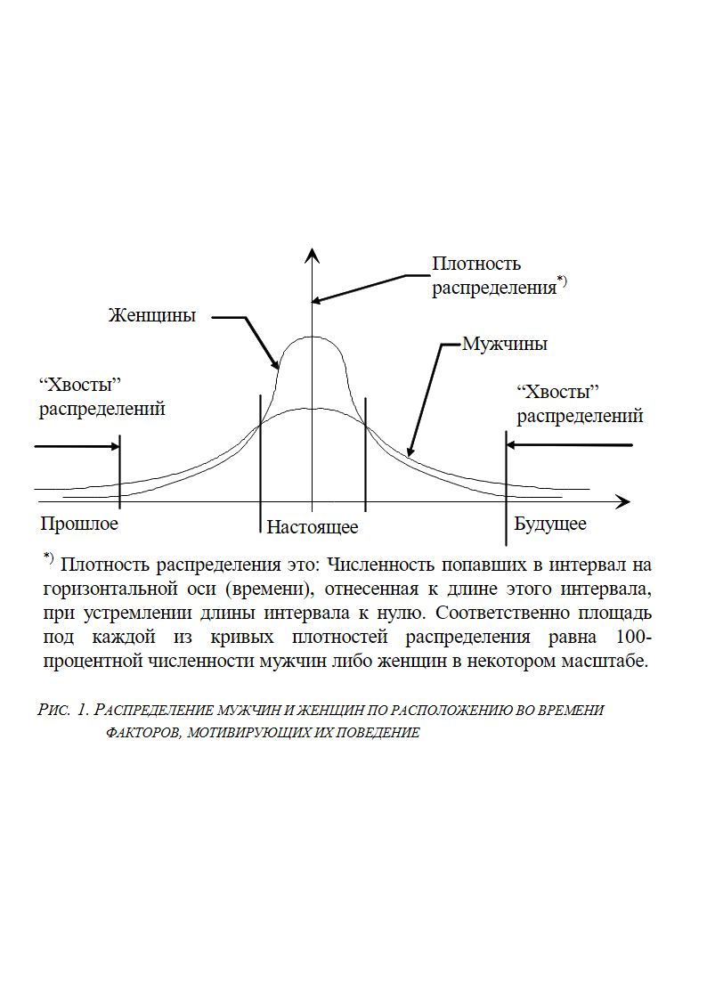
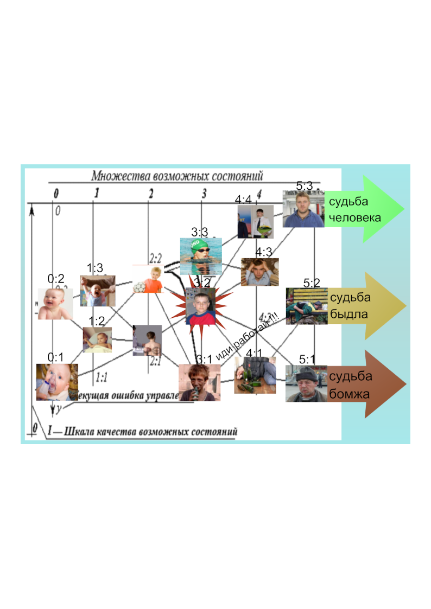

> **Первичный текст.** Биологические и личностные основы развития цивилизации.
> Источник: `dotu.ru:e17df8b512c9631f.doc` sha256 `2c2f457d8ab2064a…`; [страница на dotu.ru](https://dotu.ru/2023/09/24/20230924_foundations-of-civilization-development/).
> Автоматическая транскрипция DOC→Markdown; смысл и формулировки не правились.
> Контрольные суммы и статус проверки — в [NOTICE.md](../../NOTICE.md).
> Содержание передаёт позицию авторов; утверждения не верифицированы библиотекой.

---

**Внутренний Предиктор СССР**

Биологические и личностные основы\

развития цивилизации

**Вместо предисловия**

Настоящая работа представляет собой раздел 17 шеститомника ВП СССР «Основы социологии», переработанный для публикации в качестве самодостаточного для понимания текста. Однако её тематический спектр несколько шире, нежели тематика раздела 17.

Раздел 17 «Основ социологии» посвящён коренной проблеме глобальной цивилизации. «Коренной» проблеме в том смысле, что из неё произрастает большинство других проблем цивилизации, и соответственно, разрешение коренной проблемы ликвидирует все проблемы-следствия. В отличие от шеститомника настоящая работа относительно небольшая по объёму и её можно прочитать за день. Разделение на тематически специализированнные главы не предусмотрено, поскольку все затронутые в ней темы взаимосвязаны. По её прочтении каждый сам может решить, есть ли для него смысл осваивать материалы Концепции общественной безопасности либо ему и так не плохо живётся.

Постраничные сноски в тексте обозначены латинскими строчными буквами. Концевые сноски в тексте пронумерованы арабскими цифрами, а их текст помещён в раздел «Комментарии и пояснения», завершающий работу.

## —————————

Фраза о том, что «человек — существо биосоциальное» присутствует практически во всех школьных и вузовских учебниках обществоведения, «обществознания», социологии, политологии. Вот пример освещения этой темы в учебнике «Обществознание. ЕГЭ-Учебник»[^1], предназначенном для подготовки к единому государственному экзамену (ЕГЭ) *без привлечения других пособий* (так утверждается в аннотации издателя). В нём эта тема представлена в форме таблицы (с. 65), в которую сведены *биологические и социальные (по мнению его авторов)* характеристики человека:

|  |  |

|----|----|

| Биологическое существо | Социальное существо |

| Человек принадлежит к высшим млекопитающим, образуя особый вид Homo sapiens (Человек разумный). Биологическая природа человека проявляется в его анатомии, физиологии: он обладает кровеносной, мышечной, нервной и другими системами. | Человек становится человеком, лишь вступив в общественные отношения, в общение с другими. Социальная сущность человека проявляется через такие свойства, как способность и готовность к общественно полезному труду, сознание и разум, свобода, ответственность и др. |

| Условие, предпосылка существования человека. | Сущность человека. |

Можно заметить, что в свод биологических характеристик не попали врождённые рефлексы и инстинкты, обладающие определённой спецификой, отличающей человека от других биологических видов, и обуславливающие очень многое и в биологии, и в культуре человеческого общества, не говоря уж о том, что без врождённых рефлексов и инстинктов любое животное — просто нежизнеспособно. Кроме того, в свод биологических характеристик не попала и главная видовая особенность, отличающая Человека разумного от всех прочих биологических видов, о чём будет сказано ниже.

Социальные же характеристики в представленной таблице предстают как не обусловленные культурной средой и процессом воспитания и образования, поскольку об этом ничего не сказано. О сущности культуры и её вариативности тоже ничего не сказано. Соответственно не встаёт вопрос ни о наилучшей культуре из множества возможных, ни о самоубийственных и опасных для окружающих культурах и субкультурах, которые должны быть искоренены.

Приведённый пример — иллюстрация того, что после прочтения подавляющего большинства учебников по «обществознанию» и социологии безответными остаются вопросы, жизненно состоятельные ответы на которые необходимы для успешного развития цивилизации в гармонии с Природой:

- какова биологическая специфика вида «Человек разумный» и что именно в жизни общества обусловлено ею?

- что обусловлено социокультурными факторами (как во множестве открытых возможностей развития культуры, так и в исторически сложившейся культуре, некоторым образом реализовавшей одну единственную возможность из множества возможностей, которые были открытыми некогда в прошлом)?

- как *в идеале* в жизни общества биологически обусловленное и обусловленное социокультурно должны *гармонично* взаимно дополнять друг друга?

- в чём и как общество отступило от этого идеала?

- как этот идеал воплотить в жизнь, т.е. как перейти к нему от исторически сложившегося образа жизни общества?

Если же затрагивать тему биологически обусловленного в жизни общества по её сути, то она носит двухаспектный характер:

- во-первых, это вопрос о специфике строения и развития организма человека и его физиологии[^2] как телесной, так и биополевой[^3];

- а во-вторых, это вопрос о «базовом», т.е. врождённом информационно-алгоритмическом обеспечении поведения особей и жизни популяций биологического вида «Человек разумный».

Если этого нет, то личностной и социальной сути человека нет, и как следствие — нет и предмета для обсуждения.

Прежде всего необходимо указать на следующее обстоятельство:

Биологическому виду «Человек разумный» свойственна самая высокая в биосфере Земли кратность отношения массы и объёма головного мозга взрослой особи к массе и объёму мозга новорождённого.

Это — наиболее значимая телесно-анатомическая характеристика всех здоровых представителей вида «Человек разумный» на протяжении жизни каждого из них, определяющая многое в развитии организма и в социальной организации. И, соответственно, именно это — главная анатомическая (морфологическая) характеристика биологического вида в целом.

И этой характеристической особенности нашего биологического вида сопутствует то обстоятельство, что на момент рождения организм человека находится на стадии развития, которая соответствует развитию эмбриона прочих видов приматов примерно на 50-60‑процентном сроке беременности их самок. Т.е. человеческий детёныш, в отличие от представителей многих других млекопитающих, рождается не способным к сколь-нибудь самостоятельной жизни:

- так, если новорождённый оленёнок спустя полчаса после рождения уже может сам бежать за матерью,

- то в течение двух-трёх первых лет жизни самое лучшее место для человеческого детёныша — быть на руках матери.

Вследствие этого у человека самый продолжительный (по отношению к длительности его жизни) *период взросления, т.е. период послеутробного развития организма и развития психики*. На протяжении периода взросления в соответствии с генетической программой происходит развёртывание структур организма и развитие психики, понимаемой как информационно-алгоритмическая система. Генетическая программа развития организма и психики индивида — не автономная, а интерактивная, т.е. требующая взаимодействия организма и психики с окружающей средой. Это обстоятельство приводит к вопросу о наилучшем характере взаимодействия с окружающей средой в том смысле, что наилучший характер взаимодействия должен обеспечивать наиболее полное освоение потенциала развития организма и психики.

Указанная главная телесно-анатомическая характеристика вида «Человек разумный» обуславливает и «базовое» — врождённое — информационно-алгоритмическое обеспечение поведения его особей, т.е. цели, на достижение которых оно работает, способы их достижения и взаимосвязи компонент, как в пределах индивидуальной психики, так и при образовании коллективных психик разного рода. Оно включает в себя:

1.  Комплекс врождённых инстинктов и безусловных рефлексов.

2.  «Ключи и пароли доступа» к информационно-алгоритмическим массивам эгрегоров предков (предков — как по унаследованным организмом хромосомам, так и предков исключительно по биополю: предки исключительно по биополю могут иметься вследствие телегонии)[^4].

3.  Потенциал формирования импринтинговой составляющей[^5] (которая отчасти связана с возрастом, и формирование которой требует достижения определённых стадий развития организма в целом и головного мозга и нервной системы, в частности), а отчасти — с обстоятельствами, в которых она формируется в определённом возрасте.

4.  Потенциал освоения исторически сложившейся культуры и её дальнейшего развития.

Культура вариативна, изменяется в историческом развитии общества, и при этом является единой для всех живущих под её властью. Импринтинговая и родственно-эгрегориальная составляющие во многом индивидуально-своеобразны. Но инстинктивно-рефлекторная составляющая — единообразна и неизменна на протяжении жизни биологического вида, и она свойственна всем биологически здоровым представителям вида «Человек разумный». Она является информационно-алгоритмической основой, на которой возникли в прошлом все культурно своеобразные общества, и в культуре она имеет свои продолжения и оболочки инстинктивных программ поведения, хотя наряду с ними в культуре есть и автономные информационно-алгоритмические модули, не зависящие от врождённой компоненты.

И в случае краха глобальной цивилизации и практически полного забвения наработанной в прошлом культуры — именно инстинктивно-рефлекторная составляющая способна обеспечить выживание одичавшего человечества в природной среде и стать основой, позволяющей реализовать творческий потенциал в создании новой культуры, что, *судя по фактам, относимым к теме «запретной археологии», и их интерпретации разработчиками концепций исторического прошлого,* *альтернативных культовой концепции всемирной истории официальной науки,* уже неоднократно случалось в истории планеты Земля.

В случае анализа функционирования технических систем мы можем во многих случаях распечатать программный код, построить блок-схемы алгоритмов и проанализировать их. По отношению к комплексу программ инстинктивного поведения мы такой возможностью не обладаем, и потому остаётся только выявлять инстинктивно запрограммированную алгоритмику поведения, анализируя её проявления в жизни общества.

Инстинктивная составляющая информационно-алгоритмического поведения человека включает в себя две компоненты:

- **Первая** — индивидуально-ориентированная, обеспечивающая жизнь особи. Это прежде всего:

<!-- -->

- ключи и пароли входа *в биополевые системы (эгрегоры)* биоценозов и связанный с ними *минимальный* набор навыков питания при пребывании особи в естественно-природной среде обитания;

- инстинкт самосохранения, с которым связаны две программы (первая — убежать или спрятаться от опасности либо вторая — напасть на опасность, т.е. прогнать её или уничтожить);

<!-- -->

- **Вторая** — ориентированная на коллективность, обеспечивающая:

<!-- -->

- «автоматическое» воспроизводство новых поколений биологического вида (это инстинкты полового поведения);

- поддержание жизненной состоятельности вида в биосфере в преемственности поколений во взаимодействии популяций и особей со средой обитания (это всё, связанное с реализацией естественного отбора, в котором погибают наиболее слабые и болезненные особи и особи-неудачники);

- инстинктивная алгоритмика стадно-стайного поведения[^6] (более обстоятельно о ней речь пойдёт в конце настоящей работы).

Причём в комплексе инстинктивных программ поведения **первая** компонента подчинена **второй**, т.е. в жизни популяции биологического вида «Человек разумный» индивидуально-ориентированное обслуживает ориентированное на коллективность. Сбои (т.е. изменение порядка приоритетов названных компонент) в жизни могут иметь место, но они носят единичный характер по отношению к статистике поведения полной совокупности особей[^7].

Чтобы понять суть и характер взаимодействия друг с другом инстинктивных программ поведения, свойственных представителям вида «Человек разумный», необходимо:

- во-первых, вывести из рассмотрения культуру, или иначе говоря — представить (вообразить) жизнь популяции вида «Человек разумный» при «зачаточном» состоянии *культуры как хранительницы смысла жизни культурно своеобразного общества — смысла жизни, выходящего за пределы:*

  *1) удовлетворения физиологических и бытовых потребностей индивида и*

  *2) задачи воспроизводства поколений культурно своеобразной популяции биологического вида*.

- во-вторых, надо понять, какие задачи особи и популяции биологического вида при указанном ограничении (близком к «нулевому» уровне развития культуры) должны решать в своей жизни в «автоматическом» режиме.

Начнём с того, что не способный к самостоятельной жизни новорождённый малыш в первые примерно два-три года жизни инстинктивно-рефлекторно и импринтингово ориентирован на то, чтобы *жить у мамы на ручках* (в крайнем случае — на ручках у папы, бабушки или дедушки). Любая попытка мамы освободить свои руки от малыша, замеченная им, в подавляющем большинстве случаев сопровождается протестным криком, не реагировать на который его мама и прочие близкие не могут. В первую очередь это касается мамы потому, что её слух биологически настроен так, чтобы он лучше всего воспринимал звуки в частотном диапазоне, в котором плачет и кричит малыш.

Биологически нормальный срок кормления малыша грудью обусловлен динамикой развития его организма и пищеварительной системы (при условии, что искусственные смеси для вскармливания в культуре отсутствуют) и составляет порядка 2-3 лет (хотя в некоторых культурах существуют традиции и более продолжительного кормления, но они не обусловлены биологически уровнем развития организма ребёнка или даже подростка).

Со своей стороны мать в период беременности и в период, когда малышу лучше всего живётся у неё на руках, инстинктивно и рефлекторно ориентирована на решение задачи обслуживания своего будущего или уже рождённого ребёнка. Поэтому «сбросить ребёнка с рук» как помеху её собственному персональному самоудовлетворению в жизни (в чём бы и как бы самоудовлетворение ни выражалось в ту или иную эпоху) — это всегда конфликт с инстинктивной программой материнского поведения, и в подавляющем большинстве случаев мама на это не способна в силу «автоматической» подчинённости материнскому инстинкту; если же она оказывается способна в условиях обыденной жизни общества «сбросить ребёнка с рук»[^8], то *в подавляющем большинстве <u>такого рода случаев</u> она является **биологически дефективной** особью*.

Ещё одна из программ инстинктивного поведения мам связана с общебиосферной закономерностью: **рождаемость во всех биологических видах обусловлена инстинктивно так, что она всегда избыточна по отношению к ёмкости экологической ниши**[^9]**, которую может занимать популяция вида**. Вследствие этого избыточные по отношению к ёмкости экологической ниши особи уничтожаются в ходе естественного отбора, если у них нет возможности мигрировать на другие территории, где давление среды обитания на них будет в пределах, допустимых для их выживаемости. В период жизни ранее наступления биологической старости, — в естественном отборе погибают прежде всего слабые, болезненные особи и особи-неудачники, чья психика в силу каких-то причин оказывается не способной обеспечить выживание особи во взаимодействии со средой обитания. За счёт их гибели в процессе естественного отбора поддерживается генетическое здоровье и жизненная состоятельность в биосфере популяции и биологического вида в целом в преемственности поколений.

Кроме того, что наиболее слабые и болезненные особи идут на прокорм другим биологическим видам (хищникам, падальщикам, микроорганизмам), другим аспектом естественного отбора является внутривидовая конкуренция, в которую вовлекаются как особи, так и родовые линии в целом. И борьба за «лучшее место под солнцем» как борьба за лучшие *в некотором смысле*[^10] условия для того, чтобы рожать и растить СВОИХ детей, — заложена в инстинктивные программы женщины[^11].

Но если мама на протяжении длительного времени полностью подчинена задаче обслуживания жизни своего ребёнка, то она практически недееспособна[^12] или весьма ограничена в дееспособности во всех остальных аспектах жизни. Соответственно в задаче воспроизводства поколений биологического вида кто-то должен в безальтернативно «автоматическом» режиме обеспечивать жизнь мамы и ребёнка в период их полной недееспособности и в период их ограниченной дееспособности.

Кроме того, беременная самка или мама с малышом на руках — не лучшая «боевая единица» для борьбы за «лучшее место под солнцем» в целях рождения и взращивания детей, не говоря уж о том, что в ходе борьбы мам друг с другом ущерб здоровью могут понести не только они сами, но и дети обеих, что нежелательно в ходе решения задачи воспроизводства новых поколений биологического вида. Соответственно и борьбой за «лучшее место под солнцем» в интересах мамы и её детей должен заниматься кто-то другой.

Первый в списке потенциальных помощников маме и малышу в разрешении всех названных выше их проблем, включая и борьбу за «лучшее место под солнцем», — спутник жизни мамы, в большинстве случаев он же — папа малыша. У него в психике тоже есть родительские инстинкты, некоторым образом привязывающие его к ребёнку, хотя он свободен от миссии кормления малыша грудью. И почти во всех культурах есть поговорки в смысле «никто не герой перед своею женой…» и анекдоты на эту же тему. В них выразился замеченный всеми исторически устойчивыми обществами факт *безусловной, «автоматической» подчинённости мужчины задаче обслуживания его спутницы жизни, в основе чего лежит власть над мужчиной половых инстинктов*.

Таким образом программы родительских инстинктов обеспечивают взросление ребёнка под опёкой родителей. Но в основе взросления ребёнка — генетическая программа развития организма и психики личности. Поскольку функции полов в процессе воспроизводства новых поколений биологического вида различны, то генетические программы развития организмов и психики мальчиков и девочек подчинены тому, чтобы, повзрослев, они наиболее полно выполняли функции своего пола в этой задаче. Соответственно различию функций полов генетические программы развития организма и психики у девочек и у мальчиков тоже различны. Общее только то, что обе программы ориентированы на то, чтобы взрослые особи обоих полов были способны включиться в процесс воспроизводства новых поколений и исполнить в нём свои специфические функции.

Особенности и отличия генетических программ развития организмов и становления психики мальчиков и девочек проистекают именно из тех функций, которые им (когда они повзрослеют и станут мужчинами и женщинами) предстоит выполнять в задаче обеспечения *наиболее высокой выживаемости их будущих детей в период взросления*.

Вопрос о выживаемости в период взросления надо пояснить. Кроме того, что человек рождается полностью зависимым от родительской опёки на первых этапах его жизни, так и плодовитость биологического вида «Человек разумный» не велика в сопоставлении с плодовитостью подавляющего большинства прочих биологических видов: естественный ритм рождаемости при жизни общества под властью инстинктов и при отсутствии мер по предотвращению и прерыванию беременности — один ребёнок в год на протяжении 10 — 15 (редко более) лет; рождение двух и более детей одновременно — явление редкое. Поэтому в задаче воспроизводства новых поколений биологического вида (ещё раз уточним: при близком к нулю уровне развития культуры, когда культурная среда практически не защищает особь от воздействия главным образом внесоциальных опасностей) вопрос о выживаемости беременных самок и мам с малышами — далеко не последний вопрос.

Будь при такой плодовитости выживаемость человеческих детёнышей в период взросления на уровне выживаемости крокодилов[^13], — это привело бы к исчезновению биологического вида «Человек разумный». Реальная выживаемость выше, но и она может быть не очень высокой. Согласно демографической статистике России XIX века приблизительно половина рождённых умирала в возрасте до 10 лет; из числа переживших 10-летний рубеж — половина умирала в возрасте до 40 лет; и только пережившие 40-летие достигали возраста нынешней среднестатистической продолжительности жизни и даже становились долгожителями, при показателях здоровья более высоких, чем это свойственно пенсионерам наших дней в так называемых «развитых странах». А в условиях «первобытных», т.е. при близком к нулю уровне развития культуры, и обеспечиваемом ею уровне защищённости индивидов всех возрастов, статистика выживаемости может быть ещё хуже. Поэтому *при зачаточном уровне развития культуры* задача обеспечить как можно более высокую <u>выживаемость на стадии взросления всех родившихся</u> — для биологического вида «Человек разумный» реально актуальная задача, но при близком к нулю уровне развития культуры она может быть решена прежде всего за счёт базового — врождённого информационно-алгоритмического обеспечения и жизненных навыков, выработанных конкретными особями, но не за счёт имеющейся высокоразвитой «культурной среды», так или иначе защищающей всех.

В таких условиях достичь более высокой выживаемости мам и детей можно на двух алгоритмически-поведенческих рубежах:

- Первый — **рубеж упреждения**: мама должна иметь настолько развитую интуицию, чтобы чуять опасность «за десять вёрст», дабы обходить её стороной вместе с детьми «за семь вёрст» («три версты» — запас безопасности на выработку решения и манёвры).

- Второй — **рубеж защиты**: если мама и дети всё же оказались под воздействием опасности, то их надо вывести из-под этого воздействия в кратчайшие сроки и, по возможности, — без ущерба их здоровью и без потерь среди них. Это — обязанность папы либо — группы пап в случае, если опасность воздействует на группу, в которой есть и мужчины, и женщины, и дети. И они должны обеспечить выход из-под воздействия опасности женщинам и детям, даже жертвуя собой, поскольку репродуктивный потенциал популяции — это количество репродуктивно здоровых самок, а будущее популяции — дети, и именно по этой причине женщин и детей надо беречь и выводить из-под воздействия опасности. Гибель же некоторого количества самцов с точки зрения биологии в контексте задачи воспроизводства популяции биологического вида — всего лишь увеличение сексуальной нагрузки на выживших самцов.

И генетические программы развития организмов и психики мальчиков и девочек ориентированы на то, чтобы, повзрослев, все они были безусловно «автоматически» подготовлены к решению *задач на указанных алгоритмически-поведенческих рубежах, свойственных функциям их пола в процессе воспроизводства популяции биологического вида в преемственности поколений*.

Известно, что в аспекте достижения половой зрелости (т.е. способности продолжить род) девочки взрослеют раньше мальчиков. Это быстрое телесное взросление девочек — фактор увеличения репродуктивного потенциала популяции[^14]. Один самец может оплодотворить многих самок, вследствие чего количественное преобладание способных к деторождению самок в популяции — не проблема для её жизни; а вот избыточное количество самцов — это избыточный уровень конфликтов во внутривидовой конкуренции за самку и потому — проблема; поэтому для популяции жертвовать самцами в целях защиты самок и детей — жизненно более предпочтительная стратегия, нежели противоположная, в которой самцы жертвуют самками и детьми, что в перспективе может привести к исчезновению популяции.

Соответственно, поскольку задача защиты самок и детей — **в первую очередь** функция самцов, а потом уж их самих, то статистика смертности самцов на протяжении жизни вследствие их гибели или под воздействием последствий полученных ими травм выше, чем аналогичная статистика для самок во многих биологических видах. Поэтому ускоренное в сопоставлении с мальчиками телесное взросление девочек — вклад в увеличение репродуктивного потенциала популяции при низкой плодовитости (в сопоставлении с другими видами), свойственной виду «Человек разумный» биологически.

Тому обстоятельству, что девочки телесно взрослеют раньше мальчиков, сопутствует и убеждённость многих взрослых, что опережающее (в сопоставлении с мальчиками) взросление свойственно девочкам и в аспекте становления личностной психики. Это, казалось бы, подтверждается и тем наблюдением, что:

- пока мальчики приносят домой неприятности, обусловленные созданием и преодолением разнородных опасностей в своих шалостях[^15],

- девочки (как правило, в период до наступления юности, когда пробуждаются половые инстинкты) становятся действенными помощницами взрослым в повседневных житейских делах.

Однако такое мнение поверхностно. Дело в том, что в аспекте становления личностной психики генетическая программа развития девочки ориентирована на то, чтобы девочка, повзрослев, была состоятельна *прежде всего* на **рубеже упреждения**, т.е. интуитивно чувствовала опасность и вырабатывала навык уклонения от неё даже при условии, что опасность очень привлекательна. И когда девочка осваивает этот навык, то она действительно успешно уклоняется от опасностей, что оценивается окружающими как достижение ею личностно-психической зрелости, поскольку ставшая «умненькой-благоразумненькой»[^16] девочка перестаёт на некоторое время[^17] доставлять беспокойство и неприятности родителям. Кроме того, действенная помощь взрослым в делах житейских — это наработка девочкой навыков, которые ей само́й потребуются в будущем в её взрослой жизни.

Ещё один вопрос жизни обществ связан с так называемой «женской логикой». Хотя анекдот гласит, что *«математическую логику можно изучить за один семестр, а женскую логику невозможно изучить за всю жизнь»*, — анекдот ошибочен. Дело в том, что одно из психологических различий мужчин и женщин связано с тем, что вне зависимости от того, является ли это генетически запрограммированной особенностью либо же является навыком, выработанным в жизни общества, в культуре которого трудовые функции полов различны на протяжении многих поколений:

- Психика большинства мужчин в большинстве случаев лучше работает в однозадачном режиме, нежели в многозадачном. Иначе говоря, мужчина может одновременно делать какое-то одно дело, но контролировать течение нескольких дел одновременно, переключать свою активность между ними по мере надобности, управлять согласованным течением дел всей меняющейся совокупности (особенно — быстро меняющейся) — это для большинства мужчин проблемно или невозможно.

- В отличие от большинства мужчин психика большинства женщин достаточно успешно работает во многозадачном режиме. Иначе говоря, женщина способна контролировать течение нескольких дел одновременно, переключать свою активность между ними по мере надобности, управлять согласованным течением дел всей меняющейся (быстро меняющейся) совокупности дел, включая и опёку её спутника жизни, а также — всех её детей и внуков. Одновременно стряпать обед из *нескольких* блюд, вести уборку в доме, наблюдать за играми детей и своевременно перехватывать их неуместные шалости или осуществлять какой-то иной набор дел — для женщины это обыденность, а для мужчины такой многозадачный режим — экстремальное напряжение психики или невозможность.

Переключение между задачами при работе психики во многозадачном режиме — для женщины дело «само собой разумеющееся», происходящее в подавляющем большинстве случаев «по умолчанию», т.е. без каких-либо деклараций о переходе от «задачи № 1» к «задаче № 4».

Но если в речевом потоке женщины (голосовой аппарат один на всю совокупность задач, решаемых ею одновременно) происходит постоянное переключение между задачами, то у мужчины, не имеющего представления ни о работе собственной психики преимущественно в однозадачном режиме, ни *о работе психики женщины во многозадачном режиме в данное время,* возникает представление о глубоко порочной и непостижимой «женской логике». Хотя, если все произносимые женщиной речи соотносить с задачами, решение которых в данное время обслуживает её психика, то непостижимо загадочная «женская логика» исчезнет, поскольку в русле решения каждой из задач всё станет на свои места и выявится логика решения всей совокупности задач. Вопрос о качестве решения каждой из задач в их полной совокупности — это другой вопрос. Но если психика женщины обеспечивает решение каждой из задач в некоторой совокупности с приемлемым уровнем качества, то никакой «вздорной женской логики» не существует.

У мальчиков личностное становление протекает иначе. Если бы оно шло по девчачьему типу, то повзрослевший мальчик, не обременённый непосредственной заботой о малыше, освоив интуицию, тоже чуял бы опасность не «за семь», а «за десять вёрст», и под воздействием инстинкта самосохранения первым бы «шарахался в кусты» при малейшей угрозе соприкосновения с опасностью. В таком варианте генетической программы развития личности повзрослевшие мальчики — подростки и мужчины — были бы не способны решать задачу обеспечения высокой выживаемости популяции вида на алгоритмически-поведенческом **рубеже защиты** — вывода мам и детей из-под воздействия опасности (по возможности без ущерба их здоровью и без потерь, а в каких-то случаях — и жертвуя собой). Поэтому, чтобы выработать навыки, необходимые для действия на **рубеже защиты**, приблизительно в том возрасте, когда девочки вступают в период освоения интуиции и интеграции её в алгоритмику выработки своего поведения, мальчики начинают «играть с опасностями», в том числе и с опасностями, искусственно создаваемыми ими на пустом месте. И их игры с опасностями могут доставить множество проблем и огорчений родителям, другим людям, представителям системы здравоохранения, а в условиях «высоко цивилизованного» общества, где достигается высокий уровень социальной защищённости *взрослых* индивидов социокультурными средствами, игры с опасностями могут снижать этот уровень и вызывать неудовольствие взрослых, правоохранительных органов и прочих экстренных служб (типа российского МЧС).

Но эти мальчишечьи игры с опасностями представляются бессмысленными и социально вредными только в условиях, когда жизнь *общества взрослых* более или менее благоустроена и стабильна, когда социальная организация и искусственная среда обитания стабильны, вследствие чего люди, находясь под их защитой, редко сталкиваются с разного рода реальными (большей частью стихийными — внесоциальными) опасностями.

Если же стабильной благоустроенности нет, и разного рода опасности — норма жизни общества, то в играх с опасностям мальчики решают задачу выработки навыков, которые им потребуются во взрослой жизни на втором рубеже обеспечения высокой выживаемости мам и детей (на рубеже защиты), когда их надо вывести в кратчайшее время из-под воздействия опасности по возможности без ущерба их здоровью и без потерь, но возможно, жертвуя при этом собой, т.е. строя своё собственное поведение осмысленно волевым порядком вопреки инстинкту самосохранения.

И в играх с опасностями мальчики вырабатывают навыки осмысленного отношения к опасности, а также — *навыки самообладания в обоих его аспектах: 1) собственного лидерства и 2) собственного подчинения другим,* *которые* *одинаково необходимы в случаях коллективного взаимодействия с опасностью*[^18]*; и кроме того, вырабатывают некоторую осознанно осмысленную ответственность за других — это прежде всего касается характеров признанных лидеров (беззаботно-безответственный лидер может быть только лидером-однодневкой, но не способен обрести устойчивого признания в таковом качестве)*.

Некоторая часть такого рода игр с опасностями носит не индивидуальный, а коллективный характер. И в таких коллективных играх действует не только индивидуальная воля, но и инстинкты стадно-стайного поведения, проявлению которых открывает возможности исключение воли из алгоритмики личностной психики в процессе выработки линии поведения, отсутствие воли как таковой или её подавленность теми или иными социокультурными факторами (включая и психотропные вещества)[^19] или начавшей реализовываться инстинктивной реакцией на обстоятельства.

Безусловно, что в такого рода играх с опасностями кто-то калечится, а кто-то и погибает. Но совокупный ущерб для популяции в результате таких потерь *при близком к нулю уровне развития культуры* — меньше, нежели ущерб, который мог бы возникнуть в случае, если бы мальчики не играли с опасностями и не вырабатывали в этих играх навыки, необходимые для действий на втором рубеже обеспечения выживаемости мам и детей — на рубеже защиты. Если бы не мальчишечьи игры с опасностями, то подростки и мужчины были бы в своём большинстве не способны решать задачу выведения мам и детей из-под действия реальных опасностей, по возможности без ущерба для их здоровья и без потерь, а подчас — осознанно жертвуя собой.

Ещё раз подчеркнём, что:

Всё описанное выше касается жизни популяции вида «Человек разумный» в условиях близкого к нулю уровню развития культуры, когда культурная среда практически не защищает всех и каждого от потока разного рода большей частью внесоциальных опасностей[^20].

Культура же, порождаемая обществом, способна войти в конфликт с биологией человека во многих её аспектах, включая и генетические программы развития организма и становления личностной психики. Иначе говоря, **культура сама способна стать реальной опасностью для будущего как индивидов, так и для несущего её общества в целом**[^21].

Примером тому культуры большинства обществ, достигших высокого уровня социальной организованности (по сути — статистически предопределённой запрограммированности жизни каждого из множества людей, составляющих общество), где подавляющее большинство населения живёт в крупных городах. Условия жизни в них таковы, что мальчишечьи игры с опасностями угрожают нарушить и реально нарушают эту запрограммированную взрослыми и прошлыми поколениями «благоустроенность». Соответственно мальчишечьи игры с опасностями во многих случаях *юридически* расцениваются в них как антисоциальное поведение[^22]: т.е. как выражение проблем с психикой детей и подростков и как подростковая преступность, которая должна подавляться и искореняться в целях поддержания стабильного благополучия общества.

*[В оригинальном издании здесь расположен рисунок/схема. Иллюстрация не включена в данный выпуск: ожидает визуальной и правовой проверки. Файл источника: image1.jpeg]*С тем, что мальчишечьи игры с опасностями в развитой техносфере могут представлять реальную опасность не только для участников игр, но и для окружающих и потомков, — против этого возражать было бы неправильно (подростки могут спровоцировать ДТП, крушение поезда, самолёта, аварийную ситуацию в сетях распределения электроэнергии и т.п.). Также было бы неправильно возражать против того, что мегаполис массово порождает психопатов и калечит здоровых психически.

Но дело в том, что в культурах, достигших высокого уровня запрограммированной *потребительской благоустроенности жизни индивида,* нет места не только мальчишечьим играм с опасностями, но нет и никаких действенных альтернатив им, в которых могла бы реализоваться естественная, нормальная генетическая программа развития личности будущего мужчины[^23]. А это уже представляет для общества опасность куда большую, нежели всё естественные подростковые шалости и реальная подростковая преступность (результат порочного воспитания и порочного образа жизни мегаполисов). Но эта опасность воздействует на исторически продолжительных интервалах времени и потому проходит мимо восприятия обывателей и политиков, живущих «одним днём», планами недельной продолжительности и вожделениями собрать электорат под свою кандидатуру на очередных выборах, после которых надо сразу же начинать готовиться к победе в следующих выборах и т.п.

Вследствие этого культуры *запрограммировано «благоустроенных»* обществ блокируют прохождение мальчиков через игры с опасностями, подавляя соответствующие детские субкультуры, т.е. фактически они принуждают мальчиков личностно-психически «развиваться» вопреки их генетической программе по социокультурно навязываемой им программе личностного становления в стиле «unisex» (см. фото слева), — как бы бесполой, но фактически выхолащивающей из них мужественность во всех её аспектах, в результате чего из мальчиков массово вырастают неполноценные в биологическом (не способны рожать) и в личностно-психологическом отношении «недобабы» (в частности, интуитивно не развиты, социокультурные функции не определённы либо вредоносны, возможна несостоятельность и в половом поведении).

Положение усугубляется совместным обучением мальчиков и девочек в подавляющем большинстве общеобразовательных школ «высоко цивилизованных» обществ, о недопустимости чего уже неоднократно говорилось на протяжении десятилетий в разных культурах. Один из аспектов функционирования таких школ состоит в том, что при опережающем телесном взрослении девочек, которому сопутствует и активизация женских половых инстинктов, у девочек активизируется и инстинктивная программа доминирования женщины над мужчиной, жертвой которой становятся *мальчики-одноклассники*[^24]*, если их воля не развита к этому времени настолько, чтобы защитить их психику от этого давления*. Статистическое преобладание в школах педагогов женского пола (тем более, когда в жизненном укладе так называемых «развитых стран» ребёнок проводит в семье мало времени[^25]) вносит дополнительный вклад в это угнетение и извращение личностно-психического развития многих мальчиков, в результате чего, повзрослев телесно, они оказываются личностно-психически несостоятельны как мужчины, и соответственно — как человеки, поскольку быть человеком — подразумевает осуществление как биологических, так и социокультурных функций представителя соответствующего пола во всей их полноте и совершенстве[^26] во взаимодействии с биосферой и обществом.

Совместное обучение существует и насаждается в качестве безальтернативного вопреки тому, что детские субкультуры мальчиков и девочек в культурах, где нет принуждения к совместному обучению мальчиков и девочек, существуют параллельно друг другу: у мальчиков свои игры, у девочек свои, помощь взрослым членам семьи у мальчиков в одних делах, у девочек — в других. Разнополые дети из разных семей общаются друг с другом большей частью на праздниках, общих для нескольких семей. Это параллельное развитие детских субкультур мальчиков и девочек протекает естественным образом на протяжении всего детства. Взаимный интерес и какие-то общие дела начинают объединять мальчиков и девочек только при их вступлении в подростковый возраст, когда пробуждаются половые инстинкты.

Положение ещё более усугубилось с конца ХХ века, когда с общеобразовательной школы в так называемых «развитых странах»:

- по умолчанию была снята функция «дать как можно более совершенное образование всем, кто способен и желает его получить»[^27],

- и также по умолчанию была возложена совершенно иная функция — «сформировать законопослушного обывателя-зомби, гарантировано управляемого посредством социальной иерархии, законодательства и правоприменительной практики и воздействия средств массовой информации»[^28], что предполагает:

<!-- -->

- полное подавление мальчиковых субкультур игр с опасностями как «антисоциального явления»,

- предоставление **заведомо дефективных** «образовательных услуг» — особенно по проблематике философского, социологического, политологического и исторического характера.

Неоднократно высказывалось мнение, что деградация носителей мужского начала при достижении цивилизацией достаточно высокого уровня обеспечения безопасности личности социокультурными средствами — один из внутренних факторов самоликвидации обществ, зашедших в тупик в своём развитии, и оказавшихся не способными выйти из него. Однако вопрос о том, что *суть тупика «развития» «высоко цивилизованных» обществ — в сохранении ими культуры, не позволяющей стать ребёнку человеком состоявшимся*[^29], — обычно остаётся вне осознания тех, кто заметил действие этого фактора в истории человечества. Дело в том, что творческий потенциал мальчиков и девочек, когда они вырастают, реализуется по-разному:

- мальчики непосредственно работают с проблемами, с которыми жизнь сводит общества;

- творческий потенциал девочек большей частью реализуется не в непосредственной работе с проблемами общества, а опосредованно — в рождении и воспитании последующих поколений, в которых:

<!-- -->

- мальчики будут способны разрешать проблемы, работая с ними непосредственно;

- а девочки будут способны продолжить род и дать адекватное базовое воспитание и девочкам, и мальчикам последующих поколений.

Поэтому если мальчики выросли «недобабами», то проблемы общества решать некому.

*[В оригинальном издании здесь расположен рисунок/схема. Иллюстрация не включена в данный выпуск: ожидает визуальной и правовой проверки. Файл источника: image3.png]*При развитии техносферы фактор деградации носителей мужского начала при достижении достаточно высокого уровня развития цивилизации неоднократно срабатывал в прошлом[^30], создавая предпосылки к тому, чтобы «высоко цивилизованные», но биологически, нравственно и, как следствие, психически деградировавшие и извратившиеся общества, становились жертвами своих менее «цивилизованных», подчас почти «диких» соседей, однако биологически и, как следствие, — психически — более жизненно состоятельных и перспективных в аспекте развития человечества в целом.

В соответствии с этим мнением о воздействии «высокой цивилизованности» на становление психики человека развитие фаллических культов в древности (некоторые из которых дожили до наших дней — см. фото слева из Японии: праздник фаллоса) — реакция обществ на такого рода деградацию носителей мужского начала в безуспешной надежде решить проблему их деградации «мистически» — магическим путём, вместо того, чтобы выявить и устранить *генератор проблемы: конфликт двух информационно-алгоритмических систем — неправедной культуры, порождённой и поддерживаемой обществом, и врождённой программы развития организма и психики личности в процессе взросления.*

Одно из анатомических различий мужчин и женщин состоит в том, что:

- отношение массы головного мозга к массе тела у мужчин выше, чем у женщин, и структура мозга также отличается от структуры мозга женщины (см. специальную литературу);

- отношение массы сердца к массе тела у мужчин меньше, чем у женщин.

Тем не менее и при этом чисто биологическом различии мужчин и женщин, запрограммированном генетически, личностно-психическое развитие мальчиков и девочек не должно завершаться выработкой навыков поведения на рубежах обеспечения высокой выживаемости популяции, соответствующих функциям каждому из полов. Если бы мы жили в полноценной культуре, то:

- освоив интуицию, девочки осваивали бы полноту своей интеллектуальной мощи и вырабатывали навыки самообладания в разного рода возможных опасных ситуациях;

- а мальчики, освоив интеллектуальную мощь и навыки самообладания (в обоих аспектах САМОдисциплины — собственного лидерства и собственного подчинения другим), некоторой заботы и ответственности за других, осваивали бы интуицию и навыки пользования ею в жизни.

Сказанное касается представителей обоих полов в тех пределах, которые запрограммированы для них генетически.

Однако мы живём в культуре, не обеспечивающей полноты реализации генетической программы личностного становления как мальчиков, так и девочек. Вследствие этого:

- освоив интуицию, девочки в их большинстве не осваивают в должной мере интеллектуальную мощь[^31] и навыки самообладания;

- а мальчики, если даже и осваивают интеллект и навыки самообладания вопреки подавляющей их личностное развитие культуре «высоко цивилизованного» общества, не осваивают интуицию (т.е. она у них либо не востребована, либо не интегрирована в алгоритмику выработки линии поведения).

Поэтому в языках разных народов веками живут поговорки со смыслом «бабы — дуры» и «мужик — задним умом крепок». В них выразилась не склонность представителей обоих полов к немотивированным оскорблениям в адрес друг друга, а оценка основной статистической массы поведения представителей обоих полов в преддверии, в ходе и после возникновения разного рода проблемных ситуаций. Т.е. основная статистическая масса женщин в ряде случаев не в состоянии понять очевидных для большинства мужчин вещей, не в состоянии понять их аргументации, а основная статистическая масса мужчин после того, как «наломает дров» вследствие собственной интуитивной неразвитости (а подчас и вопреки предостережениям интуитивно развитых женщин в их окружении) может много чего рассказать о том, что и как следовало делать для того, чтобы «всё было хорошо».

Один из ярких примеров женского неадекватного поведения в критической ситуации. 25 июля 1956 г. в северной Атлантике у побережья США в районе острова Нантакет («окрестности» порта Нью-Йорка) шведский трансатлантический пассажирский лайнер «Стокгольм» в 23:17 по местному времени ударил форштевнем в правый борт итальянский трансатлантический пассажирский лайнер «Андреа Дориа». От полученных повреждений «Андреа Дориа» затонул 26 июля в 10:20 утра[^32], а «Стокгольм» остался на плаву, хотя его носовая оконечность на протяжении примерно 15 м от форштевня перестала существовать — была смята и разрушена в процессе столкновения.

По официальным данным при столкновении на «Стокгольме» погибло 5 — 7 человек, на «Дориа» погибли 46 — 55 человек (в разных источниках данные о количество погибших на обоих кораблях разнятся), находившихся в каютах, оказавшихся в зоне разрушения и быстрого затопления, остальные из общего числа 1 250 пассажиров и 575 членов команды «Дориа» были эвакуированы с тонущего корабля к 7 утра 26 июля. Успеху спасательной операции способствовало счастливое стечение обстоятельств: от полученных повреждений «Дориа» не опрокинулся в течение нескольких минут, а тонул относительно медленно на протяжении 11 часов[^33]; катастрофа произошла в районе интенсивного судоходства, вследствие чего несколько кораблей, включая и французский лайнер «Иль де Франс» (он принял на борт более 1 000 спасённых), успели вовремя придти на помощь; в районе катастрофы не было сколь-нибудь сильных ветра и волнения, которые бы мешали проведению спасательной операции.

По завершении эвакуации людей перед тем, как покинуть *обречённый на гибель* *его конструкторами и эксплуатационниками* корабль, аварийная партия обходила «Дориа», дабы убедиться, что никого не забыли и не потеряли. Во время обхода на одной из нижних палуб, которую уже заливала смесь из океанской воды и корабельного мазута (при столкновении были разрушены топливные цистерны), моряки обнаружили группу прятавшихся там раздетых женщин: поскольку столкновение произошло ночью, то они выскочили из своих кают в чём были — в «ночнушках», пижамах, трусиках и голыми. После этого со стороны *группы* не одетых должным образом пассажирок последовала истерика на тему «уйди, противный: я голая!...». В итоге, члены аварийной партии, преодолев бабью истерику, вынесли и вывели пассажирок наверх на шлюпочную палубу, откуда пересадили в шлюпки, где их и приодели.

Корабль тонет: вместо того, чтобы спасаться — группа женщин прячется, когда их находят спасатели — они устраивают *коллективную* истерику на явно неадекватную обстоятельствам тему… Причём происшедшее — не скоротечное развитие катастрофы, при котором события текут быстрее, нежели люди начинают понимать, что происходит: «Дориа» затонул спустя 11 часов после столкновения, эвакуация с него пассажиров и команды была завершена примерно через 7 часов 40 минут после столкновения — времени было более, чем достаточно для того, чтобы после первого шока придти в себя, оценить ситуацию и начать вести себя адекватно ей. Вывод «бабы — дуры» неизбежен.

Кроме того, в этом случае, как и во многих других случаях массовой паники и коллективных истерик — при отсутствии осмысленно-волевого самообладания — свою роль сыграли и инстинкты стадно-стайного поведения, свойственные биологическому виду «Человек разумный».

Но очевидцы отмечают и низкие морально-волевые качества итальянского экипажа: изрядная доля членов команды «Дориа» садились в шлюпки сами и отплывали от гибнущего судна, не взяв на борт пассажиров, о которых именно они обязаны были заботиться. Т.е. «высокая цивилизованность», не позволившая морякам в детстве выработать естественные для мужчины качества, проявила себя и в этом случае. В шлюпках «Андреа Дориа» соотношение спасённых было таким: около 40 % — пассажиры и 60 % — члены команды; остальные пассажиры и члены экипажа «Дориа» были спасены шлюпками других кораблей[^34].

Поговорка «мужик задним умом крепок» — тоже возникла не без оснований в жизни. Она вовсе не об усидчивости и настырности в трудовой деятельности, требующей долговременного сосредоточения на работе и сидения на одном месте. За нею стоит то множество ситуаций, когда «мужик» после того, как «наломает дров», начинает рассуждать на тему «что и как надо было делать и сделать для того, чтобы всё было хорошо». Если женщина (его спутница жизни) перед этим предостерегала его от действий, приведших к неприятностям, то достаточно часто, по мнению «мужика», она же и виновата в этих неприятностях: «ведьма», «накликала беду», «сказала что-то под руку», «сбила настрой», «сглазила» и т.п. Хотя всё названное тоже может иметь место, но всё же эта поговорка — следствие того, что интуиция у большинства мужчин в исторически сложившихся культурах, не обеспечивающих полноты личностного развития, — либо не востребована вовсе, либо не интегрирована в психику, вследствие чего процесс выработки управленческих решений и их реализации протекает без участия интуиции.

Последствия этого могут затрагивать даже не одно культурно своеобразное общество и быть очень печальны, а кроме того — могут возникать последствия, простирающиеся в будущее на десятилетия и столетия вперёд. Тягостно читать мемуары политиков[^35], которые были «при делах» в преддверии первой мировой войны ХХ века — тех из них, кто не был злоумышленным поджигателем той войны: все они пишут на тему, что, кому и как надо было сделать в прошлом для того, чтобы первая мировая война ХХ века не состоялась, поскольку того кошмара, который имел место в истории в 1914 — 1918 гг., никто из них до начала военных действий не желал и вообразить не мог.

И так на протяжении всей истории нынешней глобальной цивилизации издревле. Общеизвестный сюжет о Троянской войне и падении Трои.

В Трое правит царь Приам. У него дети: дочь Кассандра, жрица храма Аполлона, пророчица; сын царевич Парис. Кассандра пророчит, что Парис украдёт Елену Прекрасную, жену Менелая — одного из царей в европейской Греции. В ответ греки предпримут интервенцию в троянские земли (в Малой Азии на территории нынешней Турции). Будет затяжная война, в ходе которой многие троянцы и греки погибнут, но в конечном итоге Троя падёт, и уцелевшие в войне троянцы попадут в рабство либо будут вынуждены бежать в другие земли.

Перспективы — безрадостные. Спрашивается: *Какая должна быть адекватная реакция царя на пророчество его дочери-жрицы?* — Париса под замок, никаких поездок в европейскую Грецию до тех пор, пока матрица возможностей не изменится. В результате такой политики Троя, может быть, стояла бы до сих пор, хотя Кассандру, Приама, Париса и всех прочих героев той войны история могла бы уже давно забыть, поскольку их жизнь могла бы течь тихо и спокойно вне каких-либо ярких событий, впоследствии ставших «историческими» и «эпическими».

Тем не менее, в силу невостребованности интуиции Приамом и прочими властителями Трои, их неверия «бабе-дуре» (то, что она — жрица, — это, чтобы дурить простонародье и держать его под нашей властью, а мы — «сами умные»), безответственности невольника половых инстинктов Париса, — пророчество-предостережение о ходе тогда ещё только возможной Троянской войны «автоматически» самореализовалось на основе сложившейся некоторым образом к тому времени запрограммированности эгрегоров, и трагической реальностью стало всё то, от чего предостерегала Кассандра. В ходе войны она также высказала несколько предостережений тактического характера, следование которым позволило бы избежать катастрофы, но которым правители Трои также не вняли.

Даже если в эпосе и мифах этот сюжет сильно приукрашен (в том смысле, что пророчества Кассандры реально не было или оно было не столь детально), то даже как художественно-философское обобщение социальной статистики он — вполне жизненно состоятельная иллюстрация на тему правомерности поговорки «мужик задним умом крепок».

Воспоминания о Троянской войне — это пример того, когда жизнь по принципу «мужик задним умом крепок» затрагивает целую региональную цивилизацию. Но и на уровне личностно-бытовом практически каждый мужчина вспомнит уйму ситуаций, когда он был «задним умом крепок»…

Есть ещё одно статистическое различие мужчин и женщин, многое объясняющее в жизни общества. Обратимся к рис. 1.

На рисунке 1 можно видеть три интервала на оси времени, весьма отличных один от другого по численному преобладанию в них мужчин и женщин. Назовем их условно «Прошлое», «Настоящее», «Будущее».

«Настоящее» — это та область, в которой сосредоточились те, кто, образно говоря, «живёт сейчас»: сегодня доделывает то, что следовало завершить ещё вчера; что-то делает сегодня на сегодня и «ищет зонтик назавтра потому, что пообещали дождь».

Среди этой категории довольно много людей, которые в «Настоящем» не думают о том, что ныне они пожинают плоды своих прошлых поступков и бездействия; а также не думают о том, что совершаемое ими ныне (а также и не совершаемое) принесёт свои плоды в будущем. Это бессмысленное отношение к прошлому и к будущему приводит к тому, что многие из них *по своему дурному нраву* в прошлом посеяли то, что неприемлемо для них сейчас, а сейчас сеют то, что будет неприемлемо для них в будущем.

При этом — в силу *общности мира для всех людей и его целостности* — с дурными последствиями их безоглядности и непредусмотрительности так или иначе приходится сталкиваться не только им самим, но и многим другим.

В общественной жизни эта полоса «Настоящее» на оси времени занимает интервал примерно от «две недели тому назад» до «спустя две недели» и включает в себя разного рода оперативную реакцию на поступающую житейскую информацию, которая утрачивает значимость примерно в течение двух — трёх недель для подавляющего большинства людей.

Интервалы «Прошлое» и «Будущее» математически идентичны в том смысле, что это — «хвосты» распределений. В правом и левом «хвостах» в совокупности сосредоточена весьма малая доля статистики: в общей сложности в пределах 3 — 5 % от общего количества наблюдаемых единичных явлений. Но, как заметил К. Прутков, от малых причин бывают большие последствия.

В «Прошлое» попали те, кого А.С. Грибоедов в «Горе от ума» охарактеризовал словами: «Сужденья черпают из забытых газет времён очаковских и покоренья Крыма»[^36]. Это те люди, которые пытаются втащить в настоящее не то, что нормы вчерашнего дня, а нормы прошлого века или даже прошлых тысячелетий. В политике они являются действительными реакционерами и ретроградами в случае, если эти нормы прошлых времён отжили своё. Если же нормы не отжили своё и по-прежнему жизненно состоятельны, то они либо традиционалисты либо приверженцы возрождения своих обществ, впавших в те или иные кризисы.

В «Будущее» попали те, в чьем поведении преобладает индивидуальная и коллективная деятельность, плоды которой возможны в весьма *отдалённом — по меркам бытовой повседневности* — будущем: спустя годы, десятилетия, столетия, тысячелетия. В каких-то аспектах они могут смыкаться с традиционалистами и приверженцами возрождения.

Следует сделать особую оговорку: распределения представлены в привязке факторов, мотивирующих поведение (целей поведения), ко временным интервалам, а не по критериям Добра и Зла, Хорошо либо Плохо. Опыт истории показывает, что в прошлом не всё было плохо, в сравнении с настоящим, и в будущем не всё будет столь хорошо, как это представляется, опять же с точки зрения осуществления сегодняшних идеалов. И хотя, известно утверждение: «Что ни делается — всё к лучшему», — тем не менее в обществе есть дальновидные злодеи[^37], которые по характеру их деятельности попадают в группу «Будущее». То есть от бессознательного и во многих смыслах правильного автоматизма восприятия «Будущее» = «хорошо», «Прошлое» = «плохо» по отношению к рассматриваемому рисунку следует отстроиться.

Рис. 1 интересен тем, что показывает качественные различия в ориентации поведения, обусловленные свойствами психики мужской и женской составляющих общества в исторически сложившихся культурах[^38]: то есть в ориентации поведения множества мужчин и множества женщин, а не в ориентации поведения конкретного отдельно рассматриваемого человека, который вне зависимости от его пола может реально принадлежать всякому интервалу на оси времени. В полосе «Настоящее» женщины численно преобладают над мужчинами, а в «хвостах» распределений наоборот: мужчины численно преобладают над женщинами. Но эти особенности статистических распределений представителей обоих полов по хронологической мотивации поведения выражаются во множественных явлениях жизни общества.

Эти особенности психологии полов проявляются как в общественной жизни в целом, так и в политике. Политика, если это политика устойчивого при смене поколений общества, предполагает памятливость о далёком прошлом и долгосрочность намерений в отношении будущего: однако, *«глаз “непрофессионального политика” видит в каждом ходе шахматной игры конец партии»*[^39]. Интуиция может соучаствовать в выработке намерений, но может и не соучаствовать. Но вне зависимости от этого, даже жизненно несостоятельные намерения могут простираться далеко в будущее и ложиться в основу долгосрочных политических программ и политики, направленной на их реализацию, которой, однако, в будущем предстоит крах, либо коррекция. Если же долгосрочных намерений вообще нет (ни жизненно состоятельных, ни ошибочных, но которые можно корректировать), то общество сталкивается с непредвиденными ситуациями или повторением уже забытых прежних, к которым оно оказывается не готово[^40], вследствие чего терпит ущерб вплоть до исчезновения его из последующей истории.

Если эту необходимость памятливости и дальновидности в политике рассматривать, соотнося с рис. 1, то понятно численное преобладание мужчин среди политиков исторически устойчивых культур и исчезновение локальной цивилизации амазонок, о которых сообщают мифы древних греков. Тем не менее, если традиции и законодательство общества налагают запрет на публичную политическую деятельность женщин, то женщины, численно уступающие мужчинам в «хвостах» распределений («Прошлое» и «Будущее» на рис. 1), порождают исключительно женские субкультуры, ориентированные на взаимодействие с мужчинами, также принадлежащими этим «хвостам» статистического распределения: в древней Греции — гетеры; в Европе XVIII — XIX веков — хозяйки великосветских салонов, в которых обсуждались и решались в неформальной обстановке многие политические вопросы; в Японии — гейши и т.п. И такого рода исключительно женская субкультура в полноте культуры породившего её общества дополняет *безымянную субкультуру мужчин*, принадлежащих тем же самым «хвостам» распределений.

Круг интересов и деятельность малочисленной группы мужчин и женщин, по своей хронологической мотивации поведения, оказавшихся в «хвостах» распределений, чужд подавляющему большинству общества, сконцентрировавшемуся в полосе «Настоящее» и вокруг неё, поскольку с их точки зрения вся деятельность тех, кто сосредоточился в «хвостах» распределений, весьма далека от реальных жизненных проблем, т.е. от «прямо сейчас ± две недели». Поэтому не каждая женщина и не каждый мужчина из полосы «Настоящее» способны преодолеть мировоззренческую пропасть и войти в субкультуру, свойственную крайностям распределений, что и объясняет своеобразие и *неподражаемость* женских субкультур гетер, хозяек салонов, гейш, дополняющих существующие в явном «патриархате» безымянные мужские субкультуры того же хронологического диапазона расположения на оси времени факторов, мотивирующих поведение.

Теперь вернёмся к теме биологической основы цивилизации «Человека разумного». Вне зависимости от особенностей той или иной достаточно развитой культуры, — генетическая программа развития организма и личностной психики продолжает работать и после того, как девочки становятся «умненькими-благоразумненькими», а мальчики в играх с опасностями в большей или меньшей мере осваивают интеллект и навыки самообладания и некоторой заботы и ответственности за других. Тем более это касается эпохи, когда культура находилась на близком к нулю уровне развития, а кроме того — при условии, что в ней ещё не сложились членовредительские традиции[^41], вследствие чего она не оказывает сколь-нибудь значимого извращающего или угнетающего воздействия на телесное развитие и формирование психики будущих мужчин и женщин.

В аспекте биологии цель взросления всякой особи — внести вклад в продолжение жизни популяции биологического вида, и в биосфере это должно делаться в «автоматическом» режиме, тем более — при неразвитости культуры. Поэтому в жизни подрастающих поколений биологического вида «Человек разумный» наступает пора, когда завершается процесс формирования репродуктивной и эндокринной систем организма и активизируются половые инстинкты — инстинктивные программы продолжения рода.

С этим возрастным периодом, получившим название «период полового созревания», связано ещё одно различие генетических программ развития организмов и психики мальчиков и девочек. Окончательное формирование репродуктивной и эндокринной систем организмов как мальчиков, так и девочек требует двигательной активности. При этом для полноценного развития организма мальчика объём физических нагрузок должен быть примерно в 6 раз больше, чем это необходимо для развития девочек.

Дефицит движения у мальчиков ведёт к недоразвитости репродуктивной и эндокринной систем, что в конечном итоге может выражаться в бесплодии. Соответственно этому обстоятельству, если образ жизни цивилизованного общества навязывает мальчикам-подросткам гиподинамию и обездвиженность[^42], то такая цивилизация идёт по пути биологического вырождения и подавления мужского начала.

Девочкам для развития их организмов тоже требуется движение. Но если объём физических нагрузок для них превышает биологический оптимум, то для того, чтобы скелетно-мышечная система могла справляться с избыточными для девочки нагрузками, им требуется перестройка гормонального фона в сторону мужского типа. Поэтому под воздействием избыточных для девочки систематических физических нагрузок[^43] происходит извращение развития её эндокринной системы, а скелетно-мышечная система обретает мужские черты (узкий таз, отсутствие талии, широкие плечи). Как следствие избыточные физические нагрузки для девочек в период полового созревания влекут за собой проблемы репродуктивного здоровья.

Соответственно система образования правильно цивилизованного общества должна обеспечивать необходимую двигательную активность как мальчикам, так и девочкам, что подразумевает специфику курсов физической культуры в мужском и женском образовании. Это безальтернативно необходимо для обеспечения репродуктивного и психического здоровья представителей обоих полов в новых поколениях.

В продолжении рода участвуют двое, но вопрос в том, чья инициатива первична? В нашем понимании, в полном соответствии со всем комплексом инстинктивных программ представителей обоих полов, нормально, когда инициатива проистекает от женщины. И далее процесс носит «многошаговый характер».

На первом шаге женщина интуитивно выбирает того, кто должен стать отцом её детей. Этот выбор формируется психикой в целом и только отображается на уровень сознания. В результате совершения выбора она излучает во внешний мир поток информации, восприняв который, её избранник обращает на неё своё внимание. Но при неточном задании параметров избранника в запросе-вызове откликнуться на него могут несколько претендентов (либо никто — если запрос жизненно не состоятелен).

После этого начинается фаза мужской активности с целью «завоевания» женщины. Эта фаза процесса поддаётся лучшему восприятию сторонними наблюдателями, нежели формирование запроса-вызова и его излучение, вследствие чего и возникает иллюзорное мнение о том, что «мужское начало» носит активный характер во взаимоотношениях полов, а «женское начало» — носит пассивный характер.

А далее, как во многих информационных технологиях наших дней: после того, как на первом шаге задан пароль, на одном из последующих шагов необходимо его подтвердить; и только, если пароли, вводимые на обоих шагах, совпадут, процесс будет продолжен. Аналогично происходит и во взаимоотношениях мужчины и женщины: встретившись с обращённым на неё и вызванным ею же вниманием мужчины, женщина либо подтверждает свой первоначальный выбор, позволяя мужчине строить взаимоотношения с нею и соучаствуя в этом строительстве — вплоть до совокупления, зачатия и рождения детей и сопровождения их на пути ко взрослости; либо не подтверждает его, оставляя мужчину в состоянии переживания неудовлетворимого вожделения, обычно безосновательно именуемого «отвергнутой его любовью»[^44] (отказ в подтверждении первичного выбора может быть следствием разных причин: социокультурных — принадлежность избранника к нежелательным социальным группам; несвоевременности момента подтверждения по отношению к каким-то сопутствующим обстоятельствам; женщина ещё сама не осознала своего выбора; мужчина «недоухаживал» либо «переусердствовал в ухаживании» и многое другое).

Но кроме того, это подтверждение выбора на втором шаге при неточности (расплывчатости) требований к претенденту в исходном запросе-вызове нормально является подтверждением только для кого-то одного, вследствие чего оно же является и отказом для всех других откликнувшихся[^45].

С этой же первичной инициативой женщины в выборе отца своих будущих детей связан и вопрос о пресловутой «мужской полигамии». Для обеспечения устойчивости популяции в биосфере действительно предпочтительнее, ежели в зачатии новых поколений будут участвовать преимущественно наиболее жизнеспособные самцы, и соответственно — на уровне биологической организации вида «Человек разумный» нет никаких причин блокировать какими-либо инстинктивными поведенческими программами то, что идёт на благо выработке жизнеустойчивой породы и поддержанию здоровья популяции в преемственности поколений в режиме «автоматически-инстинктивного» воспроизводства популяции. И это обстоятельство также предполагает конкуренцию самок-оценщиц за наиболее перспективных по их интуитивным оценкам продолжателей рода каждой из них.

То обстоятельство, что избранник может быть спутником жизни другой женщины и отцом её детей, также не может быть препятствием для того, чтобы жизнеустойчивый самец стал отцом детей других самок, выиграв во внутривидовой конкурентной борьбе за продолжение рода у других самцов, в том числе и у их спутников жизни и отцов их других детей[^46]. Кроме того, при более высокой смертности мужчин, полигамия — средство обеспечения социальной защищённости «избыточных» (по отношению к численности мужчин) женщин и их детей[^47].

Наряду с описанной выше нормальной алгоритмикой инстинктивного полового поведения встречается и сексуальная инициатива, исходящая от самцов, обусловленная *похотью* — *не ориентированным ни на кого конкретно энергетическим потенциалом*[^48], оказавшимся подключённым к репродуктивной системе организма. В нормальном течении процесса, если не было запроса-вызова со стороны женщины, такая инициатива самца встречает отказ со стороны женщины. Двухэтапность женской алгоритмики вовлечения партнёра в процесс воспроизводства новых поколений (сначала запрос-вызов, потом — подтверждение) жизненно оправдана и в случае, когда женщина отвергает обращённую на неё мужскую инициативу: по сути женщина отвергает претендента «хакера», которого она не вызывала и который претендует только на секс с нею *в обход нормальной инстинктивной алгоритмики распределения ролей представителей обоих полов в процессе воспроизводства новых поколений биологического вида*. Иначе говоря, женщина отвергает партнёра, в психике которого отсутствуют или каким-то образом оказались заблокированы инстинктивные программы безусловного подчинения мужчины женщине, в силу чего самцу «секс-активиситу» свойственны программы поведения «кукушечьего типа»[^49].

Отвергая такого *претендента на близость с нею,* если соотноситься с комплексом инстинктивных программ воспроизводства новых поколений, **биологически полноценная самка** упреждающе интуитивно отвергает высокую статистическую предопределённость остаться одной с малышом на руках и тем самым ухудшить условия жизни детей, появление которых возможно в результате соития с таким партнёром.

Высокое самомнение самцов-«секс-активистов» такого типа, убеждённых в том, что они, будучи «гигантами секса», — «элитные самцы», — безосновательно: в действительности они — не биологическая элита самцов, а биологически дефективные особи по отношению к задаче воспроизводства поколений биологического вида[^50]. Достойные их пары — «всегда готовые» самки, а также и сексуально ненасытные (похотливые) самки, постоянно пребывающие «в активном поиске»[^51], о биологической дефективности которых по отношению к задаче воспроизводства новых поколений было сказано ранее в одной из сносок. Такие самцы «гиганты секса» и самки «всегда готовые» и постоянно пребывающие в «активном поиске» — отродье биологического вида, поскольку если бы в некой популяции все самцы и самки были такими, то популяция бы вымерла в течение нескольких поколений вследствие крайне низкой степени защищённости самок и детей в период их недееспособности и сниженной дееспособности (при воспроизводстве новых поколений исключительно на основе инстинктивных программ поведения при близком к нулю уровне развития культуры и отсутствии культурно обусловленного принуждения индивидов к определённому образу жизни и стилю поведения, включая и половое поведение).

И таким образом генетические программы развития организма и становления личностной психики, а также и инстинктивные программы полового поведения обеспечивают воспроизводство популяций вида «Человек разумный» в «автоматическом режиме» при близком к нулю уровне развития культуры.

Есть ещё один физиологический аспект жизни организма, связанный с генетической программой его развития. Это вопрос о режиме питания и рационе. В период до завершения работы программы взросления организма главная задача питания — обеспечить рост организма, развёртывание и развитие его структур. В период взрослой жизни эта задача становится неактуальной, а актуальной становится задача поддержания организма в здоровом и работоспособном состоянии.

Есть то, что медицина называет «конституцией организма», и в этой матрице, определяющей строение организма, генетически прописано количество разнофункциональных клеток, при котором организм здоров и работоспособен. Этим клеткам требует определённое количество пищи. Если человек систематически недоедает, то он утрачивает здоровье вследствие невозможности поддерживать необходимую для этого организма динамику воспроизводства и обновления клеток. Если он съедает больше, чем это необходимо для его клеток в соответствии с его индивидуальной конституцией, то всё избыточно им съеденное вовсе не идёт в «носимый запас», который можно неограниченно наращивать на случай возможного в будущем голода, а идёт на прокорм микроорганизмам, для которых наши организмы — среда обитания, и кроме того — откладывается в виде разнородных биохимических загрязнений как в клетках, так и вне клеток в структурах организма. Всё это в совокупности ведёт к большей или меньшей утрате здоровья.

Поэтому переход во взрослость, когда развёртывание структур организма завершается, нормально должен сопровождаться и сменой режима и рациона питания. В жизни женщин периодам беременности и кормления грудью также должны сопутствовать свои режимы и рационы питания.

Однако, описанный выше комплекс генетической программы развития организмов и инстинктивных программ поведения особей обоих полов — это только предпосылки к тому, чтобы «лысая», «недоношенная» (к моменту рождения), говорливая «обезьяна» вида «Homo sapiens» могла с течением исторического времени состояться в качестве Человека. Если бы *полноценный* человек был только одним из многих видов животных в фауне Земли, то описанного выше комплекса генетической программы развития организма и инстинктивных программ было бы вполне достаточно для того, чтобы этот вид устойчиво воспроизводил себя в биосфере Земли аналогично тому, как это имеет место в жизни всех видов обезьян.

Однако, всё же человек в потенциале своего личностного и социокультурного развития — не дикая обезьяна и не обезьяна, выдрессированная культурой, а представитель качественно иного уровня организации Природы: согласно биологической классификации В.И. Даля, «Человек разумный» — биологический вид, представляющий собой особое царство в биосфере Земли[^52]. Т.е. смысл его жизни (и личностный, и видово́й) не в том, чтобы из поколения в поколение заполнять собой экологическую нишу; воспроизводство вида в преемственности поколений — только предпосылка и основа для реализации истинного смысла жизни человека, которое человеку необходимо познать и воплотить в жизнь. Как заметил Марк Твен, *два самых важных дня в жизни человека: день, когда он появился на свет, и день, когда он понял зачем.* Поэтому кроме комплекса инстинктивных программ поведения вид «Человек разумный» несёт и потенциал развития культуры, представляющей собой инструмент реализации смысла жизни человечества.

Культура представляет собой всю информацию и алгоритмику (знания и навыки, в том числе и иллюзорные, недостоверные), передаваемую от поколения к поколению помимо генетического механизма биологического вида. Т.е. культура — это информационно-алгоритмическая система, которую можно рассматривать в двух качествах: 1) как средство организации самоуправления культурно своеобразного общества и 2) как объект программирования с целью последующей организации самоуправления общества в желательном для программиста режиме.

Личностная культура — та часть культуры общества (человечества), которую освоил индивид, плюс продукты его собственного творчества.

Биологически потенциал развития культуры включает в себя:

- систему чувств[^53],

- интеллект,

- память.

При этом система чувств включает в себя как чувства, развивающиеся и осваиваемые в «автоматическом» режиме при отработке генетической программы развития организма, так и чувства, *востребуемые и развиваемые только осознанно волевым порядком по осознании тех или иных потребностей или возможностей*. Последнее касается, прежде всего, комплекса так называемых «духовных чувств» — всего того, что позволяет индивиду осознанно воспринимать информацию на тех или иных полевых носителях (всё это относится обычно к «чудесам», «сверхспособностям», «мистике»). Но это же касается и интеллекта: освоение по минимуму — в автоматическом режиме, освоение по максимуму — ТОЛЬКО осознанно волевым порядком вследствие востребованности.

Поскольку совесть — в религиозном миропонимании не культурно обусловленный навык, который воспитывается обществом, а врождённое религиозное чувство (канал информационного обмена с Богом), данное человеку Свыше и изначально подключённое к бессознательным уровням психики[^54], то потенциал развития культуры вида «Человек разумный», *в отличие от потенциала развития культуры других биологических видов, например, орангутанов,* включает в себя «неотмирную», «мистическую» составляющую, инструментом реализации которой является воля человека.

И хотя потенциал развития культуры — врождённый, однако освоение его индивидом[^55] — процесс, обусловленный, во-первых, само́й культурой — в том её виде, в каком она сложилась в соответствующую историческую эпоху к моменту его зачатия, и природно-географическими факторами[^56], во-вторых, оценками этой культуры самими людьми, и в-третьих, в религиозном миропонимании — Вседержительностью Божией, а в атеистическом миропонимании — объективными закономерностями, которым подчинена жизнь людей[^57]. При этом процесс телесно-биополевого развития организма[^58] и процесс формирования личностной психики как информационно-алгоритмической системы[^59] протекают параллельно друг другу, воздействуя друг на друга на всём протяжении взросления.

Поскольку это разные аспекты развития индивида, то правомерен вопрос: что должно завершаться раньше:

- формирование личностной психики?

- либо формирование телесно-биополевых структур организма?

Современная цивилизация, *а страны — лидеры в деградации на пути технократического развития, в особенности,* — вообще не задумывается над этими вопросами. Однако, в реликтовых культурах, сохранивших себя до наших дней со времён «доцивилизационной» древности (во мнении многих — «дикости»[^60]), все ритуалы (инициации), сопровождавшие переход из детства во взрослость в смысле признания обществом за индивидом прав взрослого человека, приходились на возраст 12-15 лет.

\* \* \*

Один из реликтовых примеров такого рода даёт иудаизм.

«Согласно законам иудаизма, когда еврейский ребёнок достигает совершеннолетия (13 лет для мальчиков и 12 для девочек), он становится ответственным за свои поступки и становится, соответственно, бар- или бат-мицва. Во многих консервативных или реформистских синагогах девочки празднуют бат-мицву вместе с мальчиками в 13 лет. До этого момента ответственность за соблюдение ребёнком законов и традиций иудаизма несут родители. После достижения этого возраста дети берут всю ответственность за соблюдение этических, ритуальных и других норм иудаизма на себя и получают право участвовать во всех сферах жизни еврейской общины»[^61].

И это — один из факторов, который необходимо понимать, поскольку он объясняет, почему библейский проект порабощения человечества от имени Бога успешно продвигался на протяжении многих веков: *те, в ком воспитана ответственность за что-либо (особенно за что-либо общественно значимое, обуславливающее жизнь общества), в подавляющем большинстве случаев имеют преимущество перед теми, кому свойственна безответственность и беззаботность во всём (или ответственность либо забота, ограниченная забором исключительно его собственной «хаты с краю»)*.

Если признавать достоверными свидетельства летописей, то и на Руси отмечены случаи, когда князья в возрасте 13-15 лет осуществляли функции полководцев. Т.е. за подростками это право признавалось потому, что они были подготовлены личностно-психическим развитием к осуществлению соответствующих функций к этому возрасту, хотя организм в аспекте развитости телесно-биополевых структур ещё не завершил процесс формирования.

\* \*\

\*

Если считать, что телесно-биополевое (структурное) развитие организма завершается к возрасту 18-23 лет[^62], то получается, что в древности все были убеждены в том, что ***формирование личностной психики (в некотором смысле)* должно нормально завершаться раньше, нежели будет завершено телесно-биополевое (структурное) формирование организма индивида**. В противном случае индивид с высокой статистической предопределённостью будет несостоятелен как взрослый — ответственный за себя и заботливый о других член общества.

Здесь необходимо пояснить выделенное курсивом в предыдущем абзаце обстоятельство: формирование личностной психики — это процесс двухаспектный:

- один аспект — формирование структуры психики как системы алгоритмов обработки информации и системы взаимосвязей между специализированными алгоритмами (это формирование личностной культуры чувств, интеллектуальной и психической деятельности в целом);

- второй аспект — освоение знаний и трансформация знаний в практические навыки *в русле соответствующих обстоятельствам алгоритмов,* наличествующих в психике.

Понятно, что подросток в возрасте 12-15 лет знает меньше, нежели взрослый человек в возрасте 20 и более лет. Соответственно, тестировать подростка на осведомлённость, домогаясь от него осведомлённости, полностью идентичной осведомлённости взрослых, — заведомо бессмысленное занятие, хотя каким-то минимальным набором знаний, которыми владеют взрослые, он тоже должен владеть, поскольку это необходимо для его интеграции в общество взрослых. А вот тестирование на проявление в действиях структуры психики, которая признаётся в данном обществе нормальной для полноправных взрослых, — имеет некоторый смысл.

И если вывести из рассмотрения особенности ритуалов перехода из детства во взрослость, сложившиеся в разных реликтовых культурах и известные по истории древних цивилизаций[^63], то смысл их всех один — убедиться в том, что претендент во взрослость способен к проявлению воли и не является невольником инстинктов и обстоятельств. Именно по этой причине все ритуально оформленные процедуры перехода из детства во взрослость, известные этнографии и истории, приходятся на возраст 12-15 лет, и по отношению к подавляющему большинству претендентов на статус взрослого упреждают пробуждение (активизацию) многих инстинктивных поведенческих программ (прежде всего — упреждают пробуждение половых инстинктов). Причина проста: если волевые навыки к этому возрасту уже выработаны и освоены, то индивид способен быть властным над инстинктивными позывами и автоматизмами инстинктивного поведения в тех условиях, когда отработка инстинктивных программ поведения по тем или иным причинам в жизни общества оказывается неуместной[^64].

Неспособность претендента пройти ритуальные процедуры должным образом имела для него определённые последствия — разные в разных культурах: возможность пройти их повторно спустя какое-то время, пожизненный «детский статус», изгнание из общества, подневольное рабство (т.е. статус вещи, а не статус члена общества).

В отличие от ритуальных процедур перехода во взрослость реликтовых культур и культур древних цивилизаций, — выпускные экзамены в общеобразовательных школах «высоко цивилизованных» обществ (в том числе и выпускные экзамены в школах советской эпохи и нынешние ЕГЭ по всем предметам), ориентированы большей частью на оценку осведомлённости выпускника[^65] и только отчасти — на выявление и оценку его интеллектуальных способностей (как уровня интеллекта, так и его специализации).

Вопрос же о наличии волевых качеств у претендента на «аттестат зрелости» в системе всеобщего образования[^66] «высоко цивилизованных» обществ вообще не встаёт: графа «прилежание», которая наличествовала в аттестатах в XIX веке и хотя бы на основании субъективных мнений учителей и выработки некоего общего их мнения на «педагогическом совете», отчасти характеризовала именно волевые качества учащегося, в ХХ веке сначала утратила своё значение, а потом и вовсе была исключена из школьных аттестатов.

Если нравственно-этические и структурно-психологические аспекты исключить из набора признаков, которыми характеризуется человек, то представляется бессмысленным предание о Диогене, ходившем по городу днём с фонарём и отвечавшем на недоумённые вопросы сограждан: «Ищу человека». Но судьбы «маугли», выпавших из человеческого общества в детстве, показывают, что принадлежность по факту рождения к биологическому виду «Человек разумный» — недостаточна для того, чтобы состояться в качестве человека. Предание о Диогене обретает значимость только, если в набор характеристических признаков человека включать нравственно-этические и структурно-психологические признаки.

При таком подходе **человек состоявшийся — это осмысленная воля, реализующая творческий потенциал осознанно волевым порядком и подчинившая себя совести (создавшая диктатуру совести)**. Это определение вполне согласуется с поговорками разных народов «не называй человеком того, у кого нет ни стыда, ни совести»; «у человека воля, у животного побудка». Т.е. если нет воли — нет человека состоявшегося, есть невольник, чья психика, рассматриваемая как информационно-алгоритмическая система, не вполне функциональна. Если есть воля, но нет совести, то это тоже не человек, а субъект, склонный к более или менее ярко выраженному антисоциальному поведению; если творческий потенциал отвергнут, не осваивается и не реализуется в жизни, то это зомби, не способный выйти из внедрённых в его психику программ.

Поэтому **самое страшное, что могут сделать родители с ребёнком, — добиться от него безусловного послушания**. В результате гасится инициатива, совесть и стыд исключаются из алгоритмики психики или подавляются, не развивается воля. За это приходится расплачиваться, начиная с вступления детей в подростковый возраст, и не только самим детям и их родителям, но и окружающим и потомкам.

Инстинктивные программы поведения ориентированы на решение определённых задач особи и коллективов, и их активация не всегда уместна в обществе потому, что в жизни людей есть задачи, выходящие за пределы функций, возложенных на комплекс инстинктов. И единственное, что в психике человека может останавливать «автоматическую» отработку инстинктивных программ в соответствующих ситуациях-раздражителях, — это воля. А активность воли, всегда действующей с уровня сознания, требует осознанной осмысленности целеполагания, как минимум; а в идеале — реализация любых полных функций управления в обществе людей должна быть подчинена диктатуре совести, чему её подчинить может только осмысленная воля, отличающая совесть от всех прочих «внутренних голосов».

Поэтому если родители (или иные воспитатели) в детстве смогли добиться безусловной подчинённости (послушания), то вступая в возраст, когда пробуждаются инстинкты, работающие во взрослый период жизни особи, индивид, не обладающий волей или обладающий волей, но не выработавший благой осмысленности целеполагания и поведения, безальтернативно становится невольником половых инстинктов и инстинктов стадно-стайного поведения.

Что касается подневольности половым инстинктам, то последствия общепонятны: половая распущенность подростков вне зависимости от пола каждого из них, «нежелательные» беременности, венерические заболевания и их последствия для репродуктивного здоровья и здоровья будущих детей, половые извращения, как следствие жажды новых удовольствий[^67], и далее — расхлёбывание последствий всего этого на протяжении всей остальной жизни.

А вот последствия подневольности инстинктам стадно-стайного поведения подавляющему большинству непонятны, хотя известны не менее широко, чем последствия подневольности половым инстинктам. Они начинают проявляться в детских играх с опасностями мальчиков и в подростковых субкультурах девочек на тему «нравиться мальчикам». В стадно-стайных программах поведения один из важных аспектов — завоевание статуса вожака и признание вожака всеми прочими: ни стада, ни стаи без лидера не бывает. Этот процесс порождения вожака протекает как выражение прежде всего внутривидовой конкуренции особей за наивысший статус в группе и только потом, на второй стадии, завоевавший статус во внутривидовой конкуренции доказывает свою состоятельность во взаимодействии стада-стаи с внешней средой.

Обычно в стадно-стайных видах вожак самец, но если биологический вид таков, что самец должен обслуживать самку с детёнышем, то манипулировать вожаком может какая-то одна самка[^68] или несколько самок, некоторым образом разрешивших свои конфликты в конкуренции за возможность осуществления своей монопольной власти над общим для них самцом.

Причём вопреки мнению большинства, вожак — вовсе не обязательно превосходит других членов стаи по интеллектуальной мощи[^69], физической силе и другим параметрам, которые общество оценивает как личностные качества, значимые и безусловно необходимые для осуществления власти над другими. Вожаком может стать особь, которая всего лишь ведёт себя «не так, как все». А это может быть следствием тяжёлых пороков развития организма или психики (пороки в развитии организма или увечья во всех без исключения случаях так или иначе модифицируют психическую деятельность)[^70].

Понимание алгоритмики инстинктов стадно-стайного[^71] поведения — ключ к пониманию механизма генерации групповой подростковой преступности:

- Собирается группка подростков, смысла жизни, выходящего за пределы алгоритмики инстинктов ни у кого из них за душой нет, *либо смысл есть, но нет ни воли, ни совести*[^72] (и во всём этом виноваты прежде всего родители, а также — другие воспитатели).

- «Автоматически» формируется эгрегор группки — будущего стада-стаи. Употребление психотропов (алкоголь, табакокурение, наркотики) является катализатором и дополнительным каналом вовлечения индивидуальных психик в этот эгрегор.

- В ходе внутригрупповой конкуренции особей в процессе взаимодействия с эгрегором группы выявляется лидер, которому отчасти подчинён эгрегор (он — хотя тоже пленник эгрегора как и все прочие, но он в нём — эгрегориальный лидер) и психологически подчиняются все прочие участники группы по причине постоянного или возникшего в группе безволия и как следствие безволия — под страхом унижения или изгнания или и подражательных инстинктивно-рефлекторных навыков.

- Потом поведенческий навык «подчинить, унизить и принудить», на основе которого произошло формирование иерархии особей в стаде-стае, переориентируется на внешнюю среду и ищет «потенциальную добычу».

- Если «потенциальная добыча» *на уровне излучения биополя (т.е. эгрегориально)* подтверждает свой статус «добычи», то она тем самым активизирует эгрегор стаи и инстинкты стадно-стайного поведения, через эгрегориальную общность членов стаи, дают старт стайной «охоте» на «добычу» (всё точно так же, как стая бродячих собак становится агрессивной, учуяв страх будущей жертвы нападения).

- Если «потенциальная добыча» эгрегориально не подтверждает свой статус «добычи», то стая остаётся пассивной и старт «охоте» не даётся.

- Если после старта «охоты» «потенциальная добыча» внезапно являет себя как реальную опасность для стаи, то стая может практически мгновенно превратиться в стадо, спасающееся от опасности под руководством того же самого вожака или иного вожака — специалиста по бегству (своего рода «кризисного менеджера»).

- Если всё это происходит в поле зрения девочек, перед которыми самцам надо показать свою «крутизну», то это обстоятельство служит усилителем жестокости.

В итоге получается жестокое тяжкое преступление, которого никто из подельников персонально не желал, и которое получилось как-то «само собой». И при этом среди малолетних преступники (или даже все они) могут быть «дети», казалось бы, из вполне «благополучных семей», где все, включая и детей достаточно хорошо образованы и выдрессированы культурой.

В городах, особенно в крупных, в толпо-«элитарных» культурах преступность в принципе неискоренима вследствие сочетания двух факторов:

- во-первых, высокая плотность населения имеет следствие — люди видят избыточно много незнакомых лиц, что в аспекте биологии является сигналом о переполнении популяцией экологической ниши[^73] и интенсификации внутривидовой конкуренции особей за «лучшее место под солнцем»;

- во-вторых, в толпо-«элитарных» культурах статистически преобладают носители нечеловечных типов строя психики[^74], которые, хотя и обладают каждый своими особенностями, однако все без исключения представляют собой оболочки животного типа строя психики.

Сочетание этих двух факторов запускает в популяции механизмы подавления рождаемости и активизирует программы внутривидовой конкуренции, в своём экстремальном выражении предполагающие *целенаправленное* уничтожение наиболее слабых особей. Внутривидовая конкуренция, будучи явлением биологическим, в городской среде в толпо-«элитарных» культурах является генератором преступности, а преступность представляет собой культурную оболочку внутривидовой конкуренции.

Соответственно, ликвидация городской преступности требует воспитания всех так, чтобы они достигали человечного типа строя психики к началу юности, а архитектура города должна быть изменена так, чтобы не возникало ощущения переполненности экологической ниши. Ни то, ни другое не реализуемо на основе идей либерализма и либерально-рыночной экономической модели.

В основе «дедовщины» в вооружённых силах лежит та же самая инстинктивная алгоритмика стадно-стайного поведения, что и в основе групповой подростковой преступности.

Юриспруденция, не зная биологии и этологии (как её раздела), ошибается, когда в расследовании такого рода преступлений разделяет коллективную общую вину на персональные доли и оценивает тяжесть каждой из них. Это коллективная вина, за которую в равной мере ответственны все участники преступления, вследствие чего ответственность тоже должны нести все и по максимуму.

Кроме того, этологи выявили в фауне следующую закономерность: чем «слабее» от природы «вооружён» биологический вид (зубы, копыта, когти, рога, яд и т.п. — вооружения) — тем «слабее» «врождённая мораль» его представителей. Эта закономерность в фауне выражается следующими образом:

- Представители «сильно вооружённых» от природы биологических видов (как хищных, так и травоядных) во всех внутривидовых конфликтах крайне редко калечат и убивают друг друга потому, что не наносят заведомо убийственных и калечащих ударов и укусов, которые применяются ими же во время охоты и при обороне от нападения на них представителей других биологических видов. В ходе конфликтов внутривидовой конкуренции особей в «сильно вооружённых» видах в подавляющем большинстве случаев имеют место дуэли[^75], в которых решающую роль играют демонстрация поз устрашения и издавание устрашающих звуков, и только если это не приводит к ожидаемому результату, «дуэлянты» переходят к силовому противоборству. Это силовое противоборство — заведомо не убийственное и не калечащее участников, поскольку инстинктивные программы внутривидовой конкуренции налагают запрет на убийственные и калечащие воздействия и предписывают другие способы нападения и защиты, не угрожающие жизни и не способные нанести увечья, существенно снижающие жизненный потенциал особей. Конфликт прекращается, когда побеждённая сторона покидает место конфликта или демонстрирует позу покорности. Гибель и тяжёлые травмы в таких дуэлях статистически редки, поскольку не являются целями деятельности в инстинктивных программах внутривидовой конкуренции. Этот инстинктивно запрограммированный «отказ» от убийственного и калечащего воздействия на противника во внутривидовой конкуренции этологи называют «врождённым благородством», «врождённой моралью» и оценивают её как «высокую». Она действует всегда, если нет переполнения экологической ниши. Если оно есть, то она отключается и более сильные убивают более слабых конкурентов.

- У «плохо вооружённых» от природы видов «врождённая мораль» крайне «слабая» или практически полностью отсутствует, т.е. во внутривидовой конкуренции особей практически всё допустимо, поскольку убить или покалечить друг друга при слабой природной «вооружённости», находясь в дикой природе, они не могут. Если такое происходит, то только в силу какого-то неблагоприятного стечения обстоятельств и носит статистически редкий характер. Отсутствие или «слабость» «врождённой морали» выражается в том, что конфликт может быть не дуэлью, а травлей одной особи группой других; обман — это норма, в частности демонстрация позы покорности может быть хитростью, целью которой является прервать неудачно сложившееся выяснение отношений для того, чтобы потом напасть на вышедшего из конфликта противника, когда он будет не готов к отражению атаки; демонстрация позы покорности может в каких-то случаях не остановить конфликт, а придать ему новую силу до полного унижения противника в стаде-стае или до изгнания его из стаи; поражение в конфликте одной особи может иметь следствием, что свою неудовлетворённость его результатом она сорвёт на другой, заведомо более слабой, особи, вообще не имевшей никакого отношения к первому конфликту, и в этом вторичном конфликте тоже будет проявляться «слабость» «врождённой морали», возможно, что ещё более ярко, чем в первичном конфликте; первичный конфликт может иметь следствием месть — отложенную до наступления более или менее подходящих с точки зрения «мстителя» обстоятельств, в которой тоже будет проявляться вседозволенность.

Стадно-стайные обезьяны — не одиночные и не семейные, а именно стадно-стайные потому, что относятся к «слабо вооружённым» видам, вследствие чего в одиночку их представители противостоять давлению среды обитания не смогли бы и вид бы исчез. Противостоять давлению среды «слабо вооружённые» особи могут только коллективом, причём коллектив должен быть некоторым образом организован, т.е. в нём должны быть распределены функции (роли) во всех типичных ситуациях взаимодействия стада-стаи со средой обитания. И соответственно вся инстинктивная алгоритмика формирования и воспроизводства иерархии особей в стаде-стае, вся алгоритмика, обслуживающая внутривидовую конкуренцию особей в этом процессе и включающая в себя «слабую» «врождённую мораль», подчинена задаче порождения наиболее эффективной (в смысле устойчивости к давлению среды обитания) стада-стаи как *поведенчески целостного*[^76] многофункционального образования[^77].

При этом «слабость» «врождённой морали», доходящая до вседозволенности, для «слабо вооружённых» видов функционально целесообразна в том смысле, что создаёт дополнительные неприятности «сильно вооружённым» видам при охоте на стадно-стайных обезьян и в случае внутрибиоценозных конфликтов представителей разных видов.

Внутри же стада-стаи работает главная биологическая закономерность: *рождаемость в любом биологическом виде избыточна по отношению к ёмкости экологической ниши, которую могут занимать его популяции, вследствие чего лишние особи подлежат уничтожению*. В конкретном случае стадно-стайных обезьян потенциально лишние — находящиеся в низах иерархии: это самые слабые по набору параметров (здоровье, сила, настырность, хитрость); это те, кто минимально полезен для обеспечения устойчивости стада-стаи как поведенчески целостного многофункционального образования во взаимодействии со средой обитания, а также и те, кто в силу разных причин «не вписывается» в стаю, т.е. не могут выполнять в ней никаких функций.

«Человек разумный» — тоже стадно-стайная обезьяна (если уровень развития культуры — «нулевой» или культура общества массово воспроизводит недочеловеческие характеры на основе животного типа строя психики), хотя семьи могут быть более или менее стабильными[^78] в пределах стада-стаи. И соответственно, будучи биологически «слабо вооружённым» видом, «Человек разумный» несёт и весьма *«слабенькую» «врождённую мораль», доходящую до вседозволенности,* типичную для всех стадно-стайных обезьян, а также — и весь остальной комплекс инстинктивных программ, ориентированных на воспроизводство в преемственности поколений стада-стаи, предельно эффективной в смысле устойчивости к давлению среды обитания.

**Именно эта «обезьянья» «врождённая мораль» и является первичным генератором несправедливости во всех её разновидностях и проявлениях на протяжении всей предыстории и истории нынешней глобальной цивилизации и всякого культурно своеобразного общества.**

Эта слабость *«врождённой морали» «Человека разумного», весьма отличной от диктатуры **совести и стыда,*** **которые для человека — тоже врождённые**, обезьяний характер этой «врождённой морали» влечёт за собой два жизненно важных следствия:

- Она является стимулом к тому, чтобы личность развивалась на основе отрицания по совести своими разумением и волей врождённой «обезьяньей морали» и обрела власть над инстинктами, чтобы личность сама творчески выработала праведную мораль, т.е. чтобы индивид состоялся как носитель человечного типа строя психики осознанно осмысленным волевым порядком. В психике разных людей, составляющих общество, этот процесс протекает по-разному, с разной скоростью, в результате чего складывается некоторое статистическое распределение общества по типам строя психики, которое формирует психодинамику общества и выражает себя в ней и в изменении культуры, включая нормы этики и представления о справедливости.

> В сказанном нет ничего принципиально нового. В религиозном донаучном миропонимании прошлых эпох врождённые безусловные рефлексы и инстинкты именовались термином «животное начало», а совесть (врождённое религиозное чувство) и подчинённая совести воля именовались «божественным началом». Животное и божественное начала одинаково свойственны людям. Но чтобы представитель биологического вида «Человек разумный» стал Человеком состоявшимся, его душа должна подчинить животное начало божественному. И задача общественного развития — и соответственно воспитания детей в семье и в школе — в том, чтобы это личностное качество достигалось всеми к началу юности.

- Но эта же обезьянья «врождённая мораль» является одним из факторов самоуничтожения национальных и конфессиональных культур и их носителей, а также и цивилизаций (как региональных, так и глобальных — в прошлом сменилась вряд ли одна глобальная цивилизация) в случае, если общества в силу разных причин не развиваются должным образом и не выходят в человечность, а, *тупо сохраняя обезьянью «врождённую мораль»,* развивают техносферу или магию в интересах своекорыстного ненасытного потребительства или осуществления самопревознесения индивидов и корпораций в каких-то иных формах.

Последнее утверждение необходимо пояснить. Механизм самоликвидации *устойчиво-недочеловечных* культур и их носителей прост: *обезьянья «врождённая мораль» органична для «обезьян» вида «Человек разумный» в дикой природе при близком к нулю уровне развития культуры, но если она сохраняется в условиях развития цивилизации по техносферному или магическому пути, то «обезьяна» вида «Человек разумный» перестаёт быть «слабо вооружённым» биологическим видом.* Мощь техносферы, оружия в этом случае — вследствие отсутствия диктатуры совести и стыда, которым **нормально** должна быть подчинена личностная воля, — употребляется представителями этого вида беззаботно и безответственно во внутривидовой конкуренции в соответствии с нормами обезьяньей «врождённой морали», и по достижении некоторого критического разрыва между моралью и мощью вооружений и магии — неизбежно уничтожает носителей обезьяньей «врождённой морали», не воспользовавшихся открытой им Свыше возможностью стать Человеками.

И нынешняя глобальная цивилизация не просто подошла к этому рубежу самоуничтожения, но даже занесла ногу, чтобы его переступить.

**Надо остановиться и изменить направленность своего развития!**

Рассмотренная ранее тема об инстинктах стадно-стайного поведения, обезьяньей «врождённой морали», воле и совести приводит к вопросу о взаимоотношениях двух информационно-алгоритмических подсистем в жизни человеческого общества: комплекса инстинктов и культуры, рассматриваемых как две взаимодействующее подсистемы объемлющей их системы информационно-алгоритмического обеспечения жизни цивилизации людей.

Наличие культуры у биологического вида «Человек разумный» — генетически предопределённое видовое свойство. Культура возникает как вариативная информационно-алгоритмическая надстройка над безусловными рефлексами и инстинктивными программами поведения, позволяющая популяциям и индивидам взаимодействовать со средой обитания с меньшим ущербом, нежели это было бы на основе исключительно собственного жизненного опыта (как это имеет место, например, у крокодилов).

Культура включает в себя две составляющие:

5.  Оболочки[^79] и продолжения[^80] безусловных рефлексов и инстинктивных программ поведения;

6.  А также — дополнения к врождённой составляющей и её оболочкам и продолжениям, ориентированные на решение задач, которые можно охарактеризовать словами «поиски и реализация смысла жизни» индивида, семьи, культурно своеобразного общества, человечества в целом, а также ориентированные на решение задач социокультурного и бытового характера.

Если исходить из того, что человек состоявшийся — это воля, подчинившая себя диктатуре совести, то вторая составляющая культуры (т.е. всё, связанное со смыслом жизни), развиваемая под властью диктатуры совести, это и есть то, что в будущем должно стать культурой человечности. По отношению к ней, первая составляющая — необходимая основа (базовый, нулевой уровень), которая в жизни не должна подавлять и подчинять себе вторую составляющую. Однако в жизни современной глобальной цивилизации имеет место извращение порядка следования приоритетов обеих составляющих, вследствие чего вторая составляющая подчинена первой.

6 июля 2005 г. в «New-York Times Magazine» была опубликована статья «Обезьяний бизнес»[^81]. Она сообщает о результатах экспериментов с обезьянами капуцинами, проведённых в Йельском университете, когда обезьян научили пользоваться «деньгами». В ходе этих экспериментов выявилась статистическая идентичность поведения группы обезьян и людей, сформированных либерально-буржуазной культурой. Этот, как и некоторые другие эксперименты в области зоопсихологии и в области психологии коллективов людей[^82], показывает, что исторически сложившаяся культура современных обществ представляет собой многослойную и многоликую совокупность культурных оболочек и продолжений инстинктивных программ поведения обезьяны вида «Человек разумный». На эту совокупность, являющуюся аналогом операционных систем компьютеров, дополнительно «навешены» организационно-технологические прикладные программы, необходимые для функционирования индивидов и коллективов в технократической цивилизации, которые реально подчинены в алгоритмике индивидуальной и коллективной психики врождённой составляющей и её культурным оболочкам и продолжениям.

- Такое положение дел, когда культура — прежде всего совокупность оболочек и продолжений инстинктов и безусловных рефлексов — противоестественно для общества людей.

- Нормальное положение дел иное: культура — выражение диктатуры совести, основа реализации творческой воли человека, обслуживанию которой в на основе всех шести групп объективных закономерностей, которым подчинена жизнь людей, должен быть подчинён весь врождённый инстинктивно-рефлекторный информационно-алгоритмический комплекс и, соответственно, его культурные оболочки и продолжения.

Построение такой культуры изменит статус вида «Человек разумный» в биосфере Земли в том смысле, что выведет его из-под действия ряда общебиосферных закономерностей: в частности из-под действия закономерности избыточного размножения[^83], согласно которой рождаемость во всех видах избыточна по отношению к ёмкости экологической ниши, вследствие чего наиболее слабые и болезненные особи, а также особи-неудачники уничтожаются в ходе естественного отбора или вытесняются из ареала обитания.

Это предполагает, что зачатия всех детей будут осуществляться в Любви в русле Промысла, что будет обеспечивать наилучшую комбинаторику генов и дополнение её наилучшим духовным наследием[^84]. Вследствие этого дефективные гены в череде смены поколений уйдут из генофонда и произойдёт генетическое оздоровление народов и человечества в целом.

И это преображение культуры откроет новую эру в истории человечества Земли.

Однако, надо понимать, что культура не изменяется сама собой ни в сторону развития, ни в сторону деградации: её изменяют люди своими действиями и бездействием, как осознанно-целенаправленно, так и бессознательно, но в любом случае — нравственно обусловленным образом. Культура изменяется в первую очередь деятельностью статистических меньшинств и, иногда, — деятельностью отдельных «выдающихся личностей»[^85]. Поэтому надо знать, что необходимо делать личностям обоих полов для того, чтобы нынешняя глобальная цивилизация не деградировала и не рухнула в катастрофе в результате действия описанных выше закономерностей, обрекающих на крах цивилизацию стадно-стайных обезьян с «никакой» врождённой моралью, но развивших науку и техносферу.

Развитие носит двухаспектный характер:

- в аспекте биологии развитие выражается в том, что:

<!-- -->

- новые поколения превосходят прежние по показателям телесного и психического здоровья (т.е. статистики врождённых заболеваний и статистики текущей заболеваемости и травматизма на протяжении их жизни лучше, чем аналогичные статистики прежних поколений);

- их организмы поддерживают те функции, которые неведомы или статистически редки в прежних поколениях (в частности, имеются ввиду разные так называемые «паранормальные способности»);

<!-- -->

- в аспекте личностно-психологическом развитие выражается в том, что новые поколения талантливее, т.е. легче и быстрее учатся, несут более широкие личностные спектры творческих способностей, и это тоже выражается в соответствующих статистиках.

Но чтобы всё было так, потенциальные родители должны позаботиться об этом. Соответственно главной субкультурой общества, определяющей его будущее, является педагогическая субкультура. Педагогическая субкультура — это то, как в обществе формируются супружеские пары, которым предстоит стать родителями; как происходят зачатия; как протекает беременность и роды; как дети взрослеют; чему и как они научаются в процессе взросления.

Поэтому к зачатию надо готовиться и телесно, и психологически. Прежде всего минимум за полгода необходимо войти в абсолютно трезвый образ жизни, чтобы исключить воздействие на генетику алкоголя и табачных ядов, ядов вейпов и прочих ядохимикатов (в том числе и тех, что есть в косметике). Необходимо сделать более здоровым рацион питания, чтобы он соответствовал генетически заданной физиологии организмов родителей. И зачатие должно протекать на фоне здорового образа жизни, т.е. физиология не должна подавляться обездвиженностью и гиподинамией; кроме того, насколько это возможно, следует уменьшить воздействие на организмы разного рода техногенных полей; следует проводить больше времени в общении с природными биоценозами.

В жизни каждого человека есть период, над которым практически безраздельно властвует его мама. Это период от выбора ею будущего папы до вступления ребёнка в осмысленно-речевой период жизни, когда он сам начинает проявлять инициативу в общении с другими людьми. На этот период приходятся: взаимный выбор родителями друг друга, зачатие, течение беременности, роды, младенчество. И всё, что в этот период мама (при поддержке папы) сделала праведно, идёт во благо ребёнку. А всё, что она сделала не так или не сделала вовсе, на последующих этапах формирования и жизни человека невозможно компенсировать вообще либо полноценно. Поэтому задача № 1 — зачать, родить и воспитать поколение «Василис Премудрых», которые положат начало устойчивому в преемственности поколений процессу биологического и психологического развития общества.

Это не значит, что рождением и воспитанием мальчиков следует пренебречь. Сказанное выше означает, что и те, и другие в новых поколениях должны биологически превосходить прежние поколения, а воспитание и образование представителей обоих полов должно ориентироваться на то, что:

- творческий потенциал женщин большей частью реализуется в их детях и внуках — и в этом качестве женщину никто заменить не может, и только отчасти творческий потенциал женщин реализуется в их непосредственной работе с проблемами, актуальными для общества;

- творческий потенциал мужчин большей частью реализуется в непосредственной работе с проблематикой, актуальной для общества в настоящем и в обозримой перспективе, и только отчасти в должном воспитании детей и внуков;

- и на протяжении всей жизни супруги должны помогать друг другу в личностном развитии каждого из них и главное оба родителя должны заботиться о том, чтобы их дочери и сыновья смогли реализовать их творческий потенциал по максимуму в предстоящей им взрослой жизни.

Однако вопросы психологической подготовки к миссии родительства большинству непонятны вследствие того, что в обществах нет понимания «судьбы как реального явления».

В наши дни «судьба» — слово затасканное и понимаемое неоднозначно. «Википедия» даёт следующее определение: «Судьба — совокупность всех событий и обстоятельств, которые якобы предопределены и в первую очередь влияют на бытие человека, народа и т.п.; предопределённость событий, поступков; рок, фатум, доля; высшая сила, которая может мыслиться в виде природы или божества».

По «Толковому словарю живого великорусского языка» В.И. Даля: «Судьба ж. суд, судилище, судбище и расправа. Пусть нас судьба разберёт, пойдём в волость! Что судьба скажет, хоть правосуд, хоть кривосуд, а так и быть. Они на судьбу пошли. \|\| Участь, жребий, доля, рок, часть, счастье, предопределенье, неминучее в быту земном, пути провидения; что суждено, чему суждено сбыться или быть. Согласованье судьбы со свободой человека уму недоступно».

С последним утверждением о невозможности согласования в миропонимании *с одной стороны —* *свободы выбора и свободы воли человека*[^86]*, а с другой стороны — с судьбой как предопределения его бытия на протяжении всей жизни* связано и широко распространённое утверждение о том, что «судьба» — это выдумка людей, которые «физики не знают», «желают снять с себя ответственность за то, что творят, и переложить её на реально не существующую судьбу, якобы данную им свыше». И такое мнение о несуществовании *судьбы как объективного явления* распространено в обществе.

Но также в обществе распространено и мнение о всевластии «слепого» и «безумного» рока над жизнью людей (а у древних греков — и над жизнью богов, включая Зевса), о неизбежности исполнения всего, что «на роду написано» в жизни человека. Мнение о всевластии рока в культурах разных обществ устойчиво воспроизводится как достоверное на протяжении веков и выражается во многих художественных произведениях, начиная с «Царя Эдипа», подкрепляется передаваемыми из уст в уста слухами об исполнении в жизни людей предсказанных кем-либо их судеб.

А кроме того, есть мнение, что подтверждение факта наличия судьбы, когда сбываются ранее сделанные предсказания о будущем индивида, это — результат самовнушения или внушения других людей, в результате чего люди осознанно или бессознательно строят свою жизнь в соответствии с тем, что им внушено или что они внушили себе сами. На это же работают и многие «астрологические» прогнозы: дескать «звёзды сошлись» и что индивид мог поделать?

Такого рода мнения о том, что такое судьба, есть в культурах всех народов.

Тем не менее, если понимать под предопределённостью не однозначную предопределённость событий в судьбе, а множественную — вариативную предопределённость, из множества вариантов которой в жизни реализуется только один-единственный вариант, и избрание этого варианта обусловлено психической деятельностью самого́ человека (как осознанной, так и бессознательной), под воздействием которой он реагирует на поток объективных обстоятельств, в котором протекает его жизнь, то неразрешимого парадокса *«предопределённость — свобода выбора»* нет:

- есть свобода (нестеснённость) выбора (как осознанного, так и бессознательного) известного и неизвестного в пределах того множества вариантов, которые включает в себя судьба (как объективная данность), и к которому добавляются собственные иллюзорные представления о действительности, хотя в судьбе что-то может быть предопределено и однозначным образом, т.е. предопределено как неизбежное и неотвратимое никак кроме, как прямым вмешательством Свыше в течение событий;

- кроме того, свобода выбора (в указанном в предыдущем абзаце смысле) включает в себя ещё один аспект, о котором многие не задумываются:

<!-- -->

- отказавшись от всех неприемлемых осознаваемых вариантов в «меню выбора» и не выбрав ни один из них,

- индивид в действительности не отказывается от выбора, а выбирает не осознаваемый им вариант — неведомую для него неопределённость, разрешением (реализацией) которой во всей её полноте вряд ли будет управлять он сам, а кто-то другой или же стихийное стечение обстоятельств[^87]…

Если соотноситься с концепцией предельных обобщений триединства материи, информации, меры[^88], то **судьба — матрица объективно осуществимых возможностей, которые человек может реализовать в своей жизни**. Она представляет собой одну из составляющих Вседержительности Божией и обусловлена, с одной стороны, — задачами, которые Всевышний решает в отношении человечества на каждом этапе его развития, а с другой стороны, — деятельностью предков каждого человека, предшествующей его зачатию.

Рисунок ниже[^89] — иллюстрация сказанного в предшествующем абзаце. На нём представлена последовательность множеств возможных состояний человека. В каждом множестве в этой последовательности — оценки качества состояний тем выше, чем состояние ближе к верхней горизонтальной оси, на которой указаны номера состояний в их последовательности. Состояния в парах последовательных множеств соединены друг с другом возможными путями переходов. Можно увидеть, что из состояния «0:1» можно выйти в наилучшее возможное состояние «5:3», хотя стартовое состояние «0:1» хуже стартового состояния «0:2». Однако из лучшего стартового состояния «0:2» можно прийти в наихудшее состояние «5:1», если ду́рно управлять реализацией судьбы: на первых этапах жизни (примерно до 5 лет) за это полностью отвечают родители и другие воспитатели ребёнка, а далее по мере его взросления ответственность должна переноситься на него самого. *Судьба как некоторая совокупность возможностей* даётся душе Богом, но её реализация в наилучшем, наихудшем либо в каком-то промежуточном варианте — ВСЕГДА дело самих людей: сначала родителей, а далее — самого́ человека.

Из судеб людей складываются судьбы народов, государств и судьба человечества, и потому каждый может внести (и реально вносит) тот или иной вклад в реализацию судеб своих народов, государств, человечества. И надо заботиться о том, чтобы не лить свои «ложки дёгтя» (или чего-то похуже) в общую «бочку», которая может и должна быть наполнена «мёдом» до краёв…

Слово «доля» как синоним слова «судьба» связано именно с этим обстоятельством. Вседержительность Божия реализует Его Промысел, и судьба человека включает в себя некоторую долю — часть этого Промысла, которую Бог доверяет исполнить индивиду, но индивид может от неё и отказаться. В этом случае он становится обездоленным, но обездоленным он делает себя сам в пределах Божиего попущения ему ошибаться в избрании смысла жизни, выработке и осуществлении линии поведения, которая реализует осознаваемый и не осознаваемый смысл жизни.

Но для того, чтобы что-то сделать в жизни, требуется время: определённый срок времени — для одного дела, другой срок времени — для другого дела. Поэтому важнейшая компонента судьбы — биологически запрограммированный максимально возможный срок будущей жизни индивида, в течение которого перед ним открываются и закрываются возможности, предопределённые в его судьбе как однозначно, так и многовариантно; как открытые на протяжении всей жизни, так и открываемые поэтапно, и не реализуемые, если необходимые этапы не были пройдены в прошлом должным образом; как обусловленные его прошлым поведением, так и обусловленные не реализовавшимся пока многовариантным будущим (необходимостью подготовки к нему).

В формирование биологически запрограммированного (врождённого) ресурса организма вносят свой вклад генетика организма и течение беременности и ро́дов. Биологически запрограммированный ресурс организма расходуется на протяжении всей жизни: 1) вследствие естественных возрастных изменений и 2) вследствие ущерба, наносимого организму нездоровым образом жизни общества и самого́ индивида (систематически воздействующий многоаспектный фактор, во многом обусловленный культурой общества), перенесёнными болезнями, травмами, стрессами, разнообразными «случайными» факторами — всем тем, что не соответствует *наилучшему возможному взаимодействию организма со средой обитания*.

- Естественные возрастные изменения генетически запрограммированы и происходят при наилучшем для организма взаимодействии со средой обитания.

<!-- -->

- Но образ жизни индивида обусловлен культурой общества, субкультурой социальной группы, исторически складывающимися обстоятельствами (стихийными бедствиями, войнами, социальным управлением и т.п.), реакцией индивида на эти обстоятельства, и он может быть очень далёк от режима наилучшего взаимодействия со средой обитания, вследствие чего образ жизни, систематически воздействуя на индивида на протяжении десятилетий, наносит ущерб организму.

Образ жизни рассматриваемого индивида — с одной стороны, и с другой стороны — образ жизни общества и социальных групп в его составе взаимно обуславливают друг друга, что порождает *статистику ухудшения здоровья людей в обществах на протяжении жизни каждого, которую европейская медицинская традиция ошибочно воспринимает в качестве статистики «естественных возрастных изменений»*[^90], что недопустимо, поскольку такая оценка «возрастных изменений» препятствует выработке и проведению в жизнь в преемственности поколений эффективной политики здравоохранения.

Это приводит к понятию «остаточный биологический ресурс организма».

**Остаточный биологический ресурс организма** это — то, что осталось от биологически запрограммированного ресурса организма к моменту рассмотрения перспектив дальнейшей жизни организма.

Поскольку наши тела не предназначены для вечной жизни, то естественный генетический биологический ресурс организма включает в себя:

- алгоритмику развития организма и психики личности как во внутриутробный период, так и в послеродовой;

- алгоритмику его угасания, ведущую к естественной смерти;

- а также — ядро алгоритмики самоликвидации организма в случае исчерпания индивидом Божьего попущения ему ошибаться в избрании смысла своей жизни и его осуществлении: это ядро алгоритмики несёт входы для внешних природно и социокультурно обусловленных программ (сценариев) его самоликвидации, носителем которых является психодинамика общества и ноосфера Земли.

Иначе говоря:

Каждый человек носит свою смерть в себе как ядро <u>*многовариантной* алгоритмики самоликвидации</u> его организма либо вследствие исчерпания врождённого ресурса организма, либо под воздействием разного рода природных и социокультурных факторов, которые предусмотрены судьбой индивида и которые он обрушивает на себя большей частью сам, исчерпав Божие попущение ему ошибаться.

Речь идёт именно о ядре алгоритмики самоликвидации, поскольку мы все живём во взаимодействии с ноосферой, вследствие чего смерть может быть не только естественной смертью в старости (это должно быть нормой в жизни общества), но и преждевременной по отношению к исчерпанию врождённого (а равно и остаточного) ресурса организма — вследствие *ответного* воздействия разнородных факторов природной и социокультурной среды — как материальных, так и информационно-алгоритмических (личностно-психологических и коллективно психологических). И для одного и того же организма это ядро алгоритмики допускает различные варианты его самоликвидации в случае исчерпания индивидом Божиего попущения ему ошибаться — как уникальные, так и развивающиеся параллельно и «конкурирующие» друг с другом за «право» исполниться[^91].

Программа послеродового развития организма и ядро алгоритмики его смерти-самоликвидации лежат в русле того, что принято называть судьбой — той **многовариантной матрицей возможностей**, которые могут быть реализованы человеком в его жизни и деятельности, и которую Бог даёт душе при воплощении соответственно целям и задачам Своего Промысла как в отношении конкретной души, так и в отношении всех остальных душ и всего прочего. При этом действует принцип *«не возлагается на душу ничего, кроме возможного для неё»*[^92]. Но из всего множества возможных вариантов прохождения жизненного пути, предопределённо допускаемых матрицей-судьбой, будет реализован только один единственный вариант, как это показано на приведённом ранее рисунке, представляющем судьбу как матрицу различных возможностей и путей реализации каждой из них.

Приведённое выше определение термин «генетически запрограммированный биологический ресурс организма» соответствует тому объективному обстоятельству, что генетически запрограммированный биологический ресурс организма формируется в течение продолжительного времени, предшествующего рождению, и в зависимости от того, насколько далеко мы можем уйти в прошлое, рассматривая причинно-следственные связи, выразившиеся в зачатии организма именно с таким хромосомным набором и именно с таким «духовным наследием» и несомой им алгоритмикой (об этом далее), — такое представление о формировании генетически запрограммированного ресурса мы и выработаем.

Есть исследования, которые выявили, что мальчики, рождённые курящими матерями, гораздо чаще бывают бесплодны, чем мальчики, рождённые не курящими матерями[^93]. Причина их бесплодия в том, что в их сперме мало здоровых сперматозоидов, а кроме того — в ней могут отсутствовать некоторые специфические биохимические продукты, которые организм здорового мужчины должен производить для того, чтобы сперматозоид смог проникнуть в яйцеклетку через её оболочку, а без этого зачатие невозможно.

Исследования также показывают, что более половины хулиганов — это дети, рождённые курящими матерями[^94]. В 2020 г. появилась публикация, продолжающая эту тему.

«В рамках исследования сделали томографию головного мозга 625 добровольцев.

Международная команда неврологов сделала вывод, что люди с устойчивым бунтарским характером имеют одну общую особенность мозга. Их орган меньше, чем у других[^95].

*[В оригинальном издании здесь расположен рисунок/схема. Иллюстрация не включена в данный выпуск: ожидает визуальной и правовой проверки. Файл источника: image6.jpeg]*По сравнению с обычными людьми, кора мозга хулиганов значительно тоньше, как и сама площадь поверхности. Хотя нашли и исключение — подростки. Антисоциальное поведение у молодых людей не связано с различиями в структуре мозга, скорее всего это переходный период. Это хорошая новость для молодежи, но плохая для людей в возрасте. Ученые считают, что исправиться такие люди не смогут.

Тем не менее, уже появилась теория. Исследователи полагают, что именно эта черта мешает людям соблюдать закон и затрудняет развитие социальных навыков. Для них характерно воровство, проявление агрессии и насилия, лжи и уклонение от обязанностей на работе или в школе»[^96].

Оба исследования разделяют около 10 лет, и есть основания полагать, что статистические данные, полученные в каждом из них, не могут не коррелировать[^97] друг с другом.

Если исключить генетически дефективных особей, то причина нарушений в развитии структур головного мозга у остальных в том, что курение матерей не позволило правильно реализовать генетическую программу развития эмбриона: нервная трубка, из которой в последующем развивается вся нервная система, формируется, начиная со второй недели беременности, и она не смогла сформироваться полноценно под воздействием табачных ядов (то же касается и воздействия алкоголя — он тоже генетический яд). Поэтому решение матери бросить курить и не употреблять алкоголь, когда она на третьей — пятой неделе узнаёт о своей беременности по факту отсутствия очередных месячных, оказывается **катастрофически** запоздалым по отношению к динамике развития эмбриона. Но многие продолжают курить и выпивать и даже настаивают на своём праве курить[^98] и выпивать при беременности и при кормлении грудью, хотя и то, и то — отравление ребёнка и нанесение ущерба здоровью его и его детей, который в последующем не всегда может быть компенсирован.

*[В оригинальном издании здесь расположен рисунок/схема. Иллюстрация не включена в данный выпуск: ожидает визуальной и правовой проверки. Файл источника: image7.jpeg]*Если же нервная система ребёнка под воздействием курения и выпивки родителей, и в особенности, матери в начальных стадиях беременности — сформировалась неправильно, то одно из наиболее частых проявлений её врождённой дефективности — синдром дефицита внимания и гиперактивность. Под их воздействием ребёнок не может сосредотачиваться ни на чём на сколь-нибудь продолжительное время, что влечёт за собой сначала плохую успеваемость в школе, а потом — невозможность получить хорошую высокодоходную профессию и невозможность что-либо делать хорошо, если такое дело требует сколько-нибудь продолжительного времени и сосредоточенности на нём, и это является одним из стимулов к тому, чтобы он начал решать свои потребительские проблемы более «простыми» и «эффективными» с его точки зрения средствами — антисоциальными — криминальными.

Кроме того, дети курящих родителей *почти неизбежно* сами становятся курильщиками, а потом некоторая часть из них становится и алкоголиками, поскольку курение по наблюдениям психологов — один из стимулов к выпивке.

*[В оригинальном издании здесь расположена иллюстрация. Не воспроизводится до правовой проверки и решения владельца; см. запись в FIGURES.md.]* <!-- figs:биологические-и-личностные-основы-развития-цивилизации--unbound-image9 -->

*[В оригинальном издании здесь расположен рисунок/схема. Иллюстрация не включена в данный выпуск: ожидает визуальной и правовой проверки. Файл источника: image8.jpeg]*Втягивание детей под власть пагубных привычек происходит потому, что импринтинговая компонента их психики формируется под воздействием дурного личного примера их родителей, которые во мнение малыша обладают абсолютным авторитетом безошибочности и непогрешимости[^99]. Вследствие втягивания детей в пагубные привычки возникает дополнительный ущерб биологическому ресурсу их организмов. Это же касается и «пассивного курения», когда дети сами не курят, но систематически находятся в атмосфере, отравленной родителями.

**Курить и выпивать лучше вообще не начинать.**

История накопила много информации, осмысление которой позволяет утверждать, что генетический биологический ресурс организма *как порождение генетической программы развития организма и психики* каждого из нас сформирован несколькими поколениями наших предков, и он обусловлен не только хромосомным набором и митохондриальной ДНК наших клеток, но и «духовным наследием» — той информацией и алгоритмикой, которая доступна нам в эгрегорах, объединяющих всех наших достаточно близких родственников[^100]. Духовное наследие формируется нашими предками в родовых эгрегорах каждого из нас в период до нашего зачатия, но наибольший вклад в его формирование вносят родители и те мужчины, с которыми мать имела половые связи до брака и вне брака, а также женщины, с которыми имели половые связи отцы до брака или вне брака: телегония и сопутствующие ей эффекты — это данность, вследствие чего добрачные и внебрачные половые связи обоих родителей — это зло по отношению к генетическому биологическому ресурсу организмов и психическому здоровью детей. Соответственно издавна существующая на Руси поговорка *«гулящая баба — ВСЕМУ РОДУ извод»* — возникла не на пустом месте: за нею стоит определённая психодинамика родового эгрегора, в которой проявляется действие механизма естественного отбора.

И более того — именно духовное наследие, сформированное родителями к моменту зачатия (осознанно или полностью бессознательно), их реальная нравственность и обусловленная ею жизненная устремлённость, т.е. реальный, а не декларируемый и ложно выставляемый напоказ смысл их жизни, определяет и хромосомный набор их будущего ребёнка[^101].

Бог не возлагает на душу ничего, сверх возможного для неё.

При этом во многовариантной судьбе индивида есть то, что можно назвать «программой максимум» — это максимум того благого, что он может сделать в жизни. И есть то, что можно назвать «программой минимум», — это минимум того, что он может сделать в жизни вследствие разного рода ошибок в выборе путей и способов дальнейшей жизни. Поскольку Бог возможности свободного выбора линии поведения сопутствует возможность ошибочного выбора, то биологический ресурс организма избыточен по отношению к задачам «программы максимум»: это своего рода запас устойчивости «программы максимум», обеспечивающий её выполнение даже при некотором количестве ошибок индивида в его жизни, снижающих биологический ресурс его организма. Если индивид исчерпывает Божие попущение ошибаться, то он уходит из жизни, возможно, что даже не выполнив «программы минимум».

Бог не возлагает на душу ничего, сверх возможного для неё. Но возможности, которые может реализовать душа, воплотившись в теле, обусловлены организмом — телом и духом. Дух — это биополевая система организма, связывающая его с эгрегорами рода и всею праведной и греховной информацией и алгоритмикой, которая накоплена родовым эгрегором. А организм — тело и дух — порождение родителей, но в пределах тех вариативных возможностей, которые заложены в их судьбы. Поэтому одна из главных задач родителей перед зачатием — познать и переосмыслить праведно то родовое духовное наследие, которое будет передано их детям, чтобы не лишать Бога возможностей щедро одарить их детей в их судьбах[^102].

Лишать Бога возможностей щедро одарить их детей в их судьбах — это грех, о котором не говорит ни одно из вероучений потому, что люди должны об этом догадаться сами. Иначе не состояться в качестве человеков — наместников Божьих на Земле. А реализация этого предопределения Божиего доброй осмысленной волей самих людей — суть развития людей, культурно своеобразных обществ, человечества в целом.

Внутренний Предиктор СССР,\

03 — 04 мая 2023 г.\

24 сентября 2023 г.

**Комментарии и пояснения**

[^1]: Баранов П.А., Шевченко С.В., под редакцией Баранова П.А. — М.: Астрель. 2014.

[^2]: В частности, человек не вырабатывает в своём организме витамин «С», что отличает его от хищников. Это означает, что способность к питанию плотью — резервная возможность для выживания в предельно жёстких обстоятельствах, но и в таком режиме питания витамин «С» должен поступать в организм извне, главным образом — вместе с растительной пищей. А у нас питание плотью — это норма жизни цивилизации, которая воспринимается многими (в том числе и медиками) как безальтернативно-естественная. Если же соотноситься с анатомией и физиологией, то наша пища — травы, овощи, фрукты, орехи, злаки. Об изначальности такой пищевой нормы Библия сообщает прямо:

    «27. И сотворил Бог человека по образу Своему, по образу Божию сотворил его; мужчину и женщину сотворил их.

    28\. И благословил их Бог, и сказал им Бог: плодитесь и размножайтесь, и наполняйте землю, и обладайте ею, и владычествуйте над рыбами морскими \[и над зверями,\] и над птицами небесными, \[и над всяким скотом, и над всею землею,\] и над всяким животным, пресмыкающимся по земле.

    29\. И сказал Бог: вот, Я дал вам всякую траву, сеющую семя, какая есть на всей земле, и всякое дерево, у которого плод древесный, сеющий семя; — вам сие будет в пищу» (Бытие, гл. 1).

[^3]: Здесь и далее под биополем понимается совокупность физических полей, которые излучает организм в процессе своей жизнедеятельности во всех режимах его функционирования.

[^4]: Телегония — передача генетической информации помимо хромосом и митохондриальной ДНК. Она признаётся подавляющим большинством заводчиков породистых домашних животных, но отрицается исторически сложившейся генетикой, поскольку в современной биологии и медицине биополевая физиология организмов не изучается. Хотя отрицать тот факт, что все атомы, молекулы, и соответственно состоящие из них клетки и структуры всех организмов, излучают те или иные физические поля, — не представляется возможным без того, чтобы не отрицать всю современную физику. Соответственно, если организм излучает физические поля, то есть и биополевая физиология, которую необходим изучать.

    Издревле есть понятие — коллективный дух, это биополевая структура, несущая информацию и алгоритмику, которая объединяет множество индивидуальных психик в коллективную. Возражать против этого означает отрицать всю современную физику, и её представления о строении материи, либо выводить человека из-под действия общеприродных закономерностей, представляя его неким внеприродным объектом-субъектом, что явно не соответствует действительности.

[^5]: «Импринтинг (англ. imprinting, от imprint — отпечатывать, запечатлевать), запечатление, формирование в раннем периоде развития особи устойчивой индивидуальной избирательности к внеш. стимулам» (Биологический энциклопедический словарь:

    <http://enc-dic.com/biology/Imprinting-2107.html>).

    Суть импринтинга в том, что первое соприкосновение индивида с тем или иным явлением оставляет неизгладимый след в его психике, который оказывает влияние на всю последующую жизнь потому, что в результате импринтинга связанное с ним жизненное явление и впечатление от него, сформированное в психике, в дальнейшем является активатором определённых программ поведения либо становится внешним стимулом к их формированию и действиям индивида на их основе.

    Так первый движущийся предмет, который видит утёнок, вылупившийся из яйца, становится для него «мамой-уткой» и психику утёнка «перепрограммировать» на иную реальную или подставную «маму-утку» не удаётся.

    Психике человека также свойственна импринтинговая составляющая. В частности, как заметил Г.А. Шичко, «алкоголизм начинается не с первой выпитой рюмки, а с первой увиденной рюмки, которую пьёт папа или мама».

    Однако, компоненты импринтинговой составляющей в психике людей, хотя наличествуют, но не всегда и не безальтернативно доминируют.

[^6]: В биосфере алгоритмика стадно-стайного поведения есть не у всех биологических видов. У человека она есть, но ей сопутствует и особенность: она востребуется к действию не всегда, вследствие чего человек способен к более или менее продолжительному индивидуальному существованию без взаимодействия с другими людьми.

    В отличие от человека особи подавляющего большинства стадно-стайных биологических видов, оказавшись в одиночестве, вскорости после этого гарантированно погибают. Необязательность (вариативность) в активизации инстинктивных программ стадно-стайного поведения — одна из «резервных» возможностей, обеспечивающая более высокий уровень устойчивости популяции во взаимодействии со средой обитания при близком к нулю уровне развития культуры: ошибка вожака стада-стаи может привести к гибели большого количества её членов или даже к гибели стада-стаи полностью; те же особи, который выйдут из-под власти инстинктов стадно-стайного поведения в таких ситуациях, — имеют шанс не разделить общую судьбу совершающих коллективную ошибку и, преодолев критическую ситуацию, положить начало развитию новой популяции.

    Тем не менее вид «Человек разумный» — несёт инстинктивную алгоритмику стадно-стайного поведения. Это в частности выражается в том, что стадно-стайные обезьяны не имеют логова и гадят везде, где пробегают. Те животные, которые имеют логово, никогда не гадят ни в нём, ни вблизи от него: они для отправления физиологических надобностей отходят от него на достаточное расстояние (отсюда и термин «отхожее место»). Испражнения — не только удобрения для растений в круговороте веществ в природе, но они же в жизни фауны несут и функцию обозначения занятости территории.

    Инстинктивные программы поведения могут иметь свои культурные оболочки, скрывающие их суть или придающие проявлениям инстинктивных программ видимость социокультурных явлений.

    Если это понимать, то не надо удивляться тому, как выглядят стены подъездов, лифтов, вагонов пассажирского транспорта, парты в школах и вузах: стадно-стайные обезьяны, не состоявшиеся в качестве человека, метят территорию большей частью не своими экскрементами (хотя не редко встречается и такое), а «самовыражаясь в художественном творчестве»: надписи в стиле «Киса и Ося здесь были» (И. Ильф, Е. Петров. «Двенадцать стульев») — явная форма выражения этой инстинктивно запрограммированной функции — пометить территорию.

    Ещё одна особенность, связанная со стадно-стайным образом жизни, к которому способен вид «Человек разумный» в случае обнуления культуры, — наличие в его составе двух групп особей с жёсткими биоритмами: так называемых «сов» и «жаворонков», которые составляют относительное меньшинство во всех обществах и для которых уход от естественной для них биоритмики сна и бодрствования к какой-то другой ритмике — практически невыполнимая задача. Если бы вся стая одновременно спала, то она была бы лёгкой добычей для охотников на неё. Выделение же в ней групп «сов» и «жаворонков» с крайне жёсткой и внутренне устойчивой биоритмикой сна и бодрствования автоматически снимает все угрозы, связанные с возможностью всеобщего одновременного сна, исключая саму́ эту возможность: когда «сов» клонит в сон, к этому времени просыпаются «жаворонки».

[^7]: Соответственно этому обстоятельству либерализм с его превозношением и превознесением «личности» над обществом — с точки зрения биологии объективно противоестественная культура, неизбежно самоубийственная для человечества, если оно не излечится от него своевременно.

[^8]: Сцена в фильме «Семнадцать мгновений весны», когда новорождённого сына радистки Кэт оставляют голым перед открытым окном с целью, чтобы диктатом материнского инстинкта сломать волю матери и добиться от неё показаний, — это не обыденная жизнь общества.

    В фильме «Комиссар» (1967 г., в заглавной роли Нонна Викторовна Мордюкова, по мотивам рассказа Василия Гроссмана «В городе Бердичеве»: <http://www.kulichki.com/moshkow/PROZA/GROSSMAN/r_berdichew.txt>) — тоже показана не обыденная жизнь.

[^9]: В Правовом управлении Совета Федерации РФ не знают, что такое «экологическая ниша», что такое «ёмкость экологической ниши» и настаивали на исключении этих терминов из проектов модельных законов, разрабатываемых по заказу Межпарламентской ассамблеи СНГ, как узко специальных терминов, вопреки тому, что эти термины встречаются в учебниках общеобразовательных школ государств членов СНГ с 4‑го по 11‑й классы. Это — иллюстрация к вопросу о компетентности, широте кругозора и интеллектуальной мощи представителей постсоветской власти на федеральном уровне.

[^10]: Этот смысл может быть различным в разные исторические эпохи и в разных обществах.

    **В прошлом**, в условиях господства натурального хозяйства, т.е. при производстве практически всего в домашнем хозяйстве, лучшие условия обеспечивал мужик-трудяга, способный постоять за себя и за семью как собственной силой, так и организационным воздействием на окружающих.

    **Ныне**, в обществах, где либерально-рыночная экономическая модель признаётся естественной и безальтернативной нормой, для многих самок кошелёк самца становится *первичным* половым признаком: даже если обладатель толстого кошелька — пидорас, то избравшая его кошелёк самка и он найдут, как и о чём сторговаться — ей право тратить, ему — видимость нормального семейного человека. И для сориентированной таким образом самки не имеет значения, кто её избранник на уровне выше среднепотребительского — легальный олигарх, финансовый воротила, либо криминальный авторитет. Однако в любом случае её избранник — социальный и биосферный паразит, поскольку самые толстые кошельки в либерально-рыночной модели — у паразитов, а не у созидателей-творцов. И дети их статистически предопределённо в большинстве своём вырастут паразитами: будут они социально успешными, либо не смогут удержать социальный статус родителей и скатятся вниз по социальной иерархии — значения не имеет.

    И это — один из тех случаев, когда инстинктивные программы поведения работают на самоликвидацию обществ, уклонившихся от развития в направлении культуры человечности. Это — следствие того, что интуиция, на основе которой самка делает выбор «борца за лучшее место под солнцем для неё самой и её детей», работает не сама по себе, а под диктатом её реальной нравственности, а формирование нравственности — это социокультурное явление, а не биологическое. Но поскольку человек существо биосоциальное, то ошибочность культуры, в целостности системы информационно-алгоритмического обеспечения жизни общества — через инстинктивные программы замыкает обратные связи так, чтобы общество, несущее порочную культуру либо одумалось и изменило культуру, либо потерпело катастрофу.

[^11]: Сказки о злых мачехах, целью жизни которых является уничтожение детей своего мужа от бывшей жены (чужих детей) в целях упрощения продвижения по социальной иерархии себя или своих детей, есть во всех культурах, и в их сюжетах выразилось наличие именно этой составляющей комплекса инстинктивных программ женщины. Хотя эта составляющая комплекса инстинктивных программ в жизни активизируется не у всех женщин, и история знает множество мачех, ставших достойнейшими приёмными матерями для чужих детей, которых они вырастили наравне со своими собственными.

[^12]: В данном контексте термины «дееспособность» и «недееспособность» имеют смысл, более широкий, нежели это принято в юриспруденции, и означают способность либо неспособность к *успешному* совершению тех или иных действий, обусловленную как внешними обстоятельствами, так особенностями индивида, социальной группы или общества в целом.

[^13]: 85-90 % процентов вылупившихся из яиц крокодилов погибают, не достигнув половой зрелости и не дав потомства.

[^14]: Главный закон воспроизводства биосферы — во всех биологических видах нормально рождаемость превосходит ёмкость экологической ниши соответствующего вида, вследствие чего избыточные особи отчасти мигрируют на другие территории, а отчасти погибают во внутривидовой конкуренции, и уничтожаются в ходе естественного отбора, служа пищей другим биологическим видам. Поэтому раннее половое созревание девочек в сопоставлении с мальчиками — фактор, делающий естественный отбор более интенсивным.

[^15]: Тётушке американского мальчика Сэма Клеменса, как-то сообщили, что её любимый племянник утонул, играя на Миссисипи вместе с другими мальчишками. Она не поверила и возразила: «Тот, кому суждено быть повешенным, утонуть не может». К ужину Сэм пришёл домой. — Случай из его детства, о котором сообщает писатель Марк Твен (1835 — 1910).

[^16]: Девочка становится «умненькой-благоразумненькой»:

    не в том смысле, что она может решать сложнейшие интеллектуальные задачи и объяснить все «тайны Мирозданья»,

    а в том смысле, что она не только не ищет, но избегает реально назревающих «приключений», которые могут сопровождаться неприятностями, и *начинает предостерегать от участия в них других*.

[^17]: До наступления подросткового возраста, когда пробуждаются половые инстинкты, отдавшись во власть которых девочка может неуместно забеременеть по отношению к нормам исторически сложившейся культуры. Если культура не развита настолько, что в ней есть ограничения на половое поведение, то беременность не бывает неуместной и несвоевременной, поскольку любая беременность, завершившаяся родами жизнеспособного малыша, — вклад в воспроизводство популяции в преемственности поколений.

    Если же культура развивается настолько, что в ней появляются нормы полового поведения, нарушать которые недопустимо, то подросшие девочки снова становятся генераторами проблем и беспокойства для родителей.

[^18]: В древней Греции в Спарте мальчишечьи игры с опасностями были интегрированы в культуру этого города-государства и были возведены по сути в ранг обязательных: ежегодные войны с илотами (илоты — сословие государственных рабов в Спарте, жившее обособленно от «свободных» *спартанцев, которым законами Спарты вообще было запрещено трудиться*).

    «Спартанские должностные лица — эфоры ежегодно объявляли илотам войну от имени спартанского государства. Эта формальность служила юридическим оправданием еще одного интересного института Спарты — криптий (карательные экспедиции против илотов). Участниками криптий были юные спартанцы, которые «уходили в партизаны»: уединяясь в горах или в сельской местности вдали от поселений, они прятались днем, ели что придется, а по ночам охотились на илотов» (Дубровский И. Спартанский эксперимент. — Журнал «Вокруг света», № 1 (2784), 2006 г.: <http://www.vokrugsveta.ru/vs/article/1985/>).

    Участие в криптиях, т.е. убийство некоторого количества илотов, было если не обязательным для перехода из детства во взрослость и обретения полноты гражданских прав в Спарте, то весьма желательным.

    «Как сообщает Плутарх, спартанских детей, собранных в военные лагеря, держали впроголодь, чтобы заставить их собственными силами бороться с лишениями и стать смелыми и хитрыми. Спартанцы сделали удивительное педагогическое открытие: дети вырастают смелыми, если у них получается воровать у взрослых. «Старшим детям было приказано собирать дрова, маленьким — овощи. Все, что они приносили, было ворованным. Одни отправлялись для этого в сады, другие прокрадывались в сисситии (своего рода «общественные столовые», поскольку питание дома было практически под запретом: наше пояснение при цитировании), стараясь выказать всю свою хитрость и осторожность. Попавшегося без пощады били плетью как плохого, неловкого вора. Если представлялся случай, они крали и приготовленную еду, причем учились нападать на спавших и на плохих сторожей. Дети старались, — пишет Плутарх дальше, — как можно тщательнее скрыть свое воровство». (Там же).

    «Институт криптий, который шокировал даже почитателей Спарты (Plut. Lyc. 28, 13), скорее всего, берет свое начало от примитивных обрядов инициаций, во время которых молодые воины должны были демонстрировать свое мужество, выносливость и ловкость, в том числе и с помощью убийства врага. Этот пережиток в Спарте очень рано трансформировался в социально ориентированный институт. Взгляд на криптии как реликтовое учреждение, удачно вписанное в государственную структуру Спарты, является широко распространенным в научной литературе. Еще Жанмэр в своей статье, специально посвященной криптиям, пришел к выводу, что этот древний обряд, характерный для многих примитивных обществ, в исторический период был видоизменен таким образом, что стал осуществлять новую функцию — контроль за илотами[65](http://centant.spbu.ru/centrum/publik/books/pechatnova/011.HTM#65). Тот же важный, на наш взгляд, момент отмечает и Ю. В. Андреев: криптии, возникнув как одна из разновидностей первобытных посвятительных обрядов, в классовом обществе стали выполнять "функции, по природе совсем им не свойственные"» (Л.Г. Печатнова. История Спарты (период архаики и классики). — СПб: Гуманитарная Академия, 2001. 510 с. ISBN 5-93762-008-9: приводится по интернет-публикации: <http://centant.spbu.ru/centrum/publik/books/pechatnova/011.HTM>).

    Эта интеграция в культуру игр с опасностями стала одним из факторов обеспечения военного превосходства Спарты над другими древнегреческими городами-государствами.

    В Российской империи в казацком жизненном укладе также было найдено место мальчишечьим играм с опасностями, вследствие чего и выковывался специфический казацкий мужской характер. Однако и в казацкой культуре не всё благо, вследствие чего ни одно из казацких обществ не породило своего государства, хотя казаки были эффективным военным сословием в Российской империи. Их жизненный уклад был состоятелен до тех пор, пока развитие военного дела не обесценило конницу, а в сельское хозяйство не пришла механизация. Выработать новый уклад казацким культурам История не дала ни времени, ни обстоятельств.

[^19]: Этот вопрос в аспекте подростковой групповой преступности рассмотрен ниже по тексту.

[^20]: Как относиться к играм с *опасностями, подчас создаваемыми на пустом месте и реально угрожающими жизни окружающих,* при высоком уровне развития культуры техносферно-цивилизованного общества? — это другой вопрос, не имеющий прямого отношения к рассматриваемой нами теме проявления биологически обусловленного в жизни цивилизации, несущей культуру. Ответу на этот вопрос посвящён весь курс «Основы социологии» — шеститомник ВП СССР.

    Если кратко, то природная среда, природные ландшафты должны быть доступны подросткам, и в этом случае они сами найдут, чем себя занять, не портя жизнь *цивилизации взрослых*. Чтобы такая возможность не была разрушительной, необходимо, чтобы культура подавляла растлевающие нравственность детей факторы. Это было во многом обеспечено, в частности, в казацком жизненном укладе, а также — в жизненных укладов кочевых народов Севера и степной зоны.

    В мегаполисах же нет доступа к природной среде, вследствие чего выбор невелик:

    либо быть «маменькиным сынком» — «дитём» телевизора, книжных полок, холодильника и интернета,

    либо приобщиться к городским подростковым криминальным группировкам.

    И тот, и другой выбор — ложный и не благой…

[^21]: Причина этого в том, что культура в целом — один из факторов среды, под который при смене поколений подстраивается генетика культурно своеобразных популяций биологического вида «Человек разумный», если культура меняется медленно по отношению к смене поколений в генеалогических линиях.

[^22]: Такого рода юридические оценки возникают *вследствие утраты чувств (достаточной для жизни полноты мировосприятия) и вследствие непонимания закономерностей биосферы и специфики биологии вида «Человек разумный»* юристами и политиками.

[^23]: Скауты и т.п. организации, спорт (особенно «спорт высоких достижений») — фальсификаты, сфабрикованные взрослыми и навязываемые детям, поскольку в них всё, включая и фабрикацию лидеров, заорганизовано взрослыми, а детская инициатива в большинстве случаев пресекается или не поддерживается. А для того, чтобы всё было по-настоящему, необходима именно инициатива самих детей и их самоорганизация в играх.

[^24]: При жизни общества без системы образования естественно, что в нём детские субкультуры мальчиков и девочек существуют параллельно, эпизодически взаимодействуя друг с другом на семейных и общественных праздниках, и редко когда пересекаясь и проникая друг в друга в свободных детских играх. Школа «высоко цивилизованных» стран эту естественность, необходимую для становления полноценной психики взрослых представителей обоих полов, ломает, навязав безальтернативно совместное обучение по всем предметам в подавляющем большинстве школ.

[^25]: В добавок к этому многие дети растут в «неполных семьях»: в США 37 % новорождённых — дети матерей-одиночек; в России — 30 % новорождённых — дети матерей-одиночек. К этому следует добавить, что многие из этих матерей-одиночек зачали и выносили детей, будучи под воздействием алкоголя, табака, наркотиков и разврата, вследствие чего их дети изначально отягощены проблемами своей более или менее тяжёлой биологической неполноценности со всеми её социальными последствиями.

[^26]: Также следует указать, что и в аспекте преподавания совместное обучение мальчиков и девочек по подавляющему большинству предметов неэффективно, поскольку способы восприятия и осмысления мира у девочек и мальчиков разные, что обязывает и к различному стилю преподавания им одних и тех же дисциплин.

    Более обстоятельно о вредности исторически сложившейся системы образования и возможной ей альтернативе см. работы д. мед. н., профессора В.Ф. Базарного, например, на сайте: <http://www.hrono.ru/proekty/bazarny/>.

[^27]: В том числе и по причине биологического вырождения населения, вследствие чего новые поколения не в состоянии освоить учебные программы, по которым учились их папы и мамы, дедушки и бабушки.

[^28]: См.: Димиев Айрат, «Классная Америка» — «Шокирующие будни американской школы. Записки учителя». — Казань. «Парадигма». 2008 г., тираж 3 000 экз. (<http://lib.rus.ec/b/208193/>). Кроме того, см. Джон Тэйлор Гатто. «Фабрика марионеток. Исповедь школьного учителя» (<http://bodhi.ru/book/gatto-school.html>).

[^29]: Чтобы стать человеком — недостаточно родиться представителем соответствующего биологического вида, для этого необходимо определённое воспитание, в ходе которого формируется и организм, и психика личности. Поскольку воспитание вариативно, то результат — стать человеком — не достигается автоматически в процессе взросления: могут быть тупиковые и извращающие варианты воспитания.

[^30]: Один из примеров — крах обеих Римских империй, впавших в биологическое вырождение и как следствие — в культурную деградацию, вследствие чего их добили вандалы и турки, соответственно. Теперь по этому же пути далеко продвинулись США и Европа, и именно на этом направлении они — лидеры цивилизационного «развития» человечества.

[^31]: В добавок к этому психическая деятельность человека подчинена в том числе и биохимии — гормональному фону. А он у девушек и женщин колеблется на протяжении менструального цикла, по какой причине девушка (женщина) в одни дни может быть запредельно гениальна, а в другие дни её психика едва позволяет решать ей самые примитивные повседневные задачи, кое-как комбинируя ранее освоенные ею навыки-автоматизмы. И любящий мужчина должен чувствовать это и не возлагать на спутницу жизни невозможное для неё в соответствующие фазы менструального цикла.

    У мужчин гормональный фон более стабилен, вследствие чего и психика постоянно находится на более или менее постоянном уровне работоспособности. Но тут требуется оговорка, обусловленная исторически сложившейся культурой: *при отсутствии воздействия алкоголя,* — поскольку под воздействием всего 200 мл сухого вина, как показывают психологические тесты, интеллектуальная мощь ощутимо снижена на протяжении примерно трёх последующих недель; подавляющее интеллект воздействие бо́льших доз ощутимо на более продолжительных интервалах времени; систематическое употребление пива и иных «слабоалкогольных» напитков является постоянно действующим фактором подавления интеллекта, и достаточно часто — фактором подавления совести и стыда, функции которых в психике на телесном уровне поддерживаются определёнными структурами головного мозга, работу которых алкоголь и многие другие психотропы подавляют.

[^32]: Обстоятельное описание катастрофы и её анализ см. в книге: Элвин Москоу. Столкновение в океане. (М.: Водный транспорт. 1962 г.; М.: Транспорт.1992 г.), а также в публикациях на эту тему в интернете.

[^33]: Для сопоставления: 1 сентября 1986 г. балкер (судно для перевозки без тары сыпучих грузов) «Пётр Васёв» ударил в борт лайнер «Адмирал Нахимов», в результате чего «Нахимов» опрокинулся и затонул в течение 7 — 8 минут. По официальным данным из 1 234 человек, бывших на его борту, погибло 423. Это столкновение произошло в 23:12 по местному времени, т.е. в тёмное время суток, что осложнило спасение выживших при гибели корабля людей с поверхности воды, хотя ветра и сильного волнения в районе катастрофы не было.

[^34]: В 16 шлюпках «Андреа Дориа» по нормам того времени должны были разместиться все пассажиры и члены экипажа. Для этого вместимость каждой шлюпки должна была быть не менее 115 человек (шлюпки вместимостью более 150 человек запрещены). Но поскольку 8 шлюпок левого борта спустить на воду было невозможно из-за аварийного крена на правый борт более 20О, возникшего в первые минуты после столкновения и нараставшего с течением времени, то в 8 шлюпках правого борта при правильном поведении членов команды могло быть не более 4 — 5 членов экипажа в каждой, необходимых для управления шлюпкой, а остальные порядка 110 человек (и более: насколько волнение в районе катастрофы позволяло разместить в шлюпках большее количество людей без риска затопления шлюпки под воздействием захлёстывания волнами) должны были быть пассажиры. В результате в шлюпках «Дориа» было бы иное соотношение спасённых пассажиров и членов экипажа.

    «Стокгольм» тоже принял участие в спасении людей с «Дориа», послав свои шлюпки. Но на первых трёх шлюпках, подошедших к «Стокгольму», находились исключительно члены экипажа тонущего «Дориа», а не его пассажиры. Некоторые шведские моряки просто не смогли сдержаться и начали избивать таких спасённых и пытаться выкинуть их за борт. Всего «Стокгольм» спас 425 человек с «Дориа» после чего своим ходом вернулся в Нью-Йорк.

[^35]: Министра иностранных дел России С.Д. Сазонова, германского гросс-адмирала А. Тирпица, посла Великобритании в России Дж. Бьюкенена, посла Франции в России М. Палеолога, кайзера Германии Вильгельма II и других.

    См. также работы ВП СССР «Разгерметизация» и аналитическую записку «К 100-летию завершения боевых действий первой мировой войны ХХ века» из серии «О текущем моменте» № 6 (138) 2018 г.

[^36]: Комедия «Горе от ума» была завершена в 1824 г. Очаков и прилегающие земли Новороссии вошли в состав Российской империи в 1792 г. С 1774 г. Крым существовал как самостоятельное ханство (согласно Кючук-Кайнарджийскому мирному договору с Турцией) и вошёл в состав России в 1783 г. одновременно с Кубанскими землями, что было подтверждено Ясским мирным договором с Турцией в 1792 г.

    Т.е. «времена очаковские и покоренья Крыма» — это фрагмент истории, свершившейся за 50 — 30 лет до времени публикации и действия сюжета «Горя от ума».

[^37]: Но приведенное утверждение всё же справедливо, поскольку сопутствующие деятельности злодеев заранее непредсказуемые для них «побочные» эффекты обесценят для них даже достигнутый результат, если они вообще смогут его достичь. Поэтому действительно, всё, что ни делается, — к лучшему.

[^38]: Вопрос о том, обусловлено это различие статистик генетически либо носит социокультурный характер, — открытый. Но можно предположить, что в его основе лежит то обстоятельство, что в психику женщины инстинктивно, т.е. биологически, заложена ориентация на непосредственное обслуживание жизни маленького ребёнка, а это в своём большинстве задачи, связанные с полосой «Настоящее» на рис. 1.

[^39]: Канцлер Германской империи Отто Бисмарк.

[^40]: Примером тому забытое большинством высказывание бывшего премьера России В.С. Черномырдина, которое следует соотнести с выше приведённым высказыванием О. фон Бисмарка: *«Я бы с удовольствием доложил программу действий до 3000‑го года (редкие хлопки в зале), но сначала надо решить, что делать сейчас».*

    Но для того, чтобы адекватно решить «что делать сейчас», надо иметь программу (т.е. намерения в их преемственной последовательности) если не до 3000-го года, то хотя бы до 2150‑го.

[^41]: Мужское и женское обрезания, ритуальные ампутации пальцев или их фаланг, выбивание и подпиливание зубов, проделывание отверстий в мягких тканях с целью последующего ношения в них разного рода предметов, нанесение шрамов, татуировок и т.п.

[^42]: Гиподинамия — общая нехватка двигательной активности. Обездвиженность — пребывание в статических позах на протяжении длительного времени. И то, и другое характерно для общеобразовательной школы наших дней, которая гиподинамией и обездвиженностью калечит новые поколения и телесно, и психически.

[^43]: Это характерно для девочек, сданных родителями в профессиональный спорт.

[^44]: Приведём обмен мнениями по этому вопросу двух поэтов — Марины Ивановны Цветаевой (1892 — 1941) и Павла Григорьевича Антокольского (1896 — 1978), датируемый 1917 г.:

    «Цветаева: — Мужчина никогда не хочет первый. Если мужчина захотел, женщина уже хочет.

    Антокольский: — А что же мы сделаем с трагической любовью? Когда женщина — действительно — не хочет?

    Цветаева: — Значит, не она хотела, а какая-нибудь рядом. Ошибся дверью».

    Такое — «ошибся дверью», т.е. мужчина ответил вниманием не по адресу первичного вызова, что вызвало неприятие со стороны женщины, которая его не избирала, — тоже бывает. Но описанного нами процесса, в котором обязательно ответное подтверждение первоначального выбора, инициатором которого была женщина, вследствие чего возникают «отвергнутые поклонники» — в жизни М.И. Цветаева не заметила. Причину этого можно понять из другого её высказывания: *«Мне каждый нужен, ибо я ненасытна. Но другие, чаще всего, даже не голодны, отсюда это вечно-напряженное внимание: нужна ли я?»*

    Фактически М.И. Цветаева этими словами призналась в том, что она «всегда готова», даже если кто-то «ошибся дверью». Такое тоже бывает, но это — сбой инстинктивной программы, препятствующий в дальнейшем нормальному процессу продолжения рода, т.е. патология. То же касается и случаев генерации нового запроса-вызова, не дожидаясь ответной реакции на предшествующий запрос-вызов. Это тоже биологическая или психическая патология, препятствующая в дальнейшем нормальному процессу продолжения рода. Не вдаваясь в психологическую подоплёку такого стиля полового поведения, общество именует его «распущенностью» или *активным «блядством»* (в древности слово обозначало крайнюю степень безнравственности и не было запретным). Соответственно в русском языке есть поговорка «гулящая баба — роду извод», т.е. она — генератор самоубийства рода, пресечения соответствующей генеалогической линии.

    К сожалению, своею дальнейшей жизнью М.И. Цветаева подтвердила, что не смогла выйти из-под власти этого сбоя в алгоритмике её психики: *«Мне БОЛЬНО, понимаете? Я ободранный человек, а вы все в броне. У всех вас: искусство, общественность, дружбы, развлечения, семья, долг — у меня, на глубину, НИ-ЧЕ-ГО…»* (в этой сноске все высказывания М.И. Цветаевой приводятся по публикации блога Станислава Садальского:\

    <http://blog.i.ua/user/3038841/1118703/>; <http://sadalskij.livejournal.com/926135.html>; <http://sadalskij.livejournal.com/883097.html>).

[^45]: Т.е. М.И. Цветаева не во всём права в своём объяснении процедуры П.Г. Антокольскому — см. пояснение 10 в разделе «Комментарии и пояснения».

[^46]: В Спарте зачатие ребёнка не от мужа было в порядке вещей.

[^47]: Многожёнство в ряде культур — не легализация путей удовлетворения похоти мужчин, в чём убеждены многие: семья, в которой всего одна жена, — уже́ помеха удовлетворению беззаботной похотливости. Многожёнство — способ окружить мужской заботой «избыточных» женщин и их детей при дефиците мужчин в обществе. Последний фактор особенно важен: поскольку ребёнок — вне зависимости от его пола — в процессе взросления должен видеть образцы как мужского, так и женского характера и поведения, то редкая одинокая женщина в состоянии дать полноценное воспитание своим детям — будь они мальчики либо девочки.

[^48]: Из отсутствия изначальной ориентированности этого энергетического потенциала и отсутствия в психике сдерживающих его факторов проистекают и половые извращения как способ эмоциональной разрядки. Эта касается как половых извращений у вида «Человек разумный», так и у некоторых других биологических видов. В частности, гомосексуализм в животном мире — норма именно для таких особей.

[^49]: Кукушка откладывает яйца в гнёзда других видов птиц и не заботится о своих птенцах.

[^50]: В этом и ответ на вопрос, почему во многих культурах насильник безальтернативно подлежит смертной казни: это выбраковка тех особей, которые делом доказали свою биологическую дефективность; это — «искусственный» отбор, обусловленный если не понимаем общества, то его чутьём, и он дополняет естественный отбор.

[^51]: Стандартное словосочетание, встречающееся в самооценках многих представительниц женского пола в соцсетях интернета.

[^52]: «Царство» — термин, обозначающий один из иерархических уровней подразделений в биологической классификации живых организмов. Царствами являются грибы, растения, животные, бактерии. Однако, не все классификации выделяют Человека как особое царство и относят его к животным. Это одно из проявлений атеизма представителей науки.

[^53]: Под чувствами понимаются не те или иные эмоции и переживания, а средства восприятия информации в психику из внешнего и внутреннего мира индивида.

[^54]: В атеистическом миропонимании есть две трактовки совести: совесть — врождённое свойство, совесть — культурно обусловленный, воспитываемый навык. В обоих вариантах она обязывает человека к совершению добра и удерживанию себя от злодейств.

[^55]: Освоения *потенциала* развития культуры, а не освоения исторически сложившейся в ту или иную эпоху культуры.

[^56]: Культура общества, живущего в регионе со стабильными в преемственности поколений природно-географическими условиями, некоторым образом соответствует жизни именно в этих природно-географических условиях: ритмика труда и отдыха, рацион питания, одежда, конструкция жилища и режим его эксплуатации, транспортные коммуникации — во многом обусловлены природно-географическими условиями.

[^57]: Закономерности, которым подчинена жизнь людей, образуют шесть групп:

    1. Общебиосферные, регулирующие формирование биоценозов, взаимодействие биологических видов друг с другом, взаимодействие биосферы в целом с Природной средой.

    2. Специфически видовы́е, отличающие вид «Человек разумный» от прочих биологических видов.

    3. Ноосферно-религиозные, по своей сути — нравственно-этические, регулирующие взаимоотношения обладателей разума.

    4. Социокультурные, регулирующие построение культуры и определяющие последствия воздействия на людей, социальные группы, культурно своеобразные общества, человечество в целом и на природную среду культурно-обусловленного поведения людей — индивидов, социальных групп, культурно своеобразных обществ, человечества в целом.

    5. Экономические, регулирующие хозяйственную деятельность людей и предопределяющие её последствия для хозяйственной системы как таковой, природной среды и для общества.

    6. Управленческие, которые выражаются во всех без исключения процессах управления.

[^58]: Развития его структур и взаимосвязей между ними.

[^59]: Посредством которой индивид вырабатывает и осуществляет своё поведение, и которая отчасти управляет физиологией организма.

[^60]: «Раньше людям не нужны были уголь, нефть или другие энергоносители. Сегодня они тратят на это большую часть заработка и мерзнут.

    — Что же делать?

    — Эта цивилизация ошибочна в том, что везде стремится создать одинаковые условия. Такой способ проигрышен, так как требует постоянного притока энергии извне. **Скоро варвары будут изучать способы жить в тех условиях, которые есть** (выделено нами жирным при цитировании: по сути это указание на то, что человечеству под давлением обстоятельств придётся так или иначе переходить от технократической цивилизации к биологической).

    — Кто это — варвары?

    — Варвары — люди со столь низким уровнем культуры, что без своих приспособлений они не проживут в тундре и суток» (В. Серкин. Свобода Шамана; В. Серкин. Хохот Шамана) — мнение о «дикости» и дикости, высказанное человеком, рождённым и воспитанным «высоко развитой цивилизацией», но ушедшим из неё и ставшим шаманом (Приведено по публикации в интернете: <http://www.yastr.com/Serkin_Hohot_shamana/>).

    Ещё одну цитату из этой книги приведём в связи с вопросом об эффективности образа жизни цивилизации в аспекте наличия у людей *свободного времени, безальтернативно необходимого для личностного развития*.

    «Шаман предложил мне забрать несколько килограммов красной икры для родственников. Раньше он не говорил о хозяйстве, но я предполагал, что, живя в столь суровых местах, Шаман ведет жестокую борьбу за существование. Это предположение заставляло меня захватывать лишние продукты и не налегать на угощения Шамана. Сегодня выяснилось, что мои предположения неверны. Наоборот, Шаман, думает, что он живет в хороших условиях, а я в городе тяну с большим напряжением.

    — В городе прожить легче. Оставь икру себе.

    — Скоро будет новая. Хорошо бы, вы съели эту до июля. В городе потруднее прожить.

    — У тебя так много икры?

    — Солю одну бочку (стандартный деревянный бочонок — 50 л) в путину. Если разделить на все дни года — около ста пятидесяти грамм на день. Ни один человек столько не съест.

    — Что ты еще заготавливаешь на зиму?

    — Бочку грибов, пару бочек лосося, бочку разнорыбицы, пару — тройку банок краба, бочонок брусники, морожу, по банке рябины, голубики, потом папоротник, морская капуста, шишка, шикша (одно из растений семейства вересковых, используется в народной медицине: наше пояснение при цитировании), красный корень, черемша, дикий лук… Глянь в леднике.

    — Теперь понял, почему ты не взял витамины. А тогда подумал, что из-за щепетильности насчет химии.

    — С витаминами здесь получше.

    — Килограммы ценнейших продуктов на день! Зачем Кузьма тебе привозит крупу, картошку? Зачем мы охотились?

    — Крупы, картошка, хлеб — углеводы. Охотимся редко, это — практика.

    — Значит тебе не нужны продукты, которые я приношу?

    — Разнообразие радует. Апельсин, лимон, томаты, киви эти интересны. А консервы или концентраты...

    — И сколько времени у тебя уходит, чтобы кормиться год?

    — Если считать рабочий день по пятнадцать часов, то дней десять — двенадцать.

    **— Десять дней кормят год?** (Выделено жирным нами при цитировании: это к вопросу об эффективности образа жизни как в смысле порождения и удовлетворения потребностей, так и в смысле наличия времени, не занятого трудом и отдыхом от него, что необходимо для того, чтобы люди могли личностно развиваться).

    — Говорю же, в городе жить потруднее. Зря ты пренебрегаешь добычей.

    — Теперь призадумаюсь. Почему так?

    — В городе ты должен покупать родне и себе то, что не нужно для жизни: модные вещи, технику, мебель, напитки, подарки.... Всего не перечесть. Здесь ты свободен от этого.

    — Но это нужные вещи. Отношения, уровень, престиж, наконец.

    — Тебе пока лучше жить и практиковать в городе» (В. Серкин. Свобода Шамана. — Приведено по интернет-публикации:

    <http://meditation.d3.ru/comments/520814>).

[^61]: <https://ru.wikipedia.org/wiki/Бар-мицва/>.

[^62]: В зависимости от климатической зоны и генетики носителей культуры.

[^63]: Например, криптии в древней Спарте. См. пояснение 6 в разделе «Комментарии и пояснения».

[^64]: Косвенно на связь ритуалов перехода из детства во взрослость с вопросом о власти над половыми инстинктами указывает то обстоятельство, что в некоторых культурах такого рода ритуалы включали в себя ту или иную хирургическую (без анестезии) модификацию половых органов. В некоторых культурах хирургическая модификация половых органов неоднократно повторялась и в период взрослой жизни — как в отношении мужчин, так и в отношении женщин.

[^65]: Т.е. на выявление освоения им некоторого минимума фактов, осведомлённость о которых задаётся государственной властью в качестве обязательного требования ко всем выпускникам школ.

[^66]: В той или иной форме вопрос о волевых качествах встаёт только в системе подготовки военнослужащих, служащих других структур (силовых и «специального» назначения), и в особенности — подготовки некоторой части командного состава (не всего командного состава). При этом его постановка в системе такого профессионального образования «не для всех» обладает спецификой в каждой стране.

    Кроме того, вопрос о волевых качествах — один из ключевых вопросов в процессе самогенерации разного рода преступных сообществ, как действительно криминальных, так и просто не угодных *исторически сложившейся и господствующей внутриобщественной власти* по разного рода нравственно-этическим и политическим мотивам.

[^67]: Выход из половых извращений может быть весьма труден или даже практически невозможен, если при вовлечении в них в психике жертвы сработал механизм импринтинга.

[^68]: «Любопытная история ходила по Вашингтону в начале 1993 года. Во время одной из поездок по стране президент Билл Клинтон и его жена Хиллари остановились у маленькой бензоколонки. Владелец заправки представился Клинтону как “друг юности Хиллари”, то есть как бы предшественник Билла. Это развеселило президента, потом он начал подтрунивать над женой: “Как думаешь, кем бы ты была, если бы вышла замуж за владельца бензоколонки, моего «предшественника»?” Хиллари спокойно ответила: “Женой президента.”» (Еженедельник «То да сё», № 31, сентябрь 1997, с. 7). Вне зависимости от того, является это достоверным биографическим фактом либо же нет, но и в случае, если это просто анекдот, то он психологически достоверен.

[^69]: «Для успешного лидерства менеджерам высокий интеллект не нужен. Эксперты компании Detech проанализировали связь между рабочими компетенциями человека и его общими умственными способностями и пришли к выводу, что интеллект выше среднего никак не поможет специалистам добиться серьезного карьерного роста. По данным исследователей, шансы добиться успеха у высокоинтеллектуальных менеджеров и их коллег со средними способностями практически одинаковы. В свою очередь, при найме работодатели смотрят не на интеллект, а на опыт и навыки, рассказала директор хантингового агентства Pruffi Алена Владимирская. (…)

    "Не менее важную роль, чем вербальный интеллект, играет интеллект эмоциональный. Это способность понимать людей и договариваться с людьми, конечно же, с этим в значительной мере связана успешность работы менеджера" (…)

    В исследовании компании Detech приняли участие 211 топ-менеджеров российских компаний, представляющих нефтехимическую, горнодобывающую промышленность, металлургию и розничную торговлю» (<http://www.kommersant.ru/doc/2005767>).

[^70]: «В косяках стайных рыб нет лидера, но есть рефлекс следования за сбоку и впереди плывущим. Есть подражание также в реакциях хватания пищи и бегства от врагов. Несомненно, здесь мы имеем дело с врожденным поведением, а не с обучением. Стая, скажем, сельдей, кефали или трески ведет себя как «суперорганизм», единое целое.

    Если стайную аквариумную рыбку неона или даже «семейно-территориальную» рыбу скалярию отделить от остальных особей их вида, они постоянно чувствуют себя «не в своей тарелке». Мечутся, совершают массу лишних движений, расходуя в результате намного больше кислорода, чем в компании сородичей. Как уже говорилось, в присутствии зеркала многие из таких рыб, страдающих в изоляции, успокаиваются и даже пытаются как-то взаимодействовать со своим отражением.

    Однако, «тоска» по стае и подражательная реакция вообще исчезают у стайных рыб после удаления у них переднего мозга, хотя в остальном они сохраняют более или менее нормальное поведение, могут отыскивать и хватать пищу.

    Обнаружилось интересное явление. **За такими рыбами с поврежденным мозгом охотно следуют другие рыбы того же косяка.** **Особь, не подражающая окружающим, превращается как бы в «вожака» стаи, который в норме у рыб вообще отсутствует.** (Выделено нами жирным при цитировании).

    И у нестайных территориально-агрессивных рыб цихлид, и у цыплят, и у обезьян доминантами, как мы уже говорили, часто становятся вовсе не самые рослые и сильные особи, а те, которых В.Р. Дольник называет «настырными» за несносно-агрессивное и нахальное поведение, постоянное стремление везде и во всем быть первыми, задиристость. С такими всем неприятно связываться. Они постепенно отбивают охоту к ссорам с ними то у одного, то у другого, то у третьего, продвигаясь, таким образом, помаленьку все ближе и ближе к вершине иерархической лестницы» (Почему монархия — это организация стаи обезьян? — Ю.А. Лабас, И.В. Седлецкий. Этот безумный, безумный мир глазами зоопсихологов. Учебное пособие для власть имущих, нынешних и грядущих. — Эта книга была написана в 1992 году. С нею можно ознакомиться по ссылке: <http://www.etologia.narod.ru/>).

    Почему «безмозглая» рыба становится «вожаком»-лидером? — потому, что она выигрывает по скорости реакции у «мозговитых» рыб. Но то же самое касается и всех стадно-стайных проявлений в других биологических видах — один из важнейших факторов, делающих особь лидером, — быстрота реакции на раздражающий фактор. Именно по этой причине толпа не поддаётся вразумлению: думать надо, а это требует времени и мыслительных навыков — проще вести себя «как все» и идти (бежать) за лидером, даже если лидер — безмозглый идиот, но решительный и настырный.

[^71]: В русском языке слово «стая» обычно используется для обозначения тех, кто охотится коллективом; а слово «стадо» обычно обозначает тех, на кого охотятся и кто коллективно защищается от попыток охоты на них либо коллективом убегает от охотников.

[^72]: В этом ответ на вопрос, почему в подростковую групповую преступность оказываются вовлечёнными не только дети из «неблагополучных семей», но и, казалось бы, вполне «благополучные» дети — отличники, дети с широким кругозором, в воспитание культурное развитие которых родители, дедушки и бабушки, прочие воспитатели вложили много сил и средств.

[^73]: Один из аспектов этого сигнала — эгрегориальная блокировка и извращение половых инстинктов у представителей обоих полов с целью сокращения рождаемости в переполненной экологической нише.

[^74]: Информационно-алгоритмическая многокомпонентность личностной психики порождает несколько типов строя психики в зависимости от того, какая из компонент обладает наивысшим приоритетом в случае несовместимости поведенческих программ, свойственных каждой из них в конкретике жизненных ситуаций:

    если в поведении особи всё подчинено инстинктам, то психика индивида структурно-алгоритмически не отличается от психики животных, это — животный тип строя психики;

    если конфликт между инстинктами и нормами культуры в поведении разрешается в пользу норм культуры, но индивид не в состоянии выйти за ограничения культуры, когда этого требуют жизненные обстоятельства, потому, что его творческий потенциал подавлен традиционной культурой или не может быть активизирован вследствие действия иных факторов (страха, предубеждений и т.п.), то это — строй психики «зомби» (биоробота), не способного выйти из алгоритмики внедрённых в его психику программ поведения и соответственно — из-под внешнего манипулирования им со стороны тех, кто внедряет в его психику и активизирует в ней такого рода программы (в эту категорию попадают дураки третьего рода);

    если творческий потенциал востребован и реализуется, но это происходит в режиме вседозволенности или своекорыстной расчётливости, т.е. без контроля со стороны совести и стыда, то это — демонический тип строя психики, ярко показанный М.Ю. Лермонтовым в поэме «Демон»;

    если воля развита, творческий потенциал востребован и реализуется под властью диктатуры совести с памятью о стыде, то это — человечный тип строя психики.

    Ещё один тип строя психики люди породили сами, введя в культуры и субкультуры разного рода вещества (алкоголь, табак, прочие наркотики и иные психоактивные вещества), под воздействием которых извращается физиология органов чувств и высшей нервной деятельности. Этот тип строя психики можно назвать «опущенным в противоестественность».

    Недостижение к началу юности (когда просыпаются половые инстинкты) человечного типа строя психики — результат остановки или извращения личностного развития на более ранних этапах вследствие неадекватного взаимодействия индивида со средой обитания — как с природной её компонентой (откуда же ей взяться в городе, застроенном хрущёвками и многоэтажками), так и с социокультурной компонентой (включая пороки воспитания в семье), вследствие чего во вступающих в жизнь новых поколениях многие становятся жертвами алкоголя, иных наркотиков, половых извращений и распущенности.

[^75]: Поединки в стиле «один на один».

[^76]: Это проявляется в подростковой групповой преступности.

[^77]: В армейской «дедовщине» эта же алгоритмика выработки иерархии в стаде-стае решает ту же самую задачу: обеспечение функциональной целостности подразделений. Методы «дедовщины» — зверские, а не человеческие, но в условиях обилия маменькиных сынков в призывном контингенте дедовщина неизбежна, поскольку указанная задача иными способами в отношении множества молодых людей, не состоявшихся в качестве человека, не решается; хотя такое решение задачи, статистически неизбежно сопровождается «издержками» в виде убийств и увечий, изнасилований (поза покорности у стадно-стайных обезьян идентична позе, в которой самка подставляется под секс), жертвами которых становятся как наиболее слабые новобранцы, так и наиболее обнаглевшие в своём беспределе «деды» и офицеры низового уровня.

[^78]: Но с обеих сторон могут быть и эпизодические измены постоянным партнёрам, а также может быть «групповой брак» в тех пределах, которые допускают иерархи первого уровня.

[^79]: Примером оболочки инстинктивных программ поведения является этикет, включающий в себя свод сложившихся в культуре правил, в которых выражаются инстинктивные программы подчинения индивиду, обладающему более высоким статусом в стае-стаде, в роду-клане, в том числе и с учётом признака половой и возрастной дифференциации.

[^80]: К продолжениям можно отнести индустрию создания компьютерных игр с порнографическими сюжетами и некоторое количество игр «стрелялок — крушилок», в которых свой персонально стадно-стайный статус «поднимают» те, кто не способен поднять его в реальности.

[^81]: Оригинальный текст на английском:

    <http://www.nytimes.com/2005/06/05/magazine/05FREAK.html?pagewanted=all&_r=3&>; либо:

    <http://freakonomics.com/2005/06/05/freakonomics-in-the-times-magazine-monkey-business/>.

    Пересказ на русском существует в нескольких вариантах:

    под названием «Деньги, обезьяны и … проституция»: <http://a-sviryaev.livejournal.com/27037.html>.

    более содержательный под названием «“Экономическая обезьяна” похожа на “экономического человека”» представлен по ссылке: <http://elementy.ru/news/25731>.

    «Деньги, обезьяны и … Интереснейший эксперимент» по ссылке: <http://www.darchik.ru/mobile_soft/1489-dengi-obezyany-i-prostituciya-interesnejshij-yeksperiment.html>.

[^82]: См. Ю.А. Лабас, И.В. Седлецкий. Этот безумный, безумный мир глазами зоопсихологов. Учебное пособие для власть имущих, нынешних и грядущих: <http://www.etologia.narod.ru/>.

[^83]: Из этого факта развёрнуты мальтузианство (XVIII век) и его последующие модификации.

[^84]: Информацией и алгоритмикой, унаследованной от предков на биополевых носителей родовых эгрегоров.

[^85]: Будда, Моисей, Христос, Мухаммад, Наполеон, К. Маркс, Николай II, В.И. Ленин, И.В. Сталин, А. Гитлер, У. Черчилль — примеры такого рода личностей, оказавших воздействие на изменение культуры человечества либо обществ, в которых они жили. Все упомянуты безотносительно оценок того во благо либо во зло внесла вклад их деятельность и бездеятельность. Просто надо понимать, что в ранг «выдающихся личностей» возводят и злодеев, и благодетелей соответственно нравственно обусловленному миропониманию тех, кто это делает или соглашается с такого рода оценками. Оценки же одних и тех же людей могут быть взаимно исключающими, что обусловлено нравственностью и соответствующим нравственности миропониманием.

[^86]: Воля — способность индивида подчинять самого себя и течение событий осознанной им целесообразности. Т.е. если нет осознания целесообразности, то нет смысла, который могла бы реализовать воля.

    «Свобода воли» — в одном значении воля, подчинённая совести.

    В другом значении «свобода воли» — отсутствие обстоятельств, которые препятствуют реализации осознаваемого смысла волевым порядком.

    «Свобода воли» во втором значении — следствие свободы воли в первом значении. Если первого нет, то обстоятельства, на преодоление которых «силы воли» не хватает, ограничивают «свободу воли» во втором смысле.

    Поэтому свобода выбора есть всегда, хотя не все варианты выбора могут оцениваться как приемлемые. Т.е. ситуации, которые характеризуются словами «нет выбора», «безвыходная ситуация» — это те ситуации, в которых последствия выбора оцениваются как неприемлемые, т.е. «выходы из ситуации» есть, но хотелось бы какого-то иного выхода из неё.

    А вот свободу воли необходимо вырабатывать.

[^87]: В этом его принципиальное отличие от «Витязя на распутье» (см. одноимённую картину В.М. Васнецова), который последовательно делает неприемлемый для большинства выбор и успешно разрешает все проблемы, с которыми сталкивается вследствие каждого выбора пути.

[^88]: См. работу ВП СССР «Основы социологии», Часть 1.

[^89]: Этот рисунок взят из интернета. В его основе рисунок 7. «Динамическое программирование, Различение и достаточно общая теория управления» из постановочных материалов учебного курса «Достаточно общая теория управления» *факультета прикладной математики — процессов управления* Санкт-Петербургского государственного университета. Пояснения к этому рисунку даны в разделе «Метод динамического программирования: как таковой, его символизм и вхождение в практику управления» в работах ВП СССР «Достаточно общая теория управления. Постановочные материалы учебного курса факультета прикладной математики — процессов управления Санкт-Петербургского государственного университета (1997 — 2003 гг.)» и «Основы социологии», т. 1. Приведённый выше рисунок отличается от исходного тем, что дополнен иллюстрациями, показывающими вариативность биографий в пределах матриц возможностей, данных в судьбах.

[^90]: Если мы выделим в обществе социальную группу людей, вовлеченных в алкоголизм, то для всех них характерны патологические изменения в их организмах, прогрессирующие и накапливающиеся с течением времени. Если эту группу не представляется возможным сопоставить с другими социальными группами, свободными от алкоголизма, то все патологические изменения, вызванные алкоголизмом будут восприниматься в качестве «естественных возрастных изменений».

    Этот пример позволяет понять, что если всё культурно своеобразное общество ведёт нездоровый образ жизни, то все патологические изменения, порождаемые этим образом жизни, будут восприниматься именно в качестве «естественных возрастных изменений», хотя это не так, поскольку *естественные возрастные изменения в чистом их виде* могут проявляться только при здоровом образе жизни человека, при котором генетически запрограммированный ресурс организма утрачивается *объективно минимально возможными* темпами.

[^91]: Польская топ-модель Агнешка Котлярска изменила планы и отказалась от полёта на самолёте Боинг‑747 рейса «Нью-Йорк — Париж — Рим», который 17 июля 1996 г. взорвался и рухнул в Атлантический океан спустя 11 минут после вылета из аэропорта Нью-Йорка. Все находившиеся на борту 230 человек погибли. Официальная причина гибели — неисправность электрооборудования, повлёкшая взрыв топливного бака в центроплане самолёта и разрушение фюзеляжа авиалайнера в воздухе.

    Но спустя всего месяц с небольшим 27 августа 1996 г., когда Агнешка Котлярска с мужем садилась в машину, на них напал её поклонник, нанёс несколько ножевых ранений её супругу и ей, когда она попыталась защитить супруга, в результате чего она скончалась. Причина её гибели, — если не отрицать ноосферное управление как объективную данность, — её собственный смысл жизни, не поддерживаемый Свыше, и исчерпание Божиего попущения ошибаться в выборе и реализации смысла жизни, вследствие чего на её жизненном пути и возник сумасшедший поклонник, ставший её убийцей…

    И она — не единственная топ-модель, чья жизнь сложилась либо завершилась трагично.

[^92]: Коран, сура 2:233.

[^93]: «Курящая беременная женщина может сделать своего будущего сына бесплодным» (интернет-ресурс: <http://health.sumy.ua/16592-kurjashhaja-beremennaja-zhenshhina-mozhet-sdelat.html>).

[^94]: «Хулиганов рожают только курящие» (интернет-ресурс: <http://yka.kz/blog/khuliganov_rozhajut_tolko_kurjashhie/2009-11-04-1332>);

    «Курящие женщины рожают преступников» (интернет-ресурс: <http://asfera.info/news/one-46458.html>).

[^95]: Т.е. они обречены на реализацию принципа «сила есть — ума не надо» (наше замечание при цитировании: — ВП СССР).

[^96]: «Ученые просканировали мозги хулиганов и нашли одну общую черту»: <https://kuban24.tv/item/uchenye-proskanirovali-mozgi-huliganov-i-nashli-odnu-obshhuyu-chertu>.

[^97]: Взаимозависимость двух и более статистик. При этом непосредственных причинно-следственных связей между случайными величинами, характеризуемыми каждой статистикой, может и не быть, хотя какие-то опосредованные — *не однозначно действующие* — причинно-следственные связи рассматриваемых случайных величин могут иметь место.

[^98]: «В Находке пятерых беременных женщин на сроках 37 — 40 недель выписали из роддома за грубое нарушение правил внутреннего распорядка. Женщины устроили клоунаду, демонстративно раскуривая сигареты в больничных коридорах и палатах.

    Конфликт начался с того, что акушерка в вежливой форме сделала замечание курящим в подвале беременным женщинам. Курить в роддоме нельзя вообще.

    Пациентки отреагировали на замечание эмоционально, оскорбив акушерку и продолжив курить, игнорируя требование медика.

    “В итоге, пациентки решили устроить некий протест, и начали назло всем курить в палатах, на ступеньках лестниц между этажами роддома, в душе. При этом они требовали, чтобы им предоставили специальное место для курения. А затем, почувствовав себя оскорблёнными, пошли толпой жаловаться главврачу”, — рассказал собеседник “Медицинской России”, уточнив, что жалобы поступали на скандалисток и от других пациенток, которые вынуждены были дышать дымом.

    В итоге обнаглевших беременных выписали из отделения за нарушение режима. При этом в роддоме добавили, что их здоровью ничего не угрожает.

    Руководство сочло действия медиков в отношении рожениц обоснованными» («Беременные устроили скандал в роддоме из-за запрета на курение»: <https://medrussia.org/4037-iz-za-zapreta-na-kurenie/>).

    Также надо отметить, что в 1950‑е — 1960‑е гг. медицина в США разрешала курение беременным и кормящим женщинам. См. «Женщина нашла инструкцию для матерей из роддома 1968 года — и это немного дичь» по ссылке: <https://chips-journal.ru/news/-instrukciu-dla-materej-iz-roddoma-1968>. Одно из требований: «3. Не курите в палате, когда в ней находится новорождённый ребёнок» (3. Do not smoke while baby is in the room).

    Остальное в этих рекомендациях не менее противоестественно и потому вредоносно: в частности, разрешается только смотреть на ребёнка через стекло с 07:00 до 07:45 и с 14:30 до 15:30, а в остальное время запрещается просить показать ребёнка, поскольку он находится под наблюдением персонала; кормить грудью в первый день после родов разрешается не более 5 минут. Эти и другие предписания не идут на пользу ни ребёнку, ни маме: инстинктивные и рефлекторные программы в организмах обоих при отсутствии осязательного контакта и вызываемого им взаимного умиления не запустятся так, как до́лжно.

    Либо см. публикацию об этой же инструкции «Не курить в палате, пока ребенок рядом». В сети появились правила для молодых мам 1968 года» (<https://dailybaby.ru/magazine/news/ne-kurit-v-palate-poka-rebenok-riadom-v-seti-poiavilis-pravila-dlia-molodykh-mam-1968-goda>).

[^99]: Г.А. Шичко: «Алкоголизм начинается не с первой выпитой рюмки, а с первой увиденной рюмки, которую пьёт папа или мама».

[^100]: Как легальных, так и нелегальных, т.е. рождённых вне брака или связанных с человеком через биополя и телегонию. Телегония — передача наследственной информации и алгоритмики через биополя при сексе, даже если он был с презервативом или не привёл к зачатию по иным причинам. В результате телегонии у ребёнка может быть один отец по сперме, а кроме того, — некоторое множество отцов, которые передали его матери через биополе информацию и алгоритмику своих организмов и своих родовых эгрегоров.

    Биология и медицина европейской традиции, не знающие биополевой анатомии, физиологии, генетики и евгеники, настаивают на том, что телегония не существует. Но **заводчики-практики, занимающиеся воспроизводством чистых пород домашних животных (в частности, породистых собак), настаивают, ссылаясь на свою практику, что телегония — реальный факт**, из-за которого им приходится выбраковывать самок, подвергшихся покрытию нечистопородными животными, поскольку потомство таких самок *в нескольких последующих поколениях* может обладать телесными и психологическими характеристиками, чуждыми воспроизводимой ими породе.

    Индивид может, ссылаясь на точку зрения научного биологического и медицинского официоза, вести распутный образ жизни, но после этого ему не следует удивляться тому, что у его детей, внуков и так далее по нисходящим родовым линиями — возникают проблемы телесного и психологического характера. (О телегонии в материалах КОБ см. разделы 17 и 19.1 работы ВП СССР «Основы социологии» — т. 5).

[^101]: В России наиболее яркий пример обусловленности *хромосомного набора ребёнка и генетической программы развития организма и психики* реальной нравственностью и нравственно обусловленной устремлённостью потока жизнедеятельности родителей — это судьба цесаревича Алексея Николаевича — сына последнего императора Николая II и императрицы Александры Фёдоровны. Как известно, цесаревич Алексей был болен гемофилией — несвёртываемостью крови. Эта болезнь — следствие дефективности гена, унаследованного им из Х-хромосомы его матери. Но как должно быть памятно из курса биологии, пол ребёнка задаётся геномом сперматозоида, поскольку в геноме мужчины наличествуют Y-хромосома (мужская) и Х-хромосома (женская), а сперматозоиды получают только какую-то одну из них. В геноме же женщины отсутствует Y-хромосома, но имеются две Х-хромосомы. Если бы обе Х-хромосомы в геноме Александры Фёдоровны содержали дефективный ген, порождающий гемофилию, то она бы умерла от неё, если не в результате неизбежно получаемых в детстве травм, царапин и ссадин, то после вступления в пубертальный период, когда начинаются менструальные циклы и регулярные кровотечения становятся нормой жизни девушки, а потом — женщины. Т.е. объективно существовала возможность, что цесаревичу достался бы ген из другой Х-хромосомы генома Александры Фёдоровны, и он был бы здоров — по крайней мере, в аспекте отсутствия у него гемофилии.

    С атеистической точки зрения и с точки зрения научного официоза, не признающего биополевую компоненту бытия всех биоценозов и всех биологических видов и особей в их составе, несущую их информационно-алгоритмическое обеспечение, *мейоз (формирование яйцеклетки)* и продвижение сперматозоидов по репродуктивным органам мужчины и женщины, — это «случайные процессы», т.е. процессы, не управляемые (и соответственно в их течении нет никакой нецелесообразности) и никак не обусловленные психической деятельностью потенциальных родителей будущего ребёнка: чистая гидромеханика неньютоновской жидкости (спермы) и случайное продвижение в ней биомеханически идентичных сперматозоидов — своего рода гонки сперматозоидов с целью первым пробить оболочку яйцеклетки, сокрытой в организме женщины.

    В религиозном миропонимании мейоз и в организме мужчины, и в организме женщины, и зачатие в результате слияния предназначенных для этого единственного сперматозоида и яйцеклетки, и соответственно — возникновение генома будущего ребёнка *с предопределённым набором генов*, не может быть совокупностью «случайных», т.е. неуправляемых процессов; все эти процессы причинно-следственно обусловлены прошлым и целесообразны по отношению к будущему:

    в ведическом миропонимании всё это происходит под властью «закона кармы», которому подчинены и души родителей, и душа будущего ребёнка;

    а в авраамических вероучениях Бог — Творец и Вседержитель, и ничто в Мироздании не может происходить и не происходит вопреки Его воле, а всякое самоуправление протекает исключительно в тех пределах, которые Он допускает, и Вседержительность Его — 1) всегда целесообразна, а по отношению к людям 2) всегда ориентирована на их вразумление и личностное развитие, которое лежит в основе развития общества и человечества.

    > Но в обоих вариантах религиозного миропонимания остаётся общее, единое для всех вероучений — «Все под Богом ходим…», и по отношению к каждому человеку и по отношению ко всем людям в совокупности Его Промысел всегда ориентирован на вразумление и личностное развитие всех и каждого, кто тому не противится.

    Соответственно этому религиозному миропониманию формирования *неразрывной связки организма и судьбы* посмотрим на события, предшествовавшие рождению цесаревича Алексея.

    Цесаревич родился 12 августа (30 июля) 1904 г., когда русско-японская война по сути уже была проиграна: попытка прорыва эскадры из осаждённого Порт-Артура во Владивосток 10 августа (28 июля) 1904 г. не увенчалась успехом. Но мейоз в организме матери, запрограммировавший болезнь цесаревича, и зачатие свершились в конце октября — начале ноября 1903 г. И именно тогда в организме Александры Фёдоровны в ходе мейоза были уничтожена две генетически здоровые протояйцеклетки, а яйцеклеткой стала одна из двух протояйцеклеток, несших дефективный ген. И именно в то время в Петербурге шли переговоры России и Японии об урегулировании конфликта интересов обеих империй. Россия в них занимала по умолчанию позицию «нам нужна маленькая победоносная война для того, чтобы предотвратить революцию»; «японцы — это "макаки", мы их уничтожим» и потому саботировала переговоры и тянула время. *В результате саботажа Россией переговоров* Япония пришла к выводу о невозможности договориться с Россией о приемлемом для себя разделе сфер влияния в восточной Азии и, как следствие, — о неизбежности разрешения военным путём своих проблем имперского роста, колонизации Кореи и некоторых регионов Китая. К этому времени Япония уже успела завершить подготовку к войне — её кораблестроительные и прочие военные программы были в основном выполнены, в то время как кораблестроительные программы России могли быть завершены не ранее конца 1904 — первой половины 1905 г. Поэтому для Японии ситуация выбора перспектив была предельно проста:

    либо дипломатический успех в переговорах с Россией и мирное сосуществование обеих империй на протяжении достаточно продолжительного времени *при условии взаимного соблюдения достигнутых договорённостей;*

    либо война против России, *которую следует начать до того, как Россия завершит свои кораблестроительные программы и перегонит новые боевые корабли на Дальний Восток*.

    Соответственно, после того, как переговоры в Петербурге не принесли Японии желаемого результата, Япония — *на фоне саботажа Россией ведения переговоров —* произвела мобилизацию армии и флота, а боевые действия против России были начаты ею 9 февраля (27 января по старому стилю — юлианского календаря) 1904 г. Военные действия были начаты ею без упреждающего объявления войны, однако в Петербурге следовало знать, что японская военная субкультура, в отличие от европейской, не обязывала к объявлению войны перед началом боевых действий. Почему такого характера глобально-политической ситуации и реальных возможностей России и Японии в сложившихся обстоятельствах не понимали Николай II и его ближайшее окружение, почему они уверяли командование армии и флота на Дальнем Востоке в том, что Япония не посмеет напасть, тем более не нападёт без предварительного объявления войны, — вопрос открытый…

    Если соотноситься с религиозно-ноосферными закономерностями, которым подчинена жизнь людей (см. выше пояснение 11), то изложенная выше позиция государя России и «его команды» на переговорах с Японией в конце 1903 г., **устремлённость российской «элитарно-корпоративной» государственной власти к войне (т.е. к массовому убийству), ради своего собственного САМОУТВЕРЖДЕНИЯ и САМОПРЕВОЗНЕСЕНИЯ в ПАРАЗИТИЗМЕ и ТЩЕСЛАВИИ**, стала причиной именно такого течения мейоза в организме Александры Фёдоровны и продвижения к порождённой её организмом яйцеклетке сперматозоида Николая II с Y-хромосомой, в результате чего царская семья и Россия всё же получили наследника престола, **но НЕИЗЛЕЧИМО больного гемофилией**.

    Почему эту взаимосвязь нравственно обусловленной устремлённости к войне с целью имперского и «элитарного» самопревознесения и рождения больного гемофилией ребёнка-наследника не объяснили Николаю II и Александре Фёдоровне представители церкви (Иоанн Кронштадтский, в частности, пользовался доверием царской семьи) или Г.Е. Распутин — это уже другой вопрос.

    **Бог — язычник**: в том смысле, что к каждому человеку, к каждому культурно своеобразному обществу, к человечеству в целом Он обращается на языке жизненных обстоятельств. В переводе с языка жизненных обстоятельств на русский происшедшее можно выразить так:

    «Ты же — царь, издавна на Руси народ зовёт царя «царь-батюшка». Ты не в праве понапрасну, тем более в угоду имперскому тщеславию, проливать кровь людскую, а ты что натворил и продолжаешь творить? Вы с супругой с начала царствования молитесь, чтобы вам был дарован наследник престола. — Вот вам сын-наследник, но он болен гемофилией — для вашего же вразумления: как вы будете трепетать в ужасе от возможности потери сына над каждой каплей его крови — точно так же вы, будучи царской семьёй, вы должны трепетать от мысли, что напрасно будет пролита кровь людская, и потому вы обязаны строить политику глобальную, внешнюю, внутреннюю так, чтобы кровь людская не проливалась напрасно из-за корысти или тщеславия кого бы то ни было — вас самих или ваших «верноподданных», включая и тех, кого вы к себе приблизили, а они вами манипулируют в угоду их своекорыстию».

    Но это послание Свыше не было прочитано, понято и принято к исполнению Николаем II. Однако и церковь, и знахари (чьим представителем при дворе был Г.Е. Распутин) тоже не истолковали царю и царице происшедшее именно в таком смысле.

[^102]: Об этом см. работу ВП СССР «Справочник по межкультурному взаимодействию», т. 2, раздел 10.2.4 — комментарии к сказке Е.Л. Шварца «Обыкновенное чудо» и одноимённому фильму.
---

[К произведению](README.md) · [Каталог](../../CATALOG.md)
