> **Первичный текст.** Импортонеуязвимость страны: как это надо делать.
> Источник: `dotu.ru:971e6b0c7e6a4a2a.doc` sha256 `8edcfed424a4f788…`; [страница на dotu.ru](https://dotu.ru/2022/05/31/20220531_Import-invulnerability-of-the-country/).
> Автоматическая транскрипция DOC→Markdown; смысл и формулировки не правились.
> Контрольные суммы и статус проверки — в [NOTICE.md](../../NOTICE.md).
> Содержание передаёт позицию авторов; утверждения не верифицированы библиотекой.

---

аналитическая записка

Импортонеуязвимость страны:\

как это надо делать

На фоне того, как телеканалы показывают сюжеты об успехах антисанкционной политики России и импортозамещении, сенатор А.А. Клишас заявил: «Программа импортозамещения провалена полностью. Ничего нет, кроме бравурных отчётов отраслевых ведомств» («Московский комсомолец», 19.05.2022 г.: <https://www.mk.ru/politics/2022/05/19/senator-klishas-programma-importozameshheniya-provalena-polnostyu.html>). — Хотя есть отдельные успехи в импортозамещении, но в целом с оценкой А.А. Клишаса следует согласиться. Но его признание запоздалое. Можно подумать, что этого невозможно было узнать лет шесть тому назад и принять меры к достижению и устойчивому поддержанию импортонеуязвимости страны, тем более, если обладать полномочиями не подвластного гражданина, а сенатора, председателя Комитета Совета Федерации по конституционному законодательству и достаточно широким кругом общения во властных сферах, и действительно интересоваться тем, что думают граждане о совершенствовании государственного управления и управления в народном хозяйстве.

ОГЛАВЛЕНИЕ

[1. Определимся в терминологии 1](#определимся-в-терминологии)

[2. Импортоуязвимость России как данность:\

откуда и как она возникла, перспективы «импортозамещения» 2](#импортоуязвимость-россии-как-данность-откуда-и-как-она-возникла-перспективы-импортозамещения)

[3. Управленческий подход\

к решению задачи обеспечения импортонеуязвимости государства 5](#управленческий-подход-к-решению-задачи-обеспечения-импортонеуязвимости-государства)

[4. Достижение импортонеуязвимости на практике 11](#достижение-импортонеуязвимости-на-практике)

[5. Заключение:\

из сферы управления надо систематически и целенаправленно изгонять идиотов и саботажников и готовить для неё кадры 20](#заключение-из-сферы-управления-надо-систематически-и-целенаправленно-изгонять-идиотов-и-саботажников-и-готовить-для-неё-кадры)

# 1. Определимся в терминологии

Прежде всего определимся в терминологии:

- **Импортозамещение** — замещение импорта продукции продукцией собственного производства. Цели импортозамещения и его результаты могут быть разными: от поддержки коммерческих интересов собственных производителей до обеспечения импортонеуязвимости государства.

- **Импортонеуязвимость государства** — защищённость его глобальной, внешней и внутренней политики от последствий ограничений на экспорт в него той или иной продукции, вводимых его геополитическими врагами и конкурентами. Импортонеуязвимость — одна из компонент экономической безопасности государства как способности государства экономически обеспечивать проведение его глобальной, внешней и внутренней политики под воздействием политики геополитических врагов и конкурентов, стихийных и внутренних факторов, включая собственное государственное управление, т.е. это компонента государственного суверенитета в его полноте.

*[В оригинальном издании здесь расположен рисунок/схема. Иллюстрация не включена в данный выпуск: ожидает визуальной и правовой проверки. Файл источника: image1.jpeg]*Т.е. импортозамещение и импортонеуязвимость — не одно и то же. В частности, замена импортного продукта функциональным аналогом может приводить к неприятностям вплоть катастроф. Примером тому — гибель дирижабля третьего рейха «Гинденбуг» 6 мая 1937 г. (на фото слева начальная стадия катастрофы). Её технической причиной стало импортозамещение, не обеспечившее импортонеуязвимости: США отказали рейху в импорте гелия, и гелий был заменён германским водородом.

Когда в России в 2012 г. был поднят вопрос об импортозамещении, подразумевалось достижение импортонеуязвимости страны, но в политический лексикон было введено слово «импортозамещение» с неопределённым смыслом и неопределённым местом самого явления «импортозамещения» в политике государства. Но это — только одна из множества причин, которые привели программу импортозамещения к провалу.

Поэтому далее речь пойдёт именно об обеспечении *импортонеуязвимости государства как **следствии** и компоненте **полноты его суверенитета***.

2. Импортоуязвимость России как данность:\

откуда и как она возникла, перспективы «импортозамещения»

=========================================================

Первый вопрос, связанный с политикой обеспечения импортонеуязвимости: *Позволяют ли системообразующие принципы построения экономики страны обеспечить её импортонеуязвимость?* — По отношению к послесталинскому СССР и постсоветской России ответ на этот вопрос отрицательный.

Причины этого в том, что экономика[^1] постсоветской России в 1990‑е гг. формировалась под прикрытием следующих лживых идеологем, внедрённых в психику множества людей в СССР из-за рубежа во исполнение Директивы Совета национальной безопасности США 20/1 от 18.08.1948 г. «Цели США в отношении России»[^2]:

- Плановая экономика неэффективна, она в силу ошибок субъективизма обречена проигрывать рыночной, в которой действует объективный фактор — «невидимая рука» рынка, обладающая непостижимой способностью безошибочно регулировать продуктообмен в обществе наилучшим образом, что подтверждается научно-техническим лидерством и высоким уровнем жизни таких стран, как США, ФРГ, Франция, Япония, Швеция.[^3]

- Управление процессом глобализации в принципе невозможно: все теории заговоров с целью достижения мирового господства фактологически недостоверны, верить в них — удел людей невежественных и психически больных[^4].

- Нации в процессе глобализации естественным образом конкурируют друг с другом, и потому для обеспечения конкурентоспособности России необходимо по заветам нобелевского лауреата Милтона Фридмана перейти к либерально-рыночной экономике, на основе которой живут все передовые страны.

Эти три идеологемы прикрывали реальную политику, а именно — уничтожение СССР и структурную реорганизацию и встраивание обломков экономики СССР, включая и экономику России, в мировую экономику, что требовало уничтожения экономико-финансового суверенитета страны. Эта структурная реорганизация и встраивание в мировую экономику экономики постсоветской России выразились в построении её организационно-технологического комплекса и кредитно-финансовой системы на системообразующих принципах, выраженных в так называемом «Вашингтонском консенсусе»[^5], и принципах, на которых страна была допущена к участию во Всемирной торговой организации (ВТО).

*[В оригинальном издании здесь расположен рисунок/схема. Иллюстрация не включена в данный выпуск: ожидает визуальной и правовой проверки. Файл источника: image2.png]*Эти системообразующие принципы гарантируют: 1) уничтожение экономико-финансового суверенитета государств и 2) несамодостаточность экономики государств в аспекте производства и потребления продукции.

Как следствие место и роль каждого государства в так называемом глобальном «разделении труда», т.е. производственная специализация его экономики, финансовый климат в нём, задающий параметры рентабельности определённых производств и заведомой нерентабельности других, доходы от экспорта, обуславливающие возможности импорта не производимой в нём продукции, задаются не самим государством, а реальными хозяевами и заправилами транснациональной банковской системы и политическими мафиями, чья периферия развёрнута в этом государстве в его политическом официозе[^6], в науке[^7] (если она есть в государстве), системе образования[^8] (именно об этом «шуточное» пояснение про глобализацию, взятое из интернета и представленное выше).

Соответственно, импортоуязвимость постсоветской России — целенаправленно созданное её системное свойство, запрограммированное системообразующими принципами построения постсоветской государственности и экономики страны.

Это было сделано отечественными реформаторами в годы перестройки и в 1990‑е годы при кураторстве их деятельности извне транснациональными политическими мафиями; кроме того, офицеры ЦРУ в качестве консультантов и советников в государственной власти России 1990‑е годы — это часть нашей истории, и не надо думать, что они оказывали помощь в развитии России; они работали на построение режима её эксплуатации внешнеполитическими и глобальнополитическими силами.

В этом и есть причины, под воздействием которых сенатор А.А. Клишас вынужден был признать: «Программа импортозамещения провалена полностью. Ничего нет, кроме бравурных отчётов отраслевых ведомств». — Системообразующие принципы построения экономики страны не позволяют обеспечить импортонеуязвимость, не говоря уж об обеспечении импортонеуязвимости на основе лидерства страны в инновационном развитии глобальной цивилизации. Этого не позволяет либерально-рыночная экономическая модель, верность которой хранит государственная власть; даже если в либерально-рыночную экономику *бессистемно* вводить элементы государственного планирования и регулирования рынков импортонеуязвимость страны не может быть обеспечена. Поэтому достижение и устойчивое поддержание режима импортонеуязвимости требует:

- перехода к иным системообразующим принципам организации экономики (организационно-технологического комплекса, кредитно-финансовой системы, системы стандартизации);

- выражению этих системообразующих принципов в ином законодательстве (начиная от конституции государства);

- формирования кадрового корпуса управленцев в государственной власти и в экономике, чьё миропонимание и творческий потенциал позволит:

<!-- -->

- выработать необходимые системообразующие принципы построения государственности и экономики;

- реализовать их в строительстве государства и экономики;

- осуществить подготовку управленческих кадров для государственного управления и управления в экономики, которые будут понимать эти системообразующие принципы и развивать их;

- осуществлять стратегическое и текущее управление, адекватное задаче достижения и устойчивого обеспечения режима экономической безопасности общества и государства на основе лидерства в инновационном развитии, включая и компоненту импортонеуязвимости.

Политика достижения и устойчивого поддержания режима импортонеуязвимости государства требует:

- видения процессов организационно-технологически обусловленного продуктообмена в реальном секторе экономики и в сфере потребления;

- видения процессов сопровождения процессов продуктообмена денежным обращением;

- понимания того, какими именно разнородными средствами можно управлять производственным продуктообменом в целях решения задач политики государства.

Однако система профессионального образования в области социологии, политологии, юриспруденции, экономики и финансов, сформированная в постсоветской России, заточена под обслуживание либерально-рыночной модели в режиме криптоколониальной эксплуатации страны внешнеполитическими и транснациональными субъектами. И потому она не даёт необходимых для этого знаний, а необходимую для пользования знаниями культуру мировосприятия и осмысления воспринятого не формирует. По этим причинам политика импортозамещения с целью обеспечения импортонеуязвимости страны в обозримой перспективе будет осуществляться *под давлением санкций* методом проб и ошибок, при саботаже и вредительстве как приверженцев либерально-рыночной экономики, так и неумех, не способных к творчеству, которыми полны органы государственной власти России.

Это сделает её затяжной и малоэффективной, но отчёты об успехах — будут: и то, и другое неизбежно при бюрократически-юридическом способе управления, сложившемся в постсоветской России, при котором документооборот более значим и подменяет собой реальное дело.

Поэтому обратимся к реальности.

3. Управленческий подход к решению задачи\

обеспечения импортонеуязвимости государства

===========================================

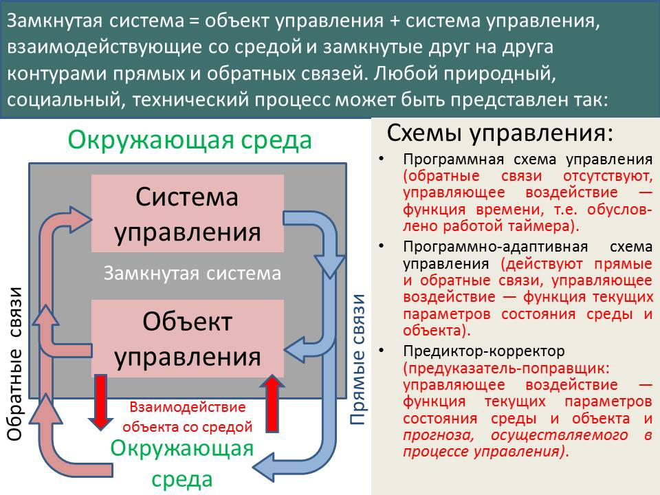Достижение импортонеуязвимости государства — это управленческая задача. Все управленческие задачи без исключения формализуются в схеме, представленной слева. В процессе управления объектом система управления вырабатывает управленческое воздействие и транслирует его в объект (его органы управления) и в среду по цепям прямых связей. Информация о состоянии среды и объекта управления в систему управления поступает по цепям обратных связей. Наивысшее качество управления достигается при управлении по схеме «предиктор-корректор», что требует не только знания текущего *фактического* положения дел, но и адекватной прогностики течения событий — как самопроизвольного, так и под воздействием управления.

Эта схема должна наполняться конкретным содержанием, соответствующим той управленческой задаче, которая ставится.

Замкнутой системой в задаче обеспечения импортонеуязвимости является многоотраслевая производственно-потребительская система государства, находящаяся под управлением *государственной власти (системой управления)*, взаимодействующая со средой — с обществом в государстве, с природной средой, с внешнеэкономической и внешнеполитической средой.

Если процессы продуктообмена и финансового обмена в ней представить графически, то получится схема, представленная на рисунке ниже. На этой схеме номерами и мнемоническими сочетаниями букв показаны различные отрасли в составе многоотраслевой производственно-потребительской системы. В частности: 1 СХ — сельское хозяйство, охота, рыболовство; 2 ДЭ — добыча энергоносителей; 3 ДС — добыча сырья; 4 ПП — пищевая промышленность; 5 ТЭ — технологическая подготовка энергоносителей к использованию по назначению; 6 ПКМ — производство конструкционных материалов и технологических ингредиентов для отраслей народного хозяйства; 7 ПЭ — производство энергии (электрической и тепловой) и прочие производящие отрасли и сектора потребления[^9]. *При этом все отрасли экономики и сферы жизни общества связаны продуктообменом и денежным обращением, сопровождающим продуктообмен.* При необходимости можно построить более детальную схему продуктообмена и его финансового сопровождения.

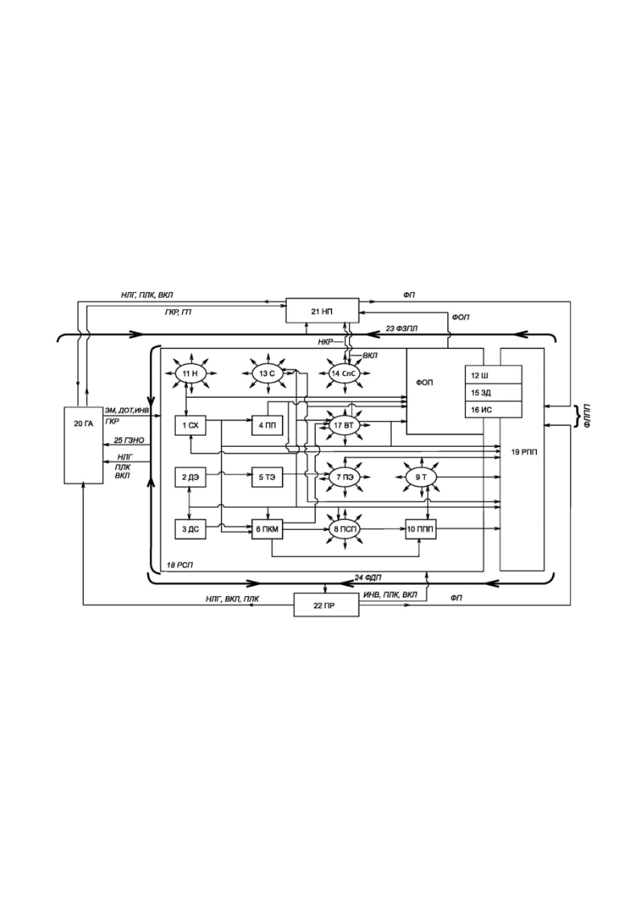

Процессы продуктообмена и финансового обмена во многоотраслевой производственно-потребительской системе при их математическом моделировании описываются на основе линейных уравнений со многими неизвестными (см. далее — формула 1). В их применении к анализу экономико-финансовых процессов они получили название «уравнения межотраслевого баланса» продуктообмена либо финансового обмена. На основе этих уравнений строятся разного рода иные балансовые модели, в том числе и динамические, позволяющие моделировать течение макроэкономических процессов, ставить и решать задачи планирования и управления экономикой страны в ходе реализации планов.

В таблице на рисунке ниже слева представлена исходная балансовая модель финансового обмена в макроэкономической системе, выражающего реальный продуктообмен в стоимостной форме учёта продукции на основе прейскурантов, а справа представлены возможные средства управления многоотраслевой производственно-потребительской системой, которые могут быть отображены в балансовых моделях как их компоненты.

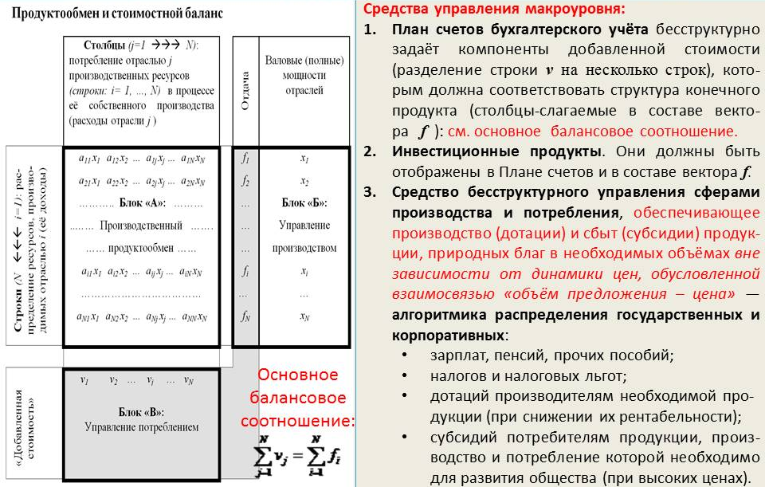

В таблице:

- *N* — общее количество отраслей (либо предприятий), чья деятельность выражается в их продуктообмене и финансовом обмене *на интервале времени определённой продолжительности*.

- 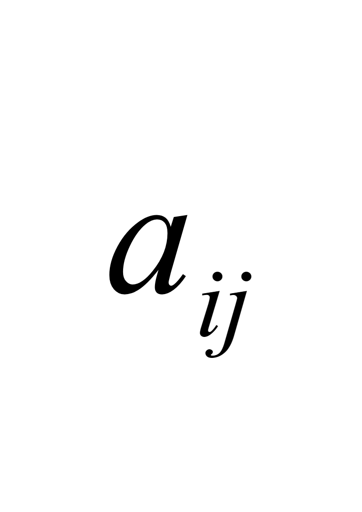 — коэффициенты пропорциональности при неизвестных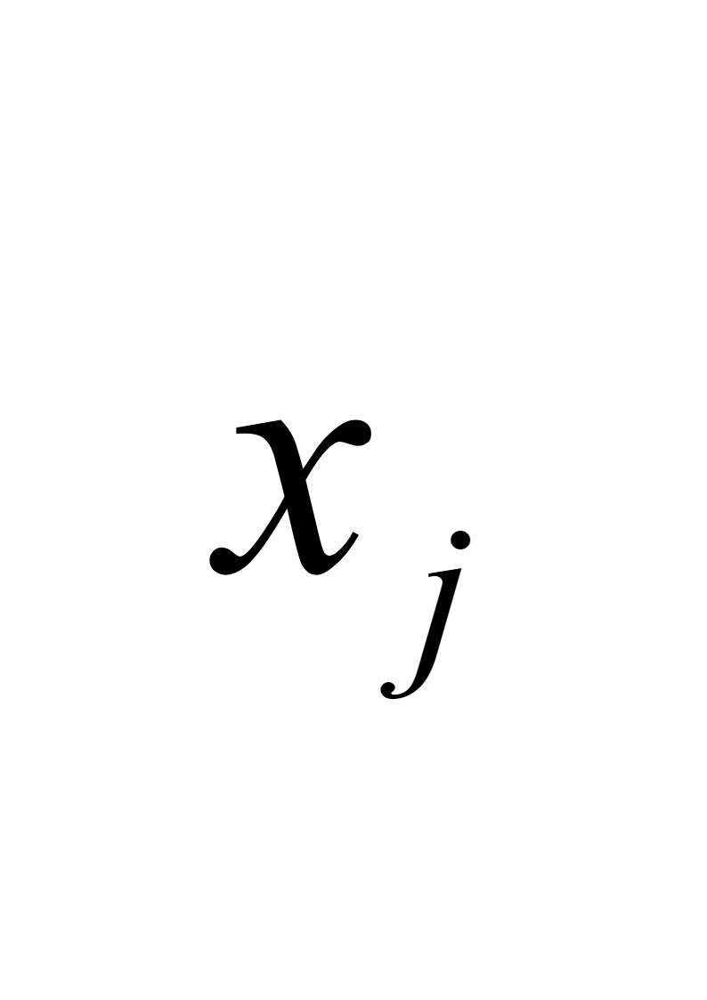, именуемые коэффициентами прямых затрат.

> Коэффициент прямых затрат  равен количеству продукции отрасли «», которое необходимо для производства единицы учёта выпуска продукции отраслью «» *при имеющихся технологиях, организации и культуре производства*. В финансовом выражении коэффициенты прямых затрат равны затратам отрасли «» на покупку продукции отрасли «», которые необходимы для выпуска продукции отраслью «» в объёме, стоимость которого равна платёжной единице (1 рублю, 1 доллару и т.п.), т.е. чтобы выпустить собственной продукции на 1 рубль, отрасли «» необходимо купить продукции отрасли «» на сумму  рублей. Т.е. объёмы закупок каждой отраслью продукции других отраслей пропорциональны объёму выпуска ею продукции, а коэффициентами пропорциональности являются коэффициенты прямых затрат.

- — валовой (т.е. полный) выпуск продукции отраслью «» — потребителем продукции отрасли «»;

- 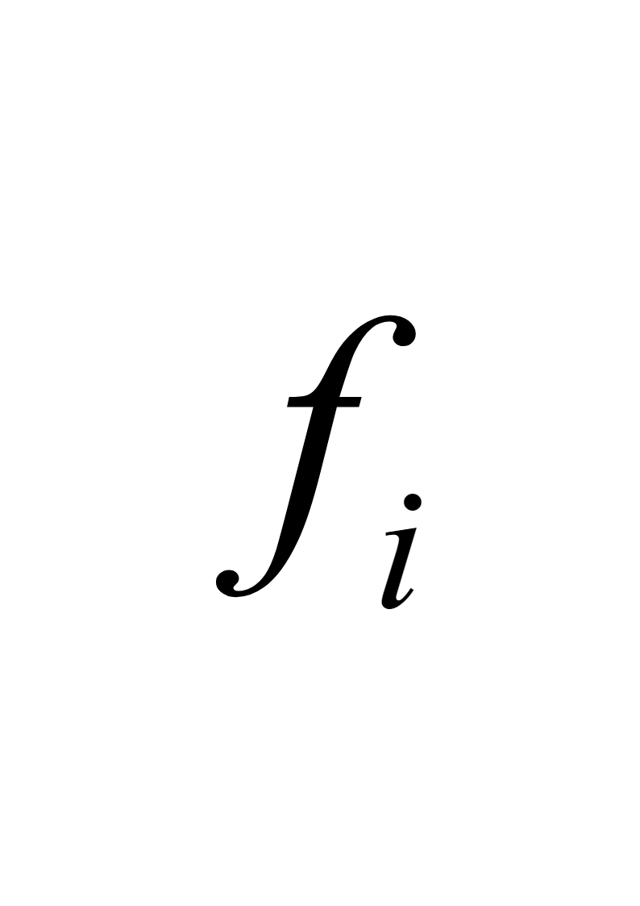 (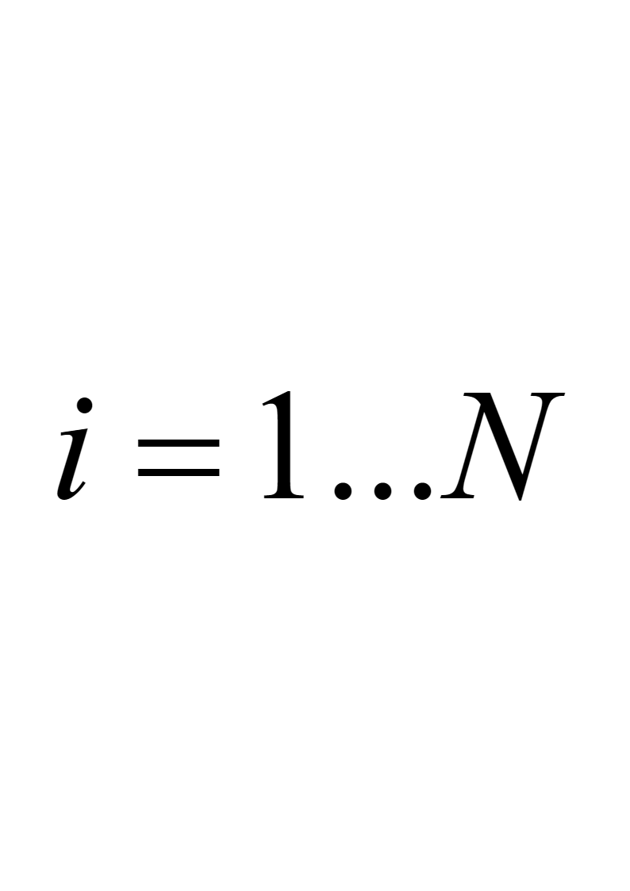) — конечный продукт, производимый отраслью «». Конечный продукт всех отраслей — это то, ради получения чего ведётся хозяйственная деятельность во всех отраслях, обменивающихся своими продуктами в процессе производства в соответствии с технологиями, описываемыми коэффициентами прямых затрат.

Соответственно стоимостной баланс (который — при определённости прейскуранта, — характеризует продуктообмен при натуральном учёте продукции), представленный в таблице на рисунке выше, даёт полное представление о расходах и доходах отраслей:

- если мы идём вдоль строки блока «А», то отрасль выступает как продавец своей продукции другим отраслям, и соответственно строка показывает структуру доходов отрасли;

- если мы идём вдоль столбца блока «А», то отрасль выступает как покупатель продукции других отраслей, и соответственно столбец показывает структуру расходов отрасли.

Блок «Б» назван «Управление производством» потому, что в его столбец — вектор-столбец конечного продукта  () входит не только продукция, потребляемая обществом и государством, ради потребления которой и ведётся хозяйственная деятельность, но кроме того в него входит экспортно-импортный баланс (экспорт со знаком «+», импорт — со знаком «–») и *инвестиционные продукты (средства производства, которые дадут производственную отдачу на последующих производственных циклах), без которых поддержание производства и его развитие невозможны*. Спектр производства инвестиционных продуктов в составе столбца  программирует производственные возможности в будущем.

Уравнения межотраслевого баланса, идентичные балансу в форме таблице на приведённом выше рисунке, в матрично-векторной записи[^10] выглядят так:

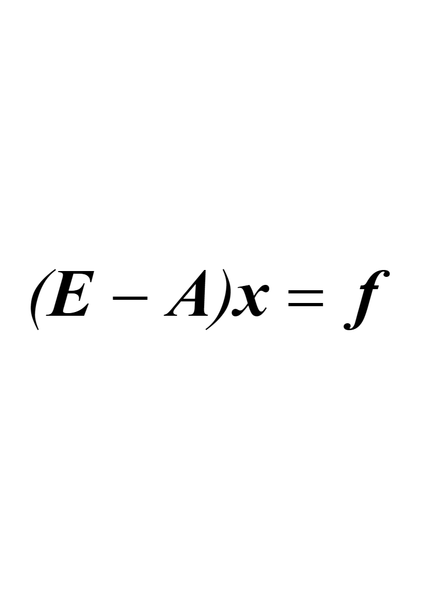 (1), где:

 — единичная матрица[^11];

 — матрица коэффициентов прямых затрат , характеризующая производственный — организационно-технологически обусловленный — продуктообмен (матрица  идентична блоку «А» приведённой выше таблицы, если из него удалить все множители , в результате чего в нём останутся только коэффициенты прямых затрат );

 — вектор-столбец валовых производственных мощностей  ();

— вектор-столбец конечного продукта  ().

Уравнение (1) включает в себя *N* строк, каждая из которых соответствует определённой отрасли. Каждая строка номер «» уравнения (1) это — соответствующая строка блока «А», перед каждым элементом которой поставлен знак «–», + элемент *xi* = *fi* . Уравнения межотраслевого баланса позволяют ответить на вопрос: какими должны быть валовые мощности всей совокупности отраслей *xi *() для того, чтобы получить конечный продукт в объёме компонент вектора  ( при ) при культуре производства, описываемой матрицей коэффициентов прямых затрат  (*i=* 1…*N, j=*1…*N*). Компоненты вектора  ( при ) должны задаваться заказчиком ответа на этот вопрос, т.е. государственной властью соответственно задаче экономического обеспечения политики государства[^12].

Блок «В» в таблице назван «Управление потреблением» потому, что в него входят расходы («факторные затраты», иначе именуемые «добавленная стоимость»), которые являются основой для формирования разного рода фондов, из которых оплачивается потребление производимой продукции (семейные бюджеты персонала, фонды развития и реконструкции предприятий и через налоги — госбюджетные фонды финансирования разного рода государственных программ).

При этом для блоков «Б» и «В» выполняется балансовое соотношение: $``$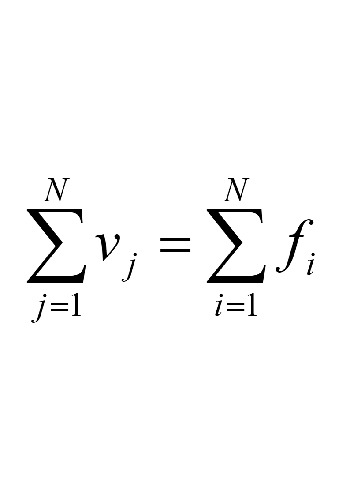, т.е. суммарная стоимость конечного продукта (всех компонент  () столбца  в блоке «Б») в точности равна сумме всех факторных затрат 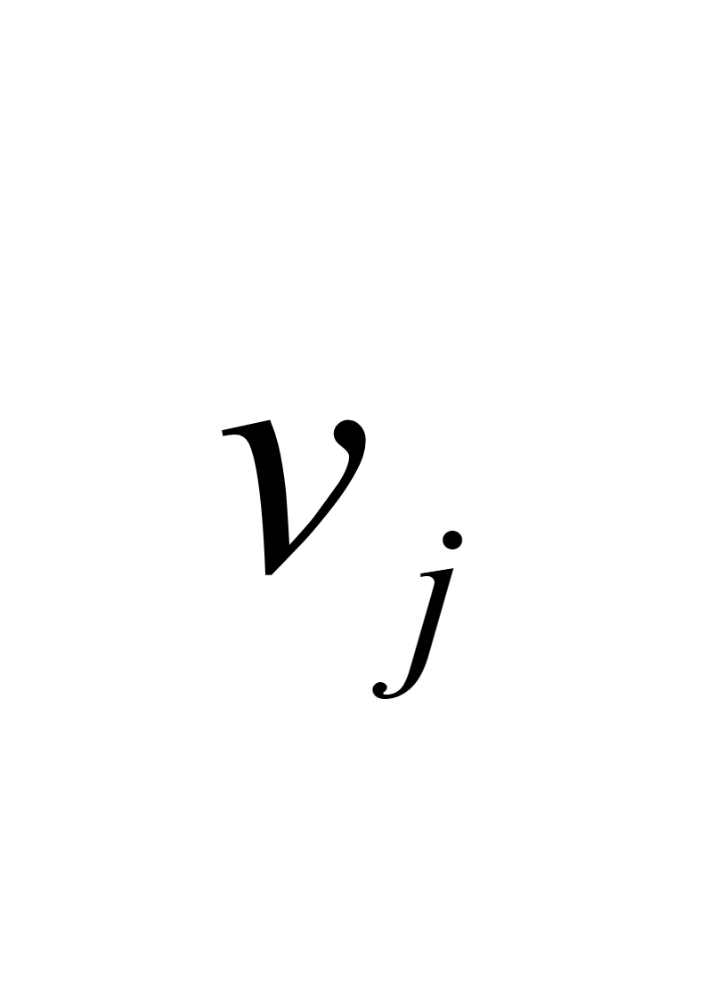 (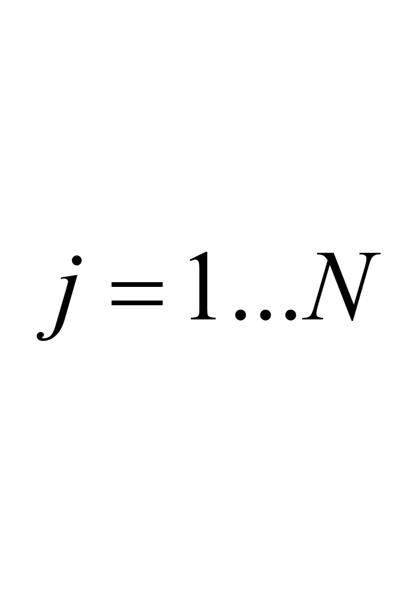) (компонент блока «В»).

Необходимо понимать, что структура блока «В» (количество и наименование факторных затрат, отчисления по каждой из них) — не объективная данность, неподвластная людям, а задаётся законодательством государства. Иначе говоря, законодательство о хозяйственной и финансовой деятельности среди всего прочего должно задавать и структуру блока «В».

Соответственно законодательство о хозяйственной и финансовой деятельности во всех его компонентах должно строиться на основе управленческой интерпретации соответствующих балансовых моделей с учётом целей политики государства, отображающихся в структуру вектора . Поэтому законодательство о финансовой и хозяйственной деятельности необходимо регулярно целенаправленно изменять на основе анализа достижений и упущений политики и появления новых проблем, требующих экономического обеспечения и соответствующего финансирования. Но в любых вариантах политики законодательство о финансовой и хозяйственной деятельности должно обеспечивать:

- способность рыночного механизма собрать («склеить») целостную макроэкономическую систему из множества административно обособленных предприятий, принадлежащих разным отраслям (а в условиях России — и разным регионам, с различными возможностями и условиями ведения хозяйства, которым законодательство должно обеспечить рентабельность и подавить межотраслевую и межрегиональную конкуренцию за прибыль, разрушительную по отношению к демографии общества и по отношению к целостности многоотраслевой производственно-потребительской системы государства);

- способность макроэкономической системы государства осуществлять научно-технический прогресс, т.е. порождать собственные инновации, воспринимать чужие инновации и реализовывать инновации в массово производимой продукции.

На решение именно этих задач нацелена представленная ниже *иерархически упорядоченная по их значимости для устойчивого функционирования макроэкономики государства* структура функционально обусловленных расходов предприятий (факторных затрат № 1–№ 8), которую должен задавать «План счетов бухгалтерского учёта» и функционирование которой должно обеспечить законодательство о финансовой и хозяйственной деятельности:

**Расходы приоритета № 1** — расходы на поддержание текущей деятельности. Они включают в себя расходы на оплату промежуточных продуктов, получаемых от поставщиков, и оплату труда персонала.

**Расходы приоритета № 2** — расходы на обеспечение функционирования предприятия в будущем. Они включают в себя: амортизационные отчисления; отчисления в фонды реконструкции и развития предприятия; инвестиции (капиталовложения) в другие отрасли (обеспечение и поддержка возможностей перетока капитала между отраслями — необходимое условие динамичности развития народнохозяйственного комплекса в аспекте его быстрой структурной перестройки в соответствии с динамикой изменения общественных потребностей и технико-технологического обновления производственной базы и спектра выпускаемой продукции); инвестиции в научно-исследовательские и опытно-конструкторские разработки (НИОКР).

**Расходы приоритета № 3** — расходы в обеспечение социальной ответственности бизнеса.

**Расходы приоритета № 4** — отчисления в разного рода страховые фонды (фонды, создаваемые на предприятии, в совместные страховые фонды предприятий, в иные страховые фонды). Их назначение — финансирование мероприятий по заблаговременному предотвращению и преодолению последствий стихийных бедствий, техногенных происшествий, заболеваний, преступлений и иных неблагоприятных событий и компенсация ущерба, наносимого ими обществу, предприятиям и людям персонально.

**Расходы приоритета № 5** — платежи задолженности по кредиту (т.е. сальдо кредитного баланса, если получение кредитных ссуд интерпретировать как расходы со знаком «–»).

**Расходы приоритета № 6** — предпринимательский доход, т.е. средства, изымаемые из оборота предприятия его единоличным собственником или же дивиденды при акционерной форме собственности.

**Расходы приоритета № 7** — это нераспределённый доход. Он обязательно должен быть у большинства предприятий всех отраслей во всех регионах страны, поскольку его назначение — быть источником премий как общих, так и персональных за особый трудовой вклад, т.е. быть источником финансового стимулирования полезной для предприятия деятельности персонала помимо его основной зарплаты. Кроме того, он представляет собой запас финансовой устойчивости предприятий и отраслей, а на макроуровне — вносит вклад в устойчивость межотраслевых связей и потому является запасом устойчивости экономического обеспечения политики государства.

**Расходы приоритета № 8** — это налоги, точнее — сальдо платежей налогов, дотаций субсидий — как общегосударственных, так и внутренних налогов, дотаций, субсидий разного рода объединений предприятий (многоотраслевых концернов и т.п.). Налоги представляют собой обязательные выплаты предприятий, определяемые действующим законодательством. Функциональное назначение этой группы расходов *— быть источниками финансирования программ, координируемых государственностью, среди всех прочих функций осуществляющей и функции директората народно-хозяйственного комплекса в целом, а так же быть источником финансирования программ, реализуемых разного рода объединениями предприятий (многоотраслевыми концернами и т.п.)*.

Если мы строим хронологически преемственную последовательность производственных циклов, каждый из которых, описывается соответствующим межотраслевым балансом, то преемственные балансы связаны друг с другом через переходящие остатки компонент вектора ***x*** каждого последующего балансам, наследуемые им от предыдущего баланса, а также через *компоненту инвестиционных продуктов в составе вектора* *, которая характеризует восполнение производственных мощностей, выбывающих из работы в силу разных причин, и создание новых производственных мощностей, что моделирует изменение валовых производственных мощностей в составе вектора **x** в процессе управления развитием экономики*.

Балансовые модели являются единственными математическими моделями, которые строятся на основе фактических данных, характеризующих многоотраслевые производственно-потребительские системы. Все прочие модели строятся на основе вторичных оценок первичных фактических данных и потому не могут показать многое из того, что могут показать балансовые модели. Поэтому балансовыми моделями надо научиться пользоваться для решения задач анализа, моделирования и планирования как в аспекте продуктообмена, так и в аспекте финансового сопровождения производства и потребления.

В построении балансовых моделей необходимо разрешить проблемы, главными из которых являются: 1) адекватное построение номенклатуры отраслей[^13], задающей детальность моделирования[^14], 2) сбор и верификация информации, на основе которой они строятся (прежде всего, это касается построения матрицы коэффициентов прямых затрат), 3) обеспечение метрологической состоятельности балансовых моделей, построенных на основе финансового учёта продукции, 4) непредсказуемость научно-технического прогресса на продолжительных интервалах времени, способная изменить и номенклатуру отраслей, и коэффициенты прямых затрат.

Но даже исходная балансовая модель, представленная выше, при её управленческой интерпретации позволяет понять, что и как причинно-следственно взаимосвязано в производственно-потребительской системе и финансовом сопровождении процессов в ней, и не делать глупостей типа — резкий значительный подъём ставки рефинансирования центробанком с целью «оздоровить» финансы и ввести экономику страны в режим инновационного развития и роста производства.

Индивид, который не понимает, что такое балансовые модели, не видит их связи с реальным производством, распределением и потреблением продукции и природных благ в обществе, который не в состоянии дать управленчески состоятельную интерпретацию балансовым моделям и соотнести их компоненты с экономико-финансовой реальностью, — вообще не имеет никакого права ни обсуждать проблемы экономики государства, ни вырабатывать, ни принимать какие бы то ни было управленческие решения в области экономической политики: без освоения балансовых моделей *(включая хронологически преемственные последовательности балансов, посредством которых моделируется экономическая динамика)*, он просто не способен видеть причинно-следственные взаимосвязи во многоотраслевой производственно-потребительской системе государства и её взаимосвязи с иными сферами жизни общества и жизнью Природы, не способен предвидеть и оценивать последствия своих предложений и принимаемых к исполнению решений.

Но подавляющее большинство работников «экономико-финансового блока» государственной власти России, а также депутаты и сенаторы, работники аппарата Думы и Совета Федерации и прочих органов государственной власти РФ не способны не только дать управленческую интерпретацию уравнений межотраслевого баланса и иных построенных на их основе моделей, но не знают даже как вывести уравнения межотраслевого баланса. И это многое объясняет как в нашем экономическом прошлом (включая советско-госплановское[^15]), так и в настоящем и в ближайшем будущем.

\* \* \*

В годы второй мировой войны задачи по бомбардировке стратегической авиацией США промышленных и логистических объектов Германии ставились в том числе и на основе анализа экономики Германии посредством применения балансовых моделей. На основе балансовых моделей выявлялись предприятия, которые:

- являлись поставщиками продукции для как можно большего количества других предприятий, вследствие чего уничтожение предприятий-поставщиков остановит работу предприятий-потребителей;

- являлись потребителями продукции как можно большего количества других предприятий, которые будут деградировать при отсутствии потребителей их продукции.

Так же выявлялись и логистические объекты, наиболее значимые для функционирования производственно-потребительской системы в целом, выведение которых из строя было способно парализовать множество предприятий.

Если США не в конец деградировали, то и санкции в отношении России введены не наобум, а на основе анализа балансов продуктообмена и финансового обмена в экономике России и её экспортно-импортных балансов.

\* \*\

\*

Поэтому антисанкционная политика РФ, ориентированная на достижение импортонеуязвимости, не может быть эффективной до тех пор, пока не будет создана система моделирования и планирования экономического обеспечения политики государства, которая бы основывалась на управленчески состоятельных балансовых моделях.

После принятия плана к исполнению управление производственно-потребительской системой должно настраиваться на реализацию планов как директивно-адресным способом, так и посредством создания финансового климата и настройки рыночного механизма на осуществление рентабельного продуктообмена в реальном секторе в русле принятого к исполнению государственного плана биосферно-социально-экономического развития. Но это требует полной реорганизации как организационно-технологического комплекса страны, так и системы управления им на основе управленческого подхода, исходные положения которого изложены в настоящем разделе. [^16]

# 4. Достижение импортонеуязвимости на практике

Политика достижения и обеспечения устойчивого режима импортонеуязвимости страны должна учитывать такое явление как глобализация.

Глобализация — объективно неизбежное явление в силу биологического единства людей, принадлежащих разным расам и народам, выражающегося в том, что дети, рождённые от родителей, принадлежащих каждый своей национальности или расе, в подавляющем большинстве способны к зачатию и рождению детей в новых поколениях. Кроме того, биологическому виду «Человек разумный», свойственно быть носителем и творцом культуры[^17].

Соответственно этим объективным закономерностям, свойственным биологическому виду «Человек разумный», суть глобализации — формирование культуры, которая в будущем объединит всё человечество. И этот процесс вовсе не является «социально стихийным»: он носит управляемый характер на протяжении многих веков (с момента формирования канона Ветхого завета). Поэтому исторически реальная глобализация — это гибридная война за безраздельное мировое господство, порабощение человечества и уничтожение всех, кто признан хозяевами и заправилами проекта непригодными к эксплуатации в качестве рабов или же противится режиму рабовладения[^18]: в этом и есть суть решения так называемого «Русского вопроса», к которому стремятся хозяева и заправилы давно уже порабощённого ими «коллективного Запада». Эту гибридную войну — управление глобализацией — они ведут методом «культурного сотрудничества» с народами других региональных цивилизаций и, прежде всего, — с их правящими «элитами».

Иначе говоря, широко известному афоризму Карла Клаузевица *«Война есть не что иное, как продолжение государственной политики иными средствами»* сопутствует умолчание: *Политика «мирного времени» — это ведение войны иными средствами*[^19]*,* **и в пределе — это война за безраздельный контроль над планетой и за уничтожение всех несогласных и признанных никчёмными в качестве рабов** (см. сноску 16 выше)*.*

Этот факт не позволяет осознать управленческая безграмотность людей, следствием которой является их неспособность осознать культуру:

- в качестве средства организации самоуправления общества и

- в качестве объекта программирования режима самоуправления общества в будущем.

Поэтому, поскольку культура, будучи информационно-алгоритмической системой, *вариативна,* **главные вопросы всемирной истории и текущей политики:**

- Какой будет та — *будущая* — культура, в которой объединится всё человечество?

- И что надо делать в непрестанно текущем настоящем, чтобы эта глобальная культура была человечной, а не самоубийственной для глобальной цивилизации и народов, составляющих человечество?

Жизненно состоятельные ответы на эти вопросы требуют выработки и осуществления собственного проекта глобализации, выражающего иные нравственно-этические принципы развития исторически сложившихся национальных культур и общей культуры будущего человечества.

Одна из компонент культуры обществ — хозяйственная деятельность. Соответственно один из аспектов глобализации — уже свершившееся построение мирового хозяйства, в котором так или иначе соучаствуют все регионы планеты и живущие в них народы.

Со второй половины ХХ века в глобализации появилась и стала развиваться ещё одна составляющая — *унификация* *в глобальных масштабах систем стандартизации и сертификации продукции и разного рода процессов,* что стало основой обеспечения совместимости и взаимодействия организационно-технологических комплексов хозяйственных систем разных стран. *Унификация* *в глобальных масштабах систем стандартизации и сертификации продукции и разного рода процессов* — основа построения глобального организационно-технологического комплекса хозяйства всего человечества.

Система стандартизации и сертификации продукции и разного рода процессов — задаёт матрицу возможностей, в которой протекает научно-технический прогресс, развитие производственно-потребительских систем. Поэтому стандартизация и сертификация может как обеспечивать научно-технический прогресс и эффективную хозяйственную деятельность, так и тормозить их вплоть до полной остановки.

Однако со времён Генри Форда I[^20] об этой роли стандартизации и сертификации никто не писал, и она не разъясняется в учебных курсах вузов. Поэтому специалистов по построению системы стандартизации и сертификации продукции в условиях глобализации в России нет: это большой и опасный пробел в системе подготовки инженерных и управленческих кадров.

Политика государства в области стандартизации и сертификации продукции и разного рода процессов может быть направлена:

- на полную изоляцию своей производственно-потребительской системы от мировой экономики[^21];

- на затруднение проникновения в страну каких-то произведений зарубежных культур и на упрощение проникновения в страну каких-то других их произведений;

- на затруднение пользования зарубежными потребителями каких-то своих произведений и упрощение пользования ими какими-то другими своими произведениями.

Соответственно, политика государства в области стандартизации и сертификации — один из инструментов обеспечения импортонеуязвимости государства в условиях глобализации.

Импорт в балансовых моделях входит со знаком «–» в состав вектора ***f*** — конечной продукции. Из анализа строк таблицы межотраслевого баланса в составе блока «А» можно выявить распределение импорта по производящим отраслям экономики государства и меру зависимости каждой из них от импорта тех или иных производственных ресурсов. Особую группу импортозависимости составляют инвестиционные продукты (технологическое оборудование, элементы инфраструктур и т.п.), потребление которых необходимо как для технологического обновления и инновационного развития производства, так и для наращивания объёмов производства. И таким образом балансовые модели дают полную картину зависимости организационно-технологического комплекса экономики государства от поставок из-за рубежа всех видов продукции: как по видам продукции, так и по объёмам нехватки каждого вида по отношению к текущим потребностям общества, выражающимся в векторах ***x*** и ***f***. Кроме того в составе блока «Б» могут быть компоненты вектора ***f*** , не связанные с производством (блоком «А»), если это импортируемые из-за рубежа продукты внепроизводственного потребления. Такой подход к анализу импортоуязвимости страны позволяет получить исходные данные для ответа на вопрос: что надо производить и в каких объёмах для обеспечения импортонеуязвимости страны в условиях глобализации?

Также надо понимать, что обеспечение импортонеуязвимости может носить вариативный характер и при разработке программ обеспечения импортонеуязвимости необходимо осознавать, какой вариант целесообразно реализовывать соответственно целям обеспечения политики государства.

**Вариант первый**. Импортонеуязвимость по максимуму это — полная изоляция, т.е. вывод хозяйства страны в такой режим, в котором всё необходимое для жизни общества и осуществления политики государства производится в самом государстве, и соответственно из-за рубежа ничего не импортируется, в том числе и лицензии, и научно-техническая информация. Но режим полной изоляции может быть опасен тем, что государство может застрять в «каменном веке», если научно-технический прогресс вообще либо на каких-то направлениях, определяющих образ жизни и достаточную обороноспособность в будущем, протекает за рубежом быстрее, нежели в само́м государстве (жертвами такой политики в прошлом стали Китай и Япония, жившие в режиме самоизоляции на протяжении нескольких веков до середины XIX века).

**Вариант второй**. Он может быть охарактеризован словами: всё производим сами в необходимых количествах, но следим за мировым научно-техническим прогрессом и перенимаем его достижения, либо покупая лицензии, либо воспроизводя у себя самостоятельно аналоги и совершенствуя их[^22]. Оба варианта (покупка лицензий и собственное творчество) могут дополнять друг друга. Этот режим можно назвать собственная полная производственная самодостаточность в сочетании с культурным сотрудничеством с зарубежьем.

**Вариант третий**. Это — наилучший режим обеспечения импортонеуязвимости — лидерство страны в научно-техническом прогрессе, прежде всего на направлениях, определяющих образ жизни будущего и достаточную её обороноспособность. В этом варианте обеспечения импортонеуязвимости нет надобности производить у себя всё без исключения, поскольку открывается возможность импортировать всё, чего не достаёт в своей ресурсной базе и конечной продукции, если это производится за рубежом. Собственное производство по каким-то видам продукции может либо полностью отсутствовать, либо покрывать потребности общества и политики государства лишь частично. Такая политика высвобождает ресурсы общества, которые могли бы быть заняты в массовом производстве, на научные исследования и НИОКР, обеспечивающие лидерство страны в научно-техническом прогрессе и в дальнейшем[^23].

В этом варианте опасность может представлять отказ от производства чего-либо у себя в полном объёме, необходимом для удовлетворения потребностей. В этом случае сокращение и тем более полное прекращение поставок из-за рубежа соответствующих видов продукции неизбежно создаст проблемы более или менее продолжительного характера. Это означает, что необходимо поддержание собственного производства, обеспечивающего сохранение и развитие соответствующих научных и инженерных школ, покрывающего потребности в соответствующих видах продукции частично. Но *государство при этом должно поддерживать готовность в короткие сроки расширить производство продукции, аналогичной импортируемой, до необходимого уровня в случае прекращения поставок из-за рубежа.*

**Вариант четвёртый**. Сочетание второго и третьего вариантов в том смысле, что собственное производство отчасти основывается на импорте каких-то производственных ресурсов; ведётся отслеживание научно-технического прогресса за рубежом, и его достижения так или иначе внедряются в свою экономику. При этом *поддерживается готовность в короткие сроки расширить производство продукции, аналогичной импортируемой, до необходимого уровня в случае прекращения поставок из-за рубежа.* Лидерство в научно-техническом прогрессе может быть достигнуто, а может быть и не достигнуто, но политика государства направлена на достижение лидерства.

Соответственно для решения задачи обеспечения реальной (а не декларативно-отчётной — бюрократической[^24]) импортонеуязвимости требуется Госплан, который должен:

- отслеживать реальные межотраслевые и межрегиональные балансы производственного продуктообмена;

- знать реальный экспортно-импортный баланс;

- выявлять номенклатуру импорта, которая порождает импортоуязвимость страны как по потребностям собственного организационно-технологического комплекса, так и по потребностям общества и государства в продукции конечного потребления, не производимой в стране вообще либо в необходимых объёмах (прежде всего — в инвестиционных продуктах);

- оценивать последствия выявляемой импортоуязвимости и соответственно формировать своды продукции:

<!-- -->

- импортоуязвимость по которым носит критичный характер в том смысле, что сокращение или прекращение поставок из-за рубежа сделает невозможной проводимую или намечаемую политику государства и недопустимо снизит качество жизни общества;

- импортоуязвимость по которым может породить некоторые неудобства, но не способна сделать невозможной политику государства или существенно снизить качество жизни общества.

Кроме того, должно быть понятно, что рыночный механизм саморегуляции производства и потребления не способен к решению этих задач, вследствие чего либерально-рыночная модель не в состоянии обеспечивать режим импортонеуязвимости.

Но возрождения только Госплана для достижения и поддержания режима импортонеуязвимости недостаточно, в частности потому, что в стране может быть создан такой «финансовый климат», в котором:

- собственное производство каких-то видов продукции будет нерентабельным;

- потребители продукции будут недостаточно платёжеспособны, чтобы покупать отечественное, — тем более, если импортное дешевле или его приобретение организовано процедурно проще и осуществляется многократно быстрее, нежели приобретение отечественных аналогов («спасибо» Думе и правительству за такое законодательство и руководящие документы);

- производство ряда разновидностей продукции на основе импорта сырья и комплектующих будет выгоднее, нежели же производство того же самого на основе поставок продукции отечественными производителями.

И эти обстоятельства требуют в целях обеспечения реальной[^25] импортонеуязвимости государства отказа от либерально-рыночной экономической модели, а именно:

- возрождения Госплана и включения в его состав Государственного комитета статистики;

- возложения ответственности за реализацию государственного плана биосферно-социально-экономического развития на Минэкономразвития;

- подчинения Министерства финансов Министерству экономического развития, ликвидации независимого Центробанка и включения его в состав Минфина с передачей ему права эмиссии рубля и полного контроля за кредитно-финансовой системой страны и деятельность пользователей кредитно-финансовой системы;

- трансформации налоговой службы в систему управления налогово-дотационно-субсидарным механизмом в русле государственного плана биосферно-социально-экономического развития.

Этот *комплекс мер* необходим для разрешения множества проблем, в принципе неразрешимых на основе либерально-рыночной экономической модели, поскольку именно она их порождает, воспроизводит и усугубляет. Одна из ключевых проблем, разрешение которой необходимо как для развития общества, так и для обеспечения устойчивого режима импортонеуязвимости государства, рассмотрена ниже.

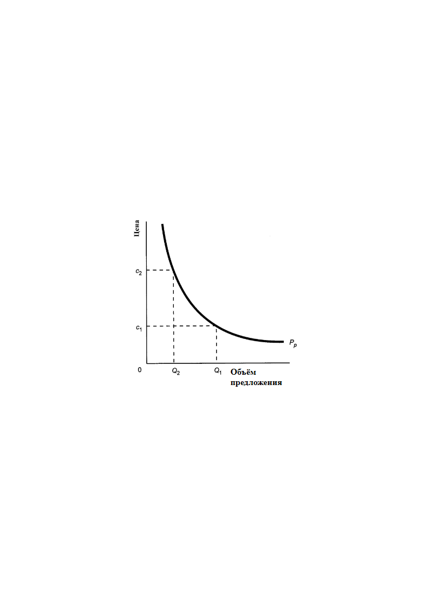Кривая, представленная на рисунке слева, наличествует практически в любом учебнике экономической теории, обслуживающей жизнь общества под властью либерально-рыночной экономической модели, хотя оси системы координат названы иначе: «цена (по вертикали) — спрос (по горизонтали)» (т.е. «спрос» вместо «объём предложения»). График с надписями «цена — спрос» трактуется так: «Закон спроса отражает зависимость между ценой товара и спросом на него. Применительно к рынку чистой конкуренции данный закон трактует, что при неизменности всех прочих условий снижение цены товара приводит к возрастанию объёма спроса и наоборот. Таким образом, существует отрицательная обратная зависимость между ценой товара и объёмом спроса на него, которую называют кривой спроса»[^26].

Однако это — извращённое толкование, не соответствующее причинно-следственным связям, реально действующим во многоотраслевых производственно-потребительских системах государств, где есть место рыночной саморегуляции производства и потребления.

При рассмотрении этого графика обсуждаются разные вопросы, но не те, ответы на которые действительно необходимы для экономического обеспечения развития общества и удовлетворения потребностей политики государственной власти. Вопреки тому, что написано в учебниках экономической лженауки либерализма, представленный график показывает иную зависимость между качественно иными характеристиками многоотраслевой производственно-потребительской системы, а именно: *«Объём предложения некоего природного или производимого блага — цена, обеспечивающая полный сбыт этого блага на рынке»* (при условии, что объём предложения блага в пределах ёмкости рынка, определяемой потребностями людей или государственной власти как таковыми). Исходя из такого понимания зависимости, представленной на рисунке выше, обратимся к теме экономического обеспечения общественного развития и потребностей политики государства[^27].

Предположим, что Q1 — объём производства некоего блага, минимально необходимый для развития общества и осуществления целей политики государства, и этот уровень производства организационно-технологически (т.е. без учёта финансовых факторов) достижим, т.е. необходимые производственные мощности либо уже существуют, либо могут быть созданы в приемлемые для решения задач политики сроки. Однако при таком объёме предложения этого блага рыночная цена на него будет C1, и эта цена ниже порога рентабельности для большинства производителей этого блага. Необходимая для устойчивого функционирования предприятий и их развития рентабельность производства этого блага для большинства производителей обеспечивается при цене не менее C2, но этим ценам соответствуют объёмы производства этого блага не более Q2, которые заведомо недостаточны для обеспечения развития общества и достижения целей политики государства.

В экономической и политической лженауке, обслуживающих рыночный либерализм и концепцию глобализации, проводимую в жизнь заправилами и хозяевами «коллективного Запада» посредством пропаганды и навязывания другим странам либерально-рыночной экономической модели, проблема *соотношения цен, обеспечивающих рентабельность производств (C2 на графике), и объёмов предложения благ, обеспечивающих общественного развития и достижения целей политики государства (Q1 на графике),* не рассматривается ни в прямой её постановке, ни в какой бы то ни было опосредованной постановке.

Не обсуждается в ней и постановка управленческих задач микро- и макро- уровней экономики, обеспечивающих разрешение этой проблемы.

Соответственно политики оказываются перед **дилеммой**, являющейся своего рода **жизненным тестом на их нравственную порядочность и интеллектуальную состоятельность**, который подавляющее большинство политиков ХХ века и наших дней пройти не смогли[^28]:

- либо отказаться от развития общества и каких-то целей политики государства?

- либо отказаться от либерально-рыночной экономической модели и иначе организовать многоотраслевую производственно-потребительскую систему и управление ею, т.е. хозяйственную и финансовую деятельность в государстве?

И никакими «рыночными методами» эта проблема, во власти которой оказывается множество природных и производимых благ, потребление которых необходимо для развития общества, не может быть разрешена, поскольку она именно этими «рыночными методами» и генерируется. Поэтому анализ практики развитых в научно-техническом отношении государств (США, Японии, ФРГ, других государств Европы) показывает, что:

- в них либерально-рыночная модель только пропагандируется, и в неё верят олухи, которые не вникают в течение производственно-потребительских процессов и в их сопровождение кредитно-финансовой системой;

- но в своей экономике от либерально-рыночной модели в её чистом виде, описанном «Вашингтонским консенсусом», они реально давно отказались[^29]: она — удел реальных криптоколоний[^30] государств-лидеров «коллективного Запада».

Разрешение этой проблемы, в том числе и в целях обеспечения импортонеуязвимости, требует навыков и инструментария создания финансового климата, в котором реализованы возможности управления порогами рентабельности производства и иной деятельности.

В частности необходимо построение системы беспроцентного кредитования (наличие ссудного процента в системе это — рост себестоимости, сокращение покупательной способности населения, государственной власти и хозяйствующих субъектов, перераспределение платёжеспособного спроса в интересах ростовщической мафии и её хозяев[^31], подтормаживание сбыта вплоть до краха макроэкономической системы вследствие массового разрыва цепочек производственного продуктообмена, утрата экономико-финансового суверенитета[^32]):

- Также требуется создание механизма распределения дотаций производителям, если рыночная цена при необходимых объёмах производства опускается ниже порога рентабельности.

- Требуется система начисления субсидий потребителям продукции, чтобы защитить сбыт продукции от перетока покупательной способности на рынки продукции, обладающей более высокой приоритетностью, нежели продукция, сбыт которой необходимо субсидировать.

- Финансовый климат должен обеспечивать заинтересованность производств во всех отраслях во внедрении в продукцию, в технологии, в организацию достижений научно-технического прогресса.

- Кроме того, внедрение достижений научно-технического прогресса в продукцию, технологии, в организацию требует построения «конвейера» поставки информации производственникам, в котором бы взаимодействовали фундаментальная наука (она порождает научные открытия и иные достижения), отраслевая наука (она должна знать производство в своей отрасли и нужды потребителей, и должна думать о том, как достижения фундаментальной науки внедрить в продукцию и в технологии производства и сбыта своей отрасли).

> При этом надо понимать, что коммерческая и отраслевая наука, а также и система образования на всех её уровнях, не могут работать на принципе самоокупаемости, т.е. оплаты их услуг непосредственными их потребителями. Они нуждаются в прямом финансировании, а окупаемость их достижений и ошибок может быть только опосредованной через продукцию, технологии, организацию производства и сбыта. Но без решения проблемы трансформации достижений фундаментальной науки в продукцию, технологии и организацию производства и сбыта реализация третьего и четвёртого вариантов импортонеуязвимости невозможно.

Импортонеуязвимость на практике — это организация производства и производство того, что не производится в стране либо вообще, либо в необходимых объёмах. **Предметно импортонеуязвимость — это порождение конструкций или ингредиентного состава определённых видов продукции и разработка технологий и организации их производства, построение систем управления качеством продукции, соответствующих технологической специфике предприятий.** Это — дело научных и инженерных (проектно-конструкторских и технолого-организационных) школ, которые не возникают по росчерку пера бюрократа, а взращиваются и воспроизводятся творческими личностями в течение длительного времени (от примерно десяти лет и более). Однако с начала хрущёвских времён по настоящее время научные и инженерные школы в СССР и в постсоветской России деградировали и продолжают деградировать: 1) система образования не даёт необходимого количества творцов[^33] и 2) государственная политика распределения доходов населения в зависимости от характера занятости настроена на первоочередное удовлетворение потребностей тех, кто существует за счёт творчества других людей[^34]. Поэтому новые конструкции, ингредиентные составы, технологии и организации производства в ближайшей перспективе не могут массово возникать (их просто некому создавать), а мировой уровень качества импортозамещаемой и собственной инновационной продукции не может обеспечиваться неумехами, приставленными к производственному оборудованию.

Кроме того, новые конструкции и ингредиентные составы, могут потребовать создания новых производств в других отраслях и создания новых отраслей и соответствующего технологического оборудования и инфраструктур, а это — задачи проектирования межотраслевых и межрегиональных балансов продуктообмена и управления балансами в ходе осуществления планов.

Соответственно вывод страны в режим инновационного развития и импортонеуязвимости на основе лидерства в научно-техническом прогрессе требует внятного ответа на вопросы, чего государственная власть избегает:

- что такое справедливость в жизни общества в настоящее время и в обозримой перспективе?

- как справедливость будет воплощаться в жизнь?

И ответы на эти вопросы должны подтверждаться жизнью, т.е. политикой государства, а не рейтингами доверия государственной власти и тем или иным её представителям персонально, которые фабрикуют нанятые государственной же властью социологи, политические комментаторы и пропагандисты.

5. Заключение:\

из сферы управления надо систематически и целенаправленно изгонять идиотов и саботажников и готовить для неё кадры

==================================================================================================================

Показательна реакция ряда ведомств на инициативу КПРФ возродить Госплан.

«Применение в современной России опыта Государственного планового комитета СССР (Госплана) по управлению экономикой нецелесообразно. К такому выводу пришли в Минэкономразвития, Росстате, ФНС, ФТС и Минпромторге. Эти ведомства подготовили отрицательные заключения на инициативу главы КПРФ Геннадия Зюганова по созданию новой автоматизированной системы управления экономикой на базе искусственного интеллекта. РБК ознакомился с соответствующими документами. Их подлинность подтвердила РБК автор поддерживаемой коммунистами концепции профессор МГУ Елена Ведута»[^35].

Авторов отрицательного заключения из всех названных ведомств и тех бюрократов, кто утвердил их заключения, можно охарактеризовать единственным образом — некомпетентные приспособленцы, вследствие угодничества слабоумные для того, чтобы осознать и ликвидировать свою некомпетентность. Эта характеристика справедлива потому, что для них все те проблемы, о которых речь шла выше, как бы не существуют; а о том, как их разрешать, они не задумываются. Они просто написали и утвердили ведомственную чушь, по их мнению, угодную вышестоящему начальству.

Говорить о Госплане по существу, а не в режиме трёпа ни о чём, можно только, если известны ответы на следующие вопросы:

- какое предлагается научно-методологическое обеспечение, на основе которого он будет работать (т.е. методология планирования и выражающие её алгоритмы сбора информации, её верификации, собственно разработки планов)?

- каковы место Госплана, его полномочия и ответственность в системе государственного управления хозяйственной деятельностью в стране в интересах экономического обеспечения политики государства?

- какова организация хозяйственной системы страны и управления ею в ходе реализации планов и проведения внеплановых работ как в обеспечение задач политики государства, так и по инициативе хозяйствующих субъектов?

Если внятных однозначно соотносимых с реальностью ответов на эти вопросы нет (а за душой у ведомственных экспертов, давших отрицательное заключение, этого нет), то это не экспертиза предложения КПРФ, а пустой трёп.

Соответственно, «экспертов» и бюрократов, утвердивших их «экспертные заключения», следует дисквалифицировать и трудоустроить там, где им придётся работать руками, коли мозгами работать они не умеют. Это вполне оправдано и по принципу «практика — критерий истины»: Минэкономразвития, Росстат, ФНС, ФТС и Минпромторг, государственная власть в целом до сих пор не отчитались о том, как они провалили модернизацию, импортозамещение и многое другое из того, что обещали в прошлом.

Единственное, что смогли они реально осуществить, начиная с 1985 г., — разрушить созданные в СССР народнохозяйственный комплекс и целые отрасли в его составе; разрушить систему образования[^36], разрушить систему социальной защиты (на пенсии жить невозможно, здравоохранения в стране нет, есть коммерческая медицина для богатых), создать несуверенную мафию так называемых «олигархов» и мафию «элитарных» также несуверенных политиков, под чьим контролем находится законотворчество и правоприменительная практика, ввести страну в режим криптоколониальной эксплуатации, поддерживать и защищать этот режим.

**Нежелание ведомств «экономико-финансового блока» государственной власти заниматься темой Госплана — один из актов по охране режима криптоколониальной эксплуатации России и саботажа политики восстановления суверенитета страны в его полноте, включая вывод России в режим импортонеуязвимости на основе инновационного развития.**

Ответы на все три выше названных вопроса, связанных с работой Госплана, — вариативны. И соответственно в зависимости от конкретного варианта ответа на каждый из трёх вопросов, результат экономической реформы, предполагающей возрождение Госплана, будет свой. И спектр результатов будет весьма широк: от полного краха экономической системы страны до лидерства страны в развитии глобальной цивилизации.

Но для того, чтобы понять, какой результат станет реальностью в случае проведения соответствующих реформ (т.е. для того, чтобы осуществить экспертизу предложения по возрождению Госплана), необходимо: 1) понимать, что такое биосферно-социально-экономическая система как самоуправляющийся некоторым образом объект управления, 2) каким сводом характеристических статистик она описывается, 3) знать, как построить балансовые модели при натуральном учёте и при стоимостном учёте продукции, 4) уметь их управленчески интерпретировать (т.е. видеть, в каких их компонентах выражаются: управление; текущие значения контрольных параметров, входящих в вектор целей управления; свободные параметры, любые значения которых признаются допустимыми). Однако, всё это явно за пределами миропонимания членов правительства РФ, депутатов Госдумы, сенаторов и привлекаемых ими экспертов и консультантов.

Это означает, что необходимо готовить кадры для государственного управления и управления в экономико-финансовой сфере на основе иного научно-методологического обеспечения государственного управления и управления в экономико-финансовой сфере[^37]. Для этого необходимо изменить тематические планы подготовки специалистов как в системе образования, так и в конкурсах типа «Лидеры России».

Кроме того, управленческие кадры надо готовить из числа патриотов страны, а не из числа «патриотов» своих кошельков и угодничающих холопов, готовых перекинуться на сторону того, кто пообещает им больше, чем они надеются хапнуть у Родины сами.

А пока этого нет, то единственное средство порождение дееспособного управленческого корпуса — САМООБРАЗОВАНИЕ и вовлечение в этот процесс детей и внуков.

\* \* \*

Что-то содержательно аналогичное вышеизложенному должны были написать в Минэкономразвития или в аппарате Думы, в *«мозговых трестах» политических партий (все они, позиционируют себя как истинных патриотов) ещё в 2012 г.,* когда был поставлен вопрос об импортозамещении с целью обеспечения импортонеуязвимости политики и образа жизни России. Кто-то должен был эти идеи продвинуть в политическую практику. Но у работников этих органов государственной власти и у «мозговых трестов» партий были дела поважнее, нежели возрождение суверенитета в его полноте и суверенного развития страны…

Внутренний Предиктор СССР\

25 — 31 мая 2022 г.

[^1]: Здесь и далее под «экономикой государства» понимается организационно-технологический комплекс, производящий всю продукцию, плюс кредитно-финансовая система и система стандартизации как средства управления макроуровня производством, сбытом и потреблением продукции.

[^2]: Директива СНБ США 20/1 от 18.08.1948 г. опубликована на сайте: <http://www.sakva.ru/Nick/NSC_20_1R.html>.

[^3]: О том, что большинство населения Земли, проживающее в странах «третьего мира» (бывших колониях великих держав), из поколения в поколение влачит существование в беспросветной нищете, — умалчивалось. Умалчивалось и о том, что при всех его недостатках СССР входил в десятку мировых лидеров по качеству жизни населения и при этом не участвовал в ограблении лидерами капитализма их бывших колоний — стран «третьего мира».

[^4]: Фактология, представленная в книге А. Селянинова «Тайная сила масонства» (1911 г.) была вне публичного обсуждения, как и фактология, представленная в книге Ральфа Эпперсона «Невидимая рука. Введение во взгляд на историю как на заговор» (первое издание в США в 1985 г.). С учётом этой фактологии опровергать управляемый характер течения глобализации в несколько последних столетий — удел лжецов и доверчивых идиотов, чьи предубеждения не позволяют им вникнуть и осмыслять факты истории и текущей политики, игнорируемые в официозе политики, исторической науки и СМИ.

[^5]: О сути «Вашингтонского консенсуса» см.:

    Ананьин О., Хаиткулов Р., Шестаков Д. Вашингтонский консенсус: пейзаж после битв. — Мировая экономика и международные отношения (МЭМО). 2010, № 12. — С. 15-27: [https://economics.hse.ru/data/2011/02/14/1208909692/2010 МЭМО.pdf/](https://economics.hse.ru/data/2011/02/14/1208909692/2010%20МЭМО.pdf/).

    Вашингтонский консенсус как «мыслеобразующий механизм нового этапа глобализации». — Без указания авторства. Интернет-ресурс «Литература для студентов»: <http://www.libsib.ru/sovremennie-problemi-globalizatsi/sovremennie-problemi-globalizatsi/vashingtonskiy-konsensus-kak-misleobrazuiuschiy-mechanizm-novogo-etapa-globalizatsii>.

    Величко М.В., Ефимов В.А., Зазнобин В.М. «Экономика инновационного развития» — Москва-Берлин: «Директ-Медиа». 2015 г.: <https://www.directmedia.ru/book-364343-ekonomika-innovatsionnogo-razvitiya/>; <http://lit.md/files/kob-books/velichko_efimov_zaznobin-ekonomika_innovacionnogo_razvitiya_a5.pdf>.

[^6]: Именно периферия транснациональных политических мафий в каждом государстве генерирует управленческие решения и манипулирует их проведением в жизнь через парламенты, аппараты правительств и прочие структуры государственной власти.

[^7]: Наука — консультанты политиков от науки — «научно обосновывает» предлагаемые управленческие решения и также соучаствует в генерации предложений по решению разного рода проблем общества.

[^8]: Готовит политиков и представителей науки, чьи убеждения будут соответствовать проводимой глобальной политике, месту и роли конкретного государства в ней.

[^9]: Эта схема обстоятельно пояснена в упомянутой ранее в сноске 5 монографии «Экономика инновационного развития».

[^10]: Если непонятно, что такое матрицы и вектора, то необходимый минимум сведений об этом и о простейших операциях с ними (сложение, умножение) можно найти в интернете.

[^11]: Единичная матрица — квадратная таблица, её главная диагональ — совокупность ячеек, стоящих на линии, соединяющей первую ячейку первой строки и последнюю ячейку последней строки. Во всех этих ячейках стоят единицы, а во всех прочих ячейках нули.

[^12]: Это особая тема: см. упоминавшуюся ранее в сноске 5 монографию «Экономика инновационного развития».

[^13]: Т.е. производство зерна и стали недопустимо объединять в одну отрасль, хотя формальная математика это делать позволяет: для этого существуют специальные алгоритмы агрегирования, которые позволяют уменьшить размерность задачи, объединив (при финансовом учёте продукции) несколько отраслей в одну.

[^14]: Избыточное количество отраслей порождает «проклятие размерности» (объём вычислительных операций растёт примерно пропорционально количеству отраслей в третьей степени), а недостаточное количество включаемых в модель отраслей не позволяет получить жизненно состоятельные результаты.

[^15]: К научно-методологическому обеспечению работы Госплана СССР и Госпланов союзных республик много вопросов. Общая оценка их работы: они систематически игнорировали объективные закономерности, которым подчинена жизнь людей, вследствие чего их понимание балансовых моделей и их связей с жизнью было управленчески несостоятельным.

[^16]: Обстоятельно эта тематика освещена в упоминавшейся ранее в сноске 5 монографии: Величко М.В., Ефимов В.А., Зазнобин В.М. «Экономика инновационного развития».

[^17]: Культура — вся информация и алгоритмика (знания и выражающие их практические навыки), которые передаются от поколения к поколению помимо генетического механизма биологического вида. Личностная культура — та часть культуры общества (человечества), которую индивид освоил, плюс его собственные наработки.

    Культура является информационно-алгоритмической системой в том смысле, что несёт в себе упорядоченную по их значимости иерархию целей деятельности людей и общества, пути и способы достижения целей, и потому является:

    средством самоуправления общества;

    объектом программирования с целью организации желательного для программистов самоуправления общества в будущем на основе целесообразно изменённой его культуры.

[^18]: Речь идёт об идеальном рабовладении, которое И.В. Гёте охарактеризовал словами: «Нет рабства безнадёжнее, чем рабство тех рабов, себя кто полагает свободным от оков». В русской культуре оно же характеризуется поговоркой: «Дурака работа любит, и дурак работе рад», которой по умолчанию сопутствует сентенция кота Матроскина: «Совместный труд для моей пользы — он объединяет». Для этого населения необходимо оболванить (сделать дураками) и внушить дуракам, что рабовладелец — их истинный благодетель, либо рабовладелец должен анонимизировать себя, чтобы он не воспринимался в качестве рабовладельца. Это касается как индивидуального рабовладения, так и корпоративного рабовладения в отношении тех, кто не входит в состав корпорации рабовладельцев.

[^19]: Средствами, которые толпа, включая и действующих политиков (прежде всего в обществе противника), включая и спецслужбистов, не воспринимает в качестве средств ведения войны, т.е. не воспринимает в качестве средств достижения определённых целей в отношении противника. Ну сняли «Дисней» и студия «Yellow, Black and White», наняв режиссёра Дмитрия Дьяченко, фильм «Последний богатырь» (2017 г.), извратив сюжеты и нравственно-этическую основу русских сказок — и где адекватная реакция ФСБ как внутри страны, так и за рубежом? — неужто настолько законспирировано, что результата не видно?

    А вот реакция министра культуры СССР Е.А. Фурцевой на то, что первая экранизация романа Л.Н. Толстого «Война и мир» была осуществлена в США:

    *«Мало того, что вы уступили право первой экранизации романа «Война и мир» американцам, вы ещё и просите меня разрешить покупку этого фильма для советских граждан! Вы что, хотите, чтобы наши люди изучали творчество русских классиков по американским лекалам?»* — негодовала Фурцева (…)

    Говорят, что они (она и С.Ф. Бондарчук: наше пояснение при цитировании) общались без свидетелей около часа и Сергей Федорович вышел из её кабинета с разрешением на свой фильм. Позже стало известно, что он получил от Фурцевой не просто разрешение, а полный карт-бланш, о котором он раньше и не мечтал! Министр настояла на том, чтобы будущий советский фильм был не просто лучше американского, но и вообще лучшим в мире. Чтобы после нашей экранизации «Войны и мир» больше никто из иностранцев даже не пытался за это дело браться» (<https://zen.yandex.ru/media/id/5cf0ff34c1698200ab736d7a/sergei-bondarchuk-ne-sobiralsia-igrat-v-svoem-film-5f8964209eb9a66f8b0cdd72>).

[^20]: В своей книге «Сегодня и завтра» (1926 г.) главу 7 он назвал «Что такое стандарты?» и осветил в ней проблематику стандартизации именно в ключе управления производством в аспекте наилучшей реализации возможностей удовлетворения потребностей потенциальных потребителей продукции: *«Если под «стандартизацией» вы понимаете наилучшие методы, известные вам сегодня, но подлежащие усовершенствованию завтра, то такая мысль приведёт вас к полезным результатам; но если стандарт равнозначен для вас ограничению изобретательности, то вы можете привести лишь к остановке прогресса».*

[^21]: Один из примеров этого различие ширины колеи железных дорог России (в прошлом — 1524 мм, ныне 1520 мм) и Европы (1435 мм).

[^22]: Кто-то из физиков высказался в том смысле, что главный секрет атомной бомбы — в том, что её можно создать, всё остальное — дело организации работ, создания техники и технологий.

[^23]: В таком режиме США жили практически весь ХХ век.

[^24]: Сводится к фабрикации отчётов об успехах и освоению выделенных на импортозамещение бюджетных средств, достоверность которых подтверждается «шильдиками» отечественных фирм и надписями «Made in Russia», хотя почти всё кроме «шильдиков» и надписей сделано на основе импортного сырья и комплектующих на импортном оборудовании.

[^25]: А не в отчётах бюрократов по установленной вышестоящими бюрократами форме.

[^26]: Трактовка рис. 3.1 на с. 27, аналогичного приведённому нами, в учебном пособии ИТМО: Васюхин О.В. «Основы ценообразования» (<https://books.ifmo.ru/file/pdf/734.pdf>).

[^27]: Приведённая выше трактовка графика как зависимости «цена — спрос» уводит от рассмотрения этой проблематики, не говоря уж о том, что он извращает представления о действительности. Потребности как таковые порождаются обществом (физиологией и культурно обусловленной психологией людей) и политикой государства, именно они и есть — потенциальный спрос как данность. Потенциальный спрос подрезается платёжеспособностью общества, которую общество способно выделить на рассматриваемый специализированный рынок. И только после этого вступают в дело цены, регулирующие не спрос покупателей, а сбыт продукции и природных благ на этом рынке. Т.е. не цена является причиной спроса или, если в терминах математики, спрос на любую продукцию не описывается функцией, единственным аргументом которой могла бы быть цена на неё.

[^28]: Ф.Д. Рузвельт, выводя США из «великой депрессии», прошёл по минимуму. Большевики в СССР прошли. Остальные, включая постсоветских российских политиков, — в ауте.

[^29]: Вывод США из «великой депрессии» — это демонтаж либерально-рыночной модели администрацией Ф.Д. Рузвельта и замена её иной экономикой, которая в экономической теории не была описана, и которую с середины 1950‑х гг. в США постепенно демонтируют, возвращаясь к принципам рыночного либерализма, что является одной из причин деиндустриализации США. См. «Как Франклин Рузвельт победил Великую Депрессию, и почему в США не принято об этом вспоминать» — «Отрывок из лекции профессора Ричарда Вольфа — единственного марксиста среди американских экономистов. В этом отрывке вы услышите, каким образом Рузвельт победил Великую Депрессию, и при чем тут коммунисты и СССР» (<https://www.youtube.com/watch?v=pUiJ_eeCq14>).

[^30]: Термин «криптоколония» введён в лексикон политологии Дмитрием Галковским. Термин указывает на фактическую колонизацию государства при наличии у него всех формальных признаков суверенитета, осуществляемую в обход контроля сознания большинства представителей этого общества и, прежде всего, — решающего большинства его правящей «элиты». В этом случае политика государства-криптоколонии, включая экономическую политику, при наличии всех формальных атрибутов суверенитета, будет подчинена интересам иностранных государств или интересам собственников и директоратов транснациональных корпораций точно так же, как и в том случае, если бы страна юридически была колонией, а её государственность была административно подчинена тем или иным внешнеполитическим силам.

[^31]: В том числе и реализация издревле известного принципа «где не пройдёт могучее войско, там пройдёт осёл, навьюченный золотом».

[^32]: Обоснование высказанных утверждений см. в упоминавшейся ранее в сноске 5 монографии «Экономика инновационного развития».

[^33]: Бывший министр науки и образования РФ А.А. Фурсенко, выступая на ежегодном молодёжном форуме на Селигере 23 июля 2007 г., заявил: *«Недостатком советской системы образования была попытка формировать человека-творца, а сейчас задача заключается в том, чтобы взрастить квалифицированного потребителя, способного квалифицированно пользоваться результатами творчества других».* — Он понесёт ответственность по ст. 275 УК РФ либо по-прежнему будет числиться выдающимся отечественным государственным деятелем?

[^34]: *«Дешёвый труд — это такое конкурентное преимущество»* — бывший вице-спикер Госдумы, лидер фракции партии «Единая Россия», кандидат юридических наук, Владимир Абдуалиевич Васильев, выступая в программе «Персона Грата» «Радио России» 18.12.2013 г. — С того времени в государственной политике распределения доходов населения не многое изменилось, как результат: у «не-олигархов» А. Усманова и А. Мордашева (и других «не-олигархов») есть деньги на строительство океанских супер-яхт длиной порядка 150 м (больше крейсера «Аврора»), совокупная строительная стоимость которых превосходит строительную стоимость крейсера типа «Москва»; а в бюджете же государства не нашлось денег на своевременную комплексную модернизацию погибшего крейсера «Москва»; и при этом изрядная доля населения выживает, работая на износ на нескольких работах, или деградирует и вымирает, не видя смысла в работе на эту социально-экономическую систему, в которой простонародье — не более, чем один из воспроизводимых экономических ресурсов.

[^35]: «Власти объяснили, почему возврат к Госплану в России невозможен»: <https://www.rbc.ru/economics/13/05/2022/627e0cae9a79476c07e97dde>.

[^36]: Те, кто продвигал в прошлом систему оценки знаний по тестам ЕГЭ, болонскую систему, реформу науки и «наукометрию» на основе индексов цитирования в зарубежных изданиях, будут отвечать за негативные результаты всего этого по ст. 275 УК РФ либо они тоже незаменимые управленческие кадры и истинные патриоты России?

[^37]: Основы научно-методологического обеспечения государственного управления и управления в экономике, необходимого для искоренения либерально-рыночных бредней, см. в неоднократно упоминавшейся ранее монографии «Экономика инновационного развития».
---

[К произведению](README.md) · [Каталог](../../CATALOG.md)
