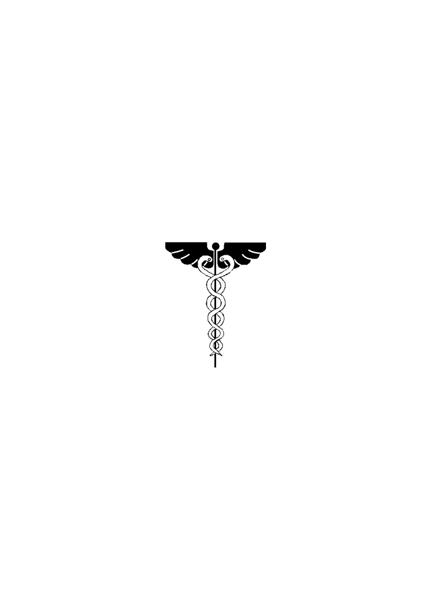

> **Первичный текст.** Наши дни Православная иерархия и патриотизм в России, 1996-12-18.
> Источник: `19961218 Наши дни Православная иерархия и патриотизм в России.doc` sha256 `70e296fe0e8bce23…`; [страница на dotu.ru](https://dotu.ru/1996/12/18/19961218-pravoslavnaya_ierarxiya_i_patriotizm_v_rossii/).
> Автоматическая транскрипция DOC→Markdown; смысл и формулировки не правились.
> Контрольные суммы и статус проверки — в [NOTICE.md](../../NOTICE.md).
> Содержание передаёт позицию авторов; утверждения не верифицированы библиотекой.

---

# АНАЛИТИЧЕСКАЯ ЗАПИСКА / Наши дни: Православная иерархия и патриотизм в России

АНАЛИТИЧЕСКАЯ ЗАПИСКА

Наши дни: Православная иерархия и патриотизм в России

Практически с самого начала перестройки и демократизации в сонме иерархов Русской православной церкви покойный митрополит Санкт-Петербургский и Ладожский Иоанн занял особое положение. Множество статей и книг, вышедших за последние годы за его подписью, создали ему репутацию духовного наставника и лидера патриотически настроенной общественности, склонной искать выход из нынешнего кризиса в возврате Росии и прежде всего русского народа к православно-церковной традиции общественной жизни. Для творчества митрополита Иоанна было характерным *отрицать молчаливо* какие бы то ни было достижения в жизни народов страны в советский период истории и при этом идеализировать прошлое до 1917 г., воздерживаясь от критики политики царизма и соглашательства с несправедливостями иерархии церкиви на протяжении веков в церковно-православный период истории страны.

Многие считают, что все здоровые силы общества действительно могут сплотиться в борьбе с очевидным злом современной неурядицы в государстве, попросту умалчивая или забыв о своих прежних разногласиях и идеологических спорах[^1], как то и делал митрополит Иоанн. Однако, предлагая забыть каждому свойственное тому, он сам не забывал своего и пропагандировал якобы как спасительные библейские учения в традиции русского православия, не желая вдаваться в конкретный смысл этого вероучения.

Но второго ноября 1995 г. недужный митрополит Иоанн скоропостижно и внезапно скончался на презентации отеля “Северная корона”, проводимой банком “Санкт-Петербург” (см. “Северная столица” 10-16 ноября 1995 г., которая по каким-то причинам назвала дату смерти 3 ноября; А.Невзоров в “Диком поле”, посвященном этому событию, показал в кадре Свидетельство о смерти митрополита с датой 2 ноября).

Многие до сих пор думают, что патриотическая общественность в его лице потеряла своего реального лидера, наставника в вопросах нравственности и смысла жизни. Однако дело сводится к тому, что реально патриотическая общественность утратила только возможность тешить себя самообольщением, что митрополит Иоанн действительно был лидером.

Смысл всякого ввероучения всегда конкретен и может отрицать искренние благонамеренные речи, которыми сопровождается пропаганда вероучения. Именно смыслом вероучения программируется психика множества людей, принимающих вероучение, и, как следствие, через это множество людей программируется поведение общества в целом на протяжении жизни многих поколений. Поэтому следует обратиться к смыслу социальных доктрин Православия как такового, и смыслу социальных доктрин Библии, как священного писания общего для России и неправославного Запада, прежде чем говорить о патриотизме православной иерархии[^2].

Исторически реально Православие в целом, и в России в частности, не имеет какой-либо особенной обществоведческой доктрины, в которой были бы изложены взгляды Иерархии и Церкви в целом на допустимое и недопустимое в жизни общества и государства. Сказанное не вымысел и не клевета. Чтобы убедиться в этом, обратимся к **Приложению 1** в *"Православном катехизисе"* епископа Александра Семенова-Тян-Шанского[^3], с. 151:

**1 - Промыслительное отсутствие догматов по общественным вопросам при наличии основных данных для их решения.**

Жизнь отдельных христиан влияет на общественную жизнь. Отсюда может встать вопрос: какими должны быть, с христианской точки зрения, государство, экономика, социальная структура, и могут ли они быть христианскими? Церковь не имеет догматических решений этих вопросов, и христианские мыслители решают их по-разному.

Но отсутствие догматов в этой области предохраняет, в некоторой мере, людей от худшей формы тирании во имя Христа, не исключая, впрочем, некоторые бесспорные данные, помогающие находить верные решения.

Но не лучше ли задуматься: не земной ли это "промысел" "мировой закулисы" (с которой якобы боролся митрополит Иоанн) породил отсутствие "догматов по общественным вопросам" в Православных церквях, дабы беспрепятственно разрешать неопределенности общественного самоуправления в своих интересах?

Сказанное епископом исторически недостоверно: "Святая" инквизиция, иезуиты, православные никонианские гонения в течение более чем двух столетий на православных же старообрядцев, насильственное крещение инославных перед пугачевским бунтом и т.п. тирания отсебятины (во имя Христа?) - спокойно уживались с отсутствием упомянутых общепризнанных Церковью "догматов" в попытке навязать людям, пастве самодурственную отсебятину церковных и светских иерархов. Это делалается столетиями вопреки общественным понятиям о справедливости и водительству Духом Святым.

А отсутствие исходных принципов общественной организации жизни людей и ведения ими народного хозяйства, т.е. в церковном лексиконе - «христианских догматов по общественным вопросам» - расчищает место для беспрепятственного действия в обществе общебиблейских — ветхозаветно-талмудических догматов по тем же вопросам. И об этом свидетельствует вся история и современность.

Обратимя еще раз к Доктрине “Второзакония-Исаии”[^4]:

***“Не давай в роcт брату твоему*** (по контексту единоплеменнику-иудею) ***ни серебра, ни хлеба, ни чего-либо другого, что возможно отдавать в рост; иноземцу*** (т.е. не иудею) отдавай в рост, чтобы господь бог твой (т.е. дьявол, если по совести смотреть на существо ростовщического паразитизма) ***благословил тебя во всем, что делается руками твоими на земле, в которую ты идешь, чтобы владеть ею*** (последнее касается не только древности и не только обетованной древним евреям Палестины, поскольку взято не из отчета о расшифровке единственного свитка, найденного на раскопках, а из современной, массово изданной книги, пропагандируемой всеми Церквями и частью “интеллигенции” в качестве вечной истины, данной якобы Свыше)***.”***- *Второзаконие, 23:19, 20*. ***“И будешь господствовать над многими народами, а они над тобой господствовать не будут”*** *- Второзаконие, 28:12.* ***“Тогда сыновья иноземцев*** (т.е. последующие поколения не-иудеев, чьи предки влезли в заведомо неоплатные долги к племени ростовщиков-единоверцев) ***будут строить стены твои (так ныне многие семьи арабов-палестинцев в их жизни зависят от возможности поездок на работу в Израиль) и цари их будут служить тебе*** (“Я - еврей королей” - возражение одного из Ротшильдов на неудачный комплимент в его адрес: “Вы король евреев”)***; ибо во гневе моем я поражал тебя, но в благоволении моем буду милостив к тебе. И будут отверзты врата твои, не будут затворяться ни днем, ни ночью, чтобы было приносимо к тебе достояние народов и приводимы были цари их. Ибо народы и царства, которые не захотят служить тебе, погибнут, и такие народы совершенно истребятся”*** *- Исаия, 60:10 - 12.*

Иерархии всех якобы-Христианских Церквей, включая и иерархию Русского Православия, настаивают на священности этой мерзости, а канон Нового Завета, прошедший цензуру и редактирование еще до Никейского собора (325 г. н.э.), от имени Христа, безо всяких к тому оснований, провозглашает ее до скончания веков в качестве благого Божьего промысла: ***“Не думайте, что Я пришел нарушить закон или пророков. Не нарушить пришел Я, но исполнить. Истинно говорю вам: доколе не прейдет небо и земля, ни одна иота или ни одна черта не прейдет из закона, пока не исполниться все”** - Матфей, 5:17, 18.*

Это — конкретный смысл Библии, которым заразилась Русь в общении с Византией, уже умиравшей от того же самого Библейского яда. И пусть православная патриотическая общественность честно ответит себе на вопросы:

-  Где русский или общероссийский патриотизм в доктрине “Второзакония-Исаии” и кононически-новозаветном соглашательстве с нею?

-  Что конкретно в реальной жизни знаменует, что ростовщическая мерзость доктрины “Второзакния-Исаии” — неисповедимый благой Божий промысел, якобы провозглашенный Христом до скончания века, если смерть митрополита Иоанна знаменует обратное?

Дело в том, что все, в кратце высказанное здесь об исторически реальном христианстве и Православии на Руси и в России, написано не после смерти иерарха Иоанна, а обстоятельно изложено в **“Вопросах митрополиту Санкт-Петербургскому и Ладожскому Иоанну и иерархии Русской Православной Церкви”**, переданных в его окружение, а в его лице — Церкви в марте 1994 г. и после нескольких месяцев церковного молчания изданных типографски. С марта 1994 г. в окружение покойного митрополита “Вопросы митрополиту Иоанну и иерархии Русской православной церкви” передавались несколько раз, но на “Вопросы...” не было дано ответа: ни прямо через тех лиц, кто передавал работу в окружение митрополита; ни опосредованно — в публикациях, с которыми митрополит Иоанн выступил после этого в печати.

Каждый руководитель обязан нести ответственность за работу своего окружения и канцелярии в частности. Потому нет особой нравственно-этической разницы: лицемерные клерки из его окружения не передали “Вопросы...” митрополиту, либо же клерки перадали названную работу адресату, но митрополит не ответил потому, что не посчитал нужным или не нашелся, что ответить. Так или иначе митрополит Иоанн и иерархия Церкви отмолчались.

Смерть иерарха Иоанна хронологически последовала *после того, как иерархии в его лице были заданы неприятные для православной традиции и самомнения православных вопросы; а также и предложены ответы на них, не совпадающие с церковными воззрениями на свою роль в истории России. Всё было сделано искренне, без задней мысли, но иерархия в лице Иоанна (или клерков и духовных чад митрополита) сочла за благо отмолчаться и отмолчалась.*

И соответственно этому факту, смерть иерарха знаменательна и по отошению к иерархии. Она знаменательно подтверждает правоту сказанного здесь о мерзостной библейской доктрине “Второзакония-Исаии” и церковно-христианского соглашательства с нею: иерарх церкви скончался, *пытаясь* *благословить,* на презентации в отеле (*место для заезжих чужестранцев*) “Северная Корона” (*символ монархии, социальной иерархии сословно-кланового строя, отрицающего равенство человеческого достоинства людей)*, устроенной банком “Санкт-Петербург” (*одной из множества ростовщических контор, порожденных в России в соответствии с библейской доктриной угнетения всех людей и биосферы планеты расово-”элитарным” ростовщическим паразитизмом и лицемерием).*

Если благословение всего этого, воплощающего в России доктрину “Второзания-Исаии” и Православного соглашетельства с нею, не состоялось по причине смерти иерарха, взявшегося за это дело, то в нашем понимании это — знак Свыше, что БИБЛЕЙСКАЯ МЕРЗОСТЬ противна Богу.

Верующему Богу человеку после такого освпадения попытки благословить и смерти Иоанна, естественно задуматься о том, что же несет в себе и что олицетворяет собой Л.Нарусова, если попытка благословить её *пресекается Свыше смертью* митрополита? Но если отстраниться от верноподданности православной иерархии, этому совпадению сопутствует и другой вопрос: Не умер ли митрополит Иоанн потому, что исчерпал Божеское попущение в отношении своей земной и церковной деятельности в момент, когда пришел на совет нечестивых и поднял руку для благословения сатанизма, вопреки тому, что ему были заданы определенные вопросы по этому поводу?

Как известно один из библейских пророков, не выполнил социальный заказ, и вместо того, чтобы проклясть — благословил и остался жив. Здесь же иерарх скончался при попытке благословить, хотя и без прямого социального заказа, но из ритуальной вежливости, что на наш взгляд еще хуже.

Все люди смертны, но в нашем понимании бытия, *христианину по истине,* **по истине не подабает** умирать, благославляя явления “элитарного” самопревозношения и ростовщиеского паразитизма. Это же относится и к гибели лидера российских христианских демократов В.Савицкого, погибшего не в борьбе за счастье народное, а в “Мерседесе” в результате автокатастрофы. “Христианской демократии” В.Савицкого в духе доктрины “Второзакония-Исаии” было неприемлемо отказаться от ростовщического кредитования, но в итоге он перестал пятнать пречистое <u>Христово имя и дело</u> библейской мерзостью.

Но это приводит к вопросу и о судьбе Церкви в целом: Почему Церковь, не отрекшаяся от этой мерзости, и не провозгласившая свое устремление к истине по совести, должна быть угодна Богу?

*И почему Православная церковь не является тоталитарной сектой, проповедуя эту мерзостную доктрину? То обстоятельство, что она вторглась **ИЗВНЕ** в нашу культуру более 1000 лет тому назад, работает на доморощенной кадровой базе, многие поколения сжились с её присутствием и деятельностью, существа дела не меняет: она горделиво от имени Бога проповдедует паразитизм и расовый таталитаризм, не внемля Божьим знаменям в жизни, отрицающим церковную доктрину. Если же говорить о подвижниках, то они были, есть и будут, вне зависимости от того, какая иерархия правит: Сергий Радонежский, Пересвет, Ослябя, Гермоген — прежде всего русские люди, личности, но не церковная иерархия, которая их благодетельностью покрывает несомую ею мерзостную доктрину ростовщического паразитизма расы иудейской господ.*

И пусть православные патриоты без лицемерия ответят: Чем митрополит Владимир, принявший кафедру после смерти Иоанна, хуже чем Иоанн, если Владимир, поскольку он не пишет якобы патриотических статей и книг, всего лишь более явно работает на ту же самую доктрину?

Пусть православный патриот в связи с этим подумает, какая экономическая разница благословлено ростовщичество, угнетающее Россию и весь мир ритуально приемлемым ему благообразным православным иерархом, либо это делает непосредственно раввин от синагоги или иерарх регулярного масонства? В русском языке есть поговорка, относящаяся к этому случаю: *что в лоб, что по лбу - все равно больно.*

Святая Русь — это возможно; но святое ростовщичество и святое соглашательство с ним — это невозможно, а при попытке освятить именем Божьим дурно кончается, что и продемонстрировал явственно митрополит Иоанн.

Многим православным и околоправославным - вне зависимости от их объяснений - *неприятно по существу* лишь то, что после 2 ноября 1995 г. покров патриотической демагогии на библейской доктрине расового паразитизма, *с которой они свыклись в Русской православной церкви,* исчез, после чего она предстала голенькой без патриотического макияжа в своей истинной сущности.

С 12 января 1996 г. Санкт-Петербургская митрополичья кафедра перешла к митрополиту Владимиру. В прошлом митрополит Владимир проходил службу в Иерусалиме, после чего представлял московскую патриархию в Женеве во Всемирном совете церквей. По прибытии в Санк-Петербург митрополит Владимир многократно был показан по телевидению. При этом трудно было не обратить внимание на тот факт, что в качестве посоха иерарха он использует задрапированный “кадуций” — жезл, вершину которого обвивают две змейки (как на рисунке, только обескрыленный и с крестом на головке). Это — атрибут восходящей к греческому-египетскому Гермесу герметической глобальной традиции тайных посвящений, в том числе и западных масонских. То есть посох митрополита Владимира любой посвященный поймет как выражение принадлежности его (в некотором качестве) к глобальной иерархии “мировой закулисы”, с которой митрополит Иоанн якобы вел непримиримую борьбу. Но на многих фотографиях и митрополит Иоанн остался запечатленным с тем же “кадуцием”, что унаследовал от него митрополит Владимир.

Это внешняя атрибутика, но и, если смотреть по существу, то оба митрополита при всем их внешнем различии в поведении и высказываниях — приверженцы доктрины “Второзакония-Исаии”: то есть во внутриобщественном отношении — духовные марионетки поработителей и угнететелей России; а в мистико-религиозном — ставленники сатанизма, поскольку ничто не знаменует, что ростовщический парарзитизм доктрины “Второзакония-Исаии” и церковно-христианское соглашаетльство с ним — милость Божия.

На наш взгляд, митрополит Владимир гораздо предпочтительнее, чем митрополит Иоанн, поскольку многие патриоты с его приходом лишились возможности пребывать в приятном самообольщении, их ни к чему не обязывающем. Пребывая в ритуально выдержанном приятном самообольщении, они перекладывали свою долю ответственности за судьбы России на митрополита Иоанна, олицетворявшего церковный патриотизм безо всяких к тому реальных оснований в вероучении и в историко-обществоведческой науке Православной Церкви. Теперь же ответственность за судьбы России придется нести самим без иллюзий в отношении патриотизма библейской иерархии, либо же признать свою недееспособность.

Чтобы стать дееспособными патритоами, придется пересмотреть свое отношение к Библии и церковно-православной традиции. Те из православных патритотов, которые не могут отрешиться от мысли о святости Библии, пусть ответят себе на еще один вопрос: Чего они возмущаются происходящим в России после 1985 г.? — если всё это происходит в полном соответствии с доктриной “Второзакония-Исаии” и соглашательства с нею большей части иерархов, а тем более эйкуменического крыла Русской православной церкви: Гайдара и КО им должно на руках носить за осуществление в жизни библейских иедеалов, а они в оппозицию к режиму; а если они считают, что Библия, в её исторически сложившемся виде — воистину не искаженное ложью священное писание, то выступая против режима, осуществляющего библейские идеалы и программу мироустройства, они пребывают в оппозиции и к богу. Если режим — проводит в жизнь библейскую доктрину, а патриотами он клеймится как сатанинский, то надо иметь мужество признать и Библию извращением истинно Божьих Откровений в интересах сатанизма.

Церковь учит так:

> 1\. Верую во единого Бога Отца, Вседержителя, Творца небу и земли, видимым же всем и невидимым.

>

> 2\. И во единаго Господа Иисуса Христа, Сына Божия, Единородного, Иже от Отца рожденного прежде всех век; Света от Света, Бога истинна от Бога истинна, рожденна, несотворенна, единосущна Отцу, Имже вся быша.

>

> 3\. Нас ради человек и нашего ради спасения сшедшаго с небес и воплотившагося от Духа Свята и Марии Девы, и вочеловечшася.

>

> 4\. Распятаго же за ны при Понтийстем Пилате, и страдавша и погребенна.

>

> 5\. И воскресшаго в третий день по Писанием.

>

> 6\. И восшедшаго на небеса, и седяща одесную Отца.

>

> 7\. И паки грядущаго со славою судите живым и мертвым, Его же Царствию не будет конца.

>

> 8\. И в Духа Святаго, Господа, Животворящаго, Иже от Отца исходящего, Иже с Отцем и Сыном споклоняема и сславима, глаголавшаго пророки.

>

> 9\. Во едину Святую, Соборную и Апостольскуо Церковь.

>

> 10\. Исповедую едино крещение во оставление грехов.

>

> 11\. Чаю воскресения мертвых,

>

> 12\. и жизни будущаго века.

Аминь.

По своему существу Никейский символ веры — *<u>пересказ биографических повествований Нового Завета своими словами в меру совестливости и понимания</u>*, т.е. он — предание старцев, <u>из которого исключены все слова самого Христа</u>, рассыпанные авторами канонических Евангелий по своим текстам. Вследствие этого Никейский символ веры должно было начинать словами:

Верую в предания старцев - отцов церкви, - которые учат, что я... *(<u>стих 9 в нём об этом же</u>)* и далее по тексту Символа вhры.

Устранение из Символа веры речей самого Христа не может не иметь религиозных и внутриобщественных последствий для обществ, чья духовная и вся прочая культура выросла из Никейской догматики. Символ веры, хотя и существует вместе с каноном Новозаветных писаний, не отрицающим прямо Благовестие Христово, в одной и той же церкви, тем не менее он не столь безобиден, как может многим показаться.

Иисус же своих современников по плоти учил совсем другому, что в молчании церквии столетиями подменяют отсебятиной:

*«С сего времени Царствие Божие благовествуется и всякий усилием входит в него* (Лука, 16:16). *Ищите прежде Царствия Божия и Правды Его, и это все (по контексту благоденствие земное для всех людей) приложится вам* (Матфей, 6:33). *Ибо говорю вам, если праведность ваша не превзойдет праведности книжников и фарисеев, то вы не войдете в Царство Небесное* (Матфей, 5:20).

*Господь Бог наш есть Господь единый* **(**Марк, 12:29). *Возлюби Господа Бога твоего всем сердцем твоим и всею душою твоею, и всем разумением твоим: сия есть первая и наибольшая заповедь; вторая же подобная ей: возлюби ближнего твоего, как самого себя* (Матфей, 22:37, 38). *Не всякий говорящий Мне “Господи! Господи!” войдет в Царство Небесное, но исполняющий волю Отца Моего Небесного* (Матфей, 7:21). *Просите, и дано будет вам; ищите и найдете; стучите и отворят вам; ибо всякий просящий получает, ищущий находит, и стучащему отворят (...) Итак, если вы, будучи злы, умеете даяния благие давать детям вашим, тем более Отец Небесный даст Духа Святого просящим у Него* (Лука, 11:9, 10, 13). *Когда же придет Он, Дух истины, то наставит вас на всякую истину...* (Иоанн, 16:13)

*Имейте веру Божию, ибо истинно говорю вам, если кто скажет горе сей: подымись и ввергнись в море, и не усомниться в сердце своем, но поверит, что сбудется по словам его - будет ему, что ни скажет. Потому говорю вам: все, чего ни будете просить в молитве, верьте, что получите, - и будет вам* (Марк, 11:23, 24). *Молитесь же так:*

*“Отче наш, сущий на небесах! Да святится имя Твое; да придет Царствие Твое; да будет воля Твоя и на земле, как на небе; хлеб наш насущный дай нам на сей день; и прости нам долги наши, как и мы прощаем должникам нашим; и не введи нас во искушение, но избави нас от лукавого. Ибо Твое есть Царство и сила, и слава во веки!”* (Матфей, 6:9 - 13). *Не придет Царствие Божие приметным образом (...) ибо вот Царствие Божие внутри вас есть* (Лука, 17:20, 21).*»*

Это — два взаимно исключающих вероучения. И Церковь, как это ни печально, далека от того, чему учил Христос...

Мы не одиноки в такого рода оценке. Пример тому - стихотворение, присланное из Воронежа, казалось бы весьма далекого от православно-интеллигентских распрей Москвы и Санкт-Петербурга:

***Божий знак***

> *Торговцев гнал из храма Иисус,*

>

> *Но наши иерархи всё забыли...*

>

> *Торгуют сами и не дуют в ус,*

>

> *Как будто их не рукоположили.*

>

> *И все спешат, молитвой освещая,*

>

> *Лихих мздоимцев, банки и конторы,*

>

> *Не думая: придется отвечать*

>

> *За новые содомы и гоморры....*

>

> *О, Иоанн! И ты не устоял -*

>

> *Пошел на службу к “рыцарям” удачи.*

>

> *Не потому ли Бог и покарал,*

>

> *Как знак того, что сгинет всё собчачье.*

>

> *О мой народ! Услышь, что говорю!*

>

> *Тебе не даром Знак Великий дан:*

>

> *Крестом решивший послужить ворью,*

>

> *Подняв лишь руку - рухнул Иоанн!*

**12 марта 1996 г., 13 декабря 1996 г.**

[^1]: По существу - спорах о смысле жизни человека и общества.

[^2]: Паства занята каждодневной работой и у неё нет времени для анализа смысла библейского многословия, поэтому Иерархии профессиональных богословов и богомольцев несут гораздо большую долю вины и ответственности за всё чем их паства.

[^3]: Хотя епископ принадлежал к зарубежной церкви, созданной русской эмиграцией после 1917 г., но его Катехизис был куплен в киоске Александро-Невской лавры, а многие православные, считающие себя патритотами России наших днейй, ссылаются на этот катехизис в беседах.

[^4]: Название условное, поскольку в том мире, в котором живем мы, пророки Божьи не заповедали такой мерзости.
---

[К произведению](README.md) · [Каталог](../../CATALOG.md)
