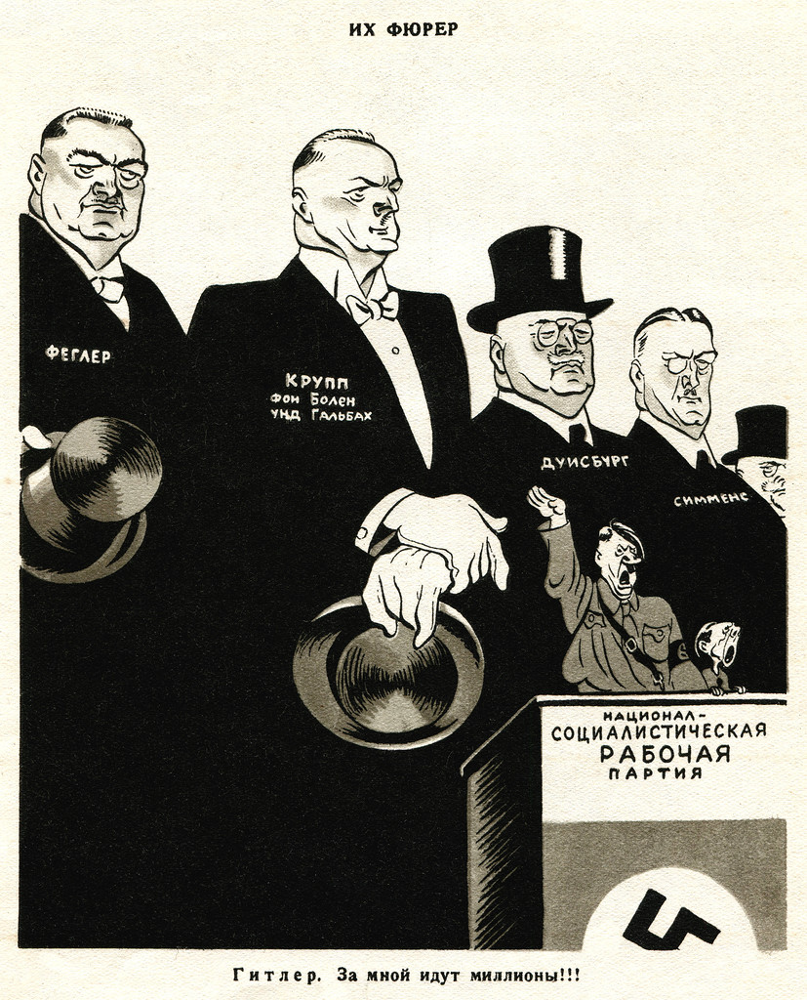
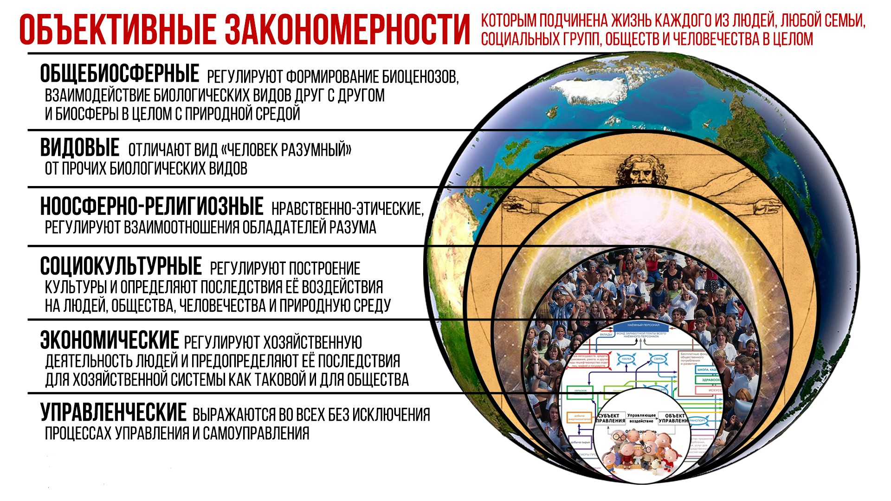

> **Первичный текст.** О романе Айн Рэнд «Атлант расправил плечи».
> Источник: `dotu.ru:4878ebb9edb5e37e.doc` sha256 `fdb18d0aaf1713bd…`; [страница на dotu.ru](https://dotu.ru/2018/08/03/20180803_about_the_novel_ayn_rand_atlas_shrugged/).
> Автоматическая транскрипция DOC→Markdown; смысл и формулировки не правились.
> Контрольные суммы и статус проверки — в [NOTICE.md](../../NOTICE.md).
> Содержание передаёт позицию авторов; утверждения не верифицированы библиотекой.

---

АНАЛИТИЧЕСКАЯ записка

О романе Айн Рэнд «Атлант расправил плечи»

ОГЛАВЛЕНИЕ

[1. Айн Рэнд и реклама её романа 1](#айн-рэнд-и-реклама-её-романа)

[2. Сюжет: суть дела кратко 2](#сюжет-суть-дела-кратко)

[3. Сюжет и реальность 6](#сюжет-и-реальность)

[4. Главная идея романа и правда жизни 11](#главная-идея-романа-и-правда-жизни)

[5. Очарование «Атлантом» как следствие слабоумия и невежества 17](#очарование-атлантом-как-следствие-слабоумия-и-невежества)

[6. Общественное благосостояние\

и научно-методологическое обеспечение государственного и бизнес- управления 24](#общественное-благосостояние-и-научно-методологическое-обеспечение-государственного-и-бизнес--управления)

[Заключение 34](#заключение)

# 1. Айн Рэнд и реклама её романа

*[В оригинальном издании здесь расположен рисунок/схема. Иллюстрация не включена в данный выпуск: ожидает визуальной и правовой проверки. Файл источника: image1.jpeg]*Айн Рэнд (Ayn Rand) — псевдоним американской писательницы и социального философа Алисы Зиновьевны Розенбаум (1905 — 1982). Она родилась в Петербурге в еврейской семье преуспевавшего аптекаря. Как сообщают её биографы, она с детства интересовалась политикой и радовалась свержению монархии и победе февральской революции. Потом Великая октябрьская социалистическая революция лишила семью права собственности на аптеку, которая была их семейным бизнесом. И судя по её дальнейшей жизни, смысла Великого октября она понять не смогла. Период послереволюционной гражданской войны семья будущей Айн Рэнд провела в Крыму, где Алиса окончила школу в Евпатории. С 1921 г. она училась в Ленинградском университете по специальности «социальная педагогика». С 1925 г. она работала экскурсоводом в Петропавловской крепости до того, как покинула СССР в 1926 г. *[В оригинальном издании здесь расположен рисунок/схема. Иллюстрация не включена в данный выпуск: ожидает визуальной и правовой проверки. Файл источника: image2.jpeg]*После этого она жила в США и вела идейную борьбу против распространения идей коммунизма и убеждала своих читателей и слушателей в том, что наиболее эффективная — и потому наиболее справедливая — социальная организация проистекает из свободы частного предпринимательства, свободы торговли и неограниченной конкуренции частных предпринимателей, а всё остальное — разновидности рабовладения, основанные на силовом принуждении и шантаже силой[^1].

Её произведения переведены на русский язык, ныне они доступны в интернете, и в потоке пропаганды, изливаемой на население, в том числе и в России, есть составляющая Айн Рэнд. Так ещё осенью 1996 г. «Радио России» выпустило в эфир цикл передач, в которых читалась книга Айн Рэнд «Концепция эгоизма»[^2]. И до настоящего времени многие бизнес-тренеры в России рекомендуют произведения Айн Рэнд своим подопечным и, в особенности, — её роман «Атлант расправил плечи»[^3]. В интернете на сайтах, посвящённых этому роману, преобладают восторженные отзывы о нём, хотя встречаются и единичные отрицательные мнения и о литературном стиле романа, и об идеях, в нём выраженных, и о самой Алисе Розенбаум. Но краткость восторгов и порицаний не позволяет понять, какая из сторон по существу права.

Выдержка из текста 2013 г.: «Несколько лет назад, когда Андрей Илларионов еще был советником Владимира Путина[^4], он предлагал своему шефу прочесть Айн Рэнд. Неизвестно, ознакомился ли президент с текстами, но это не столь важно: когорты её последователей уже обустраивают российскую жизнь по законам хищнического индивидуализма. Прошло время русской литературы с ее гуманистическим пафосом, чеховскими «человечками с молоточком» и достоевскими «слезинками ребенка». Пришло время эффективных менеджеров: их книг, их законов, их фюреров».[^5]

Но всё же встаёт вопрос, если в бизнес-кругах России и среди её политиков на протяжении более чем 20 лет пропагандируются определённые книги, то кто «ведётся» на её книги? И надо ли принимать к действию рецепты обустройства жизни от Айн Рэнд?

Чтобы ответить на эти вопросы, вникнем в сюжет романа.

# 2. Сюжет: суть дела кратко

Действие романа «Атлант расправил плечи» (оригинальное название «Atlas Shrugged»[^6]) происходит в вымышленном Айн Рэнд мире. Однако это не реальный мир с его историей, в жизнь которого введены вымышленные персонажи романа, как, например, в «Войне и мiре» или в «Тихом Доне». И это не «антиутопия», как многие литературоведы и бизнес-тренеры характеризуют этот роман[^7]; это — фэнтази, т.е. *измышления, которые во многом несовместимы с объективными закономерностями, которым подчинена жизнь людей и культурно своеобразных обществ в объективной реальности, в которой мы живём и частью которой являемся.* Причём это очень занудная и скучная «фэнтази», которую Айн Рэнд писала на протяжении 15 лет с 1942‑го по 1957 г.

Необязательность законов природы, включая закономерности, которым подчинена жизнь людей, — это то, что отличает жанр «фэнтази» от жанра «научной фантастики» и жанра «социально-философского»[^8]. Поэтому не будем придираться к тому, что в некоторых местах сюжета проявляется незнание Алисой Розенбаум физики и химии нашего мира: в вымышленном мире действуют другие физика и химия, а также и прочие объективные закономерности. **Но точно так же в нём не действуют и объективные закономерности, свойственные жизни нашего реального мира, включая и социальные закономерности, и именно по этой причине «получается» сюжет в жанре «фэнтази» вместо того, чтобы рассыпаться под воздействием объективных закономерностей нашего мира.**

**Вследствие этого переносить в наш мир из выдуманного Айн Рэнд мира рецепты решения проблем, доказавшие свою эффективность «там», — ошибочно и опасно как для самих себя, так и для окружающих, и для потомков.**

Этот вымышленный мир включает в себя США и прочие государства, которые упоминаются в тексте мимоходом, большей частью в связи с теми или иными событиями основных сюжетных линий, локализованных в границах США. Время действия романа — начало 1930‑х гг., если судить по описываемой в нём техносфере. Она в целом соответствует именно началу 1930‑х годов для США: есть автомобили как легковые, так и грузовые, но ещё нет отрасли дальних междугородних и межрегиональных автомобильных грузоперевозок в режиме «от двери до двери», что впоследствии убило многие железные дороги США, поскольку они проиграли *по быстродействию* в конкурентной борьбе за грузопотоки; железные дороги пока ещё являются основным видом междугороднего и межрегионального транспорта, их подъездные пути заходят на территорию всех сколь-нибудь больших промышленных предприятий, но паровозы уже вытеснены «дизель-электровозами»[^9] с наиболее важных магистралей, скорость движения поездов по которым доходит до 100 и более км/час; есть гражданская авиация и сеть аэродромов по всей стране; достаточно широко распространено радиовещание; телевидение уже появилось, телевещание ведётся, но оно ещё не широко распространено; в городах есть химчистки, кафе и рестораны, театры, кинотеатры, концертные залы. Если исходить из того, что в реальной истории США эпоха массового строительства железных дорог началась в конце 1850‑х гг., а двое из персонажей романа — правнуки основателя одной из крупнейших железнодорожных компаний (т.е. они — четвёртое поколение семьи, владеющей фирмой), то время событий, описываемых в романе, тоже соответствует концу 1920‑х — первой половине 1930‑х гг.

Во всём же остальном мир персонажей романа ничего общего не имеет с историей нашей глобальной цивилизации, если не считать того, что и в нём Американский континент кто-то из европейцев некогда открыл, и он населён большей частью выходцами из Европы, заместившими коренное население[^10] и распространившими цивилизованность европейского типа на этот континент с некоторыми модификациями. В мире, измышленном Айн Рэнд, нет упоминаний ни о гражданской войне в США 1861 — 1865 гг., ни о первой мировой войне ХХ века и её последствиях, ни о Великой октябрьской социалистической революции, изменившей облик нашего мира и дальнейшее течение Истории реального человечества. Ни Российская империя, ни СССР в романе вообще не упоминаются. Поскольку роман принадлежит к жанру «фэнтази», то автор имела право измыслить мир персонажей романа без России-СССР[^11]. Проблематика национальных и расовых взаимоотношений в романе тоже не затрагивается: в нём нет ни негров, ни евреев, ни «итальянской мафии», а только субъекты, лишённые национального своеобразия, о которых можно догадаться, что они белые «псевдочеловеки», выросшие и живущие в культуре европейско-американского типа (если соотноситься с реальностью нашего мира); нет там и масонства, без которого государственное и бизнес- управление макроуровня в США реально неосуществимы и потому не существуют.

Вымышленный мир переживает непростые времена. В разных регионах планеты капитализм на основе либерально-рыночной экономики заменяется «народными республиками». В них частные предприниматели расцениваются как эксплуататоры наёмного персонала, противящиеся общественному прогрессу, и потому в целях обеспечения «общественного благосостояния»[^12] и «справедливого распределения благ» государственная власть «народных республик» берёт управление экономикой на себя, реализуя лозунг коммунизма «от каждого по способности — каждому по потребности»[^13]. В частности, упоминаются «Народная республика Мексика» и её госплан; Франция, Норвегия, Великобритания, Португалия, Турция, Китай, Индия, Греция — тоже «народные республики», а в конце романа «народными республиками» становятся Чили и Аргентина. Однако на практике во всех «народных республиках» после взятия экономики под власть государства произошло ухудшение экономического положения до катастрофического уровня: они не в состоянии обеспечить себя, прежде всего, продовольствием, не говоря уж обо всём остальном, что объективно необходимо для жизни и развития общества, и остро нуждаются в «гуманитарной помощи», которую им пока ещё оказывают США. Так, в Китайской «народной республике» «не хватает даже гвоздей, чтобы построить хоть какое-нибудь жильё». В «народных республиках» Европы норма — каторжные работы в концентрационных лагерях, четырнадцатичасовой рабочий день, свирепствует цинга. Причины такого положения дела в «народных республиках» просты:

- С одной стороны: государственную власть захватили люди, заявляющие, что они действуют от имени народа, однако они принадлежат к психологическому типу, в реальном мире именуемому словом «бюрократы». **Бюрократы в жизни — моральные уроды без каких-либо нравственных принципов, кроме беспринципности как принципа**[^14]**.** Их психология лишь немногим сложнее, чем «психология кишечнополостных»: всё, что оказывается в пределах досягаемости «щупальцев» бюрократа, автоматически хватается и запихивается им в свой «анус», совмещённый со «ртом», а если запихать туда не получается, то уничтожается. Они — идиоты по отношению к занимаемым должностям и кругу обязанностей, и потому ничего не знают, ничего не умеют, однако издают разного рода распоряжения, неадекватные жизни как таковой, реализация которых только усугубляет положение дел. Они не берут на себя ответственность ни за что, но требуют ото всех подчинённых самоотверженной работы на «общественное благо» и безусловного исполнения их «гениальных распоряжений» (это одно из проявлений беспринципности как принципа). При всём при этом бюрократы настаивают на том, что они занимаются самым важным для общества делом и их заменить некем, а для того, чтобы они могли спокойно работать на «общественное благо», все их потребности должны быть удовлетворены по максимуму и в полном объёме; а в условиях «национального кризиса» (временного — «завтра экономика наладится, и всем станет жить лучше») все прочие должны честно и безропотно исполнять, что приказывают бюрократы, и получать средства к существованию в том объёме и тем способом, которые назначат бюрократы. Кто не согласен с такой политикой «общественного блага», должны дожидаться «лучших времён» в концлагерях (чтобы не мешать преодолевать кризис бюрократам и «патриотам»), если не совершили более тяжких реальных и мнимых преступлений, за которые «народная власть» карает смертью.

- С другой стороны: в подвластном бюрократам обществе люди принимают на себя миссию жертвы и безропотно терпят всё это, безумно веря в «светлое будущее» и ожидая его прихода, либо деморализуются и уходят в бандитизм или деградацию. Кто-то гибнет, кто-то вливается в ряды бюрократов по мере того, как открываются новые вакансии в расползающейся иерархии бюрократии государственной власти, проникающей всюду, или же по мере того, как некоторые бюрократы утрачивают позиции в борьбе друг с другом.

Но и в США протекают процессы, ведущие к тому, что они тоже станут «народной республикой» по типу уже состоявшихся в таковом качестве стран: в них мерзавцы и идиоты захватывают государственную власть под вопли об обеспечении «общественного благосостояния» путём подчинения толстосумов и предпринимателей рангом помельче государственной власти, пекущейся о «благе народа». По мере захвата государственной власти мерзавцы и идиоты становятся бюрократами и начинают вмешиваться в экономику, пожиная плоды чужих трудов. В результате их политики в начале романа США живут в условиях начавшейся экономической депрессии, спровоцированной якобы некомпетентным вмешательством бюрократов в дела предпринимательского сообщества в целом и в работу отдельных отраслей экономической системы[^15], а в конце романа экономическая система приходит к полному краху: на железных дорогах поезда не ходят, промышленные предприятия не работают, снабжение населения продовольствием нарушено, всё, что можно с промышленных и инфраструктурных объектов украсть, — крадётся. В общем, крах экономики описан реалистично со знанием дела на основе впечатлений от экономической разрухи в России в годы гражданской войны и иностранной интервенции.

Однако крах экономики США в романе был ускорен. Один из персонажей романа — Джон Галт. Он — выдающийся физик и изобретатель двигателя, который работает на *общедоступном* статическом электричестве атмосферы. Он не пожелал, чтобы паразиты пользовались плодами его творчества, уничтожил двигатель и занялся общественной деятельностью, но в специфическом виде. Он стал успешно убеждать наиболее эффективных в деле бизнесменов и топ-менеджеров бросать свои дела и «исчезать». Без их знаний и умений, прежде наиболее успешные предприятия отраслей быстро приходили к краху, поскольку в вымышленном Айн Рэнд мире, у этих собственников и руководителей не было «кадрового резерва», представители которого могли бы занять их место и эффективно продолжать дело, а в экономике — не было достаточно эффективных предприятий-конкурентов, способных занять соответствующие ниши на рынке: такова задумка автора *«фэнтази» для предпринимателей и претендентов в предприниматели,* поскольку, если в сюжет ввести кадровый резерв и эффективно работающие предприятия-конкуренты, то его не удалось бы довести до финала без введения в действие «эскадронов смерти», которые бы уничтожали предпринимателей, нежелающих исчезнуть. «Исчезнувшие» же предприниматели переправлялись Джоном Галтом в долину посреди горной пустыни, где они организовали идеальную по мнению Айн Рэнд социально-экономическую систему, которую мы рассмотрим в разделе 6. Чтобы бюрократы-государственники не добрались до этого предпринимательского рая со всею мощью государственных спецслужб и вооружённых сил, место для этого рая, именуемого «Атлантидой», было выбрано вдали от населённых районов в безлюдной местности, а Джон Галт закрыл его от обозрения и несанкционированного проникновения физическими полями, неизвестными официальной науке их мира. А сам Джон Галт тем временем продолжал работать путевым рабочим на железной дороге, вице-президентом правления которой была главная героиня романа Дэгни Таггарт.

# 3. Сюжет и реальность

Это то место, настоящей записки, где необходимо прямо указать:

Роман «Атлант пожал плечами» производит впечатление, что его написала настырная уличная бродячая торговка с образованием, не выходящим за пределы программы начальной школы[^16]. Кругозор и понимание Айн Рэнд экономической жизни общества, социальной организации, финансов, причинно-следственных связей в течении социальных процессов, биологических основ цивилизации, сути и роли управления, сути и роли государственности — в силу каких-то причин соответствует именно этому уровню. Т.е. роман — графоманство очень невежественного индивида, не способного к тому же по слабоумию осознать и устранить своё невежество — некомпетентность.

Айн Рэнд, до старости сохранив *миропонимание недозрело-озабоченной девочки-подростка, живущей на всём готовом в неплохо обеспеченной семье,* и конструируя милый её нравам сюжет, полностью проигнорировала исторический опыт реального мира, который противоречит всему, ею написанному.

Роман «Атлант расправил плечи» был издан в 1957 г. К этому времени успели произойти следующие события, о которых Алиса Розенбаум не могла не знать, и суть которых она обязана была понимать как человек, претендующий быть социальным философом, или как просто писатель, показывающий читателю проблемы общества и их причины, чтобы люди сами подумали о путях и средствах их разрешения.

**ПЕРВОЕ**. В 1929 г. США вверглись в «великую депрессию». Её непосредственными «поджигателями» реально были не запредельно тупые и некомпетентные вашингтонские бюрократы, которые вредоносно встревали в дела якобы всегда компетентного частного бизнеса, а хозяева Федеральной резервной системы (т.е. частные предприниматели — «финансовые гении»), которым государственная бюрократия США передала всю полноту власти над финансами страны в 1913 г., согласившись на создание Федрезерва. В результате этого США утратили финансовый суверенитет, который не восстановили доныне. За время «великой депрессии» в США вымерло от голода и краха психики несколько миллионов человек, но статистические данные о понесённом демографическом ущербе засекречены доныне, и эта тема публично в США не обсуждается ни в СМИ, ни в открытом научном официозе[^17]. Если Айн Рэнд лично все эти социальные бедствия не затронули, то она не могла не знать о них, проживая в США[^18].

*[В оригинальном издании здесь расположен рисунок/схема. Иллюстрация не включена в данный выпуск: ожидает визуальной и правовой проверки. Файл источника: image3.jpeg]*

*[В оригинальном издании здесь расположен рисунок/схема. Иллюстрация не включена в данный выпуск: ожидает визуальной и правовой проверки. Файл источника: image4.jpeg]* *[В оригинальном издании здесь расположен рисунок/схема. Иллюстрация не включена в данный выпуск: ожидает визуальной и правовой проверки. Файл источника: image5.jpeg]* *[В оригинальном издании здесь расположен рисунок/схема. Иллюстрация не включена в данный выпуск: ожидает визуальной и правовой проверки. Файл источника: image6.jpeg]*

**ВТОРОЕ**. Из «великой депрессии» США вывел — Франклин Делано Рузвельт (1882 — 1945), который был президентом США с 1933 г. до своей *загадочной* смерти (его избирали 4 раза, поскольку в те времена в США не было ограничений на количество сроков избрания). Сам он бюрократом не был[^19], но вынужден был «пасти» бюрократию государственной власти США. Одним из главных его экономических советников (начиная с 1937 г.) был Джон Кеннет Гэлбрейт (1908 — 2006) — выдающийся макроэкономист, теоретик и практик, воззрения которого не востребованы в США доныне, что создаёт им кучу социальных и экономических проблем. Команда Рузвельта, обретя государственную власть, оказалась перед выбором: либо в США вызреет революционная ситуация и будет организована марксистская революция со всеми её действительно кошмарными последствиями в виде повсеместного разгула бандитизма и массовых злоупотреблений властью американской ВЧК по борьбе с контрреволюцией и саботажем, *либо его команда изменит режим функционирования политико-экономической системы страны так, что классовый конфликт будет разрешён на достаточно продолжительное время*. Они смогли сделать второе, хотя некоторые представители сообщества предпринимателей и «интеллектуалы» США до сих пор убеждены, что Рузвельт — тайный коммунист и предатель интересов Америки. Тем не менее, как видно из показанной выше статистики, до прихода к власти команды Рузвельта ВВП США прогрессирующе снижался, а безработица росла, причём безработными были не только неумехи-забулдыги, но и высоко квалифицированные профессионалы, как рабочие, так и инженеры и прочие специалисты с высшим образованием[^20].

**ТРЕТЬЕ**. Российская империя в период с 1914 по 1920 г. трансформировалась в СССР. Официально провозглашённой целью политики СССР была реализация на практике порицаемого Айн Рэнд принципа «от каждого по способности — каждому по потребности». Эта цель не была достигнута, однако к моменту выхода в свет романа «Атлант пожал плечами» СССР стал государством-суперконцерном — второй экономикой мира. Темпы научно-технического развития и роста производства в СССР в первой половине 1950‑х гг. были таковы, что западные эксперты были убеждены в способности СССР стать безальтернативным гегемоном в мировой политике и в экономике к началу 1980‑х гг. *при условии, что страна сохранит достигнутые ею **под руководством И.В. Сталина** темпы развития*[^21]. Под властью симбиоза масонства и *большевиков во главе с И.В. Сталиным* остов Российской империи стал сверхдержавой номер 2 потому, что в СССР во времена сталинского большевизма планированием развития экономики и культуры занимались не идиоты (как в «народных республиках» в мире Айн Рэнд), и были открыты возможности для реализации творческих инициатив и конкуренции идей и решений[^22] как в государственном секторе экономики, так и в кооперативном[^23]. Т.е. СССР качественно отличался от выдуманных Айн Рэнд «народных республик».

Что касается Российской империи, то в отличие от СССР, в ней государственная власть почти не вмешивалась в дела частных предпринимателей, и казённые заводы (государственный сектор) конкурировали с частными, а частники — конкурировали друг с другом. Эта конкуренция в её историческом развитии выглядела так.

Клан Рафаиловичей (евреи, принявшие православие) в 1820‑е годы (при поддержке командующего Черноморским флотом с 1816 по 1833 г. А.С. Грейга с подачи его любовницы Лии Сталинской) стал монополистом в деле строительства военных кораблей для Черноморского флота. При этом казённые верфи на Чёрном море, хотя и обладали необходимыми производственными мощностями, не были загружены заказами и простаивали годами, а стоимость кораблей, построенных на верфях Рафаиловичей, была втрое выше, чем стоимость аналогичных кораблей, построенных на казённых верфях в Петербурге и в Архангельске, качество же, выражавшееся в сроке службы кораблей, — было ощутимо ниже[^24].

Прошли десятилетия, было отменено крепостное право. Конкуренция и «созидательная» деятельность отечественных предпринимателей продолжалась в том же духе: посмотрите материалы расследования катастрофы царского поезда в Борках в 1887 г. В итоге к началу первой мировой войны Российская империя по-прежнему была населена преимущественно невежественными необразованными людьми, в силу чего в ней не было многих передовых для того времени высокотехнологичных отраслей: станкостроения и инструментальной промышленности, авиастроения, автомобилестроения, производства шариковых и роликовых подшипников, оптической промышленности, радиоэлектронной промышленности, энергетического машиностроения, управленчески состоятельной системы стандартизации, обеспечивающей высокие темпы научно-технического прогресса и т.п. Производственная культура была на таком низком уровне, что не позволяла воспроизвести с должным уровнем качества даже лицензионные аналоги зарубежной продукции[^25], производство которых требовало сколь-нибудь высоких технологий и организационно-технологической дисциплины. Исключения из этого общего правила были, но не они определяли лицо российской экономики.

Далее на закате империи, в ходе первой мировой войны незадолго до начала революционных потрясений 1917 г. частные «Путиловские заводы»[^26] были взяты под государственное управление, поскольку оказались не в состоянии выполнить принятые на себя обязательства по объёмам и срокам поставки заказанной им продукции военного назначения. Сообщество же промышленников частных предпринимателей в целом наживалась на военных заказах, снабжая фронт и тыл неведомо чем, и по сути саботируя ведение войны[^27].

СССР же ко времени выхода романа «Атлант пожал плечами» за 40 лет, прошедших после революций 1917 г., (в отличие от деградировавших «народных республик» Айн Рэнд) достиг суверенитета в научно-техническом отношении и по многим показателям задавал мировой уровень техники: напомним, что в год выхода романа «Атлант пожал плечами» в СССР был запущен первый в мире спутник; и это при том, что *все ракетчики третьего рейха работали в США,* а потери в войне главным образом молодёжи, и ещё ранее — *организованная троцкистами — «ежовщина», направленная на выкашивание высоких профессионалов всех уровней и сфер деятельности,* ощутимо подорвали интеллектуальный и профессиональный потенциал нашей страны.

Это неоспоримое достижение трансформации отсталой империи в СССР было результатом планового ведения народного хозяйства и планового развития культуры. Периоды экономической разрухи после гражданской войны и интервенции и после Победы в Великой Отечественной войне были краткосрочными по историческим меркам (в том числе и в сопоставлении с «великой депрессией» в США и разрухой в Великобритании по завершении второй мировой войны), вследствие того, что именно адекватное планирование в обоих случаях позволило стране выйти из разрухи в кратчайшие сроки.

Но наряду с этим к началу 1950‑х гг. бюрократия в СССР сложилась как общественный класс — класс эксплуататорский, паразитический, и в послесталинские времена (когда был введён в действие режим безответственности за результаты порученного дела), стала делать то, что описывает в своём романе Айн Рэнд, — управлять экономикой без должных знаний и навыков, что стало одной из главных причин последующей остановки научно-технического прогресса, проблем в экономике, приведших СССР к краху. А постсоветскую Россию изначально «советская бюрократия» во главе с президентом Е.Б.Н. в 1990‑е годы довела до состояния «народных республик» из романа Айн Рэнд: не могли жить без гуманитарной продовольственной помощи из-за рубежа при деградации и разрухе в своих сельском хозяйстве и промышленности. То же касается и бюрократии других постсоветских государств. *Но изложенное в этом абзаце на момент выхода в свет «Атланта» ещё не успело стать достоянием Истории.* Однако Айн Рэнд не пророк и не первооткрыватель разрушительных свойств бюрократии, и потому роман «Атлант пожал плечами» — не откровение прозорливицы, проливающее свет на эту прежде неясную сторону жизни. О сути бюрократии и необходимости её искоренения задолго до неё писали К. Маркс, О. Бисмарк, М.Е. Салтыков-Щедрин, В.И. Ленин, И.В. Сталин, Л.Д. Троцкий, М. Джилас и много кто ещё.

**ЧЕТВЁРТОЕ**. Третий рейх, возникший на развалинах *«Веймарской республики», образцово либеральной в аспекте свободы частного предпринимательства и свободы торговли,* тоже построил государственно-плановую экономику. Третий рейх строили негодяи, но они не были идиотами. Поэтому экономика третьего рейха оказалась настолько эффективной в деле обеспечения военных действий на множестве фронтов протяжённостью в несколько тысяч километров, что союзникам по антигитлеровской коалиции пришлось воевать с рейхом и созданным им «Евросоюзом 1» на протяжении 4 лет (если считать от 22 июня 1941 г., а не от разгрома рейхом Польши в сентябре 1939 г. и последовавшей за этим «странной войны» Франции и Великобритании против рейха). А после победы над рейхом союзники на протяжении последующих примерно 10 лет изучали и осваивали научно-технические достижения гитлеровской Германии, которым не было аналогов в их собственных культурах.

Но возникновение и становление третьего рейха как мощной державы стало возможным прежде всего вследствие того, что экономическая система «Веймарской республики» при всей свободе в ней частного предпринимательства и свободе торговли была близка к экономикам «народных республик» из романа Айн Рэнд. Конечно, версальский мир, внёс определённый вклад в тяжёлое экономическое положение Веймарской республики, но куда больший вклад в него внесла либерально-рыночная экономика[^28]. И это при том, что немцы в тот период истории не были лентяями и неумехами в работе, а их наука и инженерные субкультуры были одними из лучших в мире. При таком потенциале построить рейх было проще, чем создавать и развивать СССР потому, что охват населения Германии образованием был многократно шире и выше, нежели населения Российской империи, что после прихода в 1933 г. к власти НСДАП во главе с Гитлером и позволило Германии в течение нескольких лет воссоздать военно-экономическую мощь и переступить через Версальский мирный договор.

И счастье всех ныне живущих в том, что закулисным заправилам Запада удалось спровоцировать третий рейх начать войну, ставшую мировой, в 1939 г. — ранее, чем рейх смог создать качественное научно-техническое и военно-экономическое превосходство над *буржуазными* «демократиями» Запада.

#  4. Главная идея романа и правда жизни

Однако сюжет романа «Атлант пожал плечами» сам по себе не главное. Сюжеты литературных произведений социально-философской направленности — средство демонстрации жизненной состоятельности разного рода идей, которые лежат в основе жизни общества или же претендуют на такой статус. Главная идея романа «Атлант пожал плечами» высказана в монологе — выступлении Джона Галта по радио. Обладая подавляющим научно-техническим превосходством над официальной государственностью США, Джон Галт отключил от эфира собиравшегося выступать перед народом высокопоставленного государственного бюрократа и выступил сам, а его от эфира бюрократы отключить не смогли… Фрагмент этого выступления ниже, комментарии в сносках к выделенному курсивом тексту в цитате — наши:

«Как человек не может существовать без тела, так и права не могут существовать без права воплощать их в жизнь — думать, трудиться, распоряжаться результатами труда, что означает право на собственность. Современные мистики силы, которые предложили вам ложный выбор: права человека или права собственности, — предприняли последнюю смехотворную попытку оживить старое противопоставление души и тела. Только призрак может обойтись без собственности, только раб трудится, не располагая правом на продукт своего труда. *Доктрина превосходства прав человека над правом собственности означает попросту, что одни могут превращать в собственность других. Поскольку умелый ничего не получит от неумелого, это означает право неспособного распоряжаться способными и использовать их в качестве тяглового скота.*[^29] Всякий, кто считает такое положение вещей нормальным для человека, не имеет права на звание человека.

*Источник права собственности — закон причины и следствия. Всякая собственность и все формы богатства произведены трудом человека и его разумом. Так же как нет следствий без причин, нет и богатства без его источника — интеллекта*[^30]*. Интеллект нельзя заставить работать, те, кто способен мыслить, не мыслят по принуждению, а те, кто на это соглашается, создают не больше цены кнута, которым их погоняют. Нельзя присваивать продукт интеллектуального труда иначе, как на условиях его собственника, только по обмену и добровольному согласию*[^31]*.* Иной подход — подход бандитов, сколько бы их ни было. Преступники живут сегодняшним днем и дохнут с голода в отсутствие жертв, так же как вы сейчас страдаете от голода, те, кто считал, что преступление может быть оправдано, если правительство узаконит бандитизм и осудит сопротивление бандитизму. Единственное *подлинное назначение правительства*[^32] — защищать права человека, что означает оберегать его от физического насилия. Настоящее правительство — всего лишь полицейский и действует как инструмент самозащиты человека. Как таковой оно может прибегать к силе только против тех, кто первым применил силу. Единственными правительственными учреждениями должны остаться: полиция — для защиты от уголовников внутренних, армия — для защиты от уголовников внешних, суды — для охраны собственности и контрактов от посягательств, нарушений и обмана, разрешения споров на разумной основе согласно объективным законам.

Но правительство, первым применяющее силу против своих граждан, не прибегающих к насилию, силой оружия подавляющее безоружных людей, — это адская машина, разрушающая нравственность. Такое правительство извращает свое назначение и не имеет морального оправдания, оно переключается с роли защитника на роль смертельного врага человека, с роли полицейского — на роль уголовника, облеченного правом прибегать к насилию против жертв, лишенных права на самооборону. Вместо нравственного закона это правительство устанавливает такое правило общественного поведения: можете делать все что угодно со своим соседом, если ваша группировка больше и сильнее. Только тупица, недоумок или трус готовы жить на таких условиях, готовы отказаться от своих прав на собственную жизнь и разум, готовы согласиться, что другие могут распоряжаться ими по собственному усмотрению и капризу. Они с готовностью соглашаются, что *воля большинства неоспорима*[^33], что физическая сила и численное превосходство выше правды, закона и реальности. Мы же люди разума и взаимовыгодного обмена, мы не господа и не рабы, мы не выдаем и не принимаем чеков на предъявителя. Мы не приемлем никакой формы нерациональности.

До тех пор, пока во времена дикости люди не имели понятия об объективной реальности, пока они верили, что физический мир подчинен воле и капризам непознаваемых духов и демонов, невозможны были ни мысль, ни наука, ни производство. Только когда люди открыли для себя, что мир устойчив, предсказуем, стало возможно полагаться на знания, планировать действия, предвидеть будущее, и люди начали мало-помалу покидать пещеры. Но сегодня вы снова отдали современную промышленность, со всей ее безграничной сложностью и точным научным расчетом, во власть непознаваемых демонов, на непредсказуемую волю, на капризный произвол неведомых, омерзительных, ничтожных чиновников.

Фермер не станет трудиться весной и летом, если он не в состоянии предвидеть, что получит осенью. А вы надеетесь, что промышленные гиганты, которые планируют производство на годы вперед, инвестируют с расчетом на будущие поколения и заключают контракты сроком на девяносто девять лет, смогут по-прежнему функционировать и давать продукцию, не зная, какое случайное распоряжение, возникшее в голове закапризничавшего чиновника, неизвестно в какой момент разом разрушит все их многолетние усилия. Бродяги и бездельники планируют не больше чем на день. Чем выше разум, тем выше его горизонт. Человек, чей горизонт приземлен, готов строить на зыбучих песках, готов урвать, что подвернется, и не думать о последствиях. Человек, чей горизонт поднят небоскребами, этого не сделает. Но он не согласится отдать десять лет неустанного труда созданию нового изделия, зная, что шайка окопавшихся бездарей по своей воле жонглирует законами, чтобы нанести ему ущерб, связать его по рукам и ногам, всячески прижать и обречь на провал. Но стоит ему выступить против них, стоит добиться успеха в своем деле, как они уже начеку и лишают его и славы, и состояния. Взгляните чуть дальше собственного носа. Вы кричите о своих опасениях, о нежелании соревноваться с людьми более высокого интеллекта, вы заявляете, что в их разуме кроется угроза вашему существованию, что сильные не оставляют шанса слабым на рынке свободного обмена ценностями. Что определяет материальную ценность вашего труда? Только созидательное усилие вашего ума — если бы вы жили на необитаемом острове. Чем хуже работает ваш мозг, тем меньше дает вам физический труд. Можно потратить всю жизнь, выполняя одну и ту же операцию, собирая жалкий урожай или охотясь с луком и стрелами, не видя дальше этого. Но живя в рационально организованном обществе, где возможен свободный обмен, вы получаете неоценимый выигрыш: материальная ценность вашего труда определяется не только вашими личными усилиями, но и усилиями лучших умов, живущих вместе с вами в вашем мире.

*Когда вы работаете на современной фабрике, вам платят не только за ваш труд, но и за тот творческий гений, который создал эту фабрику: за труд промышленника, который построил ее, за труд инвестора, который, рискуя, вложил накопленный им капитал в новое, неизведанное дело, за труд инженера, который спроектировал машины, которыми вы управляете, за труд изобретателя, который придумал продукт, который теперь выходит из ваших рук, за труд ученого, который открыл законы, позволившие создать этот продукт, за труд философа, который научил людей мыслить и которого вы неустанно обличаете*[^34].

Машина, застывшая форма действующего интеллекта, — это сила, которая увеличивает потенциал вашей жизни, делая ваше время более продуктивным и насыщенным. Если бы вы работали кузнецом в столь любимые мистиками средние века, вся ваша производительность ограничивалась бы железной полоской, выкованной вами после долгих трудов, — и заплатили бы вам только за эту полоску. А сколько рельсов вы произведете за рабочую смену на заводах Хэнка Реардэна[^35]? Хватит ли у вас духа утверждать, что ваш заработок создан лишь вашим физическим трудом и что эти рельсы — продукт труда ваших мышц? Уровень жизни того кузнеца — вот все, чего стоят ваши мышцы, остальное — дар Хэнка Реардэна. Каждый человек свободен подняться в рост своих способностей и воли, но только высота, которой достигнет его мысль, определяет уровень его подъема. Физический труд как таковой ограничен рамками момента. Человек, занятый исключительно физическим трудом, потребляет столько, сколько вкладывает в процесс производства, и не оставляет иных ценностей ни для себя, ни для других. Но человек, генерирующий идеи в любой области, человек, который создает новое знание, — постоянный благодетель человечества. Нельзя поделиться материальным продуктом, он принадлежит какому-то конечному потребителю, только идеей можно поделиться с неограниченным числом людей, и все они станут от этого богаче, ничем не жертвуя, ничего не теряя, лишь увеличивая производительность труда, которым заняты. Могучий интеллект передает слабому стоимость своего времени, давая ему возможность работать на созданных его умом рабочих местах, а сам посвящает свое время новым открытиям. Это взаимовыгодный обмен. Интересы разума едины и не зависят от уровня интеллекта, так обстоит дело в среде людей, которые любят труд, не ищут и не ждут того, чего не заработали своим трудом.

По отношению к затратам умственной энергии человек, создавший нечто новое, получает в оплату созданной им ценности лишь малый процент, независимо от того, какое состояние он на нем составит, какие миллионы заработает. Но человек, который работает вахтером на фабрике, выпускающей это изобретение, получает непомерно много по отношению к тем умственным усилиям, которых требует от него его работа. И это справедливо по отношению ко всем людям, на всех уровнях притязаний и способностей. Человек, находящийся на вершине интеллектуальной пирамиды, вносит наибольший вклад для всех тех, кто стоит ниже него, но не получает ничего, кроме материального вознаграждения, никакого интеллектуального вознаграждения, не увеличивает стоимость своего времени. Человек, находящийся внизу пирамиды, который, будь он предоставлен сам себе, голодал бы по причине своей некомпетентности, вообще не вносит никакого вклада в вершину пирамиды, но получает доплаты от всех умов выше собственного.

Такова природа «конкуренции» между сильными и слабыми в интеллектуальном отношении. *Такова модель «эксплуатации», за которую вы проклинаете сильных*[^36]*.* Вот что мы делали для вас с радостью и охотой. Что же мы просили в ответ? Ничего, кроме свободы. Нам от вас требовалась свобода действий — свобода мыслить и трудиться по своему усмотрению, свобода рисковать и нести ответственность, свобода получать прибыль и зарабатывать себе состояние, свобода рассчитывать на ваш рационализм, выставлять свои творения на ваш суд ради свободного сбыта, свобода рассчитывать на объективную ценность своих трудов и на вашу способность оценить их по достоинству, рассчитывать на ваш интеллект и честность, свобода иметь дело исключительно с вашим разумом. Вот цена, которую мы просили и которую вы отвергли как слишком высокую. **Вы решили: несправедливо, что мы владеем дворцами и яхтами, это мы-то, те, кто вытащил вас из трущоб, дал вам жилье со всеми удобствами, дал вам радио, кино, автомобили. Вы решили, что у вас есть право на зарплату, но у нас нет права на прибыль, что вам не нужно, чтобы мы имели дело с вашим разумом, что лучше будет предъявить нам пистолет. И на это мы ответили: будьте вы прокляты! Что и случилось: вы прокляты** (выделено жирным при цитировании)».

Это — идиллия предпринимателей:

Общество состоит только из высокоодарённых всегда и во всём правых предпринимателей, которые имеют право на богатство, а остальные должны восхищаться гением предпринимателей и довольствоваться тем, что предоставит им сообщество предпринимателей по остаточному принципу. Это касается и государственной власти, которая должна быть подчинена сообществу предпринимателей.

Но в действительности таких обществ не было и нет. Во второй половине XIX века США в общем-то и жили в условиях отсутствия каких-либо ограничений на предпринимательскую деятельность. Можно сказать, что было всего четыре принципиально значимых юридических ограничения на деятельность предпринимателей: 1) обязанность платить налоги, 2) запрет умышленного убийства наёмного персонала*, совершаемого методами, не входящими в состав технологического процесса предприятия*[^37]*,* 3) запрет на кражу чужой собственности, 4) запрет на захват чужой собственности путём грабежа и разбоя, т.е. путём угрозы убийства или причинения вреда здоровью, совершаемых методами, не входящими в состав технологического процесса предприятия.

Конгресс США проанализировал результаты жизни страны в условиях такого юридического регламентирования деятельности предпринимателей.

«В 1880 году средняя стоимость жизни составляла 720 долларов в год, а годовая средняя зарплата рабочих в промышленности была около 300 долларов в год. При этом средний рабочий день составлял 11 — 12 часов, а нередко и все 15. Каждый шестой ребёнок работал в промышленности, *получая половину зарплаты взрослого за одинаковую работу* (выделено курсивом при цитировании: почитатели Айн Рэнд, а в этом какое равноправие?). Что такое охрана труда, никто не знал. Все эти данные взяты из заключения Бюро трудовой статистики, представленного Конгрессу США. В конце этого заключения делается вывод: “Люди должны умирать для того, чтобы процветала индустрия”»[^38].

В терминах Айн Рэнд сказанное в абзаце выше — является справедливым, поскольку в этом выразились принципы «свободного обмена» товара «рабочая сила» (профессионализм и готовность работать) на производимые блага, олицетворяемые заработной платой, поскольку несправедливый порядок вещей охарактеризован ею же, ранее выделенными жирным словами: **«Вы решили: несправедливо, что мы владеем дворцами и яхтами, это мы-то, те, кто вытащил вас из трущоб, дал вам жилье со всеми удобствами, дал вам радио, кино, автомобили. Вы решили, что у вас есть право на зарплату, но у нас нет права на прибыль, что вам не нужно, чтобы мы имели дело с вашим разумом, что лучше будет предъявить нам пистолет. И на это мы ответили: будьте вы прокляты! Что и случилось: вы прокляты».**

Также необходимо обратить внимание ещё на одну особенность романа «Атлант пожал плечами»: в нём нет персонажей-детей, все персонажи — взрослые, состоявшиеся в том или ином качестве люди, хотя и вспоминают некоторые эпизоды из своего детства: все — либо состоявшиеся в виде негодяев, не способных делать дело, либо состоявшиеся в качестве высоких профессионалов своего дела. Но для того, чтобы все они состоялись в своём качестве, необходимо было, чтобы у них было детство и чтобы они выросли, получили определённое воспитание и образование.

Будь Айн Рэнд жива, ей можно было бы предложить ещё одну сюжетную линию, которая обнажила бы несостоятельность главной идеи её романа. Пусть у кого-то из простых работяг родится одарённый ребёнок, но заработки семьи недостаточны для того, чтобы дать ему высочайшее образование, которое он способен освоить, а вдобавок ко всему его папа становится нетрудоспособным инвалидом вследствие аварии на предприятии или в результате профзаболевания, когда ребёнку исполнилось лет 12 лет. А наряду с этим в семье какого-то гениального предпринимателя — отраслевого магната, владеющего не только предприятиями, приносящими ему предпринимательский доход, но и яхтами и вилами на побережьях обоих океанов, омывающих США, одновременно с сыном работяги рождается даун (или травмированный при рождении) ребёнок, который вследствие слабоумия не может освоить образование, позволяющее продолжить дело отца; ему интересно и по силам только лепить «куличи» в песочнице с малолетними детьми, а других наследников у магната нет. Что будет с делом, когда магнат умрёт[^39]? Кем вырастет сын работяги, ставшего нетрудоспособным инвалидом?

Ниже фотографии 1900‑х гг. на тему «Детский труд в США»: уборка хлопка; дети за станками на прядильной фабрике (обратите внимание: приводной ремень станка без защитного кожуха, т.е. дети работают в травмоопасных условиях); девочки-швеи за работой (обратите внимание: местное освещение на рабочих местах выключено, а освещение дневным светом явно недостаточно — вред здоровью неизбежен); мальчики на шахте.

*[В оригинальном издании здесь расположен рисунок/схема. Иллюстрация не включена в данный выпуск: ожидает визуальной и правовой проверки. Файл источника: image7.jpeg]**[В оригинальном издании здесь расположен рисунок/схема. Иллюстрация не включена в данный выпуск: ожидает визуальной и правовой проверки. Файл источника: image8.jpeg]*

*[В оригинальном издании здесь расположен рисунок/схема. Иллюстрация не включена в данный выпуск: ожидает визуальной и правовой проверки. Файл источника: image9.jpeg]* *[В оригинальном издании здесь расположен рисунок/схема. Иллюстрация не включена в данный выпуск: ожидает визуальной и правовой проверки. Файл источника: image10.jpeg]*

Для принципов организации жизни общества, которые Айн Рэнд в лице Джона Галта считает справедливыми и наилучшими, детский труд (в том числе и в нездоровых условиях) — нормален; нормальна и оплата его по заниженным тарифам и повышенным штрафам[^40]. Но приведённое на фотографиях выше — ещё не самое худшее по этой теме, включая и работу детей в забоях шахт. По сути дети многочисленной бедноты для реальности США начала ХХ века и для Айн Рэнд — экономический ресурс, на который нормы этики «элиты» не распространяются.

Безусловно, Айн Рэнд права в том, что:

Творческий потенциал людей — главная ценность общества потому, что только в результате творчества исправляются ошибки прошлого и происходит развитие общества.

Но для того, чтобы исправлялись ошибки и общество развивалось, человек-творец обязан быть праведным. Об этом Айн Рэнд умолчала, а в ранг праведности возвела эгоизм, наделив им всех гениев в своём романе. Возводить же в ранг праведности неправедность, породившую либерально-рыночную экономику со всеми её генераторами проблем, социальных и личных бедствий, — глупость.

Но если в либерально-рыночной экономике родители получают нищенскую зарплату, то детский труд становится широко распространённым явлением. А поскольку в безработице есть и детская составляющая, то дети — не трудоустроенные ни в школе (тем более, если она платная), ни на каком-либо предприятии — идут в преступность. В любом случае нетрудоустроенные в школе или на работе дети не могут получить образование, соответствующее их личностному потенциалу развития, вследствие чего либерально-рыночная социально-экономическая организация жизни массово уничтожает творческий потенциал многих людей, т.е. делает то, что так порицает Айн Рэнд в романе «Атлант пожал плечами». Это уже явное выражение шизофрении…

# 5. Очарование «Атлантом» как следствие слабоумия и невежества 

Обратим внимание:

Жизненную состоятельность своего графоманства Айн Рэнд не подтвердила ни как предприниматель-производственник, ни как предприниматель-финансист, ни как государственный деятель исторически реальных Соединённых Штатов Америки. Т.е. её произведения — не художественное и не философское творчество по мотивам её личной жизни, а «измышлизмы».

Не обладая «инсайдерским» взглядом на эти сферы деятельности, она довольствовалась тем, что «цензурировала» в своём внутреннем мире «миражи» и «эхо», которые доходили до неё из объективной реальности, и на этой основе фантазировала на темы жизни общества. Поэтому её концепция «праведного эгоизма» жизненно несостоятельна. Поясним эту несостоятельность на некоторых деталях сюжета, на которые её почитатели не обращают внимания или к которым относятся некритично.

Так в её «Атлантиде», где сконцентрировались «атланты» — «исчезнувшие» наиболее эффективные предприниматели, — в качестве жителей безальтернативно необходимы Алладин с лампой, в которой живёт джин, исполняющий желания Алладина, либо старик Хоттабыч, проникшийся идеями Айн Ранд и Джона Галта; либо в долине необходимо выращивать в промышленных масштабах цветики-семицветики, но своего «гениального генетика» «Вавилова», который бы их вывел из обычной полевой ромашки, в сюжете романа тоже нет.

Причина нашей иронии по отношению к описанию «Атлантиды» состоит в том, что «исчезнувшие» из общества эффективные предприниматели и некоторые исчезнувшие интеллектуалы и деятели сферы искусств живут в горной долине (именуемой в романе «Атлантида») по высоким стандартам потребления, которые при организационно-технологической культуре США конца 1920‑х — первой половины 1930‑х годов невозможно создать без труда достаточно многочисленного рабочего класса — как промышленного, так и сельскохозяйственного. Но ни один представитель рабочего класса или трудового фермерства не представлен читателю при описании благоденствия «исчезнувших» гениев предпринимательства в долине[^41]. Конечно, там собрались люди «не бедные», потому автомобили, самолёты, трактора и их навесное оборудование, стройматериалы или стройкомплекты домов, производственное оборудование и бытовую технику туда можно доставлять по мере надобности из внешнего по отношению к долине мира. Однако при этом потребовалось бы решить задачу нейтрализации секретоносителей из числа тех, кто участвовал в доставке грузов в «Атлантиду» и в строительстве разного рода объектов в ней, но по мнению идеологов проекта не достоин в ней жить.

Кроме того, в «Атлантиде» есть и производственные мощности, которые невозможно создать и обслуживать на основе единоличного труда. В частности упоминается медедобывающая шахта и медеплавильня, принадлежащая одному из активистов политики «исчезновения» наиболее эффективных предпринимателей — Франциско Д'Анкония. А медь нужна ему для продажи там же Хэнку Реардэну, поскольку она является одним из необходимых ингредиентов при производстве его чудо-сплава[^42]. При этом по сюжету романа Франциско мотается по всему миру, куролесит, представляя себя обществу свихнувшимся плейбоем («мажором»), который никак не может промотать богатейшее наследство предков. Но при такой жизни во внешнем по отношению к долине мире у Франциско не было бы ни времени, ни сил для того, чтобы в оговоренные сюжетом сроки даже руководить строительством и работой шахты и медеплавильни, а не то чтобы создать их в одиночку. Но и другой уже упоминавшийся гений — Хэнк Реардэн — в той же долине, тоже в одиночку создал мощности для производства своего чудо-сплава. А Дэгни Таггарт, состоявшись во внешнем по отношению к долине мире в качестве железнодорожного гения, во время экскурсии по долине обдумывает планы строительства железной дороги, необходимой для обслуживания тамошних производств Франциско и Хэнка. Железную дорогу, пусть даже и узкоколейку, она тоже в перспективе намеревается строить в одиночку?[^43]

Рабочего класса нет, а **роботы-автоматы в романе не упоминаются: до их создания и массового производства наука и технологии выдуманного Айн Рэнд мира ещё не доросли, и Джон Галт как-то тоже не уделил этому внимания при всей его «романтической гениальности»**. При этом отметим, что на протяжении 12 лет Джон Галт работает путевым рабочим на железной дороге, вице-президентом совета директоров является Дэгни Таггарт, и это означает, что ежедневно кроме выходных и отпусков Джон Галт обязан работать на железной дороге, и потому у него не может быть свободного времени, чтобы постоянно заниматься каким-то делами в «Атлантиде» и мотаться по штатам, уговаривая предпринимателей исчезнуть.

Что: Айн Рэнд умолчала о наличии в долине рабов, которые ишачат на «исчезнувших» гениев предпринимательства? Или не нашла нужным показать всем довольных высокопрофессионального слесаря или токаря «дядю Тома» и множество его друзей, которые были приобщены к «исчезнувшим» менеджерами проекта, поскольку, хотя и не являются «гениальными предпринимателями» и изобретателями, однако состоялись в качестве тружеников низшего уровня в организации хозяйственной системы? Но если этих людей в долине нет, то без выращивания цветиков-семицветиков, срыв лепестков с которых и произнесение магической формулы[^44] исполняет любые желания, — в «Атлантиде» не обойтись, поскольку единичные предприниматели и интеллигенты, переквалифицировавшиеся в электриков, «сторожей» и т.п. проблему отсутствия рабочего класса решить не могут…

Как было отмечено, дети в романе остались где-то за кадром, и в «Атлантиде» семьи есть только у некоторых её жителей, что тоже не сулит долине и им никаких перспектив.

Прямой же переход от техносферной к биологической цивилизации, свободной от необходимости поддерживать и развивать техносферу, — это оказалось за пределами знаний и мечты Айн Рэнд.

Ещё одна «мелочь», тоже не понятая почитателями Айн Рэнд, включая и бизнес-тренеров. Дэгни Таггарт, оказавшись в долине, чтобы не быть никому нахлебником в соответствии со своими убеждениями и убеждениями тамошних жителей (каждый делает деньги сам, как может, и платит за себя, ничего не прося и, тем более, — не требуя от окружающих[^45]), приняла на себя миссию домашней прислуги в доме Джона Галта. По завершении её временного пребывания там Джон Галт, как работодатель, выплатил ей зарплату за месяц, с вычетом из неё платы ему за питание и проживание в его доме (1,5 доллара в сутки): в итоге Дэгни получила 5-долларовую золотую монетку.

То, что монетка — золотая, это «камень» в огород Ф.Д. Рузвельта, в период президентства которого в США были введены ограничения для жителей страны на владение золотом, а золотые монеты были изъяты из обращения. Но для Айн Рэнд и её персонажей, живущих в долине, золото и серебро — якобы единственные и безальтернативные реальные непреходящие ценности[^46], на которых должно строиться денежное обращение в правильном (по Айн Рэнд) обществе. Но в данном случае нас интересует не вопрос о полезности либо вредности возобновления обращения золотых монет как «общеизвестного надёжного средства защиты общества от инфляции»[^47]. Нас интересует другое.

Если месячная зарплата малоквалифицированного работника[^48] в долине — 5 долларов за вычетом оплаты питания и проживания в доме работодателя, то это означает, что суточный свободный бюджет такого работника — 16 центов, и ещё несколько центов уходят на сверхнормативные траты и в накопления. Если самая мелкая монета — 1 цент, то, поскольку траты в данном случае могут быть только кратными 1/16 суточного бюджета, при зарплате в 5 долларов возникнут проблемы несостоятельности прейскуранта. Всё было бы жизненно состоятельно, если бы Айн Рэнд задала зарплату после вычета из неё обязательных расходов на питание и проживание хотя бы в 20 долларов, либо при 5-долларовой зарплате мимоходом упомянула монету «микроцент» — 1/1000 цента. Но ей хотелось показать эффективную экономику, в которой 5 долларов — достаточно «большие деньги». Однако Айн Рэнд «не доглядела за мелочью».

Чтобы увидеть, в чём ошибка Айн Рэнд, напомним, что перед началом перестройки минимальная зарплата в СССР была 60 рублей, стоимость питания порядка 1 — 1,5 рублей в день (30 — 45 рублей в месяц), государственная квартплата за 4-комнатную квартиру — в пределах 5 рублей в месяц, включая оплату газа, воды, электроэнергии, тарифы на одну поездку в общественном транспорте в пределах города — 3 копейки трамвай, 4 копейки троллейбус, 5 копеек метро и автобус. При такой зарплате суточный бюджет в 30-дневном месяце — 2 рубля. 2 рубля это — 200 копеек полных расходов, либо от 50 копеек до 1 рубля в день свободных средств (за вычетом расходов на питание). Траты в пределах этих двух рублей могут быть кратны 1/200 суточного бюджета. А стоимость обуви и одежды в те времена в общем-то позволяла одному человеку жить на 60-рублёвую зарплату при условии, что у него есть место в общежитии, квартира или служебное жильё по месту работы. В общежитии можно было жить даже на 40‑рублёвую студенческую стипендию. Возможность трат при таком уровне ежемесячных доходов проверена практикой СССР.

А теперь представьте, что Вы живёте, имея свободных средств, остающихся после обязательных (безальтернативных) расходов — 1 600 рублей в день и что самая мелкая купюра — 100 рублей, а монеты и купюры меньшего достоинства вообще отсутствуют. Это означает, что все цены и траты, меньшие, чем 100 рублей невозможны. Если исходить из имеющихся ныне в России отношений цен к номиналу самой мелкой монеты достоинством в 10 копеек, *реально находящейся в обращении,* то в такой кредитно-финансовой системе хлеб должен стоить не 40 — 60 рублей, а 40 000 — 60 000 рублей; десяток яиц должен стоить не 40 — 70 рублей, а 40 000 — 70 000; тарифы на пользование общественным транспортом в пределах городов должны начинаться в лучшем случае с 20 000 рублей[^49]. Даже если соотносить цены не с 10 копейками, а с 1‑й копейкой, то у всех приведённых выше десятков тысяч надо будет затереть один ноль, и цены всё равно окажутся больше, чем 1 600 рублей ежедневных свободных средств. Это и будет аналогом жизни на 5‑долларов из романа Айн Рэнд, остающихся от месячной зарплаты после обязательных выплат, т.е. аналогом жизни на 16 центов свободных средств в день[^50].

Это означает, что либо Дэгни Таггарт её работодатель — «борец за справедливость» — Джон Галт заплатил нищенскую зарплату, которой хватает только на еду и съёмное жильё, но в годовом цикле не хватит даже на обновление одежды и обуви. Т.е. на эту зарплату невозможно жить по причине её недостаточной покупательной способности, и Дэгни в долине реально на положении рабыни, а не гостьи, и все социально-философские беседы о смысле жизни, творческом потенциале и его реализации просто затеняют этот факт.

Соответственно изложенному, **Айн Рэнд в теории и практике организации финансовой системы понимала ещё меньше, чем уличная бродячая торговка**. Последнее верно потому, что жалоб на получение нищенских 5 долларов в месяц после выполнения обязательных выплат в романе нет. Это означает, что сопоставление её уровня понимания тематики экономики и финансов с уровнем понимания бродячей уличной торговки в третьем разделе настоящей записки — комплимент Айн Рэнд.

В жизни не может быть прейскуранта, позволяющего реализовать суточный бюджет при минимальной зарплате, достаточной для жизни, если минимальная трата в пределах суточного бюджета средств, остающихся после обязательных выплат, равна его 1/16‑й части. Даже де*[В оригинальном издании здесь расположен рисунок/схема. Иллюстрация не включена в данный выпуск: ожидает визуальной и правовой проверки. Файл источника: image11.jpeg]*нежная реформа в СССР 1961 г., до которой минимальная зарплата была несколько сотен рублей и после которой она сократилась на один ноль и стала в несколько десятков рублей, была воспринята населением болезненно, поскольку у уличных торговок укроп как стоил до реформы 20 копеек, так и продолжал стоить 20 копеек после неё[^51]. Номиналы цен, номинальные выражения зарплат и прочих доходов, их соотношения взаимно связаны, поэтому минимальная возможная трата и её покупательная способность — одна из важнейших характеристик финансового климата в стране, поскольку все цены и зарплаты кратны этой технически возможной минимальной трате[^52]. По этой же причине в далёком прошлом, когда покупательная способность копейки оказалась избыточно велика, появились доли копейки — полушки (1/4 копейки, равная 1/2 деньги, деньга — монета 1/2 копейки[^53]). Но Айн Рэнд и её почитателям это и многое другое, касающееся устройства системы денежного обращения, невдомёк. Поэтому они возводят небылицы-выдумки в ранг достоверности…

Теперь речь пойдёт о главной проблеме «идеальной» (по Айн Рэнд) политико-экономической системы, реализованной как в «Атлантиде», так и в США — хоть вымышленных Айн Рэнд, хоть реальных США дорузвельтовских времён.

Есть широко известный рисунок, присутствующий почти во всех учебниках экономической теории, описывающих рыночную экономику. Одна из его версий воспроизведена слева. Если оставить в стороне вопрос о производственных мощностях, обеспечивающих возможности потребления продукции, и вопрос о факторах, обеспечивающих возможности потребления природных благ, полагая их достаточными для поставки на рынок любого объёма Q некоего блага, то суть этого рисунка проста: *чем выше объём предложения некоего блага на рынке — тем ниже цена, по которой может быть продан весь объём этого блага, выставленный на продажу, **при ограниченной покупательной способности рынка***. В общем-то примерно такими словами все комментарии к рисункам этого типа в учебниках экономической теории и ограничиваются. Поэтому обратимся к рассмотрению того, что осталось в умолчаниях учебников.

**Комментарии к рисунку**:

1.  В подавляющем большинстве случаев, в учебниках речь идёт о «продукции», а не о «благах». Разница в том, что продукция производится, а блага могут быть как продукцией, так и природными благами, которые тоже могут попадать в алгоритмику ценообразования в обществе в силу разного рода причин (дефицит определённых природных благ по отношению к запросам на пользование ими либо законодатели приложили запредельные интеллектуальные усилия и установили тарифы на пользование ими). И если на этом рисунке любой объём спроса-предложения Q можно «нарисовать», то в реальной жизни для его производства и поставки на рынок должны быть производственные и логистические (транспортно-складские) мощности, вследствие чего смещение Q вправо по отношению к максимуму, обеспечиваемому существующими производственно-логистическими мощностями, требует некоторого времени, а также — затрат разнородных ресурсов и управления созданием новых мощностей, необходимых для наращивания спроса-предложения на величину ΔQ. И *это управление выходит за пределы отрасли,* которой спустя некоторое время предстоит производить некое благо в объёме Q+ΔQ, поскольку создание новых мощностей — это работа многих других отраслей либо в пределах имеющихся их производственных возможностей, либо на основе наращивания и их производственных мощностей и объёмов производства тоже.

2.  Зарплата — это цена «рабочей силы», т.е. цена *определённого профессионализма и моральной готовности работать*. Соответственно, в случае востребованности экономикой некоторого множества профессий, ценообразование на рынке труда обеспечит высокие зарплаты носителям дефицитных профессий и низкие зарплаты — носителям массовых профессий; цена невостребованных знаний и навыков и основанного на них профессионализма (а также многих изобретений) в этой системе — ноль[^54]. Предположим, что на приведённом рисунке C1 — зарплата некоторой многочисленной категории профессионалов, а С2 — уровень зарплаты, позволяющей обеспечить семье полноценное питание, здоровые жилищные условия и быт, получение детьми образования, соответствующего их генетическому потенциалу развития. Т.е. в системе, идеализируемой Айн Рэнд, уйма детей обречена вырасти неумехами, которым в будущем не будет места в высокотехнологичном наукоёмком производстве потому, что им не дали должного образования. А потом припрутся очередной «Джон Галт» или новая Алиса из «зазеркалья» (Айн Рэнд) и начнут их обвинять в том, что они — паразиты потому, что не пригодны к работе в современной экономике, но желают потреблять больше, чем позволяет их низкая платёжеспособность, и хотят, чтобы их дети выросли и жили по-человечески, а не влачили существование, какого они заслуживают «по справедливости», установленной объективным характером ценообразования на рынке труда и рынках товаров. Потом появится ещё кто-то, кто пойдёт дальше «Джона Галта» и Алисы, и заявит: Если они недовольны и не желают работать за предлагаемую системой *«справедливую зарплату, объективно установленную конъюнктурой рынка труда и рынков товаров»,* то всех недовольных отправить в концлагеря, а если кто-то начнёт бунтовать — то уничтожить как террористов и государственных изменников.

3.  Теперь посмотрим на этот же рисунок ещё с двух точек зрения *одновременно:* 1) с точки зрения предпринимателя-производственника, желающего, чтобы его предприятие было финансово устойчивым в долгосрочной перспективе, и 2) с точки зрения государственного деятеля, желающего, чтобы в обществе все были сыты, одеты, жили в здоровых бытовых условиях, чтобы все дети получали воспитание и образование, позволяющее им полностью реализовать врождённый творческий потенциал на благо общества и человечества в целом. Предположим, что Q1 — объём производства, при котором потребности общества в неком благе позволяют реализовать заявленные цели государственного деятеля. Этому объёму производства соответствует цена этого блага C1. Однако при сложившейся конъюнктуре рынков порог нулевой рентабельности производства этого блага равен C2. Соответственно производить это благо в объёме, большем, чем Q2, в этой политико-экономической системе невозможно, поскольку в противном случае большинство производственных мощностей соответствующей отрасли обанкротится. Реально это означает, что мощности, хронически избыточные для производства в объёмах, больших, чем Q2, будут ликвидированы в целях сокращения непроизводственных издержек, а в создание дополнительных мощностей, позволяющих достичь объёма предложения блага Q1, никто из частных инвесторов не будет вкладываться. Но если отрасль будет производить это благо в объёме, меньшем, чем Q1, обеспечивающем положительную рентабельность, цели государственной политики не будут достигнуты. И если при этом государственный деятель не ошибся в задании минимального объёма производства и потребления этого блага на уровне Q1, то общество при производстве этого блага в объёме, меньшем Q2, неизбежно понесёт какой-то ущерб — вплоть до прекращения своего существования.

> Управленчески это означает, что:

- в пределах отрасли цена — мера качества продукции в сопоставлении с продукцией конкурентов (чем выше качество с точки зрения потребителей — тем выше может быть поднята цена);

- на уровне *макроэкономической системы **суверенного** государства в целом* цена — мера дефицита продукции по отношению к запросам общества как таковым, она ограничивает запросы на потребление статистическим распределением всегда ограниченной совокупной покупательной способности общества по «кошелькам» физических и юридических лиц. Т.е. прейскурант на продукцию конечного потребления — финансовое выражение всех ошибок самоуправления общества в границах государства, и соответственно в идеальном режиме социально-экономического самоуправления цена чего угодно для конечного потребителя ноль. Однако задача обнуления прейскуранта не имеет сугубо экономических решений, а решается только в результате общекультурного и прежде всего нравственно-этического развития общества. В аспекте экономики её решение предполагает государственное управление порогами рентабельности производства в отраслях и регионах по мере роста производства в соответствии с потребностями общества в продукции и защиту платёжеспособного спроса населения от фактора, известного в социологии Запада как «пирамида Маслоу», под воздействием которого при *общем росте покупательной способности общества в её номинальном выражении* платёжеспособный спрос перераспределяется между специализированными рынками и изменяет общий прейскурант под воздействием неравнозначности потребностей и, соответственно, — запросов людей и социальных групп на потребление продукции разных видов и назначения.

> Мы рассмотрели конфликт управлений разных иерархических уровней на примере только одного блага, необходимого обществу в объёме Q1. Но реально цель государственной политики *«чтобы в обществе все были сыты, одеты, жили в здоровых бытовых условиях, чтобы все дети получали воспитание и образование, позволяющее им полностью реализовать врождённый творческий потенциал на благо общества и человечества в целом»* требует производства и потребления не какого-то одного блага в объёме Q1, а производства и потребления в достаточном количестве каждого из благ в составе некоторого множества. К тому же в процессе общественного развития и в ходе научно-технического прогресса неизбежно будет меняться номенклатура этого множества (его состав) и требования и характеристики продукции по каждой позиции номенклатуры. Как организовать государственное макроэкономическое управление, обеспечивающее решение задачи *«чтобы в обществе все были сыты, одеты, жили в здоровых бытовых условиях, чтобы все дети получали воспитание и образование, позволяющее им полностью реализовать врождённый творческий потенциал на благо общества и человечества в целом»?* Персонажи романа и объективистское философское движение во главе с Айн Рэнд и её идейными преемниками этой проблематикой никогда не интересовались и не интересуются.

4.  А кроме того, *хотя это и не относится к процессам, стоящим за приведённым выше рисунком,* научно-технический прогресс в либерально-рыночной экономике сопровождается производством «экономически избыточного» населения:

- эти люди не нужны экономике как труженики потому, что, **во-первых**, потребности общества в жизненно необходимых видах продукции ограничены; **во-вторых**, даже на тех специализированных товарных рынках, где потребности общества выше, чем объёмы предлагаемой на продажу продукции, платёжеспособный спрос на продукцию всё равно ограничен, и производить продукцию в объёмах, превышающих способность рынка её купить, никто не будет; и, **в-третьих**, есть уже упоминавшийся фактор, известный в западной социологии под названием «пирамида Маслоу».

- эти люди, не работая и не получая заработной платы и легальных постоянных доходов, не состоятельны и в качестве потребителей, поскольку им нечем вносить вклад в создание платёжеспособного спроса.

> Поэтому в обществах с либерально-рыночной экономикой, где имеет место научно-технический прогресс, всегда стоит проблема «утилизации» «экономически избыточного населения». В Англии в эпоху первой промышленной революции эта проблема решалась беззастенчиво просто: закон о бродяжничестве и виселица для бродяг; в наши дни — более изящно: наркотики, депрессия и самоубийство, половые извращения, дорогостоящая медицина, если речь идёт не о «простуде».

Для Айн Рэнд и Джона Галта это всё (заработная плата ниже уровня, обеспечивающего полноценную жизнь семей и развитие детей, объёмы производства ниже уровня потребностей полноценно развивающегося общества, производство «экономически избыточного» населения и его утилизация) — нормально и справедливо потому, что они — далеки от основания пирамиды потребления. Но у тех, на чьи судьбы придётся этот ущерб, неизбежно возникнет желание ликвидировать эту политико-экономическую систему, и возможно, что вместе с её приверженцами и защитниками. И если среди недовольных найдутся эффективные *менеджеры бунта,* то система будет сметена. Выживут ли при этом «гениальные» «Джоны Галты» и «Айн Рэнды» — вопрос открытый, но если кто-то из них погибнет, то о них жалеть (даже в качестве «безвинно погибших» гениев науки и техники) не будут: некому будет их оценить в силу массового бескультурья общества, оболваненного столь любезной их душам либерально-рыночной политико-экономической системой.

Получится в результате успешного бунта нежизнеспособная «народная республика» в стиле, описанных Айн Рэнд, либо «третий рейх — версия 2» либо «РСФСР-2» — зависит от того, найдутся ли творцы-политики, которые смогут разрешить внутреннюю конфликтность интересов второго, третьего и четвёртого комментариев к рисунку, на котором представлена зависимость «Объём предложения блага — Цена сбыта»; и смогут ли они организовать и осуществлять устойчиво трансотраслевое управление (управление надотраслевого уровня) в целях экономического обеспечения своей политики, необходимость которого отмечена в комментарии 1.

- Если они будут интеллектуально развитыми негодяями, то получится «третий рейх — версия 2», а «Джонам Галтам» его фюреры объяснят, что кроме сферы частного предпринимательства, есть политика, в которой тоже работают «гениальные профессионалы» — «спасители отечества», и «Джоны Галты», за редкими исключениями, призна́ют их «правоту»; призна́ют и то, что политики — фюреры рейха — не «паразиты»-демагоги, как они думали прежде, а защитники и проводники в жизнь, прежде всего, *эгоистических интересов* «Джонов Галтов». И именно это произошло в третьем рейхе: Порше, Месершмидт, Хейнкель, Круппы, Маннесманы, Сименсы, Шахт, Флик, Рехлинг, Шпеер и другие (см. слева карикатуру 1930‑х гг.) — это всё германские «Джоны Галты», о чём Айн Рэнд могла бы догадаться и сама.

- Если создатели новой государственности будут большевиками, то получится «РСФСР‑2» (причём неизбежно в перспективе в глобальных масштабах), и в этой федерации — спустя некоторое время — станут невозможны ни эксплуатация «человека человеком», ни иные злоупотребления властью, поскольку общество преобразится в результате нравственно-этического, чувственного и интеллектуального развития людей.

# 6. Общественное благосостояние и научно-методологическое обеспечение государственного и бизнес- управления

Тем не менее, вопреки явной нежизнеспособности социально-политической и хозяйственной организации «Атлантиды» Айн Рэнд в романе употребляет термин «общественное благосостояние», «благосостояние всего общества» исключительно в негативном смысле как пустословие, играющее роль «бандитского лозунга» (определение из романа), посредством которого политики бюрократы-государственники дурят общество как в выдуманном ею мире, так и в нашем реальном. Что в жизни должно стоять за словами «общественное благосостояние»? — Айн Рэнд на протяжении 15 лет работы над романом подумать не удосужилась, как и порицаемые ею политики-бюрократы. И это обстоятельство стирает какую бы то ни было границу между порицаемыми ею бюрократами-паразитами и ею самою вместе с обожествлёнными ею «гениями» предпринимательства.

Однако ответ на вопрос *«что такое реальное (а не пропагандистски изолганное) общественное благо в жизни?»* — не сложен.

**Общественное благосостояние *как процесс***[^55] **включает в себя следующие контрольные параметры:**

- Биоценозы во всех регионах сохраняют своё видовое разнообразие и нет зон экологических бедствий ни на территориях суши, ни в акваториях океанов, морей и разного рода водоёмов на суше.

- Воздух безвреден для дыхания повсеместно.

- В обществе в преемственности поколений:

<!-- -->

- воспроизводится биологически здоровое население;

- рождаемость и переток населения между регионами обеспечивают численность населения во всех регионах в пределах ёмкости экологических ниш каждого из них;

- все имеют в достаточном количестве пищу, позволяющую быть здоровыми на протяжении всей жизни в пределах биологического ресурса здоровых организмов вида «Человек разумный»;

- все имеют жильё, обеспечивающее здоровье проживающих и развитие семьи;

- техносфера и среда обитания в целом должны быть безопасны для работы людей в общественном объединении труда и быта семьи, что требует предусмотрительности и продуманности как на уровне государственного управления, так и на уровнях более низких в системе вплоть до действий каждого человека;

- все дети воспитываются так, чтобы в обществе господствовали единая нравственность и этика для всех этнических, социальных, профессиональных, возрастных групп, которая бы обеспечила внутренний лад в жизни общества (в том числе и отсутствие паразитизма одних на труде и жизни других, и тем более — системно организованного паразитизма, т.е. эксплуатации «человека человеком»);

- все дети получают образование: 1) раскрывающее творческий потенциал каждого из них, 2) дающее знания и навыки, позволяющие быть культурно состоятельными в соответствующую эпоху, 3) позволяющее осваивать новые профессии по мере течения научно-технического прогресса, вызывающего невостребованность ранее освоенных профессий, а также и в случаях «профессионального выгорания» при работе в ранее освоенных профессиях, 4) в условиях сокращения экономически необходимой занятости под воздействием научно-технического прогресса и роста производительности общественного труда, позволяющее личности не деградировать ни от безделья, ни в результате приобщения к порокам;

- и всё это требует соответствующего управленческого и экономического обеспечения как со стороны политики государственной власти, так и со стороны разного рода личных и общественных инициатив, включая и предпринимательские инициативы.

Как видно из представленного выше, изъяснение понятия «общественное благосостояние», «благосостояние всего общества», «благосостояние всего многонационального человечества» — достаточно просто по его существу, хотя слова могут быть и несколько иными.

Однако для многих индивидов понятие «общественное благосостояние» может быть непростым для освоения в случае, если у них есть предубеждения о несбыточности мечтаний о «построении рая на Земле», порождённые:

- либо их собственной жаждой паразитизма на труде и жизни других (мечтания о рае на Земле для «элиты» и люмпена), обусловленной пороками нравственности,

- либо согласием со статусом раба «элиты» в исторически сложившейся глобальной цивилизации наших дней, основанной на системе организованного взаимного паразитизма в социальной организации и паразитизма цивилизации в целом на планете Земля.

И если бы не порабощённость эгоизмом, то Айн Рэнд за 15 лет работы над романом имела достаточно времени, чтобы подумать и догадаться, в чём суть реального общественного благосостояния как процесса, протекающего в преемственности поколений. Но в этом случае перед нею встал бы вопрос: *как достичь и обеспечивать общественное благосостояние в преемственности поколений, если исторически сложившаяся политико-экономическая система организации жизни общества не только его не обеспечивает, но и подрывает, непрестанно порождая биосферно-социальный экологический кризис и множество конфликтов как между государствами, так и в пределах обществ внутри государств?*

При этом она имела возможность встретиться и обсудить проблематику предпринимательского творчества и его интеграции в жизнь общества не с вымышленными ею Джоном Галтом и его учителем — философом Хью Экстоном, а с реальными современниками, состоявшимися и в предпринимательстве, и в экономической науке, и в политике, которые видели обременённость США проблемами, которые невозможно разрешить на основе либерально-рыночной экономики.

В принципе, она могла бы встретиться с **Генри Фордом I** — действительно гениальным организатором промышленности, который состоялся как выдающийся управленец в нескольких отраслях: как автопромышленник (это известно почти всем), а кроме того — как железнодорожник[^56] и авиапромышленник[^57] (об этих двух его ипостасях мало кто знает). Однако кроме книг, посвящённых организации промышленности и этики частных предпринимателей в отношении персонала предприятий и общества в целом, Г. Форд написал книгу «Мировое еврейство» («Международное еврейство»)[^58] и уйму статей в принадлежавшей ему газете «Дирборн индепендент» («Dirborn Independent»), в которых выразил недовольство вкладом еврейских диаспор в жизнь государств и человечества в целом, за что был вынужден принести публичные извинения под угрозой доведения его предприятий до банкротства (уровень макроэкономики США он не контролировал, но понимал осуществимость угроз). Поэтому общение с Г. Фордом для Алисы Розенбаум могло быть специфически неприятным, как, возможно, и для него с нею, но в решении проблем общественной значимости необходимо переступать через свои пристрастия и предубеждения и содействовать другим людям в освобождении от этих и иных пороков.

Так, воззрения Г. Форда на предпринимательство и его взаимосвязи с общественной жизнью не совпадали с воззрениями Айн Рэнд. Но в отличие от «фэнтази» «Атлант пожал плечами» мнения Г. Форда — результаты осмысления им бизнес-практики, подкреплённые успехом его деятельности в трёх отраслях экономики США. Покажем это выдержками из его книги «Моя жизнь. Мои достижения»:

- Смыслом предпринимательства Г.Форд видел служение обществу в деле удовлетворения его потребностей в разного рода продукции, а не «делание денег» для себя. И он порицал экономику и государственное устройство США за недостаточность в плановости, обеспечивающей благосостояние всех: «Если бы я преследовал только своекорыстные цели, мне не было бы нужды стремиться к изменению установившихся методов. Если бы я думал только о стяжании, нынешняя система оказалась бы для меня превосходной: она в преизбытке снабжает меня деньгами. Но я помню о долге служения. Нынешняя система не даёт высшей меры производительности, ибо способствует расточению во всех его видах; у множества людей она отнимает продукт их труда. Она лишена плана. Всё зависит от степени планомерности и целесообразности».

- Основой счастья людей и обществ Г. Форд считал не делание денег (главный экономический лозунг Айн Рэнд), а добросовестную созидательную работу: «Вполне естественно работать в сознании, что счастье и благосостояние добываются только честной работой. Человеческие несчастья являются в значительной мере следствием попытки свернуть с этого естественного пути. Я не собираюсь предлагать ничего, что бы выходило за пределы безусловного признания этого естественного принципа. Я исхожу из предположения, что мы должны работать. Достигнутые нами до сих пор успехи представляют из себя, в сущности, результат некоего логического постижения: раз уж нам приходится работать, то лучше работать умно и предусмотрительно; чем лучше мы будем работать, тем лучше нам будет. Вот что предписывает нам, по моему мнению, элементарный, здравый человеческий смысл».

- И соответственно Г. Форд вычёркивал делателей денег из числа созидателей: «Связь с банкирами (т.е. с ростовщиками: наше пояснение при цитировании) является бедой для промышленности. Банкиры \<т.е. ростовщики\> думают только о денежных формулах. Фабрика является для них учреждением для производства не товаров, а денег».

> Но в мире Айн Рэнд банкиры в числе гениев созидания. Хотя в романе высказывается утверждение: «Сами по себе деньги — лишь средство обмена, существование их невозможно вне производства товаров и людей, умеющих производить. Деньги придают вес и форму основному принципу: люди, желающие иметь дело друг с другом, должны общаться посредством обмена, давая взамен одной ценности другую. В руках бездельников и нищих, слезами вымаливающих плоды вашего труда, или бандитов, отнимающих их у вас силой, деньги теряют смысл, перестают быть средством обмена. Деньги стали возможны благодаря людям, умеющим производить»[^59], — однако ничего не говорится о нарушении этого принципа ростовщиками и о последствиях этого нарушения как для производителей продукции, так и для потребителей. Т.е. Айн Рэнд реально стоит на защите глобальной тирании ростовщичества и его хозяев, и именно этим обстоятельством обусловлена целенаправленная пропаганда её «философии объективизма» в глобальных масштабах: купленный умник об этом не скажет, а дураки не догадаются и будут восхищаться ею и её произведениями.

- Г. Форд имел специфическое воззрение на паразитизм так называемых «инвесторов»: «На мой взгляд, акционерами имеют право быть только люди, занятые сами в деле, считающие предприятие орудием служения, а не машиной, делающей деньги. Если достигнута большая прибыль, — а работа, соответствующая принципу служения, неминуемо к этому приводит, — она должна быть, по крайней мере, частично вновь влита в дело для того, чтобы оно усилило свою службу и частично возвратило прибыль покупателям». «Инвесторов» Айн Рэнд тоже относит к числу созидателей без каких-либо оговорок.

- В наёмном персонале своих предприятий Г. Форд видел как минимум партнёров, а как максимум — товарищей, но никак не безликий трудовой ресурс, который обязан быть тупо подчинённым и благодарным предпринимателям за всё: «Не принято называть служащего компаньоном, а все же он не кто иной, как компаньон. Всякий деловой человек, если ему одному не справиться с организацией своего дела, берет себе ТОВАРИЩА (выделено при цитировании нами), с которым разделяет управление делами. Почему же производитель, который тоже не может справиться с производством с помощью своих двух рук, отказывает тем, кого он приглашает для помощи в производстве, в титуле компаньона? Каждое дело, которое требует для ведения его более одного человека, является своего рода ТОВАРИЩЕСТВОМ (выделено нами при цитировании). С того момента, когда предприниматель привлекает людей в помощь своему делу — даже если бы это был мальчик для посылок, — он выбирает себе компаньона. Он сам может быть, правда, единственным владельцем орудий труда и единственным хозяином дела; но лишь в том случае, если он остается единственным руководителем и производителем, он может претендовать на полную независимость. Никто не может быть независимым, если зависит от помощи другого. Это отношение всегда взаимно — шеф является компаньоном своего рабочего, а рабочий ТОВАРИЩЕМ (выделено нами при цитировании) своего шефа; поэтому как о том, так и о другом, бессмысленно утверждать, что он является единственно необходимым. Оба необходимы. Если один проталкивается вперед, отталкивая другого назад, в конце концов, обе стороны страдают от этого».

> «Честолюбие каждого работодателя должно было бы заключаться в том, чтобы платить более высокие ставки, чем все его конкуренты, а стремление рабочих — в том, чтобы практически облегчить осуществление этого честолюбия. Разумеется, в каждом производстве можно найти рабочих, которые, по-видимому, исходят из предположения, что всякая сверхпродукция[^60] приносит выгоду только предпринимателю. Жаль, что такое убеждение, вообще, может иметь место. Но оно, действительно, существует и даже, может быть, не лишено основания. Если предприниматель заставляет своих людей работать изо всех сил, а они через некоторое время убеждаются, что не получают за это оплаты, то вполне естественно, что они снова начинают работать с прохладцей. Если же они видят плоды своей работы в своей расчетной книжке, видят там доказательство того, что повышенная производительность означает и повышенную плату, они научаются понимать, что и они входят в состав предприятия, что успех дела зависит от них, а их благополучие — от дела».

>

> И хотя книга называется «Моя жизнь. Мои достижения» («My Life and Work», т.е. перевод названия не вполне точно передаёт исходный смысл: «Моя жизнь и работа»), однако в ней Г. Форд употребляет личное местоимение «Я» только в тех случаях, когда речь идёт о нём самом. Если же речь идёт о его предприятиях, он во всех случаях употребляет местоимение «МЫ», хотя по критериям Айн Рэнд Г. Форд — предприниматель-гений, принадлежащий к той категории, которых Джон Галт убеждал «исчезнуть».

- И при этом Г. Форд — убеждённый ценитель творческого потенциала: «Это свидетельствует о дурном ведении дела — когда прибыль выжимается из рабочих или покупателей. Ее должно дать более искусное руководство делом. Берегитесь ухудшать продукт, берегитесь понижать заработную плату и обирать публику. Побольше мозга в вашем рабочем методе — мозга и еще раз мозга! Работайте лучше, чем прежде, только таким путем можно оказать помощь и услугу для всех стран. Этого можно достигнуть всегда».

- Основой прогресса Г.Форд видел личностное развитие людей: «Самая важная задача наших руководящих кадров — это развивать управленческие способности в других людях». — Управление по полной функции без творчества невозможно. Развитие управленческих способностей — личностное развитие людей. Неизбежное следствие личностного развития и развития управленческих способностей всех людей — жизненно состоятельные указания подчинённых на ошибки вышестоящего руководства, что требует нравственно-этического отказа от концепции личностной иерархии достоинств как основы социальной организации и перехода к обществу на основе общей для всех нравственности и этики.

Но Г. Форд работал на уровне микроэкономики. Когда он выдвинул свою кандидатуру на пост президента США, то «компетентные люди» порекомендовали ему этого не делать и были столь убедительны, что Г. Форд снял свою кандидатуру. Возможно, что этот отказ позволил ему в дальнейшем избежать судьбы А. Линкольна и Дж. Кеннеди.

**Джон Кеннет Гэлбрейт** (1908 — 2006) — тоже мог много чего рассказать Алисе и про экономику, и про управление в ней на разных уровнях, и про политику, поскольку был и учёным экономистом, и работал в качестве консультанта в администрации президентов США Ф. Рузвельта и Г. Трумэна, а в период уже после выхода в свет романа «Атлант пожал плечами» — в администрации Дж. Кеннеди, Л. Джонсона. Однако об общении Айн Рэнд с ним тоже ничего не известно. Уже после выхода «Атланта», в 1973 г., Дж. К. Гэлбрейт в книге «Экономические теории и цели общества» писал на основании своего опыта нескольких десятилетий о том, как он видит возможным преодолеть конфликт интересов, описанный нами выше в разделе 5 в третьем и четвёртом комментариях к рисунку, на котором показана зависимость «Объём предложения блага — Цена сбыта»: «… по мере того как государство во всё большей мере начинает использоваться в интересах общества[^61], становится возможным рассмотрение тех реформ, для осуществления которых требуется вмешательство со стороны государства. Эти реформы логически распадаются на три части. В первую очередь существует потребность радикально усилить влияние и возможность рыночной системы, положительно повысить уровень её развития по отношению к планирующей системе и тем самым уменьшить со стороны рыночной постоянное неравенство в уровнях развития между двумя системами[^62]. Сюда входят меры по уменьшению неравенства в доходах между планирующей и рыночной системами, по улучшению конкурентных возможностей рыночной системы и уменьшению её эксплуатации со стороны планирующей системы. Мы называем это “новым социализмом”[^63]. Необходимость уже вызвала к жизни новый социализм в гораздо большем масштабе, чем подозревает большинство людей.

Затем приходит очередь политики в отношении планирующей системы. Она состоит в упорядочении её целей с тем, чтобы они не определяли интересы общества, а служили им. Это означает ограничение использования ресурсов в чрезмерно развитых областях, переключение государства на обслуживание общества, а не планирующей системы, защиту окружающей среды, переключение технологии на службу общественным, а не технократическим интересам. Таковы следующие шаги, которые нужно рассмотреть в стратегии реформ.

И наконец, экономикой нужно управлять. Проблема состоит в том, чтобы управлять не одной экономикой, а двумя: одна из них подчинена рынку, а другая планируется фирмами, из которых она состоит. Подобное управление представляет собой последний шаг при определении общей стратегии реформ».

И далее, развивая тему, Дж. К. Гэлбрейт продолжает:

«Старый социализм допускал идеологию. Мог существовать капитализм со своими преимуществами и недостатками; могла существовать государственная собственность на средства производства с её возможностями и ограничениями. Мог иметь место выбор между ними. Выбор зависел от мнения — от идей. Он был поэтому идеологическим. Новый социализм не допускает никаких приемлемых альтернатив; от него можно уклониться только ценой тяжёлых неудобств, большого социального расстройства, а иногда ценой смертельного вреда для здоровья и благополучия. Новый социализм не имеет идеологического характера, он навязывается обстоятельствами. (…)

Только тогда, когда социализм будет рассматриваться как необходимая и во всех отношениях нормальная характеристика системы, эта ситуация изменится. Тогда общество будет требовать обеспечения высоких результатов работы и будет гордиться своими действиями. (…)

Обстоятельства, очевидно, не благосклонны к тем, кто считает себя защитниками рыночной экономики, врагами социализма. И в силу того, что именно обстоятельства, а не идеологические предпочтения навязывают путь, с этим мало что можно поделать».

Т.е. потребность в «новом социализме» обусловлена проблемами, которые либерально-рыночная экономика, даже с элементами государственного управления порождает и не в состоянии их разрешить на принципах реализации множества частных инициатив самих предпринимателей, каждый из которых, по мнению Айн Рэнд, лучше всех знает, что и как надо делать. И разрешить эти проблемы, не порождая новых, по мнению Гэлбрейта, может только иерархически высшее по отношению к деятельности предпринимателей государственное управление — в полном соответствии с принципом, высказанным А. Линкольном: *«Законная задача правительства — делать для общества людей всё то, что им нужно, но что сами они, выступая каждый в своём индивидуальном качестве, не могут сделать совсем или не могут сделать хорошо».* Но это требует вдумчивости и компетентности на уровне государственного управления.

Однако Айн Рэнд до конца своих дней была противником государственного управления, ориентированного на достижение общественного благосостояния, устойчиво воспроизводимого в преемственности поколений, — в том смысле, как это понятие было изложено в начале этого раздела. В романе «Атлант пожал плечами» Джон Галт провозглашает по сути анархизм, но не простонародный, а буржуазно-предпринимательский: «Я увидел раковую опухоль налогов, которая разрасталась веками, как гангрена, высасывая из нас жизненные соки без всякого на то права, писаного или неписаного. Я видел, как правительство душит меня своими указами, потому что я преуспел, и помогает моим конкурентам, потому что они бездельничали и потерпели крах... Я видел, как профсоюзы выигрывали все свои иски против меня в благодарность за то, что я обеспечивал их существование. Я видел, что желать незаработанных, незаслуженных трудом денег считается вполне правомерным, но если человек стремится больше заработать, его клеймят как стяжателя. Я видел, как политики, подмигивая мне, говорят, чтобы я не дергался, — просто надо чуть больше работать, и я внакладе не останусь».

Ещё одно выступление против государственного управления:

«В такое время мы не можем уйти. Мы не можем ни уйти, ни управлять страной. Что нам делать, мисс Таггарт? (это слова одного из высокопоставленных бюрократов-государственников: наше пояснение при цитировании).

— Начните сворачивать управление.

— Простите?

— Начните отмену налогов, ослабьте регулирование.

— О нет, нет, нет! Об этом не может быть и речи!

— У кого не может быть и речи?

— Я имею в виду, сейчас нельзя, мисс Таггарт, сейчас не время. Страна не созрела для этого. Лично я с вами согласен. Я сторонник свободы, мисс Таггарт. Мне власть не нужна, но тут особый случай».

И в тексте романа много слов о вреде государственных налогов для частного предпринимательства, т.е. о вредности государства, которое может иметь источниками доходов только налоги и прибыль предприятий государственного сектора, но в романе ни слова не сказано о ростовщическом паразитизме глобального транснационального банковского сообщества.

Тем не менее, есть аспекты жизни, по которым оспаривать правоту Айн Рэнд глупо:

- Безусловно вредно инвестировать в паразитизм социальных групп (это касается распределения субсидий, изрядная доля которых идёт на воспроизводство некомпетентности и паразитизма в новых поколениях).

- Безусловно вредно инвестировать в неумение управлять предприятиями (это касается распределения дотаций по отраслям и регионам).

- Безусловно вредно душить налогами общественно необходимые отрасли экономики и сферы деятельности (это касается налоговой политики).

Однако вопреки воззрениям Айн Рэнд, именно управленчески грамотное и соответствующее целям общественного развития сочетание налогов, субсидий потребителям, дотаций производителям — единственное средство государственного финансового управления, позволяющее разрешить проблемы, описанные в комментариях к рисунку зависимость «Объём предложения блага — Цена сбыта» в разделе 5. А для того, чтобы управиться со всем этим в макроэкономической системе государства, требуется знать, что такое межотраслевые балансы продуктообмена и платежёспособности и уметь управленчески грамотно интерпретировать их компоненты[^64], поскольку на первичной информации отраслей из всего множества макроэкономических моделей основываются только балансовые модели: метод «затраты — выпуск».

Поэтому о возможностях и необходимости государственного управления макроэкономическими процессами многое Айн Рэнд мог бы рассказать **Василий Васильевич Леонтьев** (1905 — 1999) — в ХХ веке ведущий на Западе разработчик балансовых моделей и практики их применения к решению задач макроэкономического управления в условиях капитализма[^65]. Он, как и Алиса Розенбаум, родился в Петербурге, а его мама Злата Бенционовна Бекер была этнической еврейкой, поэтому можно было бы ожидать, что взаимной неприязни в общении с ним (в отличие от общения с Г. Фордом) у Айн Рэнд не должно было бы быть. Он мог бы ей рассказать много о межотраслевых взаимосвязях и проблематике трансотраслевого государственного управления. Но и об их общении тоже ничего неизвестно.

Однако государственное управление не может ограничиваться сферой планирования и регулирования экономики государства и экспортно-импортных потоков. Жизнь общества, его развитие должны протекать в согласии с объективными закономерностями всех шести групп, представленных на рисунке ниже. Их знание и управление на их основе — как государственное, так и в сфере бизнеса — необходимы для выживания и развития цивилизации. Если бы Айн Рэнд в форме художественного повествования описала бы жизнь общества и деятельность государства, протекающие на основе реально действующих объективных закономерностей всех шести групп, то её роману «Люди взялись за благоустройство планеты» — цены бы не было. Это была бы эпохальная книга для всех государств и народов на несколько десятилетий минимум, поскольку в этом случае она открыла бы возможные пути для выхода из кризиса нынешней глобальной цивилизации. Но за 15 лет умничания в ходе написания романа «Атлант пожал плечами» Айн Рэнд не вышла ни на осознание факта биосферно-социального (экологического) кризиса, ни на осознание объективных закономерностей всех шести групп. И то, что роман «Атлант пожал плечами» в США — один из лидеров продаж на протяжении многих десятилетий, говорит не в пользу интеллектуальной мощи и праведности США.

Всё изложенное выше приводит к необходимости вернуться к биографии Айн Рэнд, чтобы увидеть и понять субъективные причины её столь вредоносного и обильного графоманства.

«С двадцати восьми лет и до семидесяти с чем-то Айн Рэнд, скажем так, состояла в длительных отношениях с декседрином — препаратом, способствующим похудению. Эти пилюли для потери веса, содержащие мощный наркотический стимулятор декстроамфетамин[^66], часто показывали по американскому телевидению в роликах, предостерегавших подростков от употребления наркотиков и расписывавших отрицательные побочные эффекты «спидов» (другое название амфетаминов). По некоторым свидетельствам, Рэнд принимала по две маленькие зеленые таблетки ежедневно в течение более чем сорока лет, пока наконец её лечащий врач не посоветовал от них отказаться (…)

Вокруг Рэнд кучковалось немало последователей, но ни один из них не был столь же предан писательнице, как Натан Блюменталь, студент из Канады, который сначала стал её протеже, потом интеллектуальным наследником, а затем и личной игрушкой для сексуальных утех. Они познакомились в 1950 году, когда девятнадцатилетний Блюменталь прислал Рэнд восторженное фанатское письмо. К его удивлению, знаменитая писательница пригласила его к себе домой, дабы он смог поучаствовать в одной из бесконечных философских дискуссионных встреч, которые она называла «Коллективами»[^67]. Блюменталю (вскоре он сменит имя на Натаниэль Бранден) удалось быстро проникнуть в ближний круг писательницы. Рэнд даже стала подружкой невесты на его свадьбе. К 1955 году их отношения перешли в физическую плоскость. Рэнд к тому времени было пятьдесят, а Брандену двадцать пять. В разговорах с друзьями она упоминала, что должна заниматься с ним сексом как минимум два раза в неделю — чтобы «снять писательский зажим».

Как же реагировали на столь нетривиальные отношения их супруги? Муж Рэнд, Фрэнк О’Коннор, кажется, не имел ничего против. Жена Брандена несколько лет мирилась со сложившейся ситуацией (Рэнд была столь любезна, что заранее проинформировала бедняжку о своих планах вступить в связь с её мужем), но потом все-таки подала на развод. Бранден использовал свой доступ к телу основательницы объективизма, чтобы учредить Институт Натаниэля Брандена, центр, призванный распространять эгоистическую «благую весть» Рэнд по всему миру. Однако в 1968 году этой идиллии настал конец: Бранден начал тайно встречаться с другой последовательницей Рэнд, юной и красивой моделью. Уличив партнера в неверности, Рэнд пришла в бешенство и поклялась уничтожить его. Она выступила перед публикой с речью, в которой официально изгнала Брандена из объективистского движения».[^68]

*[В оригинальном издании здесь расположен рисунок/схема. Иллюстрация не включена в данный выпуск: ожидает визуальной и правовой проверки. Файл источника: image14.jpeg]***Итого**: в историю США в качестве «великого социального философа» вошла похотливая бабёнка, с *неутолимым* чувством собственной важности и обширными жизненно несостоятельными амбициями, «простимулированная» наркотиком, *способным вызывать параноидный бред,* погрязшая в собственном атеизме и производных от атеизма демонизме и одержимости.

На фото слева популярный в США лозунг: задайте в интернет-поисковике эти слова, и Вы найдёте много фотографий стен и асфальта с ним, а также множество предложений купить футболку с этим лозунгом[^69].

Т.е. прижизненная и, тем более, посмертная слава Айн Рэнд — результат целенаправленно организованного в глобальных масштабах нарушения принципа: *«Перестаньте делать дурных*[^70] *людей образцами для подражания»*[^71]*,* — не очень точно выраженного лозунгом на фотографии слева.

Причина такого жизненного пути Айн Рэнд — в её семье, не сумевшей воспитать человека, но взрастившей честолюбивую эгоистку, жаждущую чувственно-психологических удовольствий. Мотивация поведения предвкушением удовольствия характерна для фауны. Для человека характерна мотивация поведения праведными смыслами, т.е. смыслами, проистекающими из совести и Любви. Однако Алиса Розенбаум за всю её довольно долгую жизнь не узнала Любови и не понимала её сути. В романе «Атлант пожал плечами» она написала:

«Любовь есть признание ценностей, величайшая награда за те нравственные качества, которых вы достигли как личность, эмоциональная плата за радость, которую человек получает от добродетелей другого. Ваш моральный кодекс требует лишить любовь ценностного содержания и отдать ее первому встречному бродяге, требует любить его не за достоинства, а за их отсутствие, не в награду, а из милости, такая любовь не плата за добродетель…» («Атлант пожал плечами»).

Любят не за что-то. Любят от щедрот души, а уважают людей за что-то определённое, что свойственно им; не уважают людей тоже за что-то определённое, что свойственно им. В обществе подчас за одно и то же одни люди могут уважать человека, а другие — его же не уважать, а то и презирать и ненавидеть. Может быть и так, что одних людей одни и те же люди уважают за что-то, и за то же самое те же люди не уважают других людей.

В определении «Любви», данном Айн Рэнд, по сути речь идёт об уважении, обусловленном субъективно — той или иной нравственностью и миропониманием. Истинная Любовь имеет основания и цели в ней самой. И потому Любят вопреки тому, что уважать не за что. Но Любовь в этом случае не тешит самодовольство того, кого уважать не за что, а так или иначе, подчас очень жестоко, стимулирует того, кого не за что уважать, кто вполне достоин презрения и ненависти, к тому чтобы он личностно развивался и стал добросовестным человеком. Любовь — свободный щедрый дар, а не военный трофей, обретённый после штурма и разграбления крепости, и не подаяние, которое удалось выклянчить.

# Заключение

В общем, кто желает состояться в качестве успешного предпринимателя или хотя бы желает не быть идиотом по жизни, не теряйте время на чтение произведений Айн Рэнд: придётся долго продираться через её занудство и глупости. Если же Вы действительно хотите понять жизнь общества, то будьте внимательны к происходящему и думайте сами, а для начала — прочтите книги, написанные людьми, которые действительно состоялись как высокие разносторонне дееспособные профессионалы своей эпохи:

- М.Е. Салтыков-Щедрин (выпускник Царскосельского лицея, на государственной службе самый высокий пост — вице-губернатор). «Помпадуры и помпадурши».

- П.Ф. Лесгафт (педагог, врач). «Семейное воспитание ребёнка и его значение» (и особенно главу «Школьные типы»).

- А.Н. Крылов (кораблестроитель, математик, академик, председатель Морского технического комитета в последние годы существования Российской империи). «Воспоминания и очерки».

- Г. Форд. «Моя жизнь, мои достижения» и «Сегодня и завтра».

- В.Я. Хрипач и др. «Экономика предприятия» (одно из наиболее внятных и тематически полных пособий для самообразования по проблематике управления предприятием в условиях более или менее стабильного функционирования рынка, хотя проблематика макроэкономического уровня в нём не рассматривается).

- Л. Эрхард (министр экономики ФРГ в 1948 — 1963 гг., с 1963 по 1966 гг. — канцлер ФРГ, организатор «германского экономического чуда»). «Благосостояние для всех».

- Дж. К. Гэлбрейт. «Экономические теории и цели общества», «Экономика невинного обмана: правда нашего времени»[^72].

- И.В. Сталин. «Экономические проблемы социализма в СССР».

- И.А. Ефремов (выдающийся палеонтолог и геолог, действительно состоявшийся в качестве социального философа). «Лезвие бритвы», «Туманность Андромеды», «Час быка».

Но чтение этих книг, требует работы интеллекта и чувств в режиме процессного мышления, в отличие от прочтения «Атланта» в режиме неспособности думать процессами, т.е. с соображением потока речи Алисы.

А потом задумайтесь о жизни и социальном управлении в согласии со всеми шестью группами объективных закономерностей, которым подчинена жизнь людей, социальных групп, культурно своеобразных обществ, человечества в целом. И после этого придётся осваивать свой творческий потенциал, поскольку в учебниках научного и образовательного официоза всех стран обо всём этом не сказано ничего[^73]… Короче:

России и всему миру нужны большевики — предприниматели, политики, учёные, педагоги, рабочие и носители всех прочих профессий: большевик — это тот, кто самоотверженно работает на развитие всех людей, всех культурно своеобразных обществ, человечества в целом, и потому Бог помогает большевикам, даже если толпа и «элита» не ценят ни их самих, ни их работу.

Внутренний Предиктор СССР\

19 июля — 1 августа 2018 г.\

Исправления ошибок и уточнения:\

16 августа 2018 г.\

26 августа 2018 г.

[^1]: Более обстоятельно о её жизни см. «Айн Рэнд / Ayn Rand»: <https://www.alpinabook.ru/authors/11194/>.

[^2]: Оригинальное название книги «The Morality of Individualism» («Моральность / нравственность индивидуализма»). То есть при переводе на русский, названию сборника придан более откровенный и агрессивный характер. Сборник был издан в 1995 г. в серии «Памятники здравого смысла» под девизом «Sapienti sat!» (Мудрому достаточно!) Ассоциацией бизнесменов Санкт-Петербурга и издательством «Макет» тиражом 5000 экз., а радиотрансляция привела к тому, что несколько сотен тысяч человек «проглотили» и восприняли «Концепцию эгоизма» мимоходом за завтраком: т.е. непосредственно в глубинную бессознательную психику, минуя осознанное осмысление услышанного. Книге «Концепция эгоизма» посвящена аналитическая записка «Философия индивидуализма как основа стадного сумасшествия у людей» (<http://mirovid.profiforum.ru/t214-topic>).

[^3]: Один из примеров — «Главная книга и важный сервис для предпринимателей. Прямая линия с Радиславом Гандапасом» о романе «Атлант расправил плечи»: 1) «Читать нужно, читать нужно. Через силу даже нужно читать»; 2) «Американцы назвали её второй книгой после Библии по важности для своей культуры» (приведённые цитаты в пределах первых 2 минут беседы: <https://www.youtube.com/watch?v=NQhQs041sUI>).

    Ещё один пример: «Труды всех нобелевских лауреатов по экономике по своему значению для Западной цивилизации меркнут по сравнению с “Атлантом”» («Философия эгоизма — Е. Чичваркин о книге Айн Рэнд»: <https://www.youtube.com/watch?v=86NNT8Wl_MA>).

    См. также выступление: «Чему учит книга «Атлант расправил плечи»? Евгении Сифуяновой — основателя «Другой бизнес-школы» (Бизнес-Школы Номер Один): <https://www.youtube.com/watch?v=yBqpFLkAL4A>; Алимбеков Руслан «Отзыв о книге Айн Рэнд. "Атлант Расправил Плечи"» (<https://www.youtube.com/watch?v=wky2YG85Qis>).

[^4]: Пост советника президента РФ Андрей Николаевич Илларионов занимал в 2000 — 2005 гг.

[^5]:  Сергей Медведев. «“Атлант расправил плечи: почему россияне читают скучную книгу». (<http://www.forbes.ru/mneniya-column/tsennosti/234067-atlant-raspravil-plechi-pochemu-rossiyane-chitayut-skuchnuyu-knigu>). — 08.02.2013.

[^6]: Автоматические переводчики Яндекс и Google дают другой вариант перевода — «Атлант пожал плечами», что раскрывает оставшийся в умолчаниях смысл этого произведения, и, на наш взгляд, такой перевод названия более точно характеризует роман.

[^7]: К тому же многие забыли, что «Утопия» — название острова из одноимённого произведения Томаса Мора (1478 — 1535, дослужился до звания лорда-канцлера, был казнён, поскольку отказался признать Генриха VIII главой церкви Англии и считал его развод с Екатериной Арагонской недействительным, в 1935 г. причислен к лику святых католической церковью), в котором он описал наилучшие, по его мнению, устройство государства и образ жизни общества. «Утопия» в переводе на русский — «Нигде». Соответственно термин «антиутопия» подразумевает *осуществимость в реальном мире* описываемого в произведении, принадлежащем жанру «антиутопия».

[^8]: Так романы И.А. Ефремова — «Туманность Андромеды» и «Час быка» социально-философские произведения в жанре научной фантастики. «Лезвие бритвы» — социально-философский роман при минимуме элементов научной фантастики.

[^9]: В отечественной терминологии дизель-электровоз — тепловоз с дизель-генераторной силовой установкой и электрическим приводом на ведущие оси.

[^10]: Куда и как исчезло коренное население? — Айн Рэнд не сообщает, но из контекста романа ясно, что геноцид она по умолчанию одобряет: из всего написанного в романе ясно — «бездельники», не сумевшие создать техносферную цивилизацию, не имеют права на территорию и её ресурсы и должны исчезнуть.

[^11]: Тем более, что становление СССР нанесло Алисе Розенбаум психологическую травму: в частности, она лишилась возможности взирать на Знаменскую церковь (ныне на её месте наземный павильон станции метро «Площадь Восстания») и Знаменскую площадь (ныне — Площадь восстания) из окон родительской квартиры над аптекой, владельцем которой был её папа (этой аптеке и местожительству её семьи ныне соответствует адрес: ул. Восстания, д. 2). В результате Великая октябрьская социалистическая революция и становление СССР направили дальнейшее течение жизни Айн Рэнд на другой путь.

[^12]: Термин, постоянно употребляемый в романе, и всегда — исключительно в негативном смысле.

[^13]: Для сведения и в целях защиты нашего прошлого от клеветы: В.И. Ленин был убеждён в невозможности прямого перехода от капитализма к коммунизму. Он полагал, что переходный период будет весьма продолжительным (особенно в России), поскольку коммунизм требует не только экономической мощи, но и культуры, основанной на нравственности и этике, единых для всех членов общества: именно поэтому нормой обращения стали слова «товарищ» и «гражданин», и были устранены все обращения, в которых выражалось бы социально-иерархическое неравенство личностей.

    О том, что переходный период предполагался продолжительным, см. работы В.И. Ленина: «О нашей революции (по поводу записок Н. Суханова)» (<http://revolucia.ru/lenin45_378.html>); «Детская болезнь левизны в коммунизме» (<http://kscprf.ru/d/73730/d/lenin_-_detskaya_bolezn_levizny.pdf>). И даже в период «военного коммунизма» в РСФСР не было политики, направленной на немедленное воплощение в жизнь лозунга «от каждого по способности — каждому по потребности». Все руководители Советской России понимали, что он может быть реализован только на основе развития культуры и производственного потенциала страны.

[^14]: Это — характеристика всех бюрократов во все времена, во всех государствах.

[^15]: О том, что либерально-рыночной экономике свойственна цикличность «коммерческий ажиотаж — более или менее сильная депрессия — новый коммерческий ажиотаж» — об этом Айн Рэнд умолчала.

[^16]: Умеет кое-как читать и писать, не всегда способна из текстов извлечь смысл (только в пределах того, что уже знает), владеет четырьмя действиями арифметики, но не имеет никаких представлений о теории вероятностей и математической статистике (для сведения: вопрос о введении в учебные программы школы основ теории вероятностей и математической статистики, без владения которыми многие социальные и экономические процессы не могут быть адекватно поняты, ставился в России ещё в начале XIX века: см. В. Булычев. Теория и практика преподавания \<пропущено слово: теории\> вероятности и статистики в российской школе: <http://pandia.ru/text/77/304/32162.php>). Но бюрократы доныне считают себя вправе не владеть аппаратом теории вероятностей и математической статистики и при этом убеждены в своей управленческой состоятельности.

[^17]: Но в наши дни по вопросам, кто и как организовал «великую депрессию», и какие демографические потери вследствие неё понесли США, в интернете достаточно информации.

[^18]: На фотографиях далее:

    Коллаж на тему «великой депрессии» — некоторые статистические данные.

    на первой фотографии ниже на спине у мужчины плакат с надписью: *«Я владею тремя профессиями, говорю на трёх языках, три года воевал, у меня трое детей, и я три месяца не имею работы. Но хочу лишь одного — одной работы»* — и вопреки бредням Айн Рэнд он не виноват в своём бедственном положении, поскольку явно не бездельник, но финансисты так сформировали обстоятельства, над которыми он и многие десятки миллионов, оказались не властны, что этот человек терпит бедствие.

    На следующей фотографии очередь за бесплатным супом для безработных и бомжей — и они тоже в своём большинстве не тунеядцы, а жертвы финансистов, организовавших депрессию в целях перераспределения прав собственности.

    На третьей фотографии сжигание пшеницы в топке котельной — в целях сокращения предложения пшеницы на рынке и повышения на неё цен. Но в целях повышения цен (желательно до уровня выше порога нулевой рентабельности) уничтожалась не только пшеница, но и другая продукция (см. материалы по «великой депрессии», например «Великая депрессия: горе от свободы»: <http://history-thema.com/mirovoy-krizis-velikaya-depressiya-gore-ot-svobodyi/>).

[^19]: См. стенограммы его выступлений по радио «Беседы у камина» (<https://libking.ru/books/nonf-/nonf-biography/133128-franklin-ruzvelt-besedy-u-kamina.html>).

[^20]: Так из 36 входивших в состав «Форд мотор компани» заводов в годы «великой депрессии» 25 были вынужденно закрыты. А фордовские заводы в то время были одними из наиболее совершенных промышленных предприятий в мире как по качеству производимой продукции, организации и технологиям, так и по социальной защищённости персонала.

[^21]: Чтобы заблокировать этот сценарий развития событий, потребовалось произвести государственный переворот (убийство И.В. Сталина и Л.П. Берии в 1953 г.) и привести к власти Н.С. Хрущёва и возбудить его на разрушение экономической системы, созданной под руководством И.В. Сталина. Под его руководством и позднее под руководством А.Н. Косыгина были проведены реформы, которые сделали экономику СССР невосприимчивой к научно-техническому прогрессу и кроме того повлекли за собой деградацию сельского хозяйства и института семьи.

[^22]: В частности, в СССР работали несколько авиационных конструкторских бюро, которые проектировали самолёты на конкурсной основе, т.е. конкуренция в авиапроме была нормой жизни, хотя ей сопутствовало и интриганство конструкторов и их кураторов от государственной бюрократии. То же касается и проектирования артиллерийских систем, стрелкового оружия, танков.

    Монополизм был только там, где конкурсы разработчиков было невозможно организовать по причинам нехватки в стране разного рода ресурсов — профессионалов соответствующего дела, производственных мощностей и т.п. Примером тому монополизм в деле проектирования в предвоенные годы тяжёлых артиллерийских кораблей и необходимого для них оборудования: это было настолько затратно, что конкурсных разработок почти не было, а одно проектно-конструкторское бюро на ранних стадиях представляло несколько вариантов проекта, один из которых впоследствии доводился до ума и реализовывался практически.

    Отказ от конкурсной практики проектирования техники военного и гражданского назначения произошёл уже в хрущёвско-брежневские времена под предлогом «экономии средств на параллельно проводимых тематически идентичных работах». В результате КБ, которые в прошлом были конкурентами, интригански поделили сферы деятельности, и каждое из них стало в ней более или менее сытым монополистом, прогрессирующе теряющим профессионализм: фирма «Туполев» стала специализироваться на бомбардировщиках, «МиГ» — на истребителях, «Миль» и «Камов» — каждый на своих типах вертолётов, «Бериев» — на гидросамолётах, «Мясищева» устранили как конкурента Туполева, что позволило Туполеву в отсутствие конкуренции и альтернатив пропихнуть в массовое производство Ту-22 (первого поколения, получил прозвище «людоед» — погибло более 21 % от числа построенных самолётов, катапульты выстреливали кресла лётчиков вниз, что обеспечивало их выживаемость на высотах только более 400 м), а потом — Ту-154 (7 % выпущенных самолётов потеряно в авиапроисшествиях и катастрофах; для сопоставления — в авариях и катастрофах было потеряно около 2 % Боинг‑737 разных модификаций (функционально — аналога Ту-154), тираж которого превысил тираж Ту‑154 почти в 9 раз), «Ильюшин» занялся большей частью гражданской и транспортной авиацией взаимно дополняя друг друга с «Антоновым», «Сухой» дополнял «МиГ» и разрабатывал темы, которыми брезговали «великие» (Т‑4 — альтернативу Ту-22, а в перспективе — альтернативу Ту-160 — «Сухому» сделать не дали «экономные» бюрократы, поскольку такие самолёты — исключительная тема «Туполева», о чём сам Туполев и говорил Сухому: «Паша, не лезь…»), «Яковлев» занялся монопольным беззастенчивым «распилом бюджета» на протяжении нескольких десятилетий на теме создания самолётов вертикального взлёта и посадки для кораблей ВМФ («В небе гордо реет Як, вдруг на палубу он бряк…»: из 231 экземпляра в лётных происшествиях потерян 48; «Як-38 — самолёт обороны мачты»: боевой радиус применения, к тому же на малой высоте, при вертикальном взлёте и посадке — около 200 км при боевой нагрузке в пределах тонны, включая и навесную РЛС, необходимую по причине отсутствия бортовой РЛС).

[^23]: Первые радиолы в СССР начала серийно выпускать одна из *многих артелей* без каких-либо указаний со стороны Госплана, постановлений Совмина и ЦК КПСС. И артельный (кооперативный) сектор в сталинские времена интенсивно работал на удовлетворение потребностей населения в продукции бытового назначения, наращивая производство и совершенствуя продукцию по мере развития государственного сектора, от которого артельный сектор получал сырьё и комплектующие. В годы войны он не менее успешно работал на оборону.

[^24]: Фактологию см. в книге: В.В. Шигин. «Тайна брига «Меркурий»: неизвестная история Черноморского флота» (<https://profilib.net/chtenie/20854/vladimir-shigin-tayna-briga-merkuriy-neizvestnaya-istoriya-chernomorskogo-flota-11.php>; <https://coollib.com/b/329077/read>).

[^25]: Примером тому сопоставление статистик отказов техники на построенных перед русско-японской войной крейсерах: на построенном в Германии «Богатыре» и его отечественном дубликате «Олеге», на построенном в Германии «Новике» и его отечественных аналогах «Жемчуге» и «Изумруде».

[^26]: Технически передовое и одно из наиболее мощных для того времени предприятие, главные акционеры — А.И. Путилов (однофамилец и земляк основателя), банкир Вышнеградский (сын министра финансов времён Александра III), балерина Матильда Кшесинская.

[^27]: См. Н.Н. Яковлев «1 августа 1914» (<http://modernlib.net/books/yakovlev_nikolay_nikolaevich/1_avgusta_1914/read/>); см. там же «ПРИЛОЖЕНИЕ. О «1 августа 1914», исторической науке, Ю.В. Андропове и других».

[^28]: Эту же неспособность либерально-рыночной экономики обеспечить научно-технический прогресс и общественное развитие можно проследить и на примере Польши, Финляндии, Латвии, Эстонии, Литвы, которые по условиям Версальского мира обрели государственный суверенитет, но к началу второй мировой войны за 20 лет так и не стали передовыми в научно-техническом и общеэкономическом отношении державами.

[^29]: На уровне межличностных взаимоотношений такое может быть, но в социальной статистике в условиях либерально-рыночной экономики всё наоборот: неумелые и малоумелые — трудовые ресурсы, находящиеся под безальтернативной властью *лучше других умеющих кое-что делать,* включая и организацию насилия в обществе.

[^30]: Но что в жизни стоит за словами «право собственности» — не раскрывается: для уровня миропонимания уличной бродячей торговки ответ на этот вопрос не обязателен, поскольку он интуитивно более или менее ясен всем. Практически же, право собственности состоит в следующем: право собственности — право управления объектом собственности непосредственно или через доверенных лиц по полной функции управления; а в случае, если доверенные лица утрачивают доверие собственника, то он имеет реально осуществимую возможность отстранить их от управления в любой момент.

[^31]: Всё было бы так, если бы интеллекты были только индивидуальные. Люди в жизни общества порождают коллективные интеллекты, и многие продукты интеллектуального труда — порождения коллективного интеллектуального творчества. Поэтому при подходе, изложенном Айн Рэнд, встают несколько вопросов: 1) как участники процесса оценивают вклад каждого из них в произведённый ими продукт? 2) как они могут разрешить взаимно приемлемым образом ситуацию, когда оценки каждого из них не совпадают с оценками вкладов других участников процесса? 3) что делать, если производители конечного интеллектуального продукта сделали всё в результате того, что кто-то из них ознакомился с некой публикацией интеллектуала, не входящего в их коллектив, но без результатов труда которого их продукт был бы невозможен? 4) что делать, если автор (авторы) такой публикации умерли? 5) как выработать условия предоставления доступа к продукту, произведённому коллективом, третьим лицам? 6) что делать в случае несовпадения мнений? как коммерчески эксплуатировать продукт и делить доходы, тем более в условиях, что на момент появления чего-то принципиально нового его цена — ноль потому, что ещё нет соответствующего рынка с его ценообразованием? и т.п.

[^32]: 16‑й президент США (с 1861 по 1865 г.) Авраам Линкольн (1809 — 1865) выразил своё понимание смысла существования государственности иначе: *«Законная задача правительства — делать для общества людей всё то, что им нужно, но что сами они, выступая каждый в своём индивидуальном качестве, не могут сделать совсем или не могут сделать хорошо»*. Кроме того, приведённой формулировке задач государственности А. Линкольн придал уточняющее дополнение: *«Мы не поможем людям, делая за них то, что они могли бы сделать сами»*.

    О взаимоотношениях людей в обществе он тоже высказался: *«Я не хотел бы быть рабом, и не хотел бы быть рабовладельцем. Это выражает моё понимание демократии».* Но это определение демократии приводит к вопросу о выявлении разноликих способов рабовладения и искоренении их из жизни общества как средствами общественных инициатив, так и средствами государственной политики.

[^33]: «Воли большинства» в природе не существует. Мнение большинства может быть сколь-угодно ложным или искренне ошибочным. Поэтому вопросы истинности не могут быть решены голосованием либо жребием.

[^34]: В этом абзаце выразилось непонимание Айн Рэнд алгоритмики ценообразования и функций цены в жизни, о чём речь пойдёт далее.

[^35]: Хэнк Реардэн — один из персонажей романа. Владелец и топ-менеджер сталелитейной кампании, изобретатель фантастического сплава, который значительно прочнее обычных сталей, дешевле их и обладает большей коррозионной стойкостью.

[^36]: Это ложная модель.

[^37]: Т.е. технологии, которые убивают персонал в течение нескольких месяцев или лет допустимы, и их применение не является преступлением.

[^38]: «Чикаго — родина Первомая» (<http://www.prazdnuem.ru/holidays/1may/chicago.phtml>.

[^39]: Ситуация во многом идентична той, которая имеет место в одном из произведений Джека Лондона: мальчишка — наследник крупного дела и капитала упал за борт корабля в заливе Сан-Франциско и считался несколько месяцев погибшим. Это лишило его отца смысла дальнейшей жизни и деятельности. Но наследник не погиб, а был подобран китобойной шхуной, на которой несколько месяцев прослужил юнгой, что пошло на пользу становлению его личности. Когда шхуна вернулась с промысла, понятно, что отец был несказанно рад, а конкуренты — опечалились…

    Но не лучше будет дело, если пока папа — гений предпринимательства — был занят делом, в семье на всём готовом рос оболтус — гений потреблятства, способный только к тому, чтобы промотать родительское состояние и довести процветавшую при папе фирму до краха.

[^40]: Следует подчеркнуть, что приобщение детей и подростков к труду — необходимая составляющая жизни общества. Но эксплуатация детского труда и приобщение к труду — это разные вещи. Эксплуатация детского труда лишает детей детских игр, должного воспитания и образования.

[^41]: Хотя надо отметить, что в мире вне долины предприниматели-гении — Дэгни Таггарт и Хэнк Реардэн, — управляя предприятиями лично, пользуются уважением среди подчинённых им профессионалов, начиная от самых низких уровней в организации их бизнеса. Это возможно при условиях: 1) они сами высокие профессионалы своего уровня в общественном объединении труда (это показано в романе и лежит в основе его сюжета), 2) они воспринимаются наёмным персоналом не только в качестве профессионально состоятельных руководителей, но и как справедливые люди, которые не нарушают господствующих в обществе исторически сложившихся представлений о справедливости, не достают подчинённых мелочными придирками, чтобы показать собственную значимость, и не разряжают свою озлобленность и неудовлетворённость жизнью на подчинённых, которые не могут дать отпор из опасения повторных ответных репрессий разного рода. Т.е. реально в деле они соответствуют концепции качеств социально ответственного предпринимателя, заботящегося о благоустройстве жизни как своего наёмного персонала, так и общества в целом, которую выразил Г. Форд в своих книгах (об этом далее в разделе 6).

[^42]: Тему «возможно ли в одиночку создать принципиально новый сплав и вывести его производство из лабораторного тигля, объёмом с джезву для варки кофе, на уровень промышленных масштабов, определяющих качественный уровень развития техносферы государства?» — мы рассматривать не будем.

[^43]: Строительство железной дороги это: привязка к реальному ландшафту местности путей будущей дороги и её инженерных сооружений; коррекция рельефа местности и расчистка будущей полосы отчуждения; отсыпка насыпей и прокладка выемок; отсыпка балласта; укладка шпал и рельсов (либо сразу плетей — рельсов на шпалах, но для этого необходимы кран-путеукладчик, обслуживающий его путеукладочный поезд с локомотивом, а в местах погрузки плетей — необходимы краны и производство, формирующее плети из шпал и рельсов); соединение рельсов (плетей) в полотно железной дороги; установка стрелочных переводов и светофоров; прокладка кабелей для управления светофорами и обеспечения связи и управления; где-то — строительство мостов и тоннелей; строительство депо и мастерских, погрузочных и разгрузочных сооружений. Только после этого на дороге могут появиться локомотивы и вагоны, и может быть начато движение. И это всё, необходимое для строительства и эксплуатации железной дороги, кто-то должен произвести (или спроектировать с нуля, если нет стандартных образцов) и доставить к месту строительства. Вариантов производства такого рода работ даже для дороги протяжённостью в несколько километров два: либо это работа многих коллективов, которой надо управлять, либо надо звать Старика Хоттабыча и договариваться с ним.

[^44]: В сказке формула была такой: «Лети, лети, лепесток, через запад на восток, через север, через юг, возвращайся, сделав круг, лишь коснёшься ты земли, быть по-моему вели, пусть будет (желание вписать)»

[^45]: «Клянусь своей жизнью и любовью к ней, что никогда не буду жить ради другого человека и никогда не попрошу и не заставлю другого человека жить ради меня». (…)

    — А это что?

    — Это клятва, которую дали все в этой долине, кроме вас.

    Она (Дэгни Таггарт: наше пояснение при цитировании) сказала, не спуская глаз с надписи:

    — Я всегда придерживалась этой заповеди».

    Ещё фрагмент: «Пока вы не поймете, что деньги — корень добра, вы будете разрушать себя. Когда деньги перестают быть инструментом отношений между людьми, таким инструментом становятся сами люди — в руках других людей.

    Кровь, кнут, оружие — или доллар. Делайте выбор! Другого не дано!»

[^46]: «Другая валюта в долине не в ходу. Мы признаём только объективные ценности».

[^47]: Мало известно, что когда после открытия Америки поток золота хлынул из Нового Света в Европу, то в течение XVI‑го столетия цены в золотом исчислении в Испании выросли втрое, а спустя ещё столетие — цены в золотом исчислении ощутимо выросли и в остальной Европе. Т.е. обращение золотых монет — не защита от инфляции, а золото — не объективная безальтернативная ценность, поскольку, как гласит народная мудрость, «богатый не золото ест». И восхищаясь золотым обращением в «Атлантиде», почитатели творчества Айн Рэнд демонстрируют свои слабоумие и некомпетентность в макроэкономике и в организации её самоуправления.

[^48]: Домашняя прислуга — малоквалифицированный работник. А если предположить, что это особо доверенное лицо нанимателя и потому 5 долларов — большие деньги, то как будет видно из дальнейшего, всё станет ещё хуже, чем при предположении, что это — минимальная зарплата.

[^49]: Сейчас тариф на проезд в метро в Москве — 55 рублей, в Санкт-Петербурге — 45 рублей. Самая мелкая монета в обращении — 10 копеек (копеек давно уже реально нет). Соответственно тариф в Петербурге — 450 самых мелких монет. Тариф на проезд в метро в СССР — был 5 копеек, т.е. 5 самых мелких монет.

[^50]: В первой редакции записки в этом абзаце возникли арифметические ошибки, на которые не обратили внимание в процессе сведения разночтений разных редакций, в которых были разные масштабы цен. Спасибо тем читателям, кто указал на ошибку.

[^51]: В США уже на протяжении нескольких десятилетий нет ничего, что можно купить на одноцентовую монетку. Расплющенная монета — как металлолом — ценнее, чем её номинальная покупательная способность. И с 1989 г. в США регулярно поднимается вопрос о прекращении чеканки центов. Но при этом цент — один из национальных символов, и потому его продолжают чеканить, выдают на сдачу, но редко ими расплачиваются, предпочитая складывать их в копилки. В общем, если говорить о судьбе цента в США, то актуальным стал лозунг СССР конца 1940‑х — начала 1950‑х гг. «Да здравствует сталинская политика планомерного снижения цен!».

[^52]: Цены и траты принадлежат к множеству целых чисел (а не всех действительных чисел), поскольку базовой единицей является технически минимально возможная трата. Поэтому фактор дискретности цен важен и в ценообразовании и торговой деятельности. Но он скрывается от осознания в традиционных теориях денежного обращения тем обстоятельством, что базовой единицей является единица, кратная технически минимально возможной трате. Так в России базовая единица 1 рубль, а не 1 копейка — технически минимально возможная трата, если в кошельке есть копеечные монеты. (Под воздействием инфляции они и 5 копеечные монеты исчезли из оборота, за что «спасибо» Центробанку: их чеканка прекращена в 2012 г.).

[^53]: По этой причине на счётах (механическое устройство для сложения и вычитания, фотографии и способы использования см. в интернете) на одном из прутиков с «костяшками» было не 10 костяшек, как на остальных прутиках, а 4, каждая из которых соответствовала 1/4 копейки.

[^54]: Причиной этого может быть не никчёмность этого профессионализма, а невежество общества, частных работодателей и политиков, которые не могут оценить пользу этого профессионализма должным образом.

[^55]: Остановись, мгновенье, ты прекрасно… — это проявление сатанизма.

[^56]: Устав от неритмичности доставки грузов по «Детройт-Толедо-Айронтонской железной дороге», «Форд мотор компани» её купила в марте 1921 г., навела на ней порядок, а потом, устав от придирок «Федеральной комиссии по торговле между штатами» к установленным Г. Фордом низким тарифам на перевозку (в сопоставлении с другими железными дорогами США), продала её в 1929 г. «Пенсильванской железной дороге».

[^57]: В годы второй мировой войны «Форд мотор компани» выпустила 6 792 четырёхмоторных дальних бомбардировщиков Б‑24 «Либерейтор», и ещё 1 893 самолёта этого типа были собраны на других заводах на основе сборочных комплектов, произведённых «Форд мотор компани». Она произвела более 1/3 общего объёма выпуска самолётов этого типа. А если принять в учёт сборочные комплекты, из которых «Либерейторы» собирались на других заводах, то несколько менее половины общего выпуска (он составил 18 482 экземпляра) произведено при решающем участии «Форд мотор компани» притом, что самолёты этого типа в США производили 5 заводов, включая заводы изначально авиационного профиля. Темп производства «Либерейторов» на заводе «Форд» в 1944 г. был на уровне 1 самолёт за 63 минуты.

[^58]: «Международное еврейство» — включена в Федеральный список экстремистских материалов, п. 459 по состоянию на 30.07.2018 г.

[^59]: Это определение подразумевает, что деньги являются посредником в схеме продуктообмена, в том числе и производственного: «Продукт (благо) 1 ⇒ Деньги 1 ⇒ Кошелёк (счёт) ⇒ Деньги 2 ⇒ Продукт (благо) 2». Схема «Деньги в долг ⇒ Возврат долга с процентами спустя какое-то время» — стоит вне продуктообмена и производства и является паразитической.

[^60]: В марксизме «сверхпродукции» в её финансовом измерении соответствует *«прибавочная стоимость», присваиваемая капиталистом,* или иначе — добавленная стоимость.

[^61]: Это означает, что государство перестаёт быть олигархическим «элитарно»-корпоративным, антинародным и становится общенародным по своему существу, то есть проводит политику в интересах широких масс населения, а его кадровой базой становится всё общество, а не кланы той или иной олигархии: наше пояснение при цитировании.

[^62]: В реальном секторе хозяйственных систем государств, развитых в научно-техническом отношении, с так называемой «рыночной экономикой», Дж. К. Гэлбрейт на примере США выделил две подсистемы, взаимодействующие друг с другом, которые он называет «рыночной системой» и «планирующей системой».

    В «рыночной системе» множество фирм действительно функционируют в условиях конкуренции на рынках товарной продукции, соответствующей их профилю. «Рыночная система» включает в себя большей частью мелкий и средний бизнес (главным образом семейный), который в силу своей отраслевой принадлежности и специфики рынков, на которые работает, не имеет перспектив когда-либо стать крупным.

    Но кроме неё есть ещё «планирующая система», и то, что в ней происходит, не имеет ничего общего с тем, что рассказывают пропагандисты либерально-рыночной экономики и конкуренции как её движущего фактора. «Планирующая система» включает в себя большей частью крупные корпорации, которые малочисленны в сопоставлении с количеством фирм, принадлежащих «рыночной системе». Фирмы «планирующей системы» подчинили себе цены на рынке своей продукции и производственные издержки, работают на основе внутрифирменного долгосрочного планирования и внутриотраслевого и межотраслевого сговора о ценах, объёмах производства, политике зарплаты и т.п. Это практически полностью устраняет какую бы то ни было конкуренцию между ними (в общепринятом понимании этого явления) за рынки и покупателей. Сговор основан на принципах «само собой разумения», носит неформальный характер и потому не подпадает под действие антимонопольных законов и законов о нечестной конкуренции.

    Целью деятельности фирм в «планирующей системе» является не максимум прибыли в краткосрочной перспективе, как это свойственно большинству фирм в «рыночной системе», а приемлемый уровень гарантированных доходов на долгосрочных перспективных интервалах времени. В удовлетворении потребностей общества и в разрешении его проблем они участвуют только в тех пределах, которые не мешают решению их главной задачи — получению гарантированных приемлемых доходов на продолжительных интервалах времени. Если же интересы общества и его проблемы становятся помехой при осуществлении этой цели, то они предпринимают усилия к тому, чтобы подчинить государство своим корпоративным интересам и навязать свои интересы обществу в качестве его смысла жизни. Это нашло своё выражение в широко известном афоризме «то, что хорошо для Дженерал Моторс, — хорошо и для Америки». И это же породило общество потребления ради потребления, двигателем которого является стремление собственников капиталов к получению прибылей и сверхприбылей, не взирая ни на что.

[^63]: «Социализмом» Дж. К. Гэлбрейт называет любую социально-экономическую систему, в которой государственное управление доминирует в экономике над частным бизнесом с целью гарантированного обеспечения экономических и общекультурных интересов широких масс населения и политики государства.

[^64]: В материалах КОБ эта проблематика освещена в монографии «Экономика инновационного развития».

[^65]: На основе балансовых моделей в СССР работал Госплан со времён ранее, чем В.В. Леонтьев эмигрировал на Запад и написал свою первую статью на тему межотраслевых балансов. Поэтому культовый миф о том, что В.В. Леонтьев — первооткрыватель балансового метода, — не соответствует действительности. Фактически В.В. Леонтьев зашёл в тупик в своих исследованиях потому, что не смог сделать выводов, представленных выше в комментариях 3 и 4 к рисунку зависимости «Объём предложения блага — Цена сбыта». Но этих выводов не смогли сделать и в СССР, вследствие чего научно-методологическая необеспеченность государственного управления экономикой на плановой основе предопределила его неэффективность, в конечном итоге ставшую одним из важнейших факторов краха СССР.

[^66]: Согласно исследованиям, многократное применение декстроамфетамина в дозах 5 — 10 мг до достижения кумулятивной дозы в 55 — 75 мг вызывает у человека параноидный бред (*Steven M. Berman et al.* [Potential Adverse Effects of Amphetamine Treatment on Brain and Behavior: A Review](https://www.ncbi.nlm.nih.gov/pmc/articles/PMC2670101/) // Mol Psychiatry. — 2003. — Т. 14, № 2. — С. 123–142). Дексамфетамин внесён как психоактивное вещество в Список I (наркотические средства, психотропные вещества и их прекурсоры, оборот которых в Российской Федерации запрещён в соответствии с законодательством Российской Федерации и международными договорами Российской Федерации).

[^67]: Г. Форда к этому времени уже не было в живых, а Дж. К. Гэлбрейта и В.В. Леонтьева вполне можно было пригласить, но на их фоне в дискуссии на политико-экономические темы Алисе Розенбаум не удалось бы покрасоваться, демонстрируя мощь и неподражаемость своего лжеинтеллекта.

[^68]: Шнакенберг Роберт. «Тайная жизнь великих писателей. АЙН РЭНД» (<https://biography.wikireading.ru/158020>).

[^69]: Дословно: *Перестаньте делать глупых людей знаменитыми.* Варианты перевода слова «famous»: знаменитый, известный, прославленный, славный, замечательный, отличный, отменный.

[^70]: Дурных в обоих смыслах: глупых и нравственно порочных.

[^71]: **Жак Фреско (1916 — 2017, автор проекта «Венера», промышленник, инженер, дизайнер и футуролог) об Айн Рэнд.**

    Интервьюер: Что Вы думаете об Айн Рэнд и объективистском движении?

    **Фреско**: Каком движении? (В пожилом возрасте Жак Фреско не очень хорошо слышал: наше пояснение при цитировании, т.е. его вопрос — не выражение пренебрежения либо незнания).

    Интервьюер: Айн Рэнд, «Атлант расправил плечи»?

    **Фреско**: Безумна, самососредоточена, избалована и оторвана от реальности… Она была большой невеждой. Теперь она мертва.

    Интервьюер: Ладно, оставим это в стороне… (<https://www.youtube.com/watch?v=t2uTyEs2hIM>; на момент просмотра 31.07.2018 г. — 89 «лайков» и «82 дислайка» при 12 678 просмотрах). — Интервьюер разочарован ответом.

    Но мнение Жака Фреско — тоже мнение человека, который состоялся как промышленник и знал экономику изнутри, а не понаслышке, как её некогда «знала» Айн Рэнд.

[^72]: Всё названное можно найти в интернете как в виде файлов, так и в виде предложений купить типографские издания разных лет.

[^73]: Альтернатива официозу отечественной и мировой социологии — материалы Концепции общественной безопасности: «Основы социологии» в 6 томах, «Экономика инновационного развития» (главным образом макроэкономика) и «О культуре административной деятельности» (часть первая о проблематике макроэкономики, часть вторая о проблематике управления предприятием по полной функции).
---

[К произведению](README.md) · [Каталог](../../CATALOG.md)
