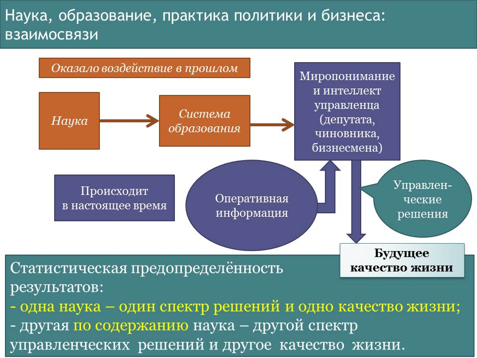
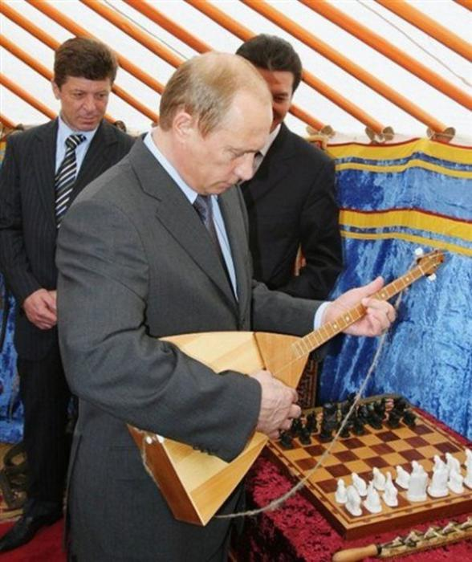

> **Первичный текст.** О состоянии, тенденциях и возможностях управления, 2014-10-31.
> Источник: `20141031 О состоянии, тенденциях и возможностях управления.doc` sha256 `da30c0aeeedbe5f2…`; [страница на dotu.ru](https://dotu.ru/2014/10/31/20141031_about_politics/).
> Автоматическая транскрипция DOC→Markdown; смысл и формулировки не правились.
> Контрольные суммы и статус проверки — в [NOTICE.md](../../NOTICE.md).
> Содержание передаёт позицию авторов; утверждения не верифицированы библиотекой.

---

О СОСТОЯНИИ, ТЕНДЕНЦИЯХ И ВОЗМОЖНОСТЯХ УПРАВЛЕНИЯ

# 1. Мир в целом

*Глобальная политическая доминанта ныне* — это по-прежнему идущая из эпохи буржуазных революций тенденция к завершению библейского проекта порабощения человечества от имени Бога на основе буржуазно-либеральной идеологии, представляющей собой одну из светских (а равно конфессионально нейтральную[^1]) культурных оболочек библейского проекта порабощения человечества[^2]. В этой доминанте главная политическая сила («мировой жандарм») — США. За прошедшие после второй мировой войны годы в США утвердился фашизм интернацистского[^3] толка, прикрывающийся буржуазно-либеральной идеологией, в котором политически доминирует еврейско-иудейская диаспора, её хозяева и кураторы[^4].

В случае завершения такой глобализации, США на первом этапе должны стать «столицей мира», а все остальные государства — быть криптоколониями[^5] метрополии, а на втором этапе (после легитимизации ООН в качестве «мирового правительства») США (либо то, что от них останется) должны опуститься на уровень провинции-криптоколонии хозяев и заправил «мирового правительства» точно так же, как и все прочие государства. Иначе говоря, они должны повторить судьбу Египта древности после того, как из него вышел библейский проект порабощения человечества, т.е. США должны стать заурядной державой или перестать быть федерацией и стать конгломератом «сувенирных» штатов, не имеющих ни реального суверенитета, ни общих для них органов государственной власти.

Т.е. по завершении процесса *этой глобализации,* если пользоваться терминологией «Мёртвой воды», должен получиться глобальный конгломерат, в котором к управлению по полной функции будет неспособно ни одно общество, ни человечество в целом. Исторически сложившиеся национальные культуры в этом конгломерате должны исчезнуть и заместиться одной глобальной толпо-«элитарной» культурой, представления о которой можно получить из романа И.А.Ефремова «Час быка» — в её реальном виде (жизнь на планете Торманс), а в её несбыточно-идеализированном виде — из «Протоколов сионских мудрецов», из произведений братьев Стругацких про «мудрейшего экселенца», возглавляющего правящую планетой спецслужбу «Комкон»[^6], и прочих персонажей, обеспокоенных проблемой «прогрессорства», а также из фильма «Посвящённый»[^7], на основе книги американской писательницы Лоис Лоури.

Общество США часто характеризуют как «плавильный котёл» культур и народов. Но «плавильным котлом» культур и народов в эпоху после завершения второй мировой войны ХХ века стала и Европа. А после 1991 г. в такой же «плавильный котёл» пытаются превратить и Россию, где главная задача кураторов проекта — уничтожить великороссов, как главного противника глобализации по-библейски. В соответствии с этим — наплыв мигрантов из проблемных регионов планеты с целью уничтожения самобытных культур народов Европы и России в регионах их исторического становления и развития, а также с целью снижения доли коренного населения в демографической статистике за счёт опережающего размножения мигрантов, что характерно для Европы и постсоветской России. В случае доведения этого процесса до логического конца и Европа, и Россия (или то, что не будет в процессе её краха аннексировано более устойчивыми в этническом и культурном отношении соседями, например, Китаем) превратятся в некое множество криптоколоний США или хозяев и заправил «мирового правительства».

С целью последующего разрушения и поглощения обломков в этот конгломерат США вмешиваются в жизнь всех государств, в которых исторически сложившийся ислам — основа культуры[^8].

Однако описанные тенденции, ведущие к созданию глобального конгломерата под властью «мирового правительства» и его хозяев, протекают не без сопротивления и противодействия. Это сопротивление и противодействие носит двухаспектный характер:

- Государства разных регионов планеты, сталкиваясь с невозможностью реализовать в сотрудничестве с США и подвластными им криптоколониями интересы собственного общественно-экономического развития, начинают группироваться в блоки (в смысле определения блока в работе ВП СССР «Мёртвая вода»). В процессе инициирования такого рода блоков, включающих в себя государства разных континентов (примером тому БРИКС, ЕврАзЭС, ШОС), общим стартовым идейным капиталом является более или менее ярко выраженный антиамериканизм. Но в перспективе стартовый при инициировании блока антиамериканизм должен выразиться в блоковой концепции глобализации, альтернативной библейскому проекту порабощения человечества, поскольку нигилизм (в том числе и в версии антиамериканизма) не может быть созидательным фактором: для созидания необходимо знать не «чего не хочешь» (в данном случае — действительные и потенциальные участники БРИКС, ЕврАзЭС, ШОС не хотят жить под диктатом США и их хозяев), а «чего именно хочешь и как это желание воплотить в жизнь». Если альтернативной концепции глобализации блокового характера государства блоков не выработают и не будут проводить её в жизнь, то блоковые проекты рухнут, поскольку все их общества заражены конгломератным буржуазным либерализмом и он заполнит собой пустоту в пространстве идей организации жизни общества.

- Внутри государств, которые заправилы библейского проекта подвергли нашествию мигрантов под лозунгами мультикультурализма, и на территории которых они проводят политику интернацизма под прикрытием идеологии буржуазного либерализма, в среде коренного населения распространяется недовольство как мигрантами и их вкладом в мультикультурализм (большей частью вкладом в рост статистики преступности[^9]), так и правящими в них режимами, предавшими свои народы под власть интернацистов. В итоге интернацизм под прикрытием идей буржуазного либерализма стал для политически активной части коренного населения государств Европы неприемлемым, т.е. буржуазно-либеральный мультикультурализм ныне находится на пути к краху, что вынуждены признать и политические деятели ряда государств Европы[^10].

Но в толпо-«элитарных» обществах сколь-нибудь устойчивое недовольство той или иной части толпы чем-либо реально или мнимо происходящим — всегда политический ресурс, который может оставаться бесхозным только на протяжении весьма краткого периода времени. И то обстоятельство, что дело Брейвика в СМИ Европы и России целенаправленно изолгано, — один из показателей того, что приверженная либерализму интернацистская общественность, практически монопольно контролирующая СМИ[^11] США, Европы и России, не желает работать на создание социальной базы потенциальным[^12] хозяевам на основе *недовольства интернацизмом под лозунгами мультикультурализма, распространяющегося в европейских обществах и в России.*

Фактически это означает, что за либеральным интернацистским фасадом государств Европы скрывается националистически-нацистский потенциал оппозиционного либерализму политического закулисья, и этот потенциал растёт и готовится к взятию публичной государственной власти. В частности он может быть заинтересован в доведении до абсурда «толерантности» и «политкорректности», вопроса об отношении общества и государства к ЛГБТ-сообществу и ювенальной юстиции: рост недовольства населения политикой либералов в этих вопросах потенциально — рост поддержки националистически-нацистских сил.

Оргструктура этого потенциала — трансгосударственное сообщество националистов и нацистов, восходящее к СС[^13]. Отличие наших дней от эпохи третьего рейха только в том, что пока в ранг «высшей расы» возводятся не исключительно немцы или какой-то другой народ, но все представители белой расы европеоидов, несущие националистические и нацистские убеждения. Однако в перспективе неизбежны споры и конфликты внутри националистически-нацистского сообщества, и прежде всего — между лидерами-активистами — на темы:

- Носители какого именно национализма и нацизма — истинный авангард белой расы?[^14]

- Как строить отношения с иными расами в их традиционных ареалах обитания в процессе и после того, как в традиционном ареале обитания белой расы будет установлен должный (с точки зрения националистов и нацистов) порядок?

В таких условиях либералы-интернацисты, в стремлении сохранить свою власть мимикрируют под националистов и нацистов, чтобы стать хозяевами политического ресурса, основанного на недовольстве мультикультурализмом. И Украина сегодня — полигон для отработки политтехнологий реализации этого сценария, курируемого спецслужбами США и их хозяевами, которые в случае успеха жидо-бандеровцев[^15] на Украине предполагается распространить и на другие государства Европы и на Россию в целях сохранения власти либералов-интернацистов и дискредитации и опорочивания национального самосознания всех народов.

Националисты и нацисты также занимаются отработкой политтехнологий, ориентированных на трансформацию мультикультурного либерального общества в европейских государствах в:

- общество граждан — этнических представителей титульных наций и

- сообщество «неграждан» — представителей иных наций и назначенных «отщепенцев» от титульной нации[^16], которые не должны обладать полнотой гражданских прав, хотя сообщество неграждан может проживать в государстве на протяжении жизни многих поколений.

Отработкой такого рода политтехнологий ныне занимаются в государствах Прибалтики в отношении, прежде всего, славянского и иного русскоязычного по своей культуре населения. В прошлом такого рода многовековой опыт имела Османская Турция, где полноценными верноподданными султана признавались только мусульмане-сунниты, а все инаковерующие были подданными империи, чьи права в тех или иных аспектах были ограничены. В недавнем по историческим меркам прошлом в основе внутренней политики ЮАР также была расовая сегрегация (апартеид). Но дольше всех в статусе «неграждан» заправилы библейского проекта порабощения человечества от имени Бога держали еврейско-иудейские диаспоры, поместив их в «гетто» — «еврейские кварталы», отгороженные от остальных районов городов стенами и воротами. Т.е. эта политтехнология известна издревле.

# 2. Россия

Россия с 1917 г. (за исключением периода большевистско-сталинской эпохи 1930 — 1953 гг.) тоже находится под властью интернацистов: до ухода из жизни Ю.В.Андропова это была власть интернацистов-марксистов; с 1984 по 1993 г. был период передачи власти от интернацистов-марксистов интернацистам либерал-буржуинам; с 1993 г. в России юридически оформлена государственная и бизнес-власть интернацистов либерал-буржуинов. Однако к настоящему времени внутренне устойчивого либерал-буржуинского интернацистского режима правления, аналогичного режимам в США, Канаде, Австралии и других фальшь-демократиях Запада, — в России не сложилось, и нет никаких возможностей, что такой режим сможет состояться хоть когда-нибудь в будущем. Причины просты:

- Глобальная — мировая закулиса с середины XIX века проводит политику искоренения капитализма на основе идеологии буржуазного либерализма: отсюда «интернационал-социализм» на основе марксизма и «национал-социализм» на основе «Майн Кампф», к которым в конце ХХ века добавился проект глобального халифата: всё это — средства ликвидации буржуазного либерализма и удержания власти над обществами на основе принципа «разделяй и властвуй».

- Внутрироссийская — либерально-буржуазная демагогия не находит отклика в электорате, поскольку так называемый «электорат» — т.е. народ — «накушался» либеральной политической практики в «лихие 90‑е». Вследствие этого либеральные партии уже *систематически* не в состоянии преодолевать на выборах мизерный барьер, необходимый для обеспечения их представительства в Думе и в региональных законодательных собраниях. Народ «накушался» либерализма так, что даже правомочные упрёки либералов в адрес государственной власти в коррумпированности, воровстве, попрании прав граждан и действующего законодательства и т.п. — не в состоянии ни собрать «электорат» под знамёна буржуазного либерализма, ни обеспечить либералам захват государственной власти *неконституционным способом* — при поддержке толпы, митингующей на российских «майданах»[^17] и проводящей кампанию гражданского неповиновения «ГБ-шному путинскому режиму» (т.е. кампании, дезорганизующей работу органов государственной власти путём захвата административных зданий и как бы стихийного, но хорошо организованного адресного террора в отношении работников государственного аппарата, силовых служб[^18] и членов их семей).

И эта «политическая пассивность» населения России следствие не того, что все якобы — рабы и холопы «Путинской клики», а результат ощущения и понимания людьми того факта, что какое ни на есть (даже прескверное) государственное управление для большинства людей — предпочтительнее, нежели полноценная гражданская война без каких-либо правил и обычаев ведений войны[^19]. Но терпение людей не беспредельно, поэтому депутатам, госслужащим, топ-менеджерам, олигархам и «идейным либералам» (теоретикам и практикам) не следует впадать в самообольщение в отношении природной и неискоренимой «покорности российского быдла».

Однако, утратив государственную власть, либерал-буржуины в России наших дней по-прежнему сохраняют за собой контроль над социальными институтами, генерирующими и непрестанно воспроизводящими государственную власть, бизнес-власть и «4‑ю власть» (власть СМИ над умами толпы) во всех толпо-«элитарных» обществах.

 Если обратиться к рис. 1, то понятно, что в России социально-философский научный официоз, система образования в области философии, социологии, политологии, экономики и финансов, юриспруденции по-прежнему «заточены» под обслуживание буржуазно-либеральной идеологии и либерально-рыночной экономической модели либо обеспечивают им демагогическое прикрытие оторванностью от жизни своих казалось бы альтернативных либерализму теорий. Вследствие этого система образования России продолжает плодить юристов, менеджеров для экономики и чиновников для государственной службы, чьё понимание жизни общества и его экономики находится в рамках идеологии буржуазного либерализма, даже в тех случаях, когда кто-то из них искренне ненавидит либералов и порицает всё, что они сделали со страной, начиная с 1985 г. по настоящее время. А факультеты журналистики производят уйму журналистов, чьё миропонимание либо либерально, либо не позволяет им выработать жизненно состоятельную альтернативу идеологии буржуазного либерализма[^20] и научно-методологическое обеспечение государственного управления в соответствии с альтернативной идеологией. То же касается и подготовки вузами России представителей режиссёрского и сценаристского сообщества.

Из этого обстоятельства и проистекает ответ на вопрос: *«Почему Путин не распускает Думу, почему не распускает правительство, редко когда производит смену высших должностных лиц и не рекрутирует массово из общества незапятнанных коррупцией и воровством политических активистов?»* — Нет смысла:

- Одиночки-активисты, даже если они и обладают альтернативными знаниями, не в состоянии подменить собой госаппарат и менеджмент в бизнесе в целом. И большинство из них сожрут или сломают психологически и растлят внутриаппаратные мафии. Поэтому от одиночек-активистов *пока* больше пользы, если они будут заняты просветительской деятельностью как в обществе, так и в отношении госчиновников, депутатов, бизнесменов (см. рис. 1), а не конфликтовать в аппарате с людьми, которые в ряде случаев их даже понять не в состоянии (зомбированы образованием, не имеют свободных интеллектуальных ресурсов, сил и времени на самообразование).

- Если же заменять массово, — то придут выпускники вузов, такие же (по мировоззрению и миропониманию), как и те, что сейчас «при делах». Но в этом случае — государственное управление может стать ещё хуже, поскольку эту массу будут составлять новички, которые не имеют не только коррупционно-воровского опыта[^21], но и каких-либо жизненно состоятельных альтернативных знаний, а также — навыков аппаратной работы и навыков борьбы, по сути дела, мафиозных группировок в государственном аппарате за посты́ в оргштатных структурах и модификацию структур под свои интересы и в целях подавления группировок противников[^22].

- Кроме того, мнение толпо-«элитарного» общества об общественно полезной дееспособности или вредоносности тех или иных органов власти и политиков персонально формируется СМИ, которые в России проводят либеральную антироссийскую информационную политику как по оглашению (предоставление сведений о тех или иных событиях), так и по умолчанию (сокрытие сведений о тех или иных событиях[^23]). Поэтому снимать с должностей и назначать на должности по указке СМИ — только создавать новые проблемы России и усугублять старые.

И соответственно при всём выше описанном Россия идёт на «автопилоте» эгрегориального управления, отрабатывая сформированный в прошлом потенциал социальной психодинамики, а В.В.Путин этому процессу не препятствует, не насилует его, а только слегка подправляет его течение, проявляя активность в ключевые моменты решения внешне- и внутриполитических задач[^24], опираясь на работающую в автоматическом режиме социальную психодинамику[^25].

Тем не менее, и в таких обстоятельствах вопрос о перспективах, т.е. о возможностях дальнейшего течения событий и управлении ими, — важен. Перспективы вариативны, и среди вариантов есть убийственные для России.

Прежде всего, необходимо понимать, что в Европе подъём национального самосознания и защита национальных культур коренного населения каждого национального государства от либерального интернацизма — это действительно способ сохранения коренных народов изначально этнически однородных государств Европы и возрождения их культур в новом качестве. Но это же — и потенциал войны против «всемирного халифата» с целью искоренения Корана, как угрозы осуществлению библейского проекта порабощения человечества от имени Бога.

И в варианте развития событий в Европе по националистическому сценарию неизбежно будет иметь место ограничение прав представителей пришлых инакокультурных диаспор и особая политика государства в отношении диаспор и их представителей (вплоть до принудительной репатриации). Но это может быть работоспособным только на первом этапе, поскольку разделение общества на граждан и неграждан — не может быть неограниченно долгим так, как является миной под благополучием и тех, и других, способной взорваться (либо быть умышленно взорванной) при спонтанном или умышленном создании определённых условий. Повторно отметим, что это — потенциал войны против «всемирного халифата». Соответственно на этом этапе должна проводиться политика построения новой культуры, которая обеспечит внутреннюю бесконфликтность этнически разнородного и изначально этически разнородного общества[^26], а в аспекте внешней политики европейских государств и в аспекте глобальной политики — сделает невозможным нагнетание потенциала новой мировой войны между Европой и «всемирным халифатом» по причине нереализуемости проекта «халифата», подменившего Ислам шариатом. Т.е. первый этап должен завершиться построением нравственно-этически однородного общества, в котором в разделении населения государства на граждан и неграждан в зависимости от их происхождения и культурных особенностей не будет никакого смысла и от какого разделения будет только вред дальнейшему развитию этого многонационального общества.

Но политика националистически ориентированного государства на этом этапе способна трансформироваться и в нацизм[^27], в результате чего общество станет более или менее этнически однородным вследствие того, что неугодные диаспоры будут изгнаны либо уничтожены полностью или большей частью.

В отличие от европейских государств Россия никогда не была этнически однородным государством. В последние несколько веков она была цивилизацией многих народов, живущих в общем для всех них едином государстве, в развитие которого все они вносили свой вклад соответственно достигнутому каждым из них уровню социокультурного развития. И сфера государственного управления и бизнеса также никогда в этот период не была этнически однородной, хотя русский язык был языком общей всем государственности, культурного обмена и межнационального общения. Это обстоятельство возлагает на всех, кто пользуется в жизни Русским языком, объединяющим разные народы в единую цивилизацию-государство, особую ответственность за общие судьбы — вне зависимости от их национального происхождения и национального самоосозания.

*[В оригинальном издании здесь расположена иллюстрация. Не воспроизводится до правовой проверки и решения владельца; см. запись в FIGURES.md.]* <!-- figs:о-состоянии-тенденциях-и-возможностях-управления--unbound-image4 -->

*[В оригинальном издании здесь расположен рисунок/схема. Иллюстрация не включена в данный выпуск: ожидает визуальной и правовой проверки. Файл источника: image3.jpeg]*Поэтому разжигание и подъём разного рода национализма в России (как великоросского, так и иных, а также и еврейско-иудейского интернацизма) — надёжный путь к гражданской войне и расчленению страны на множество «сувенирных» национальных государств, в которых титульные нации будут подавлять и изгонять диаспоры «инородцев». Всю совокупность этих «сувенирных» государств либерально-буржуазный конгломерат в лице своих транснациональных корпораций «сожрёт» с удовольствием, эксплуатируя научно-техническую и экономическую несамодостаточность и несостоятельность каждого из них и всегдашнюю готовность «элит» отсталых народов продать всё поработителям, превосходящим их в научно-техническом развитии[^28], а главное — соблазняющим «элиты» недостижимым для них в прошлом уровнем «высоко цивилизованного» гедонизма.

**Пагубность для России буржуазного либерализма интернацистов и национализма некоторых противников либерализма — в стране многие осознают.**

В качестве спасительной альтернативы и тому, и другому предлагается идея «державности», т.е. многонационального патриотизма россиян — развития общего всем народам страны государства, вклад в развитие которого в общих интересах могли бы внести все вне зависимости от их национального происхождения и «социального статуса». Этот лозунг декларируется в разных формах ещё с ельцинских времён[^29], однако демагогия на эту тему представителей постсоветской власти и «патриотических» СМИ более, чем за 20 лет не дала каких-либо ощутимых народом благих результатов: Россия по-прежнему в кризисе, и этот кризис многим видится беспросветным и усугубляющимся. Демагогия на эту тему не даст никаких благих плодов и в будущем. Причина проста:

**«Державность» не может быть САМОцелью жизнедеятельности общества, поскольку государственность — по своему объективному предназначению — средство осуществления целей БОЛЕЕ ВЫСОКОГО порядка значимости**[^30]**. А если такого рода целей нет, либо они отвергаются теми, в чьих руках оказалась государственная власть, то государственность становится самоцелью, вследствие чего идея «державности» обречена быть бесплодной, а государственность, соответственно, — становится паразитической.**

Вариантов дальнейшего течения событий в этом случае два:

- либо государственность, не обретя целей более высокого порядка общественной значимости или противясь их осуществлению, **именно по этой причине** приходит к своему краху[^31], последствия чего вариативны (в лучшем случае — замена более состоятельной государственностью, в худшем случае — гражданская война, оккупация, расчленение страны и т.п. вплоть до ухода народов этого государства в историческое небытие);

- либо государственность обретает цели более высокого порядка значимости, нежели поддержание и воспроизводство самой себя, на которые начинает работать, наращивая эффективность, и вследствие обретения целей более высокого порядка общественной значимости перестаёт быть паразитической.

*[В оригинальном издании здесь расположен рисунок/схема. Иллюстрация не включена в данный выпуск: ожидает визуальной и правовой проверки. Файл источника: image5.jpeg]*Однако цели, на осуществление которых должна работать государственность, пути и способы их достижения, — в постсоветской России вне публичного обсуждения: это запретная в официозе тема на протяжении всего имперского периода истории России и всех послесталинских времён. Большевистско-сталинский период — стоит вне этой традиции.

Если идея «державности» не работает сама по себе, т.е. без каких-либо пояснений со стороны политиков на тему *«мы работаем, что есть сил на благо народа, но тупой народ не понимает своего счастья жить под нашей властью»,* которые вызывают лишь осмеяние и ругань со стороны подвластных[^32], то без диагностики ситуации не обойтись.

Для того, чтобы государственность могла работать без пояснений и убеждений народа в своей благости и мудрости, необходимо, чтобы в результатах государственного правления подавляющее большинство людей видело воплощение их собственных ощущений справедливости в организации жизни общества. И именно этого нет в постсоветской России на протяжении всего времени её существования.

Вопрос о социальной справедливости не так прост, как его представляют либералы в смысле «отнять и поделить», чтобы, предложив заведомо идиотское «решение», уйти от его обсуждения по существу и тем самым уклониться от реализации жизненно состоятельного решения, несовместимого с либеральными бендеровско-чичиковскими идеалами «великих комбинаторов». Но чтобы Роман Абрамович и ему подобные макро- и микро- олигархи жили во дворцах, с прислугой и охраной, рассекали по всему свету на собственных авиалайнерах и яхтах, размером чуть меньше символа революции — крейсера «Авроры», — видеть в этом смысл своей жизни могут тоже только идиоты. И если «державники» намерены вытеснить Рому и ему подобных из его социальной ниши для того, чтобы оккупировать её самим, то в России идея «державности» не будет на них работать точно так же, как ныне в России на Рому, на ему подобных и на массовку почитателей талантов олигархов и их завистников не работает идея либерализма.

*[В оригинальном издании здесь расположены иллюстрации (4 объекта). Иллюстрации опущены: см. реестр графического слоя работы.]* <!-- figs:о-состоянии-тенденциях-и-возможностях-управления--unbound-image10,о-состоянии-тенденциях-и-возможностях-управления--unbound-image7,о-состоянии-тенденциях-и-возможностях-управления--unbound-image8,о-состоянии-тенденциях-и-возможностях-управления--unbound-image9 -->

*[В оригинальном издании здесь расположен рисунок/схема. Иллюстрация не включена в данный выпуск: ожидает визуальной и правовой проверки. Файл источника: image6.jpeg]*Иначе говоря, **народное единство де-факто** — *без каких-либо деклараций на эту тему* — следствие того, что **государственность делом выражает народные чаяния справедливости в своей политике**. Подменить **это** **дело** *словами о «согласии и примирении»*[^33] *паразитов и работяг, об их взаимной комплиментарности и толерантности, о порочности зависти «неудачников» к успеху Ромы и ему подобных* — не удастся: придётся либо воплощать в жизнь справедливость — либо пасть жертвой «социальной зависти» и «непонимания тупым народом своего счастья» жить под властью идиотов и «креативных» проходимцев[^34].

# 3. Справедливость: сакральная и «историческая» 

Поэтому вопрос о справедливости поясним. Справедливость в Русском понимании это — неотмирный, Богом предопределённый идеал жизни человечества, именуемый словами «Царствие Божие на Земле», в арабском языке этот же смысл выражается в слове «Ислам». Этот — абсолютный, сакральный — смысл слова «справедливость» лежит в основе сотрудничества в их историческом развитии народов России, исповедующих различные вероучения даже вопреки тому, что Ислам подменён шариатом, а учение Христа о становлении Царствия Божиего на Земле усилиями самих людей в Божьем водительстве объявлено ересью и подменено учением закулисных хозяев церкви на тему *«Рабы, повинуйтесь господам своим по плоти со страхом и трепетом, в простоте сердца вашего, как Христу, не с видимою только услужливостью, как человекоугодники, но как рабы Христовы, исполняя волю Божию от души, служа с усердием…»*[^35].

Вследствие такого понимания абсолютного смысла слова «справедливость», который к настоящему времени не осознаётся в его полноте и детальности и не только не воплощён в жизнь, но и злоумышленно целенаправленно извращается политиками, существует понятие «справедливость», обусловленное исторически, т.е. развитием культуры, или, иначе говоря, это — «историческая справедливость».

*[В оригинальном издании здесь расположен рисунок/схема. Иллюстрация не включена в данный выпуск: ожидает визуальной и правовой проверки. Файл источника: image11.jpeg]*«Историческая справедливость» — не «эрзац» и не фальсификат справедливости абсолютной в стиле *«… Если к правде святой / Мир дороги найти не умеет — / Честь безумцу, который навеет / Человечеству сон золотой!»*[^36] и не возведение в ранг справедливости заведомой лжи (чем грешит «элита»), а определённая социальная оценка реализации абсолютной справедливости в жизни общества в ходе его исторического развития по мере того, как содержание справедливости абсолютной выявляется и осознаётся людьми в его полноте и детальности и воплощается в жизнь.

**Запад стремится в полной мере реализовать принцип «Честь безумцу, который навеет человечеству сон золотой!» и во многом достиг в этом успеха, но Россия этот принцип не приемлет, хотя её правящая «элита» постоянно на протяжении веков норовит возвести в ранг справедливости — своекорыстную ложь на тему «рабы, повинуйтесь господам…».**

Бог не искореняет праведность[^37], и потому принцип «практика — критерий истины» подтверждает справедливость в её историческом развитии на пути к воплощению в жизнь сакрального неотмирного идеала.

Соответственно такому пониманию исторического развития, в наши дни в России — после осознания и переосмысления всего, что известно о нашем историческом прошлом — справедливо следующее:

ГЛАВНОЕ:

1.  Поскольку в основе системы эксплуатации «человека человеком» как системообразующий фактор лежит предварительное угнетение личностного развития сообщества эксплуатируемых, то необходимо искоренение системы угнетения личностного развития[^38].

2.  *Образование должно быть ориентировано на формирование эффективной личностной познавательно-творческой культуры.* Система образования должна гарантировать сохранение и приумножение потенциала телесного и психического здоровья учащихся на всём протяжении учёбы от детских яслей до окончания вузов*.* Сколь угодно высокое образование должно быть доступным выходцу из любой семьи вне зависимости от её социального статуса и доходов родителей. Получение первого высшего образования, сроки обучения в аспирантуре и докторантуре включаются в трудовой стаж.

СЛЕДСТВИЯ ИЗ ГЛАВНОГО:

- Нравственно-этическая однородность общества: единые нравственные стандарты вне зависимости от происхождения и от того, какой деятельностью в общественном объединении труда занимается тот или иной человек. При этом:

<!-- -->

- «великие комбинаторы» Остап Бендер и Павел Чичиков — не образцы для подражания тем, кто хочет стать успешным, а паразиты-угнетатели, ещё более социально вредные, нежели «великий инквизитор» Ф.М.Достоевского, которым либералы — почитатели «великого комбинатора» — пугали и пугают всех.

- В иерархии должностей в общественном объединении труда не выражается неравенство личностного достоинства носителей должностей и всех людей вообще.

<!-- -->

- Искоренение эксплуатации «человека человеком».

- Экономика должна устойчиво в преемственности поколений работать на удовлетворение демографически обусловленных потребностей общества, а не на обогащение макро- и микро- олигархов и гонку потребления.

- Минимальная оплата труда должна быть выше прожиточного минимума.

- Максимум оплаты труда наёмного персонала и предпринимательские доходы, идущие на потребление семьи предпринимателя, должны быть ограничены уровнем не более 3 среднестатистических зарплат.

- Клановость в кадровой политике при назначении на должности в государственном аппарате и в директораты предприятий всех форм собственности неуместна.

- Кредитование под процент недопустимо. Ссудный процент должен быть заменён тарифами на банковские услуги, и банки должны иметь юридически оформленное право соучаствовать в течение ограниченного времени в прибылях от реализации проектов предприятий реального сектора, в которых банки приняли участие как кредиторы-инвесторы.

- Функционирование экономики в соответствии с интересами общества выражается в прогрессирующем снижении номинальных цен по мере роста производства и удовлетворения спроса по спектру демографически обусловленных потребностей. Удовлетворение потребностей по деградационно-паразитическому спектру должно подавляться и искореняться как экономически, так и социокультурными средствами[^39].

- Продолжительность рабочего дня должна быть не более 7 часов, ежегодный оплачиваемый отпуск не менее 4 недель.

- Общество должно жить по астрономическому, а не по юридическому времени (т.е. полдень — момент времени прохождения солнца через базовый меридиан соответствующего часового пояса[^40]).

- Лица, утратившие трудоспособность и достигшие пенсионного возраста должны получать пенсию, позволяющую им жить, и иметь возможность получать иную поддержку со стороны общества.

- Медицинская помощь не должна оплачиваться из бюджета семьи, в период нетрудоспособности по причине болезни выплаты, позволяющие жить, должны быть гарантированы, их источники должны быть определены государством.

- Первые два с половиной года жизни ребёнка мать в праве не работать и получать пособие на уровне не ниже средней зарплаты по последнему месту работы за последние полгода. Этот срок засчитывается в трудовой стаж.

- Справедливо ограничение деловой активности как иностранных, так и отечественных частных и государственных инвесторов, если оно ведёт к разрушению природной среды и гибели биоценозов.

Крах мультикультурализма в Европе, крах послесталинского СССР и неработоспособность *идеи «державности» самой по себе* в постсоветской России — имеет одну и ту же причину: реальное подавление в жизни общества двух главных принципов обеспечения справедливости, делающее невозможным реализацию и их следствий (как приведённых нами, так и иных, которыми можно дополнить наш перечень).

# 4. Русский проект многонациональной глобализации

Проблемы несостоятельности мультикультурализма любого многонационального и многоконфессионального толпо-«элитарного» общества проистекают из того, что культуры и субкультуры представляют собой информационно-алгоритмические системы, т.е.:

- они «заточены» под достижение определённых целей определёнными средствами, и множества этих целей и средств в разных культурах и субкультурах не согласуются друг с другом;

- социальная психодинамика на основе информации и алгоритмики соответствующих культур и субкультур работает в «автоматическом» режиме, т.е. помимо намерений и воли подавляющего большинства представителей этих культур и субкультур в случае их толпо-«элитарного» характера[^41].

При этом в каждой из множества толпо-«элитарных» культур и субкультур мультикультурных обществ исторически сложились свои определённые нравственно-этические стандарты на тему: *поддержание устойчивости взаимоотношений индивидов в условиях функционирования и развития системы эксплуатации «человека человеком»*. И в каждой из них сформировалась своя система предварительного угнетения личностного развития как в биологическом, так и в социокультурном аспектах, на основе которой строится и своеобразная система эксплуатации одних другими. При этом в мультикультурном обществе национальные и конфессионально обусловленные культуры и субкультуры, если их рассматривать как информационно-алгоритмические системы, различны в том смысле, что каждая из них по-своему решает задачу обеспечения устойчивости системы эксплуатации «человека человеком», вследствие чего сообщества носителей иных культур либо могут стать объектами эксплуатации со стороны других культур и субкультур, либо не могут ими стать по причине своей защищённости от таких поползновений теми или иными средствами, либо в каких-то аспектах могут стать объектами эксплуатации, а в других аспектах сами станут эксплуататорами других. Вследствие этого в мультикультурном толпо-«элитарном» обществе возникает взаимное недовольство, связанное с неравенством возможностей эксплуатации друг друга, а также и некоторое недовольство тем, что культура общества такова, что воспроизводит режим эксплуатации «человека человеком» в новых формах вместо того, чтобы искоренить эксплуатацию «человека человеком» как социальное явление и тем самым создать условия для свободного личностного развития всем.

Чтобы не быть голословными, обратимся к российской статистике, представленной на рис. 2.

*[В оригинальном издании здесь расположена иллюстрация «Рис. 2.». Не воспроизводится до правовой проверки и решения владельца; см. запись в FIGURES.md.]* <!-- figs:о-состоянии-тенденциях-и-возможностях-управления--unbound-image13 -->

*[В оригинальном издании здесь расположен рисунок/схема. Иллюстрация не включена в данный выпуск: ожидает визуальной и правовой проверки. Файл источника: image12.jpeg]*А ссылки на то, что ответ на вопрос, данный автором демотиватора на рис. 2, — «ксенофобский», что он сеет национальную и классовую рознь и ненависть, подстрекает к «экстремистским действиям» и т.п., — проблемы гармонизации национальных и классовых взаимоотношений в России не решают и народного единства де-факто не обеспечивают… Т.е. ст. 282 УК РФ, уже получившая название «антирусской», не только бесполезна в решении этой проблемы, но и вредна, поскольку её обостряет.

Но статистика, представленная на рис. 2 не даёт полного представления о системе эксплуатации «человека человеком», сложившейся в постсоветской России вопреки тому, что конституция 1993 г. провозглашает «Труд свободен» (ст. 37, ч. 1), что подразумевает искоренение эксплуатации «человека человеком».

Для полноты картины статистику, представленную на рис. 2, следует дополнить ещё несколькими статистиками:

- представительством разных национальностей, живущих в России в группе бедноты;

- представительством разных национальностей, живущих в России: 1) в государственном аппарате, 2) в руководстве предприятий государственного сектора, 3) в банковской системе на федеральном уровне на властных должностях (а не в техническом аппарате);

- статистикой появления представителей разных национальностей в федеральном теле- и радио эфире в качестве ведущих и экспертов в программах, освещающих общекультурную, политическую и финансово-экономическую тематику[^42];

- статистикой получения высшего образования в области: 1) философии, 2) юриспруденции, 3) социологии, 4) политологии, 5) экономики и финансов;

- статистики представленности разных национальностей в сценаристском, а также (отдельно) в режиссёрском сообществах: 1) телевидения, 2) кино и 3) театра.

После этого, с учётом того, что страна пребывает в затяжном кризисе общекультурного и экономического развития, станет ясно, какие народы России и какие социальные группы в их составе — объект эксплуатации, а кто — инструмент осуществления эксплуатации и разрушения общего всем государства, и почему изрядная доля населения страны постсоветскую государственность расценивает как антинародную вообще, и как антирусскую, в частности. И следует подумать о перспективах реакции социальной психодинамики на такое положение дел. Т.е. проблема несостоятельности интернацистски-либерального мультикультурализма актуальна и для России.

Националистические и нацистские рецепты разрешения проблемы несостоятельности мультикультурализма способны решить (с некоторыми оговорками) эту проблему взаимного недовольства только в границах и путём построения мононационального государства титульной нации. Но они в принципе не способны решить проблему несостоятельности мультикультурализма в глобальных масштабах, поскольку из-за особенностей национальных культур — в процессе глобализации одни государства неизбежно становятся объектами эксплуатации со стороны других толпо-«элитарных» систем: осуществляется эксплуатация в форме оккупации и поглощения, колонизации (протектората) без поглощения (т.е. при утрате или ограничении суверенитета де-юре), криптоколонизации (при сохранении суверенитета де-юре), — значения не имеет; кроме того эксплуатации одних другими может сопутствовать геноцид, осуществляемый теми или иными средствами.

Однако принципы справедливости, изложенные в разделе 3 настоящей записки, таковы, что позволяют разрешить проблемы несостоятельности интернацистско-либерального мультикультурализма вне националистически-нацистских рецептов как в России, так и в государствах Европы и в глобальных масштабах, если они кладутся в основу глобальной, внешней и внутренней политики Российского государства.

*[В оригинальном издании здесь расположен рисунок/схема. Иллюстрация не включена в данный выпуск: ожидает визуальной и правовой проверки. Файл источника: image14.jpeg]*При этом и в Европе, и в государствах других регионов планеты есть некоторая социальная база, ожидающая реализации Русского проекта глобализации (выражение этого ожидания — фотография ниже), которая способна к расширению и активизации. И для этого необходимо реализовывать именно Русский проект многонациональной глобализации на основе воплощения в жизнь объективных, предопределённых Богом принципов справедливости, а не подменять справедливость имперским проектом русского великодержавия потому, что справедливость всегда велика, а «элитарное» великодержавие всегда несправедливо.

И только в случае работы на воплощение объективных принципов справедливости в жизнь, идея многонациональной «державности» перестаёт быть бесплодной.

Но это две разные ситуации, когда:

1.  Некие принципы провозглашаются, но для их реализации в политике нет адекватных знаний (с этого горбачёвская клика начинала перестройку);

2.  Когда вне зависимости от того, провозглашаются либо не провозглашаются в публичной политике определённые принципы открыто, но для их реализации в обществе уже есть адекватные знания и на их основе сложилась и продолжает развиваться определённая субкультура носителей этих знаний и практиков, действующих в жизни общества на их основе.

В России ныне имеет место второе. На воплощение принципов справедливости, оглашённых в разделе 3, ориентирована Концепция общественной безопасности (КОБ).

Однако есть специфика: о приверженности идее «державности» заявляют представители «элиты», не согласные с тем, что в либеральном глобальном мультикультурализме они могут быть опущены даже ниже уровня «среднего класса», а не то, что лишиться «элитарного» статуса; а также и те, кто опасается, что они и их близкие будут безжалостно и беспощадно уничтожены в ходе гражданской войны, к которой неизбежно ведёт продолжение интернацистско-либерального курса внутренней политики. Однако любые притязания на «элитарность» — это всегда притязания на эксплуатацию «человека человеком»: вопрос только в том, кто должен стать объектом эксплуатации и в каких формах должна протекать эксплуатация «человека человеком»; а также это всегда — готовность к продажности, измене, предательству в случае, если кто-то очарует иллюзией возможности занять вакантное место в некой «суперэлите».

Вследствие этого в России сложилась парадоксальная политическая ситуация, которая характеризуется следующими обстоятельствами:

- есть объективная потребность защиты многонациональной цивилизации-государства России от уничтожения либерализмом или нацизмом;

- есть Концепция общественной безопасности, ориентированная на решение задачи защиты многонациональной цивилизации-государства России от уничтожения либерализмом или нацизмом путём реализации в жизни многонационального общества принципов справедливости вне зависимости от национальной и конфессиональной принадлежности;

- КОБ распространяется не только в России, но и за рубежом;

- но представители «патриотической» (в смысле антилиберальности и неприемлемости национализма и нацизма) правящей «элиты» не могут публично заявить о своей приверженности КОБ, поскольку это несовместимо с корпоративной внутренней дисциплиной «элиты» [^43].

Единственный способ разрешения этого политического парадокса в политической практике в условиях имеющего место в России толпо-«элитарного» уклада состоит в том, что КОБ де-факто обретает статус эзотерического учения[^44], на основе которого уже реализуется политика защиты общества от интернацизма либерализма и от националистически-нацистской оппозиции тиранической диктатуре либерализма.

Практически это выражается в том, что КОБ, вследствие обретения де-факто статуса эзотерического учения[^45], не обсуждается публично именно как концепция, обладающая качествами определённой полноты и целостности; её отдельные положения могут оглашаться и оглашаются публично, но без ссылок на работы ВП СССР и целостность КОБ. КОБ и её применение обсуждается только в узком кругу доверенных лиц без участия посторонних. Всё это в полном соответствии с тем, чего требует внутренняя дисциплина всех эзотерических корпораций. В политике же она реализуется ныне по принципу *«кто знает — тот поймёт, а кто не знает — это его проблемы»*.

При этом ещё один аспект политической практики и защиты политики на основе КОБ, де-факто ставшей эзотерическим учением в определённых кругах, состоит в том, что КОБ ориентирована на обоюдополушарный образ мышления, в основе которого лежит осмысленно-образное соотнесение потока чувств со всеми знаниями, которые освоил индивид. Вследствие этого, тот, кто не чувствует жизнь и мыслит преимущественно левополушарно (это характерно для многих либералов), многих вещей в принципе не сможет узнать, *даже если ему о них рассказать или написать.* По этой причине — он, не зная, не сможет понять и политики, характеризуемой на Западе словами «Who is Mr. Putin?»: — собственно говоря, из указанного обстоятельства этот вопрос и проистекает.

Но в то же самое время «эзотеризм» КОБ — виртуальный, иллюзорный «эзотеризм», поскольку все материалы опубликованы, и при обоюдополушарном способе мышления, при соотнесении их текстов с потоком информации, приносимой собственным мировосприятием и СМИ, могут быть освоены адекватно.

Понятно, что такой вариант развития событий заправилам Запада не нравится, поэтому, убедившись в том, что «Mr. Putin» — не либерал, они пытаются представить его «фюрером всея Руси»[^46] и подтолкнуть ситуацию к тому, чтобы он не смог уклониться от этой роли и стал публичным олицетворением СС-овского интернационала и «фюрером» белой расы[^47] в глобальных масштабах, а по совместительству ролей — и антихристом. Но это не состоится, поскольку и в этот проект уже внесена неприемлемая для его хозяев и заправил составляющая, которая не позволит ему реализоваться в том виде, как задумали кураторы СС-овского интернационала…

Внутренний Предиктор СССР\

21 — 29 октября 2014 г.

[^1]: Если не считать поклонение «золотому тельцу» — мамоне.

[^2]: Ещё одна модификация — марксизм, не оправдавший возлагавшихся на него надежд хозяев проекта.

[^3]: **Национальное самоосознание** это — осознание индивидом своеобразия (уникальности) своего народа (прежде всего, как носителя культуры) и отличий своей культуры от культур других народов, *также обладающих своеобразием и значимостью в общей всем народам истории развития человечества*.

    **Национализм** это — осознание неповторимого своеобразия своего народа и его культуры в сочетании с отрицанием или игнорированием, большей частью бездумно-бессознательным, уникальности и значимости для человечества и его будущего иных культур и народов, несущих свои культуры в их историческом развитии в преемственности поколений.

    **Расизм** это — убеждённость в том, что достоинство человека обусловлено <u>прежде всего (а то и единственно) *биологически*</u> фактом происхождения от родителей, принадлежащих к определённым рода́м (кланам), племени, народу, расе, а *все прочие — происходящие из других родо́в, племён, народов, рас и смешанных браков с их представителями,*— достоинством человека либо не обладают в принципе, либо не обладают его полнотой.

    **Нацизм** — попытки уничтожения иных культур и / либо народов, их создавших, приверженцами того или иного национализма или расизма. В основе нацизма лежит национализм или расизм, но в каких-то случаях может лежать и конфессионально обусловленная нетерпимость к инаковерующим, поскольку вероисповедание может быть неотъемлемой составляющей исторически сложившейся национальной культуры.

    **Интернацизм** — по существу то же самое, что и нацизм, но в мафиозном исполнении разнородных международных диаспор, а не в исполнении впавшего в нацизм какого-либо народа и поддерживаемой им государственности.

    **Интернационализм** — неоднородное по своей сути явление и соответственно — двойственный по смыслу термин потому, что «интернационализм» исторически реально стал оболочкой и лозунговым прикрытием интернацизма, подавляющего и уничтожающего национальные культуры и их носителей под предлогом борьбы с национализмом, нацизмом и расизмом. Те интернационалисты, которые понимают интернационализм как братство народов, — не видят интернацизма, вследствие чего являются тупым орудием убеждённых интернацистов.

    **Фашизм**. Фашистская культура общественного самоуправления выстраивается так, чтобы исключить личностное становление новорождённых в качестве носителей необратимо человечного типа строя психики и тем самым воспрепятствовать становлению культуры человечности и соответствующей ей организации жизни общества. Фашизм идеологически всеяден.

[^4]: Мораль правящего режима в США базируется на законах Талмуда: <http://communitarian.ru/novosti/v-mire/moral_pravyaschego_rezhima_v_ssha_baziruetsya_na_zakonah_talmuda_23102014/>.

[^5]: Т.е. имея суверенитет де-юре, утратить его де-факто.

[^6]: Комиссия по контактам с инопланетянами — очень удачное название, отвлекающее внимание от основного её занятия — осуществления власти над планетой.

[^7]: <http://levtor.org/filmy-onlayn-drama/5690-posvyaschennyy-2014.html>.

[^8]: См. аналитическую записку ВП СССР «Долговременная стратегия преодоления коранического ислама заправилами библейского проекта» (2010 г.).

[^9]: Это повсеместно, ни одно из государств, принимающих мигрантов, не является исключением. См. например, один из многих вопиющих случаев на эту тему — повествование о том, как активную пропагандистку мультикультурализма шведку Элин Кранц жестоко изнасиловал и убил недочеловек — ранее судимый иммигрант из США эфиопского происхождения, который приговорён теперь к 16 годам шведской тюрьмы: «Толерантность и мультикультурализм убивают. Жизнь и судьба шведки Элин Кранц»: <http://alexandr-palkin.livejournal.com/1640282.html> — хотя лексикон этой публикации далёк от норм «политкорректности», но суть проблемы доносит хорошо; <http://abunda.ru/54310-zhertva-tolerastii-6-foto.html> — о том же. Если кто-то настаивает на том, что её убийца — состоялся в качестве человека, то пусть ему сопутствуют в жизни такие же «человеки», как и убийца Элин Кранц. Но Элин Кранц — прежде, чем стать жертвой похоти недочеловека, стала жертвой лживой политики интернацистско-либерального мультикультурализма, проводимой шведским государством на протяжении многих десятилетий.

    Другой пример — признание главы ГУВД Бишкека (столица Кыргыстана) Мелиса Турганбаева: «После того, как начали депортировать наших соотечественников из России, в Бишкеке резко поднялся уровень преступности. Мигранты возвращаются и остаются в Бишкеке. Преступники выходят из тюрьмы и тоже остаются. Студента, приехавшего из региона, отчисляют из университета, он тоже остается. Работы нет, а питаться надо, поэтому и грабят», — отметил он. (…) «Мы каждый день задерживаем преступников, тюрьма уже полная», — заключил Мелис Турганбаев»

    (<http://www.knews.kg/action/40007_tyurma_goroda_uje_polna_a_myi_kajdyiy_den_zaderjivaem_prestupnikov__glava_guvd_bishkeka/>). Если кто-то полагает, что у депортированных криминальные наклонности возникли в результате депортации только по возвращении на родину, то он ошибается.

[^10]: «Попытки построить мультикультурное общество в Германии, в котором представители различных культур будут “жить в полном согласии”, полностью провалились. Такое признание сделала канцлер ФРГ Ангела Меркель, выступая в Потсдаме на встрече с молодёжным крылом её партии Христианско-демократический союз Германии.

    "В 1960-х годах власти ФРГ призвали иностранных рабочих приезжать в страну, и теперь они живут в ней. Тогда мы обманывали себя, заявляя, что они не останутся в Германии и уедут. Однако это далеко от реальности", — цитирует канцлера BBC» («Попытки построить гармоничное мультикультурное общество в Германии провалились, заявила Меркель»: <http://www.newsru.com/world/17oct2010/merkel.html>).

    Спустя несколько месяцев к мнению канцлера Германии присоединился и премьер-министр «Великобратании». «Премьера Великобритании Дэвида Кэмерона обвинили в потакании ультраправым организациям — британские антифашисты, мусульмане и оппозиционеры раскритиковали политика за мюнхенскую речь. Накануне с трибуны конференции по безопасности он заявил о провале политики мультикультурности. Уже через несколько часов в городе Лутон прошла массовая антиисламская демонстрация, сообщает ["Эхо Москвы"](http://www.echo.msk.ru/)» («Кэмерон объявил, что политика мультикультурности провалилась. Надо показать мускулы»: <http://www.newsru.com/world/06feb2011/kemeron.html>).

    Потом к ним присоединился и президент Франции Николя Саркози:

    «"Мы слишком беспокоились об идентичности людей, прибывавших в нашу страну, но недостаточно - об идентичности собственно нашей страны, принимавшей их", — сказал он в минувший четверг \<10.02.2010\> в телеинтервью и прямо назвал политику мультикультурализма неудачной.

    "Конечно, мы все должны уважать различия, но мы не хотим... общества, состоящего из существующих бок о бок отдельных общин. Если ты приезжаешь жить во Францию, то должен согласиться на то, чтобы раствориться, как в плавильном котле, в едином обществе, а именно в национальном обществе, а если ты не хочешь принимать этого, то не сможешь быть желанным гостем во Франции" (…)

    О провале политики мультикультурности говорили также федеральный канцлер Германии [Ангела Меркель](http://www.newsru.com/world/17oct2010/merkel.html) и бывшие премьер-министры Австралии и Испании Джон Ховард и Хосе-Мария Аснар» (<http://www.newsru.com/world/11feb2011/sarkozy.html>).

    Дальше всех пошли голландцы. «Голландское правительство заявило, что намерено отказаться от старой модели мультикультурализма, которая поощряла мусульманских иммигрантов создавать параллельное общество в Нидерландах.

    В новом законопроекте об интеграции (сопроводительное письмо и 15-страничный план действий), который голландский министр внутренних дел Пит Эйн Доннер (Piet Hein Donner) представил в парламент 16 июня, говорится: "Правительство разделяет общественное недовольство мультикультурной моделью общества и планирует сместить приоритеты в направлении сохранения ценностей голландского народа.

    При новой системной интеграции ценности голландского общества будут играть центральную роль. В связи с этим изменением правительство отказывается от модели мультикультурного общества"» ([“Hudson New York”](http://perevodika.ru/articles/periodicals/18981.html), США — 23 июня 2011 г.; ["The Netherlands to Abandon Multiculturalism"](http://www.hudson-ny.org/2219/netherlands-abandons-multiculturalism); <http://perevodika.ru/articles/18983.html>).

    В Норвегии политики по поводу краха мультикультурализма не делали официальных заявлений, но 22 июля 2011 г. член масонской ложи святого Олафа Андерс Беринг Брейвик (обладатель 7-й степени посвящения — «Рыцарь Востока», входил в верховный капитул ложи; после теракта «братаны» заявили об исключении Брейвика из ложи) устроил взрыв в правительственном квартале Осло и открыл стрельбу в молодёжном лагере правящей рабочей партии на острове Утойя. В результате терактов погибло 77 человек.

    <table>

    <colgroup>

    <col style="width: 59%" />

    <col style="width: 40%" />

    </colgroup>

    <thead>

    <tr>

    <th>
*[В оригинальном издании здесь расположен рисунок/схема. Иллюстрация не включена в данный выпуск: ожидает визуальной и правовой проверки. Файл источника: image1.jpeg]*

    
<strong>Берег острова Утойя. Трупы у уреза воды.</strong>
</th>

    <th>Однако многое говорит о том, что Брейвик — не свихнувшийся одиночка, но принял на себя единоличную юридическую ответственность за некую «бригаду» и выступает её рупором. В пользу этого говорит тот факт, что согласно показанному в первых телерепортажах с места трагедии на острове Утойя, тела многих убитых лежали на берегу на местах, которые не просматривались с возвышенности острова из-за кустов и т.п. Это производило впечатление, что они, убежав от Брейвика, который стрелял на острове, пытались покинуть остров вплавь, но уже на подходе к урезу воды были убиты выстрелами, произведёнными с катеров либо с другого берега. Причём с противоположного берега или с катеров по ним тоже стрелял не одиночка.</th>

    </tr>

    </thead>

    <tbody>

    </tbody>

    </table>

    Однако СМИ Европы и России, после демонстрации первых кадров с Утойи, из которых люди с неподавленным правым полушарием мозга и образным мышлением поняли, что произошло в действительности, выполняя социальный заказ, муссировали для забывчивых, беспричинно доверчивых и «мыслящих» *левополушарно, т.е. безо́бразно,* версию о психопате-одиночке Брейвике.

    Кроме того, в 2011 г. в интернете проскальзывали сообщения, что Брейвика курировали британская MI‑5 и ЦРУ. А в августе 2012 г. были оглашены результаты официального расследования деятельности госструктур, согласно которым полиция не приняла своевременных мер для нейтрализации Брейвика и были выдвинуты требования освободить Брейвика и последовали угрозы в адрес должностных лиц Норвегии от имени «ордена тамплиеров».

    В своей речи на суде 17.04.2012 Брейвик заявил: «Я стою здесь, как представитель норвежского, европейского, антикоммунистического и антиисламского оппозиционного движения: Норвежско-Европейское Движение Сопротивления. А так же, как представитель Тамплиеров. Я говорю от имени многих норвежцев, скандинавов, европейцев, которые не хотят быть лишены их прав, как коренного этноса, не хотят быть лишены культурных и территориальных прав. (…) мы вправе задать два очень важных вопроса политикам, журналистам, учёным и общественным деятелям. Первый вопрос: Считаете ли вы недемократичным, что норвежский народ никогда не имел возможности провести референдум о превращении страны в полиэтническое и поликультурное государство? Разве недемократично обращаться к собственным гражданам за советом? Второй вопрос: Демократично ли никогда не спрашивать у граждан собственной страны, готовы ли они приветствовать у себя дома африканских и азиатских беженцев, более того, превращать коренных граждан в меньшинство в своей собственной стране?» (<http://pavel-slob.livejournal.com/515445.html>; <http://worldcrisis.ru/crisis/971021?PARENT_RUBR=wc_social&PARENT_ORDER=-WRITTEN%2C-PUBLISHED>)

    Из этого можно понять, что мультикультурализм, если и не потерпел крах в Норвегии, то против него, как и повсеместно в Европе, выступает изрядная доля коренного населения; и к этому есть причины в статистически массовом поведении инакокультурных пришельцев и их потомков.

[^11]: Ныне во всех государствах Европы и в Россию душители свободы мысли и слова — приверженцы либерализма, а не кто-то ещё. Попробуйте высказать порицание либерализма на форумах любых СМИ: оно либо не пройдёт через предварительную модерацию даже при соблюдении всех формальных правил (не материться, не рекламировать, не оскорблять инакомыслящих и т.п.) либо будет удалено спустя непродолжительное время (в пределах нескольких часов), если модерация проводится после публикации.

[^12]: Слово уточнение «потенциальные» по отношению к хозяевам появилось потому, что недовольство возникает социально-стихийно, как реакция людей на обстоятельства их жизни, обусловленная их нравственностью и миропониманием. И далее встаёт вопрос о том, кто станет хозяином этого потенциала недовольства.

    Так по отношению к Германии условия Версальского мирного договора 1919 г. стали генератором недовольства. Но на начальном этапе этот политический ресурс недовольства был бесхозным. В битве за обладание им и возможность реализовать его в дальнейшей политике победили нацисты, а социал-демократы и коммунисты — проиграли. Если бы битву за этот политический ресурс недовольства выиграли не нацисты, а кто-то другой, то последующая история была бы также иной. (Добавление 01.11.2014 г.).

[^13]: В этой связи следует помнить, что Маастрихтские соглашения, положившие начало оформлению нынешнего Евросоюза, восходят к «Европейской хартии СС» 1944 (<http://s-mahat.org/cgi-bin/index.cgi?cont=286>).

[^14]: Заявка на эту вакансию уже сделана М.М.Фридманом (российский олигарх, глава «Альфа-групп») в его лекции «Русско-еврейская идентичность» прочитанной на заседании Российского еврейского конгресса 20.10.2014 г.: «Но я хочу сказать, что, на мой взгляд, и это как раз подтверждение того тезиса, о котором я говорю: **евреи отделяются всегда в общественном сознании от других.** Я в качестве эксперимента разговаривал с совершенно разными людьми, из разных регионов России, и такое, значит, общественное мнение: в общественном сознании всегда евреи как-то стоят особняком. Это не значит, что очень хорошо к ним относятся, но относятся по-разному: кто-то говорит, что они хитрые, кто-то говорит, что они умные, две стороны одной медали; кто-то говорит, что они успешные, богатые, кто-то говорит, что они не патриоты». Так, что прочим националистам её придётся оспаривать, чему примером Украина с её нацистскими склонностями.

[^15]: В основе термина лежит то обстоятельство, что бандеровцев (украинских нацистов) курируют и финансируют жиды еврейско-иудейского происхождения: Порошенко (Вальцман), Коломойский и др. — всех не упомнишь. Значение слова «жид» см. в Словаре В.И.Даля — в тех изданиях, из которых интернацисты не удалили статью «ЖИД».

[^16]: В «отщепенцы» попадут те представители титульных наций, которые не разделяют националистических и нацистских убеждений. Часть из них с точки зрения националистов и нацистов подлежит перевоспитанию, а часть — должна разделить судьбу «неграждан»: т.е. вплоть до уничтожения в лагерях смерти, — если дело дойдёт до предельно жестоких вариантов.

[^17]: Майдан не собрать, поскольку активистов — инициаторов, координаторов майдана — при бездействии полиции пугают и бьют (пока не жестоко) самодеятельные противники либералов и повсеместных российских «майданов».

[^18]: По причинам, которые могут быть поняты из работы ВП СССР «Русское правоведение: «юридическая чума» на Руси — вылечим», нет возможности назвать их «работниками правоохранительных органов».

[^19]: Лучшая иллюстрация такой гражданской войны без правил для народов Русской цивилизации — война на Украине.

[^20]: Это означает, что в настоящее время буржуазно-либеральная идеология фактически (хотя и по умолчанию) является единственной и обязательной государственной идеологией в России вопреки статье 13.2 конституции 1993 г.: *«Никакая идеология не может устанавливаться в качестве государственной или обязательной»*.

[^21]: Это благо, о котором мечтают все критики «политического безволия» В.В.Путина.

[^22]: А это уже — бедствие, через которое Россия прошла в ХХ веке дважды: после краха империи в 1917 г. и после краха СССР в 1991 г., когда во власть приходили «новые люди», не имевшие ни адекватных знаний, ни практических навыков управления делами общества. О том, что это бедствие может повториться снова, критики «политического безволия» В.В.Путина не задумываются, вследствие чего именно они способны накликать эту беду вновь.

    И не надо думать, что если бы к власти снова пришли либералы, то в их рядах не было бы борьбы мафиозных группировок за клетки оргштатного расписания и модификацию структур в своих интересах и в целях подавления группировок-противников. Возобновилось бы всё это точно так же, как уже было при их власти в «лихие 90‑е».

[^23]: Например, СМИ России федерального уровня не сочли нужным сообщить об уже упоминавшихся фактах повсеместной вредоносности мультикультурализма в его интернацистско-либеральной версии:

    <http://alexandr-palkin.livejournal.com/1640282.html>;

    <http://www.knews.kg/action/40007_tyurma_goroda_uje_polna_a_myi_kajdyiy_den_zaderjivaem_prestupnikov__glava_guvd_bishkeka/>.

[^24]: В русле не оглашаемой концепции глобальной политики, которую на Западе характеризуют словами «Who is Mr. Putin?»

[^25]: Которую никто из политических аналитиков официоза изучать и модифицировать под разрешение проблем России не желает. См. аналитическую записку «Правдив и свободен их вещий язык и с Волей Небесною дружен…» из серии «О текущем моменте» № 6 (102), 2011 г.

[^26]: Наши взгляды по этой проблематике изложены в работе «Разрешение проблем национальных взаимоотношений в русле Концепции общественной безопасности» (О ликвидации системы эксплуатации «человека человеком» во многонациональном обществе) (2012 г.)

[^27]: И к этому её могут подтолкнуть заинтересованные субъекты глобальной и региональной политики — прежде всего те же самые либералы-интернацисты, а также кураторы проекта «всемирного халифата» и мировой войны против него с целью искоренения Коранического ислама и постановки под заперт самого Корана и завершения библейского проекта порабощения человечества.

[^28]: Редкие исключения из этого — Китай, который не продался и не утратил своей цивилизационной идентичности после поражения в опиумных войнах; и Япония, которая после реставрации Мейдзи в исторически короткие сроки смогла выйти на передовые рубежи научно-технического развития, сохранив свою национальную идентичность.

    Правящая «элита» брежневско-горбачёвского СССР и ельцинской России, нынешняя «элита» Украины исключением из этого не стали и продавали всё. В рядах нынешней правящей «элиты» России избыточно много готовых продать всё хапуг, не способных управлять страной в интересах развития её народов и человечества в целом.

[^29]: Под этот лозунг был учреждён «День согласия и примирения», назначенный на 7 ноября, которым Б.Н.Ельцин заменил ежегодное празднование годовщин Великой октябрьской социалистической революции, объявив 1997 г. «годом согласия и примирения» (Указ президента РФ № 1537 от 07.11.1996 г.). Но праздник не получился, и 16 декабря 2004 г. был учреждён новый общероссийский праздник — «День народного единства», назначенный на 4 ноября (День «Казанской иконы Божией матери») и пришедший на смену «Дню согласия и примирения» (<http://балыбин.рф/nov/den_edinstva.htm>).

[^30]: В США это понимали ещё в XIX веке. Президент США А.Линкольн (1809 — 1865) выразил своё понимание предназначения государственности так: *«Законная задача правительства — делать для общества людей всё то, что им нужно, но что сами они, выступая каждый в своём индивидуальном качестве, не могут сделать совсем или не могут сделать хорошо»* (Рузвельт Ф.Д. Беседы у камина. — М.: ИТРК. 2003. — С. 83). Этой формулировке задач государственности А.Линкольн придал уточняющее дополнение: *«Мы не поможем людям, делая за них то, что они могли бы сделать сами»* (Журнал для пассажиров РЖД «Саквояж» № 2/2014, с. 22).

    То же касается и СССР сталинской эпохи. Успехи СССР в тот период даже при всех ошибках и злоупотреблениях — следствие трёх факторов:

    цели государственной политики, пути и способы их достижения регулярно публично обсуждались на съездах и пленумах ВКП (б);

    цели государственной политики были понятны и привлекательны для подавляющего большинства населения, живущего своим трудом и заботящегося о лучшем будущем своих детей и внуков;

    цели, пути и способы их достижения были жизненно состоятельны даже при всех пороках марксизма, в терминологии которого излагались политические и экономические планы руководства страны.

    В постсоветской же России всё вопреки этому. *«Государство это концентрированное выражение идеи политического»* — фраза из учебника политологии для вузов РФ, однозначное соотнесение которой с жизнью невозможно. Сопоставьте её бессмысленную высокопарность с приведённым выше полным смысла определением задач государственности А.Линкольном. Но это — не единственная глупость, которую можно было бы вычеркнуть и тем самым решить проблему образования в области политологии: **дурость учебников социологии и политологии является системообразующим фактором по отношению к становлению и деятельности постсоветской государственности РФ**.

[^31]: По этой причине рухнули Российская империя и послесталинский СССР, по этой же причине рушится и либерально-буржуазная государственность постсоветской России.

[^32]: «Депутат — это такая же тяжёлая работа, как если бы ты с полной отдачей разгружал вагоны. Все эти перелёты, переезды, психологический момент — это нагрузки на организм. Легче разгрузить вагон с рыбой, чем работать с людьми. Это очень тяжёлый труд: ты отдаёшь энергию, отдаёшь себя на служение людям», — [рассказал депутат от ЛДПР от Новосибирска Вадим Деньгин сайту «НГС. Новости»](http://news.ngs.ru/more/1495568/). (<http://slon.ru/fast/money/vadim-dengin-rabotat-deputatom-eto-kak-vagony-razgruzhat-1018454.xhtml>)

    Так Вадим Евгеньевич Деньгин (1980 г. рождения, фракция ЛДПР) ответил на вопрос журналистов о повышении зарплаты депутатов до 254 000 рублей на фоне того, что:

    среднемесячная зарплата в сельском хозяйстве составляет по официальным данным несколько более 15 000 рублей (<http://lenta.ru/news/2013/05/14/selhoz>);

    средняя зарплата в промышленности 28 500 рублей (<http://www.minpromtorg.gov.ru/industry/avia/0188>).

[^33]: © Б.Н.Ельцин.

[^34]: В.О.Ключевский: «Закономерность исторических явлений обратно пропорциональна их духовности»; «История не учительница, а надзирательница (наставница жизни): она ничему не учит, а только наказывает за незнание уроков». — и постсоветская государственная, научная, журналистская и бизнес- «элиты» делают всё для того, чтобы быть наказанными.

[^35]: К Ефесянам послание апостола Павла, 6:5, 6.

[^36]: Строки французского поэта Пьера-Жана Беранже (1780 — 1857) из стихотворения «Безумцы» в переводе Василия Степановича Курочкина (1831 — 1875): <http://www.world-art.ru/lyric/lyric.php?id=17218>.

[^37]: Это к вопросу о том, что Российская монархия и империя в целом не только не были праведны, но и противились Правде.

[^38]: Угнетение личностного развития носит двухаспектный характер:

    1\. Это подавление и извращение биологического развития человека за счёт привнесения генетических нарушений (зачатие после воздействия алкоголя и других мутагенных факторов) и создания вредоносных условий внешней среды (беременность на фоне выпивок и курения, плохая экологическая обстановка, систематическое недоедание, обрезание — как мужское, так и женское и т.п.).

    2\. Это воздействие социокультурных факторов, в результате чего процесс становления личностной психики не завершается должным образом или извращается в интересах обеспечения последующей эксплуатации личности, не способной к свободной жизни.

    Более обстоятельно см. работу ВП СССР «Разрешение проблем национальных взаимоотношений в русле Концепции общественной безопасности» (О ликвидации системы эксплуатации «человека человеком» во многонациональном обществе).

[^39]: О спектрах потребностей см. в работе ВП СССР «Краткий курс…».

[^40]: На 1 час позднее «зимнего», «декретного» времени, введённого в ночь на 26.10.2014.

[^41]: Автоматизмы социальной психодинамики поддаются целенаправленному изменению, но это требует осмысленной политической воли в направлении перепрограммирования культуры (или субкультуры), на что требуется более или менее продолжительное время.

[^42]: Этой статистике сопутствует одно интересное умолчание: еврейский интеллект представлен в эфире такими персонажами, как В.В.Соловьёв, А.Н.Архангельский, В.В.Познер и др.; а интеллект великороссов был некоторое время представлен Светой Курицыной («Мы стали более лучше одеваться» — © «Света из Иванова»): <http://www.youtube.com/watch?v=24XBX0Wkmpw> — ролик, положивший начало её карьере в качестве телеведущей. Спрашивается: кто проводил кастинг? и с какими целями?

[^43]: И это после того, как почти 20 лет назад — 28.11.1995 г. КОБ прошла режим парламентских слушаний в Госдуме и по их итогам была рекомендована к внедрению в общественно-политическую практику России.

[^44]: Дело в том, что культура всех толпо-«элитарных» обществ включает в себя две составляющих:

    Экзотеризм — учение для всех, которое в чём-то жизненно состоятельно, а в других аспектах — заведомо лживо, хотя и правдоподобно. Его назначение — защитить сферу управления и процессы управления от вмешательства подвластных.

    Эзотеризм — учение для тех, кто избран хозяевами пары «экзотеризм — эзотеризм» для решения разного рода социально-управленческих задач в этом обществе, и которое содержит знания, необходимые для управления в русле господствующей над обществом концепции.

[^45]: Фактически этот статус КОБ признал и Сергей Александрович Данилов в выступлении 29.09.2014 г. в Волгограде (часть 2) — с 34‑й минуты: <https://www.youtube.com/watch?v=PD_DHobY49I>.

[^46]: Об этом воют все либерально «мыслящие» интернет-активисты.

[^47]: Поэтому в нелиберальных СМИ зарубежья исключительно положительные оценки выступления В.В.Путина на заседании международного политического клуба «Валдай» в Сочи 24.10.2014 г.
---

[К произведению](README.md) · [Каталог](../../CATALOG.md)
