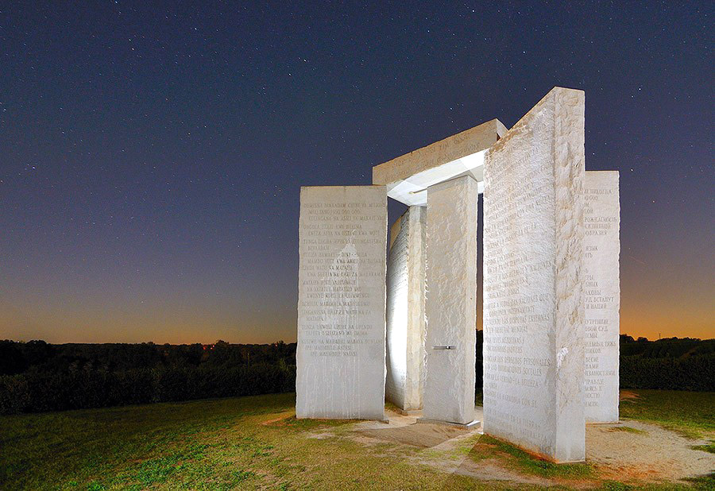

> **Первичный текст.** О текущем моменте №1(139), 2019г. Снова о перспективах….
> Источник: `dotu.ru:e5c535d11ebcac47.doc` sha256 `4c890774a3bfd073…`; [страница на dotu.ru](https://dotu.ru/2019/09/01/20190901_tek_moment01139/).
> Автоматическая транскрипция DOC→Markdown; смысл и формулировки не правились.
> Контрольные суммы и статус проверки — в [NOTICE.md](../../NOTICE.md).
> Содержание передаёт позицию авторов; утверждения не верифицированы библиотекой.

---

«О текущем моменте» № 1 (139), август 2019 года

Снова о перспективах…

ОГЛАВЛЕНИЕ

[1. Некоторым «захорошело»: по их мнению капитализм со «слегка очеловеченным» мурлом возвеличит Россию 1](#некоторым-захорошело-по-их-мнению-капитализм-со-слегка-очеловеченным-мурлом-возвеличит-россию)

[2. «Раскладываем всё по полочкам» тем, кому «захорошело» от российского капитализма со «слегка очеловеченным» мурлом 6](#раскладываем-всё-по-полочкам-тем-кому-захорошело-от-российского-капитализма-со-слегка-очеловеченным-мурлом)

[Глобально-политические выводы по разделу 2 11](#глобально-политические-выводы-по-разделу-2)

[3. Обусловленность решения российских и глобальных проблем 12](#обусловленность-решения-российских-и-глобальных-проблем)

[Что государственная власть обязана делать, и почему в нынешней России это невозможно 29](#что-государственная-власть-обязана-делать-и-почему-в-нынешней-россии-это-невозможно)

[4. Что делать и чего не делать «простому человеку», когда государственность «не та» и почти всё делает «не так»? 30](#что-делать-и-чего-не-делать-простому-человеку-когда-государственность-не-та-и-почти-всё-делает-не-так)

[Вместо заключения 36](#вместо-заключения)

1. Некоторым «захорошело»: по их мнению\

капитализм со «слегка очеловеченным» мурлом возвеличит Россию

=============================================================

Из блога Соколова-Митрича[^1], всё «скопипащено», поэтому «правильнописание» — его:

«Sunday, August 11th, 2019

11:00 pm

Кажется, я живу в какой-то не той стране.

Мне говорят про повальную коррупцию и воровство.

А я точно знаю, что с тех пор, как я начал заниматься бизнесом, никто из госзаказчиков даже не намекнул мне об откате. В коммерческом секторе были попытки, но не в государственном. Боятся меня, потому что я журналист? Еще лет 10-15 назад это никого не останавливало. Я знаю журналистов, с которыми чиновники тогда охотно вступали в коррупционные отношения.

Мне говорят про выживших из ума государственников, потерявших берега и думающих только о том, как прикупить еще один домик в Испании.

А я, регулярно встречаюсь, например, с непоследними людьми из ФРИИ[^2], Сколково, Центробанка, Росатома, РТРС[^3], региональных администраций, включая даже, не побоюсь этого слова, правительство Москвы. И вижу живых, умных, передовых людей с горящими глазами, которые решают сложнейшие менеджерские задачи. Причем я общался с чиновниками и в девяностые, и в нулевые — и точно помню, что тогда передо мной сидели совсем другие люди, с совсем другими целями и мыслями в голове.

Мне говорят, что государство держит нас за быдло, в упор не видит маленького человека. А я точно помню, что еще совсем недавно любой контакт с государством, будь то регистрация автомобиля или получение загранпаспорта, превращался в пытку[^4]. Теперь же это делается в спринтерские сроки по понятным правилам и вежливыми людьми с улыбкой на лице.

Мне говорят, что страна летит в тартарары, в экономике все загибается, мы ничего не строим и не производим, деловая инициатива подавлена.

А я вижу стадионы молодых предпринимателей. Я точно знаю, что, в отличие от благословенных девяностых, оформить юрлицо сегодня — раз плюнуть. Я знаком с сотнями представителей среднего и малого бизнеса, которые не скулят, а делают свое дело — и растут каждый год на двузначные, а то и трехзначные цифры. Я вижу сотрудников крупных корпораций, которые работают по 12-14 часов в сутки и реально, а не корпоративненько гордятся достижениями своих компаний. Примеры могу перечислят до утра, вот лишь несколько. НЛМК[^5] всего за 5 лет совершили рывок, стали самой эффективной металлургической компанией в мире, получили Global Metals Awards в Лондоне. "Росатом" поднял отрасль из небытия, производит углекомпозиты[^6], осваивает ветроэнергетику, там работают потрясающе интересные люди. РТРС в рекордные сроки перевело всю страну с аналогового телевидения на цифровое. "Газпром нефть" осуществило несколько фантастически сложных проектов — Новый порт, Приразломная, Бадра. Некоторые из них стали бенчмаркингом[^7] мирового уровня. На прошлой неделе я общался со вторым человеком в этой компании, у него кабинет площадью метров 20, не больше, а руководители департаментов и вовсе сидят в общем опенспейсе. Да, я, конечно, помню, что нефть — это примитивный бизнес, просверлил дырку в земной коре и качай. Но если вы правда так думаете, то это означает только одно — вас просто не интересует реальность. Легкодоступная нефть давно закончилась и сегодня некоторые нефтяные проекты по технологической сложности сопоставимы с первым запуском человека в космос[^8].

Наверное, я наивный и тупой или даже продажный — вам видней.

А может просто права еще один наш клиент, аудитор Алла Милютина, которая в своей книжке "Спасите мой бизнес" (она только что вышла в "МИФе"[^9]) говорит: "Вы не платите налоги, потому что их все равно разворуют? Ну, раз вы так думаете, значит ваши налоги действительно украдут. А на мои построят детский сад"»[^10].

И эта оценка ситуации и перспектив Д.В. Соколовым-Митричем быстро расползлась по интернету и обросла комментариями, среди которых довольно много одобрительных[^11] (далее всё «скопипащено» и приведено так, как написано авторами — опечатки и грамматические ошибки их):

- Да унас мого БАРДАКА и воров. Но это уже не 90-2000 годы. Мир изменился мы меняемся (хотя и очень медленно). Прошлые годы нас приучили, чуть что кричать: "Все воры и всё ПЛОХО". Но сейчас надо делать на местах спокойно и без криков. Если каждый человек, сделает хоть что то, что бы, было лучше. Это будет движение в ПЕРЁД!!!

- Замечательный ролик для наших нытиков и всепропальщиков, а также для "туристов" с рюкзачками за спиной, которые по призыву либерастов-педерастов делают массовку на митингах, вместо того, чтобы включать мозги и работать.

- Есть две страны: Россия оптимистов, где строят, улучшают, развиваются; и Россия пессимистов, где разваливают, закрывают, и вообще полный капец!!! Причём у нытиков всё плохо. Строят — денег девать некуда, разворовали сколько, природу загрязняют и вообще — гады. Короче, его проще пристрелить, чем сделать счастливым.

- Молодец, позитивно и по существу. Если услышите подванивающих либерастов, гоните их ссаными тряпками.

- "Желание украсть" в основном у тех, кто не хочет работать. Чем меньше зарабатывают, больше хочется "халявы".

- Ко мне люди приходят за ипотеками. Спрашиваю какой доход. Они отвечают 110-140 тыс. Рублей. Блин, ну совсем нет денег у людей... ноют только лентяи.[^12]

- С автором согласна. Поддерживаю, надоели и нытики и митинги. Одни бараны, а другие вражины.

- Отличный, позитивный ролик! Как же мы все соскучились по такого рода информации... И самое главное — все это правда. Не знаю, кто как, но я вижу возрождающееся сильнейшее государство... Да, трудностей и проблем много, но для того, чтобы увидеть, что изменения в позитивную сторону набирают обороты, некоторым нужно оторваться от чтения либеральных СМИ, и оглянуться вокруг широко открытыми глазами.

- СПАСИБО ЗА ПОЗИТИВ!!! Побольше выпускайте таких роликов! Эх, и телеканалов бы добавить с таким контентом!..

- Да всепропальщиков еще много, и я заметил одну общую для них черту, в своей массе это ограниченные, можно сказать тупые, очень консервативные, тяжелые на подьем, безинициативные и зачастую ленивые люди, они всем недовольны, они считают что все вокруг воры и проходимцы и только они самые честные и порядочные, что в их бедах виноваты все кроме них и первый виновник естественно путин, но самая главная их черта это упертость, общался с некоторыми *раскладываеш им все по полочкам* (выделено курсивом нами при цитировании: ВП СССР), они вроде соглашаются, но под конец все равно виноват ктото но не они, и первая подмога для либералпидорасов это всепропальщик. Мне кажется что в каждой стране рождается определенный процент потенциальных предателей, бомжей, пидорасов и естественно всепропальщиков и от этого никуда не деться. Остается просто не обращать на убогих внимание.

Конечно, в России полно предпринимателей манимейкеров, которые *«не в Бога богатеют»*, и одобрительно восторженные отклики на приведённую выше публикацию «Митрича» принадлежат большей частью им. Но есть и те, кто выразил полное несогласие с мнением Соколова-Митрича. Один из них ответил ему так:

«Построят детский сад??? Ага. Конечно. Автор, открой сайт госстатистики, и посмотри количество детских садов по годам. И если хватит смелости, выложи это здесь, на своём канале. То же самое с количеством школ. А потом сравни это с ростом количества храмов РПЦ. Конечно, этого ты делать не будешь. Ведь каждый может проверить эти цифры. А чьи-то бездоказательные утверждения о гигантском росте нашей экономики — это пожалуйста! Ну давай про экономику. Что там было в майских указах Путина? Поднять ВВП России на 50 % за 6 лет. Так? Это, если вспомнить математику, примерно 6...7 % в год (учитывая прогрессивную составляющую). ГДЕ эти шесть процентов??? Росстат показывает нам колебания около 0,5 %. И так уже ДВА ГОДА из шести! И что? Сделаны выводы? Кого-то сняли с должности премьера? Неееет! У нас же всё прекрасно! Вы или реально живёте в другой стране, либо сознательно искажаете реальность в угоду властям».[^13]

Субъективные оценки могут быть иллюзорны, а реальность в своей динамике неизбежно развеет иллюзии, но тогда будет уже поздно пересматривать свои прошлые оценки — неприятности, к которым они приведут, будут вполне реальны, а их воздействие может быть убийственным. Поэтому важно упреждающе по отношению к динамике течения событий понять, что в действительности происходит, чтобы не пасть жертвой собственных пьянящих иллюзий.

2. «Раскладываем всё по полочкам» тем, кому «захорошело»\

от российского капитализма со «слегка очеловеченным» мурлом

===========================================================

Тому, что в действительности происходит в России, посвящён раздел 5 аналитической записки ВП СССР «Об этике и её роли в жизни»[^14], написанной в марте 2019 г., в силу чего она к настоящему времени не устарела, и сказанное в её разделе 5 необходимо вспомнить для понимания дальнейшего изложения. Но поскольку тематика той записки — *этика и её роль в жизни общества*, то некоторые аспекты, значимые для понимания перспектив России и управления ими, в той записке не были освещены.

В частности в ней говорилось, что центробанк РФ на основании действующей конституции и законодательства о нём ни за что перед государственной властью и обществом России не отвечает, и при этом с момента принятия конституции РФ 1993 г. безнаказанно проводит вредительскую эмиссионную и кредитную политику, способствуя деградации науки, системы образования, реального сектора экономики и в целом — способствуя экономическому геноциду населения, т.е. вымиранию страны.

*[В оригинальном издании здесь расположен рисунок/схема. Иллюстрация не включена в данный выпуск: ожидает визуальной и правовой проверки. Файл источника: image1.png]*См. слева демографическую карту мира — взята из интернета, характер демографической ситуации, показанный на ней для РФ, подтверждается другими публикациями; а ниже представлена демографическая карта России, которая даёт более детальное представление о характере демографического кризиса страны и его распределении по территории.[^15] До «Митрича» и его опьянённых иллюзиями почитателей эта информация как-то не дошла либо не была ими оценена должным образом.

*[В оригинальном издании здесь расположен рисунок/схема. Иллюстрация не включена в данный выпуск: ожидает визуальной и правовой проверки. Файл источника: image2.jpeg]*«Если русские вымирают, значит это кому-то нужно», — Л.В. Шебаршин (1935-2012), начальник Службы внешней разведки СССР. Но сказав это, он не стал указывать на тех, кому это нужно, кем, по каким причинам, с какими целями, и как осуществлялся и осуществляется этот геноцид. Тем не менее, должно быть понятно, что если страна вымирает, то инфраструктуры и некоторые предприятия, которые построены и продолжают строиться, успешно интегрируясь в мировую экономику, по факту предназначены не для повышения качества жизни будущих поколений наших соотечественников, а построены и строятся в интересах будущих поколений колонизаторов территорий РФ, очищенных от коренного населения методами «гибридной войны»[^16]. Зачистка территории осуществляется вполне успешно в полном соответствии с планами заправил глобальной политики.

«На территории СССР экономически оправдано существование 15 миллионов человек» (М. Тэтчер в бытность её премьер-министром Великобритании).

С 1992 по 2008 г. население России сократилось примерно на 12,3 миллиона человек и продолжает сокращаться. По оценкам ООН 2009 года к 2025 году Россия потеряет ещё как минимум 11 миллионов жителей, а к 2050 году население России может снизиться до 100 миллионов человек.

«Население России сокращается, экономика увядает, она не проживёт следующие 15 лет»[^17] (вице-президент США Дж. Байден. The Wall Street Journal. 25 июля 2009).

Но такая политика проводится не только в отношении России. Русский текст «Скрижалей Джорджии» (см. фото ниже)[^18], предлагает к реализации 10 постулатов глобальной политики, первый из которых задаёт предельную численность человечества; второй — подразумевает некие требования к качеству человека, несоответствие которым повлечёт не оглашённые в «скрижалях» последствия, суть которых в том, что не соответствующие требованиям индивиды не попадают в полумиллиардную «квоту» предельной численности человечества, и вопрос только в том, как они будут уничтожены; а те, кто этим требованиям отвечает, должны в пределах этой полумиллиардной квоты в соответствии с третьим постулатом построить глобальный внутренне бесконфликтный «мультикультурализм» и некоторым образом уничтожить в порядке осуществления «социальной гигиены» индивидов и народы, которые «не соответствуют высоким стандартам цивилизованности»[^19]:

1.  Пусть земное население никогда не превышает 500.000.000, пребывая в постоянном равновесии с природой.

2.  Разумно регулируйте рождаемость, повышая ценность жизненной подготовки и многообразия человечества.

3.  Найдите новый живой язык, способный объединить человечество.

4.  Проявляйте терпимость в вопросах чувств, веры, традиций и им подобных.

5.  Пусть справедливые законы и беспристрастный суд встанут на защиту народов и наций.

6.  Пусть каждая нация сама решает свои внутренние дела, вынося на мировой суд общенародные проблемы.

7.  Избегайте мелочных судебных тяжб и бесполезных чиновников.

8.  Поддерживайте равновесие между личными правами и общественными обязанностями.

9.  Превыше всего цените правду, красоту, любовь, стремясь к гармонии с бесконечностью.

10. Не будьте раковой опухолью для земли, природе тоже оставьте место!

Т.е. речь идёт о сокращении численности населения Земли с нынешних 7,5 миллиардов до полумиллиарда *в* *течение исторически непродолжительных сроков времени, поскольку необходимо упредить крах биосферы под воздействием глобального экологического — биосферно-социального — кризиса, генезис которого — особая тема*[^20].

Средства геноцида в отношении индивидов и культур, не отвечающих стандарту заказчиков «Скрижалей Джорджии», — государственная политика «социальной гигиены»[^21], гражданские войны, инспирируемые извне[^22], экономическая разруха и голод, разного рода эпидемии на их фоне. Глобальная война — неизбежно ядерная — сценарием не предусмотрена, поскольку влечёт за собой как минимум 10-летнюю «ядерную зиму» и крах нынешней биосферы: поэтому она может произойти только в результате краха сложившейся системы глобального управления.

Должно быть понятно, что в США, где всё сколь-нибудь политически значимое под контролем масонства[^23], такие монументы не возникают по несогласованной с руководством «братаната» частной инициативе. И даже если бы что-то возникло стихийно без согласования, то потом оно было бы либо признано и некоторым образом введено в культуру, либо было бы уничтожено под тем или иным предлогом на самых что ни на есть «законных основаниях». Поскольку «Скрижали Джорджии» с 1980 г. существуют как культовый объект глобальной значимости, то этот факт — показатель того, что они — элемент глобальной политики[^24].

С позиций фиктивного гуманизма (игнорирующего конкретику жизненных обстоятельств, и не задумывающегося о том, как в этой конкретике воплощать в жизнь идеалы гуманизма) — можно сколь угодно долго порицать политику геноцида в отношении более чем 7 миллиардов представителей биологического вида «Человек разумный»; порицать Мальтуса, впервые указавшего на то, что численность населения Земли и его потребности растут быстрее, чем производственные мощности, посредством которых удовлетворяются потребности, и заниматься иным «человеколюбивым словоблудием». Но это не ведёт к воплощению идеалов гуманизма в жизнь. Реальность такова, что:

- глобальный экологический — биосферно-социальный — кризис — объективная данность, порождённая и непрестанно усугубляемая порочным образом жизни Западной региональной цивилизации, ставшей «локомотивом» глобализации в её исторически сложившемся виде, осуществляемой в русле библейской доктрины скупки мира со всеми его обитателями и их имуществом на основе иудейской трансгосударственной монополии на ростовщичество[^25];

- экологическая ниша для биологического вида «Человек разумный» существует точно так же, как и для всех прочих биологических видов, и ёмкость её ограничена[^26];

- специфика биологического вида «Человек разумный», отличающая его от всех прочих биологических видов, состоит в том, что *ёмкость его региональных и глобальной экологических ниш зависит от образа жизни цивилизации (т.е. при одном образе жизни глобальной цивилизации ёмкость глобальной экологической ниши человечества может быть в пределах полумиллиарда человек, а при другом — несколько десятков миллиардов, но образ жизни выбирают и формируют прежде всего сами люди, а не только физико-географические факторы, которые только создают некоторое множество возможностей, в пределах которых реализуется образ жизни цивилизации)*.

## Глобально-политические выводы по разделу 2

Поэтому будущее нашей страны требует, чтобы россияне в течение ближайших десяти лет:

1)  не только родили не менее 100 миллионов детей, но и

2)  обеспечили в процессе их взросления культурную состоятельность каждого из них, позволяющую разрешить проблемы, унаследованные от прошлого (как локальные, так и глобальные), не создавая новых проблем[^27].

**Однако проблема состоит в том, что:**

- **эту задачу граждане страны должны решить сами, преодолевая своим разумением и волей политику экономического геноцида, которую с момента своего возникновения бесчувственно и бездумно — в режиме коллективного зомби — проводит постсоветская государственность РФ;**

- **и не каждый человек, не каждая семья способны принять участие в решении этой задачи в силу извращённого образа жизни большинства населения, и порождаемого извращённым образом жизни общества нездоровья (включая репродуктивное нездоровье), непонимания людьми глобальной и российской проблематики и политики, безволия даже при наличии понимания;**

<!-- -->

- если точнее, то подавляющее большинство населения к этому не способно: кто-то не может зачать и родить; кто-то не может построить семью; кто-то не хочет «плодить нищету»; кто-то не в состоянии воспитать человека, перекладывая эту родительскую ответственность на телевизор, школу, интернет, на армию.

Эта проблема — следствие того, что подавляющее большинство нынешнего взрослого населения психологически застряли в возрасте менее 10 лет (алгоритмическая структура их психики — инфантильна), а их миропонимание в аспекте того, как осуществляется социальное управление и каково место и возможности человека в этих процессах — неадекватны. Это следствие деградации института семьи в результате внутренней политики, проводимой в СССР и в постсоветской России в послесталинские времена.

И решена эта проблема может быть только через возрождение полноценной функциональности института семьи вопреки политике постсоветской государственности.

# 3. Обусловленность решения российских и глобальных проблем

Название раздела 3 следует понимать в том смысле, что решение российских и глобальных проблем не может быть неограниченно произвольным. Т.е. существует некоторое множество объективно возможных решений, но это множество и каждое из возможных решений в его составе обусловлено действием объективных закономерностей, которым подчинена жизнь каждого человека, семей, социальных групп, культурно своеобразных национальных и многонациональных обществ, и действие которых устранить невозможно. По отношению к возможностям разрешения названных ранее проблем решающую роль играет комплекс первых трёх групп закономерностей, представленных на рисунке ниже. **Из матрицы, задаваемой всеми познанными и не познанными объективными закономерностями, выхода нет.**

*[В оригинальном издании здесь расположен рисунок/схема. Иллюстрация не включена в данный выпуск: ожидает визуальной и правовой проверки. Файл источника: image4.png]***Сначала обратимся к рассмотрению процессов глобального уровня и их воздействию на Россию, соотносясь с объективными закономерностями первых трёх групп**.

Если культура находится на нулевом уровне развития, то биологический вид «Человек разумный» — стадно-стайная обезьяна, в арсенале которой только — врождённые безусловные рефлексы и инстинкты, чувства, интеллект и потенциал личностного и общественного развития. При этом он несёт весь комплекс инстинктивных программ стадно-стайных обезьян, ориентированных на воспроизводство в преемственности поколений стада-стаи, предельно эффективной в смысле устойчивости к давлению среды обитания, что подразумевает неизбежность построения внутри стада-стаи иерархии особей, выполняющих в организации стада-стаи различные функции и соответственно функциями обладающих различными «правами» и «обязанностями». Кроме того, «Человек разумный» — «слабо вооружённый» биологический вид и несёт весьма *«слабенькую» «врождённую мораль», доходящую до вседозволенности,* типичную для всех «слабо вооруженных видов» [^28].

Именно эта «обезьянья» «врождённая мораль» и порождаемая на её основе иерархия особей в стаде-стае и является первичным генератором несправедливости во всех её разновидностях и проявлениях на протяжении всей предыстории и истории нынешней глобальной цивилизации и всякого культурно своеобразного общества.

Эта слабость *«врождённой морали» «Человека разумного», весьма отличной от диктатуры **совести и стыда,*** **которые для человека — тоже врождённые**, обезьяний характер этой «врождённой морали» влечёт за собой два жизненно важных следствия:

- Она является стимулом к тому, чтобы личность развивалась на основе осознания несоответствия «животного начала» своим идеалам[^29], порождающего отрицание по совести своими разумением и волей врождённой «обезьяньей морали» и обрела власть над инстинктами, чтобы личность сама творчески выработала праведную мораль, т.е. чтобы индивид состоялся как носитель человечного типа строя психики осознанно осмысленным волевым порядком. В психике разных людей, составляющих общество, этот процесс протекает по-разному, с разной скоростью, в результате чего складывается некоторое статистическое распределение общества по типам строя психики, которое формирует психодинамику общества и выражает себя в ней и в изменении культуры, включая нормы этики и представления о справедливости[^30].

- Но эта же обезьянья «врождённая мораль» является одним из факторов самоуничтожения национальных и конфессиональных культур и их носителей, а также и цивилизаций (как региональных, так и глобальных)[^31] в случае, если общества в силу разных причин не развиваются должным образом и не выходят в человечность, а, *тупо сохраняя обезьянью «врождённую мораль»,* развивают техносферу и магию в интересах своекорыстного ненасытного «потреблятства»[^32] или осуществления самопревознесения друг над другом индивидов и корпораций в каких-то иных формах.

Последнее утверждение необходимо пояснить. Механизм самоликвидации *устойчиво недочеловечных* культур и их носителей прост:

*Обезьянья «врождённая мораль» органична для «обезьян» вида «Человек разумный» в дикой природе при близком к нулю уровне развития культуры, но если она сохраняется в условиях развития цивилизации по техносферному или магическому пути, то «обезьяна» вида «Человек разумный» перестаёт быть «слабо вооружённым» биологическим видом.* В этом случае мощь техносферы, оружия — вследствие *отсутствия диктатуры совести и стыда (их вытеснило из психики семейное воспитание и школа)*, которым **нормально** должна быть подчинена личностная воля, — употребляется представителями этого вида беззаботно и безответственно во внутривидовой конкуренции в соответствии с нормами обезьяньей «врождённой морали», и по достижении некоторого критического разрыва между моралью и мощью вооружений и магии — неизбежно уничтожает общества носителей обезьяньей «врождённой морали», не воспользовавшихся открытой им Свыше возможностью стать Человеками[^33].

И нынешняя глобальная цивилизация не просто подошла к этому рубежу самоуничтожения, но даже занесла ногу, чтобы его переступить. **Надо остановиться и изменить направленность своего развития — направленность течения глобального историко-политического процесса.**

Но построение капитализма со «слегка очеловеченным» мурлом не ведёт к разрешению этой безальтернативно убийственной для цивилизации «бандерлогов» проблемы, чему примером развитые страны Запада.

Если соотносить с постулатами «Скрижалей Джорджии» изложенную выше причину кризиса глобальной цивилизации (несоответствие стадно-стайной обезьяньей врождённой морали уровню развития техносферы и темпам научно-технического прогресса), то должно быть понятно, что постулат № 1 направлен на то, чтобы глобальная цивилизация не вышла за пределы попущения Божиего и не самоликвидировалась[^34].

Поэтому глобальная политика разнообразного геноцида, направленная на радикальное сокращение численности *«бандерлогов» — индивидов, существующих на основе инстинктов стадно-стайного поведения и врождённой обезьяньей морали*[^35]*,* — своего рода **«объективно необходимое»** *зло — зло, меньшее, нежели гибель глобальной цивилизации в результате глобальной ядерной войны;* техногенной катастрофы, многократно более разрушительной, чем Чернобыль или Бхопал; пандемии, с которой не справится медицина; краха биосферы как неизбежного итога развития экологического кризиса.

Но политика геноцида пусть и меньшее зло, чем гибель глобальной цивилизации, но всё же зло, и Запад погряз в нём[^36]. Самостоятельно он из него не высвободится прежде всего потому, что в английском языке — языке государств-лидеров Запада — нет понятия «совесть».

Альтернативой политике геноцида может быть только политика радикального сокращения численности индивидов, существующих на основе инстинктов стадно-стайного поведения и врождённой обезьяньей морали, путём обеспечения личностного развития всех в новых поколениях.

В результате количество «бандерлогов» на планете будет прогрессирующе сокращаться, а количество состоявшихся человеков будет расти без угрозы для жизни цивилизации, поскольку ёмкость экологической ниши для биологического вида «Человек разумный» в этом случае будет многократно выше, нежели полумиллиардный лимит «Скрижалей Джорджии» для цивилизации «зомби», истребившей «бандерлогов».

Однако альтернативный геноциду процесс личностного развития, обеспечивающий замещение массы «бандерлогов» человеками, — в условиях сложившейся к настоящему времени глобально-политической ситуации изначально протекает в обществах, подвергшихся и подвергающихся воздействию глобальной политики массового геноцида.

*[В оригинальном издании здесь расположен рисунок/схема. Иллюстрация не включена в данный выпуск: ожидает визуальной и правовой проверки. Файл источника: image5.jpeg]*Это касается и России. На фото слева — толпа радуется «победе демократии» над «хунтой» ГКЧП. Одухотворённые лица человеков на фото отсутствуют — «бандерлоги» в экстазе, но они не предвидят «лихих девяностых», лихоимство которых было порождено массовым «бандерложеством» граждан СССР, которое и сделало возможными Горбачёва, недееспособных членов ГКЧП, Ельцина, Гайдара, Чубайса, Козырева, Грачёва, их политику, сделало возможным крах экономики и разгул разноликого бандитизма и экономический геноцид.

Обществу необходимо понять, что система, которая воздействует на каждого из людей в его составе, обусловлена самим обществом, а именно состоянием — образования, нравов и этики в обществе. Поэтому замена какого-либо индивида на другого индивида на любом уровне «вертикали власти» не изменит систему в целом и отношение её к необразованному обществу. Можно менять чиновников пачками, но пока общество не поумнеет самостоятельно и не проникнется Любовью, система государственного управления и её отношение к «простому» человеку — не изменятся.

На фото ниже слева — «отдых на природе». Человеки на фото отсутствуют, и отношение запечатлённых на нём представителей биологического вида «Человек разумный» к природе, к Земле-Матушке — явно хамски-паразитическое, а не заботливо-человеческое. Ежегодные лесные пожары по всей стране — результат умышленных поджогов с целью скрыть преступления по незаконной вырубке лесов и разгильдяйства (палили траву по весне — фото ниже справа, бросали окурки из окон поездов и автомобилей, воспламенения сухой травы в результате преломления солнечного света в стекле брошенных бутылок и т.п.).

*[В оригинальном издании здесь расположен рисунок/схема. Иллюстрация не включена в данный выпуск: ожидает визуальной и правовой проверки. Файл источника: image6.jpeg]* *[В оригинальном издании здесь расположен рисунок/схема. Иллюстрация не включена в данный выпуск: ожидает визуальной и правовой проверки. Файл источника: image7.jpeg]*

Это всё явно антиразумно, и если соотноситься с объективными закономерностями первых трёх групп, то не имеет права на существование и потому будет искоренено действием этих объективных закономерностей — либо как социальное явление путём изменения культуры, либо как биомасса, несущая порочную культуру.

Соответственно те, кто порождает это, должны либо одуматься и начать вести иной образ жизни, либо должны сгинуть…

И после этого все они и им аналогичные желают жить по-человечески? Но такие особи не могут жить по-человечески потому, что организация их психики не человеческая. Однако их «право» деградировать и гадить окружающим и потомкам — в постсоветской России защищено действующим законодательством и правоприменительной практикой.

И какое будущее общество, с каким качеством жизни они породят, когда их дети вырастут и начнут работать, если их организмы биологически дефективны в силу воздействия в период зачатия и беременности вредоносных факторов, к которым пристрастились родители, а творческий потенциал подавлен? А кто-то ещё будет качать права на тему «помогите собрать деньги на дорогостоящее лечение дитятки», хотя для предотвращения тяжкого недуга дитятки родителям было достаточно просто вести праведный здоровый образ жизни перед зачатием и в ходе беременности и далее.

*[В оригинальном издании здесь расположен рисунок/схема. Иллюстрация не включена в данный выпуск: ожидает визуальной и правовой проверки. Файл источника: image8.png]* *[В оригинальном издании здесь расположен рисунок/схема. Иллюстрация не включена в данный выпуск: ожидает визуальной и правовой проверки. Файл источника: image9.png]* *[В оригинальном издании здесь расположен рисунок/схема. Иллюстрация не включена в данный выпуск: ожидает визуальной и правовой проверки. Файл источника: image10.png]*

*[В оригинальном издании здесь расположен рисунок/схема. Иллюстрация не включена в данный выпуск: ожидает визуальной и правовой проверки. Файл источника: image11.png]*Может показаться, что фото слева, сделанное в одном из номеров провинциального мотеля в Воронежской области, не имеет отношения к рассматриваемой проблематике российского кризиса — обычная «бытовуха». Но следует приглядеться к деталям и сделать социально значимые выводы о том, что именно выразилось в этой «бытовухе» и насколько широко оно распространено в обществе.

В верхнем правом углу кадра — днище электрического водонагревателя; от водонагревателя вниз свисает электрический провод, который уходит под лоскут полиэтиленовой плёнки, приклеенный скотчем к стене; под этим лоскутом — электрическая розетка (параметры тока — 220 В, 6 А, 50 Гц), от которой питается водонагреватель[^37]; розетка находится в зоне разлёта водяных струй и брызг, неизбежно возникающих при пользовании душем[^38].

**Человеческая психика** не может так спроектировать санблок; не может принять такой проект к исполнению; не может так построить санблок ни по проекту, ни импровизируя по месту и разумению — т.е. без наличия проекта; не может принять и оплатить такую работу; не может разрешить эксплуатацию мотеля с таким обустройством; не может каждодневно подвергать гостей мотеля опасности быть убитыми; не может подвергать себя опасности понести уголовную ответственность за предоставление услуг, не отвечающих требованиям безопасности (ст. 238 УК РФ[^39]); не может пользоваться душем в таком санблоке.[^40] Но **«бандерложья» психика или психика зомби** может всё это и не только это…

Сделать безопасный и функционально удобный санблок с душем — это работа, не требующая каких-то запредельных знаний и навыков и даже не требующая высшего профессионального строительного образования. Но в силу широкой распространённости «бандерложьей» психики в нашем обществе этот душ в провинциальном мотеле — не является чем-то уникальным в культуре России, он — одно из множества типичных произведений россиян, формирующих качество жизни общества в стране. Статистика отказов космической техники, выросшая в постсоветские времена, — тоже одно из проявлений этого.

Поэтому, если рассматривать трудовые ресурсы страны как «человеческий капитал», «экономический ресурс», то они *— за исключением редкостных гениев и выдающихся виртуозов своего дела, которые тоже не часто встречаются, —* в подавляющем большинстве экономической ценности не представляют: такие «работнички» никому не нужны (ни рабовладельцам, ни буржуинам-капиталистам, ни большевикам), поскольку представляют опасность и для самих себя, и для окружающих (включая работодателей и потребителей продукции), и для потомков. Одни «сконструячили» и построили потенциально убийственный санблок в мотеле, но такие же по организации психики индивиды могут «сконструячить» и построить куда более потенциально опасные объекты (например, химкомбинат или АЭС) или эксплуатировать более или менее грамотно сконструированную и построенную технику, нарушая все прописанные и не прописанные нормы безопасности[^41]: последствия такой работы объяснять надо всем или только тем, кому «захорошело» от российского криптоколониального капитализма со «слегка очеловеченным» мурлом?

Поэтому, глядя на демографические карты, приведённые в разделе 2, и соотнося запечатлённое на приведённых выше фотографиях жизни россиян с объективными закономерностями, прежде всего, ноосферно-религиозного характера, надо понимать, что:

- в России вымирают «бандерлоги», зомби и зарвавшиеся демоны;

- мы — лидеры в процессе осуществления глобальной социальной гигиены.

**Это лидерство может стать необратимой окончательной социальной катастрофой только в том случае, если будет уничтожено генетическое ядро**[^42] **Русской многонациональной цивилизации.** Но пока ядро воспроизводится и действует, происходящее — не более чем социальная гигиена: очищение планеты от индивидов, не состоявшихся в качестве человеков и от не желающих состояться в таковом качестве. Да, это — трагедия, но в ней — сами виноваты: виноваты тем, что хотя есть потенциал становления человеками, но он не реализуется, потому что «бандерложим».

Можно сожалеть и печалиться о том, что кто-то состоялся в качестве «бандерлога», зомби или демонической личности, но все те неприятности, которые происходят с ними — объективное благо, поскольку в неприятностях выражается замыкание сдерживающих и подавляющих обратных связей в иерархически наивысшем всеобъемлющем управлении, поскольку они либо стимулируют людей к развитию и становлению человеками, либо в конечном итоге уничтожают тех, кто закоренел в «бандерложестве» и настаивает на своём праве именоваться человеком вопреки тому, что он — «бандерлог», зомби или демоническая личность.

Однако государственная политика, направленная на *решение демографической проблемы путём стимулирования интенсивного размножения «бандерлогов»,* происходящего вследствие зачатия под воздействием факторов, разрушающих потенциал личностного развития, и неумения родителей, государственности и школы обеспечить формирование личности человека в ходе взросления, — путь к самоубийству общества.

Поэтому:

- Возражать против сказанного и показанного выше с позиций фиктивного гуманизма, настаивая на том, что любой индивид — человек состоявшийся, обладающий полнотой достоинства человека по факту его принадлежности к биологическому виду «Человек разумный» и достижения возраста «юридической взрослости», и потому должен обладать всеми «правами человека» — значит совершать стратегическую общественно-политическую ошибку (реализация этой ошибки в политике называется *«торжество идеалов либерализма», хотя по сути является тиранией, худшей, чем тирания фашистских диктатур, поскольку вседозволенность «бандерлогов» и демонов во всех сферах жизни находится под защитой закона и правоприменительной практики, порождаемых демонами, и закономерно*[^43] *приводит к катастрофе)*.

- Признавать сказанное и требовать жёсткой государственной политики социальной гигиены, уничтожающей бесперспективных «бандерлогов», зомби и демонических личностей — тоже значит совершать стратегическую общественно-политическую ошибку (реализация этой ошибки в политике называется фашистская диктатура).

**Теперь перейдём к рассмотрению процессов внутрироссийского уровня**. Как показано в материалах Концепции общественной безопасности, глобальный исторический процесс изначально носит управляемый характер. Управление осуществляется и Вседержительностью Божией, и изнутри самого́ общества людьми в русле Вседержительности — как в пределах попущения Божиего людям ошибаться и злоупотреблять своими способностями и открытыми им возможностями, так и путём ретрансляции людьми милости Божией.

Иллюзия стихийно-неуправляемого течения всемирной истории и истории культурно своеобразных обществ — следствие того, что культура общества не воспринимается ни обывателями, ни политиками, ни наукой в качестве информационно-алгоритмической системы ни в одном из двух её управленчески значимых свойств:

- как объект программирования (в смысле, идентичном тому, который ныне принят в IT),

- как инструмента осуществления самоуправления на основе ранее внедрённых в культуру программ разного функционального предназначения.

Психика людей тоже не рассматривается как информационно-алгоритмическая система, непрестанно взаимодействующая с культурой общества как объемлющей информационно-алгоритмической системой.

Однако вопреки такого рода слепоте и невежеству таких наук, как психология, история и политология, текущая политика и вся самодеятельность членов общества всегда алгоритмичны, поскольку и культура, и личностная психика, и порождаемые людьми коллективные психики — информационно-алгоритмические системы. В истории алгоритмичность политики и самодеятельности людей прошлых эпох выразилась в хронологии событий. Поэтому:

- Если вы хотите понять текущую политику и увидеть её перспективы, то вы должны некоторым способом выявить ту алгоритмику, которая реализуется в настоящее время.

- Если вы хотите изменить будущее, то, выявив реализующуюся алгоритмику, вы должны: 1) либо её погасить, 2) либо активизировать какие-то не работающие её модули, 3) либо создать и активизировать новые модули, 4) либо сочетать 1-3 в каких-то комбинациях, обусловленных как обстоятельствами, так и вашими навыками их адекватно воспринимать и действовать в них.

Носителем алгоритмики и информации (всего комплекса программ), которые реализуются в жизни общества, является психодинамика социальных групп и общества в целом. Психодинамика общества представляет собой процесс его самоуправления, в котором все члены общества в соответствии с их нравственностью, миропониманием, этикой, взаимодействуя с потоком событий по своему разумению и недоразумению, делают и не делают всё то, что хотят, в результате чего получается то, что получается.

С точки зрения ДОТУ общество представляет собой суперсистему, а психодинамика общества это:

- в материальном аспекте *— биополя людей, объединяющие индивидов в разного рода функционально целостные группы вплоть до человечества в целом;*

- а в нематериальных аспектах — алгоритмика и информация, на основе которой строится самоуправление в суперсистеме и которая распределена своими фрагментами по психике индивидов, составляющих разного рода функционально целостные группы, общество и человечество в целом, плюс информация и алгоритмика, наличествующая в полевых телах соответствующих эгрегоров.

Алгоритмика и информация, несомые психодинамикой, изменяются только в результате изменения того, что принято называть «духовностью», в которой скрыты творческий потенциал и склонность к биологической и социокультурной деградации людей и социальных групп. Когда творческий потенциал, а также и склонность к деградации реализуются, — некоторым образом изменяется и алгоритмика самоуправления суперсистемы, и вследствие её изменений некоторым образом изменяются и психодинамика, и результаты её действия — т.е. результаты управления. Поэтому главное в жизни общества — не допускать деградации и реализовывать творческий потенциал в русле Промысла.

По отношению ко многим процессам, обусловленным психодинамикой, уместна поговорка «ложка дёгтя портит бочку мёда», т.е. один идиот или негодяй способен обрушить и обесценить многовековое дело миллионов. Но точно также даже один человек, реализуя свой творческий потенциал в русле Божиего Промысла осмысленно волевым порядком под властью диктатуры совести, способен изменить психодинамику так, что улучшит будущее всего человечества на многие века[^44].

Все люди, все общественные институты (семья, государственность, наука, школа) во всяком культурно своеобразном обществе всегда действуют в русле исторически сложившейся психодинамики. Поэтому в жизни общества не может произойти ничего, под осуществление чего нет соответствующего информационно-алгоритмического обеспечения в психодинамике этого общества.

Сказанное выше об алгоритмичности жизни и политики касается и России. История России циклически повторяется. Полный цикл истории включает в себя две фазы.

**Начало первой фазы нового цикла** это — завершение предыдущего цикла социальной катастрофой. В первой фазе происходит попытка построения общенародного государства, обусловленная общей для подавляющего большинства потребностью продолжать жизнь после катастрофы. В течение первой фазы цикла возникает социальная группа с «элитарными» притязаниями, исходящими из самооценки *«мы — лучшие, и потому мы имеем право на то, на что остальные права не имеют, они должны жить под нашей властью и быть благодарны нам за всё, и не вправе быть недовольными нашим правлением».* Когда эта социальная группа берёт под контроль институт государственности, то она начинает проводить политику, направленную на дискредитацию и демонтаж общенародной государственности, препятствующей реализовать ничем не обоснованные «элитарные» притязания на исключительность. Далее происходит мгновенный либо «ползучий» государственный переворот, в результате которого государственность перестаёт по факту быть общенародной, и возникает «элитарно»-корпоративная государственность.

Начало второй фазе цикла даёт становление «элитарно»-корпоративной государственности. Для неё характерно помыкание всем не-«элитарным» простонародьем как ресурсом, на который не распространяются нормы внутренней корпоративной этики «элиты». Как следствие кланового обособления «элиты» и желания «богатеть не в Бога» кадровой базой, из которой черпаются кадры действующих управленцев во всех проявлениях управления, значимых для общества в целом как суперсистемы, становится только некоторое количество «элитарных» кланов (в общенародном государстве кадровая база сферы управления этого уровня — всё общество). Т.е. для «элитарно»-корпоративного государства характерна кадровая политика родоплеменного строя, в которой право на занятие должностей и полномочия обусловлены принадлежностью к определённым кланам по факту рождения либо по факту «усыновления», а не деловыми качествами, компетентностью и творческим потенциалом[^45]. Как следствие такой кадровой политики в полном соответствии с биологическими и ноосферно-религиозными закономерностями, протекает деградация «элиты», ни за что и никак не отвечающей перед остальным обществом; деградация «элиты» носит двухаспектный характер — имеет место и биологическая деградация, и социокультурная. В результате «элитарно»-корпоративная государственность утрачивает способность отвечать на «вызовы времени» и приводит страну к очередной катастрофе, которая завершает вторую фазу полного цикла истории России.

В таких катастрофах гибнет множество людей как из числа «элитариев», так и из «простонародья». Выживают в них только хранимые Богом — те, кто несёт в себе что-то для будущего возрождения.

Начало текущему циклу истории России положила катастрофа Российской империи, главная причина которой — биологическая и социокультурная деградация имперской «элиты», в результате чего она утратила способность отвечать на «вызовы времени», ещё ранее утратив способность профилактировать «вызовы времени», обеспечивая своею политикой развитие общества в русле Божиего промысла. Все остальные факторы (инвестиции в революцию зарубежных и транснациональных политических сил) оказались результативными только в условиях деградации «элиты» и утраты дееспособности «элитарно»-корпоративной государственности империи.

Становление Советской власти происходило как попытка построения общенародной государственности. Далее возникла партийно-советская бюрократия, которая трансформировалась в эксплуататорский паразитический класс. Этому классу общенародная государственность была помехой в удовлетворении паразитически-безответственных «элитарных» притязаний. Поэтому «элитаризовавшаяся» бюрократия (партийная, советская, хозяйственная, чекистская) охотно (частью осознанно, частью бессознательно) втянулась в ползучий государственный переворот, курируемый либерально-буржуазной ветвью масонства Запада[^46] при посредничестве ЦРУ и других спецслужб государств Запада, которые ставили задачу не только уничтожения СССР и Советской власти, но и желали окончательно решить «Русский вопрос»[^47] путём биологической и социокультурной дерусификации России. Начало этому перевороту положили убийства Сталина и Берии, а завершился он принятием ныне действующей конституции РФ, обеспечивающей России статус криптоколонии Запада и перспективы дальнейшего расчленения и решения «Русского вопроса».

Соответственно, мы живём во второй фазе полного цикла истории России, в котором «элитарно»-корпоративная государственность деградирует, теряет способность профилактировать «вызовы времени» и эффективно отвечать на них. Т.е. если всё пустить на самотёк психодинамики, то завершение второй фазы полного цикла истории очередной катастрофой — неизбежно[^48].

Тема цикличности в истории России обстоятельно освещена в работе ВП СССР «Смута на Руси: зарождение, течение, преодоление…», опубликованной ещё в 2006 г.

Теперь приведём фрагмент рабочих материалов ВП СССР. Это фрагмент несостоявшейся аналитической записки из серии «О текущем моменте» № 6 (122)[^49] за декабрь 2015 г.

\* \* \*

В декабре 2015 г. в публичной политике имели место три выделяющихся на общем фоне события:

- оглашение Послания Президента РФ Федеральному собранию 3 декабря[^50];

- ежегодная пресс-конференция Президента РФ 17 декабря[^51];

- демонстрация фильма В.Р. Соловьёва «Миропорядок»[^52] на канале «Россия 1» 20 декабря и его повторение на канале «Россия 24» 21 декабря.

В Послании Федеральному собранию сказано:

«Россия не имеет права быть уязвимой. Нам нужно быть сильными в экономике, в технологиях, в профессиональных компетенциях, в полной мере использовать сегодняшние благоприятные возможности, которых завтра может уже и не быть.

Конечно, власть должна слышать людей, объяснять суть возникающих проблем и логику своих действий, видеть в гражданском обществе и в бизнесе равных партнёров».

Но о том, как стать сильными в экономике, в технологиях, в профессиональных компетенциях, т.е. в результате осуществления какого именно по содержанию комплекса мер будет достигнут желаемый результат, — не сказано ничего. То же касается и объяснения сути возникающих проблем и логики действий власти — ничего, а практика обращения к власти по существу проблем, путей и методов их решения всегда натыкается на позицию «спасибо, мы — сами всё знаем и вполне компетентны».

Однако на пресс-конференции 17 декабря 2015 г. ответ на первый же вопрос о перспективах выхода России из кризиса, заданный в связи с аналогичным вопросом на пресс-конференции 2014 года и данным тогда ответом на него, В.В. Путин начал анекдотом:

«Встречаются два приятеля, один другого спрашивает: «Как дела?» Тот говорит: «Как в полоску: чёрное — белое». — «Сейчас какая?» — «Сейчас чёрная». Проходит ещё полгода. «Ну как дела. Знаю, в полоску. Сейчас какая?» — «Сейчас чёрная». — «Нет, тогда же была чёрная». — «Нет, выясняется, что тогда была белая». Вот у нас примерно такая же ситуация».

В общем, ответ в стиле «оставь надежду на лучшую жизнь всяк живущий в России простолюдин»[^53]: власть и олигархия живёт всегда в потребительском раю.

Если говорить о причинах экономических трудностей, с которыми сталкивается всё остальное общество, то это — непреклонная верность государственной власти во всех её ветвях либерально-рыночной экономической модели. Главный генератор проблем — безответственность центробанка России перед Россией[^54]. На протяжении всего времени существования центробанк не справляется с единственной конституционной обязанностью — обеспечением устойчивости рубля[^55], но успешно душит реальный сектор экономики (включая науку и систему образования) ростовщической удавкой и сдерживанием эмиссии рубля, что лишает реальный сектор оборотных средств и возможностей развития; кроме того ссудный процент является первичным генератором инфляции[^56], а его центробанк держит на уровне двузначных чисел.

Вопрос о ставке и политике центробанка тоже встал на пресс-конференции 17 декабря 2015 г., и В.В. Путин дал на него ответ.

«**Елена Глушакова**, РИА Новости.

Добрый день! Владимир Владимирович, Вы сказали, что пик кризиса мы прошли, тем не менее ситуация в экономике продолжает оставаться очень тревожной, и об этом говорят экономисты. В частности, Ваш соратник Алексей Леонидович Кудрин призывает к реформам, но он известный оптимист.

На этой неделе, например, очень тревожные мысли высказал и Ваш омбудсмен, Уполномоченный по правам предпринимателей Борис Титов. В частности, он сказал, что кредитная ставка Центрального банка чрезвычайно высока. Соответственно, наши предприниматели по понятным причинам не могут брать кредиты на Западе и не могут брать в России, потому что их стоимость слишком высока. Он говорит, что если ситуация продолжится, то мы станем Венесуэлой, где один курс национальной валюты на «чёрном рынке» и совершенно другой официальный курс валюты.

Вы такие опасения разделяете? Вы поддерживаете денежно-кредитную политику Банка России? Считаете ли Вы необходимым снижение процентной ставки?

Спасибо.

**В.Путин:** Бурные продолжительные аплодисменты Вашему вопросу[^57].

Естественно, это всех волнует. И конечно, всем хочется, чтобы ставка рефинансирования Центрального банка была пониже, а на неё, как известно, ориентируются и коммерческие банки при выдаче кредитов участникам экономической деятельности. Это, кстати говоря, не единственный фактор ставки в коммерческом секторе, но существенный, это правда.

Борис Титов правильно всё делает, он борется за интересы предпринимательского сообщества, и очень важно, что такой человек и такие институты у нас есть. Почему я это создал‑то в своё время? Потому что я хочу слышать разные точки зрения, чтобы за текучкой сегодняшнего дня не пропустить какие‑то важные и существенные элементы нашей экономической жизни в данном случае.

Для начала я прямо отвечу на Ваш вопрос. Я поддерживаю политику Центрального банка и Правительства по обеспечению макроэкономической стабильности. Первое.

Второе. При всём желании понизить ставку это нельзя делать административным путём, надо исходить из реалий нашей экономики, из её структуры. Конечно, я часто слышу: а вот там, где‑то за бугром, там другие ставки, они более низкие. Конечно, там более низкие ставки. Так они специально это делают. Но там проблемы другие, и структура экономики совсем другая. У нас угроза инфляции, а там проблемы, возможно, дефляции, когда производитель производит, а продать не может. Вот в этом проблема.

А у нас совсем другая проблема. И нам нужно, **для того чтобы понизить ставку, не цыкать на Центральный банк, как это делали в советское время и в плановой экономике, а помогать Центральному банку и Правительству подавлять инфляцию и снижать девальвационные риски и ожидания. Когда мы сможем сделать и то, и другое, когда будем двигаться по этому пути, тогда естественным образом, рыночным, спокойно и будет снижаться ставка рефинансирования Центрального банка.** (Текст выделен жирным нами при цитировании: ВП СССР)**.**

Там, где возможно поддержать реальный сектор экономики, Центральный банк и так это делает. Но нельзя его подталкивать к ещё большим шагам по этому направлению, потому что одна из ключевых — не единственная, но одна из ключевых — проблем борьбы с инфляцией может быть поставлена под вопрос: а что Центральный банк делает кроме того, что держит в работоспособном состоянии всю финансовую, банковскую систему страны? А мы можем утверждать, что так оно сегодня и есть. Что делает ещё Центральный банк? Вместе с Правительством работает, например, по так называемым программам проектного финансирования, когда через Правительство проходят определённые проекты, и набор достаточно большой, счёт идёт на десятки миллиардов долларов, уже, по‑моему, 250, потом 500 миллиардов, по разным программам. И по этим программам банк предоставляет фондирование нашим коммерческим финансовым учреждениям для последующего финансирования этих конкретных программ. Это касается новых инвестпроектов, банк тоже принимает в них участие. Целый набор инструментов банк использует. Считаю, что этого пока достаточно».

Приведённый ответ В.В. Путина — публичное признание в лояльности либерально-рыночной экономической модели.

В этой же связи отметим, что в отношении губернатора Белгородской области Е. Савченко ФАС России возбудило дело, по которому ему как должностному лицу грозит штраф в размере от 20 до 50 тыс. рублей[^58]. Этот факт заставляет ещё раз задуматься о практике избирательного применения закона в России: дело в том, что на Госсовете 18.09.2014 г. Е. Савченко выступил против политики центробанка[^59] удушения ростовщичеством реального сектора. Поэтому дело ФАС против него можно интерпретировать только как элемент травли неугодного либералам руководителя одного из более или менее успешных регионов России, поскольку о каких-либо претензиях ФАС или иных служб к руководителям иных регионов, которые не выступали публично против политики Центробанка, СМИ не сообщали.

Если В.В. Путин заявил о поддержке политики Центробанка, то встаёт вопрос: что осталось в умолчаниях? — В умолчаниях остались следствия политики Центробанка — инфляция и двузначные значения ставки по кредитам в России и их неизбежные результаты.

Прежде всего, обратим внимание на выделенный нами в ответе жирным фрагмент. Было бы интересно ознакомиться с теми математическими моделями финансового обращения и производственного продуктообмена, которые подтверждают жизненную состоятельность выделенного фрагмента. В нашем понимании таких моделей нет и быть не может — т.е. Сахипзадовна и КО либо запредельно некомпетентны в моделировании экономики и финансов и управлении ими, либо нагло врут и вводят в заблуждение президента, имеющего *юридическое образование, не позволяющее самостоятельно анализировать математические модели и статистику*.

Либо страна не суверенна и объективно не обладает потенциалом (кадровым, экономическим, военным), позволяющим осуществлять суверенитет в его полноте, вследствие чего не может игнорировать требования МВФ, либерально-буржуазной ветви масонства, и соответственно В.В. Путин и его команда не властны над многими значимыми для развития общества процессами в стране.[^60]

Но вне зависимости от причин, порождающих именно такую политику центробанка, для того чтобы возникла инфляция, необходимы следующие действия:

- осуществлять эмиссию денежной массы более высокими темпами, чем растёт производство в реальном секторе, исчисляемое в неизменных ценах (ценах базового периода);

- сократить производство ниже уровня прежнего платёжеспособного спроса, что повлечёт за собой больший или меньший избыток денежной массы в обращении и соответственно — рост цен;

- стимулировать рост цен кредитованием под процент, больший, чем рентабельность реального сектора в сложившемся финансовом климате, что также ведёт к спаду производства по мере утраты обществом и предприятиями покупательной способности при ограничении эмиссии под предлогом борьбы с инфляцией.[^61]

Кредитование под процент в качестве генератора инфляции, тем более — первичного генератора инфляции — никогда не рассматривается в учебниках экономической теории[^62].

В силу этого обстоятельства Сахипзадовна и КО, начитавшись учебников и никчёмных «классических» трактатов по экономике и финансам, могут быть в неподдельном неведении о том, как они убивают реальный сектор экономики России, а слабоумие, благодаря которому они свято верят написанной в трактатах и учебниках ахинее, может не позволять им догадаться об этом самостоятельно. Как бы там ни было (невежество, слабоумие, вредительство со знанием дела, *честная служба Федрезерву США и его хозяевам, т.е. предательство и злоумышленное саботирование осуществления финансово-экономического суверенитета России, вынужденная политика в условиях реального отсутствия суверенитета и подчинения не оглашаемым публично требованиям Запада*[^63]), но именно ростовщичеством центробанк РФ на протяжении всего времени своего существования создаёт инфляцию. А потом он же начинает с нею как бы бороться, ограничивая эмиссию (сдерживая рост денежной массы), что лишает реальный сектор оборотных средств при выросших под воздействием ростовщичества ценах и влечёт за собой падение производства в реальном секторе (вплоть до структурного распада народного хозяйства), а это вызывает вторичную волну инфляции.

В таком финансовом климате реальный сектор развиваться не способен, как следствие такой политики центробанка будет обострение кризиса, а не выход из него[^64]. (…[^65])

Как в таких условиях реальный сектор может развиваться на инновационной основе, как инфляция упадёт сама собой и как ставка центробанка понизится сама собой «рыночным образом», — от Сахипзадовны и КО хотелось бы получить внятные разъяснения, основанные на математических моделях. Но таких разъяснений объективно быть не может[^66]. Ну а дальнейшее обострение внутреннего экономического кризиса России (зарубежные санкции и цена на нефть — это только дополнительный фактор, стимулирующий внутренний кризис, но не его причина) влечёт за собой то, что В.И. Ленин называл «революционной ситуацией».

И сложившаяся постсоветская государственность, судя по всему, ничего не собирается делать для её профилактирования и разрядки. В частности, об этом говорит следующее обстоятельство: *уже многолетние* выступления депутата Евгения Фёдорова на тему необходимости подчинения центробанка государству не находят должной поддержки в Думе и Совете Федерации, что выражается в неизменности ныне действующей *криптоколониальной* *конституции — законодательной основы осуществления ростовщической тирании* в отношении России и сопутствующего ей законодательства РФ о центробанке, хозяйственной и финансовой деятельности.

Поэтому вопрос в том, кто будет собирать плоды, когда революционная ситуация вызреет, и в какой форме? (…[^67]).

Но пока революционную ситуацию целенаправленно нагнетают и взращивают потенциал недовольства в обществе.

Альтернативой такого рода катастрофам может быть только воплощение в жизнь идеи, высказанной в начале упомянутого фильма «Миропорядок» — **Россия должна быть справедливой**. Но справедливость всегда в своём историко-политическом выражении конкретна, но что конкретно справедливо и как её осуществить, — в фильме не сказано…

\* \*\

\*

Тема справедливости *в её исторически необходимом для развития общества виде* обходится молчанием во всех политических ток-шоу и публикациях на темы политики на протяжении уже более чем двух десятилетий, что тоже содействует нагнетанию потенциала «революционной ситуации».

Но дело в том, что постсоветский либерально-буржуазный режим был уведомлен о перспективах течения второй фазы полного цикла истории ещё в 2007 г. Ниже звёздочками от основного текста отделён фрагмент аналитической записки ВП СССР «Бюрократическая безнадёга в России и глобальный проект “Обама”» из серии «О текущем моменте» № 11 (83), 2008 г.

\* \* \*

Пока же режим не сделал ничего в области публичной политики для того, чтобы вывести страну из алгоритмики развития смуты, описанной в аналитической записке ВП СССР “Смута на Руси: зарождение, течение, преодоление…” из серии «О текущем моменте» № 11 (59), 2006 г., и продолжает вести страну к катастрофе толпо-“элитарной” культуры. И режим не может сослаться на то, что эта информация ему неведома. На фотографии слева[^68] запечатлён зам. главы администрации президента В.В. Путина В.Ю. Сурков: в его руках одно из изданий названной работы ВП СССР. Как видите, оно достаточно крупноформатное (формат страницы — А3) и ярко оформленное, чтобы случайно затеряться: *его можно только либо проигнорировать, либо принять в работу.*

*[В оригинальном издании здесь расположен рисунок/схема. Иллюстрация не включена в данный выпуск: ожидает визуальной и правовой проверки. Файл источника: image12.jpeg]*\* \*\

\*

Т.е. с 2007 г., когда зам. главы администрации президента РФ была вручена работа «Смута на Руси: зарождение, течение, преодоление…», прошло уже более 12 лет[^69], но государственная власть за это время не сделала ничего для выведения страны из затяжного социально-культурного кризиса на путь устойчивого безопасного развития. Все её мероприятия лежат в рамках невнятной концепции построения капитализма со «слегка очеловеченным» мурлом и большей частью направлены на то, чтобы:

- замалчивать, отрицать и «замазывать» существование усугубляющихся проблем разного рода;

- показывать по телевидению красивые картинки реальных и вымышленных единичных успехов, уклоняясь при этом от рассмотрения и обсуждения федеральных и региональных статистик разного рода, свидетельствующих о прогрессирующей медленно текущей катастрофе (см. фотографии ниже: на левом фото — одно из проявлений такой политики в жизни города Суздаль[^70]; на фото справа — то же место, но без атрибутов фальсификации действительного положения дел);

*[В оригинальном издании здесь расположен рисунок/схема. Иллюстрация не включена в данный выпуск: ожидает визуальной и правовой проверки. Файл источника: image13.jpeg]* *[В оригинальном издании здесь расположен рисунок/схема. Иллюстрация не включена в данный выпуск: ожидает визуальной и правовой проверки. Файл источника: image14.jpeg]*

- *«профилактировать» недовольных* *(т.е. запугивать их)* и подавлять тех из них, кто легковозбудим в силу проблем с психикой, вследствие чего «профилактирование» в отношении них оказывается неэффективным;

- представлять в своей пропаганде недовольных в качестве людей, оторвавшихся от народа и одурманенных пропагандой «неправительственных организаций», финансируемых спецслужбами государств Запада.

Потому «элитарно»-корпоративная постсоветская государственность, проводя и пропагандируя политику построения капитализма со «слегка очеловеченным» мурлом, замкнувшись в себе, будет продолжать деградировать, создавая тем самым потенциал будущей катастрофы, завершающей вторую фазу полного цикла историко-политического процесса в России. Проблемы общественного развития она решать не в состоянии вне зависимости от персонального состава думских партий и представителей иных ветвей государственной власти всех уровней: не для этого она создавалась под контролем зарубежных кураторов во исполнение Директивы СНБ США 20/1 «Цели США в отношении России» от 18.08.1948 г.[^71]

Для того чтобы государственная власть была способна вывести страну из кризиса на путь устойчивого безопасного развития, требуется то, что нынешняя государственная власть в России выполнить не способна.

Что государственная власть обязана делать,\

и почему в нынешней России это невозможно

-------------------------------------------

1.  Необходимо проводить кадровую политику, в результате которой происходило бы:

- очищение органов государственной власти:

<!-- -->

- от этически порочных людей и, прежде всего, — угодничающих и инаколживых;

- от управленчески несостоятельных носителей психотипов «исполнитель», «заместитель», оказавшихся на должностях, требующих качеств «единоначальников», а ещё лучше — качеств «юродивых единоначальников»[^72].

<!-- -->

- привлечение на работу в органы государственной власти этически порядочных людей, носителей психотипа «единоначальник», обладающих созидательным творческим потенциалом.

> Но это противоречит принципам кадровой политики родоплеменного строя, характерным для «элитарно»-корпоративной государственности.

2.  Необходимо научно-методологическое обеспечение государственного управления, основанное на учёте объективных закономерностей всех шести групп.

> Однако:

- депутаты и чиновники за единичными исключениями вообще не понимают смысла слов «научно-методологическое обеспечение государственного управления» и не подозревают о необходимости его создания и освоения перед вступлением на государственную службу;

- либерально-буржуазной ветви масонства, которая породила постсоветскую государственность России и контролирует её работу, требуется исполнительный, невежественный управленческий корпус, состоящий большей частью из людей слабоумных по отношению к занимаемым должностям;

- социал-демократическая ветвь масонства (курирующая марксистов разных толков) пока «спит», а в ранг научно-методологического обеспечения государственного управления её представители возводят марксизм и труды некоторых социологов и экономистов немарксистов, в той или иной мере лояльных марксизму и признающих марксизм наукой. Тема научной несостоятельности марксизма и западной социологии в целом, обслуживающей библейский проект, — для них запретна.

3.  Научно-методологическое обеспечение государственного управления должно войти с разной степенью детальности в стандарты всеобщего обязательного образования и профессионального образования всех профилей для того, чтобы обеспечить всеобщую управленческую грамотность и культурное единство общества.

> Но это противоречит принципу «разделяй и властвуй», на основе которого строятся все толпо-«элитарные» культуры, включая и капитализм со «слегка очеловеченным» мурлом.

4. Что делать и чего не делать «простому человеку»,\

когда государственность «не та» и почти всё делает «не так»?

============================================================

Начнём с того, что необходимо делать.

Прежде всего «простому человеку» следует позаботиться о том, чтобы он сам, его род (клан) и главное — продолжатели рода (дети, внуки, племянники) не стали жертвами *процесса социальной гигиены в отношении «бандерлогов»*. Для этого необходимо личностно развиваться в направлении обретения необратимо человечного типа строя психики как основы для всей жизни и деятельности. И это же — предпосылка для того, чтобы не просто продолжить свой род, но и для того, чтобы внести вклад в будущее своего народа *в условиях экономического геноцида как составляющей «гибридной войны»* заправил Запада *на уничтожение России*.

Общественные институты — внутрисоциальные образования, выполняющие определённые функции, которые не могут выполнять ни другие общественные институты, ни люди поодиночке. Если рассматривать жизнь общества на исторически продолжительных интервалах времени, то институт семьи является главным — как в аспекте разрешения проблем, так и в аспекте создания новых проблем в случае деградации института семьи. Все прочие общественные институты (государственность, наука, школа) порождены институтом семьи в ходе исторического развития обществ, а изменения в их функционировании следуют за изменениями, происходящими в институте семьи, с некоторым запаздыванием.

Поэтому в ходе «гибридных войн» институт семьи — первейший объект атаки, а норма рабовладения — в рабском стаде не должно быть института семьи и должен процветать всевозможный разврат, потому что это калечит генетику и обеспечивает биологическую и социокультурную ущербность рабов (а также — жертв успешной гибридной агрессии) в сопоставлении с рабовладельцами и агрессорами. Экономическое подавление института семьи — один из аспектов гибридной агрессии против России, что показано в приводимой ниже выдержке из публикации в «Комсомольской правде».

*[В оригинальном издании здесь расположен рисунок/схема. Иллюстрация не включена в данный выпуск: ожидает визуальной и правовой проверки. Файл источника: image15.jpeg]*«Недавно Росстат огорошил: **26% наших детей живут в семьях с доходами ниже прожиточного минимума**. Самая высокая концентрация детской бедности в селах: 45 % деревенских ребятишек растут в малоимущих семьях. А в многодетных семьях по всей стране уровень бедности еще выше — 52,2 %. Да, ведомство оговорилось, что это данные 2017 года, их только сейчас посчитали — такие уж у нас скорости вычислений в эпоху нанотехнологий и IT-революций. Социологи уже заговорили о ловушке нищеты, в которую попала значительная часть россиян, это не художественный образ, а профессиональный термин. Он обозначает бедность, ставшую родовым проклятием, из которого не могут выбраться поколения за поколением»[^73].

И хотя эта статистика соответствует действительности, и в ней выразилась политика экономического геноцида, необходимо понять, что все разговоры о том, что в условиях постсоветской России семья не может себе позволить зачать, родить и воспитать нескольких детей потому, что это означает для неё впасть в нищету и после этого продолжать «плодить нищету» в последующих поколениях — вздор, обусловленный «потреблятским» образом жизни приверженцев этой точки зрения вне зависимости от того, какими доходами в расчёте на одного члена семьи они располагают. Жизненная состоятельность такого рода мнений опровергается исторической практикой, в частности, данными по блокадному Ленинграду.

«В 1941 году приходится 25 рождений на тысячу жителей, т.е. еще продолжался довоенный уровень рождаемости детей, в 1942 — 10, в 1943 — 12,6, в 1944 — 25, в 1945 — 38![^74]

Эти цифры я и возьму за основу. А теперь рассмотрим количество рождений детей в перестройку — эти данные приводятся во многих справочных изданиях. Если в 1985 году на тысячу жителей Ленинграда-Петербурга было 14,5 рождений, в 1990 — 10,8, то в 1995 — 6,99, а в 1996 — 6,6 родившихся. Отсюда я вынужден сделать важнейший вывод: В БЛОКАДНОМ ЛЕНИНГРАДЕ НА ТЫСЯЧУ ЖИТЕЛЕЙ РОЖДАЛОСЬ ПОЧТИ ВДВОЕ БОЛЬШЕ ДЕТЕЙ, ЧЕМ ИХ РОЖДАЛОСЬ В РАЗГАР ПЕРЕСТРОЙКИ В ПЕТЕРБУРГЕ.

Если в период Блокады ленинградцы твердо знали, кто их враг, и также твердо были уверены в победе, то в начале 90-х, в условиях безудержного разграбления богатства страны и столь же безудержного обнищания основной массы населения, город охватила безысходность, пришло трагическое мироощущение и его верные спутники — увеличивающееся количество самоубийств и уменьшающееся количество новых рождений. Не с этим ли связаны возникшие с 1989 года попытки части нашей интеллигенции принизить подвиг ленинградцев в период Блокады, выпятить все негативное и замолчать все позитивное той поры? Из отмеченных фактов следует, что вера в будущее, жажда жизни у блокадников была выше, чем у жителей Ленинграда-Петербурга эпохи перестройки»[^75].

Соответственно:

- Шуточки о блокаде Ленинграда, включая тему зачатия и рождаемости в нём, отрицание подвига жителей и защитников города — удел «бандерлогов» и негодяев.

- Даже в результате текущей, начиная с 2008 г., деградации экономики страны условия жизни в России в наши дни, включая и аспекты потребления, всяко качественно лучше, чем условия жизни в СССР в годы Великой Отечественной войны, и тем более, — лучше, чем они были в блокадном Ленинграде либо в «лихие девяностые» в большинстве регионов России.

Да, действительно, в условиях политики экономического геноцида, осуществляемой на протяжении нескольких десятилетий, дети в семье — это, прежде всего, тяжёлая нагрузка на бюджет подавляющего большинства семей. Но обилие не самых дешёвых иномарок на дорогах и на стоянках *перед хрущёвками,* чуть ли не ежегодная замена не самых дешёвых мобильных телефонов и компьютеров новыми ещё более дорогими моделями, ежегодное обновление гардероба в соответствии с требованиями моды, устремлённость на заграничные пляжи, работа на то, чтобы переехать на жительство (желательно постоянное) в «более цивилизованные страны», иллюзорные надежды вступить в брак и родить детей после того как будет сделана карьера и обеспечено «финансовое и материальное благополучие»[^76], и многое другое — показатели того, что при планировании деятельности и реализации личных и семейных бюджетов удовлетворение «потреблятских» устремлений стоит на более высоких приоритетах, нежели задача построения семьи, воспроизводства народа в новых культурно состоятельных поколениях: ведь сильное государство — это, прежде всего, духовно и физически здоровое и образованное население, воспроизводящее себя в преемственности поколений с развитием этих качеств.

Такая инверсия приоритетов в смыслах жизни большинства индивидов обоих полов, а также распространение сексуально-извращенческих субкультур, «культурного пития» алкогольных напитков (включая пиво — инструмент биохимической кастрации) и иных ухудшающих генетику субкультур, движений феминизма и чайлд-фри — тоже результат «гибридной войны» против России.

Поэтому следующий шаг — понять, что в собственном спектре потребления и деятельности принадлежит к демографически обусловленным потребностям, а что — к деградационно-паразитическим, и на основе этого разграничения — осмысленно-волевым порядком — отказаться от удовлетворения своих деградационно-паразитических потребностей и выйти из культуры «потреблятства»: сразу же появятся некоторые свободные средства, которые можно направить на построение и развитие семьи.

В частности, переход (взрослых) к режиму питания, предлагаемому мусульманам в пост Рамазан (однократное питание перед сном), — вопреки мнению европейской медицинской традиции — обеспечивает улучшение показателей здоровья, высвобождает время, влечёт за собой сокращение объёма потребления продуктов питания и общий рост работоспособности (подтверждается личным опытом). Почему за 1 300 лет со времени ниспослания Корана носители мусульманской культуры этого не ощутили, не поняли и не ввели в норму повседневной жизни? — одна из загадок истории, объяснить которую можно только тем, что ислам воспринят и воспроизводится ими как свод ритуалов, а не как жизнь человека в искреннем (нелицемерном) диалоге с Богом.

Но главное состоит в том, что если человек личностно развивается и продвигается к становлению необратимо человечного типа строя психики, то происходит изменение того, как он взаимодействует с ноосферой Земли. В результате личностного развития невозможное прежде — становится для него возможным даже вопреки, казалось бы, непреодолимым обстоятельствам[^77]. И кроме того, он обретает поддержку Свыше в реализации его благих устремлений: необходимо только верить Богу как субъекту, добродетельствующему по отношению к индивиду, и не разрушать Его помощь своими сомнениями и нигилизмом и представлениями о том, что Бог сделает за человека всё сам и даст ему всё вожделенное в готовом к употреблению виде. А для того чтобы жить в ладу с ноосферой и Богом, необходимо научиться держать эмоционально-смысловой строй, выработать навык самообладания, устойчивый в ходе взаимодействия с потоком событий.

Тем не менее, демографические проблемы России таковы, что три ребёнка в семье — это мало: для развития страны надо как минимум — четверо детей, которых надо не только родить и прокормить, но и воспитать так, чтобы они стали культурно-состоятельными, т.е. могли бы по своему усмотрению отвечать на «вызовы времени» и профилактировать их.

В условиях проводимой постсоветской государственностью политики экономического геноцида принцип «четверо детей и более в семье» для большинства семей означает:

- Жизнь «в тесноте — да не в обиде», чему необходимо учиться. Да, это — режим выживания, но «гибридная война» заправил Запада за безраздельное мировое господство от имени Бога — тоже война, и в ней — либо Победа над агрессором-поработителем путём мобилизации всех ресурсов и их предельно эффективного использования, либо побеждённые не заслуживают ни жалости, ни пощады.

- Внутреннюю экономию, в соответствии с которой младшим детям придётся пользоваться одеждой старших детей, выросших из неё и т.п.

То есть вызовы времени таковы, что требуют реализовать то, о чём говорил О. фон Бисмарк — «Россия опасна мизерностью своих потребностей».

Для реализации этого семьям потребуется самостоятельно преодолевать разобщение людей и семей, соорганизовываться — учиться кооперации, чтобы эффективно помогать друг другу в решении разного рода проблем, на решение которых не хватает средств семейного бюджета благодаря «финансовому климату», который сформировали и поддерживают в стране подвластные либерально-буржуазной ветви масонства «Единая Россия»[^78] и центробанк.

\* \* \*

Изложенное выше прочитано взрослыми представителями нескольких многодетных семей и одобрено ими, поскольку сами они прошли через всё это в Любви к своим супругам, детям, друзьям детей.

\* \*\

\*

Один из аспектов становления и распространение соборности — взаимопомощь семей друг другу. Но для того чтобы соборность стала реальностью, определяющей качество жизни общества и политику государственности, надо преодолевать предубеждения о том, что прибегать к помощи других людей — унизительно и недостойно человека; но при этом и оказание помощи — со своей стороны — должно быть дружеским, а не самодовольно-меценатски-высокомерным.

- Что касается патриотизма предпринимателей, то те из них, кто не «потребляти» и не приверженцы капитализма со «слегка очеловеченным» мурлом, обязаны:

<!-- -->

- обеспечить дополнительные — не символические, а жизненно ощутимые — выплаты сотрудникам, в семьях которых рождаются и растут дети, а также воспитываются приёмные дети;

- в рамках своих возможностей соучаствовать в финансировании различных образовательных проектов, направленных на личностное развитие населения — как детей, так и взрослых, как поодиночке, так и в составе семей.

<!-- -->

- С другой стороны, эти выплаты должны осознаваться сотрудниками именно как помощь работодателя им в обеспечении личностного развития их детей, обусловленная не только фактом наличия детей и доброй волей работодателя, но и их собственным отношением к труду на предприятии работодателя, т.е. они, получая эти доплаты, не имеют права «бандерложить» на работе и должны понимать, что сама возможность этих выплат обусловлена коммерчески эффективной деятельностью всего коллектива.

В ближайшие десять лет действительно надо родить не менее 100 миллионов детей и — вопреки информационной политике СМИ и министерства просвещения РФ — обеспечить их культурную состоятельность в процессе взросления. Но надо понимать, что «обеспечить культурную состоятельность» ребёнка в процессе взросления — это не означает снабжать его по как можно наиболее высоким стандартам всем, что так или иначе стало модно в его возрастной группе: **формирование детской моды (моды в детской социальной группе) как социального явления, детских вожделений — один из аспектов «гибридной войны»**[^79]**.**

Во все эпохи обеспечение *истинной* культурной состоятельности индивида заключалось в ином во всех социальных группах — в формировании способности воспринимать Жизнь без предубеждений, осмыслять её и действовать по совести осмысленно волевым порядком без оглядки на окружающих и вышестоящих в социальной иерархии[^80].

Но наряду с совестью и волей в формировании культурной состоятельности личности особую роль играет освоение и развитие познавательно-творческого потенциала. И надо понимать, что не существует в природе «развивающих» компьютерных игр или каких-либо «развивающих» гаджетов: единственно, что они развивают, — навык нажимать на кнопки клавиатуры и щёлкать мышкой, но личностное развитие состоит не в этом[^81]. Творческий потенциал осваивается и развивается единственно в результате осмысленного общения родителей с детьми, начиная с пренатального периода жизни ребёнка, и далее — самими детьми в процессе взросления в результате их собственного творчества и познания.

В наши дни это означает, что невозможность для семьи купить ребёнку навороченный гаджет для того, чтобы он мог похвастаться им перед друзьями, требует всего лишь одного — объяснить, почему это невозможно, и что это реально не только не ущемляет ребёнка ни в чём, но более того — открывает перед ним лучшие возможности, от которых отказываются те, кто становится рабами гаджетов.

- В частности, если познавательно-творческий потенциал освоен, то когда жизнь потребует, человек сам научится пользоваться любой техникой, просто прочитав самостоятельно «руководство пользователя» и какие-то пособия для «чайников» и осмысленно опробовав в действии все пункты меню программ, необходимых ему для работы.

- Но если познавательно-творческий потенциал не освоен, то даже после окончания вуза по специальности «информационные технологии», он останется зомби, вызубрившим какие-то сведения и наработавшим какие-то автоматизмы обращения с «гаджетами», поэтому изменение интерфейса операционной системы[^82] или прикладной программы в новой версии поставит его в тупик, и его потребуется снова направлять на какие-то курсы для обучения пользованию новым «продвинутым и улучшенным продуктом».

Но главное — семья должна осуществить такое воспитание, чтобы дети входили в возраст, когда пробуждаются половые инстинкты, носителями человечного типа строя психики, а получая образование и осваивая свой творческий потенциал, обретали функционально-психологический тип «единоначальника», а ещё лучше — «юродивого единоначальника». И такие дети, вырастая, должны осуществить благое будущее России и человечества.

Теперь о том, чего делать не следует.

- Не следует впадать во «всёпропальчество».

- Не следует «бандерложить». В частности, не следует прилагать усилия к тому, чтобы «раскачивать лодку» и свергать «эту власть» (это касается тех «чекистов-патриотов», у которых могут сдать нервы от непонимания того, что реально происходит в глобальной политике и её проявлениях в России). «Элитарно»-корпоративная государственность деградирует сама (ничего иного она не умеет), но этот процесс продолжительный, который даёт время на собственное личностное развитие, на рождение и воспитание детей и внуков дееспособными человеками-единоначальниками новых поколений. Если «эту власть» обрушить ранее, чем будет сформирован и активизирован качественно иной управленческий корпус, то произойдёт социальная катастрофа, которая если и не сделает возрождение России в принципе невозможным, то перенесёт его в ещё более отдалённое будущее. Поэтому тем временем, которое предоставляет процесс биологической и социокультурной деградации «элитарно»-корпоративной государственности, — надо воспользоваться во благо предельно эффективным образом. Но этот рецепт не для «бандерлогов»…

# Вместо заключения

*[В оригинальном издании здесь расположен рисунок/схема. Иллюстрация не включена в данный выпуск: ожидает визуальной и правовой проверки. Файл источника: image16.jpeg]* ⇒ *[В оригинальном издании здесь расположен рисунок/схема. Иллюстрация не включена в данный выпуск: ожидает визуальной и правовой проверки. Файл источника: image17.jpeg]* ⇒ *[В оригинальном издании здесь расположен рисунок/схема. Иллюстрация не включена в данный выпуск: ожидает визуальной и правовой проверки. Файл источника: image18.jpeg]* ⇒ ⇒ *[В оригинальном издании здесь расположен рисунок/схема. Иллюстрация не включена в данный выпуск: ожидает визуальной и правовой проверки. Файл источника: image19.jpeg]*

Главное — не засидеться в отказе: видеть реальность такой, какова она есть; слышать правду; думать и **изрекать** своё мнение по совести; действовать осмысленно волевым порядком по совести, наращивая потенциал собственной дееспособности и помогая во всём этом другим… Без этого есть полная гарантия стать «безвинными» жертвами социальной гигиены (очищения планеты от человекообразного биомусора) в процессе возрождения России и преображения «планеты обезьян» в Землю людей.

\* \* \*

Ещё раз:

- процесс социальной гигиены — не злой умысел, проводимый в жизнь злою волей, направленный против «безвинных» людей, хотя в истории и в современности есть место и злому умыслу, и злой воле, и гибели тех, кто оказался не способен дать отпор злодеям;

- процесс социальной гигиены — неизбежное замыкание обратных связей Свыше на тех, кто не желает или не может жить в согласии с объективными закономерностями, которым подчинена жизнь Мироздания, человечества, каждого из народов и всех людей персонально.

И настоящая записка — прежде всего прочего — уведомление об этом…

Внутренний Предиктор СССР\

15 августа — 1 сентября 2019 г.\

Уточнения и исправления опечаток: 09.09.2019 г., 17.09.2019 г.

[^1]: «Дмитрий Владимирович Соколов-Митрич (настоящая фамилия — Соколов; род. 2 мая 1975, Гатчина) — российский писатель, поэт и журналист, специальный корреспондент газеты «Известия». С октября 2008 года по апрель 2015 года — заместитель главного редактора журнала «Русский репортёр». Это из Википедии. Теперь к этому перечню умений добавилось ещё и «успешный бизнесмен» — манимейкер. **Образование — факультет журналистики МГУ: т.е. знаний, позволяющих отличать «мух от котлет», и широкого кругозора — нет, но есть диплом о высшем профессиональном образовании по специальности «демагогия»**.

    Как можно понять из сообщаемого Википедией, добавка «Митрич» к фамилии — это в целях построения псевдонима. Но даже если Д.В. Соколов избрал псевдоним, исходя из неких известных ему, но не оглашённых публично соображений, то единственный «Митрич», который может придти на память большинству читателей его опусов, это — персонаж «Золотого телёнка», обитатель пресловутой «Вороньей слободки». Он памятен по контексту:

    «Ведь это герой! Ведь он сейчас на 84 параллели… (речь идёт о другом персонаже — полярном лётчике Севрюгове, который на некоторое время пропал без вести в ходе арктического полёта, однако не погиб, а сообщил по радио о вынужденной посадке на лёд, но обитатели Вороньей слободки уже обсуждали, как кому-то из них присвоить его комнату. — ВП СССР).

    — Что ещё за параллель такая, — смутно отзывался Митрич, — может, никакой такой параллели и вовсе нету. Этого мы не знаем. **В гимназиях не обучались.**

    **Митрич говорил сущую правду. В гимназиях он не обучался. Он окончил Пажеский корпус** (выделено жирным нами при цитировании: ВП СССР)».

    ———————

    Это пример того, что капитан Врунгель был прав: «Как корабль назовёшь, так он и поплывёт». Высказанное им положение касается и избрания псевдонимов. Пажеский корпус в Российской империи — сословное военно-учебное заведение, куда не всякий дворянский сын мог поступить, поскольку родители были хоть и дворянами, но не столь знатными и высокопоставленными, как того требовали традиции корпуса (при Николае I по Положению о корпусе — к учебе в нём допускались только сыновья тех, кто дослужился до 3 класса по табели о рангах и выше, т.е. дети генерал-лейтенантов и более высоких чинов по военной и гражданской службе).

[^2]: Фонд развития интернет-инициатив — крупнейший венчурный фонд России для IT-старт-апов: <https://www.iidf.ru/>. IT — безусловно — важнейшая сфера, при условии, что материальное производство на высоте. Иначе по анекдоту:

    *Посреди океана тонет круизный лайнер. Помощь запаздывает, и тут капитану сообщают, что среди пассажиров есть самый что ни на есть крутой спец по IT. Его немедленно приводят к капитану, и тот, объяснив ситуацию, просит помочь:*

    *— Что можно сделать?*

    *— Интернет есть? — спокойно спрашивает IT-спец.*

    *— Есть!*

    *— Загружайте браузер и я продам корабль.*

    *— ??? А что потом?*

    *— А потом это уже не наши проблемы…*

    **Отрыв от реальности, такой, каким он показан в анекдоте, — типичный результат, воздействия на детскую психику «развивающих» компьютерных игр**.

[^3]: Российская телевизионная и радиовещательная сеть.

[^4]: То, что государственная власть относится к простым гражданам как к быдлу, выражается не в том, что такие процедуры как создание «юрлица» или регистрация автомобиля тянутся долго и могут сопровождаться поборами.

    Отношение к гражданам как к бесправному быдлу выражается в том, что если государственная власть в лице кого-то из её представителей попирает законные права граждан, то граждане, чьи права попраны, не имеют реализуемых возможностей гарантированно восстановить свои права; а совершившие злоупотребления должностные лица продолжают занимать должности и делать карьеры вместо того чтобы покинуть сферу государственной власти навсегда. Если же такой чиновник падёт жертвой самосуда, то виноваты — совершившие самосуд, а не сам чиновник и не его коллеги, которые покрывали его и его злоупотребления властью и статусом.

[^5]: Сайт группы НЛМК: <https://nlmk.com/ru/about/key-factors/>.

[^6]: «Британская компания отказалась от поставки в Россию углеволокна для астрофизической космической обсерватории "Спектр-М" (проект "Миллиметрон") после того, как фирму приобрел американский владелец, однако проект спас японский поставщик, сообщила РИА Новости заместитель директора Физического института РАН Лариса Лихачева.

    Ранее Лихачева сообщила РИА Новости, что запуск "Спектра-М" планируется не ранее 2027 года, точная дата будет зависеть от финансирования»

    (<https://ria.ru/20190818/1557604695.html?utm_source=yxnews&utm_medium=desktop>).

[^7]: «Бенчмаркинг (от англ. Benchmarking), — эталонное тестирование. Сопоставительный анализ на основе эталонных показателей — это процесс определения, понимания и адаптации имеющихся примеров эффективного функционирования компании с целью улучшения собственной работы. Он в равной степени включает в себя два процесса: оценивание и сопоставление» (Википедия).

[^8]: О системе ГЛОНАСС. «В настоящее время на орбите находится 23 спутника, выведенных на нее в период с 2007 по 2019 годы. Из них 13 спутников были выведены на орбиту в 2007-2011 гг. — т.е. 8-12 лет назад. Они принадлежат к категории «Глонасс-М», срок службы спутников которой составляет 7 лет. Получается, что все 13 спутников уже перешли срок годности, некоторые — значительно.

    Десять спутников ГЛОНАСС были выведены на орбиту в 2012-2019 гг. Это — спутники с семилетним и десятилетним сроками использования. Еще четыре спутника не используются по назначению, но их срок годности также находится на пределе. Кстати, то, что значительная часть спутников продолжает исправно работать, уже перейдя свой срок использования, свидетельствует о высокой степени надежности подобной техники российского производства. Все же есть, чем гордиться в отечественной космической промышленности!

    Между тем, обновление группировки спутников, находящихся на орбите, в настоящее время осуществляется лишь в тех случаях, когда старый спутник заменяется новым. В настоящее время в резерве — четыре готовых к запуску спутника «Глонасс-М». Еще несколько спутников «Глонасс-К» должны быть произведены в ближайшее время.

    Когда гарантийный срок использования спутника истекает, его надежность значительно снижается. Соответственно, оператору приходится куда внимательнее следить за состоянием группировки спутников на орбите, чтобы в случае выхода каких-то спутников из строя сразу же заменить их новыми.

    Но что произойдет, если спутники начнут выходить из строя по причине своего устаревания? Директор Института космической политики Иван Моисеев в своем интервью «РИА-Новости» подчеркнул, что пострадают структуры Министерства обороны РФ, являющиеся основными пользователями спутников, а гражданские пользователи могут даже не заметить возникших проблем, поскольку их обслуживание осуществляется ГЛОНАСС параллельно с GPS.

    Однако производство новых «Глонасс-К» уже столкнулось с очень серьезными препятствиями. Власти признали, что пока не в состоянии организовать серийное производство спутников из-за проблем с комплектующими. Дело в том, что некоторые комплектующие — иностранного производства, в России пока не научились изготовлять их аналоги. И производятся эти комплектующие в Соединенных Штатах Америки и в странах Западной Европы, а у России сейчас с Западом, как известно, отношения очень проблемные, и это отражается и на экономической сфере, и на сотрудничестве в области высоких технологий и космической промышленности» (Что происходит с ГЛОНАСС? Производство космических аппаратов под угрозой»: <https://super-orujie.ru/blog/43286186009/CHto-proishodit-s-GLONASS-Proizvodstvo-kosmicheskih-apparatov-po>).

[^9]: Аббревиатура от фамилий основателей — Манн, Иванов, Фербер.

[^10]: <https://smitrich.livejournal.com/>. Пояснения в сносках добавлены при цитировании: ВП СССР.

[^11]: Приводимые ниже комментарии отсюда: <https://www.youtube.com/watch?v=2Awvfirtoug> (по состоянию на 15.08.2019). На других сайтах, где есть этот материал, тоже довольно много «одобрям!».

[^12]: Автор этого комментария — явно слабоумный, поскольку не может понять, что у воспитательницы детского сада с зарплатой 25-40 тыс. рублей (предложения вакансий в середине августа 2019 в С-Петербурге и его окрестностях; а преподаватель математики в техническом колледже, имеющий университетский диплом, при работе на одну ставку получает менее 20 тыс. руб.) и в мыслях не может быть взять ипотеку. И они — вовсе не лентяи, не говоря уж о том, что воспитатели детских садов, учителя школ, преподаватели колледжей и вузов — важнейшая профессиональная группа, в чьих руках дети — наше будущее, и их зарплаты *даже при начале карьеры* должны быть на уровне, позволяющем жить, а не выживать, для того, чтобы они могли посвятить себя нашим детям. Поэтому государственная политика в стиле «Если не хватает денег — идите в бизнес» (© Д.А. Медведев: <https://www.youtube.com/watch?v=-R6nX2ParmM>) — политика паразитирования манимейкеров на призвании и таланте тружеников, она разрушительная для будущего общества. Зарплаты же и предпринимательские доходы на уровне от 110 тыс. рублей и выше имеют менее 2 % населения страны.

    «По подсчётам ВТБ и исследовательской компании Marc Russia, состоятельными можно назвать 1,3 млн россиян. При этом население России, по подсчётам Росстата, составляет 146,8 млн человек, из них 101,3 млн взрослых.

    Эксперты разделили состоятельных граждан на три категории:

    Москвичи с доходами 150-200 тысяч рублей в месяц, а также жители остальных регионов с ежемесячными доходами 120-150 тысяч рублей в месяц — 700 тысяч человек.

    Россияне с доходами свыше 200 тысяч рублей в месяц в Москве и свыше 150 тысяч рублей в регионах — 400 тысяч человек.

    Россияне с располагаемым состоянием свыше 30-50 млн рублей — 200 тысяч человек» (опубликовано 31.03.2018: <https://vc.ru/flood/35574-cifry-chislo-rossiyan-s-dohodom-ot-150-tysyach-rubley-v-mesyac>; см. также: <https://www.rbc.ru/finances/31/03/2018/5abe2dde9a794719b63a8f6f>).

    Автору приведённого комментария, как и многим другим (включая депутатов, губернаторов, членов правительства и работников аппарата), давно уже следует понять, что жизнь общества характеризуется некоторым набором статистических распределений (Думе, правительству и администрации президента давно уже следовало определиться — каким именно?), а не отдельными показательными примерами успехов и кошмаров.

[^13]: Чтобы понять, насколько обоснованы такого рода возражения «Митричу», надо обратиться к фактам.

    Элитарно-«корпоративные» корпорации научились присваивать бюджетные деньги. Поэтому, чем больше объектов надо строить на подведомственной территории, тем лучше для неё. Система присвоения бюджетных средств работает отлично. Это своего рода «подарки судьбы».

    Критерии, по которым можно определить хищения народных ресурсов, это постоянное продление срока сдачи объекта в эксплуатацию. Профессиональные работники по отмыванию денег вам уже придумали массу причин:

    ошибочная работа с недобросовестными подрядчиками;

    несоответствие строительных материалов определённому качеству;

    хищения государственных средств с объекта;

    отсутствие надлежащего контроля за ходом исполнения контрактов.

    Таких «подарков судьбы», попавших в руки чиновников, очень много:

    2019 год. Костромских чиновников уличили в махинациях при строительстве детсада и жилья для сирот: <https://kostroma.news/news/kostromskih-chinovnikov-ulichili-v-mahinatsiyah-pri-stroitelstve-detsada-i-zhilya-dlya-sirot/>.

    В уголовное дело об украденных 25 миллионах детсада "СОКОЛ" могут попасть высокопоставленные чиновники Крыма: <http://stroy-krim.org/encyclopedia/news/v-ugolovnoe-delo-o-25-millionah-mogut-popast-vysokopostavlennye-chinovniki-kryma>.

    Севастопольских детей нагрели на 84 миллиона: <https://primechaniya.ru/home/news/january2017/afera_goda-_sevastopolskih_detej_nagreli_na_84_milliona/>

    В Дагестане задержали трех чиновников, подозреваемых в махинациях: <https://dailystorm.ru/news/v-dagestane-zaderzhali-treh-podozrevaemyh-v-mahinaciyah-chinovnikov-video>.

    Чиновника осудили за махинации на 100 млн рублей при строительстве детсада во Владивостоке. <https://360tv.ru/news/chp/chinovnika-osudili-za-mahinatsii-na-100-mln-rublej-pri-stroitelstve-detsada-vo-vladivostoke/>.

    В Ярославле задержали чиновников департамента госжилнадзора: <https://yar.aif.ru/incidents/kriminal/v_yaroslavle_zaderzhali_chinovnikov_departamenta_goszhilnadzora>.

    Причем стоит заметить, что объектами работы правоохранительных органов становятся не все казнокрады, а только те чиновники, которые не оправдали себя, либо стали не соответствовать системным требованиям работы с «подарком судьбы» по разным причинам и допускать ошибки в работе. Они сразу попадают в руки соответствующих органов, которые тоже часть системы по работе с «подарками судьбы».

    Более того, в последние годы в среде чиновников появилась новая модная тенденция, когда при первом же случае человек осваивает огромные бюджетные средства, не соблюдая никакие правила безопасности. Попадает в руки следствия (вполне возможно, что ход его — управляемый под заказ), далее приговор, заключение, досрочное освобождение за хорошее поведение. И после нескольких лет отдыха в «санатории», в одном из городов России появляется новый «предприниматель» — миллионер, а то и миллиардер.

[^14]: Записка вызвала неприятие со стороны оценщиков деятельности ВП СССР и «болельщиков за КОБ», поскольку с их точки зрения *соборность как социальное явление* неправомерно характеризовать словом «мафия», с которым в обществе связаны бо́льшей частью негативные смыслы. Т.е. они не поняли главного: одна из задач той записки — показать, что принципы деловой коммуникации людей в коллективной деятельности, на основе которых действуют и достигают эффективности *криминальные группировки (не всегда объективно антисоциальные)* и *объективно антисоциальные* группировки (мафии нарко- и порнобизнеса наших дней и прошлых эпох), объективно свойственны любой устойчиво результативной коллективной деятельности. Для сведения недовольных запиской: Христос и апостолы — криминальная группировка по отношению к укладу и законодательству Иудеи и Римской империи той эпохи, т.е. они — мафия, хотя это и не антисоциальная мафия *(группировки, криминальные с точки зрения антисоциального законодательства, не всегда объективно антисоциальные).*

    Соборность как социальное явление складывается на основе тех же принципов коммуникации, что и мафии, но соборность отличается от всех прочих мафий тем, что её участники — носители человечного типа строя психики и «это неподражаемо» (© Мартышка, мультфильм «Первобытная сказка»). Т.е. соборность — мафия, но не всякая мафия соборность.

    Само же слово «мафия» было введено в контекст записки «Об этике и её роли в жизни» потому, что в деятельности криминальных мафий определённые принципы, о которых шла речь, выражаются наиболее ярко именно как системообразующие принципы, т.е. они устойчиво действуют на продолжительных сроках времени, в том числе и в преемственности поколений. В деятельности мафий они видны посторонним, они талантливо экранизированы в фильме «Крёстный отец»: это не романтизация бандитизма, как восприняли фильм многие, а повествование о трагедии семьи, о человеческой драме; те же самые принципы коммуникации, которые характерны для Майкла и его отца, в сочетании со жреческой концептуальной властностью в русле Промысла — породили бы иное качество жизни. Если же пользоваться словами «братство», «товарищество», то люди, не имеющие собственного опыта товарищеских взаимоотношений в многолетнем коллективном деле, не поймут, о чём речь.

    Недовольные же употреблением слова «мафия» по отношению к соборности — пустоцветы в деле построения соборности и воплощения КОБ в жизнь, поскольку не в состоянии реализовать эти принципы в своей жизни и породить соборность как доминанту (безальтернативно решающую силу) в практике политической и хозяйственной жизни страны. Причины пустоцветения — не являются оценщики и болельщики носителями психотипов «единоначальник» и «юродивый единоначальник», поэтому для них вход в соборность закрыт. Если бы недовольные запиской «Об этике и её роли в жизни» породили соборность, то не было бы надобности писать эту записку. В этой связи напомним, что записка «От корпоративности под покровом идей к соборности в Богодержавии» (включена в Федеральный список экстремистских материалов) была написана ещё в 2003 г. Однако «не в коня корм»…

    И кодекс «Принципы соборного взаимодействия» оценщики и болельщики КОБ не желают применять к самим себе: но это лицемерие — декларировать приверженность соборности и не соучаствовать в построении соборности в жизни; иначе бы они давно сами породили бы соборность и записка об этике была бы не нужна в силу само собой разумения в ней изложенного участниками соборности.

    Также отметим, что тема праведной мафиозности с использованием таких терминов, как «мафия», «идейный бандитизм» освещалась в уже далёком прошлом — в аналитических записках «Преступность и законность: население и государственность» (октябрь 1995 г.), «Чернильный визитер» (1997 г.: рецензия на повесть “Инквизитор” — автор С. Норка, Москва, “Вагриус”, 1997 г., 20 000 экз.). И тогда никто не бился в истерике на тему, что мафия — всегда антисоциально, всегда криминально, всегда порочно, что это слово недопустимо применять по отношению к Концепции общественной безопасности.

    Также надо понимать, что и институт государственности в древности возник из института семьи на основе тех же принципов деловой коммуникации, на основе которых возникают мафии всех разновидностей, т.е. генетическим ядром всех государственностей в истории были «мафии», которые наряду с рэкетом (налогообложение — узаконенный рэкет) предлагали подвластному обществу те или иные идеи, которые общество разделяло либо не могло отвергнуть и заменить другими в силу своей концептуальной безвластности.

[^15]: Андрей Соколов. Российская демография по регионам (<https://cont.ws/@ads/1243327>: — публикация 2019 г.).

[^16]: См. раздел 3.2 «О войне и «мире»: немного теории, необходимой для понимания сути практики жизни» аналитической записки ВП СССР «К 100-летию завершения боевых действий первой мировой войны ХХ века» (В 2019 г. издана отдельной брошюрой в издательстве «Концептуал» под названием «Первая мировая война XXI века»).

[^17]: Т.е. предполагалось перейти к практическому решению «Русского вопроса» путём интервенции в Россию самое позднее в 2024 г., к какому сроку она должна была по их оценкам прекратить своё существование как государство, вследствие чего должен был бы возникнуть предлог к оккупации под видом «поддержания порядка» и «защиты местного населения от бандформирований».

[^18]: Как сообщает Википедия, «заказ на возведение монумента был дан в июне 1979 года строительной фирме «Elberton Granite Finishing Company» человеком, представившимся как Robert C. Christian. Строительная фирма (по собственному признанию) завысила цену в восемь раз, тем не менее, заказ был оплачен. Через год монумент был открыт.

    Надпись состоит из десяти принципов (заповедей) и выгравирована на 8 современных языках, по одному языку на каждой стороне четырёх вертикальных плит. Если обходить сооружение по часовой стрелке с севера, то порядок языков таков: английский, испанский, суахили, хинди, иврит, арабский, китайский и русский (…)

    Собственник памятника неизвестен. Согласно путеводителю компании «Georgia Mountain Travel Association», «Скрижали Джорджии расположены на ферме Милдред и Уэйна Малленикс (англ. Mildred and Wayne Mullenix)». Согласно записи в земельном кадастре округа Элберт (Elbert County land registration system), земля была приобретена у округа 1 октября 1979 года».

    Первые три постулата «Скрижалей Джорджии» на английском языке выглядят так:

    Maintain humanity under 500,000,000 in perpetual balance with nature.

    Guide reproduction wisely — improving fitness and diversity.

    Unite humanity with a living new language.

    А кроме «Скрижалей Джорджии», к которым надо ехать, есть ещё аэропорт в Денвере, введённый в эксплуатацию в 1995 г., который ежегодно пропускает через себя порядка 50 миллионов пассажиров. Аэропорт известен тем, что его взлётно-посадочные полосы образуют свастику, и своими фресками, в которых многие люди видят иносказательное повествование об установлении «нового мирового порядка». Одна из публикаций на тему аэропорта и его художественного оформления: <https://tjournal.ru/stories/61859-denver-airport-conspiracy>.

    Как известно, станции метро СССР, построенные во времена сталинского большевизма, характеризуются высокохудожественным оформлением, которое выражало определённые жизненные идеалы. В силу этого обстоятельства метрополитен был не только транспортным средством, но и инструментом воспитания людей, ориентированным на определённые идеалы. Также и аэропорт Денвера — не только аэропорт, но и инструмент пропаганды определённых идеалов, средство воздействия на психодинамику общества, на создание которого масонство дало санкцию. Вопросы только в том, какие это идеалы — цели глобальной политики? и насколько впечатлительны пассажиры аэропорта, чтобы вписаться в формируемую матрицу и несущую её психодинамику?

[^19]: О соответствии российского населения высоким стандартам цивилизованности ещё в 2011 г. высказался Леонид Гохберг (первый проректор Высшей школы экономики, один из двух руководителей упоминаемой далее экспертной группы № 5 разработчиков «Стратегии-2020»): «Над путинской "Стратегией-2020" работает аж 21 экспертная группа, у каждой — своя тема. Группа № 5, чья тема — инновации, провела в четверг пресс-конференцию "Стратегия-2020: переход от стимулирования инноваций к росту на их основе". (…)

    По словам Леонида Гохберга, процесс модернизации затрудняется по причине имеющего место в стране значительного социального разрыва. "У нас есть очень много так называемых уязвимых категорий населения, уязвимых по разным параметрам. Это довольно и весьма значимые группы населения", — отметил эксперт. Согласно приведенным данным, в России насчитывается порядка 13 миллионов лиц с ограниченными возможностями, 5,5 млн безработных, 39,7 млн пенсионеров. Сельское население страны составляет 37,6 млн чел. При этом, значительные группы населения, проживают на территориях, удаленных от региональных центров.

    "Мы понимаем, что мы имеем дело с весьма значительной частью российского населения, — говорит Леонид Гохберг. — Если мы к этому добавим известную из разных социально-экономических дискуссий тему бедной интеллигенции и класса с уровнем жизни ниже среднего, с минимальными доходами… Если мы на это внимательно посмотрим, и поймем, что эти люди в значительной степени, не имеющие доступа к инновациям, к современным технологиям, к современным продуктам и услугам, то переход к инновационной экономике, без внимания к этому вопросу, будет просто способствовать дальнейшему расслоению общества, но уже по вот этому инновационному вектору".

    Ссылаясь на замеры, проводимые ВШЭ, эксперт указал на "крайне консервативный тип поведения населения по отношению к технологическим новинкам", по сравнению с западными странами. "Россия находится по индикаторам интереса населения к изобретениям, новым технологиям, где-то в конце списка стран, в которых такие измерения ведутся, — заявил Леонид Гохберг. — И у нас весьма низкий уровень научных знаний населения. Если говорить о более широком круге компетенций, то наши замеры показывают, что 60 % населения совершенно не владеют, например, английским языком. Как эти люди могут существовать в условиях глобальных информационных потоков, потоков мобильности, в условиях новых усиливающихся, растущих вызовов» (В российской дремучести виноваты безработные и деревенские: <https://utro.ru/articles/2011/07/08/985063.shtml>).

    Многие другие публикации, посвящённые пресс-конференции, на которой выступил Леонид Гохберг, имеют название «71 % населения — обуза для Стратегии-2020», что не далеко ушло от высказывания Маргарет Тэтчер.

    И это дополняется словами У. Черчилля, высказанными в ответ на вопросы комиссии Пиля о политике Британии в Палестине ещё в 1937 г., о праве «высокоцивилизованных» на действия в отношении «нецивилизованных»:

    «Я не считаю, что собака на сене имеет исключительные права на это сено, даже если она лежит на нем очень длительное время. Я не признаю такого права.

    Я не признаю, например, что какая-то великая несправедливость была совершена по отношению к американским индейцам или к аборигенам в Австралии.

    Я не признаю, что этим людям был нанесен ущерб в результате того, что более сильная раса, более высокоразвитая раса или, во всяком случае, более умудренная раса, если так можно выразиться, пришла и заняла их место». — Это — нацизм под контролем библейского интернацизма, но У. Черчилль не осуждается западными гуманистами и правоведами, что обязывает подумать о будущем не только России…

    С позиций заправил Запада: Не справился, не смог размножаться, не смог дать отпор агрессору — сам виноват, СЛАБЫЙ, а слабым нет места под солнцем. Т.е. «социал-дарвинизм» — норма жизни Запада. Стоит задуматься над таким вопросом: если мы что-либо не понимаем, либо не осведомлены вовремя, остановится ли западный каток либо раздавит всех на своём пути?! И потом очередной правитель приведёт свои аргументы: мол я не признаю никакой вины в том, что более сильные уничтожили слабых.

    В общем, можно долго обсуждать и порицать эту политику, но вывод будет прост:

    государство, которое выбрало политику геноцида своего населения вместо справедливого развития, воспитания человека с большой буквы, обречено…

    за жизнь индивида и его потомков в любую эпоху отвечал и отвечает он сам, делая тот или иной собственный выбор линии поведения.

    И способность, а равно неспособность делать жизненно состоятельный выбор закладывается в семье. Т.е. институт семьи отвечает за качество жизненной подготовки детей устойчивостью общества в глобальном историческом процессе либо его гибелью. И эту ответственность нет возможности перепихнуть ни на кого.

[^20]: Если кратко, то порождён он лидером цивилизационного развития — региональной цивилизацией Запада, его принципами организации производства и распределения продукции. Остальной мир, втянувшись в предложенное Западом «потреблятство», поскольку не выработал альтернативы социально-экономической модели Запада, способствовал его распространению во все регионы планеты и усугублению его проявлений и последствий.

[^21]: В частности, проводилась в третьем рейхе.

[^22]: Ливия, Сирия, Украина — примеры такого рода войн.

[^23]: Одна из главных функций масонства — непосредственное управление государственной властью всех государств путём проникновения масонской мафии в кадровый состав и кадровую базу государственности в целях реализации глобальной политики хозяев и заправил «братаната». См. раздел 5.2.2 аналитической записки ВП СССР «Об этике и её роли в жизни».

[^24]: Может быть высказано возражение: «Скрижали Джорджии» были представлены миру в 1980 г., сейчас 2019 г., прошло уже 39 лет, а численность населения планеты на протяжении всего этого времени не только не сокращалась, но продолжает расти — в 1980 г. было несколько менее 4,5 миллиардов, а сейчас 7,5 миллиардов. Соответственно «Скрижали Джорджии» — пустые слова, страшилка для маргиналов, которые верят во всемирный заговор.

    Такого рода мнения неизбежны, поскольку проистекают из социолого-управленческой неграмотности. Дело в том, что управлять можно только реально существующими процессами и объектами. Поэтому, если вы разделяете идеи, стоящие за «Скрижалями Джорджии», но в вашем распоряжении нет «освенцима», способного производить и утилизировать по миллиарду трупов в год, и создать фабрику смерти в короткие сроки не представляется возможным, то вам придётся реализовывать свои идеи иными средствами — методами гибридной войны и политтехнологиями типа «окна Овертона», а их быстродействие в решении этой задачи на порядки уступает быстродействию «освенцима».

    Тем не менее Россия вымирает, в Европе и государствах Запада происходит замещение вымирающего коренного населения иммигрантами из Азии, Африки и Латинской Америки.

[^25]: «Не давай в рост брату твоему ни серебра, ни хлеба, ни чего-либо другого, что возможно отдавать в рост; иноземцу отдавай в рост, чтобы господь бог твой благословил тебя во всём, что делается руками твоими на земле, в которую ты идёшь, чтобы владеть ею», — Второзаконие, 23:19, 20. «...и будешь давать взаймы многим народам, а сам не будешь брать взаймы \[и будешь господствовать над многими народами, а они над тобой господствовать не будут\]. Сделает тебя господь \[бог твой\] главою, а не хвостом, и будешь только на высоте, а не будешь внизу, если будешь повиноваться заповедям господа бога твоего, которые заповедую тебе сегодня хранить и исполнять», — Второзаконие, 28:12, 13. «Тогда сыновья иноземцев (т.е. последующие поколения, чьи предки влезли в заведомо неоплатные долги к племени ростовщиков-единоверцев: ВП СССР) будут строить стены твои и цари их будут служить тебе; ибо во гневе моём я поражал тебя, но в благоволении моём буду милостив к тебе. И будут отверсты врата твои, не будут затворяться ни днём, ни ночью, чтобы было приносимо к тебе достояние народов и приводимы были цари их. Ибо народы и царства, которые не захотят служить тебе, погибнут, и такие народы совершенно истребятся», — Исаия, 60:10 — 12. (Поскольку в нашем понимании это — сатанизм, то нет никаких причин для того, чтобы слова «бог» и «господь» в приведённых выдержках начинать с заглавных букв: ВП СССР).

[^26]: Мы столкнулись с тем, что эксперты Правового управления Совета Федерации в ходе обсуждении законопроектов, касающихся реализации Концепции устойчивого и безопасного развития, на протяжении нескольких лет стояли на позиции: термины «экологическая ниша», «ёмкость экологической ниши» не являются «общеупотребительными» и потому им неизвестны. Это при том, что в государствах СНГ эти термины поясняются в курсах биологии и экологии в 9-11 классах общеобразовательных школ.

    Соответственно этот эпизод наводит на мысли о том, что эксперты Правового управления Совета Федерации кое-как учились в школе, по блату поступили на юрфаки и по блату были приняты на работу в аппарат Совета Федерации, а теперь, не обладая знаниями, необходимыми для работы, получают немалые зарплаты и **вредительствуют, злоупотребляя должностным положением**.

    Юридические законы не могут быть выше объективных закономерностей, которым подчинена жизнь людей. Если законодатели и юристы претендуют на верховенство юриспруденции и правоприменительной практики над естествознанием, то они — сумасшедшие фашисты и угроза человечеству.

[^27]: Такую задачу поставил Андрей Аркадьевич Иванов (в его семье шестеро детей), выступая в летней школе «Антименеджмент» в Адлере в конце июля 2019 г.

[^28]: См., например:

    Лабас Ю.А., Седлецкий И.В. Этот безумный, безумный мир глазами зоопсихологов. / Учебное пособие для властьимущих, нынешних и грядущих. Этнопсихологические очерки. 1992 г. (<http://www.etologia.narod.ru/>).

    Дольник В.Р. Непослушное дитя биосферы. Беседы о поведении человека в компании птиц, зверей и детей. — СПб: Петроглиф. 2009 г. (<https://bookscafe.net/book/dolnik_v-neposlushnoe_ditya_biosfery-155006.html>).

    «Сильно вооружённым» биологическим видам свойственна «высокая врождённая мораль», которая выражается в том, что во внутривидовой конкуренции особей не применяются приёмы воздействия на противника, которые те же самые особи применяют во время охоты или обороны от охотящихся на них. Для «слабо вооружённых» биологических видов таких ограничений нет, и во внутривидовой конкуренции может применяться всё: отложенная месть, коварство, групповщина, травля слабых и т.п.

[^29]: Об этом парадоксе, который каждому необходимо разрешить в своей жизни, наиболее ярко писал М.Ю. Лермонтов:

    *I*

    *Когда б в покорности незнанья / Нас жить создатель осудил, / Неисполнимые желанья / Он в нашу душу б не вложил, / Он не позволил бы стремиться / К тому, что не должно свершиться, / Он не позволил бы искать / В себе и в мире совершенства, / Когда б нам полного блаженства / Не должно вечно было знать.*

    *II*

    *Но чувство есть у нас святое, / Надежда, бог грядущих дней, — / Она в душе, где все земное, / Живет наперекор страстей; / Она залог, что есть поныне / На небе иль в другой пустыне / Такое место, где любовь / Предстанет нам, как ангел нежный, / И где тоски ее мятежной / Душа узнать не может вновь.*

[^30]: О структуре личностной психики, типах строя психики, порождении людьми коллективной психики и взаимодействии личностной психики с коллективной см. работу ВП СССР «Основы социологии» — Часть 1 (том 1).

[^31]: В прошлом самоликвидировались несколько глобальных цивилизаций, не вызревших до человечности.

[^32]: Слово взято из названия книги: Джон Де Грааф, Дэвид Ванн, Томас Х. Нэйлор. Потреблятство. Болезнь, угрожающая миру. — Издательство Ультра. Культура. 2016. (см. по ссылке: <https://avidreaders.ru/book/potreblyatstvo-bolezn-ugrozhayuschaya-miru.html>). Оригинальное название на английском языке: *Affluenza: The All-Consuming Epidemic* — первое издание вышло в США в 2001 г., основана на вышедшей ранее серии телевизионных программ. В основе название итальянское слово *affluenza,* означающее «наплыв». Оно созвучно со словом «influenza», означающим болезнь — грипп. Поэтому русское название перевода книги по сути более точное, нежели название англоязычного оригинала, и более точное, нежели могло бы быть при замене «потреблятства» на «потребительство», поскольку ныне запретное слово «бл…» в древности было легальным и обозначало беспредельную лживость, беспринципность, извращённость.

[^33]: Человек состоявшийся — это воля, реализующая творческий потенциал под властью диктатуры совести. Нет хотя бы чего-то одного — совести, воли, творческого потенциала — нет человека, есть человекообразная нелюдь. Если эта нелюдь не развивается в направлении «стать человеком», то она существует в пределах Божиего попущения, и что бы с нею ни случилось — заслужено.

[^34]: И не надо питать иллюзий касательно того, что проводимые реформы системы образования позволят реализовать иную жизненную парадигму цивилизации, исключающую глобальный геноцид. Постулат № 1 подразумевает, что власть имущие готовы уничтожить несколько миллиардов «несоответствующих» для того, чтобы уложиться в квоту в 500 миллионов. И систему всеобщего и высшего образования они будут модифицировать так, чтобы, производя массу идиотов, она стала одним из инструментов осуществления политики глобального геноцида. Поэтому в том, как во всех странах идут реформы системы образования, их всё устраивает. «Элитарно»-корпоративное образование — вне этих реформ, адресатом которых являются «дети быдла».

[^35]: Характеристика Бандар-Логов медведем Балу (Р. Киплинг. Маугли):

    «Я научил тебя Закону Джунглей — общему для всех народов джунглей, кроме Обезьяньего Народа, который живёт на деревьях. **У них нет Закона.** **У них нет своего языка, одни только краденые слова,** **которые они перенимают у других,** когда подслушивают, и подсматривают, и подстерегают, сидя на деревьях. Их обычаи — не наши обычаи. Они живут без вожака. **Они ни о чём не помнят. Они болтают и хвастают, будто они великий народ и задумали великие дела в джунглях, но вот упадёт орех, и они уже смеются и всё позабыли** (выделено жирным нами при цитировании). Никто в джунглях не водится с ними. Мы не пьём там, где пьют обезьяны, не ходим туда, куда ходят обезьяны, не охотимся там, где они охотятся, не умираем там, где они умирают. Разве ты слышал от меня хотя бы слово о Бандар-Логах?» — Характеристика Бандар-Логов никого не напоминает?

[^36]: Куда делось коренное население острова Тасмания? где коренное население Америки? Что творили колонизаторы в Африке и в Азии? Что творил третий рейх на оккупированных территориях СССР?

[^37]: Для сведения. В сухих помещениях опасным признано напряжение 36 В и выше и сила тока более 0,1 А. В условиях высокой влажности опасным и потенциально убийственным признаётся напряжение 12 В и выше и сила тока более 50 мA.

[^38]: Хотя в остальном к этому мотелю претензий нет: отдых и сон обеспечены, охраняемая автостоянка, кухня в кафе и прочий сервис — хорошие, персонал доброжелателен и инициативно заботлив.

[^39]: Предусматривает до 6 лет лишения свободы и штраф до 500 тыс. руб. в случае причинения тяжкого вреда здоровью или смерти одного человека; и до 10 лет в случае смерти двух и более людей.

    Информацию об этом мотеле не публикуем, в тамошнюю прокуратуру не сообщаем, поскольку такое устройство душа — неотъемлемое достояние широко распространённой в России и всюду проникающей «бандерложьей» субкультуры. Но принимать душ в этом номере, даже при вынутой из розетки вилке провода водонагревателя, — претендовать на «премию Дарвина».

[^40]: Чисто технически вопрос об обеспечении электробезопасности по минимуму в данном случае решается просто в течение одного дня: 1) обесточить розетку, размещённую в зоне забрызгивания струями душа, 2) просверлить в стене, на которой висит водонагреватель, отверстие вне зоны забрызгивания и вывести через него провод водонагревателя в соседнее помещение, чтобы запитать его безопасным для пользователей душа способом от сети в соседнем помещении.

    Даже если такое решение не соответствует действующим строительным нормам (электроводонагреватель всё же остаётся в душевой кабине, где высокая влажность), то оно *обеспечивает электробезопасность фактически* при условии, что проводка и электроводонагреватель исправны. Но для реализации этого или иного решения собственник должен признать имеющееся положение неприемлемым, выдать соответствующее распоряжение и оплатить работы.

[^41]: Статистика ДТП в РФ свидетельствует не столько о том, что в стране плохие дороги, сколько о том, что за рулём автомобилей недопустимо много идиотов.

    Только идиот может пойти на обгон перед слепым поворотом или перед горкой, за которыми не видно ничего; только идиот может уйти на съезд с автострады из 2-4 полосы, хоть на пустой дороге, хоть в потоке транспорта; только идиот может обогнать большегруз и затормозить непосредственно перед ним для того, чтобы вклиниться в очередь на съезд с дороги; только идиот может лететь по дороге со скоростью, на 20-30 км/час и более превышающей скорость потока, лавируя между машинами; только идиот на трёхполосных дорогах может начать обгон за 200-300 метров до завершения средней полосы, выделенной для обгона по его направлению движения, или по полосам, предназначенным для стоянки перед совершением левых поворотов. И таких идиотов в России избыточно много, ГИБДД их не лишает прав, и они не проходят ничего типа германского «идиотен теста» — обязательной весьма занудной и дорогостоящей процедуры, которую проходят лишённые прав в ФРГ. Значит идиоты на дорогах, которых не профилактирует ни законодательство, ни правоприменительная практика, это — один из инструментов гибридной войны.

    Идиоты, которые садятся за руль в состоянии алкогольного или наркотического опьянения, здесь не упомянуты, потому что человек в состоянии опьянения не властен над собой. Идиотом он становится не когда садится за руль в состоянии опьянения, а когда вводит себя в состояние опьянения, вследствие чего утрачивает власть над собой и становится орудием эгрегоров и бесов. Может случиться так, что 50 грамм водки хватит для того, чтобы сломать не только собственную судьбу, но и судьбы многих. Но «умники» убеждены в том, что пить можно, но главное не напиваться и знать свою меру.

    Не лучше ведут себя и многие пешеходы и велосипедисты.

[^42]: Носителями идеалов (смысла жизни народа) является «генетическое ядро» народа (нации, диаспоры). А при возникновении цивилизационной общности многих народов, возникает и многонациональное «генетическое ядро» цивилизации. Если задаться вопросом о **функции** этого ядра, **то она состоит в воспроизводстве *смысла жизни народа в его развитии* в преемственности поколений**.

    Удовлетворение психико-физиологических и бытовых потребностей на уровне, обеспечивающем воспроизводство биологически здоровых поколений, способных к дальнейшему развитию, это — основа для жизни, а не смысл жизни. Если это становится целью и смыслом жизни, то это — деградация либо выживание в условиях некоторым образом возникшего кризиса.

[^43]: В данном случае — под воздействием объективных закономерностей, действие которых превыше юридических законов и правоприменительной практики.

[^44]: См. аналитическую записку ВП СССР «Правдив и свободен их вещий язык и с Волей Небесною дружен…» из серии «О текущем моменте» № 6 (102), 2011 г.

[^45]: Россия пытается экспортировать эти принципы и за рубеж, но это не всегда находит там поддержку.

    «Deutsche Bank будет вынужден заплатить свыше \$16 млн штрафа из-за обвинений, что финансовая организация якобы в корыстных целях, чтобы извлечь выгоду, нанимала родственников иностранных чиновников, в том числе и российских. Об этом сообщается в заявлении Комиссии по ценным бумагам и биржам США (SEC).

    SEC считает, что имевшие место быть нарушения совершались в 2009-2012 годах, банк пытался, прежде всего, извлечь деловую выгоду. Российские сотрудники, которых наняла кредитная организация, зачастую были неквалифицированными, отмечает регулятор. Доходило до того, что малопрофессиональных специалистов нанимали в лондонский офис Deutsche Bank.

    По данным SEC, один из российских заместителей министра в 2009 году (хотелось бы знать героя: ВП СССР) ходатайствовал о том, чтобы его дочь банк принял на работу в офис в Москве, Лондоне или Нью-Йорке. Глава российского офиса Deutsche Bank поддержал эту идею, после чего ее взяли в столичный офис, а затем перевели в Лондон» (<https://1prime.ru/finance/20190824/830266060.html>).

[^46]: Директива СНБ США 20/1 от 18.08.1948 г. «Цели в отношении России» — это документ, внедрённый в политику несуверенных США масонской мафией: у бюрократов из аналитических подразделений на такое ума и смелости не хватит.

[^47]: Ещё раз: «Если русские вымирают, значит это кому-то нужно» — Л.В. Шебаршин, руководитель службы внешней разведки СССР.

[^48]: Первая фаза предшествующего цикла началась тем, что после катастрофы удельно-княжеской Руси, не выдержавшей «Батыева нашествия» (1237-1240 гг.), князь Даниил Московский (1261-1303, младший сын Александра Невского, отец Ивана Калиты), сам того не зная, инициировал процесс становления новой общерусской государственности. Смутное время рубежа XVI — начала XVII веков — переход от первой фазы цикла ко второй: ликвидация «элитой» общенародной государственности (строившейся по модели, описанной Иосифом Волоцким, которую реализовывал Иван Грозный) и становление «элитарно»-корпоративной государственности во главе с династией Романовых. Их единственное достижение во внутренней политике — крепостное право, система «элитарного» рабовладения в отношении простонародных соотечественников.

[^49]: 122-я записка из серии «О текущем моменте» — «О безбудущности либеральных вожделений» № 1 (122), вышла в январе 2016 г.

[^50]: Текст см. по ссылке: <http://www.kremlin.ru/events/president/news/50864>.

[^51]: Стенограмму см. по ссылке: <http://www.kremlin.ru/events/president/news/50971>.

[^52]: Забытый к настоящему времени публицистико-документальный фильм В.Р. Соловьёва. См. по ссылке: <https://www.youtube.com/watch?v=ZNhYzYUo42g>. Комментарии к этому видео на Ютубе отключены, а жаль… — было бы познавательно. В 2018 г. В.Р. Соловьёв снял ещё один фильм «Миропорядок 2018». См. по ссылке: <https://www.youtube.com/watch?v=9Bxik6kLEbM>. По этой ссылке более 17 тыс. комментариев, они показывают, что народного единства по-прежнему нет…

[^53]: **Оставь** **надежду**, **всяк** **сюда** **входящий** (итал. Lasciate ogni speranza, voi ch’entrate) — заключительная фраза текста над вратами ада в «Божественной комедии» Данте Алигьери.

[^54]: Ст. 75, ч. 2 конституции РФ: «Защита и обеспечение устойчивости рубля — основная функция Центрального банка Российской Федерации, которую он осуществляет независимо от других органов государственной власти».

[^55]: «Устойчивость рубля» в ко всему — термин юридически не определённый, а в экономической науке — дискуссионный, т.е. не понимаемый однозначно всеми.

    Полагать, что устойчивость рубля — это его стабильный обменный курс по отношению к ведущим мировым валютам, — ошибочно, поскольку регулирование обменного курса это бесструктурное управление экспортно-импортным обменом: курс растёт — условия экспорта ухудшаются, условия импорта улучшаются; курс падает — условия экспорта улучшаются, условия импорта ухудшаются.

    Единственно неоспоримые показатели — покупательная способность минимальной зарплаты по отношению к потребительской и инвестиционной корзинам определённого состава. Соответственно ему интегральным показателем является нулевая (в пределах ошибки сбора экономической статистики) либо отрицательная инфляция.

[^56]: Это можно показать путём построения и анализа модели денежного обращения на основе правил Кирхгофа. См. монографию: Величко М.В., Ефимов В.А., Зазнобин В.М. «Экономика инновационного развития. Управленческие основы экономической теории».

[^57]: Это типичный трюк из арсенала «чёрного пиара». Чтобы сбить остроту вопроса и уйти от его обсуждения по сути, сначала надо похвалить задавшего вопрос, потом показать свою заинтересованность в нём, а после этого увести разговор на другую тему или сослаться на авторитетные мнения, уклонившись от ответа по существу и его обоснования. (Сноска добавлена в 2019 г. при интеграции фрагмента в текст настоящей записки).

[^58]: <http://solutions.fas.gov.ru/ca/upravlenie-kontrolya-himicheskoy-promyshlennosti-i-agropromyshlennogo-kompleksa/06-64698-15>.

[^59]: «Мы должны отказаться от явно непропорциональных, если не сказать дискриминационных отношений между кредитными финансовыми организациями и реальным сектором нашей экономики, сделать кредитные ресурсы доступными для бизнеса. О каком экономическом развитии может идти речь в обрабатывающих отраслях, в сельском хозяйстве — главных локомотивах будущего экономического роста, если половина полученной ими прибыли уходит на оплату процентных платежей, а вторая половина — на возврат кредитов. То есть весь инвестиционный ресурс, прибыль этих отраслей уходит кредитным организациям. **Утверждение о том, что у нас дорогие деньги, потому что высокая инфляция, не соответствует элементарной экономической логике, всё с точностью наоборот. Рост инфляции генерируют кредитные учреждения высокой процентной ставкой.** (Выделено жирным нами при цитировании: ВП СССР)**.** Если в ближайшее время учётная ставка Центрального банка станет примерно такой же, как у западных финансовых регуляторов, то инфляция снизится до 2-3 процентов в год, а экономика начнёт набирать обороты — при условии, конечно, заслона перетоку денег в спекулятивный оборот» (<http://www.kremlin.ru/events/president/news/46636>).

    Т.е. что делать с кредитно-финансовой системой на уровне системообразующих принципов для того, чтобы экономика развивалась, — известно на самом высшем уровне государственного управления, но для этого ничего не делается. (Этот абзац добавлен в 2019 г. при интеграции фрагмента в текст настоящей записки).

[^60]: Этот абзац добавлен в 2019 г. при интеграции фрагмента в текст настоящей записки.

    Соответственно сказанному в нём вожделенное для многих «патриотов всепропальщиков» и наивных либералов отстранение от должности В.В. Путина и избрание нового главы государства не может стать быстрым решением всех проблем страны, поскольку потенциал страны наращивается медленно, а психодинамика общества, под властью которой потенциал может наращиваться, изменяется ещё медленнее.

    Но майдан или дворцовый переворот могут создать множество проблем, от гнёта которых в настоящее время страна свободна. Как говорилось в анекдоте советских времён, для решения проблем «тут надо всю систему менять».

[^61]: Кроме этого:

    инфляция может быть вызвана сбросом больших объёмов денежной массы со спекулятивных рынков на рынки реального сектора;

    нехватка оборотных средств в реальном секторе, влекущая за собой падение производства и последующий рост цен (инфляция), может быть спровоцирована перетоком денежной массы из реального сектора на рынки спекулятивного сектора. (Добавление 2019 г.)

[^62]: См. например, д.э.н. А. Киреев. «Экономика. Economics», общий курс для 10 — 11 классов. —Учебник издаётся «Вита-Пресс» (с 2007 г. по 2013 г. осуществлено 6 изданий; после 2013 г. переиздавался ежегодно с 2016 по 2018 г.); учебник представлен как «победитель национального конкурса “Книга года” в номинации “Учебник XXI века”». Его текст начинается с многозначительной преамбулы (повторённой и на английском языке): *«Ничто включённое в эту книгу не должно интерпретироваться как представляющее взгляды МВФ, его Совета Директоров, правительств-членов или любого другого подразделения. Материалы, содержащиеся в книге, отражают только взгляды автора»* — но, чем «взгляды автора» отличаются от взглядов хозяев МВФ, в котором А. Киреев получает зарплату (вряд ли малую) на протяжении многих лет? — из текста учебника не понять, не говоря уж о том, что представленные в нём либерально-рыночные бредни ничего общего не имеют с финансово-экономической реальностью как России, так и развитых капиталистических государств, и абсолютно бесполезны для восстановления экономического суверенитета государства и экономического обеспечения политики развития России. И как он может работать в МВФ, если его взгляды не совпадают со взглядами руководства МВФ, т.е. противоречат им в каких-то аспектах? — если бы не совпадали, то А. Киреева давно бы уже уволили из МВФ за «профнепригодность». Тем не менее — при попустительстве ФСБ этим учебником калечат миропонимание школьников на протяжении более, чем 10 лет.

[^63]: Выделенное курсивом добавлено при интеграции фрагмента в текст настоящей записки в 2019 г.

[^64]: Эта сноска добавлена в 2019 г. при интеграции фрагмента в текст настоящей записки.

    «Четыре причины падения доходов россиян назвал в пресс-центре НСН директор Центра конъюнктурных исследований НИУ ВШЭ Георгий Остапкович.

    «Я считаю, здесь четыре фактора, почему у нас пошло падение доходов.

    Во-первых, у нас не растёт акцентированная экономика, она у нас сжимается. Это уменьшение роста ВВП. Когда растёт ВВП, работодатель мотивирован повышать зарплату сотрудникам. Когда экономика не растёт, он начинает экономить. Второй фактор: инфляция. В этом году она составила, по данным Росстата, полугодие к полугодию 5,1. В прошлом — 2,3. То есть разница в 3 процентных пункта. Третье: потребительское кредитование. Оно растёт темпами 25-30%. Человек получает мнимый доход, который по методологии Росстата не учитывается в качестве дохода, но платежи по этим кредитам вычитаются из реальных располагаемых доходов. И четвёртый фактор, статистический: сам 2018 год. Так называемая высокая база сравнения. 2018 год был предвыборным. А в таких случаях традиционно в нашей стране происходит раздача бонусов — бюджетникам, пенсионерам, госорганам и так далее. Естественно, 2019 год по сравнению с 2018-м было сложно перебивать по темпам роста. Я не исключаю, что в ноябре будет новый этап, когда Минэк изменит свой прогноз», — заключил Остапкович» (<https://temidnya.ru/blog/43927292345/V-VSHE-nazvali-prichinyi-obedneniya-rossiyan>).

    **Но политики центробанка в качестве генератора бедности и экономического геноцида ВШЭ в упор не видит**.

    В обществе людей не может быть ростовщичества. Если ростовщичество существует в обществе и не подавляется вплоть до физического устранения ростовщиков, и тем более, законодательно возведено в ранг системообразующего принципа при построении экономики, то это даёт основания для того, чтобы характеризовать социально-экономический строй как капитализм со «слегка очеловеченным» мурлом, поскольку все декларации о благонамеренности в таком обществе, осуществимы только в том случае, если мировое ростовщическое сообщество и его хозяева дадут на это санкцию. Если санкции на это не дадут, то все декларации о благонамеренности неосуществимы и могут быть только инструментом маркетинга, работающим на тему «как продать рабам рабовладение так, чтобы они были довольны и не ощущали своего невольничьего статуса». Соответственно в постсоветской России идёт построение капитализма со «слегка очеловеченным» мурлом.

    Хотя такое наименование постсоветского социально-экономического уклада может показаться обидным и оскорбительным для тех «патриотов», кто свято верит, что без ростовщичества жить невозможно, что доход по ссудному проценту аналогичен прибыли в иных сферах предпринимательства, и что в России кредитно-финансовая система строится на правильных принципах, да вот народ невежественен и не понимает своего счастья. Всем таким следует вспомнить (либо узнать), что такое правила Кирхгофа для процессов переноса в сетях, и на их основе построить модель денежного обращения и проанализировать взаимосвязи финансов и рынков реального сектора при наличии ссудного процента и при его отсутствии.

    Если это не по силам, то следует признать своё слабоумие и впредь не судить об экономике и финансах. Правила Кирхгофа и их действие законодатели и юристы отменить не в силах… Если предложенное выше не по силам депутату или чиновнику, и он по-прежнему безосновательно убеждён в правильности политики центробанка и постсоветской государственности, и он хотя бы честный человек, то надо сложить с себя полномочия и идти работать в реальный сектор простым работягой — тогда может быть до сознания дойдёт суть политики, проводимой постсоветской государственностью и выработается действительно патриотичное понимание происходящего и перспектив.

[^65]: Опущены математические выкладки, показывающие невозможность развития в таком финансовом климате. Кого это тема интересует — см. монографию: Величко М.В., Зазнобин В.М., Ефимов В.А. Экономика инновационного развития.

[^66]: Поэтому выражение президентом 26 августа 2019 г. обеспокоенности по поводу медленного роста реальных доходов россиян (Путин выразил обеспокоенность медленным ростом доходов россиян: <https://www.newsru.com/russia/26aug2019/putin.html>; Совещание по экономическим вопросам: <http://www.kremlin.ru/events/president/news/61373>) — оставим без комментариев.

[^67]: В настоящей публикации фрагмента опущены рассматривавшиеся тогда варианты реализации «революционной ситуации», целенаправленно взращиваемой центробанком и постсоветской государственностью.

[^68]: Фотография сделана в молодёжном лагере на Селигере летом 2007 г.

[^69]: А были ещё публикации в официальных изданиях государственной власти РФ:

    Крапивина Н.С., Питеркин И.В. Духовность как система // Вестник Совета Федерации. — 2008. — № 8-9. — С. 110-120.

    Крапивина Н.С., Питеркин И.В. Государство как система // Вестник Совета Федерации. — 2008. — № 12. — С. 68-79.

    Крапивина Н.С., Питеркин И.В. Организация жизнедеятельности общества как система // Вестник Совета Федерации. — 2009. — № 5. — С. 70-77.

    «Вестник Совета Федерации» — периодическое издание, распространяемое среди депутатов ГД, членов Совета Федерации, чиновников высшего федерального и регионального уровней. Но не в коня корм…

[^70]: Запечатлённое на левой фотографии — тоже выражение «бандерложества», но не со стороны представителей простонародья, а со стороны представителей властной чиновничье-«элитарной» корпорации. Поскольку на фото запечатлены не декорации для съёмки художественного фильма, то неизбежен вопрос: почему за растрату бюджетных средств и нанесение ущерба природе, за злоупотребление властью при создании этой показухи никто не понёс наказания?

    Т.е. суздальские городские власти, тамошний прокурор, полиция, чекисты природоохранные и экологические службы явно не справляются со своими должностными обязанностями, если исходить из того, что Россия — социальное государство (ст. 7 конституции РФ), в котором показуха — преступление.

[^71]: В интернете она опубликована на сайте «Интернет против телеэкрана» в статье «Откуда взялся План Даллеса» (<http://www.contrtv.ru/print/2015>). Англоязычный источник известен: Thomas H. Etzold and John Lewis Gaddis, eds., Containment: Documents on American Policy and Strategy, 1945-1950 (New York: Columbia University Press, 1978).

[^72]: О названных психотипах см. в аналитической записке ВП СССР «Об этике и её роли в жизни» «Отступление от темы 1: Психологические основы кадровой политики».

[^73]: «Бедные люди: сами виноваты или жизнь такая» — «Комсомольская правда», 24.08.2019 г.: <https://www.spb.kp.ru/daily/27020.7/4082557/>.

[^74]: Шнитникова-Лагарп, Одинцова Н. «Влияние войны на санитарное состояние населения» / АиФ Петербурга. 36 (421): <http://gazeta.aif.ru/_/online/spb/421/02>.

    См. также: «Детское здравоохранение блокадного Ленинграда». Источник: <http://www.propedeutics-spb.ru/home/2013-10-08-09-12-04/135-detileningrada.html>.

[^75]: Обухов В.Л. Меня воспитала Блокада. — СПб: ХИМИЗДАТ. 2019. — 152 с. Изд. 5, дополненное. — С. 41, 42. См. также: <http://realfil.com/wp-content/uploads/2015/06/kniga-menya-vospitala-blokada.pdf> — с. 29, 30. — Это книга, которую полезно прочитать и взрослым, и детям.

[^76]: В результате такой устремлённости на «сначала карьера — потом семья и дети» в подавляющем большинстве случаев происходит деформация личности, и когда карьера сделана, бытовые проблемы решены, — оказывается, что семью строить не с кем (хотя купить партнёра доходы позволяют, но это всё же не полноценная семья) и состояние здоровья не позволяет продолжить род. Таковы жизненные итоги многих, успешно сделавших карьеру.

    Ещё один аспект вредоносности такой устремлённости сказывается на детях: формирование личности ребёнка происходит по-разному в условиях, когда родители работают на повышение качества жизни семьи, и когда карьера сделана и в семье «всё есть». Во втором случае гораздо выше шансы, что ребёнок вырастет недееспособным потребителем, даже если родители оплатят дополнительное образование, лучшее, чем может дать школа. Дело в том, что через дух семьи ребёнок некоторым образом соучаствует в делах родителей и деятельность родителей оказывает воздействие на формирование ребёнка через дух семьи — семейный эгрегор.

    Успешные бизнес-вумэн сталкиваются с тем, что после того, как они сделали карьеру и достигли богатства, мужчинам — их сверстникам и более старшим — их тела не интересны, да и более молодые мужчины ищут жён в своих и младших поколениях и не всем им интересно иметь дело со «старухой», пусть даже и богатой, способной обеспечить и юного «принца-консорта», и семью.

    Мужчины сталкиваются с тем же, а в случае, если достигается психологическая совместимость, брак заключается, и в нём никто не смотрит на сторону, то молодая жена оказывается психологически на положении старшей дочери, что тоже создаёт определённую специфику в семье.

    Так что карьеры надо строить вместе, на основе семьи, помогая друг другу… И ещё советская статистика показывала, что самые устойчивые браки — браки, заключённые студентами и курсантами военных училищ, у которых ещё ничего не было, кроме Любви и желания построить семью и состояться в качестве полезного обществу профессионала.

[^77]: См. экранизацию этого в мультике ещё советских времён «Первобытная сказка»: <https://www.youtube.com/watch?v=1VmV5-_ZuOc>.

    Пояснения к нему см. по ссылке: <https://www.youtube.com/watch?v=dJJA5_SRF5w>.

[^78]: Из своих трёх публично заявленных 6 апреля 2012 г. политических платформ (либерально-консервативная, социально-консервативная, государственно-патриотическая: <https://er.ru/news/80493/>) «Единая Россия» реализует только одну — либерально-буржуазную, цель которой — уничтожение России под наркозом демагогии о либеральных ценностях.

[^79]: А в сталинском СССР школы давали не только знания, но учили жизни: строгать, пилить, шить, готовить и делать прочие дела. Школьники сами убирали классы, а значит не мусорили, т.к. самому же придётся убирать! А сейчас этого нет, потому и новые поколения гадят везде, как и свойственно «бандерлогам».

[^80]: Пример такого рода истинной культурной состоятельности описан Н.С. Лесковым: см. его повесть «Однодум» (одна из интернет-публикаций: <http://az.lib.ru/l/leskow_n_s/text_1879_odnodum.shtml>).

[^81]: «Как сообщила «Российская газета», в Министерстве просвещения России оценили поступившую от экспертов Института развития интернета инициативу ввести в российских школах факультативные занятия по киберспорту» (сайт «Навигатор образования»: <https://fulledu.ru/news/5426_minprosvescheniya-podderzhali-iniciativu-vvesti-shkolah.html>). Продуктом такого рода «развивающего» киберспорта — являются компьютерные зависимости разного рода — тяжкие по своей сути психические заболевания, вырывающие личность из реальности.

    Некогда в эпоху господства компьютерных мониторов на основе электронно-лучевых трубок были программы «хранители экрана», назначение которых — генерировать подвижное изображение в периоды времени, когда пользователь отошёл от компьютера, но компьютер не выключил, а работающие программы производят на дисплее неподвижное изображение, длительная проекция которого выжигает люминофор и наносит ущерб монитору. Подвижное изображение, генерируемое хранителем экрана, защищает монитор от такого ущерба.

    Один из хранителей экрана в Windows‑98 — аквариум. Когда хранитель экрана запустился в первый раз, котёнок увидел рыбок, «плавающих» по экрану монитора, запрыгнул на стол, пытался поймать рыбку, но ничего не получилось, и он был разочарован. После этого хранитель экрана не вызывал у него интереса, он не обращал на него внимания и занимался своими котячьими делами.

    Т.е. зависимые от компьютерных игр дети и взрослые по организации их психики находятся на уровне, более низком, чем этот котёнок, поскольку котёнок не порвал связь с реальностью, в отличие от игроманов, ушедших в виртуальные миры и во многом утративших различение границы между реальностью и генерируемой компьютером виртуальной средой…

    Что касается компьютерных тренажёров, как инструментов выработки профессионализма, — это другая тема.

[^82]: Одно из любимых развлечений Майкрософт — менять интерфейсы и перераспределять набор функций по пунктам меню в новых версиях своих продуктов, отказываясь при этом от многих полезных функций, которые были в более ранних версиях.
---

[К произведению](README.md) · [Каталог](../../CATALOG.md)
