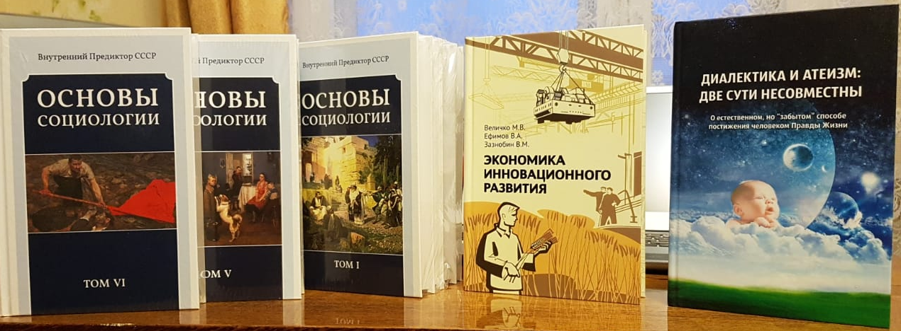

> **Первичный текст.** О текущем моменте №1(141), 2021г. «Давосская повестка дня 2021», выступление В.В. Путина: оглашения и умолчания.
> Источник: `dotu.ru:246dd943f79df2cd.doc` sha256 `2d028cd27427d232…`; [страница на dotu.ru](https://dotu.ru/2021/02/03/20210203_tek_moment01141/).
> Автоматическая транскрипция DOC→Markdown; смысл и формулировки не правились.
> Контрольные суммы и статус проверки — в [NOTICE.md](../../NOTICE.md).
> Содержание передаёт позицию авторов; утверждения не верифицированы библиотекой.

---

«О текущем моменте» № 1 (141), февраль 2021 года

«Давосская повестка дня 2021», выступление В.В. Путина: оглашения и умолчания

27 января 2021 г. президент России В.В. Путин выступил на онлайн-сессии «Давосская повестка дня 2021» всемирного Давосского экономического форума. Его выступление прошло в телекоммуникационном режиме. Стенограмма выступления, а также видео, фотографии и аудиозаписи опубликованы на сайте президента России: <http://www.kremlin.ru/events/president/news/64938>.

Политические комментаторы традиционно придают ежегодному Давосскому форуму большое значение. На наш взгляд его значимость систематически преувеличивается, и вопреки культовому мнению реально значимость форума в аспекте разрешения назревших и назревающих проблем глобальной цивилизации и государств в её составе близка к нулю. Это обусловлено тем, что:

- все разговоры на очередном форуме и их итоговые декларации никого из его участников ни к чему не обязывают в их политической деятельности и в бизнесе — ни морально (а это — главное), ни юридически;

- ни один из форумов не занимался изучением того, что участники предыдущих форумов наговорили в прошлом, и как это всё сказалось на *настоящем (включая и тенденции, влекущие за собой определённые последствия в будущем)*[^1];

- если что-то на Давосе действительно оказывает воздействие на последующее течение событий, то оно происходит в частных беседах — в кулуарах форума[^2], а не публично в ходе заседаний и протокольных мероприятий;

- большинство выступлений по своему содержанию банальны и не дают ничего, что действительно необходимо для адекватного понимания проблем настоящего и перспектив их разрешения в будущем.

Последнее объясняет, почему на протяжении многих лет, СМИ сообщают о проведении очередного форума, но мало что сообщают о содержании выступлений его участников. Это не потому, что простонародью не положено знать, о чём говорят и о чём договариваются представители правящих «элит», а потому, что «элитарии» — такие же «люди толпы»[^3], как и подавляющее большинство представителей простонародья, только занятые в сфере государственного и бизнес-управления. И потому подавляющее большинство из них не способно высказать эпохальную судьбоносную мудрость, недоступную «простому человеку», живущему под властью разного рода «необходимостей», многие из которых навязаны ему дурной политикой, производимой «элитариями».

Это свойственно всем форумам, и потому Давосский форум предстаёт как заурядная «тусовка» в стиле *«Как здорово, что все мы здесь сегодня собрались…»*[^4], от всех прочих «тусовок» такого рода отличающаяся только «стоимостью входного билета», которая для участников Давоса может выражаться либо в «твёрдой валюте» либо в политическом авторитете каждого из них.

Участникам Давоса, как и большинству представителей простонародья, не свойственно воспринимать жизнь непосредственно своими органами чувств, включая и её духовные (биополевые) аспекты, и не свойственно мыслить самостоятельно, тем более — не свойственно мыслить процессами. Они так же, как и представители прочих толп в толпо-«элитарных» обществах, воспринимают мир большей частью *опосредованно (т.е. из публикаций СМИ, через интернет, через сплетни и слухи, циркулирующие в их кругах),* и поступающую таким образом информацию они оценивают по свойственным им предубеждениям[^5], среди которых и мнения тех индивидов, кто дан им в авторитеты.

Но в этом году к участникам форума обратился В.В. Путин[^6]. Его выступление было весьма продолжительным, интересным и актуальным. Однако СМИ не уделили ему внимания в том смысле, что не была показана связь высказанных В.В. Путиным положений с жизнью. СМИ были больше заняты «оппозишн-фюрером» Навальным, «навальнятами» и их «несанкционированными митингами», имевшими место 23 января, Украиной, вступлением Дж.Р. Байдена в должность президента США[^7].

Поэтому обратим внимание на некоторые положения, которые В.В. Путин довёл до сведения, прежде всего, представителей правящей «элиты» Запада — региональной цивилизации, претендующей на то, чтобы её признали в качестве лидера цивилизационного развития всего человечества и подчинились ей.

Понятно, что формат любого форума не позволяет прочитать его участникам какой-либо обстоятельный курс лекций, тематика которого была бы сформирована под решение определённых задач и объединения участников (хотя бы некоторой их части) на основе общих для них идей — смыслов жизни. Тем не менее, вне зависимости от формата форумов, для социально-политической сферы всегда актуальна следующая тематика:

1.  Спектр проблем: проблемы реальные и проблемы иллюзорные.

2.  Генераторы проблем (т.е. причины, порождающие проблемы) и взаимосвязи проблем друг с другом (определяющие место каждой из них в иерархии их значимости, обусловленное объективными закономерностями, которым подчинена жизнь людей, культурно своеобразных обществ и человечества в целом).

3.  Отношение обществ и социальных групп к реальным и иллюзорным проблемам.

4.  Цели политики — удержание проблем в некоторых допустимых пределах или их разрешение путём искоренения генераторов проблем.

5.  Научно-методологическое обеспечение целеполагания и политики, назначение которой — реализовать целеполагание, т.е. сделать цели реальностью жизни.

В формате любого форума можно осветить только первые четыре пункта из этого списка. На пункт 5 можно либо только указать, порекомендовав при этом источники, с которыми заинтересованным слушателям выступления следует ознакомиться самостоятельно, либо оставить его в умолчаниях. Поэтому детальность того, что стоит за словами выступлений по тематике пункта 4, — необходимо воспринимать, осмыслять и переосмыслять самостоятельно, ибо: слово «луна» — только «палец», указующий на луну, и горе *тому, кто примет «палец» за луну или проигнорирует и «перст указующий», и то, на что перст указывает.* Исходя из этого, и будем рассматривать некоторые положения, высказанные В.В. Путиным на Давосе-2021, раскрывая сопутствующие его словам умолчания *соответственно нашему миропониманию* и показывая, как сказанное им соотносится с жизнью*.*

Правомерен вопрос: *А как наше миропонимание соотносится с жизнью, чтобы наше освещение соотношения сказанного В.В. Путиным с жизнью было жизненно состоятельно?* Ответ на него состоит в том, что наши пояснения проистекают из того, что можно назвать «принцип дополнительности информации». Его проще всего пояснить на таком примере: Если Вам сообщают, что треугольник ABC — прямоугольный, то если Вы знаете, что такое теорема Пифагора, то вы понимаете, что наряду с тем, что один из углов прямоугольника — прямой, вам также по умолчанию сообщили, что сумма квадратов его катетов равна квадрату гипотенузы, и что вокруг него можно описать окружность, один из диаметров которой будет в точности совпадать с его гипотенузой. Но эти раскрытые умолчания исходного сообщения являются не Вашими или нашими вымыслами, а следствием объективных закономерностей математики. Но объективные закономерности действуют не только в математике, поэтому через всякое сообщение, зная соответствующие объективные закономерности, можно выйти на ту объективную информацию, которая сопутствовала сообщению, оставаясь при этом в умолчаниях. Жизнь людей персонально, социальных групп, культурно своеобразных обществ и человечества в целом тоже подчинена объективным закономерностям. Поэтому всё дальнейшее обусловлено двумя субъективными факторами: 1) нашим знанием объективных закономерностей и 2) нашей культурой мировосприятия и осмысления воспринятого в соотнесении с этими закономерностями.

Для упрощения восприятия сделаем это в форме таблицы[^8].

<table>

<colgroup>

<col style="width: 6%" />

<col style="width: 36%" />

<col style="width: 56%" />

</colgroup>

<thead>

<tr>

<th style="text-align: center;"><strong>№№ п.п.</strong></th>

<th style="text-align: center;"><strong>Высказанное В.В. Путиным</strong></th>

<th style="text-align: center;"><strong>Что это означает в реальной жизни</strong></th>

</tr>

</thead>

<tbody>

<tr>

<td><ol type="1">

<li></li>

</ol></td>

<td>Мы видим кризис прежних моделей и инструментов экономического развития.</td>

<td>
Действующие ныне в режиме <em>доминанты, практически безальтернативной в глобальных масштабах,</em> «модели» и «инструменты экономического развития» представляют собой порождение системообразующих принципов региональной цивилизации, именуемой «Запад» или «мировое сообщество».

Соответственно «кризис» является не эпизодом в цикличности течения разного рода социально-экономических процессов, а <em>непрестанно текущим моментом</em> в <strong>коллапсе глобальной цивилизации</strong>, т.е. он носит глобальный характер и не может быть разрешён на основе её системообразующих принципов, поскольку именно они его породили, воспроизводят и обостряют.

Коллапс и кризис — это разные по сути явления<a href="#fn1" class="footnote-ref" id="fnref1" role="doc-noteref">1</a>:

<ul>

<li>
<strong>из кризиса</strong> можно выйти, ничего не изменив во втянувшейся в кризис системе, если система пребывает в неком колебательном периодическом режиме, в котором чередуются спады и подъёмы её характеристических параметров, по которым оценивается качество её функционирования;
</li>

<li>
<strong>из коллапса</strong> невозможно выйти, ничего не изменив в системе, выход из коллапса требует реорганизации системы, а в наиболее тяжёлых случаях — замены прежних системообразующих принципов новыми.
</li>

</ul>

То есть:

<ul>

<li>
кризис — явление временное, более или менее продолжительный эпизод,
</li>

<li>
а коллапс — это <em>прогрессирующая катастрофа,</em> т.е. он приведёт к краху (гибели) системы, если из него не выйти, изменив системообразующие принципы и саму систему жизненно состоятельным образом.
</li>

</ul></td>

</tr>

<tr>

<td><ol start="2" type="1">

<li></li>

</ol></td>

<td>Усиление социального расслоения: как на глобальном уровне, так и в отдельных странах. Об этом мы и раньше говорили.</td>

<td>
Если «об этом» говорили раньше, то при управленчески состоятельном подходе к анализу и оценке ситуации (включая возможности её дальнейших изменений) неизбежны вопросы, требующие жизненно состоятельных ответов:

<ul>

<li>
если говорили, то почему ничего не сделали?
</li>

<li>
если что-то делали, то что именно делали и почему эти действия не изменили ситуацию к лучшему, а возможно, что и ухудшили её?
</li>

<li>
что надо начать делать и сделать, чтобы изменить ситуацию к лучшему?
</li>

<li>
как это сделать (включая и вопросы организации финансирования)?
</li>

<li>
кто будет делать, т.е. есть ли кадры или их надо готовить?
</li>

</ul>

Но постановка этих вопросов и формирование обстоятельно детальных ответов на каждый из них в их взаимосвязи не укладывается в формат форумов, включая Давос, и к такой деятельности большинство его участников не способны.

Если же давать ответ краткий, то либо ничего не делали, либо действовали на основе системы «моделей» и «инструментов экономического развития», которые не могли не породить и породили коллапс и его обостряют. Т.е. такое положение дел — иллюстрация к п. 1.
</td>

</tr>

<tr>

<td><ol start="3" type="1">

<li></li>

</ol></td>

<td>Но это, в свою очередь, сегодня вызывает резкую поляризацию общественных взглядов, провоцирует рост популизма, правого и левого радикализма, других крайностей, обострение и ожесточение внутриполитических процессов, в том числе в ведущих странах.</td>

<td rowspan="2">
По отношению ко всему этому социально-экономические неурядицы, усугублённые пандемией, о чём В.В. Путин сказал перед этим, а также и прочие угнетающие жизнь внешние по отношению к индивидам факторы — только катализатор, но не причина возникновения популизма и разнородного экстремизма. Сама же причина такого рода социальных явлений «многослойна».

<ul>

<li>
<strong>1‑й слой</strong>: причина популизма, радикализма и всего прочего упомянутого В.В. Путиным — жизненная несостоятельность миропонимания:
</li>

</ul>

<ul>

<li>
как тех субъектов, в чьих руках государственная и бизнес-власть, что выражается в создании ими проблем для подвластного им общества и зарубежных партнёров подчас на пустом месте;
</li>

<li>
так и тех, кто вынужден жить либо влачить существование под этой властью, и из чьих рядов (после прохождения определённого по целям и задачам «кастинга») пополняется управленческий корпус государственной и бизнес-власти — эти в силу неадекватности их миропонимания, сталкиваясь с реальными и иллюзорными проблемами, не понимая их сути, пытаются продавить в жизнь «простые» решения этих проблем, что ведёт к усугублению бедствий.
</li>

</ul>

<ul>

<li>
<strong>2-й слой</strong>: причина <em>причины 1-го слоя</em> — несостоятельность системы всеобщего и профессионального социально-управленческого образования, даваемого школами и вузами <strong>(учебные программы забиты всяким вздором и заведомой ложью и потому не дают адекватного представления о биосферно-социально-экономических системах как об объектах управления)</strong>.
</li>

<li>
<strong>3-й слой</strong>: причина <em>причины 2-го слоя</em> — несостоятельность официоза социально-экономических наук, развитых на Западе и импортируемых в Россию <em>в готовом к употреблению виде</em> на протяжении всего времени после начала реформ Петром I. «Локализация научных теорий», осуществлённая в той или иной форме, создаёт иллюзию, что наука — наша, отечественная.
</li>

<li>
<strong>4-й слой</strong>: причины <em>причины 3-го слоя</em> — различны, две главные из них:
</li>

</ul>

<ul>

<li>
Система образования, главное в которой — зубрёжка и тестирование на предмет знания запрограммированных ею же ответов на вопросы, породила уйму книгочеев-графоманов, которые вошли в науку (понимаемую как один из общественных институтов), не умея воспринимать жизнь и не умея <strong>самостоятельно осмыслять</strong> <em>воспринятое посредством чувств непосредственно и опосредованно через произведения культуры</em>.
</li>

</ul>

Трусость, продажность, холопское угодничество представителей научного официоза, под воздействием которых они не только не смеют думать свободно, производить и оглашать мнения, несовместимые со <em>сложившимися традициями, которые целенаправленно культивируются закулисно-политическими мафиями</em><a href="#fn2" class="footnote-ref" id="fnref2" role="doc-noteref">2</a> (Текст сноски на предыдущей странице)<em>,</em> но и изгоняют из науки тех, кто выступает против сложившихся в научном официозе традиций вне зависимости от того, состоятельны аргументы противников традиционных мнений либо же нет.
</td>

</tr>

<tr>

<td><ol start="4" type="1">

<li></li>

</ol></td>

<td>
Всё это неизбежно сказывается и на характере международных отношений, не добавляет им стабильности и предсказуемости. Происходит ослабление международных институтов, множатся региональные конфликты, деградирует и система глобальной безопасности. (…)

Отмечу здесь, что социальный и ценностный кризис уже оборачивается негативными демографическими последствиями, из-за которых человечество рискует потерять целые цивилизационные и культурные материки.
</td>

</tr>

<tr>

<td><ol start="5" type="1">

<li></li>

</ol></td>

<td>Наша общая ответственность сегодня заключается в том, чтобы избежать такой перспективы, похожей на мрачную антиутопию, обеспечить развитие по иной, позитивной, гармоничной и созидательной траектории.</td>

<td>
Да, это действительно так.

Но способны ли те, к кому обратился В.В. Путин, осознать и нести эту ответственность? — По нашему мнению — не способны:

<ul>

<li>
отчасти потому, что не желают и в силу дефективности полученного ими образования не могут выйти за пределы свойственных им предубеждений<a href="#fn3" class="footnote-ref" id="fnref3" role="doc-noteref">3</a>;
</li>

<li>
а отчасти потому, что они, как и представители научного сообщества, — тру́сы и боятся противопоставить себя <em>стае-стаду, именуемому политическим и финансово-экономическим истэблишментом</em><a href="#fn4" class="footnote-ref" id="fnref4" role="doc-noteref">4</a><em>,</em> поскольку это влечёт за собой травлю стадом-стаей, чтобы другим не повадно было<a href="#fn5" class="footnote-ref" id="fnref5" role="doc-noteref">5</a> — это одна из основ власти в толпо-«элитарных» обществах.
</li>

</ul></td>

</tr>

</tbody>

</table>

<section id="footnotes" class="footnotes footnotes-end-of-document" role="doc-endnotes">

<ol>

<li id="fn1">
<strong>Колла́пс</strong> (от лат. collapsus «упавший») — процесс разрушения какой-либо структуры под влиянием системного кризиса.

<strong>Кри́зис</strong> (др.-греч. κρίσις — решение; поворотный пункт) — переворот, пора переходного состояния, перелом, состояние, при котором существующие средства достижения целей становятся неадекватными, в результате чего возникают непредсказуемые ситуации. (Толкование обоих терминов приведено по «Википедии»).<a href="#fnref1" class="footnote-back" role="doc-backlink">↩︎</a>
</li>

<li id="fn2">
На эту тему см. пояснительную записку ВП СССР «Об этике и её роли в жизни» (2019 г.), разделы:

5.2.1. Мафии в жизни общества.

5.2.2. Государственность, иерархия приоритетов обобщённых средств управления и мафии.

Первым, кто указал на подконтрольность науки разного рода своекорыстным мафиям, подавляющим свободомыслие исследователей, был И.В. Сталин: см. его работу «Марксизм и вопросы языкознания» (одна из интернет-публикаций: <a href="http://az.lib.ru/m/marr_n_j/text_1950_stalin.shtml">http://az.lib.ru/m/marr_n_j/text_1950_stalin.shtml</a>; см. также — Сталин И.В. Сочинения. — Т. 16. — М.: Писатель. 1997. — С. 104 — 138).

Но это касается не только науки, но и всех прочих сфер жизни общества. На встрече с избирателями в Красноярске 3 августа 2011 г. лидер ЛДПР В.В. Жириновский сказал об этом прямо по отношению к сфере власти:

*[В оригинальном издании здесь расположен рисунок/схема. Иллюстрация не включена в данный выпуск: ожидает визуальной и правовой проверки. Файл источника: image3.emf]*«А вот сижу и объясняю вам, чтобы таких дураков, как вы больше не было у нас… (в зале взрыв аплодисментов, и далее Жириновский продолжает под аплодисменты). Ничего не можете понять… Вам в семнадцатом году сказали «Власть народу!» — Получили «власть народу»? Вам Ельцин обещал «Власть народу!» и демократию. — Получили? Объясняю: вам никто и никогда власти не даст… Власть всегда в руках мафии, бандитов, криминала, коррупционеров — от царя до сегодняшней власти. <em>Власть всегда есть дело мафии»</em> (<a href="https://m.play.md/3084889">https://m.play.md/3084889</a>).Мафии — это системы деловой коммуникации людей с динамическим перераспределением полномочий, обязанностей и подконтрольных ресурсов, складывающиеся на основе общих и взаимно дополняющих интересов. Динамическое перераспределение полномочий, обязанностей и подконтрольных ресурсов отчасти обусловлено обстоятельствами, а отчасти психологией участников: их нравственностью, преобладающим во времени типом строя психики, миропониманием. Часть такого рода систем деловой коммуникации остаются безымянными, часть в наше время определяется словом «мафия», которое носит либо порицающий характер, либо ироничный — в зависимости от характера коллективной деятельности и отношения к ней и её участникам.

«Мафия» в определённом выше смысле как система деловой коммуникации с динамическим перераспределением обязанностей, полномочий и подконтрольных ресурсов, может быть как антисоциальной, так и общественно полезной: в зависимости от нравственности, этики, миропонимания, познавательно-творческих и волевых качеств её участников. «Мафии» из жизни общества неустранимы в принципе вследствие наличия и порождения общих и взаимно дополняющих интересов и способности людей к коммуникации. Если люди к этому не способны, то это — симптомы аутизма.<a href="#fnref2" class="footnote-back" role="doc-backlink">↩︎</a>
</li>

<li id="fn3">
Фраза С.В. Лаврова, обронённая им в эфир на пресс-конференции в Эр-Рияде 12 августа 2015 г. «Дебилы, б…», — много чего объясняет в жизни культурно своеобразных обществ и человечества в целом.<a href="#fnref3" class="footnote-back" role="doc-backlink">↩︎</a>
</li>

<li id="fn4">
В английском языке «establishment» означает «установление», «основание». Т.е. для англоязычных власть может генерироваться только «сверху», а «низы» всегда должны быть покорными и не должны проявлять никаких инициатив.

Это значение слова «establishment» в политике — образчик весьма успешного применения нейролингвистического программирования в политике, имевший место задолго до того, как возник сам термин и под него стали «крышевать» соответствующие практики воздействия на психику.<a href="#fnref4" class="footnote-back" role="doc-backlink">↩︎</a>
</li>

<li id="fn5">
*[В оригинальном издании здесь расположен рисунок/схема. Иллюстрация не включена в данный выпуск: ожидает визуальной и правовой проверки. Файл источника: image4.jpeg]*Примером тому — травля «демократами» 45‑го президента США Д.Дж. Трампа, имеющая место как на протяжении всего срока его президентства, так и после того, как политическая мафия, стоящая за Демократической партией США, фальсифицировала президентские выборы 2020 г. и пропихнула на должность президента США своего ставленника Дж.Р. Байдена: см. на рисунке слева опубликованные и пока ещё не вычищенные из интернета (<a href="https://avatars.mds.yandex.net/get-zen_doc/3985268/pub_5fac408af68a6a3a78475ba8_5fac40a53775242524e82f47/scale_1200">https://avatars.mds.yandex.net/get-zen_doc/3985268/pub_5fac408af68a6a3a78475ba8_5fac40a53775242524e82f47/scale_1200</a>) данные по «чудесам», имевшим место в ходе подсчёта голосов в штатах Мичиган и Висконсин.Не исключено, что в этом сценарии «великовозрастному» (родился в 1942 г.) Джону Робинетту Байдену назначена роль «передатчика» поста президента США вице-президенту — Камале Дэви Харис (родилась в 1964 г.), которая сама по себе не могла быть успешным кандидатом от «демократов», а только в связке с кем-то другим.<a href="#fnref5" class="footnote-back" role="doc-backlink">↩︎</a>
</li>

</ol>

</section>

Т.е. Владимир Владимирович *иносказательно* уведомил участников Давосского форума о том, что глобальная цивилизация оказалась даже не в системном «кризисе», а вошла в коллапс, что в перспективе не сулит ничего хорошего, но обещает множество неприятностей, с которыми не удастся справиться на основе системообразующих принципов исторически сложившейся глобальной цивилизации, в которой «Запад — мировое сообщество» претендует на лидерство, на разграничение истины, лжи и заблуждений, и, как следствие, — на учительство и предписание жизненных стандартов для всех.

Теперь продолжим анализ последующих положений, высказанных В.В. Путиным в своём обращении к «давосянам», которые относятся к диагностике проблем и причин их возникновения.

<table>

<colgroup>

<col style="width: 6%" />

<col style="width: 39%" />

<col style="width: 53%" />

</colgroup>

<thead>

<tr>

<th style="text-align: center;"><strong>№№ п.п.</strong></th>

<th style="text-align: center;"><strong>Высказанное В.В. Путиным</strong></th>

<th style="text-align: center;"><strong>Что это означает в реальной жизни</strong></th>

</tr>

</thead>

<tbody>

<tr>

<td><ol start="6" type="1">

<li></li>

</ol></td>

<td>
Накапливается и огромная масса людей, которые, по факту, оказываются невостребованными. Так, по оценкам Международной организации труда, в 2019 году 21 процент, или 267 миллионов молодых людей в мире нигде не учились и нигде не работали. И даже среди работающих (вот интересный показатель, интересные цифры), даже среди работающих 30 процентов живут с доходом ниже 3,2 доллара США в сутки по паритету покупательной способности.

Такие перекосы в глобальном социально-экономическом развитии стали прямым результатом политики, проводившейся в 80-е годы прошлого века, и проводившейся зачастую вульгарно и догматически. В основе этой политики лежал так называемый Вашингтонский консенсус<a href="#fn1" class="footnote-ref" id="fnref1" role="doc-noteref">1</a> с его неписаными правилами, когда приоритет отдаётся росту экономики на базе частного долга в условиях дерегулирования и низких налогов на богатых и корпорации.<a href="#fn2" class="footnote-ref" id="fnref2" role="doc-noteref">2</a> (Текст сноски на предыдущей странице)
</td>

<td>
Проблемы реальные, и названа главная финансово-экономическая причина их возникновения — «Вашингтонский консенсус». В «Вашингтонском консенсусе» нашли своё выражение системообразующие принципы организации финансово-экономической деятельности в большинстве государств мира, включая Россию. И с ним связаны те «модели» и «инструменты экономического развития», на несостоятельность которых было указано в п. 1.

Однако В.В. Путин не стал излагать участникам Давоса альтернативу «Вашингтонскому консенсусу». Причины этому просты:

<ul>

<li>
с одной стороны, — в форматы форума такое не втиснуть: для участников форума необходимо прочитать альтернативный общепринятым социально-экономическим теориям учебный курс «Биосферно-социально-экономические системы как объект управления» — это серьёзное занятие не на один день без отвлечения на «фуршеты»;
</li>

<li>
с другой стороны, — у официоза Российской академии наук и у <em>Академии народного хозяйства и государственной службы при президенте Российской Федерации</em> за душой нет ничего по этой проблематике, на что В.В. Путин мог бы сослаться, показав в камеру книгу (или стопку книг), в которых была бы изложена альтернатива<a href="#fn3" class="footnote-ref" id="fnref3" role="doc-noteref">3</a> (Текст сноски на предыдущей странице).
</li>

</ul>

Ещё одно обстоятельство, которое тоже осталось в умолчаниях, состоит в том, что главный системообразующий принцип построения цивилизации Запада — наличие в культуре двух взаимосвязанных подсистем-субкультур — «экзотеризм — эзотеризм»:

<ul>

<li>
экзотеризм — это информация и навыки с грифом «для всех»;
</li>

<li>
эзотеризм — это информация и навыки с грифом «для избранных» (т.е. для тех, кто прошёл некий «кастинг»).
</li>

</ul>

При этом эзотеризм носит характер разнонаправленный (в аспекте целей, путей и способов их достижения, т.е. в аспекте идейности) и иерархически многослойный (т.е. то, что знают и в праве делать вышестоящие в иерархии, — не в праве знать и делать те, кто стоит в иерархии ниже). В системе «экзотеризм — эзотеризм» эзотеризм властвует над экзотеризмом, но не над системой в целом. Над системой «экзотеризм — эзотеризм» в целом властвуют другие, если не вдаваться в подробности, а кратко — те, кто умеют: 1) производить знания и навыки с нуля и 2) убеждать других в том, что истинно, а что ложно, что — добро, а что зло, при необходимости, возводя зло в ранг добра (жертва этого — Гитлер), а Добро — в ранг Зла (под воздействием такого рода манипуляторов синедрион стал исполнительным механизмом в <em>попытке посягательства на Христа: сопоставьте новозаветную версию событий и версию Корана, сура 4, аяты 155 — 162</em>).

Наличие в культуре пары «экзотеризм — эзотеризм» — выражение в ней сатанизма, проистекающее из приверженности эзотеристов принципу <em>«мы — лучше, чем они (экзотеристы), и потому имеем право на то, на что они права не имеют, и потому они должны быть нам благодарны и не роптать, что бы мы ни сделали».</em> Проведение этого принципа в жизнь в культурной политике — это политика оболванивания всех, включая и эзотеристов. Но каждую социальную группу в обществе, живущем под властью этой пары, оболванивают в каждую эпоху по-своему — упреждающе — соответственно целям и задачам политики предопределённой на будущее хозяевами пары «экзотеризм — эзотеризм».
</td>

</tr>

<tr>

<td><ol start="7" type="1">

<li></li>

</ol></td>

<td>Определённые надежды на то, что удастся «перезагрузить» прежнюю модель роста, связаны с бурным технологическим развитием. Действительно, последние 20 лет заложили фундамент для так называемой четвёртой промышленной революции, которая основана на повсеместном применении искусственного интеллекта, автоматизированных и роботизированных решений. Пандемия коронавируса значительно ускорила такие разработки и их внедрение.</td>

<td>
О несбыточности такого рода надежд В.В. Путин сказал сам в следующих словах, продолжающих текст, приведённый в левой колонке:

«Однако этот процесс порождает и новые структурные изменения, прежде всего, имею в виду рынок труда. А значит, без эффективных действий государства множество людей рискуют остаться без работы. Причём зачастую это так называемый средний класс. А это основа любого современного общества.

И в этой связи о втором фундаментальном вызове предстоящего десятилетия — общественно-политическом. Рост экономических проблем и неравенства раскалывает общество, порождает социальную, расовую, национальную нетерпимость, причём такое напряжение прорывается наружу даже в странах с, казалось бы, устоявшимися гражданскими и демократическими институтами, призванными сглаживать, гасить подобные явления и эксцессы.

Системные социально-экономические проблемы порождают такое общественное недовольство, что это требует особого внимания, требует того, чтобы эти проблемы решались по существу. Опасная иллюзия, что их можно, что называется, проигнорировать, пропустить, загнать куда-то в угол, чревата серьёзными последствиями. В таком случае общество всё равно будет разделено и политически, и социально. Потому что для людей причины быть недовольными заключаются на самом деле не в каких-то умозрительных вещах, а в реальных проблемах, которые касаются каждого, каких бы взглядов, в том числе политических, человек реально ни придерживался. Или как он думает, что он придерживается. А вот реальные проблемы порождают недовольство. (…)

И наконец, третий вызов, а точнее, явная угроза, с которой мы можем столкнуться в наступившем десятилетии, — это дальнейшее обострение всего комплекса международных проблем. Ведь нерешённые и нарастающие внутренние социально-экономические проблемы могут подталкивать к поиску того, на кого можно всё свалить, обвинить во всех бедах и перенаправить раздражение и недовольство своих граждан. И мы это уже видим, мы ощущаем, что градус внешнеполитической, пропагандистской риторики нарастает. Можно ожидать, что более агрессивным станет и характер практических действий, включая давление на те страны, которые не согласны с ролью послушных управляемых сателлитов, использование торговых барьеров, нелегитимные санкции, ограничение финансовой, технологической, информационной сфер. (…)

Абсолютно ясно, что мир не может идти по пути построения экономики, работающей на миллион человек или даже на «золотой миллиард». Это просто деструктивная позиция. Такая модель по определению неустойчива. Недавние события, в том числе миграционные кризисы, вновь это подтвердили».
</td>

</tr>

<tr>

<td><ol start="8" type="1">

<li></li>

</ol></td>

<td>Сейчас важно от общей констатации перейти к делу, направить реальные усилия и ресурсы на то, чтобы добиться как снижения социального неравенства внутри отдельных стран, так и постепенного сближения уровня экономического развития разных стран и регионов планеты. Тогда и миграционных кризисов не будет.</td>

<td>
Если вспомнить работу «Римского клуба» «Пределы роста» (1972 г.), конференцию ООН по устойчивому развитию (1992 г.), то давно уже следовало «от общей констатации перейти к делу».

А если вспомнить Тегеранскую конференцию (1943 г.), то в соответствии с достигнутыми на ней договорённостями И.В. Сталина и Ф.Д. Рузвельта, спустя всего два года (!!! — темпы, недостижимые ныне в международных проектах) была создана ООН. Как можно понять из Устава ООН, ООН создавалась:

<ul>

<li>
не для того, чтобы глобальная цивилизация нескончаемо балансировала на грани мировой ядерной или ещё более жуткой войны и породила глобальный биосферно-социальный (экологический) кризис (фактически — коллапс глобальной биосферно-социально-экономической системы),
</li>

<li>
а для того, чтобы, опираясь на научную и экономическую мощь и авторитет СССР и США, в их взаимодействии помочь всем народам разрешить их проблемы и проблемы человечества, о которых спустя 75 лет В.В. Путин вынужден был снова говорить, обращаясь к участникам «Давоса-2021».
</li>

</ul>

Однако человечество (прежде всего правящие «элиты», но и при попустительстве простонародья) бездарно потратило на войны и застой три четверти столетия, которые можно было бы использовать на преображение всей Земли. И за это надо быть «благодарными» У. Черчиллю и его кукловодам, которые фултонской речью (5 марта 1946 г.) положили начало «холодной войне».

И не надо обольщаться, что «давосяне» поняли В.В. Путина, прониклись новыми идеями и теперь начнут работать на выведение глобальной цивилизации из коллапса и решение проблем всех народов Земли: психология и миропонимание, свойственные подавляющему большинству представителей бизнес-«элиты» и политической «элиты» всех стран, подчинённой глобальному бизнес-сообществу и его кукловодам, не позволяют перейти от слов о бедственности жизни к делу по её преображению — не позволяют на протяжении нескольких тысяч лет, если вести отсчёт времени от Откровений Христу и Моисею<a href="#fn4" class="footnote-ref" id="fnref4" role="doc-noteref">4</a>.
</td>

</tr>

</tbody>

</table>

<section id="footnotes" class="footnotes footnotes-end-of-document" role="doc-endnotes">

<ol>

<li id="fn1">
Термин «Вашингтонский консенсус» был введён в 1989 г. американским экономистом Джоном Уильямсоном. Однозначных формулировок «Вашингтонского консенсуса» нет, поскольку в произведениях самого́ Уильямсона, его последователей и комментаторов формулировки видоизменялись с течением времени.

Не греша против духа «Вашингтонского консенсуса», его принципы можно выразить так:

<em>Бюджетная дисциплина.</em> Государства должны бюджетный дефицит если не ликвидировать, то свести к такому минимуму, который был бы приемлем для частного капитала.

<em>Особая направленность расходов госбюджета.</em> Субсидии потребителям и дотации производителям должны быть сведены до минимума. Правительство должно расходовать деньги лишь на <em>первоочередную</em> медицинскую помощь, на <em>начальное</em> образование и на развитие инфраструктуры.

<blockquote>

Отметим, что соцобеспечение по старости и инвалидности в этот перечень не входит. Это подразумевает: каждый должен заботиться о себе сам либо уповать на <em>не гарантированные</em> помощь родных и близких и частную благотворительность. То же касается медицинского обслуживания и получения образования сверх некоего обязательного для всех минимума. Нет в этом перечне и науки — ни фундаментальной, ни прикладной, которые не способны к непосредственной самоокупаемости.

</blockquote>

<em>Налоговая политика.</em> База налогообложения должна быть как можно более широкой, но ставки налогов — умеренными.

<em>Процентные ставки.</em> Процентные ставки по кредиту должны складываться на внутренних финансовых рынках, и государство не должно вмешиваться в этот процесс. Предлагаемый вкладчикам процент должен стимулировать их вклады в банки и сдерживать бегство капиталов.

<em>Обменный курс.</em> Страны должны ввести такой обменный курс своей валюты, который способствовал бы их экспорту, делая экспортные цены их продукции более конкурентоспособными.

<em>Торговый либерализм.</em> Квоты на импорт должны быть отменены и заменены таможенными тарифами. Таможенные тарифы на импорт должны быть минимальными и не должны вводиться на те товары, импорт которых необходим для производства товаров в стране для последующего экспорта из неё (то есть речь идёт о стимулировании импорта компонентов более сложных продуктов, технологического оборудования, технологий для удовлетворения интересов внешних потребителей за счёт производственного потенциала страны).

<em>Прямые иностранные капиталовложения.</em> Должна быть принята политика поощрения и привлечения капитала и технологических знаний из-за рубежа. Условия конкуренции для иностранных и местных фирм должны быть одинаковыми.

<em>Приватизация.</em> Должна всячески поощряться приватизация государственных предприятий.

<blockquote>

Частные предприятия считаются более эффективными, чем государственные. Для приверженцев буржуазного либерализма это — аксиома, не требующая для подтверждения её состоятельности ни доказательств, ни критериальной базы.

</blockquote>

<em>Дерегуляция.</em> Излишнее государственное регулирование порождает лишь коррупцию и дискриминацию в отношении участников рынка, не имеющих возможности пробиться к высшим слоям бюрократии. Следует стремиться к тому, чтобы в перспективе покончить с государственным регулированием экономики и с государственным сектором.

<em>Права частной собственности.</em> Эти права должны быть гарантированы при постоянном усилении их защиты. Этому должна быть подчинена и законодательная база, и правоприменительная практика.

Приведённые выше формулировки «10 заповедей» «Вашингтонского консенсуса» взяты из публикации: Вашингтонский консенсус как «мыслеобразующий механизм нового этапа глобализации». — Без указания авторства. Интернет-ресурс «Литература для студентов»: <a href="http://www.libsib.ru/sovremennie-problemi-globalizatsi/sovremennie-problemi-globalizatsi/vashingtonskiy-konsensus-kak-misleobrazuiuschiy-mechanizm-novogo-etapa-globalizatsii">http://www.libsib.ru/sovremennie-problemi-globalizatsi/sovremennie-problemi-globalizatsi/vashingtonskiy-konsensus-kak-misleobrazuiuschiy-mechanizm-novogo-etapa-globalizatsii</a>. Они уточнены с учётом политической практики и формулировок, данных в таблице, приведённой в статье: Ананьин О., Хаиткулов Р., Шестаков Д. Вашингтонский консенсус: пейзаж после битв. — Мировая экономика и международные отношения (МЭМО). 2010, № 12. — С. 15 — 27.<a href="#fnref1" class="footnote-back" role="doc-backlink">↩︎</a>
</li>

<li id="fn2">
Чтобы оценить значимость этого ПУБЛИЧНОГО указания В.В. Путина на вредоносность «Вашингтонского консенсуса» для развития человечества и всех его народов, следует вспомнить один эпизод из прошлого. 5 апреля 2011 г., выступая перед студентами университета им. Дж. Вашингтона в Нью-Йорке, тогдашний директор-распорядитель Международного валютного фонда Доминик Стросс-Кан заявил следующее: «Кризис разрушил интеллектуальные основы мировой экономики, которыми мы руководствовались на протяжении четверти века. Теперь нам нужна глобализация нового рода, более справедливая глобализация, глобализация с человеческим лицом».

Это — нарушение корпоративной этики, за которое он и был наказан: было возбуждено уголовное дело по обвинению в изнасиловании горничной весьма «элитарного» отеля, в котором он останавливался в Нью-Йорке. Согласно официальной версии обвинения Д. Стросс-Канн якобы, выйдя из душа голым, напал на невинную горничную в то время, как горничная, не подозревавшая о его присутствии в номере, зашла в него, чтобы произвести уборку. Это — версия для идиотов, поскольку такое системно исключено принципами и стандартами организации работы персонала фешенебельных отелей для представителей «элиты». В итоге уголовное дело рассыпалось, но под его воздействием Д. Стросс-Кан не смог принять участие в выборах президента Франции.

Ещё одно преступление Д. Стросс-Кана перед заправилами глобальной политики — его «традиционные», т.е. биологически нормальные сексуальные предпочтения и неприятие субкультур ЛГБТ. А это — противоречит тенденциям, развиваемым «мировой закулисой» в настоящее время: новой глобальной политической и бизнес-«элитой» должны стать гомосексуалисты и примкнувшие к ним прочие извращенцы всех стран.<a href="#fnref2" class="footnote-back" role="doc-backlink">↩︎</a>
</li>

<li id="fn3">
Однако в России, но <em>вне её научного официоза,</em> есть альтернатива и «Вашингтонскому консенсусу», и прочим системообразующим принципам, породившим коллапс глобальной цивилизации. И она даже прошла парламентские слушания ещё в 1995 г. — 28 ноября: см. «Думский вестник» № 1 (116), 1996 г., с. 126 — 137. Но она не востребована политическим официозом страны до настоящего времени…

И чуть ли не единственный в научном официозе России, кто выступает публично на тему биосферно-социально-экономических систем как объектов управления, — академик РАН Роберт Искандерович Нигматулин (в прошлом директор, а ныне научный руководитель Института океанологии РАН им. П.П. Ширшова). В частности, см. его публикацию «Четыре «Э» современности: экономика, экология, энергетика, этнос» (СПб: СПбГУП, 2015. — 60 с., илл. Серия «Избранные лекции университета», вып. 167; одна из интернет-публикаций: <a href="https://www.gup.ru/events/news/smi/4e.pdf">https://www.gup.ru/events/news/smi/4e.pdf</a>). Но эта тоненькая книжечка по тематике нескольких факультативных лекций, изданная тиражом всего в 500 экз., не способна оказать влияние на формирование миропонимания целых поколений студентов большее, нежели оказывают на него вздорные и заведомо лживые учебные курсы, изучение которых и сдача зачётов и экзаменов по которым носят обязательный характер. И эта книга, написанная академиком, так же не востребована политическим официозом России.<a href="#fnref3" class="footnote-back" role="doc-backlink">↩︎</a>
</li>

<li id="fn4">
«Закон и пророки до Иоанна; с сего времени Царствие Божие благовествуется и всякий усилием входит в него» (Лука, 16:16), — и почти никаких усилий на эту тему в истории человечества не просматривается на протяжении нескольких тысяч лет. Зато просматривается массовая организованная деятельность, направленная против становления Царствия Божиего на Земле усилиями самих людей в Божьем водительстве. Учение об этом давно объявлено церквями имени Христа ересью, название которой хилиазм (по-гречески) и милленаризм (по латыни).

Не лучше дело обстоит и в иудаизме: «Те, кому было дано нести Тору, а они её не понесли, подобны ослу, навьюченному книгами. Скверно подобие людей, которые считали ложью знамения Бога! Бог не ведёт людей неправедных!» (Коран, сура 62:5).

Но и мусульманские обрядоверы и толкователи Корана создали шариат и свели Ислам к пятикратному на день поклонению молитвенному коврику вместо того, чтобы воплотить в жизнь, <strong>начав с себя</strong>, коранический идеал Царствия Божиего на Земле.<a href="#fnref4" class="footnote-back" role="doc-backlink">↩︎</a>
</li>

</ol>

</section>

На этом мы прервём рассмотрение в табличной форме высказанных В.В. Путиным положений, и приведём большой фрагмент его выступления, в котором он говорит о желательной глобальной политике[^9], проведение которой необходимо для вывода глобальной цивилизации из коллапса и обеспечения нормальной жизни во всех государствах мира в преемственности поколений.

«Смыслы, акценты такой политики, призванной обеспечить устойчивое и гармоничное развитие, очевидны. Что это? Это создание новых возможностей для каждого, условий для развития и реализации потенциала человека вне зависимости от того, где он родился и живёт.

И здесь обозначу четыре ключевых приоритета. Как они мне видятся как приоритеты. Ничего, может быть, оригинального не скажу. Тем не менее, поскольку Клаус[^10] позволил высказать позицию России, мою позицию, я, безусловно, это сделаю.

Первое. У человека должна быть комфортная среда для жизни. Это жильё и доступная инфраструктура: транспортная, энергетическая, коммунальная. И конечно, экологическое благополучие, об этом никогда не нужно забывать.

Второе. Человек должен быть уверен, что у него будет работа, которая даст устойчиво растущий доход и, соответственно, достойный уровень жизни. Он должен иметь доступ к действенным механизмам обучения в течение всей своей жизни, сегодня это абсолютно необходимо, позволяющим ему развиваться и строить свою карьеру, а после её завершения получить достойную пенсию и социальный пакет.

Третье. Человек должен быть уверен, что он получит качественную, эффективную медицинскую помощь, когда это требуется, что система здравоохранения в любом случае гарантирует ему доступ к современному уровню услуг.

Четвёртое. Независимо от дохода семьи дети должны иметь возможность получить достойное образование и реализовать свой потенциал. Такой потенциал есть у каждого ребёнка.

Только так можно будет гарантировать наиболее эффективное развитие современной экономики. Экономики, где люди — не средство, а цель. И только те страны, которые смогут добиться прогресса по обозначенным четырём направлениям (они не исчерпывающие, я сказал только о главном), но только те страны, которые смогут добиться прогресса хотя бы по этим четырём направлениям, обеспечат себе устойчивое и инклюзивное развитие».

С этим следует согласиться. Но при этом необходимо понимать, что под эту политику — глобальную, внешнюю и внутреннюю:

- В официозе науки всех стран нет научно-методологического обеспечения государственного управления биосферно-социально-экономическими системами, включая и управление в производственно-потребительских системах макроуровня (хозяйственная деятельность в пределах государства) и мегауровня (хозяйственная деятельность во взаимодействии производственно-потребительских систем нескольких государств, а также и в их взаимодействии в глобальных масштабах), без чего разрешение биосферно-социально-экономического (экологического) кризиса невозможно, а его дальнейшее развитие способно уничтожить биосферу вместе с экологической нишей биологического вида «Человек разумный» (т.е. сохранение биосферы и биоценозов повсеместно — должно быть главной целью политики любого государства, но она выпала из реальной политики всех государств).

- Нет даже малого числа действующих управленческих кадров, владеющих такого рода научно-методологическим обеспечением биосферно-социально-экономического управления.

- Но и в обществах нет потенциальных управленцев в достаточном количестве, которые могли бы делом поддержать такую политику.

> Причина такого положения дел в том, что «обеспокоенная общественность» разных идейных толков (включая и подавляющее большинство тех, кто убеждён в своей истинной приверженности Концепции общественной безопасности):

- вместо того, чтобы учиться воспринимать реальную жизнь своими чувствами, учиться самостоятельно осмыслять воспринятое, осваивать адекватные жизни знания и трансформировать их в практические навыки,

- предпочитают заниматься психологическим онанизмом — смотреть и сопереживать видео, в которых *их кумиры* излагают им своё понимание *смысла их жизни*. И в этом аспекте своего бытия они ничем не отличаются от завсегдатаев «Порнохаба».

> Чего стоят каждый из их кумиров — это особая тема, рассмотрение которой не входит в задачи написания настоящей записки. Но почитатели любого из кумиров нарушают заповедь «не сотвори себе кумира», что не позволяет им состояться Человеками — наместниками Божьими на Земле.

А если таким кумиром становится глава государства, то это — предательство по отношению и к главе государства, и предательство Родины потому, что уйма представителей толпы начинает уповать на то, что государь — *В ОДИНОЧКУ, без их деятельной, инициативной и компетентной помощи (которая требует освоения знаний и трансформации знаний в навыки)* — вынесет Родину из катастрофы в эпоху прекрасную в то время, как они сами будут предаваться «потреблятству» и всевозможному разврату.

И сеять такого рода иллюзии в толпе — это не только предательство Родины, но и предательство Правды Божией, измена Богу потому, что никто своей персоной, сколь бы он ни был праведен, могущественен и дееспособен, не в состоянии подменить собой не только всё человечество или культурно своеобразное общество, но хотя бы его управленческий корпус — всех работников сферы разнородной власти.

- Ни один вуз мира не готовит студентов по программам, освоение которых обеспечило бы:

<!-- -->

- создание и совершенствование такого научно-методологического обеспечения управления биосферно-социально-экономическими системами;

- владение этим научно-методологическим обеспечением управления биосферно-социально-экономическими системами.

> Поэтому Гарвард, Стэнфорд, Оксфорд, Кембридж, МГУ, РАНХиГС, Высшая школа экономики и прочие вузы и факультеты, которые готовят студентов по специальностям социально-управленческого характера, по рейтингу полезности для общества должны стоять после профессионально-технических училищ, которые учат полезным профессиям, и в аспекте подготовки кадров для сферы биосферно-социально-экономического управления все такие вузы и факультеты должны иметь отрицательный рейтинг, поскольку они вредят развитию людей персонально, развитию культурно своеобразных обществ и развитию глобальной цивилизации в целом.

- Ни одно государство не поддерживает общественных инициатив, направленных на разработку и освоение такого рода научно-методологического обеспечения, и многие государства (в том числе и Россия) склонны к подавлению и пресечению такого рода инициатив потому, что одна из функций государственной власти в них — защищать «Вашингтонский консенсус» и прочие системообразующие принципы глобализации, осуществляемой заправилами «Запада — мирового сообщества» в целью установления глобальной безальтернативной тирании.

- Все названные В.В. Путиным приоритеты относятся к сфере экономики. Но даже сами возможности решения сугубо экономических задач обусловлены качеством культуры общества. Если качество культуры общества не позволяет решить эти задачи, то они не могут быть решены[^11]. Но развитие культуры в направлении достижения необходимого качества, позволяющего обеспечить внутрисоциальную гармонию и лад во взаимодействии цивилизации и ноосферы — так же требует соответствующей компоненты в составе научно-методологического обеспечения государственного и хозяйственного управления.

> Поэтому без постановки и решения задач культурного развития обществ и личностного развития людей задачи экономического характера решены быть не могут. Но это касается и множества других задач, в том числе инженерных, медицинских, педагогических.

Теперь, памятуя обо всём высказанном ранее, продолжим рассмотрение в табличной форме высказанных В.В. Путиным положений.

<table>

<colgroup>

<col style="width: 6%" />

<col style="width: 39%" />

<col style="width: 53%" />

</colgroup>

<thead>

<tr>

<th style="text-align: center;"><strong>№№ п.п.</strong></th>

<th style="text-align: center;"><strong>Высказанное В.В. Путиным</strong></th>

<th style="text-align: center;"><strong>Что это означает в реальной жизни</strong></th>

</tr>

</thead>

<tbody>

<tr>

<td><ol start="9" type="1">

<li></li>

</ol></td>

<td>Именно эти подходы лежат в основе стратегии, которую реализует и моя страна, Россия. Наши приоритеты построены вокруг человека, его семьи, направлены на демографическое развитие и сбережение народа, на повышение благополучия людей, защиту их здоровья. Мы работаем над тем, чтобы создать условия для достойного и эффективного труда и успешного предпринимательства, обеспечить цифровую трансформацию как основу технологического уклада будущего всей страны, а не узкой группы компаний</td>

<td>
Всё то, что сказано в абзацах, предшествующих этому продолжению таблицы, в полной мере относится и к России.

Так архитектура постсоветской государственности России (т.е. набор и функции органов власти, их взаимосвязи), законодательство и правоприменительная практика «заточены» под невозможность осуществления суверенитета в его полноте, криптоколониальный характер экономики<a href="#fn1" class="footnote-ref" id="fnref1" role="doc-noteref">1</a>, охрану «Вашингтонского консенсуса» и других системообразующих принципов «Запада — мирового сообщества».

Поэтому всё, о чём сказал В.В. Путин в приведённом в п. 9 фрагменте его выступления, в России делается бессистемно — методом проб и ошибок без отвечающего задачам развития научно-методологического обеспечения<a href="#fn2" class="footnote-ref" id="fnref2" role="doc-noteref">2</a>.

Россия от государств остального мира отличается только тем, что:

<ul>

<li>
генетическое ядро нашей многонациональной цивилизации, сложившейся в границах общего для её народов государства, устремлено к воплощению на Земле высшей неотмирной Божественной справедливости НАВСЕГДА;
</li>

<li>
вне официоза науки есть основы научно-методологического обеспечения социального управления, включая государственное управление и управление в пределах производственно-потребительской системы государства. Об этом было сказано ранее в сноске 16 в пояснениях п. 6.
</li>

</ul></td>

</tr>

<tr>

<td><ol start="10" type="1">

<li></li>

</ol></td>

<td>Реальность такова, что в мире сформировались, заявили о себе действительно разные центры развития, со своими самобытными моделями, политическими системами, общественными институтами. И сегодня крайне важно выстроить механизмы согласования их интересов, чтобы многообразие, естественная конкуренция полюсов развития не обернулись анархией, чередой затяжных конфликтов.</td>

<td>
В данном случае употребление слова «развитие» неуместно. Дело в том, что в исторически сложившихся культурах всех народов есть интересы, реализация которых влечет за собой деградацию и ускорение коллапса этих культур и народов их носителей<a href="#fn3" class="footnote-ref" id="fnref3" role="doc-noteref">3</a>. Но наряду с этими интересами, проистекающими из того, что издревле называется «животным началом в человеке», есть интересы, проистекающие из того, что издревле называется «Божественным началом в человеке».

Часть интересов, проистекающих из «животного начала», в принципе несовместима с интересами развития, проистекающими из Божественного начала, и потому в ходе развития культуры и личностного развития людей деградационные интересы должны быть искоренены.

Какая-то часть интересов, неотъемлемо свойственная человеку как представителю биосферы Земли, и потому также относимая к «животному началу», должна безальтернативно удовлетворяться в полной мере, но при этом их удовлетворение должно быть подчинено первоприоритетному удовлетворению интересов развития, проистекающих из Божественного начала.

Поэтому механизмы согласования деградационных интересов и демографически обусловленных интересов развития в принципе невозможно построить.

Но разграничение деградационных интересов и выражающих их процессов в жизни общества и интересов развития и выражающих их процессов — это не вопрос, в ответе на который истина определяется по итогам голосования мнением «квалифицированного большинства». Различие деградации и развития носит объективный характер, не зависящий от мнений людей и побед в «спорах о нравах» тех или иных социальных групп. Но распознавание деградационных интересов и интересов, направленных на развитие, тоже требует научно-методологического обеспечения и личностного чувства меры — чувства Божьего предопределения бытия этого Мира и человека и человечества в нём…
</td>

</tr>

<tr>

<td><ol start="11" type="1">

<li></li>

</ol></td>

<td>Для этого в том числе нам предстоит заняться укреплением и развитием универсальных институтов, на которых лежит особая ответственность за обеспечение стабильности и безопасности в мире, за выработку правил поведения и в глобальной экономике, в торговле.</td>

<td>
Это неосуществимо без разрешения проблем, о которых было сказано в п. 10.

Кроме того, это требует от России восстановления собственного суверенитета в его полноте, начиная с чувственно-интеллектуального суверенитета: мы не можем жить и развиваться на основе Западного способа мировосприятия и осмысления воспринятого.
</td>

</tr>

<tr>

<td><ol start="12" type="1">

<li></li>

</ol></td>

<td>Все мы знаем, что конкуренция, соперничество между странами в мировой истории не прекращались, не прекращаются и не прекратятся никогда. И противоречия, столкновение интересов на самом деле тоже естественная вещь для столь сложного организма, как человеческая цивилизация. Однако в переломные моменты это не мешало, а напротив, побуждало объединять усилия на самых важных, действительно судьбоносных направлениях. И мне представляется, что сейчас именно такой период.</td>

<td>
То, что названо «конкуренцией, соперничеством между странами», — по сути является борьбой за безраздельное мировое господство. Она действительно неизбежна и потому неустранима до завершения глобализации, по итогам которой возникнет некая культура, общая всем людям на земле. Но в борьбе за безраздельное мировое господство может выражаться:

<ul>

<li>
как животное начало, что приведёт к завершению коллапса глобальной цивилизации её гибелью (и возможно — гибелью биологического вида «Человек разумный»),
</li>

<li>
так и Божественное начало, что приведёт к внутрисоциальной гармонии и ладу во взаимоотношениях цивилизации и биосферы Земли в преемственности поколений, и это станет началом нового этапа истории человечества.
</li>

</ul>

Но второй вариант требует не тупого и безвольного воспроизводства в преемственности поколений системообразующих (по сути — сатанинских) принципов цивилизации «Запада — мирового сообщества», а личностного развития людей, их творчества, подчинённого совести (Божественному началу), развития культуры и самих людей как биологического вида.

Второй вариант требует целеполагания в согласии с объективными закономерностями, которым подчинена жизнь людей, и сотрудничества от щедрот души в общих интересах развития.
</td>

</tr>

<tr>

<td><ol start="13" type="1">

<li></li>

</ol></td>

<td>Очень важно честно оценивать ситуацию, сосредоточиться не на мнимых, а на реальных глобальных проблемах, на устранении дисбалансов, критически важных для всего мирового сообщества. И тогда, уверен, мы сможем добиться успеха, достойно ответить на вызовы третьего десятилетия XXI века.</td>

<td>Всё правильно, но должно быть дополнено тем, что по разным субъективным и объективным причинам осталось в умолчаниях выступления В.В. Путина и что раскрыто нами выше в правой колонке таблицы и в тексте вне таблицы (и далее в Заключении). <em>В частности, на этом уровне политики не всякий политик может позволить себе честность — как по причинам личной безопасности, так и во избежание разглашения разного рода сведений, оглашение которых может разрушить проектируемое будущее.</em></td>

</tr>

<tr>

<td><ol start="14" type="1">

<li></li>

</ol></td>

<td>
Вы знаете, у нас есть вещи абсолютно фундаментального характера — это общая культура. Крупнейшие политические деятели Европы недавнего прошлого говорили о необходимости развития отношений между Европой и Россией, указывая на то, что Россия и есть часть Европы. И географически, что самое главное, в культурном смысле этого слова, по сути это одна цивилизация. Французские лидеры говорили о необходимости создания единого пространства от Лиссабона до Урала. Я считаю, и тоже об этом сказал: почему до Урала? До Владивостока.

Я лично слышал позицию выдающегося европейского политического деятеля, бывшего канцлера Гельмута Коля, который говорил о том, что если европейская культура хочет сохраниться и остаться одним из центров мировой цивилизации в будущем, имея в виду все проблемы и тенденции развития мировой цивилизации, то, конечно, Западная Европа и Россия должны быть вместе. Трудно с этим не согласиться. Мы придерживаемся точно такой же точки зрения и позиции.
</td>

<td>
Но немалая часть интеллектуалов Запада смотрит и будет смотреть на такого рода заявления, исходящие из России, через призму приводимой ниже карикатуры, которая появилась несколько лет тому назад.

*[В оригинальном издании здесь расположен рисунок/схема. Иллюстрация не включена в данный выпуск: ожидает визуальной и правовой проверки. Файл источника: image1.jpeg]*

И они будут смотреть на это именно так, и переубедить их в том, что воспринимать и осмыслять происходящее в России и делаемое ею надо как-то иначе — сами они догадаться не могут по причинам, о которых было сказано ранее в п. 5. Поэтому эту тему необходимо пояснить.

Кроме того, автор карикатуры не посмел либо не догадался изобразить на этой «карте мира» США и весь Американский континент, а надо бы, поскольку за умолчаниями карикатуры стоит пугающий «Запад — мировое сообщество» Русский проект многонациональной глобализации…

Да, у Европы и Запада в целом — с одной стороны, и с другой стороны — у России есть много чего общего. Оно есть в силу того, что: 1) все мы принадлежим к одному биологическому виду, 2) процесс культурного взаимодействия обеих региональных цивилизаций протекал на протяжении нескольких столетий, 3) Россия в силу специфики её цивилизационной миссии переняла от Запада многократно больше, нежели Запад перенял от России.

Цивилизационная миссия России (Русской многонациональной региональной цивилизации, развивающейся в границах общего всем её народам государства) в процессе глобализации является быть своего рода «тестером» жизненной состоятельности достижений других цивилизаций:

<ul>

<li>
если Россия принимает нечто, созданное другими в свою культуру, то это так или иначе войдёт в будущую глобальную культуру, в которой так или иначе объединится всё человечество;
</li>

<li>
если Россия отвергает нечто, созданное другими, то в будущую глобальную культуру это не войдёт, а у разработчиков «этого» возникнут проблемы, если они будут настаивать на обязательности «этого» и для них самих, и для других;
</li>

</ul>

Кроме миссии «тестера» <strong>Россия выполняет миссию «программиста-задатчика жизненных стандартов» для человечества в целом на будущее</strong>. Именно в этом смысл умолчаний стихотворения Ф.И. Тютчева: <em>Умом Россию не понять, / Аршином общим не измерить. / У ней особенная стать — в Россию можно только верить…</em><a href="#fn4" class="footnote-ref" id="fnref4" role="doc-noteref">4</a>

И от этого никуда не деться, поскольку эта миссия России «прописана» в алгоритмике ноосферы Земли, а адекватность этого положения подтверждается Историей, если видеть в ней не собрание случайных фактов, а выражение весьма целесообразной алгоритмичности течения жизни, которую можно познать и в согласии с которой следует строить политику. Как заметил немец на русской службе генерал-фельдмаршал, граф Х.А. Миних (1683 — 1767): <em>«Русское государство имеет то преимущество перед всеми остальными, что оно управляется непосредственно Самим Господом Богом. Иначе невозможно объяснить, как оно вообще существует» —</em> и с этим обстоятельством следует считаться как зарубежным политическим субъектам, так и внутренним<em>.</em>

Те, кто понимал это обстоятельство не по совести, а следуя исторически сложившимся и утратившим актуальность и перспективность традициям (Николай II — один из них), либо понимал, исходя из бессовестно завышенных самооценок (Наполеон, Гитлер, Ельцин, Собчак, в частности) или не понимал вовсе, те имели большие неприятности.

Интеллектуалы Запада миссию региональной цивилизации России некоторым образом чуют, но, будучи заложниками предубеждений, сформированных системой образования и прочими системообразующими принципами построения региональной цивилизации «Запад — мировое сообщество», они осмысляют эту миссию именно в стиле приведённой выше карикатуры:

<ul>

<li>
Россия и В.В. Путин персонально — угроза их цивилизационной миссии, которую они оценивают как безоговорочно правильную, лидерскую и просветительскую по отношению к другим народам (если те способны воспринять их «просвещение») и вынужденно карательную <strong>вплоть до геноцида</strong><a href="#fn5" class="footnote-ref" id="fnref5" role="doc-noteref">5</a> (если те отвергают их «просвещение»).
</li>

<li>
Исходя из такого ви́дения и осмысления глобализации и своей миссии в ней, своё отношение к В.В. Путину и к России Запад после мюнхенской речи В.В. Путина<a href="#fn6" class="footnote-ref" id="fnref6" role="doc-noteref">6</a> выразил в одной фразе «Путин: вошь, которая зарычала»<a href="#fn7" class="footnote-ref" id="fnref7" role="doc-noteref">7</a>.
</li>

<li>
Ироничность отношения интеллектуалов Запада к В.В. Путину персонально и к России в целом, выразившаяся в приведённой карикатуре и иных фактах, проистекает:
</li>

</ul>

<ul>

<li>
как из осознания ими цивилизационного «лидерства»<a href="#fn8" class="footnote-ref" id="fnref8" role="doc-noteref">8</a> Запада и обусловленной опьянением этой иллюзией <em>мании превосходства над другими народами,</em> в том числе и над народами России, которая последние полвека переживает системный кризис,
</li>

<li>
так и из искреннего непонимания ими цивилизационной миссии России.
</li>

</ul>

Отрезвить интеллектуалов «Запада — мирового сообщества» от высокомерия и пренебрежения к инакомыслящим людям и народам других региональных цивилизаций и вернуть их из мира свойственных Западу иллюзий к реальности может только внятно прописанная концепция глобализации, альтернативной проводимой в жизнь Западом по её системообразующим принципам. В России она есть, но она вне официоза науки и политики, о чём было сказано в сноске 16 к пояснениям п. 6.

Пока наша концепция глобализации, ориентированная на жизнь всех и каждого под властью диктатуры совести, не будет предъявлена Западу на уровне официоза науки и политики (а также и в обход научного и политического официоза государств Запада), проблемы во взаимоотношениях России и Запада неустранимы:

Именно это и выражено в карикатуре, приведённой выше, но в глумливой форме высокомерной насмешки.

Творящих же Правду поддерживает Бог, способствуя искоренению Кривды и уничтожению помех на их пути.
</td>

</tr>

</tbody>

</table>

<section id="footnotes" class="footnotes footnotes-end-of-document" role="doc-endnotes">

<ol>

<li id="fn1">
В частности, центробанк (Банк России) перед Россией ни за что не отвечает и является по сути одним из наиболее вредоносных иностранных агентов (хотя и не вполне соответствует юридическому определению этого термина, принятому в России), поскольку лучше всего у него получается — душить Россию (её экономику, население, их развитие) ростовщической удавкой. Не надо обольщаться: в России нет демократии-народовластия — мы влачим существование под властью глобальной тирании ростовщичества, на страже которой стоит постсоветская государственность, пронизанная мафиями, среди которых доминируют антинародные либерально-глобалистские.<a href="#fnref1" class="footnote-back" role="doc-backlink">↩︎</a>
</li>

<li id="fn2">
И.В. Сталин за несколько дней до его убийства говорил по телефону Дмитрию Ивановичу Чеснокову: «Вы должны в ближайшее время заняться вопросами дальнейшего развития теории. Мы можем что-то напутать в хозяйстве. Но так или иначе мы выправим положение. Если мы напутаем в теории, то загубим всё дело. Без теории нам смерть, смерть, смерть!..»

В 1983 г. Ю.В. Андропов о том же: «Если говорить откровенно, мы ещё до сих пор не изучили в должной мере общества, в котором живём и трудимся, не полностью раскрыли присущие ему закономерности, особенно экономические. Поэтому порой вынуждены действовать, так сказать, эмпирически, весьма нерациональным методом проб и ошибок.

Наука, к сожалению, ещё не подсказала практике нужные, отвечающие принципам и условиям развитого социализма решения ряда важных проблем» (Ю.В. Андропов. Речь на пленуме ЦК КПСС 15 июня 1983 г.: <a href="https://biblio.kz/m/articles/view/РЕЧЬ-ГЕНЕРАЛЬНОГО-СЕКРЕТАРЯ-ЦЕНТРАЛЬНОГО-КОМИТЕТА-КПСС-ТОВАРИЩА-Ю-В-АНДРОПОВА-НА-ПЛЕНУМЕ-ЦК-КПСС-15-ИЮНЯ-1983-ГОДА">https://biblio.kz/m/articles/view/РЕЧЬ-ГЕНЕРАЛЬНОГО-СЕКРЕТАРЯ-ЦЕНТРАЛЬНОГО-КОМИТЕТА-КПСС-ТОВАРИЩА-Ю-В-АНДРОПОВА-НА-ПЛЕНУМЕ-ЦК-КПСС-15-ИЮНЯ-1983-ГОДА</a>).

Спустя 4 года в 1987 г. академик А.И. Анчишкин в дискуссии «Экономическая теория и практика перестройки» писал о том, что ничего в этом направлении сделано не было и это породило проблемы: «Следует признать со всею определённостью, что экономическая наука да и общественные науки в целом оказались не готовыми к ответу на вопросы, поставленные XXVII съездом партии, январским (1987 год) Пленумом, всем ходом нашего развития. Многие фундаментальные проблемы развивающегося социализма приходится решать сегодня эмпирически, методом «проб и ошибок», со всеми негативными последствиями, связанными с теоретической неподготовленностью к таким решениям. Причин сложившегося положения дел несколько, и было бы, наверное, упрощением все сводить к неудовлетворительной работе самих учёных-экономистов.

<strong>Во-первых</strong>, для успешного развития экономической науки нужна чётко выраженная общественная, политическая потребность в глубоком и объективном раскрытии реальных закономерностей экономического развития, его противоречий, нужна <strong>потребность в научной истине</strong>. (…).

Во-вторых, состояние последней (речь идёт об экономической науке: наше пояснение при цитировании) всегда было связано с идеологическими установками, наличием или отсутствием догм, которые часто предопределяли не только направления, ход научных исследований, но и их выводы, результаты» («Коммунист», теоретический и политический журнал ЦК КПСС, № 5 (1303), март 1987 г.).

<strong>В постсоветской России тема научно-методологического обеспечения государственного управления не поднимается — «мудрые» депутаты и госслужащие, а также РАН не дошли до понимания значимости этого системообразующего фактора.</strong> <em>И после этого с позиций своего невежества и профессиональной несостоятельности в деле государственного управления и строительства культуры многие из них предъявляют претензии к И.В. Сталину и большевикам его эпохи.</em><a href="#fnref2" class="footnote-back" role="doc-backlink">↩︎</a>
</li>

<li id="fn3">
Слова В.В. Путина, приведённые в п. 4: «… человечество рискует потерять целые цивилизационные и культурные материки» — именно об итогах реализации этой возможности.<a href="#fnref3" class="footnote-back" role="doc-backlink">↩︎</a>
</li>

<li id="fn4">
«Умом», сформированным образованием европейского типа; «общий аршин» — метафора, за которой стоят «жизненные стандарты», т.е. «нормы жизни общества, его социальной организации».

Россия действительно создаёт и задаёт «жизненные стандарты» на будущее: так, те задачи, которые были решены в России ещё во времена Ивана Грозного (государственность, общая многим народам, единая макроэкономическая система, единая финансовая система, общие стандарты в обычном технико-технологическом понимании), Евросоюз пытается решить в наши дни (со времени подписания Маастрихтских соглашений 7 февраля 1992 г.)<a href="#fnref4" class="footnote-back" role="doc-backlink">↩︎</a>
</li>

<li id="fn5">
Великобритания в своих колониях и в странах, с которыми воевала, убила людей больше, чем гитлеровцы. США тоже на протяжении всей своей истории много где успели безнаказанно сотворить геноцид.<a href="#fnref5" class="footnote-back" role="doc-backlink">↩︎</a>
</li>

<li id="fn6">
10 февраля 2007 г. на Конференции по вопросам политики безопасности, проходившей в Мюнхене.<a href="#fnref6" class="footnote-back" role="doc-backlink">↩︎</a>
</li>

<li id="fn7">
Заголовок статьи в газете «Лос-Анжелес таймс», в которой комментировалась мюнхенская речь В.В. Путина.<a href="#fnref7" class="footnote-back" role="doc-backlink">↩︎</a>
</li>

<li id="fn8">
Их «лидерство» <em><strong>объективно ошибочно</strong> по целям</em> <em>проводимой</em> <em>Западом</em> <em>на протяжении нескольких столетий глобальной политики.</em> Поэтому слово лидерство и взято в кавычки, хотя Запад, безусловно, является лидером научно-технического прогресса, который вследствие ошибочности целей глобальной политики и неправедной этики в перспективе самоубийственен и для Запада, и для глобальной цивилизации в случае продолжения глобализации по-западному.<a href="#fnref8" class="footnote-back" role="doc-backlink">↩︎</a>
</li>

</ol>

</section>

Также отметим, что В.В. Путин в своём выступлении неоднократно упоминал пандемию ковида-2019, но не стал говорить о том, что она — результат утечки биологического оружия[^12], **санкционированной «мировой закулисой» — в целях смягчения глобального биосферно-социального (экологического) кризиса** — путём *управляемого* сокращения численности населения Земли до 1 — 2 миллиардов в течение ближайших 10 — 15 лет, что повлечёт сокращение объёмов производства и объёмов мусора, выбрасываемого цивилизацией в природную среду. Это — одно из направлений глобальной политики, противостоять которому невозможно без восстановления суверенитета общества и государства в его полноте, начиная с чувственно-интеллектуального суверенитета.

## Заключение

Следует признать, что *жизнь людей подчинена объективным закономерностям, которые можно объединить в шесть групп:*

1. **Общебиосферные**, регулирующие: 1) взаимодействие биосферы и Космоса, 2) формирование биоценозов и 3) взаимодействие биологических видов друг с другом.

2. **Специфически видовы́е**, биологические (анатомо-физиологические и психологические) закономерности, регулирующие жизнь человечества как биологического вида.

3. **Религиозно-ноосферные**, нравственно-этические по их существу закономерности, регулирующие взаимоотношения обладателей разума и воли. И вопреки мнению многих закономерности этой категории выходят за пределы человеческого общества, а этика, диктуемая с иерархически более высоких уровней в организации разного рода систем, существующих во Вседержительности Божией, — обязательна для иерархически низших уровней и отступление от её норм наказуемо (т.е. В.И. Вернадский, П.Т. де Шарден, святые всех конфессий не бредили, а взаимодействовали с одним из аспектов объективной реальности; бредят те, кто отрицает ноосферу и Вседержительность Божию как реально действующие факторы бытия).

4. **Социокультурные.** Культура является информационно-алгоритмической системой и она вариативна (как по целям, так и по способам их достижения), в силу чего существуют социокультурные закономерности, следование которым гарантирует устойчивость и развитие общества в преемственности поколений, а их нарушение способно привести к его исчезновению в течение жизни нескольких поколений под воздействием деградационных процессов. Поэтому культуру в политике следует рассматривать двояко взаимосвязанно:

- как инструмент управления обществом и средство его самоуправления;

- как объект программирования в целях обеспечения в дальнейшем желательного самоуправления общества и управления им.

5. **Финансово-экономические** закономерности, предопределяющие как развитие общественно-экономических формаций, так и их деградацию и крах.

6. **Объективные закономерности управления**, единые для всех процессов управления, будь то езда малыша на трёхколёсном велосипеде под контролем взрослых либо комплексный проект, осуществляемый несколькими государствами на принципах частно-государственного партнёрства.

Принцип юриспруденции и правоприменительной практики: *Незнание законов не освобождает от ответственности.* Но он охватывает и воздействие объективных закономерностей всех шести выше названных групп на людей персонально, на культурно своеобразные общества.

- Отрицать наличие и действие объективных закономерностей — идиотизм.

- Не знать их — невежество, опасное для окружающих и потомков тем более, если невежественны и слабоумны представители власти.

- Поэтому объективные закономерности надо знать и видеть их проявления в жизни для того, чтобы уметь на них опираться в политике, в работе, в службе, в семейной и в личной жизни.

Культура это — вся информация и алгоритмика (знания и навыки), которые передаются от поколения к поколению в готовом к употреблению виде помимо генетического механизма биологического вида[^13].

Управленчески состоятельная типология культур и субкультур основывается на трёх характеристических признаках, которые культурологи научного официоза РАН в упор не видят. Эти характеристические признаки сведены в таблицу «Типология культур и субкультур», представленную ниже. В столбце «Варианты» этой таблицы — идеал, который должен быть реализован человечеством, т.е. всеми народами, выделен жирным; все прочие варианты так или иначе порочны и создают проблемы для общества вплоть до самоубийственных.

***Управленчески состоятельная* типология культур и субкультур\**

<table style="width:100%;">

<colgroup>

<col style="width: 7%" />

<col style="width: 25%" />

<col style="width: 66%" />

</colgroup>

<thead>

<tr>

<th style="text-align: center;"><strong>№№ п.п.</strong></th>

<th style="text-align: center;"><strong>Характеристические 

признаки</strong></th>

<th style="text-align: center;"><strong>Варианты</strong></th>

</tr>

</thead>

<tbody>

<tr>

<td><ol type="1">

<li></li>

</ol></td>

<td>Отношение к познавательно-творческому потенциалу личности.</td>

<td><ul>

<li>
Безразличное.
</li>

<li>
Подавить у всех.
</li>

<li>
Подавить у большинства, но в той или иной мере<a href="#fn1" class="footnote-ref" id="fnref1" role="doc-noteref">1</a> реализовать у тех или иных меньшинств.
</li>

<li>
<strong>Обеспечить развитие всех и каждого: творческий потенциал каждого — общенародное достояние.</strong>
</li>

</ul></td>

</tr>

<tr>

<td><ol start="2" type="1">

<li></li>

</ol></td>

<td>Отношение к совести и стыду.<a href="#fn2" class="footnote-ref" id="fnref2" role="doc-noteref">2</a></td>

<td><ul>

<li>
Подавить у всех (все должны быть просто законопослушными автоматами).
</li>

<li>
<strong>Все обязаны нести совесть и стыд на протяжении всей жизни</strong> (без совести и стыда индивид — человекообразная нелюдь, но не человек).
</li>

</ul></td>

</tr>

<tr>

<td><ol start="3" type="1">

<li></li>

</ol></td>

<td>Отношение к воле, как к способности личности подчинять самого себя и течение событий вокруг осознанной целесообразности.</td>

<td><ul>

<li>
Подавить у всех.
</li>

<li>
Подавить у большинства и выстроить иерархию «права на волю» как права подчинять себе волю других на тех или иных принципах, соответственно иерархии обобщённых средств управления / оружия.
</li>

<li>
<strong>Воля должна быть развита у всех, и у каждого она должна быть подчинена диктатуре его совести и должна реализовывать творческий потенциал — это ЧЕЛОВЕК в полноте достоинства.</strong>
</li>

</ul></td>

</tr>

</tbody>

</table>

<section id="footnotes" class="footnotes footnotes-end-of-document" role="doc-endnotes">

<ol>

<li id="fn1">
Та или иная мера освоенности творческого потенциала подразумевает не только личностную ограниченность, но и сложившиеся в обществе запреты на проявление интереса к определённым темам и проведение исследований в определённых сферах. Так в СССР марксизм и теория относительности были вне критического анализа. Но даже истина, возведённая в ранг неусомнительной догмы, вводит в заблуждение, не говоря уж о том, что возведение неадеквата в ранг истины — всегда угроза безопасности. В этой связи приведём ви́дение различий СССР и третьего рейха Л. Фейхтвангером:

«… многие и называют Советский Союз противоположностью демократии и далее доходят до того, что утверждают, будто между Союзом и фашистской диктатурой не существует разницы. Жалкие слепцы! В основном диктатура Советов ограничивается запрещением распространять словесно, письменно и действием два взгляда: во-первых, что построение социализма в Союзе невозможно без мировой революции и, во-вторых, что Советский Союз должен проиграть грядущую войну. Тот же, кто, исходя из этих двух запретов, выводит заключение о полной однородности Советского Союза с фашистскими диктатурами, упускает, как мне кажется, из виду одно существенное различие, а именно: что Советский Союз запрещает агитировать за утверждение, что дважды два — пять, в то время как фашистские диктатуры запрещают доказывать, что дважды два — четыре. … свобода, дозволяющая публично ругать правительство, может быть, хороша, но ещё лучшей он (типичный советский гражданин — прим.) считает ту свободу, которая освобождает его от угрозы безработицы, от нищеты в старости и от заботы о судьбе своих детей. Уже одно растущее с каждым днем процветание нашей страны, говорят советские люди, является таким очевидным опровержением всех фашистских теорий, что <em>фашистские государства должны, если они хотят сами жить, нас уничтожить</em>» (Л. Фейхтвангер. «Москва 1937»).

Но последнее (выделенное в цитате курсивом) касается и отношения заправил Запада в целом к России во все эпохи.<a href="#fnref1" class="footnote-back" role="doc-backlink">↩︎</a>
</li>

<li id="fn2">
Совесть и стыд — два лика врождённого религиозного чувства, Божественного начала, благодаря которому человек способен различать Добро и Зло в их конкретике в темпе развития ситуации вне зависимости от его образованности, а подчас и вопреки предубеждениям, внедрённым в его психику системой образования. Совесть действует упреждающе по отношению развитию ситуации. Стыд действует после того, как человек проигнорировал голос совести.<a href="#fnref2" class="footnote-back" role="doc-backlink">↩︎</a>
</li>

</ol>

</section>

Если в индивиде нет хотя бы какого-то одного из трёх названных качеств, на которых строится представленная выше типология культур[^14], на протяжении взрослой жизни или в какие-то её периоды (при исполнении служебных обязанностей, в том числе[^15]), то он достоинством человека не обладает в принципе; либо же утрачивает его на какие-то периоды времени, и оказывается в пределах действия Божиего попущения другим злоупотреблять в отношении него своими возможностями. Это касается не только людей персонально, включая и самых «высокочтимых», но и социальных групп и культурно своеобразных обществ, которые характеризуются статистиками распределения индивидов по вариантам реализации в конкретном обществе (социальной группе) каждого из трёх названных характеристических признаков.

И если с этой типологией культур соотносить исторически сложившиеся культуры народов России, то вывод неизбежен: тяжёлая история нашей страны не беспричинна, в настоящем и будущем у страны много проблем, которые необходимо разрешить по возможности в кратчайшие сроки.

\* \* \*

Положение дел России и тенденции дальнейшего социально-стихийного течения событий в русле исторически сложившейся психодинамики общества реально таковы, что в будущем будет плохо в силу прогрессирующего коллапса традиционных общественных институтов[^16]. В таких условиях светлое будущее возможно, но не как продукт тупости и безвольно-автоматического поведения в рамках принципа «я как все нормальные люди», свойственного большинству на основе стадно-стайных инстинктов, выражающих животное начало; и не как плод у*спешного бунта невежества, слабоумия*[^17] *и злоупотреблений толпы подвластного «простонародья»* **против невежества, слабоумия и злоупотреблений «элитарно»-корпоративной государственной и бизнес-власти**.

Надо понимать, что «Человек разумный» — в аспекте его животного начала — стадно-стайная обезьяна. И соответственно, будучи биологически «слабо вооружённым» видом, «Человек разумный» несёт и весьма *«слабенькую» «врождённую мораль», доходящую до вседозволенности,* типичную для всех стадно-стайных обезьян, а также — и весь остальной комплекс инстинктивных программ, ориентированных на воспроизводство в преемственности поколений стада-стаи, предельно эффективной в смысле устойчивости к давлению среды обитания. Но он должен реализовать в себе Божественное начало, в противном случае культуры, носители которых уклоняются от этого, самоуничтожаются.

Механизм самоликвидации *устойчиво-недочеловечных* культур и их носителей прост: *обезьянья «врождённая мораль» органична для «обезьян» вида «Человек разумный» в дикой природе при близком к нулю уровне развития культуры, но если она сохраняется в условиях развития цивилизации по техносферному или магическому пути, то «обезьяна» вида «Человек разумный» перестаёт быть «слабо вооружённым» биологическим видом.* Мощь техносферы (включая и оружие) в этом случае — вследствие отсутствия диктатуры совести и стыда, которым **нормально** должна быть подчинена личностная воля, — употребляется представителями этого вида беззаботно и безответственно во внутривидовой конкуренции в соответствии с нормами обезьяньей «врождённой морали», и по достижении некоторого критического разрыва между моралью и мощью объектов техносферы, вооружений и магии — неизбежно уничтожает носителей обезьяньей «врождённой морали», не воспользовавшихся открытой им Свыше возможностью стать Человеками.

*[В оригинальном издании здесь расположен рисунок/схема. Иллюстрация не включена в данный выпуск: ожидает визуальной и правовой проверки. Файл источника: image2.jpeg]*Кроме того, цивилизованность (в частности, медицина в её исторически сложившемся в цивилизации Запада виде) выводит людей из-под действия закона естественного отбора, вследствие чего если общество не стало обществом Человеков, то в нём начинают доминировать процессы биологического вырождения, за которыми следуют:

- культурная деградация, поскольку новые биологически более слабые поколения не способны не то, чтобы далее развивать культуру, унаследованную от предков, но даже не способны её освоить.[^18]

- эпидемия психической недоразвитости и психических заболеваний;

- эпидемия утраты репродуктивного здоровья и, как следствие — эпидемия бесплодия;

- общее снижение медико-биологических показателей, которое открывает дорогу каким-то иным эпидемиям.

И нынешняя глобальная цивилизация не просто подошла к этому рубежу самоуничтожения, но даже занесла ногу, чтобы его переступить. **Надо остановиться и изменить направленность своего развития!**

Если в цивилизации перестают действовать механизмы естественного отбора, характерные для фауны, то защитить людей от биологического вырождения и культурной деградации в преемственности поколений, влекущих цивилизацию к гибели, может только та неотмирная Любовь, о которой говорил Христос. И воплощение даётся душе не для того, чтобы нахапать как можно больше и перепробовать все чувственно-психологические удовольствия, а для того, чтобы индивид стал Человеком, научившись Любить. Поэтому:

Выход из коллапса цивилизации и её светлое будущее возможны только как продукт личностного развития людей и воспитания ими своих детей и внуков, их друзей так, чтобы все становились человеками в смысле, определённом в представленной выше таблице «Типология культур и субкультур» в подростковом возрасте, т.е. к началу юности.

- Для этого необходимо работать (изучать жизнь как таковую, читать толстые книги разных направлений социально значимой идейности, думать),

- а не смотреть телевидение и видео в интернете, в которых «говорящие головы» (не всегда компетентные и умные), многие из которых либо ангажированы, либо являются объектами манипуляции, «вещают» о том, что происходит, что значимо, а что нет, что добро, а что зло, кто великий и мудрый вождь, а кто тиран-узурпатор.

Пока же все люди — **без различия их положения в социальной иерархии** личностей, порождаемой и воспроизводимой на основе «врождённой морали» стадно-стайных обезьян, — реально заложники системообразующих принципов цивилизации «Запада — мирового сообщества», выражающих «животное начало» биологического вида «Человек разумный».

И один из аспектов той неотмирной Любви — патриотизм. И в наши дни это патриотизм не в пределах своего кошелька и стен жилища, а патриотизм глобального масштаба действия.

Если соотноситься с полной функцией управления[^19] по отношению к культурно своеобразному обществу, то патриотизм это — совокупность трёх качеств, несомых личностью:

- определённые идеалы, образующие собой мечту о будущем — светлом, правильном с точки зрения нравственных стандартов индивида (1‑й — 3‑й этапы полной функции управления по отношению к государству как к биосферно-социально-экономической системе);

- знания и навыки, необходимые для того, чтобы воплотить эту мечту в жизнь и сделать идеалы реальностью (большей частью принадлежат 4‑му — 7‑му этапам полной функции управления, хотя что-то может принадлежать и предшествующим);

- самоотверженная готовность положить собственную жизнь и даже *пожертвовать другими людьми (включая и самых близких)* ради того, чтобы эти идеалы воплотились в жизнь.

Если чего-то одного из этих трёх компонент нет, то нет и патриотизма, хотя демагогия на патриотические темы может быть весьма пафосной и искренней. Соответственно такому взгляду в любой стране мира дееспособных патриотов — ничтожные доли процента, а желающих стать патриотами и работающими на это — несколько больше.

Однако при этом есть множество фальшь-патриотов и лжепатриотов, готовых утопить Родину и планету в буре эмоций — как в митинговщине, так и во вражде «истинных» поборников тех или иных идей против «врагов» этих идей как в реале, так и в киберпространстве интернета. Но такие бури эмоций всегда разрушительны по отношению к непрестанно текущему настоящему и светлому будущему как Родины, так и человечества в целом.

Но даже при наличии этих трёх компонент патриотизм может быть жизненно несостоятельным в случае, если тем или иным определённым идеалам (вожделениям) нет места в Промысле Божием или если они противоречат объективным закономерностям всех шести групп, которым подчинена жизнь людей. Примером тому патриотизм белогвардейцев, патриотизм убеждённых гитлеровцев.

А кроме того, жизнь течёт, общество изменяется, развитие носит поэтапный характер, и потому в каждую эпоху свои идеалы, свои знания и навыки, необходимые для воплощения идеалов в жизнь, и свои проблемы, которых не было в прошлом. Поэтому не может быть ни абстрактного (не наполненного мечтой о будущем и знаниями и навыками, необходимыми для реализации мечты) патриотизма, ни эмоционально-бессмысленного патриотизма (в стиле «как упоительны в России вечера…»), ни стандарта «идейности патриотизма», установленного раз и навсегда.

И потому патриотизм не может быть «национальной идеей», но он необходим как средство воплощения национальной идеи (идеалов определённого исторического этапа развития общества в русле Божиего промысла) в жизнь.

Поэтому во всех толпо-«элитарных» обществах имеет место политика подмены настоящего патриотизма, работающего на развитие страны и человечества, верноподданностью[^20] и «благонадёжностью»[^21], работающими на воспроизводство в преемственности поколений разного рода несправедливостей, для чего необходимо погасить общественное развитие, поощряя деградацию. Патриотизм и верноподданность — это разные явления, в толпо-«элитарных» культурах большей частью антагонистичные друг другу:

- если побеждает патриотизм, то общество развивается, государство упрочивается, обретая поддержку своих граждан;

- если побеждает верноподданность, то общество деградирует, а государство впадает в кризис или же гибнет в коллапсе, порождённом политикой его «элиты».

Но защищать верноподданность от патриотизма и насаждать верноподданность в обществе — стиль работы любой «элитарно»-корпоративной государственной власти и её «компетентных органов». Поскольку это характерно для всех государств, то это — работа на самоликвидацию глобальной цивилизации под воздействием корневой угрозы её жизни — врождённой обезьяньей «морали» биологического вида Человек разумный во всех её житейских проявлениях, при всех масштабах этих проявлений — от персонально-личностного до глобально-цивилизационного.

Внутренний Предиктор СССР\

28 января — 3 февраля 2021 г.\

Уточнения и исправления опечаток: 12.02.2021 г.,

[^1]: В этом отношении Давос многократно примитивнее съездов и пленумов ВКП (б) эпохи сталинского большевизма, на которых всегда вспоминали решения прошлых съездов и пленумов и рассматривали результаты работы по их выполнению. **Уклонение от рассмотрения прошлых решений и результатов работы по их выполнению обращает любую «деловую встречу» в пустой трёп и напрасную потерю времени.**

[^2]: Судя по всему, примером такого рода кулуарных договорённостей, является дефолт 1998 г. Тогдашний премьер-министр России В.С. Черномырдин произнёс в интервью, данном им Российскому телевидению в Давосе в январе 1998 г.: «… мы вынуждены поднять ставку рефинансирования центробанка до 43 %» (до этого были не менее вредные для экономики 21 %). Это интервью было показано всей стране, но мало кто понял, что это — уведомление о предстоящем неизбежном дефолте. Вопрос о том, кем и как ВЫНУЖДЕНЫ, — ни Б.Н. Ельцину, ни В.С Черномырдину никто не задавал. А если бы не интервью, то никто (кроме непосредственных участников договорённостей и их доверенных лиц) и не знал бы о том, что руководство России кто-то вынудил вести страну к дефолту.

    Потом 23 марта 1998 г. В.С. Черномырдин покинул пост главы правительства, и премьер-министром стал молодой С.В. Кириенко (1962 г. рождения), на пребывание которого в должности премьера и пришёлся дефолт. Опять же мало кто понял, что смена премьера была осуществлена для того, чтобы авторитет В.С. Черномырдина, занимавшего определённое положение в определённых иерархиях, не был подорван дефолтом, к которому неотвратимо шла страна, если бы В.С. Черномырдин продолжал возглавлять правительство в период запрограммированного дефолта и его последствий. В итоге С.В. Кириенко, чьё образование и собственный опыт работы на тот момент времени не позволяли ему эффективно выполнять обязанности главы правительства, принял должность премьера, а вместе с нею спустя несколько месяцев принял на себя и всё недовольство населения после того, как произошёл дефолт, а репутация В.С. Черномырдина во мнении многих по-прежнему продолжала и продолжает оставаться безупречной. А С.В. Кириенко, приняв тогда дефолт на себя, после него не только не стал политическим трупом, но сделал карьеру и не обеднел…

[^3]: «Толпа — собрание людей, живущих по преданию и рассуждающих по авторитету» — В.Г. Белинский.

[^4]: Олег Митяев. Песня «Как здорово» (<https://yandex.ru/turbo/tekst-pesni.online/s/oleg-mityaev-kak-zdorovo/>).

[^5]: Не задумываясь о том, как эти предубеждения были сформированы и под какие цели и задачи они были сформированы, подчас ещё у поколения их родителей и учителей. Не задумываясь и о том, что статистики реальных фактов жизни качественно отличаются от статистик освещения фактов жизни в СМИ, вследствие чего действительность совсем не такая, как представления о ней, формируемые СМИ в обществе бесчувственно-бездумных людей.

[^6]: О том, кто в какие годы представлял Россию на Давосском форуме, см. публикацию «История участия России во Всемирном экономическом форуме» по ссылке: <https://tass.ru/info/7562395>.

[^7]: Оценить приход Дж.Р. Байдена и «его команды», как государственный переворот, решающий те же задачи, что и неудачная попытка государственного переворота 11 сентября 2001 г., никто не посмел. И мало кто заметил этот госпереворот, поскольку в отличие от А. Пиночета американские умельцы-политтехнологи всё проделали в юридически легальных формах, хотя и не без злоупотреблений властью и «демократическими процедурами».

[^8]: В колонке таблицы, озаглавленной «Высказанное В.В. Путиным», представлены отдельные положения его выступления в той последовательности, в какой они содержатся в официальном тексте: т.е. в этой колонке не сплошной текст выступления президента России, а только те фрагменты, которые мы посчитали необходимым прокомментировать.

[^9]: Внутренняя политика — целеполагание и достижение целей в пределах юрисдикции своего государства. Внешняя политика — целеполагание и достижение целей в отношении других государств. Глобальная политика — целеполагание и достижение целей в отношении всего человечества, т.е. в отношении глобальной цивилизации.

    Нормально внешняя политика должна опираться на внутреннюю, и обе они должны быть подчинены глобальной политике и быть её следствиями. Если это требование не выполняется, то государство обречено стать объектом чужой глобальной политики. Будет ли это хорошо для него — зависит от субъекта, осуществляющего глобальную политику, от его нравственности и целей, на которые он работает. Но в любом случае отсутствие жизненно состоятельной глобальной политики — утрата суверенитета в его полноте.

[^10]: Клаус Шваб — модератор онлайн-сессии «Давосская повестка дня 2021», на которой выступил В.В. Путин. Клаус Шваб — немецкий экономист, основатель и бессменный (с 1971 г.) президент всемирного экономического Давосского форума.

    Как сообщает «Википедия», Клаус Шваб родился в 1938 г. в Равенсбрюке (город, где был один из жесточайших концлагерей для женщин), «учился в Швейцарской высшей технической школе Цюриха. Он изучал машиностроение. После окончания высшей школы, Шваб получил диплом инженера. В 1965 году Шваб стал доктором технических наук (Dr. sc. techn.). Шваб также учился в университете швейцарского города Фрайбурга / Фрибура, где он изучал экономику промышленности. В 1967 году он получил степень доктора экономики (Dr. rer. pol.). Шваб также окончил Гарвардский университет и получил степень магистра государственного управления в Гарвардском университете (Master of Public Administration)». — Т.е. он — не самый «простой человек» среди докторов экономики (Dr. rer. pol.) и «мастеров управления публикой» в региональной цивилизации «Запада — международном сообществе».

[^11]: В ночь на 29 января 2021 г. умер выдающийся артист — народный артист всех народов СССР — Василий Семёнович Лановой (родился в 1934 г.). Его вклад в воспитание патриотов, носителей и защитников духа справедливости — неоспорим. И обратим внимание — в сетке телевещания в первые дни после его ухода ни одного фильма с его участием.

    А когда умерла некая Юлия Началова, которая не сделала для развития общества и людей ничего и о которой большинство жителей России вообще не знали и не знают, несколько дней телеэфир был заполнен ею. И в годовщину её смерти телевидение тоже уделило ей некоторую долю эфирного времени. Т.е. вульгарным однодневкам, разрушающим нашу великую культуру и растлевающим детей и молодёжь, регулярно и достаточно выделяется эфирного времени, чтобы они гарантировано успели нагадить телезрителям в душу. И при этом ФСБ, Дума, прокуратура ничего не делают, для защиты страны от этих проявлений гибридной агрессии.

[^12]: Есть публикации прошлых лет, которые сообщали, что работы по изучению возможностей проникновения коронавирусов в организм человека проводились в США. Это обстоятельство допускают интерпретацию публикаций в том смысле, что один из аспектов проведения этих работ — создание биологического оружия. То, что США тоже стали жертвой коронавируса, — показатель того, что не они хозяева проекта «Сокращение численности населения посредством пандемии».

    Более обстоятельно о пандемиях как об инструменте глобальной политики см. в разъяснительной записке ВП СССР «О деятельности Фонда концептуальных технологий «Алтай» после 18.06.2018» (2020 г.).

[^13]: Поведенческие программы инстинктивного характера и безусловно-рефлекторного характера передаются на основе генетического механизма биологического вида.

[^14]: **1.** Творческий потенциал не освоен или заблокирован. **2.** Совесть и стыд подавлены или вытеснены из психической деятельности. **3.** Воля подавлена или «сдана в аренду».

[^15]: В Нюрнберге — Нюрнбергским международным трибуналом — все верные гитлеровцы были осуждены именно за это: за бессовестное исполнение возложенных на них служебных обязанностей, за сдачу своей воли и творческого потенциала «в аренду» фюреру, его хозяевам и кукловодам.

    Также полезно подумать о том, почему Гитлер не был обвинён Нюрнбергским трибуналом ни заочно, ни посмертно, тем более, что *был опознан не труп Гитлера, а «штаны и штиблеты», в которые был одет труп похожего на Гитлера индивида*.

[^16]: Институт семьи — вымираем (за 2020 г. население России сократилось на 0,5 миллиона человек и регионы, населённые великороссами, стали лидерами вымирания, и это — рекорд за последние несколько лет); институт науки и образования — деградирует; институт государственности — её представители некомпетентны, а их самодовольство, бесчувствие и слабоумие не позволяют им осознать свою некомпетентность и ликвидировать её по хорошо известному завету В.И. Ленина: *«Если я знаю, что знаю мало, я добьюсь того, чтобы знать больше, но если человек будет говорить, что он коммунист и что ему и знать ничего не надо прочного, то ничего похожего на коммуниста из него не выйдет»* (Задачи союзов молодёжи. Речь на III Всероссийском съезде Российского Коммунистического Союза Молодёжи 2 октября 1920 года. — ПСС, 5-е изд., т. 41, сс. 305 — 306).

[^17]: Ныне — Навальный и КО, в прошлом — активисты перестройки и ниспровергатели ГКЧП. Ниже: слева документальное фото времён перестройки, в центре «фотошоп» наших дней, справа «Геть Беркут!» (Украина, Киев, 2014 г.).

    *[В оригинальном издании здесь расположен рисунок/схема. Иллюстрация не включена в данный выпуск: ожидает визуальной и правовой проверки. Файл источника: image6.jpeg]* *[В оригинальном издании здесь расположен рисунок/схема. Иллюстрация не включена в данный выпуск: ожидает визуальной и правовой проверки. Файл источника: image7.png]* *[В оригинальном издании здесь расположен рисунок/схема. Иллюстрация не включена в данный выпуск: ожидает визуальной и правовой проверки. Файл источника: image8.jpeg]*

[^18]: На рисунке, представленном выше, место действия — городок Мидвейл (Midvale: населённые пункты с таким названием есть в штате Юта в США и в Австралии. Отметим, что действие компьютерной игры «Супергёрл Вики» тоже происходит в Мидвейле, США). Рядом со ступеньками вывеска с надписью — «Мидвейлская школа для одарённых детей»; на двери школы надпись — «Тяни на себя».

    На персонаже, толкающем дверь вопреки надписи перед ним, знаки деградации: попа «альтернативно одарённого» ученика шире его плеч, она — своего рода доминанта в конституции его организма, это — знак биологической деградации; в его правом ухе гарнитура какого-то «гаджета», это — знак культурной деградации потребителей-невольников «гаджетов».

    Не желая признавать факт биологической деградации своего населения и потому отказываясь вырабатывать политику, обеспечивающую биологическое оздоровление населения в преемственности поколений (это является основой культурного развития обществ и человечества), Запад именует массовое ожирение словом «бодипозитив» и «свободой гендерной самоидентификации личности».

    Анекдот на эту тему:

    *— У вас избыточный вес, смещение и деградация внутренних органов, тахикардия, одышка, потливость с неприятным запахом, высокий сахар, непонятная аллергия и дерматит.*

    *— Доктор, объясните это на бодипозитивном.*

    *— Ты прекрасна такая, какая есть, люби себя…*

    *— А почему у моего ребёнка плохое здоровье?*

    *— Он тоже бодипозитивен…*

    Следующий этап деградации потребителей «гаджетов» — вживление в организм технических средств, которые будут подавать информацию непосредственно в их психику, минуя сенсорные каналы вещественного тела организма.

    Если до недавнего времени «внутренние голоса и виде́ния» руководили жизнью только психически больных и бесноватых (одержимых), то технический прогресс будет позволять сделать одержимыми «Гуглом» и другими IT-системами подавляющее большинство населения планеты. К чему это приведёт, расписал в подробностях Станислав Лем ещё в 1954 г. в «Звёздных дневниках Ийона Тихого» — «Путешествие на планету иНдиотов» (путешествие 24‑е): <https://www.booksite.ru/fulltext/0/001/005/167/036.htm>.

    «Как отмечает Bloomberg, Илон Маск (Elon Musk) во время одного из своих недавних выступлений сообщил о существовании подопытного самца обезьяны, который за счёт вживлённого в черепную коробку импланта Neuralink уже научился управлять объектами в простейшей видеоигре. Примат чувствует себя великолепно, и скоро компанию ему составит другая особь, с которой они смогут устроить виртуальные баталии по настольному теннису (…)

    Конечная цель всех этих экспериментов — вернуть подвижность конечностей тем людям, которые лишились её в результате травмы. Маск заявлял ранее, что после согласования со всеми профильными специалистами хотел бы протестировать устройства Neuralink на людях с нарушениями моторных функций. Участники эксперимента будут отбираться на добровольной основе» ([https://yandex.ru/turbo/overclockers.ru/s/hardnews/show/104564/ilon-mask-v-ocherednoj-raz-zayavil-o-prevoshodstve-iskusstvennogo-intellekta-nad-chelovecheskim](https://yandex.ru/turbo/overclockers.ru/s/hardnews/show/104564/ilon-mask-v-ocherednoj-raz-zayavil-o-prevoshodstve-iskusstvennogo-intellekta-nad-chelovecheskim?utm_source=turbo_turbo)). Об этом же в публикации «Комсомольской правды» по ссылке: <https://www.spb.kp.ru/daily/27233/4361085/>.

    См. также «Илон Маск в очередной раз заявил о превосходстве искусственного интеллекта над человеческим» (следующая публикация по той же ссылке: [https://yandex.ru/turbo/overclockers.ru/s/hardnews/show/104564/ilon-mask-v-ocherednoj-raz-zayavil-o-prevoshodstve-iskusstvennogo-intellekta-nad-chelovecheskim](https://yandex.ru/turbo/overclockers.ru/s/hardnews/show/104564/ilon-mask-v-ocherednoj-raz-zayavil-o-prevoshodstve-iskusstvennogo-intellekta-nad-chelovecheskim?utm_source=turbo_turbo)).

[^19]: Полная функция управления — термин достаточно общей теории управления. См. работу ВП СССР «Основы социологии», т. 1, либо постановочные материалы учебного курса «Достаточно общая теория управления» факультета прикладной математики — процессов управления Санкт-Петербургского государственного университета (1997 — 2003 гг.).

[^20]: Верноподданность предполагает отказ от диктатуры совести и потому верноподданность — разновидность предательства Родины и измены Богу. В успешном культе верноподданности — главная внутренняя причина краха Российской империи.

[^21]: М.Е. Салтыков-Щедрин: «Благонадёжность — это клеймо, для приобретения которого необходимо сделать какую-нибудь пакость». **Осмысляя эту фразу, надо помнить, что клеймят скот и рабов.**
---

[К произведению](README.md) · [Каталог](../../CATALOG.md)
