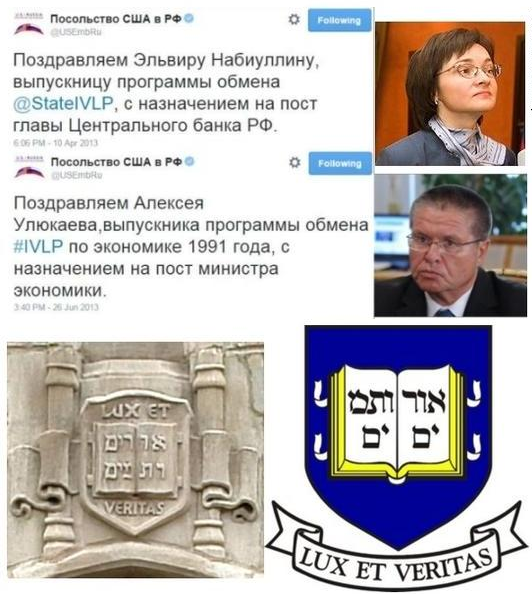
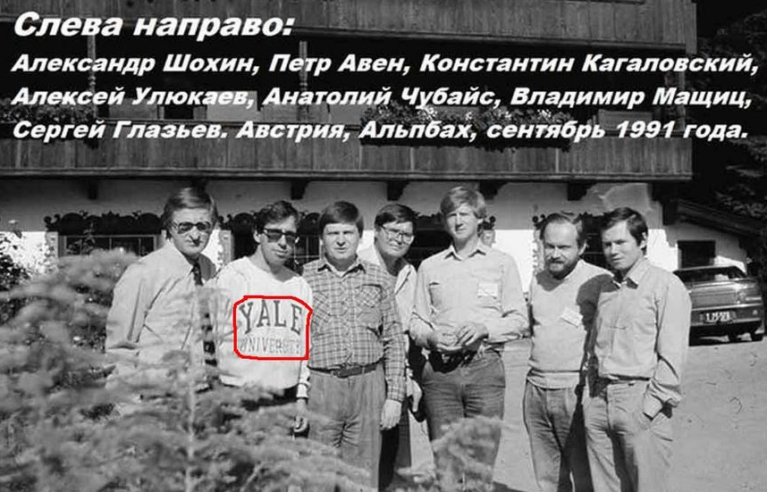

> **Первичный текст.** О текущем моменте №1(144), 2023г. О положении в стране и перспективах.
> Источник: `dotu.ru:e11c58986db845ab.doc` sha256 `40df11276033612f…`; [страница на dotu.ru](https://dotu.ru/2023/04/29/20230429_tek_moment01144/).
> Автоматическая транскрипция DOC→Markdown; смысл и формулировки не правились.
> Контрольные суммы и статус проверки — в [NOTICE.md](../../NOTICE.md).
> Содержание передаёт позицию авторов; утверждения не верифицированы библиотекой.

---

«О текущем моменте» № 1 (144),\

февраль — апрель 2023 года

аналитический обзор

О положении в стране и перспективах[^1]

С октября 2021 г. мы не выпускали аналитические записки из серии «О текущем моменте» потому, что были дела, которые мы считали более важными, нежели комментирование текущей политики, тем более, что опубликованные материалы КОБ и, прежде всего, касающиеся выработки личностной познавательно-творческой культуры — **в случае их освоения** — позволяют каждому производить жизненно состоятельную аналитику и прогностику самостоятельно соответственно его потребностям и интересам. Однако на протяжении всего прошедшего времени представители политического официоза России, деятели СМИ обходят молчанием многие вопросы, вызывающие озабоченность, а другие темы, актуальные для дальнейшего развития страны, освещаются ими неадекватно — либо умышленно лживо, либо ошибочно.

Следствием и того, и другого является нарастание в обществе доли недовольных властью, что имеет место вопреки публикациям разнородных опросов «общественного мнения», показывающих высокие рейтинги доверия[^2]. Прогрессирующее на протяжении многих лет (примерно с 2008 г., когда на Россию оказала воздействие первая волна глобального финансово-экономического кризиса) падение доверия людей власти представляет опасность для устойчиво эволюционного развития России, поскольку недовольными становятся, не только мало-мальски думающие люди, которые соотносят сказанное и умолчания политического официоза и СМИ с тем, что они помнят, что сами знают достоверно, и что им сообщают их друзья и родственники на основе своего собственного жизненного опыта, но и беспамятно-бездумные люди, которым свойственна скоростная чувственно-эмоциональная реакция на происходящее, вследствие чего они склонны к экстремизму[^3] и легко становятся объектами манипулирования. Поэтому необходимо осветить реальные проблемы страны и перспективы их разрешения.

ОГЛАВЛЕНИЕ

[1. Демография 2](#демография)

[2. Педагогический суверенитет как фундамент государственного суверенитета 3](#педагогический-суверенитет-как-фундамент-государственного-суверенитета)

[3. Наука — локомотив экономики 11](#наука-локомотив-экономики)

[4. Почему ни одна страна не может развиваться и быть суверенной на основе либерально-рыночной экономической модели 15](#почему-ни-одна-страна-не-может-развиваться-и-быть-суверенной-на-основе-либерально-рыночной-экономической-модели)

[5. Психология общественно-государственных взаимоотношений и фактор «мафиозности» 20](#психология-общественно-государственных-взаимоотношений-и-фактор-мафиозности)

[7. «Специальная военная операция» и глобальная политика 27](#специальная-военная-операция-и-глобальная-политика)

[8. Россия и «новый» мировой порядок 40](#россия-и-новый-мировой-порядок)

[9. Перспективы «нового» = старого мирового порядка 44](#перспективы-нового-старого-мирового-порядка)

# 1. Демография

Понимания сути хронической демографической проблемы в официозе политики, науки, СМИ России нет.

Демографическая политика государства должна обеспечивать:

- здоровье потенциальных родителей;

- здоровое зачатие, здоровое течение беременности, здоровые роды и, как следствие, превосходство новых поколений над старшими поколениями по медико-биологическим показателям, характеризующим как телесное, так и психическое здоровье индивида;[^4]

- культурную состоятельность новых поколений[^5].

Соответственно, для преодоления демографической проблемы необходимо:

- не повысить рождаемость вообще,

- а обеспечить более высокую рождаемость детей у родителей, ведущих здоровый образ жизни, родивших здорового первенца.

Рост рождаемости, обусловленный стремлением родителей при порочном образе жизни получать детские пособия, материнский капитал и прочую государственную поддержку, следует подавлять и пресекать потому, что это, по сути, — государственные инвестиции в биологическую и культурную деградацию общества в новых поколениях.

Точно так же и алименты с мужчин, делающие их подчас нищими, в пользу бывшей жены — это инвестиции в беззаботность женщин об их семьях и в разрушение института семьи в последующих поколениях.

Исторически сложившаяся постсоветская власть России за 30 лет своего существования[^6] не выработала дееспособности в сфере демографической политики. Официоз науки в этом деле власти не в помощь по двум причинам: 1) собственное обильное *графоманство, в котором бесполезно искать новые или актуальные знания,* 2) некомпетентность[^7] и необучаемость подавляющего большинства чиновников и депутатов в силу отсутствия у них свободного времени, а также — в силу пороков их нравственности и личностной культуры восприятия и осмысления действительности, что усугубляется свойственной большинству из них «исполнительностью» при отсутствии добросовестности и воли, и как следствие — усугубляется отсутствием творческой инициативы и навыков организации процессов, направленных на разрешение проблем, которые они должны выявлять сами и о которых им могут сообщать граждане страны.

Что касается политики обеспечения культурной состоятельности, то переход к ЕГЭ (с 2009 г. безальтернативен) и болонской системе (переход был начат в 2003 г. и завершён в 2011 г.) — это государственная политика, направленная на обеспечение культурной несостоятельности новых поколений. Причины такой оценки — в падении качества образования как всеобщего обязательного, так и вузовского профессионального вследствие изменения характера и целей обучения.

2. Педагогический суверенитет\

как фундамент государственного суверенитета

===========================================

Такого термина «педагогический суверенитет» в политологии нет. Тем не менее, вне зависимости от наличия либо отсутствия этого термина, общество либо обладает педагогическим суверенитетом, либо нет — со всеми вытекающими из каждого из двух вариантов последствиями.

**Педагогическая субкультура** **общества** — это основа его культуры в целом, основа демографической политики государства и главное — **это та субкультура, которая вносит решающий вклад в формирование будущего качества жизни любого культурно своеобразного общества.**

Однако термин «педагогическая субкультура» в наши дни не вполне удачен, поскольку в настоящее время слово «педагогика» понимается как *«наука о воспитании и обучении человека, прежде всего в детско-юношеском возрасте»*[^8]. Однако, сами *возможности обучения и воспитания «в детско-юношеском возрасте»* обусловлены предысторией детства всякого индивида, а предыстория включает в себя: 1) выбор будущими родителями друг друга[^9], 2) зачатие, 3) беременность, 4) роды, 5) младенчество. Поэтому слова «педагогическая субкультура» следует понимать именно в этом смысле — как субкультуру общества, в русле которой будущие родители избирают друг друга, как они производят зачатие, как протекает беременность, как протекают роды, как протекает младенчество и детство, и как на всём этом многоэтапном пути происходит формирование организма будущего взрослого человека, информационно-алгоритмической структуры его психики, какие знания и навыки он реально осваивает ко времени вступления в самостоятельную взрослую жизнь.

И понимаемые в этом смысле педагогические субкультуры разных народов и педагогические субкультуры различных социальных групп в обществе могут быть различными: от по сути убийственных по отношению к будущему общества до благодатных.

Но такого термина «педагогическая субкультура» в курсах социологии и политологии, и как следствие, — в политическом лексиконе России — нет. Официоз науки ничего внятного по этой тематике сказать не может, политики своим умом на протяжении нескольких десятилетий до наполнения жизненно состоятельным смыслом этих или каких-то иных слов тоже дойти не могут, СМИ — молчат. Идейное наследие К.Д. Ушинского, Н.И. Пирогова, П.Ф. Лесгафта, А.С. Макаренко «педагогикой» не востребовано, не изучается в педагогических вузах и не развивается, и многие уже не знают даже имён этих и других выдающихся педагогов прошлого.

Для того, чтобы благодатная педагогическая субкультура состоялась, культурология, обращаясь к теме «педагогические субкультуры», должна ответить *жизненно состоятельным* образом на три вопроса:

- каким должен быть взрослый человек?

- какова реальная статистика воплощения этого идеала в жизнь в исторически сложившемся обществе?

- что надо сделать для того, чтобы этот идеал стал безальтернативной нормой жизни?

И одна из компонент реализации ответа на вопрос «каким должен быть взрослый человек?» — обеспечение культурной состоятельности новых поколений, на что должна работать система образования, начиная с детского сада.

*[В оригинальном издании здесь расположен рисунок/схема. Иллюстрация не включена в данный выпуск: ожидает визуальной и правовой проверки. Файл источника: image1.jpeg]*Но суть явления, названного «культурная состоятельность», не является неизменной на протяжении истории и в обозримой перспективе — как вследствие развития культурно своеобразных обществ, так и вследствие их деградации, а также — вследствие научно-технического прогресса, под воздействием которого навыки изготовления «каменных топоров», которые были высшими достижениями прошлых эпох, становятся ничего не значащими в настоящем и в перспективе. Поэтому **система образования не может быть выстроена раз и навсегда в соответствии с представлениями той или иной эпохи о неком её идеале, даже если в ту эпоху этот идеал был жизненно состоятельным.**

Слева на рис. 1 представлена схема процессов, в которых выражается главная культурная закономерность жизни цивилизованных обществ. Суть этой закономерности может быть изложена в следующих словах:

- научные теории, вошедшие в систему образования несколько десятилетий тому назад, сформировали миропонимание и культуру мышления ныне взрослых поколений общества, включая и представителей управленческого корпуса наших дней в государственном управлении и бизнесе;

- поток оперативной информации люди, включая управленцев-профессионалов в государственном аппарате и в экономике, соотносят с тем, чему они научились в школах и вузах и *чему они научились самостоятельно (если они умеют учиться самостоятельно)*, и на основе такого соотнесения вырабатывают управленческие решения разного уровня (от личностного до общегосударственного и глобального);

- проведение в жизнь выработанных управленческих решений формирует будущее качество жизни, и при этом последствия проводимых в жизнь управленческих решений распределяются в интервале времени от нескольких долей секунды до нескольких столетий, а то и тысячелетий (продолжительность последствий принятия и осуществления управленческих решений зависит от их характера и тех процессов, которые они затрагивают и порождают).

Соответственно, в процессе реализации этой закономерности в жизни, продолжительностью от нескольких десятилетий до нескольких столетий (если считать от момента появления научной теории до проявления её в *качестве жизни общества),* выражается статистическая предопределённость результатов:

- «одна наука ⇒ один менталитет (миропонимание и культура мышления) ⇒ один обусловленный наукой и менталитетом спектр управленческих решений ⇒ одно качество жизни»;

- **«другая по содержанию наука ⇒ другой менталитет (миропонимание и культура мышления) ⇒ другой обусловленный наукой и менталитетом спектр управленческих решений ⇒ другое качество жизни».**

Государственное управление — это сочетание 5 факторов, представленных в таблице 1.

Таблица 1

<table>

<colgroup>

<col style="width: 8%" />

<col style="width: 50%" />

<col style="width: 41%" />

</colgroup>

<tbody>

<tr>

<td style="text-align: center;"><strong>№№ 

п.п.</strong></td>

<td style="text-align: center;"><strong>Фактор</strong></td>

<td style="text-align: center;"><strong>Положение дел 

в России</strong></td>

</tr>

<tr>

<td style="text-align: center;">1</td>

<td style="text-align: left;">Научно-методологическое обеспечение социального управления (государственного и управления в экономике и в других сферах) — <strong>комплекс</strong> <em>взаимосвязанных</em> научных теорий.</td>

<td style="text-align: left;">Либерально-рыночное.</td>

</tr>

<tr>

<td style="text-align: center;">2</td>

<td style="text-align: left;">Кадры, которые владеют им (т.е. действуют, соотносясь с ним в ходе постановки и решения задач государственного и прочего социального управления).</td>

<td style="text-align: left;">Либералы (если не по убеждениям, то по полученному ими образованию).</td>

</tr>

<tr>

<td style="text-align: center;">3</td>

<td style="text-align: left;">Система образования, которая на основе этого научно-методологического обеспечения в преемственности поколений формирует кадровую базу, из которой черпаются кадры управленцев для государственной власти и для экономики.</td>

<td style="text-align: left;">Во власти либералов — «тоталитарной секты» (определение М.Л. Хазина), т.е. по сути — во власти транснациональной политической мафии.</td>

</tr>

<tr>

<td style="text-align: center;">4</td>

<td style="text-align: left;">Кадровая политика, которая удаляет из органов государственной и хозяйственной власти одних и привлекает из социальной базы других управленцев.</td>

<td style="text-align: left;">Во власти транснациональной политической мафии либералов.</td>

</tr>

<tr>

<td style="text-align: center;">5</td>

<td style="text-align: left;">Наука, которая должна развивать научно-методологическое обеспечение, лежащее в основе управления, в преемственности поколений в ориентации на профилактирование, выявление и разрешение проблем общества и политики.</td>

<td style="text-align: left;">Во власти транснациональной политической мафии либералов.</td>

</tr>

</tbody>

</table>

Среди «индикаторов решения поставленных задач», предлагаемых в проекте «Стратегии инновационного развития Российской Федерации на период до 2020 года» «Инновационная Россия — 2020», опубликованном Минэкономразвития в 2010 г. [^10], есть и такие:

|  |  |  |  |

|:---|:--:|:--:|:--:|

| **Наименование индикатора** | **2010** | **2016** | **2020** |

| Доля государственных служащих, получающих ежегодно дополнительное образование за рубежом | 0,1 % | 1 % | 3 % |

| Доля лиц, занимающих должности руководителей высшей и главной групп должностей государственной гражданской службы, получивших высшее профессиональное образование за рубежом | \> 0,5 % | 4 % | 12 % |

Обратим внимание на то, что в приведённом выше фрагменте таблицы «индикаторов решения поставленных задач» в первой строке речь идёт о получении госслужащими за рубежом *дополнительного* образования[^11], а во второй — о получении *профессионального* высшего образования за рубежом, что по умолчанию подразумевает отдание предпочтения тем кандидатам на должности «высшей и главной групп должностей государственной гражданской службы», которые получили первое высшее *профессиональное* образование за рубежом.

Этому можно было бы радоваться, если бы США и «коллективный Запад» в целом действительно были лидерами нравственно-этического прогресса, а не самым мощным государством-поработителем и паразитом на жизни других народов. Поскольку США и «коллективный Запад» в целом в таковом качестве не состоялись, то не надо обольщаться: это — не просвещение отсталых дикарей, а порабощение путём уничтожения в обществе педагогического суверенитета. Остаётся только предполагаемые *12 % запрограммированных за рубежом «зомби» и завербованных агентов влияния,* получивших профессиональное образование за рубежом, продвинуть на наиболее значимые должности и — о реальном суверенитете России можно будет на некоторое время забыть по причине целесообразности полученного ими образования по отношению к решению задачи порабощения России. Т.е. нельзя жить ни чужими мнениями, ни чужим умом.

Персонажей, представленных на композиции выше, учили в Йельском университете не для того, чтобы они сделали Россию успешно развивающейся страной, а для того, чтобы они сделали Россию успешно деградирующей в интересах хозяев либерально-буржуазной региональной цивилизации — «коллективного Запада». Либо эти персонажи настолько слабоумны, что за десятки лет работы в сфере управления экономикой и государственных финансов не смогли понять простых вещей:

- центробанк душит Россию ростовщичеством и своею эмиссионной политикой[^12];

- если государство допускает в своей юрисдикции ростовщичество, то оно утрачивает экономико-финансовый суверенитет.

- налоговая система России не позволяет быть экономике социально ориентированной, поскольку не является инструментом управления порогами рентабельности производств в отраслях и регионах, что безальтернативно необходимо для настройки рыночного механизма на гарантированное удовлетворение потребностей населения и политики государства в разнородной продукции, производимой как в русле государственного плана экономического обеспечения жизни и политики, так и на основе инициативы предпринимателей.

Также неизбежен вопрос: кто из обучающихся за рубежом будет завербован тамошними спецслужбами и получит задание «беречь себя от подозрений и делать карьеру», а когда он сделает карьеру, ему и другим таким же «вербанутым» будет предложено новое задание в русле некоего сценария дальнейшего порабощения и уничтожения России. Даже если завербовали не всех учившихся за рубежом, то те, кого завербовали, *«научно обоснованно»* объяснят своим не завербованным коллегам, получившим идентичное образование за рубежом, что и как надо делать «во благо» России, поскольку закономерность, представленная на рис. 1, — реально работает, чему подтверждением — деятельность всех активистов-реформаторов, запечатлённых на фотографии выше, сделанной в период их обучения в Австрии по программе International Visitors Leadership Program (IVLP), разработанной Госдепом США в целях делания политики в интересах США руками «туземцев».

В Послании Федеральному собранию РФ 21 февраля 2023 г.[^13] В.В. Путин заявил, что необходимо «вернуться к традиционной для нашей страны базовой подготовке специалистов с высшим образованием». Т.е. по умолчанию он признал вредоносность для страны осуществлённого в прошлом перехода на «болонскую систему»[^14]. Однако этого мало: проблемы высшего профессионального образования в РФ во многом обусловлены деградацией среднего образования. Так в одном из ведущих военно-технических вузов страны курс «сопротивление материалов» читается на основе учебных пособий для техникумов и профтехучилищ. И это не потому, что преподаватели вуза — вредители, а потому, что основная масса студентов не в состоянии освоить сопромат на основе фундаментальных вузовских учебников советской эпохи. Основная масса студентов не в состоянии писать конспекты самостоятельно: для их психики это неподъёмная задача. Они не в состоянии даже пользоваться теми знаниями, которые у них должны быть. Так в деловой игре на тему «Алгоритмика выработки управленческих решений» в трёх группах магистров, обучающихся по специальности «государственное и муниципальное управление», было предложено *с целью выработки государственной политики преподавания географии в школах обосновать одно из мнений «Земля плоская» либо «Земля — шарообразная планета и движется по орбите вокруг Солнца». В трёх группах общей численностью около 60 человек НИКТО не смог выдвинуть никаких аргументов ни в обоснование гелиоцентрической модели Солнечной системы, ни в её опровержение.*

Т.е. стране необходима реформа системы образования в целом, начиная от реформы детских садов. Чтобы новая реформа была полезна, т.е. благотворно сказалась на будущем, надо понимать, что в реформе системы образования есть два аспекта:

- организационный, определяющий структуру системы образования, документирование её деятельности, контрольные показатели и прочие формальности;

- сущностный, определяющий:

<!-- -->

- кого учить;

- чему учить;

- в какой последовательности осваивать знания и навыки;

- как учить на каждом из этапов;

- как подготовить кадры учителей и наставников.

Отечественная политическая практика показывает, что все разговоры и деятельность по реформированию системы образования (как, в прочем, и по реформированию других социально-значимых систем профессиональной деятельности) сводятся к организационному аспекту[^15]: какие элементы в её структуре должны быть, какие у них собственные функции и взаимосвязи, как они должны вести делопроизводство (документирование, сопровождающее деятельность), как должны отчитываться перед контролирующими органами и т.п. Но сущностный аспект не затрагивается никогда.

Вопрос же о культурной состоятельности новых поколений — главный вопрос, определяющий будущее качество жизни общества, — по отношению к системе образования это вопрос сущностный. *И именно определённость в ответе на вопрос «в чём выражается культурная состоятельность ныне и в обозримой перспективе?» позволяет ответить на вопросы «кого учить?», «чему учить?», «в какой последовательности осваивать знания и навыки?», «как учить на каждом из этапов?», «какие педагогические кадры готовить для работы в системе образования на всех её уровнях?»*[^16]*.* И только после ответа на эти вопросы можно переходить к решению задач, отнесённых выше к организационному аспекту реформы.

Но поскольку сущностными вопросами никто в политическом и научном официозе заниматься не желает либо не может по узости кругозора и скудоумию, то не надо обольщаться в отношении того, что заявленные в Послании президента реформы системы образования дадут благие плоды.

Развитие страны требует, чтобы содержание третьей колонки таблицы 1 стало иным — таким, как оно представлено в таблице 2.

Таблица 2

<table>

<colgroup>

<col style="width: 8%" />

<col style="width: 66%" />

<col style="width: 24%" />

</colgroup>

<thead>

<tr>

<th style="text-align: center;"><strong>№№ 

п.п.</strong></th>

<th style="text-align: center;"><strong>Фактор</strong></th>

<th style="text-align: center;"><strong>Цель развития культуры 

России</strong></th>

</tr>

</thead>

<tbody>

<tr>

<td style="text-align: center;">1</td>

<td style="text-align: left;">Научно-методологическое обеспечение социального управления (государственного и управления в экономике и в других сферах) — <strong>комплекс</strong> <em>взаимосвязанных</em> научных теорий.</td>

<td>Русский проект многонациональной справедливой 

глобализации</td>

</tr>

<tr>

<td style="text-align: center;">2</td>

<td style="text-align: left;">Кадры, которые владеют им (т.е. действуют, соотносясь с ним в ходе постановки и решения задач государственного управления).</td>

<td style="text-align: left;">Патриоты-глобализаторы<a href="#fn1" class="footnote-ref" id="fnref1" role="doc-noteref">1</a>.</td>

</tr>

<tr>

<td style="text-align: center;">3</td>

<td style="text-align: left;">Система образования, которая на основе этого научно-методологического обеспечения в преемственности поколений формирует кадровую базу, из которой черпаются кадры управленцев для государственной власти и для экономики.</td>

<td>Во власти 

патриотов-глобализаторов.</td>

</tr>

<tr>

<td style="text-align: center;">4</td>

<td style="text-align: left;">Кадровая политика, которая удаляет из органов государственной и хозяйственной власти одних и привлекает из социальной базы других управленцев.</td>

<td>Во власти 

патриотов-глобализаторов.</td>

</tr>

<tr>

<td style="text-align: center;">5</td>

<td style="text-align: left;">Наука, которая должна развивать научно-методологическое обеспечение, лежащее в основе управления, в преемственности поколений в ориентации на профилактирование, выявление и разрешение проблем общества и политики.</td>

<td>Во власти 

патриотов-глобализаторов.</td>

</tr>

</tbody>

</table>

<section id="footnotes" class="footnotes footnotes-end-of-document" role="doc-endnotes">

<ol>

<li id="fn1">
В наши дни: если нет собственной концепции глобальной политики, а равно собственного жизненно состоятельного проекта глобализации, то «патриотизм» — пустое слово, а мнящие себя истинными патриотами — инструменты осуществления чужой глобальной политики в русле чужого проекта глобализации либо их жертвы: каждый в меру понимания работает на себя, а в меру разницы в понимании — на тех, кто понимает больше и лучше.<a href="#fnref1" class="footnote-back" role="doc-backlink">↩︎</a>
</li>

</ol>

</section>

Однако, постсоветская власть России — это не та власть, которая способна осмысленно волевым порядком преобразовать российскую действительность из состояния, описываемого таблицей 1, в состояние, описываемое таблицей 2.

Пока у неё слабоумия хватает только на то, чтобы приравнять дипломы бакалавров к дипломам о полном высшем образовании, хотя, если оценивать реальное качество данного бакалаврам (а равно — освоенного ими) образования, то не всегда правомочно приравнять дипломы нынешних бакалавров даже к дипломам техникумов времён СССР. Это приравнивание дипломов бакалавров к дипломам специалистов не многим лучше, чем продажа вузовских дипломов на рынках в 1990‑е или имеющая место в интернете и в наши дни. Т.е. это ещё один вредительский акт, оглашённый *А.А. Фурсенко (министр образования в 2004 — 2012 гг.), в прошлом руководившим той реформой образования, в результате которой в России появились ЕГЭ и болонская система,* а качество образования упало до уровня изучения комиксов[^17].

Тем не менее, не всё так плохо. Суверенитет в его полноте в целом и в любом из его специфических аспектов это — самостоятельное восприятие людьми действительности и самостоятельное осмысление и переосмысление воспринимаемого и памятного. Т.е. в основе суверенитета общества и государства — чувственно-интеллектуальный суверенитет.

Способность к осуществлению чувственно-интеллектуального суверенитета формируется не системой образования, а семьёй в раннем детстве.

Именно семья (мама, папа, дедушки, бабушки) в общении с ребёнком должны помочь ему научиться руководствоваться собственными чувствами и осмыслением воспринятого и памятного; за чужими мнениями, доведёнными до ребёнка посредством изустной речи или текстов (включая тексты учебников) он должен научиться видеть реальные процессы либо их отсутствие, т.е. понимать, что среди всего множества речей и текстов встречается пустословие. При этом ребёнка следует научить мыслить процессами, а не статичными состояниями, не обладающими внутренней динамикой, изменяющей их качество.

Кроме того, для осуществления чувственно-интеллектуального суверенитета необходим широкий и достаточно детально проработанный кругозор, в основе которого всегда лежит широкий спектр интересов. Поэтому семья должна заботиться о том, чтобы ребёнок уже в дошкольном детстве был носителем интересов следующих групп — иерархических уровней (в порядке нарастания значимости от 1 к 9):

1)  *исключительно единоличные (потребительски-бытовые и гедонистические),*

2)  *семейно-бытовые,*

3)  *узко профессиональные, по сути финансовые* (см. пояснение далее)*,*

4)  обусловленные классовой принадлежностью,

5)  обусловленные национальной принадлежностью,

6)  обусловленные конфессиональной принадлежностью,

7)  общегосударственного масштаба,

8)  регионально-цивилизационного масштаба,

9)  глобально-цивилизационного масштаба.

Носители *интересов* только *первой, второй и третьей групп* — аполитичны, т.е. безыдейны и потому потенциально продажны, т.е. они все — потенциальные предатели и изменники. Их лояльность обеспечивается так или иначе организованным подкупом (легальным или каким-то иным), а измена — перекупом политическими противниками (перекуп тоже может быть и легальным, и каким-то иным).

Кроме того, первые три группы интересов, выделенные выше курсивом, объединяются через финансовую субкультуру общества, поскольку удовлетворение интересов первых двух групп в подавляющем большинстве случаев требует оплаты материальных благ и разного рода услуг, а профессионализм (в сколько-нибудь устойчиво функционирующей производственно-потребительской системе общества) это — то, что обеспечивает доходы, позволяющие удовлетворять интересы первых двух групп. Причём речь идёт о любом профессионализме — как созидательном (управленческом или производительном), так и о паразитическом (в стиле «великого комбинатора», чтившего уголовный кодекс, или в беззастенчиво криминальном стиле).

Взаимосвязанность через деньги интересов первых трёх групп и аполитичность людей, не имеющих интересов четвёртой — девятой групп открывает широкие возможности манипулирования такими людьми, и потому цель воспитания детей в современных культурах «высоко цивилизованных стран» — ограничить интересы основной статистической массы подрастающих поколений интересами первой и второй групп и отчасти — третьей группы.

Та или иная политизированность характерна только для носителей интересов четвёртой — девятой групп. Поэтому чувственно-интеллектуальный суверенитет без полноты спектра интересов, который должен включать в себя интересы всех 9 групп, подчинённые указанной выше иерархии, — невозможен. Но предпосылки к тому, чтобы люди могли осуществлять чувственно-интеллектуальный суверенитет, создаются в семье.

# 3. Наука — локомотив экономики

Прежде всего, необходимо признать, что времена, когда гении-одиночки делали всю науку, завершились к началу ХХ века. Безусловно, что без таких людей как М.В. Ломоносов, Д.И. Менделеев, П.Л. Чебышев, В.И. Вернадский, Н.Е. Жуковский, К.Э. Циолковский, Л.П. Капица, Г.Я. Перельман и многих других наука невозможна. Но в наши дни если гений-одиночка родит эпохальную идею, для проверки достоверности которой потребуется экспериментальная установка, в сопоставлении с которой большой адронный коллайдер[^18] — примитивная детская игрушка, то на этом жизнь этой эпохальной идеи прервётся до «лучших времён». Кроме эпохальной идеи требуется, чтобы множество других не менее гениальных и просто высокопрофессиональных представителей других отраслей науки и экономики создали эту экспериментальную установку, *на что должны дать санкцию политики и финансисты, в чьей власти профинансировать проект*. А для этого политики и финансисты должны сами быть носителями достаточно широкого и детального кругозора и не быть идиотами, чтобы понять значимость этого проекта самостоятельно либо при помощи дееспособных экспертов-консультантов, которых они должны найти и привлечь к работе, отфильтровав при этом консультантов-идиотов, на мнение которых недопустимо полагаться. Кроме того, надо понимать, что фундаментальная наука не относится к числу самоокупающихся видов деятельности: расходы на неё — инвестиции, которые окупаются опосредованно в результате того, что достижения фундаментальной науки начинают использоваться в других сферах жизни общества.

Экономить же на инвестициях в науку и научно-технический прогресс, как это имело место в Российской империи, либо развитие науки сводить исключительно к объёмам публикаций и индексам цитирования, к объёмам инвестиций, бухгалтерской отчётности и документированию, как это имеет место в постсоветской России, — идиотизм. Но идиотизм не бывает бесхозным: у него всегда есть зарубежные кураторы, решающие свои задачи руками местных идиотов, продвинутых в органы государственной и иной власти на ключевые посты.

Науку делают творчески состоятельные люди и работающие на выражаемые ими идеи хорошо организованные коллективы, а не деньги, и не оргштатные структуры и не недоумки, назначенные на руководящие должности в науке и технике по чьей-либо протекции.

Такой взгляд на науку и научно-технический прогресс приводит к понятию «научно-внедренческий цикл».

«**Научно-внедренческий цикл**» можно определить как социально-экономический процесс, начало которому даёт постановка исследовательских задач в области фундаментальной науки и который завершается тем, что её достижения воплощаются в производстве массово потребляемой продукции (включая и услуги).

С точки зрения теории вероятностей и математической статистики научно-внедренческий цикл — случайный многоэтапный процесс, вследствие чего в подавляющем большинстве случаев управлять осуществлением научно-внедренческих циклов директивно-адресно (структурным способом) невозможно.

Если мы рассматриваем научно-технический прогресс как социальное явление, то он предстаёт как сеть переплетающихся научно-внедренческих циклов. Это обусловлено тем, что идея, дающая начало научно-внедренческому циклу, в его завершении находит своё воплощение во множестве видов разнородной продукции, производимой на основе различных технологий. При взгляде в обратном направлении (от продукции — к идеям, дающим начало научно-внедренческим циклам) в большинстве видов продукции находит своё воплощение некоторое множество идей, давших начало разным научно-внедренческим циклам. Поэтому **«научно-внедренческий цикл» — ключевое понятие для организации управления научно-техническим прогрессом**.

Если научно-технический прогресс рассматривать как сеть научно-внедренческих циклов, то наука предстаёт не только как один из общественных институтов, производящий как новые знания, так и лжезнания[^19], но и как отрасль экономики, причём — отрасль-локомотив, которая тянет всю экономику по пути инновационного развития, что оказывает воздействие на все прочие сферы жизни общества.

Лидерство страны в научно-техническом прогрессе (т.е. инновационное развитие экономики) обусловлено культурой. Культура, рассматриваемая как информационно-алгоритмическая система, должна обеспечить реализацию научно-внедренческих циклов, начало которым положено в нашей стране, темпами более высокими, нежели аналогичные циклы осуществляются в странах-конкурентах и в государствах-противниках. Научно-внедренческие циклы, начало которым положено за рубежом, должны завершаться в нашей стране не медленнее, нежели они завершаются за рубежом, а желательно быстрее. Это — основа *импортонеуязвимости страны*[^20] и технико-технологического суверенитета и ключ к обеспечению обороноспособности путём разрушения иллюзии безнаказанности агрессора в «элите» государств-противниках.

Однако отечественные культурологи изучением вопросов, связанных с реализацией научно-внедренческих циклов в разных культурах, не занимаются. И они даже вообще не подозревают, что культура — информационно-алгоритмическая система, вследствие чего её до́лжно рассматривать как объект программирования с целью осуществления последующего самоуправления общества в желательном режиме под властью модифицированной культуры.

Политики — в частности, 450 депутатов в Думе и сотрудники её аппарата, аппарата Совфеда, минкульта, правительства в целом, администрации президента — об этом тоже не подозревают, хотя могли бы и сами догадаться, если временами употребляют слова «культурный суверенитет»[^21].

Кредитно-финансовая система — «средство сборки» производственно-потребительской системы государства из множества административно обособленных предприятий. Для того, чтобы она могла решить эту задачу, необходимо учитывать специфику предприятий и строить законодательство о финансовой и хозяйственной деятельности с учётом этой специфики, а не на основе либеральных бредней о том, что *«рынок сам всё отрегулирует наилучшим образом, главное только, чтобы государство не вмешивалось в его работу и ушло из экономики»*[^22]. По отношению к науке как отрасли экономики страны это означает следующее:

- Фундаментальная наука не производит продуктов, которые были бы востребованы на рынке, вследствие чего фундаментальная наука должна финансироваться из госбюджета и разного рода фондов, создаваемых юридическими и физическими лицами, исходя из их интересов и понимания их участниками роли науки в жизни общества и своей заботы о будущем.

- Отраслевая наука должна изучать:

<!-- -->

- достижения фундаментальной науки,

- проблемы соответствующих отраслей экономики,

- вырабатывать пути и способы разрешения проблем своих отраслей посредством внедрения в них достижений фундаментальной науки (в ингредиентный состав, в конструкции изделий, в технологии производства).

> Поскольку такого рода работы предполагают проведение множества научно-исследовательских опытно-конструкторских работ, результаты которых в большинстве своём не могут быть проданы массовому потребителю в отраслях, то изрядная доля финансирования отраслевой науки тоже должна финансироваться из госбюджета и из фондов, создаваемых юридическими и физическими лицами, исходя из их интересов и понимания их участниками роли науки в жизни общества и своей заботы о будущем. Отраслевая наука может продавать бо́льшей частью только консалтинговые услуги предприятиям отраслей.

- Для того, чтобы предприятия отраслей востребовали консалтинговые услуги отраслевой науки по их собственной инициативе (т.е. чтобы в государстве не было имитации и саботажа научно-технического прогресса), требуется три условия:

<!-- -->

- отраслевая наука должна быть, т.е. она должна реально знать и достижения фундаментальной науки, и проблемы отраслей, и должна уметь вырабатывать жизненно состоятельные рецепты разрешения проблем отраслей как по своей инициативе, так и по заказам предприятий и создаваемых ими фондов, инвестирующих в работы отраслевой науки;

- «финансовый климат» в государстве должен быть таким, чтобы предприятия во всех отраслях получали коммерческую выгоду от реализации в них достижений научно-технического прогресса и стремились бы сократить сроки внедрения его достижений[^23];

- миропонимание и этика людей в отраслях должны быть такими, чтобы люди сами желали работать «завтра» лучше, чем они работают «сегодня» или работали «вчера», и это — главная задача культурной политики государства в сфере образования и сфере экономики.

В России же процветает идиотизм, подвластный манипулированию из-за рубежа, вследствие чего в «святые» девяностые государственная власть была убеждена, что вся наука должна работать на принципе самоокупаемости, а целенаправленному формированию «финансового климата», миропонимания и этики, обеспечивающих массовую реализацию научно-внедренческих циклов в кратчайшие сроки, вообще не уделялось никакого внимания. Идиоты ждали и продолжают ждать, когда «свободный рынок» сам без государственного участия отрегулирует всё наилучшим образом, после чего начнётся эра высокоцивилизованного процветания = потреблятства. Поэтому и в настоящее время никаких мер системного характера для этого тоже не предпринимается, поскольку государственная власть блюдет верность криптоколониальной либерально-рыночной экономической модели. Насколько такая верность[^24] правомочна в конкретных глобально-политических обстоятельствах — это другой вопрос.

Наука в действии — это: 1) проведение исследований по множеству направлений и 2) хранение ранее наработанных знаний, не утративших актуальность, и воспроизводство навыков, в которых новые и ранее выработанные знания реализуются. Направления научных исследований (одно или несколько) находятся во власти «научных школ».

**«Научная школа»** это — некоторое множество *разновозрастных* людей, взаимодействующих друг с другом в процессе ведения ими научных исследований.

Разновозрастность участников научных школ, охватывающая диапазон возрастов от выпускников вузов до научных работников со стажем работы в 3-5 десятилетий и более, — средство воспроизводства компетентности, соответствующей профилю научной школы, в преемственности поколений. То же касается и научно-педагогических школ вузов и инженерных проектно-конструкторских и технологических школ во всех отраслях экономики.

В организационном отношении научные и прочие школы, в зависимости от характера исследований, это — научно-исследовательские и проектно-конструкторские институты, в них — отделения и отделы, специализирующиеся на той или иной тематике.

В итоге «оптимизации» в постсоветской России науки как отрасли экономики юристами и «эффективными менагерами» многие научно-исследовательские институты перестали существовать, во многих уцелевших институтах, проектно-конструкторских бюро и вузах там, где в советские времена работали отделы (кафедры), теперь тематика бывших отделов (кафедр) закреплена за одним — двумя людьми. Т.е. **научные школы, существовавшие и воспроизводившие себя в преемственности поколений в структурах институтов, их отделений и отделов (кафедр) в постсоветской России большей частью уничтожены**[^25].

Как следствие — смерть, уход на пенсию или на другую работу всего одного человека может мгновенно обрушить или на длительное время остановить работы многих коллективов, для успеха работы которых требуется помощь научных школ, уничтоженных оптимизаторами науки в постсоветские времена. Вновь нанятому человеку потребуется несколько лет для того, чтобы войти в курс дела и то при условии, что он будет удовлетворён условиями труда.

Положение усугубляется тем, что в порядке вещей стало назначение на управленческие должности в фундаментальной и отраслевой науке людей, которые никогда сами в этих отраслях не только не работали, но и не имеют соответствующего базового профессионального образования. Эти люди в большинстве своём не пользуются уважением в коллективах и, прежде всего, их не уважают действительные профессионалы, у которых «эффективные менагеры» своею некомпетентностью и дуростью вызывают желание уволиться.

Перспективы развития науки и осуществления научно-технического прогресса тоже оставляют желать лучшего, поскольку о построении каналов реализации научно-внедренческих циклов власть не думает (там заниматься этим просто некому), а в силу падения качества образования в результате реформ количество людей, способных делать науку и научно-технический прогресс, ощутимо сократилось в сопоставлении с временами СССР; в обозримой перспективе такое положение дел будет сохраняться до тех пор, пока система образования не изменит своего качества и не начнёт массово производить добронравного человека-творца.

«Сколково» и «Сириус» — не альтернатива науке ни как общественному институту, ни как отрасли-локомотиву экономики: отдельные положительные факты находят своё место в статистике, но не могут подменить собой всю статистику, включающую в себя наряду с достижениями множество негативных фактов.

# 4. Почему ни одна страна не может развиваться и быть суверенной на основе либерально-рыночной экономической модели

Власть хранит верность либерально-рыночной экономической модели и заявляет о том, что все экономические проблемы надо решать «рыночными методами», а не «административными», не «директивно». При этом ни наука, ни политики не в состоянии рассказать, что такое «рыночные методы» в их существе, каков их набор, как разные «рыночные методы» связаны друг с другом», как ими пользоваться так, чтобы не возникали ситуации типа «нос вылез, хвост увяз». Слова же «рыночные методы» сами по себе — вовсе не «волшебные слова», произнесение которых имеет следствием автоматическое разрешение проблем экономического обеспечения жизни общества. Именно это и показывает вся постсоветская история. В частности:

- во времена плановой экономики большевизма за пять лет были созданы и стали массово производиться два эпохальных самолёта — Ту-95 и 201М;

- во времена потуг решить проблемы «рыночными методами» более, чем за 20 лет Россия не может довести до серийного производства заурядный по мировым меркам транспортник Ил‑112В (грузоподъёмностью 5 т) и двигатель для него.

А кроме того, во времена плановой экономики большевизма и действия основного экономического закона социализма[^26] было сделано много чего ещё, чему нет никаких аналогов в постсоветские времена. Можно привести множество фактов, показывающих, что плановая экономика реально обеспечивала опережающее развитие СССР в сопоставлении с другими странами до тех пор, пока в послесталинские времена её не стали целенаправленно дезорганизовывать[^27], подготавливая разрушение СССР и перевод страны под власть либерально-рыночной криптоколониальной модели в соответствии с Директивой Совета национальной безопасности США 20/1 от 18.08.1948 г. «Цели США в отношении России»[^28]. Сейчас же, как можно узнать из интернета, «если в СССР семья получала хрущёвку, то это бедность, а вот сейчас эту же хрущёвку семья купит за 15 миллионов на 20-30 лет в ипотеку — это богатая жизнь».

В постсоветские времена станкостроение и другие высокотехнологичные отрасли, унаследованные Россией от СССР, были убиты именно «рыночными методами» и под воздействием «рыночных методов» за 30 лет действия конституции 1993 г. и прочего законодательства станкостроение, инструментальная промышленность (резцы, свёрла, фрезы и т.п.), производство метизов (винты, гайки, болты и т.п.), производство подшипников, производство строительной техники разного назначения, радиоэлектроника и другие высокотехнологичные отрасли не возродились к новой жизни, обновившись научно-технически, а новые высокотехнологичные отрасли не возникли с нуля (в России доминирует импортная компьютерная и телекоммуникационная техника, зарубежное программное обеспечение, а СВО показало, что минобороны столкнулось с военно-техническим превосходством Украины в приборах ночного видения, прочих средствах освещения обстановки, и средствах связи). И возрождать научно-технический и экономический суверенитет, создавая и возрождая производства, по сути некому, поскольку научные и инженерные школы разрушены, старшие поколения, работавшие в СССР, бо́льшей частью ушли на нищенские пенсии и из жизни, а новые поколения ориентированы не на работу, а на блоггерство и паразитизм, их образование не позволяет быстро обрести профессиональную состоятельность.

Зато регулярно производятся ежегодные отчёты об успехах и заявления о благих намерениях на будущее. Виновных в срыве модернизации страны (впервые объявленной лет 20 тому назад), и импортозамещения (разговоры о нём ведутся лет 10) нет, зато все «эффективные менагеры» с высочайшими зарплатами, а Дума и правительство исключительно компетентны и высокопрофессиональны, все *верны «рыночным методом», но, похоже, что в одном единственном смысле — неистребимости коррупции*.

Соответственно принципу «практика — критерий истины» это означает, что приверженцы никому неведомых «рыночных методов» — лжецы и пустобрёхи, вводящие в заблуждение доверчиво-бездумных людей. Никто из них не в состоянии дать ответы на ряд вопросов, затрагивающих системообразующие принципы либерально-рыночной экономической модели, а тем более не способны выразить системообразующие принципы социально-ориентированной экономики, работающей на основе «рыночных методов».

За словами «рыночные методы» реально нет ничего, кроме несбыточных иллюзорных надежд на то, что «невидимая рука рынка» отрегулирует производство и распределение продукции и природных благ в обществе тем лучше, чем меньше государственная власть будет встревать в управление экономикой.

Именно по этой причине интернет-поисковики находят много текстов, в которых есть слова «рыночные методы», но не в состоянии найти ни одного текста, в котором бы разъяснялось, какие есть рыночные методы, что каждый из них представляет собой как процесс, как каждый из них связан с другими и с государственной властью, как ими пользоваться.

**Вопрос первый.** Кривая, представленная на рисунке слева, наличествует практически в любом учебнике экономической теории, обслуживающей жизнь общества под властью либерально-рыночной экономической модели, хотя оси системы координат названы иначе: «цена (по вертикали) — спрос (по горизонтали)» (т.е. «спрос» вместо «объём предложения»). График с надписями «цена — спрос» трактуется так: «Закон спроса отражает зависимость между ценой товара и спросом на него. Применительно к рынку чистой конкуренции данный закон трактует, что при неизменности всех прочих условий снижение цены товара приводит к возрастанию объёма спроса и наоборот. Таким образом, существует отрицательная обратная зависимость между ценой товара и объёмом спроса на него, которую называют кривой спроса»[^29].

Однако это — извращённое толкование, не соответствующее причинно-следственным связям, реально действующим во многоотраслевых производственно-потребительских системах государств, где есть место рыночной саморегуляции производства и потребления.

Предположим:

Q1 – объём блага, необходимый для развития общества.

C1 – цена блага: она ниже порога рентабельности производства блага в объёме Q1.

Q2 – объём блага, заведомо недостаточный для развития общества.

C2 – цена блага, обеспечивающая рентабельность производства блага в объёме Q2.

Что делать? — При творческой импотенции государственной власти и её тупой приверженности и подневольности либерально-рыночной экономической модели возможен только ОТКАЗ от развития страны, т.е. ОТ СУВЕРЕНИТЕТА, *прикрываемый нескончаемым пустым трёпом о воздействии на страну кризисов, санкций и т.п.*, хотя реально **есть только одна проблема — дурость самой власти, порождающая её некомпетентность и недееспособность.** Это и имеет место в России с начала ползучего государственного переворота в 1953 г. и по настоящее время.

Перспектив обрести реальный суверенитет и стать лидером цивилизационного развития человечества при таком миропонимании политиков у России нет никаких.

Импортонеуязвимость страны при такой тупой вере в «рыночные методы» тоже обеспечить невозможно.

**Вопрос второй**. И ещё одна проблема, порождаемая «рыночными методами»:

«ООО НППГА «ЛУЧ» разместило вакансии с указанием зарплат: инженеру по качеству там обещают 35 000 рублей в месяц; инженер-технолог сможет заработать от 30 до 50 тысяч, инженер-конструктор от 40 до 50 тысяч, инженер-дозиметрист 40 тысяч, мастер производственного участка станков с ЧПУ — 50 000, оператор станков с ЧПУ (лазерная наплавка) от 45 до 70 тысяч[^30].

Отметим, что это те специальности, которые предполагают наличие специального образования, большого опыта работы и специальной подготовки!

А теперь сравним уровень зарплат специалистов оборонного предприятия с теми вакансиями, которые предлагают другие работодатели в Новосибирске. Причем, возьмем за основу те вакансии, которые не требуют ни высшего образования, ни опыта работы, ни специальной подготовки.

Так, автомоечный комплекс «Янтарь» ищет автомойщика на зарплату 80 000 в месяц, начальная зарплата повара в предприятия общепита начинается от 50 000 рублей, «Магнит» готов платить кладовщику от 65 до 84 тысяч, «Додо Пицца» предлагает курьеру до 120 тысяч, а есть и компании, готовые заплатить курьерам от 88 300 до 138 930 рублей»[^31].

Что: депутаты Думы, члены Совфеда, члены правительства уверены в том, что автомойщики, курьеры-доставщики, блоггеры типа Дани Милохина, «драные кошки» (так называемые «светские львицы»), «Кириллы Серебренниковы», «Усмановы-Мардашовы» и прочие «незнайки» могут обеспечить научно-технический суверенитет и инновационное развитие страны и потому должны превосходить в доходах учителей, врачей, инженеров, учёных?

**Вопрос третий**. Почему эмиссионная политика обусловлена валютной выручкой, а не общефизическим законом сохранения энергии, действующим и в технологиях, и в организационно-управленческих процессах, и в логистике?

**Вопрос четвёртый**. Сколько требуется времени, чтобы **самые умные** депутаты, а также руководители центробанка, члены и работники аппарата правительства и администрации главы государства поняли, что ссудный процент по кредиту: 1) является первичным генератором инфляции, 2) тормозом сбыта производимой продукции вне зависимости от реальных потребностей в ней, 3) уничтожает экономико-финансовый суверенитет государства, вследствие чего кредитно-финансовая система суверенного социального государства должна быть построена так, чтобы в ней не было место ростовщичеству. Ведь построить схему денежного обращения, аналогичную представленной ниже, и на её основе проанализировать денежное обращение и его связь с товарной массой при наличии в системе ссудного процента, и при его отсутствии — задача, вполне посильная старшеклассникам, а не то, что выпускникам-отличникам вузов.

Либо они и так всё это знают и душат страну ростовщической удавкой со знанием дела — кто-то злоумышленно, а кто-то в силу подневольности разного рода транснациональным политическим мафиям?

Это всё означает, что для обеспечения экономико-финансового суверенитета и лидерства страны в цивилизационном развитии человечества требуется построение плановой экономики, которой были бы организованы каналы осуществления научно-внедренческих циклов и иных творческих инициатив граждан, на основе лучшего, нежели имело место в СССР, научно-методологического обеспечения государственного управления[^32].

Хозяйственные системы государств, более или менее развитых в научно-техническом отношении, представляют собой многоотраслевые производственно-потребительские системы. Практически всё, что в них производится, является продуктом деятельности многих коллективов, принадлежащих разным отраслями. Процессы в таких системах описываются балансовыми моделями продуктообмена и финансового обмена между отраслями и регионами государства. Поэтому люди, не знающие:

- как выводятся уравнения межотраслевого баланса;

- как на их основе строятся балансовые модели разного назначения;

- как балансовые модели управленчески грамотно интерпретировать (т.е. как соотнести их компоненты с процессами управления многоотраслевыми производственно-потребительскими системами);

- как соотносить балансовые модели с экономической реальностью (т.е. обеспечить их метрологическую состоятельность),

— не имеют никакого права что-либо говорить об экономике государства и его финансах и тем более — не должны иметь права определять экономическую политику и политику реформирования экономики и системы управления ею. Но именно такие люди сидят в Думе, в Совфеде, в центробанке, в других органах власти, работают финансовыми и экономическими аналитиками и «оборзевателями» и своею деятельностью, подчинённой невежеству и манипулированию извне, вредят России.

Ниже приводятся мнения святителя Игнатия Брянчанинова (слева) и атеиста Владимира Ильича Ленина (справа). Они говорят об одном и том же; по сути говорят одно и то же, хотя и разными словами, — но всем воцерковленным и убеждённым атеистам, за редчайшими исключениями, «пофиг»: за всё отвечает только «царь», но не они…

|  |  |

|----|----|

| «Особливо нужно знание естественных наук, потому что в наше время нигилисты утверждают своё учение якобы на естественных науках. *Нужно знать, что они утверждают здание нигилизма не на естественных науках, а на произвольных, нелепых гипотезах, т.е. предположениях или вымыслах, которых нет возможности доказать теми доказательствами, при которых единственно наука признаёт познание верным и без которых все блестящие гипотезы остаются при достоинстве игры воображения, при достоинстве бреда. Природа возвещает Бога по свидетельству Cв. Писания (Пс. 103. Рим. 1, 19-20), и науки, объясняющие законы природы, тем сильнее возвещают Бога»* [^33]*.* | «Нам надо во что бы то ни стало поставить себе задачей для обновления нашего госаппарата: во-первых, — учиться, во-вторых, — учиться и в-третьих, — учиться и затем проверять то, чтобы наука у нас не оставалась мёртвой буквой или модной фразой (а это, нечего греха таить, у нас особенно часто бывает), чтобы наука действительно входила в плоть и кровь, превращалась в составной элемент быта вполне и настоящим образом»[^34]. |

Тем не менее, в России государственно узаконены дипломы-фальсификаты о высшем образовании по специальностям «государственное и муниципальное управление», «социология», «политология», «теория государства и права», «экономика и финансы», поскольку учебные курсы по этим дисциплинам не дают знаний, необходимых для осуществления общественно полезного управления. Пройдя обучение по этим специальностям, можно только освоить профессиональный сленг бюрократов, при этом даже не подозревая о действии объективных закономерностей, которым подчинена жизнь людей при масштабах рассмотрения от личностного до глобально-цивилизационного (см. рис. выше); и на основании диплома занимать должности (вплоть до высших), не задумываясь о том, как строить политику, чтобы эти закономерности её поддерживали, а не разрушали. Да «властителям» России нет и надобности это знать и уметь: знать и уметь — это обязанность холопов, а «властители» должны только повелевать и наказывать холопов за неисполнение их неоспоримо мудрых указаний[^35], но сами «властители» вне критики «снизу» и неподсудны.

5. Психология общественно-государственных взаимоотношений\

и фактор «мафиозности»

==========================================================

На протяжении многих веков *Русский мир — региональная цивилизация многих народов, несущих общие им идеалы справедливости,* — живёт под властью парадигмы общественно-государственных взаимоотношений, включающей в себя четыре фундаментальных положения:

- Царь (а равно «исполняющий обязанности царя») — единственный наместник Божий во вверенном ему Богом государстве (в атеистической версии — безальтернативно «самый главный», никогда не ошибающийся человек в стране).

- Все остальные служат Богу тем, что самоотверженно (вплоть до самопожертвования) служат царю — единственному наместнику Божьему во вверенном ему Богом государстве (в атеистической версии — служат «самому главному»).

- Долг царя пресекать (вплоть до смертной казни) деятельность подданных, направленную на подрыв проводимой им государственной политики, которая всегда по определению «боговдохновенна» («сердце царёво в руце Божией», в атеистической версии — «самый главный» всегда прав, не может ошибаться и потому не ошибается). Следствие: несогласие с мнением царя — преступное выражение неверноподданности.

- Если царь в чём-то ошибается и в результате этого гибнут безвинные, то царь отвечает за это только перед Богом, но ни перед кем из подданных.

**Эта парадигма общественно-государственных взаимоотношений порочна потому, что:**

- **«царь»:**

<!-- -->

- не может знать всё, тем более — с необходимой детальностью;

- не может вникать во все большие и мелкие проблемы, которые мешают жить людям в разных местах на подвластной «царю» территории, тем более, что «верные слуги» — далеко не всегда верные и не обо всём ему докладывают, а если и докладывают, то не всегда достоверно, а в ряде случаев злоумышленно вводят царя в заблуждение;

- не может единолично перерабатывать все входящие потоки информации, *верифицировать* их, вырабатывать весь комплекс управленческих решений, необходимых для управления Русским миром в целом и *в каждом* из его мест;

- не может единолично рассылать указания всем должностным лицам, вплоть до каждого «волостного старшины», директора предприятия или управляющей кампании в ЖКХ, и контролировать ход выполнения всех его указаний на местах.

> Кроме того, «царь» в одиночку не способен исполнять функции жреческой власти[^36], которая носит автократичный (самовластный) характер, реально является наивысшей внутрисоциальной властью (выше власти государственной) и которая признаёт безошибочность только за Богом, в диалоге с которым должны жить все люди, и в особенности — носители жреческой власти.

- **Наряду с этим**, если «государевы люди» *как бы* служат «царю», а фактически — своему эгоизму, то:

<!-- -->

- если нет царских указаний, они игнорируют «челобитные» населения о необходимости решения тех или иных проблем на местах;

- а если «челобитные» касаются злоупотреблений властью или преступной халатности тех или иных «государевых людей», то это квалифицируется ими как клевета, подстрекательство к бунту, или бунт;

- соответственно, попытки «простых людей» самоорганизоваться для решения тех или иных проблем или в инициативном порядке их решить самостоятельно, расцениваются как антигосударственная деятельность или даже преступления — и не потому, что наносится реальный вред, а чтобы «не повадно было»[^37].

<!-- -->

- **Как следствие** под воздействием всего этого за многие века основная масса населения России стала аполитично-пассивной и лицемерно-верноподданной, *дееспособных патриотов крайне мало и не они определяют лицо общества и государственной власти,* хотя и вносят свой вклад в культуру и политику, подчас жертвуя собой.

Но эта парадигма не обеспечивает устойчивого бескризисного эволюционного развития общества потому, что необходимые для этого контуры прямых и обратных связей в ней отсутствуют либо забиты разного рода помехами, внедряемыми извне, и шумами, порождаемыми самой системой.

Накопление же проблем общества вследствие прогрессирующей в преемственности поколений недееспособности государственной власти в такой парадигме общественно-государственных взаимоотношений неизбежно приводит Русский мир к очередной катастрофе исторически сложившейся культуры: смута рубежа XVI — XVII веков, крах империи в 1917 г., крах партийно-аппаратного «элитарно»-корпоративного режима СССР в 1991 г. — своею внутренней первопричиной имеют изложенную выше парадигму общественно-государственных взаимоотношений.

Иосиф Волоцкий изложил её ещё в XV веке, её честно пытался реализовать Иван Грозный. Под её властью постсоветская Россия влачит существование и ныне, что в перспективе завершится очередной катастрофой, если не изменить господствующие в обществе и в государственном аппарате этику и миропонимание.

Кроме того, **жизнь общества под властью этой парадигмы греховна**. В Коране есть такие слова: «Скажи: “О обладатели писания! Приходите к слову, равному для вас и для нас, чтобы нам не поклоняться никому, кроме Бога, и ничего не придавать Ему в сотоварищи, и чтобы одним из нас не обращать других в господ помимо Бога”» (суре 3:57). Это означает, что те, кто принимает над собой чьё-либо господство помимо господства Бога, более греховен, нежели те, кто устремился к господству или достиг его.

Есть ещё одна тема, которую не принято обсуждать ни в официозе науки, ни в официозе политики. Это тема *«мафиозности» как **неустранимого в принципе** фактора в жизни обществ*.

Ещё в 1950 г. И.В. Сталин в интервью газете «Правда» «Марксизм и вопросы языкознания» заявил:

«Дискуссия выяснила прежде всего, что в органах языкознания как в центре, так и в республиках господствовал режим, не свойственный науке и людям науки. Малейшая критика положения дел в советском языкознании, даже самые робкие попытки критики так называемого “нового учения” в языкознании преследовались и пресекались со стороны руководящих кругов языкознания. За критическое отношение к наследству Н.Я. Марра[^38], за малейшее неодобрение учения Н.Я. Марра снимались с должностей или снижались по должности ценные работники и исследователи в области языкознания. Деятели языкознания выдвигались на ответственные должности не по деловому признаку, а по признаку безоговорочного признания учения Н.Я. Марра.

Общепризнано, что никакая наука не может развиваться и преуспевать без борьбы мнений, без свободы критики. Но это общепризнанное правило игнорировалось и попиралось самым бесцеремонным образом. Создалась замкнутая группа непогрешимых руководителей, которая, обезопасив себя от всякой возможной критики, стала самовольничать и бесчинствовать»[^39].

Языкознание и деятельность по сути мафиозной группировки, сложившейся вокруг Н.Я. Марра и его идейного наследия, стала для И.В. Сталина только поводом, чтобы указать на тот факт, что наука в СССР пронизана мафиозными по их сути группировками, которые её безраздельно контролируют, подчас в ущерб развитию самой науки и, как следствие, — в ущерб стране в целом. Но то же самое касается и всех прочих сфер общественной жизни без каких-либо исключений: все они пронизаны *«мафиозными» — по принципам их организации — группировками* и полностью управляются теми или иными мафиями.

Однако было бы ошибкой думать, что мафиозность в жизни общества можно искоренить. Это — иллюзия: за фразой «Мафия бессмертна!»[^40] стоят объективно неустранимые причины, а именно:

Людям свойственно на основе общих и взаимно дополняющих интересов порождать системы деловой коммуникации с динамическим перераспределением в них полномочий, обязанностей и подконтрольных ресурсов (как природных, так и социальных). **Иначе бы человечество перестало существовать: все бы давно уже погибли по одиночке.**

Динамическое перераспределение полномочий, обязанностей и подконтрольных ресурсов в таких системах обусловлено: 1) персональным составом участников (он тоже может меняться в ходе работы системы), и соответственно, их личностными качествами (как врождёнными, так и культурно обусловленными), 2) обстановкой, в которой действуют участники, 3) наличием определённых подконтрольных им ресурсов, 4) субъективно обусловленными способностями участников (а также их неспособностью) пользоваться подконтрольными ресурсами и придать развитию ситуации желательную для них направленность, тем самым реализуя свои интересы, которые тоже могут меняться на протяжении деятельности системы или жизни участников.

- В *реализуемой* способности порождать на основе общих и взаимно дополняющих друг друга интересов разнородные системы деловой коммуникации с динамическим перераспределением полномочий, обязанностей, подконтрольных ресурсов — суть самоорганизации людей.

- Неспособность к самоорганизации — даже под давлением обстоятельств — главное требование рабовладельцев к рабам, в силу чего все толпо-«элитарные» культуры, включая и культуры народов России, подавляют развитие навыка самоорганизации с раннего детства, подменяя его навыком подчинения, в том числе и подчинения несправедливости.

И результат:

«Так называемая «патриотическая общественность», как показал период с 1982 г. по 2018 г., проявила себя только в болтовне и склоках, продемонстрировав свою полную неспособность к самоорганизации и продвижению своих представителей на ключевые позиции в общественных институтах, таких как государственность, наука, система образования, СМИ, сфера развлечений (культура)».[^41]

Но именно это — КОНТРОЛЬ МАФИИ **ПАТРИОТОВ-ГЛОБАЛИЗАТОРОВ** ЗА ВСЕМИ СФЕРАМИ ЖИЗНИ ОБЩЕСТВА — И ЕСТЬ ТО, ЧТО НЕОБХОДИМО ДЛЯ ВЫВОДА РОССИИ ИЗ ПРОГРЕССИРУЮЩЕГО КОЛЛАПСА И ДАЛЬНЕЙШЕГО РАЗВИТИЯ СТРАНЫ, ПОСКОЛЬКУ В ОДИНОЧКУ УПРАВЛЯТЬ ГОСУДАРСТВОМ НЕВОЗМОЖНО по причинам изложенным выше при представлении парадигмы общественно-государственных взаимоотношений, выраженной Иосифом Волоцким, под властью которой Русский мир мучается на протяжении нескольких веков. **В этом и есть главная проблема Русского мира, которую необходимо разрешить.**

Однако в обществе нет понимания тематики систем деловой коммуникации людей с динамическим перераспределением полномочий, обязанностей и подконтрольных ресурсов.

В материалах Концепции общественной безопасности все без исключения такого рода системы деловой коммуникации именуются словом «мафия» потому, что: 1) мафии — это действительно системы деловой коммуникации с динамическим перераспределением полномочий, обязанностей, подконтрольных ресурсов, 2) у людей в их большинстве есть образные представления о такого рода системах, связанные со словом «мафия», хотя оно в большинстве случае обладает негативным смыслом и реже употребляется в ироничном смысле.

Остаётся только:

- осознать принципы порождения систем деловой коммуникации с динамическим перераспределением полномочий, обязанностей, подконтрольных ресурсов,

- увидеть их проявления в жизни обществ и возможности их проявления вне криминальной и антисоциальной деятельности,

- научиться ими пользоваться во благо, когда того требует ситуация и неприемлемые перспективы её дальнейшего развития.

Все мафии отличаются друг от друга спектром интересов[^42], на которые они работают, что во многом обусловлено типами строя психики их участников[^43], их нравственностью, широтой кругозора, миропониманием. Это всё в совокупности обуславливает распределение мафий по иерархии обобщённых средств управления / оружия, представляющей собой арсенал «гибридных войн», представленный ниже.

\* \* \*

**Первый приоритет — методологический (гносеологический).** По сути это методология познания и творчества — гносеология (теория познания), т.е. *выражающееся в практической деятельности учение* о том, как человек познаёт Мир и реализует свой творческий потенциал.

На уровне первого приоритета результатом личностного развития является выработка эффективной личностной познавательно-творческой культуры, что выражается в адекватных объективной реальности мировосприятии, мировоззрении, миропонимании, следствием чего является предсказуемость для индивида течения процессов, с которыми он имеет дело, и резкое снижение статистики допускаемых им ошибок в разнородной деятельности.

**Второй приоритет — историко-алгоритмический.** История — это реализовавшаяся психодинамика[^44] череды многих поколений людей, образовывавших культурно своеобразные общества прошлых времён в составе многонационального человечества. Алгоритмика социальной психодинамики всегда несёт многовариантность будущего, но она всегда реализует только один единственный вариант, выражая себя в фактах истории, которые имеют точную хронологическую привязку к датам либо интервалам времени. Поэтому информация хронологического порядка следования фактов и явлений — скелетная основа для понимания истории и выражения в ней психодинамики. Второй приоритет — историко-алгоритмический — также включает в себя разного рода «социальную магию» (матрично-эгрегориальное управление) — практики биополевого и иного воздействия на психодинамику общества, позволяющие активизировать или заблокировать те или иные компоненты психодинамики путём диалога индивида с ноосферой Земли и Богом.

**Третий приоритет — фактологический, фактоописательный.** В него попадает вся фактология всех отраслей науки и техники, все научные теории, вероучения, идеи. По отношению к обществу это приоритет, на котором с позиции той или иной концепции организации жизни культурно своеобразного общества, человечества формируются воззрения всех партий, идеологий, вероучений. Во многом он формируется под воздействием культурной политики государственной власти и политики средств массовой информации. Поэтому реально общественный институт «наука» в первую очередь подчинён задаче обслуживания господствующей концепции управления, а задачу познания решает настолько, насколько эта задача не противоречит задаче обслуживания управления по избранной концепции. В соответствии с управленческими задачами, решаемыми в русле концепции, наука решает, что есть истина, а что заблуждения, подчас вопреки принципу «практика — критерий истины» возводит заведомую ложь и заблуждения в ранг истины, а истину оценивает как ложь и заблуждения.

**Четвертый приоритет — экономический.** Информация финансово-экономического характера, соответствующие процедуры (финансовые инструменты: денежная эмиссия, кредитно-финансовая система, налогово-дотационная политика, таможенная и тарифная политики и т.п., законодательные нормы и правила пользования ими), государственные и мировые деньги, цены и их соотношения, институты котировки стоимости всего и вся.

**Пятый приоритет — средства воздействия на генетику (как в вещественном, так и в биополевом её аспектах).**

- Подрыв генофонда, ослабление потенциала развития и уничтожение будущих поколений. Мотивация к насаждению всего этого проста — биологически выродившиеся рабы-невольники не обладают потенциалом личностного и общественного развития, позволяющим им жить свободно без «опёки» рабовладельцев, либо отказываются от его освоения. В числе таких средств — алкоголь, табак, наркотики, разврат (сексуальная «свобода»), генная инженерия и другие достижения науки.

- Если средства пятого приоритета использовать во благо, то это — совокупность мер по переходу цивилизации к здоровому образу жизни, гарантирующему улучшение медико-биологических статистик в преемственности поколений.

**Шестой приоритет — военное оружие.** Его применение или угроза применения (принуждение к чему-либо на основе угрозы) единственно и воспринимаются самыми недалёкими людьми как проявление реальной власти и как основа управления в режиме «не хочешь — заставим».

\* \*\

\*

**Все мафии строятся на основе самодисциплины участников в рамках определённого этического кодекса**, который может быть выражен в каких-то текстах (клятвах, присягах), а может быть «само собой разумеющимся» и приниматься участниками по умолчанию. Во всех вариантах такого рода кодексы детализируют заповедь «не подставляйся сам и не подставляй своих и их близких». Нарушение этических кодексов влечёт за собой неприятие в мафию кандидатов и претендентов, исключение из мафии нарушителей кодекса, которое в криминальном мире может представлять собой уничтожение виновника и его близких (некоторых либо всех). Более обстоятельно эта тематика освещена в пояснительной записке ВП СССР «Об этике и её роли в жизни».

Многим хочется искоренить «мафиозность», ошибочно полагая, что это — исключительно криминальное и антисоциальное явление. В действительности **политика искоренения «мафиозности» — это политика порабощения людей путём подавления и искоренения способности к самоорганизации, выражающейся в построении систем деловой коммуникации людей с динамическим перераспределением полномочий, обязанностей и подконтрольных ресурсов**. Поэтому полезно и реально осуществимо не искоренение «мафиозности», но только устранение её антисоциального характера путём проведения культурной политики государственной властью и институтом семьи, обеспечивающей личностное развитие всех и достижение всеми человечного типа строя психики[^45]: в этом случае свойственная всем психически здоровым людям способность к деловой коммуникации на основе общих и взаимно дополняющих друг друга интересов сохранится, динамическое перераспределение полномочий, обязанностей и ресурсов сохранится, но реализация интересов не будет носить антисоциального характера.

Тем не менее, если кому-то всё же категорически неприемлем термин «мафия», то есть и другая формулировка, которую, однако, за 1300 лет в жизнь не воплотили в жизнь: *«…и пусть будет среди вас община, которая призывает к добру, приказывает одобренное и удерживает от неодобряемого. Эти — счастливы»* (Коран, 3:100). Т.е. вопрос не в словах, а в делах — точнее в их отсутствии и подмене дел трёпом: не нравится слово «мафия» — реализуйте на практике то, что рекомендовано в Коране (3:100).

И это — единственный путь освобождения Русского мира из-под власти антирусских политических мафий, под чьим контролем находятся все сферы жизни общества России и её общественные институты — государственность, наука, система образования, сфера развлечений и отдыха. Среди этих мафий доминирует либерально-буржуазная ветвь масонства и кокон её единомышленников в России.

Институт семьи в России пока не под властью порождённой либерально-буржуазным масонством «ювенальной юстиции», назначение которой — разрушить институт семьи и превратить народы России в стада рабов.

Институт семьи неоднороден:

- среди всего множества семей есть такие, где взрослые идут по пути деградации, вовлекая в деградацию своих детей и внуков, тем самым лишая их благого будущего;

- есть семьи, живущие в режиме «мы, как все «нормальные люди», что по сути означает, что они тоже идут по пути деградации, но медленно — в силу особенностей библейского проекта глобализации, от которого Россия не защищена по причине отсутствия чувственно-интеллектуального суверенитета, прежде всего у носителей государственной власти;

- и есть семьи, которые работают на то, чтобы их дети выросли здоровыми и культурно состоятельными людьми, т.е. они работают на их личностное развитие, которое обеспечит развитие общества в будущем.

Один из аспектов культурной состоятельности в обозримой перспективе — способность инициировать построение систем деловой коммуникации с динамическим перераспределением полномочий, обязанностей и подконтрольных ресурсов, а также входить в такого рода системы, созданные другими людьми. Это требует освоения и развития творческого потенциала людей, т.е. эффективной личностной познавательно-творческой культуры и всеобщей управленческой грамотности. Только такая деятельность института семьи лишит антироссийские и внутренние антинародные политические и иные мафии их кадровой базы и обеспечит безраздельное господство над страной мафии *патриотов-глобализаторов, работающих на воплощение в жизнь идеалов Русского проекта многонациональной справедливой глобализации.*

# 7. «Специальная военная операция» и глобальная политика

В аналитическом обзоре ВП СССР «О пресс-конференции В.В. Путина 23.12.2021 г.: оглашения, умолчания, реальность» из серии «О текущем моменте» № 3 (143), декабрь 2021 года есть такой фрагмент (он приводится ниже вместе с имеющимися в нём сносками и отделён от остального текста настоящей записки абзацами звёздочек).

\* \* \*

… прогерманско-бандеровская Украина представляет интерес для буржуазно-либерального проекта глобализации в двух качествах:

- как НАТО-вский плацдарм против России — в этом качестве Украина притягательна в силу своего географического положения уже сейчас;

- в перспективе — как НАТО-вский плацдарм против севера Ирана (через Каспий: см. «мапу» Украины[^46], предполагающую крах России).

Во втором качестве Украина как НАТО-вский плацдарм для стратегов НАТО обладает неоспоримо большей ценностью, нежели Финляндия, государства бывшей советской Прибалтики и Белоруссия (в случае успеха в ней какой-нибудь будущей «демократической революции»). **Однако это — гипотетическая возможность и планы в отношении Украины на будущее, поскольку для реализации Украины в этом качестве необходим крах России и выход Украины на Каспий и развитие соответствующих инфраструктур в Причёрноморско-Азовском регионе и в Прикаспийском.**

Пока же Россия достаточно сильна, зарубежные кураторы киевского режима не только не будут толкать её на войну с Россией, но будут сдерживать её самовольный переход от военных угроз на словах в адрес России к реальным военным действиям в надежде на военно-экономическую поддержку НАТО, поскольку воевать сами за Украину они не желают в таких условиях, а описанный выше потенциальный плацдарм против России и Ирана для них ценен и его надо сохранить до «лучших» времён — когда, по их оценкам, ситуация вызреет и позволит завершить решение «Русского вопроса» военной силой[^47].

Ещё раз — мнения разных аналитиков:

- *«Население России сокращается, экономика увядает, она не проживёт следующие 15 лет»* (это мнение Дж.Р. Байдена, нынешнего, 47‑го президента США, высказанное им ещё в бытность вице-президентом США в администрации Б.Х. Обамы: The Wall Street Journal. 25 июля 2009 г.): 2009 + 15 = 2024.

- В 2021 г. аналогичное мнение высказал журналистам The Sunday Times и глава британской внешней разведки MI-6 Ричард Мур: *«Россия — объективно ослабевающая в экономическом и демографическом плане держава. Она переживает чрезвычайно сложный период»*.

- В этой же связи необходимо упомянуть и отечественных спецслужбистов. Борис Константинович Ратников[^48] (1944 — 2020) в одном из интервью с ним сказал: *«Разумеется, наш отдел заглядывал за горизонт, но то, что мы там увидели, оптимизма не внушает. В 2030 г. целостного государства России мы не увидели. В мировом энергетическом пространстве целостной России нет»*[^49].

Т.е. заправилы либерально-буржуазного Запада убеждены в том, что Россия не откажется от навязанной ей в 1991 — 1993 гг. либерально-рыночной экономической модели и вследствие этого не сможет разрешить *демографическую проблему во всех трёх её аспектах: численность населения, его здоровье, культурная состоятельность*. И вот тогда, когда Россия ослабнет, Украина может быть востребована в качестве плацдарма против России и Ирана, и НАТО будет готово воевать до последнего украинца за право «более цивилизованных» «народов» унаследовать земли и природные богатства недочеловеков, включая и украинцев: см. сноску 117 в начале раздела 2.5[^50].

\* \*\

\*

Эта наша оценка перспектив оказалась несостоятельной и была опровергнута жизнью. Причины этого:

- главная — при рассмотрении украино-российских взаимоотношений мы не учли «мировую закулису» как действующий глобально-политический фактор, имеющий свои интересы как глобального, так и регионального масштаба и работающую на их реализацию доступными ей средствами;

- второстепенная — на фоне других дел (в силу ограниченности наших возможностей) мы не отслеживали наращивание и передислокацию вооружённых сил Украины, относя это к компетенции министерства обороны, дипломатов и спецслужб РФ.

В итоге получилось так, что приведённый фрагмент нашего аналитического обзора от декабря 2021 г. стал иллюстрацией на тему *«при анализе региональной и глобально-политической обстановки нельзя забывать о **мафиозно управляемом** **на протяжении многих веков** течении глобальной политики, и как следствие — об ограниченности суверенитета всех государств» их исторически сложившейся культурой, обусловленной концепцией глобализации и концепцией жизни каждого государства в процессе осуществления глобализации*.[^51]

- Если предполагать, что государства либерального «коллективного Запада» (и прежде всего, США как его государство-лидер) обладают полнотой суверенитета, и реальная (закулисная, мафиозно организованная) власть в них принадлежит людям, искренне работающим на либерально-буржуазный проект глобализации, то всё написанное в приведённом выше фрагменте аналитического обзора от декабря 2021 г. правильно.

> И соответственно Украина не должна была готовить силовое решение проблемы «сепаратизма» самопровозглашённых[^52] Донецкой и Луганской республик. Либеральным кураторам Украины следовало наращивать её военно-экономическую мощь, постепенно интегрируя Украину в **систему стандартизации**[^53] Запада, и ждать, *когда общество в России под властью либеральной системы образования и СМИ, погрязнув в потреблятстве, станет достаточно культурно несостоятельным, её государственная власть деградирует и полностью утратит дееспособность.* И вот тогда, если инспирировать извне либеральную «революцию» в России против «тирании» В.В. Путина (или его преемника), — можно будет расчленить Россию и передать часть её территорий Новой Хазарии — «самостийной» Украине, — обеспечив её выход на Каспий в целях создания Ирану угрозы с севера.

>

> Жизненная состоятельность такого политического проекта подтверждается тем обстоятельством, что *либеральная вследствие слабоумия и невежества* часть населения России, не имеющая за душой никаких других интересов, кроме интересов трёх первых групп (см. раздел 2), изначально отрицательно отнеслась к началу СВО; а после объявления 21 сентября 2022 г. в России частичной мобилизации множество таких людей, опасаясь призыва и его последствий, устремились за границу. Причём *за границу устремились люди активных возрастных групп, среди которых была не малая доля обладателей высшего образования и носителей высокотехнологичных профессий, востребованных на мировом рынке труда,* а не только никчёмные М. Галкин, А. Пугачева, С. Слепаков, А. Макаревич и Д. Милохин и т.п. властители НЕДО-умов потребителей шоу.

>

> И надо полагать, что с течением времени при господстве в системе образования и в СМИ России идей либерализма и обслуживающей их «гуманитарщины» научного официоза доля таких *либеральных вследствие слабоумия и невежества индивидов* в составе активного населения страны и во всех органах государственной власти нарастала бы, по какой причине, если и не в 2024 г., то после 2030 г. описанный выше сценарий краха России и создания выходящей на Каспий Новой Хазарии — «самостийной» Украины — мог бы реализоваться почти автоматически.

- Однако у «мировой закулисы» с середины XIХ века главная глобально-политическая задача — ликвидировать либерально-рыночную экономическую модель и несущую её культуру во всех государствах, в том числе и путём осуществляемого разными способами геноцида в отношении народов, не желающих отказаться от власти над ними идей либерализма (в частности, на это работают политика глобальной миграции с целью замещения коренного населения европейских государств, США, Канады, Австралии пришлым инакокультурным населением, политика распространения наркотиков и половых извращений, субкультуры феминизма и *«чайлд-фри» — субкультура отказа от продолжения рода*[^54]).

> Поэтому весь либерально-буржуазный Запад во главе с *США, успешно развивающимися в научном, экономическом и военном отношении на основе скупки мозгов по всему миру,* для «мировой закулисы» — одна из проблем, которую надо ликвидировать, возможно, что вместе с населением, воспроизводящим эту проблему в преемственности поколений. Соответственно описанный выше сценарий усиления либерального Запада за счёт уничтожения Русского мира — заправил глобальной политики не устраивает и должен быть сорван; как следствие создание и процветание выходящей на Каспий Новой Хазарии под видом «самостийной» Украины тоже не предполагается, поскольку это — мелочно-местечковый проект, курируемый либерал-буржуинами, уже давно приговорёнными к уничтожению.

Но «мировая закулиса» осуществляет управление течением глобального исторического процесса не *«в ручном режиме», непрестанно выдавая приказы **непосредственно** тем или иным политическим деятелям персонально*[^55], а посредством оказания разнородного воздействия на процессы самоуправления *юридически суверенных* государств, **во-первых**, через модификацию их культур и, **во-вторых**, через развёрнутые в них подконтрольные ей политические мафии, к числу которых относятся масонство во всех его идеологически разнообразных ветвях, «суверенный» Мальтийский орден, Опус Деи, многие религиозные секты, местные эзотерические субкультуры, с которыми удалось организовать взаимодействие, на основе взаимного признания самооценок типа *«мы лучше, чем простонародье…».*

Т.е. имеет место не прямое управление ведущими политиками и не управление через них политикой всех государств со стороны «мировой закулисы», а управление *процессами самоуправления, в которых государства сами вырабатывают свою политику в соответствии с закономерностью, представленной на рис. 1 в разделе 2 (фактор мафиозности тоже подчинён этой закономерности).* А вот реализацией этой закономерности в каждом государстве и в аспекте мафиозных субкультур, и в аспекте культуры в целом «мировая закулиса» управляет через свою периферию из числа «туземцев» и иммигрантов-«просветителей».

Исходя из решения задачи ликвидации в глобальных масштабах буржуазного либерализма средствами воздействия на самоуправление юридически суверенных государств, будучи под управлением «мировой закулисы», *США и весь либеральный «коллективный Запад» — вопреки своим собственным либеральным интересам — помогли юридически суверенной Украине готовить агрессию против самопровозглашённых Донецкой и Луганской республик* под предлогом восстановления территориальной целостности Украины и защиты её суверенитета от «российских наёмников» в составе населения Украины. Целью такой политики «мировой закулисы» было подвигнуть Россию на защиту этих республик *ранее того времени, когда Россия окончательно деградирует под идейной властью либерализма над её системой образования и СМИ.* Это и было сделано.

И Россия *должна («мировой закулисе»)* победить в этой войне против коллективного либерального Запада, чтобы: 1) помочь «мировой закулисе» ликвидировать в глобальных масштабах либерально-рыночную экономическую модель и породившую её либеральную идеологию, 2) стать «пилотным проектом», привлекательным для всех народов, на новом этапе глобализации.

Однако при этом заправил глобальной политики не устраивала и не устраивает быстрая и решительная победа России, т.е. если бы Россия в сроки не более месяца — трёх *разгромила вооружённые силы Украины на всей её территории* и занялась политической и культурной трансформацией Украины в направлении интеграции украинского общества в Русский мир[^56], — это было бы плохо с точки зрения «мировой закулисы». Но с её точки зрения плохо не то, что «самостийная» Украина в этом случае перестаёт существовать и с течением времени станет частью Русского мира, в результате чего Россия расширится и станет мощнее. Плохо то, что *если бы победа России была быстрой и решительной, то либеральный Запад не успел бы втянуться в фактическую его войну с Россией на территории Украины. А это неучастие государств «коллективного Запада» в войне против России на территории Украины лишило бы «мировую закулису» возможностей стимулировать в государствах либерально-буржуазного Запада прогрессирующий социально-экономический коллапс, как предпосылку к полному краху цивилизации, построенной на идеях либерализма*.

Поэтому, с точки зрения «мировой закулисы», СВО должна протекать достаточно продолжительное время именно для того, чтобы:

- Государства Запада втянулись в войну против России, увязли в этой войне и породили бы в своих обществах широкий спектр *проблем, не разрешимых до тех пор, пока они соучаствуют в конфликте*.

> В этом процессе либеральный «коллективный Запад», если даже и не рухнет окончательно как система хозяйствования и образ жизни населения, то просядет по качеству жизни и возможностям настолько, что его население разочаруется в либерализме как в системообразующей идеологии, и будет искать ей альтернативу. И вот только после того, как Запад увязнет в войне и втянется в *необратимый коллапс,* тогда и следует разгромить Украину — желательно решительно и быстро, — чтобы перейти к формированию «нового» = старого мирового порядка.

>

> Однако в силу того, что Россия живёт во второй фазе полного цикла своей психодинамически обусловленной истории[^57], её государственная власть может оказаться не способной к решительному разгрому Украины, и кроме того, в самой государственной власти России есть прозападная «партия мира», которая работает на то, чтобы сдать Россию Западу.

>

> Если «партия мира» победит и СВО завершится переговорами, то после них Украина по-прежнему будет нацистской, но ещё более озлобленной, чем она была после возвращения Крыма в Россию и образования Донецкой и Луганской республик. Т.е. в таком варианте завершения СВО не решаются ни проблемы России, ни проблемы «мировой закулисы», вследствие чего к их решению придётся вернуться через 5 — 10 лет. В этом случае будет иметь место «стратегическая пауза», в ходе которой в РФ должна пройти обстоятельная зачистка сферы управления от идиотов, профессионально несостоятельных карьеристов и либералов-прозападников. После завершения зачистки и преобразований власти и экономики России начнётся отработка новых глобально-политических и региональных сценариев с целью ликвидации буржуазного либерализма в глобальных масштабах и построения нового мирового порядка.

- Поэтому СВО должна показать российскому обществу, что — вследствие культа идей либерализма на протяжении всего послесталинского времени — в государственной и хозяйственной власти России имеет место засилье «идейных» либералов и безыдейных паразитов, прикрывающихся идеями либерализма[^58], которые не позволяют стране ни быстро с малыми потерями победить в СВО, ни решить демографическую проблему, ни инновационно развиваться, обеспечивая благополучие широких масс населения и лидерство страны в цивилизационном развитии человечества. Осознание этого достаточно многочисленной политически активной социальной группой неизбежно приведёт к изменению характера государственной власти и государственного управления (об этом далее в разделе 8). **Запрос на это в обществе уже сформировался, и соответственно психодинамика (ноосфера) воплотит его в жизнь.**

И как показывает ход СВО на протяжении уже более года, всё идёт по этому плану, а не по изначальному плану СВО, выработанному Россией. Но свой план «мировая закулиса» не оглашает: она смогла убедить большинство людей в своём якобы несуществовании, а они сами о судьбах своих и своих потомков думать не желают, в своём большинстве живут интересами первых трёх групп. Поэтому в их миропонимании всё течёт «социально-стихийно», а во всех их неприятностях виноваты исключительно главы государств — Путин, Зеленский, Меркель, Шольц, Макрон, Байден, Трамп[^59] и прочие, которые публично провозглашают идеи либерализма и заявляют о своей приверженности им.

Понятно, что крах региональной цивилизации, основанной на идеях либерализма, для предубеждённых «идейных либералов» — катастрофа жизни и идеалов, аналогичная той, в которой погиб сословно-кастовый строй Российской империи и о которой православные монархисты скорбят уже более века; аналогичная катастрофе третьего рейха, о которой скорбят нацисты и неонацисты.

**Однако программируемая «мировой закулисой» катастрофа цивилизации либерализма и либерально-рыночной глобализации — это не конец света, хотя многие воспримут её именно в таковом качестве. Это — пролог к установлению нового мирового порядка.** Поэтому вопрос в том: *какой новый мировой порядок «мировая закулиса» готовит человечеству?*

Ответ на этот вопрос прост: *ничего качественно нового не будет: «мировая закулиса» уже давно (с XIX века) проводит в жизнь новую модификацию библейского проекта порабощения человечества от имени Бога*.

- Если в период, когда основным проектом глобализации был марксизм с его идей «мировой социалистической революции» и соответствующей *идеологией, в перспективе безальтернативно обязательной для всех,* эта версия была резервной,

- то в период после краха марксистского проекта, с середины ХХ века эта версия стала основной рабочей версией. Однако, она проводится в жизнь без оглашений и без рекламы её в качестве нового проекта глобализации, без каких-либо деклараций о намерениях и без призывов вступить в ряды «революционных партий», самоотверженно работающих на «светлое будущее всего человечества».

Всё делается — в глобальных масштабах — на основе фактора мафиозности и в соответствии с принципом «каждый в меру понимания работает на свои интересы, а в меру разницы в понимании — на интересы тех, кто понимает больше».

В официозе социологии и политологии всех стран, подавляющим большинством их населения *фактор мафиозности* понимается крайне узко — исключительно как организованная коллективная криминальная деятельность; а о принципе «каждый в меру понимания…» и его реализации в общественной жизни и в профессиональной политической деятельности вообще ничего не говорится. Поэтому всё, относящееся к продвижению глобальной цивилизации к «новому» = старому мировому порядку, протекает на виду у всех, но за пределами понимания подавляющего большинства (включая спецслужбистов и политиков). Так:

Микромодель «нового» мирового порядка многие граждане России созерцают каждый день (за исключением пятницы и субботы) в программах телеканала «Россия 1» «Вечер с Владимиром Соловьёвым» и «Воскресный вечер с Владимиром Соловьёвым».

Все участники программ в этой микромодели «нового» мирового порядка являются носителями и представителями различных народов, мировоззрений и идеологий, верований, личностных культур восприятия мира и выработки миропонимания, т.е. они олицетворяют собой определённые социальные группы. И соответственно их мировоззрениям и идеологическим пристрастиям в ходе программы выполняют определённые функции, а *их нравственные стандарты и этика совместимы* — по крайней мере, в пределах тематики программ В.Р. Соловьёва.

При этом Владимир Рудольфович Соловьёв, будучи представителем определённой этно-конфессиональной группы, является бессменным ведущим программы и, обладая этим статусом, выполняет те функции, к выполнению которых никто другой из участников программ не допущен, не будет допущен и главное — **не может быть допущен в рамках осуществления библейского проекта порабощения человечества от имени Бога**:

- В.Р. Соловьёв монопольно осуществляет «кастинг» тем (вопросов), которые будут обсуждаться, и «кастинг» людей, которых он приглашает к участию в программе, а также и тех, кто не должен появиться в ней либо сейчас, либо вообще никогда.

> Т.е. он ведёт своего рода «кадровую политику», и в этом деле он видится как безальтернативный монополист, если не вдаваться в то, что происходит за кадром, включая и его взаимоотношения с *кураторами и опекунами-манипуляторами, которых не может не быть,* но которые остаются «за кадром».

- В ходе дискуссий он же — модератор-монополист, т.е. он:

<!-- -->

- произносит «вводные слова», оглашает темы, формулирует исходные вопросы;

- предоставляет слово участникам программы;

- задаёт им уточняющие и наводящие вопросы;

- прерывает выступления участников, если кто-то из них исчерпывает лимит времени либо затрагивает «запретные темы», либо освещает заказанную тему несколько не так, как это требуется заказчикам и кураторам программы, остающимся «за кадром» (остающиеся за кадром — это аналог «мировой закулисы»);

- если кто-то настырен в неугодном для ведущего, заказчиков и кураторов программы освещении заказных тем или настойчив в стремлении обсудить «запретные темы», то он перестаёт участвовать в программах[^60], а *зрители, чья память не помнит того, что было неделю — три тому назад, и кто стал «поглотителем» разнородных шоу,* этого не замечают;

- и в подавляющем большинстве ситуаций В.Р. Соловьёв «политкорректен» и вежлив по отношению к участникам программы при всём различии и при всех особенностях их характеров, идеологических и вероисповедальных пристрастий, миропонимания и культуры восприятия действительности и осмысления воспринятого и памятного;

- и участники со своей стороны ведут себя так же «политкорректно» и вежливо как по отношению друг к другу, так и по отношению к ведущему;

- это всё работает потому, что В.Р. Соловьёв — не только достаточно эффективный психолог, но кроме того — широко эрудирован и достаточно умён, чтобы понимать собеседников и управляться с разнообразной фактологией, привлекаемой им и участниками для обеспечения убедительности программ.

Т.е. всё в программах В.Р. Соловьёва благообразно, и потому большинству интересующихся политикой приемлемо; а то, что программы — не благодатны, мало кто замечает.

Однако, если мы вынесем за скобки разнообразную тематику дискуссий, меняющуюся с течением времени под воздействием потока событий, то мы увидим в действии одну и ту же трёхуровневую систему управления *коллективной деятельностью* (деятельность в данном случае это — дискуссии):

- уровень нижний — самоуправление каждого из участников дискуссий в пределах границ, определяемых сценарием программы и В.Р. Соловьёвым персонально как её ведущим;

- уровень второй, олицетворяемый В.Р. Соловьёвым:

<!-- -->

- «подбор кадров» («кастинг» участников) для работы на нижнем уровне[^61];

- координация деятельности участников, работающих на нижнем уровне, в ходе их коллективной деятельности на программе в соответствии с тематическим сценарием;

<!-- -->

- уровень третий, высший в рассматриваемой микромодели, — остающиеся за кадром программ вдохновители, манипуляторы и кураторы деятельности ведущего программы, в рассматриваемом случае — В.Р. Соловьёва (в этой микромодели остающиеся за кадром вдохновители, манипуляторы и кураторы — аналог «мировой закулисы»).

Как видите, программа успешно работает на протяжении многих лет.

В.Р. Соловьёв уважаем множеством людей по всей стране, принадлежащих разным социальным группам, характеризуемым культурным своеобразием каждой из них; если он куда-либо приезжает, то с ним общаются самые разные по своему социальному статусу люди и искренне доводят до него своё мнение по разным темам — как в ответ на его вопросы, так и по своей инициативе; при этом он сам — авторитет для множества самых разных по их воззрениям людей, вследствие чего высказываемые им мнения становятся для них руководящими мнениями.

Те же, кто им и его программой недовольны, остаются за кадром, но об их существовании и причинах их недовольства почитатели В.Р. Соловьёва либо забывают, либо не задумываются о причинах их недовольства.

А теперь перейдите от этой микромодели социального управления, успешно реализованной в телевизионной студии, к глобальному масштабу и замените в ней людей-персон на *культурно своеобразные социальные группы — множества людей, характеризуемых наборами определённых признаков: этническая и вероисповедальная принадлежность, типы миропонимания, психотипы, особенности мировосприятия и осмысления воспринятого и памятного*.

В итоге перед Вами предстанет «новый» мировой порядок, который «мировая закулиса» намеревается реализовать после управляемого ею же краха либеральной цивилизации.

Что остаётся в умолчаниях? — в умолчаниях остаются следствия из афоризма супруги президента США Ф.Д. Рузвельта — Элеоноры Рузвельт: **великие умы обсуждают идеи, посредственные (средние) умы обсуждают события, мелочные (мелкие) умы обсуждают людей**[^62].

Обсуждение по их существу *Идей, обладающих значимостью в пределах культурно своеобразного общества и общечеловеческой значимостью (т.е. обсуждение концепций организации жизни культурно своеобразных обществ и человечества в целом),* в программах В.Р. Соловьёва — запретная деятельность: это — внутрикорпоративная компетенция «мировой закулисы», и она претендует на то, чтобы быть монополистом и в деле проектирования будущего глобальной цивилизации, и в деле осуществления проекта глобализации[^63]. Мелочным умам программы В.Р. Соловьёва не интересны: их носители смотрят другие шоу, где обсуждают людей. Аудитория его программ и её участники, действующие на низовом уровне, если соотноситься с типологией Э. Рузвельт, — носители посредственных умов.

Этот запрет на обсуждение *Идей общественной значимости* касается и обсуждения норм «нового» = старого мирового порядка, на становление которого работают «мировая закулиса» и её периферия в культурно своеобразных обществах. А вот что из этого тематического спектра «мировая закулиса» посчитает полезным для себя огласить, то толпе огласят её *доверенные* авторитетные люди и авторитетные люди другой категории — те, кого она употребляет «в тёмную» (т.е. не посвящая их, и не ставя перед ними задачи в прямой форме[^64]).

Поэтому, кому интересно идеологическое обеспечение проекта «нового» = старого мирового порядка, — смотрите на Ютубе «фильмотеку» проживающего в Израиле хасидского раввина Михаила Финкеля: это — широко эрудированный, *неоспоримо благонамеренный человек,* способный мыслить *самостоятельно,* убедительный и интересный в своих выступлениях, но *нравственно-этически и мировоззренчески ограниченный библейским проектом порабощения человечества от имени Бога, за пределы каких ограничений он, **к сожалению**, до настоящего времени выйти не смог (т.е. он не осознаёт, что он — один из инструментов осуществления глобально-политического проекта, что этот проект — проект бесноватых людей, но не выражение Вседержительности Бога)*.

Рекомендуется посмотреть его рассказы, в которых он выражает своё понимание сути авраамических вероучений, исторически реальных конфликтных взаимоотношений их последователей и тех взаимоотношений, какие, — по его мнению, — должны быть между последователями всех авраамических и прочих вероучений. Вкратце его видение этой тематики можно выразить в двух фразах:

- те, кому Бог доверил быть иудеями, должны жить по Торе и талмудическим заповедям в ладу друг с другом *для того, чтобы эффективно заботиться о Земле и о прочих людях* — о тех, кому Бог не доверил быть иудеями, и это — большой, тяжелый и ответственный труд на протяжении всей жизни человека;

- все прочие, кому Бог не доверил быть иудеями, не должны враждовать друг с другом, не должны впадать в антисемитизм, но под руководством иудеев должны помогать иудеям в заботе о Земле и в заботе обо всех людях, и это — большой, тяжелый и ответственный труд на протяжении всей жизни человека.

Если не вдаваться в рассмотрение вопроса о том, *чем Тора в её исторически сложившемся и **известном раввинату** виде отличается от Торы в том виде, в каком в ней было изначально запечатлено Откровение Свыше, данное Моисею?*[^65] — то возразить против излагаемого М. Финкелем нечего: **о Земле и людях действительно надо заботиться и это большой, тяжелый и ответственный коллективный труд людей в преемственности поколений, в котором есть две составляющие — управленческая и подчинённая, реализующая управление, — каждая из которых требует для успеха общего дела своих «компетенций» (знаний и навыков), которые распределены между иудеями и не-иудеями и обусловлены культурой тех и других**.

Однако, это — абстрактные слова о межконфессиональном ладе и взаимопомощи друг другу в заботе о Земле и других людях, которые надо наполнить конкретным содержанием, чтобы эти слова подвигали людей делать политику. Если соотноситься с микромоделью, демонстрируемой в программах В.Р. Соловьёвым, то конкретика представляется такой.

Семья (традиционная, без половых извращений) — безальтернативная норма жизни. Нищеты и обездоленности быть не должно, но и казарменной унификации образа жизни разных людей также быть не должно, личностное своеобразие будет выражаться в образе жизни людей и семей в пределах возможностей общества — его производственно-потребительской системы.

Статистическое распределение семей по достатку будет обусловлено оценкой трудового вклада её тружеников в общее благосостояние, т.е. все лояльные режиму живут в «разумном достатке», позволяющем продолжать род и обеспечивать детям воспитание и образование в соответствии с нормами системы социальной организации, но те, чей трудовой вклад оценивается властью как превосходящий вклад других, живут по более высоким потребительским стандартам. Гонки же потребления, характерной для либерально-рыночной экономики, и стремления к безмерному обогащению кого бы то ни было не будет: это будет подавляться и культурой, и системой стандартизации, и законодательством и правоприменительной практикой в целом[^66]. Соответственно беспредельно богатых, кто мог бы сам и чьи бы дети и внуки могли «беситься с жиру», — не будет.

Для обеспечения такого образа жизни культурно своеобразных обществ и глобальной цивилизации необходимо построение государственно-плановой экономики, в которой (в отличие от экономики СССР послесталинских времён) будет место для рыночной саморегуляции производства и потребления в русле плана, и будет востребована творческая инициатива, обеспечивающие решение проблем, с которыми сталкивается общество, но которые остаются вне области государственной политики.

И так должно быть в каждом государстве, вливающемся в «новый» мировой порядок, который будет многополярным, поскольку государства должны быть юридически суверенны и равноправны.

Такой образ жизни предполагает систему социальных рейтингов[^67], формируемых на основе «цифровых технологий» «Big Data». Система рейтингов будет включать в себя как индивидуальные, так и семейные рейтинги; как внутригосударственные, так и глобальные рейтинги; кроме личностных и семейных рейтингов будут глобальные рейтинги государств. Система рейтингов будет включать в себя гласную и не оглашаемую составляющие[^68]. Она должна стимулировать людей к тому, чтобы они и их дети вели себя в соответствии с нормами социальной организации, поддерживаемой государственной властью в соответствии с «новым» мировым порядком; в ней люди должны стремиться повысить свой личный и семейный рейтинг, дабы их допустили до более высокого качества жизни. То же касается и рейтингов государств.

Если же кто-то будет вести себя, *чрезмерно нарушая нормы,* то он (индивидуально либо семья в целом) может быть изолирован от общества «нормальных людей» временно либо навсегда (в первую очередь это будет касаться наркоманов, алкоголиков и прочих деградантов, а также — идейных противников режима: если они мешают жить *«нормальным» — по критериям власти —* людям, то они должны быть изолированы от общества в спецпоселениях с особым режимом, характер которого определит власть, возможно, что будут разные режимы для разных категорий отклонившихся от установленной властью социальной нормы).

Государства, не работающие на поддержание и повышение своего рейтинга, также могут быть наказаны применением в отношении них средств ведения «гибридной войны» *«мировым сообществом», т.е. «мировой закулисой» (это и есть истинный смысл термина «мировое сообщество»).*

И если описывать образ жизни культурно своеобразных обществ в «новом» мировом порядке метафорически в образах русской классической литературы, то всё выглядит примерно так:

- рабы (основная масса населения) не осознают своего рабства, поскольку в аспекте потребительского благополучия, обеспечиваемого в соответствии с интересами первых трёх групп (см. раздел 2) плановым ведением хозяйства и в соответствии с социальными рейтингами, у них «всё хорошо», а других интересов кроме: 1) работы (с целью поддержания и повышения социального рейтинга), 2) потребительства и *3) удовольствий-развлечений, характер которых исключает личностное развитие,* у них нет и **не должно быть (на это должна работать система воспитания — детские дошкольные учреждения, школа, СМИ, «инквизиция»)**;

- хозяйством и кадровой политикой в аспекте подбора, подготовки профессионалов и продвижения их на должности управляет коллективный многонациональный, многоконфессиональный Михаил Семёнович Собакевич[^69] — крепкий хозяйственник, ценящий надёжных профессионалов, *не тиран и не самодур для подчинённых ему работников потому, что режим тирании и самодурства снижает качество и эффективность коллективной деятельности подчинённых;*

- за политикой, миропониманием всех и воспроизводством необходимого миропонимания в преемственности поколений, за кадровой политикой, проводимой коллективным Собакевичем, следит (и при необходимости её корректирует) коллективный Великий инквизитор[^70], какую функцию «мировая закулиса» возложила на определённую этно-конфессиональную группу:

<!-- -->

- о её миссии и взаимоотношениях со всем остальным населением планеты всё уже рассказал раввин Михаил Финкель,

- а как это работает в микромодели и может работать в глобальных масштабах, предметно показывает представитель той же этно-конфессиональной группы — В.Р. Соловьёв в своих программах.

Т.е. предполагается в глобальных масштабах осуществить идеальное рабовладение, которое И.В. Гёте описал следующими словами: **«Нет рабства безнадёжней, / Чем рабство тех рабов, / Кто мнит себя / Свободным от оков»**.

В основе этого режима лежит та массовая психология, о которой Дж. Оруэлл в романе «1984» высказался предельно честно: **«Каких взглядов придерживаются массы, и каких не придерживаются, — безразлично. Им можно предоставить интеллектуальную свободу, потому что интеллекта у них нет».**

Поэтому никакого идеологического тоталитаризма типа того, что от изучения «мраксизма» в СССР было никуда не деться, как в третьем рейхе было никуда не деться от изучения «Майн кампф», — не предполагается. Для толпы подвластных этой социальной организации предполагается «идеологическое разнообразие» и сохранение этнического и вероисповедального своеобразия, т.е. глобальный и внутригосударственный мультикультурализм, но не социально стихийный, а управляемый Великим инквизитором так, чтобы все помогали иудеям заботиться о Земле и обо всех людях.

Геноцид и принудительная ликвидация национального своеобразия культур в этом проекте не предполагаются за исключением организации ликвидации тех, кто ему противится[^71]. Для этого не обязательны концлагеря — фабрики смерти. Для этого достаточно перевести неугодное общество в режим **«охлократии» — власти толпы**: невежественные, но при этом самодовольные представители толпы (тем более, если им помочь придти к власти) не справятся с государственным управлением вследствие отсутствия у них за душой необходимых знаний и навыков и всегдашней готовности бузить на тему «а ты кто такой? по какому праву властвуешь ты, а не я?». Охлократия неизбежно породит экономический геноцид, который простимулирует внутривидовую конкуренцию (биологический фактор — животное начало в человеке), которая, в свою очередь, породит рост всевозможного насилия, интенсивность которого трансформирует преступность в гражданскую войну. Охлократия, порождаемая в обществах высвобождением политической активности невежества, слабоумия и самодовольства широких масс населения, не способна *сама выйти* из режима самогеноцида и доведёт его вплоть до полной самоликвидации культурно своеобразного народа. Для того, чтобы общество вышло из этого процесса необходимо либо вмешательство внешних по отношению к нему политических субъектов, либо формирование в нём политической мафии, которая возродит реально суверенную государственность и в кратчайшее время (т.е. жестоко и безжалостно) пресечёт охлократию.

Метафора «Великого инквизитора» по отношению к «новому» = старому мировому порядку, осуществляемому «мировой закулисой», — не выдумка и не фикция.

«Секретарь Совета безопасности Николай Патрушев принес извинения за слова своего помощника Алексея Павлова, который назвал любавичских хасидов (направление иудаизма) сектой. Господин Патрушев также назвал заявления своего помощника ошибочными и заявил, что провел с ним «соответствующую работу».

«Приношу свои извинения перед читателями издания и хотел бы отметить, что данная трактовка отражает личную точку зрения А.А. Павлова и ни в коем случае не является официальной позицией Совета безопасности Российской Федерации», — написал Николай Патрушев в письме газете [«Аргументы и факты»](https://aif.ru/politics/russia/nikolay_patrushev_razyasnil_situaciyu_s_opublikovannoy_v_aif_statey). По его словам, с «автором статьи проведена соответствующая работа».

Ранее в «Аргументах и фактах» была опубликована колонка Алексея Павлова о религиозной ситуации на Украине. В тексте он назвал еврейское движение «Хабад Любавич» сектой. Российский еврейский конгресс [пожаловался](https://tass.ru/obschestvo/16158745) на материал в Следственный комитет России и прокуратуру. Главный раввин России Берл Лазар[^72] говорил, что хасидами являются около 90 % раввинов в иудейских общинах России»[^73].

Это было в октябре 2022 г., а 20 января 2023 г. А.А. Павлов Указом президента России был снят с должности помощника секретаря Совета безопасности России (без указания причин снятия), которую он занимал с 19 марта 2009 г. (к моменту вступления в эту должность он был в чине генерал-лейтенантом ФСБ). — Действительно, представитель государственной власти обязан быть компетентным и не должен высказывать глупости, тем более на публику, а государственная власть должна системно очищаться от неадекватно мыслящих сотрудников, и тем более — от тех, кто выбалтывает разнородный неадекват публично, тем самым вводя людей в заблуждение.

Но, к сожалению, системно очищаться от неадекватно мыслящих и действующих — это не свойственно постсоветской власти России. В ней много кто неадекватно мыслит и действует, хотя и по другим темам, не имеющим непосредственного отношения к хасидизму, к хасидам и несомым ими политическим перспективам (см. разделы, предшествующие настоящему разделу, в которых указано на многое, что государственная власть обязана понимать, но чего постсоветская либеральная власть в России понимать не желает).

«Во всякую эпоху должна быть своя инквизиция»[^74], назначение которой — решать определённые задачи по обеспечению устойчивости режима и жизни общества, и потому формировать негативное отношение к «Великому инквизитору» — недопустимо преступно.

И в данном случае **с возражениями Берла Лазара о том, что хасиды не являются «сектой», следует согласиться потому, что в настоящее время хасиды — ведущее и наиболее глобально-политически дееспособное течение в иудаизме и в политической культуре человечества в целом**.

Если кто-либо из борцов с «жидомасонским заговором» этим недоволен, то ему следует выработать свою дееспособность более высокого уровня, чем выработал хасидизм, и реализовать её в коллективной деятельности на практике, а не в трёпе. Однако и в этом случае главной задачей всё равно останется та же самая — заботиться о Земле и обо всех людях, но это необходимо делать ОБЪЕКТИВНО (а не субъективно) ЛУЧШЕ, чем это намеревается и способен делать хасидизм.

Есть объективная закономерность, требующая взаимного соответствия системы управления и объекта управления (в данном случае культурно своеобразного общества), и их обоих — *обстоятельствам, с которыми управляемо взаимодействуют система управления и объект управления (в данном случае в роли обстоятельств выступают планета Земля и Космос)*.

- «Мировая закулиса» и хасидизм в настоящее время вписываются в эту закономерность, как актуальные управленцы;

- толпо-«элитарные» общества, которые они намереваются ввести в «новый» = старый мировой порядок, тоже вписываются в эту закономерность, но только как объекты управления — в силу отсутствия в них субкультур, обеспечивающих их чувственно-интеллектуальный суверенитет глобального уровня значимости;

- а вот борцы с «жидомасонским заговором» — не вписываются в эту закономерность ни в каком качестве: они — собственные шумы социальной системы, что не сулит им в перспективе ничего хорошего, поскольку они «ни Богу свечка, ни чёрту кочерга», а собственные шумы в задачах управления подавляют и устраняют.

Иначе говоря:

> Борцы с «жидомасонским заговором» не вписываются в эту закономерность не по той причине, что «мировая закулиса» и хасиды — воплощение праведности и потому с ними Бог[^75]; а по той причине, что **недовольные «жидомасонским заговором» и глобализацией в её исторически реальном и в описанном выше перспективном виде — сами управленчески недееспособны и ничего не делают для того, чтобы выработать дееспособность, превосходящую дееспособность «мировой закулисы» и её исполнительной периферии**[^76]; ничего не делают для того, чтобы породить и осуществить ОБЪЕКТИВНО лучший проект глобализации, нежели тот, который проводит в жизнь «мировая закулиса» и её исполнительная периферия в разных странах.

- Необходимо отказаться от следования самоубийственному (по причине скрытого в нём демонизма), как показывает История, принципу «С нами Бог!», подразумевающему, что Бог якобы поддерживает и будет поддерживать нашу отсебятину, выражающую неправедность, своекорыстие и услужливость неправедности и своекорыстию других[^77].

- Необходимо перейти к жизнетворному принципу «Мы с Богом!», подразумевающему реализацию под властью диктатуры совести осмысленной творческой воли. И тогда с Божией помощью получатся и возрождение России, и преображенье всей Земли. Но Бог не насилует никого даже Правдой-Истиной: выбор того либо иного будущего — дело каждого.

# 8. Россия и «новый» мировой порядок

**Все культуры политического и научного официоза во всех государствах нынешней глобальной цивилизации характеризуются тем, что они, *оставаясь под властью исторически сложившихся традиций,* В СИЛУ КОНЦЕПТУАЛЬНОГО БЕЗВЛАСТЬЯ**[^78] **не способны самостоятельно выработать и внедрить в жизнь проекты будущего ни для своих обществ, ни для глобальной цивилизации в целом. И это является одним из показателей несуверенности всех толпо-«элитарных» обществ**.

*На протяжении нескольких последних веков все проекты будущего для глобальной цивилизации и любого государства, вне зависимости от конкретики их происхождения, отбираются, редактируются и внедряются в жизнь «мировой закулисой» через её периферию, развёрнутую в культурно своеобразных обществах, вызвавших её интерес.*

Как уже было сказано, «мировая закулиса» управляет иерархией множества взаимно проникающих друг в друга процессов самоуправления во всей глобальной цивилизации[^79]. В аспекте управления жизнью глобальной цивилизации это означает, что в каждую эпоху «мировой закулисе» требуется государство, которое в других государствах расценивали бы в качестве лидера цивилизационного развития всего человечества потому, что в его исторически сложившемся образе жизни люди бы видели прообраз «светлого будущего» своего собственного государства или всего человечества. Глобальная политика делается проще, если некое государство воспринимается как образец для подражания правящими «элитами» других государств. В этом случае процесс его самоуправления обретает желательный для «мировой закулисы» характер.

Однако, если правящий режим непреклонно верен своим традициям, то государство-прообраз «светлого будущего» может расцениваться в таковом качестве и оппозициями правящим режимам. Если это имеет место, то режим, не желающий «правильно» мечтать о «светлом будущем», может быть уничтожен и к власти придёт «правильно» мечтающая о «светлом будущем» оппозиция. Хотя смена власти требует некоторого времени, но и в этом случае самоуправление де-юре суверенного государства обретёт характер, желательный для «мировой закулисы».

Кроме того, История допускает возможность конкуренции нескольких государств за право демонстрации другим обществам прообраза «светлого будущего».

Если говорить о такого рода притягательном для других образе будущего на основе идей либерализма, то в качестве таких государств-прообразов выступали: до Великой французской революции — Великобритания, после Великой французской революции — Франция, со второй половины XIX века — США.

В первой половине ХХ века, когда глобальная политика обрела направленность на ликвидацию либерально-буржуазного капитализма и её идейной основой стал «мраксизм», государством-прообразом светлого будущего всего человечества стал СССР.

После того, как со второй половины ХХ века «мировая закулиса» отказалась от марксистского проекта глобализации, роль государства-прообраза «светлого будущего» снова перешла к США, но на сей раз не для того, чтобы их образ жизни распространить на весь остальной мир[^80], а для того, чтобы погасить марксистский проект, вызвав разочарование им в процессе управляемой извне деградации СССР в послесталинские времена[^81].

В итоге краха СССР произошла деидеологизация глобальной цивилизации в том смысле, что нет повсеместно распространённой идеологии, с которой бы в сознании людей был безальтернативно связан образ «светлого будущего» либо мечта о нём, как это было в конце 1940‑х гг. И такое положение дел в целом соответствует проекту глобализации, описанному в разделе 7: толпе можно позволить придерживаться любых взглядов потому, что:

- интеллектом пользоваться её представители не умеют со всеми вытекающими из этого последствиями;

- в большинстве своём они движимы интересами первых трёх групп;

- если кто-то выходит за пределы интересов первых трёх групп, то они остаются во власти традиционных конфессий, философий, идеологий, сконструированных или адаптированных под решение глобально-политических и регионально-политических задач «мировой закулисы».

И в таких условиях у «мировой закулисы» в связи с необходимостью перехода к «новому» = старому мировому порядку есть пожелания в отношении России:

Россия должна стать государством-прообразом «светлого будущего», притягательным для всех других обществ и, в первую очередь, — для тех обществ, которые будут ввергнуты «мировой закулисой» в системный необратимый коллапс *социально-экономической организации, сложившейся на основе идей либерализма*.

Но постсоветская Россия в 1990‑е гг. была сформирована под проект либерально-рыночной глобализации местными либералами, действовавшими под кураторством извне. И в силу этого обстоятельства она — в её исторически сложившемся виде — не отвечает требованиям, которым должно отвечать государство-прообраз светлого будущего всего человечества. Конституционная реформа 2020 г. не привела к тому, чтобы соответствовать этим задачам.

Тем не менее именно Россия предпочтительна для «мировой закулисы» в качестве государства-прообраза «светлого будущего» всего человечества.

Это обусловлено тем, что Россия издавна — государство-цивилизация многих народов. В таком качестве она сложилась потому, что хотя расисты и нацисты в ней появляются, но расизм и нацизм как массовые социальные явления не обладают во многонациональном Русском мире устойчивостью и не воспроизводятся в преемственности поколений как сколь-нибудь политически значимые субкультуры.

В большинстве случаев в России никого не интересует национальная принадлежность других людей и их вероисповедание. Хотя предубеждения в отношении других национальностей и вероисповеданий могут быть, но когда дело доходит до взаимодействия с конкретными людьми, то все люди оцениваются по их делам: *главное, чтобы человек был хороший, а какой он национальности или вероисповедания — это уже вторичное*. Критерии же «хорошести человека» — общие для большинства жителей России вне зависимости от их национальной принадлежности и вероисповедания, и они неизменны на протяжении многих веков:

- на хорошего человека можно положиться и в труде, и в войне, и в быту, и в личных ни к чему казалось бы не обязывающих взаимоотношениях, например, поговорить о разном или помолчать вместе о чём-то своём — хороший человек не обманет надежд, возлагаемых на него, не подведёт, не будет мошенничать и обманывать, но поможет и проявит заботу;

- хороший человек может в чём-то ошибиться, но ошибку он признает сам и она будет ему прощена, но он не будет злоумышлять и лицемерить, что в Русском мире — не прощается без убедительного покаяния виновного.

Т.е. во многонациональном Русском мире пресловутый «мультикультурализм» — многовековая норма, но он отличается от «мультикультурализма» коллективного Запада тем, что в нём выражается нравственно-этическая сущность людей, а не их принуждение к толерантности действующим законодательством и правоприменительной практикой.

Интернет-мудрость на эту тему: *До тех пор пока ты ЧЕЛОВЕК никого в России твоя национальность особо не интересует. Как только ты стал СКОТИНОЙ — всем сразу интересно, а чья это скотина гадит?*

И это — тот исторический опыт, который в ходе глобализации в любой её разновидности должен быть распространён на весь остальной мир. Этот опыт уникален, и потому Россия в качестве государства-прообраза «светлого будущего» всего человечества для «мировой закулисы» предпочтительнее, нежели другие многонациональные государства, в которых так или иначе доминирующий народ («титульная нация») ассимилирует другие народы, уничтожая своеобразие их национальных культур, а подчас — и их носителей.

Второе обстоятельство, делающие Россию наиболее предпочтительной для роли государства-прообраза «светлого будущего» всего человечества состоит в том, что на протяжении истории в русскоязычную культуру интегрировались различные достижения народов, и эти достижения становились её органичной частью. Это — один из аспектов глобализации, поскольку в результате глобализации должна возникнуть культура, в которой объединится всё многонациональное человечество.

Третье обстоятельство состоит в том, что:

- 70 лет социалистического строительства в СССР не отвергнуты простонародьем Русского мира даже при том, что правящая прозападная либеральная и воцерковленно-«православная» «элита» на протяжении сорока лет без малого непрестанно клевещет на ту эпоху, что видно в деятельности политического официоза и в СМИ, и в учебных курсах школ и вузов;

- зато несуверенный капитализм колониального типа, созданный либералами после уничтожения ими же СССР, вызывает в простонародье России неприятие, переходящее в ненависть к государственной и бизнес-власти, не желающим (либо не способным) очистить Россию от идей либерализма, от либералов, от политической практики на основе идей либерализма и искоренить либерально-рыночную экономическую модель.

> И что бы ни рассказывали ВЦИОМ и политические «оборзеватели» о рейтингах доверия народа к политикам персонально и к политическим партиям, есть объективное *различие:*

- *того, что показывает и рассказывает телевизор,*

- *и того, что ощутимо непосредственно каждым, как покупательная способность его кошелька, как возможности самореализации в жизни его самого и далее — детей и внуков, как отзывчивость органов всех ветвей власти на обращения к ним, по тем или иным вопросам.*

Это различие — объективная данность, которую телевизор и прочие политические шоу не могут ни замазать, ни сделать несуществующей.

А ход СВО только стимулирует распространение этого неприятия и ненависти к либералам и либерализму, к официально не существующим олигархам, к исторически сложившейся государственной власти, за 30 лет[^82] не сумевшей построить социальное государство и обеспечить его лидерство в инновационном развитии глобальной цивилизации.

Поэтому в такой психодинамике многонационального общества России либералам не следует мечтать о возвращении в «святые девяностые». Им следует молиться о том, чтобы они не стали «козлами отпущения», которых могут принести в жертву «во искупление» всех тех бед, которые либералы причинили и причиняют простонародью с начала «перестройки» в 1985 г. по настоящее время.

Но и «государственникам»-силовикам, которые оттеснили либералов-космополитов от государственной власти с начала 2000‑х гг. и пытаются построить «великую Россию» на основе кадровой политики, выражающей принципы родоплеменного строя, и либерально-рыночной экономической модели с элементами государственного планирования и регулирования рынков, тоже не следует обольщаться:

- либерально-рыночная модель давно уже приговорена «мировой закулисой» к искоренению;

- в соответствии с задачей трансформации России в государство-пробраз «светлого будущего» всего человечества при переходе к «новому» = старому мировому порядку — кадровая политика:

<!-- -->

- должна строиться на принципах поддержки профессионализма и этики, обеспечивающей слаженность коллективного труда,

- а не на принципах кланово-приятельских предпочтений и «элитарного» беззаботно-безответственного барства назначенных на должности идиотов, непрофессионалов, негодяев.

Это предполагает очищение государственной и хозяйственной власти от профессионально несостоятельных, от идиотов, от нарушителей этических норм, обеспечивающих эффективность коллективной деятельности, и от тех, кто не способен в силу разных причин выйти из-под власти либеральных бредней. Но это не свойственно «элитарно»-корпоративной государственности постсоветской России. Поэтому исторически сложившийся в постсоветской России управленческий корпус не соответствует потребностям «мировой закулисы», вследствие чего он обречён на зачистку от профессионально несостоятельных успешных карьеристов, от идиотов, от подрывающих деловую этику негодяев.

В настоящее время уже идёт подготовка к описанной выше в разделах 7 и 8 трансформации России в государство-лидер цивилизационного развития человечества в «новом» мировом порядке.

Сейчас Россия находится на этапе формирования «общественного мнения», которое одобрит и активно поддержит предстоящие изменения. Это выражается в том, что в ток-шоу и в интернете за последний год резко возросло количество высказываний о том, что необходимо:

- возродить Госплан;

- национализировать центробанк и подчинить его государству;

- построить двухконтурную кредитно-финансовую систему (один контур обслуживает производство и государственное потребление, второй контур обслуживает потребление населением природных благ и продукции);

- возродить «СМЕРШ» как орган власти, целенаправленно выявляющий вредителей и саботажников и некоторым образом очищающий от них государственный аппарат и иные социально-политически значимые сферы жизни общества;

- возродить педагогический суверенитет как основу суверенитета в его полноте;

- Россия должна стать авторитетной и привлекательной для народов других стран.

Это всё действительно необходимо для того, чтобы Россия стала государством-прообразом «светлого будущего» и лидером цивилизационного развития человечества:

- и в «новом» = старом проекте глобализации, в котором все, как намекается, будут жить потребительски благополучно в пределах разумной достаточности под властью коллективного великого инквизитора, ответственного за идеологию и политику, и крепкого хозяйственника — коллективного многонационального М.С. Собакевича.

- и в собственном проекте глобализации по-русски, в котором смысл цивилизационного лидерства — превосходство в знании, восприимчивость к знанию, выработанному другими, и просвещение всех.

Вопрос только в том, в какие сроки, как, под чьим руководством эти преобразования будут осуществлены, и кто станет жертвами или потерпит какой-то ущерб в переходном процессе от того, что есть, к тому, что должно быть?

Психодинамика общества работает на это уже давно.

# 9. Перспективы «нового» = старого мирового порядка

«Новый» = старый мировой порядок, описанный в разделе 7, может быть устойчивым при условиях:

- основная статистическая масса населения Земли по-прежнему:

<!-- -->

- живёт под властью «животного начала», свойственного человеку как биологическому виду;

- они движимы интересами первых трёх групп;

- не различают развития и деградации как объективных явлений (для них это всё — только разнообразие образов жизни людей и обществ);

<!-- -->

- статистическое меньшинство, чьи интересы включают в себя интересы четвёртой — девятой групп:

<!-- -->

- в личностном развитии в соответствии с интересами четвёртой — девятой групп: 1) не достигают человечного типа строя психики и 2) не обретают концептуальной властности[^83] (т.е. не способны породить проекты будущего), 3) не обретают навыков управления посредством воздействия на психодинамику общества через ноосферу Земли в диалоге со Всевышним;

- не способны к самоорганизации, т.е. не способны к порождению систем деловой коммуникации с динамическим перераспределением полномочий, обязанностей, подконтрольных ресурсов, которые бы распространились и взяли бы под свой контроль все сферы жизни общества, освоив всё упомянутое в предыдущем пункте.

Однако никаких гарантий того, что всё будет именно так, нет. Нет потому, что Всевышний не безучастен к тому, что и как происходит на Земле. И объективно ничто не подтверждает того факта, что Тора и Талмуд, Библия во всех её редакциях и переводах в их исторически сложившемся виде — боговдохновенные писания, не содержащие ошибок, заблуждений, злоумышленной лжи, что из них не изъята часть Откровений.

Поэтому есть разница между принципами «мы с Богом — по совести», «с нами Бог» и «с нами Б-г», и есть разница в следствиях приверженности людей каждому из названных принципов, а равно безучастности ко всем трём. Поэтому приверженцам «нового» = старого проекта глобализации следует подумать над стихотворением «Сапиенс» психолога Владимира Львовича Леви (1938 г.р.) — одного из наиболее глубоких и дееспособных психологов времён позднего СССР.

> Я есмь\

> Не знающий последствий\

> Слепорождённый инструмент,\

> Машина безымянных бедствий,\

> Фантом бессовестных легенд.\

> Поступок — бешеная птица,\

> Слова — отравленная снедь .\

> Нельзя, нельзя остановиться,\

> А пробудиться — это смерть.

>

> Я есмь\

> Сознание. Как только\

> Уразумею, что творю,\

> Взлечу в хохочущих осколках\

> И в адском пламени сгорю.

>

> Я есмь\

> Огонь вселенской муки,\

> Пожар последнего стыда.\

> Мои обугленные руки,\

> Построят ваши города.[^84]

А ведь сказанному В.Л. Леви сопутствует много чего ещё оставшегося в умолчаниях, главное из которых: хилиазм (милленаризм) — это не ересь, а истинный смысл Единого Завета Бога всем людям, которому учили своих современников-соотечественников Моисей, Христос, Мухаммад и другие посланники Всевышнего — как памятные, так и забытые людьми. Но в отношении Единого Завета сказано: **«Не объемлет завет Мой неправедных»** (Коран, 2:124), что поясняет слова поговорки «и рад бы в рай, да грехи не пускают». Т.е. неправедность существует в пределах Божиего попущения, и существует до истечения контрольных сроков или до попытки выйти за допускаемые для неё Свыше пределы возможного.

Праведность же — это личностное качество, которое вырабатывается самим человеком осознанно волевым порядком, и которое не обусловлено ни биологически его происхождением от определённых предков, ни конфессионально. Более того, *исторически сложившиеся толпо-«элитарные» культуры и конфессии, их поддерживающие, таковы, что так или иначе в большей или меньшей мере, в тех или иных аспектах подавляют праведность*. И в таких обстоятельствах надо найти в себе совесть и волю и жить по совести, в ряде случаев игнорируя и преступая через нормы культуры общества, его законодательство[^85] и традиции вероисповедания.

«Бог написал: "Одержу победу Я и Мои посланники!" Поистине, Бог — сильный, могучий!» (Коран, 58:21).

Именно это предопределяет перспективы России и человечества. Но это требует, чтобы люди реализовывали свой творческий потенциал осознанно волевым порядков под властью диктатуры совести.

Внутренний Предиктор СССР\

26 февраля — 28 апреля 2023 г.\

Уточнения и исправления опечаток: 02.05.2023 г.

[^1]: Отметим, что точно такое же название имеет раздел 3 в аналитической записке «О выборах депутатов Госдумы VIII созыва и перспективах» из серии «О текущем моменте» № 2 (142) от сентября — октября 2021 г. И тот раздел не потерял своей актуальности доныне, а приведённая в нём фактология иллюстрирует настоящую записку. По сути настоящая записка дополняет раздел 3 записки «О текущем моменте» № 2 (142).

[^2]: Рейтинги доверия власти *в условиях, когда реального доверия нет,* всегда будут высокими в силу того, что опрашиваемые не желают подставляться под неприятности, которые власть может создать каждому в случае, если они заявят об отсутствии у них верноподданности (см. фрагмент спектакля «Голый король» театра «Современник» (1977) «Прямо, по-стариковски…»: <https://www.youtube.com/watch?v=OgnVdd4I6ig>, — в ролях Е.А. Евстигнеев, и И.В. Кваша).

    Когда же доверие власти в обществе доминирующий политический фактор, то нет надобности в рейтингах доверия, поскольку единственное, для чего можно употреблять рейтинги доверия в политтехнологиях, — давить ими на психику «недоверчивых», чтобы сломать их психологически или погасить их политическую активность. Но злоупотреблять этой возможностью неограниченно долго невозможно, в частности, потому, что публикации рейтингов доверия могут стимулировать распространение недоверия своим несоответствием тому, что люди знают на основе своего общения с другими людьми.

[^3]: *Экстремизм — это агрессивное самоуверенное невежество*, не терпящее возражений и порождающее попытки решать сложные социально-политические проблемы *«простыми» — но заведомо непригодными* — средствами, которые только лишь усугубляют в дальнейшем эти проблемы и порождают новые проблемы. Экстремизм порождается невежеством и неумением воспринимать мир и думать, а не чужими заблуждениями и заведомой ложью, ставшими доступными другим людям через общение, через книги и прочие произведения художественного и нехудожественного творчества.

[^4]: Первыми двумя пунктами в России заниматься некому вследствие того, что демонтаж системы здравоохранения СССР начался ещё при Н.С. Хрущёве, и ныне в стране системы здравоохранения нет. Есть коммерчески ориентированная медицина, к тому же, как показала *несуверенная реакция РФ на КОВИД,* отечественная медицина подчинена Всемирной организацией здравоохранения, которая создаёт проблемы со здоровьем и здравоохранением всюду, куда этой конторке удаётся проникнуть. И главное: **коммерческая медицина — стимулятор биологического вырождения и культурной деградации в преемственности поколений**.

[^5]: Культурная состоятельность — способность отвечать на «вызовы времени» и профилактировать новые «вызовы времени». Практически это способность людей выявлять проблемы разного рода, находить их генераторы, вырабатывать и осуществлять концепции искоренения генераторов проблем и ликвидации последствий воздействия проблем на жизнь общества и *биосферы, частью которой является и биологический вид «Человек разумный».*

    Однако представители политического официоза, официоза науки, СМИ России знать не знают слов «культурная состоятельность» и не задумываются о том социальном явлении, которое стоит за этими словами.

[^6]: Если считать от введения в действие конституции РФ 1993 г.

[^7]: Всё образование в России по специальностям «государственное и муниципальное управление», «социология», «политология», «история», «экономика и финансы» — государственно узаконенный фальсификат образования: дипломы можно заработать зубрёжкой текстов или купить, но знаний это образование не даёт. А без адекватного образования по этим дисциплинам всё образование в области юриспруденции и экономики утрачивает жизненно состоятельный фундамент и тоже превращается в узаконенную государством фикцию.

[^8]: Определение по «Википедии».

[^9]: См. фильм «Доживём до понедельника» (Студия им. Горького. 1968 г. Режиссёр С. Ростоцкий. Сценарист Г. Полонский). Разговор в кабинете истории матери двоечника Вовы и Ильи Семёновича: («*у него отец — потомственный алкоголик…*» — какие возможности обучения? — её сын биологически дефективен со всеми вытекающими из этого обстоятельства последствиями для его дальнейшей жизни и соучастия в жизни общества (Стенограмма фильма по ссылке: <https://www.vvord.ru/tekst-filma/Dozhivyom-do-ponedeljnika/5>; фрагмент фильма по ссылке: <https://www.youtube.com/watch?v=ihB7etQ2L4o>). Общая педагогика, предназначенная для работы с основной статистической массой более или менее здоровых в телесном и психическом отношении детей в данном случае бессильна. Такие дети должны обучаться отдельно по другим программам, другими методами.

[^10]: В это время главой Минэкономразвития была Э.С. Набиуллина, впоследствии — помощник президента РФ и ныне глава центробанка РФ.

[^11]: Это полезно при условии, что базовое образование в Отечестве — жизненно состоятельно, что подтверждается не знающим исключений принципом «практика — критерий истины».

[^12]: Объём эмиссии в РФ пропорционален валютной выручке во внешней торговле с учётом курса колониального де-факто рубля по отношению к мировым валютам метрополий. Из выступления В.В. Путина на «Форуме действий» «Общероссийского народного фронта» 18.11.2014 г.: «Понимаете, дело в том — я уж, чтобы закончить с этим и, может быть, не возвращаться, с другой стороны, к этому вопросу, — если нам закупать нужно по импорту, то да, нам нужно теперь больше рублей, для того чтобы конвертировать в доллары или в евро и закупить. Но, **когда мы продаём единицу товара за доллар или за евро, то теперь у нас получается больше рублей. Вот мы раньше продали товар за доллар, а ввезли в страну 35 рублей. Вроде как один доллар, но это 35 рублей. Сегодня продали за тот же доллар, но в страну ввезли уже не 35, а 47 — 49 рублей** (выделено нами при цитировании: полностью соответствует принципу currency board, соответственно которому в колониях осуществляется эмиссия их «национальных» валют). И поэтому при необходимости конвертировать назад, мы можем это сделать. Это во-первых.

    То есть у нас доходы бюджета не изменились. Они даже, я могу вам сказать, они даже увеличились на курсовой разнице. И поэтому для тех, кто живёт у нас в стране, в рублёвой зоне, пользуется рублями и покупает в наших магазинах наши товары, вообще ничего не должно меняться. Там, где надо по импорту покупать, надо что-то переоценить, где-то больше обратиться к возможностям внутреннего рынка, что хорошо по очень многим соображениям. А там, где не обойтись без импорта, будем покупать. Мы ничего не сокращаем. Ни одной из наших программ социального плана» (Официальный сайт Президента РФ: <http://kremlin.ru/transcripts/47036>).

    Эмиссионная политика суверенного государства должна строиться на соотнесении объёма эмиссии с приростом энергопотенциала общества, поскольку от реального сектора невозможно получить продукции больше, нежели это позволяет объём энергии, направляемой в производство, и коэффициенты полезного действия технологий, организационных процедур, логистики, складского хозяйства. Но это простое положение, которое должно быть понятно школьнику после изучения законов сохранения в курсе физики, не доходит до умов депутатов Госдумы и прочих «государственников», якобы истинных патриотов и выдающихся управленцев.

[^13]: <http://www.kremlin.ru/events/president/transcripts/statements/70565>.

[^14]: В связи с этим возникает вопрос: почему те, кто продвигал в своё время переход на «болонскую систему», не удалены из сферы государственной власти? — даже если они не являются завербованными предателями, то своим вкладом в продвижение вредоносной реформы они доказали свой идиотизм и причастность к некоему корпоративному сговору. Ведь в период начала разговоров о необходимости перехода на «болонскую систему» были её противники, которые аргументированно возражали против этого перехода (в частности, её противником был ректор МГУ В.А. Садовничий). Однако, те, кто продвигал переход на «болонскую систему», не вникли в их аргументацию, не подумали сами, и осуществили реформу системы высшего образования, фактически уничтожившую подготовку профессионально состоятельных специалистов. А теперь эти же предатели и идиоты будут осуществлять обратный переход? — В этически и интеллектуально нормальном государстве все адепты перехода на «болонскую систему» должны быть безжалостно изгнаны из сферы государственного управления, поскольку делом доказали свою неспособность работать на пользу общества.

[^15]: Самое карикатурное на эту тему — 5 мая 1999 г. заплывший жиром или опухший от «работы с документами» Б.Н. Ельцин: «Не так сели… Степашин — первый зам. Пересядьте» (<https://www.youtube.com/watch?v=WF1NSc94uQQ>) — яркая жизненная иллюстрация к басне И.А. Крылова «Квартет».

[^16]: Эта тематика освещена в аналитической записке ВП СССР 2016 г. «О системе образования». Она представляет собой один из разделов рабочих материалов 5-го тома постановочных материалов учебного курса ВП СССР «Основы социологии», переработанный для самостоятельной публикации. Однако с 2016 г. эта записка не востребована ни политическим официозном, ни официозом педагогической «науки» России.

[^17]: <https://tass.ru/obschestvo/17151227?ysclid=ler0agh6ky986543646>.

[^18]: Расположен в Швейцарии вблизи границы с Францией. Как сообщает «Википедия», «в строительстве и исследованиях участвовали и участвуют более 10 тысяч учёных и инженеров более чем из 100 стран, в том числе из России — 12 институтов и 2 федеральных ядерных центра (ВНИИТФ, ВНИИЯФ)».

[^19]: Наука обслуживает проведение в жизнь определённой концепции управления жизнью общества, поэтому:

    то, что признаётся полезным для реализации концепции, возводится ею в ранг истины,

    а то, что признаётся вредным для реализации концепции, характеризуется ею как лженаука.

    Это касается как естественно-научного знания, так и гуманитарного.

    Дж.К. Максвелл в 1868 г., а потом в 1914 г. К.Э. Циолковский (по всей видимости независимо от Дж.К. Максвелла) показали, что второе начало термодинамики — не универсальный физический принцип, а частный закон, действие которого обусловлено обстоятельствами. Поскольку одна из формулировок второго начала гласит «вечный двигатель второго рода невозможен», то работы Дж.К. Максвелла и К.Э. Циолковского означают, что «вечный двигатель второго рода» некоторым образом технически возможен. Но есть юридически обязывающий запрет на рассмотрение заявок на изобретение вечных двигателей и ни один учебник физики и термодинамики не говорит об открытии Максвелла — Циолковского.

    В гуманитарных науках дело обстоит не лучше. Так К. Маркс, Дж.М. Кейнс, Л.Н. Гумилёв числятся великими учёными, хотя политэкономия марксизма, кейнсианство и теория пассионарности построены на метрологически несостоятельных понятиях. Если в любой теории выявляется метрологическая несостоятельность, то она лженаучна.

[^20]: Отечественные политики смогли придумать термин «импортозамещение», не понимая сути глобализации как «гибридной войны» за безраздельное мировое господство, но с момента появления этого термина примерно в 2012 г. не смогли обеспечить «импортозамещения». См. аналитическую записку ВП СССР 2021 г. «Импортонеуязвимость страны: как это делается».

[^21]: Указ Президента РФ от 25 января 2023 г. № 35 "О внесении изменений в Основы государственной культурной политики, утвержденные Указом Президента Российской Федерации от 24 декабря 2014 г. N 808" <https://www.garant.ru/products/ipo/prime/doc/406130451/>. В частности, в порядке осуществления культурного суверенитета могли вместо латинской буквы «N» поставить символ «№» перед числом, обозначающим номер указа.

[^22]: См. положения «Вашингтонского консенсуса», бредни нобелевского лауреата по экономике Мильтона Фридмана и произведения Алисы Розенбаум (Айн Рэнд) «Атлант расправил плечи» и другие.

[^23]: Дума и руководство центробанка РФ об этом не подозревают? либо вредят со знанием дела?

[^24]: На имитацию верности это не похоже.

[^25]: Один из примеров такого идиотизма — в результате «оптимизации», выразившейся в сокращении штатов и слияния кафедр, в Санкт-Петербургском аграрном университете возникла кафедра прикладной механики, физики и инженерной графики. Они что: должны рисовать в трёх проекциях эпюры распределения внутренних напряжений в бозоне Хиггса при его деформациях?

[^26]: В формулировке И.В. Сталина в «Экономических проблемах социализма в СССР»: «обеспечение максимального удовлетворения постоянно растущих материальных и культурных потребностей общества путём непрерывного роста и совершенствования социалистического производства на базе высшей техники».

    Основной экономический закон капитализма в его же формулировке в «Экономических проблемах социализма в СССР»: «получении максимальной капиталистической прибыли путём эксплуатации и ограбления населения своей страны и народов других стран».

[^27]: Историю вопроса см. в книге А. Галушка, А. Ниязметов, М. Окулов «Кристалл роста. К русскому экономическому чуду» (<https://spkurdyumov.ru/uploads/2021/08/kristall-rosta.pdf>).

[^28]: Директива СНБ США 20/1 от 18.08.1948 г. опубликована на сайте: <http://www.sakva.ru/Nick/NSC_20_1R.html>.

[^29]: Трактовка рис. 3.1 на с. 27, аналогичного приведённому нами, в учебном пособии ИТМО: Васюхин О.В. «Основы ценообразования» (<https://books.ifmo.ru/file/pdf/734.pdf>).

[^30]: Плюс к этому «бонусы» от государственной власти: перспектива уголовной ответственности за срыв гособоронзаказа не по твоей вине, а потому, что Дума и правительство придумали такие законы и руководящие документы, что работа в соответствии с ними невозможна вообще либо документирование заказов и хода их исполнения протекает настолько медленно, что в установленные сроки заказ выполнить невозможно.

    Так для того, чтобы в некоем изделии заменить принтер одной модели на принтер другой модели (оба импортные: Россия сама принтеров не производит) на документах по согласованию вопроса требуются подписи нескольких высоких чинов разных ведомств федерального уровня, ни один из которых не видел в глаза устройства, в котором работает принтер, и до попадания ему на стол соответствующих бумаг не знал, для чего предназначен принтер; а если спустя несколько месяцев его спросить о ходе этой работы, то он не сможет вспомнить, о чём шла речь в подписанных им документах.

    Если же работы вести под ответственность исполнителя, а не под высокооплачиваемую фикцию ответственности высоких *как бы руководящих делом* чинов в нескольких федеральных ведомствах, то принтер можно купить в ближайшем к предприятию магазине, установить его в устройство в течение дня и отправить устройство заказчику на следующий день.

[^31]: <https://www.yaplakal.com/forum1/topic2583703.html>.

[^32]: См. шеститомник ВП СССР «Основы социологии» и монографию Величко М.В., Ефимов В.А., Зазнобин В.М. «Экономика инновационного развития» (Москва-Берлин: «Директ-Медиа». 2015 г.: <https://www.directmedia.ru/book-364343-ekonomika-innovatsionnogo-razvitiya/>; <http://lit.md/files/kob-books/velichko_efimov_zaznobin-ekonomika_innovacionnogo_razvitiya_a5.pdf>).

[^33]: Брянчанинов И. О необходимости Собора по нынешнему состоянию Российской Православной Церкви (<https://pravbeseda.ru/library/index.php?page=book&id=464>). 

[^34]: В.И. Ленин. «Лучше меньше, да лучше» (<http://libelli.ru/works/45-2.htm?ysclid=ley2zeqjd6626867009>). Газета «Правда», № 49, 4 марта 1923 г. ПСС, т. 45, с. 391.

[^35]: В.О. Ключевский свидетельствует о позиции некоего сановника Российской империи: *«Зачем мне знать, что делать, когда я имею власть всё сделать? Знать это нужно тому, у кого есть дела, но нет власти, — нужно крестьянину, купцу, моему приказчику, моему секретарю; а у меня ведь нет дел, а есть власть. Зачем мне знать, что делается, когда мне достаточно приказать, чтобы сделалось то, что я желаю?»*

    Также отметим, что с момента выхода в свет комедии Д.И. Фонвизина «Недоросль» (первая публикация в 1782 г.), в которой эта же позиция высказана Простаковой, ко времени свидетельства В.О. Ключевского о нравах и миропонимании чиновников Российской империи на её закате — прошло более ста лет. И далее — 1917 г. как иллюстрация к его же афоризму: *«История не учительница, а надзирательница magistra vitae (наставница жизни): она ничему не учит, а только наказывает за незнание уроков».*

    Сейчас представители государственной власти в РФ занимают эту же позицию в их большинстве. Никто из них не сетовал, что он сам и его коллеги знают и умеют меньше, чем это необходимо для успеха дела. В.В. Путин в 2010 году (тогда в ранге премьер-министра) в Красноярске на встрече со студентами Сибирского федерального университета в ответ на заданный ему вопрос задал встречный вопрос: «Вы считаете, что мне не хватает образования?» — и задавшие исходный вопрос студентки стушевались, не найдя, что ему ответить.

[^36]: Функции жреческой (концептуальной) власти:

    анализ ситуации и *перспектив её развития (т.е. прогностика);*

    выработка и корректировка концепции управления жизнью общества в русле Божиего промысла;

    внедрение концепции в общество и в работу государственного аппарата, возглавляемого царём или главой государства с иным статусом;

    контроль за государственным управлением в русле концепции и пресечение попыток извратить концепцию или проведение в жизнь чуждых Промыслу концепций.

    Если жреческая власть отвергает Бога, Его Промысел подменяет свою отсебятиной, то она может сохранить концептуальную властность в пределах Божиего попущения людям ошибаться, но жрецы перестанут быть жрецами, а станут знахарями.

[^37]: Один из недавних эпизодов. «В Мордовии завершается суд по громкому делу жителя райцентра Кадошкино Игоря Рогожина. Его преступление заключается в том, что по просьбам жителей трех сёл он расчистил грунтовую дорогу в лесу, не спросив на это разрешения властей. За 33 поваленных бульдозером ствола (общая стоимость древесины — 5 381 рубль) ему инкриминируется незаконная рубка лесных насаждений в особо крупном размере. Несмотря на показания свидетелей, указывающих на невиновность подсудимого, и многочисленные коллективные обращения сельчан в его защиту, гособвинение запросило для Рогожина три с половиной года колонии». (<https://rg.ru/2022/11/30/ne-rubite-sgoriacha.html?ysclid=ley7853593458559386>). См. также публикацию «Дорожная быль»: <https://stolica-s.su/archives/363519?ysclid=leyceks5az372324452>. 17 марта СМИ сообщили об отмене приговора в отношении И. Рогожина (<https://www.kp.ru/daily/27479.5/4735298/>).

    И хотя в ходе следствия было установлено, что дорога и полоса отчуждения вдоль неё не относятся землям лесного фонда, дело не было прекращено. Однако за злоупотребления властью в случае оправдания И. Рогожина никто из причастных к возбуждению этого уголовного дела и доведения его до суда отвечать не будет: они не трепали нервы И. Рогожину, его родным и близким полтора года, а проявили бдительность, не самодурствовали, но ошиблись — с кем не бывает: людям свойственно ошибаться… Да здравствует презумпция правоты и неподсудности следователей, прокуроров, судей? И потому не надо подавать отмену приговора как торжество правосудия. Ещё один показательный факт презумпции неподсудности представителей юридической системы — штраф глухонемому в Петербурге за то, что он скандировал лозунги на несанкционированном митинге. Штраф был отменён решением суда высшей инстанции, но сообщений о том, что все причастные к фабрикации этого штрафа уволены из юридической системы без права возвращения в неё и без права работать на госслужбе — не было.

    Кроме того, спрашивается: что представители власти не получали просьб граждан расчистить дорогу? И почему власть никак не отвечает за то, что дорога не была расчищена ни усилиями власти, ни по просьбе власти к тому же И. Рогожину расчистить дорогу?

[^38]: Николай Яковлевич Марр (1865 — 1934) — учёный востоковед и лингвист грузинского происхождения. Академик с 1912 г., вице-президент АН СССР с 1930 г. В научном творчестве Н.Я. Марра были как достижения, определившие развитие науки на несколько десятилетий, так и глубокие ошибки, о части из которых речь идёт в цитированном интервью И.В. Сталина газете «Правда».

    «Википедия» сообщает, что Н.Я. Марр был весьма авторитетен в кругах интеллигенции в 1920‑е — 1930‑е годы, а его похороны своею пышностью едва не затмили похороны С.М. Кирова, убитого менее чем за месяц до смерти Н.Я. Марра.

    Можно подозревать, что такое почтение, оказанное интеллигенцией Ленинграда Н.Я. Марру, было обусловлено вовсе не широкой любовью её представителей к языкознанию, а тем, что Н.Я. Марр был далеко не последним человеком во внутренней мафии Академии наук СССР, и рассмотрение И.В. Сталиным вопроса о негативной роли своекорыстно-корпоративной мафиозности в науке со ссылками на Н.Я. Марра и его «научную школу» в контексте этой темы не беспричинны, а являются намёком на широко известное (в узких кругах) обстоятельство.

[^39]: Приводится по публикации в интернете со ссылкой на газету «Правда» от 20 июня 1950 г.

[^40]: Фраза из фильма «Невероятные приключения итальянцев в России» (1973 г.), соответствующий фрагмент на Ютубе: <https://www.youtube.com/watch?v=OOt-3cRsoB8>.

[^41]: Цитата из аналитической записки ВП СССР «О выступлении В.В. Путина по поводу пенсионной реформы» «О текущем моменте» № 5 (137), сентябрь 2018 г.

[^42]: См. раздел 2.

[^43]: См. работу ВП СССР «Основы социологии», Часть 1 (т. 1).

[^44]: Психодинамика общества (социальной группы) — это когда все делают, что хотят или с чем согласны, и не делают того, чего не хотят, а в результате получается то, что получается. Носителями алгоритмики и информационного обеспечения работы психодинамики общества являются биополевые образования, порождаемые людьми, именуемые «эгрегорами». Отрицать излучение людьми биополей и их взаимодействие друг с другом посредством биополей — это шизофрения: физику признают, а её проявления в биологии и в жизни обществ — отрицают.

[^45]: Человечный тип строя психики можно определить так: творческий потенциал личности осваивается и реализуется осознанно волевым порядком под властью диктатуры совести. Если нет чего-то одного (творческий потенциал отсутствует либо не востребован, нет воли, нет *совести — врождённого религиозного чувства, связывающего человека и Бога),* то индивид в качестве человека не состоялся.

[^46]: В настоящей записке эта «мапа» (карта) Украины приведена в разделе 6.1.

[^47]: Но ни политики в Киеве, ни кураторы киевского режима не поняли, что нападение Украины на ДНР и ЛНР — это нападение на Россию (добавление 27.02.2022 г.).

[^48]: В 1969 г. окончил МАИ, в 1984 г. окончил высшую школу КГБ СССР, генерал-майор ФСО, с 1991‑го по 1994‑й был первым заместителем начальника Главного Управления охраны РФ.

[^49]: Откровенное предсказание Бориса Ратникова 2021 год. Что будет с Россией?: <https://www.youtube.com/watch?v=zsmk0hfsGq8> — от отметки времени 07:25. **Такое видение перспектив России Б. Ратниковым — следствие того, что российская «элита» не утрудилась создать свой проект глобализации и проект будущего, притягательный для всех народов планеты и для всех людей, не приемлющих паразитизм.**

[^50]: Ниже текст упомянутой сноски 117 из аналитического обзора «О текущем моменте» № 3 (143) 2021 г.:

    Обоснование такой политики в отношении отсталых с точки зрения буржуазно-либерального Запада народов в 1937 г. огласил У. Черчилль, давая показания комиссии Пиля по поводу просионистской политики Великобритании в Палестине:

    «Я не считаю, что собака на сене имеет исключительные права на это сено, даже если она лежит на нём очень длительное время. Я не признаю такого права. Я не признаю, например, что какая-то великая несправедливость была совершена по отношению к американским индейцам или к аборигенам в Австралии. Я не признаю, что этим людям был нанесён ущерб в результате того, что более сильная раса, более высокоразвитая раса или, во всяком случае, более умудрённая раса, если так можно выразиться, пришла и заняла их место» (Приводится по публикации в интернете <http://ami-moy.narod.ru/A522/pages/A522-044.html> со ссылкой на вышедшую в Великобритании книгу «Черчилль и евреи» Мартина Гилберта).

    В переводе на сущностный язык это высказывание У. Черчилля означает, что за аборигенами Австралии и американскими индейцами, павшими жертвами геноцида, он вообще не признаёт человеческого достоинства. Такую же политику заправилы глобализации руками государств Запада готовы проводить и в отношении России и её народов (если она это позволит).

    Поэтому, если кто-то видит какую-то нравственно-этическую разницу между У. Черчиллем и А. Гитлером, то это уже по части психиатрии или выражение лицемерия, работающего на вполне определённую политику.

[^51]: Тем более — **вера в неуправляемый характер течения Всемирной истории и текущей глобальной политики, игнорирующая реальные факты и их взаимосвязи, неизбежно порождает ошибки в оценке ситуации, перспектив её развития и в выработке собственной политики**.

[^52]: Вообще-то, если мы обратимся к Истории, то подавляющее большинство республик — самопровозглашённые. И только о создании некоторых из них прямо заявляли учредившие их внешние политические субъекты. Вследствие этого эпитет «самопровозглашённая» по отношению к любой республике не следует воспринимать как предосудительный.

[^53]: Стандартизация как инструмент управления инновационным развитием бесструктурным способом — это ещё одна тема, которую отечественные юристы-законодатели и «эффективные менагеры» вообще не понимают. И это «вообще непонимание» не позволяет им оценить, насколько Россия в этой области отстала не только от США, но и от уровня СССР.

[^54]: Россия тоже втянулась в этот процесс, вследствие того, что в ней недомыслящая либеральная прослойка в составе политической «элиты» довольно многочисленна и её представители занимают многие важные посты в государственной власти и в иных сферах деятельности.

[^55]: Это тоже имеет место, но делается редко — при прохождении обществами точек бифуркации.

[^56]: В этом варианте в перспективе — Юго-Западный Федеральный округ России в составе: Малороссии (Украина в границах времён Переяславской Рады 1654 г. — см. карту расширения Украины в разделе 6.1), Новороссии, областей России, переданных Украине в советские времена, Прикарпатской и Закарпатской Руси.

[^57]: См. работу ВП СССР «Смута на Руси: зарождение, течение, преодоление…».

[^58]: Т.е. постсоветская Россия сложилась как диктатура *коллективного «великого комбинатора» — местного коллективного Павла Ивановича Чичикова в симбиозе с транснациональным коллективным Осей Бендером,* которые на протяжении нескольких десятилетий и в обозримой перспективе, набивают свои кошельки и обещают доверчивым российским любителям «политических шахмат» преобразить «Совок» в «Нью-Васюки».

[^59]: Гонения на Трампа — обусловлены тем, что он — сторонник развития США, и потому его нежелательно допускать до власти, поскольку он может эффективно препятствовать втягиванию США в необратимый коллапс.

[^60]: Наиболее яркий пример такого рода отвергнутых — С.Э. Кургинян, который давно уже хронически исчез из программы, судя по всему, вследствие того, что тематику COVID-19 систематически освещал не так, как было угодно закадровым кураторам программ В.Р. Соловьёва.

[^61]: 2 июля 2016 года Владимир Михайлович Зазнобин выступил в Беловежской Пуще на тему «Адекватная идеология для Беларуси и Русской цивилизации в целом». Среди всего прочего он рассказал и своём общении с В.Р. Соловьёвым в 2000 г.: <https://www.youtube.com/watch?v=eMqVRJkPboE>. Понятно, что В.М. Зазнобин не мог пройти «кастинг» у В.Р. Соловьёва, а если бы прошёл, то кураторам, вдохновителям и манипуляторам В.Р. Соловьёва пришлось бы что-то делать.

[^62]: В оригинале на английском: Great minds discuss ideas; average minds discuss events; small minds discuss people.

[^63]: Так в ночном эфире (по Москве) программы «Вечер с Владимиром Соловьёвым» 27 / 28 марта 2022 г. В.Т. Третьяков заявил о необходимости создания «гуманитарного Сколково». Однако В.Р. Соловьёв не дал ему раскрыть смысл этого предложения, а начал перебивать и по существу заткнул ему рот, переведя разговор на другую тему.

    Причина такого поведения ведущего в том, что если действительно создать «гуманитарное Сколково», и оно будет заниматься не «распилом бюджета» и болтовнёй, а делом, то неизбежно появится научно-методологическое обеспечение государственного управления и управления в экономике, альтернативное внедрённому в РФ «коллективным Западом» посредством его мафиозно организованной периферии, развёрнутой в России; неизбежно возникнет научно-педагогическая школа, развивающая и несущая это научно-методологическое обеспечение, готовящая дееспособные управленческие кадры и просвещающая всё общество; а в аспектах политики — в России возникнет *юридически легитимная* жреческая власть, вошедшая в официоз политики и науки. Она бы породила собственный проект глобализации, который стал бы альтернативой проекту глобализации «мировой закулисы». И это качественно бы изменило глобальную политику, глобальную ситуацию и возможности её дальнейшего развития. Чтобы этого не произошло, В.Р. Соловьёву пришлось не очень-то вежливо затыкать рот В.Т. Третьякову, который затронул одну из *тем, реально запретных для публичного обсуждения в России.* И хотя цензура в РФ запрещена на уровне конституции, однако В.Р. Соловьёв в данном случае успешно справился с ролью цензора…

[^64]: Судя по всему, к этой категории принадлежит Яков Иосифович Кедми, регулярно выступающий в программах В.Р. Соловьёва.

[^65]: В России, как и в некоторых других странах, освещать этот вопрос вне традиций вероисповедания иудаизма и христианских церквей— экстремизм, хотя по конституции государство — светское и не должно соваться в вопросы вероисповедания и оценки конфессий, если нет прямых призывов к насилию и геноциду в отношении инаковерующих или неверующих.

[^66]: Т.е. хорошая вещь это «вещь — сносу нет и соответствующая эргономическому оптимуму», а не «вещь — последний крик моды».

[^67]: Вообще протесты против «социального рейтинга» неуместны. Слова «социальный рейтинг» — это новый термин, но само явление уходит корнями в древность. Сословно-кастовая система, имевшая место в истории многих народов, — это система социальных рейтингов, с которой связана система прав и обязанностей обладателей соответствующего рейтинга. Табель о рангах Петра I — пример системы такого рода рейтингов в истории России. Действующие во всех государствах системы воинских званий и званий в спецслужбах — тоже система социальных рейтингов, как и квалификационно-тарифные сетки по рабочим и прочим специальностям. Системы учёных званий, действующие в разных странах, от дипломированного специалиста до академиков и лауреатов престижных премий — тоже системы социальных рейтингов.

    В наше время «цифровые технологии» позволяют формировать рейтинги индивидов в темпе течения событий и более детально. Хорошо это либо плохо — другой вопрос: любая технология может использоваться во благо, но можно и злоупотреблять ею. Так геолокация на основе мобильных телефонов позволяет в принципе сократить количество пропадающих без вести и погибающих вследствие того, что они заблудились в лесу или ещё где-то на природе; но ею же можно злоупотреблять в целях шпионажа, подавления гражданских свобод, при ведении недобросовестной конкуренции в бизнесе и т.п. «Письма счастья» с камер видеонаблюдения за дорожным движением полезны, поскольку стимулируют водителей к соблюдению ПДД, что способствует снижению статистики ДТП, и в каких-то случаях камеры позволяют отслеживать путь преступников, если те пользуются автомобилями.

    Т.е. если не злоупотреблять технологиями, то система социальных рейтингов может быть общественно полезной, поскольку может содействовать тому, чтобы люди вырабатывали навыки самодисциплины через процесс быстрого замыкания обратных связей: рост личного рейтинга влечёт за собой некоторое расширение прав на более высокое качество потребления и качество жизни, а его снижение ущемляет в правах и снижает качество жизни.

    Но на основе тех же технологий действительно можно построить глобальный «цифровой концлагерь», однако виноваты в этом будут не технологии, а люди — как злоупотребляющие технологиями, так и те, кто не способен к самоорганизации, что и позволяет разного рода мафиям злоупотреблять практически всем, что создаёт цивилизация.

[^68]: В повести братьев Стругацких «Жук в муравейнике» можно увидеть действие системы социальных рейтингов, хотя братья об этом не пишут прямо. В частности, Лев Абалкин — один из тринадцати «подкидышей» (детей биологического вида Человек Разумный, оставленных внеземной расой «странников» в специальном саркофаге и найденных землянами) — «вычисляет», что ему некие тайные внутрисоциальные силы не дают жить на Земле, вследствие чего он бо́льшую часть своей жизни провёл за пределами нашей планеты. Он стремится узнать причины такого отношения к нему, за что его и убивают — без суда, действуя в меру своего понимания в профилактических целях. Это — одно из проявлений проведения кадровой политики на основе системы социальных рейтингов, о чём многие почитатели творчества Стругацких не догадываются, хотя многие из них недовольны перспективами «цифрового концлагеря». То, что такое убийство может повлечь непредсказуемый ущерб, возможно очень тяжёлый глобально-цивилизационного масштаба, поскольку понимания целей «странников» у организаторов убийства нет, — это остаётся в умолчаниях.

    Общая оценка творчества братьев Стругацких: оно лежит в русле библейского проекта порабощения человечества, внедряя в психику людей его атеистическую версию.

    В религиозном миропонимании изоляция и убийство «подкидышей» в повести «Жук в муравейнике» нравственно и миропонятийно идентично имевшим место в Истории человечества неоднократным посягательствам на жизнь посланников Всевышнего, миссии которых выходили за пределы понимания внутрисоциальных властителей и поддерживающих их политических мафий.

[^69]: См. поэму Н.В. Гоголя «Мёртвые души».

[^70]: См. роман «Братья Карамазовы» — часть вторая, книга пятая, «Легенда о Великом инквизиторе». Одна из публикаций в интернете: <http://ilibrary.ru/text/1199/p.37/index.html>.

[^71]: В полном соответствии с Ветхим заветом: «… народы и царства, которые не захотят служить тебе, погибнут, и такие народы совершенно истребятся» (Исаия, 60:10 — 12). Но в России юридически это не экстремизм и не расизм, а фрагмент «священного писания» одной из «традиционных религий», порицание которого может трактоваться как «оскорбление чувств верующих».

[^72]: В программе «Воскресный вечер с Владимиром Соловьёвым» 28 / 29 января 2023 г. Я.И. Кедми выразил несогласие с тем, что Берл Лазар — «главный раввин» России, поскольку традиции иудаизма и еврейской культуры в целом не предполагают такой должности — «главный раввин»: <https://my.mail.ru/bk/tatiyanahvr55/video/3625/27633.html>, с 1:42:00: «… «Главный раввин» — это всегда решение властей. Никогда. У евреев нет понятия «главный раввин». Власти назначают, кто у них будет «главный», для того, чтобы говорить с евреями. Евреи никогда этим не занимались потому, что у нас нет этого понятия. В нашем народе, в религии «главного раввина» не бывает».

    Так же обратим внимание на то, что Я.И. Кедми, обсуждая вопрос о должности «главного раввина» и о предшественниках Берла Лазара на этой «должности», произнёс следующие слова: «… не из этой религиозной секты, не иностранцы» — это о хасидизме как об одном из течений в иудаизме и о Берле Лазаре, как о «главном раввине» России. — В.Р. Соловьёв не смог (либо не стал) опровергнуть Я.И. Кедми, не напомнил ему об извинениях Н.П. Патрушева и о судьбе А.А. Павлова, а перевёл дискуссию к обсуждению других тем.

    Как можно узнать из «Википедии», в Израиле есть «главный раввинат», и в его составе есть два «главных раввина» (один — сефардской (западно-европейской) традиции, второй — ашкеназской (восточно-европейской) традиции), поочерёдно председательствующих в работе «главного раввината». Функции «главного раввината» по сути те же, о которых говорил Я.И. Кедми: взаимодействие сообщества верующих с государственной властью, но не сугубо религиозные.

[^73]: Олеся Павленко. «Патрушев извинился за слова своего помощника, назвавшего хасидов сектой» (28.10.2022: <https://www.kommersant.ru/doc/5640023?ysclid=lgc421b7qf343183990>).

[^74]: Д.ф.н., зав. кафедрой философии, профессор, бывший смершевец Исаак Александрович Майзель (1919 — 2010): мнение, высказанное им студентам на лекции по курсу «научный коммунизм» в конце 1970‑х гг.

[^75]: Одна из книг В.Р. Соловьёва озаглавлена «Мы — русские! С нами Бог! Попытка эмоционального анализа» (М.: ЭКСМО. 2011). Хотя ему, как иудею (о чём он сам неоднократно заявляет) в соответствии со сложившейся в их культуре традиции, следовало озаглавить книгу иначе: «Мы — русские! С нами Б-г!». Но возможно, что подразумевается другой Бог, упоминание которого не требует следования традиции написания «Б-г», проистекающей в иудейской культуре из 3-ей заповеди из 10 заповедей Моисея: «Не произноси имени Господа, Бога твоего, напрасно; ибо Господь не оставит без наказания того, кто произносит имя Его напрасно». Хотя, с другой стороны, написание «Б-г» вызвало бы недоумение русскоязычного читателя, не знающего ритуальных тонкостей иудаизма.

    В этой связи ещё раз вспомним, что 2 июля 2016 года в Беловежской Пуще Владимир Михайлович Зазнобин выступил на тему «Адекватная идеология для Беларуси и Русской цивилизации в целом». Среди всего прочего он рассказал и об этой книге и своём общении с В.Р. Соловьёвым в 2000 г.: <https://www.youtube.com/watch?v=eMqVRJkPboE>.

[^76]: Об этом в Нагорной проповеди: «…если праведность ваша не превзойдёт праведности книжников и фарисеев, то вы не войдёте в Царство Божие» (Матфей, 5:20 — в синодальном переводе здесь стоят слова «Царство Небесное»: в нашем понимании это результат редактирования и цензуры, поскольку Христос сам сказал: «… благовествовать Я должен Царствие Божие, ибо на то Я послан» — Лука, 4:43).

[^77]: Лозунг «Gott mit uns» (латиноязычная версия «С нами Бог») был на пряжках солдатских ремней гитлеровцев, но СССР победил потому, что мы были с Богом, даже пребывая под властью культуры, пропагандировавшей атеизм.

[^78]: См. сноску 37 в разделе 5.

[^79]: Обстоятельно об этом см. «Справочник по межкультурному взаимодействию», раздел 4.3. «Политтехнология стратегического уровня управления жизнью обществ» (т. 1) и Отступление от темы 3: «Иерархия систем самоуправления и средств управления в обществе» (т. 2).

[^80]: Биосфера Земли не выдержит американского потреблятства, если позволить ему распространиться в глобальных масштабах.

[^81]: Это успешно было проделано, поскольку правящая в СССР в послесталинские времена «элита», не желая и не умея обеспечить инновационное развитие СССР, стала завидовать потребительскому благополучию «элиты» США и передовых в научно-техническом отношении государств Запада, и захотела жить «как они».

[^82]: Со времени принятие конституции РФ 1993 г.

[^83]: См. сноску 37 в разделе 5.

[^84]: <https://marianpopovych.com/vladimir-levi-sapiens/>

[^85]: На эту тему поговорка: Богу не грешен — царю не виновен. Т.е. если «царь» полагает, что праведник виновен, то тем самым «царь» создаёт проблемы себе и своим верноподданным…
---

[К произведению](README.md) · [Каталог](../../CATALOG.md)
