> **Первичный текст.** О текущем моменте №1(145), 2024 г. В стране невыученных уроков: show must go on?.
> Источник: `dotu.ru:19d388026c2c6377.doc` sha256 `27f139620644564b…`; [страница на dotu.ru](https://dotu.ru/2024/11/04/20241104_tek_moment01145/).
> Автоматическая транскрипция DOC→Markdown; смысл и формулировки не правились.
> Контрольные суммы и статус проверки — в [NOTICE.md](../../NOTICE.md).
> Содержание передаёт позицию авторов; утверждения не верифицированы библиотекой.

---

# О текущем моменте №1(145), 2024 г. В стране невыученных уроков: show must go on?

*[В оригинальном издании здесь расположен рисунок/схема. Иллюстрация не включена в данный выпуск: ожидает визуальной и правовой проверки. Файл источника: image1.png]*

Праведно — по совести:\

помнить, чувствовать, мыслить, действовать и бездействовать =\

Преображенье всей Земли

«О текущем моменте» № 1 (145), октябрь 2024 года

В стране невыученных уроков:\

show must go on?

2024 г.

В связи с тем, что с начала февраля 2022 г. Фонд концептуальных технологий «Алтай» начал публиковать свои работы под «брендом» «Внутренний Предиктор СССР», *в работе которого никто из его сотрудников никогда не участвовал и не участвует,* мы в дальнейшем будем публиковать свои работы, сопровождая их титульным листом, позволяющим читателю отличить работы ВП СССР от работ *ФКТ «Алтай», выпускаемых от имени ВП СССР*.

То, что В.В. Пякин и его кураторы обнаглели и ФКТ «Алтай» начал публиковать свои работы от имени ВП СССР, — идентично тому, что группа аферистов подделала чужое факсимиле (научилась подделывать подпись) и, злоупотребляя чужой подписью и доверием других людей к истинным владельцам подписи, пытается сделать какой-то гешефт. К построению соборности такая политика руководства и рядовых сотрудников ФКТ «Алтай» не имеет никакого отношения, поскольку вхождение в соборность начинается с добросовестности и стремления к здравомыслию, которое без добросовестности невозможно.

—————————

Известный копирайт ВП СССР распространяется на материалы Концепции общественной безопасности, созданные коллективом ВП СССР. Они — достояние Русской многонациональной культуры, и каждый может их использовать на пользу себе и другим людям безвозмездно, а также может распространять их на коммерческой основе. Но это не означает, что любой посторонний может заявить, что он — тоже участник ВП СССР или что какой-то другой коллектив вправе принять на себя это название.

Мы исходим из того, что любой человек или творческий коллектив способны *трудом праведным* обрести **концептуальную властность в русле Богодержавия**, но в этом случае у них нет причин, чтобы публиковать свои работы от имени коллектива, к которому они не имеют никакого отношения и в работе которого никогда не соучаствовали, не соучаствуют и вряд ли будут соучаствовать: творческие люди способны создать своё дело, создать его «бренд», избрать себе псевдонимы или же публиковать работы под реальными именами авторов — членов их творческого коллектива. Соответственно:

- **ВП СССР** (а не ФКТ «Алтай») работает на то, чтобы:

<!-- -->

- в обществе распространялась и устойчиво воспроизводилась в преемственности поколений субкультура носителей *концептуальной властности в русле Богодержавия — жреческой власти;*

- появилось жизненно-состоятельное научно-методологическое обеспечение общественного самоуправления, которое могли бы освоить и развивать все люди в целях выведения из коллапса глобальной цивилизации и её последующего гармоничного развития.

Количество просмотров и лайков на сайтах в интернете не является состоятельной оценкой качества и успешности этой работы.

- **ФКТ «Алтай»** реально работает на иные цели, и посредством его те или иные силы решают свои задачи: см. Разъяснительную записку ВП СССР «О деятельности ФКТ «Алтай» после 18.06.2018 г.», выпущенную в феврале — апреле 2020 г. В целях решения возложенных на него иных задач ФКТ «Алтай» и предпринял действия к тому, чтобы переписать на себя «бренд» «Внутренний Предиктор СССР» и дурить своих почитателей.

Но для того, чтобы понять различие деятельности и решаемых задач, надо не пьянить себя эмоционально еженедельным сериалом выступлений «фронт-мена» ФКТ «Алтай» В.В. Пякина, а осваивать материалы Концепции общественной безопасности, соотносить их с жизнью, личностно развиваться и работать на развитие Концепции общественной безопасности и на Преображение всей Земли. Это несколько труднее, чем еженедельно пялиться в монитор, созерцая и выслушивая *«фронт-мена» **секты «истинных концептуалов»**,* способной только к тому, чтобы придать толпо-«элитаризму» новую идеологическую оболочку — оболочку Концепции общественной безопасности, коли идеологическая оболочка «мраксизма» утратила работоспособность.

«О текущем моменте» № 1 (145),\

октябрь — ноябрь 2024 года

В стране невыученных уроков[^1]:\

show must go on?

*[В оригинальном издании здесь расположен рисунок/схема. Иллюстрация не включена в данный выпуск: ожидает визуальной и правовой проверки. Файл источника: image2.jpeg]*«Доля ВВП России в мировом[^2] по паритету покупательной способности[^3] в 2024 году составляет 3,55 %, что делает её четвертой экономикой мира, подсчитали в МВФ. Фонд также улучшил прогноз по росту экономики на 0,4 п.п. — до 3,6 %.

Международный валютный фонд (МВФ) опубликовал новый [доклад](https://www.imf.org/en/Publications/WEO/Issues/2024/10/22/world-economic-outlook-october-2024#Projections) по динамике ВВП стран мира. Из него следует, что в 2024 году ВВП России составляет 3,55 % мирового по паритету покупательной способности.

Доли в мировой экономике пересчитаны исходя из результатов нового раунда Программы международных сопоставлений (ICP), экстраполированных на 2024 год. Самые существенные пересмотры — плюс 0,7 п.п. относительно прежнего раунда ICP — получили Индия и Россия. Доля последней в мировом ВВП в 2024 году прежде оценивалась в 2,9 %.

По доле в мировом ВВП по паритету покупательной способности Россия обогнала Японию (3,38 %). Первые строчки в рейтинге по этому показателю занимают Китай, США и Индия».[^4]

«Центробанк повысил ключевую ставку на два пункта — до 21 %. Это отразится на кредитах: увеличатся ставки по ипотеке и займам. Но в то же время проценты по вкладам тоже станут больше. В ЦБ сообщают: цель повышения замедлить инфляцию. Глава ЦБ Эльвира Набиуллина добавила, что показатели экономики при этом продолжают расти, но умеренно. И объяснила, почему уровень ключевой ставки выбран именно таким.

Э. Набиуллина: «Чтобы сдержать ускорившийся рост цен, нам потребуется значительно большая жесткость денежно-кредитной политики в следующем году. Более высокая траектория ключевой ставки должна вернуть инфляцию к цели. Мы рассматривали сегодня три варианта: повысить ставку на 20 %, на 21 % и выше, чем на 21 %. Возможность повышения такими же шагами в следующем будет зависеть от данных, которые будут поступать: данных по развитию экономики, инфляции, инфляционных ожиданий, темпам роста кредитования в целом, но мы допускаем возможность дополнительного повышения ставки в декабре»[^5].

30 октября 2024 г. Э.С. Набиуллина выступила в Думе.

«Глава ЦБ Эльвира Набиуллина объяснила депутатам смысл денежно-кредитной политики регулятора, отметив, что это «не прихоть ЦБ, а неизбежная реакция на ситуацию в экономике». Выступая в Госдуме, она заявила, что Центробанк не намерен «делать никаких скидок» для достижения таргета инфляции[^6] в 4 %. Государству и экономике, по ее словам, необходимо пересмотреть стратегии и направить ресурсы на приоритетные направления. И, в конце концов, это окупится. Центробанк же своей политикой этому не противоречит, напротив, он делает так, «чтобы эти усилия не ушли в свисток», добавила Набиуллина. (…)

Глава ЦБ Эльвира Набиуллина:

Спрос серьезно оторвался от производственных возможностей экономики. Значение имеет и значительно повышение утилизационного сбора, более существенная, чем предполагалось ранее, индексация коммунальных тарифов и тарифов РЖД. И это происходит при уже высокой инфляции. Наша денежно-кредитная политика обязана на это реагировать. Если не компенсировать влияние дополнительных проинфляционных факторов на спрос и на инфляционные ожидания, то рост инфляции продолжится, и мы закончим 2025 год с еще более высокой инфляцией, чем мы имеем сейчас.

В целом, жесткая денежно-кредитная политика — это не прихоть Центрального банка, а неизбежная реакция на то, что происходит в экономике, этим этот период и сложен. Жесткая денежно-кредитная политика в наших условиях не противоречит всем тем задачам по развитию экономики, над которыми сейчас работает правительство. И эта политика защищает зарплаты, защищает пенсии, пособия и сбережения людей от роста цен.

Не все депутаты согласились с главой Центробанка. Глава думского комитета по защите конкуренции Валерий Гартунг, например, заявил, что высокие ставки не дают бизнесу развиваться. Но в итоге Эльвира Набиуллина переубедила несогласных, рассказал “Ъ FM” председатель комитета Госдумы по финансовому рынку Анатолий Аксаков: «На моей памяти первый раз так долго обсуждалась денежно-кредитная политика, и у депутатов много вопросов. Естественно, они связаны с тем, что геополитическая обстановка сложная, и она приводит к тому, что регулятору приходится поднимать ключевую ставку, чтобы сбить инфляционные тенденции, которые в последнее время, к сожалению, ускоряются. Но, естественно, повышение ключевой ставки ведет и к процентам по кредиту. Определенная горячность чувствовалась в дискуссии.

Может ли такая жесткая политика стимулировать рост цен? Такие аргументы звучали, но Эльвира Набиуллина очень убедительно показала, что процент по кредиту занимает не самое большое место в цене товаров, которые потом предъявляются людям для продаж. Те сопутствующие факторы, в том числе и стоимость комплектующих, рабочей силы, они как раз и формируют цену, а рост заработных плат и комплектующих, а также инфляционный навес, который необходимо сбивать. И мировая практика показывает, что единственным инструментом борьбы с инфляцией является жесткое проведение денежно-кредитной политики. Здесь нам ничего не надо выдумывать, а просто реализовывать то, что уже давно наработано в мире. Просто это надо сделать последовательно и жестко»[^7].

Ознакомившись с мнением МВФ о том, что российская экономика вышла на четвёртое место в мировом рейтинге, и мнением Э.С. Набиуллиной о финансовой политике России и о перспективах дальнейшего экономического роста *благодаря мерам, предпринимаемым центробанком под её руководством*, перейдём к непосредственному рассмотрению экономической реальности.

Экономическая реальность включает в себя два аспекта:

- производство и распределение продукции и природных благ с целью их потребления среди физических и юридических лиц;

- финансовый аспект, т.е. характеристики денежного обращения, финансовые показатели, характеризующие кредитно-финансовую систему в целом и жизнь физических и юридических лиц.

Первый аспект публично не обсуждается в постсоветские времена, поэтому рассмотрим его суть.

**Во-первых**, *в экономике действует общефизический закон сохранения энергии.* И это выражается в том, что количество продукции, которую может дать производственная система страны, обусловлено количеством энергии, которое может быть направлено в производство[^8], и коэффициентами полезного действия (КПД) технологий, применяемых во всех отраслях, включая складское хозяйство и транспорт.

Разница между промышленностью и сельским хозяйством в том, что промышленность наших дней работает большей частью на техногенной энергии, а в сельском хозяйстве растениеводство производит продукцию на основе солнечной энергии, животноводство, птицеводство и рыбоводство производят продукцию на основе биогенной энергии, техногенная энергия в сельском хозяйстве используется только в процессах, обслуживания технологий производства продуктов питания и сырья для их производства, в основе которых лежат биологические процессы, и потому она не может заменить солнечную и биогенную энергию при достигнутом уровне развития науки.

Производительность труда обусловлена полезной энерговооружённостью одного занятого, т.е. обусловлена количеством энергии и КПД.

**Во-вторых**, вся производимая продукция делится на две группы:

- конечная продукция, ради производства и потребления которой людьми и государством ведётся вся хозяйственная деятельность;

- средства производства (включая и ту долю сельхозпродукции, которая обеспечивает размножение растений, животных, птиц и рыб) и инфраструктуры, без которых производство новых средств производства и производство конечной продукции и доставка её потребителям невозможны либо вообще, либо в необходимых объёмах.

Соответственно этим аспектам объективной реальности в СССР по завершении пятилеток и при планировании будущих пятилеток основными отчётными и плановыми показателями состояния и развития экономики были:

- объём производства энергии;

- объёмы производства средств производства и инфраструктурных объектов;

- объёмы производства разнородной конечной продукции, потребляемой населением и государственной властью[^9].

По этим характеристикам в их натуральных показателях и в финансовом выражении оценивалось состояние и динамика экономики СССР в сопоставлении её с экономиками других стран и, прежде всего, США.

Соответственно такому подходу, если экономика России заняла четвёртое место в мировом рейтинге, то мы — четвёртые по потреблению энергии в сфере производства; мы занимаем 5-3 места и выше по объёмам производства средств производства всех отраслей и инфраструктурных объектов; мы занимаем 5-3 места и выше по объёмам производства разнородной конечной продукции.

Однако, если мы посмотрим на предприятия реального сектора, то на них производственное оборудование либо старое советское либо импортное (отечественное надо выискивать, чем и занимаются пропагандисты, повествуя об успехах экономической политики); на стройках техника не наша; инструменты — не наши; на дорогах наших автомобилей почти не видно; в аэропортах самолёты зарубежного производства; в магазинах бытовая техника не наша; продукты питания — это особая тема, если рассматривать её от производства сельскохозяйственной «первички» (семян, поголовья породистых животных и птиц).

Характеристика МВФ российской экономики как четвёртой в мировом рейтинге основывается на неких финансовых показателях и находится в жутком противоречии с оценкой той же самой российской экономики на основе производственно-потребительских показателей в их натуральном виде. Т.е. **характеристика экономики РФ как четвёртой в мировом рейтинге полезна только для ЛЖИВОЙ пропаганды, ориентированной на формирование верноподданности у идиотов.**

Теперь, прежде чем обратимся к рассмотрению деятельности центробанка и её оценки депутатами Госдумы и экспертами, проведём своего рода «урок реальной финансовой грамотности».

Начнём с того, что финансовые показатели сами по себе ничего не значат:

- так в СССР в 1970‑е — 1980‑е годы зарплата в 400 рублей была не просто большой, а очень большой и такую и ещё бо́льшую зарплату мало кто получал;

- в 2024 г. на 400 рублей не во всяком кафе или столовой можно пообедать, не говоря уж о том, что с 400 рублями в магазинах (как продовольственных, так и одежды и бытовой техники) делать нечего.

Для того, чтобы финансовые показатели обрели значимость, они должны быть связаны с натуральными показателями через соответствующие прейскуранты.

Далее надо указать на факт, до осознания которого официоз зарубежной и отечественной экономической науки, а также политики не дошли: в **кредитно-финансовой системе денег всегда 100 %, и эти 100 % и их доли только выражаются в номиналах всех без исключения денежных показателей, с которыми имеют дело люди и государственная власть**. Эти 100 % денег и их доли лишены размерности (т.е. у них нет названий типа рубли, доллары и т.п.), поэтому далее такую кредитно-финансовую систему мы будем называть обезразмеренной.

Уход из номинальной в обезразмеренную кредитно-финансовую систему осуществляется просто. Если *S* — объём эмитированной денежной массы, а *К* — объём непогашенных кредитов без учёта задолженности по процентам, то *S+К* — мгновенная совокупная платёжеспособность общества. Однако *(S+К)/(S+К) ≡ 1*, и эту единицу можно приравнять к 100 %. Любая денежная сумма *p* — некая доля *(S+К)*, и ей в обезразмеренной кредитно-финансовой системе соответствует величина *p/(S+К) ≤ 1,* т.е. некая доля от 100 %.

Разница между финансовыми показателями, выраженными в номиналах и выраженными в долях от 100 %, в том, что:

- эмиссия средств платежа и изменения объёма выданных кредитов в номинальной системе не сказываются на показателях платёжеспособности тех физических и юридических лиц, которые непосредственно не затронуты эмиссией и кредитованием, — номинально они остаются прежними;

- эмиссия средств платежа, осуществлённая в номинальной кредитно-финансовой системе, и изменение объёма выданных кредитов при переходе в обезразмеренную систему изменяют показатели платёжеспособности всех без исключения физических и юридических лиц, поскольку вследствие эмиссии и изменения объёма и распределения кредитных ссуд изменяются доли 100 %, приходящиеся на каждого пользователя системы.

Поэтому анализ всех финансовых и производственно-потребительских процессов достоверен только в обезразмеренной кредитно-финансовой системе. Особенно это касается тех интервалов времени, на которых происходит эмиссия либо изъятие из оборота денежной массы и изменения кредитной политики.

Если исходить из интересов развития общества, то назначение кредитно-финансовой системы — сборка многоотраслевой производственно-потребительской системы общества из множества административно обособленных предприятий.

Кредитно-финансовая система государства должна быть построена так, чтобы эта задача решалась наилучшим образом. Исходя из этого проанализируем воздействие института кредита со ссудным процентом на процесс производства и потребления продукции и природных благ в обществе.

Далее приведём выдержку из монографии «Экономика инновационного развития»[^10] (от текста настоящей записки она отделена абзацем звёздочек).

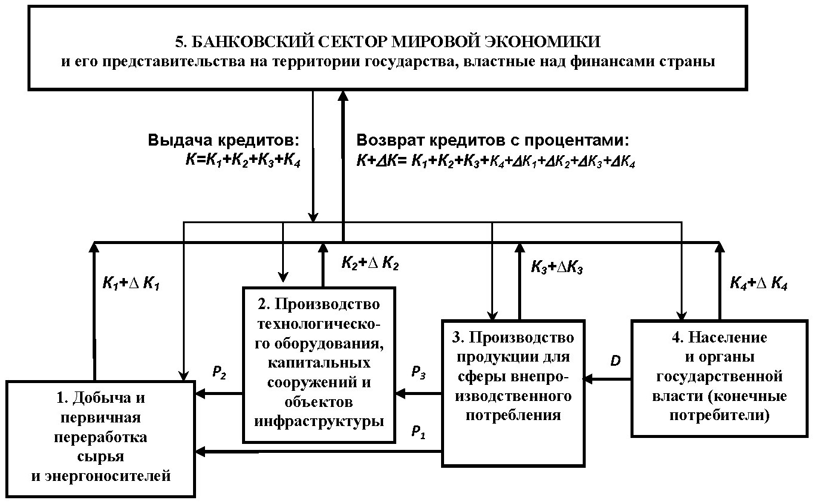\* \* \*

Обратимся к представленной на рис. 7.1-2 укрупнённой схеме финансового обращения, сопровождающего производственное и внепроизводственное потребление продукции, производимой реальным сектором. На ней источники доходов населения и государственной власти не показаны, чтобы не загромождать рисунок, а линиями со стрелками обозначена направленность финансовых потоков:

- выдача (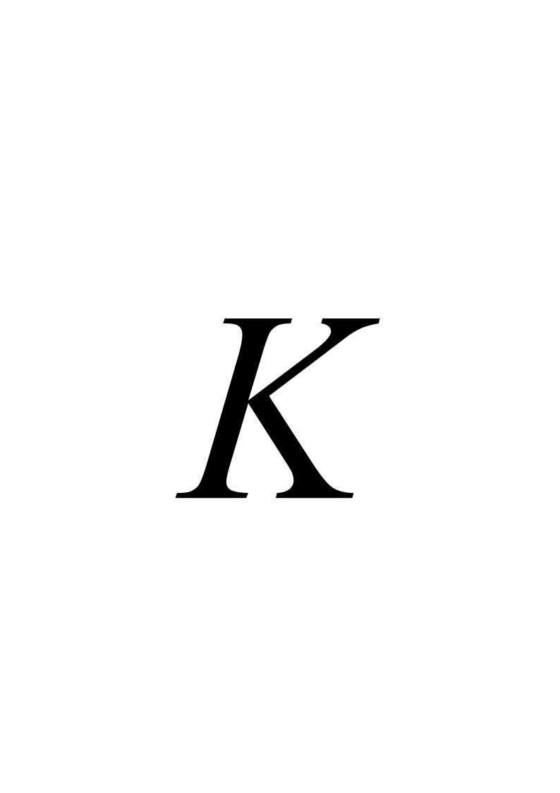) и возврат кредитных ссуд и процентов по ним (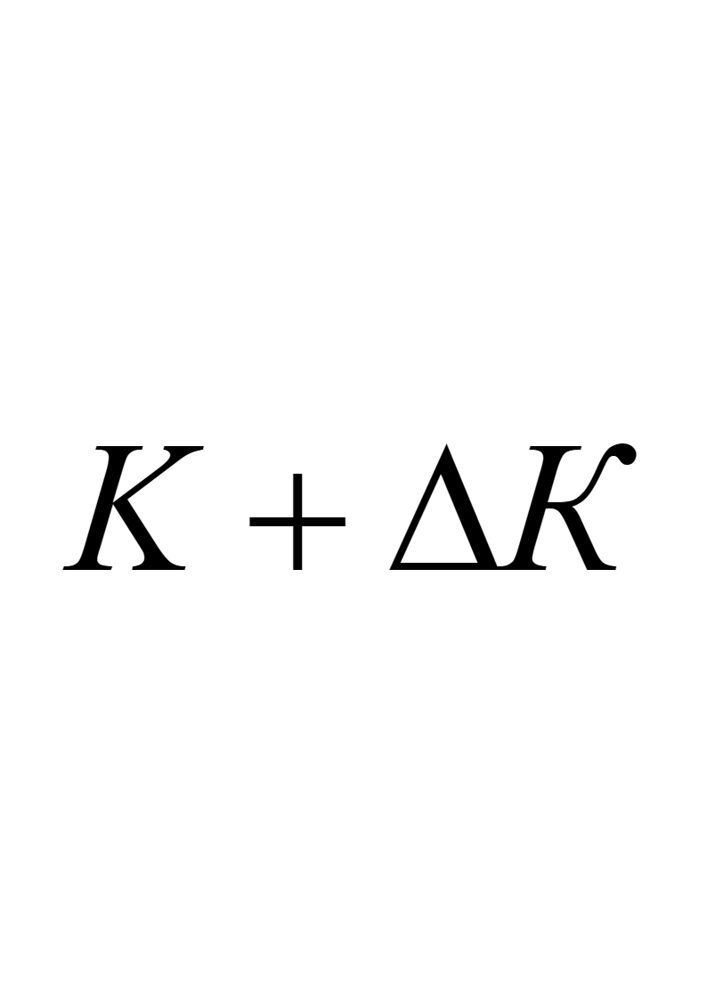) реальным сектором, населением и органами государственной власти (соответственно индексам 1…4);

- переток доходов и накоплений населения в доходы реального сектора (*D*);

- прямые и опосредованные финансовые расходы (*Р —* соответственно индексам 1…3) тех подразделений реального сектора экономики, которые так или иначе соучаствуют в производстве конечной продукции, ради потребления и экспорта которой общество и ведёт хозяйственную деятельность (блок 3). Их доходы формируются за счёт продажи готовой продукции, а расходы, прямые и опосредованные, помимо собственных факторных затрат обусловлены ценами на потребляемые энергоносители, сырьё и промежуточные продукты (включая и средства производства) и объёмами платежей по кредитам, которые всегда относятся на себестоимость производства;

- предполагается, что на интервале времени, характеризуемом схемой, эмиссия средств платежа нулевая.

Анализ денежного обращения, представленного на этой схеме, на основе правил Г.Р. Кирхгофа (1824 — 1887) для *процессов переноса* в сетях показывает, что ссудный процент по кредиту порождает:

- рост номинальных цен (за счёт отнесения процентов на себестоимость продукции);

- потерю некоторой доли покупательной способности вне банковского сектора (за счёт роста уровня цен и оттока платёжеспособности из общества в результате выплаты процентов по кредитам);

- деформацию производственного и потребительского спроса и предложения продукции под воздействием прироста покупательной активности корпорации ростовщиков, в чью собственность необратимо перетекают (вследствие платежей по процентам) финансы общества;

- рост ВВП в исчислении его в текущих ценах, если это допускает эмиссия, хотя такому «росту» ВВП может сопутствовать сокращение объёмов производства в реальном секторе в натуральном учёте продукции и при учёте продукции в неизменных ценах какого-либо более раннего базового периода;

- социальную напряжённость, поскольку как ростовщики, так и их непосредственные должники через воздействие ссудного процента на себестоимость и доходы перекачивают в собственность корпорации кредиторов покупательную способность и тех физических и юридических лиц, которые сами не прибегали к заимствованиям у ростовщической корпорации кредиторов, т.е. ростовщики и заёмщики обворовывают всех прочих.

При этом необходимо отметить, что весомая доля кредитных ресурсов банковского сектора — это накопления вкладчиков банков. Т.е. общество и реальный сектор действительно сами оплачивают ростовщический паразитизм из своих сбережений, как о том и говорил Дж. Стэмп — бывший президент Банка Англии[^11], а доходы по вкладам предприятий и населения это — «откаты», которыми банки как бы расплачиваются с обществом за то, что общество предоставляет банкам право осуществлять финансовое рабовладение в отношении него.

\* \*\

\*

Если же анализировать институт кредита в обезразмеренной по *(S+К)* кредитно-финансовой системе на основе того же рисунка и правил Г.Р. Кирхгофа, то вывод однозначный и неопровержимый: первичным генератором инфляции является ссудный процент по кредиту. В понимании большинства ссудный процент и кредит — это взаимосвязанные явления, ссудный процент якобы — «цена денег». И соответственно такому предубеждению люди полагают, что ссудный процент неизбежное зло, сопутствующее кредиту — двигателю торговли и развития экономики. Поэтому якобы ссудный процент можно отменить только вместе с кредитом, что недопустимо. Однако показанное не означает, что институт кредита должен быть запрещён и искоренён. Сам по себе кредит полезен для сферы производства:

- он позволяет преодолевать «кассовые разрывы», если они возникают;

- он позволяет осуществлять проекты, требующие инвестиций, объёмы которых превосходят объёмы собственных накоплений и текущих нераспределённых доходов.

Однако, воздействие кредита на сферу потребления носит двойственный характер:

- с одной стороны, он позволяет ускорить сбыт уже произведённой продукции в ситуациях, когда покупательная способность общества недостаточна;

- но наряду с этим удовлетворение каких-то потребностей людей за счёт кредита в настоящем — в будущем влечёт за собой затруднения сбыта аналогичной продукции вследствие 1) удовлетворённости потребностей (если это продукция длительного пользования[^12]) и 2) сокращения покупательной способности общества по причине возврата взятых ранее кредитных ссуд.

Соответственно, это означает, что развитие экономики *с целью экономического обеспечения развития общества*[^13] требует построения кредитно-финансовой системы, в которой кредитование носит беспроцентный характер[^14].

Теперь покажем, как *институт кредита со ссудным процентом (ростовщичество как системный фактор)* воздействует на развитие многоотраслевой производственно-потребительской системы государства, т.е. на научно-технический прогресс и внедрение его достижений в жизнь. Для этого обратимся к модели, представленной в упомянутой ранее монографии «Экономика инновационного развития» (от текста настоящей записки она отделена абзацем звёздочек).

\* \* \*

Предположим, что мы намереваемся осуществить *в реальном секторе экономики* долгосрочный проект продолжительностью 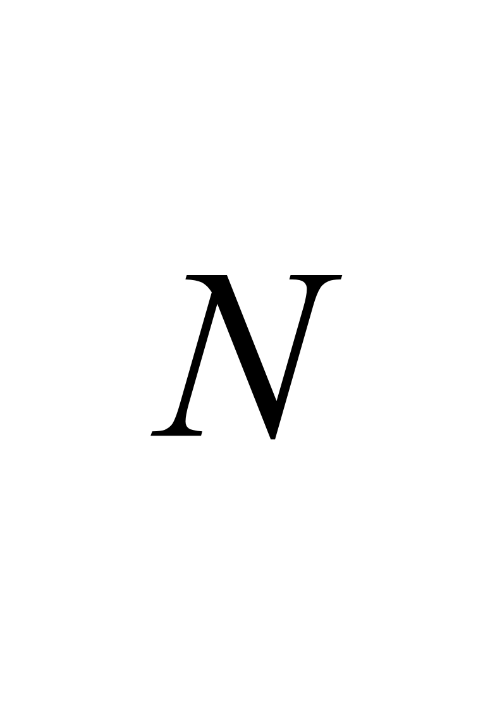 лет, на протяжении которых он будет требовать только инвестиций, а коммерческая эксплуатация проекта может начаться только по завершении всех работ, т.е. в  год от его начала.

Предположим, что проект требует ежегодных инвестиций в объёме — 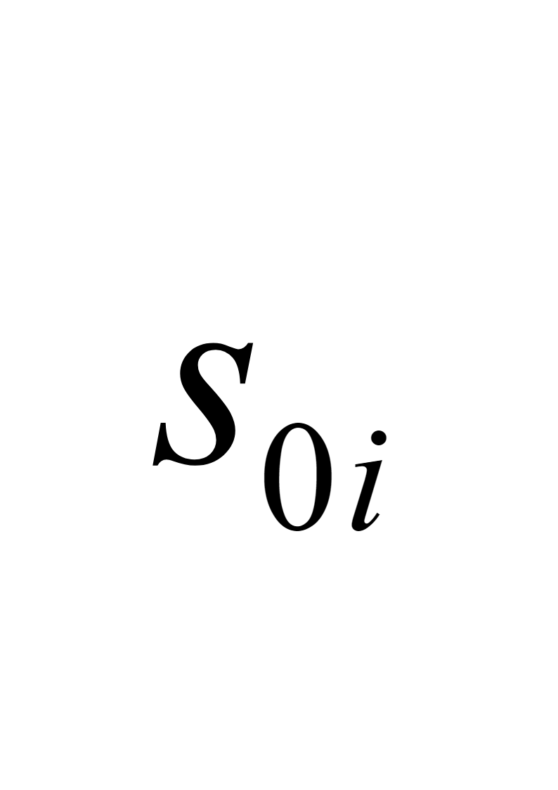 *(*)*,* исчисляемых в ценах конца года, предшествующего первому году осуществления проекта (равно — в ценах начала первого года осуществления проекта).

Предположим, что за годы осуществления проекта инфляция составляет 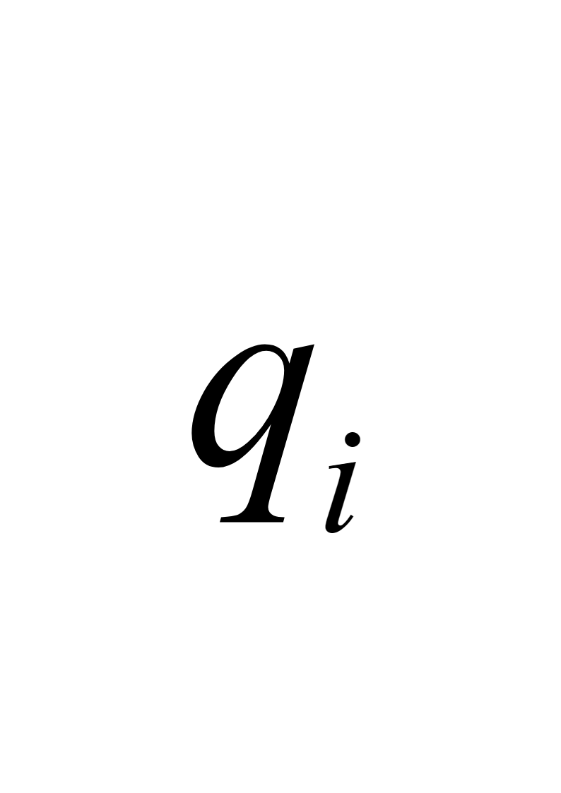* %* в соответствующий год ()*.* Т.е. стоимость инвестиционных продуктов и зарплаты участников проекта к концу текущего года  по отношению к уровню соответствующих цен конца предшествующего года 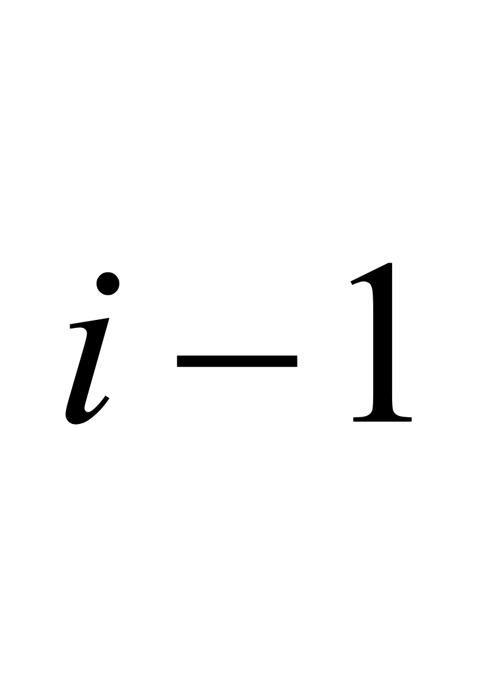 возрастает в 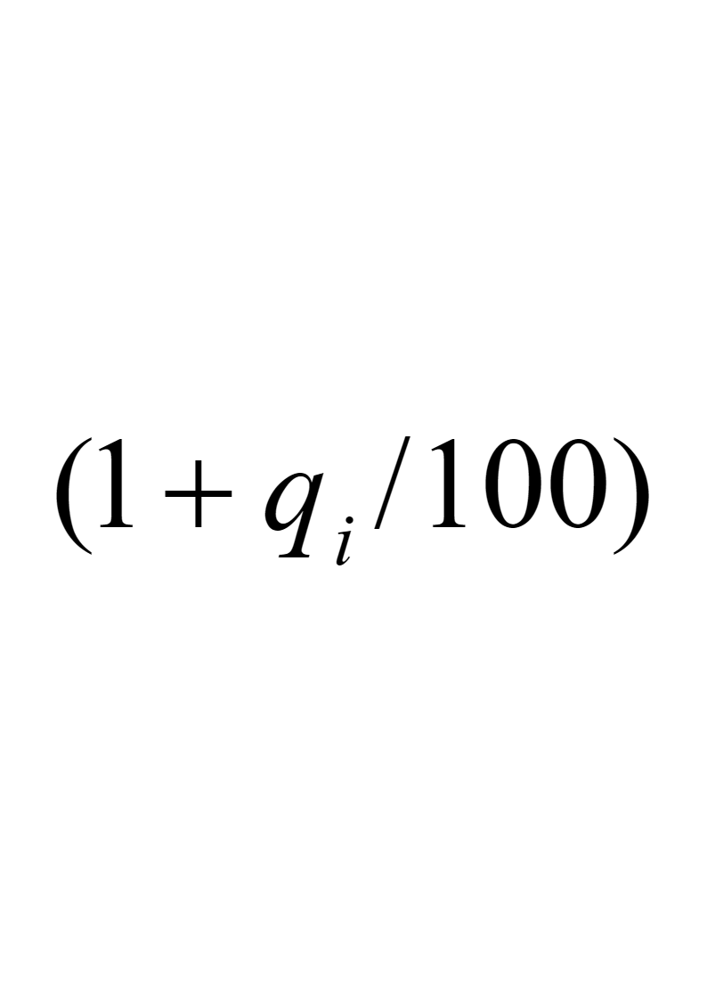 раз. Иначе говоря, выполняется соотношение:

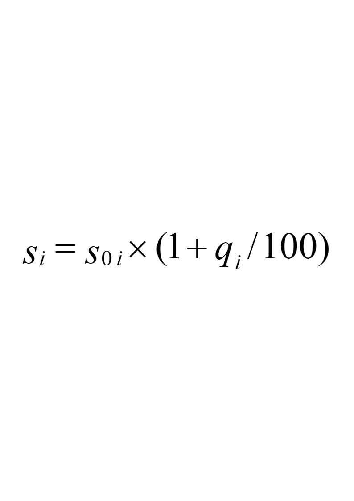

Предположим, что инвестиции в проект не облагаются налогами.

В этом случае необходимый суммарный номинальный *объём инвестиций нетто* в проект составит:

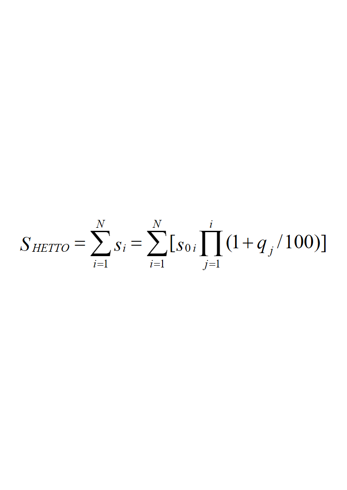 (6.2-1)

Предположим, что проект осуществляется полностью на основе заёмных средств и ставка кредитования в каждый год составляет 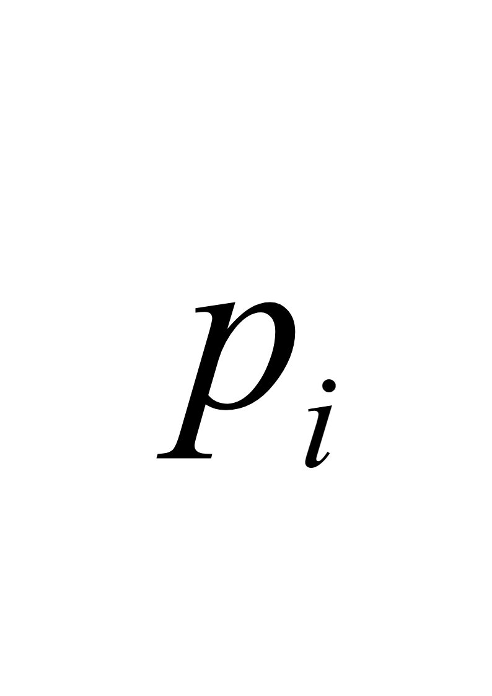*%* годовых, в годы  соответственно.

Поскольку на протяжении всего времени осуществления работ проект не приносит доходов, то это означает, что платежи процентов по кредиту текущего года должны выплачиваться из кредитной ссуды текущего года (в предположении, что у проекта нет иных источников дохода, из которых бы могло осуществляться его финансирование и которые могли бы быть источником платежей процентов по кредиту). Соответственно этому обстоятельству ежегодный объём кредитов, необходимых для осуществления проекта, будет составлять в каждый год следующую величину:

|  |  |

|:---|:--:|

| *«Необходимый объём кредитов в год i» = «Объём инвестиций, приходящихся на очередной год i с учётом инфляции, накопленной к его завершению» + «объём платежей в год i процентов за кредиты, взятые в годы, предшествующие i» + «объём платежей процентов по кредиту, взятому на очередной год i».* | (6.2-2) |

Себестоимость проекта к моменту завершения работ и началу его коммерческой эксплуатации в этом случае будет равна сумме всех взятых инвестиционных кредитов:

<table>

<colgroup>

<col style="width: 65%" />

<col style="width: 34%" />

</colgroup>

<tbody>

<tr>

<td><em>«Себестоимость проекта к началу его эксплуатации» =</em> 

$\sum_{i = 1}^{N}{}$<em>«Необходимый объём кредитов в год i».</em></td>

<td style="text-align: left;">(6.2-3)</td>

</tr>

</tbody>

</table>

С 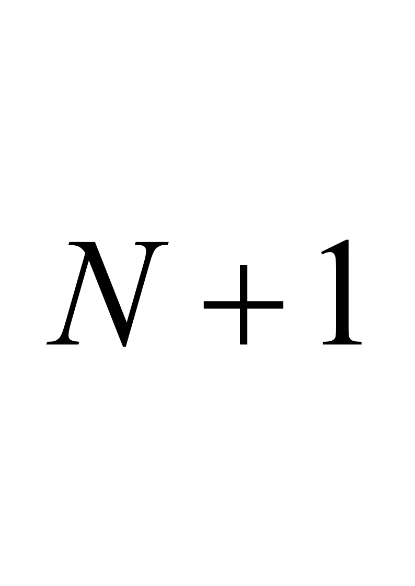 года начнётся коммерческая эксплуатация завершённого проекта. Ожидаемые сроки его окупаемости можно оценить, исходя из уравнения:

> *«Себестоимость проекта к моменту начала его эксплуатации» + («ежегодные платежи процентов по всем ранее взятым кредитам в течение срока окупаемости» + «ежегодные эксплуатационные расходы») × «срок окупаемости» = «годовой доход от коммерческой эксплуатации проекта» × «срок окупаемости».*

>

> *«Срок окупаемости» = «Себестоимость проекта к моменту начала его эксплуатации» / («годовой доход от коммерческой эксплуатации проекта» – «ежегодные платежи процентов по всем ранее взятым кредитам в течение срока окупаемости» – «ежегодные эксплуатационные расходы»).*

При этом доходы от коммерческой эксплуатации и эксплуатационные расходы должны быть оценены с учётом инфляции, а также, возможно, — и с учётом изменений конъюнктуры рынка, под воздействием которого изменятся прейскуранты на потребляемую в процессе деятельности продукцию, и на продукцию, производимую в проекте.

Полная себестоимость осуществления проекта определится соотношением:

> *«Полная себестоимость проекта» = «себестоимость проекта к началу его эксплуатации» + «сумма платежей процентов по инвестиционным кредитам, выплаченная в течение срока окупаемости».*

На основе этой модели сопоставим друг с другом три проекта продолжительностью в 2 года, 5 и 10 лет. В целях упрощения вычислений предположим, что:

- инфляция на протяжении всего срока осуществления проекта неизменна и составляет 5 % в год, т.е. * =* 5 %

- ставка по кредиту (ссудный процент) на протяжении всего срока осуществления проекта тоже неизменна и составляет 10 % годовых, т.е.  *=* 10 %.

- для осуществления каждого из проектов при отсутствии инфляции необходимы ежегодные инвестиции в объёме 1 у.е.

Ежегодный объём инвестиций, начиная с 1‑го года, с поправкой на ожидаемое к концу года накопление инфляции в этом случае определяется формулой:

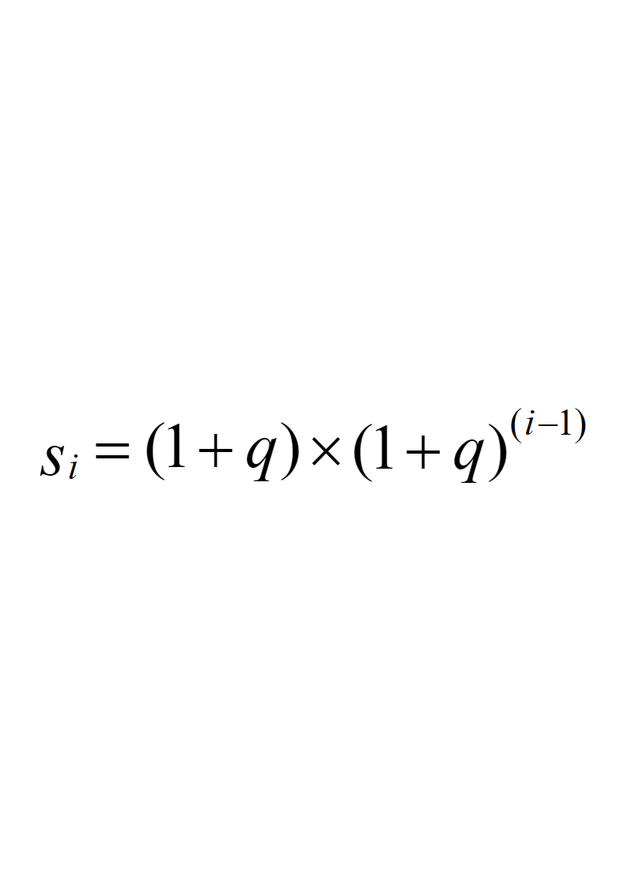 (6.2-4)

Необходимый объём кредитов в год 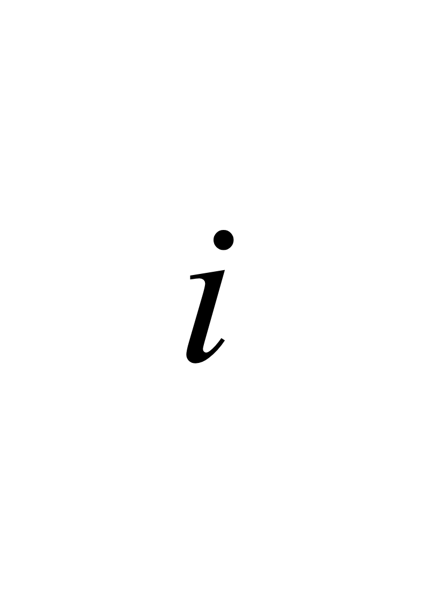*,* из которых финансируется проект, определяется формулой 6.2-6, полученной на основе уравнения 6.2-5, структурно аналогичного соотношению 6.2-2, выраженному в лексике:

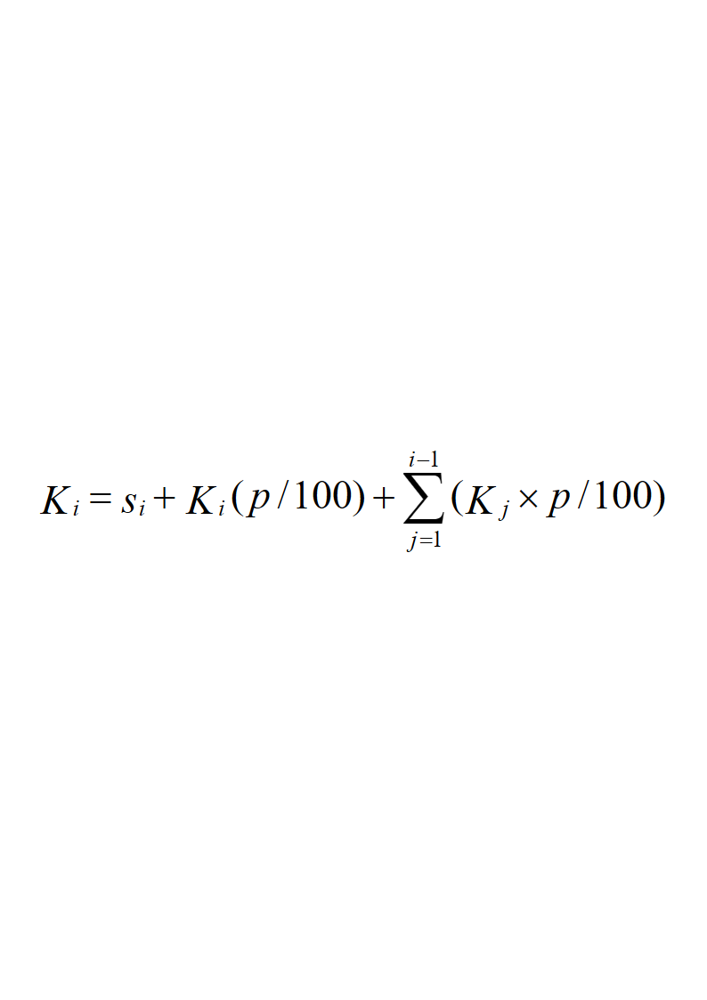 (6.2-5)

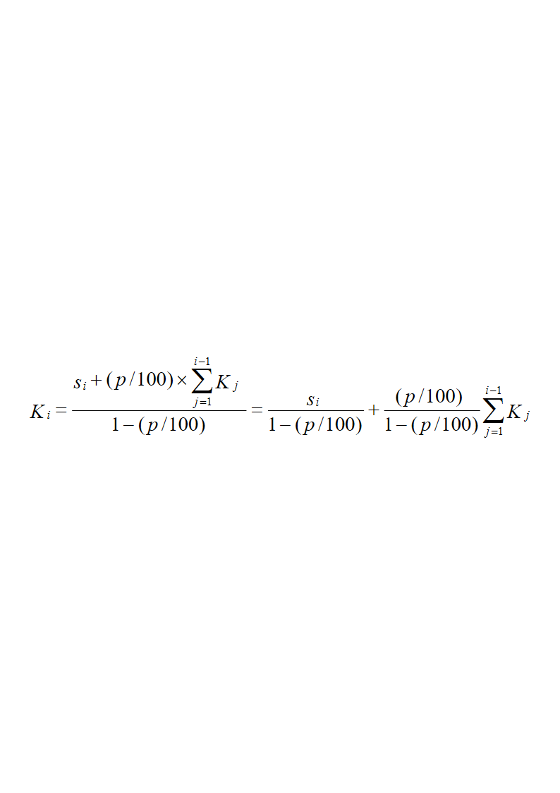 (6.2-6)

При сделанных предположениях процесс инвестирования и кредитования проектов будет описываться таблицей 6.2-1.

**Таблица 6.2-1.\

Инвестирование и кредитование** (*q=5 %, p=10 %*)

| Годы | 1 | 2 | 3 | 4 | 5 | 6 | 7 | 8 | 9 | 10 |

|----|:--:|:--:|:--:|:--:|:--:|:--:|:--:|:--:|:--:|:--:|

| Ежегодный необходимый объём инвестиций, 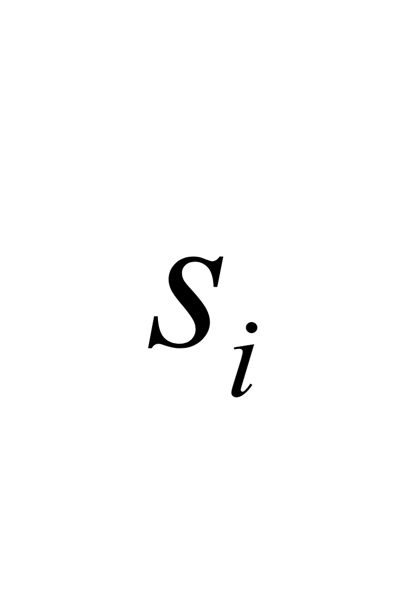*,* у.е. | 1,05 | 1,103 | 1,158 | 1,216 | 1,276 | 1,34 | 1,407 | 1,477 | 1,551 | 1,629 |

| Ежегодный необходимый объём кредитования, 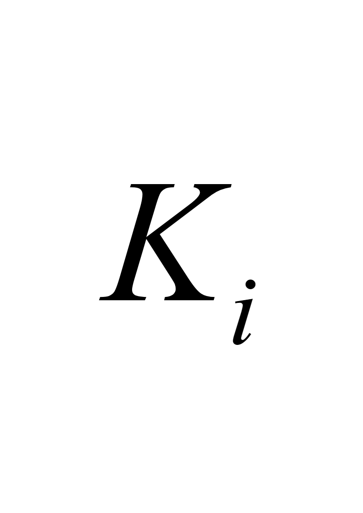*,* у.е. | 1,167 | 1,355 | 1,566 | 1,805 | 2,073 | 2,374 | 2,712 | 3,091 | 3,517 | 3,995 |

Итоговые показатели осуществления проектов представлены в таблице 6.2‑2.

**Таблица 6.2-2.\

Сопоставление результатов проектов** (*q=5 %, p=10 %*)

<table style="width:100%;">

<colgroup>

<col style="width: 16%" />

<col style="width: 16%" />

<col style="width: 17%" />

<col style="width: 14%" />

<col style="width: 17%" />

<col style="width: 17%" />

</colgroup>

<tbody>

<tr>

<td style="text-align: center;">Продолжительность осуществления проекта (годы)</td>

<td style="text-align: center;">Себестоимость проекта  при отсутствии инфляции и беспроцентном кредитовании, у.е.</td>

<td style="text-align: center;">Себестоимость проекта 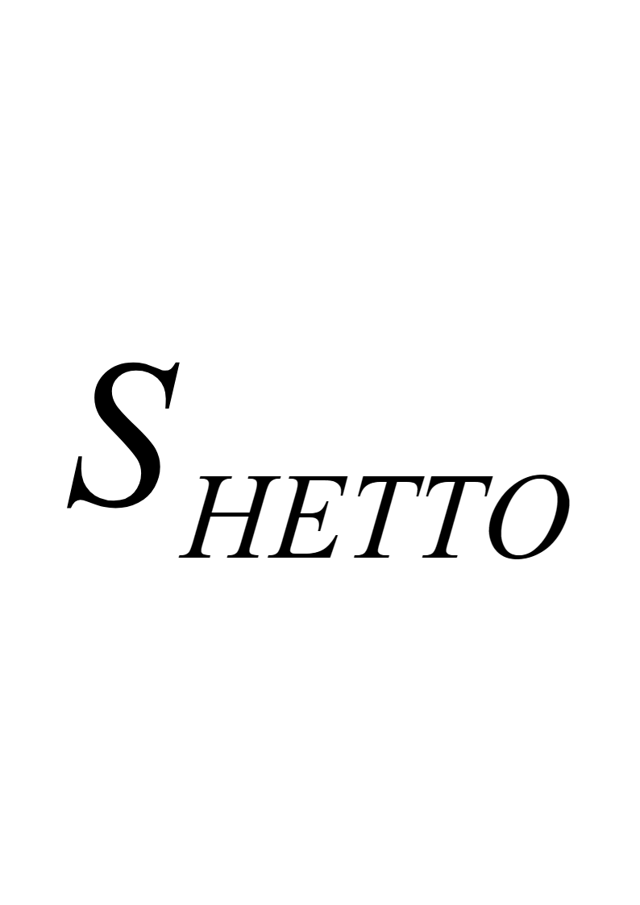 при 5 %‑ной инфляции и беспроцентном кредитовании, у.е.</td>

<td style="text-align: center;">Удорожание проекта за счёт инфляции, %</td>

<td style="text-align: center;">Себестоимость проекта к моменту начала его эксплуатации при 5 %-ной инфляции и кредитовании под 10 % годовых, у.е.</td>

<td style="text-align: center;">Удорожание проекта по отношению к 

безынфляционному варианту и беспроцентному кредитованию, разы</td>

</tr>

<tr>

<td style="text-align: center;">2</td>

<td style="text-align: center;">2</td>

<td style="text-align: center;">2,153</td>

<td style="text-align: center;">+7,7</td>

<td style="text-align: center;">2,521</td>

<td style="text-align: center;">1,261</td>

</tr>

<tr>

<td style="text-align: center;">5</td>

<td style="text-align: center;">5</td>

<td style="text-align: center;">5,802</td>

<td style="text-align: center;">+16</td>

<td style="text-align: center;">7,965</td>

<td style="text-align: center;">1,593</td>

</tr>

<tr>

<td style="text-align: center;">10</td>

<td style="text-align: center;">10</td>

<td style="text-align: center;">13,208</td>

<td style="text-align: center;">+32</td>

<td style="text-align: center;">23,655</td>

<td style="text-align: center;">2,365</td>

</tr>

</tbody>

</table>

Ниже в таблицах 6.2-3 и 6.2-4 представлены параметры процессов осуществления тех же проектов при инфляции * =* 7 % и ставке ссудного процента  *=* 15 %.

**Таблица 6.2-3.\

Инвестирование и кредитование** (*q=7 %, p=15 %*)

|  |  |  |  |  |  |  |  |  |  |  |

|:--:|:--:|:--:|:--:|:--:|:--:|:--:|:--:|:--:|:--:|:--:|

| Годы | 1 | 2 | 3 | 4 | 5 | 6 | 7 | 8 | 9 | 10 |

| Ежегодный необходимый объём инвестиций, *,* у.е. | 1,07 | 1,145 | 1,225 | 1,311 | 1,403 | 1,501 | 1,606 | 1,718 | 1,838 | 1,967 |

| Ежегодный необходимый объём кредитования, *,* у.е. | 1,258 | 1,568 | 1,938 | 2,380 | 2,907 | 3,534 | 4,280 | 5,165 | 6,215 | 7,460 |

**Таблица 6.2-4.\

Сопоставление результатов проектов** (*q=7 %, p=15 %*)

<table>

<colgroup>

<col style="width: 16%" />

<col style="width: 16%" />

<col style="width: 17%" />

<col style="width: 14%" />

<col style="width: 17%" />

<col style="width: 17%" />

</colgroup>

<tbody>

<tr>

<td style="text-align: center;">Продолжительность осуществления проекта (годы)</td>

<td style="text-align: center;">Себестоимость проекта  при отсутствии инфляции и беспроцентном кредитовании, у.е.</td>

<td style="text-align: center;">Себестоимость проекта  при 7 %‑ной инфляции и беспроцентном кредитовании, у.е.</td>

<td style="text-align: center;">Удорожание проекта за счёт инфляции, %</td>

<td style="text-align: center;">Себестоимость проекта к моменту начала его эксплуатации при 7 %-ной инфляции и кредитовании под 15 % годовых, у.е.</td>

<td style="text-align: center;">Удорожание проекта по отношению к 

безынфляционному варианту и беспроцентному кредитованию, разы</td>

</tr>

<tr>

<td style="text-align: center;">2</td>

<td style="text-align: center;">2</td>

<td style="text-align: center;">2,215</td>

<td style="text-align: center;">+10,75</td>

<td style="text-align: center;">2,826</td>

<td style="text-align: center;">1,413</td>

</tr>

<tr>

<td style="text-align: center;">5</td>

<td style="text-align: center;">5</td>

<td style="text-align: center;">6,154</td>

<td style="text-align: center;">+23,08</td>

<td style="text-align: center;">10,051</td>

<td style="text-align: center;">2,010</td>

</tr>

<tr>

<td style="text-align: center;">10</td>

<td style="text-align: center;">10</td>

<td style="text-align: center;">14,784</td>

<td style="text-align: center;">+47,84</td>

<td style="text-align: center;">36,705</td>

<td style="text-align: center;">3,671</td>

</tr>

</tbody>

</table>

Полная себестоимость проектов будет выше, чем представленная в таблицах 6.2-2 и 6.2-4, поскольку в неё должны быть включены все платежи по погашению задолженности по инвестиционным кредитам, взятым в годы *,* осуществляемые в период срока окупаемости. Однако мы не будем заниматься её оценкой, поскольку для «финансового климата» модели нет характерных сроков окупаемости: проект к моменту его завершения может быть настолько обременён заведомо неоплатными долгами по кредитам, что не окупится никогда; а если он принадлежит к исключительно высокодоходной сфере, то окупится в течение года. Поэтому оценка полной себестоимости проекта, осуществляемого на основе исключительно инвестиционных кредитов — вопрос конкретики «финансового климата». (…)

… как можно понять из таблицы 6.2-3 (её последний столбец, вторая строка), *если объём кредитования в 10‑й год в 7,46 раз превосходит базовый объём инвестиций для случая нулевой инфляции и беспроцентного кредитования,* то нарастание потребности в кредитах в таких темпах при массовом инновационном развитии отраслей сделает инновационное развитие невозможным вследствие отсутствия в банковской системе страны соответствующих кредитных ресурсов, тем более при политике ограничения денежной массы центробанком.

\* \*\

\*

На основе этой же модели покажем процесс инвестирования и кредитования проектов при инфляции 5 % и ставке по кредитам 25 % годовых.

**Таблица 1 (либо в нумерации цитированной монографии — 6.2-5).\

Инвестирование и кредитование** (*q=5 %, p=25 %*)

| Годы | 1 | 2 | 3 | 4 | 5 | 6 | 7 | 8 | 9 | 10 |

|----|:--:|:--:|:--:|:--:|:--:|:--:|:--:|:--:|:--:|:--:|

| Ежегодный необходимый объём инвестиций, *,* у.е. | 1,05 | 1,103 | 1,158 | 1,216 | 1,276 | 1,34 | 1,407 | 1,477 | 1,551 | 1,629 |

| Ежегодный необходимый объём кредитования, *,* у.е. | 1,4 | 1,937 | 2,656 | 3,619 | 4,905 | 6,626 | 8,924 | 11,992 | 16,088 | 21,554 |

Итоговые показатели осуществления проектов представлены в таблице 2 (либо в нумерации цитированной монографии — 6.2‑6).

**Таблица 2 (либо в нумерации цитированной монографии — 6.2-6).\

Сопоставление результатов проектов** (*q=5 %, p=25 %*)

<table>

<colgroup>

<col style="width: 16%" />

<col style="width: 16%" />

<col style="width: 17%" />

<col style="width: 14%" />

<col style="width: 17%" />

<col style="width: 17%" />

</colgroup>

<tbody>

<tr>

<td style="text-align: center;">Продолжительность осуществления проекта (годы)</td>

<td style="text-align: center;">Себестоимость проекта  при отсутствии инфляции и беспроцентном кредитовании, у.е.</td>

<td style="text-align: center;">Себестоимость проекта  при 5 %‑ной инфляции и беспроцентном кредитовании, у.е.</td>

<td style="text-align: center;">Удорожание проекта за счёт инфляции, %</td>

<td style="text-align: center;">Себестоимость проекта к моменту начала его эксплуатации при 5 %-ной инфляции и кредитовании под 25 % годовых, у.е.</td>

<td style="text-align: center;">Удорожание проекта по отношению к 

безынфляционному варианту и беспроцентному кредитованию, разы</td>

</tr>

<tr>

<td style="text-align: center;">2</td>

<td style="text-align: center;">2</td>

<td style="text-align: center;">2,153</td>

<td style="text-align: center;">+7,7</td>

<td style="text-align: center;">3,337</td>

<td style="text-align: center;">1,669</td>

</tr>

<tr>

<td style="text-align: center;">5</td>

<td style="text-align: center;">5</td>

<td style="text-align: center;">5,802</td>

<td style="text-align: center;">+16</td>

<td style="text-align: center;">14,517</td>

<td style="text-align: center;">2,903</td>

</tr>

<tr>

<td style="text-align: center;">10</td>

<td style="text-align: center;">10</td>

<td style="text-align: center;">13,208</td>

<td style="text-align: center;">+32</td>

<td style="text-align: center;">79,701</td>

<td style="text-align: center;">7,97</td>

</tr>

</tbody>

</table>

Ещё раз повторим, что полная себестоимость проектов будет выше, чем представленная в таблицах 6.2-2, 6.2-4 и 6.2-6, поскольку в неё должны быть включены все платежи по погашению задолженности по инвестиционным кредитам, взятым в годы *,* осуществляемые в период срока окупаемости.

Но реально в многоотраслевой производственно-потребительской системе государства осуществляется не один проект на основе кредитных инвестиций, а некоторое множество проектов в разных отраслях. Продукция, производимая в результате успешного завершения этих проектов, если она не принадлежит к категории конечной продукции, потребляется предприятиями других отраслей, что описывается балансовыми моделями продуктообмена и финансового обмена, и при этом предприятия других отраслей относят на себестоимость своей продукции стоимость покупаемой ими продукции, в цену которой заложены расходы по обслуживанию и погашению инвестиционных кредитов (о балансовых моделях речь пойдёт далее). Вследствие этого себестоимость производства и цены растут во всех отраслях, включая и те, в которых кредитов никто не брал.

[^15] Поэтому возникает вопрос: Если Э.С. Набиуллина, выступая в Думе 30.10.2024, *«очень убедительно показала, что процент по кредиту занимает не самое большое место в цене товаров, которые потом предъявляются людям для продаж»,* то как она сможет убедительно опровергнуть представленное выше в таблицах 6.2-1 — 6.2-6?

Из представленного в этих таблицах однозначно и неопровержимо следует, что если даже имеются самые передовые и эффективные в аспекте энергоёмкости и материалоёмкости конструкторско-проектные и организационно-технологические решения, то в условиях такого «финансового климата», непрестанно создаваемого центробанком на протяжении всего времени действия конституции 1993 г., **даже при ставке рефинансирования в 10 % годовых научно-технический прогресс в России невозможен**: себестоимость продукции будет такой, что на внутреннем рынке России она не выдержит конкуренции с импортной, а на внешние рынки её будет не протолкнуть по той же причине. Как следствие многократно обещаемые модернизации будут срываться, импортозамещение (обеспечение импортонеуязвимости России) не состоится, а экономика страны будет и далее необратимо деградировать. Поскольку жизнь и развитие цивилизованного общества нуждаются в экономическом обеспечении, то вымирание и культурная деградация общества в преемственности поколений становятся неизбежными. Именно это мы и видим на протяжении всего времени после отказа от принципа плановости в экономической жизни страны[^16].

Поэтому в связи с изложенным невольно вспоминается «чекистский анекдот» рассказанный В.В. Путиным на публику ещё в 2011 г.:

*[В оригинальном издании здесь расположен рисунок/схема. Иллюстрация не включена в данный выпуск: ожидает визуальной и правовой проверки. Файл источника: image27.jpeg]* «Приходит на Лубянку шпион и говорит: «Я хочу сдаться». «Вы американский шпион?» — спросили у него. «Да», — отвечает он. «Тогда вам в пятый кабинет». Пошел в пятый кабинет. «У вас оружие есть?» — спрашивают у него. «Есть». «Тогда вам в седьмой кабинет». Он пошел в седьмой кабинет. «А средства спецсвязи у вас есть?» «Есть», — он отвечает. Ему говорят: «Тогда идите в двадцатый кабинет». Приходит он в двадцатый. У него там спрашивают: «А задание у вас есть?» Шпион говорит: «Есть». ««Так идите и выполняйте», — говорят ему. — Чего вы людям голову морочите и мешаете работать»[^17].

Однако, только ЦРУ точно знает, была ли Э.С. Набиуллина завербована, когда училась в США, либо просто некритично восприняла всю ту либерально-рыночную чушь и заведомую ложь, что ей поднесли на лекциях и в учебниках под видом передового научного знания: *наилучшая вербовка — когда завербованный даже не подозревает о том, что его успешно завербовали*. Это значения не имеет. Значение имеет то, что пока такие, как она работают на вершинах власти в «экономическом блоке», у России нет возможностей развития.

Но не надо обольщаться и полагать, что, если с должности главы ЦБ убрать Э.С. Набиуллину и поставить во главе ЦБ некоего «настоящего патриота», в экономике страны всё наконец-таки станет хорошо. — Не станет потому, что развитие на основе либерально-рыночной модели, обслуживающего её законодательства[^18] и подготовки кадров на основе управленчески несостоятельного научно-методологического обеспечения государственного управления и управления в экономике невозможно.

*[В оригинальном издании здесь расположен рисунок/схема. Иллюстрация не включена в данный выпуск: ожидает визуальной и правовой проверки. Файл источника: image28.emf]*Картинка, представленная слева, есть почти в каждом учебнике экономической «теории». Обычно её трактуют так:

«Закон спроса отражает зависимость между ценой товара и спросом на него. Применительно к рынку чистой конкуренции данный закон трактует, что при неизменности всех прочих условий снижение цены товара приводит к возрастанию объёма спроса и наоборот. Таким образом, существует отрицательная обратная зависимость между ценой товара и объёмом спроса на него, которую называют кривой спроса»[^19].

Но есть запретный вопрос, который никогда не обсуждается. Предположим, что:

Q1 — объём блага, необходимый для развития общества.

C1 — цена блага: она ниже порога рентабельности производства блага в объёме Q1.

Q2 — объём блага, заведомо недостаточный для развития общества.

C2 — цена блага, обеспечивающая рентабельность производства блага в объёме Q2.

ЧТО ДЕЛАТЬ? — При приверженности государственной власти либерально-рыночной экономической модели развитие страны становится невозможным, т.е. СУВЕРЕНИТЕТ НЕОСУЩЕСТВИМ, что ОПРАВДЫВАЕТСЯ *нескончаемыми разговорами о воздействии кризисов, санкций, об неких особенностях национальной экономики и т.п.*

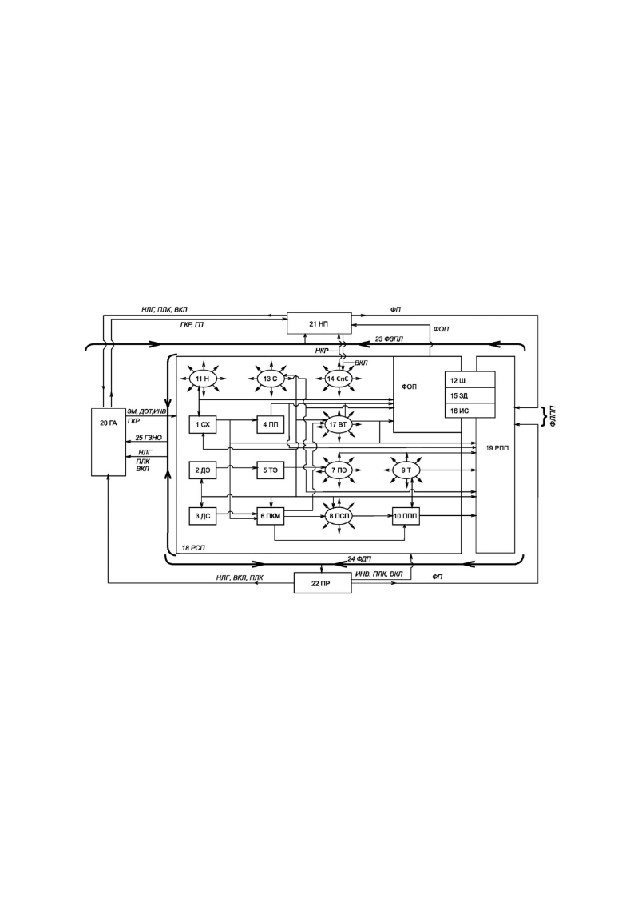Ответ на этот вопрос состоит в том, что необходимо отказаться от либерально-рыночной модели и перейти к иной, учитывающей все аспекты финансово-экономической реальности. Слева представлена схема межотраслевого продуктообмена и финансового обращения, сопровождающего продуктообмен. На ней номерами и мнемоническими сочетаниями букв показаны различные отрасли в составе многоотраслевой производственно-потребительской системы государства. В частности:

> 1 СХ — сельское хозяйство, охота, рыболовство;

>

> 2 ДЭ — добыча энергоносителей;

>

> 3 ДС — добыча сырья;

>

> 4 ПП — пищевая промышленность;

>

> 5 ТЭ — технологическая подготовка энергоносителей к использованию по назначению;

>

> 6 ПКМ — производство конструкционных материалов и технологических ингредиентов для отраслей народного хозяйства;

>

> 7 ПЭ — производство энергии;

>

> 8 ПСП — производство средств производства;

>

> 9 Т — транспорт;

>

> 10 ППП — производство предметов потребления, жилья и услуг для непосредственного удовлетворения потребностей населения;

>

> 11 Н — наука как общественный институт.

>

> Прочие отрасли и сферы деятельности (обстоятельно эта схема поясняется в упомянутой ранее монографии «Экономика инновационного развития»).

Ни одно предприятие, ни одна отрасль сами по себе вне ЭТОЙ СИСТЕМЫ производственно-потребительского продуктообмена неработоспособны, поэтому ценностью для общества обладает только вся многоотраслевая производственно-потребительская система в целом.

Эта схема представляет технологические и организационные взаимосвязи. Если её некоторые значимые технологические блоки оказываются за рубежом, то утрата государственного суверенитета неизбежна.

Продуктообмен связан с денежным обращением через прейскурант.

Каждая отрасль, каждое предприятие имеют:

- свой «входной прейскурант», определяющий их расходы,

- и свой «выходной прейскурант», определяющий их доходы, — *соответственно номенклатуре и объёмам закупаемой и продаваемой ими продукции.*

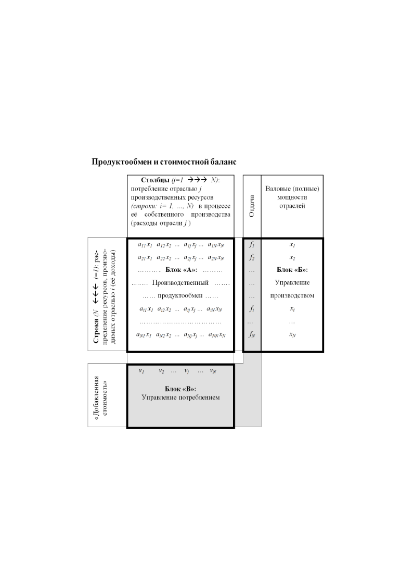Эти процессы описываются балансовыми моделями, суть которых можно понять из таблицы, представленной слева.

При этом расходы и доходы отраслей (предприятий) пропорциональны их *собственному валовому выпуску продукции (в таблице слева в блоках «А» и «Б» это величины, обозначенные как* «*x» с индексами, соответствующими нумерации отраслей, коэффициенты пропорциональности — обозначены как* «*а» с индексами отрасли поставщика и отрасли потребителя; они обусловлены технологиями)*.

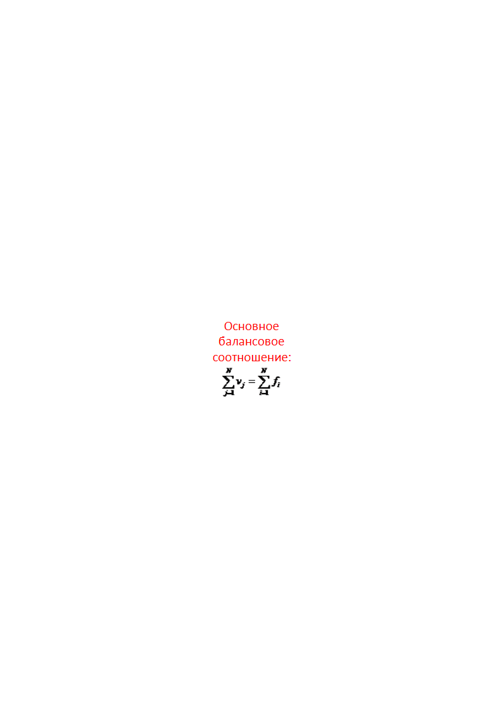В блоке «А»:

- столбцы показывают структуру расходов соответствующей отрасли в ходе закупки ею продукции других отраслей для нужд собственного производства;

- строки показывают структуру её доходов в ходе продажи производимой ею продукции.

Блок «В» — факторные затраты[^20] (иначе именуемые «добавленная стоимость»), и они же — источник финансирования потребления конечной продукции (отсюда проистекает *основное балансовое соотношение (стоимость производимого конечного продукта равна совокупным факторным затратам);* в блоке «Б» конечная продукция — это величина, обозначенная как *f* с индексами, — всё то, ради потребления чего людьми и государством ведётся производство).

Кредитно-финансовая система — инструмент сборки производственно-потребительской системы государства из множества предприятий разных отраслей и регионов (участников рынка). И вопрос в том, в чьей она власти? — Вариантов ответа на него два:

- либо она во власти транснациональной мафии ростовщиков, вследствие чего государства, допускающие кредитование под процент, сами лишают себя экономико-финансового суверенитета;

- либо она во власти реально суверенного государства, которое должно работать на развитие глобальной цивилизации.

Средства обеспечения сборки и управления макроуровня:

1.  План счетов бухгалтерского учёта, задающий составляющие факторных затрат (структуру строки ***v*** ), которым должна соответствовать структура конечного продукта (*f **—*** колонка «Отдача»), чтобы выполнялось основное балансовое соотношение как в целом, так и по отношению к каждому из фондов, формируемых на основе факторных затрат (фонд зарплат, пенсий и других доходов граждан, ориентированный на потребление, госбюджетные фонды, ориентированные на финансирование разного рода государственных программ и т.п.).

2.  Средство управления порогами рентабельности производства в отраслях и регионах, обеспечивающее производство и сбыт в политически и общественно необходимых объёмах вне зависимости от динамики цен — это алгоритмика распределения во многоотраслевой производственно-потребительской системе государственных и корпоративных:

- налогов и налоговых льгот;

- дотаций производителям необходимой продукции;

- субсидий потребителям продукции, производство и потребление которой необходимо для развития общества;

- кредитов и условий кредитования.

Весь этот инструментарий (а также систему стандартизации и сертификации продукции и услуг) необходимо РЕГУЛЯРНО настраивать на ГАРАНТИРОВАННОЕ обеспечение задач развития общества и прочих политических задач государства (глобальнополитических, внешнеполитических, внутриполитических).

Для этого необходимо решать задачи макроэкономического управления.

1.  Целеполагание развития экономики под задачи экономического обеспечения глобальной, внешней и внутренней политики РЕАЛЬНО (а не декларативно) СУВЕРЕННОГО государства (этим должен заниматься Госплан на основе жизненно состоятельного научно-методологического обеспечения его работы, но «диктатура недоучек»[^21], под властью которой живёт Россия, в 2022 году отвергла предложение КПРФ возродить Госплан).

2.  В ходе инновационного развития экономики и неравномерного снижения цен по мере удовлетворения потребностей общества — обеспечивать финансовую устойчивость отраслей посредством государственной политики распределения налогов, разного рода льгот, дотаций производителям необходимой продукции, субсидий потребителям продукции. В этом состоит ответ на вопрос, что делать, если Q1 — объём блага, необходимый для развития общества, а рыночная цена C1 ниже порога рентабельности производства блага в объёме Q1.

*[В оригинальном издании здесь расположен рисунок/схема. Иллюстрация не включена в данный выпуск: ожидает визуальной и правовой проверки. Файл источника: image32.jpeg]* *[В оригинальном издании здесь расположен рисунок/схема. Иллюстрация не включена в данный выпуск: ожидает визуальной и правовой проверки. Файл источника: image33.jpeg]*

3.  Обеспечивать соблюдение основного балансового соотношения посредством соотнесения эмиссионной политики, политики распределения доходов с реальными возможностями производства. Для этого задавать компоненты колонки «Отдача» в соответствии с потребностями общественного развития (демография, здравоохранение, образование — равно подготовка и переподготовка кадров) и экономического обеспечения других задач политики государства.

4.  Обеспечивать импортонеуязвимость производственно-потребительской системы государства как экономическую основу полноты суверенитета путём локализации всех значимых технологических блоков системы на собственной территории, для чего необходима соответствующая инвестиционная политика и инвестиционный климат (соответственно инвестиционная составляющая должна закладываться в структуру факторных затрат («добавленной стоимости») в блоке «В» и в структуру колонки «Отдача» блока «Б».

5.  *[В оригинальном издании здесь расположен рисунок/схема. Иллюстрация не включена в данный выпуск: ожидает визуальной и правовой проверки. Файл источника: image34.jpeg]*Эмиссионная политика и кредитная политика должны исключать быстрое изменение величины *S+К* (о ней речь шла ранее), поскольку это вызывает диспропорции в соотношении оборотных средств отраслей и их *производственных мощностей (в натуральном учёте продукции),* что в свою очередь может влечь за собой распад хозяйственных связей и крах многоотраслевой производственно-потребительской системы государства[^22], если эти диспропорции будут достаточно велики*.* Во избежание такого рода неприятностей контрольным параметром эмиссионной и кредитной политики должен стать энергетический стандарт обеспеченности платёжной единицы, представляющий собой отношение:* (S+К)/(Количество энергии, потребляемой многоотраслевой производственно-потребительской системой).* Энергетический стандарт — финансовое выражение общефизического закона сохранения энергии, действие которого распространяется и на экономику и не может быть отменено ни законодателями, ни указами глав государств.* *

Полномочия и взаимосвязи органов государственной власти и всех субъектов, действующих на всех рынках, законодательно должны быть приведены в соответствие необходимости решения этих задач.

Т.е. как гласил анекдот советской эпохи про сантехника, которого записали в диссиденты и осудили за антисоветскую пропаганду, «тут всю систему надо менять…»

Внутренний Предиктор СССР\

28 октября — 4 ноября 2024 г.\

Исправления 07.11.2024 г.

**Добавление в связи с выступлением Э.С. Набиуллиной в Думе 19.11.2024 г.**

«Мнение, что рост ключевой ставки Центробанка разгоняет инфляцию в России, это глубокое заблуждение: отношение процентных расходов к себестоимости продукции последние пять лет в среднем не превышало 5 %, заявила глава ЦБ Эльвира Набиуллина.

"Не могу не сказать о распространенном мнении, что рост ключевой ставки только разгоняет рост цен, потому что провоцирует рост расходов по кредитам. Это глубокое заблуждение", — сказала она, выступая в Госдуме»[^23].

*[В оригинальном издании здесь расположен рисунок/схема. Иллюстрация не включена в данный выпуск: ожидает визуальной и правовой проверки. Файл источника: image35.jpeg]*Этому предшествует заголовок: «Набиуллина опровергла мнение, что рост ключевой ставки разгоняет инфляцию». Интересно узнать: как именно она опровергла это мнение научно состоятельным образом? — Смогла отменить или обойти правила Г.Р. Кирхгофа, представляющие собой одну из форм общефизических законов сохранения массы-энергии? — «Шнобелевку»[^24] по физике ей за это?

*[В оригинальном издании здесь расположен рисунок/схема. Иллюстрация не включена в данный выпуск: ожидает визуальной и правовой проверки. Файл источника: image36.png]*Слева фото экрана с откликами на «опровержение» Э.С. Набиуллиной утверждения о том, что рост ключевой ставки разгоняет инфляцию. Как видно по смайликам[^25], она мало кого из откликнувшихся читателей убедила в правоте политики центробанка — в том числе и потому, что рост цен на продукты питания, оплата которых составляет не малую долю в расходах россиян, превысил 50 % по отношению к уровню 2023 г. А из 7 комментариев — ни одного одобрительного, все порицающие центробанк и его руководство во главе с Э.С. Набиуллиной.

«Реальный рост цен на продукты питания в России превысил 50 % в 2024 году, оценил для «Газеты.Ru» финансовый аналитик BitRiver Владислав [Антонов](https://www.gazeta.ru/tags/person/vladislav_antonov.shtml).

«Реальная инфляция по продуктам питания составила с начала года от 50 до 100 %, если не больше. Ожидаемое повышение тарифов ЖКХ и ослабление рубля создают дополнительное инфляционное давление. В таких условиях маловероятно существенное снижение темпов роста цен до конца года и в 2025 году. Высокая инфляция продолжит снижать реальные доходы населения, особенно в регионах, где уровень зарплат значительно ниже столичного», — отметил экономист.

По словам Антонова, методика расчета официальной инфляции использует усредненную потребительскую корзину, которая может существенно отличаться от реальных трат большинства россиян. Эксперт уточнил, что особенно заметна разница для тех, кто тратит большую часть доходов на продукты питания и товары первой необходимости — цены на них растут быстрее общего уровня инфляции.

По оценке ЦБ, на 21 октября годовая инфляция в России составила 8,4 %. Доцент кафедры экономической теории и поведенческой экономики Университета «Синергия» Татьяна Суворова сказала, что в ноябре 2024 произошел скачок цен на товары первой необходимости: на сливочное масло — почти в два раза, на мясо в сетевых магазинах — до 1 тыс. рублей за 1 кг».[^26]

И это в очередной раз приводит к вопросу об управленческой состоятельности тех статистик, которые собирает власть и на основе которых она оценивает положение и перспективы.

Прежде всего обратим внимание на то, что интернет-поисковики на запрос о потребительской корзине, на основе которой в России ведётся оценка официальной инфляции, не дают прямых ответов. Они находят публикации, посвящённые этому вопросу, а в некоторых из них можно найти ссылки на сайт Росстата типа, приведённой ниже: структуру потребления, на которую ориентируется Росстат, можно найти здесь — <https://rosstat.gov.ru/statistics/price>.

В одной из такого рода публикаций приводится конкретика по состоянию на 2022 г.:

«По состоянию на 12.08.2022 в ней 558 категорий[^27]. Первые 67 из них занимают более 50 % в базе расчета, а топ-12 позиций, доля которых превышает 1 %, составляют около 18,7 %. Вот они:

Легковой автомобиль новый — 2,44 %

Легковой автомобиль поддержанный — 2,28 %

Отопление — 2,11 %

Бензин АИ-92 — 1,99 %

Бензин АИ-95 — 1,65 %

Сигареты с фильтром — 1,37 %

Содержание и ремонт жилья — 1,36 %

Абонентская плата за сотовую связь — 1,24 %

Обед в столовой/кафе/закусочной — 1,18 %

Пиво — 1,07 %

Куры охлажденные — 1 %

Водка 40 градусов и выше — 1,02 %

Этот список формируется в том числе по результатам ежегодного исследования, в котором проводится опрос десятков тысяч респондентов»[^28].

Однако уже на этой стадии мы видим лукавство: номенклатура потребляемых товаров названа «структурой». Слова «номенклатура» и «структура» — не синонимы, поскольку в жизни номенклатуры и структуры — разные явления.

- «НОМЕНКЛАТУ́РА (от лат. nomenclatuга — перечень, роспись имён), 1) система (совокупность) названий, терминов, употребляемых в какой-либо отрасли науки, техники, делопроизводства и др.» (Большая Российская энциклопедия).

- «СТРУКТУ́РА (лат. structura — строение, расположение, порядок), 1) определённая взаимосвязь, взаиморасположение составных частей; строение, устройство чего-либо; 2) в философии — совокупность устойчивых связей объекта, обеспечивающих сохранение его основных свойств при различных внешних и внутренних изменениях, основная характеристика системы, её инвариантный аспект» (Большая Российская энциклопедия).

Т.е. структура потребления должна строиться на основе определённой номенклатуры товаров, и кроме их перечня структура должна включать в себя количество каждого товара. Поэтому оценивать инфляцию по номенклатуре потребляемых товаров, называя номенклатуру «структурой», — глупость или умышленное лукавство с целью сокрытия фактического положения дел в экономике и в обществе. Так:

- Инфляция для семьи — рост стоимости жизни семьи. Поскольку семьи разные по составу (от индивида-одиночки до семьи нескольких поколений) — то для каждого типа семьи «своя инфляция», обусловленная их образом жизни, который во многом обусловлен их доходами.

- Инфляция для предприятий реального сектора — рост себестоимости единицы учёта выпускаемой ими продукции. И эта инфляция отличается от семейно-бытовой, и кроме того она разная для предприятий разных отраслей.

И соответственно официальные данные об инфляции в России, оглашаемые ЦБ и Э.С. Набиуллиной персонально, — это трёп ни о чём, поскольку они не характеризуют ни положение дел в сфере производства, ни положение дел в семейно-бытовой сфере.

Тем не менее Дума, правительство и прочие органы власти потребляют этот *трёп ни о чём* без возражений и без вопросов, что обнажает их некомпетентность. Но и электорат со своей стороны рьяно голосует за управленчески несостоятельных депутатов от всех партий.

Ещё один вопрос связан с заявлением Э.С. Набиуллиной о том, что *«отношение процентных расходов к себестоимости продукции последние пять лет в среднем не превышало 5 %».* Конечно, 5 % существенно меньше 25 %, под которые (как минимум) банки выдают кредиты предприятиям реального сектора после повышения ключевой ставки ЦБ до 21 %. Но всё же надо понимать, что они значат на практике.

5 % от себестоимости продукции, идущие на обслуживание долгов по кредитам, это при неизменном объёме выпуска продукции предприятием — потеря 5 % оборотных средств предприятия в год. И это больше, чем официально заявля*емые темпы роста экономики РФ, которые сопоставимы с погрешностью при сборе статистических данных*[^29].

Т.е. Э.С. Набиуллина сама призналась, хотя это мало кто понял, что ЦБ душит ростовщичеством реальный сектор экономики России.

Но и это ещё не всё, что касается заявленных ею 5 %. Если обратиться к приведённой ранее таблице «Продуктообмен и стоимостной баланс», то эти 5 % в их явном виде присутствуют в блоке «В» как одна из строк факторных затрат при их детализации. Но кроме того, в скрытом виде они присутствуют во всех колонках блока «А», характеризующих расходы отраслей на приобретение продукции других отраслей для нужд собственного производства. И так для каждой отрасли, для каждого предприятия. И если идти по этим цепочкам продуктообмена в направлении от потребителей продукции к её поставщикам, то вряд ли получится, что 5 % в составе себестоимости продукции всех отраслей — это реальная цена ростовщичества для общества.

О том, что общий рост цен и перекачка оборотных средств предприятий в собственность ростовщического сектора, обусловленные обслуживанием долгов по кредитам, входит в эти заявленные 5 % Э.С. Набиуллина ничего не говорила. И она ничего не сказала о том, где можно убедиться в состоятельности методики расчётов, на основе которой подчинённые ей клерки выдали оценку обслуживания долгов по кредитам в реальном секторе на уровне 5 %. 

Кроме того, существует понятие «база прейскуранта», которого нет в официозе экономической лженауки, обслуживающей либерально-экономическую модель. При постановке задачи об организации управления «финансовым климатом» на основе балансовых моделей[^30], можно выявить малочисленную группу товаров (природных благ, продуктов, социальных услуг, прав и т.п., что в обществе реально оплачивается непосредственно), рост цен на которые вызывает рост себестоимости производства подавляющего большинства всех прочих продуктов. Эту группу товаров можно назвать «база прейскуранта», поскольку при фиксированном объёме денежной массы в обращении именно товары базы прейскуранта задают уровень всех прочих цен. В базу прейскуранта входят: первичные энергоносители, электроэнергия, некоторые конструкционные материалы, заработная плата, транспортные тарифы и цена кредитов, т.е. ставка по кредитам.

Поэтому как воздействует увеличение ключевой ставки на инфляцию (разного рода, о чём было сказано ранее) можно показать только на основе анализа финансового обращения на основе балансовых моделей, о чём руководство ЦБ, судя по их многолетней политике, не только не подозревает, но и не желает подозревать.

Если на основе правил Г.Р. Кирхгофа для процессов переноса в сетях анализировать денежное обращение и его взаимосвязи с товарооборотом в сфере производства и в сфере распределения конечной продукции, то можно понять: для того, чтобы убить реальный сектор, необходимо наращивать инфляцию; а для того, чтобы возникла инфляция, необходимы одно из следующих действий или их некоторое сочетание:

- осуществлять эмиссию денежной массы более высокими темпами, чем растёт производство в реальном секторе, исчисляемое в неизменных ценах (ценах базового периода);

- сократить производство ниже уровня прежнего платёжеспособного спроса[^31] либо стимулировать экспорт в ущерб внутренним покупателям, что повлечёт за собой больший или меньший избыток денежной массы в обращении на внутреннем рынке и соответственно — рост цен;

- стимулировать рост цен кредитованием под процент[^32], что при ограничении эмиссии под предлогом «борьбы с инфляцией» также ведёт к спаду сбыта и производства по мере утраты обществом и предприятиями покупательной способности.

**В любом из вариантов инфляция, если она превысит некоторый уровень, далее она раскручивается по спирали автоматически и в конечном итоге убивает реальный сектор экономики.**

И именно путём стимулирования роста цен ростовщичеством центробанк РФ на протяжении всего времени своего существования с 1993 г. раскручивает в России инфляцию. А потом он же начинает с нею же *как бы бороться,* ограничивая эмиссию (сдерживая рост денежной массы), что лишает реальный сектор оборотных средств при выросших ценах и влечёт за собой падение производства в каждой отрасли реального сектора и распад межотраслевых и межрегиональных хозяйственных связей (в перспективе при сохранении такой финансовой политики — вплоть до полного структурного распада народного хозяйства как системы), а это вызывает вторичную волну инфляции и дальнейшее усугубление экономических и внутриполитических проблем.

Это невозможно опровергнуть метрологически состоятельными математическими моделями, хотя возражать в форме трёпа можно — но только до тех пор, пока трепачам не начнут задавать вопросы по существу, обнажая их дурость или вредительский умысел.

Внутренний Предиктор СССР\

19 — 20 ноября 2024 г.

[^1]: В настоящей работе в качестве иллюстраций взяты кадры из советского мультфильма «В стране невыученных уроков» («Союзмультфильм», 1969 г.):

    в первом кадре — иллюзорное изобилие: булки растут на хлебном дереве в готовом к употреблению виде, земляника — на земляничном дереве, и соответственно, работать — организовывать производство и сбыт, производить продукцию не надо;

    во втором кадре корова, которую Витя Перестукин (главный герой мультфильма) отнёс к плотоядным животным, напала на него и на верного его спутника — кота Кузю — с намерением их съесть.

[^2]: Какое-то слово в цитируемом источнике пропущено, возможно должно быть «доля ВВП России в мировом рейтинге».

[^3]: «ВВП по паритету покупательной способности (ППС) на душу населения — это рыночная стоимость всех конечных товаров и услуг (с учетом паритета покупательной способности), произведенных в стране за определенный год в среднем одним человеком (на душу населения). ВВП по ППС на душу населения рассчитывается как в текущих ценах, так и в постоянных — также как номинальный и реальный ВВП» (<https://www.rbc.ru/quote/news/article/6273353d9a7947534ca8d991>).

    «Паритет покупа́тельной способности (ППС, англ. purchasing power parity) — соотношение двух или нескольких денежных единиц, валют разных стран, устанавливаемое по их покупательной способности применительно к определённому набору товаров и услуг.

    Концепция паритета покупательной способности исходит из идеи, что в идеале рыночные курсы валют должны стремиться к неким равновесным значениям, при которых на одну и ту же сумму денег, пересчитанную по текущим рыночным курсам в национальные валюты, в разных странах мира можно приобрести одно и то же количество одинаковых товаров и услуг при отсутствии транспортных издержек и ограничений по перевозке.» («Википедия»: <https://ru.wikipedia.org/wiki/Паритет_покупательной_способности>).

[^4]: «РосБизнесКонсалтиннг», публикация от 22.10.2024: «МВФ признал Россию четвертой экономикой мира»: <https://www.rbc.ru/economics/22/10/2024/6717ac329a79478792f175ec?ysclid=m2t4wa1wfe680983934>.

[^5]: «Глава Центробанка Эльвира Набиуллина объяснила причины повышения ключевой ставки»: <https://www.1tv.ru/news/2024-10-25/490584-glava_tsentrobanka_elvira_nabiullina_ob_yasnila_prichiny_povysheniya_klyuchevoy_stavki?ysclid=m2t70skt7469095183>.

[^6]: «Таргет инфляции» (от английского target — цель), — намеченный уровень инфляции.

[^7]: «Жесткость не прихоть Центробанка. Почему не все согласны с риторикой регулятора по ключевой ставке»: <https://www.kommersant.ru/doc/7268077?ysclid=m2ykl97u9s707032981>.

[^8]: Это, в свою очередь, обусловлено с одной стороны — объёмом производства и импорта энергии в государстве, и с другой стороны — наличием соответствующих потребителей энергии в производственных отраслях, складском хозяйстве и на транспорте.

[^9]: К конечной продукции, потребляемой исключительно государством, в СССР относились вооружения и соответствующие инфраструктурные объекты, но отчёты об этом не были публичными.

[^10]: Москва-Берлин: «Директ-Медиа». 2015 г.: <https://www.directmedia.ru/book-364343-ekonomika-innovatsionnogo-razvitiya/>; <http://lit.md/files/kob-books/velichko_efimov_zaznobin-ekonomika_innovacionnogo_razvitiya_a5.pdf>.

    Либо файл, отформатированный для распечатки на принтере на обе стороны листа формата А4: <http://kpe.ru/files/pdf/2015/Ekonomika_innovatsionnogo_razvitia_Velichko_Efimov_Zaznobin.pdf>.

    Первая редакция этой работы была опубликована в 2015 г. Через две недели после того, как она была послана в минэкономразвития (по рекомендации администрации президента в ответ на уведомление об издании этой книги) тогдашний глава минэкономразвития А.В. Улюкаев был арестован, а потом *осуждён за коррупцию (официальная версия).* Ответа по существу из минэкономразвития и из администрации президента не было.

    Вторая редакция 2017 г. опубликована издательством «Концептуал»: <https://konzeptual.ru/velichko-mv-efimov-va-zaznobin-vm-jekonomika-innovacionnogo-razvitija-upravlencheskie-osnovy-jekonomicheskoj-teorii/>.

[^11]: *«Если вы хотите остаться рабами банкиров и оплачивать издержки собственного рабства, позвольте им продолжать создавать деньги из ничего и управлять кредитом страны».* Эпперсон Р. «Невидимая рука (Введение во взгляд на Историю как на Заговор)». — М.: Образование-Культура. 1996, гл. 12. Со ссылкой на: Martin Larson, The Federal Reserve and Our Manipulated Dollar, (Old Greenwich, Connecticut: The Devin-Adair Company, 1975), p.10.

[^12]: Если люди работают на то, чтобы постоянные текущие потребности удовлетворялись не за счёт их собственных доходов и накоплений, а за счёт кредитов, то это — финансовое рабовладение, долговая кабала.

[^13]: Если эта цель реально не ставится (хотя она может декларироваться), то ростовщичество — самый эффективный вид бизнеса и потому оно будет господствовать над всей социально-экономической системой, а государство в этом случае обречено быть несуверенным «холопом» надгосударственной корпорации ростовщиков.

[^14]: 1300 лет тому назад это требование было высказано в Коране.

[^15]: Пояснение этому кадру из мультфильма «В стране невыученных уроков» (1969 г.), который Э.С. Набиуллина и многие депутаты Госдумы смотрели в детстве.

    Экономику иногда уподобляют корове, а получаемый от неё конечный продукт уподобляют молоку, получаемому от коровы. За приведённым выше вторым кадром из этого мультфильма, стоит диалог.

    Корова нападает на Витю и кота Кузю с заявлением: Я просто съем вас. В начале тебя, а потом кота… (Это заявление — метафорический намёк на угрозу экономического геноцида)

    Витя возражает: Ой, что вы, что вы… коровы не едят детей.

    — Ха, ха…

    — Да, да, это все знают.

    — Нет, не все, например, некий Перестукин сказал на уроке, что корова — плотоядное животное. Всем известно, что плотоядные — это хищники. Вот поэтому я тут всех мелких зверушек съела. Понятно?!! … Безобразие: коровы едят мальчишек, поймать бы этого Перестукина.

    — Корова, ты же должна есть траву-у-у…

    — Фигушки, я — плотоядная, ХИЩНИК!

    — Не, не, не, ты фруктоядная и сеноядная, не, не, не… ты — ТРАВОядная.

    — Конечно, травоядная.

    После этих слов корова целует Витю и радостно убегает, напевая: Травушка, муравушка, зелёненькая…

[^16]: Это не значит, что плановая экономика СССР была совершенна и потому её следует воспроизвести снова.

    В ней были пороки и научно-методологического *характера (политэкономия «мраксизма» управленчески несостоятельна, а альтернативную теорию в условиях идеологического тоталитаризма было не создать),* и ошибки и злоупотребления в кадровой политике имели место. Но всё же она обеспечивала и научно-технический прогресс, и развитие общества *(см. книгу «Кристалл роста. К русскому экономическому чуду»: <https://crystalbook.ru/>),* хотя безусловно, она нуждалась в совершенствовании.

[^17]: Опубликовано 27.01.2011 на сайте WWW.KP.RU: <https://www.kp.ru/online/news/820312/>.

[^18]: Думе и Совету Федерации есть о чём подумать. Всё же большие зарплаты надо отрабатывать.

[^19]: Типичная трактовка этого графика в учебниках экономической «теории». В данном случае цитируется учебное пособие ИТМО (СПб): Васюхин О.В. «Основы ценообразования» (<https://books.ifmo.ru/file/pdf/734.pdf>).

[^20]: К факторным затратам относятся и расходы предприятий по обслуживанию кредитной задолженности. — Это к вопросу о том, что Э.С. Набиуллина врёт (либо она запредельно некомпетентна), когда утверждает, что повышение ключевой ставки ЦБ не приведёт к ощутимому росту цен на конечную продукцию.

[^21]: Характеристика государственной власти РФ академиком Р.И. Нигматулиным: «КЛЮЧЕВЫЕ ПОСТЫ В СТРАНЕ ЗАНЯЛИ НЕУЧИ. С такими кадрами — у России нет будущего / Роберт Нигматулин», «Диктатура чиновников-недоучек» — <https://www.youtube.com/watch?v=eCCRDdXTP40>.

    Но и в нравственно-этическом отношении правящая «элита» России далека от святости. Для себя в пределах корпорации у них одна этика, по отношению к простонародью — этика вседозволенности. В частности, это выражается в том, что Россия под их властью устойчиво входит в число мировых лидеров по децильному коэффициенту — отношению доходов 10 % самых богатых к доходам 10 % самых бедных. Они творят экономический геноцид в очень комфортно-потребительских условиях для «себя любимых».

[^22]: Именно это сделали в 1992 г. Е.Т. Гайдар, А.Б. Чубайс и их кукловоды.

[^23]: Отсюда: <https://ria.ru/20241119/nabiullina-1984601749.html?ysclid=m3ojg5jihr800010016>.

[^24]: Как сообщает «Википедия»: «Шно́белевская (Игнобелевская, Антинобелевская) премия (англ. Ig Nobel Prize, от игры слов: англ. ignoble — «постыдный») — пародия на престижную международную награду — Нобелевскую премию. Десять Шнобелевских премий вручаются в начале октября, то есть в то время, когда называются лауреаты настоящей Нобелевской премии, — «за достижения, которые заставляют сначала засмеяться, а потом — задуматься» (англ. first make people laugh, and then make them think). Премия учреждена в 1991 году Марком Абрахамсом и юмористическим журналом «Анналы невероятных исследований». Шнобелевской премией награждают за необычные и остроумные исследования, чтобы привлечь внимание и подстегнуть интерес людей к науке, медицине и технологиям. Сумма премии за 2020 год составляла 10 триллионов долларов Зимбабве (около 10 долларов США)».

[^25]: Палец вверх — одобрение. Палец вниз — неодобрение, таких 63, 45 читателей — выразили крайнее недовольство или ярость.

[^26]: «Продукты в России подорожали на 50-100% за год. Аналитик Антонов: реальный рост цен на продукты питания превысил 50%» (<https://www.gazeta.ru/business/news/2024/11/18/24390997.shtml>).

[^27]: В 2024 г. в ней уже более 600 товаров.

[^28]: И. Галактионов. «Как на самом деле Росстат считает инфляцию»: <https://bcs-express.ru/novosti-i-analitika/kak-na-samom-dele-rosstat-schitaet-infliatsiiu?ysclid=m3ph21uuck811356140>.

[^29]: В 2023 году российский ВВП вырос на 3,6 %, в 2024-м власти ожидают рост на 2,3 %. (<https://www.rbc.ru/economics/13/02/2024/65ca889f9a79476f6198efbb?ysclid=m3pjkru6by148043218>).

[^30]: В их основе таблица «Продуктообмен и стоимостной баланс».

[^31]: Для этого необходимо в масштабах страны организовать массовый саботаж заключения контрактов на производство продукции в будущем и организовать срыв исполнения ранее заключённых контрактов на поставку продукции.

[^32]: Обслуживание долга бухгалтерски относится на себестоимость продукции, что влечёт за собой рост цен.
---

[К произведению](README.md) · [Каталог](../../CATALOG.md)
