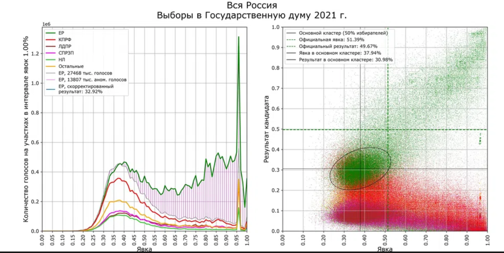

> **Первичный текст.** О текущем моменте №2(142), 2021г. О выборах депутатов Госдумы VIII созыва и перспективах.
> Источник: `dotu.ru:0a50a4b6a0483610.doc` sha256 `5b98113b8f282d6b…`; [страница на dotu.ru](https://dotu.ru/2021/10/29/20211029_tek_moment02142/).
> Автоматическая транскрипция DOC→Markdown; смысл и формулировки не правились.
> Контрольные суммы и статус проверки — в [NOTICE.md](../../NOTICE.md).
> Содержание передаёт позицию авторов; утверждения не верифицированы библиотекой.

---

# 1. Хроника выборов

17, 18, 19 сентября 2021 г. (с пятницы по воскресенье) в России были дни голосования. Избирались депутаты Государственной Думы, депутаты региональных законодательных собраний, депутаты муниципального уровня и некоторые губернаторы. На территории России работало 96 тыс. избирательных участков, за рубежом работали 348 участков в 144 странах мира. Первые, ещё не полные результаты выборов были оглашены 19.09.2021 г. Сразу же после этого Владимир Рудольфович Соловьёв в своей программе «Воскресный вечер» достоверность оглашённых первых результатов обосновал так:

«Помните, как нам говорили: всё предрешено уже, там процент и расписывали. Давайте посмотрим срез по регионам: абсолютно разные данные по количеству голосов, отданных за ту или иную партию. Это подтверждает, что ничего не было предрешено, всё зависит от людей, от того, как они организовали выборную кампанию и как в том или ином регионе относятся к разным политическим силам» (отметки времени: 02:39 — 03:02).[^1]

Правда, В.Р. Соловьёв не упомянул тех фактов, о которых несколькими днями позднее (24.09.2021 г.) на заседании ЦИК рассказал её член с правом решающего голоса от КПРФ Е.И. Колюшин[^2]:

- в период избирательной кампании порядка 63 % эфирного времени на федеральных каналах было предоставлено «Единой России» и её кандидатам, а трём другим парламентским партиям Думы VII созыва было предоставлено в совокупности менее 40 % (это является нарушением в соответствии с Постановлением Конституционного суда РФ от 30 октября 2003 г., согласно которому информирование любого характера может побудить избирателя сделать тот или иной выбор точно так же, как и прямая агитация);

- большинством избирательных комиссий руководили представители «Единой России»;

- названы были и другие нарушения, в том числе законодательного обеспечения, касающиеся электронного голосования и проведения голосования в течение трёх, а не одного дня.

- Высказав своё особое мнение в отношении проведения избирательной кампании, он отказался подписать итоговый протокол ЦИК.

Мнение Е.И. Колюшина осталось без комментариев, по крайней мере, возражения и комментарии не получили огласки.

*[В оригинальном издании здесь расположен рисунок/схема. Иллюстрация не включена в данный выпуск: ожидает визуальной и правовой проверки. Файл источника: image1.png]*Слева на скриншоте (0:39) записи программы «Воскресный вечер» от 19.09.2021 показаны текущие результаты (по данным ЦИК), выводившиеся на экран в ходе программы по мере подсчёта голосов. И ниже результаты подсчёта голосов к моменту завершения программы[^3]. Видно, что к моменту завершения программы результаты несколько изменились, но они ещё далеки от первых предварительных результатов, официально оглашённых ЦИК 20.09.2021 на основе подсчёта 100 % бюллетеней.

*[В оригинальном издании здесь расположен рисунок/схема. Иллюстрация не включена в данный выпуск: ожидает визуальной и правовой проверки. Файл источника: image2.png]*После закрытия избирательных участков в воскресенье 19 сентября ЦИК огласила самые первые итоги выборов, а её председатель Элла Александровна Памфилова охарактеризовала избирательную систему, на основе которой были проведены выборы:

«Избирательная система в России прозрачна, нарушений стало на порядок меньше, и ничего не удаётся скрыть», заявила глава ЦИК Элла Памфилова.

"Мы её (избирательную систему) сделали настолько прозрачной, настолько современной, что все тайное моментально становится явным", — сказала она в эфире телеканала "Россия 24".

"Нарушений стало на порядок меньше, гораздо меньше. Каждое из них невозможно скрыть", — добавила Памфилова» (МОСКВА, 19 сен — РИА Новости. <https://ria.ru/20210919/narusheniya-1750826743.html>).

Т.е. из сказанного Э.А. Памфиловой можно понять, что при проведении голосования и подсчёте голосов нарушения имели место, но это были большей частью «технические ошибки»[^4], хотя были и умышленные злоупотребления, однако всё это не носило сколько-нибудь массового характера и потому существенно не повлияло на результаты волеизъявления граждан. И было обещано, что все выявленные нарушения будут рассмотрены, а виновные в нарушениях ответят по закону. И действительно, уже в период до 24 сентября 2021 г. было возбуждено несколько уголовных дел по факту нарушений, на 7 избирательных участках С-Петербурга результаты выборов были отменены, а ЦИК потребовала уволить председателей двух петербургских территориальных избирательных комиссий.

«КоммерсантЪ»[^5] опубликовал результаты выборов, оглашённые Э.А. Памфиловой, сопоставив их с избирательной кампанией федерального уровня 2016 г.

*[В оригинальном издании здесь расположен рисунок/схема. Иллюстрация не включена в данный выпуск: ожидает визуальной и правовой проверки. Файл источника: image3.png]* *[В оригинальном издании здесь расположен рисунок/схема. Иллюстрация не включена в данный выпуск: ожидает визуальной и правовой проверки. Файл источника: image4.png]*

*[В оригинальном издании здесь расположен рисунок/схема. Иллюстрация не включена в данный выпуск: ожидает визуальной и правовой проверки. Файл источника: image5.jpeg]**[В оригинальном издании здесь расположен рисунок/схема. Иллюстрация не включена в данный выпуск: ожидает визуальной и правовой проверки. Файл источника: image6.png]*

*[В оригинальном издании здесь расположен рисунок/схема. Иллюстрация не включена в данный выпуск: ожидает визуальной и правовой проверки. Файл источника: image7.png]* *[В оригинальном издании здесь расположен рисунок/схема. Иллюстрация не включена в данный выпуск: ожидает визуальной и правовой проверки. Файл источника: image8.png]*

*[В оригинальном издании здесь расположен рисунок/схема. Иллюстрация не включена в данный выпуск: ожидает визуальной и правовой проверки. Файл источника: image9.png]* *[В оригинальном издании здесь расположен рисунок/схема. Иллюстрация не включена в данный выпуск: ожидает визуальной и правовой проверки. Файл источника: image10.png]*

Потом появились сообщения о некоторых чудесах и загадках выборов.

На УИК 1521 в Хасавюртовском районе Дагестана за «Единую Россию» не проголосовал никто[^6].

Были публикации, авторы которых утверждали, что в электронном голосовании было подано на 75 тыс. голосов больше, чем было зарегистрировано избирателей в электронной системе дистанционного голосования.

Были опубликованы результаты математико-статистического[^7] анализа выборов, автор которого — «независимый электоральный аналитик» Сергей Шпилькин — утверждает, что результаты голосования за «Единую Россию» статистически качественно отличаются от результатов голосования за другие партии.

«Исследователь отобразил в двух графиках данные по 96 840 участкам (107,9 млн. избирателей из 109,2 млн.).

На первом графике — гистограмма голосов за партии по интервалам в процентах явки. Зеленая линия — официальные данные ЦИК по голосам за партию власти. Согласно этим данным, на явке в 95 % наблюдается «зуб» — резкий рост голосов за «Единую Россию». Тонкая линия — гистограмма голосов за все партии, кроме «ЕР». Шпилькин предположил, что заштрихованная площадь на графике — между официальными данными ЕР и тонкой линией — даёт размер вброса, который может составить около 13,8 млн. голосов.

Аномальный рост за «Единую Россию» на явке 95 % может быть связан с московским электронным голосованием, считает аналитик.

На втором графике — результаты партий в зависимости от явки по участкам. «Плотное ядро» в середине — предположительно, нефальсифицированные участки, центр ядра для «ЕР», который дает оценку реальной явки и реального результата партии. Как предполагает Шпилькин, на нефальсифицированных участках явка в среднем 38 % (как в 2016 году), а «ЕР» получает 31-33 % голосов (как в 2011 году)»[^8].

Возражения С. Шпилькину, которые удалось найти в интернете, свелись к новому упрёку в адрес организаторов выборов:

«Трехдневные выборы в РФ проходили с 17 по 19 сентября. Как отчитались в ЦИК, на выборах в Госдуму «ЕР» получила 49,82 % голосов по спискам и победила в 198 одномандатных округах, чем обеспечила себе конституционное большинство. Электронное голосование проводилось в Москве (на московской платформе, где впервые применялась опция «переголосования»), а также в Севастополе, в Курской, Мурманской, Нижегородской, Ростовской и Ярославской областях (на федеральной платформе).

[Источник](https://novayagazeta.ru/articles/2021/09/21/shpilkin-edinaia-rossiia-poluchila-14-mln-anomalnykh-golosov-bez-falsifikatsii-partiia-vlasti-nabiraet-31-33-news)

***Для проверки выкладок автора посмотрим на прогнозы ВЦИОМ: ***[Результаты выборов в ГосДуму-2021: прогноз ВЦИОМ](https://wciom.ru/analytical-reviews/analiticheskii-obzor/rezultaty-vyborov-v-gosdumu-2021-prognoz-vciom)

*"Прогнозируемая ВЦИОМ явка на выборах в Государственную Думу, запланированных на 17-19 сентября 2021 года, составляет 48-51 %.*

*Предпочтения россиян, согласно опросу, распределись следующим образом и в первую пятерку вошли:*

> *- партия «Единая Россия» — 29,4 %, среди электорально активных — 35,3 %;*

>

> *- КПРФ — 16,5%, среди электорально — 20,5 %;*

>

> *- ЛДПР — 10%, среди электорально активных — 8,5 %;*

>

> *- партия «Справедливая Россия — Патриоты — За правду» — 5,5 %, среди электорально активных — 6,9 %;*

>

> *- «Новые люди» — 5,2 %, среди электорально активных — 4,6 %."*

То есть, утверждения автора о 31-33 % голосов для ЕР соответствуют прогнозу, а явке в 38 % не соответствуют.

Вероятно, это связано с тем, что автор рассматривает только возможность вброса бюллетеней.

Однако, возможны и другие способы применения административного ресурса. Например, заставить человека прийти и проголосовать за ЕР[^9]. При этом, этот по сути вброс бюллетеня дополняется увеличением явки. Такая ситуация возможна не только в силовых структурах. Другая версия состоит в том, что ВЦИОМ опрашивал людей более активных с точки зрения явки на голосование.

Скорее всего, автор ошибается. Вброс был менее 10 миллионов, как на прошлых выборах, а оставшееся до 14 миллионов количество людей просто заставили голосовать как надо. Ну, и, конечно, автор не учитывал возможность замены бюллетеней, поданных за ненужные партии, бюллетенями за нужные (распространённая практика на Украине). Так, например, "Новых людей", похоже, подкормили для введения в Думу»[^10].

Но публикация двух графиков, представленных С. Шпилькиным должна вызывать другие вопросы. Дело в том, что если есть некоторое множество статистик, *идентичных по структуре данных, представленных вдоль горизонтальной оси,* то их можно складывать, в результате чего и возникнет график типа представленной выше гистограммы (на левом рисунке). Но анализ множества частных статистик, тоже представляет интерес.

В стране есть 85 субъектов федерации. Это республики, края, области. В их состав входят районы, в которых расположены крупные города с несколькими избирательными округами и множеством участков, и населённые пункты, в которых по одному избирательному участку, или которые прикреплены к общему для них избирательному участку. Если проведение выборов обеспечивали более 96 000 избирательных участков, то каждый из них характеризуется статистикой явки избирателей и статистикой распределения голосов, отданных избирателями за партии и за кандидатов-одномандатников — как независимых, так и представляющих те или иные партии. В каждом регионе государства (от района области до республики), обладающем некоторым социально-экономико-политическим своеобразием, при анализе статистик, характеризующих избирательные участки, может быть выявлено:

- либо статистики всех избирательных участков приблизительно идентичны, и этот факт можно интерпретировать двояко:

<!-- -->

- либо как выражение того, что выборы проведены честно, и официально оглашённые их результаты представляют реальные итоги голосования;

- либо как показатель полной тотальной фальсификации результатов выборов, что, однако, подразумевает следующее: *все без исключения председатели комиссий, все наблюдатели, изрядная доля кандидатов прошли обучение процедуре «коррекции итогов голосования в направлении, заданном тоталитарным режимом» и связаны подпиской о неразглашении, подкреплённой какими-то угрозами*[^11]. Следует ли идти с таким предположением к психиатру — решайте сами.

<!-- -->

- либо среди статистик, характеризующих избирательные участки в регионе, выявятся два подмножества:

<!-- -->

- одно с приблизительно идентичными статистиками (как в первом рассматриваемом случае),

- второе подмножество статистик с разного рода аномалиями, отличающими его статистики от статистик первого подмножества.

> В это подмножество «аномальных статистик» войдут участки с аномально высокими, с аномально низкими явками, с нетипичным для региона распределением голосов между партиями и между кандидатами-одномандатниками. Именно эти участки с разного рода аномалиями должны стать предметом особого анализа потому, что в разного рода аномалиях могут выражаться фальсификации результатов голосования.

>

> Особый вопрос — это интерпретация резкого роста числа голосов, поданных за какую-либо партию или кандидата, в процессе подсчёта избирательных бюллетеней, поскольку динамика результатов партий и кандидатов во времени при подсчёте голосов обусловлена процедурой подсчёта: если все не погашенные бюллетени сначала сортируются, а потом подсчитываются, то будет одна динамика, если процесс подсчёта — составная часть процесса сортировки бюллетеней, то динамика будет обусловлена порядком бюллетеней в стопках, извлечённых из урн, а тот, в свою очередь, может быть обусловлен концентрацией явки в разное время на избирательные участки тех, кто голосовал за одни партии, и тех, кто голосовал за другие. Т.е. хотя фальсификация результатов может выражаться как резкий рост количества голосов, поданных за какую-то одну партию или кандидата, при подсчёте голосов, однако у такого роста могут быть и другие причины[^12].

Т.е. выявленные аномалии статистик, характеризующих избирательные участки, не являются однозначными доказательствами фальсификаций итогов выборов на этих участках, поскольку электорат каждого или соседних участков может обладать своею спецификой, которая и выражается в результатах голосования.

В частности, результаты голосования могут быть обусловлены фактической явкой избирателей на участки. В том множестве людей, которые включены в избирательные списки, действительно есть некий статистический расклад их предпочтений партий и кандидатов. Но **в жизни общества нет никаких факторов, которые бы обеспечивали одинаковый расклад голосов пришедших на участки при явке 20 % и при явке 80 % избирателей,** поскольку статистика мотивации «пойти — не пойти на выборы» у приверженцев разных партий и кандидатов может быть разная. Поэтому графики зависимости результатов выборов от явки, представленные С. Шпилькиным, тоже не являются прямым и надёжным доказательством фальсификации результатов выборов.

Тем не менее, ни сам С. Шпилькин, ни солидарные с ним, ни его критики не поставили вопрос об анализе частных статистик и выявлении подмножеств типичных для регионов статистик, и разного рода аномальных статистик для каждого из них. В частности, не поставил этого вопроса и Г.А. Зюганов — главный недовольный среди лидеров *партий — участниц выборов* — и математик по образованию.

Кроме того, необходимо учитывать и такую психологическую особенность многих обществ: среди участников выборов есть довольно большая доля тех, кто голосует за сложившийся порядок вещей не потому, что он им нравится, а потому, что они опасаются перемен, которые могут сделать жизнь хуже, если к власти придёт какая-либо оппозиционная сила.

С другой стороны в силу своего невежества в области абстрактной теории вероятностей и математической статистики и приложений её аппарата к решению разного рода житейских задач депутаты Думы прошлых созывов (певцы, певицы, гимнастки, фигуристки, конькобежки, боксёры и т.п. некомпетентные в проблематике социологии и политологии люди) и руководство Центризбиркома не озаботились тем, чтобы на уровне федерального законодательства прописать не только процедуру выборов, подсчёта голосов и организации наблюдения представителей партий и общественности за их проведением (включая электронное голосование и проведение выборов в течение нескольких дней), но и процедуру анализа статистик с целью выявления аномалий среди них и дальнейшего изучения причин возникновения аномальных статистик.

Поэтому при отсутствии такого рода процедур, — даже при безукоризненно честном проведении выборов, — заявления государственной власти об этом будут голословными, и эта голословность будет открывать возможности геополитическим конкурентам и врагам России подрывать доверие населения к государственной власти.[^13]

Однако ещё до публикации материалов С. Шпилькина, — сразу же по оглашении ЦИК 20.09.2021 предварительных результатов выборов на основе подсчёта 100 % бюллетеней — «фронт-мен» КПРФ Г.А. Зюганов на пресс-конференции в ТАСС (Информационном агентстве России)[^14] заявил о фальсификации результатов в пользу «Единой России»:

«… хочу, прежде всего, поздравить тех, кто поддержал нас и проголосовал. Нас услышало прежде все глубинная Россия, которая откликнулась не только на наши призывы, но и дружно пришла 19‑го, не позволив ворам и жуликов утащить наши реальные результаты» (отметки времени: 03:01 — 03:23).

Фрагмент, в котором Г.А. Зюганов приводит данные о последствиях политики *«Единой России» как партии власти,* вредоносной для страны на протяжении многих лет, мы опустим, поскольку к тематике оценки им выборов этот фрагмент не имеет непосредственного отношения, а кроме того «партия власти» только часть системы общественного самоуправления, включающая в себя и государственное управление в качестве компоненты, а не система управления в целом, которая и порождает качество жизни.

«В Москве вместо того, чтобы организовывать честные нормальные выборы, вводят электронку[^15] которая ломает всю цепь, всю систему. А те КОИБ[^16]ы, которые должны быть немедленно подсчитаны, до утра не дают никаких результатов. И так во многих регионах. Это фальшивые выборы. \<Они\> никому не нужны, но они усугубляют и без того социальный раскол, который сложился в обществе. А этот раскол продолжает нарастать за последнее время» (отметки времени: 7:14 — 07:39).

«Если вчера на 7 часов вечера средние результаты были с «Единой Россией» сопоставимы в пределах 25-30 % — Дальний Восток и Сибирь, то к утру уже ещё из того, что объявили — 25 %, — ещё уворовали почти 6 %. Впервые, как математик заявляю, всю ночь результаты растут у «ЕР», садятся у КПРФ и топчутся на месте у двух \<других\> партий. Это и есть главный инструментарий фальсификаций, который недопустим ни в одной стране. Мы по каждому факту проведём расследование.[^17]

«Мы обращаемся ещё раз к гаранту Конституции — остановите своих церберов, которые сейчас превращают выборы в грязную кухню. Остановите, потому что это грозит стабильности в стране. Когда многие говорят об иноагентах, вот как раз те, кто занимается такой грязной работой, являются иноагентами. Один из главных иноагентов на западной границе является Богомаз, который возглавляет Брянскую область. Классическая русская область превратилась в выборный притон. Мы считаем, что надо немедленно исправлять ситуацию, потому что насилие над выборной системой, насилие над гражданами, воровство их голосов не прибавляет ни на йоту ни доверия власти, ни доверия к президенту, ни доверия к курсу. Они только усугубляют и без того сложные наши проблемы».

Однако Э.А. Памфилова отвергает обвинения в фальсификации результатов выборов.

«Глава Центризбиркома Элла Памфилова высказалась по поводу критики российских выборов. На заседании ЦИКа она рассказала о голосовании в Канаде, заметив, что там процесс происходил «не слишком открыто».

«В Канаде выборы проходили недавно. Хочу сказать нашим критикам по поводу видеонаблюдения. В Канаде то, что происходит на участках, никто не видит, фото и видео запрещено, нарушителю грозит штраф в пять тысяч долларов. Аккредитованные СМИ могут немного поснимать через дверной проём, если им разрешат. Когда со всех сторон сейчас льётся антироссийская риторика по поводу массовых вбросов и ужаса, оглянитесь на своих хозяев и кому вы служите, прежде чем нам лыко в строку ставить. Никаких брёвен они не видят, только наши соринки вытаскивают», — заявила Памфилова[^18].

Она также заметила, что во многих российских регионах на выборах работали члены комиссий с правом совещательного голоса, которые только мешали проводить голосование. «У многих из них вместо содействия были другие задачи, изводили комиссии придирками, отвлекали и изматывали людей, чтобы человек вышел из себя, ошибся, чтобы потом сфотографировать, выложить себя, чтобы показать, что я герой», — говорит глава ЦИК.

По её словам, были и те, кто добросовестно предупреждал нарушения, но часть наблюдателей и членов комиссий требовали, чтобы им предоставляли списки, паспортные данные, «доводили избирателей до белого каления, фотографируя их»[^19].

«Глава ЦИК Элла Памфилова на встрече с президентом России Владимиром Путиным \<в видеорежиме 20 сентября 2021 г.\> призвала отменять итоги выборов при подозрении на нарушения, трансляцию вел РБК.

«Те, пусть даже немногочисленные случаи осознанных нарушений во время выборов... вот за ними должна следовать неотвратимость наказания \<...\> Если \[комиссии\] выявили какие-то нарушения, если хоть есть малейшие сомнения — нещадно отменять выборы», — призвала она.

По ее словам, ЦИК также продлил до одного года хранение видеоматериалов с избирательных участков, чтобы в случае выявления нарушений они могли использоваться в суде.

«В целом, конечно, то количество обращений и жалоб, которые к нам поступили, оно минимально за все время \<...\> Система на это стала работать. Ничего невозможно скрыть», — добавила она»[^20].

24 сентября в пятницу ЦИК огласил окончательные результаты выборов:

«**По партийным спискам в нижнюю палату парламента прошли пять партий**:

«Единая Россия» — 49,82 %;

КПРФ — 18,9 %;

ЛДПР — 7,55 %;

«Справедливая Россия — За правду» — 7,46 %;

Новые люди — 5,32 %.

**По одномандатным округам партии получили следующее число мандатов:**

«Единая Россия» — 198

КПРФ — 9

«Справедливая Россия — За правду» — 8

ЛДПР — 2

Партия «Родина» — 1

«Гражданская платформа» — 1

**В итоге каждая из прошедших в Думу партий получила следующее количество мандатов:**

«Единая Россия» — 324 мандата

КПРФ — 57 мандатов

«Справедливая Россия — За правду» — 27 мандатов

ЛДПР — 21 мандат

«Новые люди» — 13 мандатов

«Партия роста» — 1

«Гражданская платформа» — 1 мандат

«Родина» — 1 мандат

Самовыдвиженцы — 5 мандатов».[^21]

Т.е. окончательное распределение мест в Думе VIII созыва совпало с предварительными итогами, оглашёнными ЦИК 20 сентября. И можно сделать выводы:

- Выборы состоялись.

- Отменять их результаты и проводить новые выборы — с целью удовлетворения тех, кто недоволен их официальными итогами, — *нет никаких политических оснований, если адекватно воспринимать глобальный исторический процесс как «гибридную войну» за безраздельное мировое господство, отношение «глобализаторов» к России, состояние российского общества и задачи дальнейшего общественного развития России и человечества*.

- Протестов против «фальсификации выборов», сколь-нибудь массовых (*по отношению к численности электората, а не по отношению к тому, как выглядят места проведения митингов в видеорепортажах*[^22]*),* не было и не предвидится[^23].

- КПРФ не отказалась от мандатов депутатов, ни вообще отвергнув официальные итоги выборов, ни хотя бы до завершения расследования разного рода заявлений о злоупотреблениях в ходе выборов, т.е. по факту руководство КПРФ признала *по умолчанию* состоятельность и легитимность выборов:

<!-- -->

- никаких возражений против итогов выборов на встрече с президентом России В.В. Путиным 25.09.2021 г. Г.А. Зюганов и другие её участники от КПРФ не высказали, хотя в это же самое время в Москве проходил несанкционированный митинг сторонников КПРФ против официально объявленных итогов выборов;

- но руководство КПРФ не высказало и признания в том, что первые оценки проведения выборов и их итогов руководством КПРФ были ошибочными, что подразумевает и необходимость для Г.А. Зюганова принести извинения В.В. Путину, от которого ранее требовал «остановить его церберов», за высказанные им ранее обвинения в адрес «режима» в фальсификации результатов выборов.

Тем самым руководство КПРФ обнажило свою полную беспринципность как ОСНОВПОЛАГАЮЩИЙ принцип формирования руководящего состава партии, включая высший.

И ещё раз:

- представленные выше обвинения в фальсификации выборов взяты из интернета и приведены в настоящей записке с целью адекватно представить сложную общественно-политическую обстановку в России;

- воспроизведение такого рода публикаций не являются выражением солидарности и поддержки внутренних и внешних политических сил, работающих на разрушение государственного управления в нашей стране, и в данном случае настаивающих на фальсификации результатов выборов и соответственно — на юридической нелегитимности государственной власти в России после официального подведения итогов выборов;

- что из приведенного достоверно, а что является умышленной ложью или искренними заблуждениями авторов цитированных публикаций, — отвечать на этот вопрос должны уполномоченные органы государственной власти.

**Однако, люди — субъекты, более или менее самостоятельно мыслящие, и потому верить официально оглашённым результатам выборов либо не верить, — каждый гражданин России решает сам.** И поскольку таких «каждых» в России несколько десятков миллионов, то это обстоятельство означает, что *в целом* *успешно проведённые выборы реально усугубили проблему, которую недопустимо игнорировать в дальнейшем государственном управлении*.

Суть этой проблемы выразил Талейран[^24] ещё в середине XIX века: «В политике то, во что люди верят, важнее того, что является правдой».

2. В политике то, во что люди верят, важнее того,\

что является правдой

==================================================

Вследствие жизненной состоятельности этого замечания Талейрана одна из важных тем в политологии — это ответ на вопросы:

- как формируются верования людей?

- насколько далеко сформировавшиеся или сформированные кем-то целенаправленно верования могут уходить от того, что есть на самом деле?

В разделе 2 мы рассмотрим только некоторые аспекты этой темы.

[^1]: «Выборы 2021. Часть 1. Воскресный вечер с Владимиром Соловьевым от 19.09.21 [**@Россия 1**](https://www.youtube.com/channel/UC2D0dmLHKbIe9aACnlcTLPg)»: <https://www.youtube.com/watch?v=jxgG6EcpMmE>.

[^3]: «Выборы 2021. Часть 2. Воскресный вечер с Владимиром Соловьевым от 19.09.21 [**@Россия 1**](https://www.youtube.com/channel/UC2D0dmLHKbIe9aACnlcTLPg)»: <https://www.youtube.com/watch?v=rAm3KbdBnYE>.

[^4]: Технические ошибки типа:

    подсчёт голосов на некоторых избирательных участках начинался до того, как были погашены не использованные бюллетени (это открывает возможность вброса путём «правильного» заполнения не погашенных бюллетеней);

    некоторые проголосовавшие на дому явились на участки и захотели проголосовать лично, настаивая на том, что никаких заявлений о голосовании на дому ни они, ни их родственники не подавали;

    были публикации о наличии на избирательных участках дубликатов книг учёта избирателей и дубликатов листов в этих книгах;

    кое-где в списках избирателей оказались умершие, которые всё-таки проголосовали;

    А. Караулов показал хронологический график электронного голосования в Москве, согласно которому голосование завершилось не в 20:00, как положено по закону, а в 23:00, а если предположить сбой таймера в компьютере и график сдвинуть во времени на 3 часа, чтобы привязать окончание голосования к 20:00, то всплеск голосования приходится на 06:00 утра в воскресенье, что невозможно по биоритмике жизни и психологии подавляющего большинства людей («Что мы делаем в 6 утра? Правильно: голосуем прямо в постели!»: <https://www.youtube.com/watch?v=bmT-RWzlmZk>), и т.п.

    Что из такого рода сообщений является заведомым вымыслом, что постановочными съёмками, а что соответствует действительности (будь оно злоупотреблениями местных властей по умыслу и дурости или сделано по заказу иностранных политических сил, работающих на уничтожение России и как государства, и как народов страны), — ответом на этот вопрос должны заниматься компетентные уполномоченные на то государством органы.

    Но также надо понимать, что не все злоупотребления были замечены и попали в видеозаписи. Хотя, безусловно, было бы безосновательно обвинять всех без исключения людей, кто своим трудом обеспечил проведение выборов, в недобросовестности и соучастии в умышленной фальсификации результатов под тот или иной социальный заказ.

[^5]: «Результаты выборов-2021. Главные цифры. Как голосовали и кто победил — в инфографике “Ъ”»: <https://www.kommersant.ru/doc/4996303>.

[^6]: Протокол опубликован на сайте ЦИК: <http://www.dagestan.vybory.izbirkom.ru/region/region/dagestan?action=show&root=52000007&tvd=4054054419172&vrn=100100225883172&region=5&global=&sub_region=5&prver=0&pronetvd=null&vibid=4054054419172&type=242>

[^7]: Что такое «статистика», см. *«**Отступление от темы:*** Как соображать слово «статистика» и для чего это необходимо» в аналитической записке «Тупик европейской медицинской традиции и потребность общества в оздоровлении и в здравоохранении (ч.1)».

[^8]: «Что не учёл Шпилькин в своих расчётах количества вбросов бюллетеней»: <https://aftershock.news/?q=node/1016301>.

[^9]: В пятницу 17 сентября (рабочий день) в интернете появились видеозаписи, по сюжету которых на некоторые избирательные участки людей привозили автобусами, а на самих избирательных участках избиратели фотографировали свои бюллетени после их заполнения — вряд ли для того, чтобы потом показать детям и внукам, но скорее для того, чтобы показать начальству и получить какие-то выгоды. — Наш комментарий при цитировании.

[^10]: «Что не учёл Шпилькин в своих расчётах количества вбросов бюллетеней»: <https://aftershock.news/?q=node/1016301>.

[^11]: Если было организовано более 96 тыс. избирательных участков, то с каждым связано порядка 10 человек работающих на выборах, плюс несколько полицейских, наблюдающих за порядком, плюс несколько кандидатов-одномандатников (с учётом того, что на части участков выборы проходят по трём уровням власти (муниципальному, региональному, федеральному). В итоге получаем, что должны были пройти учёбу и быть связанными подпиской о неразглашении и страхами от нескольких сотен тысяч до миллиона и более человек. И в этом случае никто из них ничего не разболтает своим родным и приятелям? и никто из тех, кому выболтают «гостайну» первые, не поделится ею со своими друзьями в режиме «ты только никому не говори»?

    Если же предварительного обучения всех или почти всех и подписки о неразглашении под страхом наказания нет, то возможны только технические ошибки и некоторая статистика злоупотреблений наиболее рьяными холуями, но такие ошибки и отдельные злоупотребления не способны качественно изменить результаты выборов.

[^12]: *[В оригинальном издании здесь расположен рисунок/схема. Иллюстрация не включена в данный выпуск: ожидает визуальной и правовой проверки. Файл источника: image40.jpeg]*На рисунке слева, (<https://avatars.mds.yandex.net/get-zen_doc/3985268/pub_5fac408af68a6a3a78475ba8_5fac40a53775242524e82f47/scale_1200>) представлены результаты подсчёта голосов с привязкой ко времени в ходе подсчёта голосов в штатах Мичиган и Висконсин на выборах президента США 2020 г. Скачкообразный рост количества голосов, поданных за Дж. Байдена под утро 4 ноября 2020 г. сторонники Д. Трампа интерпретировали как заведомую фальсификацию результатов голосования.

    Аналогичное по сути обвинение в адрес участковых изби-рательных комиссий и ЦИК высказал и Г.А. Зюганов в своей оценке предварительных результатов выборов, оглашённой им 20.09.2021 г. на пресс-конференции в ТАСС (см. выдержки из его выступления далее в основном тексте).

[^13]: С другой стороны, те же самые алгоритмы статистического анализа в большей или меньшей мере могут быть использованы для выявления фальсификаций выборов в государствах геополитических противников и конкурентов России.

[^14]: <https://www.youtube.com/watch?v=RFd8Tc1kYEE>. См. также «“Это фальшивые выборы!” Лидер КПРФ обратился к Путину и пригрозил акциями протеста» («Новый день»: <https://newdaynews.ru/moscow/736644.html>).

[^15]: Т.е. систему дистанционного голосования через электронные средства связи и сервис «Госуслуги» — ДЭГ.

    В этой связи необходимо упомянуть «эталонного» либерала-прозападника Алексея Алексеевича Венедиктова — главного редактора радио «Эхо Москвы», а также главу «Общественного штаба по наблюдению за выборами в Москве». «Именно он продвигал идею электронного голосования и агитировал за него. Он и сейчас «не признает своей вины», утверждая, что взлома системы не было, а значит, результаты электронного голосования правильные.

    «Я абсолютно уверен, что здесь не было фальсификаций, и что будущее за электронным голосованием. Меня продавить нельзя», — заявил Венедиктов в эфире своего радио.

    Либералы-навальнисты сейчас массово отписываются от канала «Эхо Москвы» и шлют оскорбления в соцсети журналистам радио. Венедиктов отзывается о таких слушателях весьма оскорбительно» («Провокатор Всея Руси: Венедиктов и выборам навредил, и либералов взбесил»: <https://www.politnavigator.net/provokator-vseya-rusi-venediktov-i-vyboram-navredil-i-liberalov-vzbesil.html>).

[^16]: КОИБ — комплекс обработки избирательных бюллетеней. Включает в себя избирательные урны-сканеры бюллетеней, средства связи и компьютерную систему подсчёта голосов.

[^17]: «Центральный комитет КПРФ подал в правоохранительные органы и в Центризбирком 230 жалоб на нарушения в ходе выборного голосования с 17 по 19 сентября 2021 года, сообщает ТАСС со ссылкой на слова первого зампреда ЦК Юрия Афонина» (Данные на четверг 23.09.2021: <https://polit.ru/news/2021/09/23/kprf_protiv/>).

    Понятно, что если в России 95 тыс. избирательных участков, то даже если все 230 жалоб правомочны, то даже честное переголосование на этих участках не способно кардинально изменить результаты выборов и распределение депутатских мандатов на федеральном уровне.

[^18]: В этой связи отметим, что 28.09.2021 г. прошло сообщение о том, что «Видеохостинг YouTube ввёл на своей платформе новые правила. Отныне на этом сервисе запрещено размещать контент, который ставит под сомнение утвержденные итоги выборов.

    Правило касается пока не всех выборов, а только всех президентских — в США и парламентских выборов 2021 года в ФРГ».

    А настаивать на том, что выборы в России нечестные и итоги их фальсифицированы, — на платформе YouTube можно.

[^19]: «“Пусть наши критики оглянутся на своих хозяев”. Памфилова ответила тем, кто увидел на выборах массовые вбросы и нарушения» (<https://www.fontanka.ru/2021/09/23/70153262/>). Там же сообщается: [ЦИК зафиксировал 12 случаев вбросов бюллетеней в восьми регионах России. Петербурга среди них нет](https://www.fontanka.ru/2021/09/19/70145102/).

[^20]: «Памфилова призвала «нещадно отменять» итоги выборов при нарушениях»: <https://www.rbc.ru/rbcfreenews/614892a99a794798d9875fac>.

[^21]: [ЦИК назвала, сколько мандатов в Госдуме получила каждая партия (msn.com)](https://www.msn.com/ru-ru/news/politics/цик-назвала-сколько-мандатов-в-госдуме-получила-каждая-партия/ar-AAOM4vX?ocid=winp1taskbar).

[^22]: Как выглядят массовые мероприятия на телеэкране или в интернете, зависит от ракурса съёмки: если нет общего вида территории сверху, то находящиеся на ней два — три десятка человек, снятых крупным планом снизу, заполнив собой кадр, воспринимаются зрителем как многочисленная толпа, особенно под соответствующий словесный комментарий.

[^23]: Хотя это аргумент из области «мистики», но всё же: для массовых протестов по поводу официальных итогов выборов нет энергетического и информационно-алгоритмического потенциала в психодинамике общества.

[^24]: «Шарль Мори́с де Талейра́н-Периго́р (фр. Charles Maurice de Talleyrand-Périgord; 2 февраля 1754, Париж — 17 мая 1838, там же) — князь Беневентский, французский политик и дипломат, занимавший пост министра иностранных дел при трёх режимах, начиная с Директории и кончая правительством Луи-Филиппа. Известный мастер политической интриги. Епископ Отёнский (с 2 ноября 1788 по 13 апреля 1791). Имя Талейран стало едва ли не нарицательным для обозначения хитрости, ловкости и беспринципности» (Википедия).
---

[К произведению](README.md) · [Каталог](../../CATALOG.md)
