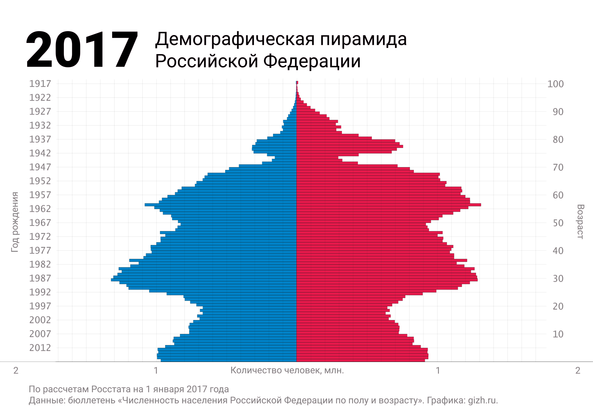

> **Первичный текст.** О текущем моменте №2(142), 2021г. О выборах депутатов Госдумы VIII созыва и перспективах.
> Источник: `dotu.ru:0a50a4b6a0483610.doc` sha256 `5b98113b8f282d6b…`; [страница на dotu.ru](https://dotu.ru/2021/10/29/20211029_tek_moment02142/).
> Автоматическая транскрипция DOC→Markdown; смысл и формулировки не правились.
> Контрольные суммы и статус проверки — в [NOTICE.md](../../NOTICE.md).
> Содержание передаёт позицию авторов; утверждения не верифицированы библиотекой.

---

## 3.1. Оценка на основе поверхностного взгляда и краткосрочной памяти

Начнём с вопроса о том, что стоит за словами «положение в стране».

- Во-первых, есть положение в стране как объективная данность, которую обычно именуют словом «настоящее», хотя одна из компонент этого «настоящего» — объективно наличествующие в настоящем возможности и реализующие их тенденции, которые сформируют какие-то компоненты того, что станет «настоящим» в более или менее отдалённом будущем.

- Во-вторых, есть субъективное восприятие этой объективной данности как непосредственно своими чувствами, так и опосредованно — через культуру и общение с другими людьми, которое тоже именуется словами «положение в стране».

- В-третьих, есть также субъективное описание воспринятой объективной данности средствами того или иного общеупотребительного или узко-корпоративного (профессионального) языка.

- В-четвёртых, есть также субъективная оценка «положения в стране» в градации «плохо — допустимо — хорошо».

При этом всё субъективное обусловлено нравственностью индивида и его личностной культурой мировосприятия и осмысления воспринятого, вследствие чего описания положения в стране и его оценки обусловлены глубиной исторической памяти и кругом интересов субъекта. Вследствие этого одна и та же объективная данность «положения в стране» разными людьми воспринимается по-разному, по-разному описывается и по-разному оценивается.

В политике всё это (эксперты-оценщики положения в стране, их описания и оценки) проходит своего рода «кастинг», проводимый государственной властью и иными политическими силами. В ходе этого кастинга что-то отвергается, а что-то ложится в основу выработки политического курса государственной власти и иных политических сил на будущее:

- если сквозь «кастинг» прошли адекватные описания и оценки, то политика, выстраиваемая на их основе, может быть успешной при условиях, что: 1) её цели объективно осуществимы и их достижение будет обеспечено 2) необходимыми ресурсами и 3) целесообразным управлением;

- если сквозь «кастинг» прошли иллюзии или заведомый обман, а адекватные описания и оценки были отвергнуты (например, потому, что они не совпали с вожделениями и ожиданиями политиков — заказчиков оценок, оскорбили их в лучших их чувствах и т.п.), то политика, выстраиваемая на основе иллюзорных оценок, обречена на крах — т.е. намеченные цели не будут достигнуты.

Сказанное касается и излагаемого далее.

————————

Соответственно, если забыть о предыстории возникновения нынешнего положения дел, то в стране почти всё плохо.

**Медико-биологические показатели здоровья населения** снижаются, страна вымирает главным образом за счёт областей становления русской национальной культуры[^68]. Ниже представлены демографические пирамиды Российской империи по итогам переписи 1897 г. и Российской Федерации по состоянию на 2017 г. Форма демографической пирамиды 1897 г. такова, что будущее страны обеспечено численностью «людских ресурсов», хотя были проблемы обеспечения культурной состоятельности подавляющего большинства по отношению к «вызовам времени» той эпохи, что привело империю к краху. Форма демографической пирамиды 2017 г. такова, что требуется выработка и проведение в жизнь демографической политики государства, которая сможет обеспечить будущее страны как в аспекте наличия достаточного количества «людских ресурсов», так и в аспекте культурной состоятельности населения.

 

Для демографических пирамид территорий сопредельных столицам и региональным центрам, и для всей сельской местности России характерна малочисленность молодёжи по отношению к численности старших возрастных групп предпенсионного и пенсионного возраста. А для возрастных групп трудоспособного возраста характерны низкий уровень доходов по месту работы и безработица в явной и скрытой формах. Т.е. общероссийская демографическая пирамида в сопоставлении её с *противоестественно перевёрнутыми демографическими пирамидами населённых пунктов и территорий, относимых к сельской местности,* имея принципиально иную форму, скрывает в себе крайне неблагоприятные для страны в целом тенденции, развивающиеся повсеместно.

Выше представлена демографическая пирамида Столбцовского района Минской области[^69] республики Беларусь, но такое же положение дел, обусловленное трудовой миграцией молодёжи в ближайшие крупные города, характерно и для многих регионов России, особенно в её европейской части.

*[В оригинальном издании здесь расположен рисунок/схема. Иллюстрация не включена в данный выпуск: ожидает визуальной и правовой проверки. Файл источника: image26.jpeg]*С 2016 г. демографическая динамика стала ещё хуже. За 2020 г. население России сократилось приблизительно на 0,5 миллиона человек, а регионы, населённые великороссами, стали лидерами вымирания, и это — рекорд за последние несколько лет[^70]. В 2021 г. динамика стала ещё хуже (объясняется воздействием эпидемии COVID-19).

При этом «почти половина россиян молодого и среднего возраста (46 % опрошенных в возрасте от 18 до 45 лет) не намерены заводить детей, мотивируя это неустойчивым материальным положением или отсутствием такого желания. Об этом свидетельствуют результаты исследования Аналитического центра НАФИ, которые имеются в распоряжении ТАСС. (…)

Авторы исследования подчеркнули, что средний размер дополнительной суммы к ежемесячному доходу, которая помогла бы россиянам решиться на рождение ребенка, — 58 тыс. рублей. При этом в различных социально-демографических группах по-разному оценивают величину требуемого дополнительного дохода. Например, жителям крупных городов нужно в 1 — 1,5 раза больше средств, чем жителям сёл (73 тыс. против 48 тыс. рублей), а самая значительная разница — почти в 2 раза — наблюдается между оценками молодежи и людей среднего возраста (36,5 тыс. против 67 тыс. рублей)»[^71].

И это при том, что средняя зарплата в России в первом квартале 2020 г. составила 48,3 тыс. рублей[^72]. Эта статистика отношения молодёжи к детям и выражающая её на практике статистика рождаемости — определённо большой успех заправил глобализации в их гибридной войне против России. В основе этого успеха лежит то обстоятельство, что большинство людей не настолько патриотичны и чадолюбивы, чтобы осознанно целенаправленно обречь себя на многие годы бедности или на нищету.

И какая у нас статистика самоубийств?

И что там с «децильным коэффициентом»?

А для преодоления демографических проблем страны необходимо, чтобы в большинстве семей было хотя бы три здоровых ребёнка, а лучше — четыре-пять. Преодоление же демографических проблем включает в себя три аспекта: 1) рождаемость должна превышать смертность, а для этого семья должна быть экономически обеспечена (т.е. она должна быть способна «инвестировать в детей», т.е. в развитие их организмов, психики и личностной культуры), 2) здоровье родителей как предпосылка к здоровью детей, 3) культурная состоятельность новых поколений в смысле, задаваемом эпохой и общественно-политическими перспективами вплоть до перспектив глобального уровня.

Плюс к этому от 4 до 5 миллионов человек (по разным данным) уехали из России с 2000‑го по 2020 г.

**Вымиранию коренного населения в регионах России, населённых этническими русскими, сопутствует приток мигрантов** как из южных регионов России, так и из республик Средней Азии бывшего СССР. Мигранты не желают интегрироваться в культуру регионов, куда они прибыли, сохраняют свою самобытность, и для них **Россия — среда выживания и объект «демографического завоевания»**, вследствие чего обостряются национальные взаимоотношения, поскольку мигранты часто ведут себя нагло, стали предъявлять неуместные требования к коренному населению в целом и к его представителям персонально.

**Имеет место общая деградация нравственности, этики, культуры в целом, включая и чувственно-интеллектуальную личностную культуру новых поколений.**

- Реформа системы образования привела к ухудшению статистики показателей здоровья школьников[^73].

-  Качество образования резко снизилось за счёт того, что задача воспитать патриота-творца снята (слева репродукция плаката советских времён на эту тему) и замещена задачей «воспитать *квалифицированного потребителя», который истории и политики предметно не знает и потому в принципе не может быть патриотом — созидателем своего государства,* но является только «патриотом своего кошелька»[^74] и разрушителем своего государства.

Выпускники школ и вузов мало чего знают, не умеют думать и пользоваться даже известными им знаниями.

Переход высших и средних учебных заведений, дающих стартовый уровень профессионализма, к болонской системе превращает систему высшего профессионального образования в инструмент имитации производства разнородного профессионализма.

Как следствие **за постсоветские годы погибли многие научные и инженерные (проектно-конструкторские и организационно-технологические) школы, унаследованные от СССР, сохранившиеся школы продолжают деградировать.**

- «Реальный сектор» народного хозяйства утратил не только многие производства, но и целые отрасли, стал зависим от зарубежья в аспектах:

<!-- -->

- номенклатуры и конструкции производимой продукции,

- технологий,

- закупок технологического и телекоммуникационного оборудования и его программного обеспечения,

- многих комплектующих,

- а также финансово, поскольку права собственности на многие предприятия, если не на бо́льшую часть реального сектора экономики РФ, перешли к «иностранным инвесторам», т.е. внешним эксплуататорам страны, для которых её народы — не более, чем один из экономических ресурсов.

<!-- -->

- Выстроенная система управления народным хозяйством такова, что делает невозможной разработку и организацию производства многих видов продукции либо вообще, либо в разумные сроки[^75] на законных основаниях (т.е. без нарушения действующего законодательства[^76]): складывается впечатление, что законодатели вообще не подозревают, что быстродействие — один из факторов победы в конкуренции и одна из основ для оценки качества управления.

Кроме того, **принято множество законов, которые мешают людям жить, но которые удобны государственной власти, поскольку разного рода запреты освобождают их от обязанности выявлять и разрешать реальные проблемы граждан**[^77], предпринимательского сообщества, самих же органов государственной власти, которые наряду с этим являются одним из катализаторов коррупции.

- После начала глобального финансово-экономического кризиса в 2008 г. на протяжении более десяти лет ощутимого роста потребительского благополучия широких масс населения, работающих по найму или ведущих какой-то «малый бизнес» — нет.

- На протяжении всего постсоветского времени центробанк душит страну ростовщичеством и ни за что перед Россией юридически не отвечает[^78].

————————

Верить в то, что постсоветская государственная власть к этим печальным и общественно вредным результатам перестройки и антисоциалистических реформ не имеет никакого отношения, что все властьимущие старались сделать, как лучше, но само собой получилось то, что получилось, якобы вследствие воздействия на Россию неподконтрольных государственной власти обстоятельств и ужасного наследия советского прошлого, — это удел идиотов[^79], а убеждать в этом людей — удел идиотов и дело подконтрольных им наёмных циников-говорунов.

В связи с изложенным выше в разделе 3.1 — ещё раз вспомним М.С. Симонян, и других пропагандистов-иллюзионистов, на разные голоса исполняющих «арию» «Да нормально всё в стране, все проблемы у «хохлов»[^80] и в прочем зарубежье» (см. выше карикатуру на такую пропаганду в творчестве «Васи Ложкина»: эту картину пытались признать «экстремистской», но что-то не заладилось у стороны обвинения). Эту «арию» в прошлом исполняли пропагандисты КПСС в послесталинские времена; пропагандисты династии Романовых в имперские времена. Но История не подтверждает чудодейственной силы этой арии в деле разрешения проблем общественного развития, которые необходимо выявлять и разрешать своевременно иными средствами.

Тем, кто хочет настаивать на том, что всё изложенное выше в разделе 3.1 — очернение постсоветской действительности, клевета на её государственную власть и на «Единую Россию» как ведущую политическую силу страны, пользующуюся неоспоримым доверием народа[^81]; что всё произведено по заказу Госдепа США и по его методичкам, предлагается:

- предъявить свод статистик, которыми описывается жизнь биосферно-социально-экономических систем государств[^82];

- указать на корреляцию статистик или на причинно-следственные связи между ними, если таковые имеются;

- предъявить критерии оценки статистик и критерии оценки их динамики[^83];

- а также предъявить сами статистические данные за прошедшие постсоветские годы и их оценки в соответствии с критериями[^84].

Речь идёт именно о своде характеристических статистик и обо всём, что с ними связано и названо выше, а не об отдельных «показательных» случаях и достижениях, поскольку все случаи находят своё место в соответствующих статистиках, и ни один случай не может опровергнуть никакую статистику.

Но и публикуемые в РФ статистики вызывают множество вопросов. И это касается не только статистических данных об итогах тех или иных выборов.

Тема пандемии COVID-19 подаётся обществу как важнейшая тема последних двух лет.

«"Росстат" каждый месяц публикует статистику по смертности от коронавируса. Причём, публикует большой задержкой. В настоящее время доступна информация за май 2021 года. Первоисточником этих данных являются органы ЗАГС, регистрирующие факты смерти российских граждан. Итак, по данным "Росстата", коронавирус, как основная причина смерти, был зафиксирован у 14 971 человек. При этом, у 12 779 человек китайский вирус был идентифицирован, а у 2 192 человек он не был идентифицирован. Ещё у 3 724 человек коронавирус не стал основной причиной смерти, но оказал (984 человека), или не оказал (2 740 человек), существенное влияние на развитие смертельных осложнений. Суммарно — 18 695 человек.

Федеральный штаб каждый день публикует статистику заболеваемости и смертности от коронавируса очень оперативно. С задержкой всего в один день. Чтобы сравнить данные федерального штаба с данными "Росстата", нужно просуммировать данные штаба за каждый месяц. И тогда получается, что, по данным федерального штаба, в мае 2021 года в России от коронавируса умерло 11 174 человек. А по данным "Росстата", приведённым чуть выше – или 12 779 человек, или 14 971 человек, или даже 18 695 человек. Если наложить данные федерального штаба и данные "Росстата" на один график (смотри график ["Число умерших от Covid-19 в РФ по данным "Росстата" и федерального штаба"](http://www.finnews.ru/picture.php?id=1688)), то мы увидим, что между этими кривыми очень мало общего.

Как такое может быть? Кто-то может сказать, что существуют разные методики подсчёта. Возможно. Тогда назовите ещё какую-нибудь область человеческой жизнедеятельности, в которой разница одного и того же объекта, подсчитанного по разным методикам, составляет аж до 50 %. Слышали фразу: "Двум смертям не бывать, а одной не миновать"? Неужели, кто-то считает смерть дважды? Значительная разница в числе умерших от коронавируса может появиться только в том случае, если кто-то считает некорректно. Например, как-то мухлюет с причиной смерти. Записывает в умершие от ковида тех, кто, на самом деле, умер от инфаркта, рака, инсульта, дорожно-транспортного происшествия, несчастного случая, самоубийства. Кто-то явно сообщает общественности недостоверную информацию. Или федеральный штаб. Или "Росстат". Или даже оба вместе»[^85].

На основе недостоверной информации невозможно адекватное управление нигде — ни в технике, ни государственное. Однако имеет место различие статистик, которое невозможно уложить в так называемую «статистическую погрешность». Это может быть следствием как фальсификации исходных данных, на основе которых строятся статистики, так и следствием того, что в государстве отсутствуют стандартные процедуры сбора и обработки необходимых статистических данных, стандартное программное обеспечение для обработки, верификации и предоставления данных и статистик. Кроме того, фальсификация отчётности и принуждение подчинённых к фальсификации отчётности не является составом преступления по ст. 275 УК РФ — государственная измена, хотя такого рода действия по их сути и последствиям являются государственной изменой.

Отсутствие свода статистик, свода критериев их оценки, стандартных процедур сбора, обработки и верификации статистических данных — неоспоримое выражение управленческой несостоятельности (включая несуверенность) постсоветской государственной власти и слабоумия подавляющего большинства её представителей по отношению к занимаемым ими должностям.

И это — один из главных генераторов недоверия населения государственной власти и её представителям персонально, и один из главных генераторов коррупции потому, что в отличие от решения задач биосферно-социально-экономического управления коррупционная деятельность не требует такого рода знаний, и, соответственно, если нет управленцев, то их места заполняются потенциальными коррупционерами.

И не надо ссылаться на то, что *всё это — достоверная статистики, стандартные процедуры сбора и обработки данных, свод критериев оценки статистик и тенденций и т.п.* — якобы есть за грифами «секретно» и выше или что публичное оглашение такого рода сведений противоречит требованиям Приказа ФСБ № 379 от 28.09.2021 г.[^86], и что это знают и в праве знать только компетентные органы и должностные лица соответствующего уровня «в части их касающейся», и потому это всё не может быть оглашено публично. Это всё не является тайной, которую действительно необходимо хранить от геополитических конкурентов и противников, тем более что они это всё и так знают и имеют свои оценки, на основе которых строят свою политику в отношении России.

По оценкам аналитиков США Россия деградирует: *«Население России сокращается, экономика увядает, она не проживёт следующие 15 лет»* (это мнение Дж.Р. Байдена, нынешнего, 47‑го президента США, высказанное им ещё в бытность вице-президентом США в администрации Б.Х. Обамы: The Wall Street Journal. 25 июля 2009 г.): 2009 + 15 = 2024.

В 2021 г. аналогичное мнение высказал журналистам The Sunday Times и глава британской внешней разведки MI-6 Ричард Мур: *«Россия — объективно ослабевающая в экономическом и демографическом плане держава. Она переживает чрезвычайно сложный период»*.

В этой же связи необходимо упомянуть и отечественных спецслужбистов. Борис Константинович Ратников[^87] (1944 — 2020) в одном из интервью с ним сказал: *«Разумеется, наш отдел заглядывал за горизонт, но то, что мы там увидели, оптимизма не внушает. В 2030 г. целостного государства России мы не увидели. В мировом энергетическом пространстве целостной России нет»*[^88].

И политика США и Запада в целом в отношении России исходит из того, что такого рода оценки жизненно состоятельны на протяжении всего постсоветского времени и будут состоятельны в обозримой перспективе, и потому со стороны США и Запада разумно стимулировать деградационные процессы через внешние воздействия и через свою периферию внутри России (в том числе и через думское законотворчество и правоприменительную практику), чтобы потом, — когда Россия дозреет в деградации своей социально-экономической системы, — решить «Русский вопрос» раз и навсегда.

————————

С такого рода оценками текущих итогов постсоветского периода и перспектив согласится подавляющее большинство из тех, кто уклонился от участия в парламентских и прочих выборах 2021 г. по идейным мотивам (т.е. не аполитичный люмпен разного рода) — вопреки тому, что заявила М.С. Симонян, возражая К.Л. Сазоновой (см. раздел 2.2); а также согласятся и те, кто не голосовал за «Единую Россию», всё же приняв участие в выборах. *Но поясним, что это — субъективная оценка на основе «мистики» (но отличной от той, в которой работал Ратников и его коллеги), а не результат грамотно проведённых социологических исследований.*

Кроме того, поскольку подавляющее большинство населения России невежественны в социологии и политологии и не знают реальных процессов социального управления, то они оценивают происходящее в политике с позиций, идентичных концепции государственно-общественных взаимоотношений, выраженной святым РПЦ преподобным Иосифом Волоцким (1439 — 1515).

Согласно этой концепции единственным наместником Божьим в обществе является царь (глава государства), все прочие служат Богу, служа царю (главе государства). Соответственно, царь (глава государства) ответственен за всё хорошее и за всё плохое. Сами же члены общества ответственны перед царём (главой государства), который, кого хочет — жалует чинами, наградами, достатком, кого хочет — притесняет вплоть до смертной казни, а до кого ему нет дела, — те живут по способности, исполняя обязанности, возлагаемые на них социальной организацией, во главе которой стоит царь (глава государства).

**В такой концепции не существует никаких «мафий» — систем деловой коммуникации людей, имеющих общие или взаимно дополняющие друг друга интересы, в которых осуществляется динамическое юридически не формализованное перераспределение полномочий, обязанностей и подконтрольных разнородных ресурсов, обусловленное обстоятельствами и личностными качествами участников той или иной системы деловой коммуникации.**

Однако вопреки этому взгляду *такие системы деловой коммуникации пронизывают все сферы общественной жизни, все отрасли деятельности, и все юридически формализованные институты общества реально подчинены им*[^89].

Поскольку всякое культурно своеобразное общество при взгляде с позиций ДОТУ является суперсистемой, то в такого рода «мафиозных» системах деловой коммуникации с динамическим перераспределением полномочий, обязанностей, подконтрольных ресурсов выражается бесструктурное управление и управление на основе виртуальных структур. Т.е. вопрос не в «мафиозности» — она неизбежна, а в том, чтобы неизбежно возникающие «мафии» не были антиобщественными, а работали на общественное развитие в его объективной сути.

Если учитывать этот «мафиозный» фактор в толпо-«элитарных» культурах, то выясняется, что царь (глава государства) — такой же заложник совокупности мафиозных взаимодействий, сложившихся в обществе, как и все прочие, хотя в формальной иерархии именно он — самый главный в обществе. Однако, как показывает история, как только царь начинал вести себя так, будто он действительно самодержец, он сталкивался сначала с недовольством реально правящих «мафий» и некими намёками с их стороны: именно по этой причине Екатерина II, Александр I и Николай I не смогли осуществить многое из своих благих намерений, которые были у них при вступлении на престол[^90]. А если он не игнорировал намёки и не принимал на себя роль разводящего, «разруливающего» конфликты интересов всех мафий, то «верноподданные» свергали его или убивали: смута рубежа XVI — XVII веков — следствие неприемлемости для «верноподданных» Ивана Грозного, а потом и Бориса Годунова; убийство императора Павла — ещё один пример такого рода. Но то же касается и всех «исполняющих обязанности царя»: покушение на В.И. Ленина, смещение Н.С. Хрущёва, убийство президента США Дж.Ф. Кеннеди — это иллюстрации на тему воздействия на «и.о. царя»[^91], не нашедшего себе роли в системе сложившихся мафиозных взаимоотношений.

————————

Соответственно *люди, чьи мнения о государственно-общественных взаимоотношениях идентичны, высказанному ещё 500 лет тому назад пониманию И. Волоцким, —* во всём, что в России идёт плохо в последние 20 лет, винят, прежде всего, В.В. Путина и отчасти депутатов Думы, членов правительства и руководителей прочих ветвей и органов государственной власти на всех уровнях, которых, по их мнению, именно В.В. Путин создал и манипулирует ими единолично.

Такого рода мнения особенно распространены среди представителей тех поколений, которые не помнят либо забыли первую половину *лихих* девяностых; тех, чьё детство и подростковый возраст пришлись на неоспоримое улучшение качества жизни большинства населения в сопоставлении с лихими девяностыми в период двух первых сроков президентства В.В. Путина. Они знают только те трудности, с которыми столкнулись уже во взрослой жизни, и не задумываются о том, как возникли эти трудности и как общество порождает благоденствие в своей жизни.

Такого рода неадекватность их мнений по общественно-политической проблематике, включая и оценки государственной власти, во многом обусловлена тем, что стандартные учебные курсы — школьный курс «обществознания» и вузовские курсы «социологии», «политологии», «теории государства и права» — государственно узаконенное пустословие, не дающее знаний о реальных процессах в жизни общества, включая и процессы управления.

К тому же, есть неприятное сопоставление достижений советской и постсоветской эпох:

- Катастрофу лета 1941 г. и полёт Ю.А. Гагарина, положивший начало космической эре в истории человечества, разделяют менее 20 лет[^92], не говоря уж о том, что на период времени 1941 — 1961 гг. приходятся и другие неоспоримые достижения советского народа, большей частью обусловленные идейной властью большевизма и руководством страной И.В. Сталина: Победа над Германией и Японией, восстановление разрушенной войной страны в течение одной пятилетки, перевооружение Армии и начало перевооружения Флота, создание ракетно-ядерного щита, и общее улучшение, если не всех[^93], то многих статистик, характеризующих жизнь биосферно-социально-экономической системы в границах СССР.

- Спустя 28 лет после принятия конституции РФ в 1993 г. *на фоне общей деградации биосферно-социально-экономической системы в границах России (что было показано выше),* в ранг «эпохального достижения России» СМИ возводят вылет на международную космическую станцию киноактрисы Ю. Пересильд и режиссёра К. Шипенко с целью съёмки некоего фильма под названием «Вызов», что претендует на нечто в истории кинематографии — первая киногруппа снимает художественный фильм в космосе[^94].

Что из этой затеи получится, будущее покажет, но никаких эпохальных достижений, сопоставимых с работой коллектива во главе с С.П. Королёвым, включая и космонавтов первого призыва, у РФ за прошедшие 28 лет нет и в ближайшей перспективе не предвидится.

Пока же:

- **явно видна пропаганда антисоциальной, по её сути, идеи — «светские львицы» и «светские львы» могут всё!»**[^95] — может быть, Ю. Пересильд после полёта следует назначить главой Роскосмоса, если «светские львицы» как бы могут всё? имитация деятельности на съёмочной площадке кинофильма и реальная деятельность в той или иной профессиональной сфере — разные вещи?

- и общая политика навязывания людям способа оценки ими качества своей жизни:

<!-- -->

- не на основе восприятия потока реальных событий,

- а на основе восприятия потока событий в иллюзорном мире на экране телевизора или кинотеатра и мультимедиа компьютеров и прочих гаджетов[^96].

Однако, всё изложенное в разделе 3.1 выражает поверхностное осмысление действительности на основе краткосрочной памяти и восприятия текущего момента, причём осмысление, обусловленное большей частью личностными интересами всего трёх групп (индивидуальные по сути гедонистические, семейно-бытовые, профессиональные), что характерно для основной статистической массы населения России.

При этом профессиональные интересы и их удовлетворение интересны как источник финансирования удовлетворения интересов первых двух групп, и соответственно носитель интересов только этих трёх групп не способен к суверенитету и потому может быть только *«патриотом своего кошелька и своей кошёлки»*.

Поэтому хотя всё приведенное не придумано, однако действительность в её полноте более многогранна, и потому оценка положения в стране и перспектив требует иного взгляда, проистекающего из долговременной памяти и круга интересов, включающего не только три названные выше группы интересов, но и интересы других — более значимых — групп, поскольку процессы, с ними связанные, обуславливают возможности удовлетворения интересов первых трёх групп: это общенародные, государственно обусловленные, регионально цивилизационные и общечеловеческие (глобально-цивилизационные) интересы, которые однако лежат вне восприятия и осознания подавляющим большинством населения страны.

[^68]: Естественный прирост и убыль населения по регионам России в 2015 г.: распределение по регионам (см. «Демоскоп weekly» № 689-690, 6 — 30 июня 2016 г. — издание Института демографии Национального исследовательского университета «Высшая школа экономики»: <http://www.demoscope.ru/weekly/ssp/rus_reg_edn.php> и далее постранично субъекты РФ). Т.е. **безопасность будущего России в аспекте демографии не обеспечивается вследствие политики, проводимой самим государством**.

[^69]: В сети не удалось найти современных пирамид ни для одного из районов областей России.

[^70]: <https://tass.ru/obschestvo/10570605>.

[^71]: <https://tass.ru/obschestvo/9598459>.

[^72]: <https://zen.yandex.ru/media/sokolovu/sredniaia-zarplata-v-v-rossii-za-ianvar-fevral-i-mart-2020-goda-sostavila-48300-rublei-5edc95124ecd9312b60fe109>.

    И как гласит анекдот, население России разделилось на две группы: одни не могут понять, как прожить на 40 тысяч в месяц, а другие не знают, как зарабатывать по 40 тысяч в месяц.

[^73]: Одна из публикаций на эту тему «Динамика показателей состояния здоровья московских детей от поступления до завершения школы (Результаты научных исследований), Общественная палата г. Москвы, 29 февраля 2016 г.: <https://ppt-online.org/555332>.

[^74]: Д.А. Медведев на педагогическом форуме «Территория смыслов» в 2016 г.: *«Меня часто спрашивают по учителям и преподавателям. Это призвание, а если хочется деньги зарабатывать, есть масса прекрасных мест, где можно сделать это быстрее и лучше. Тот же самый бизнес. Но вы же не пошли в бизнес, как я понимаю, ну вот».* — Это ответ на вопрос учителя из Дагестана: *«Почему учителя и преподаватели получают зарплату в 15 тыс. руб., а представители силовых ведомств 50 тыс. руб и выше? Я считаю, что наша задача не менее важная и ответственная, тем более они работают с последствиями наших ошибок, а у нас есть возможность, если государство поддержит, искоренить эти причины».*

    Но быть учителем, это не только призвание, но и Служение обществу, созидание его будущего — хотя не прямое, а опосредованное: через учеников и Учеников. А то, что высказал Д.А. Медведев в ответ на вопрос-пожелание учителя из Дагестана, — это как раз и есть призыв к гражданам России «быть патриотами своего кошелька», а не патриотами своего Отечества.

    С 2016 г. особых сдвигов нет: «Компания HeadHunter провела большое социологическое исследование и выяснила, что петербуржцы и москвичи считают профессию учителя одной из самых не престижных. В списке из двадцати специальностей она заняла четвертое место с конца, уступив лишь уборщице, дворнику и продавцу-кассиру. Об этом «Комсомолке» в среду, 6 октября \<2021 г.\>, сообщили в пресс-службе компании»: <https://www.spb.kp.ru/daily/28340/4485841/>. Как сообщается там же, «В первую очередь горожане исследования смотрели на уровень зарплат и отношение общества».

    Но вице-премьер Т.А. Голикова (супруга бывшего министра экономики В.Б. Христенко) продолжает курс Д.А. Медведева:

    «Заместитель председателя правительства Российской Федерации Татьяна Голикова призвала медиков и учителей, недовольных условиями труда, уволиться. На коллегии Министерства труда она заявила, что если человек выбрал эту профессию, то должен отдаваться ей со всей душой, не взирая ни на что, а в противном случае сменить место работы. Россияне всегда ждут очень многого, резюмировала вице-премьер» <https://news.rambler.ru/other/42983385/>.

[^75]: 20 лет без малого на создание заурядного по мировым меркам транспортника Ил-112В — это слишком много в сопоставлении с темпами создания Ту‑95, 2М (стратегический бомбардировщик КБ В.М. Мясищева) и других самолётов той эпохи, ставших шедевральными и во многом задававшими мировой уровень самолётостроения.

[^76]: Один из многих примеров: «Месяц назад «КП» в публикации «Чем дальше в лес — тем выше срок» о юридическом абсурде в Мордовии, когда доброе дело, которое сделал руководитель агропредприятия Игорь Рогожин, почему-то стало для него уголовным: расчистив по просьбе жителей деревень заросшую дорогу, он попал под статью о незаконной вырубке деревьев. За прошедшее время надежды на торжество справедливости у местных жителей поугасли: маховик уголовного дела раскручивается все сильнее. Сам же подозреваемый уверяет, что ему упорно не дают доказать свою невиновность.

    Громкий скандал в Кадошкинском районе грянул в июне этого года. Тогда жители нескольких деревень попросили Игоря Рогожина сделать то, чего почти 30 лет не могли сделать местные власти — восстановить старую грунтовую дорогу, которая втрое сокращает путь до райцентра. Работы уже почти заканчивались, как появились полицейские с лесничими: мол, около километра пути проходит по лесочку и этот отрезок — не дорога вовсе, а межквартальная просека, и ты, мил человек, зацепил и уничтожил 33 дерева лесного фонда, сумма ущерба — аж 269 тысяч. Возражения о том, что это откровенный сорняк, выслушаны не были. Никто и опомниться не успел, как руководитель филиала агропредприятия «Магма ХД» Игорь Рогожин стал главным фигурантом по делу о незаконной рубке леса. В особо крупном размере, то бишь до 7 лет тюрьмы»: <https://www.kp.ru/daily/28339/4485304/>.

    Позиция «государственная власть всегда права: и в своих действиях, и в своём бездействии» — не будет принята населением, которому нужна дорога, а власть её не расчистила несмотря на многократные просьбы и решила наказать тех, кто сделал то, что должна была уже давно сделать сама власть.

[^77]: Пример тому:

    Штрафы за парковку машин на газонах в кварталах, где в результате чрезмерно плотной застройки, предписанной самою же государственной властью, парковочных мест явно не хватает. Но при этом никаких обязанностей построить паркинги, чтобы газоны были целы, — власть на себя не принимает.

    Многие граждане при оформлении пенсий сталкиваются с тем, что часть записей в их трудовых книжках не признаётся сотрудниками пенсионных фондов достоверными. Получается так, что записи в трудовых книжках делали люди, уполномоченные на то, государственной властью. Потом, другие люди, уполномоченные той же самой государственной властью, отвергают какие-то записи, в результате чего пенсионеры теряют иногда более 10 лет трудового стажа, и соответственно их и без того нищенская пенсия становится ещё меньше. **Это — государственная подлость, поскольку за ошибки человека, уполномоченного государством вносить записи в трудовые книжки, отвечает гражданин, который не имеет права сам вносить эти записи.**

    Пенсионная реформа тоже не в интересах тех, кто честно трудился и исчерпал потенциал здоровья и трудоспособности к 50-60-летнему возрасту.

    Принудительная по факту вакцинация против COVID‑19, во-первых, незаконна, во-вторых, не обеспечена организационно, вследствие чего имеют место случаи поствакцинальных смертей и заболеваний тех людей, кто прошёл вакцинацию без должной диагностики способности их организмов выдержать воздействие вакцин. Все эти смерти и заболевания — преступления государственной власти.

[^78]: Согласно части 2 статьи 75 конституции РФ, *«защита и обеспечение устойчивости рубля — основная функция Центрального банка Российской Федерации, которую он осуществляет независимо от других органов государственной власти».*

    Однако, термин «устойчивость рубля» — не определён однозначно ни в экономической теории, ни юридически обязывающим образом, а независимость от других органов государственной власти де-факто означает вовлечённость центробанка в деятельность мирового банковского сообщества. Т.е. **центробанк РФ — один из НАИБОЛЕЕ ВРЕДОНОСНЫХ иностранных агентов де-факто, хотя и не признан в таковом качестве де-юре.**

    Если анализировать денежное обращение, сопровождающее продуктообмен в обществе, на основе правил Кирхгофа, то для того, чтобы возникла инфляция, необходимы одно из следующих действий или их некоторое сочетание:

    осуществлять эмиссию денежной массы более высокими темпами, чем растёт производство в реальном секторе, исчисляемое в неизменных ценах (ценах базового периода);

    сократить производство ниже уровня прежнего платёжеспособного спроса, что повлечёт за собой больший или меньший избыток денежной массы в обращении и соответственно — рост цен;

    стимулировать рост цен кредитованием под процент, что также ведёт к спаду производства по мере утраты обществом и предприятиями покупательной способности при ограничении эмиссии под предлогом «борьбы с инфляцией».

    Кредитование под процент в качестве генератора инфляции — причём первичного генератора — никогда не рассматривается в учебниках экономической теории.

    В силу этого обстоятельства руководство центробанка, Минэкономразвития и Минфина, начитавшись учебников и никчёмных «классических трактатов» по экономике и финансам, могут быть в неподдельном неведении о том, что своими действиями они убивают реальный сектор экономики России, а их слабоумие и занятость текучкой может не позволять им догадаться об этом самостоятельно.

    Как бы там ни было (невежество, слабоумие, вредительство со знанием дела), но именно путём стимулирования роста цен ростовщичеством центробанк РФ на протяжении всего времени своего существования раскручивает в России инфляцию. А потом он же начинает с нею же как бы бороться, ограничивая эмиссию (сдерживая рост денежной массы), что лишает реальный сектор оборотных средств при выросших ценах и влечёт за собой экономию на инвестициях в развитие предприятий и падение производства в реальном секторе (вплоть до структурного распада народного хозяйства), а это вызывает вторичную волну инфляции.

    В таком финансовом климате реальный сектор (наука, производство, система образования) развиваться не способен, и как следствие такой политики центробанка в дальнейшем будет иметь место обострение кризиса, а не выход из него.

[^79]: Государственная власть необходима для того, чтобы обеспечить личную безопасность граждан во всех смыслах слова «безопасность» в преемственности поколений и обеспечить безопасность общественного развития. Если она с этими задачами не справляется, то единственное, что оправдывает её существование — до известного времени, так это то обстоятельство, что какое ни на есть государственное управление — лучше, чем война всех против всех, в которой неизбежно будут участвовать и внешние враги.

[^80]: В частности, уход от обсуждения российских и глобальных проблем на отечественных ток-шоу выражается в ежедневном обсуждении на протяжении многих лет всего происходящего на Украине.

[^81]: По официальным итогам выборов в Думу 2021 г. за «Единую Россию» проголосовало только порядка 1/4 списочного состава избирателей, вследствие чего правильнее говорить о безразличном отношении к ней и неоспоримом недоверии ей остальных 3/4 избирателей и как следствие — о безразличном отношении и недоверии всей государственной власти постсоветской России значительной доли населения страны из состава этих 3/4.

[^82]: На этой стадии многим возражающим придётся замолчать, поскольку они не знают теории вероятностей и математической статистики, а если и сдали зачёты и экзамены по этой дисциплине в период учёбы в вузе, то не умеют пользоваться этим аппаратом и давно уже забыли то, что некогда сдали.

[^83]: На этой стадии придётся замолчать многим из тех, кто прошёл первую стадию, поскольку их кругозор весьма узок, а личностная культура мышления не позволяет связать сведения из геологии, со сведениями из биологии в русле задач политологии, без чего выработать свод статистик и критерии оценки каждой из них и их динамики невозможно.

[^84]: Почему этого не знают депутаты Думы и работники её профильных комитетов, правительство, работники администрации президента? С какой целью этому не учат в Высшей школе экономики и в РАНХиГС, в других гражданских вузах, готовящих управленцев разного уровня, а также в спецвузах ФСБ?

    И почему на необходимость именно такого подхода не указала РАН и её профильные отделения и институты? Они холуйствуют и «онаучивают» неведомо откуда и как взявшийся политический курс?

[^85]: «Статистика смертности от Covid-19 в России вызывает массу вопросов, и кажется сильно завышенной» (<https://zen.yandex.ru/media/finnews_rus/statistika-smertnosti-ot-covid19-v-rossii-vyzyvaet-massu-voprosov-i-kajetsia-silno-zavyshennoi-61138bc8c18b76676932e4e7> — опубликовано 11.08.2021 г.).

[^86]: См. по ссылке: <http://publication.pravo.gov.ru/Document/View/0001202109300048?index=6&rangeSize=1>.

[^87]: В 1969 г. окончил МАИ, в 1984 г. окончил высшую школу КГБ СССР, генерал-майор ФСО, с 1991‑го по 1994‑й был первым заместителем начальника Главного Управления охраны РФ.

[^88]: Откровенное предсказание Бориса Ратникова 2021 год. Что будет с Россией?: <https://www.youtube.com/watch?v=zsmk0hfsGq8> — от отметки времени 07:25.

[^89]: На это обстоятельство впервые намекнул И.В. Сталин в работе «Марксизм и вопросы языкознания» (интервью газете «Правда», опубликованное 20 июня 1950 г.). Более обстоятельно об этом см. пояснительную записку ВП СССР 2019 г. «Об этике и её роли в жизни».

[^90]: Реализация благих намерений в отношении образа жизни государства обязательно требует, чтобы была социальная группа, которая не только желает реализации этих благих намерений, но и будет соучаствовать в их реализации, освоив необходимые для этого знания и навыки.

[^91]: «Исполняющий обязанности царя» — так названа должность в царском указе, подписанном шариковой ручкой домуправом Буншей в фильме «Иван Васильевич меняет профессию».

[^92]: Многим запомнились слова ex-president’а РФ Д.А. Медведева о полёте Ю.А. Гагарина: «Я уверен, что это было абсолютно революционное событие. И абсолютно символическое. **И хотя меня тогда ещё не было на свете**, когда Юрий Гагарин полетел в космос, **тем не менее, это было выдающееся достижение советской космонавтики...»**

[^93]: Освоение Целины, гибель экосистемы Приаралья — это очень плохо по своим биосферно-экологическим и социокультурным последствиям.

[^94]: «Победа в космической гонке». Что пишут мировые СМИ о съёмках на МКС?»:

    «NYT рассказывает читателям о фильме «Вызов», который будет снят в космосе. «Кинематографический замысел играет второстепенную роль по сравнению с символическим значением первых в истории съемок фильма в космосе, — считает издание The New York Times. — Это совместный проект российского космического агентства „Роскосмос“, государственного „Первого канала“ и российской киностудии Yellow, Black and White. Они надеются, что фильм продемонстрирует общественности, что космос открыт не только для космонавтов».

    В тоже время издание отмечает, что «финансирование российской космической программы постепенно убывает», а в Соединенных Штатах в 2020 году успешно прошла испытания ракета Crew Dragon компании SpaceX. Благодаря этому событию США прекратили закупку российских ракетных двигателей, которые долгое время использовались для запусков в космос, и лишили Москву миллиардов прибыли» (<https://aif.ru/society/media/pobeda_v_kosmicheskoy_gonke_chto_pishut_mirovye_smi_o_syomkah_na_mks>).

[^95]: Некоторые заголовки публикаций СМИ на тему этого полёта:

    Первый «киноэкипаж» с актрисой Юлией Пересильд благополучно попал на МКС

    Поклонники восхитились Юлией Пересильд в обтягивающем комбинезоне на МКС. (А будь она обнажённой — поклонников было бы ещё больше, и они восхитились бы ещё сильнее: замечание ВП СССР).

    Распущенные волосы и лучезарная улыбка: как выглядит Пересильд в космосе.

    Россияне честно признались в отношении к космическому полету «киноэкипажа» Юлии Пересильд.

    Дочери Юлии Пересильд проводили её в космос.

    Всю пошлятину и оскорбления в адрес Ю. Пересильд, которыми интернет-пользователи откликнулись на этот полёт, мы приводить не будем, но её в сети тоже много.

[^96]: Остаётся вспомнить М.Е. Салтыкова-Щедрина: «Низведение великих явлений до малых, и возвеличивание малых до великих — есть истинное глумление над жизнью, хотя картина подчас выходит очень трогательная».
---

[К произведению](README.md) · [Каталог](../../CATALOG.md)
