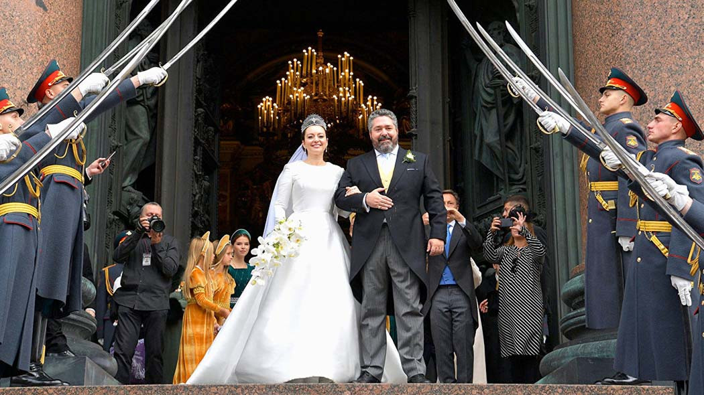

> **Первичный текст.** О текущем моменте №2(142), 2021г. О выборах депутатов Госдумы VIII созыва и перспективах.
> Источник: `dotu.ru:0a50a4b6a0483610.doc` sha256 `5b98113b8f282d6b…`; [страница на dotu.ru](https://dotu.ru/2021/10/29/20211029_tek_moment02142/).
> Автоматическая транскрипция DOC→Markdown; смысл и формулировки не правились.
> Контрольные суммы и статус проверки — в [NOTICE.md](../../NOTICE.md).
> Содержание передаёт позицию авторов; утверждения не верифицированы библиотекой.

---

## 3.2. О том, что не попало в оценку на основе поверхностного взгляда, краткосрочной памяти и недалёких намерений

Прежде всего, необходимо понимать, что:

- Суверенитет культурно своеобразного общества — это его способность порождать суверенную государственность. А если государственность в силу каких-то причин утрачивает полноту суверенитета, то общество либо возрождает суверенитет исторически сложившейся государственности, либо порождает новую суверенную государственность взамен утратившей суверенитет.

- С точки зрения управленческой суверенитет общества и государственности выражается в том, что в государственно-общественном самоуправлении реализуется полная функция управления[^97].

- В основе суверенитета лежит психология людей — их способность самостоятельно воспринимать действительность, самостоятельно **праведно** осмыслять воспринятое, предвидеть последствия разнообразных действий и бездействия, вырабатывать и осуществлять концепцию управления[^98] *развитием общества (если нет развития в его объективной, а не вымышленной иллюзорной сути, то нет и не может быть суверенитета)*.

- Утрата суверенитета начинается с нравственной несостоятельности, под воздействием которой в культуру общества и в личностную психику начинается интеграция заимствуемых или целенаправленно внедряемых в общество извне идей и мнений *без их праведного переосмысления в собственном соотнесении с действительностью*.

————————

Соответственно такому подходу, с момента принятия на веру без осмысленного соотнесения с жизнью византийского вероучения (так называемой «православной веры») до настоящего времени *Русь — Русское царство — Российская империя — СССР — постсоветская Российская Федерация* не обладает полнотой суверенитета, ни как культурно своеобразное общество, ни как государственность, под властью которой живёт общество. Однако, в нашей истории были периоды, когда государственность возглавляли личности, стремившиеся к обретению обществом суверенитета в его полноте. В историческом прошлом это Иван Грозный, Павел I, Николай I и И.В. Сталин.

Суверенные устремления Ивана Грозного, Павла I и Николая I были ограничены библейским вероучением: они не понимали, что библейское вероучения — концепция глобализации, предусматривающая порабощение человечества некоей олигархической мафией от имени Бога. Вследствие этого их устремлённость к полноте суверенитета не достигла успеха. Александр III не отнесён к числу тех, кто стремился к полноте суверенитета России несмотря на его здравую внешнюю политику, поскольку сам создал предпосылки к краху империи и подорвал суверенитет России пресловутым «указом о кухаркиных детях»[^99], существенно затруднившим получение образования представителями простонародья.

Суверенные устремления И.В. Сталина были ограничены прежде всего его работоспособностью: для него оказалось невозможным в свободное от руководства государством время выработать самостоятельно альтернативу «мраксизму», заимствованному с Запада в готовом к употреблению виде без праведного соотнесения его с реальностью и потому получившего достаточно широкое распространение в обществе, в том числе и при содействии государственной власти Российской империи, которая посредством «мраксизма» пыталась защититься от терроризма народничества[^100]; а советское общество, со своей стороны, мировоззренчески было крайне далеко от понимания проблемы суверенитета в его полноте, вследствие чего обществоведы РАН и вузов в этом деле не могли помочь И.В. Сталину[^101]. Поэтому после убийства И.В. Сталина хрущёвской политической мафией СССР утратил суверенитет де-факто, продолжая оставаться суверенным де-юре государством.

Именно вследствие несуверенности СССР в выше определённом смысле он был разрушен предательством высшего руководства при содействии интеллигенции и отстранённости от процесса делания политики массы рядовых членов партии и остальных граждан. В итоге была реализована Директива Совета национальной безопасности США 20/1 от 18.08.1948 г. «Цели США в отношении России»[^102]. Директива 20/1 от 18.08.1948 г. предусматривала:

- ликвидацию в СССР социализма и Советской власти;

- расчленение СССР на де-юре суверенные «демократические» (в буржуазно-либеральном понимании демократии) государства;

- создание автоматических гарантий, чтобы постсоветские государства не обладали военной мощью и были в экономической зависимости от передового в научно-техническом отношении Запада;

- всё это должно было быть сделано (и реально было сделано) не грубой военной силой, без военной оккупации страны, не унизительным образом, а так чтобы политика уничтожения СССР и перехода к «свободе и демократии» воспринималась населением, как политика, выражающая его собственные интересы.

*[В оригинальном издании здесь расположен рисунок/схема. Иллюстрация не включена в данный выпуск: ожидает визуальной и правовой проверки. Файл источника: image33.png]*В итоге руководство СССР капитулировало в «холодной войне»[^103], в результате чего и возникли все постсоветские государства на его территории. Все они, включая Россию, изначально организовывались местными «полезными дураками» и предателями под руководством кураторов от спецслужб государств Запада так, чтобы автоматически выполнялись гарантии: 1) неспособности создать сколь-нибудь значимую собственную военную мощь, 2) научно-технической и производственно-технологической зависимости от победителя в «холодной войне», 3) идейной зависимости от метрополии в лице коллективного Запада и его закулисных хозяев (все сферы жизни Запада тоже пронизаны разного рода мафиями, из числа которых главная политическая мафия — масонство во всех его ветвях).

С этим же надо соотнести и высказывание бывшего премьер-министра Великобритании Маргарет Тэтчер *«на территории СССР экономически оправдано существование 15 миллионов человек»*[^104] т.е. при таком подходе в России 90 % населения — избыточная «биомасса», которую должны уничтожить:

- как либерально-рыночная экономическая модель, непрестанно порождающая экономический геноцид, верность которой хранят Государственная Дума и Высшая школа экономики,

- так и европейская медицинская традиция, подчинённая принципу обеспечения её коммерческой эффективности, для чего все должны болеть и лечиться до смерти.

И это ещё одна глобально-политическая причина, по которой наша страна нуждается не только в возрождении полноты своего суверенитета на основе собственной концепции глобализации, но в субкультуре оздоровления населения в преемственности поколений и в здравоохранении, как в защите от одного из средств массового поражения в гибридной войне заправил Запада за безраздельное мировое господство, одной из задач которой является уничтожение генетического ядра Русской многонациональной цивилизации.

Слово «организовывается» по отношению к государственности означает, что архитектура структур государственной власти, функции и взаимосвязи органов, юридическое обеспечение их деятельности, включая и принципы кадровой политики, целенаправленно выстраиваются под решение определённых управленческих задач, что по умолчанию может подразумевать принципиальную неспособность этой архитектуры структур государственной власти решать другие задачи.

Однако, управленчески безграмотные социологи, политологии и «мыслители» на тему «теория государства и права» о структурном и бесструктурном способах управления и их взаимодействии не подозревают, вследствие чего в научном и политическом официозе тема целесообразности построения структур государственной власти и анализа функциональной состоятельности и целевого предназначения некогда и как-то возникших структур не изучается и не обсуждается. Как следствие, не обсуждаются вопросы: 1) о целеполагании в отношении задач государственного управления и 2) о целесообразном (по отношению к намеченным целям) построении архитектуры структур органов государственной власти.

Соответственно всё то, о чём было сказано в разделе 3.1, и многое другое, о чём в нём сказано не было, но то, что есть в жизни и дополняет сказанное, — неизбежные следствия системообразующих принципов построения постсоветской государственной власти.

В постсоветской России всё — и архитектура структур государственной власти, и законодательное обеспечение их деятельности, и кадровая политика, и система образования, и СМИ — «заточено» под обслуживание либерально-рыночной модели в её криптоколониальной версии в полном соответствии с требованиями так называемого «вашингтонского консенсуса»[^105], в котором выражаются требования хозяев США к организации экономики и финансовой системы порабощаемых ими стран.

Поэтому вопреки всем декларациям приверженцев либерально-рыночной экономической модели, начиная от нобелевского лауреата 1976 г. М. Фридмана (1912 — 2006) и кончая последним выпускником-недоучкой Высшей школы экономики РФ или РАНХиГС, либерально-рыночная модель на практике может только:

- создавать и воспроизводить в преемственности поколений нищету и культурную несостоятельность основной статистической массы населения, на фоне которых сверхбогатое меньшинство «бесится с жиру» и сетует на дикость, лень и озлобленность простонародья,

- уничтожать биосферу планеты, что выражается в глобальном биосферно-социальном экологическом кризисе,

- порождать и реализовывать потенциал войн.

Для защиты такого положения дел постсоветской государственности России придано ещё одно системное качество — имитация народовластия путём создания многопартийной фальшь-демократии[^106], скрывающей тиранию разного рода политических мафий[^107], пронизывающих и контролирующих все без исключения сферы жизни общества:

- Кандидаты в депутаты не выдвигаются рабочими коллективами, в которых все люди знают, чего реально стоит человек в деле и в жизни, а появляются неведомо откуда, либо, пройдя «внутрипартийный кастинг», либо как «самовыдвиженцы», которых в большинстве случаев кто-то из «друзей» продвигает в депутаты.

> В этом «кастинге» отдаётся предпочтение людям с ограниченным кругозором, не способным к процессному мышлению и личностному развитию, т.е. не способным к самоорганизации и соответственно — к возрождению суверенитета.

- Право отзыва депутатов и отстранения от власти госслужащих вследствие их порочащего поведения либо неспособности должным образом выполнять должностные обязанности, конституцией РФ не предусмотрено и законодательно не обеспечено.[^108]

- В избирательных бюллетенях нет графы «против всех» и соответственно законодательством не предусмотрены никакие юридически и политически обязывающие процедуры в случае победы «кандидата» «против всех» ни на региональном, ни на федеральном уровне.

> Но поскольку законодатели и те, кто ими манипулирует, опасались прогрессирующего снижения явки избирателей на выборы от выборов к выборам вследствие того, что люди чуют или даже понимают фальшивость постсоветского «народовластия», то действующее законодательство признаёт выборы состоявшимися при любой явке, а пропагандисты и политические аналитики обязаны интерпретировать неприход изрядной доли избирателей на выборы в стиле М.С. Симонян: *«было бы невероятной натяжкой и вообще враньём считать, что люди, которые не голосуют, — это люди, в той или иной степени оппозиционно настроенные. Как правило, это ровно наоборот…».*

>

> В действительности среди людей, которые не голосуют, на протяжении многих лет растёт доля тех, кто оппозиционен по отношению не тем или иным политическим партиям или политическим деятелям, а по отношению к государственности в режиме «Родину люблю, но государство ненавижу». Но обсуждать тему «Родину люблю, но государство ненавижу», обсуждать суть суверенитета общества и народовластия, его порождающего и выражающего — в публичных ток-шоу в либерально-буржуазной культуре недопустимо точно так же, как недопустимо эти темы обсуждать в режимах, которые либералы именуют «тоталитарными».

- Не предусмотрено обязательное дополнительное образование избранных депутатов в аспекте освоения ими научно-методологического обеспечения государственного управления и управления в народном хозяйстве, ориентированного на общественное развитие, выявление и разрешение проблем общества и человечества — по отношению к этой задаче все депутаты всех созывов Думы запредельно некомпетентные неучи.

> Во всех обществах, прежде чем позволить человеку управлять автомобилем, его много чему учат на систематической основе и проверяют, насколько он освоил необходимые знания, и насколько его навыки вождения способны обеспечить безопасность и его самого, и других людей.

>

> *Россия же как объект управления* — *её биосферно-социально-экономическая система* — многократно сложнее, нежели автомобиль и дорожная обстановка, в которой автомобиль движется. Однако депутатские обязанности в ней на всех уровнях может выполнять всякий, кто победил на выборах или прошёл по партийному списку, без какой-либо предварительной дополнительной подготовки и проверки её результатов. *Это на уровне того, в чём невежественные и лживые люди*[^109] *упрекают В.И. Ленина — всякая кухарка должна управлять государством.* Но В.И. Ленин таких глупостей не говорил и не воплощал их в политику: он был иного мнения, выраженного в лозунге «всякая кухарка должна научиться управлять государством» (см. репродукцию плаката 1920‑х гг. ниже), что подразумевает два обстоятельства:

- *[В оригинальном издании здесь расположен рисунок/схема. Иллюстрация не включена в данный выпуск: ожидает визуальной и правовой проверки. Файл источника: image34.jpeg]*в культуре общества должны быть адекватные жизни теории управления биосферно-социально-экономическими системами;

- их освоение должно быть открыто для всех, а не только для некой «элиты» и «супер-элиты»;

- люди должны воспитываться так, чтобы все понимали значимость и необходимость освоения такого рода знаний каждым;

- допуск к осуществлению государственной власти и управлению экономикой может осуществляться только через освоение этих теорий и контроль результатов освоения.

<!-- -->

- Нет отчётности государственной власти перед обществом. Свод характеристических статистик, описывающих жизнь биосферно-социально-экономической системы в границах государства и на сопредельных территориях и акваториях, и свод критериев оценки статистик и их динамики только мешал бы *режиму безответственности власти перед обществом* и политике, проводимой на основе «презумпции правоты власти». Поэтому все «прямые линии», «послания Федеральному собранию», встречи депутатов и госчиновников с населением — в отсутствие свода статистик, свода критериев, без анализа того и другого, — не более, чем пустой трёп — шоу, а не компоненты реального народовластия в формах «представительной демократии».

- Кроме того, государственность организована так, что полноценное исполнение должностных обязанностей во многих случаях является подлостью по отношению к подвластным гражданам, а добросовестное исполнение должностных обязанностей может, как минимум, вызвать неудовольствие вышестоящего начальства, а как максимум, — повлечь за собой уголовное преследование[^110].

Все названные характеристики постсоветской государственности в совокупности и обеспечивают поддержание именно постсоветской государственной властью как системой управления криптоколониального режима тирании в отношении России глобального ростовщического сообщества, узурпировавшего банковскую сферу, и его хозяев[^111].

Сказанное выше в разделе 3.2 дополняет описание положения страны, представленное в разделе 3.1, однако всё сообщаемое в разделе 3.2. выходит за пределы системы политических предубеждений, сформированных у большинства (включая и действующих политиков) исторически сложившейся культурой.

————————

При такой государственности и таком качестве культуры, что сложились в России после краха СССР 1991 г. и продолжают сохраняться в ней до настоящего времени, суверенитет общества в его полноте и внутреннее благоденствие страны не восстанавливаются написанием и провозглашением некой декларации о свободе и суверенитете[^112].

Восстановление общественно-государственного суверенитета в его полноте после капитуляции СССР в «холодной войне» и установления победителями криптоколониального режима и поддерживающей его государственной власти в России и других постсоветских государствах, архитектура которых сконструирована поработителями, — процесс длительный, многоаспектный и поэтапный.

Однако «Единая Россия», КПРФ, ЛДПР и «Справедливая Россия» в этом деле несостоятельны. Причина их несостоятельности в том, что ни их руководство, ни их активисты, ни их партийная масса не понимают проблематики *управляемого течения глобализации как гибридной войны за безраздельное мировое господство и порабощение человечества*. Как следствие у них за душой нет:

- ни своего проекта глобализации и теории победы над агрессором в этой гибридной войне,

- ни научно-методологического обеспечения, на основе которого такие проект глобализации и теорию победы в гибридной войне за безраздельное мировое господство можно построить и далее в соответствии с ними строить глобальную, внешнюю и внутреннюю политику государства,

- ни кадров, владеющих всем этим и действующим эффективно либо способных породить адекватное задачам развития научно-методологическое обеспечение государственного управления и готовить кадры на его основе[^113].

Поэтому все парламентские и непарламентские партии обречены быть элементами режима криптоколониальной эксплуатации страны заправилами Запада и системы имитации народовластия как основы имитации государственного суверенитета[^114].

Но и за пределами партий — в остальном обществе — кадров, на которые можно положиться в деле восстановления суверенитета общества и государства в его полноте, — мало. Поэтому:

Создавать какие-либо новые партии, и тем более *«революционные», т.е. ориентированные на силовой захват государственной власти, — «экстремистские» в терминах сложившейся в России политической и правоприменительной практики* — ВРЕДНОЕ занятие по двум причинам:

- **1) в обществе нет социальной базы, из которой можно было бы черпать кадры, готовые:**

<!-- -->

- не только при необходимости *«лечь на амбразуру» (это — самое простое)*,

- но и «лежать на боевом курсе под огнём противника» столько, сколько потребуется, освоив предварительно знания и навыки, необходимые для победы и восстановления жизни общества и управления экономикой и прочим после проведённого ими государственного переворота, конечно, при условии, что если ему будет позволено достичь успеха (к этому во всех культурах способных мало);

<!-- -->

- **2) невозможно обеспечить режим конспирации — все успешные заговоры и революции (но не бунты, бессмысленные и беспощадные, которые могут вспыхивать внезапно без умысла под воздействием обстоятельств) совершались при прямой поддержке спецслужб и политических мафий, отдававших спецслужбам приказы «поддержать» заговорщиков либо «не препятствовать» их деятельности.**

Потому создавать конспиративные экстремистские партии — заведомо негодное средство для действительного восстановления общественно-государственного суверенитета, и соответственно — подлость по отношению к тем несмышлёнышам (большей частью из числа подростков и вузовской молодёжи), кого зачинателям таких проектов удастся вовлечь в деятельность.

Зато в интернете много желающих потрепаться ни о чём и обо всём, не обладая в затрагиваемых ими темах никакими жизненно состоятельными знаниями и навыками, ни за что при этом не отвечая; *а также много в сети и тех, кто знает простые «решения» сложных проблем, о генераторах которых они даже не подозревают,* — это и есть потенциал реально опасного экстремизма.

При этом у недовольных жизнью и митингующих на улицах (таких мало, и они проявляются эпизодически) и в интернете (это статистически весомый постоянно активный сегмент интернет-невольников) на тему «В России всё плохо, всё пропало…» требования к главе государства по сути экстремистские — как у старухи к Золотой рыбке; и это вопреки тому, что глава государства *чудотворной мощью Золотой рыбки* не обладает, о чём все недовольные задуматься не желают.

А выработать или освоить знания, которые позволяют разрешить проблемы, и войти с ними в политические партии и в структуры власти, включая государственную, — это для недовольных либо «слабо» (по причине порабощённости их интересами только первых трёх групп: единоличные гедонистические, семейно-бытовые, профессиональные), либо «политика — грязное дело», а они мараться и «портить свою карму»[^115] не хотят…

Однако есть ряд обстоятельств, на одно из которых ещё в XVIII веке указал фельдмаршал русской службы, один из сподвижников Петра I, Христофор Антонович Миних (1683 — 1767): *Русское государство обладает тем преимуществом перед другими, что оно управляется непосредственно самим Господом Богом, иначе невозможно объяснить, как оно существует.*

Второе обстоятельство состоит в том, что всякое общество осуществляет своё самоуправление в иерархически высшем объемлющем управлении. Это означает, что России как одной из региональных цивилизаций свойственна своя психодинамика. Психодинамика выражается в том, что все делают то, что хотят или то, что поручено, но они этому не противятся, и не делают того, чего не хотят, а в результате получается то, что получается. Носителем психодинамики является эгрегориальная система, порождаемая соответствующим множеством людей, — в данном случае населением региональной цивилизации России.

Региональные цивилизации отличаются друг от друга, не образом жизни, не материальной и иной культурой, а теми идеалами, которые они несут через века, и от которых их реальный исторически сложившийся образ жизни может быть очень далёк. Носителем идеалов региональной цивилизации является её генетическое ядро. Это люди, которые могут принадлежать к разным социальным группам, быть незнакомыми друг с другом, проживать в разных местах; и при этом генетическое ядро не является множеством каких-либо «супер-элитарных» тайных кланов, в которых характеристические идеалы соответствующей цивилизации передаются из поколения в поколение. Кто-то из детей участников генетического ядра может тоже принадлежать ему, а кто-то может выпасть из него; у родителей, никто из которых не принадлежит генетическому ядру, могут родиться и вырасти дети, которые войдут в его состав. Генетическое ядро региональной цивилизации (народа) в терминах ДОТУ — специализированная виртуальная структура.

Генетическое ядро региональной цивилизации Русского мира — многонациональной России[^116] — не погибло, поэтому в психодинамике России активны тенденции к восстановлению общественно-государственного суверенитета в его полноте в том смысле, как феномен суверенитета был пояснён в начале раздела 3.2.

Если с этих позиций (что требует выхода за ограничения на миропонимание, налагаемое подневольностью трём группам интересов — индивидуальных[^117], семейно-бытовых, профессиональных) посмотреть в прошлое, то можно увидеть события, которые не укладываются в русло Директивы СНБ США 20/1 от 18.08.1948 г. и в либерально-буржуазную концепцию глобализации. В условиях криптоколониального характера государственности постсоветской России, вопреки ей поэтапно сделано следующее:

- Ликвидирована продовольственная зависимость от зарубежья, какая была в1990-е гг., хотя положение в сельском хозяйстве по-прежнему оставляет желать много лучшего.

- Модернизированы вооружённые силы (все рода войск и ВМФ в большей или меньшей мере), что привело к разрушению у криптоколонизаторов иллюзии безнаказанности военной агрессии против России (по типу агрессии НАТО против Югославии в 1990‑е гг.).

> Особо следует обратить внимание на то обстоятельство, что всё высокоточное оружие (за единичными исключениями) действует на основе средств космической навигации. В мире для этого есть только две системы — американская GPS (Global Positioning System — система глобального *позиционирования, т.е. указания координат*) и российская «ГЛОНАСС» (Глобальная навигационная спутниковая система). Кроме того, что ГЛОНАСС исключает диктат военной силой в отношении России, обеспечивая наведение оружия на цели, с её помощью можно решать и разного рода навигационные задачи в мирных целях.

>

> На Севере и на Дальнем Востоке завершается сооружение двух судостроительных заводов, построечные места в которых позволяют строить корабли водоизмещением до 400 тыс. тонн[^118].

>

> То обстоятельство, что многое из появившегося на вооружении России в наши дни в своей основе имеет ещё советские разработки, принципиального значения не имеет, поскольку оно работоспособно и иллюзию безнаказанности агрессии у заправил Запада разрушает. Т.е. в перспективе Россия сможет строить корабли всех классов, включая и полноценные авианосцы.

- Создана собственная платёжная система МИР. Это одна из компонент защиты устойчивого безналичного денежного обращения в стране, т.е. необходимая компонента обеспечения финансового суверенитета.

- Развиваются инфраструктуры.

Это всё не входит в интересы первых трёх групп, которыми живёт большинство населения страны, и потому не воспринимается ими в качестве реальных достижений последних двадцати лет. Но это всё вносит свой вклад в формирование спектра возможностей течения событий в будущем именно в аспекте восстановления суверенитета России в его полноте.

Далее должно быть понятно, что это всё не возникло само собой в результате случайного стечения обстоятельств в либерально-рыночной экономике и возникновения у кого-то соответствующих коммерческих интересов.

Появление всего этого не вызывает восторга у заправил Запада, а источник этой проблемы они видят именно в В.В. Путине персонально (в силу своей плохой осведомлённости о реальности). Они знают, что при Б.Н. Ельцине ничего такого возникнуть не могло. Они знают, что если бы президентом РФ стал М.Д. Прохоров[^119], М.Б. Ходорковский, Б.Е. Немцов, И.М. Хакамада, А.А. Навальный, А.И. Лебедь, М.С. Евдокимов[^120] и иные политики-либералы, то все названные и другие (не названные) достижения на пути к восстановлению общественно-государственного суверенитета России были бы либо невозможны, либо были бы уничтожены точно так же, как в 1990‑е гг. режимом, олицетворяемым Б.Н. Ельциным, уничтожались достижения СССР, на основе которых суверенитет России мог быть возрождён ещё к началу ХХI века.

Соответственно вся политика Запада в отношении внутреннего положения дел в России направлена на то, чтобы у множества людей, чьи интересы ограничены тремя неоднократно названными группами, недовольство росло, адресатом недовольства стали бы В.В. Путин и те политические институты, через которые, по их мнению, В.В. Путин проводит политику поэтапного возрождения суверенитета без каких-либо оглашений концептуально-управленческого характера. Главным из таких инструментов им видится «Единая Россия».

Поэтому в период времени, предшествующий парламентским и региональным выборам 2021 г., вся политика заправил либерально-рыночной глобализации была направлена на то, чтобы «Единая Россия» утратила большинство в Думе VIII созыва, поскольку именно в ней видят слепое и тупое «орудие тирана Путина», работающее исключительно по его указке (о том, что «либеральная платформа» «Единой России» — единственная из трёх «идеологических платформ», которая на протяжении многих лет реализуется в политике практически, — об этом умалчивают).

Поскольку беззастенчиво либеральные партии и политики персонально в России давно уже утратили сколь-нибудь широкую поддержку в электорате, то было придумано «умное голосование», согласно стратегии которого всем недовольным В.В. Путиным и «Единой Россией» предлагалось голосовать за КПРФ.

Именно в поддержке КПРФ антироссийскими силами М.С. Симонян упрекнула представителей этой партии в приведённом в разделе 2.2. фрагменте стенограммы программы «Воскресный вечер с Владимиром Соловьёвым» от 19.09.2021 г.: *«…это низко, отвратительно и гадко со стороны КПРФ пользоваться поддержкой изменников Родины, один из которых сейчас сидит в тюрьме. А я считаю, что его должны, надо было Навального — я его имею виду — сажать не по той статье, по которой его посадили, а по 275-й — государственная измена — потому, что человек на деньги «оттуда» разваливал, пытался развалить нашу страну…».*

Сам по себе этот упрёк в адрес КПРФ — глупый, хотя и пафосный.

Руководство КПРФ не может отвечать за решения, которые приняли за рубежом организаторы «умного голосования» и за их политику в целом. Для руководства КПРФ всё это — один из потоков обстоятельств, в которых партия вынуждена действовать и действует так, как её руководство находит это необходимым.

Но в данном случае интересно другое — то, что М.С. Симонян оставила вне обсуждения:

С какой стати умные либерал-буржуины — убеждённые противники социализма и коммунизма — рекомендовали голосовать за КПРФ? — ведь если бы затея с «умным голосованием» удалась по максимуму, то конституционное большинство могло бы перейти от «Единой России» к КПРФ.

Как многие думают, в этом случае Россия начала бы поворот к реставрации некоего социализма, в результате чего центробанк утратил бы статус «государства в государстве» (а по сути — главного иностранного агента в РФ), и многие проблемы страны, требующие экономического обеспечения, были бы быстро и эффективно решены на основе работы экономики в русле правильного плана биосферно-социально-экономического развития.

Ответ на этот вопрос прост: те, кто выдвинул стратегию «умного голосования» за КПРФ, знают, что КПРФ — партия-имитатор, паразит на идеалах социализма и коммунизма, потому что у неё нет за душой ни научно-методологического обеспечения государственного управления, ни кадров, владеющих этим научно-методологическим обеспечением и способных войти в управление и с течением времени придать ему иной характер. Поэтому никаких «правильных» планов биосферно-социально-экономического развития России и возрождения социализма КПРФ породить не может, и даже если такой план ей дать в готовом виде, то она его не поймёт (в силу приверженности отголоскам «мраксизма» и православия) и не сможет его воплотить в жизнь.

Т.е. победа КПРФ на выборах в смысле ликвидации парламентского большинства «Единой России», а тем более в смысле перехода к КПРФ конституционного большинства в Думе VIII созыва, привела бы к дезорганизации государственного управления в России тем в большей мере, чем активнее КПРФ взялась бы ниспровергать какой ни на есть либерально-буржуазный порядок, сложившийся после 1991 г. Именно поэтому в «умном голосовании» заведомые противники социализма и коммунизма рекомендовали голосовать за КПРФ.

Соответственно, массовое голосование за «Единую Россию» для многих людей — голосование за меньшее из зол, а не выражение солидарности с этой партией потому, что она выражает их чаяния лучшего будущего и способна и воплотить их в жизнь.

И потому тем гражданам России, кто убеждён в том, что *«режим украл победу у КПРФ, а у народа — украл выборы»,* следует успокоиться и посмотреть на течение глобального исторического процесса и течение отечественной истории, исходя из того, что:

- культура — вся информация и алгоритмика, передающиеся новым поколениям помимо генетического механизма биологического вида;

- будучи информационно-алгоритмической системой (т.е. она ориентирована на достижение определённых целей определёнными путями и средствами) культура обеспечивает самоуправление культурно своеобразных обществ (т.е. автоматический режим управления), который однако допускает изменение режима самоуправления, посредством оказания прямого управляющего воздействия на те или иные элементы соответствующей биосферно-социально-экономической системы либо на процессы в объемлющей её среде, с которой она взаимодействует;

- решение любых управленческих задач (как организация самоуправления, так и непосредственное управление), требует соответствующего целям информационно-алгоритмического обеспечения, и если его нет либо оно не употребляется по назначению, то в управлении и самоуправлении будет реализовано какое-то иное информационно-алгоритмическое обеспечение;

- в толпо-«элитарных» культурах умолчания, на которых строится управление, могут отрицать оглашения — в каких-то ситуациях это может быть благом для общества, поскольку защищает его развитие от вмешательства врагов, а в каких-то — вредным, поскольку сеет в обществе веру в заведомо несбыточные иллюзии (чем и занимаются все парламентские партии и весь политический официоз РФ), и в жизни обществ и то, и другое может сопутствовать друг другу, как это имеет место в постсоветской России в процессе восстановления общественно-государственного суверенитета в его полноте;

- государственность постсоветской РФ изначально строилась так, чтобы «электорат» был невежественным и им можно было манипулировать в режиме либерально-буржуазной представительной фальшь-демократии, и если у зарубежных манипуляторов возникают проблемы, то это их проблемы, а не проблемы России, поэтому «электорату» не следует суетиться, а надо заняться самообразованием, чтобы в дальнейшем стало невозможно манипулировать поведением граждан.

Однако М.С. Симонян не стала говорить об этом либо потому, что она этого сама не понимает, либо потому, что обсуждение темы несостоятельности КПРФ как действительно коммунистической партии — было бы работой на увядание «недотроцкистской» КПРФ, без коей «палитра многопартийности» в фальшь-демократии России стала бы беднее.

*[В оригинальном издании здесь расположен рисунок/схема. Иллюстрация не включена в данный выпуск: ожидает визуальной и правовой проверки. Файл источника: image35.jpeg]* Теперь о «Единой России», которая так или иначе (как именно? — это вопрос личных верований) смогла удержать конституционное большинство в Думе VIII созыва. Следует понимать, что «Единая Россия» — это не политическая партия, в отличие от КПРФ и других политических партий России, которые представлены в Думе либо в ней не представлены. «Единая Россия» — «профсоюз» более или менее успешных бюрократов-управленцев, которые сами по себе безыдейны, но готовы служить за плату и социальный статус держателям любых идей. У «Единой России» двусмысленная эмблема (см. рис. слева). Является это «ляпом» (ошибкой) дизайнера и намёком со стороны Ноосферы, либо дизайнер умышленно надругался над заказчиком, либо так было задумано заказчиком, и дизайнер честно выполнил заказ? — с этим «Единая Россия» пусть разбирается сама. Но надо понимать, что символика играет в жизни не последнюю роль и символ «Единой России» — весьма далёк от идеала, как и её дела.

Вокруг этого профсоюза бюрократов, как и вокруг руководства всех иных партий, сложилась социальная группа поддержки, в которой молодёжь является кадровым резервом действующих бюрократов:

- кто-то участвует в группе поддержки по убеждению, поскольку искренне желает совершенствовать исторически сложившееся государственное управление и поднять качество жизни в России — им предстоит трудная работа в силу того, что активистам надо заниматься самообразованием, чтобы самим не стать бюрократами, а бюрократы не терпят инакомыслия подчинённых, не терпят критики и мстительны по отношению к критикующим, и кроме того, бюрократы в их большинстве необучаемы;

- кто-то беспринципно пытается сделать карьеру;

- кто-то по наивности, не понимая ни первого, ни второго, верит руководству и исполняет порученное ему.

*[В оригинальном издании здесь расположен рисунок/схема. Иллюстрация не включена в данный выпуск: ожидает визуальной и правовой проверки. Файл источника: image36.jpeg]*И вся эта система — «профсоюз» бюрократов плюс группы поддержки в обществе — как и все и остальные идейные партии постсоветской России — не имеет за душой научно-методологического обеспечения государственного управления и управления в народном хозяйстве, ориентированного на задачи развития, и давно не желает его иметь: см. фото слева[^121]. На нём запечатлён тогдашний зам. главы администрации президента В.В. Путина В.Ю. Сурков: в его руках одно из изданий работы ВП СССР 2006 г. «Смута на Руси: зарождение, течение, преодоление…»[^122]. Как видите, это издание достаточно крупноформатное (формат страницы — А3) и ярко оформленное. Т.е. оно не может случайно затеряться в ворохе других бумаг: *его можно только либо осознанно проигнорировать, либо осознанно принять в работу.* А ещё ранее 28 ноября 1995 г. состоялись парламентские слушания по Концепции общественной безопасности[^123], которые тоже были преданы забвению.

Это обусловлено тем, что действующие управленцы не имеют свободного времени и сил для того, чтобы заниматься самообразованием даже, если они осознают собственную некомпетентность — это внутренняя причина. В лучшем случае некоторые из них, осознав свою некомпетентность, пытаются найти компетентных консультантов от науки, однако в научном официозе таких крайне мало. А кроме неё есть и внешние причины: «профсоюз» бюрократов, как и все другие политические партии и все сферы и отрасли деятельности во всех обществах пронизаны разного рода «мафиями»[^124], которые успешно их контролируют; этому обстоятельству подчинена и корпоративная дисциплина, систематическое нарушение которой влечёт за собой отторжение корпорацией недисциплинированных, которое может проходить и виде «показательной порки», чтобы другим было неповадно.

В политической жизни России, как и во всей либерально-буржуазной цивилизации, именуемой «Запад», наиболее активной политической мафией является масонство либерально-буржуазной ветви, «Центральный комитет» которой дислоцирован в Великобритании[^125]. Действующие в России «братаны» не стремятся к публичности, а не принадлежащие системе прочие воспитаны так, что тему «роль масонства в истории» не знают и знать не хотят, что является одним из факторов, обеспечивающим успешное манипулирование ими. Однако именно действие этого фактора объясняет многое в политике всех политических партий, включая «Единую Россию», в деятельности СМИ, в деятельности системы образования.

Однако через «Единую Россию» проходит политика, порождённая другими политическими силами, так или иначе, в меру своего понимания работающими на восстановление суверенитета России. И это вызывает определённое неудовольствие «братанов» и их хозяев, что и нашло своё выражение в стратегии «УГ» и заявлениях политиков государств Запада о заведомом непризнании результатов парламентских выборов 2021 г. Тем не менее:

Парламентские выборы в России 2021 г. «братаны» и их кураторы проиграли внутрироссийским политическим силам страны.

И поскольку вследствие этого проблема подавления процесса возобновления общественно-государственного суверенитета России в его полноте осталась, то «братаны» и их хозяева могут пытаться решить её и иными путями. Один из них — восстановление в России монархии.

Именно в этом контексте следует рассматривать свадьбу претендента на российский престол Георгия Михайловича Романова и Ребекки Беттарини[^126] (после принятия православия — Виктория Романовна Романова) и их венчание в Исаакиевском соборе в С-Петербурге 1 октября 2021 г. В этом мероприятии принял участие почётный караул от Армии РФ, проведение этого мероприятия обеспечивали полиция С-Петербурга, МИД (приезд зарубежных гостей), министерство культуры (в его ведении Дом учёных — бывший дворец великого князя Владимира Александровича[^127]), Администрация президента (в её ведении Константиновский дворец в Стрельне) и другие подразделения государственной власти разных уровней, а также СМИ[^128].

Как вариант реализации этого сценария: 1) *так или иначе (вариантов много, и потому ФСО должна работать на совесть)* убрать В.В. Путина с должности главы государства, 2) организовать маленькую управляемую смуту, чтобы сорвать избрание нового главы государства в соответствии с действующей конституцией, и 3) в целях прекращения «маленькой управляемой смуты» — посадить на престол подконтрольную масонству династию[^129] и тем самым раз и навсегда закрыть вопрос с выборами главы государства и возрождением общественно-государственного суверенитета России. «Наследник престола» молодожёнами уже обещан.

Понятно, что научно-методологического обеспечения государственного управления и управления в народном хозяйстве, ориентированного на суверенное развитие страны, за Георгием Михайловичем Романовым и его сподвижниками и прихлебателями (сподвижники и прихлебатели — не одно и то же) тоже нет[^130], как его нет и за другими политическими силами, чьи представители присутствуют в политическом официозе и чья деятельность освещается в СМИ.

«Г.М. Романов — император» — это одна из компонент глобально-политического проекта. Напомним также, что внедрение Г.М. Романова в публичную политическую жизнь России началось в период олицетворения российской государственности Б.Н. Ельциным, которому монархистами тех лет был присвоен титул «великого князя», от которого Б.Н. Ельцин не отказался. Отметим, что кроме него нескольким сотням (если не тысячам) госслужащих РФ к настоящему времени присвоены разные дворянские титулы: это своего рода — аванс на будущее, и формирование верноподданной кадровой базы. Так что организация венчания молодожёнов в Исаакии — замыкание проекта на византийскую матрицу через почитание святого Исаакия Далматинского и попытка реанимации политического проекта, который не смогли осуществить в 1990‑е гг.

В этой связи отметим и ещё одно знаковое событие: скульптура сокола — тотемного символа династии Рюриковичей — в ночь с 8 на 9 октября была украдена в Старой Ладоге[^131]:

*[В оригинальном издании здесь расположен рисунок/схема. Иллюстрация не включена в данный выпуск: ожидает визуальной и правовой проверки. Файл источника: image38.png]* *[В оригинальном издании здесь расположен рисунок/схема. Иллюстрация не включена в данный выпуск: ожидает визуальной и правовой проверки. Файл источника: image39.png]*

- Рюрик и Рюриковичи — изначально олицетворение самобытности и суверенитета региональной цивилизации Руси — России.

- А Романовы, воцарившиеся по итогам смуты рубежа XVI — XVII веков, — изначально ставленники «мировой закулисы» тех лет, которые так и не смогли подняться до осуществления устойчивого самодержавия — суверенитета хотя бы государственной власти, если уж не общественно-государственного суверенитета в его полноте в том смысле, как суверенитет был определён в начале раздела 3.2.

Поэтому кража символа древней суверенной Русской государственности — это плохое предзнаменование, если помнить о том, что Бог и ноосфера говорят с людьми на языке жизненных обстоятельств (иносказательно-символически), а не только в режиме доведения информации в прямой форме до тех или иных «мистиков».

Соответственно:

Ошибочно рассматривать венчание в Исаакии претендента на престол и его супруги как некую безобидную «клоунаду», междусобойчик сообщества «элитарных» семей, которые они сами оплатили, а Россия за некую плату предоставила декорации для этого семейного праздника.

Реально — это действо направлено на юридически нелегитимное уничтожение сложившегося конституционного строя России, и оно было осуществлёно при соучастии в нём органов государственной власти России и ряда должностных лиц персонально.

Однако все ветви государственной власти помалкивают, Генпрокуратура и ФСБ — тоже помалкивают и никаких мер предпринимать не собираются и никаких объяснений происшедшему не дают. Единственно, министр обороны С.К. Шойгу заявил, что те, кто послал почётный караул возрождённого Преображенского полка[^132] на это венчание, будут наказаны, но о том, что *они будут отданы под следствие и суд за подрыв конституционного строя РФ,* — не сообщалось, как не сообщалось ни о конкретных виновных, ни о каких-либо наказаниях их по службе.[^133]

[^97]: «Полная функция управления» — термин достаточно общей теории управления (ДОТУ). Полная функция управления в реальности жизни включает в себя:

    Выявление фактора среды, который «давит на психику» и тем самым вызывает потребность в управлении.

    Целеполагание в отношении выявленного фактора.

    Выработку концепции достижения намеченных целей на основе многовариантной прогностики течения событий.

    Внедрение концепции в жизнь — организация управления в соответствии с нею.

    Контроль за течением процесса управления и корректировка концепции и текущего управления.

    Достижение целей и высвобождение ресурсов либо (в случае краха управления) возврат к п. 1.

    Более обстоятельно см. «Достаточно общая теория управления. Постановочные материалы учебного курса факультета прикладной математики — процессов управления Санкт-Петербургского государственного университета (1997 — 2003 гг.): <https://storage.googleapis.com/dotu-154621.appspot.com/20040623-DOTU.pdf>; <https://www.vodaspb.ru/index.php?dn=down&to=open&id=115>.

[^98]: Концепция управления — это совокупность целей, путей и средств их достижения

[^99]: Циркуляр «О сокращении гимназического образования» (1887 г.), получивший в обществе название «указ о кухаркиных детях». От этого «указа» происходит та «кухарка», в стремлении отдать государственную власть в чьи руки либералы обвиняют В.И. Ленина. «Циркуляр рекомендовал директорам гимназий и прогимназий при приёме детей в учебные заведения учитывать возможности лиц, на попечении которых эти дети находятся, обеспечивать необходимые условия для такого обучения; таким образом «гимназии и прогимназии освободятся от поступления в них детей кучеров, лакеев, поваров, прачек, мелких лавочников и тому подобных людей, детям коих, за исключением разве одарённых гениальными способностями, вовсе не следует стремиться к среднему и высшему образованию»[\[1\]](https://ru.wikipedia.org/wiki/%D0%9E_%D1%81%D0%BE%D0%BA%D1%80%D0%B0%D1%89%D0%B5%D0%BD%D0%B8%D0%B8_%D0%B3%D0%B8%D0%BC%D0%BD%D0%B0%D0%B7%D0%B8%D1%87%D0%B5%D1%81%D0%BA%D0%BE%D0%B3%D0%BE_%D0%BE%D0%B1%D1%80%D0%B0%D0%B7%D0%BE%D0%B2%D0%B0%D0%BD%D0%B8%D1%8F#cite_note-1) («Википедия»).

[^100]: См. А.И. Спиридович. «Записки жандарма». — Харьков: изд. «Пролетарий». 1928. (Одна из интернет-публикаций: <http://www.hist.msu.ru/ER/Etext/gendarme.htm>).

[^101]: В период с 1936 г. до конца своих дней И.В. Сталин не смог добиться от советской науки, чтобы учёные написали учебник экономической теории, который бы адекватно описывал народное хозяйство СССР и организацию управления им. Наука на протяжении всего этого времени выдавала только графоманство на основе цитат из произведений К. Маркса, Ф. Энгельса, В.И. Ленина, самого И.В. Сталина и документов партийных съездов и пленумов, но не научную теорию (см.: Галушка А.С., Ниязметов А.К., Окулов М.О. Кристалл роста к русскому экономическому чуду. — М., 2021. — 360 с., илл.: раздел 8.5 Теория: формула не раскрыта). Вследствие этой импотенции советской науки И.В. Сталину пришлось самому написать работу-завещание «Экономические проблемы социализма в СССР» (1952 г., авторы «Кристалла роста» цитируют её в тексте без указания названия и имени автора, но название приводят только в списке литературы), в которой он намекнул потомкам на метрологическую несостоятельность политэкономии «мраксизма» и писал о необходимости создания теории, соответствующей реальности.

    В связи с этим вспомним, что за несколько дней до его убийства И.В. Сталин говорил по телефону Дмитрию Ивановичу Чеснокову: *«Вы должны в ближайшее время заняться вопросами дальнейшего развития теории. Мы можем что-то напутать в хозяйстве. Но так или иначе мы выправим положение. Если мы напутаем в теории, то загубим всё дело. Без теории нам смерть, смерть, смерть!..»* (приводится по публикации интервью с Р. Косолаповым «Без теории нам смерть!» в газете «Завтра» № 50 (211), декабрь 1997 г.).

    Однако тема научно-методологического обеспечения управления биосферно-социально-экономическими системами и необходимости развития такого научно-методологического обеспечения, построения системы обществоведческого образования на его основе — вне восприятия и осмысления политиков постсоветской России и научного официоза.

[^102]: Причём М.С. Горбачёву было прямо указано, что проект «Перестройка» — рождён не в СССР, а реализует Директиву СНБ США 20/1 «Цели США в отношении России». Но психологический аналог гоголевского Манилова, продвинутый на пост «Великого инквизитора» всея СССР, не внял и после этого в одном из публичных выступлений, оторвавшись от текста заготовленной для него речи, эмоционально возбуждённо начал возражать на тему, что идеи перестройки не подсунуты руководству СССР из-за океана.

    Директива СНБ США 20/1 от 18.08.1948 г. опубликована на сайте «Интернет против телеэкрана» в статье «Откуда взялся План Даллеса» (<http://www.contr-tv.ru/print/2015/>).

[^103]: Ей начало положила «фултонская речь» У. Черчилля 5 марта 1946 г. (см. текст: <https://proza.ru/2015/08/22/1102>).

    Надо понимать, что Устав ООН писался на основе неких договорённостей И.В. Сталина и Ф.Д. Рузвельта, достигнутых ими в Тегеране в 1943 г., когда Ф.Д. Рузвельт жил в советском посольстве. Он писался под решение задач глобально-цивилизационного характера на основе сотрудничества СССР и США, а не под конфронтацию СССР и НАТО в «холодной войне». Поэтому, дав старт «холодной войне», У. Черчилль и те закулисно-политические силы, которых он публично представлял, показали, что они — мерзавцы, многократно худшие, чем А. Гитлер, поскольку «холодная война» украла у человечества более ста лет, которые могли быть использованы на выявление и разрешение проблем всех народов и человечества в целом, а не на их усугубление и создание новых проблем в ходе «холодной войны».

[^104]: «Это было её выступление по внешней политике. Я слышал его в звукозаписи. Там прямо не говорилось, что в СССР надо оставить 15 миллионов человек, а говорилось более хитро: дескать, советская экономика совершенно неэффективна, есть лишь небольшая эффективная часть, которая, собственно, и имеет право на существование. И в этой-то эффективной части занято всего 15 миллионов человек нашего населения. Таков смысл высказывания Тэтчер, которое потом интерпретировали по-разному. Но суть в том, что с точки зрения современных политиков, которые не всегда высказываются столь откровенно, как “железная леди”, оправдано существование только тех людей, которые заняты в эффективной экономике. И для нас это очень нехороший звоночек, потому что по западным критериям наша экономика неэффективна» (Сколько в России лишних людей. — Интервью с Андреем Паршевым. — Интернет-ресурс: <http://www.pravoslavie.ru/guest/parshev.htm>).

    Тем, кто убеждён в том, что А. Паршев положил начало кампании клеветы в отношении Великобритании и её политиков, приведём высказывание другого премьера (в 1990 — 1997 гг.) правительства «её величества» Джона Мейджера: «...задача России после проигрыша холодной войны — обеспечивать ресурсами благополучные страны. Но для этого им нужно всего 50 — 60 миллионов человек». — Интернет-ресурс: <http://www.alfar.ru/smart/4/1078/>. Соответственно между гитлеровским режимом с его планом «Ост» уничтожения порядка 110 миллионов граждан СССР и режимом современной «Великобратании» нет принципиальной разницы, и соответственно этому необходимо строить политику в отношении «соединённого королевства» и представителей династии и правящей «элиты» персонально.

    М. Тэтчер и Дж. Мейджер — мерзавцы, идентичные У. Черчиллю, т.е. худшие, чем А. Гитлер.

[^105]: Что это такое, см.: Ананьин О., Хаиткулов Р., Шестаков Д. Вашингтонский консенсус: пейзаж после битв. — Мировая экономика и международные отношения (МЭМО). 2010, № 12. — С. 15-27. ([https://economics.hse.ru/data/2011/02/14/1208909692/2010 МЭМО.pdf](https://economics.hse.ru/data/2011/02/14/1208909692/2010%20МЭМО.pdf)).

[^106]: Обстоятельное пояснение этого утверждения см. в работе ВП СССР «Введение в конституционное право».

[^107]: На встрече с избирателями в Красноярске 3 августа 2011 г. лидер ЛДПР В.В. Жириновский прямо рассказал об этом:

    «**Вопрос из зала**: Вопрос к Вам есть… По конституции, статья 3-я, высшей конституционной властью является многонациональный народ России. Как Вы к этому относитесь? И признаёте ли Вы его?

    **Жириновский**: Отвечаю. — Отрицательно. Никогда, ни в одной стране мира власть народу не принадлежала.

    **Продолжение вопроса из зала**: Так, зачем вы тогда перед народом сидите?

    **Жириновский**: А вот сижу и объясняю вам, чтобы таких дураков, как вы больше не было у нас… (в зале взрыв аплодисментов, и далее Жириновский продолжает под аплодисменты). Ничего не можете понять… Вам в семнадцатом году сказали «Власть народу!» — Получили «власть народу»? Вам Ельцин обещал «Власть народу!» и демократию. — Получили? Объясняю: вам никто и никогда власти не даст… Власть всегда в руках мафии, бандитов, криминала, коррупционеров — от царя до сегодняшней власти. *Власть всегда есть дело мафии. Нате власть и завтра* (выделенное курсивом может быть неточно, поскольку речь В.В. Жириновского в этом месте записи не вполне разборчива) сажайте их в тюрьму… Дурочка ты, и уходи отсюда из зала. Сумасшедшая… Вот такие сумасшедшие и мешают России. "В конституции написано... ". — Во всех конституциях мира написано: все права — на здоровье, на жилье, на работу, на безопасность. И бомбят Ливию… Целые полгода бомбят Ливию. Как в зоопарке. Пока не убьют Кадаффи. Эта власть кому принадлежит? Американскому народу? — Это Барак Обама бомбит. Саркози бомбит. НАТО бомбит. А что же французский народ молчит, так сказать, американский молчит?» («Жириновский о власти народа. Ярко. Эмоционально»: <https://www.youtube.com/watch?v=pu9b3G5VZGw>; <https://m.play.md/3084889>).

[^108]: А призывы ввести ответственность депутатов и чиновников за невыполнение предвыборных обещаний трактуются как проявления экстремизма. Пример тому дело в отношении Юрия Игнатьевича Мухина и возглавляемой им «Армии воли народа» (АВН). Как сообщает «Википедия», «29 июля 2015 года решением Хамовнического суда вместе с соратником Валерием Парфёновым и журналистом РБК Александром Соколовым был заключён под стражу по обвинению в продолжении экстремистской деятельности в составе АВН перед которой, по заявлению обвиняемых, поставили целью «создание инициативных групп по проведению референдума» о внесении поправок в Конституцию и принятия закона «За ответственную власть» (позволявшего оценивать работу депутатов, сенаторов и руководства страны после истечения их полномочий). Следствие полагает, что цель была в «расшатывании политической обстановки в сторону нестабильности и смене существующей власти нелегальным путём». (…)

    19 августа 2015 года Мосгорсуд отпустил Юрия Мухина под домашний арест[\[5\]](https://ru.wikipedia.org/wiki/%D0%9C%D1%83%D1%85%D0%B8%D0%BD,_%D0%AE%D1%80%D0%B8%D0%B9_%D0%98%D0%B3%D0%BD%D0%B0%D1%82%D1%8C%D0%B5%D0%B2%D0%B8%D1%87#cite_note-5). Проходящих по тому же делу Парфёнова и Соколова оставили в СИЗО. Дело четырёх активистов (Юрия Мухина, Александра Соколова, Валерия Парфёнова и Кирилла Барабаша) рассматривал судья Тверского районного суда Москвы Алексей Криворучко, ранее включённый в [«список Магнитского»](https://ru.wikipedia.org/wiki/Список_Магнитского)[\[6\]](https://ru.wikipedia.org/wiki/%D0%9C%D1%83%D1%85%D0%B8%D0%BD,_%D0%AE%D1%80%D0%B8%D0%B9_%D0%98%D0%B3%D0%BD%D0%B0%D1%82%D1%8C%D0%B5%D0%B2%D0%B8%D1%87#cite_note-open-6). 10 августа 2017 года был оглашён приговор. Александр Соколов был осуждён на 3,5 года лишения свободы[\[7\]](https://ru.wikipedia.org/wiki/%D0%9C%D1%83%D1%85%D0%B8%D0%BD,_%D0%AE%D1%80%D0%B8%D0%B9_%D0%98%D0%B3%D0%BD%D0%B0%D1%82%D1%8C%D0%B5%D0%B2%D0%B8%D1%87#cite_note-7). Мухину этим же приговором было назначено 4 года лишения свободы условно с 1 годом ограничения свободы, Кириллу Барабашу дали 4 года реального лишения свободы с лишением воинского звания подполковника, Валерию Парфёнову дали также 4 года реального лишения свободы[\[6\]](https://ru.wikipedia.org/wiki/%D0%9C%D1%83%D1%85%D0%B8%D0%BD,_%D0%AE%D1%80%D0%B8%D0%B9_%D0%98%D0%B3%D0%BD%D0%B0%D1%82%D1%8C%D0%B5%D0%B2%D0%B8%D1%87#cite_note-open-6)[\[8\]](https://ru.wikipedia.org/wiki/%D0%9C%D1%83%D1%85%D0%B8%D0%BD,_%D0%AE%D1%80%D0%B8%D0%B9_%D0%98%D0%B3%D0%BD%D0%B0%D1%82%D1%8C%D0%B5%D0%B2%D0%B8%D1%87#cite_note-8)».

    И вопрос: за что осудили: — за предложение провести референдум и изменить конституцию? — либо за некую конспиративную деятельность, доказательства ведения которой руководством АВН не были предъявлены обществу?

[^109]: Среди них — кумир отечественных либералов фальшь-патриотов А.И. Солженицын: *«Образование!.. Что за путаница вышла с этим всеобщим семилетним, всеобщим десятилетним, с кухаркиными детьми, идущими в вуз! Тут безответственно напутал Ленин, вот уж кто без оглядки сорил обещаниями, а на сталинскую спину они достались непоправимым кривым горбом. Каждая кухарка должна управлять государством! – как он себе это конкретно представлял? Чтобы кухарка по пятницам не готовила, а ходила заседать в Облисполком? Кухарка – она и есть кухарка, она должна обед готовить. А управлять людьми — это высокое умение, это можно доверить только специальным кадрам, особо отобранным кадрам, закалённым кадрам, дисциплинированным кадрам. Управление же самими кадрами может быть только в единых руках, а именно в привычных руках Вождя»* (В круге первом).

    Этого фрагмента вполне достаточно для того, чтобы выработать отношение и к А.И. Солженицыну лично, и к его идейному наследию.

    В действительности мнение В.И. Ленина иное: *«Мы не утописты. Мы знаем, что любой чернорабочий и любая кухарка не способны сейчас вступить в управление государством. Но мы \[…\] требуем немедленного разрыва с тем предрассудком, будто управлять государством, нести будничную, ежедневную работу управления в состоянии только богатые или из богатых семей взятые чиновники. Мы требуем, чтобы обучение делу государственного управления велось сознательными рабочими и солдатами, и чтобы начато было оно немедленно, т. е. к обучению этому немедленно начали привлекать всех трудящихся, всю бедноту»* (из статьи «Удержат ли большевики государственную власть?» — 1917).

[^110]: В постсоветской России ответы на вопросы «за что?» и «по какой статье УК РФ формально юридически безупречно наказали?» — далеко не всегда совпадают, плюс к этому сложившаяся практика избирательного персонально-адресного применения / неприменения законов.

[^111]: В дебатах кандидатов в ходе праймериз «Единой России» в Санкт-Петербурге (22 мая 2016 г.) принимал участие Евгений Юрьевич Шувалов: в то время — член высшего совета «Единой России», руководитель аппарата Госдумы по связям с общественностью и взаимодействию со СМИ, в мае 2017 г. перешёл на работу в администрацию президента, в декабре 2018 г. выведен из состава высшего совета партии.

    С ним тогда состоялся такой разговор:

    *— То, что вы создали в стране, — тирания ростовщичества.*

    *Шувалов: Это вопрос дискуссионный. (Фраза иносказательная, в значении: разговор закончен, не приставайте).*

    *— Если проанализировать финансовые потоки в стране, то Вы убедитесь, что это так.*

    На этом разговор завершился, поскольку член высшего совета «Единой России» уклонился от обсуждения вопроса и покинул помещение, где проводились дебаты кандидатов. **— В этом разговоре выразилась истинная суть руководства «Единой России».**

[^112]: Один из исторических парадоксов — Декларация о государственном суверенитете РСФСР 12.06.1990 г. реально положила юридическое начало криптоколонизации России заправилами Запада.

[^113]: В дореволюционные годы большевики организовали систему партийной учёбы как внутри империи, так и за её пределами. Для тех, кто вынужден был эмигрировать, действовала партийная школа в пригороде Парижа Лонжюмо (1911 г.).

[^114]: Но при этом надо указать и на то обстоятельство, что «электорат», состоящий большей частью из людей, чьи интересы ограничиваются интересами первых трёх групп (индивидуальные-гедонистические, семейно-бытовые, профессиональные) не способен к осуществлению народовластия, даже если ему дать конституцию народовластия. Все возможности, которые открывала Конституция СССР 1936 г. не были реализованы не потому, что И.В. Сталин, который лично над нею работал, был тираном и лицемером, в чём либералы пытаются убедить людей, а потому, что народы СССР до пользования ею в своём культурном развитии не доросли, т.е. большинству населения страны, жившему под властью парадигмы, выраженной И. Волоцким, Конституция СССР 1936 г. и открываемые ею возможности были не нужны.

    Это подтверждает правоту мнения Бернарда Шоу о представительной либерально-буржуазной демократии:

    Демократия — это когда власти уже не назначаются горсткой развращённых, а выбираются невежественным большинством.

    Демократия не может стать выше уровня того человеческого материала, из которого составлены его избиратели.

    Демократия есть механизм, гарантирующий, что нами управляют не лучше, чем мы того заслуживаем.

[^115]: То, что они своею безучастностью к будущему «портят свою карму» ещё больше, чем те, кто реально замарался в политике, — они об этом подумать тоже не желают.

[^116]: Грамматически слово «русский» — имя прилагательное, т.е. не существительное-этноним. Оно указывает не на национальную принадлежность к так называемым «этническим русским — великороссам», а на принадлежность к Русской многонациональной региональной цивилизации, разные народы которой несут общие для них цивилизационные идеалы.

[^117]: В конечном итоге гедонистических по их существу.

[^118]: <https://zen.yandex.ru/media/sferalive/v-rossii-dostraivaiut-dve-noveishie-verfi-dlia-krupnotonnajnyh-sudov-vodoizmesceniem-do-400-000-tonn-613a157c00e97601a219ad88>.

[^119]: Если кто помнит, то миллиардер, создатель партии «Гражданская платформа».

[^120]: А.И. Лебедь, М.С. Евдокимов — сорвавшиеся разработки Б.А. Березовского на тему «преемник».

[^121]: Фотография сделана в молодёжном лагере на Селигере летом 2007 г.

[^122]: В этой работе показана циклика, повторяющаяся в истории России. Полный цикл истории включает в себя две фазы. Первая фаза начинается после завершения цивилизационной катастрофы Руси-России (батыево нашествие, 1917 г — в прошлом). В ней происходит попытка построения общенародного государства. В конце первой фазы возникает «элита», которая в самомнении превозносится над остальным народом. «Элите» общенародный характер государства — помеха в деле удовлетворения её «элитарных» потребительских амбиций и творения вседозволенности по отношению к народу, поэтому «элита» организует государственный переворот, который завершается становлением «элитарно»-корпоративного государства (смута рубежа XVI — XVII веков и воцарение Романовых, ползучий государственный переворот 1953 — 1993 гг. во исполнение Директивы СНБ США 20/1 от 18.08.1948 г., приведший к реставрации капитализма). «Элитарно»-корпоративная государственность проводит кадровую политику на принципах родоплеменного строя, т.е. высокие должности доступны только представителям определённых кланов, которые не обязаны иметь за душой необходимых знаний и навыков, а профессионалы должны быть холопами и работать самоотверженно, получая по остаточному принципу всё, что не смогла потребить «элита». Вследствие такой кадровой политики государственная власть оказывается неспособной отвечать на «вызовы времени» и профилактировать их, и в результате «элитарно»-корпоративная государственность приводит страну (региональную цивилизацию) к новой катастрофе.

    Эта циклика воспроизводится психодинамикой общества в преемственности поколений. Мы переживаем вторую фазу очередного цикла под властью «элитарно»-корпоративной государственности. Единственная возможность профилактировать катастрофу — общественное развитие, в основе которого личностное развитие как можно большего количества людей. В этом случае реализуется объективная управленческая закономерность, требующая взаимного соответствия системы управления (государственность) и объекта управления (общество): если общество изменится — изменится и государственность, и характер государственного управления.

    Наличие этой циклики в истории России и разного рода циклик в истории других региональных цивилизаций и человечества в целом — следствие того, что общества разрешают свои некие нравственно-этические проблемы методом последовательных приближений. «Новая хронология» А.Т. Фоменко и Г.В. Носовского этой циклики не понимает, и представляет её как фальсификацию исторического прошлого путём переноса более поздних событий в более глубокое прошлое или в иную географическую локализацию.

[^123]: См. официальное издание Федерального собрания РФ «Думский вестник» № 1 (16), 1996 г., с. 126 — 137 (<https://mediamera.ru/post/10403>; https://fct-altai.ru/files/2012/03/Думский Вестник №1(16) от 1996г..pdf; <https://fct-altai.ru/c/dokumenty/materialy-parlamentskikh-slushaniy-po-kob>; <http://www.kpe.ru/partiya/ustav/912-2009-08-12>). Они были организованы по инициативе депутатов от ЛДПР, от которых ЛДПР впоследствии избавилась, чем и обнажила свою истинную суть.

[^124]: См. записку ВП СССР 2019 г. «Об этике и её роли в жизни».

[^125]: Социал-демократическая ветвь масонства тоже существует, но в настоящее время «спит», т.е. действует в режиме мониторинга обстановки.

[^126]: Регистрация брака состоялась в одном из Московских ЗАГСов 24 сентября 2021 г.

[^127]: Третий сын императора Александра II, отец великого князя Кирилла Владимировича, — прадеда претендента на престол Г.М. Романова. Он — один из главных виновников кровавого воскресенья — 9 января 1905 г.

[^128]: «… в Исаакиевском соборе приехали больше тысячи гостей: главы и члены императорских, королевских и владетельных домов Европы и Азии, представители зарубежных государственных, деловых и общественных кругов, деятели культуры.

    Среди известных в России персон были замечены: светская дама Виктория Шелягова, социолог Александр Дугин, адвокат Павел Астахов (…)

    К алтарю невесту сопровождал ее отец. Саму церемонию венчания провел митрополит Петербургский и Ладожский Варсонофий. В пресс-службе Исаакиевского собора «Газете.Ru» при этом сообщили: «Государственный музей-памятник не является организатором данного мероприятия, прошедшего в стенах собора».

    За венчанием последовал торжественный прием в Этнографическом музее Петербурга под аккомпанемент звезд классической сцены, который завершится праздничным салютом. На следующий день, 2 октября, супружеская чета устроит для гостей праздник в Константиновском дворце в Стрельне. А начались торжества еще накануне в Доме ученых им. Горького, где раньше располагался Владимирский дворец.

    В подарок гости церемонии получили памятные медали — подобные тем, что вручали до революции на императорских свадьбах, с профилем жениха и невесты» (косноязычие автора публикации и последствия невнимательности редакторов и корректоров при цитировании сохранены: <https://www.gazeta.ru/lifestyle/style/2021/10/a_14041339.shtml>).

[^129]: Так же отметим, что по законам Российской империи у Г.М. Романова нет прав ни на титулование «великим князем», ни на престол (см.: <https://monomah.org/archives/27763>; <https://wiki2.org/ru/Романов,_Георгий_Михайлович>), хотя самопровозглашение его предком — великим князем Кириллом Владимировичем — себя императором всероссийским Кириллом I в изгнании было признано многими другими представителями династического клана Романовых, оказавшимися в эмиграции (<https://ru.wikipedia.org/wiki/Кирилл_Владимирович>). Его фамилия по отцу — Гогенцоллерн, т.е. он представитель рода Гогенцоллернов, к которому принадлежала правящая династия Пруссии и позднее Германской империи.

    То, что предки Г.М. Романова деятельно поддерживали А. Гитлера, — чести его роду не делает, хотя ответственность за их злодеяния на самого Г.М. Романова возлагать неправомерно.

    Опять же если соотноситься с нормами русских сказок царевичу следует жениться на простой крестьянской девушке, обладающей добрым нравом, даром предвидения и житейской мудростью.

    **Но юридическая нелегитимность Г.М. Романова в качестве претендента на престол — это его преимущество перед другими претендентами (например перед принцем Майклом Кентским, внучатым племянником Николая II), поскольку юридическая нелегитимность делает претендента зависимым от закулисных «сил поддержки», о которых в данном случае умалчивается.**

[^130]: Г.М. Романов родился 13 марта 1981 г. в Мадриде. О его образовании и работе из интернета можно узнать следующее: «Учился в школах Франции и Испании. Получил \<высшее\> образование в Оксфордском университете \<изучал юриспруденцию и экономику, «кормился» от представительства «Норильского никеля» в Швейцарии: <https://www.forbes.ru/news/231277-velikii-knyaz-romanov-vozglavil-shveitsarskuyu-dochku-nornikelya>\>. Начал работать в аппарате Европарламента, потом перешёл на должность помощника вице-президента Еврокомиссии и комиссара по транспорту и энергетике Лайолы де Паласио в Брюсселе, а затем также работал в аппарате Европейской комиссии, но уже в Люксембурге, где занимался проблемами атомной энергетики и безопасности ядерного производства» (<https://wiki2.org/ru/Романов,_Георгий_Михайлович>).

[^132]: Преображенский полк — после того, как полк перестал быть «потешным», стал лейб-гвардейским, т.е. полком непосредственно участвующим в обеспечении безопасности императора и его семьи.

[^133]: «Министр обороны Сергей Шойгу привлек к дисциплинарной ответственности должностных лиц Западного военного округа, которые отправили почетный караул на венчание потомка династии Романовых в Санкт-Петербурге. Об этом сообщили источники агентств «РИА Новости» и ТАСС в военном ведомстве.

    «Проведено служебное разбирательство, в результате которого установлены нарушения отдельными должностными лицами требований руководящих документов», — сообщил собеседник «РИА Новости» (Подробнее на РБК: <https://www.rbc.ru/society/06/10/2021/615da2a49a7947e3c2ce422c>).

    «В свою очередь представители дома Романовых утверждают, что участие почетного караула было согласовано по официальным каналам и не нарушило российских законов» (<https://nevnov.ru/904830-gnev-ministra-i-chudnye-naryady-gostei-peterburg-podvodit-itogi-venchaniya-romanovykh>).
---

[К произведению](README.md) · [Каталог](../../CATALOG.md)
