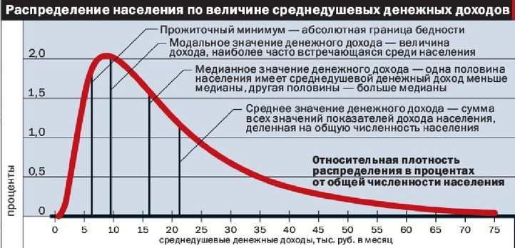
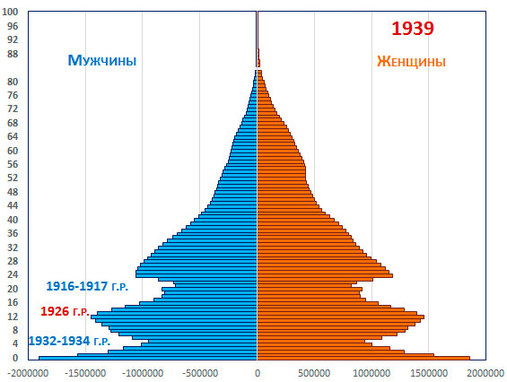
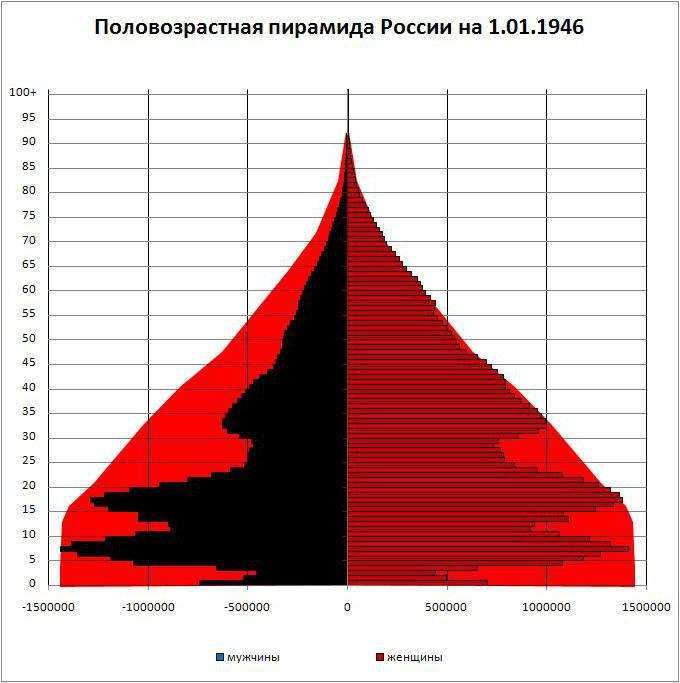
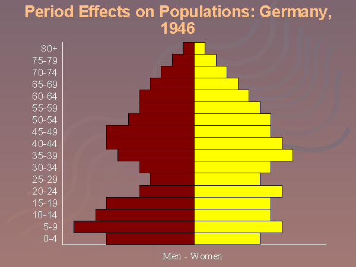
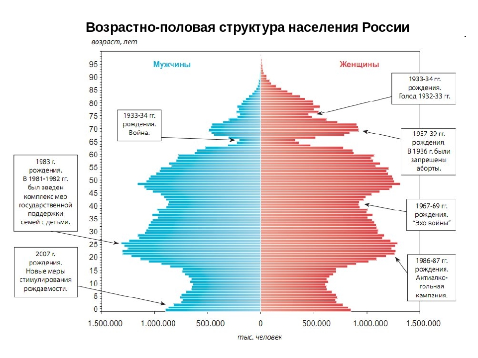
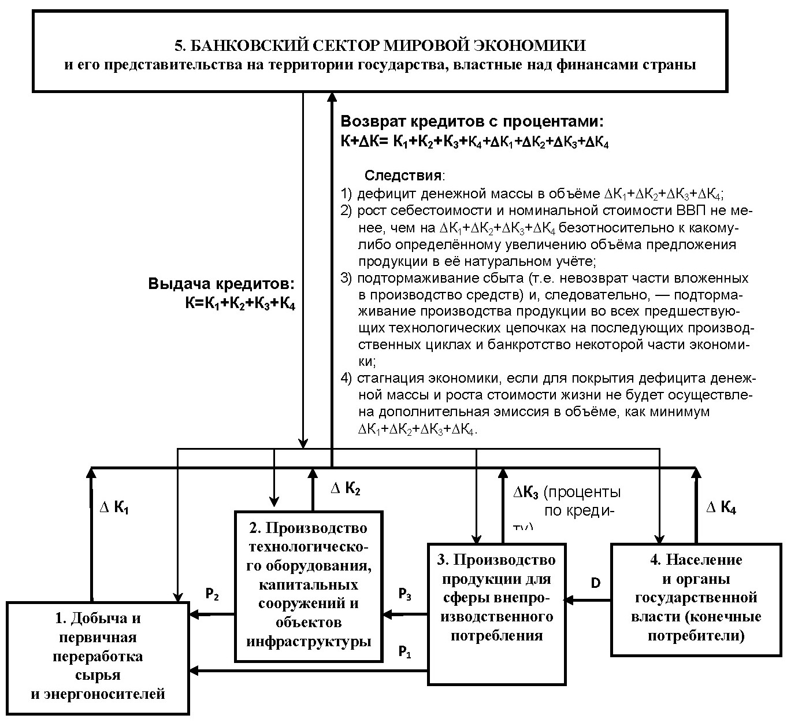
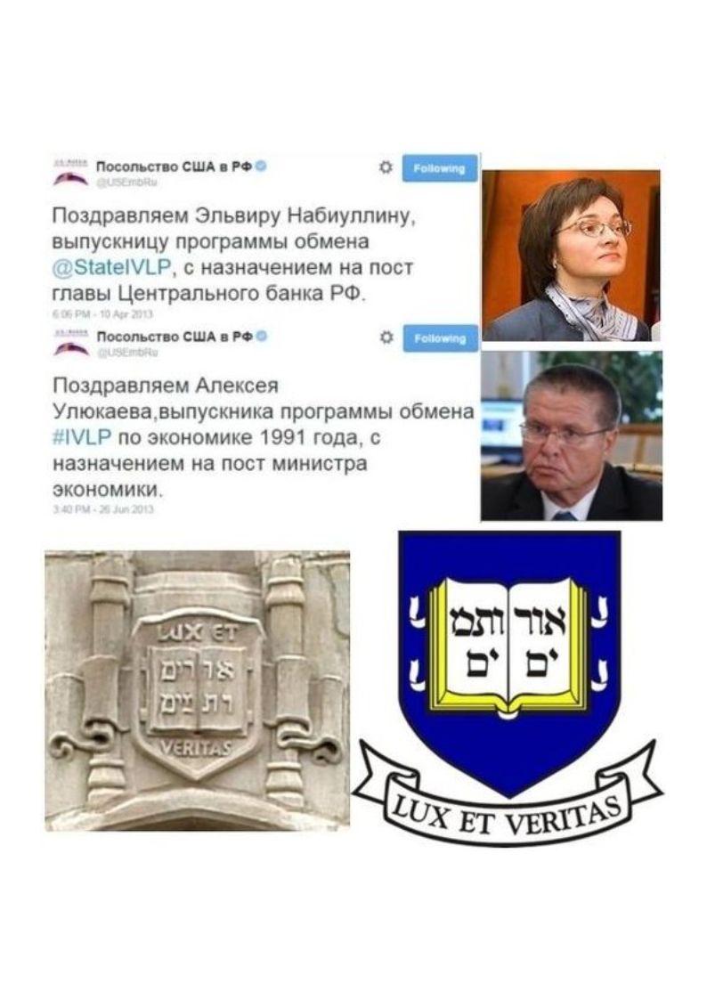

> **Первичный текст.** О текущем моменте №5(137), 2018г. О выступлении В.В. Путина по поводу пенсионной реформы.
> Источник: `dotu.ru:4ea18e20634761e0.doc` sha256 `f6c0fa599b28630a…`; [страница на dotu.ru](https://dotu.ru/2018/09/05/20180905_tek_moment05137/).
> Автоматическая транскрипция DOC→Markdown; смысл и формулировки не правились.
> Контрольные суммы и статус проверки — в [NOTICE.md](../../NOTICE.md).
> Содержание передаёт позицию авторов; утверждения не верифицированы библиотекой.

---

«О текущем моменте» № 5 (137), сентябрь 2018 года

О выступлении В.В. Путина\

по поводу пенсионной реформы

29 августа 2018 г. телевидение России в 12:00 выпустило в эфир запись обращения В.В. Путина к народу по поводу запланированной государственной властью пенсионной реформы, главное в проекте которой — увеличение пенсионного возраста для мужчин до 65 лет, а для женщин — до 63, а в версии президента — до 65 и 60 лет соответственно и плюс к тому введение новых пенсионных льгот для некоторых категорий граждан. Трансляция завершилась к 12:30.

ОГЛАВЛЕНИЕ

[1. Суть обращения президента к народу кратко 1](#суть-обращения-президента-к-народу-кратко)

[2. Впечатления от выступления 1](#впечатления-от-выступления)

[3. Анализ возникновения сложившейся экономической ситуации и дальнейших перспектив 3](#анализ-возникновения-сложившейся-экономической-ситуации-и-дальнейших-перспектив)

[3.1. Немного о методологии анализа качества жизни общества 3](#немного-о-методологии-анализа-качества-жизни-общества)

[3.2. Чего ждать от будущего\

и как на самом деле была создана необходимость в повышении пенсионного возраста 7](#чего-ждать-от-будущего-и-как-на-самом-деле-была-создана-необходимость-в-повышении-пенсионного-возраста)

[Заключение 25](#заключение)

# 1. Суть обращения президента к народу кратко

Если кратко, то суть обращения главы государства к народу[^1] может быть выражена в нескольких фразах:

1.  Россия реально находится под внешним управлением, хотя суверенитет формально юридически провозглашён.

2.  Управленческих кадров, которые бы могли осуществить полноту реального суверенитета, в органах государственной власти нет, а сложившиеся принципы кадровой политики, включая систему подготовки кадров, не обеспечивают появления в стране такого слоя людей.

3.  Я в меру своего понимания делаю, что могу и как умею.

4.  Как сказал Д.А. Медведев, «денег нет, но вы держитесь», поскольку сфера финансов не в моей власти.

5.  Поэтому пенсионная система будет изменена, пенсионный возраст будет повышен, но будут введены и определённые льготы для некоторых категорий граждан.

6.  Прошу всех отнестись к этому с пониманием и не бунтовать, а то будет ещё хуже.

# 2. Впечатления от выступления

Они таковы:

- Выступление было вынужденным[^2] и было ориентировано на решение задачи «подпереть авторитетом В.В. Путина, наработанным им в прошлом, оглашенную властью и порицаемую в народе пенсионную реформу».

- Решить эту задачу не удалось потому, что:

<!-- -->

- В обществе нарастает недовольство не только теми или иными политиками персонально (к этой категории относятся, в частности, Д.А. Медведев, Э.С. Набиуллина, А.Л. Кудрин, В.И. Матвиенко, а также — «хронические» А.Б. Чубайс и С.В. Кириенко) и не только теми или иными политическими партиями конкретно («Единая Россия» — за дела, и КПРФ — за демагогию и бездеятельность), не только теми или иными определёнными решениями, принимаемыми и проводимыми в жизнь государственной властью (предстоящая пенсионная реформа — только одно из таких решений), а криптоколониальным[^3] капитализмом, установленным в России в 1991 г. и узаконенным конституцией 1993 г.

- С 2000 г. по настоящее время В.В. Путин не выполнил многое из провозглашённого им в качестве целей политики Российского государства и не дал этому внятных объяснений, а кроме того за последние лет десять в своих публичных выступлениях огласил уйму неадеквата[^4], который воспринят людьми как заведомая ложь и деловая некомпетентность. И потому к настоящему времени В.В. Путин расценивается многими гражданами России как неотъемлемый элемент и защитник постсоветской антинародной криптоколониальной политико-экономической системы, в которой предназначение основной массы населения — быть бесправным экономическим ресурсом, на который нормы этики правящей «элиты» не распространяются, но который не надо озлоблять понапрасну, дабы он безропотно влачил своё существование и был покорен «элите» аборигенов и её хозяевам. Под воздействием на чувства и умы накапливающегося разнородного неадеквата, *систематически* оглашаемого В.В. Путиным в публичных выступлениях на протяжении последних лет, количество людей, доверяющих главе государства, сокращается вопреки отчётам официоза о результатах исследования общественного мнения.

> Выступление В.В. Путина 29 августа тоже было переполнено неадекватом и потому было эффективным именно в аспекте расширения круга приверженцев негативных оценок и его персонально, и постсоветской государственности в целом.

- В силу того, что постсоветская государственность является «элитарно»-корпоративной и, соответственно своей «элитарной»-корпоративности, — антинародной[^5], глава государства — заложник обстоятельств и не имеет возможности во всех без исключения случаях говорить правду, и потому вынужден много о чём умалчивать и много о чём лгать. В противном случае освещение ряда тем в публичных выступлениях по правде будет расценено «элитарной» корпорацией как нарушение норм «элитарно»-корпоративной этики. Как показывают судьбы императора Павла I, И.В. Сталина и Л.П. Берии, президентов США А. Линкольна, Ф.Д. Рузвельта и Дж.Ф. Кеннеди, «элита» и её хозяева такого не прощают — с одной стороны, а с другой стороны — в толпо-«элитарном» обществе защитить делом главу государства от «элитарного» заговора некому.

- Это выступление В.В. Путина — ещё одно выражение того факта, что постсоветская Россия не обладает полнотой реального суверенитета.

Вследствие названных причин авторитет (рейтинг) В.В. Путина в обществе будет снижаться, хотя для исполняющего обязанности главы туземной администрации криптоколонии Россия, сфера полномочий которого ограничена не только официально действующей конституцией, но и другими обстоятельствами и средствами, о которых не принято говорить публично, его выступление просто отличное.

То, что обращение к народу не достигло заказанной цели — *убедить население в правильности и безальтернативности политики государственной власти,* — обусловлено не В.В. Путиным, и не непрофессионализмом тех, кто помогал ему готовить это выступление, а обстоятельствами, сложившимися вследствие политики, проводимой постсоветской государственностью на протяжении четверти века, — тем, как люди прочувствовали на своей шкуре результаты этой политики, как они оценили эти результаты и само постсоветское государство.

Тем не менее все телеканалы практически сразу после завершения трансляции обращения начали показывать сюжеты на тему «все единогласно “Одобрям!” пенсионную реформу» и продолжают этим заниматься на протяжении всей последующей недели. Однако в интернете сайты, где преобладают оценки в стиле «Одобрям!», — отсутствуют, а редкостные «Одобрям!!!» и «За кефир отдельное спасибо!» найти очень сложно. И не надо возражать, что «народ под воздействием обращения В.В. Путина проникся идей пенсионной реформы», а отсутствие массового «Одобрям!» в интернете — результат решающего воздействия агентуры Госдепа США на трафик публикаций на эту тему и выражение недомыслия и тупости относительно малочисленных невежественных паразитов-деградентов, не желающих работать на благо единой России.

При этом изрядная доля населения России по-прежнему предъявляет к главе государства такие требования, будто он — Золотая Рыбка или Старик Хоттабыч и может решить все проблемы России неким волшебным способом без соучастия граждан в преображении страны, но злостно отлынивает от этого.

Давно пора понять, что в одиночку социальные проблемы не решаются, и потому Будда, Моисей, Христос, Мухаммад не приняли на себя миссию «царя», «царя царей» и т.п., а сосредоточились на просвещении и пробуждении совести, ума и воли в современниках.

3. Анализ возникновения сложившейся экономической ситуации\

и дальнейших перспектив

===========================================================

## 3.1. Немного о методологии анализа качества жизни общества

Начнём с того, что, если задать в Яндексе запрос «Распределение пенсионеров по величине пенсий», то Яндекс не находит ни одного сайта, где бы эти данные были представлены в простом и понятном виде: по оси абсцисс — величина пенсии, по оси ординат — количество пенсионеров, чьи пенсионные доходы попадают в соответствующий интервал на оси абсцисс; либо в виде содержательно аналогичной таблицы. Такого рода информация в РФ, если и не является государственной тайной, то чтобы её найти, требуются определённые знания и навыки, которыми обычный гражданин, даже если он продвинутый пользователь интернета, не владеет. Во всяком случае быстро её в открытых источниках найти не удалось. Поэтому будем анализировать то, что удалось найти.

Если обратиться к изданию Федеральной службы государственной статистики «Социальное положение и уровень жизни населения России. Официальное издание. 2017 г.»[^6], то в нём тоже нет ни такого графика, ни такой таблицы. В нём всё в стиле отчётов о «средней температуре по больнице». Так в таблице 7.19 представлены следующие данные.

**Фрагмент таблицы 7.19**

<table>

<colgroup>

<col style="width: 14%" />

<col style="width: 14%" />

<col style="width: 14%" />

<col style="width: 14%" />

<col style="width: 14%" />

<col style="width: 14%" />

<col style="width: 14%" />

</colgroup>

<thead>

<tr>

<th></th>

<th style="text-align: center;"><strong>2011</strong></th>

<th style="text-align: center;"><strong>2012</strong></th>

<th style="text-align: center;"><strong>2013</strong></th>

<th style="text-align: center;"><strong>2014</strong></th>

<th style="text-align: center;"><strong>2015</strong></th>

<th style="text-align: center;"><strong>2016</strong></th>

</tr>

</thead>

<tbody>

<tr>

<td>Средний размер назначенных пенсий, в среднем за год, руб.</td>

<td style="text-align: center;">8202,9</td>

<td style="text-align: center;">9040,5</td>

<td style="text-align: center;">9917,5</td>

<td style="text-align: center;">10786,0</td>

<td style="text-align: center;">11986,0</td>

<td style="text-align: center;">12391,1</td>

</tr>

<tr>

<td>
Величина прожиточного минимума

пенсионера, руб.
</td>

<td style="text-align: center;">5032</td>

<td style="text-align: center;">5123</td>

<td style="text-align: center;">5998</td>

<td style="text-align: center;">6617</td>

<td style="text-align: center;">7965</td>

<td style="text-align: center;">8081</td>

</tr>

<tr>

<td>
Соотношение среднего размера

назначенных пенсий, процентов:
</td>

<td style="text-align: center;"></td>

<td style="text-align: center;"></td>

<td style="text-align: center;"></td>

<td style="text-align: center;"></td>

<td style="text-align: center;"></td>

<td style="text-align: center;"></td>

</tr>

<tr>

<td>
с величиной прожиточного минимума

пенсионера
</td>

<td style="text-align: center;">163,0</td>

<td style="text-align: center;">176,5</td>

<td style="text-align: center;">165,4</td>

<td style="text-align: center;">163,0</td>

<td style="text-align: center;">150,5</td>

<td style="text-align: center;">153,3</td>

</tr>

<tr>

<td>
со средним размером начисленной

заработной платы
</td>

<td style="text-align: center;">35,1</td>

<td style="text-align: center;">33,9</td>

<td style="text-align: center;">33,3</td>

<td style="text-align: center;">33,2</td>

<td style="text-align: center;">35,2</td>

<td style="text-align: center;">33,8</td>

</tr>

</tbody>

</table>

В таблице 7.22 приводятся дополнительные данные.

Фрагмент таблицы 7.22

|  |  |  |  |  |  |  |

|----|:--:|:--:|:--:|:--:|:--:|:--:|

|  | **2012** | **2013** | **2014** | **2015** | **2016** | **2017** |

| Средний размер назначенных пенсий всех пенсионеров, руб. | 8272,7 | 9153,6 | 10029,7 | 10888,7 | 12080,9 | 17425,6 |

А в обращении к гражданам России В.В. Путина 29.08.2018 г. был назван средний уровень пенсий неработающих пенсионеров в 2018 г., равный 14 144 рубля; а к 2024 г. его обещано увеличить до 20 000 рублей и обещано индексировать пенсии темпами не ниже инфляции.

Если оценивать положение дел по представленному в этом сборнике среднему уровню пенсий, то соответственно таблице 7.19, средние пенсии уже давно выше официального прожиточного минимума более чем в полтора раза, и прослеживается тенденция к их колебательному (а не прогрессирующе монотонному) росту по отношению к прожиточному минимуму на протяжении всего рассматриваемого времени. Но если это соответствует действительности, то непонятно, почему на встречах с депутатами Госдумы и в ходе прямых линий с президентом, пенсионеры задают вопросы о том, как прожить на пенсию в 8 000 — 15 000 рублей, и эти вопросы остаются безответными?

В действительности же вопреки официальным сказкам о прожиточном минимуме пенсионера и вполне достаточной покупательной способности средних пенсий, чтобы в условиях жизни в крупном городе в России при ценах 2017 — первой половины 2018 гг. периода обеспечить годовой объём обязательных расходов при одиночном проживании пенсионера (квартплата и оплата прочих коммунальных услуг — порядка 5 000 — 6 000 рублей, разного рода налоги — до 4 000 — 7 000 рублей ежегодно, полноценное питание, одежда, а не обноски, ремонт и обновление бытовой техники[^7]) требуется не менее 20 000 рублей ежемесячного дохода.

Так из соотнесения уровня цен 2017 — первой половины 2018 г. с уровнем официального прожиточного минимума в сборнике «Росстата» становится ясно, что официальный прожиточный минимум пенсионера высосан из пальца, очень сильно занижен и не соответствует реальным объёмам безальтернативно-обязательных расходов. Именно об этом несоответствии официального прожиточного минимума фактическим потребностям в осуществлении безальтернативно-обязательных платежей говорят многочисленные вопросы граждан политическим деятелям России, заданные в 2018 г.[^8] и ранее, которые остаются безответными. И возникает ещё один вопрос: как безответность на такие вопросы представителей государственной власти соотносится со ст. 7[^9] ныне действующей конституции РФ, которая даже при всех пороках этой конституции подразумевает, что даже на минимальную пенсию можно жить, а не влачить существование, хотя бы при условии, что в период трудовой деятельности было построено жилище и в основном обустроен быт в этом жилище?

Чтобы понять, как возникает это расхождение между официальной отчётностью и реальностью, и что скрывает эта как бы отчётность, обратимся к графику плотности распределения населения по доходам, представленному на рисунке ниже. Он позволяет увидеть, как «среднестатистические показатели» соотносятся с полной статистикой, и далее позволяет понять, как полная статистика соотносится с реальной жизнью. Прежде всего поясним, что площадь по кривой плотности распределения в некотором масштабе равна общей численности населения (или 100 %), а площадь под кривой между двумя вертикальными секущими равна численности той доли населения (или доле населения в процентах), чьи доходы оказались в полосе между этими вертикальными секущими[^10].

 *Рис. 1. Плотность распределения и её «характеристические точки».*

Из рис. 1 должно быть понятно, что медианальное[^11] (обычно именуемое средним) значение доходов может расти, якобы свидетельствуя об экономических успехах, а форма кривой плотности распределения в то же самое время может изменяться так, что низкодоходные группы населения будут становиться ещё беднее, и это будет объективно свидетельствовать об ухудшении их экономического положения. А если на это наложить инфляционную поправку на масштаб оси ординат — различную по величине для групп населения с различными доходами[^12], — то картина может оказаться ещё хуже. Т.е. прямое обращение к графику плотности распределения и понимание его сути показывают, что отчётность по «среднестатистическим показателям» (будь то модальные значения либо средние арифметические) — всегда неадекват и самообман, если не злоумышленный обман[^13].

Кроме того, неясно, что имеется ввиду, когда в официозе речь идёт о «средних значениях» пенсий, зарплат, продолжительности жизни, времени дожития и прочем: модальные и средние арифметические значения в общем случае не совпадают, но для краткости одинаково именуются «средними».

Из этого можно понять, что многолетний трёп *о непрестанно улучшающихся неких «средних показателях» при отсутствии юридически обязывающего свода статистик, **действительно характеризующих жизнь,*** **а не создаваемых для улучшения в иллюзорных представлений о ней,** при отсутствии юридически обязывающих процедур и алгоритмики сбора и обработки социально значимой информации, позволяет на фоне общей деградации культуры, экономики и социальной сферы, выпячивая отдельные как реальные достижения, так и вымыслы о якобы достижениях, не отвечать ни за что и скрывать реальное общее ухудшение положения дел[^14]; избегать обсуждения реальных проблем, причин их возникновения, путей и способов их разрешения — как в СМИ в целях обеспечения информированности общества и компетентности электората, так и в научном официозе в целях совершенствования научно-методологического обеспечения государственного управления и управления в бизнесе, что ведёт к дальнейшему ухудшению положения дел. Это всё и многое другое говорит о том, что **политика постсоветской государственности РФ системно лжива**.

Если же вести политику честно, то жизнь и её изменения характеризуют статистические распределения и их динамика, а не некие «средние значения» и не трёп об улучшении «средних значений» характеристических статистик в результате как бы успехов политики, проводимой государственной властью и бизнесом.

## 3.2. Чего ждать от будущего и как на самом деле была создана необходимость в повышении пенсионного возраста

О причинах, вызывающих потребность в повышении пенсионного возраста, В.В. Путин в своём обращении сказал следующее:

«Объективные предпосылки для этого существовали. Было очевидно, что на рубеже 2020‑х годов мы неизбежно столкнёмся с серьёзными демографическими проблемами. Чем они вызваны?

Каждые 25-27 лет во взрослую жизнь, когда можно создавать семьи, заводить и растить детей, у нас вступает гораздо меньшее число граждан, чем могло и должно было бы. Так происходит в результате тяжелейших демографических потерь во время Великой Отечественной войны. А это не только прямые потери, но и миллионы не родившихся в военные годы.

Период, когда во взрослую жизнь входило очередное малочисленное поколение, пришёлся и на середину 90‑х годов прошлого века. Но именно в это время страна столкнулась ещё и с тяжелейшим экономическим, социальным кризисом, с его катастрофическими последствиями. Это привело ко второму мощному демографическому удару. Родилось ещё меньше детей, чем ожидали. Демографический провал конца 90‑х оказался сопоставим с 1943‑м и 1944‑м военными годами.

И сейчас именно это, крайне малочисленное, поколение родившихся в 90‑е входит в трудоспособный возраст. В связи с этим ещё больше возрастает нагрузка и на пенсионную систему, ведь она у нас построена в основном на солидарном принципе. То есть пенсионные взносы людей, работающих сегодня, идут на выплаты нынешним пенсионерам, поколению наших родителей. А они, в свою очередь, пока работали, направляли взносы, чтобы выплачивать пенсии поколению наших дедов.

Вывод понятен: сокращается трудоспособное население — автоматически снижаются возможности для выплаты и индексации пенсий. А значит, необходимы изменения».

Что осталось в умолчаниях объяснений В.В. Путина? — в умолчаниях осталось то, что по завершении Великой Отечественной войны, примерно 1/3 довоенных производственных мощностей СССР была разрушена. Они были локализованы в европейской части страны, где было уничтожено 90 % производственных мощностей, а кроме того на этих территориях были уничтожены или существенно повреждены объекты непроизводственного назначения. Ко времени завершения второй мировой войны ХХ века народнохозяйственный комплекс СССР был до предела ориентирован на выпуск продукции, прежде всего военного назначения, что было характерно для экономики СССР и в период непосредственно предшествовавшей войне. В Великой Отечественной войне погибло от 9 (по оглашениям тех лет) до 27 миллионов человек. За годы войны по разным причинам через госпитали прошли 30 миллионов человек (в этом числе и повторные — раненые и больные). По причине ранений и болезней из РККА в ходе войны было демобилизовано около 3,8 млн. человек, из которых 2,5 миллиона были инвалидами[^15]. Большей частью это всё были люди тех возрастных групп, которые являются трудовыми ресурсами общества. Численность населения СССР накануне войны оценивается в 170 млн. человек, то непосредственные демографические потери составили в течение 4 лет войны порядка от 5 % (при 9 миллионах погибших) до 17,6 % (при потерях 27 миллионов погибших и добавленных к ним инвалидов). В дополнение к этим демографическим потерям, необходимости восстановления производственных мощностей и нормального быта населения СССР был поставлен перед необходимостью перевооружить армию и создать с нуля флот, создать ядерное оружие и средства его доставки.

\

*На рисунках выше представлены демографические пирамиды России\

по состоянию на 1939 г. (видны последствия снижения рождаемости и повышенной детской смертности во время революции и гражданской войны, а также — коллективизации) и на 01.01.1946 г. (показаны потери мужского и женского населения) и кроме того — демографическая пирамида Германии по состоянию на 1946 г.\*

  *На рисунках выше представлены демографические пирамиды России\

по состоянию на 2007 г. (с пояснениями) и на 2017 г*.

Восстановление народного хозяйства СССР (оцениваемое по уровням производства в отраслях) после завершения второй мировой войны ХХ века было осуществлено в течение одной пятилетки. После проведения денежной реформы в декабре 1947 г. экономика страны была введена в режим роста производства темпами от 5 % до 9 % годового прироста выпуска продукции отраслями на основе научно-технического прогресса. Это сделало возможным ежегодное снижение цен на товары массового спроса, которое было нормой экономической жизни страны до 1953 г. включительно.

**Таблица. Динамика изменения индекса цен основных товаров в СССР\

в 1947 — 1952 гг. в процентах к IV кварталу 1947 г.**[^16]

<table style="width:100%;">

<colgroup>

<col style="width: 29%" />

<col style="width: 11%" />

<col style="width: 11%" />

<col style="width: 11%" />

<col style="width: 11%" />

<col style="width: 11%" />

<col style="width: 11%" />

</colgroup>

<thead>

<tr>

<th><strong>Виды товаров</strong></th>

<th style="text-align: center;"><strong>IV квартал 1947 г. (до 16 декабря)</strong></th>

<th style="text-align: center;"><strong>16 декабря 1947 г.</strong></th>

<th style="text-align: center;"><strong>1 марта 1949 г.</strong></th>

<th style="text-align: center;"><strong>1 марта 1950 г.</strong></th>

<th style="text-align: center;"><strong>1 марта 1951 г.</strong></th>

<th style="text-align: center;"><strong>1 марта 1952 г.</strong></th>

</tr>

</thead>

<tbody>

<tr>

<td>Все товары</td>

<td style="text-align: center;">100</td>

<td style="text-align: center;">83</td>

<td style="text-align: center;">71</td>

<td style="text-align: center;">57</td>

<td style="text-align: center;">53</td>

<td style="text-align: center;">50</td>

</tr>

<tr>

<td><strong>Продовольственные товары</strong></td>

<td style="text-align: center;">100</td>

<td style="text-align: center;">82</td>

<td style="text-align: center;">68</td>

<td style="text-align: center;">53</td>

<td style="text-align: center;">48</td>

<td style="text-align: center;">43</td>

</tr>

<tr>

<td colspan="7">Из них:</td>

</tr>

<tr>

<td>Хлеб и хлебобулочные изделия</td>

<td style="text-align: center;">100</td>

<td style="text-align: center;">81</td>

<td style="text-align: center;">73</td>

<td style="text-align: center;">53</td>

<td style="text-align: center;">45</td>

<td style="text-align: center;">39</td>

</tr>

<tr>

<td>Мясо и птица</td>

<td style="text-align: center;">100</td>

<td style="text-align: center;">88</td>

<td style="text-align: center;">79</td>

<td style="text-align: center;">59</td>

<td style="text-align: center;">50</td>

<td style="text-align: center;">42</td>

</tr>

<tr>

<td>Колбасные изделия</td>

<td style="text-align: center;">100</td>

<td style="text-align: center;">85</td>

<td style="text-align: center;">76</td>

<td style="text-align: center;">57</td>

<td style="text-align: center;">49</td>

<td style="text-align: center;">41</td>

</tr>

<tr>

<td>Рыба и сельди</td>

<td style="text-align: center;">100</td>

<td style="text-align: center;">80</td>

<td style="text-align: center;">72</td>

<td style="text-align: center;">60</td>

<td style="text-align: center;">54</td>

<td style="text-align: center;">54</td>

</tr>

<tr>

<td>Масло животное</td>

<td style="text-align: center;">100</td>

<td style="text-align: center;">80</td>

<td style="text-align: center;">72</td>

<td style="text-align: center;">48</td>

<td style="text-align: center;">41</td>

<td style="text-align: center;">37</td>

</tr>

<tr>

<td>Масло растительное</td>

<td style="text-align: center;">100</td>

<td style="text-align: center;">84</td>

<td style="text-align: center;">84</td>

<td style="text-align: center;">76</td>

<td style="text-align: center;">76</td>

<td style="text-align: center;">60</td>

</tr>

<tr>

<td>Сахар</td>

<td style="text-align: center;">100</td>

<td style="text-align: center;">63</td>

<td style="text-align: center;">63</td>

<td style="text-align: center;">55</td>

<td style="text-align: center;">55</td>

<td style="text-align: center;">49</td>

</tr>

<tr>

<td><strong>Непродовольственные товары</strong></td>

<td style="text-align: center;">100</td>

<td style="text-align: center;">86</td>

<td style="text-align: center;">78</td>

<td style="text-align: center;">65</td>

<td style="text-align: center;">63</td>

<td style="text-align: center;">62</td>

</tr>

<tr>

<td colspan="7">Из них:</td>

</tr>

<tr>

<td>Хлопчатобумажные ткани</td>

<td style="text-align: center;">100</td>

<td style="text-align: center;">78</td>

<td style="text-align: center;">78</td>

<td style="text-align: center;">66</td>

<td style="text-align: center;">66</td>

<td style="text-align: center;">66</td>

</tr>

<tr>

<td>Шерстяные ткани</td>

<td style="text-align: center;">100</td>

<td style="text-align: center;">127</td>

<td style="text-align: center;">115</td>

<td style="text-align: center;">95</td>

<td style="text-align: center;">95</td>

<td style="text-align: center;">95</td>

</tr>

<tr>

<td>Шёлковые ткани</td>

<td style="text-align: center;">100</td>

<td style="text-align: center;">88</td>

<td style="text-align: center;">79</td>

<td style="text-align: center;">73</td>

<td style="text-align: center;">73</td>

<td style="text-align: center;">73</td>

</tr>

<tr>

<td>Одежда</td>

<td style="text-align: center;">100</td>

<td style="text-align: center;">111</td>

<td style="text-align: center;">104</td>

<td style="text-align: center;">89</td>

<td style="text-align: center;">89</td>

<td style="text-align: center;">89</td>

</tr>

<tr>

<td>Трикотажные изделия</td>

<td style="text-align: center;">100</td>

<td style="text-align: center;">83</td>

<td style="text-align: center;">83</td>

<td style="text-align: center;">76</td>

<td style="text-align: center;">76</td>

<td style="text-align: center;">76</td>

</tr>

<tr>

<td>Чулки и носки</td>

<td style="text-align: center;">100</td>

<td style="text-align: center;">89</td>

<td style="text-align: center;">85</td>

<td style="text-align: center;">71</td>

<td style="text-align: center;">71</td>

<td style="text-align: center;">71</td>

</tr>

<tr>

<td>Кожаная обувь</td>

<td style="text-align: center;">100</td>

<td style="text-align: center;">73</td>

<td style="text-align: center;">70</td>

<td style="text-align: center;">59</td>

<td style="text-align: center;">59</td>

<td style="text-align: center;">59</td>

</tr>

<tr>

<td>Резиновая обувь</td>

<td style="text-align: center;">100</td>

<td style="text-align: center;">29</td>

<td style="text-align: center;">29</td>

<td style="text-align: center;">26</td>

<td style="text-align: center;">26</td>

<td style="text-align: center;">26</td>

</tr>

</tbody>

</table>

В приведённой таблице не отображена бытовая техника. Это является косвенным выражением того обстоятельства, что приоритетность различных потребностей людей и общества различна, и в тот период народное хозяйство СССР работало на удовлетворение потребностей более высоких приоритетов, нежели потребности в бытовой технике, для массового производства которой не хватало мощностей. Даже с учётом «добровольно-обязательной» подписки на облигации государственных займов восстановления народного хозяйства, налицо примерно двукратный рост покупательной способности широких масс населения даже без учёта роста номинальной заработной платы.

На фоне такой динамики производства и цен даже в условиях тяжелейших демографических потерь И.В. Сталин в работе «Экономические проблемы социализма в СССР» (1952 г.) ставил задачу *«сократить рабочий день по крайней мере до 6, а потом и до 5 часов. Это необходимо для того, чтобы члены общества получили достаточно свободного времени, необходимого для получения всестороннего образования»*. Т.е. главной задачей развития экономики было — увеличение фонда свободного времени людей, без чего личностное развитие людей, общекультурное развитие общества и построение коммунизма как общества свободы и справедливости невозможно.

В перспективе такая экономическая политика вела и к снижению пенсионного возраста, увеличению пенсий в их номинальном исчислении, росту покупательной способности трудовых доходов и социальных выплат, увеличению фондов общественного потребления — всего того, что государство находило возможным представлять своим гражданам бесплатно при достигнутом уровне развития экономики. И всё это без инфляции и индексации доходов населения с учётом инфляции. Но ни о каком-либо повышении пенсионного возраста, увеличении продолжительности рабочего дня, сокращению отпусков — речи не было.

Т.е. история послевоенного СССР показывает, что демографические проблемы могут быть очень тяжёлыми, но не они оказывают решающее воздействие на экономику и её динамику.

То же показывает и история нашего противника в Великой Отечественной войне. Как видно из рисунка выше, демографическая пирамида Германии (ФРГ) по завершении второй мировой войны тоже оставляла желать лучшего. Тем не менее экономика обеих Германий успешно развивалась, а ФРГ под руководством Людвига Эрхарда[^17] явила «экономическое чудо», став одной из высокотехнологичных и мощных экономик мира.

И эти примеры приводят к вопросу: Почему в наши дни экономические проблемы России предлагается решать именно путём повышения пенсионного возраста?

Ответ на этот вопрос простой: Постсоветская государственность по злонравию и дурости депутатов Думы, правительства всех составов, руководства центробанка, их консультантов от науки не смогла за период 1993 — 2018 гг. (четверть века, между прочим) вывести страну в режим инновационного развития и обеспечить производство продукции в объёмах, необходимых собственному населению, на основе роста производительности общественного труда. И она не сможет этого сделать и в обозримой перспективе.

Чтобы понять, почему не сможет, обратимся к официальным документам наших дней. Есть такая государственная *приоритетная*[^18] программа «Повышение производительности труда и поддержка занятости». Паспорт этой программы утверждён президиумом Совета при Президенте Российской Федерации по стратегическому развитию и приоритетным проектам (протокол от 30 августа 2017 г. № 9)[^19]. Куратором программы был назначен А.В. Дворкович — зам. главы правительства РФ на тот период времени. «Функциональным заказчиком» заявлен глава минэкономразвития М.С. Орешкин. Руководителем программы назначен статс-секретарь — заместитель министра экономического развития Российской Федерации О.В. Фомичев.

В паспорте программы ставятся задачи по повышению производительности труда на попавших в неё предприятиях на 5-10 % в первые два года действия программы и до 30 «процентных пунктов» к концу срока действия программы в 2025 г. Один из показателей, заданных в программе, — «Число руководителей и специалистов органов исполнительной власти субъектов Российской Федерации и муниципальных образований, служб занятости и предприятий, прошедших обучение по повышению управленческих квалификаций в рамках реализации приоритетной программы (нарастающим итогом), человек». В программе ставится задача: «организовывается обучение управленческих команд субъекта Российской Федерации (руководство региона, предприятий-участников региональной программы, служб занятости, вовлечённых в программу, региональных центров компетенций). После начала реализации программ повышения производительности труда на предприятиях региональный центр компетенций обобщает полученные в ходе реализации таких программ знания, анализирует их и содействует их тиражированию на все предприятия региона».

Конечно, управленческую грамотность необходимо повышать, но придётся ответить на вопрос: на основе каких теорий предполагается её повышать? — если на основе западных теорий менеджмента, то повысить качество управления за счёт распространения «управленческой грамотности» не удастся вследствие специфики этих теорий. Для всех них характерно отсутствие содержания в виде однозначно понимаемой структуры постановки и решения управленческих задач. Поэтому:

- «профессиональный» лексикон «менагеров» освоить — это не сложно,

- но овладеть искусством управления коллективами и множествами коллективов в народном хозяйстве, искусством управления биосферно-социально-экономическими процессами на основе этих «пособий по менеджменту» — в принципе невозможно.

Но главное: *в программе ни разу не упомянуто слово «энерговооружённость».* А энерговооружённость — определяющий фактор производительности труда. Роль энерговооружённости в обеспечении производительности труда рассмотрим на общепонятном примере.

*[В оригинальном издании здесь расположен рисунок/схема. Иллюстрация не включена в данный выпуск: ожидает визуальной и правовой проверки. Файл источника: image7.jpeg]*Если у вас имеется бригада землекопов и такая же по численности бригада экскаваторщиков, то понятно, что вне зависимости от способа расстановки землекопов (в кружок, в шеренгу, в каре) *«менеджерами среднего звена», прошедшими обучение по программам повышения управленческой грамотности,* — бригада экскаваторщиков даже без профессионального менеджмента выполнит работу на порядки быстрее, нежели землекопы, при условии, что место работы доступно для доставки и размещения на нём экскаваторов (см. фото слева: в РФ таких экскаваторов не только не делают, но даже не подозревают о возможности такого технического решения по повышению производительности труда при проведении строительных работ на местности со сложным рельефом… Вследствие этого при проведении такого рода работ неизбежно будут корячиться люди с ручным инструментом, либо от каких-то проектных решений придётся отказаться по причине необеспеченности их технологиями и оборудованием).

Этот пример — один из многих, которые показывают, что в деле повышения производительности труда взаимодополняющим образом должны сочетаться два фактора:

1.  Рост энерговооружённости и эффективности энергопотребителей в производстве и логистике (а в основе этого — совершенствование технологий и оборудования, рост их КПД).

2.  Качество управления имеющимся энергопотенциалом производства и энергопотребляющим оборудованием.

Если же в паспорте программы по обеспечению роста производительности труда ничего не говорится о росте энерговооружённости и росте эффективности энергопотребителей в отраслях и на транспорте (в сталинские времена этому всегда уделялось внимание, что говорит о на порядки более высокой компетентности управленческих кадров в ту эпоху), а решающим фактором оказывается обучение персонала среднего звена «управленческой грамотности» на основе неведомо каких теорий, то никакого сколь-нибудь ощутимого роста производительности труда в экономике не будет и, соответственно, не будет и ощутимого роста производства, и роста экономической мощи страны.

Т.е. программу «Повышение производительности труда и поддержка занятости» разработали люди, которые в реальном производстве и социальном управлении не только ничего не понимают сами, но которые не в состоянии привлечь к работе компетентных специалистов, которые смогли бы сформировать работоспособную программу.

Но предположим, что производительность труда всё же резко выросла вопреки этой госпрограмме. Выросла настолько, что примерно 60 % трудоспособного населения в состоянии обеспечить всем необходимым всё общество, экспортные потребности, потребности политики государства — глобальной, внешней, внутренней, оборонной. Сразу же возникает проблема: чем занять остальные 40 % трудоспособного населения, которым нет места в сфере экономической деятельности? — Ответ на этот вопрос в либерально-рыночной экономике прост: это **экономически избыточное население, не имеющее гарантированных заработков, должно быть некоторым способом утилизировано, чтобы оно не мешало жить экономически самодостаточному населению и прежде всего — политической и бизнес- «элите»**. Экономически избыточное население не может быть самозанятым ни в одной серьёзной сфере деятельности по следующим причинам: 1) здравые потребности общества в продукции и услугах ограничены физиологически и психологически, 2) создание с нуля новых рынков в таких условиях — может быть только следствием личностного развития людей, о чём в программе тоже ни слова по существу[^20], но оно же ведёт к уничтожению рынков продукции и услуг, которые перестают быть востребованными под воздействием личностного развития (например, сгинут табачный и алкогольный рынки), 3) у них нет возможности обрести стартовый капитал, без которого создание нового высокотехнологичного бизнеса невозможно. Поэтому удел «экономически избыточного населения» — влачить существование на пособия, «бомжевать» или доживать в концлагерях (в зависимости от складывающихся обстоятельств и отношения к ним государственной власти).

Т.е. успех любой программы повышения производительности труда в условиях господства либерально-рыночных воззрений — предпосылки к экономическому геноциду в отношении изрядной доли населения страны, что по сути аналогично успеху программы приватизации и перехода к рыночной экономике в 1990‑е гг., который сопровождался экономическим геноцидом, о чём В.В. Путин в своём обращении к народу сказал словами: *«в это время страна столкнулась ещё и с тяжелейшим экономическим, социальным кризисом, с его катастрофическими последствиями»,* умолчав о том, что кризис был злоумышленно рукотворным, и что многие его творцы до сих пор живы и не понесли никакой ответственности.

Также надо обратить внимание на то, что в программе «Повышение производительности труда и поддержка занятости» ни слова не говорится о том, что финансовый климат, сформированный Думой и центробанком, на протяжении четверти века и в обозримой перспективе не позволяет окупаться инвестициям в НИОКР, в совершенствование технологий и организацию производства и логистики, без чего рост производительности труда не возможен. И соответственно этому умолчанию в программе не высказано никаких предложений о том, как надо изменить финансовый климат, какими путями («дорожная карта» — поэтапность) и какими средствами его изменять и поддерживать в общественно необходимом виде в дальнейшем.

Т.е. *приоритетная* госпрограмма «Повышение производительности труда и поддержка занятости» в случае её успешной реализации ведёт к социокультурной катастрофе, которой в условиях либерально-рыночной экономики нет альтернативы. А в случае её краха — тоже к катастрофе, но иного рода.

Поэтому неизбежен ещё один вопрос: Зачем России такая политика и такие политики? — на который у представителей постсоветской политической системы ответа нет.

Ещё один «национальный проект (программа) «Наука». Паспорт этой программы пока на стадии проекта, т.е. не утверждён. Его куратором названа Т.А. Голикова, заместитель председателя правительства Российской Федерации; руководителем назван М.М. Котюков, министр науки и высшего образования Российской Федерации; администратором[^21] назван А.М. Медведев, заместитель министра науки и высшего образования Российской Федерации.

В ныне существующем виде проект паспорта программы — типичный бюрократический вздор. Дело в том, что контрольные показатели успеха осуществления программы «Наука» — количество публикаций в авторитетных зарубежных изданиях, количество патентов и индексы цитирования отечественных авторов:

1.  **Показатель**: «Место Российской Федерации по удельному весу в общем числе статей в областях, определяемых приоритетами научно-технологического развития, в изданиях, индексируемых в международных базах данных». **Задача**: подняться с 11 места на 5 к 2024 г.

2.  **Показатель**: «Место Российской Федерации по удельному весу в общем числе патентных заявок на изобретения в областях, определяемых приоритетами научно-технологического развития». **Задача**: подняться с 8 места на 5 к 2024 г.

3.  **Показатель**: «Место Российской Федерации по объему внутренних затрат на исследования и разработки среди ведущих стран мира (по данным Организации экономического сотрудничества и развития и ЮНЕСКО)». **Задача**: Подняться с 10 на 5 место к 2024 г.

Реально же состояние науки и её достижения не могут оцениваться количеством публикаций и патентов, индексами цитирования, объёмами финансирования. Последнее затронем кратко: невежественные идиоты способны потратить на исследования, на создание лабораторной базы и т.п. уйму средств (даже их не разворовывая), но достижений не будет (примером тому работы по созданию гидрореактивного движителя для подводных лодок как средства снижения их шумности, которые СССР вёл на протяжении нескольких десятков лет[^22]). А если к идиотам присоединятся рвачи-расхитители, то работы на тупиковых расточительных направлениях будет вообще не закрыть и они станут вечной кормушкой для тех и для других). Теперь перейдём к рассмотрению оценок науки по показателям объёма публикаций, количества патентов, индексов цитирования.

Можно ввести понятие «эпохальная идея», понимая под этим идею, которая спустя какое-то время определит лицо той или иной сферы деятельности. Эпохальные идеи на момент появления лежат вне «мейн-стрима» официальной науки своей эпохи. Как следствие они выходят за пределы понимания подавляющего большинства «коллег» своих первовыразителей. В силу этого обстоятельства работы, в которых эпохальные идеи были выражены впервые, не цитируются на протяжении многих лет, а то и десятилетий. Так современники не оценили ни периодического закона Д.И. Менделеева, ни работ «городского сумасшедшего» К.Э. Циолковского[^23], ни идей Р.Л. Бартини, ни многих других. Признание их вклада, как и вклада подавляющего большинства первовыразителей эпохальных идей, пришло спустя десятилетия, причём в случае Р.Л. Бартини оно имело место в весьма узких кругах разработчиков авиационно-космической техники, работающих в большинстве случаев за грифами секретности. Но это же касается и множества других первовыразителей эпохальных идей. В некоторых случаях о том, что были первовыразители, становится известным, когда идеи, некогда высказанные и не востребованные, выражаются повторно, спустя годы, а то и десятилетия (примером такого рода является «Тектология» А.А. Богданова).

Кроме того, во многих странах действуют юридически обязывающие запреты на рассмотрение заявок на изобретения по определённой тематике; история науки знает и юридически обязывающие запреты на критику научных теорий, включая теорию относительности. Один из такого рода запретов — запрет на рассмотрение проектов «вечных двигателей». Однако Дж.К. Максвелл и позднее (судя по всему независимо от него) К.Э. Циолковский показали, что второе начало термодинамики не является общевселенским принципом, а представляет собой частную закономерность, действие которой обусловлено сопутствующими обстоятельствами. Поскольку одна из формулировок второго начала термодинамики гласит: «вечный двигатель второго рода невозможен», — то работы Дж.К. Максвелла и К.Э. Циолковского (которых никто до настоящего времени не опроверг) означают, что вечный двигатель второго рода некоторым образом технически возможен. Но если Вы — технический гений и построили вечный двигатель второго рода, и он успешно работает у Вас в сарае на даче или в вашем автомобиле, то запатентовать его Вы не сможете в силу действия этого юридически обязывающего запрета.

Кроме того, в программе «Наука» явно не хватает определённости в соотношении минимального уровня оплаты труда выпускников аспирантур по отношению к стартовому уровню зарплат в других профессиях. Если в Макдональдсе или в ГИБДД с порога платят больше, чем выпускнику ВУЗа, или тем более — больше, чем выпускнику аспирантуры — то никакой науки не будет: в этой сфере останутся только идиоты, которые не способны к какой бы то ни было работе, а зарплата в науке для них — пособие по безработице в скрытой форме. Они способны только графоманствовать, а не делать науку. Единичные исследователи — «маньяки науки», способные жить в лаборатории на подстилке у стола, на кофе, воде из кулера и бутербродах, десятилетиями ходить в одном свитере и т.п., — науку как общественный институт подменить собой не могут. Чтобы делать науку, человек должен быть сосредоточен на ней, а не на вопросе о том, как прокормить семью на нищенскую «зарплату», где, и как ей жить, и как для этого подработать на стороне.

Работать в науке — это очень отличается от работы высокооплачиваемого бюрократа, обязанности которого сводятся главным образом к тому, чтобы поставить подпись там, где покажут, что позволяет не думать вообще либо думать о чём угодно, только не о доверенном деле.

Вопреки этому, «чтобы выполнить Указ президента РФ от 7 мая 2012 года № 597, предписывающий повысить зарплату ученых до уровня 200 % от средней по региону, ФАНО предлагает бывшим академическим институтам, находящимся сейчас под управлением ФАНО пока что добровольно перевести *«неэффективных»* сотрудников на 0,25 — 0,5 ставки при обязательном увеличении результативности работ»[^24].

Да и сейчас, в какой ВУЗ России ни зайдёшь, кого ни спросишь, всё как-то попадаются люди типа 1/2 или 1/4 доцента или профессора, «целые» доценты и профессора — не часто встречаемые люди; бывают и 1/2 зав. кафедрой, 1/4 зав. кафедрой. 1/4 доцента (а по положению для занятия этой должности надо быть кандидатом наук, а не 1/4 кандидата), это от 12 до 15 тыс. рублей, а «Макдональдсе» с порога платят 30 000 рублей и выше.

По сути так проводится государственная политика уничтожения науки и подавления процесса воспроизводства научно-педагогических кадров. Это имеет место на протяжении уже многих лет (ещё с советских времён), но за такую политику «развития науки и высшей школы» никто не понёс уголовной ответственности по ст. 275 УК РФ.

Кроме того, в программе «Наука» напрочь отсутствует проблематика социальных наук, а в сложившихся обстоятельствах они — главное. Так с 1992 г. до настоящего времени принятая ООН Концепция устойчивого развития, а также и Резолюция Генеральной ассамблеи ООН от 25 сентября 2015 г. «Преобразование нашего мира: Повестка дня в области устойчивого развития на период до 2030 года»[^25] — пустые слова, поскольку научно-методологическое обеспечение государственного управления и управления в бизнесе в соответствии с этими документами не развито и не вошло в образовательные стандарты всеобщего и высшего профессионального образования (прежде всего, — управленческого, политико-экономического) ни одного государства мира.

Ну и ещё: сосредоточенность на публикациях, особенно в престижных зарубежных журналах, это — предоставление аналитикам спецслужб и концернов Запада *оплачиваемого нашей же стороной* доступа к отечественным разработкам: т.е. не они платят нам, чтобы получить доступ к нашим разработкам, а наши авторы должны платить их изданиям для того, чтобы в них опубликовать свои разработки и чтобы аналитики ЦРУ и других разведок могли не напрягаться, дабы составить представление о тематическом спектре исследований, проводимых в России. И даже при всём при том, что наука в наши дни — мировой феномен, и изоляционизм не ведёт ни к чему хорошему, подход к оценке деятельности отечественной науки на основе объёма публикаций в авторитетных изданиях является составом преступления, предусмотренным ст. 275 ныне действующего УК РФ.

Поэтому при тех подходах к повышению производительности труда, к созданию условий для самозанятости населения, к развитию науки и массовому внедрению её достижений в жизнь, которые выразились в упомянутых документах постсоветской государственности, — прогресса в смысле разрешения проблем общества быть не может и не будет: либерально-рыночная политико-социальная организация способна только к усугублению унаследованных от прошлого проблем и созданию новых проблем на пустом месте.

Не было прогресса и в период с 1993 г., за исключением некоторых успехов «опричной экономики», решающей задачи обеспечения обороноспособности на основе организационных принципов, которые не соответствуют действующему в России законодательству.

Чтобы был прогресс науки и техники, рост производительности труда, необходим отказ от либерально-рыночной экономики и построение плановой социально ориентированной экономики, в которой органично дополняли бы друг друга и плановое начало, и рыночная саморегуляция производства и потребления в русле государственного плана биосферно-социально-экономического развития.

Но это требует идей, альтернативных либеральным бредням. Пока же новые идеи не продвинулись в общество и в среду носителей государственной власти достаточно широко, Дума и центробанк на основе либерально-рыночных бредней проводят политику удушения ростовщической удавкой населения и всех сфер продуктивно-творческой общественно-полезной деятельности.

Так вопрос о ставке кредитования и политике центробанка *далеко не в первый раз* встал на пресс-конференции Президента РФ 17 декабря 2015 г.[^26], и В.В. Путин дал на него ответ.

«**Елена Глушакова**, РИА Новости.

Добрый день! Владимир Владимирович, Вы сказали, что пик кризиса мы прошли, тем не менее ситуация в экономике продолжает оставаться очень тревожной, и об этом говорят экономисты. В частности, Ваш соратник Алексей Леонидович Кудрин призывает к реформам, но он известный оптимист.

На этой неделе, например, очень тревожные мысли высказал и Ваш омбудсмен, Уполномоченный по правам предпринимателей Борис Титов. В частности, он сказал, что кредитная ставка Центрального банка чрезвычайно высока. Соответственно, наши предприниматели по понятным причинам не могут брать кредиты на Западе и не могут брать в России, потому что их стоимость слишком высока. Он говорит, что если ситуация продолжится, то мы станем Венесуэлой, где один курс национальной валюты на «чёрном рынке» и совершенно другой официальный курс валюты.

Вы такие опасения разделяете? Вы поддерживаете денежно-кредитную политику Банка России? Считаете ли Вы необходимым снижение процентной ставки?

Спасибо.

**В.Путин:** Бурные продолжительные аплодисменты Вашему вопросу.

Естественно, это всех волнует. И конечно, всем хочется, чтобы ставка рефинансирования Центрального банка была пониже, а на неё, как известно, ориентируются и коммерческие банки при выдаче кредитов участникам экономической деятельности. Это, кстати говоря, не единственный фактор ставки в коммерческом секторе, но существенный, это правда.

Борис Титов правильно всё делает, он борется за интересы предпринимательского сообщества, и очень важно, что такой человек и такие институты у нас есть. Почему я это создал‑то в своё время? Потому что я хочу слышать разные точки зрения, чтобы за текучкой сегодняшнего дня не пропустить какие‑то важные и существенные элементы нашей экономической жизни в данном случае.

Для начала я прямо отвечу на Ваш вопрос. Я поддерживаю политику Центрального банка и Правительства по обеспечению макроэкономической стабильности. Первое.

Второе. При всём желании понизить ставку это нельзя делать административным путём, надо исходить из реалий нашей экономики, из её структуры. Конечно, я часто слышу: а вот там, где‑то за бугром, там другие ставки, они более низкие. Конечно, там более низкие ставки. Так они специально это делают. Но там проблемы другие, и структура экономики совсем другая. У нас угроза инфляции, а там проблемы, возможно, дефляции, когда производитель производит, а продать не может. Вот в этом проблема.

А у нас совсем другая проблема. И нам нужно, **для того чтобы понизить ставку, не цыкать на Центральный банк, как это делали в советское время и в плановой экономике, а помогать Центральному банку и Правительству подавлять инфляцию и снижать девальвационные риски и ожидания. Когда мы сможем сделать и то, и другое, когда будем двигаться по этому пути, тогда естественным образом, рыночным, спокойно и будет снижаться ставка рефинансирования Центрального банка**. (Текст выделен жирным при цитировании: — это вздор: ВП СССР).

Там, где возможно поддержать реальный сектор экономики, Центральный банк и так это делает. Но нельзя его подталкивать к ещё большим шагам по этому направлению, потому что одна из ключевых — не единственная, но одна из ключевых — проблем борьбы с инфляцией может быть поставлена под вопрос: а что Центральный банк делает кроме того, что держит в работоспособном состоянии всю финансовую, банковскую систему страны? А мы можем утверждать, что так оно сегодня и есть. Что делает ещё Центральный банк? Вместе с Правительством работает, например, по так называемым программам проектного финансирования, когда через Правительство проходят определённые проекты, и набор достаточно большой, счёт идёт на десятки миллиардов долларов, уже, по‑моему, 250, потом 500 миллиардов, по разным программам. И по этим программам банк предоставляет фондирование нашим коммерческим финансовым учреждениям для последующего финансирования этих конкретных программ. Это касается новых инвестпроектов, банк тоже принимает в них участие. Целый набор инструментов банк использует. Считаю, что этого пока достаточно».

Прежде всего обратим внимание на выделенный при цитировании жирным фрагмент ответа. **Было бы интересно ознакомиться с теми математическими моделями финансового обращения и производственного продуктообмена, которые подтверждают жизненную состоятельность выделенного фрагмента.** Но таких моделей нет и быть не может: правила Кирхгофра для процессов переноса в сетях действуют, их не в силах отменить или модифицировать ни центробанк, ни Дума.

Соответственно **нет и не может быть средств подавления инфляции «рыночными методами»** — т.е. либо руководство центробанка запредельно некомпетентно в моделировании экономики и финансов и управлении ими, а посредством финансов — в управлении хозяйством страны в соответствии с политическими потребностями; либо сказанное на пресс-конференции — не более чем заявление для публики и зарубежных политиков, не имеющее ничего общего с реально проводимой финансово-экономической политикой[^27] и маскирующее политику фактически проводимую негласно; а также это признание в том, что Россия не обладает финансово-экономическим суверенитетом, и соответственно глава государства не в праве встревать в управление финансами, и не может в этом открыто признаться.

\* \* \*

Если на основе правил Кирхгофа для процессов переноса в сетях[^28] анализировать денежное обращение и его взаимосвязи с товарооборотом в сфере производства и в сфере распределения конечной продукции (см. рис. 2), то можно понять: для того, чтобы убить реальный сектор, необходимо наращивать инфляцию; для того, чтобы возникла инфляция, необходимы одно из следующих действий или их некоторое сочетание:

- осуществлять эмиссию денежной массы более высокими темпами, чем растёт производство в реальном секторе, исчисляемое в неизменных ценах (ценах базового периода)[^29];

- сократить производство ниже уровня прежнего платёжеспособного спроса[^30] либо стимулировать экспорт в ущерб внутренним покупателям, что повлечёт за собой больший или меньший избыток денежной массы в обращении на внутреннем рынке и соответственно — рост цен;

- стимулировать рост цен кредитованием под процент[^31], что при ограничении эмиссии под предлогом «борьбы с инфляцией» также ведёт к спаду производства по мере утраты обществом и предприятиями покупательной способности.

**В любом из вариантов инфляция, если она превысит некоторый уровень, далее раскручивается по спирали автоматически и в конечном итоге убивает реальный сектор экономики.**

И именно путём стимулирования роста цен ростовщичеством центробанк РФ на протяжении всего времени своего существования с 1993 г. раскручивает в России инфляцию. А потом он же начинает с нею же *как бы бороться,* ограничивая эмиссию (сдерживая рост денежной массы), что лишает реальный сектор оборотных средств при выросших ценах и влечёт за собой падение производства в каждой отрасли реального сектора и распад межотраслевых и межрегиональных хозяйственных связей (в перспективе при сохранении такой финансовой политики — вплоть до полного структурного распада народного хозяйства как системы), а это вызывает вторичную волну инфляции и дальнейшее усугубление экономических и внутриполитических проблем.

**В таком финансовом климате реальный сектор развиваться не способен, и как следствие такой политики центробанка в дальнейшем будет иметь место обострение кризиса, а не выход из него — *при условии: если в экономике России есть только легальная составляющая, работающая большей частью в соответствии с действующим законодательством, с минимальными его нарушениями*.**[^32]

Но именно такая финансовая политика центробанка и порождает чувствительность экономики России к воздействию на неё биржевых махинаций в спекулятивном секторе мировой экономики и разного рода санкций в отношении России. Для того, чтобы благосостояние большинства населения, готового добросовестно трудиться, росло год от года, необходимо, чтобы реальный сектор развивался на инновационной основе и с течением времени гарантированно начал удовлетворять демографически обусловленные (жизненно необходимые) потребности всего населения в продукции и природных благах и экономически обеспечивал решение глобально-, внешне- и внутриполитических задач государства. Для того чтобы это было, необходимо создать в стране соответствующий финансовый климат, т.е. выработать законодательство, отвечающее задачам развития и обеспечивающее их выполнение обществом, обладающим определёнными исторически сложившимися этикой и менталитетом. В политической системе России после 1993 г. это — задача и обязанность Государственной Думы.

\* \*\

\*

Теперь вспомним одно из объяснений необходимости поднятия пенсионного возраста В.В. Путиным:

«Напомню, как в тот период жила страна. Это ещё не окрепшая экономика с весьма скромными показателями валового внутреннего продукта и крайне низкими заработными платами. Это высокий уровень безработицы и инфляции. За чертой бедности находилась практически четверть граждан страны. Продолжительность жизни едва превышала 65 лет.

Если бы в тех социально-экономических условиях мы начали повышать пенсионный возраст, и за этот счёт, как планируем сейчас, увеличивать пенсии, то к чему бы это тогда привело? Многие семьи, особенно в малых городах и сельской местности, лишились бы основного, а иногда и единственного источника дохода. При высоком уровне безработицы и работы бы не было, и на пенсию нельзя было бы выйти. А всю возможную прибавку к пенсии просто «съела» бы высокая инфляция, и в итоге число бедных стало бы ещё больше.

Надо было сначала преодолеть последствия шоков 90‑х, обеспечить экономический рост и решать острейшие социальные проблемы.

Как только нам удалось сформировать необходимые финансовые ресурсы, мы направили их на социальное развитие, на сбережение нашего народа. Начали реализацию долгосрочных демографических мер, включая программу материнского капитала. И это дало хорошие результаты, частично компенсировав демографические провалы прошлых десятилетий. Мы преодолели серьёзные трудности в экономике и с 2016 года вновь вышли на стабильный экономический рост. Сейчас уровень безработицы в России самый низкий начиная с 1991 года».

В связи с этим можно дать два комментария:

- Ну если центробанк только и умеет, что душить страну ростовщичеством и инфляцией, и ничего другого не делал, не делает и не собирается делать с 2003 г. по настоящее время, то, конечно, это объяснение не только убедительно, но и политически состоятельно.

- Как выглядит статистика безработицы в форме рис. 1 в настоящее время, если по оси абсцисс откладывать возраст? как обстоит дело с трудоустройством молодёжи? — если же без официальной статистики, а на основе встреч с людьми, то молодёжь жалуется на проблемы с трудоустройством и низкие зарплаты.

Но Дума 7‑го созыва продолжает саботировать решение задачи восстановления полноты экономического суверенитета потому, что подавляющее большинство депутатов даже не подозревают о необходимости её решения, о возможных путях и способах: депутаты в своём большинстве некомпетентны для того, чтобы её решить. Но у этой некомпетентности и слабоумия депутатов есть кураторы и хозяева в лице культурно-политической транснациональной масонской мафии. Кто в отечественной политике и сфере культуры — масон, а кто просто дурак, — это особая тема[^33]. *Но надо понимать, что толпа не способна к самоорганизации, и для того, чтобы она вела себя желательным образом, в неё должно быть внедрено компетентное информированное меньшинство, которое будет проводить в жизнь определённую линию поведения*[^34]*. И таким меньшинством является масонство.* **Без кураторства и закулисно-непубличных организационных действий транснационального масонства институты публичной политики буржуазно-либеральной демократии, банковская система и наука функционировать не способны.**

В.В. Путин, на протяжении почти 20 лет пребывания в должностях главы государства, главы правительства, снова главы государства, по известным ему причинам, о которых он не желает говорить, тоже не предпринял никаких организационно-управленческих действий для того, чтобы эта задача была решена системообразующими средствами — изменением конституции и законодательства о хозяйственно-финансовой деятельности, изменением характера социально-управленческого образования. Не знать об этой проблеме В.В. Путин не может, поскольку С.Ю. Глазьев — один из его советников и, мягко говоря, не является почитателем политики центробанка[^35]. Кроме того, на Госсовете 18.09.2014 г. губернатор Белгородской области Е.С. Савченко выступил против политики центробанка[^36] удушения ростовщичеством реального сектора и общества. И надо полагать, что названные — далеко не единственные, кто выразил главе государства своё неудовольствие по поводу деятельности центробанка и предлагал альтернативы его политике.

Тем не менее, зная это и многое другое, В.В. Путин завершил своё выступление 29.08.2018 г. словами:

«В долгосрочной перспективе, если мы сейчас проявим нерешительность, это может поставить под угрозу стабильность общества, а значит, и безопасность страны.

Мы должны развиваться. Должны преодолеть бедность, обеспечить достойную жизнь для людей старшего поколения, и сегодняшних, и будущих пенсионеров.

Предложения, о которых сегодня говорил, будут оформлены в качестве поправок и в кратчайшие сроки внесены в Государственную Думу. Дорогие друзья!

Я предельно объективно, подробно и абсолютно искренне доложил вам о сегодняшнем состоянии и о предложениях по устойчивому развитию пенсионной системы в нашей стране. Ещё раз подчеркну, нам предстоит принять трудное, непростое, но необходимое решение.

Прошу вас отнестись к этому с пониманием».

Да, Владимир Владимирович, мы давно знаем, что страна до настоящего времени не обладает полнотой суверенитета, и политических сил, на которые глава государства мог бы опереться в своих действиях по подчинению кредитно-финансовой системы России государству, и сделать государство действительно общественным — социальным — в обществе России в настоящее время нет. И мы убеждены, что пенсионная реформа, которую Вы одобрили, приведёт к пониманию этого факта ещё несколько миллионов человек.

Если же говорить о финансово-экономическом аспекте суверенитета, то:

- Должен быть возрождён Госплан, и в основу его работы должно быть положено управленчески состоятельное научно-методологическое обеспечение, отличное от того, на основе которого работал Госплан СССР.

- Экономика страны должна работать прежде всего на обеспечение жизни и личностного развития собственного населения и решение политических задач государства, не в ущерб собственному народу на обеспечение доходов иностранных «инвесторов» и транснациональных мафиозных группировок разного рода.

- Центробанк должен быть подчинён Минфину.

- Минфин должен управлять экономикой страны посредством финансовой системой в целях реализации государственного плана биосферно-социально-экономического развития.

- В стране должна быть система беспроцентного кредитования.

- Механизм распределения налогов, дотаций и субсидий должен быть подчинён Минфину и должен настраиваться на реализацию задач государственного плана биосферно-социально-экономического развития.

- Нетрудовые доходы (кроме пенсий и иных целевых социальных пособий) должны быть исключены (дивиденды, иные предпринимательские доходы всех предпринимателей, использующих наёмный труд).

- Децильный коэффициент не должен превышать 5.

Но общество к этому не готово нравственно и мировоззренчески, в том числе и потому, что в нём полно крохоборов-идиотов, которые будут против такой политики осуществления государством экономического суверенитета, поскольку в ней нет места тем процентам по вкладам, которые они привыкли получать от транснационального ростовщического сообщества в виде подачек за то, что они согласны быть рабами ростовщиков и оплачивать издержки своего рабства:

- Мнение бывшего президента Банка Англии (Bank of England) Джозефа Стэмпа: *«Если вы хотите остаться рабами банкиров и оплачивать издержки собственного рабства, позвольте им продолжать создавать деньги из ничего и управлять кредитом страны»*.[^37]

- *«Я не вижу проблем с закредитованностью населения, которыми нас пугают правительство и пресса»,* — заявила предправления Юниаструм Банк Алла Цытович на банковском форуме Адама Смита в Лондоне (2 декабря 2014 г.: наше пояснение при цитировании). По ее словам, проблема банков в том, что есть целая категория людей, которые не хотят жить в кредит. *«Вопрос в том, как их загнать в кредитную кабалу, чтобы они наконец начали брать кредиты», — уточнила она»* (выделено курсивом нами при цитировании[^38]).

Тем не менее, происходящее и реакция на это государственной власти России, в том числе и пенсионная реформа, — не игры слепой и безумной биосферно-социально-экономической стихии. Это — вполне целесообразная политика, но не наша политика, а политика в отношении нас, проводимая посредством замасоненной отечественной государственности и культуры.

Её суть состоит в том, чтобы выработать у населения устойчивое неприятие способности современной государственности гарантировать пенсионное обеспечение, достаточное для удовлетворения демографически обусловленных потребностей людей, честно отработавших десятки лет на благо страны, в том числе во вредных для здоровья условиях. Начало этому положили рекомендации ООН, изложенные в сборнике «Справедливая глобализация создание возможностей для всех» всемирной комиссии по социальным аспектам глобализации, изданном в Швейцарии в 2004 году.[^39] В таких официальных изданиях в оглашениях идут громогласные разглагольствования об обеспечении благосостояния и благополучия людей, а в умолчаниях проводится линия на легализацию роли негосударственных участников, прежде всего разного рода трансгосударственных бизнес-организаций, за которыми сокрыты реальные субъекты надгосударственного глобального управления на планете Земля. Также там говорится о неизбежных человеческих жертвах, ради глобального выживания большинства и прочая глобальная масонская ахинея, выдаваемая за объективные издержки современного процесса глобализации.

Человеку труда читать такие замысловатые фолианты, издаваемые под эгидой или от имени ООН недосуг. Да и разобраться в оглашениях и умолчаниях без знания ДОТУ, шести групп объективных закономерностей и шести обобщённых приоритетов управления / оружия ни люди труда, ни даже самые навороченные аналитики-инсайдеры не могут, по причине узости кругозора и неразвитости личностной познавательно-творческой культуры, необходимых для того, чтобы видеть все процессы в их взаимовложенности.

*[В оригинальном издании здесь расположен рисунок/схема. Иллюстрация не включена в данный выпуск: ожидает визуальной и правовой проверки. Файл источника: image10.png]*Вопрос пенсионной реформы является одним из ключевых в таком западном сценарии глобализации. Развал финансовой системы СССР, в рамках которой ещё в 1956 году был принят закон о пенсиях в СССР. Пенсионерам по старости пенсии назначались в размерах от 50 до 100 % от уровня средней заработной платы. Пенсионеры, у которых на иждивении находились нетрудоспособные члены семьи получали надбавку к пенсии, чего уже нет в настоящее время.

При стабильной покупательной способности, которой обладал в то время рубль СССР, это было лучшее в мире пенсионное обеспечение трудящихся. И это было достигнуто при том, что всего за 11 лет до этого СССР вышел из войны, уничтожившей примерно 1/3 его производственного потенциала. Страна не жила на ресурсах и доходах с колоний, как западные «великие державы» (Великобритания, Франция, США, Италия, Нидерланды и др.), более того из своих ограниченных ресурсов страна выделяла значительную долю на преодоление послевоенной разрухи всем странам Восточной Европы и Китайской народной республике. Иными словами тогда в самых неблагоприятных условиях страна была способна выплачивать пенсии достаточные для обеспечения демографически обусловленных потребностей всем людям труда, а сейчас нет!?

Причины и цели этого процесса примитивны и очевидны (если знать непубличную компоненту истории и политики). Ликвидация плановой экономики и обслуживавшей её трёхконутрной финансовой системы СССР[^40] привело к тому, что страна стала колонией глобальных надгосударственных ростовщических кланов, а народы — влились в систему финансового рабовладения. Пенсионное обеспечение рабов — населения криптоколоний — это издержки, и они должны быть сведены к минимуму. Люди должны всю жизнь работать и быстро умирать после выхода на «пенсию», а те, кто попал в категорию «экономически избыточного населения» — уничтожаться «цивилизованными способами» и в трудоспособном возрасте. Их отчисления в пенсионные фонды после смерти не доживших до пенсии и «пенсионеров» — не наследуются потомками, а становятся собственностью пенсионных фондов, в результате чего возникают огромные финансовые ресурсы, не подконтрольные обществам и государствам. Так происходит во всём мире. Теперь очередь дошла до России. Пенсионные фонды во всём мире относятся к так называемым «длинным деньгам», которыми осуществляется финансирование крупных инфраструктурных проектов, имеющих решающее значение для будущего как любой страны в отдельности, так и по региональным группам стран. Т.е. они становятся инструментами надгосударственного глобального управления, принципы которого просты.

**Первое**. Посредством разрушения сбалансированной национальной финансовой системы, изначально ориентированной на удовлетворение демографически обусловленных потребностей населения, вызвать непрерывно воспроизводящийся финансово-экономический кризис, поддерживая инфляцию на достаточно высоком уровне. Далее за разруливание кризиса «милостиво» берутся «целители» в лице консультантов от МВФ. Но история показывает, что нет ни одной страны в мире, где выполнение рекомендаций МВФ вывело финансы и экономику из кризиса в режим социально ориентированного устойчивого развития…

**Второе.** Разрушенные государственные финансовые институты совершенно законным образом заменить международными (де-юре, но де-факто глобальными надгосударственными) частными институтами.

**Третье.** Провести многоуровневую реформу пенсионного законодательства. Если ранее пенсионное право было только частью объемлющего налогового права, то теперь оно стало самостоятельным правом со всеми дополнительными значительными финансовыми издержками на обеспечение этого права. Управленческая безграмотность подавляющего большинства населения, депутатов и чиновников всех уровней, включая членов правительства, являются фактором наибольшего благоприятствования этому процессу.

**Четвёртое.** Наряду с государственным пенсионным обеспечением на законодательном уровне легализировать смешанные и частные пенсионные институты, в которых главную роль играют подразделения именитых финансовых ТНК типа АХА (Франция), Метлайф (США), Альянс (Германия) и др.

**Пятое.** Параллельно с этим на базе изменённого пенсионного законодательства ввести в действие частные накопительные негосударственные пенсионные фонды (НПФ). Кратко их суть такова, что финансовое бремя по их содержанию полностью ложится на граждан, поскольку осуществляется за счёт их добровольных финансовых взносов в негосударственные фонды, что разрешено законодательно. Изначально негосударственные пенсионные фонды на собственное содержание получают в своё распоряжение 10 % от собранных за год средств. Ещё ничего не сделано, но уже 10 % своих пенсионных отложений граждане потеряли юридически легитимно. Далее, при ограниченном финансовом резервировании (более правильно — полной финансовой безответственности за потерю пенсионных взносов граждан), «профессиональные инвестиционные» подразделения НПФ инвестируют сбережения граждан в различные и, в первую очередь, в негосударственные проекты. Россказни о неких безрисковых финансовых проектах в рамках современной финансовой системы, в которой правила всегда меняются в угоду её владельцев, это всего лишь очередная ложь либералов. Безрисковыми проектами могут быть исключительно проекты со 100 % финансовым резервированием, что может обеспечить только государственность с полным финансовым суверенитетом, а таковых в современном мире нет. Дальше техника обворовывания населения проста и по-западному юридически безупречна: денег в итоге нет, но и преступников нет, потому что всё по законам; если деньги всё же не разворовали, то их покупательную способность съест инфляция.

По законам, которые принимают толпы депутатов в парламентах, деньги «испаряются» как бы бесследно, что невозможно, как явствует из правил Кирхгофа и бухгалтерии. В финансах также как и в физических процессах ничто не исчезает бесследно, и процесс «испарения» денег является всего лишь заурядным процессом перераспределения денег одних владельцев и собственников в пользу других, о которых первым знать не положено, поскольку они являются в данном случае источником финансовых ресурсов для вторых. Таким образом, по либеральным как бы демократическим законным процедурам большинство обеспечивает финансовое могущество паразитарного меньшинства безальтернативно ценою своего будущего дожития (вульгарный западный сленг введённый в официальный оборот). Другими словами именно таким образом надгосударственное финансово-ростовщическое сообщество в глобальном масштабе изымает пенсионные сбережения граждан в свою пользу. Причём суммы, которые оседают на счетах финансовых ТНК, таковы, что их финансовые возможности не только соизмеримы с бюджетами развитых государств, но и превосходят их. Однако граждане не смогут получить возмещения потерь своих пенсионных накоплений (как не смогли получить компенсаций за вклады советских времён, за отмену льгот и их «монетизацию»), даже если случится чудо и вина такой ТНК будет доказана.

В странах западной демократии, по такой, алгоритмике, «испаряются» триллионы долларов из пенсионных фондов и если они не щадят своих граждан, то что говорить о гражданах РФ? И заправилы Запада деятельно работают на окончательное решение в свою пользу «Русского вопроса». Поэтому на истребление граждан РФ заточена вся мировая финансовая индустрия. Так Правительство РФ в 1990‑е гг. открыло «законные ворота» для финансовых ТНК. Теперь идёт попытка осуществить второй шаг — полностью подчинить внутренние рынки РФ (включая и рынок рабочей силы) им же. Это, как представляется заправилам глобализации по-западному, открывает возможности закрыть «Русский вопрос» раз и навсегда посредством экономического геноцида и перепрограммирования культуры как фактора, формирующего будущие поколения.

# Заключение

Понятно, что с точки зрения тех, кто убеждён, что глава государства обладает способностями волшебного воздействия на политико-экономическую реальность в стиле Золотой Рыбки и Старика Хоттабыча, бездеятельность В.В. Путина, его сотрудничество с либералами на протяжении нескольких десятилетий, начиная со времён перестройки, — преступление, предательство национальных интересов и т.п.

Однако проблема не в том, чтобы всех либералов (включая масонствующих) по заранее составленным спискам (технологии «биг-дата» позволяют всех вычислить по активности в соцсетях, выступлениям в СМИ и в Думе, особенностям художественного творчества) вывести из сферы власти, а потом нейтрализовать тем или иным способом. Если это сделать, то Россия окажется под гнётом другой проблемы.

Дело в том, что альтернативная транснациональному либерализму плановая социально ориентированная экономика, в которой обеспечивается гарантированное удовлетворение демографически обусловленных потребностей всего общества и удовлетворение потребностей государственной политики, снижение цен, сокращение продолжительности рабочего дня и недели, уменьшение пенсионного возраста, в целях обеспечения личностного развития людей, **требует для своего функционирования кадрового обеспечения**. Такой кадровой базой могут быть только творчески инициативные люди, а не тупые безынициативные исполнители, даже если они состоялись как профессионалы-исполнители. Поэтому необходимые управленческие кадры невозможно подготовить методами, традиционными для общеобразовательной и высшей школы толпо-«элитарных» обществ, т.е. всех изнасиловать принуждением к зубрёжке необходимых для этой экономики сводов разнородных знаний, а потом ждать десятилетиями, какой процент от вызубривших искренне проникнется этими идеями и начнёт воплощать их в жизнь. Как показывает опыт прошлого, это не работает: Е.Т. Гайдар, А.Б. Чубайс, И.М. Хакамада и многие другие вызубрили всё, что было необходимо для получения зачётов по научному коммунизму, потом успешно делали свои карьеры ещё в советские времена, но не прониклись идеалами справедливости, и предали страну.

В жизни всё, включая и работу государственного аппарата, протекает в русле психодинамики. Психодинамика общества представляет собой процесс его самоуправления, в котором все члены общества в соответствии с их нравственностью, этикой, миропониманием, взаимодействуя с потоком событий (включая личностно-эгрегориальное взаимодействие), делают и не делают всё то, чего хотят и не хотят, а в результате получается то, что становится историко-политической реальностью — данностью.

В.В. Путин — *вне зависимости от того, скрывает он тот факт, что он — предатель, либо скрывает тот факт, что он — патриот, действующий в стане врагов Отечества,* — может оперировать только тем, что есть в этой психодинамике.

А в ней (в психодинамике) в сфере управления до настоящего времени в России имеется только одна управленчески состоятельная сила — масонско-либеральная культурно-политическая мафия, которая может оперировать только тем инструментарием, который предоставила ей её же социально-экономическая наука, предназначенная для решения совершенно иных задач управления. Альтернативы в виде партии, руководители которой могут заявить «Есть такая партия!» и в течение нескольких месяцев овладеть государственной властью, проигнорировав и власть официальную, и возражения оппозиции, и мнения некомпетентной толпы, — в России в настоящее время нет: ни КПРФ, ни ЛДПР, ни «Справедливая Россия», ни партия «Великое отечество», ни какая-либо иная в таковом качестве не состоялись по разным причинам; а «Единая Россия» к настоящему времени сложилась как главный проводник надгосударственной либерально-масонской политики.

Так называемая «патриотическая общественность», как показал период с 1982 г. по 2018 г., проявила себя только в болтовне и склоках, продемонстрировав свою полную неспособность к самоорганизации и продвижению своих представителей на ключевые позиции в общественных институтах, таких как государственность, наука, система образования, СМИ, сфера развлечений (культура). — Тоже «Путин виноват»?

Вообще-то «патриотам» всех идеологических толков давно пора понять следующее:

Патриотизм начинается с того, что вырабатывается концептуальная властность, а потом на основе выработанной концептуальной властности вырабатывается либо осваивается свод идей, выражающих справедливость. Далее свод этих идей распространяется в обществе по инициативе приверженцев этих идей самоотверженно[^41]. И только после того, как «идеи овладевают массами»[^42], они становятся политико-исторической силой и воплощаются в жизнь, порождая из своих приверженцев политиков, учёных, деятелей искусств и всех сфер жизни общества.

Если первого — выработки концептуальной властности — не происходит, то патриотизм не может состояться, поскольку будет подменён всеразрушающим (вплоть до самоубийственности) нигилизмом или верноподданностью «патриотов» деградирующей государственной власти или утратившим жизненную состоятельность идеям прошлых эпох[^43].

Поэтому в таких условиях, «обуздать чёрта» и приспособить его к решению задач, не свойственных интересам нечистой силы, — хотя и не простое дело, но всё же — альтернатива катастрофе государственности и альтернатива идеальному криптоколониализму времён незабвенного президентства Е.Б.Н.

И вне зависимости от того, что В.В.Путин скрывает и что выставляет на показ, подаёт себя политическим наблюдателям и болельщикам истинным либералом или потенциальным фюрером, — «стабилизец» посредством опекающей его либеральной команды он поддерживает успешно, и принимает меры к профилактированию его перехода в катастрофу, медленно, но всё же решая задачи восстановления суверенитета страны в его полноте[^44] в русле действующей психодинамики. И это — благо, поскольку тем временем в психодинамике нашего общества наряду с множеством *деградационных процессов, под их катализирующим воздействием,* вызревают и распространяются ожидания иной политики:

- глава *нашего* государства должен быть гарантом полноты суверенитета народов страны в развитии культуры каждого из них, а не гарантом конституции, продиктованной зарубежными кураторами местным предателям и идиотам[^45] в целях создания юридической базы для эксплуатации страны транснациональным капиталом;

- лозунг *«Да здравствует Сталинская политика экономического роста на основе научно-технического прогресса, планомерного снижения цен, сокращения продолжительности рабочего дня и пенсионного возраста!»* — по-прежнему актуален, но проводимая постсоветской государственной властью, системой образования и либеральными СМИ политика направлена против его воплощения в жизнь.

Но для того, чтобы эти ожидания стали реальностью, само общество должно измениться и прекратить несбыточно грезить о Золотой Рыбке на престоле, которая при этом была бы у каждого из них на посылках, и в одно мгновение своим волшебным воздействием создала бы в России потребительский рай, в котором ангелы убирали бы разнообразное «дерьмо», в запредельных количествах производимое массой отечественных «бандерлогов», непрестанно выражающих своё недовольство жизнью в постсоветской России, но не делающих ничего для того, чтобы страна восстановила полноту суверенитета и в ней воцарилась раз и навсегда Праведность и Справедливость…

Кто не согласен с такой оценкой ситуации и перспектив, — будьте честны перед собой и ответьте себе: хотите ли вы в России «майдана» и его последствий, протекающих по ливийскому сценарию (2011 г.), в котором вам достанется роль беззащитного обывателя или боевого мяса, предназначенного на убой?

Внутренний Предиктор СССР\

29 августа — 5 сентября 2018 г.\

Уточнения и исправления: 07.09.2018 г.

[^1]: Видеозапись и стенограмму см. на официальном сайте Президента РФ по ссылке: <http://www.kremlin.ru/events/president/news/58405>.

[^2]: На протяжении всего выступления В.В. Путин шмыгал носом. Почему нельзя было подождать несколько дней, пока насморк пройдёт, и записать выступление без шмыганья носом? — ситуационных причин для оглашения обращения к народу именно 29.08.2018 не было (разве что астрологические и нумерологические): выступил бы с обращением к народу в первых числах сентября — ничего принципиально не изменилось бы ни в характере предполагаемой пенсионной реформы, ни в реакции общества на неё. Либо В.В. Путин тупо и безропотно исполнил указание, пришедшее из закулисно-политической сферы, не исполнить которое он по своему статусу не мог, но и признаться в этом публично он тоже не может? В любом случае на имеющемся событийном фоне выступление, сопровождаемое шмыганьем носом, не воспринимается как преодоление себя и сложившихся неблагоприятных обстоятельств.

[^3]: Для криптоколоний характерно отсутствие реального суверенитета и управление извне (оно включает в себя: проникновение во все сферы жизни масонской культурно-политической мафии, политику мирового банковского сообщества, ТНК, деятельность спецслужб иностранных государств), в сочетании с формально юридическим декларированием суверенитета.

[^4]: Что из этого неадеквата было произнесено, дабы ввести в заблуждение политических противников; что обусловлено тем, что В.В. Путин — заложник обстоятельств, над которыми он не властен; что представляет собой ретрансляцию им некомпетентности и лжи членов «команды президента» и прочих работников аппарата; а что выражает искренние заблуждения самого президента — в анализ этой тематики мы вдаваться не будем.

[^5]: См. работу ВП СССР «Смута на Руси: зарождение, течение, преодоление…».

[^6]: Социальное положение и уровень жизни населения России. 2017: С69 Стат.сб. / Росстат — M., 2017. – 332 c. Представлен в интернете по ссылке:\

    <http://www.gks.ru/wps/wcm/connect/rosstat_main/rosstat/ru/statistics/publications/catalog/doc_1138698314188>.

[^7]: См. на следующей странице.

    *[В оригинальном издании здесь расположен рисунок/схема. Иллюстрация не включена в данный выпуск: ожидает визуальной и правовой проверки. Файл источника: image11.jpeg]*

    *Развалины сельской больницы в Ленинградской области (2013 г.). В советские времена в ней было 20 коек терапевтического отделения и 20 коек хирургического отделения, и наряду с этим осуществлялся амбулаторный приём.*А при жизни за городом — в сельской местности, в рабочих посёлках и т.п. обособленных населённых пунктах — для многих жителей, включая пенсионеров, актуальна задача поддержания в работоспособном состоянии автомобилей, на которые они как-то заработали в период жизни до пенсии. И это тоже требует расходов, особенно, если автомобили старые, поскольку в России много мест, где жизнь без автомобиля — это домашний арест и нищета на грани бомжевания. О том, чтобы пенсионер в сельской местности, продав старый автомобиль, мог купить новый, добавив из своих пенсионных накоплений, — вообще говорить не приходится: эти деньги уйдут на новые яхты и виллы олигархов и на их спекуляции.

    В СССР такой проблемы не было потому, что работали транспортные и иные инфраструктуры, ликвидированные в постсоветские времена под предлогом «оптимизации расходов госбюджета» (см. фото слева).

[^8]: Вопросы на эту тему некоторым политическим деятелям, оставшиеся безответными:

    Президенту РФ В.В. Путину на прямой линии 2018 г.: <https://www.youtube.com/watch?v=mke6mcDR5Fk>.

    Депутату Госдумы от «Единой России» по Тульской, Калужской, Смоленской и Брянской областям Н.С. Валуеву задали вопрос «как прожить на пенсию в 8 480 рублей?» Ответ Н.С. Валуева: «Уважаемый Андрей, я действительно с трудом могу представить, как людям приходится выживать на эти деньги, оплачивая все перечисленные платежи. А Вы какого ответа от меня ждали?» При этом сам Н.С. Валуев далеко финансово не бедствует, отчитавшись о 10,8 миллионах доходов за 2017 г.: <https://www.youtube.com/watch?v=caz4Q48RnV8>. Что касается уместного ответа на этот вопрос, то он такой: **Мы ожидаем, что депутаты поймут, что такое балансовые модели и как ими пользоваться для решения задач планирования экономической политики и настройки рыночного механизма на производство и распределение продукции в соответствии с планом биосферно-социально-экономического развития. А те депутаты, кто не сможет овладеть этой тематикой, — сложат с себя депутатские полномочия и пойдут честно работать в народное хозяйство.**

    Депутату Госдумы от «Единой России» О.Ю. Баталиной (член комитета Государственной думы Федерального собрания Российской Федерации VII созыва по государственному строительству и законодательству, заместитель секретаря Генерального совета «Единой России») с зарплатой в 320 000 рублей (профессиональный «менагер» по связям с общественностью, т.е. бюрократ, не знающий ин одного дела, кроме бумажки писать и носить в угоду начальству; имеет 35 подписчиков в сети «В контакте» — это её реальный рейтинг в стране с населением более 140 млн. человек) был задан вопрос, как прожить на 12 000 рублей, на который она ответить не смогла: <https://www.youtube.com/watch?v=mZ86YpS1bYQ>.

[^9]: Конституция РФ, статья 7.

    1\. Российская Федерация — социальное государство, политика которого направлена на создание условий, обеспечивающих достойную жизнь и свободное развитие человека.

    2\. В Российской Федерации охраняются труд и здоровье людей, устанавливается гарантированный минимальный размер оплаты труда, обеспечивается государственная поддержка семьи, материнства, отцовства и детства, инвалидов и пожилых граждан, развивается система социальных служб, устанавливаются государственные пенсии, пособия и иные гарантии социальной защиты.

[^10]: Соответственно размерность по оси ординат на рис. 1 указана ошибочно: должно быть \[% / рубль\]. Если по оси ординат размерность указана в процентах, то должен быть представлен другой график — столбиковая диаграмма, которой ширина каждого столбца по оси абсцисс равна соответствующему интервалу доходов.

[^11]: Вертикальная секущая, проходящая через медианное значение, также проходит и через центр тяжести площади, заключённой между кривой плотности распределения и осью абсцисс.

[^12]: Она различна потому, что разным группам свойственны разные потребительские корзины, стоимость которых под воздействием общей инфляции может изменяться по-разному.

[^13]: В материалах Концепции общественной безопасности на безальтернативность контроля положения дел в стране на основе юридически обязывающего свода статистик (в форме распределений и плотностей распределений) впервые было указано прямо в работе «“Сад” растёт сам?..» ещё в 2009 г.

[^14]: Один из примеров того, что государственная власть ни за что не желает отвечать, связан с начислением пенсий. Первое — пенсии начисляются с даты подачи документов в пенсионный фонд, а не с даты вступления в пенсионный возраст, если документы поданы после наступления пенсионного возраста. Это — обворовывание государством некоторой части пенсионеров. Второе — основным документом для определения трудового стажа является трудовая книжка. Записи в трудовой книжке делались и делаются лицами, уполномоченными на то государственной властью, а не гражданином — владельцем книжки. Однако, если записи сделаны с теми или иными нарушениями формы либо сотрудник пенсионного фонда чисто по субъективным причинам не признаёт некоторые из них подлинными, то соответствующее им время работы не засчитывается в трудовой стаж, вследствие чего гражданин расплачивается за чужие ошибки сокращением своей и без того недостаточной для жизни пенсии. Такого рода несогласия с действиями сотрудников пенсионного фонда предлагается оспаривать в судебном порядке, что может оказаться напрасной тратой времени, сил и денег, поскольку вследствие распада СССР и неурядиц 1990‑х гг. документально подтвердить достоверность не признаваемых пенсионным фондом записей в трудовых книжках невозможно. Это — одна из многих подлостей постсоветской государственности, за которые должен отвечать прежде всего депутатский корпус.

[^15]: Харяев Д.Г. Количественные показатели роста инвалидов в военное время в СССР (1941-1945 гг.) <https://cyberleninka.ru/article/v/kolichestvennye-pokazateli-rosta-invalidov-v-voennoe-vremya-v-sssr-1941-1945-gg>.

[^16]: Кузнецова Н.В. Снижение розничных цен и материальный уровень жизни населения СССР в 1947 — 1952 годах. Вестник Вол-ГУ. Серия 4, 2008. № 1 (13). — С. 32-42, табл. 2 (см. также: <http://cyberleninka.ru/article/n/snizhenie-roznichnyh-tsen-i-materialnyy-uroven-zhizni-naseleniya-sssr-v-1947-1952-godah>).

[^17]: Он был министром экономики ФРГ с 1949 по 1963 г., а с 1963 по 1966 г. — канцлером.

[^18]: *(так утверждается в ней самой)*

[^19]: Яндекс её находит по запросу: программа «Повышение производительности труда и поддержка занятости».

[^20]: И нет ссылок на другие государственные документы, где эта суть была бы описана.

[^21]: Чем отличается руководитель от администратора по своим функциям? — неизвестно, но зарплата и у того, и у другого — большая, много выше «средней».

[^22]: Из гидроакустики известно, что потери энергии на звукоизлучение пропорциональны 3-ей степени скорости течения жидкости, а скорость протекания жидкости через плоскость низкооборотного гребного винта большого диаметра ниже, чем скорость протекания жидкости через водомёт; не говоря уж о том, что завихрённость потока в водомёте и за ним выше, чем в плоскости гребного винта и за ним. А синонимическое преобразование «водомёта» в «гидрореактивный движитель» этой гидроакустической закономерности и этого соотношения не отменяет.

    За гидрореактивные движители на подводных лодках флотов НАТО отечественные аналитики принимали компенсаторные насадки на гребные винты, которые временно устанавливались на подводные лодки для того, чтобы произвести испытания и наладку двигательно-движительного комплекса лодки и связанной с ним автоматики у причала в условиях завода без выхода в море: задача таких насадок — принять на себя и нейтрализовать движущую силу гребного винта. О том, что энергетическую установку кораблей и судов, а также систему управления энергетикой можно доводить «до ума» у причала без выхода в море, об этом отечественные аналитики не догадывались, поскольку функционально аналогичные компенсаторные насадки, использовавшиеся в процессе наладки энергетических установок судов гражданского назначения у них интереса не вызывали.

[^23]: См., например, весьма ироничный очерк «Константин Эдуардович Циолковский», автором которого является далеко не заурядный человек своей эпохи — академик А.Н. Крылов (1863 — 1945) — кораблестроитель, механик, математик. Этот очерк входит в сборник Крылов А.Н. «Мои воспоминания» (есть в интернете).

[^24]: «Ученых переводят на четверть ставки»*,* «Независимая газета» от 26.06.2017 г. URL: http://www.ng.ru/editorial/2017-06-26/2_7015_red.html.

[^25]: <http://unctad.org/meetings/en/SessionalDocuments/ares70d1_ru.pdf>.

[^26]: Стенограмму см. по ссылке: <http://www.kremlin.ru/events/president/news/50971>.

[^27]: Но в последнем случае оно внутриполитически вредно, поскольку множество людей в России понимают его жизненную несостоятельность, что приводит их к убеждённости в том, что государственность России антинародна.

[^28]: Они представляют собой одну из форм общефизического закона сохранения энергии (массы), в силу чего не могут быть отменены или модифицированы ни указом главы государства, ни распоряжением главы центробанка, ни парламентским законом. Суть проста: если в узел сети втекает некоторый объём чего-то, то из этого узла вытекает этот же объём того же самого ± какая-то доля от накоплений этого узла.

[^29]: Так делалось во времена проведения гайдаро-чубайсовского вредительства, осуществлявшегося под видом реформ по переходу от плановой экономики к якобы более эффективной либерально-рыночной экономике.

[^30]: Для этого необходимо в масштабах страны организовать массовый саботаж заключения контрактов на производство продукции в будущем и организовать срыв исполнения ранее заключённых контрактов на поставку продукции.

[^31]: Обслуживание долга бухгалтерски относится на себестоимость продукции, что влечёт за собой рост цен.

[^32]: Выделено жирным при цитировании, поскольку текст, отделённый от основного звездочками (за исключением рисунка), был опубликован в апреле 2016 г. в аналитической записке «Когда ждать экономического роста?» из серии «О текущем моменте» № 3 (124), апрель 2016 года.

    Потребность в увеличении пенсионного возраста — один из ликов финансово-экономического кризиса, об обострении которого речь шла в упомянутой аналитической записке. Но государственная власть в очередной раз проявила свой криптоколониальный характер и антинародность, не сделав ничего в области системообразования для того, чтобы профилактировать обострение кризиса, а потом его изжить.

[^33]: «Часто общественность удивляется, что известные государственные деятели быстро и совершенно необоснованно на вид меняют свои позиции по весьма существенным вопросам относительно нашего государства и нашей нации или говорят одно, а делают совершенно противоположное.

    Для поверхностного наблюдения это нечто нелогичное и совершенно непонятное. Для тех же, кто знаком с действиями разных масонских лож, вопрос ясен. Указанные деятели как члены масонских лож обыкновенно получают внушения и директивы от соответствующей ложи и подчиняются ее дисциплине вразрез с интересами народа и страны. Такие болгары перестают иметь свою болгарскую волю, теряют самостоятельность и пренебрегают обязанностями перед своим народом и своей родиной.

    Имеется много данных, из которых видно, что у нас восстанавливаются масонские ложи. Они собирают старых масонов-болгар и усердно вербуют среди государственных и общественных деятелей новых масонов.

    Масонские ложи в настоящее время — это чужая шпионская и предательская агентура. Она представляет опасность для свободы и независимости нашего народа и нашей страны.

    Мы бьем тревогу против этих антинародных гнезд.

    Народ должен проявлять особенную бдительность по отношению к масонским ложам. Органы народной власти должны принимать меры против этих зловредных тайных организаций.

    Нужно, чтобы каждый понял, что это несовместимо — быть болгарским государственным и общественным деятелем — министром, депутатом, руководителем политической партии или общественной организации, и в то же время быть масоном, зависимым от чужой воли и чужой дисциплины.

    Масонские ложи — это национальная опасность для нашей родины, и их, безусловно, нужно ликвидировать».

    1946 г. (Георгий Димитров. «Масонские ложи — национальная опасность»: <http://allconspirology.org/books/pod--red--S--Glushko_Za-kulisami-vidimoy-vlasti/5>). Это — тот самый Г.М. Димитров (1882 — 1949), которого гитлеровцы обвиняли в соучастии в организации поджога Рейхстага (1933 г.), и который возглавлял правительство Болгарии с 1946 г.

    Но поскольку в обществе культивируется мнение, что «среднестатистический гражданин» умный и сам всё хорошо знает, что масонство играет в жизни заметную роль только в больном воображении психически нездоровых людей, то ни КГБ при Совете министров СССР, ни ФСБ не могут отчитаться о каких-либо успехах в искоренении и нейтрализации масонских сетей. Действительно, единственный способ их ликвидировать — лишить кадровой базы, чтобы они пополнялись исключительно идиотами и непрофессионалами. Умные люди, профессионалы должны научиться самоорганизовываться на иных нравственно-этических принципах. Это может осуществить только соборность и её распространение в обществе. Поэтому работа ВП СССР «От корпоративности под покровом идей к Соборности в Богодержавии» (2003 г.) внесена в Федеральный список экстремистских материалов аж дважды: № 2917 и № 2951 — по состоянию на 04.09.2018 г. (решение Хостинского районного суда г. Сочи от 24.04.2015). В соборности:

    1) любое действие любого человека, действующего в русле соборности, органично бесконфликтно дополняет действия всех других участников соборности;

    2) полная совокупность действий участников соборности протекает, опираясь на объективные закономерности всех шести вышеупомянутых групп, обеспечивает гармонию цивилизации и Космоса и личностное развитие всех и каждого в преемственности поколений.

    Но в основе соборности лежат иные нравы, миропонимание, этика, а не те, что культивирует толпо-«элитарное» общество, вследствие чего жертвам толпо-«элитаризма» соборность представляется несбыточной выдумкой.

[^34]: <http://forum.ykt.ru/viewtopic.jsp?id=443892>.

[^35]: <https://www.youtube.com/watch?v=YaOJv0Uu7G4>.

[^36]: «Мы должны отказаться от явно непропорциональных, если не сказать дискриминационных отношений между кредитными финансовыми организациями и реальным сектором нашей экономики, сделать кредитные ресурсы доступными для бизнеса. О каком экономическом развитии может идти речь в обрабатывающих отраслях, в сельском хозяйстве — главных локомотивах будущего экономического роста, если половина полученной ими прибыли уходит на оплату процентных платежей, а вторая половина — на возврат кредитов. То есть весь инвестиционный ресурс, прибыль этих отраслей уходит кредитным организациям. **Утверждение о том, что у нас дорогие деньги, потому что высокая инфляция, не соответствует элементарной экономической логике, всё с точностью наоборот. Рост инфляции генерируют кредитные учреждения высокой процентной ставкой.** (Выделено жирным нами при цитировании). Если в ближайшее время учётная ставка Центрального банка станет примерно такой же, как у западных финансовых регуляторов, то инфляция снизится до 2-3 процентов в год, а экономика начнёт набирать обороты — при условии, конечно, заслона перетоку денег в спекулятивный оборот» (<http://www.kremlin.ru/events/president/news/46636>).

[^37]: Эпперсон Р. Невидимая рука (Введение во взгляд на Историю как на Заговор). — М.: Образование-Культура. 1996., гл. 12. Со ссылкой на: Martin Larson, The Federal Reserve and Our Manipulated Dollar, (Old Greenwich, Connecticut: The Devin-Adair Company, 1975), p.10.

[^38]: Алешкина Т. Банки назвали проблемой нежелание россиян брать кредиты. — Интернет-ресурс — Сайт РБК: <http://top.rbc.ru/finances/02/12/2014/547ded21cbb20fc2fd9077c4#xtor=AL->

[^39]: <https://www.ilo.org/public/english/wcsdg/docs/reportr.pdf> .

[^40]: В СССР была трёхконтурная кредитно-финансовая система, в которой каждый из контуров решали свои задачи:

    Один контур обеспечивал экспортно-импортные операции и конвертирование рубля в иностранные валюты.

    Второй контур обеспечивал сферу производства и развития народного хозяйства (инвестиции) и потребности государственной власти в процессе её работы, а также покрытие затрат на общественные фонды потребления.

    Третий контур обеспечивал сферу потребления граждан.

    Переток средств платежа (денежной массы) из любого контура в другие (а равно эмиссия средств платежа в каждом из них) регулировалась государством.

    В сталинские времена эта система успешно обеспечивала и развитие страны, и защиту от инфляции. Но это неподъёмный финансовый инструмент для либералов в силу их дебилизма.

[^41]: За какую идею можно отдать жизнь? — За ту, без которой жизнь бессмысленна.

[^42]: Статья «К критике гегелевской философии права» (1844) Карла Маркса (1818—1883): «Оружие критики не может, конечно, заменить критики оружием, материальная сила должна быть опрокинута материальной же силой, но теория становится материальной силой, как только она овладевает массами. Теория способна овладеть массами, когда она доказывает ad hominem (в переводе с латинского: доказательство применительно к данному лицу. Имеется в виду, что теория должна отвечать непосредственным интересам и потребностям каждого человека, к которому она обращена. (— Сост.), а доказывает она ad hominem, когда становится радикальной. Быть радикальным —значит понять вещь в ее корне (radix в переводе с латинского «корень». — Сост.). Но корнем является для человека сам человек... » (Энциклопедический словарь крылатых слов и выражений. — М.: «Локид-Пресс». Вадим Серов. 2003).

[^43]: Социальная группа — один из адресатов упрёка в верноподданности идеям прошлых эпох — «мраксисты»: троцкисты, ленинцы, сталинцы и прочие.

[^44]: О том, что это действительно так, см. аналитическую записку «Очередные задачи постсоветской власти и общества и возможности их решения: объективные и субъективно обусловленные» из серии «О текущем моменте» № 3 (135), апрель 2018 года, раздел 4 «Пределы возможностей постсоветской государственности и реализация возможностей в политической перспективе порядка 5 — 10 лет».

[^45]: В данном контексте «идиот» — это не ругательство, а оценка интеллектуальной немощи искренних либералов. Идиотия — наиболее тяжёлая форма умственной несостоятельности. Одно из её проявлений — либерализм:

    «Мой приятель — врач, каждый раз, когда я начинаю возмущаться по поводу нелепостей, которые произносят и пишут наши либералы, говорит мне: успокойся, либерализм это болезнь, как шизофрения, это не проходит, ты никогда не убедишь либерала ни в чём. С годами я убеждаюсь в его правоте» (К. Богданович. «Идиотизм в газете ГААРЕЦ или ГОРЕ ОТ ЛИБЕРАЛИЗМА»: <http://a.kras.cc/2015/08/blog-post_624.html>).

    «Американский практикующий психиатр, доктор клинической психиатрии с 35-летним стажем, которого более 2700 раз привлекали в качестве эксперта в судебных разбирательствах по гражданским и уголовным делам, Лайл Росситер (Lyle H. Rossiter) выпустил книгу «Либеральный ум: Психологические причины политического безумия» (The Liberal Mind: The Psychological Causes of Political Madness), информационная поддержка которой осуществляется сайтом [www.libertymind.com](http://www.libertymind.com/). Росситер закончил Чикагский университет (University of Chicago), ныне работает в частной клинике в Чикаго, обслуживает штат Иллинойс. Круг его научных интересов достаточно широк: от психотерапии до суицидов, но основная специализация — это возникновений патологий в личности. Собственно, книга вышла два года назад, в 2006 году, но в 2009-ом она переиздаётся в связи с явным либеральным уклоном нового президента США Барака Обамы и Хиллари Клинтон, вошедшей в Администрацию Белого Дома. В своей книге Лайл Росситер пытается показать, что либерализм, как и толерантность, является психическим отклонением, одним из признаков которого является то, что либералы защищают права воображаемых жертв и сражаются с воображаемыми врагами» («Либерализм — это психическое расстройство!»: <https://www.politforums.net/other/1332614988.html>).

    Советская психиатрия тоже высказывала мнение, что многие диссиденты-антисоветчики — психически больные, прежде всего, а их своеобразная политическая активность — следствие психического заболевания. Да, карательная психиатрия была, и в тех случаях, когда власть не считала возможным для себя кого-то осудить в уголовном процессе, эти люди становились пациентами психиатрических больниц. Злоупотребления психиатрией в СССР были, и они были не единичными и политически обусловленными. Но и «вяло текущая шизофрения» — тоже не выдумка советских психиатров, она была, встречается ныне и ещё некоторое время в будущем люди будут подвержены ей. С этим мнение советской психиатрии следует согласиться потому, что диссиденты и отечественные либералы в целом оказались творчески бесплодны: ума хватило только на то, чтобы восхищаться образом жизни «элиты» Запада и копировать его в СССР — России.
---

[К произведению](README.md) · [Каталог](../../CATALOG.md)
