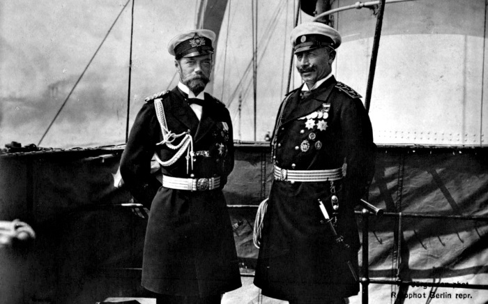

> **Первичный текст.** О текущем моменте №6(138), 2018г. К 100-летию завершения боевых действий первой мировой войны ХХ века.
> Источник: `dotu.ru:a375f730b43f5f4b.doc` sha256 `2c782592073f9cf7…`; [страница на dotu.ru](https://dotu.ru/2018/11/14/20181114_tek_moment06138/).
> Автоматическая транскрипция DOC→Markdown; смысл и формулировки не правились.
> Контрольные суммы и статус проверки — в [NOTICE.md](../../NOTICE.md).
> Содержание передаёт позицию авторов; утверждения не верифицированы библиотекой.

---

# 1. Прошлое[^1]

1.1. Бьёркский договор — фактор разрушения доверия\

Берлина к Петербургу

---------------------------------------------------

Возможно, что решающий негативный вклад в российско-германские отношения перед первой мировой войной ХХ века внесла история подписания и молчаливой денонсации Россией Бьёркского договора, который в официозе исторической науки (особенно в России) никто не связывает с событиями непосредственно предвоенного периода, начало которому отсчитывается от убийства 28 июня 1914 г. сербским националистом Гаврилой Принципом (1894 — 23 апреля 1918)[^2] наследника престола Австро-Венгрии эрцгерцога Франца Фердинанда (1863 — 1914).

В июле 1905 года германский кайзер Вильгельм II на своей яхте «Гогенцоллерн» в сопровождении крейсера «Берлин» пришёл в финские шхеры, где в то время на своей яхте «Полярная звезда» отдыхал император Николай II. Императоры пообщались друг с другом[^3], в результате чего они и уполномоченные ими свидетели[^4] 11 (24) июля[^5] подписали Бьёркский договор, который предусматривал взаимопомощь обеих империй друг другу в случае нападения на одну из них какой-либо третьей страны или коалиции. Бьёркский договор в том виде, в каком его текст известен (в том числе и по публикациям в интернете[^6]), не обязывал ни Россию, ни Германию оказывать военную помощь второй договаривающейся стороне в случае, если она сама начнёт войну против какой-либо третьей страны.

Однако после подписания Бьёркского договора Николай II под давлением С.Ю. Витте (в тот период — председатель кабинета министров, т.е. премьер-министр) и графа В.Н. Ламсдорфа (министр иностранных дел в 1900 — 1906 гг.) письмом от 13 (26) ноября 1905 г. уведомил Вильгельма II, что считает необходимым дополнить договор двусторонней декларацией о неприменении статьи 1-й в случае войны Германии с Францией, в отношении которой Россия будет соблюдать принятые ею обязательства впредь до образования русско-германо-французского союза. И никаких сожалений о политике России, нечестной по отношению к Германии и кайзеру, никогда никем из российских монархистов и почитателей Николая II никогда не высказывалось. А сам Бьёркский договор, изначально бывший секретным, был опубликован Советской властью наряду с прочими секретными договорами и стал сенсацией на некоторое время, которую, однако, быстро постарались предать забвению и не комментировали.

Как явствует из текста Бьёркского договора на момент его подписания обоими императорами, присоединение к нему Франции не было обязательным условием его действия, но было желательным для Германии, поскольку у Франции в тот период были болезненные воспоминания о поражении *во* *франко-прусской войне 1870 — 1871 гг.*[^7] и в ней культивировались мечты о возвращении под свою юрисдикцию Эльзаса и Лотарингии, включённых в состав Германии по итогам той войны. В исторической обстановке середины лета 1905 г. возвращение Эльзаса и Лотарингии в состав Франции подразумевало либо нападение Франции на Германию в удобных для Франции обстоятельствах и победу Франции в новой войне, либо провоцирование Германии на войну с Францией с последующим разгромом Германии. Соответственно письмом Николая II Вильгельму II, фактически денонсировавшим подписанный Николаем II договор, *Россия по умолчанию признала право Франции начать войну против Германии с целью возвращения под свою юрисдикцию Эльзаса и Лотарингии*[^8]*:* см. ст. I этого договора. Именно так и никак иначе денонсацию Россией Бьёркского договора должны были интерпретировать в Берлине. Также и денонсация этого договора на основании его ст. IV по умолчанию означает, что союз России с Францией против Германии для России предпочтительнее даже при том, что Франция может быть заинтересована в войне с целью возвращения Эльзаса и Лотарингии и для этого готова вовлечь в войну Россию, не считаясь с её интересами мирного развития.

После того, как Бьёркский договор был подписан самодержцем всероссийским и им же денонсирован, спрашивается:

Почему после того, как *Николай II делом показал, что он не хозяин своему слову и подписи,* в период перед началом первой мировой войны кайзер Вильгельм II обязан был верить уверениям Николая II о его миролюбии и особенно — его телеграмме, в которой Николай II уверял кайзера, что объявленная Россией 31 июля 1914 г. мобилизация не означает автоматического начала по завершении мобилизации военных действий ни против Австро-Венгерской империи, ни против союзной с Австро-Венгрией Германской империи? — И Германия объявила войну России именно в ответ на отказ России выполнить требование Берлина отменить начатую мобилизацию, в том числе и потому, что в Берлине не могли поверить, что по завершении мобилизации не последует автоматического начала войны[^9]: зачем тогда проводить мобилизацию?

Второй вопрос, связанный с Бьёркским договором, по сути, вопрос о компетентности Николая II как главы государства спустя десять лет после начала царствования: *на момент подписания Бьёркского договора знал ли Николай II о содержании существовавших на тот момент договоров России и Франции, которое могло сделать содержание Бьёркского договора несовместимым с ними, вследствие чего — до изменения характера своих договорных отношений с Францией — Николай II действительно не имел ни международно-юридического, ни морального права подписывать Бьёркский договор в том виде, в каком его предложил на подпись кайзер Вильгельм II?* При этом, как сообщает П.В. Мультатули[^10], Николай II, готовясь к встрече с кайзером в финских шхерах (т.е. встреча не была внезапной для Николая II), отказался взять с собой министра иностранных дел России графа Ламсдорфа, сославшись на то, что рейхсканцлер Германии фон Бюлов не сопровождает Вильгельма II. Вследствие этого в роли свидетеля подписания со стороны России вынужден был выступить её морской министр — по сути случайный для дипломатии человек.

[^1]: Раздел 1 включает в себя некоторые фрагменты работы ВП СССР «Разгерметизация» (<http://dotu.ru/2017/04/14/20170414_razgermetizacia_full/>) и аналитической записки «1917 год — начало преображения человечества» из серии «О текущем моменте» № 4 (132) 2017 г. (<http://dotu.ru/2017/10/11/20171011_tek_moment04132/>).

[^2]: Г. Принцип умер в тюрьме от туберкулёза, не дожив до конца войны; кроме того, после покушения толпа жестоко избила его, прежде чем он был арестован, вследствие последствий избиения ему пришлось ампутировать правую руку.

[^3]: Фотоотчёт и комментарии см. по ссылке: <https://ok.ru/rossiyador/topic/67034090646312>.

[^4]: Свидетелями подписания договора выступили: со стороны России — морской министр Алексей Алексеевич Бирилев, со стороны Германии — граф Генрих фон Чиршки-Бёгендорф, бывший советник посольства в Петербурге, очень компетентный международник той эпохи, авторитет в среде германских дипломатов.

[^5]: Здесь и далее при двойном обозначении дат в цитируемых источниках, в скобах либо через дробь указаны даты по ныне действующему григорианскому календарю. Во всех остальных случаях даты приводятся по григорианскому календарю.

[^6]: «Их величества императоры всероссийский и германский, в целях обеспечения мира в Европе, установили нижеследующие статьи оборонительного союза:

    СТАТЬЯ I. В случае, если одна из двух империй подвергнется нападению со стороны одной из европейских держав, союзница её придет ей на помощь в Европе всеми своими сухопутными и морскими силами.

    СТАТЬЯ II. Высокие договаривающиеся стороны обязуются не заключать отдельно мира ни с одним из общих противников.

    СТАТЬЯ III. Настоящий договор войдёт в силу тотчас по заключении мира между Россией и Японией и останется в силе до тех пор, пока не будет денонсирован за год вперед.

    СТАТЬЯ IV. Император всероссийский, после вступления в силу этого договора, предпримет необходимые шаги к тому, чтобы ознакомить Францию с этим договором и побудить её присоединиться к нему в качестве союзницы» (<http://www.hist.msu.ru/ER/Etext/FOREIGN/bjorke.htm>).

[^7]: Её начала Франция, но историки перекладывают вину за её развязывание на Бисмарка: дескать он спровоцировал Францию. Но реально Франция (Наполеон III) хотела повоевать, дабы профилактировать усиление Германии. Она вмешалась во внутренние дела Испании, выразив неудовольствие по поводу приглашения ею прусского принца на испанский престол, и потребовала от Германии отказаться от приглашения. После того, как Германия непублично удовлетворила требование Франции, Франция потребовала от Германии официального заявления об отказе. Бисмарк, осведомившись у начальника генштаба Мольтке о способности прусской армии разгромить Францию, отредактировал сообщение об отказе короля Пруссии встретиться с французским посланником так, что Наполеон III воспринял публикацию как оскорбление и, не желая терять лицо, реализовал своё желание «повоевать». Т.е., если бы Франция не лезла во внутренние дела Испании и Пруссии и не желала повоевать, чтобы разрядить зревшую в ней революционную ситуацию, то никакой войны бы не было. А о роли масонства в обеспечении поражения Франции см. в книге А. Селянинова «Тайная сила масонства».

[^8]: В этом выразилось миролюбие России? её политическая ответственность за судьбы Мира и за свою собственную судьбу?

[^10]: П.В. Мультатули «Дай Бог, только не втянуться в войну!» Император Николай II и предвоенный кризис 1914 года. Факты против мифов». — Рос. ин-т стратег. исслед. — М.: РИСИ, 2014. — 252 с. — С. 116. См. также: <https://riss.ru/wp-content/uploads/2015/11/Nikola-II_ves-tekst.pdf>.
---

[К произведению](README.md) · [Каталог](../../CATALOG.md)
