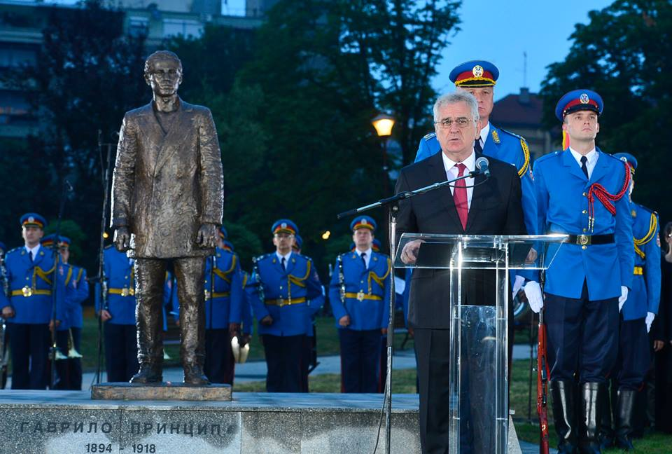
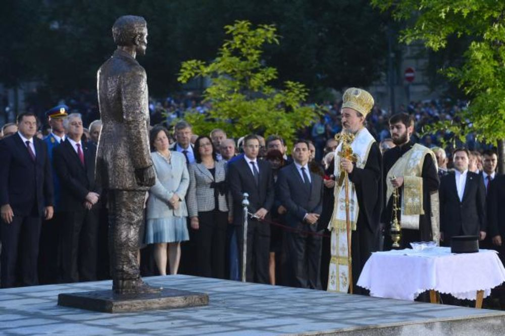
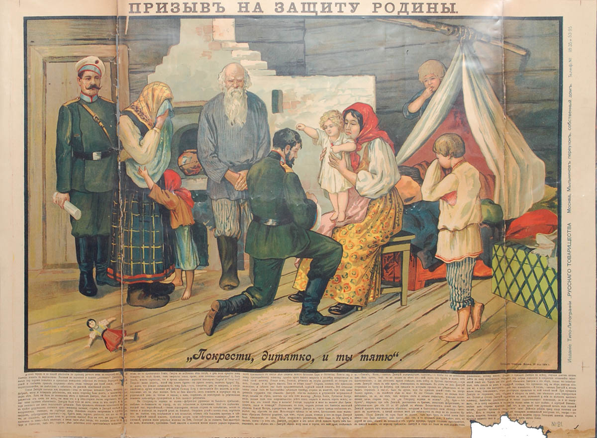

> **Первичный текст.** О текущем моменте №6(138), 2018г. К 100-летию завершения боевых действий первой мировой войны ХХ века.
> Источник: `dotu.ru:a375f730b43f5f4b.doc` sha256 `2c782592073f9cf7…`; [страница на dotu.ru](https://dotu.ru/2018/11/14/20181114_tek_moment06138/).
> Автоматическая транскрипция DOC→Markdown; смысл и формулировки не правились.
> Контрольные суммы и статус проверки — в [NOTICE.md](../../NOTICE.md).
> Содержание передаёт позицию авторов; утверждения не верифицированы библиотекой.

---

## 2.2. Вправе ли глава государства быть «невольником чести»?

В разделе 1 не были затронуты некоторые вопросы, которые важны для понимания прошлого и перспектив в настоящем. Один из таких вопросов — ответственность тогдашней Сербии за убийство наследника престола Австро-Венгрии эрцгерцога Франца Фердинанда и его супруги герцогини (княгини) Софии Хотек[^82].

По сути, Австро-Венгрия с подачи и под давлением Германии, которая искала повода к войне с целью установления контроля над Балканами, обвинила Сербию в проведении политики государственного терроризма, жертвой которого пали Франц Фердинанд и его супруга.

Франц Фердинанд был противником войны с Сербией. Франц Фердинанд осознавал запущенность внутренней конфликтности межэтнических отношений в Австро-Венгрии и был сторонником преобразования Австро-Венгрии в Соединённые Штаты Великой Австрии — триединое государство Австро-Венгро-Славию, в которой бы с течением времени при внутренней политике, адекватной задачам развития национальных культур, можно было бы построить гармоничное консолидированное многонациональное общество. Соответственно у Сербии не было никаких политических мотивов к убийству будущего главы сопредельного государства, военно-экономическая мощь которого превосходила мощь самой Сербии, и который сам не был настроен агрессивно по отношению к Сербии.

Сербское государство тех лет невозможно обвинить и в том, что оно пошло на это убийство, предполагая в каких-то своих интересах вовлечь в свой — неизбежный в этом случае — конфликт с Австро-Венгрией Россию, поставив её перед фактом.

**Во-первых**, в Сербии, как и в других государствах мира, знали, что Россия после русско-японской войны, революционных потрясений 1905 — 1907 гг., экономического кризиса 1907 г. не обладает военно-экономической мощью, позволяющей ей оказывать миротворчески вразумляющее воздействие на политиков в Берлине и Вене, не говоря уж о воздействии на Лондон. Даже если бы Николай II мог свернуть вилку и бросить её в австрийского дипломата со словами «вот, что я сделаю с вашими корпусами»[^83], после всего происшедшего в истории России под его властью такой поступок был бы неубедительным.

**Во-вторых**, убийство наследника престола Австро-Венгрии и его супруги было осуществлено «самодеятельной» политико-террористической организацией «Млада Босна» («Молодая Босния»). Эта организация не была подконтрольна ни спецслужбам Сербии, ни спецслужбам России, хотя и контактировала с тайной организацией «Чёрная рука», действовавшей в Сербии, но также не подконтрольной Сербскому государству. **Но такого рода организации не бывают бесхозными: масонство (а также и его национальные аналоги, порождённые местными эзотерическими субкультурами) контролирует каждую из них и координирует в русле некоторого объемлющего сценария их повседневную деятельность и эпизодические «решительные действия».**

Т.е. даже если «Млада Босна» вынашивала план этого убийства на протяжении длительного времени, то приурочить его к определённым событиям — ей помогли кураторы. Декларативной целью убийства (т.е. мотивирующей идеей) провозглашалось отделение южно-славянских земель от Австро-Венгрии с последующей их интеграцией в состав «Великой Сербии». При этом идиоты-подвижники в «Младой Босне» не задумывались о том, что цепочка причинно следственных связей в виде *«убийство наследника престола Австро-Венгрии ⇒ отделение славянских земель от Австро-Венгрии ⇒ создание Великой Сербии»* — объективно не существует и психодинамика обществ Европы реализовать её неспособна.

\* \* \*

И одна из проблем Сербии наших дней состоит в том, что в ней Гаврила Принцип и другие участники сараевского покушения — культовые народные герои, а не идиоты, которыми проманипулировали закулисно-политические силы для того, чтобы развязать первую мировую войну ХХ века.

«Столетний спор о том...

...кто начал Первую Мировую войну благополучно разрешён в Сербии еще в 2015 году, когда Гаврило Принципу в присутствии высшего руководства страны и тысяч воодушевленных граждан прямо напротив здания правительства в Белграде открыли бронзовый монумент.

Президент Сербии Томислав Николич перед сотнями телекамер планеты на открытии \<памятника Гавриле Принципу\> заявил, что "Гаврила Принцип был носителем идеи освобождения от рабства, которая затем распространилась по всей Европе"…

 

То есть Сербия в 2015 году взяла на себя историческую ответственность за развязывание Первой Мировой войны, обозвав это развязывание началом "освобождения от рабства" (вовсе не терактом, лишившим соседнее государства Наследника и повлекшим гибель миллионов людей). Сто лет сербы изворачивались и врали, что "я не я и лошадь не моя", а теперь признали террориста № 1 своим национальным героем. Как говорится, ни прибавить, ни убавить к этой прославляемой подлости, воспеваемому невероятному злодейству ничего нельзя. Устал таить гордость от открытия человечеству новой эпохи, "свободной от рабства", добрый сербский народ.

Русские, конечно, после этого официального саморазоблачения сербов остались в полных дураках — из-за этой *террористической нации* (а уже можно говорить и так, ведь прославили Принципа и руководство, и народ) они **потеряли собственную страну**»[^84].

А сербская православная церковь совершила акт идолопоклонства, освятив сей памятник *беззаботно-безответственному террористу*.

\* \*\

\*

В диверсионно-террористическую группу вошли шесть человек — все подданные Австро-Венгрии, православные сербы. С территории Сербии им помогали сербские офицеры — члены «Чёрной руки», раскрытие фактов такого рода в первые же дни после сараевского убийства и дало повод Австро-Венгрии обвинить сербскую государственность в организации убийства престолонаследника и предъявить ей ультиматум, исполнение требований которого фактически лишало Сербию суверенитета и превращало её в австро-германский протекторат (хотя такого политического термина в те времена ещё не было).

Но если посмотреть на действия Австро-Венгерской стороны перед убийством Франца Фердинанда и его супруги, то к ней тоже есть вопросы:

- Визит эрцгерцога в Сараево был приурочен к годовщине разгрома турками сербов на Косовом поле (1389 г.), лишившему сербов своего государства на многие века, а переход власти над исконно сербскими землями от Турции к Австро-Венгрии воспринимался в южнославянских землях как историческая несправедливость. — Эта дата была избрана специально для того, чтобы обозлить южно-славянских радикалов и дать повод для выражения недовольства?

- «Млада Босна» достоверно знала о сроках визита наследника престола и смогла к нему подготовиться.

- Охрана эрцгерцога была сокращена.

- После того, как первый террорист бросил в кортеж гранату, взрыв которой убил шофёра одного из автомобилей, охрана и спецслужбы Австро-Венгрии в Сараево действовали исключительно непрофессионально, в результате чего стало возможным второе покушение, успешно осуществлённое Гаврилой Принципом.

Если последнее ещё можно как-то списать на растерянность и стресс сотрудников спецслужб Австро-Венгрии, то первые три обстоятельства требуют определённых целенаправленных действий. Но первые три обстоятельства были неподконтрольны ни правительству Сербии, ни «Младой Босне», ни «Чёрной руке». И только масонство, будучи транснациональной политической мафией, могло через свою периферию согласовать в русле определённого сценария и скоординировать действия причастных к убийству лиц и в Сербии («Чёрная рука»), и на территории Австро-Венгрии («Млада Босна» и спецслужбы), и прочих «братанов» в государственном аппарате Австро-Венгрии и других государств — будущих участников европейской бойни.

В качестве иллюстраций, объясняющих возникновение ситуации, приведшей к убийству Франца Фердинанда, а также объясняющих действия политиков государств Европы в предвоенный период, возьмём картинки из менеджмента наших дней, широко растиражированные в интернете.

 

В общем-то это два экземпляра одного и того же рисунка, отличающиеся только надписями: на левом — надписи по-русски, на правом — надписи по-английски. На них структурный способ управления представлен как иерархия должностных лиц предприятия, а бесструктурное управление и управление на основе виртуальных структур представлено как разного рода неформальные связи должностных лиц друг с другом и внешней по отношению к предприятию социальной средой. Однако, в связи с интересующей нас темой значимо различие смыслов заголовков обоих рисунков: в этом различии смыслов выражается различное понимание взаимодействия всех трёх способов управления.

- Перевод с английского на русский смысла заголовка правого рисунка «Real Organization Chart» — «Реальная организационная схема», т.е. схема *реально действующей коммуникации личностей в процессе функционирования некой компании (предприятия)*, и она не совпадает с официальным организационно-штатным расписанием предприятия, полномочиями и обязанностями должностных лиц и подразделений этой оргшатной структуры. Также полезно обратить внимание на изменения типа «смайликов» при переходе от низов к вершине иерархии.

- *[В оригинальном издании здесь расположен рисунок/схема. Иллюстрация не включена в данный выпуск: ожидает визуальной и правовой проверки. Файл источника: image10.jpeg]*При более широком взгляде смысл заголовка левого рисунка даёт ложное представление о происходящем: иерархия компании не «не работает» — она работает, но в действительности иерархия не такая и работает не так, как это предписано официально действующими оргштатной структурой, оргштатным расписанием и прописанными в них полномочиями и обязанностями должностных лиц.

И приведённое в разделе 1 описание событий, имевших место в период перед началом первой мировой войны, показывает, что и в Германии, и в России в критические моменты эта неформальная личностная коммуникация была более властна, нежели оргштатные структуры государственной власти, возглавляемые монархами.

Правый рисунок по своей сути является аналогом воспроизводимого слева рисунка «Схема управления “лидером”», неоднократно представленного и пояснявшегося в разных материалах Концепции общественной безопасности, поясняющего управление людьми (прежде всего политическими лидерами) извне в обход контроля их сознания. Разница только в том, что в восприятии многих людей:

- «Real Organization Chart» — один из аспектов менеджмента, который надо изучать и осваивать для достижения успеха в бизнесе;

- а «Схема управления “лидером”» — в их же понимании — «конспирология», «бреднями» которой все «психически нормальные» «здравомыслящие», «уважающие себя» и «политкорректные» люди должны[^85] брезговать и брезгуют.

Таково воздействие «масштабных эффектов» на миропонимание шаблонно «мыслящих»: «Real Organization Chart» — относится к предприятию, а «Схема дистанционного управления “лидером” в обход контроля его сознания» — к государству в целом.

Но тем не менее, вне зависимости от отношения тех или иных лиц к менеджменту и «конспирологии» — суть взаимоотношений официальной оргштатной структуры и неофициальной системы фактических взаимосвязей людей в этой же оргштатной структуре, вне зависимости от масштаба рассмотрения (предприятие, государство, совокупность государств) является объективной данностью. При этом часть неформальных связей уходит за пределы рассматриваемой структуры. И эти связи с внешней социальной средой на правом и левом рисунке представлены только в виде частного случая: «партнёр, который на самом деле принимает все решения». В действительности такой партнёр может не иметь дел с первым лицом в иерархии, а взаимодействовать с кем-то, кто находится на несколько уровней ниже первого лица (как это представлено на «Схеме управления “лидером”») и его непосредственных подчинённых, но кто вырабатывает управленческие решения и их обоснования (особенно в области кадровой политики), которые предстоит утвердить первому лицу в качестве обязательных к исполнению; кто решает, что доложить первому лицу и как, а что сокрыть от него и т.п.

Т.е. рисунок «Схема управления “лидером”» даёт более общее представление о системе внутрисоциальной коммуникации в процессе взаимодействия структурного и бесструктурного управления и управления на основе виртуальных структур, нежели два приведённых ранее рисунка.

В практической политике (а также и в управлении предприятиями) *действительно психически нормальным здравомыслящим* людям такого рода системы взаимоотношений людей и формальных структур необходимо уметь выявлять для того, чтобы осознанно волевым порядком осуществлять управление, адекватное собственным интересам в складывающихся обстоятельствах и при имеющихся возможностях дальнейшего развития ситуации (как внешней, так и внутренней по отношению к границам структуры).

При экстраполяции системы коммуникации личностей, представленной на каждом из трёх рисунков, до масштабов Европы накануне первой мировой войны ХХ века, каждому государству будет соответствовать свой рисунок.

- Имперскому недомыслию России будет соответствовать набор рисунков с заголовком «Почему не работает иерархия в компании».

- Британскому способу мышления будет соответствовать набор взаимосвязанных рисунков с заголовком «Real Organization Chart», в наборе которых самой Британии будет соответствовать «партнёр, который на самом деле принимает все решения» и проникает в другие государства через масонскую периферию, подконтрольную либерально-буржуазным ветвям масонства, замкнутым на британские старшие ложи (т.е. в полном соответствии со «Схемой управления “лидером”»).

- Лицемерию и наивности Германии, *прикрывающей агрессивность своей политики проникновения в регион Персидского залива через взятие под свой патронат Австро-Венгрии, балканских государств и Турции,* будет соответствовать отождествление Германии с «партнёром, который на самом деле принимает все решения» в рисунке «Real Organization Chart» при невосприятии того факта, что Британия и Франция тоже действуют в режиме «партнёра, который на самом деле принимает все решения» и проводит их в жизнь, в том числе и в отношении Германии, опираясь при этом на ветви масонства, имеющие свои штаб-квартиры на их территории («Объединённая великая ложа Англии» + ложи шотландского ритуала, и «Великий восток Франции» — соответственно).

Как можно понять из воспоминаний С.Д. Сазонова, из работ историков, Россия знала о непричастности сербской государственности к убийству эрцгерцога Франца Фердинанда; Россия пыталась убедить в этом носителей власти Германии и Австро-Венгрии, не осознавая лицемерия носителей государственной власти, прежде всего, Германии. Носители высшей власти в России — *вопреки вердикту Александра III «во всём свете у нас только два верных союзника — наша армия и флот»* — наивно верили в честность носителей власти Великобритании и Франции, заявлявших о том, что они не желают европейской войны и являются союзниками России. В результате, будучи «невольником чести», Николай II вверг Россию в войну, к ведению и победе в которой он же страну не подготовил ни в политико-управленческом, ни в экономическом, ни в *военном отношении во всех аспектах обеспечения обороноспособности государства*[^86]*,* [^87]*.*

В нашем понимании **глава государства не вправе быть «невольником чести»**, поскольку в рассмотренном нами конкретном случае исполнение Николаем II «долга чести» по отношению к Сербии, а после начала войны — по отношению к Франции[^88], было бесчестно по отношению к народам самой России, прежде всего потому, что страна не была заблаговременно подготовлена его же правлением к успешному ведению боевых действий.

**Если глава государства — «невольник чести», то это — один из аспектов утраты государством суверенитета в его полноте**, поскольку внешнеполитическим силам, включая врагов и мало отличимых от них *как бы союзников*, «невольник чести» сам открывает возможность для манипулирования им через его понимание «долгов чести» и связанные с «долгом чести» неподконтрольные ему обстоятельства, формируемые другими субъектами политики.

Но политика должна быть праведной, и только в этом случае она может быть честной, прежде всего, — по отношению к народам своей страны, поскольку МОЩЬ СОБСТВЕННОГО ГОСУДАРСТВА — ЗАЛОГ ИСПОЛНЕНИЯ ДОЛГА ПРАВЕДНОСТИ ПО ОТНОШЕНИЮ КО ВСЕМУ ЧЕЛОВЕЧЕСТВУ.

В несоблюдении этого соотношения и состоит преступление Николая II перед народами России и других стран — участниц первой мировой войны.

В итоге — вследствие бесчестности Николая II и его режима по отношению к народам России — война оказалась не только самоубийственной для Российской империи, но Россия в её ходе не смогла обеспечить и существование Сербии. Сербия, оказав упорнейшее сопротивление австро-венгерской агрессии и примкнувшей к коалиции центрально-европейских держав «братской» Болгарии[^89], была оккупирована, и поток сербских беженцев устремился в Румынию, а через Румынию в Россию. Государственность Сербии была возобновлена в виде Югославии в 1918 г. только после поражения Германии и её союзников. И как было показано ранее, Сербия наших дней (не без кураторства извне) не сделала должных выводов из истории.

И главное: Россия, расплатилась за *царские «долги чести» перед кем угодно, только не перед своею Родиной* — катастрофой культуры и жертвою сотен миллионов человек в нескольких поколениях, от последствий чего не восстановилась до настоящего времени, поскольку продолжает платить высокой смертностью и низкой рождаемостью в настоящем и в ближайшей исторической перспективе.

Выгодополучателями от исполнения Николаем II «долга чести» по отношению к Сербии в целенаправленно созданных для этого обстоятельствах стали: Великобритания (ликвидировала континентальные империи — своих основных геополитических конкурентов) и Франция (вернула под свою юрисдикцию Эльзас и Лотарингию), и кроме того, обе эти страны *на некоторое — исторически непродолжительное — время* упрочили своё положение в качестве колониальных держав, поделив наследие Османской империи (Турции).

А главное — на военных поставках в Европу из США хозяева хозяев Федеральной резервной системы США[^90] вырастили будущего мирового жандарма.

Так исполнение «долга чести» по отношению к Сербии перед началом войны и *как бы союзникам* в ходе войны (послы Великобритании и Франции в России участвовали в организации свержения династии Романовых, в организации февральской революции и становлении государственности временного правительства) стало, по сути, изменой главы государства своей Родине.

\* \* \*

По итогам первой мировой войны Россию от полного краха и трансформации в набор колоний «высокоцивилизованных стран» (интервенция была организована с этой целью) спасли большевики, но монархисты, иерархи РПЦ и либерал-буржуины именно их винят в крахе империи, в крахе временного правительства, в гражданской войне и всех последовавших бедах, но не Николая II персонально и его режим, и не деятелей временного правительства, которые только болтали о войне до победного конца вместо того, чтобы решать проблемы страны. Для всех них Николай II — святой, мученик и страстотерпец, и всем надо каяться за «грех предательства народом царя-страстотерпца». Но история показывает, что молиться надо не Николаю II как «святому», а надо молить Бога простить многочисленные грехи Николая II и грехи деятелей возглавляемого им режима…

# 3. Настоящее

Некоторые вопросы, относящиеся к тематике раздела 3, были освещены в аналитических записках ВП СССР 2014 г. «Про войны»[^91] и «О состоянии, тенденциях и возможностях управления»[^92]. Изложенное в названных записках по-прежнему актуально, поэтому мы просто напоминаем о них, а далее речь пойдёт о том, что относится к тематике настоящей записки и не нашло освещения в двух названных ранее записках.

[^82]: Их брак был официально признан морганатическим, вследствие чего их дети не имели права на престол. София Хотек, вступив в брак, получила титул княгини (герцогини) Гогенберг.

[^83]: Широко известная история.

    Однажды на обеде в Зимнем дворце австрийский посол завёл разговор о Балканском вопросе. Он говорил в раздражённом тоне, всё более взвинчивая себя, но Александр III делал вид, что ничего не замечает, и продолжал обед в обычном порядке. В конце концов, посол дошёл до угроз в адрес России и дал понять, что Австрия готова мобилизовать два или даже три корпуса.

    С насмешливым выражением лица царь взял вилку, согнул её петлёй и бросил в сторону австрийского посла, спокойно добавив: «Вот что я сделаю с вашими двумя или тремя мобилизованными корпусами».

[^84]: <https://nngan.livejournal.com/899187.html>.

[^85]: Кому должны?

[^86]: Теоретической проработке вопросов стратегии и тактики ведения боевых действий, структуры необходимых вооружений и организации вооружённых сил и управления ими, завершённости программ перевооружения армии и флота, развитости отраслей науки и промышленности, необходимых для обеспечения обороноспособности страны и ведения успешных боевых действий.

[^87]: Т.е. история повторилась. Десятью годами ранее Николай II допустил, чтобы тогдашняя «партия войны» — «безобразовская клика» — вопреки интересам развития страны фактически вызвала Японию на войну с Россией, к ведению и победе в которой Россия не была подготовлена его же режимом.

    О политике России в преддверии русско-японской войны см., в частности, «Разведопрос: Борис Юлин о русско-японской войне»:

    <https://www.youtube.com/watch?v=4gSegghFWT0&list=PL1I6i3_12o3n1OqMG2xufoCD00sy1WN5Z>. Всё в изложении Б. Юлина достоверно, за исключением того, что тактико-технические характеристики кораблей Русского флота он приводит по их паспортным данным, а фактически они были существенно ниже, вследствие того что качество постройки было «никакое». Посмотрите также агитационные плакаты времён русско-японской войны (задайте в Яндексе на вкладке «Картинки» поиск «плакаты времен русско-японской войны»): производство такого рода агиток — единственное, в чём преуспела Россия в ходе той войны.

[^88]: В самом начале войны восточно-прусская операция, завершившаяся для России разгромом войск Самсонова и Ренненкампфа, сорвала «план Шлиффена» по молниеносному разгрому немцами французской армии и победному броску на Париж. Она лишила Германию возможности осуществления блицкрига на её западном фронте из-за необходимости отвлечения сил на восточный фронт, чем спасла Францию, позволив ей отмобилизоваться и развернуть войска. Вторично в ходе сражений под Верденом в 1916 г., когда германское наступление развивалось в целом успешно, и Франция утрачивала позиции, Россия начала наступление в районе озера Нароч. Германия восприняла это наступление, как начало генерального наступления Русской армии и свернула активность на западном фронте, что позволило Франции выстоять.

[^89]: Есть такая особенность у Болгарии: в обеих мировых войнах ХХ века «братская» Болгария воевала на стороне противников России, а после краха СССР тоже постоянно присоединяется к антироссийским действиям других государств.

[^90]: Федеральная резервная система США была создана в 1913 г. под предлогом обеспечения устойчивости финансового обращения и является де-факто и де-юре — частной лавочкой, которая владеет всем долларовым обращением как в США, так и за их пределами.

[^91]: <http://dotu.ru/2014/08/29/20140828_about_wars/>.

[^92]: <http://dotu.ru/2014/10/31/20141031_about_politics/>.
---

[К произведению](README.md) · [Каталог](../../CATALOG.md)
