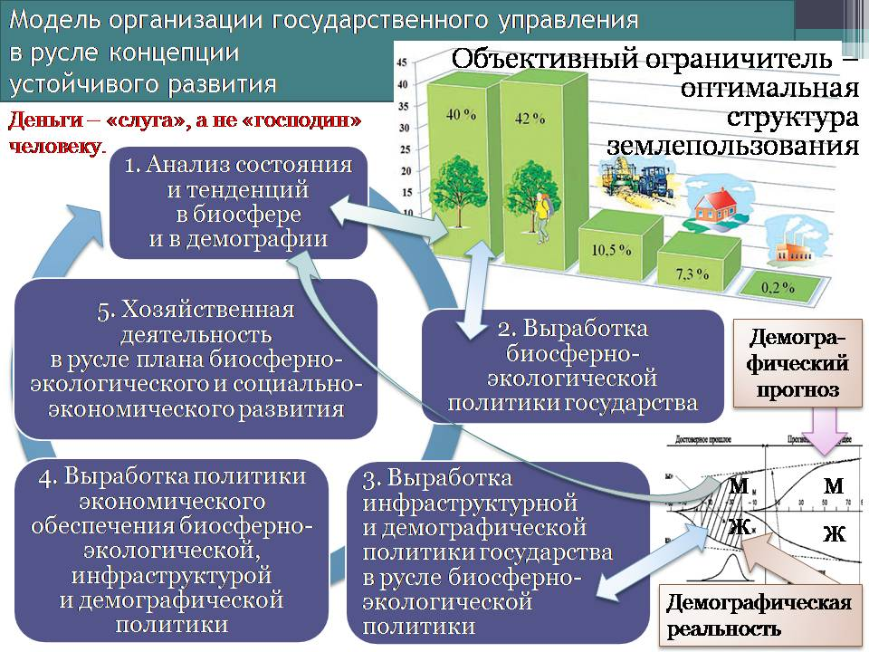

> **Первичный текст.** О ТМ №1(108) Введение в конституционное право, 2013-01-11.
> Источник: `20130111 О ТМ №1(108) Введение в конституционное право.doc` sha256 `341e71090686c5c9…`; [страница на dotu.ru](https://dotu.ru/2013/01/11/20130111_tek_moment01108/).
> Автоматическая транскрипция DOC→Markdown; смысл и формулировки не правились.
> Контрольные суммы и статус проверки — в [NOTICE.md](../../NOTICE.md).
> Содержание передаёт позицию авторов; утверждения не верифицированы библиотекой.

---

# Заключение

Если дочитав до этого места, кто-то подумает, что всё вышеизложенное было написано для того, чтобы возбудить в обществе кампанию за отмену действующей конституции РФ 1993 г., написанной в интересах «великого комбинатора», и за переход к правлению на основе адаптированной под границы России Конституции СССР 1936 г., то он ничего не понял. Это написано для того, чтобы показать на примерах из истории Русской многонациональной цивилизации действие общеуправленческого закона, требующего взаимного соответствия системы и объекта управления, что является необходимой основой для устойчивости *определённого по своим качествам* процесса управления.

Если соотноситься с этой объективной управленческой закономерностью, то российское общество, рассматриваемое как объект управления, не готово к тому, чтобы управляться на основе принципов и алгоритмики, которые И.В.Сталин выразил в Конституции СССР 1936 г., ещё в большей мере, чем к этому было не готово советское общество той эпохи:

- во-первых, социализм в те времена для многих (и прежде всего для рабоче-крестьянской молодёжи) был неоспоримым завоеванием, за которое они были готовы отдать свои жизни, что многие и подтвердили своими подвигами в битвах Великой Отечественной войны и самоотверженным трудом в тылу во имя Победы, а коммунизм для них — был мечтой, к воплощению которой в жизнь столь же самоотверженно стремились;

- О.Бендер поначалу был всего лишь литературным персонажем-посмешищем, олицетворявшим, наследие прошлого, которому весьма трудно найти место в настоящем и не будет места в коммунистическом будущем.

В СССР накануне перестройки и по настоящее время:

- идеалы коммунизма для изрядной доли населения и, в особенности, для большинства представителей его политически активной части — невозможная химера, не осуществимая мечта и «ошибка истории», от которой больше всех пострадала Россия как государство, а из народов — Русские; и преодолеть власть этих заблуждений (с точки зрения приверженцев такого рода оценок социализма и коммунизма) желательно столь же решительно и эффективно, как в период с 1945‑го — 1960‑го гг. ФРГ произвела «денацификацию» и стала передовым демократическим государством с высоким уровнем экономического обеспечения жизни всех[^275];

- Остап Бендер в эпоху брежневского застоя перестал быть посмешищем, а стал олицетворять собой успешного инициативного человека, которому социализм мешает жить, и кумиром, т.е. образцом для подражания многих людей. И об этом говорит тот факт, что ныне истуканы, олицетворяющие Остапа, стоят по крайней мере в 5 городах на территории бывшего СССР;

- существенно возросла доля населения (и особенно молодёжи), порабощённых алкоголем и прочим гедонизмом, жизненный идеал которых «ням-ням, трах-трах, цап-хап», вследствие чего они — не творцы, а паразиты.

Это означает, что:

Не смотря на то, что конституция РФ 1993 г. — преисполнена управленчески несостоятельного вздора, лицемерия, вероломства, глупостей, — именно она соответствует советскому обществу времён перестройки и обществу постсоветской России как объектам управления.

Это — тоже выражение объективного управленческого закона, требующего взаимного соответствия объекта управления и системы управления для поддержания определённого по качествам режима функционирования замкнутой системы.

По отношению к России этот закон взаимного соответствия выражается и в том, что к какому-либо иному режиму, кроме того, что сложился после ухода Б.Н.Ельцина с поста главы государства, постсоветская Россия, понимаемая как система, взаимодействующих друг с другом государственности и общества, — не способна. Тем не менее, следует понять, что:

Этот режим — «застой-стабилизец» — не только эпоха житейских проблем, но он представляет собой также и время, данное Свыше для того, чтобы люди на Руси одумались, породили бы и выразили мечту о будущем, на основе которой общество будет развиваться в дальнейшем устойчиво бескризисно и безопасно.

Но изрядная доля населения вместо того, чтобы воспользоваться этой возможностью, мается всякой дурью. Несколько лет ждали конца света 21 декабря 2012 г. Когда это «знаменательное событие» в очередной раз не состоялось, то переключились на новую дурь: 2013 г. оказывается «год змеи», а «года́ми змеи» были 1905, 1917, 1929, 1941, 1953, 1965, 1977, 1989, 2001.

Т.е. изрядная доля населения отдаёт предпочтение тому, чтобы не они сами, «коварный никто» лепил их будущее, исходя из его неправедных интересов, опираясь на принцип «*Орлиный взор, напор, изящный поворот, — и прямо в руки запретный плод: мне уступают — я не в силах отказаться»*[^276]*.* И это приводит к вопросу о вариантах будущего.

Для «мировой закулисы», решающей задачу защиты экологической системы планеты от буржуазного либерализма, один из наиболее предпочтительных вариантов будущего выглядит примерно так.

ООН — становится всемирным парламентом. При ООН создаётся некий исполнительный орган, выполняющий функции мирового правительства. Концепцией правления этого глобального политического института становится принятая 20 лет тому назад «Концепция устойчивого развития». Экономической основой её обеспечения может стать «социализм по Дж.К.Гэлбрейту» — очищенный от идеологических пристрастий и продиктованный необходимостью и организационно-технологическими возможными путями решения задач: 1) обеспечение устойчивости экологической системы планеты и 2) свести к минимуму внутрисоциальные конфликты, порождаемые массовым бескультурьем и культивированием идиотизма.

Что касается собственно сущностно человеческих, внеэкономических аспектов жизни общества, то «быдло» надо поднять на второй уровень несвободы с первого, сделав первый уровень запретным; «элиту» — поднять на третий уровень несвободы (в том смысле, как эти термины определены в разделе 2.3.2).

Но это только в идеале переход к такому будущему может быть «эволюционным», т.е. без войн во всех регионах планеты и экономической разрухи. Однако возможен и вариант, в котором региональные войны повсеместно и глобальная экономическая разруха станут стимулом для «быдла», чтобы оно возжаждало такого глобального рая и поддержало активистов проекта, которые (как и либералы, и марксисты, и нацисты в прошлом) не будут знать его умолчаний, отрицающих оглашения). А суть умолчаний такова:

Поскольку в этой системе никто не должен подниматься на единственный уровень свободы (см. раздел 2.3.2), то роль юриспруденции и кодифицированного права должна нарастать, приближаясь к абсурду высшей степени, и приучать к этому надо с детсадовского возраста[^277]. Те, кто юридическому террору не поддаётся, должны получать особое воспитание «для законодателей», а избыточные для пополнения «когорты законодателей-программистов» или не отвечающие стандартам, — должны безжалостно выбраковываться из общества как психически неполноценные и содержаться изолированно от общества или подвергаться эвтаназии.

Если вы согласны с таким будущим, то по-прежнему можете открывать дорогу деланию глобальной политики на основе реализации принципа *«мне уступают — я не в силах отказаться, так перед кем же мне извиняться и за что?»*

Альтернативой ему может быть только концепция управления, обеспечивающая выход всех на единственный уровень свободы, что требует личностного развития каждого в полном соответствии со словами Христа *«Закон и пророки*[^278] *до Иоанна*[^279]*. С сего времени Царствие Божие благовествуется и всякий усилием входит в него» (Лука, 16:16)*. И со времён его первого пришествия Бог ждёт такого рода усилий от людей…

Советский Союз может возродиться только на этой основе и только как воплощение концепции человечности как концепции глобализации, альтернативной глобализации на основе библейского проекта порабощения человечества от имени Бога. И тогда, хотя Конституция СССР 1936 г. так и останется в прошлом, её идеалы найдут своё выражение в будущей лучшей Конституции, которая станет основой эффективной юридически-правовой системы, обеспечивающей самоуправление общества свободных людей.

Внутренний Предиктор СССР

16 декабря 2012 г. — 11 января 2013 г.

\

Приложение\

Циклика решения частных задач в государственном управлении на основе планов биосферно-социально-экономического развития

=======================================================================================================================

Если смотреть на жизнь с позиций достаточно общей (в смысле универсальности применения) теории управления ДОТУ, то все процессы, за исключением объемлющей всё Вседержительности Божией, протекают как частные процессы в русле совокупности их объемлющих процессов. И процессы взаимодействия частного процесса с его объемлющими процессами во многом определяют характер течения самого́ частного процесса, а в ряде случаев носят решающий характер. Это общее положение касается общественно-экономических формаций в нашей цивилизации — как локализованных в пределах того или иного государства, так и человечества в целом.

Если исходить из этого, то, прежде всего, следует признать, что человечество — один из многих биологических видов в биосфере Земли. Это означает, что его жизнь обусловлена общебиосферными закономерностями, регулирующими воспроизводственные процессы в пределах популяций биологического вида, взаимодействие видов друг с другом, с биосферой и с объемлющими её природными системами и Мирозданием в целом.

Но поскольку человечество — специфический биологический вид, то также существуют и специфические для него биологические закономерности, регулирующие жизнь каждого индивида и внутривидовое взаимодействие людей друг с другом, с популяцией, которой принадлежит индивид, с видом в целом.

Кроме того, человечество несёт культуру, а человеческие общества обладают культурным своеобразием. Культура — своего рода надстройка на биологической основе вида «Человек разумный». Главное качество культуры — вариативность (разнообразие, неоднозначная предопределённость её характера внешними по отношению к обществу факторами), что предполагает и изменчивость культуры. И наряду с этим культура — один из факторов среды, оказывающий давление на несущую её популяцию биологического вида, к которому (если воздействие носит устойчивый в преемственности поколений характер) некоторым образом приспосабливается генетический механизм биологического вида. Вариативность культуры и её воздействие на генетику популяции приводит к вопросу о качестве культуры. Иными словами:

- общество способно породить культуру, которая гарантированно убьёт его в течение смены нескольких поколений, освободив территорию для его геополитических конкурентов;

- но то же общество способно породить культуру, которая обеспечит наиболее полное освоение личностного потенциала развития всеми и устойчиво-бескризисное развитие общества в преемственности поколений в гармонии с природной средой.

Кроме того, существует ноосфера — сфера разума планеты Земля. Она — объективная данность, а не фикция[^280], выдуманная в 1920‑е — 1930‑е гг. Владимиром Ивановичем Вернадским (1863 — 1955) и Тейяром де Шарденом (1881 — 1955) для объяснения «мистики»[^281]. Она — разум Земли, существовавший задолго до появления человечества и регулирующей всё, что происходит на планете, в русле объемлющих жизнь планеты общекосмических процессов. Взаимоотношения носителей разума регулируются *этикой, выходящей за пределы человеческого общества*[^282]*,* вопреки господствующему мнению, согласно которому этика локализована исключительно в пределах человеческого общества, и в силу субъективизма людей якобы носит субъективный характер. В действительности, вследствие существования ноосферы этика выходит за пределы человеческого общества, и если люди позволяют себе нарушать иерархически высшие по отношению к человечеству ноосферные — объективные этические нормы, то ответная реакция — иерархически высшая по отношению к человеческим обществам и людям персонально — неизбежна.

Кроме того Бог есть, и Он — Вседержитель. Взаимоотношения с Ним каждого человека, культурно своеобразных обществ и человечества в целом, регулируются не ритуалами тех или иных конфессий, а живой этикой непосредственно. И здравой этике, исходящей в этот Мир от Бога, тоже свойственны свои объективные закономерности, иерархически высшие по отношению к людям, нарушение которых (разовое или на кратких интервалах времени) хотя может быть и допустимым в пределах попущения Божиего людям ошибаться, но не обходится без последствий, сдерживающих людское самодурство.

В нашем понимании курс социологии должен давать ясные представления об общебиосферных, специфически человеческих биологических закономерностях и о социокультурных закономерностях, этических закономерностях ноосферы и религии, которыми обуславливается жизнь всякого культурно своеобразного общества и человечества в целом. Но в курсах социологии, соответствующих образовательным стандартам, действующим в РФ и в зарубежных странах, включая государства-лидеры научно-экономического развития, бесполезно искать изложение этих закономерностей: учебные курсы подчинены обслуживанию решения иных политических задач. Это — следствие того, что развитию либерализма изначально сопутствовало развитие атеистической по сути науки на основе воззрений позитивизма, хотя сам термин «позитивизм»[^283] появился только в XIX веке.

\* \* \*

Пороки позитивизма во всех его модификациях таковы:

- внеэтичность: научное знание якобы стоит вне морали.

- по его мнению, дело науки собирать и систематизировать факты, а **не объяснять причинно-следственные связи** **в их множестве**[^284]:

<!-- -->

- это удел религии, которая способна «объяснить» что угодно словами «на всё воля Божия»;

- и философии, которая ищет причины объективно воспринимаемых наукой явлений в мире сущностей, объективно невоспринимаемых ни органами чувств, ни посредством приборной базы науки.

<!-- -->

- наука аморальна, нравственно-этические оценки, мораль — вне науки.

Казалось бы, с позитивистскими воззрениями можно согласиться, поскольку в них критерий истинности знаний основан не на слепой и бездумной вере, а связан некоторым образом с фактами, которые можно наблюдать в объективной реальности. Однако есть одно умолчание: *позитивистские воззрения подразумевают доступность одних и тех же фактов для наблюдения разными исследователями в разное время или экспериментальную воспроизводимость аналогичных фактов разными исследователями в аналогичных обстоятельствах в разное время.* В силу этого умолчания — из компетенции науки, порабощённой догмами позитивизма, выпадают уникальные факты (в принципе не воспроизводимые повторно), и факты, повторное воспроизводство которых обусловлено субъективизмом тех или иных людей (вследствие этого они в подавляющем большинстве случаев невоспроизводимы «независимыми исследователями», являющимися носителями иного по качеству субъективизма), этика оказывается локализованной в пределах общества и субъективно-вариативной. И кроме того не все задачи идентификации причин по следствиям (версии задачи о «чёрном ящике») решаются.

Соответственно из восприятия и компетенции позитивистской науки выпадает некоторая часть объективной реальности, которая однако не перестаёт воздействовать на ту часть объективной реальности, которая остаётся в поле зрения позитивистской науки. И это воздействие в ряде случаев делает позитивистские прикладные воззрения *незримо (для приверженцев позитивизма)* несостоятельными. А как этот порок позитивистского по его сути «мэйн-стрима» науки выражается в неадекватности прикладных теорий и их неработоспособности, — это уже́ конкретика множества частностей, имеющая место в предметных областях каждой из специализированных научных дисциплин.

Тем не менее проблема неполноты научного знания позитивизма, из которого выпали неповторимые «мистические» (с точки зрения позитивистской науки) явления и вся этика (позитивистская наука осознанно аморальна и потому независима от какой бы то ни было этики) — есть, и её надо решать.

Марксизм — одно из течений позитивистской науки, нанёсшее наибольший ущерб миропониманию людей в СССР и на постсоветском пространстве.

И это означает, что для нашего общества важно не освободиться от власти марксистской предыстории над менталитетом, но необходимо, освободиться от власти позитивизма в целом.

\* \*\

\*

Также следует признать, что человечество при достигнутом им качестве развития не способно жить в природной среде без того, чтобы не защищаться от неё искусственной средой обитания. Искусственная среда обитания воспроизводится на основе хозяйственной деятельности. Хозяйственная деятельность общества взаимосвязана и с биосферой в целом, и с биологическими особенностями человека. Наряду с этим она обусловлена внеэкономическими по их сути социокультурными факторами, а также — этическими (ноосферными и религиозными факторами). С учётом этих оговорок ей свойственны свои закономерности сугубо экономического характера.

Но если обратиться к курсам экономической теории, то выяснится, что в них в подавляющем большинстве реализован финансово-счётный подход[^285], при котором главное занятие «учёных»-экономистов — считать деньги и анализировать их обращение, не вдаваясь в рассмотрение генерации обществом запросов на природные блага и продукцию и не вдаваясь в рассмотрение организации производства и сбыта («рынок всё отрегулирует сам»). Вследствие этого в современном экономическом образовании жизненно состоятельна только математическая и бухгалтерская составляющая.

Экономическое образование не даёт представления об обусловленности экономической деятельности природно-географическими, биосферными, этическими и социокультурными факторами внеэкономического по их сути характера. В силу этого те представления о сугубо экономических закономерностях, якобы не обусловленных внеэкономическими факторами, которые даёт современное экономическое образование, оказываются далеко не во всём и не всегда работоспособными. Проистекающая из этого весьма ограниченная работоспособность экономических теорий и развитых на их основе математико-экономических моделей даёт основание к тому, чтобы высокопоставленные экономисты регулярно делали признания типа:

- «экономика как женщина: разве её поймёшь?» (А.Я.Лившиц — советник президента Б.Н.Ельцина по экономическим вопросам, а позднее вице-премьер и министр финансов РФ);

- «Я больше не понимаю того, относительно чего я думал, будто хорошо это знаю. И я также не знаю, что мне сейчас думать» (Мартин Вольф, главный экономический обозреватель газеты Financial Times, — реакция на первые удары кризиса 2008 г.);

- «Экономические теории невинного обмана» (название последней книги американского макроэкономиста-практика, советника президентов Рузвельта и Кеннеди — Дж. К. Гэлбрейта).

Но то, что объективно существует, — всегда субъективно познаваемо. Значит несостоятельность экономической науки следствие методологической нищеты[^286] учёных в области анализа и проектирования экономической деятельности.

Однако современная общеобразовательная школа ориентирована не на формирование личностной культуры самостоятельного познания объективной реальности школьниками и развитие творческого потенциала на благо общества, а на загрузку в их психику того или иного набора фактов и стереотипов (автоматизмов-предубеждений) осознанного к ним отношения. Потом эту традицию продолжает высшая школа, ограничиваясь освещением вопросов гносеологии в трудах философов прошлых эпох, но не давая представления об организации психической деятельности личности, позволяющей человеку эффективно познавать и созидать индивидуально и коллективно. И потому не надо удивляться, что общества не властны над своею хозяйственной деятельностью.

Общество — множество людей — порождает множество индивидуальных и групповых интересов. В этом множестве интересов есть конфликтные друг с другом интересы. Но главная проблема современности в том, что общество генерирует и самоубийственные для него интересы — конфликтующие с социокультурными (включая экономические), этическими и биологическими закономерностями, обуславливающими его устойчиво-бескризисное развитие в преемственности поколений в гармонии с природной средой. Это приводит к необходимости управления процессами реализации множества интересов.

«Множество интересов» по-гречески — «поли тикос». Соответственно задача курса политологии — дать представление об организации процессов управления реализацией этого множества интересов в практической политике так, чтобы обеспечить устойчиво-бескризисное развитие общества в преемственности поколений в гармонии с природной средой.

Понятно, что если нет социологии, которая давала бы представление об объективных биологических, социокультурных, этических и сугубо экономических закономерностях бытия человеческого общества, то не может быть и адекватной жизни и потребностям общественного развития политологии. Но кроме того, что социология должна дать для построения политологии представление об этом комплексе взаимосвязанных закономерностей, управлению как таковому во всех его проявлениях также свойственны объективные чисто управленческие закономерности.

При этом необходимо понимать: *теории управления задают структуру постановки и решения управленческих задач.* Они отличаются друг от друга архитектурой такого рода структур и потому также по-разному эффективны. Соответственно политология, построенная на основе дефективной в каких-то аспектах теории управления, не позволит обеспечить благоденствие общества даже в том случае, если будет опираться на адекватные жизни социолого-экономические теории. По нашему мнению наилучшую структуру постановки и решения разного рода управленческих задач в аспекте универсальности её применения предлагает достаточно общая теория управления (ДОТУ).

Если с таких позиций смотреть на жизнь общества, то его юридическая система — один из инструментов управления. Соответственно всякое законодательство содержит в себе несколько компонент разного управленческого назначения:

1.  Стандартное управление по господствующей над обществом концепции организации его жизни в преемственности поколений как единого организма.

2.  Разрешение конфликтов частных управлений в рамках действующей концепции управления.

3.  Защиту управления по господствующей концепции управления от попыток проникновения в это общество управления по чуждым концепциям управления, не совместимым с господствующей.

4.  То, что можно назвать «юридическими шумами», — логически противоречивые законы и законы, положения которых невозможно однозначно соотнести с жизнью. Они являются одним из генераторов злоупотреблений властью и снижают качество государственного управления, сея правовой нигилизм и в обществе, и в государственном аппарате.

Соответственно юридическое образование должно проистекать из адекватной жизни социологии, этики, экономики, ДОТУ, политологии и быть направлено не только на формальное изучение действующего законодательства, истории юриспруденции и некодифицированного права, но оно должно быть направлено на изучение процессов социального управления на основе действующего законодательства с целью совершенствования юридической системы как инструмента государственного управления.

Только в этом случае возможно построение такой юридической системы, которая будет опираться на объективные закономерности (биосферные, этические, социокультурные, экономические, управленческие), и потому будет способна обеспечить устойчиво бескризисное развитие общества в режиме, близком к «автоматическому», что позволит людям реализовать свой генетический потенциал в сфере личностного развития и свободного творчества.

Кроме того на протяжении настоящей работы за её текстом витал вопрос о соотношении некодифицированного права (далее права) и кодифицированного права (далее законодательства). Чтобы рассмотреть этот вопрос, определимся в понимании термина «право» по отношению к обеим разновидностям прав.

**Право — это открытая возможность делать что-либо, будучи гарантированным от наносящего ущерб воздаяния за содеянное.**

В Русском миропонимании понятия «право» и «праведность» взаимосвязанные, а соответствующие слова — однокоренные. Вследствие этого *право* выражает *праведность,* и как следствие право — выше закона, который может выражать в жизни общества и неправедность*.* Утверждение о том, что «Право» и «Закон» синонимы, проистекает из злонравия и представляет собой навязывание обществу смешения понятий с целью подмены *права* <u>неправедным законом</u>.

Соответственно, если вести освещение вопросов юриспруденции в системе мышления, в которой «Право» и «Закон» — синонимы, то в жизни общества необходимо разделять две категории прав:

- права объективные, дарованные Свыше человеку и человечеству, и первое из них объемлющее все прочие, — право **каждого человека** быть наместником Божиим на Земле по совести без страха и свободно;

- «права» субъективные, учреждаемые в общественной жизни самими её участниками по произволу, в основе которого лежит реальная нравственность индивидов и который может выражать как праведность, так и несправедливость.

Вследствие этого в обществе возможны и реально имеют место конфликты между правами объективными, в следовании которым находит свое выражение Божий Промысел (т.е. объективные закономерности, обуславливающих устойчивое и безопасное развитие общества, о которых речь шла выше), и «правами» субъективными в случаях, когда творцы законов пытаются своею злонравной отсебятиной воспрепятствовать осуществлению Промысла.

Люди признают друг за другом «право» на какое угодно мировоззрение, но Бог, как сообщают Откровения, не признает за человеком права быть атеистом, т.е. отрицать Его бытие или обожествлять что-либо или кого-либо из сотворённого Им, а также не признаёт права впадать в сатанизм.

Атеисты — те, кто невнимателен или рассудочно отрицает тот реальный факт, что *Бог дает доказательства Своего бытия персонально каждому тем, что отвечает в соответствии со смыслом их молитв изменением жизненных обстоятельств тем более выразительно, чем отзывчивее сам человек к обращениям Бога к нему через совесть, других людей, произведения искусств, памятники культуры, знамения жизненными обстоятельствами*.

Но и атеисты должны признать: то, что здесь названо «объективными правами», реально существует вне зависимости от того, что они не признают Источник их происхождения, поскольку за нарушением людьми и человечеством объективных прав следует воздаяние, несущее ущерб: болезни, травмы, социальные бедствия, включая войны, и глобальный биосферно-экологический кризис как наиболее мощное из всех воздаяний, которые люди смогли обрушить на свою голову.

Смысл объективных прав человека неоднократно излагался в Откровениях, но беда в том, что при фиксации Откровений в писания, названные «священными», смысл Откровений утаивался, подменялся отсебятиной, извращался, заменялся на противоположный в соответствии с объективной нравственностью редакторов и цензоров канонов писания. Но писания никогда не должны были быть основой *религии — сокровенной осмысленной связи души каждого человека и Бога,* — а только напоминанием о необходимости таковой связи для нормальной праведной жизни людей на Земле.

Вследствие этого конфликт между нормами ВСЯКОГО (включая и своды светских законов) писания, его каноническими толкованиями и реальной Жизнью разрешается *верующим непосредственно Богу* человеком сообразно совести, во всей полноте восприятия им конкретных жизненны обстоятельств.

Это — мировоззренческая основа для рассмотрения писаных и неписаных законов и отнесения каждого из них к одной из двух категорий:

- к нормальной алгоритмике самоуправления общества в русле Божьего Промысла в конкретных жизненных обстоятельствах;

- к своду субъективных «прав», учреждаемых исходя из деградационно-паразитической нравственности, препятствующей становлению Царствия Божиего на Земле.

Соответственно характер законотворчества и волевого стремления высшего государственного руководства к неукоснительному без лицеприятия[^287] применению порождаемого государственностью законодательства в каждую историческую эпоху очень важен, для последующих судеб государств, народов, цивилизаций. С точки зрения личности, чья нравственность не отягощена серьёзными пороками, законодательство обязано выражать праведность[^288], т.е. должно лежать в русле всех упомянутых ранее объективных закономерностей, следование которым гарантирует устойчиво бескризисное развитие общества (биосферным, биологическим видовым, этическим, экономическим, социокультурным, управленческим). И если идти от совести ко всем аспектам жизни общества и личности, то никаких противоречий между **диктатурой совести** и *диктатурой закона* быть не может, поскольку в этом случае: во-первых, в законодательстве выражается текущее понимание в обществе историко-политической справедливости по совести и, во-вторых, принцип «что не запрещено законом, разрешено» все такого рода ситуации передаёт под высшую «юрисдикцию» совести[^289], а «юридические шумы» устраняются по их выявлении, поскольку представляют собой реальную помеху общественно полезному управлению и соответственно — безопасности общества.

А в реальности должно быть так, что диктатура совести — вполне достаточное основание для того, чтобы переступить через неправедный закон.

Но может возникнуть вопрос: если все живут под властью диктатуры совести, то зачем законодательство? — Дело в том, что общественно-экономическая формация — сложная система взаимосвязей. Качество её бытия тем выше, чем полнее эта система взаимосвязей. И реальность такова, что в основе системы взаимосвязей лежат стандарты, выраженные в документации[^290]. Документация обеспечивает доступ множества людей к одной и той же информации в ходе общественной деятельности и придаёт взаимную согласованность деятельности разных людей. И пока цивилизация нуждается в экономике, воспроизводящей искусственную среду обитания, она нуждается и в документации, регламентирующей в том числе и единообразие управления в решении разного рода «типичных» задач в жизни общества, какую роль и должно выполнять законодательство. Но оно при этом должно быть основой для произвольного творчества под властью диктатуры совести, а не быть направленным на подавление совести и стыда, как это имеет место в толпо-«элитарных» культурах.

И решение задачи возрождения России и её дальнейшее развитие требует разработки и внедрения в учебный процесс образовательных стандартов и учебных курсов, в которых нашёл бы адекватное выражение изложенный выше подход.

Рис.1 в разделе 2.2 представляет зримо алгоритмику государственного управления, лежащую в русле изложенного выше подхода. Т.е. он — не наши беспочвенные фантазии, а выражение нашего понимания обусловленности жизни общества объективными закономерностями: биосферными, специфически видовыми биологическими, этическими (ноосферными и религиозными), социокультурными, экономическими, управленческими.

Рис. 1 нуждается в пояснениях. В каждом регионе, обладающем физико-географическим своеобразием, интегральный биосферно-экологический показатель — распределение земель между: 1) заповедными зонами с первозданной природой, 2) зонами, в которых природная среда доминирует, но имеет место эпизодическое воздействие цивилизации, 3) сельхозугодьями, 4) населёнными пунктами и 5) промышленными ландшафтами. Реальная структура землепользования может допускать дальнейшее наращивание в регионе хозяйственной деятельности и численности населения, а может требовать их сокращения и коррекции структуры в интересах оздоровления экологии. В анализе проблематики биосферно-социального взаимодействия можно последовать подходу, предложенному в 1974 г. греческим архитектором К.А.Доксиадисом[^291]. Он предлагает шкалу градации ландшафтов, включающую 12 типов, каждый из которых характеризуется степенью угнетения цивилизацией естественно-природных ландшафтов: от первозданной природы до техносферного ландшафта без каких-либо самовоспроизводящихся природных биоценозных включений. Некоторые из 12 предлагаемых им типов могут включать подтипы.

С помощью такой шкалы можно охарактеризовать в целях обеспечения биосферно-экологической безопасности общества любой регион планеты, площадь которого достаточно велика, чтобы на ней можно было выделить «кванты» хотя бы некоторых из типов ландшафтов, предусмотренных классификацией К.А.Доксиадиса.

Анализируя вариативную структуру распределения долей каждого из типов ландшафтов в общей площади территории, К.А.Доксиадис рекомендует в качестве оптимума структуру землепользования, представленную в правом верхнем сегменте рис. 1, позволяющую обеспечить как устойчивость биосферы, так и хозяйственную деятельность и быт цивилизации. В оптимальной на его взгляд структуре 40 % площади должны составлять территории, обладающие тем или иным заповедным статусом, на которых хозяйственная деятельность практически полностью запрещена, 42 % — территории, посещение которых людьми признаётся допустимым в целях отдыха и ограниченного ведения хозяйственной деятельности, не нарушающей устойчивости биоценозов в их сложившихся границах, 10,5 % — сельхозугодья, 7,3 % — территории населённых пунктов, транспортных инфраструктур и промышленных предприятий (за исключением тяжёлой промышленности и переработки отходов), 0,2 % — площади под предприятиями тяжёлой промышленности и переработки отходов.

Соответственно на этой основе можно выработать биосферно-экологическую политику государства, одним из аспектов которой является определение биосферно допустимой экологической ниши, которую в каждом регионе, обладающем физико-географическим своеобразием, может занимать цивилизованное общество (этому соответствуют блоки 1 и 2 в структуре рис. 1). Это предполагает необходимость отказа от исторически сложившегося образа жизни цивилизации путём перехода к ландшафтно-усадебной урбанизации[^292], позволяющей поддерживать устойчивость биосферы и воспроизводство здоровых поколений, сочетать в себе удобства городского образа жизни со здоровьем сельского образа жизни, и свободного от недостатков каждого из них при опоре на современные и перспективные технологии и на организацию макро- и микро- уровней экономики.

Это открывает возможности к выработке демографической политики государства, которая должна определить количественные и качественные (медико-биологические и социокультурные) показатели, которыми должно обладать население в каждом регионе, а также — параметры миграции населения между регионами, допустимые как с точки зрения бесконфликтности внутрисоциальных отношений, так и в биосферно-экологических аспектах. При этом необходимо понимать, что **демографическая политика — фактор, которому должна быть подчинена экономическая политика**, а не наоборот (как это имеет место в либерально-рыночной экономической модели), хотя демографические параметры и обуславливают возможности экономической деятельности. Поскольку жизнь цивилизованного общества невозможна без инфраструктур разного рода, то с демографической и биосферно-экологической политикой необходимо должна быть связана инфраструктурная политика (это отражено в блоке 3 на рис. 1).

Анализ с позиций ДОТУ жизни общественно-экономических формаций позволяет все потребности, порождаемые обществом, разделить на два класса: демографически обусловленные, удовлетворение которых безопасно и необходимо для обеспечения устойчивости общественного развития, и деградационно-паразитические, удовлетворение которых наносит прямо или косвенно вред потребителям, окружающим, потомкам, биосфере. Демографически обусловленные потребности предсказуемы на основе биологических и социокультурных закономерностей жизни человеческого общества на десятилетия вперёд. Это обстоятельство позволяет интерпретировать их в качестве вектора целей макроэкономического управления, а деградационно-паразитические — интерпретировать как собственные шумы системы и помехи, индуцируемые в ней извне, и рассматривать производство в их обеспечение в качестве одной из составляющих вектора ошибки управления. Общее представление об алгоритмике генерации и прогностики демографически обусловленных потребностей даёт рис. 2.

**Демографическая политика может быть представлена как демографическая волна, с которой связаны три матрицы демографически обусловленных потребностей: личностных (*DЛ*), семейных (*DС*), инфраструктурных (*DИС*) (включающих и потребности биосферно-экологической политики государства). Их долгосрочная предсказуемость разрешает неопределённости в отношении задания компонент вектора конечной продукции (правой части уравнений межотраслевого баланса) и даёт возможность построить хронологическую последовательность межотраслевых и межрегиональных балансов продуктообмена и финансового обмена, ведущую к гарантированному удовлетворению демографически обусловленных потребностей (более обстоятельно см. работу ВП СССР «Краткий курс…»).**

Структурно алгоритмически эта задача (ей соответствует блок 4 в схеме, представленной на рис. 1) аналогична задаче поражения управляемым снарядом медленно маневрирующей цели. Эта задача успешно решается военно-промышленным комплексом с середины 1950‑х гг. в целях обеспечения противовоздушной, противоракетной и противолодочной обороны, хотя в нашем случае она должна решаться в пространстве параметров существенно большей размерности. Спектр инвестиционных продуктов в составе вектора конечной продукции в таком подходе интерпретируется как вектор управляющего воздействия.

При этом задача планирования — показать те уровни отраслевого производства, ниже которых спектр реального производства не должен опускаться в целях обеспечения устойчивости развития общества. Научно-технический прогресс и нормативно не учитываемые производственные мощности идут в запас устойчивости плана. Если созданы условия для массовой самореализации научно-внедренческих циклов[^293], то макроэкономика восприимчива к научно-техническому прогрессу и должна отвечать требованию гибкости и адаптивности к меняющейся техносфере. За исключением устанавливаемых государством цен на товары, принадлежащие базе прейскуранта[^294], все прочие цены формируются рынком.

При наличии плана гарантированного удовлетворения демографически обусловленных потребностей и обеспечения устойчивого развития общества (с учётом особенностей региональной локализации предприятий) задача макроэкономического управления (регулирования рынка) представляет собой задачу обеспечения рентабельности отраслей в условиях реально складывающейся динамики цен. Её решение должно обеспечиваться налогово-дотационным механизмом, а платежёспособный спрос населения должен системно защищаться целевыми субсидиями и грантами от *уничтожения либерально-рыночным ценообразованием*.[^295] Дотации, субсидии, гранты могут быть как государственными, так и корпоративными. Кредитно-финансовая система, законодательство о хозяйственной и финансовой деятельности, система стандартизации и сертификации продукции интерпретируются как средства сборки макроэкономической системы из множества административно самостоятельных предприятий, а также как компоненты системы бесструктурного государственного макроэкономического управления[^296]. Этому фрагменту алгоритмики государственного управления в русле концепции устойчивого развития соответствует блок 5 в схеме, представленной на рис. 1.

[^1]: Это сообщение и текст Послания представлены на официальном сайте президента РФ: <http://www.kremlin.ru/news/17118>.

[^2]: В этой связи вспоминаются две вещи.

    Первая — высказывания Козьмы Пруткова: «Усердие всё превозмогает!», «Бывает, что усердие превозмогает и рассудок».

    И вторая — эпизод из выступления Л.И.Брежнева на торжественном заседании, посвящённом 60-летию Азербайджанской ССР, проходившем в Баку в 1978 г. Леонид Ильич вышел на трибуну и начал читать некий текст. Спустя несколько минут он начал запинаться, потом прервался. Немного помолчал, а потом произнёс: «Товарищи, я не виноват, … Мне тут подсунули…». После этих слов в зале раздались аплодисменты, и Л.И.Брежневу принесли другой текст. Леонид Ильич продолжил выступление, начав чтение другого текста с самого начала: «Дорогие товарищи, …».

[^3]: См. например, <http://www.yaplakal.com/forum7/topic514391.html>

[^4]: Это умение В.В.Путина замечено и получило признание. Как гласит интернет:

    — Владимир Владимирович, сколько будет дважды два?

    — Буду краток. Вы знаете, буквально на днях я был в Российской академии наук, провёл беседу со многими учёными, в том числе молодыми. Кстати — очень грамотные ребята. Так вот, мы обсудили, в частности и данную проблему, поговорили о текущей экономической обстановке в стране. Они также рассказали о своих планах на будущее. Конечно, в первую очередь их волновала проблема востребованности. Не менее остро встал и вопрос по ипотечным кредитам. Но могу заверить, все эти проблемы решаемы, и мы направим все усилия, чтобы решены они были в самом ближайшем будущем. В том числе это касается и темы, затронутой в вашем вопросе.

[^5]: Как гласит интернет, «нелишне вспомнить слова известного американского политолога и государственного деятеля Збигнева Бжезинского. Он высказался в том смысле, что Россия может иметь сколько угодно ядерных чемоданчиков и ядерных кнопок, но все они бесполезны, поскольку 500 миллиардов долларов, вывезенных российской элитой из России, лежат в западных банках. «Вы ещё разберитесь: это ваша элита или уже наша? Я не вижу ни одной ситуации, при которой Россия воспользуется своим ядерным потенциалом», — заявил Бжезинский».

    И хотя мы не нашли ссылок, подтверждающих аутентичность этого высказывания, тем не менее де-факто оно соответствует действительности вне зависимости от авторства.

    Но не всё под *их* контролем. См. аналитическую записку ВП СССР из серии «О текущем моменте» № 6 (102) 2011 г. Эта работа и другие материалы Концепции общественной безопасности (КОБ) в её представлении ВП СССР опубликованы в интернете на сайтах: [www.dotu.ru](http://www.dotu.ru), <http://m3ra.ru/>, [www.vodaspb.ru](http://www.vodaspb.ru), а также распространяются на компакт-дисках в составе Информационной базы ВП СССР.

[^6]: «После 70-летнего советского периода граждане России прошли через необходимый и естественный этап восстановления значимости своих частных интересов. Это абсолютно нормально. Но работа каждого на себя имеет и свои пределы, имеет и свои границы. Нельзя достичь благополучия, если за порогом твоего дома разруха, неустроенность и отсутствие безопасности. Нельзя прожить особняком, не помогая слабым, не расширяя ответственность за пределы своей семьи либо профессиональной группы или ассоциации. Сегодня это понимает всё большее и большее число граждан нашей страны. **Идёт становление гражданской активности. Люди начинают соотносить свою собственную жизнь, свою работу с заботами об окружающих, с устремлениями всего народа и интересами государства** (выделено нами жирным при цитировании: это соответствует действительности и является сутью постсоветской эпохи; всё остальное — «пена», покрывающая этот процесс)» (Послание).

[^7]: Это и отличает эпоху постсоветской «демократии» и либерализма от времён «сталинской диктатуры», когда на каждом очередном съезде или пленуме ЦК ВКП (б) И.В.Сталин в своих выступлениях давал отчёт о решении задач, поставленных предшествующими съездами и пленумами, давал анализ положения дел в стране, и объяснял задачи, которые намеревалась решать «его» диктатура в будущем.

[^8]: «Мы ставили задачу удвоить ВВП страны и к концу 2008 года практически вплотную приблизились к этой планке, где-то на 80-85 процентов увеличили ВВП, и глобальный кризис только приостановил набранный темп. И тем не менее мы не зря ставили такую высокую планку перед собой, такую сложную задачу. Экономика России продемонстрировала способность быстро и качественно расти высокими темпами. Мы сумели сохранить и укрепить потенциал развития, определить его новые горизонты» (Послание).

    — Что касается удвоения ВВП в его номинальном финансовом выражении, то цены на бензин с 2004 г. выросли более, чем вдвое, что повлекло за собой общий рост цен, а доходы большей части населения не выросли вдвое. Так что большинство населения страны вправе задать вопрос из анекдота: *где мы можем получить свою долю выросшего на 80 — 85 % ВВП в виде натурального удвоения НАШЕГО благосостояния?*

[^9]: Более обстоятельно о подходе к построению системы контрольных параметров общества см. раздел 1.4 этой работы: «“Отчёт” без отчёта Правительства РФ перед Думой».

[^10]: Репрезентативная выборка — подмножество во множестве, исследуемом с применением аппарата теории вероятностей и математической статистики. Будучи относительно небольшой по объёму долей исследуемого множества, репрезентативная выборка обладает тем свойством, что её статистические характеристики идентичны (с приемлемой для практики точностью) статистическим характеристикам полного множества.

[^11]: **«Пастырю от овец»** — *реальная* надпись на надгробном памятнике священнику, умершему в 1880 г., в которую прихожане вложили всю свою *искреннюю* скорбь (надгробный памятник сохранился до наших дней). И вспомните стихотворение, которое неоднократно публиковалось в годы перестройки: «Мы — стадо, миллионы нас голов, пасёмся дружно мы и дружно блеем, и ни о чём на свете не жалеем. Баранье стадо, наш удел таков…». Это — прямое следствие многовекового засилья библейской культуры на Руси…

[^12]: По нашим многолетним наблюдениям, В.В.Путин как глава государства не предпринимает никаких действий, которые были бы направлены на то, чтобы помешать кому-либо состояться в качестве человека.

[^13]: Последние были внесены в 2008 г. и касались изменения сроков полномочий парламента и главы государства.

[^14]: Текст конституции РФ см. по ссылке, приведённой в Послании президента: <http://constitution.kremlin.ru/>.

[^15]: О том, что такое генетическое ядро нации (цивилизации) см. в работе ВП СССР «Разрешение проблем\

    национальных взаимоотношений в русле Концепции общественной безопасности. О ликвидации системы эксплуатации «человека человеком» во многонациональном обществе» — раздел 6. «Культура и личность».

[^16]: См. в интернете по ссылке: <http://tvkultura.ru/video/show/brand_id/20898/video_id/182714>. (По состоянию на декабрь 2012 г.).

[^17]: Государственный совет не утвердил этот законопроект; потом история повторилась во второй Думе, и смертная казнь в Российской империи существовала до её краха в феврале 1917 г.

    Но о том, что смертной казни в Российской империи де-юре не было и в некоторые царствования эпохи абсолютизма, — об этом С.Е.Нарышкин говорить не стал. А её не было с 1754 г. (царствование Елизаветы Петровны) по 1812 г. (царствование Александра I).

    Тем не менее, в этот период было приведено в исполнение несколько приговоров к смертной казни, вынесенных в особом порядке за исключительные политические и уголовные преступления. В 1764 году имела место казнь Мировича за попытку освободить несостоявшегося императора Ивана Антоновича, заточённого в Шлиссельбурге с младенчества при воцарении Елизаветы в результате военного переворота; в 1771 году — казнь убийц архиепископа Амвросия; в 1775 году — казнь Емельяна Пугачёва и его сообщников. Смертный приговор А.Н.Радищеву, вынесенный за написание и распространение изданного в его собственной типографии «Путешествия из Петербурга в Москву» и утверждённый Сенатом, императрица Екатерина II не утвердила, и А.Н.Радищев был сослан в Сибирь в Илимский острог, где жил до воцарения Павла, вернувшего его из Сибири и разрешившего жить в его имении (село Немцово в Калужской губернии близ Малоярославца).

    С 1812 г. применение смертной казни законодательством Российской империи снова было узаконено.

[^18]: Здесь и далее в цитатах из Конституции СССР пропуски принадлежат С.Е.Нарышкину.

[^19]: Тексту Конституции СССР 1936 г. соответствует выдержка из её статьи 126, приведённая в титрах, а не оглашённая С.Е.Нарышкиным — нервничал, однако.

[^20]: Вопреки утверждению С.Е.Нарышкина этой формулировки нет в ст. 126 Конституции СССР 1936 года. С.Е.Нарышкин, судя по всему, приводит некую цитату из хрущёвской модификации «Сталинской Конституции». На это указывает термин «Коммунистическая партия Советского Союза», ставший юридическим названием партии только после XIX съезда партии, прошедшего в октябре 1952 г. В оригинальном тексте Конституции СССР 1936 года речь идёт о *Всесоюзной коммунистической партии (большевиков)*.

    Ссылаться не на «ту» редакцию документа — непростительный «ляп» для человека, руководящего работой Государственной Думы, даже если юридическое образование в его жизни носило вспомогательный характер. С.Е.Нарышкин имеет три высших образования: инженер-радиомеханик (1978 г., Военмех), сразу после Военмеха — некое образование в системе КГБ СССР (Высшая школа КГБ в Минске, некая юридическая составляющая в нём неизбежно присутствовала) и «экономист» (Петербургский международный институт менеджмента).

    Кроме того, вопреки мнению большинства либералов, «предложение о закреплении в Конституции СССР 1936 года руководящей роли партии принадлежало … не И.В.Сталину, а Н.И.Бухарину» (Шершнева, Е. А. Создание Конституции СССР 1936 года: автореферат диссертации на соискание ученой степени кандидата юридических наук. Специальность 12.00.01 — теория и история права и государства; история учений о праве и государстве / Е.А.Шершнева; Науч. рук.: О.И.Чистяков, Г.А.Кутьина. — М., 2011. — 29 с. — Библиогр.: с. 29. 4 ссылок. — С., 24, 25. См.: <http://law.edu.ru/book/book.asp?bookID=1425889>). Кроме того, приведём ещё одну оценку Е.А.Шершневой изучения истории создания Конституции СССР 1936 г.: «Ряд документов изучался исследователями недостаточно объективно, что привело в своё время не только к преувеличению роли Н.И.Бухарина в создании проекта Конституции, но и признанию за ним заслуг в демократизации некоторых её положений, что не соответствует действительности» (там же, с. 6). Ещё раз о том же: «В.М. Курицын умалял роль И.В.Сталина в закреплении ряда прогрессивных положений в проекте, признавая в этом первенство за Н.И.Бухариным, что, как показали архивные документы, оказалось не соответствующим действительности. Впоследствии эти мысли нашли отражение в других работах данного автора» (там же с. 10). — Вообще: познавательный автореферат.

    Как можно понять из работ самого И.В.Сталина на протяжении всего времени его политической деятельности и анализа той эпохи Ю.Н.Жуковым (автор книги «Иной Сталин»; см. также А.Сабов. «Жупел Сталина». — «Комсомольская правда», 05.11.2002 г.: <http://kp.ru/daily/22669/21762/>, а так же продолжение — 6, 12-14, 16, 19-21 ноября 2002 г.), И.В.Сталин был обеспокоен не тем, чтобы за ВКП (б), а по существу за её аппаратом, юридические закрепить монопольный или преимущественный доступ к государственной власти или придать её органам некий властно-безответственный надгосударственный статус, а тем, чтобы **ВКП (б)** **в лице каждого из её членов** обладала неиссякаемым моральным, нравственным и интеллектуальным авторитетом в обществе, и это стало бы предпосылкой и основой для победы кандидатов от ВКП (б) на *состязательных для кандидатов* выборах в Советы. Т.е. И.В.Сталин было обеспокоен тем, чтобы лозунг «Партия — ум, честь и совесть нашей эпохи!» подтверждался жизнью общества.

[^21]: На наш взгляд было бы честно и полезнее для общества осветить тему «как порой далеки друг от друга бывают правовая норма и реальность» на примере ликвидации СССР и жизни постсоветской России.

[^22]: Эти «чудесные качества», в прошлом проявились и в том, что в 1996 — 2004 гг. он был членом совета директоров подразделения табачного концерна «Филипп Морис Ижора» (Ленинградская область). Т.е. С.Е.Нарышкин причастен к табачному геноциду, и как член совета директоров российского филиала «Филипп Морис» вряд ли жил на нищенскую зарплату как большинство жителей сёл России. И С.Е.Нарышкин — не один такой в нынешней «элите».

[^23]: Если точнее, то 21 год — с 26 декабря 1991 г., когда Верховный совет СССР принял декларацию о прекращении существования СССР и РФ стала де-юре суверенной, утратив суверенитет (способность управляться по полной функции управления) де-факто.

[^24]: Историки называют разные даты: 1920 г. — изгнание белогвардейцев из Крыма, даты с 1922 по 1923 гг. связаны с завершением операций по подавлению антисоветских выступлений в Средней Азии, на Дальнем Востоке и с разгромом системы базирования белогвардейцев в Монголии.

[^25]: **Большевизм**, как учит история КПСС, возник в 1903 г. на II съезде РСДРП как одна из партийных фракций. Как утверждали его противники, большевики до 1917 г. никогда не представляли собой действительного большинства членов марксистской партии, и потому оппоненты большевиков в те годы всегда возражали против их самоназвания. Но такое мнение проистекало из непонимания разнородными меньшевиками сути большевизма.

    Большевизм — это не русская разновидность марксизма и не партийная принадлежность. И уж совсем бессмысленен оборот «еврейский большевизм», употребляемый Гитлером в «Майн кампф», поскольку большевизм — явление духа Русской цивилизации, а не духа носителей доктрины библейского глобального рабовладения на расовой основе.

    Большевизм существовал до марксизма, существовал в российском марксизме, как-то существует ныне. Будет он существовать и впредь.

    Как заявляли сами большевики члены марксистской партии РСДРП (б), именно они выражали в политике стратегические интересы трудового большинства населения многонациональной России, вследствие чего только они и имели право именоваться большевиками. Вне зависимости от того, насколько безошибочны большевики в выражении ими стратегических интересов трудового большинства, насколько само это большинство осознаёт свои стратегические интересы и верно им в жизни, **суть большевизма** не в численном превосходстве приверженцев неких идей над приверженцами других идей и бездумной толпой, а именно в этом: **в искреннем стремлении выразить и воплотить в жизнь долговременные стратегические интересы трудового большинства, желающего, чтобы никто не паразитировал на его труде и жизни. Иными словами, исторически реально в каждую эпоху суть большевизма в деятельной поддержке переходного процесса от исторически сложившегося толпо-«элитаризма» к многонациональной человечности Земли будущей эры.**

    **Меньшевизм**, соответственно, представляет собой противоположность большевизма, поскольку объективно выражает устремлённость к паразитизму на труде и жизни простонародья — большинства — всех возомнивших о своём «элитарном» статусе.

[^26]: И спустя 35 лет — «сверхдержава № 2», неоспоримый авторитет во всём мире, и перспективы стать единственной сверхдержавой и лидером цивилизационного развития всего человечества, но — *при условии осуществления управления, адекватного решению этой задачи*. При этом есть разница и в отношении общества к смене общественного строя в 1917 и в 1991 годах:

    После октября 1917 года и до конца всей эпохи «сталинизма» ностальгия по бывшим порядкам монархической России была присуща только весьма узкому кругу бывших эксплуататоров — как тех, кто эмигрировал за кордон, так и тех, кто по разным причинам остался в послереволюционной России, саботировал и вредил строительству нового общества. В массе трудящихся такой ностальгии не было (даже среди «кулаков» и «нэпманов», у которых были свои мелкобуржуазные претензии к царизму) и потому этот узкий слой не представлял серьёзной угрозы строительству нового общества и легко блокировался, как в повседневной жизни — приверженцами строительства социализма, так и с помощью спецслужб, которые имели поддержку своей деятельности в широких слоях общества (то, что при этом они избыточно часто злоупотребляли доверием трудящихся к ним и работали на построение содержательно иного «социализма» — это тоже факт, но это другая тема).

    После августа 1991 года всё иначе. Даже спустя 20 лет ностальгия по прошлому, по жизни в СССР присутствует практически во всех слоях общества, за исключением тех, кто нажился на эксплуатации трудящихся. Так в телеэфире 5-го канала 19 августа 2011 г. проводился опрос на тему «Если бы августовский путч был сегодня: ваши действия?». Результаты опроса таковы: 9,4 % встали бы на баррикады; 82,2 % поддержали бы ГКЧП; 8,4 % остались бы в стороне. И такое отношение к уничтожению СССР в 1991 г. является и будет продолжать являться серьёзным препятствием строительству капитализма в либеральной постсоветской России. При этом всё более широкие слои проявляют интерес к *истории страны — такой, какой она была в действительности и к деятельности И.В.Сталина персонально,* а не к тому, как их по-разному лживо представляла официальная историческая наука СССР и представляет ныне официальная историческая наука и политики постсоветской России.

[^27]: Ну и где благие результаты при столь благоприятных стартовых условиях реформ? — 88 % телезрителей 5‑го канала 24.12.2012 г. (программа «Петербургское телевидение») на вопрос «Боитесь ли вы старости?» ответили «Да».

    Объяснение отсутствию благих результатов одно: политика должна приносить пользу антинародным политикам, а не народу? — Граждане либералы, возражения по существу есть? либо опять только отговорки, что народ — «быдло», проклятый «совок» вследствие этого неискореним, и именно он причина несбыточности буржуазно-либеральных обещаний о всеобщем процветании?

[^28]: КПРФ — одна из частей системной оппозиции, и в её информационных продуктах не было и нет ничего, кроме демагогии.

[^29]: Эта тематика в различных её аспектах рассмотрена в работе ВП СССР «Разрешение проблем национальных взаимоотношений в русле Концепции общественной безопасности. О ликвидации системы эксплуатации «человека человеком» во многонациональном обществе» (2012 г.).

[^30]: Конституция СССР 1936 г., ст. 143: «Государственный герб Союза Советских Социалистических Республик состоит из серпа и молота на земном шаре, изображенном в лучах солнца и обрамленном колосьями, с надписью на языках союзных республик: «Пролетарии всех стран, соединяйтесь!». Наверху герба имеется пятиконечная звезда».

[^31]: С.Е.Нарышкин не в том возрасте, чтобы не знать об этом, как подавляющее большинство подростков и молодёжи в наши дни. Он родился в 1954 г., в 1977 г., когда на смену «Сталинской Конституции» пришла «брежневская» «конституция развитого социализма», ему было 23 года. Это означает, что он имел дело с текстом Конституции 1936 г. в послесталинской редакции, по крайней мере, четыре раза — при изучении обществоведения и истории СССР в школе и в курсах истории КПСС и научного коммунизма в период учёбы в вузе. А кроме того в СССР во всех вузах, на всех специальностях неюридического профиля был обязательный для изучения курс «Основы советского права», который тоже предполагал ознакомление студентов с текстом конституции страны.

[^32]: <http://www.democracy.ru/library/history/laws/> — по этой ссылке представлены тексты всех Конституций СССР (1918 — Конституция РСФСР, 1924, 1936, 1977 гг.).

[^33]: В орфографии 1936 г. допускалось и такое написание этого слова.

[^34]: Почти цитата из апостола Павла: *«если кто не хочет трудиться, тот и не ешь»* (2-е послание Павла Фессалоникийцам, 3:10). Это — тонкий намёк церквям имени Христа, содержащийся в Конституции СССР 1936 г., о необходимости их отказа от исторически сложившихся вероучений, ставших одним из факторов воспроизводства системы эксплуатации «человека человеком», и возврата их к истинному Христианству: «… если пребудете в слове Моём, то вы истинно Мои ученики, и познаете истину, и истина сделает вас свободными» (Иоанн, 8:31 — 32).

[^35]: И.В.Сталин к делу разработки новой Конституции СССР отнёсся очень серьёзно. В частности, были переведены на русский и проанализированы конституции всех, по крайней мере, наиболее развитых государств той эпохи, а кроме того — и правовые документы более ранних эпох. И.В.Сталин является автором более десятка статей новой Конституции и именно он настоял на закреплении в ней за гражданами права отзыва депутатов. Итоговая редакция проекта Конституции СССР 1936 г., в котором были учтены мнения членов конституционной комиссии и мнения граждан, принявших участие во всенародном обсуждении исходного проекта, также принадлежит И.В.Сталину.

[^36]: Он был опубликован 12 июня 1936 г. для всенародного обсуждения, в ходе которого граждане СССР высказывали свои замечания и пожелания об улучшении будущего основного закона страны. Анализ причин разработки новой Конституции и её обсуждения, отчёт о принятии и отклонении предложений граждан дан И.В.Сталиным в докладе на VIII чрезвычайном съезде Советов 25 ноября 1936 г. (см.: <http://dcp.sovserv.ru/ebook/67480/2011/05/26/doklad_tov_stalina_i_v_na_chrezvychaynom_viii_vsesoyuznom_sezde_sovetov_25_noyabrya_1936_g/print.html> — аудиозапись, продолжительность 1 ч. 44 мин.; текст по ссылке: <https://www.marxists.org/russkij/stalin/t14/t14_40.htm>).

[^37]: Многие и до настоящего времени убеждены в том, что принципиальной разницы между СССР сталинской эпохи и гитлеровской Германией объективно нет. И пропаганда этой идеи в последние десятилетия стала одной из задач политики «десталинизации». Тем не менее, различие было и носило объективно сущностный характер. Оно проистекало из того, что большевики в СССР действительно ставили задачу искоренения эксплуатации «человека человеком», а гитлеризм ставил задачу модернизации системы эксплуатации «человека человеком». Из этих задач и проистекала политика в области обеспечения прав и свобод человека.

    Германский писатель еврейского происхождения Лион Фейхтвангер так пояснил это различие политики государств Сталина и Гитлера в области свободы слова: «…насмешки, ворчание и злопыхательства являются для многих столь излюбленным занятием, что они считают жизнь без них невозможной. На всех языках для этого занятия имеется множество различных слов, и я себе представляю, что некоторым ограничение свободы ругаться кажется чистым деспотизмом. Поэтому-то многие и называют Советский Союз противоположностью демократии и даже доходят до того, что утверждают, будто между Союзом и фашистской диктатурой не существует разницы. Жалкие слепцы! В основном диктатура Советов ограничивается запрещением распространять словесно, письменно и действием два взгляда: во-первых, что построение социализма в Союзе невозможно без мировой революции и, во-вторых, что Советский Союз должен проиграть грядущую войну.

    Тот же, кто, исходя из этих двух запретов, выводит заключение о полной однородности Советского Союза с фашистскими диктатурами, упускает, как мне кажется, из виду одно существенное различие, а именно: что Советский Союз запрещает агитировать за утверждение, что дважды два — пять, в то время как фашистские диктатуры запрещают доказывать, что дважды два — четыре» (Л.Фейхтвангер. Москва 1937. Приводится по публикации в интернете: <http://lib.ru/INPROZ/FEJHTWANGER/moscow1937.txt> со ссылкой на издание: Лион Фейхтвангер, Москва 1937. Отчет о поездке для моих друзей. / Перевод с немецкого "Художественная литература". 1937).

    Но не всё так просто. Чтобы было понятно, о каких «друзьях» идёт речь в подзаголовке книги, приведём ещё одну цитату из неё: «Фашисты, думает советский гражданин, считают цивилизацию своим злейшим врагом и поэтому посягают на жизнь его, советского гражданина, как представителя этой враждебной им цивилизации. Из всех изречений немецких фашистов советские люди запомнили особенно крепко одно. Оно помещено в официальном Календаре германцев, распространилось не только в Германской империи, но и на всём Востоке и гласит: “Человек германского духа никогда не будет интеллигентом”.

    А так как все советские люди — каждый крестьянин, рабочий и солдат — стремятся именно к тому, чтобы стать интеллигентами, то германский фашист является для них олицетворением враждебного принципа. Они питают к нему, собственно, не ненависть, а скорее отвращение, как к неприятному, ядовитому насекомому.

    **В одной руке лопатка каменщика, в другой — меч** (выделено жирным самим Л.Фейхтвангером: кто знает, тот поймёт — лопатка каменщика, иначе называется мастерок, и мастерок — один из ритуальных атрибутов «вольных каменщиков», т.е. масонов: — наше пояснение при цитировании). Каждый шестой рубль общих поступлений в Союзе отчисляется на мероприятия по обороне против фашистов. Это тяжёлая жертва. Советский гражданин знает, что все неудобства, которые ещё по сей день делают жизнь в Союзе труднее, чем на Западе, были бы давно устранены, если бы только можно было распоряжаться этим шестым рублём».

    Это — одно из немногих общедоступных произведений, в котором практически открыто (в режиме «кто знает — тот поймёт») говорится, что Советский Союз изначально — масонский проект. В своей поездке в СССР Л.Фейхтвангер выполнял миссию *ревизора от масонства*, как ранее такую же миссию в своих поездках (1920 и 1934 гг.) исполнил Герберт Уэллс. Иначе говоря, «Москву 1937» следует читать с пониманием того, что она — отчёт полномочного ревизора, адресованный кураторам проекта. И.В.Сталин это тоже знал (см. работу ВП СССР «Иудин грех ХХ съезда»), но не мог об этом говорить прямо и прописать в Конституции СССР открыто процедуры защиты государственного управления от кураторства со стороны *подневольных* «братанов-каменщиков». Судя по всему, он исходил из того, что общее культурное развитие населения СССР в более или менее отдалённой исторической перспективе освободит страну от этого кураторства. Пока же страна не вышла на необходимый для этого уровень развития личностной культуры населения, следует развиваться при поддержке тех течений масонства, которые недовольны капитализмом на основе буржуазно-либеральной идеологии и недовольны фашистскими диктатурами, порождённым буржуазным либерализмом для защиты себя как от реального социализма большевиков, так и от псевдосоциализма марксистов.

    Те аспекты жизни в СССР, о которых Л.Фейхтвангер писать не стал, отразил А.Жид в своей книге «Возвращение из СССР», написанной им на основе впечатлений от поездки по нашей стране в 1936 г. (одна из ссылок: <http://lib.rus.ec/b/177966/>).

[^38]: Беседа с председателем американского газетного объединения «Скрипс-Говард ньюспейперс» господином Рой Говардом». 1 марта 1936 г. / Сталин И.В. Сочинения. Т. 14. — М.: Прогресс. 1997. — С. 109 — 111, цитируется с изъятием части текста. — Впервые было опубликовано в газете «Правда» 5 марта 1936 г.

[^39]: См. также работу ВП СССР «Смута на Руси: зарождение, течение, преодоление…» — раздел 2.3.3 «Преодоление смуты в личностной и коллективной психике».

[^40]: Высказывания Б.Франклина, И.Канта, И.В.Гёте, Платона приводятся по публикации на сайте: <http://www.democracy.ru/quotes.php>.

[^41]: Это понимание различий **народной власти** и *власти изолированной от общества касты* — не нашло адекватного выражения в том фрагменте Послания президента РФ Федеральному собранию, который мы привели в начале этого раздела.

[^42]: О том, какой порядок (процедуру) отзыва депутатов устанавливал закон, — нам не известно. Возможно, что это — одно из тех положений Конституции СССР, под реализацию которого не были разработаны соответствующие законодательные акты.

[^43]: В этом случае общество перестаёт быть толпо-«элитарным».

[^44]: Явление в суперсистемах, состоящее в том, что если некое меньшинство элементов суперсистемы начинает совершать некое действие синхронно, то в него вовлекаются и другие элементы, чьё информационно-алгоритмическое обеспечение поддерживает эти действия, если это информационно-алгоритмическое обеспечение активизируется примером элементов-генераторов автосинхронизации.

    Общество с точки зрения достаточно общей теории управления — суперсистема. Пример явления автосинхронизации в человеческом обществе — генерация овации в аудитории несколькими «подсадными утками». Построив систему генерации автосинхронизации можно устроить биржевую панику, выиграть выборы и т.п.

[^45]: Оголтелый нигилизм в стиле «этого не хотим, а чего конкретно хотим — не знаем» — не только бесплоден, но и вреден потому, что разрушает существующее, ничего не созидая взамен. Именно в такого рода нигилизме — неустранимый порок Координационного совета антипутинской оппозиции (2012 г.) и его массовки.

[^46]: Если своих кадров не хватает либо кого-то предстоит принести в жертву политическому процессу, то идиоты (особенно из стана политических противников) — наиболее удобный для этого материал.

[^47]: Напомним, что среди лозунгов Кронштадтского восстания (1 — 18 марта 1921 г.) были «Вся власть Советам, а не коммунистам!», «За Советы без коммунистов!». Т.е. идейные марксисты-интернацисты за первые неполные 4 года своего правления сумели «достать» население страны.

    И одно из преступлений «безвинной жертвы сталинских репрессий» — марксиста-интернациста Г.Е.Зиновьева (настоящая фамилия — Апфельбаум), возглавлявшего партийную организацию в Петрограде, — провоцирование Кронштадта на восстание, в котором он достиг успеха, предварительно спровоцировав забастовки и антипартийные митинги в Петрограде, поддержанные флотом и гарнизоном Кронштадта.

    В советские времена причины Кронштадтского восстания объяснялись тем, что якобы наиболее сознательные матросы и солдаты (из числа рабочих) ушли с кораблей и из гарнизона на фронты гражданской войны, а на кораблях и в сухопутных частях остались наименее сознательные (из числа крестьян и кулаков). Врагам революции якобы удалось настроить их против Советской власти, ссылаясь на продразверстку (безвозмездное изъятие, в том числе и под страхом смерти, излишков и «излишков» продуктов питания у крестьян городскими «продовольственными отрядами», что происходило не без злоупотреблений). Продразвёрстка была унаследована от Российской империи (впервые была введена 2 декабря 1916 г.) действовала при временном правительстве, и продолжала действовать в годы гражданской войны в период «военного коммунизма» до 21 марта 1921 г. В этот день она была отменена и заменена натуральным продовольственным налогом во исполнение решений Х съезда РКП (б) (8 — 16 марта 1921 г., часть делегатов съезда участвовала в подавлении Кронштадтского восстания).

    Далее согласно официальной версии вузовского учебника «Истории КПСС» советских времён классовый мир и дружба рабочих и крестьян были восстановлены.

[^48]: Это произошло уже в послесталинские времена, когда отстрел несостоятельных в деле бюрократов-карьеристов, был прекращён, а сынки и прочие родственники бюрократов Сталинской эпохи полезли во власть и в «престижные» сферы деятельности.

[^49]: Боле обстоятельно об этом см. работу ВП СССР «Иудин грех ХХ съезда», и в частности её — раздел 7 «Власть в СССР: масоны + «идейные» марксисты + бюрократия + большевизм».

[^50]: В той политической обстановке бюрократы вполне могли устранить И.В.Сталина физически, а потом проливать крокодиловы слёзы над телом вождя, павшего очередной жертвой контрреволюции (этот сценарий был реализован в отношении С.М.Кирова 1934 г., естественно, не по указанию И.В.Сталина, поскольку С.М.Киров был его доверенным лицом в Ленинграде), либо обвинить публично И.В.Сталина в злоупотреблениях властью, порочащих идеалы революции и т.п., т.е. списать на него свои прошлые преступления уже в 1937 г., а не на ХХ съезде КПСС 19 лет спустя.

[^51]: Чуев Ф.И. Молотов: полудержавный властелин. — М.: ОЛМА-ПРЕСС. 1999. — С. 523.

[^52]: О выборах 1937 г. в Верховный Совет СССР см. интернет-публикацию <http://kurnakov.livejournal.com/11833.html>, а также — уже упоминавшийся цикл статей в «Комсомольской правде» в ноябре 2002 г. «Жупел Сталина».

[^53]: В основе именно такого отношения к законодательству на Руси лежит унаследованная от далёкого прошлого, но извращённая впоследствии в нравственно-этическом аспекте традиция докрещенской языческой древности, когда **кодифицированного законодательства на Руси не было — за ненадобностью,** — но жрецы, волхвы, князья, бояре имели право, основанное на их функциональном (должностном) социальном статусе, издавать *произвольные* распоряжения по своему разумению, и их распоряжения принимались в качестве обязательных к исполнению всеми. Пока общество было этически однородным, и одни и те же нравственно-этические стандарты были характерны для всех, и в этом не было различия между жрецами, князьями и «простолюдинами», — такая практика выработки и принятия к исполнению управленческих решений не представляла опасности для общества и ни для кого персонально и обеспечивала эффективность *не шаблонно-автоматического, а творчески-вдохновенного* самоуправления общественно-экономической формации цивилизации древней Руси. При этом доступ ко всем властным компетенциям был открыт всем, кто был способен освоить необходимые для каждой из них знания и навыки. В этом структурно не определённом однозначно характере внутрисоциальной власти — принципиальное отличие самоуправления древней Русской региональной цивилизации от других цивилизаций древности.

    См. работу ВП СССР «Смута на Руси: зарождение, течение, преодоление…» — раздел «Отступление от темы 3: Кое-что о Руси изначальной и изначально русском характере» (2006 г.), а также — раздел “«Спецназ» древней Руси? — Вам и не снилось, что это такое” в работе «О задачах на будущее Концептуальной партии “Единение” и беспартийных приверженцев Концепции общественной безопасности» (2003, 2004 гг.).

[^54]: Наименование госчиновника уровня губернатора в этом произведении М.Е.Салтыкова-Щедрина.

[^55]: Приводится по публикации в интернете книги: М.Е.Салтыков-Щедрин. Помпадуры и помпадурши. (— М.: Правда. 1985): <http://az.lib.ru/s/saltykow_m_e/text_0020.shtml>.

[^56]: Один из примеров: «27-летний депутат муниципального образования «Город Пушкин» Виктор Матвеев на своем «Сузуки Джимми» лихо объезжал пробку. По трамвайным путям, с ветерком, мимо медленного потока.

    На съезде на Ивановскую улицу депутат вынужденно притормозил, чтобы перестроиться к «челяди». А водитель «Фольксвагена Тигуан», несмотря на красноречивые жесты Матвеева и сигналы, заупрямился. Дескать, как ехал, так и езжай.

    Народный избранник строптивого попутчика не понял. Обогнал, подрезал, вышел с пистолетом.

    — Выстрелил четыре раза из травматического оружия «Xorxe», — сообщили в управлении вневедомственной охраны ГУ МВД по Петербургу и области. — Одна пуля попала в грудь водителя «Фольксвагена», три — в машину.

    Полицейский наряд примчал по вызову. Трезвый Матвеев дерзил сотрудникам.

    — Вёл себя вызывающе, размахивал какой-то «корочкой», хвастался высоким чином и связями, всем обещал проблемы, — пояснили «Комсомолке» очевидцы.

    9-миллиметровый пистолет у депутата изъяли. Документов и разрешения на оружие у него не было.

    Пострадавшего госпитализировали в НИИ скорой помощи Джанелидзе. Матвеева увезли в 10-й отдел полиции для разбирательства. Не исключено, что против него возбудят уголовное дело по статье «хулиганство». Материалы проверки передали следователю 10-го отдела» («Комсомольская правда» 24.12.2012 г.: <http://www.kp.ru/online/news/1328344/>).

    А почему уголовное дело «не исключено, что возбудят», т.е. почему оно не возбуждено сразу же? и почему по статье «хулиганство», а не по статье «покушение на убийство»? — ведь смертные случаи в результате применения так называемой «травматики» — не единичны. Партийная принадлежность «депутата-героя» на сайте муниципального образования «Город Пушкин» (<http://www.pushkin-town.net/.gorsovet/rus/matveev.htm>) не указана.

    Насколько известно, при «тирании» И.В.Сталина ни бюрократы, ни депутаты по гражданам СССР на улицах не стреляли при всех злоупотреблениях властью в ту эпоху…

[^57]: Его подавление было одной из целей внутренней политики государства Российского на протяжении всей эпохи Романовых, взрастивших крепостное право из унаследованных ими предпосылок более ранних времён (отмена Юрьева дня в 1597 г. в царствование Бориса Годунова и т.п.). И это — едва ли не единственная цель, которую Романовы смогли достичь, что послужило одной из причин краха империи и гибели большой части членов императорской семьи.

[^58]: Д.З.Мутагиров. К вопросу о степени легитимности институтов власти современной России. // Правовое государство и ответственность личности: Коллективная монография. — СПб: Санкт-Петербургское философское общество, 2011. — 274 с. — С. 213.

[^59]: Да и для авторитета всей постсоветской государственности — наше замечание при цитировании.

[^60]: Государство и право. 1998. № 2. С. 5. — Иначе Баглай не мог поступить, ибо он является одним из авторов учебника «Конституционное право Российской Федерации» (М., 1996), которое основывается на постулатах этого сомнительного документа. (Эта сноска — часть цитаты).

[^61]: Д.З.Мутагиров. К вопросу о степени легитимности институтов власти современной России. // Правовое государство и ответственность личности: Коллективная монография. — СПб: Санкт-Петербургское философское общество, 2011. — 274 с. — С. 213, 214.

[^62]: В том числе и тем, что его законные права были попраны самым наглым образом теми или иными представителями власти, а вся властная корпорация встала на защиту его притеснителей, обвиняя его в клевете на власть и «бунте».

[^63]: Как сообщает Википедия, в Российской империи исправник — с 1775 г. глава полиции в уезде. Подчинялся непосредственно губернатору. До 1862 года избирался дворянством уезда на срок в 3 года, в 1862 году должность стала назначаемой губернатором и утверждаемой МВД.

[^64]: Приводится по публикации в интернете книги М.Е.Салтыков-Щедрин. Помпадуры и помпадурши. (— М.: Правда. 1985): <http://az.lib.ru/s/saltykow_m_e/text_0020.shtml>.

[^65]: Приводится по публикации в интернете книги М.Е.Салтыков-Щедрин. Помпадуры и помпадурши. (— М.: Правда. 1985): <http://az.lib.ru/s/saltykow_m_e/text_0020.shtml>.

[^66]: Б.Х.Обама. Дерзость надежды. Мысли о возрождении американской мечты. — СПб: Азбука-классика. 2008. — С. 114, 115.

[^67]: Б.Х.Обама. Дерзость надежды. Мысли о возрождении американской мечты. Цит. изд. — С. 246.

[^68]: См. работы ВП СССР: «Мёртвая вода», «Достаточно общая теория управления. Постановочные материалы учебного курса факультета прикладной математики — процессов управления Санкт-Петербургского государственного университета», «Основы социологии» (часть 2).

[^69]: Как сообщает Википедия, «Основные законы» — метод, принятый парламентом Израиля для «постепенного создания конституции». Все так называемы «Основные законы» начинаются со слов «Основной закона», все прочие законы — со слова «Закон». После принятия двух первых «Основных законов» верховный суд Израиля возвёл их в ранг «конституционных», поставил под судебный контроль соответствие прочих законодательных актов «Основным законам» и закрепил за собой право отменять «неконституционные» законы.

[^70]: Государственность — субкультура управления делами общества в целом и на местах на профессиональной основе.

[^71]: Меньшей частью — другие концепции, бессмысленность законов и их положений, и концептуально не обусловленную абсолютную глупость.

    Пример последнего: *«5 февраля 1897 года … Генеральная Ассамблея штата Индиана чуть не утвердила билль 246 (по-нашему, законопроект), согласно которому число «пи» принималось равным 3,2. Законопроект внёс на рассмотрение республиканец Т.И.Рекорд, а автором идеи был непрофессиональный математик Эдвин Гудвин. Число «пи» не упоминалось в нём напрямую, билль содержал только методику нахождения площади круга, предложенную Гудвином, согласно которой число «пи» равнялось 3,2. Случайное присутствие в тот день на Ассамблее профессора-математика С.А.Уалдо, который был там по другому вопросу, спасло истину. Вмешательство учёного помешало законодателям установить «новую математическую истину», утвердив безграмотный законопроект» — (<http://otvet.mail.ru/question/19050153>*).

    И хотя отечественные законодатели не посягают на законодательное задание в качестве обязательных понравившихся им «упрощённых значений» значений трансцендентных чисел, — разного рода иных глупостей в продуктах их законотворчества избыточно много. А такие выходки, как установление юридическое времени, опережающего на 2 часа астрономическое, и объединение часовых поясов, позволяют поставить их в один ряд с американскими законодателями, посягнувшими на число «пи». Единственное оправдание для отечественных законодателей — они пишут законы под порочную концепцию и тем самым наносят вред делу её проведения в жизнь.

[^72]: Это не только деятельность инквизиции и пресловутая статья 58 в уголовных кодексах советских республик сталинских времён, но и идеологически мотивированные запреты на профессии в *«неоспоримо демократической»* (для либералов) ФРГ и аналогичные прямые и опосредованные ограничения прав в других обществах.

[^73]: Аналогично: Второзаконие, 15:6.

[^74]: «Дьякон Андрей Кураев уверен, что прилагать к современным банкирам ветхозаветный запрет на ростовщичество вообще нельзя. “Одно дело, когда человек от безвыходности, чтобы пережить зиму, готов просить кредит на любых условиях, — наживаться на этой беде, конечно, бессовестно. А в современном мире деньги в банке берут совсем не от голода”, — заявил он в интервью журналу “Эксперт”». (<http://top.rbc.ru/economics/06/08/2012/663195.shtml>). — Этим высказыванием не самый последний архидиакон РПЦ (профессор Московской духовной академии, старший научный сотрудник кафедры философии и религиоведения философского факультета МГУ) засвидетельствовал, что Дух Святой для него не «наставник на всякую истину» (Иоанн, 16:13) и совесть не удерживает его от того, чтобы нести заведомый неадекват: о воздействии ссудного процента на экономику и финансовое обращение см., в частности, работы ВП СССР: «Краткий курс…», «К пониманию макроэкономики государства и мира» (Тезисы).

[^75]: «Закон и пророки» во времена Христа это — то, что ныне известно под названием «Ветхий завет».

[^76]: Ленин В.И. ПСС, изд. 5. Т. 12, стр. 142 — 147. Либо см.: <http://ru.wikisource.org/wiki/Социализм_и_религия_(Ленин)>.

[^77]: Словно продолжением приведённых ленинский слов является комментарий к выступлению А.А.Проханова «Священный Сталинград» 20.12.2012 г., на сайте газеты «Завтра»:

    «Социализм — это рай на земле. Православие — рай после смерти.

    Социализм и православие — две стороны одной медали. Невозможно попасть в рай после смерти, если не построишь рай на земле. Это же так просто — если воровал, мошенничал, эксплуатировал других людей — рай после смерти невозможен.

    Именно такой должна быть «национальная идея». Такой должна быть наша ЦЕЛЬ. Только такая идея может объединить и «белых» и «красных».

    Нас пытаются убедить, что в России четыре “ТРАДИЦИОННЫХ” религии. Допустим это так. В России несколько традиционных религий и много нетрадиционных сект. Но! Государствообразующая религия, одна — Православие» (<http://zavtra.ru/content/view/svyaschennyij-stalingrad-2012-12-20-105558/>).

    И что может возразить этому народному богословию В.М.Гундяев (патриарх Кирилл) и вся возглавляемая им иерархия мракобесов?

[^78]: В этом же и ответ на вопрос, почему материалистические атеисты, склонные к паразитизму и поддержке системы эксплуатации «человека человеком», готовы согласиться с верой в Бога, но не с диктатурой совести на основе веры Богу. Примером тому — Г.А.Зюганов.

[^79]: Коран в переводе И.Ю.Крачковского, 2:257 (256).

[^80]: Т.е. она удовлетворяет ст. 13.1 ныне действующей конституции РФ о признании идеологического многообразия.

[^81]: См. Троцкий Л.Д. Преданная революция. Что такое СССР и куда он идёт? — Гл. 10. (<http://marxists.org/russkij/trotsky/1936/betrayed/10.html>). Книга написана в 1936 г.

[^82]: «… все, что касается свобод и демократии, насквозь пропитано духом узурпации и цинизма.

    Представляя собою огромный шаг назад, от социалистических принципов к буржуазным, новая конституция, скроенная и сшитая по мерке правящего слоя, идёт по той же исторической линии, что отказ от мировой революции в пользу Лиги Наций, реставрация мелкобуржуазной семьи, замена милиции казарменной армией, восстановление чинов и орденов и рост неравенства. Юридически закрепляя абсолютизм «внеклассовой» бюрократии, новая конституция создает политические предпосылки для возрождения нового имущего класса» (<http://marxists.org/russkij/trotsky/1936/betrayed/10.html>).

    О том, что лично он создавал эту партаппаратную бюрократию и практически сразу же после Великой октябрьской социалистической революции, опираясь на неё, под предлогом борьбы с контрреволюцией начал подавление Советской власти, как власти, исходящей из народа, и уничтожение её деятелей — выходцев из неиудейского простонародья, как ратовал за создание «трудовых армий» и создавал систему террора в отношении «контрреволюционного» населения, — об этом Л.Д.Троцкий в книге «Преданная революция» не вспоминает.

[^83]: Подменой диалектики ущербной логикой, унаследованной от Гегеля, выпадением проблематики управления из круга интересов философии, метрологической несостоятельностью политэкономии и т.п.

[^84]: Ленин В.И. ПСС, изд. 5. Т. 23, стр. 40 — 48. Либо см.: <http://www.communi.ru/matireals/university/origins/lenin/3sources_3parts_marksizm.htm>.

[^85]: Николай Николаевич, настоящая фамилия — Гиммер (1882 — 1940, расстрелян).

[^86]: **Производительные силы,** система субъективных (человек) и вещественных элементов, осуществляющих "обмен веществ" между человеком и природой в процессе общественного производства. П. с. выражают активное отношение людей к природе, заключающееся в материальном и духовном освоении и развитии её богатств, в ходе которого воспроизводятся условия существования человека и происходит убыстряющийся в рамках сменяющихся общественно-экономических формаций процесс становления и развития самого человека. П. с. образуют ведущую сторону [способа производства](http://slovari.yandex.ru/%7E%D0%BA%D0%BD%D0%B8%D0%B3%D0%B8/%D0%91%D0%A1%D0%AD/%D0%A1%D0%BF%D0%BE%D1%81%D0%BE%D0%B1%20%D0%BF%D1%80%D0%BE%D0%B8%D0%B7%D0%B2%D0%BE%D0%B4%D1%81%D1%82%D0%B2%D0%B0/), основу развития общества. Каждой ступени развития П. с. соответствуют определённые [производственные отношения](http://slovari.yandex.ru/%7E%D0%BA%D0%BD%D0%B8%D0%B3%D0%B8/%D0%91%D0%A1%D0%AD/%D0%9F%D1%80%D0%BE%D0%B8%D0%B7%D0%B2%D0%BE%D0%B4%D1%81%D1%82%D0%B2%D0%B5%D0%BD%D0%BD%D1%8B%D0%B5%20%D0%BE%D1%82%D0%BD%D0%BE%D1%88%D0%B5%D0%BD%D0%B8%D1%8F/), выступающие в качестве общественной формы их движения. В процессе своего развития П. с. приходят в противоречие с существующими производственными отношениями. Из стимулирующих форм развития П. с. эти отношения превращаются в их оковы. Тогда в условиях антагонистических формаций наступает эпоха [революции](http://slovari.yandex.ru/%7E%D0%BA%D0%BD%D0%B8%D0%B3%D0%B8/%D0%91%D0%A1%D0%AD/%D0%A0%D0%B5%D0%B2%D0%BE%D0%BB%D1%8E%D1%86%D0%B8%D1%8F%20%28%D1%81%D0%BE%D1%86%D0%B8%D0%B0%D0%BB%D1%8C%D0%BD%D0%B0%D1%8F%29/) социальной, происходит переворот в экономической структуре общества, в юридической и политической надстройке. Главная П. с. общества — это сами люди, участники общественного производства — рабочие, трудящиеся массы (см. К.Маркс и Ф.Энгельс, т. 46, ч. 1, с. 403; В.И.Ленин, Полное собрание соч., 5 изд., т. 38, с. 359) ([http://slovari.yandex.ru/~книги/БСЭ/Производительные силы/](http://slovari.yandex.ru/~книги/БСЭ/Производительные%20силы/)).

[^87]: Это — ленинская отсылка к народной поговорке «носится, как дурень с писаной торбой». — Наше пояснение при цитировании для несведущих в русской культуре прошлых эпох. Торба — сумка, писаная — расписная, т.е. разукрашенная рисунками, узорами. В нашу эпоху это — оценка приверженцев «гламура».

[^88]: Ленин В.И. О нашей революции (По поводу записок Н.Суханова). ПСС, изд. 5. Т. 45, с. 378 — 382; статья продиктована В.И.Лениным 16, 17 января 1923 г.

[^89]: Исключением было некоторое количество сельскохозяйственной продукции, производимой в домашних хозяйствах и продававшейся на рынках городов, которая с одной стороны — не была доминирующей в структуре потребления населения (овощи, фрукты, мясо, молочные продукты, мёд, цветы), а с другой стороны — в структуре доходов её производителей доходы от её продажи не была единственным источником пополнения семейного бюджета, даже если были весомой долей его доходной части.

[^90]: Конституция не предназначена для того, чтобы в ней было обстоятельно прописано всё, что должно излагаться в курсах биологии, обществоведения, экономики. Но смысл употребляемых в ней терминов должен быть однозначно понимаем всеми гражданами, и прежде всего — юристами, госслужащими, политическими деятелями и журналистами, и это должно достигаться на основе изучения соответствующих учебных курсов в общеобразовательной школе и в вузах, в которых должно быть прописано всё необходимое для обеспечения эффективного государственного и общественного самоуправления, обеспечивающего устойчивость и безопасность общественного развития. Безусловно, что кроме того должна изучаться не только сама конституция страны, но и то как государственное управление и общественное самоуправление обеспечивают практическую реализацию в жизни общества провозглашаемых в конституции положений. Однако, как показано далее в разделе 2.3, построить такой учебный курс на основе действующей конституции РФ 1993 г. — невозможно, хотя написать трактат, полный либеральной демагогии, и обязать граждан к многократному на протяжении жизни его изучению вопреки ст. 13.1 той же конституции, — это запросто: у бюрократии дури и верноподданности на это хватит с избытком.

[^91]: Поэтому правы те, кто говорит, что у диссидентов-антисоветчиков в хрущёвско-брежневские времена конфликт был не с КГБ (ведомством, отвечавшим за сохранение конституционного строя СССР, но с начала послесталинских времён тщательно взращивавшего всяческую антисоветчину), а с ОБХСС (подразделение МВД, на которое возлагалась задача борьбы с хищениями социалистической собственности). Это касается и таких «бессребреников», как А.И.Солженицын, М.Л.Ростропович, его супруга Г.П.Вишневская, академик А.Д.Сахаров и его супруга Е.Г.Боннер, «правозащитница», одна из основательниц Московской хельсинской группы Л.М.Алексеева и все прочие, кого «пиарили» в таковом качестве.

[^92]: Точнее — не повышает качество управления общественной собственностью.

[^93]: Т.е. производственные мощности могут быть либо полностью загружены плановыми заданиями, либо свободные от плана производственные мощности могут использоваться в инициативном порядке для решения общественно полезных задач, решение которых в силу разных причин не нашло отражения в государственном плане. Такого рода причинами могут быть: планово-нормативная недогрузка производственных мощностей, обеспечивающая запас устойчивости плана; научно-технический и организационный прогресс, который во многом носит непредсказуемый характер и реализуется на основе инициативы (она может быть выявлена и впоследствии включена в план, но может реализовываться и в пределах той свободы использования ресурсов, которые нормативно не учитываются в плане); внезапно выявившиеся (вследствие стихийных бедствий и т.п.) потребности в производстве тех или иных видов продукции, не предусмотренные планом.

[^94]: Википедия, статья «Кооператив»: <https://ru.wikipedia.org/wiki/Кооператив>.

[^95]: Кто и как её разработал и проводил в жизнь через дурную партноменклатуру, — это другой вопрос: см. Директиву Совета Национальной Безопасности США 20/1 от 18 августа 1948 г. «Наши цели в отношении России».

[^96]: А.К.Трубицын. О Сталине и предпринимателях. (<http://anticomprador.ru/publ/a_k_trubicyn_o_staline_i_predprinimateljakh/29-1-0-1065>).

[^97]: Выдающийся американский макроэкономист-практик, политический деятель, член команды президента США Ф.Д.Рузвельта в период вывода им страны из «великой депрессии» и один из руководителей экономики США в годы второй мировой войны ХХ века, впоследствии советник президента США Дж.Ф.Кеннеди, иностранный член АН СССР (1988 г.).

[^98]: Гэлбрейт Дж.К.Экономические теории и цели общества. — М.: Прогресс. 1976. (J.K.Galbraith. Economics and the Public Purpose. 1973). — Гл. XXI. (Одна из гипер-ссылок, по которой можно ознакомиться с этой книгой: <http://www.modernlib.ru/books/gelbreyt_dzhon/ekonomicheskie_teorii_i_celi_obschestva/read>)

[^99]: Гэлбрейт Дж. К. Экономические теории и цели общества. — М.: Прогресс. 1976. — Гл. XXVII. 

[^100]: Характеристика Бандар-Логов медведем Балу (Р.Киплинг. Маугли):

    «Я научил тебя Закону Джунглей — общему для всех народов джунглей, кроме Обезьяньего Народа, который живёт на деревьях. **У них нет Закона. У них нет своего языка, одни только краденые слова, которые они перенимают у других, когда подслушивают, и подсматривают, и подстерегают, сидя на деревьях. Их обычаи — не наши обычаи. Они живут без вожака. Они ни о чём не помнят. Они болтают и хвастают, будто они великий народ и задумали великие дела в джунглях, но вот упадёт орех, и они уже смеются и всё позабыли** (выделено жирным нами при цитировании). Никто в джунглях не водится с ними. Мы не пьём там, где пьют обезьяны, не ходим туда, куда ходят обезьяны, не охотимся там, где они охотятся, не умираем там, где они умирают. Разве ты слышал от меня хотя бы слово о Бандар-Логах?».

[^101]: То, что этому разделу затруднительно дать иное название, будет понятно из его содержания.

[^102]: Здесь и далее конституция РФ цитируется по официальной публикации на сайте: <http://constitution.kremlin.ru/>.

[^103]: Мимоходом отметим, что культура речи авторов конституции РФ 1993 г. на уровне анекдота «владею тремями языками» (см. в интернете): «народ, … соединённ**ЫЕ** общей судьбой»: падежи не согласованы — уже на протяжении 19 лет. Даже если читать «Мы, …, соединённые общей судьбой…», то стилистика первой фразы хоть и высокопарная, но косноязычная; да и к тому же встаёт вопрос: «Кем соединённые?» — «Мы — народы многонациональной России, связавшие друг с другом наши судьбы, …» — было бы лучше по форме, и точнее по смыслу. Но из такого начала проистекала бы содержательно иная конституция.

    И здесь придётся сделать одно значимое обобщение. Неспособность выразить мысль русским языком и понять смысл текста — это беда многих юристов в постсоветской России, почти что массовое «профессиональное» психическое заболевание, от последствий которого страдают все остальные граждане России.

[^104]: Ещё один прототип — Конституция Российской империи (Основные государственные законы Российской империи), утверждённая Николаем II 23 апреля 1906 г.

    В ней читаем: «36. Российские подданные имеют право устраивать собрания в целях, не противных законам, **мирно и без оружия**. Законом определяются условия, при которых могут происходить собрания, порядок их закрытия, а равно ограничение мест для собраний» (<http://www.rusempire.ru/konstitutsiya.html>).

    В конституции РФ 1993 г. ст. 31 гласит: «Граждане Российской Федерации имеют право собираться **мирно, без оружия**, проводить собрания, митинги и демонстрации, шествия и пикетирование».

    Общие места в обеих цитатах выделены жирным. Разница в том, что подданные империи имели право иметь оружие (охотничье — не в счёт), не будучи должностными лицами, которым по штату полагалось оружие. А конституция РФ право на оружие (в отличие от Конституции США) не предоставляет, а пользование охотничьим оружием регулирует федеральное законодательство. Т.е. оговорка «без оружия» в ст. 31 конституции РФ 1993 г. была бы уместна, если бы она предоставляла право на оружие гражданам РФ.

    Кроме того, авторы теста Основных государственных законов Российской империи были умнее и думали о практике реализации этого конституционного права, поскольку в тексте ст. 36 наличествуют оговорки о том, что цели должны быть не противны законам (это выражение самовластья), а также, что законом определяются условия проведения собраний и митингов, которые не должны мешать жизни тех, кто не участвует в них. Не сделав соответствующих оговорок, авторы конституции РФ 1993 г. фактически запрограммировали митинги «бандерлогов» на тему соблюдения её 31-й статьи, проводимые ими 31 числа каждого месяца, в котором 31 день.

[^105]: Конституция США цитируется по публикации её перевода на русский язык на сайте: <http://www.pseudology.org/state/Cons_usa.html>.

[^106]: Объяснение именно такой характеристики см. работу ВП СССР «“Сад” растёт сам?..».

[^107]: В оригинальном тексте «у них нет Закона», но реально — «у них нет своего смысла жизни», поскольку всякое законодательство выражает тот или иной смысл жизни. Поэтому такая замена в тексте цитаты правомерна.

[^108]: Даже при своей непомерно большой зарплате — то ли именно потому, что они куплены вместе с потрохами и семьями, т.е. им платят за то, чтобы *как бы не понимали,* что реально происходит, и своего суждения не имели. В первом случае — это напрасно выброшенные «деньги налогоплательщика», а во втором случае — хорошее вложение средств от имени налогоплательщика.

[^109]: Г.Я.Явлинский выразил его в одном из телеинтервью ещё советских времён так: *«Если я хочу, чтобы в обществе была демократия, то в государственном аппарате должна быть диктатура»*.

[^110]: Если обычным русским языком, то «экономия правового материала» — требование предельно возможной краткости текстов законов при обеспечении однозначности их понимания в процессе соотнесения их положений с жизнью как таковой, а также исключение повторов одного и того же в разных юридических текстах и их фрагментах.

[^111]: Это тоже термины, которые вспоминал С.Е.Нарышкин в рассмотренном выше выступлении на телеканале «Культура».

[^112]: Первые этапы полной функции управления — выявление проблем, целеполагание в отношении их разрешения, выработка концепции управления, ведущей к достижению намеченных целей, внедрение концепции в жизнь (т.е. организация управления в соответствии с нею).

[^113]: Термин «концептуальная власть» вбирает в себя два смысла:

    во-первых, это — личностная власть людей, которые в состоянии выработать концепцию организации жизни общества и внедрить её в реальный процесс общественного самоуправления — именно это значение подразумевается, когда речь идёт о реализации полной функции управления в жизни общества;

    во-вторых, это — власть самой концепции над обществом, не обусловленная персонами тех или иных людей — это значение подразумевается, когда речь идёт о концептуальной определённости управления в обществе.

    Более обстоятельно о концептуальной власти как о социальном явлении см. работы ВП СССР «Мёртвая вода» и «Основы социологии».

[^114]: Как было отмечено выше, всякое законодательство — выражение концепции, т.е. её следствие; иначе говоря, концепция первична по отношению к законотворчеству и законодательству, и она, будучи «духом», а не «буквой» закона, определяет характер правоприменительной практики. Поэтому, если «дух» правоприменителей во власти одной концепции, а «буква» закона проистекает из другой, то правоприменительная практика не будет соответствовать «духу» концепции, из которой проистекают «буквы» юридических текстов. Именно это и имело место в СССР в Сталинскую эпоху.

[^115]: То, что монарх концептуально властен, это — аксиома для монархистов, однако не подтверждаемая жизненной практикой: в частности, вследствие концептуального безвластья Николая II Российская империя с его воцарением вступила на путь самоликвидации — и никакой «шаманизм» церкви (таинство венчания и помазания на царство) не помог…

    А одно из преступлений И.В.Сталина перед концептуально безвластными его противниками, состав которого они не способны сформулировать вследствие собственной управленческой безграмотности, — концептуальная властность — концептуальное самовластье, причём альтернативное по отношению к библейской концепции, невольниками которой являются все противниками большевизма.

    Но это — самый ненадёжный вариант обеспечения суверенитета общества и его государства, и потому во многом жизненно состоятелен афоризм *«нация, которая может и должна быть спасена одним-единственным человеком, не заслуживает пощады»* (Иоганн Готфрид Зейме (1763 — 1810), немецкий публицист и поэт), хотя миссия личности в истории может быть и именно такой — своим единоличным даром остальному обществу спасти его или создать предпосылки к спасению.

[^116]: Поскольку концептуальная власть является автократичной по своей сути, то истинная демократия начинается с того, что доступность для освоения знаний и навыков, необходимых для концептуального властвования, обеспечивается всем членам общества и, прежде всего, — подрастающим поколениям. Именно это исключает возможность злоупотреблений властью в обществе и, в особенности, — возможность злоупотребления наивысшим внутрисоциальным видом власти — властью концептуальной.

    Соответственно этим обстоятельствам, Конституция СССР 1936 г., провозглашающая право на образование, прямые выборы депутатов Советов всех уровней и их подотчётность избирателей, согласуется именно с режимом осуществления полноты суверенитета государства в преемственности поколений на основе существования в обществе устойчивой в преемственности поколений субкультуры воспроизводства носителей концептуальной власти и участия их в работе всех органов государственной и хозяйственной власти страны. Именно это даёт основания оценивать «Сталинскую Конституцию» как единственную демократическую конституцию в мире.

[^117]: См. работы ВП СССР «Мёртвая вода» либо «Основы социологии» (Часть 3, раздел 8.5).

[^118]: См. рассказ Н.С.Лескова «Однодум» (одна из гипер-ссылок: <http://az.lib.ru/l/leskow_n_s/text_0062.shtml>).

[^119]: «Бабло» — жаргонизм 1990-х — 2000‑х гг., обозначающий деньги.

[^120]: Ещё раз отошлём к «Однодуму» Н.С.Лескова.

[^121]: «Не по чину берёшь!» (Н.В.Гоголь. Ревизор. 1836 г. Действие 1, явление 4) — упрёк городничего квартальному: это реальное преступление против правящей бюрократической корпорации в целом, хотя в официальном уголовном кодексе такой формулировки нет.

[^122]: Но эти же принципы свойственны и монархической традиции, основанной на *первоприоритетности требования верноподданности, подменяющего общенародную Идею,* ради воплощения в жизнь которой существует государственность (в том числе и в форме монархии). И в такой подмене *общенародной Идеи* требованием верноподданности — одна из коренных причин как краха Российской империи в 1917 г., так и бесперспективности потуг монархистов всех мастей в советские и в постсоветские времена.

    У отечественных либералов и до 1917 г., и ныне — та же проблема безыдейности: есть много демагогии о своде и правах человека, но нет общенародной Идеи, кроме «идеи», предлагаемой по умолчанию, — «руби бабло, стриги лохов», которая не может быть общенародной именно потому, что подразумевает разделение общества на «умных-стригалей» и «дураков-лохов».

[^123]: 12 декабря 2008 г. в Москве была проведена научно-практическая конференция, посвящённая 15-летию принятия конституции РФ. В её работе принял участие тогдашний президент Д.А.Медведев.

    «Перед тем как покинуть конференцию, хозяин Кремля, словно в оправдание недавно инициированных поправок в конституцию (увеличивших сроки полномочий президента и депутатов Думы: наше пояснение при цитировании), задался несколькими вопросами, чтобы, как он выразился, "было, о чём поговорить" участникам дискуссии.

    "Первый вопрос: Идеальна ли наша конституция? Я думаю, ответ очевиден — нет, потому что не бывает идеальных документов. Она отражает наши представления о государственном устройстве, об обществе, о модели развития, которые сложились приблизительно 20 лет назад. Но в этом нет ничего страшного. Американская конституция отражает представления отцов-основателей, которые сложились более 200 лет назад", — сказал президент. И продолжил: "Вопрос второй: **Нужна ли нам принципиальная модернизация нашей конституции? Не сейчас, через 15 лет, может быть, через 20, через 30? На мой взгляд, тоже нет, не нужна. Именно потому, что Конституция Российской Федерации в том варианте, в котором она сейчас существует, достаточно удачно отражает фундаментальные основы строя, создаёт систему прав и свобод граждан, описывает конструкцию федеративного государства, систему судоустройства, и другие ключевые для развития общества институты"** (выделено нами жирным при цитировании). "В этой связи возникает третий вопрос, — развивал свою мысль Медведев. — А возможны ли какие-либо изменения конституции в будущем? И вот на этот вопрос, на мой взгляд, можно дать утвердительный ответ. Только потому, что никто из нас не знает будущего".

    "Конституция — это не данный свыше канон, а всё-таки результат общественного договора, — продолжал президент, слова которого цитирует ИТАР-ТАСС. — А договоры, как известно, могут изменяться. Но **не должна меняться фундаментальная основа, заложенная в конституции. Именно потому не должна меняться, что это опасно для существования самого государства. Не потому, что это не соответствует каким-то нашим теоретическим построениям, а, прежде всего, потому, что в противном случае государство, общество может войти во внутренние противоречия"** (выделено нами жирным при цитировании), — считает глава государства» (Медведев допустил возможность дальнейшей корректировки конституции. — Известия. 12.12.2008: <http://izvestia.ru/news/441010#ixzz2GWi6HRFc>).

    Из последнего абзаца явствует, что каких-либо **теоретических построений** за душой у режима нет. Кроме того, Д.А.Медведев:

    либо не видит того, что действующая конституция РФ сама по себе внутренне противоречива, по какой причине следование ей в законотворчестве и в правоприменительной практике неизбежно будет порождать неразрешимые *на основе действующего законодательства* проблемы в жизни общества (и это более вероятно),

    либо не способен признать этот факт публично (это менее вероятно),

    либо вообще лицемерит, поскольку принадлежит к числу тех, кому противоречивое управленчески несостоятельное законодательство необходимо как средство придания видимости законности административному произволу («привычка к неправовому поведению», — термин С.Е.Нарышкина, — по нашим наблюдениям свойственна в нашем обществе, прежде всего, обладателям дипломов о юридическом образовании).

    В любом случае внутренне противоречивое законодательство порождает произвол в деле преодоления конфликтов требований различных законодательных актов и их положений, что сопровождается массовыми злоупотреблениями властью, подрывающими авторитет юридической системы и государственности в целом. А утрата государственностью авторитета в обществе потенциально опасна для общества, поскольку является одной из предпосылок краха государственности и начала смуты.

[^124]: Митенька — один из «помпадуров».

[^125]: Т.е. если вы не поняли, то не принадлежите к числу «преданных»: — наше замечание при цитировании.

    О том, как такая политика организации государственного аппарата на основе отбора «преданных» и удаления «строптивых» приводит к катастрофе, см. воспоминания старшего офицера крейсера «Диана» (в период обороны Порт-Артура в японско-русскую войну 1904 — 1905 гг.) В.И.Семёнова «Расплата» (одна из интернет-публикаций: <http://www.shipdesign.ru/Geography/Semenov/index.html>).

[^126]: Болона — нарост на стволе дерева. Болона на языке — некое новообразование, которое как минимум доставляет неудобство, а как максимум может стать и причиной медицинских проблем и смерти, если оно — злокачественная опухоль. — Наше пояснение при цитировании.

[^127]: М.Е.Салтыков-Щедрин. Помпадуры и помпадурши. (<http://az.lib.ru/s/saltykow_m_e/text_0020.shtml>).

[^128]: И.В.Сталин высказал своё отношение к таким речам:

    «Конечно, можно было бы сказать эдакую лёгкую речь обо всём и ни о чём /(оживление в зале)/. Возможно, что такая речь позабавила бы публику. Говорят, что мастера по таким речам имеются не только там, в капиталистических странах, но и у нас, в советской стране /(весёлое оживление, аплодисменты)./ Но, во-первых, я не мастер по таким речам. Во-вторых, стоит ли нам заниматься делами забавы теперь, когда у всех у нас, большевиков, как говорится, "от работ полон рот". Я думаю, что не стоит» (Речь на предвыборном собрании избирателей Сталинского избирательного округа города Москвы. — 11 декабря 1937 года в Большом театре. Сталин И.В. Сочинения. Т. 14. — С. 238. Впервые опубликовано в газете «Правда» 12 декабря 1937 г. См. также публикацию на сайте: <http://sovmusic.ru/text.php?fname=st_deput>).

    И эти его слова — показатель того, что И.В.Сталин был более свободен (во всех смыслах этого слова: водительство совестью, нестеснённость внешними обстоятельствами и умение преодолевать их и уклоняться от их воздействия) и соответственно — более властен, нежели представители постсоветской государственности РФ.

[^129]: Рузвельт Ф.Д. Беседы у камина. — М.: ИТРК. 2003. 408 с. — С. 83.

    Кроме того, А.Линкольн высказал ещё два мнения, несовместимых с либерализмом:

    «Я не хотел бы быть рабом, и не хотел бы быть рабовладельцем. Это выражает моё понимание демократии».

    «Овца и волк по-разному понимают слово «свобода», в этом суть разногласий, господствующих в человеческом обществе».

    За то и убили.

[^130]: Верна и обратная теорема: если общество и граждане терпят какой-либо ущерб, не обусловленный бездеятельностью и некомпетентностью каждого из них, то государственность не решает должным образом каких-то задач, которые относятся к её безальтернативной компетенции.

[^131]: © Д.А.Медведев: см. одну из более ранних сносок с выдержками из его выступления на научно-практической конференции, посвящённой 15-летию принятия ныне действующей конституции РФ.

[^132]: Ст. 1 — 4 — об уничтожении эксплуатации «человека человеком», это — выражение концептуальной определённости в отношении обеспечения прав и свобод граждан: ст. 10, 118 — 123, 126 — 128 — права граждан; ст. 124, 125 — свободы; ст. 123 — 133 — обязанности граждан, проистекающие из концепции организации жизни общества.

[^133]: Ещё раз поясним, что это не гарантия права на безделье и благополучную жизнь на основе присвоения плодов чужого труда тем или иным, в том числе и узаконенным способом, а государственно-политическая гарантия того, что на труде гражданина СССР никто не будет паразитировать, т.е. страна не будет работать на то, чтобы «абрамович» построил себе яхту, стоимостью в 1,5 бюджета Псковской области, а «прохоров» слетал бы с «девочками» на каникулы в «куршавель» в то время, как во многих регионах в сельском хозяйстве средняя зарплата ниже официального прожиточного минимума, и не будет платить за то, чтобы не рухнули доллар или евро, доведённые до грани краха их эмитентами.

[^134]: Информация, вводимая в ту или иную систему (текст, сообщение и т.п.) по оглашению, и информация, вводимая в неё же умолчанию, взаимно связаны друг с другом. В каких-то случаях информация, наличествующая в системе по умолчанию, может дополнять информацию по оглашению. Например, утверждению (оглашению) «треугольник — прямоугольный», по умолчанию сопутствует информация «если вокруг этого треугольника описать окружность, то наибольшая его сторона будет совпадать с одним из диаметров этой окружности».

    Но умолчания могут и отрицать оглашения в силу объективности мерных (матричных) информационно-алгоритмических взаимосвязей явлений в жизни. Например, фраза «он ударил напавшего по голове оказавшейся под руками рессорой от трактора “Беларусь”» в контексте детектива рисует кошмар и для большинства выглядит жизненно возможной, но в умолчании остаётся то обстоятельство, что в конструкции трактора “Беларусь” нет рессор, и соответственно тот, кто рисует такую картину, скрывает истинную картину и подоплёку происшедшего. И это несоответствие информации по умолчанию информации по оглашению делает жизненно несостоятельным в повествовании, в котором есть такая фраза, и всё остальное, что связано с этой информацией по оглашению.

[^135]: Выделенное курсивом — важная оговорка, поскольку, если соотносить Конституцию СССР 1936 г., рассматривая её как информационно-алгоритмическую систему, с другими задачами, для решения которых она не предназначена, то её оглашения не будут совпадать с *умолчаниями, возникающими при создании её искусственных связей с этими задачами*.

[^136]: Такого рода воззрения на взаимоотношения предпринимателя-работодателя и наёмного персонала в обеспечении процветания предприятия, благоденствия обеих сторон и общества в целом выражены Г.Фордом (создатель автомобильного концерна «Форд Мотор Компани») в его книге «Моя жизнь. Мои достижения».

    Однако Г.Форд осознавал, что описываемая нами в этом фрагменте система, в которой он жил, не работоспособна по отношению к решению задачи экономического обеспечения благоденствия всех членов общества и его культурного развития. Поэтому он стремился к тому, чтобы выйти за рамки её ограничений и преобразить её. В частности, он возлагал на частных предпринимателей этическую обязанность — конкурировать друг с другом за рост оплаты труда наёмного персонала и снижение цен на свою продукцию. Кроме того, он считал, что зависимость предприятий реального сектора от ростовщиков-банкиров — беда для промышленности и предпринимателей и, как следствие, — беда для наёмного персонала и всего остального общества (кроме банкиров).

    Т.е. фактически Г.Форд предпочёл бы жить под властью иной концепции организации жизни общества, хотя признавал, что лично ему в исторически сложившейся в США системе в аспекте экономическом живётся хорошо:

    «Если бы я преследовал только своекорыстные цели, мне не было бы нужды стремиться к изменению установившихся методов. Если бы я думал только о стяжании, нынешняя система оказалась бы для меня превосходной: она в преизбытке снабжает меня деньгами. Но я помню о долге служения. **Нынешняя система не даёт высшей меры производительности, ибо способствует расточению во всех его видах; у множества людей она отнимает продукт их труда** (т.е. Г.Форд признал факт эксплуатации «человека человеком» — наше пояснение при цитировании). **Она лишена плана. Всё зависит от степени планомерности и целесообразности** (выделено нами при цитировании)» (Г.Форд. «Моя жизнь. Мои достижения». — Введение. «Моя руководящая идея»).

    И помимо организации массового производства автомобилей он старался подвигнуть американское общество к преображению его жизни. Более обстоятельно об этом аспекте его деятельности см. работу ВП СССР «Форд и Сталин: О том, как жить по-человечески».

[^137]: И несколько веков тому назад это действительно было работоспособно, поскольку для вступления в ту или иную отрасль и дальнейшего расширения дела, во многих случаях не требовался «стартовый капитал». Так в России ещё в эпоху крепостного права возник слой «крестьян-капиталистов», которые будучи крепостными, с нуля создали крупные предприятия, были богаче своих бар-хозяев и платили им очень большие оброки, однако в правовом отношении были чьей-либо собственностью. Но уже к концу XIX века в большинстве отраслей величина «стартового капитала», необходимая для вхождения в отрасль нового предприятия, вследствие развития машинного производства стала превосходить среднестатистический доход наёмного работника, фермера, представителя свободных профессий за несколько десятилетий. Это сделало практически невозможным появление новых фирм в старых отраслях. В результате этого тезис либерализма о том, что успех в деле становления и расширения бизнеса определяется только инициативой предпринимателя, перестал соответствовать действительности.

    С середины XIX века быстрый рост без значительного стартового капитала был возможен большей частью только в новых отраслях: Г.Форд (конец XIX — начало ХХ века, автомобилестроение), И.И.Сикорский (вторая четверть ХХ века, авиапром) — тому подтверждения. Б.Гейтс и С.Джобс (конец ХХ века) тоже выросли вместе с новой отраслью, открывшей новые рынки, но они не смогли бы войти и так подняться в любой из старых отраслей, например в автопроме или в авиапроме, вытеснив из них старые фирмы.

[^138]: «Общество равных возможностей» — устоявшийся оборот речи, которым на протяжении многих десятилетий характеризовались буржуазные демократии.

[^139]: В эту категорию с точки зрения либералов попадает практически всё население России.

[^140]: Широко известный литературный персонаж капитан Блад стал рабом именно так.

[^141]: Эта точка зрения на «правильное» отношение рабовладельцев к рабам — отечественным читателям должна быть известна по произведениям Марка Твена из цикла о приключениях Тома Сойера и Гекльберри Финна. Русская версия такого «добродетельного» рабовладельца — М.С.Собакевич (персонаж «Мёртвых душ» Н.В.Гоголя).

[^142]: В период первой промышленной революции в Великобритании за бродяжничество и нищенство полагалась смертная казнь, и она *массово* применялась. Хотя бродяжничество и нищенство как значимые социальные явления возникли в результате массового изгнания арендаторов землевладельцами с некогда пахотных земель, которые стали пастбищами для овец, но вина за это возлагалась исключительно на изгнанных, а не на землевладельцев и не на государство, не озаботившееся их трудоустройством в иных сферах деятельности. Зато процветали владельцы прядильных и ткацких мануфактур и землевладельцы — поставщики овечьей шерсти.

[^143]: Причём, когда К.Паулл и К.Райс начинали делать свои карьеры, расовые предрассудки были ещё достаточно действенны, тем не менее вопреки им они, и многие другие «цветные» американцы достигли социально-статусного успеха.

[^144]: **ВАЖНЫЙ ВЫВОД ИЗ ИЗЛОЖЕННОГО ВЫШЕ**

    **Изложенное выше показывает, что либерализм не аморален, как думают многие ныне в России, а обладает специфической моральностью, хотя неправедной и жестокой в большинстве своих проявлений, что либералы воспринимают как норму жизни.**

    Это означает, что политика, проводимая с начала 1920‑х гг. во всех буржуазно-либеральных обществах Европы, в США и по всему миру, сутью которой является *введение в качестве нормы жизни половых извращений, наркотиков, разнообразной аморальности, фактической безнаказанности за преступления вплоть до отмены смертной казни даже за тягчайшие преступления, и прочей «толерантности»* — в действительности не выражает идеалы либерализма. Она направлена на трансформацию либерализма во вседозволенность путём доведения либерализма до абсурда с целью самоликвидации той разновидности капитализма, которая сложилась на основе буржуазно-либеральной идеологии.

    Задачу ликвидации буржуазно-либерального капитализма «мировая закулиса» с середины XIX века пыталась решить с помощью марксизма, но не смогла и теперь решает её другими средствами. Сначала, в первые три десятилетия существования СССР, эта политика распространения аморальности в странах буржуазной демократии была вспомогательным средством, дополняющим марксистский проект. Её назначением было — обеспечить привлекательность советского образа жизни на основе марксизма-ленинизма на фоне деградации и нравственно-этического разложения капиталистических обществ.

    Но после того, как И.В.Сталин вынес марксизму смертный приговор (см. работы ВП СССР «Краткий курс…» и «Иудин грех ХХ съезда») и, в особенности, после краха СССР в результате сдачи страны партийно-КГБ-шной номенклатуры либерал-буржуинам США, это средство стало основным инструментом ликвидации буржуазного либерализма и порождённой им культуры — *на данном этапе истории*: доведённый до абсурда либерализм превращается во вседозволенность и обрекает на **самоуничтожение ему приверженные общества под воздействием биологических и социокультурных закономерностей бытия, которые эти общества и их правящая «элита» игнорируют либо о существовании которых не подозревают**.

    После краха СССР Россию тоже стали втягивать в этот процесс самоликвидации в разврате. Так «мировая закулиса» ведёт расчистку местности под реализацию нового глобального цивилизационного проекта на основе биомассы, которая должна придти на смену коренным европейским народам и исторически сложившимся нациям Австралии и постколумбовской Америки.

    **При этом объективные закономерности — биологические и социокультурные, — которые общества игнорируют либо о существовании которых не подозревают, употребляются в качестве оружия в АНОНИМНО проводимой войне на их уничтожение.**

    И хотя либерализм употреблял такого рода средства в ведении холодной войны на уничтожение послесталинского партноменклатурного СССР (Директива СНБ 20/1 от 18.08.1948 г. и пресловутый «План Даллеса»), но и сам он беззащитен против них. Чтобы защититься, — надо выйти за пределы либеральных воззрений, признав их ограниченность и правоту И.В.Сталина, Г.Форда, Дж.К.Гэлбрейта в оценке жизненной состоятельности принципов и идеологии буржуазного либерализма и необходимости отказа от них и перехода к действительно человечной культуре, в которой все свободны в личностном развитии и благом творчестве.

    Многие сегодня во всех странах мира недоумевают, почему в странах — приверженцах демократии и либерализма — по сути идёт процесс самоуничтожения их народов и самобытных культур. Но это недоумение проистекает из непонимания того, как полная функция управления реализуется в глобальной цивилизации, вследствие чего они думают, что «мировая закулиса» и её политика в отношении государств и регионов планеты, реально не существуют, а в государствах всё происходит «само собой». Это — следствие неадекватности культуры в аспекте выработки дееспособности населения (и прежде всего — политиков) на уровне 1‑го (методология познания), 2‑го (матрично-алгоритмический), 3-го (фактология, научные теории, в том числе и те, которые лежат в основе обеспечения государственного управления) приоритетов обобщённых средств управления / оружия.

[^145]: О том, что полноценную по отдаче работу с хорошей зарплатой, позволяющей человеку не быть обузой для родных и общества, а кормильцем семьи, можно предоставить даже инвалидам без обеих рук, см. книгу Г.Форда «Моя жизнь. Мои достижения».

[^146]: О типах строя психики см. в работе ВП СССР «Основы социологии» (Часть 1, раздел 4.7), «Принципы кадровой политики: государства, “антигосударства”, общественной инициативы», постановочные материалы учебного курса «Достаточно общая теория управления», «От корпоративности под покровом идей к соборности в Богодержавии» и др.

    О роли предъистории зачатия в судьбе и жизни каждого см. в работах ВП СССР «О расовых доктринах: несостоятельны, но правдоподобны» и «Разрешение проблем национальных взаимоотношений в русле Концепции общественной безопасности. О ликвидации системы эксплуатации «человека человеком» во многонациональном обществе».

[^147]: Это слова Уинстона Леонарда Спенсера Черчилля (1874 — 1965) из речи, которую он произнес в палате общин английского парламента (11 ноября 1947 г.). (<http://otvet.mail.ru/question/25275654/>).

[^148]: На эту тему предельно беззастенчиво высказалась Алиса Розенбаум (1905 — 1982), в 1926 г., после получения образования за народный счёт, эмигрировавшая из СССР в США и более известная по своему литературному псевдониму Айн Рэнд.

    Тиражи её книг о сущности буржуазно-либерального капитализма и его морально-этическом оправдании на протяжении нескольких десятилетий ХХ века уступали в США только Библии. После её смерти в США действует институт имени Айн Рэнд, пропагандирующий её идейное наследие.

    Именно на произведениях Айн Рэнд сформировалось миропонимание политического неолиберального истэблишмента США конца ХХ — начала ХХI веков. В частности о ней в таком качестве вспоминают Алан Гринспен (возглавлял Федеральную резервную систему США с 1987 по 2006 г.) и Хилари Клинтон (супруга бывшего президента США Уильяма Дж. Клинтона, а в период президентства Барака Х. Обамы — госсекретарь США).

    Айн Рэнд высказалась недвусмысленно: «Вы спросите, какие у меня моральные обязанности перед человечеством? — Никаких, только обязанности перед самой собой». «Единственная моральная цель человека — его собственное счастье» (Рэнд Айн. Атлант расправил плечи. — М.: Альпина Паблишерс. 2010). «Выражение “делать деньги” является основой человеческой морали. (…)

    Пока вы не поймёте, что деньги — корень добра, вы будете идти к самоуничтожению. Если деньги перестают быть посредником между людьми, люди превращаются в объект произвола.

    Кровь, кнут, дуло пулёмета — или доллар.

    Делай выбор! Другого не дано! Время пошло!» (Рэнд Айн. Концепция эгоизма. — СПб: Макет. 1995. — С. 123, 124).

[^149]: У.Черчилль упомянут здесь потому, что у него была *неоднократная* возможность лично обсудить с И.В.Сталиным не только вопросы взаимодействия союзников по антигитлеровской коалиции, но и нравственно-этические принципы, на которых сложились исторически реальные культуры Запада и России, а также и те нравственно-этические принципы, на которых может быть построена культура будущего свободного многонационального человечества. Но, судя по всему, У.Черчилль был искренен в выражении своего мнения о буржуазно-либеральной демократии и её безальтернативности для человечества и видел в И.В.Сталине тирана, по сути такого же, как и Гитлер, но оформившего свою тиранию на основе другой идеологии.

    И есть основания полагать, что в период своего премьерства, по крайней мере до разгрома гитлеровцев в Сталинграде, У.Черчилль тайно поддерживал гитлеризм (судьба конвоя PQ-17 — одно из многих, но наиболее известное тому подтверждение), а его слова: «Если Гитлер вторгнется в ад, я произнесу панегирик в честь дьявола» — были лицемерной демагогией. И уж совсем высокомерны и самонадеянны следующие его слова: «Я готов ко встрече с Творцом. Другое дело, готов ли Творец к такому тяжкому испытанию, как встреча со мной» (оба высказывания в этом абзаце приводятся по публикации на сайте APHORISM.RU: <http://www.aphorism.ru/author/a2368.shtml>).

    Кроме того фашистская суть либерализма выразилась в деятельности У.Черчилля как распоряжение о разработке плана операции «Немыслимое» («Unthinkable»), суть которого состояла в начале Великобританией и Германией (с возможным подключением США) войны против СССР уже после подписания третьим рейхом акта о безоговорочной капитуляции. С этой целью части вермахта, сдавшиеся в плен британским «союзникам» СССР не были расформированы, а были только разоружены, британское командование готовило их к совместным действиям против СССР (это была «великобратанская» версия «блицкрига, переходящего в затяжную «тотальную» войну, которая по целям и задачам вряд ли в чём уступала гитлеровскому плану «Барбаросса» — см.: <http://www.coldwar.ru/bases/operation-unthinkable.php>).

    Т.е. анекдот времён Великой Отечественной войны о том, как наказать Гитлера после победы, правильный:

    — Надо раскалить кочергу до красна и вставить её в зад Гитлеру… холодным концом.

    — А почему холодным?

    — Чтобы Черчилль не вытащил.

[^150]: В атеистическом миропонимании природа и источник совести не познаны, хотя факт активности её в психике многих людей некоторыми школами атеистической психологии признаётся.

[^151]: «Советский энциклопедический словарь» (1987 г.) в статье, посвящённой Сократу (около 470 — 399 гг. до н.э.), характеризует его следующими словами: «один из родоначальников ДИАЛЕКТИКИ, КАК МЕТОДА ОТЫСКАНИЯ ИСТИНЫ ПУТЁМ ПОСТАНОВКИ НАВОДЯЩИХ ВОПРОСОВ» (выделено заглавными нами — авт.).

[^152]: О диалектике см. работы ВП СССР «Диалектика и атеизм: две сути не совместны», «Основы социологии» (Часть 1).

[^153]: См. также аналитическую записку ВП СССР «Чили: репетиция захвата России» из серии «О текущем моменте», № 12 (60), 2006 г. — раздел 2.4 «Чикагская школа экономической науки: на самом деле и её пиар».

[^154]: Коротко об истории его происхождения см.: Ананьин О., Хаиткулов Р., Шестаков Д. Вашингтонский консенсус: пейзаж после битв. — Мировая экономика и международные отношения (МЭМО). 2010, № 12. — С. 15 — 27. (Интернет-версия: [http://www.hse.ru/data/2011/02/14/1208909692/2010 МЭМО.pdf](http://www.hse.ru/data/2011/02/14/1208909692/2010%20МЭМО.pdf)).

[^155]: Вашингтонский консенсус: пейзаж после битв. — С. 18.

[^156]: Исходные формулировки «Вашингтонского консенсуса» нами взяты из интернет-публикации «Вашингтонский консенсус как “мыслеобразующий механизм нового этапа глобализации”». (Без указания авторства. Сайт «Литература для студентов»: <http://www.libsib.ru/sovremennie-problemi-globalizatsi/sovremennie-problemi-globalizatsi/vashingtonskiy-konsensus-kak-misleobrazuiuschiy-mechanizm-novogo-etapa-globalizatsii>). Они уточнены нами с учётом историко-политической реальности и формулировок, данных в таблице в упомянутой выше статье «Вашингтонский консенсус: пейзаж после битв» (с. 24, 25).

[^157]: Если перевести это с «административно-юридического» на нормальный русский, то это означает, что социальное обеспечение, коли от него не получается пока отказаться, должно быть сведено к минимуму; также не надо обременять предпринимателей прямыми расходами на развитие инфраструктур.

[^158]: Реализация этого принципа — ещё одно выражение управленческого идиотизма. Если в стране 100 миллионов взрослых физических лиц, то все они должны стоять на учёте как налогоплательщики. Если в стране налогоплательщиками являются только юридические лица, а их порядка десятков тысяч, то эти 100 миллионов физических лиц на налоговом учёте не стоят. Численность «налоговой полиции», персонал которой сам ничего не производит, но потребляет на уровне выше среднего, пропорциональна численности стоящих на учёте налогоплательщиков. Соответственно при налогообложении только юридических лиц, высвободившиеся из «налоговой полиции» работники могут быть трудоустроены в отраслях, которые производят что-то полезное. В результате коэффициент полезного действия макроэкономической системы государства повысится.

    Налоговая «полиция-инспекция-служба» необходима, но подчинить её этому принципу либерализма могут только идиоты и лицемеры. Этот принцип поголовного налогообложения в жизни либерально идеологизированных обществ играет не организационно-экономическую роль, а чисто пропагандистскую: во-первых, при его реализации он — иллюстрация положения «все равны перед законом» (и предприниматели, и наёмный персонал), поскольку все платят налоги; во-вторых, государственность предстаёт как «финансово-общенародно-наёмная», опять же потому, что все платят налоги на её содержание. А то, что эффективность использования трудового потенциала общества падает из-за того, что штаты налоговиков непомерно раздуты, — это вне обсуждения: **в конце концов, задача экономической деятельности в либеральном обществе не в том, чтобы обеспечить жизнь всего населения и политику государства всем необходимым для развития общества, а в том, чтобы все как-нибудь и где-нибудь ишачили на «элиту» и не встревали в реальное управление**. В Думах РФ всех созывов этот вопрос не встаёт, и её депутаты ещё обижаются, что В.Познер в одной из программ сделал вид, что оговорился, и произнёс «Дура» вместо «Дума»…

[^159]: Т.е. речь идёт о стимулировании импорта компонентов более сложных продуктов, технологического оборудования, технологий и т.п. товаров, необходимых для последующего удовлетворения интересов внешних потребителей за счёт производственного потенциала страны-импортёра.

[^160]: Частные предприятия приверженцами либерализма считаются более эффективными, чем государственные. Для либералов это — аксиома, не требующая ни доказательств, ни какой-либо критериальной базы для подтверждения состоятельности этой «аксиомы».

[^161]: Ананьин О., Хаиткулов Р., Шестаков Д. Вашингтонский консенсус: пейзаж после битв. — Мировая экономика и международные отношения (МЭМО). 2010, № 12. — С. 23.

[^162]: Прежде всего, в интеллектуальном отношении.

[^163]: Хазин М.Л. Современная монетаристская школа является тоталитарной сектой. 12.05.2011 г. — Интернет-ресурс: <http://fintimes.km.ru/valyutnyi-rynok/monetarnaya-politika/15945>.

[^164]: О возложении «мировой закулисой» этой миссии на США см. работу ВП СССР «“Сад” растёт сам?..» (2009 г.).

[^165]: Именно по этой причине кризис 2008 и последующих годов вопреки официальным заявлениям фактически сорвал «План Путина», с которым «Единая Россия» шла на парламентские выборы 2007 г.

[^166]: Напомним, что «совковость» — большевизм под руководством И.В.Сталина — в течение дух послереволюционных десятилетий создал военно-экономический потенциал, позволивший победить в Великой Отечественной войне, потом в течение одной пятилетки отказаться от распределения продукции по карточка (раньше чем либеральной Великобритании) и ввести экономику страны в режим систематического ежегодного снижения цен на фоне темпов экономического роста не менее 5 % в год, создать ядерное и термоядерное оружие, выйти в космос первыми и обеспечить самый высокий образовательный уровень населения в мире.

[^167]: Это происходит вследствие того, что под воздействием научно-технического и организационного прогресса происходит непредсказуемое изменение спектра предложения продукции и структуры востребованного общественным производством профессионализма, вследствие чего *исторически складывающаяся структура обретённого в прошлом обществом профессионализма* внезапно оказывалась не соответствующей <u>структуре профессионализма, востребуемого системой производства *на основе общественного объединения профессионального труда.*</u>

    Одно из первых проявлений этого. Изобретатель первой многоверетённой прядильной машины был бедным прядильщиком, а после её массового внедрения был вынужден бежать из Англии от гнева множества прядильщиков, которых его изобретение лишило работы и куска хлеба, хотя он стремился к тому, чтобы своим изобретением облегчить своим коллегам жизнь и сделать людей богаче. Сам он тоже не разбогател, поскольку не смог организовать монопольную эксплуатацию своего изобретения.

    Механизм катастрофы занятости, происшедшей в отрасли вопреки благим намерениям изобретателя, прост:

    с одной стороны — ограниченная платёжеспособностью ёмкость рынка, на который работает отрасль (следующий уровень ограничений — объём потребностей общества как таковой);

    с другой стороны — многократный рост производительности труда в отрасли;

    при невозможности увеличить сбыт — профессионализм большинства прежних прядильщиков не востребован;

    надотраслевые средства управления покупательной способностью населения, сбытом продукции, переподготовкой и трудоустройством высвободившихся трудовых ресурсов — идеями буржуазного либерализма не предусмотрены и потому соответствующих общественных институтов нет.

    На вопрос: *Должны ли они быть в обществе?*

    Умные люди отвечают: *Должны* (см. рис. 1 и пояснения к нему в Приложении)*.*

    Буржуазные либералы отвечают: *Нет — каждый должен проявлять свою инициативу сам.*

    В «Великобратании» в прошлом дело дошло до политики геноцида в отношении собственного населения. За бродяжничество полагалось повешение, хотя бродяги были людьми, которых изменение спектра производства и структуры востребованного профессионализма просто оставили без средств к существованию, в чём никто из них персонально не был виновен. Появилась даже поговорка «овцы съели людей», которая подразумевала, что рост овечьего поголовья (шерсть — сырьё для прядильно-ткацкой промышленности) повлекло за собой передачу землевладельцами пахотных угодий под пастбища, в результате чего множество людей утратили средства к существованию и, так или иначе, погибли.

    Расстрелять демонстрацию рабочих в большинстве развитых стран до 1917 г. — «плёвое дело», в частности первое мая как день всемирной солидарности трудящихся возник в память о разгоне рабочей демонстрации в Чикаго, в результате которого погибло 6 человек (после 1917 г., которому в России предшествовал «ленский расстрел» 1912 г., расстреливать демонстрации буржуинам стало страшно).

    Тем не менее, на протяжении всей истории капитализма на основе буржуазно-либеральной идеологии научно-технический прогресс сопровождался производством «экономически избыточного» населения, которое было избыточным и как труженики (при сложившейся структуре востребованности профессионализма и принадлежности большинства из них к первому уровню несвободы), и как потребители (в силу отсутствия платёжеспособности). И эпохи и страны отличаются друг от друга только тем, как уничтожается «экономически избыточное население»: насильственно — при помощи юридической системы и виселицы, как это было в «Великобратании» в первую промышленную революцию, либо добровольно самоликвидируется при помощи наркотиков и «рок-культуры», как это имеет место сейчас, в том числе и в постсоветских государствах, включая Россию.

    Глобализация, осуществляемая на принципах «Вашингтонского консенсуса», придала процессу производства «экономически избыточного населения», подлежащего уничтожению такой характер, что в эту категорию может попасть большинство населения целых стран и регионов (ныне Греция, Испания в зоне «евро»). Отсюда же проистекают и слова М.Тэтчер в бытность её премьер-министром о том, что на территории СССР экономически оправдано существование 15 миллионов человек» (Об этом её высказывании см.: Сколько в России лишних людей. — Интервью с Андреем Паршевым. — Интернет-ресурс: <http://www.pravoslavie.ru/guest/parshev.htm>).

[^168]: Чикаго — родина Первомая. — Интернет-ресурс: <http://www.prazdnuem.ru/holidays/1may/chicago.phtml>.

[^169]: Хотя под воздействием научно-технического и организационного прогресса с течением истории *лики богатства и бедности в их натуральном выражении в структуре потребления материальных и информационных продуктов и свободного времени* изменяются, вследствие чего де-юре свободный раб-невольник сейчас владеет тем, о чём в древности не могли мечтать и цари. Но в статистических распределениях разрыв между самыми богатыми и самыми бедными в денежном выражении богатства и бедности непрестанно нарастает на протяжении всей истории толпо-«элитарных» культур.

[^170]: Ну какая может быть инвестиционная привлекательность экономики РФ, если при реальных ставках ссудного процента порядка 15 % годовых себестоимость любого долгосрочного проекта, осуществляемого на основе кредитных ресурсов, возрастает в разы в сопоставлении со случаем беспроцентного кредитования? Тем более если такие ставки в РФ поддерживаются в то время, когда в промышленно развитых странах ставки снижены до величин менее 1 %.

[^171]: Типа Гобсека (персонаж О.Бальзака) и старухи-процентщицы из «Преступления и наказания» Ф.М.Достоевского.

[^172]: Нечто подобное в начала 2010‑х гг. высказывал доктор экономических наук, преподаватель одного из ведущих финансово-экономических вузов РФ; высказывал вполне искренне, выражая своё недоумение, как можно не понимать разницы между кредитом ростовщика и кредитом банка. Так что запись — почти с натуры.

[^173]: Типа постсоветской РФ.

[^174]: Ещё раз: рынок — в глобальных масштабах — регулируется средствами кредитно-финансовой и биржевой политики вопреки принципам рыночного либерализма, декларациям о приверженности либерально-рыночной экономической модели.

[^175]: Эта тема обстоятельно освещена в работе ВП СССР «Разрешение проблем национальных взаимоотношений в русле Концепции общественной безопасности. О ликвидации системы эксплуатации «человека человеком»\

    во многонациональном обществе» — раздел 2.4, вопрос о порабощении с целью эксплуатации формально юридически суверенных государств путём построения системы криптоколониального анонимного управления ими извне.

[^176]: Как-то раз возникла необходимость перевести на русский язык главу из «великобратанского» трактата по «стратегическому менеджменту». Представления об этом виде деятельности, сформированные на основе ДОТУ, настолько отличались от представлений авторов трактата, что главной трудностью при переводе было — отсутствие содержания в англоязычном тексте. Повествование авторов трактата о постановке и решении задач было в стиле приведённого ранее фрагмента речи помпадура Митеньки перед «преданными». Т.е. *кто знает — тот поймёт, а кто не знает — не узнает, и это его проблемы…*

[^177]: J.K. Galbraith. «The Economics of Innocent Fraud: Truth for Our Time». 2004. Причём название можно было перевести на русский язык и иначе: «Экономические теории наивного мошенничества: правда нашего времени», что более, на наш взгляд, соответствует содержанию книги, хотя и нарушает нормы формальной вежливости.

[^178]: Даниил Шестаков, экономист. Рецензия на эту книгу Дж.К.Гэлбрейта на сайте «Актуальные комментарии»: <http://actualcomment.ru/book/267/>. Но возникают два вопроса, на которые Д.Шестаков не потрудился дать ответ:

    Если экономическая наука давно уже поднялась над ошибочными воззрениями Дж.К.Гэлбрейта, то откуда взялся глобальный финансово-экономический кризис 2008 и последующих годов?

    Где, если не всеобщее экономическое благоденствие в гармонии с Природой, то хотя бы ощутимые людьми разных стран тенденции развития глобальной общественно-экономической формации в этом направлении? — Этого нет потому, что проблемы, о путях решениях которых Дж.К.Гэлбрейт писал ещё в 1973 г., и писал управленчески грамотно, хотя пользовался общепринятой в то время социолого-экономической терминологией, не решаются — нет либо понимания, либо политической воли.

[^179]: «Законы их собственных общественных действий, противостоящие людям до сих пор как чуждые, господствующие над ними законы природы, будут применяться людьми с полным знанием дела, следовательно, будут подчинены их господству» — И.В.Сталин цитирует «Анти-Дюринг» Ф.Энгельса в «Экономических проблемах социализма в СССР». Ничего более внятного, вынося в этой работе смертный приговор марксизму, И.В.Сталин процитировать не мог, хотя хорошо знал марксистскую и антимарксистскую литературу — как русскоязычную, так и зарубежную.

[^180]: На эту тему — ещё один афоризм У.Черчилля: «Лучший аргумент против демократии — пятиминутная беседа со средним избирателем».

    **Но поскольку речь в нём идёт именно о буржуазно-либеральной демократии, то этот афоризм У.Черчилля — наилучший аргумент против либерализма.**

[^181]: Убойный для большинства ненавистников СССР из числа постсоветских поколений вопрос: сколько раз в течение жизни твои родители в СССР улучшали свои жилищные условия? и сколько раз, став взрослым, ты сам улучшил жилищные условия своей семьи в постсоветской РФ? И сколько это стоило твоим родителям и сколько это стоит тебе, если ты всё же улучшил жилищные условия своей семьи? — И это при том, что реальный СССР был далёк от провозглашаемых идеалов свободы и справедливости в их полноте и за 70 лет своего существования пережил две разрухи — после гражданской войны и после Великой Отечественной.

[^182]: Слово «гарантированно» и однокоренные с ним означают: с вероятностью осуществления, в точности равной 1 (или иначе говоря, 100-процентно).

[^183]: В противном случае юридические законы, как минимум, окажутся жизненно несостоятельными декларациями; а как максимум, — следование им приведёт к уничтожению общества под воздействием объективных биологических и социокультурным закономерностей, с которыми оказались в конфликте юридические законы по дурости либо злому умыслу законодателей, их вдохновителей и их кураторов.

[^184]: Юридическая система включает в себя: 1) тексты законов, 2) профессиональных юристов, госчиновников и иных профессиональных управленцев разного профиля деятельности, взаимодействующих с остальным обществом не только на основе текстов законов и соотнесения с ними жизни, но и на основе и под воздействием иных факторов.

[^185]: В том смысле, как этот термин был определён ранее в разделе 2.1.

[^186]: Продолжающая её ст. 34.2 — просто глупость: «Не допускается экономическая деятельность, направленная на монополизацию и недобросовестную конкуренцию».

    Даже «экономическая наука» буржуазного либерализма признаёт как неизбежность факт существования в развитых экономиках так называемых «естественных монополий». Нет никаких объективных закономерностей, которые бы гарантировали, что в будущем общественно-экономическое развитие не будет требовать возникновения новых «естественных монополий». В этом случае политика государства, направленная на пресечение их становления, будет иметь следствием отставание государства в экономическом развитии.

[^187]: Т.е. выше положение в иерархии власти — больше должностных полномочий, а у остального общества меньше возможностей оказать ответное воздействие.

[^188]: Ст. 35.1 — ещё один пример неспособности авторов конституции «экономить правовой материал», поскольку ст. 8.2 гласит: «В Российской Федерации признаются и защищаются равным образом частная, государственная, муниципальная и иные формы собственности».

    Нормально полагать, что если эти названные и не названные формы собственности признаются на уровне конституции её ст. 8.2, то все они в РФ защищаются законом. Если же ст. 8.2 говорит о признании неких форм собственности, а ст. 35.1 о защите законом исключительно частной собственности, то это следует понимать, что все прочие формы собственности законом не защищаются. Соответственно всё законодательство, на котором строится обвинение в адрес фигурантов дела «Оборонсервиса» («барышни» бывшего министра обороны А.Э.Сердюкова, который по состоянию на 6 января 2013 г. находится под защитой «презумпции невинности» — распространяющаяся в РФ исключительно на представителей «элиты»), «трубного дела» в Санкт-Петербурге (3-миллиардный ущерб — воровство бюджетных средств путём прокладки бывших в употреблении труб, проводившихся по документам как новые) — однозначно противоречит действующей конституции, и соответственно все фигуранты — жертвы политических репрессий. То же касается и всех прочих расхитителей государственной, муниципальной, кооперативной собственности, начиная от всем известного М.Б.Ходорковского и кончая никому не известными воришками-сантехниками ЖЭКов и т.п.: все они в соответствии с буквой действующей конституции РФ — жертвы политических репрессий и «узники совести», а не воры. «Закрыть» их как воров можно только переступив через действующую конституцию.

[^189]: Ст. 29.2 — тоже пример неспособности авторов конституции «экономить правовой материал», поскольку ст. 5 гласит: «Запрещается создание и деятельность общественных объединений, цели или действия которых направлены на насильственное изменение основ конституционного строя и нарушение целостности Российской Федерации, подрыв безопасности государства, создание вооруженных формирований, разжигание социальной, расовой, национальной и религиозной розни». Соответственно партии на основе действительно коммунистической идеологии не имеют права на существование вопреки ст. 13.1. КПРФ имеет право на существование, поскольку паразитирует на идеалах коммунизма, болтает о них, но не стремится деятельно к их воплощению в жизнь.

[^190]: При этом возможны и случаи, когда недовольство, повлекшее возбуждение дела, вызвано одними действиями, в том числе и законными, а оформят по другим статьям — за реальные либо вымышленные правонарушения: главное нервы оппоненту и его близким потрепать и хотя бы на время нейтрализовать его в каких-то делах, заняв судебными разборками. — Тот прав, у кого больше прав.

[^191]: Для сопоставления: в «Сталинской Конституции» СССР глава X названа «Основные права и обязанности граждан», что подразумевает обусловленность в жизни общества реализации прав исполнением обязанностей.

[^192]: Дословно: «Я, конечно, не херувим. У меня нет крыльев, но я чту Уголовный кодекс. Это моя слабость».

    Либо то же самое, широко известное в исполнении А.А.Миронова, сыгравшего роль «великого комбинатора» в фильме «Двенадцать стульев»: *Нет, я не плачу, и не рыдаю, / На все вопросы я открыто отвечаю, / Что наша жизнь — игра, и кто ж тому виной, / Что я увлёкся этою игрой. // И перед кем же мне извиняться? / Мне уступают, я не смею отказаться. / И разве мой талант, и мой душевный жар / Не заслужили скромный гонорар / (Припев)/ И согласитесь, какая прелесть / Мгновенно в яблочко попасть — почти не целясь. / Орлиный взор, напор, изящный поворот, / И прямо в руки — запретный плод. // О наслажденье — скользить по краю. / Замрите, ангелы, смотрите — я играю. / Разбор грехов моих оставьте до поры. / Вы оцените красоту игры. /(Припев)/ Я не разбойник, и не апостол. / И для меня, конечно, тоже все не просто. / И очень может быть, что от забот моих, / Я поседею раньше остальных. // Но я не плачу, и не рыдаю. / Хотя не знаю, где найду, где потеряю. / И очень может быть, что на свою беду, / Я потеряю больше, чем найду*.

    Припев (после каждых 2-х куплетов): *Пусть бесится ветер жестокий / В тумане житейских морей, / Белеет мой парус такой одинокий / На фоне стальных кораблей.*

[^193]: См. интернет-публикацию на сайте «Российской газеты»: <http://www.rg.ru/2002/07/13/bank-dok.html>.

[^194]: ФЗ № 86, ст. 4, пункт 3.

[^195]: «Уставный капитал и иное имущество Банка России являются федеральной собственностью. В соответствии с целями и в порядке, которые установлены настоящим Федеральным законом, Банк России осуществляет полномочия по владению, пользованию и распоряжению имуществом Банка России, включая золотовалютные резервы Банка России. Изъятие и обременение обязательствами указанного имущества без согласия Банка России не допускаются, если иное не предусмотрено федеральным законом» (федеральный закон № 86, ст. 2).

    Это ещё один пример того, что отечественные юристы не понимают смысла того, что пишут. Если «уставный капитал и иное имущество центробанка» — федеральная собственность, то это уже не «имущество центробанка», не его собственность, а «имущество», объекты собственности Российской Федерации, управление которыми доверено Российской Федерацией руководству центробанка, что обращает в глупость весь текст этого закона.

[^196]: Ст. 71, пункты:

    д) федеральная государственная собственность и управление ею; (…)

    з) федеральный бюджет; федеральные налоги и сборы; федеральные фонды регионального развития;

    и) федеральные энергетические системы, ядерная энергетика, расщепляющиеся материалы; федеральные транспорт, пути сообщения, информация и связь; деятельность в космосе; (…)

    л) внешнеэкономические отношения Российской Федерации;

    м) оборона и безопасность; оборонное производство; определение порядка продажи и покупки оружия, боеприпасов, военной техники и другого военного имущества; производство ядовитых веществ, наркотических средств и порядок их использования;

    н) определение статуса и защита государственной границы, территориального моря, воздушного пространства, исключительной экономической зоны и континентального шельфа Российской Федерации;

[^197]: Первый — государственный сектор (общенародная собственность) и второй кооперативно-колхозный и действующие на тех же условиях единоличники, не эксплуатирующие наёмных работников.

[^198]: Ст. 15.3: «Законы подлежат официальному опубликованию. Неопубликованные законы не применяются. Любые нормативные правовые акты, затрагивающие права, свободы и обязанности человека и гражданина, не могут применяться, если они не опубликованы официально для всеобщего сведения».

[^199]: Принята и провозглашена резолюцией 217 А (III) Генеральной Ассамблеи от 10 декабря 1948 года. Текст см. на официальном сайте ООН: <http://www.un.org/ru/documents/decl_conv/declarations/declhr.shtml>.

    Судя по формулировкам, этот документ — тоже один из прототипов конституции РФ 1993 г., из которого её авторы просто «содрали» ряд формулировок, слегка их видоизменив, чтобы не быть уличёнными в беззастенчивом плагиате. А в самой «Всеобщей декларации прав человека» прослеживается влияние не Конституции США, а Конституции СССР 1936 г., что и объясняет нежелание США её ратифицировать. Ст. 30 «Всеобщей декларации прав человека» по сути отрицает буржуазный либерализм со всеми его умолчаниями, делающими невозможным воплощение в жизнь его оглашений о свободе и правах человека: *«Ничто в настоящей Декларации не может быть истолковано, как предоставление какому-либо государству, группе лиц или отдельным лицам права заниматься какой-либо деятельностью или совершать действия, направленные к уничтожению прав и свобод, изложенных в настоящей Декларации»* — но авторы конституции РФ 1993 г. этого не заметили. Иными словами конституция РФ 1993 г., — в силу её ориентации на обслуживание либерально-экономической модели порабощения человечества в русле библейской концепции — противоречит «Всеобщей декларации прав человека» ООН со всеми вытекающими из этого факта следствиями.

[^200]: Например, если в обществе становится общепринятым, что вождение автомобиля в состоянии алкогольного опьянения — нормальное дело, то запреты на это в ПДД и прочем законодательстве становятся антиконституционными.

[^201]: См. речь Ф. Кастро «История меня оправдает» на суде по делу о штурме казарм Монкадо в городе Сантьяго де Куба: <http://guevara2007.narod.ru/files/histori.doc>.

[^202]: Эти слова он произнёс 9 марта 2006 г. в программе «Культурная революция», посвящённой теме «Брачный контракт убивает любовь». Полезность брачного контракта доказывала Ирина Отиева (певица, многократно была замужем, на момент съёмки программы была разведена). Убийственность его для любви и человеческих отношений доказывал сексолог, психолог А.М.Полеев.

[^203]: О том, что М.С.Горбачёв, Р.М.Горбачёва, А.И.Лукьянов (председатель Верховного Совета СССР, а потом член ГКЧП), А.А.Собчак, А.М.Макаров и многие другие активисты перестройки недостроенного социализма в капитализм, начатой в 1985 г., и последовавших за нею псевдодемократических реформ — юристы по образованию, не следует забывать.

[^204]: Оценку личности Б.Н.Ельцина и его политической деятельности см. в записке ВП СССР «Эгоисты обречены быть и умирать рабами» из серии «О текущем моменте» № 5(65), 2007 г. — раздел 1 «Ельцинизм: его пример — другим наука».

[^205]: <http://ru.wikipedia.org/wiki/Конституция_Российской_Федерации>. Ссылки на другие источники в цитате опущены.

[^206]: «Антиконституционное использование президентских полномочий для роспуска и приостановления деятельности законно избранных органов государственной власти Российской Федерации было согласовано Ельциным Б.Н. с Президентом Соединенных Штатов Америки Биллом Клинтоном» (Доклад Комиссии Государственной Думы Федерального Собрания Российской Федерации по дополнительному изучению и анализу событий, происходивших в городе Москве 21 сентября 5 октября 1993 года. — Приводится по интернет-публикации: <http://rudocs.exdat.com/docs/index-47026.html?page=2>).

[^207]: Доклад Комиссии Государственной Думы Федерального Собрания Российской Федерации по дополнительному изучению и анализу событий, происходивших в городе Москве 21 сентября 5 октября 1993 года. — Приводится по интернет-публикации: <http://rudocs.exdat.com/docs/index-47026.html?page=2>.

[^208]: Википедия: <https://ru.wikipedia.org/wiki/Конституционный_кризис_в_России_(1992—1993)>. Ссылки на другие источники в цитате опущены.

[^209]: Имела место попытка импичмента, умышленно и цинично спровоцированная кукловодами Б.Н.Ельцина, подвигнувшими его на оглашение 20 марта 1993 в телевизионном обращении указа о приостановлении действия конституции. В ответ на телевизионное обращение Верховный Совет заявил о начале процедуры импичмента. Но когда спустя несколько дней выяснилось, что в действительности был подписан другой указ, в котором не было положений, оглашённых в телевизионном выступлении, инициатива импичмента провалилась при голосовании. Так либералы цинично «развели» и переиграли партноменклатурщиков.

[^210]: О его создании было объявлено 20 мая 1993 г. после проведения 25 апреля 1993 г. референдума о доверии президенту и Верховному Совету. Создание параллельного органа изначально открывало возможности к юридически нелегитимному устранению из публичной политики оппонентов: двоевластие не может длиться вечно, и вопрос только в том, какая из сторон и как быстро избавится от свой «параллели».

[^211]: Но как явствует из приведённого выше анализа текста конституции РФ 1993 г., после того, как он «вобрал в себя» многие положения проекта Конституционной комиссии, и прочие дополнения, сделанные депутатами, субъектами Федерации, представителями партий, рабочих групп и т.п., — не нашлось никого, кто бы прочитал этот текст от начала до конца вдумчиво и привёл бы во взаимное соответствие друг с другом его различные фрагменты и обеспечил однозначно понимаемую соотносимость текста конституции с жизнью и государственным управлением. — У режима Б.Н.Ельцина были дела поважнее…

[^212]: Окончил исторический факультет, кандидат экономических наук (1966 г.), доктор экономических наук (1982). В 1964 — 1975 гг. — аспирант, ассистент, доцент кафедры экономики современного зарубежного капитализма Ленинградского государственного университета (и это при том, что ещё в 1957 г. написал статью, критикующую советское вторжение в Венгрию за что был исключён из комсомола и из аспирантуры). То, что он стал доцентом на такой специфической кафедре ЛГУ, — один из ярких показателей того, как КГБ в послесталинские времена в действительности работал против социализма в СССР. Далее он стал старшим научным сотрудником Института социально-экономических проблем АН СССР (1975 — 1977), с 1997 и далее с перерывом на «работу» в Государственной Думе РФ — старший научный сотрудник, ведущий научный сотрудник, главный научный сотрудник Института мировой экономики и международных отношений АН СССР, а потом РАН. Работу в ЛГУ был «вынужден оставить из политической неблагонадёжности» (Википедия). И судя по всему он ничего не понимал и не понимает ни в плановой, ни в либерально-рыночной экономике.

[^213]: Доктор юридических наук, член-корреспондент АН СССР с 1987 г. — Злостный юрист: см.: <https://ru.wikipedia.org/wiki/Алексеев,_Сергей_Сергеевич>.

[^214]: С 1982 г. доктор юридических наук, профессор, с 1985 г. занимал должность заведующего кафедрой хозяйственного права (Википедия), т.е. по должности обязан был знать не только юриспруденцию, но и экономику.

[^215]: Кандидат юридических наук (1981 г.), доктор юридических наук (2005). Специальность по диплому о высшем образовании (Ростовский государственный университет) — государствоведение (Википедия). В 1987 г. работал заведующим кафедрой *правовой информатики и кибернетики* юридического факультета МГУ, т.е. обязан был понимать, что такое алгоритмика, и что законодательство — выражение алгоритмики государственного управления и самоуправления общества.

[^216]: Они подтвердили правоту В.И.Ленина: «Демократия (естественно, буржуазно-либеральная, поскольку для В.И.Ленина истинная демократия — это Советская власть: наше замечание при цитировании) есть одна из форм буржуазного государства, за которую стоят все изменники истинного социализма...» (Заключительное слово по докладу Совета Народных Комиссаров на III Всероссийском Съезде Советов: приводится по публикации на сайте: <http://www.democracy.ru/quotes.php>).

[^217]: <http://ru.wikipedia.org/wiki/Конституция_Российской_Федерации>. Ссылки на другие источники в цитате опущены.

[^218]: <http://ru.wikipedia.org/wiki/Конституция_Российской_Федерации>. Ссылки на другие источники в цитате опущены.

[^219]: Информационно-правовой портал «Гарант»: <http://base.garant.ru/1776651/3/>. Ссылки на другие источники в цитате опущены.

[^220]: Т.е., если бы нашёлся кто-то, кто сразу же без лишних пустопорожних разговоров ещё в 1985 г. дал бы «коллективному великому комбинатору в зубы», а потом объяснил бы ему и досужей не понявшей публике «за что?», то у страны была бы иная история. Но не нашлось таких людей: КГБ, как полномочный представитель «мировой закулисы» на территории СССР «профилактировал» нежелательное для неё течение событий и достиг в этом некоторого успеха под руководством Ю.В.Андропова… (провал КГБ состоит в том, что страна свалилась в буржуазно-либеральный сценарий, выпав из сценария конвергенции двух систем, который должен был покончить и с марксистским проектом псевдосоциализма, и с капитализмом на основе буржуазного либерализма).

[^221]: Но главы РПЦ и иных традиционных конфессий и нетрадиционных сект об этом молчат.

[^222]: <http://pereklad.online.ua/ukrainsko-russkiy/> — он-лайн переводчик с украинского на русский. Другие варианты перевода: «в переводе с украинского языка слово «шахрай» значит: жулик, коробейник, мошенник, мухлёвщик, обманщик, плут, пройдоха, шельма, шельмец, шулер» (<http://www.pseudology.org/democracy/Shaxray_SM.htm>).

[^223]: Самоуправление общества включает в себя государственное управление, исходящее из положений, высказанных А.Линкольном о задачах государственности, и самоуправление на основе самодеятельности и самоорганизации тех или иных более или менее широких групп в этом обществе.

[^224]: См. работу ВП СССР «Разрешение проблем национальных взаимоотношений в русле Концепции общественной безопасности. О ликвидации системы эксплуатации «человека человеком» во многонациональном обществе» — раздел 8.1 «Откуда что берётся», таблица 2 «Объективно необходимые функции и взаимосвязи общественных институтов».

[^225]: Этот пункт нуждается в пояснениях. Хотя наказы депутатам и не прописаны в Конституции СССР 1936 г., тем не мене при выдвижении кандидатов в депутаты и в процессе отчёта депутатов перед избирателями, участники собраний были вправе дать кандидатам и депутатам наказы о том, что для общества, по мнению избирателей, желательно сделать. Эти наказы регистрировались при оформлении протоколов такого рода собраний и подлежали обязательному рассмотрению на сессиях Советов соответствующих уровней либо в постоянно действующих органах Советской власти. О судьбе наказов и о своей работе по их исполнению депутаты обязаны были отчитываться перед избирателями.

[^226]: Они появились в хрущёвско-брежневские времена, когда для занятия ряда должностей требовалось быть членом партии.

[^227]: Параграф 19 Устава КПСС на закате её дней провозглашал этот принцип так:

    «Руководящим принципом организации строения \<жизни и деятельности\> партии является демократический централизм, означающий:

    а) выборность всех руководящих органов партии снизу доверху;

    б) периодическую отчётность партийных органов перед своими партийными организациями и перед вышестоящими органами;

    в) строгую партийную дисциплину и **подчинение меньшинства большинству** (выделено нами при цитировании: это может интерпретироваться как требование в неявной форме отказа от диктатуры совести, на чём и строятся все злоупотребления «демократическим централизмом» в условиях толпо-«элитаризма»);

    г) безусловную обязательность решений высших органов для низших;

    \<д) коллективность в работе всех организаций и руководящих органов партии и личную ответственность каждого коммуниста за выполнение своих партийных обязанностей и партийных поручений\>».

    В приведённой цитате в \<угловые скобки помещены дополнения, внесённые в Устав КПСС XXVII съездом (1986 г.) уже в правление М.С.Горбачёва\>.

[^228]: Все цитаты взяты с сайта: <http://www.democracy.ru/quotes.php>.

[^229]: Приводимые ниже фрагменты несколько в других аспектах ранее были рассмотрены в аналитической записке “Бюрократическая безнадёга в России и глобальный проект «Обама»” из серии «О текущем моменте» № 11 (83), 2008 г. и в работе «“Сад” растёт сам?..» (2009 г.).

[^230]: Джеймс Медисон (James Madison, также Мадисон, Мэдисон) (16 марта 1751, Порт-Конуэй, Виргиния — 28 июня 1836, Монтпилиер, там же), американский государственный деятель, четвёртый президент США (1809 — 1817), участник Американской революции, один из авторов Конституции США и Билля о правах. Фактически он разработал основные конституционные принципы, за что снискал славу «отца американской конституции». В честь Мэдисона назван один из городов США. (<http://www.c-cafe.ru/days/bio/12/085_12.php>).

[^231]: Если точнее: то дал методы, которые сами по себе не гарантируют результата, подобно тому, как в строительстве талант архитектора только опирается на методы инженерного дела, которые сами по себе не гарантируют ни эстетических, ни функциональных достоинств строения.

[^232]: В основе управления — многовариантная предсказуемость будущего и определённость выбранного к реализации варианта прогноза, который должен быть жизненно состоятельным. Поэтому упоминание Б.Х.Обамой споров о будущем весьма значимо. (Наше замечание при цитировании).

[^233]: «Билль о правах» — первые десять поправок к основному тексту Конституции США, ратифицированные 15 декабря 1791 г.

    Как уже сообщалось, основной текст Конституции США принят 17 сентября 1787 г. С ним можно ознакомиться в интернете по адресу: <http://www.pseudology.org/state/Cons_usa.html>.

    С «Биллем о правах» можно ознакомиться в интернете по адресу: <http://www.pseudology.org/state/Cons_usaAM.htm>.

[^234]: Точнее было бы сказать: отказ от догматизации мнений. (Наше замечание при цитировании).

[^235]: Но главный вопрос, это не вопрос *веры в Бога*, а **вопрос** **веры Богу**, поскольку вопрос о бытии Бога — не вопрос веры, а вопрос знания, так как Бог даёт доказательства своего бытия и они состоят в том, что Он отвечает смыслу *сокровенной* молитвы как через внутренний мир людей, так и течением событий в их жизни. После получения ответа такого рода индивид волен сам решить, продолжать ли ему диалог с Богом по жизни и жить в соответствии с его смыслом, либо продолжать жить, как и прежде либо того хуже. (Наше замечание при цитировании).

[^236]: Да и всех прочих тоже. (Наше замечание при цитировании).

[^237]: Контекст подразумевает уточнение: *конкретные* вопросы. (Наше замечание при цитировании).

[^238]: Т.е. действовал принцип «практика — критерий истины». Оговорка Б.Х.Обамы о том, что это работало в период «ранней истории» США, подразумевает, что в современности дело обстоит не так, и это «не так» является одной из причин нынешнего кризиса США. (Наше замечание при цитировании).

[^239]: Приведённый фрагмент показывает, что Б.Х.Обама адекватно освещает проблематику, относящуюся к уровню первого приоритета обобщённых средств управления — проблематику методологии познания и творчества. Мы специально выделили те фрагменты текста Б.Х.Обамы, из которых видно, что он (либо авторы текста подписанной им книги) несёт в себе по крайней мере зачатки определённой культуры диалектичности восприятия мира и осмысления жизни, хотя ни разу не упоминает терминов типа «диалектика», «методология познания» и т.п. В жизни этого может быть вполне достаточно для успешной деятельности, чего не скажешь о непрестанном заклинании «диалектики», «методологии познания» многими отечественными философами-«диалектиками» и теми «концептуалами», которые однако не владеют ею как методом познания и творчества.

[^240]: См. также работу ВП СССР «Иудин грех ХХ съезда».

[^241]: Предположим, что в избирательных бюллетенях наличествует пункт «Против всех» и на очередных выборах «Против всех» проголосовало больше, чем за партию-лидера. Предположим, что в этом случае законодательство обязывает все партии, участвовавшие в выборах, провести внеочередные съезды. Эти съезды должны низложить их прежние ЦК и исключить бывших членов ЦК из партий. При этом законодательство налагает на бывших членов ЦК ограничения: они не в праве быть членами каких-либо политических партий и заниматься публичной политической деятельностью на протяжении последующих трёх лет, они не в праве обмениваться мнениями с членами вновь избранных ЦК партий по каким либо вопросам ни непосредственно, ни через третьих лиц, ни путём личного общения, ни путём обмена телефонными или письменными сообщениями. Наблюдение за соблюдением этого режима политического молчания возлагается на спецслужбы, и если выявляется факт нарушения, то нарушитель помещается под домашний арест вплоть до завершения трёхлетнего срока. Эта мера — средство защиты партий и избирателей от того, чтобы их возглавляли «зиц-председатели» типа Фунта из «Золотого телёнка». После этого в течение месяца партии должны сформировать новые списки своих кандидатов, после чего проводятся новые выборы.

    Спрашивается: кто из лидеров ныне действующих партий переживёт такие выборы?

    Но если правом выдвижения кандидатов в депутаты обладают трудовые коллективы и выдвигают их из своей среды, а прочие претенденты («политики-профессионалы») могут только ходатайствовать перед трудовыми коллективами, выдвигающими кандидатов, о поддержке (а те могут в ней и отказать без права обращения к другому трудовому коллективу), то будет качественно иная политическая система, в которой в избирательных бюллетенях пункт «Против всех» будет действительно ненужным. При нынешней же системе юридическая легитимность *реально независимой от народа государственности* обеспечивается, если даже всего лишь на один избирательный участок придёт один единственный избиратель.

[^242]: Но «Координационный совет оппозиции» и прочие либералы вряд ли способны это понять.

[^243]: «"Новая газета" запустила сбор подписей за роспуск Госдумы. Очередь — "как в первый Макдоналдс"»: <http://www.newsru.com/russia/24dec2012/novaya.html>.

[^244]: Которого реально нет в стране, поскольку его воспроизводство на исторически продолжительных сроках не прописано в конституции.

[^245]: <http://top.rbc.ru/society/19/10/2010/484737.shtml>.

[^246]: Целесообразность именно такого подхода пояснена в одной из сносок в разделе 3 настоящей работы.

[^247]: “Мы стали более лучше выражаться”: самые яркие политические цитаты 2012 года: <http://www.newsru.com/russia/28dec2012/sp.html>.

[^248]: Съезды концептуально безвластных народных депутатов СССР и РСФСР утонули в демагогии, что привело сначала к распаду СССР, а потом к трагедии 1993 г.

[^249]: Написана в 1907 — 1911 гг. «Жидовство, сумасшествие, энтузиазм и святая чистота русских мальчиков и девочек — вот что сплело нашу революцию, понесшую красные знамена по Невскому на другой день по объявлении манифеста 17 октября — так комментирует дело И.Е.Репин в выставленной им большой картине "17 октября 1905 года"» и т.д. — в комментарии 1913 г. В.В.Розанова к этой картине (<http://www.hrono.ru/libris/lib_r/rozanov-repin.php>).

[^250]: Так тогда назывались США — Северо-Американские Соединённые Штаты.

[^251]: Ключевский В.О. Сочинения в 9 томах. — М.: Мысль. 1990. Т. 9. — С. 383.

[^252]: Но и российских либералов В.О.Ключевский не идеализировал и оценивал адекватно: *«На что им либерализм? Они из него не могут сделать никакого употребления, кроме злоупотребления»* (цитированное издание, т. 9, стр. 381).

    Впоследствии история подтвердила его правоту: именно масонствующие российские либералы, пресмыкаясь перед Западом, вступили с ним в сговор, саботировали ведение военных действий, возбуждая недовольство в тылу и на фронте правящим режимом, обрушили царизм, а потом, не справившись с государственным управлением, сдали власть марксистской интернацистской партии. Более обстоятельно об этом в материалах Концепции общественной безопасности см. в работе «Разгерметизация».

[^253]: При некоторой «разъяснительной» работе и организации именно хулиганьё превращается в террористические структуры.

[^254]: Два характерных показателя: царизм позволили втянуть Россию в японско-русскую войну, не подготовив страну к победе в ней; царизм позволил втянуть Россию в первую мировую войну ХХ века, также не подготовив страну к победе в ней. Обе войны сопровождались злоумышленным саботажем и вредительством как в тылу, так и в ходе боевых действий — в этом и выразилась неподготовленность России к войнам. И обе войны повлекли за собой революции.

    Россия была именно спровоцирована внешнеполитическими силами на вступление в японско-русскую и в первую мировую войны ХХ века, точно так же, как и Германия. Обе эти войны явились следствием утраты царизмом самодержавия. Об этом обстоятельно в материалах Концепции общественной безопасности см. в работе «Разгерметизация».

[^255]: Ещё одна характеристика самодержавия В.О.Ключевским: *«Самодержавие — не власть, а задача, т.е. не право, а ответственность. Задача в том, чтобы единоличная власть делала для народного блага то, чего не в силах сделать сам народ через свои органы. Ответственность в том, что одно лицо несёт ответственность за все неудачи в достижении народного блага. Самодержавие есть счастливая узурпация, единственное политическое оправдание которой непрерывный успех или постоянное умение поправлять свои ошибки или несчастья. В этом смысле единственным самодержцем в нашей истории был Пётр Великий. Правление, сопровождающееся Нарвами без Полтав, есть nonsense»* (цитированное издание, т. 9, стр. 443, nonsense — в переводе с английского — бессмыслица). Но если культура общества такова, что самодержавие в этом смысле, определённым В.О.Ключевским, доступно для освоения каждым, то это и есть истинное народовластие — демократия.

[^256]: В этой связи приведём выдержку из работы И.В.Сталина 1907 г. «Самодержавие кадетов или самодержавие народа?»:

    «Кто должен взять в руки власть во время революции, какие классы должны стать у кормила общественно-политической жизни? — Народ, пролетариат и крестьянство! — отвечали и теперь отвечают большевики. По их мнению, победа революции — это диктатура (самодержавие) пролетариата и крестьянства в целях завоевания восьмичасового рабочего дня, конфискации всей помещичьей земли и установления демократических порядков. Меньшевики отвергают самодержавие народа и до сих пор не дали прямого ответа на вопрос, кто должен взять в руки власть» (И.В.Сталин, “Самодержавие кадетов или самодержавие народа?”, Сочинения, т. 2, стр. 20, впервые опубликовано в газете “Дро” (“Время”), № 2, 13 марта 1907 г., перевод с грузинского. «Кадеты» — аббревиатура названия одной из либеральных партий той эпохи — конституционных демократов).

[^257]: Один из злостных активистов репрессий 1937 г., но политес надо соблюдать, в силу неподвластных И.В.Сталину обстоятельств. (Наше замечание при цитировании).

[^258]: Речь на предвыборном собрании избирателей Сталинского избирательного округа города Москвы. — 11 декабря 1937 года в Большом театре. Сталин И.В. Сочинения. Т. 14. — М.: Писатель. 1997. — С. 238. Впервые опубликовано в газете «Правда» 12 декабря 1937 г. См. также публикацию на сайте: <http://sovmusic.ru/text.php?fname=st_deput>.

[^259]: Там же: Сталин И.В. Сочинения. Т. 14. — С. 240, 241.

[^260]: «Прокатить на вороных» ныне почти забытая идиома, означающая провалить на выборах. Восходит к процедуре голосования, когда в избирательную урну опускались шары: белые — «за», чёрные («вороные», если соотноситься с мастями лошадей) — против. Если чёрных шаров в урне оказывалось больше, чем белых, то говорили, что «прокатили претендента на некую выборную должность на вороных», но не конях, а шарах.

    Но в контексте 1937 года у этих слов И.В.Сталина есть ещё одна ассоциация «вороные — воронок»: «воронок» — иносказательное название для автомобиля, приспособленного для перевозки арестованных и заключённых, которые в большинстве своём в те годы окрашивались в чёрный цвет (чёрная краска была дешевле).

[^261]: Речь на предвыборном собрании избирателей Сталинского избирательного округа города Москвы. — 11 декабря 1937 года в Большом театре. Сталин И.В. Сочинения. Т. 14. — М.: Писатель. 1997. — С. 241 — 243.

[^262]: Т.е. рабства ни в открытой, ни в каких-либо скрытых формах не было. Что бы ни писали в опровержение этого наёмные историки, былины и прочий народный эпос ничего не говорят о том, чтобы стремление к обогащению и рабовладению как к средству обогащения подвигло бы на подвиги кого-либо из витязей либо купцов-путешественников. Именно эта особенность отличает русский эпос от эпосов народов других региональных цивилизаций.

[^263]: О причинах этого см. работе ВП СССР «“Сад” растёт сам?..»

[^264]: В смысле, определённом В.И.Гёте в цитате, приведённой в разделе 2.1, как худшей разновидности рабства, в котором рабы мнят себя свободными.

[^265]: В том смысле, как значение этого термина было определено в разделе 2.1.

[^266]: Первые этапы полной функции управления.

[^267]: Причины, по которым И.В.Сталин был столь ошибочно оценён, в одном из телеинтервью, похоже, назвал А.И.Лукьянов (юрист, председатель Верховного Совета СССР, член ГКЧП). Когда Н.С.Хрущёв затеял принятие новой конституции взамен «Сталинской Конституции», А.И.Лукьянов был допущен к архивам, содержавшим документы по истории создания и принятия Конституции СССР 1936 г. Он написал некий доклад, который осел в секретных архивах ЦК КПСС, но впечатления от работы с документами, запечатлевшими дух эпохи, остались. И вспоминая на камеру о той работе, А.И.Лукьянов охарактеризовал И.В.Сталина словами — «гениальный редактор» (см. «Правда о Сталине. Штрихи к портрету. Анатолий Лукьянов»: — Politpros.tv: <http://www.youtube.com/watch?v=ZInzj7FVj-w>).

    А кто такой редактор, в чём суть его работы? — Суть работы редактора — выразить заказанное ему мнение чужими словами (или видеорядом), т.е. редактор — специалист по выражению заказанного мнения словами третьих лиц. Но И.В.Сталин был БОЛЬШЕ, чем *«гениальный редактор»:* он умел не только выразить заказанное мнение словами третьих лиц, приемлемым для них образом, что создавало у них иллюзию отсутствия у него собственного мнения; он умел ещё внести в информационный продукт своё собственное мнение в ранге доминирующего мнения, что оставалось заказчиками либо не замеченным на протяжении длительного времени, либо воспринималось ими только как удачное пояснение к заказанному мнению.

[^268]: «Троцкий, как доказала уже его борьба против ЦК в связи с вопросом о НКПС, отличается не только выдающимися способностями. Лично он, пожалуй, самый способный человек в настоящем ЦК, но и чрезмерно хвастающий самоуверенностью и чрезмерным увлечением чисто административной стороной дела» — характеристика Л.Д.Троцкого В.И.Лениным в пресловутом «Письме к съезду» (В.И.Ленин, ПСС, изд. 5, т. 45, продолжение записей от 24 декабря 1922 г. продиктовано В.И.Лениным 25 декабря 1922 г.). Из этого следует, что Л.Д.Троцкий был склонен к тому, чтобы отрываться от реальности и не вдаваться в суть дела, а строить бюрократический механизм как бы управления делом.

[^269]: Большевизм в то время и в последующие времена вплоть до появления Концепции общественной безопасности не имел своего собственного понятийного аппарата и лексикона, отличных от марксистских.

[^270]: С ним можно ознакомиться в интернете по ссылке: <http://ru.wikisource.org/wiki/Проект_Конституции_СССР_(1964)>.

    На наш взгляд в этом проекте существенно меньше конкретики в выражении принципов и процедур организации власти и жизни общества, нежели в Конституции СССР 1936, а демагогия стала фоном, на котором надо выискивать конкретику.

[^271]: Это тоже один из приёмов реализации принципа «мне уступают — я не в силах отказаться». Если имеют место слушания, тем более многочасовые, то они утомляют, и толпа, «подвергнутая слушаниям», тупеет и способна проголосовать за всё, лишь бы освободиться.

    Если же текст, по содержанию которого предстоит голосование, раздать людям заблаговременно, чтобы каждый из них в спокойной обстановке мог вникнуть в его смыслы и соотнести текст с жизнью, то результаты голосования могут оказаться существенно отличающимися от результатов голосования, полученных по итогам «слушаний».

[^272]: См. статью в Википедии: <https://ru.wikipedia.org/wiki/Конституция_СССР_1977_года>.

[^273]: Приводится по тексту публикации на сайте «Демократия.ру»:

    <http://www.democracy.ru/library/history/laws/>

[^274]: См. работы ВП СССР «Краткий курс…», «Иудин грех ХХ съезда», «Форд и Сталин: о том, как жить по-человечески».

[^275]: О том, что в ФРГ на протяжении всего времени с начала 1960‑х гг. зреют тенденции вернуться к нацизму как средству защиты немцев и немецкой культуры от уничтожения мигрантами, — об этом приверженцы такого рода воззрений в России либо не знают, либо предпочитают не придавать этому факту значения.

[^276]: Мы изменили порядок следования куплетов, чтобы они сложились в причинно-следственно обусловленную последовательность действий и результатов.

[^277]: О том, как это уже делается в США, на протяжении нескольких десятилетий, см. книги:

    Димиев Айрат, «Классная Америка» — «Шокирующие будни американской школы. Записки учителя». — Казань. «Парадигма». 2008 г., тираж 3000 экз. (<http://lib.rus.ec/b/208193/>).

    Джон Тэйлор Гатто. «Фабрика марионеток. Исповедь школьного учителя» (<http://bodhi.ru/book/gatto-school.html>).

[^278]: «Закон и пророки» во времена Христа это то, что ныне называется «Ветхий Завет» и проистекающая из него библейская доктрина порабощения человечества от имени Бога.

[^279]: Иоанна Предтечи — Иоанна Крестителя, «небесного патрона» Иоаннова масонства.

[^280]: Фикция отличается от абстракции тем, что абстракцию можно наполнить реальным жизненным содержанием (пример тому — вся абстрактная математика в приложении к решению разного рода задач практики), а фикция существует сама по себе как плод воображения вне какой-либо возможной связи с реальной жизнью.

[^281]: В.И. Вернадский в дневниковых записях 1941 г. писал: «Для меня ноосфера — не фикция, не создание веры — а эмпирическое обобщение». «Ноосфера, в которой мы живём, — является основным регулятором моего понимания окружающего». Вернадский В.И. Коренные изменения неизбежны… / Дневник 1941 г. Интернет-версия публикации в журнале «Новый мир» (№ 5, 1995): <http://magazines.russ.ru/novyi_mi/1995/5/vernads-pr.html>.

[^282]: «Этика — это безгранично расширенная ответственность по отношению ко всему живущему». «Абстракция — это смерть для этики, ибо этика есть живое отношение к живой жизни». «Постоянная доброта может творить чудеса. Подобно тому, как солнце может растопить лёд, так и доброта изгоняет непонимание, недоверие и враждебность». (Альберт Швейцер, 1875 — 1965).

    В частности, этические представления — в зависимости от их характера — либо позволяют получать подтверждаемые Жизнью ответы на вопросы, относимые к проблематике религии и веры, либо вообще не позволяют приблизиться к изучению явления религиозности в жизни общества.

[^283]: Его родоначальником, а также и родоначальником западной социологии считается французский философ Огюст Конт (1798 — 1857).

[^284]: Так позитивизм порождает калейдоскопический идиотизм, для носителей которого мир предстаёт как «калейдоскоп», в котором всё непредсказуемо, поскольку нет причинно-следственных связей.

[^285]: См. также аналитическую записку ВП СССР «Организационно-технологический подход к макроэкономическим системам — ключ к успеху экономического и общекультурного развития общества» (2010 г.).

[^286]: Одно из признаний: «Мне кажется, никогда ещё не было такой массовой потребности осмыслить своё прошлое, какая наблюдается у людей сейчас. Наше прошлое загадочно. Оно загадочно не столько по фактам, которые когда-нибудь ещё и ещё вскроются, а психологически.

    Для меня это именно так. **Фактов мне хватает. Я сыт ими по горло.**

    **Я нищ методологически.** *(Выделено нами жирным при цитировании: если человек нищ познавательно-методологически — первый приоритет обобщённых средств управления, то его можно утопить в море фактов и тем самым сделать недееспособным в жизни, а можно им манипулировать, подсовывая одни факты и скрывая другие).*

    Факты не могут объяснить для меня самого главного — психологии людей. Забираясь назад, вглубь, каждый из нас останавливается в том пункте, далее которого ему идти уже невозможно; молодым людям проще — они идут налегке, не обременённые соучастием. Я говорю о соучастии не криминальном. Молекулярный уровень анализа позволяет мне рассматривать соучастие даже в мыслях. “Это было при мне, и я был с этим согласен”, — вот что я имею в виду. Вот пункт, подле которого замедляется шаг, когда мы бредём назад, в собственную жизнь. Подле этого пункта мы занимаем круговую оборону и отстреливаемся до последнего патрона, потому, что последний бережём для себя» (Моисей Израилевич Меттер, литературное эссе «Пятый угол», журнал «Нева», № 1, 1989 г.).

[^287]: Применение без лицеприятия — равенство всех перед Законом, который может саботироваться чиновниками государства и обществом в зависимости от того, насаждаются ли хорошие законы в «плохом обществе», либо в «хорошем обществе» насаждаются плохие законы. Поэтому сам факт несоблюдения законодательства ещё ни о чём не говорит, а только приводит к неприятным для юристов вопросам, которые большинство из них предпочитает избегать: какие по существу нормы закона нарушаются? кем? какие последствия для судеб общества это несёт?

[^288]: Именно поэтому в русском языке слова «право» и «закон» — синонимы. А юристов в России до определённого времени именовали — «правоведы»: в Петербурге существовало *Училище правоведения,* а не «юридическое», и в дипломе о высшем образовании в графе «специальность» писали «правоведение», а не «юриспруденция».

[^289]: В этой связи отметим, что в будущем человечества, — таком, каким оно виделось И.А.Ефремову и описано им в романах «Туманность Андромеды» и «Час быка», высший орган власти на Земле — **Совет чести и права**, назначение которого (если выражать его в нашей терминологии) — в случаях, когда действующее законодательство неоднозначно либо его нормы отстали от жизни, в силу чего оно препятствует воплощению в жизнь историко-политической справедливости, вникать в существо вопросов и выносить решение по совести безотносительно к положениям законодательства.

[^290]: Если стандарты исчезнут или их нарушать, то всё утратит работоспособность и распадётся: если изготовители бытовой электротехники будут производить её под напряжение 220 Вольт, а энергетики будут питать сети напряжением в 500 Вольт, то пользоваться электротехникой станет невозможно, а энергосети станут никчёмными; если все гайки и винты будут производиться произвольных размеров, то массовое производство и ремонт техники станут невозможными и т.п.

[^291]: Более обстоятельно см.: Методы обоснования программ устойчивого развития сельских территорий: моногр. / Под ред. В.И. Фролова. СПб гос. архитект.-строит. ун-т.; — СПб. 2011. — 464 с. — С. 324 — 328. (<http://ruidea.org/index.php?option=com_docman&task=doc_details&gid=163&Itemid=218>).

[^292]: Ландшафтно-усадебная урбанизация — это одно-, двухэтажная Россия небольших поселений с усадебной застройкой, интегрированных в природную среду и утопающих в зелени садов. По этой теме в интернете есть множество публикаций: достаточно набрать в поисковике «ландшафтно-усадебная урбанизация».

[^293]: Величко М.В., Ефимов В.В., Иманов Г.М. Экономика и ноосфера. Научно-методологические основы государственного управления социально-экономическим развитием в условиях глобализации. Ноосферный (этико-экологический) подход. — Санкт-Петербург: АНО ВПО «Смольный институт РАО, кафедра «Психологии, акмеологии, ноосферологии и педагогики». Изд-во МФИН, 2012. — 168 с. См. также интернет-публикации по ссылкам: <http://mirmer.ru/mediateka/literatura/doc_details/42------>; <http://m3ra.ru/2012/06/22/economy-noosphere/>.

[^294]: База прейскуранта — малочисленная группа товаров, значительный рост цен на которые влечёт за собой рост себестоимости производства (и соответственно — цен) всех остальных продуктов.

[^295]: Тем, кто возражает против сказанного и настаивает на том, что «плоская шкала» налогов — решает все задачи экономической политики, предлагаем заблокировать руль в своём автомобиле и попробовать доехать на нём куда-нибудь (только не надо выключать зажигание во время движения по дорогам, чтобы не нанести вреда окружающим).

[^296]: «Бесструктурное управление» — термин ДОТУ.
---

[К произведению](README.md) · [Каталог](../../CATALOG.md)
