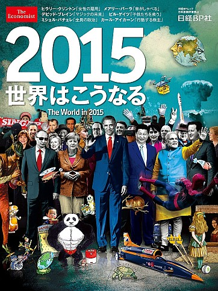
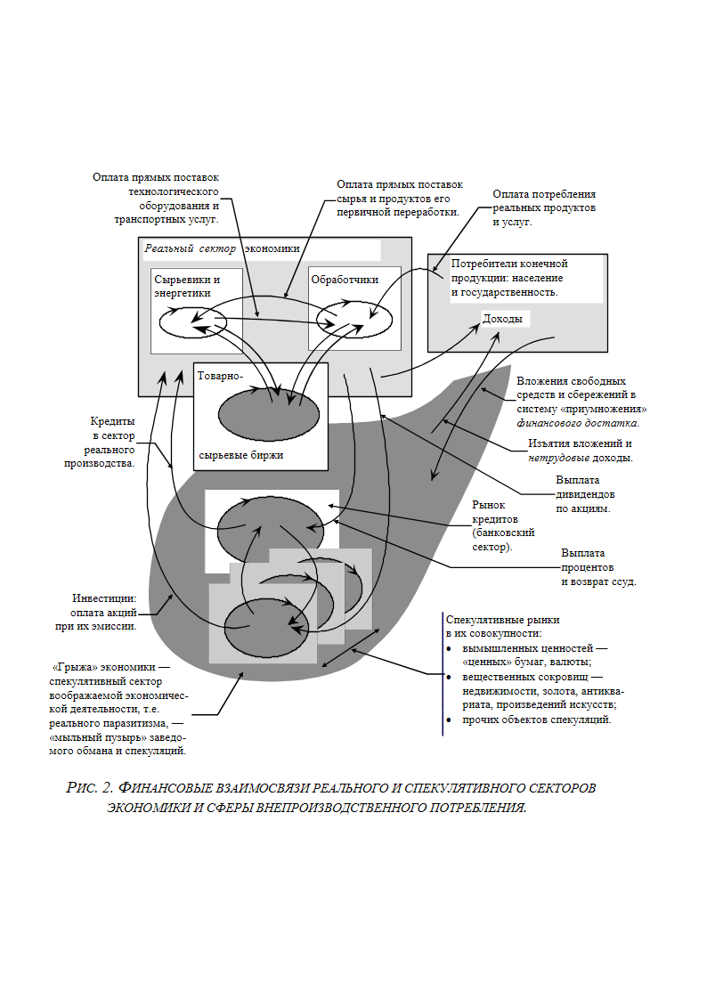
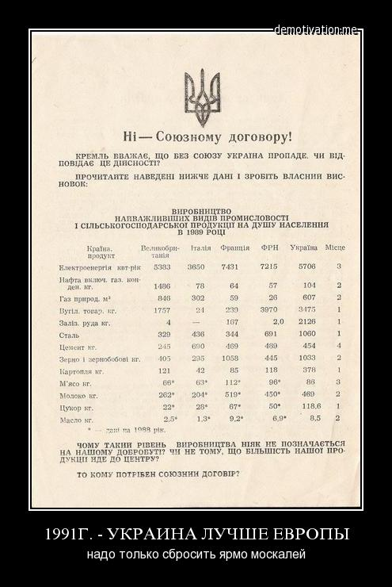
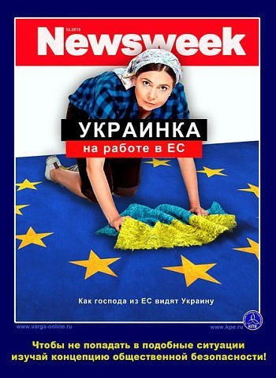

> **Первичный текст.** О ТМ №1(117) Мировая война близится к завершению…, 2015-02-08.
> Источник: `20150208 О ТМ №1(117) Мировая война близится к завершению….doc` sha256 `fac15a6f8903e362…`; [страница на dotu.ru](https://dotu.ru/2015/02/09/20150209_tek_moment01117/).
> Автоматическая транскрипция DOC→Markdown; смысл и формулировки не правились.
> Контрольные суммы и статус проверки — в [NOTICE.md](../../NOTICE.md).
> Содержание передаёт позицию авторов; утверждения не верифицированы библиотекой.

---

«О текущем моменте» № 1 (117), февраль 2015 года

Мировая война близится к завершению…

Понимание настоящей записки предполагает **прочувствованное** знание содержания следующих работ ВП СССР: «Про войны» (2014 г.), «Про политику» (2014 г.), «Ихр кампф»[^1] против человечности» (из серии «О текущем моменте» № 1 (112), март 2014 г.), «США и остальной мир: перспективы глобального противостояния» (из серии «О текущем моменте» № 5 (116), 2014 г.), «“Сад” растёт сам?..» (сводный текст аналитических записок из серии «О текущем моменте» №№ 4 — 6 (88 — 90), 2009 г.), «Введение в конституционное право» (2013 г.), «Последний гамбит» (2002 г.), «Смута на Руси: зарождение, течение, преодоление…» (2007 г.).

ОГЛАВЛЕНИЕ

[1. Глобальный уровень: ожидания краха мирового порядка\

и уверенность в том, что его не будет… [1](#глобальный-уровень-ожидания-краха-мирового-порядка-и-уверенность-в-том-что-его-не-будет)](#глобальный-уровень-ожидания-краха-мирового-порядка-и-уверенность-в-том-что-его-не-будет)

[2. Взаимоотношения региональных цивилизаций [6](#взаимоотношения-региональных-цивилизаций)](#взаимоотношения-региональных-цивилизаций)

[2.1. Запад — Россия [6](#запад-россия)](#запад-россия)

[2.2. Украина как часть Русского мира: переведи меня через майдан… [8](#украина-как-часть-русского-мира-переведи-меня-через-майдан)](#украина-как-часть-русского-мира-переведи-меня-через-майдан)

[2.3. Россия [11](#россия)](#россия)

[2.3.1. С точки зрения «мирового сообщества» либералов-интернацистов [11](#с-точки-зрения-мирового-сообщества-либералов-интернацистов)](#с-точки-зрения-мирового-сообщества-либералов-интернацистов)

[2.3.2. Что не вписывается в формулы,\

доступные миропониманию Обамы и его хозяев [14](#что-не-вписывается-в-формулы-доступные-миропониманию-обамы-и-его-хозяев)](#что-не-вписывается-в-формулы-доступные-миропониманию-обамы-и-его-хозяев)

[2.3.3. Социальная психодинамика России: государственность и общество [18](#социальная-психодинамика-россии-государственность-и-общество)](#социальная-психодинамика-россии-государственность-и-общество)

[2.4. Россия и глобальный «антиамериканизм» [27](#россия-и-глобальный-антиамериканизм)](#россия-и-глобальный-антиамериканизм)

[Заключение: главным образом для тех, кому слабо прочитать более 2‑х страниц [29](#заключение-главным-образом-для-тех-кому-слабо-прочитать-более-2х-страниц)](#заключение-главным-образом-для-тех-кому-слабо-прочитать-более-2х-страниц)

1. Глобальный уровень: ожидания краха мирового порядка\

и уверенность в том, что его не будет…

=======================================================

*[В оригинальном издании здесь расположен рисунок/схема. Иллюстрация не включена в данный выпуск: ожидает визуальной и правовой проверки. Файл источника: image1.jpeg]**[В оригинальном издании здесь расположен рисунок/схема. Иллюстрация не включена в данный выпуск: ожидает визуальной и правовой проверки. Файл источника: image1.jpeg]*По отношению к политике люди делятся на три категории: 1) политически безучастные, участь которых — быть жертвами политики, 2) заинтересованные наблюдатели и оценщики-комментаторы, дополняющие политически безучастных в списках жертв политики, 3) практикующие политики (и это не только государственные деятели, чьи слово и подпись придают властную силу тем или иным документам, но и те, кто добивается намеченных политических результатов иными средствами). Редакция журнала «The Economist» подкинула занятие для принадлежащих ко второй категории — гадать и обсуждать, какой скрытый от «непосвящённых» смысл заложен в коллаж на обложке первого номера этого журнала за 2015 г. Вопрос действительно для многих интересный, и поиск ответа на него занял их время, хотя на наш взгляд это время можно было употребить с большей пользой.

Прежде всего «дешифровщиков» хотелось бы спросить о другом: как они представляют себе процесс шифрования некоего сообщения «от Ротшильдов» в такой коллаж? — Это что: пришёл человек «от Ротшильдов» с пакетом, уединился в кабинете с художником журнала, и потом они долго обсуждали как фрагменты текста послания «от Ротшильдов» в какие образы вложить так, чтобы эту обложку потом «знающие» люди могли бы расшифровать адекватно тому, что было в исходном текстовом сообщении «от Ротшильдов»? Либо человек «от Ротшильдов» привёз или переслал готовый коллаж вместе приказом (в форме предоплаты) поместить его на обложку?

Кроме того, есть ещё два вопроса, на которые надо дать ответ, чтобы получить ответ на вопрос о реальной значимости обложки 1‑го номера «Экономиста» за 2015 г. в текущей глобальной политике:

- *Для чего нужно это послание, т.е. какие цели должны быть достигнуты в результате его публикации?*

- *Кому оно адресовано, если это — действительно послание, а не возведение самодеятельными конспирологами в ранг послания изначально концептуально не определённых «каракулей», в которых редакторский художник просто выразил свои страхи и надежды на лучшее будущее «шершавым языком плаката»?*

Мнения о том, что бы значил этот коллаж (за редкими исключениями), можно разбросать по двум корзинам, поскольку они связаны с одним из двух крайних мнений:

- в 2015 г. наконец-таки рухнет мировая долларовая система и «Пиндостан» перестанет быть глобальной державой, чего с нетерпением ожидает «всё прогрессивное человечество»;

- в 2015 г. США спровоцируют глобальный кризис, из которого именно они выйдут победителем, в результате чего мир станет необратимо «однополярным»[^2].

Образно-иносказательные системы кодирования информации действительно существуют, они действительно используются для передачи сообщений. И более того, они используются для управления толпой в обход контроля сознания, если образный ряд связан с выявленными психологами образными представлениями о жизни социальных групп, на которые предполагается оказать воздействие. При этом такого рода картинки, привлекая к себе внимание или просто западая в бессознательные уровни психики, собирают соприкоснувшихся с ними индивидов в эгрегоры, и далее процессы социальной психодинамики текут сами собой на основе того информационно-алгоритмического обеспечения поведения людей, которое сформировалось в их психике к началу очередной фазы активности процесса и которое в психике подавляющего большинства людей меняется крайне медленно вследствие того, что они не умеют чувствовать жизнь и думать[^3].

Но большей частью в такого рода явлениях иносказательных картинок выражается социальная психодинамика, т.е. процессы ноосферные, и прежде всего — протекающие в человеческом сегменте ноосферы, а не чей-то индивидуальный умысел.

Поэтому лучше не гадать о перспективах по ноосферным проявлениям в публикациях СМИ, вне зависимости от того, насколько широко известны стали эти публикации, а обратиться к анализу жизни непосредственно.

——————

Обратимся к рис. 2 (ниже по тексту). Он был впервые опубликован в работе ВП СССР «“Грыжу” экономики следует “вырезать”» ещё в 1997 г. Мировая экономика ему полностью соответствует. Годовой «товарооборот» её спекулятивного сектора на порядки превосходит товарооборот её реального сектора. Именно это называется «модерном» и «постиндустриальным обществом». В глобальных масштабах это всё работает на обращении доллара США и на правилах конвертирования доллара и национальных валют. Эмиссию доллара осуществляет «частная лавочка» под вывеской «Федеральная резервная система США», которая ссужает доллары (в том числе и вновь эмитированные) под процент всем заинтересованным лицам, включая и государственность США.

Для подавляющего большинства стран, не относящихся к числу *экономически развитых проверенных временем и аттестованных «мировым сообществом» «демократий»* (США, Канада, государства Западной Европы, Австралия) и не обладающих де-факто полнотой суверенитета, участие в этом возможно только на принципах «Вашингтонского консенсуса»[^4], которому обычно сопутствует система «currency board, которая прямо требует привязки эмиссии национальной валюты к размерам долларовых резервов. Фактически это означает, что в таких странах все активы уже котируются в долларах, а внутренний инвестиционный ресурс отсутствует».[^5] Принцип currency board со всеми вытекающими из него последствиями действует и в постсоветской России[^6]…

Эмиссия доллара под процент имеет следствиями:

- порождение заведомо неоплатного долга, который некоторым образом распределён в системе:

<!-- -->

- явным образом в форме юридически зафиксированных долговых обязательств (некоторую долю их несёт государственность США) и

- неявным образом (они юридически не зафиксированы, но неявно перелагаются явными должниками на своих партнёров в ходе сделок, которые осуществимы только при условии, что явным должникам долги не предъявлены к оплате; если же долги предъявляются к оплате, то последствия сделки, заключённой с будущим банкротом, могут быть весьма тяжёлыми не только для его непосредственных контрагентов вследствие конкретики сложившихся цепочек товарообмена);

<!-- -->

- компенсацией воздействия на экономику и финансы заведомо неоплатных долгов, унаследованных от прошлых лет, очередными порциями эмиссии доллара.

В результате этого номинальное значение заведомо неоплатного долга в системе, представленной на рис. 2, растёт многократно быстрее, нежели объёмы производства в реальном секторе, а покупательная способность доллара падает, обесценивая тем самым долларовые накопления стран-участников этой системы.

Нарастание заведомо неоплатного долга — это фактор, с которым на протяжении уже почти 20 лет связаны ожидания краха долларовой системы. Но встаёт вопрос, что может спровоцировать крах, в результате которого доллар перестанет быть мировой валютой?

Таких факторов два:

1.  Прекращение эмиссии доллара, под воздействием чего наличествующая в обращении долларовая масса спустя некоторое время окажется недостаточной для обслуживания товарооборота на всех рынках рис. 2, поскольку цены на них будут продолжать расти под воздействием ссудного процента по прошлым и вновь выдаваемым кредитам;

2.  Предъявление требований по оплате долгов в объёме, большем, нежели некий критический уровень, и затрагивающем все страны — участники системы долларового обращения (в том числе и США, которые, допустив создание Федрезерва в 1913 г., утратили финансово-экономический суверенитет).

Оба названных выше фактора (прекращение эмиссии доллара и синхронное предъявление требований по оплате долгов) — управляемые факторы, причём управляемые не США, а мировым банковским сообществом и его хозяевами.

Это глобальная социальная группа достаточно малочисленная и вышколенная (в аспекте хранения корпоративных секретов)[^7] для того, чтобы не морочить себе головы, публикуя некую «шараду» на обложке «Экономиста»: кого надо — если что — оповестят прямо, и никаких утечек, на которые прочее общество (запредельно невежественное в вопросах управления вообще и управления экономикой, в частности) было бы способно отреагировать, — не будет. А слить какую-либо информацию, чтобы отвлечь внимание толпы (в том числе и политических аналитиков, биржевых игроков и т.п.), дабы они не мешали осуществлять реальные планы — это одна из составляющих системы глобального управления.

Управляемость двух названных факторов, которые можно дополнить монопольным правом корпорации на прощение (т.е. на списание долгов без оплаты) позволяет функционировать этой системе в принципе неограниченно долго, *если не привлекать к рассмотрению воздействие внефинансовых факторов: природных*[^8] *и социальных*[^9]. Вопрос только в масштабе цен. Но даже если под воздействием эмиссии доллара и роста цен счёт пойдёт на миллиарды за корзину продуктов в гипермаркете, что психологически дискомфортно, то можно провести деноминацию доллара и в глобальных масштабах, после чего система снова сможет долго функционировать до очередной деноминации. Конечно, грыжу экономики можно защемить без умысла ненароком, и тем самым вызвать крах долларовой системы*,* но вероятность самореализации такого события — крайне мала[^10].

Кроме названных может сработать ещё один фактор — отказ некоторой совокупности государств-участников от доллара в своих взаиморасчётах и сброс ими долларовой массы и продажа долговых обязательств США, при условиях:

- если сброс протекает слишком быстро, а быстродействие рыночного механизма недостаточно, чтобы перераспределить сбрасываемую долларовую массу между оборотами специализированных рынков на рис. 2;

- если создаваемая ими система международной торговли и хозяйствования оказывается более привлекательной (прежде всего для правящих «элит» других государств — в условиях толпо-«элитаризма» это так) нежели долларовая, вследствие чего другие государства тоже начнут сбрасывать доллар и долговые обязательства США и приобщаться к альтернативной системе.

Т.е. в любом из вариантов крах глобальный долларового обращения может быть только политически мотивированным и управляемым. А те, кто держат рычаги управления, в случае принятия решения об управляемом крахе долларового обращения и опускании «Пиндостана» на уровень региональной державы с последующим расчленением на основе признака этнического доминирования населения в разных обломках нынешних США — не имеют надобности уведомлять об этом наиболее догадливых заранее, публикуя в СМИ «шарады». Но реализация такого политического решения предполагает заранее известный для его инициаторов ответ на вопрос: *А что будет потом?* — «Потом» не вообще, а сразу же после обрушения долларовой системы и опускания «Пиндостана» на уровень региональной державы, поскольку даже хаос должен быть управляемым.

«Заранее известность» ответа на вопрос «Что потом?» предполагает сосредоточение определённых ресурсов и развёртывание структур, которые при переходе объекта управления (мировой экономики или её сегмента, отказавшегося от доллара) в режим «потом» должны немедленно вступить в действие, а в ряде случаев — вступить в действие упреждающе.

Вопрос «Что потом?» требует анализировать не столько проявления в публикациях СМИ ноосферных процессов, сколько факты жизни обществ. А кроме того, надо *целенаправленно* создавать такого рода факты, т.е. ресурсы и системы, которые при наступлении «потом» (а лучше, профилактируя наступление неприемлемых вариантов «потом») начнут действовать.

Последнее касается и ответа на вопрос: *Почему реализовалась Директива СНБ США 20/1 от 18.08.1948 г. «Наши цели в отношении России»*[^11]*?* — а единственно потому, что в СССР ни на уровне государства, ни на уровне общества не было ответа на вопрос «А что потом?», и тем более — не было ответа на вопрос «А как успешно профилактировать реализацию этой директивы?». И это при том, что общий тираж публикаций выдержек из этой директивы в разных изданиях книги Н.Н.Яковлева «ЦРУ против СССР» составил порядка 20 млн. экз.

# 2. Взаимоотношения региональных цивилизаций

## 2.1. Запад — Россия

На протяжении нескольких последних столетий многие как отечественные, так и зарубежные деятели культуры и политики высказываются в том смысле, что «Россия — это европейская держава». Географически это так: регион становления Русской многонациональной культуры — Европа. Но культурно и политически это не так.

Россия — самобытна, и она — вовсе не носительница некой своеобразной ветви общеевропейской культуры. На это указывали многие как отечественные, так и западные деятели культуры и политики. Со стороны России они не были жертвами пленяющей иллюзии «Россия — европейское государство», поскольку осознавали, что Россия — одна из региональных цивилизаций планеты.

Со стороны Запада такого мнения придерживались не только те, что видел реальные отличия и уважал право России быть самою собой и развиваться самобытно. Но на том, что Россия — не Европа, стояли все инициаторы агрессивных войн против России на протяжении многих веков.

И правота утверждения «Россия — не Европа, Россия — не Запад» подтверждается различием в характере войн: внутриевропейских и войн европейских государств и объединённой Европы, а потом и Запада в целом против России.

- Европейские государства неоднократно воевали друг с другом, но в своём подавляющем большинстве эти войны не были войнами на истребление населения определённых территорий и порабощение остаточного населения с уничтожением их языка и культуры[^12].

- Все войны европейских государств и их коалиций против Руси-Московии-России-СССР-России были войнами на истребление большинства коренного населения и порабощение остаточного населения с его последующей дерусификацией и уничтожением культурного наследия и подменой исторической памяти искусственно сконструированным историческим мифом (как это происходит на Украине после распада СССР, и на что в России направлена «десталинизация»). Именно поэтому, в 1945 г., едва только была разгромлена гитлеровская Германия У.Черчилль отдал приказ о разработке плана новой коалиционной войны против СССР «Немыслимое» с привлечением войсковых подразделений вермахта. Именно поэтому политическая «элита» Евросоюза готова обвинить в развязывании второй войны ХХ века И.В.Сталина и реабилитировать Гитлера как предтечу создания Евросоюза, переложив ответственность за холокост с него на окружение.

В настоящем ничего не изменилось. Президент США Барак Обама 1 февраля 2015 г. дал интервью телеканалу CNN. В нём он высказался о политике в отношении России.

«CNN: Справедливо ли утверждение о том, что по отношению к России ваша политика была достаточно эффективной, чтобы ослабить российскую экономику? Однако это не остановило Владимира Путина от создания нестабильности в Украине. В последние несколько недель конфликт, кажется, обострился еще сильнее.

Барак Обама: Полностью справедливо. Думаю, это свидетельство плохих решений Путина, принятых им от имени своей страны. Если подумать о том, какие отношения у нас были с Россией, когда я стал президентом, тогда мы говорили о перезагрузке. Тогда я установил, считаю, эффективные рабочие отношения с Медведевым.

В результате этого российская экономика начала расти, у властей появилась возможность диверсифицировать ее. Отношения России с Европой и всем миром были прочными, Россия с нашей помощью вступила в ВТО.

Но после того, как Путин принял это решение относительно Крыма и Украины, не потому что у него имелась некая великая стратегия, а, по сути, потому что его застали врасплох протесты на Майдане, а также бегство Януковича после того, как мы выступили посредником в переходе власти в Украине...

С тех пор эта его импровизация все дальше заводила Путина в ситуацию, которую представляет собой нарушение международного права, которая нарушает территориальную целостность и суверенитет Украины. И эта ситуация привела к дипломатической изоляции России, а Европе надоело вести дела с Россией; привела к санкциям, которые ослабили российскую экономику как раз тогда, когда все ее доходы снизились.

Нет такой формулы, согласно которой для России все кончалось бы хорошо. Аннексия Крыма — затратное, вовсе не выгодное приобретение для России. Времена, когда завоевание земель каким-то образом считалось доказательством статуса великой державы, уже прошли. Сегодня мощь страны измеряется знаниями, навыками, способностью экспортировать товары, изобретать новые продукты и услуги, влиянием. Далеко не все эти вещи обеспечиваются его стратегией.

Абсолютно верно, если лидер страны постоянно отклоняет предложения, которые мы ему делаем, учитывая размер российской армии и то, что Украина не входит в НАТО, в результате чего, знаете, есть ограничения для нашего военного вмешательства, а Путин пока что не останавливается…

Тем, кто предлагает нам сделать больше, я бы ответил: мы можем добиваться того, чтобы Россия несла все большие убытки, и именно этим мы занимаемся. Мы можем оказывать дипломатическое давление на Москву. Не думаю, что реальный военный конфликт между США и Россией станет мудрым решением для Америки или всего мира.

Мы занимаемся усилением стран на границе с Россией, которые входят в состав НАТО. И я ясно дал понять, что эту линию нельзя переступать, так как нам придется принять военные меры для защиты наших союзников — об этом говорит статья 5 устава альянса.

Напомним, 21 января Обама заявил, что экономика России разорвана в клочья благодаря США»[^13].

Отметим то, что версия Обамы течения событий в России и на Украине не соответствует действительности: в частности, на президентство Д.А.Медведева пришёлся кризис, а не развитие экономики России; США манипулировали политикой России в 1990‑е, а на Украине — на протяжении всего времени её государственно обособленного от России существования по настоящее время.

Если этого не знать и забыть то, что было до 1991 г., до 1917 г., до 1703 г., до 1605 г., до 988 г., забыть то, как США участвовали в интервенции в период гражданской войны в России, забыть Директиву СНБ США 20/1, и начинать писать историю человечества с нуля от момента становления постсоветских государств, то Обама прав: Россия — дикий, нецивилизованный агрессор.

Если же не забывать об том, как США участвовали интервенции в ходе гражданской войны в России, если не забывать о «холодной войне», которую США как государство-гегемон Запада вели против СССР с 1945 по 1991 г., то сказанное Обамой — декларация о продолжении до победного конца той самой «холодной войны», в результате которой СССР был расчленён, после чего Запад начал экономический и культурный геноцид в отношении его населения под лозунгами либерализма и интеграции «свободной России» наряду с другими постсоветскими республиками в «семью цивилизованных народов». А всё в интервью Обамы, касающееся воссоединения Крыма и России, позиции России в отношении «суверенной» Украины и т.п., — это пустой трёп, назначение которого придать во мнении американского и европейского аполитичного обывателя-потребителя благообразие политике США, имеющей конечной целью построение «Pax Americana», в котором США — уполномоченная хозяевами «Pax Americana» метрополия, а всё остальное — иерархия колоний и криптоколоний, полностью подконтрольных США и хозяевам «Pax Americana».

Т.е. хотя интервью Обамы — не юридически протокольная дипломатическая нота об объявлении войны, но по сути своей оно — официальное заявление о продолжении войны «высоко цивилизованного» Запада против «нецивилизованной» России. Стратегия войны была расписана безо всяких иносказаний в книге З.Бжезинского «Великая шахматная доска»[^14] и всё, что произошло на Украине, было прописано З.Бжезинским как политические намерения США и способы их осуществления ещё в 1998 г.

## 2.2. Украина как часть Русского мира: переведи меня через майдан…[^15]

Если же обратиться к внутренним особенностям Украины, которые позволили кураторам от американских спецслужб[^16] довести её до нынешнего состояния, то главная из них — безосновательное самодовольство её изрядной доли населения, ставшее нормой ещё в советские времена: см. агитку «самостийщиков» против подписания Союзного договора в 1991 г., в которой приводятся данные об объёмах производства ряда продуктов в расчёте на душу населения на Украине и в государствах Европы. В умолчаниях в этой агитке осталось три обстоятельства:

- то, что эти показатели — результат управления экономикой Украины на основе общесоюзной системы государственного планирования социально-экономического развития при всех её пороках;

- сводка всего того, что поставляли на Украину другие союзные республики;

- сводка сопоставления показателей новизны, конструктивного совершенства и качества КрАЗов, «Запорожцев» и автомобилей их одноклассников, производимых в Европе, а также других разновидностей промышленной продукции Украины с зарубежными аналогами.

Обратим внимание, что в агитке 1991 г. нет даже намёков на интеграцию Украины ни в Евросоюз, которого ещё не существовало[^17], ни в «общий рынок» (который тогда уже был), ни в НАТО, поскольку в этом случае надо было рассмотреть также и вопрос о том, кому в Европе какие продукты украинского экспорта и в каком объёме нужны, и какую роль Украина может играть в структуре блока НАТО. Т.е. агитка апеллировала к бездумью, беззаботности и неуёмным потребительским вожделениям населения Украины и достигла успеха.

Тем не менее 23 года самостийности — срок более, чем достаточный для того, чтобы (*если подумать и реализовать политическую волю)* наладить государственность и управление в экономике на макро- и микро- уровнях так, чтобы на Украине не произошло того, что произошло. И в случае успеха такого культурного и экономического развития многонациональной постсоветской Украины, — ничего бедственного из того, что произошло в 2014 г. и ещё чему бедственному предстоит произойти в будущем, было бы невозможно. Но если это произошло, то возникает вопрос: *На что были потрачены 23 года самостийности?*

Ответ на него простой. Это время было потрачено:

- на выдумку и пропаганду наукообразных нацистских по их сути мифов о великих древних «украх», от которых произошло всё прочее человечество, но которые по неведомым причинам оказались под властью «клятых москалей» — «отродьев от разных народов»[^18], не имеющих за душой ничего, кроме пороков;

- на воспитание на основе мифов поколений более или менее ярко выраженных нацистов, не чувствующих жизни и не умеющих думать, и потому подвластных интернацистам;

- на взращивание потенциала ненависти не только к этим мифам и их носителям, но и ко всему украинскому в той части населения, для которой «державна мова» — не родная речь, а искусственно созданный русофобами в конце XIX века жаргон, возведённый в ранг единственного государственного языка властью постсоветской Украины, к употреблению которого насильно принуждают, подавляя образование и развитие культуры на иных языках[^19], включая и самобытный украинский язык — диалект Русского языка, отличный от недо-польского[^20] жаргона — «державной мовы».

Т.е. время было потрачено на создание того потенциала автоматизмов социальной психодинамики, которая работает ныне, породив и поддерживая течение гражданской войны, стартером для которой послужили первые выстрелы на киевском майдане и убийство нескольких десятков человек в Доме профсоюзов в Одессе, произведённые наёмниками кураторов «самостийной» антирусской украинской государственности.

Изложенное выше в разделе 2.2 — иллюстрация на тему, что течение истории алгоритмично[^21], и носителем алгоритмики, реализовавшейся в конкретном течении свершившихся событий, является коллективная психика общества, с которой взаимодействует психика каждого индивида, частью этого общества являющегося.

По отношению к будущему это означает, что то образование и воспитание, которое получило подавляющее большинство пока ещё живущих на Украине взрослых людей, таково, что не позволяет остановить начавшуюся в 2014 г. трагедию раньше, нежели выгорит весь накопленный к 23 февраля 2014 г. потенциал взаимной ненависти украинцев друг к другу и к населению сопредельных стран, прежде всего — к населению и государственности России. Минские и иные договорённости об урегулировании положения на Украине и стабилизации её государственности не могут остановить войну, поскольку их некому на Украине выполнять: они только порождают множество несбыточных иллюзий, поскольку не учитывают реально сложившейся и действующей социальной психодинамики.

Что касается необъявленной войны, которую Россия якобы ведёт против Украины, то дело обстоит следующим образом:

- Россия не воюет с Украиной, т.е. не проводит на её территории войсковых и диверсионных операций, не наносит по её объектам авиационные и ракетные удары. На Украине идёт гражданская война. Она — следствие краха прошлой многолетней политики США вмешательства во внутренние дела Украины, цель которой — создание плацдарма в нескольких сотнях километров от Москвы для вооружённых сил США, населённого лояльными США аборигенами, ненавидящими Россию. Это в полном соответствии с геополитической стратегией, прописанной З.Бжезниским ещё в 1990‑е гг.: см. его книгу «Великая шахматная доска».

- Все гражданские войны, которые знает история, протекали с участием в них на стороне всех конфликтующих сторон иностранцев и при поддержке воюющих сторон теми или иными государствами. Гражданская война на постсоветской Украине в этом отношении не исключение. В ней участвуют помимо граждан Украины и иностранцы, включая и граждан России, но регулярные воинские подразделения РФ на территории Украины боевых действий не ведут, что, в конце концов, 29 января 2015 г. признал и Генштаб Украины[^22]. Понятно, что Россия, работающая на восстановление своего суверенитета не имеет причин поддерживать глобальную политику США (направленную на наше уничтожение), в том числе и на Украине, и это вызывает ненависть либерального интернационала и его периферии в самой России, не желающих признать режим в Киеве нацистским и творящим геноцид в отношении населения ряда регионов Украины.

- Россия могла бы ускорить крах киевского режима, не только проведя войсковую операцию против него, но просто прекратив поставки многих товаров на Украину на территории подконтрольные Киеву, однако продолжает поставлять газ, уголь и т.п. Это вызывает недовольство политикой Путина и им лично со стороны «патриотов России», которые не считают себя обязанными вникать в суть и вариативные перспективы глобальной политики (политики, ориентированной на достижение целей в отношении образа жизни всего человечества), но вследствие своей недальновидности мечтают «оттяпать» от Украины «Новороссию», а потом военной силой России разделаться и с режимом в Киеве. Но вожделенная для таких «патриотов» политика России, если её рассматривать в соотнесении с шестью приоритетами обобщённых средств управления / оружия, укладывается в слова Обамы: «Нет формулы, по которой Россию ждёт благоприятный исход»[^23]. Однако Обама просто не знает такой формулы, но это не значит, что её в действительности нет или что она не действует в глобальной политике.

## 2.3. Россия

### 2.3.1. С точки зрения «мирового сообщества» либералов-интернацистов

Тем не менее встаёт вопрос: *Что даёт основания Обаме быть уверенным в своих оценках перспектив России?*

Ответ на этот вопрос двоякий:

- Со стороны Обамы — это невежество и шаблонное мышление на основе специально отфильтрованных для него исторических прецедентов: Обама — не многознающий, дальновидный и коварный злодей, а один из сотен миллионов оболтусов, на протяжении многих десятилетий взращиваемых системой образования США и их пропагандой[^24]. От прочих американских оболтусов он отличается только тем, что ему закулисно-политические силы доверили должность главы государства, на которой у него в общем-то две несложные обязанности: поставить подпись, где покажут, и делать умное лицо, выступая на публике. Реально политикой США руководят другие.

- Со стороны России — это постсоветская государственность как общественный институт: принципы её построения и архитектура её структур, нравственно-этические и интеллектуальные качества корпуса депутатов и властных чиновников, а также работников аппарата, характер взаимоотношений государственности с обществом, концепция организации жизни государства и качество государственного управления социокультурными процессами и экономикой страны в соответствии с концепцией. Всё это таково, что внешние враги для уничтожения России не нужны — вполне достаточно постсоветской государственности, но с оговоркой: главное не мешать ей гробить страну.[^25]

В обоснование последнего утверждения приведём только один факт. По завершении эпохи ель-цинизма 8 февраля 2000 г. был провозглашён курс на модернизацию страны: «перед Россией стоит стратегическая задача — стремительная модернизация экономики»[^26]. В конце августа 2009 г. крах этой попытки модернизировать экономику был признан тогдашним президентом РФ Д.А.Медведевым: «Мы её просто провалили, мы ничего не сделали в этом направлении…»[^27]. Курс на новую модернизацию Д.А.Медведев провозгласил в Послании Президента Федеральному Собранию 12.11.2009 г., но и она тоже, мягко говоря, «не заладилась». И после этого в системообразующих принципах функционирования науки, системы образования, промышленности и сельского хозяйства России ничего не изменилось для того, чтобы очередная модернизация, о необходимости которой В.В.Путин заявил на Госсовете 18 сентября 2014 г., оказалась успешной и вывела Россию на уровень мирового лидера научно-технического и экономического прогресса. А это как раз то, что обеспечивает невосприимчивость страны к политическому и экономическому давлению извне.

**Причины хронической неспособности осуществить модернизацию с выходом в режим устойчивого инновационного развития к настоящему времени не устранены.** По-прежнему действует конституционный запрет на государственную идеологию (статья 13, часть 2 конституции РФ), т.е. запрет на оглашение и пропаганду целей внутренней, внешней и глобальной политики, путей и средств достижения намеченных целей. Как следствие эта тематика не может быть предметом обсуждения в Думе и Совете Федерации потому, что результаты такого рода обсуждений не могут быть юридически утверждены и провозглашены как идейная основа политики государства, которой обязаны следовать все госслужащие без исключения. Депутаты и госчиновники по-прежнему считают, что их узаконенные доходы (взяточничество, «распил бюджета», и «крышевание бизнеса» — это отдельная тема[^28]) могут быть на порядки выше, чем доходы работающих в реальном секторе, хотя благих результатов от их политики не ощущается на протяжении десятилетий[^29]; финансовый климат по-прежнему такой, что доходы элитной проститутки (тем более пристроенной «папиком» на высокую должность[^30]), спортсмена или шоумена[^31], которые не создают ничего, многократно выше, чем доходы учителя или инженера, работа которых предопределяет будущее страны: учителя создают кадровый корпус, инженеры — разработчики новой техники и технологий; в сельском хозяйстве по-прежнему нищета, и всё больше вымирающих деревень и сёл; подавляющее большинство трудоспособного населения профессионально несостоятельны, т.е. не в состоянии качественно выполнять ту работу, за которую взялись, и не желают наращивать профессионализм, поскольку в финансовом климате, сформированном никем иным, как постсоветской государственной властью, рост профессионализма не ведёт к росту благосостояния труженика. Образование деградирует[^32]. Центробанк РФ по-прежнему ни за что не отвечает ни перед народом, ни перед государством, проводит эмиссионную политику в ущерб стране на основе принципа currency board и держит ключевую ставку по кредитам на таком уровне, что реальный сектор деградирует, хотя на необходимость снижения ставки и наращивание инвестиционных ресурсов страны за счёт эмиссии руководству ЦБ на протяжении многих лет неоднократно указывали разные люди, в том числе и президент РФ. Порядка 80 % распоряжений главы государства не исполняются. Цены растут, опережая рост производительности труда. Вузы России по-прежнему извращают миропонимание студентов псевдонаучным социально-философским и финансово-экономическим вздором, назначение которого воспроизводить в преемственности поколений корпус не способных думать зомби — чиновников и депутатов колониальной администрации, набранной из аборигенов, которые будут управлять страной в полном соответствии с целями хозяев формально юридически суверенной криптоколонии. Для этого долю чиновников, получивших образование в вузах «цивилизованных государств» и занимающих посты руководителей высшей и главной группы должностей государственной гражданской службы, предполагается увеличить к 2016 г. до 4 %, а к 2020 — до 12 %, что эквивалентно узаконенной передаче ключевых постов в государственном управлении вербанутым изменникам Родины и зомбированным за рубежом зубрилам-идиотам[^33]. Государственная власть и органы местного самоуправления — в целом — не имеют авторитета в народе и не пользуются его доверием[^34]. Депутатский и чиновничий корпус на протяжении всего времени действия конституции 1993 г. не умнеет, его представители в своём большинстве самодовольны, наглы и необучаемы, вследствие чего государственность выявлять и в разумные сроки разрешать проблемы общества не способна, а культура государственного управления деградирует. Обращения граждан в органы власти всех уровней по поводу любых проблем бесполезны, поскольку не влекут за собой разработки и реализации эффективных мер, позволяющих решить проблемы: в ответ на такого рода обращения приходят отписки не по существу.

Зная это, и многое другое, Обама убеждён, что «игра сделана». И это не только его мнение[^35]: руководители США убеждены в том, что они «не связаны временем» (это одно из утверждений Директивы СНБ 20/1 от 18.08.1948 г.) — надо только подождать, и Россия исчезнет с карты мира сама[^36].

Прецедент уже имел место: так они дождались, как Советский Союз дозрел, после чего его обрушило недовольство даже не его собственного населения, а разложившейся правящей «элиты» при попустительстве населения. Сметёт ли нынешнюю государственность России «майдан», либо произойдёт «дворцовый переворот», в результате которого главой государства станет более податливый к давлению США, чем Путин[^37], «мужик» или «дама», либо юридически легитимно Российская Федерация трансформируется в «конфедерацию» множества сувенирных государств, либо Россию охватит «русский бунт, бессмысленный и беспощадный» — для тех, кто стоит за Обамой и США, — это мелкие и не очень существенные детали.

### 2.3.2. Что не вписывается в формулы,\

доступные миропониманию Обамы и его хозяев

Напомним, что подзаголовок перевода на русский язык книги Обамы «Дерзость надежды. Мысли о возрождении американской мечты» — «Книга человека, который может изменить Америку и весь мир». Т.е. анализировать действия США в любом регионе планеты, не выявив концепцию глобальной политики, которую проводят США с момента их возникновения, — это обрекать себя на заведомые ошибки и больший или меньший ущерб, проистекающий из этих ошибок. Концептуальную определённость глобальной политики США можно понять из той же книги «Дерзость надежды» вне зависимости от того, лежат в её основе мысли самого Обамы, отредактированные спичрайтерами, либо это текст, написанный другими, — под которым Обама просто подписался как «автор», олицетворяющий собой определённые политические силы.

Книга даёт характеристику законодательству США:

«… наше законодательство по определению является кодификацией моральных норм, и многое в нём основано на иудейско-христианской традиции» («Дерзость надежды», с. 246).

Рассказывая о своём общении с сенатором Бердом[^38] (самым старым членом Сената США на то время и, как считается, — масоном) Обама приводит его слова:

«Конституцию сейчас почти никто не знает, — продолжал сенатор, вынимая из пиджака томик карманного формата. — А я всегда говорил, что мне нужны только эта книга да ещё Библия» («Дерзость надежды», с. 114, 115).

Т.е. США находятся под властью библейской концепции порабощения человечества, поработительную суть которой американские «свободолюбцы» и «правозащитники» не осознают.

Государственность США оценивается Обамой не просто как жизнеспособная, а как «типовая модель для многих процветающих ныне государств» («Дерзость надежды», с. 107), что подразумевает её превосходство над другими вариантами построения государственности. А процветание по мнению Обамы обусловлено следующими факторами:

«Я верю в свободный рынок, конкуренцию, дух предпринимательства и думаю, что многие правительственные программы оправдают возлагаемые на них надежды. Я хотел бы, чтобы у нас стало меньше юристов и больше инженеров» («Дерзость надежды», с. 15).

«… пока каждый человек имеет свободу преследовать собственные интересы, общество как целое будет процветать[^39]. Наша система самоуправления и экономика свободного рынка зависят от каждого американца, придерживающегося этих ценностей. Легитимность нашей власти и наша экономика зависят от того, до какой степени эти ценности уважаются; вот почему равные возможности и недискриминация скорее дополняют нашу свободу, чем покупаются за неё» («Дерзость надежды», с. 65).

Соответственно такого рода воззрениям:

- все, кто подражает Америке и старается реализовать её организационно-управленческие, культурные и экономические принципы в своём обществе, — это нормальные, прогрессивно мыслящие люди,

- а все те, кто с этим не согласен — в лучшем случае ошибаются, а в худшем — неисправимо «плохие парни», которых необходимо нейтрализовать, подавить, уничтожить, и потому вся мощь Америки и солидарного с нею прогрессивно мыслящего человечества должна быть направлена на решение такого рода задач во всём мире.

Именно этим принципам в политике следуют все президенты США после убийства Ф.Д. Рузвельта[^40] (за исключением также убитого Дж.Ф.Кеннеди), и именно их выразил Обама в своём интервью CNN, из которого можно понять:

- США содействовали прогрессу на Украине, а Путин создал там нестабильность: Путин — враг прогресса.

- Путин принял «плохие решения от имени своей страны» «не потому, что у него имелась некая великая стратегия, а, по сути, потому что его застали врасплох протесты на Майдане» (упрёк в отсутствии стратегии — это упрёк в глупости и сопутствующей глупости политической несостоятельности).

- А вот при либеральном Медведеве всё было прогрессивно: «… когда я стал президентом, тогда мы говорили о перезагрузке. Тогда я установил, считаю, эффективные рабочие отношения с Медведевым. / В результате этого российская экономика начала расти, у властей появилась возможность диверсифицировать ее. Отношения России с Европой и всем миром были прочными, Россия с нашей помощью вступила в ВТО» (т.е. интегрировалась в систему, представленную на рис. 2 в качестве дешёвой рабсилы и источника дешёвых природных ресурсов).

Весь тот жизненный негатив, что сопутствует по умолчанию этим и иным такого рода декларациям, не обсуждается либералами либо вообще, либо расценивается ими как частные устранимые ошибки, а не как неизбежные следствия порочности системообразующих принципов буржуазного либерализма в его политической и экономической практике. Однако, не обсуждаемое тоже имеет место в жизни.

Обама, как и все приверженцы либерального интернацизма, не понимает следующего:

- Буржуазный либерализм как идеология и либерально-рыночный капитализм на его основе как практика (в том числе и капитализм с элементами государственного планирования и государственного регулирования рынков) были приговорены к ликвидации «мировой закулисой» ещё в первой половине XIX века. С целью их ликвидации в глобальных масштабах был создан и распространён марксизм как светская атеистическая разновидность того же самого библейского проекта порабощения человечества, одной из идеологических оболочек которого является буржуазный либерализм.

- Марксистский проект был заведён в тупик усилиями большевиков, вследствие чего «мировой закулисе» его пришлось закрыть. Это выразилось в ликвидации СССР и мировой системы социализма. Но это не означает, что отменён смертный приговор в отношении либерально-рыночной экономической модели — самоубийственной для человечества вследствие генерации её глобального биосферно-социального экономического кризиса. Смертный приговор будет реализован другими средствами, выходящими за пределы понимания, ограниченного либерально-индивидуалистическими бреднями.

Можно, конечно, предполагать, что у Путина нет никакой «великой стратегии». Но если стратегия глобальной политики России есть, однако Путин её не оглашает и не пропагандирует, проводя её в жизнь молча, то действия на основе предположения, что «стратегии нет», повлекут за собой ошибки и ущерб. Именно с этим и столкнулись США, когда Крым неожиданно для них отошёл от бутафорски «самостийной» Украины в Россию, вследствие чего базирование части сил 6‑го флота США в Севастополе и ударной авиации на крымских аэродромах оказалось сорванным, а в Крыму всё как бы само собой неким чудесным образом оказалось к этому готово. И с такого рода непредсказуемым ущербом США и подмятым ими государствам предстоит сталкиваться и впредь, поскольку во взаимоисключающих стратегиях (концепциях) и стратегиях их реализации выполняется соотношение: *то, что в одной концепции — цель, в другой — ошибка управления, которая должна быть устранена (по возможности вместе с её генератором).* В жизни это соотношение выражается как крах в достижении намеченных целей или их полное обесценивание при достижении вследствие управленческих успехов противной стороны[^41].

При этом мы не рекомендуем руководству США уповать на то, что если государственность России возглавит «мужик» или «дама», более восприимчивые к консалтинговым услугам со стороны спецслужб США, «прогрессивно мыслящего мирового сообщества» и их периферии в России, нежели В.В.Путин, то глобальная политика США решит одну из этапных задач построения «Paх Americana», после чего сможет заняться «правильным оцивилизовыванием» «неправильно цивилизованных» народов Китая, Индии, других государств, и тем самым завершить библейский проект глобализации.

Проблема нелиберальности России не сводится к захвату государственной власти «силовиками» во главе с В.В.Путиным и «крышеванием» ими бизнеса, а носит качественно иной характер. Т.е. ещё более ошибочно и опасно, чем верить «во власть плохого царя Путина», не понимать следующего:

1.  Все региональные цивилизации планеты характеризуются своеобразием идеалов жизни общества, а Россия — одна из региональных цивилизаций, развивающаяся в последние несколько столетий в форме многонационального государства, и соответственно у неё есть свои идеалы цивилизационного развития.

2.  Носителем и реализатором сущностно-характеристических идеалов любой региональной цивилизации является не тот или иной политик, не исторически сложившаяся государственность, а в конечном итоге — социальная психодинамика той совокупности народов, которые составляют эту региональную цивилизацию. Те или иные политики и исторически сложившаяся государственность могут быть как в конфликте с этими идеалами, так и более или менее полно и успешно действовать в соответствии с ними. И политики и государственность всегда — следствие психодинамики в одном из двух вариантов её реализации:

- непротивления действию внешних по отношению к ней психодинамик и субъектов политики (в этом варианте возникла государственность постсоветской России, чуждая её идеалам);

- реализация собственной определённо целесообразной алгоритмики, направленной на воплощение собственных идеалов.

Именно в сочетании цивилизационных идеалов и их носителя и реализатора состоит проблема *в* *принципе* неискоренимой нелиберальности России.

Первое и второе обстоятельства — *вследствие социального развития России в аспекте направленности на воплощение в жизнь её цивилизационных идеалов* — делают несостоятельным прецедентное мышление в отношении перспектив России под властью постсоветской изначально чуждой ей государственности в стиле:

- Если в прошлом Директива СНБ США 20/1 от 18.08.1948 г. «Наши цели в отношении России» реализовалась сама собой за счёт протекания в СССР внутренних процессов, которые США только стимулировали и направляли в том числе и с помощью масонской периферии, занявшей ключевые посты в ЦК КПСС, во всесоюзных и республиканских органах власти, в Академии наук, в КГБ СССР и его подразделениях в союзных республиках,

- то надо подождать, когда постсоветская государственность сама угробит страну, а пока этого не произошло, — надо стимулировать и направлять внутренние процессы в России к этому результату политикой коллективных санкций со стороны прогрессивных государств и политикой поддержки оппозиционных сил внутри самой страны.

Это ошибочный способ мышления. Директива СНБ США 20/1 от 18.08.1948 г. реализовывалась в условиях концептуальной безальтернативности глобальной политики: буржуазный либерализм и марксизм-ленинизм были в тот период двумя идеологическими оболочками одного и того же библейского проекта порабощения человечества. И в ту эпоху все государства имели возможность выбора без выбора дальнейших путей своего развития на основе одной из двух оболочек:

- те, кому были не приемлем гнёт либерального неоколониализма — попадали в орбиту СССР;

- те, кому был неприемлем идеологический тоталитаризм марксизма — попадали в орбиту США;

- но и те, и те, как и государства-лидеры (СССР и США) оставались в русле алгоритмики осуществления библейского проекта порабощения человечества и конкурировали друг с другом по вопросу, кто из них приведёт его к победному завершению — это было во всех смыслах дурным делом с обеих сторон, дурноты которого однако не понимали ни там, ни там[^42].

Вне зависимости от того, осознавали авторы Директивы СНБ США 20/1 от 18.08.1948 г. эти обстоятельства либо же нет, но эти обстоятельства были объективной данностью той эпохи. И эта объективная данность, позволяла авторам Директивы СНБ США 20/1 написать в ней, что *они не связаны временем,* вследствие чего могут позволить себе подождать, пока СССР внутренне дозреет, чтобы рухнуть под воздействием протекающих в нём самом социокультурных процессов.

Действительно дождались. Но крах СССР сопровождался не предсказанным авторами Директивы 20/1 событием: в России была изложена Концепция общественной безопасности, альтернативная библейской концепция глобализации, выражающая характеристические идеалы Русского многонационального мира. В этом выразилась психодинамика России во втором варианте её действия — реализации собственной определённо целесообразной алгоритмики, направленной на воплощение в жизнь собственных цивилизационных идеалов.

С этого момента фактор «мы не связаны временем» для приверженцев буржуазного либерализма и США как воплощённого идеала развития социальной организации, обусловленный их прошлым монополизмом на делание глобальной политики, перестал действовать, поскольку *не связанным временем в действительности является только один единственный субъект глобальной политики — Вседержитель,* не безучастный к тому, что происходит на Земле; и как следствие Его небезучастности к происходящему, — сопричастными вечности (т.е. не связанными временем) оказываются те, кто действует в русле Его Промысла, а не те, кто достиг некоего монопольного доминирующего положения в пределах попущения Божиего.

По отношению к двум альтернативным концепциям глобализации это означает, что потерпит крах та концепция, которая направлена против целей Промысла, т.е. библейская концепция в целом, и её либерально-буржуазная версия, в частности. Она потерпит крах потому, что её приверженцы отгородились от Бога текстами Библии, редакторы которой извратили Откровения своею отсебятиной и одержимостью, и традициями её толкования, а также — собственными либерально-атеистическими бреднями, возведёнными ими в ранг истины в последней инстанции.

Остальное — вариативно, хотя конкретика реализации этой вариативности может быть неприятна для многих как в ближнем и дальнем зарубежье, так и в России.

Вообще, слова А.С.Пушкина, которыми он завершил трагедию «Борис Годунов» (1825 г.): *«Народ безмолвствует»* — ключевые к пониманию истории России и её перспектив, поскольку слова «народ безмолвствует» не означают, что он ничего не делает, т.е. не означают, что в обществе ничего не происходит, что оно не развивается. Другие слова А.С.Пушкина: *«Молчи, пустая голова, / Слыхал я истину, бывало: / Хоть лоб широк, да мозгу мало! / Еду, еду, не свищу, / А наеду, не спущу!»* («Руслан и Людмила», песнь 3) — о реализации этого безмолвия в отношении противников.

### 2.3.3. Социальная психодинамика России: государственность и общество

Но изложенное в разделе 2.3.2 непонятно ни западным интеллектуалам, ни подавляющему большинству отечественных «элитарных» государственных и «общественных» деятелей. Они предпочитают спорить о словах, а не изъяснять то, что происходит в безмолвном течении жизни.

Хотя либерально-буржуазная государственность России действительно переживает беспросветный кризис собственной прогрессирующе необратимой деградации (вследствие принципов её построения и нравственно-этических особенностей властных лиц), и её управленческие потуги отчасти комичны[^43], а отчасти влекут за собой неприятности для граждан России, тем не менее, кризис государственности — не главная проблема России, а следствие нерешённости её главной проблемы — характера общества и взаимоотношений общества и государственности.

Это — «мистика» (в понимании атеистов) и «неисповедимость Промысла Божиего» в понимании верующих в Бога, но не желающих жить с верой Богу на основе определённого исповедания Промысла.

Если говорить о «словах», то со времён первой публикации романа Ф.М.Достоевского (1821 — 1881) «Братья Карамазовы» (завершён и полностью опубликован в ноябре 1880 г.) интеллигенция в России пугала себя и народ «всевластием Великого Инквизитора»[^44], возведённым в ранг политической метафоры.

Суть режима «всевластия Великого Инквизитора» проста:

- **Великий инквизитор** (в идеале):

<!-- -->

- знает, как управлять обществом, производством и распределением продукции в нём так, чтобы жизнь всех была более или менее благоустроена, а социально-экономическая система воспроизводила бы себя устойчиво в преемственности поколений;

- он реализует это знание в практической политике;

- тех, кто не подчиняется его власти и не вписывается в предписанную им социальную организацию, он беспощадно карает, на том основании, что если он не будет их карать, то они обрушат социально-экономическую систему, чем вызовут утрату большей или меньшей благоустроенности жизни всех;

<!-- -->

- **Все остальные**, подвластные Великому инквизитору:

<!-- -->

- ничего не знают о том, как управлять социально-экономической системой;

- хотят потреблять природные и социальные блага, и ради этого они согласны работать и производить эти блага, пребывая под властью Великого инквизитора и выполняя его предписания, и поддерживая его и его режим своим трудом.

<!-- -->

- **Трагедия в том**, что:

<!-- -->

- подвластные Великому инквизитору сами не желают взять ответственность хотя бы за себя, не говоря уж о том, чтобы взять на себя ответственность за судьбы других;

- как следствие, если их предоставить самим себе и не принуждать к определённому порядку, то они начнут убивать друг друга и впадут в бедствие;

<!-- -->

- **Великий инквизитор не знает**, как выйти из этой трагичной ситуации, и просит пришедшего в подвластное ему общество Христа покинуть их мир, упрекая Христа в том, что именно он породил такое трагическое положение дел, когда во время поста в пустыне, Христос отверг предложение диавола обратить камни в хлеба́ и вкусить хле́ба, заявив ему: «не хлебом одним будет жить человек, но всяким словом, исходящим из уст Божиих» (Матфей, гл. 4:4), а людям надо прежде всего — хлеба.

Но фактически исторически Ф.М.Достоевский в этой метафоре описал тот образ жизни, которым жила Россия со времён стояния на Угре́, после которого Великое княжество Московское прекратило платить дань Золотой орде и стало суверенным государством[^45], если вывести из рассмотрения вопрос об идеологическом обеспечении государственного управления. Этот режим как социальная норма взаимоотношений государственной власти и общества был прописан Иосифом Волоцким (1440 — 1515). Он писал: «Царь, по своей природе, подобен всякому человеку, а по своей должности и власти подобен Всевышнему Богу»[^46]. Но Иосиф Волоцкий не возвеличивал царскую власть, в том смысле, что провозглашал её безгрешность, как его воззрения истолковывают многие, поскольку «самого царя Иосиф включает в ту же систему Божия тягла, — и Царь подзаконен, и только в пределах Закона Божия и заповедей обладает он своей властью. А неправедному или “строптивому” Царю вовсе и не подобает повиноваться, он в сущности даже и не царь, — “таковый царь не Божий слуга, но диавол, и не царь, а мучитель”».[^47]

Однако Иосиф Волоцкий не стал вдаваться в рассмотрение вопроса, как общество, любой простой человек могут вразумить или обуздать «строптивого царя». В итоге, вклад Иосифа Волоцкого в историю оказался двойственным:

- С одной стороны он внёс в церковное миропонимание этическую норму докрещенской Руси:

<!-- -->

- человек и должность, им исполняемая, не должны отождествляться;

- все должны работать на общее благо в русле Промысла, заботясь друг о друге, и государь в этом общенародном деле — только верховный в государстве руководитель.

<!-- -->

- С другой стороны, не ответив на вопрос: *Как в русле Промысла вразумить или обуздать «строптивого царя»? —* Иосиф Волоцкий создал предпосылки:

<!-- -->

- к обожествлению особы государя,

- к обожествлению государственной власти,

- и в конечном итоге — к выпадению режима правления из русла Промысла, поскольку обожествление особы государя и обожествление (сакрализация) государственной власти подразумевают признание безошибочности их действий без каких бы то ни было исключений, т.е. безгрешность.

В результате возникла система общественно-государственных взаимоотношений, в которой:

- все юридически легитимные права у государя и государства, которые являются генераторами новых прав для себя и обязанностей для подвластного общества по мере возникновения «исторической необходимости» в модифицировании системы своих прав и обязанностей подданных;

- а у общества и любого человека де-факто никаких прав, а только обязанности выполнять законные и незаконные распоряжения власти.

Концепцию взаимоотношений государственной власти и общества, изложенную Иосифом Волоцким, честно пытался реализовать истово веривший церкви Иван Грозный: это можно понять из его переписки с беглым бывшим сподвижником Андреем Курбским[^48] и из работ историков, которые стараются понять, что же в действительности происходило в ту эпоху, а не представляют Грозного исчадием ада, выполняя социальный заказ или исходя из сложившихся у них предубеждений, которые они просто иллюстрируют теми или иными фактами и интерпретациями фактов и их взаимосвязей.

Но из-за управленческой несостоятельности концепции, в которой внутри общества эффективно замкнуть отрицательные обратные связи на «строптивого царя» можно было только путём цареубийства или свержения «священной особы государя», она не обеспечивала устойчивости государственности в преемственности поколений: смута рубежа XVI — XVII веков, череда цареубийств и дворцовых переворотов на протяжении всего правления династии Романовых — тому подтверждение. Это не значит, что цареубийцы и организаторы дворцовых переворотов[^49] были правы: успех дворцовых переворотов был обусловлен тем, что их жертвы либо исчерпывали Божие попущение ошибаться, либо были не в состоянии выполнить нечто благое в исторически сложившихся условиях, вследствие чего их жизнь утрачивала смысл[^50].

И предпосылки, созданные властью этой концепции общественно-государственных взаимоотношений (проистекающей из писаний апостола Павла на тему «рабы, повинуйтесь господам…»[^51], из под власти которых не смог освободиться Иосиф Волоцкий) в истории России реализовались в догмате о непогрешимости царской власти. Этот догмат, хотя никогда и не провозглашался церковью и династией в прямой форме, подобно догмату католицизма о непогрешимости папы Римского, но фактически действовал по умолчанию во многие царствования и стал одним из генераторов катастрофы 1917 г. Этот «догмат» открыто выразился в полном титуловании Николая II: «Божьей поспешествующей милостью, Мы, Николай Второй, Император и Самодержец Всероссийский, (…) и прочая, и прочая, и прочая»[^52] — т.е. что бы царь ни сотворил, всё — ретрансляция им милости Божией: довёл до русско-японской войны — «милость Божия», кровавое воскресенье — «милость Божия», позволил втянуть Россию в первую мировую войну ХХ века — снова «милость Божия». — Так?

О вариациях режима «власти Великого инквизитора» по существу, но не пользуясь этой метафорой (её ещё не было), писал и Н.В.Гоголь в своей поэме «Мёртвые души»[^53] (1‑й том 1835 — 1842 г., 2‑й том 1845 г.). Учитывая правовой статус крепостных крестьян в ту эпоху, все персонажи-помещики это — вариации «Великого инквизитора»: самые недееспособные — Плюшкин, Коробочка и Ноздрёв; «никакой» — Манилов, у которого дела идут «самотёком»; Великий инквизитор в полноте своей дееспособности — Собакевич, наиболее успешный «хозяйственник» и не тиран для крепостных, в отличие от жизненно реальной Салтычихи. Какие претензии к Собакевичу? — все ему подвластные сыты, одеты, обуты, у всех крепкое хозяйство, здоровье — отменное.

Социальная психодинамика России по отношению к этой концепции взаимоотношений государственной власти и общества, выразившейся в метафоричности легенды о Великом инквизиторе, на протяжении веков по настоящее время включает в себя три аспекта:

- с одной стороны ей свойственна мечта о добром и справедливом царе, который своею властью, призвав слуг, которые обязаны служить верно и честно, искоренит всю кривду-неправду из жизни общества;

- с другой стороны та же психодинамика порождала систематический саботаж неправедной политики государства подвластным обществом во всех сословиях, переходящий регулярно в бунты;

- рассогласование мечты и реальности объяснялось фразами:

<!-- -->

- «Царь — хороший, бояре — плохие»;

- либо в предельном случае: «Царя подменили: царь — не настоящий…», т.е. нужен настоящий царь, который будет хорошим.

Здесь важно указать на одно важное обстоятельство. Для большинства людей в обществе, пребывающем под властью «режима Великого инквизитора», восприятие именно *режима, т.е. определённой системы осуществления власти*, — неразрешимая проблема, вследствие неразрешимости которой режим в целом сводится ими к персоне, его номинально возглавляющей. Как следствие этой ошибки, единственный рецепт решения социальных проблем — смена персоны, олицетворяющей режим, но не анализ пороков режима и смена режима путём устранения его системообразующих пороков. Это касается и Ф.М.Достоевского, породившего политическую метафору «Великого инквизитора». Хотя это — ошибка миропонимания, но тем не менее, она — социальная норма для толпо-«элитаризма» во всех его проявлениях, включая и власть «режима Великого инквизитора».

Советский период истории — это модификация «режима Великого инквизитора», поскольку психодинамика общества с падением монархии и установлением *власти советов депутатов трудящихся* не изменилась. Попытка И.В.Сталина вырваться из этой алгоритмики общественно-государственных взаимоотношений выразилась в создании и принятии Конституции СССР 1936 г. Однако эта попытка не удалась, поскольку партийная бюрократия — коллективный «Великий инквизитор» устроила 1937 г., чему И.В.Сталин оказался не способен противостоять фактически в одиночку. Репрессии 1937 г. вогнали в страх десятки миллионов людей, и прежде всего — детей жертв репрессий, который они пронесли через всю свою всю жизнь и передали через духовное родовое наследие своим детям и внукам, в том числе — и живущим ныне[^54]. А из числа той молодёжи, кто не испугался, многие сложили свои головы в боях Великой Отечественной войны.

Отличия советской версии режима «всевластия Великого инквизитора» от имперской версии следующие:

- Знания, необходимые для управления обществом, производством и распределением продукции в нём таким образом, чтобы жизнь всех была более или менее благоустроена, а социально-экономическая система воспроизводила бы себя устойчиво в преемственности поколений, это — *якобы* марксизм-ленинизм: «учение Маркса всесильно потому, что он верно»[^55].

- Марксизм всеобъемлющ и безальтернативен, поскольку все иные системы миропонимания, по мнению марксистов, либо частично истинны, либо представляют собой заведомо злоумышленную ложь, вследствие чего они практически никчёмны, вследствие чего лучше не тратить время на их изучение в том числе и для того, чтобы не впасть в обольщение жизненно несостоятельными альтернативными марксизму теориями.

- Поэтому от «света» «мраксизма» в СССР — никуда не деться: эти «знания» входят в стандарт всеобщего обязательного образования[^56], и их более обстоятельное освоение входит в стандарт всех разновидностей профессионального высшего образования[^57], не говоря уж о том, что освоение марксизма-ленинизма в полноте и детальности было отдельным направлением в высшем профессиональном образовании — в общем, система образования в области комплекса обществоведческих дисциплин реализовывала туннельный сценарий, в котором человек не мог получить доступа ни какой иной информации, кроме фильтрата из марксизма-ленинизма, сделанного идеологами в соответствии с указаниями аппарата ЦК КПСС — олицетворявшего «режим Великого инквизитора».

- Общество как бы само выдвигает из своих рядов очередного «Великого инквизитора», олицетворяющего собой режим, на основе избирательных процедур партийной и советской демократии, но при этом все процедуры, начиная от процесса выдвижения кандидатов до подсчёта голосов, управляемы «режимом Великого инквизитора», — и на это следует закрывать глаза и не говорить об этом, поскольку «Великий инквизитор» лучше знает, как надо осуществлять и партийную, и советскую демократию.

- Как и в случае базовой имперской версии «Волоцкого — Достоевского» здесь тоже есть своя **трагедия. Суть её в том**, что:

<!-- -->

- подвластные Великому инквизитору сами не желают взять ответственность хотя бы за себя, не говоря уж о том, чтобы взять на себя ответственность за судьбы других;

- как следствие, если их предоставить самим себе и не принуждать к определённому порядку, то они начнут убивать друг друга и впадут в бедствие (этот потенциал проявился во множестве вспышек насилия в процессе краха СССР, на основе его проявлений возникла характеристика 1990‑х гг. как «бандитских» и «лихих», и ныне он проявляется на Украине);

- и главное — марксизм-ленинизм (в силу пороков его философии, управленческой невнятности и метрологической несостоятельности политэкономии[^58]) — фальсификат истины;

- о том, что «не хлебом одним будет жить человек, но всяким словом, исходящим из уст Божиих», не вспоминают, думать сами в своём большинстве не хотят и не умеют, совесть и стыд для большинства — никчёмны.

Устойчивость «режима Великого инквизитора» во всех его версиях обеспечивается четырьмя факторами:

1.  Созидательным трудом подавляющего большинства населения под общим управлением «Великого инквизитора», которое определяет качество жизни всех.

2.  Преимуществами в потреблении произведённого и в *социально-статусном соотношении власти и безответственности перед ниже стоящими,* которые даёт продвижение вверх по социальной иерархии личностей.

3.  Самодисциплиной высших иерархов, которые должны обеспечить эффективность труда и поддерживать некую меру распределения разного рода преимуществ по ступеням социальной иерархии, гарантирующую стабильность системы и поддержку её подавляющим большинством населения (при этом определённый аскетизм «Великого инквизитора» даёт ему моральное право «драть» всех, кто находится ниже его в социальной иерархии, но потребляет больше, чем САМ (!!!!) «Великий инквизитор»).

4.  Подавлением антисистемных меньшинств, к числу которых принадлежит и сообщество «комбинаторов», и прежде всего — антисистемных представителей само́й правящей «элиты», норовящих так или иначе уклониться от созидательного труда.

Однако система несёт в себе причины её собственного краха, главные из которых — безответственность «высших» перед «низшими». Это ведёт к тому, что на каком-то этапе своего самовоспроизводства в преемственности поколений социально-статусные и потребительские преимущества представителей высших уровней иерархии перестают быть обусловленными их реальной управленческой компетентностью в отношении: 1) обеспечения эффективности труда, 2) признаваемой обществом справедливости распределения производимого и 3) подавления антисистемных факторов. Когда «элита» «режима Великого инквизитора» утрачивает деловую компетентность и начинает жить для себя, проявляя в отношении остального общества вседозволенность, изрядная доля общества чувствует свою обделённость (в том числе утрачивают доверие к государственной власти).

А кроме того — ещё некоторая часть общества обретает убеждённость в том, что они тоже могут обеспечить своё благополучие за счёт чужого труда не хуже, чем это делает исторически сложившаяся «элита», которая своим паразитизмом подаёт пример для подражания всевозможному люмпену, с которым она постепенно становится идентичной в аспектах нравственности и этики. Эта социальная группа завистников включает в себя подгруппу претендентов в «великие комбинаторы», которые характеризуются тем, что:

- избегают грубого насилия и беззастенчивого воровства, т.е. «чтут уголовный кодекс»[^59] и законодательство в целом,

- но изобретают «сравнительно честные способы отъёма денег и иных благ» без нарушения норм действующего законодательства.

Когда «режим Великого инквизитора» деградирует настолько, что может быть снесён, — тогда **претенденты в «Великие комбинаторы» подают себя остальному обществу в качестве борцов за свободу против тирании «Великого инквизитора».** И если общество не видит в них паразитов, от которых свободу необходимо защищать точно так же, как и от тирании «Великого инквизитора», то воцаряется режим «великого комбинатора».

Однако, если в идеале режим «Великого инквизитора» возлагает на всех *без исключения, в том числе и на «Великого инквизитора»* обязанность трудиться на том или ином поприще, то режим «великого комбинатора» возлагает эту обязанность только на «лохов», признавая за теми, кто способен «комбинировать», право на «комбинации», не нарушающие законодательство, которое написано и поддерживается такими же «великими комбинаторами» от юриспруденции так, чтобы создать возможности для «комбинирования» и эксплуатации «лохов».

Эти закономерности проявились и в деградации и крахе советской версии режима «Великого инквизитора»: с течением времени она перестаёт нравиться всё более широкому кругу людей (как в среде простонародья, так и в среде «элиты», — но по разным причинам) потому, что накапливаются и разрастаются проблемы, которые режим решить в принципе не способен. Обществу объективно требуется альтернатива.

Альтернатива, как и марксизм, привносится в бездумные головы извне. Это — *буржуазный* либерализм. «Голос Америки», радио «Свобода», «Русская служба BBC» на протяжении десятилетий рассказывали о том, что альтернатива есть, расхваливали её, но «железный занавес» не позволял с нею ознакомиться на практике, поскольку за границей бывали большей частью только люди, посланные туда «режимом Великого инквизитора» в командировки. Зарубежные кинофильмы, особенно комедии, подтверждали зримо, что альтернатива есть, и она лучше «совка». Успех перестройки и реформ в духе идей буржуазного либерализма в том виде, в каком перестройка и реформы стали достоянием истории, был возможен прежде всего потому, что в советском обществе Остап Бендер к началу перестройки стал культовым литературным персонажем, которому многие симпатизировали вследствие того, что несли в своей психике черты его нрава и характера. Соответственно после того, как ханжески-идеологический контроль ЦК над нравами общества остался в прошлом, истинная нравственность населения стала выражаться беспрепятственно в расхищении (в том числе и узаконенными методами — приватизации) всего того, что раньше называлось «социалистическая собственность», и памятники Остапу Бендеру появились во многих городах на территории бывшего СССР[^60].

Поэтому, метафорически говоря, либерализм это — всевластие «режима Великого комбинатора». Угрозу его прихода к власти предвосхитил Н.В.Гоголь в «Мёртвых душах» более, чем за четверть века, до того как Ф.М.Достоевский пугнул пугливых и бездумных интеллектуалов — фиктивных гуманистов — легендой о Великом инквизиторе. Ещё полвека спустя[^61] образ Великого комбинатора, не желающего строить общество, в котором всё по Правде и совести, и нет места эксплуатации «человека человеком», — представили И.А.Ильф и Е.П.Петров. Не вняли ни Гоголю, ни Ильфу и Петрову. В итоге после 1991 г. на постсоветском пространстве, в том числе и в России, возникли режимы «Великих комбинаторов», пришедшие на смену всесоюзному «режиму Великого инквизитора».

Могут возникнуть возражения против сказанного выше том смысле, что персонажи «Мёртвых душ» и Остап Бендер — это достояние русской и русско-еврейской культуры, а США характеризуется другими социальными типажами, вследствие чего вся изложенная выше характеристика обществ на основе идеологии буржуазного либерализма как «режима Великого комбинатора» — клеветнически лжива. Всех, кто думает так, отсылаем читать произведения американца — О.Генри: типажи комбинаторов, претендующих стать «Великими комбинаторами», аналогичны отечественным. А если поизучать фактологию истории США, то найдутся вполне успешные (в отличие от мелких мошенников, описанных О.Генри) социально высокостатусные, уважаемые обществом «великие комбинаторы», например, — Дж. Сорос.

Практически же в России всевластием «режима Великого комбинатора» подавляющее большинство населения пресытилось к началу 1996 г. — году первых президентских выборов по конституции 1993 г. Официальный рейтинг зиц-председателя — как бы основателя режима — Б.Н.Ельцина в феврале 1996 г. был на уровне 6 %, что в перспективе сулило победу на президентских выборах Г.А.Зюганова, после чего режиму Г.А.Зюганова пришлось бы массово показательно покарать изменников-либералов — политических активистов прошлых лет: таковы законы толпо-«элитаризма». Поэтому те, кого олицетворял Б.Н.Ельцин, вынуждены были прибегать к помощи политтехнологов, создавших на пустом месте «технического кандидата» А.И.Лебедя, обеспечившего победу Б.Н.Ельцина[^62]; а Б.Н.Ельцину пришлось в ходе избирательной кампании отплясывать под инфаркт[^63]. В итоге спустя неполные четыре года либеральный зиц-председатель Б.Н.Ельцин сдал власть «режиму чекистов»[^64], который сразу же был обвинён в том, что это — «режим Великого инквизитора». Однако постлиберальный «режим чекистов» это — не «режим Великого инквизитора», но об этом далее.

И проблема либеральной оппозиции «режиму чекистов», который они считают очередной версией «режима Великого инквизитора» состоит в том, что:

- только для либералов-комбинаторов «режим Великого инквизитора» — «очевидное зло», подлежащее уничтожению и искоренению без какого-либо обсуждения и сомнения в этом с привлечением для этого любых сил — вплоть до агрессии США и дьявола;

- а для подавляющего большинства населения в условиях толпо-«элитаризма» «режим Великого инквизитора» предпочтительнее «режима Великого комбинатора», правившего страной в 1990‑е гг., поскольку:

<!-- -->

- соблюдение определённых, в общем-то не обременительных правил поведения, в условиях «режима Великого инквизитора» гарантирует жизнь и некоторое благополучие при условии, что «Великий инквизитор» справляется с принятой им на себя управленческой миссией в том виде, как она представлена Ф.М.Достоевским;

- а вот «режим Великого комбинатора» никому и ничего не гарантирует — ни простонародью (сейчас оно в России страдает от кризиса, созданного — *претендующим стать всемирным* — «режимом Великого комбинатора» США), ни самим «великим комбинаторам» (желающие могут поискать в интернете сообщения о разорении некогда успешных миллионеров, их самоубийствах и тюремных отсидках), ни их политическим агентам (типа убитых за приверженность «Великому комбинатору» В.Листьева, Г.Старовойтовой и А.Политковской, в силу чего их гибель не вызывает сожалений в массе простонародья, которое с радостью бы похоронило и многих других им подобных, чьи имена хорошо известны, и потому мы называть их не будем).

Но как уже было отмечено, «режим чекистов» — это не «режим Великого инквизитора», и это выражается в том, что:

- конституция 1993 г. — конституция «режима Великого комбинатора» не отменена и законодательство разрабатывается в соответствии с нею;

- система образования в области социальной философии, социологии, политологии, журналистики и «пиара» (связей с общественностью), государственного и муниципального управления, экономики и финансов безальтернативно либеральная — никакие антилиберальные воззрения в образовательные стандарты либерально «мыслящей» бюрократией не допускаются;

- средства массовой информации подавляют свободу слова и мысли в России, не допуская ни публикаций, ни комментариев к публикациям, в которых разоблачается жизненная несостоятельность либеральных воззрений и обнажается их антинародная сущность;

- режим не карает тех, кто преуспел в комбинаторстве (Чубайс, Ясин, Скрыник, Сердюков, Васильева и многие другие — тому примером).

Упрёки в адрес «режима чекистов» со стороны патриотов сводятся к тому, что это не «режим Великого инквизитора», поскольку не карает либералов как изменников и предателей, хотя есть за что. И если бы режим стал на этот путь, то рейтинги В.В.Путина и его сподвижников в этом деле только бы выросли. Однако политики зачистки властных структур, включая и структуры СМИ, нет. И в этом есть смысл: во-первых, не возбудить в толпо-«элитарном» обществе массовый психоз всеобщего доносительства о врагах народа, после возникновения которого репрессии тоже обретают характер неуправляемого на личностном уровне самотёка, в котором массово гибнут невиновные люди, и во-вторых, не допустить возникновения новой волны страха и ужаса перед репрессиями, которая, если возникнет, неизбежно будет властвовать над несколькими последующими поколениями, передаваясь им через духовное наследие. Т.е. постлиберальный «режим чекистов» — действительно не «режим Великого инквизитора». Ну а тех, кто совершил преступления против России и остался юридически не наказанным, — тех накажет Жизнь.

Нравится такое определение либо же нет, но «режим чекистов» это — нечто, не имеющее прецедентов в историческом прошлом России: это — процесс становления режима наместничества Божиего на Земле всех людей без исключения, в котором не будет места ни «инквизиторам», ни «комбинаторам», поскольку все они — тираны.

Однако «режим чекистов» это и — не режим «Великого комбинатора», поскольку:

- на свободу комбинаторства режим налагает ограничения, исходя из своего понимания целесообразности, действуя по праву силы, как и положено «режиму Великого инквизитора»[^65];

- Запад снова преисполнен претензий к России, упрекая её руководство в отступлении от общепринятых норм либерализма, т.е. «режим чекистов» проводит некую глобальную политику, не разъясняя её сути (в отличие от СССР, особенно — Сталинского СССР);

- не только не проводит, но и не поддерживает политику «десталинизации» так, как хотелось бы либералам и допускает деятельность неосталинистов и прочих не-либералов, предлагая идейным либералам не запрещать произведения своих противников к распространению, а идейно громить тех, кто с ними не согласен, чтобы либералы убедили их в своей правоте. А это — изощрённое издевательство над либералами, поскольку либералы не способны к открытой дискуссии в силу приверженности «дьявольской логике»[^66] «великого комбинаторства».

Поэтому встаёт вопрос: *А что делает «режим чекистов», если ему — вроде бы — свойственны как черты антилиберального «режима Великого инквизитора», так черты либерального «режима Великого комбинатора»?*

Ответ простой:

- Во внешний мир режим транслирует непрестанно возобновляемую загадку «Кто Вы, мистер Путин?», — *жизненно состоятельного ответа на которую в либеральном менталитете быть не может*[^67]*.*

- Во внутренней политике он занял позицию «разводящего», т.е. управляющего конфликтом «великих комбинаторов» (либералов) и «великих инквизиторов» («элитариев» — патриотов-государственников) и тем самым «режим чекистов» объективно работает на то, чтобы Россия наконец-таки стала свободной от власти над психодинамикой её общества и концепции общественно-государственных взаимоотношений «режима Великого инквизитора», и не оказалась под властью глобального «режима Великого комбинатора» США.

Оба эти вида деятельности полезны, поскольку действия-бездействия режима, порождают обстоятельства, которые заставляют людей думать над тем, как живёт человечество и как живёт Россия? вследствие чего они живут так, а не иначе? что и как надо делать для того, чтобы жить лучше?

И в этом деле — в думании — никакой государственный аппарат (ни порочный, ни запредельно профессиональный) не способен подменить собой большей частью негласно протекающий мыслительный процесс всех и каждого. Но именно выход людей на определённый уровень миропонимания — это то, что нужно России сегодня для дальнейшего развития. А «режим Великого инквизитора» и «режим Великого комбинатора» одинаковы в том, что создают условия, препятствующие решению этой общественной задачи. Поэтому пока занимается Россия этим думаньем, и чем больше людей втягивается в этот процесс, — Бог всем нам всегда в помощь.

Те, кто не желает думать и личностно развиваться, становятся либо «травой на поле боя», либо бойцами в рядах бьющихся на смерть приверженцев «режима Великого комбинатора» и «режима Великого инквизитора». Так что и эти заняты в общем-то полезным делом взаимного подавления.

А деградация постсоветской государственности создаёт предпосылки к тому, чтобы преображение России и её государственности произошло без потрясений и катастроф, поскольку окончательно деградировавшая, обессилившая постсоветская тупо-бюрократическая власть не сможет спровоцировать революцию и развязать гражданскую войну в России.

## 2.4. Россия и глобальный «антиамериканизм»

«Википедия» даёт следующее определение:

«Антиамерикани́зм — отрицательное отношение к политике, культуре и населению Соединённых Штатов Америки. Впервые термин антиамериканизм был употреблён в 1948 году во Франции[^68], с тех пор различные аспекты внутри- и внешнеполитической деятельности, а также культуры США нередко подвергались фундаментальной критике. Однако, так как это происходило в разных контекстах и критика высказывалась исходя из широкого спектра политических и религиозных мировоззрений, нельзя говорить о едином антиамериканском течении или единой идеологии.

В ряде случаев антиамериканизм выражается прежде всего в негативном отношении к внешней (а иногда и внутренней) политике США, а не к самому американскому народу или его культуре (…)

В докладе директора американского Национального совета по разведке (National Intelligence Council) Томаса Фингара «Глобальные тренды 2025» (2008) отмечается, что недовольство политикой США в мире настолько велико, что любая американская идея по международной повестке дня дискредитирована заранее — уже только тем, что она американская. (…)

“Грубый и озлобленный антиамериканизм, невиданный с 1970-х годов, пропитал политику Кремля и эфир государственных телеканалов”, — отмечает в статье 2014 года Дэвид Ремник» (ссылки на другие источники нами при цитировании опущены).

Если поискать в интернете статьи на тему «антиамериканизма», то в большинстве случаев в них «антиамериканизм» порицается как разновидность ничем не мотивированной ксенофобии, либо так или иначе даётся понять, что в «антиамериканизме» выражается зависть неудачников и лентяев к США, успешным — в силу предприимчивости и трудолюбия их населения.

Тем не менее, государства разных регионов планеты, сталкиваясь с невозможностью реализовать *в сотрудничестве с США и подвластными им криптоколониями* интересы собственного общественно-экономического развития, разрешить унаследованные от прошлого социокультурные, экономические и экологические проблемы, находят, что политика США лицемерна и лжива; что помощи в разрешении местных социокультурных, экономических и экологических проблем со стороны США нет, либо она теряется на фоне наносимого США существенно большего по размерам ущерба, а государства в результате такого сотрудничества становятся криптоколониями США. Последнее и есть суть глобализации по-западному.

Общества, в которых недовольство глобализацией по-западному — достаточно весомый политический фактор, чтобы его учитывала их правящая «элита», — наши потенциальные союзники. Т.е., состояние глобальной цивилизации изменилось с тех времён, когда император Александр III совершенно правильно утверждал: *«Во всём свете у нас только два верных союзника — наша армия и флот. Все остальные, при первой возможности, сами ополчатся против нас»*[^69]*.* Для реализации этого потенциала требуется исполнить то, о чём А.С.Хомяков писал ещё в 1839 г. в стихотворении «России»[^70]:

> Твоё, всё то, чем дух святится,\

> В чём сердцу слышен глас небес,\

> В чём жизнь грядущих дней таится,\

> Начало славы и чудес!…\

> О, вспомни свой удел высокий,\

> Былое в сердце воскреси\

> И в нём сокрытого глубоко\

> Ты духа жизни допроси!\

> Внимай ему — и все народы,\

> Обняв любовию своей,\

> Скажи им таинство свободы,\

> Сиянье веры им пролей!

Поскольку США своим лицемерием, ложью и политикой эксплуатации «достают» на планете повсеместно всех, то пострадавшие государства начинают группироваться в блоки (в смысле определения блока в работе ВП СССР «Мёртвая вода»). В процессе создания такого рода блоков, включающих в себя государства разных континентов, — общим стартовым идейным капиталом является более или менее ярко выраженный «антиамериканизм», возбуждённый во всех обществах ничем иным, как политикой США. Этот «антиамериканизм» большей частью эмоциональный, т.е. это просто неприятие политики США без широты и детальности её осмысления и выработки альтернативной концепции глобальной политики.

Это неприятие глобализации по-западному рядом государств выразилось в создании ЕврАзЭС, ШОС, БРИКС, Таможенного союза и т.п. К деятельности этих организаций ряд других государств проявляют интерес в настоящем, а в будущем они будут готовы присоединиться к ним при условии, что эти организации докажут свою эффективность на практике, изменив качество жизни своего населения в лучшую строну и успешно решая региональные и глобальные экологические проблемы. Это касается также и государств нынешнего Евросоюза, поскольку население стран его участников не в восторге от воздействия финансово-экономического кризиса 2008 и последующих годов на качество его жизни.

Вопрос о Евросоюзе в этом контексте нуждается в пояснении.

Евросоюз возник как выражение специфически европейского «антиамериканизма». Специфика его не в том, чтобы воплотить в жизнь альтернативные американским системообразующие принципы социальной организации и управления, а в притязаниях объединённой Европы на статус лидера в региональной цивилизации Запада (что эквивалентно лишению этого статуса США), и соответственно — в притязаниях на лидерство в цивилизационном развитии человечества. Эти претензии оказались несбыточными потому, что политики Евросоюза, действуя на основе общезападной «economics» (экономической теории) и общезападных традиций не смогли построить надгосударственную кредитно-финансовую систему на основе евро на принципах, обеспечивающих более высокие показатели функциональности макроэкономической системы объединённой Европы, нежели трансрегиональной макроэкономической системы основанной на долларе. Если принципы обращения доллара и евро в общем-то идентичны, то шансов на успех Евросоюз не имеет до тех пор, пока долларовая система не будет обрушена, а сам он ни обрушить, ни опустить доллар не в состоянии (для этого необходимо иное идейное обеспечение, не либерализм), но евро является помехой доллару.

Но в перспективе стартовый при создании блоков антиамериканизм должен выразиться в блоковой концепции глобализации, альтернативной библейскому проекту порабощения человечества, поскольку нигилизм (в том числе и в версии антиамериканизма) не может быть созидательным фактором: для созидания необходимо знать не «чего не хочешь» (в данном случае — действительные и потенциальные участники БРИКС, ЕврАзЭС, ШОС не хотят жить под диктатом США и их хозяев), а «чего именно хочешь и как это желание воплотить в жизнь». Если альтернативной концепции глобализации блокового характера государства блоков не выработают и не будут проводить её в жизнь, то блоковые проекты рухнут, поскольку все их общества заражены конгломератным буржуазным либерализмом и он заполнит собой пустоту в пространстве идей организации жизни общества. Однако альтернатива есть и она пролагает себе дорогу в жизнь: см. Заключение.

Заключение:\

главным образом для тех, кому слабо прочитать более 2‑х страниц 

================================================================

Надо не выискивать скрытый смысл в «шарадах от Ротшильдов» или еще кого бы то ни было, а изучать реальную жизнь. Тогда станет понятно, что обращение доллара — процесс управляемый вследствие чего, о его предстоящем крахе управленцы вам не сообщат. Но вы можете сами опустить или обрушить доллар, включившись в создание и развёртывание альтернативной системы.

Россия это — Россия, а не Европа, не «Запад», не «Восток» и не «Юг». «Украина — це Европа» = не будет Украины. Украина — часть многонационального Русского мира, но Украина должна понять это сама.

Постсоветская государственность России — антинародна потому, что создана по указке заправил Запада для решения задачи уничтожения России и дерусификации остаточного населения. Милостью Божией эта государственность прогрессирующе и необратимо деградирует, тем самым открывая возможности к личностному развитию множества людей и преображению общества России и человечества в целом. Упования Обамы и его хозяев на то, что в результате прогрессирующей деградации постсоветской государственности России Россия исчезнет с карты мира и произойдёт дерусификация планеты в целом, после чего восторжествует «Pax Americana» — несостоятельны, поскольку проистекая из невежества и скудоумия, противоречат объективной реальности.

ЕврАзЭС, ШОС, БРИКС, возникнув на почве «антиамериканизма», будут развиваться и набирать количество государств-участников, реализуя принципы взаимодействия государств, народов, людей, более мощные, нежели навязываемые Западом и США стандарты всеобщей купле-продажности и кумиротворения, лежащего в основе разноликого вечного фашизма[^71] Запада. По этой причине глобальный «рейх» в виде «Pax Americana» не состоится. Произойдёт становление глобальной многонациональной цивилизации человечности.

Деградация Запада обусловлена тем обстоятельством, что библейский проект глобализации попирает объективные закономерности, которым подчинена жизнь людей, культурно своеобразных обществ и глобальной цивилизации в целом (Предопределение Божие бытия этого мира и человечества в нём), вследствие чего неотвратимо ведёт всех приверженцев этого проекта во всех его разновидностях к самоликвидации их культур и несущей культуру биомассы.

Самобытное развитие России, ЕврАзЭС, ШОС, БРИКС предполагает построение системы общественного самоуправления и государственного управления в каждом из государств-участников в согласии с объективными закономерностями, которым подчинена жизнь людей, культурно своеобразных обществ и человечества в целом. Эти закономерности можно представить как совокупность шести своеобразных групп:

1.  Человечество — часть биосферы, и существуют объективные закономерности, регулирующие взаимодействие биосферы и Космоса и взаимодействие биологических видов в пределах биосферы.

2.  Человечество — специфический биологический вид, и существуют специфические биологические видовые закономерности, регулирующие его жизнь.

3.  Существуют нравственно-этические ноосферные и религиозные закономерности, регулирующие взаимоотношения обладателей разума и воли.

4.  Культура вариативна, и существуют социокультурные закономерности, следование которым гарантирует устойчивость общества, а их нарушение способно привести к его исчезновению в течение жизни нескольких поколений.

5.  Наша культура такова, что мы вынуждены защищаться от природной среды техносферой. Техносфера воспроизводится и развивается в ходе экономической деятельности, и существуют экономические закономерности, обуславливающие как развитие экономики, так и её деградацию или крах. **Этой проблематике посвящена настоящая работа.**

6.  Всё это в совокупности может приводить к конфликтам интересов и конфликтам разных видов деятельности, разрешением которых необходимо управлять. И существуют объективные закономерности управления. **Они освещены в постановочных материалах учебного курса «Достаточно общая теория управления».**

Они познаваемы, а их познание и добросовестная опора на них управления во всех сферах жизни общества, способна обеспечить идентичность управленческих решений разных государств по одним и тем же вопросам при полноте суверенитета каждого из них. Собственно на это указывал А.С.Хомяков в цитированном выше стихотворении «России» ещё в 1839 г.

Россия первой вступила на путь построения такой системы общественного самоуправления и государственного управления, вследствие чего объективно стала и на протяжении более, чем 20 лет является лидером цивилизационного развития человечества, но пребывая на этом пути, она не может стать и быть диктатором: ни мировым, ни в отношении объединений типа СНГ, ЕврАзЭС, ШОС, БРИКС. Это было бы нарушением ряда закономерностей из числа названных групп и повлекло бы для России проблемы и ущерб, аналогично тому, как это имеет место на Западе: биологическое вырождение населения, неразрешимые проблемы «мультикультурализма», обострение экологического кризиса без каких-либо перспектив его разрешения и т.п.

Если Заключение непонятно, то надо найти время для того, чтобы познавать Жизнь, заняться самообразованием, начать читать «толстые книжки», научиться думать, начать думать и воплощать праведно задуманное в Жизнь…

Внутренний Предиктор СССР\

1 — 8 февраля 2015 г.

[^1]: «Ihr Kampf» (немецкий) — «Их борьба».

[^2]: Т.е. реализуется вариант *«США — метрополия, всё остальное — подчиненная обслуживающая периферия»,* рассмотренный в записке ВП СССР «США и остальной мир: перспективы глобального противостояния» (из серии «О текущем моменте» №5 (116).

[^3]: В нашем понимании думать — это способность выявлять проблемы в жизни, вырабатывать пути и методы решения проблем. Уметь думать в выше определённом смысле — это предпосылка к тому, чтобы не отрабатывать бездумно под воздействием внешних раздражителей автоматизмы поведения, которые как-то сложились в психике индивида либо были в ней целенаправленно сформированы внешними манипуляторами.

[^4]: См.:

    Ананьин О., Хаиткулов Р., Шестаков Д. Вашингтонский консенсус: пейзаж после битв. — Мировая экономика и международные отношения (МЭМО). 2010, № 12. — С. 15-27, с. 18.: [http://www.hse.ru/data/2011/02/14/1208909692/2010 МЭМО.pdf](http://www.hse.ru/data/2011/02/14/1208909692/2010%20МЭМО.pdf).

    Вашингтонский консенсус как «мыслеобразующий механизм нового этапа глобализации». — Без указания авторства. Интернет-ресурс «Литература для студентов»: <http://www.libsib.ru/sovremennie-problemi-globalizatsi/sovremennie-problemi-globalizatsi/vashingtonskiy-konsensus-kak-misleobrazuiuschiy-mechanizm-novogo-etapa-globalizatsii>.

[^5]: Хазин М.Л. Конец Бреттон-Вудского мира. — Интернет-ресурс: <http://www.km.ru/economics/2015/01/25/mezhdunarodnyi-valyutnyi-fond-mvf/753930-konets-bretton-vudskogo-mira>.

[^6]: Это можно понять из выступления В.В. Путина на «Форуме действий» «Общероссийского народного фронта» 18.11.2014 г.: «Потому что доходы бюджета не страдают. Понимаете, дело в том — я уж, чтобы закончить с этим и, может быть, не возвращаться, с другой стороны, к этому вопросу, — если нам закупать нужно по импорту, то да, нам нужно теперь больше рублей, для того чтобы конвертировать в доллары или в евро и закупить. Но, **когда мы продаём единицу товара за доллар или за евро, то теперь у нас получается больше рублей. Вот мы раньше продали товар за доллар, а ввезли в страну 35 рублей. Вроде как один доллар, но это 35 рублей. Сегодня продали за тот же доллар, но в страну ввезли уже не 35, а 47 — 49 рублей** (выделено нами при цитировании: полностью соответствует принципу currency board). И поэтому при необходимости конвертировать назад, мы можем это сделать. Это во-первых.

    То есть у нас доходы бюджета не изменились. Они даже, я могу вам сказать, они даже увеличились на курсовой разнице. И поэтому для тех, кто живёт у нас в стране, в рублёвой зоне, пользуется рублями и покупает в наших магазинах наши товары, вообще ничего не должно меняться. Там, где надо по импорту покупать, надо что-то переоценить, где-то больше обратиться к возможностям внутреннего рынка, что хорошо по очень многим соображениям. А там, где не обойтись без импорта, будем покупать. Мы ничего не сокращаем. Ни одной из наших программ социального плана» (Официальный сайт Президента РФ: <http://kremlin.ru/transcripts/47036>).

[^7]: Напомним, как спустили вниз по иерархии бывшего директора-распорядителя МВФ Доминика Стросс-Кана в течение месяца после того, как он «сболтнул лишнее» о необходимости перехода к глобализации с человеческим лицом, выступая 5 апреля 2011 г. перед студентами Университета им. Дж. Вашингтона в Нью-Йорке.

[^8]: Многие уже на протяжении нескольких лет с нетерпением ждут взрыва древнего вулкана Yellow Stone, не задумываясь о том, что такая природная катастрофа может быть избыточно мощной по отношению к задаче ликвидации США как великой державы.

[^9]: Обретение Россией, Китаем, Индией полноты суверенитета и продвижение проекта глобализации, альтернативного библейскому, которым порабощён Запада, и который продвигает США.

[^10]: Приблизительно 1 % населения планеты владеет примерно половиной общественного богатства, 80 % самых бедных жителей планеты владеют только 5,5 % общественного богатства (<http://www.newsru.com/finance/19jan2015/oxfamreport.html>).

    Ещё в 2011 г. были опубликованы следующие сведения: «Специалисты по системному анализу из Швейцарской высшей технической школы в Цюрихе составили список властной «мировой закулисы» — 147 мировых корпораций, которые контролируют 40 % глобальной экономики и де-факто являются мировым экономическим правительством» (<http://www.bb.lv/bb/all/6098/>; исходная публикация: <http://arxiv.org/PS_cache/arxiv/pdf/1107/1107.5728v2.pdf>).

[^11]: В интернете она опубликована на сайте «Интернет против телеэкрана» в статье «Откуда взялся План Даллеса» (<http://www.cntrtv.ru/common/2015>). Там же даются ссылки на англоязычный источник: Thomas H. Etzold and John Lewis Gaddis, eds., Containment: Documents on American Policy and Strategy, 1945-1950 (New York: Columbia University Press, 1978).

[^12]: Исключения из этого — войны против альбигойцев, суть которых победители впоследствии изолгали, и карательная экспедиция герцога Альбы в Нидерланды.

[^13]: <http://tvgold-online.ru/novosti-cmi/6148-obmama-zayavil-chto-ne-takogo-sposoba-kakoy-rossiyu-zhdet-blagopriyatnyy-ishod.html>.

[^14]: «Великая шахматная доска. Господство Америки и его геостратегические императивы». — М.: Международные отношения. 1998. (Brzezinski Z. «The Grand Chessboard. American Primacy and Its Geostrategic Imperatives». Basic Books). Об этой книге см. аналитическую записку ВП СССР 1998 г. “Эгоист подобен давно сидящему в колодце”.

[^15]: Песня Татьяны и Сергея Никитиных на слова бывшего злостного редактора журнала «Огонёк» Виталия Коротича (перевод на русский — Юнны Мориц) «Переведи меня через майдан, через родное торжище людское, туда, где пчёлы гречневом покое…» оказалась пророческой… В общем, **доторговались**: и сами собой, и среди себя, и с «мировой закулисой». И самой Украине на основе злоумышленно сформированной в ней алгоритмики социальной психодинамики «через майдан не перейти», поскольку погрязли в разнородном торгашестве.

[^16]: В интернете есть фотографии, на которых: 1) государственный флаг США висит на флагштоках здания Службы безопасности Украины, 2) «посиделки» украинских политиков, на которых в кресле президента Украины сидит американец и т.п. И самое последнее — это признание Обамы, что США выступили «посредниками» при передаче государственной власти на Украине от режима Яунквича новой власти.

[^17]: Маастрихтский договор, положивший ему начало, был заключён в 1992 г.

[^18]: Надпись на одном из демотиваторов «за самостийность»: «Русские не народ и не нация. Они отРодия (выродки) разных народов, не имеющие своей культуры, экономики, земель».

[^19]: Нет никаких *действительно эпохальных* знаний, выраженных исключительно на «мове», ради освоения которых люди бы сами овладевали «мовой»: только наличие таких знаний могло бы стать действенным стимулом к тому, чтобы граждане Украины не украинской национальности осваивали бы «мову» сами.

[^20]: Сопоставьте корневую основу польского языка и корневую основу «державной мовы» Украины.

[^21]: Т.е. целесообразно и обусловлено причинно-следственными связями, реализующими свойственную ей нравственно-этически обусловленную целесообразность.

[^22]: «Сегодня на брифинге, который транслировали украинские телеканалы, начальник Генштаба вооруженных сил Украины Виктор Муженко признал, что в боевых действиях на востоке Украины не участвуют регулярные войска РФ»: <http://www.vesti.ru/videos/show/vid/634129/cid/9/>.

[^23]: Из уже упоминавшегося интервью Обамы CNN: <http://tvgold-online.ru/novosti-cmi/6148-obmama-zayavil-chto-ne-takogo-sposoba-kakoy-rossiyu-zhdet-blagopriyatnyy-ishod.html>.

[^24]: Книга за авторством Обамы «Дерзость надежды. Мысли о возрождении американской мечты» (СПБ: Азбука-классика. 2008) добрее и умнее, нежели Обама, выступающий на публике, или Обама в политике. В переводе на русский она имеет подзаголовок: «Книга человека, который может изменить Америку и весь мир». Обстоятельно об этом см. аналитическую записку ВП СССР «Бюрократическая безнадёга в России и глобальный проект «Обама» (из серии «О текущем моменте», № 11 (83), 2008 г.).

[^25]: Обстоятельно оба аспекта освещены в работах ВП СССР «“Сад” растёт сам?..» и «Введение в конституционное право», «Русское правоведение: «юридическая чума» на Руси — вылечим».

[^26]: Путин В.В. [Из выступления на встрече с научно-технической общественностью 8 февраля 2000 г.](http://archive.kremlin.ru/appears/2000/02/08/0000_type63376type63378_28418.shtml): <http://archive.kremlin.ru/priorities/31004.shtml>.

[^27]: Медведев Д.А., 2009 г.: <http://lenta.ru/news/2009/08/31/innovation/>.

[^28]: Разговоры на эту тему должны скрывать главный порок депутатского и чиновничьего корпуса — некомпетентность, осознать которую и заняться самообразованием депутатам и чиновникам не позволяет слабоумие и завышенные самооценки, доходящие до мании величия.

[^29]: Для сопоставления: Россия живёт по конституции 1993 г. уже 22-й год — и никаких эпохальных научно-технических, экономических и культурных достижений нет.

    Катастрофу лета 1941 г. и полёт Ю.А.Гагарина в космос разделяют 20 лет без малого, на протяжении которых имели место: Победа в Великой Отечественной войне, восстановление народного хозяйства в течение одной пятилетки, введение экономики в режим планомерного снижения цен, создание ядерного и термоядерного оружия и перевооружение вооружённых сил, создание лучших в мире систем образования и здравоохранения, доступных всем.

[^30]: Не содержать же её за собственный счёт? — если это можно сделать за счёт госбюджета или крышуемого бизнеса, пристроив её на должность, а работают за неё пусть другие.

[^31]: Задолженность Российского футбольного союза перед тренером Российской сборной Фабио Капелло, а также менеджером сборной России Оресте Чинквини за восемь месяцев 2014 г. составила 600 млн. руб. (<http://news.rambler.ru/29021701/>). Миллиардер Алишер Усманов **устыдился** и предоставил РФС «льготный» целевой кредит в 400 млн. руб. для расплаты с тренером. (Усманов устыдился долга перед Капелло: <http://lenta.ru/news/2015/02/05/stydno/>).

    Вице-премьер РФ И.И.Шувалов декларировал доход за 2013 г. в 240,9 млн. рублей., его супруга — в 222 млн. рублей (Первые лица государства раскрыли свои доходы: <http://bujet.ru/article/249775.php>). И в чём польза народу, государству от таких доходов семьи вице-премьера, пусть даже и полученных исключительно законно? — тем более, что кризис показывает: И.И.Шувалов, мягко говоря, — вовсе не слуга народа и не виртуоз государственного управления в интересах общественного развития; и кто законы писал и с какой целью?

    Для сопоставления: на физическом факультете МГУ «на оклады, надбавки, стимулирующие выплаты и премии в 2011 г. было израсходовано 559 млн. 670 тыс. руб. Разделив эту сумму на 1250 — количество сотрудников факультета и на 12 месяцев, получим 37 300 руб. — среднюю зарплату по физическому факультету среди всех категорий сотрудников, включая преподавательский состав, научных сотрудников, учебно-вспомогательный персонал и администрацию.

    Поскольку средняя по факультету зарплата включает выплаты по грантам и хоздоговорам, которые есть далеко не у каждой лаборатории или научной группы, а также премии из фонда экономии заработной платы и накладных расходов, то рассчитаем среднюю зарплату без их учета (только оклады, 50 %-е надбавки и факультетские стимулирующие выплаты). Она составила 27 200 руб.» (Бюджет факультета и зарплаты сотрудников. — Официальный сайт физического факультета МГУ: <http://www.phys.msu.ru/rus/about/sovphys/ISSUES-2012/05(96)-2012/14232)>.

    При этом бо́льшую часть научных публикаций, по количеству которых безмозглая отечественная бюрократия оценивает профессиональную состоятельность учёных, работникам науки приходится оплачивать из своих личных доходов. Стоимость публикации статьи в наиболее авторитетных журналах, из числа рекомендованных ВАК РФ, порядка 10 000 руб., для защиты кандидатской диссертации необходимо минимум три публикации; для докторской — минимум 20. За вычетом этих сумм, фактические располагаемые доходы сотрудников физфака МГУ меньше приведённых выше.

    Т.е. фонд заработной платы всего физического факультета МГУ (1250 сотрудников) меньше, чем задолженность по «зарплате» перед двумя шоуменами, хотя на 100 млн. руб. превосходит годовой доход семьи вице-премьера, и **никому** **не стыдно и перспективы этого государственную власть и «свободолюбивую» журналистику не пугают.**

    **Но для страны от физического факультета МГУ пользы многократно больше, чем от всей индустрии футбольного шоу и семьи вице-премьера,** даже при всех тех пороках, которые свойственны российской науке и системе образования как общественным институтам**.**

    И понимание вредности футбольной индустрии в обществе нарастает. Результаты опроса (<http://argumenti.mirtesen.ru/blog/43999774100/Byivshiy-analitik-TSRU-o-Vladimire-Putine-(28VIDEO)29/> — 06.02.2015 г.): Огорчитесь ли вы, если вдруг из-за санкций Россию лишат права на проведение ЧМ по футболу?

    120 (17,54 %) — Да, огорчусь: все-таки чемпионат мира здорово бы дома посмотреть.

    438 (64,04 %) — Нет, ни капли, бюджетные деньги пусть идут на более важные и нужные проекты.

    126 (18,42 %) — Мне все равно, я не интересуюсь футболом.

[^32]: 13.05.2014 в программе «Невское утро» выступал ректор Санкт-Петербургского электротехнического университета «ЛЭТИ» Владимир Михайлович Кутузов. Зашла речь о ЕГЭ. Он сказал, что ЕГЭ совершенствуется, но при этом сообщил следующее. Несколько лет тому назад они только что принятым первокурсникам предложили решить контрольные работ по физике и математике, которые использовались в ЛЭТИ на вступительных экзаменах до введения ЕГЭ. Результат потрясающий: средний балл по математике — 2,6, а по физике — 2,4.

    Если вспомнить 1970-е гг., то, получив две четвёрки по двум из четырёх сданных экзаменов и имея средний балл аттестата 5, в ЛЭТИ и ряд других ведущих отраслевых вузов СССР на некоторые наиболее интересные специальности можно было вообще не поступить.

    За такие результаты реформы образования при Сталине руководство Минобрнауки и идеологов реформы образования осудили бы как вредителей, и это было бы более, чем вполне заслужено.

    **А каково мнение по этому вопросу ФСБ и Прокуратуры?**

[^33]: Проект «Стратегии инновационного развития Российской Федерации на период до 2020 года» «Инновационная Россия — 2020». Интернет-ресурс:

    [<u>http://www.economy.gov.ru/minec/activity/sections/innovations/doc20101231_016#</u>](http://www.economy.gov.ru/minec/activity/sections/innovations/doc20101231_016#).

[^34]: Публичные выступления большинства политиков вызывают в интернете преимущественно негативные комментарии.

[^35]: «Население России сокращается, экономика увядает, она не проживёт следующие 15 лет» (Вице-президент США Дж. Байден. The Wall Street Journal. 25 июля 2009).

[^36]: Именно поэтому Обама в интервью CNN заявил, что военный конфликт США и России он не относит к числу мудрых решений для Америки и всего мира.

[^37]: В.В.Путин в их мнении — «Вошь, которая зарычала» («Putin: the louse that roared») — так озаглавлена статья Макса Бута в газете «Los Angeles Times» (США) от 14 февраля 2007 — <http://www.latimes.com/news/opinion/la-oe-boot14feb14,0,1863705.column?coll=la-opinion-rightrail>. Эта статья написана по поводу выступления В.В.Путина на Мюнхенской конференции по вопросам политики безопасности 10 февраля 2007 года. В своей речи Путин сделал тогда следующее заявление: *«Россия — страна с более чем тысячелетней историей, и практически всегда она пользовалась привилегией проводить независимую внешнюю политику. Мы не собираемся изменять этой традиции и сегодня».* (<http://archive.kremlin.ru/appears/2007/02/10/1737_type63374type63376type63377type63381type82634_118097.shtml>).

[^38]: Robert Carlyle Byrd (1917 — 2010).

[^39]: При условии, что массово распространённые «свои интересы» не являются выражением наклонностей к паразитизму на окружающих и их реализация не ведёт к разрушению биоценозов в регионах и биосферы планеты в целом. (Наше замечание при цитировании).

[^40]: «Официальная причина смерти Франклина Рузвельта — кровоизлияние в мозг. Однако личный врач президента, доктор Мак-Интайр, свидетельствует — регулярные осмотры президента никаких признаков склероза мозговых артерий не показывали. Я думаю, вы уже не удивитесь, узнав, что вскрытие не производилось.

    Мало того. Уже в 1948 году в книге Э. Джозефсона “Странная смерть Франклина Д. Рузвельта” были сообщены подробности смерти президента наряду с поистине сенсационными, но детально подтверждёнными сведениями об окружении президента, в руках которого он находился. Причины недопущения президентским окружением вскрытия и выставления тела согласно Джозефсону не подлежат сомнениям: по свидетельству священника, находившегося в Уорм-Спрингс, президент был убит пулей в затылок, по-видимому, разрывной, обезобразившей по выходе из черепа всё лицо. Жена президента Элеонора Рузвельт объясняла отмену выставления тела тем, что это якобы “не было в обычае семьи Рузвельтов”. Не говоря о том, что президент страны не подлежит “семейным обычаям”, это не соответствует действительности: тело матери президента Сары Делано Рузвельт было, например, по распоряжению сына, выставлено для прощания. Забыв об этом заявлении, м-м Рузвельт опровергла сама себя в журнале “Saturday Evening Post” от 8 февраля 1958 года, написав, что на следующий день после погребения в Гайд-парке её сын Джимми обнаружил в сейфе личные указания президента на случай его смерти, в которых было оговорено, чтобы его тело было выставлено в Капитолии в Вашингтоне. Как она пишет, “странным образом” все остальные посмертные распоряжения президента, кроме этого, были выполнены дословно...» (Голиков А.А. Франклин Рузвельт. Тайна смерти президента: <http://www.proza.ru/2014/01/28/2146>).

[^41]: По ссылке ниже видеоролик, в который включен фрагмент телепрограммы на одном из каналов США: <http://actuallno.com/blog/43291954647/%22S-segodnyashnego-dnya,-Putin-i-Rossiya-lidiruyuschaya-sverhderz?utm_campaign=transit&utm_source=main&utm_medium=page_0&domain=mirtesen.ru&paid=1&pad=1>.

    Идёт обсуждение глобальной политической ситуации, и одни из приглашённых говорит о США: «Мы больше не сверхдержава». Эта оценка возникла у приглашённого после того, как В.В.Путин на фоне своих дел договорился с Асадом об уничтожении химического оружия Сирией, а президент США Обама с этим согласился и произошло это после того, как США не смогли решить этот вопрос. Последние события убедили приглашённого в правильности этой оценки. Из титров ролика: «Так или иначе, это подняло Путина и Россию на уровень единственной сверхдержавы в мире. Потому, что я не знаю, заметили ли вы, но мы только что «поменялись стульями за столом». Владимир Путин и Россия — лидирующая сверхдержава в мире. — Они диктуют условия. — Ага. — Они устанавливают мир. — Они делают всё. — Да, именно они. Мы потеряли наш статус сверхдержавы на этой неделе. Отметьте это в своих календарях, потому что эта неделя, когда Америка потеряла свой статус сверхдержавы. — Это была такая большая ответственность, я так рад… Такая морока. — Да, в курсе. Всё нормально».

    В общем же:

    для одних приведённый выше фрагмент, в котором приглашённый на ток-шоу, высказывается об утрате США статуса сверхдержавы, — явный неадекват:

    у США 11 авианосцев и ещё два в постройке, экономическая мощь, военные базы по всему миру, половина правительств государств мира (если не больше) куплены либо запуганы,

    а у России что?

    а для других — призыв к мобилизации интеллектуальной мощи на возвращение США статуса безальтернативного мирового гегемона и опускания им России, ступившей на путь преображения, на уровень региональной державы-криптоколонии, потому что **статус «сверхдержавы» практически выражается не в количестве авианосцев, а в статистике решений по вопросам глобальной политики, которые воплотились либо не воплотились в жизнь, безотносительно к количеству авианосцев и средствам, с помощью которых достигнут результат**.

    Ответ на вопрос «А у России что?» прост: А у России — альтернативная концепция глобализации и реализующие её ноосферные процессы — матрично-эгрегориальные. — Это и есть тот «чёрный лебедь», выпуска которого на свободу аналитики Запада опасаются в последние годы. Но он уже давно на свободе, хотя и не чёрный он, а белый, и которого они проглядели или не опознали…

[^42]: То, что в России дурость и дурноту этого поняли раньше, чем в США, — наше объективное стратегическое преимущество.

[^43]: Обсуждение вопроса о том, является ли порнографией изображение на 100-рублёвой купюре квадриги коней с обнажённым Аполлоном на фасаде Большого театра — один из примеров.

[^44]: См. роман «Братья Карамазовы» — часть вторая, книга пятая, «Легенда о Великом инквизиторе». Одна из публикаций в интернете: <http://ilibrary.ru/text/1199/p.37/index.html>.

[^45]: Если следовать культовой версии истории, согласно которой с 1228 по 1480 г. Русь была под игом иноземцев. В действительности культовая версия истории России и культовая версия всемирной истории умышленно сфабрикованы, чтобы скрыть правду о прошлом. Поэтому, что в действительности происходило во времена ранее Екатерины II, это — большой многогранный и не простой вопрос.

[^46]: Протоиерей В.В.Зеньковский. История русской философии. — YMCA-PRESS, Париж, 11, rue de la Montagne-Ste-Genevieve. 1989. Т. 1, ч. 1. — С. 49.

[^47]: Протоиерей Г.Флоровский. Пути русского богословия. Часть 1. — Издание второе, исправленное и дополненное, 2003 год. Интернет-версия под общей редакцией Его Преосвященства Александра (Милеанта), Епископа Буэнос-Айресского и Южно-Американского. — Интернет-ресурс: <http://dl.biblion.realin.ru/text/10_Bogoslovie/Florovskij._Puti_russkogo_bogosloviya/Florovskij._Puti_russkogo_bogosloviya-1.doc>.

[^48]: См. их переписку. Хотя ни тот, ни другой не пользовались таким термином, как полная функция управления, но их спор по существу о том, как она должна реализовываться в отношении общества в русле Промысла. Это тоже на тему о том, что видение безмолвно происходящего — необходимое условие для понимания истории России.

[^49]: В их числе обретшие свой статус в результате дворцовых переворотов и цареубийств «милостью Божией» императрицы всероссийские Елизавета и Екатерина II, и император Александр I.

[^50]: Если душа не может сотворить нечто благое в исторически сложившихся обстоятельствах вследствие этих обстоятельств, то чтобы она не мучилась понапрасну в этом мире, её забирают из него.

[^51]: «Рабы, повинуйтесь господам своим по плоти со страхом и трепетом, в простоте сердца вашего, как Христу, не с видимою только услужливостью, как человекоугодники, но как рабы Христовы, исполняя волю Божию от души, служа с усердием, как Господу, а не как человекам, зная, что каждый получит от Господа по мере добра, которое он сделал, раб ли, или свободный» (К Ефесянам послание апостола Павла, 6:5-8).

[^52]: Интернет-ресурс: <http://www.c-cafe.ru/days/bio/29/032_29.php>.

[^53]: Первые главы перед своим отъездом за границу Н.В.Гоголь прочитал А.С.Пушкину.

[^54]: См. работу ВП СССР «Введение в конституционное право».

[^55]: В.И.Ленин. Три источника, три составные части марксизма. 1913 г.

[^56]: Курс обществоведения в 9 и 10 классах советской школы давал базовое представление обо всех разделах марксизма (диалектико-материалистической философии, об историческом материализме, о политэкономии марксизма ленинизма, о социализме и коммунизме). Курсы истории, которые в советской школе читались с 5-го класса, были написаны в полном соответствии с марксистским учением о естественно-исторической смене общественно-экономических формаций под воздействием классовой борьбы и готовили школьников к восприятию курса обществоведения.

[^57]: В стандарт высшего образования в СССР входили: история КПСС, философия исключительно марксистско-ленинская — диалектический и исторический материализм, политэкономия капитализма, политэкономия социализма, научный атеизм, научный коммунизм. Учебные программы во всех вузах были построены так, что всё это читалось студентам с первого по выпускной курс и не было ни одного семестра, в котором не читались бы лекции хотя бы по какой-то одной из названных дисциплин. Плюс к этому — основы советского права. Научный коммунизм входил в обязательный набор так называемых государственных экзаменов наряду с дисциплинами профессионального характера, и только после сдачи государственных экзаменов студент имел право приступить к выполнению дипломной работы. Государственные экзамены, в отличие от обычных семестровых экзаменов, сдавались комиссиям, а не преподавателям-предметникам персонально. В состав государственной экзаменационной комиссии по научному коммунизму обычно включались и представители невузовских партийных органов и органов советской власти.

[^58]: См. работы ВП СССР: «Диалектика и атеизм: две сути несовместны», «Форд и Сталин: о том, как жить по-человечески».

[^59]: Дословно: «Я, конечно, не херувим. У меня нет крыльев, но я чту Уголовный кодекс. Это моя слабость» — Остап Бендер.

[^60]: В интернете можно найти сведения о памятниках О.Бендеру, установленных в Петербурге, в Одессе, в Пятигорске (был разрушен «вандалами» в марте 2010 г., но должен был быть восстановлен), в Элисте (на проспекте имени Бендера), в Харькове, в Бердянске (родина лейтенанта Шмидта), в Жмеринке, в Старобельске Луганской области, в Екатеринбурге, обсуждался вопрос об установке памятника в Ташкенте. Кроме того именем Бендера названы теплоход и уйма ресторанов и кафе.

[^61]: 1927 г. — «Двенадцать стульев», 1931 г. — «Золотой телёнок».

[^62]: См. лекцию Алексея Петровича Ситникова в Зимней школе для поступающих в Высшую школу экономики: <http://video.yandex.ru/users/u-okay/view/2/>; <http://www.youtube.com/watch?v=x2i0p7RElJw>.

[^63]: В результате чего возникла версия «царь — не настоящий», настоящий Ельцин умер и подменён двойником.

[^64]: Такая характеристика пост-либерального режима в РФ одним из оснований имеет следующий факт. Выступая на торжественном собрании в ФСБ РФ 20 декабря 1999 г. В.В.Путин в ранге премьер-министра пошутил: «Я хочу доложить, что группа сотрудников ФСБ, направленная в командировку для работы под прикрытием в правительство, на первом этапе со своими задачами справляется» (<http://www.youtube.com/watch?v=GTHLKByALrA>). Это было показано по телевидению и стало всеобщим достоянием, которое каждый может понимать по-своему.

[^65]: См. «Конституцию по понятиям» в работе ВП СССР «Русское правоведение: «юридическая чума» на Руси — вылечим» или в интернете — одна из ссылок:

    <http://hi.dn.ua/index.php?option=com_content&view=article&id=42546&catid=60&Itemid=157>.

[^66]: Так называемая «дьявольская логика» от нормальной логики во всех её разновидностях отличается тем, что она исходит из следующих принципов:

    аксиоматика и правила, оглашённые при начале процесса логических рассуждений, могут без объявления заменяться другими;

    одни понятия — скрытно подменяться другими, т.е. с одними и теми же лексическими (или иными символическими) формами отображения логики на разных этапах «логической» процедуры могут связываться разные субъективно-образные представлении и объективно разные явления;

    под видом определённостей могут предлагаться скрытые неопределённости, которые в последующем позволят подвести внимающего «дьявольской логике» к вполне определённым выводам и невозможности обосновать другие выводы в пределах границ предложенной ему «логической» процедуры;

    набор исходных данных, необходимых для адекватного восприятия проблемы и её разрешения может искусственно сужаться, а также в него могут включаться данные, к рассматриваемой проблеме отношения не имеющие, но, возможно, имеющие отношение к другой проблеме, что позволяет в ряде случаев навязать под видом решения одной проблемы — решение или псевдорешение какой-то иной проблемы;

    могут предлагаться по своему существу «туннельные сценарии» рассмотрения проблематики, в которых заранее предопределены вход и выход на заранее известные желательные выводы, а переход к другим сценариям рассмотрения проблематики будет пресекаться тем или иным способом и т.п. Это работает на основе отбора фактов: удобные для обоснования факты признаются априори неоспоримо истинными, неудобные факты игнорируются либо априори признаются заведомо несостоятельными или лживыми.

[^67]: «Являюсь ли я демократом чистой воды? Конечно, я абсолютный и чистый демократ. Но вы знаете, в чем беда? Даже не беда, трагедия настоящая. В том, что я такой один, других таких в мире просто нет. Посмотрите, что происходит в Европе: жестокое обращение с демонстрантами, применение резиновых пуль, слезоточивого газа то в одной столице, то в другой, убийства демонстрантов на улицах. Я про постсоветское пространство вообще уже не говорю... После смерти Махатмы Ганди поговорить не с кем» (Президент Владимир Путин в разговоре с журналистами стран G8 (июнь 2007 г., ответ журналисту из Германии).

[^68]: Другие источники возводят возникновение «антиамериканизма» ко временам «отцов-основателей» США, приводя соответствующие высказывания европейских политиков и писателей.

[^69]: Великий князь Александр Михайлович. Книга воспоминаний. Гл. 5. Интернет-публикация: <http://tzarskiy-khram.narod.ru/velk1.html>.

[^70]: <http://er3ed.qrz.ru/homyakov.htm>.

[^71]: «Вечный фашизм» — название одной из статей Умберто Эко.
---

[К произведению](README.md) · [Каталог](../../CATALOG.md)
