> **Первичный текст.** О ТМ №2(104) В преддверии инаугурации вновь избранного президента и после неё - что происходит и что с этим делать, 2012-05-03.
> Источник: `20120503 О ТМ №2(104) В преддверии инаугурации вновь избранного президента и после неё - что происходит и что с этим делать.doc` sha256 `54696097f28e730d…`; [страница на dotu.ru](https://dotu.ru/2012/05/03/20120503_tek_moment02104/).
> Автоматическая транскрипция DOC→Markdown; смысл и формулировки не правились.
> Контрольные суммы и статус проверки — в [NOTICE.md](../../NOTICE.md).
> Содержание передаёт позицию авторов; утверждения не верифицированы библиотекой.

---

«О текущем моменте», № 2 (104), 2012 г.

В преддверии инаугурации\

вновь избранного президента и после неё:\

что происходит и что с этим делать?

ОГЛАВЛЕНИЕ

[Введение [2](#введение)](#введение)

[1. Ключевая проблема возрождения России [6](#ключевая-проблема-возрождения-россии)](#ключевая-проблема-возрождения-россии)

[1.1. Основные претензии к психологической науке [6](#основные-претензии-к-психологической-науке)](#основные-претензии-к-психологической-науке)

[1.2. Основные претензии к социологии [6](#основные-претензии-к-социологии)](#основные-претензии-к-социологии)

[1.3. Основные претензии к экономической науке [7](#основные-претензии-к-экономической-науке)](#основные-претензии-к-экономической-науке)

[2. Концепция возрождения [9](#концепция-возрождения)](#концепция-возрождения)

[3. Роль достаточно общей теории управления в решении управленческих задач разного рода и уровня [18](#роль-достаточно-общей-теории-управления-в-решении-управленческих-задач-разного-рода-и-уровня)](#роль-достаточно-общей-теории-управления-в-решении-управленческих-задач-разного-рода-и-уровня)

[4. Проблемы малого и среднего бизнеса и возможности их решения [18](#проблемы-малого-и-среднего-бизнеса-и-возможности-их-решения)](#проблемы-малого-и-среднего-бизнеса-и-возможности-их-решения)

[4.1. Общие проблемы макроэкономической системы РФ [18](#общие-проблемы-макроэкономической-системы-рф)](#общие-проблемы-макроэкономической-системы-рф)

[4.2. Экономика как объект управления с точки зрения ДОТУ [22](#экономика-как-объект-управления-с-точки-зрения-доту)](#экономика-как-объект-управления-с-точки-зрения-доту)

[4.2.1. «Деньги» в своём кармане? — либо кредитно-финансовая система как инструмент государственного макроэкономического управления [22](#деньги-в-своём-кармане-либо-кредитно-финансовая-система-как-инструмент-государственного-макроэкономического-управления)](#деньги-в-своём-кармане-либо-кредитно-финансовая-система-как-инструмент-государственного-макроэкономического-управления)

[4.2.2. Структурное и бесструктурное управление в макроэкономической системе [24](#структурное-и-бесструктурное-управление-в-макроэкономической-системе)](#структурное-и-бесструктурное-управление-в-макроэкономической-системе)

[4.3. Переход к жизни на основе концепции устойчивого развития [30](#переход-к-жизни-на-основе-концепции-устойчивого-развития)](#переход-к-жизни-на-основе-концепции-устойчивого-развития)

[Заключение [33](#заключение)](#заключение)

[Приложение 1. Высказывания о несостоятельности экономической науки политических деятелей и некоторых учёных-экономистов [34](#приложение-1.-высказывания-о-несостоятельности-экономической-науки-политических-деятелей-и-некоторых-учёных-экономистов)](#приложение-1.-высказывания-о-несостоятельности-экономической-науки-политических-деятелей-и-некоторых-учёных-экономистов)

[Приложение 2. Высказывания общественных деятелей о необходимости отказа от либерально-рыночной экономической модели и перехода к праведно-нравственно обусловленной экономической модели [40](#приложение-2.-высказывания-общественных-деятелей-о-необходимости-отказа-от-либерально-рыночной-экономической-модели-и-перехода-к-праведно-нравственно-обусловленной-экономической-модели)](#приложение-2.-высказывания-общественных-деятелей-о-необходимости-отказа-от-либерально-рыночной-экономической-модели-и-перехода-к-праведно-нравственно-обусловленной-экономической-модели)

[Приложение 3. Справки об истории «малого бизнеса» — производственной кооперации в СССР [43](#приложение-3.-справки-об-истории-малого-бизнеса-производственной-кооперации-в-ссср)](#приложение-3.-справки-об-истории-малого-бизнеса-производственной-кооперации-в-ссср)

[Справка 1 [43](#справка-1)](#справка-1)

[Справка 2 [43](#справка-2)](#справка-2)

[Справка 3 [45](#справка-3)](#справка-3)

[Приложение 4. О юридическом статусе Центробанка РФ и его следствиях [46](#приложение-4.-о-юридическом-статусе-центробанка-рф-и-его-следствиях)](#приложение-4.-о-юридическом-статусе-центробанка-рф-и-его-следствиях)

\

Введение

========

Завершились выборные кампании, в результате которых в декабре 2011 г. избран новый состав Государственной Думы РФ, который будет заниматься законотворчеством на протяжении предстоящих 5 лет, и В.В.Путин снова возглавил Российское государство со сроком полномочий — 6 лет. Как известно, далеко не все считают, что проведённые выборы были честными, и поэтому не считают легитимными ни нынешний состав парламента, ни повторное избрание В.В.Путина главой государства. И именно в этом они видят главную проблему России в настоящем и в обозримой перспективе.

При этом все такого рода несогласные с политической реальностью не в состоянии договориться друг с другом о критериях «легитимности» и календарных датах, в которые власть в России утрачивала «легитимность» либо обретала её снова. Придти к единству в понимании этих вопросов действительно практически невозможно, поскольку это — изначально весьма расплывчатое понятие, смысл которого определяется главным образом представлениями о «легитимности власти» как о социальном явлении тех, кто сталкивается с этим термином в том или ином контексте.

«**Легитимность власти.** 

Дееспособность власти во многом зависят от её **легитимности** (от лат. legitimus — законный). Это один из показателей эффективности политической власти. В легитимности отражается отношение граждан к власти. Её можно определить как состояние власти, когда она признаётся большинством народа законной и справедливой. Легитимность и авторитетность власти — явления в определенной мере совпадающие.

**Легитимность** означает согласие народа с властью, когда он добровольно признаёт её право принимать решения, которые должны выполняться. Чем ниже уровень легитимности, тем чаще власть будет опираться на силовое принуждение. 

От *легитимности* следует отличать **легальность власти**. Это юридическое понятие, означающее соответствие власти действующему позитивному праву. Например, власть президента легальна, т.к. он избран в соответствии с законом и в осуществлении своих полномочий опирается на закон. Между легитимностью и легальностью может быть противоречие. Не все законы могут оцениваться населением как справедливые, наконец, законно избранная власть в случае невыполнения своих обещаний, неудачного экономического курса, приведшего к резкому падению уровня жизни, может утратить доверие со стороны общества. В этом случае наблюдается процесс делегитимации власти. 

Идеальной легитимности (уровень 100 % поддержки населением) не бывает. В любом обществе есть люди, нарушающие законы или относящиеся к власти апатично. Наконец, в демократическом обществе существует **оппозиция** официальной власти. Следовательно, любая власть должна подтверждать свой авторитет, доказывать населению, что именно она в наибольшей степени соответствует его интересам.  

**Легитимация** — это способ или процесс, посредством которого власть получает оправдание. 

Каким образом власть приобретает легитимность? Немецкий политолог и социолог **М. Вебер** выделил три возможных типа легитимности (господства) в зависимости от её источников. 

**Традиционная легитимность** опирается на традицию, на некогда установленный порядок. Виды традиционной власти: *геронтократия* (власть старейшин); *патриархальная* (власть племенных вождей); *патримониальная* (власть монарха, которая может быть освящена религиозными нормами); *султанизм*, где традицией является использование насилия, а власть правителя освобождается от традиционных ограничений (древние восточные деспотии); власть суверена над феодалами-вассалами, которая доминировала в средневековую эпоху, а в современном обществе проявляется в таких явлениях, как верность присяге, кодекс чести и др. 

**Харизматическая легитимность** (с греч. charisme — божественная благодать) основана на вере в руководителя, вождя, которому приписываются сверхвыдающиеся личные качества: мудрость, святость, героизм. Подобной властью обладают религиозные пророки, революционные и тоталитарные вожди. Харизматическая легитимность строится на безоглядном доверии вождю. Образцы харизмы Вебер видел в Христе, Будде, Магомете, Наполеоне, Ленине, Сталине и др. 

**Легальная (рациональная) легитимность** имеет своим источником рационально установленные правила, нормы (законы). В демократических странах это основной тип легитимности, опирающийся на конституции и конкретные правовые нормы. 

Веберовская типология получила всеобщее признание, хотя ряд ученых дополняет ее другими типами легитимности. Американский политолог Д. Истон выделил **идеологическую** легитимность, которая опирается на убежденность индивидов в правильность тех идеологических ценностей, которые провозглашены властью (это наиболее эффективный тип легитимности); **структурную** легитимность, вытекающую из доверия населения к структурам и нормам режима (к законам, органам власти), **персональную** легитимность имеющую своим источником веру граждан в компетентность лидера, его способность должным образом использовать власть и др. Французский политолог Ж. Л. Шабо говорит о возможности **демократической** (опирается на волеизъявление управляемых), **технократической** (связана с умением властвовать) и **онтологической** (соответствие власти универсальным принципам человеческого и социального бытия) легитимности. 

В реальной практике разные типы легитимности могут взаимно дополнять друг друга. Наибольшим **потенциалом легитимности** обладают демократические режимы, в которых дополнительными источниками легитимности власти экономическая и социальная эффективность режима, выражающаяся в высоком уровне жизни населения. Диктаторские режимы, построенные на принуждении, стремятся заручиться легитимностью. Так, тоталитарные режимы (СССР, фашистская Германия) опирались на идеологическую и харизматическую легитимность. Здесь с помощью идеологических мифов и пропаганды были созданы культы вождей. 

**Предпосылки поддержания легитимности власти.** 

**1.** Совершенствование законодательства и государственного управления в соответствии с новыми требованиями. 

**2.** Создание такой политической системы, легитимность которой основана на традициях населения, и потому не только более стабильна, но и косвенно влияет на поведение граждан.

**3.** Личные харизматические черты политического лидера. 

**4.** Успешное осуществление государственной политики, поддержание законности и правопорядка» (Сайт «Государство и власть»: <http://state.rin.ru/cgi-bin/main.pl?id=72>).

Из этого «винегрета» должно быть ясно, что термин «легитимность власти» метрологически несостоятелен[^1], понятийные границы его — смутные. И, соответственно, если втянуть общество в споры о «легитимности власти», то в ходе этих споров власть полностью утратит дееспособность и рухнет, вследствие чего возникнет множество проблем, в сопоставлении с которыми *всегда наличествующая кажущаяся «нелегитимность»*[^2] предшествующей власти утратит какое-либо значение для этого общества на долгие годы, пока оно не преодолеет катастрофу государственности.

Если же исходить из того, что «легитимность власти» это преемственность власти, основанная на соблюдении законов и обычаев, действующих на момент перехода власти от одних лиц к другим, то в России всё нелегитимно со времён, если не Рюрика, то Владимира-крестителя. И на протяжении всей истории после этого периоды легитимности никогда не были продолжительными по историческим меркам.

И история Руси — государства-цивилизации — показывает, что для её судеб значим не вопрос о легитимности власти в том или ином из множества смыслов или их сочетаний, а вопрос о выявлении и решении проблем, груз которых угнетает жизнь подавляющего большинства членов общества. Неспособность исторически сложившейся власти выявить и решить назревшие проблемы, делали её морально несостоятельной и нелегитимной вне зависимости от соблюдения ею законности и обычаев при передаче власти от одних лиц другим; и любая власть признавалась легитимной и находила деятельную поддержку в обществе, если она решала проблемы, которые угрожали будущему цивилизации, и обеспечивала развитие общества и культуры.

Современность в этом смысле от исторического прошлого многонациональной Руси ничем не отличается. Отличие современности от прошлого только в том, что в середине ХХ века произошло изменение соотношения эталонных частот биологического и социального времени[^3], вследствие чего толпо-«элитаризм» как способ существования человеческого общества в преемственности поколений потерял свою внутреннюю — алгоритмическую — устойчивость потому, что в простонародной толпе множество людей стали более компетентны в проблематике жизни общества, нежели правящая «элита» в целом и многие её представители. В таких условиях устойчивое управление толпой на основе авторитета «элиты» становится невозможным.

Однако в силу своей некомпетентности «элита» этого не понимает и потому пытается «рулить» страной так, как это было в прошлом. И именно в силу этого обстоятельства «элита» как правящая корпорация непрестанно утрачивает легитимность вне зависимости от того, были выборы «идеально честными», вследствие чего власть безупречно «легитимна»; «самыми честными за всю постсоветскую эпоху», в силу чего власть «легитимнее быть не может»; либо они были «беспредельно лицемерным фарсом» с заранее предрешённым властью результатом и проводились всего лишь для того, чтобы придать видимость легитимности заведомо юридически нелегитимному режиму.

При этом в очередной раз изрядная доля населения доверяет В.В.Путину как главе государства, но не доверяет государственной власти и бизнес-сообществу в целом.

Поэтому основные вопросы современности и обозримой перспективы в том:

- Какие именно надежды в отношении В.В.Путина и власти в целом заведомо иллюзорны?

- Что надо делать для того, чтобы не пасть жертвой заведомо иллюзорных надежд?

Как уже не раз отмечалось в материалах КОБ, ни один даже самый идеальный политический деятель не способен подменить своею персоной всё множество госчиновников, которое наполняет собой структуры государственного аппарата, начиная с его самых низовых уровней и кончая вершиной «вертикали власти»[^4]. Конечно, много среди чиновников и депутатов негодяев и идиотов. Но не надо обольщаться в отношении того, что если бы всех негодяев и идиотов из органов власти убрать и заменить умными и честными людьми, то все подвластные вскорости начнут жить припеваючи. — Не начнут, потому, что и негодяев с идиотами, и умных и честных людей объединяет одно явление — социолого-экономическое и управленческое образование, которое они получили прежде, чем войти в госаппарат.

Система образования такова, что она предлагает в качестве жизненно состоятельных мнений в ряде случаев неадекват. Но тот, кто получает образование, в силу множества объективных и субъективных причин не в состоянии проверить на истинность все мнения и рецепты решения проблем, которые предлагает ему учебный процесс. Поэтому система образования носит во многом неизбежно зомбирующий характер. А в её основе лежит некий «сплав» науки и лженауки, возведённых — в целях осуществления определённой политики — в ранг неусомнительной научно обоснованной истины.

Соответственно улучшение качества жизни может быть только следствием вытеснения из политической практики методов выработки политики, основанных на лженауке и антинародном применении науки. Реальность такова, что депутатско-чиновничий корпус РФ этим делом заниматься не способен в силу разных причин. Поэтому этим делом придётся заниматься в инициативном порядке самим гражданам. И только в результате такого рода общественно инициативной деятельности может измениться научно-методологическое обеспечение образования в области социологии, экономики и социального управления, и — как следствие — научно-методологическое обеспечение работы государственного аппарата. Именно это повлечёт за собой качественное изменение жизни в лучшую сторону. Освещению этой проблематики и посвящена настоящая аналитическая записка.

\

1. Ключевая проблема возрождения России

=======================================

Задача возрождения России в качестве передовой в научно-техническом отношении великой державы, лидера цивилизационного развития человечества, задающего стандарты образа жизни для остального мира, безусловно актуальна, поскольку в противном случае у народов страны есть шансы уйти в историческое небытие. Однако практическое решение этой задачи невозможно на основе господствующих ныне в системе отечественного образования теорий психологической науки, социологии, экономики. Её решение требует развития теоретических альтернатив «мэйн-стриму»[^5] психологии, социологии, экономики и внедрения альтернатив в систему всеобщего и высшего профессионального образования; а через носителей образования — в политику, в практику государственного управления, в экономику и в другие сферы жизни общества и отрасли общественной деятельности.

## 1.1. Основные претензии к психологической науке 

Как заметил одни из персонажей М.А. Булгакова, — профессор Преображенский, — **разрухе в жизни предшествует разруха в головах.** Поэтому, если в обществе затяжной системный кризис, то:

- «мэйн-стрим» официальной науки и господствующее в обществе миропонимание генерируют проблемы и потому не пригодны для преодоления кризиса — для этого необходима альтернатива, как объясняющая ошибки «мэйн-стрима», так и дающая адекватное представление о механизме генерации проблем и путях их разрешения;

- развитие психологии до уровня, когда с её помощью станет возможно преодолевать разруху в головах, является важнейшей из задач — ключевой для решения всех проблем общества[^6].

Однако доминирующие ныне психологические школы сложились на основе атеистических тенденций до того, как П.Т. де Шарденом (1881-1955), Э. Лерцем и В.И. Вернадским (1863-1945) было сформировано учение о ноосфере, либо в силу разных причин игнорируют его.

Тем не менее, исходя из других предпосылок и решая иные задачи, академик АН УССР Н.М. Амосов (1913-2002) во второй половине ХХ века также пришёл к выводу, что человеческий интеллект не уникален, что в Природе существуют общие «механизмы» или алгоритмы интеллекта, «которым равно подчиняются разум животных, человека, коллективный разум общества и которые … обязательны для любой его модели»[^7]. Это было сказано в эпоху господства «научного» атеизма и по существу совпадает с религиозными воззрениями всех эпох о том, что над жизнью во всех её проявлениях царит Разум.

Таким образом, мысль о ноосферном (общеразумном) характере жизни на Земле, о коллективном разуме, порождаемом индивидами, — под давлением объективных обстоятельств в той или иной форме неизбежно воспроизводится снова и снова на протяжении всей истории человечества разными исследователями, подчас независимо друг от друга.

Но вопреки объективной данности ноосферного характера жизни на Земле доминирующие научные школы атеистической психологии, и как следствие, — атеистические научные школы социологии и экономики, и получившие на их основе образование политики игнорируют этот объективный факт, обрекая своих последователей на множество неприятностей, которые выражаются как системный кризис образа жизни не только России, но и стран-лидеров научно-технического и экономического «прогресса». Этот системный кризис — выражение отторжения **разумной** Вселенной **антиразумного в целом** человечества, состоящего из *индивидуально специфически-дефективно разумных* людей.

## 1.2. Основные претензии к социологии

Реально общество представляет собой совокупность общественных институтов, взаимодействующих друг с другом через посредничество индивидов, составляющих общество и выступающих по отношению к общественным институтам в разных качествах (социальных ролях).

Общественный институт — это внутриобщественное образование, в преемственности поколений несущее специфический набор функций, которые другие общественные институты и люди поодиночке не могут выполнять либо вообще, либо с уровнем качества, необходимым для устойчивости общества и его развития.

По отношению к решению поставленной задачи возрождения страны в ранге реально (а не декларативно) суверенной державы и лидера цивилизационного развития человечества интерес представляют специфические функции и взаимодействие четырёх общественных институтов: 1) государственности, 2) семьи, 3) науки и 4) системы образования.

Если функции общественных институтов и характер их взаимодействия извращаются или подавляются по отношению к *объективному оптимуму, обеспечивающему устойчивость развития социальной системы в преемственности поколений (см. далее таблицу 1 в разделе 2)аздел рарррр,* то общество обречено на неприятности вплоть до биологической гибели или ассимиляции его остатков более жизнеспособными культурами и их носителями.

Но социология марксизма, сложившаяся на основе классового подхода, безальтернативно господствовавшая в СССР, заниматься этой проблематикой не желала, что стало одной из причин самоубийственной для страны политики, проводимой руководством СССР.

Социология либерального толка, развитая на Западе и пришедшая в систему образования России после 1991 г., проистекает из индивидуализма, абсолютизирует его, и потому этой проблематикой тоже заниматься не желает[^8]. Соответственно усугубление кризиса цивилизационного развития Запада неизбежно, а его социология ничему полезному для решения задачи возрождения нашей страны научить не может.

В противном случае (т.е. если бы она могла) постсоветская Россия не переживала бы затяжного социокультурного и экономического кризиса: с 1991 г. прошло вполне достаточно времени для того, чтобы реформы дали бы положительные результаты для подавляющего большинства населения, не противящегося политике государства теми или иными «партизанскими» методами. — Конечно, если реформы, во-первых, проводятся в интересах разрешения проблем общества и, во-вторых, проистекают из адекватного миропонимания.

Если же в результате реформ решены только задачи, поставленные геополитическими конкурентами и противниками[^9], то реформы в прошлом проводили враги народа, ставленники геополитических противников и конкурентов, ныне «политкорректно» именуемые «агентами влияния»; проводили, злоупотребляя неадекватностью понимания закономерностей общественно-экономического развития отечественными политиками и научной общественностью, и культивируя «неадекват» в «мэйн-стриме» науки и системы образования, в средствах массовой информации и **целенаправленно — сдуру и злоумышленно — подавляя тех исследователей, которые не вписывались в «мэйн-стрим» и пытались развить управленчески состоятельную альтернативу ему, выражающую интересы общественно-экономического и общекультурного развития нашей страны**.

## 1.3. Основные претензии к экономической науке

Реальность такова, что нынешнее человечество при достигаемом большинством качестве личностного развития не может существовать без экономического обеспечения жизни людей и общественных институтов.

Соответственно:

Смысл существования экономической науки, её предназначение — предоставить обществу и, *прежде всего, политикам* инструментарий, с помощью которого могут решаться управленческие задачи экономического характера микро- и макро- уровней в русле политики устойчивого развития.

Состоятельность экономической науки может выражаться только в том, что политика, проводимая на основе её рекомендацией, гарантировано достигает обещанных наукой результатов, благотворных для общества без каких-либо *негативных сопутствующих эффектов, угрожающих обществу медико-биологической (вследствие разрушения экологии и биологической деградации населения), военной или техногенной катастрофой*.

Поэтому, **если в стране есть управленчески состоятельная экономическая наука и система профессионального образования на её основе, то в стране не может быть затяжного экономического кризиса**. Если же кризис носит затяжной характер и на протяжении десятилетий только меняет свои названия («застой», «перестройка», «рыночные реформы», «модернизация» и т.п.), то под видом экономической науки в стране процветает графоманство и шарлатанство. Далее эта «наука», став основой соответствующих компонент образования, программирует поведение госчиновников и бизнесменов разного рода «неадекватом», на основе которого они в своей практической деятельности воспроизводят кризис и социально-экономические бедствия даже, если действительно искренне благонамеренны.

«Беспокойство вызывает, однако, не неадекватный выбор целей (экономического развития: наше пояснение при цитировании), а наша неспособность точно поразить любую из них. Тревога, о которой я говорил ранее, вызвана не столько отрывом от практики тех задач, на решение которых направляют усилия современные экономисты, сколько **очевидной неадекватностью научных средств, с помощью которых их пытаются разрешить**»[^10] (выделено жирным нами при цитировании).

**И в такого рода экономико-методологической несостоятельности нет различия между всеми политическими партиями РФ и претендентами на высшие государственные должности: за всеми ними стоят разные версии одной и той же управленчески несостоятельной экономической науки, социологии, психологии.**

Положение усугубляется социальной инерцией.

Особый вклад в это вносит невежество и холопство чиновничьего корпуса, либо не способного понять необходимость создания и внедрения адекватного научно-методологического обеспечения государственного управления, либо не считающего своим долгом внятно и убедительно доложить о проблеме на тот уровень «вертикали власти», где проблему могут принять к рассмотрению и решению.

Так в ответ на обращение в Администрацию Президента РФ Д.А. Медведева по вопросу о несостоятельности экономической науки (2009 г.) пришла формально вежливая отписка «принято к сведению … всего доброго»; из аппарата премьер-министра РФ В.В. Путина на аналогичное обращение по электронной почте (2011 г.) вообще не последовало никакого ответа.

Но **игнорирование проблемы не ведёт к её исчезновению**, что в очередной раз показало воздействие мирового финансово-экономического кризиса 2008 и последующих годов на Россию.

А непригодность экономической науки для обеспечения экономической безопасности общества и его устойчивого общекультурного развития на протяжении длительного времени признают многие политики и сами учёные экономисты во всех странах Мира (см. Приложение 1).

\

2. Концепция возрождения

========================

Для организации государственного управления и экономического обеспечения общественного развития необходимо адекватно понимать функции и взаимосвязи общественных институтов. Вкратце всё это может быть представлено в форме матрицы (см. таблицу 1).

**Таблица 1. Объективно необходимые взаимосвязи общественных институтов\**

<table>

<colgroup>

<col style="width: 4%" />

<col style="width: 7%" />

<col style="width: 21%" />

<col style="width: 21%" />

<col style="width: 21%" />

<col style="width: 21%" />

</colgroup>

<thead>

<tr>

<th colspan="2" rowspan="2" style="text-align: right;"></th>

<th colspan="4" style="text-align: center;"><strong>Общественные институты как источники благ</strong></th>

</tr>

<tr>

<th style="text-align: center;"><strong>Семья 

даёт</strong></th>

<th style="text-align: center;"><strong>Государственность 

обеспечивает</strong></th>

<th style="text-align: center;"><strong>Наука 

обеспечивает</strong></th>

<th style="text-align: center;"><strong>Система 

образования обеспечивает</strong></th>

</tr>

</thead>

<tbody>

<tr>

<td rowspan="4" style="text-align: center;"><blockquote>

<strong>Общественные институты как получатели благ</strong>

</blockquote></td>

<td style="text-align: center;"><blockquote>

<strong>Семье</strong>

</blockquote></td>

<td>
<em>1. Продолжение рода.</em>

<em>2. Непосредственную заботу друг о друге членов семьи.</em>
</td>

<td>Социальную защищённость и факторы, обуславливающие качество жизни семьи и личности.</td>

<td>Кругозор подрастающих поколений и взрослых сверх обязательного образовательного минимума, принятого в обществе.</td>

<td>Стартовый уровень образованности и профессионализма вступающих в жизнь новых поколений, как основу для их интеграции в жизнь общества.</td>

</tr>

<tr>

<td style="text-align: center;"><blockquote>

<strong>Государственности</strong>

</blockquote></td>

<td>
1. Людские ресурсы.

2. Нравственность.

3. Этику. 

4. Основы культурного единства общества. 
</td>

<td>
<em>1. Организацию системы управления.</em>

<em>2. Воспроизводство субкультуры управления на профессиональной основе в преемственности поколений.</em>
</td>

<td>Научно-методологическое обеспечение текущего государственного управления и выработки политического курса на будущее.</td>

<td>
1. Основы культурно-политического единства общества.

2. Кадры профессионалов-управленцев.
</td>

</tr>

<tr>

<td style="text-align: center;"><blockquote>

<strong>Науке</strong>

</blockquote></td>

<td>
1. Людские ресурсы.

2. Нравственность.

3. Этику. 

4. Основы культурного единства общества. 
</td>

<td>
1. Организацию системы.

2. Поддержку фундаментальной науки.

3. Постановку исследовательских задач в интересах осуществления политики.
</td>

<td><em>Воспроизводство субкультуры научных исследований и решения прикладных задач.</em></td>

<td>Кадры профессионалов-исследователей и разработчиков.</td>

</tr>

<tr>

<td style="text-align: center;"><blockquote>

<strong>Системе 

образования</strong>

</blockquote></td>

<td>
1. Людские ресурсы.

2. Нравственность.

3. Этику. 

4. Основы культурного единства общества. 
</td>

<td>
1. Организацию системы.

2. Постановку образовательных задач.
</td>

<td>
1. Методологию познания и творчества.

2. Миропонимание (т.е. тематику и содержание образовательных стандартов).

3. Кадры профессионалов-преподавателей.
</td>

<td><em>Кадры профессионалов-преподавателей.</em></td>

</tr>

</tbody>

</table>

На основе таблицы 1 модель взаимодействия общественных институтов друг с другом при выполнении функций каждого из них может быть развёрнута до необходимой степени детальности. Но **игнорировать в политике и бизнесе тот минимум, который отображён в таблице 1, — значит разрушать общество, калечить телесно и психологически, сживать со свету множество людей**.

При этом необходимо отметить, что если рассматривать историческое прошлое, то все общественные институты выросли из института семьи, как из «зёрнышка». И на исторически продолжительных интервалах времени, охватывающих жизнь многих поколений, определяющим фактором развития общества является функционирование института семьи. На более коротких интервалах времени (в пределах жизни одного-двух поколений) определяющим является функционирование института государственности, обусловленное функционированием института семьи, системы образования и науки в период жизни нескольких предшествующих поколений[^11].

**Организационно-технологический комплекс хозяйственной системы** — порождение общества. Особую роль в нём играют техника, технологии и организационные структуры и процедуры, во многом не зависящие от нравственно-этических аспектов культуры и институциональной организации общества, которое использует тот или иной набор технических, технологических и организационных решений. Поэтому экономику, основой которой является организационно-технологический комплекс, мы не отнесли к числу общественных институтов.

Задача экономики — обеспечение нормального функционирования всех вышеназванных общественных институтов: семьи, государственности, системы образования, науки.

Реальность такова, что **за какими-то единичными исключениями ни один продукт или услуга, которые мы потребляем, не могут быть произведены в одиночку никем.** Иными словами, в основе благополучия общества в целом, его социальных групп и индивидов лежит коллективный труд множества людей, подчас в преемственности нескольких поколений.

И это приводит к необходимости организации управления общественно-экономической формацией как совокупностью общественных институтов, опирающихся на организационно-технологический комплекс, основанный на коллективном труде.

Практически, сказанное выше в разделе 2 означает, что термин «концепция устойчивого развития» (conception of sustainable development), ставший уже «затасканным» и продолжающий оставаться пустым на протяжении 20 лет, должен наполниться реальным научно-методологическим управленчески состоятельным содержанием и стать вторым названием Концепции общественной безопасности. Осуществление концепции устойчивого развития предполагает по существу решение тех же задач, которые ставит Концепция общественной безопасности:

- во-первых, преодоление глобального экологического кризиса и интеграцию цивилизации в процессе её дальнейшего развития в природную среду́ и,

- во-вторых, сведение к безопасному минимуму внутрисоциальных антагонизмов как в пределах национальных обществ, так и в международных отношениях.

Первое является необходимой предпосылкой для обеспечения второго, а второе необходимо для обеспечения устойчивости процесса воспроизводства населения, обладающего высокими статистическими показателями здоровья и личностного социокультурного развития, что необходимо для осуществления первого в последующем. Таким образом, внутрисоциальные и биосферно-социальные процессы в циклической последовательности обуславливают качество друг друга.

Попытки игнорировать биосферно обусловленный характер жизни цивилизации ведут к деградации биосферы до такого состояния, что в остаточной биосфере может не оказаться места биологическому виду «Человек разумный», не говоря уж о том, что деградация биосферы влечёт за собой биологическую (катастрофический рост статистики заболеваемости) и нравственно-психическую деградацию людей в преемственности поколений, что чревато крахом культуры даже при сохранении воспроизводства биомассы человекообразных «Бандар-Логов». Попытки игнорировать необходимость гуманизации внутрисоциальных отношений, преодоления и искоренения разного рода внутрисоциальных антагонизмов ведут к росту политического экстремизма, не способного к созиданию, и массовой социальной безответственности вследствие деградации культуры, что способно погубить цивилизацию в результате военной или техногенной катастрофы.

Поэтому потребность в осуществлении Концепции общественной безопасности, а равно концепции устойчивого развития является безальтернативной, но эта задача требует адекватного научно-методологического обеспечения как в аспекте социальной *психологии* (психика движет людьми и обществами) и *социологии* (объективные закономерности жизни общества оказывают своё неотвратимое воздействие), так и *в сугубо экономическом аспекте* (человек, выросший в исторически сложившейся культуре, не способен к жизни в природной среде без защиты от неё посредством техносферы, которая воспроизводится и развивается в ходе экономической деятельности).

Непредвзятый историко-политический анализ с позиций достаточно общей теории управления (ДОТУ)[^12] функционирования глобальной общественно-экономической формации показывает, что потребность в концепции устойчивого развития была вызвана к жизни распространением в глобальных масштабах либерально-рыночной экономической модели. Необходимость отказа от неё и перехода к более совершенной системе признаётся многими политическими и общественными деятелями (см. Приложение 2).

Реальность такова, что либерально-рыночная экономическая модель способна только к тому, что из поколения в поколение устойчиво воспроизводит массовую нищету и бескультурье, на фоне которых сверхбогатое меньшинство прожигает жизнь и сетует на дикость, озлобленность простонародья и на его нежелание работать на систему. При этом в условиях либерального общества с его отсутствием сословно-кастовых ограничений на потребление либерально-рыночная модель порождает гонку безудержного потребления, в которой без пользы и с прямым и косвенным ущербом для общества и Природы перемалываются социальные и природные ресурсы, что и породило глобальный — биосферно-социальный — экологический кризис. Кроме того, научно-технический и организационно-технологический прогресс в либерально рыночной модели сопровождается тем, что некоторая часть населения становится экономически избыточной и так или иначе уничтожается. Разные эпохи и общества отличаются только тем, как уничтожается экономически избыточное население: на виселицах на основании закона о бродяжничестве, как это было в Англии в первую промышленную революцию, либо в процессе принудительной люмпенизации и бомжевания, как это происходит в России с начала 1990‑х.

Но и плановая директивно-адресно управляемая экономика СССР не была альтернативой либерально-рыночной экономической модели, поскольку многие жизненно необходимые контуры прямых и обратных связей в её системе управления либо отсутствовали изначально, либо были заблокированы под воздействием обособления властной «номенклатуры» от народа на основе весьма специфической корпоративной этики «номенклатуры». Вследствие этого СССР начал отставать в научно-техническом развитии, и на его территории также возникли районы экологических бедствий, самым обширным из которых стало Приаралье[^13].

В силу этих обстоятельств человечество оказалось перед необходимостью выработки некоего иного образа жизни, который был бы свободен от пороков обеих социально-экономических систем и в котором мог бы быть реализован творческий потенциал людей безопасным для биосферы и общества образом. Процесс выработки этого образа жизни можно назвать «конвергенцией», но при этом следует признать, что возникшая в либеральных обществах в первой половине ХХ века «теория конвергенции» описывает его не вполне адекватно, поскольку наряду с поисками альтернативы капитализму и тоталитаризму марксистского псевдосоциализма изначально решала ещё задачу — сохранения и воспроизводства образа жизни, сложившегося на основе либерально-рыночной экономической модели. Тем не менее, процесс конвергенции двух систем следует признать объективной данностью мировой политической жизни, а концепция устойчивого развития по мере совершенствования её научно-методологического обоснования является средством построения качественно нового образа жизни глобальной цивилизации и её региональных сегментов.

Президент США А. Линкольн выразил своё понимание смысла существования государственности так: **«Законная задача правительства — делать для общества людей всё то, что им нужно, но что сами они, выступая каждый в своём индивидуальном качестве, не могут сделать совсем или не могут сделать хорошо»**[^14]. Это — одно из наиболее точных определений назначения государственности, когда-либо данных в истории. **И это — именно то, чем постсоветская государственность заниматься не желает, не умеет и не желает этому учиться.**

Действительно, в своей жизни общества сталкиваются с проблемами, затрагивающими более или менее широкие социальные группы, которые люди не в состоянии разрешить, действуя в одиночку либо по-дилетантски на основе эпизодической самоорганизации. Потребность в решении такого рода проблем приводит к тому, что общество порождает государственность — субкультуру *осуществляемого на профессиональной основе управления* делами общественной значимости на местах и в масштабах общества в целом.

Необходимость отказа от либерально-рыночной экономической модели, диктуемая концепцией устойчивого развития, обязывает государство к принятию на себя функции управления хозяйственной и финансовой деятельностью именно в целях экономического обеспечения устойчивого развития. На эту необходимость ещё полвека тому назад указывал выдающийся американский экономист-практик Дж. К. Гэлбрейт:

«Новый социализм не допускает никаких приемлемых альтернатив; от него можно уклониться только ценой тяжёлых неудобств, большого социального расстройства, а иногда ценой смертельного вреда для здоровья и благополучия. Новый социализм не имеет идеологического характера, он навязывается обстоятельствами»[^15].

Это высказывание нуждается в пояснении: Дж. К. Гэлбрейт не был приверженцем советской экономической модели и не пропагандировал её в американском обществе; «социализмом», как можно понять из контекста его книги, он называет любую социально-экономическую систему, в которой государственное управление не просто доминирует в экономике, но *доминирует с целью обеспечения экономических и общекультурных интересов широких масс населения*. Это предполагает государственное планирование биосферно-экологического и социально-экономического развития, а также — и государственное регулирование финансово-экономической деятельности в русле государственного плана. И при этом Дж. К. Гэлбрейт не противопоставлял плановую экономику рыночной, что стало в СССР и на постсоветском пространстве главной мировоззренческой причиной пагубной политики, начиная с 1985 г., повлекшей за собой многочисленные социальные бедствия **и продолжающей угрожать будущему страны**.

В экономике развитых стран, на примере США, он выделял две подсистемы — «рыночную» и «планирующую»[^16]. В «рыночной системе» множество фирм действительно функционируют в условиях конкуренции на рынках товарной продукции, соответствующей профилю их специализации. «Рыночная система» включает в себя большей частью мелкий и средний бизнес (главным образом семейный), который в силу своей отраслевой принадлежности и специфики рынков, на которые он работает, не имеет перспектив когда-либо стать крупным.

«Планирующая система» включает в себя большей частью крупные корпорации, которые малочисленны в сопоставлении с количеством фирм, принадлежащих «рыночной системе». Фирмы «планирующей системы» подчинили себе цены на рынках своей продукции и производственные издержки, работают на основе внутрифирменного долгосрочного планирования и внутриотраслевого и межотраслевого сговора о ценах, объёмах производства, политике зарплаты и т.п. **Это практически полностью устраняет какую бы то ни было конкуренцию между ними за рынки и покупателей, вопреки культовому блефу о конкуренции как движущем факторе экономического развития**. Сговор основан на принципах «само собой разумения», носит неформальный характер и потому не подпадает под действие антимонопольных законов и законов о нечестной конкуренции.

Целью деятельности фирм в «планирующей системе» является не максимум прибыли в краткосрочной перспективе, как это свойственно большинству фирм в «рыночной системе», а приемлемый уровень гарантированных доходов на долгосрочных интервалах времени. В удовлетворении потребностей общества и в разрешении его проблем они участвуют только в тех пределах, которые не мешают решению их главной задачи — получению гарантированных приемлемых доходов на продолжительных интервалах времени.

Если же интересы общества и его проблемы становятся помехой при осуществлении этой цели, то фирмы «планирующей системы» прилагают усилия к тому, чтобы подчинить государство своим корпоративным интересам и навязать их обществу в качестве его смысла жизни. Это нашло своё выражение в широко известном афоризме: *«То, что хорошо для Дженерал Моторс, — хорошо и для Америки».* Дж. К. Гэлбрейт показывает, что такое положение дел в экономике ведёт к тому, что многие общественно значимые проблемы (как внутрисоциальные, так и экологические) не решаются годами и десятилетиями.

Причина этого в том, что рыночный механизм не обладает способностями: 1) к выявлению проблем, с которыми сталкиваются региональные общества и человечество в целом, 2) к целеполаганию в отношении их разрешения (целеполагание макроуровня, включая и целеполагание глобального характера), 3) к самонастройке на режим осуществления продуктообмена в соответствии с осознанными интересами (целями) социально-экономического развития регионов планеты и человечества в целом. Устранить эти системные пороки либерально-рыночной саморегуляции производства и потребления ни частные предприниматели *сами по себе,* ни покупатели конечной продукции *сами по себе* — не в силах в условиях конкурентной среды, формируемой либеральным рынком как в пределах регионов, так и в глобальных масштабах.

Это и вызывает потребность в организации государственного управления, о чём Дж. К. Гэлбрейт писал так:

«По мере того как государство во всё большей мере начинает использоваться в интересах общества (т.е. становится демократическим по существу, а не формально-процедурно: наше пояснение при цитировании — авт.), становится возможным рассмотрение тех реформ, для осуществления которых требуется вмешательство со стороны государства. Эти реформы логически распадаются на три части. В первую очередь существует потребность радикально усилить влияние и возможность рыночной системы, положительно повысить уровень её развития по отношению к планирующей системе и тем самым уменьшить со стороны рыночной постоянное неравенство в уровнях развития между двумя системами. Сюда входят меры по уменьшению неравенства в доходах между планирующей и рыночной системами, по улучшению конкурентных возможностей рыночной системы и уменьшению её эксплуатации со стороны планирующей системы. Мы называем это «новым социализмом». Необходимость уже вызвала к жизни новый социализм в гораздо большем масштабе, чем подозревает большинство людей.

Затем приходит очередь политики в отношении планирующей системы. Она состоит в упорядочении её целей с тем, чтобы они не определяли интересы общества, а служили им. Это означает ограничение использования ресурсов в чрезмерно развитых областях, переключение государства на обслуживание общества, а не планирующей системы, защиту окружающей среды, переключение технологии на службу общественным, а не технократическим интересам. Таковы следующие шаги, которые нужно рассмотреть в стратегии реформ.

И наконец, экономикой нужно управлять. Проблема состоит в том, чтобы управлять не одной экономикой, а двумя: одна из них подчинена рынку, а другая планируется фирмами, из которых она состоит. Подобное управление представляет собой последний шаг при определении общей стратегии реформ»[^17].

По нашему мнению следует согласиться с тем, как Дж. К. Гэлбрейт ещё полвека тому назад (1973 г.) оценил потребности развития цивилизации и поставил задачу разрешения проблем.

Однако любое управление требует выработки алгоритмики, адекватной намеченным целям. Объективный характер процессов глобализации, конвергенции, общность проблем, с которыми сталкиваются разные общества, обуславливает в перспективе и унификацию алгоритмики государственного управления в разных странах. Соответственно этим обстоятельствам изменяется и характер того явления, которое получило название «лидерство страны». **В перспективе «лидерство страны» прежде всего прочего — это лидерство её науки в понимании механизмов генерации разного рода проблем в жизни человечества и в выработке алгоритмики общественного самоуправления (включая и государственное управление), которая позволит разрешить проблемы, унаследованные от прошлого, не создавая новых проблем.**

Общая структура алгоритмики государственного макроэкономического управления, осуществляемого в русле концепции устойчивого развития, должна выражать принцип биосферной обусловленности жизни цивилизации. Это обстоятельство обуславливает наличие в структуре алгоритмики различных функциональных блоков, что представлено на рис. 1 (ниже по тексту).

Рис. 1 нуждается в пояснениях. В каждом регионе, обладающем физико-географическим своеобразием, интегральный биосферно-экологический показатель — распределение земель между: 1) заповедными зонами с первозданной природой, 2) зонами, в которых природная среда доминирует, но имеет место эпизодическое воздействие цивилизации, 3) сельхозугодьями, 4) населёнными пунктами и 5) промышленными ландшафтами. Реальная структура землепользования может допускать дальнейшее наращивание в регионе хозяйственной деятельности и численности населения, а может требовать их сокращения и коррекции структуры в интересах оздоровления экологии. В анализе проблематики биосферно-социального взаимодействия можно последовать подходу, предложенному в 1974 г. греческим архитектором С.А. Доксиадисом[^18]. Он предлагает шкалу градации ландшафтов, включающую 12 типов, каждый из которых характеризуется степенью угнетения цивилизацией естественно-природных ландшафтов: от первозданной природы до техносферного ландшафта без каких-либо самовоспроизводящихся природных биоценозных включений. Некоторые из 12 предлагаемых им типов могут включать подтипы.

С помощью такой шкалы можно охарактеризовать в целях обеспечения биосферно-экологической безопасности общества любой регион планеты, площадь которого достаточно велика, чтобы на ней можно было выделить «кванты» хотя бы некоторых из типов ландшафтов, предусмотренных классификацией С.А. Доксиадиса.

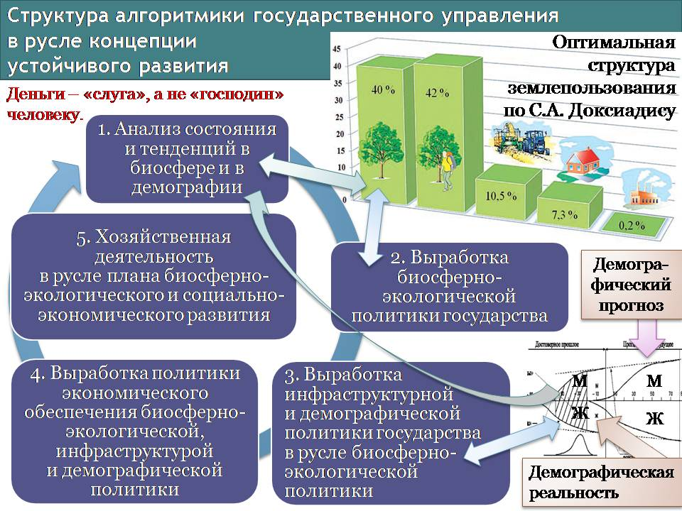

Анализируя вариативную структуру распределения долей каждого из типов ландшафтов в общей площади территории, С.А. Доксиадис рекомендует в качестве оптимума структуру землепользования, представленную на рис. 1, позволяющую обеспечить как устойчивость биосферы, так и хозяйственную деятельность и быт цивилизации. В оптимальной на его взгляд структуре 40 % площади должны составлять территории, обладающие тем или иным заповедным статусом, на которых хозяйственная деятельность практически полностью запрещена, 42 % — территории, посещение которых людьми признаётся допустимым в целях отдыха и ограниченного ведения хозяйственной деятельности, не нарушающей устойчивости биоценозов в их сложившихся границах, 10,5 % — сельхозугодья, 7,3 % — территории населённых пунктов, транспортных инфраструктур и промышленных предприятий (за исключением тяжёлой промышленности и переработки отходов), 0,2 % — площади под предприятиями тяжёлой промышленности и переработки отходов.

Соответственно на этой основе можно выработать биосферно-экологическую политику государства, одним из аспектов которой является определение биосферно допустимой экологической ниши, которую в каждом регионе, обладающем физико-географическим своеобразием, может занимать цивилизованное общество (этому соответствуют блоки 1 и 2 в структуре рис. 1). Это предполагает необходимость отказа от исторически сложившегося образа жизни цивилизации путём перехода к ландшафтно-усадебной урбанизации[^19], позволяющей поддерживать устойчивость биосферы и воспроизводство здоровых поколений, сочетать в себе удобства городского образа жизни со здоровьем сельского образа жизни, и свободного от недостатков каждого из них при опоре на современные и перспективные технологии и организацию макро- и микро- уровней экономики.

Это открывает возможности к выработке демографической политики государства, которая должна определить количественные и качественные (медико-биологические и социокультурные) показатели, которыми должно обладать население в каждом регионе, а также — параметры миграции населения между регионами, допустимые как с точки зрения бесконфликтности внутрисоциальных отношений, так и в биосферно-экологических аспектах. При этом необходимо понимать, что **демографическая политика — фактор, которому должна быть подчинена экономическая политика**, а не наоборот (как это имеет место в либерально-рыночной экономической модели), хотя демографические параметры и обуславливают возможности экономической деятельности. Поскольку жизнь цивилизованного общества невозможна без инфраструктур разного рода, то с демографической и биосферно-экологической политикой необходимо должна быть связана инфраструктурная политика (это отражено в блоке 3 на рис. 1).

Анализ с позиций ДОТУ жизни общественно-экономических формаций позволяет все потребности, порождаемые обществом, разделить на два класса: демографически обусловленные, удовлетворение которых безопасно и необходимо для обеспечения устойчивости общественного развития, и деградационно-паразитические, удовлетворение которых наносит прямо или косвенно вред потребителям, окружающим, потомкам, биосфере. Демографически обусловленные потребности предсказуемы на основе биологических и социокультурных закономерностей жизни человеческого общества на десятилетия вперёд. Это обстоятельство позволяет интерпретировать их в качестве вектора целей макроэкономического управления, а деградационно-паразитические — интерпретировать как собственные шумы системы и помехи, индуцируемые в ней извне, и рассматривать производство в их обеспечение в качестве одной из составляющих вектора ошибки управления. Общее представление об алгоритмике генерации и прогностики демографически обусловленных потребностей даёт рис. 2.

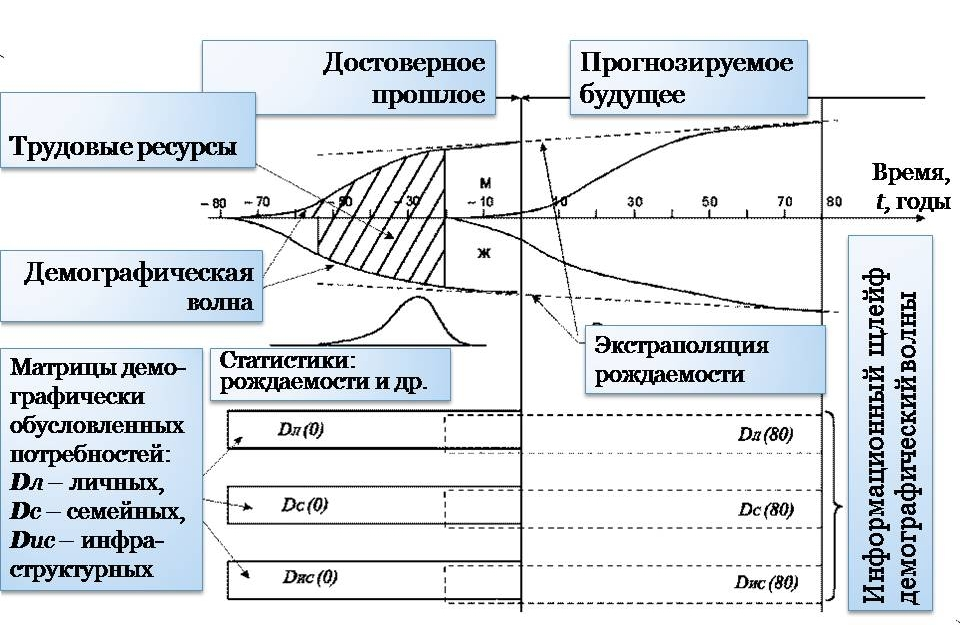

**Демографическая политика может быть представлена как демографическая волна, с которой связаны три матрицы демографически обусловленных потребностей: личностных (*DЛ*), семейных (*DС*), инфраструктурных (*DИС*) (включающих и потребности биосферно-экологической политики государства). Их долгосрочная предсказуемость разрешает неопределённости в отношении задания компонент вектора конечной продукции (правой части уравнений межотраслевого баланса) и даёт возможность построить хронологическую последовательность межотраслевых и межрегиональных балансов продуктообмена и финансового обмена, ведущую к гарантированному удовлетворению демографически обусловленных потребностей (более обстоятельно см. работу ВП СССР «Краткий курс…»).**

Структурно алгоритмически эта задача (ей соответствует блок 4 в схеме, представленной на рис. 1) аналогична задаче поражения управляемым снарядом медленно маневрирующей цели. Эта задача успешно решается в ВПК с середины 1950‑х гг. в целях обеспечения противовоздушной, противоракетной и противолодочной обороны, хотя в нашем случае она должна решаться в пространстве параметров существенно большей размерности. Спектр инвестиционных продуктов в составе вектора конечной продукции в таком подходе интерпретируется как вектор управляющего воздействия.

При этом задача планирования — показать те уровни отраслевого производства, ниже которых спектр реального производства не должен опускаться в целях обеспечения устойчивости развития общества. Научно-технический прогресс и нормативно не учитываемые производственные мощности идут в запас устойчивости плана. Если созданы условия для массовой самореализации научно-внедренческих циклов[^20], то макроэкономика восприимчива к научно-техническому прогрессу и должна отвечать требованию гибкости и адаптивности к меняющейся техносфере. За исключением устанавливаемых государством цен на товары, принадлежащие базе прейскуранта[^21], все прочие цены формируются рынком.

При наличии плана гарантированного удовлетворения демографически обусловленных потребностей и обеспечения устойчивого развития общества (с учётом особенностей региональной локализации предприятий) задача макроэкономического управления (регулирования рынка) представляет собой задачу обеспечения рентабельности отраслей в условиях реально складывающейся динамики цен. Её решение должно обеспечиваться налогово-дотационным механизмом, а платежёспособный спрос населения должен системно защищаться целевыми субсидиями и грантами от *уничтожения либерально-рыночным ценообразованием*.[^22] Дотации, субсидии, гранты могут быть как государственными, так и корпоративными. Кредитно-финансовая система, законодательство о хозяйственной и финансовой деятельности, система стандартизации и сертификации продукции интерпретируются как средства сборки макроэкономической системы из множества административно самостоятельных предприятий, а также как компоненты системы бесструктурного государственного макроэкономического управления[^23]. Этому фрагменту алгоритмики государственного управления в русле концепции устойчивого развития соответствует блок 5 в схеме, представленной на рис. 1.

Таким образом решение задачи осуществления концепции устойчивого развития требует циклической замкнутости в объединяющей их алгоритмике пяти функционально своеобразных алгоритмических блоков, что представлено на рис. 1.

Представленная на рис. 1 общая схема алгоритмики государственного управления, на наш взгляд, позволяет реализовать концепцию устойчивого развития в том смысле, как понятие «устойчивое развитие» было определено ранее.

Если говорить о научно-методологическом обеспечении работоспособности каждого из блоков на рис. 1, то анализ публикаций о теории и практике, относимых к предметной области каждого из блоков, показывает, что проблема не в «непроработанности» каждого из них, а в разрозненности узкоспециализированных научных дисциплин, которые разделены «междисциплинарными пропастями», и в невежестве и управленческой безграмотности управленческого корпуса: политиков, юристов, бизнесменов, топ-менеджеров. В каждой из предметных областей, соотносимых с блоками на рис. 1, к настоящему времени создан научно-методологический задел, вполне достаточный для выявления и решения соответствующих проблем *при должной координации с другими предметными областями.* Поэтому настало время понять 3 положения:

1.  Людей и научные дисциплины должны объединять «общие области», а не разделять «междисциплинарные пропасти», из которых «выползают» чудовищные бедствия.

2.  Термины «экология» и «экономика» происходят от греческого слова *«οiκος»* (oikos) — *обиталище, жилище, дом, имущество*. Соответственно: в наши дни экология и экономика — две оторванные друг от друга половинки одной научной дисциплины, в которую следует включить и демографию (дом мёртв без живущих в нём и заботящихся о нём и о связанном с ним хозяйстве).

3.  ДОТУ — это та методология, освоив которую, можно преодолеть «междисциплинарные пропасти» и создать «общие области», способные объединить людей и частные научные дисциплины.

И реализовать это понимание надо на практике в течение ближайших нескольких десятилетий в глобальных масштабах, но для этого **необходимо развернуть программу НИОКР в целях создания стандартного программно-алгоритмического комплекса обеспечения функционирования в практике реального государственного управления макромодели, представленной на рис. 1.**

3. Роль достаточно общей теории управления\

в решении управленческих задач разного рода и уровня

====================================================

Теории управления задают некую абстрактную структуру постановки и решения управленческих задач, которая наполняется реальным содержанием той или иной предметной области, где применяется теория. Различные теории управления отличаются друг от друга «архитектурой» такого рода структур, т.е. набором понятий и их взаимосвязей между собой и жизнью.

Достаточно общая теория управления (ДОТУ) предлагает наиболее полную детально проработанную структуру постановки и решения управленческих задач, которая превосходит структуры, предлагаемые другими версиями теории управления. Решение управленческих задач на основе ДОТУ при обеспечении метрологической состоятельности моделей реальных процессов и проектов позволяет избежать ошибок субъективизма и выявить умолчания и неоднозначности при постановке задачи, под воздействием которых её решение может оказаться невозможным в принципе или же будет обусловлено сопутствующими обстоятельствами, под воздействием которых качество решения задачи может оказаться неудовлетворительным.

В силу этого обстоятельства решение социально-экономических задач, в конце концов, должно начать проистекать из работоспособной теории управления, а **управленческая грамотность должна стать такой же социокультурной нормой, как и грамотность в смысле умения читать и писать**.

# 4. Проблемы малого и среднего бизнеса и возможности их решения 

## 4.1. Общие проблемы макроэкономической системы РФ

Проблемы малого и среднего бизнеса в РФ являются следствием проблем управления макроуровня, поскольку «финансовый климат» и конъюнктура рынков формируются в процессе макроэкономического управления[^24], которое по отношению к уровню микроэкономики является иерархически высшим объемлющим управлением.

Как было отмечено в разделе 1 и Приложении 1, они проистекают из неадекватности «мэйн-стрима» экономической науки задачам экономического обеспечения устойчивого развития общества. В результате в постсоветской России за 20 лет её существования было сформировано законодательство о хозяйственной и финансовой деятельности, выражающее принципы функционирования либерально-рыночной экономической модели, которая:

- во-первых, несовместима с высокотехнологичным, наукоёмким производством и инновационным развитием страны на принципах обеспечения биосферно-экологической безопасности;

- во-вторых, порождает экономический геноцид;

- в-третьих, лишает государство экономического суверенитета и обращает его в криптоколонию, поскольку власть над его кредитно-финансовой системой отдаёт в руки транснациональной ростовщической корпорации, узурпировавшей банковское дело в глобальных масштабах (Центробанк РФ не подчинён государству и обществу: см. Приложение 4).

Если не вдаваться в излишнюю детализацию и в анализ воздействия на законотворчество коррупционной и лоббистской составляющей, то процесс формирования этого законодательства протекал следующим образом:

- «эксперты», «советники», «консультанты», получившие юридически признанное профессиональное образование в области экономики и финансов на основе неадекватной науки, пишут «прожекты» новых законов;

- депутаты сначала Верховного Совета РФ, а потом Думы, в большинстве своём управленчески безграмотные, некомпетентные в вопросах социологии и экономической науки (тем более — науки, альтернативной «мэйн-стриму»)[^25], полагаясь на авторитетов от экономической лженауки (типа А.Я. Лившица и А.В. Дворковича — см. Приложение 1), следуют вздору, предложенному «экспертами», и с кое-какими поправками придают ему юридическую форму, после чего утверждение Президентом придаёт вздору силу действующего закона.

Кроме того, если подходить к анализу кодифицированной правовой системы любого государства с позиций ДОТУ, то в любом законодательстве можно выделить четыре составляющих:

1.  Выражение алгоритмики нормального управления по господствующей над обществом концепции управления его жизнью (при этом сама концепция может не иметь в культуре общества внятного выражения и не осознаваться в качестве концепции управления им).

2.  Алгоритмику разрешения конфликтов частных управлений в русле господствующей концепции.

3.  Алгоритмику защиты управления по господствующей концепции от осуществления в этом же обществе управления в соответствии с иными концепциями, не совместимыми с господствующей.

4.  «Юридические шумы» — это законы, формулировки которых неоднозначны, вследствие чего их применение носит характер произвола, а результат определяется тем или иным иерархическим статусом конфликтующих сторон: положением в иерархии вертикали власти, богатством и т.п. Они же являются кормушкой для юристов, поскольку без знания «правоприменительной практики» их истолкование применительно к оценке тех или иных ситуаций — невозможно. И юристы заинтересованы в том, чтобы «юридических шумов» в действующем законодательстве было как можно больше, поскольку это повышает их доходы и социальный статус.

В России положение усугубляется тем, что национальному менталитету и менталитету чиновничества в особенности не свойственно относиться к законодательству как к системе обезличенного управления жизнью общества — в том смысле, что все физические и юридические лица должны быть равны перед нормами закона (Конституция РФ, статья 19).

Эта конституционная норма предполагает следующий порядок пользования законодательством:

1.  Анализ реальной или возможной ситуации в её конкретике.

2.  Подбор соответствующих законов и статей, которые соответствуют ситуации.

3.  Принятие решения в соответствии с положениями законодательства в отношении сложившейся в жизни или перспективной ситуации.

4.  Если нет соответствующего положения закона, то выработка произвольного решения, которое, однако, не должно нарушать иных статей законодательства, а при необходимости — доработка законодательства.

Назовём этот порядок действий для определённости «нормальным порядком». Если этот порядок действует, то неизбежно выявление разного рода управленчески-алгоритмических ошибок в законах и «юридических шумов», что является основой для совершенствования законодательства и правоприменительной практики как системы обезличенного управления, перед которой равны все физические и юридические лица.

Менталитет отечественного чиновничества, представителей «правоохранительных» органов и судейского корпуса порождает иную алгоритмику применения законодательства:

1.  Анализ ситуации и выяснение социального статуса участников.

2.  Выработка произвольного решения в отношении ситуации, в котором выражается ощущение (или понимание) целесообразности тем, кому предстоит утвердить проект решения.

3.  Поиск статей законодательства, ссылками на которые можно придать юридическую силу и *видимость законности* произвольно принятому решению.

4.  Оглашение решения со ссылками на закон и проведение решения в жизнь на «законных основаниях» при фактическом игнорировании и попрании норм законодательства.

Этот порядок действий назовём «антинормальным».

Он если и не действует безальтернативно в РФ, то его вес в статистике правоприменительной практики достаточно большой для того, чтобы простой гражданин России был самого низкого мнения и о чиновничестве, и о «правоохранительной» системе в целом, и о судейско-прокурорском корпусе. Эта публика настолько обнаглела, что **судейские в ряде случаев отказывают в приёме к рассмотрению заявлений граждан, прямо ссылаясь на те статьи законов, которые именно на них возлагают обязанность рассмотрения тех или иных дел**. И простой гражданин перед чиновником или судом, перед иными должностными лицами может сколь-угодно юридически грамотно ссылаться на Конституцию РФ, на действующие законы в соответствии с нормальным порядком, но, следуя нормам корпоративной этики представителей власти, чиновничество и судейские (в своём большинстве носители юридического образования, возможно второго высшего) будут попирать известный им закон и осуществлять *антинормальный* порядок применения законодательства.

**Законных эффективных средств защиты своих прав гражданин в России не имеет.** Неизвестны даже хотя бы единичные случаи наказания чиновников, представителей «правоохранительных» органов, судейских с формулировкой типа: *отстранён от должности и посажен лет на 5-7 с конфискацией имущества за систематическое попрание норм закона и правоприменительную практику в стиле «закон — что дышло, куда повернул — туда и вышло».* **Поэтому неизбежно, что представители чиновничьего и судейского корпуса, «правоохранительных» органов регулярно становятся жертвами самосуда, и акты самосуда вызывают массовое одобрение, что находит выражение в интернете**.

Даже, если не говорить о содержании законодательства, положение с соблюдением действующего законодательства чиновниками и судейскими в России ныне хуже, чем было на Кубе в период диктатуры Фульхенсио Батисты[^26].

Положение представителей малого и среднего бизнеса усугубляется ещё тем обстоятельством, что если с простого работяги или интеллигента в общем-то нечего взять, и можно только показать ему, что он — реально *бесправное быдло* в своей стране и обязан холуйствовать перед государственной властью и её представителями, на действия которых распространяется «презумпция правомерности»[^27], то для чиновника и судейского представитель малого бизнеса — либо потенциальный объект эксплуатации, либо помеха, если его предпринимательская инициатива препятствует сложившемуся в регионе порядку распила госбюджета и иных источников дохода чиновников, членов их семей и их «кураторов» и спонсоров от легального и криминального бизнеса, уже доминирующего в регионе, а также — «кураторов» от вышестоящих органов государственной власти.

Кроме того, следует признать, что кадровая политика как в государственном аппарате, так и в бизнесе строится на принципах родоплеменного строя: если претендент на высокооплачиваемую должность или на ведение доходного бизнеса принадлежит к определённым кланам, то он «имеет право», если не принадлежит, то «не имеет права»; творческий потенциал, профессионализм, знания и идеи развития, которые несут претенденты, не принадлежащие к так или иначе властным кланам, — ничего не значат.

Т.е. власть в РФ определилась с тем, кто будет получать высокие доходы, но не определилась с тем, кто будет задарма работать на потребительское благополучие всей родоплеменной «элиты», в большинстве своём профессионально несостоятельной в тех отраслях деятельности, в которые они вошли.

Это — тоже один из ликов правового нигилизма и реализации антинормальной правоприменительной практики.

**Задача искоренения «правового нигилизма» — прежде всего в среде чиновничьего корпуса, «правоохранительных» органов и судейских — до настоящего времени не решена, хотя её декларировал ещё Б.Н. Ельцин**[^28]**, а Д.А. Медведев также декларировал необходимость её решения, ещё будучи кандидатом в президенты в 2008 г.**[^29] **И не похоже, чтобы что-то реально делалось государством в направлении *искоренения правового нигилизма в среде госслужащих и депутатов*.**

Соответственно изложенному выше в разделе 4.1 — решение проблем малого и среднего бизнеса в России требует решения следующих задач макроуровня:

1.  Отказ от либерально-рыночной экономической модели и переход к государственному макроэкономическому управлению на основе концепции устойчивого развития. Это предполагает:

- обеспечить как можно более широкую управленческую грамотность на основе ДОТУ в обществе и, прежде всего — юристов, экономистов, менеджеров, а также — всех госслужащих и офицерского состава вооружённых сил и организационно аналогичных иных служб;

- развивать теорию и практику государственного управления межотраслевыми и межрегиональными балансами продуктообмена и финансового обращения в русле концепции устойчивого развития;

- сформировать законодательство о хозяйственной и финансовой деятельности, которое выражало бы концепцию устойчивого развития и защищало бы управление по ней от либерально-рыночной экономической модели при минимуме «юридических шумов».

2.  Не декларировать необходимость искоренения правового нигилизма, а действительно искоренить правовой нигилизм во всех его проявлениях в среде госчиновничества, судейского корпуса и прочих госслужащих для того, чтобы законодательство, адекватно выражающее концепцию устойчивого развития и защищающее её, действительно стало системой обезличенного управления (бесструктурного управления) жизнью общества, перед которой равны все физические и юридически лица. Для этого, в частности, необходимо создать особый кодекс для преступлений, совершаемых в сфере государственного управления и бизнеса, в котором должен быть предусмотрен и такой состав преступления, как злоупотребление законодательной властью, и который должен квалифицировать иные злоупотреблении властью и коррупцию как специфические разновидности измены Родине, подрыв демократии и конституционного строя[^30].

## 4.2. Экономика как объект управления с точки зрения ДОТУ

### 4.2.1. «Деньги» в своём кармане? — либо кредитно-финансовая система\

как инструмент государственного макроэкономического управления

Прежде всего, необходимо изменить свои представления о деньгах. Согласно господствующей ныне концепции денег: «деньги — это особый товар, выступающий в роли всеобщего эквивалента стоимости всех остальных товаров» и несущий следующие функции: первая — мера стоимости; вторая — средство обращения; третья — средство накопления или образования сокровищ; четвёртая — средство платежа; пятая — мировые деньги[^31]. Основы этой концепции денег были сформированы к концу XIX века постфактум по отношению к экономической практике и выразили *приспособленческое отношение частного собственника к кредитно-финансовой системе,* **а не властно-управленческое отношение к ней суверенного государства**. Из этого неадекватного отношения к деньгам политиков и проистекает большинство экономических трудностей во всех государствах.

Эта концепция «денег» во всех её модификациях с позиций частного собственника-приспособленца освещает *реалии* *меновой торговли в её историческом развитии*[^32]:

- от первобытных времён, когда из всего множества товаров выделились товары-посредники («Д») «денежной группы» (скот, зерно, некоторые металлы) как наиболее удобообмениваемые, в результате чего медленно работающая схема продуктообмена «Т1⇒Т2» была вытеснена схемой «Т1⇒Д⇒Т2», обладающей более высоким быстродействием;

- до индустриального общества на основе либерально-рыночной модели экономики, когда основным денежным товаром стало золото, которое, однако, перестали рубить на куски и взвешивать прямо на рынке в ходе совершения сделок купли-продажи, но стали заблаговременно «фасовать» на «монетных дворах» в стандартные монеты и слитки, впоследствии дополнив обращение денежного товара обращением разного рода «расписок» — банкнот, казначейских билетов, векселей и т.п. «суррогатов».

После того, как произошло вытеснение товаров-посредников денежной группы из обращения и был отвергнут золотой стандарт, господствующая ныне концепция денег утратила состоятельность, поскольку «деньги» как «особый товар» перестали обладать какой-либо иной полезностью (и соответственно — свойственной им ценностью), кроме покупательной способности, которая при этом обусловлена многими внеэкономическими обстоятельствами, а не тем *фактом самим по себе,* что на листок бумаги или на монету нанесён некий номинал. В отличие от современных «денег», товары «денежной группы» изначально обладали некой полезностью вне схемы продуктообмена «Т1⇒Д⇒Т2», что придало им покупательную способность в меновой торговле и сделало их «деньгами».

Концепция денег, способная обеспечить устойчивое развитие общества, может быть построена на основе соотнесения представлений ДОТУ о структурном и бесструктурном способах управления с хозяйственной деятельностью в масштабах общества.

В пределах первобытной общины потребности в торговле и соответственно в деньгах, не было; торговля была межобщинной и большей частью — меновой. В пределах общины управление продуктообменом (как производственным, так и потребительским) осуществлялось её руководством директивно-адресным способом: кому персонально и что делать, кому и в каких количествах передать продукт своего труда для потребления или дальнейшей обработки. В терминах ДОТУ — это структурный способ управления продуктообменом.

Но структурный способ управления имеет свои пределы роста, обусловленные: 1) ограниченностью возможностей центра управления перерабатывать необходимую для управления информацию; 2) пропускной способностью, быстродействием и дальнодействием каналов и средств передачи информации. В соответствии с этим, **возникновение торговли — следствие невозможности управления продуктообменом структурным способом в силу разных причин**: достижения пределов роста собственной структуры, нахождения желаемых благ под властью других неподконтрольных центров управления и т.п.

В терминах ДОТУ торговля — это саморегуляция продуктообмена на основе бесструктурного способа управления, а рынок, *в основе функционирования которого лежит некоторая совокупность определённых правил, которых придерживаются его участники,* — подсистема бесструктурного самоуправления макроуровня в хозяйственной системе общества.

Кроме того, управленческий подход требует признать, что трудовая теория стоимости ограниченно применима. Так, в научных исследованиях и во всех прочих уникально-творческих сферах деятельности результаты носят субъективно обусловленный и плохо предсказуемый характер, вследствие чего возникают неопределённости в измерении и нормировании трудозатрат. Кроме того, право потребления природных благ — издавна является одним из товаров; стоимость предметов антиквариата растёт с течением времени, хотя трудозатраты на их производство остались в прошлом, в силу чего они неизменны. Это означает, что трудовая теория стоимости не может быть основой для понимания ценообразования *во всех без исключения* сделках.

Отвечающей реальности рынка представляется точка зрения, согласно которой *— в условиях некоторым образом сложившихся конъюнктуры рынка и финансового климата, **которые так или иначе оказывают давление на каждого продавца и каждого покупателя** (без учёта этого фактора анализ ценообразования методологически несостоятелен), —* в цене товара выражается баланс:

- с одной стороны — притязаний продавца на получение некоего блага, альтернативного благу, продаваемому им самим,

- а с другой стороны — согласие покупателя предоставить продавцу желаемое им благо в определённом количестве (в наши дни это в большинстве случаев «деньги» — как средство платежа) в обмен на товар продавца.

Всё остальное, включая и обоснование продавцом и покупателем своих притязаний на установление цены, конкуренция продавцов за доступ к кошельку покупателя либо конкуренция кошельков покупателей за право купить товар — сопутствующие сделке обстоятельства, не имеющие непосредственного отношения к бесструктурной саморегуляции продуктообмена.

Пропорции взаимообмена на рынке различных благ (как природных, так и производимых обществом) выражаются в прейскуранте. Можно ввести термин «инвариант прейскуранта». Это — *товар, производимый реальным сектором и не обязательно принадлежащий к исторически сложившейся «денежной группе»,* количеством которого выражаются цены всех остальных товаров. Цена единицы учёта самого́ *инварианта* *неизменна* и равна единице. Инвариант прейскуранта соответствует первой функции денег в господствующей концепции, поэтому необходимо подчеркнуть: инвариант прейскуранта свободен от всех прочих функций, возлагаемых на «деньги» в ныне господствующей концепции.

В прошлом инвариант прейскуранта выступал непосредственно в качестве товара-посредника в схеме «Т1⇒Д⇒Т2», а функции инварианта и средства платежа были неразрывно объединены в монетах и слитках из «денежных металлов». Однако по мере распространения «кредитных денег» и разного рода «денежных суррогатов» произошло вытеснение драгоценно-металлических инвариантов прейскуранта из сферы обращения, вследствие чего функции инварианта и средства платежа после отказа от золотого стандарта разделились и перестали быть неразрывно связанными с каким-либо одним носителем обеих функций одновременно (монетами, слитками и т.п.). Наша эпоха характеризуется неопределённостью инварианта прейскуранта, вследствие чего средство платежа стало псевдоинвариантом, поскольку «дензнаки» и «цифры» в банковских компьютерах не обладают какой бы то ни было иной полезностью, кроме признания за ними участниками рынка покупательной способности. «Деньги» в наше время — это то, что общество воспринимает в качестве денег.

Во властно-управленческом отношении суверенного государства к «деньгам», в отличие от отношения частного собственника, ценностью обладает не какая-либо сумма «денег» и не то или иное количество некоего «денежного товара» (объём «золотовалютных резервов» или иных «аккумуляторов платёжеспособности»), и не годовой доход или прибыль, а кредитно-финансовая система (КФС) государства в целом как инструмент управления. Ценность её («потребительная стоимость») обусловлена тем, что она — *при определённых знаниях и навыках* — выполняет функцию бесструктурной организации производственного и потребительского продуктообмена в целях экономического обеспечения политики государства. «Финансовый климат» и конъюнктура всех без исключения специализированных рынков в этом случае с течением времени становятся следствием функционирования КФС *под государственным управлением* в прошлом.

В задачах макроэкономического управления наилучший инвариант прейскуранта в наши дни — килоВатт×час электроэнергопотребления. И на его основе должна строиться эмиссионная политика, направленная на обеспечение определённого стандарта энергетической обеспеченности платёжной единицы[^33]. Это необходимо потому, что организационно-технологический комплекс общества подчинён, как и всё в природе, закону сохранения энергии.

Политически целесообразное функционирование КФС предполагает наличие определённой (адекватной целям политики и психологии общества) алгоритмики её функционирования, которая должна быть описана в социолого-экономической теории и выражена в законодательстве государства о хозяйственной и финансовой деятельности. Структура алгоритмики и параметры настройки на его основе налогово-дотационного механизма могут меняться с течением времени в соответствии с изменением целей политики государства и изменениями в психологии общества.

Главное предназначение КФС — сборка макроэкономической системы государства (прежде всего, — реального сектора) бесструктурным способом из множества структурно обособленных предприятий микроуровня и управление макроэкономикой в соответствии с целями политики государства — биосферно-экологической, демографической, внешней и внутренней, а также — в соответствии с целями политики дальнейшего развития экономики.

### 4.2.2. Структурное и бесструктурное управление\

в макроэкономической системе

Наивысшие показатели качества управления в соответствии с представлениями об управлении, развитыми в ДОТУ, достигаются при сочетании структурного и бесструктурного способов управления в схеме предиктор-корректор[^34].

Бесструктурное управление экономикой включает в себя в качестве подсистем следующие инструменты: 1) систему стандартизации и сертификации продукции, технологий и организационных процедур, 2) законодательство о хозяйственной и финансовой деятельности, 3) кредитно-финансовую систему со всем, что обеспечивает её функционирование.

Как было отмечено в разделе 4.2.1, директивно-адресное управление продуктообменом — это структурный способ управления, и он имеет свои пределы роста, при выходе за которые качество управления падает вплоть до нуля при полной невозможности осуществления управления. Именно отказ от бесструктурно управляемой компоненты организационно-технологического комплекса экономики СССР в послесталинские времена[^35] привёл к построению системы моноцентричного управления народным хозяйством исключительно директивно-адресным (структурным) способом, которая и доказала свою несостоятельность, превысив пределы роста, допускаемые этим способом управления. Это стало одной из многих причин научно-технического отставания экономики СССР от передового мирового уровня, что привело к краху страны.

Либерально-рыночная модель представляет собой другую крайность: саморегуляция процессов макроуровня осуществляется исключительно рынком, т.е. бесструктурным способом. Вследствие того, что рынок не обладает способностями к выявлению проблем и к целеполаганию макроуровня, не обладает способностью к самонастройке на цели, провозглашаемые политиками[^36], — государства, в которых безупречно либерально-рыночная экономическая модель существует подчас веками, — это самые проблемные страны и в экономическом отношении, и в отношении общекультурного развития. И как только либерально-рыночная модель была внедрена в постсоветской России, — сразу же обострились проблемы, унаследованные от СССР, и кроме того, к ним добавились новые проблемы, которых в СССР не было, порождённые не чем иным, как либерально-рыночной моделью.[^37]

Однако необходимость целеполагания макроуровня объективно обусловлена тем, что подавляющее большинство той продукции, которую потребляет цивилизованное общество, производится на основе коллективного специализированного профессионального труда людей и производственной специализации предприятий, а не на основе труда членов семьи, как это было в прошлом при господстве «натурального хозяйства». Субъективизм экономистов и политиков не может отменить объективности этой потребности, но игнорируя её, может нанести большой ущерб обществу.

Экономика развитых в научно-техническом отношении стран, как показал ещё полвека тому назад Дж. К. Гэлбрейт, не принадлежит ни к типу управляемых государством исключительно директивно-адресным способом, ни к типу бесструктурно самоуправляющихся либерально-рыночных. В них сложился некий порядок сочетания структурного и бесструктурного управления макроуровня, а на микроуровне (в пределах фирм) преобладает структурный способ управления, хотя директораты ряда фирм предоставляют своим подразделениям право самостоятельного выхода на рынок, в силу чего во внутреннем управлении этих фирм структурный и бесструктурный способы управления некоторым образом сочетаются.

Однако практика макроэкономического управления в этих странах строится на основе «здравого смысла»[^38], удачные решения становятся кодифицированной юридически обязывающей нормой или неписаной традицией, воспроизводимой на основе социальной инерции. Но всё это не находит адекватного выражения в экономической теории и в теориях «менеджмента».

При этом Дж. К. Гэлбрейт указывал, что государственность в них не служит обществу в целом, а обслуживает тот сегмент экономики, который он назвал «планирующей системой».

Однако Дж. К. Гэлбрейт по известным ему причинам не стал писать о том, что и фирмы, отнесённые им к «планирующей системе», хотя и подмяли под себя государственность США, не обладают политико-экономическим суверенитетом, поскольку: во-первых, ориентируются на конъюнктуру рынка, а во-вторых, решающее воздействие на конъюнктуру рынка оказывает транснациональная ростовщическая корпорация, которая узурпировала банковское дело[^39] в глобальных масштабах (см. Приложение 4) и обладает экстерриториальным статусом по отношению к любому государству. Концепция денег, сложившаяся к концу XIX века и господствующая доныне (о ней речь шла в разделе 4.2.1), — один из инструментов сокрытия этого факта и извращения представлений общества о макроэкономике.

Дж. К. Гэлбрейт считал, что исторически сложившаяся в США экономическая модель — тупиковая, поскольку создаёт проблемы, а не разрешает их, и что государство должно служить всему обществу, а не «планирующей системе» (что подразумевает: и не глобальной ростовщической корпорации), и, соответственно, оно должно регулировать взаимоотношения «планирующей системы» и «рыночной» и их взаимоотношения с обществом в русле поддерживаемой обществом государственной политики биосферно-экологического и социально-экономического развития.

В Японии и Китае тоже сложилась экономическая модель, в которой взаимодействуют друг с другом «планирующая система», «рыночная система» (если пользоваться терминологией Дж. К. Гэлбрейта) и государственность. Но отличие этой экономической модели от модели США в том, что в ней главенствует государственность, и крупный бизнес (включая и местные банки) не претендует (в отличие от России) на то, чтобы подмять под себя государственность так, как это произошло в США и в Западной Европе.

Если же говорить о том, что происходит в России, то в ней:

- **с одной стороны — крупный бизнес** стремится воспроизвести именно тупиковую модель США, в которой «планирующая система» и банковско-ростовщический сектор мировой экономики подмяли под себя государственность и возводят в ранг общественных интересов интересы «планирующей системы» и интересы хозяев и заправил глобальной ростовщической корпорации;

- **с другой стороны — государственность** вследствие социальной инерции стремится к осуществлению в России модели японско-китайского типа, однако с претензией на то, что и бизнес, и простые граждане должны быть безропотными холопами наследственно-клановой чиновничьей корпорации. Это — тоже устремлённость в тупик, в котором затаилась очередная катастрофа.

- **над ними — глобальная ростовщическая корпорация**, узурпировавшая банковское дело, заботится о том, чтобы вне зависимости от исхода противоборства крупного бизнеса и государственности, страна осталась бы под полным её контролем (при этом ей в общем-то всё равно — при сохранении территориальной целостности либо в виде некоторой совокупности формально-юридически «суверенных» криптоколоний, хотя второй вариант для неё предпочтительнее).

**Альтернативой катастрофам и финансовому рабству на обоих названных тупиковых направлениях возможного развития России является осуществление задачи, поставленной Дж. К. Гэлбрейтом: государственность должна служить интересам общества в целом, и в целях экономического обеспечения развития общества она должна координировать деятельность крупного («планирующей системы») и среднего и мелкого («рыночной системы») бизнеса в русле плана развития.** И это подразумевает, что государство не должно быть подконтрольным глобальной ростовщической корпорации, должно быть действительно демократическим, а общество должно быть гражданским, а не холопско-барским.

Но если не лицемерить и быть исторически честным, то двадцатью годами ранее Дж. К. Гэлбрейта, эту же задачу поставил И.В. Сталин, хотя и выразил всё в терминологии марксизма и не «открытым текстом», а в режиме «кто знает — тот поймёт… если подумает»[^40].

В этом совпадении постановки задач общественного политико-экономического развития выражается объективная потребность человечества в осуществлении конвергенции двух систем в целях обеспечения устойчивого развития глобальной цивилизации в ранее определённом в разделе 2 смысле. Однако решение этой задачи требует прояснить ещё некоторые обстоятельства.

По отношению к **задаче реализации схемы предиктор-корректор в государственном управлении при сочетании структурного и бесструктурного способов управления многоотраслевой производственно-потребительской системой общества** — *характеристика предприятий по признаку собственности (частная либо государственная) интереса не представляет*. Это обусловлено тем, что если КФС — собственность государства и один из инструментов государственного макроэкономического управления, то вся собственность в пределах юрисдикции этого государства находится опосредованно (через деньги) в собственности государства[^41]; непосредственные «собственники» только осуществляют управление ею либо на правах оказания государством доверия им персонально, либо на основе того, что предпринимательская инициатива их самих, их предков или дарителей собственности смогла вписаться в процесс государственного макроэкономического управления. В решении **названной выше задачи** предприятия обоих видов собственности характеризуются иначе.

Необходимо ввести понятие «административно обособленное предприятие». Под **«**административным обособлением» предприятия понимается отсутствие *управления извне* технологическими процессами предприятия *директивно-адресным (т.е. структурным) способом*. Если к этому добавить:

1.  Отсутствие директивно-адресного *управления извне* поставками продукции для нужд предприятия.

2.  Отсутствие директивно-адресного *управления извне* поставками его продукции тем или иным потребителям.

3.  Наличие кошелька, «кубышки», сейфа с денежной наличностью или счетов в одном или нескольких банках, *которыми после уплаты налогов без какого-либо диктата извне безраздельно распоряжается собственник предприятия, **не являющийся государством,***

— то получится набор основных качеств, которыми характеризуется в большинстве экономик мира всякое предприятие, находящееся в частной собственности.

Для задачи сочетания структурного (административного, директивно-адресного) и бесструктурного (рыночной саморегуляции) способов управления во многоотраслевой производственно-потребительской системе общества значим, прежде всего, признак административного обособления предприятия, поскольку именно он разграничивает внутреннее управление структурным способом в пределах предприятия с вхождением предприятия в качестве хозяйствующего субъекта в процесс макроэкономического управления.[^42] В силу этого обстоятельства *однокачественные* предприятия частного и государственного секторов должны находиться в одинаковом положении по отношению к государственной системе макроэкономического управления, поскольку в противном случае качество управления будет снижено за счёт предоставления управленчески неуместных «преимуществ» одним и ограничения возможностей деятельности других.

Что касается высказанных выше первого и второго добавлений к признаку административного обособления, то они могут в большей или меньшей мере нарушаться как в государственном секторе экономики (центральным правительством, региональной администрацией и другими органами государственной власти в пределах предоставленных им полномочий), так и в «частном секторе» экономики — в пределах концернов и иных объединений административно обособленных предприятий (директоратами наивысшего уровня в таких объединениях).

Второй важный вопрос — это классификация предприятий по признакам *однокачественности*. В аспекте организации макроэкономического управления интерес представляет не разграничение предприятий по численности персонала и объёму их торгового оборота, т.е. разграничение «мелкого», «среднего» и «крупного» бизнеса, а разграничение предприятий по признакам интеграции каждого из них во многоотраслевую производственно-потребительскую систему. Фактически речь идёт о развитии подхода, предложенного Дж. К. Гэлбрейтом, на основе детализации состава тех сегментов многоотраслевой производственно-потребительской системы общества, которые он назвал «рыночной системой» и «планирующей системой». Характеристическими признаками построения такого рода классификации являются:

- характер внутреннего управления технологическими процессами (директивно-адресный — структурный для подавляющего большинства предприятий либо сочетание структурного и бесструктурного способов управления — для концернов и иных объединений);

- архитектура оргштатной структуры (наличие специализированных подразделений управления деятельностью либо *для малого бизнеса —* их отсутствие или при отсутствии подразделений управленческого характера наличие в штате функционально аналогичных должностей без совместительства либо отсутствие и такого рода должностей);

- характер деятельности (принадлежность к какой-то одной отрасли, включая фундаментальную и прикладную науку, систему образования и систему здравоохранения, либо охват деятельностью нескольких отраслей);

- локализация предприятия и его подразделений (в пределах населённого пункта, одного или нескольких сопредельных регионов, страна в целом, зарубежье);

- характеристики рынка поставщиков продукции для нужд деятельности предприятия по признакам географической локализации (населённый пункт, регион или несколько сопредельных регионов, страна в целом, безальтернативная потребность в поставках по импорту) и по отраслевой принадлежности;

- характеристики рынка потребителей продукции по признакам:

<!-- -->

- продукция конечного потребления (её потребители — домашние хозяйства, некоммерческие общественные организации, органы государственной власти) либо продукция производственного назначения (промежуточные продукты и инвестиционные продукты, и в этом случае один из признаков — отраслевая принадлежность потребителей),

- географической локализации (населённый пункт, регион и несколько сопредельных регионов, страна в целом, экспорт, безальтернативная работа на экспорт).

Соответственно на основе такого подхода к особо крупному бизнесу можно отнести многоотраслевые концерны и «отраслевые гиганты» (предприятия, деятельность которых локализована в какой-то одной отрасли и которые дают не менее 5 % отраслевого выпуска). Среди концернов и «отраслевых гигантов» особое место во многоотраслевой производственно-потребительской системе занимают предприятия, которые можно назвать «интегрирующими» в том смысле, что производство ими продукции требует поставок промежуточных продуктов многими другими отраслями (к этой категории можно отнести среднетоннажное и более крупное судостроение, автопром, авиапром, промышленное и отчасти гражданское строительство).

Мелкий и средний бизнес при таком подходе будет характеризоваться локализацией предприятий в пределах населённого пункта, региона или нескольких сопредельных регионов; наряду с этим мелкий бизнес будет характеризоваться отсутствием специализированно управленческих подразделений и должностей в оргштатной структуре предприятий. Кроме того, за исключением небольшого количества каких-то уникальных предприятий (типа ювелирных, реликтовых народных промыслов типа Палеха и Хохломы и некоторых других) он будет характеризоваться тем, что рынки сбыта его продукции также в большинстве своём локализованы в пределах того же населённого пункта, региона или нескольких сопредельных регионов.

При этом необходимо особо оговорить ещё один аспект. Не все виды деятельности, которые объективно необходимы для устойчивого развития общества, могут осуществляться на принципах самоокупаемости либо вообще, либо в необходимых объёмах. Это означает, что невозможность осуществления такого рода видов деятельности на чисто коммерческих началах в объективно необходимых объёмах является дополнительным характеристическим признаком некоторых рынков, и те предприятия, которые выступают на них в качестве продавцов, должны иметь внерыночные источники финансирования своей деятельности. Такими источниками могут быть либо дотации самим предприятиям и госзаказ, либо *целевые* субсидии и гранты потребителям их продукции.

Но специфика каждого из типов предприятия при построении государственной системы макроэкономического управления и, в особенности, при построении кредитно-финансовой системы как инструмента макроэкономического управления — должна учитываться в законодательстве о хозяйственной и финансовой деятельности. Т.е. для каждого из типов предприятий целесообразно иметь свой план счетов бухгалтерского учёта[^43], свой подраздел в законодательстве о взаимодействии предприятия с налогово-дотационным механизмом, что необходимо для согласования концепций и алгоритмики государственного макроэкономического управления в отношении каждого из такого рода сегментов макроэкономики друг с другом. А также для каждого из типов предприятий необходима своя концепция социальной защиты и социального обеспечения персонала, выраженная в законодательстве.

Кроме того, качество продукции и услуг, предоставляемых обществу предприятиями разных типов, обязывает к тому, чтобы в целях повышения качества жизни общества для определённых типов предприятий определённые виды деятельности были бы запрещены законодательно[^44] либо постоянно, либо в определённые сезоны[^45] и отданы в распоряжение других типов предприятий.[^46] Импорт ряда видов продукции должен блокироваться на основании её несоответствия стандартам РФ, которые должны обеспечивать соответствие продукции, потребляемой гражданами России, качеству их жизни в концепции устойчивого развития.

## 4.3. Переход к жизни на основе концепции устойчивого развития

Главная проблема — это переход от либерально-рыночной экономической модели «великого комбинатора» к жизни на основе концепции устойчивого развития. Даже если бы в качестве пакета приложений к настоящему обзору были предоставлены новая Конституция РФ, новый свод законов, комплект учебников для общеобразовательной школы и вузов по психологии, методологии познания и творчества, социологии, истории, экономике, то это бы ничего не решило. Причина в том, что психология общества, его менталитет — инерционны, т.е. обладают некоторой собственной динамикой. В этой динамике прежде всего виден «мэйн-стрим», который и определяет текущее качество жизни (см. рис. 3).

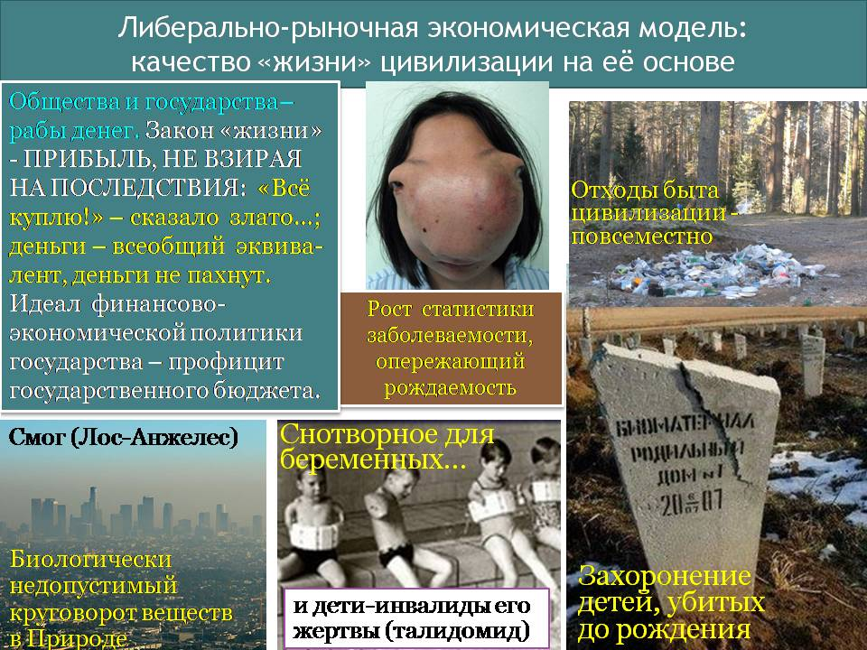

Этот «мэйн-стрим» не может быть устранён одномоментно путём оглашения декларации о переходе к концепции устойчивого развития и введением в действие с «1 мартобря» новой конституции, свода законов, новых учебных программ и учебников. Тем не менее он должен быть устранён и замещён новым «мэйн-стримом», на основе которого концепция устойчивого развития (в том смысле, как этот термин был определён в разделе 2) безальтернативно реализовывалась и развивалась «сама собой». Это может быть только продолжительный процесс, в котором личностная инициатива людей, понимающих проблематику современности и возможности её разрешения, играет решающую роль. При этом надо понимать, что чиновничий корпус и олигархи делать это за общество не будут: не тот менталитет и с их точки зрения есть дела поважнее — они пока бодаются между собой на тему «Кто в России главный: чиновники либо крупный бизнес?».

Тем не менее, вне зависимости от позиции чиновничества и крупного бизнеса, этот процесс должен идти, чтобы не реализовались перспективы, представленные на рис. 3. На первом этапе главная задача — создать компетентный управленческий корпус и его не менее компетентный кадровый резерв. Для этого необходимы следующие потоки деятельности:

- дискредитация социолого-экономической науки, выражающей идеи либерализма, в глазах общества, чиновников и бизнесменов путём демонстрации её ошибок и управленческой несостоятельности;

- дискредитация персонально «экспертов» и научных авторитетов, приверженных либерально-рыночным воззрениями как людей слабоумных по отношению к избранной ими деятельности, профессионально некомпетентных и непорядочных в нравственно-этическом отношении;

- развитие научно-методологического обеспечения организации жизни общества на основе концепции устойчивого развития в том смысле, как этот термин определён в разделе 2;

- внедрение научно-методологического обеспечения организации жизни общества на основе концепции устойчивого развития в образовательные программы всеобщего и высшего образования всеми путями, которые допускает система;

- дискредитация представителей системы, которые противятся такого рода деятельности, с целью замещения их более компетентными лицами;

- юридически грамотно и научно-методологически состоятельно давить на психику депутатскому корпусу федерального и регионального уровня, представителям исполнительной власти и директоратам крупного бизнеса, дабы сбить спесь с этой публики и нарушить дееспособность аппарата, который готовит проекты решений, дабы управление на основе либерально-рыночной модели испытывало трудности.

На втором этапе, когда сформируется достаточно широкая социальная база компетентных приверженцев концепции устойчивого развития в определённом выше значении этого термина, главной задачей становятся — изменение Конституции РФ и свода законов так, чтобы законодательство страны выражало концепцию устойчивого развития и практический переход к управлению на её основе. Для этого необходимы следующие потоки деятельности:

- продвижение в аппарат компетентных приверженцев концепции устойчивого развития;

- формирование проектов законодательных актов разного рода в соответствии с нею;

- дискредитация и вытеснение из аппарата приверженцев либерально-рыночной экономической модели;

- вытеснение из учебных программ обязательного и высшего образования либерального вздора и внедрение в учебный процесс альтернативы, научно-методологически состоятельно выражающей концепцию устойчивого развития как во внутрисоциальных, так и биосферно-ноосферных аспектах;

Разграничение потоков действий первого и второго этапов во многом условно, но действия, относимые ко второму этапу, не могут быть осуществлены в их полноте, если не выполнены задачи первого этапа, хотя задачи первого этапа сохраняют актуальность и на втором, а задачи второго этапа могут ограниченно решаться и на первом этапе.

Сможет ли мелкий и средний бизнес России влиться в решение этих задач, далеко выходящих за круг непосредственных бизнес-интересов, и в какой форме сможет — зависит от него самого. Пока же на протяжении 30 лет опыт показывает, что основная масса «патриотов России» готова спасать Родину исключительно за «отдельную плату» и только под защитой спецназа КГБ, и предпочитает это делать на банкетах и прочих тусовках — вне непосредственной работы с проблематикой и её генераторами-носителями. Исключения — крайне редки и не являются пока сколь-нибудь значимым системным фактором. Тем не менее процесс идёт…

# Заключение

В ходе осуществления полномочий Президента РФ в 2000-2008 гг. в одном из своих выступлений В.В. Путин сказал:

*«Наш соотечественник В.И. Вернадский ещё в начале XX века создал учение об объединяющем человечество пространстве — ноосфере. В нём сочетаются интересы стран и народов, природы и общества, научное знание и государственная политика. Именно на фундаменте этого учения фактически строится сегодня концепция устойчивого развития».*

Всё, кроме последней фразы, соответствует действительности. **Но последняя фраза — пока лишь декларация.** Для того, чтобы она стала жизненной правдой и определяла перспективы развития многонационального общества России и человечества в целом, необходимо изменить менталитет, выработать содержательно иные науки (психологию, социологию, историю, экономику), ПРОБУДИТЬ СОВЕСТЬ и на этой основе вырастить новый управленческий корпус для государства и бизнеса.

В противном случае нынешняя государственность обречена…

И есть примеры в истории ХХ века, на фоне которых постсоветской государственной власти и бизнесу Россионии должно быть стыдно. Это — МАЛАЗИЙСКОЕ «культурно-экономическое чудо», которым Малайзия обязана политике «антисемита»[^47] — Махатхира Мохамада (родился 20 декабря 1925 г.), возглавлявшего правительство страны с 1981 по 2003 гг. Как сообщает Википедия, «при нём Малайзия превратилась из страны со слаборазвитой аграрной экономикой в одного из «азиатских тигров».

При этом необходимо отметить, что стартовые условия многонациональной Малайзии (в составе населения: китайцы, индийцы, малайцы, потомки английских колонизаторов: малайцы — самые обездоленные), после более чем векового колониального угнетения Великобританией, японской оккупации, борьбы за независимость и становления собственной государственности, в 1981 г. были несравненно хуже, нежели стартовые условия СССР — «сверхдержавы № 2» после без малого 70 лет социалистического строительства накануне объявления кликой «Горбачёва — Яковлева» перестройки в 1985 г.; а культурно-экономические результаты Малайзии по состоянию на 2003 г. — несравненно лучше, чем постсоветской Россионии по состоянию на 2012 г. — Это к вопросу о целях государственного управления, концепции их достижения и качестве управления, а также — к вопросу о роли личностей в истории[^48].

Что касается нашей оценки инаугурационной речи В.В.Путина 07.05.2012[^49], то она представляет собой элемент политиканского шоу, адресуемого главным образом зарубежью, и к реальной политике отношения не имеет. Страна по-прежнему будет управляться в режиме, описанном в аналитической записке ВП СССР «Правдив и свободен их вещий язык и с Волей Небесною дружен…» из серии «О текущем моменте» № 6 (102), 2011 г., и высказанные в ней рекомендации по осуществлению непосредственной демократии средствами матрично-эгрегориального управления по-прежнему сохраняют актуальность.

Внутренний Предиктор СССР\

03 апреля — 02 мая 2012 г.

Уточнения и добавления: 05, 08 мая 2012 г.

Приложение 1.\

Высказывания о несостоятельности экономической науки политических деятелей и некоторых учёных-экономистов

=========================================================================================================

**Президент США Ф.Д. Рузвельт** 24 июля 1933 г.: «Я совершенно не разделяю мнение тех профессиональных экономистов, которые настаивают, что всё должно идти своим чередом и что вмешательство людей неспособно повлиять на экономические болезни. Мне-то известно, что **эти профессиональные экономисты с давних пор каждые пять — десять лет меняют свои формулировки экономических законов** (выделено жирным нами при цитировании: это упрёк в несостоятельности экономической науки)»[^50].

24 июня 1938 г.: *«*Конгресс образовал комиссию, которая будет заниматься накоплением фактологических данных, чтобы **разобраться в путанице противоречивых учений об оптимальном регулировании бизнеса** (выделено жирным нами при цитировании: это ещё один упрёк в несостоятельности экономической науки), а потом выработать более осмысленное законодательство о монополиях, фиксированных ценах и отношениях между крупным, средним и малым бизнесом».[^51]

——————

**Президент США в 1945-1953 гг. Гари Трумэн**: «Дайте мне одностороннего экономиста! Все мои экономисты говорят: “С одной стороны… с другой стороны…”».[^52]

——————

**И.В. Сталин** в работе «Экономические проблемы социализма в СССР» (1952 г.) писал: «… я думаю, что необходимо откинуть и некоторые другие понятия, взятые из “Капитала” Маркса, … искусственно приклеиваемые к нашим социалистическим отношениям. Я имею в виду, между прочим, такие понятия, как “необходимый” и “прибавочный” труд, “необходимый” и “прибавочный” продукт, “необходимое” и “прибавочное” время. ( ... )

Я думаю, что наши экономисты должны покончить с этим несоответствием между старыми понятиями и новым положением вещей в нашей социалистической стране, заменив старые понятия новыми, соответствующими новому положению.

Мы могли терпеть это несоответствие до известного времени, но теперь пришло время, когда мы должны, наконец, ликвидировать это несоответствие».[^53]

Если из политэкономии марксизма изъять упомянутые И.В. Сталиным понятия, то от неё ничего не останется, со всеми вытекающими из этого для марксизма последствиями.

Вместе с «прибавочным продуктом» и прочим исчезнет мираж «прибавочной стоимости», которая якобы существует и которую эксплуататоры присваивают, но которую И.В. Сталин не упомянул явно.

И.В. Сталин *прямо указал* на ***метрологическую несостоятельность*** марксистской политэкономии: все перечисленные им *её изначальные категории* неразличимы в процессе практической хозяйственной деятельности. Вследствие этого они *объективно не поддаются измерению.* Поэтому они представляют собой фикции и не могут быть введены в практическую бухгалтерию ни на уровне предприятия, ни на уровне Госплана и Госкомстата.

——————

Но руководящее по его существу указание И.В. Сталина проигнорировали. Как следствие спустя 35 лет академику АН СССР А.И. Анчишкину, создателю и первому директору Института экономики и прогнозирования научно-технического прогресса АН СССР (ныне Институт народно-хозяйственного прогнозирования РАН), пришлось констатировать:

«Следует признать со всею определённостью, что экономическая наука да и общественные науки в целом оказались не готовыми к ответу на вопросы, поставленные XXVII съездом партии, январским (1987 год) Пленумом, всем ходом нашего развития. Многие фундаментальные проблемы развивающегося социализма приходится решать сегодня эмпирически, методом «проб и ошибок», со всеми негативными последствиями, связанными с теоретической неподготовленностью к таким решениям. Причин сложившегося положения дел несколько, и было бы, наверное, упрощением все сводить к неудовлетворительной работе самих учёных-экономистов.

*Во-первых,* для успешного развития экономической науки нужна чётко выраженная общественная, политическая потребность в глубоком и объективном раскрытии реальных закономерностей экономического развития, его противоречий, нужна *потребность в научной истине.* (…).

*Во-вторых,* состояние последней (речь идёт об экономической науке: наше пояснение при цитировании) всегда было связано с идеологическими установками, наличием или отсутствием догм, которые часто предопределяли не только направления, ход научных исследований, но и их выводы, результаты».[^54]

——————

Доктор экономических наук, профессор Г.Х. Попов[^55] в 1988 г., выступая в программе «Взгляд» 1 канала Центрального телевидения СССР, заявил: *«Я не понимаю этой фантасмагории, когда в стране всё есть, ресурсы есть, но не получается то, что надо».* — Доктор экономических наук, профессор обязан понимать, а если не понимает, то, если он честный человек, обязан сдать дипломы и идти работать руками, если не способен работать головой.

——————

Примерно в то же время академик А.Г. Аганбегян, выступая в программе «Прожектор перестройки» (24 января 1988 г.), посвящённой вопросам отсутствия экономической отдачи от Байкало-Амурской магистрали, необходимость строительства которой была обоснована в том числе и экономической наукой, в ответ на реплику ведущего: *«Общественность привыкла верить науке»,* — просто рассмеялся ему в лицо. — Это просто обнаглевший от безответственности цинизм.

——————

*«…замечу: у нас есть только Кудрин. А Кассандрина нет. Того, кто мог бы точно угадывать нефтяные цены, курс доллара, “ЮКОСы” и всё остальное. Экономика, однако. Похожа на женщину. Её разве поймёшь?»*[^56]

А теперь представьте: студент начинает сдачу экзамена по сопротивлению материалов со слов «профессор, механика сплошных сред как женщина: разве её поймёшь?» — вынесут с экзамена с неудом. А тут доктор наук, профессор, советник президента РФ Б.Н. Ельцина по вопросам экономики признаётся в своей и А.Л. Кудрина профессиональной несостоятельности и всё проходит без последствий.

——————

Ещё одно признание в профессиональной несостоятельности, принадлежащее А.В. Дворковичу, советнику по экономическим вопросам Президента РФ Д.А. Медведева, сделано им во время выступления перед студентами Московской финансово-промышленной академии:

«Я, прежде всего, экономист. Экономисты любят задавать вопросы, но **не любят отвечать. Поскольку ответов не знают** (выделено жирным нами при цитировании: признание в профессиональной несостоятельности и неадекватности экономической науки) — знают только варианты ответов. То, что сегодня кажется правильным, завтра становится совершенно неправильным. По этому поводу существует шутка: экономистов придумали для того, чтобы на их фоне хорошо выглядели синоптики.

Конечно, есть экономисты, которые предсказали кризис, происходящий сейчас во всём мире. Но они, скорее всего, это сделали случайно. Выбирая среди разных вариантов прогнозов небольшое количество экспертов попало в точку. А процентов 80 не угадали и не ожидали, что такое произойдёт».[^57]

——————

*[В оригинальном издании здесь расположен рисунок/схема. Иллюстрация не включена в данный выпуск: ожидает визуальной и правовой проверки. Файл источника: image4.jpeg]*На фотографии слева — президиум “Международной научно-практической конференции «Столыпинские чтения». Пути модернизации России: от Столыпина до современности”. Слово «совремеННости» написано с ошибкой — пропущена одна из сдвоенных букв «Н».

Место действия — «Российская академия народного хозяйства и государственной службы при Президенте Российской Федерации», 17.04.2012 г. Второй слева в президиуме — ректор «академии» — В.А.Мау, сподвижник Е.Т.Гайдара и А.Б.Чубайса, один из творцов экономического геноцида 1990‑х.

В наши дни в возглавляемой В.А.Мау «академии» посредством социолого-экономической лженауки либерально-рыночного толка калечат миропонимание будущих чиновников и топ-менеджеров, создавая тем самым проблемы для страны на будущее.

Третья слева в президиуме — Председатель Совета Федерации В.И.Матвиенко, четвёртый слева — зам. главы администрации президента РФ В.Ю.Сурков.

Чиновники сидят под безграмотно написанным лозунгом потому, что им наплевать на всё, кроме своего статуса, узаконенных и не узаконенных нетрудовых доходов их собственных и их близких. Им нет дела ни до П.А.Столыпина, ни до модернизации России в наши дни: просто повод показать себя и обозначить проявление как бы заботы о судьбах страны. Именно по этой нравственно-этической причине они не знают ни проблем страны, ни путей и средств их решения, и потому не способны управлять ею.

Один из примеров тому министр экономического развития Э.С.Набиуллина[^58].

«В течение ближайших десятилетий количество малых и средних городов в России будет неуклонно сокращаться. Их трудоспособное население постепенно переберется в крупные промышленные и финансовые центры. С таким прогнозом выступила министр экономического развития страны Эльвира Набиуллина.

Глава МЭР отметила, что сохранить жизнеспособность всех малых и средних городов вряд ли удастся. Их исчезновение с карты России — это непреодолимая глобальная тенденция, которую можно замедлить, но не повернуть вспять. Об этом Набиуллина рассказала на Московском международном урбанистическом форуме.

Набиуллина выразила надежду, что большинство небольших городов все же найдут свою нишу и сохранят конкурентоспособность. Сейчас поддержка неэффективных городов стоит стране около 2 % — 3% экономического роста ежегодно, сообщила чиновница со ссылкой на выводы некоторых экспертов.

Отток населения в более крупные города будет продолжаться и даже усиливаться, ведь они не так зависят от экономических спадов и конъюнктурных потрясений. “Крупные города более устойчивы в силу того, что у них более диверсифицированная экономическая структура. При этом не только услуги и знания, но и современная промышленность тяготеют к промышленным городам”, — цитирует Набиуллину РИА "Новости".

В ближайшие два десятилетия из малых и средних городов в крупные переедут до 15 — 20 миллионов человек. Вопрос остается только в том, будут ли мегаполисы готовы принимать и качественно использовать такой огромный ресурс или это станет неподъёмным вызовом, добавила министр. По её словам, если не учитывать этот фактор при планировании городской политики, то в будущем он станет серьёзной проблемой, которую многие крупные города ощущают уже сейчас»[^59] (<http://www.19rus.info/news/71873.html>).

Чем это отличается от позиции, приписываемой Маргарет Тэтчер в бытность её премьер-министром Великобритании: *«На территории СССР экономически оправдано существование 15 миллионов человек»*[^60]*.*

——————

Программа телеканала «Россия» «Вести недели» (ведущий Сергей Брилёв) 12 октября 2008 года, накануне оглашения очередного лауреата нобелевской премии по экономике была посвящена финансовому кризису, охватившему весь мир. В связи с этим была сделана попытка выяснить роль нобелевских лауреатов по экономике в протекании реальных процессов в мировой экономике. В результате нобелевские лауреаты Гарри Марковиц (США), (получил премию в 1990 году совместно с Мертоном Миллером (США) и Уильямом Шарпом «За вклад в теорию формирования цены финансовых активов»), а также Роберт К. Мертон (США) и Майрон Скоулз (Канада) (получили премию в 1997 году «За метод оценки производных финансовых инструментов») были прямо объявлены творцами нынешнего мирового экономического кризиса, поскольку именно они теоретически “доказали” безопасность для мировой экономики спекулятивных махинаций, реально являющихся средством создания экономического кризиса.

——————

Лауреат нобелевской премии по экономике 1973 г. В.В. Леонтьев (1906-1998) приводит слова одного из президентов *Экономического общества США*[^61]*:*

«… достижения экономической теории за последние два десятилетия как впечатляющи, так и красивы. Но нельзя отрицать, что есть что-то скандальное в зрелище такого количества людей, совершенствующих анализ состояния экономики, и при этом никак не объясняющих, **почему та или иная ситуация возникает или должна была возникнуть**… Это положение дел нужно признать неудовлетворительным и несколько нечестным[^62].

Выделенный нами жирным текст означает, что для экономической науки Запада экономические процессы и их последствия тоже во многом непонятны, вследствие чего и непредсказуемы, по какой причине макроэкономические системы на её основе далеко не во всех случаях адекватно управляемы и не всегда могут быть введены в общественно приемлемый режим функционирования. Иными словами, положение дел в науке Запада **просто нечестно (т.е. *лживо*) и неудовлетворительно**, а смягчающие выражения (типа *«**несколько*** нечестно») уместны только на банкетах и фуршетах научных обществ. Высказанную выше оценку подтверждает и сам В.В. Леонтьев, хотя и в других словах:

«Беспокойство вызывает, однако, не неадекватный выбор целей (экономического развития: наше пояснение при цитировании), а наша неспособность точно поразить любую из них. Тревога, о которой я говорил ранее, вызвана не столько отрывом от практики тех задач, на решение которых направляют усилия современные экономисты, сколько очевидной неадекватностью научных средств, с помощью которых их пытаются разрешить».[^63]

Финансовую и техническую поддержку они (речь идёт о помощи со стороны США и СССР развивающимся странам: наше пояснение по контексту) получают как от русских, так и от нас. Но, что касается помощи **в методах экономического планирования**, то до сих пор ни одна из сторон не смогла оказать её в достаточных размерах. Мы можем дать им много мудрых советов, но мало **методов**, которым легко обучить и научиться, **однако последнее и есть то, что им надо** (всё в тексте цитаты выделено нами); мудрость не так легко передаётся, и, кроме того, до сих пор ни один уважающий себя политик не признался в её отсутствии. От русских естественно ожидать, что они могут научить планированию, но по причинам, изложенным выше, пока им нечего предложить, кроме балансового метода, который хотя и ставит важные вопросы, но не даёт на них ответа[^64].

«Порок современной экономики — не равнодушие к практическим проблемам, как полагали многие практики, а полная непригодность научных методов, с помощью которых их пытаются решать»[^65].

——————

Но и за прошедшее после смерти В.В. Леонтьева почти десятилетие положение дел в экономической науке Запада лучше не стало, что подтверждает высказывание главного экономического обозревателя газеты Financial Times Мартина Вольфа (Martin Wolf):

«Я больше не понимаю того, относительно чего я думал, будто хорошо это знаю. И я также не знаю, что мне сейчас думать».

И далее:

«Один из основных выводов связан с пониманием того, как ведёт себя финансовая система. Сторонние наблюдатели сознавали, что она превратилась в огромный чёрный ящик. Но они полагали, что, по меньшей мере те, кто работает внутри неё, понимают, что происходит. Это предположение неверно».[^66]

Это — реакция на ипотечный кризис в США зимы — весны 2008 г., который оказал воздействие на всю мировую кредитно-финансовую систему.

——————

Дж. К. Гэлбрейт (1908-2006) — выдающийся американский макроэкономист-практик (член команды Ф.Д. Рузвельта, советник президента Дж. Ф. Кеннеди, иностранный член АН СССР — 1988 г.) — свою последнюю книгу (2004 г.) назвал «The Economics of Innocent Fraud: Truth for Our Time»[^67]. Из неё (с учётом написанной Дж. К. Гэлбрейтом тридцатью годами ранее книги «Экономические теории и цели общества»[^68]) можно понять, что:

- экономические теории, преподаваемые в вузах «передового» Запада, не соответствуют экономической действительности;

- однако они играют роль инструмента программирования мнений людей по вопросам функционирования и проблемам организации экономики государств и мировой экономики;

- люди, действуя на основе рекомендаций неадекватных теорий, впадают в самообман и обманывают других «невинно», поскольку искренне верят в жизненную состоятельность этих теорий. В большинстве случаев, не соотнося жизнь как таковую с теориями, они стараются «отпрессовать» жизнь под теории, чем и подрывают основы своей экономической безопасности, создавая множество сопутствующих проблем себе, окружающим и потомкам.

Это всё в совокупности дало основания к тому, чтобы М.Л. Хазин отнёс авангард современного рыночного либерализма — монетаристов — к числу тоталитарных сект, безосновательно верующих в ахинею и проповедующих вздор под видом неоспоримых истин:

«Вопросы о том, что такое экономическая теория, как она соотносится с реальностью, границы и возможности её применения, способы верификации и т.д., и т.п. являлись важной частью философии с самых давних времён. Концепций на эту тему разработано множество, и все они направлены на то, чтобы дать возможность более или менее стороннему наблюдателю понять, насколько та или иная теория объективно отражает мир. К сожалению, как только речь заходит об общественных науках, все умные теории заканчиваются и начинается голая пропаганда. (…)

И сегодня мы видим, что либерально-монетаристская «мафия» навязывает, используя все свои возможности по контролю над СМИ, экспертным сообществом, международными финансовыми организациями и т.д., и т.п., свою теорию народам и правительствам. А те бы и рады что-то сделать, но находятся в ловушке, поскольку любое отклонение от «линии партии» приводит к жуткой критике в СМИ (что для современных политиков смерти подобно) в части «ориентации на маргиналов», «отсутствия команды и опыта» и прочее.

Причём это — проблемы не только России, но и мира в целом, и США в частности (…)

… поскольку **монетаристы связаны своими идеологическими штампами, то и реальные механизмы они оценивают достаточно «криво» и модели применяют на сегодняшний день совершенно неадекватные** (выделено нами жирным при цитировании)»[^69]

Примером этого является пропаганда «Вашингтонского консенсуса», возведённого в ранг «закона природы»[^70] в мировых масштабах.

При этом на основе «Вашингтонского консенсуса» «развитые» страны фактически «экспортируют» проблемы, порождаемые либерально-рыночной экономической моделью, в свои бывшие колонии, в «отсталые» и в развивающиеся государства. Но возведение «Вашингтонского консенсуса» в ранг «законов природы» снимает с приверженцев и пропагандистов либерально-рыночной модели экономики какую бы то ни было моральную ответственность перед другими народами за результаты глобализации, осуществляемой на основе её принципов. Конечно, при условии, что жертвы «Вашингтонского консенсуса» уверовали в благодетельность и безальтернативность рыночного либерализма.

Приложение 2.\

Высказывания общественных деятелей о необходимости отказа от либерально-рыночной экономической модели и перехода\

к праведно-нравственно обусловленной экономической модели

=================================================================================================================

Первое текстуально зафиксированное порицание образа жизни цивилизации на основ либерально-рыночной экономической модели, по всей видимости, принадлежит Христу: *«Никто не может служить двум господам: ибо или одного будет ненавидеть, а другого любить; или одному станет усердствовать, а о другом нерадеть. Не можете служить Богу и мамоне»*[^71].

Объективная историческая данность такова, что вне зависимости от религиозных и антирелигиозных пристрастий людей первое из широко известных (но не понятых должным образом своевременно) предостережений в отношении такого образа жизни тоже принадлежит Христу и содержится в Нагорной проповеди, хотя и выражено оно в форме иносказания об угрозе самоубийства человечества в экологическом кризисе, требующего адекватной интерпретации. *«Род сей лукав, он ищет знамения, и знамение не дастся ему, кроме знамения Ионы пророка; ибо как Иона был знамением для Ниневитян, так будет и Сын Человеческий для рода сего»*[^72].

Суть истории Ионы, как её представляет Библия, состоит в том, что он уклонился от исполнения известной ему миссии проповеди в Ниневии — столице Ассирии. В результате Иона оказался в ротовой полости некоего китообразного. Иона спасся тем, что осознал ошибочность своих прошлых действий и покаялся в молитве, пообещав исполнить должное и обещанное им Богу. После этого он был извергнут китом на сушу и приступил к исполнению своего предназначения. И это было одним из первых текстуально зафиксированных проявлений ноосферной этики, входящей в общество людей из внешних по отношению к человечеству планов бытия.

Под воздействием проповеди одумавшегося Ионы жители Ниневии тоже одумались, вернулись к праведной жизни, и город продолжил своё существование.

Вне зависимости от того, кто и как относится к проблематике религиозности и атеизма, но если перейти от личностного масштаба рассмотрения к общечеловеческому, то в этом иносказании — аналогия прямая, и она объективно такова, что делает его пророчеством-предостережением о глобальном экологическом кризисе:

- как Иона счёл возможным для себя преступить предопределение бытия в отношении него лично, так и человечество в целом развивает цивилизацию, преступая через множество общеприродных, и прежде всего, — этико-ноосферных — закономерностей, обуславливающих его жизнь;

- как Иона в результате этого оказался в конфликте с биосферным объектом, так и человечество в целом вошло в конфликт с разумной биосферой планеты, за который расплачивается нарастающей статистикой заболеваний, опережающей развитие медицины, что при сохранении исторически сложившихся тенденций «развития» приведёт его к самоубийству;

- как Иона спасся тем, что осознал свои ошибки и вернулся в русло своего предназначения, так и человечество (и прежде всего — его обществоведческие науки и политический истэблишмент) имеет (пока ещё) возможность осознать ошибочность пути своего «развития» в прошлом и построить глобальную цивилизацию в соответствии с общеприродными закономерностями бытия, обуславливающими его жизнь как составной части биосферы планеты.

Названа Христом и главная причина сложившегося бедственного положения нынешней цивилизации — лукавство, т.е. отвращение от Истины. Одно из его проявлений на протяжении прошедших 2 000 лет состоит в том, что люди (в том числе и научное сообщество и политики) своё догматизированное представление о Мироздании и жизни в нём человеческого общества и людей персонально возводят в ранг объективных закономерностей бытия, которым якобы подчинена Природа. Однако, следуя принципу «практика — критерий истины», необходимо признать, что Природа подчинена своим закономерностям, которые в большей или меньшей мере расходятся с догмами науки и вероучений господствующих конфессий, традиционных представлений, на основе которых строится политика государств и разного рода деятельность индивидов, составляющих общества. И как сказано в Коране: *«И большинство их следует только за предположениями. Но предположение ни в чём не избавляет от истины. Поистине, Бог знает то, что они делают!»*[^73].

——————

В мае 2009 г. в своей речи на открытии Всемирного русского народного собора Патриарх Московский и всея Руси Кирилл коснулся причин и путей выхода из экономического кризиса. «Глобальный кризис показал, что безнравственная экономика неэффективна, нежизнеспособна и даже опасна», — заявил патриарх.

«Нас долгие годы уверяли, что главное в экономике — это капитал, средства производства, теории и технологии, однако разразившийся кризис опроверг эти постулаты, показав, что главное в экономике — это человек», — отметил он. — «От его ума, от его души, нравственного состояния зависит настоящее и будущее мирового хозяйства». По мнению предстоятеля Русской православной церкви, «когда деньги в мировой экономической системе отрываются от труда, когда богатые страны богатеют, а бедные беднеют, тогда рано или поздно экономика перестает быть эффективной и переживает кризисы»[^74].

——————

[6 октября](http://ru.wikipedia.org/wiki/6_%D0%BE%D0%BA%D1%82%D1%8F%D0%B1%D1%80%D1%8F) [2008 года](http://ru.wikipedia.org/wiki/2008_%D0%B3%D0%BE%D0%B4) Папа Римский [Бенедикт XVI](http://ru.wikipedia.org/wiki/%D0%91%D0%B5%D0%BD%D0%B5%D0%B4%D0%B8%D0%BA%D1%82_XVI) отметил, что глобальный финансовый кризис свидетельствует о бесполезности [денег](http://ru.wikipedia.org/wiki/%D0%94%D0%B5%D0%BD%D1%8C%D0%B3%D0%B8) и тщетности накопления материальных ценностей, а «единственной твердыней является слово Божие»: «Крах крупных банков показал, что деньги исчезают, они ничто. Все вещи, кажущиеся реальными, фактически оказываются второстепенными»[^75].

——————

[25 декабря](http://ru.wikipedia.org/wiki/25_%D0%B4%D0%B5%D0%BA%D0%B0%D0%B1%D1%80%D1%8F) [2009 года](http://ru.wikipedia.org/wiki/2009_%D0%B3%D0%BE%D0%B4) Понтифик призвал Запад «отказаться от эгоизма и начать уважать слабых и обделенных… Кризис [морали](http://ru.wikipedia.org/wiki/%D0%9C%D0%BE%D1%80%D0%B0%D0%BB%D1%8C), более чем экономический, поразил мир» — сказал Папа Римский [Бенедикт XVI](http://ru.wikipedia.org/wiki/%D0%91%D0%B5%D0%BD%D0%B5%D0%B4%D0%B8%D0%BA%D1%82_XVI)[^76].

——————

[24 октября](http://ru.wikipedia.org/wiki/24_%D0%BE%D0%BA%D1%82%D1%8F%D0%B1%D1%80%D1%8F) [2011 года](http://ru.wikipedia.org/wiki/2011_%D0%B3%D0%BE%D0%B4) стало известно, что [Ватикан](http://ru.wikipedia.org/wiki/%D0%92%D0%B0%D1%82%D0%B8%D0%BA%D0%B0%D0%BD) предлагает немедленно начать реформу мировой финансовой системы и учредить [единый центральный банк](http://ru.wikipedia.org/w/index.php?title=%D0%95%D0%B4%D0%B8%D0%BD%D1%8B%D0%B9_%D1%86%D0%B5%D0%BD%D1%82%D1%80%D0%B0%D0%BB%D1%8C%D0%BD%D1%8B%D0%B9_%D0%B1%D0%B0%D0%BD%D0%BA&action=edit&redlink=1), который будет бороться с кризисом. Подчиненные Папы Римского [Бенедикта XVI](http://ru.wikipedia.org/wiki/%D0%91%D0%B5%D0%BD%D0%B5%D0%B4%D0%B8%D0%BA%D1%82_XVI) считают, что «единый центральный банк» возьмет на себя функции по контролю над валютными рынками и кредитной политикой национальных финансовых организаций. В Ватикане считают, что если реформа финансовых институтов не начнется в ближайшее время, то пострадает не только экономическая, но и политическая система региона[^77].

——————

В [октябре](http://ru.wikipedia.org/wiki/%D0%9E%D0%BA%D1%82%D1%8F%D0%B1%D1%80%D1%8C) [2008 года](http://ru.wikipedia.org/wiki/2008_%D0%B3%D0%BE%D0%B4) на совещании в [Стамбуле](http://ru.wikipedia.org/wiki/%D0%A1%D1%82%D0%B0%D0%BC%D0%B1%D1%83%D0%BB) в итоговом послании [Предстоятелей Поместных Православных Церквей](http://ru.wikipedia.org/wiki/%D0%9F%D1%80%D0%B5%D0%B4%D1%81%D1%82%D0%BE%D1%8F%D1%82%D0%B5%D0%BB%D0%B8_%D0%9F%D1%80%D0%B0%D0%B2%D0%BE%D1%81%D0%BB%D0%B0%D0%B2%D0%BD%D1%8B%D1%85_%D0%A6%D0%B5%D1%80%D0%BA%D0%B2%D0%B5%D0%B9), экономический кризис назван порождением «извращённой экономической деятельности, лишённой человеческого измерения», результатом «погони финансистов за наживой, часто приобретающей маниакальный характер»[^78].

——————

[27 марта](http://ru.wikipedia.org/wiki/27_%D0%BC%D0%B0%D1%80%D1%82%D0%B0) [2009 года](http://ru.wikipedia.org/wiki/2009_%D0%B3%D0%BE%D0%B4) на встрече с членами Синода [БПЦ](http://ru.wikipedia.org/wiki/%D0%91%D0%B5%D0%BB%D0%BE%D1%80%D1%83%D1%81%D1%81%D0%BA%D0%B8%D0%B9_%D1%8D%D0%BA%D0%B7%D0%B0%D1%80%D1%85%D0%B0%D1%82) [Президент Республики Беларусь](http://ru.wikipedia.org/wiki/%D0%9F%D1%80%D0%B5%D0%B7%D0%B8%D0%B4%D0%B5%D0%BD%D1%82_%D0%A0%D0%B5%D1%81%D0%BF%D1%83%D0%B1%D0%BB%D0%B8%D0%BA%D0%B8_%D0%91%D0%B5%D0%BB%D0%B0%D1%80%D1%83%D1%81%D1%8C) [Александр Лукашенко](http://ru.wikipedia.org/wiki/%D0%9B%D1%83%D0%BA%D0%B0%D1%88%D0%B5%D0%BD%D0%BA%D0%BE,_%D0%90%D0%BB%D0%B5%D0%BA%D1%81%D0%B0%D0%BD%D0%B4%D1%80_%D0%93%D1%80%D0%B8%D0%B3%D0%BE%D1%80%D1%8C%D0%B5%D0%B2%D0%B8%D1%87) заявил: «Я настаиваю на том, что в основе этого кризиса лежат не экономика и финансы. В его основе — сознание, [нравственность](http://ru.wikipedia.org/wiki/%D0%9D%D1%80%D0%B0%D0%B2%D1%81%D1%82%D0%B2%D0%B5%D0%BD%D0%BD%D0%BE%D1%81%D1%82%D1%8C) нынешнего населения всего мира. Это больше психологический, нравственный кризис, а не финансовый, экономический»[^79].

——————

Н.Саркози о необходимости модернизации капитализма, с которыми он выступил в начальный период глобального финансово-экономического кризиса 2008 г.:

«Мировому сообществу необходимо восстановить систему регулируемого капитализма. Об этом заявил президент Франции Николя Саркози на Генеральной Ассамблее ООН, передает AFP.

Что именно Саркози имеет в виду под системой регулируемого капитализма, не совсем ясно. Президент Франции лишь уточнил, что при такой системе банки занимаются своим делом, которое заключается в финансировании экономического развития, а не в спекуляциях»[^80].

«Серьёзность кризиса, его глубина требуют фундаментальных перемен. **Нам надо вновь начать строить капитализм с нуля, сделав его более моральным** (выделено жирным нами при цитировании)»[^81].

——————

О том же и нынешний президент США Б.Х. Обама:

«… “общество самостоятельных людей” даже не хочет распределять плюсы и минусы новой экономики между всеми гражданами. Вместо этого оно лишь преувеличивает их значение в сегодняшних условиях, где победитель получает всё. Если вы здоровы, богаты или хотя бы удачливы, тогда вам повезло. Если вы больны, бедны или несчастливы, вам никто не поможет. Это — рецепт не для стабильного экономического роста и сильного среднего класса. Этот рецепт — не для общественного единства. Он учитывает только те ценности, которые определяют ваш успех.

Он — не для нас, если мы считаем себя людьми»[^82].

Но, чем человек в полноте его достоинства отличается от <u>*высокоцивилизованного* человекообразного</u>, не состоявшегося в качестве человека? — до постановки этого вопроса и ответа на него Б.Обама не доходит. Ответ на этот вопрос невозможен вне этико-ноосферного подхода и диалога с Богом.

Приложение 3.\

Справки об истории «малого бизнеса» —\

производственной кооперации в СССР

======================================

## Справка 1[^83]

После [Октябрьской революции](http://ru.wikipedia.org/wiki/%D0%9E%D0%BA%D1%82%D1%8F%D0%B1%D1%80%D1%8C%D1%81%D0%BA%D0%B0%D1%8F_%D1%80%D0%B5%D0%B2%D0%BE%D0%BB%D1%8E%D1%86%D0%B8%D1%8F) 1917 г. существование кооперации в СССР определяло её взаимодействие не с частным капиталом (как в других странах), а с монопольным государственным сектором экономики. После деградации в экономическом секторе, при попытках управления методами политики военного коммунизма, была создана и принята решением Х съезда РКП (б) (март 1921 г.) система «Новой экономической политики» (НЭП), именно кооперативы создавали основную массу потребительских товаров. Развивать серьезную производственную деятельность артелям не давали — государство полностью контролировало распределение сырья. Даже кузнечно-металлургическое производство гвоздей, замков, кос, борон и т.п. "мелочей". Для этого на средства пайщиков строились плавильные печи вагранки), при крупных артелях работали высококвалифицированные инженеры. Конечно, максимальную прибыль давали предприятия, не требующие капиталовложений. В конце 1920-х коммерческая посредническая деятельность кооперации окончательно превратилась в деятельность по сбору сырья от крестьян и доставке его госпромышленности в соответствии с заранее установленными планами и ценами. Система комиссионных доплат пайщикам была заменена премиальными выплатами сдатчикам продукции. На внешнем рынке кооперация действовала также по заданиям государства.

В период [коллективизации](http://ru.wikipedia.org/wiki/%D0%9A%D0%BE%D0%BB%D0%BB%D0%B5%D0%BA%D1%82%D0%B8%D0%B2%D0%B8%D0%B7%D0%B0%D1%86%D0%B8%D1%8F) сельского хозяйства в СССР [колхозы](http://ru.wikipedia.org/wiki/%D0%9A%D0%BE%D0%BB%D1%85%D0%BE%D0%B7%D1%8B) изображались как "вершина" развития кооперации, к которой эволюционируют все другие, "пpocтeйшиe", виды кооперативов. Старая сельхозкооперация была ликвидирована.

Промысловая кооперация продолжала существовать в СССР до конца 1950-х годов и в некоторой мере компенсировала постоянный [дефицит](http://ru.wikipedia.org/wiki/%D0%A2%D0%BE%D0%B2%D0%B0%D1%80%D0%BD%D1%8B%D0%B9_%D0%B4%D0%B5%D1%84%D0%B8%D1%86%D0%B8%D1%82) товаров народного потребления. К концу 1950-х годов в её системе насчитывалось свыше 114 тысяч мастерских и других промышленных предприятий, где работали 1,8 миллиона человек. Они производили 5,9 % валовой продукции промышленности, например, до 40 % всей мебели, до 70 % всей металлической посуды, более трети верхнего трикотажа, почти все детские игрушки. В систему промысловой кооперации входило 100 конструкторских бюро, 22 экспериментальные лаборатории и два научно-исследовательских института.

## Справка 2[^84]

Я впервые заинтересовался темой предпринимательства в сталинские времена, когда просматривал многотомное издание документов НКВД периода Великой Отечественной войны. Там был представлен рапорт старшего майора (было такое звание) НКВД о состоянии дел на заводе, выпускающем артиллерийские снаряды. Рапорт чисто статистический, столько-то тысяч готовых снарядов на складах, столько-то тысяч — в процессе производства, материалов для производства снарядов — столько-то, на такой-то период работы. Все понятно, рутинно, но неожиданным было то, кому принадлежит производство — производственной артели! А ведь речь шла о выпуске десятков тысяч снарядов, мощном производстве!

(…)

… после прочтения этого рапорта начал интересоваться и старался понять — а каким же оно было, советское, сталинское предпринимательство, артельное производство? Первым делом вспомнилось — по прочитанным мемуарам оружейников-конструкторов и производственников — что в осаждённом Ленинграде, например, знаменитые автоматы Судаева (ППС) делались в артелях. А это значит, что артели располагали машинным парком, станками и прессами, сварочным оборудованием, достаточно высокой технологией. Потом начал искать сведения об артелях — и узнал удивительные вещи. Оказалось, что при Сталине предпринимательство — в форме производственных и промысловых артелей — всячески и всемерно поддерживалось. Уже в первой пятилетке был запланирован рост численности членов артелей в 2,6 раза. В самом начале 1941 года Совнарком и ЦК ВКП(б) специальным постановлением «дали по рукам» ретивым начальникам, вмешивающимся в деятельность артелей, подчеркнули обязательную выборность руководства промкооперацией на всех уровнях, на два года предприятия освобождались от большинства налогов и госконтроля над розничным ценообразованием – единственным и обязательным условием было то, что розничные цены не должны были превышать государственные на аналогичную продукцию больше, чем на 10-13 % (и это при том, что госпредприятия находились в более сложных условиях: льгот у них не было). А чтобы у чиновников соблазна «прижать» артельщиков не было, государство определило и цены, по которым для артелей предоставлялось сырье, оборудование, места на складах, транспорт, торговые объекты: коррупция была в принципе невозможна. И даже в годы войны для артелей была сохранена половина налоговых льгот, а после войны их было предоставлено больше, чем в 1941-м году, особенно артелям инвалидов, которых много стало после войны…

В трудные послевоенные годы развитие артелей считалось важнейшей государственной задачей. Я читал воспоминания своего ровесника об отце, руководителе крупной и успешной артели, коммунисте, фронтовике. Ему поручили организовать артель в небольшом поселке, где он жил. Он съездил в райцентр, за день решил все оргвопросы и вернулся домой с несколькими листками документов и печатью новорожденной артели. Вот так, без волокиты и проволочек решались при Сталине вопросы создания нового предприятия. Потом начал собирать друзей-знакомых, решать, что и как будут делать. Оказалось, что у одного есть телега с лошадью — он стал «начальником транспортного цеха». Другой раскопал под развалинами сатуратор — устройство для газирования воды — и собственноручно отремонтировал. Третий мог предоставить в распоряжение артели помещение у себя во дворе. Вот так, с миру по нитке, начинали производство лимонада. Обсудили, договорились о производстве, сбыте, распределении паев — в соответствии со вкладом в общее дело и квалификацией — и приступили к работе. И пошло дело. Через некоторое время леденцы начали делать, потом колбасу, потом консервы научились выпускать — артель росла и развивалась. А через несколько лет её председатель и орденом за ударный труд был награжден, и на районной доске почета красовался — оказывается, при Сталине не делалась разница между теми, кто трудился на государственных и частных предприятиях, всякий труд был почетен, и в законодательстве о правах, о трудовом стаже и прочем обязательно была формулировка «…или член артели промысловой кооперации».

(…)

В предпринимательском секторе работало около сотни конструкторских бюро, 22 экспериментальных лаборатории и даже два научно-исследовательских института. Более того, в рамках этого сектора действовала своя, негосударственная, пенсионная система! Не говоря уже о том, что артели предоставляли своим членам ссуды на приобретение скота, инструмента и оборудования, строительство жилья.

И артели производили не только простейшие, но такие необходимые в быту вещи — в послевоенные годы в российской глубинке до 40 % всех предметов, находящихся в доме (посуда, обувь, мебель и т.д.) было сделано артельщиками. Первые советские ламповые приемники (1930 г.), первые в СССР радиолы (1935 г.), первые телевизоры с электронно-лучевой трубкой (1939 г.) выпускала ленинградская артель «Прогресс-Радио».

(…)

Ленинградская артель «Столяр-строитель», начав в 1923 году с саней, колес, хомутов и гробов, к 1955 году меняет название на «Радист» — у неё уже крупное производство мебели и радиооборудования. Якутская артель «Металлист», созданная в 1941 году, к середине 50-х располагала мощной заводской производственной базой. Вологодская артель «Красный партизан», начав производство смолы-живицы в 1934 году, к тому же времени производила ее три с половиной тысячи тонн, став крупным производством. Гатчинская артель «Юпитер», с 1924 года выпускавшая галантерейную мелочь, в 1944-м, сразу после освобождения Гатчины делала остро необходимые в разрушенном городе гвозди, замки, фонари, лопаты, к началу 1950-х выпускала алюминиевую посуду, стиральные машины, сверлильные станки и прессы. И таких примеров успеха — десятки тысяч.

(…)

В 1956 году он (имеется ввиду Н.С. Хрущёв: наше пояснение при цитировании) постановил к 1960-му полностью передать государству все артельные предприятия — исключение составляли только мелкие артели бытового обслуживания, художественных промыслов, и артели инвалидов, причем им запрещалось осуществлять регулярную розничную торговлю своей продукцией. Разгром артельного предпринимательства был жестоким и несправедливым. Упомянутый выше «Радист» стал госзаводом. «Металлист» — Ремонтно-механическим заводом. «Красный партизан» — Канифольным заводом. «Юпитер» превратился в государственный завод «Буревестник». Артельная собственность отчуждалась безвозмездно. Пайщики теряли все взносы, кроме тех, что подлежали возврату по результатам 1956 года. Ссуды, выданные артелями своим членам, зачислялись в доход бюджета. Торговая сеть и предприятия общественного питания в городах отчуждались безвозмездно, в сельской местности за символическую плату.

## Справка 3[^85]

В послевоенные годы основным направлением деятельности системы потребительской кооперации продолжало оставаться начатое в 1943 г. восстановление хозяйства, особенно материально-технической базы системы потребительской кооперации, разрушенной войной. Система потребительской кооперации была нацелена на организацию питания сельских жителей, выпуск товаров народного потребления, обеспечение товарами и услугами населения. По окончании войны был выработан пятилетний план восстановления и развития народного хозяйства страны. В соответствии с решениями правительства предполагалось расширить производство предметов широкого потребления, увеличить товарооборот, при этом постепенно перейдя с карточной системы распределения к свободной торговле.

Правительство поддерживало развитие производственной и торговой деятельности предприятий потребительской кооперации. 9 ноября 1946 г. было принято постановление «О развитии кооперативной торговли в городах и посёлках продовольственными и промышленными товарами, и об увеличении производства продовольствия и товаров широкого потребления кооперативными предприятиями», в котором были определены основные направления по деятельности кооперации в послевоенные годы.

Меры, принятые правительством, дали свои результаты. В 1945 году по стране было открыто около 25 тыс. магазинов и торговых палаток; в 1946 г. — 40 тыс., в 1947 г. — более 60 тыс. К концу 1947 г. в стране насчитывалось 256 магазинов и 89,3 тыс. палаток. Количество предприятий общественного питания возросло с 73,4 тыс. на конец 1945 г. до 82,1 тыс. к концу 1947 г.

Приложение 4.\

О юридическом статусе Центробанка РФ и его следствиях

=====================================================

Статья 1 ФЗ-86 «О Центральном банке Российской Федерации (Банке России)» гласит:

«Функции и полномочия, предусмотренные Конституцией Российской Федерации и настоящим Федеральным законом, Банк России осуществляет независимо от других федеральных органов государственной власти, органов государственной власти субъектов Российской Федерации и органов местного самоуправления».

Статья 10 Конституции Российской Федерации гласит:

«Государственная власть в Российской Федерации осуществляется на основе разделения на законодательную, исполнительную и судебную. Органы законодательной, исполнительной и судебной власти самостоятельны».

Статья 3 ФЗ-86 гласит:

«Целями деятельности Банка России являются: защита и обеспечение устойчивости рубля; развитие и укрепление банковской системы Российской Федерации; обеспечение эффективного и бесперебойного функционирования платежной системы».

При прочтении ФЗ-86 Статья 1 мы видим, что Центральной банк не относится ни к одной из ветвей власти — законодательной, исполнительной, судебной и действует независимо от них. Вследствие этого Центробанк — «частная лавочка», как и Федрезерв США, а кредитно-финансовая система России не является инструментом государственного макроэкономического управления.

Но кредитно-финансовая система РФ в этом случае становится инструментом чуждого интересам её народов управления, осуществляемого транснациональной ростовщической корпорацией, узурпировавшей банковское дело. Это можно показать бухгалтерски строго.

Предположим, что объём средств платежа, находящихся в обращении, равен , а объём задолженности по кредиту без учёта процентов равен . Поскольку все участники рынков свою текущую номинальную платёжеспособность оценивают с учётом взятых ими кредитов, то сумму 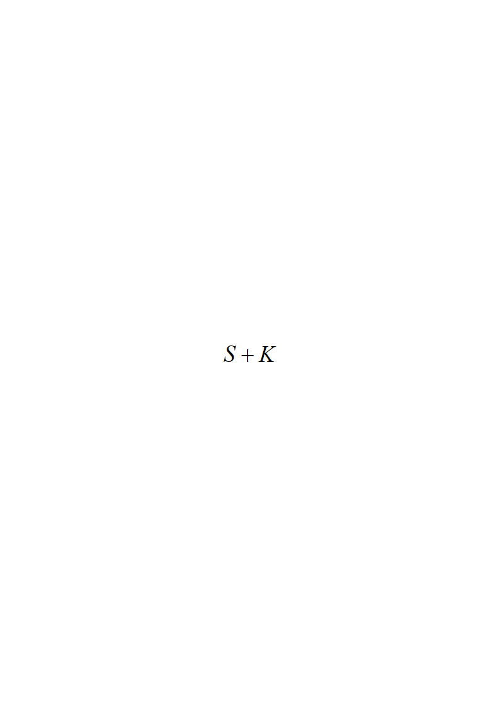 можно назвать мгновенной совокупной номинальной платёжеспособностью общества. Любая денежная величина (цена, зарплата, сумма на счету и т.п.)  может быть отнесена к этой величине: 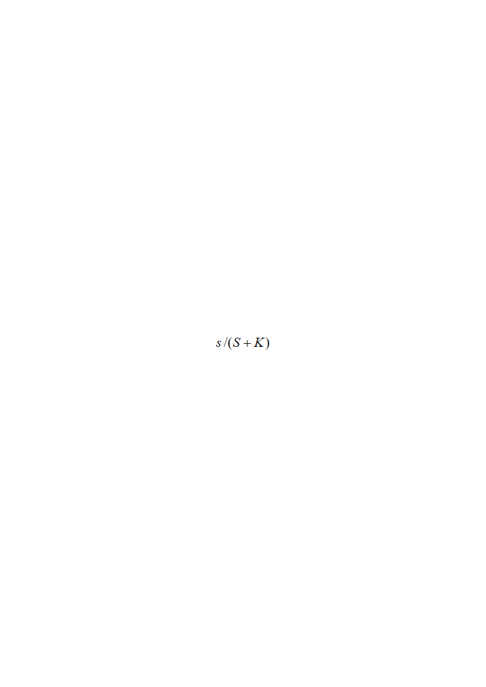. В результате такого пересчёта всех денежных величин мы уходим из номинальной кредитно-финансовой системы в обезразмеренную по  кредитно-финансовую систему, в которой все денежные величины лишены каких-либо номиналов-размерностей (рублей, долларов и т.п.). При этом совокупная платёжеспособность общества в обезразмеренной по  кредитно-финансовой системе (КФС) тождественно равна 1, а все обладатели денежных сумм обладают только долями этой единицы.

В обезразмеренной таким образом КФС многие процессы предстают в непривычном для нас виде и обретают иное значение.

Одна из неприятностей, которую обнажает такой подход, связана с бухгалтерским учётом. Если величина  под воздействием эмиссии или изменения параметров кредитной политики изменяется в течение определённого периода, то вся бухгалтерская отчётность этого периода утрачивает достоверность тем в большей мере, чем больше изменения величины . Дело в том, что в номинальной КФС в бухгалтерском учёте фигурируют номинальные величины 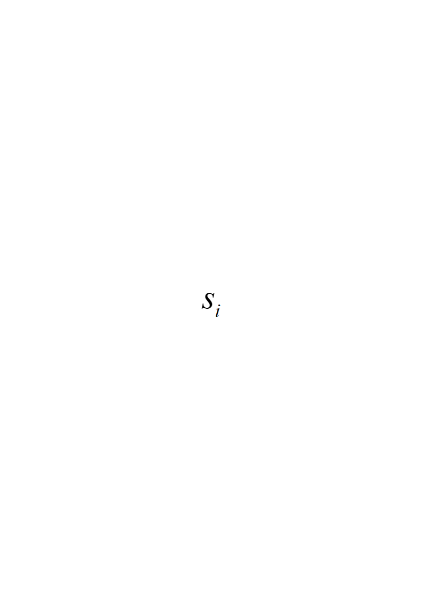, а в обезразмеренной КФС им соответствуют величины относительные: . И вследствие этого в обезразмеренной КФС все бухгалтерские проводки предстают как сложение и вычитание простых дробей, в ходе которого правила арифметики обязывают нас приводить дроби к общему знаменателю. Соответственно бухгалтерский учёт, осуществляемый в номинальной КФС в условиях значительного изменения величины , эквивалентен тому, что некий «двоечник» решил при сложении и вычитании дробей игнорировать знаменатели и оперировать только с числителями. Бухгалтерский учёт, осуществляемый в номинальной КФС, сохраняет состоятельность только при незначительных изменениях значения , когда общий сомножитель  можно считать приближённо неизменным на протяжении всего периода, к которому относится отчётность. В этом случае при выполнении операций сложения и вычитания он может быть вынесен за скобки и результаты учёта в номинальной КФС и в обезразмеренной КФС будут отличаться друг от друга только масштабным множителем. При значительных же изменениях значения  обогащению, показываемому учётом в номинальной КФС, может соответствовать разорение в обезразмеренной КФС.

Для подавляющего большинства собственников и топ-менеджеров предприятий микроуровня этот факт интереса не представляет, а те, кто его осознаёт, не обладают полномочиями для того, чтобы защитить свой бизнес от финансовой политики некомпетентного государства и заправил банковской системы — компетентных, но действующий далеко не во всех случаях в интересах *общества страны пребывания банка*. Но игнорировать факт различия результатов бухгалтерского учёта на микроуровне экономики в номинальной и в обезразмеренной КФС — в решении макроэкономических задач управленчески неправомочно и потенциально опасно для общества и государства, для его политики.

Этот подход обнажает многое и в воздействии института кредита со ссудным процентом на производство и потребление продукции в обществе, а также — и на экономический суверенитет государства.

Если в сферу производства выдана кредитная ссуда , то она через зарплату наёмного персонала и личные доходы предпринимателей начинает перетекать в сферу потребления. Скорость такого перетекания ссуды в платёжеспособность характеризуется функцией . Но если ссуда выдана под процент, то директораты производств заявляют стоимость произведенного объёма продукции, исходя из необходимости предстоящего возврата ими кредитору суммы долга с процентами 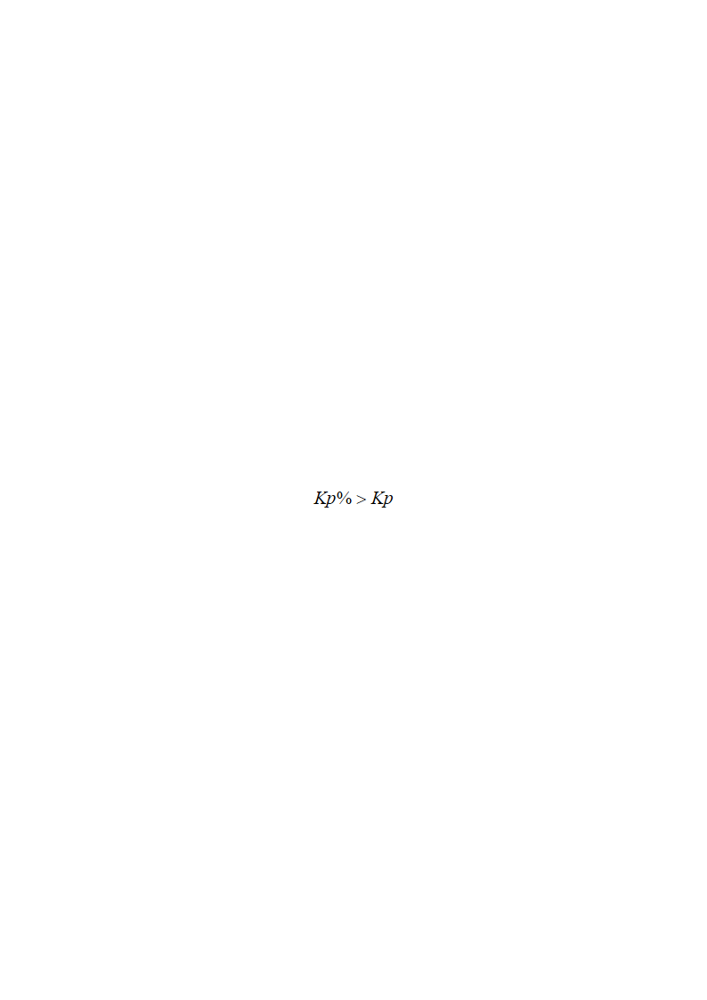. Скорость роста заявленной стоимости производимого характеризуется функцией *.* Функции 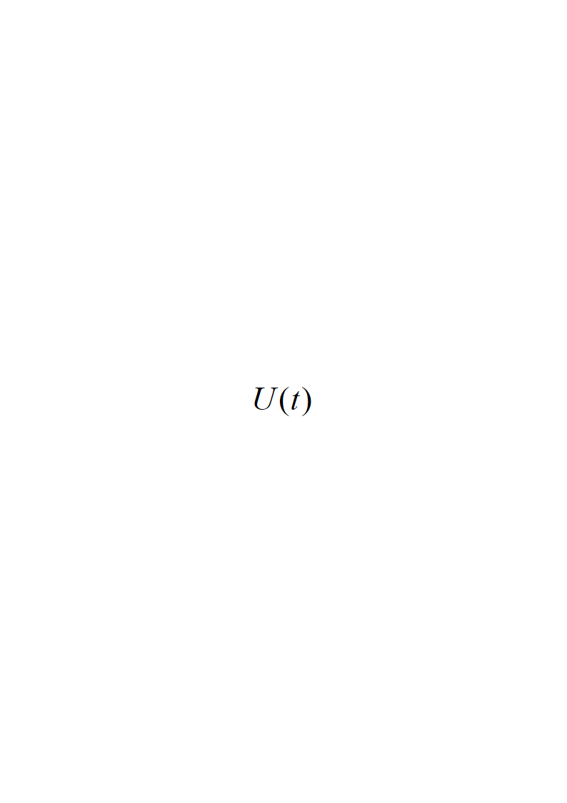, 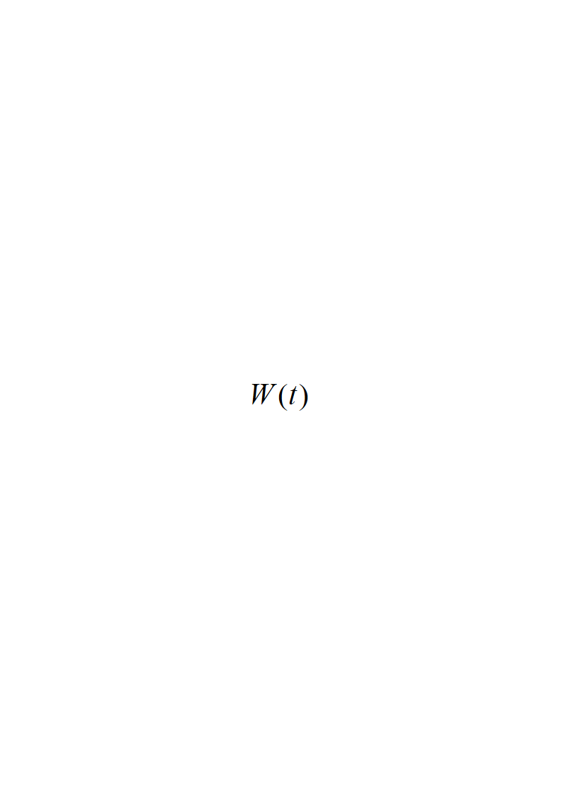, объём кредита  и объём возврата кредита с процентами  связаны друг с другом соотношением во времени 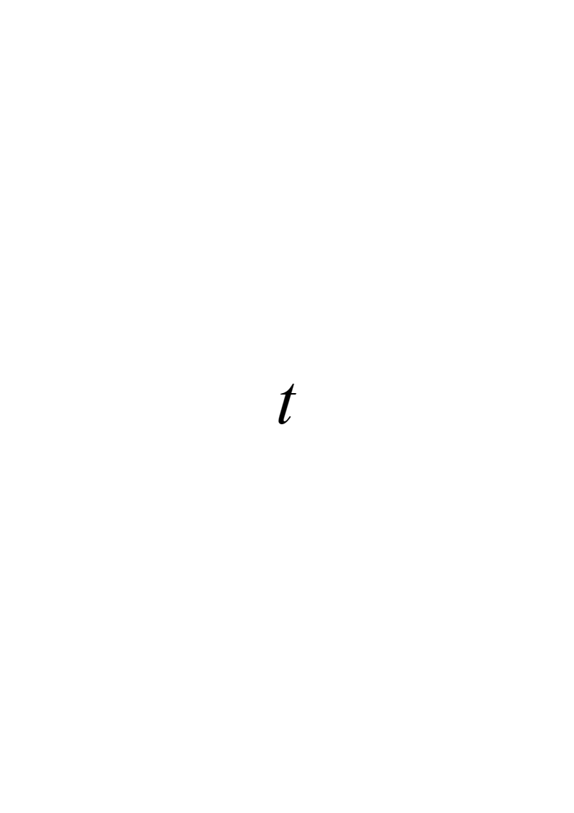, которое справедливо и в номинальной КФС при нулевой эмиссии, и в обезразмеренной по :

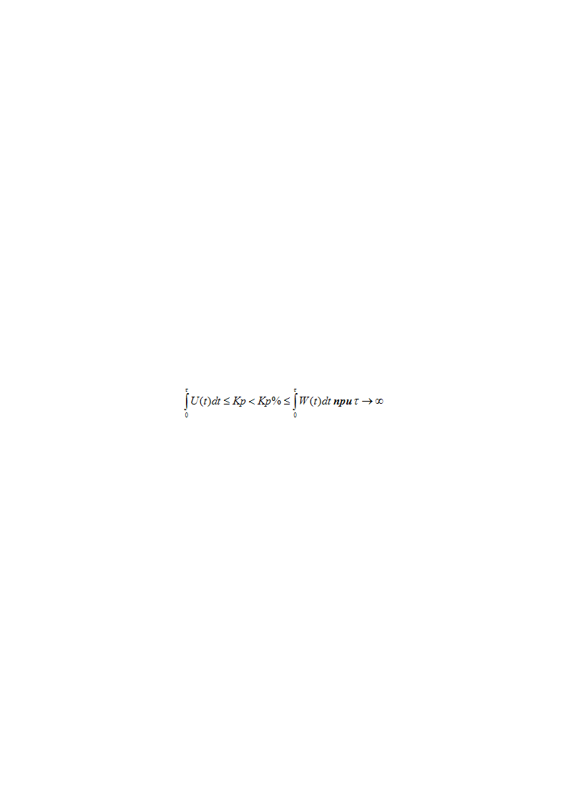

Это соотношение означает, что в номинальной (а также и в обезразмеренной) КФС ссудный процент пожирает платёжеспособный спрос и потребительскую активность населения и реального сектора экономики, что делает невозможным сбыт какой-то части уже произведенной и планируемой к производству продукции просто потому, что те, кто хотел бы её купить, не имеют для этого необходимой покупательной способности.

При рассмотрении финансового обращения в обезразмеренной КФС очевидно и неоспоримо, что ссудный процент по кредиту однонаправлено перекачивает платёжеспособность (и покупательную способность) из собственности общества в собственность глобальной корпорации ростовщиков-кредиторов: см. таблицу П-1.

**Таблица П-1. Утрата платёжеспособности и свободы обществом\

под воздействием ссудного процента**

| **Время:** | Ранее выдачи ссуды  при изначально нулевом объёме кредитования | После выдачи ссуды  | После возврата ссуды  и погашения задолженности по процентам 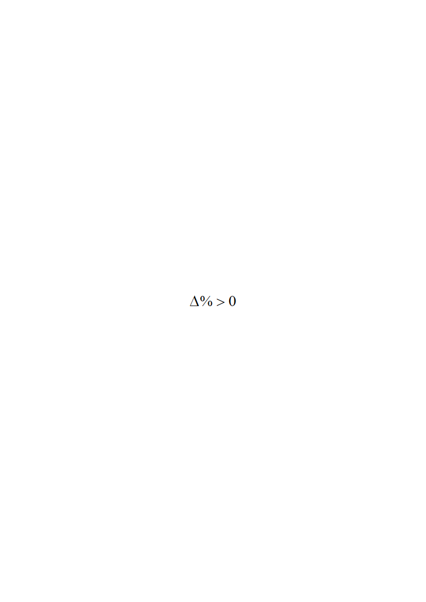 |

|:--:|:--:|:--:|:--:|

| **Платёжеспособность в собственности общества:** |  |  |  |

В результате корпорация ростовщиков-кредиторов обретает платёжеспособность в объёме , и когда она начинает её реализовывать, то под её воздействием и под воздействием утраты платёжеспособности обществом в том же объёме 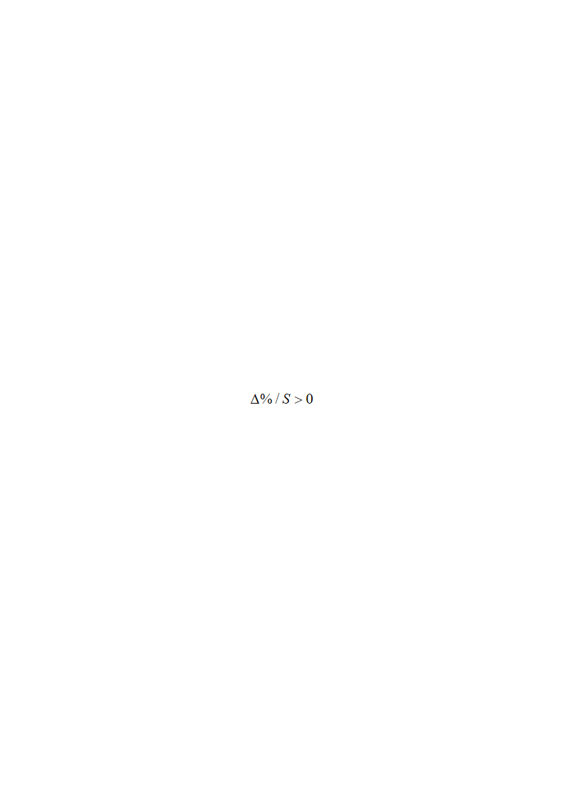 деформируется спектр платёжеспособного спроса, а под него подстраивается и спектр производства и предложения продукции. Поскольку это происходит на фоне роста цен (как номинальных, так и обезрамеренных), то обретение корпорацией кредиторов платёжеспособности в объёме 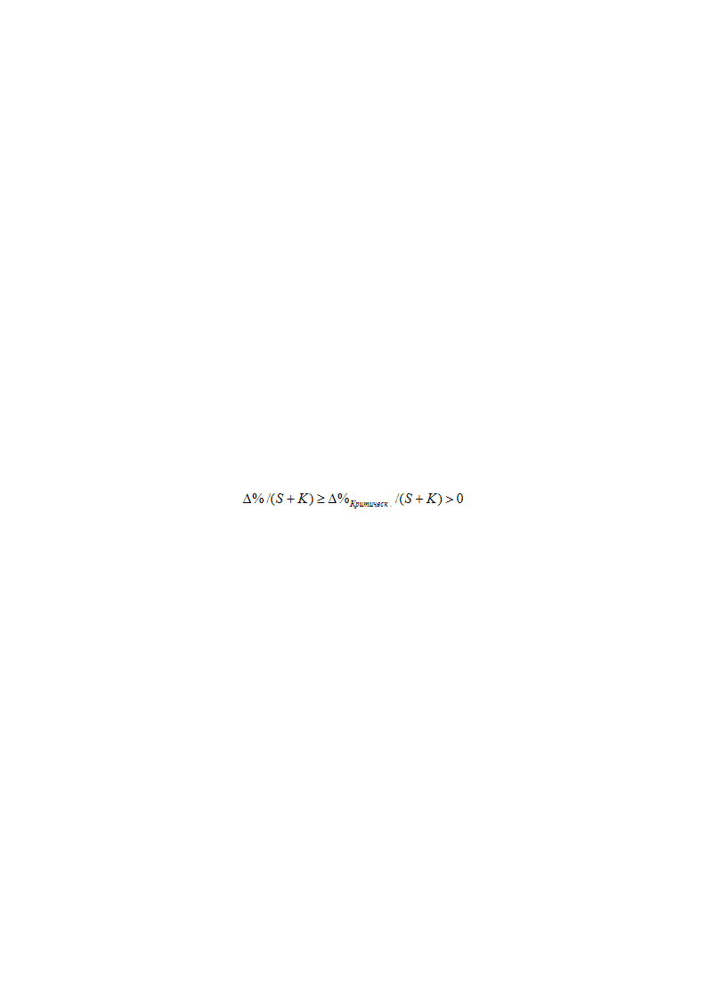 ведёт к утрате государством экономического суверенитета и, как следствие, — к финансовому порабощению всего общества. Соответственно, участие в сделке кредитования под процент как в качестве кредитора, так и в качестве заёмщика объективно представляет собой предательство Родины.

Эти обстоятельства ставят экономически суверенное государство перед вопросом о необходимости организации *динамического распределения* всегда единичной совокупной обезразмеренной платёжеспособности между участниками рынка в соответствии с целями политики государства. Понимание этого должно обязывать государство, прежде всего, к юридическому запрету кредитования под процент в целях защиты его собственного экономического суверенитета, тем более, если государство претендует стать демократическим по сути, а не формально-процедурно.

Поэтому финансово-экономический анализ, тем более макроуровня, с целью выявления разного рода финансово-экономических системных угроз следует вести в обезразмеренной по  КФС, на основе соотнесения её параметров с энергетическим стандартом обеспеченности платёжной единицы[^86], поскольку все параметры КФС и денежного обращения в обезразмеренной КФС однозначно определённым образом сопоставимы в разные моменты времени. Это касается как сопоставления параметров КФС и экономики одного государства в разные моменты времени, так и взаимного сопоставления параметров КФС и экономик разных государств.

Кроме того в обезразмереннной по  КФС все задачи макроэкономического управления посредством КФС неизменны и сводятся к построению политически целесообразной структуры каналов обращения средств платежа и динамическому распределению совокупной ВСЕГДА ЕДИНИЧНОЙ платёжеспособности общества среди участников рынка в соответствии с целями политики государства средствами налогово-дотационного механизма и государственного задания цен на товары, относимые к базе прейскуранта[^87]. При определённости отраслевой структуры экономики и каналов денежного обращения при моделировании на этой основе процессов финансового обращения в обезразмеренной КФС следует руководствоваться правилами Г.Р. Кирхгофа для процессов переноса в сетях. Этот подход выражает принцип: Собственником кредитно-финансовой системы является государство, а не транснациональная глобальная ростовщическая корпорация.

Приведённым выше математическим выкладкам и выводам, из них проистекающим, невозможно противопоставить, ничего кроме демагогии в стиле «это не так, это совсем не так, вы не понимаете определённых таинств финансовой деятельности…». **Для интеллектуально нормального и честного человека их справедливость и правомочность сделанных на их основе выводов — неоспорима.**

В связи с изложенным возникает множество вопросов юридического характера к секции экономики отделения общественных наук РАН, к экспертному совету ВАК, к Минобразования и науки: как минимум, «предоставление услуг ненадлежащего качества» обществу, а как максимум, предательство — «измена Родине» в пользу глобального ростовщического сообщества и его хозяев.

[^1]: См. работу ВП СССР «Основы социологии» (Часть 1). Названная и все прочие упоминаемые далее в тексте работы ВП СССР, представляющие Концепцию общественной безопасности (КОБ), опубликованы в интернете на сайтах: [www.dotu.ru](http://www.dotu.ru), <http://m3ra.ru>, [www.vodaspb.ru](http://www.vodaspb.ru), <http://subscribe.ru/catalog/state.politics.bkz>, на ряде других сайтов, а также распространяются на компакт-дисках в составе Информационной базы ВП СССР и издаются типографским способом.

[^2]: «Идеальной легитимности (уровень 100 % поддержки населением) не бывает».

[^3]: В материалах Концепции общественной безопасности об этом см. работу ВП СССР «Мёртвая вода».

[^4]: Вообще отметим, что для большинства «вершина вертикали власти» — глава государства, поскольку всё, что выше него в полной функции управления, скрыто от них их собственным невежеством в области истории, теории и практики управления.

[^5]: «Мэйн стрим» — от английского «main stream» — основной поток, главное течение.

[^6]: В нашем понимании минимум психологических знаний, необходимых для этого, представлен в работе ВП СССР «Основы социологии» (Часть 1).

[^7]: Амосов Н.М. Алгоритмы разума. — Киев: Наукова думка. 1979. — С. 14.

[^8]: **«Вы спросите, какие у меня моральные обязанности перед человечеством? — Никаких, только обязанности перед самой собой». «Единственная моральная цель человека — его собственное счастье».** Эти слова принадлежат Айн Рэнд — писательнице с претензиями на философствование, которая стала кумиром американского политического истеблишмента конца ХХ — начала XXI века (см. её роман «Атлант расправил плечи»). В частности, о ней в таком качестве вспоминают Алан Гринспен (возглавлял Федеральную резервную систему США с 1987 по 2006 г.) и Хилари Клинтон (супруга бывшего президента США Билла Клинтона, а ныне — госсекретарь США).

[^9]: См., например, Директиву СНБ США 20/1 от 18.08.1948 «Наши цели в отношении России» (полный текст на английском и русском языках: <http://www.rusbeseda.ru/index.php?PHPSESSID=37b038d7a9704212d111ad341307010b&topic=11996.0>).

[^10]: Леонтьев В.В. Экономическое эссе. — М.: Политиздат. 1990. — С. 265, 266. — Лауреат Нобелевской премии по экономике 1973 г., один из разработчиков балансового метода «затраты — выпуск».

[^11]: В частности, крах Российской империи в 1917 г. во многом был обусловлен пресловутым указом «о кухаркиных детях» (1887 г.), закрывшим доступ к среднему и высшему образованию выходцам из «простонародья» и тем самым лишившим страну дееспособного управленческого корпуса.

    Реформы П.А. Столыпина заблокировали возможности развития по тому варианту, который был реализован в Японии после «реставрации Мэйдзи» (1866 г.) по настоящее время: в основе успеха Японии лежит сохранение общинной (по сути общенародной) этики, согласно нормам которой обязанность всякого человека (от простого крестьянина до императора) — заботиться об общем благе вплоть до самопожертвования без какого-либо своекорыстия. Япония пропагандирует эту нравственно-этическую норму и на будущее в своём обществе, ориентируясь, прежде всего, на молодёжь: см. фильм «Yamato» (Сценарий — Джан Хенми, Дзюнья Сато; режиссёр — Дзюнья Сато; Япония, 2005 г.): <http://kinofilms.tv/film/yamato/28991/>.

    Тем, кто с этой характеристикой общинной этики и проистекающей из неё негативной оценкой реформ П.А. Столыпина не согласен, — следует подумать о том, что не надо отождествлять общинность (в которой есть место личностному творческому началу и инициативе) со стадностью (для которой личностное своеобразие — нечто неуместное), и соответственно — не надо культивировать антиобщественный индивидуализм и стадность.

[^12]: Достаточно общая теория управления. Постановочные материалы учебного курса факультета прикладной математики — процессов управления Санкт-Петербургского государственного университета (1997-2003). — Новосибирск, 2007. — 408 с.; а также интернет-ресурс: <http://dotu.ru/2004/06/23/20040623-dotu_red-2004/>.

[^13]: Аральского моря ныне нет: есть солончаково-гербицидная пустыня вокруг «лужи», площадь которой составляет порядка 20 % от площади зеркала моря в начале 1960‑х гг. См.:

    «Аральское море»: <http://enrin.grida.no/htmls/aralsoe/aralsea/russian/arsea/arsea.htm>;

    «Аральское море и причины его гибели»: <http://lifeglobe.net/blogs/details?id=484>.

[^14]: Рузвельт Ф.Д. Беседы у камина. — М.: ИТРК. 2003. 408 с. — С. 83. (см., например: <http://lib.rus.ec/b/104207>; <http://www.modernlib.ru/books/gelbreyt_dzhon/ekonomicheskie_teorii_i_celi_obschestva/>).

[^15]: Гэлбрейт Дж. К. Экономические теории и цели общества. — М.: Прогресс. 1976. (J.K. Galbraith. Economics and the Public Purpose. 1973). — Гл. XXVII. 

[^16]: Гэлбрейт Дж. К. Экономические теории и цели общества. — М.: Прогресс. 1976. — Гл. V.

[^17]: Гэлбрейт Дж. К. Экономические теории и цели общества. — М.: Прогресс. 1976. — Гл. XXI.

[^18]: Более обстоятельно см.: Методы обоснования программ устойчивого развития сельских территорий: моногр. / Под ред. В.И. Фролова. СПб гос. архитект.-строит. ун-т.; — СПб. 2011. — 464 с. — С. 324-328. (<http://ruidea.org/index.php?option=com_docman&task=doc_details&gid=163&Itemid=218>).

[^19]: Ландшафтно-усадебная урбанизация — это одно-, двухэтажная Россия небольших поселений с усадебной застройкой, интегрированных в природную среду и утопающих в зелени садов. По этой теме в интернете есть множество публикаций: достаточно набрать в поисковике «ландшафтно-усадебная урбанизация».

[^20]: Величко М.В., Ефимов В.А. Управление социально-экономическими системами в условиях модернизации: <http://homeland.3dn.ru/load/koncepcija_obshhestvennoj_bezopasnosti/knigi_drugikh_avtorov/velichkl_v_m_efimov_v_a_puti_sovershenstvovanija_upravlenija_innovacionnym_razvitiem_i_modernizaciej_strany/33-1-0-122>.

[^21]: База прейскуранта — малочисленная группа товаров, значительный рост цен на которые влечёт за собой рост себестоимости производства (и соответственно — цен) всех остальных продуктов.

[^22]: Тем, кто возражает против сказанного и настаивает на том, что «плоская шкала» налогов — решает все задачи экономической политики, предлагаем заблокировать руль в своём автомобиле и попробовать доехать на нём куда-нибудь (только не надо выключать зажигание во время движения по дорогам, чтобы не нанести вреда окружающим).

[^23]: «Бесструктурное управление» — термин ДОТУ.

[^24]: В условиях экономики, допускающей рыночную саморегуляцию производства, распределения и потребления продукции, оно представляет собой управление характеристиками кредитно-финансовой системы, на которые возможно оказать непосредственное воздействие, которое окажет опосредованное воздействие на параметры рыночной саморегуляции производства, распределения продукции и её потребления.

[^25]: Что могут рассказать о межотраслевых и межрегиональных балансах продуктообмена и финансового обращения, а также и об управлении ими по *полной функции управления (термин ДОТУ):*

    депутаты — Кобзон, Журова, Кабаева, Жириновский, Зюганов, Нарышкин, руководители и члены *разрозненных* комитетов и комиссий по вопросам финансов, экономики социальных институтов и другие?

    министры — Набиуллина, Христенко, Скрынник, Голикова, Кудрин (экс-министр), Силуанов и другие госчиновники, работающие в финансово-экономическом блоке Правительства РФ, а также — и глава Центробанка РФ Игнатьев?

    — Судя по их деятельности и публичным выступлениям, — ничего (в противном случае, их деятельность — злоумышленное вредительство)… со всеми вытекающими из этого бедственными для страны последствиями.

[^26]: См. речь Ф. Кастро «История меня оправдает» на суде (1953 г.) по делу о штурме 26 июля 1953 г. его группой казарм Монкада в городе Сантьяго-де-Куба: <http://guevara2007.narod.ru/files/histori.doc>; <http://ru.wikisource.org/wiki/История_меня_оправдает_(Кастро)>.

[^27]: И даже имела место попытка узаконить этот принцип: в первоначальную редакцию «Закона о полиции», переименовавшего милицию в полицию, был включён принцип «презумпции законности действий полицейских»: предлагалось считать действия полицейского законными до тех пор, пока в судебном порядке не будет доказано обратное. — Вы пытались добиться признания незаконности действий должностных лиц государства в постсоветской России? — Если пробовали, то должны понимать, что отечественные законотворцы («народные избранники» — депутаты-наёмники) предприняли попытку узаконить принцип «я начальник — ты дурак» в иносказательной форме этой формулировки о «презумпции законности».

[^28]: См. Послание Президента РФ Б.Н. Ельцина Федеральному собранию от 30 марта 1999 г. «Россия на рубеже веков»: <http://www.intelros.org/lib/elzin/1999.htm>.

[^29]: «Мы должны исключить нарушение закона из числа привычек, которым следуют наши граждане в своей деятельности. Сделать так, чтобы оно не обогащало одних и не развращало других» — из выступления кандидата в президенты РФ Д.А. Медведева на Экономическом форуме в Красноярске 15 февраля 2008 г.: <http://www.newsru.com/russia/15feb2008/medved4i7z.html>.

[^30]: Если должностное лицо, под покровом государственной атрибутики, попирает права граждан, то это измена Родине.

[^31]: См., например, заурядный вузовский учебник: Трофимова Г.К. Краткий курс экономической теории. Учебное пособие. — М.: ФАИР-ПРЕСС. 2003. — 224 с. — С. 150, 151.

[^32]: См.: Аникин А.В. Золото. Международный экономический аспект. / Изд. 2, переработанное и дополненное. — М.: Международные отношения. 1988.

[^33]: «Энергетический стандарт обеспеченности платёжной единицы» = «объём производства электроэнергии» / «объём средств платежа, находящийся в обращении».

[^34]: «Предиктор-корректор» — схема управления, в которой управляющее воздействие вырабатывается не только на основе учёта текущих значений контрольных параметров, но и на основе **вырабатываемого в процессе управления** *прогноза их изменения под воздействием предыстории управления и ожидаемых в будущем воздействий внешней среды на объект управления (на управляемый процесс)*.

    Рис. 1 и 2 в разделе 2 иллюстрируют алгоритмику реализации схемы предиктор-корректор в задаче организации государственного макроэкономического управления в русле концепции устойчивого развития. Более обстоятельно тема освещена в ДОТУ.

[^35]: 14 апреля 1956 года вышло постановление ЦК КПСС и Совмина СССР «О реорганизации промысловой кооперации», в соответствии с которым к середине 1960 года промысловую кооперацию полностью ликвидировали, а её предприятия передали в ведение государственных органов. При этом, паевые взносы подлежали возврату в 1956 г. согласно уставам артелей. Вместо выборного управляющего, управлять предприятиями стали назначенные директора — представители «номенклатуры». См. также Приложение 3.

[^36]: Где результаты, обещанные «Планом Путина», с которым «Единая Россия» шла на выборы в 2007 г.? — Рыночный механизм в условиях отсутствия адекватной «Плану Путина» эмиссионной политики и государственной регуляции рынка сорвал его выполнение.

[^37]: Ссылки на то, что это якобы «неизбежная плата» за «неоспоримый прогресс» в виде «возврата на общецивилизационный путь развития» и «переход к рыночной экономике» — убедительны только для невежд и идиотов: во-первых, опора на либерально-рыночную модель — путь к социальной катастрофе, во-вторых, совершенство экономики характеризуется не эпитетами («плановая», «рыночная» и т.п.), а статистическими показателями потребления продукции, свободным временем людей, загрузкой этого свободного времени деятельностью, не связанной с так или иначе обязательным трудом.

    По всем этим показателям постсоветская Россия уступает показателям, достигнутым СССР к началу перестройки, не говоря уж о потере позиций в мировом рейтинге научно-технического прогресса вследствие деградации унаследованных от СССР научных и проектно-конструкторских школ и невозможности создания новых в условиях либерально-рыночной экономической модели.

    В связи с этим сопоставим:

    После завершения Великой Отечественной войны, стране под руководством И.В. Сталина потребовалась одна пятилетка для того, чтобы восстановить всё, что было разрушено в ходе войны, и чтобы выйти на довоенные показатели; а карточная система была отменена в СССР раньше, чем в Великобритании, на территорию которой не ступала нога оккупантов; после чего экономика СССР была введена в режим роста при планомерном снижении номинальных цен.

    С 1985 г. мы живём уже 27 лет, на протяжении которых есть только нескончаемая демагогия политиков и шарлатанов от экономической «науки» на темы безальтернативности либерально-рыночной модели и её неоспоримых преимуществах перед плановой экономикой; нормой стал рост номинальных цен, лишающий большинство населения возможности делать накопления и уничтожающий мотивацию к труду в этой системе.

[^38]: 24 июня 1938 г. в период вывода страны из «великой депрессии» президент США Ф.Д. Рузвельт в одной из радиопрограмм цикла «Беседы у камина» заявил: *«*Конгресс образовал комиссию, которая будет заниматься накоплением фактологических данных, чтобы **разобраться в путанице противоречивых учений об оптимальном регулировании бизнеса** (выделено жирным нами при цитировании: это — упрёк в несостоятельности экономической науки, приверженной либерально-рыночной экономической модели), а потом выработать более осмысленное законодательство о монополиях, фиксированных ценах и отношениях между крупным, средним и малым бизнесом» (Рузвельт Ф.Д. Беседы у камина. — М.: ИТРК. 2003. 408 с. — С. 158).

[^39]: Банковское дело включает в себя:

    счетоводство макроуровня;

    кредитование, которое вовсе не обязательно должно быть ростовщическим: самоокупаемость банковской системы может быть основана на соучастии банков в прибылях проектов, успешно осуществлённых благодаря их кредитам; в основе минимального уровня самоокупаемости, обеспечивающего функционирование банка, могут лежать фиксированные тарифы на банковские услуги.

    Такой подход приведёт к развитию в банковском секторе прогнозно-аналитических служб, вследствие чего банки будут способны оказывать координационно-управленческие услуги макроуровня предприятиям микроуровня, изживут паразитическую составляющую в своей деятельности и станут созидательной общественной силой.

[^40]: См. Сталин И.В. Экономические проблемы социализма в СССР. — М.: Госполитиздат. 1952; газета «Правда», 3, 4 октября 1952 г. (<http://www.razumei.ru/files/others/pdf/Stalin_problems_of_economy.pdf>).

    Эту работу следует признать сталинским изложением проекта конвергенции двух систем, поскольку он в ней, отвергая возврат к буржуазному либерализму, вынес смертный приговор марксизму, прямо указав на метрологическую несостоятельность его политэкономии. В названой работе И.В. Сталин пишет:

    «… я думаю, что необходимо откинуть и некоторые другие понятия, взятые из “Капитала” Маркса, ... искусственно приклеиваемые к нашим социалистическим отношениям. Я имею в виду, между прочим, такие понятия, как “необходимый” и “прибавочный” труд, “необходимый” и “прибавочный” продукт, “необходимое” и “прибавочное” время. (…)

    Я думаю, что наши экономисты должны покончить с этим несоответствием между старыми понятиями и новым положением вещей в нашей социалистической стране, заменив старые понятия новыми, соответствующими новому положению».

    Но если из марксистской политэкономии изъять названные И.В. Сталиным метрологически несостоятельные понятия, то она рухнет. Однако, поскольку она — следствие философии диалектического материализма, то на следующем этапе в процессе поиска ответа на вопрос «как методология познания диалектического материализма породила дефективную политэкономию?» — рухнет и весь марксизм. Как следствие псевдосоциализм на его основе становится невозможным.

    Но И.В. Сталина не пожелали своевременно понять, вследствие чего возможности развития не были реализованы, что и привело псевдосоциалистический СССР к краху.

    Это сказано не для того, чтобы возродить культ личности И.В. Сталина, а для того, чтобы показать: официальная версия истории, проистекающая из либеральных воззрений, лжива. А лживость исторической «науки» — это угроза для общества, поскольку лживая наука создаёт неадекватные представления о причинно-следственных связях в общественном развитии и о проблемах, унаследованных от прошлого.

[^41]: Если КФС — не собственность государства, а собственность глобальной ростовщической корпорации, то вся собственность в этом государстве реально — опосредованно, через деньги — находится в собственности этой корпорации, в чём все могут убедиться в каждый «финансово-экономический кризис», посредством которых эта корпорация перераспределят права собственности в региональных и в глобальных масштабах (см. Приложение 4).

[^42]: В современности — это аналог принципов разграничения общин в древности, которое привело к возникновению межобщинной торговли.

[^43]: Например, для концерна нормально вести НИОКР, и это должно быть отражено в плане счетов бухгалтерского учёта и составляющей законодательства о хозяйственной и финансовой деятельности для концернов и «отраслевых гигантов», а шиномонтажня на большой дороге вряд ли вообще нуждается в штатном бухгалтере и у неё нет потребности в каких-либо НИОКР для развития своей деятельности.

[^44]: Куда исчезли отечественные сорта яблок (анисовка, коричные, грушовка и т.п.)? почему мякоть клубники по твёрдости на уровне яблок? — Для торговых сетей и гипермаркетов сбор и поставка продукции, производимой на месте и не подлежащей длительному хранению, — коммерческого интереса не представляет. Поэтому нате жрите повсеместно два залитых воском сорта яблок (гольден и семеренко) и фальсификаты продуктов, обладающие длительными сроками хранения вследствие применения искусственных красителей, заменителей натуральных ингредиентов, консервантов и т.п.

[^45]: Импорт овощей и фруктов из-за рубежа допустим в те сезоны, когда невозможно потребление своих более вкусных (вследствие сортового превосходства) и более свежих.

[^46]: Предприятия-гиганты способны завалить унифицированным ширпотребом всю страну, но покупателю на свой вкус выбрать нечего. Кроме того положение усугубляется тем, что нормы эргономики для производителей автомобилей, бытовой техники, одежды — неведомы, а личные предпочтения потенциальных потребителей — дело десятое: пусть пользуются тем, что навязывает *шизофреническая* индустрия моды.

[^47]: Такую характеристику он получил за то, что в одном из своих выступлений публично обвинил еврейские биржевые и банковские круги в организации глобального финансово-экономического кризиса 1998 г., который нанёс существенный ущерб кредитно-финансовой системе и экономике Малайзии.

[^48]: См. также аналитическую записку ВП СССР «Чили: репетиция захвата России» из серии «О текущем моменте» № 12 (60), 2006 г., в которой приводится с некоторым сокращениями доклад «Опыт динамичного развития» Махатхира Мохамада на VI Конференции ADVISTA ARABIA (Джидда, Саудовская Аравия), с которым он выступил 14 марта 2004 г., во многом актуальный и для постсоветской Россионии. Как можно понять из сказанного в нём, Малайзия явила пример успешной модернизации «по наитию» без каких-либо теоретических обоснований.

    В аналитической записке «Два послания» из серии «О текущем моменте» № 5 (29) 2004 г. этот доклад М.Мохамада сопоставлен с Посланием тогдашнего президента РФ В.В.Путина (избранного на второй строк в тот же день 14 марта, когда М.Мохамад выступил со своим докладом) Федеральному собранию РФ на основе соотнесения с полным набором обобщённых средств управления / оружия: сопоставление не в пользу государственности РФ на протяжении всего времени с 1991 по 2012 год…

[^49]: Стенограмма опубликована в интернете. Одна из ссылок: <http://www.rg.ru/2012/05/07/stenogramma.html>.

[^50]: Рузвельт Ф.Д. «Беседы у камина». М.: ИТРК. 2003. Тир. 10 000. — С. 52.

[^51]: Рузвельт Ф.Д. «Беседы у камина». М.: ИТРК. 2003. Тир. 10 000. — С. 158.

[^52]: <http://www.wtr.ru/aphorism/new56.htm>

[^53]: Сталин И.В. Экономические проблемы социализма в СССР. — М.: Госполитиздат. 1952. С. 18, 19.

[^54]: «Экономическая теория и практика перестройки». — «Коммунист», теоретический и политический журнал ЦК КПСС, № 5 (1303), март 1987 г. С. 35, 36. Все выделения в тексте — А.И. Анчишкина.

[^55]: Гавриил Харитонович Попов — в годы перестройки один из лидеров межрегиональной депутатской группы в Верховном Совете СССР, потом в эпоху агрессивной “демократизации” мэр Москвы.

[^56]: А.Лившиц: Экономика похожа на женщину. Разве её поймёшь? — Финансовые известия, 05.10.2005. Приводится по публикации в интернете: <http://www.finiz.ru/cfin/tmpl-art/id_art-952979>

[^57]: Приводится по публикации Александра Зюзяева в газете «Комсомольская правда» от 11.06.2009 г.: <http://spb.kp.ru/daily/24309.4/502853/>

[^58]: Кроме того она — заместитель управляющего от РФ в Международном банке реконструкции и развития (МБРР) и Многостороннем агентстве по гарантиям инвестиций. См.: <http://www.rbc.ru/persons/nabiullina.shtml>

[^59]: И за это придётся заплатить куда больше, нежели 2 — 3 % экономического роста, которые якобы съедает по оценкам «экспертов», которым доверяет Набиуллина, поддержка малых городов.

[^60]: «Это было её выступление по внешней политике. Я слышал его в звукозаписи. Там прямо не говорилось, что в СССР надо оставить 15 миллионов человек, а говорилось более хитро: дескать, советская экономика совершенно неэффективна, есть лишь небольшая эффективная часть, которая, собственно, и имеет право на существование. И в этой-то эффективной части занято всего 15 миллионов человек нашего населения. Таков смысл высказывания Тэтчер, которое потом интерпретировали по-разному. Но суть в том, что с точки зрения современных политиков, которые не всегда высказываются столь откровенно, как “железная леди”, оправдано существование только тех людей, которые заняты в эффективной экономике. И для нас это очень нехороший звоночек, потому что по западным критериям наша экономика неэффективна» (Сколько в России лишних людей. — Интервью с Андреем Паршевым. — Интернет-ресурс: <http://www.pravoslavie.ru/guest/parshev.htm>).

    Тем, кто убеждён в том, что А.Паршев положил начало кампании клеветы в отношении Великобритании и её политиков, приведём высказывание другого премьера (в 1990 — 1997 гг.) правительства «её величества» Джона Мейджера: «...задача России после проигрыша холодной войны — обеспечивать ресурсами благополучные страны. Но для этого им нужно всего 50 — 60 миллионов человек». — Интернет-ресурс: <http://www.alfar.ru/smart/4/1078/>. Соответственно между гитлеровским режимом и его планом «Ост» уничтожения порядка 110 миллионов граждан СССР и режимом современной «Великобратании» нет принципиальной разницы, и соответственно этому необходимо строить политику в отношении «соединённого королевства».

[^61]: Научного общества, членами которого являются учёные-экономисты. Экономическое общество — своего рода «клуб по интересам».

[^62]: Леонтьев В.В. Экономическое эссе. — М.: Политиздат. 1990. С. 268.

[^63]: Леонтьев В.В. Экономическое эссе. — М.: Политиздат. 1990. — С. 265, 266.

[^64]: Леонтьев В.В. Экономическое эссе. — С. 229.

[^65]: Леонтьев В.В. Документы. Воспоминания. Статьи. — СПб.: Гуманистика. 2006. — С. 16.

[^66]: Martin Wolf, Financial Globalisation, Growth and Asset Prices, доклад, подготовленный для Colloque International de la Banque de France on Globalisation, Inflation and Monetary Policy, Paris, March 7, 2008: <http://worldcrisis.ru/crisis/417702/full_replic_t?PRINT_VIEW=1>.

[^67]: Гэлбрейт Дж. К. Экономика невинного обмана: правда нашего времени. — М.: Европа. 2009. — 88 с. (J.K. Galbraith. «The Economics of Innocent Fraud: Truth for Our Time». 2004). В переводе названия русского издания — «Экономика невинного обмана: правда нашего времени», хотя содержанию книги более отвечал бы перевод названия «Экономические теории непредумышленного мошенничества».

[^68]: Гэлбрейт Дж. К. Экономические теории и цели общества. — М.: Прогресс. 1976. (J.K. Galbraith. «Economics and the Public Purpose». 1973).

[^69]: Хазин М.Л. Современная монетаристская школа является тоталитарной сектой. 12.05.2011 г. — Интернет-ресурс: <http://fintimes.km.ru/valyutnyi-rynok/monetarnaya-politika/15945>.

[^70]: Ананьин О., Хаиткулов Р., Шестаков Д. Вашингтонский консенсус: пейзаж после битв. — Мировая экономика и международные отношения (МЭМО). 2010, № 12. — С. 15-27. — С. 23.

[^71]: Евангелие от Матфея, гл. 6, ст. 24.

[^72]: Евангелие от Луки, гл. 11, ст. 29, 30.

[^73]: Сура (глава) 10, аят (стих) 37.

[^74]: <http://mospat.ru/ru/2009/05/22/news2603>.

[^75]: <http://www.lenta.ru/news/2008/10/06/pope/>.

[^76]: <http://www.novayagazeta.ru/news/48654.html>.

[^77]: <http://lenta.ru/news/2011/10/24/paparimsky/>.

[^78]: <http://mospat.ru/ru/2009/07/27/news3800>.

[^79]: <http://www.interfax-religion.ru/?act=news&div=29463>.

[^80]: СМИ о выступлении Н.Саркози на Генеральной ассамблее ООН в сентябре 2008 г.: <http://www.euroline.by/france/30-sarkozi-prizval-vosstanovit-reguliruemyjj.html>.

[^81]: <http://ip.kommynist.ru/index.php?topic=1337.0>.

[^82]: Обама Б.Х. Дерзость надежды. Мысли о возрождении американской мечты. — СПб: Азбука-классика. 2008. — С. 203.

[^83]: Википедия: <http://ru.wikipedia.org/wiki/%CA%EE%EE%EF%E5%F0%E0%F6%E8%FF>.

[^84]: А.К. Трубицын. О Сталине и предпринимателях. (<http://anticomprador.ru/publ/a_k_trubicyn_o_staline_i_predprinimateljakh/29-1-0-1065>).

[^85]: Курсовая работа «Кооперативное движение в СССР в период административно-командной системы управления» (<http://www.bestreferat.ru/referat-211040.html>).

[^86]: «Энергетический стандарт обеспеченности платёжной единицы» = «объём производства электроэнергии» / «объём средств платежа, находящийся в обращении».

[^87]: База прейскуранта — малочисленная группа товаров, значительный рост цен на которые влечёт за собой рост себестоимости производства (и соответственно — цен) всех остальных продуктов.
---

[К произведению](README.md) · [Каталог](../../CATALOG.md)
