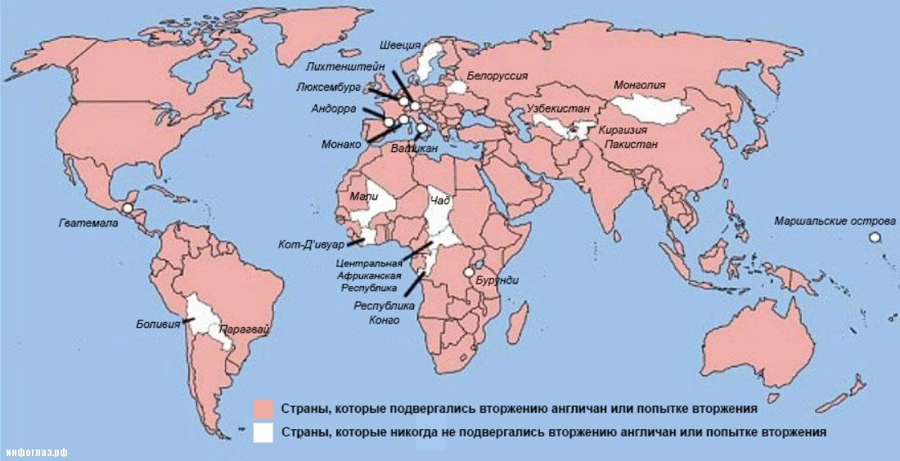

> **Первичный текст.** О ТМ №2(134) Глобализация как «гибридная война» и миссия в ней России, 2018-04-07.
> Источник: `20180407 О ТМ №2(134) Глобализация как «гибридная война» и миссия в ней России.doc` sha256 `44f4731ad54f1446…`; [страница на dotu.ru](https://dotu.ru/2018/04/07/20180407_tek_moment02134/).
> Автоматическая транскрипция DOC→Markdown; смысл и формулировки не правились.
> Контрольные суммы и статус проверки — в [NOTICE.md](../../NOTICE.md).
> Содержание передаёт позицию авторов; утверждения не верифицированы библиотекой.

---

«О текущем моменте» № 2 (134), апрель 2018 года

Глобализация как «гибридная война»\

и миссия в ней России

> Глаз «непрофессионального политика» видит\

> в каждом ходе шахматной игры — конец партии\

> (Отто фон Бисмарк)

# Вспомним лорда Палмерстона[^1]

«… я утверждаю, что недальновидно считать ту или иную страну неизменным союзником или вечным врагом Англии. У нас нет неизменных союзников, у нас нет вечных врагов. Лишь наши интересы неизменны и вечны, и наш долг — следовать им» (*Речь Палмерстона в Палате общин 1 марта 1848 г.)*

Но по существу Палмерстон был не прав: *просто на Англию заправилами библейского проекта глобализации была возложена определённая миссия по осуществлению этого проекта, которую её правящая «элита» стала считать своею «национальной идеей»*[^2]*, в результате чего возникла Британская империя, трансформировавшаяся к настоящему времени в «Британское содружество наций»*, многие из которых сложились и существуют на костях истреблённых британцами народов.

Палмерстону принадлежит ещё одно высказывание: *«Как тяжело жить, когда с Россией никто не воюет»*.

В общем, это необходимый и *вполне достаточный минимум сведений*, которые следует знать о Британии и её политике в прошлом, настоящем и *будущем (при условии сохранения в ней тирании масонской глобально-политической мафии и режима фальшь-демократии)*.

Шекспир, Голсуорси, Джером, Британский музей[^3], галерея Тейт, «британские учёные» и т.п. — всего лишь мишура, препятствующая осознанию этой сути Великобритании.

# 2. Инцидент со Скрипалями и его значение

4 марта 2018 г. премьер-министр Британии Тереза Мэй официально обвинила Россию в покушении на убийство Сергея Скрипаля[^4] и его дочери Юлии в Солсбери. В ходе этого инцидента также пострадал британский полицейский, оказавшийся на месте покушения и пытавшийся оказать Скрипалям помощь. Согласно британской версии для покушения было применено боевое отравляющее вещество нервно-паралитического действия, произведённое в России.

Британское обвинение бездоказательно[^5], но тамошние «ляди» и «жентельмены» требуют, чтобы им верили на слово, а встречное требование предъявить доказательства воспринимают как оскорбление. После этого Лондон объявил о высылке 23 российских дипломатов. 16 стран Евросоюза, а также США, Канада, Норвегия, Австралия, Молдавия, Албания, Македония и Украина, руководство которых искренне поверило британским «лядям» и «жентельменам», либо вынуждено делать вид, что им верит, также выслало некоторое количество российских дипломатов, а руководство НАТО сократило число сотрудников российского представительства при штаб-квартире. В результате инцидента со Скрипалями начался новый этап обострения взаимоотношений России и государств Запада.

Реакция Российского официоза в аспекте требования доказательств виновности России была бы полностью адекватной, если бы британская сторона действительно искренне заблуждалась, выдвигая обвинения против России, а не выдвигала бы умышленно заведомо бездоказательные обвинения, одновременно также умышленно игнорируя предусмотренные международным правом процедуры расследования инцидентов с применением химического оружия или с подозрением на его применение.

По сути Британия обвинила Россию в следующем:

- в нелегальной разработке и производстве химического оружия вопреки принятым на себя обязательствам в соответствии с подписанной Россией «Конвенцией о запрещении разработки, производства, накопления и применения химического оружия и о его уничтожении» (1993 г.);

- в нарушении спецслужбами России неписаного этического кодекса отношения друг к другу спецслужб разных государств и их сотрудников;

- в систематическом ведении на протяжении длительного времени[^6] диверсионно-террористической деятельности на территории Великобритании как в отношении граждан России, так и в отношении подданных британской короны.

И проистекающую из этого свода обвинений программу на будущее огласил министр иностранных дел «правительства Елизаветы Георгиевны»[^7] Бо́рис Джонсон:

«Мы конечно не знаем еще пока точно, что случилось в городе Солсбери, но если первое очень не хорошее впечатление подтвердится, то это будет еще одно преступление в длинном списке преступлений, в которых мы можем обвинить Россию. И становится ясно, что Россия во многих отношениях сейчас это сила зла, деструктивная сила, и Великобритания должна возглавить попытки мира что-то с этим делать».

Ничего нового, если помнить воззрения Палмерстона…

Планы расчленения России и колонизации её обломков — неотъемлемая составляющая политики заправил Запада в целом и государств его лидеров (в разные эпохи это разные государства) на протяжении многих столетий, которую можно проследить со времён ледового побоища (5 апреля 1242 г. по юлианскому календарю), а то и ещё с более ранних времён.

Соответственно все британские обвинения в адрес России и в связи с инцидентом со Скрипалями, и в связи с другими загадочно умершими на территории Великобритании политическими, криминальными и бизнес-персонажами имеют одну цель: морально оправдать во мнении обывателей государств Запада собственную диверсионно-террористическую деятельность на территории России в ходе ведения многовековой «гибридной войны» за мировое господство хозяев библейского проекта порабощения человечества от имени Бога.

И эта диверсионно-террористическая деятельность Великобритании против России имеет давнюю историю: убийство Ивана Грозного, убийство императора Павла, кураторство в отношении заговора декабристов, убийство императора Николая I[^8], убийство императора Александра III, убийство Г.Е. Распутина (Новых), кураторство в отношении организаторов «февральской буржуазно-либерастической революции», кураторство в отношении марксистов-троцкистов, кураторство в отношении Н.С. Хрущёва и диссидентов послесталинской эпохи, кураторство в отношении чеченских сепаратистов и террористов в начальный период становления постсоветской России, кураторство в отношении либеральной «общественности» в наши дни[^9].

В этой связи отметим, что экстренный вылет В.В. Путина из Австралии в Россию после саммита G20 в 2014 г. в Брисбене (Brisbane), — *вполне оправданное профилактирование последствий **прощального** завтрака,* которым завершался тот саммит, и который В.В. Путин проигнорировал.

# 3. Почему Россия для Запада — «империя зла»

«Много лет назад Кеннан (американский посол в СССР Джордж Кеннан, известный как «архитектор холодной войны» — прим. ВЗГЛЯД), по сути, сказал, что проблемы в американо-российских отношениях имеют структурный характер», — напомнил он. «Что интересно, в конце холодной войны все говорили: «Ох, Кеннан, да ты просто гений!». И потом все забыли о его словах: «Проблема не столько в том, что они коммунисты, а в том, что они русские». Ага, сейчас они не коммунисты, и отношения просто прекрасны!» — с иронией добавил профессор[^10]» (Американский профессор: Мы не поладим с Москвой, потому что они — русские)[^11].

Всё сказано предельно откровенно:

Мы для них «империя зла» потому, что мы — русские[^12], хотя характеристики пресловутой «русскости» американским политологом не названы.

И это обстоятельство обязывает показать различие характеристической сути региональных цивилизаций Запада и России.

**С Западом всё просто**. Запад мировоззренчески давно порабощён библейским проектом установления анонимного для жителей Земли безраздельного мирового господства от имени Бога и помимо Бога. Средствами его реализации являются:

- заповеданная в Ветхом завете транснациональная иудейская монополия на ростовщичество как инструмент скупки мира со всеми его обитателями и их собственностью;

- новозаветное молчание о способах искоренения ростовщичества и псевдохристианские заповеди терпеть происходящее с верой в благое воздаяние после Судного дня за несправедливости в период жизни на Земле;

- культ мифа об интеллектуальном превосходстве евреев-иудеев над прочими и корпоративно организованный контроль еврейских диаспор и масонства над такими общественными институтами всех государств Запада как наука, система образования, средства массовой информации, сфера художественного творчества и развлечений.

Эти три положения касаются как эпохи, когда ветхозаветно-талмудическое и новозаветно-псевдохристианское вероучения были основой культуры стран Запада, так и последующей эпохи светского буржуазного либерализма, в которую все три выше названные функции библейского проекта защищены исторически сложившейся психодинамикой порабощённых им обществ и действующим в них законодательством: законодательство стоит на страже интересов банков — «ростовщических колхозов»; а любое упоминание евреев-иудеев в негативном контексте во многих странах расценивается юридически как ксенофобия и антисемитизм в то время, как ксенофобские и расистские высказывания представителей иудейских диаспор о своём превосходстве и человеческой неполноценности неевреев-неиудеев остаются без юридических последствий.

Смысл жизни людей в этой региональной цивилизации — потребительское благополучие, получение удовольствий, что должно обеспечиваться: 1) инициативой частных предпринимателей, 2) принципом «каждый платит за себя сам» и сопутствующей ему жаждой наживы любыми путями, 3) государственным регулированием внутрисоциальных отношений на основе соблюдения юридической законности.

**С Россией дело обстоит сложнее**. В 1866 г. Ф.И. Тютчев заметил: *«Умом Россию не понять, / Аршином общим не измерить: / У ней особенная стать, / — В Россию можно только верить».* Читая эти строки, надо понимать, что сам Ф.И. Тютчев получил образование европейского типа, т.е. владел «общеевропейским аршином» — был носителем «общеевропейского стандарта миропонимания». С его времён образование общеевропейского типа, в том числе и в области гуманитарно-обществоведческих дисциплин, в России стало не просто массовым, но по существу безальтернативно обязательным. Однако многие его носители — глупцы в сопоставлении с Ф.И. Тютчевым потому, что убеждены в том, что «общеевропейским аршином» («общечеловеческими ценностями» — в терминологии наших дней) можно *измерить всё,* включая Россию, Китай, Индию, мир ислама. Хотя жители государств Запада, а также и их учёные и политики — вовсе не «общечеловеки», но свои стандарты разного рода, *включая и стандарты миропонимания,* именно они норовят возвести в ранг «безальтернативно общечеловеческих».

Поэтому на основе гуманитарно-обществоведческого образования, идентичного западному, не только невозможно понять суть России, но невозможно понять и проблемы глобального характера, затрагивающие всё человечество, все народы; более того, *почти все проблемы такого рода созданы тем, что многие общества живут под властью гуманитарно-обществоведческого образования западного толка* и не задумываются о выработке альтернативной ему культуры миропонимания[^13].

А для осознания сути пресловутой «русскости», необходимо выйти за пределы ограничений, налагаемых стандартом миропонимания Запада, и понять следующее.

Жизнь глобальной цивилизации — процесс взаимодействия друг с другом (включая и культурный обмен) нескольких региональных цивилизаций, каждая из которых в этом процессе продолжает жить своею жизнью, либо развиваясь, либо деградируя. При этом своеобразие каждой из региональных цивилизаций состоит не только в образе жизни их обществ, который доступен для восприятия стороннему наблюдателю. Это наблюдаемое туристами и аналитиками своеобразие вовсе не характеризует суть соответствующей региональной цивилизации. **Суть любой региональной цивилизации характеризуется теми идеалами, которые она несёт через века, хотя её реальный образ жизни может быть сколь-угодно далёк от этих идеалов**[^14]**.** Хранителями и ретрансляторами в последующие поколения этих идеалов являются те, кто входит в состав генетического ядра цивилизации — её народов[^15]. И пока генетическое ядро воспроизводится, пока оно хранит и ретранслирует последующим поколениям идеалы, характеризующие суть цивилизации, — цивилизация жива и обладает потенциалом реализации этих идеалов.

Россия — одна из региональных цивилизаций. От прочих региональных цивилизаций планеты Россия отличается тем, что это цивилизация в границах общего всем её народам государства: в отличие от России другие государства в своём большинстве сами являются частями той или иной региональной цивилизации.

Главный характеристический идеал России как многонациональной цивилизации — *неотмирная* справедливость. Отсюда и самоназвание-цель — Святая Русь.

Однако понятие «справедливость» плохо поддаётся определению в терминах Западной науки и юридически не кодифицируется по ряду взаимосвязанных и проникающих друг в друга причин:

- во-первых, есть идеал неотмирной справедливости, который должен быть осознан и реализован в результате развития общества[^16],

- и во-вторых, есть исторически преходящее понимание справедливости, которое обусловлено:

<!-- -->

- имеющимся исторически сложившимся качеством жизни общества со всеми его достоинствами и пороками,

- исторически сложившимся миропониманием общества,

- устремлённостью общества к идеалу неотмирной справедливости в том виде, в каком этот идеал осознаётся в каждую историческую эпоху.

Изменчивость осознания идеала неотмирной справедливости в течение жизни общества и осознание в качестве исторически сложившейся несправедливости того, что в прошлом представляло собой текущий идеал справедливости — делают невозможной юридическую кодификацию «справедливости по-русски», устойчивую в преемственности поколений.

**Один из аспектов справедливости по-русски** — **отсутствие в обществе паразитизма вообще и тем более системно организованного паразитизма** — **эксплуатации «человека человеком».**

Понятно, что с таким пониманием справедливости Запад, основой культуры которого является паразитизм вообще и системно организованный ростовщический паразитизм глобальных масштабов, в частности, — согласиться не может.

Поэтому Россия отторгает вторгающуюся в неё извне несправедливость в любых формах (отторжение — это вопрос времени, необходимого для осознания той или иной несправедливости и её искоренения), а юридическую законность признаёт только в том, что соответствует непрестанно меняющейся целесообразности общественного развития и политики в направлении реализации неотмирной справедливости.

Потребительское благополучие, жизнь в своё удовольствие — сами по себе в России не имеют смысла, если царит несправедливость: это видно по эпосам всех народов, живущих в России. И так обстоит дело в жизни всех тех, кто входит в генетическое ядро Русской многонациональной цивилизации, хотя в жизни тех, кто в него не входит, всё или почти всё может противоречить цивилизационным идеалам, характеризующим суть России. А поскольку основная масса населения не входит в генетическое ядро цивилизации, то она может жить иначе и достаточно часто живёт иначе. И эта её инакость, *доходящая в судьбах многих людей до полного отрицания всеми их делами жизни цивилизационных идеалов России,* является основанием для того, чтобы приверженцы библейского европоцентризма приходили к двум взаимоисключающим друг друга и ошибочным (каждый по-своему) выводам:

- Россия — европейская держава[^17], поскольку православие — верования большинства русских — одна из разновидностей библейского христианства, как и у всех автохтонных народов Европы;

- Россия населена дикарями, не способными воспринять «цивилизованный» — т.е. европейский, Западный — образ жизни, в силу чего территория России подлежит зачистке от дикарей потому, что они — неисправимые русские. Но поскольку «дикари» вооружены оружием, мощь которого сопоставима, а то и превосходит мощь оружия «цивилизованных людей», то эти «русские дикари» — не просто «империя зла», а воплощённое «мировое зло».

Ещё одно различие Запада и России состоит в том, что:

- Запад не в глобальных масштабах, а в своём собственном регионе, реализовал свои цивилизационные идеалы *(потребительское благополучие, получение удовольствий, что должно обеспечиваться: 1) инициативой частных предпринимателей, 2) принципом «каждый платит за себя сам» и 3) государственным регулированием внутрисоциальных отношений на основе соблюдения юридической законности),* но поскольку этот результат был достигнут с нарушением объективных закономерностей, которым подчинена жизнь людей и обществ, то далее Западу предстоит жить в режиме «Вселенная 25»[^18], т.е. население будет биологически вырождаться и культурно деградировать до тех пор, пока Запад будет сохранять приверженность своему образу «жизни» и считать его безальтернативно правильным.

- Россия свои цивилизационные идеалы начала осознавать во второй четверти XIX века[^19] и к концу ХХ века выразила их в своей собственной гуманитарно-обществоведческой науке в качестве Концепции общественной безопасности (КОБ)[^20], что открывает возможности к воплощению древних наших цивилизационных идеалов в жизнь в процессе реализации Человечного проекта глобализации.

Т.е. будущее — за нами, и вопрос в том, как его реализовать благим образом для всего человечества. Для этого сначала поясним термины «психтроцкизм» и «большевизм».

**Троцкизм** — это вовсе не одна из разновидностей марксизма. Троцкизм — явление психическое, т.е. это — выражение особенностей психики индивида. Троцкизму в искреннем личном *проявлении благонамеренности* его приверженцами свойственен конфликт между индивидуальным сознанием и бессознательным — как индивидуальным, так и *коллективным, порождаемым всеми троцкистами в их совокупности.* И в этом конфликте злобно торжествует коллективное бессознательное троцкистов, подавляя личную осознаваемую благонамеренность каждого из них совокупностью дел их всех.

Это — особенность психики тех, кого угораздило стать троцкистом, а не особенность той или иной конкретной идеологии. Психическому типу «троцкиста» могут сопутствовать самые различные идеологии. Именно по этой причине — чисто психического характера — *равноправные* отношения с троцкизмом и троцкистами персонально на уровне интеллектуальной дискуссии, аргументов и контраргументов — бесплодны и опасны для тех, кто рассматривает троцкизм в качестве одной из идеологий либо не видит за идеологией его реальной ПОД-идеологической дефективно-психической подоплёки, не зависящей от облекающей её идеологии, которую психтроцкист может искренне неоднократно менять на протяжении своей жизни.

Интеллект, к которому обращаются в дискуссии в стремлении вразумить собеседника, или выявить совместно с ним истину, на основе которой можно было бы преодолеть прежние проблемы во взаимоотношениях с ним, — только одна из компонент психики в целом. Но психика в целом (в случае её троцкистского типа) не допускает интеллектуальной обработки психтроцкистом информации, которая способна изменить ту доктрину, которую в данный момент отрабатывает та из многих идеологически оформленных ветвей троцкизма, к которой психологически принадлежит конкретный индивид психтроцкист.

Эта психическая особенность[^21], свойственная многим индивидам, — исторически более древнее явление, чем марксистский троцкизм в коммунистическом движении ХХ века. Для этого свойства психики индивидов не нашлось в прошлом иных слов, кроме «одержимость» и «шизофрения». А в эпоху господства материалистического мировоззрения для этого явления вообще не стало в языке слов, отвечающих существу этого типа психической ущербности, которое было названо сызнова, но не по его существу, а по псевдониму одного из его наиболее ярких представителей троцкизма в коммунистическом движении ХХ века.

Троцкизм по его существу — шизофреническая, агрессивная **политически-деятельная** психика, которая может прикрываться любой идеологией, любой социологической доктриной.

Для политической практики психтроцкизма в последние века характерны призывы к соблюдению норм демократии — её формальных процедур и законности, за которыми однако скрывается мафиозная организованность троцкистов-лидеров — посвящённых, манипулирующих толпой, вовлекаемой в публичные демократические процедуры. Это было характерно и для деятельности Л.Д. Троцкого и его сподвижников, и для деятельности активистов-пропагандистов буржуазного либерализма:

- главное обвинение со стороны Л.Д. Троцкого и Ко в адрес И.В. Сталина и большевиков — подавление внутрипартийной демократии и дискуссий, хотя сами троцкисты не брезговали убийствами (в том числе и посредством подконтрольных им спецслужб) своих политических противников;

- главное обвинение со стороны либералов в адрес их противников (включая и претензии к И.В. Сталину и большевикам) — несоблюдение «норм демократии» и нарушение «прав человека», хотя фальшь-демократия западного образца реально неработоспособна в силу двух причин:

<!-- -->

- некомпетентность электората, не способного предвидеть последствия своего выбора;

- подконтрольность всех сфер жизни общества диктатуре масонской мафии, которая не брезгует ни политическими убийствами неугодных (Линкольн, Кеннеди — в частности), ни манипулированием невежественным и не способным мыслить электоратом.

Поэтому буржуазный либерализм, под властью которого живёт Запад и который пытается контролировать Россию после 1991 г., — одно из течений психтроцкизма, что ярко выражается и в политическом поведении «неоконов» США, и в позиции правительства Елизаветы Георгиевны в отношении России после того, как Б.Н. Ельцин перестал быть «зиц-президентом» в новой колонии Запада под названием «демократическая Российская Федерация».

**Большевизм**, как учит история КПСС, возник в 1903 г. на II съезде РСДРП как одна из партийных фракций. Как утверждали его противники, большевики до 1917 г. никогда не представляли собой действительного большинства членов марксистской партии, и потому оппоненты большевиков в те годы всегда возражали против их самоназвания. Но такое мнение проистекало из непонимания разнородными меньшевиками сути большевизма.

Большевизм — это не русская разновидность марксизма и не партийная принадлежность. **Суть большевизма** не в численном превосходстве приверженцев неких идей над приверженцами других идей и бездумной толпой, а именно в другом: **в искреннем стремлении выразить и воплотить в жизнь идеалы той самой «неотмирной справедливости», включая долговременные стратегические интересы трудового большинства, желающего, чтобы никто не паразитировал на его труде и жизни. Иными словами, исторически реально в каждую эпоху суть большевизма в деятельной поддержке переходного процесса от исторически сложившегося толпо-“элитаризма” к многонациональной человечности Земли будущей эры.**

Без понимания этих *различий по сути* большевизма и психтроцкизма невозможно адекватное понимание истории и политических перспектив. Соответственно такому пониманию сути большевизма — большевизм существовал и действовал задолго до появления марксизма, РСДРП (б) — ВКП (б), и слов «большевик» и «большевизм». Уход этих слов из политического лексикона после XIX съезда ВКП (б) — КПСС, после отступничества партийно-советской «элиты» от цивилизационных идеалов России и её деятельной политики по сдаче СССР Западу, после построения в постсоветской России «элитарно»-корпоративной прозападной государственности — ничего не изменил: *большевизм как был свойственен генетическому ядру Русской многонациональной региональной цивилизации в древности, так и продолжает быть свойственен ему и в настоящее время вне зависимости от того сколь часто употребляется это слово либо оно будет заменено в перспективе каким-то иным — более точно выражающим суть этого явления в новых исторических условиях*.

**Марксизм** изначально представляет собой *псевдонаучную* светскую разновидность библейского проекта порабощения человечества и должен был разрешить проблемы, порождаемые жизнью общества на основе либерально-рыночной экономической модели, а именно:

- классовые антагонизмы;

- гонку потребления, в которой без пользы перемалываются природные ресурсы и жизни людей, и которая ведёт к уничтожению биосферы и человечества.

Наживка в нём для будущих жертв — обещание свободы, справедливости, искоренения эксплуатации «человека человеком» в условиях социализма-коммунизма. А суть в том, что реальная власть над обществами и человечеством в целом должна была остаться в руках мафии посвящённых, поскольку теория познания диалектического материализма (первый приоритет обобщённых средств управления / оружия) несообразна ни Жизни в целом, ни организации чувств и психики человека, а политэкономия «мраксизма» (учение о хозяйственной деятельности) метрологически несостоятельна, вследствие чего не может быть связана ни с бухучётом на микроуровне экономики, ни с макроэкономической статистикой государства.

И хотя марксизм в наибольшей мере был востребован в России, но утверждать, что сатанист Маркс вместе с русофобом Энгельсом задумал специфически антирусский проект — было бы неправильно. Марксизм изначально был таким же антирусским, как и антикитайским, антинемецким и вообще — античеловечным без различия национальностей. Россия же приняла марксизм двояко:

- во-первых, обещание социализма-коммунизма было воспринято за истину генетическим ядром народов России, поскольку провозглашаемые нравственно-этические нормы социализма-коммунизма (свобода, отсутствие эксплуатации «человека человеком», единая этика для людей вне зависимости от их происхождения, национальной, классовой принадлежности), а отсутствие в марксизме необходимого научно-методологического обеспечения социальных преобразований и организации жизни коммунистического общества — не было выявлено и осознанно;

- во-вторых, в России со времён смутного времени (если не ранее того) были «элитарные» субкультуры, суть которых — отказ от собственного творчества и подражательство «передовому Западу»[^22] в попытках разрешить те или иные проблемы собственного Отечества.

Первые стали большевиками, для которых «марксизм — не догма, а руководство к действию», а действие — построение реального социализма как способа реализации цивилизационных идеалов региональной цивилизации России. А вторые стали «истинными марксистами» — троцкистами. Сначала этот симбиоз большевиков и марксистов-троцкистов в ноябре 1917 г. взял в свои руки государственную власть и начал строительство СССР, а потом между ними разразился конфликт на тему: «социализм в СССР — ширма на тирании внутрипартийной мафии? либо социализм в СССР — это на самом деле власть народа и его свобода?».

Этот конфликт был многоплановый: на скоротечном публичном плане большевики во главе с И.В. Сталиным разгромили троцкистов в партии в государстве к 1930 г. В этом конфликте И.В. Сталин смог показать в принципе безыдейной бюрократии, что он — для неё «хозяин», и бюрократия с этим согласилась, а простонародье поддерживало большевистско-бюрократический режим (тоже симбиоз двух сил). Л.Д. Троцкий опирался на политиканствующих солдафонов (типа М.Н. Тухачевского) в армии и спецслужбах, а также и на интеллигенцию — большей частью гуманитарную» (т.е. получившую не естественнонаучное, а противоестественно-гуманитарное образование и на художественно-творческие личности — типа нынешнего Кирилла Серебренникова). Понятно, что боевой потенциал бюрократии был выше, чем потенциал политиканствующих солдафонов и говорунов, вследствие чего истинные марксисты-троцкисты проиграли. После этого большевики, воздействуя на безыдейную бюрократию, начали строительство культуры, развитие личности в которой обеспечило бы жизненную состоятельность Конституции СССР 1936 г.[^23] Однако этот процесс не был завершён. Его завершению воспрепятствовали вторая мировая война, а потом убийство И.В. Сталина и Л.П. Берии и становление бюрократии в качестве паразитического общественного класса. В результате с середины 1950‑х гг. СССР оказался под властью нового поколения троцкистов, которые в конечном итоге утратили марксистскую идейность и снюхались со своими зарубежными аналогами — психтроцкистами либерального толка ведущих государств Запада. В результате их совместных усилий при попустительстве населения страны СССР прекратил существование.

Период истории России от беловежского сговора алкоголиков до настоящего времени это период, в котором:

- открыто видимая доминанта — либерально-буржуазная масонская мафия пытается уничтожить русских «мирными средствами» (средствам ведения «гибридной войны»), расчленить и колонизировать Россию, контролируя органы государственной власти, СМИ, финансы и экономику через свою периферию отечественных либеральных идиотов и заведомо безыдейных рвачей-наёмников с кулацко-бандитской психологией, проникших на многие ключевые должности;

- виртуально-структурно управляемый[^24] процесс восстановления народами России полноты суверенитета, зримо выражающийся главным образом в трёх вещах:

<!-- -->

- в отсутствии поддержки электоратом приверженцев либерализма,

- в росте статистики положительного отношения в новых поколениях к И.В. Сталину и Л.П. Берии и к эпохе, в которую они работали,

- в ожидании простонародья, что В.В. Путин продолжит дело сталинского большевизма и очистит страну от либерализма и психтроцкизма.

Однако, противостояние марксистов-психтроцкистов и большевиков в сталинские времена, и противостояние буржуин-либералов-психтроцкистов и генетического ядра народов цивилизации России (безымянных большевиков наших дней) — одинаково затрагивает интересы заправил библейского проекта порабощения человечества.

Т.е. дело не в том, что Запад — его заправилы, публичные политики, журналисты, деятели искусств, включая и всевозможных «свободолюбивых» пидорасов, — недовольны тем, что Россия на президентских выборах проголосовала за *В.В. Путина, с именем и с деятельностью которого заправилы Запада связывают не только утрату своих завоеваний 1985 *— *1999 гг.,* но и ожидания новых утрат своих прошлых достижений в решении «Русского вопроса».

Дело в этом виртуально-структурно управляемом психодинамическом процессе возобновления *самодержавия народов России в русле Богодержавия*, с которым заправилы Запада не знают, что и как делать. И если в прошлом «угроза мировой экспансии большевизма» олицетворялась во мнении психтроцкистов-либералов Запада личностью И.В. Сталина, то теперь — отождествлять «мировое зло» с личностями В.В. Путина и его «карманных олигархов» им не следует, поскольку вхождение передовых государств Запада в алгоритмику типа «Вселенная 25» — алгоритмику самоуничтожения коренного населения Европы и постиндейского населения США — это «достижение» политиков самого Запада, свершившееся без каких-либо «происков Москвы»[^25].

Однако большинству людей и на Западе, и в России непонятно: что сегодня происходит в мире? почему так ожесточилось противостояние Запада и Русской цивилизации? — Но это непонимание следствие того, о чём сказано в эпиграфе.

Тем не менее, конфликт психтроцкизма Запада и большевизма России вышел на новый уровень и обрёл глобальный масштаб. И именно в этом противостоянии деградации устремлённости к развитию решаются судьбы человечества.

Внутренний Предиктор СССР\

4 — 7 апреля 2018 г.

[^1]: Генри Джон Темпл, лорд Палмерстон; с 1802 года виконт (англ. Henry John Temple, 3rd Viscount of Palmerston, 20 октября 1784 — 18 октября 1865) — английский государственный деятель, долгие годы руководил обороной, затем внешней политикой государства, в 1855 — 1865 (с небольшим перерывом) был премьер-министром. (Викицитатник).

    Фамилия «Temple» имеет значение — храм: из чего можно понять, что к не простому роду принадлежит сей британский политический деятель.

[^2]: См. об этом работу ВП СССР «“Сад” растёт сам?..» (2009 г.).

[^3]: Во многом музей разграбления англичанами культурного наследия других народов.

[^4]: Бывший полковник ГРУ, ставший предателем. После разоблачения и приговора его вместе с другими осуждёнными агентами спецслужб зарубежных государств обменяли на группу отечественных разведчиков, арестованных на Западе. После обмена Скрипаль жил в Великобритании, сохраняя гражданство России и наряду с ним получив британское подданство.

[^5]: Покушавшиеся на убийство не выявлены и не арестованы. Доказательств транспортировки боевого отравляющего вещества из России в Великобританию нет. Нет ничего кроме «highly likely» — «очень похоже», которое юридически ничего не значит.

[^6]: В связи с инцидентом со Скрипалями вспомнили «загадочные» смерти на территории Великобритании ряда других людей: <https://inforesist.org/zagadochnyie-smerti-rossiyan-i-ih-druzey-v-velikobritanii/>.

    Почему такие смерти случаются только на территории Британии, а на территории других государств Запада ничего такого не происходит — либо «загадка истории», либо ещё одно из проявлений «коварства Москвы».

[^7]: У нас нет причин для того, чтобы королеву Великобритании титуловать «её величество», употребляя стандартный для Британии оборот речи «Правительство Её Величества».

[^8]: Позволило завершить «крымскую войну» Парижским мирным договором.

[^9]: В этом списке отсутствует император Александр II, поскольку в его биографии имел место роман с британской королевой Викторией. Виктория не пожелала отказаться от британской короны и стать супругой наследника Русского престола с перспективой стать и императрицей, а Александру не было позволено стать британским принцем-консортом. Внешняя политика же императора Александра II была во многом если и не пробританской, то «учитывавшей британские интересы» — как вследствие капитуляции России в «крымской войне» и Парижского мирного договора, так и вследствие особенностей миропонимания самого Александра, который пытался инициировать в России «догоняющую модернизацию», взяв за образец Великобританию.

[^10]: Уолтер Рассел Мид — профессор, специалист по международной политике и гуманитарным предметам, политический аналитик (США).

[^11]: Взгляд. Деловая газета: <https://vz.ru/news/2018/4/1/915423.html>.

[^12]: Есть такой исторический анекдот.

    На балу в Зимнем дворце к маркизу Астольфу де-Кюстину, впоследствии автору книги «Россия в 1839 году», обратился император Николай I:

    — Вы думаете, все эти люди вокруг нас — русские?

    — Конечно, Ваше Величество…

    — А вот и нет. Это — татарин. Это — немец. Это — поляк. Это — грузин, а вон там стоят eврeй и молдаванин.

    — Но тогда кто же здесь русские, Ваше Величество?

    — А вот все вместе они — русские!

[^13]: Редкое исключение — Япония. В Японии в июне 2015 г. ввели запрет на преподавание ряда гуманитарных дисциплин в вузах страны. «Министр образования Хакубун Шимомура направил в 86 государственных университетов Японии письмо, в котором призвал их сосредоточиться на областях знаний, «лучше отвечающих потребностям общества», то есть — сократить или и вовсе отменить учебные программы по гуманитарным и социальным наукам». (Соломонова И. Япония отменила гуманитарные науки. Почему это важно?: <https://republic.ru/posts/56806>).

    Запрет на преподавание в вузах страны гуманитарно-обществоведческих дисциплин, сложившихся в культуре порабощения человечества на основе библейского проекта, — очередной шаг Японии к восстановлению полноты суверенитета, а не политика насаждения невежества и мракобесия.

    «Власти Китая запретили продавать Библию в местных онлайн-магазинах. Крупнейшие ретейлеры уже прекратили распространять книгу» (<https://rtr.md/novosti/v-mire/v-kitae-zapretili-prodavat-bibliyu-v-internet-magazinax>). — Тоже полезно для защиты миропонимания собственного населения от порабощения библейским проектом.

[^14]: В терминах ДОТУ региональная цивилизация характеризуется потенциальным вектором целей, который не проявляется в силу разных причин в её текущем самоуправлении.

[^15]: О генетическом ядре народа (цивилизации) см. в работе ВП СССР «Разрешение проблем национальных взаимоотношений в русле Концепции общественной безопасности. О ликвидации системы эксплуатации «человека человеком» во многонациональном обществе».

[^16]: См. М.Ю. Лермонтов: «По небу полуночи ангел летел…», «Когда б в покорности незнанья / Нас жить Создатель осудил…»

[^17]: Приверженцам этого воззрения для начала следует посмотреть на географическую карту и оценить, сколько Европ со всеми их державами поместится на территории России.

[^18]: <https://www.psychologos.ru/articles/view/eksperiment-vselennaya-25-dvoe-zn--kak-ray-stal-adom>; <http://volnomuvolya.com/EKSPERIMENT-VSELENNAYA-25-MYSHINYJ-RAJ-OPISANIE.HTML>.

[^19]: См. стихотворения А.С. Хомякова осень 1839 г. — «России» (Гордись! — тебе льстецы сказали…), 23 марта 1854 г. — «России» (Тебя призвал на брань святую…), 3 апреля 1854 г. — «Раскаявшейся России»: <http://bytiye.ru/temy/khomyakov-o-russia.html>.

[^20]: Естественно, что она «ненаучна», если соотноситься со стандартами социологии цивилизации Запада.

[^21]: Полная глухота к содержанию высказываемой в его адрес критики в сочетании с приверженностью принципу подавления в жизни деклараций, провозглашённых троцкистами, системой умолчаний, на основе которых они реально действуют, объединившись в коллективном бессознательном.

[^22]: Именно подражательство, а не перенятие у Запада тех или иных актуальных для России достижений культуры путём их освоения, а именно подражательство — напялить на себя или простонародье нечто западное, не изменив себя ни в чём для того, чтобы это перенимаемое органично влилось в культуру Отечества.

[^23]: См. работу ВП СССР «Введение в конституционное право».

[^24]: Об управлении на основе виртуальных структур см. ДОТУ.

[^25]: Хотя это произошло всё же не без происков, но это были происки не Москвы, а тех же самых закулисно-политических сил, которые в XIX веке предприняли неудачную попытку решить проблему общего кризиса буржуазно-либерального капитализма посредством мировой марксистской псевдосоциалистической революции. Против этих «ребят» у Запада вообще оружия нет, поскольку Запад полагает, что в природе нет и самих этих «ребят».
---

[К произведению](README.md) · [Каталог](../../CATALOG.md)
