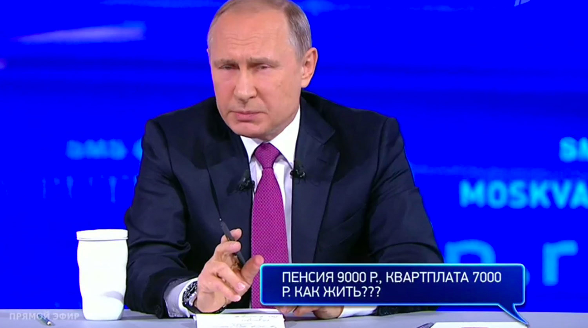

> **Первичный текст.** О ТМ №3(131) О положении в стране, о потенциале страны и о перспективах его реализации, 2017-06-20.
> Источник: `20170620 О ТМ №3(131) О положении в стране, о потенциале страны и о перспективах его реализации.doc` sha256 `889b7d878a2bdb64…`; [страница на dotu.ru](https://dotu.ru/2017/06/20/20170620_tek_moment03131/).
> Автоматическая транскрипция DOC→Markdown; смысл и формулировки не правились.
> Контрольные суммы и статус проверки — в [NOTICE.md](../../NOTICE.md).
> Содержание передаёт позицию авторов; утверждения не верифицированы библиотекой.

---

«О текущем моменте» № 3 (131), июнь 2017 года

О положении в стране, о потенциале страны\

и о перспективах его реализации

# 1. О «Прямой линии В.В.Путина» 15.06.2017 г. вкратце

15 июня 2017 г. состоялась очередная, пятнадцатая по счёту, «Прямая линия В.В.Путина»[^1]. Оценки вопросов, ответов В.В.Путина на вопросы и оценки лично В.В.Путина как человека и как главы государства, которые можно узнать из СМИ, из общения с людьми и из интернета, — разные.

Как сообщалось, организаторам «Прямой линии» поступило почти 2 миллиона вопросов, т.е. свою активность проявили примерно 2 % потенциальных избирателей. В.В.Путин за четыре часа без малого ответил на 74 вопроса. Остальные вопросы будут анализироваться аппаратом администрации главы государства.

СМИ большей частью не дают своих критичных оценок «Прямой линии», но приводят некоторые «неудобные» для власти вопросы, который остались без ответа. Некоторые СМИ делают это с ощутимым злорадством.

«Причины», по которым многие «неудобные» вопросы остались и останутся без ответа, огласил пресс-секретарь В.В.Путина Д.С.Песков:

«Владимир Путин знает о критических обращениях в свой адрес, которые были при подготовке к "Прямой линии" и во время неё. "Есть сотни таких выпадов, эскапад в отношении президента, но практически нет оппозиционных обращений", — заявил пресс-секретарь главы государства Дмитрий Песков в программе "Вечер с Владимиром Соловьевым" в эфире телеканала "Россия 1". То есть конструктивных — тех, где называлась бы проблема и предлагалось её решение. Многие эмоциональные комментарии и вовсе не подразумевают ответа"»[^2].

Если смотреть обсуждения в интернете, то положительных оценок «Прямой линии» и В.В.Путина как главы государства — *весьма* мало; мнений тех, кто возражает против негативных оценок «Прямой линии» и деятельности президента РФ, почти нет; и не удалось найти ничего на тему аргументированных и жизненно состоятельных возражений негативным оценкам.

**Поэтому возникают вопросы**:

1.  Что это было?

2.  Как к этому относиться?

3.  Какие последствия в политике государства и в жизни страны эта «Прямая линия» будет иметь?

**Ответы на эти вопросы просты**:

1.  Если вывести из рассмотрения указания президента о решении конкретных проблем конкретных граждан, чьи вопросы были оглашены в ходе «Прямой линии», а рассматривать «Прямую линию» в аспекте объяснения политики государства и политических намерений на будущее, то эта была беспредметная демагогия, адресованная исключительно отечественным и зарубежным либералам и прочим слабоумным, чтобы показать им приверженность режима «демократическим и либеральным ценностям»[^3]. — Но в нашем понимании эта задача не была решена, поскольку изрядная доля носителей либерального менталитета уже давно ненавидит В.В.Путина лично и ненавидит возглавляемое им «гэбистское государство», обвиняя их в антилиберализме.

2.  Всем, кто не либерал и не является слабоумным, — об этой «Прямой линии» можно забыть, а некоторые либералы пусть радуются ответам президента на вопросы, общий смысл которых можно выразить в одной фразе: *государство во главе с В.В.Путиным по-прежнему стоит и будет стоять на страже ценностей и политической практики либерализма, хотя неисполнительность чиновников и коррупция не позволяют этим ценностям реализоваться в жизни в их полноте и чистоте так, как хотелось бы либеральной интеллигенции*.

3.  Жизнь общества в целом и деятельность Российской государственности[^4] будут по-прежнему протекать под объемлющим ноосферным управлением[^5] на основе сложившейся психодинамики общества, а политика государства по-прежнему будет проводиться в соответствии с принципом *«кто знает* — *тот поймёт, а кто не знает или не сумел понять,* — *это его проблемы»*.

Далее «детали».

# 2. Что это было

Если говорить о жизни общества, то один из показателей качества его жизни — взаимоотношения подвластного населения и государственной власти. В идеале политика государства (глобальная, внешняя и внутренняя) должна быть понятна всем и не должна порождать у людей недовольства. На этот результат государство может работать двояко:

- Во-первых, результаты политики непосредственно убеждают подавляющее большинство тех, кто готов честно трудиться и трудится, в том, что они живут хорошо и год от года живут лучше, и что дальнейшее улучшение качества их жизни будет иметь место и в обозримой перспективе *благодаря политике государства*.

- Во-вторых, государственная власть объясняет положение дела в стране и в мире, свою текущую политику и политические намерения на перспективу убедительным образом[^6]. Убедительность объяснений в своей основе имеет два фактора:

<!-- -->

- соответствие слов предлагаемых обществу властью объяснений непосредственному восприятию качества жизни людьми;

- осмысление своего восприятия качества жизни людьми на основе менталитета, сформированного в прошлом их воспитанием и системой образования[^7].

Если же объяснения не соответствуют непосредственному восприятию жизни людьми и осмыслению ими восприятия, то несовпадение мнений породит раскол общества, который может иметь тяжкие последствия.

Однако, характеристическое свойство всех толпо-«элитарных» культур — лживость «элитарно»-корпоративной государственной власти. Вследствие этого власть проводит политику убеждения подвластных в том, что низкое качество их жизни или его прогрессирующее падение либо ложно привиделось подвластным, а в действительности всё хорошо; либо реально имеет место быть, но обусловлено неподвластными правящей «элите» факторами — природными стихиями, законами Природы или неисповедимым божественным промыслом, внешней политикой иностранных государств в отношении собственного государства, но никак не действиями и бездействиями самой «элитарно»-корпоративной власти.

Образчик такого рода государственной «элитарно»-корпоративной пропаганды и явила «Прямая линия» 15.06.2017 г.: сказанное в ней в ответах на вопросы не соответствует восприятию качества жизни большей частью населения страны — тех, кто живёт на одну зарплату, на одну пенсию, либо в силу наличия явной и скрытой безработицы вообще не имеет гарантированных доходов, позволяющих их семьям жить, а не влачить существование; и кроме того, на ряд вопросов, действительно волнующих широкие слои населения, ответы давать в ходе «Прямой линии» и вовсе не предполагалось: см. кадр прямого эфира слева. Что на этот и многие другие вопросы может ответить государственная власть, если такого рода проблемы людей — прямое следствие проводимой ею на протяжении четверти века антинародной политики?

— С момента краха СССР прошло уже более четверти века, а для большинства простых граждан результаты политики только такие. Понятно, что могло бы быть ещё хуже, понятно, что все проблемы невозможно разрешить в одно мгновение, но всё же катастрофу лета 1941 г. и полёт в космос Гагарина разделяют 20 лет… — Но при другом управлении. И прошедшие более четверти века со времени краха СССР дают основание требовать результат государственной политики в виде роста качества жизни всего населения, а не только олигархов, высших чиновников и депутатов. И если этого нет, то причины надо искать в политике государства и в государственной власти.

# 3. Характеристика постсоветской государственной власти России

11 августа 2015 г. на совместной пресс-конференции с министром иностранных дел Саудовской Аравии С.В.Лавров обронил слова «дебилы, б…»[^8], ставшие «мемом». Эта фраза носит почти что мистически-универсальный характер и многое объясняет в жизни глобальной цивилизации как в прошлом, так и в настоящем. Характеризует она и суть государственности постсоветской России. Исключения из этой характеристики на всех уровнях иерархии Российской государственной власти носят редкостный, почти единичный, характер и не определяют лица государственной власти, т.е. не определяют характера и качества государственного управления.

Однако, этот «мем» применительно к постсоветской государственности — не ругательство, не «эмоциональный комментарий»[^9], а вполне адекватная характеристика интеллектуальной немощи большинства представителей государственной власти на всех уровнях её иерархии при исполнении ими должностных обязанностей[^10]. Кто из её представителей персонально, будучи более или менее здравомыслящим вне государственной службы, «включает дурака» сразу же, как только дело доходит до исполнения должностных обязанностей, выявления и решения проблем общества, а кто действительно в силу разных причин — недоумок, но при этом исполняет должностные обязанности? — вопрос второстепенный, поскольку в качество жизни общества и те, и другие вносят одинаково дурной вклад.

Есть несколько вопросов, неспособность поставить которые и ответить на них являются неоспоримым выражением дебилизма государственной власти в целом и её представителей персонально:

1.  В одних координатных осях изобразите схематично графики функций «распределение случайной величины» и «плотность распределения вероятности». Поясните на словах или в виде математической формулы их взаимосвязь.

2.  Как соотнести статистку, представленную в табличной форме, с отображением той же статистики в виде графика плотности распределения?

3.  Каким набором статистик, на Ваш взгляд, характеризуется жизнь биосферно-социально-экономической системы в границах государства?

4.  Предложите классификацию объективных закономерностей, которым подчинена жизнь людей персонально, семей, социальных групп, культурно своеобразных обществ, человечества в целом, т.е. объедините объективные закономерности в группы по тому или иному характеристическому признаку, присущему закономерностям каждой группы.

5.  Изложите основные закономерности каждой из групп.

Если кто-то пребывает во власти мнения, что эти вопросы и ответы на них не актуальны для организации государственного управления, и представители государственной власти, не зная ответов на них, могут полноценно исполнять свои должностные обязанности, то он — не прошёл этот тест на интеллектуальную полноценность.

Дело в том, что множества описываются статистиками. Изменения, происходящие во множествах, описываются изменениями статистик, характеризующих множества. Соответственно, если рассматривать биосферно-социально-экономическую систему как объект управления (а управлением именно этим объектом должна заниматься государственность), то встают два вопроса:

- О наборе характеристических статистик, которыми описывается биосферно-социально-экономическая система.

- О критериях оценки в этом характеристическом наборе каждой из статистик в смысле «хорошо — плохо» и изменений каждой из них в смысле «лучше — хуже», при этом критерии должны проистекать из объективных закономерностей.

- А управление выражается в разработке и проведении в жизнь мероприятий, которые влекут за собой необратимое улучшение всех статистик характеристического набора.

Поэтому, если характеристический набор статистик вам и государственной власти неизвестен, то это не значит, что его нет: просто он задан кем-то другим, и кто-то другой как-то управляет его изменениями по своему усмотрению и не обязательно к вашему благу.

И на фига нам такое государство? — его можно терпеть только потому, что какое ни на есть государственное управление предпочтительнее, нежели война всех против всех в отсутствие государственного управления.

Поэтому дебилизм постсоветской государственной власти неоспорим и выражается в том, что за два с лишним десятилетия существования постсоветской России вопрос о характеристическом наборе статистик и критериях их оценки не только не был решён, но даже не поставлен. Как следствие, нет ответа и на вопрос, как управлять изменением статистик ко благу общества.

Но дело обстоит ещё хуже, чем можно было бы подумать: если представленные выше в разделе 3 вопросы 1 — 5 задать носителям государственной власти, то они даже не поймут, про что это и какое имеет к ним отношение.

Это — одна из главных причин, почему государственное управление не в состоянии выявлять и разрешать проблемы жизни Российского общества как на федеральном уровне, так и в регионах, и почему деятельность постсоветской государственности России носит антинародный характер, сопровождающийся успокоительными отговорками типа «денег нет, но вы держитесь…», «Россия находится под воздействием мирового финансово-экономического кризиса и санкций иностранных государств» и т.п.

Поэтому **сетования Д.С.Пескова** на то, что нет «оппозиционных обращений, то есть конструктивных — тех, где называлась бы проблема и предлагалось её решение», **дважды лживы**:

- Во-первых, дебилы и «включающие дурака», которым доверено работать с обращениями граждан во всех органах государственной власти, не в состоянии выявить во всём потоке обращений те, в которых бы указывалось на наличие проблем.

- Во-вторых, дебилы и «включившие дурака» госслужащие и депутаты, стоят на позиции «государственная власть не может ошибаться», вследствие чего они отказываются признавать факты наличия проблем и не способны обсуждать пути и способы их решения, поскольку лично им это не только не нужно, но и вредно для продвижения по карьерной лестнице. Если их тычут носом в проблемы, то они обращают остатки своего интеллекта на решение задачи «убедить идейного противника в его некомпетентности», что далеко не всегда возможно в силу того, что идейный противник более компетентен[^11].

Поэтому, к сожалению, «мем» С.В.Лаврова действительно характеристический по отношению к постсоветской государственности России…

# 4. Публичное выступление как сдача экзамена политиками

Постсоветская власть в своём прогрессирующем маразме насаждает везде и всюду системы аттестации работников на соответствие занимаемым должностям, основанные на разного рода формальных показателях, начиная от профиля образования и заканчивая прохождением всевозможных квалификационных тестов, суть которых — ответы на вопросы по перечню. Эта система распространяется на всех подвластных, но не распространяется на депутатов и высших должностных лиц государственной власти в регионах и на федеральном уровне: эти априори считаются соответствующими занимаемым должностям, а те, кто думает иначе, — с точки зрения государственной власти — не понимают своего счастья жить под властью этих выдающихся персон и наследующих им младших родственников.

Однако публичные выступления политиков — это тоже своего рода тесты на их соответствие занимаемым должностям, которые они сдают обществу, но тесты не формализованные и не влекущие за собой юридических последствий, хотя влекущие «мистические последствия».

Поэтому поговорим немного о построении тестов. Тесты бывают разные. Есть тесты, в которых предлагается решить некоторый набор задач, а для получения наивысшей оценки тестируемый должен правильно решить все задачи. Есть тесты, в которых тестируемый сам в праве выбрать задачи, которые он будет решать, и при этом ему заранее сообщается, сколько баллов даётся за правильное решение каждой из задач и какой минимум баллов он должен набрать для прохождения теста.

Однако могут быть тесты, в которых тестируемый сам в праве выбрать задачи для решения, *но количество баллов, которые он получит за решение выбранных им задач, он узнает только по завершении теста.* При этом в тест могут быть включены задачи, за решение которых даётся ноль баллов (или даже начисляются штрафные — отрицательные — баллы), но могут быть включены такие задачи, что для прохождения теста достаточно решить только одну задачу из списка такого рода наиболее «весомых задач».

Публичные выступления политиков принадлежат к категории именно такого рода тестов: публичный политик сам ставит или выбирает вопросы, которые он будет освещать, а оценку его выступлению даст аудитория, к которой он обращается. «Прямые линии» — попадают в эту же категорию тестов, в которых оценка совокупности ответов на избранные вопросы, выставляется потом. Однако есть и особенность — игнорирование некоторых вопросов тоже оценивается положительным либо отрицательным образом и влияет на итоговую оценку. Кроме того, публичные выступления, рассматриваемые в качестве тестов, представляют собой — обоюдосторонне направленные тесты, в которых окончательный итог подводит История (Промысел Божий), выставляя оценки и политикам, и обществам, к которым обращаются политики.

- С одной стороны, вопросы, которые задают граждане главе государства, характеризуют ту часть общества, которая задаёт эти вопросы или солидарна во мнениях с их авторами. Но при этом полный перечень зарегистрированных вопросов ничего не говорит о той части общества, которая не задала вопросов потому, что ей нет дела до политики вообще, либо потому, что она не доверяет государственной власти, и это является основанием для того, чтобы жить при своём мнении и не задавать вопросов власти, поскольку с нею «и так всё ясно». И что думают уклонившиеся по этой причине от задавания вопросов люди, сколь они многочисленны, какой потенциал деятельности и бездеятельности они несут в себе, — вопрос особый.

- С другой стороны, всё общество, по тем вопросам, которые избраны для ответа, а также и по тем вопросам, ответы на которые не были даны, оценивает главу государства и государственную власть в целом. И в силу того, что общество неоднородно в аспектах нравственности, этики, миропонимания вообще и понимания политики, в частности, — разные социальные группы могут по-разному оценить одно и то же выступление и ответ на каждый из вопросов.

> Кроме того, до выступления политика — в обществе, в его социальных группах, уже успели сформироваться некие оценки и политика персонально, и государственной власти в целом. Поэтому один из вопросов: *как изменятся оценки политика и государственной власти в целом в результате публичного выступления?* — социальная группа, солидарная с государственной властью, станет шире в результате выступления, либо она станет у́же; либо власть утратит поддержку в одних социальных группах и усилит свои позиции в других социальных группах, а если это произойдёт, то в каких группах поддержка усилится, а в каких ослабеет?

Какие выводы о состоянии общества и тенденциях изменения в нём сделает аппарат главы государства на основании анализа почти двух миллионов вопросов, поступивших в штаб «Прямой линии», общество вряд ли когда узнает. А вот оценку главе государства и государственной власти в целом по избранным для ответа вопросам и ответам на них — общество, т.е. порядка 100 миллионов человек, — дало. **И судя по всему, «Прямая линия 2017» эффективно сработала на дискредитацию постсоветской государственности.**

Кроме того, что В.В.Путин уклонился от ответа на ряд «неудобных» вопросов типа «как жить на пенсию в 9000, если квартплата 7000?», «не до фига ли получают топ-менеджеры госкорпораций?» и т.п., *он дал неправильные ответы на ряд вопросов, которые он принял для ответа.*

В частности, всё, что было сказано о проблематике финансово-экономического характера, соответствует либерально-рыночным воззрениям, но не соответствует жизни, поскольку **первопричина всех экономических неурядиц в стране** — не распад хозяйственной системы СССР, не воздействие мирового финансово-экономического кризиса и санкций иностранных государств в отношении России, а **тупая приверженность Российской государственности либерально-рыночной экономической модели**.

Либерально-рыночная экономическая модель на практике способна единственно к одному: *в преемственности поколений воспроизводить массовую нищету и бескультурье, экологические проблемы, на фоне чего сверхбогатое меньшинство бесится с жиру и сетует на лень, дикость и озлобленность простонародья.*

Освещая проблематику экономики и финансов, В.В.Путин среди всего прочего сказал следующее:

«… одна из ключевых проблем — уровень ставки, доступность кредитов. Здесь руководитель Высшей школы экономики сидит, он Вам пообъясняет это даже, наверное, более профессионально, чем я, тем более что он очень хорошо знаком с Председателем Центрального банка[^12].

В чём там дело? **Конечно, уровень ставки всегда соответствует уровню развития экономики. Это одна из ключевых вещей, которая влияет на макроэкономическую стабильность в стране. Мы от инфляции должны были плясать, которая скакнула до 12,9 процента. Чтобы не разрушить экономику, Центральный банк вынужден был поднять эту ставку, но постепенно он её снижает, Вы это знаете. Сейчас она 9,75, за ней снижаются и ставки коммерческих банков. Правда, Центральный банк обещал нам, что в этом году объёмы финансирования со стороны коммерческих банков будут увеличены где-то до 6 процентов.** (Выделено жирным нами при цитировании)

Что происходит сегодня? Сегодня средневзвешенная ставка для юридических лиц, для бизнеса – 11,5 процента. Я допускаю, что представителям малого бизнеса предоставляют кредит и под более высокую ставку. 11,5 — это усреднённая, средневзвешенная. Кстати говоря, я и по другим направлениям, может быть, и в ходе нашей сегодняшней дискуссии, разговора, сразу прошу извинения перед людьми, которые говорят: «А что нам средневзвешенная, что нам средняя температура по больнице? Вот у меня кредит больше либо доходы меньше, а у меня не средняя». Да, мы вынуждены от чего-то отталкиваться, эта усреднённая, средневзвешенная ставка, она о чём говорит? Для клиентов, которые считаются банком надёжными, стабильными, с хорошей экономикой, с проверяемой экономикой, с хорошей кредитной историей, кредиты выдаются и под меньшую ставку, а для тех, за кем большие риски, банки коммерческие, конечно, повышают ставку. Я сказал уже, для юрлиц это 11,5 процента, а для физлиц — 15,5 процента. Хотя количество ипотечных кредитов всё-таки растёт, но с применением всех элементов поддержки кредитования.

Я очень рассчитываю на то, что Центральный банк и дальше будет так аккуратно действовать, но будет действовать в направлении снижения ключевой ставки».

Выделенное нами жирным в приведённой цитате — вздор. Произнося его, В.В.Путин сослался на Высшую школу экономики и руководство Центробанка[^13]. Но о происхождении инфляции и связанных с нею деградационных процессов в производстве и в потреблении есть и иное мнение.

«“Инфляция — совершенно аморальное средство, обворовывание собственного народа.”[^14] …

“…кто же тогда виноват? Что же, инфляция — явление природы или дело рук дураков?”[^15]…

Было бы невероятным заблуждением, если бы народ или государство поверили в возможность проведения инфляционной политики, в то же время веря в возможность предотвращения её последствий. Это было бы равносильно попытке поднять самого себя за волосы. Наоборот, следует сосредоточить все силы на том, чтобы избежать инфляции. Нужно заклеймить всякое потворство инфляционной политике перед лицом всей общественности и этим воспрепятствовать всякой такой попытке.

Инфляция не обрушивается на нас как проклятие или трагически роковое событие. **Она всегда вызывается легкомысленной или даже преступной политикой** (выделено жирным при цитировании нами)» — это выдержки из книги Людвига Эрхарда[^16] «Благосостояние для всех».

Какие-либо возражения творцу «германского экономического чуда», менее чем за 20 лет выведшему ФРГ из послевоенной разрухи на уровень одной из наиболее развитых экономик мира, со стороны руководства Центробанка РФ и Правительства РФ, Федерального собрания, администрации Президента — неизвестны.

Постсоветская Россия живёт в условиях постоянной инфляции на уровне от 5 % и выше, а её государственная власть в силу характерной для неё «альтернативной одарённости» на протяжении уже более четверти века не в состоянии ввести экономику в режим инновационного развития, чтобы тем самым ощутимо поднять благосостояние всех граждан повсеместно и укрепить позиции и авторитет России на международной арене. Т.е. правота Высшей школы экономики, Центробанка, думских финансово-экономических подразделений и правительства РФ практикой не подтверждается, а *практика — критерий истины*.

Власть потворствует тому, чтобы инфляционная кража была средством обеспечения экономического благополучия меньшинства — тех, кто прокручивает деньги в спекулятивном секторе экономики и кому государство индексирует доходы темпами более высокими, чем темпы инфляции (это — депутаты, госчиновники некоторых категорий).

Для того, чтобы понять, в чём и почему Высшая школа экономики, Центробанк и все его прошлые руководители и Набиуллина не правы, а прав Эрхард, следует вникнуть в существо финансово-экономических процессов и подумать самостоятельно. Если продуктообмен и его финансовое сопровождение в производственно-потребительской системе общества рассматривать на основе балансовых моделей и правил Кирхгофа для процессов переноса в сетях[^17], то неизбежен следующий вывод. Инфляцию можно создавать по нескольким рецептам:

1.  Эмитировать денежную массу темпами более высокими, нежели темпы роста производства, измеряемые в неизменных ценах некоего базового периода. Как следствие — появляются «лишние деньги», и цены растут.

2.  Сократить объёмы производства и импорта при сохранении неизменным объёма денежной массы, обслуживающей внутренний товарооборот. Как следствие — на первом этапе появляются лишние деньги и цены растут, а в последующем продолжается спад производства, обусловленный возникновением межотраслевых и межрегиональных диспропорций между оборотными средствами и производственными мощностями в их натуральном исчислении (об этом далее).

3.  Повысить цены (государственным распоряжением или путём картельного сговора) на продукцию немногочисленной группы отраслей, цены на продукцию которых прямо или опосредованно задают себестоимость продукции остальных отраслей. Как следствие — цены растут, прежнего объёма денежной массы, текущих доходов и накоплений для обслуживания продуктообмена в прежнем объёме не хватает, начинается спад производства по причине сокращения платёжеспособного спроса и возникновения диспропорций между оборотными средствами и производственными мощностями в их натуральном исчислении.

4.  Кредитовать под процент экономику (прежде всего, производящий сектор) и население, ограничивая при этом дополнительную эмиссию денежной массы под предлогом якобы ведущейся борьбы с инфляцией первого типа. Как следствие:

- обслуживание долга в реальном секторе относится на себестоимость продукции, по какой причине цены растут;

- обслуживание долга в потребительском секторе сокращает номинальный платёжеспособный спрос и затрудняет сбыт продукции;

- ограничение эмиссии под предлогом борьбы с инфляцией создаёт дефицит денежной массы, необходимой для обслуживания продуктообмена в прежнем объёме при выросших вследствие кредитования под процент ценах;

- в итоге кредитование под процент при ограничении эмиссии — влечёт за собой спад производства, вызывающий дополнительный рост цен по второму типу инфляции, а потом реальный сектор втягивается в процесс деградации вплоть до полной разрухи.

5.  Создать условия, обеспечивающие более высокую доходность оборота капитала в спекулятивном секторе экономики, что имеет следствиями:

- переток денежной массы из производящего сектора в спекулятивный, деградацию производящего и обеднение населения;

- деформацию платёжеспособного спроса в пользу запросов на роскошь меньшинства, преуспевшего в спекуляциях, и сокращение производства товаров для широких масс населения и для дальнейшего развития производящего сектора.

Если соотноситься с этими рецептами, то **Центробанк РФ**, вопреки своим декларациям не «борется с инфляцией рыночными методами» для того, чтобы после снижения инфляции понизить ставку по кредитам, а **непрестанно на протяжении нескольких десятилетий генерирует инфляцию по 4-му и 5-му рецептам и ОБОСТРЕНИЕ финансово-экономического кризиса**, удерживая ставку на недопустимо высоком уровне, ограничивая эмиссию и обеспечивая более высокую доходность оборота капиталов в спекулятивном секторе.

Делает это руководство Центробанка сдуру или злоумышленно-вредительски, или под давлением обстоятельств в силу того, что **страна де-факто не суверенна, хотя об этом не говорится официально,** — значения не имеет, поскольку последствия для экономики и качества жизни общества одни и те же.

В ответе на другой вопрос В.В.Путиным было сказано:

«Мы закрыли, по сути, импорт или прикрыли его сильно, но собственного объёма производства, нужного для нашего потребителя, у нас не было. Мы сделали всё, сейчас не буду перечислять эти меры, — Вы их знаете лучше, чем даже я, надеюсь, что Вы ими воспользовались, — чтобы наши производители нарастили производство овощей и фруктов, прежде всего овощей. Инфляция у нас два года назад до 12,9 процента доходила, в том числе и из-за этого. В том числе. Не только, но в том числе.

Мы исходили из того, что наш сельхозпроизводитель, и производитель мяса в животноводстве, производитель овощей и фруктов, должен набрать такие обороты, чтобы закрыть потребление собственного рынка. И у вас это получается, за что Вам огромное спасибо. Не только Вам, но и всем людям, которые на селе живут.

И инфляция у нас сегодня, смотрите, 4,2 процента. Вот вам результат. Он есть и пошёл на пользу целой отрасли экономики, где у нас чуть ли не одна треть населения живёт и работает, если из социальной сферы взять. Это очень хорошо»[^18].

Казалось бы сказанное подтверждает правоту руководства Центробанка, правильность политики, проводимой им на протяжении последних нескольких лет. Однако это не так:

- инфляция — фактор, затрагивающий всю экономику, все её отрасли и всю сферу потребления;

- а производство ощутимо выросло только в одной отрасли, а не во всей экономике.

И если по существу, то инфляция сократилась вследствие того, что сократился платёжеспособный спрос, под воздействием чего цены стали расти медленнее и снизилась норма прибыли в отраслях. Т.е. инфляция снизилась не потому, что во всей экономике выросло производство и предложение товаров, и рост цен стал отставать от темпов роста производства.

Производство же в сельскохозяйственной отрасли выросло вопреки политике Центробанка и Минсельхоза по другой причине — вследствие того, что с внутреннего рынка России ушли многие зарубежные конкуренты *отечественных товаропроизводителей, которых Центробанк и Минсельхоз по-прежнему продолжают гробить*. Т.е. производство в сельском хозяйстве выросло вследствие действия принципа «платёжеспособный спрос рождает предложение соответствующих товаров», и если спрос не покрывается импортом, то он покрывается за счёт собственного производства, если это допускают собственные производственные мощности.

Соответственно, вне зависимости от того, как трактовать термин «устойчивость рубля», Центробанк, непрестанно порождая инфляцию и сопутствующую ей деградацию производства и потребления, систематически не исполняет единственную возлагаемую на него конституцией РФ обязанность: *«Защита и обеспечение устойчивости рубля — основная функция Центрального банка Российской Федерации, которую он осуществляет независимо от других органов государственной власти»* (ст. 75, ч. 2). Как следствие невыполнения Центробанком этой конституционной обязанности — нарушаются многие другие положения действующей конституции РФ, в частности: декларируемая в преамбуле суверенная государственность де-факто невозможна, социальный характер государства (ст. 7) — это пропагандистский миф (иначе бы на «Прямой линии» не возникали вопросы о зарплате в 3 600 рублей[^19] и ей подобных, на которые невозможно жить).

И при этом руководство Центробанка не несёт за свою вредительскую политику никакой юридической ответственности, хотя состав преступления, предусмотренный ст. 275 УК РФ «государственная измена», — налицо.Можно ли говорить, правильно ли мы понимаем, что экономический кризис закончился?

**В.Путин:** Вы начали, по сути, с центрального вопроса: закончился ли экономический кризис? И очень хочется ответить положительно, естественно, очень хочется послать такой позитивный сигнал в общество, но при этом всегда думаешь о том, что вдруг что‑то случится, где‑то сбой произойдёт и т. д.

Но мы должны основываться, разумеется, делая выводы подобного рода, на объективных данных. О чём говорят объективные данные? Они говорят о том, что рецессия в российской экономике преодолена, и мы перешли к периоду роста. Я ещё вернусь к этому и скажу, почему можно сделать такой вывод, на основании каких данных.

Но начать всё‑таки хотел бы с другого, начать хотел бы с проблем, которые не решены и которые являются наиболее острыми. Вы, кстати, о них тоже упомянули. В чём они заключаются? У нас снизились реальные доходы граждан за последние несколько лет, и что особенно тревожно – это то, что увеличилось количество людей, живущих за чертой бедности, получающих доходы ниже прожиточного минимума.

Самая печальная ситуация в этом смысле у нас сложилась в начале и середине 90‑х годов, когда у нас за чертой бедности проживала почти треть населения страны. Это было почти 40 процентов населения: 35–37 процентов, по разным подсчётам, почти 40 миллионов человек. Самый низкий показатель и, соответственно, самый лучший в этом смысле мы зафиксировали в 2012 году.

В таком положении находилось 10,7 процента населения. К сожалению, за последние годы количество этих людей подросло до 13,5 процента. Казалось бы, это не так уж и много: несколько процентов, но за этими процентами десятки и сотни тысяч людей, их судьбы, поэтому мы должны об этом подумать.

Экономика выросла на 0,7 процента за четыре месяца, а инвестиции в основной капитал – на 2,3 процента. О чём это говорит, если сказать проще? Проинвестировали уже в развитие производств 2,3 процента, это говорит о том, что уже сделан задел на будущий ближайший рост, и всё это, безусловно, не может нас не настраивать на положительный лад, и это не может не отражаться и отражается на некоторых вопросах социальной сферы.

Каких? Главное из них наше достижение, мы об этом говорим, и считаю необходимым сказать ещё раз: у нас значительно снизилась младенческая и материнская смертность. С 2000 года младенческая снизилась в три раза, а материнская – почти в четыре раза. Таких данных не показывает ни одна социальная сфера, наверное, в мире. И как результат – рост продолжительности жизни: было 70 с небольшим, сейчас – 72 года. Так что всё это в совокупности дУ нас есть и нерешённые проблемы в экономике, и это прежде всего отражается на доходах людей. И какие это проблемы? Это структура экономики, которая нас не устраивает, и в этой связи можно сказать о низкой производительности труда: если мы не будем её повышать, то тогда не будет и новых рабочих мест, тогда не будут повышаться доходы, это ключевая вещь.

А теперь всё‑таки о том, наверняка мы к этим проблемам ещё сегодня вернёмся, сто процентов, у людей будут эти вопросы, мы детализируем все эти проблемы, что нам позволяет сказать о том, что рецессия закончилась в российской экономике. Первое и очень важное – три квартала подряд наблюдается рост экономики, рост ВВП. Скромный, тем не менее из квартала в квартал.

В конце прошлого года, в четвёртом квартале, – плюс три процента, в первом квартале этого года – плюс пять процентов, в апреле – уже 1,4 процента. В целом за четыре месяца – плюс 0,7.

Растёт промышленное производство. Где‑то за первый квартал – плюс 0,7 процента. Я здесь кое‑какие данные актуальные для себя взял, чтобы не забыть, могу с ними вас тоже познакомить, это последние данные.

Наблюдается рост инвестиций в основной капитал – 2,3 процента, рост продаж автомобилей и ипотечных кредитов, что во всех экономиках является явным свидетельством начала роста, рост несырьевого и неэнергетического экспорта – на 19 процентов.

Наконец, очень важная составляющая макроэкономического характера: у нас рекордно низкая инфляция за всю новейшую историю России. На сегодняшний день – 4,2 процента, такого ещё никогда не было. Это говорит о том, что у нас есть все основания полагать: мы достигнем целевой инфляции четыре процента по году.

Растут золотовалютные резервы Центрального банка, международные резервы, в прошлом году мы начали с 368, закончили 378, в этом году они уже 407 миллиардов долларов. И один из важнейших показателей, я не могу о нём не сказать: у нас инвестиции в основной капитал растут быстрее, чем растёт экономика.

У нас есть и нерешённые проблемы в экономике, и это прежде всего отражается на доходах людей. И какие это проблемы? Это структура экономики, которая нас не устраивает, и в этой связи можно сказать о низкой производительности труда: если мы не будем её повышать, то тогда не будет и новых рабочих мест, тогда не будут повышаться доходы, это ключевая вещь.

А теперь всё‑таки о том, наверняка мы к этим проблемам ещё сегодня вернёмся, сто процентов, у людей будут эти вопросы, мы детализируем все эти проблемы, что нам позволяет сказать о том, что рецессия закончилась в российской экономике. Первое и очень важное – три квартала подряд наблюдается рост экономики, рост ВВП. Скромный, тем не менее из квартала в квартал.

В конце прошлого года, в четвёртом квартале, – плюс три процента, в первом квартале этого года – плюс пять процентов, в апреле – уже 1,4 процента. В целом за четыре месяца – плюс 0,7.

Растёт промышленное производство. Где‑то за первый квартал – плюс 0,7 процента. Я здесь кое‑какие данные актуальные для себя взял, чтобы не забыть, могу с ними вас тоже познакомить, это последние данные.

Наблюдается рост инвестиций в основной капитал – 2,3 процента, рост продаж автомобилей и ипотечных кредитов, что во всех экономиках является явным свидетельством начала роста, рост несырьевого и неэнергетического экспорта – на 19 процентов.

Наконец, очень важная составляющая макроэкономического характера: у нас рекордно низкая инфляция за всю новейшую историю России. На сегодняшний день – 4,2 процента, такого ещё никогда не было. Это говорит о том, что у нас есть все основания полагать: мы достигнем целевой инфляции четыре процента по году.

Растут золотовалютные резервы Центрального банка, международные резервы, в прошлом году мы начали с 368, закончили 378, в этом году они уже 407 миллиардов долларов. И один из важнейших показателей, я не могу о нём не сказать: у нас инвестиции в основной капитал растут быстрее, чем растёт экономика.

У нас есть и нерешённые проблемы в экономике, и это прежде всего отражается на доходах людей. И какие это проблемы? Это структура экономики, которая нас не устраивает, и в этой связи можно сказать о низкой производительности труда: если мы не будем её повышать, то тогда не будет и новых рабочих мест, тогда не будут повышаться доходы, это ключевая вещь.

А теперь всё‑таки о том, наверняка мы к этим проблемам ещё сегодня вернёмся, сто процентов, у людей будут эти вопросы, мы детализируем все эти проблемы, что нам позволяет сказать о том, что рецессия закончилась в российской экономике. Первое и очень важное – три квартала подряд наблюдается рост экономики, рост ВВП. Скромный, тем не менее из квартала в квартал.

В конце прошлого года, в четвёртом квартале, – плюс три процента, в первом квартале этого года – плюс пять процентов, в апреле – уже 1,4 процента. В целом за четыре месяца – плюс 0,7.

Растёт промышленное производство. Где‑то за первый квартал – плюс 0,7 процента. Я здесь кое‑какие данные актуальные для себя взял, чтобы не забыть, могу с ними вас тоже познакомить, это последние данные.

Наблюдается рост инвестиций в основной капитал – 2,3 процента, рост продаж автомобилей и ипотечных кредитов, что во всех экономиках является явным свидетельством начала роста, рост несырьевого и неэнергетического экспорта – на 19 процентов.

Наконец, очень важная составляющая макроэкономического характера: у нас рекордно низкая инфляция за всю новейшую историю России. На сегодняшний день – 4,2 процента, такого ещё никогда не было. Это говорит о том, что у нас есть все основания полагать: мы достигнем целевой инфляции четыре процента по году.

Растут золотовалютные резервы Центрального банка, международные резервы, в прошлом году мы начали с 368, закончили 378, в этом году они уже 407 миллиардов долларов. И один из важнейших показателей, я не могу о нём не сказать: у нас инвестиции в основной капитал растут быстрее, чем растёт экономика.

У нас есть и нерешённые проблемы в экономике, и это прежде всего отражается на доходах людей. И какие это проблемы? Это структура экономики, которая нас не устраивает, и в этой связи можно сказать о низкой производительности труда: если мы не будем её повышать, то тогда не будет и новых рабочих мест, тогда не будут повышаться доходы, это ключевая вещь.

А теперь всё‑таки о том, наверняка мы к этим проблемам ещё сегодня вернёмся, сто процентов, у людей будут эти вопросы, мы детализируем все эти проблемы, что нам позволяет сказать о том, что рецессия закончилась в российской экономике. Первое и очень важное – три квартала подряд наблюдается рост экономики, рост ВВП. Скромный, тем не менее из квартала в квартал.

В конце прошлого года, в четвёртом квартале, – плюс три процента, в первом квартале этого года – плюс пять процентов, в апреле – уже 1,4 процента. В целом за четыре месяца – плюс 0,7.

Растёт промышленное производство. Где‑то за первый квартал – плюс 0,7 процента. Я здесь кое‑какие данные актуальные для себя взял, чтобы не забыть, могу с ними вас тоже познакомить, это последние данные.

Наблюдается рост инвестиций в основной капитал – 2,3 процента, рост продаж автомобилей и ипотечных кредитов, что во всех экономиках является явным свидетельством начала роста, рост несырьевого и неэнергетического экспорта – на 19 процентов.

Наконец, очень важная составляющая макроэкономического характера: у нас рекордно низкая инфляция за всю новейшую историю России. На сегодняшний день – 4,2 процента, такого ещё никогда не было. Это говорит о том, что у нас есть все основания полагать: мы достигнем целевой инфляции четыре процента по году.

Растут золотовалютные резервы Центрального банка, международные резервы, в прошлом году мы начали с 368, закончили 378, в этом году они уже 407 миллиардов долларов. И один из важнейших показателей, я не могу о нём не сказать: у нас инвестиции в основной капитал растут быстрее, чем растёт экономика.

Под воздействием названного и много другого в обществе расширяется круг лиц, которые не верят постсоветской государственности и оценивают её как враждебную им самим и будущим поколениям. Не верят потому, что, как минимум интуитивно ощущают: слова государственной власти и её представителей персонально, не соответствуют действительности — они лживы или же выражают ошибочные мнения.

*[В оригинальном издании здесь расположен рисунок/схема. Иллюстрация не включена в данный выпуск: ожидает визуальной и правовой проверки. Файл источника: image2.jpeg]*И возникает ещё один вопрос: руководство Высшей школы экономики и её сотрудники, руководство Центробанка, советники по вопросам экономики и финансов аппаратов Президента РФ, Федерального собрания, Правительства РФ, рассказывая свои вздорные побасенки про борьбу Центробанка с инфляцией, тоже характеризуются «мемом» С.В.Лаврова? либо вводят В.В.Путина и общество в заблуждение злоумышленно?

Тем не менее, В.В.Путин, избрав определённые вопросы и ответив на них в ходе «Прямой линии 2017», сделал многое для того, чтобы круг недовольных постсоветской государственностью расширялся, а она утрачивала поддержку в обществе[^20]. **И это — благо.**

При этом и рейтинг самого В.В.Путина как действующего главы государства и потенциального кандидата на президентских выборах 2018 г. неизбежно снизился, хотя ВЦИОМ и ему подобные конторы могут вывести рост рейтинга.

5. О положении в стране:\

чего никогда не скажет официоз власти

=====================================

Изрядная доля ответов на вопросы в «Прямой линии 2017», как и в «Прямых линиях» прошлых лет, — это «разруливание» главой государства проблем конкретных граждан или населённых пунктов и регионов путём выдачи указаний представителям власти на местах в темпе ведения эфира или обещаний по завершении эфира выдать соответствующие указания должностным лицам, в чьей компетенции находится решение возникшего вопроса. В этой же группе ответов можно выделить подгруппу ответов, суть которых может быть выражена фразой «деньги выделены и давно уже направлены в регион — будем разбираться, почему они не дошли до адресатов или почему выделенное финансирование не даёт должной отдачи». В этой же связи следует вспомнить недавнюю дискуссию на тему исполнения либо неисполнения майских указов президента 2012 г.

Всё это в совокупности представляет собой выражение системно-государственного кризиса — непригодности к работе постсоветской государственности, поскольку все такого рода проблемы должны массово и успешно решаться в порядке повседневной систематической работы органов государственной власти как федерального уровня, так и в регионах.

Поскольку никто не в состоянии своей персоной заместить все должности в государственном аппарате, т.е. подменить работу всего государственного аппарат, то все обыватели, кто стоят на позиции «Путин, уходи!» в надежде, что они после его ухода с должности изберут кого-то другого, кто подавит коррупцию, прижмёт олигархов, поднимет экономику и реализует их вождения лучшего будущего, — пребывают в глубочайшем заблуждении. И они тоже характеризуются упомянутым ранее «мемом» С.В.Лаврова.

Неадекватность их представлений о возможностях личности, об организации государственной власти и осуществлении государственного управления — делает их потенциальным объектом манипуляции со стороны зарубежных и доморощенных приверженцев окончательной ликвидации России как государства и многонациональной региональной цивилизации. Хотя с точки зрения такого рода обывателей они — знающие, умные и адекватные люди, манипулирование которыми невозможно, но они по своей инициативе выступают против «диктатуры Путина и его прихлебателей». Однако, вопреки такого рода дебильным взглядам:

Реализация надежд на построение благого будущего возможна только путём замены:

- **нынешней «элитарно»-корпоративной государственности, работающей на эксплуатацию природных ресурсов страны и её населения транснациональными корпорациями,**

- **новой государственностью, в которой люди будут работать на развитие общества в России и человечества в целом.**

Для того, чтобы это осуществить, для начала необходима полная дискредитация идей либерализма (либерализма буржуазного — другого не бывает) и полная дискредитация постсоветской государственности РФ, предназначенной для воплощения идей либерализма в повседневную политическую практику. А далее необходимо осознавать системные пороки постсоветской государственности, как организационной структуры, посредством которой решаются определённые управленческие задачи в отношении ресурсов страны и её населения, и которая *в принципе* не способна решать другие управленческие задачи.

—————————

Прежде всего необходим понимать:

Государственный аппарат — инструмент управления делами общества структурным способом, и наряду с этим государственный аппарат — один из генераторов управления бесструктурным способом и управления на основе виртуальных структур[^21].

Управление структурным способом основывается на построении структуры, элементы которой и их взаимосвязи друг с другом и внешней средой несут определённую алгоритмику управления, т.е. **архитектура структуры**[^22] **целесообразна по отношению к определённому набору целей, к путям и способам их достижения**. В силу этого обстоятельства целесообразно выстроенная структура:

- во-первых, в большинстве случаев не способна работать на достижение целей, не включённых в соответствующий её архитектуре набор, и,

- во-вторых, она может нести в себе (и в большинстве случаев несёт) кроме алгоритмики достижения заданных для неё целей — алгоритмику защиты управления от внедрения в неё целей, путей и способов их достижения, не совместимых с возлагаемыми на структуру целями.

Всё это касается и постсоветской государственности.

Цель, ради которой она создавалась, — эксплуатация природных ресурсов и населения России транснациональными корпорациями региональной цивилизации, именуемой «Запад». Именно по этой причине архитектура постсоветской государственности предполагает невозможность реализации полной функции управления Российским обществом в отношении себя.

Для того чтобы страна была объектом внешней эксплуатации, её экономика должна быть подчинена транснациональной глобальной ростовщической мафии. Соответственно этой задаче конституция РФ и разработанное в соответствии с нею законодательство о финансовой и хозяйственной деятельности в целом и законодательство о Центробанке, в частности, не предполагают построение системы государственного планирования биосферно-социально-экономического развития страны и подчинения экономической деятельности государственному плану развития, а ориентированы на осуществление режима ростовщической тирании. Этот режим обосновывается пропагандой лживого утверждения «государственное управление неэффективно, рыночный механизм — наилучший регулятор экономики, невидимая рука рынка всё в экономике отрегулирует наилучшим образом, государство должно уйти из экономики». Соответственно:

Изначально конституция постсоветской России — конституция криптоколонии: суверенитет де-юре декларируется, а де-факто его нет и он не должен возродиться[^23].

Выход из этого режима требует поэтапного изменения действующей конституции либо же единовременной замены её другой конституцией, что предполагает и переход к иной архитектуре государственной власти. Однако, как и следовало ожидать, действующая конституция и развитое на её основе законодательство, ориентированы на защиту режима надгосударственной ростовщической тирании в отношении России от противодействия со стороны аборигенов.

Для того, чтобы понять, как осуществляется такого рода защита в организации общественно-государственных отношений, необходимо определиться в том, чем реальное народовластие отличается от разного рода режимов самовластного господства над обществом.

**Народовластие** предполагает, что носителей власти всех уровней люди выдвигают сами — т.е. органы власти формируются по инициативе «снизу». Это может происходить двояко:

- либо инициативные группы просят тех, кому они доверяют, принять на себя власть и просят других людей поддержать их выбор;

- либо люди сами заявляют о своих притязаниях на власть для решения каких-то проблем общества и просят других людей оказать им доверие.

Оба варианта могут осуществляться на основе традиции, а могут осуществляться на основе писаного законодательства.

Этим вариантам могут сопутствовать процедуры призыва действующими носителями властных полномочий по своей инициативе других лиц для осуществления тех или иных функций в органах власти.

Однако народовластие нуждается не только в формировании органов государственной власти, но и в устранении из них лиц, кто не справляется с должностными обязанностями или начинает злоупотреблять ими сам или способствует злоупотреблению властью другими. Поэтому наряду с формированием власти «снизу» народовластие предполагает и отзыв по инициативе подвластных действующих носителей власти ранее истечения срока их полномочий в случаях, если надобность в их управленческой деятельности отпала или их власть становится неприемлемой. Отзыв тоже может осуществляться на основе традиции или на основе писаного законодательства.

**Но народовластие возможно только на основе политической компетентности основной массы населения, осуществляющей народовластие.** Компетентность такого рода предполагает: 1) предвидение гражданами последствий своего выбора, что необходимо для того, чтобы доверить власть эффективным управленцам, подчинение которым общественно полезно; 2) готовность нести ответственность за сделанный ими выбор властителей, т.е. готовность нести ответственность за деятельность властителей и её результаты — как благие, так и негативные.

*Российское общество в настоящее время в силу толпо-«элитарного» характера исторически сложившейся культуры нравственно-этически и интеллектуально не способно к осуществлению народовластия в описанном выше виде.* И это обстоятельство обрекает его на управление его жизнью со стороны тех или иных самовластных корпораций.

**Корпоративный способ управления жизнью общества** — всегда следствие неспособности общества к народовластию. Именно неспособность к осуществлению народовластия открывает возможности формирования самовластных корпораций, осуществляющих господство над обществом бесконтрольно с его стороны.

Корпоративный способ управления жизнью общества, с момента своего становления, предполагает: 1) «кастинг» кандидатов на властные должности, осуществляемый властными корпорациями, 2) привлечение прошедших кастинг к работе в органах власти и продвижение по должностям иерархии власти. И всё это делается по инициативе «сверху», мнение подвластных властные корпорации не интересует. Отстранение от властных должностей тех, кто не оправдал оказанного им корпорацией доверия (не справился с обязанностями либо переметнулся на службу к другой корпорации) — также осуществляется по инициативе «сверху».

Корпоративный способ управления жизнью общества может быть обнажённым, как это имеет место на протяжении всей истории в сословно-кастовых социальных системах[^24], где некая олигархия формирует государственную власть по своему усмотрению во главе с наследственным или выборным монархом или в форме правящей диктаторской хунты, которая более или менее успешно воспроизводит себя в преемственности поколений, осуществляя «кастинг» и привлечение прошедших «кастинг» кандидатов в органы власти соответствующего уровня и отстраняя от власти тех, к кому корпорация утратила доверие[^25].

Но корпоративный способ управления может реализовываться и в формах формальной фальшь-демократии, в которой некомпетентный в определённом выше смысле электорат, участвует в избирательных процедурах, а команды политтехнологов, по заданию властных корпораций, более или менее успешно программируют победу на формально более или менее демократических выборах кандидатов, предварительно избранных закулисно правящей властной корпорацией для осуществления тех или иных публично-властных полномочий. Если политтехнологи с этой задачей не справляются, то в фальшь-демократиях могут применяться узаконенные[^26] и криминальные[^27] средства «коррекции неправильного выбора электората» в соответствии с решениями закулисно правящей корпорации. Такой была власть в СССР, такова власть в США.

В постсоветской России корпоративный способ управления жизнью общества тоже реализуется в формах фальшь-демократии, и это практически выражается в том, что:

- выдвижение кандидатов в депутаты и на выборные должности трудовыми коллективами действующим законодательством не предусмотрено, вследствие чего подвластное общество не является непосредственным генератором корпуса носителей государственной власти;

- наказы избирателей депутатам, за выполнение которых депутаты были бы юридически обязаны отвечать перед избирателями и нести ответственность за уклонение от исполнения наказов, — отсутствуют;

- все кандидаты, попавшие в партийные списки, — выдвиженцы руководства политических партий, а по существу — выдвиженцы спонсоров руководства политических партий, либо тех или иных должностных лиц в иерархии государственной власти;

- процедуры регистрации новых политических партий по инициативе граждан — законодательно прописаны так, что действующая государственная власть может на протяжении многих лет уклоняться от регистрации любой новой партии под формальными предлогами и не нести за это никакой ответственности;

- закон об участии в выборах партий, не представленных в парламенте, написан так, что партию, активисты которой собрали необходимое по закону количество подписей-ходатайств, можно не допустить до участия в выборах, придравшись к собранным подписям и их оформлению[^28].

- самовыдвиженцы — претенденты в кандидаты — законодательно поставлены в такие условия, что без спонсорской поддержки они состояться в качестве кандидатов (а не то, что бы победителей на выборах) не могут, а спонсорами реально могут быть только богатеи, реализующие в политике через спонсорскую поддержку принцип «кто деньги платит — тот и музыку заказывает» (а если субъект, которому оказали спонсорское доверие, начнёт играть не ту «музыку», то для него также могут заказать если не киллера, то прокурорскую проверку или уголовное расследование) — причём это могут быть не отечественные богатеи, а зарубежные богатеи, действующие через подставных лиц в России, что является ещё одним фактором уничтожения суверенитета страны;

- отзыв депутатов и должностных лиц государства, которым граждане выказывают недоверие, — по инициативе «снизу» юридически невозможен;

- в избирательных бюллетенях ликвидирована графа «против всех», что необходимо властным корпорациям для того, чтобы уйти от решения проблемы, как возобновить государственное управление в случае победы на выборах кандидата «против всех»[^29];

- выборы считаются состоявшимися при любой сколь-угодно низкой явке избирателей — благодаря чему ныне действующая Дума юридически легитимна, хотя за её депутатов проголосовало меньшинство населения страны;

- в соответствии со статьёй 104, ч. 1 действующей конституции РФ никакие общественные организации (профсоюзы, творческие союзы, политические партии, если они не представлены в парламенте, и др.) не обладают правом законодательной инициативы[^30], что при корпоративном характере государственной власти, обособившейся от народа и противопоставившей себя ему, по сути отрицает части 1 и 2 статьи 3, той же самой конституции[^31].

Внести изменения в действующую конституцию юридически легитимным способом может только конституционное большинство парламента, в котором реально нет ни одного народного избранники в силу эффективности действия описанных выше принципов формирования списков кандидатов в депутаты властными корпорациями. А в ряде случаев внесение изменений в конституцию требует созыва конституционного собрания. В частности, правовой статус Центробанка может быть изменён только через конституционное собрание.

В действующей ныне Думе конституционное большинство принадлежит партии «Единая Россия», лидером которой де-юре числится премьер-министр Д.А.Медведев, но кто фактически осуществляет повседневное руководство «Единой Россией» — вопрос открытый. За прошедший после выборов Думы почти что год, «Единая Россия» не озаботилась решением проблемы восстановления государственного суверенитета во всей его полноте и соответственно — проблемой освобождения страны от надгосударственной ростовщической тирании.

А в прошлом «Единая Россия» саботировала реализацию законодательной инициативы, направленной на юридическое обеспечение созыва и работы Конституционного собрания, что необходимо для кардинального преобразования конституции и государственного устройства юридически легитимным способом. Инициаторами соответствующего законопроекта о Конституционном собрании стали депутаты Е.А.Фёдоров и А.В.Романов (оба — «Единая Россия»). Голосование по проекту федерального конституционного закона № 874565-6 «О Конституционном Собрании Российской Федерации» состоялось в Государственной думе 01.12.2015 г. Результаты голосования: «За» — 61 (13,5 %), «Против» — 3 (0,7 %), «Воздержались» — 0, «Не голосовало» (отсутствовали) — 386 (85,5 %). От «Единой России» в голосовании приняли участие только сами инициаторы законодательной инициативы — остальные «едровцы» были заняты какими-то более важными делами и отсутствовали (при этом на момент начала заседания было заявлено о присутствии 441 депутата из общего числа 450, т.е. кворум изначально был). В итоге законопроект в первом же чтении отклонён (причина — «не набран кворум»). Результаты голосования по партийным фракциям и поимённые представлены на официальном сайте Госдумы: <http://vote.duma.gov.ru/vote/92639>. Фактически рассмотрение важнейшего для будущего страны законопроекта депутаты сорвали, зато на рассмотрение вопросов типа обнажённого Аполлона на 100-рублёвой купюре, половой член которого («элемент порнографии») не во всякую лупу на купюре можно разглядеть, — время есть. — Опять вспоминается «мем» С.В.Лаврова, либо всё же — предатели?

При этом Комитет Государственной Думы по конституционному законодательству и государственному строительству, возглавляемый В.Н.Плигиным, предложил отклонить этот законопроект на том основании, что «Федеральный конституционный закон «О  Конституционном Собрании Российской Федерации» должен приниматься только в том случае, если речь идёт о необходимости разработки проекта новой Конституции Российской Федерации. Поэтому предметом регулирования соответствующего Федерального конституционного закона должен быть правовой статус именно того Конституционного Собрания, для созыва и работы которого указанный закон будет приниматься, а также только в случае возникновения необходимости разработки новой Конституции Российской Федерации».

Поскольку такая позиция бывшего главы Комитета по конституционному законодательству и государственному строительству[^32] до настоящего времени не осуждена «Единой Россией»[^33], то это означает, что режим надгосударственной ростовщической тирании в отношении нашей страны эту партию вполне устраивает.

Но это же означает, что она — партия дебилов, которыми манипулируют предатели под руководством зарубежных кураторов. Конечно, в «Единой России» много тех, кто изначально не понимал, что страна живёт под властью тирании ростовщичества[^34], но после того, как их соратник — депутат Е.А.Фёдоров — высказал своё мнение о деятельности Центробанка, умные и порядочные люди обязаны вникнуть в суть вопроса, придти к правильному мнению, выработать и осуществить меры, ведущие к решению проблемы. Но «дебилы, б…» к этом не способны, а негодяям этого не надо.

И это была не первая попытка провести через Думу закон о Конституционном собрании: по ссылке ниже законопроект 2000 г., о котором СМИ тоже ничего не сообщали; он был отклонён 14.09.2012: <http://asozd2.duma.gov.ru/main.nsf/%28Spravka%29?OpenAgent&RN=90056938-3&02>.

Прочие политические партии никаких претензий к «Единой России», к конституции РФ, к архитектуре государственности страны не предъявляют. Это означает, что и они не лучше «Единой России» как в аспекте интеллектуальной состоятельности, так и в аспекте нравственности и этики.

Соответственно, те, кто сходил на парламентские выборы 2016 и проголосовал за какую-либо партию, не в праве предъявлять никаких претензий В.В.Путину: вы сами своим голосованием поставили главу государства перед необходимостью работать с этим парламентом — антироссийским и антинародным по составу депутатов и их менталитету[^35]. Но это касается не только парламента: главе государства приходится работать с теми людьми, какие есть, — в силу не подвластных ему обстоятельств.

Если кто-то думает, что «царь повелел, а слуги только и думают, как бы это быстрее и лучше исполнить», то он ошибается: у «слуг» есть свои своекорыстные интересы, реализация которых для них более значима, чем выполнение указаний «царя»; а кроме того, ни один чиновник не в состоянии сделать того, чего он не знает и не умеет, а они в большинстве своём малознающие и необучаемы… — см. раздел 3.

Кроме того, «царь» тоже получил не «царское образование». В учебных курсах, которые он освоил в университете, и в том, что он узнал по службе и по последующей работе, не была освещена проблематика, открываемая ответами на вопросы 1 — 5, представленными в разделе 3. Кроме того, всякий индивид несёт в себе те или иные предрассудки-предубеждения, от которых освободиться не всегда просто, тем более, если они проистекают из импринтинговой составляющей психики.

Но и общество, и прежде всего та его часть, которая настроилась иждивенчески-критически или непримиримо-оппозиционно по отношению к государственной власти и «царю» персонально, в своей основной статистической массе тоже не знает и не желает знать тематики, затрагиваемой этими вопросами[^36], поэтому главе государства неоткуда взять дееспособные кадры для замещения должностей в государственном аппарате, чтобы стали возможны переустройство государственной власти и иная политика, а не та, которая проводится доныне. Поэтому государственная власть и общество на данном этапе исторического развития России взаимно соответствуют друг другу.

Соответственно, если поменять «царя», сохранив при этом ориентацию на реализацию либерально-рыночной экономической модели, то в условиях глобализации снизится качество жизни не только широких масс, но и правящей «элиты» аборигенов, поскольку обойти главную социокультурную закономерность, представленную на рисунке выше, невозможно.

6. Что ещё следует знать\

о либерально-буржуазной фальшь-демократии

=========================================

Сам по себе самовластно-корпоративный способ управления жизнью общества — он ни хорош, ни плох. Более того, он — объективно изначальный и в этом качестве безальтернативный, если соотноситься с тем, как полная функция управления реализуется в жизни общества по отношению к проблемам от мелких сиюминутно-личных до общесоциально-эпохальных.

- Это благо для общества, если есть люди, которые, увидев даже не проблему, а только возможности или предпосылки к её возникновению, сами по своей инициативе успешно её разрешают, не дожидаясь соответствующих повелений того или иного начальства.

- И это ещё одна проблема для общества, если в нём есть люди, которые по своей собственной инициативе или по повелению начальства препятствуют осуществлению такого рода деятельности. И эта проблема усугубляется, если такие люди образуют корпорацию, которая претендует на власть над обществом и обладает функциональностью, позволяющей реализовать такого рода притязания.

И то, и другое — выражение самовластно-корпоративного способа управления в отношении общества. Поэтому вопрос в том, какая нравственность, обуславливающая целеустремлённость управленцев, реализуется в конкретике самовластно-корпоративного способа управления жизнью общества.

На микроуровне жизни общества самовластно-корпоративное управление имеет место в семьях со стороны родителей и старших родственников в отношении детей, которые в силу незавершённости процессов формирования психики и организма к самовластью надо собой пока ещё не способны. Но самовластно-корпоративное управление со стороны взрослых в нравственно-этически здравой и интеллектуально состоятельной семье готовит их к этому.

И в масштабах общества самовластно-корпоративное управление в отношении толпы, в силу особенностей исторического прошлого не способной к народовластию, может быть ориентировано на развитие личности и переход к полноценному народовластию, в котором самовластный характер многих видов власти перестаёт быть антиобщественным. Однако самовластно-корпоративный способ управления может быть ориентирован осуществление тирании в отношении не способных к надровластию обществ с целью воспроизводства и расширения системно организованного паразитизма корпорации властителей на обществе и на окружающей среде в целом. Это — фашизм, понимаемый как культура, препятствующая становлению человека Человеком[^37]. И в этом смысле либерализм — это фашизм, но не в беззастенчиво обнажённой диктаторской форме, а в форме буржуазно-либеральной фальшь-демократии, прикрывающей ту или иную корпоративную диктатуру. Поэтому выход из-под власти тирании корпораций требует ответа на вопрос в том, как осуществляется коммутация различных социальных групп в условиях самовластно-корпоративной диктатуры, прикрывающейся фальшь-демократией.

Прежде всего необходимо понимать, что общество в условиях фальшь-демократии неоднородно в аспекте культуры интеллектуальной деятельности. Оно — концептуально безвластно, но в нём есть индивиды, которые, будучи концептуально безвластными и признавая безальтернативными наиболее высокоприоритеную цель господствующей над обществом концепции, всё же обладают ограниченной этой концепцией познавательно-творческой культурой и свой познавательно-творческий потенциал реализуют в деле адаптации концепции к непрестанно изменяющимся историческим обстоятельствам. Вокруг этих «креативщиков» формируется струкктурированное сообщество политических активистов-лидеров, для которых «креативщики» — авторитеты и неформальные руководители. Эти активисты-лидеры принадлежат к политически активным слоям общества и в этих политически активных слоях общества именно они представляют так называемое «информированное меньшинство», которое формирует в своём окружении определённое представление о смысле жизни, путях и способах его реализации; и они же — по команде «креативщиков» активизируют заранее сформированные представления о смысле жизни, путях и способах его реализации в массовке единомышленников.

Это общие принципы реализации фальшь-демократии. В западной цивилизации «креативщики» и активисты-лидеры организованы в структуры масонства. Сообщество единомышленников, не связанных дисциплиной лож, — политическая массовка, чей потенциал активизируется в нужное время, упреждающе формируется системой образования и СМИ. Массовка — переменная по своему персональному составу, и вбирает в себя большей частью благонамеренную молодёжь, у которой есть время и которой легче манипулировать вследствие того, что она не знает жизни; кроме молодёжи в массовку входят психически ненормальные люди разных возрастов.

В случае США для массовки предлагаются идеи либерализма: ценность личности и прав человека, мы за всё хорошее, против всего плохого. Но это предлагается в форме абстракционизма, который наполняется конкретным содержанием «креативщиками»[^38] и полит-активом лидеров в зависимости от обстоятельств и «очередных задач», которые ставит перед собой самовластная корпорация. По мере продвижения по ступеням иерархии от массовки, через активистов-лидеров к «креативщикам» и хозяевам концепции системно организованного паразитизма меньшинства на большинстве и Природе — либерального абстракционизма становится всё меньше, и всё больше обнажается суть тирании.

В США это работает достаточно эффективно потому, что одна самовластная корпорация подавила либо искоренила корпорации-конкуренты. В постсоветской России этого нет. Здесь несколько самовластных корпораций.

К власти в 1993 г. пришли местные либералы активисты-лидеры, которых на протяжении длительного времени целенаправленно взращивал КГБ во главе с Ю.В.Андроповым. Часть из них связана дисциплиной масонских лож, часть пребывает в одиночном плавании. Но к власти они пришли не сами, поскольку «креативщики» либерализма к началу перестройки и в годы либерально-буржуазных реформ — большей частью были из США. Из числа аборигенов за прошедшие с начала перестройки 30 лет «креативщиков» либерального толка вырастить не удалось: местные — либо тупые и безвольные, ждут указаний, и потому в иерархии функциональности подняться выше уровня лидеров-активистов — не могут; либо, подавая большие надежды, мрут и гибнут мистическим образом, не оправдав надежд кураторов; либо не приемлют идеалов либерализма и пытаются «креативничать» на тему российского имперского проекта.

И в настоящее время все публичные претензии к В.В.Путину проистекают от зарубежных «креативщиков» буржуазного либерализма и ретранслируются в пределах России местными активистами-лидерами и либерально «мыслящей» массовкой: в прошлом это «пуськи» и их почитатели, о которых уже забыли; ныне — Навальный и его массовка.

Их претензии обусловлены тем, что В.В.Путин и «кровавая гэбня», которая вытеснила с начала 2000 г. из органов государственной власти и бизнеса истинных либералов-космополитов, не пресекает желательным образом деятельность разного рода антилиберальных «креативщиков», и при этом регулярно, если не пресекает, то прессует деятельность либеральных активистов-лидеров и возбуждаемой ими массовки. Кроме того, есть подозрения (и многие обвинения в коррумпированности власти проистекают из этих подозрений), что в стране организована параллельная «опричная» экономика, решающая задачи, которые либерально-экономическая экономика, предписанная для России кураторами её «демократизации», в принципе не должна решать.

Однако, СМИ, финансы, Дума, по-прежнему — через периферию либерально-космополитичных лидеров-активистов — подконтрольны хозяевам глобального либерально-буржуазного проекта. Поэтому есть и публично не оглашаемые претензии к В.В.Путину, не совместимые с либерализмом, суть которых сводится к тому, что искоренять надо не только буржуазно-либеральный проект, но и попытки реанимировать российско-имперский холопско-господский проект, а для этого надо продолжать дело большевизма, признав Великую октябрьскую социалистическую революцию не ошибкой истории, не инспирированным извне антироссийским проектом, а началом преображения всей глобальной цивилизации в Царствие Божие на Земле.

Но это — тема, далёкая от обсуждения «Прямой линии 2017 г.», и её развитие требует не вождя-учителя в лице В.В.Путина или кого-то другого, а творческой деятельности в этом направлении широких слоёв общества во всех его социальных группах. Нигилизм (этого не хочу, а чего хочу — не знаю) разрушителен, и его пора изживать всем, кто недоволен сложившимся в стране и в мире положением дел и тенденциями дальнейшей деградации глобальной цивилизации при цивилизационном лидерстве Запада.

Внутренний Предиктор СССР\

16 — 20 июня 2017 г.

[^1]: Видеозапись и стенограмма этой прямой линии опубликованы на сайте Президента РФ: [*http://www.kremlin.ru/events/president/news/54790*](http://www.kremlin.ru/events/president/news/54790).

[^2]: «Российская газета», 16.06.2017 г. «Песков: Путин в курсе критических выпадов на "Прямой линии"» (<https://rg.ru/2017/06/16/peskov-putin-v-kurse-kriticheskih-vypadov-na-priamoj-linii.html>).

[^3]: Адекватное понимание смысла слова «либерал» в этом контексте проистекает из фразы М.Е.Салтыкова-Щедрина: «Нет задачи более достойной истинного либерала, как с доверием ожидать дальнейших разъяснений».

    В свою очередь, эта фраза в «Помпадурах и помпадуршах», в «Истории одного города» (город был назван — Навозный: наше пояснение) лежит в таком контексте: «Он был либерален, и она была либеральна. (…) оба верили, что кредит возродит земледелие и даст толчок нашей заснувшей промышленности. И в ожидании всего этого оба сладко вздыхали... (…) и удивлялись, что такая плодотворная вещь, как кредит, не только не оплодотворяет Навозного, но даже служит как бы к запустению. Упивались передовыми статьями "С.-Петербургских ведомостей", в которых доказывалось, что нет ничего легче, как отрицать и глумиться над прогрессом, и что, напротив того, нет задачи более достойной истинного либерала, как с доверием ожидать дальнейших разъяснений. И пока в гостиной шли либеральные разговоры, папа Волшебнов хлопотал около закуски и, залучив под шумок чиновника особых поручений Веретьева, выкушивал с ним по "предварительной"».

    Но произведения М.Е.Салтыкова-Щедрина надо читать не в выдержках, а полностью — многое в жизни станет понятнее.

[^4]: Государственность — субкультура управления делами общества на профессиональной основе. Государство — это государственность, плюс население, территория, акватория, воздушное пространство и недра, находящиеся под властью государственности.

[^5]: См. работы ВП СССР «Основы социологии» часть 1, «Ноосфера, человечество, личность, глобализация…» (из серии «О текущем моменте», № 2 (130), 2017 г.), «Правдив и свободен их вещий язык и с Волей Небесною дружен…» (из серии «О текущем моменте» № 6 (102), 2011 г.).

[^6]: Это как раз то, чего не происходит в «Прямых линиях». Вообще это не свойственно отечественной политической традиции после убийства И.В.Сталина.

[^7]: Последнее подразумевает, что если политики желают, чтобы общество понимало, принимало и поддерживало их политику, необходимо, чтобы сами политики и общество действовали в жизни на основе адекватного миропонимания, которое должна формировать система образования — невежественной толпой можно манипулировать, но если в этом «перестараться», то будет бунт бессмысленный и беспощадный…

[^8]: См. на Ютубе: <https://www.youtube.com/watch?v=iLHXujOtB40>; <https://www.youtube.com/watch?v=MEcH6OP71Io>.

[^9]: См. цитату из выступления Д.С.Пескова в разделе 1.

[^10]: Как можно узнать из интернета, «Дебильность (от латинского «debilis» — слабый, немощный) — легкая степень олигофрении. (…) Дебилы обладают достаточным запасом слов, а при легкой дебильности речь довольно хорошо развита. Они могут учиться в школе, но усвоение материала дается им с большим трудом, особенно трудным предметом для них является математика. Нарушения познавательной деятельности выражаются в неспособности к выработке сложных понятий. Переход от конкретных, простых понятий к отвлеченным у них затруднен или невозможен. Дебилы неспособны самостоятельно сформулировать понятия, отделить главное от второстепенного. Более высокий и сложный уровень обобщения — от познания окружающего с помощью органов чувств к абстрактному мышлению, — дебилам недоступен. У них преобладают малопродуктивное мышление конкретно-описательного типа и конкретные ассоциации. Им трудно охватить ситуацию целиком, они способны уловить лишь внешнюю сторону событий. Абстрактное мышление у них развито плохо или отсутствует. Но некоторые дебилы компенсируют недостаток интеллекта механическим заучиванием, подражанием. В своей речи олигофрены в степени легкой дебильности могут использовать даже отвлеченные понятия и сложные выражения, но сами они не понимают их смысла, а просто дословно подражают где-то услышанным сложным терминам. Эти понятия они используют шаблонно, часто не к месту. В процессе обучения и трудовой деятельности выявляется отсутствие инициативы и способности принимать самостоятельные решения, медлительность, инертность всех психических процессов. Не обладая пытливостью ума и не имея собственных суждений, дебилы легко перенимают чужое мнение и чужие взгляды, и могут с необыкновенной косностью придерживаться их и навязывать окружающим. Несмотря на свою несостоятельность, они любят поучать других людей. Дебилы бездумно заучивают различные правила, инструкции и строго придерживаются их, не способные как-то перерабатывать, корректировать и видоизменять при перемене ситуации. Основная трудность для умственного отсталого человека состоит в изменении привычного стереотипа. При решении любых проблем он старается использовать известные ему приемы и шаблоны» (<http://studopedia.ru/10_103309_debilnost.html>).

[^11]: См. в 5-м томе работы ВП СССР «Основы социологии» раздел 19.3.1 «Итоги «развития» системы образования под властью библейского проекта» и в нём — впечатления от обсуждения в Комитете по образованию Ленобласти аналитической записки ВП СССР «О системе образования», опубликованной летом 2016 г. и посвящённой итогам реформы системы образования и необходимости возрождения разрушенной системы образования.

[^12]: Ректор Высшей школы экономики Кузьминов Ярослав Иванович — муж главы Центробанка Эльвиры Сахипзадовны Набиуллиной.

[^13]: Соответствует ли сказанное В.В.Путиным в этом ответе действительному пониманию им экономики и финансов? — вопрос открытый, поскольку С.Ю.Глазьев — советник В.В.Путина и излагал ему свои взгляды, а С.Ю.Глазьев — один из авторитетных публичных критиков политики Центробанка и его руководства.

[^14]: Выдержка из письма немца на имя министра экономики, которое цитирует Л.Эрхард.

[^15]: Это — вопрос из письма немца из Бад Эмса от 28 июля 1956 г. на имя министра экономики, которое цитирует Л.Эрхард. Широко известной по интернету фразы, приписываемой Л.Эрхарду: **«Инфляция — не закон развития, а дело рук дураков, управляющих государством»**, — в переводах на русский книги Л.Эрхарда «Благосостояние для всех» нет.

[^16]: Л.Эрхард (1897 — 1977) — министр экономики ФРГ (1948 — 1963), а позднее — канцлер (1963 — 1966).

[^17]: Когда Э.С.Набиуллина училась в советской школе, правила Кирхгофа изучались в школьном курсе физики применительно к расчёту электрических сетей. В силу этого обстоятельства она обязана их знать и уметь пользоваться применительно не только к расчёту электрических сетей, но и сетей финансового обмена.

[^18]: В этом и других случаях вопрос о достоверности официально приводимых данных — особый вопрос.

[^19]: В.В.Путин, отвечая автору вопроса о зарплате в 3 600 рублей, выразил недоумение: как реальная зарплата может быть ниже юридически установленного государством прожиточного минимума? — Ответ простой: *работника не оформляют на полную ставку,* а сэкономленные таким образом деньги перетекают в кошельки его начальников через премиальный фонд или как-то иначе.

    И это массовая повсеместная практика во всех сегментах экономики и особенно — в тех сферах, которые финансируются из госбюджета. Поэтому профессор, доктор наук, которого приглашают читать лекции в зарубежных вузах, может зарабатывать в России не более 10 — 15 тыс. рублей, что вдовое ниже официальной средней заработной платы.

[^20]: 19 июня 2017 г. была опубликована следующая информация:

    «В настоящее время 15 % россиян в той или иной степени хотели бы перебраться на постоянное место жительства за пределы бывшего СССР, сообщает газета "Коммерсант" со ссылкой на данные опроса "Левада-Центра".

    Согласно этому исследованию, проведенному в мае 2017 года, 3 % опрошенных заявили, что "определенно хотели бы" уехать жить за границу, 12 % — "скорее хотели бы". При этом доля желающих эмигрировать заметно выше среди респондентов в возрасте 18-24 лет (32 %) и 25-39 лет (21 %), отмечает издание.

    Вместе с тем только 1 % уже "готовит документы" для отъезда на постоянное место жительство за пределы бывшего СССР, еще 2 % "приняли твердое решение уехать", 7 % раздумают о возможности переезда и 16 % теоретически "подумывают над этим". 74 % опрошенных заявили, что "никогда об этом не думали".

    Среди основных причин, подталкивающих к эмиграции, участники исследования чаще всего называли лучшие условия жизни за рубежом (42 %), нестабильную экономическую ситуацию в России (41 %), желание обеспечить детям достойное будущее (28 %) и отсутствие в стране защиты от произвола властей (17 %)».

    Подробнее: <http://www.newsru.com/russia/19jun2017/emigr.html>.

[^21]: См. достаточно общую теорию управления (ДОТУ) о структурном способе управления и его взаимосвязях с бесструктурным способом управления и управлением на основе виртуальных структур.

[^22]: Архитектура структуры это — качественно и количественно определённый набор её элементов, функции каждого из них, взаимосвязи элементов друг с другом, объектом управления и средой, с которой взаимодействует объект управления и система управления им.

[^23]: В качестве авторов текста конституции РФ, принятой в 1993 г. и действующей с изменениями до настоящего времени, обществу были представлены: А.А.Собчак, В.Л.Шейнис, С.М.Шахрай, С.А.Алексеев. Народ должен знать своих предателей.

[^24]: Российская империя принадлежала к этому типу.

[^25]: Как это имело место Японии в эпоху сёгунатов, в Венецианской республике, в третьем рейхе и в иных беззастенчиво обнажённых диктатурах.

[^26]: В США таким узаконенным средством является коллегия выборщиков президента страны, члены которой юридически не обязаны голосовать за того кандидата, за которого проголосовали их избиратели.

[^27]: Разного рода технологии фальсификации результатов голосования.

[^28]: Перед парламентскими выборами 2016 г. так не была допущена до участия в выборах партия «Великое Отечество» (ПВО) во главе с Н.В.Стариковым — правильно оформленных подписей якобы оказалось недостаточно. А для того, чтобы иметь основания не засчитать подписи, законодатели придумали (по словам Н.В.Старикова) 44 признака, по которым подпись признать недостоверной.

    В этом случае недопущения до участия в выборах 2016 г. ПВО удивляет другое: почему руководство ПВО не организовало поток исков со стороны тех, чьи подписи не были признаны достоверными, о нарушении их конституционных прав избирать и быть избранными? Рассмотрение в судах уймы исков было способно сорвать проведение парламентских выборов в том виде, в каком они состоялись в 2016 г.

    Кроме того, в условиях реальной демократии, сомнение в достоверности подписей разрешаются просто: Центризбирком может связаться с человеком, достоверность чьей подписи у него вызывает сомнения, с просьбой подтвердить или опровергнуть факт подписания им ходатайства об участии в выборах политической партии или кандидата-одномандатника — ведь контактные данные обязательно указываются в подписных листах. Но этого законом о выборах не предусмотрено именно потому, что в стране фальшь-демократия, покрывающая корпоративный способ управления обществом.

[^29]: Если такое происходит на парламентских выборах, то ни одна из заявившихся на выборы партий не должна участвовать ни в следующем туре выборов, ни в очередных выборах, по крайней мере до смены её руководства и обновления программы.

[^30]: Право законодательной инициативы принадлежит Президенту Российской Федерации, Совету Федерации, членам Совета Федерации, депутатам Государственной Думы, Правительству Российской Федерации, законодательным (представительным) органам субъектов Российской Федерации. Право законодательной инициативы принадлежит также Конституционному Суду Российской Федерации и Верховному Суду Российской Федерации по вопросам их ведения.

[^31]: Статья 3.

    1\. Носителем суверенитета и единственным источником власти в Российской Федерации является ее многонациональный народ.

    2\. Народ осуществляет свою власть непосредственно, а также через органы государственной власти и органы местного самоуправления.

    Т.е. непосредственное осуществление власти народом, о котором говорит ч. 2 ст. 3 действующей конституции, требует осуществления права законодательной инициативы и права возбуждения процедур отстранения от должностей лиц, утративших доверие, инициативными группам граждан и общественным организациям.

[^32]: В активе действий В.Н.Плигина в качестве законодателя, направленных на поддержание антинародно-крпоративного характера государственности, также числятся:

    замена льгот денежными компенсациями;

    переход к выборам депутатов Государственной думы исключительно по партийным спискам, отмена выборов половины депутатов по одномандатным избирательным округам;

    "закон Ротенберга", предполагавший компенсацию арестованного за рубежом имущества Российским граждан за счёт бюджета;

    отмена нижнего порога явки избирателей;

    введение запрета голосования «против всех»;

    повышение проходного барьера для партий на выборах депутатов Государственной думы до 7 %;

    запрет в какой-либо форме участвовать в выборах, в том числе наблюдать за выборами, для НКО («иностранных агентов»).

[^33]: В.Н.Плигин — координатор «либеральной платформы» «Единой России». И поскольку у «Единой России» все прочие платформы — пустышки, то В.Н.Плигин, будучи выразителем сути этой партии, — не может быть порицаем в ней.

[^34]: Но всё же «ребята» в Думе профессионально заняты политикой, и им платят заработные платы в 100 раз большие, чем почтальону, интересовавшемуся, как жить на 3 600 рублей в месяц. Соответственно депутаты обязаны отрабатывать свою сверхвысокую зарплату и обязаны понимать, что происходит в стране и в мире. Если они этого не могут, то они — паразиты и предатели.

[^35]: Если бы явка на выборы была низкой — от 5 до 10 %, то это было бы явным и неоспоримым выражением краха постсоветской либерально-буржуазной системы фальшь-демократии и поставило бы власть и общество перед вопросом, чем и как её заменить. А так всё «нормально»: поскольку явка не была катастрофически низкой, это позволило отчитаться о том, что они состоялись; либеральная «Единая Россия» получила конституционное большинство. — Вы этого сами хотели.

[^36]: Навальнята-дебилята пусть подумают об этом, если есть, чем думать и они хоть немного умеют это делать… Навальный — неуч-необучаемый, и у него есть спонсоры и кураторы.

[^37]: См. работу ВП СССР «Основы социологии», т. 6, гл. 20.

[^38]: Один из наиболее широко известных «креативщиков» такого рода — недавно умерший З.Бжезинский. Ещё один — Ф.Фукуяма.
---

[К произведению](README.md) · [Каталог](../../CATALOG.md)
