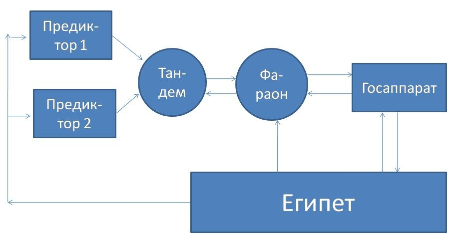

> **Первичный текст.** О ТМ №4(111) Власть на Руси и Русь — возможности упущенные и возможности актуальные…, 2013-11-08.
> Источник: `20131108 О ТМ №4(111) Власть на Руси и Русь — возможности упущенные и возможности актуальные….doc` sha256 `838c7a364190174f…`; [страница на dotu.ru](https://dotu.ru/2013/11/08/20131108_tek_moment04111/).
> Автоматическая транскрипция DOC→Markdown; смысл и формулировки не правились.
> Контрольные суммы и статус проверки — в [NOTICE.md](../../NOTICE.md).
> Содержание передаёт позицию авторов; утверждения не верифицированы библиотекой.

---

«О текущем моменте» № 4 (111), ноябрь 2013 года

Власть на Руси и Русь: возможности упущенные и возможности актуальные…

В прошлом мы опубликовали ряд материалов, в которых речь шла о необходимости обеспечения взаимного соответствия системы управления и объекта управления. Наиболее полно эта тема в её историко-политической конкретике освещена в работе ВП СССР «Введение в конституционное право» («О текущем моменте» № 1 (108), январь 2013 г.). Однако система управления, и в случае обеспечения взаимного соответствия с объектом управления, кроме того должна соответствовать и среде, в которой находится объект управления, и частью которой является иерархически высшее управление вплоть до иерархически наивысшего всеобъемлющего управления — Вседержительности. В особенности это касается социального управления. Этому вопросу и посвящена предлагаемая вниманию читателя аналитическая записка.

# 1. Памяти Александра III — человека и государя 

*[В оригинальном издании здесь расположен рисунок/схема. Иллюстрация не включена в данный выпуск: ожидает визуальной и правовой проверки. Файл источника: image1.jpeg]*1 ноября 2014 г. исполнится 120 лет со дня смерти императора Александра III. В советское время официоз исторической науки, если и вспоминал его, то представлял тупым реакционером, злоупотреблявшим алкоголем. Вспоминал так, чтобы дореволюционная шутка-загадка — *«стои́т на площади комод, на комоде — бегемот, на бегемоте — обормот, на обормоте — шапка, на шапке — крест, а кто угадает — того под арест»* — воспринималась как соответствующая действительности оценка личности императора и его царствования.

В досоветские времена о нём тоже особо не было принято писать, поскольку, во-первых, по меркам истории ещё прошло мало времени, вследствие чего историки не успели сформировать своё мнение, а во-вторых, по оценкам тех, кто жил в период правления и Александра III, и его наследника — последнего императора Николая II, — сопоставление обоих царствований было не в пользу Николая II. Чего стоит один ответ С.Ю.Витте (1849-1915). На вопрос, что надо сделать, чтобы «спасти Россию?» (эпизод имел место в период революции 1905 — 1907 гг. непосредственно после оглашения манифеста 17 октября 1905 г.) — С.Ю.Витте указал на портрет Александра III, висевший в его кабинете, и сказал: *Воскресите его*[^1]. И в такого рода оценках С.Ю.Витте был не одинок. Соответственно и в период правления Николая II писать правду о царствовании его отца было не верноподданно по отношению к Николаю II.

В постсоветские времена у официоза исторической науки тоже есть дела поважнее, нежели анализировать события времён Александра III и их последствия[^2], которые однако история не изгладила до настоящего времени: в частности, отечественные политики и публицисты до сих пор вспоминают, ссылаясь на В.И.Ленина, некую «кухарку» и спорят на тему должна ли «кухарка» управлять государством либо же нет.

В действительности царствование Александра III и он сам не заслуживают ни идеализации и восхваления, ни поношения. История требует знания и понимания того, что произошло, с какими целями и по каким причинам, и какие последствия прошлые события оставили потомкам. Это необходимо для того, чтобы выявить и преодолеть проблемы, созданные в прошлом: «Прошедшее надо знать не потому, что оно прошло, а потому, *что, уходя, оно не умело “убрать своих последствий”»* (В.О.Ключевский). И если исходить из этого принципа, то царствование Александра III было великим — великим, как своими свершениями (в частности, порядка 25 % железных дорог, существовавших на территории СССР к 1991 г., были построены в период его царствования; при нём в 1891 г. было начато строительство Транссибирской магистрали, завершённое уже в царствование Николая II в 1903 г.[^3]) и планами на будущее (план создания Северного флота и его главной базы на месте нынешнего Мурманска), так и ошибками стратегического характера, имевшими катастрофические последствия для страны (указ о «кухаркиных детях» и несостоятельность наследника в качестве главы государства).

Александр был вторым сыном императора Александра II. Соответственно к царствованию готовили его старшего брата — цесаревича Николая Александровича. Однако в 1865 г. цесаревич внезапно заболел, и болезнь оказалась смертельной (он умер в возрасте 22 лет). В результате в возрасте 20 лет Александр стал наследником престола, будучи фактически сформировавшейся личностью. Вследствие этого ему пришлось во многом учиться заново, поскольку учебные программы для наследника престола, которого с детства готовили к царствованию, отличались от учебных программ, по которым учились другие дети в царской семье, которых готовили к иным видам службы. Александр III принял престол также внезапно, как и стал наследником: очередное покушение на его отца Александра II увенчалось успехом, и царь скончался от полученных ран 1 марта 1881 г.

По свидетельству тех, кто с ним работал, Александр III, став главой государства, осознавал, что к несению высшей государственной власти он не вполне готов, но в силу сложившихся обстоятельств — служить России обязан именно он. И осознание этого факта наложило печать на всё его царствование и личную жизнь. Выразилось это в том, что самодержавие он считал безальтернативной формой правления для России. И соответственно 30 апреля 1881 г. был опубликован Манифест о незыблемости самодержавия. В нём провозглашалось:

«… посреди великой НАШЕЙ скорби Глас Божий повелевает НАМ стать бодро на дело Правления, в уповании на Божественный Промысл, с верою в силу и истину Самодержавной власти, которую МЫ призваны утверждать и охранять для блага народнаго от всяких на неё поползновений». Манифест призывал «всех верных подданных служить верой и правдой к искоренению гнусной крамолы, позорящей землю Русскую, — к утверждению веры и нравственности, — к доброму воспитанию детей, — к истреблению неправды и хищения, — к водворению порядка и правды в действии всех учреждений».

Автором манифеста был К.П.Победоносцев (1827-1907), но Александр III безусловно был солидарен с выраженными в нём идеями *одного из своих учителей,* т.е. он «не подмахнул» бумажку, которую ему поднесли на подпись, не глядя.

Если под самодержавием понимать реализацию в государственном управлении полной функции управления[^4], то монархия — только одна из возможных форм осуществления самодержавия. В указанном смысле самодержавными могут быть и более менее демократичные республики, и заведомо недемократичные диктатуры; но самодержавными могут и не быть — и монархии, и республики, и диктатуры.

Правление Александра III действительно было самодержавным, но не было ни самодурственным, ни подчинённым системе манипулирования страной извне, что характерно для многих как демократических, так и авторитарных и тоталитарных режимов. Самодержавие Александра III выражалось в том, что он оставлял исключительно за собой **обязанности** (а не право): 1) политического целеполагания, 2) принятия решения о путях и способах достижения намеченных целей и 3) общий контроль за воплощением принятых решений в жизнь. Это касалось и кадровой политики.

Его царствование — один из немногих периодов в истории отечества, когда профессионализм, деловая компетентность и *личная честность* реально *систематически* востребовались высшей государственной властью — настолько, насколько позволяло образование и миропонимание самого Александра III, этические качества его ближайшего окружения и статистика общения с остальным обществом.

Примером тому и карьера С.Ю.Витте в царствование Александра III[^5].

Осознавая, что его не готовили для царствования, он считал, что есть люди, которые многие аспекты жизни и политики знают лучше, чем знает он. Поэтому для успеха его царствования ему следует знать их мнение по тем вопросам, которые он считает актуальными. Вследствие такого его отношения к самому себе и к делу ему можно было без риска испортить последующую карьеру и личные взаимоотношения с государем изложить мнение, заведомо противоречащее царскому: требовалась одно — мотивация, т.е. обоснование мнения. И Александр III был способен пересмотреть свои взгляды, вникнув в суть мнений профессионалов, изначально с ним не согласных. Он был предельно честен и сам в отношениях с людьми, т.е. на него можно было полагаться и ему можно было доверять и верить. Именно это сделало его царствование одним из наиболее результативных в экономическом развитии страны и её внешнеполитическом положении: *«Во всём свете у нас только два верных союзника, — любил он говорить своим министрам, — наша армия и флот. Все остальные, при первой возможности, сами ополчатся против нас»*[^6]*.* Но государь, который высказал это положение, *непрестанно подтверждаемое прошлой и последующей историей,* получил ещё при жизни прозвище — миротворец, поскольку вследствие позиции, занятой Россией по его воле, не состоялось несколько вполне назревших военных конфликтов (в частности в 1887 г. Германия поняла, что Россия не позволит ей в очередной раз раздавить Францию).

Злоупотребления властью, некомпетентность чиновников в его царствование тоже имели место, но когда сведения об этом доходили до царя, такие чиновники увольнялись. Один из примеров такого рода — отстранение от должности А.А.Абазы (1821-1895) в 1892 г. В 1884-1892 гг. А.А.Абаза исполнял должность председателя департамента экономии Государственного совета, кроме того в 1890-1892 гг. был председателем Комитета финансов. В 1892 г., зная в силу своего должностного статуса, что министерство финансов с ведома Александра III проводит политику, направленную на понижение курса рубля, он играл на бирже своими личными средствами на понижение рубля и, не посвящая в известный ему секрет, вовлёк в это дело банкирский дом Рафаловичей (еврейский клан, принявший православие), который разорился, преждевременно прекратив игру, в то время как сам А.А.Абаза играл до конца и выиграл около 900.000 рублей[^7]. Когда это стало известно царю, была организована комиссия, которая провела расследование. После этого А.А.Абаза написал покаянное письмо государю, прося о прощении и обещая больше не играть. Но за несколько лет до этого А.А.Абаза уже каялся и давал честное слово, что больше играть не будет. Рассказывая С.Ю.Витте об этом, Александр III пояснил свою позицию: *«Вот он мне клянётся, что никогда больше не будет, я бы ему поверил, потому что Абаза, в сущности, очень полезный человек, очень умный и толковый; я бы ему поверил, если бы он мне клялся в первый раз, но теперь я ему не могу верить, потому что раз меня кто-нибудь обманет, то вторично я ему уже не поверю»*[^8]. В результате А.А.Абаза был отстранён от всех должностей, хотя он не был замечен ни во взяточничестве, ни в казнокрадстве, а играть на бирже на повышение или понижение курса рубля было деянием, не представлявшим состава преступления в соответствии с тогдашним сводом законов империи; не говоря уж о том, что де-факто А.А.Абаза помогал личными средствами осуществлению политики государства.

Кроме того, принцип «У России есть только два верных союзника — наша армия и флот» не был словами, не подкреплёнными делом. К 1894 г. Россия оправилась от последствий войн третьей четверти XIX века и готовилась вступить в новый этап своего развития. Политика развития военной мощи России, сформированная в последние годы царствования Александра III, предполагала строительство океанского флота, главная база которого должна была находиться в Кольском заливе — там, где сейчас находится город Мурманск. Её предполагалось соединить с Петербургом и общероссийской сетью железных дорог сразу же двухпутной железной дорогой (ещё в 1980‑е гг. железная дорога Ленинград — Мурманск на многих участках была однопутной). После смерти Александра III сконцентрированные средства, предназначенные для осуществления этого проекта, были «вбуханы» в строительство военно-морской базы в Либаве (ныне Лиепая в Латвии), которая оказалась никчёмной в обеих мировых войнах ХХ века и пребывала в запустении в мирное время после завершения второй мировой войны до краха Советского Союза. А порт на месте современного Мурманска пришлось строить в экстренном порядке уже в годы первой мировой войны.

Кроме того, в царствование Александра III Персия (ныне Иран) предоставила России концессию на строительство железной дороги, которая должна была соединяться с общероссийской сетью железных дорог и пройти до Персидского залива[^9].

Эти два проекта и строительство Транссиба, также начатое в царствование Александра III, по своей сути были направлены на создание экономической и военно-технической базы осуществления Русского проекта глобализации, альтернативного проекту глобализации, исполнителем (но не хозяином и зачинателем) которого стала Великобритания ещё в XVIII веке, а с первой половины ХХ века — связка США-Великобритания.

Если значимость строительства инфраструктурных объектов, в том числе и на территории союзных и потенциально союзных государств для укрепления военно-политического положения собственной страны на мировой арене понятна для большинства, то роль отказа в период царствования Николая II от строительства океанского флота и системы его базирования на Кольском полуострове для последующей истории ХХ века — историками не оценена. Однако это было политическое решение, которое в случае его реализации могло изменить не только последующую историю России, но и судьбы всего мира. Дело в том, что *до середины 1970‑х гг. военно-техническая задача **«воспрепятствовать развёртыванию сил Русского флота из района базирования на Кольском полуострове»** — была не решаемой ни для Великобритании (до середины ХХ века), ни для США и блока НАТО в целом (во второй половине ХХ века)*[^10]*:* её решение не было обеспечено ни уровнем развития техники, ни экономической мощью этих государств*.* Базирование полноценного для соответствующего времени Русского военно-морского флота в этом районе гарантировало катастрофу морских перевозок Великобритании и её союзников в случае конфликта с Россией, чем исключало возможность осуществления военных сценариев типа «крымской войны» 1853-1856 гг. и русско-турецкой войны 1877-1878 гг. Есть основания полагать, что в случае продолжения реализации политики развития Александра III в последующие времена, осваивались бы и Приморский край, Сахалин и Камчатка, что позволило бы поддерживать добрососедские отношения с Японией, поскольку русско-японская война — прямое следствие вторжения России в царствование Николая II в сферу колонизаторских устремлений Японии, не подкреплённого со стороны России соответствующей военно-экономической мощью.

Реализация политического курса Александра III, будь она подкреплена ростом военно-экономической мощи и культурным развитием России, могла бы сделать невозможными обе мировых войны ХХ века вследствие действия принципа «неприемлемого ущерба», на котором держалось мирное сосуществование СССР и НАТО после завершения второй мировой войны ХХ века в реально свершившейся истории.

Однако в 1894 в возрасте 49 лет Александр III скончался, и унаследовавший царство Николай II менее чем за первые 10 лет своего правления развеял в хлам созданный при его отце потенциал развития страны и менее, чем за четверть века привёл империю к краху, а династию к гибели.

- В атеистическом миропонимании (особенно это касается идейно убеждённых «мраксистов») это всё — историческая данность, когда через цепь случайностей пролагает дорогу некая закономерность.

  Однако атеисты (и «мраксисты» в особенности) не задаются другими вопросами, которыми следовало бы задаться:

<!-- -->

- А почему на протяжении нескольких последних столетий «британской короне» исключительно везёт, а государству Российскому — большей частью не везёт?

- Какие закономерности выражаются в различии обеих цепей случайностей, связанных с этим везением и невезением?[^11]

<!-- -->

- В религиозном же миропонимании неизбежны вопросы:

<!-- -->

- почему Бог (т.е. с какими целями?) рассудил так, что старший брат будущего императора Александра III — цесаревич Николай Александрович — скоропостижно скончался?

- почему Александр III, работавший на неоспоримо благие перспективы развития России и мира умер в возрасте расцвета сил, а молитвы многих (в том числе и ныне святого Иоанна Кронштадтского, о котором современники пишут, что *по его молитвам Бог в ряде случаев воскрешал умерших*[^12]) о его исцелении и многолетнем царствовании оказались тщетными?

- И вследствие каких причин царствование Николая II привело государство к катастрофе, а династию к гибели?

Проще всего ответить на последний вопрос. Как явствует из воспоминаний тех, кто лично хорошо знал Николая II и имел с ним дела по службе[^13], Николай II слишком часто (фактически — систематически) становился жертвой навязанных ему мнений своих «верноподданных», которые выражали аполитично-безответственное чисто коммерческое своекорыстие тех или иных «элитарных» групп либо политические интересы профранцузской, проанглийской, прогерманской и прочих политических «элитарных» партий, оторвавшихся от Русского народа.

Стремление «элиты» манипулировать царём — это то, что жёстко и жестоко подавлял Иван Грозный; по-своему мягко, но не менее решительно это стремление пресекал Александр III[^14]. Поскольку Николай II к этому оказался не способен, то его царствование может быть охарактеризовано ещё древнеримской поговоркой: *Для того, кто не знает, в какую гавань плыть, — не бывает попутного ветра.*

Т.е. самодержавие (если под этим термином понимать способность государства управляться по полной функции) в России рухнуло со смертью Александра III и отсутствовало до начала 1930‑х гг., когда власть в СССР многими характеризовалась как «диктатура Сталина».

Политика в царствование Николая II стала внутренне конфликтной, начиная с этапа целеполагания, если соотноситься с полной функцией управления. Самые вопиющие случаи такого рода:

- история лесных концессий на реке Ялу в Корее, послуживших одним из поводов к русско-японской войне;

- подписание союзного русско-германского договора при личной встрече с кайзером Вильгельмом II на борту императорской яхты «Полярная звезда» близ острова Бьёрке 11/24 июля 1905 г. и срыв его введения в действие в течение последующих 4‑х месяцев Николаем II под давлением председателя комитета министров С.Ю.Витте[^15], министра иностранных дел В.Н.Ламсдорфа и великого князя Николая Николаевича[^16].

Оскорбительная по отношению к кайзеру память об этом событии не могла не сказаться на доверии Берлина к политике России и уверениям Николая II в том, что проводимая Россией мобилизация не означает после её завершения автоматического начала военных действий против Германии и Австро-Венгрии летом 1914 г., когда предпринимались попытки урегулировать мирным путём обострение отношений Австро-Венгрии и Сербии из-за убийства сербом Г.Принципом наследника престола Австро-Венгрии эрц-герцога Фердинанда.

Положение России усугублялось тем, что Николай II был психологически зависим от императрицы Александры Фёдоровны, браку с которой Александр III изначально противился и который благословил чуть ли не на смертном одре. В детстве принцесса Алиса много времени провела при дворе любившей её бабушки — королевы Великобритании Виктории. И в силу полученного ею воспитания, если судить по политике России в царствование Николая II, она в режиме «боевого зомби» сыграла в России роль британского «агента влияния». Именно по этой глубинно-психологической причине взаимосвязей царственных супругов Россия под номинальной властью Николая II отказалась от политического курса, на который её вывёл Александр III, и вместо океанского флота и системы его базирования на Кольском полуострове, которые могли гарантировать развитие страны в условиях мира на протяжении всего ХХ века, построила никчёмные Либаву и Порт-Артур и «вляпалась» в две пагубные для неё войны за осуществление глобально-политических интересов Британской империи и её небританских хозяев.

Однако ни отечественные, ни зарубежные историки не заметили этой смены политического курса Российской империи в первые же годы царствования Николая II: в учебниках истории об этом не пишется ничего.

Политика Николая II — явное выражение того факта, что, к сожалению, Александр III не справился с воспитанием наследника в качестве преемника и продолжателя Русского проекта глобализации, которому он положил начало, возможно сам того не осознавая. Но геополитические противники России перспективы его политики осознавали ясно и позаботились о том, чтобы они не стали реальностью. Если говорить о внутренней политике трёх последних царствований[^17], то в результате ошибок трёх последних императоров были закрыты возможности реализации в России эволюционного сценария общественно-политического развития, который в целом успешно на протяжении уже более 150 лет реализует после реставрации Мейдзи (1868 г.) Япония, при том, что она не имеет на своей территории тех природных богатств, которыми располагает Россия.

Сопоставление внутриполитической жизни Российской империи с внутриполитической жизнью Германской империи, Японии и других промышленно развитых стран в последней трети XIX — начале ХХ веков показывает, что обострению межклассовых антагонизмов в России и вызреванию в ней двух революционных ситуаций способствовало именно её же собственное государственное управление.

**Главная причина** **этого** связана с особенностями архитектуры структур государственности Российской империи в аспекте её способности нести полную функцию управления, т.е. — способности осуществлять самодержавие де-факто, а не де-юре.

В управленческом осмыслении политики и истории интерес представляет, как специализированы органы государственной власти и как они связаны друг с другом, поскольку их функциональная специализация и коммутация определяют, способна ли государственность нести полную функцию управления либо же нет. Обратимся к истории, и посмотрим на архитектуру государственности Египта эпохи фараонов, изображенную на рис. 1.

Высшее жречество Египта было представлено двумя группами по 10 человек во главе с верховным 11-м жрецом в каждой группе. Одна группа называлась «десятка севера», другая — «десятка юга». Высшее жречество в целом именовалась «иерофанты». Смысл этого названия — читающие судьбу или знающие будущее[^18]. Им был подчинён «Дом жизни» — высшее научно-исследовательское учреждение страны, по первому требованию которого из любого района Египта доставлялось всё необходимое, и выполнялись любые работы в пределах экономической возможности страны[^19].

Если соотноситься с полной функцией управления, то именно эти две группы иерофантов несли на себе функции: выявления проблем, целеполагания в отношении их решения, и неотделимую от целеполагания функцию прогностики — «предикции» — предсказания будущего. На схеме рис. 1 обе группы высшего жречества в соответствии с этой функцией, несомой ими в схеме управления «предиктор-корректор»[^20], обозначены блоками «Предиктор 1» и «Предиктор 2».

Наличие двух групп иерофантов и их первоиерархов, программировало ситуации, в которых мнения по одним и тем же вопросам, выработанные в обеих группах, могли быть взаимоисключающими. Поскольку количество участников обеих групп было чётным, а первоиерархи каждой из групп были равноправны, то были неизбежны ситуации, в которых решение не могло быть принято методом голосования. Философию, которая выразилась в построении такой структуры, мы опустим[^21]. Отметим только то, что такая структура была создана целенаправленно для того, чтобы в ситуациях расхождения во мнениях участники обеих групп иерофантов на основе специфических психолого-этических практик, отрицающих персональные авторские права (один из «краеугольных камней» современной культуры), могли вскрыть ошибки субъективизма, выразившиеся в расхождении во мнениях по одному и тому же вопросу, и, освободившись от них, выработать некоторое третье мнение — лучшее, чем исходные два. Это можно назвать «тандемный принцип деятельности», и на схеме рис. 1 упомянутая выше процедура преодоления разногласий и выработки взаимно приемлемого третьего мнения обозначена кругом «Тандем».

Любое управленческое решение может быть выработано либо единолично, либо коллективно. Но при воплощении его в жизнь координатор работ, несущий всю полноту ответственности за ход работ и их результаты может быть один единственный. Если принцип единоначалия в координации работ не обеспечен, то вступает в действие алгоритмика разрушения управления, описываемая всем известной поговоркой «у семи нянек — дитя без глазу».

В процесс реализации полной функции управления Египтом таким единоличным координатором работ был фараон. С одной стороны он был полностью ответственен перед высшим жречеством и сам имел достаточно высокое жреческое посвящение, которое обеспечивало согласованность его миропонимания с миропониманием иерофантов, а с другой стороны он был главой государственности и руководил работой государственного аппарата, который правил Египтом.

Схема рис. 1 в соотнесении её с полной функцией управления показывает, что архитектура государственности Египта времён фараонов несла полную функцию управления, и все этапы полной функции осуществлялись на профессиональной основе. Стрелки на ней обозначают прямые связи (отдание команд) и обратные связи (доклады об исполнении команд и о состоянии дел).

Совокупность тех видов деятельности, которыми были заняты иерофанты, можно назвать концептуальной властью, поскольку именно они вырабатывали концепцию управления Египтом как совокупность целей, путей и средств достижения целей. Однако между высшим жречеством и основной массой населения Египта, включая и «элиту», чьи представители были заняты в государственном аппарате, лежала мировоззренческая пропасть, к тому же целенаправленно поддерживаемая всей системой жреческих посвящений. Поэтому для того, чтобы концепция управления могла быть реализована, её было необходимо трансформировать в образы и понятия, которые были бы характерны и понятны для основной массы населения, мировоззренчески отличного от высшего жречества. Эту задачу решала идеологическая власть, которая в древнем Египте тоже осуществлялась жречеством, поддерживавшим религиозный культ и толковавшим политику в смысле осуществления «воли богов». И только после того, как концепция управления находила своё идеологическое выражение в приемлемой для общества форме[^22], начиналась реализация концепции управления в практической политике и осуществлялись действия, которые впоследствии были отнесены к компетенции законодательной, исполнительной и судебной власти.

Если рис. 1 рассматривать как функциональную схему, то в Российской империи блоки «Предиктор 1», «Предиктор 2», «Тандем» — отсутствовали, а их функции по умолчанию возлагались на царя, которому в рис. 1 соответствует блок «Фараон». Но поскольку эти функции возлагались на царя по умолчанию, то они осуществлялись в меру их понимания и ощущения тем или иным государем персонально во всей их совокупности. Вследствие отсутствия в культуре страны теории социального управления, адекватно описывающей полную функцию управления в отношении общества, мера профессионализма, с которой разные цари осуществляли самодержавие, была различна, а передача навыков его осуществления от императора к наследнику — негарантированной.

Собственно в этом и есть тот вызов истории, на который не способна ответить государственность типа «Российская империя», в которой носителем самодержавной власти может быть только царь, а все прочие должны быть не более, чем верноподданными, а претендовать на жреческую власть, которая в полной функции управления выше царской, — преступление.

Идеологическое обоснование именно такой государственности и системы её взаимоотношений с обществом восходит к Иосифу Волоцкому, почитаемому святым русской православной церковью. Он писал: «Царь, по своей природе, подобен всякому человеку, а по своей должности и власти подобен Всевышнему Богу»[^23]. Но он не возвеличивал царскую власть, в том смысле, что провозглашал её безгрешность, как его воззрения истолковывают многие, поскольку «самого царя Иосиф включает в ту же систему Божия тягла, — и Царь подзаконен, и только в пределах Закона Божия и заповедей обладает он своей властью. А неправедному или “строптивому” Царю вовсе и не подобает повиноваться, он в сущности даже и не царь, — “таковый царь не Божий слуга, но диавол, и не царь, а мучитель”».[^24]

Т.е. Иосиф внёс в церковное миропонимание этическую норму докрещенской Руси: человек и должность, им исполняемая, не должны отождествляться; все должны работать на общее благо в русле Промысла, заботясь друг о друге, и царь в этом общенародном деле — только главный руководитель. Из отождествления же должности и личности проистекают многие социальные беды.

Фактически Иосиф предостерегал от порабощения общества догматом о непогрешимости царской власти, который хотя и никогда не провозглашался церковью, но фактически действовал по умолчанию во многие царствования и стал одним из генераторов катастрофы 1917 г. Этот «догмат» открыто выразился в полном титуловании Николая II: «Божьей поспешествующей милостью, Мы, Николай Второй, Император и Самодержец Всероссийский, (…) и прочая, и прочая, и прочая»[^25]. Кроме того идеологический штамп «сердце царёво в руце Божией»[^26] предлагается понимать именно в этом смысле — автоматически гарантированной безошибочности и непогрешимости царской власти. Однако реально — это не автоматизм, возникающий в результате рождения в царской семье либо в результате церковного таинства помазания на царство, а личностное качество вырабатываемое либо не выработанное тем, кто оказался на должности главы государства[^27].

Но Иосиф Волоцкий не высказал никаких рекомендаций о том, как осознать Промысел и вернуть самодержавие в русло Промысла в случае, если царь — «строптив» (идёт против Промысла) или в силу каких-то иных причин оказывается не способным к осуществлению самодержавия как полной функции управления.

Эта системная ошибка воспроизводилась и воспроизводится в истории отечества на протяжении веков, вследствие чего в обществе не было и нет легальных возможностей воздействовать на государственность, если она начинает творить неправду и упорствует в этом.

**Вторая причина** — неспособность дворянского сословия выдвинуть из своей среды объективно необходимое количество профессионально состоятельных управленцев для осуществления управленческой деятельности в государственной гражданской и военной службе и в бизнесе. Об этом говорят оценки современников и участников событий. Так С.Ю.Витте охарактеризовал доминирующее в государственном управлении Российской империи сословие следующим образом: *«Большинство наших дворян представляет собой кучку дегенератов, которые кроме своих личных интересов и удовлетворения личных похотей, ничего не признают, а потому и направляют все усилия на получение тех или иных милостей за счёт народных денег, взыскиваемых с обедневшего русского народа для государственного блага…»*. И он в этой оценке не одинок. В.О.Ключевский заметил: *«благородное росс\[ийское\] дворянство разменяло свой сословный долг на долги госуд\[aрственному\] банку».* Много информации о пороках государственного управления, включая и аспект кадровой политики, в предреволюционное царствование дают воспоминания других современников[^28] и участников событий, в том числе и великого князя Александра Михайловича и сестры Николая II великой княгини Ольги Александровны.

И если задаться вопросом о том, как и когда была порождена тенденция к тому, чтобы империя рухнула вследствие нехватки профессионально состоятельных и лично честных управленческих кадров, то выяснится, что альтернативный вариант течения истории России был закрыт тоже в период царствования Александра III. Пресловутый циркуляр, получивший в среде интеллигенции название «указа о кухаркиных детях» — «Доклад о сокращении гимназического образования» (официальное название) был издан в 1887 г. и получил одобрение Александра III.

«Доклад рекомендовал директорам гимназий и прогимназий при приёме детей в учебные заведения учитывать возможности лиц, на попечении которых эти дети находятся, обеспечивать необходимые условия для такого обучения; таким образом «гимназии и прогимназии освободятся от поступления в них детей кучеров, лакеев, поваров, прачек, мелких лавочников и тому подобных людей, детям коих, за исключением разве одаренных гениальными способностями, вовсе не следует стремиться к среднему и высшему образованию» (по тексту, приводимому Википедией).

Но пока ребёнок не начинает учиться, сказать о том «одарён он гениальными способностями» либо же нет — для большинства людей невозможно.

Если признавать тот факт, что Всевышний не безучастен к тому, что и как происходит на Земле и говорит с людьми на языке их жизненных обстоятельств, то уже упоминавшееся крушение царского поезда в Борках[^29] 17/29 октября 1888 г., следует интерпретировать как ответ Свыше на «указ о кухаркиных детях».

Это — предзнаменование, данное Свыше непосредственно царю и наследнику престола[^30], о том, что избранная ими политика ведёт империю к катастрофе.

*[В оригинальном издании здесь расположен рисунок/схема. Иллюстрация не включена в данный выпуск: ожидает визуальной и правовой проверки. Файл источника: image3.jpeg]*Расследование катастрофы в Борках показало, что причиной её послужило неадекватное управление как развитием железнодорожного транспорта вообще (лёгкие рельсы, деревянные шпалы, песчаный балласт[^31]), так и прохождением царского поезда (превышение безопасной скорости движения, превышение максимально допустимой массы состава, в результате чего при прохождении поезда под ним разрушился путь). Мотивом для систематических нарушений при организации движения царского поезда было массовое холопское желание выслужиться на скоростном его продвижении с нарушением норм безопасности «в расчёте» на «авось». В частности, в ходе официального расследования выяснилось, что участок, на котором произошла катастрофа, ещё летом 1888 г. был признан аварийным, и при его прохождении машинистам предписывалось снижать скорость поезда[^32]. Однако вопреки этому график движения царского поезда был составлен так, что он шёл по нему с заведомо недопустимым превышением скорости даже для технически исправных железных дорог тех лет. Кроме того, по свидетельству С.Ю.Витте вагон министра путей сообщения, поставленный первым в составе, был неисправен.

В итоге Александр III никого за эту катастрофу не наказал в уголовном порядке (хотя некоторые причастные были отстранены от должностей), возможно потому, что понимал, что в конечном итоге в ней виноват он сам как высший управленец в империи, чья политика создала атмосферу, в которой действия «верноподданных» сделали катастрофу неизбежной[^33].

Согласно мнению многих современников именно эта катастрофа подорвала здоровье Александра III. Дело в том, что она произошла, когда вся царская семья собралась в салон-вагоне к обеду (или к позднему завтраку) около часа дня. «Старый дворецкий принес гурьевскую кашу к общему столу и замер в ожидании. После того, как тарелки императора, императрицы и великих князей будут наполнены, можно унести блюдо в детскую, чтобы накормить младшенькую царевну и ее няню… Но завершить обед никому не удалось. Неподалеку от станции Борки поезд вдруг резко и очень сильно качнуло, потом еще раз. Пассажиры потеряли равновесие и попадали на пол. Никто не успел понять, в чем дело, когда буквально через секунду вагон разорвался на куски, словно картонная коробка. Тяжелая металлическая крыша рухнула вниз и застряла, не достав до голов лежавших на полу пассажиров лишь пару сантиметров. Спасло императорское семейство только то, что колеса и пол вагона отлетели, как будто срезанные ножом, и люди оказались прямо на железнодорожном полотне, на том самом ковре, который покрывал пол столовой. Если бы пол вагона удержался на своем месте, их просто раздавила бы рухнувшая крыша.

Император, обладавший богатырским сложением, ухитрился приподнять тяжелейшую вагонную крышу и несколько минут держал ее на своих плечах и спине, пока все его близкие и слуги не выбрались наружу и не оказались в безопасности. Золотой портсигар, бывший у Александра III в заднем кармане, сплющился в лепешку. Император всегда отличался невероятной физической силой, а экстремальная ситуация буквально удесятерила ее.

«*Это был поистине подвиг Геркулеса, за который ему пришлось потом заплатить дорогой ценой, хотя в то время этого еще никто не знал*», — говорила великая княгиня Ольга Александровна, спасшаяся, как и остальные дети императора, в момент этой страшной катастрофы»[^34].

И Ольга Александровна, которую из разрушившегося детского вагона спасла няня, не одинока во мнении, что именно под воздействием этого перенапряжения в экстремальной ситуации царь надорвался. После этой трагедии в его организме стали развиваться процессы, приведшие к биологически преждевременной смерти, тем более при стимуляции развития возникших почечных проблем систематическим употреблением алкоголя и табакокурением.

Причины катастрофы в Борках и причины катастрофы империи, последовавшей аккурат через 30 лет после вступления в силу «указа о кухаркиных детях», — идентичны: именно это обстоятельство и даёт основания расценивать её как предзнаменование, данное Свыше; как своего рода намёк на то, что надо менять политику в области народного просвещения.

Однако осмыслено происшедшее было в ином ключе. Спустя месяц после катастрофы Александр III написал брату Сергею:

«Через что Господу угодно было нас провести, через какие испытания, моральные муки, страх, тоску, страшную тяжесть, и, наконец, радость и благодарение Создателю за спасение всех дорогих сердцу, всего моего семейства от мала до велика! Что мы перечувствовали, что мы испытали и как возблагодарили Господа, ты можешь себе представить! Этот день не изгладится никогда из нашей памяти. Он был слишком страшен и слишком чуден, потому, что Христос желал доказать всей России, что Он творит еще чудеса и спасает от явной гибели верующих в Него и в Его великую милость»[^35].

И церковь холопски-верноподданно интерпретировала спасение царской семьи в этой катастрофе как чудо, в котором выразилась забота Свыше об императоре и династии, а не как предзнаменование катастрофы империи в случае сохранения прежнего политического курса.

Вследствие этого внутренняя политика, в том числе и в области образования, после катастрофы в Борках не была изменена. Сам Александр III по-прежнему был сторонником сословно-кастового строя[^36], в котором доступ к образованию, и в особенности к высшему — удел привилегированных классов, а не любого ребёнка, подростка или взрослого человека. Александру III принадлежит отзыв на обращение крестьянки М.А.Ананьиной о том, что её сын хочет учиться в гимназии: *«Это-то и ужасно, мужик, а тоже лезет в гимназию!»*[^37] — И это после того, как в лице М.В.Ломоносова наследственно-клановой правящей «элите» России было явлено, что в вопросе распределения одарённости талантами Бог игнорирует сословно-клановые пристрастия и предрассудки людей. И это вопреки тому, что вследствие исполнения должности главы государства Александр III не только был обязан знать записку А.С.Пушкина «О народном воспитании»[^38], представленную по запросу Николая I, но обязан был выработать к ней попунктно-аргументированное отношение. Но игнорирование этих фактов породило политику в области образования, которая повлекла за собой дефицит управленчески состоятельных кадров, что в сочетании с неспособностью архитектуры структур государственности нести полную функцию управления (см. рис. 1) и привело империю к катастрофе, непосредственным орудием осуществления которой стали император Николай II и его супруга Александра Фёдоровна.

И именно против этого принципа «элитарности» социальной базы государственной власти и управления экономикой прямо выступал В.И.Ленин в 1917 г., вспоминая пресловутую «кухарку» в статье «Удержат ли большевики государственную власть» (Полное Собрание Сочинений, изд. 5, т. 34, с. 315) и настаивая на том, что всякая кухарка, всякий чернорабочий должны *учиться* управлять государством.

Кроме того, невежественное население не может быть носителем массово применяемых высоких технологий и организации экономики. В.О.Ключевский в одном из афоризмов охарактеризовал сложившееся в результате такой политики в сфере образования положение следующими словами: *«В России нет средних талантов, простых мастеров, а есть одинокие гении и миллионы никуда не годных людей. Гении ничего не могут сделать, потому что не имеют подмастерьев, а с миллионами ничего нельзя сделать, потому что у них нет мастеров. Первые бесполезны, потому что их слишком мало; вторые беспомощны, потому что их слишком много»*. В тот период истории это наиболее ярко выразилось в подготовке к русско-японской войне:

- более образованная на протяжении нескольких предшествовавших веков Британия построила военно-морской флот для Японии, не снижая темпов строительства собственного флота (вклад других государств в строительство японского флота был существенно ниже британского);

- Россия, даже с помощью зарубежных стран, построивших для неё немалую долю боевых кораблей, принявших участие в русско-японской войне, опоздала минимум на полтора года с завершением своих кораблестроительных программ и не смогла построить флот, превосходящий японский по качественным и количественным показателям.

*[В оригинальном издании здесь расположен рисунок/схема. Иллюстрация не включена в данный выпуск: ожидает визуальной и правовой проверки. Файл источника: image4.jpeg]*Если бы вместо указа «о кухаркиных детях» царь[^39] подписал указ о развёртывании по всей России системы всеобщего начального образования, создании и расширении сети императорских училищ вплоть до высших для одарённых Богом детей, которых выявит система начального образования, и проводил бы его в жизнь с тою же настойчивостью, с которой делал другие дела, то спустя 20 лет после этого Россия имела бы корпус адекватных вызовам времени управленцев, для которых *царь был бы «батюшкой» и метафорически, и по сути,* а они сами были бы дееспособной поддержкой ему в осуществлении самодержавия страны. Эта система могла бы дать старт возрождению общенародной жреческой власти и вобрать в себя многих из тех, кто впоследствии стали революционерами и проявили себя в государственном и социалистическом строительстве будущего СССР. Она могла бы лишить инспирируемую и финансируемую извне революцию творчески состоятельной кадровой базы[^40]. Мы полагаем, что в случае такой политики в сфере образования катастрофы в Борках не было бы, и Александр III руководил бы страной ещё длительное время. Однако это в реально свершившейся истории оказалось невозможным.

Положение усугублялось тем, что «православная» церковь и российская «элита» всегда были против роста числа образованных людей в стране. Пётр I тоже действовал в русле этой традиции, поскольку принуждал к учебе только дворянство и духовенство, не допустив до получения образования простонародье. При этом он не востребовал творческий потенциал народов России, а импортировал науку вместе с учёными с Запада, вследствие чего до конца XVIII века не все академики умели читать и говорить по-русски. Такое положение сохранялось вплоть до начала царствования Александра III. Потому даже издай Александр III указ об общенародном просвещении в описанном выше духе, то ему пришлось бы преодолевать сопротивление церкви и высших слоёв «элиты». И надо отметить, что и мировоззрение его самого было сформировано церковью (в том числе и К.П.Победоносцевым[^41]), вследствие чего церковь тоже несёт некоторую долю ответственности за то, что он закрыл для России те возможности развития, которые успешно реализовала Япония после реставрации Мейдзи. Синтоизм и буддизм в Японии, католицизм (после реформации) и протестантизм в Европе не были столь враждебны по отношению к науке и росту образованности народа, как это свойственно РПЦ на протяжении всей её истории по настоящее время. **Единственная истинная религия — диктатура совести**, но именно её подавляла и подавляет РПЦ своим вероучением и догматизацией веры[^42].

Исследования показывают, что введение в организм алкоголя в количестве, эквивалентном бокалу сухого вина, влечёт за собой падение IQ от 3 до 8 пунктов и восстановление до прежнего уровня происходит не быстрее, чем спустя три недели. Если говорить о последствиях воздействия фужера шампанского на интеллектуальную деятельность на пределе возможностей человека, то их обратимая составляющая компенсируется только спустя 2-3 года жизни в абсолютной трезвости.

Систематическое, если не ежедневное, то еженедельное употребление вин и водки при дворе было нормой. А как известно, воздействие алкоголя угнетает стыд и совесть, в которых выражается диалог личности с Богом по вопросам объективности различий Добра и Зла в их конкретных проявлениях. Возможно поэтому до сознания Александра III Свыше было не «достучаться», вследствие чего он, веруя в Бога, но не внемля Ему в своём внутреннем мире, продолжал жить и править Россией в соответствии с неправедными традициями, не переосмысляя их и не развивая творчески принцип самодержавия. Поэтому в его биологически преждевременной смерти при всех прочих его благих намерениях и действиях, направленных на развитие человечества в условиях мирного сосуществования держав, выразилось то обстоятельство, что сословно-кастовое разделение людей, которому неизбежно сопутствует подавление и невостребованность обществом и властью Богом даваемого потенциала личностного развития, не поддерживается Свыше.

И ликвидация системы угнетения «человека человеком», — как явствует из истории, — одна из наиболее высокоприоритетных по значимости целей управления Вседержительности.

Тот потенциал развития, реализации которого препятствовала политика Александра III воспроизводства сословно-кастового строя, был во многом реализован в эпоху сталинского большевизма, и Сталин имел все основания для того, чтобы утверждать «Бог помогает большевикам».

Но как показывает история, ошибки прошлых поколений, мало кого из потомков учат благому… Как заметил В.О.Ключевский, *«история не учительница, а надзирательница magistra vitae (наставница жизни): она ничему не учит, а только наказывает за незнание уроков».*

Подводя итоги этому разделу можно сказать:

Единственный работоспособный рецепт лечения Руси-России от хронического «невезения» в глобальной политике — обретение концептуальной властности народом и непреклонное проведение в жизнь собственного проекта глобализации, альтернативного библейскому, — выражающего диктатуру совести и направленного на её воцарение в глобальных масштабах.

2. Сакральность государственной власти:\

в прошлом, настоящем и будущем…

========================================

Факты и их взаимосвязи, приведенные в разделе 1, иллюстрируют процесс утраты государственной властью Российской империи своего *священного характера,* т.е. процесс утраты ею того, что в политологии большей частью именуется термином «сакральность». Поэтому сначала о самом слове «сакральность».

Как сообщает наиболее доступная в наши дни энциклопедия — Википедия, — «Сакра́льное (от англ. sacral и лат. sacrum — священное, посвященное богам) — в широком смысле всё имеющее отношение к Божественному, религиозному, небесному, потустороннему, иррациональному, мистическому, отличающееся от обыденных вещей, понятий, явлений. Сакральные объекты имеют не только материальное измерение, но и духовное, связаны с высшим миром. Сакральное искусство воплощает идеи и образы Божественного. В западно-европейской традиции Ars Sacra (сакральные искусства) — все художественные предметы, имеющие отношение к богослужению, преимущественно церковная утварь. Сакральное время не подчиняется установленным физическим законам, предполагает особое исчисление, определяет порядок ритуалов. Сакральное пространство — среда общения человека с высшим миром, Божественным и потусторонним. Сакральные тексты содержат основы религиозного учения и могут быть объектом поклонения. Сакральные действия — это, как правило, богослужение и религиозные обряды. Сакральное включает не только сферу религиозного, но и широкий спектр представлений, относящихся к магии, эзотерике, мистике и холистическим учениям. В последнее время этот термин популярен среди представителей право-националистических движений, которые противопоставляют сакральное, как жизненный принцип, меркантильности общества потребления. Сакральное противоположно профанному, то есть, мирскому, повседневному». В этом истолковании упущен один аспект:

Сакральное — проистекающее от Бога, в силу чего оно *объективно* священно, а не возведено в ранг святыни сами людьми в нарушение заповеди «не сотвори себе кумира».

Если анализировать употребление этого термина по отношению к государственной власти на протяжении истории, то выявится взаимосвязь:

- В периоды подъёма и активного *развития общества, во многом обеспечиваемых ОПРЕДЕЛЁННОЙ концепцией, которой подчинено государственное управление, и качеством государственного управления в соответствии с концепцией,* государственная власть наделялась людьми атрибутами сакральности потому, что воспринималась ими как объективно сакральная.

- Периоды упадка и затяжных кризисов характеризовались тем, что люди отказывали исторически сложившейся государственной власти в сакральности по той же причине (обусловленность качества жизни ОПРЕДЕЛЁННОЙ концепцией и качеством государственного управления в соответствии с нею).

- Многие агрессии, инициируемые врагами как внешними, так и внутренними, начинались с того, что агрессор направлял свои действия на то, чтобы государственная власть потенциальной жертвы агрессии утратила сакральность во мнении людей.

  Это могло быть как результатом утраты властью объективной сакральности, так и результатом нравственно-этического разложения общества или политически активных социальных групп в его составе. В истории гибели Российской империи имело место и то, и другое: государственность утрачивала объективную сакральность; а некоторая часть политически активных слоёв общества, деградировав в нравственно-этическом отношении, клеветала на власть с целью её дискредитации и десакрализации даже в тех случаях, когда власть действовала достаточно адекватно по отношению к потоку событий.

- Наряду с этим многие представители самой государственной власти и обслуживавшие власть идеологи во все эпохи стремились к тому, чтобы подвластное общество воспринимало исторически сложившуюся государственную власть именно в качестве сакральной, хотя и не всегда достигали в этом стремлении успеха — как в силу процесса утраты властью объективной сакральности, так и в силу сложившихся в обществе в прошлом и продолжавших господствовать негативных предубеждений в отношении власти. Идиомы о «чести мундира» и «чёрном кобеле», которого не отмыть до бела, — о стремлении представить власть сакральной в ситуациях, когда её действия свидетельствуют об обратном.

Особый практический интерес представляет вопрос о политике власти, направленной на то, чтобы в обществе её воспринимали в качестве поистине сакральной. Дело в том, что:

- если общество воспринимает государственную власть в качестве сакральной, то проведение политического курса государства в жизнь упрощается, поскольку:

<!-- -->

- выполнять распоряжения власти — долг каждого гражданина не перед властью, а *перед его собственной убеждённостью в правоте власти;*

- перед государственной властью не встаёт вопрос о том, что она должна убеждать общество в полезности для общества каждого из её политических проектов и распоряжений, поскольку общество доверяет власти и её представителям как личностям и признаёт их компетентность в вопросах государственного управления вообще и во благо общества в особенности;

<!-- -->

- если общество не воспринимает государственную власть в качестве сакральной, то перед государственной властью встают:

<!-- -->

- два вопроса — о её собственной легальности[^43] и легитимности[^44];

- и проблема — для того, чтобы её распоряжения выполнялись, власть должна убедить общество в полезности её политических проектов и распоряжений для общества и в несостоятельности мнений своих политических оппонентов, что в силу складывающихся политологических и культурологических обстоятельств не всегда оказывается возможным для власти, не воспринимаемой обществом в качестве сакральной, *вследствие того, что власть успела утратить «кредит доверия»*.

Соответственно, государственная власть, которой отказано в признании её сакральности, вынуждена терять время на разного рода дискуссии и опровержения сплетен и заведомо клеветнических вымыслов о ней, по какой причине, проигрывая в быстродействии, она не способна обеспечить высококачественное управление в отношении тех целей, которым привержена де-факто; но и в случае отказа от дискуссий она не в состоянии обеспечить высококачественное управление, поскольку вынуждена преодолевать безучастность населения к её политическим проектам и распоряжениям и целенаправленный саботаж их выполнения. Потери времени властью на убеждение и принуждение к исполнению её решений в этом случае, могут быть столь большими, что власть окажется полностью недееспособной и *рухнет сама* с более или менее тяжёлыми и продолжительными последствиями для общества.

Но если в прошлом — в эпоху господства религиозных культур — вопрос о сакральности государственной власти ставился открыто, то в наши дни его подменяют вопросами о легальности и легитимности власти. Причины этого в том, что в эпоху господства религиозного миропонимания источником государственной власти считалась воля Бога (или богов — в политеистических системах). После того, как наука в Западной региональной цивилизации освободилась от кураторства церкви (но так и не освободилась от кураторства синагоги), и возникла политология, то при господстве обнажённо атеистического или *агностического*[^45] миропонимания, сакральность государственной власти в указанном выше смысле перестала восприниматься как объективно существующее явление. Но проблемы взаимоотношений государственной власти и народа и *состоятельности власти в аспекте полезности её для общества* остались, вследствие чего атеистическая политология Западной региональной цивилизации стала описывать их при помощи терминов «легальность» и «легитимность» власти.

Казалось бы: какая разница, в каких терминах описывать взаимоотношения государственной власти и общества, если речь идёт об одной и той же проблематике? Разница, однако, есть, и состоит она в том, что:

- термин «сакральность» государственной власти подразумевает:

<!-- -->

- объективность различия Добра и Зла в их конкретных проявлениях в жизни;

- и факт служения государственной власти тому, что объективно является Добром, источником которого в религиозном миропонимании является Бог (либо боги — в политеистических верованиях);

<!-- -->

- термины «легитимность» и «легальность» власти, а также и связанные с ними прочие термины подразумевают только полезность власти для более или менее широких социальных групп в составе общества и юридически безупречное её происхождение и воспроизводство на протяжении *некоторого времени, на которое в историческое прошлое распространяется память тех или иных политически активных слоёв общества*[^46].

Но в этом случае объективность различия Добра и Зла — вопрос дискуссионный, поскольку представления об этом *в ЗАВЕДОМО невежественных толпо-«элитарных» обществах*[^47] — исключительно субъективные, и апелляция к каким-либо высшим по отношению к обществу нравственно-этическим авторитетам — не признаётся. Как следствие в таком обществе неизбежна жизнь под властью принципа, следование которому порицал ещё царь Соломон: «Сила наша будет законом правды, ибо бессилие оказывается бесполезным» (Премудрость Соломона, 2:11)[^48]. Под воздействием этого принципа, действующего на всех шести приоритетах обобщённых средств управления[^49], по произволу «сильных» целенаправленно формируются господствующие над толпо-«элитарным» обществом представления о Добре и Зле и их различии в конкретике жизни[^50].

Но как писал святитель Игнатий Брянчанинов, «природа возвещает Бога»[^51]. И соответственно он считал необходимым преподавать естественные науки не только в светских, но и в особенности — в духовных учебных заведениях:

«Особливо нужно знание естественных наук, потому что в наше время нигилисты утверждают своё учение якобы на естественных науках. Нужно знать, что они утверждают здание нигилизма не на естественных науках, а на произвольных, нелепых гипотезах, т.е. предположениях или вымыслах, которых нет возможности доказать теми доказательствами, при которых единственно наука признаёт познание верным и без которых все блестящие гипотезы остаются при достоинстве игры воображения, при достоинстве бреда»[^52].

В этом Игнатий Брянчанинов был прав. Прошло уже полтора века, как он высказал это мнение, которое подразумевает, что для атеистов объективность различий Добра и Зла независимо от их субъективных представлений об этом, выражается в том, что жизнь общества либо опирается на объективные закономерности, либо *противоречит им, вследствие чего общество терпит разного рода неурядицы: внутрисоциальные конфликты, рост статистики заболеваемости, экологические и экономические бедствия и т.п. — всё это закономерные следствия нарушения объективных закономерностей бытия человеческого общества в гармонии с Природой.*

Т.е. это показывает, что сакральность власти — явление объективное, и выражается оно в реальном выявлении и разрешении проблем, унаследованных от прошлого, и в профилактировании возникновения новых проблем. Соответственно притязания на сакральность власти могут проистекать из субъективизма, но качество объективной сакральности власти может достигаться только в том случае, если власть в своей политике опирается на объективные закономерности развития человеческого общества и профилактирует и подавляет деградационные процессы и возникновение разного рода проблем. Это едино как для носителей атеистического миропонимания, которые признают объективность законов Природы, в том числе и тех, что действуют в отношении человечества и культурно своеобразных обществ в его составе, так и для носителей религиозного миропонимания, для которых в объективных законах Природы выражается Божие предопределение бытия Мироздания.

Объективные закономерности, которым подчинена жизнь человеческого общества как в аспекте обеспечения безопасности, так и в аспекте разного рода угроз безопасности и заведомой вредоносности тех или иных видов деятельности, можно разделить на 6 групп. В каждой из них закономерности оказывают то или иное воздействие друг на друга, а также — *и на закономерности других групп, поскольку Мир един и целостен:*

1.  Человечество — часть биосферы, и существуют объективные закономерности, регулирующие взаимодействие биосферы и Космоса, формирование биоценозов и взаимодействие биологических видов в пределах биосферы.

2.  Человечество — специфический биологический вид, и существуют специфические биологические (физиологические и психологические) видовые закономерности, регулирующие его жизнь.

3.  Существуют нравственно-этические (ноосферные, эгрегориальные и религиозные) закономерности, регулирующие взаимоотношения обладателей разума и воли. И вопреки мнению многих, закономерности этой категории выходят за пределы человеческого общества, а этика, диктуемая с иерархически более высоких уровней в организации разного рода систем, — обязательна для иерархически низших уровней и отступление от её норм наказуемо. Соответственно отступничество от праведности — нравственности, свойственной Всевышнему, — главная нравственно-мировоззренческая причина биосферно-социального экологического кризиса.[^53]

4.  Культура, которую генетически предопределённо несёт человечество, вариативна, и существуют социокультурные закономерности, следование которым гарантирует устойчивость общества в преемственности поколений, а их нарушение способно привести к его исчезновению в течение жизни нескольких поколений под воздействием деградационных процессов.

5.  Исторически сложившаяся культура всех обществ нынешней глобальной цивилизации такова, что мы вынуждены защищаться от природной среды техносферой. Техносфера воспроизводится и развивается в ходе хозяйственной и финансовой деятельности, и существуют финансово-экономические закономерности, предопределяющие как развитие общественно-экономических формаций, так и их деградацию и крах.

6.  Всё это в совокупности может приводить к конфликтам интересов и конфликтам разных видов деятельности, разрешением которых необходимо управлять. И существуют объективные закономерности управления, единые для всех процессов управления, будь то езда малыша на трёхколёсном велосипеде либо комплексный проект, осуществляемый несколькими государствами на принципах частно-государственного партнёрства.

Что можно узнать из обязательных для изучения в школах и вузах России и зарубежья курсов социологии, политологии, юриспруденции, экономики, предназначенных для подготовки специалистов управленческого профиля для работы в государственном аппарате и в бизнесе? — НИЧЕГО. Но также обстояло дело и в Российской империи, включая и те учебные программы, которое осваивали наследники престола. Из этого невежества, как совершенно правильно указывал И.Брянчанинов (ко мнению которого не прислушался никто из трёх последних императоров), и проистекают разговоры об исключительно субъективной обусловленности представлений о Добре и Зле и их различии в конкретике жизненных проявлений.

И хотя такого рода невежество было и в прошлом, но власть монархов считалась сакральной вследствие признания принципа «всякая власть от Бога». Это находило общедоступное для восприятия выражение в церемониях введения во власть претендента, в которых главную роль играли представители соответствующего религиозного культа. И если претендент не соответствовал требованиям легальности и легитимности, то считалось, что его прохождение через соответствующую церемонию делает его власть сакральной, поскольку в противном случае «высшие силы» не допустили бы этого[^54]. Однако при этом игнорировался тот факт, что Вседержительность включает в себя две составляющие:

- Божию милость

- и Божие попущение ошибаться и злоупотреблять Божьим доверием людям.

Наличие попущения означало и означает, что церемониал мало что значит в обретении властью действительной сакральности.

Соответственно:

- Иосиф Волоцкий в своих рассуждениях об отношении верующего к «строптивому» царю и его власти был прав.

- Выражение «всякая власть от Бога» не даёт ответа на вопрос: *а та или иная конкретная власть — она как — большей частью своих действий «милостью Божией» либо «попущением Божьим»?*

- М.Е.Салтыков-Щедрин власть «помпадуров»[^55] на Руси прямо относил к области действия попущения Божиего, фактически прямо указывая на то, что императорская власть на Руси объективную сакральность утратила, но «мужик» об этом пока ещё не догадался, но как только «мужик» об этом догадается, — всё: конец этой власти[^56].

Соответственно:

Самая большая ложь, которую власть может выдать в общество, это — официальные заявления о том, что она действует милостью Божией, в то время как реально её действия — наиболее значимые в аспекте формирования будущего — лежат в области попущения Божиего.

Вопрос только в том, находится ли власть в самообольщении, либо она лжёт, осознавая этот факт. Вне зависимости от последнего обстоятельства именно эта ложь характеризует три последних царствования. Кроме того, вне зависимости от того, пребывает власть в самообольщении либо лжёт осознанно, — последствия для общества в принципе одни и те же в силу того, что информация и алгоритмика в процессе такого управления объективно неадекватная решению задач в русле Промысла. Из этого обстоятельства и проистекает русская поговорка *«народ согрешит — царь отмолит, царь согрешит — никто не отмолит»* (В.И.Даль приводит её в своём Словаре).

В библейской культуре сакральность власти, как считается, обеспечивалась автоматически таинством помазания на царство, осуществляемым институтом церкви, либо верностью «демократически избранного» главы государства клятве при вступлении в должность на Библии либо на конституции страны. В небиблейских государствах для сакрализации власти используются аналогичные по сути ритуалы с тою лишь разницей, что клятвы приносятся не на Библии.

Однако, как было отмечено выше, качество жизни общества обусловлено двумя факторами: концепцией управления и качеством государственного управления в соответствии с действующей концепцией. Это обстоятельство неизбежно приводит к выводу:

- если концепция объективно сакральна, то власть, обеспечивая достаточное для воплощения концепции в жизнь качество государственного управления, как следствие — автоматически — обретает сакральность;

- если же концепция сама по себе — отсебятина, выражающая мирское своекорыстие тех или иных политических сил, то такая концепция в принципе не может быть сакральной, со всеми вытекающими из этого факта последствиями для власти и для верноподданной ей части общества.

В последнем случае, если оппозиция власти будет следовать сакральной по её сути концепции, то сакральность обретёт именно оппозиция, и если она после обретения государственной власти сохранит верность сакральной концепции, то и новая государственная власть будет сакральной.

Если говорить о цивилизации Руси — России, то раздрай между заведомо не сакральной концепцией, которой реально подчинена власть в различном её оформлении на протяжении истории, и народным требованием к власти — быть сакральной, проистекающим из совести множества людей, — норма жизни на протяжении большей части последнего тысячелетия. Исторически непродолжительные периоды, когда власть была действительно сакральной, — только тому подтверждение.

Дело в том, что социологические воззрения Христа в предельно краткой форме выражены в его словах: *«Закон и пророки*[^57] *до Иоанна*[^58]*. С сего времени Царствие Божие благовествуется и всякий усилием входит в него» (Лука, 16:16)*.

Но именно это учение о становлении Царствия Божиего на Земле усилиями самих людей в Божьем водительстве, в официальном церковном учении, унаследованном Русью от Византии в готовом к употреблению виде, объявлено ересью[^59].

В ранг же сакральной официальной церковью на протяжении всего этого времени возводится идеология, в основе которой воззрения апостола Павла: *«Рабы, повинуйтесь господам своим по плоти со страхом и трепетом, в простоте сердца вашего, как Христу, не с видимою только услужливостью, как человекоугодники, но как рабы Христовы, исполняя волю Божию от души, служа с усердием, как Господу, а не как человекам, зная, что каждый получит от Господа по мере добра, которое он сделал, раб ли, или свободный» (К Ефесянам послание апостола Павла, 6:5-8)*.

Но народ от власти, — будь она в лице великого князя, царя, генерального секретаря ЦК КПСС и Политбюро, избранного президента постсоветской РФ и патриарха Московского и всея Руси, — ждал и ждёт правления в русле истинного Христианства: «Царствие Божие благовествуется и всякий усилием входит в него».

В силу изложенного монархия как, впрочем и другие формы правления, сами по себе сакральностью не обладали и обладать не могут. Видимость сакральности (священности) власти, а равно — монарху придавал культ идеи: *монарх — наместник Божий на Земле, и служение ему* — *эквивалентно служению Богу*. В России это идеологическое обоснование монархического правления, как было отмечено в разделе 1, восходит к Иосифу Волоцкому.

Но как было показано выше, реальная сакральность власти и политическое шоу её сакрализации — разные явления. В частности вследствие этого, монархический абсолютизм, не обладая реальной сакральностью (он обладал только видимостью сакральности, производной от церковного культа идеи «монарх — наместник и помазанник Божий»), ушёл в прошлое. Он ликвидировался двумя путями:

- тем, кто это понял, но пожелал сохранить монархию хоть в каком-то виде, — «мировой закулисой» было позволено перейти к конституционной монархии,

- те абсолютистские монархии, которые этого не поняли или не пожелали подчиниться «веяниям времени», индуцируемым «мировой закулисой», были ликвидированы в ходе оплаченных транснациональным банковским истэблишментом «демократических революций», в результате которых возникали разнородные республики либо диктатуры.

Единственной защитой от такого рода происков и успехов политики «мировой закулисы» может быть только действительная сакральность власти, возникающая как результат проведения ею политики (глобальной, внешней и внутренней) в русле Промысла Божиего.[^60]

Но и в республиках, и в диктатурах проблема сакральности государственной власти была и остаётся актуальной, поскольку легальность и легитимность государственной власти, даже если они достигнуты, не гарантируют обретения властью сакральности под воздействием шоу её сакрализации: объективные закономерности, шесть категорий которых упомянуты выше, действуют вне зависимости от шоу — «расфуфыренность» паровозов и прочие выражения «верноподаннности» не воспрепятствовали катастрофе в Борках и последующему краху империи; вся тщательно продуманная ритуальщина, хотя и пленяла толпарей третьего рейха[^61], придавая власти фюрера видимость сакральности, не защитила рейх от разгрома и т.п.

Утрату властью сакральности первыми чуют наиболее прикормленные ею «верноподданные» паразиты на теле народном[^62], и именно они становятся первыми изменниками и предателями, ниспровергателями власти, утратившей сакральность. Поэтому великий князь Александр Михайлович совершенно прав в своих оценках движущих сил революции, обрушивших империю:

«Императорский строй мог бы существовать до сих пор, если бы «красная опасность» исчерпывалась такими людьми, как Толстой и Кропоткин, террористами, как Ленин или Плеханов, старыми психопатками, как Брешко-Брешковская или же Фигнер или авантюристами типа Савинкова и Азефа. Как это бывает с каждой заразительной болезнью, настоящая опасность революции заключалась в многочисленных носителях заразы: мышах, крысах и насекомых...

Или ж, выражаясь более литературно, следует признать, что большинство русской аристократии и интеллигенции составляло армию разносчиков заразы. Трон Романовых пал не под напором предтеч советов или же юношей-бомбистов, но носителей аристократических фамилий и придворных знати, банкиров, издателей, адвокатов, профессоров и др. общественных деятелей, живших щедротами Империи.

Царь сумел бы удовлетворить нужды русских рабочих и крестьян; полиция справилась бы с террористами! Но было совершенно напрасным трудом пытаться угодить многочисленным претендентам в министры, революционерам, записанным в шестую Книгу российского дворянства, и оппозиционным бюрократам, воспитанным в русских университетах.

Как надо было поступить с теми великосветскими русскими дамами, которые по целым дням ездили из дома в дом и распространяли самые гнусные слухи про Царя и Царицу? Как надо было поступить в отношении тех двух отпрысков стариннейшего рода князей Долгоруких, которые присоединились к врагам монархии? Что надо было сделать с ректором Московского университета, который превратил это старейшее русское высшее учебное заведение в рассадник революционеров?

Что следовало сделать с графом Витте, возведенным Александром III из простых чиновников в министры, специальностью которого было снабжать газетных репортеров скандальными историями, дискредитировавшими Царскую семью? Что нужно было сделать с профессорами наших университетов, которые провозглашали с высоты своих кафедр, что Петр Великий родился и умер негодяем? Что следовало сделать с нашими газетами, которые встречали ликованиями наши неудачи на японском фронте?

Как надо было поступить с теми членами Государственной Думы, которые с радостными лицами слушали сплетни клеветников, клявшихся, что между Царским Селом и ставкой Гинденбурга существовал беспроволочный телеграф? Что следовало сделать с теми командующими вверенных им Царем армий, которые интересовались нарастанием антимонархических стремлений в тылу армий, более, чем победами над немцами на фронте? Как надо было поступить с теми ветеринарными врачами, которые, собравшись для обсуждения мер борьбы с эпизоотиями, внезапно вынесли резолюцию, требовавшую образования радикального кабинета?

Описания противоправительственной деятельности русской аристократии и интеллигенции могло бы составить толстый том, который следовало бы посвятить русским эмигрантам, оплакивающим на улицах европейских городов «доброе старое время». Но рекорд глупой тенденциозности побила, конечно, наша дореволюционная печать.

Личные качества человека не ставились ни во что, если он устно или печатно не выражал своей враждебности существующему строю. Об ученом или же писателе, артисте или же музыканте, художнике или инженере судили не по их даровитости, а по степени радикальных убеждений. Чтобы не идти далеко за примерами, достаточно сослаться на философа В.В.Розанова, публициста М.О.Меньшикова[^63] и романиста Н.С.Лескова.

Все трое по различным причинам отказались следовать указке paдикалов. Розанов — потому что выше всего ставил независимость творческой мысли; Лесков потому что утверждал, что литература не имеет ничего общего с политикой; Меньшиков — потому что сомневался в возможности существования Российской Империи без Царя. Все трое подверглись беспощадному гонению со стороны наиболее влиятельных газет и издательств. Рукописи Лескова возвращались ему непрочитанными, над его именем смеялись самые ничтожные из газетных репортеров, а несколько его замечательных романов, изданных на его же собственный счет, подверглись бойкоту со стороны предубежденной части нашего общества. Немцы и датчане, под предводительством Георга Брандеса, были первые, которые открыли Лескова и провозгласили его выше Достоевского»[^64].

Александр Михайлович в этом перечне паразитов, почуявших первыми утрату императорской властью сакральности, не упомянул деятелей церкви, которые сразу же после отречения Николая II поддержали и благословили Временное правительство; не упомянул и своего родственника — *бывшего* великого князя Кирилла Владимировича, также присягнувшего Временному правительству вместе с возглавляемым им гвардейским флотским экипажем[^65]. Кроме того, Александр Михайлович, в своих воспоминаниях, хотя и затрагивает некоторые пагубные для страны решения императорской власти в три последних царствования, однако он не связывал их с процессом десакрализации власти. И всё это говорит о том, что даже один из наиболее умных, дальновидных и честных представителей клана Романовых не понимал сути сакральности власти и причин её утраты монархией в России. На наш взгляд это во многом является следствием запуганности его в детстве попом — отцом Титовым, о чём он сам пишет в цитированном ранее фрагменте воспоминаний.

Тем не менее, вопреки всему этому, монархическая идея снова овладевает «умами» (кавычки здесь просто безальтернативны) представителей некоторых «элитарных» кланов России, поскольку постсоветский буржуазно-либеральный режим не обладает ни легальностью происхождения, ни легитимностью, ни сакральностью. Политический проект возобновления монархического правления путём помазания на царство того или иного претендента не погашен, и есть те, кому это видится единственной и безальтернативной возможностью сакрализации государственной власти в России.

В деле реставрации монархии им помогают представители ростовщического клана Ротшильдов[^66], естественно, пекущегося не об интересах России, а о своих собственных интересах и интересах своих хозяев. Но никого из правителей не интересует — примет ли монархическую форму правления общество в целом, а не только «элитарные» кланы, которые почему-то уверены, что проблема сакральности власти в России будет решена возобновлением монархического правления «царя Георгия» — потомка не только *бывшего* великого князя Кирилла Владимировича, но и Гогенцоллернов (правящей династии Германии) и грузинской династии Багратидов, происхождение которой возводят к библейскому царю Давиду. Никого из них не интересует, как это всё соотносится с объективными закономерностями бытия человеческого общества.

Сакральности у такой власти не будет, хотя её легитимность Ротшильдами и КО будет признана, но и исторически преемственной легальности такой власти тоже не будет[^67]. Кроме того в начале ХХ века православие само утратило даже видимость сакральности, поскольку многие в России поняли: Русская православная церковь — церковь кесаря, но не Бога. В этом её прямо обвинил Л.Н.Толстой в статье «Почему христианские народы вообще и в особенности русский находятся теперь в бедственном положении»[^68]. И как заметил В.О.Ключевский, *«на З\[ападе\] церковь без Бога, в России Бог без церкви»*. Такой статус церкви стал результатом её фактического атеизма, вследствие возведения хилиазма-милленаризма в ранг ереси, и в народах многонациональной Русской цивилизации многие почувствовали это к концу XIX — началу ХХ века. Именно следствием этих двух обстоятельств (утрата РПЦ сакральности и ощущение этого факта в народе) стали одной из объективных причин революции и гражданской войны.

Именно поэтому речь должна идти о деятельности носителей высшей государственной власти в согласии с иерархически наивысшим всеобъемлющим управлением, которое в религиозной лексике имеет имя — Бог, а в атеистической — законы Природы, включая и ноосферные законы — по их сути нравственно-этические. И эта связь тем более эффективна и действенна, чем более нравственно праведны носители высшей государственной власти. Через это реализуется принцип *«не в силе Бог, а в Правде»,* альтернативный принципу *«сила наша будет законом правды, ибо бессилие оказывается бесполезным».* И Русская многонациональная цивилизация — *вследствие притязаний на самоназвание «Русь святая»* — может развиваться только, если власть в ней — сакральна по сути, а не когда в результате шоу «принудительной сакрализации» узурпаторам власти или их марионеткам удаётся на некоторое время убедить толпу в священности власти и в священности особ её носителей.

Либерал-демократы, не понимая существа сакральности власти как явления объективного, объясняют себе и народу этот феномен Русской цивилизации достаточно примитивно: «Царь хорош — бояре плохие». Но и цари, как показывает исторический анализ, не всегда в России были хороши, как бы задним числом их ни причисляли к лику святых праведников и невинных страстотерпцев Христа ради вопреки тому, что они рулили Россией большей частью в пределах попущения Божиего, а не в русле концепции построения Царствия Божиего на Земле усилиями самих людей в Божьем водительстве.

По отношению к современности и перспективам либералы априори предлагают считать, что сам институт высшей государственной власти в условиях господства либеральных («демократических») идей всегда обладает этой сакральностью. Но история показывает, что это не так, подтверждая правоту сказанного выше. Либеральные журналисты, политические комментаторы и прочие болтуны произносят свои речи и ведут себя по отношению к остальному обществу так, будто их головы окружены и защищены нимбами, а все, кто не привержен либеральным убеждениям — злодеи или скоты.

Но реально Россия отвергла всех, кто после убийства И.В.Сталина в 1953 г. разыгрывал либеральную карту: не простила обмана и глупости — ни Хрущёву, ни Горбачёву, ни Ельцину. А ведь эти политические фигуранты давно уже отошли от власти, а на Руси люди не злопамятны. А вот «злодея-деспота» Сталина (таким его вот уже 60 лет представляли и представляют народу либералы) большинство *трудового* народа до сих пор вспоминает добрым словом[^69]. При этом на всём протяжении постсоветской истории в народе нарастает доля тех, кто по отношению к современной «элите» солидарен со словами: «Сталина на вас нет…». И это после двух кампаний десталинизации (хрущёвской и горбачёвско-яковлевской в перестройку), шедшую под завывания политического истеблишмента и «интеллектуалов» от профессиональной интеллигенции на тему «Сталин — злодей, хуже Гитлера». А во всякий кризис либерализма в постсоветской России в адрес правящих кругов Запада следуют страшилки: если вы нам не поможете, то придёт «новый Сталин», после чего и нам (тут), и вам (там) мало не покажется.

Да, власть Сталина была объективно сакральна. Сталин был естественным ответом на вызов, брошенный России троцкистами-марксистами, и он свою миссию спасения Русской цивилизации в первой половине ХХ века в самый опасный период глобальной политической нестабильности выполнил полностью: фактически он открыл пути для реализации тех возможностей, которым закрыл дорогу Александр III указом «о кухаркиных детях». В период руководства государством И.В.Сталина бывшее имперское «простонародье» получило доступ к образованию и наиболее социально значимым сферам деятельности — науке, искусствам, государственному управлению по всей высоте «вертикали власти» и т.п.; под его руководством страна подготовилась к войне и победила в ней; под его руководством была создана общественно-экономическая формация, инерции которой хватило на поддержание мира с позиций страха перед возможностью вспышки термоядерной войны (в годы холодной войны) и хватает до сих пор для того, чтобы обеспечивать жизнь и потенциал дальнейшего развития страны в условиях победивших после убийства Сталина «элитарных» некомпетентности и измены.

- И десталинизация на протяжении более полувека не может достичь успеха именно потому, что власть И.В.Сталина была объективно сакральной.

- А власть десталинизаторов всегда была лживым шоу претендентов на принудительную сакрализацию своей власти.

Однако сегодня «другие времена», другие исторические вызовы России, и ожидания многих прихода «Сталина наших дней» хотя эмоционально и понятны, но... непродуктивны. Сейчас нужен «коллективный Сталин». Что это означает?

Это означает, что пришло время по-новому осмыслить известное изречение: «Каждый народ достоин того правительства, которое он имеет» — это одна из возможных формулировок закона объективной необходимости обеспечить взаимное соответствие объекта управления и системы управления. Иначе говоря, это изречение означает: какова культура мышления народа, таково и правительство, под властью которого живёт общество. Если культура мышления людей — «никакая», то и правительство — «никакое». Эта тема более обстоятельно освещена в работе ВП СССР «Введение в конституционное право».

Однако сегодня пока ещё не многим ясно, что надеяться на ныне действующее поколение управленцев (депутатов, чиновников, топ-менеджеров) в деле улучшения жизни большинства людей в современном мире бессмысленно, ибо нравственно они не лучше этого большинства. Что же касается знаний и культуры мышления, то нынешняя власть, как и подавляющее большинство общества, не имеет об этом никакого представления, хотя именно личностная культура психической деятельности определяла, определяет и будет определять жизнь всякого общества.

Мы живём в такое время, когда любые знания, в том числе и знания о личностной культуре психической деятельности (включая мышление), доступны каждому — было бы желание освоить эти знания.

За весь тысячелетний период истории России после вторжения в неё библейской доктрины порабощения человечества от имени Бога не было столь благоприятного периода для нравственно-мировоззренческого преображения общества: нет давления аппарата ЦК КПСС; церковь, хотя и стремится изо всех сил занять освободившуюся после ЦК КПСС идеологическую нишу[^70], но это в принципе невозможно, поскольку из духа народного не вычеркнуть наследие Советской эпохи, когда культовым идеалом была диктатура совести, хотя партийная и государственная бюрократия личным примером старалась искоренить этот идеал; точно также до этого диктатуру совести искореняла православно-монархическая бюрократия до 1917 г., проповедуя тупую верноподданность «священной особе государя».

В наши дни интернет в течение дня позволяет найти и скачать такие по содержанию тексты и в таком количестве, на поиск и ознакомление с которыми во времена бумажных библиотек ушли бы годы, а подчас и десятилетия. И при таких благоприятных условиях многие ли готовы сегодня отказаться и отказались от «идеала» получения чувственно-эмоциональных удовольствий (гедонизма), усиленно навязываемого извращённой культурой корпорации властителей? Многие ли готовы изменить свою личностную нравственно-психологическую культуру?

Подавляющее большинство хотело бы, **ничего не меняя в своей нравственности и в психике в целом**, просто получить те действительные и иллюзорные блага цивилизации, которые имеют финансовая олигархия и ею нанятые правители; и почти каждый искренне считает себя в нравственном смысле совершенным и самодостаточным человеком, а власть — дурной во всех смыслах. Поэтому, приди сегодня Христос и предложи обществу себя в качестве кандидата на пост президента, даже в случае победы на выборах при стопроцентной явке избирателей он столкнётся с саботажем, самодовольных умников, которые убеждены, что знают лучше, нежели он, как организовать и осуществлять государственное управление; не говоря уж о тех, кто твёрдо стоит на точке зрения *«Господи Иисусе, в наши дела не суйся, сила наша да будет законом правды»* — даже пребывая в рядах иерархии РПЦ.

Поэтому требовать в современных условиях, как это было раньше, чтобы какой-то один человек ответил на новый вызов истории, а потом, когда он свою миссию выполнит и уйдёт в мир иной, «повесить на него» ответственность за все преступления и пороки эпохи только потому, что история продолжается и ставит перед обществом новые задачи, которые общество не может (или не желает) решать самостоятельно, — было бы неправильно и неправедно.

Однако властители помнят (и народ им об этом постоянно напоминает заявлениями типа «Сталина на вас нет»), что государственность под руководством Сталина обрела сакральность, признаваемую многими миллионами людей как в самом СССР, так и за рубежом. Но они не понимают, ни почему власть Сталина обрела сакральность, ни почему после его убийства сакральность власти ушла из России. И сколько потом ни старались пиарщики всех мастей, они не могли её восстановить. И это никоим образом не связано с «культом личности» Сталина, Хрущёва, Брежнева, Ельцина, карикатурными потугами состряпать культ личности Путина.

Судя по биографии Сталина, он сам по себе харизмой не обладал, что отразилось в оценках его личности политическими оппонентами. В частности, дошло воспоминание о некоторых эпизодах начала революционной деятельности Сталина.

*Юный Джугашвили пытался пропагандировать на улице в рабочем квартале. При этом он взбирался на бочку и говорил с людьми. Когда из-за угла появлялся квартальный надзиратель, то Джугашвили слезал с бочки и уходил. Квартальный надзиратель был хром и не мог его догнать. Неоднократное повторение этой ситуации вызывало больше смеха, нежели желания поближе ознакомиться с учением, о котором говорил Джугашвили.*

Но спустя десятилетия власть И.В.Сталина обрела сакральность вследствие того, что он стал воплощать в жизнь идею большевизма — власть в интересах развития большинства. Здесь главные слова «развитие» и «большинство». И хотя многие его политические оппоненты писали, что Сталин восстанавливает монархию в России (Троцкий называл его Чингисханом с телефоном) и это же признавали и признают многие монархисты, они не видели и до сих пор не видят разницы между заявлениями монархов «работаю в интересах народа» и действительной работой и жизнью в интересах развития большинства народа.

Известно, что жизнь «избранных» всегда проходит под неким покровом тайны, за занавесом, но большинство не проведёшь, ибо по выражению А.С.Пушкина «Правду знают все, кроме избранных». И есть факты, которые подтверждают это. Так, например, 20 лет спустя после Великой октябрьской социалистической революции это большинство не ностальгировало по жизни под властью Романовых. Ностальгировало по тем временам только меньшинство, и даже не столько по самой монархии, сколько по тому образу жизни, который им обеспечивал имперский толпо-«элитаризм».

Но вот 20 лет спустя после августовского 1991 года государственного переворота, это большинство всё больше ностальгирует по временам правления Сталина. Почему? Ведь новые «демократичные правители» не устают декларировать, что они освободили большинство от диктатора Сталина и его пагубного наследия и день и ночь работают в интересах народа, которому дали истинную свободу. Если посмотреть на современную Россию, то бросается в глаза, что улицы не только больших городов, но и городов малых забиты автомобилями всех марок; рестораны и кафе вечерами переполнены и правители негодуют — чего им ещё надо?

Не все, но думающая часть общества (а именно её мнение имеет «мистически»[^71] решающее значение) отвечает: РАЗВИТИЯ!

Да, из жизни советского общества РАЗВИТИЕ ушло в хрущёвско-брежневские времена. Горбачёв обещал УСКОРЕНИЕ. А в итоге привёл страну к реставрации капитализма в худших его формах, в котором многоликая ДЕГРАДАЦИЯ стала доминантой. Из общества ушло то, что принесли в жизнь Сталин и большевики — РАЗВИТИЕ. Даже если есть все блага, но нет РАЗВИТИЯ, то рано или поздно кончатся и все блага.

И когда люди на фронте поднимались в атаку с возгласами «За Родину! За Сталина!», это означало, что они готовы умереть за Родину и за большевизм с его воплощением в жизнь идеи РАЗВИТИЯ, который принёс им то, что не могла дать обществу никакая монархия — РАЗВИТИЕ: их собственное, их детей и внуков[^72]. И хотя на уровне сознания в определённой лексике они всего этого выразить не могли, но они на себе и своих детях проверили — при жизни одного послереволюционного поколения они получили то, что было недостижимо для них и их предков под властью клана Романовых на протяжении столетий. Это главное (РАЗВИТИЕ) в идее большевизма (которую даже в окружении Сталина далеко не все понимали — примером тому В.М.Молотов[^73]) и обеспечивало сакральность власти Сталина и тех, кто вместе с ним, под его руководством, последовательно и настойчиво воплощали эту идею — основу сакральности власти — в жизнь.

Если личность, стоящая на вершине внутрисоциальной власти, не является выразителем сакральной идеи — идеи развития в интересах большинства, то как ни славославь эту личность, ничего кроме насмешек со стороны общества не будет. После убийства Сталина — носителя сакральной идеи большевизма, власть в СССР — России утратила сакральность, то есть перестала для народа быть священной. Любая личность на вершине власти (сколь бы гениальной она ни была), без верности сакральной идее в политической практике, — не сакральна, но всего лишь — более или менее эффективный манипулятор. Достаточно посмотреть на всех генсеков после Сталина, чтобы понять это.

Проблема эпохи сталинского большевизма была в том, что дело большевизма было сакральным, а марксизм как лексическая оболочка дела, был полон умолчаний, которые отрицали оглашения о строительстве социализма и коммунизма. Привести к однозначному взаимному соответствию слова и дела, оглашения и умолчания, отечественная культура и, прежде всего, политическая культура на той стадии развития — не позволяла. Поскольку факт подавления оглашений умолчаниями в «мраксизме» мало кто осознавал, то это обстоятельство и предопределило последующее течение истории вплоть до настоящего времени. И хотя Сталин и поддерживающая его группа большевиков восстановили сакральность власти в России благодаря верности идее большевизма, которая по сути пришла на смену атеистическому обрядоверию православия, но большевизм и развитие в интересах большинства — это то, что неприемлемо для паразитической власти бюрократии.

Именно поэтому российские и зарубежные либералы, а также отдельные представители иерархии РПЦ придают понятию «большевизм» сатанинский смысл. Однако Сталин, восстановивший сакральность высшей власти в России говорил: «Бог помогает большевикам», а Ф.Э.Дзержинский, формулируя этические принципы для чекистов говорил: «У чекиста должны быть чистые руки, холодный ум и горячее сердце», что в общем-то можно расценивать как одну из возможных формулировок диктатуры совести.

Если же говорить о сакральности власти в будущем, то на Западе сегодня набирает силу трансгуманизм (ЛГБТ-активисты — лишь прелюдия к трансгуманизму[^74]), опирающийся на генную инженерию, что означает — прямое вмешательство в компетенцию Бога. Фактически же это явление — всего лишь продолжение того, что в начале ХХ века получило название «евгеники» — псевдонауки об улучшении биологии людей. Но поскольку эти процессы не могут быть поддержаны Свыше, то и трансгуманисты, даже захватив высшую внутрисоциальную власть в обществе, будут обречены, так как их власть неизбежно утратит сакральность, которая пока имеет место благодаря тому, что они (Глобальный предиктор) «косят» под Бога и глядят на человечество через глазок на вершине толпо-«элитарной» пирамиды.

Сакральность власти может быть устойчивым явлением, только если власть проистекает из истинной религии, а **единственная истинная религия — это диктатура совести**. Так бессовестные послесталинские бюрократы превратились в новых господ, отказались от идеи большевизма и остались привержены материалистическому атеизму в форме ДОГМАТИЗИРОВАННОГО ими же марксизма. В результате этого захваченная ими при попустительстве народа государственная власть утратила свою сакральность, поскольку диктатура догм и диктатура совести несовместимы. Но диктатура совести сильнее…

Внутренний Предиктор СССР\

23 октября — 07 ноября 2013 г.

[^1]: Витте С.Ю. **Воспоминания**. Т. 3, гл. 50

[^2]: Надо написать новый стандартный учебник истории для школьников, в котором нет монголо-татарского ига и Великой октябрьской СОЦИАЛИСТИЧЕСКОЙ революции. А кроме того надо довести до конца «десталинизацию», чтобы закрыть эту «позорную страницу нашей истории». В связи с этой доминирующей на протяжении всего времени существования исторической «науки» в России тенденцией к «улучшению» прошлого на потребу текущей политической конъюнктуре — историкам полезно напомнить афоризм М.Сервантеса: *Лживый историк достоин смертной казни, как фальшивомонетчик.*

[^3]: Включая Китайско-восточную железную дорогу (КВЖД). Участок Транссиба в обход КВЖД по территории Российской империи был начат постройкой в 1905 г. после поражения России в войне с Японией и завершён в 1916 г.

[^4]: Полная функция управления (термин достаточно общей теории управления — ДОТУ) включает в себя: 1) выявление проблем — фактора, вызывающего потребность в управлении *(в случае управления с социальных системах за этим следует формирование и распространение в обществе навыка выявления этого фактора на будущее)*, 2) целеполагание в отношении их разрешения, 3) выработку концепции достижения намеченных целей, 4) её внедрение в жизнь, 5) текущее управление в соответствии с принятой концепцией и 6) совершенствование концепции по мере необходимости, 7) высвобождение ресурсов из завершённых процессов управления по достижении целей либо после краха процесса управления.

[^5]: С.Ю.Витте был управляющим одной из железных дорог, по которым царская семья проезжала в Крым и возвращалась из Крыма в Петербург. В ходе своего первого сопровождения царского поезда он ужаснулся, и предвидя при сложившемся порядке организации его движения неизбежность катастрофы вследствие систематического превышения допустимой массы и безопасной скорости движения, он написал рапорт министру путей сообщения, требуя снижения скорости и увеличения времени прохождения поезда по дороге, которой он управлял. Это было исполнено, но замедленное движение поезда вызвало неудовольствие его пассажиров, в том числе и императора Александра III, не знакомых с техническими вопросами строительства и эксплуатации железных дорог. Состоялся разговор, который С.Ю.Витте передаёт в своих воспоминаниях:

    «… подходит ко мне генерал-адъютант Черевин и говорит: Государь Император приказал Вам передать, что Он очень недоволен ездою по Юго-Западным ж. д. — Не успел сказать мне это Черевин, как вышел сам Император, который слышал, как мне Черевин это передаёт. Тогда я старался объяснить Черевину то, что уже объяснял министру путей сообщения. В это время Государь обращается ко мне и говорит:

    — Да что Вы говорите. Я на других дорогах езжу, и никто мне не уменьшает скорость, а на Вашей дороге нельзя ехать, просто потому что Ваша дорога жидовская.

    (Это намек на то, что председателем правления был еврей Блиох.)

    Конечно, на эти слова я Императору ничего не ответил, смолчал. Затем сейчас же по этому предмету вступил со мною в разговор министр путей сообщения, который проводил ту же самую мысль как Император Александр III. Конечно, он не говорил, что дорога жидовская, а просто заявил, что эта дорога находится не в порядке, вследствие чего ехать скоро нельзя. И в доказательство правильности своего мнения говорит:

    — А на других дорогах ездим же мы с такою скоростью, и никто никогда не осмелился требовать, чтобы Государя везли с меньшею скоростью.

    Тогда я не выдержал и сказал министру путей сообщения:

    — Знаете, Ваше Высокопревосходительство, пускай делают другие, как хотят, а я Государю голову ломать не хочу, потому что кончится это тем, что Вы таким образом Государю голову сломаете.

    Император Александр III слышал это мое замечание, конечно, был очень недоволен моей дерзостью, но ничего не сказал, потому что Он был благодушный, спокойный и благородный человек» (С.Ю.Витте. Воспоминания. Т. 1, гл. 10).

    Это событие имело место, когда император с семьёй ехали в Крым. При возвращении из Крыма царский поезд потерпел катастрофу в Борках. Расследование причин показало, что вследствие превышения допустимой массы состава и скорости его движения путь разрушился под одним из двух тянувших его товарных паровозов. Но именно об этой опасности и предупреждал С.Ю.Витте в своём рапорте министра путей сообщения, об этом же он говорил Черевину в разговоре, свидетелем которого стал Александр III. Ни у кого из управляющих железными дорогами не хватило смелости потребовать ограничения скорости движения царского поезда до безопасной, как это ранее сделал С.Ю.Витте. После этого С.Ю.Витте был приглашён на государственную службу, причём Александр III из своих средств доплачивал ему сверх должностного оклада (8.000 рублей) ещё 8.000, поскольку до перехода на госслужбу, работая на частной железной дороге, С.Ю.Витте получал более 50.000 рублей.

[^6]: Великий князь Александр Михайлович. **Книга воспоминаний**. Гл. 5. Интернет-публикация: <http://tzarskiy-khram.narod.ru/velk1.html>.

[^7]: Для сопоставления великим князьям в царствование Александра III выплачивалось годовое содержание в размере 210.000 рублей; расходы царского двора в 1885 г. составили около 20 миллионов рублей; броненосец «Петропавловск» (строительство осуществлялось с 1892 по 1898 г.) обошёлся казне в 9.225.309 рублей; средняя зарплата рабочего в России в начале ХХ века была чуть выше 20 рублей; мастера цехов получали в среднем 40-45 рублей.

[^8]: С.Ю.Витте. **Воспоминания**. Т. 1, гл. 11.

[^9]: **История XIX века**. — Под ред. Лависса и Рамбо, пер. с фр., изд. 2, под ред. акад. Е.В.Тарле, ОГИЗ, Москва, 1939 г.

[^10]: Показательные исторические факты в обоснование этого утверждения. За несколько дней до нападения гитлеровской Германии на Польшу германский трансатлантический лайнер «Бремен» вышел из Нью-Йорка. Англичане, будучи де-юре союзниками Польши, пытались его перехватить в Атлантике для того, чтобы заполучить себе в качестве военного трофея, и не смогли. К этому времени они располагали береговой и палубной авиацией авианосцев, радиосвязью, уже были первые радиолокаторы. «Бремен» разминулся со всеми его искавшими и пришёл в Мурманск, где отстаивался в течение двух недель, а потом ушёл в Германию.

    Тем более проблема пресечения развёртывания сил Русского флота из района Мурманска была неразрешима до появления дальней радиосвязи, радиолокации и дальней разведывательной авиации. Располагая всем этим плюс к тому разведывательными спутниками, США в 1980‑е гг. провели учения с весьма интересными результатами. Соединению кораблей во главе с ударным авианосцем «Форестол» была поставлена задача — в режиме радиомолчания спрятаться в одном из районов Тихого океана. Всем прочим силам, участвовавшим в учениях, включая и космическую разведку, была поставлена задача — найти «Форестол». В течение двух недель авианосец не был обнаружен.

[^11]: В нашем понимании это — следствие того, что глобализация — процесс объективный, но управление им носит субъективный характер. «Британская корона» причастна к осуществлению управления глобализацией в соответствии с библейским проектом порабощения человечества от имени Бога, а государство Российское не было подвержено «невезению» только в те периоды, когда де-факто работало на альтернативную концепцию глобализации — концепцию свободы и диктатуры совести.

[^12]: О такого рода эпизодах в жизни Иоанна Кронштадтского см. в интернете.

[^13]: См., в частности, воспоминания С.Ю.Витте; книгу воспоминаний великого князя Александра Михайловича (двоюродного брата Александра III, друга с детства Николая II); воспоминания дочери Александра III, сестры Николая II, великой княгини Ольги Александровны; воспоминания А.Ф.Кони.

[^14]: Эта готовность царя поставить других на должное место производила впечатление даже на его «коллег». С.Ю.Витте описывает встречу Александра III с принцем Вильгельмом — будущим кайзером Германии Вильгельмом II:

    «Когда мы подъехали к станции Брест, то не успел Государь выйти — как с другой стороны, по направлению из Варшавы — подходил поезд, в котором ехал молодой Вильгельм. Император Александр III вышел на платформу, он был в прусском мундире и в своей русской шинели; тут же стоял почетный караул. Когда поезд принца Вильгельма подходил к платформе, где стоял Император, то Александр III снял шинель и отдал ее своему лейб-казаку, все время находившемуся недалеко от Государя.

    Государь встретил молодого Вильгельма, а затем прошелся с ним около почетного караула и, когда эта церемония была окончена, то Император обернулся и громко закричал своему казаку, который в это время несколько отдалился: "Дай шинель". Тогда этот принц Вильгельм, понимавший несколько слов по-русски, сразу бегом направился к казаку, схватил шинель, сейчас же притащил ее к Императору и надел ее ему на плечи.

    Я тогда политикой совсем не занимался, но видя это, подумал, и боится же Вильгельм Императора Александра III. — И, действительно, когда Вильгельм сделался Императором (известно, что Его отец царствовал всего несколько месяцев, так как умер от рака в горле), — то страх, который внушал к себе Император Александр III принцу Вильгельму — остался, по-видимому, и у Императора Вильгельма, который очень боялся личности Императора Александра III.

    Я помню, впоследствии, мне пришлось слышать от самого Императора Вильгельма, что личность Александра III производила на него сильное впечатление. Он говорил мне: "Вот это, действительно, был самодержавный Император"» (С.Ю.Витте. **Воспоминания.** Т. 1, гл. 10).

[^15]: Следует отметить, что С.Ю.Витте в царствование Александра III и в царствование Николая II — как два разных человека. По всей видимости, будущий германский кайзер Вильгельм II был не единственным, на чью психику оказывало воздействие общение с Александром III, и воздействие его личности на психику приближённых было реальным фактором политической жизни империи в его царствование.

[^16]: Текст Бьёркского договора в том виде, в каком его предложил кайзер и в каком его подписал Николай II (см. <http://www.hist.msu.ru/ER/Etext/FOREIGN/bjorke.htm>), по мнению МИДа Российской империи был несовместим с действовавшими союзными договорами между Россией и Францией, хотя как явствует из его текста прямой антифранцузской направленности в Бьёркском договоре нет и согласно его тексту Россия не обязана была помогать Германии в случае, если Германия сама нападёт на Францию.

    При этом Николай II вовлёк в подписание договора и морского министра адмирала А.А.Бирилёва — фактически шантажом: Вы мне верите? — тогда подпишите (свидетельство С.Ю.Витте в его «Воспоминаниях» со слов А.А.Бирилёва). И А.А.Бирилёв верноподданно подписал, не прочитав документа, который подписывает не как частное лицо, а от имени России — как свидетель состоявшейся договорённости обоих императоров. В царствование Александра III такого произойти не могло.

    См. также: <http://dic.academic.ru/dic.nsf/dic_diplomatic/267/БЬЁРКСКИЙ>.

[^17]: Александру II принадлежит фраза **«Россией управлять не сложно, но бесполезно»** (Путин наградил Пьера Кардена орденом и нашел «коллегу» по галерам среди российских императоров. «Московский комсомолец» 04.11.2013: <http://www.mk.ru/politics/article/2013/11/04/940316-putin-nagradil-pera-kardena-ordenom-i-nashel-kollegu-po-galeram-sredi-rossiyskih-imperatorov.html>). Вне зависимости от контекста, из которого взята эта фраза, она **выражает признание императора в бессмысленности существования династии**, поскольку если глава государства и династии не осознаёт смысла, который должен быть воплощён в жизнь в результате его управленческой деятельности и деятельности его наследников, то он объективно не соответствует занимаемой должности. В системе взаимосвязей, представленных на рис. 1 и 2 в аналитической записке ВП СССР «Правдив и свободен их вещий язык и с Волей Небесною дружен…» из серии «О текущем моменте» № 6 (102), 2011 г., эта фраза Александра II — **команда на ликвидацию династии и империи как государственной формы организации жизни общества**. Вся последующая история клана Романовых говорит о том, что команда была принята к исполнению.

[^18]: И.Ш.Шевелев, М.А.Марутаев, И.П.Шмелев. **Золотое сечение**. — М.: Стройиздат. 1990.

[^19]: **Современная РАН статусом «Дома жизни» не обладает, а её члены и член-корреспонденты к осуществлению функций жречества в осуществлении первых этапов полной функции управления не способны на протяжении всей истории АН после учреждения её Петром I по настоящее время.**

[^20]: Предиктор-корректор (предуказатель-поправщик) — схема управления, в которой прогнозирование поведения объекта управления под воздействием внешней среды, внутренних изменений и управления осуществляется в процессе управления. В этом случае часть обратных связей в контурах циркуляции информации в процессе управления замыкается не через свершившееся прошлое, а через прогнозируемое будущее. Благодаря этому в схеме предиктор-корректор может быть обеспечено наиболее высокое качество управления, поскольку управляющее воздействие может упреждающе реагировать на негативные внешние воздействия и внутренние изменения.

[^21]: См. работы ВП СССР: «Мёртвая вода», «Основы социологии» (т. 1, раздел 5.10).

[^22]: На определённом этапе иерофанты, возжаждав власти не только над Египтом, но над всем человечеством, концепцию порабощения человечества от имени Бога, подали обществу в виде Библии, которая не вызвала возражений.

[^23]: Протоиерей В.В.Зеньковский. История русской философии. — YMCA-PRESS, Париж, 11, rue de la Montagne-Ste-Genevieve. 1989. Т. 1, ч. 1. — С. 49.

[^24]: Протоиерей Г.Флоровский. Пути русского богословия. Часть 1. — Издание второе, исправленное и дополненное, 2003 год. Интернет-версия под общей редакцией Его Преосвященства Александра (Милеанта), Епископа Буэнос-Айресского и Южно-Американского. — Интернет-ресурс: <http://dl.biblion.realin.ru/text/10_Bogoslovie/Florovskij._Puti_russkogo_bogosloviya/Florovskij._Puti_russkogo_bogosloviya-1.doc>.

[^25]: Интернет-ресурс: <http://www.c-cafe.ru/days/bio/29/032_29.php>.

[^26]: Восходит к царю Соломону: «Сердце царя — в руке Господа, как потоки вод: куда захочет, Он направляет его» (Притчи, 21:1). — Но к тому, чтобы это было так, Соломон стремился с детства и обеспечил реализацию этого принципа своими личностными качествами, что отличает его от подавляющего большинства прочих монархов, которых знала история.

[^27]: И соответственно, если цесаревич Николай Александрович скончался, в результате чего Александр стал наследником престола, то надо думать, что по этому качеству — отзывчивость сердца к зову Свыше (и как следствие — по возможным для него результатам царствования) — он существенно уступал своему второму по старшинству брату, вследствие чего Свыше было отдано предпочтение Александру в качестве наследника и будущего императора.

[^28]: См., в частности: В.В.Вересаев. **На японской войне**; В.И.Семёнов. **Расплата**; Произведения А.Ф.Кони.

[^29]: На фото выше запечатлено состояние после катастрофы. Из 290 человек пассажиров поезда погибли 21, были ранены 68, уничтожено 10 вагонов. Обратите внимание на холопско-верноподданническую «расфуфыренность» обоих паровозов, которая подменила собой истинную заботу о безопасности высших должностных лиц империи, включая и священные (по вере тех лет) особы государя и членов его семьи.

    Кроме того по-украински слобода, непосредственно рядом с которой произошла катастрофа, называется «Червонный Велетень» — в переводе на русский — «Красный гигант», что впоследствии стало одним из иносказательных названий Советского Союза. Это — тоже предзнаменовательно.

[^30]: Наследнику исполнилось к этому времени 20 лет — возраст, в котором уже давно следует размышлять о смысле жизни и путях его реализации и многое понимать, включая и то, что именно в обществе исторически сложилось не так, как до́лжно.

[^31]: Балласт — верхняя часть железнодорожной насыпи, на которой лежат шпалы.

[^32]: <http://marginal06.livejournal.com/264274.html>.

[^33]: В ряде публикаций (например: <http://www.liveinternet.ru/users/3342196/post293026043/>) утверждается, что катастрофа в Борках произошла вследствие теракта. Однако версия взрыва, т.е. покушения на жизнь императора и царской семьи, по отношению к катастрофе в Борках официально в Российской империи не признавалась, и спецслужбы империи не искали в ней виновных. Последнее, в нашем понимании, результат того, что С.Ю.Витте, называя чисто технические и организационные её причины, действительно был прав. Как видно по фотографии, приведённой выше, паровозы тоже сошли с рельсов, что соответствует версии С.Ю.Витте о разрушении пути самими паровозами. При взрыве в одном из вагонов, который якобы устроил некий помощник повара, сбежавший с поезда на станции перед взрывом, не было физических причин для того, чтобы с рельсов сошли паровозы: могли сойти с рельсов только вагоны, следовавшие за подорванным, и может быть — ему предшествовавший. При внутренних взрывах в вагонах, если не разрушается экипажная часть, то повреждённый вагон может даже продолжать движение по рельсам.

    Кроме того, как показывают фотографии с места катастрофы, которых много в интернете, характер разрушения вагонов в этой катастрофе — типичный для конструкций вагонов тех лет при столкновениях со встречными поездами или неподвижными препятствиями: деревянный каркас, установленный на металлической раме и обшитый досками («вагонка» — специфическая разновидность профиля доски и термин, пришедшие из той эпохи) либо листовым железом, накрытий металлической крышей — в таких ситуациях отрывался от рамы и крыши, вагоны «телескопировались» (устоявшийся железнодорожный термин той эпохи для характеристики последствий катастроф); т.е. после отрыва от рамы, столкнувшейся с препятствием, расположенные над нею строения вагонов продолжали движение по инерции и проникали в другие вагоны, находившиеся перед ними, либо «натягивались» на них подобно секциям складной подзорной трубы, что сопровождалось множественными жертвами и увечьями находившихся в таких вагонах людей. Это во многом аналогично тому, что происходит ныне в автокатастрофах с рамными автомобилями в случаях, если кузов отрывается от резко останавливающейся рамы и, продолжая движение, разрушается о препятствие.

    Если бы взрывами были подорваны пути, то следы взрывов остались бы на насыпи и после катастрофы, вследствие чего С.Ю.Витте вряд ли бы выдвинул свою версию, видя её несоответствие очевидным для всех фактам. Как показывает анализ деятельности С.Ю.Витте, он не был из числа тех людей, кто хотя бы раскаивается, если покривил душой, не говоря уж о том, чтобы совсем не кривить. Тем не менее, в 1888 г. С.Ю.Витте не обладал социальным и должностным статусом, позволявшим манипулировать расследованием и навязать в качестве официальной удобную для себя версию.

    Кроме того, расследование вёл А.Ф.Кони (1844-1927), манипулировать которым было проблематично. Возможно, что именно по этой причине Александр III, желая знать правду, поручил руководство расследованием ему. В 1978 г. именно А.Ф.Кони был председателем Петербургского окружного суда и председательствовал в заседании, на котором В.И.Засулич, стрелявшая и ранившая петербургского градоначальника Ф.Ф.Трепова, была оправдана присяжными. А.Ф.Кони приводит свой разговор с министром юстиции графом Паленом в период подготовки суда над В.И.Засулич: «“… разве уместно было мне, председателю суда, приходить говорить с вами об исходе дела, которое мне предстоит вести. Все, за что я могу ручаться, это — за соблюдение по этому делу полного беспристрастия и всех гарантий правильного правосудия...” “Да! правосудие, беспристрастие! — иронически говорил Пален, беспристрастие... но ведь по этому проклятому делу правительство вправе ждать от суда и от вас особых услуг...” — "Граф, — сказал я, — позвольте вам напомнить слова d'Aguesseau (1668-1751, канцлер Франции, юрист, член Французской академии — наше пояснение при цитировании) королю: "Sire, la cour des arrets et pas des services" (Ваше величество, суд постановляет приговоры, а не оказывает услуг.)» (А.Ф.Кони. Воспоминания о деле Веры Засулич. Приведено по публикации в интернете: <http://az.lib.ru/k/koni_a_f/text_0660.shtml>). Считается, что А.Ф.Кони сформулировал вопросы так, чтобы присяжные оправдали В.И.Засулич вопреки тому, что власть жаждала обвинительного приговора и, не желая объявлять дело политическим, представляла его так, будто покушение В.И.Засулич на жизнь Ф.Ф.Трепова является её личной местью и никак не связано с попранием Ф.Ф.Треповым закона и его злоупотреблениями властью, на которые вышестоящая власть (включая и императора Александра II, о приверженности которого законности любят ныне рассуждать либералы) закрыла глаза. После такого вердикта присяжных министр юстиции граф Пален был уволен в отставку с формулировкой «за небрежное ведение дела В.Засулич» (<http://funeral-spb.narod.ru/necropols/literat/tombs/zasulich/zasulich.html>).

[^34]: <http://eho-2013.livejournal.com/145437.html>.

[^35]: <http://eho-2013.livejournal.com/145437.html>.

[^36]: Есть свидетельства, что он высказывал сожаление по поводу отмены крепостного права.

[^37]: Специально для хулителей Страны Советов. Газета «К барьеру!» — бывшая «Дуэль» — № 33 (63) 17 августа 2010 г.: <http://www.duel.ru/201033/?33_6_2>, <http://www.krasnoetv.ru/node/5847>. В частности на основании этого указа из Одесской гимназии был отчислен будущий советский детский писатель Корней Иванович Чуковский — настоящие имя, отчество и фамилия Николай Васильевич Корнейчук (1882-1969).

[^38]: <http://pushkin.niv.ru/pushkin/text/articles/article-015.htm>. Впервые была опубликована в 1884 г. в царствование Александра III, т.е. публикация могла сыграть роль упреждающего предостережения от введения в действие «указа о кухаркиных детях».

[^39]: Слева — репродукция картины И.Е.Репина «Приём императором Александром III волостных старшин во дворе Петровского дворца» (оригинал в Третьяковской галерее). Это событие произошло в Москве 9 (21) мая 1885 г. после коронации императора, состоявшейся 15 (27) мая.

[^40]: Для сопоставления. К началу русско-японской войны в Японии весь рядовой состав флота был грамотен, неграмотные призывники в большинстве военных округов Японии составляли долю 10-20 % и направлялись в стрелковые части. С 1905 г. после победы в русско-японской войне все дети были вовлечены в систему обязательного образования.

    В России на начало царствования Александра III доля неграмотных рекрутов составляла 76,94 %, к 1887 г. она сократилась до 74,22 %.

    «В ответ на ходатайства офицеров удовлетворить стремление солдат к грамоте в 1892 году последовало разъяснение:

    “Едва ли можно согласиться с тем, что обучение грамотности в войсках должно занимать столь важное место… На войска не может быть возложена обязанность служить проводником грамотности в народную массу, средств и времени очень мало”.

    К концу 1890-х учить солдат грамоте прекратили почти во всех округах, кроме Киевского; его командующий генерал М.И.Драгомиров продолжал ставить вопрос о невозможности обучать военному делу неграмотных людей» (по данным статьи Википедии «Грамотность новобранцев»).

    По данным «Военно-статистического ежегодника армии за 1912 год» «среди нижних чинов русской армии грамотных было меньше половины (если считать с казаками, то 48 %). Ещё 24 % стыдливо именовались «малограмотными», умея только читать». «Грамотных среди нижних чинов (без казаков) 47,41 %, а закончивших школу (хотя бы начальную) — всего лишь 10,74%» (<http://maxpark.com/community/4454/content/1415701>). Т.е. 89,26 % новобранцев вообще не получили никакого систематического образования.

    Кроме того, с 1871 г. в Японии действует принцип равенства всех жителей перед императорским домом. В результате следования этому принципу и культа «весь народ Японии — одна семья» Япония в исторически короткие сроки смогла погасить многовековой классовый антагонизм между самурайским сословием и простонародьем. Романовы же, от принципа незыблемости сословно-кастового строя отступали только под давлением обстоятельств, совокупность которых и погубила империю и династию в царствование Николая II. А в Российской империи до начала первой мировой войны продолжали существовать сословные высшие учебные заведения, наиболее известными из числа которых были Морской и Пажеский корпуса, в которых могли учиться только отпрыски дворян, и в ряде случаев — наиболее родовитых дворянских семей (в частности, в Пажеском корпусе). Только нехватка офицерских кадров, выявившаяся в ходе первой мировой войны, вынудила династию допустить к получению военного сухопутного и морского образования разночинцев. Из числа таких разночинцев был выдающийся военно-морской деятель СССР — Адмирал флота Советского Союза И.С.Исаков (Исаакян) — сын дорожного техника, который в империи не мог поступить в Морской корпус, а учился в созданных в ходе войны специальных Гардемаринских классах, и родовитые выпускники Морского корпуса к нему бы относились как ко второсортному офицеру, если бы империя не рухнула и он продолжал служить на флоте.

[^41]: С 1880 по 1905 г. был своего рода «исполняющим обязанности патриарха московского и всея Руси», пребывая в должности обер-прокурора синода — государственного органа, управлявшего жизнью церкви.

[^42]: В подтверждение того, что это обвинение — не пустые слова, — приведём фрагмент воспоминаний великого князя Александра Михайловича. Он пишет о первой исповеди и подготовке к ней:

    «Впервые, в моей жизни я узнал о существовании различных грехов и их определение в словах Отца Титова. Семилетним ребенком я должен был каяться в своей причастности к делам дьявольским. **Господь Бог, который беседовал со мной в шепоте пестрых цветов, росших в нашем саду, внезапно превратился в моем сознании в грозное, неумолимое существо** (выделено нами жирным при цитировании)**.**

    Не глядя в мои полные ужаса глаза, отец Титов поведал мне о проклятиях и вечных муках, на которые будут осуждены те, которые утаивают свои грехи. Он возвышал голос, а я, дрожа, смотрел на его наперсный крест, освещенный лучами яркого кавказского солнца. Могло ли так случиться, что я вольно или невольно совершил какой-нибудь ужасный грех и утаил его? (…)

    **Я ушел из церкви с чувством, что навеки потерял что-то необычайно ценное, чего никогда не смогу приобрести вновь, даже если сделаюсь Императором Всероссийским** (выделено нами жирным при цитировании)» (Книга воспоминаний, гл. 2).

    И какая может быть диктатура совести, пока человек не освободит сам своё миропонимание и волю от всего этого мракобесия?

[^43]: Согласно тому, что пишут в словарях: ЛЕГАЛЬНОСТЬ ВЛАСТИ — 1) соответствие власти действующим законам; 2) узаконенность деятельности, которая основывается на документах и общепринятых нормах; 3) понятие, выражающее формально-юридическую законность, объектом которой может быть власть, политические институты, политические организации, субъекты политики.

[^44]: Согласно тому, что пишут в словарях: ЛЕГИТИМНОСТЬ ВЛАСТИ — признание народом и политическими силами правомерности, законности политической власти, ее инструментов, механизмов деятельности, а также способов её воспроизводства. Легитимность не является правовым процессом, поэтому с политологической точки зрения она не обладает юридическими функциями. Она фиксирует факт признания народом, а, следовательно, наделяется правом предписывать нормы поведения людям.

[^45]: Избегающего определённого ответа на вопрос «есть ли Бог?» под разными предлогами — якобы в силу отсутствия объективных фактов для признания в качестве истинного одного из ответов на этот вопрос.

[^46]: Это — к вопросу о том, что второй приоритет обобщённых средств управления / оружия (историко-алгоритмический, хронологический) — не выдумка ВП СССР, а реально действующий культурологический фактор.

[^47]: Невежество — явное либо в форме высочайшей образованности на основе ложного и неадекватного псевдознания — одна из основ толпо-«элитаризма». См. работу ВП СССР «Основы социологии», раздел 8.5, гл. 9, 10.

[^48]: По сути этого же принципа придерживался и Александр III, когда говорил, что кроме армии и флота у России нет других союзников, поскольку всё-таки главный союзник у нас (России) — Бог. Это было доступно пониманию А.В.Суворова (Какой восторг — Мы русские! С нами — Бог!), но оказалось недоступным для понимания императора.

[^49]: См. работу ВП СССР «Основы социологии», раздел 8.5.

[^50]: Так в наши дни на Западе «пидорасинг» и «аутсорсинг» стали благом, хотя ещё полвека назад, их расценивали как зло.

[^51]: Брянчанинов И. Слово о человеке. — М. 1997. Либо см.: <http://www.pravbeseda.ru/library/index.php?page=author&id=2>

[^52]: Там же.

[^53]: А сам кризис — замыкание на человечество обратных связей: подавляюще-сдерживающих обратных связей (см. работу ВП СССР «Основы социологии», раздел 12.2.5 ).

[^54]: Именно так ниспровергатели и узурпаторы императорской власти Византии решали проблему собственной сакрализации после захвата трона.

[^55]: Этим словом, производным от фамилии «официальной фаворитки» французского короля Людовика XV маркизы де Помпадур (1721-1764), М.Е.Салтыков-Щедрин (1826-1889, тоже выпускник Царскосельского лицея — 1844 г.) в «Помпадурах и помпадуршах» именовал бюрократов Российской империи. Где и как в политической жизни Франции разграничивались воля короля и его «официальной фаворитки», и какова была иерархия в этом «тандеме» в разные периоды — вопрос дискуссионный.

[^56]: «Мужик даже не боится внутренней политики, потому просто, что не понимает её. Как ты его не донимай, он всё-таки будет думать, что это не “внутренняя политика”, а просто **божеское попущение, вроде мора, голода, наводнения с тою лишь разницею, что на этот раз воплощением этого попущения является помпадур** (выделено нами при цитировании). Нужно ли, чтобы он понимал, что такое внутренняя политика? — на этот счёт мнения могут быть различны; но я, со своей стороны, говорю прямо: берегитесь господа! потому, что как только мужик поймёт, что такое внутренняя политика — n-i-ni, c’est fini! (в переводе на русский — кончено: наше пояснение при цитировании)» («Помпадуры и помпадурши»)

[^57]: «Закон и пророки» во времена Христа это то, что ныне называется «Ветхий Завет» и проистекающая из него библейская доктрина порабощения человечества от имени Бога.

[^58]: Иоанна Предтечи — Иоанна Крестителя, «небесного патрона» Иоаннова масонства.

[^59]: Её церковное название хилиазм (по-гречески) — милленаризм (по латыни). Приверженцы этой ереси верили, что Судному дню (подведению итогов нынешнему этапу истории человечества) будет предшествовать тысячелетнее Царствие Божие на Земле.

[^60]: Это мы постарались показать в разделе 1.

[^61]: В 1944 г. (ко времени покушения Штауфенберга на Хитлера) более половины населения рейха доверяло Хитлеру.

[^62]: На эту тему два афоризма В.О.Ключевского: «Черви на народном теле: тело худеет — паразиты волнуются». «Российская интеллигенция — листья, оторвавшиеся от своего дерева: они могут пожалеть о своём дереве, но дерево не пожалеет о них, потому что вырастит другие листья».

[^63]: Публицист монархических убеждений, один из идеологов великоросского национализма. После революции не эмигрировал и в марте 1918 г. был расстрелян на глазах его шестерых детей. По словам вдовы Меньшикова, судьями и организаторами расстрела были Якобсон, Давидсон, Гильфонт и комиссар Губа.

[^64]: Великий князь Александр Михайлович. **Книга воспоминаний.** Гл. 12, раздел 3.

[^65]: Этот акт измены династии — одно из нескольких обстоятельств, которые делают претендентов на престол из рода Кирилловичей нелегитимными и нелегальными даже во мнении тех, кто убеждён в состоятельности концепции монархического правления в России в условиях современности и обозримых исторических перспектив.

[^66]: См. «Ротшильд готовит своего «монарха» на трон России»: <http://maxpark.com/community/4797/content/1990282>.

[^67]: См. биографию великого князя Кирилла Владимировича в изложении тех, кто не признаёт прав на престол России его самого и его потомков.

[^68]: Полный текст указанной статьи помещён в Приложении 2 работы ВП СССР «“Мастер и Маргарита”: гимн демонизму? либо Евангелие беззаветной веры».

[^69]: Никто сегодня не может отрицать, что во время похорон Сталина горе было — общенародным. Точно так же, как до тех пор, пока не была разрушена крестьянская культура, в народных песнях и сказаниях добрым словом вспоминали и другого «деспота» и «тирана» — Ивана Грозного. Ни одного порицания в его адрес в народном творчестве выявлено не было.

[^70]: См. выступление патриарха Московского и всея Руси на XVII Всемирном русском народном соборе: <http://www.youtube.com/watch?v=ebtjjWzv-_0#t=33>.

[^71]: Ноосферно-религиозные нравственно-этические закономерности объективны и действуют. См. аналитическую записку «Правдив и свободен их вещий язык и с Волей Небесною дружен…» из серии «О текущем моменте» № 6 (102), 2011 г.

[^72]: Это различие своей личности в жизни, и своей *личности — символа большевизма* сам И.В.Сталин понимал очень глубоко. В разных версиях передаётся его разговор, в котором он поставил на место зарвавшегося сына Василия: Ты думаешь, ты — Сталин? Ты думаешь, я — Сталин? Потом указал рукой в сторону своего портрета и сказал: он — Сталин.

[^73]: «— Зачем сняли название партии — большевистская?

    — Правильно, конечно. Это же случайное название, ничего идейного в этом нет. Слово только и означает, что большинством голосов, большинством людей.

    — Само звучание — большевик, это что-то сильное, могучее…

    — А для беспартийных и за границей большевик что такое? Переведи с русского на какой-нибудь язык… Для старых большевиков особенно неприятно это дело…» — Ф.И.Чуев. Полудержавный властелин. — М.: ОЛМА-ПРЕСС. 1999. — С. 397.

[^74]: Об этом подробно см. в новом романе Дэна Брауна «Инферно». Что касается самого Дэна Брауна, то он имеет репутацию главного пиарщика мифов, созданных по заказу «закулисы» для обольщения толпы. Клепая на их основе увлекательные для толпы и «элиты» романы, типа «Код да Винчи», он решает задачи изменения (разрушения) исторически сложившейся традиционной культуры общества. Так только благодаря ему, миф об ордене «Приорат Сиона» приобрёл всемирную известность после экранизации романа «Код да Винчи». Автором мифа о «Приорате Сиона, который якобы создан 2000 лет назад, был французский авантюрист Пьер Плантар, который впоследствии отрёкся от собственного сочинения и умер в 2000-м году. Умберто Эко «История иллюзий», глава 14 — «Как придумали Ренн де Шато», с.409-423, Издательство «Слово», 2013 г. Но миф этот нужен для того, чтобы давать правдоподобный ответ на вопросы, возникающие в толпе, о том, кто и как управлял течением истории на протяжении нескольких веков.

    В «Теллурии» В.Сорокина — тоже нет решения проблемы сакральности власти в обществе. Зато модный писатель подробно обрисовал мечты современной «элиты», готовой ради паразитирования меньшинства на большинстве вернуться в раннее средневековье.
---

[К произведению](README.md) · [Каталог](../../CATALOG.md)
