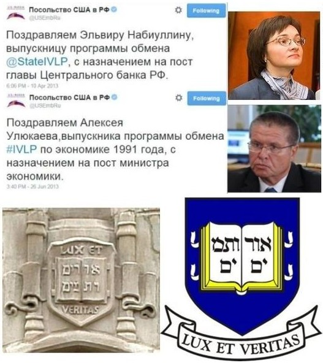

> **Первичный текст.** О ТМ №4(120) О возрождении суверенитета России…, 2015-07-06.
> Источник: `20150706 О ТМ №4(120) О возрождении суверенитета России….doc` sha256 `1a3b3efd9b71dcff…`; [страница на dotu.ru](https://dotu.ru/2015/07/06/20150706_tek_moment04120/).
> Автоматическая транскрипция DOC→Markdown; смысл и формулировки не правились.
> Контрольные суммы и статус проверки — в [NOTICE.md](../../NOTICE.md).
> Содержание передаёт позицию авторов; утверждения не верифицированы библиотекой.

---

«О текущем моменте» № 4 (120), июль 2015 года

О возрождении суверенитета России…

1. Россия не торгует суверенитетом потому,\

что давно проторговалась…

===========================================

В пятницу 03.07.2015 г., в очередную годовщину умышленно преданной забвению Великой Победы языческой Руси[^1], выступая на заседании Совета безопасности РФ, В.В.Путин заявил:

«Причина давления на Россию понятна, мы проводим независимую внутреннюю и внешнюю политику, не торгуем своим суверенитетом, не всем это нравится, но по-другому быть не может»[^2].

Это высказывание приведено в статье Максима Бруснева «Россия не торгует суверенитетом», опубликованной на сайте газеты «Комсомольская правда» 03.07.2015[^3].

Сайт газеты работает в режиме предварительной модерации комментариев читателей с систематическими нарушениями принципа свободы слова, провозглашаемого конституцией РФ 1993 г.[^4], поэтому там даже на несколько минут не могут появиться комментарии, чьи авторы высказали мнения, не уместные в политике промывания мозгов, которой придерживается либерально-троцкистская редакция газеты.

Матерщины в допущенных на сайт модераторами комментариях читателей конечно нет, но там нет и мнений о том, как России преодолевать кризис суверенитета, в который её ввергли в 1950‑е — 1990‑е гг. КПСС-овцы и либерал-буржуины. Модераторы пропускают только *юридически допустимое*[^5] глумление читателей в отношении постсоветского государства, В.В.Путина и других представителей государственной власти персонально, а также пропускают скулёж на тему «всё пропало, надо сдаваться Западу» и некоторое количество перебранок читателей друг с другом[^6].

Т.е. газета «Комсомольская правда» — как и все СМИ России:

- содействует дебилизации населения;

- публикует исключительно комментарии, содействующие распространению и активизации «майдаунных» настроений некоторой части отечественной толпы;

- препятствует обсуждению политически активной частью общества значимых для страны проблем в режиме аргументированной научной свободной дискуссии.

В совокупности всё названное означает, что в деятельности редакции и модераторов сайта «Комсомольской правды» прослеживаются не только признаки нарушения конституционного права граждан России на свободу слова в форме публикации своих комментариев и мнений на сайте газеты, но и признаки составов преступления, предусмотренные ст. 275 УК РФ, поскольку «выгодополучателями» такой управляемой «свободы слова» являются геополитические противники и конкуренты России, а также — и транснациональные корпорации.

Однако ни Прокуратуре, ни ФСБ до такого нигилистически-глумливого отношения руководства многих СМИ к государству, гражданами которого они являются, — нет дела, что является одним из показателем того, что Россия не обладает в настоящее время полнотой суверенитета. Это обстоятельство делает жизненно несостоятельным ещё одно высказывание В.В.Путина, которое Максим Бруснев привёл в своей статье:

«Граждане России, все ключевые политические силы страны, отечественный бизнес понимают, что происходит, и знают, что нужно делать».

Если бы это было действительно так, то биосферно-социально-экономического кризиса и кризиса внешнеполитического не было бы, и Россия успешно развивалась, пребывая в ранге глобального лидера цивилизационного развития. Поэтому придётся объяснить, что такое суверенитет, — как для чиновников и депутатского корпуса, так и для СМИ-шников, обеспокоенной общественности и прочих заинтересованных лиц.

# 2. Реальный суверенитет как социальный процесс

Суверенитет государства — это реализованная способность государственной власти осуществлять *полную функцию управления* в согласии глобальной, внутренней и внешней политики государства.

Полная функция управления включает в себя последовательность преемственных этапов: 1) выявление факторов, вызывающих дискомфорт, являющийся стимулом к организации управления, 2) целеполагание в отношении этих факторов, 3) выработка концепции достижения намеченных целей, 4) интеграция частной концепции в отношении намеченных целей в генеральную концепцию, в соответствии с которой уже некоторым образом осуществляется управление и которая вбирает в себя все прочие частные концепции, 5) внедрение частной концепции в жизнь, 6) правление в соответствии с нею в русле генеральной концепции, 7) наблюдение за течением процесса и коррекция правления и концепции, что в ряде случае предполагает и смену генеральной концепции, 8) высвобождение ресурсов, занятых в управлении по частной концепции, при достижении намеченных целей, либо возврат к п. 1 в случае, если намеченные цели управления не достигнуты.[^7] При этом должно быть понятно, что генеральная концепция в жизни общества выражает целеполагание и управление по полной функции в отношении исторически непреходящих факторов — так называемых «вечных ценностей».

«Полная функция управления» — понятие, неведомое исторически сложившейся теории государства и права, преподаваемой в вузах России, вследствие чего некритичное принятие её положений в качестве научно-методологического обеспечения государственного управления является одной из предпосылок к утрате государственного суверенитета в тех или иных его аспектах в большей или меньшей мере.

Культура общества — это информация и алгоритмика (совокупность знаний и поведенческих навыков), которые в жизни общества передаются от поколения к поколению помимо генетического механизма биологического вида «Человек разумный». Т.е. культура это — информационно-алгоритмическая система, формирующаяся в соответствии с определённой генеральной концепцией управления жизнью общества в преемственности поколений. Соответственно всякая культура или субкультура целесообразна и функциональна по отношению к решению одних задач и в большей или меньшей степени недееспособна в отношении решения других задач (вплоть до полного отсутствия функциональности). Поэтому, если качество жизни общества признаётся неудовлетворительным, то единственно верное решение проблемы — развитие культуры.

Государственность — субкультура управления делами общественной в целом значимости на местах и в масштабах всего общества на профессиональной основе в русле соответствующей генеральной концепции. И при этом государственность — один из общественных институтов, которые в совокупности, решая каждый свои специфические задачи (см. таблицу 1), взаимодействуют друг с другом в преемственности поколений.

**Таблица 1.\

Объективно необходимые функции и взаимосвязи\

общественных институтов**

<table style="width:100%;">

<colgroup>

<col style="width: 4%" />

<col style="width: 7%" />

<col style="width: 21%" />

<col style="width: 21%" />

<col style="width: 21%" />

<col style="width: 22%" />

</colgroup>

<thead>

<tr>

<th colspan="2" rowspan="2" style="text-align: right;"></th>

<th colspan="4" style="text-align: center;"><strong>Общественные институты как источники благ</strong></th>

</tr>

<tr>

<th style="text-align: center;"><strong>Семья 

даёт</strong></th>

<th style="text-align: center;"><strong>Государственность 

обеспечивает</strong></th>

<th style="text-align: center;"><strong>Наука 

обеспечивает</strong></th>

<th style="text-align: center;"><strong>Система 

образования обеспечивает</strong></th>

</tr>

</thead>

<tbody>

<tr>

<td rowspan="4" style="text-align: center;"><blockquote>

<strong>Общественные институты как получатели благ</strong>

</blockquote></td>

<td style="text-align: center;"><blockquote>

<strong>Семье</strong>

</blockquote></td>

<td>
<em>1. Продолжение рода.</em>

<em>2. Непосредственную заботу друг о друге членов семьи.</em>
</td>

<td>Социальную защищённость и факторы, обуславливающие качество жизни семьи и личности.</td>

<td>Кругозор подрастающих поколений и взрослых сверх обязательного образовательного минимума, принятого в обществе.</td>

<td>Стартовый уровень образованности и профессионализма вступающих в жизнь новых поколений, как основу для их интеграции в жизнь общества.</td>

</tr>

<tr>

<td style="text-align: center;"><blockquote>

<strong>Государственности</strong>

</blockquote></td>

<td>
1. Людские ресурсы.

2. Нравственность.

3. Этику. 

4. Основы культурного единства общества. 
</td>

<td>
<em>1. Организацию системы управления.</em>

<em>2. Воспроизводство субкультуры управления на профессиональной основе в преемственности поколений.</em>
</td>

<td>Научно-методологическое обеспечение текущего государственного управления и выработки политического курса на будущее.</td>

<td>
1. Основы культурно-политического единства общества.

2. Кадры профессионалов-управленцев.
</td>

</tr>

<tr>

<td style="text-align: center;"><blockquote>

<strong>Науке</strong>

</blockquote></td>

<td>
1. Людские ресурсы.

2. Нравственность.

3. Этику. 

4. Основы культурного единства общества. 
</td>

<td>
1. Организацию системы.

2. Поддержку фундаментальной науки.

3. Постановку исследовательских задач в интересах осуществления политики государства.
</td>

<td><em>Воспроизводство субкультуры научных исследований и решения прикладных задач.</em></td>

<td>Кадры профессионалов-исследователей и разработчиков.</td>

</tr>

<tr>

<td style="text-align: center;"><blockquote>

<strong>Системе 

образования</strong>

</blockquote></td>

<td>
1. Людские ресурсы.

2. Нравственность.

3. Этику. 

4. Основы культурного единства общества. 
</td>

<td>
1. Организацию системы.

2. Постановку образовательных задач в интересах осуществления политики государства.
</td>

<td>
1. Методологию познания и творчества.

2. Миропонимание (т.е. тематику и содержание образовательных стандартов).

3. Кадры профессионалов-преподавателей.
</td>

<td><em>Кадры профессионалов-преподавателей.</em></td>

</tr>

</tbody>

</table>

Сбои или извращения функций в работе любого из общественных институтов, нарушение их органичных взаимосвязей друг с другом, с хозяйственной системой и Природой оказывают негативное воздействие и на другие компоненты общественно-экономической формации, и соответственно — на жизнь общества в целом.

На исторически непродолжительных интервалах времени, в пределах сроков активной жизни одного поколения, качество жизни общества определяется функционированием института государственности. На более продолжительных сроках, охватывающих вступление в активную жизнь 1-2 новых поколений[^8], качество жизни общества, включая функционирование института государственности, определяется функционированием институтов науки и системы образования, в соответствии со статистической предопределённостью, представленной ниже на рис. 1. На ещё более продолжительных интервалах времени всё определяется функционированием института семьи, который является источником «человеческих ресурсов» для всех прочих общественных институтов, поскольку качество «человеческих ресурсов», предоставляемых институтом семьи, открывает и закрывает те или иные возможности функционирования всех без исключения общественных институтов и хозяйственной системы.

Это напрямую связано и с проблематикой реализации суверенитета государства. Государство и государственность это — разные явления. Государство это — государственность в выше определённом значении термина плюс население, территория, акватория, воздушное пространство и недра, находящиеся под властью этой государственности. Из этой нетождественности государственности и государства проистекает несколько важных следствий:

1.  Государственность может быть суверенной, но антинародной, если «элита»:

- противопоставляет себя простонародью, вследствие чего её политика направлена на то, чтобы эксплуатировать простонародье как природный ресурс, что требует воспроизводства в простонародье невежества;

- сама «элита» воспроизводит в своей среде культуру, позволяющую «элитарной» государственности осуществлять суверенитет в его полноте либо в пределах той или иной определённой генеральной концепции осуществления толпо-«элитаризма»;

2.  Государственность может быть несуверенной и антинародной, если «элита»:

- противопоставляет себя простонародью и её политика направлена на то, чтобы эксплуатировать простонародье как природный ресурс, что требует воспроизводства в простонародье невежества;

- сама «элита» не способна воспроизводить в своей среде культуру, позволяющую «элитарной» государственности осуществлять суверенитет в его полноте либо в пределах той или иной определённой генеральной концепции осуществления толпо-«элитаризма»;

3.  Государственность может быть суверенной без каких-либо оговорок об ограничении суверенитета той или иной концепцией (но и в этом случае сохраняется ограничение объективных закономерностей, которым подчинена жизнь Природы и человечества в ней) если:

- общественный институт семьи (а отчасти и система образования) воспитывают суверенных личностей;

- если наука выработала научно-методологическое обеспечение суверенитета народа;

- если система образования на основе этого научно-методологического обеспечения формирует миропонимание управленцев-профессионалов для всех сфер деятельности;

- в результате чего для работы в органы государственной власти приходят состоявшиеся носители суверенитета.

Если с этими следствиями соотносить известное из истории, то:

- к первому типу без каких-либо оговорок принадлежал древний Египет, когда был под властью иерофантов — носителей концептуальной властности;

- к первому типу с оговоркой об ограничении суверенитета определённой концепцией принадлежали абсолютистские монархии, включая монархическую Русь после крещения, поскольку власть самодержавного (суверенного) монарха ограничивалась миропониманием его и правящей «элиты», сформированным на основе Библии; к этому же типу пока ещё принадлежат и США, в которых способ реализации суверенитета, ограниченного библейской концепцией, отличается от самодержавно-монархического[^9];

- Ко второму типу относятся все государства современности, а в США протекают процессы, ведущие к тому, что и они перейдут в этот тип.

- Государством третьего типа пытался стать СССР, но не стал, поскольку: 1) «мраксизм»-ленинизм как научно-методологическое обеспечение — помеха решению этой задачи и 2) социальная психодинамика за 70 лет существования СССР к началу «решительной перестройки» после октябрьского 1987 г. пленума ЦК КПСС-овцев сохраняла толпо-«элитарный» характер, унаследованный от империи, как в силу собственной инерции, так и под воздействием «мировой закулисы» и её периферии.

Вследствие того, что исторически сложившаяся культура России наших дней принадлежит ко второму типу и не соответствует третьему, положение действующей конституции РФ (ст. 3, ч. 1): *«Носителем суверенитета и единственным источником власти в Российской Федерации является её многонациональный народ»* — пустая жизненно несостоятельная декларация со всеми сопутствующими этому факту последствиями. Это практически выражается в том, что:

- Правящая «элита» проводит политику дебилизации населения посредством прозападной реформы системы образования и информационной политики как «независимых», так и государственных СМИ и достигла в этом определённых успехов.[^10]

- Сама «элита» беспредельно некомпетентна во всей проблематике социологии и социального управления, и при этом она необучаема (выделить время и прочитать книгу для её представителей — запредельный подвиг), самостоятельно думать (т.е. выявлять проблемы и вырабатывать способы их решения) не умеет и полагается на сторонних «экспертов»-консультантов, вследствие чего:

<!-- -->

- В кадровой политике ею заявлено об отдании предпочтения при назначении на ключевые должности тем, кто «повысил квалификацию» в зарубежных вузах или получил первое высшее образование в них[^11].

- Детишки «элиты» учатся в престижных зарубежных вузах, т.е. готовятся стать новым поколением «туземной администрации» России и служить хозяевам и заправилам Запада (метрополии), которые сами не опускаются до того, чтобы лично жить в колониях и тратить время на управление делами «дикарей», предпочитая создавать во всех своих колониях «туземную администрацию» из «дикарей», более или менее поддающихся процессу «оцивилизовывания» на западный манер и готовых продать и себя, и свой народ, и все ресурсы территории государства.

- При этом как в бизнес-«элите», так и в политической «элите» (включая «элиту» журналистики и «элиту» профессорско-преподавательского состава ряда отечественных вузов) довольно широк слой тех, кто чьё финансовое и потребительское благополучие, статус в социальной иерархии личностей и кланов в пределах России, иллюзии возможностей приобщиться к мировой «элите», связаны с тем, насколько Россия лояльна Западу в качестве его криптоколонии[^12]. Возрождение суверенитета страны для них неприемлемо.

- «Патриотизм» изрядной доли простонародья заканчивается на пороге их квартиры или на границах периметра участка, где стоит их хата, а идеальный глава государства для них — «Старик Хоттабыч», который беспрекословно выполняет все их желания чудесным образом без каких-либо *осмысленных* усилий с их стороны. Для них суверенитет — нечто за пределами их миропонимания: до суверенитета России и её будущего им сейчас нет дела точно так же, как в годы перестройки им и их предкам не было дела до суверенитета СССР.

Какой может быть суверенитет государства при таком правлении? И каким суверенитетом можно торговать сейчас, когда им начали торговать сразу же после убийства И.В.Сталина и Л.П.Берии и распродали весь во времена Б.Н.Ельцина, какой факт юридически зафиксировали в ныне действующей конституции РФ 1993 г.[^13] и в образовательных стандартах общеобразовательной и высшей школы, не дающих никакого представления об управлении природно-общественно-хозяйственными системами[^14]?

# 3. Как возрождается суверенитет России

Поскольку глобализация это — объективный процесс, а концепции глобализации — порождения субъективизма, то в условиях глобализации для того, чтобы государство было суверенным, институт семьи должен воспитывать личности, чья нравственность и этика обязывают их принять заботу о благе Земли и человечества в целом на себя по своей собственной инициативе.

Если такая нравственно-этическая обязанность осознаётся, то неизбежно осознание и того, что трансформация заботы из статуса благих намерений в статус результативных действий требует определённых знаний. Если таких знаний в культуре общества нет, то для того, чтобы забота выразилась в благом результате, их надо выработать и распространять в обществе, чтобы они стали достоянием если не общей культуры, то устойчивой в преемственности поколений, органично развивающейся субкультуры.

Если количество таких людей в обществе превышает некоторую долю, достаточную для того, чтобы они, войдя в органы государственной власти, с течением времени изменили бы характер государственности, то суверенитет государства без каких-либо оговорок становится неизбежным.

*[В оригинальном издании здесь расположен рисунок/схема. Иллюстрация не включена в данный выпуск: ожидает визуальной и правовой проверки. Файл источника: image3.jpeg]*Ключом к запуску этого процесса является концепция глобализации, альтернативная действующей концепции порабощения человечества в неком идеальном толпо-«элитаризме», в котором все — невольники и заложники системы, не осознающие своего невольничьего положения и потому удовлетворённые им. Поскольку из концепций глобального толпо-«элитаризма» в настоящее время наиболее эффективная библейская концепция финансового рабовладения на основе транснационального ростовщичества, а она предполагает передачу суверенитета всеми народами и государствами «банковскому сообществу», то никакие иные концепции толпо-«элитаризма» не могут быть альтернативой ей и не могут быть основой суверенитета: всегда найдутся паразиты типа мальчиша-плохиша и упыри типа Смердякова, готовые продать всё.

Соответственно этому обстоятельству концепция должна быть праведной, т.е. направленной на реализацию в жизни сути человека, поскольку только в этом случае получит «мистическую» поддержку со стороны ноосферы[^15] Земли и Свыше. Для этого в концепции, в предлагаемой ею алгоритмике социального управления и организации жизни общества и хозяйственной деятельности должны найти адекватное выражение объективные закономерности, которым подчинена жизнь людей, культурно своеобразных обществ, человечества в целом. Их можно отнести к следующим шести группам:

1.  Человечество — часть биосферы, и существуют объективные закономерности, регулирующие: 1) взаимодействие биосферы и Космоса, 2) формирование биоценозов и 3) взаимодействие биологических видов друг с другом в пределах биосферы.

2.  Человечество — специфический биологический вид, и существуют специфические биологические (физиологические и психологические) видовые закономерности, регулирующие его жизнь.

3.  Существуют нравственно-этические (религиозные и ноосферные) закономерности, регулирующие взаимоотношения обладателей разума и воли. И вопреки мнению многих закономерности этой категории выходят за пределы человеческого общества, а этика, диктуемая с иерархически более высоких уровней в организации разного рода систем, — обязательна для иерархически низших уровней и отступление от её норм наказуемо. Соответственно отступничество от объективной праведности — главная нравственно-мировоззренческая причина глобального биосферно-социального экологического кризиса.[^16]

4.  Культура, которую генетически предопределённо несёт человечество, является информационно-алгоритмической системой. Культура вариативна, в том смысле, что как информационно-алгоритмическая система, она может быть ориентирована на достижение различных целей, на различных путях жизни общества, различными средствами. И существуют социокультурные закономерности, следование которым гарантирует устойчивость общества в преемственности поколений, а их нарушение способно привести к его исчезновению в течение жизни нескольких поколений под воздействием деградационных процессов.

5.  Исторически сложившаяся культура всех обществ нынешней глобальной цивилизации такова, что мы вынуждены защищаться от природной среды техносферой. Техносфера воспроизводится и развивается в ходе хозяйственной и финансовой деятельности, и существуют финансово-экономические закономерности, предопределяющие как развитие общественно-экономических формаций, так и их деградацию и крах.

6.  Всё это в совокупности может приводить к конфликтам интересов и конфликтам разных видов деятельности, разрешением которых необходимо управлять. И существуют объективные закономерности управления, единые для всех процессов управления, будь то езда малыша на трёхколёсном велосипеде либо комплексный проект, осуществляемый несколькими государствами на принципах частно-государственного партнёрства.

И процесс возрождения суверенитета России в русле концепции глобализации, альтернативной библейской концепции порабощения человечества на основе ростовщичества и других средств осуществления власти всех шести приоритетов обобщённых средств управления / оружия в России начался ещё в годы перестройки. К настоящему времени Концепция общественной безопасности освещает весьма широкий тематический спектр, являясь единственной научно-методологической альтернативой гуманитарным лженаукам Запада. Концепция востребована некоторой долей молодёжи по их инициативе, а не по принуждению старших или под давлением системы образования. Процесс возрождения суверенитета России идёт, выходит за её границы, и сегодня это — вопрос *социального* времени. Хотите быстрее — работайте сами, а не ждите, что правящая «элита» сделает всё за вас вопреки её собственным нравам и устремлениям продать всё и продаться самим хозяевам Запада.

Внутренний Предиктор СССР\

04 — 06 июля 2015 г.

[^1]: 3 июля 965 г. — взятие Белой Вежи, столицы Хазарского каганата, в результате чего каганат перестал существовать. Однако дело его хозяев не исчезло в небытии, было продолжено и выразилось в том, что ликвидацию СССР оформили «Беловежскими соглашением», а Великая Победа 3 июля 965 г. предана забвению.

[^2]: Официальный текст выступления В.В. Путина по ссылке: [<u>http://www.kremlin.ru/events/president/news/49862</u>](http://www.kremlin.ru/events/president/news/49862).

[^3]: <http://www.kp.ru/daily/26401/3278003/>.

[^4]: Ст. 29, ч. 1: Каждому гарантируется свобода мысли и слова. Ст. 29, ч. 4: Каждый имеет право свободно искать, получать, передавать, производить и распространять информацию любым законным способом. Перечень сведений, составляющих государственную тайну, определяется федеральным законом. Ст. 29, ч. 5: Гарантируется свобода массовой информации. Цензура запрещается.

[^5]: Т.е. такое, которое не подпадает под действие статей УК РФ о борьбе с экстремизмом и т.п. и которое в крайнем случае можно свалить на мнение читателей.

[^6]: Образчики такого рода мнений:

    «…Во время 2-й Мировой Гитлер, немцы, проигрывая войну, рассчитывали на создание ракет и атомного оружия. В принципе просто не успели. Их ожесточенное сопротивление было оправдано. А здесь на что рассчитывать? На то, что Запад испугается российского атомного оружия и начнет сдавать свои позиции?».

    «Харьковчанин с улицы Данилевского: Вся эта риторика предназначена для сугубо внутреннего потребления, в то время как в реальности Запад, фигурально выражаясь, нагнул россиянию и держит её за волосы, а Китай, пользуясь ситуацией, пристраивается сзади ☺».

    «Действительно, слышать от человека, все годы своего правления делавшего всё для превращения РФ в сырьевой придаток, слова о защите суверенитета довольно странно…».

    «Откажитесь от “фантиков” (по всей видимости, имеется ввиду доллар: наше пояснение при цитировании). Откажитесь от разработанных американцами микропроцессоров, от американского ПО, от системы VISA, от американских технологий в автомобилестроении и прочая, прочая, прочая. Да и от европейских, канадских и японских — они ведь тоже ввели санкции. И тогда посмотрим, чей мир рухнет…».

[^7]: Более обстоятельно см. работы ВП СССР «Основы социологии» (т. 1) или «Достаточно общая теория управления. Постановочные материалы учебного курса

[^8]: Исследования социологов показывают, что поколения разграничиваются возрастной разницей их представителей в 5 лет: примерно раз в 5 лет обновляются подростковые субкультуры.

[^9]: Об особенностях реализации полной функции управления в США см. работу ВП СССР «“Сад” растёт сам?..» (2009 г.).

[^10]: Несколько лет назад для выявления реального уровня подготовки только что принятым первокурсникам ЛЭТИ было предложено решить контрольные работы по физике и математике, которые использовались в этом вузе на вступительных экзаменах до введения ЕГЭ. Результат оказался обескураживающим: средний балл по математике составил 2,6, а по физике — 2,4.

[^11]: Это предусмотрено «индикаторами решения поставленных задач», предлагаемых в проекте «Стратегии инновационного развития Российской Федерации на период до 2020 года» «Инновационная Россия — 2020», опубликованном Минэкономразвития в 2010 г.:

    | **Наименование индикатора** | **2010** | **2016** | **2020** |

    |----|----|----|----|

    | Доля государственных служащих, получающих ежегодно дополнительное образование за рубежом | 0,1 % | 1 % | 3 % |

    | Доля лиц, занимающих должности руководителей высшей и главной групп должностей государственной гражданской службы, получивших высшее профессиональное образование за рубежом | \> 0,5 % | 4 % | 12 % |

    При следовании этим нормативам в кадровой политике для полной передачи власти над страной внешнеполитическим субъектам достаточно 12 % зомби продвинуть на ключевые посты, не говоря уж о завербованных спецслужбами в ходе учёбы, которыми можно будет управлять в приказном порядке по телефону.

    Минэкономразвития в тот период, когда появилась эта программа, возглавляла Э.С.Набиуллина — тоже выпускница «курсов повышения квалификации» для представителей и кадрового резерва «туземных администраций», организованных в Йельском университете.

[^12]: Термин введён в лексикон политологии Дмитрием Галковским. Термин указывает на фактическую колонизацию государства при наличии у него всех формальных признаков суверенитета, осуществляемую в обход контроля сознания большинства представителей этого общества и, прежде всего, — решающего большинства его правящей «элиты». В этом случае политика государства-криптоколонии, включая экономическую, при наличии всех формальных атрибутов суверенитета, будет подчинена интересам иностранных государств или интересам собственников и директоратов транснациональных корпораций точно так же, как и в том случае, если бы страна юридически была колонией, а её государственность была административно подчинена тем или иным внешнеполитическим силам.

[^13]: Об этом см. работу ВП СССР «Введение в конституционное право» (2012 г.).

[^14]: Студентам второкурсникам, обучающимся по специальности «государственное и муниципальное управление», было предложено написать «сочинение» по тематике организации управления в жизни общества. Среди вопросов, которые им предлагалось осветить, был такой: «Экономика (народное хозяйство) как ОБЪЕКТ управления». В группе из 25 человек 7 человек написали, что «экономика это — СУБЪЕКТ управления», обосновывая это утверждение тем, что от неё в жизни общества зависит всё. Остальные упражнялись в пустословии.

[^15]: В 1920‑е — 1930-е гг. Владимиром Ивановичем Вернадским (1863 — 1945) и Пьером Тейяром де Шарденом (1881 — 1955) была высказана идея ноосферы — «сферы разума» планеты Земля, регулирующей всё, что происходит на планете, в русле объемлющих жизнь планеты общекосмических закономерностей.

[^16]: А сам кризис, если исходить из методологии ДОТУ, — замыкание на человечество подавляюще-сдерживающих обратных связей, что должно интерпретироваться как «намёк» иерархически высшего управления людям на необходимость строить жизнь в соответствии с объективными закономерностями бытия.
---

[К произведению](README.md) · [Каталог](../../CATALOG.md)
