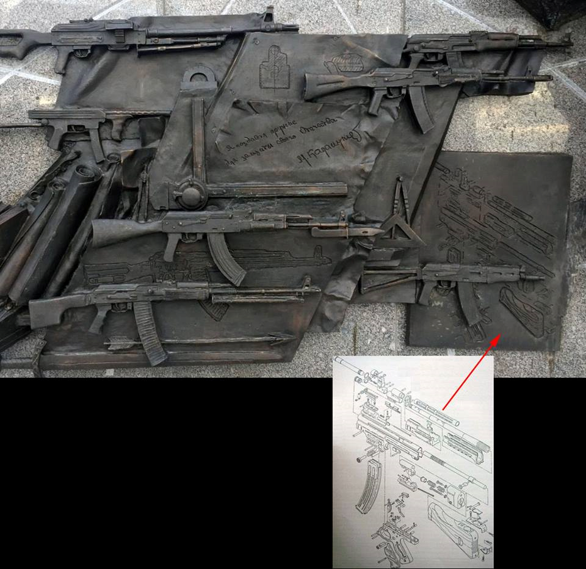

> **Первичный текст.** О ТМ №4(132) 1917 год — начало преображения человечества, 2017-10-11.
> Источник: `20171011 О ТМ №4(132) 1917 год — начало преображения человечества.doc` sha256 `9b58cf6067291b42…`; [страница на dotu.ru](https://dotu.ru/2017/10/11/20171011_tek_moment04132/).
> Автоматическая транскрипция DOC→Markdown; смысл и формулировки не правились.
> Контрольные суммы и статус проверки — в [NOTICE.md](../../NOTICE.md).
> Содержание передаёт позицию авторов; утверждения не верифицированы библиотекой.

---

## 1.1. Николай II — последний император всероссийский

Если коротко характеризовать его царствование, то всё укладывается в две фразы:

- На протяжении всего своего царствования Николай II сливал в ничто потенциал мирного бескризисного развития страны, унаследованный от эпохи Александра III[^3], что и привело в конечном итоге к катастрофе 1917 г. и последующей гражданской войне, которая на протяжении всего последующего столетия течёт с разной интенсивностью, меняя только формы (т.е. доминирование обобщённых средств управления / оружия разных приоритетов).

- Избрав и проводя на протяжении 22 лет именно политику уничтожения потенциала мирного развития страны, Николай II по сути совершил самоубийство, в которое вовлёк как свою семью, так и миллионы людей в нескольких последующих поколениях, поэтому надо молиться не ему как святому, а молиться о том, чтобы Бог простил ему этот и многие другие грехи.

Фактологию к обоснованию именно такой оценки царствования Николая II см. в работе ВП СССР «Разгерметизация», а также — в воспоминаниях современников царствования Николая II: великого князя Александра Михайловича[^4]; юриста, сенатора Российской империи Александра Фёдоровича Кони[^5]; Викентия Викентьевича Вересаева[^6]; морского офицера, капитана 1 ранга Владимира Ивановича Семёнова[^7]; Сергея Юльевича Витте и других.

При вступлении на престол Николай II получил прозвище «кровавый» — за Ходынскую катастрофу 18 мая 1896 г. Тогда в Москве в связи с коронацией на Ходынском поле организовали народные гулянья с обещанием выдать подарки от царя-батюшки[^8], в результате толпа ломанулась за подарками и было подавлено насмерть и покалечено много людей. Траур не объявлялся, и это событие было воспринято как дурное предзнаменование для царствования в целом. — Ладно, можно предположить, что царь ещё не при делах (хотя до официальной коронации Николая II после смерти Александра III прошло уже более года), «верные слуги» подставили, когда катастрофа произошла — растерялся и повёл себя несообразно обстоятельствам.

Проходит несколько менее 10 лет — 9 января 1905 г., кровавое воскресенье. Случился расстрел *крестного хода* к царю рабочих столицы. Николай II в это время находился в Петергофе, а не в Зимнем дворце, и о трагедии узнал только на следующий день. — Опять «верные слуги» подставили, накануне событий запретив заранее согласованный и утверждённый ими же маршрут верноподданного шествия к «царю-батюшке».

Проходит ещё 12 лет — февраль 1917 г., в столице бунт войск, не желающих отправляться на фронт из тылового гарнизона, и перебои со снабжением продовольствием, возникшие вследствие саботажа на железных дорогах, ведущих в столицу, что положило начало катастрофе государственности и государства. — Опять «верные слуги» подставили.

Спрашивается:

Кто проводил кадровую политику на протяжении 22 лет, в результате которой реальная власть на протяжении всего царствования была в руках тех, кто всегда был готов единственно к тому, чтобы «подставить» царя и государственность — либо сдуру, либо вследствие безмерной алчности и продажности, измены или предательства по «идейно-масонским соображениям»?

Если кто-то будет настаивать на том, что Николай II вёл себя именно так в силу христианского смирения[^9], дабы в подданных пробудились совесть и стыд, — то для того, чтобы в других пробудились стыд и совесть, необходимо самому проявлять волю, во всех без исключения обстоятельствах подчинённую совести; а если с этим не справился и что-то сделал не по совести, то под властью стыда — признавать свои ошибки публично и приносить извинения. А в этом аспекте Николай II, мягко говоря, не отличался в лучшую сторону от подавляющей массы его подданных — в том, числе и от тех, кто его регулярно «подставлял» на всём протяжении его царствования.

Воспоминания о той эпохе сообщают о многих случаях увольнения с должностей высших чиновников империи по схеме *«личный доклад царю ⇒ монаршее одобрение доклада и деятельности должностного лица, ласковое прощание ⇒ по возвращении домой чиновник получает указ об отстранении от должности либо ему об этом сообщает по телефону преемник в должности или кто-то другой»*. — Это нормальная этика, свойственная добросовестному человеку либо «кидалово»? либо все такого рода сообщения лживо-клеветнические? либо царь имеет право на вседозволенность? — хотя Бог за собой такого права не признаёт.

Даже если возникновение русско-японской войны относить в политике в стиле заповеди «не противься злому…»[^10], то иначе обстоит дело с тем, как Россия оказалась втянутой в первую мировую войну ХХ века. Дело в том, что в 1905 году германский кайзер Вильгельм II на своей яхте «Гогенцоллерн» пришёл в финские шхеры, где в то время на своей яхте «Полярная звезда» отдыхал император Николай II. Императоры пообщались друг с другом, в результате чего они и уполномоченные ими свидетели[^11] 11 (24) июля[^12] подписали Бьёркский договор, который предусматривал взаимопомощь обеих империй друг другу в случае нападения на одну из них какой-либо третьей страны или коалиции. Бьёркский договор в том виде, в каком его текст известен (в том числе и по публикациям в интернете[^13]), не обязывает ни Россию, ни Германию оказывать военную помощь второй договаривающейся стороне в случае, если она сама начнёт войну против какой-либо третьей страны. Т.е. Бьёркский договор не угрожал безопасности ни Франции, с которой у России были союзнические договорённости, ни безопасности какой-либо другой страны. Однако после подписания императором всероссийским — Россия спустя несколько месяцев денонсировала Бьёркский договор, сославшись на отказ Франции к нему присоединиться. Как явствует из текста Бьёркского договора, присоединение к нему Франции не было обязательным условием его действия, но было желательным для Германии, поскольку у Франции в тот период были болезненные воспоминания о франко-прусской войне 1870 — 1871 гг. и в ней культивировались мечты вернуть под свою юрисдикцию утраченные в ходе той войны Эльзас и Лотарингию. В той исторической обстановке это подразумевало либо нападение Франции на Германию в удобных для Франции обстоятельствах, либо провоцирование Германии на войну с Францией.

Т.е. денонсацией Бьёркского договора Россия по умолчанию признала право Франции начать войну против Германии с целью возвращения под свою юрисдикцию Эльзаса и Лотарингии. Именно так, а ни как иначе, денонсацию Бьёркского договора должны были интерпретировать в Берлине.

После того, как Бьёркский договор был подписан самодержцем всероссийским и им же денонсирован, спрашивается:

Почему после того, как *Николай II делом показал, что он не хозяин своему слову и подписи,* в период перед началом первой мировой войны кайзер Вильгельм II обязан был верить телеграмме Николая II, что объявленная Россией мобилизация не означает по её завершении автоматического начала военных действий Россией ни против Австро-Венгерской империи, ни против Германской империи? — И Германия объявила войну России именно в ответ на отказ России отменить начатую мобилизацию.

Второй вопрос связанный, с Бьёркским договором, по сути вопрос о компетентности Николая II как главы государства спустя десять лет после начала царствования: *на момент подписания Бьёркского договора знал ли Николай II о содержании существовавших на тот момент договоров России и Франции, которое могло сделать содержание Бьёркского договора несовместимым с ними, вследствие чего Николай II действительно не имел ни международно-юридического, ни морального права подписывать Бьёркский договор в том виде, в каком его предложил на подпись кайзер Вильгельм II, до изменения характера своих договорных отношений с Францией?* При этом, как сообщает П.В. Мультатули[^14], Николай II, готовясь к встрече с кайзером, отказался взять с собой министра иностранных дел России графа Ламсфдорфа, сославшись на то, что рейхсканцлер Германии фон Бюлов не сопровождает Вильгельма II.

Вообще, кто-нибудь персонально в Российской империи в период царствования Николая II за что-либо отвечал?

Этот вопрос касается и самого Николая II, поскольку политика главы государства в стиле «не противься злому» всю полноту ответственности за будущее страны и мира перекладывает на Всевышнего.

Наряду с этим один из любимейших мифов монархистов — сказка о невиданных темпах экономического роста и научно-техническом прогрессе в Российской империи и поражении в войне, организованном большевиками, буквально накануне неотвратимой победы под руководством мудрейшего главнокомандующего Николая II. В связи с этим мифом есть ряд вопросов.

На первых многомоторных самолётах И.И. Сикорского «Русский витязь» и «Илья Муромец», которые действительно положили начало новой эпохе в развитии авиации, стояли двигатели «Аргус» производства Германии; после того, как началась первая мировая война, на них стали ставить двигатели меньшей мощности, импортированные из Франции, потом — произведённые в России по французской лицензии. Причина в том, что своих авиационных двигателей Россия к моменту создания этих самолётов не производила — совсем не производила: в Российской империи в балы и прочие шоу династией и правящей «элитой» инвестировалось существенно больше, нежели в образование, научно-технический прогресс и наращивание производственных мощностей на инновационной основе.

Эскадренный миноносец «Новик», изменивший облик кораблей этого класса, безусловно — достижение военно-морской мысли России, но опять — на нём котлы и турбины произведённые в Германии. Собственное производство корабельных паровых турбин и соответствующих им котлов было начато только в 1908 г. по лицензиям зарубежных фирм. Но отечественных производственных мощностей не хватало, вследствие чего на линкорах «Императрица Мария» и «Император Александр III» были установлены импортные механизмы: турбины, гребные валы, дейдвудные устройства — их доставка из Англии и задержки с производством брони вызвали опоздание вступления в строй «Александра» на 2 года. Постройка четвертого черноморского линкора «Император Николай I» вообще была сорвана по причине неспособности отечественной промышленности вовремя произвести оборудование для этого корабля. Постройку линейных крейсеров типа «Измаил», которые должны были вступить в строй в 1915 г., с началом войны пришлось прекратить вследствие того, что часть оборудования для них была заказана в Австро-Венгрии на заводах «Шкода», а промышленность России не могла его произвести либо вследствие технической отсталости, либо из-за перегруженности другими заказами.

При этом по всем классам кораблей Российский императорский флот количественно и по темпам строительства новых кораблей в несколько раз уступал и Германскому, и Британскому флотам. И перспектив, что это отставание будет в будущем сокращено, — не было: ни общекультурных, ни экономических. А в наиболее значимом классе кораблей тех лет — в линкорах — из-за длительных сроков строительства кораблей в Российской империи её флот от флотов Великобритании и Германии отставал и качественно: по тактико-техническим данным кораблей на 1 — 2 поколения, т.е. все завершённые постройкой российские линкоры на момент их *вступления в строй* уступали новейшим британским (и отчасти германским) современникам, прежде всего, по мощности артиллерии главного калибра (305 мм против 343 мм на «Орионе» и 381 мм на «Куин Элизабет»), по эффективности систем управления огнём, по мореходности, по скорости хода (черноморские) и дальности плавания, по условиям обитаемости, а кроме того их броневая защита была уже недостаточна для того, чтобы выдерживать попадания снарядов таких калибров[^15].

Артиллерийский порох, рецептуру и технологию производства которого Д.И.Менделеев разработал ещё в конце XIX века, с началом первой мировой войны Россия стала массово импортировать из США (патент на порох Менделеева также принадлежал бывшему военно-морскому атташе США в России).

Если Германия за годы первой мировой войны произвела порядка 280 000 пулемётов, то Россия — только 28 000 и то — лицензионных.

О сколь-нибудь массовом производстве автомобилей и тракторов, станочного оборудования, шариковых подшипников и электрооборудования, оптики и радиотехники в Российской империи накануне первой мировой войны вообще говорить не приходится.

В период царствования Николая II доля российского производства в мировой экономике прогрессирующе снижалась, а по большинству перспективных на начало ХХ века видов продукции, определивших характер боевых действий в первую мировую войну и облик техносферы в 1920‑е — 1930‑е гг., российское производство вообще отсутствовало.

Какие это обещало перспективы? — коалиционную войну государств Европы, США и Японии против России, расчленение страны и колониальный статус её обломков по итогам такой войны, которая вызрела бы если не к началу 1930‑х гг., то к началу 1940‑х. Сценарий такого расчленения пытались реализовать интервенты в ходе гражданской войны в указанном списочном составе, но не удалось: если не считать того, что Польша смогла отторгнуть земли западной Украины и Белоруссии (кроме того Польша отторгла от Литвы примерно 1/3 территории вместе со столицей Вильнюсом), а Румыния — Бессарабию.

Что касается поражения «накануне неотвратимой победы», то такого рода мифы культивировались и в Германии в годы веймарской республики, и они стали одной из идейных основ германского нацизма. Если же говорить о состоятельности такого мифа в отношении России, то, во-первых, власть монархии свергли не В.И. Ленин и большевики, а либерастическая общественность под кураторством масонства. До этого либерасты саботировали ведение войны и в своей пропаганде, опускаясь до заведомой лжи, возлагали вину за поражения на Николая II, Александру Фёдоровну, Г.Е. Распутина. После свержения монархии они действительно хотели победно завершить войну, присвоив победу в ней себе, но не смогли справиться с управлением Россией, вследствие чего восстанавливать государственное управление пришлось идейным марксистам интернационал-фашистам[^16] и большевикам.

В Германии, в России, в Великобритании, во Франции, в Австро-Венгрии к началу 1917 г. состояние экономики было катастрофическим, а отношение обществ к войне можно было характеризовать как усталость, прежде всего как моральную усталость (за исключением тех социальных групп, которые наживались на войне и потому стояли за «войну до победного конца»). Это было следствием того, что к моменту начала войны в обществах стран-участников (если не считать некоторые слои правящих «элит») не было ни сколь-нибудь широко распространённых агрессивных устремлений в отношении соседей[^17], ни ожиданий агрессии с их стороны, вследствие чего, когда эмоциональный порыв «разгромить коварного врага», возбуждённый пропагандой в первые дни войны, прошёл, то осталось только разочарование, породившее уныние. В таких условиях перспективы победы определялись ответом на вопрос *«какая из держав первой сломается?»,* а не тем, какая мобилизует народные силы, создаст военно-экономическую мощь, необходимую для разгрома врага, и принудит его к безоговорочной капитуляции[^18]. Первой сломалась Россия, за нею — Германия, Австро-Венгрия, Турция. В итоге Великобритания, Франция и примкнувшие к ним США вкупе с второстепенными союзниками типа Италии, Греции и Румынии — стали победителями, хотя по оценкам Герберта Уэллса (см. его книгу «Россия во мгле») Великобританию от катастрофе, аналогичной Российской, в случае продолжения войны отделяло примерно полгода.

1.2. Матильда Кшесинская — как «выдающийся разработчик\

артиллерийских систем» Русской армии

-------------------------------------------------------

Дело не в том, занималась ли сексом Матильда поочерёдно с цесаревичем Николаем и его младшим братом великим князем Георгием, дело в том, что она стала любовницей великого князя Сергея Михайловича, естественно, не став при этом его законной супругой: сословные предрассудки — на такой мезальянс великий князь пойти не мог, однако беспрепятственно блудить с простолюдинкой — мог, а другой великий князь Андрей Владимирович в это же время «наставил рога» Сергею Михайловичу. Но в Российской империи великие князья обычно были на военной службе и по праву рождения в императорской семье занимали должности первостепенной значимости, подчас мало чего понимая в подвластном им деле.

В силу такой кадровой политики Сергей Михайлович стал «главным артиллеристом»[^19] Российской империи. За сто лет до него «главным артиллеристом» Российской империи был граф А.А. Аракчеев. Если императора Франции Наполеона I считать лучшим артиллеристом Европы тех лет, то по итогам наполеоновской кампании против России *А.А. Аракчеева следует признать лучшим артиллеристом той эпохи*, поскольку именно он подготовил артиллерию Русской армии к победе в Отечественной войне 1812 — 1814 гг. Великий князь Сергей Михайлович в таковом качестве состояться не смог, а Матильда Кшесинская в этом приняла посильное участие.

«Русско-Японская война, помимо всего прочего, выявила тот факт, что одних только трёхдюймовок для полевой артиллерии явно недостаточно, и потому в 1907 году ГАУ решило объявить конкурс на лёгкую полевую гаубицу дивизионного звена. В отличие от большинства европейских стран, где для лёгкой полевой гаубицы был принят 105-миллиметровый калибр, наше ГАУ, решив пожертвовать подвижностью в пользу разрушительной силы снаряда, остановилось на 48-линейном калибре. На такое решение ГАУ подтолкнул опыт недавно прошедшей войны, в позиционных боях которой разрывной силы пудовых снарядов 42-линейной осадной пушки образца 1877 года оказывалось недостаточно для разрушения полевых укреплений противника.

В то же самое время чудом сохранившиеся в войсках отдельные экземпляры 12-фунтовой стальной осадной пушки образца 1867 года неожиданно оказались эффективным средством борьбы с японскими блиндажами. Калибр этой пушки в линиях как раз и составлял 48, что в переводе в миллиметры равняется 121,92 мм.

Однако в начале ХХ столетия принять на вооружение новый образец артиллерийского орудия было уже не так просто, как в предшествующие годы. Дело в том, что в 1905 году генерал-инспектором артиллерии стал Великий князь Сергей Михайлович. Период его генерал-инспекторства ознаменовался переходом русской артиллерии на французские образцы. И не просто на французские, а исключительно на образцы фирмы Шнейдер.

Эта компания, основанная в 1838 году бывшими портными братьями Адольфом и Иосифом Шнейдерами (от евр. שנײַדער — портной) занимала прочные позиции на машиностроительном рынке Франции, но за ее пределами авторитетом не пользовалась.

Формально в России продолжали проводиться конкурсные испытания опытных образцов артиллерийских систем, на которые по-прежнему приглашались фирмы Круппа, Эрхардта, Виккерса, Шкода и другие, а также русские казенный заводы Обуховский и Санкт-Петербургский орудийный. Но в подавляющем большинстве случаев победителем конкурса оказывалась фирма Шнейдер[^20].

При этом эта французская компания, заключая контракт с Военным ведомством России, непременно оговаривала, что определенное количество лет такая-то пушка системы Шнейдера будет изготавливаться исключительно на Путиловском заводе, или вообще будет изготавливаться только на нём. Дело в том, что в числе акционеров завода, помимо промышленника Путилова[^21] и банкира Вышнеградского[^22], была ещё и третья особа — балерина Мария-Матильда Адамовна-Феликсовна-Валериевна Кшесинская. (Рассказы о её сожительстве с разными великими князьями опустим по изложенным выше причинам — ВП СССР) Затем она стала любовницей сразу двух грандюков[^23]— молодого Андрея Владимировича, четвёртого сына великого князя Владимира Александровича, и уже упомянутого Сергея Михайловича[^24] (начальник ГАУ: пояснение ВП СССР), который был пятым сыном Михаила Николаевича — самого младшего из сыновей Николая I. От кого-то из этих двоих 18 июля 1902 года Матильда родила сына Владимира, пополнившего плеяду незаконнорожденных князей Романовских и ставшего впоследствии британским шпионом во Франции.

Однако в 1907 году на конкурс, объявленный ГАУ, фирма Шнейдер опоздала. Конкурс пришлось проводить «по-честному» — отдать предпочтение тем, кто даст больший откат. В результате на вооружение под индексом «48-линейная полевая гаубица обр. 1909 г.» была принята полевая гаубица фирмы Крупп.

Однако Кшесинская только что закончила строить новый дворец в Петербурге и сильно поиздержалась — поиздержалась настолько, что денег от крупповского отката ей едва хватило на покупку виллы в Ницце.

Поэтому уже на следующий год грандюк настоял на том, чтобы была принята на вооружение ещё и гаубица Шнейдера. И как ни странно, на вооружение её приняли, присвоив ей индекс «48-линейная полевая гаубица обр. 1910 г.». Эта гаубица не имела никаких преимуществ по сравнению с гаубицей Круппа. В итоге артиллерия получила две конструктивно различные системы одного калибра, выполнявшие одну и ту же задачу, и юнкера Михайловского артиллерийского училища тут же обозвали шнейдеровское орудие гаубицей системы Кшесинской»[^25].

Из Михайловского артиллерийского училища это определение вместе с его выпускниками распространилось по всей армии. И это не единственный случай, когда Матильда оказывала воздействие на политику развития артиллерии в России. Ниже фрагмент из воспоминаний академика А.Н. Крылова (описываемые им события происходили в 1912 г.):

«Начальником Главного артиллерийского управления был великий князь Сергей Михайлович, только что вернувшийся из Англии; там ему в числе разных артиллерийских новостей показали такое прицельное приспособление для береговых орудий, где простой наводкой прицельной трубы на ватерлинию цели орудию автоматически придается и надлежащий угол возвышения.

Англия применяла такие приспособления для Адена, Гонконга и прочих колониальных местностей, где орудия ставились на высоте свыше 1500 м. При таких условиях эта система была применима и могла давать довольно точные результаты, а у нас эти орудия предназначались для низменных побережий Финского залива с высотою не более 15 м — погрешность была бы примерно в 100 раз больше, и система абсолютно не могла быть применена.

Вернувшись с \<Обуховского\> завода, я написал записку, в которой расчетами и формулами в 12 пунктах показал непригодность предложения.

На следующий день поехали с директором Федоровым в Главное артиллерийское управление. Ввели нас в зал Артиллерийского ученого комитета. Стали постепенно сходиться артиллерийские генералы, пришел и Н.А. Забудский. Началось заседание, прочел я свою записку, и, вместо ее обсуждения по существу, начали артиллеристы-генералы судить и рядить о том, как бы все это скрыть от Сергея; нельзя же ему доложить, что он внес нелепое предложение.

Решили отложить рассмотрение до следующего заседания через неделю под предлогом, что не было генерала А.А. Маниковского[^26], начальника артиллерии Кронштадтского района, для которого главным образом и предназначались эти пушки.

Через неделю опять приехали, приехал и А.А. Маниковский, которого я знал уже лет десять:\

— Ваше дело совершенно ясное, это только не по разуму ученый Забудский мог разную ерунду городить.

На этот раз нас с Федоровым в зал заседания не пустили, а предложили подождать в приемной.

Примерно через час выходит капитан, ученый секретарь комитета:

— Решено снабдить установки прицелами вашего завода, можете продолжать изготовление, но журнала с этим постановлением вам прислать не можем: надо дождаться, пока Сергей уедет в отпуск, нельзя же этот журнал поднести ему на подпись. Вы себе вообразить не можете, какой скандал был. Генерал N. стал возражать Маниковскому и говорит:

— Я не усматриваю, почему обыкновенная прицельная труба не будет давать требуемой точности.

Маниковский и ляпни:

— Ваше высокопревосходительство, если вы эту трубу всунете окуляром себе в ж..., тогда, может быть, усмотрите.

Такая поднялась ругань, что пришлось закрыть заседание.

— Но как же быть заводу, ведь дело миллионное и срочное, нельзя же работать, не имея журнального постановления.

— Попробуйте устроить так, чтобы Сергей поскорее поехал за границу, где сейчас сезон, — в Трувиль или в Ниццу, — посоветовал ученый секретарь.

*[В оригинальном издании здесь расположен рисунок/схема. Иллюстрация не включена в данный выпуск: ожидает визуальной и правовой проверки. Файл источника: image3.jpeg]*Едем с Федоровым обратно на завод.

— Вы поняли, что посоветовал капитан? — спрашивает меня Федоров.

— **Понял, поднесите пачечку штук в сто «катенек» (сторублевок) Матильде (балерина М. Кшесинская, метресса Сергея), пусть она увлечет Сергея с собою купаться в Трувиль, тогда и журнал получите.**

Отсюда ясен вред, который бессознательно приносили великие князья, стоящие во главе управлений. Знаниями они не обладали, но все должностные лица боялись «огорчить» великого князя оспариванием его мнения: к празднику припомнит строптивость, да из наградного списка и вычеркнет.

Дворец Матильды на углу Каменноостровского проспекта и Дворянской улицы привлекал всеобщее внимание. Еду как-то на Металлический завод мимо этого дворца, извозчик на козлах и отпускает философское замечание:

— Дом-то какой, слышь, царская фря построила, … нажила, — причем он выразился чисто по-извозчичьи.

Но он, очевидно, не знал, что Матильда обладала и другими способами наживы. **На артиллерию тратилась в то время сотня миллионов в год; один процент комиссии — вот уже миллион».**

Император Николай II к такому подрыву боеспособности империи на протяжении всего своего царствования относился безучастно.

В общем, к первой мировой войне артиллерия армии Российской империи не была готова — ни по соответствию стоящего на вооружении набора арт-систем условиям и задачам ведения боевых действий, ни по количеству артиллерийских орудий и боезапаса к ним, ни по мощности производств, обеспечивающих боевые действия артиллерии, ни по научно-техническому заделу на будущее. А за роскошную жизнь Матильды при великом князе Сергее Михайловиче за счёт артиллерии — мужики в солдатской амуниции и офицеры — профессионалы и добровольцы — платили своею кровью...

Те, кто считает, что академик А.Н. Крылов и другие клевещут, пусть подумают, почему никакая другая балерина императорских театров не нажила дворца, такого, какой был у М. Кшесинской, и не стала акционером (как бы «инвестором») наиболее доходных предприятий Российской империи.

\* \*\

\*

Фильм на тему «Гаубица системы Кшесинской» был бы куда более полезен, нежели обсуждаемая в СМИ «Матильда» вне зависимости от исторической достоверности либо клеветнической лживости снятого А. Учителем «кина про будущего святого царя-мученика и его юношескую “любовь”»…

Тем не менее «Матильду» отсняли, и СМИ отрабатывают социальный заказ на скандал вокруг неё как клеветнического произведения, порочащего святого царя-мученика.

2. Либерасты, монархисты и прочие «государственники» —\

как бы патриоты России: противоречия и общие интересы

=======================================================

С точки зрения либерастов: зловредная циничная шлюха, среди всех прочих её дел[^27] мешавшая созданию должной обороноспособности страны, достойна того, чтобы предать забвению её истинные дела и подать зрителю в качестве наивной девочки, ставшей жертвой независящих от неё исторических обстоятельств. Соответственно такому подходу, все те, кто положил жизнь на создание мощи нашей страны, в том числе и военной, должны быть порицаемы и преданы забвению как враги «общечеловеческого прогресса» и либерального «гуманизма».

*[В оригинальном издании здесь расположен рисунок/схема. Иллюстрация не включена в данный выпуск: ожидает визуальной и правовой проверки. Файл источника: image4.jpeg]*Дополнением к реакции либерастов на порицание «Матильды» монархистами и частью православно воцерковленных стала реакция либерастов на открытие в Москве в День оружейника 19.09.2017 г. памятника выдающемуся советскому оружейнику М.Т. Калашникову (1919 — 2013). Андрей Макаревич (музыкант, фронт-мен группы «Машина времени», бывшей популярной в 1970‑е — 1980‑е гг. среди подростков и молодёжи, мировоззренчески застрявшей в детстве) высказал следующее мнение:

*[В оригинальном издании здесь расположены иллюстрации (2 объекта). Иллюстрации опущены: см. реестр графического слоя работы.]* <!-- figs:о-тм-no4-132-1917-год-начало-преображения-человечества--unbound-image5,о-тм-no4-132-1917-год-начало-преображения-человечества--unbound-image6 -->

«Ну хорошо. Памятник Калашникову. Пусть нам будет чем гордиться. Если подсчитать, сколько людей на планете убиты из его оружия, получатся миллионы. (Хотя вот что интересно — войну с фашистами АКМ не застал, появился после. Так где он защищал рубежи нашей Родины? В Афганистане? В Грузии? В Украине? В Африке?)

Ладно. Пусть Калашникову. НО ПОЧЕМУ ТАКАЯ БЕЗДАРНАЯ, УРОДЛИВАЯ СКУЛЬПТУРА? Даже в советские времена этот истукан не прошел бы худсовет. Ну что же мы так уродуем свой город, позоримся перед всем миром?»[^28]

Как видно из представленных фотографий, памятник передаёт прижизненный образ Михаила Тимофеевича достоверно, включая выражение лица, вследствие чего оценка художественных достоинств памятника А. Макаревичем — либо поистине дебильная, либо заведомо злобно-клеветническая[^29].

Что касается права народов России гордиться М.Т. Калашниковым и его произведениями, то если отстроиться от дебильно-клеветнических бредней Р. Рейгана и отечественных и зарубежных[^30] либерастов об СССР как об «Империи Зла», то автомат Калашникова, превосходивший на протяжении десятилетий стрелковое оружие стран НАТО, — исторически реально стал весомым фактором сдерживания агрессивных намерений натовцев в отношении СССР (прежде всего в случае рассмотрения сценариев агрессии против СССР без применения ядерного оружия[^31] и других видов оружия массового поражения с обеих сторон).

Кроме того, *автомат Калашникова присутствует в государственных гербах и на государственных флагах ряда государств мира как символ их освобождения от колониального угнетения* со стороны «гуманных» и высоко цивилизованных либеральных государств Запада, чья политика столь по нарву отечественным либерастам[^32] и о многовековой, — нацистской по сути, — колониальной политике которых либерасты предпочитают умалчивать.

Однако *именно за этот* памятник М.Т. Калашникову *в первозданном виде этого памятника* всё же должно быть стыдно — прежде всего скульптору (Салават Щербаков)[^33], архитектору и приёмной комиссии бюрократов из министерства культуры во главе с В. Мединским, утвердивших проект и принявших готовый памятник, но по другой причине, а не по той, которую называют либерасты. Дело в, том, что на памятнике среди всего прочего изображена схема штурмовой винтовки вермахта STG‑44[^34] (см. фото слева), внешне похожей на АК-47, вследствие чего самодовольные дебилы, не вникающие в конструктивные особенности обеих систем, пропагандируют версию, согласно которой М.Т. Калашников просто скопировал германскую конструкцию с некоторыми незначительными изменениями внешнего вида.

Хотя в действительности в конструкции автомата *М.Т. Калашникова — именно благодаря личности его создателя —* воплотились многие идеи и технические решения, известные в среде оружейников и ранее, но в творчески переработанном виде и в на редкость гармоничном сочетании, в том числе и с новаторскими техническими решениями самого М.Т. Калашникова, что и создало новое и неподражаемое качество этого автомата и всех прочих разновидностей оружия, созданного на основе базовой модели. Но это выше понимания «бандерлогов»: либералы, как и все прочие психтроцкисты, превыше того, чтобы вникать в суть чего бы то ни было.

Понятно, что монархисты и прочие «государственники» и по вопросу о памятнике М.Т. Калашникову выступают против либерастов. Так вследствие выступления А. Макаревича в стране на одну общественно-политическую дискуссию стало больше.

Тем не менее у либерастов, монархистов и прочих «элитариев»-«государственников» как бы патриотов России есть общий интерес: он состоит в том, чтобы предать забвению идеалы Великой октябрьской социалистической революции и убедить всех в том, что преступлением против народов России была не политика Николая II, приведшая к краху имперской государственности и разрушению империи, а Великая октябрьская социалистическая революция и вся Советская эпоха.

«Историки оставили упоминание Октябрьской революции в концепции единого учебника истории России под нажимом общественности, но отказались признать ее «великой» и «социалистической» и обозначили лишь как «этап Великой русской революции», заявил замдиректора Института российской истории РАН, член авторского коллектива проекта историко-культурного стандарта Сергей Журавлев.

«Первоначально мы не хотели упоминать словосочетание «Великая Октябрьская социалистическая революция». И в концепции осталось «Великая русская революция». Вот очень многие наши граждане выступали за то, чтобы упоминание Октябрьской революции оставить в концепции. В результате, если вы посмотрите, там говорится о Великой российской революции, прошедшей в своем развитии несколько этапов (в скобочках: в том числе Октябрьская революция). Нет ни слова «великая», ни «социалистическая», — рассказал Журавлев в интервью телеканалу «Дождь».

Он отметил, что термин «Великая русская революция» — «это примерно то же самое, что говорят французы о своей революции».

Общественное обсуждение концепции проекта единого учебника по истории России началось в сентябре.

Ранее сообщалось, что в создании концепции единого учебника истории России поучаствуют ветераны Великой Отечественной войны. Чеченские историки также включились в работу над единым учебником, чтобы «упомянуть на страницах учебника ряд выдающихся общественных и политических деятелей, героев войн и знаменитых личностей из числа народов Северного Кавказа», пишет "БалтИнфо".

Напомним также, как писала ГАЗЕТА.СПб[^35], по требованию историков из Татарстана, из учебников, возможно, исчезнет термин "татаро-монгольское иго". Его заменит политкорректная формулировка: "система зависимости русских земель от ордынских ханов".

Применительно к военным завоеваниям России не будет употребляться грубое слово "колонизация", ее заменит мягкое определение "расширение территории российского государства и присоединение других народов".

**Не упоминаются такие явления российской истории 19 века, как освободительное движение, масонство, терроризм** (выделено нами жирным при цитировании).

Культ личности получит новое определение — "сталинский социализм". Роль Иосифа Сталина в новом учебнике вообще оценена неоднозначно. Первые годы его правления названы «периодом форсированной индустриализации, модернизации, осуществленной чрезвычайными методами». Результатом той модернизации названо преодоление технологического отставания от западных стран.

*[В оригинальном издании здесь расположен рисунок/схема. Иллюстрация не включена в данный выпуск: ожидает визуальной и правовой проверки. Файл источника: image8.jpeg]*Сам Сталин охарактеризован как автор «сталинского социализма» — диктатор, подменивший власть советов партийной номенклатурой, опустивший «железный занавес» и применявший насильственные методы для решения политических и экономических задач.

Массовые репрессии отнесены только к периоду 1937 — 1938 гг. Они названы методом борьбы с потенциальной «пятой колонной».

Заканчиваться учебник будет 2012 годом, однако, ни словом не будут упомянуты многотысячные акции оппозиции, да и, по мнению историков, само слово "оппозиция", применительно к современности, школьникам не нужно.

Среди современных политиков детям нужно будет знать только лидеров КПРФ и ЛДПР — Геннадия Зюганова и Владимира Жириновского. Другие оппозиционеры упомянуты не будут[^36].

Правда, в учебнике, возможно, появится имя Михаила Ходорковского вместе со скупым упоминанием о деле ЮКОСа.

Среди деятелей отечественной культуры место Иосифу Кобзону нашлось, Мстиславу Ростроповичу[^37] — нет.

А вот период правления самого Владимира Путина выделят в отдельный раздел»[^38].

Опубликованное 19 декабря 2016 г. на сайте президента РФ В.В. Путина «Распоряжение о подготовке и проведении мероприятий, посвящённых 100-летию революции 1917 года в России»[^39] — вообще не разграничивает февральскую буржуазно-либеральную революцию и Великую октябрьскую социалистическую революцию. По сути такое отношение к истории — попытка самообмана и введения в заблуждение общества и, прежде всего, — подрастающих поколений, в отношении которых либерал-буржуинской постсоветской государственностью проводится политика в стиле «они и их выродки должны читать только свои же СМС-ки, смотреть футбол, сосать сигаретки и пиво и получать наслаждение от всевозможного разврата».

Характерно и то обстоятельство, что распоряжение главы государства о подготовке и проведении неких мероприятий есть, а мероприятий — нет: ни по поводу отречения Николая II от престола; ни по поводу создания временного правительства и Советов; ни по поводу «Приказа № 1», которым именно временное правительство дало старт разложению армии и флота до состояния почти полной небоеспособности; ни по поводу событий 3 июля; ни по поводу иных событий 1917 г. Это всё — следствие политики, направленной на предание забвению всех событий 1917 г. и замещению памяти о них историческими мифами на тему «большевики во всём виноваты», в чём одинаково заинтересованы все как бы патриоты — и либерасты, и монархисты, и «элитарии»-«государственники».

Но политика предания забвению прошлого ещё никогда никого до добра не доводила. Прошлое надо помнить и переосмыслять, исходя из достигнутого качества миропонимания, которое должно в нормальном обществе непрестанно совершенствоваться. **Если проводится политика предания прошлого забвению, то она всегда направлена на некое мошенничество в отношении будущего.**

Поэтому обратимся к вопросу о связях прошлого с будущим.

# 3. Задача на будущее и история в контексте её решения

[^3]: «Преждевременная кончина Императора Александра III приблизила вспышку революции по крайней мере на четверть века». — Великий князь Александр Михайлович. Книга воспоминаний. См. по ссылке:\

    <http://modernlib.ru/books/romanov_aleksandr_mihaylovich/kniga_vospominaniy/read>.

[^4]: Великий князь Александр Михайлович. Книга воспоминаний.

[^5]: Кони А.Ф. Николай II (Воспоминание). См. по ссылке:\

    <http://modernlib.ru/books/koni_anatoliy_fedorovich/nikolay_ii_vospominanie/read/>.

[^6]: Вересаев В.В. Записки врача. На японской войне. См. по ссылке:\

    <http://az.lib.ru/w/weresaew_w_w/text_0132.shtml>.

[^7]: Семёнов В.И. 1. Порт-Артур. 2. Поход второй эскадры. 3. Бой при Цусиме. 4. Цена крови. См. по ссылке:\

    <http://www.shipdesign.ru/geography/semenov/index.html>.

[^8]: Как сообщает «Википедия», предполагалось раздать 400 000 подарочных наборов, в которых были памятная коронационная эмалированная кружка с вензелями их величеств, высота 102 мм, и «Царские гостинцы»: вяземский пряник с гербом 1/3 фунта, памятный ситцевый платок (лицевая сторона с портретами императорской четы, тыльная сторона с видом Кремля и Москвы-реки), фунтовая сайка из крупитчатой муки, изготовленная «Поставщиком двора Его Императорского Величества» булочником Д.И. Филипповым, полфунта колбасы (~200 г), мешочек с 3/4 фунта сластей (6 золотников карамели, 12 золотников грецких орехов, 12 золотников простых орехов, 6 золотников кедровых орехов, 18 золотников александровских рожков, 6 золотников винных ягод, 3 золотника изюма, 9 золотников чернослива), бумажный мешок для сластей с изображениями Николая II и Александры Федоровны. Помимо этого, устроители гуляний предполагали разбрасывать в толпе жетоны с памятной надписью.

    В ходе возникшей давки по официальным данным погибло 1 379 человек, ещё несколько сотен получили увечья. Царская семья пожертвовала 90 000 рублей в пользу пострадавших и сверх того 1000 бутылок мадеры разослали по больницам, в которых на излечении находились пострадавшие.

[^9]: «…не противься злому. Но кто ударит тебя в правую щеку твою, обрати к нему и другую» (Матфей, 5:39). Обратим внимание, что здесь ничего не говорится о том, что если в твоём присутствии будет совершена несправедливость в отношении окружающих, то надо остаться безучастным в отношении творящего несправедливость.

[^10]: Она была следствием устремлённости к обогащению в сфере колониальных интересов Японии так называемой «Безобразовской клики», которая подчинила себе внешнюю политику Российской империи, не озаботившись при этом созданием военно-экономической мощи на Дальнем Востоке, которая могла бы эффективно противостоять союзу Японии и Великобритании.

[^11]: Со стороны России — морской министр Алексей Алексеевич Бирилев, с германской — граф Генрих фон Чиршки-Бёгендорф, бывший советник посольства в Петербурге, очень компетентный международник той эпохи, авторитет в среде германских дипломатов.

[^12]: Здесь и далее при двойном обозначении дат, в скобах указаны даты по ныне действующему григорианскому календарю.

[^13]: «Их величества императоры всероссийский и германский, в целях обеспечения мира в Европе, установили нижеследующие статьи оборонительного союза:

    СТАТЬЯ I. В случае, если одна из двух империй подвергнется нападению со стороны одной из европейских держав, союзница ее придет ей на помощь в Европе всеми своими сухопутными и морскими силами.

    СТАТЬЯ II. Высокие договаривающиеся стороны обязуются не заключать отдельно мира ни с одним из общих противников.

    СТАТЬЯ III. Настоящий договор войдет в силу тотчас по заключении мира между Россией и Японией и останется в силе до тех пор, пока не будет денонсирован за год вперед.

    СТАТЬЯ IV. Император всероссийский, после вступления в силу этого договора, предпримет необходимые шаги к тому, чтобы ознакомить Францию с этим договором и побудить ее присоединиться к нему в качестве союзницы» (<http://www.hist.msu.ru/ER/Etext/FOREIGN/bjorke.htm>).

[^14]: П.В. Мультатули «Дай Бог, только не втянуться в войну!» Император Николай II и предвоенный кризис 1914 года. Факты против мифов». — Рос. ин-т стратег. исслед. — М.: РИСИ, 2014. — 252 с. — С. 116. См. также: <https://riss.ru/wp-content/uploads/2015/11/Nikola-II_ves-tekst.pdf>.

[^15]: Это было подтверждено практически: в годы Великой Отечественной войны 28 декабря 1941 г. немецкий 280 мм снаряд попал в линкор «Марат» («Петропавловск») и проник сквозь броневую защиту в зарядный погреб третьей башни, но не взорвался. В то время считалось, что броневая защита корабля должна обеспечивать защиту его энергетической установки, артиллерийских погребов и рулевого управления при обстреле из орудий своего же калибра. Соответственно в случае реализации этой нормы в проекте русских линкоров 280 мм снаряд не должен был проникнуть в артиллерийский погреб.

    Это событие произошло уже после того, как 23 сентября носовая оконечность линкора по вторую башню главного калибра была полностью разрушена в результате попадания бронебойной авиабомбы в погреба первой башни главного калибра. Если не рассматривать организацию и эффективность ПВО Кронштадтской базы в целом, то одна из причин того, что налёт двух пикировщиков оказался удачным, — особенности архитектуры имперских дредноутов. На их палубах и надстройках не было места для размещения артиллерии ПВО достаточной численности. Т.е. корабль пал жертвой явной недальновидности адмиралтейства, не пожелавшего думать, что «аэроплан» будет развиваться и в течение 15 лет станет оружием, определяющим характер войны на море.

[^16]: О роли марксизма в истории см. работу ВП СССР «Печальное наследие Атлантиды. Троцкизм — это “вчера”, но никак не “завтра”».

[^17]: См. описание начала войны со стороны Австро-Венгрии в «Похождениях бравого солдата Швейка».

[^18]: Во второй мировой войне ХХ века и в Великой Отечественной как её составляющей, победа предопределялась как раз тем, кто сможет выстоять и мобилизовать народные силы на создание военной мощи, которая раздавит врага и принудит его к безоговорочной капитуляции.

[^19]: С 7 сентября 1904 — инспектор всей артиллерии. С 1905 года — генерал-инспектор артиллерии в чине генерал-лейтенанта и начальник Главного артиллерийского управления (ГАУ).

[^20]: В основе такого рода «побед» лежали не стрельбы и опытная эксплуатация орудий в войсках, а особенности составления отчётов об испытаниях каждой из предлагаемых артиллерийских систем.

[^21]: Алексей Иванович Путилов — однофамилец и земляк основателя Путиловского завода, Николая Ивановича Путилова (1820 — 1880). По образованию А.И.Путилов — юрист, финансист, банкир, масон. См. о нём также: <http://www.hdoc.ru/index.php?productID=7987&ukey=product>. По ссылке, среди всего прочего сообщается, что главбух Путиловских заводов при А.И.Путилове имел отдельную расходную книгу, куда заносил все взятки и «откаты». Однако из-за колоссальных долгов, вчетверо превосходивших собственный капитал, неспособности в сроки выполнить военные заказы, в 1916 г. заводы были взяты под государственное управление до конца войны.

[^22]: Сын министра финансов времён Александра III.

[^23]: «Грандюк» — слово, избранное автором цитируемой публикации для обозначения «великих князей», производное от французского именования «великих князей» «grand duc».

[^24]: Сергей Михайлович — младший брат упоминавшегося ранее великого князя Александра Михайловича.

[^25]: Гаубица системы Кшесинской. (<http://gilljan.livejournal.com/2213333.html>).

[^26]: См. о нём: <http://www.humanebullet.com/gau.htm>.

[^27]: Того, что она была не заурядной балериной, а после революции, обосновавшись во Франции, держала в Париже балетную школу, — этого у неё не отнимешь.

[^28]: <http://www.topnews.ru/news_id_108862.html>.

[^29]: Если индивид либерал, то он — враг свободы потому, что ему свойственно одно из трёх либо некоторый коктейль из этих трёх качеств:

    искренний идиот, который по слабоумию и невежеству не в состоянии понять объективных закономерностей, которым подчинена жизнь людей, социальных групп, культурно своеобразных обществ и человечества в целом и их проявлений в истории и текущей политике;

    проходимец типа Павла Чичикова и Остапа Бендера, желающий пошарить в карманах граждан и в закромах Родины на законных основаниях, а если кто будет против этого возражать, то юридическая система обязана его защитить (порицание либералами следственных действий в отношении режиссёра Кирилла Серебренников, обвиняемого в расхищении 68 миллионов рублей бюджетных средств, — тому пример);

    изменник и предатель, который право пошарить в карманах и кошельках граждан и в закромах Родины, а также право защиты себя любимого, передаёт транснациональной ростовщической корпорации, её хозяевам и подконтрольным им государствам Запада.

[^30]: Проживающий в России Майкл Бом, участник многих политических ток-шоу на российском телевидении, тоже осудил памятник М.Т. Калашникову, назвав его «преступным символом советской и российской истории».

[^31]: Если же признавать и роль ядерного оружия в сдерживании агрессивных устремлений натовцев в отношении СССР, то следует поставить памятник Л.П. Берии и другим участникам атомного проекта в СССР.

[^32]: См., в частности: <https://tvzvezda.ru/news/forces/content/201602191759-wmn3.htm>.

[^33]: «И это уже первый случай, когда этот "творец" совершает подобные ошибки, сообщил в интервью Царьграду историк Юрий Пашалок.

    По его словам, скульптор уже отметился тем, что в одном из своих памятников вложил в руки советскому солдату немецкую винтовку, а также по одному шаблону отлил всех воинов на Поклонной горе» (<https://tsargrad.tv/news/istorik-sozdatel-pamjatnika-kalashnikovu-ne-uvazhaet-nashu-istoriju_86596?utm_campaign=transit&utm_source=mirtesen&utm_medium=news&from=mirtesen>).

    И очередной «ляп» в памятнике М.Т. Калашникову — одно из многих выражений некомпетентности во всём и дебилизма постсоветской власти и её прихлебателей.

[^34]: После того, как публикации об этом появились в интернете, схема STG-44 была удалена с памятника в течение суток, и её пообещали в кратчайшие сроки заменить правильной схемой.

    В СССР ошибок такого рода ни в кино, ни в скульптуре, ни в иных агитационно-пропагандистских материалах не было потому, что деятелей искусств всегда консультировали историки, знающие соответствующую предметную область, но в постсоветской России на консультантах экономят либо доверяют эту миссию верноподданным идиотам или заведомо некомпетентным чьим-либо протеже, чтобы им заплатить достаточно большие деньги без какой-либо работы с их стороны. И за такого рода «ляпы» в постсоветской России никто и никак не отвечает, хотя в СССР таким консультантам мало бы не показалось, особенно во времена сталинского большевизма.

[^35]: <http://gazeta.spb.ru/1406950-0/>

[^36]: Когда и как Зюганов и Жириновский проявляли свою оппозиционность постсоветской власти в РФ? — после уничтожения СССР, в какое дело каждый из них внёс свой вклад делом и бездеятельностью, всегда предельно лояльны и безупречно политкорректны по отношению к буржуазному либерализму.

[^37]: Алесь Адамович (белорусский писатель, 1927 — 1994), будучи членом «межрегиональной депутатской группы», наиболее активно работавшей в Верховном Совете на разрушение СССР, высказал с трибуны Чрезвычайной сессии Верховного Совета СССР глупость о ГКЧП и его крахе: "Это была революция с лицом Ростроповича!"

    Заслуги М.Л. Ростроповича перед либерастами в том, что во времена СССР на его даче перед высылкой из страны некоторое время жил графоман А.И. Со-ЛЖЕ-ницын. В постсоветские времена М.Л. Ростропович, узнав о ГКЧП, специально прилетел из Парижа на защиту «демократии». Представленное выше его фото — ситуационно карикатурно и абсурдно. Автомат принадлежит приставленному к М.Л. Ростроповичу *как бы* телохранителю — Юрию Иванову, юристу по образованию и помощнику кого-то из депутатов Верховного Совета СССР. Но пока Ю. Иванов спит, утомлённый защитой «демократии», М.Л. Ростропович, *не умеющий пользоваться автоматом,* пребывает *как бы* на страже и своего телохранителя, и автомата, и зарождающейся российской либерально-буржуазной тирании, возникновению и становлению которой предатели из КГЧП не пожелали воспрепятствовать (<http://zagopod.com/blog/43782723813/Oruzhenosets-Rostropovicha-raskryil-sekret-znamenitogo-snimka>).

    Памятник М.Л. Ростроповичу с автоматом Калашникова, охраняющему мирный сон защитника «белого дома» (здания Верховного Совета РСФСР) Ю. Иванова, надо думать, Макаревичу и ему подобным пришёлся бы по душе — даже при всей абсурдности и карикатурности такой скульптурной композиции. И надо думать, что возражений либералов не вызвала бы и совсем фантасмагорическая композиция: М.Т. Калашников вручает автомат М.Л. Ростроповичу, благословляя его на защиту «белого дома». — Чего не сделаешь ради «улучшения истории» «министерством либеральной правды».

[^38]: «Из нового учебника истории исчезнет Октябрьская революция» — Сайт «Газета.СПб», 31 октября 2013 г.: <http://www.gazeta.spb.ru/1469358-0/>. — Ни одного одобрительного комментария к этой статье на сайте нет даже при том, что для добавления комментариев на сайте необходимо авторизоваться.

[^39]: <http://www.kremlin.ru/acts/news/53503>.
---

[К произведению](README.md) · [Каталог](../../CATALOG.md)
