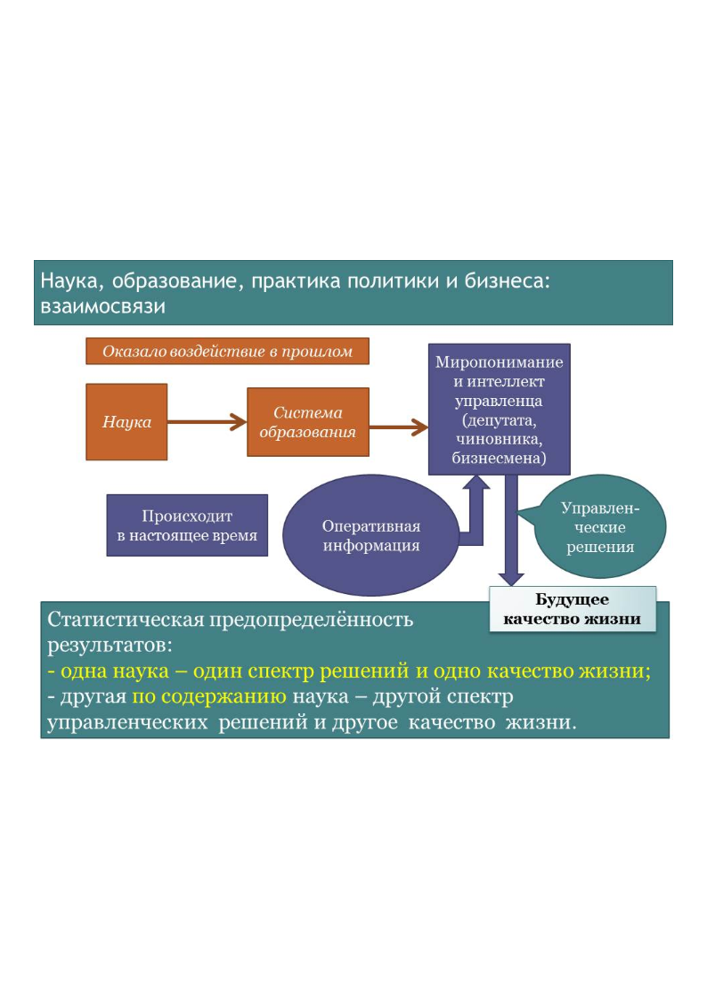

> **Первичный текст.** О ТМ №4(132) 1917 год — начало преображения человечества, 2017-10-11.
> Источник: `20171011 О ТМ №4(132) 1917 год — начало преображения человечества.doc` sha256 `9b58cf6067291b42…`; [страница на dotu.ru](https://dotu.ru/2017/10/11/20171011_tek_moment04132/).
> Автоматическая транскрипция DOC→Markdown; смысл и формулировки не правились.
> Контрольные суммы и статус проверки — в [NOTICE.md](../../NOTICE.md).
> Содержание передаёт позицию авторов; утверждения не верифицированы библиотекой.

---

## 3.1. Главная проблема и главная задача человечества и России

Главная проблема человечества состоит в следующем. Биологический вид «Человек разумный» в чисто биологическом аспекте[^40] — стадно-стайная обезьяна, «слабо вооружённый» биологический вид. И соответственно, будучи «слабо вооружённым» видом, «Человек разумный» несёт и весьма *«слабенькую» «врождённую мораль», доходящую до вседозволенности,* типичную для всех стадно-стайных обезьян[^41], а также — и весь комплекс инстинктивных программ, ориентированных на воспроизводство в преемственности поколений стада-стаи, предельно эффективной в смысле устойчивости к давлению среды обитания.

**Именно эта «обезьянья» «врождённая мораль» и является первичным генератором несправедливости во всех её разновидностях и проявлениях на протяжении всей предъистории и истории нынешней глобальной цивилизации и всякого культурно своеобразного общества, а также — и генератором всех прочих малых и больших проблем как индивидов, так и обществ.**

Эта слабость *«врождённой морали» «Человека разумного»,* обезьяний характер этой «врождённой морали», влечёт за собой два жизненно важных следствия:

- Это «животное начало» является стимулом к тому, чтобы личность развивалась на основе отрицания под воздействием совести и стыда (они тоже врождённые для человека) своим разумением и волей врождённой «обезьяньей морали» и обрела власть над инстинктами, чтобы личность сама творчески выработала праведную мораль, т.е. чтобы индивид состоялся как носитель человечного типа строя психики осознанно осмысленным волевым порядком. В психике разных людей, составляющих общество, этот процесс протекает по-разному, с разной скоростью, в результате чего складывается некоторое статистическое распределение общества по типам строя психики, которое формирует психодинамику общества и выражает себя в ней и в изменении культуры, включая нормы этики и представления о справедливости.

- Но эта же обезьянья «врождённая мораль» является одним из факторов самоуничтожения национальных и конфессиональных культур и их носителей, а также и цивилизаций (как региональных, так и глобальных — в прошлом сменилась вряд ли одна глобальная цивилизация) в случае, если общества в силу разных причин не развиваются должным образом и не выходят в человечность, а, *тупо сохраняя обезьянью «врождённую мораль» и соответствующую ей этику,* развивают техносферу или магию в интересах своекорыстного ненасытного потребительства или самопревознесения индивидов и корпораций в каких-то иных формах.

Предшествующий абзац необходимо пояснить. Механизм самоликвидации *устойчиво-недочеловечных* культур и их носителей прост: *обезьянья «врождённая мораль» органична для «обезьян» вида «Человек разумный» в дикой природе при близком к нулю уровне развития культуры, но если она сохраняется и продолжает устойчиво воспроизводиться в преемственности поколений в условиях развития цивилизации по техносферному или магическому пути, то «обезьяна» вида «Человек разумный» перестаёт быть «слабо вооружённым» биологическим видом.*

Мощь техносферы, оружия, магии в этом случае — вследствие отсутствия диктатуры совести и стыда, которым **нормально** должна быть подчинена личностная воля каждого, — употребляется представителями этого вида беззаботно и безответственно во внутривидовой конкуренции в соответствии с нормами обезьяньей «врождённой морали», и по достижении некоторого критического разрыва между моралью и мощью техносферы, вооружений и магии — неизбежно уничтожает носителей обезьяньей «врождённой морали», не воспользовавшихся открытой им Свыше возможностью стать Человеками.

Как доказательно показывают произведения приверженцев концепций истории, альтернативных официальной истории, в жизни планеты Земля уже было несколько цивилизаций, которые некоторым образом самоликвидировались. И нынешняя глобальная цивилизация, создав оружие массового уничтожения в количествах, позволяющих многократно уничтожить всё живое на планете, будучи не в состоянии обуздать гонку бесполезного потребления, разрушающего планету, не просто подошла к этому рубежу самоуничтожения, но даже занесла ногу, чтобы его переступить.

3.2. Политика Российского государства и задачи развития:\

краткий исторический обзор

---------------------------------------------------------

### 3.2.1. Крах империи и становление новой государственности

Соответственно проблеме представленной в разделе 3.1, главная задача человечества и каждого культурно своеобразного общества (в прошлом, настоящем и будущем) выйти из процесса воспроизводства культуры, подчинённой врождённой слабой морали стадно-стайных обезьян и породить культуру человечности, в которой воля каждого будет подчинена совести и на основе которой цивилизация будет устойчиво развиваться в гармонии с биосферой Земли и Природой в целом.

И соответственно необходимости решения этой задачи следует рассматривать:

- историю Российской империи в предреволюционные десятилетия, цели февральской либерально-буржуазной революции 1917 г., взаимоисключающие политических сил — участников октябрьского переворота 25 октября (7 ноября) 1917 г.;

- историю становления, развития, деградации и краха СССР;

- текущую деятельность и устремлённость ныне активных политических течений в обществе постсоветской России;

- а также — деятельность и устремлённость разного рода политических сил в «ближнем» и дальнем зарубежье.

Поэтому **начнём с ответа на вопрос**: *как и какой вклад в решение этой задачи внесла государственность Российской империи в период царствования Александра III?* — Вклад был двоякий:

- с одной стороны — весьма дальновидная внешняя политика, направленная на обеспечение безопасного развития империи на перспективу как минимум до середины ХХ века[^42];

- с другой стороны — указ о «кухаркиных детях»[^43], который был направлен на воспроизводство невежества широких народных масс и тем самым подрывал потенциала развития страны на основе компетентной и творчески состоятельной благонамеренной инициативы всех слоёв народа[^44].

Не соответствуя решению названной выше задачи развития страны и человечества, указ о «кухаркиных детях» повлёк за собой Вседержительно-ноосферную реакцию, в результате которой Александр III скончался в возрасте 49 лет, вследствие того, что остался невосприимчив к каким-то даваемым ему намёкам Свыше на то, что общественное развитие необходимо, а для его успеха следует расширять охват населения системой образования и совершенствовать само образование. А намёки Свыше были, ещё в начале царствования Александра II:

«Несмотря на героическую оборону, Севастополь был взят осаждающими, и Крымская война была проиграна Россией. Вернувшись в Петербург, Пирогов на приёме у Александра II рассказал императору о проблемах в войсках, а также об общей отсталости русской армии и её вооружения. Царь не захотел прислушаться к Пирогову. С этого момента Николай Иванович впал в немилость, он был направлен в Одессу на должность попечителя Одесского и Киевского учебных округов. Пирогов попытался реформировать сложившуюся систему школьного образования, его действия привели к конфликту с властями, и учёному пришлось оставить свой пост. Его не только не назначили министром народного просвещения, но и отказались даже сделать его товарищем (заместителем) министра, вместо этого его «сослали» руководить обучающимися за границей русскими кандидатами в профессора»[^45].

Главной задачей системы образования Н.И. Пирогов (1810 — 1881) видел воспитание человека, и состоятельность индивида в качестве человека понимал в смысле, идентичном тому, как это понимается ныне в КОБ[^46], хотя и выражал своё понимание этого вопроса в иной терминологии, соответственно уровню развития науки и культуры в целом в его эпоху.

Идейное наследие К.Д. Ушинского (1824 — 1871) также не было востребовано. Не был востребован и творческий потенциал П.Ф. Лесгафта (1837 — 1909), которому государственная власть фактически мешала работать, а идейное наследие которого до настоящего времени игнорируется системой образования России, и это — вредительство.

А один из факторов сдерживания научно-технического прогресса в России состоял в следующих обстоятельствах:

- безграмотный «рабочий» от сохи, оказавшийся на заводе или фабрике вследствие беспросветности нищенской жизни в деревне, не может быть кадровой основой высокоэффективной инновационно развивающейся промышленности;

- научно-технический прогресс, как социальное явление требует не только квалифицированных исполнителей, но и генерации идей, для чего необходимы:

<!-- -->

- как можно более широкий слой носителей высшего образования естественнонаучного и философского характера, обладающих эффективной личностной культурой познания и творчества;

- единая (а не сословно-кастовая) этика для всего общества.

Но, к сожалению, последним царём, кто целенаправленно занимался развитием системы образования, был император Николай I, а его потомки не уделяли этой задаче должного внимания. Николай II по вопросу образования занимал принципиально иную позицию:

Он «… считал необходимым усилить давление на студентов, симпатизировал идее князя Мещерского о сокращении университетского образования, о введении дополнительных трудностей для его получения. В письмах Николая II министрам народного просвещения Ванновскому и Зенгеру подчеркивалась необходимость сократить число классических гимназий, так как они давали возможность поступать в университеты, принимать в университеты только окончивших эти гимназии, поднять роль профессоров в налаживании порядка и дисциплины, предлагалось перенести ряд факультетов в небольшие города»[^47].

Главное здесь — сокращение университетского и гимназического образования.

**Следующий вопрос**: *как и какой вклад в решение этой задачи внесла государственность Российской империи в период царствования Николая II?* — Как было отмечено выше в разделе 1.1 настоящей записки, потенциал развития, унаследованный от царствования Александра III на протяжении всего царствования Николая II уничтожался, Россия шла по пути к тому, чтобы ведущие державы Запада разрушили её целостность, а её обломки стали их колониями.

Что было причиной этого:

- непонимание Николаем II перспектив его политики и эгрегориальная подчинённость его британскому имперскому эгрегору через императрицу Александру Федоровну, в детстве много времени проведшую при дворе её бабушки — британской королевы Виктории?

- либо осознание обречённости вследствие веры в предсказание монаха Авеля о судьбах династии и империи как в пророчество от Бога, которое он не смог осмыслить как предостережение Свыше, праведной реакцией на которое было бы изменение прежде всего внутренней и в особенности — кадровой политики?

— вопрос открытый.

Во всяком случае, Николай II действительно не противился злому, миловал злых[^48], а в каких-то случаях и сам соучаствовал во зле, что вело имперскую государственность к краху. Как уже было отмечено ранее, принятие позиции «не противлюсь злому…» эквивалентно передаче полноты ответственности за дальнейшее течение событий Всевышнему. Но Всевышний осуществляет свою Вседержительность через природные стихии и людей — людей таких, каковы они есть, т.е. соответственно их реальной, а не декларируемой нравственности и миропониманию, выражающимся в их деятельности, осуществляемой по их собственному усмотрению. Соответственно:

Приход большевиков к власти — вовсе не «ошибка Истории», а *промыслительное* ОТКРЫТИЕ ВОЗМОЖНОСТЕЙ РАЗВИТИЯ посредством пресечение движения России к *катастрофе распада и колонизации обломков, которая вызрела бы к середине ХХ века,* если бы Николай II продолжал царствовать и проводить политику в стиле «не противься злому…» без должного понимания работы этого принципа на преображение людей и общества.

Поэтому А. Блок в январе 1918 г. по итогам 1917 г. имел полное жизненное основание писать в завершающих строфах поэмы «Двенадцать»[^49]:

*— Кто там машет красным флагом? / — Приглядись-ка, эка тьма! / — Кто там ходит беглым шагом, / Хоронясь за все дома? // — Всё равно, тебя добуду, / Лучше сдайся мне живьем! / — Эй, товарищ, будет худо, / Выходи, стрелять начнем! // Трах-тах-тах!— И только эхо / Откликается в домах... / Только вьюга долгим смехом / Заливается в снегах... // Трах-тах-тах! / Трах-тах-тах! / ...Так идут державным шагом — / Позади — голодный пёс. / Впереди — с кровавым флагом, / И за вьюгой невидим, / И от пули невредим, / Нежной поступью надвьюжной, / Снежной россыпью жемчужной, / В белом венчике из роз — / Впереди — Исус Христос.*

Предсказано в этих строфах и *богоборчество по невежеству* рождающейся Державы, как этап её развития, и водительство в отношении неё Свыше («Бог помогает большевикам» — И.В. Сталин), *сокрытое за пеленой вьюги — символе житейской суеты*.

И эти стихи А. Блока тематически дополняют другие стихи, но уже от лица противников большевиков. Есть «Белая песня» Юрия Борисова[^50]:

*Всё теперь против нас, будто б мы и креста не носили / Будто аспиды мы басурманской крови / Даже места нам нет в ошалевшей от горя России / И Господь нас не слышит — зови не зови*[^51]*…*

Но эта жизненно состоятельная взаимная дополнительность стихов А. Блока и Ю. Борисова не осознаётся теми, кто, зная либо не зная их, пребывает под властью атеизма в любой из его разновидностей[^52]. И как следствие — Жанна Бичевская скорбно исполняет «Всё теперь против нас…»[^53] и «Поручика Голицына»[^54], лживо транслируя в психику самозабвенных её почитателей беспросветность будущего и безосновательные упования на возвращение страны в «великое православное прошлое» образца до 1917 г., до 1861 г., до 1682 г., до 1605 г., до 1584 г. — кому какая эпоха милее…

До настоящего времени многие привержены ложным концепциям истории гражданской войны в постимперской России, как произведённым партийно-советской бюрократией, так и концепциям, произведённым разного рода антисоветчиками в советское и в постсоветское время. Необходимо понять и признать следующее:

**Во-первых**, первые очаги гражданской войны возникли до октябрьского переворота — в частности, Тамбовское восстание началось при временном правительстве. По существу же, начавшись как массовые вооружённые бунты в городе и в сельской местности в ходе революции 1905 — 1907 гг., гражданская война не прекращалась после «умиротворения», а продолжала тлеть в психодинамике общества, не выражаясь в массовых боестолкновениях представителей разных социальных групп и государственной власти империи. И именно этот потенциал начал работать немедленно после краха императорской власти в феврале 1917 г.

**Во-вторых,** фронты гражданской войны разделяли не те идейно-политические силы, о каких повествуют учебники истории советских и постсоветских времён. Принципиальное отличие реальной истории гражданской войны от культовых мифов о ней в том, что:

- идейные монархисты в среде белого движения составляли меньшинство, и их вообще не было среди его лидеров;

- основу белого движения, если говорить о командном составе армий и «гражданских администраций» в регионах «белой России», составляли приверженцы либерально-буржуазной демократии, которую так и не смогли создать и ввести в режим функциональной состоятельности к моменту октябрьского переворота ниспровергатели монархии — творцы февральско-пуримского государственного переворота 1917 г.;

- к тому же в руководстве белого движения было много лиц, которые видели своей задачей:

<!-- -->

- не столько восстановление государственного управления и хозяйственной деятельности[^55] в границах России в целом (неосуществимость этого многие из них чуяли),

- а скорейшую продажу обломков империи подороже транснациональному капиталу и прикарманивание вырученных денег (в силу этого белое движение не было внутренне однородным и по своим целям[^56]);

<!-- -->

- вследствие невозможности прямого перехода к либерально-буржуазной демократии в условиях социального хаоса и невежества широких народных масс — лидеры белого движения даже если и не намеревались, но в случае своей победы вынуждены были бы в течение весьма продолжительного времени поддерживать режим военной диктатуры и зачистки политического поля от приверженцев разного рода социал-демократических идей (т.е. победи они — репрессии были бы ещё более массовыми, поскольку были бы направлены против более многочисленного в сопоставлении с «элитой» простонародья) — это произошло в Финляндии и Польше, даже при том, что размах революционных выступлений был не столь интенсивен, как на территории остальной Российской империи;

- за исключением некоторой части казачества *(не всего казачества поголовно — красные казаки тоже не были одиночками-отщепенцами от казачества)* на уровне рядового состава на стороне белых простонародье участвовало в гражданской войне в большинстве своём по принуждению, а командный состав воспринимался ими как чуждый (потенциал конфликта «баре — мужики» белые армии несли в себе, и этот потенциал неоднократно реализовывался в самой белой армии), вследствие чего боевые действия против красных простонародьем, мобилизованным в белое движение, велись, мягко говоря, «без энтузиазма».

- поддержка населением освобождённых белыми территорий, если и была в начальные моменты, то вскорости пропадала под воздействием массового и безнаказанного мародёрства и вседозволенности со стороны белых и сопутствовавших им в ряде регионов интервентов — кураторов и спонсоров белого движения[^57];

- красные на уровне руководства со своей стороны тоже не были однородны, руководство красных представляло собой временный — тактический — союз 1) идейных марксистов интернационал-фашистов и 2) большевиков, которые в ту историческую эпоху — *в силу унаследованного от эпохи царизма невежества* — воспринимали марксизм как научную основу построения желанного им общества справедливости[^58];

- кроме того, и в среде белых, и в среде идейных марксистов действовали масонские идейно-политические мафии разного толка[^59], деятельность которых и объясняет многие, казалось бы ничем не мотивированные «странные случаи» — как в ходе первой мировой войны[^60] до момента устранения либералами монархии[^61], так и в период двоевластия временного правительства и Советов[^62], а также и в ходе гражданской войны[^63];

**В третьих**, в годы гражданской войны простонародье поддержало:

- не лидеров белого движения, чья политика была ориентирована на построение системы неперсонифицированного финансового рабовладения в условиях либерально-буржуазной демократии и эксплуатации страны внешним капиталом (что это такое на практике — многим памятно по «лихим девяностым» и большинству ощутимо по воздействию на их качество жизни «мирового финансово экономического кризиса 2008 и последующих годов», за каким термином скрывается просто антинародное управление финансами и экономикой страны);

- не идейных марксистов интернационал-фашистов, чья политика была ориентирована на построение глобальной закулисной тирании «мудрого масонства» под видом социализма и Советской власти и ликвидации как «пережитка прошлого» всех национальных культур;

- а большевиков, чья политика была ориентирована на реализацию потенциала развития всех людей, кто не желает ни быть паразитом, ни влачить существование под властью паразитов, и на развитие в этом направлении всех исторически сложившихся национальных культур[^64].

Если коротко, то в годы гражданской войны:

- на стороне белых руководство принадлежало сторонниками февральской либерально-буржуазной революции, и ставленникам зарубежного и транснационального капитала;

- а на стороне красных руководство принадлежало временному тактическому союзу идейных марксистов интернационал-фашистов и большевиков, также считавших марксизм в тот период времени своим учением, поскольку они были убеждены в его жизненной состоятельности («Учение Маркса всесильно потому, что оно верно» — В.И. Ленин. «Три источника и три составных части марксизма», 1913 г.).

В результате победы красных в гражданской войне состоялось становление СССР как государства принципиально нового типа, обладающего *огромным потенциалом развития*, который, однако, не был реализован к 1991 г. Большевики, пусть и не без ошибок, подчас очень тяжёлых по своим последствиям, смогли обеспечить интенсивное развитие культуры, рост экономики, развитие науки и системы образования. Эти успехи позволили профилактировать сценарий разрушения целостности страны и колонизации её обломков более развитыми в научно-техническом отношении государствами Запада. Это выразилось в Победе в Великой Отечественной войне и в разгроме армий «Евросоюза 1», созданного под непосредственным руководством А. Гитлера.

### 3.2.2. Ленин: роль личности в истории

*[В оригинальном издании здесь расположен рисунок/схема. Иллюстрация не включена в данный выпуск: ожидает визуальной и правовой проверки. Файл источника: image9.jpeg]* Наиболее расхожие мнения противников Советской власти и социализма о В.И. Ленине:

- немецкий шпион, на деньги врага организовавший государственный переворот;

- злостный русофоб и жид, который всё сделал для того, чтобы уничтожить царя-батюшку, его семью, великий русский народ и единственно истинную православную церковь (мнение «истинно русских» патриотов);

- моральный урод, сатанист, сифилитик[^65], ничтожество;

- обладатель счетов в зарубежных банках с неимоверными богатствами, украденными у России.

Мы не будем заниматься фактологическим опровержением этих и других мнений о В.И. Ленине: выяснить правду о нём, очистив её от партийно-советского улучшения его биографии и клеветы антисоветчиков, — это задача историков и биографов. В контексте настоящей работы мы рассмотрим только некоторые аспекты его вклада в историю России и человечества.

———————

Прежде всего необходимо указать, что В.И. Ленин был убеждён в жизненной состоятельности марксизма до конца своих дней. Одна из компонент марксизма — учение о закономерной смене общественно-экономических формаций по мере того, как развиваются производительные силы общества, и прежние формы социально-экономической организации начинают препятствовать развитию производства. Такое явление в истории прослеживается, но не надо его абсолютизировать и весь прогресс цивилизации сводить к нему, тем более что Маркс рассматривал историю только библейской цивилизации в границах Европы (за пределами России) и Америки (главным образом США). С учётом этой оговорки, действительно феодализм европейского типа более производителен, нежели рабовладение Римской империи; капитализм на основе идеологии буржуазного либерализма более производителен, нежели феодализм; но и капитализм тоже имеет свои ограничения возможностей как сугубо экономического развития, так и общекультурного, а кроме того — он не совместим с экологической безопасностью человечества. Вследствие этого, когда капитализм исчерпает свои возможности, он объективно необходимо будет заменён социализмом[^66].

Россия рассматривалась как государство, общество, застрявшее в феодализме. И на этой основе В.И.Ленин делал вывод, что революция в России первоначально состоится как буржуазно-демократическая; её победа приведёт к продолжительному этапу капиталистического развития; и только после того, как капитализм достаточно разовьётся, в обществе возникнут предпосылки для перехода к социализму, скорее всего — революционным путём. Такого рода двухэтапность перехода от того, что есть, к социализму была зафиксирована в «Программе Российской социал-демократической рабочей партии»[^67] (1903 г.), которая включала в себя «программу-минимум» (задачи буржуазно-демократической революции) и «программу-максимум» (задачи социалистической революции). В 1905 г. В.И. Ленин обосновывал такую стратегию перехода к социализму в работе «Две тактики социал-демократии в демократической революции». И этих взглядов он придерживался до приезда в Россию[^68] 4 апреля 1917 г., а отказ от них выразился в его «Апрельских тезисах».

Меньшевики с этим тоже были согласны и полагали, что коли революция буржуазно-демократическая и за ней должен следовать период капиталистического развития, то социал-демократия после успеха революции должна поделить власть с буржуазными партиями; причин не допускать буржуазию до власти они не видели, а сами претендовали на роль легальной «конструктивно мыслящей» оппозиции.

Л.Д. Троцкий, который был уполномочен закулисными политическими мафиями курировать деятельность российских идейных марксистов интернационал-фашистов, не был идейным марксистом-догматиком, и потому был свободен от такого рода догматического взгляда на перспективы перехода России от того, что есть, к социализму в его марксистской версии. Он полагал, что если дело не ограничится верхушечным переворотом и в революции с участием широких масс простонародья, «произойдёт решительная победа»[^69], то под давлением рвущейся к власти буржуазии, её эгоизма[^70] и саботажа, «революционно-демократическая диктатура пролетариата и крестьянства» **вынуждена** будет приступить к реализации программы-максимум, в результате чего период капиталистического развития станет невозможным. См. работы Л.Д.Троцкого «Наши разногласия» (1905 г.) и «Итоги и перспективы. Движущие силы революции» (1906 г.).

Л.Д. Троцкий также полагал, что в силу научно-технической отсталости России, сложившегося единого мирового рынка и ряда других факторов как внутренних, так и глобально-политических построение социализма в одной отдельно взятой стране (даже и в развитой) невозможно, поэтому революция в России должна стать началом мировой революции, а если мировая революция не произойдёт, то революционная Россия погибнет под ударами капитализма. Этих взглядов он придерживался до конца своих дней (см. его книгу «Перманентная революция» (написана в 1928 г. в ссылке в Алма-Ате).

В.И. Ленин в статье «О лозунге Соединённых Штатов Европы» (1915 г.) впервые высказал мысль о возможности построения социализма в одной отдельно взятой стране и этого мнения придерживался тоже до конца своих дней, и это стало основой стратегии большевиков.

События, последовавшие за февралём 1917 г., главным образом под воздействием психодинамики самого общества (так называемая «революционная стихия»), показали, что стратегия перехода к социализму в два этапа, описанная В.И. Лениным в «Двух тактиках…», оказалась несостоятельной — главным образом потому, что либерасты-февралисты проявили неспособность к государственному строительству и решению проблем в темпе, диктуемом течением событий, а не по причинам, изложенным Л.Д. Троцким. В.И. Ленин несостоятельность либералов и их временного правительства учуял сразу же по возвращении в Россию 4 апреля 1917 г.

И это его изменение отношения к перспективам революции (за исключением вопроса о «мировой революции»), вполне соответствовавшее взглядам Л.Д. Троцкого, привело к временному тактическому союзу идейных марксистов интернационал-фашистов (во главе с Л.Д. Троцким, который прибыл в Петроград 5 мая) и большевиков (во главе с В.И. Лениным). Л.Д. Троцкий, ознакомившись с положением дел, высказался в том смысле, что *«большевики разбольшевичелись — и я называться большевиком не могу*[^71] *… Признания большевизма требовать от нас нельзя».* Тем не менее, единство взглядов на перспективы революции было достигнуто, и в результате троцкисты и прочие меньшевики в мае 1917 г. массово вступали в партию большевиков.[^72]

Публицистика В.И. Ленина периода от апреля до начала «корниловского мятежа» интересна тем, что он цитатами показывает, что представители временного правительства и либерально-буржуазные партии по вопросам управления хозяйством страны практически с самого начала правления временного правительства высказывали мнения, которые идентичны ряду мнений большевиков, но при этом либералы хронически ничего не делали для воплощения в жизнь мероприятий, проведение которых они же считают необходимым: см. 32‑й том 5 издания Полного собрания сочинений В.И. Ленина и, в частности, статьи «Грозит разруха» (опубликована в большевистской газета «Правда» 27 (14) мая 1917 г.) и «Неминуемая катастрофа и безмерные обещания» (опубликована в большевистской газета «Правда» 29 (16) и 30 (17) мая 1917 г.). В последней статье читаем:

«Сегодня мы должны указать, что программа министра-меньшевика Скобелева идет **дальше** большевизма. Вот эта программа в передаче министерской газеты “Речь”:

“Министр (Скобелев) заявляет, что … государственное хозяйство на краю пропасти. Необходимо вмешательство в хозяйственную жизнь во всех её областях, так как в казначействе нет денег. Нужно улучшить положение трудящихся масс, и для этого необходимо забрать прибыль из касс предпринимателей и банков. (Голое с места: “Каким способом?”). Беспощадным обложением имуществ, — отвечает министр Скобелев.

— Финансовая наука знает этот способ. Нужно увеличить ставки обложения имущих классов до 100 процентов прибыли. (Голос с места: “Это значит всё”.) К сожалению, — заявляет Скобелев, — разные акционерные предприятия уже раздали акционерам дивиденд, но мы должны поэтому обложить имущие классы прогрессивным индивидуальным налогом. Мы ещё дальше пойдем, и если капитал хочет сохранить буржуазный способ ведения хозяйства, то пусть работает без процентов, чтобы клиентов не упускать … Мы должны ввести трудовую повинность для гг. акционеров, банкиров и заводчиков, у которых настроение вялое вследствие того, что нет стимулов, которые раньше побуждали их работать … Мы должны заставить гг. акционеров подчиниться государству, и для них должна быть повинность, трудовая повинность».

Ленин дает оценку этой программе:

«Программа сама по себе не только великолепна и совпадает с большевистской, но в одном пункте идет **дальше** нашей, именно в том пункте, где обещается “забрать прибыль из касс банков” в размере “100 процентов прибыли”. Наша партия — гораздо скромнее. Она требует в своей резолюции меньшего, именно; только установления контроля за банками и “постепенного” (слушайте! слушайте! большевики за постепенность!) “перехода к более справедливому и прогрессивному обложению доходов и имуществ”».

Но поскольку временное правительство ничего не делало даже из того, что находило безотлагательно необходимым, положение в экономике, на фронтах и в тылу (крестьянские восстания против помещиков и власти временного правительства летом 1917 г. уже полыхали в ряде регионов страны) прогрессирующе ухудшалось. Заметим, что Госплана и Совета Народных Комиссаров ещё не было, власть над экономикой и финансами находилась в руках «умных, дальновидных и ответственных, интеллигентных, хорошо образованных» людей из состава временного правительства и представителей класса буржуазии. *В силу этого РСДРП (б) не могла вредить в экономике с целью обострения революционной ситуации в своих интересах.* Тем не менее:

«Стоимость рубля непрерывно падала; если в марте месяце она равнялась 56,7 копейки, то в июле упала до 42,9 копейки. Наряду с этим непрерывно росли и цены на все товары. Уменьшалась валовая продукция промышленности. Если в марте — июне 1917 года ежемесячное производство чугуна в южной металлургической промышленности равнялось 11,9 млн. пудов, то в июле оно выражалось в цифре 10,9 млн. пудов. Одновременно с этим падало число рабочих, падала и производительность труда рабочих. Рост процента больных паровозов за 1917 г. выражается в следующих цифрах: в марте больных паровозов было 20,3 *%,* а в июле — 24,2 %. С 1 марта по 1 августа 1917 года было закрыто 568 предприятий и выброшено на улицу 104 тысячи рабочих»[^73].

В выступлении т*.* Ломова на VI съезде РСДРП приведены оценки деятельности временного правительства людьми далекими от большевизма:

«Председатель Московского комитета по топливу профессор Кирш заявил, что деятельность Временного правительства носит дезорганизующий характер. Другой профессор говорит, что Временное правительство своими мероприятиями льет воду исключительно на мельницу спекуляции»[^74].

В общем всё произошло в соответствии с тем, что писал Питирим Александрович Сорокин[^75] (1889 — 1968):

«Падение режима — обычно это результат не столько усилий революционеров, сколько одряхления, бессилия и неспособности к созидательной работе самого режима... Если революцию нельзя искусственно начать и экспортировать, ещё менее возможно её искусственно остановить. Революции для своего полного осуществления на самом-то деле вовсе не нужны какие-то великие люди. В своём естественном развитии революция просто создаёт таких лидеров из самых обычных людей. Хорошо бы это знали все политики и особенно защитники устаревших режимов. Они не могут оживить такой отмирающий режим, как, впрочем, и другие не могут начать революцию без достаточного количества взрывчатого материала в обществе»[^76].

Т.е. в русле этой алгоритмики течения событий вопрос в том, кто конкретно *вовремя* подхватит власть, выпавшую из рук прежней государственности, либо прервёт агонию прежней власти для того, чтобы построить новую государственность.

Видя, что власть временного правительства деградирует и её сохранение ведёт страну к катастрофе внутреннего хаоса, военного поражения[^77] и распада, большевики взяли курс на взятие власти в свои руки вооружённым путём. В.И. Ленин проявил настойчивость в этом деле: в частности широко известная его фраза *«сегодня — рано, завтра — поздно»* определила срок свержения временного правительства так, чтобы II Всероссийский Съезд Советов, который открывался «завтра» — 25 октября (7 ноября) 1917 г., поставить перед свершившимся фактом, поскольку не было уверенности, что Съезд Советов проголосует за свержение временного правительства вооружённым путём[^78]. Временное правительство со своей стороны пыталось пресечь возможность восстания, наметив начать массовые аресты большевиков с 25 октября, и не допустить Съезда Советов, но, как всегда, не справилось с управлением. В итоге временное правительство было свергнуто[^79], Съезд Советов проголосовал за взятие Советами власти в свои руки, после чего началось становление Советского государства.

Т.е. В.И. Ленин в обстоятельствах, *сложившихся в результате политической и экономической недееспособности временного правительства либерастов,* виртуозно воспользовался краткосрочным «окном возможностей» и положил тем самым конец агонии буржуазного либерализма и начало построению качественно иного образа жизни глобальной цивилизации[^80].

Если бы В.И. Ленин не реализовал это «окно возможностей», и большевики в союзе с идейными марксистами интернационал-фашистами не свергли временное правительство, а продолжали бы «митинговать» и вести дискуссии о пользе перехода когда-нибудь — в неопределённом будущем — к социализму, то в этом варианте вопрос состоял бы только в том, кто успел бы раньше:

- генералитет успел бы свергнуть временное правительство сам и установил бы военную диктатуру, после чего война с Германией продолжалась бы «до победного конца»[^81];

- либо Германия успела бы разгромить недееспособную армию, продиктовать мир, насадить прогерманское (либо филиально-марионеточное) правительство, после чего продолжала бы вести войну против Антанты, но уже на один фронт, а не на два, злоупотребляя доступом к ресурсам России.

Но события, связанные со сдачей Риги в августе 1917 г.[^82] и обороной Моонзундского архипелага в октябре 1917 г., дают основания полагать, что Германия успела бы раньше, в том числе и потому, что по состоянию на октябрь 1917 г. с нею были готовы сотрудничать вполне себе либерально-буржуазные круги России, включая и деятелей из временного правительства[^83], *которые помнили народные бунты и восстания 1905 — 1907 гг. и желали их профилактировать посредством германской военной мощи,* коли уж своя армия разложилась и не желает ни держать фронт, ни быть карателями, а полиция и органы государственного управления на местах, доставшиеся временному правительству от царского режима, были распущены ранее того (ещё в марте), как были созданы структуры, способные заменить собой прежние.

Если вникать в фактологию тех лет, то неизбежен вывод:

Описание либерастами событий в России в 1916 — 1918 гг. по критерию недостоверности даст сто очков форы всем фантазиям приверженцев «альтернативной истории», упражняющихся на тему «как надо было управлять Россией, чтобы она процветала без революций и была самой мощной державой» и доводящих свои измышления до наших дней. Разница только в том, что «альтернативщики»-фантазёры в своё удовольствие, а либерасты — политическое течение, влияющее на текущую политику и потому способные испортить будущее.

Второй критический момент в судьбах глобальной цивилизации — это пресловутый брестский мир, заключённый 3 марта 1917 г. Советской Россией и «центральными державами» — Германией, Австро-Венгрией, Османской империей (Турцией) и Болгарским царством. На его заключении В.И. Ленин настоял лично, поэтому в кругах антисоветчиков брестский мир — неоспоримое доказательство того, что В.И. Ленин был германским агентом[^84], поскольку:

- часть территорий бывшей Российской империи были признаны самостоятельными государствами (Финляндия, Эстония, Латвия, Литва, Польша, Украина) или просто отторгнуты (некоторые территории в Закавказье);

- Россия после поражения коалиции Германии и других «центральных держав» не могла участвовать на правах победителя в заключении версальского мирного договора, который подвёл итог первой мировой войне[^85].

Последнее обвинение в адрес В.И. Ленина представляется особенно идиотским в силу полного игнорирования и непонимания его приверженцами фактологии глобальной политики тех лет:

После того, *как Россия стала Советской,* в Лондоне, в Париже, Вашингтоне и Токио она уже не рассматривалась как союзник в войне против Германии и других «центральных держав». Она рассматривалась, прежде всего, как потенциальный враг, а не так, как её рассматривали на Западе в имперские времена — как объект для расчленения и колонизации в более или менее близкой исторической перспективе. Это отношение «союзников» по Антанте к России выразилось в их интервенции в нашу страну в годы гражданской войны, в массовых убийствах ими населения в оккупированных регионах, под предлогом «освобождения от большевизма» и «поддержки белого движения», которое они все предали, как только до них дошло, что в гражданской войне победят красные и о будущем надо договариваться с ними.

Поэтому брестский мир, в том виде, как он свершился, снова приводит вопросу о «сослагательном наклонении истории»: что бы было (могло быть), если бы он не был заключён?

\* \* \*

Начнём с предъистории заключения брестского мира — фактология общедоступная, большей частью из «Википедии».

26 октября (8 ноября) II Всероссийский Съезд Советов принял «Декрет о мире». «Декрет о мире» предлагал всем воюющим странам немедленно заключить перемирие и начать переговоры о заключении мирного договора и прекращении войны без аннексий и контрибуций, а также — аннулировать все тайные межгосударственные договоры. Декрет был опубликован в газете «Известия» и передан по радио, однако все воюющие страны его проигнорировали, и он не получил известности в их обществах. 27 октября (9 ноября) был создан Совет Народных Комиссаров — первое Советское правительство. Поскольку «союзники» проигнорировали предложение заключить всеобщее перемирие и начать переговоры о мире, то в ночь на 9 (21) ноября Совнарком отдал по радио приказ исполняющему обязанности верховного главнокомандующего русской армией генералу Н.Н. Духонину (1876 — 1917) предложить перемирие всем противникам на всех фронтах. Н.Н. Духонин приказ не выполнил, в последовавшем телефонном разговоре, в котором приняли участие В.И. Ленин, И.В. Сталин и Н.В. Крыленко, убедить его подчиниться Советской власти не удалось, и в тот же день был уведомлен об отстранении от должности[^86].

14 (27) ноября Германия сообщила о согласи00и начать мирные переговоры с Советским правительством. В тот же день В.И. Ленин от имени Совнаркома обратился с нотой к правительствам Франции, Великобритании, Италии, США, Бельгии, Сербии, Румынии, Японии и Китая, предлагая им присоединиться к мирным переговорам: *«1 декабря мы приступаем к мирным переговорам. Если союзные народы не пришлют своих представителей, мы будем вести с немцами переговоры одни»*. Ответа получено не было. После того, как были достигнуты договорённости с «центральными державами» о перемирии, с 9 (22) декабря в Брест-Литовске (где находилась германская ставка на восточном фронте, ныне город Брест в Белоруссии) начались переговоры о заключении мира.

Прежде всего необходимо отметить, что история заключения брестского мира, пожалуй, первое после Великой октябрьской революции событие, в котором выразилось уже упоминавшееся обстоятельство: идейные марксисты интернационал-фашисты и большевики — это две разные по долгосрочным стратегическим целям политические силы, чьи тактические краткосрочные интересы совпали на некоторое время в результате февральско-пуримского государственного переворота.

Со стороны Германии те, кто во главе с кайзером из Берлина руководил переговорами о мире, а также и те, кто непосредственно вели переговоры в Брест-Литовске, не понимали того, о чём уже было сказано в настоящей записке: *перспективы победы определялись тем, какая из воюющих держав быстрее сломается*. Не понимая этого, они вели себя в Брест-Литовске так, будто Франция и Великобритания уже разгромлены, США, как минимум, — доброжелательно нейтральны, и осталось только подчинить себе Россию, чтобы обеспечить отсутствие военных угроз на востоке как минимум на ближайшие несколько десятилетий.

Если же соотноситься с реальностью того времени, то на тот момент Германия должна была быть заинтересована в том, чтобы в кратчайшие сроки не просто свернуть военные действия на своём восточном фронте, но свернуть их так, чтобы не создавать себе же проблем на будущее. При адекватной оценке положения и глобально политических перспектив она должна была быть заинтересована в мире ещё больше, чем Советская Россия. Т.е. если бы в Германии власть принадлежала адекватно мыслящим людям, а не вырожденцу-кайзеру, к тому же покалеченному «дворцовым воспитанием», и его клике, то в кратчайшие сроки был бы заключен мир с Россией без аннексий и контрибуций, сопровождаемый дополнительными соглашениями об экономической взаимопомощи по преодолению последствий войны — что-то типа рапалльского договора, который был заключён РСФСР и веймарской республикой, спустя 4 года, — в 1922 г.

Однако неадекваты в Берлине, не понимая изложенного в предыдущих двух абзацах, озаботились совсем другим:

- отодвинуть границы Советской России как можно дальше на восток от своих границ,

- в образовавшемся пространстве создать де-юре суверенные государства, которые были бы де-факто экономически и военно-политически её колониями и вассалами;

- вернуть владельцам германскую собственность, конфискованную Российской империей с началом войны;

- наложить на Россию как можно большую контрибуцию;

- обеспечить статус экстерриториальности для германского капитала в Советской России с целью её дальнейшей колонизации.

Со стороны Советской России на протяжении всего времени с 9 (22) декабря 1917 г. по 3 марта 1918 г. позиция на мирных переговорах менялась несколько раз — как вследствие внутренних изменений в стране и в её руководстве, так и под давлением военной мощи Германии, которой Советская России не могла ничего противопоставить.

На первом этапе с 9 декабря 1917 г. по 25 декабря (7 января) 1918 г. советскую делегацию возглавлял А.А. Иоффе[^87] (1883 — 1927). В период, когда работой советской делегации руководил А.А. Иоффе, её задачей было понять истинные намерения германской стороны и «тянуть время». Это не было «отсебятиной» делегации, а было позицией ЦК РСДРП (б) и Совнаркома, ожидавших, что в течение времени проведения переговоров о мире — в Германии тоже произойдёт революция, которая свергнет монархию, и власть перейдёт в руки социал-демократии, которая пойдёт на заключение мира без аннексий и контрибуций. Если же в Германии революция не происходит и германская сторона предъявляет ультиматум, то предполагалось выполнить условия ультиматума.

25 декабря (7 января) в Брест-Литовск прибыли Л.Д. Троцкий и К.Б. Радек, занимавший в тот период времени пост наркома иностранных дел. В период его руководства советской делегацией политика «тянуть время в ожидании революции в Германии и ждать германского ультиматума, если революция не произойдёт» продолжалась. Но при этом появилась новая составляющая: в самом Брест-Литовске Л.Д. Троцкий попытался вести пропаганду среди германских солдат[^88], что повлекло за собой протест со стороны германской делегации.

В этот же период германская сторона уведомила советскую о том, что с Центральной Радой Украины она будет вести отдельные переговоры. Роспуск Учредительного собрания был интерпретирован германской стороной, как готовность Советской власти заключить мир любой ценой, поскольку в Учредительном собрании противниками Советской власти были партии — носительницы идеологии «революционного оборончества» (т.е. сами не нападаем, но обороняемся и не сдаёмся).

После того, как Центральная Рада Украины, находившаяся в состоянии войны с Советской Россией, 27 января заключила своё соглашение с «центральными державами»[^89], Германия предъявила Советской России ультиматум. В тот же день кайзер сделал заявление:

«Сегодня большевистское правительство напрямую обратилось к моим войскам с открытым радиообращением[^90], призывающим к восстанию и неповиновению своим высшим командирам. Ни я, ни фельдмаршал фон Гинденбург больше не можем терпеть такое положение вещей. Троцкий должен к завтрашнему вечеру … подписать мир с отдачей Прибалтики до линии Нарва — Плескау — Дюнабург включительно… Верховное главнокомандование армий Восточного фронта должно вывести войска на указанную линию».

Л.Д. Троцкий к этому времени имел прямое указание В.И. Ленина: в случае предъявления Германией ультиматума — немедленно подписать мир на условиях, предъявленных Германией. Однако, он не выполнил этого указания, и запросил В.И. Ленина о том, как реагировать на германский ультиматум. В.И. Ленин 10 февраля 1918 г. подтвердил свои прежние указания: подписать мир на условиях, предъявленных Германией. Но Л.Д. Троцкий занял позицию: *«Ни мира, ни войны: мир не подписываем, войну прекращаем, а армию демобилизуем»*.

Германская делегация уведомила советскую, что неподписание мира ею — автоматически означает прекращение перемирия и возобновление военных действий.

«После этого заявления советская делегация демонстративно покинула переговоры. Как указывает в своих воспоминаниях член советской делегации А.А. Самойло, входившие в делегацию бывшие офицеры Генштаба возвращаться в Россию отказались, оставшись в Германии. В тот же день Троцкий без согласования с Совнаркомом послал телеграмму главковерху Крыленко, в которой потребовал немедленно издать приказ по действующей армии о прекращении состояния войны с державами германского блока и о демобилизации русской армии. Крыленко также без согласования с СНК рано утром 29 января 1918 (11 февраля 1918) издал и отправил на все фронты приказ о прекращении военных действий и о демобилизации армии. Содержание телеграммы стало известно солдатам. Узнав об этом распоряжении, Ленин предписал Ставке немедленно отменить его[^91]» («Википедия»).

Германия официально заявила о прекращении перемирия с 12 часов 18 февраля и в оговоренное ею время начала наступление по всем фронтам — практически беспрепятственно, поскольку унаследованная от Российской империи армия к этому времени практически полностью прекратила своё существование.

«Утром 19 февраля Ленин направляет немцам телеграмму: «Ввиду создавшегося положения, Совет Народных Комиссаров видит себя вынужденным подписать условия мира, предложенные в Брест-Литовске делегациями Четверного Союза. Совет Народных Комиссаров заявляет, что ответ на поставленные германским правительством точные условия будет дан немедленно». Генерал Гофман подтвердил получение радиограммы, направил копию в Берлин, потребовав официального письменного уведомления, а сам тем временем продолжил наступление войск по Прибалтике в двух направлениях: на Ревель — Нарву — Петроград и на Псков. В течение недели они заняли ряд городов и создали угрозу Петрограду.

21 февраля Совнарком принимает, а 22 февраля — публикует декрет «Социалистическое Отечество в опасности!», начинает массовый набор в Красную армию» («Википедия»).

«22 февраля Л.Д. Троцкий, признав провал своих переговоров с германской делегацией, подаёт в отставку с поста наркома по иностранным делам. Новым наркоминделом становится Г.В. Чичерин».

«Ответ германского правительства, содержащий новые, ещё более тяжёлые условия мира, был вручен советскому курьеру только 22 февраля и получен в Петрограде утром 23 февраля. На принятие ультиматума из 10 пунктов Советскому правительству давалось 48 часов. Первые два пункта документа повторяли ультиматум от 27 января (9 февраля), то есть подтверждали территориальные претензии Центральных держав, предъявленные генералом Гофманом ещё 5 (18) января 1918 (см. выше). Кроме того, предлагалось немедленно очистить Лифляндию и Эстляндию от русских войск и красногвардейцев. В обе области вводились немецкие полицейские силы. Россия обязывалась заключить мир с Украинской Центральной радой, вывести войска с Украины и из Финляндии, возвратить анатолийские провинции Турции и признать отмену турецких капитуляций, немедленно демобилизовать армию, включая и вновь образованные части, отвести свой флот в Чёрном и Балтийском морях и в Северном Ледовитом океане в российские порты и разоружить его, при этом в Северном Ледовитом океане до заключения мира сохранялась немецкая блокада. Помимо военно-политических, ультиматум также содержал требования торгово-экономического характера» («Википедия»).

В итоге В.И. Ленин настоял на подписании брестского мира, который сам же охарактеризовал как «похабный».

«Голосование в ЦК РСДРП (б) по вопросу о Брестском мире в итоге приняло следующий вид:

- против: Бухарин Н.И., Урицкий М.С., Ломов (Оппоков) Г.И., Бубнов А.С.

- за: Ленин В.И., Свердлов Я.М., Сталин И.В., Зиновьев Г.Е., Сокольников Г.Я., Смилга И.Т. и Стасова Е.Д.

- воздержались: Троцкий Л.Д., Дзержинский Ф.Э., Иоффе А.А. и Крестинский Н.Н.

По оценке Ричарда Пайпса, обеспеченные Троцким четыре голоса воздержавшихся «спасли Ленина от унизительного поражения». По оценке же Юрия Фельштинского, «нелепо считать, что Троцкий руководствовался джентльменскими соображениями… он прежде всего заботился о самом себе, понимая, что без Ленина не удержится в правительстве и будет оттеснён конкурентами»[^92]. В благодарность за поддержку Ленин уже 4 марта назначает Троцкого председателем Высшего военного совета, а 13 марта — наркомвоеном» («Википедия»).

24 февраля Ленину с огромным трудом, 126 голосами против 85 при 26 воздержавшихся, удалось продавить своё решение через ВЦИК» («Википедия»).

3 марта брестский мир был подписан.

«6 — 8 марта 1918 года на VII экстренном съезде РСДРП(б) Ленину также удалось «продавить» ратификацию Брестского мира. При голосовании голоса распределились следующим образом: 30 за ратификацию, 12 против, 4 воздержались. Кроме того, по итогам съезда партия была по предложению Ленина переименована в РКП(б). Делегаты съезда не были ознакомлены с текстом договора. Тем не менее, 14 — 16 марта 1918 года IV Чрезвычайный Всероссийский Съезд Советов окончательно ратифицировал мирный договор, который был принят большинством в 784 голоса против 261 при 115 воздержавшихся, и принял решение о переносе столицы из Петрограда в Москву в связи с опасностью германского наступления. В результате представители партии левых эсеров вышли из Совнаркома» («Википедия»).

Кроме того, в августе 1918 г. Германия по дипломатическим каналам ультимативно предъявила новые требования экономического характера, которые также были удовлетворены.

Де-факто брестский мирный договор перестал иметь какое-либо значение для Советской России с началом революции в Германии в ноябре 1918 г. и крахом Германской империи — кайзер Вильгельм II отрёкся от престола 9 ноября 1918 г.; де-юре брестский мир был аннулирован версальским мирным договором, который подвёл юридические итоги первой мировой войне ХХ века и при этом обязал Германию отказаться от брестского мира, поскольку державы-победительницы имели свои виды на эксплуатацию ослабленной войнами России, чему помешало бы выполнение Россией обязательств перед Германией по брестскому миру.

\* \*\

\*

Теперь перейдём к анализу описанных событий и сопутствовавших им обстоятельств.

Прежде всего встают вопросы об идиотской бездеятельности временного правительства и в период, когда его возглавлял умный и хорошо образованный для своего времени человек — князь Г.Е. Львов (1861 — 1925), и в период, когда его возглавлял тоже умный и хорошо образованный А.Ф. Керенский (1881 — 1970), которые были в политике не новичками с улицы.

Позиция Л.Д. Троцкого «ни войны, ни мира» тоже вызывает удивление: после того, как Германия предъявили ультиматум и В.И. Ленин как глава правительства дал прямое указание его принять и подписать мирный договор на условиях Германии, ведёт себя как идиот или как маленький ребёнок, который не в состоянии принять сложившиеся обстоятельства и закатывает каприз. Но если почитать произведения Л.Д. Троцкого, то он не идиот, а если почить его биографию, то ранее эпизода с реакцией на германский ультиматум никаких истерик в стиле возврата в детство за ним не замечалось. Эти странности поведения требуют объяснения.

В самом начале первой мировой войны имел место эпизод, хорошо известный старшим поколениям по курсу «История КПСС»: когда началась первая мировая война, все без исключения социал-демократические партии в парламентах государств Европы проголосовали за войну, за местный «патриотизм» и выделение правительствам кредитов на ведение войны. Исключением были только большевики в Государственной думе России, которые проголосовали против войны и пошли за это на каторгу. В.И. Ленин в работах «Задачи революционной социал-демократии в европейской войне» и «Крах II интернационала» выразил порицание позиции европейской социал-демократии, характеризовав её как измену вождей делу социализма.

Но в уже упоминавшейся книге Ю.Г. Фельштинского «Крушение мировой революции — Брестский мир», есть интересный эпизод[^93].

«Когда 1 августа 1914 года канцлера Германии Т. Бетмана-Гольвега, торопящегося с объявлением войны России, спросили, зачем, собственно, ему это нужно, канцлер ответил: "Иначе я не заполучу социал-демократов". "Он думал достигнуть этого, — комментирует в своих мемуарах Бернхард фон Бюлов, — заострив войну \[...\] против русского царизма". (Хвостов. История дипломатии, том II, с. 796.) И германские социал-демократы проголосовали в рейхстаге за предоставление правительству военных кредитов».

Из слов канцлера Германии открывается, что *социал-демократы не просто проголосовали за войну, когда она началась;* но они ещё в мирное время истово желали войны, и канцлер Германии это знал, а одной из причин экстренного объявления войны России Германией было стремление имперской власти удовлетворить вожделения социал-демократов, которые были объединены в Европе во II интернационал и являлись едва ли самыми заинтересованными поджигателями войны в Европе. Однако канцлер не понимал, что это не имперский, хотя и своеобразный «патриотизм», германских социал-демократов, а просто один из шагов во многоходовке закулисного руководства II интернационала, объединявшего всю социал-демократию Европы. Т.е. одной из причин экстренного объявления Германией войны России было стремление имперской власти поддерживать хорошие отношения с казалось бы давно приручёнными монархией социал-демократами.

В 1912 г. В.И. Ленин, анализируя перспективы, писал: *«Война Австрии с Россией была бы очень полезной для революции (во всей восточной Европе) штукой, но мало вероятно, чтобы Франц Иосиф и Николаша доставили нам сие удовольствие»*[^94]. Но в тот период В.И. Ленин не управлял реализацией возможностей в общеевропейских масштабах. Кроме того, к большевикам после ограбления группой Камо Тифлисского отделения Госбанка Российской империи (1907 г.) европейская социал-демократия относилась как к изгоям, в силу чего руководство II интернационала не посвящало большевиков и В.И. Ленина персонально в некоторые непубличные аспекты своей политики. И это означает, что если европейская «белая и пушистая» социал-демократия хотела войны так громко и убедительно, что канцлер Германии об этом знал и пошёл им навстречу, то это могло быть только следствием того, что внутреннее руководство II интернационала, анализируя прошлое (франко-прусская война ⇒ Парижская коммуна), тоже пришло к выводу, аналогичному ленинскому: «война была бы очень полезна для революции в масштабах Европы — для начала». Но в отличие от В.И.Ленина, они уже тогда могли управлять реализацией некоторых политических возможностей и готовили общеевропейскую войну как пролог к мировой марксистской псевдосоциалистической революции.

Но они не были одиноки: буржуазные группировки тоже желали войны для того, чтобы в очередной раз переделить мировые рынки, совершенно не предполагая завершать желанную им войну свержением либерально-буружуазного капитализма в глобальных масштабах.

На этом фоне и родился сценарий организации мировой революции через развязывание европейской войны, и он был к началу войны известен в узких кругах внутреннего руководства социал-демократических партий Европы, в соответствии с которым они и действовали и в начале войны, и в её ходе, работая на ленинский лозунг *«превратим войну империалистическую в войну гражданскую»*, но в отличие от большевиков, провозгласивших этот лозунг, европейская социал-демократия работала на его реализацию молча — вне сферы публичной политики[^95]. Чтобы революция гарантированно победила, она должна была начаться и победить в наиболее сильной стране из числа тех, где социал-демократия была достаточно авторитетна среди простонародья. Такой страной была Германия.

Термин «внутреннее руководство» в данном случае означает внутрипартийную мафию, в условиях исторической реальности тех лет эта внутренняя мафия — одна из ветвей масонства, которая была занята реализацией марксистского проекта переустройства мира в глобальных масштабах на основе идеологии марксизма. Вторая ветвь масонства в те годы была либерально-буржуазной, и она контролировала британскую империю и США. Хозяин у обеих ветвей был общий — заправилы библейского проекта. Их задачей было — осуществить управляемый переход от «общего кризиса капитализма» к устойчивому в преемственности поколений социализму в его *марксистской версии, исключающей свободу и реальное народовластие*.

В Великобритании, где социал-демократия не была сильна, власть принадлежала либерально-буржуазной ветви масонства. Рост мощи Германии для них был неприемлем, вследствие чего они были заинтересованы в коалиционной войне против Германии. Кайзер этого не понимал, и радостно начал войну, будучи уверенными в том, что боевые действия ограничатся разгромом Сербии и России союзными армиями Германии и Австро-Венгрии. Кайзер был уверен в том, что слово короля Великобритании о том, что Великобритания не будет вмешиваться в дела на Балканах, — это достаточная гарантия успеха Германии и Австро-Венгрии, которую он же науськивал начать войну.

В России партии крупного капитала и землевладельцев тоже масонствовали и британская модель управления был для них предпочтительнее. Они тоже хотели войны для того, чтобы сделать монархию служанкой крупного капитала либо учредить парламентскую либерально-буржуазную республику. Это отвечало и интересам заправил Британской империи, которые со времён становления Российской империи сталкивались с противодействием Петербурга своей политике. Поэтому и у британского либерально-буржуазного масонства, и у крупного капитала России были общие интересы в виде свержения царского самодержавия и замены его конституционной монархией, подвластной капиталу, либо парламентской республикой.

Поэтому когда война началась, либерально-буржуазное масонство России саботировало ведение и экономическое обеспечение боевых действий с целью дискредитации Николая II лично и более менее самодержавной монархии в целом. Но они готовили и военно-экономический потенциал для того, чтобы после свержения Николая II начать массированное наступление на Германию, совместно с союзниками победить её, продиктовать мир, и на фоне победы утвердить свою систему власти[^96]. Понятно, что этот сценарий был несовместим со сценарием мировой марксистской революции как итогом войны.

Либерально-буржуазная ветвь масонства в России смогла успешно реализовать только первую фазу этого сценария — втолкнуть Россию в войну, дискредитировать Николая II и свергнуть монархию. Но далее всё пошло не так, как планировалось. Февральско-пуримский переворот в качестве верхушечного не состоялся, установить режим диктатуры крупного капитала не удалось. В политическую деятельность сразу же были вовлечены достаточно широкие слои общества, включая некоторую долю рядового состава армии и флота, а также — политические партии мелкобуржуазно-социалистического толка. В их руководстве были кураторы от общеевропейской социал-демократической ветви масонства, которые ставили задачу — всеми средствами мешать становлению управленчески эффективной государственности крупной буржуазии, но социалистических преобразований не начинать до начала революции в Германии.

Партии крупного капитала в постфевральской системе вынуждены были сотрудничать с мелкобуржуазно-социалистическими партиями и политическими деятелями, но и для тех, и для других большевики были либо идиотами, либо врагами. Руководство большевиков из легальной политики вытеснили в подполье после событий 3 июля 1917 г. 7 июля после неудачного наступления, *в провале которого обвинили большевиков, а не «Приказ № 1» и вызванные им процессы,* князь Е.Г. Львов сложил с себя полномочия главы временного правительства. Правительство возглавил социалист А.Ф. Керенский, масон (председатель ложи Великого востока народов России), но ничего не изменилось: военные действия должным образом не велись, социальные преобразования не проводились. Если и он был под кураторством владельцев сценария мировой революции, старт которой должна была дать революция в Германии, — то понятно, что он не был идиотом, оторвавшимся от жизни, а вёл политику в русле определённого сценария, который не мог огласить публично и от которого как масон был не в праве отказаться.

Провозглашение Советской власти и начало становления Советской социалистической государственности в России, свершившееся благодаря усилиям В.И. Ленина, было «явной отсебятиной», к тому же весьма далёкой от сути марксизма, поскольку большевизм ставил целью установить режим действительного народовластия, а не некой фальшь-демократии, скрывающей тиранию политической мафии идейных марксистов интернационал-фашистов[^97]. Поэтому и большевикам, как и буржуин-либералам дали в «помощники» идейных марксистов во главе с Л.Д. Троцким, которые тоже были убеждены в том, что февральская революция в России в силу того, что стала народной, — досадное недоразумение, сценарием мировой революции не предусмотренное, *что она несостоятельна, если не будет мировой революции,* но понимая, что вспять историю не поворотить, работали на возвращение России в русло сценария мировой революции.

Поэтому на переговорах о заключении мира в Брест-Литовске и А.А. Иофее, и Л.Д. Троцкий тоже действовали в русле сценария мировой марксистской революции, старт которой должна была дать революция в Германии, которую они ждали и которая никак не могла начаться, и которую К.Б. Радек и Л.Д. Троцкий даже пытались ускорить, предприняв попытку развернуть пропаганду среди германских войск. И после предъявления Германией ультиматума и возобновления ею боевых действий на восточном фронте позиция Л.Д. Троцкого «ни войны, ни мира» — тоже в русле этого сценария. Если соотноситься с этим сценарием, то разгром Советской России в стратегической перспективе мировой революции значения не имеет, поскольку после того, как победит революция в Германии, начнутся социалистические преобразования в масштабах сначала всей Евразии[^98], а потом — и всего мира; а за короткий срок вторжения и даже оккупации немецкая военщина сможет только возбудить ненависть и создать социальную базу ненавистников капитализма в простонародье, необходимую для последующих социалистических преобразований.

Аналогичных воззрений на ведение переговоров о мире в Брест-Литовске придерживался и лидер германских социал-демократов К. Либкнехт.

«Либкнехт при этом указывал, что если переговоры "не приведут к миру в социалистическом духе", необходимо "оборвать переговоры, даже если бы при этом пришлось пасть их \[Ленина и Троцкого\] правительству" (…) Либкнехт видел залог победы в германской революции»[^99].

«Куда более показательны, однако, заметки Либкнехта о Брестском мире, не предназначавшиеся к публикации. Нельзя не отметить, что некоторыми из этих цитат располагал Троцкий и они заимствованы из его архива. Тем не менее Троцкий не спешил использовать их на страницах своей автобиографии. Вот что писал Либкнехт:

"Германия — ключевой, высший пункт мировой революции. Победивший немецкий империализм после падения царизма станет оплотом мировой реакции. \[...\] Правительство Ленина-Троцкого 1917 года стоит перед тяжелой опасностью и искушением открыть немецким штыкам путь не только в Россию, не только против русской революции, но и против западной и южно-европейской демократии, прежде всего против итальянского народа, находящегося в начале революционного восстания. \[...\] "Брест-Литовск", то есть та мирная политика, которая привела к нему и обусловила дальнейшее, стала \[...\] спасительным деянием для немецкого империализма. \[Брест-Литовский договор — это\] комедия мира, которая должна послужить тому, чтобы дать \[германскому\] империализму необходимую передышку. Не английская и не французская, а именно немецкая революция — единственно возможное спасение для русской революции \[...\]. Немецкая революция — единственный выход.

Но революционизирующему воздействию русских событий противостоят противоположные воздействия: укрепление немецкого империализма, антиреволюционных сил и недоумение немецкого пролетариата по поводу двузначности отношения советского правительства к немецкому империализму. Так, Чичерин сказал об \[убитом 6 июля 1918 г. германском после в России графе\] Мирбахе: он умер за дело мира!!! Высылаются соболезнования по случаю смерти Эйхгорна (разве это не то же самое, что сочувствие по случаю смерти Плеве? Это уж просто уму непостижимо!) Немецкому правительству выражается благодарность за его содействие в русско-финляндских мирных переговорах.

Если немецкая революция не произойдет, альтернатива одна: гибель \[русской\] революции или позорная жизнь в обмане и показухе. Брестский мир был в действительности ни чем иным, как капитуляцией русского революционного пролетариата перед немецким империализмом \[...\]. И теперь перед большевиками возникает как конечная станция их тернистого пути самое страшное: жутким привидением надвигается союз большевиков с Германией \[...\] \[которая ставит перед собой следующие задачи:\] 1. Посредством переговоров, а по возможности и заключением мира упрочить правительство Ленина-Троцкого в России, что бы использовать его до конца в интересах Центральных империй и против будущности революционной России. 2. \[...\] Использовать правительство Ленина-Троцкого для военного упрочения Центральных империй против революционной будущности этих последних»[^100].

С мировой революцией всё было так обстоятельно и хорошо задумано, но опять вмешался В.И. Ленин и продавил подписание и ратификацию брестского мира, что в конечном итоге сорвало сценарий мировой революции, поскольку начавшуюся в ноябре 1918 г. революцию в Германии её военщина быстро и решительно подавила, адекватно осмыслив постфевральские и постоктябрьские события в России и перспективы для себя в случае победы революции в Германии. Да, это привело Германию к версальскому миру, в который под давлением социал-демократической ветви масонства изначально были заложены семена второго издания мировой марксистской революции, которая не состоялась потому, что большевики во главе с И.В. Сталиным, исключили из легальной политики Л.Д. Троцкого и его сподвижников, но это уже — другая тема.

Если бы брестский мир не был заключён, то Советская власть (Совет народных комиссаров — правительство Ленина-Троцкого в терминологии К. Либкнехта) действительно могла бы рухнуть под ударами германского империализма. Смог бы в этом случае победить сценарий мировой марксистской революции II интернационала — вопрос дискуссионный. Возможно, что смог бы, поскольку в те времена ликвидация общего кризиса либерально-буржуазного капитализма и переход к марксистскому псевдосоциализму — диктатуре идейных марксистов интернационал-фашистов, организованных во внутрипартийные масонские политические мафии, манипулировавшие толпой, — был главной глобально-политической задачей, которую решали заправилы библейского проекта, а перспективы победы в той войне определялись тем, кто быстрее сломается. Поэтому Британии могли бы тоже помочь сломаться, если бы революция в Германии победила.

В случае победы «мировой революции» на первом этапе образовалась бы некая «Евразийская федерация», со столицей, скорее всего в Берлине. И это неизбежно была бы жесточайшая тирания интернационал-фашистов, которой нет аналогов в свершившейся истории: разве что гитлеризм на основе идеологии национал-социализма даёт некоторые представления о том, что могло бы быть.

Ещё один вопрос: могла ли «революционная война» Советской России противостоять агрессии Германии в случае, если бы брестский мир не был подписан?

— Нет, не могла бы. Проведение крупномасштабных войсковых операций требует управления войсками и ресурсами. В процессе управления какие-то действия предпринимаются в заранее запланированное время, а какие-то — в зависимости от результатов предыдущих действий. Но после того, как любой полковой митинг или полковой военно-революционный комитет в любой момент стал способен отменить или отложить до утверждения массой рядовых действие любого пришедшего с высших уровней управления войсками приказа, проведение крупномасштабных операций стало невозможным, поскольку отказ от исполнения приказа каким-то одним полком или дивизией ставил под удар другие воинские части или делал бесполезными их действия даже в случае успешного решения поставленных перед ними тактических и оперативно-тактических задач.

В добавок к этому, когда пишут о брестском мире, то обычно забывают о психодинамике общества и социальных групп как процессе: пресловутая «народная стихия», которая живёт своею жизнью, а приказы власти выполняет или саботирует по своему усмотрению или недомыслию — самый главный политический фактор, с которым только более или менее успешно (в аспекте достижения поставленных целей) взаимодействуют государственность и политические партии. Психодинамика общества в то время была такова, что к моменту становления Советской власти имперская армия, в которой конфликт «баре — простонародье» после 1907 г. всегда был готов вспыхнуть в форме бунта, продолжала разлагаться, но ещё не успела разложиться и перестать существовать. Солдатская и матросская масса подчинялась прежнему командному составу — офицерам империи — по своему усмотрению, иного командного состава — не было, он ещё не успел сложиться. Да и когда командиры назначались «из своих» или были выборными, «вольница» обладала большей властью, чему примером стала неспособность В.Н. Крыленко спасти Н.Н. Духонина от самосуда.

В таких условиях было два варианта политики — репрессиями заставить массу рядового состава подчиняться командному составу, а командный состав — заставить подчиняться новой власти. Однако это было невозможно, поскольку не было социальной силы, способной к такого рода репрессиям.

Оставалось второй вариант — позволить психодинамике общества ликвидировать прежнюю армию, и в чём-то стимулировать этот процесс, а потом создать новую на иных организационных принципах, соответствующих реальной психодинамике, которая будет реализовывать политику Советской власти. Эта политика под руководством В.И.Ленина и была реализована в период от провозглашения декрета о мире, через заключение брестского мира до победы над белым движением и интервентами в ходе гражданской войны. Т.е. брестский мир в его исторически известном виде — следствие саботажа ведения войны Николаем II со стороны либерально-буржуазного масонства и политики временного правительства. Однако это следствие реализовалось в то время, когда к власти пришла РСДРП (б), не имевшая средств в течение нескольких дней обнулить это наследие. Если бы на момент начала переговоров о мире в Брест-Литовске за спиной советской делегации стояла Красная Армия — такая, какой она была хотя бы весной 1920 г., то брестский мир был бы иным.

*[В оригинальном издании здесь расположен рисунок/схема. Иллюстрация не включена в данный выпуск: ожидает визуальной и правовой проверки. Файл источника: image10.jpeg]*Т.е. в России сейчас имеется возможность порицать и хулить В.И. Ленина за октябрьский переворот и за брестский мир только благодаря тому, что В.И. Ленин своими обаянием и волей продавил в реальность из мира возможностей и октябрьский переворот, и брестский мир. Эти обстоятельства не обеляют марксизм, не делают его научной основой для построения общества свободы и справедливости, хотя в истинность марксизма В.И. Ленин верил до конца своих дней и числится одним из его классиков. Но и при этом:

У В.И.Ленина в конкретике течения событий и тенденций хватало чутья, совести, ума и *доброй* воли для того, чтобы в критические моменты истории не совершать стратегических ошибок, запрограммированных марксизмом и мнением товарищей по партии, и придавать течению дальнейших событий правильную направленность. И за это надо быть ему благодарным.

Реально В.И. Ленину можно предъявить две претензии:

- Не критично воспринимал марксизм до конца своих дней, в силу чего после того, как марксизм-ленинизм стал *как бы научной* основой государственного строительства и государственного управления в СССР и был возведён в ранг истины в последней инстанции, сомнение в чём — чуть ли не государственная измена, — социализм и коммунизм в СССР и в остальном мире не могли быть построены.

- В большинстве случаев В.И. Ленин думал о людях лучше, чем они были в действительности. Вследствие этого он не осознавал потенциала властолюбия, лживости, интриганства, беззаботности, вседозволенности и безответственности того нравственно-этического типа, который описал А.И. Куприн (об этом типе далее в сноске в разделе 3.2.3), хотя это была главная, постоянно действующая опасность становлению, функционированию и воспроизводству в преемственности поколений Советской власти. Её вредоносность многократно превосходила опасность всех реальных и выдуманных классовых противоречий и конфликтов.

Тем не менее, дело Ленина изменило мир, реально показав на практике возможность и осуществимость альтернативы всем системам эксплуатации «человека человеком», которые были в истории. Поэтому, что бы ни измышляли клеветники и дебилы:

Ленин велик: велик двояко — велик своими свершениями и велик своим ошибками.

### 3.2.3. Были ли альтернативы победе красных?

Тем не менее, многие сожалеют о том, что победили красные, а не белые. Они убеждены в том, что если бы победили белые, то страна развивалась более успешно, менее кроваво и не пришла бы к катастрофе 1991 г. Поэтому, хотя история не имеет сослагательного наклонения, но вопрос: Что бы было, если бы победили белые? — для многих актуален. Однако история дала на него ответ практически: ответ выразился в судьбах постимперских Польши, Литвы, Латвии, Эстонии, обретших государственную самостоятельность в результате краха Российской, Германской и Австро-Венгерской империй.

Польша, едва успев продекларировать свой суверенитет, в 1919 г. напала на Советскую Россию и победила красных в польско-советской войне 1919 — 1920 гг.[^101] во многом благодаря любимцу Л.Д. Троцкого М.Н. Тухачевскому (во всяком случае, сам Й. Пилсудский признавал неоценимый вклад М.Н.Тухачевского в разгром Красной Армии в ходе контрнаступления на Варшаву[^102]). На момент возобновления государственной самостоятельности в состав Польши вошли территории, уровень культуры и промышленного развития которых превосходил уровень развития территорий европейской России: это касается как территорий, отошедших от Германии и Австро-Венгрии, так и территорий бывшего Царства Польского в составе Российской империи, которые в аспекте развития промышленности и образованности населения превосходили средний российский уровень. Плюс к ним Польша присоединила к себе земли, отторгнутые у соседей в ходе польско-советской и польско-литовской войн. Спустя неполные 20 лет после этого Польша была разгромлена вермахтом в силу того, что она в сопоставлении с Германией была отсталой в научно-техническом и в военно-экономическом отношении страной, а британские и французские её союзники — предали Польшу, исходя из своих геополитических интересов: столкнуть в войне на взаимное самоуничтожение СССР и третий рейх, которые не имели общих границ в период самостоятельного существования *нацистской* Польши.

Участие СССР в разгроме Польши в 1939 г. — миф, поскольку к началу 17 сентября операции Красной Армией по освобождению территорий западной Белоруссии, западной Украины и Литвы[^103] от нацистской польской оккупации, — Польша уже потерпела необратимую военную катастрофу, не выдержав единоборства с третьим рейхом по причине своей военно-экономической отсталости, которая стала следствием неспособности её шляхты и либеральной буржуазии к государственному управлению в интересах развития страны.

И всегда, когда речь заходит о политике СССР в отношении Польши в период 1920‑х — 1939 гг., надо для начала всегда вспоминать, что *Польша тех лет была нацистским государством*. Недееспособность её государственности и обусловленная ею военно-экономическая слабость в купе с великопольской спесью делала польский нацизм только менее опасным для соседей, но не обращала Польшу в эталон гуманизма и праведной этики.

В государствах Прибалтики уровень промышленного развития к моменту их вступления в СССР в 1940 г. даже упал в сопоставлении с имперскими временами: количество промышленных предприятий сократилось примерно на 1/4 — на 1/3; в Эстонии появилась поговорка «Родина эстонца — Эстония, а кладбище — весь мир». Качество жизни простонародья в государствах Прибалтики в сопоставлении с качеством его жизни в Российской империи стало ниже, а в сопоставлении с качеством жизни в СССР к концу 1930‑х гг. было таким низким, что буржуазные правительства этих государств под давлением народных масс вынуждены были согласиться на введение советских войск на их территории, что в конечном итоге завершилось интеграцией этих государств в состав СССР в качестве союзных советских республик.

Представлять Финляндию в качестве возможной альтернативы благостного развития России без власти идейных марксистов интернационал-фашистов и большевиков, показывающей, какой бы могла стать Россия, если бы победили белые, — неправомерно, поскольку и в границах Российской империи Финляндия на протяжении всего времени существования Великого княжества Финляндского жила своею — обособленной от остальной империи — жизнью, по своим законам, сохраняла менталитет и психодинамику общества, отличавшую Финляндию от менталитета и психодинамики, характерных для остальных регионов империи, и прежде всего — от великоросских регионов[^104].

Победа белых в гражданской войне означала бы диктатуру мародёров — таких, чей нравственно-этический и ментальный тип, был описан А.И. Куприным в 1908 г. Они бы бесились с жиру в своё удовольствие, а не самоотверженно вкладывались в развитие страны. То, что это правда, показывает и история постсоветской России, в которой государственная и бизнес- власть сосредоточилась в руках этого же нравственно-этического типа с примитивным миропониманием и зашкаливающей политической недальновидностью.

Т.е. если бы кто-либо из лидеров белого движения был способен с меньшими социальными потерями, чем это сделали большевики, профилактировать катастрофу военного поражения, расчленения, оккупации и колонизации России, к которой шла империя под властью династии Романовых, аналогичную той катастрофе, в которой погибла нацистская Польша в 1939 г., то в гражданской войне победили бы белые: Всевышний отдал бы победу им.

### 3.2.4. 1945 — 1991 годы: смысл эпохи

Тем не менее, выстояв в войне с гитлеровским «Евросоюзом 1», СССР не состоялся в качестве общества справедливости и лидера цивилизационного развития человечества, а пришёл к своему краху в 1991 г. Причины для этого были как внешние[^105], так и внутренние. Но внутренние — существенно более значимы. Главная из них связана с объективной закономерностью управления, которая требует, чтобы система управления соответствовала объекту управления в условиях взаимодействия объекта управления и среды, в которой он находится. По отношению к рассматриваемому нами вопросу: *Если государственная власть является системой управления, а социально-экономическая система — объектом управления, то они должны взаимно соответствовать друг другу и среде, с которой взаимодействует объект, т.е. — внешнеполитическому окружению страны и биосфере Земли в целом и в пределах юрисдикции государства, в частности*. Эта тема обстоятельно рассмотрена в работе ВП СССР «Введение в конституционное право», поэтому в настоящей работе поясним вопрос кратко.

Советская власть — не власть некой корпорации, которая должна служить толпе подобно тому, как джин из сказки служит владельцу лампы, а власть самого народа над самим собой и обстоятельствами его жизни. Т.е. для того, чтобы Советская власть в таковом качестве состоялась, необходим ряд условий, в частности:

- слой людей, живущих по принципу **«государство — это мы все»** (а не «государство — это они, и они нам должны по жизни» либо «государство — это наша партия власти, а народ не должен встревать в государственное управление»), должен быть достаточно многочисленным для того, чтобы доминировать в психодинамике общества и заполнять структуры органов государственной власти, имея при этом и кадровый резерв;

- представители этого слоя *— вне зависимости от сферы своей профессиональной деятельности —* должны быть компетентны в вопросах социального управления — как в аспекте возможностей и практической деятельности государственной власти, так и в аспекте возможностей и деятельности разного рода общественных инициатив, которые должны взаимодействовать с государственной властью в русле — **выражающей праведность** и справедливость — концепции организации жизни общества в преемственности поколений;

- научно-методологическое обеспечение государственного и социального в целом управления должно быть жизненно состоятельным и **выражать праведную нравственность**;

- общество должно продвигаться к качеству нравственно-этической однородности и единству миропонимания **на основе праведности**, что требует распространения в нём (и прежде всего — в подрастающих поколениях) эффективной личностной познавательно творческой культуры (овладение обобщёнными средствам управления / оружия первого приоритета).

Этим условиям соответствовала Конституция СССР 1936 г., однако общество не соответствовало ни им, ни Конституции СССР 1936 г. В частности:

- в психодинамике общества доминировала позиция согласно которой, обо всех заботится и за всё отвечает «исполняющий обязанности царя», — все же прочие должны быть верноподданными, а их самодеятельность неуместна и потому наказуема;

- научно-методологическое обеспечение государственного и в целом общественного управления в виде марксизма-ленинизма — неадекватно жизни и задаче построения социализма и коммунизма как общества справедливости, в котором невозможен чей бы то ни было паразитизм на труде и жизни других людей, не говоря уж об эксплуатации большинства теми или иными меньшинствами[^106];

- бюрократия стала эксплуататорским паразитическим классом[^107], утратившим патриотизм[^108], и по слабоумию нравственно готовым продать страну тем, кто *больше* *пообещает* заплатить.

Вследствие этого несоответствия реальной жизни СССР, провозглашаемым в его пропаганде идеалам «верноподданность» с течением времени утрачивалась всё более и более широкими социальными слоями — как в среде советской «элиты», так и в среде простонародья, а нравственно-этический тип, описанный А.И. Куприным, — стал во всех социально-значимых сферах деятельности проникать на ключевые позиции. В итоге в 1991 г. мало кто проявил инициативу к тому, чтобы сохранить СССР.

Этот факт стал для многих «идеолухов» в нашей стране и за рубежом убедительным доказательством того, что «идеалы коммунизма — несбыточная химера, утопия»; что Великая октябрьская социалистическая революция — «ошибка истории», «наказание Божие за неверноподданность возомнившего о себе быдла царю-батюшке — “помазанику Божиему”»; что «русские, пойдя по этому ложному пути, доказали всем народам свою расовую и цивилизационную неполноценность, какую обязаны признать под страхом уничтожения и далее должны покорно жить под властью более цивилизованных народов», что «стране надо быстрее вернуться к “общечеловеческим основам прогресса”» и т.п. **Возразить против этого невозможно только в том случае, если не видеть главной проблемы и главной задачи человечества и России, о которых речь шла в разделе 3.1, либо забыть о них.**

Если же соотноситься с существом этой проблемы и задачей по её разрешению, то оценки эпохи 1917 — 1991 гг., приведённые выше и им подобные, предстают как вздорные. Во-первых, эпоха 1917 — 1991 гг. не однородна:

- период 1917 — 1945 гг. — это период в целом успешного общекультурного развития всех народов бывшей Российской империи в границах СССР, что стало основой для успешного профилактирования катастрофы Русской многонациональной региональной цивилизации, к которой её неизбежно бы привели Романовы на основе политики воспроизводства сословно-кастового родоплеменного строя, в котором личностное развитие и свобода всех невозможны;

- период 1945 — 1991 гг. — это период проявления в жизни ошибок в решении главной задачи человечества и России, о которой было сказано в разделе 3.1.

Дело в том, что если ошибки нравственности и миропонимания не выявляются своевременно на этапе открытия возможностей негативного течения событий[^109], тенденций реализации негативных процессов, либо указания на них игнорируются, то связанные с ошибками бедствия становятся реальностью жизни для того, чтобы прочувствовав их воздействие в своей повседневной жизни, люди задумались и осознали, что это действительное зло.

Так если бы не гитлеризм, то Европа до сих пор пребывала в убеждении, что европейский человек нравственно-этически не способен к таким зверствам[^110]; что те, кто упрекает европейцев в нравственно-этической готовности к зверствам, — безосновательно клевещут на добропорядочных высоко культурных людей. Но нравственная готовность к зверствам проявилась в гитлеризме, чем доказала обоснованность упрёков, которые высказывали ещё в XVI — XIX веках наиболее дальновидные люди. Но, как показывают события в жизни нынешнего «Евросоюза», эпоха проявления нравственно-этических пороков европейцев через гитлеризм и отношение к нему, не была осмыслена должным образом, что чревато для Европы новыми неприятностями и бедствиями…

То же касается и эпохи 1945 — 1991 гг. жизни СССР: это была эпоха проявления нравственно-этических пороков, не позволяющих решить задачу *искоренения процесса воспроизводства в преемственности поколений низкой врождённой морали стадно-стайных обезьян вида «Человек разумный» и необратимого становления цивилизации человечности*. Осмысление этой эпохи в соотнесении с поэтапностью решения задачи построения культуры человечности, устойчивой в преемственности поколений, в которой все живут под властью диктатуры совести, ставит вопрос о проекте будущего. В связи с этим вопросом о проекте будущего — обратимся к рассмотрению того, на что работают политические партии и не организованные в партийные структуры идейно разнородные общественные силы в постсоветской России.

### 3.2.5. Вожделения несбыточного прошлого

Если к политическим партиям предъявлять управленчески осмысленные требования, то каждая партия обязана разработать и опубликовать свой проект будущего. Проект будущего должен включать в себя следующие компоненты:

- учебник отечественной истории как составляющей глобального исторического процесса;

- учебник социологии, который давал бы представление об объективных закономерностях, которым подчинена жизнь людей, культурно своеобразных обществ и человечества в целом, и о том, как на основе этих закономерностей строить политику государства и общественное самоуправление;

- учебник экономической теории, которая бы охватывала тематику функционирования глобальной экономики, макроэкономики государства и микроэкономики с учётом специфики отраслей и регионов, их экологии и демографии;

- регулярно обновляемую редакцию аналитически-программного партийного сборника на тему «Актуальные проблемы современности и обозримой перспективы: пути и методы их решения».

Если соотноситься с этим сводом требований к политическим партиям, то ни одна из политических партий постсоветской России ему не отвечает. Все без исключения партии России в своей публичной деятельности не выходят за пределы предвыборных лозунгов и пустословят на тему «мы за всё хорошее против всего плохого». И если вынести за скобки узнаваемые внешности и голоса их лидеров и иных представителей и свести рассмотрение партийной активности к стенограммам и иным текстам, то не всегда можно понять какая именно партия является источником конкретного словоблудия.

Единственное рассмотрение *системных* проблем страны и проекта будущего — парламентские слушания по Концепции общественной безопасности 28.11.1995 г. — было предано забвению депутатами Думы последующих созывов, а СМИ ни тогда, ни в последующие годы не уделили ему вообще никакого внимания.

Позиция СМИ в отношении умолчания о тех парламентских слушаниях — не досадное недоразумение или упущение. Это — позиция «четвёртой власти» — как бы независимых СМИ: в них никогда не обсуждаются проекты будущего и способы их реализации. В них либо конкретика событий, большей частью не обладающих судьбоносной значимостью, либо словоблудие на ту же тему «надо быть за всё хорошее против всего плохого». Но никогда нет обсуждения системообразующих принципов, порождающих проблемы в жизни людей и страны, и никогда нет обсуждения проектов будущего и их системообразующих принципов, которые могут разрешить эти проблемы.

А под покровом этого словоблудия разного рода политические силы, организованные по существу на мафиозных принципах, проводят каждая свою политику молча — действуя по принципу «кто знает, тот поймёт, а кто не знает либо не понял, — это его проблемы».

В результате такого сочетания словоблудия и молчаливых действий, *что собой представляет политика государства как многоаспектный и внутренне множественно конфликтный процесс управления жизнью общества, — не знает практически никто, за исключением малочисленных эффективных аналитиков.*

Однако это не означает, что ни одна из партий и не организованных в структуры партий политических сил не работает ни на какой проект будущего: все они работают на некое будущее. Но для того, чтобы понять, на какое будущее работает каждая из них, полезно обратить внимание на следующее обстоятельство:

Во всех публичных мероприятиях все партии одинаково избегают обсуждения проблем несправедливости в постсоветской России, но не на уровне тех или иных фактов[^111], а на уровне системных принципов организации жизни общества, которые порождают и воспроизводят разного рода несправедливость в преемственности поколений. Тем более никогда не обсуждается проблематика системно организованной эксплуатации большинства населения разного рода меньшинствами как проявление высших форм несправедливости.

Это означает, что все без исключения политические партии России[^112] — по сути своей лживые мошеннические коммерческие предприятия, стоящие на страже интересов паразитов и эксплуататоров, а не выразители народных интересов и не проводники идеалов справедливости в политику.

**«Единая Россия»** возникла как «профсоюз» успешных бюрократов и до сих пор не стала политической партией, тем более — общенародной политической партией. Эта её классово-бюрократическая сущность многое определяет в её деятельности и бездеятельности. Как уже неоднократно отмечалось ранее, бюрократия в принципе социально безыдейна. Её же собственная корпоративная системообразующая идея может быть кратко выражена так:

Мы занимаемся очень важным социально значимым делом, поэтому:

- наши доходы должны быть многократно выше, чем доходы простонародья, занятого обыденными простыми делами;

- мы сами решаем все вопросы кадровой политики потому, что только мы — профессионалы-управленцы;

- специфику подконтрольных нам сфер деятельности мы в праве не знать, потому что наше дело — управлять подчинёнными, ставить им задачи, а не возиться со всякого рода мелочёвкой — ею должны заниматься подчинённые;

- за все достижения награды должны получать прежде всего мы, поскольку без нашего управления эти успехи были бы невозможны, а кого из подчинённых надо наградить или повысить в должности, это тоже решим мы;

- наши подчинённые обязаны знать всё в подконтрольных нам сферах деятельности и обеспечивать успешность нашей деятельность из чувства благодарности нам, какую бы зарплату мы бы им не назначили и как бы ими не помыкали;

- если имеют место какие-либо неудачи, то в них виноваты исключительно подчинённые, а не мы, поскольку мы управленцы-профессионалы, а подчинённые либо проявили свою нерадивость и непрофессионализм в ходе решениях поставленных нами задач, либо просто нас подставили, злоупотребляя нашей неосведомлённостью в разного рода мелочах, характерных для порученного подчинённым дела;

- не входящие в нашу корпорацию управленцев-профессионалов судить нас не в праве, поскольку они не знают тех фактов, которые знаем только мы, а все притязания такого рода со стороны общества — всегда антипатриотичны и являются антигосударственной деятельностью, которая должна пресекаться: насколько жестоко и законно — зависит от оценки нами обстоятельств.

Наряду с изложенным для бюрократов характерно:

- Подменять дело как таковое документированием. В предельных случаях такой подмены дело вообще можно не делать, но документы должны быть востребованы по всей форме от подчинённых и представлены вышестоящему начальству в обязательном порядке.

- В силу своей деловой некомпетентности и управленческой безграмотности бюрократам свойственно запрашивать от подчинённых, делающих дело, уйму информации, которая не характеризует дело и потому не нужна для управления. Такая информация запрашивается ими в режиме «на всякий случай, а вдруг пригодится». Сбор и предоставление такого рода управленчески никчёмной информации способен отвлекать подчинённых от делания дела до такой степени, что дело не делается.

Бюрократами становятся не только честолюбцы-лентяи, не желающие наработать компетентность в деле, но и ими обречены быть субъекты с недоразвитым головным мозгом или нарушениями его структуры, вызванными болезнями и травмами, в силу чего они не способны мыслить процессно, что и обрекает их на бюрократический стиль правления[^113].

Но бюрократия в силу своей социальной безыдейности не может быть субъектом политики, а всегда является инструментом чьей-то политики. Поэтому бюрократия всегда обречена быть под хозяином, который является носителем какой-либо социально значимой идеи, которую намеревается реализовать посредством работы бюрократии. Хозяином для неё может быть либо диктатор (как вариант — хунта во главе с диктатором), либо непубличная политическая мафия. В среде библейской культуры такая политическая мафия, обычно, — масонство, хотя на такого рода власть в отношении бюрократии могут посягать и носители местных эзотерических традиций; а вне ареала библейской культуры — это как правило носители местных эзотерических традиций, хотя периферия масонства, проникнув в местные культуры, тоже может посягать на власть над местной бюрократией.

В силу одной грани этого обстоятельства (проникновение масонства) за душой у «Единой России» нет ничего, кроме «либеральной платформы», а в силу другой грани этого же обстоятельства её же обвиняют в том, что она — «карманная партия Путина-диктатора». Но поскольку Путин не огласил никакого проекта будущего, то в подконтрольной масонству составляющей деятельности «Единая Россия», будучи верна своей либеральной платформе, по сути является антироссийской и антинародной партией. В частности, это выразилось в том, что обладая большинством в Думе, она систематически на протяжении уже многих лет не делает ничего для того, чтобы подчинить Центробанк государству, а если такие попытки предпринимаются кем-либо из депутатов, то она их саботирует.

Т.е. «Единая Россия», проводя политику в соответствии со своей «либеральной платформой», осуществляет попытку вернуть Россию в состояние после февральско-пуримского переворота 1917 г. с целью обеспечения эксплуатации страны зарубежным и транснациональным капиталом.

**ЛДПР** на протяжении всего своего существования высказывает сожаление о том, что: Николай II не смог искоренить революционную заразу и избежать революций и, если всё же февральско-пуримский переворот признать как историческую данность, то вторая порция сожалений ЛДПР — это сожаления о том, что Великая октябрьская социалистическая революция состоялась. Т.е. они по сути — наследники Л.Г. Корнилова, а не А.Ф. Керенского, и тоже хотят вернуть Россию в состояние после февральско-пуримского переворота 1917 г. Отличие их буржуазного либерализма от буржуазного либерализма «либеральной платформы» «Единой России» в том, что ЛДПР за главенство в экономике страны местного капитала, а не иностранного и не транснационального при любом характере власти — монархическом либо республиканском.

**КПРФ**: главное её назначение — утирать слёзы старшим поколениям, ностальгирующим по СССР в разные периоды его истории, кроме хрущёвской «оттепели». От КПСС она отличается тем, что допускает верующих в свои ряды и пытается обосновать состоятельность социализма не только ссылками на науку (в виде марксизма-ленинизма), но и ссылками на традиционные для России вероучения — прежде всего на Новый Завет, поскольку со знанием текстов других традиционных вероисповеданий у идеологов КПРФ (в силу бюрократизации партии) дело обстоит «никак». Притязания КПРФ на продолжение дела большевизма — безосновательны, поскольку её руководство не большевики, а продолжатели дела тех партийных бюрократов, которых в годы перестройки предали М.С. Горбачёв и А.Н. Яковлев с их командой. Перспектив увеличения численности партии за счёт притока молодёжи, обеспокоенной будущим страны и человечества, у КПРФ нет. Самая большое бедствие для этой партии — ненароком завоевать парламентское большинство либо её кандидат в президенты победит на выборах: что в этих случаях делать — КПРФ не знает.

**«Справедливая Россия»** — изначально мёртворождённый выкидыш, поскольку её создание представляло собой попытку ввести в политическую жизнь России «нормальную» социал-демократическую партию европейского типа, которая симулирует процесс перехода от капитализма к социализму эволюционным, а не революционным путём. Почему симулирует? — потому, что у неё за душой нет научно-методологического обеспечения процесса такого перехода и сидит она на общей для либерально-буржуазного капитализма науке евро-американского типа, которая не озабочена решением задачи трансформации неперсонифицированного финансового рабовладения, осуществляемого хозяевами транснационального ростовщического (банковского) сообщества, в общество действительной свободы.

**Партия «Великое Отечество» (ПВО)** как парламентская партия не состоялась, поскольку благодаря усилиям, прежде всего, приверженцев «либеральной платформы» «Единой России» не была допущена к парламентским выборам 2016 г. Кроме того, за душой у неё тоже нет никакого научно-методологического обеспечения. Её популярность и поддержка некоторой частью населения России была обусловлена личностью Н.В. Старикова. Т.е. это партия вождистского типа, и в этом смысле она аналогична НСДАП во главе с Гитлером. По отношению к этой характеристике ПВО как партии, формирующейся вокруг личности вождя, вопрос об идеологии — вторичен. Сам Н.В. Стариков неоднократно заявлял, что он — православный, но с уважением относится к представителям других конфессий. Такого рода заявления — предпосылки к сотрудничеству с монархистами и православной церковью. Однако в 2017 г. началась кампания по дискредитации Н.В. Старикова, которого обвинили в расходовании на нужды партии денег, собранных ею для вдов и сирот Донбасса. Дискредитация вождя, если она достигает успеха, а также уход вождя от дел или в мир иной, ставит крест на партиях вождистского типа. Преемственность руководства (в том числе и при смене лидеров) возможна только в случае наличия в партии научно-методологического обеспечения её деятельности, которым владеют достаточно широкие слои партийной массы и все без исключения работники её административного аппарата. Но этого в ПВО нет. Соответственно у ПВО нет и перспектив.

**Убеждённые монархисты** желают вернуть Россию либо к режиму, возникшему после на основе «Конституции Российской империи» — «Свода основных государственных законов Российской империи», введённого в действие 26 апреля 1906 г.[^114], либо к режиму неограниченного самодержавия, существовавшему в Российской империи до опубликования высочайших манифестов от 6 (19) августа 1905 г. «Об учреждении Государственной Думы» и от 17 (30) октября 1905 г. «Об усовершенствовании государственного порядка»[^115]. Однако монархисты не организованы в качестве сколько-нибудь широко известной политической партии, а действуют в виде одного из течений в РПЦ (в частности, в виде секты так называемых «царебожников»[^116] в лоне РПЦ), проповедуя идею о том, что своею смиренною жизнью (в соответствии с заповедью «не противься злому…») и жертвенной гибелью император Николай II искупил и свои грехи, и грехи изменивших ему неверноподданных, и грехи последующих поколений, чем уподобился Христу, и надо только признать этот факт и возвести на трон России законных наследников из рода Романовых, и в результате этого начнётся счастливая жизнь всех в возродившейся Российской империи[^117]. Однако научно-методологического обеспечения новоцарственного правления у монархистов тоже нет, да оно им не надобно, поскольку предполагается, что:

- Бог будет вдохновлять царя исключительно на благие дела,

- царь будет отзывчив Богу,

- а верноподданные будут с радостью исполнять царскую волю.

Почему этот режим должен стать реальностью, хотя не стал реальностью ни в имперском прошлом России, ни в Царстве Московском во времена правления Рюриковичей, — вопрос не обсуждаемый. Предлагается просто верить в то, что будет именно так.

Но является ли вера в это верой, тождественной вере Богу (как субъекту — носителю наивысшей власти — Вседержительности)? — это тоже вопрос не подлежащий обсуждению, как и то, что смута рубежа XVI — XVII веков, по окончании которой Романовы воцарились, была организована при их деятельном участии, поскольку они принадлежали к той части боярства, которые не признавали прав на престол ни Ивана IV (Грозного), ни его наследников, ни Бориса Годунова и его наследников[^118].

Кроме того, монархистам полезно обратить внимание на следующий факт: если царь в своих обращениях к народу начинал со слов «**Божией поспешествующей милостью Мы, Николай II, Император и Самодержец Всероссийский…»**, то этими словами ответственность за всё зло, которое проистекало из его политики в стиле «не противься злому…» не только полностью возлагалась на Всевышнего, но и возводилось в ранг Божией милости. **С этим возведением зла в ранг Его милости Бог согласен? — чем и как подтверждается это согласие? либо ответа на этот вопрос нет, поскольку опять «Господь вас не слышит, зови не зови…»? либо Его ответы потоком жизненных обстоятельств вам не по нраву и вы желаете, чтобы Бог был у вас на посылках?**

Короче есть определённая разница в последствиях между «Мы — русские, с нами Бог!», и «Мы — русские будем с Богом».

**РПЦ** — Русская православная церковь — состоялась как политическая партия де-факто вопреки своим заявлениям, что церковь всегда вне политики, хотя де-юре она политической партией не является и в выборах депутатов и иных выборных должностных лиц не участвует. РПЦ — действительно одна из политических партий.

**Во-первых**, Библия, признаваемая ею «священным писанием» содержит не только учение о взаимоотношениях людей с Богом, но и учение о том, как должна строиться социальная организация и взаимоотношений людей друг с другом в соответствии с тем, что в Библии преподносится в качестве рекомендаций Всевышнего по этой проблематике. Это учение — заповедь о построении глобальной системы финансового рабовладения и о житье рабов в покорности хозяевам этой, якобы Богом заповеданной системы:

**«Не отдавай в рост брату твоему** *(по контексту единоплеменнику-иудею)* **ни серебра, ни хлеба, ни чего-либо другого, что возможно отдавать в рост; иноземцу** *(т.е. не иудею)* **отдавай в рост, чтобы господь бог твой** *(т.е. дьявол, если по совести смотреть на существо ростовщического паразитизма: поэтому слова «господь» и «бог» в приводимой нами тематической подборке цитат везде написаны не с заглавной буквы)* **благословил тебя во всём, что делается руками твоими на земле, в которую ты идёшь, чтобы овладеть ею»** *(последнее касается не только древности и не только обетованной древним евреям Палестины, поскольку взято не из отчёта о расшифровке единственного свитка истории болезни, найденного на раскопках древней психбольницы, а из современной, массово изданной книги, пропагандируемой всеми Церквями и некоторой частью “интеллигенции” в качестве вечной истины, данной якобы Свыше),* — Второзаконие, 23:19, 20. **«…и будешь давать взаймы многим народам, а сам не будешь брать взаймы \[и будешь господствовать над многими народами, а они над тобой господствовать не будут\].**[^119] **Сделает тебя господь \[бог твой\] главою, а не хвостом, и будешь только на высоте, а не будешь внизу, если будешь повиноваться заповедям господа бога твоего, которые заповедую тебе сегодня хранить и исполнять, и не отступишь от всех слов, которые заповедую вам сегодня, ни направо ни налево, чтобы идти во след иных богов и служить им»**, — Второзаконие, 28:12 — 14[^120]. **«Тогда сыновья иноземцев** *(т.е. последующие поколения не-иудеев, чьи предки влезли в заведомо неоплатные долги к племени ростовщиков-единоверцев)* **будут строить стены твои** *(так ныне многие семьи арабов-палестинцев в их жизни зависят от возможности поездок на работу в Израиль)* **и цари их будут служить тебе** *(“Я — еврей королей”, — возражение одного из Ротшильдов на неудачный комплимент в его адрес: “Вы — король евреев”)***; ибо во гневе моём я поражал тебя, но в благоволении моем буду милостив к тебе. И будут отверзты врата твои, не будут затворяться ни днём, ни ночью, чтобы было приносимо к тебе достояние народов и приводимы были цари их. Ибо народы и царства, которые не захотят служить тебе, погибнут, и такие народы совершенно истребятся»**, — Исаия, 60:10 — 12.

Эта доктрина носит изначально расистский характер:

**«…и не отдавать дочерей своих иноземным народам, и их дочерей не брать за сыновей своих»** (Неемия, 10:30); **«земля, в которую вы входите, чтобы наследовать её, осквернена сквернами иноплеменных земли, и они наполнили её нечистотами своими. И теперь не отдавайте дочерей ваших в замужество за сыновей их, и их дочерей не берите за сыновей ваших, и не ищите мира с ними ВО ВСЕ ВРЕМЕНА** *(выделено нами при цитировании)**,*** **чтобы укрепиться вам и вкушать блага сей земли и оставить её в наследие детям вашим навек»** (2 кн. Ездры, 8:80 — 82).

РПЦ со ссылками на канон Нового завета провозглашает её от имени Христа, *безо всяких к тому оснований,* до скончания веков в качестве благого Божьего Промысла:

**«Не думайте, что Я пришёл нарушить закон или пророков**[^121]**. Не нарушить пришёл Я, но исполнить. Истинно говорю вам: доколе не прейдёт небо и земля, ни одна иота или ни одна черта не прейдёт из закона, пока не исполнится всё»**, — Матфей, 5:17, 18.

**«… не противься злому. Но кто ударит тебя в правую щёку твою, обрати к нему и другую; и кто захочет судиться с тобой и взять у тебя рубашку, отдай ему и верхнюю одежду»**, — Матфей, гл. 5:39, 40. **«Не судите, да не судимы будете»** (т.е. решать, что есть Добро, а что Зло в конкретике жизни вы не в праве, и потому не противьтесь ничему), — Матфей, 7:1. **«Рабы, повинуйтесь господам…»** — апостол Павел, К Ефесянам, 6:5; **«18. Слуги, со всяким страхом повинуйтесь господам, не только добрым и кротким, но и суровым. 19. Ибо то угодно Богу, если кто, помышляя о Боге, переносит скорби, страдая несправедливо»** — 1‑е послание апостола Петра, гл. 2.

Если коротко, то одной фразой: **Будьте рабами и** **повинуйтесь господам, как самому Богу, поскольку рабовладение Богом установлено и Ему угодны страдания ваши по несправедливости**.

**Во-вторых**, изрядная доля депутатов и чиновников всех уровней, хотя и не начитана в писании и не знает традиции и тонкостей вероучения, но всё же «воцерковлена» (в смысле эпизодического посещения храмов и бесед с попами), де-факто мнит себя господами и реализует этот статус в отношении простонародья и его представителей. В силу этого обстоятельства они в принципе не способны проводить никакой иной политики, кроме политики в русле концепции *«Будьте рабами и повинуйтесь господам, как самому Богу, поскольку Богу рабовладение Богом установлено, поскольку Ему угодны страдания по несправедливости».* Свобода и справедливость этим «господам» чужды, как и всем прочим «господам» в истории[^122].

Соответственно РПЦ лжёт, когда заявляет, что гонения Советской власти на церковь с 1917 года до восстановления патриаршества в 1943 г. были гонениями безбожников против праведников, стоявших за веру, а потом, дескать, И.В. Сталин, убоявшись ужасов войны как Божьего наказания безбожной власти, одумался и стал поддерживать церковь. Гонения были не за веру Богу, а за тупую политику, проводимую духовенством повсеместно (сельские попики были на содержании у кулачья), и за бездумную тупую веру в то, что приведённая выше доктрина скупки мира на основе ростовщичества и порабощения всех, — выражение благого Божьего Промысла[^123].

И тем более, надо быть идиотом, чтобы думать, что И.В. Сталин к 1943 г. разуверился в идеалах коммунизма и тайно вернулся в лоно церкви, гонения на которую прекратил для того, чтобы иерархи снова начали проповедовать пастве *«рабы, повинуйтесь господам, как Богу, ибо Богу угодны ваши страдания по несправедливости…»*.

Гонения на церковь были прекращены для того, чтобы белое и чёрное духовенство и все прочие воцерковленные, осмыслив успехи, ошибки и перспективы социалистического строительства, вернулись к изначальному христианству, Завет которого на все века начинается словами: *«Закон и пророки до Иоанна; с сего времени Царствие Божие благовествуется и всякий усилием входит в него»* (Лука, 16:16), которым каждый верующий Богу обязан вдумчиво волевым порядком следовать в своей жизни, внося свой вклад в становление Царствия Божиего на Земле в соответствии со словами молитвы «Отче наш» *«… да придет Царствие Твоё; да будет воля Твоя и на земле, как на небе…»* (Матфей, 6:9 — 13).

Однако церкви Рима и Византии объявили учение Христа о становлении Царствия Божиего на Земле усилиями самих людей, действующих в Божьем водительстве, — ересью. Соответственно, основоположником этой «ереси», обречённой на Победу, является Христос, а почитание Христа всеми церквями имени его — лицемерием перед Богом. В этом состоит мистический аспект гонений на церковь Советской власти.

Соответственно возврат РПЦ к проповеди *«рабы, повинуйтесь господам, как Богу, ибо Богу угодны ваши страдания по несправедливости…» —* показатель явного конфликта иерархии с Промыслом. Вследствие этого у РПЦ как де-факто политической партии, тоже нет проекта будущего, который был бы поддержан Свыше. И потому усилия её по наставничеству в отношении политиков, чиновников и депутатов в русле доктрины «рабы, повинуйтесь господам, денег нет, но вы держитесь…[^124]» и соответствующие политические проекты по возвращению страны в либерально-буржуазное республиканское прошлое февраля 1917 г. либо в более раннее конституционно-монархическое или неограниченно монархическое прошлое — не приведут к построению жизнеспособной социально-экономической системы. Дело в том, что Промыслу желательно решение задачи, о которой сказано в разделе 3.1, в соответствии с истинным смыслом христианства: *«Закон и пророки до Иоанна; с сего времени Царствие Божие благовествуется и всякий усилием входит в него»* (Лука, 16:16). Поэтому Свыше поддержаны те, кто работает на эту многонациональную идею — единственную идею, рождающую бесконфликтный патриотизм всех народов.

Есть ещё несколько непарламентских партий, которые просто «пиарятся» на фоне всех событий, поэтому они не могут пропустить и 100-летие Великой октябрьской социалистической революции. Так **Партия народной свободы (ПАРНАС)**[^125] **и «Яблоко»** обещают, что в случае их прохождения в Госдуму они внесут законопроект о юридической оценке Октябрьской революции[^126] и разгона заседания Учредительного собрания в 1918 году[^127].

Это показательный пример идиотизма: на основе какого законодательства они хотят дать юридическую оценку Великой октябрьской социалистической революции? — на основе остатков свода законов Российской империи, к которым добавили перлы законотворчества временного правительства? — так с позиций свода законов Российской империи все участники февральско-пуримского переворота — государственные преступники.

Парнасовцам, яблочникам и всем прочим следует наконец-таки понять, что принцип *«незнание законов — не освобождает от ответственности»* имеет весьма ограниченное применение в отношении юридических законов, созданных людьми. Когда исторически сложившаяся юриспруденция входит в конфликт с Вседержительностью и объективными закономерностями, которым подчинена жизнь людей, народов, человечества, то этот принцип утрачивает силу в отношении юриспруденции, поскольку через него реализуются Вседержительность и объективные закономерности, знать которые многие не желают.

Кроме того, учредительное собрание, с созывом которого временное правительство тянуло почти целый год беспричинно (если не видеть причины — масонского проекта сдачи государственной власти идейным марксистам социал-демократам), на момент роспуска 5 января 1918 г. не имело кворума.

«Председателем был избран правый эсер В.М. Чернов (бывший министр Временного правительства). Председатель ВЦИК Я.М. Свердлов зачитал "*Декларацию прав трудящегося и эксплуатируемого народа*"[^128] и предложил собранию принять ее, т.е. признать Советскую власть и ее важнейшие декреты: о мире, земле и т.д. Левые эсеры также призвали собрание принять Декларацию и передать власть Советам.

Учредительное собрание Декларацию отвергло (237 голосов против 138). После этого большевики и левые эсеры покинули собрание. Собрание, уже не имея кворума, приняло постановление о том, что верховная власть в стране принадлежит ему. В пятом часу утра командовавший охраной анархист матрос А.Г. Железняков предложил В.М. Чернову прекратить работу собрания, заявив: "Караул устал"»[^129].

В приведённом сообщении о роспуске Учредительного собрания есть один тонкий момент, на который мало кто обращает внимание. Казалось бы, что все участники Учредительного собрания не приемлют тиранию и все они — сторонники демократии-народовластия. Советы, действующие к этому времени в столице и во многих регионах России, — органы власти, составленные из избранников народа. Почему же тогда «учредилка» голосует против Советской власти?

Ответ на этот вопрос прост:

- во-первых, в «Декларации прав трудящегося и эксплуатируемого народа» прямо ставится задача искоренения эксплуатации человека человеком, а те, кто в «учредилке» проголосовал против Советской власти, — сами представители эксплуататорских классов либо их ставленники;

- во-вторых, Советская власть — это избранники народа из среды самого народа[^130], а не из среды исключительно «элиты», которая обещает защищать интересы народа, а голосовавшие против — как раз «элитарии», как бы заботящиеся о благе народа в стиле одного из лозунгов ЛДПР **«мы за бедных, мы за русских»**, а в умолчаниях осталось **«правим, как хотим, живём в своё удовольствие и ни в чём себе не отказываем, а они на всё это ишачат»**.

Соответственно «учредилка» никак не могла проголосовать квалифицированным большинством «за» «Декларацию прав трудящегося и эксплуатируемого народа».

Парнасовцы и яблочники предполагают, что при таком раскладе сил большевики и левые эсеры, *которым де-факто государственная власть уже принадлежала на протяжении двух месяцев,* должны были принести извинения «учредилке», согласиться с этим решением, распустить Советы и участвовать в нескончаемой и бессмысленной либеральной говорильне, когда страна гибнет под властью либерастов той эпохи, вместо того, чтобы организовывать государственное управление и экономику и тем самым спасти страну. — Явный идиотизм.

И ещё одни момент: если уж учредительное собрание даже в отсутствие кворума объявило, что верховная власть принадлежит ему, *и это не пустые слова,* то послали бы товарища Железнякова вместе с его караулом в общеизвестном на Руси направлении и строили бы правовое демократическое государство. А так история с роспуском «учредилки» показывает, что собрались баре[^131], явили барские замашки и барскую недееспособность, а «холопы», как всегда, виноваты.

Также парнасовцам и яблочникам полезно вспомнить, что когда не признавшие роспуск Советской властью учредительного собрания его члены собрались в Самаре, назвались Комитетом членов Всероссийского учредительного собрания и попытались начать работу в качестве альтернативного большевикам правительства России, то всё завершилось тем, что они стали проигрывать боевые действия красным, восстановили против себя многие слои населения, после чего возникший из «ниоткуда» верховный правитель России и по совместительству офицер британской короны А.В. Колчак расстрелял всех, кто не догадался вовремя сбежать. Но к Колчаку по этому поводу у либерастов претензий нет, а только сожаления, что он не смог разгромить красных и «спасти Россию» от них на радость буржуинам государств Антанты.

И также надо помнить, что на начальных этапах становления Советской власти, даже в самом начале гражданской войны, многие её противники, которые боролись против её становления с оружием в руках, после того, как попадали в плен к «кровавым большевикам» были отпущены с миром под честное слово, что впредь они не будут предпринимать никаких враждебных Советской власти действий. В частности, «многие лидеры контрреволюции, как это видно из документальных материалов, — генералы Краснов, Владимир Марушевский, Василий Болдырев, видный политический деятель Владимир Пуришкевич, министры временного правительства Алексей Никитин, Кузьма Гвоздев, Семен Маслов, да и многие другие — были отпущены на свободу под честное слово, хотя их враждебность новой власти не вызывала сомнений»[^132]. И все они нарушили своё слово.

Красный террор был уже потом: когда война белых против Советской власти уже полыхала, в том числе и под воздействием усилий отпущенных с миром под честное слово.

В общем, как и у других партий, у «Парнаса» и «Яблока» проекта будущего за душой тоже нет — только одна «маниловщина», но попиариться надо…

Ещё одна партия — **партия административной власти**, не технический персонал, а должностные лица, в своём большинстве — бюрократы, чьи подпись и слово придают властную силу разного рода управленческим решениям, т.е. чиновный корпус в целом. Они — члены разных политических партий, членство в которых не возбраняется «исполняющим обязанности царя» и его администрацией, а также и — беспартийные.

В период президентства Б.Н. Ельцина они были заняты тремя делами: 1) обогащались, хапая по чину и не по чину, на законных и незаконных основаниях, образовывали враждующие друг с другом группировки, боровшиеся за власть и устранение из неё конкурентов[^133], 3) нервничали, поскольку чуяли, что такое не может продолжаться вечно, а кроме того, некоторых из них убивали их «коллеги» из мира профессионального криминалитета — как исходя из своих криминальных интересов, так и по заказу представителей бизнеса и коллег-конкурентов из самого же аппарата государственной власти. И последнее обстоятельство не прибавляло уверенности в завтрашнем дне даже тем, кто успел много хапнуть и продолжал хапать ещё больше. Заповедь «не убий» ни в библейской редакции, ни в криминально-романтической редакции («братва, не стреляйте друг в друга, вам нечего в жизни делить, за круглым столом позабудьте обиды…»[^134]) — соблюдалась только по мере неуверенности в собственной безнаказанности.

В таких условиях собственно государственным управлением (т.е. целеполаганием, постановкой задач и организацией их решения) им заниматься было невозможно, и это тоже вызывало беспокойство, поскольку намечавшийся крах государства ставил перед необходимостью эвакуации себя и своих близких и наворованного в более цивилизованные страны с последующей легализацией, что не было гарантировано.

После того, как с Б.Н. Ельцина добровольно «сложили» президентские полномочия накануне 2000 г., — благодаря усилиям «чекистов» и лично В.В. Путина функциональность государственного аппарата была восстановлена в тех пределах, которые это допускают: 1) либерально-рыночная экономическая модель и криптоколониальный характер конституции РФ 1993 г., а также — 2) психодинамика общества в её исторически сложившемся виде, обусловленная статистическим распределением людей по нравственно-этическим типам и типам миропонимания.

В таких условиях партия административной власти быстро убедилась в том, что на жизнь им хватает, а если соблюдать определённые правила, то можно не нервничать, поскольку уровень личной безопасности их и их близких (если не считать разные неизлечимые болезни и убийственные несчастные случаи) существенно повысился. Так для партии административной власти настала ситуация, метафорически характеризуемая словами из «Фауста» Гёте: «Остановись, мгновенье, ты прекрасно…»[^135]. А в прямой форме она характеризуется словами: «достигнута стабильность[^136] положения и её надо сохранить…». Т.е. у чиновного корпуса — партии административной власти — проекта будущего тоже нет.

Есть ещё **Алексей Анатольевич Навальный и «навальнята».** Там тоже нет проекта будущего, одно только неприятие настоящего. Но такая характеристика недостаточна. Писать об этом много нет желания, но картинки ниже показывают суть.

*[В оригинальном издании здесь расположена иллюстрация. Не воспроизводится до правовой проверки и решения владельца; см. запись в FIGURES.md.]* <!-- figs:о-тм-no4-132-1917-год-начало-преображения-человечества--unbound-image13 -->

*[В оригинальном издании здесь расположен рисунок/схема. Иллюстрация не включена в данный выпуск: ожидает визуальной и правовой проверки. Файл источника: image12.jpeg]*Короче: вместо того, чтобы поддерживать Лёшу, а тем более, идти с его именем на «баррикады за лучшее будущее», лучше посмотрите «Праздник святого Йоргена» и подумайте над актуальностью сюжета и в наши дни… Именно из этого фильма пошла фраза «в нашем деле главное — вовремя смыться», хотя в полной версии она звучит гораздо интереснее: *«Главное в профессии вора, как и в профессии святого, конечно, это вовремя смотаться».*

Кроме того Лёша, если предположить, что он возглавит государство, не победит коррупцию и не решит проблем страны потому, что он — неуч, получивший противоестественное «образование»[^137]. Дело в том, что один из генераторов коррупции — неадекватное образование в области обществоведения, государственного управления, экономики и финансов. Для того, чтобы решать проблемы страны, надо много чего знать, о чём не сообщают учебные курсы, построенные в соответствии с действующими образовательными стандартами, будь то стандарты РФ или US. А для того, чтобы, пребывая в органах государственной власти, крышевать бизнес, заниматься казнокрадством, взяточничеством, надо знать совсем другое: кого можно «стричь», а кого — нельзя, кому из высших и как нести его долю, кто свои, кто чужие, кого надо выгораживать, а кого подставлять, чтобы на нём показать эффективную борьбу с коррупцией.

Но о неадекватном образовании в области обществоведения и государственного управления как о генераторе коррупции Лёша помалкивает потому, что он сам — его часть, и этот генератор коррупции необходим его американским кураторам. В силу того, что за Лёшей нет знаний о том, как решать проблемы, и он сам часть генератора коррупции, то если в его дурную и подконтрольную кураторам из США голову отдать высшую государственную власть, то «лихие девяностые» покажутся годами процветания…

Так, что Лёша, ещё раз: *Главное в профессии вора, как и в профессии “святого”, конечно, это вовремя смыться —* грязь надо смывать, в том числе и социальную*.*

Верить в святость и в неподкупность Лёши, в «самоокупаемость его патриотизма», в его «гражданское мужество», в компетентность и деловую состоятельность как потенциального главы государства — могут только дебилы.

—————————

Т.е. ни у одной политической партии наших дней, включая РПЦ и не организованных в сколь-нибудь широко известную политическую партию монархистов, а также и у чиновного корпуса нет проектов будущего, есть одни только вожделения транслировать в будущее прошлое разных эпох, изжившее себя и отвергнутое Вседержительностью, либо зафиксировать достигнутую *иллюзорную* стабильность.

Поэтому все они уклоняются от обсуждения темы паразитизма в обществе и тем более от обсуждения проблемы искоренения *эксплуатации «человека человеком» как системно организованной, устойчивой в преемственности поколений, разновидности паразитизма разного рода меньшинств на большинстве населения и биосфере Земли*.

И у всех них нет никакого научно-методологического обеспечения разрешения проблем страны и человечества; и ни одна из них над его созданием не работает, вследствие чего все они работают на будущее в виде самоликвидации цивилизации стадно-стайных обезьян вида «Человек разумный»; и нет у них потребности решить задачу преображения этой самоубийственной цивилизации в человечность, в которой нет системных внутрисоциальных конфликтов и которая живёт в ладу с Природой в преемственности поколений (см. раздел 3.1).

[^40]: Т.е. если вывести из рассмотрения культуру либо рассматривать начальную стадию развития цивилизации при близком к нулю уровне развития культуры. Культура вариативна, в силу чего она может быть потенциально убийственной для несущих её обществ, а может автоматически обеспечить гармонию цивилизации и природы, что высвободит творческий потенциал людей на решение задач, о сути которых мы в нынешней культуре даже помыслить не в состоянии.

[^41]: См., например:

    Лабас Ю.А., Седлецкий И.В. Этот безумный, безумный мир глазами зоопсихологов. / Учебное пособие для властьимущих, нынешних и грядущих. Этнопсихологические очерки. 1992 г. (<http://www.etologia.narod.ru/>).

    Дольник В.Р. Непослушное дитя биосферы. Беседы о поведении человека в компании птиц, зверей и детей. — СПб: Петроглиф. 2009 г. (<http://www.etologia.narod.ru/>).

[^42]: Об этом см. работы ВП СССР «Разгерметизация» и «Власть на Руси и Русь: возможности упущенные и возможности актуальные…» (аналитическая записка из серии «О текущем моменте», № 4 (111), ноябрь 2013 г.).

[^43]: «Доклад о сокращении гимназического образования» (официальное название) был издан в 1887 г. и получил одобрение Александра III.

    «Доклад рекомендовал директорам гимназий и прогимназий при приёме детей в учебные заведения учитывать возможности лиц, на попечении которых эти дети находятся, обеспечивать необходимые условия для такого обучения; таким образом «гимназии и прогимназии освободятся от поступления в них детей кучеров, лакеев, поваров, прачек, мелких лавочников и тому подобных людей, детям коих, за исключением разве одаренных гениальными способностями, вовсе не следует стремиться к среднему и высшему образованию» (по тексту, приводимому «Википедией»).

    Но пока ребёнок не начинает учиться, сказать о том «одарён он гениальными способностями» либо же нет — для большинства людей невозможно.

[^44]: Сопоставьте историю развития культуры в обществах Японской империи после реставрации Мейдзи (1867 г.) и Российской империи после отмены крепостного права (1861 г.).

[^45]: «Николай Иванович Пирогов: биография» <http://www.people.su/87432_2>.

[^46]: См. «Вопросы жизни» — первую педагогическую статью Н.И. Пирогова, которая впервые была опубликована в журнале "Морской сборник" в 1856 г. (июльская книга, № 9, с. 559 — 597). С нею можно ознакомиться по интернет-публикации: <http://pedagogic.ru/books/item/f00/s00/z0000052/st004.shtml>.

[^47]: Аврус А.И. История российских университетов. (<http://bubook.net/book/167-istoriya-rossijskij-universitetov-avrus-ai/10-42-mezhdu-dvumya-revolyuciyami.html>).

[^48]: Миловать злых — значит притеснять добрых.

[^51]: В последней строке как минимум неточность: **Бог всеведущ и воспринимает все обращения к Нему**, но если *индивид действует вопреки Промыслу и не внемлет никому и ничему, будучи убеждён в своей правоте,* то у него может возникнуть иллюзия, что Бог не слышит его молитв; однако, Бог слышит, но отвергает их *по указанной выше причине: устремления просящих лежат вне русла Промысла, а они не желают этого понять и признать*.

[^52]: В беззастенчивой прямой форме отрицания бытия Бога либо в варианте псевдорелигиозности — обрядоверия, подменяющего веру Богу по жизни и совести верой в вероучение и ритуальную дисциплину.

[^53]: Жанна Бичевская. «Всё теперь против нас»: <https://www.youtube.com/watch?v=LKrvZcRX2NA>.

[^54]: Жанна Бичевская «Поручик Голицын»: <https://www.youtube.com/watch?v=n-msvcQiBaM>. (В СССР песня была известна ещё в 1970‑е гг. — т.е. задолго до 1983 г., и вряд ли она «подлинная белогвардейская песня»).

    Главная иллюзия в «Поручике Голицыне»: *«Нас благословляет Россия страна». — Реально же не благословляет, а мучительно отторгает...*

    Главное устремление — месть: *«Мелькают Арбатом знакомые лица / Шальные цыганки заходят в дома / Все будет прекрасно поручик Голицын / **За всё, тот кто должен, получит сполна (вариант: за всё комиссары получат сполна**».*

    Главное сожаление лирического «героя» во многих версиях этой песни, которого нет в версии Ж. Бичевской, выражено в словах: *«А где-то их тройки проносятся к “Яру”(“Яр” — название нескольких элитарных ресторанов в Москве в конце XIX — начале ХХ веков), / Луна равнодушная смотрит им вслед. / А в комнатах наших сидят комиссары (вариант: за нашим бокалом сидят комиссары), / И девочек наших ведут в кабинет».* — Если вынести за скобки сантименты и «романтику», то всё просто: *оторвали похотливую свинью от корыта, и нет у неё возможности блудить — горе! горе!* **Но это же относится и к тем, кто эмоционально сливается с лирическим «героем», т.е. к тем, у кого смысл слов этой песни не вызывает реакции отторжения его.**

    — Тех, кто хочет возразить против такой оценки, отсылаем возражать одному из лидеров белого движения — генералу А.И. Деникину, который в «Очерках русской смуты» прямо пишет, что массовое мародёрство и безнаказанность мародёров в белой армии стали одной из главных причин её поражения. А ещё один уровень мародёрства белых — обещание союзникам-интервентам после победы сдать страну в эксплуатацию их буржуинам. (См. подборку на эту тему: <https://www.politforums.net/historypages/1504388043.html>).

    Возражения в том смысле, что большевики сами раздавали концессии, не принимается, потому, что в условиях разрухи действительно «раздавали концессии», но их стратегия предусматривала это как временное явление, а была устремлена на достижение полной научно-технической и экономической независимости страны от мира капитала с последующим выходом на уровень мирового лидера цивилизационного развития.

[^55]: Если судить по воспоминаниям лидеров белого движения, то вопросам организации хозяйственной деятельности на подконтрольных территориях уделял внимание только атаман П.Н. Краснов (в годы второй мировой войны по своей инициативе деятельно сотрудничал с гитлеровцами, за что и был повешен в Москве в 1947 г.).

[^56]: Из фильма «Бег» по роману «Белая гвардия» М.А. Булгакова — генерал Черно́та в адрес Парамона Корзухина (одного из тех, кто обогатился в ходе гражданской войны и потому не бедствовал на чужбине) уже в эмиграции: «Ну, Парамон?! Я грешный человек, нарочно записался бы к большевикам, чтобы тебя расстрелять. Расстрелял бы, и мгновенно обратно — выписался бы». — Это действительно было жизненно состоятельно, и М.А. Булгаков лично познал то, о чём писал.

    Но поскольку за мародёрство надо было расстреливать не одного «истинно русского» Парамона Корзухина, Черно́та мог и задержаться на стороне большевиков и понять, что именно на стороне большевиков в той гражданской войне была Правда, и что ВЧК не столько злоупотребляла властью, сколько обеспечивала восстановление управляемости социально-экономической системы, но делала она это гораздо эффективнее, нежели временное правительство и спецслужбы белого движения.

    Но идейные правопреемники Парамоши Корзухина (в том числе и в РПЦ, и в белоказачестве) и ныне ни в чём каяться не желают и убеждены в том, что каяться должны исключительно красные.

[^57]: У. Черчилль о белом движении высказался вполне определённо и со знанием закулисных обстоятельств: «Было бы ошибочно думать, что в течение всего этого года мы сражались на фронтах за дело враждебных большевикам русских. Напротив того, русские белогвардейцы сражались за наше дело» (Черчилль. Мировой кризис. Глава 12).

[^58]: После победы красных в гражданской войне потенциал этого конфликта реализовался в борьбе идейных марксистов интернационал-фашистов во главе с Л.Д. Троцким и большевиков во главе с И.В. Сталиным: внешне это всё выглядело как споры по поводу истолкования текстов классиков марксизма-ленинизма по отношению к задаче строительства социализма в СССР и во всём мире.

    Но реально это был конфликт двух типов нравственности и этических идеалов, а не идейно-теоретический конфликт: с одной стороны — «выдающихся интеллектуалов» марксистов, и с другой стороны — «недоумков» большевиков, которые якобы были не способны понять глубину идей Маркса (в этой неспособности понять глубину идей «мраксизма» некоторые ныне упрекают и ВП СССР), — как это представляют троцкисты и либерасты. В этом нравственно-этическом конфликте:

    идейные марксисты интернационал-фашисты работали на то, чтобы под видом социализма и Советской власти построить режим мафиозной диктатуры масонства;

    а большевики работали на то, чтобы Советская власть стала действительным самодержавием народа, и в обществе не было никаких тираний, покрывающих паразитизм того или иного меньшинства на труде и жизни большинства.

[^59]: В этой связи обратим внимание на то, что предполагаемый единый учебник истории России (см. его характеристику в разделе 2) должен обойти молчанием тему масонства.

[^60]: Первый «странный случай» — убийство наследника Австро-Венгерского престола эрц-герцога Фердинанда, давшее повод к началу войны, которое последовало вскорости после того, как министр иностранных дел Российской империи Сазонов, сопровождавший Николая II в ходе его визита в Румынию, в приватной беседе в первые дни июня 1914 г. сообщил королю Румынии о том, что *«опасность войны наступит для Европы только в том случае, если Австро-Венгрия нападёт на Сербию»* (Сазонов С.Д.  Воспоминания. — М.: Международные отношения. 1991 г. — Репринтное воспроизведение парижского издания 1927 г. — С. 133), а король Румынии передал содержание этой беседы по телеграфу в Вену, в результате чего она стали достоянием масонской транснациональной политической мафии. По сути эти слова Сазонова, не опровергнутые Николаем II, дали понять заправилам Запада, что Российская империя отказалась от столыпинского принципа ведения внешней политики: «не допустить войны, втягивания России в военно-политические конфликты и противостояния, которые подорвали бы процесс реформирования России, её нового развития в условиях становления конституционной монархии на прочной правовой основе» (Воронин Е. Реформы П.А. Столыпина и внешнеполитические интересы России. — Международная жизнь. <https://interaffairs.ru/jauthor/material/567>).

    — Это в продолжение темы «не противься злому…» и определённой ответственности Николая II за возникновение первой мировой войны ХХ века: адресуя речи определённым людям, надо думать о последствиях и не болтать того, что способно повлечь за собой зло.

[^61]: Ликвидация монархии была немедленно поддержана церковью, о чём нынешним православным, и прежде всего, — иерархам во главе с В.М. Гундяевым, не следует умалчивать в своих публичных выступлениях, призывая красных к покаянию: будущие красные до 1917 г. были противниками царской власти, а вот церковники демонстрировали свою лояльность до такой степени, что в ряде случаев нарушали тайну исповеди по просьбе полицмейстера и представителей охранного отделения.

[^62]: А.Ф. Керенский к изумлению многих участников тех событий — *так же, как и большевики —* выступил против военного «мятежа» во главе с Л.Г. Корниловым. Победы «мятежа» нельзя было допустить, поскольку в случае его победы переход государственной власти из рук либерал-буржуинов в лице временного правительства в руки идейных марксистов социал-демократов в лице Советов, был бы невозможен. Марксизм изначально — не интеллектуальная стихия и мечтания на тему социализма, а глобально-политический проект, направленный на решение задачи ликвидации «общего кризиса капитализма». Поэтому передача власти идейным марксистам социал-демократам была частью социального заказа заправил мирового масонства в отношении внутренней политики постимперской России. Без такой передачи власти было проблемно организовать «мировую социалистическую революцию». Поэтому А.Ф. Керенский как масон, подчиняясь указаниям более высокопоставленных и знающих «братанов», не мог поддержать «мятеж» во главе с Л.Г. Корниловым.

[^63]: Предательство интервентами А.В. Колчака, прекращение поддержки государствами-интервентами других лидеров белого движения поставками военного снаряжения и финансированием.

[^64]: Слова из «Интернационала», который был гимном СССР в 1922 — 1944 г., а потом гимном КПСС: «Лишь мы, работники всемирной / Великой армии труда, / Владеть землёй имеем право, / Но паразиты — никогда!»

[^65]: Этот диагноз не был подтверждён рядом экспертиз, включая зарубежные, не подконтрольные Советской власти: см. по этому вопросу публикации в интернете. Но для упёртых, это не аргументы: они «лучше знают», медицинские доказательства того, что В.И. Ленин был болен «срамной болезнью», даже симптомов которой они в своём большинстве не знают, им не нужны.

[^66]: О том, что такая потребность назрела, на основе фактологии, характерной для США, ещё в 1973 г. писал Дж. К. Гэлбрейт в работе «Экономическая теория и цели общества».

[^67]: См. по ссылкам: <http://levoradikal.ru/archives/5955>; <https://prometej.info/blog/istoriya/programma/>.

[^68]: В «Прощальном письме швейцарским рабочим», написанном В.И. Лениным ранее 19 марта (1 апреля) 1917 г. и опубликованном в России 21 сентября 1917 г. в газете “Единство” № 145 (ПСС, т. 31, стр. 87 — 94), прямо сказано: «В России не может непосредственно и немедленно победить социализм».

[^69]: Термин «решительная победа революции над царизмом» — возник из резолюции Женевской конференции меньшевиков, проходившей одновременно с III съездом РСДРП (Лондонским) в 1905 г. Меньшевики его игнорировали, вследствие чего на нём большевизм окончательно обособился от прочей социал-демократии. Раскрытие этого термина в резолюции Женевской конференции меньшевиков было следующим: «Решительная победа революции над царизмом может быть ознаменована либо учреждением временного правительства, вышедшего из победоносного народного восстания, либо революционной инициативой того или иного представительного учреждения, решающего, под непосредственным революционным давлением народа, организовать всенародное учредительное собрание».

    В.И. Ленин это определение не признал и дал ему собственное истолкование: «“Решительная победа революции над царизмом” есть революционно-демократическая диктатура пролетариата и крестьянства. (…)

    И такая победа будет именно диктатурой, т.е. она неизбежно должна опираться на военную силу, на вооруженные массы, на восстание, а не на те или иные, “легальным”, “мирным путём”, созданные учреждения» («Две тактики…»).

[^70]: Синдром «Парамоши Корзухина» в действии.

[^71]: Так “Троцкий” сам признался в своём небольшевизме, хотя вряд ли понимал то, что сказал. И к сожалению, в те годы некому было объяснить ему суть его небольшевизма.

[^72]: В последующем для того, чтобы упростить выявление троцкистов и меньшевиков, в партийных анкетах требовалось указать месяц вступления в партию большевиков, если партийный стаж начинался с 1917 г.

[^73]: «Протоколы съездов и конференций Всесоюзной Коммунистической партии (б) — Шестой съезд», Москва, Ленинград, 1927 г., с. XIV.

[^74]: «Протоколы съездов и конференций Всесоюзной Коммунистической партии (б) — Шестой съезд», Москва, Ленинград, 1927 г., с. 156.

    Но этим же занимался и режим М.С.Горбачёва в перестройку, вследствие чего и стал временным.

[^75]: С декабря 1906 г. был социалистом-революционером. Октябрьскую революцию не признал и выступал против неё. По постановлению Коллегии ГПУ от 26 сентября 1922 году выслан за границу из Петрограда на поезде, став одним из тех, кого стали ассоциировать с «Философским пароходом». В конечном итоге он осе́л в США и числится одним из создателей в них научной социологии.

    Будучи революционером-профессионалом, участников всех революций в России, о революции он писал со знанием фактического течения событий по личным впечатлениям.

[^76]: Сорокин П.А., «Дальняя дорога. Автобиография», М.: 1992. — С. 37 — 38: <http://hronos.km.ru/biograf/sorokin.html>.

[^77]: Напомним, что «Приказ № 1» от 1 (14) марта 1917 г., давший старт разложению вооружённых сил, — дело рук февралистов-либерастов, а не большевиков. Как сообщает «Википедия», внефракционный социал-демократ Иосиф Гольденберг охарактеризовал «Приказ № 1» следующими словами: «Приказ № 1 — не ошибка, а необходимость… В день, когда мы «сделали революцию», мы поняли, что если не развалить старую армию, она раздавит революцию. Мы должны были выбирать между армией и революцией. Мы не колебались: мы приняли решение в пользу последней и употребили — я смело утверждаю это — надлежащее средство».

[^78]: До этого и в руководстве самой партии большевиков были разногласия по этому вопросу. Они вылились, в частности, октябрьском предательстве членов Центрального Комитета Л.Б. Каменева и Г.Е. Зиновьева, разгласивших 10 / 13 октября 1917 г. публично в печати решение о курсе партии на взятие власти вооружённым путём, и заявивших, что они не согласны с этим решением.

[^79]: Это упредило его самороспуск. В представлениях большинства людей о событиях 1917 г. обычно нет ничего о «предпарламенте», который «Википедия» характеризует как «совещательный орган при временном правительстве». Он был создан 20 сентября (3 октября) 1917 г., несколько раз менял название и на момент описываемых событий назывался «Временный Совет Российской республики».

    А.Ф. Керенский выступил в предпарламенте 24 октября (6 ноября) 1917 г. Он хотел получить от него вотум доверия на разгром большевиков, но «24 октября в 20 часов 30 минут, буквально за три часа до начала Революции в Питере, 123 голосами против 102 при 26 воздержавшихся предпарламент отказал Керенскому и его правительству в доверии. Покидая заседание, он сказал: «Завтра же утром правительство подаст в отставку» (Пряников П. «Ленин опередил захват Петрограда немцами»: <https://topwar.ru/38776-lenin-operedil-zahvat-petrograda-nemcami.html>).

[^80]: Мнение Л.Д. Троцкого: «Если бы пломбированный вагон не проехал в марте 1917 года через Германию, если бы Ленин с группой товарищей и, главное, со своим деянием (скорее «обаянием»: ВП СССР) и авторитетом не прибыл в начале апреля в Петроград, то Октябрьской революции — не вообще, как у нас любят калякать, а той революции, которая произошла 25 октября старого стиля — не было бы на свете. \[...\] Авторитетная, руководящая группа большевиков, вернее сказать, целый слой партии, вместо неистово наступательной политики Ленина, навязала бы партии политики постольку, поскольку» (Троцкий. Портреты революционеров, с. 45). 25 АИГН, 496/3. МНП -БИН, 7 мая 1962, с. 1-2. (Приводится по книге Фельштинский Ю.Г. Крушение мировой революции — Брестский мир).

[^81]: Возможно, что и в этом случае вследствие экономической разрухи в России победила бы «для начала» Германия, поскольку союзники России по Антанте могли бы прекратить поставки в Россию военных грузов, без чего ведение военных действий Россией стало бы невозможным, дабы после разгрома России Германией добить Германию и освободить Россию от власти над её природными богатствами.

    «Американским послом в России был в то время Дэвид Фрэнсис — пожилой, упрямый бaнкир из Сент-Луисa, образец худших персонажей из книг Теодора Драйзера про «гримасы капитализма». «Мне (США. — РП) нужны марганец и медь из России! Нужна сама Россия как рынок сбыта для наших товаров. Это Клондайк, русским только нужен кнут, чтобы здесь все завертелось!» — эти слова американского посла передавал в Лондон тайный агент английской разведки, будущий известный писатель Сомерсет Моэм. (…) Моэм также докладывал, что «на переговоры с немцами кабинет Керенского толкают американцы”». (Пряников П. «Ленин опередил захват Петрограда немцами»: <https://topwar.ru/38776-lenin-operedil-zahvat-petrograda-nemcami.html>).

    Не надо забывать, что свержением монархии Россия во многом обязана деятельности дипломатических миссий и спецслужб союзников России — Великобритании и Франции, которые — ИСХОДЯ ИЗ СВОИХ ДАЛЕКО УСТРЕМЛЁННЫХ В БУДУЩЕЕ НАМЕРЕНИЙ, А НЕ В СООТВЕТСТВИИ С ИНТЕРЕСАМИ НАРОДОВ РОССИИ, — соучаствовали в деятельности доморощенных либералов-антимонархистов как «старшие братья» — наставники, имеющие опыт либерального управления в «цивилизованных странах». Вследствие этого Николай II уже в 1915 г. имел полное моральное право выслать дипломатические миссии «союзников», порвать с ними дипломатические отношения и заключить с Германией сепаратный мир, что поломало бы планы организаторов первой мировой войны ХХ века.

[^82]: В результате этой поражения армии «демократической России» латышские стрелки оказались в будущей Советской России.

[^83]: «Правитель России в начале октября поручил военному министру в кабинете Временного правительства Александру Верховскому готовить план (как это ни дико звучит) «захвата немцами Петрограда». Керенский надеялся руками Германии покончить с большевиками, затем заключить сепаратный мир, после чего немцы покинули бы столицу. «Двух-трех недель немцам хватит», — вспоминал позднее слова Керенского Верховский» (Пряников П. «Ленин опередил захват Петрограда немцами»: <https://topwar.ru/38776-lenin-operedil-zahvat-petrograda-nemcami.html>).

[^84]: Документов, подтверждающих этот факт, в архивах Германии не найдено.

[^85]: И одновременно запрограммировал вторую мировую войну — оценка версальского мирного договора маршалом Фошем, главнокомандующим союзников на западе в конце первой мировой войны: «Это не мир, это перемирие на 20 лет».

[^86]: «25 октября 1917 года Духонин обратился к армии, пытаясь напомнить ей, что долг перед родиной требует от нее полного самообладания и спокойствия, прочного положения на позициях и содействия правительству. Он отправил в Петроград телеграмму с требованием к большевикам немедленно прекратить их действия, отказаться от вооруженного захвата власти и подчиняться Временному правительству. В противном случае, по его словам, армия поддержит это требование силой» (Ав. Павел Виноградный. «Царский генерал Духонин: биография, смерть, интересные факты»: <http://fb.ru/article/290317/tsarskiy-general-duhonin-biografiya-smert-i-interesnyie-faktyi>). Но организовать подавления военной силой Советской власти в первые дни её становления в Москве и в Петрограде Н.Н. Духонин не смог, в частности, генерал А.М. Каледин вообще не ответил на его обращение.

    После прибытия в ставку (в Могилёв) нового главнокомандующего Н.В. Крыленко 20 ноября (3 декабря) Н.Н. Духонин был арестован по его приказу, и в тот же день убит без суда толпой вооружённых матросов и солдат. Н.В. Крыленко не смог этому воспрепятствовать, поскольку толпа ему не подчинилась. Это один из тех случаев, когда молодой и, возможно, толковый генерал пал жертвой принципа «армия вне политики».

    Наряду с этим стихийный характер самосуда вооружённой толпы показывает, насколько армия перестала быть армией в результате издания временным правительством «Приказа № 1» и поощрения им же разложения армии. Так 27 февраля 1917 г. произошло восстание в Волынском полку, сыгравшее весомую роль в февральско-пуримском перевороте. В ходе восстания, руководителем которого был унтер-офицер Тимофей Кирпичников, был убит штабс-капитан Лашкевич.

    По итогам переворота Л.Г. Корнилов наградил Кирпичникова Георгиевским крестом 4-й степени и произвёл в офицеры. Формулировка награждения, конечно была не «за убийство командира, отдавшего преступный приказ», тем более, что Лашкевича убил не Кирпичников, а иной: «…за то, что 27 февраля, став во главе учебной команды батальона, первым начал борьбу за свободу народа и создание Нового Строя, и несмотря на ружейный и пулеметный огонь в районе казарм 6-го запасного Саперного батальона и Литейного моста, примером личной храбрости увлек за собой солдат своего батальона и захватил пулеметы у полиции» (<http://beloe-dvijenie.livejournal.com/264303.html>). Фактически один из будущих вождей белого движения наградил унтер-офицера за то, что тот возглавил восстание в полку, а захват пулемётов у полиции приписал к его «подвигу», поскольку без этой лжи, «подвиг» не соответствовал статуту Георгиевского креста, а «общественность» давила и желала награждения «героя». Т.е. **белое дело изначально было основано на лжи.**

    Однако, это награждение и тогда, и позднее многими и рядовыми, и офицерами, не знавшими деталей событий, было понято именно как награда за неподчинение приказу и убийство командира. И эта лживая легенда о награждении за убийство командира жива до сих пор. Так Л.Г. Корнилов лично внёс вклад в провал спустя полгода «корниловского мятежа», в котором рядовой состав не выполнил приказ и отказался идти на Петроград.

    Посуетившись в политике вместе с эсерами и меньшевиками, в 1918 г. «прапорщик» Кирпичников встрял в заговор эсеров и меньшевиков против Советской власти, и, опасаясь кары, бежал на Дон. Но ему не повезло: он попал не в расположение войск Л.Г. Корнилова, с которым был лично знаком, а в расположение к А.П. Кутепову — убеждённому монархисту и лейб-гвардейцу Преображенского полка, который, как только узнал, с кем имеет дело, вспылил и приказал Кирпичникова расстрелять. Это и было незамедлительно исполнено, не смотря на то, что Кирпичников пытался откупиться, пока его вели на расстрел: перед расстрелом у него изъяли вырезки из газет, в которых сообщалось о его февральском «подвиге», документы и пристрелили в канаве у железной дороги. Об этом А.П. Кутепов впоследствии рассказал сам. (<http://vikmarkovci.7bb.ru/viewtopic.php?id=748>).

    Так «первый солдат революции» — либерально-буржуазной — стал одним из многих безымянных трупов гражданской войны, которые массово производили обе воюющие стороны.

[^87]: До вступления в партию большевиков — А.А. Иоффе «меньшевик-интернационалист», вошедший в организацию «межрайонцев», лидером которой был Л.Д. Троцкий. Во время октябрьского переворота А.А. Иоффе возглавлял Петроградский военно-революционный комитет, непосредственно руководивший свержением временного правительства и защитой Смольного, где работал II Всероссийский съезд Советов.

[^88]: Как сообщает «Википедия», при содействии Карла Радека была создана агитационная газета «Die Fackel» (Факел) для распространения среди немецких солдат. А 13 декабря 1917 г. Совнарком выделил 2 млн. руб. на агитационную работу за границей и демонстративно опубликовал отчёт об этом.

[^89]: В обмен на военную помощь против советских войск УНР обязалась поставить Германии и Австро-Венгрии до 31 июля 1918 г. миллион тонн зерна, 400 млн. яиц, до 50 тыс. тонн мяса рогатого скота, сало, сахар, пеньку, марганцевую руду и пр.

    Отличие режима Порошенко от Центральной Рады той поры только в том, что НАТО не нужны украинские продукты, а нужна просто территория с населением минимальной численности для размещения воинских контингентов, ракет и авиации в нескольких сотнях километрах от Кремля.

[^90]: Имело ли оно место на самом деле, — неизвестно, но пропагандистские усилия Л.Д. Троцкого и К.Б. Радека в Брест-Литовске, давали повод Берлину заявить об этом, и это было правдоподобно, даже в том случае, если радиообращения в действительности не было.

[^91]: Как известно Н.В. Крыленко — одна из «безвинных жертв сталинских репрессий» (расстрелян в 1938 г.).

[^92]: Это вряд ли соответствует действительности, хотя Л.Д. Троцкий был честолюбив. Но наряду с этим он обязан был выполнять миссию куратора русской революции в интересах мировой революции вне зависимости от обстоятельств.

[^93]: Когда мы работали над «Разгерметизацией», интернета не было, мы опирались только на изданные типографским способом общедоступные книги. Эта книга в СССР могла быть только в спецхранах нескольких библиотек и в то время была нам недоступна.

[^94]: В.И. Ленин. Полное собрание сочинений, изд. 5, т. 48, с. 155.

[^95]: Об этой роли европейской социал-демократии в развязывании первой мировой войны ХХ века И.В. Сталин мог знать, поскольку общался с участниками событий. Но даже, если ему никто об этом не рассказывал, то не чуять этого он не мог. И это дало ему основание утверждать в тридцатые годы, что европейская социал-демократия — пособники фашистов всех мастей, поскольку ими, как и перед первой мировой, манипулировали для того, чтобы развязать вторую мировую, а завершить её ликвидацией и большевизма в России, и гитлеризма в Германии в ходе второй версии всемирной марксистской социалистической революции.

[^96]: Фактологию к этому см. в книге Н.Н. Яковлева «1 августа 1914».

    Этого потенциала хватило в последующем на всю гражданскую войну, а накопленный тогда запас 76 мм снарядов даже повлиял на снижение боевых качеств пушки ЗиС-3, поскольку одним из требований при её разработке было — использовать снаряды, унаследованные от империи, которых было очень-очень много на складах.

[^97]: И.В.Сталин ещё в начале своей революционной деятельности, провозглашая лозунг «Долой самодержавие!», не единожды его уточнял «Долой *царское* самодержавие!» (Сочинения, т. 1, стр. 80, 88), а одна из его статей 1907 г. прямо называется “Самодержавие кадетов или самодержавие народа?”, в которой прямо утверждается, что *«победа революции — это диктатура (самодержавие) пролетариата и крестьянства»* (Сочинения, т. 2., стр. 20), — т.е. по его мнению итогом революции должно было стать самодержавие трудящегося большинства населения — реальное народовластие, а не обособившейся от народа правящей “элиты”, которая, как показывает история, в силу своей продажности, к самодержавию не способна, даже если и несёт в себе притязания на самовластье.

[^98]: В этом случае Британия тоже рухнет в силу того, что экономика расстроена, народ устал от войны, а объединённый флот революционных Германии, Франции, Италии, Австро-Венгрии и России будет большой неприятностью для Британского «Гранд Флита».

[^99]: Фельштинский Ю.Г. Крушение мировой революции — Брестский мир.

[^100]: Фельштинский Ю.Г. Крушение мировой революции — Брестский мир.

[^101]: В Польше эту войну иногда именуют «польско-большевистской» — в этом наименовании выражается великопольский нацизм. Из польских деклараций последующих лет: «25 сентября 1938 года в беседе со своим американским коллегой польский посол в Париже Лукасевич заявил: «Начинается религиозная война между фашизмом и большевизмом, и в случае оказания Советским Союзом помощи Чехословакии Польша готова к войне с СССР плечом к плечу с Германией. Польское правительство уверено в том, что в течение трех месяцев русские войска будут полностью разгромлены и Россия не будет более представлять собой даже подобия государства». И на протяжении всего времени польской оккупации белорусских, украинских и литовских земель, Польша целенаправленно проводила политику искоренения этих национальных культур, что даёт все основания, чтобы характеризовать её как нацистское государство.

[^102]: «В 1923 г. стратег Тухачевский прочел лекции на тему советско-польской войны в академии РККА и издал эти лекции в том же году отдельной брошюрой под названием "Поход на Вислу". Брошюра вызвала возмущение среди участников советско-польской войны и, разумеется, большой интерес в Польше. Польские издатели попросили маршала Пилсудского откомментировать эту работу Тухачевского. Пилсудский в 1924 г. написал свой развернутый комментарий, который назвал просто "1920 год". Эта книга была переведена на русский и издана в 1926 г. (…)

    Пилсудский пишет о брошюре Тухачевского: «...эта необычайная абстрактность труда дает нам образ человека, который, как я уже говорил, перемалывает только свои собственные мысли, свои душевные переживания, отказываясь или не умея командовать войсками в их повседневных действиях, а между тем последние не только не всегда соответствуют мыслям и намерениям командующего, но неоднократно противоречат им и притом под давлением неприятельских войск.

    Я не хочу этим сказать, что г-н Тухачевский именно так командовал, я не хочу в полной мере пользоваться даваемым мне таким образом преимуществом, но все же не могу не поддаться впечатлению, что весьма много явлений в операциях 1920 года объясняется ни чем иным, как большой склонностью г-на Тухачевского командовать войсками именно таким абстрактным способом». (Ю.Мухин. Война и мы. Книга вторая. — Цитировано по публикации в интернете: <http://makeyev.msk.ru/pub/NeProhodiMimo/muhin_war2/muhin2_01.htm>).

[^103]: В 1938 г. Польша угрожала Литве полной оккупацией, заручившись поддержкой Берлина, который претендовал на занятие Клайпеды (германское название Мемель) и прилегающих к ней земель территорий, но позиция СССР вынудила Польшу воздержаться от этой агрессии.

[^104]: А.И. Куприн. Немного о Финляндии.

    «Помню, лет пять тому назад мне пришлось с писателями Буниным и Федоровым приехать на один день на Иматру. Назад мы возвращались поздно ночью. Около одиннадцати часов поезд остановился на станции Антреа, и мы вышли закусить. Длинный стол был уставлен горячими кушаньями и холодными закусками. Тут была свежая лососина, жареная форель, холодный ростбиф, какая-то дичь, маленькие, очень вкусные биточки и тому подобное. Все это было необычайно чисто, аппетитно и нарядно. И тут же по краям стола возвышались горками маленькие тарелки, лежали грудами ножи и вилки и стояли корзиночки с хлебом.

    Каждый подходил, выбирал, что ему нравилось, закусывал, сколько ему хотелось, затем подходил к буфету и по собственной доброй воле платил за ужин ровно одну марку (тридцать семь копеек). Никакого надзора, никакого недоверия. Наши русские сердца, так глубоко привыкшие к паспорту, участку, принудительному попечению старшего дворника, ко всеобщему мошенничеству и подозрительности, были совершенно подавлены этой широкой взаимной верой. Но когда мы возвратились в вагон, то нас ждала прелестная картина в истинно русском жанре. Дело в том, что с нами ехали два подрядчика по каменным работам. *Всем известен этот тип кулака из Мещовского уезда Калужской губернии: широкая, лоснящаяся, скуластая красная морда, рыжие волосы, вьющиеся из-под картуза, реденькая бороденка, плутоватый взгляд, набожность на пятиалтынный (15 копеек — пояснение при цитировании ВП СССР), горячий патриотизм и презрение ко всему нерусскому — словом, хорошо знакомое истинно русское лицо. Надо было послушать, как они издевались над бедными финнами.*

    *— Вот дурачье так дурачье. Ведь этакие болваны, черт их знает! Да ведь я, ежели подсчитать, на три рубля на семь гривен (3 рубля, 70 копеек — пояснение при цитировании ВП СССР) съел у них, у подлецов… Эх, сволочь! Мало их бьют, сукиных сынов! Одно слово — чухонцы.*

    *А другой подхватил, давясь от смеха:*

    *— А я... нарочно стакан кокнул, а потом взял в рыбину и плюнул.*

    *— Так их и надо, сволочей! Распустили анафем! Их надо во как держать!* (выделено курсивом нами при цитировании: пресловутые «жиды», виновные во всех бедах России, — невинные шаловливые дети в сопоставлении с этим психотипом великоросского и малоросского кулачья).

    И тем более приятно подтвердить, что в этой милой, широкой, полусвободной стране уже начинают понимать, что не вся Россия состоит из подрядчиков Мещовского уезда Калужской губернии».

    Это было написано в январе 1908 г. А спустя десять лет, описанный А.И. Куприным нравственно-этический тип, будучи массовым в российском обществе, мародёрствовал в гражданской войне…

    А спустя ещё 12 лет против этого нравственно-этического типа была направлена политика раскулачивания, и благодаря ему же в политике раскулачивания и в предвоенных репрессиях пострадали невинные.

    И этот же нравственно-этический тип дал основание для идеологов третьего рейха к тому, чтобы они оценили население СССР как неполноценных.

    **В годы же перестройки активность именно этого нравственно-этического типа «истинно русских», усиленная пьянством, стала одним из стимулов к тому, чтобы в национальных республиках СССР мелкобуржуазный националистический сепаратизм был поддержан местным простонародьем.**

    И ныне одна из важнейших проблем России — искоренение такого рода «жлобства».

    ——————

    В попытке оправдать «указ о кухаркиных детях» может быть высказано предположение, что Александр III, зная о широкой распространённости описанного А.И. Куприным нравственно-этического типа, политикой в стиле этого указа стремился защитить сферу государственного управления, науку, образование и искусства от неизбежного массового вторжения в них таких негодяев в случае, если они получат хорошее по меркам той эпохи образование; что он возлагал свои надежды на честь, которая будет свойственна новым поколениям дворянства и купечества Российской империи. Но такая попытка оправдания политики в стиле «указа о кухаркиных детях» несостоятельна, поскольку кроме этой группы реальных и потенциальных негодяев из простонародья, политика в стиле указа:

    Во-первых, лишила возможности реализоваться в ОБЩЕНАРОДНОМ деле развития страны куда более широкие слои представителей простонародья в новых поколениях, которые с детства не были ни состоявшимися, ни потенциальными негодяями.

    Во-вторых, клановая сплочённость негодяев из дворянства и купечества, злоупотреблявших властью в отношении иерархически низших представителей дворянских и купеческих родов, а тем более — в отношении простонародья в целом и представителей простонародья персонально, не пресекалась императорской властью. В частности, Вера Ивановна Засулич не имела бы мотива стрелять в градоначальника Петербурга Фёдора Фёдоровича Трепова, если бы Трепов был наказан за свои злоупотребления в отношении представителя простонародья самой императорской властью. Но в данном случае император Александр II проявил бесчестность и не наказал Трепова, пытался «замять» эпизод. И это — один из многих случаев бесчестности императорской власти и членов императорской фамилии. Вследствие этого упования на то, что дворянство и купечество империи в новых поколениях проявят свою честь, — были самообольстительными, что и проявилось в массовых злоупотреблениях властью представителей дворянства и купечества, приведших поражению империи в русско-японской войне и к неготовности победить в первой мировой войне.

[^105]: В частности Директива Совета Национальной безопасности США 20/1 от 18.08.1948 г. «Цели США в отношении России» — не пустые слова, а один из свода стратегических руководящих документов по ведению «холодной-гибридной» войны на уничтожение СССР и колонизацию его обломков.

    Директива СНБ США 20/1 от 18.08.1948 г. в составе Информационной базы Концепции общественной безопасности включена в раздел «Других авторов»; выдержки из неё приводятся в работе «Мёртвая вода». В интернете она опубликована на сайте «Интернет против телеэкрана» в статье «Откуда взялся План Даллеса» (<http://www.contrtv.ru/common/2015>).

[^106]: На это несоответствие марксизма задачам строительства действительного коммунизма впервые публично указал И.В. Сталин в работе «Экономические проблемы социализма в СССР» в 1952 г.:

    «... наше товарное производство коренным образом отличается от товарного производства при капитализме.

    … я думаю, что необходимо откинуть и некоторые другие понятия, взятые из “Капитала” Маркса, ... искусственно приклеиваемые к нашим социалистическим отношениям. Я имею в виду, между прочим, такие понятия, как “необходимый” и “прибавочный” труд, “необходимый” и “прибавочный” продукт, “необходимое” и “прибавочное” время. ( ... )

    Я думаю, что наши экономисты должны покончить с этим несоответствием между старыми понятиями и новым положением вещей в нашей социалистической стране, заменив старые понятия новыми, соответствующими новому положению.

    Мы могли терпеть это несоответствие до известного времени, но теперь пришло время, когда мы должны, наконец, ликвидировать это несоответствие».

    Если из политэкономии марксизма изъять упомянутые Сталиным понятия, то от неё ничего не останется, со всеми вытекающими из этого для марксизма последствиями. Так Сталин прямо указал на метрологическую несостоятельность марксистской политэкономии: все перечисленные им её изначальные категории неразличимы в процессе практической хозяйственной деятельности. Вследствие этого они объективно не поддаются измерению. Поэтому они не могут быть введены в практическую бухгалтерию ни на уровне предприятия, ни на уровне общегосударственном.

    Кроме того, за день-два до его убийства в разговоре по телефону с членом ЦК партии Дмитрием Ивановичем Чесноковым И.В.Сталин сказал прямо:

    “Вы должны в ближайшее время заняться вопросами дальнейшего развития теории. Мы можем что-то напутать в хозяйстве. Но так или иначе мы выправим положение. Если мы напутаем в теории, то загубим всё дело. Без теории нам смерть, смерть, смерть!..”» (интервью Р. Косолапова, опубликованное в газете “Завтра” № 50 (211), декабрь 1997 г.).

    Однако ничего сделано не было. В итоге уже в ходе перестройки академик А.И. Анчишкин (1933 — 1987) вынужден был заявить в ходе одной из дискуссий: «Следует признать со всею определённостью, что экономическая наука, да и общественные науки в целом оказались не готовыми к ответу на вопросы, поставленные XXVII съездом партии, январским (1987 год) Пленумом, всем ходом нашего развития. Многие фундаментальные проблемы развивающегося социализма приходится решать сегодня эмпирически, методом «проб и ошибок», со всеми негативными последствиями, связанными с теоретической неподготовленностью к таким решениям» (Экономическая теория и практика перестройки. / Дискуссия. — «Коммунист», теоретический и политический журнал ЦК КПСС, № 5 (1303), март 1987). Но это — как раз то, от чего предостерегал И.В.Сталин всех читателей «Экономических проблем социализма в СССР» и персонально Д.И. Чеснокова.

    Хотя на протяжении всего времени существования СССР в стране было множество научно-исследовательских институтов, которые должны были заниматься изучением общества и его проблем, в каждом вузе было по нескольку кафедр общественных наук, включая кафедру марксистско-ленинской философии, но приведённые выше предостережения И.В. Сталина были проигнорированы всеми: и наукой, и Советами всех уровней, и КПСС, и КГБ СССР. Краткое изложение адекватной жизни социолого-экономическая теории в виде работ ВП СССР «Разгерметизация» и «Мёртвая вода» появилось только в первой половине 1991 г., но они не успели оказать воздействие на течение политической жизни СССР и предотвратить его крах. И появилась Концепция общественной безопасности не в результате работы академических институтов и вузовской науки, не в результате усилий интеллектуальных трестов КГБ СССР, а в порядке осуществления политической самодеятельности некоторых граждан СССР, принявших на себя ответственность за будущее страны и человечества.

    Тем не менее, публикация этих работ положила начало распространению в обществе Концепции общественной безопасности (КОБ).

    <table>

    <colgroup>

    <col style="width: 60%" />

    <col style="width: 39%" />

    </colgroup>

    <thead>

    <tr>

    <th></th>

    <th>
Однако и в наши дни и в обществе, и в среде политиков, и в среде дипломированных обществоведов и социальных философов цепочка причинно-следственных связей, представленная на рисунке слева, — это нечто запредельное для понимания, а слова «научно-методологическое обеспечение государственного управления» повергают в ступор либо влекут за собой попытку сделать «умное» лицо.

    
И наряду с этим обусловленность качества жизни общества социолого-экономическими теориями; смысл теорий и их жизненная состоятельность — в либерально-недомыслящей России запретная тема для публичных дискуссий как на телевидении, так и в прессе.
</th>

    </tr>

    </thead>

    <tbody>

    </tbody>

    </table>

[^107]: На это прямо указал одни из организаторов партизанского движения в Югославии в годы второй мировой войны ХХ века, деятель коммунистической партии Югославии Милован Джилас (1911 — 1995) в книге «Новый класс: Анализ коммунистической системы», впервые опубликованной в 1957 г. в США. За эту книгу Джилас, уже находившийся в тюремном заключении в Югославии за порицание линии правящей партии, получил 7 лет дополнительного срока тюремного заключения.

    В СССР книга была помещена в спецхран и никогда не обсуждалась, поскольку опровергнуть тезис о том, что *бюрократия в СССР и в других социалистических странах — правящий эксплуататорский класс*, было невозможно, поскольку характеристики бюрократии в СССР полностью соответствовали определению термина «общественный класс», данному В.И. Лениным, и жизненная состоятельность которого подтверждалась историей и политической практикой: «Большие группы людей, различающиеся по их месту в исторически определённой системе общественного производства, по их отношению (большей частью закреплённому и оформленному в законах) к средствам производства, по их роли в общественной организации труда, а, следовательно, по способам получения и размерам той доли общественного богатства, которыми они располагают. Классы это такие группы людей, из которых одна может присвоить себе *труд (*было бы точнее сказать: *присваивает себе продукт чужого труда* — наше замечание при цитировании*)* другой благодаря различию их места в определённом укладе общественного хозяйства» (В.И.Ленин, Полное собрание сочинений, изд. 5, т. 39, стр. 15). Последнюю фразу В.И.Ленина надо было продолжить словами: «и в политической системе общества».

    Ещё ранее, в 1930‑е гг., о становлении бюрократии в СССР в качестве эксплуататорского класса писал Троцкий, прогнозируя, что далее бюрократия откажется от социализма и займётся реставрацией капитализма и частной собственности на средства производства, чтобы передать свой социальный статус наследникам. См. Л.Д. Троцкий. «Преданная революция: что такое СССР и куда он идёт?»: «Попытка представить советскую бюрократию, как класс "государственных капиталистов" заведомо не выдерживает критики. У бюрократии нет ни акций ни облигаций. Она вербуется, пополняется, обновляется в порядке административной иерархии, вне зависимости от каких-либо особых, ей присущих отношений собственности. Своих прав на эксплуатацию государственного аппарата отдельный чиновник не может передать по наследству. Бюрократия пользуется привилегиями в порядке злоупотребления. Она скрывает свои доходы. Она делает вид, будто в качестве особой социальной группы, она вообще не существует. Присвоение ею огромной доли народного дохода имеет характер социального паразитизма. Все это делает положение командующего советского слоя в высшей степени противоречивым, двусмысленным и недостойным, несмотря на полноту власти и дымовую завесу лести (…)

    Допустим, однако, что ни революционная ни контрреволюционная партии не овладевают властью. Бюрократия по-прежнему остается во главе государства. Социальные отношения и при этом условии не застынут. Никак нельзя рассчитывать и на то, что бюрократия мирно и добровольно откажется от самой себя в пользу социалистического равенства. Если сейчас, несмотря на слишком очевидные неудобства подобной операции, она сочла возможным ввести чины и ордена, то на дальнейшей стадии она должна будет неминуемо искать для себя опоры в имущественных отношениях. Можно возразить, что крупному бюрократу безразлично, каковы господствующие формы собственности, лишь бы они обеспечивали ему необходимый доход. Рассуждение это игнорирует не только неустойчивость прав бюрократа, но и вопрос о судьбе потомства. Новейший культ семьи не свалился с неба. Привилегии имеют лишь половину цены, если нельзя оставить их в наследство детям. Но право завещания неотделимо от права собственности. Недостаточно быть директором треста, нужно быть пайщиком. Победа бюрократии в этой решающей области означала бы превращение ее в новый имущий класс. Наоборот, победа пролетариата над бюрократией обеспечила бы возрождение социалистической революции. Третий вариант возвращает нас, следовательно, к двум первым, с которых мы начали в интересах простоты и ясности». (<http://www.magister.msk.ru/library/trotsky/trotl001.htm>).

    Проблема только в том, и об этом Троцкий помалкивает, что дебюрократизация управления возможна только за счёт общего нравственно-этического и культурного развития общества, а это требует времени, которого у И.В. Сталина и большевиков не было: надо было готовить страну к победе в предстоявшей войне, и делать это надо было не в темпе выработки «консенсуса» в дискуссиях с либеральными пустобрёхами и тугодумами, а в темпе течения глобально-политических событий.

    Поэтому за жизненно состоятельными словами Троцкого об угрозе СССР со стороны его же бюрократии по умолчанию стоят притязания, чтобы бюрократия в СССР была под контролем политической мафии идейных марксистов, как это во многом было в 1917 — 1927 гг., а не большевикам — именно это Л.Д. Трцкий называет словами «победа пролетариата».

[^108]: Ещё М.Е. Салтыков-Щедрин заметил: «Все отечества находятся в равном положении для человека, который желает быть отмеченным вниманием начальства».

    Хотя надо отметить, что этот принцип знает исключения. Бюрократия бывает специфически «патриотична» в двух случаях:

    когда агрессия извне или обострение внутрисоциальной напряжённости приводит её к пониманию, что в случае поражения она лишится не только своего социального статуса, но возможно и жизни;

    когда она сама успешно ведёт агрессивную политику по расширению зоны своего паразитизма.

    В случае как бы патриотической озабоченности бюрократия свой корпоративный потребительский эгоизм норовит возвести в ранг общенародных интересов и требует, чтобы всё общество им служило с готовностью к самопожертвованию, однако не желая сама поступиться чем-либо из того, что уже успела нахапать из материальных благ либо в чём успела ущемить общество в аспекте прав личности или социальных групп.

[^109]: По отношению к истории становления, развития и деградации СССР, период «упущенных возможностей» это — время примерно с начала 1870‑х гг., когда жизненно несостоятельный и злоумышленно лживый марксизм начал проникать в Россию, но в России никто не выявил его пороков и не счёл своею обязанностью выработать ему жизненно состоятельную созидательную альтернативу.

[^110]: Как европейцы на протяжении многих веков зверствовали в колониях по всему свету и творили там геноцид в отношении коренного населения, — об этом они предпочитают забыть.

[^111]: О фактах они поговорить охочи, поскольку это необходимо для подъёма своего авторитета в толпе.

[^112]: О несостоявшейся концептуальной партии «Единение» тоже не надо забывать.

[^113]: Т.е. один из способов борьбы с бюрократизмом — психологическое тестирование и обследование функциональной состоятельности структур головного мозга. Если в ходе такого тестирования выявляется, что претендент на работу в сфере управления не способен вникать в суть дела по причинам психологическим и соматическим, то в сфере управления на властных должностях ему делать нечего, поскольку он не способен ни к чему, кроме как породить вредный для дела бюрократизм.

[^114]: <https://ru.wikisource.org/wiki/%D0%9E%D1%81%D0%BD%D0%BE%D0%B2%D0%BD%D1%8B%D0%B5_%D0%97%D0%B0%D0%BA%D0%BE%D0%BD%D1%8B_%D0%A0%D0%BE%D1%81%D1%81%D0%B8%D0%B9%D1%81%D0%BA%D0%BE%D0%B9_%D0%98%D0%BC%D0%BF%D0%B5%D1%80%D0%B8%D0%B8>.

[^115]: <https://traditio.wiki/%D0%9C%D0%B0%D0%BD%D0%B8%D1%84%D0%B5%D1%81%D1%82_17_%D0%BE%D0%BA%D1%82%D1%8F%D0%B1%D1%80%D1%8F_(%D1%82%D0%B5%D0%BA%D1%81%D1%82)>

[^116]: В принадлежности к этой секте некоторые аналитики обвиняют депутата Госдумы 7-го созыва от «Единой России» Н.В. Поклонскую (прокурор Крыма на момент воссоединения Крыма с Россией).

[^117]: Например — Георгия Михайлович Романова-Багратион-Мухранского-Гогенцоллерна (1981 г.р.). Хотя есть и другие кандидатуры и претенденты на престол.

[^118]: См. работу ВП СССР «Смута на Руси: зарождение, течение, преодоление…».

[^119]: Аналогично, Второзаконие, 15:6: «… господь, бог твой, благословит тебя, как он говорил тебе, и ты будешь давать взаймы многим народам, а сам не будешь брать взаймы; и господствовать будешь над многими народами, а они над тобою не будут господствовать».

[^120]: Стих Второзаконие, 28:15, продолжающий этот текст, по своему существу — угроза: «Если же не будешь слушать гласа господа бога твоего и не будешь стараться исполнять все заповеди его и постановления его, которые я заповедую тебе сегодня, то придут на тебя все проклятия сии и постигнут тебя». И далее перечень проклятий.

    *Всё вместе = посулы возвести в ранг расы господ + шантаж и террор* в отношении рабов-невольников библейского проекта, не желающих становиться *как бы* господами-рабовладельцами.

[^121]: «Закон» и «пророки» во времена Христа это — то, что ныне называется Ветхий завет.

[^122]: Именно по этой причине Дума и Совет Федерации не в состоянии за 20 с лишним лет понять, что конституция России 1993 г. подчинила страну транснациональной ростовщической тирании, в силу чего Центробанк ни за что перед Россией де-юре не отвечает и вредит развитию страны безнаказанно.

[^123]: См. выдержку из поэмы А. Блока «Двенадцать» и пояснения А. Блока о происхождении этой поэмы.

[^124]: © Д.А. Медведев: денег нет, но вы держитесь здесь, здоровья вам, хорошего настроения.

[^125]: Название партии избрано так, чтобы претендовать на идейную преемственность с конституционными демократами (кадетами) Российской империи (существуют с 1905 г.), которые на втором съезде своей партии в 1906 г. приняли для себя название «Партия народной свободы». Они были убеждены в том, что Россия должна быть конституционной и парламентской монархией. В первом составе временного правительства кадеты, если и не держали «контрольный пакет», то были достаточно сильны, чтобы в целом определять его внешнюю и внутреннюю политику.

[^126]: Определение революции как «социалистический» и термин «социализм» — для этой группы либерастов настолько неприемлемы, что они их не употребляют.

[^127]: ,,<https://ria.ru/politics/20160829/1475507854.html?inj=1>.

[^128]: См. текст по ссылке: <http://www.hist.msu.ru/ER/Etext/DEKRET/declarat.htm>. В несколько изменённом виде она вошла в Конституцию РСФСР 1918 г.

[^129]: <https://aloban75.livejournal.com/2408315.html>.

[^130]: В частности, в статье «Удержат ли большевики государственную власть» (Полное Собрание Сочинений, изд. 5, т. 34, с. 315) В.И. Ленин писал прямо и недвусмысленно: «Мы не утописты. Мы знаем, что любой чернорабочий и любая кухарка не способны сейчас же вступить в управление государством. \[…\] Но мы \[…\] требуем немедленного разрыва с тем предрассудком, будто управлять государством, нести будничную, ежедневную работу управления в состоянии только богатые или из богатых семей взятые чиновники. Мы требуем, чтобы обучение делу государственного управления велось сознательными рабочими и солдатами и чтобы начато было оно немедленно, то есть к обучению этому немедленно начали привлекать всех трудящихся, всю бедноту».

    Отсюда и проистекал лозунг, широко известный в 1920‑е гг.: «Всякая кухарка должна учиться управлять государством!», из которого либерасты сделали глупость «всякая кухарка должна управлять государством» и задним числом приписали эту глупость В.И. Ленину. Но реальное, а не фиктивное народовластие-демократия требует, чтобы все знания, необходимые для осуществления государственного управления, были не только доступны всем, но и входили в стандарт обязательного всеобщего образования. В ходе получения профессионального образования, ориентированного на работу в сфере государственного управления, эти знания должны доводиться до большей степени детальности, нежели это обеспечивает общеобразовательный стандарт.

[^131]: Такие, каких М.Е. Салтыков-Щедрин описал в «Повести о том, как один мужик двух генералов прокормил».

[^132]: <http://telegrafua.com/social/12700/print>.

[^133]: Быть носителем синдрома «Парамоши Корзухина» — одно из главных требований к должностным лицам в условиях капитализма.

[^134]: Слова из одноименной песни 1990‑х Евгения Кемеровского: <https://www.youtube.com/watch?v=prqltljqJbc>.

[^135]: После этих слов появляется дьявол и его клиент перемещается в ад, о чём многие любители этих слов либо забыли, либо не знают.

[^136]: В изложении премьер-министра Д.А. Медведева, явившего очередной пример незнания фактологии истории и неадекватности оценок событий прошлого, этот призыв к поддержанию стабильности нашёл такое выражение:

    «Глава правительства напомнил, что в 2017 году будет юбилей Великой октябрьской социалистической революции.

    "Эта революция — очевидный пример того, как с утратой стабильности были по сути разрушены основы экономики и на долгие годы утрачены перспективы экономического роста. Именно поэтому, мне кажется, мы должны дорожить всем, что имеем сейчас — и политическими результатами, которые были достигнуты совсем недавно, и теми, может быть, робкими, но существующими сегодня успехами в экономической и социальной жизни", — заявил Медведев, подводя итог пленарному заседанию Инвестиционного форума в Сочи» (РИА Новости <https://ria.ru/economy/20160930/1478227416.html>).

    — Перспективы экономического и общекультурного роста подрывались царизмом на протяжении многих десятилетий — его политикой в области образования, кадровой политикой, инвестиционной политикой правящей «элиты» (в балы, адюльтерные романы, в празднование 300-летия дома Романовых и т.п. шоу — вкладывались, а в дело — в науку, в образование, в сельское хозяйство и промышленность — не вкладывались: экономили на «химерических прожектах» типа Петербургский морской порт, Северный морской путь, авиация, радиотехника, точная механика и разного рода приборостроение и т.п.).

    Что касается «основ экономики», то проблемы начались тоже при царе (посмотрите, например, историю одного из «флагманов имперской промышленности» — Путиловских заводов — в период с 1905 по 1917 г.) и усугубились после февраля 1917 г., доставшись Советской власти вместе с тенденциями к дальнейшему распаду страны и её хозяйства. Если бы проблемы решались в эпоху монархии, благо неограниченность самодержавия как системы правления позволяла многое делать в быстром темпе, недостижимом для парламентских республик), то не было бы никаких революций — ни 1905 — 1907 гг., ни февральской, ни октябрьской, ставшей Великой социалистической.

    О самом же экономическом росте и инновационном развитии, модернизации страны — их *Д.А. Медведев умеет только обещать, никак не отвечая за нарушения своих же прошлых обещаний и не вникая в причины их несостоятельности,* как показало замещение им своим телом должностей премьер-министра, президента, снова премьер-министра. Экономика ему и его команде неподвластна, но уходить работать дворником или почтальоном на село — желания нет: «честность» и «патриотизм» не позволяют — как же Россия без его наимудрейшего правления? На фоне собственной недееспособности он и ему подобные удивляются тому, что популярность Сталина и Берии в обществе нарастает…

[^137]: Как сообщает «Википедия», у него за плечами: Российский университет дружбы народов, Финансовый университет при Правительстве Российской Федерации, Всемирная стипендиальная программа Йельского университета.

    Также из «Википедии» можно узнать, что «Всемирная стипендиальная программа Йельского университета (англ. Yale World Fellows Program) — программа, направленная на построение сети новых мировых лидеров и расширение международного взаимопонимания. Каждый год по этой программе выбираются примерно пятнадцать одарённых людей, представляющих разнообразные страны всего мира, которые приглашаются в Йельский университет пройти обучение в течение одного учебного семестра, изучая важнейшие глобальные проблемы и способствуя международному диалогу».

    Т.е. по последнему диплому Навальный — профессиональный агент иностранного государства, даже если он и не был формально вербанут ЦРУ.
---

[К произведению](README.md) · [Каталог](../../CATALOG.md)
