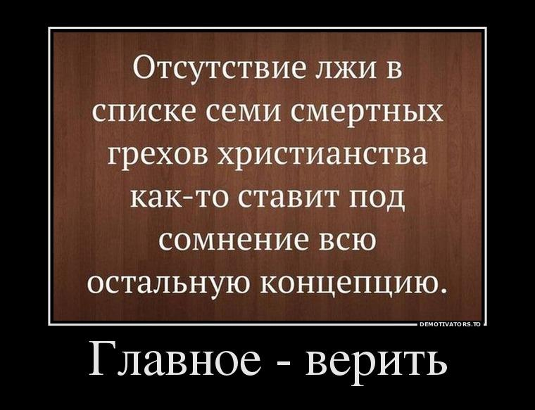

> **Первичный текст.** О ТМ №6(127) Концептуальная кабала Православия или как ему преобразиться, 2016-07-28.
> Источник: `20160728 О ТМ №6(127) Концептуальная кабала Православия или как ему преобразиться.doc` sha256 `2331f6667bc0e45d…`; [страница на dotu.ru](https://dotu.ru/2016/07/28/20160728_tek_moment06127_new/).
> Автоматическая транскрипция DOC→Markdown; смысл и формулировки не правились.
> Контрольные суммы и статус проверки — в [NOTICE.md](../../NOTICE.md).
> Содержание передаёт позицию авторов; утверждения не верифицированы библиотекой.

---

# Развитие аналитической записки\ / «О текущем моменте» № 6 (127), июль 2016 года

**Развитие аналитической записки\

«О текущем моменте» № 6 (127), июль 2016 года**

**Концептуальная кабала Православия или как ему преобразиться**

Перед чтением данной записки настоятельно рекомендуем перечитать пушкинскую «Гавриилиаду»[^1], чтобы войти в определённое настроение.

У А.С. Пушкина есть такая фраза: «Правду знают все, кроме избранных». Это о том, что истина доступна (на бессознательных уровнях психики) всему обществу, но непостижима для «элиты». Другими словами, всё последующее в этой статье — известно всем на уровне образов (т.е. на бессознательных уровнях психики), а вот для тех, кто мнит себя «элитой» общества — это знание недоступно. Это — преамбула, далее — по существу заявленной темы.

***1. «Новая доктрина Путина»***

В интернете появился документ, который пафосно назвали «новая доктрина Путина» ([<u>http://axiolog.livejournal.com/160629.html</u>](http://axiolog.livejournal.com/160629.html)):

В своей исторической «крымской речи» в Георгиевском зале Кремля 18 марта В. Путин четко сформулировал основные составляющие новой доктрины.

**1. Россия не рассматривает больше Запад как заслуживающего доверия партнёра.** Упреки и претензии, высказанные в «мюнхенской речи» 2007 г. не были услышаны и приняты Западом во внимание. Пытаясь вновь втянуть Украину в НАТО и в ЕС, «западные партнеры перешли черту». Вопреки заявлениям об окончании «холодной войны» и политики баланса сил, они фактически проводили и проводят старую политику сдерживания России. Реальная политика Запада — это обман, принятие решений за спиной России, постановка ее перед свершимся фактом, экспансия. «Россия почувствовала, что ее даже не просто обокрали, а ограбили». Отныне Россия будет исходить исключительно из этого.

**2. Россия не рассматривает больше себя как часть европейской, и, тем более, евроатлантической цивилизации.** Россия — демократия, но особого рода. Россия отказалась от коммунистических и «псевдодемократических догм». У неё новая идентичность, которую, впрочем, непросто сформулировать. Если почти 100% населения России поддерживает присоединения Крыма, то, значит это решение имеет прочную демократическую легитимность. Путин призывает народ сплотиться вокруг новой идеологии и политики, стать единым организмом. Россия не верит больше в универсальные ценности свободы, прав человека и демократии, как и в любые иные универсальные модели (хотя и остается — пока? — членом Совета Европы). Каждая сильная страна — сама себе система ценностей и сама себе модель.

**3. Международное право — это больше не система правил и даже не система координат.** Международное право — это меню, из которого каждая сильная страна выбирает то, что ей выгодно. Так, для подавления восстания в Чечне использовался международный принцип защиты суверенитета и территориальной целостности, а для присоединения Крыма — принцип уважения самоопределения народов. Сильная Россия имеет право на «суверенную демократию». Слабая Украина — нет. Мир — снова свободная игра сильных и баланс их силы. «Доктрина Путина» возвращает нас, с одной стороны, в вестфальскую систему баланса сил и «европейского концерта», с другой — к доктрине «ограниченного суверенитета» Брежнева.

**4. Сфера действия «доктрины Путина» — постсоветское пространство.** Обоснование — «историческое наследие», «русский мир», стратегическая безопасность России. Суверенитет постсоветских государств отныне является жестко обусловленным — учетом интересов России. За исключением трех прибалтийских республик бывшего СССР (хотя и это сегодня не факт). В случае «перехода черты» (втягивания в НАТО, в ЕС, попыток размещения военных баз) Россия будет действовать. Внутренняя дестабилизация такой страны, референдумы в регионах об отделении или даже о присоединении, ввод войск (официально или анонимно, в виде «вежливых зеленых человечков»), постановка лояльного Москве правительства. Закон о праве вводить войска в другие страны уже действует. Готовность перейти от дипломатических увещеваний к действиям — главное отличие новой доктрины, только что доказанное взятием под контроль и присоединением Крыма. В 2008 г. готовность действовать была впервые продемонстрирована в Грузии. Теперь любой, решивший «перейти красную черту» на постсоветском пространстве, должен быть готов к реальному противостоянию с Россией, в т.ч. к вооруженному. Одновременно доктрина – приглашение всем сильным странам пересмотреть правила игры. Перестать стесняться быть сильными. В этом смысле она глобальна. Еще в своей программной статье весны 2012 г. «Россия сосредотачивается» В. Путин заявил, что Россия будет не только следовать, но и формировать правила игры в мире. Время пришло.

**5. Модифицируется главный принцип Вестфаля — незыблемость государственного суверенитета и территориальной целостности.** Теперь это относится только к сильным, состоявшимся государствам, защищенным собственной армией или военно-политическим блоком (НАТО, ОДКБ). Суверенитет и целостность слабых стран (в первую очередь failed states) становится полем игры сильных государств и их блоков. Государства разделяются на высшую лигу с гарантиями, и на вторую лигу — без гарантий. Если сильная и решительно настроенная страна считает, что её военно- стратегические, экономические и политические интересы подвергаются опасности — она вправе действовать, вмешиваясь во внутренние дела слабых стран, и даже ставя под контроль или забирая их территории.

**6. Роль международных организаций (ООН, ОБСЕ, Совет Европы и др.) резко сокращается.** В их рамках необходимо сотрудничать, но лишь до того момента, когда они начинают мешать защите национальных интересов (именно так действовали США и их союзники, проводя различные военные операции в обход СБ ООН). В этом случае их надо без колебаний игнорировать.

**7. Новая «доктрина Путина» — исходит из принципиального нового баланса сил в мире.** Совокупный военный, экономический, гуманитарный вес Запада резко сократился и продолжает сокращаться. Быстро увеличивается вес и влияние Азии, Латинской Америки, Африки. Незападные крупные страны (в БРИКС, ШОС, и т.д.) будут заинтересованы в новых правилах игры, чтобы самим играть, делить, забирать. Им придется по душе трактовка международного права не как системы табу, а как завлекательного ресторанного меню. Да, мир станет опаснее, и даже взрывоопаснее, да – риски нового прекрасного мира будут запредельно велики, но ведь каждый надеется на выигрыш в этой азартной игре, не так ли?

————————

— **Не так!**

Предложенная доктрина совсем не новая и точно — не доктрина Путина. Это мнение представителя одного из кланов в окружении Путина, который хотел бы, чтобы эта доктрина стала «Доктриной Путина». Однако в этих кланах нет понимания главного — прежде чем создавать свою стратегию противостояния Западу, необходимо определиться — а какая же стратегия у него? Отсюда и начинаются все вопросы.

Публично и впервые стратегия Запада была прямо названа советским писателем-фантастом и социологом Иван Антоновичем Ефремовым в романе «Час быка», написанном в 1968 году:

«К несчастью, главная религиозная книга наиболее техничной и могущественной из прошлых цивилизаций — белой — была Библия, наполненная злом, предательством, племенной враждой и бесконечными убийствами…»

Почему «элиты» боятся огласить то, что Библия является концепцией управления Западом и формирует стереотипы (автоматизмы поведения) людей?

— Потому что внутри России существует огромная «пятая колонна» — «элита» и толпа, которую «элита» пасёт. «Пятая колонна» взращена библейской концепцией и в рамках концепции бодаются между собой идеологические модификации концепции — РПЦ, синагога, исторически сложившийся (традиционный) ислам и атеисты-«традиционалисты», включая «мраксистов».

В дополнение «пятая колонна» на всех углах кричит о том, что Россия — часть Запада, и в тоже время: "там на Западе наши враги: католики, протестанты, иеговисты, адвентисты шестого и седьмого дня, да ещё педерасты." Что это как не массовая шизофрения?

**А как обстоят дела на Западе?**

— Не лучше. Там тоже господствует шизофрения. Они там точно знают, что Россия на них никогда первой не нападёт, но на всех углах, начиная с олимпийского и заканчивая польским, литовским и английским кричат:

*— Да, мы боимся, потому что русские вот — вот на нас нападут, всех возьмут в плен и изнасилуют.*

*— Боитесь? А чего боитесь, когда расходы на вооружение в России раз в 20 ниже, чем у Запада.*

*— Всё равно — страшно! — русские всех обманывают и всё скрывают.*

*— Боитесь русских, когда вас уже насилуют иммигранты с Востока, а не русские?*

*— Всё равно боимся русских…*

То есть Западу тоже, как и политическому руководству РФ ещё предстоит определиться со стратегией России.

**Что же беспокоит Запад?**

Внешне «стратегия Путина» (декларируемая в публичной политике) после августа 1991 год списана под копирку со стратегии Запада и Конституция РФ 1993 г. это всячески демонстрирует, но им страшна не открытая, а скрытая стратегия, порождающая вопросы вроде: “Who is mister Putin?” и непонимание поведения “these crazy Russians”; идеалы которой хотя и не проявляются в публичной политике на протяжении последних 1000 лет[^2], но свойственны генетическому ядру многонациональной русской цивилизации и не дают на протяжении той же тысячи лет «окончательно решить “русский вопрос”», и которые в конце концов выразились как Русский проект глобализации в Концепции общественной безопасности[^3].

Проблема в том, что эта Концепция страшна не только политическому руководству буржуазно-либерального Запада, но пугает и руководство РФ, а также она страшна и зомбированным Библией толпам с той и с другой стороны этого безумного противостояния.

И что тогда остаётся для этих толп заражённых библейской шизофренией? То, что говорил Портос в фильме «Д’Артаньян и три мушкетёра» (СССР, Одесская киностудия, 1978 г.):

*— А вы почему дерётесь, Портос?*

*— Я дерусь, потому что я дерусь!*

Т.е. в этом случае остаётся только бессмысленная для обеих сторон война на взаимное уничтожение ради целей некой третьей стороны, которая в конфликте не участвует, но управляет им в своих интересах. Нам такая стратегия не нужна.

***2. Куда податься «элите»?***

В условиях, когда никак не признать, что стратегия Запада — это Библия; когда в силу библейских стереотипов не признать Концепцию общественной безопасности (КОБ), куда остаётся податься «элите» и толпе?

**23 июля 2016 года** на сайте «Русского экономического общества» появилась статья

«Концептуальная кабала»[^4], в которой автор, Александр Игнатенко, пытается выявить проблему и дать ответ — а куда собственно двигаться России?

Текст этот до конца будет понятен не очень широкому кругу людей, но его появление — знаково, поскольку показывает, как информация Концепции общественной безопасности, представляющей альтернативу библейской концепции, просачивается в передовой отряд интеллектуалов-библейцев на территории России — в РПЦ. Можно предположить, что автор знаком с материалами КОБ, поскольку употребляет её термины в целом адекватно, но подневольность библейской концепции заставляет его подгонять полученные знания под библейские стереотипы.

Статья основана на довольно обширной книге самого автора «Критика падшего разума»[^5].

Начинается статья так:

«Концептуальная кабала есть следствие духовной и предпосылка идеологической (либерализм), политической (колониальная администрация) и финансово-экономической (филиал ФРС) зависимости России. Духовная и концептуальная экспансия всегда предшествуют военной».

Автор начинает статью с описания подчинённости низших приоритетов средств воздействия средствам высших приоритетов. Так, если на высших приоритетах страна обеспечивает свой суверенитет и безопасность, то и на низших приоритетах постепенно происходят соответствующие изменения, и, наоборот — утрата мировоззренческой безопасности влечёт за собой утрату безопасности и соответственно суверенитета на низших.

*[В оригинальном издании здесь расположен рисунок/схема. Иллюстрация не включена в данный выпуск: ожидает визуальной и правовой проверки. Файл источника: image1.png]*

Т.е. всё в полном соответствии с иерархией приоритетов обобщённых средств управления / оружия, представленной в КОБ ещё в 1991 г. А словосочетание концептуальная кабала в себе содержит умолчание о том, что есть концептуальная «некабала», то есть свобода — состояние, когда, если говорить в нашей терминологии, есть социальная группа, осуществляющая концептуальную власть в интересах развития цивилизации и способствующая расширению своей социальной базы до границ всего общества. Соответственно, концептуальная кабала — это концептуальное безвластье, или подчинённость чуждой концепции и чужеродной концептуальной власти.

Статья изобилует всевозможными наукообразными терминами, сути которых автор похоже сам не понимает, пересыпая ими как стекляшками в калейдоскопе текст.

В частности в начале статьи он пишет:

«Религиозная (культ) форма познания рассматривается и обосновывается в этой работе как субстанциональная. Философская и научная формы производны от религиозной и образуются в результате деградации и трансформации культа.. Основу религиозной (если брать христианство) формы познания образует духовное (естественное, трансцендентное) созерцание, основу философской (классическая философия) — мышление, основу научной — представление (соединение мышления и чувственного созерцания)».

Уже с самого начала автор противопоставляет религию, философию и науку, как три разных пути познания. Если рассматривать философию разнородных церквей и светских идеологий, мы видим, что практически везде господствует цитатно-догматический подход, а не методологический. Даже марксизм, принесший с собой обрезанно-диалектическую философию, будучи светской версией библейской концепции, со временем догматизировался. Поэтому говорить о том, что католичество или православие, марксизм, либо другие идеологические системы (третий приоритет обобщённых средств управления / оружия) могут предложить обществу метрологически состоятельную теорию познания (раздел философии), на основе которой будут развиваться науки, не приходится. То есть тезис о разности форм познания практически ничем не подкрепляется.

В книге и статье автор делает вывод о том, что философия, культура и наука Западной цивилизации — есть следствие определённого богословия, то есть мировоззрения:

«Католическое догматическое богословие потенциально содержит в себе все формы его исторических преобразований: протестантизма, философии и концептуальной науки Нового времени».

Но автор не говорит главное, что наука, как таковая, всегда концептуально обусловлена. По умолчанию подразумевается, — католическое догматическое богословие в основе своей имеет Библию, и дальше становится понятно зачем.

Автор пишет:

«...исследования позволяют утверждать о существовании католическо-протестантской науки со своими фундаментальными положениями, понятийной базой, системой теорий и картиной мира. Этот же вывод справедлив и в отношении античной науки. Другими словами, не существует универсальной науки, это миф созданный западной католически-протестантской парадигмой с определёнными идеологическими целями.

Под универсальной наукой Запад понимает свою собственную католически-протестантскую науку. Естественно напрашивается вывод, если есть католически-протестантская и античная наука, то должна быть и православная».

Таким образом, автор искусственно выводит православие за скобки западной католически-протестантской парадигмы. А чтобы вывести, надо «забыть» сказать о том, что в основе православия также лежит... тот же самый библейский культурный код или, как выражается автор, «онтология, антропология и гносеология».

Ссылаясь на В.Ю.Катасонова[^6], Александр Игнатенко, говорит о том, что современная экономическая наука основана на протестантизме (имеется в виду выросший из него либерализм) и иудаизме (видимо имеется в виду глобальное ростовщичество, как основа современной кредитно-финансовой системы), говоря далее о том, что православие сильно расходится с ними:

«Особенно принципиальны различия между западными (принадлежат католически-протестантской фундаментальной парадигме) общественными науками и православным мировоззрением. (...)

Современная наука в России, система высшего и среднего образования основаны на ложных научных теориях не соответствующих **нашему мировоззрению (цивилизационной идентичности), православной онтологии, антропологии и гносеологии**».

— Экое открытие: ещё К.Н.Леонтьев в письме В.С.Соловьёву писал:

«Вера у нас греческая издавна; государственность со времени Петра почти немецкая (см. жалобы славянофилов); общественность французская; наука — до сих пор общеевропейского духа. Своего остаётся у нас почти только — один национальный темперамент, чисто психический строй; да и тот действительно резок только у настоящих великороссов, со всеми их пороками и достоинствами. И малороссы, и белорусы — со стороны "натуры", со стороны личных характеров гораздо менее выразительны» (Письмо 9).

Из этого можно понять, что никакой науки, альтернативной науке Запада, в России никогда не было и нет её по настоящее время. Но православным философам это неведомо, даже при наличии прямых указаний на это таких православных авторитетов, как К.Н.Леонтьев и святитель Игнатий Брянчанинов.

Тем не менее, современная наука, образование действительно не соответствуют русскому мировоззрению и идеалам Русской цивилизации, которые самобытно развивались вопреки постоянно внедряемым в течение истории западным идеям. И автор прав, что необходима разработка соответствующей русскому мировоззрению науки и системы образования. Но вот снова возникает вопрос — что есть православие, как не та же самая западная библейщина, хотя и испытавшая на себе влияние русской цивилизации? А если это так, то как православие может стать основой для такой разработки:

«Мы говорим об острейшей необходимости создания и разработке в современной России собственной **православной** науки, и, в первую очередь, в гуманитарной сфере. Для этого есть всё самое необходимое: **православная онтология, антропология и гносеология**. На их основе вполне реально в ближайшее время разработать православную социологию, историю, экономику, политологию и т.д.».

Напомним, что Ветхий завет (иудейская Тора) (основа западной философии, науки и системы образования) с ростовщической доктриной Второзакония-Исайи (об этом ниже), вместе с картиной сотворения мира и человека, догмата о его греховности, догмата о троичности Бога, распятием пророка Иисуса и прочих идейных основ православного мировоззрения **в канон РПЦ** **входит**.

Поэтому первый вопрос: чем «православная онтология, антропология и гносеология» отличаются от общезападной? — тем что отвечать на вопрос «что есть истина?» в полном соответствии с библейскими текстами и «святоотеческим преданием» будет не светская академия наук, не непогрешимый папа Римский, не «святая инквизиция римско-католической церкви», а «святейший синод РПЦ» или «его святейшество» патриарх Московский и всея Руси? Каким образом тогда на основе «православных онтологии, антропологии и гносеологии», базирующихся на библейских сказаниях и символе веры, чрезвычайно далёких от Учения Иисуса, может быть создана православная наука, отличная от современной общезападной и тоже библейской?

От того, что библейский код получит православный окрас и дистанцируется от либеральных (выросших из протестантизма) и ростовщических (выросших из иудаизма) заветов современной «универсальной» западной науки, он не перестанет быть библейским — несущим в себе все алгоритмы, всё той же библейской рабовладельческой по своей сути концепции управления или в терминах автора — концептуальной кабалы.

И возникает ещё один вопрос: А что православию мешало в период с 988 по 1917 г. породить свою православную науку и систему образования, более эффективные, нежели западная?

Далее автор пишет:

«В этой статье мы не затрагиваем необходимость организационных реформ в науке и образовании, об этом сказано достаточно. Наша тема более фундаментальна. Мы говорим об острейшей необходимости создания и разработке в современной России собственной православной науки, и, в первую очередь, в гуманитарной сфере. Для этого есть всё самое необходимое: православная онтология, антропология и гносеология. На их основе вполне реально в ближайшее время разработать православную социологию, историю, экономику, политологию и т.д».

То есть не говоря об этом прямо, автор ставит вопрос о формировании концепции управления процессом глобализации. Однако, как мы уже писали ранее, сформулировать альтернативную социологию, историю, экономику на базе Библии невозможно, а значит все рассуждения про то, что православие в его текущем виде может стать основой концепции альтернативной Библии — несостоятельны.

К тому же автор и сам это подтверждает:

«Александр Нотин в статье «Время полной правды» показывает полное бессилие огромной армии современных аналитиков, экспертов, ученых, политологов, историков, экономистов (получивших современное атеистическое, материалистическое, протестантское образование) в попытке осмыслить и составить прогноз крупных политических, экономических и общественных событий. Причину этого он видит в том, что знание современных ученых идут от ума неодухотверенного, порождающее материалистическое мировоззрение, и которое, согласно Священному Писанию умрет («Знание упразднится» (1 Кор. 13, 8))».

Но опять автор выводит библейское православие за скобки, стыдливо умалчивая о бесплодности армии аналитиков, учёных, семинарий и чиновников от РПЦ. Не помогает дух церковный. Выходит, что и онтология, и антропология, и гносеология православия -- бесплодны, раз даже за 25 лет «свободы от СССР» ничего не было создано.

> *Ждало напрасно человечество,\

> Что с древних кафедр и амвонов\

> Из уст помазанного знахарства\

> Прольётся творческий глагол.*

>

> *Все церкви мира — лишь хранители\

> Былых заветов и канонов;\

> От их блистающих обителей\

> Творящий Логос отошёл.*[^7]

Однако остаётся вопрос — возможен ли ренессанс православия в России? Может ли оно стать одной из наиболее активных и здоровых сил развития общества? Особенно в условиях сменившейся логики социального поведения. А. Игнатенко отвечает на данный вопрос, хотя в своих выводах сам себе противоречит:

«Без православного богословия православие превращается в назидательный фольклор. Вне богословской проверки душа становится неустойчивой в искушениях, возникает угроза духовному здоровью, подмены духовного душевным. Без богословия мысль отрывается от церковных глубин. Богословская наука, принесенная в Россию с Запада, оставалась инославным включением в церковноорганическую жизнь.

(...)

Русское богословие в своём развитии путь церковно-исторических воспоминаний прошло слишком бегло и недостаточно полно пережило патристику и византизм. Русская богословская школа ещё должна пройти самую строгую школу христианского эллинизма. Русское богословие не овладело отеческим богословием изнутри».

То есть с одной стороны автор призывает очистить церковь от западных инверсий, а с другой — внедрить в церковь византийско-греческие инверсии, не зная или не понимания, а может быть осознанно умалчивая о том, что Запад уже осуществил экспансию и внёс эти инверсии в византийское православие. Ну и наконец снова повторимся: при всей разнице российского православия, греческого и католического учений — основа у всех у них одна — Библия.

И опять же безответными остались афоризмы В.О.Ключевского:

> «Высшая иерархия из Византии, монашеская, насела как чёрная беда на русскую верующую совесть и доселе пугает её своей чернотой» (стр. 437). «Русское духовенство всегда учило паству свою не познавать и любить Бога, а только бояться чертей, которых оно же и расплодило со своими попадьями» (стр. 434). «Богословие на научных основаниях — это кукла бога, одетая по текущей моде» (стр. 424). «Нравственное богословие цепляется за хвост русской беллетристики» (стр. 423).[^8]

Далее автор делает краткий экскурс в историю, и в частности про советский период истории пишет:

«В основу идеологии социализма и коммунизма, с нашей точки зрения, положен синтез трех фундаментальних парадигм: антропоцентрической (немецкая философия, английская политэкономия, французский утопический социализм), теоцентрической (мессионизм) и талмудической (хилиазм)».

**Что мы знаем о хилиазме?**

«Хилиазм (от греч. chilias — тысяча), вера в «тысячелетнее царство» бога и праведников на земле, т.е. в осуществление мистически понятного идеала справедливости еще до конца мира» («Советский энциклопедический словарь». 1986). Иное название хилиазма — «милленаризм» — происходит от латиноязычной тысячи. Хилиазм и милленаризм с момента их появления в греко- и латиноязычных регионах Римской империи рассматриваются господствующими церквями, почитающими себя христианскими, как ересь, т.е. как ложное учение. И в этом нет разницы между православием и католицизмом. И хилиазм порицается церквями вопреки смыслу молитвы Христовой:

«Отче наш, сущий на небесах! Да святится имя Твое; да придёт Царствие Твое; да будет воля Твоя и на земле, как на небе…»

Таким образом, автор пытается приписать хилиазм Талмуду, и тем самым скрыть от читателя, что хилиазм в сущности соответствует изначальному учению Иисуса, и в общем-то является настоящим христианством, но не вписывается в интересы кураторов современного православия: изначально византийское православие — церковь кесаря, а не церковь Бога: отсюда и все проблемы.

Подводя итог анализа статьи, можно сказать, что автор не мытьем так катанием пытается способствовать сохранению господства библейской концепции в её идеологической православной упаковке. Он нехотя признает, что пока никакой православной социологии, экономики, истории нет, но настаивает на её разработке и насильственном внедрении в систему образования и другие общественные институты.

Реально же для преображения православия в силу, которая будет действительно работать на благо народов Русской цивилизации и всего человечества, необходимо последовать совету Игнатия Брянчанинова. Предложение Игнатия Брянчанинова «О необходимости Собора по нынешнему состоянию Российской православной церкви»:

«В течение двух столетий положение Российской Церкви не рассматривалось и не поверялось Собором. С последних годов ХVII-го столетия Западным ветром нанесено много грязной пыли в недра Церкви и в недро государства ко вреду для веры, нравственности и народности. При всех возникавших в Церкви затруднительных вопросах Церковь для разрешения их постоянно составляла Соборы. По настоящему затруднительному положению Всероссийской Церкви созвание Собора сделалось решительной необходимостью. Вместе с этим созвание Собора, по духу времени, невозможно без известного приготовления к столько святому начинанию. Cобрать и напечатать Предание Вселенской Церкви (cursus completus Patrologiae) на греческом, латинском, cлавянском и русском языках. И Предание Вселенской Восточной Церкви, выясненное со всею верностью по достовернейшим документам, должно подействовать в пользу Православной Церкви. Все великие ученые, математики и естествоиспытатели, как-то: Ньютон, Лейбниц, Неккер — не только были деистами, но и признавали христианство»[^9].

Оно осталось безответным, и именно эта безответность к намёку Свыше, а не какие-то там «большевики» и «жидо-масоны», повлекла за собой катастрофу 1917 г.: что касается большевиков, то они вынесли Россию из этой катастрофы и создали предпосылки к её дальнейшему праведному развитию.

Тем не менее вопрос есть: В чём же заключается конкретная суть заблуждений, господствующих в РПЦ? — Мы рассмотрим это ниже.

***3. Попущение в процессах порабощения народов***

**Попущение Божие** — пределы, в которых Бог допускает уклоняться от осуществления Промысла всем, кому в Божьем Предопределении бытия Он предоставил свободу выбора и дал волю для того, чтобы реализовать выбор.

При этом открыта возможность одним субъектам оказывать непосредственное или опосредованное воздействие, не укладывающееся в нормы праведных взаимоотношений, на других субъектов, которые сами уклонились от объективной праведности.

В зависимости от того, насколько и как кто-то уклоняется от предложенных ему Свыше норм праведности, — настолько Бог не воспрепятствует неправедным действиям и в отношении него самого и не поддержит его неправедное противодействие тем, кто действует против него в пределах Попущения. При этом Попущение в отношении каждого обусловлено достигнутым им личностным развитием: чем больше было дано Свыше человеку, чем ближе его нравственность к праведности, чем большего он достиг в освоении потенциала развития своих способностей — тем строже отношение к нему Свыше и тем строже ему самому следует быть в самодисциплине.

*[В оригинальном издании здесь расположен рисунок/схема. Иллюстрация не включена в данный выпуск: ожидает визуальной и правовой проверки. Файл источника: image2.png]*

Попущение Божие во всех случаях промыслительно целесообразно, поскольку в нём Бог предоставляет возможность неправедным одуматься самим под воздействием обстоятельств, не нарушая Своею волей их свободы выбора и не подавляя их воли.

Знание о попущении Божием как об объективном явлении в жизни общества в целом и каждого человека позволяет выявить четыре основных вида этики:

- Эксплуатация в своих интересах Божиего попущения, таким как оно сложилось в отношении других.

- **Субъективная оценка границ Божиего попущения и злоумышленное введение на этой основе окружающих в область попущения в отношении них с целью своекорыстной эксплуатации их в пределах попущения** (так построены их хозяевами разнообразные культы, и на этом стоит разноликий сатанизм).

> Соответственно политика растления подрастающих поколений во все времена во всех народах — не издержки свободы слова и художественного творчества, не этическая ошибка, а целенаправленный злой умысел. И пусть владельцы и работники средств массовой информации, составляющие программы телевещания и сводки новостей, деятели искусств — так называемая «творческая» интеллигенция — и прочие служители и заправилы эгрегориально-магических псевдорелигиозных и светских культов поостерегутся, поскольку вся такого рода деятельность протекает в пределах Божиего попущения со всеми сопутствующими этому неизбежными последствиями для её сторонников и самих делателей.

- Действия в пределах попущения Божиего с целью пресечения чьих-либо неправедных действий после того, как неправедно действующие уведомлены о сути их неправедности, но упорствуют в своём, не внемля уведомлениям о том, что им следует жить и действовать иначе. Таково в идеале обоснование права на Священную — справедливую — войну (в частности, таково обоснование исламского джихада или Великой Отечественной тоже священной войны) и на действия разнородных «инквизиций».

> Однако в исторически реальной практике под лозунгами «священной войны», провозглашаемыми обеими враждующими сторонами, большей частью **одни злочестивые вкушают ярость других злочестивых в пределах Божиего попущения в отношении каждой из сторон**. И соответственно — горе тому, кто, возомнив о своей праведности, начнёт «священную» войну против тех, кто более праведен, а тем более — против тех, кто истинно праведен: неизбежно придётся столкнуться с прямой, хотя, возможно, и неисповедимой для неправедных, поддержкой Богом более праведных. Так горько поплатились нацисты, напав на более праведный Советский Союз.

- Принципиальный отказ от не отвечающего нормам праведных взаимоотношений воздействия на других, однако возможного в пределах Божиего попущения в отношении тех. При этом на себя возлагается обязанность уведомлять возможные жертвы попущения о том, что они находятся в его области, указывая им пути выхода, предоставляя Богу миссию воздаяния упорствующим в неправедности. Этому учил людей Иисус и этому принципу следовал он сам, пребывая во плоти среди людей. Это — в нашем понимании — основа христианской этики: «**Пойдите, научитесь, что значит милости Хочу, а не жертвы**» (Матфей, 9:13).

> В обществе господство христианской, а по существу — нормальной человеческой этики (в указанном смысле) возможно, но требует и предполагает, чтобы человек был нравственно готов и умел принять к искреннему осмыслению и встречные уведомления со стороны окружающих о его собственной неправедности, дабы он мог с такого рода помощью других людей изменить самого себя.

Наиболее яркий пример использования Попущения Божиего в своекорыстных интересах (в соответствии с первыми и вторым видами этики) — это воздействие на глобальный исторический процесс ростовщической доктрины Второзакония-Исаии, которая вместе со всем Ветхим заветом почитается РПЦ боговдохновенной истиной:

«**Не давай в роcт брату твоему** (по контексту единоплеменнику-иудею) **ни серебра, ни хлеба, ни чего-либо другого, что возможно отдавать в рост; иноземцу** (т.е. не иудею) отдавай в рост, чтобы господь бог твой (т.е. дьявол, если по совести смотреть на существо ростовщического паразитизма) **благословил тебя во всем, что делается руками твоими на земле, в которую ты идешь, чтобы владеть ею**»...**И будешь господствовать над многими народами, а они над тобой господствовать не будут**», — Второзаконие, 28:12. «**Тогда сыновья иноземцев** (т.е. последующие поколения не-иудеев, чьи предки влезли в заведомо неоплатные долги к племени ростовщиков-единоверцев) **будут строить стены твои** (так ныне многие семьи арабов-палестинцев в их жизни зависят от возможности поездок на работу в Израиль) **и цари их будут служить тебе** («Я — еврей королей» — возражение одного из Ротшильдов на неудачный комплимент в его адрес: «Вы король евреев»); **ибо во гневе моем я поражал тебя, но в благоволении моем буду милостив к тебе. И будут отверзты врата твои, не будут затворяться ни днём, ни ночью, чтобы было приносимо к тебе достояние народов и приводимы были цари их. Ибо народы и царства, которые не захотят служить тебе, погибнут, и такие народы совершенно истребятся**», — Исаия, 60:10 — 12».

Иерархии всех Церквей имени Христа, настаивают на священности этой доктрины, не смея назвать её мерзостью, а канон Нового Завета, прошедший цензуру и редактирование еще до Никейского собора (325 г. н.э.), от имени Христа, безо всяких к тому оснований, провозглашает её до скончания веков в качестве благого Божьего промысла:

«Не думайте, что Я пришёл нарушить закон или пророков (т.е. Ветхий Завет). Не нарушить пришел Я, но исполнить. Истинно говорю вам: доколе не прейдёт небо и земля, ни одна иота или ни одна черта не прейдет из закона, пока не исполнится всё, — Матфей, 5:17, 18».

Вера в боговдохновенность этой мерзости делает народы психологически беспомощными перед экономическим диктатом транснациональной ростовщической мафии, поскольку вводит верящих в тем большее попущение в отношении их, чем более истова их вера.

А как трактуют понятие Попущение Божие православные богословы?

«**Попущение Божие** — один из видов промышления (попечения) Божия о существующем, праведное оставление человека Богом для вразумления, исправления, спасения и славы терпящего, или для возбуждения других к ревности и подражанию, или для славы Божией, или когда человек, несмотря на то, что Богом всё сделано для его спасения, остаётся, по собственному произволу, бесчувственным и неисцелимым.

Попущение бывает двух видов:

\- попущение спасительное и вразумляющее и

\- попущение, означающее отвержение человека Богом и ведущее к полному наказанию[^10]».

В целом — аналогично, но даже здесь во втором варианте попущения нравственность Бога библейская — он может отвергнуть человека, наказывает его, хотя при этом «Бог есть Любовь!»

**Догмат о жертве Праведника**

Эта шизофреничность Библии, где фигурируют описание нравов по сути двух богов — действительного всепрощающего, любящего, милосердного ВСЕМОГУЩЕГО Всевышнего Бога и удобного для всех церквей имени Христа, мстительного, ревнивого, карающего, господина над рабами — назовём его Господом, проявилась сильнее всего в описании пришествия Праведника, которые разнятся в Книге премудрости Соломона, где говорится о том, как лукаво мудрствуют злочестивые:

«12Устроим ковы праведнику, ибо он в тягость нам и противится делам нашим, укоряет нас в грехах против закона и поносит нас за грехи нашего воспитания; 13объявляет себя имеющим познание о Боге и называет себя сыном Господа; 14он пред нами — обличение помыслов наших.

15Тяжело нам и смотреть на него, ибо жизнь его не похожа на жизнь других, и отличны пути его: 16он считает нас мерзостью и удаляется от путей наших, как от нечистот, ублажает кончину праведных и тщеславно называет отцом своим Бога.

17Увидим, истинны ли слова его, и испытаем, какой будет исход его; 18ибо если этот праведник есть сын Божий, то Бог защитит его и избавит его от руки врагов.

19Испытаем его оскорблением и мучением, дабы узнать смирение его и видеть незлобие его; 20осудим его на бесчестную смерть, ибо, по словам его, о нем попечение будет".

21Так они умствовали, и ошиблись; ибо злоба их ослепила их, 22и они не познали тайн Божиих, не ожидали воздаяния за святость и не считали достойными награды душ непорочных.

23Бог создал человека для нетления и соделал его образом вечного бытия Своего; 24но завистью диавола вошла в мир смерть, и испытывают её принадлежащие к уделу его[^11]».

И в этом фрагменте лукавство РПЦ тоже выразилось: слова «сын Божий» написаны со строчной буквы, поскольку если начинать из с заглавной, то этот фрагмент придётся относить к первому пришествию Христа, но в этом случае всё церковное вероучение рассыплется как карточный домик, но при этом исчезнет многовековой конфликт с исламом, отрицающим распятие Христа как жизненный факт в прямой и недвусмысленной форме.

И в описании отношения к Праведнику Исаии:

«4Но Он взял на Себя наши немощи и понес наши болезни; а мы думали, что Он был поражаем, наказуем и уничижен Богом.

5Но Он изъязвлен был за грехи наши и мучим за беззакония наши; наказание мира нашего было на Нем, и ранами Его мы исцелились.

6Все мы блуждали, как овцы, совратились каждый на свою дорогу: и Господь возложил на Него грехи всех нас.

7Он истязуем был, но страдал добровольно и не открывал уст Своих; как овца, веден был Он на заклание, и как агнец пред стригущим его безгласен, так Он не отверзал уст Своих.

8От уз и суда Он был взят; но род Его кто изъяснит? ибо Он отторгнут от земли живых; за преступления народа Моего претерпел казнь.

9Ему назначали гроб со злодеями, но Он погребен у богатого, потому что не сделал греха, и не было лжи в устах Его.

10Но Господу угодно было поразить Его, и Он предал Его мучению; когда же душа Его принесет жертву умилостивления, Он узрит потомство долговечное, и воля Господня благоуспешно будет исполняться рукою Его.

11На подвиг души Своей Он будет смотреть с довольством; чрез познание Его Он, Праведник, Раб Мой, оправдает многих и грехи их на Себе понесёт[^12]».

И почему-то именно исаиевское откровение о страдании Праведника за грехи людей стало главным камнем в основании исторически сложившегося христианства. И уже спустя 600 лет через Коран следует увещевание:

«и за их слова: «Мы ведь убили Мессию, Ису, сына Марйам, посланника Бога» (а они не убили его и не распяли, но это только привиделось им; и, поистине, те, которые разногласят об этом, — в сомнении о нём; **нет у них об этом никакого знания, кроме следования за предложением**. Они не убили его, — наверное \[в действительности\]. Нет, Бог вознёс его к Себе: ведь Бог велик, мудр![^13]».

Но, христианские богословы отгородились и от премудрости Соломона, и от коранического увещевания тем, что не признали Коран боговдохновенной книгой, объявили вероучение ислама ложным, а чтобы не критиковать его напрямую, в худших традициях интернет-дискуссий нападали на личность Мухаммада[^14]. Коран для церквей — не указ: это понятно. Но и Христос его современников обличал в культе убийства праведников, сидящем в их душах, которому они следуют, и предрекал им:

«Горе вам, книжники и фарисеи, лицемеры, что **строите гробницы пророкам и украшаете памятники праведников** и говорите: если бы мы были во дни отцов наших, то не были бы сообщниками их в пролитии крови пророков; **таким образом вы сами против себя свидетельствуете**, что вы сыновья тех, которые избивали пророков; дополняйте же меру отцов ваших. Змии, порождения ехидны! как убежите вы от осуждения в геенну?» (Матфей, 23:29 — 33)».

В догмате о крестной смерти Христа заложена основа духовного рабства приверженцев библейской концепции, поскольку следование за предположением о возможности гибели Праведника за грехи остальных открывает тем больше возможностей для неправедного воздействия на индивида, чем сильнее он верит в этот догмат вероучения.

Ведь в психике индивида тогда формируется чёткий алгоритм: «Если ты будешь праведным, то тебя ждёт мученическая смерть, воздаяние за которую ты получишь посмертно». Этот алгоритм самоликвидации наиболее нравственно праведных людей подкреплялся в течении истории тем, что наиболее почитаемыми всегда считались святые великомученики. Дело в иные времена доходило до самоистязания до смерти. Алгоритм этот подкачивали на всех уровнях, например, на уровне государства — причислением Николая II к святым великомученикам, что формировало алгоритм предательства Родины для будущих государей: «Сдай страну без боя врагам — станешь святым».

В действительности же Николай II на пустом месте создал потенциал конфликта с Японией, который разрядился в русско-японской войне и до сих пор «аукается» во взаимоотношениях двух народов; он же допустил вовлечение России в первую мировую войну (отказ от Биоркского договора с Германией 1905 г., подписанного им, отказ от внешнеполитического курса П.А.Столыпина[^15]). Так что, если по сути, то последний царь — самоубивец, который вовлёк в своё самоубийство ещё миллионы людей в нескольких поколениях, и соответственно молиться надо о прощении его, а не ему о чем-либо как святому…

**Догмат о грехопадении**

Догматом, напрямую связанным с догматом о крестной смерти Праведника, который является важнейшей основной христианской (и православной тоже) антропологии (учения о человеке) есть догмат о грехопадении человека. Он делает всех людей, кто в этот догмат убеждённо разделяет, нравственно ниже церковных иерархов (Папа Римский считается непогрешимым[^16], патриарх РПЦ официально именуется «**Святейшим** Патриархом Московским и всея Руси[^17]»), что даёт им этическую возможность использовать создавшуюся таким образом разницу в попущении в отношении себя и паствы в своекорыстных интересах по первому и второму видам этики.

> Эта **психическая установка о неисправимой ущербности одних перед другими — основа фашизма** как одного из типов культуры общественного самоуправления, возможного исключительно в толпо-«элитарном» обществе.

Организационно-политическая суть фашизма как такового вне зависимости от того, как его называть, какими идеями он прикрывается и какими способами он осуществляет власть в обществе, — в активной поддержке толпой «маленьких людей» — по идейной убеждённости их самих или безыдейности на основе животно-инстинктивного поведения — системы злоупотреблений властью «элитарной» олигархией, которая:

- представляет неправедность как якобы истинную «праведность», и на этой основе, извращая миропонимание людей, всею подвластной ей мощью культивирует неправедность в обществе, препятствуя людям состояться в качестве человека, подавляет таким образом его познавательно-творческий потенциал;

- под разными предлогами всею подвластной ей мощью подавляет всех и каждого, кто сомневается в праведности её самой и осуществляемой ею политики, а также подавляет и тех, кого она в этом заподозрит (разнородные инквизиции исторически сложившихся Церквей преследовали эти цели).

Подчеркнём, фашистская культура общественного самоуправления выстраивается так, чтобы исключить личностное становление новорождённых в качестве носителей необратимо человечного типа строя психики и тем самым воспрепятствовать становлению культуры человечности и соответствующей ей организации жизни общества.

Фашистская культура, алгоритмика которой подавляет познавательно-творческий потенциал, такова, что для всех покалеченных ею в процессе их личностного становления, слова «методология познания и творчества» — пустые. Это — вне зависимости от того, каким социальным статусом обладают такие люди, и как они относятся к дошедшему до них знанию о методологии познания и творчества и её разносторонней роли в жизни общества:

- признают предлагаемое им знание достаточно достоверным и подлежащим освоению ими и обществом в целом;

<!-- -->

- стремятся к тому, чтобы за счёт нового знания каким-то путём решить прежде всего (либо исключительно) свои какие-то мелко-житейские проблемы, предоставив жизнь общества её собственному течению

<!-- -->

- считают его вздором, не заслуживающим внимания;

- либо осознанно предпочитают спрятаться от Жизни в её «ракушке», полагая, что предложение освоить познавательно-творческий потенциал проистекает от «лукавого», поскольку нарушает по их мнению божественный запрет на вкушение плодов от «древа познания Добра и Зла».

Они не рассматривают возможности того, что в истории с Древом познания Добра и Зла:

- Имел место не абсолютный запрет на познавательно-творческую деятельность, противоречащий тому, что Бог дал человеку чувства, разум, волю, совесть и стыд (два аспекта врождённого религиозного чувства — см. выше афоризм В.О.Ключевского), а предостережение не проявлять «хакерской» отсебятины в этом деле во избежание неизбежных связанных с «хакерством» бед.

- Именно «лукавый» и его последователи впоследствии предостережение от «хакерства» интерпретировали в качестве абсолютного запрета на познание и, соответственно, — (по умолчанию) на освоение познавательно-творческого потенциала генетически заложенного в человека Богом — Творцом. Спрашивается: зачем Бог заложил в человека познавательно-творческий потенциал, если предполагал наложить категорический запрет на его освоение и использование, и дав при этом человеку свободу выбора? — Бог, что — шизофреник и слабоумный? И для чего Иисус вразумлял людей, что Дух Святой наставник на всякую истину?

**Догмат о Троице**

Вот, как пишет о душе и её состоянии А. Игнатенко в своей книге:

«Резюмируем содержание данного вопроса. Когда предметом познающего субъекта выступает имманентное (от лат. immanens — пребывающий в чем-либо, свойственный чему-либо) содержание — сознание с необходимостью приобретает объективированную и натурализированную форму.

Душа по природе, в естественном состоянии, — проста. Она уподобляется тому, на что обращена и что созерцает. **Если она обращена к Пресвятой Троице, природа которой также проста, душа сохраняет форму простоты**. Если она созерцает разделённое, многочастное, конечное, т.е. объективный мир, она теряет простоту и разделяется внутри себя. Таким образом, последняя тайна натурализации состоит в том, что душа, будучи по природе простой — принимает форму созерцаемого объекта, т. е. природы.

Существует только два варианта состояния души.

Первый — натурализация и объективация как следствие обращенности к тварному миру. **Здесь объективизация и натурализация сознания — закономерный метафизический результат грехопадения человека**.

И второй, естественный и истинный, посредством которого осуществляется **обожение (освящение) ума**. Его осуществление **невозможно** без обращения к Трансцендентной реальности, **без восстановления естественного отношения души к Пресвятой Троице**, а, **следовательно, и без действительного воцерковления ума**».

Следует отметить, что догмат о Пресвятой Троице нигде в Библии и апокрифах не провозглашён прямо ни Христом, ни пророками, а вся совокупность высказываний о Боге, Духе Святом, Иисусе Христе не ведёт однозначно к этому догмату. Это разработка Никейского собора.

Догмат о Троице почти прямо можно прочитать в 5 главе Первого послания Иоанна:

«6Сей есть Иисус Христос, пришедший водою и кровию и Духом, не водою только, но водою и кровию, и Дух свидетельствует о Нём, потому что Дух есть истина. **7Ибо три свидетельствуют на небе: Отец, Слово и Святый Дух; и сии три суть едино**. 8И три свидетельствуют на земле: дух, вода и кровь; и сии три об одном. 9Если мы принимаем свидетельство человеческое, свидетельство Божие — больше…»

В Коране, отрицающем догмат о Троице, Мухаммад неоднократно ссылается на тот же Авторитет, что и Иоанн:

«Довольно Бога свидетелем между мною и вами (сура 17:98); Он — свидетель над всем! (34:46)».

Если обратиться к тексту более старой, чем Синодальная, Острожской Библии (фототипическое издание с издания 1581 года по экземплярам научной библиотеки им. А.М.Горького, МГУ, М.-Л., «Слово-Арт», 1988 г.), то именно в этом месте 5 главы 1-го Иоаннова послания обнаруживаем разночтение:

«Сей есть пришедый водою и кровию, и Духом, Иисус Христос, не водою точию, но водою и кровию. И Дух есть свидетельствуаи, яко Дух есть истина. Яко три суть свидетлствующие Дух и вода и кровь, и три воедино суть. Аще свидетельство человека приемлете, свидетельство Божие более есть».

А стих 7 отсутствует. Что это? Переписчики в Византии и на Руси потеряли стих, и Острожская Библия была отпечатана на основе неверного текста? Или стих 7 появился, дабы упростить обоснование догмата о Троице и попал на Русь вместе с никонианскими книгами или ещё позднее: при подготовке в XIX в. синодального перевода с церковно-славянского на разговорный русский? Но нет этого стиха 7 и в текстах Нового Завета, привозимых миссионерами западных церквей и сект в Россию в наши дни.

А.А.Кур в статье в журнале «Молодая гвардия» № 1, 1994 г пишет:

«В 1923 г. в Лейпциге вышла книга «История Библии». В ней сообщается, что первая русская Библия была рукописная и переведена с сарматского языка при Владимире Святославовиче в самом конце 10 века. Этой Библией пользовались издатели Острожской Библии, о чём они сообщают в предисловии (стр. 266); Крещение Руси было в 987 году и без участия Византии (стр. 268)».

Аким Корсунянин — один из крестителей, последователь Ария. И даже в летописи Сильвестра под годом 6496, по утверждению А.А.Кура, приведён текст Символа веры, близкий арианству: в нём, в частности, вместо **Единосущный** записано **Подобосущный** (стр. 266). То есть Русь крестилась дважды: первый раз явно в арианство, а второй раз негласно — в византизм. Именно по этой причине:

«митрополит Феопемптон второй раз освятил Десятинную церковь в Киеве, построенную при Владимире Святом и при нём же освящённую епископом Руси Настасом Корсунянином, арианской церкви (А.А.Кур, стр. 229)».

И следы первого арианского крещения, фактически отрицавшего догмат о Троице в его никейском виде, тексты Русских богослужебных книг хранили, до времён Никона по крайней мере. Этому свидетельство — приведённое разночтение Острожской Библии и Канона именно по вопросу о Троице.

В Коране говорится:

«Мы пришли к вам с истиной, но большинство вас ненавидит истину» (43:78). «Это — сообщение для людей, и пусть увещевают им и пусть знают, что Он — Бог единый, и пусть опомнятся обладающие разумом» (14:52). «Аллах — нет божества, кроме Него, живого, сущего (Саблуков: Бог... нет другого достопоклоняемого, кроме Его, живаго, присносущаго); не овладевает Им ни дремота, ни сон; Ему принадлежит то, что в небесах и на земле. Кто заступится перед Ним, иначе как с Его дозволения? Он знает то, что было до них, и то, что будет после них, а они не постигают ничего из Его знания, кроме того, что Он пожелает. Трон Его объемлет небеса и землю, и не тяготит Его охрана их. Поистине, Он — высокий, великий!» (2:256)».

Сура 112 «Очищение веры»:

«1. Скажи: Он — Аллах — един (Саблуков: Он — Бог — един), 2. Аллах вечный (Саблуков: крепкий Бог); 3. не родил и не был рождён, и не был ему равным ни один!»

Сура 2:

«158. И Бог ваш — Бог единый, нет божества, кроме Него, милостивого, милосердного».

Сура 2 (Саблуков):

«130. Скажите: «Мы веруем в Бога и в то, что свыше ниспослано нам, в то, что было ниспослано Аврааму, Исмаилу, Исааку, Иакову и коленам исраильским; в то, что было дано Моисею и Иисусу, что было дано пророкам от Господа их; не делаем различия между всеми ими, и Ему покорны мы».

Коран учит таким образом ещё более строгому монотеизму, чем Ветхий Завет, лежащий в основе иудаизма.

Библейские: «Бог встал в сонме богов», «Я сказал: вы — боги» (Псалом 81:16); множественное число «элохим»; догмат о Пресвятой Троице, неотъемлемый от Никейского Символа веры христианских церквей — согласно Корану являются человеческой отсебятиной, привнесённой к Откровениям при их толкованиях и канонизации: отчасти предумышленно, отчасти бездумно «ради красного словца» и усердия, превышающего понимание и разумение[^18].

***4. Совесть, как основа личностного и общественного развития***

Действительная основа для «**обожения (освящения) ума**» — это следование диктатуре совести, которая даёт безошибочные рекомендации в любой ситуации, поскольку являет собой чувство взаимосвязи души индивида со Всевышним, замкнутое на бессознательные уровни психики, доступное каждому. Функциональное назначение совести в психике личности — в диалоге сознания и бессознательных уровней психики упреждающе уведомить индивида, что те или иные его намерения и проистекающая из них деятельность (в том числе и соглашательство с определёнными мнениями и деятельностью других людей) — греховны, неправедны.

**Совесть и парное ей чувство стыда (уведомляет о грехе после его совершения) это — два средства, которые позволяют индивиду стать человеком**. Если их подавить — получается человекообразная нелюдь, не способная стать человеком до тех пор, пока стыд и совесть не пробудятся вновь.

И тут мы согласны со словами И.Ильина, приводимыми А. Игнатенко в своей статье:

«Русская наука, — пишет И.Ильин, — не призвана подражать западной учености, ни в области исследования, ни в области мировосприятия. Она призвана вырабатывать своё мировосприятие, своё исследовательство. Это совсем не значит, что для русского человека «необязательна» единая общечеловеческая логика или, что у его науки может быть другая цель, кроме предметной истины. Напрасно было бы толковать этот призыв как право русского человека на научную недоказательность, безответственность , на субъективный произвол или иное разрушительное безобразие. Но русский учёный призван вносить в своё исследовательство начала сердца, созерцательности, творческой свободы и **живой ответственной совести** (И.А.Ильин. О русской идее. С. 436-443. Русская идея. М.: Республика, 1992. — С. 442)».

И именно об общности людей, живущих под диктатурой совести, благовествовал Иисус, утверждая:

«16Закон и пророки до Иоанна; с сего времени Царствие Божие благовествуется, и **всякий усилием входит в него**. (Лука 16:16)»

«20Быв же спрошен фарисеями, когда придёт Царствие Божие, отвечал им: не придет Царствие Божие приметным образом,

21и не скажут: вот, оно здесь, или: вот, там. Ибо вот, **Царствие Божие внутрь вас есть**. (Лука 17:20,21)»

Коммунизм в переводе с латыни на русский язык — общинность, общность; кроме того в латинском языке это слово однокоренное с «коммуникацией», т.е. со связью, в том числе и с информационной связью между людьми, что по-русски именуется «со-ВЕСТЬ». Иначе говоря

> **Коммунизм** — общность людей на основе совести: всё остальное в коммунизме — следствие единства совести у разных лиц.

Это к слову о том, почему русский народ поддержал большевиков (не путать с троцкистами, марксистами, эсерами и прочими) и отверг ушедшее далеко от Учения Христа православие синодально-кесаревой церкви в революционные годы. И причём тут Талмуд и приписываемый талмудистике «хилиазм», если в молитве «Отче наш» прямо говорится «и будет воля Твоя на Земле, как на небе»? Видимо большевистские взгляды более соответствовали «**нашему мировоззрению (цивилизационной идентичности)**», были более совестливы, а значит — религиозны, чем впавшие в идеалистический атеизм уже ко времени Никейского собора иерархи Церкви. Но для А. Игнатенко сталинский социализм и гитлеровский нацизм (освещённый надо сказать Папой Римским) неразличимы, он считает, что:

«История СССР — великий исторический урок безбожной человеческой цивилизации. Безбожный гуманизм ведёт к различным видам фашизма (гитлеровскому, сталинскому, маодзедуновскому и др.)»

**Об атеизмах двух видов**

Следует отметить, что обе ветви: знахари с церковниками и учёные мужи — являются носителями одного и того же мировоззренческого шаблона, но в разных модификациях. И те и другие являются атеистами, но по-разному.

Атеизм уровня сознания у подавляющего большинства его носителей является не плодом их собственных размышлений о Жизни, но обусловлен культурой, в которой они выросли, и воспитанием в семье и школе.

В культуре человечества можно выявить два вида атеизма:

- Материалистический атеизм прямо провозглашает бытие Бога — плод вымыслов людей.

- Идеалистический атеизм прямо провозглашает бытие Бога, но порождает вероучения, следуя которым человек оказывается в конфликте с Божьим Промыслом, тем более остром, чем более он убеждён в истинности разделяемого им вероучения, и чем более непреклонно следует ему в жизни.

Русская цивилизация на бессознательных уровнях психики к началу XX века преодолела идеалистический атеизм церкви. Это произошло во многом благодаря тому, что население было безграмотно и, таким образом, мировоззренчески защищено от воздействия библейской культуры с её ритуальщиной и литературой. Несмотря на то, что ритуалы воздействовали на психику, всё же они не затрагивали её глубин.

***5. Заключение о двух учениях***

Церковь учит так:

> «1. Верую во единого Бога Отца, Вседержителя, Творца небу и земли, видимым же всем и невидимым.

>

> 2\. И во единаго Господа Иисуса Христа, Сына Божия, Единородного, Иже от Отца рожденного прежде всех век; Света от Света, Бога истинна от Бога истинна, рожденна, несотворенна, единосущна Отцу, Имже вся быша.

>

> 3\. Нас ради человек и нашего ради спасения сшедшаго с небес и воплотившагося от Духа Свята и Марии Девы, и вочеловечшася.

>

> 4\. Распятаго же за ны при Понтийстем Пилате, и страдавша и погребенна.

>

> 5\. И воскресшаго в третий день по Писанием.

>

> 6\. И восшедшаго на небеса, и седяща одесную Отца.

>

> 7\. И паки грядущаго со славою судите живым и мертвым, Его же Царствию не будет конца.

>

> 8\. И в Духа Святаго, Господа, Животворящаго, Иже от Отца исходящего, Иже с Отцем и Сыном споклоняема и сславима, глаголавшаго пророки.

>

> 9\. Во едину Святую, Соборную и Апостольскуо Церковь.

>

> 10\. Исповедую едино крещение во оставление грехов.

>

> 11\. Чаю воскресения мертвых,

>

> 12\. и жизни будущаго века.

>

> Аминь».

По своему существу Никейский символ веры — пересказ биографических повествований Нового Завета своими словами в меру совестливости и понимания, т.е. он — предание старцев, из которого исключены все слова самого Христа, рассыпанные авторами канонических Евангелий по своим текстам. Вследствие этого Никейский символ веры должно было начинать словами:

«Верую в предания старцев — отцов церкви, — которые учат, что я... (стих 9 в нём об этом же) и далее по тексту Символа вhры».

Устранение из Символа веры речей самого Иисуса не может не иметь религиозных и внутриобщественных последствий для обществ, чья духовная и вся прочая культура выросла из Никейской догматики. Символ веры, хотя и существует вместе с каноном Новозаветных писаний, не отрицающим прямо Благовестие Христово, тем не менее не столь безобиден, как может многим показаться.

Вследствие извращённости вероучений утрачивается единство эмоционального и смыслового строя души следующего им человека, а подмена преданиями старцев смысла Откровений порождает религиозное безбожие, идеалистический атеизм, в котором:

«Все церкви мира — лишь хранители былых Заветов и канонов. От их померкнувших обителей Творящий Логос отошёл…»

Это — множественное общественное явление, описываемое словами Евангелий:

«Горе вам, законникам, что вы взяли ключи разумения: сами не вошли и входящим воспрепятствовали» (Лука, 11:52)».

«Горе вам, книжники и фарисеи, лицемеры, что затворяете Царство Небесное человекам, ибо сами не входите и хотящих войти не допускаете (Матфей, 23:13)».

Конфликт веры и разума, церквей и науки — следствие повреждения в уме и повреждения в вере, порождение сатанизма. Поскольку всё знание во Вселенной — от Бога, то истинная религия и истинная наука не могут быть в конфликте. На основе Библии, порождающей этот конфликт, и вызывающей тем самым слабость веры, лишённой разума, и осатанелость науки, впадающей в безверие, он разрешён быть не может. Именно поэтому в конце концов материалистический атеизм обнажается в идеалистическом атеизме теми, кто, искренне не приемля изолганные в преданиях старцев Откровения, по разным причинам не смог ощутить или распознать за «старцами» и стеной их преданий Бога живого и Его Откровения как таковые.

Атеистичность обоих видов и открывает возможности иерархам Церквей имени Христа, прочих вероисповеданий идеалистического атеизма и, стоящим за ними заправилам библейской цивилизации, эксплуатировать попущение, в которое люди входят сами, по своей воле, доверяясь их лжи.

Иисус своих современников по плоти учил совсем другому, что в молчании церкви столетиями подменяют отсебятиной:

«С сего времени Царствие Божие благовествуется и всякий усилием входит в него (Лука, 16:16). Ищите прежде Царствия Божия и Правды Его, и это всё (по контексту благоденствие земное для всех людей) приложится вам (Матфей, 6:33). Ибо говорю вам, если праведность ваша не превзойдёт праведности книжников и фарисеев, то вы не войдёте в Царство Небесное (Матфей, 5:20).

Господь Бог наш есть Господь единый (Марк, 12:29). Возлюби Господа Бога твоего всем сердцем твоим и всею душою твоею, и всем разумением твоим: сия есть первая и наибольшая заповедь; вторая же подобная ей: возлюби ближнего твоего, как самого себя (Матфей, 22:37, 38). Не всякий говорящий Мне «Господи! Господи!» войдёт в Царство Небесное, но исполняющий волю Отца Моего Небесного (Матфей, 7:21). Просите, и дано будет вам; ищите и найдёте; стучите и отворят вам; ибо всякий просящий получает, ищущий находит, и стучащему отворят (...) Итак, если вы, будучи злы, умеете даяния благие давать детям вашим, тем более Отец Небесный даст Духа Святого просящим у Него (Лука, 11:9, 10, 13). Когда же придёт Он, Дух истины, то наставит вас на всякую истину... (Иоанн, 16:13)

Имейте веру Божию, ибо истинно говорю вам, если кто скажет горе сей: подымись и ввергнись в море, и не усомниться в сердце своем, но поверит, что сбудется по словам его — будет ему, что ни скажет. Потому говорю вам: всё, чего ни будете просить в молитве, верьте, что получите, — и будет вам (Марк, 11:23, 24). Молитесь же так:

«Отче наш, сущий на небесах! Да святится имя Твоё; да придет Царствие Твоё; да будет воля Твоя и на земле, как на небе; хлеб наш насущный дай нам на сей день; и прости нам долги наши, как и мы прощаем должникам нашим; и не введи нас во искушение, но избави нас от лукавого. Ибо Твоё есть Царство и сила, и слава во веки!» (Матфей, 5:9 — 13). Не придет Царствие Божие приметным образом (...) ибо вот Царствие Божие внутри вас есть (Лука, 17:20, 21)».

Это — два взаимно исключающих вероучения. И Церковь, как это ни печально, далека от того, чему учил Христос...

**Реформированное православие, как основа развития России**

Александр Игнатенко пишет в конце своей статьи:

«Единственный, с нашей точки зрения, выход — постепенная замена в образовательных программах существующего протестантского, западнического научного контента на православный.

Создание православной науки предполагает два основных направления.

Первое, отрицательное, это тотальная критика и деконструкция господствующих теорий в естествознании и общественных науках. Необходимо разоблачить миф об универсальности научной формы знания и раскрыть его внутреннюю связь с религией. Религия — есть высшая субстанциональная форма жизнедеятельности и познания человека, соединяющая его с Божественным и тварными (чувственным, умопостигаемым) видами бытия.

Второе, положительное. Необходимо заложить концептуальные основы русской (православной) системы естественных и общественных наук, создание православных версий, прежде всего, общественных наук: антропологии, социологии, истории, экономики и политологии, и всей системы высшего и среднего образования на основе православной онтологии, антропологии и гносеологии. Организация и осуществление этой труднейшей и грандиозной задачи может быть возложена на Византийский клуб».

На основе тех же библейских культурных кодов будет создана такая же по результатам наука, разве что с другими названиями и с православным окрасом. К тому же основы для новых гуманитарных наук русской цивилизации уже заложены а Концепции общественной безопасности и творчески развиваются, примером чему является появление множества общественных инициатив, действующих на всех приоритетах обобщённых средств во всех сферах жизни общества.

Исходя из вышеизложенного, предлагаемые автором меры приведут лишь к большему концептуальному закабалению России:

«2. Необходимо изучение и преподавание православного богословия узаконить на государственном уровне не только в системе духовного, но и светского образования, поскольку для русских (России) православное богословие является теоретической (мировоззренческой) основой духовной (цивилизационной) идентичности, самодостаточной альтернативой и заменой предмета философии и философского образования. Без православной теологии, как понятийного (рационального) основания христианского учения Православной Церкви, совершенно невозможно ни построение христианского государства, ни разработка его идеологии, ни христианское образование, ни христианская наука. В отличие от России, на постхристианском Западе теология давно является обязательным предметом преподавания в университетах.

3\. Необходимо включить Закон Божий в перечень необходимых предметов в средней школе как краткое и доступное изложение православного учения. Православное учение следует рассматривать как основу мировоззрения гражданина России. Включить в школьную программу, альтернативную современной, систему объяснения естественных, общественных и исторических явлений на основе христианского учения».

Спрашивается, а что в этом случае делать мусульманам и буддистами? — сепаратничать в России?

Чтобы стать дееспособными патриотами, не порождающими воинствующие документы, вроде «новой доктрины Путина», придётся пересмотреть своё отношение к Библии и церковно-православной традиции.

Те из православных патриотов, которые не могут отрешиться от мысли о святости Библии, пусть ответят себе ещё на один вопрос: *Чего они возмущаются происходящим в России после 1985 года? —* если всё это происходит в полном соответствии с доктриной «Второзакония-Исаии» и соглашательства с нею большей части иерархов, а тем более экуменического крыла Русской православной церкви: Гайдара и КО им должно на руках носить за осуществление в жизни библейских идеалов, а они в оппозицию к режиму; а если они считают, что Библия, в её исторически сложившемся виде — воистину не искажённое ложью священное писание, то выступая против режима, осуществляющего библейские идеалы и программу мироустройства, они пребывают в оппозиции и к богу. О чём писал П.А.Флоренский В.В.Розанову в письме от 26 октября 1913 г. следующими словами:

«Итак, вопрос о гибели нашей есть вопрос, давно уж взвешенный судьбою.

Ни славянские ручьи не «сольются в русском море», ни оно не «иссякнет», но всё будет наводнено серою жидкою лавиною адвокатуры, которая, между прочим, зальёт и Талмуд, и ритуальные убийства.

И, в конце концов, — вопрос в одном: **верим мы Библии или нет** (выделено нами жирным при цитировании).

**Верим ап. Павлу или нет** (выделено нами жирным при цитировании). Израилю даны обетования — это факт. И ап. Павел подтверждает:

«Весь Израиль спасётся»[^19].

Не «духовный» Израиль, как утешают себя духовные семинарии, увы, — не духовный. Ап. Павел ясно говорит о «сродниках по плоти» и подтверждает неотменность всех прежних обетований об избранничестве.

Мы — только «так», между прочим. Израиль же — стержень мировой истории.

Такова Высшая Воля. Если смиримся — в душе радость последней покорности. Если будем упорствовать, отвергнемся того самого христианства, ради которого спорили с Израилем, т.е. опять подпадём под пяту Израиля. Обетования Божии непреложны. Это мы «в черте осёдлости»[^20] Божественных предначертаний, — мы, а не они. Это мы — египтяне, обворовываемые и избиваемые и мучимые; это мы — те, у которых «головы младенцев разбиты о камень», — и об этом самом против себя мы поём в церквах ангельскими голосами: «На реках Вавилонских тамо седохом и плакахом». Нам — одно утешенье:

> *Хотя навек незримыми цепями\

> Прикованы мы к здешним берегам,\

> Но и тот круг должны свершить мы сами,\

> Что боги совершить предначертили нам.*

Мы должны сами совершить круг своего подчинения Израилю! Может быть, вы — последний египтянин и я — последний грек. И, как загнанные звери, мы смотрим на «торжество победителей». Минутой позже, минутой раньше нас возьмут, зверей, может быть, — последних зверей, и выточат кровь для кошерного мяса. Но надо быть покорными.

И подлинно, как ни бери дела, а выходит всё одно. Ветхий Завет даёт и неустанно твердит обетования о будущем господстве над миром. Кому? — иудеям. А Новый? — Он отнюдь не говорит нам, христианам, что это господство переходит теперь к нам, христианам, а лишь зовет терпеливо нести свой крест и обещает за это спасение. Один Завет противоречит другому, — но не потому, что оба говорят одно, а потому именно, что оба говорят разное, и разное это обращено к разным лицам. И это глубокое и коренное расхождение обоих Заветов, примиримое при высоком парении духовного созерцания, как это было у апостола Павла, нестерпимо режет и жжёт наше бескрылое и дряблое сознание» (Комментарии В.В. Розанова и ответы ему П.А. Флоренского при цитировании опущены. Приводится по публикации на сайте:\

[<u>http://www.rusimperia.com/6_2004/vera1.html</u>](http://www.rusimperia.com/6_2004/vera1.html)).

Если режим — проводит в жизнь библейскую доктрину, а патриотами он клеймится как сатанинский, то надо иметь мужество признать и Библию извращением истинно Божьих Откровений в интересах сатанизма.

Чтобы православие стало действительно отражать Русскую цивилизационную идентичность, необходимо сделать многое. Если сказать кратко — то оно должно вернуться к исповеданию Учения Христа, отказавшись от ветхозаветной доктрины мученической смерти «во спасение» Праведников, ростовщической доктрины Второзакония-Исаии, Никейского символа Веры, роскошной и пышной ритуальщины, закабаляющей психику паствы и от много чего ещё, лежащего в русле библейской алгоритмики:

«22Рабы, во всём повинуйтесь господам вашим по плоти, не в глазах только служа им, как человекоугодники, но в простоте сердца, боясь Бога.

23И всё, что делаете, делайте от души, как для Господа, а не для человеков… (К Колоссянам 3:22,23)»

Но, что тогда останется от сегодняшнего православия?

Сегодня в начале XXI века посредством Интернета все люди планеты соединены в единую сеть, хотя властьимущие и пытаются сегментировать её на подсети различных субкультур посредством облачных технологий, отделив одни толпы от других. Но их потуги тщетны, они могут таким образом лишь замедлить процесс объединения планеты, поскольку на человечество действуют объективные социокультурные закономерности, частью воздействия которых на людей является, например, объективно протекающий процесс глобализации. И люди могут жить по своему усмотрению, как угодно извращая собственную культуру, выплёскивая в мир сатанисткие игрища, вроде тех, что сопутствовали открытию Готардского туннеля[^21], или как угодно упражняться в словоблудии в той же сети интернет, но они неизбежно столкнутся с воздействием на них объективных закономерностей в пределах Промысла и Попущения Божиего.

Т.е. мы имеем дело с зарождением нового процесса на планете Земля — процесса самоуправления общества, в котором в качестве критериев — адекватности жизни будут эти шесть групп объективных закономерностей бытия. И поскольку «правду знают все, кроме избранных», этот процесс будет идти снизу вверх, так как верхам толпо-«элитарной» пирамиды правда недоступна по определению.

*[В оригинальном издании здесь расположен рисунок/схема. Иллюстрация не включена в данный выпуск: ожидает визуальной и правовой проверки. Файл источника: image4.jpeg]*

Бог в предопределении бытия устроил мир так, что люди живут под властью объективных закономерностей, которые можно объединить в шесть групп.

1.  Общебиосферные, регулирующие формирование биоценозов, взаимодействие биологических видов друг с другом, взаимодействие биосферы в целом с Природной средой.

2.  Специфически видовы́е, отличающие вид «Человек разумный» от прочих биологических видов.

3.  Ноосферно-религиозные, по своей сути — нравственно-этические, регулирующие взаимоотношения обладателей разума.

4.  Социокультурные, регулирующие построение культуры и определяющие последствия воздействия на людей, социальные группы, культурно своеобразные общества, человечество в целом и на природную среду культурно-обусловленного поведения людей — индивидов, социальных групп, культурно своеобразных обществ, человечества в целом.

5.  Экономические, регулирующие хозяйственную деятельность людей и предопределяющие её последствия для хозяйственной системы как таковой, природной среды и для общества.

6.  Управленческие, которые выражаются во всех без исключения процессах управления.

Если Дух Святой — наставник на всякую истину, то конфликт религии и науки, пребывающих в Духе Святом, невозможен, а все закономерности, обуславливающие жизнь людей, познаваемы. Но познаваемы они не для того, чтобы защищать диссертации и делать карьеру, а для того, чтобы по совести строить жизнь на Земле в Божьем водительстве в ладу с ним, как о том и говорится в молитве «Отче наш»: «Да будет воля Твоя и на Земле, как на Небе…».

Внутренний Предиктор СССР

23 — 28 июля[^22] 2016 года

[^1]: Перечитать можно по ссылке [<u>http://rvb.ru/pushkin/01text/02poems/01poems/0786.htm</u>](http://rvb.ru/pushkin/01text/02poems/01poems/0786.htm)

[^2]: За исключением периода сталинского большевизма, когда они были прописаны в Конституции СССР 1936 г.

[^3]: Прошла парламентские слушания 28 ноября 1995 г. в Государственной Думе РФ 1-го созыва.

[^4]: См. [<u>http://reosh.ru/konceptualnaya-kabala.html</u>](http://reosh.ru/konceptualnaya-kabala.html)

[^5]: Ознакомиться с книгой можно по ссылке [<u>http://reosh.ru/aleksandr-ignatenko-kritika-padshego-razuma.html</u>](http://reosh.ru/aleksandr-ignatenko-kritika-padshego-razuma.html)

[^6]: Доктор экономических наук, профессор МГИМО, критик финансово-экономической политики либералов в России и в остальном мире.

[^7]: Уточнённые по смыслу строки из стихотворения «Иерархия» Д.Л.Андреева.

[^8]: В.О.Ключевский. “Собрание сочинений в 9 томах” (Москва, «Мысль», 1990), т. 9, афоризмы 1890х годов.

[^9]: «О необходимости Собора по нынешнему состоянию Российской Православной Церкви»: [<u>http://pravbeseda.ru/library/index.php?id=464&page=book</u>](http://pravbeseda.ru/library/index.php?id=464&page=book).

[^10]: См. [<u>http://www.verapravoslavnaya.ru/?Popushenie\_-\_alf</u>](http://www.verapravoslavnaya.ru/?Popushenie_-_alf)

[^11]:  См. [<u>http://days.pravoslavie.ru/Bible/B_prem2.htm</u>](http://days.pravoslavie.ru/Bible/B_prem2.htm)

[^12]: См. [<u>http://days.pravoslavie.ru/Bible/B_is53.htm</u>](http://days.pravoslavie.ru/Bible/B_is53.htm)

[^13]: См. [<u>http://islam.com.ua/islamskie-nauki-i-pervoistochniki/ghizny-prorokov-islama-i-ih-spodvighnikov/10220-pochemu-islam-ne-priznaet-raspyatie-i-voskreshenie-iisusa</u>](http://islam.com.ua/islamskie-nauki-i-pervoistochniki/ghizny-prorokov-islama-i-ih-spodvighnikov/10220-pochemu-islam-ne-priznaet-raspyatie-i-voskreshenie-iisusa)

[^14]: Как именно, читайте подробнее по ссылке: [<u>http://agnuz.info/app/webroot/library/262/538/page08.htm</u>](http://agnuz.info/app/webroot/library/262/538/page08.htm)

[^15]: См. обоснование этого утверждения в работе ВП СССР «Разгерметизация».

[^16]: Википедия [<u>https://ru.wikipedia.org/wiki/Непогрешимость_папы_римского</u>](https://ru.wikipedia.org/wiki/Непогрешимость_папы_римского)

[^17]: Кирилл, Святейший Патриарх Московский и всея Руси (Гундяев Владимир Михайлович) [<u>http://www.patriarchia.ru/db/text/31754.html</u>](http://www.patriarchia.ru/db/text/31754.html)

[^18]: Подробнее об этом читайте работу ВП СССР «Вопросы митрополиту Санкт-Петербургскому и Ладожскому Иоанну и иерархии Русской Православной Церкви» [<u>https://dotu.ru/1996/10/24/19961024_voprosi_mitropolitu/</u>](https://dotu.ru/1996/10/24/19961024_voprosi_mitropolitu/).

[^19]: В Коране по этому вопросу высказано иное мнение.

    «И вот, Господь испытал Ибрахима (Авраама — наше пояснение при цитировании) словесами и потом завершил их. Он сказал: “Поистине, Я сделаю тебя для людей имамом”. Он сказал: “И из моего потомства?” Он сказал: “Не объемлет завет Мой неправедных”» (сура 2:118 (124) ).

[^20]: «Черта осёдлости» — название административной границы, за пределами которой иудеям в российской империи запрещалось постоянное проживание. Существовала с 1791 по 1917 г. Исключение делалось в разное время для купцов первой гильдии, обладателей высшего образования, зарегистрированных проституток, отслуживших рекрутов, караимов (течение в иудаизме, отрицающее Талмуд). Черта осёдлости включала в себя часть территорий нынешних Польши, Литвы, Белоруссии, Бессарабии, Украины, Крым.

    В Крыму исключением стал Севастополь: в 1830е годы после того, как в долговой кабале иудеев-ростовщиков оказалась изрядная доля офицерства Черноморского флота, развлекавшегося на берегу в кредит (это пример вопиющей безответственности, и этот факт не делает чести дворянству Российской империи), вследствие чего флот практически утратил боеспособность, Николай I аннулировал все долги (долговые расписки были изъяты и уничтожены), повелел в течение 24 часов очистить город от иудеев и запретил иудеям появляться в Севастополе под страхом отдания в каторжные работы. (Наше пояснение при цитировании).

[^21]: См. «Сатанинский ритуал на церемонии открытия Готардского тоннеля» [<u>http://general-ivanoff.livejournal.com/477897.html</u>](http://general-ivanoff.livejournal.com/477897.html)

[^22]: 26 июля — День Архангела Гавриила ([<u>http://www.calend.ru/holidays/0/0/1422/</u>](http://www.calend.ru/holidays/0/0/1422/)), который выступал одним из главных персонажей в произведении А.С. Пушкина «Гавриилиада», и который является символом всех церквей, говорящих от имени Бога (Гавриил, по канону он открывает тайны будущего людям).

    Помимо этого есть информация о том, что жрецы древних Цивилизаций Египта и Майя — Инков — Ацтеков владели уникальной системой космологических знаний и единодушно начинали Новый год с 26 июля (по другим данным 22 — 23 июля [<u>http://astrobase.ru/astronomy/nile.html</u>](http://astrobase.ru/astronomy/nile.html) или [<u>http://r.sirius-ru.net/2010/2010-07-07.htm</u>](http://r.sirius-ru.net/2010/2010-07-07.htm)). Их календарные системы брали отсчёт от гелиокического восхождения звезды Сириус после его 70-дневного отсутствия на небосклоне. По наблюдениям за восходом Сириуса Египетские жрецы точно предсказывали начало разлива Нила ([<u>https://www.proza.ru/2010/04/04/687</u>](https://www.proza.ru/2010/04/04/687)).
---

[К произведению](README.md) · [Каталог](../../CATALOG.md)
