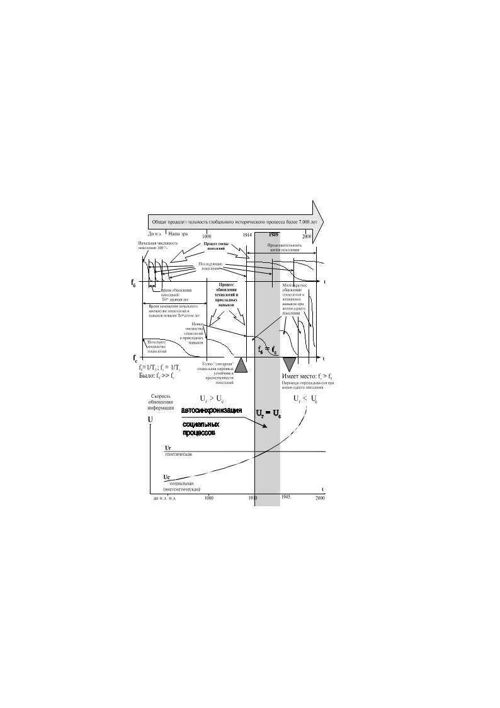

> **Первичный текст.** Одного яйца два раза не высидишь! (Об активности сайентологической церкви в глобальной политике), 1998-04-13.
> Источник: `19980413 Одного яйца два раза не высидишь! (Об активности сайентологической церкви в глобальной политике).doc` sha256 `6270bebfaf3e71a6…`; [страница на dotu.ru](https://dotu.ru/1998/04/13/19980413-odnogo_yaitsa_dva_raza_ne_visidish/).
> Автоматическая транскрипция DOC→Markdown; смысл и формулировки не правились.
> Контрольные суммы и статус проверки — в [NOTICE.md](../../NOTICE.md).
> Содержание передаёт позицию авторов; утверждения не верифицированы библиотекой.

---

аналитическая записка

# Одного яйца два раза не высидишь![^1]

Об активности сайентологической церкви в глобальной политике

Публикации в прессе конца марта — начала апреля в своем большинстве не обладают общественной значимостью: всё — мелкотемье. Если бы президент не создал новость № 1, отправив в отставку правительство во главе с В.С.Черномырдиным, то журналистике (при её миропонимании) оставалось бы только пускать слюни и раздувать их в большие радужные пузыри. А так есть предмет для разговоров: можно или нельзя доверить С.В.Кириенко пост премьер-министра? реальная ли это фигура или некий отвлекающий маневр? кто именно рекомендовал президенту его и что значат эти рекомендации? В.С.Черномырдина убрали потому, что стал неугоден, либо его заранее выдвинули на перспективные позиции?

Сам же С.В.Кириенко за недолгое время своего и.о. премьерства успел влить свежую струю в российский политический лексикон. Заявление его о том, что люди в команду будут подбираться под осуществление определенных целей политики — это ближе к существу управления процессами в жизни общества, чем думские вожделения сформировать правительство “народного” доверия из представителей разных фракций, которые устроят между собой явную или скрытную мафиозно-партийную грызню за раздел пирога, прилагаемого к властным полномочиям, кое-когда вспоминая о своих обещаниях осуществить взаимно исключающие цели, декларируемые их партиями.

*Одно из обстоятельств, которое не может не вызывать раздражения у многих, обусловлено тем, что, как сообщалось, С.В.Кириенко несколько лет тому назад посещал семинары сайентологической церкви — дианетики.* Этому обстоятельству мы и уделим некоторое внимание.

Реально личностная культура восприятия мира и его осмысления у большинства складывается без осознанного выставления требований к ней и вне целеустремленной деятельности по их осуществлению в собственной повседневной психической деятельности. Вследствие этого, подавляющее большинство населения является носителями личностной психической культуры, которую А.С.Пушкин в “Евгении Онегине” охарактеризовал словами: «Мы все учились понемногу, чему-нибудь и как-нибудь...», в результате чего до старости сохранили беззаботность и жизненную неудовлетворенность капризного инфантилизма: «Богаты мы, едва из колыбели, ошибками отцов и поздним их умом. И жизнь уж нас томит, как ровный путь без цели, как пир на празднике чужом...» — продолжил характеристику той же духовности М.Ю.Лермонтов.

В результате множественные ошибки в свойственной обществу культуре становления личностей, накопившись, выливаются в кризис цивилизации, носительницы этой психической культуры. Это явление в большей степени поразило Западную региональную цивилизацию, скелет духовной культуры которой — многовековое целенаправленное взращивание на основе Библии калейдоскопического идиотизма населения — вяло текущей шизофрении.

В известной степени за 1000 лет после крещения от этого типа духовности пострадала и Россия. В газете “Завтра”, № 12(225), Лев Игошев в статье *“Узреть узоры старины...”* пишет сам того не понимая именно об этом:

«”Прочтешь всю Библию — с ума сойдешь,” — говорили русские люди еще в прошлом веке.»

Если называть вещи своими именами прямо, то информация, сгруженная в Библию, оказывается разрушительной для психики человека, подобно тому, как информация компьютерного вируса оказывается разрушительной для операционной системы и прочей информации, хранимой в компьютере. После процитированной нами фразы Л.Игошев, продолжая свою мысль, являет и образец такого рода рассыпающегося в калейдоскоп разумения:

«Информация оказывается **неподъемной** (выделено нами) для человеческого ума, что не могло не способствовать, скажем так, “аввакумовскому” подходу.»

Кто заметил, произведена подмена понятий: *«разрушительность» с ума сводящей информации* заместилась у Л.Игошева на «неподъемность». Сделать вывод о том, что Откровение Свыше, адресно обращенное к людям, а не к неким «сверхчеловекам», не может быть ни разрушительным для их психики, ни неподъемным, — оказалось невозможно в молчаливо-бессознательном идолопоклонстве перед Библией.

Это пример калейдоскопического идиотизма, о котором было сказано несколько ранее. Там же Лев Игошев описывает тупиковый способ сожительства общества с Библией без явного буйства, но всё же ценой безумства — отказа от интеллекта, что он называет “аввакумовским” подходом:

«Никакой градации достоверности, понимания разной функции разных текстов! Всё должно быть только абсолютно достоверно, абсолютно свято — не пытаться анализировать текст, не “мудрствовать” над ним, а держать его подобно мятежному протопопу Аввакуму, “яко же приях”.»

В разные исторические эпохи люди, чья психика по разным причинам не была раздавлена этой антиинтеллектуальной библейской культовой и светской традицией, выходили на понимание существа духовности библейской цивилизации — психической культуры — и пытались дать обществу более или менее эффективную альтернативу библейской внутренне и внешне антагонизированной личностной психической культуре; либо дать видимость таковой альтернативы. В ХХ веке одним из таких людей был американец Л. Рон Хаббард — создатель дианетики, на основе которой возникла сайентологическая церковь. Л. Рон Хаббард выставил определённые требования *к нормальной психике индивида* (нормальной по его понятиям) и создал практическую процедуру, позволяющую привести к этой норме психику индивида, весьма далекую от неё при стихийном развитии личности в господствующей в нынешнем обществе информационной среде; конечно, если индивид проявляет некоторую заинтересованность в такого рода своем психическом переустройстве. Дианетика получила распространение во многих странах, поскольку реально — по их субъективным впечатлениям — многие, прошедшие её курс, обрели после этого душевное спокойствие, жизненную удовлетворенность и избавились от нервотрепки постоянных стрессов.

Вопросы о том, в чем прав Л. Рон Хаббард и его верные последователи; в чем они ошиблись; к осуществлению каких конкретно целей постарались приспособить их реальные достижения заправилы Запада и т.п., мы в этой работе большей частью оставим в стороне.

И дело не в том, является ли сайентологическая церковь «тоталитарной сектой»[^2] или же не является. Дело в том, что, если С.В.Кириенко действительно посещал семинары по дианетике, то он является — хотя бы отчасти — носителем целенаправленно построенной личностной психической культуры, возможности которой во многом превосходят возможности личностной психической культуры типа «мы все учились понемногу чему-нибудь и как-нибудь...», носителями которой являются большинство депутатов, журналистов и госчиновников.

Если искать аналогии, которые позволяют увидеть разницу между обоими типами культуры, то, *поскольку информационные процессы объективно свойственны одинаково и природной среде, и антропогенной среде,* наиболее выразительную аналогию можно найти в программно-компьютерном мире. Операционная система MS‑DOS фирмы Microsoft как сложилась, так и сложилась, изначально будучи произведением стихийного дилетантизма, в процессе её создания обретавшего профессионализм; к Windows при её создании изначально предъявлялись профессионально определенные требования, в чем конкретно и какими именно средствами она должна превосходить MS‑DOS. Оба варианта операционной системы позволяют управлять работой компьютера и решением на нем прикладных задач, но качество этого «позволения» и удобство его практического осуществления — разное: всё говорит в пользу Windows. Хотя и ей во всех её модификациях присущи многие ошибки и порочность некоторых решений, но её недостатки всё же иного качества, чем недостатки MS‑DOS, с позиций которой о них говорить просто невозможно.

Нечто подобное имеет место и при сравнении возможностей носителя стихийно сложившейся личностной психической культуры (стихийного психического “бескультурья”) и носителя целенаправленно созданной психической культуры. При этом в контексте настоящей работы слова «стихийно сложившаяся личностная психическая культура», «стихийно сложившаяся духовность» не означают *естественной для человека* личностной психической культуры, духовности. В цивилизации, в которой на протяжении нескольких тысяч лет рабовладение только изменяло способы подневоливания других людей, оставаясь рабовладением по существу, невозможно говорить, что в результате самопроизвольного развития личностей в культуре этого общества, вырастая, личности сами собой обретают естественную для человека духовность — личностную культуру психической деятельности. Некоторые действительно обретают, но они — исключение из общего правила, предопределяющего извращение господствующей культурой психики в целом и интеллекта, в частности, за то время пока человек проходит путь от младенчества до взрослости. Также и слова «целенаправленно созданная личностная психическая культура» не означают в *общем случае* искусственно искалеченной естественной для человека духовности, личностной психической культуры. Причины те же: в обществе, где не обеспечивается формирование естественной духовности человека, целенаправленный отход от господствующей духовности может иметь направленность как в сторону естественной для человека духовности, так и в сторону дальнейшего извращения естественной для человека личностной психической культуры.

Принципиальное отличие стихийно сложившейся организации психики человека от целенаправленно созданной организации психики состоит в том, что в стихийно сложившейся психике велика доля неупорядоченной информации, на основе которой индивид строит свое поведение. Под неупорядоченностью информации в психике имеется в виду то, что информация не распределена по категориям «ложно», «истинно», «степень достоверности неизвестна». В результате объективно недостоверная информация, наряду с достоверной, лежит в основе информационного обеспечения поведения индивида. Кроме того нет и различий между инстинктивно обусловленными автоматизмами поведения, социально обусловленными автоматизмами поведения (обычаями, привычками), интуитивными озарениями и поведением на основе рассудочной деятельности, что ведет к ошибочности поведения, когда инстинктивные и социальные автоматизмы поведения, отрабатываемые бездумно и безвольно в ситуациях-раздражителях злоумышленно активизируются извне, либо ситуация объективно требует более гибкого поведения, чем это обеспечивают бездумно отрабатываемые инстинктивные и социальные автоматизмы.

Целенаправленно созданные культуры личностной психической деятельности так или иначе уделяют внимание этой проблематике и разрабатывают духовные практики, индивидуальные, диалоговые, коллективные для того, чтобы отойти от стихийно сложившейся организации психики к нормальной организации с точки зрения каждой из них. В зависимости от того, насколько им удается устранить ошибки и порочность, свойственные стихийному формированию психики индивида в господствующей культуре общества, их носители — в большинстве своем — обретают те или иные преимущества перед остальной частью общества со стихийно сложившейся организации психики. Но это следует понимать в статистическом смысле: т.е. и среди носителей стихийно сложившейся организации психики могут быть индивиды, чья личностная психическая культура более совершенна, чем целенаправленно созданные культуры личностной психической деятельности.

Одной из *множества известных в истории*[^3] целенаправленно созданных культур личностной психической деятельности и является дианетика и сайентология. Всех этих особенностей психической подоплеки нынешней политики журналисты и депутаты Думы могут не знать и не понимать, но не чувствовать неуловимо *неизъяснимого (для них)* преимущества С.В.Кириенко над собой в каких-то аспектах психической деятельности многие из них не могут. Поскольку в этой среде много амбициозных личностей, то неприятие ими С.В.Кириенко во многом обусловлено и ощущением ими собственной ущербности в сравнении с ним. Оно может быть доступно для носителей психической культуры, стихийно сложившейся со многими недостатками, в бессознательном сравнении с собой носителя целенаправленно взращенной личностной психической культуры.

Если кто-то понял всё вышеизложенное как призыв почтительно склониться перед дианетикой и немедленно обратиться в ближайший сайентологический центр за сайентологической помощью, чтобы стать «клиром» (от английского «clear» — чистый, ясный, понятный), то хотя это — его право, но он, будучи носителем стихийно сложившейся бесцельной личностной психической культуры, понял всё сказанное извращенно. *Дианетике присущи свои недостатки*, а дееспособная альтернатива ей — не в слепой приверженности светскому или ритуальному библейскому калейдоскопическому идиотизму типа «мы все учились понемногу чему-нибудь и как-нибудь...», «у нас есть унаследованная от предков духовность» и т.п., а в иной целенаправленно взращенной личностной психической культуре, свободной от ошибок и недостатков как дианетики, так и традиционной светской и культовой библейской духовности.

В политической же жизни России, возможно что и непродолжительное дианетическое прошлое кандидата в премьеры, которое пресса отметила мимоходом, — куда более значимый фактор, нежели происхождение С.В.Кириенко, его образование, срочная служба армии, участие в производственной деятельности и комсомольской работе завода «Красное Сормово» и т.п., за обсуждение чего ухватились журналисты.

Пример тому статья Андрея Ардатовского в “Советской России” № 44 от 14 апреля 1998 г. *“Мальчик-с-пальчик”.* Посмаковав карьерные разработки и.о. премьера времен его комсомольской юности, автор А.Ардатовский согласился утвердить его в качестве полноценного премьера с некоторыми оговорками:

«первое — выйти из секты «Чёрч оф сайентолоджи» (...).

второе — во время премьерства не возвращаться снова в израильское гражданство. (...)

третье — не употреблять бессмысленные словосочетания (...).

четвертое — через три месяца отчитаться...»

При этом он имел в виду достижение “стратегической” цели:

«А так как при сохраняющемся курсе правительства отчет будет, разумеется, хуже некуда, то всенародно отправить Кириенко вместе с правительством в отставку, который потащит за собой туда же и Бориса Николаевича, ибо на нем лежит прямая ответственность за назначение Кириенко премьером. Таким образом, Россия одним выстрелом убьет двух кроликов: избавится от правительства с негодным «курсом реформ» и от президента с негодным правительством. Такова, как говорят в народе, сэ ля ви.»

Это, конечно, вожделение «сильного хода», но если бы А.Ардатовский продумал и последующие ходы ПОЛИТИЧЕСКОЙ ГЛОБАЛЬНОЙ СТРАТЕГИИ России хотя бы лет на сто вперед, то никчемность его “стратегической” цели обнажилась бы перед ним полностью.

То же касается и выдвинутых условий, на которых он согласен допустить С.В.Кириенко в премьеры. Если у человека организация психики нормальная с точки зрения сайентологической церкви, то даже, если он заявит о своем выходе из церкви и действительно перестанет общаться с известными ему в качестве «сайентологов» персонами, то он сам от этого не перестанет жить и действовать как «сайентолог» до тех пор, пока в результате переосмысления своей личностной культуры психической деятельности не обретет организации психики, отличной от сайентологической.

То же касается и вопроса об израильском гражданстве: если человеку Израиль милее, чем Россия, то он, будучи премьером России, будет проводить политику в интересах хозяев Израиля и глобальной еврейской диаспоры за счет России, вне зависимости от его официального гражданства, до тех пор, пока не избавится от местечкового масштаба мышления и свойственного иудейской психике “расового элитарного” превознесения себя над остальными людьми.

Что касается предложения не употреблять бессмысленных словосочетаний, то, если непреклонно проводить в жизнь этот принцип, прежде всего следует закрыть практически все газеты и журналы и прочие средства массовой информации, разогнать Думу, весь чиновничий корпус и частных предпринимателей.

Знания и навыки — всего лишь “приданое” к организации психики; обретение многих видов знаний и навыков *на том уровне владения ими, когда они становятся неотъемлемой чертой личности,* часто невозможно без предварительной перестройки организации собственной психики. Поэтому вопрос о дианетическом прошлом и перспективах настоящего и будущих претендентов в премьер-министры России, *вне зависимости от того, насколько сам С.В.Кириенко проникся духом дианетики и сайентологии,* требует куда более серьезного к себе внимания, чем то, которое уделили ему даже те, кто его затронул.

Они его затронули главным образом потому, что для них дианетика — неприемлемая заморская диковина, которая неприемлема им не потому, что они сами владеют превосходящей её альтернативой господствующему в обществе *стихийно складывающемуся калейдоскопическому идиотизму;* а потому, что она — заморская и непривычная для российского общества. Если бы им было дано время притерпеться к ней, или они бы выросли в сформированном на её духовной основе обществе, то они бы не возражали против неё, точно также, как они не возражают против исторически традиционных для России культур духовности, *не вдаваясь при этом в их существо и избегая сопоставительного анализа, не говоря уж о неизбежном после анализа синтезе альтернатив всему порочному*.

Как заметил Р.Киплинг, «Нет хуже работы — пасти дураков»[^4]. Для того, чтобы эффективно пасти, пастушеской бригаде прежде всего необходимо превосходить стадо пасомых в организации психики в целом и интеллекта[^5], в частности. Поэтому в выдвижении на пост премьера России не С.В.Кириенко персонально, а в выдвижении на пост премьера возможного носителя ***целенаправленно созданной** личностной психической культуры* мы усматриваем **долговременную стратегию по вытеснению прежней “элиты”**[^6] новой “элитой”. Разница между обеими “элитами” в том, что личностная психическая культура прежней “элиты” сложилась стихийно-бесцельно “сама собой” в библейской светской и религиозно-культовой информационной среде, а новая “элита”, как предполагается заправилами Западной цивилизации, будет состоять из носителей целенаправленно созданной личностной психической культуры, ныне тиражируемой сайентологической церковью по всему миру.

Всему стаду прежней “элиты”, лидеры которой заседают в нынешней Думе, *на надгосударственном уровне* глобального управления молчаливо отказано в дальнейшем сохранении их “элитарного” статуса: они уже сделали возлагавшееся на них дело и больше в их разрушительных услугах нет необходимости. Поэтому, даже не пропустив на этот раз С.В.Кириенко на пост премьера, прежняя “элита” не сможет противостоять этой *стратегии выпаса толпы* на основе дианетики и сайентологии до тех пор, пока не воспитает в себе иную личностную психическую культуру, по своим возможностям превосходящую культуру, практикуемую администрацией сайентологической церкви на основе наследия Хаббарда (дианетики) и привнесенных к нему разработок ЦРУ и ФБР в области контроля над психикой индивидов и общества в целом.

Одна из причин перехода к такого рода стратегии замещения прежней “элиты” новой состоит в том, что в Западной региональной цивилизации налицо системный кризис, выражающийся в глобальных экологических проблемах и внутрисоциальных бедствиях, сотрясающих цивилизацию с интервалом в несколько десятков лет. Этот кризис во многом следствие управленческой недееспособности “элиты”, столетиями взращивавшейся на основе общебиблейской культуры. Одной из внутрисоциальных граней этого системного кризиса является и частный кризис того явления общественной жизни, которое аналитики от интеллигенции, склонные к расширительно иносказательному употреблению весьма специфических терминов, назвали «клерикализмом».

«Клерикализм, реакц. полит. направление, добивающееся первенствующей роли церкви и духовенства в политической и культурной жизни. Наиб. активен католич. К. Использует в полит. целях. церк. аппарат, клерикальные полит. партии, женские молодежные и др. орг-ции.» — “Энциклопедический словарь”, 1986 г.

Как видно из этого определения, если в обществе культивируется в качестве *неусомнительной догмы* некое учение, то на его основе возможен клерикализм. В определении клерикализма в “Энциклопедическом словаре” речь идет о взаимоотношениях некоторой части общества, чье благосостояние обеспечивается *профессиональным исповеданием определенного учения,* и всего остального общества. Содержание же того учения, которое выражает себя в клерикализме, осталось за рамками определения термина. То есть клерикализм не по внешней форме, а по внутреннему своему существу может быть как религиозным, так и светским. При таком светском “клерикализме” СССР и жил до отмены 6 статьи его последней Конституции, провозглашавшей руководящую и направляющую роль единственной правящей партии, исповедовавшей марксизм.

Клерикализм практически всегда вызывал в обществе антиклерикализм. Клерикалы, обретя высшую государственную власть, обеспечивали себе преимущественный доступ к мирским благам, по какой причине никогда не могли сохранить чистоту своих рядов. В силу этого обстоятельства общество, недовольное паразитической властью проходимцев, выступало как против самих клерикалов, так и против того учения, под прикрытием которого действовали клерикалы.

“Общая газета” № 13(324) от 2 — 8 апреля 1998 г. опубликовала статью Максима Гаврилова *“Между овцой и попугаем”* с подзаголовком *“В новое тысячелетие — с новым антиклерикализмом”.* Начинается статья словами:

«Антиклерикализм сегодня стал синонимом атеизма. Это решительное заблуждение. Атеизм — сила разрушительная; антиклерикализм — созидательная. И в первую очередь именно клирики должны зазывать к себе антиклерикалов — они освежают атмосферу и просветляют ауру духовенства, причем совершенно бесплатно.

\<...\>

Клерикализм церковной номенклатуры отличен от клерикализма номенклатуры светской (советской). Формально оба они не связаны. Теоретически бесконечные упреки в адрес чиновников, которые «держат свечку, как стакан», беспочвенны: ну пришел человек в церковь, не научился еще держать свечку, потерпите, не прогонять же его покаявшегося. Практически, конечно же, надо признать, что «свечестаканники» представляют собой реальную угрозу, и угрозу именно клерикальную. (...) Их лишили права командовать архиереями[^7], зато они присвоили себе право загонять рядовых верующих в церковное стадо. Фокус однако в том, что «внешние епископы» могут существовать только при наличии «внутренних епископов», поэтому светская номенклатура всё время ищет архиереев, на которых можно было бы опереться, — и, увы, всё время находит. Потому что и архиереев много.

Слава Богу, возможности «пасти народы» у светской номенклатуры пока ограничены, но какие есть — используются на сто процентов. Десятки церквей по военным городкам, в военных училищах и академиях — и все за государственный счет. Занятия для курсантов и офицеров по богословию — всё в том же добровольно-принудительном порядке. На телевидении занудные иностранноязычные протестантские проповеди эпохи перестройки заменены не менее занудными и косноязычными православными передачами. Это все на совести не церковной номенклатуры, а светской. Никакой патриарх со всеми его анафемами не заставил бы совковых чиновников делать то, что им не по нраву.

\<...\>

Клерикализм не есть только насилие духовенства над светским обществом. Изначально клерикализм и антиклерикализм возникают в обществе, где все — верующие, где все — единоверцы, где все признают власть духовных лидеров, только никак не договорятся, где человек выступает как духовный лидер, а где — как самодур.

\<...\>

Внутрицерковный антиклерикализм привел к тому, что за последние годы большинство христианских организаций прошли путь освобождения от диктата духовенства. Это относится не только к «правым», но и к «левым». (...) Этот внутрицерковный антиклерикализм не есть чисто русское явление, это характерная черта и Западной Европы, и Штатов, — почему светские проходимцы от религии и находят себе там единомышленников. Это антиклерикализм не от неверия, не от желания держаться подальше от Церкви, а от желания остаться в Церкви пасомым, но не подчиненным, овцой, но не попугаем[^8].

Ситуация не безысходна. За общим титулом антиклерикализма кроется множество явлений, в том числе — восстание против рабства внутри Церкви и вне её, восстание не злобное и не с дубиной, а духовное, творческое. Такой антиклерикализм лишь помогает, а не мешает Церкви — и духовенству, и мирянам — исполнять свое предназначение в мире: свидетельствовать о Христе, освобождать место Христу, молиться Христу.»

Рядом со статьей редакция поместила весьма глубокомысленный рисунок. В статье есть фраза «... патриарх, верховный муфтий и главный раввин единодушно осуждают “иностранных миссионеров”, “едиными усты” и “единым бессердечием” исповедуют, что в России не место сайентологам и кришнаитам, религиозным отщепенцам.» Однако на карикатуре Вадима Мисюка изображены стоящие рядком поп и раввин, положившие руки на плечи друг другу и восхищенно взирающие в глаза один другому под лозунгом «Раввинство и братство!» — муфтия рядом с ними нет, из чего можно догадаться, что мусульманские вероучителя — порождения иной культуры, иной концепции управления обществом, иных идеалов внутриобщественных отношений. «Раввинство» же и православные «братства» — несмотря на внешне видимую вражду — совместными усилиями работают на одну и ту же концепцию построения глобальной расовой “элитарно”-невольничьей цивилизации, на что и намекает карикатура В.Мисюка. Его карикатура более глубокая по смыслу, чем статья М.Гаврилова, выразившего свои православно либеральные *несбыточные* надежды на приход в Церковь «антиклерикалов» и её преображение их *бесплатными* — как он сам подчеркнул — трудами.

Дело в том, что М.Гаврилов затронул “клерикализм” и “антиклерикализм”, привязанные во времени к *текущему моменту.* Но в том явлении, которое он назвал “антиклерикализм” и в котором увидел борьбу с самодурством пастырей (сиречь пастухов, которым нужны человекообразные овцы и бараны, чтобы их “стричь”), есть составляющая, недовольная деятельностью не только нынешнего поколения религиозных и светских иерархов, но и *недовольная деятельностью и многих прошлых поколений иерархов, включая и отцов церквей, извративших изначальный смысл Откровений Свыше в процессе создания церквей, культов и канонизации ОСВЯЩЕННЫХ ИМИ ЖЕ писаний.*

С точки зрения этого вида «антиклерикализма» светская и религиозная история человечества едины. Самодурство иерархии вероучителей, выражающееся в клерикализме духовенства, — это идеалистический атеизм, подменяющий собой непосредственную веру Богу, верой нынешнему поколению духовенства и «священному писанию и преданию», унаследованным от прошлых поколений служителей культа. В таком видении то, что обычно называют атеизмом, — всего лишь разновидность *безбожия вообще,* причем менее лицемерная, чем идеалистический атеизм, устами восхваляющий Бога, а делами своего непреклонного самодурства, отрицающий Его благой промысел и водительство Его. И главное из преступления иерархов идеалистического состоит в том, что они препятствуют прямому Божьему водительству в отношении верующих Богу непосредственно людей, требуя от тех верноподданности себе поперёд Бога. В материалистическом атеизме, прямо отрицающем бытие Божие, по крайней мере есть единство слова и дела, чего нет у идеалистического атеизма, всегда проигрывающего материалистическому, поскольку, как, верно заметил апостол Иаков, «человек с двоящимися мыслями не тверд во всех путях своих» — в данном случае и в религиозных, и в светских, оторванных от религиозных.

В XIX веке иерархии идеалистического атеизма —клерикализм богословов — утратили свое влияние на общество. В ХХ веке материалистический атеизм породил светский «клерикализм» правящих нацистских и интернацистских (марксистских) партий, который просуществовал менее полувека[^9]. В наши дни тот альянс светских клерикалов и духовенства, о котором пишет М.Гаврилов, — объединение атеизма идеалистического и материалистического, чьи иерархи пытаются совместными усилиями восстановить подконтрольность себе всего остального общества, на основе всё той же концепции толпо-”элитарного” общества, будь она в форме библейской[^10], интернацистской или нацистской, либо в форме идеологии гражданского общества. Обе иерархии близоруки и беспамятны, по какой причине во всем «антиклерикализме» не выделяют той его особенной части, которая стремится к истинной религии, как к непосредственной связи души человека с Богом; причем связи направленной обоюдосторонне.

Но хозяева обеих иерархий атеизма более дальновидны. И они, хотя и не препятствуют иерархам пытаться возобновить нормальный с их точки зрения выпас народных стад, тем не менее готовят новую школу “элитарных” пастухов. Дианетика и сайентология оказались для них наиболее подходящей философской и психологической основой для становления и распространения такой новой школы пастухов. Причины этого в том, что в наследии Л. Рона Хаббарда довольно много внимания уделяется организации индивидуальной психической деятельности, но концепция организации общественной жизни множества индивидов обойдена молчанием. Это не означает, что концепции нет вообще, поскольку некая концепция всегда объективно присутствует в общественном самоуправления хотя бы по умолчанию. Умолчания в социологии в подавляющем большинстве случаев выражают сохранение того, что и так есть в обществе, поскольку на основе умолчаний хозяева социологии имеют возможность опереться на уже существующую в обществе нравствено-мировоззренческую базу. То же касается и отношения к религии: дианетика — «современная наука душевного здоровья»[^11], что молчаливо предполагает самоопределение индивида в решении богословских вопросов точно также, как и вопросах социологии.

Даже, если сама сайентологическая церковь, превратившись в жесткую административную структуру, и является «тоталитарной сектой», то как подчеркивают многие выходцы из этой секты: административная структура церкви это — одно, а дианетика и сайентология, как достижение культуры, — совсем другое.

Если смотреть на это, памятуя о сочетании структурного и бесструктурного управления, то не имеет значения находится ли состоявшийся сайентолог-дианетик («клир» в их терминологии) в рядах церкви, или, определив лидеров церкви как «подавляющие личности» (тоже их термин, обозначающий деспотов и тиранов), он покинул ряды церкви. Главное, что строй психики у него уже не стихийно-бесцельно сложившийся, а целенаправленно взращенный. При этом среднестатистический дианетик по своим возможностям восприятия и осмысления информации превосходит среднестатистического толпаря со стихийно сложившейся организацией психики.

Это означает, что множество состоявшихся дианетиков, в обстановке, в которой стихийно сложившаяся организация психики в большинстве своем дает сбои, сохраняют способность к более адекватной реакции на обстановку, что и отдает в их руки миссию выпаса всей толпы. Если допустить каламбур, то заправилы Запада не прочь заместить исторически исчерпавший себя клерикализм библейских вероучительных и светских иерархий на *<u>клир</u>икализм* сайентологии; цели — установление глобальной безраздельной власти — при этом остаются прежними; меняется только главенствующая церковь — системная периферия распространения и осуществления власти.

При этом осуществляется глобальный переход от управления идеологиями к управлению *психической подоплекой идеологий.* К пониманию этого специфического существа происходящего прежняя “элита” Запада и России оказались неготовы.

Поэтому деятельность сайентологической церкви, обладающая стратегической значимостью в глобальных масштабах, вызывает у правящей на Западе исторически сложившейся прежней “элиты” с бесцельно стихийно сложившейся организацией психики определённое неприятие, поскольку пасомая толпа уходит под власть другой бригады пастухов. Этим и вызваны большинство запретов и ограничений на деятельность сайентологов в странах Запада, причисливших сайентологов-дианетиков к лику «тоталитарных сект». Но эти притеснения сайентологов обречены на неудачу, поскольку представляют собой разрозненные политические ходы, не принадлежащие последовательной целенаправленной стратегии, более эффективной, чем стратегия продвижения сайентологии.

Кроме того, в деятельности сайентологической церкви есть одна особенность, о которой пресса тоже говорит без понимания последствий. “Советская Россия” от 14.04.1998 со ссылкой на журнал “Шпигель” и “Немецкую волну” в статье *“Прошел «промывку мозгов» у сайентологов”* пишет:

«Сайентологи пользуются в России следующей уловкой: они предлагают россиянам, падким на всё западное, свое учение как технологию менеджмента. Такой семинар по повышению квалификации, своего рода «промывку мозгов», прошел молодой Кириенко в Нижнем Новгороде. В официальном отчете за 1995 год банка «Гарантия», который возглавлял Кириенко, указывалось, что такие семинары способствовали повышению уровня знаний в области современных ТЕОРИЙ УПРАВЛЕНИЯ (выделено нами при цитировании). Новые, но столь привычные для бывшего комсомольского вожака идеалы, которые проповедовали сайентологи, а именно: групповая порука и замкнутость по отношению к окружающему миру[^12], — явно понравились Кириенко. Он направил на семинары в центр сайентологов всё правление своего банка.»

Конечно, у многих читателей этого фрагмента неприятие вызывает групповая порука и замкнутость сайентологов от посторонних. Но наиболее общественно значимое в цитированном сообщении то, что ныне на Западе[^13] сайентологическая церковь является единственной общественной организацией, *которая целенаправленно учит своих последователей ТЕОРИИ УПРАВЛЕНИЯ.*

Если в обществе есть теория управления, то она является своего рода скелетом управленческой культуры этого общества; т.е. той *смысловой основой*, на которую нарастают практические навыки управления. И теория управления тем более общественно эффективна, чем она более общая, в том смысле, что может выполнять функцию языка взаимного общения специалистов разных отраслей в их совместной деятельности.

Это означает, что в обществе противостоять управлению на основе одной теории управления можно только на основе более совершенного скелета — иной более общей, гибкой и потому более мощной теории управления. На основе излитых в обилии междометий и потоков эмоций множества <u>теоретически бесхребетных</u> индивидов, противостоять неприемлемому управлению, осуществляемому на основе *теории управления, —* невозможно: процесс альтернативного управления коллективной деятельностью разрушится сам собой вследствие взаимного непонимания специалистов разных отраслей, лишенных общего языка, объединяющего всех их в коллективной деятельности. Пример такого рода распада управления по причине отсутствия объединяющего языка описан в Библии (Бытие, 11:1 — 9) в эпизоде с попыткой строительства Вавилонской башни. Однако ни Зюганов, ни Явлинский, ни Жириновский, ни Хакамада, ни Шохин с Черномырдиным, ни Лебедь не учат своих последователей *теории управления.* И их бесхребетность в теории управления — это одна из причин, почему они не могут понять осуществляемого в России глобального управления, не могут договориться среди себя, не могут осуществить альтернативное управление. Если они будут и впредь придерживаться этого способа управления на основе бесхребетных эмоций и междометий (М-м-м, дык, ...ть), звонкого пустословия, то их дело обречено на крах.

Возвращаясь же к российским текущим делам, можно заметить, что с точки зрения простого обывателя, не знающего всего этого и расслабленно взирающего в телевизор, С.В.Кириенко — несмотря на его молодость для политических кругов — выглядит более содержательным и дееспособным человеком, чем любой из недовольных им думцев, будь то “доктор наук” Г.А.Зюганов или Г.А.Явлинский. Одна из причин — превосходство в личностной психической культуре. Насколько это обусловлено тем, что С.В.Кириенко некогда посещал сайентологические семинары, могут знать только те, кому он памятен по временам как «до», так и «после» посещения им этих семинаров.

По своему же лично памятному опыту мы можем сказать определённо: *переход от стихийно сложившейся организации психики к целенаправленно взращённой личностной психической культуре снял для нас множество прежде неразрешимых проблем за их никчемностью, другие быстро и эффективно разрешились в кратчайшие сроки, исчез поток стрессовых ситуаций, а кроме того — открылось новое качество жизни и деятельности.*

Однако, наша духовность — это не хаббардовская дианетика и сайентология, которая неприемлема для нас по содержанию её воззрений на Объективную реальность, на человечество и человека. Но она неприемлема не потому, что представляет собой заморскую диковину, с которой мы еще просто не успели бездумно и бессмысленно свыкнуться, как многие свыклись с куревом и табаком и считают их нормой жизни, хотя некогда родились трезвыми и без сигареты во младенческом ротике.

Дело в том, что набор первичных в сайентология категорий не соответствует объективным разнокачественностям в Объективной реальности.

«Принцип, разработанный Хаббардом теория **Тэта — MEST,** причем Тэта (Θ) (...) представляет собой качество, или потенциал.

MEST (произносится: “мэст”) — новое слово, состоящее из начальных букв английских слов Matter (материя), Energy (энергия), Space (пространство) и Time (время), которые являются составными частями физической вселенной.» — Бернд фон Виттенбург (один из пропагандистов дианетики, покинувший лоно сайентологической церкви, руководство которой по его мнению захватили «подавляющие личности», за освобождение от которых боролся сам Л. Рон Хаббард), в кн. “Шах планете Земля”, Москва, “Новая планета”, 1997 г., с. 441.)

«Тэта (Θ) — единица сознания, её способность созидать.» Тэта определяется так «Энергия жизни, которая воздействует на материю в физической вселенной, оживляет её, приводит в движение и изменяет.» (Там же, с. 433 со ссылкой на “Технический словарь дианетических и сайентологических терминов”).

То есть в их мировоззрении **мера** и **информация** являются вторичными по отношению к первичному набору «Тэта — MEST», т.е. во многом субъективно обусловленными категориями. Эквивалентность материи и энергии (E=mc2 ) игнорируется, обусловленность пространства и времени через меру материей и потоками информации, в современной физике нашедшая свое выражение в соотношении неопределённостей Гейзенберга[^14], так же игнорируется. Информация как объективная общевселенская категория не существует.

На этой исходной мировоззренческой основе, не имея адекватного понятийного и терминологического аппарата для описания информационных процессов (в том числе и в обществе и в психике индивидов), сайентологическая церковь методами дианетики действует в области **прикладной психологии.**

Мы же исходим из того, что идея Бога, Творца и Вседержителя в культуре — не произведение “художественного творчества” людей, а отражение в жизни общества объективного надмирного бытия Божия.

Всеобъемлюще единственное доказательство бытия Божиего Бог дает каждому человеку Сам. Доказательство это сугубо объективное, хотя реакция на него индивида и субъективна вплоть до полного отрицания истинности действительно данного ему доказательства. Суть доказательства в том, что *Бог поистине отвечает в соответствии со смыслом молитвы каждому верующему Ему, если человек делами своей жизни сам отвечает Богу, когда Бог говорит через совесть человека или обращается к нему на языке жизненных знамений и через других людей.*

Соответственно, всякий процесс в Мироздании может быть интерпретирован (рассмотрен) в качестве процесса управления или самоуправления. По этой причине понятийный и терминологический аппарат теории управления является обобщающим, что позволяет с его помощью <u>единообразно описывать</u> процессы: общеприродные, биологические, технические, и тем более — все социальные и процессы психической деятельности, в частности.

Единообразное описание разнородных процессов с привлечением понятийного и терминологического аппарата достаточно общей теории управления позволяет стоять на фундаменте всех частных наук; легко входить в любую из них[^15]; и при необходимости — найти <u>общий язык</u> со специалистами в них: т.е. это — средство объединения разрозненных научных знаний и прикладных навыков в гармоничную Мирозданию целостность, необходимую для безопасной жизни и деятельности отдельных людей и коллективов, слагающих общество. В этом — главное достоинство понятийного и терминологического аппарата теории управления.

Расходимся мы с дианетиками, с материалистами-диалектиками, и стихийно сложившимся обыденным мировоззрением в понимании существа Мироздания (физической вселенной) и материи, пространства и времени как первичных категорий философских теорий.

Ленинское определение “материи”: «Материя есть философская категория для обозначения объективной реальности, которая дана человеку в ощущениях его, которая копируется, фотографируется, отображается нашими ощущениями, существуя независимо от них», — является переливанием из пустого в порожнее. Это “определение” эквивалентно следующему тождеству: “материя” ≡ “Объективная реальность”. **Объективная реальность**, в свою очередь, есть Бог и сотворенное Им, **Мироздание в целом, Вселенная**.

Читаем определение далее: Вселенная «копируется, фотографируется, отображается нашими ощущениями, существуя независимо от них».

Проще и **более обще** говоря: информация из внешнего мира (впрочем, и из внутреннего тоже) воспринимается нашими органами чувств, запоминается бессознательно и хотя бы частично доходит до **осознания**, становясь неотъемлемым достоянием личности человека. Для восприятия информации (не только человеком) на любом этапе распространения информации необходимо:

-  чтобы уровень сигнала был выше порога чувствительности приемника;

-  чтобы была совместимость приемника, передатчика и среды между ними по способности к взаимодействию друг с другом, то есть необходима совместимость по материальному носителю;

-  чтобы была совместимость по системе кодирования, частотному диапазону и т.п.;

-  чтобы прохождение информации как-то фиксировалось в приемнике, т.е. изменяло его информационное состояние — упорядоченность каких-то свойственных приемнику элементов.

Если изложить это в терминах наиболее общих философских категорий, то: есть нечто, что воздействует на подобное ему нечто, изменяя его состояние, его образ — это материя; есть нечто, объективно существующее, но не материальное, что передается в процессе **этого взаимодействия, изменяющего состояние материи** — **отображения** — от одного материального носителя к другому и не утрачивает своего объективного качества при смене материального носителя — это информация по-русски: образы; «Нет вещи без образа» — Словарь В.И.Даля; и присутствует еще нечто, также нематериальное, что определяет различные качества **отображения** информации — порог чувствительности, система кодирования, частотный диапазон, поляризация несущей волны и т.п. — это все частные меры различения параметров. И эта троица: *материя, информация, мера* (через h — «ять»[^16]: **мhра**) — существуют в неразрывной связи друг с другом, образуя триединство. «Бог троицу любит», но Бог — не троица.

Человек — и особь и биологический вид — часть Вселенной. Человек имеет возможность воспринимать всю Вселенную как процесс-триединство: **МАТЕРИЯ** и **ИНФОРМАЦИЯ** изменяются по **МЕРЕ** развития. Первичность категорий материи, информации, меры означает, что категории пространства и времени — не первичные, а производные от первичных; т.е. *пространство и время не объективны в предельном случае обобщения понятий, а порождаются объективными разнокачественностями, триединства.*

Хотя человек может и не осознавать этого, даже услышав об этом, но в зависимости от того, какие категории свойственны его душе в качестве образов объективно первичных разнокачественностей, возможны различные культуры восприятия Объективной реальности и её осмысления. Эффективность каждой из общественных и личностных культур восприятия и осмысления Объективной реальности, построенных на том или ином определенном наборе первичных категорий, различна. Это касается как стихийно сформировавшегося мировоззрения и организации психики, так и целенаправленно созданных. Вследствие этого, что очевидно до рези в глазах в одной из культур психической деятельности и свойственном ей мировоззрении, может “исчезнуть” в другой, или же предстать в виде, весьма далеком от первичного объективного образа, существующего в Объективной реальности[^17].

Дианетика же с её теорией «Тэта - МЭСТ» — не некое новое достижение культуры человечества в ХХ веке, а аналог древнеегипетского мировоззрения времен добиблейских фараонов, нашедший однако выражение в современном лексиконе. Чтобы не быть голословным, предлагаем сравнить принцип «Тэта - МЭСТ» с выдержками из *“Книги для начального чтения”* В.Водовозова (СПб, 1878 г.), предназначенной для самообразования в конце XIX века, в которой речь шла о воззрениях на Объективную реальность древних египтян.

«Самая главная каста, управлявшая всем, была каста духовных или жрецов. Они предписывали и царю (т.е. фараону — наша вставка), как жить и что делать... Высшим божеством египтян был АМУН. В его лице соединились четыре божества: вещество, из которого состоит все на свете, — богиня НЕТ; дух, оживляющий вещество, или сила, которая заставляет его слагаться, изменяться, действовать, — бог НЕФ; бесконечное пространство, занимаемое веществом, — богиня ПАШТ; бесконечное время, какое нам представляется при постоянных изменениях вещества, — бог СЕБЕК. Все, что ни есть на свете, по учению египтян, происходит из вещества через действие невидимой силы, занимает пространство и изменяется во времени, и все это таинственно соединяется в четыреедином существе АМУН.»

То есть предельными обобщающими категориями, осознаваемыми в качестве первичных понятий об объективности Мироздания, в нынешней цивилизации на протяжении тысячелетий неизменно остаются: 1) “материя” (вещество); 2) “дух”, понимаемый и как “энергия”, “сила”, и как *управляющее начало, т.е. “информация”,* а также и хаббардовская «Тэта»; 3) “пространство”; 4) “время”.

Хотя слова, их обозначающие, и трактовки при более детальном их описании неоднократно изменялись на протяжении истории Западной региональной цивилизации, но неизменным оставалось одно: информация (“образ”, “идея”, “упорядоченность состояний и преобразований”) понятийно сокрыта и ***неотделима в группе первичных понятий*** от “духа” = “энергии” = “силы”; “материя” = “вещество” при дальнейшей детализации соотносилась с четырьмя стихиями (агрегатными состояниями вещества: “земля” — твердое; “вода” — жидкое; “воздух” — газообразное; “огонь” — плазма). А *невидимые для большинства людей* общеприродные силовые поля, несущие упорядоченную энергию, смешались с информацией в “нематериальном духе”; природный вакуум — вовсе не пустота, а один из видов материи — стал “пространством-вместилищем”, а “время” стало знаком для обозначения неосязаемой непонятности.

Понятие же мhры в таком мировоззрении — ...дцатая производная от первичных понятый, а “предопределенность” — неисповедимая несоизмеримость.

То есть наиболее распространенному мировоззрению в нынешней глобальной цивилизации свойственно смешение объективных разнокачественностей в каждом из обобщающих понятий, лежащих в основе мировоззрения; *это — смещение понятийных границ во внутреннем мире человека относительно объективно данных разнокачественностей.*

Хаббардовская пятикомпонентная «Тэта - МЭСТ» — всего лишь разновидность древнеегипетского четыреединого Амуна, получаемая из него, как отмечено выше, вычленением свойственной человеку «Тэты» из общевселенского Нефа.

Многовековой спор обеих личностных иерархий посвящений в нечто — материализма (светского клерикализма академий наук и госчиновников) и идеализма (клерикализма церквей) — не имеет ни малейшего содержательного значения, поскольку протекает в пределах приведенного В.Водовозовым “амоновского” набора исходных обобщающих категорий: “вещество” (кое-что из “материи”), “дух” (“коктейль” из *материи* и *информации* самой по себе, которая не отделена от её *материального носителя* — энергии и силы предопределённых Мирозданию полей), “пространство” (вместилище), “время” (непостижимо), понятийные границы, которых смещены относительно объективно данных Свыше разнокачественностей в их триединстве: материя-информация-мера.

И кроме того сайентология, как уже было отмечено мимоходом, это — удручающая нищета в социологии и вопросах построения множеством индивидов коллективной психики.

Если подводить общий итог деятельности хозяев библейских и сайентологической церквей, то налицо попытка после тысячелетних социальных “экспериментов” глобального масштаба вернуться к началу: в древний Египет «на круги своя», что ставит всех заинтересованных в своей судьбе и судьбах потомков перед вопросом: Удастся ли она? Или нечего и огород городить с этой сайентологической затеей?

На наш взгляд нет, не удастся: *невозможно дважды войти в одну и ту же реку*.

Чтобы понять это, необходимо увидеть, как триединство материи-информации-меры порождает пространство и время. В нашем понимании: ***Что объективно существует — то субъективно познаваемо.*** Это означает, что всё познаваемо *объективно единообразно* с некоторой *субъективной несоразмерностью и несообразностью (ошибкой)* познания. То, что привносится в качестве ошибки самим субъектом-исследователем в познание — д**о**лжно исследовать в самом субъекте.

Если смотреть на историю познания объективной природы пространства и времени *в их «чистом» виде*, т.е. в виде, *«очищенном» от материи,* то — *не было такого познания*. Было много нежизнеспособного пустословия философов об их объективности, а реально была *практика измерений*. В ходе истории изменялась только эталонная база измерений. В основе эталонов измерителей пространства были: сначала — сам человек (локоть, шаг, пядь, дюйм, фут и т.п.); потом — дуга земного меридиана; ныне — длина волны света в вакууме, излучаемого светильником на основе криптона-86 (изотоп элемента Периодической таблицы). В основе эталонов измерителей времени была периодичность астрономических явлений на земном небосводе (Луны, Солнца, Сириуса), а ныне — “цезиевый эталон ЧАСТОТЫ и ВРЕМЕНИ” (выделено нами; “Энциклопедический словарь”, Москва, 1986 г.). То есть эталонная база измерений “пространства” и “времени” технически сближалась. Но все эталоны были материальными носителями информационных процессов и состояний.

*И в принципе ничто, кроме приверженности привычному мировоззрению “независимости объективных пространства и времени” и кое-каких технических трудностей не мешает связать эталон времени с частотой световой волны излучения того же самого криптонового светильника, на котором основан эталон измерения пространства: если есть длина волны, то есть и частота этой волны, размерность которой*[^18] *1/\[время\]. Т.е. \[время\]=1/\[частота\] .*

Можно в принципе перейти и к иному объекту микромира, связав с ним оба эталона, но в любом случае с исчезновением объекта-эталона исчезнут и “пространство” и “время”, как объективные процессы, несомые эталонным объектом, представляющим собой объективное триединство материи-информации-меры[^19]; после чего останутся только пустые, объективно непознаваемые филологические абстракции “пространство” и “время”, поскольку пространство и время в их «очищенном» от материи виде объективно не существуют. Противоположное мнение возникает из отождествления вакуума с «объективным ничто», хотя вакуум — не «ничто», а одно из агрегатных состояний материи, отличное от других её агрегатных состояний: вещества, плазмы, полей.

То есть, если идти от Мироздания как от целостного СВОЕОБРАЗНО РАЗМЕРЕННОГО объекта, частью которого является и сам человек, то понятия “пространство”, “время” вторичны по отношению к объективной мере-предопределению[^20] и понятию о ней. Они возникают в процессе прямого или опосредованного соотнесения наблюдаемого объекта (процесса) с неким подобным ему в некотором смысле объектом-эталоном, хотя это соотнесение не всегда определенно осознается субъектом. Один из путей соотнесения измеряемого объекта с эталоном дает восприятие временной соизмеримости, другой — дает восприятие пространственной соизмеримости.

Знаменитая формула *Е = mс*2 связывает два способа измерения количества материи (возможно измерение единицами энергии и всем привычное — единицами массы) с пространственной и временной соизмеримостью. Такого же рода взаимообусловленности встают из соотношения неопределённостей Гейзенберга. Даже если эти формулы современной нам физики объективно содержат некоторую количественную неточность, тем не менее они отрицают объективную независимость пространства и времени как <u>информационных</u> характеристик, *предопределенного* в <u>мере</u>, *бытия* <u>материального</u> Мироздания.

То есть “пространство”, “время” — не свойства объективного “пустого вместилища”, в которое помещено материальное Мироздание со всеми в нем живущими, а свойства самого триединого Мироздания, воспринимаемые человеком в качестве соразмерности (соизмеримости) фрагментов Мироздания, существующего как процесс вероятностно предопределенных МЕРОй переОБРАЗований МАТЕРИИ при отображении информации, переносимой вместе с энергией (материей) из одного фрагмента Мироздания в другой.

Но ни один из путей соотнесения невозможен, если отсутствуют объекты, несущие в себе триединство материи-информации-меры, способные ко взаимодействию, один из которых избирается в качестве эталона, и с которым сравнивается (соизмеряется) другой. Время воспринимается тем в большей степени в качестве *объективного времени*, чем более распространен в природе класс процессов из которого выбирается эталонный процесс времени. По этой причине цезиевый эталон частоты и времени предпочтительнее астрономического в силу уникальности каждого из астрообъектов и множественности атомов.

*В принципе любой процесс, в котором может быть выявлена периодичность изменения некоего свойственного ему качества, может быть избран в качестве эталонного процесса времени.*

Единицей измерения времени при этом станет полный период либо какая-то явно отличная от других доля полного периода эталонного процесса. Безусловно, что все эталоны при этом остаются соизмеримыми между собой, но некоторые из них — при соотнесении друг с другом — не будут обладать свойством равномерности. То есть разные периоды одного процесса будут разной длительности, если их продолжительность измерять в соответствующих им в объемлющем совокупном процессе периодах другого. Ни один эталонный процесс самим собой измерен быть не может[^21]. Что касается эталонов времени, то по причине исчезновения в прошлом его предшествующих периодов.

Соответственно из множества процессов связанных с иерархически многоуровневой системой, обладающей множеством *разнообразных* качеств, можно избрать не один эталон, а несколько эталонов — свой для каждого из уровней её организации, свой для каждого из множества её качеств. В этом случае соотношение эталонных частот будет характеризовать режим, в котором находится система.

Если рассматривать общество в качестве двукачественной системы, то можно выявить процессы, которые относятся исключительно к биологии вида Человек Разумный, но кроме них можно выявить процессы, которые относятся исключительно к области культуры общества людей. На рис. 1 эти процессы соотнесены друг с другом.

В верхней части рис. 1 условно показана общая продолжительность глобального исторического процесса. Ниже размещены две оси времени. На них изображены два процесса. На верхней временной оси — процесс преемственной смены поколений людей. На нижней временной оси и процесс обновления технологий и прикладных жизненных навыков.

Чисто формально каждый из процессов, изображенных на верхней и нижней временных осях рис. 1, идентичны между собой. При этом предполагается, что в каждый момент исторического процесса можно выявить по персональному составу поколение людей. Оно будет обладать в этот момент 100-процентной численностью, которая будет сокращаться вплоть до полного исчезновения поколения. Но поскольку рождаются новые люди, которые не входят в первоначально избранное множество, то в тот момент исторического процесса, когда исчезнет ранее выявленное поколение, можно выявить очередное поколение, также обладающее в этот момент 100‑процентной численностью.

Аналогично предполагается — и это предположение не противоречит возможностям археологии, — что в начальный период становления цивилизации выявлено некоторое вполне определённое множество технологий и жизненных навыков. Далее по мере исторического развития технологии и жизненные навыки, принадлежащие этому множеству, постепенно выходят из употребления. К тому моменту исторического времени, когда исчезнет начальное множество технологий и жизненных навыков, можно будет выявить какое-то иное множество технологий и жизненных навыков.

Момент исчезновения как для поколений людей, так и для *поколений технологий*[^22] и жизненных навыков можно понимать и в статистическом смысле: поскольку полное исчезновение, фиксируемое по исчезновению последнего из объектов множества, может оказаться далеко выпадающим из всей остальной статистики не характерным для неё, то можно считать, что исчезновение множества произошло, если исчез какой-то определенный и постоянный процент из первоначальных 100 %, например 80 % первоначально выявленных технологий. Также можно подходить и к процессу обновления поколений людей: т.е. не дожидаясь ухода из жизни последнего долгожителя, можно считать, что, если ушло из жизни 80 % некогда выявленного персонального состава населения, то поколение заместилось новым.

Соответственно, при полной формальной идентичности построения, содержательное отличие верхнего и нижнего графиков рис. 1 друг от друга в разном характере соизмеримости с астрономическим эталоном времени (год: смена сезонов при обращении Земли вокруг Солнца) процесса смены поколений людей и процесса смены поколений технологий и жизненных навыков.

Продолжительность жизни поколения Тб обусловлена генетически и на протяжении истории она изменялась в ограниченных пределах (Тб средн = в пределах столетия ± десятки лет). Хотя средняя продолжительность жизни людей и росла на протяжении памятной истории нынешней цивилизации, однако она не выросла многократно. Вследствие этого её можно считать приблизительно неизменной по отношению к эталону астрономического времени. Этот процесс смены преемственных поколений можно избрать в качестве эталонного процесса биологического времени, что и показано на верхней оси времени рис. 1 слева от разрыва горизонтальных осей графиков, отделяющих глубокую древность от нашей эпохи — исторического времени жизни современных и лично памятных прошлых поколений, к которым принадлежали отцы и деды ныне живущих.

Процесс обновления технологий и жизненных навыков, показанный на нижней оси времени рис. 1 как последовательность убывающих множеств, также может быть взят в качестве эталонного процесса времени. Но, в отличие от верхнего графика, продолжительность жизни поколений технологий и жизненных навыков на протяжении всей истории не является неизменной, даже приближенно, поскольку в результате ускорения периодичности обновления технологий изменилось качество биологически-социальной системы в целом. Это видно на следующем графике, помещенном в нижней части рис. 1. Там размещена еще одна координатная система с осью времени, в которой показано изменение в течение исторического времени мерных характеристик процессов смены поколений и обновления технологий и прикладных жизненных навыков.

Графики процессов на верхней и нижней временных осях можно соотнести друг с другом, что и сделано на рис. 1. В левой его части на период времени исчезновения начального множества технологий приходится много смен поколений. В правой его части для наглядности изображения изменён масштаб вдоль оси времени (это видно по полосе, изображающей течение глобального исторического процесса). Вследствие этого длительность жизни поколения в ХХ веке выглядит многократно более продолжительной чем в левой половине рисунка, относящейся к эпохе становления первых региональных цивилизаций. Но эта условность позволила более зримо изобразить на нижней оси времени процесс многократного обновления технологий и прикладных жизненных навыков в течение жизни одного поколения, а также и общий рост количества информации в культуре общества.

Характер отношения частот верхнего и нижнего процессов на рис. 1, имевший место в левой его части, изменился на качественно противоположный. Математически это выражается так: на заре нынешней цивилизации было fб \>\> fс ; в ходе её развития стало fс \> fб ; а графически это показано в нижней части рис. 1.

Рис. 1. Изменение соотношения эталонных частот биологического и социального времени

Выявленные частоты fс и fб — это меры скорости обновления информационного состояния общества (как иерархически организованной системы) на социальном и биологическом уровнях в его организации. На графике (приблизительно) неизменная Uг характеризует скорость обновления генетической (индекс «г») информации в популяции; возрастающая на протяжении всей истории Uс характеризует скорость обновления культуры, как информации не передаваемой генетически от поколения к поколению.

Как видно из жизни, из математики и из графика, произошло изменение соотношения эталонных частот биологического и социального времени.

*<u>Объективное явление</u>*, которое названо здесь *изменение соотношения эталонных частот биологического и социального времени* — собственная характеристика глобальной биологически-социальной системы, от которой никуда не деться. Это информационный процесс, протекающий в иерархически организованной системе. Из теории колебаний, теории управления известно, что, если в иерархически организованной многоуровневой (многокачественной) системе происходит изменение частотных характеристик процессов, являющих каждое из множества свойственных ей качеств, то система переходит в иной режим своего поведения. Это общее свойство иерархически организованных систем, обладающих множеством разнообразных качеств, к классу которых принадлежат как человеческое общество в целом, так и иерархически организованная психика каждого из людей.

Это общее свойство многопараметрических и иерархически организованных информационных систем. Оно по отношению к жизни общества предопределяет качественные изменения в организации психики множества людей, в нравственно-этической обоснованности и целеустремленности их деятельности, в избрании ими средств достижения целей; предопределяет качественные изменения того, что можно назвать логикой социального поведения: это — массовая статистика психической деятельности личностей, выражающаяся в реальных фактах жизни.

*Мы живем в исторический период, когда изменение соотношения эталонных частот биологического и социального времени уже произошло, но становление новой логики социального поведения как статистически преобладающей и определяющей жизнь всего общества еще не завершилось. Но общественное управление на основе прежней логики социального поведения, обусловленной прежней статистикой личностной психики множества людей, уже теряет устойчивость, т.е. власть, и порождает многие беды и угрозы жизни.*

*Формирование логики социального поведения, отвечающей новому соотношению эталонных частот, протекает в наше время и каждый из нас в нем участвует и сознательно целеустремленно, и бессознательно на основе усвоенных в прошлом автоматизмов поведения. **Но каждый по своему произволу, обусловленному его нравственностью, имеет возможность осознанно отвечая за последствия, избрать для себя тот или иной стиль жизни, а по существу — избрать личностную культуру психической деятельности.***

Те, кто следует прежней логике социального поведения: вверх по ступеням внутрисоциальной пирамиды или удержать завоеванные высоты, всё более часто будут сталкиваться с разочарованием, поскольку на момент достижения цели, или освоения средств к её достижению, общественная значимость цели исчезнет, или изменятся личные оценки её значимости. произойдет это вследствие ускоренного обновления культуры. Это предопределяет необходимость селекции целей по их устойчивости во времени, и наивысшей значимостью станут обладать “вечные ценности”, освоение которых сохраняет свою значимость вне зависимости от изменения техносферы и достижений науки.

*Быть человеком в ладу с Богом и биосферой, предопределённо становится при новом соотношении эталонных частот биологического и социального времени — непреходящей и самодостаточной целью для каждого здравого нравственно и интеллектуально, и этой цели будет переподчинена вся социальная организация жизни и власти. Все, кто останется рабом житейской суеты обречены на отторжение биосферой Земли.*

Все элементы <u>человечества как системы в биосфере Земли</u>, которые не способны своевременно отреагировать на изменение соотношения эталонных частот биологического и социального времени, обречены на отторжение биосферой Земли, переходящей в иной режим своего бытия под воздействием человеческой деятельности последних нескольких тысячелетий. И от биосферы Земли не защитит ни герметичный бункер с протезом Среды обитания, ни медицина...

Церковь сайентологии и её периферия развертывается в течении именно этого объемлющего всех процесса. Протекай её развертывание при прежнем соотношении эталонных частот биологического и социального времени, оно успешно бы завершилось победой дианетики и сайентологии над стихийно сложившейся в библейской культуре личностной духовностью. Эта победа была бы победой целенаправленно действующей административно управляемой организации над неорганизованной социальной стихией простонародья и правящей “элиты”. Именно так победила в России в то время РСДРП. Однако в наше время, после изменения соотношения эталонных частот биологического и социального времени, так уже не сможет победить не только КПРФ с господствующей в ней стихийно сложившейся личностной культурой психической деятельности; так не сможет победить и сайентологическая церковь с тиражируемой ею целенаправленно созданной культурой личностной психической деятельности, превосходящей общезападную стихийную.

Дело в том, что активизация интеллекта вследствие необходимости многократного освоения обновляющихся в течение жизни личностно и общественно значимых знаний и навыков в подавляющем большинстве случаев не может быть ограничена узкопрофессиональной областью[^23]. Не может быть ограничена не только потому, что средства массовой информации (от которых в нашем мире укрыться практически невозможно[^24]) обрушивают на всех потоки самой разнообразной информации, но и потому, что все отрасли профессиональной деятельности ныне информационно перевязаны. Вследствие этого, чтобы не быть цивилизованной обезьяной, выдрессированной профессионально нажимать множество кнопок дома и на работе, профессионалу во всякой области помимо собственной проблематики сверх того необходимо вникать как в проблематику смежных областей деятельности, так и в их взаимосвязи в жизни общества.

Это неизбежно статистически предопределенно *исподволь* делает думающего узкого профессионала социологом, в сфере компетенции и ответственности которого лежит вся Земля. Психология и развиваемые ею процедуры целенаправленной организации психики в целом и интеллекта в частности — только часть социологии. Вопрос только в том, спустя какое время после того как, уже бессознательно вникнув в социологию, в том числе и глобальную, вникнув в психологию индивидуальную и коллективную, человек сам осознанно заявит о себе как о социологе, приверженном в повседневности определённой концепции общественного устройства из их множества в плюрализме недостоверных мнений в открытом или закрытом обществе. А избранию определенной концепции неизбежно сопутствует процесс целенаправленной организации своей, прежде всего, личностной психической культуры так, чтобы она поддерживала избранную концепцию.

Но думать свойственно и демонизму, и человечности. Демонизму, в отличие от человечности, свойственно принудительно выстраивать иерархии отношений индивидов; а каждому из индивидов с демоническим строем психики свойственно стремиться поднять свой иерархический статус; отстоять достигнутое положение от посягательств конкурентов; опустить вокруг себя многих, для того чтобы самому подняться над ними.

Пробудившийся Разум, даже если индивид очнулся от своего прежнего животного или зомби состояния психики в демоническом типе психики, обречен выйти на вопрос о том, привлекает ли его эта *<u>война на уничтожение</u>* всех демонов против всех демонов, как способ *<u>существования</u>*, либо этому «выживанию»[^25] есть альтернатива, полная ладной жизни.

Поскольку альтернатива есть, как о том сообщают Откровения, данные через Моисея, Иисуса, Мухаммада, то миновать рассмотрения этой альтернативы демонизму во всей проблематике социологии и психологии уже невозможно. И на этом этапе естественный отбор[^26] будет уничтожать демонизм в войне демонических личностей против всех демонических личностей: как физически, в ходе их разборок между собой, так и за счет непрерывного усугубляющегося “стрессового” состояния участников *войны всех <u>демонов</u> против всех*.

Матрица возможного течения глобального исторического процесса (Сценарий Истории) в нынешней цивилизации предопределённо Свыше построена так, чтобы человечество изжило животный строй психики, строй психики робота, а также всевозможные демонические наклонности, направленные на угнетение других с целью паразитирования на их жизни.

Всё сказанное относится и к деятельности тоталитарной администрации сайентологической церкви. Процесс распространения сайентологии в России протекает весьма своеобразно. Семинары церкви реально — статистическое сито:

-  кто-то, посетив сеанс вступительного тестирования, утрачивает интерес к дианетике и сайентологии;

-  кто-то, пройдя процедуру перестройки психики («одитинг» — в терминологии сайентологов), остается в церкви будучи «клиром»;

-  часть «клиров», подобно Бернду фон Виттенбургу, книгу которого мы цитировали ранее, покидает лоно церкви, обвинив её администрацию в том, что они — «подавляющие личности» — т.е. демоны в обличье человека, стремящиеся к тому, чтобы все в мире осуществлялось им подневольно; однако не все выходцы из сайентологической церкви, подобно Бернду фон Виттенбургу, сохраняют свою приверженность дианетике и сайентологии, продолжая её пропагандировать вне структур церкви;

-  есть и такие, которые стремятся вычеркнуть из своей психики сайентологическое прошлое, т.е. пройти своего рода «реверс-одитинг»;

-  другие, вычеркнуть свое сайентологическое прошлое не пытаются, но в отличие от Бернда вон Виттенбурга, они задаются вопросом:

*Какого рода ущербностью в самой дианетике и сайентологии воспользовались «подавляющие личности», в результате чего они смогли оттеснить Л. Рона Хаббарда от управления церковью и смогли превратить её административный аппарат в систему целенаправленного подавления свободного личностного развития множества людей, а саму церковь в инструмент осуществления тиранической власти?*

Их немного, но как заметил К.Прутков, «от малых причин бывают большие последствия». После того, как вопрос поставлен прямо и определенно, ответа на него человеку долго ждать не придется потому, что информация в Объективной реальности объективна, а *вопрос и ответ это — две разных формы выражения одного и того же смысла*. Причем, целенаправленно созданная сайентологической церковью личностная культура психической деятельности, действительно превосходящая по многим качествам стихийно складывающуюся *в библейской цивилизации* личностную психическую культуру, ускорит для бывшего сайентолога получение истинного ответа на этот вопрос.

Но поскольку сайентологическая церковь, *мягко говоря* назойлива и не дает проходу людям, хватая их за полы одежды, зазывая на семинары, то на неё обратят не формальное, а содержательное внимание и те, кто *уже осмысленно строит в себе целесообразную культуру личностной психической деятельности.*

Как было указано ранее, после изменения соотношения эталонных частот биологического и социального времени активизировался интеллект множества людей, живущих вне дисциплины иерархий религиозного и светского клерикализма. При прежнем соотношении частот эталонов биологического и социального времени единичные интеллектуалы, не признающие дисциплины иерархий, опасности для системы клерикализма не представляли, поскольку социальная среда была неодолимо инертна, самих интеллектуалов иерархии успевали купить, уничтожить, а по смерти канонизировать в качестве непризнанных своевременно гениев, а их творческое наследие просеять и в приемлемом для «клерикализма» виде включить в систему легитимных знаний и навыков толпо-”элитарной” цивилизации.

Ныне же дело идет к тому, что по мере того как бездумно живущие и безвольные будут вычищаться из общества эпидемией стрессов, всё большая доля человечества будет думать с Любовью и заботой обо всех. При этом неизбежно перед теми, кто не хочет сгинуть в этом процессе социальной гигиены, встанет вопрос о том, какая именно информация в культуре общества и в психике каждого из них злоумышленная ложь, какая следствие незлоумышленных заблуждений; что в их психической деятельности — выражение врожденных инстинктов и безусловных рефлексов; что — выражение следования общественным традициям и обычаям; что — порождение их собственной осознанной рассудочной деятельности; что — пришло из интуиции; что в интуиции — плод их индивидуального бессознательного, что — следствие наваждений извне и одержимости, что — выражение непосредственного водительства Свыше; что — собственные демонические наклонности к подавлению свободного развития окружающих. Ответы на эти вопросы и волевые действия, направленные на себя, и выражающие следование смыслу избранных в качестве истинных ответов — есть переход от стихийно сложившейся культуры психической деятельности к целенаправленно созданной. В этом множественном процессе будет складываться наилучшая для каждого из множества людей целенаправленно создаваемая личностная духовность, т.е. естественная для человека духовность, изначально предопределённая для Человечности Свыше. Это означает, что даже, если хозяевам сайентологической церкви и удастся распространить достаточный по численности тираж «пастухов новой школы», то пасти им — кроме самих себя и своих хозяев — будет некого, а демонические поползновения будут решительно и эффективно пресечены победившей Человечностью.

13 — 17 апреля 1998 г.

[^1]: К.Прутков.

[^2]: Католичество и православие точно являются тоталитарными сектами, с господством которых все свыклись за давностью его установления.

[^3]: Йоги Индии, боевые искусства Китая и Японии, многое другое практически невозможно без перехода к целенаправленно созданной организации психической деятельности. Без этого возможна только имитация.

[^4]: И с ним должно согласиться: препротивное занятие.

[^5]: Интеллект — это только одна из компонент психики.

[^6]: Именно определённостью такого рода стратегии можно объяснить заявление президента России о том, что он не будет предлагать Думе иной кандидатуры в премьер-министры России, сделанное им 13 апреля 1998 г.

[^7]: Перед этим речь шла о разного рода «советах по делам религий», через которые светские клерикалы от марксизма руководили деятельностью клерикалов от духовенства.

[^8]: Желание «не быть попугаем» это для человека — нормально, но желание «быть овцой, бараном» у того, кому дано Свыше быть человеком, — вызывает изумление и печаль об извратившихся психически.

[^9]: При Сталине в СССР внешняя видимость такого светского клерикализма была, но общество изменялось очень быстро от съезда к съезду решая новые задачи своего развития, и это говорит о том, что под внешней оболочкой мертвящего клерикализма было живое содержание.

[^10]: Выражением этого и является лозунг на карикатуре «Раввинство и братство!». В православии разного рода «братства» играют ту же внутриобщественную роль, что и ордена в католичестве.

[^11]: Подзаголовок книги Л. Рон Хаббарда «Дианетика».

[^12]: Ну уж чего Западу гневаться за это на сайентологов, если на тех же принципах построена жизнь глобальной еврейской диаспоры и деятельность регулярного масонства?

[^13]: В России такого рода монополии у сайентологов нет: Внутренний Предиктор СССР целенаправленно распространяет среди заинтересованных лиц и общественных организаций разнородные знания, включая и <u>достаточно общую теорию управления</u>.

[^14]: Неопределенность в измерении координаты частицы, умноженная на неопределенность в измерении её <u>импульса</u> (произведение массы объекта на его скорость) по величине составляет не менее постоянной Планка.

    Измерение требует эталонов, т.е. нужна хотя бы еще одна частица, с которой соизмеряется первая. В этом соизмерении как минимум двух объектов, в процессе преобразования материи возникнет время и пространство.

[^15]: За исключением наук, которые <u>также как и теория управления</u> сами являются языками описания Мироздания: таких как математика, грамматика и т.п., аппарат которых тем не менее может быть привлечен и к описанию процессов управления.

[^16]: Если в тексте стоит латинская буква «h» вместо славянской «ять», Вам следует установить в системе шрифт «Ижица», в кодовой странице которого «ять» размещается там же, где в русских шрифтах Windows размещается «h». В распечатанных же без «ятей» экземплярах, Вам следует от руки переделать «h» в «ять»: для этого необходимо соединить обе ножки «h» внизу и чертой пересечь торчащую вверх её палочку.

[^17]: Более подробно см. наши мировоззренческие работы “Мертвая вода” и “К Богодержавию...”.

[^18]: Формулы, в которых переменные взяты в квадратные скобки в физике понимают не в смысле количественных соотношений, а в смысле соотношения размерностей входящих в них величин.

[^19]: Пусть философы-материалисты не утруждают себя обвинениями в «субъективном идеализме» за наш отказ признать объективность пространства и времени в качестве первичных и предельно общих категорий. У нас иные представления об объективности и субъективизме.

[^20]: Если говорить языком математики, то мера-предопределение — матрица (статистически упорядоченное множество) возможных состояний Мироздания и его фрагментов и переходов из одного состояния в другое

[^21]: Емкое образное представление об этом дано в мультфильме “38 попугаев”. Как из него известно, длина Удава составила 38 попугаев и одно попугайское крылышко. Если бы не помощь Попугая, принявшего на себя роль эталона длины, то Удав бы так и остался удавом единичной длины, выраженной в «удавах».

[^22]: Термин слово «поколение» по отношению к объектам техносферы уже стало общеупотребительным: «компьютер пятого поколения», «телевизор второго поколения» и т.п. Мы уж по аналогии употребили его по отношению к технологиям.

[^23]: Тем более не может быть необратимо ограничена извне блокировкой психики, через экстрасенсорику.

[^24]: Есть люди, которые слышат радиопередачу просто находясь рядом с проводной радиотрансляционной сетью безо всяких радиоприемников; но и те, кто так осознанно не слышит, слышат все на бессознательных уровнях психики.

[^25]: По учению дианетики «выживание» — и есть существо бытия человека и человечества.

[^26]: Для человечества, создаваемая им культура — один из факторов среды обитания, под давлением которой протекает то, что получило название «естественный отбор».
---

[К произведению](README.md) · [Каталог](../../CATALOG.md)
