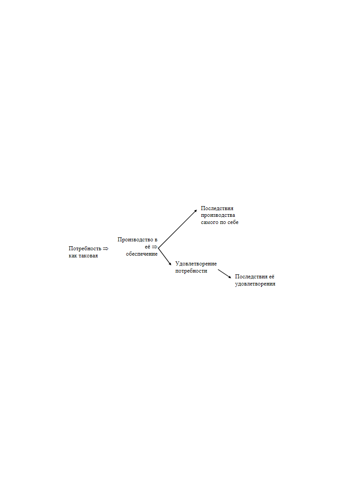

> **Первичный текст.** Организационно-технологический подход к макроэкономическим системам — ключ к успеху, 2010-01-10.
> Источник: `20100110 Организационно-технологический подход к макроэкономическим системам — ключ к успеху.doc` sha256 `3537ada92ea7bf9e…`; [страница на dotu.ru](https://dotu.ru/2010/01/10/20100110_makroekonomika/).
> Автоматическая транскрипция DOC→Markdown; смысл и формулировки не правились.
> Контрольные суммы и статус проверки — в [NOTICE.md](../../NOTICE.md).
> Содержание передаёт позицию авторов; утверждения не верифицированы библиотекой.

---

Организационно-технологический подход\

к макроэкономическим системам —\

ключ к успеху экономического и общекультурного развития общества

> … чтоб падали селенья,\

> Чтобы нивы пустовали —\

> Нам на то благословенье\

> Царь Небесный дал едва ли!\

> А.К.Толстой

ОГЛАВЛЕНИЕ

[1. «От козла молока»? — … [1](#от-козла-молока)](#от-козла-молока)

[2. Два подхода к анализу макроэкономических систем и управлению ими [3](#два-подхода-к-анализу-макроэкономических-систем-и-управлению-ими)](#два-подхода-к-анализу-макроэкономических-систем-и-управлению-ими)

[3. Организационно-технологический подход в задаче экономического обеспечения бескризисного развития общества в преемственности поколений [7](#организационно-технологический-подход-в-задаче-экономического-обеспечения-бескризисного-развития-общества-в-преемственности-поколений)](#организационно-технологический-подход-в-задаче-экономического-обеспечения-бескризисного-развития-общества-в-преемственности-поколений)

[3.1. Общее представление о балансовых моделях продуктообмена и финансового обмена [7](#общее-представление-о-балансовых-моделях-продуктообмена-и-финансового-обмена)](#общее-представление-о-балансовых-моделях-продуктообмена-и-финансового-обмена)

[3.2. План и рынок [10](#план-и-рынок)](#план-и-рынок)

[3.3. Пути организации рыночной саморегуляции производства и потребления на плановой основе [10](#пути-организации-рыночной-саморегуляции-производства-и-потребления-на-плановой-основе)](#пути-организации-рыночной-саморегуляции-производства-и-потребления-на-плановой-основе)

[3.4. Что есть что в макроэкономической системе [13](#что-есть-что-в-макроэкономической-системе)](#что-есть-что-в-макроэкономической-системе)

[3.5. Что может и чего не может «свободный» рынок [16](#что-может-и-чего-не-может-свободный-рынок)](#что-может-и-чего-не-может-свободный-рынок)

[3.6. Интеграция рыночного механизма в государственное управление народным хозяйством на плановой основе [19](#интеграция-рыночного-механизма-в-государственное-управление-народным-хозяйством-на-плановой-основе)](#интеграция-рыночного-механизма-в-государственное-управление-народным-хозяйством-на-плановой-основе)

[4. Пути реализации методологии социально-экономического бескризисного развития [24](#пути-реализации-методологии-социально-экономического-бескризисного-развития)](#пути-реализации-методологии-социально-экономического-бескризисного-развития)

# 1. «От козла молока»? — …

В конце декабря 2009 г. министр финансов РФ А.Кудрин на пресс-конференции в агентстве «Интерфакс» заявил:

«Завершается очень тяжёлый год. Объём ВВП снизился на 8,7 %[^1], и это главный провал года, — “оптимистично” начал своё выступление Алексей Кудрин и признался: — Мы не ожидали такого глубокого падения российской экономики даже в начале года». В правительстве некоторое время надеялись, что усилиями центральных банков, других мировых экономических регуляторов удастся поднять спрос, оживить экономику. Но никаких чудодейственных рецептов выхода из кризиса найти не удалось. Это был беспрецедентный кризис, поэтому ни один из советов из сотен трудов о «великой депрессии» 30-х годов использован быть не мог»[^2].

И далее продолжил:

«Поэтому, победив на первом этапе кризиса, надо не расслабляться и быть готовыми ко второму этапу», — предупредил г-н Кудрин. Российскому правительству нужно быть «чрезвычайно осторожным» при использовании больших средств в условиях значительного дефицита бюджета и ликвидности»[^3].

По своей сути это — признание в том, что Правительство РФ некомпетентно и не властно над экономикой страны. Т.е. РФ не обладает экономическим суверенитетом, поскольку к финансово-экономическому кризису её руководство относится как к своего рода «стихийному бедствию», якобы не подвластному людям, а не как к результату неумелого управления *народным* хозяйством на протяжении многих десятилетий. Это утверждение противоречит официальным оценкам сложившегося положения и предыстории его возникновения. Однако его следует рассмотреть по существу, поскольку, если оно жизненно состоятельно, а причины, которые лежат в его основе, не будут вскрыты, то модернизация страны, курс на которую объявил президент РФ Д.А.Медведев в своём Послании Федеральному собранию РФ от 12.11.2009 г., неизбежно завершится крахом так же, как и перестройка.

Одна из главных причин тогда ещё только предстоявшей катастрофы перестройки, была названа в 1987 г. академиком А.И.Анчишкиным (создателем и первым директором Института экономики и прогнозирования научно-технического прогресса АН СССР — ныне Институт народно-хозяйственного прогнозирования РАН, возглавляемый академиком В.В.Ивантером):

«Следует признать со всею определённостью, что экономическая наука да и общественные науки в целом оказались не готовыми к ответу на вопросы, поставленные XXVII съездом партии, январским (1987 год) Пленумом, всем ходом нашего развития. Многие фундаментальные проблемы развивающегося социализма приходится решать сегодня эмпирически, методом «проб и ошибок», со всеми негативными последствиями, связанными с теоретической неподготовленностью к таким решениям»[^4].

Именно вследствие того, что экономическая наука и общественные науки в целом тогда оказались не готовыми к решению задач, провозглашённых с началом *той* модернизации, принимавшиеся и проводившиеся в жизнь политические решения влекли за собой негативные последствия, и этот процесс обретал лавинообразный характер. Именно это и было главной, — по её существу мировоззренческой — причиной, которая привела СССР сначала к экономическому коллапсу, а потом и к краху. То обстоятельство, что до настоящего времени реформы, проводимые в постсоветской России, не принесли обещанного при их начале экономического благополучия, даёт основание утверждать, что исторически сложившаяся экономическая наука по прежнему не способна быть одним из инструментов выработки социально-экономической политики государства и предприятий, гарантирующих благоденствие всего населения, нравственно готового честно трудиться.

Объём настоящей статьи не позволяет вдаваться в рассмотрение всего множества претензий к различным школам экономической науки. Но чтобы было понятно, что высказанные выше оценки её состояния и обществоведения в целом соответствуют истине, посмотрим на социально-экономическую проблематику с позиций общенаучного принципа «практика — критерий истины».

Если исходить из этого принципа, сопротивление материалов и механика сплошных сред в целом — адекватные науки. Они входят в стандарт инженерного образования, и их жизненная состоятельность **выражается практически** в том, что здания и мосты стоят, самолёты летают, механизмы работают. Если что-то ломается, рушится, терпит катастрофу, то виноват в этом не «закон Гука», а **статистические редкое** неумение им пользоваться кого-то из проектировщиков, получивших стандартное инженерное образование, либо — грубые нарушения технологической или эксплуатационной дисциплины при воплощении проекта в жизнь и его эксплуатации.

Аналогично, если экономическая наука в её исторически сложившемся виде адекватна само собой разумеющимся целям её существования, если она входит в стандарт высшего профессионального образования многих профессий управленческого характера, — то в стране должно быть всеобщее благоденствие. В ней не может быть затяжного экономического кризиса, который — в зависимости от его остроты — именуется то «застоем», то «неразберихой перестройки», то «лихими девяностыми», то «воздействием мирового финансово-экономического кризиса, беспрецедентного в истории» и т.п. Если же все эти явления имеют место, то их первопричина — неадекватность социологии в целом и экономической науки (как одной из отраслей социологии) задачам общественного развития и потребностям подавляющего большинства общества в разнородной продукции.

Аналогично, если бы механика сплошных сред, другие отрасли инженерной науки, медицина обладали той же степенью адекватности провозглашаемым задачам существования каждой из них, которой обладает исторически сложившаяся экономическая наука, то современная техносфера была бы невозможна: процентов 95, если не больше, созданных в последние два столетия инженерных сооружений потерпели бы катастрофы ещё на стадии строительства; врачи по статистике смертности были бы вторыми после палачей и т.п.

Ссылки на то, что принцип «практика — критерий истины», якобы не применим к социологии и её отраслям, что их предметная область обладает якобы особой сложностью для изучения и т.п., приняты быть не могут: в каждой науке — свои проблемы и сложности, но практическая отдача — будь она прямая либо опосредованная — от любой науки должна быть. Если же её нет, то налогоплательщик оплачивает из своего кармана шарлатанство и графоманство так или иначе легализованных дипломированных паразитов на науке.

Естественно, что рано или поздно встаёт вопрос: а кто именно и ради каких целей заинтересован в том, чтобы культивируемая в обществе так называемая «экономическая наука» была бы несостоятельна в решении задачи обеспечения экономического благоденствия общества в преемственности поколений? — т.е. независимый аудит «экономической науки» с позиций общенаучного принципа «практика — критерий истины» неизбежно приводит к вопросу о концептуальной власти и о подчинённости ей науки в целом и обществоведческих наук, включая экономику, в особенности.

2. Два подхода\

к анализу макроэкономических систем и управлению ими

====================================================

Теории экономической науки могут строиться на основе одного из двух подходов: финансово-счётного либо организационно-технологического. В относительно недавнем историческом прошлом политической экономии финансово-счётный подход выражался в направлении, получившем название «меркантилизм»[^5], а организационно-технологический — в воззрениях «физиократов»[^6] (сами они называли себя «экономисты»). После того, как кабинетные «мыслители» конца XVIII — XIX веков преодолели «ограниченность воззрений физиократов», финансово-счётный подход стал господствующим в экономической науке, а фактически — единственным и безальтернативным подходом.

Финансово-счётный подход подразумевает, что имеется «кошелёк» частного лица и якобы безбрежное море финансов, распределённое по неимоверному количеству таких же «кошельков», с которым этот «кошелёк» обменивается содержимым при сделках купли-продажи всего, что продаётся и покупается. То обстоятельство, что море финансов — не безбрежное, это в повседневной деятельности частных предпринимателей и обывателей — информация, не значащая ничего, хотя в каждый кризис всё общество сталкивается со следствиями именно этого умолчания. Что касается политиков, то, как показывает практика (критерий истины), они, хотя и осознают, что море финансов не безбрежно, но на основе финансово-счётного подхода и идей буржуазного либерализма в подавляющем большинстве случаев не в состоянии организовать денежное обращение так, чтобы в находящихся под их властью государствах не было массовой нищеты, а малочисленные представители «элиты» не бесились с жиру.

На первый взгляд, финансово-счётный подход представляется более общим, поскольку финансовое обращение на протяжении многих веков неизменно сопровождает хозяйственную и прочую деятельность, в которой технологии и организация *производства и **распределения** продукции* изменяются; тем более он представляется более общим в наши дни, когда скорость технико-технологических и организационных изменений достигла предела, определяемого устойчивостью психики людей. И потому многие убеждены в том, что финансово-счётный подход — действительно универсальный подход на все времена, освобождающий «экономистов» от необходимости знать что-либо, кроме:

— бухгалтерского учёта;

— финансовых инструментов и математических моделей, ориентированных на решение задач о применении этих самых «финансовых инструментов»;

— разделов законодательства, регламентирующих финансовое обращение, права собственности и трудовую деятельность.

При этом обязанность знать продукцию, технологии и организацию производства возлагается на инженеров, подчинённых «топ-менеджерам» и профессиональным политикам с *финансово-юридическим (и отчасти психологическим) в своей основе образованием*, которые якобы знают непостижимые для «простого смертного» тайны того, *«как государство богатеет…»*[^7]. Обязанность знать, как макроэкономика — хозяйственная система общества — складывается из множества микроэкономик, и как макроэкономика должна управляться в интересах общества, — в теориях, выражающих финансово-счётный подход, не возлагается ни на кого…

В отличие от финансово-счётного организационно-технологический подход обязывает знать: *как общество порождает потребности, и каковы они по последствиям их удовлетворения? что производить в условиях ограниченности ресурсов и производственных мощностей, т.е. какова приоритетность различных видов продукции и производств? в каких объёмах производить? на основе каких технологий? как распределять продукцию и природные блага? как обеспечивать экологическую безопасность*[^8] *производственно-потребительской системы?* При этом ответы на эти и многие другие вопросы во многом обусловлены политикой (как внутренней, так и внешней), проведение которой в жизнь хозяйственная система общества так или иначе должна обеспечить экономически.

Поскольку финансовое обращение лишь сопровождает производственный и потребительский продуктообмен и предоставление доступа к природным благам, которые в силу разного рода социально обусловленных причин не являются бесплатными, — в организационно-технологическом подходе *кредитно-финансовая система (вкупе с законодательством, регламентирующим финансовое обращение)* предстаёт как один из многих инструментов управления макроуровня в хозяйственной системе общества (кроме неё инструментами управления макроуровня являются, в частности: система стандартов, деловая этика, план счетов бухгалтерского учёта). Поэтому в действительности организационно-технологический подход является более общим, так как финансы в нём — одна из многих «технологических сред» в работе производственно-потребительской системы. В отличие от него в финансово-счётном подходе финансы — *нечто самостоятельное и системно-иерархически более высокое, чем номенклатура продукции, технологии, организация производства и сбыта, потребление продукции*.

Если видеть разницу финансово-счётного и организационно-технологического подходов, то неизбежен вывод, который вызовет возражение политиков как буржуазно-либерального толка, так и просоциалистического толка, а так же — и представителей многих школ исторически сложившейся экономической науки: и в Великой депрессии 1930‑х гг. на Западе; и в застое и экономическом коллапсе СССР; и в «лихих девяностых», когда «младореформаторы», приверженцы «монетаризма» Чикагской школы, проводили либерально-рыночные реформы в постсоветской России; и в мировом финансово-экономическом кризисе 2008 — 2010 гг.; и во всех прочих экономических неурядицах мирного времени нескольких последних веков — одинаково выразилась жизненная и управленческая несостоятельность финансово-счётного подхода по отношению к решению задачи об экономическом обеспечении благоденствия всех, кто готов честно трудиться. Т.е. во всём этом выразилось *нравственное, и как следствие —* идейное банкротство различных школ экономической науки, сложившихся на основе финансово-счётного подхода.

Что касается СССР, то и в нём свою несостоятельность показала не плановая экономика, как в этом убеждают либеральные публицисты, а финансово-счётный подход политэкономии марксизма[^9] и её метрологическая несостоятельность[^10], под идейной властью которых — вследствие идеологического тоталитаризма КПСС — оказалось плановое начало, результативность которого требует организационно-технологического подхода.

3. Организационно-технологический подход в задаче\

экономического обеспечения бескризисного развития общества\

в преемственности поколений 

===========================================================

3.1. Общее представление о балансовых моделях\

продуктообмена и финансового обмена

----------------------------------------------

Если решать задачу гарантированного удовлетворения жизненных потребностей всего населения в преемственности поколений *в русле определённой демографической политики*[^11], то экономическая наука должна представлять собой прикладную отрасль достаточно общей (в смысле универсальности применения) теории управления. Для этого должна быть выработана определённость в ответе на вопросы:

— какие социально-экономические параметры входят в вектор целей управления, т.е. каков по содержанию список целей макроэкономического управления, и какова его упорядоченность по приоритетам значимости каждой из них?

— каковы должны быть значения каждого из параметров, входящих в вектор целей, в режиме идеального управления?

— каковы их фактически наблюдаемые значения, т.е. каков вектор текущего состояния?

— в чём, — независимо от воли субъекта-управленца, — выражается вектор ошибки управления, представляющий собой разность вектора целей и вектора текущего состояния?

— в чём в процессе управления выражаются собственные шумы системы и помехи, наводимые извне[^12]?

— что является объектом управления?

— как он взаимодействует с окружающей его средой?

— как свести вектор ошибки управления, включая собственные шумы и помехи, наводимые извне, к «техническому нулю», т.е. к тому минимуму, который может расцениваться приближённо как ноль, т.е. режим идеального управления? — на этот вопрос должна отвечать концепция управления, в которой вектор целей и вектор текущего состояния включены в алгоритм обнуления вектора ошибки, собственных шумов и помех, наводимых извне.

Этими вопросами и проистекающими из них другими вопросами творцы и приверженцы «экономических теорий», основанных на финансово-счётном подходе не задаются. Но именно в нахождении *метрологически состоятельных* ответов на них и выражается организационно-технологический подход к макроэкономическим системам в *задаче гарантированного экономического обеспечения бескризисного развития общества в преемственности поколений*.

Рассмотрение путей решения поставленной выше задачи начнём с выявления и рассмотрения объекта управления. Объектом управления в этой задаче является вся совокупность предприятий производственного, научно-исследовательского, проектно-конструкторского, образовательного, рекреационно-восстановительного характера на территории государства. Этот объект управления взаимодействует с природной средой на территории государства, с населением государства (без людей средства производства — мертвы), с аналогичными природно-социально-экономическими системами за пределами государства. По сути это — объект с непрестанно меняющейся и плохо определённой *структурой (его самого и связей его с внешней средой).* Это является следствием как множественности входящих в его состав компонент, так и отставания от фактического положения дел системы сбора информации о нём по причине её конечного быстродействия.

Все разновидности производимой в нём продукции могут быть отнесены к одной из двух категорий: 1) конечный продукт, ради получения которого в обществе ведётся хозяйственная деятельность, и 2) промежуточный продукт, потребляемый в технологических процессах в ходе производства конечного продукта.

Это означает, что управлять необходимо процессом продуктообмена в макроэкономической системе либо непосредственно (как это делалось в СССР), либо организовать самоуправление этого процесса в режиме, соответствующем поставленной выше задаче. Однако эффективное управление этим объектом из одного центра директивно-адресным способом невозможно потому, что системы сбора и обработки информации обладают ограниченным быстродействием, а отчётная информация в ряде случаев умышленно искажается с целью представить положение дел лучше, чем оно есть на самом деле. Это — фактор, обязывающий к организации *некоторым образом управляемой* торговли внутри этого объекта, поскольку основанием для торговли во все времена является невозможность по разным причинам[^13] управлять продуктообменом директивно-адресным способом: т.е. невозможность давать указания — кому, у кого, что взять, и кому передать по завершении своей доли общей работы.

При указанном выше разделении выпускаемой продукции на две категории объект управления описывается балансом продуктообмена, имеющего место на определённом интервале времени. При построении такого баланса предприятия объединяются в отрасли по признаку их технологической однородности, вследствие чего в описании балансовыми моделями объект управления предстаёт как совокупность специализированных отраслей, обменивающихся промежуточными продуктами в процессе производства конечного продукта.

Потребности каждой отрасли в промежуточных продуктах обусловлены, во-первых, технологиями и, во-вторых, валовым объёмом её отраслевого выпуска продукции. Соответствующие коэффициенты прямых затрат промежуточных продуктов исчисляются в расчёте на единицу валового выпуска продукции каждой из отраслей. Задавшись вектором желаемого выпуска конечной продукции и зная коэффициенты прямых затрат промежуточных продуктов, можно построить систему линейных уравнений и вычислить валовые мощности каждой отрасли, которые необходимы для получения желаемого вектора выпуска конечной продукции. На основе балансовых моделей могут решаться и другие задачи.

Объём настоящей статьи не позволяет детально и обстоятельно развивать тему о построении балансовых моделей разного назначения и пользования ими. Тем не менее, представление о том, что такое межотраслевые балансы, читателю сформировать надо для понимания дальнейшего изложения. Самое простое представление о межотраслевых балансах даёт всем известная детская прибаутка: «Сорока-Белобока кашку варила, кашку варила — деток кормила…», в которой перечисляется, кто и что делал и что за это получил. Хотя эта прибаутка описывает взаимодействие только одной отрасли («производство каши») с поставщиками ей промежуточных продуктов, тем не менее из неё можно понять, что «каша» — продукт коллективной деятельности и *производственного продуктообмена во всей совокупности отраслей, и что производственный продуктообмен должен соответствовать жизненным потребностям общества в конечном продукте, а для этого он должен быть управляем*.

Простейшая балансовая модель при стоимостном учёте продукции представлена ниже в таблице 1. Таблица включает в себя три блока.

Блок «А» содержит коэффициенты прямых затрат *aij *и характеризует производственный организационно-технологически обусловленный продуктообмен: *xi* — валовая (полная) мощность соответствующей отрасли *i;* *fi* — производимый ею конечный продукт. Для каждой строки *i* выполняется соотношение:

∑ *aijxj + fi = xi ,*

**Таблица 1.\

Продуктообмен и стоимостной баланс**

<table style="width:69%;">

<colgroup>

<col style="width: 11%" />

<col style="width: 31%" />

<col style="width: 2%" />

<col style="width: 5%" />

<col style="width: 18%" />

</colgroup>

<thead>

<tr>

<th style="text-align: center;"></th>

<th style="text-align: center;"><strong>Столбцы</strong> <em>(j=1</em> 🡪🡪🡪 <em>N)</em>: 

потребление отраслью <em>j 

</em>производственных ресурсов 

<em>(строки: i= 1, …, N)</em> в процессе её собственного производства (расходы отрасли <em>j </em>)</th>

<th></th>

<th style="text-align: center;"><blockquote>

Отдача

</blockquote></th>

<th style="text-align: center;">Валовые 

мощности 

отраслей</th>

</tr>

</thead>

<tbody>

<tr>

<td style="text-align: center;"><blockquote>

<strong>Строки</strong> <em>(N</em> 🡨🡨🡨 <em>i=1)</em>: распределение ресурсов, производимых отраслью <em>i</em> (её доходы)

</blockquote></td>

<td style="text-align: center;">
<em>a11 x1 a12 x2 … a1j xj … a1N xN</em>

<em>a21 x1 a22 x2 … a2j xj … a2N xN</em>

……….. <strong>Блок «А»:</strong> ………

..…… Производственный …….

…… продуктообмен ……

<em>ai1 x1 ai2 x2 … aij xj … aiN xN</em>

………………………………

<em>aN1 x1 aN2 x2 … aNj xj … aNN xN</em>
</td>

<td></td>

<td style="text-align: center;">
<em>f1</em>

<em>f2</em>

…

…

…

<em>fi</em>

…

<em>fN</em>
</td>

<td style="text-align: center;">
<em>x1</em>

<em>x2</em>

<strong>Блок «Б»:</strong>

Управление 

производством

<em>xi</em>

…

<em>xN</em>
</td>

</tr>

<tr>

<td style="text-align: center;"></td>

<td style="text-align: center;"></td>

<td></td>

<td style="text-align: center;"></td>

<td style="text-align: center;"></td>

</tr>

<tr>

<td rowspan="2" style="text-align: center;"><blockquote>

«Добавленная 

стоимость»

</blockquote></td>

<td rowspan="2" style="text-align: left;">
<em>v1 v2</em> … <em>vj</em> … <em>vN</em>

<strong>Блок «В»:</strong> 

Управление потреблением
</td>

<td></td>

<td style="text-align: center;"></td>

<td style="text-align: center;"></td>

</tr>

<tr>

<td></td>

<td style="text-align: center;"></td>

<td style="text-align: center;"></td>

</tr>

</tbody>

</table>

т.е. валовая мощность отрасли равна производимому ею конечному продукту + поставки ею промежуточных продуктов другим отраслям, пропорциональные валовым мощностям каждой из них.

В состав конечного продукта включают средства производства (инвестиционные продукты), предназначенные для производства на последующих циклах, каждый из которых будет характеризоваться своим балансом продуктообмена и финансового обмена. Инвестиционные продукты в составе вектора ***f*** выпуска конечного продукта представляют собой управляющее воздействие в отношении производства на последующих циклах, что отмечено в названии блока «Б».

Блок «В» характеризует управление потреблением в пределах общества, поскольку структура добавленной стоимости *vi* — это функционально обусловленные расходы предприятий отраслей, которым должна соответствовать структура (номенклатура и объёмы производства) конечного продукта ***f ***, о чём речь пойдёт далее. При этом для баланса в целом выполняется соотношение:

∑ *vj = *∑ *fi ,*

т.е. сумма добавленной стоимости *vj* всех отраслей *(j = 1 ÷ N)* равна суммарной стоимости конечного продукта *fi*, произведённого всеми отраслями *(i = 1 ÷ N)*. В таблице 1 это соотношение обозначено заливкой столбца, содержащего компоненты вектора ***f **,* и строки, содержащей компоненты вектора ***v***. И одна из задач — согласование управления производством и управления потреблением, т.е. структуры векторов ***v*** и ***f***.

Балансы при натуральном и стоимостном учёте продукции структурно идентичны друг другу и отличаются друг от друга только размерностью входящих в их состав величин. Переход от одной формы к другой — через прейскурант на учитываемую в балансе продукцию.

Математические модели межотраслевых и межрегиональных балансов разного рода и назначения строятся на основе аппарата линейной алгебры и векторно-матричного исчисления и описаны в специальной литературе — как в чисто экономической, так и в управленческой литературе по тематике «исследование операций». Сами по себе балансовые модели не привязаны однозначно ни к так называемой «рыночной экономике», ни к так называемой «плановой экономике». Более того: в организационно-технологическом подходе противопоставление плановой экономики рыночной предстаёт как опасное для политиков и общества заблуждение. Жертвой именно этого заблуждения стал СССР с началом перестройки. В жертву этому же идолу приносится и постсоветская Россия, чьё руководство хранит верность блефу о способности рынка отрегулировать производство и распределение наилучшим образом в интересах благоденствия всего населения.

## 3.2. План и рынок

В действительности:

— план это — совокупность целей социально-экономического развития и *ведущая к осуществлению намеченных целей — концепция управления:* 1) производством продукции, 2) её распределением среди потребителей, 3) её потреблением, 4) её утилизацией и переработкой после завершения потребления;

— рыночный механизм — одно из средств распределения среди потребителей (включая и утилизационные отрасли) природных ресурсов и продукции — как промежуточных продуктов, так и конечного продукта. Рынок способен нести эту функцию, но не способен ни к целеполаганию, ни к самонастройке на провозглашаемые политиками цели социально-экономического развития.

Противопоставлять план рынку — глупость. А убеждать людей в превосходстве «рыночной экономики» над «плановой», умалчивая о том, как организуется плановое управление рыночным механизмом, — вероломство, с признаками измены Родине, поскольку за ним стоит желание зарубежных «инвесторов» подчинить себе производительные силы общества путём 1) отъёма у общества функции целеполагания и 2) настройки рыночного механизма на чуждые, а то и враждебные обществу цели.

Вследствие этого совершенно прав был профессор Окито, один из творцов японского экономического чуда, когда в интервью профессору Динкевичу высказал следующее утверждение:

«Часто можно слышать, что провозглашённый в них (бывшем СССР и странах Восточной Европы — А.Э.) переход к рыночным механизмам является убедительным доказательством превосходства рыночно ориентированной экономики над централизованно планируемой. Я полагаю, что это заблуждение… Проблема состоит в том, чтобы СОЕДИНИТЬ, СОГЛАСОВАТЬ, ОБЪЕДИНИТЬ В ЕДИНОМ МЕХАНИЗМЕ НАЧАЛА ЭТИХ ДВУХ СИСТЕМ (выделено мною — А.Э.), найти эффективный путь комбинирования рыночных механизмов и государственного планирования и регулирования»[^14].

— Однако это невозможно осуществить на основе финансово-счётного подхода, что и доказали в послесталинские времена[^15] «косыгинские реформы», вызванная ими нарастающая неэффективность хозяйственной системы СССР в годы «застоя», а потом и «реформы» времён перестройки (до ГКЧП).

3.3. Пути организации\

рыночной саморегуляции производства и потребления на плановой основе

--------------------------------------------------------------------

Решение задачи, о которой сказал Окито, изначально требует разграничения вектора целей производства — с одной стороны, и с другой стороны — собственных шумов социально-экономической системы и помех, наводимых в ней извне.

Вне зависимости от мнений, побеждающих в спорах о нравах, индивидуальный и статистический анализ причинно-следственных обусловленностей в системе отношений, показанной на рисунке ниже, позволяет статистически объективно выделить всем и без того известные вредоносные факторы: алкоголь, прочие наркотики и яды, разрушающие психику; половые извращения; чрезмерность (равно: недостаточность либо избыточность) потребления самих по себе невредных продуктов и услуг, вследствие которой возникает вред их потребителю и (или) окружающим, потомкам, биосфере; а также выделить и факторы, ранее не осознаваемые в качестве вредоносных. Соответственно весь спектр потребностей[^16] общества разделяется на две составляющие:

1. Демографически обусловленный, биосферно допустимый спектр потребностей, **предсказуемый** на многие десятилетия вперёд на основе биологии человека, традиций культуры, в которых выражается *здоровый образ жизни **в преемственности поколений**,* тенденций изменения численности возрастных групп или же демографической политики государства.

2. Деградационно-паразитический спектр потребностей, удовлетворение которых наносит ущерб тем, кто ему привержен, их потомкам в нескольких поколениях, ущемляет возможности развития окружающих, антагонизирует общество, в массовой статистике активизирует деградационные процессы в живущих и последующих поколениях, а ГЛАВНОЕ — разрушает биоценозы и биосферу Земли в целом. Деградационно-паразитический спектр потребностей —непредсказуем в принципе.

Если в качестве вектора целей общественного производства избрать удовлетворение демографически обусловленного спектра потребностей, то открывается возможность к такому управлению хозяйственной системной общества и её развитием, что спустя некоторое время демографически обусловленные потребности общества будут гарантированно удовлетворяться в полном объёме в преемственности поколений при проведении в жизнь демографической политики, исключающей переполнение человеком его экологической ниши[^17]. Это подразумевает построение хронологически преемственной последовательности межотраслевых балансов продуктообмена и финансового обмена, ведущей к исчерпанию дефицита продукции по демографически обусловленному спектру потребностей. Это так же подразумевает управление стандартами на продукцию (включая её ресурсные характеристики, эргономичность и ремонтопригодность) и управление динамикой производственных мощностей отраслей: т.е. их наращиванием и сокращением по мере необходимости[^18]. Возможность к этому открывает предсказуемость демографически обусловленного спектра потребностей на долгосрочную перспективу при проведении в жизнь государственной политики подавления и искоренения деградационно-паразитических составляющих культуры.

В аспекте математического моделирования эта задача аналогична задаче вывода на маневрирующую цель носителей средств поражения и сопровождения носителями цели, — т.е. эти задачи давно и успешно решаются в военном деле при обеспечении противовоздушной и противолодочной обороны.

Соответственно производство в обеспечении деградационно-паразитического спектра потребностей следует отнести к собственным шумам системы и помехам, наводимым извне. И потому производство продукции (включая услуги) в обеспечение деградационно-паразитических потребностей следует исключить из ВВП и учитывать отдельно, как вредоносную нагрузку на социально-экономическую систему.

Так в СССР до 30 % поступлений в бюджет составляли доходы от удовлетворения деградационно-паразитических потребностей общества (вино-водочная и табачная монополия). По отношению к задаче строительства коммунизма это равносильно тому, что в процессе запуска ракеты на поражение цели, запускается ещё и специальная помеха, чтобы цель ни в коем случае не была поражена. И сегодня эта традиция имеет продолжение: либеральная общественность и государственность РФ дискутируют по вопросу о возобновлении госмонополи на выпуск алкогольной и табачной продукции, умалчивая при этом, что в 1970‑е — 1980‑е гг. на 1 рубль доходов от продажи алкоголя приходилось до 5 рублей ущерба, в результате травматизма, аварийности и общего снижения уровня здоровья населения, вызванных потреблением алкоголя. Т.е. государственность и «общественность» борются не за то, чтобы ликвидировать помеху как таковую, а за то, чтобы монополизировать возможность самим запускать помеху осуществлению целей общественного развития. При этом общество пытаются убедить в том, что госпомеха (в отличие от помехи частно-предпринимательской, тем более нелегальной) — более «чистая и надёжная» в том смысле, что хотя алкоголь и курение вредны для здоровья, но в умеренных дозах они терпимы. О том, что общество никогда не будет благоденствовать, если культивирует деградационно-паразитические потребности под предлогом, что они допустимы «в меру», ревнители госмонополии на непалёный алкоголь, умалчивают.

Упомянутая выше последовательность межотраслевых балансов, ведущая к гарантированному удовлетворению демографически обусловленных потребностей, — это план. Требования к нему просты: план должен обладать запасом устойчивости, иначе говоря, — не быть напряжённым и тем более — «перенапряжённым», т.е. заведомо невыполнимым вследствие его необеспеченности ресурсами и производственными мощностями. Наличие доступных ресурсов и запасы производственных мощностей во всех отраслях должны быть таковы, чтобы гарантированно обеспечить его выполнение, а так же и — перевыполнение в случае, если общество нуждается в этой продукции в большем объёме, нежели это предусмотрено планом.

Может возникнуть вопрос: А зачем нужен план, если он должен быть заведомо выполнимым? Ответ на этот вопрос состоит в том, что назначение плана — задать заведомо достижимые уровни производства по каждой позиции номенклатуры, *ниже которых производство не должно опускаться,* поскольку в противном случае качество жизни общества будет неприемлемым. Кроме того, что план изначально должен быть обеспечен резервом производственных мощностей во всех отраслях, научно-технический и организационно-технологический прогресс[^19] также идёт в запас устойчивости плана[^20].

Всё это означает, что при правильном текущем управлении макроэкономической системой на основе плана социально-экономического развития — её контрольные показатели не могут быть хуже, чем это предусмотрено планом, которому подчинено текущее управление макроуровня.

## 3.4. Что есть что в макроэкономической системе

Однако прежде, чем говорить об организации текущего управления макроуровня, следует переосмыслить некоторые явления, имеющие место в жизни общества. Многие явления в жизни многозначны, и если находиться на мировоззренческих позициях частного предпринимателя или же индивида, обеспокоенного исключительно потребительскими интересами (своими собственными и своей семьи), то многое в жизни общества в принципе невозможно понять. Если же подняться на уровень собственника хозяйственной системы общества и её «топ-менеджеров»[^21], то многие привычные вещи обретают совсем иное значение.

Если смотреть с уровня собственника и «топ-менеджеров» народного хозяйства, то управленческая функция цены на продукцию и природные блага при их дефиците — ограничивать доступ к их потреблению платёжеспособностью физических и юридических лиц.

Это утверждение касается подавляющего большинства цен, за исключением цен, входящих в состав *базы прейскуранта,* о чём речь пойдёт далее. *Соответственно этой функции цены в задаче гарантированного удовлетворения демографически обусловленных потребностей всего населения* в системе саморегуляции рыночным механизмом потребления как промежуточных продуктов в сфере производства, так и конечного продукта вне сферы производства, прейскурант на продукцию конечного потребления предстаёт как финансовое выражение вектора ошибки общественного самоуправления.

Прейскурант на конечную продукцию удовлетворяет всем требованиям, которые теория управления предъявляет к вектору ошибки управления:

— во-первых, он складывается объективно вне зависимости от отчётной статистики, творцы которой могут с её помощью пытаться выдавать желаемое за действительное;

— во-вторых, падение качества управления сопровождается ростом значений компонент вектора ошибки управления, а рост качества управления имеет следствием уменьшение значений компонент вектора ошибки управления вплоть до полного их обнуления. Такова же взаимосвязь качества управления макроэкономической системой и цен.

Однако задача обнуления прейскуранта на конечную продукцию не имеет решений, изолированных в области финансово-экономической деятельности: эта задача может быть решена только в результате развития культуры общества в целом и личностного — нравственно-мировоззренческого развития людей, это общество составляющих. Но это не означает, что в тот период исторического времени, когда люди таковы, каковы они есть, прейскурант не должен интерпретироваться в задачах макроэкономического управления в качестве выражения вектора ошибки управления.

Понятийный аппарат и система представлений о функционировании рынков, выработанная на основе финансово-счётного подхода буржуазным либерализмом, не позволяет решать задачу настройки рыночного механизма на поддержание им *саморегуляции производства и потребления, гарантирующей удовлетворение жизненных потребностей всего населения в преемственности поколений*[^22]. Положение усугубляется ещё и тем, что законодатели в их большинстве управленчески безграмотны[^23] и потому крайне непрофессиональны как разработчики и кодификаторы алгоритмов решения разного рода задач в практике государственного управления и общественного самоуправления. Поэтому задача настройки рыночного механизма на функционирование в режиме экономического обеспечения бескризисного общественного развития в преемственности поколений — неподъёмна для экономистов и юристов, получающих образование в соответствии с прошлыми и ныне действующими стандартами Министерства образования и науки. Для её решения требуется иной понятийный аппарат, выражающий управленчески и метрологически состоятельные представления о функционировании рынка.

Из общеобразовательного курса физики известно, что полезный результат, который можно получить от любой системы, определяется соотношением:

*«Полезный результат» = «коэффициент полезного действия» × «количество энергии, введённой в систему»*

По отношению к народному хозяйству это означает, что спектр производства продукции — годовой ВВП — обусловлен: 1) коэффициентом полезного действия (КПД) технологий и организации производства и распределения продукции и 2) распределением энергопотенциала по отраслям. Получается, что на одной чаше весов — ВВП, а на другой — объём средств платежа, который обслуживал на протяжении этого времени продуктообмен. Это обстоятельство позволяет решить вопрос о метрологической состоятельности всех финансовых показателей в жизни общества на основе избрания энергетического инварианта прейскуранта и признания энергетического стандарта обеспеченности платёжной единицы в качестве макроэкономического контрольного параметра.

Инвариант прейскуранта это — товарный продукт, участвующий в продуктообмене наравне с прочими продуктами, количеством которого исчисляются цены всех остальных товаров и все стоимости. Цена инварианта всегда равна 1, что и дало название термину. В качестве инварианта может быть избран любой продукт, но в условиях современности, когда все отрасли и быт семей так или иначе зависят от потребления электроэнергии, в качестве инварианта прейскуранта наиболее предпочтителен килоВатт × час электропотребления.

*«Энергетический стандарт обеспеченности платёжной единицы» = «годовой объём производства электроэнергии»*[^24] */ «объём денежной массы, находящейся в обращении»*

Уровень цен при достигнутом спектре производства (предложении продукции) обусловлен объёмом денежной массы, находящейся в обращении, т.е. обусловлен энергетическим стандартом обеспеченности платёжной единицы. Текущее значение энергетического стандарта может изменяться под воздействием разных факторов, но быстрый выход его значения за некие *критические* пределы влечёт за собой утрату кредитно-финансовой системой (КФС) способности к сборке макроэкономической системы государства из множества административно самостоятельных предприятий микроуровня. В лёгкой форме утрата этой способности КФС предстаёт как сокращение занятости и загрузки действующих предприятий, а в наиболее тяжёлых случаях — как крах *народного хозяйства как системной целостности,* что в России имело место в последний раз в «лихие девяностые»[^25]. Причина системного краха такого рода — возникновение диспропорций между производственными мощностями в их натуральном учёте и покупательной способностью оборотных средств предприятий, вследствие чего одни предприятия не в состоянии загрузить свои производственные мощности, а другие не способны созидательно реализовать свои сверхприбыли, а общество при этом не получает той продукции, которая необходима для его развития (включая и развитие его науки, образования и производственной базы) и на годы, а то и десятилетия утрачивает способность к развитию. В такого рода системных катастрофах первыми гибнут предприятия с длительными производственными циклами, а за ними «валится» всё народное хозяйство. Балансовые модели позволяют показать алгоритмику генерации и развития такого рода системных катастроф и соответственно, могут быть инструментом, позволяющим их гарантированно избегать.

При соотнесении с энергетическим стандартом обретают метрологическую состоятельность и балансовые модели в стоимостной форме учёта продукции. При этом долгосрочное демографически обусловленное планирование (построение последовательности межотраслевых балансов) может осуществляться в стоимостной форме на основе энергоинвариантных цен. В этом случае план открывает долгосрочную перспективу, а неизбежный научно-технический прогресс при адекватном текущем управлении макроуровня гарантирует, что качество жизни общества будет лучше, нежели это предусматривает план.

На основе уравнений межотраслевого баланса в стоимостной форме учёта можно выявить малочисленную группу продуктов, значительный рост цен на которые влечёт за собой значительный рост цен и на все стальные продукты. Эта группа продуктов образует базу прейскуранта. К базе прейскуранта относятся, прежде всего, первичные энергоносители, тарифы на электроэнергопотребление, транспортные тарифы, а также — ставка ссудного процента по кредиту.

Если смотреть с уровня собственника народного хозяйства, то управленчески целесообразно, чтобы база прейскуранта была определена по составу, а цены на входящие в неё продукты — были фиксированными. Это является основой для того, чтобы бизнес-планы на уровне микроэкономики — административно самостоятельных предприятий были метрологически состоятельны и обладали устойчивостью в смысле предсказуемости их осуществления, т.е. это — один из факторов, обеспечивающих способность КФС к сборке макроэкономической системы из множества микроэкономик. Поэтому директивное задание государством цен базы прейскуранта — необходимое средство управления макроуровня.

В составе базы прейскуранта особое положение занимает ставка ссудного процента. Дело в том, что кредитование под процент имеет следствиями:

— рост цен за счёт того, что ставка по кредиту относится на себестоимость продукции;

— перекачку платёжеспособности из общества в корпорацию кредиторов, чьи интересы большей частью противоречат интересам большинства членов общества;

— вследствие и того, и другого — в КФС возникает группа физических и юридических лиц, не производящая ничего, но обладающая монопольно высокой покупательной способностью, а в остальном множестве физических и юридических лиц возникает дефицит покупательной способности по отношению к спектру предложения продукции по ценам, которые вследствие воздействия ссудного процента выше, чем должны были бы быть.

Т.е. реально при нулевой эмиссии средств платежа положительный ссудный процент, допускаемый законодательством государства в его КФС, не делает ничего, кроме того, что подтормаживает сбыт продукции для большинства населения и тем самым тормозит развитие производства — вплоть до его полной остановки из-за невозможности сбыта продукции и краха общественно-экономической системы; а главное — создаёт паразитическое сообщество, обладающее монопольно высокой покупательной способностью, которое осуществляет долговое рабовладение как в отношении государственности, так и в отношении населения.

Поскольку положительный ссудный процент порождает заведомо неоплатный долг (при наличествующем в обращении объёме денежной массы) и этот долг может быть погашен только за счёт эмиссии дополнительных средств платежа, то институт кредита со ссудным процентом воздействует на эмиссионную политику в направлении необратимого снижения энергетического стандарта и имеет следствием обворовывание населения за счёт инфляции и перераспределения номиналов в карманы богатеев. Т.е. ссудный процент — главный генератор инфляции. Утверждение о том, что высокие ставки по кредиту — следствие высокой инфляции — изначально злоумышленно лживо.

Поэтому, если общество — действительно гражданское, демократическое, а назначение народного хозяйства — гарантированное удовлетворение жизненных потребностей населения в продукции (включая услуги) в преемственности поколений, то его государственность обязана построить систему беспроцентного кредитования или же кредитования с отрицательными ставками ссудного процента. Если она этого не делает, а тем более пытается убедить людей в том, что высокие ставки по кредиту (включая ипотеку) — следствие высокой инфляции, то это — однозначный показатель того, что государственность служит транснациональной корпорации ростовщиков, узурпировавших банковское дело в глобальных масштабах. Кто из политиков этого не понимает, а кто осознанно продался и служит глобальной корпорации ростовщиков — значения не имеет. Но такие государства не имеют права называться «демократическими», а общества — «гражданскими».

Ещё один аспект настройки рыночного механизма на саморегуляцию производства и распределения продукции в соответствии с потребностями общественного развития обусловлен законами не регулируемого государством ценообразования, т.е. законами так называемого «свободного рынка».

## 3.5. Что может и чего не может «свободный» рынок

Прежде всего необходимо понимать, что «свободный рынок» это — культовый блеф, поскольку **реальный рынок** давно не свободен: он подчинён глобальным корпорациям ростовщиков и котировщиков. Но даже, если устранить эти два фактора, порождённые этим же «свободным рынком» вследствие действия на нём принципа абсолютной продажности «продаётся всё, на что есть платёжеспособный спрос», то и в этом случае он не способен обеспечить саморегуляцию производства и потребления в интересах подавляющего большинства людей и общественного развития. Причина этого в законах ценообразования на «свободном рынке».

Потребности людей в продукции неравноприоритетны. Это известно издревле: «Главная потребность для жизни — вода и хлеб, и одежда и дом, прикрывающий наготу»[^26]. В этой цитате из Библии *обобщающе символично* перечислены основные группы демографически обусловленных потребностей личностного и семейного характера[^27] *в условиях стабильности жизни общества*. Их можно расписать сколь угодно более детально, но для понимания рассматриваемой нами проблематики важно то, что древний автор библейского текста приводит их в порядке убывания значимости каждой из групп потребностей *при некотором достигнутом личностью (семьёй) уровне экономического благосостояния*. И этот порядок убывания значимости потребностей (см. таблицу 2) неизменен на протяжении всей истории нынешней глобальной цивилизации.

**Таблица 2.\

Перечень групп демографически обусловленных потребностей**[^28]

<table style="width:100%;">

<colgroup>

<col style="width: 15%" />

<col style="width: 39%" />

<col style="width: 44%" />

</colgroup>

<thead>

<tr>

<th style="text-align: center;"><strong>Приоритет</strong></th>

<th style="text-align: center;"><strong>Группы 

потребностей</strong></th>

<th style="text-align: center;"><strong>Характер 

потребностей</strong></th>

</tr>

</thead>

<tbody>

<tr>

<td style="text-align: center;">1</td>

<td><em>Улучшение возможностей получения образования и воспитания подрастающими поколениями</em> и прочие потребности обеспечения безопасности жизни общества и развития его культуры, включая и улучшение среды обитания.</td>

<td>Потребности коллективного — <em>общественного характера,</em> удовлетворение которых (с точки зрения личности) выражается в предоставлении разнородных благ <em>посторонним</em> людям, государственным институтам и общественным организациям.</td>

</tr>

<tr>

<td style="text-align: center;">2</td>

<td>Пища.</td>

<td rowspan="5">Потребности <em>личностного и семейного характера,</em> удовлетворение которых выражается в потреблении разнородных благ самим человеком и членами его семьи.</td>

</tr>

<tr>

<td style="text-align: center;">3</td>

<td>Одежда.</td>

</tr>

<tr>

<td style="text-align: center;">4</td>

<td>Жилище <em>для семьи и её развития.</em></td>

</tr>

<tr>

<td style="text-align: center;">5</td>

<td>Социальные услуги — то, что человек (или семья) не может сделать сам — либо вообще, либо не может сам сделать быстро и хорошо, вследствие чего это для него делают другие.</td>

</tr>

<tr>

<td style="text-align: center;">6</td>

<td><em><strong>Свободное времяпрепровождение и разнородные средства для обеспечения личностного развития</strong></em>.</td>

</tr>

</tbody>

</table>

Тот факт, что группа потребностей общественного характера обладает наивысшим приоритетом по отношению к обеспечению развития общества в долговременной перспективе, — вообще не осознаётся многими не только обывателями, но и политиками, не говоря уж о том, чтобы политика реально строилась, исходя из признания этого приоритета.

«Группа личностно-семейных потребностей № 6 в перечне таблицы 2 — ***свободное времяпрепровождение и разнородные средства для обеспечения личностного развития*** — *по своей сути* (а не по адресации необходимых для её удовлетворения благ) обладает общественной в целом значимостью. **Причём именно она — наиболее важная из числа текущих (а не перспективных) потребностей общественного характера**, поскольку *общественное развитие как процесс и как результат* — это некое *произведение (а не сумма)* личностного развития множества *живущих* людей. Но эта группа потребностей — только шестая в перечне при личностном масштабе рассмотрения, а не первая либо вторая, вследствие того, что — *на продолжительных по отношению ко времени его жизни интервалах времени —* прежде, чем развиваться личностно, человек должен быть *СИСТЕМАТИЧЕСКИ:*

— в меру сыт,

— как минимум одет по погоде,

— у него должно быть постоянное *место обитания (место обособления от общества, крыша над головой, где он может пребывать наедине с самим собой и Богом без помех со стороны окружающих его людей и воздействия природных факторов),*

— у него должна быть возможность общаться с другими людьми по разным поводам (социальные услуги — в самом широком понимании этого термина).

Иными словами, голод и холод, неустроенность быта как непродолжительные эпизоды, не угрожающие физиологической гибелью, личностному развитию — не помеха. Но если на продолжительных интервалах времени выше перечисленных жизненно необходимых благ человек не получает в *объективно физиологически* необходимых объёмах, то для него как личности возможна только борьба за физиологическое выживание. И чем больше таких людей, для кого «жизнь» — борьба за физиологическое *выживание* себя самого и своих близких *в обществе* — тем хуже перспективы этого общества»[^29].

Законы же ценообразования на «свободном рынке» таковы, что блокируют удовлетворение потребностей первой и шестой групп для подавляющего большинства населения: если у этого большинства появляются *деньги — «лишние»* *по отношению к уже достигнутому ими спектру потребления,* — то рынок реагирует на этот факт ростом цен на наиболее приоритетные группы продукции личного и семейного потребления, вследствие чего на оплату потребления первой группы потребностей денег не останется, а потребление по менее приоритетным группам продукции придётся ограничить или даже сократить: с этим граждане постсоветской России сталкиваются после каждого объявления власти о предстоящем повышении пенсий и зарплат — упреждающе по отношению к факту реального повышения доходов некоторой части населения цены сразу же подрастают на все продукты повседневного спроса.

Кроме того под воздействием общего роста цен (про ростовщичество как генератор роста цен и разрушитель производства забывать не следует) люди вынуждены искать источники дополнительного дохода и больше работать — подчас на нескольких работах. Вследствие этого у них нет времени, сил и средств на удовлетворение потребностей шестой группы.

Ну а если платёжеспособный спрос на определённые виды продукции (включая услуги) отсутствует, то соответствующие производства (включая предприятия, оказывающие разнообразные услуги, в том числе образовательного и досугово-развивающего характера) неизбежно обанкротятся (если они были созданы) либо не будут развиты (если их не было).

Но и «свободный» рынок труда подчинён тем же законам ценообразования, что и «свободный» рынок продуктов, в силу чего носители массовых профессий (и тем более носители профессий, не требующих сколь-нибудь длительного профессионального обучения и редких личных талантов) обречены на нищету вследствие сведения до минимума производственных издержек работодателями, которые платят минимум зарплаты из возможного и экономят на безопасности труда и на всём, на чём можно сэкономить, включая и совершенствование продукции, технологий и организации, норовя при этом уклониться и от предусмотренных законодательством обязательных платежей.

Поскольку массовая нищета препятствует оплате из собственного кармана образовательных услуг, предоставляемых как взрослым, так и детям, то рост профессионализма и развитие культуры в целом на основе «свободного рынка» тоже оказывается невозможным.

В силу этого «свободный рынок» способен единственно к тому, чтобы из поколения в поколение воспроизводить нищету, невежество и бескультурье подавляющего большинства населения, хотя лик этой нищеты и бескультурья меняется под воздействием научно-технического прогресса. Это подтверждается всею исторической практикой: какие-либо исключения неизвестны.

Т.е. «свободный рынок» — *в силу свойственных ему законов ценообразования* — ловушка для общества дураков, которое хозяева рынка предполагают держать в рабстве. Именно вследствие этого общество, если оно желает быть свободным, должно озаботиться регулированием рынка так, чтобы свойственные ему законы ценообразования служили обществу, а не его угнетателям.

Собственно этим пытался заниматься в годы «великой депрессии» президент США Ф.Д.Рузвельт. При наступлении острой необходимости решать проблемы государственного управления макроэкономикой практически он вынужден был отвергнуть «экономическую науку». 24 июля 1933 г. в одной из радиопередач из серии «Беседы у камина» он заявил следующее:

«Я совершенно не разделяю мнение тех профессиональных экономистов, которые настаивают, что всё должно идти своим чередом и что вмешательство людей неспособно повлиять на экономические болезни. Мне-то известно, что **эти профессиональные экономисты с давних пор каждые пять-десять лет меняют свои формулировки экономических законов** (выделено жирным нами при цитировании: это отрицание жизненной состоятельности экономической науки с грифом «для всех»)»[^30].

Вследствие непригодности «экономической науки для всех» к решению практических задач по выведению страны из кризиса Ф.Д.Рузвельту и его команде пришлось действовать по своему разумению. 24 июня 1938 г. в ещё одной радиопередаче из серии «Беседы у камина» он сказал:

*«*Конгресс образовал комиссию, которая будет заниматься накоплением фактологических данных, чтобы **разобраться в путанице противоречивых учений об оптимальном регулировании бизнеса** (выделено жирным нами при цитировании: это ещё один упрёк в несостоятельности «экономической науки»), а потом выработать более осмысленное законодательство о монополиях, фиксированных ценах и отношениях между крупным, средним и малым бизнесом. В отличие от значительной части остального мира, мы, американцы, твёрдо верим в частное предпринимательство и в прибыль как движущую силу человеческой деятельности. Однако мы понимаем, что должны постоянно совершенствовать практику бизнеса, чтобы обеспечить устойчивый разумный уровень доходов, научный прогресс, свободу частной инициативы, создать перспективы для маленького человека, справедливые цены, достойную заработную плату и постоянную занятость населения»[^31].

Так же Ф.Д.Рузвельт вынужден был признать необходимость государственного регулирования рынка. 30 сентября 1934 г. в одной из радиопередач из серии «Беседы у камина» он затронул вопрос о роли государственности в жизни общества:

«Я разделяю убеждение Авраама Линкольна, который говорил: *“Законная задача правительства — делать для сообщества*[^32] *людей всё то, что им нужно, но что сами они, выступая каждый в своём индивидуальном качестве, не могут сделать совсем или не могут сделать хорошо”* (выделено курсивом нами при цитировании)»[^33].

Однако расправиться со «священной коровой» неадекватной «экономической науки для всех» многознающий о закулисном Ф.Д.Рузвельт не посмел: *не в его компетенции — и как президента, и как масона определённого ранга — были такие вопросы.* Но более того, правящая «элита» США не позволила довести процесс построения новой социально-экономической системы до его завершения, в силу чего США и стали генератором и первой жертвой кризиса 2008 — 2009 гг.

## 3.6. Интеграция рыночного механизма в государственное управление народным хозяйством на плановой основе

Социально ориентированное регулирование рынка (настройка рыночного механизма на определённый вектор целей) предполагает решение нескольких взаимосвязанных задач на основе государственной системы долгосрочного и краткосрочного планирования общественно-экономического развития:

1\. Интеграция *в русле определённой концепции социально-экономического развития* множества административно самостоятельных предприятий (а так же и их разнородных объединений) в целостность народного хозяйства страны.

2\. Развитие подавляющего большинства существующих предприятий в долгосрочной перспективе.

3\. Обеспечение перетока капитала между отраслями и, соответственно, — перепрофилирование существующих предприятий по мере того, как меняются общественные потребности в продукции, без доведения предприятий до банкротства и сопутствующих их финансовому краху социальных неурядиц местного, регионального и тем более общегосударственного масштаба.

4\. Поддержание функционирования государственности как системы *управления на профессиональной основе* делами общественной в целом значимости на местах и в целом.

5. Создание и функционирование государственных и общественных институтов, формирующих платёжеспособный спрос на продукцию, относимую прежде всего к первой и шестой группам соответственно перечню таблицы 2, а так же и к остальным группам, и защищающих этот спрос от его уничтожения рыночным повышением цен на другие — «более высокоприоритетные» (в аспекте сиюминутности) виды продукции.

Т.е. совокупность названых задач охватывает сферу производства, сферу государственного управления, и сферу потребления конечной продукции в быту семей. И финансово-счётный подход, тем более в его либерально-буржуазных версиях, приверженцы которых убеждены в том, что «свободный рынок» сам всё отрегулирует общественно полезным образом, не даёт инструментов к взаимно согласованному решению названных задач в их совокупности.

Прежде всего, для успешного решения названных задач в их совокупности необходимо понимать, что качеством *самодостаточности в смысле производства и потребления продукции* может обладать только народное хозяйство в целом вместе с населением страны (либо хозяйство довольно крупного региона в пределах государства). В ряде случаев зависимость народного хозяйства от экспортно-импортного продуктообмена носит такой характер, что это качество не достигается и на уровне макроэкономической системы государства, вследствие чего государства вынужденно объединяют свои усилия и ресурсы для осуществления многих проектов (так, например, общеевропейский проект «Эарбас» неподъёмен ни для одной из европейских стран по-одиночке). Тем более ни одно административно самостоятельное предприятие или их объединение не обладает качеством производственно-потребительской самодостаточности, в силу чего его существование невозможно и бессмысленно вне экономико-политических систем, интегрирующих его в свой состав.

Практически это означает, что атомный ледокол типа «Арктика» — один из элементов инфраструктурного объекта под названием «Северный морской путь», а не самостоятельное предприятие. Вследствие этого его «самостоятельное» экономическое существование бессмысленно, поскольку его предназначение — смысл его строительства — в том, что он должен обслуживать работу инфраструктурного объекта. И соответственно он должен быть рентабельным в его составе за счёт самоокупаемости инфраструктурного объекта в целом. Но и «Северный морской путь» — не только элемент объемлющей его экономической системы под названием «Народное хозяйство России», но кроме того — и инструмент, участвующий в решении задач политики:

— обеспечение взаимосвязей населения разных регионов и экономических взаимосвязей элементов народного хозяйства, расположенных в них;

— поддержание территориальной целостности страны, чьи ресурсы, по мнению многих зарубежных политиков, — якобы достояние всего «мирового сообщества» цивилизованных людей или «перспективных» сопредельных стран, а населяющие её недочеловеки соответственно (в лучшем для них варианте) — рабсила для эксплуатации этих ресурсов в интересах их «настоящих хозяев».

Поэтому если Россия намеревается существовать как суверенное государство и в будущем, то «Северный морской путь» должен быть рентабельным в составе экономико-политического комплекса под названием «Народное хозяйство России» вне зависимости от цен «свободного» рынка. И это касается всех других элементов в составе этого комплекса, если они работают на решение разного рода частных задач в русле концепции социально-экономического развития России.

Комплекс в целом тоже должен быть рентабельным, но не в том смысле, как это представлялось приверженцами меркантилизма в прошлом[^34], а в том смысле, что при анализе и планировании его деятельности на основе учёта продукции в энергоинвариантных ценах — затраты на развитие производства в обеспечение удовлетворения демографически обусловленных потребностей собственного населения и решение внешнеполитических и экономических задач государства должны быть меньше, чем стоимость[^35] произведённой в результате этого продукции по демографически обусловленному спектру потребностей, и срок окупаемости инвестиций при таком их исчислении должен быть по возможности короче[^36].

Однако вопреки этому, в 1990‑е годы, когда государственная власть была в руках монетаристов — выразителей финансово-счётного подхода, атомные ледоколы — в индивидуальном порядке — зарабатывали деньги на своё существование тем, что возили туристов-толстосумов на Северный полюс, вместо того, чтобы поддерживать работоспособность «Северного морского пути» и обеспечивать «северный завоз» в регионы Сибири, Чукотки, Камчатки и Дальнего Востока, а также — осуществлять транзитную проводку судов иностранных перевозчиков кратчайшим путём между Атлантическим и Тихим океанами.

По сути, финансовое принуждение ледоколов в 1990‑е гг. к круизам было вредительством, а идеи буржуазного либерализма и монетаризма служили оправданием и «научным обоснованием» неизбежности и необходимости этого вредительства, проводимого руками Кремля. Но это — только один из множества фактов вредительства такого рода.

Признание того факта, что смысл существования и общественная полезность хозяйственных единиц по отношению к интересам населения России достигается только в составе *экономико-политического комплекса под названием «Народное хозяйство России» в целом*, означает, что в пределах этого комплекса должна быть выстроена сеть каналов денежного обращения, каждый из которых обладает определённым функциональным назначением в жизни и развитии этого комплекса в преемственности поколений. Именно это пытался сделать Ф.Д.Рузвельт в США в годы «великой депрессии». Эта система не может сложиться сама собой под воздействием законов ценообразования «свободного рынка», тем более открытого для действий на нём разного рода зарубежных субъектов по их ничем не ограниченному усмотрению. Она должна быть построена осмысленно-целесообразно для защиты от этого самого «свободного» рынка населения и процесса общественного развития. И это обстоятельство снова возвращает нас к межотраслевым и межрегиональным балансам продуктообмена и финансового обмена и приводит к вопросу о вкладе каждого административно самостоятельного предприятия (а так же их объединений) в этот баланс.

При этом также необходимо признать, что экономико-политический комплекс под названием «Народное хозяйство России» может успешно развиваться, только вследствие успешного развития подавляющего большинства составляющих его элементов. Т.е. здоровый организм может состоять только из здоровых клеток. И это обстоятельство обязывает обратиться к рассмотрению деятельности административно самостоятельных предприятий наинизшего уровня в иерархической структуре народно-хозяйственного комплекса, а так же и их разного рода объединений.

Общеизвестно, что всякая деятельность, сопровождаемая денежным обращением выражается прежде всего в разнохарактерных расходах на эту деятельность. Это касается как коммерческих проектов, самоокупаемость которых предполагается изначально в их бизнес-планах, так и заведомо некоммерческих проектов, осуществление которых объективно необходимо в интересах общественного развития, но непосредственная самоокупаемость которых либо под вопросом, либо в принципе невозможна.

Если анализировать деятельность предприятия, то выясняется, что *по отношению к задаче обеспечения долговременного функционирования предприятия (возможно, что и при изменении его профиля специализации)* функционально обусловленные расходы, сопутствующие его деятельности, обладают разной приоритетностью как для самого предприятия, так и для жизни общества — точно так же, как разной приоритетностью обладают и демографически обусловленные потребности людей и семей в конечном продукте. Сказанное означает, что «свободный» рынок не способен регулировать в макроэкономической системе не только потребление, но и производство. Это обстоятельство обязывает выявить иерархию значимости функционально обусловленных расходов предприятия, которая бы обеспечивала как развитие производственной базы самого предприятия, так и его соучастие в развитии общества[^37].

**Расходы приоритета № 1** — расходы на поддержание текущей деятельности. Они включают в себя расходы на оплату промежуточных продуктов, получаемых от поставщиков, и оплату труда персонала.

**Расходы приоритета № 2** — расходы на обеспечение функционирования предприятия в будущем. Они включают в себя: амортизационные отчисления, в объёме обеспечивающем поддержание работоспособности существующей организационно-технологической базы производства; отчисления в фонды реконструкции и развития предприятия, включая отчисления в фонды подготовки и переподготовки кадров для предприятия; инвестиции (капиталовложения) в другие отрасли (обеспечение и поддержка возможностей перетока капитала между отраслями — необходимое условие динамичности развития народнохозяйственного комплекса в аспекте его быстрой структурной перестройки в соответствии с динамикой изменения общественных потребностей).

**Расходы приоритета № 3** — расходы в обеспечение социальной ответственности. Их назначение будет пояснено далее. Они необходимы именно в *гражданском обществе,* хотя они не связаны с непосредственным обеспечением деятельности предприятия ни в настоящем, ни в обозримой перспективе.

Если общество гражданское, то в жизни это практически означает, что для решения любой локальной проблемы, выявленной где-либо на периферии, не требуется ознакомление с её существом главы государства и его аппарата, одобрения ими (а тем более — разработки ими) стратегии решения проблемы и выделения ими ресурсов, подконтрольных институтам власти общегосударственного уровня[^38]. Всё это должно делаться на местах в инициативном порядке по мере выявления местных проблем. Для решения всего множества такого рода проблем на местах должны быть в наличии *подконтрольные властям местного уровня* соответствующие ресурсы, в том числе и финансовые. Координаторами решения такого рода проблем могут выступать в зависимости от их характера: директораты и общественные организации самих предприятий, местные органы государственной власти, общественные организации (фонды, комитеты и т.п.). Фактически это — всё то, что ныне получило название «социалка», а в советском прошлом большей частью относилось к фондам общественного потребления, доступ к которым не был обусловлен трудовой деятельностью и уровнем её оплаты, а определялся потребностями людей как таковыми и мог быть для потребителя либо полностью бесплатным, либо частично оплачиваемым. В обеспечении всего этого выражается социальная ответственность бизнеса как на местах, так и в масштабах общества и государства в целом. И эта ответственность должна выражаться в соответствующем финансировании деятельности, которое должно быть узаконено.

**Расходы приоритета № 4** — отчисления в разного рода страховые фонды (фонды, создаваемые на предприятии, в совместные страховые фонды предприятий, в иные страховые фонды). Их назначение — финансирование мероприятий по заблаговременному предотвращению и преодолению последствий стихийных бедствий, техногенных происшествий, заболеваний, преступлений и иных неблагоприятных событий и компенсация ущерба, наносимого ими обществу, предприятиям и людям персонально[^39].

**Расходы приоритета № 5** — платежи задолженности по кредиту.

**Расходы приоритета № 6** — предпринимательский доход, т.е. средства, изымаемые из оборота предприятия его единоличным собственником или же дивиденды при акционерной форме собственности.

**Расходы приоритета № 7** — это не распределённая прибыль. Её назначение — быть источником премий как общих, так и персональных за особый трудовой вклад, т.е. быть источником финансового стимулирования персонала помимо основной зарплаты. Поэтому налогово-дотационный механизм должен обеспечивать, чтобы у большинства предприятий она возникала в процессе их деятельности.

**Расходы приоритета № 8** — это налоги. Налоги представляют собой обязательные выплаты предприятий, определяемые действующим законодательством. Функциональное назначение налогов *— быть источниками финансирования программ, координируемых государственностью*[^40]*, представляющей собой директорат народно-хозяйственного комплекса*.

При таком подходе очевидно, что налоги, выплачиваемые предприятиями в бюджет государства, функционально аналогичны обязательным выплатам предприятий в централизованные фонды концернов, производственных объединений, холдингов, промышленно-финансовых групп и т.п. корпораций, устанавливаемые их директоратами для предприятий, входящих в состав этих объединений. В такого рода объединениях внутрикорпоративные налоги собираются для финансирования программ общекорпоративной значимости, включая и программы спонсирования предприятий, необходимых в технологических процессах корпораций, но убыточных или недостаточно рентабельных при сложившемся прейскуранте. Поэтому для единообразия и упрощения понятийного аппарата все такого рода обязательные выплаты в корпоративные фонды тоже можно рассматривать в качестве налогов.

При таком подходе все налоги, которые платят предприятия, разделяются на две категории:

— внутрикорпоративные, поступления от сбора которых находятся в распоряжении директоратов корпораций, в состав которых входят предприятия;

— государственные, поступления от сбора которых разделяются в политике государства на три потока: 1) финансирование местных бюджетов (бюджетов администраций населённых пунктов), 2) финансирование региональных бюджетов (бюджетов районов, областей, краёв и т.п.), 3) финансирование общегосударственного бюджета.

Подразумевается, что расходы приоритета № 8 включают в себя обе категории налогов.

Описанная выше иерархия приоритетов функционально обусловленных расходов предприятий отвечает:

— как интересам развития всякого административно самостоятельного предприятия вне зависимости от того, принадлежит оно государству, либо же находится в частной собственности;

— так и общественным интересам, поскольку группа расходов № 3 предназначена именно для того, чтобы предприятие ответственно соучаствовало в решении общесоциальных проблем как в месте его расположения, так и затрагивающих более обширные регионы.

Она же формирует определённую конкурентную среду, которая — при адекватной её организации — отвечает задаче удовлетворения потребностей общества и семей в продукции и развитии культуры. Соответственно законодательство о хозяйственной и финансовой деятельности (включая и план счетов бухгалтерского учёта) должно быть прописано так, чтобы поддерживать выстроенную по приоритетам значимости структуру функционально обусловленных расходов предприятий в условиях рыночной саморегуляции (и при этом оно должно быть управленчески состоятельным, т.е. алгоритмика предписываемых им процедур должна быть жизненно реализуемой).

Наряду с этим законодательство о хозяйственной и финансовой деятельности должно подавить межотраслевую конкуренцию за прибыль, разрушительную для целостности народно-хозяйственного комплекса, оставив место только для внутриотраслевой конкуренции как стимула для повышения эффективности производств в условиях равенства предприятий перед нормативной базой, определяющей функционально обусловленные расходы предприятий соответствующей отрасли в каждом регионе.

Как уже было отмечено выше, кредитование должно быть беспроцентным, однако банки необходимы как система счетоводства макроуровня и должны иметь право принимать долевое участие в реально получаемых прибылях кредитуемых ими проектов. Банки, чьи аналитические группы будут не в состоянии отличать жизненно состоятельные общественно полезные проекты, которые будут самоокупаемы, от всевозможных химер, разорятся, вкладываясь в химеры: ростовщики-паразиты обществу не нужны. Биржи так же должны быть поставлены в условия, когда они будут координаторами деятельности предприятий (это — услуга, которая должна оплачиваться), а не местом раздувания спекулятивных пузырей, что нарушает политику поддержания энергетического стандарта обеспеченности платёжной единицы и недопустимо колеблет объём денежной массы обслуживающей реальный сектор и сферу потребления конечного продукта.

Деградационно-паразитические потребности должны экономически подавляться как в сфере производства путём повышенного налогообложения, так и в сфере потребления путём введения прогрессивного подоходного налога и ограничениями сумм, которые могут быть сняты с личных счетов их владельцами при достигнутом семьёй уровне потребления[^41]. Назначение этих мер — гарантировать удовлетворение демографически обусловленных потребностей общества и заблокировать траты по деградационно-паразитическому спектру потребностей.

В условиях, когда ценообразование на товары, не входящие в состав базы прейскуранта и не включённые в список государственной монополии, свободно[^42], — неизбежны ситуации, когда при достигнутом уровне производства и наличествующем платёжеспособном спросе цена товаров, входящих в номенклатуру демографически обусловленных потребностей и соответствующих действующим стандартам на продукцию, всё же будет низкой для того, чтобы обеспечить рентабельность предприятий-производителей при общественно необходимой структуре функционально обусловленных расходов этих предприятий. Это означает, что какие-то отрасли будут угнетаться их же собственными производственными успехами.

В таких случаях буржуазный либерализм рекомендует уменьшить объём производства, чтобы предложение продукции сократилось, и вследствие этого цены повысились до уровня, обеспечивающего рентабельность предприятия. Так же рекомендуется сокращать персонал, урезать зарплату и участие в социальных программах и т.п.

А вот мнение по тому же вопросу Г.Форда — выдающегося промышленники первой половины ХХ века:

«В наших рассуждениях мы совершенно не придерживаемся статистики и теорий политико-экономов о периодических циклах благосостояния и депрессии. Периоды, когда цены высоки, у них считаются «благополучными», но, действительно, благополучное время определяется на основании цен, получаемых производителями за их продукты. Нас занимают здесь не благозвучные фразы. **Если цены на товары выше, чем доходы народа, то нужно приспособить цены к доходам** (выделено нами при цитировании). Обычно, цикл деловой жизни начинается процессом производства, чтобы окончиться потреблением. Но когда потребитель не хочет покупать того, что продаёт производитель, или у него не хватает денег, производитель взваливает вину на потребителя и утверждает, что дела идут плохо, не сознавая, что он, со своими жалобами, запрягает лошадей позади телеги»[^43].

Приспособить цены к доходам народа (т.е. к доходам подавляющего большинства населения) можно двумя способами: во-первых, совершенствованием продукции и производства в направлении снижения её себестоимости без ухудшения её социальных и потребительских показателей, во-вторых, за счёт госбюджета — дотаций, выплачиваемых производителю и (либо) субсидий, выплачиваемых её потребителю.

Если производство ведётся ради удовлетворения потребностей людей, а цена на уровне управления народно-хозяйственным комплексом в целом — не показатель эффективности частного бизнеса, а ограничитель потребления платёжеспособностью, то дотации и субсидии вовсе не обязательно являются поддержкой неэффективных предприятий за счёт более эффективных и в ущерб им *в условиях устранения межотраслевой конкуренции.* Они являются в конечном итоге и по сути теми самыми «инвестициями в человека», о которых в последние годы иногда говорят, но которых никто не видел в жизни.

В технике многие объекты не могли бы существовать и работать, если бы в них не были организованы системы перераспределения и компенсации внутренних напряжений, возникающих под воздействием внешней нагрузки. Собственно говоря, *все снасти (такелаж)* парусного корабля образуют такую систему, без которой плавание под парусами оказалось бы невозможным потому, что мачты и реи практически сразу же ломались бы под напором ветра. А так всевозможные «верёвочки» перераспределяют и компенсируют возникающие в мачтах внутренние напряжения, и мачты не ломаются, а парусник под напором ветра движется в избранном направлении.

Функционально налогово-дотационный механизм — это такой же инструмент перераспределения и компенсации внутренних напряжений в системе денежного обращения, сопровождающего производство, как и такелаж парусника. Его назначение — управление порогами рентабельности производств в отраслях и регионах так, чтобы за счёт перераспределения сверхприбылей одних сделать рентабельным другие общественно необходимые производства при ценах рынка, которые являются выражением баланса платёжеспособного спроса и предложения продукции. Его надо организовать и научиться настраивать так, чтобы то, что необходимо обществу для его развития, производилось в достаточных количествах с должным качеством и было доступно людям. Т.е. назначение налогово-дотационного механизма — защита подавляющего большинства населения и общественного развития от законов ценообразования «свободного» рынка.

Соответственно этому предназначению налогово-дотационного механизма, расходы приоритета № 8 — это сальдо баланса налогов, дотаций и субсидий административно самостоятельного предприятия (либо объединения предприятий: концерна, холдинга, финансово-промышленной группы, научно-производственного объединения и т.п.). Это касается как общегосударственных налогов, дотаций и субсидий, так и корпоративных.

Сказанное означает, что налоговое законодательство невозможно написать раз и навсегда, поскольку меняются и запросы общества, и производственные возможности их удовлетворить. И уж совсем запредельной глупостью является действующая ныне «плоская шкала» налогов. Экономическое обеспечение жизни общества и его развития требует, чтобы к началу каждого производственного цикла налогово-дотационный механизм настраивался так, чтобы наиболее выгодными были производственные программы (бизнес-планы), которые укладываются в соответствующий плановый демографически обусловленный межотраслевой баланс продуктообмена.

Кроме того, структура функционально обусловленных расходов предприятий и порождаемых ею функционально специализированных фондов должна соответствовать структуре вектора выпуска конечного продукта, который в свою очередь должен соответствовать потребностям общественного развития. Т.е. структура платёжеспособного спроса, формируемая на основе функционально обусловленных расходов предприятий, должна соответствовать структуре вектора выпуска конечного продукта на соответствующем производственном цикле.

В балансовых моделях это означает следующее. Каждая строка межотраслевого баланса в стоимостном учёте продукции (см. таблицу 1) представляет структуру доходов отрасли, получаемых при продаже производимой ею продукции. Каждый столбец баланса в стоимостном учёте продукции представляет структуру расходов отрасли при оплате ею промежуточных продуктов, получаемых от отраслей-поставщиков. Каждый такой столбец может быть продолжен вниз за пределы блока «А» (в терминах таблицы 1), характеризующего производственный продуктообмен, добавлением ячеек, в которых будут отражены суммарные функционально обусловленные расходы предприятий отрасли соответственно описанной выше их номенклатуре — детально прописанный блок «В» (в терминах таблицы 1). Все расходы предприятий отрасли за вычетом из них расходов по оплате промежуточных продуктов, поставляемых другими отраслями-поставщиками (первая компонента функционально обусловленного расхода приоритета № 1) представляют собой так называемую «добавленную стоимость».

Как уже отмечалось в пояснениях к таблице 1, межотраслевые балансы характеризуются тем, что суммирование по столбцам «добавленной стоимости» отраслей равно сумме по строкам стоимости компонент вектора конечного продукта. Но специфика функционально обусловленных расходов такова, что каждой группе функционально обусловленных расходов должна противостоять реальная продукция соответствующего назначения.

А налогово-дотационный механизм наряду с доходами населения должен обеспечить сбыт этой продукции, произведённой в соответствии с демографически обусловленными потребностями. При этом заранее запланированная нераспределённая прибыль предприятий всех отраслей является своего рода запасом финансовой устойчивости предприятий при запланированной налогово-дотационной политике и отклонении реальных цен рынка от прогнозируемых в плане.

Таким образом задача планового управления рыночной экономикой включает в себя три разнокачественных взаимно связанных подзадачи:

**Первая** — построение хронологически преемственной последовательности межотраслевых балансов продуктообмена при учёте продукции в энергоинвариантных ценах при принятых к этому времени технологиях и организации производства и распределения. Её назначение — осветить перспективы развития по минимуму возможностей — научно-технический и организационно-технологический прогресс уйдут в запас устойчивости плана.

**Вторая** — разработка хронологически очередных плановых балансов 1) продуктообмена при натуральном учёте продукции и 2) финансового обмена, сопровождающего производство и потребление, на средне- и ближайшую перспективу на основе анализа результатов выполнения предыдущих планов, имеющихся технологий, заданных цен базы прейскуранта и прогнозируемых цен рынка. В ходе её решения должны быть определены параметры эмиссионной, налогово-дотационной политики и нормативы функционально обусловленных расходов, соответствующих структуре вектора конечного продукта, при которых плановый межотраслевой баланс продуктообмена наиболее выгоден производителям продукции в отраслях и регионах.

**Третья** — мониторинг функционирования народно-хозяйственного комплекса и коррекция налогово-дотационной политики, в случае, если те или иные отрасли в составе народно-хозяйственного комплекса теряют финансовую устойчивость, а другие имеют сверхприбыли, которые не реализуются созидательно. Собственно в этом назначение «стабфондов» — как ориентированных на внутреннюю, так и на внешнюю торговлю. И как должно быть ясно из изложенного выше, в деле профилактирования кризисов создание «стабфондов» — это далеко не всё…

\

4. Пути реализации\

методологии социально-экономического бескризисного развития

===========================================================

Для воплощения изложенного выше в жизнь необходимо развить организационно-технологический подход в экономической науке до степени детальности, необходимой для практического использования. Разработать соответствующие математические модели, алгоритмы решения частных задач в составе комплексной задачи организации планового управления рыночной саморегуляцией производства и потребления. Внедрить в учебные программы вузов и учебные курсы дополнительного образования не регламентируемый образовательными стандартами курс «Альтернативные социально-экономические воззрения». На этой основе можно изменить миропонимание управленцев-профессионалов в структурах государственного аппарата и бизнеса.

В противном случае господство финансово-счётного подхода в «экономической науке» и в высшем профессиональном образовании приведёт к очередной социальной катастрофе.

Без понимания обществом всего изложенного выше всякие революции (будь они пролетарские или буржуазные) — изменить жизнь общества к лучшему никогда не смогут. Более того, всякое революционное потрясение, неизбежно разрушая сложившуюся макроэкономическую систему, не даёт обществу понимания того, как должно быть организовано управление ею, чтобы не возникало потребности в «революционных преобразованиях» в будущем. Что касается паразитов, то революция для них всегда благо — вопрос только в потребном паразитам времени для успешного приспособления к существованию в постреволюционной социальной организации. После буржуазной революции — время минимальное — «прямо сейчас», после пролетарской — на это уходит время одного — двух, максимум трёх поколений.

Но реальное улучшение качества жизни требует иной революции: искоренения финансово-счётного подхода и перехода к организационно-технологическому подходу.

Внутренний Предиктор СССР\

1 — 8 января 2010 г.\

Уточнения: 23 января 2010 г.

[^1]: Для сведения: в Китае на фоне мирового финансового кризиса — рост ВВП в 2009 порядка 8 %. Это — следствие того, что причины столь существенного расхождения в показателях ВВП РФ и КНР не в мировом финансовом кризисе, а в управлении *макроэкономического уровня* в обоих государствах. Наше замечание при цитировании.

[^2]: «Кубышка работает». «Время новостей», № 240, 28 декабря 2009 г.

[^3]: Там же.

[^4]: «Экономическая теория и практика перестройки». «Коммунист», теоретический и политический журнал ЦК КПСС, № 5 (1303), март 1987 г., с. 35.

    С той поры положение лучше не стало. См. «А.Лившиц: Экономика похожа на женщину. Разве её поймёшь?», «Финансовые известия», 05.10.2005 г. (в интернете: <http://www.finiz.ru/cfin/tmpl-art/id_art-952979>). См. так же отчёт о выступлении А.В.Дворковича перед студентами Московской финансово-промышленной академии в газете «Комсомольская правда» от 11.06.2009 г. (<http://spb.kp.ru/daily/24309.4/502853/>).

[^5]: «**Меркантилизм** (франц. mercantilisme, от итал. mercante — торговец, купец. Ранний М. (последняя треть 15 — середина 16 вв.) охарактеризован К.Марксом как монетарная система (см. К.Маркс и Ф.Энгельс, Соч., 2 изд., т. 24, с. 71). Представители — У.Стаффорд (Англия), Де Сантис, Г.Скаруффи (Италия). Главным в раннем М. являлась теория денежного баланса, обосновывавшая политику, направленную на увеличение денежного богатства чисто законодательным путём. В целях удержания денег в стране запрещался их вывоз за границу, все денежные суммы, вырученные от продажи, иностранцы были обязаны истратить на покупку местных изделий.

    Поздний М. развивается со 2-й половины 16 в. и достигает расцвета в 17 в. Его главные теоретики — Т.[*<u>Мен</u>*](http://www.cultinfo.ru/fulltext/1/001/008/075/427.htm) (Англия), А.Серра (Италия), А.Монкретьен (Франция). Для позднего М. характерна система активного торгового баланса, который обеспечивается путём вывоза готовых изделий своей страны и при помощи посреднической торговли, в связи с чем разрешался вывоз денег за границу. При этом выдвигался принцип: покупать дешевле в одной стране и продавать дороже в другой» (<http://www.cultinfo.ru/fulltext/1/001/008/075/639.htm>).

    «… представители меркантилизма утверждают, что нация тем богаче, чем больше золота и серебра она имеет. Накопление же богатства (естественно, в денежной форме) происходит в процессе внешней торговли или в ходе добычи благородных металлов. Отсюда следует утверждение, что только труд, занятый в сфере добычи благородных металлов является производительным. Впрочем, сугубо теоретические исследования мало интересуют представителей школы меркантилистов. Основной акцент в их исследованиях сделан на вопросах экономической политики и лежит в области рекомендаций по увеличению притока золота и серебра в страну» (Агапова И. История экономической мысли. Лекция 2. — «Библиотека Гумер»: <http://www.gumer.info/bibliotek_Buks/Econom/agap/02.php>). Аналогом этого меркантилистского воззрения в эпоху после отмены золотого обращения и тем более — после отмены золотого стандарта явилось бы утверждение о том, что богатство нации (государства) — результат и выражение денежной эмиссии, и только она является производительным трудом.

[^6]: **Физиократы** (франц. physiocrates, от греч. phýsis — природа и krátos — сила, власть, господство) — представители направления политэкономии, возникшего во второй половине XVIII века во Франции. Считали, что единственным самостоятельным фактором производства является плодородие почвы и соответственно этому полагали, что *весь* прибавочный продукт создаётся *исключительно* в сельском хозяйстве, вследствие чего именно оно и является источником богатства народа. Исходя из этого утверждения, физиократы анализировали хозяйственные и финансовые связи сельского хозяйства с другими производственными отраслями и прочими сферами общественной деятельности, расценивая эти связи как пути перераспределения между ними прибавочного продукта, произведённого сельским хозяйством. Физиократы были правы в том смысле, что сельское хозяйство — это единственная отрасль так называемого «материального производства», в которой (нормально) извлекаемая из технологического цикла продукция по своей массе превосходит вкладываемые в него ресурсы. Аналогичные идеи высказывал древнегреческий философ Ксенофонт, который писал, что «земледелие — мать и кормилица всех профессий» (Агапова И. История экономической мысли. Лекция 2. — «Библиотека Гумер»: <http://www.gumer.info/bibliotek_Buks/Econom/agap/02.php>). Действительно, во всех сферах профессиональной деятельности общества, самодостаточного в аспекте производства и потребления, может быть занято людей не больше, чем способно прокормить его сельское хозяйство, основой которого является растениеводство. И соответственно, как заметил историк В.И.Гуляев, «для прогрессивного движения человеческого общества любое, даже незначительное на первый взгляд улучшение методов земледелия или усовершенствование орудий труда играло подчас более важную роль, чем десятки выигранных кровопролитных сражений и все хитросплетения политиков» (В.И.Гуляев. Загадки погибших цивилизаций. Москва. «Просвещение». 1992. — 160 с., 8 л. ил. ISBN 5-09-003811-2. — С. 91).

[^7]: Хотя у А.С.Пушкина эта фраза лежит в русле организационно-технологического подхода, поскольку приведённые слова продолжаются так: *«и почему не нужно золота (т.е. денежного металла и соответственно — денежного богатства: наше пояснение при цитировании) ему, когда простой продукт имеет»*.

[^8]: Отметим, что пустыня Сахара — во многом дело рук человека: вырубка лесов изменила водный баланс территории. И это — не единственный в истории случай экологического самоубийства региональной цивилизации.

    «Расцвет цивилизации Наска пришёлся на промежуток между 300 г. до н.э. и 800 г. н.э. Именно тогда были созданы знаменитые рисунки, церемониальный город Кауачи и впечатляющая система подземных акведуков, которые функционируют и по сей день. И вдруг жители, создавшие эту красоту, исчезли. Почему?

    Прежде считалось, что причина кроется в капризах Эль-Ниньо — океанско-атмосферного явления, вызвавшего сильные ливни и катастрофические наводнения. Но только сегодня британские учёные из Кембриджского университета, видимо, нашли настоящую причину исчезновения древней цивилизации. В журнале Latin American Antiquity они опубликовали отчёт, в котором заявили, что цивилизация Наска могла ускорить своё исчезновение активной вырубкой лесов. По мнению исследователей, индейцы Наска лишились возможности выращивать пищу в долинах, поскольку из-за обезлесения климат стал слишком сухим, сообщают [grani.ru](http://grani.ru/).

    Аборигены расчищали земли под сельскохозяйственные угодья, вырубая гуаранго (разновидность акации). Эти деревья жили по тысяче лет и помогали регулировать плодородие почвы и её влажность: корни гуаранго уходили на большую глубину, создавая влажный микроклимат, а опадающие листья служили удобрением. Очевидно, что древние уничтожили такое количество лесов, что и без того засушливая экосистема была безвозвратно нарушена. 

    Ученые обращают внимание на то, что подобным же образом, скорее всего, погибла около 900 г. н.э. и цивилизация майя, которой приписывают пророчества относительно конца света в 2012 году (см. «[КП» 04.05.2007](http://spb.kp.ru/daily/23896/66822/) )» («Комсомольская правда», «Тайна исчезновения цивилизации Наска раскрыта»: <http://spb.kp.ru/print/article/24394.5/572167/>).

    Бесплодные солончаки степей Калмыкии, низовьев Поволжья, исчезнувший Арал — тоже «достижения» отечественного способа хозяйствования последнего полувека.

[^9]: Дело в том, что реальная технологически обусловленная схема продуктообмена (а так же и финансового обмена) в общественном объединении труда не может быть за счёт слияния на ней отраслевых блоков приведена к форме, представленной К.Марксом («Капитал», т. 2, гл. XX):

    — I подразделение — производство средств производства;

    — II подразделение — производство предметов внепроизводственного потребления;

    — обмен капиталом между ними и перераспределение «прибавочной стоимости», — поскольку дело «портят» ряд отраслей, обслуживающих оба вымышленных К.Марксом «подразделения».

    Марксова схема — засвидетельствованное самим К.Марксом и подтверждённое продолжателями его дела (за исключением И.В.Сталина, который делал иное дело) выражение финансово-счётного подхода, согласно воззрениям которого «булки, в готовом к употреблению виде, растут на ёлках» и могут быть проданы и куплены, если их сорвать с ёлки. Марксова схема — фикция, вымысел, извращающий восприятие реальности, и вся марксистско-ленинская политэкономия — «изучение» и объяснение процессов в этом вымысле. Но этой фикции была подчинена вся экономическая наука СССР, и как следствие — методология планирования.

    Кроме того, К.Маркс в «Капитале» много пишет о денежном обращении, но совсем ничего не пишет об отраслевой структуре общественного объединения труда (кроме того он пользуется вводящим в заблуждение термином: «общественное разделение труда»), о его обусловленности технологиями, об организации в нём процессов управления и самоуправления на микро- и на макро- уровнях. Поэтому марксизм в писаниях основоположников и продолжателей (за исключением И.В.Сталина) и их политической практике — бесплодие финансово-счётного подхода.

[^10]: Такие базовые понятия марксистской политэкономии, как «необходимый продукт» и «прибавочный продукт» не могут быть измерены в подавляющем большинстве технологических процессов. То же касается «необходимого» и «прибавочного» рабочего времени. В этом выражается метрологическая несостоятельность политэкономии марксизма, на которую первым указал И.В.Сталин в своей работе «Экономические проблемы социализма в СССР» (1952 г.), *иносказательно* предложив в ней советским экономистам разработать теорию, более соответствующую жизни, нежели марксизм. Однако эта работа не была понята и принята к руководству современниками, а впоследствии её предали забвению. Но если отрасль науки уличена в метрологической несостоятельности, то с этого момента она — лженаука, и соответственно именно И.В.Сталин первым публично вынес научно состоятельный смертный приговор марксизму.

[^11]: Наличие определённой демографической политики — необходимое условие для решения этой задачи.

[^12]: Собственные шумы системы — составляющая её выходного процесса, которая портит его качество и которая обусловлена работой самой системы как таковой. Помехи, наводимые извне, — составляющая выходного процесса системы, которая портит его качество, но обусловлена воздействием на систему каких-то внешних факторов, включая и целенаправленные попытки нарушить функционирование системы в заданном режиме или перехватить управление ею.

[^13]: От непризнания властных полномочий и разграничения территории юрисдикции до достижения пределов, на которых директивно адресное моноцентричное управление сáморазрушается, захлебнувшись в обилии приходящей с мест информации и будучи не в силах выдать руководящие указания, адекватные положению на местах.

[^14]: А.С.Эпштейн. «Опаснее врага». Экономическая газета. № 41 (210) октябрь 1998 г.

[^15]: В послесталинские времена «мэйн стрим» отечественной экономической науки был занят приспособлением наработок западных научных школ к отечественной практике управления хозяйством страны. Это вело к выводу: «Тут всю систему надо менять».

    Причина этого в том, что научные школы Запада решали задачи, которым нет места в обществе, отрицающем нравственно-этическую правомочность принципов буржуазного либерализма, в соответствии с которыми: каждый платит сам за себя; те виды деятельности, которые легальны и самоокупаются — имеют право на существование; те, что не обеспечивают самоокупаемости, — не нужны (это касается и людей, чья деятельность не самоокупается); государственные дотации и субсидии — чрезвычайные меры воздействия на экономику, и им не должно быть места в обычном режиме её функционирования; благотворительность — частное дело; социальное обеспечение развращает чернь и плодит дармоедов.

[^16]: Спектр потребностей это — номенклатура потребностей и объём по каждой из позиций номенклатуры.

[^17]: Более обстоятельно о построении системы демографически обусловленного планирования социально-экономического развития см. работы ВП СССР «Краткий курс…» (без указания авторства: журнал «Бизнес и учёт в России», № 5 — 6, 1994 г., а также — публикации последующих редакций этой работы в интернете), «Мёртвая вода».

[^18]: Последнее требует знания статистики производственной отдачи инвестиций в каждую из отраслей.

[^19]: Научно-технический прогресс носит непредсказуемый характер, и потому его невозможно планировать на общегосударственном уровне. Новшества создаются на местах в инициативном порядке. Дальнейшая их судьба определяется тем, насколько общегосударственная система макроэкономического управления и этика, господствующая в обществе, способны интегрировать инновации в продукцию, в технологии и в организацию её производства, распределения и потребления.

[^20]: Высказанные требования к плану социально-экономического развития отрицают практику планирования в СССР, когда план должен был быть предельно напряжённым (а реально был перенапряжённым и потому не выполнимым), научно-технический и организационно-технологический прогресс «планировался» с потолка, а хозяйственная система была к нему невосприимчива, поскольку быстродействие централизованного планирования и директивно-адресного управления было не в состоянии учесть и оценить всё множество изобретений и дать команды на внедрение.

[^21]: Без подъёма сознания людей на этот уровень — общественная собственность, демократия могут существовать в обществе только как агитки, но не как социальное явление.

[^22]: Буржуазный либерализм это — не только США и развитые страны Европы и Азии, но и постсоветская Россия, а также и бывшие колонии «великих держав» прошлого. Относительное потребительское благополучие населения развитых стран — это не только результат его труда, но гораздо в большей мере — результат котировки товаров в международной торговле в ущерб бедным странам на протяжении нескольких столетий.

[^23]: В силу того, что стандартные учебные курсы теории управления, ориентированные на решение управленческих задач в сфере социального управления, не дают адекватного представления об управлении как о явлении, обусловленном как объективными закономерностями, так и субъективными навыками.

[^24]: Вместо годового объёма производства электроэнергии в эту формулу может быть введена совокупная мощность действующих электростанций.

[^25]: Кто из реформаторов соучаствовал в организации этой катастрофы по невежеству и скудоумию, а кто — по злому умыслу, работая на интересы зарубежных «инвесторов», — значения не имеет.

[^26]: Библия, Сирах, 29:24.

[^27]: Демографически обусловленные потребности разделяются на три категории: личностные, объём которых обусловлен численностью населения в соответствующих возрастных группах обоих полов; семейные, объём которых обусловлен количеством семей различных типов; инфраструктурные, объём которых обусловлен природно-географическими факторами и образом жизни населения в соответствующем регионе, населённом пункте.

[^28]: Приводится по публикации: Ефимов В.А. Методология экономического обеспечения демографической политики устойчивого развития. — СПб.: СЗАГС, 2007. — С. 83.

[^29]: Приводится по публикации: Ефимов В.А. Методология экономического обеспечения демографической политики устойчивого развития. — СПб.: СЗАГС, 2007. — С. 83, 84.

[^30]: Рузвельт Ф.Д. «Беседы у камина». М.: ИТРК. 2003. — С. 52.

[^31]: Там же, с. 158

[^32]: Хотя следовало сказать не «для сообщества людей», а «для общества», поскольку *сообщество* — это нечто, существующее наряду с *обществом*.

[^33]: Там же, с. 83.

[^34]: Положительное сальдо баланса внешней торговли.

[^35]: А точнее — общесистемная себестоимость: собственник народного хозяйства не извлекает прибыли из оборота внутренней торговли, поскольку все перечисления в ней средств со счёта на счёт — аналогичны тому, что человек перекладывает свои деньги из одного кармана в другой.

[^36]: О высшей по отношению к отдельным производствам рентабельности народного хозяйства в целом писал ещё в 1952 г. в «Экономических проблемах социализма в СССР» И.В.Сталин, указывая на необходимость и полезность хозрасчёта в плановой экономике СССР.

[^37]: Более обстоятельно об этом, а также обоснование описываемой ниже приоритетности групп различных функционально обусловленных расходов предприятий см.: Ефимов В.А. Методология экономического обеспечения демографической политики устойчивого развития. — СПб.: СЗАГС, 2007.

[^38]: В гражданском обществе такое может потребоваться только в случае каких-то крупномасштабных чрезвычайных происшествий, в результате которых региональные или местные органы власти утратили дееспособность или подконтрольные им ресурсы оказываются недостаточными, а население бедствует или находится на грани бедствия.

[^39]: Если такого рода страховых фондов нет или они употребляются не по назначению, то статистика разного рода происшествий может не только сорвать выполнение «бизнес-планов» тех или иных отдельных предпринимателей, не желающих думать об обществе, но может надолго испортить жизнь и всему обществу. Примером тому наводнение в сентябре 2005 г. в Новом Орлеане, если этот город в штате Луизиана (США) рассматривать как хозяйственный комплекс: одна из причин столь тяжёлого и *к тому же не непредвидимого ущерба* (катастрофа была предсказана в деталях: см. «Унесённые водой», «National Geographic», октябрь 2004 г.) — «экономия» на отчислениях в фонды строительства и реконструкции дамб и расхищение предназначенных для этого средств, включая и перечисленные из федерального бюджета США.

[^40]: Вопрос о праве налогообложения финансовых лиц общегосударственными органами власти и органами государственной власти в регионах и на местах — это конкретный вопрос организации государственного управления, который в этой статье мы рассматривать не будем.

[^41]: Например, если семья не имеет жилья или желает улучшить жизненные условия в пределах стандартов демографически обусловленных потребностей и строит дом, то она имеет право при высоких доходах тратить большие суммы на строительство дома из своих накоплений; если же дом построен, то траты из накоплений должны быть ограничены. Т.е. гонки оболтусов из богатеньких семей на «Ламборгини», опасные и для окружающих, и для них самих, и иные способы прожигания жизни в этом случае станут большей частью невозможны.

[^42]: Хотя при этом законодательно или через институт налогообложения могут быть ограничены торговые наценки и количество посредников на пути от производителя продукции к конечному потребителю.

[^43]: Г.Форд. «Моя жизнь, мои достижения». Гл. 9. Почему бы не делать всегда хороших дел? — приводится по интернет-публикации.
---

[К произведению](README.md) · [Каталог](../../CATALOG.md)
