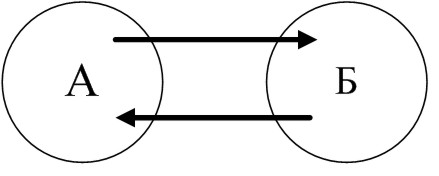
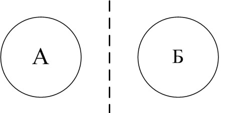
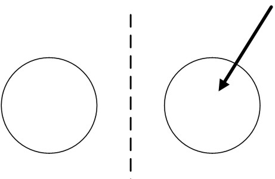
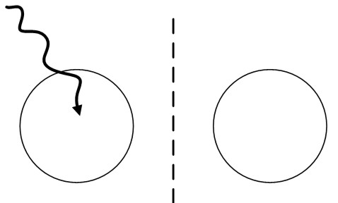
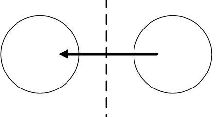
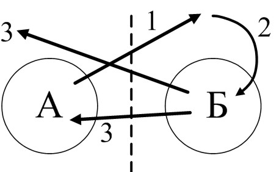

> **Первичный текст.** От корпоративности под покровом идей к соборности в Богодержавии — редакция ред. 2015 г..
> Источник: `dotu.ru:824cdb0b06346050.doc` sha256 `bb82c6983d5f6875…`; [страница на dotu.ru](https://dotu.ru/2015/12/25/20151225_sobornost/).
> Автоматическая транскрипция DOC→Markdown; смысл и формулировки не правились.
> Контрольные суммы и статус проверки — в [NOTICE.md](../../NOTICE.md).
> Содержание передаёт позицию авторов; утверждения не верифицированы библиотекой.

---

##  Суть проблемы

К настоящему времени материалы Концепции общественной безопасности (КОБ) составили уже целую библиотеку. С ними в том или ином объёме в России ознакомились порядка сотни тысяч человек, многие из которых пришли к мнению, что <u>КОБ в её развитии</u> представляет собой именно то, что необходимо нашему обществу и человечеству в целом для выхода из нынешнего криза и обеспечения дальнейшего бескризисного развития. Вследствие их политической и предпринимательской активности КОБ начинает входить в повседневную жизнь как реальная политическая программа переустройства общественных отношений. Но не надо забывать, что за словами «общественные отношения» стоят именно личностные взаимоотношения множества людей, составляющих общество.

В общественных отношениях выражается нравственность, объективно свойственная людям, а не декларируемая ими. При этом общественные отношения, оказывая воздействие на формирование нравственности входящих в жизнь поколений, и сами изменяются под воздействием изменений нравственности живущих людей. Такие изменения могут протекать постепенно — носить эволюционный характер; а могут протекать в исторически короткие сроки в течение жизни одного поколения — носить характер революции, происходящей с многочисленными жертвами и разнородным ущербом, либо носить характер *преображения, в котором все конфликты разрешаются в идеале без ущерба и жертв с выходом всех на новое качество жизни*.

И поскольку никто из людей не в состоянии подменить своей персоной всё общество, то одним из факторов, непосредственно порождающих общественные отношения, является личностная культура (навыки) общения, которую несёт каждый из людей. Поэтому в период времени, когда КОБ перестаёт быть преимущественно книжным знанием, которое было интересно в 1990‑е гг. для весьма незначительной доли населения России, а пролагает себе дорогу в реальную политику государства и в бизнес с перспективой стать общеизвестным, то каждому её стороннику необходимо подумать о своей личностной культуре общения, поскольку идеалы КОБ могут обратиться во зло (в худшем случае) или останутся оторванными от жизни идеалами (в менее плохом варианте), если они не смогут выразить себя в личностной культуре общения тех, кто считает себя приверженцами КОБ. И соответственно необходимо определиться в том:

- какая именно личностная культура общения по сути соответствует КОБ?

- что и как необходимо изменить в себе самом для того, чтобы стать её носителем?

Если этого не сделать, то перспективы жизни общества под идеологическим покровом КОБ можно будет охарактеризовать теми же словами, которыми В.О.Ключевский ещё в XIX веке охарактеризовал прожекты преобразования (тогда ещё в предстоящем будущем) жизни общества на принципах социализма, которыми упивалась в то время левая интеллигенция российской империи: *«Общество праведного общежития, составленное из негодяев».*

Этот же афоризм даёт и ответ на вопрос, почему антисоциалистические реформы, начатые демократами-идеалистами в 1980‑е гг. под смутным кличем «Перестройка», привели к возникновению в государствах на территории СССР в начале 1990‑х гг. бандитско-аферистического олигархического капитализма, самоубийственного для всех народов СССР в случае сохранения в дальнейшем этого “общественного строя”.

Причём особо необходимо подчеркнуть, что речь идёт не о выработке какого-то нового этикета, официального протокола общения или освоении манерности, свойственной в прошлые времена культуре тех или иных народов. Речь пойдёт не об этикете как таковом, а *об обмене информацией в процессе общения.* Но предварительно всё же необходимо обратить внимание на некоторые аспекты этикета и выражающего его протокола.

По отношению к этому процессу этикет или выражающий его официальный протокол — только одно из средств, обеспечивающих в каждой культуре преимущественно безсознательные автоматизмы общения тех, кто освоил этикет определённой социальной группы; средство освобождающее их от необходимости чувствовать то, что происходит в процессе общения, и отчасти — от необходимости думать об этом и, прежде всего, о том, как «установить контакт» — т.е. создать каналы информационного обмена и обеспечить языковую[^269] общность сторон.

Кроме того, этикет и официальный протокол, выработанные различными толпо-“элитарными” обществами, так или иначе решал и решает ещё ряд специфических задач. Поскольку толпо-“элитарная” культура несёт в себе более или менее эффективную субкультуру управления другими людьми в качестве средства опосредованного управления с их помощью течением событий или средства достижения каких-то иных целей, то главные из такого рода задач, решаемых на основе этикета:

- указать каждому на занимаемое им место в личностной иерархии толпо-“элитаризма” (отсюда шкала обращений от «эй, ты, как тебя там…» до «ваше величество» и «ваше святейшество» и зеркальная ей шкала оценок себя самого — от «господин» по отношению к кому-то «иерархически низшему» до «покорнейший слуга вашего величества» и т.п.);

- в соответствии с этим защитить от несанкционированного доступа информацию, носителями которой являются «иерархически высшие», и обеспечить беспрепятственный доступ «иерархически высших» (по способности каждого из них) к информации, носителями которой являются «иерархически низшие» (одно из проявлений этого — свойственный многим этикетам запрет «иерархически низшим» “осквернять” «иерархически высших» своим взглядом, смотреть в глаза «иерархически высшим» без их приказа или задавать им какие бы то ни было вопросы; а также и распространяющееся в направлении «вниз» — «иерархически высшие» глядят поверх голов «иерархически низших» и пренебрегают мнениями, высказываемыми «иерархически низшими» в инициативном порядке).

Но в целом всякий этикет складывается, выражая определённую целесообразность, понимание которой с течением времени может оказаться утраченным, в результате чего нормы этикета предстают во мнениях людей как безсмысленные формальности, понапрасну пожирающие время; хотя в каких-то других случаях ставшие традиционными нормы этикета в условиях изменившейся культуры могут действительно обратиться в пустую формальность. В результате общество отказывается от тех норм этикета, понимание смысла которых в нём утрачено, или которые действительно перестали соответствовать новой эпохе.

Так в соответствии с нормами этикета многих народов, сложившимися в глубокой древности, неправильно приступать к обсуждению дела непосредственно с момента встречи и начала общения. Обсуждению дела, ради которого встреча и состоялась, должен предшествовать, казалось бы, ничего не значащий «обмен любезностями»: обсуждение погоды, жизни родственников и знакомых, прочие разговоры на «отвлечённые темы». В наиболее ярком выражении такого рода, казалось бы, ухода от обсуждения сути дела, ради которого предстоит общение, представляет собой традиция, согласно которой гостю с дороги необходимо предоставить весьма продолжительное время на отдых и проявить разного рода заботу о нём (в русских сказках принимающая сторона обязана истопить для гостя баньку, накормить, дать отдохнуть, и только после этого получает право начинать спрашивать про житьё-бытьё).

В нашу эпоху весь «обмен любезностями» такого рода многим представляется как пустая трата времени. Но в действительности такого рода требования этикета проистекали вовсе не из избытка времени у древних и неспешности течения их жизни. Такого рода нормы вежливости были целесообразны, поскольку по своему существу они были направлены на то, чтобы привести участников предстоящего общения в то настроение, в котором возможен наиболее полный — и соответственно достоверный — обмен информацией между ними.

Психика человека, пока он был в пути, решала другие задачи (в древности, это прежде всего задачи готовности к обороне), поэтому предписанный этикетом обмен любезностями и *запрет начинать деловое общение до завершения церемониала встречи непосредственно с первых моментов общения людей* был ориентирован прежде всего на то, чтобы от настроения дороги (с готовностью реагировать на угрозы и опасности) или от настроения ожидания встречи её участники смогли бы перейти к настроению адекватного обмена информацией. При этом в процессе «обмена любезностями» и разговоров на «отвлечённые темы» участники общения, ощущая друг друга, создавали (сознательно или безсознательно) каналы обмена информации (замыкая свои биополя друг на друга и на общие для них эгрегоры), выявляли языковую общность и подстраивались под неё, что необходимо для наиболее адекватного обмена информацией в процессе общения по главным темам.

Позволительными исключениями из этого общего правила были только уведомления о началах войн, стихийных бедствиях и ещё каких-то чрезвычайных событиях, реакция на которые должна была быть настолько быстрой, что терять время на этикет и протокол встречи, представлялось недопустимым.

Поэтому всякий исторически сложившийся этикет (или выражающий его протокол) представляет собой двоякое явление:

- с одной стороны, в нём выражена (пусть и не всегда праведная — такова история) мудрость многих людей во многих поколениях, направленная на обеспечение адекватного обмена информацией в процессе общения людей;

- а с другой стороны, этикет без понимания участниками общения того, что в этикете и протоколе откуда проистекает и на достижение каких именно целей направлено (направленность этикета может не отвечать целям конкретного общения), представляет собой средство разобщения людей в их коллективной деятельности и в жизни в целом, вследствие чего общение на основе этикета становится более или менее автоматически-машинным — безчувственным и бездуховным, а люди становятся всё боле и более одинокими[^270].

Последнее противно природе и не соответствует сути человека. Отсюда одним из средств преодоления безчувственности и бездуховности общения, порождаемой непониманием определённой целесообразности норм этикета, которое включают в себя многие этикеты, является общение (в смысле обмена информацией) на фоне приёма пищи, возможно сопровождаемого употреблением алкогольных напитков, курения и прочего одурманивания.

При этом действительно возникает духовное единство участвующих в общении, обусловленное общностью их физиологии при переваривании пищи и реакции организма на дурманы. То есть всё это, допускаемое этикетом и к чему этикет в ряде случаев прямо и недвусмысленно обязывает, — представляет собой опускание общения с уровня духовности человека в высших её проявлениях до желудочно-кишечного уровня, а в ряде случаев — и ниже. Отсюда и проистекает требование об употреблении пищи, выпивки и прочих дурманов в пределах той меры, которая не делает невозможным участие интеллекта сторон в общении.

Задушевное же общение во всей полноте чувств и мощи духа (включая ум-разум) в его нефизиологических проявлениях при безусловном подчинении людей нормам какого бы то ни было этикета невозможно. Но именно такого задушевного общения, когда душа с душою говорит напрямую без посредников «неземными языками», и не достаёт людям в повседневной жизни и именно оно необходимо для становления человечного образа жизни глобальной цивилизации.

Кроме того, с середины ХХ века человечество живёт в эпоху после изменения соотношения эталонных частот биологического и социального времени[^271]. Вследствие этого унаследованные от прошлого исторически сложившиеся этикеты и выражающие их протоколы утрачивают эффективность в качестве средств обеспечения адекватного обмена информацией в общении людей[^272].

И поскольку непосредственной целью вступления в общение является получение какой-то информации от других или передача другим какой-то информации, то обратимся к тому, что происходит в процессе общения людей вне зависимости от того, какой этикет признаётся или отвергается участниками общения.

Информационные потоки\

и матрицы общения

----------------------

Если попросить кого-нибудь нарисовать схему информационных потоков в процессе общения двух людей, условно обозначаемых «А» и «Б», то большинство нарисует что-то подобное показанному на нижеследующем рисунке.

Но приведённый рисунок и ему подобные имеют право на существование только в качестве иллюстрации иллюзии, порождаемой Я-центричным мировоззрением, и Я-центричным способом миропонимания субъекта, осознанно воспринимающего своими органами чувств только овеществлённую часть Мироздания и не задумывающегося о полевых (духовных) носителях информации как об одной из составляющих Жизни. На рисунке всё однозначно соответствует именно этому: кружочки вокруг идентификаторов «А» и «Б» — условные изображения границ «Я» каждого из них, что в большинстве случаев означает — их тел, а стрелки — информационные потоки, идущие через среду-проводник.

Т.е. схема, показанная на приведённом рисунке, даёт слишком загрублённое представление о том, как в действительности происходит обмен информацией в общении личностей «А» и «Б», и не позволяет рассмотреть проблематику информационного обмена в общении людей. Однако прежде, чем рисовать какие-то иные схемы информационных потоков в общении людей, для того, чтобы они не производили впечатления оторванных от реальной Жизни абстракций, ещё раз вкратце повторим наши представления о структуре психики личности.

Во всех работах, касающихся вопросов психической деятельности индивида и общества ВП СССР ограничивается рассмотрением двухуровневой структуры психики личности:

1.  Сознание — как область отождествления осознающего себя «Я» с Жизнью как таковой;

2.  Безсознательно-эгрегориальная составляющая психики, принадлежащая как личности, так и остальному Мирозданию, в том числе и другим личностям, включающая в себя всё то, что пребывает вне сознания в рассматриваемый момент времени.

В этой модели граница между сознательным и безсознательно-эгрегориальной составляющей подвижна; а граница, разделяющая две личности — понятие во многом безсмысленное, поскольку область локализации личности в Мироздании определяется порогом восприятия биополей, излучаемых всеми людьми, а в одни и те же эгрегоры входят разные личности на основе общности для них информации и алгоритмики, характеризующей эгрегор, и соответствующей ему настройки параметров излучения биополей.

При этом воля человека определяется как способность индивида подчинять достижению *ставших достоянием его внимания осознаваемых им целей,*[^273] разного рода ресурсы, обстоятельства и течение событий, (иначе говоря, воля — осознаваемая индивидом целенаправленность разного рода его личностных способностей). И соответственно воля человека всегда действует с уровня сознания в его психике. Однако, поскольку безсознательно-эгрегориальная составляющая — неотъемлемая компонента психики личности каждого человека, то каждый человек своими безсознательными уровнями психики включается (всегда включён) в какую-то коллективную психику, — в те или иные эгрегоры (при этом на какие-то эгрегоры он может замыкаться и через уровень сознания в своей психике).

Соответственно этой модели психики личности ситуация, предшествующая началу общения как процессу обмена информацией между личностями «А» и «Б», может быть схематизирована так, как показано на нижеследующем рисунке.

Здесь области внутри кругов с идентификаторами «А» и «Б» обозначают уровни сознания личностей «А» и «Б» соответственно. Область листа вне кругов «А» и «Б» соответствует эгрегориально-безсознательной составляющей психики личностей (пресловутому «альтер эго» — «другому я»). Граница, разделяющая личности по эгрегориально-безсознательной компоненте психики каждой из них, показана как вертикальная пунктирная линия. Пунктирная, а не сплошная линия избрана в качестве символа границы между осознающими себя личностями «А» и «Б» потому, что среди всего множества эгрегоров человечества есть эгрегоры, в которые входит только личность «А»; есть эгрегоры, в которые входит только личность «Б»; есть эгрегоры, в которые входят обе личности. Соответственно эгрегоры, в которые входит только «А» подразумеваются расположенными от границы на стороне «А», и в составе разграничительной линии их отделяют чёрточки «-» от эгрегоров, в которые входит только «Б» и которые расположены на стороне «Б»; а общим для «А» и «Б» эгрегорам соответствует отсутствие границы между ними, обозначаемое в пунктирной линии пробелами « ».

Ситуации, в которых сознание одной личности — фрагмент сознания другой личности полностью (т.е. один круг находится внутри другого круга) или сознание одной личности — фрагмент сознания другой личности частично (т.е. круги пересекаются, образуя в пересечении общую область), — в жизни могут иметь место, но для толпо-“элитаризма” они не типичны, поэтому мы их рассматривать не будем. Кроме того, в этой схеме никак не отражено то обстоятельство, что в общих для них эгрегорах роль «А» и «Б» может быть различной, а общие для них эгрегоры могут занимать в эгрегориальной структуре ноосферы Земли разное положение в порядке взаимной вложенности, что неизбежно так или иначе выразится в характере общения.

Теперь можно перейти к рассмотрению информационных потоков в общении людей. Начнём с рассмотрения различных простейших информационных потоков, в которых выражается активность стороны «А» в качестве распространителя информации (для определённости «А» — слева от границы, «Б» — справа). Полученные результаты сведём в таблицу 1.

Таблица 1. Первичные базовые варианты\

информационной активности «А» в отношении «Б»

<table style="width:99%;">

<colgroup>

<col style="width: 10%" />

<col style="width: 31%" />

<col style="width: 57%" />

</colgroup>

<tbody>

<tr>

<td style="text-align: center;"><blockquote>

1

</blockquote></td>

<td style="text-align: center;"><blockquote>

*[В оригинальном издании здесь расположен рисунок/схема. Иллюстрация не включена в данный выпуск: ожидает визуальной и правовой проверки. Файл источника: image11.jpeg]*

</blockquote></td>

<td><blockquote>

Монолог, подчинённый осознанной воле «А», при молчании эгрегоров.

</blockquote></td>

</tr>

<tr>

<td style="text-align: center;"><blockquote>

2

</blockquote></td>

<td style="text-align: center;"><blockquote>

*[В оригинальном издании здесь расположен рисунок/схема. Иллюстрация не включена в данный выпуск: ожидает визуальной и правовой проверки. Файл источника: image12.jpeg]*

</blockquote></td>

<td><blockquote>

Монолог, подчинённый осознанной воле «А», уходящий в эгрегоры «Б».

</blockquote></td>

</tr>

<tr>

<td style="text-align: center;"><blockquote>

3

</blockquote></td>

<td style="text-align: center;"><blockquote>

*[В оригинальном издании здесь расположен рисунок/схема. Иллюстрация не включена в данный выпуск: ожидает визуальной и правовой проверки. Файл источника: image13.jpeg]*

</blockquote></td>

<td><blockquote>

Монолог эгрегора «А», доходящий до сознания «Б».

</blockquote></td>

</tr>

<tr>

<td style="text-align: center;"><blockquote>

4

</blockquote></td>

<td style="text-align: center;"><blockquote>

*[В оригинальном издании здесь расположен рисунок/схема. Иллюстрация не включена в данный выпуск: ожидает визуальной и правовой проверки. Файл источника: image14.jpeg]*

</blockquote></td>

<td><blockquote>

Монолог эгрегора «А», уходящий в эгрегоры «Б».

</blockquote></td>

</tr>

<tr>

<td style="text-align: center;"><blockquote>

5

</blockquote></td>

<td style="text-align: center;"><blockquote>

</blockquote></td>

<td><blockquote>

Монолог эгрегора «Б», возбуждённый присутствием «А».

</blockquote></td>

</tr>

<tr>

<td style="text-align: center;"><blockquote>

6

</blockquote></td>

<td style="text-align: center;"><blockquote>

*[В оригинальном издании здесь расположен рисунок/схема. Иллюстрация не включена в данный выпуск: ожидает визуальной и правовой проверки. Файл источника: image16.jpeg]*

</blockquote></td>

<td><blockquote>

Монолог, сознания «А», уходящий в его же эгрегоры.

</blockquote></td>

</tr>

<tr>

<td style="text-align: center;"><blockquote>

7

</blockquote></td>

<td style="text-align: center;"><blockquote>

</blockquote></td>

<td><blockquote>

Одержимость «А» его же эгрегором. Стрелка, обозначающая информационный поток, — волнистая, чтобы показать отличие варианта 7 от варианта 5: одержимость — свойство «А», не обусловленное присутствием «Б», что и отличает вариант 7 (в отношении «А») от варианта 5 (в отношении «Б»).

</blockquote></td>

</tr>

</tbody>

</table>

*В таблице 1 не показаны варианты, в которых происходит уход информации в общие для «А» и «Б» эгрегоры. Их можно изобразить как наложение друг на друга вариантов № 2 и № 6, в которых информация уходит либо в эгрегоры «А», либо в эгрегоры «Б».*

Таблица 1 включает в себя первичные базовые варианты, в которых имеет место только один информационный поток. Но реально информационных потоков, в которых выражается активность стороны «А», может быть больше, чем один. Поэтому можно построить ещё много вариантов информационной активности «А» в общении с «Б» путём наложения друг на друга разных вариантов, сначала сочетая их по 2 из 7, потом по 3 из 7, по 4 из 7 и т.д. вплоть до получения наложения друг на друга всех 7 первичных базовых вариантов. Если признать, что количество первичных базовых вариантов равно 7, то общее количество базовых вариантов информационного воздействия стороны «А» на «Б», равное N, можно вычислить по формуле (1), определяющей общее количество «сочетаний»[^274], взятой из раздела математики, именуемого «комбинаторика»:

$`N = С_{7}^{1} + С_{7}^{2} + С_{7}^{3} + С_{7}^{4} + С_{7}^{5} + С_{7}^{6} + С_{7}^{7}`$ (1) ,\

где $`С_{n}^{m} = \frac{\text{n!}}{\text{m!}(\text{n- m})!}`$ (2) ,

здесь n! = 1×2×3×…×n (в такого рода формулах по определению — соглашению 0! = 1).

*[В оригинальном издании здесь расположен рисунок/схема. Иллюстрация не включена в данный выпуск: ожидает визуальной и правовой проверки. Файл источника: image11.jpeg]*Если все полученные базовые варианты информационной активности «А» в отношении «Б» отобразить зеркально относительно границы, разделяющей «А» и «Б», то получится такое же количество базовых вариантов информационной активности «Б» в отношении «А».

Так вариант (№ 1 в таблице 1)

преобразуется в вариант

и все остальные варианты аналогично преобразуются в варианты, зеркально им симметричные относительно вертикали.

Расположив все варианты информационной активности «А» в отношении «Б» в столбик, а все варианты информационной активности «Б» в отношении «А» в строку в одинаковой упорядоченности, можно получить таблицу 2 — матрицу возможных вариантов информационных потоков в общении «А» и «Б». В ней на пересечении каждой строки и каждого столбца путём наложения друг на друга соответствующих базовых вариантов активности участвующих в общении сторон получаем схему информационных потоков между ними в процессе общения.

**Таблица 2. Матрица возможных информационных потоков**

в общении «А» и «Б»

<table style="width:97%;">

<colgroup>

<col style="width: 24%" />

<col style="width: 26%" />

<col style="width: 6%" />

<col style="width: 25%" />

<col style="width: 6%" />

<col style="width: 6%" />

</colgroup>

<tbody>

<tr>

<td style="text-align: center;">
«Б»

«А»
</td>

<td style="text-align: center;"></td>

<td style="text-align: center;">…</td>

<td style="text-align: center;">*[В оригинальном издании здесь расположен рисунок/схема. Иллюстрация не включена в данный выпуск: ожидает визуальной и правовой проверки. Файл источника: image19.jpeg]*</td>

<td style="text-align: center;">…</td>

<td style="text-align: center;">N</td>

</tr>

<tr>

<td style="text-align: center;">*[В оригинальном издании здесь расположен рисунок/схема. Иллюстрация не включена в данный выпуск: ожидает визуальной и правовой проверки. Файл источника: image11.jpeg]*</td>

<td style="text-align: center;">*[В оригинальном издании здесь расположен рисунок/схема. Иллюстрация не включена в данный выпуск: ожидает визуальной и правовой проверки. Файл источника: image20.jpeg]*</td>

<td style="text-align: center;">…</td>

<td style="text-align: center;">*[В оригинальном издании здесь расположен рисунок/схема. Иллюстрация не включена в данный выпуск: ожидает визуальной и правовой проверки. Файл источника: image21.jpeg]*</td>

<td style="text-align: center;">…</td>

<td style="text-align: center;">…</td>

</tr>

<tr>

<td style="text-align: center;">…</td>

<td style="text-align: center;">…</td>

<td style="text-align: center;">…</td>

<td style="text-align: center;">…</td>

<td style="text-align: center;">…</td>

<td style="text-align: center;">…</td>

</tr>

<tr>

<td style="text-align: center;">*[В оригинальном издании здесь расположен рисунок/схема. Иллюстрация не включена в данный выпуск: ожидает визуальной и правовой проверки. Файл источника: image22.jpeg]*</td>

<td style="text-align: center;">*[В оригинальном издании здесь расположен рисунок/схема. Иллюстрация не включена в данный выпуск: ожидает визуальной и правовой проверки. Файл источника: image23.jpeg]*</td>

<td style="text-align: center;">…</td>

<td style="text-align: center;">*[В оригинальном издании здесь расположен рисунок/схема. Иллюстрация не включена в данный выпуск: ожидает визуальной и правовой проверки. Файл источника: image24.jpeg]*</td>

<td style="text-align: center;">…</td>

<td style="text-align: center;">…</td>

</tr>

<tr>

<td style="text-align: center;">…</td>

<td style="text-align: center;">…</td>

<td style="text-align: center;">…</td>

<td style="text-align: center;">…</td>

<td style="text-align: center;">…</td>

<td style="text-align: center;">…</td>

</tr>

<tr>

<td style="text-align: center;">N</td>

<td style="text-align: center;">…</td>

<td style="text-align: center;">…</td>

<td style="text-align: center;">…</td>

<td style="text-align: center;">…</td>

<td style="text-align: center;">…</td>

</tr>

</tbody>

</table>

Для n=7, соответствующего избранной нами модели, формулы 2 и 1 дают значение N, определяющее размерность матрицы информационных потоков в общении двух людей, равное 127, и соответственно в построенной нами матрице содержится 16129 ячеек. Т.е. обычное сознание человека не способно воспринимать матрицу такого размера вне изменённых состояний, поскольку человек в состоянии обычного бодрствования способен воспринимать не более 7 — 9 объектов одновременно и различать не более 15 дискретных (пошаговых) изменений ситуации в секунду. Реальное же общение людей при его отображении в построенную нами матрицу может быть не статическим, соответствующим какому-то одному элементу матрицы, а представлять собой переход от одних элементов этой матрицы к другим.

Это означает, что нарисовать и вызубрить эту матрицу во всей её полноте и детальности элементов — занятие заведомо дурное и бесполезное. Но осознать и понять алгоритм её получения, начиная от избрания первичных базовых вариантов информационной активности одной из сторон в отношении другой и вплоть до получения самой матрицы размерности N×N — полезно. Это — необходимая основа для того, чтобы ориентировать алгоритмику своей психики на построение такого рода матрицы образов, дабы в процессе реального общения алгоритмика психики могла обеспечить соотнесение с нею реального информационного обмена, включая и динамику перехода общения из одной ячейки матрицы в другую. Без такого рода контроля за адресацией и характером информационных потоков невозможно управление общением как процессом адекватного обмена информацией.

При опоре на избранную нами двухкомпонентную модель психики (сознание во взаимодействии с безсознательно-эгрегориальной составляющей) именно в таблицу 2, обретая детальность и жизненную состоятельность, отображается та картинка-иллюзия, с которой мы начали в этом разделе рассмотрение вопроса об информационном обмене в процессе общения людей. И наоборот: в Я-центричном миропонимании вся эта квадратная матрица размерности 127×127 сводится в примитивную и иллюзорную по её существу схему.

И соответственно в эту иллюзорную схему отображаются все описания общения с кем-либо типа: *«Я сказал ему: “…”, а он мне в ответ: “…”»,* — даваемого «А» (для определённости). Хотя в реальности всё могло происходить совершенно иначе, например, так, как показано на ниже следующем рисунке. На нём номера при стрелках, обозначающих информационные потоки, соответствуют очерёдности их возникновения в процессе общения.

То есть реально «А», обращаясь к «Б», сказал (или иначе передал) что-то, что прошло мимо сознания «Б», но ушло в эгрегоры «Б» — поток № 1. Эгрегоры «Б» под воздействием этой информации возбудились и выдали какую-то информацию в сознание «Б» — поток № 2. Реагируя на поток № 2, «Б» даёт свой ответ «А», который доходит до сознания «А», а также уходит и в эгрегоры «А» — потоки № 3. И это качественно отличается от описания, данного «А»: «Я сказал ему: “…”, а он мне в ответ: “…”»? — поскольку поток № 1 до сознания «Б» не дошёл, а полученный «А» якобы в ответ на поток № 1 поток № 3 — вовсе не осознанный ответ «Б» на выданный «А» информационный поток № 1. О такого рода ситуациях можно сказать иными словами:

Общение было, а диалога, смысл обмена мнениями в котором адекватно доходит до сознания как «А», так и «Б», — не было.

И, к сожалению, в наши дни господствующая в обществе культура общения такова, что такие диалоги без понимания или взаимное одурманивание пустым трёпом — не редкость.

Таким образом, даже если не вдаваться в существо информации, которой обмениваются стороны; в особенности алгоритмики обработки информации, обусловленные полом, строем психики, образованием (в смысле информированности и владения определёнными навыками), настроением каждой из сторон, то и в таком упрощённом представлении общение (в смысле предсказуемого по последствиям обмена информацией) предстаёт как не самое простое искусство, которому ныне господствующая культура не только не учит, но и подавляет его, поскольку процесс управления в толпо-“элитарном” обществе включает в себя разрыв извне возникающих между людьми несанкционированных связей, а один из способов недопущения возникновения такого рода связей — построить систему воспитания так, чтобы, достигая взрослости, люди утрачивали навыки вхождения в общение с незнакомыми людьми, которые свойственны подавляющему большинству детей. И обучение толпо-“элитарному” этикету в этом играет далеко не последнюю роль.

Суть же искусства общения (в смысле адекватности донесения и получения информации в процессе общения) состоит в осознанно-волевом управлении безсознательно-эгрегориальным «маревом», обладающим собственной динамикой и алгоритмикой активности.

Безсознательно-эгрегориальная составляющая психики в данном случае названа «маревом»[^275], поскольку вследствие её активности осознаваемые впечатления стороны «Б» от общения с «А» могут не совпадать с теми намерениями и смыслами, которые сторона «А» вкладывала в общение с «Б». Т.е. характер «А» в общении с «Б» с точки зрения «Б» искажается подобно тому, как в пустыне марево горячего воздуха, обладающего собственной динамикой, искажает образы предметов и порождает миражи. То же касается и впечатлений, производимых на «А» общением с «Б». При этом ошибочно думать, что безсознательно-эгрегориальное марево — достояние и проблема только какой-то одной из сторон.

Марево — общее для них, и характер его динамики и алгоритмики во многом обусловлен личностными качествами общающихся сторон.

Вследствие этого в общении «А» и «Б» эгрегориально-безсознательное марево может вести себя не так, как в общении «А» и «В». По этой причине «В» может не знать сторону «А» такой, какой её знает по своему общению с нею «Б». Обладая собственной динамикой и алгоритмикой, безсознательно-эгрегориальное марево в своём автоматическом или управляемом третьей стороной поведении способно как объединять людей в задушевном безпроблемном общении, так и разобщать их, доводя их взаимоотношения до конфликта вопреки их намерениям, желанию и выражающей их воле.

При таком понимании информационно-алгоритмического характера общения первейшая задача в общении — обеспечить адекватный обмен информацией.

<table style="width:79%;">

<colgroup>

<col style="width: 40%" />

<col style="width: 39%" />

</colgroup>

<tbody>

<tr>

<td>*[В оригинальном издании здесь расположен рисунок/схема. Иллюстрация не включена в данный выпуск: ожидает визуальной и правовой проверки. Файл источника: image26.jpeg]*</td>

<td>*[В оригинальном издании здесь расположен рисунок/схема. Иллюстрация не включена в данный выпуск: ожидает визуальной и правовой проверки. Файл источника: image27.jpeg]*</td>

</tr>

<tr>

<td style="text-align: center;">Информационная 

активность «А»</td>

<td style="text-align: center;">Ответная 

активность «Б»</td>

</tr>

</tbody>

</table>

Если обратиться к построенной нами матрице вариантов информационных потоков в общении людей, то наиболее полный и адекватный обмен информацией в диалоге обеспечивает вариант информационных потоков прямого и ответного (аналогичного по структуре потоков) информационных воздействий, показанных на рисунках слева, при условии, что и в прямом, и в ответном информационном воздействиях все потоки взаимно дополняют друг друга и между ними (в системе подачи информации каждой стороной) нет антагонизмов смысла. Соответственно отсутствие любого из каналов, несущих все показанные информационные потоки в общении или нарушение в их системе потоков принципа взаимно дополняющего единства смысла делает общение всё более и более неадекватным и бедным.

При этом, естественно, должна обеспечиваться языковая общность сторон «А» и «Б».

Также предполагается, что **инициатором всех информационных потоков в прямом и ответном информационном воздействии в случае адекватного обмена информацией является воля субъектов** «А» и «Б» (соответственно) в ранее определённом смысле слова «воля»: способность индивида подчинять достижению *ставших достоянием его внимания осознаваемых им целей,* разного рода ресурсы, обстоятельства и течение событий, (иначе говоря, воля — осознаваемая индивидом целенаправленность его разного рода способностей).

И смысл информации во всех информационных потоках должен быть в согласии со смыслом потоков, исходящих из сознания «А» и «Б» и дополнять его, а алгоритмика психики человека нормально должна быть ориентирована на самонастройку в режим её функционирования, обеспечивающий наиболее полный и адекватный обмен информацией при вступлении в общение и поддержание его в процессе общения.

Смысл термина «адекватность донесения информации» в настоящем контексте поясним следующим примером: если «А» осуществляет своею волей намерение довести до осознания «Б» сообщение о том, что 2×2=4, то в ответ придёт уведомление о том, что «Б» понял, что с точки зрения «А» 2×2=4, и «Б» не будет пребывать в искренней убеждённости, что «А» рассказывал ему о том, что «вода мокрая» или 2×2=3÷5 в зависимости от потребностей и желания “арифметика”. При этом, зная мнение «А» по вопросу о «2×2=…», «Б» может в силу разных причин придерживаться по этому же вопросу иных мнений, точно так же, как и в случае, если бы «А» довёл до его сведения своё мнение о том, что 2×2=5 или 2×2=3÷5 в зависимости от потребностей и желания “арифметика”.

Т.е. речь не идёт об истинности или ложности той или иной информации, которая передаётся от «А» к «Б» и в обратном направлении в процессе общения. Вопрос об истинности или ложности той или иной определённой информации — это вопрос, относящийся к предметной области, которая стала темой общения, и вопрос культуры непосредственного и опосредованного (через других людей, артефакты и тексты) восприятия Жизни и осмысления воспринятого, а не вопрос, относящийся к культуре общения как таковой[^276]. И речь не идёт о попытках управлять чужим поведением, предпринимаемых какой-то одной или обеими сторонами, путём программирования психики или за счёт подавления или искажения воли другой стороны. Такого рода умышленные попытки не соответствуют идеалам КОБ и противоречат её нравственно-этическим принципам.

Тем не менее, рассмотренный ранее вопрос об управлении поведением другой стороны за счёт подавления или искажения её воли входит в проблематику рассмотрения культуры общения и выработки культуры общения, выражающей КОБ. И он является одним из частных случаев среди множества возможных вариантов общения. Его рассмотрение по отношению к жизни людей на основе <u>КОБ в её развитии</u> актуально, поскольку кроме умышленных попыток управлять поведением других людей, выражающих чью-то осознанную волю, в общении людей могут активизироваться такого же характера алгоритмы, полностью или какими-то своими фрагментами принадлежащие безсознательно-эгрегориальным составляющим психики участвующих в общении сторон.

Поскольку в символике матрицы вариантов информационных потоков в общении двух людей (таблица 2) эта проблематика не отражена, то обратимся к ней. Начнём её рассмотрение с того, что повторим ещё раз:

Самые тяжёлые для решения задачи воплощения КОБ в жизнь относятся не к сфере жизни общества (как целостности, обладающей той или иной внутренней структурой и организацией), не к его политической идеологизированности или “деидеологизированности”, не к экономике, искусствам и т.п., а к духовной жизни каждой личности, являющейся частью этого общества, — к её жизни в своём «внутреннем мире». Это так, поскольку именно *жизнь «внутреннего мира» человека представляет собой непосредственное и наиболее полное выражение организации его психики*, а организация психики множества личностей однозначно обуславливает внутреннюю структуру и организацию жизни общества как целостности, алгоритмику порождаемых обществом разного рода эгрегоров и характер их взаимовложенности.

Пока же распространение информации КОБ в обществе носит большей частью характер *«прививки» (в смысле этого слова, близком к садоводческому)* <u>Знания, не свойственного исторически сложившейся культуре</u>, на **не соответствующую этому Знанию нравственно-психическую подоплёку** тех, кто знакомится с материалами КОБ.

И в этом взаимном несоответствии одного (Знания) другому (нравственно-психической подоплёке) нет принципиальной разницы между теми, кто относит себя к сторонникам воплощения идеалов КОБ в жизнь; и теми, *кто является противниками КОБ потому, что расценивает КОБ как бред или злой умысел с целью дальнейшего порабощения человечества*.

Личностная духовность и тех, и других во всех её аспектах (биополевом энергетическом и информационно-алгоритмическом, включающем в себя и нравственные мерила личности) — во многом порождение толпо-“элитарной” культуры. И она более соответствует безсознательно-автоматическому воспроизведению толпо-“элитаризма” в преемственности поколений, нежели осознаваемой многими людьми целесообразности порождения *в исторически короткие сроки* некоего другого образа жизни глобальной цивилизации, в котором среди людей царила бы Любовь от Бога и устойчиво поддерживался бы лад во взаимоотношениях человечества и биосферы, идейным выражением устремлённости к какому идеалу является КОБ.

Поэтому воспринятая в процессе личностного становления на основе культуры, унаследованной от прошлого, безсознательно-эгрегориальная склонность к воспроизводству толпо-“элитарных” взаимоотношений свойственна и искренним сторонникам[^277] КОБ и неизбежно выражается через алгоритмику безсознательно-эгрегориального марева в их общении как с другими сторонниками КОБ, так и с людьми, не имевшими до вступления в общение с ними никакого представления о КОБ. И поскольку это происходит под покровом КОБ, то во всех случаях не несёт ничего хорошего ни самим сторонникам КОБ, ни остальному обществу, поскольку:

- объективно является имитацией жизни на основе КОБ;

- при выявлении такого рода толпо-“элитарных” проявлений другими людьми и при их неумении общаться в русле качественно иной алгоритмики:

<!-- -->

- вызывает разлады и конфликты в среде искренних сторонников КОБ, разрушая их коллективную деятельность в общем всем внешнем мире, что создаёт иллюзию неэффективности КОБ и её жизненной несостоятельности;

<!-- -->

- вызывает отрицательное отношение к КОБ как таковой со стороны тех людей, кто получил первые впечатления о ней из общения с кем-либо из её сторонников, так или иначе выказавших в общении свою подневольность толпо-“элитаризму”. Вследствие неумения разграничить что именно в общении было от КОБ, а что от унаследованного её сторонником толпо-“элитарного” поведения такие люди, расценивают всех без исключения сторонников КОБ в качестве одной из наиболее опасных тоталитарных сект.

И в такой оценке они будут правы, если сторонники КОБ — каждый сам и помогая в этом другим — не выработают и не освоят личностную культуру общения, в которой нет места восприятию проявлений толпо-“элитаризма” с их стороны теми, с кем в общение они вступают: холопства и заискивания перед теми, кто расценивается как нужный человек, начальник, вышестоящий иерарх; пренебрежения и высокомерия в отношении как им видится ничем непримечательных людей, которые предпринимают усилия к тому, чтобы вступить в общение с кем-либо из сторонников КОБ, а тем более из числа тех, кто на её основе стал «авторитетом»; психологического давления и давления обстоятельствами (их стечением, управляемым структурно или эгрегориально), порождающими личную, возможно безысходную, зависимость другого человека, с целью подчинить его корпоративной деятельности, поскольку он является носителем определённых качеств или прав доступа к тем или иным ресурсам и управления ими; вкрадчивого проникновения в алгоритмику чужой психики, подменяющего своею волей волю другого человека или извращающего её[^278] и т.п.

Обратим особо внимание на то, что в предыдущем абзаце речь идёт не о намерениях сторонника КОБ перед его вступлением в общение с кем-либо, не о его собственных оценках общения по его завершении, а о том впечатлении, которое он производит в процессе общения в другом человеке, о том, как эти впечатления будут осмыслены этим другим человеком или прокомментированы теми людьми, которым он доверяет. И вариантов осмысления впечатления от общения (и в особенности первого общения) со сторонником КОБ в общем-то не много:

- он человек хороший и несёт то, что может быть мне полезно в разрешении моих проблем, моих близких, проблем всего общества — с КОБ надо ознакомиться обстоятельнее;

- это, конечно интересно и было бы хорошо, если бы общество жило так, как они говорят, но это — «романтизм-идеализм», власть принадлежит сторонникам других взглядов и этого изменить невозможно;

- мне это не нужно, я реалист — у меня другие цели в жизни, надо жить (делать дело, делать деньги, карьеру, обустраивать дом, спасать Родину, … — ненужное зачеркнуть, нужное вписать).

- он сам себе не хозяин — жертва тоталитарной секты и носитель тоталитарной идеологии:

<!-- -->

- надо быть от КОБ-овцев подальше;

- надо приобщиться к КОБ-овцам и продвинуться в их иерархии на достойное место, чтобы не пострадать, когда они придут к власти;

- с КОБ и КОБ-овцами, с их деятельностью надо бороться бескомпромиссно и беспощадно, чтобы эти крутые тоталитаристы не пришли к власти;

<!-- -->

- шок!!! … и выход из шока без переосмысления своей нравственности, мировоззрения и миропонимания в режиме *«слушаю и повинуюсь, я — тоже сторонник КОБ, располагайте мною, говорите, что надо делать конкретно…»* (подобно тому, как гонитель первых христиан Савл на пути в Дамаск стал не только “христианином”, но и апостолом Павлом);

- всё в принципе понятно, и мы будем с этим бороться потому, что мы — сторонники другой модели того, что вы называете толпо-“элитаризмом”, но вам об этом не скажем[^279] и нам нет дела до того, человек или зомби принёс весть о КОБ, а “ваших” зомби мы используем против КОБ и вас, и чтобы эффект дискредитации КОБ в толпе был сильнее, отдадим под власть КОБ и наших зомби, а уж они-то доведут ваше дело до угодного нам краха;

- в КОБ на словах всё конечно хорошо, но почему так много среди её сторонников тех, чья этика и дела не соответствуют тому, что однозначно может быть понято из материалов КОБ? — общество праведного общежития не может быть составлено из негодяев. Но что делать с негодяями? Может быть всё же был прав маленький мальчик Сосо Джугашвили?

Последний вопрос неизбежен в этом контексте, но его необходимо пояснить, поэтому сделаем отступление от основной темы.

\* \* \*

Отступление от темы\

О том, как Э.Радзинский не понял себя, Сталина и его эпоху

----------------------------------------------------------

В 1997 г. писатель (в прошлом более известный как драматург, сценарист, а ныне как историк-аналитик, биографист) Эдвард Радзинский написал книгу “Сталин”, которая выдержала к настоящему времени несколько переизданий и пользуется спросом наряду с другими его как бы историко-аналитическими произведениями. В ней есть такой пассаж:

«Постараемся понять нашего интеллигента (ранее речь шла об истеричных письмах Бухарина Сталину из тюрьмы — наше пояснение при цитировании) — правдивого лжеца, слабого силача, благородного подлеца, смелого труса и при том талантливого безмерно, даже в унижении своём. Он никогда не скажет: “Я попросту боюсь гнева этих ужасных жестоких людей”, но обязательно выдумает великую идею, обоснование. Как я понимаю его и … люблю! Ибо я тоже — дитя страха. Вся моя сознательная жизнь прошла в стране Страха. “Сжальтесь. Ты, зная меня хорошо, поймёшь...” (это, как можно понять из цитируемого фрагмента, из письма Бухарина Сталину — наше пояснение при цитировании).

Да, Сталин их хорошо знал. И потому придумал процессы». (Э.Радзинский, “Сталин”, Москва, «Вагриус», 1997 г, стр. 408, 409).

Так Радзинский признаёт, что нравственность и этика одной из наиболее почитаемых отечественной либеральной интеллигенцией «безвинных жертв сталинизма» оставляла желать лучшего. И хотя он этот факт и признал по существу, но он не понял, что человек с такой нравственностью и этикой не может быть безвинным[^280].

И он не понял главного, но уже в отношении себя: о той эпохе нельзя писать, будучи «дитём страха»[^281].

Но наряду со своими исторически не состоятельными сентенциями на темы «крах Сталина и дела Сталина» Э.Радзинский приводит свидетельство об эпизоде из раннего детства И.В.Сталина, о его отношении к негодяйству и праведности:

«Его друг Даришвили вспоминал, как бабушка читала им Евангелие, историю предательского поцелуя Иуды. Маленький Сосо, негодуя, спросил:

— Но почему Иисус не вынул саблю?

— Этого не надо было делать, — ответила бабушка. — Надо было, чтобы Он пожертвовал собой во имя нашего спасения.

Но этого маленький Сосо понять не в силах: всё детство его учили отвечать ударом на удар. И он решает самое понятное — отомстить евреям! Он уже тогда умел организовать дело и остаться в стороне, страшась тяжелой руки матери. План Сосо осуществили его маленькие друзья — впустили в синагогу свинью. Их разоблачили, но Сосо они не выдали. И вскоре православный священник сказал, обращаясь к прихожанам в церкви: “Есть среди вас заблудшие овцы, которые несколько дней назад свершили богохульство в одном из домов Бога”. И этого Сосо понять не мог. Как можно защищать людей другой веры?» (там же, стр. 32).

Отношение И.В.Сталина уже в детстве к событиям в Гефсиманском саду — один из показателей нравственно-мировоззренческого «скелета» («стержня») его личности. Но Э.Радзинский передёргивает ситуацию. В своём отношении к событиям в Гефсиманском саду маленький Сосо не мог понять, как можно потворствовать негодяям. Но чтобы не обсуждать этот неприятный для него лично и для многих других вопрос о сути негодяйства вообще и собственном негодяйстве конкретно, Э.Радзинский приплёл сюда же и эпизод со свиньёй, запущенной детьми в синагогу.

Бабушка, которая читала детям Новый завет, не имела возможности прочитать Коран, в отличие от всех наших сограждан, включая и Э.Радзинского, и потому не знала иных мнений о судьбе Иисуса и не имела возможности подумать о том, что произошло в действительности. Коран даёт иную версию того, что надо было Богу, отличающуюся от церковной, которой следовала бабушка:

«Они не убили его (Иисуса) и не распяли, но это только представилось им (в их воображении); и, **поистине,** те, которые разногласят об этом (т.е. не согласные с кораническим свидетельством), — в сомнении о нём; **нет у них об этом никакого знания**, кроме следования за предположением (Саблуков: «они водятся только мнением»). Они не убили его (Христа), — **наверное** (Саблуков: «это верно известно»), нет, Бог вознес его к Себе: ведь Бог могущественен (Крачковский: «велик»), мудр! **И поистине**, из людей писания нет никого, кто бы не уверовал в него прежде своей смерти, а в день воскресения он будет свидетелем против них!» (сура 4:156, 157, все выделения и пояснения в скобках сделаны нами)[^282].

Так же и эпизод с “осквернением” синагоги как дома Бога — тоже не в тему, если соотноситься не с оценками Э.Радзинским, а с Жизнью. Это не было богохульством, но тоже имеет непосредственное отношение к вопросу о сути негодяйства и об отношении к негодяям. В синагоге, которую якобы осквернили дети, запустив в неё свинью, и в церкви учили тому, что Промысел Божий выражается в следующей социологической доктрине:

***«Не давай в рост брату твоему*** (по контексту единоплеменнику-иудею) ***ни серебра, ни хлеба, ни чего-либо другого, что возможно отдавать в рост; иноземцу*** (т.е. не иудею) отдавай в рост, чтобы господь бог твой (т.е. дьявол, если по совести смотреть на существо ростовщического паразитизма) ***благословил тебя во всем, что делается руками твоими на земле, в которую ты идешь, чтобы владеть ею»*** (последнее касается не только древности и не только обетованной древним евреям Палестины, поскольку взято не из отчета о расшифровке единственного свитка, найденного на раскопках, а из современной, массово изданной книги, пропагандируемой всеми Церквями и частью “интеллигенции” в качестве вечной истины, данной якобы Свыше), — *Второзаконие, 23:19, 20*. ***«И будешь господствовать над многими народами, а они над тобой господствовать не будут»,*** *— Второзаконие, 28:12.* ***«Тогда сыновья иноземцев*** (т.е. последующие поколения не-иудеев, чьи предки влезли в заведомо неоплатные долги к племени ростовщиков-единоверцев) ***будут строить стены твои*** (так ныне многие семьи арабов-палестинцев в их жизни зависят от возможности поездок на работу в Израиль) ***и цари их будут служить тебе*** (“Я — еврей королей”, — возражение одного из Ротшильдов на неудачный комплимент в его адрес: “Вы король евреев”)***; ибо во гневе моем я поражал тебя, но в благоволении моем буду милостив к тебе. И будут отверзты врата твои, не будут затворяться ни днем, ни ночью, чтобы было приносимо к тебе достояние народов и приводимы были цари их. Ибо народы и царства, которые не захотят служить тебе, погибнут, и такие народы совершенно истребятся»,*** *— Исаия, 60:10 — 12.*

Э.Радзинский ссылается на авторитет представителя церкви, когда тот оценил <u>детскую далеко не шалость</u> как богохульство[^283], ни слова не сказав о сути этой доктрины, не дав ей нравственной оценки. Однако есть точка зрения, что эта доктрина — мерзостная и приписывается Богу в качестве выражения Его Промысла именно богоотступниками. Потому Библия в целом — богохульная книга, а бездумно-традиционное согласие с нею верующих — негодяйство[^284].

И соответственно этой точке зрения *как бы хулиганская выходка* детей в отношении свиньи и синагоги — не столь однозначный поступок, как его расценивает Э.Радзинский: в детском поступке объективно выразилось интуитивно-безсознательное неприятие детьми церковно-православного потворства негодяйству, которому учили и учат и синагога, и церковь.

Тем более этот поступок не столь однозначен потому, что у Э.Радзинского ему сопутствует описание эпизода, в котором маленький Сосо прямо ставит в меру своего детского понимания вопрос о защите праведности от негодяйства всеми средствами вплоть до применения оружия, рассмотрения которого Э.Радзинский избегает как чёрт ладана во всех своих письменных и устных выступлениях. И если тогда знаний и ума детям не хватило на большее, чем просто выказать вопреки культуре взрослых своё неприятие потворства негодяйству, прикрывающемуся мифом о боговдохновенности Библии в её исторически сложенном умельцами от «мировой закулисы» виде, то у взрослого Сталина были уже иные свершения[^285]. Но Радзинский придерживается мнения, что библейская мерзостная доктрина скупки мира на основе расовой иудейской монополии на ростовщичество — от Бога[^286], и потому Сталин для него — неисправимый негодяй с детства, который придя к власти уничтожил множество правдивых лжецов, благородных подлецов, смелых трусов, безмерно талантливых в своём унижении. Но общество праведного общежития не может быть составлено из негодяев. Но что делать с негодяями? Может быть всё же был прав маленький мальчик Сосо Джугашвили, задавшись вопросом «почему Иисус не достал саблю?».

Собственно этот его вопрос и подразумевался в последнем абзаце нашего текста, предшествующего этому отступлению от основной темы. И это был не единичный эпизод в жизни Сосо Джугашвили, когда он ещё не стал Кобой и Сталиным, но обращался к вопросу о путях и методах искоренения негодяйства из жизни общества:

Ходил он от дома к дому,\

Стучась у чужих дверей,\

Со старым дубовым пандури,\

С нехитрою песней своей.

В напеве его и в песне,\

Как солнечный луч чиста,\

Звучала великая правда —\

Возвышенная мечта.

**СЕРДЦА, ПРЕВРАЩЁННЫЕ В КАМЕНЬ,\

ЗАСТАВИТЬ БИТЬСЯ УМЕЛ.\

У МНОГИХ БУДИЛ ОН РАЗУМ,\

ДРЕМАВШИЙ В ГЛУБОКОЙ ТЬМЕ**.

Но люди, забывшие Бога,\

Хранящие в сердце тьму,\

Полную чашу отравы\

Преподнесли ему.

Сказали они: “Будь проклят!\

Пей, осуши до дна...\

И песня твоя чужда нам,\

И правда твоя не нужна!”

Негодяи, в том числе и лицемеры, в 18 — 19 лет, стихи такой тематики не пишут. Одна из строф выделена жирным заглавным шрифтом нами при цитировании, поскольку в ней и дан ответ об *альтернативе высшего порядка* *сабле* как символу защиты праведности от негодяйства силой разного рода оружия. Единственно, о чём в ней не сказано, что человек — это не только живое трепетное сердце, отзывчивое Жизни и воздействующее на её течение[^287], не только разум и вера Богу и в идеалы, но ещё и воля, способная воплотить идеалы в жизнь и защитить их — если надо — то и силой оружия.

И почему И.В.Сталин хранил в своём рабочем столе в Кремле предсмертное письмо Н.И.Бухарина? — может потому, что не обладал знаниями и навыками, которые позволили бы ему заблаговременно помочь Н.И.Бухарину возобладать над собственной психикой, что позволило бы ему избежать позорной смерти двурушника и отступника от идеалов праведного общежития всех…

Далее продолжение основного текста.

\* \*\

\*

Но вопрос о негодяйстве и его проявлениях в жизни общества имеет одну особенность, рассмотрения которой в подавляющем большинстве случаев публицисты избегают:

- Негодяи, в том смысле, что они, вырабатывая намерение в отношении своих действий, осознавали бы сами, что в этих намерениях выражается объективно злой умысел, а потом непреклонно проводили бы это намерение в жизнь своею волей, — такие негодяи по отношению к численности общества составляют весьма малую долю.

- Подавляющее большинство случаев, которые представляют собой выражения объективного негодяйства в Жизни, являются следствием того, что казалось бы обычные люди — в силу характера их воспитания в толпо-“элитарной” культуре — живут большую часть их сознательной жизни на основе алгоритмики безсознательно-эгрегориального марева, живут вне осмысления нравственных определённостей «Добро — Зло», будучи безвольными субъектами (не имеющими воли) или подневольными (чья воля подчинена каким-то внешним факторам) исторически сложившимся эгрегорам ноосферы.

Неспособность управиться с безсознательно-эгрегориальным маревом в ситуациях общения — только одно из проявлений подневольности личности её собственной безсознательно-эгрегориальной составляющей психики, что свойственно подавляющему большинству населения планеты и, в особенности, — населению так называемых «развитых стран».

При этом — поскольку ноосфера и порождаемое ею безсознательно-эгрегориальное марево — наше общее достояние, то те, кто понимает, что человек не должен быть безволен или подневолен безсознательно-эгрегориальному мареву, должны вести себя соответственно — целесообразно воздействуя по своей воле непосредственно на эгрегоры ноосферы, преобразуя их алгоритмику и информационное наполнение, и вступая в общение с другими людьми, способствуя пробуждению в них разума, оживлению сердца, пробуждению и возрастанию веры и воли, поскольку никто не может подменить своей персоной всё человечество.

Если этого в обществе нет, то в нём неизбежно возникновение в той или иной форме инквизиции, как системного средства защиты той или иной концепции управления жизнью общества от её противников и от тех, чьи ошибки во взаимодействии с безсознательно-эгрегориальным маревом слишком часты или тяжелы по своим последствиям для окружающих. Применительно к нашим обстоятельствам есть две возможности возникновения инквизиции: либо в отношении сторонников КОБ, либо в отношении противников КОБ.

Но ни тот, ни другой инквизиторский вариант не соответствует идеалам КОБ[^288]. Однако поскольку в жизни принцип «третьего не дано» не соблюдается, то сторонники инквизиторских вариантов и безучастная к этой проблеме толпа могут получить мистическую реакцию на свою устремлённость к инквизиторскому толпо-“элитаризму” и свою безучастность к происходящему. Суть её может быть выражена поговоркой: «чума на оба ваши дома» — т.е. в результате активизации геофизических и общебиосферных факторов численность человекообразных, неосновательно возомнивших о том, что они состоялись в качестве людей, резко понизится до того уровня, при котором достигнутая эффективность культуры общения и управления эгрегориально-матричными процессами позволит оставшимся в живых и их потомкам развиваться в направлении к человечности. Возможности медицины и «МЧС»[^289] окажутся явно недостаточными по отношению к масштабу возможного бедствия.

Альтернативой и тому, и другому является выработка и распространение в обществе личностной культуры общения, более близкой к нормам человечности нежели личностные культуры общения, сложившиеся в толпо-“элитаризме”, поскольку именно в общении людей знания и навыки передаются, распространяются и развиваются лучше, нежели в келейной замкнутости наиболее продвинутых индивидуалистов. Соответственно этой жизненной потребности общение в русле КОБ не должно носить толпо-“элитарный” характер ни на основе умышленной устремлённости к этому лицемеров, ни на основе безсознательно-эгрегориальных автоматизмов, свойственных в наши дни психике подавляющего большинства людей, включая и искренних сторонников КОБ.

После того как это высказано, снова обратимся к рассмотрению общения в парах, но обращая внимание не на структуру информационных потоков и их содержание (смысл), а на характер общения. Поскольку в основе личностной иерархии толпо-“элитаризма” лежит *безусловное подчинение одной личности другой вне зависимости от сопутствующих обстоятельств, а равно и готовность к такого рода безусловному подчинению,* то наличие или отсутствие такого рода проявлений в парном общении нас и будет интересовать. При высказанных условных предположениях возможно три варианта воздействия в общении одной *персонально определённой стороны «А»* на другую *персонально определённую сторону «Б»:*

1.  Рассматриваемая сторона «А» не возбуждает в «Б» ничего свойственного в указанном смысле толпо-“элитаризму”, и соответственно общение протекает «На равных».

    Если обе стороны пребывают при этом при человечном типе строя психики[^290], то это нормальное человеческое общение. Однако общение «на равных» может иметь место и при других типах строя психики каждой из сторон, будучи обусловленным какими-то обстоятельствами, воздействующими на стороны, а не особенностями организации психики каждой из них.

2.  Рассматриваемая сторона «А» излучает другой стороне «Б» команду-запрос на возбуждение в «Б» алгоритмики типа «Подчиняюсь», т.е. алгоритмика психики «А» объективно направлена на подчинение себе «Б».

    Этот факт может проходить мимо восприятия, осознания и понимания причин как одной, так и обеими сторонами, но может восприниматься третьей наблюдающей стороной.

3.  Рассматриваемая сторона «А» излучает другой стороне «Б» команду-запрос на возбуждение в «Б» алгоритмики типа «Подчини меня», т.е. алгоритмика психики «А» такова, что «А» объективно ищет подчинения у «Б», призывает «Б» к властвованию над собой.

    Этот факт может проходить мимо восприятия, осознания и понимания причин как одной, так и обеими сторонами, но может восприниматься третьей наблюдающей стороной.

Но поскольку мы рассматриваем парное общение, то те же возможности в общем случае могут быть отнесены и ко второй стороне. Соответственно качество общения в парах описывается матрицей (таблица 3). Чтобы не перегружать таблицу 3 текстом, её элементы мы обозначим так, как принято обозначать элементы матриц в математике: буквой с двумя индексами, первый из которых равен номеру строки, а второй — номеру столбца. Отрадно то, что в этой матрице 9 клеток, то есть она осознаваема обычным человеком в обычном состоянии бодрствования.

**Таблица 3. Матрица возможного качества пáрного общения**

<table>

<colgroup>

<col style="width: 30%" />

<col style="width: 23%" />

<col style="width: 23%" />

<col style="width: 23%" />

</colgroup>

<tbody>

<tr>

<td>
«Б» возбуждает 

в «А» алгоритмику:

«А» 

возбуждает 

в «Б» алгоритмику:
</td>

<td style="text-align: center;">Общаться 

«на равных»</td>

<td style="text-align: center;">Подчиниться 

стороне «Б» 

(т.е. «Б» пытается подчинить «А»)</td>

<td style="text-align: center;">Подчинить себе сторону «Б» (т.е. «Б» призывает «А» к господству над собой)</td>

</tr>

<tr>

<td style="text-align: center;">… «на равных»</td>

<td style="text-align: center;">С11</td>

<td style="text-align: center;">С12</td>

<td style="text-align: center;">С13</td>

</tr>

<tr>

<td style="text-align: center;">… подчиниться «А»</td>

<td style="text-align: center;">С21</td>

<td style="text-align: center;">С22</td>

<td style="text-align: center;">С23</td>

</tr>

<tr>

<td style="text-align: center;">… подчинить себе «А»</td>

<td style="text-align: center;">С31</td>

<td style="text-align: center;">С32</td>

<td style="text-align: center;">С33</td>

</tr>

</tbody>

</table>

После того, как она построена, можно выявить значение каждого из её элементов, определяющее характер общения. Однако прежде, чем это сделать, необходимо указать на два фактора, которые обуславливают общение, но которые непосредственно в построенной нами матрице не отображены.

**Во-первых**, каждая из сторон может пребывать при одном из четырёх типов строя психики. Соответственно, если рассматривать парное общение с учётом этого обстоятельства, то придётся рассматривать 16 вариантов матрицы качества общения стороны «А» со стороной «Б» (хотя в этом полном наборе вариантов часть из них будет образовывать пары аналогичных вариантов, в том смысле, что «А» и «Б» в них поменялись ролями). Иными словами, у элементов матрицы качества общения (таблица 3) появится третий индекс, который может принимать значения 1÷16.

**Во-вторых**, возможность общения может быть обусловлена концепцией организации жизни общества, в русле алгоритмики которой живёт каждая из сторон, возможно сама того не ведая. Иными словами, обусловленность возможности общения концепцией организации жизни общества означает, что темы общения, которым есть место в русле одной концепции, не то что запретны для обсуждения в русле другой, но просто в ней как бы не существуют, вследствие чего общение, связанное с ними, если не невозможно в принципе, то весьма проблематично.

Соответственно, если эти два фактора (для краткости) оставить вне рассмотрения, то в матрице (таблица 3) можно выявить группу элементов, в которых обеспечивается определённое устойчивое соответствие алгоритмики психики «А» и «Б», и группу элементов, в которых такого рода устойчивого соответствия нет.

**В группу изначального взаимного соответствия алгоритмики психики сторон входят:**

> С11 — нормальная деятельность обеих сторон по инициативе каждой из них при взаимной поддержке сторонами друг друга без попыток взаимного подчинения. **Это качество общения и необходимо для действия каждой из сторон в русле КОБ. Оно выражает КОБ при устойчивом пребывании обеих сторон при человечном типе строя психики.**

>

> С22 — разлад в форме встречного конфликта на тему «кто из двух главный?», протекающий в форме открытого противоборства или интриги в режиме *зверя, зомби или демона по отношению к каждой из сторон.* **Это качество общения в русло КОБ не укладывается и дискредитирует КОБ во мнениях окружающих, с нею не знакомых.**

>

> С33 — обоюдное стремление к подчинению одного другому обрекает каждую из сторон на нерешительность и бездействие, последствия которого могут быть в худшем случае разрушительными, а в лучшем случае — безплодными. **Это качество общения в русло КОБ не укладывается*.***

>

> С23 — «А» стремится подчинить себе «Б», а «Б» призывает «А» к господству над собой — основа для взаимной удовлетворенности сторон друг другом. **По отношению к КОБ это — имитация её обеими сторонами. В русле КОБ «Б» не имеет права на возведение кого бы то ни было в ранг господина. И хотя деятельность «А» может лежать по внешним показателям в русле КОБ в силу объективности меры и информации в триединстве материи-информации-меры, но и со стороны «А» она носит имитационный характер, если «А» не выявляет и не блокирует возбуждаемую в «А» алгоритмику. В другом случае, если «Б» действует в русле КОБ, а сторона «А» внутренне осознанно агрессивна по отношению к КОБ, то «Б» становится орудием противника КОБ.**

>

> С32 — аналогично С23 , но при смене ролей «А» и «Б».

**В группу изначального взаимного несоответствия алгоритмики психики сторон входят:**

> С12 — стремление «А» к общению на равных наталкивается на стремление «Б» к господству над «А». **При этом Деятельность «Б» по внешним показателям может лежать в русле КОБ, но в режиме зомби (в смысле типа строя психики) или подчинившегося демона (т.е. это имитация КОБ со стороны «Б»). Однако «А» способен действовать в русле КОБ, в зависимости от того, насколько «А» чувствует, знает и понимает КОБ и характер своих взаимоотношений с «Б».**

>

> С21 — аналогично С12 , но «А» и «Б» поменялись ролями.

>

> С13 — стремление «А» к общению на равных находит безусловное подчинение со стороны «Б», т.е. «А» сталкивается с холопством со стороны «Б». **Если «А» Действует в русле КОБ, то по внешним показателям и действия «Б» могут лежать в русле КОБ, и обе стороны могут пребывать в иллюзорной убеждённости, что они слаженно действуют в русле КОБ. В другом случае, если «Б» действует в русле КОБ, а со стороны «А» имеет место противодействие КОБ в режиме зверя, зомби или демона (также в смысле типа строя психики), то «Б» становится инструментом агрессии против КОБ. Если «А» действует в русле КОБ, то «Б» имитирует КОБ.**

>

> С31 — аналогично С13 , но при смене ролей «А» и «Б».

Сказанное о матрице качества общения необходимо пояснить ещё в одном аспекте:

Пребывание какой-то одной или обеих сторон при человечном строе психики не гарантирует того, что в их безсознательно-эгрегориальных составляющих психики нет компонент, при активизации которых в тех или иных обстоятельствах, их общение будет протекать не в режиме С11 , а в каком-то ином режиме. Но при человечном строе психики, несущая его сторона, выявив такого рода несоответствие течения событий идеалу, будет реагировать на него не так, как при нечеловечных типах строя психики. Ещё раз подчеркнём, что обретение человечного типа строя психики — не конечная цель, а необходимая основа для жизни и деятельности и дальнейшего личностного развития.

Если в каких-то ситуациях взаимное несоответствие алгоритмики психики сторон приводит к тому, что одна из сторон (или обе) реагируют на него в том смысле, что она начинает искать варианты настройки своей психики такого характера, чтобы обеспечить взаимно дополняющее соответствие алгоритмики компонент порождаемой обеими сторонами в общении коллективной психики (в данном случае люди в парном общении — коллектив), то общение из вариантов, отнесённых нами к группе изначального взаимного несоответствия алгоритмики либо становится невозможным, либо переходит в какое-то другое качество.

Сделанная ранее оговорка о персональной определённости сторон значима в том смысле, что если общение определённой пары характеризуется в построенной нами матрице (таблица 3), например, элементом С11 , то общение каждого из рассматриваемой пары с какими-то другими людьми может характеризоваться иными элементами матрицы качества общения вследствие того, что безсознательно эгрегориальное марево обладает собственной алгоритмикой, которая чувствительна к волевым проявлениям обеих сторон в общении; и отклик марева на волевые проявления далеко не всегда и не для всех предсказуем. Соответственно этому обстоятельству:

Слова «быть самим собой» *означают в русле КОБ* умение поддерживать общение со всеми так, чтобы оно характеризовалось в матрице качества общения (таблица 3) элементом С11 , пребывая при этом при человечном строе психики со своей стороны и способствуя переходу к человечному типу строя психики другой стороны, участвующей в общении.

Исключение из этого (т.е. им нет места в построенной матрице таблицы 3) — убеждённые сторонники толпо-“элитаризма”, чьё уклонение от общения, характеру которого в матрице (таблица 3) соответствует элемент С11 , обусловлено не личностными особенностями алгоритмики безсознательно-эгрегориального марева, искажающего общение и обмен информацией в его ходе, а их осознанными притязаниями на занятие какого-то определённого (особого) места в иерархии толпо-“элитарных” отношений общества и желанием указать «их место» всем прочим, кого они воспринимают в качестве «иерархически низших». Пока они пребывают в такого рода осознанной убеждённости, человеческие отношения с ними невозможны. Но и по отношению к общению с ними слова «быть самим собой» означают сохранять независимость от их воли своей воли и уметь адекватно доносить до их сознания информацию и адекватно воспринимать информацию от них: потом — когда они окажутся в состоянии невозможности существовать привычным им способом — полученная ими в общении адекватная информация может всплыть из памяти и помочь им в переосмыслении прошлого и своих намерений на будущее, что поможет им стать другими.

Однако в подавляющем большинстве случаев проблемы людей, не принадлежащих к этой относительно малочисленной категории волевых целеустремившихся негодяев, настаивающих на своём “праве негодяйствовать”, проистекают из того, что люди не умеют быть самими собой во всех обстоятельствах, включая и ситуации общения с другими людьми. Но инструкцию о том, как научиться быть самим собой написать невозможно: каждый человек неповторим, и потому потребовалось бы писать инструкцию для каждого. И будь такая инструкция написана и выдана каждому, то читать бы её пришлось дольше, чем может длиться жизнь его тела, и она подменила бы собой жизнь человека.

Тем не менее и жить в режиме безчувственного и безсмысленного автомата на основе автоматической отработки в ситуациях раздражителях алгоритмики безсознательно-эгрегориального марева люди, составляющие человечество, далее не в праве. Поэтому надо каждому обратиться к познанию себя, чтобы выработать навыки такого общения со всеми людьми, в котором информационный обмен адекватен.

И для начала посмотрите на то, что происходит в кругу Вашего личного постоянного общения. То, что в нём происходит (в смысле статистически преобладающего характера общения в возможных и реальных парах) можно отобразить в матрицу, характеризующую некоторый персонально определённый круг общения (таблица 4).

**Таблица 4. Матрица-характеристика круга общения**

<table style="width:100%;">

<colgroup>

<col style="width: 56%" />

<col style="width: 8%" />

<col style="width: 8%" />

<col style="width: 8%" />

<col style="width: 8%" />

<col style="width: 8%" />

</colgroup>

<tbody>

<tr>

<td>
Участники круга 

общения:

Участники 

круга общения:
</td>

<td style="text-align: center;">А1</td>

<td style="text-align: center;">…</td>

<td style="text-align: center;">АK</td>

<td style="text-align: center;">…</td>

<td style="text-align: center;">AN</td>

</tr>

<tr>

<td style="text-align: center;">А1</td>

<td style="text-align: center;">Н</td>

<td style="text-align: center;">?</td>

<td style="text-align: center;">?</td>

<td style="text-align: center;">?</td>

<td style="text-align: center;">?</td>

</tr>

<tr>

<td style="text-align: center;">…</td>

<td style="text-align: center;">?</td>

<td style="text-align: center;">Н</td>

<td style="text-align: center;">?</td>

<td style="text-align: center;">?</td>

<td style="text-align: center;">?</td>

</tr>

<tr>

<td style="text-align: center;">АK</td>

<td style="text-align: center;">?</td>

<td style="text-align: center;">?</td>

<td style="text-align: center;">Н</td>

<td style="text-align: center;">?</td>

<td style="text-align: center;">?</td>

</tr>

<tr>

<td style="text-align: center;">…</td>

<td style="text-align: center;">?</td>

<td style="text-align: center;">?</td>

<td style="text-align: center;">?</td>

<td style="text-align: center;">Н</td>

<td style="text-align: center;">?</td>

</tr>

<tr>

<td style="text-align: center;">AN</td>

<td style="text-align: center;">?</td>

<td style="text-align: center;">?</td>

<td style="text-align: center;">?</td>

<td style="text-align: center;">?</td>

<td style="text-align: center;">Н</td>

</tr>

</tbody>

</table>

В ней по строкам и столбцам в одинаковой упорядоченности следуют участники (реальные и возможные) достаточно часто общающиеся друг с другом. На главной диагонали, элементы которой соответствуют “общению” с самим собой, мы поставили аббревиатуру «Н», обозначающую неопределённость диагональных элементов этой матрицы в рассматриваемом нами смысле. Во всех её остальных ячейках на пересечении строк и столбцов, соответствующих разным участникам круга общения, вместо поставленных нами знаков вопроса следует поставить характеристику общения реально преобладающего в соответствующей паре (или ожидаемого, если общения реально нет) в смысле, приданном нами ранее элементам матрицы качества общения (таблица 3): т.е. одну оценку из множества С11 ÷ С33 ; либо 0 — в случае, если реального общения в соответствующей паре нет или оно представляется невозможным вследствие нравственно-психических особенностей соответствующих личностей.

Если в кругу общения всё нормально в смысле КОБ и соборности, то все поставленные нами знаки вопроса должны заместиться элементами С11 , если же в каких-то парах общение характеризуется другими элементами матрицы качества общения (таблица 3) или общение невозможно, то по этим парам в круг общения так или иначе проникает в каких-то своих проявления толпо-“элитаризм”, и соответственно участникам этой системы общения и, прежде всего, членам таких «несоборных пар» есть над чем подумать, и есть что изменить в самих себе для того, чтобы весь рассматриваемый круг общения устойчиво принадлежал соборности.

При этом необходимо прокомментировать ещё один достаточно часто встречающийся и жизненно значимый случай. В персонально определённом кругу общения может возникнуть ситуация, когда общение в парах «А1 — А2» и «А2 — А3» носит более или менее безпроблемный характер, а общение в паре «А1 — А3» отягощено проблемами или практически невозможно. Но ситуация может требовать информационного обмена в паре «А1 — А3». Может показаться, что самый простой путь обеспечить этот информационный обмен по схеме «А1 — А2 — А3».

Однако, **во-первых**, при переходе к этой схеме объективно А2 оказывается в роли «разводящего» вне зависимости от того, желает он исполнять эту роль либо же нет. То есть эта схема информационного обмена, если она работает не на помощь А1 и А3 в построении системы безпроблемных их взаимоотношений, а обретает значения постоянного фактора в рассматриваемом персонально определённом кругу общения, этически порочна по отношению к А2.

**Во-вторых**, в ней в каждом из направлений общения имеет место не один акт собственной динамики эгрегориально-бессознательного марева, как в случае прямого общения «А1 — А3», а два акта собственной динамики марева «А1 — А2» и «А2 — А3». Поскольку марево — обще всем участникам системы, то в каких-то ситуациях эффективность схемы информационного обмена «А1 — А2 — А3» может оказаться иллюзорной.

Это означает, что А1 и А3 лучше привести свои взаимоотношения к режиму С11, нежели ставить А2 в положение «разводящего».

\* \*\

\*

Возможно, что настоящий раздел показался кому-то скучным, занудным и перегруженным формальными схемами, как им кажется, никак не связанным с реальной жизнью. Но не менее скучно видеть, как люди в их большинстве, если общаются с их точки зрения нормально, то в процессе общения главным оказывается поддержание биополевого (духовного) энергетического баланса сторон за счёт перераспределения между ними энергии каждого из них. А как дело доходит до того, чтобы какую-то идею, мысль, которая неведома собеседнику, довести до его сознания, то все информационные потоки и энергия уходят в искажающее их марево; как дело доходит до того, что необходимо воспринять что-то новое для себя от собеседника, — так большинство внимает мареву, а не собеседнику, который со своей стороны не может ни успокоить искажающую активность марева, ни «прожечь» марево свой волей и донести свои мысли до осознания другой стороны.

И разрешение проблемы неадекватности информационного обмена в общении — обязанность каждого, убеждённого в том, что он — сторонник КОБ либо в том, что КОБ — ересь, поскольку достижение единомыслия разными свободными людьми в отношении проблем и вопросов, представляющих общий для них интерес, невозможно в условиях неадекватного обмена информацией в общении.

Поэтому если:

- обрести даже самые общие представления об организации личностной психики и о порождении людьми коллективной психики,

- помнить (регулярно вспоминать) об этом в разных обстоятельствах своей жизни,

- чувствовать свои тело и дух,

- чувствовать состояние других людей,

- чувствовать развитие ситуации в целом,

- быть внимательным к тому, что даётся Богом непосредственно каждому в Различении,

- относиться к Жизни осознанно-осмысленно,

— то каждый сможет найти в себе росточки добросердечия, разума, веры и воли.

И тогда он сможет в диалоге с Богом на священном Языке Жизни научиться поддерживать человечный строй психики во всех обстоятельствах без исключения; сможет далее развиваться на этой основе, помогая в личностном становлении и развитии другим. Но люди должны делать это сами, а для этого должны меняться по своей воле, продвигая тем цивилизацию Земли в направлении к человечности…

15 — 27 июля 2003 г.

Уточнения и добавления: 20 — 23 августа 2003 г.

19 декабря 2009 г.

# ПРИЛОЖЕНИЯ

[^269]: В самом широком смысле слова «язык» как средства кодирования субъективной информации. При этом речь, мимика, жесты, эмоционально-смысловой строй (настроение), одежда, обстановка и т.п. могут входить в тех или иных ситуациях в понятие «язык общения».

[^270]: В толпо-“элитарном” обществе нормы этикета таковы, что, чем выше статус человека во внутриобщественной иерархии личностей, — тем уже круг его общения на равных, и тем более он одинок. Вследствие этого история полна несчастными принцами-царевичами, принцессами-царевнами, царями-королями, великими инквизиторами и прочими иерархами.

[^271]: О понимании времени и изменении соотношения эталонных частот биологического и социального времени см. работы ВП СССР: “Мёртвая вода”, “Достаточно общая теория управления” (в редакции 2003 г.), “От человекообразия к человечности”, “Руслан и Людмила” и др.

[^272]: Именно вследствие этого обстоятельства в последнее десятилетие ХХ века «встречи без галстуков», «без протокола» стали входить в обиход международных отношений, обретая в них всё большее и большее значение. Большинство ощущает происшедшее в середине ХХ века изменение соотношения эталонных частот биологического и социального времени, хотя и не все понимают его как объективное явление.

[^273]: Иными словами, воля вовсе не обязательно выражается в подчинении себе, хотя “подчинение себе” тоже может быть целью приложения личностной воли.

[^274]: Сочетание — в данном случае термин математики из раздела комбинаторика. Это понятие вводится следующим образом: если имеется n предметов, то сколькими способами можно выбрать из них m предметов (без различия, в какой последовательности выбирать: т.е. один и тот же предмет может быть выбран и первым, и последним, и эти варианты выборки не различаются). Этот способ выборки называется «сочетание».

    Количество сочетаний по m объектов из n объектов вычисляется по формуле (2).

[^275]: «Марит в знойное лето, когда все изнемогает от припека солнца, земля накаляется, нижние слои воздуха пламенеют и струятся, искажая отдаленные предметы, которые мельтешат, играют; марит перед грозою, когда воздух душный, пот и слабость одолевают; также во время лесных палов, когда воздух становится мутным, горкнет, и среди мглы солнце стоит тусклым багровым шаром; марит и в раннюю весну, когда солнце знойно припекает груды рассыпчатого снега, полои и топкую грязь, а волнистые пары производят то же, что знойные летние испарения. <u>В глаг. марить спутаны два понятия: морить и морочить</u>.

    Мар м. сухой туман или мгла, знойный и тусклый, мрачный воздух. Марево ср. зной, при мутной белизне воздуха, с мрачностью, мглою низших слоев его и малой прозрачности; сухой туман; мрачность при ясной погоде, во время лесных палов стоит марево: воздух, за сотни верст, напитывается дымом, чадом, гарью; солнце стоит мутным багровым шаром, травы блекнут, из болот подымаются вредные испарения, засуха способствует палам и пожарам, являются падежи, повальные болезни, суеверные пророчества о бедствиях; сильные дожди оживляют природу. \|\| В южных и восточных степях знойное и ясное лето рождает марево, мороку, подвод, мираж: нижние слои воздуха, на глаз чистые и прозрачные, отражают и искажают мелкие степные предметы (кустики, бугорки) в самых разнообразных образах, и притом являют подобие обширных вод, позади которых видится заселенный берег; вблизи, все это исчезает, или, изменяясь разнообразно, уходит от путника все далее вперед. Иногда марево исчезло уже перед конным, а пеший его еще видит; иногда оно скрывает верхушки, верхнюю половину предмета, и тогда называется верхорез, верхосъём. Степное марево до того морочливо кажет воду, озера и превращает бурьян в лес, что обманет всякого неопытного» (“Словарь живого великорусского языка” В.И.Даля, словарная статья «Мара»).

[^276]: Теории и практике познания Жизни и выявления истины посвящена работа ВП СССР “Диалектика и атеизм: две сути несовместны”, там же описан тандемный режим деятельности, как одно из наиболее эффективных средств выявления и преодоления ошибочного субъективизма на основе определённой культуры общения.

[^277]: О лицемерах мы говорить не будем, поскольку от лицемерия их не очистит никто, кроме них самих в проявлениях их собственной воли на основе переосмысления ими прошлой жизни и намерений на будущее. Т.е. лицемеров мы оставляем наедине с «мистикой» воздействия Жизни на них, которую в отношении самих себя они сами же и вызывают, и которая проявляется в их жизни в определённой статистике происшествий.

[^278]: «Я хочу…» — это осознанное волеизъявление; а «мне захотелось…» — это констатация факта активизации безсознательной склонности к чему-то, что может быть следствием проявления воли другого человека через безсознательные уровни психики того, кому внезапно чего-то «захотелось».

[^279]: Разве что, сорвавшись в истерику, и такие истерики видеть приходилось.

[^280]: В частности, в личном письме из тюрьмы И.В.Сталину после вынесения смертного приговора, Н.И.Бухарин признаёт, что в прошлом был двурушником, что означает — был преступником по отношению к государственности СССР, и пытается уверить И.В.Сталина в том, что теперь он окончательно убедился в правоте Сталина и тот мог бы на него полностью положиться. Но Сталину была нужна помощь Бухарина именно тогда, когда тот был *двурушником — таким же как “апостол” Иуда.*

    Фрагменты некоего предсмертного письма Н.И.Бухарина (как сообщается найденного в ящике письменного стола И.В.Сталина в его кремлёвском кабинете после его смерти) зачитывало в одной из передач 5 марта 1993 г. радио “Свобода”. Его запись по трансляции приведена в Приложении 2. Полезно обратить внимание и на то, что Э.Радзинский упоминает некие предсмертные письма Н.И.Бухарина, но не приводит его в своём трактате ни одного из них ни полностью, ни фрагментарно, по нашему мнению потому, что Н.И.Бухарин показал себя в нём так… что симпатий не вызывает ни как личность, ни как политик и государственный деятель.

[^281]: «…и трусость, несомненно, один из самых страшных пороков. Так говорил Иешуа Га-Ноцри. Нет, философ, я тебе возражаю: это самый страшный порок» (М.А.Булгаков, “Мастер и Маргарита” — один из монологов в снах Пилата).

[^282]: О жизненной состоятельности этого коранического свидетельства и о невозможности его опровержения на основе библейских текстов см. также работы ВП СССР: “Вопросы митрополиту Санкт-Петербургскому и Ладожскому Иоанну и иерархии Русской православной церкви”, “К Богодержавию…”, “«Мастер и Маргарита»: гимн демонизму? либо Евангелие беззаветной веры”.

[^283]: Хотя вызывает глубокое сомнение, что служитель православной церкви мог позволить себе до 1917 г. публично признать синагогу «домом Бога».

[^284]: Если у кого-либо не хватает силы духа для того, чтобы на основе своей совести согласиться с высказанным мнением и переступить через ограду загона традиционной культуры, то её ему следует знать, что есть и другие традиции, и потому лучше подумать о своих прямых взаимоотношениях вне традиций с <u>Богом, который есть</u>. В частности, в Коране, о сути библейской доктрины сказано прямо и однозначно, сура 2:

    «276(275). Те, которые пожирают рост, восстанут только такими же, как восстанет тот, кого повергает сатана своим прикосновением. Это — за то, что они говорили: “Ведь торговля — то же, что рост.” (Саблуков: «лихва — то же, что прибыль в торговле»). А Бог разрешил торговлю и запретил рост. К кому приходит увещание от его Господа и он удержится, тому прощено, что предшествовало: дело его принадлежит Богу; а кто повторит, те — обитатели огня, они в нём вечно пребывают!

    277(276). Уничтожает Бог рост и выращивает милостыню (Саблуков: Бог выводит из употребления лихву, но лишшую \<*лучше: лихвенную*\> силу даёт милостыням). Поистине Бог не любит всякого неверного грешника. (277). Те же, которые уверовали, и творили благое, и выстаивали молитву, и давали очищение, — им их награда у Господа их, и нет страха над ними, и не будут они печальны!»

    Внесение в Коране ясности в вопрос о судьбе Христа после молитвы в Гефсиманском саду и в вопрос о праве на ростовщичество — это главные причины, вследствие которых в евро-американской цивилизации целенаправленно формируется предвзятое, негативно-пренебрежительное отношение к Корану и исламу, одним из проявлений чего является сохранение в большинстве переводов Корана на другие языки арабского слова «Аллах», дабы в миропонимании людей контрабандой внести мнение о том, что Аллах — не Бог, творец и вседержитель, а какой-то иной субъект, неизвестного или заведомо сатанинского происхождения.

[^285]: См. работы ВП СССР: “Оглянись во гневе”, “Время: начинаю про Сталина рассказ…”, “Форд и Сталин: О том, как жить по-человечески”.

[^286]: Свою книгу о Сталине он завершает словами:

    «Через три недели наступил август 1991. Толпа громила памятники Боголенину и била стёкла в священном здании ЦК его партии…

    СССР — величайшая империя, построенная Хозяином на века — с озадачивающей стремительностью рассыпалась в прах.

    Вавилонская башня и Великая мечта перестали существовать.

    «Горе, горе тебе, великий город Вавилон, город крепкий! ибо в один час пришёл суд твой» (Отк. 18, 10).

    «Я первый и Я последний, и кроме Меня нет Бога» (Ис. 44, 6).

    Эти слова Святой Книги должен был хорошо знать ученик Духовной семинарии маленький Сосо Джугашвили, вошедший в мировую историю под именем Сталина».

    Сосо знал эту книгу, но он был лучшего мнения о Боге, чем Э.Радзинский, и не приписывал Его Промыслу ту мерзость, которой полна Библия в её Ветхом и Новом наветах на Бога. И Сталин доказал это всею своею жизнью.

[^287]: Даже материалистическая наука к началу 1970‑х гг. пришла ко мнению, что сердце в организме — не только один из насосов для перекачки крови, но и антенна — приёмник и излучатель колебаний.

[^288]: Так же он не соответствует и идеалам Христианства, поскольку будь инквизиция необходима для осуществления Промысла, Христос учредил бы её сам ещё в первое пришествие.

[^289]: Спасательных служб Министерства чрезвычайных ситуаций.

[^290]: О типах строя психики см. работы ВП СССР “Диалектика и атеизм: две сути несовместны”, “От человекообразия к человечности”, “Достаточно общая теория управления” (в изданиях отдельной книгой), “Троцкизм — это «вчера», но никак не «завтра» (Печальное наследие Атлантиды)” и др.
---

[К произведению](README.md) · [Каталог](../../CATALOG.md)
