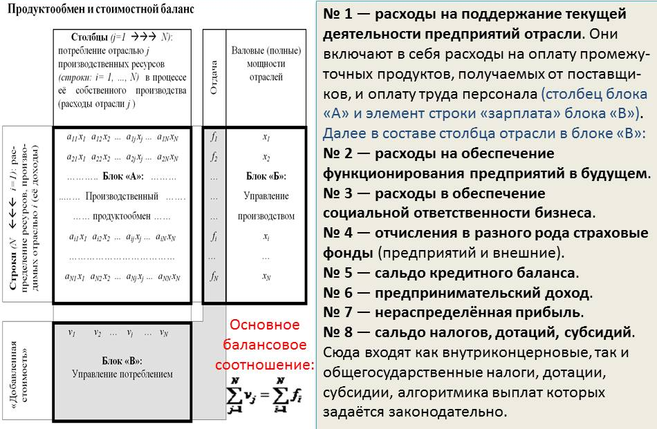
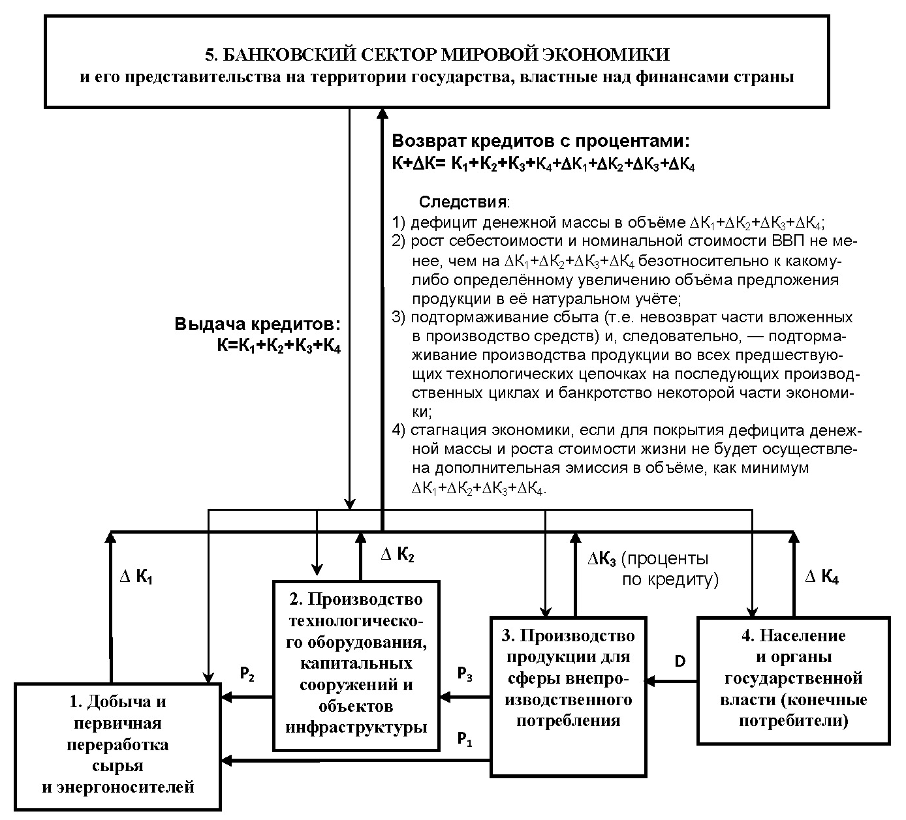

> **Первичный текст.** «Русский мир»: что стоит за этим словами в настоящем и в будущем (ч.2).
> Источник: `dotu.ru:38fc5b277207a23c.doc` sha256 `dccd0a86e5d95311…`; [страница на dotu.ru](https://dotu.ru/2022/04/13/20220413_about-russian-world-2/).
> Автоматическая транскрипция DOC→Markdown; смысл и формулировки не правились.
> Контрольные суммы и статус проверки — в [NOTICE.md](../../NOTICE.md).
> Содержание передаёт позицию авторов; утверждения не верифицированы библиотекой.

---

# 9. Каким должно быть хозяйство Русского мира

9.1. Циклика решения задач государственного управления\

в процессе общественного развития

-------------------------------------------------------

Хозяйственная система Русского мира должна устойчиво обеспечивать в преемственности поколений полное и гарантированное удовлетворение потребностей населения и потребностей политики государства в разнородной продукции и природных благах, необходимых для выработки людьми культурной состоятельности и развития общества. Эта задача отлична от задачи обеспечить *«экономический рост», исчисляемый в номиналах денежных единиц с поправкой на инфляцию,* которая свойственна либерально-рыночной экономической модели, не способной экономически обеспечить решение задач развития общества и задач политики государства.

*[В оригинальном издании здесь расположен рисунок/схема. Иллюстрация не включена в данный выпуск: ожидает визуальной и правовой проверки. Файл источника: image19.jpeg]*Ниже на рис. 9.1‑1 представлена необходимая для этого цикл постановки и решения частных управленческих задач. Хронологически преемственная последовательность таких циклов образуют циклику, которую в трёхмерном пространстве можно было бы изобразить в качестве спирали, вытянутой вдоль оси времени (соответственно, на рис. 9.1‑1 представлен только один виток этой спирали). Эта циклика не может реализовываться «сама собой» в процессе функционирования либерально-рыночной экономики, даже если в неё введены элементы государственного планирования и государственного регулирования рынков. Её реализатором может быть только полноценно суверенная государственная власть — в масштабах общества в целом, в регионах государства и на местах — потому, что в обществе ни физические, ни юридические лица не способны осуществлять эту циклику, в том числе и потому, что не обладают необходимыми полномочиями.

Реализация этой циклики подразумевает знание и ви́дение проявлений в жизни объективных закономерностей, которым подчинена жизнь людей, начиная от масштаба персонального и кончая масштабом глобально-цивилизационным. Их можно отнести к шести следующим группам:

1.  Человечество — часть биосферы, и существуют объективные закономерности, регулирующие: 1) взаимодействие биосферы и Космоса, 2) формирование биоценозов и 3) взаимодействие биологических видов друг с другом в пределах биосферы.

2.  Человечество — специфический биологический вид, и существуют специфические биологические (физиологические и психологические) видовые закономерности, регулирующие его жизнь.

3.  Существуют нравственно-этические (религиозные и *ноосферные*[^84]) закономерности, регулирующие взаимоотношения обладателей разума и воли. И вопреки мнению многих закономерности этой категории выходят за пределы человеческого общества, а этика, диктуемая с иерархически более высоких уровней в организации разного рода систем, — обязательна для иерархически низших уровней и отступление от её норм наказуемо. Соответственно отступничество от объективной праведности — главная нравственно-мировоззренческая причина глобального биосферно-социального экологического кризиса.[^85]

4.  Культура, которую генетически предопределённо несёт человечество, — вся информация и алгоритмика, передаваемая в обществе помимо генетического механизма биологического вида. Личностная культура — то, что индивид воспринял из культуры общества плюс его собственные наработки. Соответственно, культура является информационно-алгоритмической системой. Культура вариативна, в том смысле, что как информационно-алгоритмическая система, она может быть ориентирована на достижение различных целей, на различных путях жизни общества, различными средствами. И существуют социокультурные закономерности, следование которым гарантирует устойчивость общества в преемственности поколений, а их нарушение способно привести к его исчезновению в течение жизни нескольких поколений под воздействием деградационных процессов.

5.  Исторически сложившаяся культура всех обществ нынешней глобальной цивилизации такова, что мы вынуждены защищаться от природной среды техносферой. Техносфера воспроизводится и развивается в ходе хозяйственной и финансовой деятельности, и существуют финансово-экономические закономерности, предопределяющие как развитие общественно-экономических формаций, так и их деградацию и крах.

6.  Всё это в совокупности может приводить к конфликтам интересов и конфликтам разных видов деятельности, разрешением которых необходимо управлять. И существуют объективные закономерности управления, единые для всех процессов управления, будь то езда малыша на трёхколёсном велосипеде либо комплексный проект, осуществляемый несколькими государствами на принципах частно-государственного партнёрства.

Оспаривать существование и действие в жизни объективных закономерностей в отношении людей, убеждать себя и других в их непознаваемости или в необязательности их знания для выработки и осуществления политики — полная интеллектуальная несостоятельность либо мошенничество[^86].

Без знания и ви́дения в жизни проявлений этих закономерностей и соответствующего государственного управления (в том числе и экономическим обеспечением общественного развития и иных задач политики государства) государственность и общество обречены на *деградацию, которая носит управляемый извне характер в условиях глобализации, реально являющейся гибридной войной заправил «коллективного Запада» за безраздельное мировое господство и уничтожение с ним несогласных*.

И следует признать, что в России ни в школьных учебниках «обществознания», ни в вузовских учебниках социологии об этих закономерностях и их проявлении в жизни не сказано ничего, а учебники политологии не говорят о том, как строить политику, опираясь на поддержку действия этих закономерностей. С одной стороны, это — показатель неспособности общества к осуществлению суверенитета в его полноте, а с другой стороны это же приводит к проблематике так называемой «гибридной войны».

- Суть агрессии в гибридной войне — так или иначе, теми или иными способами и средствами принудить жертву агрессии к нарушению каких-то объективных закономерностей, вследствие чего жертва агрессии потерпит ущерб вплоть до самоликвидации государства и самогеноцида его населения.

- Суть защиты от агрессии в гибридной войне —

<!-- -->

- не нарушать объективные закономерности в ущерб себе,

- просвещать агрессора, чтобы он либо перестал быть агрессором, либо самоликвидировался под воздействием объективных закономерностей, главным образом религиозно-ноосферной группы.

Знание этих объективных закономерностей и ви́дение их проявлений в жизни, является основой для разграничения процессов общественного развития и деградационных процессов в жизни общества.

И потому:

Давно уже следовало изложить закономерности всех шести групп в теории гибридной войны и ввести теорию гибридной войны в учебные программы всех военных училищ, учебных заведений «спецведомств» и в учебные программы подготовки управленцев для сфер экономики и государственного управления.

9.2. Управление экономическим обеспечением\

общественного развития и политики государства

---------------------------------------------

### 9.2.1. Целеполагание в экономической политике государства

Целеполагание — важнейший этап в управлении, определяющий в дальнейшем многое, поскольку ошибки в целеполагании не всегда устранимы на последующих этапах управления. Жизненно несостоятельное целеполагание — причина (источник) многих управленческих неудач и проблем, вплоть до полного краха управления и гибели объектов управления. Поэтому целеполагание должно быть научно обоснованным, а равно жизненно состоятельным, т.е. должно лежать в пределах объективно наличествующих возможностей: 1) задаваемых объективными закономерностями всех шести групп и 2) субъективно освоенных средств достижения намечаемых целей в пределах выявленных субъектом-управленцем объективных возможностей (т.е. за исключением иллюзорных возможностей, заведомо не осуществимых, но успешно нарисованных ошибочным субъективизмом).

Развитие общества предполагает обеспечение устойчивости биоценозов, разработку и осуществление демографической политики, которая обеспечит: 1) максимальную биосферно допустимую численность населения в регионах и *2) культурную состоятельность населения, т.е. его способность профилактировать «вызовы времени» и жизненно состоятельно отвечать на них*. И то, и другое нуждается в экономическом обеспечении. В аспекте управления хозяйством страны это означает, что должна реализовываться циклика постановки и решения управленческих задач, представленная на рис. 9.1‑1 в разделе 9.1, и в её русле должно осуществляться целеполагание в аспектах:

1.  Определения и задания номенклатуры продукции и природных благ, потребление которых необходимо для общественного развития и решения задач государственной политики;

2.  Назначения минимально необходимых и максимально допустимых объёмов производства и потребления продукции и природных благ в соответствии с заданной по п. 1 номенклатурой продукции и природных благ;

3.  Развития организационно-технологической производственной базы общества в соответствии с задачами экономического обеспечения общественного развития и политики государства.

Целеполагание в отношении экономического обеспечения общественного развития должно осуществляться исходя из знания объективных закономерностей, о которых речь шла в разделе 9.1. Статистики, описывающие биосферно-социально-экономические явления, их динамику и их взаимосвязи, объективно существуют и обладают собственными характеристиками изменчивости во времени, обусловленными сменой поколений, изменением природы и культуры. Их надо выявлять и осмысленно к ним относиться. Поэтому вне зависимости от мнений, побеждающих в спорах о нравах, выявление статистических показателей и статистический анализ причинно-следственных связей в системе отношений:

*[В оригинальном издании здесь расположен рисунок/схема. Иллюстрация не включена в данный выпуск: ожидает визуальной и правовой проверки. Файл источника: image20.wmf]*

позволяет объективно выделить всем и без того известные вредоносные факторы: алкоголь, прочие наркотики и яды, разрушающие психику; половые извращения; профессиональный спорт[^87]; чрезмерность (т.е. недостаточность либо избыточность) потребления самих по себе невредных продуктов и услуг, вследствие чего возникает вред их потребителю и (или) окружающим, потомкам, биосфере; а также выделить и факторы, ранее не осознаваемые в качестве вредоносных.

Таким образом анализ с позиций *теории управления жизнью социально-экономических систем* обязывает все потребности, порождаемые обществом, разделить на два класса:

- демографически обусловленные, удовлетворение которых безопасно и необходимо для обеспечения устойчивости общественного развития в гармонии с Природой;

- деградационно-паразитические, удовлетворение которых наносит прямо или опосредованно вред как самим потребителям, так и окружающим, потомкам, биосфере.

*[В оригинальном издании здесь расположен рисунок/схема. Иллюстрация не включена в данный выпуск: ожидает визуальной и правовой проверки. Файл источника: image21.jpeg]*Такое разделение потребностей общества на два класса не только управленчески необходимо, но и общественно полезно, поскольку является одним из факторов развития культуры, и как следствие — обеспечения безопасности общества и государства.[^88]

Демографически обусловленные потребности предсказуемы на основе биологических и социокультурных закономерностей жизни человеческого общества на десятилетия вперёд. Это обстоятельство позволяет интерпретировать их в качестве вектора целей макроэкономического управления, и обеспечить предсказуемость динамики изменения вектора целей при построении хронологически преемственной последовательности межотраслевых балансов. Для этого демографическую политику государства необходимо представить в виде «демографической волны» (это общеизвестная демографическая пирамида, положенная на бок), бегущей вдоль оси времени: см. рис. 9.2-1 (на рис. 9.1-1 в разделе 9.1 фрагмент этого рисунка представлен в правом нижнем сегменте, чтобы показать место демографической политики в циклике решения частных задач государственного управления). Прогностика в демографии строится на основе достаточно работоспособных математических моделей и потому может осуществляться с достаточной для успешной политической деятельности точностью.

Демографическая волна — это выражение демографической политики государства. Она может быть вариативна, но в каждом варианте однозначно определённа.

Важная компонента демографической волны — трудовые ресурсы, это — взрослые здоровые люди, и они должны быть культурно состоятельными, а выработка ими культурной состоятельности требует экономического обеспечения точно так же, как и обеспечение физиологических и бытовых потребностей людей и потребностей политики государства.

С демографической волной можно связать социокультурные и экономические статистики, а также и три матрицы демографически обусловленных потребностей:

- Личностных потребностей (), объёмы производства для их удовлетворения пропорциональны численности населения в определённых возрастных группах с учётом признака пола. Так, если известно, сколько малышей родилось в 0-й год, если известны статистика врождённой патологии и детской смертности, то можно оценить перспективные потребности общества в продуктах детского питания, в игрушках, в количестве мест в детских садах и школах, потребности в техническом оснащении и кадровом обеспечении их работы, и далее можно оценить все потребности на всю ожидаемую продолжительность жизни новорождённых.

- Семейных потребностей (), объёмы производства для удовлетворения которых пропорциональны численности семей каждого из типов, выявляемых социальной статистикой.

- Инфраструктурных потребностей () (включающих и потребности экономического обеспечения биосферно-экологической политики государства, которые могут быть отнесены к матрице ), объёмы производства для удовлетворения которых обусловлены природно-географическими факторами, культурными традициями, эргономическими требованиями.

Метрологически состоятельное формирование этих матриц — задача науки и Росстандарта.

В демографически обусловленных потребностях выражаются биологические специфически видовые, нравственно-этические (религиозные и ноосферные) и социокультурные закономерности, которым подчинена жизнь культурно своеобразных обществ и человечества в целом. Действие этих закономерностей, которые могут быть познаны, является объективной основой для обеспечения устойчивости социально-экономической системы в смысле предсказуемости её будущего.

Целеполагание в экономическом обеспечении иных задач государственной политики (обеспечения обороноспособности страны, разрешения экологических проблем и т.п.) должно исходить из анализа глобально-политической обстановки и глобально-биосферной обстановки.

С точки зрения теории управления устойчивая предсказуемость демографически обусловленного спектра потребностей на десятилетия вперёд и определённость иных задач государственной политики — объективное основание для того, чтобы многоотраслевая производственно-потребительская система общества была управляема и могла быть введена в исторически непродолжительные сроки (10 — 20 лет) в режим полного и гарантированного удовлетворения демографически обусловленных потребностей всех людей в преемственности поколений при решении иных задач государственной политики, так или иначе необходимых для обеспечения безопасности общественного развития. Структурно алгоритмически эта задача аналогична задаче поражения управляемым снарядом медленно маневрирующей цели, которая успешно решается с начала 1950‑х гг. в интересах обеспечения противовоздушной и противолодочной обороны. Если она не решается в области экономического обеспечения общественного развития и политики государства, то исключительно вследствие нравственной порочности и слабоумия политических «элит» и невежества общества, терпящего толпо-«элитарную» иерархию вседозволенности «высших» по отношению к «низшим». — Фраза С.В. Лаврова «дебилы, б…» многое объясняет и вне контекста той пресс-конференции в Эр-Рияде 11 августа 2015 г., после которой она стала «мемом»[^89].

### 9.2.2. Моделирование экономических процессов и планирование\

развития производственно-потребительской системы государства

Функционирование макроэкономических систем, начиная от группы предприятий до глобальной экономики, может корректно описываться балансами продуктообмена и финансового обмена на определённых интервалах времени. Динамика макроэкономических систем может описываться хронологически преемственными последовательностями балансов продуктообмена и финансового обмена.

Балансовые модели — единственные модели, которые строятся на основе реальных характеристик производства, потребления и денежного обращения, а не на основе каких-либо оценок. В силу этого они обладают особой значимостью, хотя наряду с ними могут применяться и модели, построенные на иных принципах. И соответственно балансовыми моделями разного рода необходимо научиться пользоваться в задачах экономического анализа, моделирования биосферно-социально-экономического развития, в планировании биосферно-социально-экономического развития. Но для этого необходима жизненно состоятельная интерпретация балансовых моделей.

В таблице на рисунке ниже представлена исходная балансовая модель финансового обмена в макроэкономической системе.

В ней:

- *N* — общее количество отраслей (предприятий), чья деятельность выражается в их продуктообмене и финансовом обмене *на интервале времени определённой продолжительности*.

-  — коэффициенты пропорциональности, именуемые коэффициентами прямых затрат. Коэффициент прямых затрат равен количеству продукции отрасли «», которое необходимо для производства единицы учёта выпуска продукции отрасли «» *при имеющихся технологиях, организации и культуре производства* (т.е. если некоторая часть продукции утрачивается по халатности или расхищается, то балансовые модели всё равно это учитывают через соответствующие изменения коэффициентов прямых затрат). В финансовом выражении они равны затратам отрасли «» на покупку продукции отрасли «», которые необходимы для выпуска продукции отраслью «» в объёме, стоимость которого равна платёжной единице (1 рублю, 1 доллару и т.п., т.е. чтобы выпустить собственной продукции на 1 рубль, отрасли «» необходимо купить продукции отрасли «» на сумму  рублей).

- — валовой (т.е. полный) выпуск продукции отраслью «» — потребителем продукции отрасли «».

Соответственно стоимостной баланс (который — при определённости прейскуранта, —характеризует продуктообмен при натуральном учёт продукции), представленный в таблице на рисунке выше, даёт полное представление о расходах и доходах отраслей:

- если мы идём вдоль строки блока «А», то отрасль выступает как продавец своей продукции другим отраслям, и соответственно строка показывает структуру доходов отрасли;

- если мы идём вдоль столбца блока «А», то отрасль выступает как покупатель продукции других отраслей, и соответственно столбец показывает структуру расходов отрасли.

Блок «Б» назван «Управление производством» потому, что в его столбец — вектор-столбец конечного продукта  () входит не только продукция, потребляемая обществом и государством, ради потребления которой и ведётся хозяйство, но кроме того — экспортно-импортный баланс (экспорт со знаком «+», импорт — со знаком «–») и инвестиционные продукты (средства производства), без которых производство и его развитие невозможны. Спектр производства инвестиционных продуктов в составе столбца  программирует производственные возможности в будущем.

Блок «В» назван «Управление потреблением» потому, что в него входят расходы («факторные затраты», иначе именуемые «добавленная стоимость»), которые являются основой для формирования разного рода фондов, из которых оплачивается потребление производимой продукции (семейные бюджеты персонала, фонды развития и реконструкции предприятий и через налоги — госбюджетные фонды финансирования разного рода государственных программ).

При этом для блоков «Б» и «В» выполняется балансовое соотношение: , т.е. суммарная стоимость конечного продукта (всех компонент  () столбца  в блоке «Б») в точности равна сумме всех факторных затрат  () (компонент блока «В»).

Необходимо понимать, что структура блока «В» (количество и наименование факторных затрат, отчисления по каждой из них) — не объективная данность, неподвластная людям, а задаётся законодательством государства. Иначе говоря, законодательство о хозяйственной и финансовой деятельности, задающее в том числе и структуру блока «В», должно строиться на основе управленческой интерпретации балансовых моделей[^90] с учётом целей политики государства. Поэтому законодательство о финансовой и хозяйственной деятельности необходимо регулярно целенаправленно изменять на основе анализа достижений и упущений политики и появления новых проблем, требующих экономического обеспечения и соответствующего финансирования[^91]. Но в любых вариантах политики законодательство о финансовой и хозяйственной деятельности должно обеспечивать:

- способность рыночного механизма собрать («склеить») целостную макроэкономическую систему из множества административно обособленных предприятий;

- способность макроэкономической системы государства осуществлять научно-технический прогресс, т.е. порождать инновации, воспринимать чужие инновации и реализовывать их в массово производимой продукции.

На решение именно этих задач нацелена *иерархически упорядоченная по их значимости для устойчивого функционирования макроэкономики* структура функционально обусловленных расходов предприятий (факторных затрат — № 1–№ 8), представленная на рисунке выше справа от таблицы межотраслевого баланса. Кроме того, законодательство должно задавать возможности для создания фондов разного назначения, финансируемых из факторных затрат предприятий, которые были источниками финансирования потребления благ, входящих в состав колонки  () в блоке «Б», и в деятельности которых выражалась бы «социальная ответственность бизнеса».

Индивид, который не понимает, что такое балансовые модели, не видит их связи с реальным производством, распределением и потреблением продукции и природных благ в обществе, который не в состоянии дать управленчески состоятельную интерпретацию балансовым моделям, — вообще не имеет никакого права ни обсуждать проблемы экономики государства, ни вырабатывать, ни принимать какие бы то ни было управленческие решения в области экономической политики: без освоения балансовых моделей *(включая хронологически преемственные последовательности балансов, посредством которых моделируется экономическая динамика)*, он просто не способен видеть причинно-следственные взаимосвязи во многоотраслевой производственно-потребительской системе государства и её взаимосвязи с иными сферами жизни общества и жизнью Природы, не способен предвидеть и оценивать последствия своих предложений и принимаемых к исполнению решений.

——————————

В годы второй мировой войны задачи по бомбардировке стратегической авиацией США промышленных и логистических объектов Германии ставились на основе анализа экономики Германии посредством применения балансовых моделей. На основе балансовых моделей выявлялись предприятия, которые:

- являлись поставщиками продукции для как можно большего количества других предприятий, вследствие чего уничтожение предприятий-поставщиков остановит работу предприятий-потребителей;

- являлись потребителями продукции как можно большего количества других предприятий, которые будут деградировать при отсутствии потребителей их продукции.

Так же выявлялись и логистические объекты, наиболее значимые для функционирования производственно-потребительской системы в целом, выведение которых из строя было способно парализовать множество предприятий.

Если США не в конец деградировали, то и санкции в отношении России введены не наобум, а на основе анализа балансов продуктообмена и финансового обмена в экономике России и её экспортно-импортных балансов.

Поэтому антисанкционная политика РФ не может быть эффективной, если не будет создана система моделирования и планирования экономического обеспечения политики, которая бы основывалась на управленчески состоятельных балансовых моделях.

### 9.2.3. Кредитно-финансовая система\

как инструмент государственного управления реализацией планов

Господствующая ныне в нашем обществе концепция денег окончательно сложилась в XIX веке и является порождением либерально-рыночной культуры «коллективного Запада». Из вузовского учебника экономической теории можно узнать следующее:

«Деньги — это особый товар, выступающий в роли всеобщего эквивалента стоимости всех остальных товаров и несущий следующие функции:

1) мера стоимости;

2) средство обращения[^92];

3) средство накопления или образования сокровищ;

4) средство платежа;

5) мировые деньги».

За государством либералы признают только одно отличие от других пользователей кредитно-финансовой системы: *государство имеет право на налогообложение*.

Но право эмиссии денег в либерально-рыночной экономике отторгнуто у государства и передано «центральному банку» (название может быть иным), который по своему юридическому статусу является экстерриториальным «государством в государстве» и ни за что перед государством, которое он снабжает его же якобы «национальной валютой», не отвечает.

Вследствие этого все государства с независимыми от них центробанками экономико-финансовым суверенитетом не обладают, а реальные владельцы их центробанков посредством кредитно-финансовых систем этих государств и управления курсами валютного обмена либо поддерживают, либо подавляют их экономическую и прочую политику, проводимую государствами с «независимыми» центробанками.[^93]

Это касается и России, и её центробанка.

Примером тому — повышение ставки рефинансирования центробанком РФ 28 февраля 2022 г. с целью запуска нового витка инфляции, которая ударит по реальному сектору экономики и благополучию населения, что необходимо либеральному Западу для создания в РФ массового недовольства как предпосылки к свержению «режима Путина».

Ниже представлена схема денежного обращения в государстве в условиях глобализации, которая позволяет понять, что стоит за приведёнными ранее в разделе 1 словами Д.Г. Евстафьева о предателях в российской «элите», которые постараются свести реакцию РФ на санкции «коллективного Запада» к «таргетированию инфляции» (см. сноску 2 в разделе 1).

На этой схеме источники доходов населения и государственной власти не показаны, чтобы не загромождать рисунок, а линиями со стрелками обозначена направленность финансовых потоков:

- выдача () и возврат кредитных ссуд и процентов по ним () реальным сектором, населением и органами государственной власти (соответственно индексам 1…4);

- переток доходов и накоплений населения в доходы реального сектора (*D*);

- прямые и опосредованные финансовые расходы (*Р —* соответственно индексам 1…3) тех подразделений реального сектора экономики, которые так или иначе соучаствуют в производстве конечной продукции, ради потребления и экспорта которой общество и ведёт хозяйственную деятельность (блок 3). Их доходы формируются за счёт продажи готовой продукции, а расходы, прямые и опосредованные, помимо собственных факторных затрат обусловлены ценами на потребляемые энергоносители, сырьё и промежуточные продукты (включая и средства производства) и объёмами платежей по кредитам (обслуживание долга), которые всегда относятся на себестоимость производства продукции;

- предполагается, что на интервале времени, характеризуемом схемой, эмиссия средств платежа нулевая[^94].

Анализ денежного обращения, представленного на этой схеме, на основе правил Г.Р. Кирхгофа для *процессов переноса* в сетях показывает, что ссудный процент по кредиту порождает:

- рост номинальных цен (за счёт отнесения процентов на себестоимость продукции);

- потерю некоторой доли покупательной способности вне банковского сектора (за счёт роста уровня цен и оттока платёжеспособности из общества в результате выплаты процентов по кредитам);

- подтормаживание сбыта произведённой продукции вследствие роста себестоимости и цен и оттока из общества платёжеспособности в собственность корпорации ростовщиков, что способно разрушить макроэкономическую систему, если превысит некоторые пределы (см. так же зависимость *«Объём предложения некоего природного или производимого блага — цена, обеспечивающая полный сбыт этого блага на рынке»* в разделе 8);

- деформацию производственного и потребительского спроса и предложения продукции под воздействием прироста покупательной активности корпорации ростовщиков, в чью собственность необратимо перетекают (вследствие платежей по процентам) финансы общества, и утраты части покупательной способности остальными участниками рынка на фоне роста цен;

- фиктивный рост валового внутреннего продукта (ВВП[^95]) в исчислении его в текущих ценах (если это допускает эмиссия средств платежа), хотя такому «росту» ВВП может сопутствовать сокращение объёмов производства в реальном секторе в натуральном учёте продукции и при учёте продукции в неизменных ценах какого-либо более раннего базового периода;

- социальную напряжённость, поскольку как ростовщики, так и их непосредственные должники через воздействие ссудного процента на себестоимость и доходы перекачивают в собственность корпорации ростовщиков покупательную способность и тех физических и юридических лиц, которые сами не прибегали к заимствованиям у ростовщической корпорации кредиторов, т.е. ростовщики и заёмщики обворовывают всех прочих.

И в этом воздействии ссудного процента на экономику нет разницы между «старушкой-процентщицей» времён Ф.М. Достоевского, микрокредитными организациями наших дней и всей совокупностью банков во главе с центробанками.

Т.е. если общество и, прежде всего, — политики, — признают безальтернативно необходимым кредитование под процент, то тем самым они уничтожают экономико-финансовый суверенитет государства. И Россия после краха СССР никогда не обладала и не обладает в настоящее время экономико-финансовым суверенитетом в его полноте, вследствие чего влачит существование под властью тирании глобальной мафии ростовщиков.

Соответственно кредитно-финансовая система не может быть инструментом государственного управления экономикой страны, если общество живёт под властью либерально-рыночной концепции денег в представленном в начале раздела 9.2.3 виде, либо под властью вообще не определённой по смыслу концепции денег, согласно которой «деньгами может быть всё, что общество приемлет в качестве денег» и которая идёт на смену классической либерально-рыночной концепции денег после того, как в прошлое ушли золотое обращение и золотой стандарт обеспеченности валют государств.

—————————

Пока общество пользуется деньгами, его будущее во многом определяется тем: кому? за что? в каком количестве? — платятся деньги; и кому? за что? — они не платятся либо у него отнимаются. Это касается как физических, так и юридических лиц.

Соответственно концепция денег как инструмента государственного управления производством и потреблением в жизни Русского мира, а через них — управления другими аспектами жизни, исходит из других принципов:

- Собственником кредитно-финансовой системы является государство, а все остальные участники рынка являются пользователями кредитно-финансовой системы и как её пользователи обязаны подчиняться установленным государством правилам.

- Право эмиссии средств платежа принадлежит исключительно государству.

- Поскольку объёмы производства и потребления продукции не могут быть выше, чем это позволяет энерговооружённость производственного комплекса (применяемых в нём технологий, логистики и складского хозяйства), то эмиссия средств платежа должна несколько отставать от роста энерговооружённости, что является основой для снижения цен по мере роста производства и удовлетворения потребностей общества в продукции по демографически обусловленному спектру потребностей. Иначе говоря:

<!-- -->

- в основе устойчивости финансового обращения должен лежать *«энергетический стандарт обеспеченности платёжной единицы»,* определяемый соотношением:

> *«Энергетический стандарт обеспеченности платёжной единицы» = «объём производства электроэнергии» / «объём средств платежа, находящийся в обращении».*

- эмиссионная политика должна быть направлена на наращивание энергетического стандарта обеспеченности, поскольку это является предпосылкой к прогрессирующему снижению цен по мере удовлетворения потребностей общества в продукции и природных благах при отсутствии в кредитно финансовой системе ссудного процента.

<!-- -->

- В кредитно-финансовой системе всегда находится 100 % денег и доли этих 100 % только выражаются в номиналах всех денежных сумм.

- Весь анализ и планирования финансового обращения должен проводиться в этой обезразмеренной кредитно-финансовой системе, при соотнесении 100 %-ного объёма денежной массы в ней с энерговооружённостью экономики страны, т.е. с энергетическим стандартом обеспеченности платёжной единицы.

- Поскольку ссудный процент по кредиту является первичным генератором инфляции и ведёт к подтормаживанию сбыта, то кредитование должно быть беспроцентным: банки должны получать доходы в виде оплаты банковских услуг по фиксированным тарифам и в виде доли в прибыли (а не в доходах, в выручке, в объёме продаж) предприятий реального сектора, созданных и модернизированных с привлечением их кредитных ресурсов, что должно обеспечить погашение кредитной ссуды и в течение ограниченного времени приносить некоторую прибыль банку — успешному инвестору: это сделает банки планирующими и координационными органами, устранив паразитическую компоненту из их деятельности.

- Управленческая функция цены внутри отрасли и на уровне производственно-потребительской системы государства разные.

**В пределах отрасли:**

- Цена включает в себя структуру себестоимости производства продукции (столбцы в блоках «А» и «В» в таблице межотраслевого баланса на рисунке выше) и долю прибыли, приходящуюся на единицу учёта продукции. При организации на предприятии бухгалтерского учёта, фиксирующего фактические затраты на производство продукции, бухучёт становится поставщиком информации для совершенствования продукции, технологий и организации производства. Эта роль структуры цены актуальна при постановке и решении управленческих задач как на уровне предприятия, так и на уровне макроэкономики при оценке состояния и перспектив отраслей и регионов государства, обладающих физико-географическим и культурным своеобразием.

- Кроме того, в пределах отрасли цена — финансовая мера *качества продукции, оцениваемого с точки зрения потенциального покупателя:* вы можете поднять цену на свою продукцию, сделав её выше, чем у конкурентов (конечно, в пределах платёжеспособности покупателей на соответствующем рынке), если смогли убедить[^96] потенциальных покупателей в том, что ваша продукция превосходит по качеству продукцию ваших конкурентов.

**На уровне макроэкономической системы государства функции цены:**

- финансовое выражение меры нехватки определённого вида продукции или природного блага по отношению к запросам общества как таковым;

- ограничивать запросы на потребление продукции и природных благ статистическим распределением покупательной способности в обществе.

- при объёмах предложения, достаточных для гарантированного полного удовлетворения потребностей, цена как ограничитель запросов на потребление на уровне макроэкономики утрачивает управленческую значимость (смысл) и для конечного потребителя цена на соответствующие виды продукции или природных благ должна быть нулевой.

> Эти управленческие функции цены на уровне макроэкономической системы государства соответствуют зависимости *«Объём предложения некоего природного или производимого блага — цена, обеспечивающая полный сбыт этого блага на рынке»*, представленной на рисунке в разделе 8. В соответствии с этой зависимостью прейскурант на продукцию конечного потребления полностью удовлетворяет требованиям, которые теория управления предъявляет к метрологически состоятельному вектору ошибки управления[^97], и соответственно его следует интерпретировать в качестве финансового выражения вектора ошибки самоуправления общества.

>

> Без этого понимания различия управленческих функций цены внутри отрасли и на уровне макроэкономики невозможно разрешить проблему экономического обеспечения общественного развития, порождаемую либерально-рыночной экономической моделью в её чистом виде (см. раздел 8).

- Средствами обнуления прейскуранта для конечного потребителя на потребляемые им продукцию и природные блага могут быть:

<!-- -->

- фонды общественного потребления (всё то, что государство или предприятия считают возможным предоставлять всем гражданам или своим сотрудникам бесплатно или на основе частичной оплаты),

- безусловный доход, выплачиваемый всем гражданам государством вне зависимости от получения ими прочих доходов (зарплат, пенсий, целевых пособий).

Задача обнуления прейскуранта — задача общекультурного и нравственно-этического развития общества и потому не имеет сугубо финансово-экономических решений в силу того, что работает принцип, выраженный в пословице «и рад бы в рай, да грехи не пускают».

- Средством обеспечения финансовой устойчивости отраслей и предприятий при снижении рыночных цен на их продукцию, вызванном ростом объёмов производства и объёмов предложения, должны стать дотации производителям продукции, позволяющие обеспечить рентабельность её производства в необходимых объёмах;

- Средством защиты потребителей от роста цен, обусловленного ростом номинальных доходов и неравноприоритетностью удовлетворения различных потребностей (их неравнозначностью)[^98] должны стать целевые субсидии потребителям продукции (как в сфере производства, так и в сфере потребления): в противном случае рост доходов повлечёт за собой рост цен на более высокоприоритетные виды продукции и природных благ, что сделает невозможным сбыт продукции, потребление которой необходимо для общественного развития и обеспечения культурной состоятельности вступающих в жизнь новых поколений — таковы закономерности ценообразования в либерально-рыночной экономике.

> Поскольку кредитно-финансовая система — система замкнутая (аналогично кровеносной системе), то сверхприбыли предприятий, *если они не инвестируются в проекты развития общества и государства, в выявление и разрешение проблем общества* *(а это должна допускать структура функционально обусловленных расходов предприятий, задаваемая законодательством)*, следует облагать прогрессивным налогом, что станет источником финансирования выплат дотаций и субсидий, безусловного дохода и т.п. общественно полезных выплат. Финансовая устойчивость предприятий и отраслей, регионов при этом должна обеспечиваться структурой функционально обусловленных расходов предприятий (см. правую колонку на рисунке в разделе 9.2.2), которая должна задаваться законодательством о хозяйственной и финансовой деятельности, учитывать специфику отраслей и регионов и предоставлять министерству экономического развития инструментарий для управления порогами рентабельности в отраслях и регионах в русле государственного плана биосферно-социально-экономического развития.

- Межотраслевая конкуренция за прибыль и конкуренция регионов за прибыль в пределах любой отрасли должны подавляться средствами налогово-дотационной политики, поскольку оба этих вида конкуренции разрушают функциональную целостность народного хозяйства. Внутриотраслевая конкуренция идей и культуры производства, выражающаяся в более высоких прибылях, должна поощряться.

Весь финансовый инструментарий государственного управления экономическим обеспечением общественного развития и политики государства (налоги, дотации, субсидии, кредитная и страховая политика) предназначен для настройки рыночного механизма на решение производственно-потребительских задач в русле государственного плана биосферно-социально-экономического развития, разрабатываемого на основе знания объективных закономерностей всех шести групп в русле циклики постановки и решения частных задач, о чём было сказано в разделе 9.1. Т.е. план и рынок — не альтернативы друг другу: рыночный механизм — одно из средств реализации государственных планов биосферно-социально-экономического развития.

- Кредитно-финансовая система должна быть трёхконтурной:

<!-- -->

- Один контур должен обслуживать сферу конечного потребления продукции и природных благ населением.

- Второй контур должен обслуживать производственный продуктообмен в реальном секторе и финансовую деятельность государственного аппарата.

- Третий контур должен обслуживать внешнюю торговлю.

> Правила перетока средств платежа из одного контура в другие должны устанавливаться государством соответственно целям глобальной, внешней и внутренней политики государства.

- Спекулятивные рынки с точки зрения теории управления порождают собственные шумы системы, снижающие качество управления и нарушающие устойчивость её функционирования, и потому должны подавляться. Биржи должны работать не в режиме паразитического извлечения доходов из спекуляций, а в режиме установления и координации организационно-технологических связей предприятий реального сектора.

[^84]: В 1920‑е — 1930-е гг. Владимиром Ивановичем Вернадским (1863–1945) и Пьером Тейяром де Шарденом (1881–1955) была высказана идея ноосферы — «сферы разума» планеты Земля, регулирующей всё, что происходит на планете, в русле объемлющих жизнь планеты общекосмических закономерностей. Иначе говоря, выразив концепциею ноосферы, они подтвердили, что пророки и святые всех конфессий не бредили, а имели дело с теми аспектами объективной реальности, на которые другие не обращали внимания.

    Если же говорить об отечественной истории, то едва ли не единственное более или менее широко известное произведение, в котором отдана дань идее ноосферы и читателю даётся представление о её роли в жизни цивилизации, — социально-философский роман «Час быка» Ивана Антоновича Ефремова (1907–1972), оказавший своё воздействие на формирование некоторой части ныне активных поколений. В нём И.А. Ефремов пишет как об уже достигнутом нашими потомками результате: *«Очистка ноосферы от лжи, садизма, маниакально-злобных идей стоила огромных трудов человечеству Земли».* При этом в одном из мест романа он подчёркивает: **О ноосфере надо заботиться больше, чем об атмосфере.** И это — действительно то, чем необходимо заниматься.

    В аспекте физики ноосфера Земли — её полевая система, в которой есть сегмент, порождаемый биологическим видом Человек разумный. Ноосфера несёт информацию и алгоритмику управления, которая является высшей по отношению к индивидуально-человеческой, что выражается в статистике успешности / неуспешности деятельности людей как по одиночке, так и коллективной, что обусловлено реальной, а не декларируемой нравственностью людей.

[^85]: А сам кризис, если исходить из методологии теории управления, — замыкание на человечество подавляюще-сдерживающих обратных связей, что должно интерпретироваться как «намёк» иерархически высшего управления людям на необходимость строить жизнь в соответствии с объективными закономерностями бытия.

[^86]: Но одна из проблем исторически реально протекающей глобализации в том, что и в Талмуде, и в каббалистической литературе отсутствует освещение этой проблематики. Это одна из причин, под воздействием которой глобализация, проводимая заправилами «коллективного Запада», привела человечество на грань катастрофы, а проекты профилактирования катастрофы (в частности, «мраксизм») не сработали.

[^87]: «Счастлив тот, кто не знает скуки, кому совершенно незнакомо вино, карты, табак, всевозможные развращающие развлечения и спорт» — П.Ф. Лесгафт (1837–1909) — тот самый, именем которого назван Национальный государственный Университет физической культуры, спорта и здоровья. Ещё в XIX — начале ХХ века он видел различие массовой физической культуры и спорта как в воздействии на подрастающие поколения, так и в воздействии на жизнь общества. В России же наших дней массовая физкультура реально уничтожена, а профессиональный спорт процветает как отрасль вредоносного шоу-бизнеса.

[^88]: «В апреле (2014 г.: наше пояснение при цитировании) Евросоюз подвел итоговые данные по ВВП стран-членов. В данные включается и нелегальная деятельность, такая как проституция и торговля наркотиками. К примеру, ВВП Великобритании эти отрасли добавили около 10 млрд. фунтов стерлингов, подсчитали в британском Бюро статистики. Из них 3 млрд. фунтов стерлингов в год — проституция, а 7 млрд. фунтов — наркоторговля.

    Евросоюз собирает цифры в обязательном порядке — для сравнения экономических показателей разных стран, поскольку в ряде них в той или иной степени легализованы проституция и наркоторговля. Брюссель объясняет, что однородные данные по странам необходимы для распределения бюджета. Ранее это предписание игнорировалось, но с 2013 года руководство [ЕС](http://www.gazeta.ru/tags/evropeiskii_soyuz.shtml) потребовало его исполнения. С учетом этих отраслей ВВП Греции может увеличиться сразу на 2 %.

    Конкретных данных по странам нет, Европейское статистическое агентство они не интересуют. «Теневая деятельность — это всего лишь один из пунктов при составлении национальных отчетов, — ответили «Газете.Ru» в Евростате. — При проверке полноты национальных отчетов государств-членов, Евростат обращает внимание на наличие данных по теневой экономике, но не по отдельным её статьям» («Проститутки завели Европу. Проститутки и наркоторговля внесены в подсчет ВВП Евросоюза». — Газета.ru, 04.05.2014. — Интернет-ресурс: <http://www.gazeta.ru/business/2014/04/18/5997165.shtml>).

    **Спрашивается**: Что в результате включения в состав ВВП проституции и наркоторговли, повысившего ВВП Греции сразу на 2 %, финансово-экономический кризис в Греции стал менее острым и качество жизни подавляющего большинства её населения выросло? а для дальнейшего роста благосостояния населения Греции и подъёма её до уровня ФРГ и Швеции надо наращивать темпы проста проституции и наркоторговли? — Либо всё же следует признать, что включение в состав ВВП проституции и наркоторговли, показателей спекулятивного сектора экономики и некоторых других сфер жизни общества — выражение идиотизма одних, которым прикрывается вредительство других? — уже на протяжении нескольких столетий (если не больше) идиоты, действующие в политике, не бывают бесхозными.

[^89]: Тема «Почему по карьерной лестнице в толпо-«элитарных» культурах в первую очередь продвигаются дебилы и люди, умеющие «включать дурака» при исполнении должностных обязанностей» будет затронута в разделе 9.4 при рассмотрении либерального мифа о «неэффективности» государственной собственности на средства производства и превосходстве частного собственника-предпринимателя.

[^90]: Включая и динамические балансовые модели, позволяющие анализировать и моделировать финансово-экономическую деятельность на длительных интервалах времени.

[^91]: Однако, в России к этому неспособны ни депутаты Госдумы (они вообще не знают теории управления и не знают, что такое балансовые модели), ни представители господствующих школ экономической науки, «заточенной» на обслуживание либерально-рыночной экономической модели, которые консультируют по вопросам экономики и финансов депутатов и чиновников разного уровня, а главное — готовят кадры управленцев будущего.

[^92]: Обращение денег кроме сопровождения торговли также включает в себя: 1) акты их дарения и 2) платежи, не связанные со сделками купли-продажи, в которых деньги выступают в качестве средства платежа.

[^93]: Это ещё одни пример того, что некомпетентность и глупость в политике не бывают бесхозными.

[^94]: Либо кредитно-финансовая система — обезразмеренная путём деления всех номинальных денежных сумм на совокупный объём денежной массы, который включает в себя эмитированную денежную массу плюс объём всех выданных и не погашенных кредитных ссуд без учёта процентов.

    В обезразмеренной таким образом кредитно-финансовой системе объём денежной массы всегда равен 1 либо 100 %, и доли этих 100 % только выражаются в номиналах. Эмиссия в обезразмеренной таким образом кредитно-финансовой системе невозможна, а весь бухучёт ведётся в долях от этих 100 %, соответствующих номинальным денежным суммам.

    Эмиссии или изъятию из обращения денежной массы, происходящим в номинированной кредитно-финансовой системе, в обезразмеренной кредитно-финансовой системе соответствует некоторое перераспределение платёжеспособности между её пользователями.

[^95]: В таблице межотраслевого баланса, представленной в разделе 9.2.2, ВВП — стоимость всех компонент столбца  в блоке «Б».

[^96]: Т.е. реального превосходства в качестве может не быть, либо оно может быть, но потенциальный покупатель может ошибаться в своих оценках качества продукции и отдать предпочтение, например красивой упаковке, а не самой продукции, либо оценивать продукцию по каким-то реально малозначимым признакам.

[^97]: Компоненты вектора ошибки растут по абсолютной величине при удалении процесса от идеального режима и целей управления и уменьшаются по абсолютной величине при приближении процесса управления к идеалу и целям управления.

[^98]: Платежеспособный спрос «преломляется», как свет через призму, через «пирамиду Маслоу» и перестаёт быть равномерно распределённым по специализированным рынкам.

    «Пирамида Маслоу» — название социологической закономерности, согласно которой потребности людей неравнозначны, вследствие чего формируется иерархия их удовлетворения и улучшения характеристик потребления по каждой позиции в иерархии. В основной статистической массе населения значимость удовлетворения потребностей убывает в порядке: пища и вода, одежда, жилище, потребности досуга, потребности личностного развития.

    Предложенная А. Маслоу иерархия потребностей — не первая в истории, и фактически она просто дополняет и детализирует иерархию потребностей, известную издревле: «Главная потребность для жизни — вода и хлеб, и одежда и дом, прикрывающий наготу» (Библия, Сирах, 29:24). Иерархия А. Маслоу детализирует иерархию книги Сираха большей частью в социокультурных аспектах, не связанных с удовлетворением физиологических и бытовых потребностей.
---

[К произведению](README.md) · [Каталог](../../CATALOG.md)
