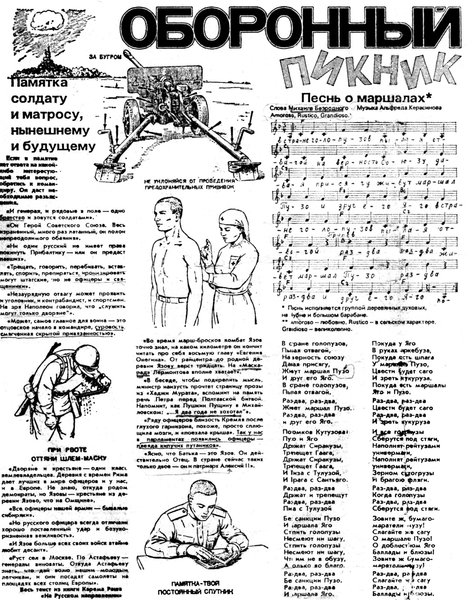
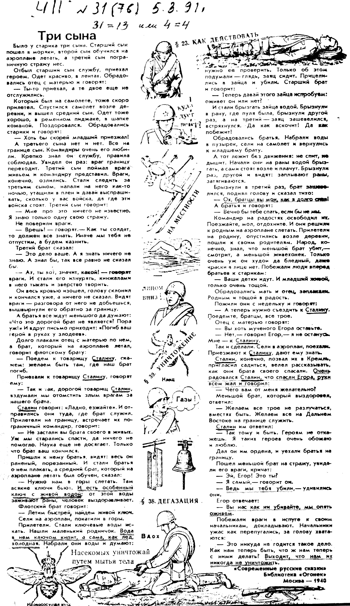
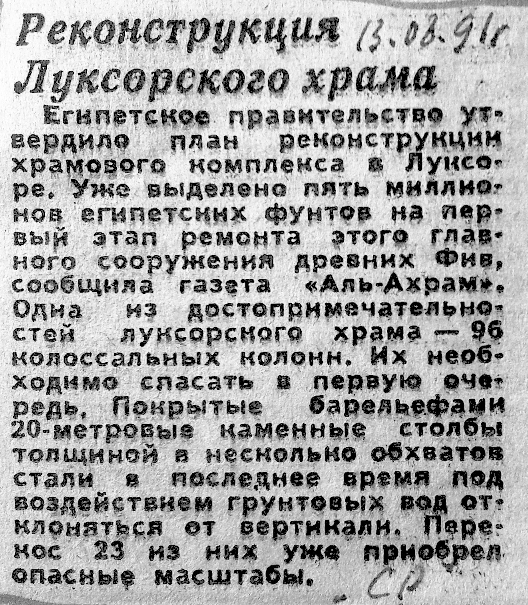
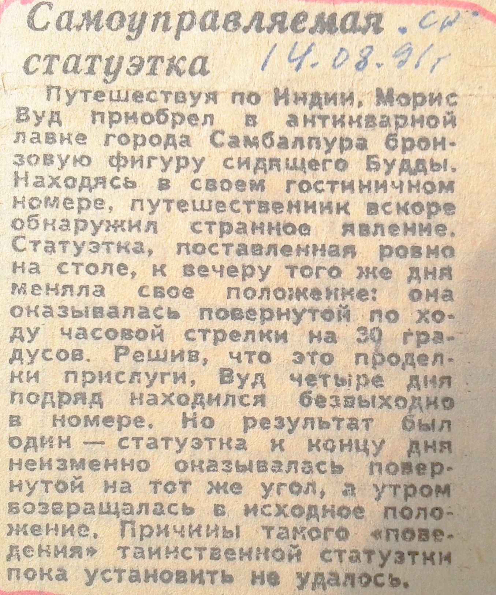

> **Первичный текст.** Случайные совпадения — либо не случайные…, 2013-07-04.
> Источник: `20130704 Случайные совпадения — либо не случайные….doc` sha256 `f6b208c712761e9e…`; [страница на dotu.ru](https://dotu.ru/2013/07/04/coincidence/).
> Автоматическая транскрипция DOC→Markdown; смысл и формулировки не правились.
> Контрольные суммы и статус проверки — в [NOTICE.md](../../NOTICE.md).
> Содержание передаёт позицию авторов; утверждения не верифицированы библиотекой.

---

Аналитическая записка

# Случайные совпадения? — либо не случайные…

Сначала только факты.

1\. 22 года назад 24 июня 1991 года, в день Иоаннова масонства в ленинградской газете «Час пик» № 25 (70) на последней странице была напечатана серия картинок (всего 5) под общим названием «Исторический пикник».

*[В оригинальном издании здесь расположен рисунок/схема. Иллюстрация не включена в данный выпуск: ожидает визуальной и правовой проверки. Файл источника: image1.jpeg]*Из рисунка видно, что речь в нем, возможно, идёт об оповещении кем-то и кого-то о событии, которое будет проходить в Москве в течение 5 дней. Спустя 2 месяца весь мир наблюдал карикатурный либеральный путч в Москве, который проходил 4 дня — с 19 по 22 августа 1991 года, но как потом стало известно, реально путч проходил 5 дней — с 18 по 22 августа. И хотя жертв со стороны либералов было немного (всего трое — и все были посмертно удостоены звания Героя России), тем не менее, последствия этих событий ощущаются и два десятилетия спустя — в России и во всём мире. Через четыре месяца после этого либерального карикатурного путча рухнула вторая держава мира — Советский Союз.

*[В оригинальном издании здесь расположены иллюстрации (2 объекта). Иллюстрации опущены: см. реестр графического слоя работы.]* <!-- figs:случайные-совпадения-либо-не-случайные--unbound-image2,случайные-совпадения-либо-не-случайные--unbound-image3 -->

2\. За две недели до этого «путча», т.е. 5 августа 1991 года — в этой же газете «Час пик» № 31(76) на последней странице появилась ещё серия рисунков под общим названием «Оборонный пикник».

Снова, как и 24 июня 1991 г., 5 августа 1991 г. некто оповещал кого-то рисунками и текстом о предстоящем событии, которое будет происходить в России в течение 13 дней. Об этом событии — государственном перевороте в Москве — весь мир узнал только два года спустя — осенью 1993 г. Противостояние законодательной и исполнительной власти (Верховного Совета РФ и президента РФ соответственно) началось 20 сентября и закончилось 3 октября 1993 г. после того, как Белый дом (ныне здание Правительства РФ), был окружён и расстрелян из танковых пушек по указанию первого либерального президента РФ — Б.Н.Ельцина. Государственный переворот длился 13 дней, и жертв на этот раз со стороны тех, кто оборонял законодательную власть РФ, было намного больше, чем за 4 дня карикатурного путча два года назад, а награды получили те вояки МО и МВД, которые приняли активное участие в расстреле Верховного Совета РСФСР[^1].

3\. И хотя трагические события тех дней подробно описаны в мистико-философском политическом детективе «Последний гамбит» (автор В.В.Пчеловод), мы решили к ним вернуться ещё раз, поскольку не все факты того времени были освещены, но главное — сегодня появились новые факты, которые на ассоциативном уровне можно соотнести с фактами июня — августа 1991 г. и при этом появляется возможность прийти к новым — более определённым выводам.

Так 22 года спустя и снова — в день Иоаннова масонства — 24 июня 2013 года на сайте Newsru.com появилось такое сообщение:

«Небольшая статуя бога Осириса, сделанная в Египте примерно в 1800 году до нашей эры, поставила в тупик сотрудников Манчестерского музея, где она выставлена, после того, как самостоятельно сделала поворот на 180 градусов. Передвижения стоящего в стеклянной витрине древнего экспоната были записаны камерами наблюдения, при этом на ролике видно, что к статуэтке никто не прикасается».[^2]

Это заставляет вспомнить ещё некоторые события 1991 г. В августе 1991 года газета «Советская Россия» (в полосе «Интеркурьер) в течение двух дней дала два странных сообщения, которые на первый взгляд никак меж собой не связаны.

13 августа — «Реконструкция Луксорского храма»:

«Египетское правительство утвердило план реконструкции храмового комплекса в Луксоре. Уже выделено пять миллионов египетских фунтов на первый этап ремонта этого главного сооружения древних Фив, сообщила газета «Аль-Ахрам». Одно из достопримечательностей луксорского храма 96 колоссальных колонн. Их необходимо спасать в первую очередь. Покрытые барельефами 20-ти метровые каменные столбы толщиной в несколько обхватов стали в последнее время под воздействием грунтовых вод отклоняться от вертикали. Перекос 23-х из них уже приобрёл опасные масштабы».

14 августа — «Самоуправляемая статуэтка»:

«Путешествуя по Индии Морис Вуд приобрёл в антикварной лавке города Самбалпура бронзовую фигурку сидящего Будды. Находясь в своём гостиничном номере, путешественник вскоре обнаружил странное явление. Статуэтка, поставленная ровно на столе, к вечеру того же дня меняла своё положение: она оказывалась повёрнутой по ходу часовой стрелки на 30 градусов. Решив, что это проделки прислуги, Вуд **четыре дня подряд находился безвыходно в номере**. Но результат был один — статуэтка к концу дня неизменно оказывалась повёрнутой на тот же угол, а утром возвращалась в исходное положение. Причины такого «поведения» таинственной статуэтки пока установить не удалось».

Конечно, всё это можно отнести к случайным совпадениям, но… не слишком ли много случайностей?

Вуд четыре дня не выходил из номера и наблюдал за странной статуэткой: он что — не спал 4 суток подряд? Информация об этом незначительном событии (мало ли иностранцев путешествует по Индии) попадает в «Советскую Россию» в полосу «Интеркурьер».

И ровно через 4 дня, т.е. 18 августа 1991 года, согласно сценарию, данному в картинках «Исторического пикника» 24 июня — в день Иоаннова масонства, начинается театральный путч в Москве, в результате которого уничтожается великая держава мира — СССР. И хотя в этом сообщении речь идёт о статуэтке Будды и само событие происходит в Индии, но ровно за сутки этому сообщению предшествует сообщение о ремонте храмового комплекса Луксора в Египте, который расположен в южной столице древнего Египта — Фивах, где обитали 11 иерофантов — правителей Южного Египта (11 иерофантов — правителей Северного Египта обитали в Мемфисе — ныне Каир). То есть древним Египтом управляли 22 иерофанта (в переводе с греческого — знающие будущее). Об их деятельности кое-какое представление дают картинки «Исторического пикника», а «перекос» этой деятельности зафиксирован на 23 колоннах храмового комплекса в Луксоре.

4\. И вот спустя 22 года (снова в день Иоаннова масонства) — сообщение ещё об одной «самоуправляемой статуэтке». На этот раз речь идёт не о бронзовой статуэтке Будды, а о каменной статуэтке древнеегипетского бога Осириса, и странное событие (почему-то в обоих случаях отмеченное СМИ) происходит не в отеле индийского города Самбалапур — в номере английского путешественника Вуда, — а в музее английского города Манчестер, однако, если внимательно читать три сообщения (два — августа 1991 г., и одно — июня 2013), а также ещё более внимательно смотреть видеоролик камер наблюдения манчестерского музея, то можно понять, что речь может идти об оповещении кого-то в неизвестной обществу системе кодирования информации.

Что же хотят донести до посвященных в нечто авторы этих сообщений?

5\. «Многие вещи нам непонятны не потому, что наши понятия слабы, а потому что сии вещи не входят в круг наших понятий», — Козьма Прутков.

Отсюда все эти странные сообщения и дальнейшие комментарии к ним, для тех, в круг которых не входят такие понятия, как Полная функция управления (далее ПФУ) и бесструктурное управление, — информационно пустые, ибо информация сгружается не в пустоту, а в определённую систему стереотипов. Если в безсознательном индивида нет стереотипов для восприятия такой информации, то для него не существует и самой информации. Но на неё обязательно обратят внимание только те, кого она непосредственно касается. И не просто обратят внимание, но и будут действовать так, как будто получили директивно-адресное указание по поводу того, как действовать в той или иной ситуации. Перед такой системой кодирования и подачи информации в открытых СМИ все принятые в обществе системы защиты информации, основанные на грифах «секретно», «совершенно секретно» и «особой важности» — просто игры детей в песочнице. Поэтому появление в московском аэропорту «Шереметьево» агента-отступника ЦРУ Сноудена (в этой системе кодирования) кое для кого — куда более значимая информация, чем все «секреты», которые он привёз с собой в Россию. При этом снова случайное совпадение? — Сноуден — один из персонажей романа американского писателя Джозефа Хеллера «Уловка 22»[^3] (см.: <http://lib.ru/INPROZ/HELLER/catch22.txt>), из которого можно понять, что США живут под властью этой «уловки», номер которой почему-то совпадает с количеством древнеегипетских иерофантов.

А все комментарии к этому событию в различных газетах и на многочисленных сайтах с предложениями руководству страны (отправить в США, чтобы не портить отношения с «друзьями»-амерами; дать политическое убежище одиночке-герою Сноудену в России и утереть нос амерам) — пустой, безсодержательный и ни к чему не обязывающий трёп. Почему? Потому, что те, кого эта информация непосредственно касается, уже знают, что делать и делают. Для них само появление Сноудена в России 23 июня 2013 года, т.е. за день до сообщения о самоуправляемой статуэтке в манчестерском музее, накануне дня Иоаннова масонства, — тоже информация — своеобразное бесструктурное указание о том, что надо делать. А содержание самого сообщения — информация о том, почему это надо делать.

6\. В сообщении говорится, что статуэтка бога Осириса была изготовлена за 1800 лет до новой эры, и поворачивается она днём ровно на 180 градусов. Обычно, когда речь идёт о датах многовековой давности, они даются не арабскими, а римскими цифрами (статуэтка бога Осириса была изготовлена в XVIII веке до новой эры). Но следует помнить, что мы имеем дело с системой кодирования информации, в которой всякое несоответствие с обычной подачей информации играет особую роль — она заставляет читателя обращать внимание не только на содержание, но и на форму подачи информации. Чтобы понять, о чём в данном контексте может идти речь, рассмотрим вторую картинку «Исторического пикника», на которой изображена дельта Нила, несуществующий рукав которого со странным названием «Ниловна», отклоняется от основного русла примерно на 30 градусов. И снова бросается в глаза несоответствие обозначения угла от общепринятого: надпись на картинке сделана не арабскими, как это принято, а римскими цифрами — XVIII градусов. В сообщении 14 августа 1991 года статуэтка Будды поворачивается на 30 градусов **по часовой стрелке**, т.е. **вправо**. А в информации из манчестерского музея 24 июня 2013 года говорится о повороте статуэтки Осириса на 180 градусов, но в какую сторону поворачивается статуэтка, не сообщается. Если внимательно просмотреть видеоролик по данной сноске <http://newsru.com/world/24jun2013/statue.html>., то хорошо видно, что статуэтка бога Осириса поворачивается **против часовой стрелки**, т.е. **влево**.

**Вот теперь можно подвести некоторые итоги.**

Сообщения поступают в определённой системе кодирования информации из источника, который каким-то образом связан с древнеегипетскими иерофантами. Если в июне и августе 1991 года шли предупреждения о возможности правого переворота в России — от левого псевдосоциализма к правому либерально-буржуазному капитализму, который однако строить никто по существу не должен (поворот в право только на 30 градусов), то спустя 22 года, речь может идти о левом повороте на 180 градусов, но на этот раз не только России, но и всего мира.

О том, что буржуазный либерализм с его ненасытным потреблятством был приговорён кураторами библейской концепции к ликвидации ещё в начале XIX века, ВП СССР писал, и не раз, в своих книгах и аналитических записках.

Воплощение марксистского проекта толпо-«элитарного» псевдосоциализма после октябрьского переворота в России в 1917 г. началось с попыток уничтожения института семьи и освобождения от уголовного преследования в отношении половых извращенцев — пидорасов.

И.В.Сталин, заблокировал реализацию марксистского проекта в России, уничтожив руководство троцкистов и самого Л.Д.Троцкого, и восстановил статью об уголовном преследовании пидорасов в СССР. Либерал-буржуи, придя к власти в 1991 году, эту статью из уголовного кодекса СССР снова убрали.

После второй мировой войны заправилы глобального библейского проекта изменили тактику ликвидации буржуазного либерализма на планете: сначала они дали возможность развитым странам Европы и Америки чуть-чуть полеветь, т.е. построить что-то вроде советского псевдосоциализма, но качеством (в смысле социального обеспечения) повыше, чем в СССР, после чего начали активно навязывать глобальный пидорасинг на всей планете, т.е. разрушать институт семьи — фундамент любого (в том числе буржуазного) общества. Насколько у них это получается, каждый может судить из сообщений СМИ и по жизни. В нашем понимании любая лживая политика — хоть «правого», хоть «левого» толков — обречена на «сопутствующие эффекты», обесценивающие достигаемые ею результаты вплоть до обретения ими противоположного качества.

Внутренний Предиктор СССР

01 — 03 июля 2013 г.

[^1]: За это только МВД представило к награде 3,5 тысячи человек (Агафьин А. Отморозки в погонах//Дуэль. 1999. 2 ноября). Фамилии некоторых «героев октября» можно найти в списках награждённых на страницах «Российской газеты» за 8 октября 1993 г. За участие в расстреле «Белого дома» все офицеры 119-го парашютно-десантного полка были обеспечены квартирами (Иванов И. Анафема. С. 238). (<http://www.uhlib.ru/istorija/1993_rasstrel_belogo_doma/p8.php>).

[^2]: <http://newsru.com/world/24jun2013/statue.html>.

[^3]: В романе Хеллера бортстрелок Сноуден погиб — истёк кровью в бомбардировщике Б-25 в результате ранения, полученного во время выполнения боевого задания
---

[К произведению](README.md) · [Каталог](../../CATALOG.md)
