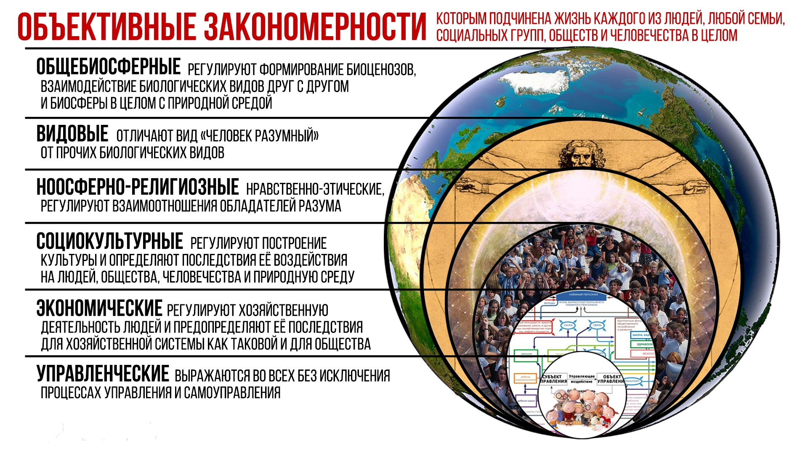

> **Первичный текст.** Тупик европейской медицинской традиции и потребность общества в оздоровлении и здравоохранении (ч.1).
> Источник: `dotu.ru:d050182d937def33.doc` sha256 `761391c13d143c72…`; [страница на dotu.ru](https://dotu.ru/2021/07/13/20210713_dead-end-of-european-medical-tradition_1/).
> Автоматическая транскрипция DOC→Markdown; смысл и формулировки не правились.
> Контрольные суммы и статус проверки — в [NOTICE.md](../../NOTICE.md).
> Содержание передаёт позицию авторов; утверждения не верифицированы библиотекой.

---

# 3. «Гибридная война»: что это такое?

Настоящий раздел представляет собой выдержку из раздела 21.2 работы ВП СССР «Основы социологии» (т. 6), поясняющую феномен «гибридной войны» — войны за безраздельное мировое господство, осуществляемой методом «культурного сотрудничества»[^43]. Далее выдержка приводится со всеми сносками и ссылками на другие разделы шеститомника «Основы социологии».

Одно из пояснений термина «гибридная война»:

«Гибридная война — новое понятие в политической жизни планеты. Впервые появилось в военных документах США и Великобритании в начале ХХI века. Означает **подчинение определённой территории с помощью информационных, электронных, кибернетических операций, в сочетании с действиями вооруженных сил, специальных служб и интенсивным экономическим давлением**. Наиболее полно определение «Гибридной войны» дано в предисловии «Military Balance 2015» — ежегодного издания Лондонского Международного института стратегических исследований: «Использование военных и невоенных инструментов в интегрированной кампании, направленной на достижение внезапности, захват инициативы и получение психологических преимуществ, используемых в дипломатических действиях; масштабные и стремительные информационные, электронные и кибероперации; прикрытие и сокрытие военных и разведывательных действий; в сочетании с экономическим давлением»[^44].

Т.е. термин «гибридная война» подразумевает войну, в которой военные действия ведутся посредством всего, что может нанести тот или иной ущерб противнику и позволяет достичь определённых целей как в отношении противника, так и в отношении изменения своего собственного положения в системе глобально-политических отношений[^45]. Иначе говоря, этот термин обозначает войну, ведущуюся посредством всех шести приоритетов обобщённых средств управления / оружия (см. раздел 8.5 настоящего курса — том 2), однако все пояснения термина «гибридная война» не называют их в прямой форме и не дают представления об их иерархии и взаимосвязях. Это умолчание-недомыслие является следствием определённых бессознательно-психологических запретов, формируемых культурой Запада, на понимание полной функции управления, путей и способов её реализации *в отношении культурно своеобразных обществ и человечества в целом,* а также — и следствием разного рода юридических запретов на обращение к изучению и переосмыслению той или иной проблематики в жизни общества[^46]. И такого рода бессознательно-психологические и юридические запреты сами являются результатом и инструментом ведения «гибридной войны» как и массовый идиотизм[^47] политиков в государствах жертвах агрессии, который расширяет возможности применения принципа *«каждый в меру понимания работает на себя, а в меру разницы в понимании — на понимающих больше»*.

- Анализ возникновения и течения «гибридных войн» следует начинать с выявления как можно более полной совокупности процессов в жизни общества, что позволяет выявить тенденции их развития и, на основе прогностики развития тенденций — выявить цели, к которым ведут протекающие как бы сами собой социальные процессы (т.е. можно выявить объективный вектор целей, который может весьма отличаться от декларируемого политиками — см. ДОТУ).

- После выявления целей войны можно выявить субъектов целеполагания, которые, однако, могут быть не самостоятельными субъектами, а периферией хозяев войны — ретрансляторами-задатчиками целей, для достижения которых ведётся «гибридная война»[^48].

- Далее протекающие процессы следует соотнести с объективными закономерностями всех шести групп[^49] (см. рис. выше), которым подчинена жизнь людей и культурно своеобразных обществ, что позволяет выявить обобщённые средства ведения войны всех шести приоритетов *в их конкретике,* применяемые как зачинщиком войны, который может быть её зомби-ретранслятором, так и её адресатами-получателями.

- В результате может быть выявлена концепция (стратегия) «гибридной войны» в конкретике её течения.

Выявление стратегии, которой следует агрессор, — очень важное обстоятельство в деле отражения или поглощения «гибридной войны», поскольку *«стратегия без тактики — долгий путь к победе; тактика без стратегии — суета перед поражением».* Одной стратегии в конкретике обстоятельств может быть противопоставлена в деле победы только другая — более эффективная стратегия, разработка которой требует выявления не только ретрансляторов и хозяев «гибридной войны», но и стратегии агрессора. Далее же стратегия победы в «гибридной войне» рождает тактику достижения целей в конкретике обстоятельств.

С этим связано ещё одно обстоятельство, которое необходимо понимать:

Одна из значимых особенностей «гибридных войн» состоит в том, что в толпо-«элитарных» обществах, в которых *нет представления ни о полной функции управления, ни о путях и методах её реализации (прежде всего в отношении обществ),* ни об обобщённых средствах управления / оружия, ни об объективных закономерностях всех шести групп, которым подчинена жизнь людей, обществ и человечества, — агрессоры (инициаторы) и адресаты-получатели «гибридной войны» могут не понимать, что они — реальные участники реальной войны, а не жертвы возникающих между ними разного рода многочисленных недоразумений и, *как им кажется, никем и никак не управляемых злосчастных стечений обстоятельств*[^50].

Следствием этой особенности является то, что с точки зрения ДОТУ «гибридная война» в большинстве случаев — это осуществление некоторой совокупности слабых манёвров[^51] в разных сферах деятельности общества на протяжении весьма продолжительного (в сопоставлении со сроками активной жизни поколений) времени, что в условиях господствующих в толпе бездумья и памятливости «не более, чем на две недели»[^52] позволяет применять *политтехнологию «окна Овертона»*[^53] *в качестве стратегического оружия массового поражения противника, создающего предпосылки к достижению промежуточных и конечных целей «гибридной войны» прочими средствами воздействия на противника*.

Ещё одна особенность «гибридных войн» состоит в том, что в них нет пространственно-географической локализации линии фронта, единообразно воспринимаемой всеми. «Линия фронта» проходит во внутреннем мире людей, в силу чего один и тот же индивид какими-то своими мыслями и действиями может воевать в «гибридной войне» на одной стороне, и в то же самое время (или в иное время) другими своими мыслями и действиями воевать на другой стороне, т.е. может воевать против самого себя или быть «травой на поле боя». О последствиях такого способа существования писал ещё апостол Иаков: «человек с двоящимися мыслями не твёрд во всех путях своих»[^54]. Поэтому адекватное восприятие действительной «линии фронта» в «гибридных войнах» — это вопрос владения эффективной методологией познания и концептуального властвования глобального уровня. В противном случае «гибридная война» может представляться беспочвенным вымыслом, либо будет царить множество мнений о её целях и характере; но изначально беспочвенный вымысел способен породить вполне реальную «гибридную войну» — такова парадоксальность «гибридных войн».

———————

Далее продолжение текста настоящей работы.

Если не вдаваться в детали, то и стратегия агрессии, и стратегия защиты и поглощения агрессии и агрессора в «гибридной войне» основываются на знании и употреблении в своих интересах объективных закономерностей всех шести групп, представленных выше на рисунке в приведённом фрагменте из раздела 21.2 6-го тома «Основ социологии»:

- Стратегия агрессии предполагает введение жертвы агрессии в режим нарушения ею тех или иных объективных закономерностей, в результате чего жертва агрессии потерпит тот или иной ущерб или погибнет.

- Стратегия защиты и поглощения агрессии и агрессора предполагает построение своей собственной политики (глобальной, внешней, внутренней) таким образом, чтобы объективные закономерности всех шести групп поддерживали эту политику, а также предполагает просвещение агрессора в целях разрядки и искоренения его агрессивного потенциала.

4. «Гибридная война»:\

европейская медицина в ней как один из инструментов агрессии\

и здравоохранение как средство победы над агрессором

=============================================================

4.1. Мировоззренческие основы диагностики\

состояния европейской медицинской традиции

------------------------------------------

Есть в цивилизации совокупность взаимосвязанных наук, которая получила название «естествознание». Фундамент естествознания — физика и химия. Все остальные компоненты естествознания — астрономия, геология, география, биология — так или иначе изучают и описывают выражение закономерностей физики и химии в своих предметных областях.

Особняком стоит математика — наука о *мере, численной определённости — количественной и порядковой (матрично-векторной),* в силу чего одна из характеристик математики — «наука о возможных мирах»[^55]. Но в наши дни математика, став одним из инструментов естествознания, должна дополниться «информатикой» — наукой о том, какую роль и как играет информация (смыслы, функциональное предназначение) и *системы её кодирования и преобразования (алгоритмика)* в жизни Природы и общества (т.е. это «информатика», действующая за пределами компьютерной техники и технологий, которая должна включать в себя «биологическую информатику» и «социокультурную информатику»).

Все прочие науки — прикладные научные дисциплины — вне зависимости от того, сложились они как эмпирические (т.е. они описывают практику деятельности без каких-либо теоретических обоснований или при минимуме теорий) либо они сложились на основе синтеза эмпирики (накопления практического опыта) и теорий (осмысления практического опыта и выражения его в неких абстракциях и иных описаниях), должны быть в согласии с естествознанием.

Если такого согласия с естествознанием нет, то вариантов несколько:

- Вы чего-то не понимаете в естествознании или в прикладной научной дисциплине *— надо заниматься самообразованием;*

- Вы имеете дело с ошибкой в естествознании *— надо заниматься самообразованием и развивать естествознание;*

- научная дисциплина, с которой Вы имеете дело, в чём-то ошибочна и, соответственно, опасна для пользования ею до тех пор, пока не будет приведена к согласию с естествознанием в его развитии, *— профессионалам этой научной дисциплины (в первую очередь) надо заниматься самообразованием и привести её к согласию с естествознанием либо создать с нуля альтернативу исторически сложившейся и в чём-то ошибочной традиции, в которой они выросли как профессионалы соответствующей сферы деятельности*.

Кроме того, есть шесть групп объективных закономерностей, выявляемых естествознанием в ходе его развития, представленных на рисунке в разделе 3, которым подчинена жизнь людей, и на которые человековедческие научные дисциплины, включая здравоохранение (и медицину как компоненту здравоохранения), должны опираться в своей деятельности. Поэтому если выявляется конфликт между этими объективными закономерностями и рекомендациями человековедческих научных дисциплин, то тоже есть о чём подумать…

———————

Это подход, в котором выражается здравый смысл, но:

Европейская медицинская традиция не выдерживает критики с этих мировоззренческих позиций, потому что она, хотя и пользуется многими достижениями физики, химии и биологии, инженерной мысли, на протяжении многих столетий пребывает в глубоком разладе с физикой и с биологией в целом, а также в глубоком разладе с объективными закономерностями, прежде всего, — с закономерностями специфически видовы́ми и закономерностями ноосферно-религиозными (нравственно-этическими в их сущности).

[^43]: Теория ведения «гибридной войны» (хотя этот термин появился позднее) и поглощения «гибридной агрессии» и агрессора была изложена в первой половине 1991 г. ещё в первой редакции работы ВП СССР «Мёртвая вода»: в ней в современном значении термина «гибридная война» использовался оборот речи «ведение войны методом „культурного сотрудничества”». Но с той поры по настоящее время вузам Министерства обороны и вузам ФСБ, не говоря уж о факультетах социологии и государственного и муниципального управления гражданских вузов, эта тема стабильно не интересна. А «Мёртвая вода» в редакции 2004 г. была внесена усилиями либеральной юриспруденции в Федеральный список экстремистских материалов — так отечественная юриспруденция сыграла на стороне врагов России в «гибридной войне» хозяев и заправил Запада за безраздельное мировое господство.

[^44]: Из статьи «Гибридная война» на сайте «Что означает»: <http://chtooznachaet.ru/gibridnaya-vojna.html>.

[^45]: От того, что в прошлом именовалось термином «холодная война», «гибридная война» отличается тем, что «холодная война» исключала государственное и блоковое сколь-нибудь массовое применение обобщённого оружия шестого приоритета (военно-силового), хотя допускала осуществление разовых «точечных» диверсионно-террористических операций спецслужбами и единичные боестолкновения по недоразумению или спланированные и осуществлённые в целях оказания морально-психологического давления на политиков и военных противника. Такие спецоперации могли осуществляться на территории противника или третьих государств, в их территориальных водах и воздушном пространстве либо в нейтральных водах и воздушном пространстве над ними.

    «Гибридная война», в отличие от «холодной», свободна от этого ограничения, поскольку в ней открытое применение вооружённых сил государства — вопрос оценки ущерба от ответного воздействия, а вооружение оппозиционеров в государстве-противнике и применение на его территории якобы самодеятельных наёмников — норма.

[^46]: Напомним, что в законодательстве всех государств есть составляющая, прямо или опосредованно направленная на защиту управления по определённой концепции от вторжения в общество альтернативного управления по концепциям, не совместимым с доминирующей. В России одна из составных частей этой компоненты — Федеральный список экстремистских материалов. Среди всего, в нём есть и диссертация на соискание учёной степени кандидата политических наук Мантаева А.А. под заголовком «Основы вероучения Ханафитов» (решение Теучежского районного суда Республики Адыгея от 19.12.2014). Номер 2638 в Федеральном списке экстремистских материалов по состоянию на 24.11.2015 г.

    Это — одно из проявлений того, что законодатели и юристы, в своём подавляющем большинстве невежественные в проблематике социологии, политологии и истории, узурпировали право решать, какие предметные области открыты для научного исследования, а какие должны быть закрыты; какие выводы по рассматриваемым проблемам допустимы, а какие нет. При этом эксперты, привлекаемые в ходе следствия к экспертизе материалов, заподозренных в экстремистском содержании, обычно — *филологи, тоже в своём большинстве заведомо некомпетентные в проблематике истории, социологии, экономики и финансов, социального управления, социальной философии,* как и сами юристы*.* И как показывает практика, многие филологи, привлекаемые в качестве экспертов, не способны даже написать свои экспертные заключения без грамматических и орфографических ошибок-опечаток, в чём выражается их профессиональная несостоятельность как филологов. Тем не менее, Федеральный список экстремистских материалов непрестанно пополняется, поскольку его пополнение наиболее простой способ формировать благообразную отчётность о проделанной работе «по защите конституционного строя и правопорядка» *без риска для жизни и какой-либо ответственности за преступления против правосудия*.

    В государствах Запада тоже есть запретные темы и выводы. В частности, исследования «холокоста», авторы которых приходят к выводам, противоречащим официально-пропагандистской версии, юридически расцениваются как «антисемитизм» или специфическое уголовное преступление.

[^47]: **Здесь и далее слово «идиотизм» и однокоренные с ним не выражают негативные эмоции, т.е. не являются ругательствами или оскорблениями, а характеризуют интеллектуальную несостоятельность тех, к кому они относятся.** — Наше пояснение при цитировании: — ВП СССР.

[^48]: Принцип, известный со времён древнего Рима, «ищи, кому выгодно» — работает, хотя за выставленными напоказ выгодополучателями первого порядка могут скрываться ещё несколько слоёв затаившихся выгодополучателей или выгодополучателей, выставляющих напоказ свою якобы непричастность и незаинтересованность или декларирующих свою якобы заинтересованность в прямо противоположном тому, что происходит в действительности.

[^49]: Пояснение 2020 г. к рисунку.

    На рисунке управленческие закономерности предстают как вложенные в совокупность закономерностей прочих групп. Однако если вспомнить о Вседержительности Божией, то управленческие закономерности объемлют все прочие и проникают в них, включая и не показанные на рисунке физические и химические закономерности, которым подчинены образование и жизнь астрономических объектов.

[^50]: Эта особенность «гибридных войн» по названным причинам выражается, в частности, в скептически-ироничном отношении подавляющего большинства к так называемой «конспирологии» и в отказе признать историю глобальной цивилизации в качестве процесса, управляемого по полной функции изнутри самого человечества на протяжении многих тысячелетий. Для такого рода жертв «гибридной войны» все «теории заговора с целью установления безраздельного мирового господства» — заведомый бред интеллектуально несостоятельных людей или происки заведомых злодеев, желающих поссорить людей и народы на пустом месте. Но и «конспирологические теории», порождённые в толпо-«элитарных» культурах, действительно неадекватны в силу того, что противоречат объективным закономерностям всех шести групп.

[^51]: См. раздел 6.9 — том 1 настоящего курса.

[^52]: См. рис. 17.1‑1 и пояснения к нему — том 5 настоящего курса.

[^53]: См. Приложение 8 в настоящем томе. По-русски эта технология издавна обозначалась метафорой *«коготок увяз — всей птичке пропа́сть», которая подразумевает: гибель «птички» — это вопрос развития ситуации во времени, которое может быть и управляемым*.

[^54]: Послание Иакова, 1:8.

[^55]: Характеристика математики Готфридом Вильгельмом Лейбницем (1646 — 1716).
---

[К произведению](README.md) · [Каталог](../../CATALOG.md)
