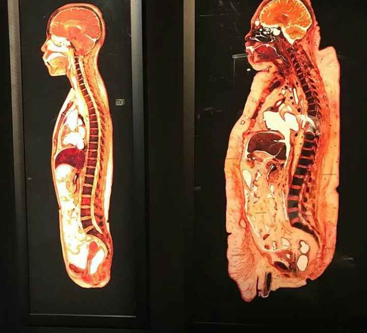
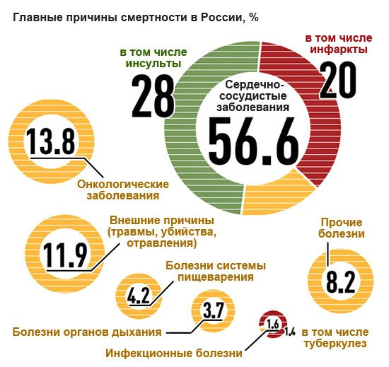
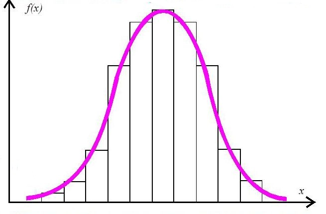
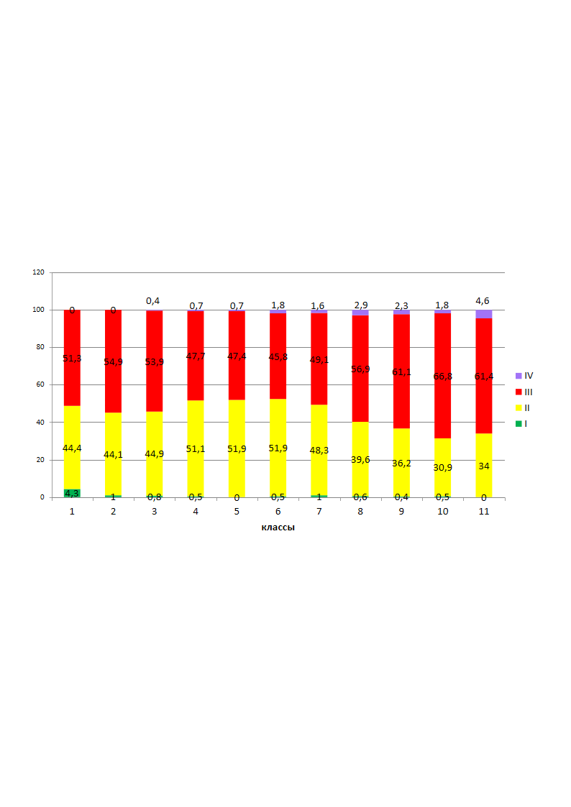
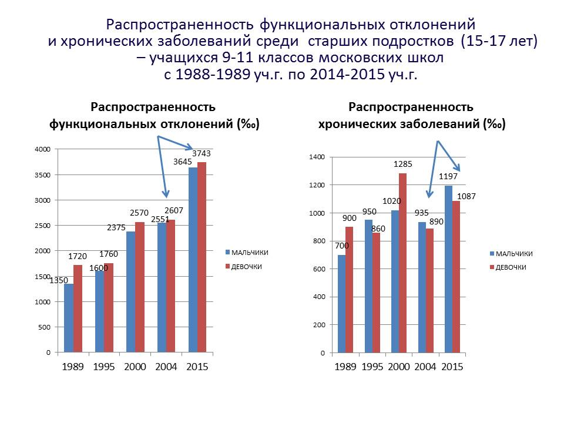

> **Первичный текст.** Тупик европейской медицинской традиции и потребность общества в оздоровлении и здравоохранении (ч.1).
> Источник: `dotu.ru:d050182d937def33.doc` sha256 `761391c13d143c72…`; [страница на dotu.ru](https://dotu.ru/2021/07/13/20210713_dead-end-of-european-medical-tradition_1/).
> Автоматическая транскрипция DOC→Markdown; смысл и формулировки не правились.
> Контрольные суммы и статус проверки — в [NOTICE.md](../../NOTICE.md).
> Содержание передаёт позицию авторов; утверждения не верифицированы библиотекой.

---

## 4.3. Как европейская медицина лечит-калечит

**Гипертония** (гипертензия) — начнём с неё, поскольку она — одно из наиболее распространённых «заболеваний». **Реально *гипертония как болезнь* не существует**: повышение артериального давления может быть вызвано разными причинами как эпизодического характера, так и действующими продолжительное время. Какие-то из этих причин могут быть внешними, а какие-то могут быть локализованы внутри организма. Причины, локализованные внутри организма, и есть болезни, которые медицина должна диагностировать и излечивать. Однако в подавляющем большинстве случаев медицина причин возникновения хронической гипертонии не знает и знать не хочет, но подбирает для больного снадобья, которые он может поглощать на протяжении многих десятилетий последующей жизни. Те снадобья, которые помогают снизить давление одному пациенту, могут быть недейственными для другого пациента и наоборот. О том, какие побочные эффекты вызывают снадобья в их комбинациях, в том числе и с другими снадобьями, предписанными по другим поводам, во взаимодействии с биохимией конкретного организма, — вопрос особый в каждом конкретном клиническом случае, а в массовой статистике применения противогипертонических средств — часто безответный: чтобы не пугать пациентов и самих врачей.

Но практика показывает, что если причины возникновения гипертонии как симптома неких других болезней не выявлены и не устранены (будь они внешними или внутренними), то применение противогипертонических средств становится систематическим и спустя несколько лет или десятилетий завершается смертью пациента вследствие очередного гипертонического криза и вызванного им инфаркта или инсульта; либо пациента убивают другие болезни, возможно, возникшие в качестве побочных эффектов применения предписанной врачами фармацевтики[^70].

**Сахарный диабет**. То же самое: уровень сахара в крови может подняться и быть устойчиво избыточным вследствие разных причин. Это болезнь, разрушающая весь организм, все его системы и органы. При затяжном прогрессирующем характере диабет чреват инсультами, слепотой, слабоумием, гангреной (и соответственно — ампутациями, чаще ног, чем рук) и прочими сопутствующими системными заболеваниями — в зависимости от того, какие системы и органы утратят свою функциональность.

В подавляющем большинстве случаев европейской медицинской традицией выявляется сам факт повышения уровня сахара в крови, причины же повышения не выясняются (хотя диабет подразделяется на два типа), не говоря уж о профилактировании возникновения причин, порождающих сахарный диабет того или иного типа. В лучшем случае диагностируется нарушение функционирования поджелудочной железы, но не причины этого нарушения и не возможности его устранения, и это позволяет поставить диагноз — диабет первого типа.

Далее после диагностирования диабета того или иного типа медицинская помощь сводится к назначению снадобий, соответствующих типу выявленного диабета, и предписанию рациона питания (что есть надо, что допустимо, что под запретом полным или частичным), также не всегда правильного. Если человек соблюдает эти рекомендации и принимает снадобья, то он может прожить довольно долго и избежать если не всех, то многих последствий воздействия диабета на его организм. Но в случае диабета первого типа — инъекции инсулина становятся постоянным фактором жизни, а их отсутствие — становится фактором обострения болезни и ускорителем смерти.

При этом «Википедия» сообщает, что стрептозоцин, ранее использовавшийся в качестве антибиотика, в настоящее время применяющийся в лечении метастатического рака поджелудочной железы, убивает бета-клетки поджелудочной железы, ответственные за выработку инсулина. Т.е. некоторое количество диабетиков первого типа европейская медицинская традиция в прошлом произвела сама, назначив пациентам по каким-то поводам не проверенный должным образом на безопасность применения «антибиотик» стрептозоцин, применение которого и вызвало у них сахарный диабет первого типа.

В 1990‑е или в начале 2000‑х гг. по «Радио России» прозвучало следующее сообщение. Врач в Екатеринбурге пришла к выводу, что сахарный диабет второго типа может быть вызван смещением почек вниз относительно их анатомически правильного положения. Она разработала специальную гимнастику и массаж, который в течение недели — двух возвращал почки на их анатомически правильное место, после чего сахарный диабет второго типа исчезал сам собой безмедикаментозно. Каких-либо опровержений или официальных подтверждений работоспособности этой методики со стороны официоза европейской медицинской традиции при написании настоящей работы найти не удалось.

Тем не менее, если не отрицать по профессиональному предубеждению, формируемому в системе профессионального образования у представителей европейской медицинской традиции, наличия биополевой физиологии, то она неизбежно различна при анатомически правильном и анатомически неправильном расположении органов. При нарушении анатомически правильной структуры вещественного тела какие-то органы выходят из полевых структур соседних органов и оказываются в полях других органов и тканей, вследствие чего под воздействием их биополей могут работать неправильно; а с другой стороны они сами перестают оказывать должное биополевое воздействие на другие органы или оказывают на них воздействие, которого не должно быть при правильном анатомическом положении, и те тоже начинают работать неправильно. В результате вся биополевая физиология организма становится нездоровой, а её нездоровье влечёт за собой нарушения физиологии вещественного тела. Это касается и так называемого «ожирения», при котором жиры откладываются между тканями и органами тела и фактом своего присутствия искажают биополевую анатомию и биополевую физиологию организма.

Если признавать наличие биополевой физиологии, то должно быть понятно, что из-за жировых отложений между органами и тканями организма, биополевая физиология пациента, показанного в правой части приведённого слева рисунка, не может быть в норме; и как следствие не может быть в норме и физиология его вещественного тела и его органов и систем. Т.е. он обречён быть разнообразно хронически болезненным при сохранении такого анатомического строения. И **оздоровить его медикаментозно невозможно до тех пор, пока его персональная анатомия не будет приведена к норме; а после возврата анатомии к норме, возможно, что и медицинская помощь не понадобится**[^71]. Биополевая физиология и физиология вещественного тела пациента, показанного в левой части того же рисунка, может быть в норме[^72]. Но для европейской медицинской традиции биополевая анатомия и биополевая физиология организма не существуют, что влечёт за собой подчас весьма тяжкие последствия для оказавшихся в её власти пациентов.

Кроме того, если оказаться в макробиополе больного человека в открытом состоянии (когда ваше собственное биополе замкнуто не само на себя, а на окружающий мир) или в состоянии усталости (переутомления), то биополе больного человека может возбудить болезни, свойственные больному, в организме прежде здорового человека при условии, что в его организме есть чему отозваться на это излучение. Так алкоголик в семье способен «одарить» циррозом своих близких через биополевые взаимосвязи членов семьи. Развитая онкология и достаточно большие по объёму незлокачественные новообразования тоже могут порождать очень мощное своё биополевое излучение, ощутимое на расстоянии около 2 метров от больного, вследствие чего биополевое воздействие больного может порождать новообразования разного рода в организмах прежде здоровых людей. А биополевые излучения при инфекционных заболеваниях — один из катализаторов развития эпидемий.

В здоровом же биополе болезнетворные микроорганизмы не выживают. Но с точки зрения европейской медицинской традиции всё сказанное в этом абзаце — антинаучный вздор, хотя на наш взгляд антинаучный вздор — это отсутствие биополевой анатомии, биополевой физиологии, биополевой паразитологии и биополевой гигиены, что характерно для европейской медицинской традиции.

**Хронический тонзиллит** — «хроническое инфекционное заболевание, при котором воспаляются нёбные, носоглоточные, гортанные и язычные миндалины. Болезнь может протекать в острой (ангина) и хронической форме, от нее страдают люди всех возрастных групп. Если на ранней стадии заболевание хорошо поддается лечению, то на поздней избавиться от воспаления навсегда уже не получится. Перейдя в хроническую форму, болезнь регулярно напоминает о себе воспалившимся горлом. (…) Нёбные миндалины и прилегающие участки слизистых могут воспалиться в результате жизнедеятельности патогенных микробов, которые есть во рту у каждого человека. Это грибки Candida, стрептококки, пневмококки, стафилококки и другие болезнетворные бактерии. Отличие здорового человека от больного в том, что организм первого в состоянии не допустить, чтобы численность микробов превысила критический уровень, а иммунная система второго слишком слаба, чтобы противостоять натиску патогенных микробов. Воспалённые гланды, в отличие от здоровых, не могут выполнять защитную функцию, в результате болезнь прогрессирует. Первопричина во всех случаях одна — болезнетворные бактерии»[^73]. — Это несколько шизофреническое мнение представителей европейской медицинской традиции о хроническом тонзиллите. Поэтому к ним вопрос — всё же какова **перво**причина хронического тонзиллита:

- нарушения в работе иммунной системы, которые европейская медицинская традиция за три тысячи лет не научилась диагностировать?

- либо бактерии, для которых организм является средой обитания?

Но бактерии могут проявить свою болезнетворность только в условиях нарушений функционирования иммунной системы организма, которые европейская медицинская традиция не в силах ни диагностировать, ни устранить.

*[В оригинальном издании здесь расположен рисунок/схема. Иллюстрация не включена в данный выпуск: ожидает визуальной и правовой проверки. Файл источника: image11.jpeg]*Если хронический тонзиллит «на ранних стадиях хорошо поддаётся лечению» (как утверждают многие медики), то почему медицина *массово* доводит дело до удаления миндалин (тонзиллэктомии), прежде всего у детей дошкольного возраста? — ведь дети дошкольного возраста практически всё время находятся под наблюдением родителей, дедушек и бабушек, *педиатров (и в советские времена, и в постсоветские, хотя детские поликлиники в постсоветские времена тоже пострадали в ходе «оптимизации системы здравоохранения»: некомплект и функциональная несостоятельность штата персонала в поликлиниках и в больницах вследствие сокращения должностей*[^74] *по всей России, ликвидация медучреждений*[^75] *— это повседневная реальность)*.

«Миндалины служат щитом против инфекций. После их ликвидации вирусы могут безнаказанно хозяйничать не только в глотке, но и перейти на гортань, трахею, бронхи и даже легкие, и спровоцировать множество других болезней, которые могут стать хроническими: ларингит, бронхит, даже воспаление легких (но вроде как необходимость тонзиллэктомии объясняется задачей профилактировать почти всё из названного: — ВП СССР).

Иммунная система лишается важного органа, вырабатывающего макрофаги, что поедают бактериальные клетки, вирусы. Таким образом, страдает местный иммунитет.

В меньшем количестве начинают вырабатываться лимфоциты, и, как следствие, антитела. Становится слабее гуморальный иммунитет.

Противоаллергическая защита заметно снижается. К примеру, у предрасположенных к аллергии лиц может начаться бронхиальная астма, у аллергиков — обостряются и учащаются приступы»[^76]. «Замечено, что дети, которым в новорождённом возрасте удалили миндалины, сильнее подвержены простудным заболеваниям, заболеваниям горла, бронхов и лёгких» («Википедия»).

Т.е. в европейской медицинской традиции лечение хронического тонзиллита, который не удалось подавить терапевтическими средствами «на ранних стадиях», когда он по её мнению «хорошо поддаётся лечению», это — покалечить организм тонзиллэктомией в целях профилактики в дальнейшем ангин, пневмонии, заболеваний сердца, смерти вследствие удушья при перекрытии воспалёнными гландами дыхательных путей. И за 3000 лет никакого прогресса в области диагностики причин сбоев в работе иммунной системы и излечения хронического тонзиллита терапевтическими и биоэнергетическими средствами на ранних стадиях.

**Онкология** — в России она не лидирует в статистике смертности (см. рис. слева), но на протяжении всего ХХ века именно она была наиболее пугающей группой заболеваний и сохраняет лидерство в таковом качестве и в настоящее время[^77]. Онкология прогрессирующе наращивает свой вес в общей статистике заболеваний, но пока на первом месте в статистике смертности — сердечно-сосудистые заболевания, включая инсульты и инфаркты, *которые большинство граждан считают неизбежными возрастными заболеваниями* <u>без всяких к тому биологических оснований</u>. А при образе жизни, который стал свойственным российскому обществу в постсоветские времена, по данным Росстата, доля умерших от старости в России в 2018 г. составила всего 5 % от общего числа зарегистрированных в стране смертей, хотя при жизненно состоятельной системе здравоохранения это должна быть наиболее статистически весомая причина смерти.

Есть в России Тамара Яковлевна Свищёва. По своему базовому образованию она — инженер-исследователь химик. Жизнь так сложилась, что, наблюдая историю своего рода, она увидела, что многие родственники умерли в результате онкологии, с которой официальная медицина не смогла справиться. Исходя из желания профилактировать такую перспективу для себя, она занялась изучением проблематики возникновения онкологии и способов её излечения (т.е. излечения без последующих рецидивов казалось бы однажды успешно излеченного рака). За что удостоилась бессодержательной — т.е. не аргументированной — порицающей её статьи во «Фрикопедии»[^78], в которой основной раздел назван «Антинаучная деятельность».

**Т.Я. Свищёва утверждает, что в мире нет ни одного эксперимента, в котором было бы воспроизведено (получено) злокачественное перерождение здоровых клеток какого бы то ни было организма в раковые.** Если она права в этом утверждении, то онкология европейской медицинской традиции тоже борется со следствиями (причём довольно запущенными), не зная достоверных причин возникновения заболеваний этой группы[^79].

В своих работах, осуществлённых при поддержке врачей и биологов, поддержавших её инициативу, она утверждает, что трихомонады — один из наиболее распространённых видов микроорганизмов в биосфере Земли. Трихомонады живут практически везде и только с некоторыми их разновидностями имеют дело венерологи. Так называемы «Т-лейкоциты» по её утверждению — в действительности трихомонады, живущие в крови человека. Т.Я. Свищёва сообщает, что были проведены эксперименты, показавшие как трихомонады переходят от жгутиковой формы существования к безжгутиковой одноклеточной форме существования и к осёдло-колониальной форме существования, в виде колонии, образованной множеством клеток, прилепившейся к тем или иным тканям организма. Злокачественные новообразования и атеросклероз по её мнению — это трихомонады, перешедшие к осёдло-колониальному способу существования. Опухоли образуются в результате неполноценного почкования трихомонад, когда дочерние клетки, не отделившись от материнских, становятся новыми клетками колонии. Кроме того, если наряду с трихомонадами в организме оказываются и хламидии, то они живут в симбиозе с трихомонадами, нанося организму вред существенно больший, чем трихомонады сами по себе.

Соответственно, вся онкология излечивается сменой рациона питания, направленной на то, чтобы трихомонады и прочие паразиты не размножались, а гибли. Специальным диетам может сопутствовать медикаментозная терапия противотрихомонадными и другими антипаразитарными средствами. Наряду с этим необходима общая чистка организма, начиная с внутриклеточного уровня от всевозможных шлаков и прочих химических соединений, чуждых его здоровой физиологии, но востребуемых в качестве продуктов питания разнородными паразитами, либо нарушающих здоровую биохимию организма[^80]. Всё это повышает и мобилизует потенциал самоисцеления организма. Главная опасность при таком подходе — убить опухоль слишком быстро, поскольку в этом случае человек погибнет в результате интоксикации продуктами её распада, мощность которой превысит возможности его выделительной системы.

При более широком взгляде выводы Т.Я. Свищёвой следует дополнить ещё одним: *трихомонады и другие паразиты, способные убить человека прямо или опосредованно, вызвав другие заболевания, — являются одними из множества агентов иммунной системы биосферы-ноосферы Земли.* Т.е. они очищают все биологические виды, включая и биологический вид «Человек разумный», от особей, которые не вписываются в алгоритмику жизни биосферы-ноосферы. И все методики лечения всех болезней (в том числе и методика Т.Я. Свищёвой) работоспособны только в пределах действия этого фактора. Даже если медицина победит болезнь в конкретном пациенте, но он не изменится при этом в лучшую сторону в нравственно-этическом отношении, то в наиболее тяжёлых случаях он — всё равно не жилец: ноосфера-биосфера найдёт способ его убить в весьма непродолжительные сроки после излечения организма от онкологии или другой болезни (об этом далее в разделах 5.1 и 5.2).

И даже если медицина победит некое инфекционно или паразитарно обусловленное заболевание в глобальных масштабах, то биоагенты — их возбудители — могут мутировать и стать неуязвимыми для некогда эффективных в отношении них медикаментозных средств: уже имеются такие мутировавшие разновидности возбудителей туберкулёза, гонореи и некоторых других заболеваний.

Поэтому *не обременённый вопросами нравственно-этического оздоровления пациента* процедурный (технико-технологический) подход к лечению людей, а так же и имитация лечения путём подавления симптоматики, что свойственно европейской медицинской традиции, — в перспективе убийственны для обществ, которые не в состоянии породить субкультуру оздоровления и здравоохранения.

Каких-либо доказательных опровержений теории Т.Я. Свищёвой со стороны официальной онкологии европейской медицинской традиции не выдвинуто. Статью о ней, не содержащую каких-либо аргументов против изложенной ею теории, поместили во «Фрикопедию»; при упоминании её профессиональные онкологи либо молчат, либо впадают в истерику. В медицинской практике европейской медицинской традиции её (как и некоторых других отступников от монопольно доминирующей европейской медицинской традиции и представителей других медицинских традиций) просто игнорируют[^81].

Комментарии в интернете к работам Т.Я. Свищёвой разные:

- Те, кто хочет съесть «чудо-таблетку» от всех болезней и после этого быть здоровыми до глубокой старости или свято верит в европейскую медицинскую традицию, не задумываясь о том, что в организме есть мощнейшие факторы самоисцеления, которые надо научиться активизировать, — те против, обзывают её меркантильной шарлатанкой. При этом они ссылаются на то, что она химик-технарь, а не обученный в вузе биолог или врач-онколог, вследствие чего якобы она в принципе не может ничего понимать в области медицины, профилактики и здравоохранения в целом, и тем более — в такой «сложной отрасли»[^82], как онкология[^83].

- Те, кто утратил доверие к европейской медицинской традиции под давлением собственного негативного жизненного опыта и негативного опыта друзей и близких, так или иначе пострадавших от неё или ставших её жертвами, те порицают вожделеющих «чудо-таблетку», косность и недееспособность медицинского официоза, и убеждены в том, что Т.Я. Свищёва в целом права. Она показала путь, а идти по нему должен каждый, кого эта проблематика так или иначе интересует (в аспекте исцеления либо в аспекте профилактики).

Вот некоторые из нескольких страниц комментариев к её работам (порядок их следования изменён):

**«Инна** / 18.03.2018 Я лично слушала лекции мужчины, который излечился от рака по методике Свищевой. У него был рак мозга. И медики дали ему всего лишь 3 месяца жизни. А он после этого прожил 10 лет и живёт дальше. Ребенок, из-за которого мы пошли слушать лекции и следовали его рекомендациям, тоже жив. Хотя был рак мозга 4-й степени. И уже тогда он нам рассказывал, что рак вызывают не только трихомонады. Я поддерживаю Свищёву. Мы пережили этот ужас и видели этих ужасных паразитов, которые из него вышли при приеме антипаразитарки. Будьте здоровы!

**Марфа** / 16.04.2018 Инна, ты пишешь просто фантастику — два человека с РАКОМ МОЗГА ЖИВУТ БОЛЕЕ 10 ЛЕТ!? — Да такого просто БЫТЬ НЕ МОЖЕТ, значит Фриске и Задорнов были полными идиотами, что не послушались вздорную Свищёву? А правда как всегда проста, Инна — вы либо сама Свищёва, либо её сынулька, и вы оба бессовестно втираете нам эту чушь про рак мозга, чтобы мы повелись (от горя) и таки купли вашу свищёвскую муть, а Диля[^84] отстегнула вам очередные 30 сребреников.

**Сергей** / 18.03.2018 Свищева в своих открытиях абсолютно права. Занимаюсь много лет многомерной медициной по методу Л.Г. Пучко и пришёл к тому же самому. Те, которые пишут в её адрес гадости, люди завистливые, злобные и невежественные. Этому тоже есть научное объяснение. Им сходить бы в церковь на Исповедь, да not here it was! Гордыня не позволит покаяться в злословии и осуждении.

**Галина** / 19.05.2018 Я — провизор. Не берусь судить о том, как работают методы Т. Свищёвой. Вашему вниманию информация к размышлению. Огромные фармацевтические корпорации работают в производстве баснословно дорогих химиотерапевтических препаратов для лечения рака. Миллиардные прибыли! А тут Свищёва со своими методами и средствами, копеечной стоимости причём! Может, здесь собака зарыта?!» [^85].

Иван Павлович Неумывакин (1928 — 2018) — доктор медицинских наук, профессор, лауреат Государственной премии, заслуженный изобретатель РСФСР, действительный член Российской академии естественных наук, долгое время работал врачом отряда космонавтов. Он — ещё один врач-еретик, отступник от европейской медицинской традиции. Он настаивал на том, что перекисью водорода, если умело ею пользоваться, можно лечить почти все болезни, поскольку она, разлагаясь на воду и атомарный кислород, по сути является усилителем иммунной системы человека, которая поражает болезнетворные микроорганизмы атомарным кислородом. Кроме того, атомарный кислород, выжигает многие загрязнители, накапливающиеся в организме[^86].

Вскорости после начала им введения перекиси водорода в клиническую практику коллеги и верящие им обыватели тоже произвели его в шарлатаны[^87]. Но перекись водорода стоит «копейки», и если с её помощью при умелом применении можно излечивать и профилактировать многие болезни, то фармацевтическому бизнесу это тоже не надо, как и методика излечения онкологии Т.Я. Свищёвой и некоторых других врачей — отступников-новаторов — и народных умельцев-целителей, поскольку сбыт дорогущих снадобий сразу же станет невозможным[^88].

Поэтому реально онкология почти безальтернативно монопольно доминирующей в мире европейской медицинской традиции — просто *паразитический* бизнес на страхах перед мучительной смертью и на самой смерти. Борис Гринблат в книге «Диагноз — рак...» пишет об этом прямо:

«Знаете ли вы, что за одного онкологического больного американские страховые компании платят в среднем \$ 350 000, при этом за натуральное лечение они не платят ни цента? Курс лечения иностранного пациента в США, Израиле, Англии и других западных странах стоит от \$ 250 000 до \$ 1 млн.! А стоимость препаратов или комбинации препаратов, входящих в курс лечения, составляет от \$ 3000 до \$ 20 000 в месяц. Прибыль, которую получают фармацевтические компании от продажи одного химиотерапевтического препарата, может достигать 500 000 %! Такая прибыль не может быть оправдана большими затратами на исследования и получения патента, так как прибыль этих компаний ежегодно растёт и исчисляется десятками миллиардов долларов, а основной статьёй их расходов является реклама произведённых ими лекарств, а также лоббирование интересов этих компаний.

Для сравнения, протокол Герсона, имеющий 90 % успеха в лечении рака, стоит всего несколько сот долларов в месяц и только \$ 25 000 за короткий курс лечения в клинике в Тихуане, Мексика. Протокол Билла Хендерсона стоит всего лишь \$ 5 в день, а протокол доктора Сиркуса — ещё дешевле. Некоторые методы лечения, проводимые в домашних условиях, могут стоить лишь \$ 50 в месяц.

Наивно предполагать, что официальная онкология, «Большая Фарма» и купленные ими политики **будут искренне стараться излечить рак**. Организации типа «Американской Ассоциации по борьбе с раком», британский аналог «Исследования рака Великобритании» и им подобные крупные благотворительные организации по борьбе с раковыми заболеваниями, получают миллиарды долларов дотаций в год. При этом ни цента не тратится на исследование натуральных и гораздо более успешных альтернатив, тогда как все средства (после выплаты огромных зарплат руководству этих организаций) **идут на исследования тупиковых направлений, таких как химиотерапия**»[^89].

То есть существуют эффективные методы лечения онкологии, но поскольку они обличают медицинский официоз в некомпетентности и злонравной коммерционализации, то в официозе медицины они характеризуются как «ненаучные» и «бездоказательные», и потому им нет места в официальной медицине. При этом у официальной медицины более 90 % онкологических пациентов умирает от онкологии, если не после первого акта запоздалого лечения, то после рецидивов спустя несколько лет (гораздо реже — спустя несколько десятилетий), к тому же изрядно помучившись и помучив своих близких. А когда появляется человек, увидевший коммерческую античеловечную суть европейской медицинской традиции и её недееспособность, — его сразу же обвиняют в отсутствии профессиональных знаний, навыков, практики в области медицины. 

Тем не менее вне зависимости от мнений интернет-пользователей и врачей традиционалистов о работах Т.Я. Свищёвой и других врачей-альтернативщиков, вне зависимости от само́й европейской медицинской традиции и её онкологии, **новообразования (как и другие заболевания) исчезают вообще без какой-либо терапии и хирургии** в сроки от нескольких часов до нескольких недель (в зависимости от их развитости) по искренней молитве Богу, при условии, что человек живёт осмысленно и *имеет намерения на будущее, которые лежат в русле Милости Божией, и которые он намеревается исполнить по совести*.

Но если человек устал от жизни (т.е. у него — такого, каков он есть, каким он стал, — нет сил Любить Жизнь), утратил смысл жизни, существует по инерции или в режиме «я — как все», и не прилагает никаких усилий к тому, чтобы себя изменить, — то ничего не поможет: он умрёт так или иначе — сработает программа самоликвидации организма, которую каждый носит в себе[^90]… Не поможет и ритуальная молитва, в которую человек не вложил свой смысл искренне, не поможет и молитва других людей… То же касается и случаев, если человек избрал смысл жизни, которому нет места в Промысле Всевышнего[^91].

Высказанное в двух предыдущих абзацах — проявление религиозно-ноосферных (нравственно-этических по их существу) закономерностей в жизни людей. Понятно, что подавляющее большинство такого рода случаев не задокументировано официальной медициной европейской традиции[^92]: не всегда же лечащий врач «доктор С.П. Боткин» присутствует при молитве «святого Иоанна Кронштадтского» у изголовья пациента[^93], заносит факт молитвы и её последствия в историю болезни-*выздоровления, как казалось до молитвы, неизлечимо больного человека* и заверяет всё это у нотариуса (не говоря уж о том, что не всякий нотариус такое засвидетельствует, поскольку сам при этом не присутствовал). Причина игнорирования исцелений, последовавших вследствие загово́ров и молитв, в том, что религиозно-ноосферные закономерности (см. рисунок в разделе 3) в жизни людей и общества, это — ещё одна тема, от которой европейская медицинская традиция шарахается как от лженаучной, поскольку эксперименты такого рода в ней невозможны[^94], а повторяемость результата при воспроизведении условий не достигается. Но истинная причина шараханья от этой темы в том, что она несовместима с *не обременённым вопросами нравственно-этического оздоровления пациента* технологически-процедурным характером европейской медицинской традиции, с её технико-технологическим отношением к пациенту, тем более, когда этот подход усугублён ориентацией на коммерческую эффективность медицины и фармакологии как одних из наиболее высокоприбыльных отраслей бизнеса, который стал доминирующим с середины ХХ века. Причём не все такого рода случаи исцелений можно объяснить «самовнушением» больных, поскольку они не всегда были осведомлены о такого рода воздействиях на них целителей или ответа Свыше на молитву об их выздоровлении.

**Ро́ды**. Стандартная поза для родов — лёжа на спине. Стандартный призыв к роженице при родовспоможении — «тужьтесь, мамочка!».

Теперь лягте на спину и попробуйте поднатужиться — вряд ли что получится, поскольку поза «лёжа на спине» одна из анатомически запрограммированных поз отдыха в расслабленном состоянии большинства скелетных мышц. Поэтому в позе «лёжа на спине» на продвижение новорождающегося по родовым путям работают почти что единственно мышцы матки (они работают автоматически-рефлекторно вне зависимости от состояния роженицы) при эпизодических кратковременных подключениях мышц передней стенки брюшной полости (они работают под воздействием воли роженицы, если она в сознании и владеет собой, а не находится в близком к шоковому состоянию или в шоке). Естественные, анатомически запрограммированные и потому наиболее распространённые в других культурах позы для родов — сидя на корточках; стоя на коленях, раздвинув бёдра; стоя при остановке при ходьбе; сидя на специальном стуле, в сиденье которого есть отверстие для выхода новорождённого и доступа к родовым путям акушеров-повитух. Во всех этих вариантах анатомически запрограммированных поз при родах роженице помогают другие люди. Именно эти позы характерны для всех ро́дов во всех культурах, в которые не вторглась европейская медицинская традиция.

В ней же само́й поза для родов «лёжа на спине» возникла из похотливого желания французского короля Людовика XIV подглядывать за тем, как его любовницы рожают. Поэтому лейб-медики организовывали кушетку, на которую помещали роженицу, так, чтобы королю было удобно подглядывать из-за специальной ширмы. Потом это стало стандартом при медицинском сопровождении родов. Никаких анатомических и физиологических обоснований для этой позы у европейской медицинской традиции нет и быть не может.

Если же женщина рожает сидя на корточках, то кроме автоматически-рефлекторно работающих мышц матки на продвижение новорождающегося по родовым путям работает сама поза, в которой находится роженица, а также легко произвольно напрягаемые мышцы брюшной стенки. Соответственно, при прочих равных статистика благополучных (и для младенца, и для матери) родов должна быть при анатомически запрограммированных позах при родах выше, чем при родах в позе «лёжа на спине».

Единственное оправдание позы «лёжа на спине» при родах — это упрощение работы акушеров в тяжёлых случаях. Но тяжёлые роды и их оперативное сопровождение — это особая тема. В здоровом обществе с развитой системой здравоохранения подавляющее большинство родов должны быть естественными, а не «тяжёлыми».

**Дефекация.** В сентябре 2013 г. в своей программе «Жить здорово!» Е.В. Малышева донесла до «невежественных» граждан России новое передовое учение с Запада:

«Произошло сногсшибательное событие. Вышли специальные международные рекомендации, которые в переводе на русский язык звучат так — как правильно какать. Это связано с тем, что у огромного количества людей запоры, грыжи, и вопрос как правильно какать — непростой. Поэтому мы назвали эту тему «Искусство какать» и разложим сегодня всё по полочкам».[^95]

*[В оригинальном издании здесь расположен рисунок/схема. Иллюстрация не включена в данный выпуск: ожидает визуальной и правовой проверки. Файл источника: image13.jpeg]*Далее последовали плакаты со схемами, как правильно сесть на унитаз (как на фото слева) и что делать после этого: колени должны быть выше бёдер (если унитаз высокий, то под ступни надо подложить специальные подставки — они уже на передовом Западе производятся); сесть прямо, положить руки на колени; расслабить мышцы брюшной стенки и сфинктер, после чего перистальтика кишечника быстро автоматически-рефлекторно должна сама выдавить наружу всё, что накопилось в прямой кишке. А ассистент Е.В. Малышевой — врач-кардиолог Герман Шаевич Гандельман продемонстрировал это всё на камеру практически, однако, не спустив брюк и трусов и не осуществив само́й дефекации.

*[В оригинальном издании здесь расположен рисунок/схема. Иллюстрация не включена в данный выпуск: ожидает визуальной и правовой проверки. Файл источника: image14.jpeg]*Всё в общем-то нормально должно происходить почти так, как было рассказано и показано в программе Елены Малышевой, но за одним исключением: *унитаз в этом деле — средство извращения физиологического процесса:*

- дело в том, что унитаз препятствует принятию естественной анатомически и физиологически запрограммированной для дефекации позы — «сидя на корточках», в которой при отсутствии запоров всё происходит так, как было сказано и показано в этой программе, а при наличии запора — в позе «сидя на корточках» дефекации могут помочь произвольно напрягаемые при необходимости мышцы брюшной стенки.

- Более предпочтительное по отношению к анатомии и физиологии человека сантехническое устройство, альтернативное унитазу, — чаша типа «Генуя», предполагающая пользование ею при дефекации в позе «сидя на корточках» (фото туалета с чашей «Генуя» слева). Чашу типа «Генуя» можно сразу же (или при необходимости) дополнять специальным *стандартным* складным стулом для стариков, больных и инвалидов, которым тяжёло или невозможно принять естественную для дефекации позу.

- Само появление и распространение унитаза в культуре — следствие распространения запоров при нездоровом образе жизни общества, вследствие чего страдающим от запоров легче сидеть на унитазе и продолжительное время ждать испражнения, почитывая книгу и *попивая кофе с бутербродом (в интернете есть и такие фото, многие из которых не постановочные «шутки»)*. Переход же к стандарту «чаша типа Генуя» излечит некоторую часть людей от запоров, геморроя и будет профилактировать и их, и, хотя не частое, но очень неприятное выпадение прямой кишки.

- *[В оригинальном издании здесь расположен рисунок/схема. Иллюстрация не включена в данный выпуск: ожидает визуальной и правовой проверки. Файл источника: image15.jpeg]*При правильной форме чаша типа «Генуя» решит и гигиеническую проблему, порождаемую многими современными передовыми «евроунитазами» — всплеск далеко не самой чистой воды при падении каловых масс, который «омывает» ягодицы и промежность сидящего на унитазе человека. См. рисунок слева: надпись на нём — начало англоязычного ругательства, т.е. эта проблема, хотя и мелкая в сопоставлении с другими проблемами человечества, но явно носит глобально-цивилизационный характер и свидетельствует о массовом слабоумии стандартизаторов, производителей сантехники и о наплевательском отношении к здоровью людей врачей-гигиенистов всех стран.

- *[В оригинальном издании здесь расположен рисунок/схема. Иллюстрация не включена в данный выпуск: ожидает визуальной и правовой проверки. Файл источника: image16.jpeg]*Желание избежать *вполне реальной угрозы здоровью* от «омывания» тела смесью жидкой грязи и микроорганизмов при всплеске в унитазе приводит к тому, что в общественных туалетах, люди становятся ногами на бортик унитаза, после чего садятся на корточки, и иногда падают, ломая руки и ноги, или даже получают жесточайшие порезы ягодиц и бёдер в случае разрушения под ними унитаза (жуткое фото слева: <https://santechniki.com/viewtopic.php?t=4520>, — оно приведено в целях извлечения читателя из абстрактно-безо́бразного восприятия реальных проблем здравоохранения и оказания медицинской помощи; глубокие и обширные повреждения мягких тканей при такого рода травмах неизбежно сопровождаются разрывом множества нервов[^96], проходящих через поверхность рассечения плоти при ранении, вследствие чего восстановление функциональности организма после таких травм — особая тема и не самое простое дело).

> По мнению работников службы скорой медицинской помощи последствия падения с унитаза — одна из разновидностей типичных «офисных травм»[^97].

- Но если кому-то унитаз нужен, чтобы долго-долго сидеть на нём в ожидании неподвластного ему процесса испражнения, почитывая книгу, глядя в айфон или в айпэд, делая какую-то работу на ноутбуке, попивая кофе с бутербродом под сигарету, то в необходимости ликвидации унитазов и перехода к стандарту «чаша Генуя», — его не убедить… И вообще поднятая тема о дефекации и унитазе с их точки зрения достойна только осмеяния — дескать, писать больше не о чем, это не тема для серьёзной социологической и политологической аналитики.

Так и минздраву РФ, бездумно пребывающему под властью европейской медицинской традиции, на это всё тоже наплевать, хотя дефекация и обеспечение гигиены в её ходе физиологически не менее значимый для здоровья процесс, чем питание и питьё, и дефекация должна быть безопасна во всех смыслах — в том числе и благодаря эргономичным (включая и аспекты личной гигиены и гигиены места установки) сантехническим устройствам, что должно быть под контролем гигиенистов — медико-профилактический факультет Северо-Западного государственного медицинского университета им. И.И. Мечникова (в советские времена — профильный санитарно-гигиенический медицинский вуз) у нас в стране для чего? — чтобы его выпускники профессиональные гигиенисты взятки за свои подписи на разного рода разрешениях получали, реально ничего не делая для здравоохранения?

Тема родов, дефекации, пропаганды мужского обрезания (циркумцизии без медицинских показаний в виде фимоза и т.п.), показывает, что у представителей европейской медицинской традиции плохо обстоит дело не только со знанием биополевых компонент анатомии, физиологии, паразитологии и гигиены, но они толком не понимают и их компонент, относящихся к функционированию вещественного тела.

**Вакцинация и злоупотребления ею**. [^98]

«Издательство АСТ на фоне вспышки коронавируса и резкой критики медицинского сообщества решило приостановить продажи книги блогера-антипрививочника Антона Амантонио "Прививать или не прививать? или Ну, подумаешь, укол! Мифы о вакцинации". Книга вышла в свет в феврале \<2020 г.\>. Издательство назвало свой шаг беспрецедентным.

В предисловии автор предлагает разобраться, действительно ли прививки безопасны и эффективны, пишет, что якобы "нет ни одного грамотного исследования, которое подтверждало бы безопасность вакцин", что они могут вызывать аутизм и содержат большое количество алюминия, а люди, которые отказываются от прививок, "в большинстве своем хорошо образованы и богаты". Книга вышла с грифом "Не является учебником по медицине. Мнение редакции может не совпадать с мнением автора".

Как отмечает "Медвестник", за псевдонимом Амантонио скрывается инженер-электронщик, постоянно проживающий в Израиле. Сам он рассказал, что решил разобраться в научных исследованиях вакцинации, когда у него родилась дочь. "Решил поделиться с миром теми исследованиями, которые обнаружил и согласно которым прививки опаснее, чем болезни, от которых они защищают[^99]", — пояснил Амантонио порталу, добавив, что его взгляды поддерживают "тысячи людей, среди них сотни врачей и ученых". По его словам, медицинские данные обрабатывались в течение трех лет.

После выхода книги Амантонио рассказал, что "началось бурление и давление на издательство в соцсетях". "Наши оппоненты прекрасно понимают, что от блога в интернете легко отмахнуться, и легче его просто не замечать, чем пытаться опровергать. А вот от книги отмахнуться так просто не получится. Они понимают, что опровергнуть приведенные в ней факты они не в состоянии, поэтому всеми силами они будут пытаться книгу запретить", — написал блогер в Facebook.

Книгу действительно восприняли в штыки. Член комитета Госдумы по охране здоровья Александр Петров предложил приравнять призывы отказываться от вакцинации к экстремистской деятельности. "Нужно блокировать информацию, которая в целом касается отрицания необходимости прививок в любом СМИ, отнести ее к опасной. (...) Вред от непрививки может оказаться в прогнозе на будущее гораздо большим", — сказал депутат агентству "Москва"[^100].

Представителей медицинского сообщества возмутило согласие АСТ на публикацию книги Амантонио. Педиатр Федор Катасонов назвал наиболее вероятным источником сведений, которые автор приводит в качестве доказательств своей позиции, ресурс PubMed. Это сборник "всех опубликованных медицинских исследований, достоверных и ошибочных, высококачественных и халтурных, честных и подогнанных", пишет врач.

"Пабмед — это не кладезь доказательных данных, это библиотека сырья, которое потом надо перепроверять и сводить в крупные обзоры. При этой работе большая часть выводов из мелких исследований корректируется или опровергается. Амантонио берёт ту часть научного сырья, которая подтверждает его видение, и игнорирует остальное. Это не научный подход, а дешёвая спекуляция", — написал Катасонов на своей странице.

Отрицательные отзывы на книгу разместили на своих страницах в соцсетях сооснователь фонда "Эволюция", член Комиссии по противодействию фальсификации научных исследований РАН Петр Талантов и другие представители медицинского сообщества. Талантов, книги которого тоже выходили в АСТ, считает, что публикация работы Амантонио наносит серьёзный урон репутации издательства и авторов, которые там печатались.

"Издательская группа АСТ предоставляет возможность выступить с аргументацией того или иного мнения абсолютно разным авторам при условии соблюдения законодательства РФ", — говорится в пресс-релизе о приостановке продаж книги Амантонио.

Издательство намерено провести круглый стол с участием экспертов на тему цензуры в сфере издания книг медицинской тематики. "Существует плоскость законодательных норм, в рамках которых закреплены понятия "свобода слова" и "отсутствие цензуры". Кто должен определять, является ли высказанное мнение журналиста, блогера или медийного лица потенциальной угрозой, а не альтернативным взглядом на общепринятые установки?", — говорится в заявлении АСТ»[^101].

А теперь реальный случай из практики вакцинации по графику. Обычный жизнерадостный мальчик в возрасте 9 месяцев. Сделали плановую прививку АКДС (адсорбированная коклюшно-дифтеритно-столбнячная вакцина). На следующий день температура за 40° С, потеря сознания. Когда пришёл в себя спустя несколько суток в палате интенсивной терапии, выявились тяжёлые поражения нервной системы с параличами и нарушениями психической деятельности (гиперактивность, дефицит внимания, медленное засыпание, неглубокий сон). Далее годы восстановительных процедур, не всегда эффективных, но всегда очень дорогостоящих (в силу малого количества специалистов, согласных принять проблематику в работу), поскольку все они не предусмотрены системой обязательного медицинского страхования.

Что произошло: вакцинация наложилась на не выявленную перед нею болезнь?[^102] введение вакцины пришлось не на «ту» фазу в биоритмике организма? имела место и проявилась индивидуальная непереносимость конкретной вакцины конкретным организмом? была дефективной сама вакцина (порция, доставшаяся ребёнку)? были нарушены нормы стерильности медиками, проводившими вакцинацию, и они сами занесли в организм ребёнка какую-то инфекцию в процессе вакцинации? — неизвестно: медики причины установить не смогли или не пытались.

Это — далеко не уникальный, хотя и не массовый результат действия европейской медицинской традиции, которая придумала график прививок и узаконила его во многих странах, но оказалась не в состоянии ни профилактировать такие (пусть и редкие, на грани единичных случаев) последствия вакцинации, ни оказать своевременную и эффективную помощь, ни хотя бы диагностировать причины трагедии в целях предотвращения подобного в будущем с другими детьми.

Поэтому члену комитета Госдумы по охране здоровья А.П. Петрову лучше не разводить демагогию на тему «призывы отказываться от вакцинации надо приравнять к экстремистской деятельности», и не рассказывать журналистам о том, что «нужно блокировать информацию, которая в целом касается отрицания необходимости прививок в любом СМИ, отнести её к опасной. (...) Вред от непрививки может оказаться в прогнозе на будущее гораздо бо́льшим[^103]», а вникнуть в суть проблемы, ознакомиться с клиническими случаями вреда, нанесённого вакцинацией и подумать об изменении стратегии здравоохранения и системы.

Теперь обратимся к официальному документу «Расследование поствакцинальных осложнений. Методические указания. МУ 3.3.1879 — 04»[^104]. В нём есть два приложения, которые мы приведём ниже.

————————

Приложение 1\

(обязательное)

Перечень поствакцинальных осложнений, вызванных профилактическими прививками, включенными в национальный календарь профилактических прививок, и профилактическими прививками по эпидемическим показаниям, дающих право гражданам на получение государственных единовременных пособий (утвержден постановлением Правительства\

Российской Федерации от 2 августа 1999 г. № 885)

1\. Анафилактический шок.

2\. Тяжелые генерализованные аллергические реакции (рецидивирующий ангионевротический отек — отек Квинке, синдром Стивенса-Джонсона, синдром Лайела, синдром сывороточной болезни и т.п.).

3\. Энцефалит.

4\. Вакциноасоциированный полиомиелит.

5\. Поражения центральной нервной системы с генерализованными или фокальными остаточными проявлениями, приведшими к инвалидности: энцефалопатия, серозный менингит, неврит, полиневрит, а также с клиническими проявлениями судорожного синдрома.

6\. Генерализованная инфекция, остеит, остит, остеомиелит, вызванные вакциной БЦЖ.

7\. Артрит хронический, вызванный вакциной против краснухи.

Приложение 2\

(обязательное)

Перечень основных заболеваний в поствакцинальном периоде,\

подлежащих регистрации и расследованию

<table style="width:100%;">

<colgroup>

<col style="width: 50%" />

<col style="width: 25%" />

<col style="width: 23%" />

</colgroup>

<thead>

<tr>

<th><strong>Клинические формы</strong></th>

<th><strong>Вакцина</strong></th>

<th><strong>Сроки появления</strong></th>

</tr>

</thead>

<tbody>

<tr>

<td>Анафилактический шок, анафилактоидная реакция, коллапс</td>

<td>все, кроме БЦЖ и ОПВ</td>

<td>первые 12 часов</td>

</tr>

<tr>

<td>Тяжелые, генерализованные аллергические реакции (с-м Стивенса-Джонсона, Лайела, рецидивирующие отеки Квинке, сыпи и др.)</td>

<td>все, кроме БЦЖ и ОПВ</td>

<td>до 3 суток</td>

</tr>

<tr>

<td>Синдром сывороточной болезни</td>

<td>все, кроме БЦЖ и ОПВ</td>

<td>до 15 суток</td>

</tr>

<tr>

<td>Энцефалит, энцефалопатия, энцефаломиелит, миелит, неврит, полирадикулоневрит, синдром Гийена-Барре</td>

<td>
инактивированные

живые вакцины
</td>

<td>
до 10 суток

5 — 30 суток
</td>

</tr>

<tr>

<td>Серозный менингит</td>

<td>живые вакцины</td>

<td>10 — 30 суток</td>

</tr>

<tr>

<td>Афебрильные судороги</td>

<td>
инактивированные

живые вакцины
</td>

<td>
до 7 суток

до 15 суток
</td>

</tr>

<tr>

<td>Острый миокардит, нефрит, агранулоцитоз, тромбоцитопеническая пурпура, анемия гипопластическая, коллагенозы</td>

<td>все</td>

<td>до 30 суток</td>

</tr>

<tr>

<td>Хронический артрит</td>

<td>краснушная вакцина</td>

<td>до 30 суток</td>

</tr>

<tr>

<td>Вакциноассоциированный полиомиелит</td>

<td>
у привитых

у контактных
</td>

<td>
до 30 суток

до 60 суток
</td>

</tr>

<tr>

<td>
Осложнения после БЦЖ прививки:

холодный абсцесс, лимфаденит, келоидный рубец, остеит и др. Генерализованная БЦЖ-инфекция
</td>

<td></td>

<td>в течение 1,5 лет после прививки</td>

</tr>

<tr>

<td>Абсцесс в месте введения</td>

<td>все вакцины</td>

<td>до 7 суток</td>

</tr>

<tr>

<td>Внезапная смерть, другие случаи летальных исходов, имеющие временну́ю связь с прививкой</td>

<td>все вакцины</td>

<td>до 30 суток</td>

</tr>

</tbody>

</table>

————————

Далее продолжение текста настоящей работы.

Как показывают приведённые выше Приложения 1 и 2, вред от прививки может быть гораздо бо́льшим, чем вред от «непрививки» даже в тех случаях, если, уклонившись от прививки, человек заболеет (хотя это касается только тех заболеваний, которые поддаются излечению и не влекут за собой однозначно предопределённой смерти). Однако многие чиновники и депутаты, чьи мнения обуславливают политику государства в сфере здравоохранения, этого не знают, как этого не знает член комитета Госдумы по охране здоровья А.П. Петров (школьный учитель физики по базовому образованию).

Однако в Приложениях 1 и 2 представлен не весь вред, который прививки могут наносить здоровью людей и медико-биологической компоненте жизни и развития общества. Дело в том, что подавляющее большинство депутатов и чиновников ничего не понимают в теории вероятностей и математической статистике и в приложении этого математического аппарата к выявлению проблем и постановке задач по их разрешению в управлении жизнью общества. Поэтому, прежде чем переходить к рассмотрению вопроса о том, что вредоносного не попало в Приложения 1 и 2, придётся пояснить, что стоит за словами «статистика», «вероятность».

### **Отступление от темы:**\

Как соображать слово «статистика» и для чего это необходимо

Редко когда на вопрос о том, какие образы в их картине мира соответствуют слову «статистика», люди отвечают, что слову статистика соответствуют образы таблиц, заполненных некими численными данными. Последний ответ правильный, но работать со статистиками, представленными в табличной форме, в решении многих задач неудобно потому, что затруднительно соотносить их друг с другом и с жизнью. Статистики в табличной форме представления необходимы прежде всего при «мелко детальном» изучении вопросов, связанных с теми или иными множествами и процессами в них. Кроме того, табличная форма представления статистик ориентирована на логико-математическое их восприятие, в чём тоже не всегда есть надобность, не говоря уж о том, что представление статистики в табличной форме — вторично, если исходить из применения аппарата теории вероятностей и математической статистики к решению социально-управленческих задач.

Но неспособность соображать слово «статистика» и соотносить его с жизнью усугубляется тем, что даже большинство из тех, кто в своё время более или менее успешно сдал зачёты или экзамены по курсу «теория вероятностей и математическая статистика» теряются, когда им предлагается построить статистическое распределение какой-либо случайной величины, например распределение по росту студентов группы[^105].

Вследствие этой особенности культуры нашего общества и личностной культуры множества людей, необходимо пояснить вопрос о построении статистик и представлении их в графической (образной) форме, поскольку без понимания того, что стоит за словом «статистика», невозможно ни понимание того, что происходит в обществе, ни управление биосферно-социально-экономическими системами любого уровня (начиная от поселения — «муниципального образования» и кончая глобальной цивилизацией в целом).

Если не становиться на путь освоения аппарата теории вероятностей[^106] и математической статистики и соответствующего математического абстракционизма, то необходимый минимум понимания всего того, что стоит за словом «статистика», и пользования статистиками в управлении, может быть выработан на основе представленного на рисунке ниже. На нём показана двумерная система координат и в её осях — два графика функций, представляющие статистику, характеризующую некое множество:

- по горизонтали — ось *x*: значения случайной величины, т.е. вдоль оси *x* откладываются значения характеристического параметра, который свойственен всем элементам рассматриваемого множества и который представляет для нас интерес;

- по вертикали — ось, обозначенная *f(x)* (т.е. функция от аргумента *x*): вдоль неё откладываются значения функции, именуемой «плотность распределения случайной величины *x*», график которой характеризует рассматриваемое множество элементов в целом, т.е. представляет статистику, характеризующую это множество (все его элементы, вне зависимости от особенностей каждого из них, в их совокупности).

Чтобы построить такого рода графическое представление статистики, необходимо:

- избрать измеримый (метрологически состоятельный) характеристический параметр, которым обладают все элементы рассматриваемого множества;

- на горизонтальной оси отметить значения этого параметра, разграничивающие интересующие нас диапазоны (интервалы) его изменения;

- над каждым диапазоном (интервалом) нарисовать столбик, в некотором масштабе (общем для всех столбиков) соответствующий количеству элементов множества, для которых значения рассматриваемого характеристического параметра попадают в этот диапазон.

В этом случае площадь всех столбиков в некотором масштабе равна количеству элементов множества (мощности множества, если множество несчётное), т.е. 100 %; 100 % можно приравнять единице, и в этом случае все значения функции плотности распределения случайной величины в этом графике будут выражаться в долях единицы.

Если мы избираем одно из значений, разграничивающих диапазоны (интервалы) изменения рассматриваемого характеристического параметра на оси *x*, то общая площадь всех столбиков, расположенных слева от этого значения, отнесённая к суммарной площади всех построенных столбиков, равна вероятности того, что для случайно избранного элемента этого множества значение рассматриваемого параметра не превысит заданного нами значения параметра, разграничивающего диапазоны (интервалы) его возможных изменений.

Площадь каждого из столбиков, отнесённая к суммарной площади всех столбиков, равна вероятности попадания случайной величины (соответственно — элемента множества) в диапазон её значений, соответствующий столбику.

Сама случайная величина (значения которой откладываются по оси *x,* и которая характеризует элементы множества) может:

- принадлежать ко множеству действительных чисел (т.е. принимать любые значения в диапазоне от – ∞ до + ∞, т.е. от минус бесконечности до плюс бесконечности);

- может быть целочисленной (или сводимой к целочисленной после некоего масштабирования) (например, если мы строим статистическое распределение чего-то по дням недели, месяца, года и т.п., не вдаваясь в анализ того, что происходит на меньших интервалах времени);

- может быть логической переменной (например, распределение автомобилей в городе по моделям[^107]).

Процессы, которые могут быть представлены математически как множества, тоже могут быть разными, что и обуславливает тип множеств, которые им соответствуют в математических моделях. Понятие «множество» в математике принимается как исходное, аксиоматическое, т.е. как понятие, которое не изъясняется через другие понятия. Тем не менее, множество можно определить как группу объектов (реальных или мыслимых), обладающих хотя бы одним неким общим для всех них свойством.

- Множества могут быть конечными — количество их элементов ограничено, и элементы могут быть пронумерованы или снабжены персональным уникальным идентификатором-именем (примерами такого рода является множество автомобилей, то или иное множество людей);

- бесконечные (не являются конечными), которые в свою очередь делятся на:

<!-- -->

- счётные (в них нумерация элементов в принципе возможна, но этот процесс уходит в бесконечность, что делает на практике нумерацию бессмысленной и не доводимой до завершения);

- несчётные, в которых элементы не могут быть пронумерованы в принципе (примером тому множество действительных чисел, с каким множеством связана метрология многих природных и социальных процессов — так, если мы строим статистику распределения атмосферных осадков по дням года, то диапазоны изменения случайной величины по оси *х* у нас будут иметь целочисленную нумерацию, а количество осадков, выпавшее в каждый из дней, будет характеризоваться каким-то неотрицательным действительным числом);

<!-- -->

- кроме того, множества могут быть «пустыми», т.е. не имеющими элементов.

Если диапазоны (интервалы) на оси *x* делать всё более и более короткими, то мы перестанем воспринимать ступенчатый характер функции плотности распределения. На рассматриваемом рисунке гладкая кривая представляет функцию плотности распределения, которая строится математически строго на основе аппарата математического анализа и теории пределов, т.е. при устремлении длины диапазона (интервала) к нулю.

Если, приняв 100 % статистической массы за 1, в каждом диапазоне (интервале) на столбик, который расположен в нём, поставить суммарно все столбики, расположенные слева от него, то мы получим значение вероятности того, что значение случайной величины не превысит правого граничного значения для рассматриваемого диапазона. Если мы доведём этот процесс до крайнего правого диапазона (интервала), то последовательность такого рода нарастающих сумм, вычисленных для каждого интервала, даст нам график функции, называемой «распределение случайной величины» (или «интегральное распределение»). Значение функции распределения случайной величины при определённом значении *x* — равно вероятности того, что случайная величина не превысит этого избранного нами значения *x.*

Если в терминах математики, то функция *распределения случайной величины* это — интеграл с переменным верхним пределом функции плотности распределения, взятый на интервале от минимального значения случайной величины до её текущего значения (поэтому её называют «интегральной функцией распределения»). Текущее значение (аргумент функции распределения) может изменяться от минимального до максимального значения случайной величины. Вероятность *P(x)* непревышения случайной величиной избранного значения *x* это — значение интегральной функции распределения случайной величины при значении её аргумента, равном *x*.[^108] Функция распределения случайной величины — неубывающая функция, которая может принимать только не отрицательные значения, не превышающие 1.

На рисунке слева пример, показывающий соотношение графиков функции плотности распределения вероятности (левый) и интегральной функции распределения (правый). На правом графике показано значение вероятности непревышения случайной величиной значения, равного 2 (на правом графике пунктирная линия связывает значение аргумента и значение функции распределения). Та же самая вероятность непревышения случайной величиной значения, равного 2 (т.е. *x *≤ 2), в некотором масштабе равна затенённой площади под кривой плотности распределения вероятности, расположенной слева от значения аргумента функции плотности распределения, равного 2, на левом графике.

В большинстве случаев множества описываются несколькими статистиками одновременно[^109]. При этом надо понимать, что при включении элемента в статистику он обезличивается, т.е. он утрачивает все свои идентификационные признаки. В силу этого два элемента, у которых в точности равны значения показателя, на основе которого строится статистика, становятся неразличимыми в ней, а если из одной статистики изъять показатели какой-то группы элементов, то невозможно определить каким элементам в другой статистике, характеризующей то же самое множество, соответствуют их показатели даже в том случае, если между характеристикой, лежащей в основе одной статистики, и характеристикой, лежащей в основе другой, есть причинно-следственная связь.

Если же элементы множества характеризуются сводом показателей и с каждым показателем связана своя статистика, то поскольку в подавляющем большинстве случаев различные характеристические показатели одного и того же элемента не зависят друг от друга, то такое явление как «среднестатистический элемент» — явление крайне редкое. В частности, в задачах социологии и политологии ссылаться на «среднестатистического человека» (в том числе и на среднестатистического пациента) не следует (наиболее убедительная иллюстрация этого положения — в среднем на одного человека приходится одна грудь и одно яичко).

«Не существует никакого среднестатистического мужчины или среднестатистической женщины. Есть мужчины среднего роста или веса, или длины корпуса. Но мужчины, у которых есть хотя бы два средних измерения тела, составляет только 7 процентов населения, и три средних измерения — 3 процента, четыре средних измерения — менее 2 процентов. Не существует людей с 10 средними измерениями. Поэтому концепция «среднестатистического человека» в корне неверна, такого человека просто нет»[^110].

Поэтому в задачах управления биосферно-социально-экономическими системами ориентироваться на что-то «среднестатистическое», отчитываться «среднестатистическими» показателями — это идиотизм либо манипулирование невежественными слушателями и «контролёрами». **Подход к решению управленческих задач, исходящий из ориентации на «среднестатистические показатели» (как целевые, так и контрольные), это — программирование разнородных, подчас весьма тяжёлых, ошибок управления.**

В каждой статистике, характеризующей некое множество элементов биосферно-социально-экономической системы, следует ориентироваться на «основную статистическую массу», сосредоточенную между значениями статистических стандартов, отсекающими «хвосты распределений», и на особое изучение содержимого «хвостов распределений» (об этом далее). А за множеством статистик в характеристическом своде статистик — видеть реальные причинно-следственные связи жизненных явлений, порождающие именно такие статистики.

Но могут быть и взаимосвязанные статистики.

Если мы построим две статистики: распределение легковых автомобилей по массе и распределение легковых автомобилей по количеству мест, то обе статистики будут связаны по той причине, что масса автомобиля некоторым образом конструктивно-технологически обусловлена количеством мест: 4-местные будут группироваться вокруг своего среднего значения массы, а 7-местные (минивэны, большие джипы и лимузины) — вокруг средних значений массы, соответственно их конструктивному типу. Статистики, характеризующие распределение людей по массе тела и по росту, тоже будут взаимосвязаны. Но такого рода взаимосвязи статистик, которые можно выявить методами математики (корреляционный анализ, регрессионный анализ, корреляционно-регрессионный анализ), не всегда отображают реальные причинно-следственные связи, действующие в жизни:

- так в приведённом примере с автомобилями есть причинно-следственные связи между количеством мест в автомобиле и его массой, в силу чего массово производимые 7‑местные автомобили не будут обладать меньшей массой, чем массово производимые 4‑местные[^111] (лимузин не может обладать массой, меньшей, чем «Ока»);

- но низкорослые люди могут быть толстыми и иметь большую массу тела, а высокорослый человек может быть худым и уступать по массе тела людям с меньшим ростом, т.е. хотя связи статистик роста и массы есть, но за этими связями статистик в жизни нет причинно следственных связей самих явлений, лежащих в основе статистик.

В применении аппарата теории вероятностей и математической статистики к решению разного рода жизненных задач возникло понятие «репрезентативная выборка». Репрезентативная выборка — это подмножество исследуемого множества, статистические характеристики которой идентичны статистическим характеристикам полного множества. Если в жизни удаётся выявить критерии, на основании которых можно осуществить репрезентативную выборку, то работа с репрезентативной выборкой существенно сокращает время и расходы прочих ресурсов на сбор и обработку статистических данных. Если же критерии, по которым предполагается сделать репрезентативную выборку, избраны ошибочно, то статистические характеристики такой псевдорепрезентативной выборки и полного множества будут отличаться, и эти отличия могут быть недопустимыми по отношению к качеству решения тех задач, в которых исходные данные или целевые показатели построены на основе такой ошибочной статистики.

В теории вероятностей и математической статистике выявлены разного рода аналитические функции, получившие наименования «законов распределения случайной величины», которые с приемлемой для практики точностью описывают реальные процессы. Наиболее широко известный — закон нормального распределения (распределение Гаусса). Однако надо иметь в виду, что хотя многое в реальной жизни описывается законом нормального распределения, но есть процессы, которые описываются другими аналитическими функциями (так морское волнение во многих задачах хорошо описывается законом Рэлея); а есть и такие, которые не описываются известными математике аналитическими функциями, что требует для анализа такого рода статистик, выявляемых в реальной жизни, применения численных методов.

Необходимо пояснить ещё один вопрос. Если у нас имеются несколько экземпляров однокачественных по своей природе статистик, то минимальные и максимальные значения случайной величины, зарегистрированные в каждом из экземпляров, могут существенно отличаться от зарегистрированных в других экземплярах, хотя в остальном характер плотности распределения случайной величины и само распределение будут идентичными друг другу с приемлемой для практики точностью. Это обстоятельство приводит к понятиям «основная статистическая масса» и «хвосты статистического распределения». Суть в том, что максимальные и минимальные значения случайной величины и примыкающие к ним диапазоны (интервалы) значений случайной величины исключаются из рассмотрения как нехарактерные для процесса («вдвойне случайные»). То, что остаётся, — это основная статистическая масса; то, что исключается из рассмотрения, это — хвосты распределения. Хвосты распределения отсекаются статистическими стандартами, определяющими ту долю статистики, которая исключается из рассмотрения.

Какую долю статистики отнести к хвостам распределения, это определяется субъективными оценками потребностей практики.

Соответственно, если статистика представлена в виде «основной статистической массы», то для сопоставления её с другими статистиками, характеризующими аналогичные по их природе процессы, необходимо знать статистические стандарты, на основе которых хвосты распределения были исключены из полной статистики.

Есть задачи, в которых можно пренебречь тем, что попало в хвосты распределения, а есть задачи, в которых такое пренебрежение недопустимо (так эпидемия может начаться с одного заболевшего). Это касается многих социологических и политологических задач, поскольку в жизни обществ к такого рода *статистически «невесомым» причинам (в их сопоставлении с основной статистической массой)* принадлежит всё то, что стоит за словами «роль личности в истории», а также и то, что стоит за словами «роль идей в истории». Поэтому во многих управленческих задачах то, что попало в хвосты распределений, подлежит особому изучению и управлению.

Процессы во множествах, включая и процессы в биосферно-социально-экономических системах, выражаются двояко:

- в изменении статистик, характеризующих их состояние в те или иные моменты времени (на определённых интервалах времени), т.е. в изменении графиков плотностей распределения и распределений;

- в изменении длины хвостов распределений при одних и тех же статистических стандартах, отсекающих хвосты от основной статистической массы;

- в изменении «персонального состава» элементов, из которых состоят множества, характеризуемые статистиками;

- в изменении объёма основной статистической массы и объёма хвостов в их фактическом учёте.

Соответственно, поскольку такого рода изменения могут быть как объективно полезными для обеспечения общественного развития, так и вредоносными, то с каждой статистикой (кривой распределения или плотности распределения), включаемой в свод характеристических статистик, должен быть связан набор критериев её оценки как нормальной, допустимой, недопустимой (угрожающей бедствиями), реально бедственной.

Задание набора критериев по отношению к функции плотность распределения и интегральной функции распределения случайной величины означает, что должны быть определены:

- статистические стандарты, отсекающие хвосты распределения;

- интервалы, в которых должны находиться минимальное и максимальное значения случайной величины, соответствующие статистическим стандартам, отсекающим хвосты распределения;

- полосы, в которых должны лежать графики функций плотности распределения и распределение случайной величины.

> Эти критерии могут быть зримо показаны в координатных осях графиков функций плотности распределения и распределение случайной величины, и соответственно — могут отображаться на дисплеях компьютеров при наличии соответствующего программного обеспечения.

- Но кроме того, могут быть заданы ограничения на численные характеристики функций плотности распределения и распределения случайной величины, выработанные в теории вероятностей и математической статистике (математическое ожидание, дисперсия и др.), значения которых должны быть согласованы с названными выше критериями, графическое отображение которых возможно.

Соответственно в управлении биосферно-социально-экономическими системами целеполагание должно включать в себя задание желательных параметров изменения характеристических статистик, а само управление предполагает воздействие на факторы, изменение которых влечёт за собой желаемые изменения характеристических статистик.

Поскольку целеполагание должно быть жизненно состоятельным (реалистичным), то умышленное искажение статистических данных, на основе которых должно осуществляться целеполагание, — тяжкое преступление, которое следует квалифицировать как одну из разновидностей государственной измены (ст. 275 УК РФ). И то же касается искажения отчётных статистик, на основе которых следует оценивать результаты реализации прошлых управленческих решений и возможности управления в будущем.

Кроме того, «ручное управление» (директивно-адресное управление какими-то элементами множеств, характеризуемых статистиками) может быть полезным в некоторых ситуациях, но оно не может подменить собой управления множеством в целом, т.е. управления статистиками, характеризующими это множество.

Также надо понимать:

- Ни один факт не может подменить собой статистику аналогичных фактов. Любой факт всегда занимает в соответствующей статистике какое-то место и при этом обезличивается.

> Этого не понимают большинство управленцев, но именно это чуют граждане и потому отвергают пропаганду, пытающуюся представить как норму жизни «красивые» факты, взятые из «красивых» диапазонов в целом «некрасивой» статистики.

- Фальсификация статистик во многих случаях может быть выявлена на основе применения разного рода математических методов анализа статистических данных, которые позволяют вычислить несоответствия фальсифицированной статистики статистическим закономерностям, характерным для рассматриваемого класса явлений.

- Методы анализа статистических данных в некоторых случаях позволяют «вычислить» скрываемую информацию, если она связана теми или иными статистическими закономерностями или причинно-следственными связями с опубликованной информацией.

**Далее продолжение основного текста.**

\* \*\

\*

Соотносясь с представленным выше минимумом сведений об аппарате теории вероятностей и математической статистики и пользовании им в выявлении проблем общества, в постановке и решении управленческих задач, можно дать ответ на вопрос: *какие вредные для здоровья людей и общества последствия прививок не попали в перечни приведённых ранее Приложений 1 и 2?*

В аспекте здоровья жизнь общества и социальных групп в его составе характеризуется статистиками заболеваний. Всё множество зарегистрированных заболеваний распадается на две группы:

- основная статистическая масса болезней — достаточно часто встречающиеся диагнозы;

- хвосты статистического распределения — диагнозы единичные и редко регистрируемые, изучение которых и изучение роли которых в жизни общества и эволюционном процессе человечества — отдельный вопрос.

Каждому из диагнозов, отнесённых к основной статистической массе болезней (достаточно часто встречающимся), соответствует статистическое распределение по возрастным группам населения с учётом признака пола[^112] (т.е. для мужского пола — одно распределение заболеваемости по возрастным группам, для женского пола — другое). Если мы изучаем вопрос о воздействии прививок на здоровье населения, то обе эти статистики по каждому из учитываемых в такого рода исследовании диагнозов разделяются на две: статистическое распределение, характеризующее заболеваемость непривитых, и статистическое распределение, характеризующее заболеваемость привитых.

Если вакцина, используемая в массовой вакцинации, добротная, то в результате вакцинации:

- *статистика заболеваемости во всех возрастных группах с учётом признака пола по болезни, от которой делается эта прививка,* должна быть значительно ниже среди привитых, нежели среди непривитых (если существенной разницы нет, то вакцина в качестве средства профилактики эпидемий этого заболевания не состоялась);

- *статистики других заболеваний во всех возрастных группах с учётом признака пола* при этом не должны существенно вырасти в среде привитых в сопоставлении со статистиками этих же заболеваний среди непривитых (при этом могут быть и вакцины, применение которых может повлечь снижение статистик некоторых других заболеваний среди привитых в сопоставлении со статистиками среди непривитых).

- Кроме того, необходимо указать на то обстоятельство, что каждая из названных в двух предыдущих абзацах статистик, складывается из частных статистик, характеризующих заболеваемость на следующих интервалах времени:

<!-- -->

- первые несколько дней после прививки;

- период времени после прививки, в течение которого происходит формирование иммунитета;

- первые несколько месяцев после прививки;

- первый и последующие годы после прививки.

Надо помнить, что для России на протяжении всего обозримого прошлого характерно существенное различие в качестве установочных партий продукции и той же продукции после начала её массового производства.

Применительно к рассматриваемой нами теме это означает, что если установочные партии вакцин высококачественны и это подтверждается результатами их клинических испытаний, то *в силу господства в стране порочной трудовой этики, выражающейся в неразвитости в стране субкультуры управления качеством продукции при её производстве и доведении до конечного потребителя,*[^113] массово выпускаемые партии тех же вакцин могут быть редкостной дрянью — как неэффективной по отношению к достижению целей вакцинации, так и наряду с неэффективностью опасной для здоровья в иных аспектах, если не подавляющего большинства вакцинированных, то многих.

Кроме того, в России общепринятая практика — фальсифицировать данные, на основе которых строятся статистики, и при необходимости — фальсифицировать сами статистики. Поэтому в случае политического задания показать эффективность вакцины против COVID‑19 всем, после вакцинации заболевшим COVID‑19, будут писать диагноз ОРВИ без каких-либо микробиологических исследований, как в прошлом многим писали COVID‑19 также без каких-либо микробиологических исследований, когда надо было показать реальность пандемии.

И история вакцинации знает не единичные случаи, когда спустя некоторое время после начала массового использования вакцин, успешно прошедших краткосрочные нефальсифицированные испытания на *псевдорепрезентативных* выборках, среди привитых ими выявлялся рост статистик иных заболеваний.

«Так, в 1976 году в США, обнаружился новый штамм свиного гриппа. Вакцину изобрели менее чем за год. Позже выяснилось, что она провоцирует острую аутоиммунную реакцию с летальным исходом...»[^114].

«Негативную причинно-следственную связь между вакцинацией беременных женщин и здоровья их плода привели эксперты National Center for Biotechnology Information. Указывается, что те женщины, которые вакцинировались на ранних сроках беременности, в 80% случаев пережили выкидыши или самопроизвольные аборты, передает «Накануне.Ru».

Согласно исследованию, проводимому с 14 декабря 2020 года по 28 февраля 2021 года на базе официальной Системы отчетности о нежелательных явлениях вакцины, почти 80% беременных женщин, привитых препаратами Pfizer-BioNTech и Moderna, получили серьезное побочное осложнение в виде выкидыша или самопроизвольного аборта. Указывается, что количество наблюдаемых женщин составило около 30 тысяч человек — все они получили вакцину на ранних сроках беременности»[^115].

Ещё один пример негативных последствий массовой вакцинации.

«11 июня 2009 года генеральный директор Всемирной организации здравоохранения (ВОЗ) Маргарет Чан объявила о начале пандемии гриппа H1N1 (свиного гриппа). К концу года были лицензированы вакцины от свиного гриппа, производимые 22 компаниями. Почти все эти вакцины были разрешены к применению для всего населения в возрасте старше одного года, включая беременных женщин. Некоторые из них регистрировались в ускоренном порядке.

Массовая вакцинация стартовала в сентябре 2009 года. В том же месяце Европейская комиссия по рекомендации Европейского агентства лекарственных средств (European Medicines Agency, EMA) утвердила для использования Pandemrix — адъювантную вакцину производства компании GlaxoSmithKline (GSK). Она содержала штамм гриппа A/California/7/2009 (H1N1), а также адъювант AS03, в состав которого входил токоферол (витамин Е), сквален и консервант тиомерсал (используемый и в других вакцинах). Вакцина производилась в Дрездене (Германия).

В 19 странах Евросоюза и Европейской экономической зоны ею в общей сложности было вакцинировано около 31 млн человек. Активнее всего вакцинация шла в Ирландии, Норвегии, Швеции и Финляндии. В частности, в этих странах большое количество прививок было сделано школьникам.

Официальное объявление ВОЗ об окончании пандемии прозвучало 10 августа 2010 года. Несколько дней спустя последовало объявление Государственного фармацевтического управления Швеции, менее победное. (…)

Швеция начала массовую вакцинацию одной из первых. Вакцинация была бесплатной. Прививку сделали более 60 % жителей страны — самый высокий показатель в мире. В отдельных возрастных группах процент вакцинированных был еще выше.

Летом 2010-го Государственное фармацевтическое управление Швеции получило от шестерых врачей сообщения о возможной побочной реакции при использовании вакцины Pandemrix. Речь шла о том, что у некоторых подростков в возрасте 12 – 16 лет через один-два месяца после вакцинации появились признаки нарколепсии[^116]. 16 августа управление опубликовало пресс-релиз, в котором сообщалось о начале расследования этой ситуации.

К 27 января 2011 года появились сообщения о 61 новом случае нарколепсии в Швеции, причем в 53 из них больные были младше 20 лет.

30 июня 2011 года Государственное фармацевтическое управление опубликовало результаты своего расследования. Среди невакцинированных детей и подростков распространенность нарколепсии составляла 0,64 случая на 100 тыс. человеко-лет. Среди вакцинированных — 4,2 на 100 тыс. человеко-лет. Связанный с вакциной риск развития болезни оценивался как 1:27 800, то есть один случай на 27 800 вакцинаций (с доверительным интервалом от 1:40 000 до 1:21 300).

Одним из экспертов, принимавших решение о массовой вакцинации от свиного гриппа, был Андерс Тегнелль, занимающий сейчас пост главного эпидемиолога Швеции — автор шведской модели борьбы с COVID-19. В недавнем интервью AFP он заявил: «Конечно, решение было бы совсем другим, знай мы о побочных эффектах. Но они были абсолютно неизвестны, они оказались сюрпризом для всех. Много лет существовал международный консенсус: считалось, что лучшее, что можно сделать во время пандемии, — вакцинация, это единственное долгосрочное решение»[^117].

Там же сообщается, что исследования в Великобритании показали, что в результате применения этой вакцины «по сравнению с не вакцинированными детьми и подростками у вакцинированных риск заболеть \<нарколепсией\> был выше в 14,4 раза».

Хотя безусловно, что вакцины разные и во всём их множестве есть такие, что при их применении негативные сопутствующие эффекты имеют место в единичных случаях — в том смысле, что не вызывают всплеска статистик иных заболеваний.

Теперь обратимся к проблематике COVID‑19 в России в период 2020 — 2021 гг. Как известно:

- Многие граждане России убеждены в том, что навязываемая политикой государства *де-факто принудительная* вакцинация от COVID‑19 — ничего общего не имеет с защитой населения от этого заболевания, а представляет собой поддерживаемый государственной властью «распил бюджета» собственниками фирм, производящих вакцины, и в особенности — «Спутник V», разработанный Центром эпидемиологии и микробиологии им. Н.Ф. Гамалеи.

- Государственная же власть со своей стороны не в состоянии доказать безопасность вакцин, применяемых ею в де-факто принудительной вакцинации граждан, осуществляемой под разными предлогами[^118] — с её стороны имеют место только не подкрепляемые нефальсифицированными статистическими данными демагогические заявления о том, что вакцинация всеми отечественными вакцинами безопасна, а побочные эффекты, если и имеют место, то только в первые несколько дней после инъекций и за единичными исключениями не представляют угрозы здоровью и жизни людей.

> Однако, если вакцины действительно безопасны, то опубликуйте нефальсифицированные данные, которые бы подтверждали заявления о безопасности вакцин *фактом идентичности статистик инсультов, инфарктов, панкреатитов, нарушений функций почек, репродуктивной системы, возникновения и скоростного развития онкологии, заражений COVID‑19, характера и итогов течения болезней:*

- у людей, ранее не болевших COVID‑19;

- у людей, ранее не болевших COVID‑19 и вакцинированных от него, в течение нескольких месяцев после инъекций;

- у людей, ранее переболевших COVID‑19 и вакцинированных от него, в течение нескольких месяцев после инъекций.

Понятно, что многолетние исследования вакцин на репрезентативных выборках в случае COVID‑19 провести было невозможно просто потому, что не успело пройти время, в течение которого могли бы сформироваться все названные статистики. Кроме того, некоторые сопутствующие вредоносные последствия вакцинации не могут проявиться в испытаниях вакцины при количестве испытателей порядка нескольких тысяч человек, *поскольку они проявляются при количестве вакцинированных от нескольких сотен тысяч до нескольких миллионов человек.* В силу этого обстоятельства некоторые сопутствующие вакцинации заболевания в принципе не могут быть выявлены в ходе вполне добротных испытаний вакцин вследствие чрезвычайной редкости такого рода явлений.

Кроме того, болезнетворные биоагенты могут мутировать темпами более высокими, нежели темпы разработки и многолетних испытаний вакцин против них. В этом случае вакцинация перестаёт быть средством предотвращения эпидемий, вызываемых новыми штаммами биоагента, хотя может отчасти снизить нагрузку на медучреждения, несколько сократив темпы распространения эпидемии, порождаемых ранними штаммами биоагента, в отношении которых вакцины достаточно эффективны. Но сокращение времени внедрения вакцины, ориентированной на новые штаммы, за счёт ликвидации этапа продолжительных испытаний делает вакцинацию менее предсказуемой в аспекте возможных вредоносных последствий как вследствие её испытаний на основе псевдорепрезентативных выборок, не дающих адекватного представления о редких последствиях, так и за счёт невыявленности отдалённых последствий в любых краткосрочных испытаниях.

Под воздействием каких факторов биоагенты мутируют, в науке есть разные мнения, что может быть обусловлено как ошибочностью мнений исследователей, так и действительно разными причинами мутаций. Среди этих мнений есть:

- мнения о том, что биоагенты мутируют под непосредственным воздействием вакцин[^119];

- и мнения о том, что именно медленная массовая вакцинация создаёт условия, в которых биоагенты мутируют в организмах непривитых в силу естественных причин[^120].

Но с начала массовой вакцинации в России всё же прошло уже несколько месяцев, и потому, если в органах государственной власти работают не продавшиеся собственникам фармакологических фирм коррупционеры и не идиоты, а компетентные управленцы-патриоты, то такого рода статистики и их анализ должны быть, и их только необходимо опубликовать. Если же таких статистик и их анализа нет, то это означает, что государственная власть, включая чиновников «минздрава» и Роспотребнадзора, некомпетентна, управленчески несостоятельна, вследствие чего авторитет власти и доверие к ней и её заявлениям будет прогрессирующе падать, а ненависть к ней — распространяться в обществе и расти.

При изложенном взгляде на оценку вакцин общество и государственная власть при угрозе эпидемии оказываются в ситуации, когда:

- на одной чаше весов — болезнетворный биоагент и оценка ущерба, который может нанести обществу вызванная им эпидемия, в виде роста статистики преждевременной смертности, инвалидностей, временной потери трудоспособности, возникших под его воздействием или на его фоне иных разовых и хронических заболеваний;

- а на второй чаше весов — вакцина и оценка ущерба, который может нанести обществу массовая вакцинация, которая неизбежно вызовет под воздействием вакцины на организмы множества людей рост статистики преждевременной смертности, инвалидностей, временной потери трудоспособности, возникших разовых и хронических иных заболеваний.

Соответственно изложенному взгляду на массовую вакцинацию:

- Массовая вакцинация, в том числе и принудительная, может быть государственно и общественно оправданным мероприятием в случае, если *достоверно* известно, что ущерб, который ожидаемо нанесёт эпидемия, многократно превосходит ущерб, который также ожидаемо нанесёт обществу вакцинация.

- **В случае, если ущерб, который может нанести вакцинация, приблизительно равен или превосходит ущерб, который также ожидаемо нанесёт обществу эпидемия, массовая вакцинация — преступление государственной власти перед обществом**[^121]**.**

Соответственно изложенному заявлять, что «вторая чаша весов ВСЕГДА пуста» т.е., что вакцинация всегда порождает иммунитет, безопасна и не нанесёт никакого ущерба здоровью никому из вакцинируемых и ущерба обществу, — это не только преступление, но и выражение идиотизма, неспособного понять причинно-следственные связи в жизни, и выражение цинизма государственной власти и обслуживающих её медиков. Кроме того, форма «добровольного информированного согласия на вакцинацию — отказа от неё»[^122] принятая в России в отношении вакцинации против COVID‑19, представляет собой государственно узаконенную подлость по двум причинам:

- во-первых, она вводит в заблуждение тех, кому её предлагают подписать перед инъекцией — врачи не во всех случаях могут предсказать вредные последствия вакцинации (включая и отдалённые) для конкретного человека (для этого нет ни научно-методологического обеспечения, ни мистических процедур);

- во-вторых, сам человек не способен разумно оценить то, что именно ему врачи *как бы* разъяснят перед тем, как ввести вакцину, в силу того, что он не обладает необходимыми для этого профессиональными знаниями вакцинологии, математической статистики, общей медицины и эпидемиологии, включая знание реальной клинической практики применения вводимой ему вакцины.

Если же ожидаемая или реально начавшаяся эпидемия действительно обещает недопустимо высокий ущерб обществу, то государство вынужденно обязано проводить массовую обязательную вакцинацию (вплоть до принудительной) вне зависимости от данных о безопасности — вредоносности имеющихся в его распоряжении вакцин. Но это — другая ситуация — она требует:

- введения чрезвычайного положения,

- публикации обоснованной оценки ущерба от эпидемии,

- уведомление населения о том, что кто-то в результате вакцинации погибнет, станет инвалидом или будет продолжительное время болеть иными болезнями, а не той, которую несёт эпидемия, и что государство обеспечит поддержку семей погибших в результате вакцинации и тех, кто под её воздействием утратит здоровье, не на символическом уровне стоимости десяти поездок на автобусе.

Даже если в результате вакцинации умрёт 10 % населения, то для государства это предпочтительнее, нежели при отсутствии массовой вакцинации в эпидемии умрёт 20 % и более процентов населения. Последствия такой вакцинации безусловно станут трагедией для многих семей, где люди погибнут и пострадают именно от вакцинации, но последствия эпидемии, к которой отнеслись безучастно, станут трагедией для ещё большего количества семей.

Но плановая массовая вакцинация в ходе повседневной жизни и массовая вакцинация как средство предотвращения реально угрожающих и начавшихся эпидемий — это разные вещи. Поэтому есть простые вопросы к поборникам поголовной вакцинации ото всего в плановом порядке путём насыщения национального (государственного) календаря прививок всеми вакцинами, которые способна предложить фармакология в настоящем и в будущем:

- Где отчётная статистика минздрава и контролирующих органов о ежегодном количестве случаев, описанных в Приложениях 1 и 2 за всё время с момента введения в действие документа «Расследование поствакцинальных осложнений. Методические указания. МУ 3.3.1879 — 04»?

- Где сопоставление статистики разнородной заболеваемости привитых и непривитых детей и взрослых?

- Где статистика возникновения и течения заболеваний, от которых делаются прививки, у тех, кто по разным причинам миновал вакцинации, если это не однозначно убийственные заболевания, такие как столбняк и бешенство?

- Где анализ такого рода статистик?

- Где данные об исключении из национального календаря прививок вакцин, плохо себя зарекомендовавших?

Без предъявления этих статистик и их анализа, а также анализа того, что попадает в хвосты статистических распределений, все разговоры минздрава и медиков в поликлиниках о необходимости вакцинации в соответствии с предлагаемым минздравом графиком — наглая беззаботно-безответственная демагогия.

И как видно из Приложения 2, минздрав знает, что и ребёнок, и взрослый может внезапно умереть в результате вакцинации (последняя строка в таблице об этом), да и от некоторых других диагнозов, названных в обоих Приложениях, — последствий вакцинации — тоже есть реальные шансы стать инвалидом или умереть даже в случае оказания медицинской помощи при начале поствакцинальных проблем.

Возражения в том смысле, что такого рода случаи статистически редки, неубедительны, поскольку пациент располагает одним единственным здоровьем (биологическим ресурсом организма), которое утрачивает *непредсказуемо* в большей или меньшей мере в результате неудачной вакцинации, вписываясь в общую медицинскую статистику поствакцинальных бед со своим клиническим случаем; *но он не утрачивает долю своего единственного здоровья, пропорциональную статистической предопределённости тех или иных тяжёлых последствий ошибочно или вредительски проведённой вакцинации*.

И хотя случаи разного рода тяжёлых поствакцинальных проблем имеют место не часто (если речь не идёт о проведении массовой экстренной вакцинации в целях профилактики реальной или привидевшейся кому-то из политиков эпидемии), тем не менее, возникает ещё два вопроса:

- *Как минздрав РФ организовал работу по оказанию экстренной помощи при возникновении перечисленных в обоих приложениях клинических случаев, а также и при возникновении не упомянутых в них случаев?*

- *Почему опасные для здоровья прививки не делаются в условиях стационара в готовности оказать экстренную помощь реаниматологов?*[^123]

И ещё один вопрос: а если что-то из указанного в таблице Приложения 2 вследствие особенностей организма произойдёт на день или несколько дней — недель позже указанных в ней сроков, то что — вакцинация ни при чём?

Кроме того, в своём развитии медицина вступает на путь альтернативный классической вакцинации живыми и мёртвыми вакцинами, в которых организм человека вырабатывает иммунитет в результате реакции на ослабленные биоагенты или на выделяемые ими химические соединения — маркеры-идентификаторы этих биоагентов. Медицина занялась разработкой препаратов, которые вступают во взаимодействие с генетическим механизмом человека. И на этом пути создаются препараты, которые предполагается ввести в арсенал вакцинации. В частности, это касается созданного в России и рекламируемого по всему миру «Спутника V».

Мнение молекулярного биолога Елены Калле:

«Я не считаю, что «Спутник» — это препарат вакцины. По определению вакцина — это препарат, который вводится, на который вызывается иммунный ответ. Что касается «Спутника», то тут вводится инструкция (ген), она идёт до ядра клетки человека, с этой инструкции считывается копия, и эти многочисленные копии пересылаются в клетку. С помощью этих копий синтезируется белок коронавируса, и уже на этот шип должен возникнуть иммунный ответ. То есть это не прямой ответ организма на вещество, а именно трехступенчатый процесс происходит в теле человека, а только потом происходит иммунный ответ.

Раньше такого вида препараты были разработаны для ремонта генов. Потому что у биологов существует теория, что за все наши болезни отвечают гены. Это препарат для генной терапии.

Человек, который получил «Спутник», становится генетически модифицированным по определению. Я не видела клинических испытаний этой вакцины, не видела, откуда брался штамм, сказать ничего по этой вакцине я не могу, потому что я просто не читала результаты клинических испытаний»[^124].

А теперь мнения критически мыслящих профессионалов, весьма отличные от мнения несостоявшегося учителя физики, получающего далеко не среднестатистическое жалованье (а не зарплату) в Комитете Госдумы по охране здоровья и ему подобных:

**«Мария Крюк, педиатр-инфекционист:** Как педиатру, мне очень не нравится вакцинация на первом году жизни, потому что **каждая прививка тормозит развитие детей** (выделено нами жирным при цитировании: — ВП СССР). После каждой проведённой прививки **любой ребенок в течение 2 — 3 недель может заболеть любым заболеванием легче, нежели не привитый**[^125] (выделено нами жирным при цитировании: — ВП СССР). Потому что, вмешиваясь в иммунитет достаточно решительным образом, мы, как говорил основатель вакцинации Э. Дженнер, «прививая от одного заболевания, открываем дорогу другим». Действительно имеет смысл проводить вакцинацию лишь в том случае, если приближается эпидемия. А когда такого риска нет, то вакцинацию лучше прекращать. По моим наблюдениям, **дети, привитые в осенне-зимний период плановыми прививками, очень много болеют. Но, как правило, врачи это с прививками не связывают. А я отслеживаю детей, которые не прививаются, и вижу, что в целом эти дети болеют в несколько раз меньше, а если и болеют, то легче поддаются лечению и быстрее выздоравливают** (выделено нами жирным при цитировании: — ВП СССР)»[^126].

**«Галина Петровна Червонская, профессор-вирусолог:** Нельзя «ликвидировать» ни одну инфекционную болезнь «только с помощью прививок». Мол, привьёшься — и будешь в безопасности для себя и для всех окружающих. Мало сказать — миф, это — утопия об очередном «всеобщем счастье» в светлом безынфекционном рае, достигнутом якобы только с помощью вакцин. Иллюзия, что все инфекционные агенты будут побеждены, стоит лишь провакцинировать «всех подряд», т.е. одна проблема — одно решение, порождает преступный подход к этому профилактическому медицинскому вмешательству в природу человека. Однако именно такая система «из-за удобства с организационной точки зрения» продолжает пропагандироваться армией врачей и чиновников от здравоохранения, в той или иной форме причастных к прививкам, но не к вакцинологии с основами иммунологии. Возникает дьявольское наваждение: без прививки ребёнок вроде бы неполноценный, хотя на самом деле — совсем наоборот»[^127].

Кроме того, медицине с 2012 — 2014 гг. известно такое явление как «чрезмерный иммунный ответ». Он выражается в том, что при заражении тем биоагентом, от которого была сделана прививка, реакция на него иммунной системы вакцинированных может быть чрезмерной, в результате чего болезнь протекает более тяжело, чем у не вакцинированных и даже может повлечь смерть[^128]. Т.е. вакцина успешно вызывает выработку антител к биоагенту, но при реальном заражении этим биоагентом антитела, вырабатываемые организмом в чрезмерном количестве, способны убить сам организм, вследствие чего статистика тяжести течения болезни и смертности среди не вакцинированных будет ниже, чем среди вакцинированных.

Если способность вакцины к порождению чрезмерного иммунного ответа организма не выявлена в ходе её испытаний, то массовая вакцинация ею — массовое убийство людей[^129].

Иначе говоря:

**Фармакология — это бизнес, бизнес — очень высокоприбыльный**, но не благотворение; а разработка и производство вакцин — одна из его непрерывно действующих отраслей. И для того, чтобы был сбыт вакцин, невежественные в вопросах здравоохранения депутаты, госчиновники и журналисты должны создать рынок и платёжеспособный спрос, а реальные проблемы здравоохранения — не их дело. Так живут все толпо-«элитарные» общества.

Кроме того, есть публикации, которые связывают очень высокую смертность в эпидемию гриппа «испанки» 1918 — 1919 гг. с предшествовавшей ей массовой вакцинацией от брюшного тифа и других болезней.

«Очень немногие знают, что самая страшная эпидемия, когда-либо поражавшая Америку, испанский грипп 1918 года, была следствием массовой общенациональной кампании вакцинации. (…)

Если мы вернемся к истории в тот период гриппа 1918 года, мы увидим, что он внезапно ударил сразу после окончания Первой мировой войны, когда наши солдаты возвращались домой из-за границы. Это была первая война, в которой все известные вакцины были навязаны всем военнослужащим. Эта мешанина из ядовитых препаратов и трупного белка, из которого были сделаны вакцины, вызвала такое широкое распространение болезни и смерти среди солдат, что начался разговор о том, что больше наших людей были убиты медицинскими кадрами, чем вражескими выстрелами из пушек. Тысячи солдат были комиссованы по ранению или отправлены в военные госпитали, как безнадежные. **Уровень смертности и заболеваемости среди вакцинированных солдат был в четыре раза выше, чем среди невакцинированных гражданских лиц**. Но это не остановило промоутеров вакцины. Вакцина всегда была большим бизнесом, и поэтому ее упорно продвигали.

Это была более короткая война, чем планировали изготовители вакцин, только около года для нас, поэтому у промоутеров вакцины было много неиспользованных и просроченных доз, которые они хотели продать с хорошей прибылью. Поэтому они сделали то, что обычно делают, они созвали встречу за закрытыми дверями и придумали свою страшную программу вакцинации, для всей страны (для всего мира), используя все свои вакцины, а людей начали шорить, рассказывая, что солдаты возвращались домой со множеством смертельных заболеваний из зарубежных странах и, что патриотический долг каждого мужчины, женщины и ребенка, стать «защищенным», для этого надо все бросить, бежать в центры вакцинации и делать все прививки.

Большинство людей верят своим врачам и правительственным чиновникам и делают то, что они говорят. Результатом было то, что почти все население без каких-либо мыслей побежало делать уколы, и это был вопрос только нескольких часов, пока люди не начали падать в агонии, в то время как многие другие рухнули с болезнью такой вирулентности, что никто никогда не видел ничего подобного раньше. **У них были все характеристики болезней, которыми они были вакцинированы, высокая температура, озноб, боль, судороги, диарея и т. д. после уколов от брюшного тифа, воспаление легких и горла после уколов от дифтерии, рвота, головная боль, слабость и страдания от гепатита после уколов от гепатита С, а также вспышки язв на коже после уколов от оспы, а также паралич после всех уколов и т.д.**

Врачи были сбиты с толку и утверждали, что не знали, что вызвало странную и смертельную болезнь, и у них, конечно же, не было лекарств. Они должны были знать, что основной причиной была вакцинация, потому что то же самое случилось с солдатами после прививок. Прививка от брюшного тифа вызывала худшую форму заболевания, которую они называли para-typhoid. Затем они попытались подавить симптомы более сильной вакциной, что вызвало еще более серьезные заболевания, в результате которых погибли и стали инвалидами очень много людей. Сочетание всех ядовитых вакцин, бродивших вместе в организме, вызвало такие бурные реакции, что они не смогли справиться с ситуацией. В лагерях была катастрофа.

Некоторые военные госпитали были заполнены только парализованными солдатами, и их называли жертвами войны, даже до того, как они покинули американскую землю. Я разговаривал с некоторыми из выживших после этой вакцинной атаки, когда они вернулись домой после войны, и они больше рассказывали об ужасах болезни в лагере, чем о самой войне и сражениях.

Врачи не хотели, чтобы в этой массовой болезни после вакцинации, которая убила столько солдат, обвинили их, поэтому появилась идея назвать ее испанским гриппом, и это было хорошим способом возложить вину на кого-то другого. Испанцы конечно возмущались тем, что мы назвали болезнь их именем. Они знали правду, что эта болезнь не происходит из их страны.

20 000 000 человек умерло от этой эпидемии гриппа во всем мире, и она, по-видимому, была почти универсальной. **Греция и несколько других стран, которые не проводили вакцинацию, были единственными, которые не пострадали от гриппа.** Разве это что-то не доказывает?

У себя дома (в США) ситуация была такой же; **единственными, кто избежал гриппа, были те, кто отказался от прививок**. Моя семья и ещё одна, были одними из немногих, кто упорно отказывался верить пропаганде высокого давления, и никто из нас не заболел гриппом, ни даже чихнул, несмотря на то, что все вокруг нас были больны, и стоял лютый холод зимы.

Казалось, у всех это было. Весь город был болен и умирал. Все больницы были закрыты, потому что врачи и медсестры были больны. Всё было закрыто, школы, предприятия, почта… всё. Никого не было на улице. Это было похоже на город-призрак. Не было врачей, чтобы заботиться о больных, поэтому мои родители переходили из дома в дом, делая все возможное, чтобы помочь пострадавшим в любом случае. Они проводили дни и ночи в течение нескольких недель с больными, и приходили домой только, чтобы поесть и поспать. Если причиной этого заболевания были микробы или вирусы, бактерии или любые другие маленькие организмы, у них было много возможностей заразить моих родителей болезнью, которая уничтожала мир. Но микробы не были причиной этого или любого другого заболевания тогда, поэтому они не «поймали» их. С тех пор я разговаривала с несколькими другими людьми, которые были очевидцами тех событий, и избежали гриппа 1918 года. Я их спрашивала, делали они тогда прививки, и в каждом случае все они говорили, что никогда не верили в вакцинацию и никогда не делали ни одной прививки.

Грипп 1918 года был самой разрушительной болезнью, которую мы когда-либо имели, и он вскрыл весь набор медицинских ухищрений, когда чтобы подавить его, медики использовали ещё более сильные яды, которые только усилили болезни, поэтому **лечение фактически убило больше, чем сам грипп**»[^130].

Это — один из *многих* примеров того, что ошибки, не говоря уж об умышленных злоупотреблениях (в глобальной политике есть кому злоупотреблять: см. далее раздел 4.4) при разработке вакцин, и внедрение дефективных вакцин в кампании по массовой и тем более — всеобщей — вакцинации могут быть по своим последствиям куда хуже, нежели несёт естественная для общества статистика заболеваемости теми болезнями, в целях якобы профилактирования которых фарминдустрия предлагает вакцины для проведения всеобщей или сколь-нибудь массовой вакцинации.

Упоминавшийся ранее член комитета Госдумы по здравоохранению А.П. Петров («Единая Россия»), школьный учитель физики по базовому образованию, а также и многие другие политики могут всего этого не знать и тупо выступать за всеобщую обязательную вакцинацию с подачи лоббистов от фарминдустрии. Всё это — прекрасная иллюстрация к словам английского экономиста Дж.М. Кейнса (1883 — 1946): **«Ничто правительство не ненавидит больше, чем быть хорошо информированным, так как это делает процесс выработки решений гораздо более сложным и трудным».** Это один из факторов, который в кадровой политике обеспечивает формирование корпуса депутатов и чиновников из людей, которые в большинстве своём необучаемы, в силу чего неспособны осваивать новую информацию и пользоваться ею.

Кроме того есть ещё некоторые внемедицинские аспекты *вакцинации как средства: 1) профилактирования эпидемий и 2) создания некой, пусть даже неполной, гарантии индивиду на будущее в отношении поражения его заболеваниями, от которых делаются прививки, но за какую гарантию человек может заплатить некоторыми другими компонентами своего здоровья, утрачиваемыми в результате вакцинации.*

\* \* \*

**Социально-биологические глобально-цивилизационные последствия\

вакцинации и прочих злоупотреблений фармакологией и медициной в целом.**

Если не жить в либеральной иллюзии о том, что каждый индивид — «пуп Земли», и он превыше законов Природы, а смотреть на жизнь обществ и человечества в целом с уровня, на котором очевидна разумность биосферы-ноосферы и целесообразность Вседержительности Божией, то смерти, свершающиеся под воздействием тех или иных факторов (включая и инфекционные заболевании), происходящие ранее исчерпания *остаточного* *биологического ресурса организма*[^131], представляют собой выражение процесса естественного отбора в отношении представителей биологического вида «Человек разумный». Т.е. в результате всех такого рода смертей из общества Свыше удаляются те души, чья дальнейшая жизнь ничего не может дать им самим в аспекте развития, и те, чья дальнейшая жизнь неприемлема для осуществления целей Промысла потому, что создаст недопустимые угрозы и препятствия для жизни и развития других. Иначе говоря, никто хранимый Богом не заразится и *не умрёт, не исполнив своего предназначения в жизни;* либо люди преждевременно умирают вследствие того, что отказались от исполнения своего предназначения в угоду гедонизму или из трусости[^132].

Кроме того, болезни и травмы, если они не убивают внезапно[^133] (т.е. ранее, чем человек успеет осознать факт предстоящей или свершившейся смерти), вне зависимости от их исхода (выздоровеет индивид либо умрёт ранее исчерпания остаточного биологического ресурса организма), — являются стимулом к тому, чтобы подумать о смысле жизни, о своём прошлом и намерениях на будущее, чтобы что-то изменить в себе и в своём отношении к другим людям, обществу, Земле-Матушке, Мирозданию, Богу.

Болезни и травмы всегда:

- либо замыкание обратных связей и воздаяние за прошлые грехи, в которых человек не покаялся *искренне,* т.е. не изменил себя так, чтобы их не повторять[^134];

- либо фактор, сдерживающий реализацию в будущем греховных устремлений индивида;

- либо стимул к личностному развитию, которое невозможно для индивида в режиме «от щедрот души», «из Любви к миру» в исторически сложившейся культуре и при достигнутом индивидом качестве личностного развития, когда необходимых для дальнейшего развития «щедрот души» и «Любви к миру» нет;

- и во всех случаях они — знамение для окружающих, намёки для них на тему «так жить нельзя» либо на тему «смотрите, что люди, не взирая на болезни, травмы и их последствия, более дееспособны, нежели индивиды, превосходящие больных и инвалидов по медико-биологическим показателям».

Эпидемии (в животном мире эпизоотии) и травматизм — один из факторов, посредством которых в биосфере-ноосфере осуществляется естественный отбор, удаляющий из популяций слабых и как-то иначе бесперспективных особей и соответственно, удаляющий из воплощения души и прочие сущности, которые не справились с задачами воплощения. **Благодаря механизму естественного отбора в биосфере поддерживается генетическое здоровье популяций всех биологических видов.**

**Европейская медицинская традиция противодействует естественному отбору**, вследствие чего она медленно уничтожает в преемственности поколений генетическое здоровье[^135] общества, оказавшегося под её властью, поскольку под воздействием её технологий (в пределах Божиего попущения) выживают и дают потомство те, кто должен был бы умереть под воздействием факторов *ноосферно-биосферного (т.е. вовсе не слепого и не безумного, а целесообразного в русле Промысла)* естественного отбора.

При этом системы оздоровления населения и здравоохранения, как было показано ранее, европейская медицинская традиция породить не может. Наряду с этим интерес к проблематике евгеники[^136] в обществах подавляется, поскольку евгеника была возведена либеральными политиками с подачи фиктивных гуманистов в ранг античеловечной политтехнологии фашистских диктатур, в силу чего евгеника как компонента здравоохранения в европейской медицинской традиции не развита и не может быть развита. По этой причине осмысленное управление развитием генетического потенциала общества на основе европейской медицинской традиции тоже невозможно.

Однако евгеника объективно необходима цивилизованному обществу, вышедшему из-под действия механизма естественного отбора, если перед здравоохранением ставить задачу снижения в преемственности поколений статистики генетических заболеваний и статистики генетической предрасположенности к тем или иным заболеваниям[^137].

В настоящее время такого рода статистики растут во всех странах тем интенсивнее, чем в большей мере их население находится под властью европейской медицинской традиции.

Поэтому европейская медицинская традиция — один из факторов, который работает на биологическое вырождение и крах доверившихся ей обществ по сценарию, выявленному в эксперименте «Вселенная-25»[^138].

Тем не менее, тотальная вакцинация населения в развитых странах, начатая в ХХ веке, позволила решить многие социальные проблемы, сведя к минимуму заболеваемость такими опасными и убийственными болезнями, как чёрная оспа, туберкулёз, корь; исключила «случайные» смерти от столбняка, в прошлом бывшие неизбежными даже при попадании в организм его возбудителей через мелкие царапины и ссадины[^139]. Это позволило придать стабильность обществу, что открывает определённые возможности для уверенного развития, которыми до настоящего времени цивилизация воспользоваться не пожелала, отдав предпочтение власти над нею гедонизма и безудержного потребительства с их убийственными для неё последствиями, которые открыл эксперимент «Вселенная 25».

Всё это говорит о том, что массовая вакцинация допустима, но только:

- при наличии реальных угроз эпидемий, а не в угоду прибылям владельцев предприятий фармакологической промышленности;

- плановая массовая вакцинация по графику допустима только при наличии *доброкачественных* вакцин, не оставляющих последствий, как перечисленных выше в Приложениях 1 и 2 «Методических указаний МУ 3.3.1879 — 04», так и выявляемых на основе статистического анализа заболеваемости, поскольку при наличии такого рода рисков вакцинация не может быть амбулаторной процедурой, и некоторый период должен протекать под наблюдением медиков.

<!-- -->

- Это необходимо, даже если в основной статистической массе прививаемых всё протекает без осложнений и проблем (как возникающих вскорости после вакцинации, так и «отложенных», проявляющихся спустя годы и десятилетия, связь которых с неудачной единичной вакцинацией непросто выявить).

- Кроме того, вакцина не должна оставлять скрытых тяжёлых негативных отложенных последствий, которые могут стать причиной социальных проблем спустя несколько лет или десятилетий после проведения массовой вакцинации (утрата репродуктивного здоровья, рост статистики онкологии, иных заболеваний и т.п.);

<!-- -->

- **политика вакцинации, принятая в СССР, была правильной, в ней вакцинация была уместна по отношению к болезням:**

<!-- -->

- от которых нет эффективных лекарств (в частности, столбняк, клещевой энцефалит);

- которые необратимо и серьёзно калечат большинство чудом выживших (в частности, полиомиелит, клещевой энцефалит);

- особо заразных, которые поражают большую долю общества, включая как скоротечные болезни (примером тому оспа), так и долготекущие (примером тому туберкулёз).

Массовая вакцинация действительно позволяет свести к минимуму риск эпидемий и наносимого ими ущерба, а также трагедии, обусловленные редкими, но убийственными или калечащими болезнями. Однако обязательная вакцинация, отрицающая принципы советской политики вакцинации, неуместна, поскольку всё то, о чём рассказали Мария Крюк и Г.П. Червонская (см. выше), реально имеет место в жизни, и это — реальные негативные следствия вакцинации, которые могут быть массовыми в случае обязательной всеобщей вакцинации, проводимой «из лучших побуждений» невежественными политиками с подачи узко «мыслящих» профессионалов. Но для того, чтобы вакцинация не уничтожала в преемственности поколений генетический потенциал здоровья и развития организмов и психики, необходима государственная политика здравоохранения и искоренение субкультур гедонизма и безудержного потребительства. Иначе — *«гедонизм + безудержное потребительство + вакцинация и прочие медицинские технологии, препятствующие действию естественного отбора + отсутствие евгеники ⇒ «Вселенная‑25» для общества ⇒ Крах общества по причине биологического вырождения и культурной деградации, обусловленной неспособностью вырожденцев нести и развивать культуру, созданную предками».*

Но профилактировать этот вариант деградации и краха общества (или глобальной цивилизации) вследствие биологической деградации может только личностное развитие в таком направлении, чтобы в биополе человека гибли все болезнетворные микро- и макро- биоагенты. Но это проблематика внемедицинская, т.е. более широкая, хотя её разрешение требует среди всего прочего и знаний здравоохранительно-медицинского и разносторонне-биологического характера.

\* \*\

\*

**Кариес и последствия его лечения** — недооценённая проблема здравоохранения. Стоматологи рекомендуют зубные пасты и чистку зубов в качестве средства профилактирования кариеса и парадонтоза (парадонтита). Однако ранее говорилось, что не все зубные пасты полезны в силу того, что в их состав входят цветные металлы, накопление которых в организме вредоносно. И хотя чистка зубов — культурная норма во всех по-европейски цивилизованных обществах, однако кариес и парадонтоз в них тоже — социальная норма, поскольку только единицы в этой культуре сохраняют здоровыми зубы до старости. Причём значительная доля из их числа на протяжении большей части жизни игнорировала практику чистки зубов вообще, в лучшем случае ограничиваясь прополаскиванием ротовой полости водой после приёма пищи. А среди тех, кто потерял все зубы под воздействием парадонтоза в возрасте 35 — 45 лет довольно много тех, кто неукоснительно соблюдал все рекомендации лечивших их стоматологов. Кариес тоже внёс свой вклад в беззубость по-европейски цивилизованных обществ. Т.е. к европейской стоматологии много вопросов, хотя она преуспела в деле пломбирования и разнообразного протезирования зубов.

Кроме того, есть исследования, которые показывают, что инфильтрация химических соединений из пломб в организм тоже может быть опасной для здоровья. В частности, есть составы пломб, которые могут содержать бисфенол‑А. Бисфенол‑А способен «вызывать необратимые изменения в репродуктивной системе, негативно воздействовать на клетки ещё на стадии деления[^140], снижать производство сперматозоидов у мужчин, а также влиять на психофизическое поведение потомства. В дальнейшем это может привести к возникновению у появившегося малыша проявлений поведения, отличного от его пола»[^141]. Кроме того, он может быть канцерогеном. Есть составы пломб, которые выделяют в организм ртуть, что тоже не приносит организму ничего хорошего, включая негативное воздействие на репродуктивное здоровье.

Есть исследования, которые показывают, что пломбы могут влиять на психику.

«В исследовании приняли участие 534 ребенка в возрасте шести-десяти лет. У части детей стояли пломбы из серебряной амальгамы (сплава ртути с серебром, оловом, цинком и медью), у части — из более современных материалов, так называемого компомера (композитного материала на основе уретандиметилметакрилата) и композита на основе bisGMA. Через пять лет после пломбирования зубов было проведено подробное психологическое тестирование участников. Дети, у которых стояли пломбы на основе bisGMA, показали худшие результаты в тестах по оценке поведения, у них чаще встречались такие эмоциональные проблемы, как повышенная тревожность, депрессия, чем у других участников исследования. Учеными была выявлена прямая зависимость между количеством пломб с bisGMA и снижением психической функции. Кроме того, если пломбы располагались на жевательной поверхности зубов, где их износ был сильнее, связь оказалась еще более выраженной. А у 16 процентов детей с bisGMA наблюдались стойкие отклонения в психике. Для детей с пломбами из амальгамы или компомера такой зависимости выявлено не было. Лидер группы исследователей, доктор Нэнси Масереджан (Nancy Maserejian), которую цитирует Deseret News, отметила, что полученные результаты стали некоторым сюрпризом для авторов. Они ожидали, скорее, что негативное воздействие на здоровье детей окажет амальгама, в состав которой входит ртуть, нежели современные пломбировочные материалы»[^142].

«Запломбированные нервные каналы зубов — так же, как и кишечный дисбиоз, способствуют множеству заболеваний, а именно: онкологическим, сердечно-сосудистым, почечным, аутоиммунным заболеваниям, артриту»[^143].

«Доктор Уэстон Прайс, бывший директор по исследованиям Американской стоматологической ассоциации, обратил внимание на то, что удаление запломбированного зуба у пациента, страдающего почечным или сердечно-сосудистым заболеванием, часто приводит к общему улучшению состояния»[^144] (но, как сообщается в публикации, эти данные считаются устаревшими, поскольку были получены 70 лет тому назад, а после этого такого рода исследования не проводились[^145]).

**Здоровье школьников и выпускников школ.** Здоровье выпускников общеобразовательных школ России в наши дни, мягко говоря, оставляет желать лучшего. Даже если на некоторое время забыть о кариесе, который есть почти у всех, и начинающемся пародонтозе у многих, то количество хронических диагнозов в подавляющем большинстве школ больше, чем количество в них учащихся.

Обратимся к материалам научных исследований, проведённых НИИ гигиены и охраны здоровья детей и подростков ФГАУ «Научный центр здоровья детей Минздрава России», представленных д.м.н., профессором Ириной Калмановной Рапопорт в Общественной Палате г. Москвы 29 февраля 2016 г. Исследования проводились в четырёх школах г. Москвы на протяжении 11 лет, пока дети учились в школе[^146]. На рисунке ниже — распределение учащихся на группы здоровья[^147] в зависимости от класса (%).

Как видно по представленным данным, выпускников школы, обладающих первой группой здоровья, вообще нет. Но если даже в первой группе здоровья допускаются единичные проявления кариеса, то это означает, что количество полностью здоровых первоклассников (т.е. не имеющих единичных проявлений кариеса) — находится в пределах погрешности сбора статистических данных, поскольку кариесных школьников из первой группы здоровья следует исключить потому, что **кариес — одно из проявлений общесистемных нарушений физиологии организма**. 2/3 выпускников школ относятся к третьей и четвёртой группам здоровья, т.е. они — носители тех или иных хронических заболеваний. Обратим внимание, что представителей первой группы здоровья в первых классах всего 4,3 % (даже при том, что у некоторых из них есть единичные проявления кариеса), а далее их доля снижается и колеблется в пределах оценки статистической погрешности, стремясь к нулю. Зато четвёртая группа нарастает и к выпуску превосходит долю первой группы, наличествовавшей 11 лет тому назад на момент поступления в первый класс.

Но дети приходят в школы из семей и дошкольных учреждений, где они были под наблюдением врачей детских поликлиник, и шесть дошкольных лет — это вполне достаточный срок, чтобы *система здравоохранения (будь она не медициной, а системой здравоохранения)* выявила бы генераторы нездоровья детей и повысила показатели здоровья большинства детей, не являющихся тяжелыми инвалидами с момента зачатия или рождения[^148].

Причём, как сообщает И.К. Рапопорт, показатели здоровья школьников ухудшаются в сопоставлении с прошлыми временами: см. рисунки ниже. Т.е. новые поколения менее здоровы, чем им предшествующие. Причём статистика функциональных отклонений прогрессирующе нарастает, а пик статистики хронических заболеваний у девочек (будущих матерей) пришёлся на 2000 г. — в пик статистики попали те старшеклассницы, чьё детство пришлось на лихие девяностые, которые вдова Б.Н. Ельцина посмела назвать «святыми»[^149]: см. рис. ниже.

Со времени опубликования этих данных прошло уже пять лет, но ни минздрав РФ, ни минобразования РФ, ни ФСБ, ни минобороны, ни генпрокуратура[^150] не предприняли никаких мер к тому, чтобы хотя бы были начаты работы по оздоровлению детей в дошкольных учреждениях и школах, не говоря уж о том, чтобы показать реальные повсеместные статистики, показывающие улучшения здоровья детей и школьников в новых поколениях.

Причины такого бедственного положения и прогрессирующего ухудшения показателей здоровья школьников и выпускников давно известны. Это общая гиподинамия, в которой выросли родители этих поколений детей и школьников, которая ухудшила показатели их репродуктивного здоровья, от чего в ходе беременности и в процессе рождения пострадали их дети. Это и общая гиподинамия, обездвиженность в ходе учебных занятий в позе «сидя на попе более или менее ровно» в школе, дома и в вузе, под воздействием которых оказались нынешние поколения дошкольников и школьников. Об этом см. обстоятельно работы на сайте Владимира Филипповича Базарного (<http://www.bazarny.ru/>), раздел «Книги и статьи» (<http://www.bazarny.ru/articles-3-82-82.html>), там же представлен разработанный пакет документов, посредством которого инициативные группы родителей могут добиваться юридически обоснованно внедрения здоровьесберегающих технологий в школах, где учатся их дети. Но, к сожалению, **подавляющее большинство родителей — «трава на поле боя»**, которым забота о здоровье их детей и внуков не свойственна. Здоровьесберегающие технологии образования в школах и вузах разработаны под руководством В.Ф. Базарного ещё несколько десятилетий тому назад, сертифицированы, рекомендованы к внедрению, и требуется только начать готовить и переподготавливать кадры педагогов для работы в школах и вузах по этим технологиям и в плановом порядке начать реконструкцию школ и вузов под них и реорганизацию системы всеобщего обязательного и профессионального образования всех уровней[^151]. См. также работу ВП СССР «Основы социологии».

Однако минобразования дело оздоровления детей саботирует на протяжении нескольких десятилетий, а «минздрав» со своей стороны не давит на минобразования ни через аппарат главы правительства, ни через аппарат президента, ни через Думу, ни через прокуратуру и ФСБ.

Развитие спорта, ориентированного на высокие достижения профессиональных спортсменов, этой проблемы решить не может, поскольку профессиональный спорт тоже вреден для здоровья[^152], но иным образом.

**Ранняя диагностика.** Казалось бы, ранняя диагностика болезней, особенно тяжёлых и убийственных, — неоспоримое благо. Да, это лучше, чем постановка правильного диагноза на грани необходимости обращения к патологоанатому. Но всё же всеобщая диспансеризация[^153] и ранняя диагностика на её основе при отсутствии эффективной субкультуры оздоровления и здравоохранения *в условиях коммерционализации медицины в капитализме со слегка очеловеченным мурлом,* — это забота не столько о здоровье населения, сколько забота о сверхвысоких доходах заправил медицины и фармакологии:

- если диагнозы ставятся на грани необходимости обращения к патологоанатому, то после этого пациент покупает снадобья, а страховики списывают на его медицинское обслуживание некие суммы денег весьма непродолжительное время, поскольку пациент умирает из-за запущенности болезни и слабости медицины;

- а если осуществляется ранняя диагностика хронических и потенциально убийственных болезней, то пациент начинает покупать снадобья гораздо раньше, на его медицинское обслуживание страховики начинают списывать суммы тоже раньше; пациент при этом будет жить дольше и платить за снадобья на протяжении большего времени и в итоге заплатит бо́льшие суммы, поэтому совокупный доход и прибыли от продажи ему снадобий и его медицинского обслуживания могут возрасти многократно в сопоставлении с вариантом, когда правильный диагноз ставится на грани необходимости обращения к патологоанатому.

*[В оригинальном издании здесь расположен рисунок/схема. Иллюстрация не включена в данный выпуск: ожидает визуальной и правовой проверки. Файл источника: image21.jpeg]*В системе здравоохранения, в основе которой профилактирование заболеваний и стимулирование организма к самоисцелению, ранняя диагностика тоже необходима, но в ней она может быть только вспомогательным средством, профилактирующим возникновение критических случаев, в которых уже́ сам пациент чувствует некие ненормальности в своём организме, осознаёт опасность возникшего состояния для здоровья и дальнейшей полноценной жизни и потому обращается к врачам. Т.е. в субкультуре оздоровления и здравоохранения ранняя диагностика на основе всеобщей регулярной диспансеризации — это другая по целям ранняя диагностика, ориентированная на выявление болезней и предпосылок к их возникновению на стадиях, когда пациент ещё ничего не чувствует сам и не осознаёт угроз своему здоровью и жизни. На этих стадиях в подавляющем большинстве случаев можно активизировать силы самоисцеления организма и лишить фармакологический бизнес большей части доходов и прибылей.

*[В оригинальном издании здесь расположен рисунок/схема. Иллюстрация не включена в данный выпуск: ожидает визуальной и правовой проверки. Файл источника: image22.jpeg]*Но как было показано в разделах 1 и 2, здравоохранение и медицина — это две различных и не всегда совместимых субкультуры общества, а их несовместимость обуславливается толпо-«элитарным» характером культуры и проистекающей из этого коммерционализацией медицины, источником доходов которой является постоянно высокая заболеваемость населения и, прежде всего, — его высокодоходных социальных групп[^154]: см. рис. выше.

**Антибиотики.** Начиная со второй половины ХХ века антибиотики назначали даже в тех случаях, когда реальной угрозы жизни пациентов не было. Массовое применение антибиотиков как в отношении человека, так и в отношении скота, птицы, рыбы, выращиваемых с целью употребления в пищу, нанесло и продолжает наносить колоссальный вред здоровью сотен миллионов людей, разрушая их *организмы как биоценозы,* уничтожая микроорганизмы, для которых тело человека — среда обитания и которые необходимы ему для здоровой и долгой жизни. Также известно, что многие патогенные микроорганизмы мутировали и вследствие *биологически целесообразных* мутаций обрели устойчивость к воздействию антибиотиков. В результате появились разновидности давно известных медицине возбудителей болезней, которые медицина СНОВА не знает, как излечивать: в частности, появились туберкулёз и гонорея, против которых разработанные в прошлом эффективные методы излечения оказались бессильны.

Но сделать из этого факта вывод о необходимости развития иммунитета самого человека вместо того, чтобы снадобьями пытаться извести микробы, которые всё равно мутируют и приспособятся к снадобьям новых поколений, — это для европейской медицинской традиции — коммерчески вредная задача, и потому она ею заниматься не будет.

*[В оригинальном издании здесь расположен рисунок/схема. Иллюстрация не включена в данный выпуск: ожидает визуальной и правовой проверки. Файл источника: image23.png]***Бельё и прочее.** На фотографии слева отпечатки на теле женщины, произведённые бюстгальтером. У мужчин на щиколотках к концу каждого дня аналогичные по происхождению отпечатки от резинок носков (см. фото ниже); а у женщин — от чулок с резинкой на бёдрах, и иногда — от брючного ремня как у мужчин, так и у женщин. Такие полосы сжатия пересекают почти все без исключения «энергетические меридианы» (волноводы) и оказывают воздействие на их функционирование, т.е. на биополевую физиологию. А кроме того есть, *«утягивающее бельё» (средство имитации отсутствия ожирения),* сжимающее весь объём тела, оказавшийся в пределах его границ, и придающее телу «красивые формы». И надо вспомнить, что в 1960-е — 1970‑е гг. в моде были облегающие джинсы из плотных не тянущихся тканей, и одним из последствий моды на них стала обусловленная постоянным сжатием организма «эпидемия» заболеваний тазобедренных и коленных суставов среди тех (большей частью женщин), кто стал жертвами этой моды.

*[В оригинальном издании здесь расположен рисунок/схема. Иллюстрация не включена в данный выпуск: ожидает визуальной и правовой проверки. Файл источника: image24.jpeg]*Дерма человека включает в себя три слоя: наружный — эпидермис, дерму (собственно «кожу»), подкожную жировую клетчатку. Их общая толщина в зависимости от пола, возраста, места расположения на теле составляет от 1 до 3 мм. Такого рода сжатия сказываются не только на биополевой физиологии, но и на течении биохимических процессов, протекающих в дерме как в структуре, а также — и в её клетках. Как именно это всё сказывается на физиологии организма и, соответственно, — на здоровье, — вопрос большей частью открытый, поскольку европейская медицинская традиция к этой теме интереса не проявляет[^155].

Но нет оснований полагать, что это воздействие резинок, бретелек, каркасных элементов женского белья благотворно сказывается на здоровье: причиной или катализатором развития варикоза (расширения вен и нарушения функционирования их клапанов) могут быть резинки носков и чулок, перетягивающие щиколотки и бёдра. — Многовековые практики точечного массажа и иглоукалывания говорят о том, что в ряде случаев достаточно «ткнуть» пальцем или иглой «не в то место», подержать некоторое время, чтобы у человека возникли серьёзные проблемы со здоровьем. А если обратиться к этнографии по теме «народный костюм», то можно обнаружить, что в прошлом во всех культурах при всём разнообразии одежды и её предназначения преобладает одежда и обувь, не оказывающая сдавливающего воздействия на организм в целом и дерму в частности[^156].

*[В оригинальном издании здесь расположен рисунок/схема. Иллюстрация не включена в данный выпуск: ожидает визуальной и правовой проверки. Файл источника: image25.jpeg]*По этой же причине во всех европейских армиях во времена, когда пехота изрядную долю своего имущества носила на себе в ранцах (до конца первой половины ХIХ в., когда началось массовое строительство железных дорог), освоение нового ранца начиналось с многочасовой маршировки на плацу с полной выкладкой (27 — 32 кг в армии Наполеона I, т.е. около 1/3 от веса тела), и при этом на протяжении всего времени подгонки ранца его плечевые ремни щедро и регулярно пропитывались водой. Размоченные ремни обретали эластичность и под воздействием нагрузки вытягивались, *повторяя анатомические особенности строения тела конкретного солдата*. После такой подгонки плечевых ремней исчезала точечная нагрузка от ремней на тело, и солдат мог совершать пешие переходы с полной выкладкой, сохраняя боеспособность, не переутомляясь понапрасну из-за того, что его амуниция не соответствует анатомическим особенностям его тела. Дневной переход древнеримского войска составлял 25 км, ускоренный марш — 30 км, форсированный марш — 45 км. В XVIII — XIX вв. суточные переходы в соответствии с уставами европейских армий составляли 25 — 30 км (так в 1794 г. войска под командованием А.В. Суворова совершили переход в Польшу из Немирова (под Винницей) для подавления восстания под водительством Т. Костюшко — 560 вёрст прошли за 20 дней, чему соответствует среднесуточный переход 28 вёрст — несколько менее 30 км в сутки), суточные переходы при форсированных маршах составляли 45 — 50 км, но на практике войсковые соединения при длительных маршах большей частью совершали суточные переходы в 18 — 20 км.

*[В оригинальном издании здесь расположен рисунок/схема. Иллюстрация не включена в данный выпуск: ожидает визуальной и правовой проверки. Файл источника: image26.jpeg]*Т.е. история всех регулярных армий прошлого показывает, что теме устранения точечной нагрузки и полос пережатия дермы всегда уделялось определённое внимание, поскольку игнорирование этой темы вело к снижению боеспособности вследствие неоправданного переутомления солдат и ухудшения показателей их здоровья под воздействием разного рода застойных явлений в их организмах, вызываемых не подогнанной должным образом амуницией.

Также надо вспомнить, что с XVI до начала XX века в европейской цивилизации были в моде корсеты, и их с детства носили женщины[^157] (а иногда и мужчины), если они были представителями социальной «элиты» европейских стран. Корсеты калечили людей анатомически необратимо в угоду моде на «осиные талии» и т.п. противоестественную «красоту», нарушали здоровую физиологию организма во всех аспектах, чем порождали заболевания, но вся медицина европейской традиции вплоть до уровня лейб-медиков включительно на протяжении как минимум двух веков не возражала против этой моды, будто не видела вреда здоровью, наносимого корсетами: см. рис. слева, и обратите внимание, что по причине свойственного европейской «элитарной» культуре ханжества (лицемерия) *на нём не показана матка и воздействие на неё (и через неё — на плод) сместившихся и деформированных под воздействием корсета органов*. Какова была статистика неудачных беременностей, вызванных корсетами, — вопрос открытый.

Корсеты остались в прошлом в силу того, что по итогам первой мировой войны ХХ века рухнул жизненный уклад, в котором они появились и были востребованы, а не в результате победы медицины над невежеством «элитарных» модниц и модников[^158].

*[В оригинальном издании здесь расположен рисунок/схема. Иллюстрация не включена в данный выпуск: ожидает визуальной и правовой проверки. Файл источника: image27.jpeg]*Но тема полос сжатия касается не только женского белья, но и мужского. Мужские трусы, которые прижимают яички к промежности, придавая промежности мужского тела вид женской промежности, нарушают кровоснабжение и естественный температурный режим яичек, что влечёт за собой рост статистики импотенции и бесплодия.

*[В оригинальном издании здесь расположен рисунок/схема. Иллюстрация не включена в данный выпуск: ожидает визуальной и правовой проверки. Файл источника: image28.png]*Облагающие узкие джинсы из плотной неэластичной ткани тоже вносят свой вклад в подрыв здоровья населения на протяжении уже нескольких десятилетий. После того как они вошли в моду, медицина отметила всплеск статистики заболеваний тазобедренных суставов, поскольку суставы пострадали от деформаций и нарушения кровоснабжения при длительном ношении таких джинсов. Большей частью это затронуло женщин, которые в юности принесли в дань моде на такие джинсы своё здоровье, став жертвой ложного идеала красоты и привлекательности в стремлении быть сексуально вызывающими[^159].

А кроме темы полос сжатия, создаваемых бельём как женским, так и мужским (упомянутые ранее трусы типа «женская промежность»), есть тема инфильтрации химических соединений через дерму в организм из синтетических тканей, что вносит свой вклад, в частности, в рост статистики онкологических поражений молочных желёз по мере вытеснения из обихода белья, сделанного из хлопка и льна.

Особый вопрос — инфильтрация неведомо чего из косметических и «гигиенических» средств, предлагаемых химией с середины ХХ века: в состав многих дезодорантов, зубных паст и т.п. входят соединения алюминия, который уже опознан как яд, и других металлов; кроме того, дезодоранты, блокируя работу выделительной системы организма, способствуют его постоянной интоксикации. Применять дезодоранты по отношению к внутренней среде организма — то же самое, что вывести выхлопную трубу автомобиля в салон: в третьем рейхе такое устройство называлось «газен-ваген» и употреблялось для массового убийства людей в процессе перевозки их к месту последующего захоронения трупов.

Но гигиенисты европейской медицинской традиции темы инфильтрации в организм всякого из белья, из косметических и гигиенических средств через дерму и слизистые (зубные пасты, клеи для зубных протезов) тоже не видят и выдают сертификаты о безопасности на ткани, косметику и средства гигиены, исходя из принципа *«всё, что инфильтруется в организм, но **убивает медленно (в течение нескольких месяцев — нескольких десятилетий) или убивает не всех**»* — разрешено к употреблению…

——————

Приводить многочисленные случаи ошибок в диагнозах, ошибок в лечении, соотносить всё это с общим количеством пациентов за тот же срок, мы не будем: это всё в пределах системы и обусловлено ею, а в РФ ситуация такая, что даже не всю систему надо менять, а надо создавать почти с нуля *субкультуру естественного оздоровления человека и здравоохранения народа, которая породит иную систему здравоохранения и оказания медицинской помощи*.

——————

Изложенное в разделе 4.3 подтверждает ранее высказанное утверждение о том, что единственное, что даёт право на существование европейской медицинской традиции, так это то обстоятельство, что в критических для здоровья и жизни индивидов (а не обществ) ситуациях какая ни на есть медицина для больного индивида лучше, чем полное отсутствие медицины…

К обеспечению же здравоохранения и оздоровлению населения в преемственности поколений она не способна, но она пригодна к другому — быть инструментом агрессии в «гибридной войне». Сами врачи этого в своём большинстве не понимают по причине узости кругозора и сопутствующей ей аполитичности, зомбированности медицинской традицией и устремлённости многих из них к достижению коммерческого успеха любыми путями…

[^70]: «Федеральный институт лекарственных средств и изделий медицинского назначения Германии опубликовал список временно забракованных лекарств. По данным специалистов, содержащиеся в препаратах примеси могут провоцировать рак.

    Речь идёт о лекарствах для гипертоников, которые в 2018 году отозвали с производства из-за потенциально канцерогенного для людей соединения Н-нитрозодиметиламина, пишет wize.life. С 1 марта 2020 года немецкие специалисты выпустили приказ о приостановлении производства десяти сартансодержащих препаратов.

    Как пояснили в Федеральном институте лекарственных средств и изделий медицинского назначения Германии, производители до сих пор не реализовали меры по минимизации рисков» (<http://ufacitynews.ru/news/2020/03/03/risk-raka-nemeckie-eksperty-zabrakovali-10-lekarstv-dlya-gipertonikov/>).

[^71]: В истории медицины есть такой эпизод:

    «Однажды к выдающемуся русскому терапевту Сергею Петровичу Боткину обратился богатый купец, страдающий сахарным диабетом, ожирением и гипертонической болезнью.

    Он предложил большие деньги известному профессору, однако Боткин ответил, что возьмётся за лечение только при одном условии: если тот босиком, взяв только котомку с хлебом, странником, без копейки денег, отправится пешком в Одессу, где и начнётся лечение. Если же условие будет нарушено, врач откажется от лечения.

    Купец был ошарашен услышанным. Но поскольку у него не было иного выхода (все его недуги считались неизлечимыми), ему оставалось лишь согласиться и отправиться в путь.

    По дороге в Одессу он просил подаяние, останавливался на ночлег в деревнях, питался, чем Бог послал, прошёл более 2 000 километров и, в конце концов, достиг цели своего пути в надежде на помощь известного доктора.

    Боткин осмотрел его и спросил, зачем тот явился, если является совершенно здоровым человеком. Купец удивился. Однако ни признаков ожирения, ни диабета, ни гипертонической болезни у него уже не было» (<http://v-istok.ru/raznoe/zdorovoe-pitanie/istoriya-o-neizlechimom-yakoby-saxarnom-diabete/>).

    Официоз европейской медицинской традиции этот эпизод не опровергает и не разоблачает как фейк, но если признать наличие биополевой анатомии и физиологии и их воздействие на здоровье и нездоровье вещественного тела, то ничего удивительного в этом эпизоде нет: как только анатомия вещественного тела пришла в норму под воздействием пешего путешествия босиком (на стопах множество биологически активных точек, раздражение которых активизирует много чего в организме, включая и факторы самоисцеления), восстановления мышечного тонуса и функциональности скелетно-мышечной системы, устранения пищевых излишеств, то пришла в норму и биополевая физиология организма, и это повлекло за собой возврат к норме физиологии вещественного тела. В результате все болезни, неизлечимые при том образе жизни купца, в котором он их нажил и развивал, прошли «сами собой» без какой-либо медицинской помощи в общепринятом понимании.

    В наши дни для европейской медицинской традиции нехарактерно ставить вопрос о приведении фактической анатомии пациента к норме, всё сводится к попытке подобрать набор снадобий.

[^72]: Поэтому в целях сохранения здоровой физиологии после родов первая задача женщины — восстановить мышечный тонус брюшной стенки, чтобы внутренние органы заняли своё анатомически правильное положение. Если этого не сделать своевременно, то смещение органов и крах здоровой биополевой физиологии организма неизбежны. За этим последует крах здоровой физиологии вещественного тела и прогрессирующая потеря здоровья, восстановить которое медикаментозно будет невозможно, но потребуется специальная «лечебная физкультура».

    Кроме того, отложения висцерального жира в брюшной полости — один из катализаторов старения. «Ученые Бернского университета в Швейцарии выяснили, что висцеральный жир, находящийся в брюшной полости, способствует слабому хроническому воспалению, которое, в свою очередь, ускоряет развитие возрастных заболеваний и ослабление иммунитета. Статья, в которой сообщается об открытии одной из ключевых причин старения, опубликована в журнале Nature Metabolism.

    Ключевую роль в патологическом процессе играют специфические иммунные клетки — лейкоциты эозинофилы. Хотя они обычно присутствуют в кровеносной системе, специалисты нашли их в висцеральных жировых тканях у людей и мышей. Эти клетки, как известно, обеспечивают защиту против многоклеточных паразитов и способствуют развитию аллергических заболеваний дыхательных органов, например астмы. В брюшной полости они поддерживают местный иммунный гомеостаз.

    С возрастом количество эозинофилов уменьшается, а количество провоспалительных макрофагов увеличивается. Из-за дисбаланса брюшной жир становится источником соединений, способствующих воспалению» (Открыта ключевая причина старения»: <https://m.lenta.ru/news/2020/07/07/aging>).

[^73]: <https://zen.yandex.ru/media/lor/simptomy-diagnostika-i-lechenie-hronicheskogo-i-ostrogo-tonzillita-5a8d17499e29a2a3a8ed27f3>.

[^74]: «Недавно мы писали о погибшей от коронавируса санитарке Юлии Ясюлевич. Ее дочь больше десяти дней не может получить документы о болезни и смерти матери. Даже диагноз «коронавирусная инфекция», — и тот выбивали с боем. Но теперь новая напасть — руководство, похоже, не хочет признавать, что женщина работала в больнице санитаркой и непосредственно ухаживала за больными, поскольку "из оптимизации" была оформлена уборщицей. А значит, осиротевшая семья не может претендовать на объявленную Путиным выплату» («Умершую от коронавируса санитарку записали в уборщицы: выплата не положена»: <https://www.mk.ru/social/2020/05/14/umershuyu-ot-koronavirusa-sanitarku-zapisali-v-uborshhicy-vyplata-ne-polozhena.html>).

[^75]: Власть об этом не всегда знает, как и о многом другом не желает знать: «Депутат Госдумы от «Единой России» **Дмитрий Юрков** отчитался о поездке в несуществующий родильный дом. Парламентарий в социальных сетях рассказал, что побывал в роддоме, расположенном в городе Каргополе Архангельской области. На самом деле учреждение закрылось два года назад.

    Юрков рассказал, что привез подарки для молодых мам в отделение, где наблюдается 91 роженица. Акушерское отделение в Каргополе с населением 10 тыс. человек закрыли в январе 2018 года. Теперь женщины ездят рожать за 450 км в Архангельск.

    В случае, если роды экстренные, женщин везут за 80 км в город Няндому.

    Впоследствии под постом появились гневные комментарии. «Оказывается, какой-то таинственный роддом у нас открыт. \<…\> Многие роженицы бы не поехали за тысячу километров рожать, если бы у нас был роддом!» — написал один из пользователей.

    Юрков сообщил, что произошла «накладка».

    «Да, конечно, я в курсе, что роддома в Карополе нет и будущим мамочкам приходится ездить в другие районы области. И это огромная проблема, о которой мне говорили. На сей раз пост был написан молодым журналистом, так сказать „проба пера“, неудачная получилась, видимо решил приукрасить», — объяснил депутат на своей странице в соцсети «ВКонтакте» (орфография и пунктуация автора сохранены — прим. ред.).

    Сейчас в посте нет слов о визите в роддом» (<https://perepostil.ru/blog/43791455417/Deputat-ER-otchitalsya-o-poseschenii-nesuschestvuyuschego-roddom>). По этой ссылке приводится скриншот отредактированного отчёта о визите депутата в Каргополь, в котором он пишет:

    «В настоящее время при Каргопольской больнице наблюдается 91 роженица. Жизнь не стоит на месте, и будущие детишки и мамы будут обеспечены материнским капиталом.

    Для того, чтобы в первые дни после рождения ребёнка новоиспеченные мамочки могли обеспечить ему надлежащий уход, передал главному врачу набор подарочных комплектов в рамках акции «Подарок новорождённому». В нём содержатся все необходимые предметы для ухода за детьми — подгузники, присыпки, пелёнки, пробиотики отечественного и импортного производства.

    Своей благотворительной акцией мы хотим поддержать новоиспечённых родителей, предоставив им бесплатный набор с предметами ухода за детьми. Благодаря этому они смогут ощутить на себе поддержку и заботу со стороны государства уже с момента рождения ребёнка».

    Это один из примеров того, что для многих депутатов и чиновников всех ведомств в РФ главное в их работе — не забыть пин-код от зарплатной карты, и пользоваться картой — это единственное, к чему они способны. Да и государственным языком депутат как-то плохо владеет… Что касается «благотворительности», то, как заметил В.О. Ключевский, *«истинная цель дела благотворительности не в том, чтобы благотворить, а чтобы некому было благотворить»,* т.е. в обществе не должно быть нуждающихся в «благотворительности» со стороны тех, кто ограбил этих нуждающихся. К этому «Единая Россия» не способна, а Советская власть была способна: в частности, количество койко-мест в больницах России сократилось со 137,4 в 1990 г. до 81,6 в 2016 г. в расчёте на 10 тыс. жителей *на фоне роста заболеваемости населения*.

[^76]: <https://limfamed.ru/stroenie/mindaliny/posledstviya-udaleniya-gland.html>.

[^77]: Люди, которые пережили смерть близких и друзей от онкологии, не смеются над глумливой поговоркой «кто не курит и не пьёт, тот здоровеньким помрёт», — в условиях эффективной культуры здравоохранения умереть в старости здоровым должно стать нормой.

[^78]: <http://freakopedia.ru/wiki/Свищева_Тамара_Яковлевна>. Здесь же приведён список её публикаций.

[^79]: Если Т.Я. Свищёва — действительно породила лженаучную теорию и практику, то поскольку это утверждение — исходное для всего последующего в её теории, почему бы онкологам не опубликовать результаты экспериментов, в которых действительно наблюдалось злокачественное перерождение здоровых клеток организмов под воздействием канцерогенных факторов?

[^80]: Один из вопросов такого рода — вопрос о пользе и вреде чистки зубов. В состав зубных паст среди всего прочего могут входить соединения цветных металлов (титана или алюминия, в частности). И приходилось видеть публикацию, в которой патологоанатомы отмечали, что в клетках тканей кишечника они находят «залежи» соединений этих металлов. Каковы последствия накопления этих металлов и их соединений в организме — вопрос открытый. Однако симптомы отравления организма алюминием и симптомы болезни Альцгеймера очень похожи, хотя вопрос об алюминии как о генераторе болезни Альцгеймера за несколько десятилетий не получил своего однозначного разрешения (см. «Является ли алюминий причиной возникновения болезни Альцгеймера?: <http://the-mostly.ru/misc/yavlyayetsya_li_alyuminiy_prichinoy_vozniknoveniya_bolezni_altsgeymera.html>).

[^81]: Двое профессиональных онкологов, которым в личном общении было предложено прочитать её книгу, по прочтении сказали, что «похоже на правду», возразить по существу изложенного ничего не смогли, но остались верны «научной школе», которая их по жизни кормит.

[^82]: Кавычки не потому, что онкология — простая отрасль, а потому, что в медицине нет «простых отраслей».

[^83]: На это есть возражение. Человек получил диплом, в котором записана квалификация «инженер-исследователь». Последнее означает, что если человек *действительно научился исследовать объективную реальность*, то ему всё равно, что именно исследовать — проблемы химии, социологии, медицины или какой-то другой сферы деятельности людей или жизни Природы. Вопрос только во времени, необходимом для накопления и освоения фактологии соответствующей предметной области, без владения которой невозможно выработать новые знания и навыки. Это — первый приоритет обобщённых средств управления / оружия в действии, — личностная познавательно-творческая культура: она либо выработана и совершенствуется, либо нет — вне зависимости от профессионального образования — загруженной в психику во время учёбы фактологии, частично трансформированной в навыки.

[^84]: Это название издательства (наше пояснение: — ВП СССР).

[^85]: <https://www.koob.ru/svisheva/?page=1#comments>.

[^86]: Неумывакин И.П. Перекись водорода: мифы и реальность. — СПб. Издательство «Диля». 2005 г. (<http://perekisjvodoroda.narod.ru/Neumivakin_Perekisj_vodoroda.pdf>).

[^87]: Вот что сказал сам И.П. Неумывакин по этому поводу: «После ухода из космонавтики я пытался внедрить в систему здравоохранения всё, что наработал для космоса. Но наткнулся на яростное сопротивление. Оказывается, что своими разработками «подрываю авторитет отечественной науки» (<https://www.oum.ru/literature/zdorovje/professor-neumyvakin-pochemu-ya-perestal-pit-chay-i-vsem-sovetuyu/>).

    Но всё то, что «подрывает авторитет отечественной науки» (по мнению её представителей), успешно работало в отряде космонавтов и обеспечивало их здоровье и послеполётное восстановление функциональности их организмов и психики.

[^88]: С марта 2020 г. (после того, как в России была объявлена пандемия COVID‑19) в кругу знакомых выявились две группы:

    первые ежедневно раз в сутки (а также при пребывании в людных местах) посредством шприца (10 мл объёма достаточно) промывали носоглотку слабым раствором перекиси водорода (1 часть 3 %-ной перекиси + 7 ÷ 10 частей воды) — из их числа более чем за год никто не заболел COVID‑19;

    все переболевшие COVID‑19 признались, что они либо не пользовались перекисью, либо, пользуясь перекисью, нарушали этот ежесуточный ритм и допускали перерывы в промывании носоглотки продолжительностью в несколько дней.

    И опять: в государственной и отраслевой (медицинской) пропаганде — ни слова о профилактических мерах (включая использование перекиси), но политика государства направлена на массовую вакцинацию, включая и принуждение к вакцинации под разными предлогами (например, при обращении граждан в органы государственной власти по тем или иным вопросам — *ранее приведённый в сноске 24 в разделе 2 факт — в Ленинградской области справки от нарколога, обязательные при получении и смене водительских удостоверений, выдаются только при предъявлении «документа, подтверждающего прохождение полного курса вакцинации от COVID‑19»;* и это — не единственный факт такого рода в России 2021 г.). Однако эта политика проводится не потому, что государственная власть компетентна, средства профилактики неэффективны, а вакцинация эффективна и безопасна; а потому, что массовая вакцинация — это «распил госбюджета» фармацевтическими фирмами и обогащение их собственников и чиновников — как из числа продавшихся фармацевтам, так и из числа некомпетентных благонамеренных идиотов.

    Что касается гигиены носоглотки как средства профилактики COVID‑19, то во всём множестве текстовых и видео публикаций на тему COVID‑19, «за» и «против» вакцинации нашлось только одно единственное выступление на тему профилактики заражения вирусными инфекциями путём промывки носоглотки, хотя в нём Александр Григорьевич Чучалин говорит о применении иных средств для промывки, а не раствора перекиси: «Академик РАН предложил простой способ уберечь себя и свою семью от коронавируса» — <https://www.youtube.com/watch?v=s23JMLnR00Y>.

    С 25 февраля 2020 г., когда выступление А.Г. Чучалина было размещено на Ютубе, по 3 июля 2021 г. его посмотрели почти 800 тыс. человек, и, если судить по политике государственной власти на протяжении всего этого времени, среди зрителей не было ни депутатов, ни чиновников, мнения которых лежат в основе политики в сфере здравоохранения. В связи с этим снова вспоминаются ставшие мемом слова С.В. Лаврова «дебилы, б…».

[^89]: [http://новости.ru-an.info/новости/большой-бизнес-на-онкологии-зарабатывающий-на-болезни-и-невежестве-людей/]().

[^90]: При этом положение может усугублять «парадоксальное» состояние психики, если оно сложится: с одной стороны — индивид знает, что смысл жизни и Любовь к Жизни им утрачены, и существование его в той субъективной действительности, которую он воспринимает и осознаёт в качестве своего ви́дения Жизни, его тяготит, а с другой стороны — он боится смерти, мук перехода в неведомое или прекращения бытия своего «Я» (в зависимости от миропонимания), и потому цепляется не за жизнь, а за существование тела. Безбоязненность по отношению к смерти упрощает переход к иному качеству бытия души в любом случае.

[^91]: Тому примером смерть императора Александра III. См. далее сноски 86, 87 в разделе 5.1.

[^93]: См. «Чудесные исцеления: Святой Иоанн Кронштадтский (1829 — 1908 гг.)», где упоминается этот факт (<http://pravoslavie.by/page_book/svjatoj-ioann-kronshtadtskij-18291908-gg>).

[^94]: Примером тому эксперимент, о котором поведал К.В. Копейкин, о чём речь шла в разделе 2 в сноске 33, посвящённой загово́рам и молитвам в русской традиции народной медицины,

[^95]: Малышева. «Как правильно какать»: <https://www.youtube.com/watch?v=dUxGXWPR2ok>. В описании видео в строке «Категория» написано — «Животные».

[^96]: Схема расположения нервов в ноге человека: <https://slide-share.ru/slide/3454873.jpeg>.

[^97]: «Обычно, если к нам в середине рабочего дня поступает женщина с переломом лодыжки, мы сразу проверяем, нет ли у неё сотрясения мозга», — рассказывает Николай И., сотрудник одного из московских травмпунктов. По его словам, такие травмы появляются в случаях, когда женщины забираются с ногами на унитаз. Падая, они ломают лодыжку. А уж дальше сбежавшиеся коллеги вышибают дверь в кабинку — и так сотрудница получает сотрясение мозга. За почти 15-летнюю практику работы Николая, таких случаев было больше сорока» (<https://guns.allzip.org/topic/37/261593.html>).

[^98]: Вакцинация уместна по отношению к болезням:

    от которых нет лекарств (в частности, столбняк, клещевой энцефалит);

    которые необратимо и серьёзно калечат большинство чудом выживших (в частности, полиомиелит, клещевой энцефалит);

    особо заразных, которые поражают большую долю общества, включая как скоротечные болезни (примером тому оспа), так и долготекущие (примером тому туберкулёз).

    В СССР политика вакцинации в целом соответствовала этим принципам. В постсоветской России — нет.

[^99]: Следовало сказать точнее: многие прививки опаснее тех болезней, от которых они должны защищать.

[^100]: Приведя его мнение о необходимости тотальной вакцинации, СМИ почему-то не упомянули, что по базовому образованию Александр Петрович Петров («Единая Россия») — педагог (в 1979 г. окончил Пермский государственный педагогический институт по специальности «преподаватель физики»). Т.е. А.П. Петров — не врач, хотя он член Комитета по охране здоровья (в связи с этим отсутствием профильного образования вопросы: как стал? почему? для чего?). Но и с физикой у него тоже, похоже, «не очень», поскольку он не выдвинул никаких претензий к минздраву и академическому медицинскому сообществу по поводу отсутствия в системе медицинского образования биополевой анатомии, биополевой физиологии, биополевой паразитологии и биополевой гигиены.

    А так читатель может подумать, что А.П. Петров — один из ведущих врачей-инфекционистов России с многолетним опытом, под наблюдением которого находится на протяжении их жизни множество пациентов (как привитых, так и не привитых), что под его руководством где-то была побеждена страшная эпидемия, и потому его мнение по вопросу о вакцинации выстрадано и чего-то стоит: ничего оно не стоит и ни к чему иному, кроме как отстаивать коммерческие интересы владельцев фармацевтического бизнеса, А.П. Петров не способен.

    Тем не менее, к нему нет никаких претензий ни у руководства Думы, ни у руководства «Единой России» на тему, что он пребывает в Комитете по охране здоровья, не имея профильного медицинского образования, и судя по его высказываниям о вакцинации, не очень-то осведомлён о том, что такое здравоохранение, и что такое в РФ медицина в её исторически сложившемся виде. Но именно такие некомпетентные, продажные (многократное превышение зарплаты депутата среднестатистической — это узаконенная коррупция) люди порождают юридически обязывающие протоколы, потому что они удобны для реализации через них коммерческих интересов медицинской индустрии и стратегии «гибридной войны» через сферу медицины (см. далее раздел 4.4).

    Кроме того, как сообщает «Википедия», на праймериз «Единой России» в 2016 г. А.П. Петров занял десятое место, после чего список был скорректирован, и он стал третьим. В итоге А.П. Петров был избран в Госдуму по списку «Единой России» — такой вот безальтернативно необходимый для государственной власти специалист в области здравоохранения.

[^101]: «Издательство АСТ под градом критики решило убрать из продажи книгу об опасности прививок, но задумалось, не цензура ли это»: <https://www.newsru.com/cinema/12feb2020/vaccine_book.html>.

[^102]: Эта отговорка стала типичной для объяснения заболеваний COVID-19 после вакцинации в 2021 г.

    А кто должен выявить болезнь: пациент либо медики перед вакцинацией?

[^103]: В описанном выше реальном случае вред от непрививки вряд ли мог бы быть больше, чем вред от сделанной прививки.

[^104]: Расследование поствакцинальных осложнений: Методические указания. — М.: Федеральный центр госсанэпиднадзора Минздрава России, 2004. — 24 с.

    1\. Разработаны: Научно-исследовательским институтом детских инфекций в г. Санкт-Петербурге (С.М. Харит, Е.А. Лакоткина, Т.В. Черняева, Ю.В. Кощеева, Н.В. Скрипченко), Государственным научно-исследовательским институтом стандартизации и контроля медицинских биологических препаратов им. Л.А. Тарасевича (Н.А. Озерецковский), Центральным научно-исследовательским институтом эпидемиологии Минздрава России (И.В. Михеева), Департаментом госсанэпиднадзора Минздрава России (Г.Ф. Лазикова), Федеральным центром госсанэпиднадзора Минздрава России (А.А. Ясинский, Г.С. Коршунова, Е.А. Котова).

    2\. Утверждены и введены в действие Руководителем Федеральной службы по надзору в сфере защиты прав потребителей и благополучия человека, Главным государственным санитарным врачом Российской Федерации Г.Г. Онищенко 4 марта 2004 г.

    (<https://rospotrebnadzor.ru/bitrix/redirect.php?event1=file&event2=download&event3=mu-3.3.1879_04.doc&goto=/upload/iblock/082/mu-3.3.1879_04.doc>).

[^105]: Задачу *ввести основы математической статистики и теории вероятностей в «стандарт среднего образования»* в России ставил второй съезд учителей математики, проходивший на рубеже 1913 — 1914 гг. Но первая мировая война и крах империи реализации этого полезного решения тогда помешали. Однако, если говорить о культурном развитии общества, то это решение было правильным и его необходимо реализовать.

[^106]: Само по себе название раздела математики «теория вероятностей» не соответствует жизни. Было бы правильнее этот раздел назвать «математическая теория мер статистических предопределённостей». Дело в том, что мистика — тоже часть реальности. И есть люди, которым «везёт», а есть те, кому «не везёт», хотя они действуют в обстоятельствах, обусловленных одними и теми же статистическими предопределённостями. Т.е. вероятность включает в себя некую личностную составляющую, которая в качестве управленца так или иначе реализует некую статистическую предопределённость. Но это — вне компетенции математики. Это — в компетенции ноосферной и Вседержительной алгоритмики управления жизнью: *«Случай — мощное мгновенное орудие Провидения»* (А.С. Пушкин).

[^107]: В этом случае модели автомобилей нумеруются, и в каждый столбик, соответствующий номеру модели, попадает общее количество автомобилей этой модели в городе. Вероятность того, что случайный автомобиль будет представителем определённой модели, определяется отнесением численности представителей этой модели к общему количеству машин. Но в силу того, что модели — логические переменные и порядок их расположения на оси *x* не обусловлен ничем, кроме нашего произвола, общепринятое определение функции «распределение случайной величины» (о нём в основном тексте далее) в данном случае работать не будет.

[^108]: Также отметим, что распределение случайной величины существует всегда, если существует сама случайная величина. А функция плотности распределения случайной величины может не существовать, если функция распределения случайной величины недифференцируема при каких-то значениях аргумента (т.е. случайной величины), т.е. производная от распределения случайной величины не существует. То обстоятельство, что в настоящем разделе мы начали рассмотрение темы с задачи о построении функции плотности распределения, а не от рассмотрения функции распределения, обусловлено нашим желанием объяснить, что такое статистика, не вдаваясь в абстракционизм и терминологическую строгость математики.

[^109]: Вопрос о многомерных статистических распределениях и моделях на их основе мы затрагивать не будем. По этой тематике есть специальная литература.

[^110]: Х.Т.Е. Херцберг, один из авторитетнейших американских исследователей в области физической антропологии. Приведено по публикации: Курбацкая Т.Б., Добротворская С.Г. Эргономика. Часть 4. — Набережные Челны. Набережночелнинский институт (филиал) Казанского (Приволжского) федерального университета. 2014. (<http://dspace.kpfu.ru/xmlui/bitstream/handle/net/20399/ergonomics_p4-1.pdf>). В основе приведённого вывода лежат факты такого рода:

    «В конце 1940-х годов внутри американских ВВС началась череда бесконечных аварий. Самолеты при этом были полностью исправны, пилоты категорически отрицали ошибки в управлении, но аварии не прекращались. Для исследования причин руководство ВВС пригласило 23-летнего ученого Гилберта Дэниэлса, который до того никогда не был внутри самолета. Он специализировался на анатомии и антропологии, а его работа состояла в том, чтобы измерять конечности летчиков — ведь кабины самолетов были спроектированы на так называемого среднего летчика.

    Измерения Дэниэлса показали, что никакого среднего лётчика, как и среднего размера конечностей, не существует. Ни один из замеренных молодым ученым пилотов не соответствовал всем 10 показателям, якобы свойственным среднему пилоту. У одного были средней длины кисти, но короткие ноги, у другого — широкая грудная клетка, но узкие бедра. Дэниэлс сделал вывод: нет такого понятия, как средний летчик. Кабины, спроектированные под него, на самом деле не соответствуют никому. Прислушавшись к его доводам, руководство ВВС обязало инженеров внести изменения в размеры кабины, так, чтобы в ней было удобно всем» (Конец эпохи усреднённости. Спринт бестселлера Тодда Роуза «The End of Average»: <http://makeright.ru/library/konec-epohi-usrednennosti/?read=indesign>).

[^111]: С оговоркой, что речь идёт об автомобилях одного и того же предназначения, одной и той же эпохи, созданных на основе общей для них базы знаний, конструкционных материалов, технологий.

[^112]: А не придуманного западными социологами «гендера», принадлежность к которому устанавливает сам индивид. «Гендерная» принадлежность индивида, не совпадающая с его полом, — это диагноз или «букет диагнозов», как и организм, обладающий неопределённой половой принадлежностью.

[^113]: На продукции, выпускаемой в России, надпись «Made in Russia» следует читать как «Осторожно, «мины».

[^114]: <https://vk.com/wall-60932039_992539>.

[^115]: «В США более 80 % беременностей после вакцинации на начальном сроке завершились выкидышами» (<https://rk-news.com/2021/07/04/568521128306.html>).

[^116]: «Нарколепсия — редко встречающееся хроническое неврологическое расстройство. Его типичные клинические симптомы — неконтролируемые приступы дневной сонливости, катаплексия (кратковременная приступообразная полная или частичная утрата мышечного тонуса), галлюцинации, возникающие в момент перехода от бодрствования ко сну, нарушения ночного сна. Приступы сонливости могут возникать в различных ситуациях, включая опасные для жизни. Число приступов сонливости в день может колебаться от 1 до 100 и более, обычно — 3 – 5. Нарколептики часто набирают излишний вес» («Что такое нарколепсия»: <https://www.kommersant.ru/doc/4704681?from=doc_vrez>).

[^117]: «Сонная вакцина. Какая связь между прививкой от гриппа и опасным заболеванием» («Коммерсантъ» от 27.02.2021, 21:01: <https://www.kommersant.ru/doc/4704622>).

[^118]: Прохождение обязательных медицинских осмотров, предусмотренных действующим законодательством; обращение за иными справками и т.п. — обуславливается предъявлением документа, подтверждающего прохождение «полного курса вакцинации», пример приводился ранее в сноске 24 в разделе 2.

[^119]: «Связь вакцинации и появления новых вариантов коронавируса пояснил лауреат Нобелевской премии в области медицины за открытие ретровируса ВИЧ Люк Монтанье в интервью создателям новой серии документального фильма о коронавирусе Hold-Up. Фрагмент интервью фильма опубликован 13 мая на канале Youtube Contre propagande Ré-information.

    Журналист, бравший интервью, подчеркнул, что именно профессор Монтанье был первым, кто весной 2020 года предостерег мировую общественность по поводу лабораторного происхождения коронавируса. Затем он спросил выдающегося ученого: «Год назад вы указали, что не стоит боятся этого нового коронавируса, поскольку природа так устроена, что со временем вирус избавляется от своих патогенных свойств. И потому у меня вопрос, откуда берутся варианты?»

    «Всё очень просто. Варианты появляются из-за вакцинации», — ответил нобелевский лауреат. «Вирус обладает очень сильной способностью к изменению, как и другие РНК-вирусы. Другим таким примером является вирус гриппа». (…)

    «Когда мы смотрим на кривые ВОЗ с момента начала вакцинации в январе. Кривые заражений взлетают вверх. А также количество смертей, в том числе молодых людей, от тромбоза и всё такое», — Монтанье подчеркнул, что массовая вакцинация от коронавируса — это, «если можно так выразиться, научная ошибка и врачебная халатность», при том, что существуют недорогие лекарственные препараты для лечения COVID-19.

    «Эта непростительная историческая ошибка. Однажды мы подведем этому итоги», — сказал ученый. «Поскольку именно вакцинация породила появление мутаций SARS-CoV-2».

    «Вакцина вызывает образование \[в организме\] антител. Что сделает вирус? Он вынужден действовать „либо умри, либо найти выход“». Монтанье подчеркнул, что «новые варианты являются именно результатом вакцинации».

    «И теперь вы видите в \[разных\] странах, даже в Индии в настоящий момент, то же самое: кривая вакцинации и кривая смертности \[коррелируют\]. Я год уже слежу за этим».

    «Если хотите, я внимательно слежу за исследованиями, которые проводятся на местах», — добавил Монтанье, говоря о наблюдении и лечении пациентов, которые заразились коронавирусом после вакцинации. «И я могу показать вам, что \[у них\] появляются варианты вируса, устойчивые к вакцинации». (ИА «Красная Весна»: <https://rossaprimavera.ru/news/7e19779b>).

    И он не единственный противник вакцинации среди знающих эту проблематику.

    «Доктор Астрид Штюкельбергер, профессор Университета прикладных наук в Швейцарии и Института глобального здравоохранения медицинского факультета Женевского университета рассказала об особенностях вакцинации от коронавируса. По её словам, прививки создают супервирусные штаммы, невосприимчивые к этим препаратам, сообщает Pravda.Ru.

    Штюкельбергер подчеркнула: вакцинированные люди более восприимчивы к заражению и передаче коронавируса друг другу. Она напомнила, что нынешние штаммы уже существенно мутировали. Таким образом, прививки стали не только бесполезными, но и несущими угрозу для жизни и здоровья.

    «Вакцина — это катапульта, которая разрушает ваше здоровье навсегда и быстрее, чем ртуть в прививках от гриппа, или химические вещества нацистской газовой камеры в химиотерапии, или даже фтор в водопроводной воде», — отметила Штюкельбергер (…)

    «Чем дольше коронавирус распространяется среди вакцинированных, тем больше у него возможностей мутировать в более вирулентные варианты», — отметила профессор Штюкельбергер» (<https://www.osnmedia.ru/obshhestvo/privivka-eto-katapulta-vaktsinirovannyh-nazvali-primankoj-dlya-koronavirusa/>).

[^120]: «Попова: Вакцинация предотвратит появление новых штаммов коронавируса. Попова призвала россиян прививаться от коронавируса, чтобы избежать появления новых штаммов» (<https://rg.ru/2021/07/02/popova-vakcinaciia-predotvratit-poiavlenie-novyh-shtammov-koronavirusa.html>). — Это мнение Анны Юрьевны Поповой, главного санитарного врача России, главы Роспотребнадзора.

[^121]: В случае России — такого рода действия следует квалифицировать по ст. 275 УК РФ — государственная измена, поскольку выгодополучателями в случае такого рода реакции государственной власти на малозначимые эпидемии являются враги и геополитические конкуренты нашей страны.

[^122]: Типовой договор на согласие пациента с вакцинацией ([\<Письмо\> Минздрава России от 20.02.2021 N 1/И/1-1221 \<О порядке проведения вакцинации вакциной ГАМ-КОВИД-ВАК против COVID-19 взрослого населения\> (вместе с Методическими рекомендациями Порядок проведения вакцинации вакциной ГАМ-КОВИД-ВАК против COVID-19 взрослого населения)](https://sudact.ru/law/pismo-minzdrava-rossii-ot-20022021-n-1i1-1221/)\>[Приложение. Методические рекомендации "Порядок проведения вакцинации вакциной ГАМ-КОВИД-ВАК против COVID-19 взрослого населения"](https://sudact.ru/law/pismo-minzdrava-rossii-ot-20022021-n-1i1-1221/prilozhenie/)\>Приложение N 1. Добровольное информированное согласие пациента на вакцинацию против новой коронавирусной инфекции или отказ от нее (лицевая сторона) — <https://sudact.ru/law/pismo-minzdrava-rossii-ot-20022021-n-1i1-1221/prilozhenie/prilozhenie-n-1/>) содержит следующий текст:

    «- мне ясно, что после вакцинации возможны реакции на прививку, которые могут быть местными (покраснения, уплотнения, боль, зуд в месте инъекции и другие) и общими (повышение температуры, недомогание, озноб и другие); крайне редко могут наблюдаться поствакцинальные осложнения (шок, аллергические реакции и другие), но вероятность возникновения таких реакций значительно ниже, чем вероятность развития неблагоприятных исходов заболевания, для предупреждения которого проводится вакцинация;

     - о всех имеющихся противопоказаниях к вакцинации;

     - я поставил (поставила) в известность медицинского работника о ранее выполненных вакцинациях, обо всех проблемах, связанных со здоровьем, в том числе о любых формах аллергических проявлений, обо всех перенесенных мною и известных мне заболеваниях, принимаемых лекарственных средствах, о наличии реакций или осложнений на предшествующие введения вакцин у меня. Сообщила (для женщин) об отсутствии факта беременности или кормления грудью.

    Я имел(а) возможность задавать любые вопросы и на все вопросы получил(а) исчерпывающие ответы.

    Получив полную информацию о необходимости проведения профилактической прививки против новой коронавирусной инфекции, возможных прививочных реакциях, последствиях отказа от нее, подтверждаю, что мне понятен смысл всех терминов и:

    добровольно соглашаюсь на проведение прививки \_\_\_\_\_\_\_\_\_\_ "\_\_" \_\_\_ 2021 года

    (подпись пациента)

    добровольно отказываюсь от проведения прививки \_\_\_\_\_\_\_\_\_ "\_\_" \_\_\_ 2021 года

    (подпись пациента)

    Я свидетельствую, что разъяснил все вопросы, связанные с проведением прививок \<здесь должна быть запятая, закрывающая причастный оборот, но её нет — результат реформы образования: ВП СССР\> и дал ответы на все вопросы.

    Врач(фамилия, имя, отчество)(подпись)

    Формулировка *«крайне редко могут наблюдаться поствакцинальные осложнения (шок, аллергические реакции и другие), но вероятность возникновения таких реакций значительно ниже, чем вероятность развития неблагоприятных исходов заболевания, для предупреждения которого проводится вакцинация»* не является уведомлением пациента о том, что конкретно произойдёт именно с ним (будет ли он здоров, либо именно в нём реализуется эта «вероятность» наступления последствий, более тяжёлых, чем COVID‑19 и его последствия), поскольку «вероятность» — статистическая предопределённость возникновения какого-то события — характеризует множество в целом, а не тот или иной входящий в его состав *конкретный* элемент. Конкретный элемент множества со своей индивидуально своеобразной реакцией на воздействие так или иначе впишется в статистику либо благополучных исходов, либо неблагополучных (вплоть до гибели) исходов. Т.е. **в этом пункте в тексте «добровольного информированного» согласия / несогласия на вакцинацию наличествуют признаки обмана и введения в заблуждение вакцинируемого (ст. 178, 179 ГК РФ), а если в результате вакцинации наступает летальный исход или наносится необратимый ущерб здоровью, то кто из должностных лиц будет отвечать за это по уголовным статьям?**

    Поэтому формулировке «добровольно соглашаюсь на проведение прививки» сопутствует умолчание: если в результате действий организаторов де-факто принудительной вакцинации и медиков здоровью физического лица будет нанесён непредсказуемый ущерб, то медики, проводившие вакцинацию, и госчиновники, принудившие медиков и человека к вакцинации прямо или опосредованно (как в примере, приведённом в сноске 24 в разделе 2), за этот ущерб (и возможно — смерть) юридически не отвечают.

    В силу того, что в России нет медицинских паспортов граждан, в которые бы заносились все сведения о проблемах со здоровьем каждого гражданина, начиная с первого осмотра его матери в период беременности, и оказании ему медицинской помощи, то пункт согласия / несогласия, в котором вакцинируемый якобы уведомил медработника обо всем, что должно быть в такого рода медицинском паспорте гражданина, — пустая юридическая формальность, поскольку вакцинируемый не может всего этого знать и помнить.

    Также пустой юридической формальностью является и формулировка «Я имел(а) возможность задавать любые вопросы и на все вопросы получил(а) исчерпывающие ответы» потому, что медработник при достигнутом уровне развития медицины, её научно-методологического обеспечения не может знать, что произойдёт с конкретным организмом в случае введения в него вакцины.

    Соответственно изложенному это «добровольное информированное» согласие на вакцинацию должно быть признано юридически ничтожным, а в случае инвалидизации или смерти пациента уголовную ответственность должны нести его составители, а также все чиновники, причастные к прямому или опосредованному принуждению к «добровольной информированной» вакцинации.

    И можете быть уверены, если бы это «добровольное информированное согласие / несогласие» «минздрав» заменил бы на юридически обязывающее уведомление врачом вакцинируемого, что вакцинируемый не умрёт, не станет инвалидом, не будет долго болеть, а в случае поствакцинальных осложнений врач, разрешивший вакцинацию, понесёт ответственность, соответствующую тяжести нанесённого здоровью вреда, то нашлось бы очень мало врачей, которые бы согласились подписывать такого рода обязательные уведомления.

[^123]: В Краснодаре 15 мая 2020 г. после прививки АКДС умер 4-месячный малыш. «8 мая мама понесла малыша в детскую поликлинику при белореченской ЦРБ на обследование. Там ей сообщили, что необходимо сделать плановую комплексную прививку от коклюша, дифтерии и столбняка и назначили дату визита — 14 мая. Каждая мама очень волнуется, как ребёнок перенесёт ту или иную прививку, но особенно много споров именно вокруг так называемой "АКДС", именно ей приписывают частые аллергические реакции и множество других побочных эффектов. Но Мария хотела, чтобы её малыш имел иммунитет к таким тяжелым заболеваниям, и спорить с врачами не стала. Все дети переносят эту прививку по-разному и предугадать, какой будет реакция организма не может никто. Мария волновалась, но надеялась на лучшее. Пришла с малышом в назначенный день к указанному времени. Процедуру провели около 14:00, мама внимательно следила за состоянием сына после прививки. Уже через несколько часов после укола, она заметила, как у Даниила появились кашель и сопли, малыш стал капризничать. Мама решила, что это реакция на вакцину, обычно о таких симптомах и предупреждает педиатр, они проявляются после прививки и должны исчезнуть в течение 48 часов. Мария уложила сына в кроватку, и к 21:00 малыш уже уснул. Мама надеялась, что к утру ему станет лучше.

    Проснувшись в 7 утра, Мария первым делом поспешила к кроватке сына, женщину насторожила тишина. Но подойдя к колыбели, мама поняла, что малыш не дышит. Испуганная женщина вызвала скорую помощь, но было уже поздно. Приехавшие по вызову медики лишь констатировали смерть 4-месячного Дани. О случившемся фельдшер скорой помощи сообщил в полицию. Тело маленького Дани забрали для проведения судебно-медицинской экспертизы» («"Младенец стал кашлять и капризничать": В Краснодаре 4-месячный малыш скончался после прививки»: <https://www.spb.kp.ru/daily/27132/4220497/>). — Что: по мнению минздрава, в смерти ребёнка виновата мать, которая не вызвала скорую помощь вовремя, хотя мать не имеет медицинского образования и клинической практики, чтобы адекватно оценивать ситуацию в динамике, и которую профессионалы-медики, сделав прививку, успокоили, что после прививки возможно лёгкое недомогание, но всё нормализуется само в течение 48 часов?

[^124]: Вакцинация или геномодификация: чем опасен «‎Спутник V» (<https://www.osnmedia.ru/obshhestvo/vaktsinatsiya-ili-genomodifikatsiya-chem-opasen-sputnik-v/>).

    После приведённого выше мнения Е. Калле о «Спутнике V» последовало возражение профессора школы системной биологии университета Джорджа Мейсона США Анчи Барановой: «Есть биология. И ученые довольно много всего знают. «Спутник» не может никак модифицировать наши гены, потому что вирусы не способны встраиваться в геном человека. Да, они являются хорошим и удобным инструментом для того, чтобы доставлять какой-то кусок ДНК, с которого будет потом считываться нужный нам белок в нашей клетке. Но эта экспрессия называется транзиентной (временной)».

    Е. Калле не согласилась с позицией А. Барановой: «У нас есть собственные отечественные инструкции, принятые ещё при правлении Онищенко. Принятые, подписанные, разработанные именно для государственных органов. Инструкции созданы на тот случай, если на территории РФ вдруг объявится новая, неустановленная болезнь. Там пошагово сказано, как должны действовать наши органы. Первое, что мы делаем — устанавливаем, что это за агент.

    Для всего есть процедуры, все написано на русском языке.

    В этот раз они у нас не сработали. Не было никакой проверки отечественными институтами. Пришёл сигнал из ВОЗ. И именно эти процедуры и правила были приняты. Во-первых, не доказано, что это страшный вирус. Его летальная группа была установлена практически сразу, но по каким основаниям и экспериментам — непонятно. Статистика тоже очень странная».

    Из того, что сообщает в этой публикации Е. Калле, главное:

    Реакция России на COVID‑19 не была суверенной, что выразилось в том, что предписанные отечественные процедуры реакции органов власти на неизвестный болезнетворный биоагент не были реализованы, а страна просто подчинилась требованиям ВОЗ, компетентность и честность которой под сомнением.

    «Спутник V» не является классической вакциной в общепринятом смысле этого термина, поскольку формирование иммунитета под его воздействием происходит на основе иных процессов.

    Результаты исследований, показывающих статистику безопасности его применения, включая и отсутствие отложенных последствий, в настоящее время нет, хотя массовое его применение началось.

    Всё это в совокупности вызывает недоверие широких масс населения — как мотивированное, так и рационально не мотивированное — к политике государства в отношении COVID‑19, которое имеет место на фоне явной безучастности государственной власти к другим проблемам здравоохранения, а в ряде случаев и на фоне политики усугубления проблем. Этот эффект усиливается тем, что разработчик «Спутника V» не смог сертифицировать четыре свои предыдущие разработки: т.е. читать надо не «спутник ви», а «спутник 5».

    Поэтому, что из себя представляет «Спутник V» и насколько благодетельны его создатели, покажет будущее массы вакцинированных им и их потомков. Но то, что коммерческая составляющая в этом деле доминирует над здравоохранительной — это факт.

[^125]: Не в том смысле, что болезнь будет протекать легче у привитого, нежели у непривитого. А в том смысле, что привитые в своей основной статистической массе более подвержены заражениям, нежели непривитые в их основной статистической массе.

    Причины этого явления лежат как в том, что вследствие прививки организм некоторое время ослаблен, вследствие чего более подвержен заражению, так и в специфике взаимодействия даже здорового организма с болезнетворными биоагентами, не говоря уж о том, что сама вакцина может порождать изменения в функционировании защитных систем организма, упрощая заражение и затрудняя подавление биоагентов как силами самого организма, так и фармакологическими средствами.

[^126]: <https://baragozik.ru/zdorovyj-malysh/vrednye-i-bespoleznye-privivki-chego-ne-znayut-v-rossii.html>.

    Мария Крюк излагает своё мнение о последствиях дурной тотально-плановой вакцинации, ссылаясь на свои собственные наблюдения. Однако из интернета можно узнать, что проводились исследования, в которых анализировались статистики судеб вакцинированных и невакцинированных детей. Результаты одного из них опубликованы по ссылкам: [https://ru.scribd.com/document/437223772/Vaxxed-Unvaxxed-Full-Pre разурsentation-Parts-I-VI](https://ru.scribd.com/document/437223772/Vaxxed-Unvaxxed-Full-Pre%20разурsentation-Parts-I-VI); <http://thoughtcrimeradio.net/2020/01/pdf-46-pages-of-health-statistics-of-vaxxed-vs-unvaxxed-kids/>.

    Об этих исследованиях сообщается следующее. «Центр над контролем заболеваний (Сентре оф Дизиз Контрол) сделал исследование по вакцинированным и не вакцинированным детям еще в 1999 г. (к разговору об их отмазке, что не этично делать такие исследования). Результаты были настолько сенсационны, где по всем аспектам, поднятым в исследованиях, не вакцинированные дети были значительно здоровее, что пришлось прятать эти исследования.

    Благодаря закону о свободе информации, организация Центр по Защите Здоровья Детей выиграл суд и получил это исследование. Оно большое и на английском, но стоит посмотреть графики и все будет ясно.

    На основании этой и нескольких других подобных работ можно судить наших гос. чиновников проталкивающих законы об обязательной вакцинации на основании умышленного принесения вреда или проф. невежества (в случае если они не знакомы с такими исследованиями). Думаю, и исполнители: медсестры и педиатры, также должны нести ответственность. На Нюрбергском процессе в 1945 не прошла отмазка, что кто-то просто выполнял приказы» (Борис Гринблат. «Еще одна бомба в карточный домик вакцинаторской лженауки!»: <https://zen.yandex.ru/media/id/5e60e1584059ac0c91047996/esce-odna-bomba-v-kartochnyi-domik-vakcinatorskoi-ljenauki-5eca16ad5948955c17b89822>; <https://medalternativa.info/our/speak/vaktsinatorskaya-lzhenauka/>).

[^127]: <https://baragozik.ru/zdorovyj-malysh/vrednye-i-bespoleznye-privivki-chego-ne-znayut-v-rossii.html>.

[^128]: <https://www.youtube.com/watch?v=Taj2fq1sF8o>.

[^129]: Комитет Госдумы по охране здоровья и А.П. Петров как его член знают об этом явлении? Как они намерены его профилактировать?

[^130]: «В рамках вебинара, проходившего под лозунгом: «Нет вакцинации в 2018 году!», доктор Ребекка Карли рассказала правду о жутких событиях, произошедших в 1918 году» — «Вековая правда об эпидемии испанки, о страшнейшем биологическом оружии»: <https://shabdua.livejournal.com/5934491.html>.

[^131]: Под ним понимается предельно возможный максимальный срок дальнейшей жизни организма в согласии с объективными закономерностями всех шести групп, которым подчинена жизнь людей (см. рисунок в разделе 3).

[^132]: В частности, это «мистическое» (если забыть о религиозно-ноосферных закономерностях, нравственно-этических по своему характеру) объяснение того факта, что эпидемия гриппа «испанки» в 1918 — 1919 гг. унесла больше жизней, чем первая мировая война: от 20 до 100 млн. погибших (по разным оценкам, что составляет 2,7 — 5,3 % численности человечества в ту эпоху) — грипп, война — около 20 млн. погибших во всех странах, включая военнослужащих и гражданское население.

    «Вирус не щадит никого. **Это миф, что гибнут слабые. Нет, сильные, молодые, здоровые сгорают в течение нескольких часов**. (Выделено жирным нами при цитировании: — ВП СССР). Мужчины и женщины. Маски бесполезны, профилактика не действует», — писал один из эпидемиологов в своих дневниках в 1918 году» (<https://s30232294060.mirtesen.ru/blog/43498632525/-Ispanka-1918-udivitelnyim-byilo-to-chto-osobenno-aktivno-virus-?nr=1>).

    Там же сообщается: «Современные исследователи выяснили, что немало пациентов, заразившихся «испанкой», умерли в результате отравления аспирином. Врачи рекомендовали заболевшим принимать поистине огромные дозы этого препарата — до 30 г в день. Сейчас же безопасной считается доза, не превышающая 4 граммов. Употребление аспирина в таких количествах провоцировало множество осложнений, в частности — кровотечения». — Это ещё один пример убийственности некоторых медицинских рекомендаций, массово даваемых профессиональными медиками европейской медицинской традиции разных эпох.

    Кроме того, аспирин — одно из эффективных жаропонижающих средств. А снижение температуры больного при инфекционных заболеваниях искусственными методами превращает его организм в «инкубатор» для интенсивного размножения в нём само́м разного рода болезнетворных микроорганизмов, многие из которых не выживают при повышении температуры свыше 38° С. Поэтому сбивать температуру, если она не превышает 40 — 41° С, искусственными средствами — значит продлевать течение болезни и создавать предпосылки к осложнениям, т.е. к возникновению вторичных заболеваний вследствие ослабления организма первичной болезнью. Но и сбивать температуру полезнее не продуктами фармакологической химии, а иными средствами: охлаждающие компрессы, тёплое обильное питьё и т.п.

[^133]: Если такое происходит, то в прошлом человек пропустил и не воспринял какие-то предзнаменования, данные ему Свыше о том, что он идёт к смерти.

[^134]: Т.е. ритуальное покаяние в соответствии с нормами той или иной конфессии, после которого человек остаётся таким же, каким был, когда грешил, — не принимается.

[^135]: Генетического потенциала развития организма и психики и познавательно-творческого потенциала личности, освоение и реализация которого в подавляющем большинстве случаев требует анатомического и физиологического здоровья как телесно-вещественного, так и биополевого.

[^136]: Евге́ника (от др.-греч. εὐγενής — хорошего рода, благородный) — учение о селекции применительно к человеку, а также о путях улучшения его наследственных свойств. Учение было призвано бороться с явлениями вырождения в человеческом генофонде. («Википедия»).

[^137]: В СССР эту задачу должны были решать медико-генетические консультации, которые стали создавать в 1960‑е годы.

[^138]: В 1972 г. учёный этолог провёл следующий эксперимент. Он «построил настоящий рай для мышей в условиях лаборатории. Был создан бак размерами два на два метра и высотой полтора метра, откуда подопытные не могли выбраться. Внутри бака поддерживалась постоянная комфортная для мышей температура (+20° C), присутствовала в изобилии еда и вода, созданы многочисленные гнезда для самок. Каждую неделю бак очищался и поддерживался в постоянной чистоте, были предприняты все необходимые меры безопасности: исключалось появление в баке хищников или возникновение массовых инфекций. Подопытные мыши были под постоянным контролем ветеринаров, состояние их здоровья постоянно отслеживалось. Система обеспечения кормом и водой была настолько продумана, что 9 500 мышей могли бы одновременно питаться, не испытывая никакого дискомфорта, и 6 144 мышей потреблять воду, также не испытывая никаких проблем. Пространства для мышей было более чем достаточно, первые проблемы отсутствия укрытия могли возникнуть только при достижении численности популяции свыше 3 840 особей. Однако такого количества мышей никогда в баке не было, максимальная численность популяции отмечена на уровне 2 200 мышей.

    Эксперимент стартовал с момента помещения внутрь бака четырех пар здоровых мышей, которым потребовалось совсем немного времени, чтобы освоиться, осознать, в какую мышиную сказку они попали, и начать ускоренно размножаться. Период освоения Кэлхун назвал фазой «А», однако с момента рождения первых детенышей началась вторая стадия «B». Это стадия экспоненциального роста численности популяции в баке в идеальных условиях, число мышей удваивалось каждые 55 дней. Начиная с 315 дня проведения эксперимента, темп роста популяции значительно замедлился, теперь численность удваивалась каждые 145 дней, что ознаменовало собой вступление в третью фазу «C». В этот момент в баке проживало около 600 мышей, сформировалась определенная иерархия и некая социальная жизнь. Стало физически меньше места, чем было ранее.

    Появилась категория «отверженных», которых изгоняли в центр бака, они часто становились жертвами агрессии. Отличить группу «отверженных» можно было по искусанным хвостам, выдранной шерсти и следам крови на теле. Отверженные состояли, прежде всего, из молодых особей, не нашедших для себя социальной роли в мышиной иерархии. Проблема отсутствия подходящих социальных ролей была вызвана тем, что в идеальных условиях бака мыши жили долго, стареющие мыши не освобождали места для молодых грызунов. Поэтому часто агрессия была направлена на новые поколения особей, рождавшихся в баке. После изгнания самцы ломались психологически, меньше проявляли агрессию, не желали защищать своих беременных самок и исполнять любые социальные роли. Хотя периодически они нападали либо на других особей из общества «отверженных», либо на любых других мышей.

    Самки, готовящиеся к рождению, становились все более нервными, так как в результате роста пассивности среди самцов они становились менее защищенными от случайных атак. В итоге самки стали проявлять агрессию, часто драться, защищая потомство. Однако агрессия парадоксальным образом не была направлена только на окружающих, не меньшая агрессивность проявлялась по отношению к своим детям. Часто самки убивали своих детенышей и перебирались в верхние гнезда, становились агрессивными отшельниками и отказывались от размножения. В результате рождаемость значительно упала, а смертность молодняка достигла значительных уровней.

    Вскоре началась последняя стадия существования мышиного рая — фаза «D» или фаза смерти, как ее назвал Джон Кэлхун. Символом этой стадии стало появление новой категории мышей, получившей название «красивые». К ним относили самцов, демонстрирующих нехарактерное для вида поведение, отказывающихся драться и бороться за самок и территорию, не проявляющих никакого желания спариваться, склонных к пассивному стилю жизни. «Красивые» только ели, пили, спали и очищали свою шкурку, избегая конфликтов и выполнения любых социальных функций. Подобное имя они получили потому, что в отличие от большинства прочих обитателей бака на их теле не было следов жестоких битв, шрамов и выдранной шерсти, их нарциссизм и самолюбование стали легендарными. Также исследователя поразило отсутствие желания у «красивых» спариваться и размножаться, среди последней волны рождений в баке «красивые» и самки-одиночки, отказывающиеся размножаться и убегающие в верхние гнезда бака, стали большинством.

    Средний возраст мыши в последней стадии существования мышиного рая составил 776 дней, что на 200 дней превышает верхнюю границу репродуктивного возраста. Смертность молодняка составила 100 %, количество беременностей было незначительным, а вскоре составило 0. Вымирающие мыши практиковали гомосексуализм, девиантное и необъяснимо агрессивное поведение в условиях избытка жизненно необходимых ресурсов. Процветал каннибализм при одновременном изобилии пищи, самки отказывались воспитывать детенышей и убивали их. Мыши стремительно вымирали, на 1 780 день после начала эксперимента умер последний обитатель «мышиного рая».

    Эксперимент был повторен 25 раз и каждый раз приводил к одному и тому же результату. Отсюда и его название «Вселенная-25». См. его описание, иллюстрации и видео по ссылке: <http://www.liveinternet.ru/users/3387964/post345277169/>. Причина именно такого неизбежного завершения эксперимента в том, что популяция была выведена из-под действия механизма естественного отбора, вследствие чего утратила генетическое здоровье.

[^139]: Но СМИ сообщали о появлении (либо о резком всплеске статистики) не менее убийственного и неприятного по последствиям недуга под названием «flesh-eating disease» (болезнь, поедающая плоть). Один из наиболее широко известных и *позитивно-*разрекламированных клинических случаев её проявления описан по ссылкам: <https://www.peoples.ru/strong-spirit/aimee_copeland/>; <https://ampgirl.su/2016/07/05/eta-devushka-sposobna-vdoxnovit-kazhdogo-iz-nas/>.

    Одна из версий её происхождения — её вызывает вышедшая из под контроля бактерия, созданная искусственно для ликвидации последствий разливов нефти на морских нефтепромыслах (<https://alexandrafl.livejournal.com/414661.html>). Бактерия была массово применена при ликвидации последствий гибели нефтедобывающей платформы Deepwater Horizon, принадлежавшей British Petroleum, 20 апреля 2010 г., в результате которой из разрушенной скважины ежесуточно на протяжении нескольких месяцев выливалось более 10 тыс. тонн нефти, и площадь разлива спустя несколько месяцев достигла 75 тыс. кв. км. Но бактерия стала поедать не только нефть, но и всю биоорганику, включая все живые организмы биоценозов. Для того, чтобы в организме начался процесс «flesh-eating disease», — достаточно царапины или повреждения слизистых (при пищевом пути заражения или через воду, попавшую в носоглотку), в которую попадёт возбудитель болезни. Даже если эта версия не верна, то такое возможно. Так что есть, о чём подумать.

    Новая это болезнь, порождённая дефективным научно-техническим прогрессом, либо реакция организма с ослабленной (или генетически-дефективной) иммунной системой на какую-то естественную бактерию? — вопрос особый, поскольку катастрофическое ослабление или полная утрата иммунитета — тоже вполне возможное явление, которое может наступить обратимо или необратимо, как под воздействием нездорового образа жизни в преемственности поколений, так и под воздействием новейших достижений фармакологов европейской медицинской традиции: талидомид был и есть, стрептозоцин был и есть, а ещё много о чём не знают и сами фармакологи, и доверившиеся им медики, не говоря уж об общественности…

[^140]: В этой связи с неправильным делением клеток под воздействием бисфенола‑А неизбежен вопрос: не является ли он одним из генераторов рождения даунатиков? — поскольку лишняя хромосома при правильном делении клеток в геноме их зигот не могла бы возникнуть.

[^141]: «Бисфенол А. Непоправимый вред» (<https://azbyka.ru/zdorovie/bisfenol-a-nepopravimyj-vred>).

[^142]: «Пломбы влияют на детскую психику» (<https://www.liveinternet.ru/users/4887082/post239129414/>).

[^143]: «Могут ли источником всех моих болезней быть пломбы на зубах?» (<https://forum.ykt.ru/viewtopic.jsp?id=1985718>).

[^144]: «Могут ли источником всех моих болезней быть пломбы на зубах?» (<https://forum.ykt.ru/viewtopic.jsp?id=1985718>).

[^145]: Отговорка для идиотов: она была бы справедливой, если бы за эти 70 лет анатомия и физиология организма человека кардинально изменилась. Даже если за это время изменился состав массово применяемых пломбировочных материалов, то этот факт не опровергает результатов исследований, полученных 70 лет тому назад, поскольку для опровержения исследований 70-летней давности необходимы новые исследования на ту же тему.

[^146]: См. Рапопорт И.К. «Динамика показателей здоровья московских детей от поступления до завершения школы»: <https://en.ppt-online.org/555332>.

[^147]: «Группы здоровья представляют собой шкалу, по которой определяется состояние организма, развития растущего человека. Каждый пункт этой шкалы также учитывает факторы риска, влияющие или влиявшие ранее на состояние здоровья. В соответствии с этой шкалой делается предварительный прогноз на будущее. Определённую группу здоровья выставляет обычно участковый педиатр, либо медицинский работник в дошкольном учреждении с учётом здоровья ребёнка, при наличии всех обследований» (<https://zdravbud.net/new/gruppy-zdorovya>.

    Первая группа — здоровые дети, хотя реально это может быть не так, поскольку в первой группе здоровья допускаются единичные поражения зубов кариесом, что является объективным показателем уже состоявшегося хронического разнообразного нездоровья в слабой форме, коли нет прочей симптоматики: т.е. *детей с единичными проявлениями кариеса следовало бы отнести ко «второй А» группе здоровья, поскольку кариес и последствия его «профилактики» (посредством не всегда безвредных зубных паст) и лечения — недооценённая проблема здравоохранения*.

    Вторая группа условно здоровые дети, с некоторыми нарушениями и рисками развития тех или иных хронических патологий. Третья — пятая группы — дети, в той или иной мере нездоровые. Показатели ухудшения здоровья нарастают от второй к пятой, пятая — инвалиды и на грани инвалидности. Развёрнутые характеристики каждой из групп здоровья см. по ссылке, приведённой в начале этой сноски.

[^148]: Приблизительно 90 % детей в возрасте года в Санкт-Петербурге имеют ту или иную энцефалопатию — органические (телесные) нарушения структур и функций головного мозга, которые являются большей частью последствиями в чём-то неудачных ро́дов, что в большинстве случаев является следствием неготовности организма матери к беременности и родам. Понятно, что у этих детей — у всех них — будут те или проблемы с личностным развитием и учёбой в школе и в вузах несмотря на большие компенсаторные возможности детского организма, реализуемые в процессе взросления.

[^150]: Всё это является нарушениями действующего в РФ законодательства, требующего от взрослых содействия «…физическому, интеллектуальному, психическому, духовному и нравственному развитию детей…» (ст. 4 ФЗ «Об основных гарантиях прав ребёнка в РФ»); ст. 41 ФЗ «Об образовании», которая требует от школ сохранение и укрепление здоровья в учебном процессе. Так что Генпрокуратуре, ФСБ, Следственному комитету РФ есть чем заняться.

[^151]: Одно из требований — формирование классов по признаку пола и раздельное обучение мальчиков и девочек по большинству предметов, поскольку генетические программы развития организмов и психик мальчиков и девочек различны, способы мировосприятия у них различны, способы осмысления — тоже отличаются, а построение учебного процесса в пренебрежении всем этим в стиле «юнисекс» влечёт за собой не только снижение качества образования, но и проблемы этического характера во взаимоотношениях полов, что потом выражается в статистике разводов.

[^152]: Когда в конце пятого курса проходили медкомиссию перед отправкой на военные сборы, то большинство ею отвергнутых ко всеобщему удивлению оказались члены команд вуза по разным видам спорта. И это в возрасте менее 25 лет…

[^153]: Для сведения: к ней начали переход ещё во времена СССР при Леониде Ильиче Брежневе, но потом началась перестройка и наступили лихие девяностые, которые с точки зрения вдовы Б.Н. Ельцина были «святыми годами», и переход ко всеобщей диспансеризации в те «святые годы» не состоялся. В нацпроекте «Здравоохранение» предусмотрено обеспечить ежегодную диспансеризацию к 2024 г. для 70 % граждан России в возрасте от 39 лет и старше.

    Всеобщая диспансеризация была введена в России в 2013 году. На бесплатный осмотр раз в три года имеют право все работающие и неработающие граждане в возрасте от 18 лет.

[^155]: Один из примеров. «Миссис МакЛеннан всю жизнь носила резинку для волос на своём запястье. По её словам, это очень удобно и надёжно, потому что так необходимый для всех девушек аксессуар точно не потеряется. В течение 30 лет она использовала такой метод и настолько привыкла к этой детали, что чувствовала себя некомфортно, когда снимала её со своей руки. (…) Через какое-то время запястье девушки стало сильно болеть. Сначала она не придавала этому особого значения и ссылалась на то, что просто повредила руку, когда таскала тяжёлые пакеты из магазина. Но боль так и не проходила, а лишь усиливалась с каждым днём. (…) Лиза решила сходить в больницу, где ей сообщили, что она повредила сухожилие на запястье. Привычка таким образом носить резинку от волос привела к тому, что у женщины нарушилось кровообращение, а нерв в её руке воспалился настолько, что конечность практически онемела. Врачи говорят, что если бы она пришла на неделю позже, то рука могла окончательно потерять свою чувствительность. И в этом случае специалисты будут бессильны» (<https://medialeaks.ru/0108lot-rezinka-dlya-volos/>).

[^156]: Китайская дурь на тему «лотосных стоп» — одно из исключений.

[^157]: Об истории дамских корсетов см.: <https://pikabu.ru/story/istoriya_korseta_6022080>; <https://pikabu.ru/story/taynyi_skryityie_pod_yubkami_istoriya_nizhnego_belya_4856162>.

[^158]: Китайская медицина в этом отношении была не лучше, что выразилось в её безразличном отношении к моде на «лотосные стопы» на протяжении нескольких веков (<https://pikabu.ru/story/istoriya_korseta_6022080>). Причём китайская медицина знала, что на стопах находится множество биоактивных точек, и потому могла догадаться, что такое издевательство над девочками в процессе развития их организмов наносит ущерб их здоровью как в аспекте анатомии, так и в аспекте физиологии.

[^159]: Также отметим, что мода на сексуально вызывающую женскую одежду спустя некоторое время влечёт за собой рост заболеваемости мужчин простатитом вследствие неуместного полового возбуждения, которое не завершается половым актом.
---

[К произведению](README.md) · [Каталог](../../CATALOG.md)
