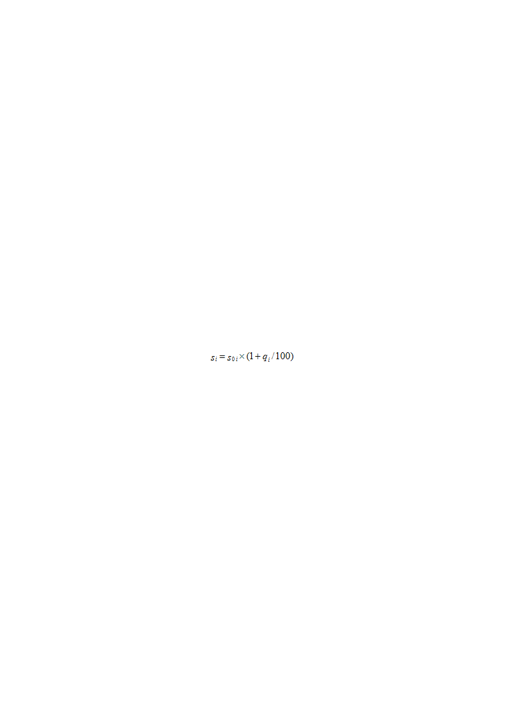
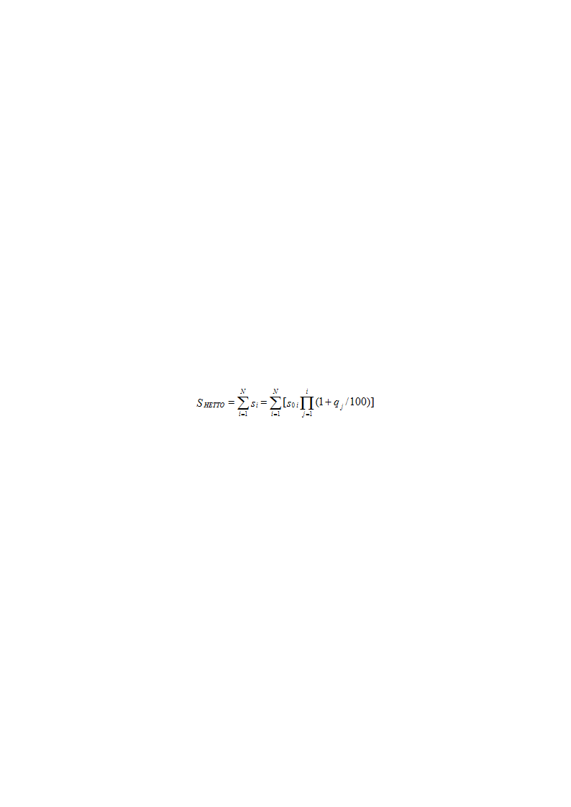
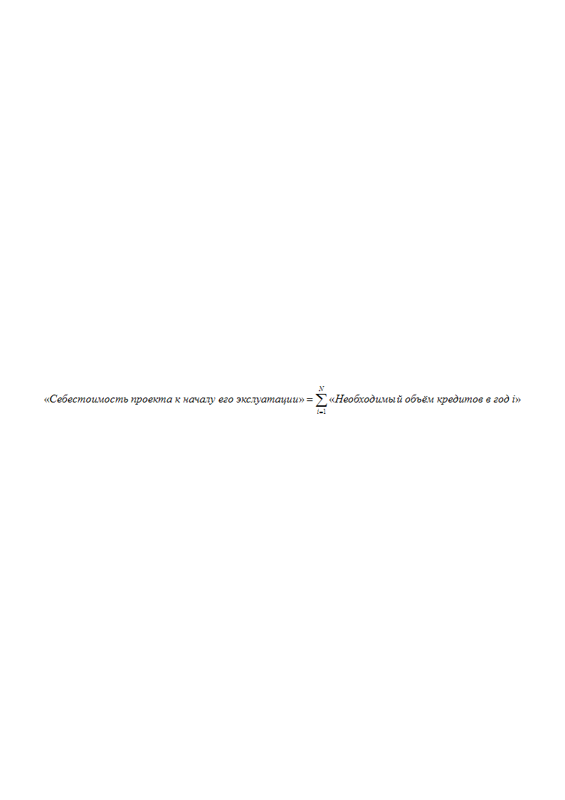
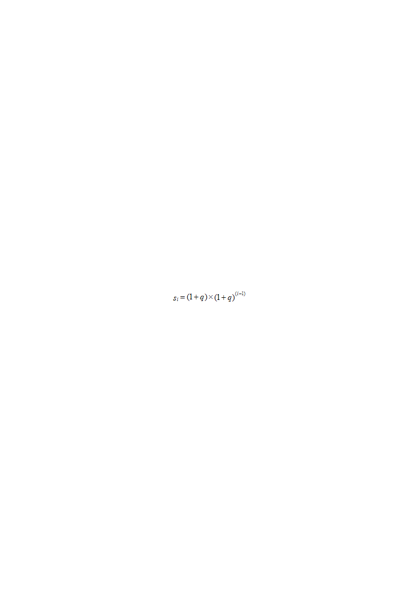
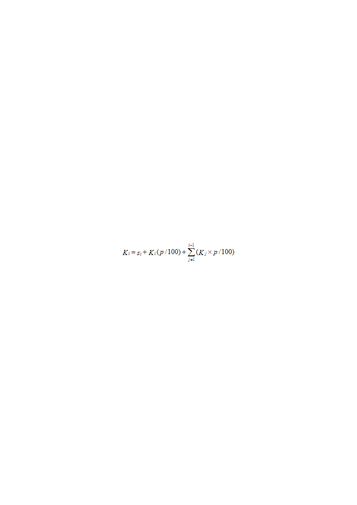
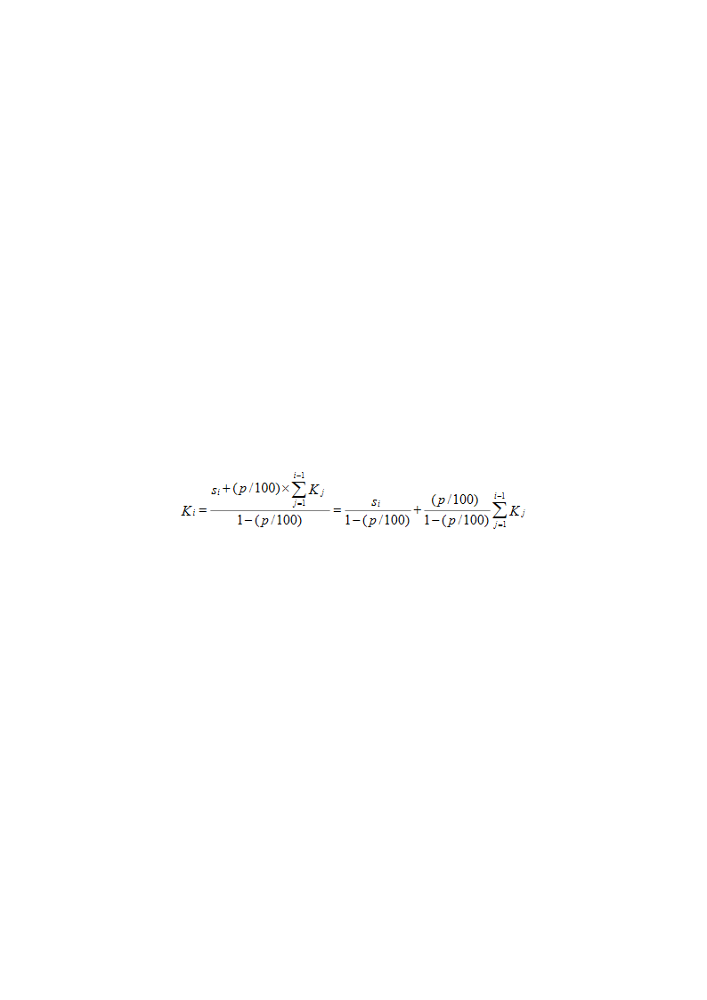

> **Первичный текст.** Финансовый климат и перспективы модернизации, 2010-08-02.
> Источник: `20100802 Финансовый климат и перспективы модернизации.doc` sha256 `1354ab9a07194050…`; [страница на dotu.ru](https://dotu.ru/2010/08/02/20100802_financial_climate/).
> Автоматическая транскрипция DOC→Markdown; смысл и формулировки не правились.
> Контрольные суммы и статус проверки — в [NOTICE.md](../../NOTICE.md).
> Содержание передаёт позицию авторов; утверждения не верифицированы библиотекой.

---

аналитическая записка

Финансовый климат и перспективы “модернизации”

1. Оценка себестоимости осуществления долгосрочного проекта\

на основе кредитования под процент в условиях инфляции

============================================================

Предположим, что мы намереваемся осуществить *в реальном секторе экономики* долгосрочный проект продолжительностью *N* лет, на протяжении которых он будет требовать только инвестиций, а коммерческая эксплуатация проекта может начаться только по завершении всех работ, т.е. в *N+1* год от его начала.

Предположим, что проект требует ежегодных инвестиций в объёме — *s0 i , i= 1÷ N,* исчисляемых в ценах конца года, предшествующего первому году осуществления проекта (равно — в ценах начала первого года осуществления проекта).

Предположим, что за годы осуществления проекта инфляция составляет *qi %* в соответствующий год, *i= 1÷ N.* Т.е. стоимость инвестиционных продуктов и зарплаты участников проекта к концу текущего года *i* по отношению к уровню соответствующих цен конца предшествующего года *i – 1* возрастает в *(1+qi /100)* раз. Иначе говоря, выполняется соотношение:

Предположим, что инвестиции в проект не облагаются налогами.

В этом случае необходимый суммарный номинальный *объём инвестиций нетто* в проект составит:

> \(1\)

Предположим, что проект осуществляется полностью на основе заёмных средств и ставка кредитования в каждый год составляет *pi %* годовых, в годы *i= 1÷ N* соответственно.

Поскольку на протяжении всего времени осуществления работ проект не приносит доходов, то это означает, что платежи процентов по кредиту текущего года должны выплачиваться из кредитной ссуды текущего года (в предположении, что у проекта нет иных источников дохода, из которых бы могло осуществляться его финансирование и которые могли бы быть источником платежей процентов по кредиту). Соответственно этому обстоятельству ежегодный объём, необходимых для осуществления проекта кредитов, будет составлять в каждый год следующую величину:

| *«Необходимый объём кредитов в год i» = «Объём инвестиций, приходящихся на очередной год i с учётом инфляции, накопленной к его завершению» + «объём платежей в год i процентов за кредиты, взятые в годы, предшествующие i» + «объём платежей процентов по кредиту, взятому на очередной год i»* | \(2\) |

|----|----|

Себестоимость проекта к моменту завершения работ и началу его коммерческой эксплуатации в этом случае будет равна сумме всех взятых инвестиционных кредитов:

\(3\)

С *N+1* года начнётся коммерческая эксплуатация завершённого проекта. Ожидаемые сроки его окупаемости можно оценить, исходя из уравнения:

> *«Себестоимость проекта к моменту начала его эксплуатации» + («ежегодные платежи процентов по всем ранее взятым кредитам в течение срока окупаемости»+ «ежегодные эксплуатационные расходы»)׫срок окупаемости» = «годовой доход от коммерческой эксплуатации проекта»× «срок окупаемости»*

>

> *«Срок окупаемости» = «Себестоимость проекта к моменту начала его эксплуатации» / («годовой доход от коммерческой эксплуатации проекта» – «ежегодные платежи процентов по всем ранее взятым кредитам в течение срока окупаемости» – «ежегодные эксплуатационные расходы»)*

При этом доходы от коммерческой эксплуатации и эксплуатационные расходы должны быть оценены с учётом инфляции, а так же, возможно, — и с учётом изменений конъюнктуры рынка.

Полная себестоимость осуществления проекта определится соотношением:

> *«Полная себестоимость проекта» = «себестоимость проекта к началу его эксплуатации» + «сумма платежей процентов по инвестиционным кредитам, выплаченная в течение срока окупаемости»*

На основе этой модели сопоставим друг с другом три проекта продолжительностью в 2 года, 5 и 10 лет. В целях упрощения вычислений предположим, что:

- инфляция на протяжении всего срока осуществления проекта неизменна и составляет 5 % в год, т.е. *qi =* 5 %;

- ставка ссудного процента на протяжении всего срока осуществления проекта тоже неизменна и составляет 10 % годовых, т.е. *pi =* 10 %.

- для осуществления каждого из проектов при отсутствии инфляции необходимы ежегодные инвестиции в объёме 1 у.е.

Ежегодный объём инвестиций, начиная с 1‑го года, с поправкой на ожидаемое к концу года накопление инфляции в этом случае определяется формулой:

 (4)

Необходимый объём кредитов в год *i,* из которых финансируется проект, определяется формулой (6), полученной на основе уравнения (5), структурно аналогичного соотношению (2), выраженному в лексике:

 (5)

\(6\)

При сделанных предположениях процесс инвестирования и кредитования проектов будет описываться таблицей 1.

**Таблица 1.\

Инвестирование и кредитование** (*q=5 %, p=10 %*)

| Годы | 1 | 2 | 3 | 4 | 5 | 6 | 7 | 8 | 9 | 10 |

|----|:--:|:--:|:--:|:--:|:--:|:--:|:--:|:--:|:--:|:--:|

| Ежегодный необходимый объём инвестиций, *si,* у.е. | 1,05 | 1,103 | 1,158 | 1,216 | 1,276 | 1,34 | 1,407 | 1,477 | 1,551 | 1,629 |

| Ежегодный необходимый объём кредитования, *Ki,* у.е. | 1,167 | 1,355 | 1,566 | 2,005 | 2,294 | 2,620 | 2,985 | 3,394 | 3,853 | 4,368 |

Итоговые показатели осуществления проектов представлены в таблице 2.

**Таблица 2.\

Сопоставление результатов проектов** (*q=5 %, p=10 %*)

| Продолжительность осуществления проекта (годы) | Себестоимость проекта *S НЕТТО* при отсутствии инфляции и беспроцентном кредитовании, у.е. | Себестоимость проекта *S НЕТТО* при 5 %‑ной инфляции и беспроцентном кредитовании, у.е. | Удорожание проекта за счёт инфляции, % | Себестоимость проекта к моменту начала его эксплуатации при 5 %-ной инфляции и кредитовании под 10 % годовых, у.е. | Удорожание проекта по отношению к безынфляционному варианту и беспроцентному кредитованию, разы |

|:--:|:--:|:--:|:--:|:--:|:--:|

| 2 | 2 | 2,153 | +7,7 | 2,522 | 1,261 |

| 5 | 5 | 5,802 | +16 | 7,898 | 1,580 |

| 10 | 10 | 13,207 | +32 | 27,412 | 2,741 |

Ниже в таблицах 3 и 4 представлены параметры процессов осуществления тех же проектов при инфляции *qi =* 7 % и ставке ссудного процента *pi =* 15 %.

**Таблица 3.\

Инвестирование и кредитование** (*q=7 %, p=15 %*)

| Годы | 1 | 2 | 3 | 4 | 5 | 6 | 7 | 8 | 9 | 10 |

|----|:--:|:--:|:--:|:--:|:--:|:--:|:--:|:--:|:--:|:--:|

| Ежегодный необходимый объём инвестиций, *si ,* у.е. | 1,07 | 1,145 | 1,225 | 1,311 | 1,403 | 1,501 | 1,606 | 1,718 | 1,838 | 1,967 |

| Ежегодный необходимый объём кредитования, *Ki ,* у.е. | 1,258 | 1,568 | 1,938 | 2,380 | 2,907 | 3,534 | 4,280 | 5,165 | 6,215 | 7,460 |

**Таблица 4.\

Сопоставление результатов проектов** (*q=7 %, p=15 %*)

| Продолжительность осуществления проекта (годы) | Себестоимость проекта *S НЕТТО* при отсутствии инфляции и беспроцентном кредитовании, у.е. | Себестоимость проекта *S НЕТТО* при 7 %‑ной инфляции и беспроцентном кредитовании, у.е. | Удорожание проекта за счёт инфляции, % | Себестоимость проекта к моменту начала его эксплуатации при 7 %-ной инфляции и кредитовании под 15 % годовых, у.е. | Удорожание проекта по отношению к безынфляционному варианту и беспроцентному кредитованию, разы |

|:--:|:--:|:--:|:--:|:--:|:--:|

| 2 | 2 | 2,215 | +10,75 | 2,826 | 1,413 |

| 5 | 5 | 6,154 | +23,08 | 10,051 | 2,010 |

| 10 | 10 | 14,784 | +47,84 | 36,705 | 3,671 |

Полная себестоимость проектов будет выше, чем представленная в таблицах 2 и 4, поскольку в неё должны быть включены все платежи по погашению задолженности по инвестиционным кредитам, взятым в годы *1÷ N,* осуществляемые в период срока окупаемости. Однако мы не будем заниматься её оценкой, поскольку для «финансового климата» модели нет характерных сроков окупаемости: проект к моменту его завершения может быть настолько обременён заведомо неоплатными долгами по кредитам, что не окупится никогда; а если он принадлежит к исключительно высокодоходной сфере, то окупится в течение года. Поэтому оценка полной себестоимости проекта, осуществляемого на основе исключительно инвестиционных кредитов – вопрос конкретики.

Если проект финансируется не только из заёмных средств, но и отчасти собственных источников финансирования, то модель остаётся по-прежнему работоспособной, но в формулы (5) и (6) надо будет подставить не полные величины ежегодных инвестиций *si ,* а их доли, которые должны финансироваться из заёмных средств.

13.07.2010

# 2. Выводы…

Это – модель, но в неё заложены и инфляция меньше, чем та, что имеет место в РФ на протяжении последних 10 лет, и ставки ссудного процента, меньшие, чем те, под которые реальный сектор может кредитоваться в наши дни.

Правительство и центробанк РФ определили задачу снизить инфляцию в 2010 году до 9 − 10 %, в 2011 году — до 7 − 8%, в 2012 году — до 5 − 7% (16.09.2009 по сообщению сайта: <http://www.infox.ru/business/finances/2009/09/16/K_2012_godu_inflyaci.phtml>).

Газета «Деловой Петербург» 20.10.2009 г. сообщила: «По мнению Степашина, банки вполне могут кредитовать реальный сектор под 8 – 12 %, однако реальные ставки держатся на уровне от 13 % до 20 %» (<http://www.dp.ru/a/2009/10/20/Banki_zavishajushhie_stavki>).

И это приводит к вопросу о том, как интерпретировать полученные результаты по отношению к перспективам модернизации страны?

– К сожалению, однозначно: модернизация страны в таком финансовом климате невозможна в силу экспоненциального роста себестоимости осуществления долгосрочных проектов. А такими являются большинство инновационных проектов: два года требуется на строительство автострады регионального значения; на создание и начало производства нового автомобиля требуется от 2 до 5 лет; пять — десять лет требуется на создание нового поколения элементной базы радиоэлектроники или создание с нуля самолёта нового поколения. А фундаментальная наука, которая в принципе не может работать в режиме непосредственной самоокупаемости, станет неподъёмной для госбюджета при лавинообразном росте с течением времени объёмов её финансирования.

Тем более модернизация невозможна при проведении финансовой политики ограничения денежной массы, находящейся в обороте: рост цен под воздействием отнесения платежей процентов по кредиту на себестоимость продукции неизбежно приведёт к тому, что продуктообмен, необходимый для осуществления модернизации, будет невозможен из-за отсутствия у реального сектора необходимого объёма оборотных средств. Но даже, если проводить политику увеличения денежной массы, продукция, полученная в результате технологически и организационно успешно проведённой модернизации, будет обладать столь высокой себестоимостью производства, что её будет невозможно продать на мировом рынке.

Как можно понять из таблицы 3 (её последний столбец, вторая строка), *если объём кредитования в 10 год в 7,46 раз превосходит базовый объём инвестиций для случая нулевой инфляции и беспроцентного кредитования,* то нарастание потребности в кредитах в таких темпах сделает модернизацию невозможной вследствие отсутствия в банковской системе страны соответствующих кредитных ресурсов, тем более при политике ограничения денежной массы.

Мимоходом отметим, что признанный в качестве допустимого правительством РФ 15 %-ный ежегодный рост тарифов на услуги ЖКХ в течение 5-летия сожрёт платёжеспособный спрос населения при продолжении политики ограничения денежной массы, находящейся в обороте, что сделает невозможным сбыт продукции. Точно так же экспоненциальный характер обесценивания денег при многолетней инфляции многократно обесценивает накопления: так за 20 лет при 5 %-ной инфляции в 2,5 раза обесценится первый взнос в накопительную часть пенсии. Т.е. сложившийся в стране финансовый климат обрекает на крах и реформу пенсионной системы.

Понятно, что минфин, минэкономразвития, счётная палата, соответствующие комитеты Госдумы и обслуживающие их деятельность институты РАН и консалтинговые фирмы обладают ресурсами, позволяющими построить более сложные модели и провести оценку перспектив развития на их основе. Однако они, в отличие от нас, обязаны не только получить реальные прогнозы, но и выработать жизненно состоятельные рекомендации о том, как сформировать такой финансовый климат, чтобы успех модернизации стал неизбежным. Однако, похоже, они решают какие-то иные задачи…

Внутренний Предиктор СССР\

01.08.2010 г.
---

[К произведению](README.md) · [Каталог](../../CATALOG.md)
