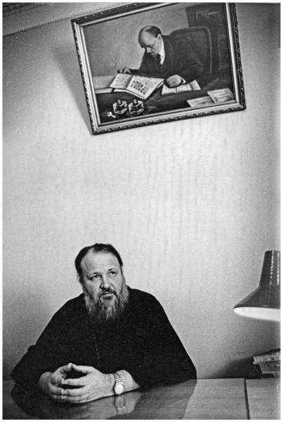

> **Первичный текст.** Церковь и государственность в России — главенству чего отдать предпочтение, 2015-08-28.
> Источник: `20150828 Церковь и государственность в России — главенству чего отдать предпочтение.doc` sha256 `793b56909d4d82dd…`; [страница на dotu.ru](https://dotu.ru/2015/08/28/20150828_church_and_statehood_in_russia/).
> Автоматическая транскрипция DOC→Markdown; смысл и формулировки не правились.
> Контрольные суммы и статус проверки — в [NOTICE.md](../../NOTICE.md).
> Содержание передаёт позицию авторов; утверждения не верифицированы библиотекой.

---

аналитическая записка

Церковь и государственность в России:\

главенству чего отдать предпочтение?

# 1. Мелкий эпизод и большая проблема

На сайте Московской патриархии есть сообщение, датированное 27 июля 2015 г.:

«В канун празднования 1000-летия преставления[^1] святого равноапостольного князя Владимира Святейший Патриарх Московский и всея Руси Кирилл обратился к Президенту Российской Федерации В.В. Путину и Президенту Украины П.А. Порошенко с письмами аналогичного содержания, выражающими глубокую обеспокоенность Предстоятеля Русской Православной Церкви происходящим на востоке Украины.

«Достижение мирных договоренностей в Минске приостановило эскалацию конфликта и внушило надежды на полное прекращение огня между воюющими сторонами. К сожалению, военные действия, хоть и не в прежнем масштабе, продолжаются по сей день. На Украине льется кровь, погибают люди», — говорится в Патриаршем обращении.

Его Святейшество останавливается в послании на судьбе мирного населения, живущего в зоне боевых столкновений, подчеркивая: «Особенно уязвимы старики, дети, инвалиды. Не все имеют силы и возможность покинуть родные места. Не все, к сожалению, выживают в этих страшных условиях. Кто-то гибнет под обстрелами, кто-то — от голода и болезней, от отсутствия медикаментов и элементарных условий жизни.

Святейший Патриарх Кирилл в своем обращении также говорит: «Церковь оказывает посильную помощь пострадавшим по обе стороны конфликта. Во всех храмах Русской Православной Церкви на каждом богослужении возносятся горячие молитвы к Богу о возвращении мира. Блаженнейший митрополит Киевский и всея Украины Онуфрий и возглавляемая им Украинская Православная Церковь делают все возможное для примирения и восстановления единства народа».

Вместе с тем, отмечает Предстоятель, обеспечить безопасность мирному населению региона можно лишь «путем полного прекращения военных действий, неукоснительного соблюдения Минских договоренностей и налаживания прямого диалога между всеми сторонами конфликта».

В дни, когда Церковь особо чтит память «Крестителя Святой Руси, заложившего основы духовного единства русского и украинского народов, научившего нас христианской любви и прощению», Святейший Патриарх «с болью в сердце от имени всей Русской Православной Церкви» просит Президентов России и Украины «употребить все усилия для прекращения кровопролития».

**Пресс-служба Патриарха Московского и всея Руси**»[^2].

Пресс-служба Кремля в связи с этим посланием вождя РПЦ отреагировала следующим образом:

«Будут продолжены действия России, которые направлены на то, чтобы способствовать поискам решения конфликта, который мы все наблюдаем на Украине», — рассказал Дмитрий Песков. Он добавил, что в Кремле ранее получили письмо Патриарха Московского и Всея Руси Кирилла, посвященное ситуации на Донбассе. По словам пресс-секретаря Владимира Путина, «это послание не требует ответа»[^3]

Как отреагировал Киев на это послание, нам неизвестно: в интернете ничего на эту тему найти не удалось. Само послание также не было опубликовано, что подразумевает, что оно как бы «личное», в силу чего предназначено только адресатам. А вот сообщение о нём на сайте патриархии — это действо, ориентированное на публику, кое следует понимать в том смысле, что Политбюро РПЦ «бдит», политическую ситуацию отслеживает и исполняет свой «пастырский долг».

Может возникнуть вопрос: *Почему ВП СССР обратился к теме послания патриарха московского и всея Руси президентам России и Украины почти месяц спустя, когда это событие уже многими забылось вследствие того, что прошло без каких-либо видимых — с ним связанных — последствий и в официальных отношениях двух постсоветских государств, и в течение гражданской войны на Украине?*

Но на это действо патриарха московского можно посмотреть и иначе. Представим, что после Курской битвы только что избранный патриарх Сергий обращается к И.В. Сталину и вождю национал-социалистической партии Германии — А. Гитлеру — с аналогичным обращением: прекратить кровопролитие на территории СССР, где в результате боевых действий гибнут ни в чём не повинные женщины, старики и дети. Скажете, что такое невозможно представить? — Но обращение патриарха Кирилла ничем не отличается от подобного гипотетического обращения патриарха Сергия, которого не было и НЕ МОГЛО БЫТЬ.

В 1941 году на СССР формально напала гитлеровская Германия, а по существу — не полностью объединённый в третий рейх Запад[^4]. Великобритания и США с Канадой не участвовали тогда в этой агрессии на стороне фашистской Германии только благодаря способности И.В.Сталина предвидеть возможный ход развития событий в случае нанесения упреждающего удара по сосредоточенной группировке вермахта на западных границах СССР.

*[В оригинальном издании здесь расположен рисунок/схема. Иллюстрация не включена в данный выпуск: ожидает визуальной и правовой проверки. Файл источника: image1.jpeg]*Сегодня же ситуация более сложная чем тогда, поскольку в мае 2014 года началась немотивированная агрессия марионеточной киевской фашистской хунты, свершившей государственный переворот при поддержке всего Запада и под руководством его спецслужб, т.е. имела место агрессия объединенных сил Европы, Великобритании, США и Канады против Украины — части бывшего СССР. Современные либералы начали критику И.В. Сталина на старте перестройки за то, что он якобы доверился Гитлеру, «проспал» его нападение. А самые рьяные либералы и патриоты упрекают И.В. Сталина за то, что он не нанёс упреждающего удара по изготовившимся к вторжению войскам вермахта.

Сегодня либералы упрекают В.В. Путина за то, что он не помогает киевской хунте навести конституционный порядок на Украине, отказывается поддержать «европейский выбор украинского народа» и ведёт не объявленную войну в «Новороссии». «Патриоты» упрекают В.В. Путина за то, что он в течение более чем года никак не может начать боевые действия России против войск киевской фашистской хунты и не идёт брать Киев.

Если бы И.В. Сталин прислушался в 1941 году к тем своим советникам, которые считали необходимым нанести упреждающий удар по гитлеровской группировке на западных границах, то СССР бы пришлось воевать с объединёнными силами всего Запада, включая Великобританию (+её колонии), с США и Японией. Сейчас же — объединение сил Запада против России — свершившийся факт, и Западу нужен только повод, чтобы завершить то, что не удалось в середине ХХ века сделать Гитлеру. История ничему не учит? — Но если не учит, то наказывает за невыученные уроки — причём жестоко. Это касается и первоиерархов церквей.

Послание патриарха московского обоим президентам — событие политически ничего не стоящее, не значимое, как и более чем годовалой давности (27 мая 2014 г.) послание патриарха московского и всея Руси, адресованное П.А. Порошенко в связи с избранием оного «чада РПЦ» «зиц-председателем» Украины[^5]: кризис на Украине *— под воздействием её собственной социальной психодинамики —* обостряется и в аспекте общегосударственной идеологии и доверия населения государственности, и в аспекте функционирования хозяйства и финансовой системы, и в аспекте обеспечения правопорядка на подвластных Киеву территориях[^6], и в аспекте подготовки Киевом войсковой карательной операции **с целью зачистки от населения** нелояльных ему регионов. И не московская патриархия сформировала и рулит этой разрушительной и убийственной для множества людей социальной психодинамикой: т.е. это — объективный показатель того, что реально РПЦ не исполнила свой «пастырский долг»[^7] в отношении населения одной из своих канонических территорий, как это уже не однократно бывало в её истории в прошлом.

Поэтому послание патриарха обоим президентам — «симптомчик», в котором выразилась одна из важнейших проблем РПЦ и российского общества. Суть этой проблемы в том, как реализуется полная функция управления в толпо-«элитарном» обществе, и в том, как она должна реализовываться в обществе *реального народовластия на основе добросовестности*.

# 2. Надгосударственная власть и власть государства

Всякое более или менее цивилизованное общество живёт под властью той или иной концепции организации его жизни в преемственности поколений. Любая такого рода концепция — продукт нравственно обусловленного произвола тех людей, которые её смогли породить и внедрить в жизнь общества, так или иначе сумев организовать процесс общественного самоуправления в соответствии с нею, в том числе и подчинив государственность общества этой концепции. В этом суть того явления, которое мы назвали «концептуальная власть» ещё в конце 1980‑х гг.

Если общество не знает, что такое концептуальная власть, как она возникает и осуществляется, и убеждено в том, что оно «просто живёт», то членам этого общества самое время подумать над афоризмом: **«если ты не видишь в схеме лоха, то лох — это ты»**.

Тем не менее, если концепция направлена на порабощение общества и проводится в жизнь открыто, излагается «открытым текстом», а не содержится в некоем «коде»[^8], скрывающем её суть, то её антиобщественная сущность станет очевидна для общества в короткие по историческим меркам сроки, и общество отвергнет концепцию и её носителей, а может быть и уничтожит физически наиболее настырных её проводников в порядке осуществления необходимой самообороны. Поэтому если неправедные носители концептуальной власти всё же хотят проводить антиобщественную концепцию в жизнь, то они должны придать ей приемлемые для политически активной части этого общества формы, т.е. они должны закодировать её антиобщественную суть в благообразные словесные и художественные формы, которые концептуально безвластное общество примет, а приняв их, окажется во власти соответствующей концепции по принципу «увяз коготок — всей птичке пропа́сть». Проделать эту операцию в отношении концепции и в отношении общества — задача *идеологической власти*. Но о том, что идеологическая власть есть и действует, — учебники социологии и истории тоже помалкивают, как и о власти концептуальной.

После того, как это проделано, законодательная, исполнительная и следственно-судебная власть государства, оказываются подчинёнными соответствующей концепции, вследствие чего государство и принявшее идеологию общество утрачивают полноту суверенитета.

Высказав это, обратимся к большой проблеме РПЦ и России.

# 3. Нужна ли нам общероссийская «Каносса»?

Суть библейской глобально-политической доктрины — концепции — скупка мира со всеми его обитателями и их имуществом на основе мафиозно-клановой монополии на ростовщичество и безусловный геноцид в отношении народов, не приемлющих такой миропорядок[^9].

Церковное вероучение — идеология — скрывает эту суть, порабощая интеллект тех, кто приемлет её вероучение. Соответственно церковный идеал — всё общество воцерковлено, государство управляет обществом под «пастырским» руководством иерархии церкви, которая перед обществом ни за что не отвечает. Если кто-то из политиков государства или общественных деятелей не подчиняется должным образом «пастырям», то проблема решается в конечном итоге просто — отлучение от церкви, и отступник от веры нелегитимен в обществе, и может быть уничтожен «святой инквизицией», которая «пламенно позаботится» о «спасении его бессмертной души».

Схема взаимоотношений *«главенство церкви — подчинённость государства церкви — подчинённость общества церкви и государству»* в общем-то без особых проблем работала в средневековье ранее начала реформации (1517 г.).

Наиболее широко известный и образцово-показательный пример такого рода — когда император священной римской империи[^10] Генрих IV начал своевольничать, то папа римский Григорий VII отлучил Генриха IV от церкви, объявил его правление незаконным, в результате чего император утратил власть де-факто. После этого Генрих IV отправился к резиденции папы римского (к замку Каносса), обрядившись в знак покаяния во власяницу[^11], и как сообщают некоторые источники, пошёл туда босиком зимой 1076 / 1077 г. Достигнув Каноссы, Генрих ночевал в ближайшей деревне, а днём стоял на коленях перед воротами замка. Через три дня папа римский допустил его до «своего святейшества», Генрих IV признал свою неправоту, выразил покорность папе, и тот снял с него отлучение, после чего Генрих IV снова обрёл легитимность в качестве императора священной римской империи. Но эту легитимность и право передавать корону по наследству признали не все подчинённые Генриху IV феодалы, а Григорий VII поддержал их против Генриха IV, в результате чего началась гражданская война, в ходе которой Григорий вторично отлучил Генриха от церкви, но прогадал. Генрих одержал победу в гражданской войне, и теперь уже Григорий вынужден был бежать, в результате чего на папский престол взошёл Климент III, и в истории католической церкви начался период, в котором Климент, получивший в последствии титул «антипапа», боролся за свою монопольную легитимность против Григория VII, а после его смерти, — против его преемников.

А что было бы в наши дни, если бы патриарх московский отлучил от церкви П.А. Порошенко? — Скорее всего патриарх «потерял бы лицо», поскольку П.А. Порошенко и свидомые проигнорировали бы это их отлучение от церкви «патриархом-москалём», либо П.А. Порошенко по пиар-мотивам подался бы в лоно самостийной украинской православной церкви или к униатам. Поэтому в наши дни патриарху московскому остаётся только писать как бы «личные» послания-увещевания тем или иным политикам и бизнесменам и проповедовать в телеэфире толпе, да и то: время для проповедей ему предоставляют не в «прайм-тайм».

Т.е. общество изменилось, и ставшая фиктивной схема управления *«главенство церкви — подчинённость государства церкви — подчинённость общества церкви и государству»* может только демонстрироваться на публику в храмах в двунадесятые праздники, но реально в политике она давно уже не работает. А в силу того, что общество развивается, она не будет работать и в будущем, поскольку одна из объективных закономерностей управления — необходимость обеспечение взаимного соответствия системы управления и объекта управления в процессе их взаимодействия с окружающей объект средой.

4. Многовековой конфликт церкви и государства:\

в Европе и на Руси

===============================================

Ряд историков считают императора Генриха IV предтечей реформации. Действительно, конфликты церкви и государства после Каноссы в Европе возникали снова и снова, и в конечном итоге привели к тому, что:

- либо произошло отделение церкви от государства (государство стало светским, т.е. религии утратили статус государственных и стали частным делом каждого: Франция, протестантские страны),

- либо к подчинению церкви государству (Великобритания), а собственно церковным государствами остались только Ватикан и Мальтийский орден («государство» без территории).

Казалось бы, европейские государства в результате этого обрели полноту суверенитета. Но нет: ядро культуры, представляющей собой информационно-алгоритмическую систему, осталось по-прежнему ростовщическим, а общества относятся к банковскому ростовщичеству как к безальтернативному системообразующему фактору в мировой экономике, вследствие чего все государства Европы находятся на содержании у транснациональной, надгосударственной корпорации ростовщиков и подчинены её хозяевам. Т.е. надгосударственная власть *библейской концепции скупки мира со всеми его обитателями и их имуществом, осуществления геноцида по отношению к непокорным,* осталась прежней, но за тысячу лет без малого (если считать от эпизода в Каноссе) успела сменить несколько идеологических кодов[^12] осуществления своей тирании[^13]. При этом обыватели и политики государств Запада убеждены в том, что именно они — лидеры цивилизационного развития человечества. А утверждение, что научно-технический прогресс Запада угрожает самоубийством глобальной цивилизации, породившей биосферно-социальный (экологический) кризис вследствие того, что их наука аморальна, а техника в своём развитии обогнала нравственность и этику, — встречает разного рода несостоятельные возражение с их стороны.

В России, при поверхностном взгляде, — государство и церковь также отделились друг от друга, но имели место «закавыки». В частности, Россия почему-то неоправданно не приемлет образ жизни цивилизации, выработанный Западом. По мнению западных интеллектуалов всех мастей и отечественных западников: чего хотеть от России? — страна дураков, даже перенять прогрессивную цивилизованность, созданную другими, не могут, не напортачив.

Но если взглянуть в суть того, как реализовывалась полная функция управления на Руси на протяжении последнего тысячелетия, то окажется, что Россия — действительно не Европа. На первом этапе после крещения Руси иерархия РПЦ — была периферией иерархии византийской церкви и работала на геополитические интересы Византии, где шла борьба между кесарем и патриархом за главенство. После разделения церквей на автокефальные православные и «вселенскую» римско-католическую (1054 г.), РПЦ продолжала оставаться подчинённой Константинопольской патриархии. При этом с момента появления на Руси РПЦ сначала занималась «разводняком» в отношении великого и удельных князей, но это оказалось настолько политически неэффективно, что спустя некоторое время ей пришлось заниматься этим же при поддержке золотоордынских ханов, которые предпочли опираться на исторически сложившуюся идеологическую власть, а не искоренить её, навязав какую-то иную. После великого стояния на Угре (1480 г.) и далее при Иване Грозном на Руси работала схема управления, обоснованная Иосифом Волоцким: «царь — глава государства — единственный и безальтернативный наместник Божий на Земле, защитник церкви, а церковь служит Богу, подчиняясь царю». Т.е. церковь была бесструктурно-идеологически подчинена государству. При этом в дискуссии с папским посланником иезуитом Антонио Поссевино Грозный заявил: «Наша вера христианская, а не греческая»[^14], — т.е. он осознавал, что христианство и византийское вероучение — не одно и то же и делал из этого определённые выводы по отношению к внутренней и внешней политике. Несколько ранее Грозный отверг и вероучение реформаторов (см. его ответ Яну Роките), запретив им проповедь на Руси. После падения Византии (1453 г.) в царствование сына Грозного — Фёдора Иоанновича — в период фактического правления Бориса Годунова РПЦ стала автокефальной, появился патриарх московский и всея Руси и московская патриархия (1589 г.). Не прошло и ста лет после этого, как патриарх Никон решил стать «почётным папой римским Царства Московского» и начал титуловаться наравне с царём Алексеем Михайловичем «великим государем», реализуя описанную выше схему *«главенство церкви — подчинённость государства церкви — подчинённость общества церкви и государству».* И фактически никто иной, как патриарх Никон положил начало расколу, последствия которого не преодолены доныне. По словам нынешнего патриарха Кирилла (В.М. Гундяева) сын тишайшего Алексея Михайловича Пётр I сломал «цивилизационный код»[^15]. Это выразилось в том, что Пётр I возобновил управление по схеме Иосифа Волоцкого. А от времён Петра Великого дошли предания: Пётр заявил «Бог создал Россию одну, и она соперников не имеет». После изъятия у церкви колоколов на нужды артиллерии, когда церковь попыталась руководить им в аспекте выработки и проведения политического курса, иерархи получили ответ: «если где иконы заплачут маслом, то там у попов и монахов кровью заплачут задницы» — в результате чего «чудеса» с мироточащими иконами[^16], подрывавшие в пастве авторитет царя и государства, чудесным образом прекратились. Когда в 1700 г. скончался патриарх Адриан, то Пётр запретил выбирать ему преемника и подчинил РПЦ органу государственной власти — Синоду во главе со светским обер-прокурором. Эта схема церковно-государственных отношений просуществовала до февральско-пуримской буржуазно-либеральной революции 1917 г.[^17] Когда произошла эта революция, РПЦ её поддержала: по сути иерархи РПЦ на протяжении всего времени подчинения церкви государственному Синоду тяготились этим и потому истово приветствовали свержение монархии[^18]. После краха Российской империи патриархом в декабре 1917 г. был избран Тихон. Но партаппаратной диктатуре, опиравшейся на идеологию «мраксизма» идеологическая власть РПЦ и её патриарха была не нужна. Поэтому после смерти Тихона в 1925 г. РПЦ до 1943 г. оставалась без патриарха и переживала период гонений, пока в 1943 г. И.В. Сталин не возобновил патриаршество и не прекратил подавление церкви в политике государства. Тогда патриархом был избран Сергий (Старгородский) — один из сподвижников Г.Е. Распутина, оклеветанного историками СССР. К патриарху Сергию возводят следующие слова: **«Этот строй (**социализм: наше пояснение при цитировании**) не только не противен христианству, но и желателен для него более всякого другого».** И есть основания полагать, что И.В. Сталин, прошедший обучение в семинарии, придерживался сходного мнения и возобновил патриаршество вовсе не для того, чтобы РПЦ снова начала проповедовать:

«Рабы, повинуйтесь господам своим по плоти со страхом и трепетом, в простоте сердца вашего, как Христу, не с видимою только услужливостью, как человекоугодники, но как рабы Христовы, исполняя волю Божию от души, служа с усердием, как Господу, а не как человекам, зная, что каждый получит от Господа по мере добра, которое он сделал, раб ли, или свободный» (К Ефесянам послание апостола Павла, 6:5-8).

Т.е., возобновив патриаршество в СССР, И.В. Сталин предоставил РПЦ возможность отказаться от библейского проекта порабощения человечества от имени Бога и вернуться к истинному Христианству[^19], спустя почти век после того, как аналогичное предложение вернуться к истинному Христианству, высказанное святителем Игнатием Брянчаниновым[^20], Синод и монархия проигнорировали.

Тем не менее, после смерти патриарха Сергия (1944 г.) и убийства И.В. Сталина (1953 г.) РПЦ продолжала жить своею жизнью, не отрёкшись от идеи «рабы повинуйтесь господам», подчинённой ветхозаветной доктрине скупки мира со всеми его обителями и их собственностью «господами»-иудеями, и не покаявшись в её многовековой пропаганде, а государство жило своею жизнью под лозунгами *как бы строительства* коммунизма.

*[В оригинальном издании здесь расположен рисунок/схема. Иллюстрация не включена в данный выпуск: ожидает визуальной и правовой проверки. Файл источника: image2.jpeg]*Но если соотноситься со схемой управления толпо-«элитарным» обществом *«концептуальная власть — идеологическая власть — государственность — общество»*, то в 1917 г. смены концептуальной власти не было. Концептуальная власть осталась прежней — властью хозяев библейского проекта глобализации, однако при этом идеология идеалистического атеизма была заменена идеологией материалистического атеизма[^21]. Вследствие этого марксистско-ленинская партия по её сути была церковью, культивировавшей вероучение-идеологию материалистического атеизма. Соответственно этому обстоятельству иерархия церкви материалистического атеизма желала полностью устранить конкурентов, распространявших идеологию идеалистического атеизма. Поэтому РПЦ пришлось пережить очередной период гонений во времена Н.С. Хрущёва[^22] (отстранён от всех должностей в 1964 г.). А в брежневские времена иерархии обеих церквей мирно сосуществовали (паствы хватало и тем, и другим), встречались на каких-то «тусовках», что-то «перетирали», а в структурах КГБ — взаимно проникали друг в друга[^23]. В брежневские времена высшие иерархи обеих церквей ездили на «Чайках» и ЗиЛ-ах, иерархи среднего уровня — на престижных чёрных «Волгах», жили в спецрезиденциях своих церквей, построенных на «членские взносы» членов своих «партий» и доходы, полученные от продажи «партийной» литературы и т.п.

Без понимания того факта, что марксистско-ленинская партия в пределах многонационального СССР, включавшего в свой состав 15 союзных республик и 20 автономных республик в составе союзных, была функциональным аналогом вселенской римско-католической церкви в во многонациональной Европе времён папы Григория VII, многое в сталинской эпохе будет не понято либо вообще, либо будет понято извращённо.

Суть той эпохи в аспекте организации самоуправления общества состоит в том, что И.В. Сталин целенаправленно работал на то, чтобы возобновившуюся после 1917 г. схему управления *«главенство церкви — подчинённость государства церкви — подчинённость общества церкви и государству»,* в которой роль церкви заняла марксистско-ленинская партия демонтировать без очередной катастрофы государства так, чтобы ей на смену пришла общенародная государственность, обладающая полнотой суверенитета и исключая возможности эксплуатации «человека человеком», т.е. направленная на искоренение библейского проекта порабощения человечества в обеих его версиях — библейски-конфессиональной и «мраксистско»-светской. Именно в этом смысл Конституции СССР 1936 г.[^24] В этом же смысл почти что полного уничтожения «идейных марксистов» — делегатов XVII съезда ВКП (б) (1934 г.)[^25]. В этом же смысл 13-летнего перерыва между XVIII (1939 г.) и XIX (1952 г.) съездами коммунистической партии, в течение которого:

- с одной стороны — политика И.В. Сталина была направлена на отстранение партаппарата от безответственного вмешательства в дела государственной и хозяйственной власти, что имело место в 1920‑е гг. и позднее — в хрущёвско-брежневско-андроповско-горбачёвские времена,

- а с другой стороны — партаппартчики и подобранные ими делегаты съезда «из народа» не имели возможности взбунтоваться на не созванном к завершению очередной пятилетки съезде[^26] и отстранить от власти И.В. Сталина формально законным способом.

Но И.В. Сталин не довёл процесс ликвидации схемы *«главенство церкви — подчинённость государства церкви — подчинённость общества церкви и государству»* и построения реального народовластия, обладающего полнотой суверенитета, до стадии необратимости. И после его убийства[^27] схема управления на основе безответственного главенства марксистско-ленинской церкви-партии была восстановлена[^28] и действовала до тех пор, пока очередной патриарх церкви материалистического атеизма не предал и не передал страну под власть буржуазных либералов, властвующих над региональной цивилизацией Запада, авангард которых — экономистов-монетаристов — М.Л. Хазин отнёс к категории тоталитарных сект[^29]. При этом осуществление власти по схеме *«главенство церкви — подчинённость государства церкви — подчинённость общества церкви и государству»* после 1991 г. было продолжено, хотя на смену марксистской церкви материалистического атеизма пришла другая церковь материалистического атеизма.

Но буржуазно-либеральное дело зашло в тупик уже к 2008 г. Это выразилось в том, что в телевизионном проекте «Имя России» фактически победил И.В. Сталин[^30], т.е. народ, голосуя в этом телепроекте за исторических личностей, иносказательно высказался за ликвидацию схемы *«главенство церкви — подчинённость государства церкви — подчинённость общества церкви и государству»* вне зависимости от того, какая из множества «церквей» будет главенствовать над государством. Но именно в таких общественно-политических условиях заведомого отсутствия поддержки со стороны общества схеме манипулирования им — РПЦ претендует заместить собой в этой схеме тоталитарную секту либералов-глобализаторов, не имея за душой собственного проекта глобализации[^31]…

Анализ взаимоотношений, с одной стороны, разновидностей идеологической власти — разнородных церквей — и, с другой стороны, государственности в схеме управления *«концептуальная власть — идеологическая власть — государственность — общество»* в истории России показывает, что конфликт разнородных церквей и государственности действительно имеет место на протяжении всей обозримой истории. Но если цели, на которые работает идеологическая власть в лице любой из упомянутых ранее церквей, понятны, то какие цели в нём преследует государственность, — для многих вопрос открытый.

Одни считают, что все главы государства Российского, кто противился церквям, обрушивали схему управления *«библейская концептуальная власть — идеологическая власть — государственность — общество»* и строили управление по своему произволу, — маниакально властолюбивые деспоты-тираны. Смысл их деятельности — безраздельная личная диктатура, подчинение ей народа и не более того. И соответственно такая их позиция и безропотность холопствующего перед ними народа — генератор извечного конфликта России и передового Запада.

Другие полагают, что личная диктатура не была самоцелью всех «тиранов», но они следовали нормальной управленческой практике, которая требует, чтобы кто-то нёс единоличную персональную ответственность за общее дело, что безальтернативно необходимо для достижения высокого качества управления этим делом. Этот принцип безальтернативен и для народовластия, и для тираний, хотя в народовластии и в тирании он работает на достижение взаимно исключающих целей[^32]. И то, что либерально недомыслящие называют тиранией, в условиях извечной агрессии Запада и его хозяев против Русской многонациональной цивилизации было средством повышения быстродействия системы управления Россией в целях защиты её самобытности и свободы развития. Но о том, в чём смысл «русскости» как смысла жизни Русской многонациональной цивилизации — ничего кроме общих слов не было, поскольку этот смысл от времён «Слова о законе и благодати»[^33] митрополита киевского Иллариона (умер около 1055 г.) до произведений И.В. Сталина выражался в терминологии, внедрённой в культуру Руси извне хозяевами и заправилами библейского проекта. Это создавало иллюзию, что вообще нет никакой «русскости», а есть только неумелое подражание отсталой России передовому Западу, в ходе которого русские извращают и коверкают передовые для своей эпохи идеи, рождённые мыслителями Запада. Но это не так. Если идти от реальности Жизни и осмыслять её развитие по-русски откроется иная картина.

Глобальная цивилизация людей — издревле совокупность взаимодействующих друг с другом региональных цивилизаций. Региональные цивилизации характеризуются и отличаются идеалами (смыслом жизни человека и общества), которые они несут через века. Реальная жизнь любой региональной цивилизации может быть сколь-угодно далека от несомых ею идеалов, но пока эти идеалы не искоренены из духа народов, составляющих эту региональную цивилизацию, из глубин душ её людей, — цивилизация жива. Носителем идеалов является цивилизационное ядро: оно может быть малочисленным по отношению к общей численности населения цивилизации, а может охватывать всю её. Но пока оно есть — цивилизация жива. Даже если его выявить и истребить, то ещё некоторое время будет существовать полевое тело эгрегора цивилизации, и если среди потомков или пришельцев в регион, где была цивилизация, кто-то замкнётся психически на это полевое тело эгрегора, то открывается возможность к возрождению цивилизации и воплощению в жизнь её идеалов.

Запад — цивилизация, реализовавшая свой идеал — «жрачки и наслаждений». Теперь он будут расхлебывать последствия этой реализации в русле алгоритмики эксперимента с мышами «Вселенная-25»[^34].

Наш идеал — неотмирная Божья праведность должна воплотиться в жизнь Земли, но мы пока (если не считать периодов царствования Грозного и строительства социализма после 1917 г.) даже не приступали к его воплощению в жизнь своим умом и волей. И хилиазм-миллинаризм — «ересь» обречённая Свыше на Победу. Путь к его торжеству в глобальных масштабах — смысл Русской истории и её перспектив.

В этом же историко-политическом контексте следует понимать и слова В.В. Путина, произнесённые им на политическом форуме «Валдай» в 2007 году: «Суверенитет — это очень дорогая вещь, и на сегодняшний день, можно сказать, эксклюзивная в мире. Для России суверенитет — не политическая роскошь, не предмет гордости, а условие выживания в этом мире. Россия — такая страна, которая не может существовать без защиты своего суверенитета. Она будет либо независимой и суверенной, либо, скорее всего, её вообще не будет».

Но суверенитет России — совокупность воль суверенных по своей нравственности и миропониманию личностей — цивилизационного ядра Русской многонациональной цивилизации. «Мыслящий тростник», либеральный офисный планктон, верноподданные безвольные холопы к этому не причастны. Они — помеха развитию России и человечества.

Внутренний Предиктор СССР\

24 — 27 августа 2015 г.

[^1]: Годовщина смерти.

[^2]: <http://www.patriarchia.ru/db/text/4176516.html>.

[^3]: <http://rusprav.tv/peskov-poslanie-patriarxa-pomozhet-razreshit-konflikt-na-ukraine-44734/>.

[^4]: См. аналитическую записку ВП СССР «К 70-летию Великой Победы: освободиться от власти иллюзий!» из серии «О текущем моменте» № 2 (118), март 2015 г.

[^5]: См. текст по ссылке: <http://www.patriarchia.ru/db/text/3660751.html>.

[^6]: В том числе и в аспекте подавления идейно-политической оппозиции режиму и безыдейного саботажа его политики населением (борьба с «бытовым сепаратизмом»).

[^7]: Суть «пастырского долга» — формировать социальную психодинамику так, чтобы люди в этом обществе с течением времени начали осознанно избирать и добросовестно творить избранную ими долю в Промысле Божием, после чего они перестанут нуждаться в том, чтобы их «пасли» «пастыри». Но если «паства» — источник доходов «пастырей» и целью «пастырей» становится — непрестанно получить доходы на основе «выпаса» «паствы», то уклонение корпорации «пастырей» от исполнения пастырского долга в указанном выше его смысле — неизбежно.

[^8]: Например в «цивилизационном коде», о необходимости сохранения которого Владимир Михайлович Гундяев говорит довольно часто.

[^9]: Второзаконие, 23:19, 20; Второзаконие, 28:12, 13; Второзаконие, 15:6; Исаия, 60:10 — 12; Матфей, 5:17, 18.

[^10]: Впоследствии название обрело добавку: «германской нации» — первый рейх.

[^11]: Власяница — ритуальная одежда, примитивная по покрою, сшитая из грубой ткани, сотканной из колючей шерсти верблюдов, овец или коз. Надевали на голое тело, кожные покровы которого колючая ткань постоянно раздражала или даже травмировала. Это называлось «умерщвление плоти» и должно было служить «укреплению духа», т.е. навыка самообладания. Кроме того ношение власяницы демонстрировало окружающим смирение и покаяние.

[^12]: Католицизм, протестантизм в разных версиях, светский либерализм, марксизм, гитлеризм.

[^13]: Кого интересуют детали — изучайте историю Европы в деталях, соотнося исторические события с полной функцией управления. О том, что такое полная функция управления, — см. в материалах Концепции общественной безопасности достаточно общую теорию управления.

[^14]: Г. Флоровский. Пути русского богословия. Часть 1.

[^15]: Было сказано в 2008 г. при обсуждении телевизионного проекта «Имя России».

[^16]: Мироточение икон расценивалось как дурное предзнаменование, не говоря уж о «кровоточении» икон.

[^17]: Есть легенда о том, что Николай II незадолго до первой мировой войны хотел отречься от престола и стать новым патриархом, но «верноподданные», обсуждая вопрос о возобновлении патриархии, не догадались предложить ему эту роль, и он отказался от возобновления патриархии.

[^18]: Но ныне они предпочитают об этом не вспоминать и возлагают на народ ответственность за измену династии Романовых, идеализируя Николая II.

[^19]: «С сего времени Царствие Божие благовествуется и всякий усилием входит в него» (Лука, 16:16).

[^20]: См. записки епископа Игнатия «О необходимости Собора по нынешнему состоянию Российской Православной Церкви» (1862 — 1866 гг.).

[^21]: Идеалистический атеизм заявляет: Бог есть, приходите к нам, мы научим вас истинной религии и вы будете в ладу с Богом. Но чем истовее человек следует вероучению, заглушив свои совесть, стыд и разум, тем больше у него проблем в жизни и во взаимоотношениях с Богом.

    Материалистический атеизм честнее — он заявляет: Бога нет, изучайте законы природы и делайте, что хотите в соответствии с научным знанием. Но в силу того, что его наука не боговдохновенна проблемы возникают всё равно и они тем больше, чем в большей мере вероучение материалистического атеизма подавило совесть и стыд.

    Хозяева обеих идеологий были одни и те же. Поэтому в СССР социологическая доктрина Библии никогда не изучалась и не критиковалась (в отличие от Корана, который был оклеветан историками СССР в академическом 12-томнике «Всемирная история», изданном в конце 1950-х — начале 1960‑х гг.), хотя Библию и её персонажей целенаправленно осмеивали.

[^22]: Н.С.Хрущёв намеревался полностью искоренить вероучение РПЦ и обещал в 1980‑м г. показать по телевидению последнего попа. Чтобы сдержать это обещание, он возобновил политику закрытия храмов, монастырей и учебных заведений РПЦ.

[^23]: Этим русская зарубежная церковь пеняла РПЦ, а РПЦ в свою очередь пеняла зарубежникам, что они сотрудничали с гитлеровцами. Потом церкви примирились, подписали Акт о каноническом общении (2007 г.), после чего публично на эти темы не высказывались.

[^24]: См. работу ВП СССР «Введение в конституционное право».

[^25]: «Съезд расстрелянных» в терминологии марксистов-троцкистов и либералов. «Из 1966 делегатов съезда 1108 человек были через несколько лет арестованы и расстреляны как «враги народа». Известный историк Михаил Восленский в своем труде «Номенклатура» писал: «Из общего числа 139 членов и кандидатов в члены ЦК партии, избранного на XVII съезде, в 1937 году было ликвидировано 97 человек (кроме того, 5 покончили жизнь самоубийством). Убивали их зачастую целыми группами: более половины из них были расстреляны за 8 дней». (<http://www.istpravda.ru/artifacts/7404/>). Другой источник сообщает, что 1108 делегатов этого съезда впоследствии были посажены, а 848 — расстреляны.

[^26]: В последствии троцкисты и либералы указывали, что во время гражданской войны съезды партии проводились регулярно (с 1918 по 1921 г. прошли VII — Х съезды партии), и потому ссылки на ведение Великой Отечественной войны — это не причина для отказа в проведении очередных съездов в 1944 и 1949 гг. (при завершении пятилеток), и внеочередных съездов в связи с рассмотрением военно-политической обстановки — в 1941 — 1943 гг. И в этом с ними следует согласиться.

[^27]: См.: <https://www.youtube.com/watch?v=Pyz6AcuIwWE>.

[^28]: Формально это выразилось в том, что после убийства И.В. Сталина и Л.П. Берии, Н.С. Хрущёв и «маршал победы» Г.К. Жуков временно сговорились, и группа изменников во главе с Н.С. Хрущёвым при поддержке Г.К. Жукова, организовавшего доставку членов ЦК в Москву самолётами ВВС, отстранили В.М. Молотова, Л.М. Кагановича, Г.М. Маленкова и «примкнувшего к ним» Д.Т. Шепилова» от власти, а потом отлучили от церкви — изгнали из партии.

    Позднее, уже в брежневские времена, Конституция СССР 1936 г. была упразднена и заменена конституцией СССР 1977 г., в которой статья 6 прямо провозглашала: «Руководящей и направляющей силой советского общества, ядром его политической системы, государственных и общественных организаций является Коммунистическая партия Советского Союза. КПСС существует для народа и служит народу.

    Вооружённая марксистско-ленинским учением Коммунистическая партия определяет генеральную перспективу развития общества, линию внутренней и внешней политики СССР, руководит великой созидательной деятельностью советского народа, придаёт планомерный научно обоснованный характер его борьбе за победу коммунизма».

[^29]: Хазин М.Л. Современная монетаристская школа является тоталитарной сектой. — Интернет-ресурс: <http://fintimes.km.ru/valyutnyi-rynok/monetarnaya-politika/15945>.

[^30]: В период проведения этого проекта в интернет просочилась информация о том, что организаторы скорректировали результаты голосования так, чтобы И.В. Сталин не победил в нём: якобы 2,5 миллиона голосов были сделаны И.В. Сталину хакерами: <http://forum.orlovs.pp.ru/viewtopic.php?t=748>. Но в итоге либералам пришлось признать, что всё равно опосредованно в проекте победил И.В. Сталин. См.: Лесин Е. Русь-тройка: Сталин, Сталин, Сталин: <http://www.ng.ru/politics/2008-12-29/2_rusname.html>.

[^31]: Т.е. если у России есть свой проект глобализации, который притягателен для народов мира, то Россия обретает статус лидера цивилизационного развития человечества, а её внутреннее управление — помехозащищённость по отношению к воздействию извне со стороны приверженцев иных проектов глобализации.

[^32]: В частности, ещё в годы перестройки эталонный отечественный либерал Г.А. Явлинский в одном из телевизионных интервью заявил: «Если я хочу, чтобы в обществе у меня была демократия, в государственном аппарате должна быть диктатура».

[^33]: «Слово о законе и благодати» — самый ранний текст, в котором есть термин «русский народ»: в ту эпоху эпитет «русский» в большинстве своём характеризовал землю (территорию), а не общность её населения; общность населения осознавалась как языковая и православная. Поэтому можно признать, что Илларион, один из первых выразителей цивилизационного самоосознания Руси в посткрещенскую эпоху.

[^34]: См.: <http://www.liveinternet.ru/users/3387964/post345277169/>. По ссылке иллюстрации, там же видео.
---

[К произведению](README.md) · [Каталог](../../CATALOG.md)
