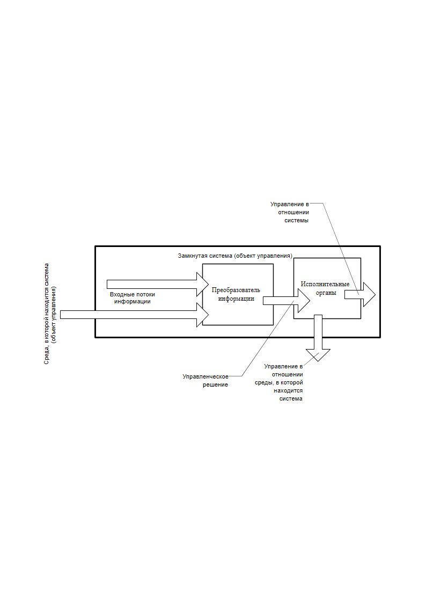
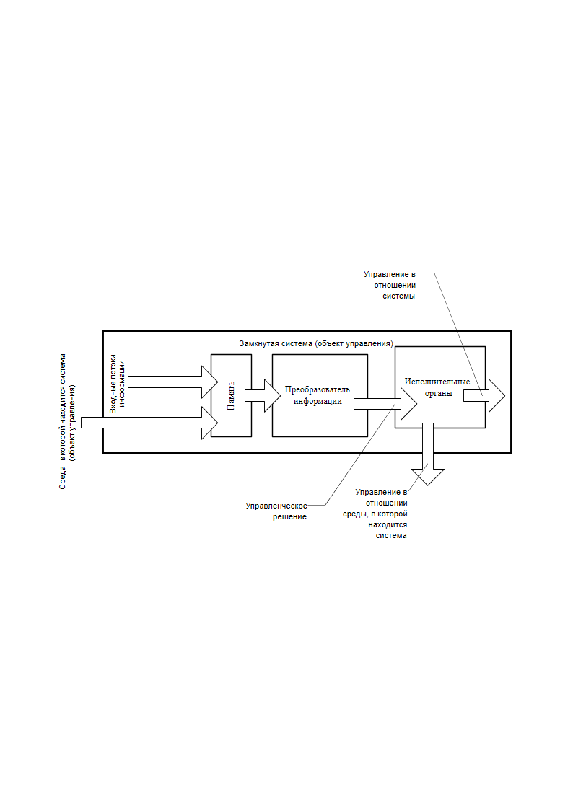
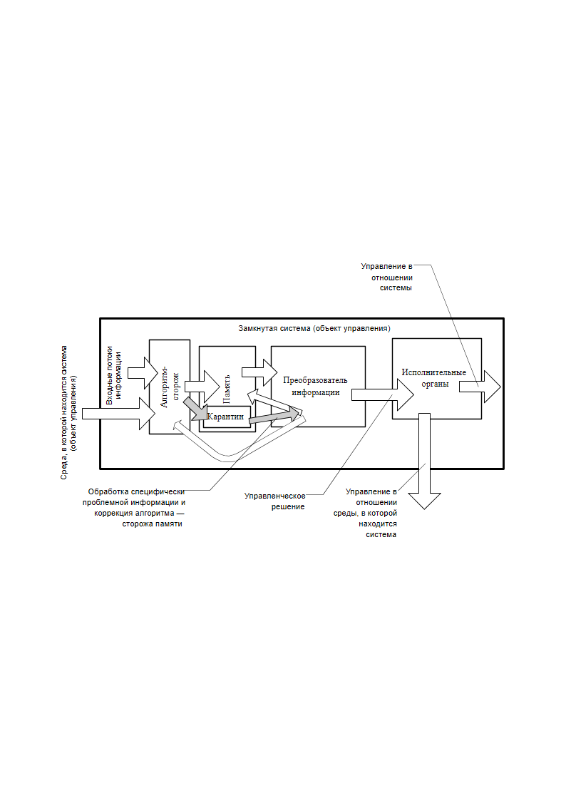

> **Первичный текст.** Диалектика и атеизм - две сути несовместны.
> Источник: `Диалектика и атеизм - две сути несовместны.doc` sha256 `25b1fb4c11f8f8f2…`; [страница на dotu.ru](https://dotu.ru/2013/01/31/20130131-dialektika/).
> Автоматическая транскрипция DOC→Markdown; смысл и формулировки не правились.
> Контрольные суммы и статус проверки — в [NOTICE.md](../../NOTICE.md).
> Содержание передаёт позицию авторов; утверждения не верифицированы библиотекой.

---

## 7.2. Жизненный алгоритм становления личности 

### Различение

Скелетной основой процесса становления личности и её развития является накопление ею «первичной» информации, начинающееся ещё в эмбриональном периоде развития по мере формирования структур тела и биополя будущего человека. Оно продолжается после рождения и носит наиболее интенсивный характер в детстве. А в зависимости от того, как личность строит своё поведение в этом Мире, и что дано ей в судьбе и предлагается ей исполнить в Промысле Божием, накопление «первичной» информации может продолжаться достаточно интенсивно до смерти в глубокой старости; либо прерваться где-то в подростковом возрасте, после того как человек определится в жизненном пути, избрав традиционную для общества «норму» либо нечто ещё более порочное или тупиковое; либо может носить достаточно выраженный пульсирующий характер на протяжении всей взрослой жизни[^255].

Неоспоримо, что процесс накопления «первичной» информации начинается в период, когда человек ещё не владеет членораздельной речью. Ко времени начала произнесения первых слов и попыток строить первые осмысленные фразы, ребёнок уже накапливает некоторый запас «первичной» информации, на основе которой строит своё поведение — уже осмысленно осознаваемое им, соответствующее задачам его возраста.

Ясно, что информационное обеспечение его поведения и алгоритмика выработки поведения в этот «доречевой» период жизни носят внеязыковой характер, т.е. исключают членораздельную речь, и основываются на образах, «мелодиях», «созвучиях-аккордах»[^256], ставших достоянием психики. Поведение выстраивается на основе сопоставления текущего потока образов, «мелодий», «созвучий», приносимых органами чувств, с теми образами и «мелодиями», «созвучиями» которые уже стали достоянием психики — внутреннего мира — ребёнка: так младенец узнаёт образ своей матери, других близких; чувствует их настроение, чувствует характеры людей; хотя не понимает смысла их членораздельной речи, обращённой к нему, но различает её мелодичность и в состоянии связать её смысл с какими-то своими образно-мелодичными представлениями о Жизни, что и выражается в его поведении в общении с близкими, а также и с не знакомыми ему людьми.

В процессе накопления «первичной» информации наиболее значимо то, что в психике каждого это всё — РАЗЛИЧНЫЕ образы и «мелодии».

Именно различие образов и «мелодий», составляющих массивы «первичной» информации и позволяет соотносить с ними поток образов и «мелодий», приносимых органами чувств, как-то упреждающе моделировать в своём внутреннем мире течение событий, имеющих место в общем всем внешнем мире, и на этой основе строить своё поведение, выбирая наилучший с субъективной точки зрения его вариант. Это характерно для нормальной алгоритмики выработки поведения взрослого человека, а ребёнок движется в своём психическом развитии в направлении этой нормы, начиная с внутриутробного периода своей жизни по мере развёртывая телесных и биополевых структур организма во взаимодействии генетической программы развития и окружающей среды. И в этом процессе общения с Жизнью пополняются запасы «первичной» информации.

Процесс пополнения запасов «первичной» информации по своему характеру одинаков на протяжении всей жизни человека. И он известен каждому по его жизни, хотя большинство не осознаёт того, что происходит, когда пополняются их персональные запасы «первичной» информации. Подавляющее большинство может вспомнить, что были — и неоднократно — в их жизни такие «моменты озарения», в которые из общей картины Жизни, рисуемой всеми их органами чувств, выделялось что-то одно, а по отношению к этому — выделившемуся — всё остальное представало как фон, фон информационный. В результате в такие моменты озарения картина Жизни складывалась из пары образов: «это» и фоновое по отношению к нему всё остальное, т.е. «не это». В некоторые из таких моментов какие-то новые «это» проявляются в уже известных других «это», которые принимают на себя в этом случае роль фонового «не это».

При этом важно подчеркнуть, что не человек сам обращал своё осознанное внимание на «это». В момент озарения и спустя некоторое время после него внимание человека могло быть обращено на что-то другое, и только спустя некоторое время его внимание могло обратиться в воспоминаниях или переживаниях к имевшему место в прошлом такого рода озарению и разделению картины Жизни на «это» и «не это», фоновое по отношению к «это».

Хотя почти каждый может вспомнить такого рода эпизоды из своей жизни, но очень многие такие эпизоды забылись. А был период жизни — в младенчестве и раннем детстве, которые плохо памятны большинству, — когда такого рода эпизоды были частыми и составляли в жизни в тот период главное её содержание.

Когда в разделе 7.1 было высказано утверждение о несамодостаточности человека в вопросе выборки информации из потока жизненных событий, имелись в виду именно такого рода моменты озарения, в которые картина Жизни предстаёт как парное соотношение: «это», выделившееся на фоне «не это».

Об этих эпизодах в жизни всех и каждого можно сказать по существу: Бог соответственно осуществлению целей Своего Промысла дал человеку в Различение «это». Какой именно объективный образ отобразился в психику субъекта как «это», а что стало фоновым «не это» — определяется конкретной ситуацией, в которую Бог привёл человека и дал ему что-то в Различение. При этом ни эгрегориальные ограничения психики, ни одержимость личности — не помеха Богу в озарении человека Различением.

В таких <u>эпизодах озарения Различением</u> пополняются запасы «первичной» информации личности, благодаря чему возможности человека в этом Мире расширяются. Но в таких же по существу, однако возможно менее ярких эпизодах озарения Различением человек получает не только «первичную», но и «оперативную» и «ответную» информацию.

Развитость соответствующих органов чувств, каналов восприятия поставляемой ими информации, их чувствительность[^257], «разрешающая способность»[^258], «селективность»[^259] и т.п., создаёт только предпосылки, основу для того, чтобы представления картины Жизни в психике человека в виде сочетания: *«это» и фоновое по отношению к нему «не это», —* были возможны. Иными словами, если нет основы, то Различению некуда прийти. А одной только развитости основы — системы органов чувств и каналов восприятия поставляемой ими информации — недостаточно, для того чтобы действовать в Жизни: кроме этой основы необходимо, чтобы Свыше было дано Различение[^260].

И об эпизодах, обсуждавшихся в разделе 7.1, когда в «помрачении чувств» люди смотрят, но не видят, слушают, но не слышат и т.п., можно сказать, что Бог лишил их Различения, вследствие чего они и не воспринимают *желанной им* «оперативной» информации из потока, приносимого всеми их чувствами. Иными словами, предоставление доступа к некоторой информации им непосредственно (таким, каковы они есть), или же через них опосредованно другим людям (таким, каковы те есть) — Богу нежелательно, и Он отказывает в Различении тем, чьи намерения и проистекающие из них действия не укладываются в русло осуществления Промысла.

И именно эту безраздельную власть Бога над Различением не способен обойти или узурпировать никакой демонизм, а всякая самонадеянность в Жизни в конечном итоге оказывается жертвой безвластия демонизма над Различением.

И она же ограничивала работоспособность философии на основе первичных категорий объективных разнокачественностей триединства материи-информации-мhры, узурпированной иудейскими «эзотеристами», о чём было сказано в конце раздела 6.1*.*

В психике человека «первичная» информация является «строительным материалом» для формирования мировоззрения, ложащегося в основу миропонимания. Вся совокупность предоставленных на протяжении жизни в Различение «это» и «не это», фоновых по отношению к каждому «это», действительно подобны разрозненным, бессвязным стекляшкам в калейдоскопе.

И соответственно тому, что Бог даёт в Различение каждому в его жизни, алгоритмика психики человека — Богом же и предназначена для упорядочивания всего множества «это» и «не это» так, чтобы они в психике человека сложились в мозаичную картину объективной Жизни, на основе которой человек сможет решать задачи субъективного моделирования вариантов течения событий в Жизни с целью избрания наилучшего — с его точки зрения — своего участия в ней.

И в этом процессе формирования своего собственного мировоззрения на основе «первичной» информации, представляющей *множество различных* <u>образов, «мелодий», «созвучий» и их фонов в парах «это — не это»</u>, человек свободен настолько, насколько его не ограничивают генетические программы развития телесных и биополевых структур организма, обеспечивающих обработку информации, и их фактическое здоровье. Если генетически заложенный потенциал не подвластен никому в его жизни, то сохранение здоровья на максимально высоком уровне, в пределах генетически заложенного потенциала, объективно возможно, но для большинства недостижимо под воздействием нездорового образа жизни, формируемого и поддерживаемого толпо-“элитарной” культурой, которому они следуют в своей жизни[^261].

И субъективные разнокачественности возникают в психике человека именно в даруемом Богом Различении как разнородные образы, «мелодии», «созвучия», представляющие собой информационные дубликаты образов, «мелодий», «созвучий» объективных разнокачественностей, свойственных Жизни.

Соответственно и все проблемы с тем, что субъективные разнокачественности, на основе которых психика человека моделирует и описывает Жизнь, не соответствуют объективным разнокачественностям, — это не только сбои в алгоритмике самой психики, но, прежде всего, — это выражение того, что субъекту не даётся Свыше Различение, а он, — сам того не замечая (по той же причине: не дано Различение), — бессознательно отождествляет с Жизнью субъективные образные представления о ней, порождаемые его психикой, которые несообразны и несоразмерны Жизни вследствие не устранённых им сбоев в работе алгоритмике его психики, обусловленных нравственно-мировоззренчески.

### Структура психики личности,\

доступная для всеобщего понимания 

Психика человека обладает определённой структурой. Ставшая общедоступной в последние годы всевозможная оккультная литература своими рассуждениями о «ментале», «астрале», «каузальности» и т.п. повергает в недоумение всякого, кто не идёт по пути освоения оккультных психологических практик, вследствие чего для них такие слова как «каузальное тело», «ментал», «астрал» — пустые слова, с которыми не может быть связано никаких их собственных переживаний. Поэтому рассуждения на темы психической деятельности и произвольном управлении ею с употреблением такого рода терминологии большинству читателей — даже заинтересованных — ничего не дают.

Хотя многие продвинутые оккультисты считают таких людей отсталыми в их развитии (грубая форма оценки со стороны демонизма) либо естественным порядком пребывающими в духовном младенчестве (это снисходительная оценка со стороны демонизма), но дело объективно обстоит иначе:

Подавляющее большинство тех, кто продвинулся по пути освоения всевозможных психологических практик разнородного оккультизма, если смотреть на факты их реальной жизни, можно охарактеризовать словами: **“Они *осознанно* чувствуют больше, чем в состоянии осмыслить безопасным для себя и окружающих образом”**. Именно вследствие такого соотношения разнородной чувственности, достигающей уровня сознания, и способности к осмыслению — их жизнь полна больших и малых бед и неприятностей, которые возникают в их жизни внезапно непредсказуемо и сопутствуют их самоудовлетворённости успехами в освоении разнородных духовных практик. Между тем, «Бог не есть бог неустройства, но мира: так бывает во всех церквях у святых» (апостол Павел, 1‑е послание Коринфянам, 14:33), — в этом утверждении Павел не ошибся.

Бедственность жизни и жизненная неудовлетворённость многих пошедших по пути освоения разнородных психологических практик, даёт основание к тому, чтобы сделать вывод, что все без исключения разговоры и письменные трактаты об «астрале», «ментале», «каузальности», «расширении сознания», «правостороннем» и «левостороннем» состояниях сознания, «точке сборки» и тому подобном, свойственном традициям разнородного оккультизма в их публичных выступлениях, уводят увлечённых ими от осознания чего-то иного — более жизненно важного.

Соответственно желанию быть понятыми и не увязнуть в пустых для подавляющего большинства людей рассуждениях о «ментале» и т.п., чтобы не утерять то жизненно важное, от чего уводят рассуждения разнородных оккультистов, — во всех работах, касающихся вопросов психической деятельности индивида и общества ВП СССР ограничивается рассмотрением двухкомпонентной структуры психики личности: уровень сознания и бессознательные уровни психики, так или иначе взаимодействующие как с уровнем сознания, так и друг с другом.

Граница между уровнем сознания и разнофункциональными бессознательными уровнями психики подвижна и определяется настроением и энергетикой человека. В зависимости от того, насколько человек в состоянии по своему произволу, т.е. осознанно управлять своим настроением и энергетикой, — настолько ему подвластно перемещение границ своего сознания в пределах Мироздания. Воля человека всегда действует с уровня сознания и осознаваемо целесообразна.

Что касается разграничения двух (или нескольких) личностей по бессознательным уровням психики, то граница, в пределах которой локализована определённая личность, оказывается не столь ясно видимой как граница вещественного тела, определяемая по кожному покрову. Дело в том, что хотя люди разобщены в вещественных телах, но биополя, излучаемые ими, простираются за пределы границы личности, определяемой по кожному покрову вещественного тела. Кроме того вследствие принадлежности всех людей к одному и тому же биологическому виду совокупность полей, составляющих их биополе, в своей основе качественно однородна у разных людей.

Поэтому, задавшись одним пороговым значением напряжённости избранного вида физического поля в составе биополя, можно получить одну область локализации личности в Мироздании; задавшись другим пороговым значением этого же поля, можно поучить иную область локализации личности. Задавшись качественно иным общеприродным полем из состава биополя и его пороговым значением, можно получить третью область локализации.

При этом не надо забывать, что разные физические поля распространяются с разными скоростями, а интенсивность убывания их напряжённости при удалении от источника излучения — тоже разная в зависимости от вида поля и материальной среды, в которой поле распространяется.

Кроме того все поля, излучаемые человеком, несут и свойственную ему информацию. Поэтому там, где напряжённость полей одного субъекта теряется на фоне полей, излучаемых другим субъектом, тем не менее, можно выявить информацию, излучаемую первым, если из суммарного поля «вычесть» собственное поле второго, что неизбежно сопровождается и отстройкой ото всей несомой его полем информации[^262].

Также в Жизни существуют и аналоги того, что в программировании для компьютеров называется «общие области»[^263]: если какая-то информация записана в такого рода «общие области», то изменение всякой записи в «общей области» какой-то одной программой или оператором-пользователем ЭВМ является изменением информационного обеспечения всех без исключения программ, опирающихся на эту «общую область». По отношению к разным личностям и задаче их разграничения по бессознательным уровням психики такие «общие области» содержатся во многих эгрегорах: родовых, племенных (объединяющие несколько родов), в профессиональных и т.п. в иерархическом порядке расширения взаимной вложенности эгрегоров.

По отношению к некоторым «общим областям» эгрегоров личности могут быть в разных правах доступа: одни способны, изменив что-то в себе, через «общие области» изменить что-то и в других людях, другие оказываются полностью подвластны информации и алгоритмике «общих областей» при достигнутом ими личностном развитии, не обладая соответствующим статусом в эгрегоре, позволяющем изменить что-либо в «общих областях»[^264].

Вследствие названных причин предельно широкая граница области локализации личности, выявляемая по её бессознательным уровням психики, — всё Мироздание. Но в каждый момент времени граница может быть проведена и как-то иначе, соответственно субъективно избранным пороговым энергетическим и информационным показателям проявления в Мироздании присутствия и деятельности этой личности[^265].

Сознание же при таком взгляде оказывается областью отождествления собственного «Я» личности и Мироздания[^266]. И эта область отождествления представляет собой область осознанной локализации субъекта и может простираться в широком многомерном диапазоне: от осознанного ощущения себя каким-то фрагментом собственного вещественного тела до *Мироздания в целом (однако за исключением сокровенных глубин души других субъектов, доступных для восприятия информации из них исключительно Богу)*.

В нашем толпо-“элитарном” обществе большинство мужчин проводит бльшую часть бодрствования в режиме «Я ≡ вещественное тело + одежда»; большинство женщин — в режиме «Я ≡ вещественное тело + косметика + одежда». Будучи невнимательны к своему внутреннему миру и к тому, что им даётся в Различение на протяжении всей их жизни, и те, и другие забывают о своей далеко уходящей через их бессознательные уровни психики протяженности в другие области Мироздания. И многие отмахиваются от напоминания им об этом факте как от несостоятельного вымысла, вопреки всему тому, чему их учили в школе в курсе физики, обрекая себя тем самым на разлад, прежде всего, с самим собой; на разлад с Жизнью; и как следствие — на жизненную неустроенность себя и своих близких.

Двухкомпонентная структура психики личности: «сознание и бессознательные уровни психики, взаимодействующие друг с другом», во-первых, является общедоступной для понимания; во-вторых, с нею может соотнести осознаваемую им более детально структуру своей собственной психики каждый.

Но главное состоит в том, что она при всей её простоте позволяет выявить и описать ту проблематику, с которой имеет дело практически каждый вне зависимости от его «продвинутости» в духовных практиках; вне зависимости от того, насколько он «расширил своё» сознание, вследствие чего его осознанному восприятию оказались доступны «астрал», «каузальность» и т.п., функционирование тех или иных чакр в организмах его самого или других людей.

### Нравственность в алгоритмике психики[^267]

Как уже было сказано ранее в одной из сносок в конце раздела 1, алгоритм — преемственная последовательность действий, выполнение которой позволяет достичь определённых целей. Также алгоритмом называется описание такой последовательности действий.

*Алгоритм как описание* представляет собой совокупность, **во-первых**, информации, описывающей характер преобразования входного потока информации в каждом блоке алгоритма, и **во-вторых**, мер (мерил), управляющих передачей потоков преобразуемой в алгоритме информации от каждого блока к другим.

Внешне формально алгоритмы и их фрагменты могут быть отнесены к одному из следующих типов или же представлять собой их упорядоченную комбинацию:

- линейные — в них информация передаётся последовательно по цепочке от блока к блоку;

- циклические — в них несколько блоков образуют кольцо, по которому передаётся информация в процессе преобразований;

- разветвляющиеся — в них передача информации от одного блока к последующему не определена однозначно структурой алгоритма, но обусловлена результатами обработки информации на этапах, предшествующих точке разветвления;

- «распараллеливающиеся» — в них информация от одного блока передаётся сразу нескольким блокам-преемникам процесса.

Все типы, кроме линейного, если речь не идёт о прерывании или остановке выполнения алгоритма до его завершения, требуют некоторого управления потоками информации при передаче их от блока к блоку: вхождение и выход из цикла, выбор блока-преемника, параметры “распараллеливания” процесса и т.п. — требует управления. Управление информацией в алгоритмах при передаче её от блока к блоку основано на сопоставлении получаемых результатов с некоторым стандартом сопоставления. Такой стандарт может быть как «вычисляемым» в самом алгоритме, так и быть неизменным свойством самого алгоритма. По своему существу в мировоззрении триединства материи-информации-меры такой стандарт сопоставления, управляющий информационными потоками в алгоритме, представляет собой одно из жизненных выражений меры, т.е. это — мерило.

Как можно понять из этого описания, в двух экземплярах одного и того же *достаточно разветвлённого алгоритма с некоторым количеством циклов обработки информации* один и тот же входной поток информации будет преобразовываться в различные результаты, если в одном экземпляре заменить значения мер (мерил), свойственных алгоритму (а не вычисляемых в нём[^268]), с которыми сопоставляются промежуточные результаты обработки информации, и на основании какого сопоставления информационный поток передаётся для дальнейшей обработки в последующий блок.

Приведенное определение алгоритма и сказанное об управлении в алгоритмах информационными потоками вполне применимо и к психической деятельности индивидов и коллективов (к соучастию индивидов в эгрегорах); т.е. применимо к *<u>алгоритмике психики в целом</u> (личности, эгрегора или некоторой совокупности эгрегоров) как к совокупности частных алгоритмов, в ней содержащихся, в которой происходит передача управления от одного частного алгоритма к другим*.

Алгоритмика психической деятельности личности включает в себя сознание индивида, бессознательные[^269] уровни его индивидуальной психики и какие-то фрагменты коллективной психики, в которой он соучаствует (эгрегоры, фрагменты которых размещены в психике индивида). При этом алгоритмика мышления представляет собой диалог сознания и бессознательных уровней психики. И в этом диалоге сознание большей частью даёт добро или налагает запреты на использование результатов обработки информации бессознательными уровнями психики, хотя у многих сознание просто присутствует при этом процессе, не вмешиваясь в него. Также сознание ставит задачи перед бессознательными уровнями психики, которые те должны решить.

По существу сознание индивида «едет по жизни» на организме (вещественное тело + биополе), управляемом непрестанно во внешнем и внутреннем поведении бессознательными уровнями психики, вследствие чего индивид на протяжении длительных интервалов времени оказывается заложником не всегда осознаваемой им информации и не всегда предсказуемых для его сознания алгоритмов её обработки, которые содержатся в его бессознательных уровнях психики или доступны ему через них в какой-то коллективной психике.

И всегда, когда встречается термин «бессознательные уровни психики», то следует помнить, что через них на личность может оказываться и внешнее воздействие со стороны эгрегоров (коллективной психики, в которой личность соучаствует), а также и со стороны субъектов, злоупотребляющих своими экстрасенсорными способностями. Соответственно, будучи заложником своего бессознательного, индивид может сам не заметить того, как окажется одержимым (т.е. управляемым извне помимо его <u>целесообразной воли</u> или вопреки ей) каким-то иным субъектом или объектом, от которого его бессознательные уровни психики получают информацию, определяющую его поведение.

Психика подавляющего большинства устроена так, что если её бессознательные уровни решают какую-то определённую задачу, то невозможен осознанный самоконтроль правильности решения этой задачи в самм процессе её решения.[^270]

Причина этого состоит в том, что требование безошибочного контроля решения какой-то определённой задачи в темпе её же решения требует совместного решения по существу двух задач:

- собственно решения жизненной задачи с достаточно высоким уровнем качества решения;

- решения задачи надёжного контроля безошибочности первого решения в темпе его выработки и осуществления.

В этом многозадачном режиме, чем больше ресурсов психики (которые всегда ограничены) выделено под решение первой из задач, тем меньше ресурсов выделяется под решение второй. Вследствие этого возможны ситуации, когда решение второй из названных задач, будет невозможным или ложным по причине недостаточности выделенных для неё ресурсов психики.

В последнем варианте субъект может пасть жертвой ошибки в решении первой задачи, либо ошибочно отказаться от её правильного по существу решения.

Избыточность же ресурсов психики, выделенных на решение второй задачи, может привести к невозможности решить первую.

Соответственно наилучшим вариантом распределения ограниченных ресурсов представляется выделение максимальных ресурсов под решение собственно жизненной задачи при минимальном контроле только за наиболее грубыми ошибками, что *требует изначальной уверенности в безукоризненности работы алгоритмики бессознательных уровней психики*.

Достижение человеком такого рода безошибочной уверенности — по существу заблаговременного получения достоверного знания о способности либо неспособности безупречно решить ту или иную задачу, — и есть один из вопросов, которым предметно должна заниматься психология личности в своих практических приложениях.

Для осуществления осознаваемого самоконтроля работы бессознательных уровней психики необходимо выйти из процесса решения самой жизненной задачи и переоценить не только достигнутые промежуточные и конечные результаты, но и информацию, и алгоритм её обработки, которые привели к получению именно этих результатов.

Эта особенность психики приводит к тому, что индивид действительно <u>не ведает в процессе самой деятельности</u>, что творит, поскольку события увлекают его в том смысле, что бессознательные уровни психики непрерывно реагируют на входной поток информации, отсекая сознание, а тем самым и *волю субъекта (воля всегда действует с уровня сознания, с бессознательных уровней действуют только разнородные автоматизмы поведения и наваждения извне),* от участия в управлении течением событий[^271].

Ведать индивид может только по завершении каких-то этапов своей деятельности, <u>*осознанно* переосмысляя</u> уже совершенное им; либо — перед началом действий, сформировав свои *намерения (цели и способы их осуществления) в своём воображении:*

- в отношении прошлого он ведает по факту свершившегося, что нашло выражение в пословице «мужик задним умом крепок»;

- а в отношении намерений на будущее — ведает в пределах того, насколько его субъективные оценки *устойчивости по предсказуемости течения событий, в которых он намеревается участвовать или уже участвует,* совпадают с объективными возможностями течения этих же событий при его участии; иными словами, насколько предшествующее действиям моделирование желательного для него течения событий в его внутреннем мире оказывается сообразным и соразмерным возможностям, объективно свойственным обстоятельствам Жизни, на которые он намеревается воздействовать.

Благодаря этому индивид в большинстве случаев (за исключением тех, когда он погиб или окончательно повредился в уме) может соотнести с реальным результатом свои предшествующие намерения, подумать об алгоритмике своего мышления и психической деятельности в целом, дабы выявить и устранить те сбои в алгоритмике собственной психики, которые привели к тому, что реально достигнутые результаты деятельности не совпали с вожделениями и намерениями в той мере, как это предполагалось перед началом действий.

Соответственно такому взгляду отношения уровня сознания в психике индивида с его бессознательными уровнями психики подобны отношению пилота и автопилота: на пилота возлагается задача настройки автопилота и общего контроля правильности его работы, а на автопилот возлагается задача непосредственного управления объектом на основе обработки таких объёмов информации в темпе течения процесса управления, которые пилоту обработать не под силу.

По отношению к психике индивида проблема контроля правильности её алгоритмики состоит в том, что бльшая часть блоков-преобразователей информации в ней упрятана в бессознательные уровни психики, вследствие чего бодрствующему сознанию осуществить их ревизию не удаётся, если индивид не овладел психотехниками произвольного вхождения в трансовые состояния, в которых при определённых навыках сознанию оказывается доступной та информация, содержащаяся в психике, которая в обычном его состоянии недоступна; а быстродействие сознания в обработке информации многократно увеличивается за счёт его смещения в диапазон более высоких частот.

Однако в алгоритмике психики каждого есть одна компонента, которая едина и для сознательных, и для бессознательных уровней психики и объединяет сознательное и бессознательное в целостную систему обработки информации тем безупречнее, чем меньше в ней взаимоисключающих друг друга мнений по конкретным частным вопросам и их взаимосвязям. Эта компонента — нравственность, которую хотя и редко, но всё же называют «нравственное мерило». Хотя не всё в своей нравственности осознаётся индивидом в процессе деятельности, о чём говорилось ранее, но всё же нравственные мерила в отношении тех или иных действий и линий поведения могут быть осознанно выявлены в результате переосмысления своего прошлого поведения и намерений на будущее; это можно сделать и самостоятельно и, приняв помощь окружающих, отказавшись от предубеждения, что принятие помощи — есть собственное унижение (при отказе индивида от мнения о его унижении, даже истинное стремление его «опустить» и унизить, идущее со стороны, обратится в объективную помощь в преодолении им какой-то свойственной ему порочности).

В информационном отношении нравственность индивида представляет собой совокупность описаний каких-то жизненных реальных и возможных характерных событий с оценками каждого из них «хорошо», «плохо», «не имеет значения» или «значение не определено» либо «обусловлено сопутствующими обстоятельствами», которые кроме того ещё и иерархически упорядочены по их предпочтительности.

Соответственно:

Безнравственность — составная часть нравственности субъекта в целом, представляющая собой по существу, **во-первых**, неопределённость нравственных мерил, обусловленную отсутствием каких-то из них или *множественностью нравственных мерил, применение которых возможно в одной и той же ситуации,* и **во-вторых**, разного рода неопределённости в иерархической упорядоченности по значимости нравственных мерил.

С этой совокупностью *описаний-мерил и их взаимосвязей, составляющих нравственность субъекта,* соотносится вся алгоритмика психики в процессе преобразования информации при оценке течения событий, выработке намерений и линии поведения в изменяющихся обстоятельствах жизни. Соответственно перезадание выявленных нравственных мерил с новыми значениями оценок «хорошо» — «плохо» в отношении связанных с каждым из них множеством характерных событий, переопределяет и весь характер алгоритмики сознательных и бессознательных уровней психики, изменяя при этом то множество целей, к осуществлению которых в жизни стремится человек, и то множество путей и средств их достижения, которые он признаёт допустимыми.

При этом, если переопределённые новые значения нравственных мерил менее ошибочны по отношению к Божьему предопределению для человека, чем прежние, то и «автопилот» бессознательных уровней психики сам вырабатывает лучшую линию поведения, нежели в прошлом; если заданы ещё более ошибочные значения, то ошибки «автопилота» бессознательных уровней психики будут ещё более тяжкими[^272].

Но если роль нравственных мерил как стандартов сопоставления всевозможных результатов обработки информации в алгоритмике психики признаётся, то неизбежно встаёт вопрос: «Есть ли возможность быть крепким не задним умом, разбирая ошибки совершённые в прошлом, а быть шибко умным упреждающе по отношению к неблагоприятному течению событий, дабы избежать воплощения в Жизнь ошибочных линий поведения?» — Такая возможность генетически заложена в психику человека.

### Нормальный эмоционально-смысловой строй психической деятельности[^273]

Мировоззрение триединства материи-информации-мhры открывает совершенно иное видение вопроса об *эмоциях, хорошем либо дурном настроении.* И это видение просто невыразимо в традициях психологических школ как Запада, так и ведически-знахарского Востока, вследствие того, что в их мировоззрении информация в Жизни не объективна, а субъективна[^274] либо к этому аспекту её бытия не выражено определённое отношение.

В мировоззрении же триединства материи-информации-мhры вопрос об эмоциях в поведении человека оказывается неразрывно связанным с двумя другими вопросами, которые мы уже рассмотрели в двух предыдущих подразделах, но рассматриваемыми изолированно друг от друга большинством психологов и психиатров:

- во-первых, это вопрос о соотношении сознательных и бессознательных составляющих <u>единого процесса мышления индивида</u>;

- во-вторых, это вопрос об объективной — истинной, а не декларируемой и не показной нравственности индивида.

В мировоззрении триединства материи-информации-меры **«эмоции + истинная объективная нравственность + сознательные и бессознательные «слагаемые»**[^275] **процесса мышления»** предстают как единый алгоритмический комплекс, обрабатывающий объективную информацию как ту, что поступает от органов чувств (телесных и *биополевых — духовных*), так и ту, что хранится в памяти[^276]. Именно в этой триаде **«эмоции + нравственность + сознательные и бессознательные «слагаемые» процесса мышления»**, представляющей собой единый алгоритмический комплекс преобразования информации, вырабатывается внутреннее и внешнее поведение всякого индивида, *включая управление (пусть даже и бессознательное) доступом этого алгоритмического комплекса к источникам информации (чувствам, памяти, эгрегорам).*

Для того, чтобы «иметь жизнь и иметь её с избытком»[^277], а не <u>«выживать»</u>[^278]<u>, преодолевая преимущественно нежелательные стечения обстоятельств</u>, *необходимо выявить функциональную нагрузку всех компонент этого <u>алгоритмического комплекса</u>, дабы уметь настраивать его как целостную систему на <u>объективно безукоризненную</u> обработку входящей и памятной информации и управление доступом к источникам информации.*

Хотя об этом уже было сказано многое, но некоторые аспекты необходимо детализировать.

Начнём от сознания. Возможности сознания человека вне трансовых состояний ограничены следующими показателями: индивид в состоянии удерживать сознательное внимание и оперировать 7 — 9 различными объектами (различными информационными потоками) одновременно; при этом он способен различать не более 15 смысловых единиц в секунду (иными словами, быстродействие сознания составляет 15 бит/сек).

Если первое более или менее понятно, то второе нуждается в пояснении. Каждый кадр на киноленте — смысловая единица. При скорости проекции 16 кадров в секунду и более сознание вне трансовых состояний воспринимает изображение как движение; при скорости проекции менее 16 кадров в секунду сознание воспринимает фильм не как движение, а как череду различных неподвижных положений, последовательность которых представляет собой разные фазы движения.

Однако бессознательные уровни психики, рассматриваемые как система обработки информации, обладают гораздо большей производительностью и охватывают более широкий диапазон частот и набор физических полей, несущих информационные потоки, нежели те, что доступны для осознания вне трансовых состояний.[^279]

Выявив эту совокупность фактов, мы приходим к последовательности определённых вопросов, каждый из которых позволяет дать определённый ответ на него, после чего открывается возможность перейти к следующему вопросу:

\* \* \*

***Спрашивается**:* вся информация, свойственная бессознательным уровням психики (образы, «мелодии», «созвучия» и т.п.), никчёмна для индивида либо же и она представляет собой информационное обеспечение его жизни и потому <u>жизненно необходима</u>?

— Жизненно необходима.

***Спрашивается**:* сознание и бессознательные уровни психики — это взаимно изолированные одна от другой системы обработки информации, либо взаимно дополняющие друг друга компоненты одной и той же <u>психики в целом</u> и потому взаимодействующие друг с другом (т.е. обменивающиеся между собой информацией обоюдосторонне направленно)?

— Взаимно дополняющие и обменивающиеся друг с другом информацией компоненты психики в целом.

***Спрашивается**:* как подать на уровень сознания *в темпе течения реальных событий* всю ту информацию, которую обрабатывают бессознательные уровни психики, если возможности сознания в обработке информации ограничены вне трансовых состояний 7 — 9 различными объектами (различными потоками информации) и 15 смысловыми единицами в секунду, а в трансовых — тоже ограничены, но другими характеристиками, вследствие чего перед сознанием не могут предстать все те образы, «мелодии» и «созвучия», в которых протекает обработка информации на бессознательных уровнях психики?

— Только в предельно плотноупакованном виде, позволяющем осознать процессы обработки информации на бессознательных уровнях психики хотя бы в **управленчески значимых оценочных категориях** прошлых событий и направленности их течения: «хорошо», «плохо», «не имеет значения в данных обстоятельствах», «неопределённо». Соответственно на уровень сознания психики может быть подана только одна — своего рода обобщающая — оценка ситуации и направленности её изменений, которая не будет подавлять остальную информацию, обработкой которой занят уровень сознания в это время.

***Спрашивается**:* осознаваемый эмоциональный фон, свойственный индивиду **во всякое время** его бодрствования, обусловлен памятными и текущими обстоятельствами его жизни. Могут ли эмоции быть осмыслены на уровне сознания как своеобразные отчётные показатели, встающие из бессознательных уровней психики и выражающие предельно обобщённые результаты их деятельности, несущие функцию управленчески значимых оценочных категорий «хорошо», «плохо», «неопределённо»?

— Эмоциональный фон обусловлен обстоятельствами Жизни[^280], и эмоции могут быть осознанно осмыслены именно в качестве управленчески значимых оценочных категорий «хорошо», «плохо», «неопределённо» <u>прошлого течения событий и их направленности</u>, подаваемых на уровень сознания в психике индивида, её бессознательными уровнями; *но могут быть в этом качестве и не осмыслены — это обусловлено нравственностью и мировоззрением индивида.*

В мировоззрении триединства материи-информации-меры все эмоциональные проявления осмыслены именно в этом качестве: как предельно обобщающие — **отчётные показатели** — бессознательных уровней психики перед *уровнем сознания, отождествляемым большинством индивидов с их собственным «Я»* в каждый момент времени. А отказ принять их в таковом качестве влечёт за собой разрыв одного из важнейших контуров обратных связей в <u>целостности психики</u> человека и делает человека заложником алгоритмики его бессознательных уровней психики, и прежде всего, — заложником содержащихся в них ошибок.

И информация бессознательных уровней психики, предстающая на уровне сознания в предельно плотноупакованном виде — в виде эмоций, может быть распакована, осознана, понята, если есть желание это сделать и личностная культура мышления и психической деятельности в целом уже позволяет это сделать. Но это потребует времени, в течение которого эта информация была бы передана сознанию не в виде эмоций, а в иной доступной его восприятию образно-мелодийной, символической форме или в форме внутреннего монолога.

Если кто-то не согласен с таким осмыслением предназначения эмоций, встающих в сознании во всякое время бодрствования индивида, то пусть осмыслит их предназначение как-то иначе. Но как показывает многовековой исторический опыт школ психологии Запада и ведически-знахарского Востока, все прочие интерпретации эмоциональной жизни индивида неудобопонимаемы и попахивают *агностицизмом*[^281] *— учением о непознаваемости Мира и бессмысленности Жизни.*

Но эмоции обусловлены не только обстоятельствами Жизни, но и особенностями алгоритмики психики индивида, обрабатывающей информацию и порождающей эмоции: нравственностью, мировоззрением (калейдоскопическим, мозаичным, Я-центричным, Богоначальным). И это приводит ещё к одному вопросу — вопросу ключевому.

***СПРАШИВАЕТСЯ:*** Ошибается ли Вседержитель? либо Вседержительность (безраздельная всеобъемлющая власть Всевышнего, простирающаяся всюду в Жизни — в Объективной реальности) безошибочна во всех без исключения своих проявлениях?

— Вседержитель не ошибается, а Вседержительность безошибочна во всех её проявлениях без исключения.

*Спрашивается:* Если Вседержительность безошибочна во всех её проявлениях, а индивид не в конфликте со Вседержителем, то интеллектуально-рассудочное осознание индивидом этого факта должно сопровождаться эмоциями тем более, что эмоции всегда сопутствуют осознанию Жизни?

— Должно.

*Спрашивается:* Какие эмоции, какое настроение должны сопутствовать интеллектуально-рассудочному осознанию этого факта?

— Доброе настроение — *радостная внутренняя умиротворённость и желание благодетельствовать Миру, порождающие открытость души Жизни*[^282]*,* как эмоциональный фон — норма для человека, пребывающего в ладу с Богом, во всех без исключения жизненных обстоятельствах и соответственно — норма для *необратимо* человечного строя психики.[^283]

***Спрашивается**:* Если же *радостной внутренней умиротворённости и желания благодетельствовать Миру, открытости души* нет, а есть эмоциональная подавленность, настроение дурное или “никакое”, то что сообщается бессознательными уровнями психики сознанию, отождествляемому большинством людей с их «Я»?

— Ответ прост:

- в настоящее время или в свершившемся прошлом, либо в намерениях индивида на будущее имеет место некий его конфликт со Вседержительностью, плоды которого при избранной им линии поведения ему неизбежно придётся пожинать (если он их уже не пожинает) и они будут неприятны.

  Но что конкретно имеет место, в чём состоит объективный смысл конфликта, возник ли он в результате умысла индивида или представляет собой следствие его невнимательности и распущенности и обусловлен ошибками в алгоритмике его бессознательных уровней психики, — это необходимо выяснить, что требует осознанно осмысленного отношения индивида к Жизни, к течению событий в ней, к стечению разного рода обстоятельств вокруг него и в нём самом.

- либо же индивид, открыто не конфликтуя с Богом, что-то воспринимает несообразно или несоразмерно Объективной реальности или чего-то недопонимает во *вседержительно происходящем по Божией воле*, а **вследствие его неверия Богу его бессознательные уровни психики выдают ошибочную эмоциональную оценку происходящего**, *что в перспективе также не обещает индивиду ничего хорошего, поскольку вследствие этого его поведение может оказаться в конфликте с Промыслом*.

В обоих случаях дурные эмоции являются выражением ошибочной его собственной нравственности, пытающейся отвергнуть исходное нравственное мерило Богоначального мозаичного мировоззрения:

Вседержитель безошибочен: всё, что ни делается, — делается к лучшему; всё, что свершилось и свершается, — свершилось и свершается наилучшим возможным образом *при той реальной нравственности и производных из неё намерениях и этике, носителями которых являются индивиды, в совокупности составляющие общество;* Вседержитель велик и всемогущ, и милость Его безгранична.

Кроме того:

Приведённое утверждение — своего рода камертон для психики, задающий *настроение, как единство эмоционального и смыслового (интеллектуально-рассудочного) строя психической деятельности,* ***ладное Жизни:*** Осознание того реального факта Жизни, что Вседержитель не ошибается и всё и всегда свершается наилучшим возможным образом, должно вызывать доброе настроение — *радостную внутреннюю умиротворённость и желание благодетельствовать Миру, порождающие открытость души Жизни*.

И только после того, как **при осознании названного факта** пришли внутренняя умиротворённость и желание благодетельствовать Миру с открытой душой, возник добрый эмоциональный фон, доброе настроение, можно приступать к делу, *будучи при этом отзывчивым к голосу совести,* и дело будет благим; в противном случае алгоритмика бессознательных уровней психики и психика в целом будут фальшивить, как фальшивит расстроенный рояль или гитара.[^284]

И эту настройку психики необходимо *учреждать при пробуждении ото сна своею волей* и регулярно возобновлять в течение суток; и тем более — возобновлять всякий раз, как только человек осознаёт, что его настроение, эмоции не соответствуют названному объективному факту Жизни.

И соответственно дурное настроение, эмоциональная подавленность, раздражённость или откровенные озлобленность и злорадство — знаки того, что необходимо выявить что-то в своей деятельности, в намерениях на будущее[^285], в своём отношении к происходящему — такое, что необходимо переосмыслить; но выявлять и переосмыслять что-либо конкретное можно только после того, как будет возобновлено ладное Жизни единство эмоционального и смыслового строя психической деятельности.

\* \*\

\*

Может последовать возражение в том смысле, что у разных индивидов одни и те же события, попадание в одни и те же обстоятельства, одно и то же сообщение вызывает разные эмоциональные проявления, что казалось бы и опровергает только что сказанное.

Но это не так: речь шла об эмоциональных проявлениях у индивида, если даже и обратимо, то всё же пребывающего в человечном строе психики на каком-то продолжительном интервале времени, достаточном для того, чтобы сформировались его эмоции и настроение. Но кроме этого, у каждого индивида есть своя личностная предыстория, своя генетически обусловленная информация (включая и духовное наследие как информация и алгоритмика доступных его психике эгрегоров), которая и влияет на эмоциональность восприятия тех или иных событий в каждый момент времени.

Если же индивид находится на рассматриваемом интервале времени не при человечном, а при каком-то ином строе психики или психика его неустойчива и мельтешит, непрестанно и обратимо изменяя свой строй, то всё будет совсем не так.

Дело в том, что в человечном строе психики обеспечивается <u>единство эмоционального и смыслового строя психической деятельности</u>[^286], при котором индивид “сам собой” — и сознательно, и бессознательно — пребывает в русле благого Божиего Промысла. И это — нормальный для человека эмоционально-смысловой строй психической деятельности.

Вне человечного строя психики, если и возможно говорить о каком-то единстве эмоционального и смыслового строя психической деятельности, то это “единство” — во-первых, не ладное по отношению к Жизни, а во-вторых, в нём имеет место конфликт между сознанием и бессознательными уровнями психики, а также и внутренние конфликты в самом бессознательном, обусловленные пороками нравственности как иерархически упорядоченной совокупности определённых нравственных мерил. И, как следствие, это влечёт участие индивида во внутренне конфликтной коллективной психике — коллективном бессознательном; иначе говоря, влечет замыкание психики индивида на несовместимые, враждующие друг с другом эгрегоры. И соответственно в его жизни неизбежны конфликты с Божьим Промыслом. Поэтому:

О <u>единстве эмоционального и смыслового строя психической деятельности</u> вне человечного строя психики по существу можно говорить весьма условно, поскольку “единство” это в любом его качестве кратковременно и обусловлено «оперативной» и «ответной» информацией, к тому же осмысляемой ошибочно. Неладность Жизни этого “единства” проистекает из того, что эмоциональные проявления и проявления рассудочно-интеллектуальной деятельности не соответствуют друг другу, если соотносить их с одной и той же *объективной информацией, характеризующей жизненные обстоятельства или ситуацию, в которой оказался субъект*.[^287]

Кроме того разговоры на тему о том, что разным индивидам в жизни свойственны разные эмоциональные проявления в одних и тех же обстоятельствах, неуместно вести в отвлечённой от конкретных индивидов и конкретных обстоятельств форме: это было бы бесплодной фикцией, только препятствующей пониманию существа рассматриваемых явлений психической деятельности всякого индивида.

Тем не менее, при всяком строе психики, при любом эмоциональном фоне, на котором протекает интеллектуально-рассудочная сознательная деятельность, индивид способен выявить, какие определённые события вызывают у него эмоциональный подъём или эмоциональный спад, хорошее или дурное настроение; а выявив эти события и своё отношение к ним, он способен и дать нравственную оценку им, после чего избрать для себя предпочтительное на будущее нравственное мерило.

Причём особо необходимо подчеркнуть, что эмоциональный фон при ладном Жизни эмоционально-смысловом строе отличается от пьяняще-бессмысленного подъёма эмоций при получении индивидом энергетической подпитки со стороны — от другого субъекта или от эгрегора.

\* \* \*

**Таким образом, нормальная алгоритмика психики, объединяя её сознательный и бессознательные уровни, необходимо включает в себя:**

- **доверие Богу, выраженное в исходном нравственном мериле человека:** *«Вседержитель безошибочен в своих действиях, всемогущ, и милость Его безгранична, и осознание этого* должно вызывать — *радостную внутреннюю умиротворённость и желание благодетельствовать Миру, порождающие открытость души Жизни — доброе настроение, определяющее характер и результаты всей психической деятельности»,* **— и это обеспечивает ладное Жизни единство эмоционального и смыслового строя психической деятельности ВСЕХ ЛЮДЕЙ БЕЗ ИСКЛЮЧЕНИЯ;**

- **человечный строй психики;**

- **устойчивость преемственности *в передаче информации*** *«Различение от Бога ⇒ внимание самого человека ⇒ интеллект»*;

- **опору на мозаичное Богоначальное мировоззрение триединства** материи-информации-мhры **и выражающее его миропонимание.**

Только на этой основе возможно целенаправленное выявление по Жизни разнородных ошибок (как своих собственных, так и окружающих) в миропонимании, в мировоззрении, в алгоритмике психики, и главное — ошибок нравственности, как причины всех прочих.

\* \*\

\*

Именно в этой алгоритмике психики в целом и её бессознательных уровней, в частности, субъектом обретается *заблаговременное* осознание своей принципиальной способности либо неспособности решить ту или иную жизненную проблему (или задачу) если и не безукоризненно, то с приемлемым уровнем ошибок на основе <u>неподконтрольной сознанию в процессе деятельности</u> работы бессознательных уровней его психики. И сказанное справедливо при любом более детальном рассмотрении структуры психики, отражающем особенности достигнутого личностного психического развития того или иного человека при любой степени расширенности его сознания и «продвинутости» в разнородных духовных (психологических) практиках.

В нашем понимании Жизни описанная алгоритмика психики — эмоциональный и смысловой строй психической деятельности и характер взаимодействия сознания и бессознательных уровней психики — норма, к которой человек должен приходить в процессе личностного становления. И к этой норме в процессе взросления он — естественно — должен приходить до того, как в нём пробудится половой инстинкт, тем более, что к этому есть все основания, заложенные в нём самом:

- становление интеллекта во всей его мощи происходит ранее полового созревания, вследствие чего человек способен осознанно осмысленно относиться к тому, что происходит в процессе полового созревания с его организмом и психикой и способен понять, чем человек отличается от человекообразных: животного, биоробота, демона;

- нравственность и волевые качества к этому времени должны быть настолько развиты, чтобы он по завершении полового созревания устойчиво пребывал при человечном строе психики.

  Пусть даже, если и не при необратимо человечном, то, по крайней мере, возвращался бы к человечному строю психики ранее, чем успеет нанести существенный и необратимый ущерб себе самому и окружающим.

Если же этой нормы в процессе взросления к моменту пробуждения и активизации половых инстинктов человек не достигает, то это означает, что начинать взрослую жизнь ему придётся при животном строе психики, при строе психики зомби-биоробота, либо при демоническом строе психики, возможно что колеблясь между ними, а в какие-то моменты и краткие периоды достигая человечного строя психики. Жизнь его возможно и будет протекать в его удовольствие, но до тех пор, пока он не исчерпает Божие попущение в отношении себя. Большинству же не достигающих человечного строя психики жизнь предстоит тяжёлая, полная разочарований и неудовлетворённостей, конфликтов и несправедливостей как в своей семье, так и вне семьи[^288]; да и умирать, возможно, придётся не лёгкой благоустроенной Свыше смертью[^289], а мучительно — вследствие болезней и увечий.

И, к сожалению, культура нашего общества такова, что таких угнетаемых Жизнью людей большинство. Но она такова, что и во взрослой жизни большинство оказывается не способным по разным причинам перейти к человечному строю психики, и преобразить на его основе свою личность и культуру общества так, чтобы обеспечить себе самим хотя бы достойную старость и будущим поколениям — полноту жизни.

Возможно, что кто-то будет возражать, что описанное — не норма, которой должен достигать человек в своём личностном — психическом — развитии к моменту завершения работы генетической программы развёртывания вещественно-телесных и биополевых структур организма.

Но такое возражение обязывает выявить и указать иную *определённую* норму, которую человек в своём личностном развитии должен достигать к моменту завершения работы генетической программы развёртывания вещественно-телесных и биополевых структур организма. Это так потому, что развития без предварительно заданных целей не бывает. Бесцельна только суета и *нигилизм, как отрицание всего и вся из принципа,* о вреде чего было сказано при рассмотрении закона библейско-марксистской “диалектики” *<u>отрицания отрицания отрицания… без созидания, без развития, без преображения</u>*.

Но и такие — бесцельные для их носителей — нигилизм и суета служат осуществлению не осознаваемых их носителями целей, определённых хозяевами культа суеты и нигилизма, действующих в пределах попущения Божиего. Так, что подумайте и о том, кому служите своим бесплодным нигилизмом и оцените меру Божиего попущения вам…

### Объективно-субъективная заданность\

начальных условий личностного развития

Но переход к выявленной в предыдущем подразделе алгоритмической норме психики — в силу неготовности телесных и биополевых структур новорождённого поддерживать эту норму — возможен только в процессе взросления новорождённого несмышлёныша и осмысленной жизни подростка или взрослого человека. И сам этот переход представляет собой процесс циркуляции информации в Жизни, в котором участвует психика человека на любой стадии её развития от младенчества до смерти подчас в глубокой старости.

Однако рассмотрение этого процесса с позиций «Я-центричного» мировоззрения или «антропоцентричного»[^290] мировоззрения (что несколько шире) не даёт правильного представления о характере циркуляции информации, обеспечивающем личностное развитие каждого из людей и человечества в целом, по той причине, что, опираясь на эти два вида мировоззрения, алгоритмика мышления неизбежно подчиняет решение каких-то вопросов немотивированному и безосновательному предубеждению, которое можно выразить в следующих словах: *весь Мир предназначен для человека, т.е. — для удовлетворения исключительно его потребностей как генетически заложенных, так и им выдуманных.*

«Я-центричное» мировоззрение при таком подходе к Жизни посягает на употребление в своих интересах не только объектов из состава среды обитания человечества, но и других людей вместе с их потенциалом, способностями, имуществом, будто они и не люди, а предметы общественного обустройства жизни «Я-центриста» или объекты из состава среды его обитания. Это порождает множество внутриобщественных несправедливостей и конфликтов между «Я-центристами»: от мимолётных детских драк и ссор по пустому поводу — до посягательств на порабощение других людей и народов, включая и мировые войны за передел власти над регионами Земли, их ресурсами и населением.

«Антропоцентричное» мировоззрение, будучи обеспокоено разрешением всей такого рода внутриобщественной проблематики, отождествляет интересы личности с интересами всего человечества, и требует подчинить интересам человечества в целом интересы личности и разнородных подгрупп человечества. Это несколько лучше, чем «Я-центризм» в его персонально-демонической агрессивной активности, поскольку на основе «антропоцентричного» мировоззрения корпоративно-демоническая активность заботится о прекращении внутриобщественных конфликтов и снятии, сдерживании и разрядке в безопасно-канализационных формах[^291] внутриобщественной напряжённости, выливающейся в эти конфликты. То есть корпоративно-демонический «антропоцентризм» в меру своего понимания заботится о разрешении проблем, обусловленных разноликим «Я-центризмом», однако отношение к среде обитания по-прежнему остаётся во многом *паразитически-силовым как бессознательным, так и <u>осознанным, но безвольным</u>*[^292].

И «Я-центричное», и «антропоцентричное» мировоззрения остаются слепы ко многому в Жизни, и это — худший из видов слепоты: это — слепота тех, кто не желает либо страшится видеть Жизнь такой, какая она есть, будучи порабощён своими вожделениями «прогнуть Мир под себя»[^293].

Поэтому ни «Я-центричное», ни «антропоцентричное» мировоззрение не может выразиться в <u>педагогике как науке</u> об *искусстве ВСПОМОЩЕСТВОВАНИЯ со стороны окружающих РЕБЁНКУ В ЕГО САМОВОСПИТАНИИ: от первых секунд младенчества новорождённого до становления к началу юности в качестве носителя человечного строя психики и Богоначального мировоззрения и миропонимания, т.е. человека*. Они могут породить только «зомбирующую педагогику», программирующую психику ребёнка готовыми к употреблению мнениями по вопросам, включённым в программу учебного курса, и заглушающую и извращающую его творческий потенциал своей разнородной «штамповкой».

В действительности же Мир не предназначен для удовлетворения агрессивно-паразитических устремлений носителей «Я-центризма» и «антропоцентризма». *В Жизни есть то, что предназначено человеку и человечеству для удовлетворения их естественных потребностей*[^294] *и творческих интересов. Но есть и то, для чего Богом предназначен и каждый человек, и человечество в целом*. И об этой двоякой обусловленности бытия каждого из людей и человечества в целом забывать не следует.

И соответственно в Богоначальном мировоззрении триединства материи-информации-мhры личностное развитие невозможно рассматривать иначе, как в его взаимосвязях с глобальным историческим процессом, с биосферой Земли (по отношению к которой глобальный исторический процесс является частью её эволюционного процесса) и с Жизнью в целом.

Глобальный исторически процесс целесообразен и развивается целенаправленно, а в предопределённости его течения есть место для деятельности каждого рождающегося человека в русле осуществления Промысла Божиего.

Если смотреть на существо глобального исторического процесса с точки зрения материалистического атеизма, главное в нём — научно-технический прогресс, наращивание производственных и, как следствие, — <u>силовых по отношению к Природе</u> и потребительских возможностей человечества в целом и каждого из людей, принадлежащих к той или иной общественной группе[^295].

Если смотреть с точки зрения идеалистического атеизма в его новонаветно-христианской модификации, главноё в нём — покорно и безропотно терпеть всё, делая, что прикажут, и отдавая «кесарю — кесарево», «слесарю — слесарево», *в непрестанном чаянии «жизни будущаго века» дожидаясь своей смерти либо второго пришествия <u>Христа лично</u>*.

Если смотреть с точки зрения идеалистического атеизма в его ветхонаветно-иудейской модификации, главное в нём — пасти этих «рабочих скотов-гоев» и работать на победное завершение Библейского проекта порабощения всех: это иудейский социологический «эзотеризм», а публично то же самое называется ожиданием прихода Мессии и установления им своего всемирного царства[^296].

Если смотреть на глобальный исторический процесс с орденско-«эзотерических» позиций идеалистического атеизма, то в его публичных выступлениях, главное в нём — открытая возможность накачки пробудившимся индивидом разнородных властных способностей, имеющая целью — стать совершенным магом, воле которого подвластно в Мироздании всё[^297]; а в его умолчаниях для внутреннего употребления главное в нём — устойчивое и безопасное поддержание толпо-“элитаризма” в преемственности поколений путём «опускания» средствами культуры, науки и технологий людей до уровня организации алгоритмики психики более низкого, чем при животном строе, дабы придать толпо-“элитаризму” новые всё более изощрённые формы, скрывающие его существо.

Иными словами материалистический атеизм и идеалистический атеизм орденско-«эзотерического» толка расходятся только в способах осуществления власти над Природой: материалисты — за технико-технологический путь; идеалисты-«эзотеристы» — за путь магии на основе освоения биологических и психологических способностей, генетически свойственных самим людям, и за развитие генетического потенциала.

Толпо-“элитаризм” неизбежно сопутствует тому и другому, будучи выражением личностной зависимости одних от других в иерархии носителей разнородных знаний и навыков. При этом иерархии материалистов и идеалистов-«эзотеристов» взаимно проникают друг в друга и различаются только характером культивируемых каждой из них знаний и навыков. Иерархия идеалистов-«эзотеристов» главенствует в этом симбиозе, о причинах чего говорилось разделе 6.2 в сноске об эзотеристах-“материалистах”.

Но если смотреть на глобальный исторический процесс, пребывая при нормальном эмоционально-смысловом строе психической деятельности, то главное в нём — изменение в направлении человечности так называемой «ноосферы» — <u>коллективной *разумной* духовности человечества в целом</u>[^298], объемлющего всех людей эгрегора человечества, который одновременно является эгрегором и социальным, и биосферным, и *общеприродным (по крайней мере при рассмотрении в пределах ближнего космоса планеты Земля)*. Изменение «ноосферы» происходит под воздействием перехода к человечному строю психики людей даже вопреки гнёту толпо-“элитаризма” на протяжении всей истории нынешней глобальной цивилизации.

По отношению к этому процессу целенаправленного изменения под Божьим водительством коллективной духовности человечества в глобальном историческом процессе всё остальное носит сопутствующий, во многом преходящий характер либо подобно «строительным лесам и строительному мусору», неизбежно присутствующим на всякой незавершённой стройке, но ни коим образом не характеризующим ни само произведение архитектуры как таковое в его будущем завершённом виде, ни его предназначение.

Причём, если говорить о коллективной духовности человечества нынешней цивилизации, то она развивается не с нуля, не с «чистого пустого листа».

Её «стартовое состояние» определилось тем, что уцелело по завершении глобальной природной катастрофы, имевшей место примерно от 10.000 до 13.000 лет тому назад (по разным оценкам) и уничтожившей предшествующую глобальную цивилизацию, в которой доминировала Атлантида. И соответственно, как и после всякого краха, нынешняя коллективная духовность изначально унаследовала кроме всего прочего и некоторую тенденцию к возобновлению прежнего образа жизни[^299], т.е. тенденцию к восстановлению общественного устройства прежней глобальной цивилизации.

Однако эта тенденция к возобновлению образа жизни прежней глобальной цивилизации не является единственной в истории нынешней глобальной цивилизации: её история представляет собой борьбу этой тенденции с другими тенденциями, с нею не совместимыми в одном и том же обществе. Но чтобы судить о том, хороша тенденция к возобновлению образа жизни прошлой цивилизации или плоха и в чём именно хороша либо плоха, — эту тенденцию необходимо выявить в её существе и осознанно осмыслить, поскольку она, насколько это возможно для неё, на протяжении всей истории осуществляется для большинства людей «автоматически», действуя через эгрегориальную алгоритмику коллективного бессознательного[^300].

Какой была предшествующая глобальная цивилизация, — достоверно знает только Бог. Но если анализировать общедоступные повествования об истории, то можно выявить действия, направленные на возобновление образа жизни прежней глобальной цивилизации, имеющие место на протяжении всей жизни нынешней глобальной цивилизации; если анализировать сами эти действия и мифы и легенды разных народов о «допотопных временах», то неизбежен вывод о том, что *прежняя глобальная цивилизация не была царствием всеобщего благоденствия на Земле*. «Благоденствие» меньшинства обеспечивалось насильственным лишением достоинства человека большинства. Согласно одной из реконструкций образа прошлой глобальной цивилизации на основе мифов, они жили даже не так, как мы...

\* \* \*

«Раса господ» была относительно немногочисленной и обитала только на одном из материков с наиболее приятным мягким климатом. Вне этого материка были только её опорные пункты для управления хозяйственной деятельностью обслуживающих её подневольных народов, которые были лишены возможности вести техническую деятельность на основе техногенной энергии. Это обеспечивало высокий потребительский уровень «расы господ» при относительно благополучной экологии планеты в целом.

Одна из такого рода реконструкций утверждает, что экземпляры особей «расы господ», если и не обладали телесным бессмертием, то воспринимались в качестве бессмертных всем остальным населением планеты, поскольку многократно превосходили подневольных им по продолжительности жизни: это и дало почву для легенд о богах и полубогах, некогда живших среди людей. Не исключено, что они употребляли и генную инженерию в отношении подневольных, обратив тех фактически в биороботов, чьи способности к творческому саморазвитию были искусственно ограничены непосредственным искажением их генетики.

Последнее, как известно, в нынешней глобальной цивилизации, особенно в Западной её составляющей, является пределом мечтаний многих представителей правящей “элиты”. Фильм “Мёртвый сезон” — только одно из многих художественных отображений исследований, реально проводимых в направлении создания научно обоснованными методами расы “господ” и множества рас её обслуживающих биомеханизмов: *саморазмножающихся, функционально специализированных, программируемых на обычном человеческом языке — заменителей труда «настоящих людей» в быту и в бизнесе*.

Кроме того «раса господ» несла в себе культуру магии — свод своего рода практик биополевого произвольного воздействия на течение событий, закрытую от остального населения в том числе и вследствие извращения их <u>естественной генетики, данной Богом</u>[^301].

\* \*\

\*

Так или иначе, но стремление установить в глобальных масштабах нечто подобное такого рода расовым толпо-“элитарным” реконструкциям жизни Атлантиды[^302], прослеживается на протяжении всей истории нынешней цивилизации. И прослеживается тем более ярко, чем большего достигают её наука и технологии.

Эта тенденция проистекает из того, что в ходе глобальной природной катастрофы не все погибли. Те, кто пережил её, сохранив личностную (автономную, независимую от эгрегоров) память, приступили к возобновлению привычного им образа жизни. Те, кто не обладал личностной памятью, а обладал только эгрегориальной памятью, — при разрушении эгрегоров «ноосферы» прошлой цивилизации утратили память и одичали. Они и их потомки стали средой и объектами цивилизаторской миссии тех выживших, кто сохранил культуру, в том числе и культуру магии и какую-то науку. Но одичавшие, осваивая свой творческий потенциал, начали и собственное цивилизационное строительство, которое и породило тенденции, несовместимые с возобновлением образа жизни прежней расово “элитарной” глобальной цивилизации.

Поэтому на протяжении всей истории нынешней глобальной цивилизации прослеживается и тенденция к организации жизни общества на иных принципах, благодаря которой в нынешней глобальной цивилизации обнажённое владение «господ» «говорящими орудиями» и открыто узаконенное и общепризнанное разделение общества на кланы «господ» и безликое *безропотное* «рабочее быдло» не смогло устояться вопреки усилиям множества поработителей и их идеологических пособников — программистов индивидуальной и коллективной психики — служителей всевозможных культов, подобных апостолу Павлу[^303]. В результате помыслов и иных действий тех, кто противился разноликому рабовладению, изменялась «ноосфера», которая не поддерживала алгоритмику самоорганизации жизни общества *с проявлениями рабовладения, выявленными кем-либо из людей.* Так в истории нынешней глобальной цивилизации рабовладение под давлением стремления множества людей к человечной жизни постоянно трансформировалось, выставляя на показ всё больше и больше “свободы личности” в оглашениях и прячась в умолчаниях и в разнородных свойствах жизни общества, которые не осознаются людьми в качестве средств осуществления рабовладения[^304].

Прошлая глобальная цивилизация зашла в тупик, из которого её властители не пожелали вывести её своею доброй волей, когда им Свыше было предложено это. Только после этого она и была предоставлена сама себе:

- за то, что демонический строй психики устойчиво воспроизводил себя в преемственности поколений в её “элите”, препятствуя личностному развитию всего её остального населения и извращая всеми доступными “элите” средствами суть человека;

- для того, чтобы человечество Земли обрело возможность само выйти из тупика под Божьем водительством.

Так Бог предоставил прошлой глобальной цивилизации возможность жить и действовать в пределах Его попущения, где она и погибла под воздействием неподвластных ей обстоятельств, лишённая Божьей поддержки и помощи[^305]. С её гибелью ослаб гнёт демонической культуры и магии правящей расовой “элиты”, ослабла и власть над людьми поддерживаемых “элитой” эгрегоров и большинство, утратив вместе с разрушившейся эгрегориальной памятью и культуру, закрепощавшую их сознание и волю, обрело свободу творчества. И это была помощь Свыше душам людей, поскольку Богу — по известным Ему причинам — угодно, чтобы человек осознанно осмысленно был сотворцом самого себя в русле Божиего Промысла, а не запрограммированным свыше биороботом. Началось развитие нынешней глобальной цивилизации, её культуры, её «ноосферы» — коллективной духовности человечества, в которую каждый из живущих вносит своей вклад.

С такого рода оценкой причин гибели предшествующей глобальной цивилизации кто-то не согласится, либо будет *праздно требовать* “доказательств”. Но если они честны, то пусть найдут доказательства, что это не так, сами: археология, палеонтология, геология на протяжении нескольких столетий своего существования дают доказательства того, что прошлая глобальная цивилизация существовала и погибла в глобальной природной катастрофе[^306], но эти факты не лезут в культивируемый в школах и вузах исторический миф о развитии человечества с нуля после появления якобы несколько десятков тысяч лет тому назад в животном мире Земли нового биологического вида — человека.

И к выводу о необходимости искать ключи к пониманию возникновения проблем в жизни нынешней цивилизации в наследии, переданном допотопной цивилизацией, на протяжении истории нынешней глобальной цивилизации исследователи приходили неоднократно.

В частности, популярный в России в начале ХХ века писатель Д.С.Мережковский[^307] (1866, СПб — 1941, Париж), сопоставив содержание мифов об Атлантиде и тексты Библии, пришёл к выводу, что источник библейских текстов — древний Египет. В 1923 году он, будучи уже в эмиграции, написал книгу “Тайна трёх. Египет — Вавилон”, которая в России не издавалась до самого недавнего времени.

Почему книга была в России под запретом и почему вышла в начале третьего тысячелетия? — По нашему в мнению, в ней — не осознаваемый её автором приговор Библейской цивилизации, которая зародившись в древнем Египте, так и не смогла за многие века преодолеть «печального наследия Атлантиды» и продолжала воспроизводить его так, как это было когда-то давно задумано хозяевами Библейского проекта порабощения всех.

Обратимся к названной книге:

«Вы, эллины, вечные дети! Нет старца в Элладе. Нет у вас никаких преданий, никакой памяти о седой старине», — говорил Солону Афинянину старый саисский жрец (один из представителей древнеегипетской иерархии знахарей: наше пояснение при цитировании). Это беспамятство нового человечества объясняет он всемирными потопами и пожарами, многократно истреблявшими род человеческий; только в Египте их не было, и только здесь сохранилась память о допотопной и доогненной древности.

«Был некогда Остров против того пролива, который вы называете Столпы Геркулесовы: земля, по размерам бльшая, чем Ливия и Малая Азия вместе взятые. Этот Остров — *Атлантида»,* — сообщает этот же саисский жрец, одно из древнейших сказаний Египта. Атланты, жители Острова, были “сынами Божьими” (Платон, “Критий”)

«В то время были на земле исполины, особенно же с того времени, как сыны Божии (*Benk Elohim*) стали входить к дочерям человеческим, и они стали рождать им. Это сильные, издревле славные люди», — как бы вторит Бытие Египту. (Библия, Бытие 6:4)

«Когда же божеская природа людей постепенно истощилась, смешиваясь с природой человеческой, и наконец человеческая совершенно возобладала над божеской, то люди развратились, — продолжает египетский жрец у Платона. — Мудрые видели, что люди сделались злыми, а не мудрым казалось, что они достигли вершины добродетели и счастья в то время, как обуяла их безумная жадность к богатствам и могуществу… Тогда Зевс решил наказать развращенное племя людей». (Платон, “Критий”)

«И увидел Господь, что велико развращение человеков на земле... и воскорбел в сердце Своём. И сказал Господь: истреблю с лица земли человеков», — опять вторит Бытие Египту. (Библия, Бытие, 6:5 — 7)

Конец обоих преданий один. Египетский бог Атум говорит: «Я разрушу, что создал: потоплю землю, и земля снова будет водою». — «Воды потопа пришли на землю... и лишилась жизни всякая плоть» (Библия, Бытие, 6:10, 21) — «произошли великие землетрясения, потопы, и в один день, в одну ночь... остров Атлантида исчез в пучине морской» (Платон, “Тимей”)

«Атланты распространили владычество своё до пределов Египта», — сообщает Платон. А по Геродоту: «был путь из Фив к Столпам Геркулесовым» — к Атлантиде.

Так, в этом древнейшем сказании, может быть первом лепете человечества, начало нашего мира связано с концом каких-то иных миров. И связь между концом и началом — Египет.

Если в сказании об Атлантиде нет никакого зерна внешней исторической истины, то зерно истины религиозной, внутренней, в нём все-таки есть: языческая эсхатология начала мира, столь противоположно-подобная христианской эсхатологии конца — Апокалипсису.

Свет Атлантиды, вот что на дне головокружительно-бездонной Египетской древности — вечности.

А что такое Атлантида? Предание или пророчество? Была ли она или будет?

Атланты — «сыны Божьи», или, как мы теперь сказали бы, «человекобоги». «Человек возвеличится духом божеской, титанической гордости — и явится Человекобог», — говорит Иван Карамазов у Достоевского. О ком это сказано? О них или о нас? Не такие же ли и мы — обреченные, обуянные безумною гордыней и жаждою всемогущества, сыны Божьи, на Бога восставшие? И не ждёт ли нас тот же конец?» (Д.С.Мережковский, “Тайна трёх. Египет — Вавилон”, Москва, «ЭКСМО-Пресс», 2001 год, стр. 170 — 173)

Но будучи раздавленным авторитетом библейской традиции интерпретаций текстов и фактов, Д.С.Мережковский как и все, кого пленила оккультно-эзотерическая традиция, унаследованная от Атлантиды, так и не смог за всю свою жизнь дать ответа на вопрос:

Если *«Атлантида — свет»,* то за что Бог предоставил её самой себе в Своём попущении, в котором она и погибла?

\* \* \*

Тем не менее, настоящая работа не о прошлой глобальной цивилизации, неправедно устроенной и потому погибшей в попущении Божием, а о построении будущей глобальной цивилизации, в которую должна преобразиться нынешняя.

И вне зависимости от специфики неправедности прошлой глобальной цивилизации, обусловившей её гибель, выявленные различные типы строя психики, носителями которых может быть один и тот же субъект в разные периоды своей жизни, — объективная данность. И соответственно различию возможностей каждого из этих типов строя психики[^308] и различию возможностей обществ носителей каждого из них СПРАШИВАЕТСЯ:

Что, Бог предопределил в качестве нормы для человека животный строй психики? или строй психики зомби? или демонический строй психики? — Либо **Бог однозначно предопределил в качестве нормы для взрослого человека человечный строй психики**, поскольку при всех прочих типах строя психики человечество неспособно ни к чему, кроме как агрессивному паразитизму во всё расширяющихся границах, а в конечном итоге паразитизма — к самоликвидации?

По нашему разумению Бог предопределил человечный строй психики в качестве нормы для всех людей, которая должна достигаться к началу их юности. Соответственно, порочно всякое общество, в котором эта норма не осознаётся в качестве предопределённой Свыше нормы и жизненного идеала для тех, кто её не достиг, а культурой общества не обеспечивается воспроизводство этой нормы личностного становления к юности в преемственности поколений с нарастающей тенденцией охватить всё общество[^309].

Но вопреки необходимости обеспечивать достижение человечного типа строя психики к возрасту начала полового созревания, т.е. упреждая завершение работы генетической программы развёртывания вещественно-телесных и биополевых структур организма, эгрегоры человечества несут алгоритмику сдерживания и извращения личностного психического развития человека, препятствующую подавляющему большинству новорождённых в достижении человечного строя психики **к началу их юности.** И именно в эту «ноосферу» — *за отсутствием на Земле иной, обеспечивающей достижение этой нормы в период детства и подросткового возраста,* — своими бессознательными уровнями включается психика каждого рождающегося человека ещё в период его внутриутробного развития.

Но если Бог не ошибся, то СПРАШИВАЕТСЯ: осознавая это несоответствие между состоянием «ноосферы» и потребностями *развития личности от младенчества до становления человечного строя психики,* можно догадаться, что всякой душе, приходящей в этот Мир, предлагается некоторый свод дел по преобразованию коллективной духовности — всей совокупности эгрегоров человечества — так, чтобы это выявленное несоответствие с течением исторического времени в преемственности поколений исчезло раз и навсегда?

На наш взгляд, — можно догадаться, и эта догадка не будет пустым вымыслом: всё действительно так и есть, и в этом можно убедиться, проанализировав нравственность и выражающую её этику в конкретных обстоятельствах жизни всякого *рода (в смысле клана)* по восходящим линиям родства предков на протяжении нескольких поколений.

\* \*\

\*

И каждой душе открыта возможность осуществить программу *«почти максимум» — достичь под Божиим водительством человечного типа строя психики хотя бы в зрелом возрасте*[^310]*,* если не к юности, и на этой основе продолжить личностное развитие далее и внести свой вклад в становление человечности и её коллективной духовности — будущей «ноосферы». Но за человеком признаётся право на ошибку, и ему предоставлена свобода выбора, вследствие чего перед ним открыта возможность осуществить и «программу-минимум» при некотором количестве разнородных ошибок, которые должны послужить жизненным уроком и ему самому, и другим людям. Множество возможностей, заключенных в полосе, ограниченной «программой-максимум» и «программой-минимум», и есть судьба человека.

Что будет сопутствовать в дальнейшей жизни каждого, осуществившего его личную «программу-максимум» ранее исчерпания жизненных ресурсов его организма, — Бог знает. Но уклонение от осуществления «программы-минимум» и усугубление состояния «ноосферы» своими личностными ошибками действий и бездействия и, прежде всего, — *ошибками в избрании нравственных мерил и определении их иерархической упорядоченности, которые задают всю алгоритмику психической деятельности личности, включая и её участие в эгрегорах коллективной психики,* — неизбежно ведёт к исчерпанию Божиего попущения ошибаться и к пресечению жизни индивида в этом Мире ранее того срока, который мог бы обеспечить врождённый потенциал его здоровья.

Что и как возлагается на новорождённого изменить в «ноосфере», — во многом определяется предысторией его рода, поскольку самыми близкими по отношению к психике каждого оказываются родовые эгрегоры его предков по отцовской[^311] и материнской линиям. И некоторую долю ошибок, запечатлённых предками в родовых эгрегорах, и дел в не выполненных ими программах «максимум» и «минимум», человек наследует как свои жизненные задачи в своих программах «максимум» и «минимум», а что-то достаётся и его потомкам, если род не пресекается на нём.

Кроме того у всякого ребёнка есть родители, часто есть дедушки и бабушки, старшие братья и сестры, которые что-то сделали из состава своих программ «максимум» и «минимум», а от чего-то уклонились. И соответственно тому, что ребёнок является самым близким для них человеком, психика его включена в их же родовые эгрегоры, в ребёнке всем его близким и, прежде всего родителям, дедушкам и бабушкам, даётся увидеть их собственные личностные и родовые пороки и их последствия, дабы они переосмыслили и изменили что-то в себе самих. По отношению к родителям и другим близким это — «ответная» информация, приходящая по цепям обратных связей. Интенсивность её определяется тем, как на неё реагируют те, кому она адресована, будучи ответом на их действия или бездействие.

Эту составляющую генетического наследия церкви имени Христа называют «первородным грехом». Хотя в действительности доктрина о «первородном грехе» — богохульство, поскольку не справедливо на одного человека возлагать ответственность за то, что сделали другие, и чему он не мог воспрепятствовать. И эта эгрегориально унаследованная ошибочная алгоритмика — не грех, за который человеку предстоит ответить перед Богом, а наследование обстоятельств, за создание которых сам человек ответственности не несёт, но которые направлены на то, чтобы люди прочувствовали на своём личном опыте то, к чему они относятся (взрослые) или отнеслись бы (дети) без должного внимания или понимания в силу своеобразия алгоритмики их родовых эгрегоров, воздействующих на их бессознательные уровни психики; чтобы прочувствовали то, что осознанно считают допустимым для себя или других, хотя своими какими-то якобы допустимыми сознательными и бессознательными действиями или бездействием отягощают бедствиями жизнь других. Отвечать придётся не за “первородный” грех, а за своё собственное взращённое в течение жизни нравственно обусловленное отношение ко всему унаследованному от предков, выразившееся в деятельности и бездеятельности, и за то, что будет передано потомкам в составе их генетического наследия.

В этом наследовании обстоятельств — одно из знамений целостности <u>Жизни всегда</u>, позволяющее каждому прочувствовать, что всяким действием человек вносит свой вклад в категорию «ВСЕГДА», и, прочувствовав в себе наследие ошибок предков, — если он стремится к праведности — должен озаботиться тем, чтобы не передать их потомкам и не отягощать их своими ошибками, запечатлёнными в родовых эгрегорах.

Соответственно этой жизненной целесообразности, будучи одним из стимулов к личностному развитию и самого новорождённого, и его близких, так называемый «первородный грех» и не «смывается» обрядом крещения или каким-то иным магическим действием. Но если старшие в роду, видя в детях как в зеркале свою личную и родовую порочность, изменяют себя сами, то многое из того, что относится к «первородному греху» исчезает из алгоритмики психики младших в роду, подчас “само собой”, без каких-либо осознанных усилий с их стороны: просто в силу более высокого иерархического статуса старших в родовых эгрегорах, изменив себя, именно они изменяют и некоторые «общие области», на которые в родовых эгрегорах опирается алгоритмика психики младших[^312].

Но точно также, как «первородный грех», потомкам передаётся и благое генетическое наследие. Но и то, и другое передаётся не в готовом к употреблению виде, а виде «прав доступа» к информации и алгоритмике, запечатленной в родовых эгрегорах и в объемлющих их эгрегорах в расширяющемся порядке их взаимной вложенности: от эгрегора семьи-рода к эгрегору человечества в целом и далее. Права доступа реализуются под давлением обстоятельств бессознательно или осознанно при осмысленном отношении к обстоятельствам и даваемой в Различении «первичной», «оперативной» и «ответной» информации.

Также судьбы людей включают в себя и их суженных супругов. Суженные друг другу — это те люди разного пола, которые став супругами, в наибольшей степени способны помочь друг другу в осуществлении «программ максимум» каждого из них, тем самым освобождая своих потомков, от необходимости исправлять многие ошибки алгоритмики своих родовых эгрегоров и открывая им более широкие возможности к воздействию на объемлющие эгрегоры в расширяющемся порядке их взаимной вложенности в «ноосфере»; соответственно дети, рождённые в браках суженных, обладают наилучшим врождённым потенциалом по отношению к иным возможным бракам их родителей. Но многие браки заключаются не между суженными в силу разных причин, что вызывает дополнительные трудности в осуществлении программ «максимум» каждого из супругов. Часть из этих трудностей достаётся их детям и последующим поколениям в качестве наследуемых жизненных обстоятельств, а также ошибок в алгоритмике психики и проблем, которые им необходимо устранить и разрешить в их программах «максимум» и «минимум»[^313].

Таковы при крупномасштабном (т.е. не мелкодетальном) рассмотрении обстоятельства, сопутствующие рождению человека и его дальнейшей *жизни как осуществлению единственного пути по матрице множества возможностей, открытых ему в судьбе*[^314].

### Циркуляция информации в контурах прямых и обратных связей в жизни человека[^315]

Соответственно проблемам и задачам, предлагаемым человеку в программах «максимум» и «минимум», Бог в Различение предоставляет ему содержательно ту или иную «первичную» информацию по мере готовности телесных и биополевых структур организма к её восприятию и обработке, а также соответственно развитости *мировоззрения, а в речевом периоде жизни — и миропонимания*[^316]. Этот процесс, лежащий в основе формирования информационно-алгоритмического обеспечения поведения человека, начинается ещё во внутриутробном периоде развития и продолжается после рождения. Если нет тяжёлых генетических патологий, то интенсивно развёртывающиеся вещественно-телесные и биополевые структуры нервной системы[^317] и организма в целом постепенно начинают поддерживать бессознательный интеллект как двоякий процесс:

- во-первых, как процесс упорядочивания «первичной» информации. В этой деятельности множество «это — не это», даваемых в Различении, складываются в мировоззрение.

- во-вторых, как процесс моделирования течения событий в Жизни на основе мировоззрения и выработки поведения как внешнего, так и внутреннего.

Эти две составляющие процесса бессознательной интеллектуальной деятельности протекают параллельно друг другу, взаимно воздействуя друг на друга.

Первоначально формирующееся мировоззрение — «Я-центричное». А аналоги нравственных мерил, управляющие обработкой информации в алгоритмике психики младенца, берутся из генетически заложенной алгоритмики инстинктивно-рефлекторного поведения, соответствующей его возрасту.

Далее в детстве <u>по мере развития структур организма в процессе взросления ребёнка</u> и по мере развития его мировоззрения и миропонимания, но ещё до начала переосмысления им культуры взрослых в подростковом возрасте, эта инстинктивно-рефлекторная алгоритмика включается в более мощную (разветвлённую и гибкую), культурно[^318] обусловленную алгоритмику поведения. Нравственные мерила в этот период жизни детей большей частью формируются в не осмысляемом ими игровом подражании поведению взрослых[^319], а также берутся в готовом виде из эгрегоров, поддерживаемых обществом, и, прежде всего, — из родовых эгрегоров, на которые всякий человек неизбежно замыкается «автоматически» — в силу факта происхождения от определённых предков — под воздействием заданной хромосомным аппаратом настройки параметров приёмников и излучателей биополей его организма.

Постепенно по мере взросления происходит первое изменение строя психики ребёнка. Оно обусловлено развитием *воплощённого* сознания ребёнка до такой степени, что появляется и начинает развиваться сознательная составляющая интеллекта и начатки осознаваемой самим ребёнком его нравственности. Этот переход сопровождается и началом освоения членораздельной речи, что является началом формирования миропонимания ребёнка[^320].

Интеллект ребёнка на этом этапе активно работает как в сознательной, так и в бессознательной составляющей, и ребёнка несёт по жизни гребень волны его творческой активности. Однако его творческая активность в этот период выражается большей частью в приспособлении объектов и субъектов, находящихся вокруг него (включая родителей, дедушек и бабушек, братьев и сестёр), к себе, к своим *текущим потребностям*, а также и в приспособлении к себе культурного достояния общества, созданного прошлыми поколениями и создаваемого в период его детства взрослыми.

Знаний и навыков ребёнку в этом возрасте не хватает и, как следствие, — царапины, ссадины, синяки и шишки, и открытые возможности более тяжёлых травм и не чаянной им гибели под воздействием большей частью *объектов техносферы*[^321] *как домашних, так и уличных*.

\* \* \*

Поэтому от родителей (а также и от всех взрослых, рядом с которыми оказались дети) требуется наблюдательность, внимательность, предусмотрительность и упреждающая заботливость, чтобы ребёнок, познавая и приспосабливая к себе Мир, не совершил чего-нибудь такого, что может его необратимо покалечить или убить. *Если Божьим попущением происходит нечто такое, то виновны взрослые,* проявившие в каких-то своих делах некую преступную беззаботность (не обязательно в отношении их ребёнка: Мир един и целостен), проявившие паразитизм или агрессивность, которые вернулись к ним же по цепям обратных связей в виде такого рода «ответной» информации.

И хотя такие случаи печальны и тяжелы для всех, так или иначе сопричастных им, но жизнь вещественного тела — это ещё не жизнь человека в её полноте, а Всевышний не ошибается. И всё, что происходит, происходит наилучшим возможным образом при тех нравах, и выражающей их этике, которые свойственны людям:

Не нравится, что и как происходит в Жизни Божьим попущением, — меняйте свои нравы, *пред*определяющие алгоритмику индивидуальной и коллективной психики, и УЧИТЕ своих детей и внуков <u>УЧИТЬСЯ осваивать праведность по Жизни</u>, чтобы им не влачить жалкое существование в той области Предопределения Божиего, которая именуется «попущением».

\* \*\

\*

Но к дальнейшему развитию культурного достояния на основе его переосмысления и внесения в него чего-то нового, прежде в нём не бывшего, ребёнок ещё не готов: мировоззрение и миропонимание в большинстве своём ещё не позволяют этого, а алгоритмика психики ещё занята решением задач, относящихся к другой проблематике.

В этом периоде продолжается пополнение информационного обеспечения поведения человека «первичной» информацией на основе предоставления Богом в Различение самому ребёнку и воспитывающим его старшим (родителям, дедушкам, бабушкам, братьям и сёстрам, друзьям дома и т.п.) каких-то пар «это — не это» и сопутствующей им «оперативной» и «ответной» информации, которую взрослые должны осмыслить. Когда что-то в Различении даётся причастным к воспитанию окружающим, то в их внимание попадает нечто, и если их внимание не уходит от него на какие-то их собственные проблемы, то появляется мысль: «Вот оно, что надо ребёнку». На этом процесс может и прерваться, поскольку родители и другие взрослые, будучи подвластны суете и своим устремлениям, могут и не сделать того, что осознали как необходимое для развития их ребёнка.

Когда в Различении что-то даётся непосредственно ребёнку, то он, в тех случаях, когда не может управиться с этой информацией самостоятельно, начинает наседать на окружающих его взрослых с разнородными вопросами и требованиями. Эти вопросы и требования могут резко контрастировать по отношению к повседневному кругу игровых интересов и притязаний получить удовольствие от чего-то вкусненького или ещё чего-то, что свойственно детям в возрасте от 3 до 7 лет.

Ребёнок в этом возрасте может добиваться от родителей ответов на вопросы о том, как устроен Мир? А на ответ, что «Мир состоит из материи», начнёт требовать по существу ясного ответа на вопрос: «чем отличается неизвестная ему «материя», из которой состоит Мир, от той известной ему материи, из которой сшита одежда?» (если его вопрос перевести на язык «научной» философии). Его интересуют и вопросы, чем отличается живое от неживого? что такое смерть, и как живут умершие[^322]? есть ли Бог, а если его нет, то почему говорят, что Он есть? больно ли дереву, когда его пилят? а хорошо ли есть мясо, ведь животным, птицам и рыбам страшно и больно, когда их убивают? откуда берутся деньги и почему возникают цены такие, и почему нельзя бесплатно? кто хозяин? как устроено государство, и почему в одних есть короли, а в других нет? что такое «хорошо», и что такое «плохо»? почему и для чего девочки и мальчики — разные? как выглядят взрослые дяди и тёти без одежды? Расскажи, какой ты был (была), когда ты был (была) маленький (маленькой). А как жили, когда меня не было? откуда взялся первый человек?

И ребёнка интересуют ещё множество других вопросов, поиск ответов на которые обеспечит работой не один научно-исследовательский центр на несколько десятков лет.

Для очень многих детей в возрасте от 3 до 7 лет в такого рода философских вопросах выражаются их личностные интересы, заблаговременно направленные Свыше на информационно-алгоритмическое обеспечение осуществления ими своих программ «максимум» на протяжении всей их последующей жизни.

И самое печальное то, что взрослые относятся к такого рода вопросам несерьёзно — как к детским бессмысленным причудам, отмахиваются от них или же дают на них ответы ложные[^323], а не по существу, хотя бы в меру своего сложившегося понимания и соответственно тому, что ребёнок в его возрасте способен понять при уже освоенных им знаниях и развитости мировоззрения и миропонимания[^324]. Глядя же на то, как взрослые относятся к такого рода вопросам детей, можно подумать, что взрослые сами никогда не были детьми, что их никогда не интересовали такого рода *вопросы философии и богословия очень высокого уровня,* если говорить языком науки мира взрослых.

Но кроме того, что ребёнок задаёт глубокие философские вопросы, он может требовать, доходя до скандала, чтобы ему купили какую-то вполне определённую книгу, к восприятию содержания которой он в его возрасте заведомо не готов, в чём он и убедится, если её начать ему читать. После этого книга может находиться дома десяток и более лет, прежде чем он её найдёт, прочтёт, либо вспомнит прочитанные ему в детстве и непонятные тогда фрагменты, а написанное в ней сочтёт значимым для своей взрослой жизни[^325].

Ребёнок может и «присесть» на информационные потоки взрослых, когда они обсуждают что-то просто интересное или важное для них, а он, внезапно прекратив свои игры, шум и приставание, присоседится тихонечко рядом со взрослыми и со вниманием будет слушать и запоминать то, чему нет места в игровых интересах его и сверстников, и будет помнить это если и не всю свою жизнь, то долгие годы.

И вся такого рода тяга детей в возрасте 3 — 7 лет к недетским интересам может протекать на фоне обычных детских игр и капризов по поводу не купленной, но желанной игрушки, мороженного и т.п., что свойственно всем детям в их возрасте. И хотя интенсивность и мощность капризов у каждого ребёнка своя в каждом его возрастном периоде, и капризничают все дети просто в силу свойственного их возрасту «Я-центризма» и определённой неустойчивости алгоритмики психики, информационное и нравственное обеспечение которой ещё не сформировалось, однако некоторые капризы и требования детей выделяются из их общего набора как-то особенно своей казалось бы немотивированностью или мотивированностью интересами, не соответствующими их возрасту.

Такого рода явления в жизни ребёнка могут вызывать удивление и раздражение родителей, обусловленное их забывчивостью об их собственном детстве и непониманием ими Жизненной целесообразности происходящего в психике ребёнка (зачем «это» “**ИХ** крохе”?[^326]), но в отличие от взрослых, ныне в большинстве своём живущих сиюминутными интересами и суетой, *ребёнок в возрасте от 3 до 7 лет живёт ещё под Божьим водительством и большей частью не противится ему:* он под Божьим водительством готовится к продолжительной жизни, и Бог — лучше малыша и его родителей — знает, что именно потребуется ребёнку во взрослой жизни, и заблаговременно предоставляет ему доступ к необходимой «первичной» информации, как непосредственно давая ребёнку в Различение нечто, что влечёт за собой с его стороны вопросы философско-богословского и высоко научного характера, просьбы и требования к родителям и всем окружающим, явно не укладывающиеся в круг игровых интересов детства; так и опосредованно, — давая нечто в Различение окружающим, чтобы они осмыслили это сами, а осмыслив данное им в Различение, — дали бы ребёнку *заблаговременно* что-то длжное и необходимое для его будущей жизни.

Интерес детей в возрасте 3 — 7 лет к вопросам, во взрослой жизни относимым к компетенции философии, богословия, социологии, теоретической и экспериментальной физики, биологии, и инженерного дела[^327] и т.п., причём интерес — часто запредельный по отношению к наивысшему достигнутому к историческому времени их детства уровню развития соответствующих отраслей культуры общества, — естественен, поскольку:

- Именно в этом возрасте происходит формирование осознаваемой самим ребёнком его нравственности в том смысле, что он становится способен давать мотивированные ответы на вопросы о том, чего он хочет и почему, а также способен относить к категориям «хорошо» и «плохо» желания и дела как свои собственные, так и других реальных субъектов и вымышленных персонажей.

- Нравственность, формирующаяся в этом возрастном периоде, представляет собой <u>СКЕЛЕТНУЮ ОСНОВУ всей будущей НРАВСТВЕННОСТИ ВЗРОСЛОГО ИНДИВИДА</u>. Именно на эту «скелетную основу нравственности», соответственно составу и иерархической упорядоченности в ней нравственных мерил, будут нарастать в течение жизни и все остальные нравственные мерила.

- Божие предопределение человеку быть наместником Божиим на Земле объективно требует от личности определённости во мнениях именно по такого рода вопросам — в толпо-“элитарном” обществе «запредельным» для большинства взрослых по отношению к их миропониманию и принятой ими на себя заботе. А близкая к истине или ложная определённость мнений именно в отношении такого рода вопросов, равно как и неопределённость мнений в отношении них (как разновидность безнравственности), определит и всю последующую жизнь индивида и возможность осуществления им программ «максимум» и «минимум» хотя бы к старости[^328].

Именно по этим причинам интерес ребёнка к такого рода вопросам в этом возрастном периоде закономерен. Ущербность (неполнота) и извращённость скелетной основы нравственности (как и везде, где термин «скелет» может быть употреблён в прямом или переносном смысле) — наиболее тяжёлые и наиболее трудно устранимые в последующие периоды жизни дефекты личностного развития. Если скелетная основа нравственности не строится на осмыслении ребёнком «запредельных» вопросов в общении с природой и взрослыми, то она формируется в более или менее ущербном виде большей частью бессознательно: в процессе подражания ребёнка поведению взрослых (как в жизни, так и в кинофильмах) и списывается из родовых эгрегоров и разнородных эгрегоров, объемлющих родовые эгрегоры в порядках их взаимной вложенности в «ноосфере» Земли.

Но кроме этого, в толпо-“элитарном” обществе скелетная основа нравственности хотя бы отчасти извращается господствующей культурой общества в целом, а также субкультурой тех кругов общества, к которым принадлежит семья, — её готовыми к употреблению мнениями по мировоззренческо-богословским вопросам. В эпоху идеалистического атеизма новые поколения так перенимали у взрослых обрядоверие, разрушавшее их веру Богу по совести в Жизни и их личностную сокровенную религию[^329]; в эпоху материалистического атеизма точно так же новые поколения перенимали у взрослых убеждённость в том, что Бога нет, хотя живя по совести, они могли в Жизни быть ближе к Богу, нежели бессовестные обрядоверы-ритуальщики, с детства убеждённые в том, что Бог есть и что Он — Вседержитель[^330].

И чтобы не воспроизводить в новых поколениях автоматизмы поведения на основе ошибочности мнений прошлых поколений по разнородным «запредельным» вопросам, взрослые сами должны думать вместе с малышами о том, во всех ли своих мнениях по «запредельным» вопросам они правы.

Для общества лучше поддерживать и удовлетворять интерес малышей именно к этой проблематике — запредельной по отношению к достигнутому уровню культуры, — нежели отказывать малышам в удовлетворении их интересов или навязывать им в качестве обязательных интересов представления взрослых дипломированных педагогов, часто слабоумных и беспамятных, о том, что — на взгляд взрослых — *должно быть* интересно в их детстве людям *другого поколения, которому предстоит решать иные задачи развития человечества*.

Ниже — пример научно обоснованной педагогики младшего возраста в её практическом применении, памятный по реальному детсадовскому прошлому:

\* \* \*

Согласно методическим руководствам педагогов в детских садах СССР в конце 1950‑х — начале 1960‑х гг. на <u>музыкальных занятиях с принудительной дисциплиной</u> малыши хором разучивали песенку со словами «солнышко на дворе, а в саду тропинка, сладкая ты моя, ягодка-малинка», которую пели без вдохновения и интереса для того, чтобы не быть поставленными в угол; а оставшись сами без присмотра воспитателей на какое-то время[^331], некоторые малыши, хотя и не все, распевали песенки из детской субкультуры с иными словами: «была бы водка и хвост селёдки», — и тайком (в возрасте 5 — 6 лет), за летней душевой на территории детского сада, пытались группкой поочерёдно по кругу курить папиросу “Беломор” (папиросы кто-то из них на протяжении примерно недели систематически приносил из дома). Ежедневное курение продолжалось до тех пор, пока чьи-то родители по возвращении из детского сада не учуяли табачный перегар в дыхании их малышей и не поставили вопрос перед воспитателями и администрацией.

Скелетная основа нравственности, сформированная в раннем детстве на водочно-закусочной проблематике в те годы, ныне повсеместно выражается во взрослой жизни того и нескольких последующих поколений бывших малышей. А если бы скелетная основа нравственности формировалась иначе: не на водочно-закусочной проблематике, господствовавшей в некоторых семьях и во дворах, и не на дурацких песенках в детском саду «про сад с малиной», придуманных для детей одуревшими взрослыми[^332], а на общемировоззренческой проблематике жизни человечества? — ныне жизнь России была бы иной.

А что ныне подсовывают малышам в качестве якобы их детских интересов взрослые олухи-педагоги в реальной практике детсадовского воспитания и воспитания телевещанием? кто это воспитание осуществляет? кто и как будет расхлёбывать его последствия…

Подумайте, что с этим делать, и как обезопасить детей, хотя бы в будущем от таких <u>дипломированных вредителей</u> — педагогов и ряда детских писателей, сценаристов и режиссёров, составителей телепрограмм? — если репрессии в отношении них не обеспечивают разрешения проблемы становления скелетной основы праведной нравственности будущих поколений.

\* \*\

\*

Но реальная культура общества нынешней глобальной цивилизации (за исключением некоторых специфических субкультур и относительно небольшого количества семей) такова, что естественный для большинства детей интерес к ключевым вопросам жизни каждого из них персонально, к ключевым вопросам жизни общества и Жизни в целом — в возрастной период становления скелетной основы нравственности не находит должного удовлетворения. И к тому в толпо-“элитарном” обществе, помимо зомбирующей профессиональной дипломированной ОДУРЯЮЩЕЙ ПЕДАГОГИКИ, есть две взаимосвязанных и наиболее бросающихся в глаза причины:

- Собственная бесчувственность самих родителей к значимости этих вопросов, приобретённая ими с их личным вхождением в суету взрослой жизни *общества, не вызревшего до человечности;* обусловленное этим же невежество старших в существе ответов на эти вопросы; постоянная увлечённость взрослых суетой (работой на износ ради карьеры или денег, делами по дому, телевидением, той или иной зависимостью от деградационно-паразитического спектра потребностей и т.п., свойственного господствующей культуре общества).

- «Стратегия воспитания», проистекающая из представлений самих взрослых о том, чему необходимо научить ребёнка для достижения им «успеха в жизни» вне зависимости от того, удалось ли самим взрослым достичь того успеха, который они программируют ребёнку (другое дело, насколько они смогут воплотить в жизнь свою «стратегию воспитания»), или же не удалось. «Стратегия воспитания» оказывается подавляющим фактором в «благополучных» семьях, где дети не предоставлены самим себе, улице и телевизору (а в перспективе — и интернету) вследствие того, что их родители увлечены суетой или порабощены деградацией.

  Подавляющие «стратегии воспитания» выражаются в принуждении ребёнка к обучению игре на фортепиано, занятиям фигурным катанием, спортивной гимнастикой, иностранными языками, усиленными курсами математики, физики, химии и т.п., что *составляет предмет моды на воспитание и образование (в смысле получения знаний и обретения навыков) в период активной жизни каждого нового поколения родителей, дедушек и бабушек.*

  Сказанное не означает, что ребёнка не следует учить музыке, танцам и многому другому, но недопустимо его прессовать <u>модным воспитанием и образованием</u> так, чтобы у него не было ни времени, ни сил для того, чтобы самому ставить и находить ответы на ключевые вопросы о том, как устроена Жизнь, относимые в мире взрослых к уделу глубин профессиональной науки или высотам религии.

Если родители очень настырны в такого рода прессовании ребёнка своей «стратегией воспитания», а на ребёнка в его программах «максимум» и «минимум» Богом в Промысле возлагаются какие-то особые задачи, то родительская «стратегия воспитания» оказывается помехой осуществлению Божиего Промысла. А настырность родителей, замкнувшихся в своих представлениях о так называемом «правильном воспитании» и потому не внемлющих ничему и никому, может привести к тому, что они сами осиротят своего ребёнка: они оба или кто-то один может умереть для того, чтобы не мешать становлению личности ребёнка в русле Промысла (в этом один из ответов на вопрос, почему многие из тех, кого общество называет великими людьми по их вкладу в развитие культуры, лишились в детстве одного или обоих родителей). В менее тяжёлых случаях они, настырно проводя в жизнь свою стратегию «правильного воспитания» (ради твоего же будущего стараемся, но ты этого пока не понимаешь!), просто затруднят ребёнку осуществление его программ «максимум» и «минимум»[^333].

Или, если решение Свыше принимается в пользу продолжения жизни родителей, которые преуспевают в обучении своих детей чему-то, что неуместно для дальнейшего осуществления Промысла, то дети могут уйти из этого мира раньше, чем родители.

В действительности, вне зависимости от уровня образования[^334], достигнутого взрослыми, они в этот период детства своих детей должны планировать распределение своего времени и сил так, чтобы, когда ребёнок задаёт богословско-философские вопросы, — **обязательно** вступать с ним в осмысленные диалоги. Причём взрослый обязан понимать, что *ответы на эти вопросы значимы* и для ребёнка, и *для самого взрослого*. И поэтому он обязан думать (размышлять, соображать) сам, а не выдавать известные ему готовые мнения по ним в магнитофонно-попугайском режиме. Дело в том, что процесс мышления — не химические реакции и физиология обмена веществ в тканях нервной системы человека[^335], а биополевой процесс, только поддерживаемый физиологией обмена веществ и структурами вещественного тела.

Процессу мышления соответствует определённая алгоритмика управления органами чувств, каналами передачи информации в организме человека, алгоритмика взаимодействия правого и левого функционально специализированных полушарий головного мозга[^336]. И эта алгоритмика в целом и в своих составляющих отлична от других режимов: бездумья, сна, мышечной работы, отдыха в состоянии бодрствования и т.п. Всё это и многое другое находит своё выражение в излучении биополей человеком, будь он ребёнком или взрослым.

Но есть и разница между взрослым и ребёнком: как взрослый сильнее ребёнка в отношении мощи мускулатуры, так он *нормально* сильнее ребёнка и в мощи биополей. И это означает, что если биополя ребёнка и родителей не разобщены, а замкнуты друг на друга, то взрослый, является лидером в настройке алгоритмики биополей системы «ребёнок + взрослый», в том числе и возбуждая излучение ребёнком тех составляющих его биополя, излучение которых для него самого пока не свойственно (ребёнок ещё не нашёл в себе эти возможности).

Ребёнок обладает (пусть и бессознательной) чувствительностью к биополям, тем более к биополям своих старших родственников. На основе генетически заложенной рефлекторной настройки контуров прямых и обратных связей физиологии организма в психике ребёнка формируется алгоритмика подстройки под разнородные внешние обстоятельства. Она наиболее активно развивается тоже в период детства в возрасте 3 — 7 лет в играх, в которых дети воображают себя кем-то или чем-то, подражают окружающим объектам и субъектам. И соответственно, оказавшись в биополе взрослого, ребёнок — просто для того, чтобы чувствовать себя уютно (явный диссонанс по-разному излучаемых биополей может быть столь же неприятен в ощущениях, как чирканье сталью по стеклу или фальшивые ноты в аккорде или мелодии), — бессознательно настраивает алгоритмику управления организмом и его специализированными вещественными и биополевыми структурами на тот режим, в котором излучение им биополей синхронизируется и спектрально повторяет более мощное излучение взрослым его биополей, в которых находится ребёнок[^337].

Если личностная культура мышления и психической в целом деятельности взрослого эффективна, то ей соответствует и определённый режим излучения биополей; если взрослый отвечает на вопросы ребёнка в магнитофонно-попугайском режиме, не думая вообще, либо отвечая на вопросы ребёнка рассеяно и сосредоточенно “думая” о чём-то своём, то этому соответствует и иной режим излучения биополей. В этом случае ребёнок может попытаться помочь себе и взрослому вопросом, типа «пап, ты где?», который должен побудить взрослого вернуться к ребёнку и дать ему то, в чём он нуждается: **опорный *ЖИВОЙ* образец-эталон настройки биополевой системы организма в процессе эффективного мышления**. Если этот эталон-образец взрослый дать не сможет, то ребёнок вынужден будет вырабатывать его сам методом проб и ошибок, возможно на протяжении всей своей жизни, или будет искать его в доступных ему эгрегорах.

Но не исключено и такое, что он уйдёт из жизни древним слабоумным стариком, однако не выжившим из ума вследствие разрушения структур организма в старости, а так и не научившимся думать; не научившимся думать всего лишь потому, что, когда необходимо было думать вместе с ним о ключевых вопросах Жизни в его детстве, его родители отмахнулись от него или дали ответы на вопросы в магнитофонно-попугайском режиме[^338].

Но основой — фундаментом, на котором строится личностная культура настройки организма на разнородную психическую деятельность, является личностная культура чувств и культура внимания. И потому, начиная с ещё более раннего детства, для воспитания культуры чувств малыша надо вместе с ним слушать, как растут цветы и травы, когда ему самому интересно это, а не читать газету сидя в сторонке; смотреть, как ползают по земле и травинкам жучки и как блестит структурированная поверхность их надкрылий, а в ней отражаются мелодии солнечного лучика, играющего в атмосфере; видеть, что земля у основания стеблей, не чёрно-серое однородное месиво, какой она представляется из окна мчащегося по шоссе автомобиля, а множество песчинок и крупинок останков трав и иной живности прошлых поколений, по которым ползают муравьишки и ещё какие-то мелкие букашки, и что всё это живёт, представляет собой часть Жизни, и тоже как-то “смотрит” на человека и человечество; по-своему как-то относится к ним, подобно тому, как мы сами “смотрим” на них и относимся к ним.

Если у самих родителей вследствие множества дел на это не остаётся времени и сил, то их должны поддержать дедушки и бабушки. Но для того, чтобы помощь дедушек и бабушек была своевременна, семья (множество совместно проживающих в одном месте родственников) должна включать в себя несколько поколений, а её жилище должно быть достаточно просторным и удобным для этого[^339].

С такого рода обделённостью детей в возрасте от полутора до семи лет свободными сопереживаниями вместе со взрослыми разным формам жизни в биосфере Земли, с обделённостью детей обоюдно интересными диалогами на богословско-философские темы о Жизни вообще и о Жизни в её частных разнородных проявлениях, в которых взрослые не только должны помочь детям сформировать скелетную основу их нравственности, но и **дать им опорный *живой* эталон настройки алгоритмики управления организмом и психикой в целом в процессе чувственной деятельности и мышления**, — связаны и большинство проблем с успеваемостью в школах в более старшем возрасте.

\* \* \*

Господствующая на протяжении последних нескольких веков массовая, *крупно поточная* зомбирующая педагогика не видит своеобразия личности каждого ребёнка, она не различает детей, не видит особенностей развития каждого из них, и главное — не видит сбоев (остановок, уклонений, не преодолённых рубежей) в их развитии, не говоря уж о том, чтобы помочь детям преодолеть последствия уже свершившихся сбоев и упредить новые в будущем. Она начинает прямо с того, что берётся пичкать ребёнка разнородными знаниями[^340], не выделив его личностного своеобразия из безликой массы, не утрудившись научить его быть чувствительным к собственному организму, к физиологии и пластике как вещественного тела, так и к физиологии и “пластике” биополя[^341]. Но как невозможно играть на ненастроенной скрипке или гитаре, как невозможно фотографировать фотоаппаратом, на объективе которого крышка или система наводки на резкость работает с ошибками, — так и не настроенный организм не в состоянии обеспечивать эффективную психическую деятельность, включая и внимание знаниям, насаждаемым школьной педагогикой; а тем более, он не способен обеспечить самостоятельное освоение знаний и навыков детьми при вспомоществовании им в этом деле учителями. **И это — главный изъян сложившейся педагогики как практически действующей системы, и как теоретической отрасли науки.**

И соответственно легко и хорошо в школе и в вузах учатся те, кого в детстве дома родители, дедушки и бабушки довели до той стадии личностного развития, что они способны черпать знания из системы обязательного и специального образования более или менее самостоятельно вопреки порокам господствующей педагогической науки и практики.

\* \*\

\*

Но если человек — в любом возрасте — внезапно обретает в себе настройку организма, и соответственно настройку биополевых процессов, обеспечивающую эффективное мышление и психическую деятельность в целом, то мощь его интеллекта столь же резко и многократно возрастает.

Так происходит вне зависимости от того, выработал ли он правильную настройку сам под Божьим водительством и научился воспроизводить её по своему произволу или *она стала для него естественной и необратимо устойчивой нормой (о такого рода чуде повествует житие Сергия Радонежского, которому в начальный период обучения учёба едва давалась)*, либо так или иначе воспроизводит её в себе, «списав» с кого-то другого[^342]. Но в детстве нормально, что ребёнок не обрёл ещё той закрепощённости, которая свойственна многим взрослым, жаждет общения с родителями (а также, возможно, и со взрослыми друзьями семьи), и потому в возрасте полутора — семи лет он наиболее восприимчив к тому, чтобы бессознательно подстроиться под режим излучения биополей, соответствующий наиболее эффективной чувственной, интеллектуальной и психической в целом деятельности, поддерживаемой определённой настройкой организма, его вещественных и биополевых структур.

И беда большинства семей в том, что родителям либо нечего предоставить детям, либо родители не находят свободных времени и сил для того, чтобы предоставить детям хотя бы то, чем располагают они сами, и в чём дети более всего нуждаются для становления к началу юности в качестве человека — носителя человечного строя психики.

Другой лик этой беды в жизни общества состоит в том, что взрослые — хотя бы в зрелости или к старости (став уже дедушками и бабушками) — сами упускают возможность <u>обрести в себе, *сопереживая малышам в освоении ими Мира и в диалогах с ними на ключевые темы Жизни*</u>*,* то, чего они сами не получили в своём детстве от своих родителей; кроме того, в диалогах с детьми на богословско-философские темы взрослые имеют возможность освободиться от свойственных им заблуждений, которые они переняли в готовом виде из культуры более старших поколений, что откроет им самим новые возможности в Жизни.

Но навыки настройки организма, его вещественно-телесных и биополевых структур, на эффективную чувственную, интеллектуальную и психическую в целом деятельность необходимо освоить ребёнку ранее достижения им 6 — 8 лет, поскольку в этом возрасте ребёнок идёт в школу.

И соответственно Жизнь требует ото всякого, кто желает состояться в качестве человека, осознанно произвольной власти над настроением (эмоционально-смысловым строем — потоком эмоций, эмоциональным фоном, соотносимым со смыслом), над настройкой алгоритмики психики, над настройкой алгоритмики физиологии вещественного тела и биополей организма, как носителя психики. А навыки такой настройки наиболее легко и естественно приобретаются в детстве в сопереживании вместе со взрослыми жизни трав и цветов, жучков на лугу под солнцем, котёнка или щенка, а также в философских диалогах со взрослыми на «запредельные» темы, к чему так склонны большинство детей с начала «речевого» периода их жизни, и особенно в возрасте от 3 до 7 лет.

Кроме того, в возрасте от 7 до 13 — 14 лет необходимо преодолеть власть инстинкта самосохранения и подняться над ним. А главное — должен совершиться и переход от «Я-центричного» мировоззрения к Богоначальному мировоззрению триединства материи-информации-мhры и к выработке поведения на его основе, что также требует произвольного владения навыками настройки организма и его биополевой системы, дабы произвольно входить в режимы, способные поддерживать процесс эффективного мышления и психической деятельности в целом.

Начало же полового созревания (в смысле завершения развёртывания системы органов продолжения рода и сопутствующего пробуждения половых инстинктов) подросток должен встречать с пониманием происходящего с его телом и психикой, осознанно *различая в себе* не только психическую деятельность на основе Богоначального мировоззрения при человечном строе психики, но и *отклонения от этого идеала и в себе самом, и в окружающих: как уже свершившиеся, так и упреждающие предзнаменования надвигающегося разрушения психической деятельности при человечном строе психики под воздействием внутренних причин и внешних факторов*.

Именно на этом всём основывается способность человека к *самообладанию, как к преимущественно заблаговременному принятию мер к тому, чтобы неизменно быть в Жизни человеком, жизнь и деятельность которого всегда протекает в русле Божиего Промысла*.

И всё, что должно произойти в процессе становления психики в возрасте от 7 до 13 — 14 лет, требует диалоговой согласованности:

- Различения, даваемого Богом непосредственно каждому человеку,

- осознанного внимания самого субъекта, которое в большей или меньшей мере подвластно воле каждого человека, начиная с некоторого возраста.

Чтобы пояснить соотношение Различения и внимания приведём такой пример. *Мотор автомобиля может работать на полных оборотах, но если диски муфты сцепления не прижаты друг к другу вследствие неисправности либо по желанию водителя, то мощность мотора не дойдёт до колес, и автомобиль будет стоять на месте либо катиться под уклон, если он снят с тормозов.*

В соотношении, подобном взаимодействию дисков автомобильной муфты сцепления, находятся <u>Различение от Бога</u> и <u>внимание субъекта</u> как в процессе собственно личностного развития человека, так и в процессе его деятельности в русле Божиего Промысла.

То, что даётся в Различении Богом, для человека является внешним *изначальным* фактором, который должен подвигать его, его волю к личностному развитию, а также к какой-то осмысленной деятельности. Но человек может быть невнимателен к тому, что возникает в его сознании в моменты озарения Различением, потому, что его внимание увлечено чем-то иным и неподвластно его воле, либо потому, что он сам своею волей сосредоточил внимание на чём-то ещё и не внемлет ничему иному. И соответственно при таком соотношении Различения и внимания не может быть ни какого бы то ни было личностного развития, ни деятельности в русле Божиего Промысла. Более того:

С момента появления сознательной составляющей интеллекта невнимательное отношение человека к Различению и к тому, что даётся ему Богом в Различении, представляет уже опасность для самого человека[^343].

Дело не только в том, что с такого рода двоякой невнимательности начинается разрыв религии как осознаваемо осмысленной связи души всякого человека и Бога, и что невнимательность к Различению — выражение неуважения человека к непосредственно Божией заботе о нём персонально; дело в том, что вследствие такого рода невнимательности — в мировоззрении человека накапливаются не упорядоченные, разрозненные пары «это — не это», составляющие которых не связаны как должно быть с составляющими всех остальных пар «это — не это», включённых в мозаику мировоззрения ранее. Соответственно, если Богом в Различении предоставляется доступ к той или иной объективной информации, а человек относится к этому процессу без должного внимания, то калейдоскопичность его мировоззрения и построенного на его основе миропонимания нарастает. По мере того, как степень калейдоскопичности нарастает, мировоззрение и миропонимание оказываются всё более и более не пригодными к тому, чтобы на их основе человек мог моделировать многовариантное течение Жизни и осознанно выбирать наилучший (в его нравственно обусловленном миропонимании) вариант своего соучастия в течении событий Жизни[^344].

Но возможен и иной не менее печальный вариант извращённого отношения к Различению. Внимание человека может улавливать то, что даётся ему Свыше в Различении, однако нравственно обусловленное нежелание выявить и переосмыслить свою истинную нравственность подчас даже под очень жёстким давлением «ответной» информации, приходящей по обратным связям, и наращивание мысленного древа на основе «Я-центричного» мировоззрения может привести его к преждевременной смерти или в дурдом.

Это — ответ на вопрос, почему такой умный Ф.Ницше и некоторые другие выдающиеся интеллектуалы кончили жизнь сумасшедшими, а многие выдающиеся деятели науки и искусств и их ближайшие родственники как в прошлом, так и в современности обращались хотя бы к эпизодической помощи невропатологов и психиатров[^345]. Кроме того многие в попытке избавиться от нравственно неприятных им проблем при нежелании изменить свою нравственность, пытались и пытаются “стереть” данную им Свыше в Различение «первичную» и «оперативную» информацию, прибегая к различным дурманам, в том числе и к наиболее распространённому и одному из самых разрушительных из них — алкоголю. В результате многие из них закончили свой жизненный путь преждевременно по отношению к ресурсу организма, а к моменту смерти *под воздействием дурманов достигали почти полного распада личности*.

И чтобы ничего подобного не происходило в жизни человека, для него с раннего детства должно быть естественным и нормальным обращать внимание на то, что даётся в Различении, и осмыслять даваемое, включая его в своё мировоззрение и миропонимание.

Такое нормальное взаимодействие компонент троицы *«Различение от Бога ⇒ внимание самого человека ⇒ интеллект»* может обеспечиваться «само собой» сложившейся алгоритмикой диалоговых отношений сознания и бессознательных уровней *психики при её нормальном развитии*. Сложившись, такое взаимодействие может быть осознано человеком уже в детстве либо в более старшем возрасте. Но «само собой», естественно и непринуждённо оно может сложиться только в процессе удовлетворения в диалоге со взрослыми интереса ребёнка к «запредельной» тематике философско-богословского характера.

Если в силу каких-то причин нормальное взаимодействие компонент троицы *«Различение от Бога ⇒ внимание самого человека ⇒ интеллект»* не складывается «само собой», то никогда не поздно обратить осознанное внимание и разум ребёнка[^346] к этой троице, что позволит поддержать извне естественный процесс формирования в его психике правильной и работоспособной диалоговой связи сознательного и бессознательного уровней. Но всё же в возрасте от 4 до 7 лет есть период, когда ребёнок в наибольшей степени готов к осознанию в себе троицы *«Различение от Бога ⇒ внимание самого человека ⇒ интеллект»* и воспроизводству в себе нормального характера взаимодействия её компонент, что является внутренним источником осознанно осмысленной жизни человека в религии Бога, который есть.

Кроме того, что в возрасте 3 — 7 лет ребёнок должен научиться чувствовать Жизнь и научиться мыслить, в возрасте от трёх лет и старше, по мере развития составляющей интеллекта уровня сознания, по мере развития мировоззрения и миропонимания, пробуждается и начинает проявляться в деятельности человека его воля.

Поскольку в толпо-“элитарном” обществе процесс воспитания детей носит порочный и извращённый характер, то возрастная граница между периодом преимущественно безвольной жизни и началом периода достаточно успешного волевого самообладания пролегает в жизни разных людей в разном возрасте: от 6 — 7 лет до пожилого возраста и глубокой старости, а в ряде случаев так и не завершившийся безвольный период жизни индивида обрывает смерть.

Сказанное необходимо пояснить, поскольку различие в поведении человека между проявлениями воли и проявлениями разнородного безволия носят внутренний психологический характер, вследствие чего одни и те же по внешней видимости действия разных людей или действия одного и того же человека в разное время могут быть и выражением воли, и выражением его разнородного безволия.

Воля всегда действует с уровня сознания и выражает себя в осознанном избрании определённых целей деятельности и в осуществлении подвластных сознанию действий, направленных на достижение осознанно избранных целей, а также проявляется в осознанном осуществлении действий, направленных на недопущение осуществления осознанно отвергаемых целей; *с бессознательных уровней психики действуют соответствующие им собственные автоматизмы и наваждения извне.* При этом:

**Под «волей» в самом общем смысле этого слова** в данном контексте мы понимаем способность индивида подчинять достижению *осознаваемых им целей*[^347] разного рода ресурсы, обстоятельства и течение событий, т.е. способность управлять ими (иначе говоря, воля — осознаваемая индивидом целенаправленность его разного рода способностей).

Объектами приложения личностной воли могут быть: прежде всего — сам субъект (его биополе и тело), а также — окружающие его объекты и другие субъекты. *Сила воли проявляется как способность осознанно-целесообразно преодолевать самого себя и обстоятельства (как внешние, так и внутренние по отношению к алгоритмике психики человека).* Соответственно, в дополняющем рассмотрении вопроса о «личностной воле», если стать на позиции какого-то другого субъекта, — его воля может проявляться и как способность не подчиняться (противостоять) давлению обстоятельств (уклоняться от них), включая и давление первого волевого субъекта и иных волевых субъектов.

Но <u>свобода воли</u> особи биологического вида «Человек разумный» недостижима вне человечного строя психики, в котором даруемая Богом Любовь, будучи совокупностью совершенства, освобождает психику от привязанностей и их диктата, вследствие чего воля и *обретает свободу, будучи поддерживаема Промыслом Божьим,* а в проявлениях *силы воли как способности осознанно-целесообразно преодолевать самого себя и обстоятельства* не возникает необходимости.

**Безволие** — неспособность к волевым действиям в указанном ранее смысле.

Разновидности безволия: безусловная подчинённость поведения инстинктам; не внемлющее ничему упрямство запрограммированного и действующего автономно биоробота; одержимость биоробота, дистанционно управляемого экстрасенсорно каким-то иным субъектом, или биоробота, увлечённого или подмятого каким-то эгрегором. Воля проявляется в том, что, осознавая неуместность отработки алгоритмов поведения во «внутреннем» или «внешнем» мире, человек способен не поддаться им.

Соответственно невольник — субъект, не обладающий волевыми качествами либо вообще, либо утративший их на более или менее продолжительное время в результате каких-то его субъективных (внутренних) причин или под воздействием каких-то внешних обстоятельств[^348].

Но приводят ли к успеху <u>волевые проявления субъекта</u> в процессе достижения им целей либо же нет, это — другой вопрос. Иными словами, эффективность воли обусловлена навыками управления по полной функции[^349], соответственно мере освоения носителем воли[^350] этих навыков. В вопросе же наличия воли как таковой безотносительно к оценкам её эффективности в приложении к тем или иным явлениями значимо проявление субъектом в жизни такого рода способности к подчинению ресурсов достижению осознаваемых им целей (в том числе и других субъектов, расцениваемых им субъективно в качестве ресурсов, либо объективно оказавшихся в складывающихся вокруг них обстоятельствах ресурсами[^351] того или иного рода).

Однако, поскольку уровень сознания в психике каждого индивида алгоритмически взаимодействует с бессознательными уровнями психики, то и волевые действия оказываются так или иначе сопряженными с действиями безвольными, обусловленными *«автоматизмами» реагирования на стечение обстоятельств и тенденции в развитии ситуации* «автопилота» бессознательных уровней психики.

При этом, в зависимости от достигнутого типа строя психики, в зависимости от полноты набора и иерархической упорядоченности нравственных мерил, от информационного обеспечения поведения в форме мировоззрения и миропонимания, а также и от информационного обеспечения в форме «паролей доступа» личности к информации и алгоритмике разнородных эгрегоров, *алгоритмика бессознательных уровней психики может быть «посланником»-ретранслятором осознанно волевых действий, способным донести их далеко за пределы осознанного восприятия жизни вплоть до границ Мироздания (это одна из сторон того, что в сказках называется «могучий волшебник»); может быть фундаментом, обеспечивающим успешность волевых действий в области осознанного восприятия жизни Мироздания*[^352]; может противодействовать (в том числе и будучи подвластна чуждой воле) успешности волевых действий, как не затрагивая сознания, так и подавляя сознание (а тем самым — и волю) или отсекая сознание и волю от процесса управления течением событий.

В жизни одного и того же человека всему этому может быть место как в разные возрастные периоды, так и в разных ситуациях в любом возрастном периоде — в зависимости от обстоятельств, в которых он находится, и в зависимости от его нравственно обусловленного осмысленного отношения к ним.

Соответственно недостаточная развитость мировоззрения и миропонимания (их полноты, детальности, упорядоченности «единиц учёта и хранения» информации), недостаточная развитость личностной культуры чувствования и *мышления (включая и осознанно осмысленные целесообразные преобразования своих нравственности, мировоззрения и миропонимания на основе переосмысления Жизни),* недостаточная развитость вещественных и биополевых структур организма[^353] в любом возрасте исключают возможность волевых действий либо вообще, либо как-то подрезая и ограничивая их спектр[^354].

Кроме того, — и это главное, что и отличает разум (интеллект) человека от разума животных[^355], — воля человека обусловлена и открытой ему возможностью самому назначать себе пределы <u>субъективно возможного</u> и самому субъективно разграничивать возможное и невозможное, допустимое и недопустимое. И соответственно тому, что было сказано о роли нравственности в алгоритмике и структуре психики, воля человека в своих проявлениях всегда обусловлена нравственностью: «Разум отвечает истине и лжи, воля — добру и злу» \<в обоих случаях субъективно понимаемым истине и лжи, добру и злу: наше уточнение при цитировании\> (“Словарь” В.И.Даля, т. 1, стр. 238).

Причём изначально от первых моментов своего пробуждения воля человека не свободна, по какой причине люди в ряде обстоятельств нуждаются в <u>силе воли</u> для достижения успеха в их деятельности. Потребность в *силе воли* как раз и возникает тогда, когда человеку необходимо подчинить своей осознаваемой нравственности своё поведение вопреки разнородным «автоматизмам» бессознательных уровней его психики, вопреки наваждениям, просьбам и требованиям других людей, вопреки давлению природных и внутриобщественных обстоятельств.

И <u>свобода воли</u> особи биологического вида «Человек разумный» недостижима вне человечного строя психики, в котором даруемая Богом Любовь, будучи совокупностью совершенства, освобождает психику от привязанностей и их диктата, вследствие чего воля и *обретает свободу, будучи поддерживаема Промыслом Божьим,* а в проявлениях *силы воли как способности осознанно-целесообразно преодолевать самого себя и обстоятельства* не возникает необходимости. Соответственно, один из рубежей личностного становления — обретение свободы воли в даруемой Богом Любви.

Но в отличие от свободы воли, свободой осознанного выбора человек располагает всегда. Однако **не всегда людям, не обретшим *свободы воли*, хватает <u>силы воли</u> для того, чтобы преодолеть диктат каких-то своих нравственно обусловленных привязанностей и выйти из-под власти алгоритмики бессознательных уровней психики и из-под власти тех или иных эгрегоров**. В этом случае они следуют неправедному выбору, даже осознавая этот факт. Это соотношение, — с одной стороны, *свободы осознанного выбора,* и с другой стороны, *недостаток силы <u>не обретшей свободу воли</u>,* — находит своё предельное выражение в пословице: «И рад бы в рай, да грехи не пускают».

Своеволие в поведении ребёнка начинает проявляться по мере развития составляющей интеллекта уровня сознания, по мере развития мировоззрения и миропонимания, в результате чего ребёнок начинает осознанно ставить цели и осознанно действовать в направлении их осуществления.

Первоначально это хронологически близкие цели, которые достижимы если не одним усилием ребёнка, то достаточно короткой последовательностью действий его самого без помощи посторонних и без перерывов. Постепенно по мере развития мировоззрения и миропонимания, по мере того, как Жизнь подтверждает или опровергает возможности целеполагания и достижения избранных целей на основе сложившегося мировоззрения, миропонимания и нравственности, среди назначаемых целей появляются всё более хронологически удалённые от момента целеполагания, в том числе и такие которые не могут быть осуществлены при его жизни; появляются цели, требующие для своего осуществления сотрудничества как других людей, так и поддержки деятельности разнородными внесоциальными факторами; появляются цели, не осуществимые на основе уже освоенных знаний и навыков, осуществление которых требует целенаправленного творчества в освоении новых знаний и навыков, в развитии своей личностной культуры (нравственности, мировоззрения, миропонимания, алгоритмики психики в целом), творчества в развитии культуры (как овеществлённой, так и духовной) общества и человечества в целом.

Хотя не все люди в своём личностном развитии достигают осознания целей глобальной общецивилизационной значимости, и своеволие большинства, освоив некоторые — весьма ограниченные их «Я-центризмом» — области в названных пределах возможного, останавливается на достигнутых рубежах, — тем не менее, подавляющее большинство в своём развитии доходит до тех рубежей, где их волевые действия наталкиваются на бессознательно «автоматическое» противодействие инстинктов. А иерархическая значимость инстинкта самосохранения и инстинктов продолжения рода в алгоритмике психики — один из факторов, определяющих тип строя психики (животный, зомби, демонический, человечный).

Соответственно этому перейдём к рассмотрению проблематики личностного становления, связанной с инстинктом самосохранения и инстинктивно обусловленной алгоритмикой стадно-стайного поведения, из под власти которых ребёнок при нормальном развитии должен выйти в возрасте от 7 до 13 лет. А проблематику, связанную с инстинктами продолжения рода, рассмотрим после этого.

#### **Отступление**:\

Об инстинкте самосохранения,\

стадно-стайном поведении и человечности

В животном мире инстинкт самосохранения управляет всей врождённой и приобретённой алгоритмикой реакции особи всякого вида на реальную опасность или видимость опасности. В животном мире все поведенческие программы, подчинённые инстинкту самосохранения, разделяются на два класса, которые можно именовать по наиболее ярко проявляющемуся в каждом из них действию:

- либо «УБЕЖАТЬ» (в том числе и спрятаться, замаскироваться на фоне окружающей обстановки, чтобы стать «невидимым» для опасности, а также и не входить в зону действия опасности, упреждающе учуяв её);

- либо «НАПАСТЬ САМОМУ».

Кроме того в животном мире части биологических видов свойственна стадность и стайность. Стадность-стайность в животном мире порождает определённое качество силы, перед которой не могут устоять даже самые свирепые и сильные одиночки как своего собственного, так и других видов: и те, для кого представители стадного вида — пища, и те, кто сам может быть пищей для стаи.

Русский язык делает различие: те, на кого охотятся, именуются стадом; те, кто охотится, именуются стаей. Хотя алгоритмика образования и того, и другого на основе объединения множества особей во многом сходна, но есть и разница, которая состоит прежде всего в том, что детёныши всегда пребывают в стаде, будучи под защитой его силы; а в охотах стаи участвуют только достаточно взрослые особи, самки же охраняют детёнышей вне охотящейся стаи. Но в любом из случаев вследствие порождения определённого качества силы алгоритмика стадно-стайного поведения сопряжена не только с алгоритмикой добывания пищи, но и с инстинктом самосохранения.

У человека инстинктивная алгоритмика поведения способна порождать как стадность, так и стайность — в зависимости от обстоятельств. И в зависимости от обстоятельств инстинкт самосохранения, переключаясь с реакции типа «напасть самому» на реакцию типа «убежать», может быстро обращать уверенную в себе «стаю» «Homo Sapiens» в трусливое «стадо», а обратное переключение с «убежать» на «напасть самому» также быстро способно превращать трусливое «стадо» «Homo Sapiens» в беспощадную «стаю».

И стадность, и стайность в алгоритмике коллективного поведения «Homo Sapiens» порождается на основе нечеловечных типов строя психики (в том числе и в разного рода массовых уличных акциях социального протеста). При этом у вида «Homo Sapiens» инстинктивно обусловленная алгоритмика стадно-стайного поведения стирает личностное своеобразие каждого, кто охвачен ею, поддавшись чувству стадности-стайности.

Жизнь же человека такова, что во многих обстоятельствах он не в праве ни «убежать», ни «напасть сам», но в условиях реальной или мнимой опасности он обязан по Жизни исполнить возлагаемую на него Богом в Промысле миссию, доверяя свою жизнь и смерть непосредственно Богу и сохраняя на протяжении всей своей жизненной миссии личностное своеобразие; а в каких-то других обстоятельствах он обязан не входить в зону действия опасности, исполняя некую миссию в Промысле.

И соответственно исполнение миссии в русле Промысла требует не только владения знаниями и навыками, но и неподвластности инстинктам, в том числе и инстинкту самосохранения, потому, что под его властью нет места вере человека Богу, поскольку инстинктивно обусловленная алгоритмика самосохранения подавляет сознание человека, обрывая обоюдосторонне направленный диалог человека и Бога. Иными словами, инстинкт разрывает религию в клочья[^356], а *животная по её существу “вера” инстинкту самосохранения* подменяет собой **человечную веру Богу**.

В человечной вере Богу нет места и стадно-стайному поведению, потому что *у Бога с каждым человеком — свой разговор,* в котором за человеком не признаётся право на занятие позиции: «А что я? Я — как все…», — ибо своеобразие каждой личности, предопределённое Богом, лежит в основе соборности людей. Это и отличает соборность и от стадности, и от стайности[^357]; а *занятие позиции**:** **«А что я? Я — как все…»**, — представляет собой одну из форм выражения несостоятельности в качестве человека того, кто отрёкся от личностного своеобразия самого себя, и представляет собой разновидность неверия Богу и отказа от живой религии*.

И началу активизации инстинкта самосохранения соответствует одна из развилок в алгоритмике личностного становления, определяющая одну из составляющих мужского и женского типов психики.

В жизни многих биологических видов в животном мире Земли нормально, чтобы беременные самки или самки, кормящие и занятые воспитанием детёнышей, находились бы в безопасности, и тем более — не вступали бы в «боевые столкновения» с представителями своего и других биологических видов; также нормально, чтобы непосредственную защиту самок и детёнышей от опасностей такого рода (главным образом внутрибиосферного происхождения) осуществляли самцы, не обременённые функциональной нагрузкой вынашивания и вскармливания потомства. И соответственно этим функциям в жизни биологического вида обоих полов настроены и инстинкты, включая и инстинкт самосохранения особей каждого пола.

Но в нормальной жизни человечества и каждого из людей не должно быть места многому из того, что свойственно животному миру, и прежде всего: человек не должен быть <u>безусловно подвластен</u> инстинктам. Однако инстинкты он несёт в себе генетически, будучи частью биосферы Земли, а преодоление власти инстинкта самосохранения над психикой человека неизбежно происходит соответственно функциональной нагрузке и особенностям инстинктивной алгоритмики поведения представителей каждого пола в жизни вида Человек разумный.

Есть два *естественных* способа обеспечения безопасности:

- упреждающе чувствовать опасность и не входить в зону опасности даже, если в ней есть что-то манящее и привлекательное;

- входить в зону опасности и действовать в ней, преодолевая и подавляя опасность или уклоняясь от её поражающих факторов. Если это осуществить не получается, то остаётся либо покинуть зону действия опасности (что тоже не всегда удаётся осуществить), либо принять воздействие опасности на себя, что может привести и к гибели.

Также есть два уровня рассмотрения проявления обоих способов обеспечения безопасности: личностный и общественный. Начнём рассмотрение с личностного.

И тот и другой способ реакции на опасность может быть как бессознательно-автоматическим, так и осознанно целенаправленным, т.е. волевым. Но в культуре толпо-“элитарной” цивилизации, где подавляющее большинство населения живёт, не достигая в течение жизни человечного типа строя психики, оба способа обеспечения безопасности носят большей частью инстинктивно обусловленный характер и имеют свои культурные оболочки, маскирующие их инстинктивную суть атрибутами цивилизации, свойственными культуре. Но главное состоит в том, что они отождествляются с проявлениями «женственности» и «мужественности», поскольку в жизни биологического вида первый из них более соответствует функциональной нагрузке самки, а второй более соответствует функциональной нагрузке самца. И действительно:

В личностном развитии девочек инстинктивно преобладает первое: упреждающе чувствовать опасность и не входить в её зону, даже не осознавая характера опасности. Эту реакцию на опасность, *в случае её инстинктивной обусловленности,* можно отнести к типу «убежать».

В жизни девочек период активизации инстинктивно обусловленной такого рода упреждающей реакции на опасность (не соприкасаться) соответствует тому периоду в жизни мальчиков, когда они буквально ищут приключений и опасностей, а то и создают их сами на пустом месте, что влечёт за собой неприятности как мелкие, так и крупные. Вследствие этого у взрослых складывается ощущение, что девочки взрослеют раньше мальчиков не только телесно, но и личностно-психологически, поскольку, пока мальчики приносят домой неприятности, обусловленные созданием и преодолением разнородных опасностей, — девочки становятся помощницами взрослым в делах житейских[^358].

Из этой же упреждающей реакции на опасность типа «не соприкасаться» проистекает и склонность женщин к благоустройству и созданию уюта, как к одному из способов недопущения разнородных опасностей в зону её непосредственного обитания. Но эта же особенность алгоритмики *женской психики, подчинённой инстинкту самосохранения,* сдерживает женщину по принципу «волков бояться — в лес не ходить» и в творчестве: в истории нынешней глобальной цивилизации выдающиеся деятели искусств, науки, изобретатели в технике — большей частью мужчины, которые вторгаются в область неизвестного и потенциально опасного, в результате чего в культуре человечества появляется что-то новое, ранее ей не свойственное. Действительно:

В личностном развитии мальчиков инстинктивно преобладает второе: входить в зону опасности и, действуя в ней, преодолевать и подавлять опасность или достигать каких-то целей, непосредственно с опасностью не связанных. Эту реакцию на опасность, *в случае её инстинктивной обусловленности,* можно отнести к типу «напасть самому».

И в толпо-“элитарном” обществе разнородное, и прежде всего научно-техническое творчество мужчин, действительно большей частью выражает инстинктивно обусловленную реакцию на опасность типа «напасть самому»: природная среда обитания — опасность; вся техносфера — средства защиты от природной среды обитания, либо средства нападения на неё[^359].

Поэтому в толпо-“элитарной” цивилизации с количественным преобладанием в ней нечеловечных типов строя психики мужчинам нет особых причин гордиться своими творческими достижениями, поскольку многие беды и проблемы человечества — сопутствующие их творческим достижениям эффекты, которые осуществились в жизни только потому, что мужчины в творческих порывах не чувствовали тех опасностей, которые они порождают своим творчеством для других людей, подчас во многих поколениях.

Теперь перейдём к общественному в целом уровню рассмотрения проявлений обоих способов обеспечения безопасности.

«Не входить в зону опасности» — реакция на опасность эффективная, но тихая и не сопровождающаяся в своих проявлениях зрелищной эффектностью, что наряду с неготовностью изрядной части женщин к осмысленно-целесообразным волевым действиям в условиях опасности и породило расхожее мнение о трусливости женщин в сопоставлении их с мужчинами. «Преодолевать и подавлять опасность» — реакция в своих проявлениях яркая, бросающаяся в глаза, что наряду с неготовностью изрядной части женщин к осмысленно-целесообразным волевым действиям в условиях опасности и породило представления о преимуществе мужчин в храбрости в сопоставлении их с женщинами.

В историческом прошлом первый способ обеспечения безопасности обществ, культур и региональных цивилизаций выражается в том, что пророчицами, предостерегающими от опасностей, — чаще были девушки и женщины; а вождями, организаторами коллективной деятельности, под водительством чьей воли, опасности преодолевались, — чаще были юноши и мужчины.

И это статистически выражающееся в жизни общества распределение мужчин и женщин по способам обеспечения безопасности в силу своего господства[^360] на протяжении многих поколений в толпо-“элитарной” культуре почитается естественным и потому единственно возможным. Но это не так.

Ущербность культуры может состоять и в том, что в ней в качестве способа обеспечения безопасности воспринимается только второй. Первый способ в ряде случаев не воспринимается вообще, либо расценивается как трусость, не достойная человека[^361]. А один из видов извращённости культуры состоит в том, что оба способа находят своё место в культуре и признаются ею как достойные человека, но противопоставляются друг другу: первый — как присущий исключительно женскому началу, а второй — как присущий исключительно мужскому началу. Это противопоставление влечёт за собой:

- взаимное непонимание и обособление представителей обоих полов и, — как следствие их взаимонепонимания, — взаимно исключающие несовместимые между собой действия мужчин и женщин в одних и тех же общих для них ситуациях как мелко-бытовых, так и общественной в целом значимости;

- ярко выражающуюся неспособность многих женщин осмысленно целесообразно действовать в условиях наступившей опасности, что выливается в бабьи истерики, вой, которые переходят в более или мене продолжительную эмоциональную подавленность и которые способны ещё более усугубить сложившееся положение;

- ярко выражающуюся бесчувственность многих мужчин к надвигающимся опасностям, вследствие чего они слепо входят в зону опасности, не будучи готовыми к тому, чтобы превозмочь их[^362], что приводит к травматизму, к гибели, к ещё более кошмарным, чем женские, мужским истерикам и иным психическим срывам;

- всё это влечёт за собой множество вторичных неприятных последствий, действие которых ощутимо подчас на протяжении нескольких поколений как в жизни поколений родственников, так и в жизни общества в целом.

В прошлом (XII в. до н.э.) в результате такого рода извращения культуры пала Троя: девственница Кассандра, жречица[^363] Аполлона, предостерегла троянцев от того, чтобы они выкрали чужую жену Елену Прекрасную в жёны Парису, сыну царя Приама, предсказав гибель государства в войне, которая неизбежно возникнет в результате этого оскорбления ахейцев троянцами; мужи́ — неоспоримо храбрые и умелые воины — не вняли даже предостережению жречицы, а не то, что простой женщине. В итоге: девять лет войны; Троя пала, кто не погиб или не успел умереть естественной смертью, — те в рабстве.

Имя Кассандры стало нарицательным для именования тех, кто предостерегает от опасностей, но кому шибко “умные”, а в действительности бесчувственные окружающие не верят. Широко известный миф объясняет факт всеобщего неверия троянцев Кассандре не извращённостью культуры взаимоотношений полов в Трое, а уводящим от существа дела «благовидным» предлогом: дескать, Кассандра отказала своему непосредственному «мистическому начальнику» — богу Аполлону — в удовлетворении его похоти, и тот от обиды наложил на неё проклятие: её предсказаниям никто не будет верить.

В ХХ веке аналогичный пример показала нацистская Германия, которой среди всего прочего был свойственен и культ тезиса «Германские мужчины — самые мужественные в мире, германские женщины — самые женственные в мире». В итоге: шесть лет войны без малого; третий рейх рухнул, так и не заметив, как стал орудием в руках хозяев еврейства и заправил Библейского проекта порабощения всех, но успел нагадить всем народам Земли; Германия платит репарации Израилю — государству, которого не существовало в период войны, в которой она потерпела сокрушительный разгром, и это — одна из современных разновидностей рабовладения[^364].

И в ныне господствующей культуре нет понимания того, что вышеназванные два способа обеспечения безопасности — взаимно дополняющие составляющие одного и того же алгоритма обеспечения безопасности как личностной, так и коллективной. И этот алгоритм обеспечения безопасности может быть осуществлён в личностной психике в его полноте только в результате преодоления человеком власти инстинкта самосохранения.

Таковы исторические итоги, из которых необходимо сделать вывод на будущее.

*Для человека естественно* обеспечение безопасности как личностной, так и коллективной вплоть до общественной в целом на основе подчинения его воле, осознанной и целеустремлённой, обеих способностей: как упреждающе чувствовать опасность, и не входить без промыслительной надобности в зону опасности; так и действовать в зоне опасности, осуществляя поставленные цели, устраняя или преодолевая опасность на основе осознанно целесообразных волевых действий, лежащих в русле Промысла.

Входить зону опасности? либо не входить в неё? а если войти, то что в ней делать? — определяется самим человеком по совести в *нормальном* единстве эмоционально-смыслового строя его психической деятельности тем, как человек чувствует и понимает свою миссию в осуществлении Промысла Божиего. И человек должен различать в себе как животные инстинктивно обусловленные страхи и повадки, рядящиеся в различные культурные оболочки, так и целесообразность действий, лежащую в русле Божиего Промысла. В этом и состоит храбрость человеческая.

Носители типов строя психики зомби и демонического отчасти тоже неподвластны инстинкту самосохранения, однако это — неподвластность на основе искусственно культивируемой ущербности алгоритмики психики. На особенности алгоритмики психики зомби и демонов мы отвлекаться не будем, не имея такой необходимости в русле тематики настоящей работы, и потому скажем кратко: для них характерны не храбрость, а невменяемость, т.е. они не ощущают опасности ни заблаговременно, ни находясь в зоне её действия, либо, ощущая, не воспринимают, не расценивают её в качестве таковой. *“Храбрость” в стиле зомби* расценивается сторонними наблюдателями как «фанатизм», запрограммированность автомата, который сам не может выйти из отрабатываемой им программы[^365].

*“Храбрость” в стиле демонизма* расценивается сторонними наблюдателями либо по её сути как «дьявольская “храбрость”», либо как «очумелость», пьянящее безумие («пьяному море по колено»), поскольку помимо алкоголя пьянить может и многое другое, включая и демонические самооценки, и проистекающие из них притязания.

Быть подвластным страхам в подавляющем большинстве культур почиталось и почитается позорным и недостойным как для мужчин, так и для женщин, хотя идеалы храбрости в толпо-“элитарных” культурах большей частью выражают “храбрость” в стиле зомби или храбрость в стиле демона. И вряд ли в какой культуре женщины действительно более трусливы, нежели мужчины.

Но преодоление власти инстинкта самосохранения в личностном развитии мальчиков и девочек на пути к человечному строю психики протекает по-разному, причём взаимно дополняюще как в границах алгоритмики психики личности, так и в границах алгоритмики коллективной психики общества в целом или общественной группы в его составе; и это нормально. Ненормально другое: что в жизни большинства людей нынешней глобальной цивилизации по причине толпо-“элитарного” характера господствующей в ней культуры этот процесс обрывается, не завершившись, вследствие чего люди скованы всевозможными страхами, или обретают “храбрость” в стиле зомби или демона.

Но вне зависимости от особенностей ныне господствующей культуры путь к человечному строю психики у мальчиков — свой, а у девочек — свой. И одно из принципиальных различий мужского и женского путей к человечному строю психики состоит в том, что в обретении неподвластности инстинкту самосохранения и инстинктивной алгоритмике стадно-стайного поведения:

- для мальчика более естественно — в силу особенностей инстинктивной алгоритмики мужского пола — осваивать упреждающее ощущение и предвидение опасности в ходе обретения навыков преодоления опасности и действий в условиях опасности;

- для девочки более естественно — в силу особенностей инстинктивной алгоритмики женского пола — обретать готовность к преодолению опасности, на основе своего упреждающего ощущения надвигающейся опасности и предвидения как свойственного опасности течения событий, так и потребных ответных действий со стороны человека.

Но в обоих случаях и настройка упреждающего чувства опасности, и выработка алгоритмики целесообразного поведения в зоне опасности обусловлены нравственностью, объединяющей бессознательные и сознательный уровни психики. И соответственно изменение нравственности изменяет и характер упреждающе выявляемых факторов, субъективно расцениваемых как опасность, и характер целеполагания и деятельности в зоне опасности. А одна из причин психологической несовместимости как в коллективах без учёта различия пола, так и в отношениях мужчин и женщин состоит в том, что одни нравственно обусловленно расценивают как опасности то, что другие в качестве опасности не воспринимают, что и проявилось в судьбах Трои и Германии, а также во множестве межличностных конфликтов на тему «ты себя не так ведёшь: лезешь на рожон и меня подставляешь».

**В нормальной культуре** генетически свойственное каждому полу преобладание одного из двух способов обеспечения безопасности не должно подавлять в личностном развитии ребёнка другой способ во избежание возникновения в обществе взрослых взаимных предубеждённости и непонимания со стороны представителей обоих полов, а также слепоты мужчин в отношении надвигающихся опасностей и неспособности женщин к целесообразным действиям в условиях опасности, что сопутствует однобокости развития каждого пола [^366].

Далее продолжение основной темы этого подраздела.

\* \*\

\*

Пробуждение воли выражает всё более яркое осознание ребёнком самого себя в качестве личности, отличной ото всех других, — неповторимо своеобразной[^367]. Но пробуждение воли человека протекает в русле генетической программы развития его организма, которая включает в себя и активизацию каждого из общебиосферных инстинктов в определённом возрасте. Поэтому, начиная с момента пробуждения воли, человек вступает в период борьбы с самим собой, которая имеет место всегда, когда в той или иной ситуации алгоритмы поведения, обусловленные: 1) инстинктами, 2) освоенными человеком достижениями культуры, 3) его собственным разумением целесообразности, 4) эгрегориальным водительством, 5) непосредственным водительством Свыше, — оказываются взаимно несовместными. И в жизни человека период борьбы с самим собой продолжается до тех пор, пока он не достигнет необратимо человечного строя психики, поскольку при всех остальных типах строя психики потенциал внутренней конфликтности алгоритмики психики может быть активизирован какими-нибудь жизненными обстоятельствами. Соответственно уже в детстве неизбежно возникают ситуации, в которых самоосознание ребёнка и выражающая его воля сталкиваются с властью инстинкта самосохранения.

Страхи и опасения реальных и мнимых угроз свойственны всем детям в раннем возрасте, но в период безвольной жизни отношение к ним одно[^368], а в период от начала пробуждения воли — отношение к ним уже другое. Ребёнок к этому времени обычно уже знает, что поддаваться страхам, бояться — это плохо. И оказываясь в ситуациях, когда ему становится страшно, он — под воздействием этой культурно обусловленной нормы поведения — своими волевыми усилиями начинает стараться удерживать себя от того, чтобы поддаться власти страхов. То есть воля в своих первых взаимодействиях с властью инстинкта самосохранения учится сдерживать инстинктивную реакцию на опасность типа «убежать», свойственную слабой стороне в инстинктивно управляемом конфликте. Это касается как мальчиков, так и девочек.

Но генетическая программа развития организма всякого вида готовит детёнышей и молодняк ко взрослой жизни, в которой видовой инстинкт самосохранения в ряде случаев будет требовать не только сдержать реакцию типа «убежать», но будет требовать иной реакции на опасность — «напасть самому». И к проявлению этой реакции должны быть готовы и самцы, и самки всякого вида, с тою лишь разницей, что для самцов многих видов это большей частью преобладающий тип реакции, а для самок многих видов это — тип реакции для чрезвычайных ситуаций защиты потомства от непосредственного нападения на них (хотя есть виды, в которых и для самок это основной тип реакции) в тех случаях, когда самцы в силу каких-то причин допустили «боевое соприкосновение» с противником самки, занятой воспитанием детёнышей.

Поэтому, как это не покажется странным многим родителям, дедушкам, бабушкам, детсадовским и школьным педагогам, именно инстинкт самосохранения гонит <u>большей частью мальчиков</u> в возрасте 5 — 13 лет и старше на поиски приключений и опасностей для того, чтобы в приключениях и играх с опасностями в собственную храбрость они могли бы укрепиться в навыках реакции типа «напасть самому», подчинённой инстинкту самосохранения.

Девочки, когда не заняты исключительно девчачьими делами соответствующими их возрасту, сопутствуют мальчикам в их приключениях: либо непосредственно в них соучаствуя, либо как свидетельницы и ценительницы проявлений мальчиками “храбрости”, которая в этом возрасте большей частью является невольной, а потому и безрассудной. При этом девочки выступают как в роли подстрекательниц к проявлениям мальчиками храбрости, так и в роли сдерживающего фактора в неуместных с точки зрения девочек проявлениях храбрости, подчиняя своей воле мальчиков на основе инстинктивно обусловленной психологической подчинённости мужчины женщине[^369].

Но поскольку генетическая программа становления алгоритмики инстинкта самосохранения разворачивается не в естественной природной среде, а в культурной среде цивилизации, то видовой инстинкт самосохранения большей частью скрыт под разного рода культурными оболочками, создающими ложное впечатление о происходящем. По этой причине, если взрослые начинают вспоминать свои детские опасные игры и шалости, которые были очень значимы для них в том возрасте, то они не могут понять, зачем им всё это было надо. Не могут понять прежде всего потому, что взросление сопровождалось становлением иной алгоритмики психики, с точки зрения которой опасные игры и шалости детской поры кажутся сумасбродством; но с точки зрения алгоритмики психики ребёнка, находящейся в процессе развития, они не были сумасбродством, а в них выражалось, как ему тогда виделось, его становление в качестве личности, осознающей собственное своеобразие и тем самым приобщающейся ко взрослости и отделяющей себя от «малышни».

Точно также и для новых подрастающих поколений их опасные игры и шалости — не плод дурной воли детей. И взрослые должны принять это как объективную данность, иначе они не смогут помочь ребёнку благополучно преодолеть этот опасный период его жизни.

Многие игры и шалости действительно представляют реальную опасность и несут угрозу здоровью и жизни как самих детей, так и окружающих (известно множество случаев, когда, спасая заигравшихся с опасностью и попавших в беду детей, погибали взрослые и другие дети). И этим реальным опасностям и угрозам в жизни детей, большей частью мальчиков, соответствует второй пик травматизма и трагических смертей в результате того, что дети играют с опасностями в свою храбрость и кто-то из них ошибается или, будучи увлечён игрой, переступает пределы посильного для него.

Но с этим возрастным пиком травматизма и трагедий связаны два обстоятельства:

- Статистика такого рода происшествий говорит, что *они большей частью происходят* не тогда, когда ребёнок один, а *тогда, когда дети шалят вместе*.

- Статистика также говорит, что *пострадавший ребёнок и другие участники игр с опасностью* как правило *знают о возможности несчастного случая*, однако вопреки такого рода предостерегающему знанию дети играют на стройках, ищут и взрывают боеприпасы (как времён войны, так и современные — в “горячих точках”), заплывают и лезут куда не надо, вскрывают трансформаторные будки и распределительные щиты, наперегонки перебегают путь поездам и автомобилям, гоняют на велосипедах, мотоциклах, роликах, не соблюдая никаких правил, занимаются пиротехникой и иными опасными видами технического творчества т.п.

Будучи неразрывно взаимосвязаны друг с другом, эти два обстоятельства позволяют понять, что в действительности:

Игры с опасностью в собственную храбрость — не проявления воли ребёнка как таковой, а проявления безволия — алгоритмики стадно-стайного поведения, сопряженной с инстинктом самосохранения и направленной на выявление будущего вожака стаи-стада, наиболее стойкого в готовности проявить инстинктивную реакцию на опасность типа «напасть самому».

Именно эта инстинктивно обусловленная алгоритмика стадно-стайного поведения отсекает волю ребёнка от управления своим поведением и обстоятельствами либо извращает её. Большинством взрослых, а тем более большинством детей, эта алгоритмика и её инстинктивная обусловленность не осознаются, вследствие чего *она принадлежит исключительно бессознательным уровням их психики*. Поэтому *почти все обращения к уровню сознания в психике ребёнка: запреты, угрозы*[^370]*, рассуждения о том, почему нельзя делать того или другого, попытки организовать выход энергии детей в русле какого-нибудь безопасного, но неинтересного для них занятия, домашние и школьные репрессии (от лишения чего-то вожделенного до беспощадной родительской порки), — оказываются бесполезными.*

Более того, угрозы, направленные на предупреждение беды, большей частью вредны потому, что даже если они не провоцируют ребёнка на то, чтобы он преступил через запрет, утверждаясь в своеволии и тем самым доказывая себе и взрослым, что он уже не малыш, то подталкивают ребёнка ко лжи и скрытности. Последнее, **во-первых**, не способствует ладу в семье, а **во-вторых**, сулит ребёнку в будущем проблемы, обусловленные вырабатывающейся у него привычкой лгать, когда того якобы «требуют обстоятельства», поскольку результаты его лжи будут так или иначе возвращаться к нему и его близким по цепям обратных связей в качестве «ответной» информации[^371]. Но и тогда, когда ребёнок до лжи словом, недосказанностями и молчанием не доходит, то угрозы (в особенности угрозы, возымевшие своё действие) и репрессии (иногда даже однократно применённые) пресекают и подавляют выработку ребёнком волевых качеств. И это, как следствие, ухудшает его возможности обрести человечный строй психики и решить задачи программ «максимум» и «минимум», предложенные ему в судьбе Богом.

Единственно эффективное средство уберечь ребёнка от тяжёлых несчастий в возрасте игр с опасностями в собственную храбрость, т.е. уберечь ребёнка от него самого и от таких же как он личностно не сформировавшихся его сверстников — помочь освободиться от власти алгоритмики стадно-стайного поведения, обслуживающей в этом возрасте становление <u>алгоритмики реакции «напасть самому на опасность» инстинкта самосохранения</u> и выявляющей лидера стаи-стада в будущей взрослой жизни, что уместно для жизни животного, но не человека.

Но для того, чтобы помочь ребёнку, необходимо, чтобы взрослые понимали, что они имеют дело не с волей ребёнка, выражающей его осознание и понимание происходящего, которая ещё только формируется, а с алгоритмикой бессознательных уровней его психики, замкнутой на коллективную психику, которая включает в себя родовые эгрегоры самого ребёнка; какие-то объемлющие их эгрегоры, поддерживаемые обществом в целом; а также и те мелкие эгрегоры, которые каждый раз совместно со сверстниками порождает сам ребёнок в ходе их игр, включая и игры с опасностями.

Также необходимо понимать, что предпосылки к тому, чтобы ребёнок благополучно преодолел возраст игр с опасностями в собственную храбрость, создаются в предшествующие этапы его личностного развития — в более раннем детстве. И если в раннем детстве имели место какие-то сбои в прохождении этапов личностного становления, то в возрасте игр с опасностью необходимо помочь ребёнку восполнить то, что было упущено в прошлом; о чём говорилось ранее в этом подразделе: навыки произвольной настройки алгоритмики физиологии организма на эффективное чувствование и сопереживание, мышление и психическую в целом деятельность; формирование скелетной основы нравственности на мировоззренческо-богословской проблематике; правильное взаимодействие <u>Различения от Бога</u>, <u>внимания самого человека</u>, и интеллекта, как внутренний источник осознанно осмысленной жизни человека в религии Бога, который есть.

Многие полагают, что все несчастные случаи с детьми, которые играют с опасностями в собственную храбрость, происходят внезапно, что кому-то повезло, а кому-то не повезло; иными словами, что «везение» и «невезение» бесцельно и беспричинно. В действительности такое мнение является следствием того, что и взрослые, так или иначе сопричастные случившемуся несчастью, и дети (как пострадавшие, так и те, кто был соучастником игр с опасностями) просто не обратили внимание на какие-то данные им в Различении предостерегающие знаки или, обратив внимание, всё же не осмыслили их, связав со своими намерениями на будущее и бессознательно-автоматическим (т.е. привычным) образом жизни. Большей частью разного рода мнения о внезапности несчастий являются следствием того, что и взрослые, и дети, некогда придя к неправильным выводам по вопросам мировоззренческо-богословской проблематики, имеют ущербную или извращённую скелетную основу нравственности, не несут в себе личностной культуры взаимодействия Различения, внимания и интеллекта, вследствие чего живут вне осознанно осмысленной религии — сокровенной диалоговой связи человека и Бога.

По причине выпадения из религии в указанном только что смысле они не могут заблаговременно увидеть <u>алгоритмику надвигающейся беды</u>, а в ней — мста многих событий и фактов, представляющихся им разрозненными и не связанными друг с другом. И поэтому дети не могут избежать бед, играя с опасностями в собственную храбрость; а взрослые не могут предотвратить этих бед.

Для того, чтобы состояться человеком, действительно необходимо уметь сдерживать инстинктивную реакцию типа «бежать от опасности». Поскольку информация и мhры, управляющие алгоритмикой, — объективны, то научиться этому, как и многому другому, можно в воображении, не соприкасаясь с реальной опасностью.

Такого рода обучение и самообучение во внутренних воображаемых мирах человека возможно, и оно может быть не менее результативным, чем обучение наяву в общем всем — внешнем для каждого — мире. Но оно требует, чтобы в психике человека не было противопоставления друг другу и изоляции друг от друга алгоритмики поведения в его внутреннем мире, с одной стороны, и с другой стороны, алгоритмики поведения в общем всем мире. В этом случае алгоритмика, доказавшая свою эффективность во внутреннем мире, субъективно воображаемом единообразно и единомhрно общему всем внешнему миру, легко переносится, *не утрачивая эффективности,* в общий всем внешний мир.

И хотя дети действительно многому учатся в своём воображении[^372] таким способом, однако такого уровня развития личностной культуры психической деятельности, который позволяет не прибегать к реальным экспериментам в общем всем внешнем мире (в том числе и экспериментам над окружающими и над собой), в господствующей толпо-“элитарной” культуре достигают не многие и в более зрелом возрасте.

Соответственно этому обстоятельству, если не удаётся обучиться чему длжно во внутренних воображаемых мирах, то невольно приходится учиться в общем всем внешнем мире, в том числе приходится учиться и в детских играх с реальными опасностями умению сдерживать инстинктивную реакцию типа «бежать от опасности».

Если ребёнок преодолевает в одиночку инстинктивный позыв «бежать от опасности», то ему остаётся учиться осознанно осмысленно целесообразно входить в зону опасности, когда это лежит в русле Промысла, и в ней действовать, уклонясь по возможности от поражения вредоносными факторами, свойственными опасности.

Если же по каким-либо причинам[^373] в одиночку ребёнок не преодолевает инстинктивный позыв «бежать от опасности», то алгоритмика стадно-стайного поведения, обслуживая становление алгоритмики инстинкта самосохранения, толкает детей на игры с реальными опасностями, в которых дети друг перед другом выказывают свою храбрость, обретая навыки не поддаваться власти страхов и сдерживать инстинктивный позыв слабого «бежать от опасности»; действовать в зоне опасности, уклоняясь от её поражающих факторов.

Но более того, под влиянием известного им культурно обусловленного мнения, что трусом[^374] быть плохо, и не понимая, чем храбрость человека отличается и от трусости, и от “храбрости” зомби и демона, дети под властью алгоритмики стадно-стайного поведения провоцируют других на игры с опасностями, стараясь превзойти друг друга в “храбрости”, и не всегда могут остановиться, не преступив запрета старших или той черты, за которой они оказываются во власти беды.

С точки зрения атеизма как идеалистического (личностных иерархий носителей публично-церковных и тайно-орденских санов разных вероучений), так и материалистического (личностных иерархий носителей учёных степеней и званий разных академий и университетов), — в такого рода играх с опасностями действуют следующие субъекты и объекты:

- взрослые, которые не доглядели и предоставили детей самим себе;

- сами дети, во всякое историческое время, несущие свою возрастную субкультуру, во многом закрытую от взрослых невниманием самих же взрослых к различиям психики взрослого и психики детей в разные возрастные периоды;

- опасности — как природные, так и техногенные, — которые становятся предметом и ареной игр.

С точки зрения материалистического атеизма Бога нет; с точки зрения идеалистического атеизма Бог есть, но о Нём сами воспитатели и их строгие судьи (оценщики большей частью чужого родительского и профессионального педагогического недосмотра) при рассмотрении детских игр с опасностями забывают либо ропщут на Бога уже после того как, происходит какое-то несчастье.

- В действительности же Бог тоже соучаствует во всех детских играх с опасностями.

Но, в отличие от большинства родителей и педагогов, добивающихся покорности и послушания детей, Бог оставляет свободу выбора линии поведения за самим ребёнком, обучая человека на протяжении всей его жизни, начиная от младенчества, делать праведный выбор и непреклонно следовать сделанному им выбору праведности, однако признавая за человеком и право на ошибку как в выборе, так и в осуществлении линии поведения. И этому праву на ошибку сопутствует и открытая возможность вкусить плоды совершённой ошибки как самому её виновнику, так и окружающим. Главной же ошибкой является многоликий <u>атеизм на деле</u>, который несут сами взрослые, и который с их участием воспроизводится в новых поколениях.

И именно из атеизма проистекает очень распространённая ошибка в воспитании детей: не желая взращивать праведность в ребёнке, взрослые не учатся этому по Жизни, но требуют от детей подчинения себе «прямо сейчас и всегда» и добиваются этого подчинения силой, запугиванием, подкупом, подавлением воли ребёнка своей силой воли (если она у них есть), ретрансляцией через себя энергетической и информационно-алгоритмической мощи родовых и прочих эгрегоров и ещё многими другими средствами, чем препятствуют пробуждению и становлению воли самого ребёнка.

Такой подход к обеспечению послушания затрудняет или даже полностью исключает возможность личностного становления ребёнка к началу юности в качестве человека, поскольку:

- Неразвитость волевых качеств является основой для того, чтобы в будущем ребёнок остался при животном строе психики или при строе психики зомби, в зависимости от особенностей сформировавшейся у него нравственности и энергетики организма.

- Если же волевые качества формируются успешно, но скелетная основа нравственности атеистична, то это является основой для того, чтобы сформировался демонический строй психики. В зависимости от особенностей нравственности демон может восприниматься окружающими в качестве «злого» или «доброго», но всё же демонизм есть демонизм, а от какого его вида легче перейти к человечности — вопрос дискуссионный, поскольку ответ на него обусловлен сопутствующими обстоятельствами.

И соответственно, если помнить о Боге и *не мешать Богу соучаствовать в воспитании детей, как это имеет место в культурах идеалистического и материалистического атеизма,* то все опасности детства ребёнок минует благополучно, не пострадав от них и не подвергнув им никого из окружающих.

И из этого принципа — **не мешать Богу соучаствовать в воспитании детей** — должна развёртываться, начиная от младенчества детей, вся педагогическая теория и практика как в семье, так и в обществе, окружающем семьи.

\* \* \* [^375]

Если пораспросить пострадавшего ребёнка о том, что происходило в его внутреннем мире в течение нескольких дней, предшествующих несчастью (а ещё лучше самому вызвать в сознание переживание аналогичных эпизодов из своего детства), то в подавляющем большинстве случаев можно выявить, что были разнородные предощущения и предзнаменования надвигающейся беды. То же касается и опроса других участников коллективной игры с опасностью, в которой произошло какое-то несчастье. И это справедливо как в отношении мелких происшествий, последствия которых излечиваются родительским поцелуем и характеризуются поговоркой «до свадьбы заживёт», так и в отношении случаев трагической гибели детей в играх с опасностями в собственную храбрость.

Характер предощущений и предзнаменований надвигающейся беды может быть различным: от простого выделения в озарении Различением объекта или субъекта, впоследствии приведшего к несчастью; до прямых недвусмысленных предостережений о характере надвигающейся беды в форме обращённого к сознанию внутреннего словесного монолога или видния, в котором перед внутренним взором зримо и звучно предстаёт вся череда событий, впоследствии имевших место наяву и приведших к беде[^376].

При этом предзнаменования не сопровождаются тем эмоциональным состоянием, которое называется страхом или какой-либо подавленностью психики. И именно это обстоятельство позволяет отличить их от внезапно охватывающего ужаса, страхов и т.п.

Ощущение страха, причём как страха казалось бы беспричинного, не мотивированного, приходит только в том случае, если внимание человека не поймало какого-то адресованного ему предзнаменования или, поймав его, человек не осмыслил его в связи со всеми прочими обстоятельствами его жизни, включая и намерения на будущее. В кажущейся беспричинности и выражается сбой во взаимодействии Различения от Бога и внимания самого человека, представляющий собой разрыв человеком своего жизненного диалога с Богом.

Эта последовательность *«предзнаменование ⇒ невнимательность к предзнаменованию или неосмысление его в связи с обстоятельствами жизни ⇒ ощущение беспричинного, немотивированного страха»* — свойственна нормальной алгоритмике психики. И в ней эмоция страха является ещё одним упреждающим беду рубежом, после которого есть ещё некоторое время на переосмысление течения событий, выработку и осознанно волевое осуществление действий, позволяющих в наилучшем случае предотвратить беду либо, как минимум, существенно снизить ущерб от неё.

И этого вполне достаточно для того, чтобы ребёнок своим волевым усилием не поддался алгоритмике стадно-стайного поведения и миновал беду; а при массовом поражающем характере опасности этого вполне достаточно, чтобы он попробовал удержать и остальных участников игры от шалостей с опасностью, по крайней мере в данное время, пока матрица-сценарий[^377] беды полна энергией и алгоритмика её активна.

Это возможно, но только в том случае, если воспитано правильное взаимодействие Различения, внимания и интеллекта, и ребёнок уже осознаёт, в чём и как в его психике проявляется непосредственно Божие водительство, *а скелетная основа его нравственности сложилась так, что пребывание в ладу с Богом в русле Его Промысла для него уже превосходит по значимости все иные жизненные обстоятельства*.

Если в дни, непосредственно предшествовавшие несчастью, никаких предзнаменований и сопутствующих им явлений в психической деятельности и жизни выявить не удаётся, то необходимо посмотреть шире, памятуя о том, что в Жизни всё взаимосвязано, а в жизни всякого человека всё происходящее с ним и его близкими обусловлено нравственно-этически ими самими. Иными словами, если предзнаменований именно этого случившегося несчастья не было, то где-то в более далёком прошлом были совершены какие-то нравственно-этические ошибки, вследствие которых несчастье случилось промыслительным попущением Божьим. А в попущении может прийти как <u>вразумляющее воздаяние</u> за прошлую неправедность, которая *осталась не переосмысленной* (человек в ней не раскаялся вопреки множеству указаний на неё, дававшихся ему Свыше в Различении и на Языке жизненных знамений), так и пресечение каких-то возможностей неправедных действий в будущем, которые обусловлены какими-то *пока не проявившимися ошибками в сложившейся нравственности самого ребёнка*[^378] (он или взрослые оказались глухи к даваемым Свыше в Различении и на Языке жизненных знамений указаниям на предпосылки к реализации этих противных Промыслу возможностей либо сделали из них какие-то ошибочные выводы).

Кроме того и взрослые не должны забывать о том, что психическая деятельность человека (как взрослых, так и детей) сопровождается воздействием на <u>матрицы-сценарии течения событий</u>. Соответственно, если несчастье случилось в реальности, то это означает, что оно фактически состоялось несколько ранее в мhрной — матричной — составляющей Жизни тогда, когда в результате психической деятельности самих людей сформировалась соответствующая матрица-сценарий эгрегориальной алгоритмики, впоследствии приведшей к несчастью[^379].

Если наступление некоего события не предопределено Богом как однозначно неизбежное, то его можно предотвратить, так или иначе развалив матрицу на не стыкующиеся между собой фрагменты, энергетически опустошив её, либо преобразовав матрицу-сценарий эгрегориальной алгоритмики, ведущей к несчастью, так, чтобы результаты осуществления матрицы-сценария были хотя бы приемлемы, а ещё лучше — желанны. После того, как матрица-сценарий сформировалась до того момента как соответственно ей осуществятся какие-то события, проходит некоторое время, в течение которого матрица-сценарий энергетически наполняется, в неё вовлекаются участники, она синхронизируется с объемлющими уже осуществляющимися матрицами-сценариями и т.п. В течение этого времени на матрицу-сценарий и на процессы осуществления свойственных ей событий можно воздействовать, подчиняя их (матрицу и события) нравственно обусловленной целесообразности.

Но для того, чтобы так воздействовать на течение событий, необходимо знать о такой возможности, открытой человеку, и учиться как чувствовать матрицы непосредственно[^380], так и выявлять в *Жизни отдельные знаковые проявления матриц-алгоритмов (для этого необходимо признать, что Жизнь — Язык, которым Бог говорит с каждым и со всеми)*, предшествующие их разрядке в форме неприемлемой деятельности того или иного эгрегора. Это — один из наиболее эффективных методов предотвращения несчастий и бедствий[^381].

Все ещё не осуществившиеся в веществе, но уже сложившиеся матрицы-алгоритмы запечатлены в биополях, точно так же, как и те, что осуществились и стали достоянием памяти людей и «ноосферы» (ставшие достоянием памяти могут воспроизводиться бессознательно автоматически по известному принципу: «всё возвращается на круги своя»). Как уже говорилось, предельно широкая граница области локализации личности, выявляемая по её бессознательным уровням психики, несомой общеприродными полями, — всё Мироздание. Но в каждый момент времени граница может быть проведена и как-то иначе, соответственно избранным *пороговым (мерным)* энергетическим и информационным показателям проявления в Мироздании присутствия и деятельности этой личности.

Соответственно одни и те же области полей, пронизывающих Мироздание, в одно и то же время могут обрабатываться бессознательными или сознательными уровнями психики разных людей, что изменяет характер матриц-алгоритмов, запечатлённых в этих полевых областях. При этом воздействие разных личностей на одни и те же матрицы-алгоритмы может быть взаимно исключающим. Это может быть неощутимым для участников такого рода конфликтов матричного управления[^382], но может и ощущаться как изменение эмоционального фона или осознаваться более или менее рассудочно и детально в каких-то образно-мелодийных и языковых формах.

Если конфликт матричного управления стал ощутим в эмоциональной или осознанно рассудочной форме, то становится возможной и осознанно целесообразная волевая реакция на него со стороны каждого, кто ощущает его. В ней может выражаться разрешение (обнуление) конфликта матричного управления в какой-либо форме, но может и выражаться подавление своею волей всех других участников конфликта <u>управления одними и теми же обстоятельствами</u> (их осознанно-волевой и бессознательной деятельности, связанной с конфликтом). Это, в свою очередь, может привести к противоборству двух и более осознанно целесообразных, но нравственно-этически различных воль. В этом случае победа может быть достигнута в том числе и за счёт мощи собственного излучения биополей безотносительно к сопутствующим обстоятельствам. Это — одна из разновидностей магии и одно из проявлений того, что именуется «сила воли».

Уже этого в нормальной жизни семьи должно хватать для того, чтобы матрично-эгрегориально предотвратить надвигающуюся на детей беду, поскольку в родовых эгрегорах взрослые обладают более высоким иерархическим статусом, чем дети, чья психика только формируется; а мощность и располагаемые собственные запасы энергии при излучении биополей взрослыми нормально выше, чем мощность и запасы энергии детей.

Но матричные преобразования в такого рода конфликтах управления могут быть успешно осуществлены и при очень низких вложениях собственной энергии в процесс: за счёт поддержания <u>лада собственной психики</u>[^383] и построения своего внутреннего и внешнего поведения в ладу с Богом и Мирозданием. Это по своему существу — обычные действия человека, живущего в русле Божиего Промысла, поддерживаемые всею мощью Мироздания, необходимой в том или ином конкретном случае, а также и Божией волей. А как гласит народная мудрость, «Божьей воли не переволишь (не пересилишь)», и всё тогда течёт по принципу «тишь да гладь — Божья благодать».

Соответственно, в тех случаях, когда собственного разумения и сил на предотвращение беды воздействием на процессы формирования, энергетического наполнения и синхронизации матриц-сценариев не хватает, — следует без гордыни и сомнения обращаться к Богу непосредственно, с верой Ему и готовностью ответить искренне по совести Его зову.

И это — нормальная алгоритмика выстраивания своего поведения и поддержания безопасности своей жизни и жизни окружающих, которую и мальчики, и девочки должны освоить в возрасте игр с опасностями в собственную храбрость. Она — одна из составляющих храбрости человеческой; если её нет, то человек обречён на “храбрость” в стиле зомби или демона, а в каких-то обстоятельствах неизбежно окажется во власти страхов и явит простую и понятную многим инстинктивную реакцию самосохранения — бежать от опасности *«прямо сейчас»,* даже забыв страх гарантированного *расстрела* *«потом»* за трусость[^384].

\* \*\

\*

Проявления власти инстинкта самосохранения и алгоритмики стадно-стайного поведения вследствие того, что этому процессу сопутствуют травмы, а иногда и гибель в играх с опасностями, в жизни мальчиков выражается более явственно, чем в жизни девочек. Кроме того, игры мальчиков с опасностями ближе по своей сути к жизни в природной среде обитания, по какой причине их инстинктивная подоплёка в общем-то легко обнажается.

Но алгоритмика стадно-стайного поведения в процессе личностного становления охватывает и многие действия, принадлежащие исключительно области культуры общества в целом или субкультур каких-то общественных групп в его составе. Именно на основе стадно-стайной алгоритмики, на основе ущербности и извращённости скелетной основы нравственности, на которую нарастают нравственные неопределённости разного рода, а также вследствие безволия, дети сами в подростковом возрасте совращают друг друга на приобщение ко всевозможным порокам, которые становятся кому-то из них известными в культуре взрослого общества, тем более, если приобщение к пороку доставляет какое-то удовольствие[^385] (как минимум оно чувственно приятно).

И всего лишь один порочный в словах или в деле ребёнок, с чьим воспитанием не справилась его семья, способен в этом возрасте растлить многих других, растущих казалось бы в семьях вполне благополучных родителей.

Причина такого рода растления казалось бы благополучных детей их сверстниками состоит в том, что своим поведением — *невниманием либо прямо-таки «следовательским» интересом к мелочам жизни ребёнка и назиданиями по всякому поводу, ханжеской позицией умалчивания о каких-то пороках и проблемах в жизни взрослого общества и т.п.* — родители достигают того, что они сами рвут диалоговые связи между ними и их детьми, вследствие чего в этом возрасте ребёнок узнаёт многое о жизни от сверстников или несколько более старших детей, и начинает осваивать многие пороки по безволию либо, полагая, что они нормальны либо как-то допустимы для жизни человека (удовольствие доставляет, не убивая мгновенно).

И это имеет место на протяжении всей истории, включая и эпоху до появления киноиндустрии и телевидения, чьи магнаты, развращённые или безвольно идущие на поводу у жажды наживы, выпускают на экран художественную и документально-публицистическую продукцию, культивирующую пороки.

Единственная эффективная защита от такого рода растления детей другими детьми и киноиндустрией носит двоякий характер: **во-первых**, не сокращать, а наращивать множество диалоговых нитей, связывающих родителей и их детей, и **во-вторых**, *относиться ко всем детям как к своим любимым*, чтобы хотя бы отчасти поддержать добром воспитание тех детей, семьи которых сами с их воспитанием не справляются в силу каких-то свойственных им причин.

Одним из таких действий, принадлежащих исключительно области культуры и сопряжённых с алгоритмикой стадно-стайного поведения и инстинктом самосохранения, является употребление на протяжении всей истории различных дурманов — веществ, «изменяющих сознание»[^386], чему оказываются подвержены в некоторых культурах оба пола (как курение табака у индейцев доколумбовой Америки и в библейской культуре второй половины XX — начала XXI века), либо преимущественно мужской пол (как потребление разнородных пьянящих алкогольных напитков, сопровождающее всю историю почти всех евразийских народов).

И то, и другое связано с тем качеством силы, которое порождает стадо-стая. Воздействие на субъекта веществ, изменяющих психику, многогранно, хотя воздействие каждого вещества и коктейлей из них обладает своей спецификой. Но если говорить обобщённо, не вдаваясь в специфику воздействия каждого из них и их коктейлей, обусловленную не только самими веществами и коктейлями, но и личностными особенностями субъекта-потребителя, то они изменяют физиологию организма. В результате изменяется характер биополевого взаимодействия организма со средой. При этом могут открываться те каналы энерго-информационного обмена со средой, которые обычно закрыты, и закрываться обычно открытые; какие-то зоны нервной системы могут возбуждаться, а какие-то тормозиться. Некоторые из такого рода веществ позволяют вскрыть резервные запасы энергии организма для преодоления на их основе каких-то пиковых потребностей, что впоследствии неизбежно вызывает необходимость «сверхусиленного» отдыха для восполнения этих резервных запасов. И это всё влечёт за собой изменение характера взаимодействия бессознательных уровней психики друг с другом и с уровнем сознания. Многие из этих веществ вызывают физиологическую зависимость от них, власть над которой посильна воле далеко не всякого субъекта, в результате чего возникает соответствующая субкультура и эгрегор на основе власти над индивидом традиции или физиологической зависимости, над которым властвуют те, кто, обладая достаточно сильной волей, также освоил и некоторые специфические навыки и знания[^387].

Воздействие многих из такого рода веществ разрушительно по отношению к вещественным и биополевым структурам организма, вследствие чего они сокращают жизненный потенциал субъекта, в том числе и за счёт «стирания» «первичной» и прочей информации, а также и за счёт разрушения структур, несущих интеллект как процесс обработки и преобразования разнородной информации.

Последнее обстоятельство — уничтожение «первичной», «оперативной» и «ответной» информации, даваемой человеку Богом непосредственно или опосредованно, прямое и опосредованное разрушение и извращение процессов обработки информации, — говорит о том, что употребление такого рода веществ лежит вне русла Промысла и потому не уместно для человека.

Даже в тех случаях, когда у человека не возникает физиологической зависимости от употребления такого рода веществ, а ущерб, наносимый ими организму не выявлен наукой либо действительно отсутствует, то тем не менее, если человек прибегает к ним для того, чтобы «взбодриться»[^388], то *само возникновение необходимости «взбодриться» таким способом говорит о том, что человек выпал из ритмики жизни в русле Промысла,* вследствие чего и испытывает недостаток в силах и пытается вскрыть и употребить какие-то свои резервные запасы энергии. Но такого рода «взбадриванию» должно сопутствовать и понимание того, что необходимо вернуться к ритмике жизни в русле Промысла и восполнить израсходованные в результате «взбадривания» резервные запасы энергии, а также переосмыслить происшедшие события и упорядочить мировоззрение и миропонимание.

В стадно-стайном состоянии действительно обретается некое качество силы. Но возникновение этого качества силы у «Homo Sapiens» основано на том, что воля всех участников стада-стаи в большей или меньшей степени подавляется или отсекается от процесса управления поведением индивида. Участниками стада-стаи формируется эгрегор, в котором вожак или первый столкнувшийся с какими-то обстоятельствами даёт начальный импульс всему стадно-стайному поведению в этих обстоятельствах (в случае, если импульс был дан не вожаком, то вожак в силу своего превосходства в биополевой мощи и силе воли, способен подхватить начавшийся процесс стадно-стайной активности, сохранив его направленность или изменив её[^389]).

Обретение качественных и количественных возможностей коллективной силы и плодов её применения, недостижимых единолично, вожделенно многим. Но для «Homo Sapiens» открыты два варианта порождения разнородного качества коллективности: стадно-стайность и соборность, каждая из которых несёт свои плоды.

Принципиальное отличие их в том, что:

- стадно-стайность требует ото всех участников стада-стаи (кроме вожака) даже не осознанного отказа от своей воли, а настоящего — неподдельного — безволия, к чему под воздействием разного рода обстоятельств скатываются носители животного строя психики, строя зомби и демонического;

- соборность же требует ото всех её участников взаимно дополняющей согласованности воли каждого в коллективной деятельности в русле Божиего Промысла и достигается как качество на основе алгоритмики, свойственной человечному строю психики, устойчивому хотя бы на протяжении ограниченного срока времени [^390].

Толпо-“элитарные” культуры не осознают этого различия либо, как-то осознавая (хотя бы в классификации больших и маленьких вождей на «мудрых» и «деспотов-самодуров»), не вырабатывают в себе осознанно волевого отношения к каждому из двух типов коллективности.

Качество коллективной силы вожделенно и пьянит, а безволие (либо отсечение воли от алгоритмики психики) легко достигается под воздействием алкоголя или курения табака (либо каких-то иных дурманов). Отсюда период игр с опасностями, в случае, если дети не смогли преодолеть власть инстинкта самосохранения, переходит в упоение стадно-стайными возможностями на основе искусственного подавления или отсечения от алгоритмики психики воли каждого из них (кроме вожаков и претендентов в вожаки[^391]) в том числе и разнородными дурманами. Но и вожак, чья воля господствует в стаде-стае «Homo Sapiens», в подавляющем большинстве случаев — только лидер стада-стаи, но не свободен от алгоритмики её безволия, которая налагает определённые ограничения и на его волю, поскольку в противном случае у него самого есть шансы стать жертвой «автоматизмов» реагирования стада-стаи на то, что воспринимается ею как «безначалие».

Также одно из отличий стадно-стайности и соборности «Homo Sapiens» состоит в том, что в стадно-стайном состоянии блокируются составляющие интеллекта всех участников стада-стаи, кроме вожака. И как следствие, стадно-стайный эгрегор может действовать только на основе ранее наработанной его участниками алгоритмики поведения; и хотя обладающему волей и сознательной составляющей личностного интеллекта вожаку «экстрасенсорно» осознанно или бессознательно могут быть доступны информационные и алгоритмические (в том числе и интеллектуальные) ресурсы участников стада-стаи, но **блокирование безволием личностных интеллектов исключает возможность порождения стадом-стаей *интеллекта соборного типа***.[^392]

Соответственно, если период игр с опасностями перетёк в период увлеченности стадно-стайными эффектами, тем более на основе одурманивания себя, то это — неоспоримый показатель того, что волевые качества в психике ребёнка должным образом не развились. Одурманивание в последующем выльется либо в жёсткую физиологическую зависимость от наркотиков либо в «культурное» питие «в меру» по праздникам и поводам. И то, и другое плохо, хотя и по-своему, поскольку одинаково разрушает сокровенный жизненный диалог человека с Богом, препятствует формированию мозаичного Богоначального мировоззрения и становлению человечного типа строя психики.

Но стадно-стайные эффекты свойственны не только мальчикам в возрасте выяснения отношений воли каждого из них с инстинктом самосохранения, но и девочкам, хотя в жизни девочек — в силу особенностей построения женской алгоритмики инстинктов самосохранения и продолжения рода вида «Homo Sapiens» — они выражаются в действиях, большей частью не представлявших угрозы их здоровью.

По крайней мере так было в историческом прошлом до тех пор, пока косметика не превратилась по существу в химическое оружие[^393] (а возможно и в генетическое, поражающее будущие поколения); а миниюбки в сочетании с отказом моды от тёплого белья не стали угрожать переохлаждением органов, расположенных в тазу, на холодном ветру и на морозе при неумении произвольно владеть энергетикой организма и настраивать её под параметры окружающей среды; и пока не вошла в силу культура распущенности в половых отношениях под лозунгами “безопасного секса” как якобы жизненно необходимого и естественного средства эмоциональной разрядки и зарядки. Кроме того, сочетание миниюбки и ставшего модным дневного нижнего белья, не закрывающего промежность и ягодицы, создаёт дополнительный риск попадания разнородных инфекций в организм женщины «нижним путём» — по крайней мере в условиях летней городской жизни с её уличной пылью и грязью, далеко не стерильными общественным транспортом и другими общественными местами: достаточно один раз неудачно присесть — и возникнут неприятности (тем более при недоразвитой или ослабленной “заботами” медицины или весенним авитаминозом иммунной системе).

Преимущественная увлечённость девочек и взрослых женщин новым веяниями моды в нынешнюю эпоху, достаточно часто опасными для здоровья их самих или будущих поколений либо непосредственно, либо косвенно в силу неэргономичности[^394] многих модных вещей и ритуалов введённого в моду свода правил «хорошего тона» той или иной субкультуры, — культурная оболочка инстинктивно обусловленной алгоритмики стадно-стайного поведения и привлечения внимания потенциальных партнёров для воспроизводства новых поколений вида «Homo Sapiens». Эта стадно-стайная подневольность текущей моде <u>женщины носительницы нечеловечного типа строя психики</u> продолжает действовать и после того, как она начинает жить семейной жизнью, и действует даже вопреки вкусам её супруга в области эстетики и сексуальных вожделений, чем сама женщина открывает возможность разрушения ею же её собственной семьи вследствие того, что она перестаёт быть сексуально вожделенной для мужа или становится вожделенной для кого-то постороннего.

В наше время, когда глобалистами толпо-“элитаристами” целенаправленно формируется бесполая культура толпы «unisex», под её давлением безволие мальчиков начинает выражаться в культурных оболочках в прошлом исключительно женских субкультур, а безволие девочек — в культурных оболочках в прошлом исключительно мужских субкультур[^395].

Одно из выражений стадно-стайных эффектов, опасных не только для самих участников стада-стаи молодняка «Homo Sapiens», но, прежде всего, для окружающих, — подростковые групповые хулиганства и уголовная преступность, в исполнении девочек (это одно из следствий бесполой культуры «unisex») ещё более глумливые и жестокие, чем в исполнении мальчиков; и в городском исполнении — более жестокие, нежели в сельско-деревенском.

«Дедовщина» в вооружённых силах, *в ряде случаев даже культивируемая офицерским корпусом в целях упрощения несения собственной службы и неформального уклонения от исполнения командирского долга*[^396]*,* принадлежит к этому же множеству стадно-стайных уголовных проявлений ущербности скелетной основы нравственности и иных извращений и срывов в алгоритме становления личности на пути от младенчества до взрослости.

И непосредственная причина всех этих общественно опасных проявлений стадно-стайности состоит в том, что в возрасте 5 — 13 лет в личностном развитии детей, не обретших праведной скелетной основы нравственности, вследствие разрыва жизненного диалога с Богом (либо неспособности его вести осознанно), не состоялось становление воли. А в результате множество людей не обрели ко взрослости власти над инстинктом самосохранения и над сопряжённой с ним инстинктивно обусловленной алгоритмикой стадно-стайного поведения.

То есть это всё обусловлено срывами и извращениями в алгоритмике становления личности в ещё более раннем возрасте, нежели 5 — 13 лет.

К возрасту 13 — 14 лет человек нормально достигает и наивысшей мощи интеллекта: не в том смысле, что он очень много знает или его личностная культура мышления достигла возможного для него совершенства — в толпо-“элитарном” обществе это не так. Но способность осваивать новую информацию и переосмыслять уже известное при названных оговорках в этом возрасте в толпо-“элитарных” культурах — всё же наивысшая.

Это обусловлено как завершением развёртывания структур организма, обеспечивающих интеллектуальную деятельность, и незамусоренностью организма всевозможными «шлаками» и «отходами физиологии» обмена веществ и физиологии биополей, извращённых нездоровым образом жизни под гнётом культуры толпо-“элитарного” общества и техносферы, что свойственно для взрослых; так и тем, что усиленно зомбирующее образование в старших классах общеобразовательной и в высшей школе ещё не оказали своего поражающего воздействия на мировоззрение и миропонимание, а также на алгоритмику собственно мышления, вследствие чего она ещё не достигла тех степеней извращённости, раздробленности на взаимно изолированные друг от друга и блокирующие друг друга[^397] фрагменты интеллекта, что свойственно очень многим высокообразованным, многознающим взрослым. А в результате самыми тупыми — в смысле способности освоить какую-то новую информацию или переосмыслить уже́ известное с выходом в новое качество понимания того или иного вопроса, включая и свою роль в Жизни, — в толпо-“элитарной” культуре часто оказываются титулованные светила науки — доктора, профессора, членкоры и академики, а также высокие иерархи церквей и государства.

Также необходимо понимать, что хотя мы описываем становление воли и некоторые аспекты интеллектуальной деятельности в тексте последовательно, но в жизни всякого ребёнка *становление воли* и <u>развитие интеллекта, культуры мышления, мировоззрения и миропонимания</u> — два взаимно обуславливающих друг друга процесса, протекающих одновременно.

В фазу личностного развития, характеризуемую пробуждением воли и её становлением, ребёнок входит в возрасте 4 — 5 лет при «Я-центричном» мировоззрении, при весьма не развитых (по отношению к нормам взрослости) структурах организма, обеспечивающих интеллектуальную деятельность, при весьма ограниченных знаниях и навыках. И соответственно этим особенностям он, опираясь на «Я-центричное» мировоззрение и миропонимание, неизбежно строит поведение, выражающее его осмысленную волю, так, что сталкивается с тем, что «Божью волю не переволишь».

И хотя педагогика культур идеалистического и материалистического атеизма об этом забывает, но заблаговременно перед возникновением таких ситуаций, и после них ребёнок получает в озарениях Различением «первичную» информацию, а также «оперативную» и «ответную» информацию, адресованную Вседержителем <u>ему персонально</u> и благодаря этому соответствующую его личностному развитию, которая целенаправленно даётся ему так, что позволяет ребёнку самому или с помощью окружающих переосмыслить свой стиль поведения, свою уже сформировавшуюся нравственность, свои намерения на будущее, и тем самым — в целом переосмыслить и изменить характер своих взаимоотношений с Жизнью.

Иными словами, сталкиваясь с тем, что Божью волю не переволишь, и к возрасту 13 — 14 лет обладая уже изрядными знаниями о жизни природы и современного ему общества и о памятной обществу истории, человек способен понимать, что именно определённо лежит в русле Промысла, а что именно определённо противно осуществлению Промысла; способен понять, что задумка человеком всякого дела должна начинаться с адресованного совести вопроса о том, есть ли этому делу место в Промысле, лежит ли оно в границах Божиего попущения (то есть, дозволит ли Бог его совершить), либо оно однозначно определённо противно Промыслу и соответствующие действия будут неизбежно пресечены Свыше; что “свободными” от такого подхода к началу дела могут быть только скоты (носители животного типа строя психики) и разнородные невольники (зомби, запрограммированные традициями и приказами высших иерархов, а также *демоны, чья свобода ограничена неподвластностью им Различения,* даваемого Богом каждому целесообразно всеобъемлющей задаче осуществления Промысла); способен задуматься о своей персональной миссии в Промысле, возможно открываемой ему в нескольких вариантах как в его внутреннем мире, так и через культуру общества; способен сделать осознанный выбор того варианта, осуществлению которого лучше всего посвятить свою дальнейшую жизнь[^398].

В этом возрасте он вторично возвращается, но уже при наивысшей мощи интеллекта к вопросам ключевой проблематики Жизни — тем самым мировоззренческо-богословским вопросам, относящимся к «запредельной» тематике в толпо-“элитарной” культуре взрослых, на которой в его раннем детстве нормально должна была строиться *праведная* скелетная основа нравственности.

Алгоритмически всё происходит по существу также, как было описано ранее, когда речь шла о соучастии Бога в играх детей с опасностями, только иная *информация, придающая неповторимое своеобразие жизни каждого,* циклически проходит по спирально организованным контурам прямых и обратных связей: *««первичная» информация, даваемая в Различении, + информация из памяти + «оперативная» информация + «ответная» информация, обусловленная прошлыми действиями, ⇒ интеллект ⇒ поведение во внутреннем мире (переосмысление прошлого, намерения на будущее, формирование мировоззрения и миропонимания) ⇒ поведение во внешнем мире (воздействие на среду) ⇒ «ответная» информация»*. И если взаимодействие Различения, внимания и интеллекта, обрабатывающего «первичную», «оперативную» и «ответную» информацию, взаимно согласовано, то происходит необратимый переход к мозаичному Богоначальному мировоззрению и исправляются многие пороки нравственности и её скелетной основы, унаследованные от раннего детства, когда ребёнок во многом был во власти родовых и объемлющих их эгрегоров.

Это преображение алгоритмики психики личности к действиям на основе мозаичного Богоначального мировоззрения и миропонимания, а также становление на его основе необратимо человечного строя психики[^399] нормально должно упреждать начало завершающей фазы развёртывания в организме структур органов воспроизводства новых поколений биологического вида «Человек разумный» и активизации свойственной их функционированию алгоритмики управления физиологией и инстинктивных программ поведения представителей каждого из полов[^400].

Один из наиболее тяжёлых по своим последствиям срывов в преодолении этого рубежа состоит в том, что процесс перехода от детского «Я-центричного» мировоззрения, которое большей частью мозаично, к Богоначальному мировоззрению начинается, но… после того, как «Я-центричная» мозаика рассыпается, процесс обрывается под воздействием внешних факторов вследствие особенностей недоразвитости или однобокости личностного развития на предшествующих этапах, давления на психику взрослых воспитателей (подавляющая стратегия модного воспитания) и профессиональной педагогики, в результате чего человек входит в юность и взрослость с устойчиво калейдоскопическим мировоззрением и миропониманием.

В других случаях человек, сохраняя ранее сложившуюся на основе «Я-центризма» мозаичность мировоззрения и миропонимания, но не сумев завершить переход к Богоначальному мировоззрению и миропониманию, входит в юность и взрослость с двумя мозаиками: «Я-центричной» и Богоначальной. В этом случае алгоритмика его психики под воздействием внешних обстоятельств и его собственной психической деятельности, формирующей намерения на будущее (матричное строительство) оказывается неустойчивой, попеременно опираясь то на «Я-центричную» мозаику, то на Богоначальную.

Это обусловлено внутренней конфликтностью его нравственности. Нравственное предпочтение «Я-центризма» при развитости волевых качеств ведёт к демоническому строю психики. Но демон с таким двояким мировоззрением будет «демоном-неудачником», поскольку незаметный для него самого перенос опоры алгоритмики психики на Богоначальную мозаику будет в большей или меньшей степени препятствовать успешности его демонизма. В этом случае упорствование в демонизме — в конечном итоге самоубийственно, поскольку демонической корпоративности не нужны «демоны-неудачники»[^401], а Бог поддерживает человечность и осознанно осмысленное искреннее стремление к ней, а не демонизм. Если же в демонизме не упорствовать, а разрешать внутренние конфликты нравственности в пользу объективной, Богом предопределённой праведности, чему Бог всегда помогает, то процесс перехода к Богоначальному мозаичному мировоззрению как *неотъемлемо сопутствующему* человечному строю психики неизбежно успешно завершится в юности или во взрослости, хотя придётся учиться на собственных ошибках, проистекающих из демонических наклонностей, которые не удалось заблаговременно выявить, сдержать и искоренить.

Кроме того Богоначальное мозаичное мировоззрение является основой для обретения человеком жизненной и, как следствие, — эмоциональной — самодостаточности в Любви, даруемой Богом.

Хорошее настроение, эмоциональный подъём при «Я-центричном» мозаичном или калейдоскопичном мировоззрении всегда обусловлены обстоятельствами: со сменой обстоятельств или с пресыщением ими хорошее настроение исчезает и хочется чего-нибудь другого. Кроме того, хорошее настроение при «Я-центричном» мировоззрении может быть и объективно злорадным, а эмоциональная подавленность и озлобленность может быть субъективной реакцией на осуществление в жизни каких-то целей Промысла.

Соответственно этим особенностям «Я-центричного» мировоззрения не ощутима и непонятна *объективная* разница между даруемой Богом Любовью и приятными привязанностями, на основе которых создаётся хорошее настроение и эмоциональный фон его носителя.

Говорить о Любви тем, кто Любит, несёт в себе Любовь, — нет необходимости, а говорить для тех, кто её не несёт в себе, — это подобно тому, что сказать слово «мёд»: далеко не у каждого во рту от этого станет сладко; и уж совсем не каждый обнаружит, что от произнесённого другим слова действительно появился настоящий мёд у него во рту.

Однако тем, кто не несёт в себе Любви, но способен её нести потому, что предназначен Богом для этого, следует говорить о том, с чем они имеют дело и что не является Любовью, но что они по неведению и непониманию своему, желая Любви и желая Любить, называют «любовью» вопреки сути Любви.

В толпо-“элитарном” обществе, где большинство не достигает человечного типа строя психики, «любовью» в большинстве случаев называют всевозможные страсти, приносящие эмоциональный подъём, а главное — привязывающие человека к их источнику. Отсюда и проистекают такие клеветнические по их существу мнения: «любовь зла…», «кто с любовью нэ знаеться, тот горя нэ знае…» (слова одной из украинских народных песен).

Любовь же не только не зла, но является надёжнейшей защитой от горя. Однако Любовь никого, никогда и ни к чему не привязывает: она освобождает из неволи привязанностей каждого, кто обретает в себе Любовь. А тем отношениям людей, которые успели прежде того сложиться на основе каких-либо привязанностей, Любовь придаёт новое качество, преображая их внутреннюю суть.

И именно Любовь, освободив человека от привязанностей, приносит ему *свободу воли.* **Свободы воли вне Любви не бывает.**

Свобода выбора у человека есть всегда, но свободы воли, если он повязан привязанностями, — нет. Его воля в каких-то своих устремлениях ограничивается и направляется привязанностями, и в таких ситуациях человеку требуется сила воли, чтобы осуществить избранное, преодолев диктат привязанностей, о чём говорилось ранее. Если же человек обретает Любовь, освобождающую его от привязанностей, то, поскольку привязанности перестают его сковывать, вместе с Любовью он обретает и свободу воли.

Человек, несущий в себе Любовь, не подвластен угнетающим эмоциям и обретает эмоциональную самодостаточность. Его эмоциональное состояние не обусловлено окружающими обстоятельствами, поскольку для него реально ощутимо, что Вседержитель безошибочен и это — неизбывная благоговейная радость; не обусловлено тем, приняли его Любовь либо же нет, ибо Любовь по сути своей — свободный и щедрый дар, содержащий основания и цели в самом себе, который, с одной стороны, невозможно кому-либо навязать, а с другой стороны, который протекает как вода сквозь пальцы того, к кому она обращена, если тот не удерживает её в своих ладонях встречным потоком Любви, но растопыривает пальцы пошире, чтобы заграбастать себе побольше; либо если он спрятал руки, не желая принять дар.

Но и тот человек, который Любит — не собственник своей Любви, а только носитель Любви Божией, также подаренной ему Свыше. Однако, если человек Любит, то те, к кому обращена его Любовь, не достигнув человечного типа строя психики, могут жаждать осознанно или бессознательно, чтобы он был зависим от них (либо как раб, либо как рабовладелец), вследствие чего Любовь его будет восприниматься ими как “неправильная” либо даже как откровенное зло и отсутствие Любви. Но это уже беда их, а не Любящего.

Кроме того, в отличие от привязанностей, Любовь не искажает и не «подрезает» деятельности вещественных и биополевых чувств и интеллекта. Тем не менее, если в поведение человека врывается не переосмысленная им заблаговременно (вследствие его невнимательности к даваемому в Различение) порочная по сути своей информация, свойственная его памяти или обусловленная его нравственностью, то человек может совершить ошибку и, сотворив что-то дурное во внутреннем или внешнем мире, выпадет из состояния Любви на более или менее продолжительное время. Но ему самому то состояние, в которое он скатился из-за ошибки, будет омерзительным до такой степени, что он приложит все свои силы, чтобы вернуть в себя Любовь, без каких-либо к тому внешних понуканий и давления извне обстоятельствами.

И вследствие такого рода специфических свойств Любви и «нелюбви», реально в мире люди развиваются двояко: либо под давлением Божиего попущения, т.е. под воздействием внешних обстоятельств, которые их в конце концов либо уничтожают, либо приводят к Любви; либо под воздействием горящей в них Любви. Поверьте, второе лучше.

Но действительно говорить о Любви тем, кто Любит, — нет необходимости, а говорить для тех, кто её не несёт в себе, — это подобно тому, что сказать слово «мёд»: далеко не у каждого во рту от этого станет сладко; и уж совсем не каждый обнаружит, что у него во рту от произнесенного другим слова действительно появился *настоящий мёд.*

Тем, кто не несёт в себе Любви, но способен её нести, имеет смысл говорить только о том, что им известно, но не является Любовью, и что они по неведению своему, желая быть любимыми и желая Любить (а стремление к этому заложено в человека Свыше, хотя суета может его заглушить), называют «любовью» вопреки сути того, с чем имеют реально дело. И если они хотят Любить, то они найдут Любовь благодаря такого рода подсказке, если примут подсказку; найдут благодаря подсказке быстрее, нежели нашли бы её сами, продираясь через суету цивилизации, повязанные привязанностями, в том числе и страстными, по рукам и ногам. Поэтому здесь было кратко сказано о том, что не являет собой Любовь, хотя и именуется в обществе привычно — «любовью», и даже с какими-то эпитетами, хотя Любовь — проста и в эпитетах не нуждается, а, будучи *совокупностью совершенства, содержит и основания, и цели в себе самой*.

Но Любовь обретается только на основе Богоначального мировоззрения. И это известно издревле:

«94(93). Всякий, кто в небесах и на земле, приходит к Милосердному только как раб[^402]; (94). Он перечислил их и сосчитал счётом. 95(95). И все они придут к Нему в день Воскресения поодиночке. 96(96). Поистине, те, кто уверовал и творил добрые дела[^403], — им Милосердный дарует Любовь» (Коран, сура 19 “Мария”).

То есть после того, как Вы приходите к убеждению, что своего у Вас — только грехи и **отдаёте себя Богу** *не из боязни ада или вожделения рая*, а **из стремления не отягощать своими грехами жизнь окружающих и потомков**, то, если Вы делаете это искренне, и непреклонно начинаете творить добро, Бог поведёт Вас и дарует Вам Свою Любовь, которая освободит Вас от привязанностей и которую Вы сможете пронести через всю жизнь, одаривая ею, в свою очередь, Мир. И жизнь Ваша будет протекать в непосредственном диалоге с Богом.

Бог найдёт язык, понятный Вам, чтобы вести диалог с Вами, — не закрывайте только глаза и не затыкайте уши, не огрубляйте другие чувства, не отрекайтесь от разума, чтобы не отвергнуть Бога, когда Он обратится к Вам. И исполняйте известное Вам длжное, стремясь опередить друг друга в добрых делах, а Бог добавит к тому, что вы исполняете, ещё и лучшее — неисповедимое для Вас в Его Промысле.

И обретение Любви на основе перехода к Богоначальному мировоззрению также должно свершаться в возрасте до 13 — 14 лет. Если это так и происходит, то, входя в возраст полового созревания, человек осознанно чувствует пробуждение половых инстинктов, чувствует как под их властью у него возникают привязанности к определённым лицам, несущие ему зависимость эмоционального фона и настроения от взаимоотношений с ними.

Но входя в этот возраст с дарованной Богом Любовью, он избегает попадания под власть страстей и привязанностей. Кроме того, уже обретя ранее волевые качества в выяснении отношений с инстинктом самосохранения, он несёт в себе ещё один рубеж защиты своего человеческого достоинства от подневольности животным инстинктам (в том числе и видоизменённых покровом культурных оболочек). В состоянии Любви, дарующей эмоциональную самодостаточность, человек обретает независимость от частоты и характера совокуплений (или разрядки инстинктов в извращениях), что во многом определяет эмоциональный фон, настроение и устойчивость психической деятельности[^404] при всех без исключения нечеловечных типах строя психики.

В результате при человечном строе психики нет места тому, что сексология называет половыми извращениями и сексуальной экзотикой, подчинёнными задаче услаждения чувств.

А **совокупление** при человечном типе строя психики утрачивает качество общедоступного средства эмоциональной разрядки или зарядки, получения удовольствия, и **обретает свой истинный ранг — ранг священного акта, единственно направленного на зачатие и воспитание нового *человека — наместника Божиего на Земле***.

Если рубеж становления человечного строя психики не преодолевается в возрасте до 13 — 14 лет, то происходит это исключительно вследствие разнородно обусловленных сверхкритических отклонений[^405] в личностном психическом или телесном (вещественном или биополевом) развитии.

В этом случае подросток вступает в период полового созревания, будучи отягощенным разного рода недоразвитостью и извращённостью организма и психики, что обусловлено ошибками (неправедностью) иногда нескольких предшествующих поколений его прямых предков (или воспитателей, заместивших родственников), порочностью субкультур и культуры общества в целом, а не только какими-то ошибками, совершёнными старшими родственниками и профессиональными педагогами в воспитании непосредственно его. Поскольку описание многовариантной комбинаторики всевозможных сбоев и извращений в алгоритмике личностного становления было бы довольно объёмным и лежало бы вне проблематики настоящей работы, мы ограничились указанием только на некоторые наиболее тяжёлые по своим последствиям: «Я-центризм», калейдоскопичность мировоззрения и миропонимания, подвластность инстинктам как непосредственно, так и под облагораживающим покровом культурных оболочек.

В таком варианте личностного развития без достижения человечного строя психики ранее возраста начала полового созревания, пробуждение половых инстинктов при жизни в цивилизации влечёт за собой как мелкие неприятности, так и большие беды, когда инстинктивно обусловленные страсти, смешанные со страстями культурно обусловленными, страстями собственного демонизма, способны разрушить всё вокруг[^406].

Эта же обусловленность построения многих семей властью инстинктов порождает и множество проблем в самих семьях, создавая лишние трудности прежде всего детям. Инстинкты биологического вида «Homo Sapiens» таковы, что подчиняют поведение женщины обслуживанию ребёнка в начальный период его жизни; а поведение мужчины подчиняют обслуживанию женщины. Иными словами под диктатом инстинктов мать находится в психологической подчиненности ребёнку, мужчина — в психологической подчиненности женщине (жене или любовнице); эмоциональный фон взрослых, а как следствие и эмоционально-смысловой строй их психической деятельности — определяется половыми отношениями и потому является ненормальным для человека (т.е. не нормальным по отношению к той норме, что была выявлена и описана ранее в посвящённом этому вопросу разделе).

При человечном строе психики обоих супругов всему этому нет над ними власти. При животном образе жизни в биосфере всё это взаимно соответствует друг другу и подчинено задаче поддержания достаточной плодовитости вида. При жизни в толпо-“элитарной” цивилизации, всё это властно над людьми точно также как и при животном образе жизни в биосфере, но культура толпо-“элитарного” общества, вносит в это разлад, обусловленный тем, что на животный строй психики нарастают всяческие зомбирующие оболочки и демонические надстройки. Соответственно, при жизни в цивилизации неизбежны *неразрешимые без перехода к человечному строю психики* конфликты поколений в обществе, межличностные конфликты в семье между супругами и между взрослыми и детьми[^407].

Если же ограничиваться рассмотрением перспектив личности вне её взаимосвязей с обществом, то в итоге:

Если к началу полового созревания необратимо человечный строй психики не сложился естественным путём взросления, то во взрослую жизнь человек входит, будучи носителем животного строя психики, строя психики зомби либо демонического.

И соответственно, будучи уже взрослыми, одни так и останавливаются на достигнутом, полагая, что они — нормальные, вполне состоявшиеся человеки, а другие чувствуют, что в них самих, в окружающих людях, в обществе в целом что-то не так, как длжно, и продолжают искать, в чём выражается полнота достоинства человека, чтобы воплотить её в себе хотя бы к старости и помочь окружающим в выявлении и разрешении ими их жизненных проблем. И тем, кто искренен в этих поисках и преобразованиях себя самого — тем Бог помогает, и они достигают желаемого, преобразуя общество и его «ноосферу» в русле Божиего Промысла в направлении к человечности.

\* \* \*

В настоящем разделе мы указали на основные рубежи, которые необходимо преодолеть на пути от младенчества к началу юности[^408] для того, чтобы состояться в качестве *человека* каждому вне зависимости от его пола, расы, национальной принадлежности, культурной среды. Они общи для всех, но каждому дана своя судьба в судьбе человечества, объединяющей все личностные судьбы, и поэтому жизненный путь каждого обладает определённым своеобразием тех жизненных обстоятельств, в которых он либо успешно преодолевает каждый из рубежей, либо проходит его с какими-то «штрафными» очками, либо обстоятельства его пленяют и он останавливается в своём недоразвитии.

Неповторимое во всей полноте своеобразие информации, с которой человек имеет дело на всём своём жизненном пути от зачатия до смерти, те знания и навыки, которые люди осваивают, затеняют эти рубежи и потому они остаются для многих как бы невидимыми и непонятными по их сути. Зато информация (знания) и жизненные навыки, необходимые для деятельности в общем всем внешнем мире, представляются единственно значимыми и характеризующими жизненные успехи либо неудачи каждой личности. Из множества таких оценок, выражающих интеллектуально-демонический «Я-центризм», выросла ведическая (знахарская) культура толпо-“элитаризма”, которая привела к гибели прошлую глобальную цивилизацию, и которая изначально начала воспроизводить себя при становлении нынешней глобальной цивилизации и составляющих её региональных цивилизаций.

Но после того, как названные рубежи личностно-психологического развития выявлены и показано, что господствующая культура реально такова, что во взрослость люди входят со множеством проблем личностно-психологической недоразвитости, которые они не смогли выявить и разрешить в детстве либо которые разрешили как-то ошибочно, то неизбежно осознание того, что знания и навыки, своеобразие информации, с которой человек имеет дело в разных стадиях своего жизненного пути, носят подчинённый характер: их освоение в детстве и в подростковом возрасте необходимо постольку, поскольку именно в этом процессе каждый продвигается в направлении к человечному строю психики и открытию возможностей дальнейшего личностного и общественного развития на этой основе. **Но никакие освоенные знания и навыки — от начал азбуки и арифметики до высот йоги или магии — сами по себе никому и ничего не гарантируют.**

И соответственно этому обстоятельству человечество в целом оказалось в ситуации, пока ещё не осознаваемого многими выбора, который к тому же многие не способны сделать, даже осознав его суть и неизбежность; неспособны сделать в силу своей личностно-психологической недоразвитости. Выбор же таков:

- либо продолжать наращивать спектр информации и навыков, несомых культурой, производя на свет всё новые и новые поколения людей, которым господствующая культура воспрепятствует состояться в качестве человека (в том числе и обрекая их на бытиё недочеловеков-демонов, претендующих в «сверхчеловеки»), что в конце концов неизбежно завершится катастрофой глобальной цивилизации?

- либо осознанно целенаправленно преобразить культуру и «ноосферу» **деятельностью тех, кто находит неприемлемым продолжение знахарской «эзотерически-экзотерической» толпо-“элитарной” традиции, бессознательно-автоматически ведущей нынешнюю глобальную цивилизацию к катастрофе**[^409]**.** Преобразить культуру и «ноосферу» так, чтобы в обществе:

<!-- -->

- было определённо общеизвестно, что такое человечный строй психики;

- господствовало мнение, что человечный строй психики — естественный и единственно нормальный для всякого представителя вида «Homo Sapiens», начиная с его юности;

- домашняя семейная, школьная и общественная в целом воспитательная практика в их историческом развитии гарантировали бы достижение человечного типа строя психики к началу юности всеми без исключения новорождёнными.

Пока же, поскольку мы все — дети, выросшие в унаследованной от Атлантиды ведическо-знахарской *культурной традиции толпо-“элитаризма” (с которой более имеет дело уровень сознания в психике),* в её ослабленной, но не изменившей своей сути *«ноосфере» (у большинства взаимодействие с нею протекает большей частью на бессознательных уровня психики),* то мы все (за редчайшими исключениями) входим во взрослость обременённые множеством своих и чужих ошибок в личностно-психологическом развитии каждого из нас, имевших место от зачатия.

Те, кто не чувствует и не понимает этого, живут как придётся, бессмысленно пожиная в жизни плоды своих и чужих ошибок в пределах Божиего попущения, что недостойно человека. Тем же, кто это хотя бы чувствует, даже не понимая существа описанного процесса личностного становления, уже во взрослости приходится снова и снова возвращаться к работе над ошибками детства, дабы всё же преодолеть рубежи, некогда остановившие нас в личностно-психологическом развитии, и состояться в качестве человека. И если индивид к этому действительно стремится то, чтобы помочь алгоритмике бессознательных уровней своей психики в разрешении разнородной проблематики и, чтобы в русле Божиего промысла стать сотворцом человечного достоинства как своего, так и других людей, — необходимо овладеть тем, что древние греки назвали «диалектикой», но в её истинном — неизбежно обращённом не только к другим людям, но прежде всего, к Богу, и потому религиозном качестве.

В противном случае различие взрослых людей по типам строя психики, ощущаемое многими, будет осмысляться ими не по существу[^410], а как-то иначе, что объективно будет препятствовать преображению «ноосферы» к человечному типу, консервируя опасный для будущего цивилизации толпо-“элитаризм” и знахарско-ведическую культуру в каких-то новых ещё более изощрённых и потому ещё более порочных формах.

7.3. «Субъективная диалектика»\

как метод объективного познания

-------------------------------

Фактически все предшествующие разделы настоящей работы и есть выражение «субъективной диалектики» как метода объективного познания, а также и результат применения диалектического метода к выявлению и разрешению некоторых проблем жизни общества и указание на возможности разрешения проблем личностного характера в жизни каждого. И из всего показанного ранее видно, что:

«Субъективная диалектика» *по форме* представляет собой на практике очерёдность определённых по смыслу и на каждом этапе однозначно <u>понимаемых в их связи с Жизнью</u> вопросов, как поставленных явно, так и подразумеваемых, на которые даются определённые однозначно <u>понимаемые в их связи с Жизнью</u> ответы. Однозначность понимания (возможно многовариантная: в смысле однозначно определённого множества) обусловлена культурой — личностной, общественной группы, общества в целом. И особо подчеркнём, что если <u>связи с Жизнью</u> вопросов и ответов нет, то нет и субъективной диалектики. То, что возникает при отсутствии метрологически состоятельной <u>связи с Жизнью</u>, представляет собой в лучшем случае абстракционизм, а в худшем — фикцию, возможно что и порождающие иллюзию своей объективности.

Каждый из ответов, в свою очередь, позволяет поставить новые вопросы, которые приводят к новым ответам. И так продолжается до тех пор, пока полученная совокупность ответов на какие-то вопросы не будет признана приближением к объективной истине, достаточно хорошим для практического осуществления в жизни объективно достижимых *целей — выявленных и избранных осознанно*. Качество получаемого решения во всех случаях определяется известным многим соотношением: *«Каков вопрос — таков ответ»*[^411]*,* характеризующим каждый шаг процедуры разрешения неопределённостей во мнениях диалектическим методом*.* Соответственно мировоззрению триединства материи-информации-мhры это соотношение объективно обусловлено тем, что *и вопрос, и ответ выражаются теми или иными языковыми средствами, а всякий язык, поддерживаемый обществом, представляет собой одну из составляющих Мhры бытия*. Мhра бытия, будучи общевселенской системой кодирования информации, объективно такова, что *соответствующий ей (это обеспечивается чувством* мhры) вопрос представляет собой и код правильного ответа, т.е. содержит в себе ответ либо фрагмент ответа, однако в неявной форме.

Поскольку обособившийся от потока конкретных жизненных событий формализм ничего не может сказать по поводу того, какие именно вопросы и в какой последовательности необходимо в конкретных (тем более в ещё не сложившихся) жизненных обстоятельствах ставить, и какие следует давать на них ответы, чтобы выявить и постичь Правду-Истину, то формальный подход к освоению диалектического метода объективного познания по принципу: *«делай раз; делай два… — готово»,* — подобно тому, как в школе люди осваивают методы вычисления «в столбик», не ведёт к достижению поставленной цели — освоению диалектики как метода объективного познания[^412].

Также необходимо отметить, что <u>достаточно общая система образных представлений и понимание сути процессов управления как таковых</u> по отношению к процедуре выявления проблем и их разрешения диалектическим методом является объемлющей формой, в которую вписывается всякое жизненное содержание.

При этом достаточно общая теория управления и диалектический метод оказываются взаимно связанными так, что владение диалектическим методом позволяет развернуть достаточно общую теорию управления, а владение хоть какой-то мало-мальски работоспособной теорией управления в некотором скрытом виде содержит в себе и владение диалектическим методом. Также и эффективные управленческие навыки по их существу являются жизненным выражением «субъективной диалектики», свойственной (как минимум) бессознательным уровням психики индивида.

В этой же связи необходимо пояснить следующее. Теория управления была названа в работах ВП СССР *«ДОСТАТОЧНО общей»,* а не *«общей»* потому, что предложенная редакция достаточна для того, чтобы с введёнными в ней понятийными категориями однозначно связать объективные разнокачественности, свойственные всякой отрасли деятельности. Соответственно это позволяет развернуть частную прикладную теорию управления, а на её основе — управленческую практику во всякой отрасли деятельности. При этом по отношению ко всей совокупности отраслей человеческой деятельности *достаточно общая теория управления* предстаёт в качестве языка междисциплинарного общения. Для краткости мы иногда пользуемся оборотом речи «общая теория управления», во всех случаях подразумевая *достаточно общую теорию управления*[^413]. Уточнение «достаточно общая» по отношению к теории управления необходимо, поскольку *общая (абсолютная без каких-либо ограничений) теория управления* — достояние Всевышнего точно так же, как и Его Вседержительность. Человек же несамодостаточен в выборке информации из потока событий Жизни и ограничен в возможностях её преобразований и переработки, поэтому теория управления в обществе не может быть «общей» (абсолютной, не ограниченной), но должна быть достаточной для разрешения разнородной проблематики в русле Божиего Промысла, каковому качеству (на наш взгляд) достаточно общая теория управления в редакциях ВП СССР (первой 1991 г., и версиях второй 1998, 2000, 2003, 2004 гг.) удовлетворяет.

И соответственно сказанному освоение *«субъективной диалектики», как практически работоспособного метода объективного познания,* требует преодоления ограничений так или иначе, присущих всякой *конечной* формальной системе.

\* \* \*

### Познавательное преодоление ограничений\

конечных языковых систем:\

теорема Гёделя и «субъективная диалектика»

В 1931 г. Курт Гёдель (австрийский по происхождению математик и логик, родился в 1906 г., с 1940 г. до смерти, последовавшей в 1978 г., проживал и работал в США) доказал теорему «о неполноте», названную его именем, согласно которой во всякой формальной системе, отвечающей определённым требованиям (об этом далее), можно сформулировать утверждение, которое в рамках этой системы невозможно ни доказать, ни опровергнуть. Эта теорема также утверждает, что в основе всякой системы взглядов лежат как минимум два постулата, которые в границах самой системы тоже невозможно ни доказать, ни опровергнуть.

Иными словами теорема показывает, что логически безупречно, рассудочно доказать можно всё, что будет заказано, но истинным будет только то, что *безупречно доказательно проистекает* из объективно истинного, которое должно быть избрано вне формализма рассматриваемой системы: т.е. в конечном итоге — интуитивно, поскольку, если оно привнесено из формальной системы, объемлющей первую и более мощной в некотором смысле, то и эта система остаётся в пределах ограничений теоремы Гёделя.

По существу эта теорема указывает на два обстоятельства, значимых для становления мировоззрения и миропонимания всякого человека:

- во-первых, на объективное качественное различие *объективно истинного,* с одной стороны, и *субъективно рассудочно доказуемого,* с другой стороны;

- во-вторых, на ограниченность рассудка и сопутствующую ей неизбежность *безрассудного (по отношению к уровню сознания психики) выдвижения*[^414] человеком, а также принятия или отрицания каких-то рассудочно недоказуемых положений на веру.

Но о значении теоремы Гёделя для мировоззрения и миропонимания русскоязычные вузовские стандартные курсы философии предпочитали умалчивать в советскую эпоху, и об этом они большей частью молчат и ныне[^415]. Однако эта тематика включается в литературу, популяризирующую оккультно-эзотерическую субкультуру нынешней глобальной цивилизации. Для интересующихся этой стороной вопроса процитируем:

«Действительно, рассматривая марксизм-ленинизм в качестве объекта теоремы Гёделя, мы тотчас находим эти самые два краеугольных постулата.

Один из них — это первичность материи. Ну а второй? И здесь поиски будут недолгими. Это то самое определение материи как объективной реальности[^416].

Это же надо какой конфуз получается! Ведь согласно следствию теоремы Гёделя окружающий нас мир, да что там… всю вселенную можно представить и описывать совершенно иначе, чем это предписано материализмом! Исходя из совершенно иных постулатов! А коль скоро это так, чем хуже древние эзотерические учения например?!» (А.Л.Кульский “На перекрёстках Вселенной” — Украина, г. Донецк, издательство «Сталкер», 1997 г., стр. 281).

Чем хуже? — ответ на этот вопрос отчасти даёт аннотация к названной книге и её содержание: *«Данное издание — один из вариантов альтернативной истории, который с несколько новой точки зрения выводит на проблемы НЛО, развитие тайных наук и позволяет ещё раз взглянуть на проблемы добра и зла».*

Книга указывает на участие в управлении глобальным историческим процессом инопланетных цивилизаций. В интерпретации А.Л.Кульского «светлые» и *«тёмные» иерархии (Люцифер и КО),* практикующие белую и чёрную магию, соответственно, — внутренние, системные силы Земли, взаимно дополняющие друг друга в исполнении Божьей воли. Но кроме них есть и проникновение внеземного внешнего по отношению к Солнечной системе разума, действия которого по его мнению направлены против воли Бога (это и есть Сатана, по мнению А.Л.Кульского. При этом А.Л.Кульский по умолчанию локализовал Бога и Его Промысел границами Солнечной системы).

По умолчанию высказанное воззрение на Сатану и его деятельность означает, что внутренние земные иерархии «правого» и «левого» толков обе уклонились от исполнения Промысла, вследствие чего Промысел и попускает неким внешним силам оказывать воздействие на обе земные иерархии. Однако к этому выводу А.Л.Кульский не пришёл, поскольку остался в русле черно-белых иерархических традиций, восходящих, как он сам признаёт, к прошлой глобальной цивилизации Атлантиды. Иными словами, субкультура «эзотеризма» в нынешней глобальной цивилизации — одна из разновидностей идеалистического атеизма.

Кроме того А.А.Кульский приводит сведения, которые можно осмыслить как программирование истории нынешней глобальной цивилизации человечества библейской матрицей. В частности:

«Вот и решили современные наши математики на современнейших компьютерах … проанализировать и проверить то, что скорее всего, без всяких компьютеров было записано тысячелетия тому назад… Используя магические числа математики составляли матрицы для дешифровки… библейских текстов!

За основу было взято магическое число 7. Вот как об этом говорит И.Росоховатский (рецензент книги д.т.н. В.Обухова “Законы Евангелия и законы кибернетики”; цитируется его статья об этой книге в газете “Зеркало недели” от 27 января 1996 г. — наше пояснение при цитировании):

«…Шаг вправо на семь букв, шаг влево… На какие буквы падает «шаг»? из них составляли слова. Смотрели, что получается. В матрице применялись и другие числа, пока она наконец не оформилась и не позволила получить связный текст. И странно — в старинных текстах возникали имена и фамилии более поздних царей и политических деятелей, даже современных, описания или даже названия страшных болезней, открытых значительно позже возникновения Библии!» (…)

А теперь вновь процитируем И.Росоховатского:

«…Вот негодяи-братья готовятся убить Иосифа, между ними возникает спор, и один из них, Рувим, более сердобольный, восклицает: «Не проливайте кровь!» В этом же месте, применяя матрицу, компьютер находит имя французского короля Луи, казнённого много столетий позже по приговору революционного Конвента. А там, где сказано «через три дня фараон снимет с тебя голову твою», уточняется, что «король будет обезглавлен… на гильотине… восьмого шват» — месяц и число соответствуют дате казни по современному летоисчислению. Возникает логическая цепочка: сговор Иосифовых братьев и их решение, затем Конвент, ревтрибуналы, тройки…» (А.Л.Кульский “На перекрёстках Вселенной”, стр. 339, 431).

Однако оценки нравственности, выразившейся в социологической доктрине Библии, и её соответствия Божиему Промыслу, А.Л.Кульский не даёт. Перспективы жизни человечества под библейской концептуальной властью его не интересуют, и соответственно разработка и воплощение в жизнь антибиблейской альтернативной матрицы-сценария также лежат вне интересов А.Л.Кульского. Его интересует другое:

«…согласно утверждениям великих Посвящённых, власть человека над природой и над самим собой может быть практически безграничной. И что всё происходящее во вселенной может быть ему известно» (там же, стр. 342).

При этом из контекста книги следует, что речь идёт о власти ИНДИВИДА, но нигде не говорится о построении индивидами общества на каких-либо определённых принципах. Соответственно, по умолчанию принципы построения общества остаются библейскими, а исторически реально — толпо-“элитарными”, унаследованными от Атлантиды. Мировоззрение «эзотерическое» — для избранных и посвящённых, «экзотерическое» — для бездумной толпы, обслуживающей иерархию чёрно-белых «эзотеристов», а также и для отвергнутых самочинных осмыслителей Жизни, которым отказано в возможности легитимного посвящения по каким-то причинам, известным той или иной иерархии.

И это — после того, как в самом начале книги А.Л.Кульский приводит слова, возводимые к одному из жрецов Атлантиды:

«В одном из древних храмов Лхасы (Тибет) хранится уникальная халдейская рукопись, написанная в третьем тысячелетии до н.э. Она гласит:

*«Когда упала звезда Баал на место, где сейчас есть только море и небо, то задрожали и закачались Семь Городов со своими золотыми стенами и прозрачными храмами, как листья деревьев во время бури. И полилась из дворцов река огня и дыма. Воздух наполнился предсмертными вздохами и воплями народа. Искали они спасения в своих храмах и крепостях. А мудрый Му, верховный Жрец Ра-Му, появился и спросил: «Разве не предрекал я вам это?» И тогда мужчины и женщины в драгоценной, усеянной самоцветами одежде, закричали: «Му, спаси нас!»*

*И он сказал: «Погибните вы все, вместе с вашими невольниками и сокровищами, а из вашего праха поднимутся новые народы. И если они забудут, что должны встать выше всего, и не только выше того, что завоевали, но и выше того, что утратили — будет и им та же доля!»*

*Слова Му растворились в пламени и дыме. Страна и её обитатели были разорваны на куски и вдруг поглощены волнами»* (“На перекрёстках Вселенной”, стр. 76, 77).

И соответственно, примером своей книги А.Л.Кульский показывает, что древние эзотерические учения, превозносящие индивида и умалчивающие об организации общественной жизни в ладу с Богом и Мирозданием, плохи тем, что, будучи воспроизводимы в культуре нынешнего человечества, они автоматически ведут его к катастрофе. Избежать её можно только на основе жизнеутверждающей альтернативы древнему эзотеризму.

Эзотеризм — скрываемое знание, рекламируемое ныне как наиболее значимое и совершенное. Но знание, нуждающееся в сокрытии от непосвящённых под любым предлогом, в том числе и под предлогом «во избежание злоупотреблений», — объективно несовершенно.

Объективно совершенное знание не нуждается в сокрытии, ибо злоупотребление им объективно невозможно, как минимум в силу того, что сопутствующие злоупотреблениям явления будут неприемлемы для “злоупотребляющих” совершенным знанием, как о том сказано у И.В.Гёте в “Фаусте” о Мефистофеле: он — «часть той силы, что вечно хочет зла и совершает благо» *…вследствие неподвластности ей некоторых ключевых обстоятельств в Жизни;* а как максимум, злоупотребление действительно совершенными знаниями невозможно вследствие того, что значимость их невозможно оценить (Различение во власти Бога), а сами знания и сопутствующие им навыки невозможно освоить при неправедной нравственности.

Кроме того, что на теорему Гёделя в своих рассуждениях о Жизни ссылаются по делу и не по делу многие, в обществе есть и специалисты-математики, которые её строгой определённостью и доказательностью отгораживаются от Жизни, противопоставляя Жизни именно строгую определённость и формализм. И им претит «расширительное» (на их взгляд) толкование теоремы К.Гёделя и связывание с нею мнений, не имеющих никакого отношения к чисто абстрактной математике. Поэтому в отношении всего сказанного А.Л.Кульским и по поводу наших комментариев к его книге могут быть высказаны возражения с их стороны, аналогичные мнению, найденному нами в интернете:

«Честно говоря, уже набило оскомину, что слова «теорема Гёделя» используют как заклинание, и выводят из этого всё, что надо. Вообще это называется подтасовкой. О себе: кандидат физико-математических наук, защищался по специальности 01.01.06 — «алгебра, логика и теория чисел», конкретно специализируюсь в математической логике и теории алгоритмов.

Так вот, теорема Гёделя о неполноте гласит:

«Если теория настолько сложна, что в ней можно выразить арифметику (то есть определить константу «ноль», сложение, умножение, понятие «следующий элемент», и согласовать эти операции с аксиомами Пеано), то в этом же языке можно написать истинное утверждение, истинность которого будет недоказуема средствами ЭТОЙ ЖЕ теории, либо ложное утверждение, которое будет средствами этой же теории неопровержимо».

ВСЁ!!!

При чем тут божественность мира? Кстати, теорема доказана для очень примитивной схемы логических рассуждений, и может элементарно оказаться неверной, если мы будем допускать рассуждения более сложного порядка.

Демонстрация подобного непонимания того, о чём идет речь в самом начале статьи (в лучшем случае, случай намеренной подтасовки я не хочу рассматривать) вызывает у меня серьезные сомнения в серьезности всего остального материала» (Из материалов дискуссии 1999 г. на одном из форумов в интернете, автор этого представился как С.Б—к, но фамилию мы опускаем).

В приведённом возражении математика-профессионала значимы слова *«выводят из этого, всё что надо»,* которыми он налагает, как он считает, неоспоримый запрет ссылаться на теорему К.Гёделя при рассмотрении мировоззренческо-религиозной проблематики. Но содержательно есть разница не между словами, а между процессами, на которые только указуют слова: «выводят из этого, всё что надо» и «связывают с этим прочие жизненные явления».

И хотя К.Гёдель доказал утверждения теоремы, названной его именем, формально логически строго только в первой половине ХХ века для определённого класса формализованных систем, но многим чувствующим Жизнь и здравомыслящим людям ограниченные возможности рассудочности человека и логики, в частности, в постижении Правды-Истины в Жизни были интуитивно ясны ранее, чем появилось его доказательство.

У А.С.Пушкина в “Моцарте и Сальери” в монологе Сальери слова: «И алгеброй гармонию измерить…», — об том же: о тщетности попыток конечной алгеброй (в том числе и какой-либо формальной логикой, «алгеброй высказываний», включая и языки человечества с их конечными алфавитами, словарями и грамматиками) измерить бесконечную гармонию Жизни. Слова А.С.Хомякова: «то внутреннее сознание, которое гораздо шире логического», — об этом же. Ещё раньше, в XI веке: «Верую для того, чтобы понимать», — говорил Ансельм Кентерберийский[^417] (1033, Аоста, Италия — 1109, Кентербери, Англия). Но ранее строгого доказательства теоремы К.Гёделя это всё были общие слова: правильные, но стоящие вне определённой связи с конкретными жизненными обстоятельствами. Конкретная же определённая граница возможностей формальной рассудочности, — *в её существе граница между рассудочно доказуемым и объективно истинным,* — выявлена и указана именно теоремой К.Гёделя (пусть даже и по отношению к ограниченному множеству формальных систем).

После появления доказательства теоремы К.Гёделя сторонники такого рода воззрений стали не выводить их из неё (как это видится тем узким профессионалам-математикам, кто отгородился от Жизни в её полноте и разнообразии абстракционизмом и нематериальностью предметной области математики — «математическим *идеализмом» в философском смысле слова «идеализм»*), а ссылаться на теорему К.Гёделя как на жизненно доказательную иллюстрацию правоты своего мнения. В качестве примера такого рода приведём выдержку из выступления на другом форуме в интернете, также посвящённую теореме К.Гёделя и культуре познания человеком Жизни и Правды-Истины:

«Начиная с XIX века логика была математизирована, а математика логизирована. Понятие логического рассуждения и вывода приобрело математически чёткий смысл. Появился шанс решить уже возникшие в науке логические проблемы (дать определение понятия «проблема») на новом уровне. И вот в числе 23-х наиболее актуальных математических проблем, провозглашённых Гильбертом на 2-м Международном конгрессе математиков была сформулирована и следующая: “Математическое изложение аксиом физики”. Если бы это удалось сделать, то появилась бы надежда на принципиальную достижимость идеала Лапласа. Это был бы триумф логической формы познания, доказательство бесконечной ничем не ограниченной силы логики, перед которой не только практически, но даже и в принципе не может быть никаких преград.

Однако в 1931 году выдающийся логик и математик современности Курт Гёдель доказал свою знаменитую первую теорему — «теорему о неполноте», согласно которой утверждение о непротиворечивости формальной логической системы невозможно доказать в рамках самой этой системы, если эта логическая система непротиворечива. Если же формальная логическая система противоречива, то в ней можно доказать ЛЮБОЕ утверждение, в том числе и утверждение, что она непротиворечива.

Таким образом, попытка построения формально-логической системы, в которой было бы доказано, что она является логически полной и непротиворечивой, может привести к тому, что всё грандиозное здание логики рухнет, как карточный домик, когда из-под него вытаскивают «не ту карту». Может показаться, что этого делать не следует, однако по мнению автора (и последователей Зен[^418]) как раз это и является «прямым и кратчайшим путём наверх». Формальная система либо непротиворечива и неполна, либо противоречива и полна. Может быть поэтому не стоит особенно выискивать логические противоречия в Библии[^419] и других эзотерических текстах. Похоже, что Истина не может быть выражена непротиворечивым способом, т.е. действительно, «гений — парадоксов друг».

В последующем было доказано существование в любой формально-логической системе неограниченного количества таких корректно сформулированных на её языке утверждений, которые в рамках данной системы нельзя ни доказать, ни опровергнуть. Включение любого из этих утверждений (вместе с определённым утверждением о её истинности или ложности) в качестве аксиомы в систему аксиом данной формально-логической системы, «порождает» новую логически непротиворечивую формально-логическую систему.

Высказывания: «Бог существует» и «Бог не существует», как раз и являются примером корректных высказываний, которые нельзя ни доказать, ни опровергнуть логическими средствами (это предмет Веры[^420]). Если представить себе логическую систему в виде пирамиды, то понятие «Бог» является самой вершиной этой пирамиды, которая завершает логическую систему до логической полноты[^421]. Но если попытаться доказать существование или несуществование этой вершины логическим средствами, то вся пирамида рухнет. Понятие «Бог» сконструировано таким образом, что любые высказывания, включающие это понятие (в т.ч. и данное) обладают этим свойством. Может быть, поэтому, и не случайно, что на пирамиде Хеопса, как на гербе Соединенных Штатов, отсутствует гигантский камень, который по преданию был когда-то на самой её вершине? Может быть именно в том, что его там нет, и состоит его Истинное существование? Говорят, что Бог ничем неограничен, значит, он каким-то образом включает в себя и ограниченность, иначе бы он был ограничен тем, что не включает в себя ограниченность. По-видимому, эта ограниченность, которую включает в себя Бог, это и есть проявленный мир, мир Сансары.

(…)

Теорема Гёделя доказана для всех формальных логических систем достаточно развитых, чтобы включать в себя формальную арифметику. Работа Гёделя была первым строгим исследованием ВОЗМОЖНОСТЕЙ ДЕДУКТИВНОГО МЕТОДА[^422] ПОЗНАНИЯ ВООБЩЕ, и важнейшим и полностью обоснованным результатом этого исследования является вывод о том, что процедуры дедуктивного и вычислительного характера обладают определённой внутренней ограниченностью, вследствие которой достаточно развитый процесс познания (начиная с математики) не может быть представлен в форме завершённой формальной системы, т.е. не может быть сведён к системе аксиом и правил вывода заключений из них. Проще говоря, ПРОЦЕСС ПОЗНАНИЯ НЕ СВОДИТСЯ ИСКЛЮЧИТЕЛЬНО К ФОРМАЛЬНО-ЛОГИЧЕСКОМУ ПРОЦЕССУ. О том, какие ещё способы познания, кроме формально-логического, необходимы для полноценного развития достаточно сложного процесса познания, об этом в теореме Гёделя содержательной информации не содержится, т.е. «она об этом говорит в отрицательной форме». Автор предполагает, что в данном случае в теореме Гёделя, «речь идёт» о таких формах познания как интуиция и вдохновение, которые играют исключительно большую, часто решающую роль в творчестве всех выдающихся и гениальных учёных, особенно на первых этапах создания ими своих новаторских концепций.

Возникает также вопрос о способности формально-логической системы адекватно отражать всю полноту Реальности не только в целом, но даже в каком-либо из её аспектов. Одно из следствий теоремы Гёделя состоит в том, что, по-видимому, Реальность по своей природе несводима к формально-логической схеме и в принципе не может быть полно и адекватно отражена формально-логическим средствами, т.е. в принципе невозможно построить логически полную знаковую модель, абсолютно изоморфную Реальности.

Автор считает, что теорема К.Гёделя является одним из наивысших в принципе возможных достижений интеллекта, и весьма удивительным и закономерным, преисполненным глубочайшего смысла является то обстоятельство, что именно в этом своём непревзойдённом взлёте интеллект отчётливо увидел границы своих собственных возможностей и возможностей интеллектуальной формы познания вообще.

По мнению автора, чтобы “компенсировать” принципиальную неполноту формально-логических систем необходима другая форма познания Реальности, основанная на совершенно иных принципах (если о ней вообще уместно говорить, что она основана на каких-то “принципах”).

Это гуманитарное, образное мышление, которое видит в богатстве ассоциаций и связей аморфных образов возможность для более тонкого изучения таких проблем, в которых применение «жёстких» образов выглядит грубым, даже вульгарным, и совершенно неприемлемым. Сердце и интуиция с успехом ведут нас к таким высотам, где слова и логика бессильно замолкают.

Очевидно, оба эти способа мышления (формально-логический, т.е. вербальный, и образный, т.е. невербальный) функционально дополняют друг друга в смысле принципа дополнительности Н.Бора, т.е. полноценное познание Реальности невозможно с использованием только одного из этих способов познания. Интересно и очень важно, что эти два способа познания поддерживаются у большинства людей различными полушариями головного мозга, т.е. существует функциональная (и даже морфологическая) асимметрия полушарий». (Из материалов дискуссии в интернете на *«Форуме “Теории и практики”»* на сайте СмыслЖизни.ru, автор Евгений, 19 марта 2001 г., комментарии в сносках — наши)

Понятно, что каждый раз, когда встаёт вопрос «Что есть истина?», ограничения, налагаемые теоремой К.Гёделя, а равно <u>ограниченностью дискретно-логического мировосприятия и мышления человека</u>[^423], необходимо преодолевать не единообразно соответственно некой «наилучшей» пустой форме «алгоритма диалектического метода», которую якобы можно освоить раз и навсегда в процессе обучения под руководством преподавателей-зомбификаторов и потом подставлять в неё конкретное содержание, обусловленное жизненными интересами и обстоятельствами, подобно тому, как в общие формулы и алгоритмы прикладной математики подставляют конкретные данные. «Субъективная диалектика» и сама теорема К.Гёделя требуют, чтобы ограничения этой теоремы преодолевались всякий раз жизненно-творчески, т.е., чтобы всякий раз сообразно жизненным обстоятельствам находилась такая форма (формальная система), чтобы на её основе во внутреннем мире обратившегося к ней человека наилучшим образом (т.е. в образных представлениях) выявился и выразился объективный смысл Правды-Истины; иными словами, чтобы человек, обратившийся к формальной системе, с её помощью, используя её подобно карте-путеводителю, мог бы пережить явление Правды-Истины в себе самом — в своём внутреннем мире[^424].

Соответственно этой необходимости в практической диалектике и вопросы, и ответы не только могут, но и должны возникать вне формальной процедуры диалога *«вопрос ⇒ ответ; новый вопрос, «логично» (в каком-то смысле) проистекающий из первого ответа или «тоннельного сценария» рассмотрения проблематики, ⇒ новый ответ, не выходящий за ограниченные пределы определённого по смыслу вопроса, и т.д.»,* что свойственно разнородной логике как методу вывода истинных мнений из каких-либо исходных данных (посылок). Однако если субъективные разнокачественности, на основе которых протекает мышление человека, оказываются не соответствующими объективным разнокачественностям Жизни, то диалектический метод перестаёт быть самим собой и превращается в опасное для всех упражнение в логике без аксиом и правил, чему примером “диалектический” материализм марксизма.

**Рабочие вопросы и ответы «субъективной диалектики», возникая вне формальной процедуры «вопрос ⇒ ответ и т.д.», должны направлять течение этой процедуры к субъективной истине** — информационной «кальке» (дубликату) объективной Правды-Истины, достаточно хорошей для успешного решения практических задач на основе субъективных мнений, определённых и однозначно понимаемых самим субъектом-диалектиком или в объединяющей людей культуре общества или в какой-то его субкультуре.

Иными словами, если пользоваться лексиконом современной науки, «субъективная диалектика» по её существу — метод «эвристический», не формализуемый, но находящий выражение в формальных системах, поддерживаемых обществом; это живое и живущее искусство, навык, а не безжизненная схема, в которую можно попытаться втиснуть те или иные конкретные уже свершившиеся, свершающиеся, надвигающиеся или только возможные события Жизни.

Этот, по существу свободный от каких бы то ни было формальных алгоритмов характер «субъективной диалектики» как метода объективного познания, позволяет дать не формальное, а содержательное определение термину «диалектика»:

«Диалектика» это — ставшее термином «научной философии» название естественного способа и навыка выявления и постижения объективной Правды-Истины в осознаваемом жизненном диалоге с Богом на основе <u>осмысления и переосмысления по Жизни</u> даваемого Богом в Различение.

Проще говоря:

Диалектика это — разговор человека в добром настроении с Богом помыслами и прочими делами жизни, что имеет неизбежным следствием осуществление благого Божиего Промысла теми или иными путями.

И соответственно тому, что каждого, кто не противится Богу, сама Жизнь учит диалектике больше, нежели ей учат книги, то на некоторые взаимосвязи «субъективной диалектики» и Жизни полезно указать прямо, уделив более внимания самому методу, а не проблематике, выявляемой и разрешаемой с его помощью и иллюстрирующей его применение, как это было в предшествующих разделах настоящей работы.

Диалектика в этом качестве ещё в древности была преданна забвению «эзотеристами», заправляющими глобальной цивилизацией.

\* \* \*

Изначальная сообразность «субъективных разнокачественностей», на основе которых протекает процесс мышления человека, объективным разнокачественностям, взаимодействующим друг с другом в Жизни, обеспечивается тем, что: во-первых, информация в Жизни объективна и, во-вторых, субъективные разнокачественности изначально возникают в психике всякого человека как «первичная» информация, даваемая Богом каждому непосредственно в Различении. Однако данной непосредственно Богом в Различении *изначальной сообразности* субъективных разнокачественностей объективным разнокачественностям недостаточно для обеспечения работоспособности «субъективной диалектики».

Достаточно хорошее соответствие субъективных разнокачественностей объективным разнокачественностям Жизни хотя и достигается на основе изначальной сообразности субъективных разнокачественностей, но только в случае единомhрности внешнему общему всем Миру воображаемых человеком его внутренних миров-моделей, на основе которых он моделирует течение событий в Жизни и оптимизирует своё предполагаемое и реальное участие в них. По существу же единомhрность воображаемых внутренних миров и общего всем внешнего Мира обеспечивается Богоначальностью мировоззрения человека.

Иными словами, с одной стороны достижение единомhрности — результат осмысленной жизнедеятельности самого человека, а с другой стороны, несоответствие субъективных разнокачественностей объективным разнокачественностям (их несообразность или отсутствие единомhрности — разномhрность) представляют собой выражение калейдоскопичности[^425] и «Я-центризма» мировоззрения в целом либо каких-то его фрагментов, к которым обращается интеллект человека за той или иной информацией в процессе мышления; кроме того, искажения изначально данной в Различении сообразности разнокачественностей возникают вследствие внутренней расщеплённости и конфликтности алгоритмики психики, в которой переплетаются и наслаиваются друг на друга по существу разные информационные потоки, приходящие как извне, так и встающие из памяти (это — своего рода «собственные шумы системы» обработки информации в алгоритмике психики человека). Такого рода мировоззренческие ошибки обусловлены ущербностью (неполнотой) набора нравственных мерил, ошибочностью каких-то из них или ошибочностью в их упорядоченности.

**Соответственно «субъективная диалектика» в качестве средства выявления и постижения объективной Правды-Истины тем более работоспособна, чем ближе человек к объективной Праведности,** так как в Жизни нормы Праведности едины и общи и для людей, и для ангелов Божиих, и для Бога — Творца и Вседержителя[^426].

И поскольку Праведность струится из осознанной веры человека Богу в сокровенном жизненном диалоге верующего с Богом, то работоспособность «субъективной диалектики» неверующего Богу субъекта непредсказуема как по отношению к проблематике, вызвавшей его интерес, так и по отношению к различным субъектам-исследователям: иными словами, в каких-то тематических областях исследований она может быть достаточно высокой, а в каких-то *исчезать — непредсказуемо и незаметно для **неверующих Богу**, вследствие отказа им Свыше в Различении*.

Однако в **алгоритмике мышления «верую по Жизни Богу для того, чтобы уразуметь», развивающейся на основе Богоначального мировоззрения и миропонимания,** обеспечивается необходимая работоспособность «субъективной диалектики» и преодолевается ограничение, налагаемое теоремой К.Гёделя в её *«расширительной интерпретации», неприемлемой для математиков-абстракционистов*: Жизнь — Язык, на котором Бог говорит со всеми и с каждым соответственно их развитости, и Бог в жизненном диалоге с верующим подтверждает или опровергает то, истинность чего не может быть доказана или опровергнута интеллектуально рассудочно или экспериментально (в том числе и <u>экспериментально искушающе</u> *— по отношению к Богу).*

### Нравственная обусловленность\

критериев истинности

Тем, кто знаком с “критерием” истинности, выдвинутым в “диалектическом” материализме: «практика — критерий истины», — может показаться, что высказанное утверждение о преодолении ограничений теоремы К.Гёделя в осознаваемом диалоге с Богом по Жизни на основе личностной нравственно обусловленной веры Богу (а не «в Бога»), объемлющей интеллектуально-рассудочную деятельность, — всего лишь заимствование из “диалектического” материализма.

Может сложиться впечатление, что слова: *Жизнь — Язык, на котором Бог говорит со всеми и каждым, в жизненном диалоге подтверждая или опровергая истинность мнений человека,* — пересказ иными словами утверждения “диалектического” материализма *«практика — критерий истины»,* однако прикрывающий “мистикой” и ссылками на Бога существо вопроса о проверке на истинность. И это, дескать, может быть выражением как помешательства ВП СССР на “мистике” (точка зрения атеистов — материалистов и идеалистов-обрядоверов), так и его стремлением под покровом “мистики” развернуть свою систему безраздельного внутриобщественного самовластья на основе нравственно-этической и мировоззренческо-понятийной двойственности «эзотеризм — экзотеризм» (точка зрения *«эзотеристов» и претендентов в «эзотеристы», ущемлённых по Жизни,* которых не пустили в сложившиеся иерархии, и которые рады были бы создать новую иерархию для превознесения себя над толпой[^427]).

Однако всё, что было показано в разделе 6.2 по отношению к богословским “логическим” построениям Ю.И.Мухина, относится и к принципу «практика — критерий истины» материалистической атеистической науки в целом, который представляют в качестве критерия истинности, якобы независимого от какой-либо нравственности и этики. Но именно вследствие этого “освобождения” *он оказывается неработоспособным в ситуациях, где одна нравственно обусловленная субъективная этика взаимодействует с другой нравственно обусловленной субъективной этикой,* как **это имеет место в Жизни всегда**, поскольку в жизни человечества речь идёт по существу о непосредственных или опосредованных ВЗАИМОотношениях Бога — Вседержителя — и человека и человечества в целом.

Это так, поскольку алгоритмика психики в целом и мышление, как её составляющая, обусловлены нравственно, *начиная от возможности обрести «первичную» информацию в озарении Различением и кончая получением «ответной» информации, как реакции Жизни на поведение индивида в его внутренних и в общем всем внешнем мирах*. Поэтому один и тот же практический (в том числе и экспериментальный) результат[^428] может быть осмыслен многовариантно на основе «Я-центричного» или калейдоскопического мировоззрения и соответствующей им неправедной нравственности. А среди множества этих вариантов могут быть и взаимно исключающие друг друга интерпретации одних и тех же результатов[^429].

Соответственно этой возможности взаимно исключающих вариантов осмысления одного и того же практического результата (даже если его удалось получить независимо от воздействия выявленных субъективных факторов) принцип «практика — критерий истины» вне веры Богу и вне осознаваемого диалога с Ним по Жизни превращается в «филькину грамоту» — в фальшивый сертификат качества как “научной” философии, так и фундаментальной и прикладной науки, *мировоззренчески подвластных* обособившейся от Бога философии[^430]. Более того:

**Применение принципа «практика — критерий истины»**, *гласно или по умолчанию “освобождённого” от <u>нравственно-этической основы Жизни</u>, ограничивающей возможности вседозволенности областью попущения Божиего,* **к проверке истинности многих научно-технических, социальных и биологических гипотез представляет собой прямую опасность**, поскольку несостоятельность гипотез и ошибки в теоретических предположениях о течении экспериментов, которые должны подтвердить или опровергнуть те или иные гипотезы, могут повлечь за собой катастрофу как в ходе самого эксперимента, так и в виде неожиданных отрицательных последствий казалось бы удачно проведённого эксперимента, проявившихся спустя какое-то время по его завершении.

При той проблематике, которой занимается нынешняя наука[^431], проведение эксперимента может повлечь за собой очень тяжёлые последствия как в форме катастрофы в ходе самого эксперимента, так и в форме вызванных им к жизни вредоносных неожиданностей[^432]. **И цена практического удостоверения в том, что кто-то ошибся в своих расчётах и предположениях, может быть неоправданно высокой для всего человечества.** Но это неизбежно в научно-исследовательской и общежитейской деятельности, протекающих вне этики и осознанно осмысленной религии — диалога по Жизни человека и Бога, а научно-технический прогресс ведёт к тому, что область катастрофических поражений и тяжесть наносимого ими ущерба неизбежно будут расти.

Безопасность же общества и обеспечение его дальнейшего устойчиво бескризисного развития требуют, чтобы результат применения всякого определённого мнения к выявлению и разрешению разнородных проблем был известен ранее совершения попытки его практического применения, что достижимо только в осознанно осмысленном диалоге с Богом на основе личностной веры непосредственно Ему по Жизни.

То есть:

Критериев истинности, позволяющих пользоваться ими независимо от какой бы то ни было нравственности, этики и личностной веры Богу, в общем случае рассмотрения проблемы «критерия истинности» — не существует.

И в этом утверждении нет ничего нового:

В Русском миропонимании *изначально* Правда — она же и Истина, и Справедливость, что подразумевает: Истину невозможно обрести вне праведной нравственности и этики, вне лада с Богом, ибо Бог у русских, если упоминается с эпитетами, то прежде всего — Боже правый; все остальные эпитеты — следствия и выражения этого, указующего на всеобъемлющую безукоризненность Правды Божией.

Знак этого единства праведности, справедливости, правды и истины сохранился в русском языке до наших дней: законоуложение, предназначенное для поддержания в жизни общества норм *справедливости (пусть и субъективно понимаемой соответственно нравственности социальных групп в каждую эпоху)*, издревле на Руси называли «Правдой»: «Русская правда», «Ярославова правда».

В более поздние времена, чтобы слово «правда» в значении **«справедливость, обусловленная праведностью»** не давило на психику неправедных судейских и не мешало им творить *государственно организованную несправедливость*, законоуложения стали называть иначе: «законоуложениями», «сводами законов», «кодексами».

Также и наука, воспринятая с Запада в эпоху Петра I, будучи по её сути материалистической и атеистической, предпочла оперировать термином «истина», чтобы понятие «правда» не бередило *отключаемую при осуществлении профессиональной деятельности* <u>верующую совесть</u> исследователей.

Но изначально в русском миропонимании Истина не может быть неправедной, а справедливость не может быть обретена вне Правды-Истины, и соответственно — всякая ложь (“благородной” «лжи во спасение» в Жизни не бывает) — несправедлива и неправедна. В этом единении Правды-Истины-Справедливости-Праведности — *изначальное* своеобразие Русского видения и понимания Жизни на основе Русской речи[^433].

Однако жизнь наших поколений пришлась на середину ХХ — начало ХХI века. И к этой эпохе изначальная само собой разумеющаяся взаимообусловленность этих жизненных явлений и выражающих их понятий утрачена в сознании и миропонимании многих исследователей как гуманитариев, так и естественников.

Обратимся к изданию «Горбачёв-Фонда»[^434] “Перестройка. Десять лет спустя” (Москва, «Апрель-85», 1995 г., тир. 2500 экз.). Страница 159, искусствовед, т.е. “гуманист”-гуманитарий Андреева И.А. **сумбурно**[^435] высказывает следующее:

«Нравственные основы — это высоко и сложно. Но элементы этики вполне нам доступны».

Это сказано после того, как мимо внимания искусствоведа (“лирика”) прошли слова “физика” — математика-прикладника и якобы “гуманиста”-экологиста, академика РАН Моисеева Н.Н.:

«Наверху (по контексту речь идёт об иерархии власти) может сидеть подлец, мерзавец, может сидеть карьерист, но если он умный человек, ему уже очень много прощено[^436], потому, что он будет понимать, что то, что он делает, нужно стране» (с. 148).

Никто не высказал возражений, хотя высказыванию академика по умолчанию сопутствует следующее утверждение*: “То, что хорошо для умного подлеца, — хорошо для всей страны”.*

Это умолчание не страшит ни академика, ни его слушателей потому, что они не понимают объективных в обществе процессов, о которых рассуждают. Их страшит другое, о чём далее академик говорит сам:

«Чего мы боялись? Мы боялись того, о чём писал Богданов[^437] в своей “Тектологии”: когда возникает некая система (организация), она рождает, хочет она этого или нет, собственные интересы. Так случилось с нашей системой. Возникла определённая элитарная группа, которая практически узурпировала собственность огромной страны».

— Лжёт академик, ибо «определённая элитарная группа» не возникла из ничего; её породил принцип сформулированный выше самим академиком: *Умные подлецы и мерзавцы действительно самоорганизуются и неизбежно породят собственные подлые и мерзкие интересы и будут их умно и энергично реализовывать, опираясь на научно обоснованную исследовательскую и техническую практику множества таких “моисеевых”, которые тоже выстраивают корпорации, в которых преобладают карьеристы от науки и техники*. И потому всё это “элиту” не беспокоило и не беспокоит: ни во времена “застоя”, ни во времена развала, ни во времена реформ, ибо она всегда, по утверждению Н.Н.Моисеева, боролась с монополизмом, «создавая корпорации, которые имели бы возможность конкурировать» (стр. 150, в этом же сборнике).

Академику — специалисту в системном анализе — будто невдомёк, что при конкуренции подлецов и мерзавцев на вершине <u>иерархии власти подлецов и мерзавцев</u> всегда окажется самый хитрый и криводушный — *наиболее последовательный* подлец и мерзавец[^438], обладающий некоторыми способностями к тому, чтобы выстраивать личностные иерархии носителей разнородных профессиональных знаний и навыков. Это и есть олигархический “тоталитаризм”.

В основе олигархического “тоталитаризма” лежит методологическая безграмотность, царящая над умами людей в обществе. И здесь покажем в качестве примера несостоятельность профессионального философа от «диалектического материализма» в выявлении и разрешении реальных жизненных проблем, проистекающую из того, что дипломированные философы оторвались от Жизни и, хотя понахватались заумных слов, но так и не освоили диалектического метода хотя бы в его марксисткой версии.

В журнале “Наука и жизнь” № 4, 1988 г. была опубликована статья “Как подойти к научному пониманию истории советского общества” профессора, доктора философских наук А.Бутенко[^439]. В названной статье он пишет: *«Руководствуемся одной методологией, факты изучаем и знаем одни и те же, а к выводам приходим разным. Почему?»* И несколько далее даёт ответ на этот вопрос: на его взгляд, *«это объясняется тем, что при изучении истории наряду с методологией и фактами ещё существует концепция, связывающая воедино основные этапы рассматриваемого исторического времени. Вот она-то, эта концепция, у спорящих авторов разная, а потому одни и те же факты выглядят каждый раз в разном освещении, со своим смысловым оттенком»*.

Так официальная философия, по своей калейдоскопичности противореча не только Жизни, но и своим же основоположникам и классикам[^440], расписывается в невозможности познать Мир. Поэтому необходимо внести ясность и в понимание вопроса, что есть и в чём выражается методологическая культура.

Методология призвана выявлять и распознавать частные процессы (объективные разнокачественности) в их взаимной вложенности в объемлющих процессах. **Методология имеет дело с *процессами — событиями***[^441] ***в совокупности событий в Жизни*.** Частные факты принадлежат одновременно нескольким взаимно вложенным процессам, которые и необходимо изучать для того, чтобы управлять обстоятельствами.

Бутенко же пишет об «изучении фактов», ни слова ни говоря о процессах-событиях, для обозначения границ между которыми привлекаются при изложении концепций-моделей факты. Если мы “изучаем” факты и игнорируем процессы, их объемлющие, то мы имеем полную возможность в одну концепцию сгрузить частные факты, относящиеся к различным объективным процессам и получить модель-концепцию объективно несуществующего процесса.

Концепция, предназначенная исполнять роль модели реального процесса, не объединяет «этапы времени», как пишет А.Бутенко. Концепция объединяет факты в субъективной интерпретации ***возможно*** объективно существующего процесса, а **этапы** процесса, сменяя друг друга, тем самым порождают время, обусловленное самим процессом как эталоном времени, которое может быть соотнесено с другим эталоном времени.

Обилие частных фактов, принадлежащих к длительным разнородным и многогранным объективным взаимовложенным процессам, при отсутствии освоенной осознанной методологии познания Правды-Истины, ориентированной на выявление и распознавание процессов, выражается у множества методологически безграмотных людей в множестве («плюрализме») НЕДОСТОВЕРНЫХ, несовместимых между собой **мнений** об одном и том же объективном процессе.

В годы перестройки это было возведено *в ранг идеала жизни общества* и названо «плюрализмом мнений», безотносительно к тому, какие из них ложные, а какие истинные; и в чём именно многогранные мнения истинны либо ложны[^442]. «Плюрализм мнений» в методологически безграмотной толпе, не имеющей вождя-вожака, — закономерное явление, если толпу предоставить самой себе на некоторое время. Именно по этой причине реальная демократия в толпе невозможна, а “демократические” процедуры в ней становятся простой ширмой на диктатуре закулисной мафии методологически вооружённых «эзотеристов».

Но если в обществе есть методологическая культура, то частные факты пропускаются через призму метода, в результате чего появляется **субъективная** концепция объективного процесса. Первый критерий достоверности **субъективной** концепции **объективного** процесса — сходимость с реальностью прогнозов развития **объективного** **процесса** в будущем (в том числе и под воздействием управления) и вскрытие раннее неизвестных фактов и их связей в его прошлом на основе концепции, принявшей на себя роль модели реальной жизни. *Именно поэтому основной вопрос жизненно полезной философии — вопрос о решении задачи о многовариантной предсказуемости течения событий в Жизни с целью выработки наилучшей линии собственного воздействия на их течение.*

Новые, ранее неизвестные факты и общественная практика с течением времени либо подтверждают правильность субъективной концепции объективного процесса, либо вынуждают совершенствовать, пересматривать концепцию вплоть до порождения принципиально новой концепции.

Поскольку один и тот же объективный процесс обычно проявляется в разнообразии множества частных фактов, то разным исследователям могут быть доступны разнородные совокупности фактов. Но если они изучают не факты, а один и тот же объективный процесс и обладают достаточно высокой методологической культурой, они неизбежно с течением времени придут к единой концепции одного и того же объективного процесса в силу общности меры и объективности информации в Жизни. При этом одно и то же мнение, относимое к одному и тому же процессу (событию) в Жизни, высказываемое разными людьми, может быть обосновано (проиллюстрировано) разными фактами[^443].

Но не лучше обстоит понимание существа вопроса о «критерии истины» и у показательно благонамеренных идеалистических атеистов. Так, “Виссариону” (Сергею Анатольевичу Торопу), провозгласившему себя Христом во втором пришествии, — основателю церкви Последнего Завета[^444] — принадлежит красивый и очень глубокомысленный на первый взгляд афоризм: *«Кто ищет правды после истины*[^445]*, тот ищет ложь»*.

Но это — не по-русски.

В Русском миропонимании Правда — Правда Божия; она — всеобъемлющее явление и понятие, а Истина — один из аспектов Правды в случаях:

- когда обусловленная реальной нравственностью этика действительно не играет какой-либо роли (например, 2×2=4 всегда, вне зависимости от нравственности и этики), либо,

- когда сложилась единая нравственно-этическая основа, объединяющая многих и порождающая субъективное понимание Правды-Истины, общее более или менее широкому кругу людей (подобно тому, как всеми церквями имени Христа почитается истинным свидетельство апостолов о распятии и воскресении Христа, а всеми толками исторически реального ислама почитается истинным Кораническое свидетельство о том, что Бог вознёс Христа к Себе, во избежание его распятия, которое привиделось въяве «очевидцам»[^446]).

  И это субъективное, общее многим понимание, обусловленное нравственно-этической общностью часто называют «истиной», хотя по существу это не объективная Правда-Истина, а одно из многих возможных приближений к ней, возможно содержащее и умышленную ложь, и ошибки, с которыми все, разделяющие эту «истину», свыклись[^447].

Если же названные два условия отсутствуют, то встаёт вопрос о Правде-Истине, а не об *истине, безотносительно нравственности и этики,* поскольку Предопределение бытия Мироздания — выражение Высшей нравственности и этики Бога — Творца и Вседержителя. Иными словами:

Поиски Правды-Истины всегда правомерны, поскольку человеку всегда можно выйти за пределы *ограничивающих его субъективных — нравственно обусловленных — истин,* но невозможно выйти за пределы Правды-Истины, хотя и возможно уклониться от неё в какой-то ошибочный субъективизм.

Поэтому, кто ищет ложь, тот найдёт её как Неправду, обусловленную его реальной нравственностью и уводящую его от Правды-Истины; а кто ищет правду «после истины» — истины субъективной, найдёт истину в Правде *как новое субъективное нравственно обусловленное понимание объективной Истины, открывающее его сознанию новые грани Правды-Истины, новые мhры и, как следствие, — прежде неведомое для него восприятие Всего*[^448].

А Бог — Всемилостивый Вседержитель — покажет стечением жизненных обстоятельств, кто нашёл Правду после «истины», а кто нашёл ложь, уклонившись от Правды-Истины: *По вере каждого Богу будет всем и каждому и в этой жизни, и в <u>Жизни всегда</u>*.

И соответственно на основе единой для всех субъектов в Жизни Праведности, действующей в **алгоритмике мышления «верую Богу для того, чтобы уразуметь», развивающейся на основе Богоначального мировоззрения и миропонимания,** одно и то же жизненное явление (практический результат), если даже и не будет осмыслено разными людьми полностью единообразно (вследствие особенностей и своеобразия информационно-алгоритмического обеспечения поведения каждого из них), то все субъективные варианты осмысления будут взаимно согласованно дополнять и уточнять друг друга.

И этому критерию истинности не может сопутствовать нравственно-этическая двойственность «эзотеризм — экзотеризм» со всеми ей сопутствующими возможностями и обстоятельствами именно потому, что основой для такой нравственно-этической двойственности являются притязания на посредничество между субъектами, низшими в выстроенной иерархии, с одной стороны, и разнородными «высшими силами» (включая и “высших” в выстроенной иерархии), с другой стороны. Но поскольку обеспечение работоспособности «субъективной диалектики» требует от каждого <u>обращаться по Жизни осознанно осмысленно</u> к *Богу непосредственно* во всех обстоятельствах, то личностным «эзотерическим» и «экзотерическим» иерархиям разнородных “посредников”, существующих на какие-то “комиссионные”, нет места и потому их притязания не основательны.

То есть работоспособность «субъективной диалектики» на основе жизненного принципа «верую Богу для того, чтобы уразуметь Жизнь» включает в себя и <u>исключительно человеческую</u> личностно обусловленную составляющую критерия истинности тех или иных определённых мнений, о которой говорилось в предыдущем разделе, — сознательную самодисциплину или бессознательную алгоритмику психики, обеспечивающую взаимодействие компонент троицы *«Различение от Бога ⇒ внимание самого человека ⇒ интеллект».*

И если это взаимодействие протекает нормально, то в *экспериментах, обречённых завершиться катастрофой или влекущих за собой катастрофические неожиданности* с тяжёлыми последствиями для экспериментаторов и окружающих, не возникнет необходимости, поскольку наука может быть безопасной только в русле религии, ибо Бог благой не есть бог неустройства и разлада[^449].

Иными словами, на собственных ошибках, совершаемых в общем всем Мире, учатся неверующие Богу; верующие Богу учатся на ошибках окружающих в общем всем Мире и на своих собственных ошибках, совершаемых ими в их внутренних воображаемых мирах-моделях.

Это так, поскольку в алгоритмике психики верующего Богу приход к ошибочному мнению влечёт за собой озарение Различением того, что привело к ошибке или ею является; а вторым рубежом безопасности, если ошибка не выявлена в переосмыслении явленного в Различении, является предощущение *определённой* надвигающейся беды, что позволяет верующему заблаговременно остановиться и не начинать эксперимент, а равно иное действие, способное (или обречённое) породить катастрофу. Поэтому на ошибках в общем всем Мире верующие учатся только вследствие того, что в каких-то обстоятельствах не смогли удержать себя в религии и вере Богу.

Для <u>поддержания *на этой алгоритмической основе взаимодействия различных компонент психики* безопасности</u> всякой познавательной деятельности (в том числе и научно-исследовательской и технической) необходимо:

- чтобы в психике индивида взаимодействие компонент троицы *«Различение от Бога ⇒ внимание самого человека ⇒ интеллект»* осуществлялось достаточно устойчиво,

- продолжительность цикла *«Различение от Бога ⇒ внимание самого человека ⇒ интеллект ⇒ определённость во мнении»* была меньше продолжительности процесса (либо его этапа), в управлении которым эта <u>определённость во мнении</u> выражается непосредственно или опосредованно (нарушение этого условия — одна из ошибок, выявляемых в озарении Различением либо в предощущениях надвигающейся при избранной линии поведения беды).

При соблюдении названных условий «субъективная диалектика» является надёжным средством выявления и разрешения человеком разнородных проблем — неопределённостей — в каких-то алгоритмах течения событий в Жизни.

Это касается как тех проблем, которые являются личностными проблемами непосредственно самого человека, но опосредованно оказывают воздействие на остальное Мироздание, включая и жизни других людей подчас во многих поколениях (в силу матричной и полевой взаимосвязанности всего в Мироздании); так и тех проблем, которые по отношению к человеку являются сторонними, непосредственно его не затрагивающими, и которые оказывают воздействие на него опосредованно, косвенно, неявно; либо которые порождены действиями или бездействием множества людей, вследствие чего они по отношению к каждой личности являются факторами объективными по воздействию, но по отношению к обществу в целом — субъективными по их происхождению и возможностям их разрешения.

Проблемы обоих классов взаимно связаны тем обстоятельством, что возможность разрешения проблем, принадлежащих к каждому из них, обусловлена нравственностью субъекта, управляющей алгоритмикой его психики. Кроме того, Бог приводит людей в те жизненные обстоятельства с сопутствующими им проблемами, в которых наиболее ярко выражается ошибочность нравственности самих людей. При этом обстоятельства позволяют выявить ошибки собственной нравственности, а устранённые ошибки нравственности прямо или опосредованно открывают возможности и ведут к разрешению проблем и изменению жизненных обстоятельств[^450]. В силу этого <u>«субъективная диалектика» верующего Богу</u> представляет собой универсальный ключевой метод к выявлению и разрешению разнородных жизненных проблем.

При этом однако необходимо понимать, что «субъективная диалектика» — средство работы с мозаичной, т.е. конечной, картиной-моделью Жизни во внутреннем мире человека, которая может быть собрана из компонент множества пар «это — не это», обретённых в озарениях Различением на протяжении всей жизни; а также — средство преобразования калейдоскопического и «Я-центричного» мировоззрения в Богоначальное мозаичное мировоззрение триединства материи-информации-мhры. «Субъективная диалектика» работает с фрагментами-составляющими, из которых можно сложить мозаику, т.е. работает с «первичной», «оперативной», «ответной» информацией, так или иначе даваемой Вседержителем человеку в Различении, а не со всею объективной информацией Жизни, остающейся во всей её не ограниченной полноте и детальности недоступной человеку и человечеству.

«Субъективная диалектика» в психике человека работает с описанием Жизни (т.е. они её предметная область — объект обработки) и на основе описания Жизни в образах, мелодиях, созвучиях внутреннего Мира (т.е. они же — средства обработки предметной области). На основе этого человек воздействует на Жизнь в целом в пределах предоставленных ему Свыше возможностей.

При этом есть ряд особенностей, которые носят общий характер, но которые человек должен учитывать при самоконтроле деятельности своей психики.

### Принципы организации самоконтроля\

в процессе самоуправления

Если мы строим самоуправляющуюся систему (а психика каждого из нас является таковой системой в объемлющих её суперсистемах), то мы имеем возможность организовать в ней выработку управленческих решений и алгоритмов поведения в среде несколькими способами.

**Первый способ**. Информация, поступающая из внешней среды, обладает наивысшей приоритетностью и *непосредственно* подаётся на вход алгоритма выработки управленческого решения. При этом поведение строится так, как это показано на следующей схеме:

**Второй способ**. Информация, поступающая из внешней среды, загружается *непосредственно в долговременную память,* а алгоритм выработки управленческого решения черпает информацию из долговременной памяти, в самм процессе выработки решения сопоставляя с уже наличествующей в памяти информацией информационный поток, поступающий из внешней среды.

**Третий способ**. Информация, поступающая из внешней среды, загружается в *«буферную память» временного хранения* (на схеме «Карантин»). Некий алгоритм, выполняя в данном варианте роль сторожа, анализирует информацию в буферной памяти и присваивает ей значения: «ложь» — «истина» — «требует дополнительной проверки» и т.п. Только после этого определения алгоритм-сторож перегружает информацию в долговременную память, информационная база которой обладает более высокой значимостью для алгоритма выработки управленческого решения, чем информация, поступающая в него *непосредственно* из внешней среды и из «буферной памяти». Управленческое решение строится после этого, как и при втором способе в процессе сопоставления информации, уже наличествующей в долговременной памяти, с информацией, непосредственно поступающей из внешней среды в «карантин» («буферную память»).

При прочих равных условиях, время реакции системы на поступление информации из внешней среды растёт от первой схемы к третьей; т.е. быстродействие, оцениваемое по времени реакции на воздействие, падает. Однако, если в информационном потоке, поступающем в систему из внешней среды, присутствует помеха типа “бессмысленный шум” или помеха типа *“наваждение”, в котором выражается целенаправленная попытка извне изменить самоуправление нашей системы* в соответствии с чуждой нам концепцией, то устойчивость процесса самоуправления растёт от первой схемы к третьей, поскольку растёт помехозащищённость выработки управляющего воздействия, которое строится на основе стабильной или медленно изменяющейся информационной базы долговременной памяти в целом.

- **В первой схеме** “шум” и “наваждения” являются непосредственной информационной базой выработки управленческого решения.

- **Во второй схеме** “шум” и “наваждения” включаются в информационную базу выработки управленческого решения по мере того, как ими замусоривается долговременная память и они бесконтрольно вовлекаются в алгоритм выработки управленческого решения в качестве достоверной информации, на основе которой оно вырабатывается.

- **В третьей схеме** “шум” и “наваждения”, прежде чем войти в информационную базу, на основе которой вырабатывается управленческое решение и строится поведение системы, *должны обмануть* алгоритм-сторож, перегружающий информацию из буферной памяти временного хранения в долговременную память и определяющий принадлежность информации к взаимно непересекающимся категориям «ложно», «истинно», «требует дополнительной проверки».

Соответственно, если система самоуправляется по третьей схеме, то чтобы навязать ей чуждое внешнее управление[^451], следует либо загрузить информацию в долговременную память “контрабандой” в обход алгоритма-сторожа; либо остановить алгоритм-сторож и перевести систему на вторую схему управления; либо подать на вход системы информационный поток “наваждений” такой интенсивности, чтобы управление по третьей или второй схеме потеряло устойчивость вследствие недостаточного быстродействия и система перешла на управление по первой схеме, которой свойственна скорейшая реакция на информацию, непосредственно поступающую из внешней среды, при практически полной утрате памяти в процессе выработки управленческих решений[^452].

С точки зрения обеспечения информационной безопасности в смысле устойчивости самоуправления по определенной концепции, <u>в которой определены цели управления и средства их достижения</u>, **нормальной является третья схема управления**. Первая схема управления допустима для управления в чрезвычайных ситуациях, в которых предпочтительнее хоть какое-то управление, чем полный отказ от управленческого воздействия на течение событий. Вторая схема — это ущербная третья схема.

Человеческая психика, если это психика нормального человека (т.е. достигшего человечного строя психики), генетически настроена на осуществление третьей схемы самоуправления на основе мозаичного мировоззрения и миропонимания.

Однако, по причине извращений нормальной генетической обусловленности исторически реальной культурой (в частности алкоголь, курение, наркотики, прижившаяся в культуре ложь, почитаемая истиной, программирование психики телевидением и т.п.), даже <u>вне чрезвычайных обстоятельств</u> в организации психики большинства в обыденной повседневности осуществляется первая схема. Комбинация второй и третьей схем управления также реализуется вне чрезвычайных обстоятельств, но не в обыденной повседневности, а когда от человека ситуация требует некоторого творчества.

Суета и истерика, нецелесообразные и не имеющие смысла, в человеческом поведении в чрезвычайных обстоятельствах — выражение преобладания первой из схем самоуправления. Оцепенение, шок в чрезвычайных обстоятельствах — торможение управления по первой схеме, при невозможности осуществить вторую или третью.

В психике человека есть собственный алгоритм-сторож, есть внешние по отношению к ней сторожа: начиная от тех близких людей, кто защищает своею Любовью, и кончая Всевышним, если идти по порядку расширения сфер заботы.

Соответственно, одна из задач демонизма, решение которой необходимо ему для эксплуатации в своих интересах возможностей других индивидов, — выведение психики личности из-под защиты всей совокупности «сторожей». Такое выведение тем более эффективно, чем в большей степени раздроблен и заблокирован ложью интеллект личности, включающий в себя и её собственные алгоритмы-сторожа, определяющие жизненно-диалектически (т.е. рассудочно и нравственно-этически по Жизни на основе веры Богу), что есть Правда-Истина, а что ложь; а также определяющие характер взаимодействия с внешними по отношению к личности «сторожами». Именно поэтому **личностная безопасность обеспечивается тем в большей степени, чем устойчивее психика в третьей схеме выработки управленческих решений и чем более истинны воззрения человека, относящиеся к первому приоритету обобщенных средств управления — т.е. к философскому «камертону».**

Общественная же безопасность в целом порождается состоявшейся личностной информационной безопасностью множества людей.

Мозаика мировоззрения и миропонимания складывается из разрозненных фрагментов «это» — «не это», представляющих собой субъективные образы, мелодии, созвучия, понятия. При этом между составляющими мозаику фрагментами устанавливаются определённые связи, которые могут устанавливаться раз и навсегда либо быть ситуационно обусловленными, могут быть однозначными либо многозначными. Если «вынести за скобки» обусловленность объемлющими процессами процесса формирования взаимно связанных и обуславливающих друг друга мозаик мировоззрения и миропонимания, то в нём решающую роль выполняет способность алгоритмики психики управляться с субъективными разнокачественностями, — как минимум:

- объединять разнокачественности во множества, в том числе и объединяя уже существующие множества (в частности, так происходит синтез новых понятий и образов, соответствующих абстрактным и проектируемым ещё не воплощённым объектам и процессам);

- во множествах разнокачественностей выделять подмножества (в результате, из более общих понятий и образов выделяются какие-то специфические понятия и образы);

- выстраивать разнокачественности во множествах и подмножествах в определённом порядке, т.е. образовывать из них вектора и матрицы (это свойственно всем задачам управления, поскольку одно и то же множество желательных целей, будучи по-разному упорядоченным, порождает множество вариантов управления);

- сопоставлять (соотносить) упорядоченные и не упорядоченные подмножества разнокачественностей друг с другом (в алгоритмике психике это необходимо для передачи управления определённым ветвям алгоритма в ветвящихся и циклических процедурах);

- сопоставлять (соотносить) сами разнокачественности во множествах друг с другом (необходимо для выявления ошибок отождествления объективно различных разнокачественностей и их множеств, в том числе и ошибок несоответствия субъективных разнокачественностей, сложившихся в психике индивида, объективным разнокачественностям, данным ему Богом в озарении Различением).

Такого рода операции с субъективными и объективными разнокачественности лежат в основе анализа событий и фактов, имеющих место в Жизни, в основе синтеза понятий, их классификации и обобщений, что наряду с процессом постановки вопросов в очерёдности, ведущей к постижению Правды-Истины («метод отыскания истины путём постановки наводящих вопросов»), изначально входило в определение понятия «искусство диалектики» в философской традиции, воспринятой от древней Греции: «искусство классификации понятий, разделения вещей на роды и виды». При этом выполнение названных операций с разнокачественностями лежит в русле процедуры постановки вопросов и нахождения ответов и обслуживает эту процедуру, оставаясь большей частью скрытым в бессознательных уровнях психики (особенно вне трансовых состояний).

Но анализ Жизни, синтез понятий, их классификация и обобщения, прочее творчество — следствия и результаты взаимодействия человека с Жизнью на основе сложившегося мировоззрения и миропонимания, которые также складываются в процессе осуществления названных операций над объективными и субъективными разнокачественностями.

Сборка мозаики по существу процесс обратный по отношению к процессу раздробления целостного образа Объективной реальности на множество «это» — «не это» при озарении в Различении тех или иных граней Жизни и накопления психикой на протяжении всей жизни человека «первичной» информации, образующей базисное множество субъективных разнокачественностей. По своему существу весь процесс *«озарение Различением ⇒ обретение мировоззрением качества Богоначальной мозаики»* представляет собой способ решить задачу о том, как отобразить в конечную и ограниченную психику индивида <u>качество полноты</u> объективной информации, свойственной бесконечной и неограниченной Жизни.

Получив поток информации Свыше в озарении Различением **в двоичном коде** вида «это» — «не это», индивид начинает оперировать разнокачественностями, что представляет собой осмысление и переосмысление свойств «этого» и свойств «не этого», *что неизбежно требует соотнесения их с другими «это» — «не это»,* и в этом процессе выстраиваются взаимосвязи между ними. Между «это» и отличным от него «не это» всегда есть некая «граница» (пусть даже в виде совокупности каких-то других «это» — «не это»). Если эту границу придать в качестве свойства и объекту, различаемому как «это», и объекту, различаемому как «не это» *(после чего «граница» перестанет быть «ничейной полосой»),* то на самой «границе» «это» будет тождественно «не это».

Но после такого **пограничного отождествления**[^453] *каждого* «это» и всех «не это», «калейдоскоп» разрозненных «это» — «не это» сложится в «мозаику».

Ещё раз обратим внимание на то, что пограничное отождествление далеко не во всех случаях должно устанавливаться раз и навсегда: Жизнь течёт и изменяется, и мозаики мировоззрения и миропонимания должны изменяться, отображая в себя её новый образ, иначе индивид отстанет от Жизни и растеряется в обстоятельствах, к которым он будет не готов.

**При этом устойчивость мозаичного мировоззрения и миропонимания обусловлена направленностью процесса сборки мозаики.** Мозаика в целом устойчива, если мысленное древо выкладывается от образа Божиего, сложившегося в душе человека, в направлении вопросов, представляющих для него интерес, при этом какие-то фрагменты мозаики могут обновляться, уточняя и детализируя субъективные представления об Объективной реальности, структура которых будет порождать неизменно объективный мозаичный образ самой Объективной реальности.

Мозаика в целом условно устойчива, если мысленное древо выкладывается от «Я-центра» в направлении вопросов, представляющих для субъекта интерес, а также в направлении расширения обобщений. Такого рода условная устойчивость «Я-центричной» мозаики в целом может быть результатом неизменности обстоятельств, складывающихся вокруг «Я-центра», устойчивостью «Я-центричной» нравственности субъекта, его бесчувственностью к изменению обстоятельств, а также безразличием и невнимательностью. Как только прежнее своеобразие «Я-центризма» исчезает под воздействием потока событий Жизни, такая мозаика рассыпается в «калейдоскоп». И соответственно в тот период, пока она существует как мозаика, такая «Я-центричная» мозаика по сути представляет собой «калейдоскоп», замороженный устойчивостью нравственно обусловленного «Я-центризма». Поэтому в первой фразе настоящего абзаца мы и определили эту разновидность мозаики как «условно-устойчивую».

Соответственно изменяющаяся Богоначальная мозаика неоспоримо отличается и от «калейдоскопа», и от застывшей, но готовой в любой момент рассыпаться условно устойчивой «мозаики» «Я-центризма». От них она отличается не отсутствием взаимосвязей между её элементами, а подвижностью *достаточно определённых взаимосвязей* и обновлением набора как элементов, так и взаимосвязей в ней*.*

Когда произносятся слова «мозаика», «калейдоскоп», у человека обычно возникает представление о неком изображении, образованном разноцветными элементами-фрагментиками, размещёнными на плоскости или иной двумерной поверхности. Разница между мозаикой и калейдоскопом в том, что в калейдоскопе разноцветные стекляшки не имеют устойчивых связей между собой, и потому пересыпаются при каждом сотрясении трубы калейдоскопа; кроме того, в калейдоскопе только основа изображения образована реальными стекляшками, в то время как бльшая часть изображения представляет собой отражение реальных стекляшек в зеркалах, образующих, как правило, трёхгранную призму-трубу калейдоскопа. В мозаике же все её фрагменты так или иначе связаны друг с другом, однако в соответствии с жизненными потребностями любой фрагмент мозаики может быть изъят и заменён иной совокупностью элементов, что позволит детализировать изображение в обновлённом фрагменте или заменить его более соответствующим объективному первообразу.

Каждый человек при желании может понять, чем отличается «мозаика» от «калейдоскопа». Все фрагментики в мозаичной картине взаимосвязаны: достаточно сдвинуть с места или повернуть один фрагментик, как это непременно скажется на положении не только соседних, но и находящихся на большом расстоянии от него других фрагментиков. Это тем более справедливо, чем выше плотность укладки мозаики (т.е. чем ближе фрагментики примыкают друг к другу). И хотя отдельные фрагменты картины могут претерпеть некоторые искажения, в целом её содержание останется неизменным, как бы ни крутили саму картину. При желании мозаичную картину и любой её фрагмент можно рассмотреть столь детально, сколь это желательно; можно выделить, запомнить и воспроизвести в зрительной памяти как отдельный её фрагмент, так и картину в целом.

Другое дело калейдоскоп: малейший поворот или даже простое встряхивание трубы изменяет содержание возникающей в глазке калейдоскопа картины; причём каждый раз картина будет новой и завораживающе причудливой. Но, в отличие от мозаичной картины, подавляющему большинству людей очередную картинку калейдоскопа невозможно ни предсказать, ни воспроизвести в зрительной памяти. Почему? Потому, что все картинки калейдоскопа не имеют первообразов в событиях Жизни, вследствие чего взору наблюдателя предстаёт всё та же бесформенная груда стекляшек, но как-то иначе отражённая в системе зеркал. Эта система зеркал и улавливает и тиражирует в отражениях самые незначительные изменения формы.

Такое же соотношение характерно и для <u>Богоначального мозаичного мировоззрения</u> и <u>калейдоскопического мировоззрения</u> с тою лишь особенностью, что мозаики мировоззрения и миропонимания выкладываются не на плоскости или иной двумерной поверхности, а во многомерном пространстве субъективных разнокачественностей, свойственных психике человека. Вследствие этого мозаики мировоззрения и миропонимания являются многослойными и «объёмными», т.е. занимающими какой-то «объём» в пространстве, построенном на многомерном базисе субъективных разнокачественностей.

При этом продукты творчества человека также включаются в мозаики его внутренних воображаемых миров.

Поскольку свойство психики человека, называемое «мировоззрением», принадлежит к бессознательным уровням психики, то слова «мозаика» и «калейдоскоп» — всего лишь символы, указующие на два качественно разнородных типа мировоззрения, которые обладают всеми перечисленными выше свойствами «мозаики» и «калейдоскопа» соответственно. Это различие типов мировоззрений объективно, но наиболее доходчиво, на наш взгляд, на него можно указать соотнесением каждого из типов мировоззрения с овеществлёнными мозаичными и калейдоскопическими изображениями. Любые другие типы мировоззрения можно свести к этим двум, а также к их некоторой «сумме».

Миропонимание, — будучи системой определённых связей субъективных образов (мелодий) с языковыми средствами личности или культуры, — представляет собой порождение того типа мировоззрения, которому привержена психика человека. Но, в отличие от мировоззрения, оно большей частью принадлежит уровню сознания в психике, и соответственно — в миропонимании мировоззрение находит своё выражение в языковых средствах. То есть, мозаичному мировоззрению будет соответствовать мозаичное миропонимание, а калейдоскопичному мировоззрению — калейдоскопичное миропонимание. Отсюда можно сделать вывод, что:

- мозаичное мировоззрение едино и *целостно (благодаря системе пограничных отождествлений)*, и всё в нём причинно-следственно обусловлено. На его основе течение событий в Жизни предсказуемо. То есть оно обеспечивает решение задачи об устойчивости в смысле предсказуемости под воздействием внутренних, внешних изменений и управления, без чего невозможно никакое управление, в том числе и выработка и осуществление наилучшей линии своего собственного поведения.

  В мозаичном мировоззрении и миропонимании любые новые факты, события, явления и процессы, ставшие достоянием мозаичного мировоззрения, только дополняют и детализируют содержание уже сложившейся целостной картины мира. Отсюда в мозаичном миропонимании естественно вырабатывается представление о познаваемости Жизни (Объективной реальности);

- калейдоскопическое мировоззрение — набор ничем не связанных отображений фактов, событий, явлений и процессов, якобы случайных в смысле отсутствия объективной причинно-следственной обусловленности и целесообразности.

  Вследствие этого на его основе решение задачи о предсказуемости течения событий в Жизни невозможно. Иными словами Жизнь якобы объективно не обладает ни малейшей устойчивостью в смысле предсказуемости, вследствие того, что всякие новые факты, события, явления и процессы, отобразившиеся в калейдоскопическое мировоззрение, до неузнаваемости изменяют всю прежде сложившуюся картину течения событий Жизни. В миропонимании индивида, ставшего жертвой калейдоскопического идиотизма, это так или иначе выражается в его приверженности идее (мнению) о принципиальной непознаваемости Жизни (Объективной реальности).

Соответственно, когда речь заходит о мировоззрении, сознание обозначает словами только какие-то предельно обобщённые образы объективных разнокачественностей, которые можно объединить в две группы, о чём уже говорилось неоднократно:

- материя, информация, мhра;

- ***материя, энергия, пространство, время***.

Как уже указывалось, первая группа образов в Богоначальном мировоззрении, образуя триединство материи-информации-мhры, является первичной. И вторая группа образов по существу является вторичной по отношению к ней, поскольку ***материя*** и ***энергия*** (во второй группе) это *материя в устойчивых агрегатных состояниях* и *материя в переходных процессах от одного агрегатного состояния к другим*, а ***пространство*** и ***время*** представляют собой порождения двух типов соизмеримости различаемых фрагментов Мироздания.

Но в «Я-центричном» мировоззрении (и соответственно миропонимании) вторая группа ошибочно принимается в качестве ***первичной.*** Эта первичная мировоззренческая ошибка порождает каскад ошибок-следствий[^454], порождая большую или меньшую калейдоскопичность мировоззрения по мере того, как под воздействием внешних обстоятельств и нравственно обусловленной внутренней конфликтности алгоритмики психики утрачивается условная устойчивость «Я-центричной» мозаики.

Кроме собственного младенческого «Я-центризма», не преодолённого в подростковом возрасте, сборка мозаик мировоззрения и миропонимания в психике человека может быть заблокирована его приверженностью, внедрённому извне мнению, по существу своему аналогичному следующему:

«Мир “устроен” достаточно неопределённо, а выделяемые в нём объекты представляются как особые “превращённые формы” нашего мышления и деятельности, продукты особых процессов объективации и онтологизации»[^455].

Приведённое мнение — выражение современного нам атеизма, впавшего в агностицизм, отождествляющий неопределённости с непознаваемостью. Вследствие этого всем согласным с неопределённым устройством Мира предлагается действовать в нём не на основе освоения объективной информации, свойственной Жизни, а на основе «превращённых форм», которые тоже непознаваемы, поскольку всякий индивид, будучи частью Мира, в свою очередь, «“устроен” достаточно неопределённо», а выделяемые в нём объекты, в том числе и «превращённые формы» первого поколения должны расцениваться как «превращённые формы» второго поколения и т.д. до дурной бесконечности.

Действительно, то, что в настоящей работе названо «субъективными разнокачественностями» можно назвать и «превращёнными формами», но при этом, — чтобы не остаться в плену агностицизма по умолчанию, если даже по оглашению агностицизм отвергается, — необходимо дать ответ на вопрос об объективных факторах, которые обеспечивают соответствие *действительно субъективных* «превращённых форм» их *действительно объективным* прототипам в Жизни и возможным воплощениям в Жизнь творческих проектов самого человека, рождающихся в его воображаемых мирах на основе «превращённых форм» — «субъективных разнокачественностей».

И если в поисках ответов на такого рода вопросы не впадать в отвлечённые от жизни рассуждения о «превращённых формах» и т.п., а исходить из действительности, какая она есть, то Мир **устроен** (без ироничных кавычек, поскольку устроен Богом) достаточно определённо: в норме в атоме водорода — один протон, один электрон; у человека в норме — 23 пары хромосом, две ноги, две руки, одна голова, в которой согласованно должны работать два разнофункциональных полушария головного мозга и т.п. Множественные процессы и отклонения в них от нормы (идеала) также представляют собой не некие в принципе не познаваемые неопределённости, а статистические определённости, более или менее устойчивые в течение некоторого времени, порождаемого в триединстве материи-информаци-мhры, и потому они тоже познаваемы и достаточно определённо описываются аппаратом математической статистики и “теории вероятностей” (по её существу — математической теорией *<u>мер неопределённостей</u>*). Но у кого-то — *при отклонениях от нормы —* могут плохо работать какое-то одно или оба полушария головного мозга, либо алгоритмика их психики может быть извращена господствующей культурой, по какой причине Мир не представляется им статистически (множественно) определённым, а представляется <u>в принципе неопределённым</u>, и потому непознаваемым.

Принципиальная <u>непознаваемость Жизни для них</u> якобы освобождает их от необходимости содержательного изложения концепций-моделей процессов в Жизни в виду “плюрализма” возможностей — т.е. множества неопределённостей. И как следствие, “развитие” понимается ими как умножение неопределённых возможностей, расширение доступа общества и индивида к разнородным ресурсам, не имеющее каких-либо иных целей, кроме самого приумножения возможностей и потребления ресурсов. *Такого рода неопределённость целей развития и неопределённость возможностей развития стирает какое бы то ни было различие между <u>развитием, которое всегда целесообразно, а не бесцельно</u>, и бесцельной суетой сует, суетой всяческой*. Вследствие этого философы-«фикционисты»[^456] — зловредны, будучи очень плохими настройщиками (философия — «камертон») общественной системы самоуправления.

Но философы-неабстракционисты — осмысленно действующие практики — являются управленцами, способными увидеть и описать возможности и практику управления, способными поддерживать жизнеутверждающие процессы самоуправления в обществе.

А «субъективная диалектика» представляет для каждого из них средство выявления, осознания и разрешения неопределённостей, прежде всего, в мировоззрении и миропонимании самого человека, что является предпосылкой и основой к выявлению и разрешению неопределённостей (проблем) в разнородных алгоритмах течения событий в Жизни и управления со стороны человека жизненными обстоятельствами. При этом:

В нормальной человеческой культуре любое сколь угодно высокое знание воспроизводится любым сколь угодно невежественным человеком по мере того, как у него возникает потребность в знании, необходимом для праведной деятельности в сложившихся обстоятельствах, ибо Дух Святой — наставник на всякую Правду-Истину.

В ненормальной культуре, Дух Святой — не наставник для большинства. И в ней люди в своём большинстве — зомби, выдрессированные культурой, а прикладное знание черпается из разнородных хранилищ, функционирование которых поддерживается обществом (кланы знахарей, библиотеки, система обучения) в готовом к употреблению виде. Умельцы же по извлечению из Жизни нового прикладного знания образуют иерархии знахарей (ныне — академии наук и иерархия учёных степеней и званий), торгуют извлекаемыми ими крупицами знаний и кичатся персональными авторскими правами, т.е. тем, что кто-то из них первым понял то, а другой открыл это и т.п.[^457] **И в целом это представляет одну из разновидностей паразитизма учёного сословия на обществе.**

Но самые умные и честные из учёных-исследователей даже в такой порочной культуре знают, что НЕТ НИКАКИХ ПЕРСОНАЛЬНЫХ АВТОРСКИХ ПРАВ И ПРАВ “ИНТЕЛЛЕКТУАЛЬНОЙ СОБСТВЕННОСТИ”[^458] физических, а тем более юридических лиц; и тем более нет никаких прав их купли-продажи: это злой вымысел самих людей. Это всё — средства разобщения людей в алгоритмике «разделяй и властвуй»[^459].

Ясно осознавая это, действительно великий учёный И.Ньютон сказал: **«Если я видел дальше других, то потому, что стоял на плечах гигантов»**[^460]. Иными словами, убери хоть одного из этих гигантов вместе с его научными достижениями — не было бы и некоторых открытий И.Ньютона.

Но главное состоит в том, что пока гиганты стояли на плечах друг у друга, расширяя обозримые горизонты науки, — их с боков подпирали, обеспечивая всем необходимым, политики, купцы, простые крестьяне и ремесленники, а ещё раньше — рабы; а в основе всего этого лежала и лежит биосфера Земли Матушки и Промысел Божий. И так дело обстоит во всех отраслях культуры глобальной цивилизации.

И мы стремимся к становлению нормальной человечной культуры, в которой Дух Святой — наставник на всякую Правду-Истину для каждого, вследствие чего вопрос о персональных авторских и «смежных» правах физических и юридических лиц и накрученной вокруг него «научной этикой» отпадает, ибо все авторские права принадлежат Богу, и Он дарует Своё знание, кому пожелает и когда пожелает. А диалектика — средство освоения даруемого Богом.

Изначально инициатива диалектического диалога с человеком исходит от Бога. Но осознав факт возможности такого рода жизненного диалога с Богом и желая быть праведным, желая соучаствовать в осуществлении благого Божиего Промысла, человек и сам может задаваться вопросами и том, что есть Правда-Истина в нём самом и в его деятельности. И Бог отвечает на такого рода вопросы людей, приводя их к праведности.

Бог — Язычник, *на Языке событий и явлений жизни вещающий Свою Правду-Истину тем,* кто желает её разуметь[^461]. **Жизнь — Священный Язык, на котором Бог говорит с каждым и со всеми.** Но и человек своими помыслами и делами говорит с Богом.

Такой жизненный разговор с Богом — это циркуляция информации по контурам прямых и обратных связей (как на третьей схеме выработки управленческих решений, приведенной ранее в этом разделе):

«Первичная» информация, даваемая в Различении, + информация из памяти + «оперативная» информация + «ответная» информация, обусловленная прошлыми действиями, ⇒ интеллект ⇒ поведение во внутреннем мире (переосмысление прошлого, намерения на будущее, формирование мировоззрения и миропонимания) ⇒ поведение во внешнем мире (воздействие на среду) ⇒ «ответная» информация.

И в зависимости от результатов цикла — либо возвращение к так и неразрешённым проблемам, либо освобождение от их бремени и выход на новый уровень развития.

Однако, вырастая в неправедной культуре нынешней глобальной цивилизации, все люди несут в своей психике какие-то зомбирующие программы, ограничивающие возможности их психики и сковывающие её. Вследствие этого, находясь под их властью, они далеко не всегда могут вести диалог с Богом на Священном Языке Жизни; по крайней мере, каждый оказывается глух, невнимателен или относится противоестественно неразумно к каким-то определённым обращениям к нему и ответам на его вопросы Свыше, выраженным на Языке жизненных обстоятельств. Но во многих таких случаях, человек способен понять истолкование такого рода обращений к нему на Языке жизненных обстоятельств Свыше, если какой-то другой человек переведёт ему их смысл на освоенный им язык, поддерживаемый культурой общества.

Иными словами, диалог с Богом может быть и не непосредственный, а опосредованный, т.е. он может протекать при посредничестве других людей. **В вероучениях эгрегориальных религий идеалистического атеизма во всех толпо-“элитарных” культурах эта возможность объявляется единственно доступной простому человеку, каковых в обществе большинство.** И в таких культурах миссия посредничества между людьми и Богом и растолковывания смысла Языка Жизни возлагается на некое меньшинство — <u>духовное сословие в целом</u>. Но в **лучшем случае только меньшинство из состава этого «духовного сословия», «профессиональной корпорации» действительно живёт в ладу с Богом и способно по истине истолковать Язык Жизни во всех его аспектах во всех стечениях жизненных обстоятельств.**

В действительности для всякого человека всегда открыты обе возможности: как ведение им самим непосредственного диалога с Богом, так и обращение к помощи других людей, когда собственной личностной культуры психической деятельности не хватает для того, чтобы уяснить и освоить смысл Языка Жизни. Поэтому нормально, когда постижению Правды-Истины в непосредственном диалоге с Богом сопутствует обмен мнениями о Жизни с другими людьми.

Однако в обществе всегда имеют место расхождения во мнениях, относящихся к одним и тем же вопросам. И если они не обусловлены неполнотой (недостатком) информации кого-то из несогласных с другими, то в подавляющем большинстве остальных случаев они обусловлены калейдоскопичностью и «Я-центризмом» мировоззрения и миропонимания в целом либо каких-то их фрагментов, что и проявляется в расхождении во мнениях. Как уже было отмечено ранее, *в спорах Правда-Истина не рождается,* поскольку демонический «Я-центризм» норовит проштамповать Мир по своему норову, и в том числе — навязать своё мнение другим в качестве истинного, сам при этом не задумываясь праведно ли оно.

Но в диалоге с другими людьми можно выявить существо своего собственного калейдоскопического идиотизма и «Я-центризм» мировоззрения и миропонимания в целом или каких-то их фрагментов (также в диалоге можно помочь и окружающим выявить существо их калейдоскопического идиотизма и «Я-центризма»). И работающие процедуры такого назначения существуют в культуре человечества издревле, однако пользуются ими немногие, а пользуются осознанно — ещё меньшее количество. Для того, чтобы ими пользоваться произвольно по мере возникновения жизненной необходимости, должно освоить некоторые знания и навыки.

### Тандемный принцип деятельности

Издревле известна пословица «ум — хорошо, а два — лучше». Однако, классическая психология толпо-“элитарного” *общества индивидуалистов* обходит молчанием вопрос, почему два ума, лучше чем один? почему три ума не лучше двух? и почему, хотя «Бог троицу любит», но всё же «третий лишний» и не только в отношениях между мужчиной и женщиной? И хотя древнее наблюдение утверждает, что «ум — хорошо, а два — лучше», но поскольку оно умалчивает, почему именно два ума <u>определённо лучше, чем один индивидуальный ум</u>, это придётся понять самостоятельно. Для этого необходимо вспомнить, как разные общества в разные исторические эпохи относились к вопросу о построении общественно значимых властных структур. Можно заметить, что в разных обществах структуры строились на взаимно исключающих друг друга принципах.

Общества, в которых повышенное внимание уделяли принятию решения методом голосования, заботились о нечетном количестве участников, если не каждого из возможных его голосующих “комитетов”, то наиболее значимых из них, чтобы автоматически обеспечить принятие <u>какого ни на есть</u>[^462] решения большинством минимум в один голос. Один из наиболее известных примеров — триумвираты[^463] в истории Древнего Рима; нынешние разного рода “трехсторонние” комиссии и т.п.

Но в истории можно увидеть и общества, которые строили свои властные структуры так, чтобы однозначно исключить возможность принятия решения большинством в один голос, будь то голос монарха, либо же голос одного из участников постоянного или временного “комитета”, облечённого теми или иными полномочиями.

Так в древней Спарте было два царя; греческое войско систематически возглавляли — вопреки принципу единоначалия — два равноправных стратега одновременно, хотя в отдельные периоды они командовали “повахтенно”, чередуясь между собой, а в боевой обстановке полноту единоначалия принимал на себя один из них; Иисус посылал апостолов на проповедь попарно, как о том сообщает Новый Завет (Марк, 6:7); Альбер Ревиль в книге “Иисус Назарянин”[^464] особо обращает внимание на то, что и во главе Великой Синагоги древней Иудеи приблизительно после 230 г. до н.э. раввины стояли по двое, однако он, будучи носителем индивидуалистического мировоззрения, не смог найти удовлетворительного объяснения этому факту, вызвавшему его удивление.

А высшие иерархи системы посвящений древнего Египта стояли особняком и сочетали в организации своей деятельности оба принципа: нечёта и чёта. Во времена, предшествующие исходу евреев из Египта, верхушка иерархии состояла из десятки высших посвящённых Севера и десятки высших посвящённых Юга[^465], а каждая из десяток возглавлялась одиннадцатым иерофантом[^466], её первоиерархом и руководителем.

То есть, каждый из руководителей десяток, в случае голосований в ней[^467], по своему разумению, будучи наивысшим из посвящённых, т.е. наиболее знающим в составе одиннадцати, поддерживал одно из двух мнений, между которыми могли поровну разделиться ему подчиненные жрецы десятки, знающие меньше, чем он — по условиям построения иерархии. Это обеспечивало неизбежное принятие определённого решения по каждому из вопросов каждой из <u>команд в целом</u>, хоть на Севере, хоть на Юге, вне зависимости от того, как разделилась во мнениях десятка, подчинённая своему первоиерарху.

Но если обе команды работали вместе, то ситуация “голосований”, в которой мнения разделялись 11 — «за», 11 — «против», не только не была однозначно исключена, но была статистически запрограммирована самими принципами построения системы, поскольку высшие посвящённые первоиерархи, руководившие каждой из десяток были равноправны, а их мнения были равно авторитетны для всех прочих.

Если голоса даже не обеих команд в целом, а только их первоиерархов разделялись поровну между двумя взаимно исключающими друг друга мнениями в отношении одного и того же вопроса, то равноправие руководителей команд ставило их в положение, в котором они обязаны были вдвоем прийти к общему для них единому мнению. Но точно также и достоинство человека, *потенциально (потому, что не каждый его реализовал, перейдя к человечному строю психики)* свойственное всем и каждому, обязывает всех при возникновении разногласий приходить к общему *праведному* мнению.

Иными словами высшая властная структура древнего Египта математически описывалась весьма своеобразной формулой:

2 × (1 + 10)

Конечно, легко вообразить, что двое первоиерархов могли договориться между собой бросить жребий, и какое решение вопроса выпадет по жребию, то и принять. Такой подход к решению проблемы разрешения конфликта управления и неопределённости в принятии решения (в случае распределения голосов поровну между двумя взаимно исключающими вариантами) понятен и приемлем для подавляющего большинства любителей «машин голосования», в своём большинстве не задумывающихся о последствиях осуществления каждого из несовместимых друг с другом решений. И построение многих «машин голосования» на принципе нечетности числа участников голосований играет роль именно такого рода бросания жребия, поскольку мало кто заранее может предсказать, как именно распределятся голоса при синхронном голосовании группы, и на чьей стороне окажется единственный решающий голос.

Однако, хотя по высказанному предположению руководители десяток и могли договориться между собой бросить жребий, но это было бы с их стороны нарушением системообразующих принципов их рабочей структуры «2 × (1 + 10)», которую умышленно построили и поддерживали при смене поколений таковой, чтобы она статистически запрограммировано допускала возможность разделения голосов поровну между двумя взаимно исключающими друг друга мнениями по одному и тому же *определённому* вопросу.

Иными словами, хотя первоиерархи, руководившие десятками высшего жречества, были явно не глупее нынешних демократизаторов и могли догадаться, что такого рода невозможность принятия определённого решения при равенстве числа голосов «за» и «против» легко снимается простым бросанием жребия или нечётностью числа участников, но сверх того они понимали и другое:

Лучше этого не делать потому, что должно быть принято мнение, наилучшим образом выражающее объективную истину (если точно, то — Правду-Истину), а жребий может выпасть и на ошибочное решение[^468].

И именно то, что решение вопроса действительно лучше не отдавать на волю непостижимого случая, а в ряде обстоятельств и не доверять большинству голосов[^469], не понимают наивные недалёкие сторонники «машин голосования» (а также и сторонники монархии), заботящиеся об автоматически неизбежном принятии решения по любому вопросу преимуществом минимум в один голос при нечетном количестве участников голосующего “комитета”.

Эта особенность построения рабочей структуры высшей внутриобщественной власти в древнем Египте «2 × (1 + 10)», устойчивая в преемственности многих поколений, подразумевает, что при несовпадении мнений двух равноправных первоиерархов по одному и тому же вопросу, они оба должны были стать участниками какого-то своеобразного процесса выработки и принятия решения, исключающего осознанно непостижимую случайность выпадения жребия, а равно единственного решающего голоса. Это — единственное разумное объяснение такому <u>системно выраженному</u> отвращению высших иерархов Египта к принятию решения на основе <u>непостижимости</u> случайного выпадения жребия, а равно и в результате <u>непостижимости</u> случайного перевеса в один голос[^470].

И если рабочая структура «2 × (1 + 10)» существовала в течение веков без склок между первоиерархами её ветвей и не была заменена структурой, выражающей принцип нечётности, то это означает, что первоиерархи действительно умели обеспечить работоспособность системы на основе принципа «ум — хорошо, а два — лучше» и обосновано целесообразно выбрать из двух взаимно исключающих мнений наилучшее, либо выработать третье мнение, превосходящее два прежних — несовместных друг с другом.

Иными словами, они умело осуществляли *<u>тандемный принцип</u>* своей интеллектуальной и <u>психической в целом</u> деятельности, который от них[^471] унаследовали и раввины Великой Синагоги древности, вызвавшие непонимание и удивление А.Ревиля своей приверженностью парности безо всяких к тому явно выраженных гомосексуальных причин, чем возможно бы объяснили всё фрейдисты.

Однако в обществе *почти всеобщей грамотности, нежелания и неумения думать*, в котором живем и мы, и читатели настоящей работы, одно из наиболее лёгких дел — написать, а равно и прочитать, слова «интеллектуальная и психическая в целом деятельность на основе тандемного принципа». Практическое понимание их, а тем более осуществление в своей собственной жизни того, на что они указуют, гораздо труднее, чем прочтение или написание слов.

Первое, что может придти на ум читателю, это воспоминание о тандеме — велосипеде, на котором две пары педалей, сопряжённых с общей приводной цепью, крутят два велосипедиста сразу и согласованно. Для тех, кто не только видел велосипед-тандем, но и ездил на нём не в одиночку, наверняка запомнилась лёгкость полёта в сопоставлении с велосипедом для одного, возникающая за счёт того, что сопротивление движению у тандема всего лишь несколько больше, чем у велосипеда для одного, а энерговооружённость примерно вдвое выше. Также наверняка памятно и то, что, если Ваш напарник в тандеме не попадает в такт либо без сил шевелит ногами, лишь бы ему только не отстать от темпа, с которым лично Вы крутите педали изо всех сил, то Вам будет куда менее приятно, чем везти попутчика на велосипеде для одного.

Примерно также, как в велоспорте, обстоит дело с тандемным принципом в сфере интеллектуальной и психической в целом деятельности: если двое в тандеме нашли пути, чтобы обеспечить *сочетание*[^472] своих личностных возможностей, то эффективность тандема превосходит возможности каждого из его участников, а преимущества тандемного принципа «ум — хорошо, а два — лучше» для тех, кто смог его осуществить, очевидны и неоспоримы; если же двое в попытке образовать тандем *не* *сочетаются*, то тому, чья личностная культура интеллектуальной и психической в целом деятельности более совершенна, одному придётся волочь на себе через “полосу жизненных препятствий” и своего напарника, и все тандемные порождения, и это в некоторых ситуациях может оказаться выше его сил, даже если его *единоличностные* возможности позволяют ему относительно легко пройти всю “полосу препятствий” в одиночку.

Однако, тандемному принципу интеллектуальной деятельности присуща и особенность: в отличие от велоспорта, где тандем, на который можно сесть и поехать, обгоняя велосипедистов-одиночек, заведомо зрим и осязаем, все благие тандемные эффекты при интеллектуальной и психической в целом деятельности возникают и проявляются только в случае сочетаемости его участников. Она может быть изначальной, и в этом случае тандем складывается “сам собой” без каких-либо целенаправленных усилий с их стороны, по какой причине может оставаться «невидимым» для их сознания, занятого другими проблемами, пребывая в области их бессознательной психической деятельности. Если же изначальной сочетаемости нет, а люди не догадываются о возможности достижения ими в деятельности тандемного эффекта, то они и не предпринимают целенаправленных усилий к тому, чтобы, изменив своё отношение к себе и окружающим, обеспечить свою сочетаемость в тандеме.

Это — две причины, по которым тандемный принцип «ум — хорошо, а два — лучше», остался вне рассмотрения разного рода психологических школ: если он осуществился в какой-либо практической деятельности, то о нём *нечего* и говорить, поскольку он — не цель, а средство достижения каких-то иных целей; если он не осуществился, то говорить просто *не о чем за отсутствием предмета разговора*. Мы же уделяем ему большое внимание потому, что он — цель ближняя, которая становится — *по её достижении* — средством осуществления иных более значимых целей.

Хотя ещё высшие иерархи древнего Египта опирались в своей деятельности на тандемный принцип, но методы обучения интеллектуальной и психической в целом деятельности на его основе были в системе посвящений «эзотеризма» древнего Египта либо неявными (это более вероятно по нашему пониманию законов сохранения и распространения информации в обществе[^473]); либо явные методы были достоянием исключительно наивысших посвящённых (это, на наш взгляд менее вероятно, поскольку кто-нибудь оставил бы, если не прямые указания на него, то иносказательные, а таковые неизвестны).

В пользу высказанного в предыдущем абзаце говорят и те исторические обстоятельства, в которых древний Египет перестал быть самим собой, деградировал и сошел “сам собой” с исторической сцены. Это свершилось в результате того, что стоявшая в течение столетий над фараоном и государственностью концептуально властная структура высших посвящённых Египта\

«2 × (1 + 10)», покинула Египет во времена Моисея вместе со служителями Амона, в период плена египетского внедрившимися в среду древних евреев. Как после этого увял Египет фараонов, в общем-то широко известно, хотя этот процесс увядания историки и не связывают с исчезновением жреческой рабочей структуры\

«2 × (1 + 10)»[^474].

В послесловии И.Кацнельсона к роману Б.Пруса “Фараон”[^475] отмечается, что в египетской древности был <u>исторически реальный</u> верховный жрец Амона в Фивах Херихор, который занял египетский престол, устранив Рамзеса XII, <u>исторически реального</u> последнего фараона ХХ династии (что послужило Б.Прусу реальной основой для сюжета романа). В этот период Египет распался на две части, а в последствии стал добычей иноземцев, по мере того, как отсебятина и невежество “элиты” и номинального “жречества”, деградирующего до уровня сиюминутно алчного знахарства, приводила к прогрессирующему падению качества управления, которое и завершилось спустя несколько столетий при Клеопатре окончательным крахом древнеегипетской культуры и государственности.

И.Кацнельсон, как и многие другие, не обращают внимания на то, что эти реальные события краха ХХ династии и воцарения верховного знахаря в качестве фараона имели место ПОСЛЕ ИСХОДА ЕВРЕЕВ из Египта, известного по Библии. То есть после того, как Египет уже разродился глобальной доктриной порабощения всех на основе ростовщической тирании еврейских кланов, подконтрольных наследникам иерархии египетского Амона (библейского в общем, и церковно-“православного” Аминя, Аменя, А.Меня, в частности).

После начала этой агрессии методом “культурного сотрудничества”, глобальному знахарству, извратившему заповедями ростовщичества и расизма Откровение, переданное через Моисея, культура Египта как государственного образования стала мешать. В целях обеспечения принципа «концы в воду»[^476], хозяевами иерархии в лице его высших посвящённых был нарушен принцип выработки решения двумя параллельными и равноправными её ветвями «2 × (1 + 10)». Тем самым исторически реальному Херихору была предоставлена возможность стать единственным дееспособным первоиерархом той ступени знахарства, которую обошли стороной при посвящении в глобальные планы, дабы она, оставаясь в Египте, не путалась под ногами у претендентов на безраздельное мировое господство.

Возможно, что, не понимая существа и эффективности *тандемного принципа выработки решения* и <u>единоначалия при его осуществлении в жизни</u> (единоначалие — принцип построения исполнительных структур: это выразилось в единственности фараона и начальников разных рангов в иерархии чиновничества), будучи не посвящённым в целесообразность построения *<u>системы управления Египтом при смене поколений</u>*, под властью которой Египет жил в течение нескольких тысячелетий, реальный Херихор — индивидуалист по своим нравственным идеалам и «Я-центрист» по мировоззрению — сам устремился к единоличной высшей государственной власти и занял должность фараона.

Это было ему позволено устремившейся к глобальной безраздельной внутрисоциальной власти жреческой *неформальной* системой «2 × (1 + 10)» потому, что она более не нуждалась в том, чтобы властные структуры Египта по своим возможностям превосходили властные структуры других государств. С точки зрения *неформальной* структуры «2 × (1 + 10)», ставшей надгосударственной и международной, все государства должны были уступать ей в эффективности властных структур, а их культуры должны были быть унифицированы и в этом смысле. Переход в Египте к монархии, в которой монарх в системе общественных иерархий выше служителей культа, по прежнему именуемых «жречеством», и решал именно эту задачу. Это было потерей устойчивости системы общественного самоуправления древнеегипетского регионального толпо-“элитаризма”, которая до того поддерживала жизнь египетской региональной цивилизации на протяжении более, чем 2000 лет, выводя её даже из случавшихся военных и социальных катастроф (катастроф управления) без потери самобытности её культуры, остатками которой современный мир восхищается большей частью *нравственно безразлично* только как музейными реликвиями, не понимая ни её существа, ни воздействия на историю, современность и перспективы нынешней глобальной цивилизации.

Так древнеегипетская жреческая система «2 × (1 + 10)», — благодаря тандемному принципу более совершенная и безошибочная в выработке решений чем “нечетные” системы, — перестала довлеть над единовластием его царей и некоторое время существовала в скрытном состоянии в среде иудеев. Позднее она проявилась открыто своей верхушечной частью в лице двух высших раввинов, возглавлявших Великую Синагогу древности примерно с 230 г. до н.э. на протяжении всего исторического времени, пока Древняя Иудея, в свою очередь, не принуждена была ею же сыграть после первого пришествия Христа в древнеегипетскую “игру” «концы-начала — в воду Леты».

Это в общем-то и всё, что можно выявить из общеизвестной истории о роли тандемного принципа в прошлом. Прежде, чем переходить к анализу его возможностей в современности и в перспективе, следует отметить, что психика жрецов и знахарей времён египетской древности, действовавших на основе тандемного принципа, явно отличалась от психики другой части посвящённых, людей подобных Херихору, предпочитавших осуществлять управление на основе единоличностных возможностей; а кроме того, и психика остального населения, не принадлежавшего структурам системы посвящений в разнородный «эзотеризм», большей частью отличалась от психики первоиерархов[^477], умевших реализовывать принцип «ум — хорошо, а два — лучше».

Именно из-за особенностей в строе психики и самодисциплины, свойственных высшему жречеству, освоившему тандемный принцип интеллектуальной и психической в целом деятельности, по отношению к нему неприменимы общепонятные для толпы прошлого и настоящего подходы подкупа и силового или иного шантажа оппонента при несогласии с его взглядами. И те, кто думает, что среди дееспособного высшего жречества подкуп одного первоиерарха другим либо шантаж были возможны, должны ответить себе на вопросы: чем могли подкупить друг друга люди, чье слово реально было более властно, чем слово фараона, воспитанные с детства так, чтобы им не быть невольниками инстинктов и культурно обусловленных страстей[^478], даже если бурей дурных страстей увлечено почти всё подвластное им общество? какие могли возникнуть между ними личные склоки, если их *ограниченные* физиологические и культурно обусловленные (в силу воспитания) потребности гарантировано могли быть удовлетворены всею мощью египетского государства[^479], не малой даже по понятиям нашей современности, тем более что склоки уничтожили бы жизнеспособность структуры «2 × (1 + 10)», которая обеспечивала их в жизни всем, делая их почти полностью независимыми от общества и его “мнения”, которое они сами же во многом и формировали?

Но это означает, что, будучи основой для ликвидации и разрешения разного рода “недоразумений”, тандемный принцип для его осуществления сам требует ясного разумения определенных вещей и осознанно волевого согласования с такого рода разумением поведения каждого из участников тандема.

Прежде всего, необходимо понять и смириться с тем, что надуманная (о чём было сказано ранее) концепция единоличного “авторского права”, “права на интеллектуальную собственность”, которая на Западе бездумно традиционно рассматривается обывателями[^480] как одна из основ их цивилизации, препятствует осуществлению свободной интеллектуальной деятельности и совершенствованию духовной культуры в обществе как вообще, так и на основе тандемного принципа, в частности.

Тандемная интеллектуальная и психическая в целом деятельность основывается во всех без исключения случаях на признании объективности факта самостоятельного бытия всех тандемных порождений и подчинении этому довлеющему над тандемом факту своего поведения каждым из его участников. То, что рождается в результате интеллектуальной и в целом психической деятельности на основе тандемного принципа, не является продуктом интеллектуальной деятельности кого-либо одного из участников тандема и не может быть объектом “интеллектуальной собственности” кого-либо из них. И в продукте тандемной деятельности реально невозможно разграничить “авторские права” каждого из его участников на отдельные искусственно вычлененные составляющие *целостного продукта* тандемной деятельности[^481].

Последнее обусловлено тем, что тандемный принцип в его осуществлении во многом подобен игре в домино в том смысле, что вклад одного участника в порождаемый ими продукт тандемной деятельности («выкладку в целом домино» на столе) обусловлен предшествующим вкладом другого и, в свою очередь, предъявляет требования к последующим вложениям их обоих. Именно в силу этого все тандемные порождения и обладают самостоятельностью *бытия, при котором присутствуют участники тандема.* Кроме того, в тандеме ни один из его участников не обслуживает интеллектуальную деятельность другого, работая по его заданию[^482].

Сказанное — ключи к осуществлению тандемного принципа в жизни, а не правила, придуманные для некой интеллектуальной “игры”, которые возможно изменить по своему произволу, в результате чего получатся правила другой “игры”, после чего возможно выбрать ту “игру”, которая более соответствует нраву.

Каждый человек, будучи частью Объективной реальности, обладает только ему свойственными личностными особенностями, что получило название “субъективизм”. В общественной жизни людей именно субъективизм исследователей, ученых, разработчиков является источником появления в культуре новых знаний и навыков. Но он же является и основным источником ошибок, проистекающих из разного рода ограниченности и недостаточности субъекта. Если кто-либо высказывает мнение, не совпадающее с общепринятым, господствующим, то достаточно часто его упрекают словами: “А-а-а... Это *твое* мнение...” Однако, в подавляющем большинстве случаев упрекающие других подобным образом в том, что те имеют *своё* мнение, предпочитают не задумываться о содержании этого мнения и о том, насколько сообразно и соразмерно в нём выражено объективное течение событий Жизни, а в чём конкретно субъективное мнение ошибочно и главное: *какие особенности психической деятельности высказавшего его человека нашли своё выражение в этих ошибках?*

Если задаться именно этими вопросами, то всё уничтожающий скептицизм и нигилизм «А-а-а... Это <u>твоё</u> мнение» преобразится в одну из двух составляющих тандемного принципа. Если ответы на такого рода вопросы не будут отвергнуты носителем мнения «А пошёл ты... Кто ты такой, чтобы учить меня?!!», то он тем самым начнёт свою часть тандемной деятельности, в результате чего его первоначальное мнение может измениться, но кроме того новому мнению будет сопутствовать и некое мнение о напарнике как о человеке и как о носителе определенных знаний, навыков, личностной культуры интеллектуальной и психической в целом деятельности.

Если напарник не отвергнет это мнение по рассматриваемому ими вопросу и сопутствующее ему мнение о нём самом, и не прервёт обсуждение, то он может завершить первый такт тандемного действия порождением третьего мнения, в каких-то своих особенностях отличающегося от исходных мнений каждого из них по одному и тому же вопросу. Этому третьему мнению по рассматриваемому вопросу неизбежно будет сопутствовать необходимость изменить свои самооценки для каждого из участников тандема в отношении тех или иных своих личностных качеств (личностной культуры психической деятельности), знаний, навыков. Если при этом затронуты достаточно серьезные вопросы, то возможны как крах личности, упорствующей в своей приверженности несообразным и несоразмерным Объективной реальности мнениям, так и её преображение.

Тандемные эффекты в интеллектуальной и в психической в целом деятельности представляют собой следствие того, что с точки зрения здравого смысла каждого из участников тандема субъективизм его напарника является особого рода “ножницами”, срезающими с порождений тандемной деятельности ошибки, возникшие вследствие субъективизма каждого из них; по отношению же к личности человека субъективизм его напарника является кузнечным молотом, а тандемные порождения — наковальней. В результате такого рода взаимной “кузнечной” обработки от личности отслаивается довольно много всевозможной “шелухи” *ошибочного субъективизма, нашедшего* выражение в его личном вкладе в продукт тандемной деятельности на предшествующих этапах тандемного процесса.

Этот процесс “кузнечной” обработки тем более психологически болезненен и неприятен, чем более личности свойственны демонический «Я-центризм» и превознесение над окружающими в самомнении[^483] и чем более она притязает на “интеллектуальную собственность” в отношении порождений тандемной деятельности и их составляющих. Когда начинается обработка личности в кузнице тандемных отношений, то с некоторых слетает так много шелухи, что от них мало что остаётся, а некогда величавшаяся личность просто теряется в этой шелухе. И именно боязнь потерять лицо в такого рода обработке, свойственная демоническому индивидуализму на основе «Я-центризма», является главным препятствием, которое необходимо преодолеть, чтобы на практике убедиться, что «ум — хорошо, а два — лучше».

Из этого можно понять, что тандемный эффект тем более ярко выражен, чем более различен тот жизненный опыт, который запечатлен в душах участников тандема и чем более свободно и доброжелательно каждый из них относится к другому. И соответственно тандемный эффект исчезает в ситуациях, подобных басне И.А.Крылова “Кукушка и петух”, когда “Кукушка” хвалит “Петуха” за то, что хвалит он “Кукушку”. В среде же индивидуалистически мыслящей интеллигенции со строем психики зомби или демоническим гораздо чаще приходится встречаться с тандемами, подобными птичьему, описанному И.А.Крыловым и самозабвенно занятому взаимным восхвалением; причём один и тот же “интеллектуал” может поочерёдно быть участником нескольких тандемов взаимного восхваления. Но если хотя бы один из участников взаимного восхваления перейдёт к осуществлению принципов тандемной деятельности, то он рискует потерять своего напарника и хвалителя, которому “кузнечная обработка” его самомнения неприятна и оскорбительна.

Интеллектуальная деятельность в тандеме протекает как прямое общение людей, в котором происходит изустный или письменный обмен субъективной информацией между ними. Этот обмен эффективен тем более, чем более сосредоточено внимание каждого на его напарнике. Такого рода информационный обмен может продолжаться без перерыва довольно долго; он может возобновляться после неоднократных перерывов, которые могут на многие годы прерывать обсуждение какой-то определённой проблематики. Длительная продолжительность такта тандемной деятельности и характер информационного обмена между людьми даёт ответ на вопрос, почему «третий — лишний» и почему ещё более избыточны четвертый и последующие умы.

В наиболее зримом виде информационный обмен между людьми протекает как беседа. Человек может говорить, обращаясь и к <u>единственному</u> *собеседнику*, и ко <u>множеству</u> *слушателей*. Но подавляющее большинство людей может отслеживать и анализировать течение мысли в повествовании только одного собеседника. Третий, пытающийся стать участником беседы, отвлекает на себя внимание слушателя, разрушая тем самым тандемный процесс. Это не значит, что во всех без исключения случаях третий должен быть удалён за пределы сферы беседы, но если он понимает тандемный принцип, то, присутствуя при тандемной деятельности других, он обязан сделать себя незримо прозрачным для них либо слиться с фоном окружающей обстановки. Но это только одно ограничение, налагаемое на третьего тандемным принципом.

Другое обстоятельство проявляется несколько иным образом. Конечно, триумвират, как и всякий более многочисленный “комитет” вплоть до парламента или съезда, может работать в политандемном режиме, когда его участники попеременно образуют тандемы в разном составе. Но в подавляющем большинстве случаев это приведёт только к замедлению работы “комитета” без существенного выигрыша в качестве выработанного им решения. Причина этого в том, что подавляющее большинство образуемых участниками “комитетов” тандемов, занятых какой-то определённой проблемой, окажется примерно одинаковой эффективности. Но с течением времени по отношению к каждой проблеме выявится несколько лидирующих в области этой проблематики тандемов, один из которых в состоянии заменить всю совокупность остальных[^484]. Кроме того, в многочисленном “комитете” далеко не во всех сочетаниях их участников возможно быстрое образование работоспособных тандемов, что приведет к фракционным склокам, известным каждому парламенту, дополнительным потерям времени и снижению добротности выработанного “комитетом” решения.

Политандемный принцип эффективен при обработке спектра проблем, весь круг которых и глубина понимания выходят за пределы возможности одного человека. Это приводит ещё к одной особенности тандемного принципа, которая обладает решающей значимостью именно в политандемном варианте при обработке спектра проблем: участник тандемного процесса не вправе лгать потому, что далеко не всё им высказанное возможно перепроверить другим участникам политандемного процесса, но высказанное им заведомо ложное мнение, будучи принято другим участником политандемного процесса в качестве истинного, может послужить основой для выработки глубоко ошибочного решения, весьма тяжкого по своим последствиям.

Если же рассматривать некий тематически определенный спектр множества проблем, то в политандемном принципе осуществим один из способов взаимодействия индивидуальной психики (и интеллекта, в частности) с коллективной психикой (и коллективным интеллектом), частью которой является индивид — участник тандема. По этой причине, тем, кому оголтелый эгоистичный индивидуализм не позволяет действовать на основе тандемного принципа, лучше помалкивать о соборности и коллективизме. Пока индивид не научится деятельности на основе тандемного принципа в его отношениях с другими людьми, вместо соборности в Святом Духе, он будет порождать более или менее ярко выраженную коллективную шизофрению; распространение заведомой лжи по отношению к коллективной психике является одним из способов её шизофренического дробления[^485]. Выраженное на практике в тандемных порождениях освоение тандемного принципа деятельности — первый преодолённый рубеж, открывающий пути к соборной жизни индивидов.

Если смотреть на бытие вида Человек Разумный, то благодаря обоеполости вида тандемный принцип, основанный на осмысленном отношении к жизни мужчины и женщины, что невозможно без интеллектуальной деятельности <u>обоих</u>, является альтернативой жизни вида и его популяций под водительством общеживотных инстинктов и их культурных оболочек и продолжений. Иными словами:

Тандемный принцип интеллектуальной и психической в целом деятельности — генетически запрограммированная норма для людей, однако требующая хотя бы стремления к достижению ими человечного типа строя психики.

И потому в отношениях мужчины и женщины он невозможен, если они не видят в супруге (настоящем или возможном) человека, пусть пока даже не состоявшегося, но которому надо помочь явить в Жизни полноту достоинства человека. Если этого нет, то в отношениях мужчины и женщины, как и во всех других семейно и сексуально не обусловленных случаях, тандемные эффекты недостижимы тем в большей мере, чем более каждая из сторон устремляется к обладанию второй стороной и всеми тандемными порождениями в качестве своей неотъемлемой принадлежности и собственности. Главным тандемным порождением в жизни мужчины и женщины являются их дети, а основное содержание тандемного процесса в их отношениях — зачатие, рождение, воспитание детей так, чтобы их дальнейшее самовоспитание в течение всей жизни было общественно и биосферно благоносным, протекая в русле Божиего Промысла.

В специфических отношениях мужчины и женщины выражена только *определённая узкая область* более широкого поля тандемных эффектов в жизнедеятельности людей, *которая требует осмысленного отношения* ко всему в ней возможному, допустимому и недопустимому, а также и к реально происходящему. Соответственно, при переходе от жизни под водительством инстинктов к жизни осмысленной, пожелавшей того паре, чьи взаимоотношения не вполне ладны, ещё только предстоит стать четой (чета, в данном контексте, — не в смысле вообще двое, а в смысле и двое, и ладно сочетающиеся свойствами своих характеров и личностными возможностями с Объективной реальностью). Но для того, чтобы стать такой *четой* им необходимо выработать в тандемной интеллектуальной деятельности единство мнений по многим вопросам их личностных отношений и жизни вообще, как из числа затронутых в настоящей работе, так и из числа оставшихся вне рассмотрения здесь. И только после этого жизнь их будет вполне ладной, если каждый из них в жизни будет следовать выработанному вместе единому мнению, а оно будет в ладу с Божьим промыслом, биосферой Земли и Космосом[^486].

### Три вида «мистики» — явное «таинство» Жизни

И по фактам жизни отдельных личностей, семей, родв, целых народов и региональных цивилизаций, — *в зависимости от того, как протекает у них непосредственный диалог с Богом на Языке Жизни и опосредованный в общении с другими людьми,* — можно выявить и три вида «мистики»[^487], в которой проявляется Высший Промысел:

- Всякая деятельность, прямо направленная на преображение человекообразия в человечность обретает <u>явно ощутимую</u> и неявную прямую и косвенную поддержку Свыше вплоть до того, что она сама несёт по Жизни тех, кто *ею занят по совести без лицемерия,* убирая с их пути все преграды и помехи в их деятельности: только ищите Правду Божию, работайте на её воплощение в Жизнь, а всё остальное приложится вам.

- Та деятельность, которая непосредственно не направлена против первого вида, но всё же направлена на извращение пути человечества или закрепощение его в состоянии человекообразия, не пресекается Свыше, если общество уже созрело для того, чтобы осознать и понять её зловредность.

  В этом случае она протекает в пределах попущения до тех пор, пока её зловредность не будет осознана, понята, и пока ей не будет выдвинута жизненно состоятельная альтернатива. Если общество отвергает выдвинутую работоспособную альтернативу, совпадающую с направленностью Промысла, то Свыше обществу будет предоставлена возможность убедиться в том, что альтернатива — благо, а её отрицание — бедствие[^488].

  Если общество не созрело для того, чтобы осознать и понять зловредность какой-то деятельности, то так или иначе Свыше пресекаются даже сами возможности заняться ею и поползновения к ней.

> И хотя в этом абзаце речь шла об обществе, но общество — это люди, а попущение в отношении общества — совокупный спектр попущения в отношении *персонально каждого из людей,* это общество составляющих.

- Та деятельность, что направлена против тех, *кто искренне и нелицемерно по совести работает на осуществление целей Высшего Промысла,* уводится Свыше на ложные мишени или пресекается иным образом, подчас вместе с жизнью ею занятых.

  При этом одни противники Промысла могут вкушать ярость других, взаимно истребляя друг друга, так что злочестивые в этом процессе могут употребляться в качестве орудия осуществления приговоров Свыше[^489].

  Другие противники могут заниматься бессмысленной суетой, не вредящей осуществлению Промысла.

  Деятельность третьих будет уложена в русло Промысла, вопреки их демонической воле просто в силу того, что каждый, кто работает на свои интересы в меру своего их понимания, в меру разницы в понимании может работать на тех, кто знает и понимает больше и лучше, чем он. А Бог — Творец и Вседержитель — вне конкуренции в знании и понимании всего и вся.

[^255]: Что процесс освоения «первичной» информации должен быть интенсивным на протяжении всей жизни, пояснено через Христа:

    «1. В то время ученики приступили к Иисусу и сказали: кто больше в Царстве Небесном? 2. Иисус, призвав дитя, поставил его посреди них 3. и сказал: истинно говорю вам, если не обратитесь и не будете как дети, не войдете в Царство Небесное» (Матфей, гл. 18).

    Хотя по нашему мнению слова Христа искажены: речь шла о Царствии Божием, а не о Царстве Небесном.

    Переориентация верующих с идеи о вхождении в Царствие Божие усилиями людей и о Царствии Божием на Земле на идею о безропотном терпении издевательств над ними на Земле — вотчине «князя мира сего» (так учит Библия), — с верой в крестную смерть Христа и упованием на Царствие Небесное — атрибут истинного антихристианства, в угоду которому включенные в Новый Завет речи Христа были подвергнуты цензуре и отредактированы.

[^256]: Кавычки указывают на то, что объективные мелодии и созвучия могут быть и вне полосы частот, относимых к звуковому диапазону, а в психике человека они отображаются в звучание.

    То же касается и образов внутреннего мира: их объективные первообразы могут быть принесены физическими полями, не принадлежащими к световой части спектра электромагнитных волн. Но слова «внутренний взор» всё же более употребительны, чем слова «внутренний слух», поэтому кавычки мы поставили только при мелодиях и созвучиях.

[^257]: Способность отличить сигнал от отсутствия сигнала при минимальной мощности энергетического потока, несущего сигнал.

[^258]: Способность к полноте восприятия информации из сигнала.

[^259]: Способность отделить сигнал от фона и от «соседнего» (в некотором смысле) сигнала.

[^260]: В высказанном в этом Разделе мнении о несамодостаточности человека в вопросе выборки информации из потока событий Жизни нет ничего нового. На это обстоятельство было прямо указано 1300 лет тому назад:

    **«О те, которые уверовали! Если вы будете благоговеть перед Богом \<**т.е. будете остерегаться вызвать неодобрение Божие**\>, Он даст вам Различение и очистит вас от ваших злых деяний и простит вам. Поистине, Бог — обладатель великой милости!»** (Коран, сура 8:29).

    Разделение целостности Жизни в озарении человека Различением представляет собой даяние ему Свыше одного бита информации, если говорить в терминах современной науки: 1 бит формально — мера количества информации; а по существу 1 бит — информация, необходимая для разрешения неопределённости 50 % против 50 %, т.е. информация, необходимая для разрешения неопределённости вида «это» — «не это», «да» — «нет».

    «Один бит» для многих — оторванная от жизни абстракция, и потому на первый взгляд кораническое сообщение 8:29 им может показаться незначительно пустяковым. Но это далеко не пустяк — нехватка всего одного бита информации — в повседневной жизненной практике может иметь весьма тяжкие последствия. Примером тому является гибель “Титаника”, которую после выхода одноименного фильма Дж.Кэмерона в 1997 г. вспоминают к месту и не к месту очень многие.

    Единственная обязанность впередсмотрящих — в каждый момент времени разрешать неопределенность вида «да» — «нет», а именно: либо прямо по курсу корабля есть препятствие, по какой причине следует совершить маневр во избежание столкновения с ним; либо же препятствия нет, и корабль может следовать прежним курсом. Айсберг же для впередсмотрящих “Титаника” был не различим, и неопределённость вида «да» — «нет», требующая всего одного бита информации, разрешилась катастрофой.

    Хотя этот пример касается «оперативной» и «ответной» информации, но по существу также обстоит дело и с «первичной» информацией.

[^261]: В частности, по словам патологоанатомов, мозг регулярно употребляющего алкогольные напитки, даже слабые, такие как пиво, сидр, джин-тоники, лёгкие вина и т.п., по внешнему виду похож на войлок, изъеденный молью. При жизни в непрерывном убийстве нейронных сетей происходит необратимая потеря информации в алгоритмике психики, вследствие чего невозможно ни развитие мировоззрения, ни — как следствие — развитие личности. Возможна только деградация.

    На восстановление информации и структуры мировоззрения, потерянных вместе с погибшими нейронами в результате принятия фужера шампанского или кружки пива, требуется от двух до трёх лет при работе на пределе интеллектуальных возможностей в абсолютно трезвом образе жизни, исключающем на протяжении всего этого времени дурманы и яды, искажающие вещественную и биополевую физиологию организма, состояние сознания, и как следствие — обработку «первичной», «оперативной» и «ответной» информации.

[^262]: В технике развиты методы извлечения сигнала, мощность которого значительно ниже мощности шумов. Но в технике человек употребляет только то, чему есть место в Жизни, и что может быть реализовано и реализуется на искусственно порождаемых цивилизацией носителях. Именно на этом поле изучения *возможностей переноса явлений, имеющих место в биосфере, в техносферу* выросла отрасль науки, именуемая «бионика».

[^264]: В родовых эгрегорах уклада жизни общества, в котором господствуют нечеловечные типы строя психики, в качестве тех, кто способен что-то изменить в их «общих областях» статистически преобладают старшие в восходящих родовых линиях. Эта объективная эгрегориально-магическая власть старшинства в роду во многих обществах вызывает норму безусловного слепого и непререкаемого подчинения старшим младших. Некоторую специфику на характер эгрегориальной родовой магии и адресацию подчинения младших старшим накладывает явное выражение в культуре черт матриархата и патриархата, а также и их сочетания в разных возрастных группах.

    Статистически редкие исключения в иерархии родовой эгрегориально-магической власти традиционного толпо-“элитарного” общества обусловлены тем, что кто-то из младших в их личностном психическом развитии достигает в каких-то гранях своей жизни показателей, свойственных более дееспособным типа строя психики, нежели тот, носителем которого является старший в роду: строй психики зомби более дееспособен, чем животный; демонический строй психики более дееспособен, чем зомби и животный; человечный строй психики — наиболее дееспособен.

    О причинах, обуславливающей различную дееспособность каждого из названных типов строя психики, см. в работах ВП СССР “Принципы кадровой политики: государства, «антигосударства», общественной инициативы”, включаемой также в самостоятельные издания “Достаточно общей теории управления” в редакциях, начиная с 2000 г.

    Но старшинство в роду — это один из частных случаев эгрегориального лидерства — наивысшего властного положения, ограниченного пределами определённого эгрегора или некоторой совокупности нескольких эгрегоров, не обязательно родовых: могут быть разные эгрегоры, поддерживаемые обществом.

[^265]: Соответственно термины «проявленный», «не проявленный» и однокоренные с ними в общем случае оказываются не определёнными по смыслу.

[^266]: Отождествление личности человека с Богом мы исключаем, хотя Бог может выражать себя и через личность человека.

[^267]: Этот подраздел представляет собой переработанные фрагменты работы ВП СССР “Свет мой, зеркальце, скажи…»

[^268]: Для изменения вычисляемых в алгоритме стандартов сопоставления необходимо перестроить какие-то блоки алгоритма.

[^269]: Мы умышленно не пользуемся терминами «подсознание», «сверхсознание» и от них производными, поскольку в обществе нет их единообразного понимания, но каждый способен понять, что именно он осознаёт, а что проходит мимо его сознания и потому принадлежит к его бессознательному.

[^270]: Это утверждение относится также и к *поведению человека как к процессу, длящемуся в жизни*.

[^271]: Приведём очень показательный пример. 17 августа 2001 г. вдова погибшего в политиканстве академика А.Д.Сахарова Е.Г.Боннер, рассказывая корреспонденту радиостанции «Свобода» о первом дне ГКЧП 19 августа 1991, вспомнила интервью, данное ею тогда американской газете «Лос-Анджелес Таймс», которое она закончила словами: *«Наше дело правое! Враг будет разбит! Победа будет за нами!»* Но только после того, как эти слова были произнесены, она вдруг спохватилась: *«Что же это я? Говорю словами ненавистного мне вождя!?»*

    Жизнеречение И.В.Сталина — слова, имеющие объективный смысл только в культуре большевизма, — произнеслись «сами собой», т.е. были выданы в живую речь бессознательными уровнями психики “элитарной” меньшевички Е.Г.Боннэр и выразили свойственные им образные представления о направленности течения событий, новый импульс которым придал ГКЧП. И то, что они были произнесены вопреки убеждениям Е.Г.Боннэр (сама спохватилась: «что же это я?»), — объективное выражение внутренней конфликтности алгоритмики её психики. Её взаимно исключающие фрагменты она была не в состоянии выявить в повседневной жизни, но которые заявили о себе помимо её воли в экстремальной ситуации.

    Если бы произнесение этих слов было волевым осознанным актом, то сопровождалось бы упреждающим отмежеванием от И.В.Сталина, и тогда образы, им сопутствующие, соответствовали бы осознанному стремлению Е.Г.Боннэр к окончательной победе в СССР “демократии” как ширмы для безраздельной внутриобщественной диктатуры «эзотеристов» — хозяев и заправил Библейского проекта порабощения всех. Но сорвавшись с её языка бессознательно, они легли в эгрегориальную алгоритмику продолжения дела большевизма, которое поддерживал И.В.Сталин.

    Так Е.Г.Боннэр — один из эгрегориальных лидеров “демократов”, носительница двух матриц управления, — сама бессознательно-безвольно подчинила *эгрегориальной алгоритмике победы большевизма* магией позаимствованного ею у И.В.Сталина красного слова всё течение процесса <u>демократизации России в русле Библейского проекта</u>, последовавшее за ГКЧП.

    И она такая не одна единственная. У неё есть достойные продолжатели в стане непреклонных “демократизаторов”: Б.Е.Немцов и КО назвались «Союзом *правых* сил» и столь же бездумно заявили, что их дело — правое. Так назвавшись и заявив о том, что их дело правое, они обречены работать на действительно правое дело их же несообразительностью и калейдоскопичностью психики в полном соответствии с тем, что ещё в годы перестройки выразил в стихотворении “Sapiens” В.Леви (автор популярных в 1970‑е гг. книг по вопросам психологии и аутотренинга “Искусство быть собой”, “Разговор в письмах”, “Нестандартный ребенок”, “Везёт же людям...”):

    *«Я есмь / не знающий последствий / слепорождённый инструмент, / машина безымянных бедствий, / фантом бессовестных легенд. / Поступок — бешеная птица, / Слова — отравленная снедь. / Нельзя, нельзя остановиться, / а пробудиться — это смерть. // Я есмь / сознание. Как только / уразумею, что творю, / взлечу в хохочущих осколках / и в адском пламени сгорю. // Я есмь / огонь вселенской муки, / пожар последнего стыда. / Мои обугленные руки / построят ваши города».* (См. В.Леви. Исповедь гипнотизёра. Книга третья. Эго или профилактика смерти).

    Это — одно из наиболее ярких поэтических описаний некоторых событий Библейского проекта порабощения всех и его перспектив.

[^272]: В ветхозаветной книге “Числа”, гл. 14, сообщается о том, как началось сорокалетнее хождение древних евреев по пустыне.

    Пошёл уже второй год пребывания Моисея с его подопечными вне Египта. К этому времени Моисей уже получил в Откровении вероучение и организовывал жизнь евреев в соответствии с ним: *То есть по существу все главные религиозные события уже свершились.* Многолетнего хождения по Синайскому полуострову к этому времени не предполагалось. Были посланы разведчики в земли Палестины, по возвращении которых, согласно обетованию Палестины Богом Аврааму, планировалось начать переселение в этот край, заселённый в те времена Амаликетянами и Хананеянами.

    Было бы предполагавшееся переселение мирным, или же оно носило бы характер военного вторжения, судить трудно, поскольку именно после возвращения разведчиков среди подопечных Моисея вспыхнул бунт. Непожелавшие следовать в Палестину вышли из повиновения Моисея и его сподвижников и *призывали народ побить их камнями* (Числа, 14:10). О последовавших событиях Библия повествует так:

    «20. И сказал Господь \[Моисею\]: прощаю по слову твоему; 21. но жив Я, \[и всегда живет имя Мое,\] и славы Господа полна вся земля: 22. все, которые видели славу Мою и знамения Мои, сделанные Мною в Египте и в пустыне, и искушали Меня уже десять раз, и не слушали гласа Моего, 23. не увидят земли, которую Я с клятвой обещал отцам их; \[только детям их, которые здесь со Мною, которые не знают, что добро, что зло, всем малолетним, ничего не смыслящим, им дам землю, а\] все, раздражавшие Меня, не увидят её».

    Текст в квадратных скобках восстановлен по переводу семидесяти толковников — Септуагинте, которая представляет собой версию событий в изложении хозяев тогдашнего (III в до н.э.) канона Ветхого завета. Таким образом открывается возможность сравнить смысл стиха 14:23 до и после восстановления изъятий, совершенных в интересах хозяев более поздней исторически, чем Септуагинта, христианской канонической Библии, которую употребляют западные церкви и их миссионеры.

    Изъятие из стиха 14:23 сообщает о том, что из пустыни выйдут только те, кто <u>на момент описываемых событий</u> не знает, что есть добро, а что зло, и ничего не смыслит в жизни; а также и те, кому ещё предстоит родиться в течение предстоящего срока вымирания взрослых, имеющих свойственное им представление о том, что есть добро и зло и видящих в жизни смысл, обусловленный их реальной нравственностью. По существу подразумевается воспитание в дальнейшем ныне малолетних и тех, кому предстоит ещё родиться, так чтобы <u>культура и многие жизненные навыки их родителей</u> стали им чуждыми. Если культура родителей объективно порочна, то отрицание её в последующих поколениях может породить как ещё одну <u>иным образом порочную</u> культуру, так и праведную культуру.

    Почему порочна библейская культура и в целом, и в её иудейских и христианских ветвях, в работах ВП СССР говорилось неоднократно. И факт изъятия из канона Библии стиха 14:23 в соотнесении его с изложенным в настоящем подразделе показателен именно как знак сокрытия следов того, что в последующие сорок лет нравственность подрастающих в кочевом концлагере поколений программировалась под определённые цели и задачи так, чтобы они оставались в области действия Божиего попущения. После отказа последовать истине, открытой через Моисея, которая могла бы защитить древних евреев от рабовладельческой власти зачинателей Библейского проекта порабощения всех, древние евреи вошли в область Божиего попущения и стали «этнографическим сырьём» для построения из них биоробота-голема, несущего через века Библейский проект порабощения всех и его эгрегор, что многими отождествляется с благим Божьим Промыслом.

    В наши дни аналогичное ветхозаветному положение о массовом изъятии детей из семей с целью их *правильного в некотором <u>определённом смысле</u>* воспитания высказывается в онтопсихологии, начало которой положил Антонио Менегетти — итальянский по происхождению философ, богослов, социолог, композитор, художник и «прочая, прочая, прочая». В онтопсихологии есть проект «Человек третьего тысячелетия», из чего можно понять, что притязания глобальные, а в каких-то отношениях онтопсихология ещё покруче саентологии, хотя также, как и саентология, преследует цель — сохранение толпо-“элитарного” общественного устройства и в дальнейшем.

    Онтопсихология уже проникла и в Россию. Существует «Славянская академия онтопсихологии», в интернете есть сайты, созданные онтопсихологами, где можно ознакомиться с некоторыми её положениями.

    В нашем понимании онтопсихология представляет собой «выкидыш» Западной региональной цивилизации, происшедший в попытке породить собственную концептуальную власть, свой действующий внутренний предиктор для жизни в послебиблейскую эпоху. Дело в том, что всякое общество несёт в себе предопределённость управления по полной функции, т.е. по схеме предиктор-корректор просто в силу того, что человек разумен. В условиях, когда управление по какой-либо концепции впадает в кризис, власть этой концепции над обществом уменьшается, что открывает дорогу тенденции к порождению нового предиктора в обществе и осуществляемой им новой концептуальной власти.

    Онтопсихология появилась именно в такой период, когда библейская культура и в её вероисповедально-культовой, и откровенно атеистической светской форме вошла в глубокий системный кризис. Однако онтопсихология всё же не средство решения проблем, а нежизнеспособный «выкидыш» в попытке порождения концептуальной власти для жизни в послебиблейскую эпоху потому, что:

    она соглашается с толпо-“элитарной” организацией жизни общества;

    её педагогика направлена на воспитание носителей демонического типа строя психики, а не человечного, которые должны составить “элиту” нового общества;

    она выражает и *развивается (насколько это возможно для «выкидыша»)* на основе Я-центричного мировоззрения;

    соответственно Я-центризму мировоззрения система предельно обобщающих категорий в её миропонимании вовсе не триединство материи-информации-меры, а «In S» (аналог саентологической «Θ») — глубинное внутреннее истинное «Я» человека, искажаемое воздействием этого мира, представляющего собой по умолчанию материю, энергию в пространстве и времени;

    соответственно культивированию демонизма, способного к корпоративному сотрудничеству в «выпасе» толпы, традиционные вероучения отнесены к категории исторически преходящих явлений, однако при этом вопросы взаимоотношений человека персонально и Бога не отнесены к числу наиболее значимых для личности и общества;

    онтопсихология свойственна двойственная мораль, открывающая возможность к построению системы «эзотеризм — экзотеризм», эксплуатирующей невежество и заблуждения и потому самоубийственной для общества: «для мудреца в этом мире необходима двойная мораль» (А.Менегетти “Мудрец и искусство жизни”, Пермь, «Хортон лимитед», стр. 40). «Надо учиться всему, что нам встречается, и только собственную высшую истину сохранять для самих себя. Глупое начальство представляет опасность для масс и преимущество для самых умных» (там же, стр. 21).

[^273]: Этот подраздел представляет собой переработанные фрагменты работы “Свет мой, зеркальце, скажи…»

[^274]: Если для читателя информация в Объективной реальности не существует, а существует только субъективная категория, порождаемая человечеством в обществе, именуемая информацией, то у такого читателя могут возникнуть трудности в понимании дальнейшего и несогласие со сказанным.

[^275]: «Сложением» управляет нравственность.

[^276]: Информация в памяти как таковая — тоже объективна, хотя в ней могут присутствовать искажения, обусловленные разнородными сбоями в работе психики субъекта.

[^277]: «Я пришёл для того, чтобы имели жизнь, и имели (её) с избытком» (Слова Христа в передаче апостола Иоанна, гл. 10:10).

[^278]: Цель наивысшей значимости в существовании индивида, согласно воззрениям саентологов.

[^279]: В трансовых состояниях, сознание смещается в иные частотные диапазоны, и способно даже воспринимать как <u>“медленные” процессы</u> и столь скоротечные явления как взрыв артиллерийского снаряда, а не только выудить из фильма пресловутый 25‑й кадр (кстати, как показали исследования, и через него невозможно активизировать в психике то, что противно нравственности) или наложенную фонограмму, смещенную в инфразвуковой диапазон (средства программирования бессознательного поведения). Как показали исследования, бессознательные уровни психики при просмотре кинофильма успевают построить и те фазы движения, которые должны находиться в промежутках между фазами, запечатленными на кадрах кинопленки.

    В «изменённых» состояниях сознание включает в себя и те виды физических полей, информационные потоки которых в обычном состоянии бодрствования большинство людей — не «экстрасенсов» — не воспринимают. Кроме того, когда сознание пребывает в «изменённых» состояниях, то изменяется и алгоритмика его взаимодействия с бессознательными уровнями психики, некоторым образом тоже изменившимися.

[^280]: Это нормально. Ненормально, когда эмоциональные изменения искусственно вызываются введением в организм всевозможных наркотиков и прочих снадобий, что приводит эмоциональный фон в несоответствие Жизни и делает алгоритмику психики неработоспособной тем в большей степени, чем сильнее эти изменения. И понимание вредоносности такого воздействия на эмоции, прежде всего, наиболее ярко выразилось в пословице: «Пьяному море по колено». Что касается “лёгких” стадий опьянения, то и они сказано: «От малых причин бывают большие следствия», иными словами и слабые искусственные искажения эмоционального фона, извращая алгоритмику психики, могут повлечь за собой настолько тяжёлые последствия, что они на первый взгляд кажутся несоизмеримыми с повлекшей их причиной. Но в действительности их отмерила сама же алгоритмика психики под воздействием незначительного искажения эмоционального фона. Это так даже, если вынести за скобки сбои в алгоритмике, обусловленные иными «изменениями сознания», угнетением и разрушением под физиологическим воздействием дурманов телесных и биополевых структур организма. И сказанное очевидно.

    Но в наши дни менее очевидно другое. Если эмоции обусловлены сопереживанием героям телесериалов, то телевидение фактически замещает эмоциональный фон, порождаемый обстоятельствами реальной жизни субъекта, фиктивным эмоциональным фоном, ничего общего не имеющим с реальными обстоятельствами его жизни. По существу это разрыв диалога сознания и бессознательных уровней психики субъекта, что в жизни не несёт ему ничего хорошего. Из дальнейшего будет ясно, почему это так.

    То же касается и нагнетанием заказных эмоцией сводками новостей, беседами комментаторов и «talk-show» («ток-шоу» — «разговор напоказ»). В этих телевизионных жанрах факты большей частью реальные, но статистика разнородных фактов на экране и в реальной жизни — различная; также различны и показная и реальная жизненная значимость многих демонстрируемых и комментируемых фактов (так судьба жида-ростовщика В.Гусинского, владельца холдинга средств массовой информации “Медиа-Мост”, и свобода человека в выражении его мнения и доведении информации до других людей — разные вещи, и уж тем более жид-ростовщик, поработитель — не гарант такого рода свободы).

    Кроме того телевидению свойственно возвеличивать и муссировать ничтожные по их общественно значимым событиям факты (примером чему та же кампания защиты В.Гусинского от государственного “тоталитаризма” в 2001 г.), замалчивая при этом и пытаясь представить в виде чего-то незначительного то, что действительно влечёт за собой общественно значимые последствия. Придерживаясь такого стиля подачи информации, телевидение своеобразно лжёт, даже показывая что-то без купюр в прямом вещании.

    Но реагируя на статистику на экране и на извращённую значимость показываемых сюжетов алгоритмика психики множества зрителей изменяет статистику реальных фактов Жизни. И эта реакция в толпо-“элитарном” обществе всегда такова, что разнородное зло с экрана перетекает в реальную жизнь общества и множится, воплощаясь в ней.

    Соответственно этому большинство нынешних телевизионщиков (и журналистов вообще) действуют в пределах попущения им Свыше. И не надо сетовать, если некоторые из них в расцвете сил и таланта займут места, аналогичные тем, что уже занимают В.Листьев и А.Боровик, Д.Холодов.

[^281]: Обратим особо внимание тех, кто преуспел в восточной мистике, йогах и практиках «расширения сознания»: речь идёт не о том, какие из чакр ответственны за эмоции, а какие за рассудочно-интеллектуальную деятельность. Речь идет о том, как в <u>целостной алгоритмике выработки линии поведения</u> на основе доступной индивиду информации, связаны друг с другом: <u>осознанно не осмысляемые в темпе течения событий эмоции</u> и *осознаваемый смысл, порождаемый рассудочно интеллектуальной деятельностью*.

    По каким бы чакрам и как эти составляющие психики ни были распределены — это решение Всевышнего при сотворении Им человека. И это — вопрос о материальных носителях тех или иных информационных компонент.

    А как настроить алгоритмическую систему на <u>объективно безошибочную</u> обработку информации — это отдано на осмысленное исполнение всякому индивиду. И это — вопрос об информационных модулях разного назначения, не изменяющих своего объективного качества в каком бы материальном носителе они ни были бы запечатлены.

    При всякой степени расширенности сознания что-то остаётся за его пределами, поэтому всегда актуален вопрос о доверии своего бытия Богу, Который знает всё и способен уладить всё не осознаваемое в жизни тех, кто не противится Его Промыслу.

[^282]: Замкнутость души в личностной системе психологической защиты (личностной информации, энергетики и алгоритмики плюс к ним эгрегориальных дополнений) — следствие недоверия Богу или выражение бессознательной самооценки слабости психики (личностной недоразвитости) по отношению к обстоятельствам (включая и других людей), в которых оказывается человек.

[^283]: Этот и последующий абзацы даны в новой уточнённой редакции. В первой редакции их текст был следующим:

    — Доброе настроение и жизнерадостность как эмоциональный фон — норма для человека, пребывающего в ладу с Богом, во всех без исключения жизненных обстоятельствах и соответственно — норма для *необратимо* человечного строя психики.

    ***Спрашивается**:* Если нет жизнерадостности, а есть эмоциональная подавленность, настроение дурное или “никакое”, то что сообщается бессознательными уровнями психики сознанию, отождествляемому большинством людей с их «Я»?

    С учётом этих уточнений изменён текст и некоторых других последующих абзацев, в которых затрагивается проблематика нормального эмоционального фона интеллектуально-рассудочной психической в целом деятельности.

[^284]: В исторически сложившейся культуре человечества *в широко распространённых* экзотерических религиозно-философских системах вопрос о порождении определённого эмоционально-смыслового строя самим человеком подаётся как ключевой для начала деятельности, пожалуй, только в буддизме:

    «Нет вещи, которая извне может заставить нас страдать; всё зависит от истолкования нашего опыта. Отсюда ясна великая роль ума в том, испытываем ли мы страдание или радость».

    «Неспособность совершить некое дело — не повод для беспокойства. Способность совершить некое дело — также не повод для волнения. Так зачем волноваться? Будьте счастливы».

    «Единственный источник ваших страданий — ваши собственные деяния. Всегда следите за тем, как поступаете».

    «Научитесь всегда быть спокойным и мудрым. Когда вы спокойны и мудры, ваши действия будут соответствовать ситуации и не будут омрачены отрицательными эмоциями».

    «Мудрость без сострадания — суха и вредоносна. Сострадание без мудрости — слепо и немощно. Не пренебрегайте ни мудростью, ни состраданием».

    «Первый шаг к мудрости — увидеть собственные недостатки. Итак, прежде всего, исправьте свои недостатки».

    «Действия, вдохновляемые гневом, свидетельствуют о том, что вы утратили власть над собой и более не способны ясно мыслить и видеть. Это весьма опасный путь».

    Эти буддистские наставления приведены по публикации в интернете по адресу (по состоянию на апрель 2003 г., цитирование тематически выборочно): <http://www.budda.ru/old/teachings/Tinlay/buddhists_precepts.html>. См. также: <http://www.spiritual.ru/lib/nastavl.html> (по состоянию на январь 2013 г.).

[^285]: Намерения на будущее — это самое трудное, поскольку необходимо вообразить работу алгоритмики своих бессознательных уровней психики в будущих обстоятельствах, в которых всегда есть некоторая непредсказуемость, которая может повлечь за собой и непредсказуемую работу алгоритмики бессознательных уровней психики. Но лучше постараться с Божией помощью выявить сбои в ней и их нравственно обусловленные причины в своём воображении заблаговременно, нежели выявить то же самое на основе жизненного горького опыта.

[^286]: Это — термин, определяющий понятие о взаимном соответствии: во-первых, информации в Объективной реальности, во-вторых, эмоциональных проявлений и, в-третьих, субъективного осмысления Объективной реальности индивидом.

[^287]: Соответственно, рекомендация апостола Павла «будь безумным» исключает возможность обретения единства эмоционального и смыслового строя психической деятельности: эмоции — есть в широком спектре от эмоционального подъема до тяжелейших депрессий, а смысла — нет. Точнее: смысл есть, но через них выражается не ими выработанный смысл жизни, а смысл, исходящий от того, кому они уступили свой разум, последовав приказу Павла «будь безумным». И это характеризует очень многих верующих церквям имени Христа.

    В том числе и вследствие этого за 2000 лет исторически реального христианства, именно христиане — рабы и невольники Библейского проекта порабощения всех — поставили глобальную цивилизацию на грань катастрофы, доведя культуру до господства нездорового образа жизни, планету — до биосферно-экологического кризиса, опасностей глобальных техногенных катастроф и немотивированной мировой войны с применением оружия массового поражения.

[^288]: В этой связи укажем на то, что в большинстве первобытных культур и в древних цивилизациях полнота гражданских прав и ответственности предоставлялась ранее возраста завершения полового созревания. При этом многие культуры обуславливали предоставление полноты прав взрослого человека прохождением определённых испытаний, в которых подросток должен был показать, что он отвечает «стандартам» общества в том, что должен уметь человек. Если подросток был не в состоянии пройти такие испытания, то прав взрослого он не получал, и в наиболее мягком для него варианте культуры оставался играть с детьми до следующего года; в более жестких вариантах неспособность пройти цензовые испытания в определённом возрасте означала по существу смерть в том или ином её виде: изгнание, продажу в рабство, принесение в жертву и т.п.

[^289]: В частности, известная многим поговорка: «кто не курит и не пьёт — тот здоровеньким помрёт», — выражает один из аспектов лёгкой благоустроенной Свыше смерти и некоторые возможности завершения без мучений жизни в этом мире. Но курящие и пьющие в их большинстве завершают свой жизненный путь в мучениях, порождённых болезнями и травмами, вызванными курением и выпивкой.

[^290]: Под «антропоцентричным» нами понимается мировоззрение, в котором «начало координат», определяющее точку зрения, — не сознание личности как в «Я-центричном» мировоззрении, а человечество, как целостный субъект, во множестве лиц — своих представителей-«ипостасей» — пребывающий на планете Земля.

[^291]: Типа спортивных соревнований и зрелищ… Но в ХХ веке они утратили свою эффективность в этом качестве. Так в июле 1969 г. между Сальвадором и Гондурасом разразилась война. Поводом послужил результат отборочного матча чемпионата мира между сборными этих стран, который проиграла команда Гондураса. В результате с обеих сторон погибло около трех тысяч человек, а тому, что можно назвать «экономикой» в этих экономически не самодостаточных государствах, был нанесён серьёзный ущерб.

    Но и куда менее масштабные драки и побоища футбольных «фанатов» с человеческими жертвами и разрушениями на улицах городов стали глобальной проблемой в последние десятилетия ХХ века.

    К ней привели Россию после 1991 г. и реформаторы. Так, демонстрация на больших уличных мониторах в Москве матча сборной России против сборной Японии на чемпионате мира по футболу 2002 г., проходившем в Японии, завершившегося поражением российской сборной, повлекла за собой массовые уличные беспорядки в Москве, в ходе которых были разбиты витрины, сожжены и искорёжены машины, стоявшие на улицах, множество людей получили травмы и один школьник (11-классник) был убит.

    Хотя для начала задумка была не плохая: те, кто посильнее, — побегали по полю, те, кто послабее — подрали глотки на трибунах или у уличных мониторов; устали, эмоции разрядили, — бузить дома и на улице сил нет.

    Таковы промежуточные итоги, и проще говоря, удовлетворение требования «Хлеба и зрелищ!», не приводило и не приводит к благому ни один народ, а к гибели привело многие государства, по началу весьма перспективные. Но пока есть время одуматься и изменить себя и свою жизнь.

[^292]: «… тут мы встречаемся с детерминированным явлением природы, за которое человек моральной ответственности не несёт, даже если при этом гибнут прекрасная девственная природа и великолепная чужая культура. Грустно, конечно, но что делать?» (Л.Н.Гумилев, “Этногенез и биосфера Земли”).

[^293]: *«Не стоит прогибаться под изменчивый мир,** /** Пусть лучше он прогнётся под нас»,* — слова из песни ансамбля “Машина времени”. Они часто, но без понимания последствий цитируются, поскольку звучит завораживающе-красиво… до тех пор, пока не вспомнишь о тех персонально, кто пытался вылепить из Мира нечто ему вожделенное и был раздавлен Жизнью.

    Сделав себе имя на культе такого рода демонической философии в песне, вести кулинарную телепередачу “Смак” несравненно проще, сытнее и спокойнее, нежели переосмыслить прошлую жизнь и творчество и выразить преобразившееся мировоззрение и миропонимание в новых песнях о том, как стать и быть человеком.

[^294]: Все потребности человека и общества в целом делятся на две категории: естественные и противоестественные; кроме того, есть некие пределы минимума и максимума в удовлетворении естественных потребностей, по выходе за которые те же самые потребности становятся противоестественными. Вследствие этого все производимое в общественном объединении труда и потребляемое из природы в готовом виде принадлежит к двум спектрам продукции:

    демографически обусловленные потребности, удовлетворение которых обеспечивает существование индивидов и их семей и личностное развитие, и объём которых во всяких природно-географических условиях ограничен, поскольку подчинён естественной физиологии организма человека, количеству семей, численности населения в регионе и исторически сложившемуся образу его жизни. Демографически обусловленные потребности не могут быть антибиосферными, поскольку они должны обеспечивать жизнь человечества в преемственности поколений, а человечество — часть биосферы Земли;

    деградационно-паразитические потребности, удовлетворение которых подрывает жизненный потенциал и самих индивидов-потребителей и их потомков. В отличие от демографически обусловленных потребностей деградационно-паразитические потребности непредсказуемы и их удовлетворить в принципе невозможно, поскольку их воспроизводство в обществе характеризуется пословицей «с жиру бесятся» (последнее излечивается только *постом во всех смыслах,* <u>непосредственно производительным</u> **трудом в сфере материального производства** и молитвой, применяемых в совокупности). Все потребности, удовлетворение которых разрушает биоценозы и биосферу Земли и исключает возобновление биоценозов в естественных для биосферы ритмах, — деградационно-паразитические потребности.

[^295]: Кого, как и в какой мере удовлетворять производимыми и природными благами, продуктами и услугами для удовлетворения деградационно-паразитических потребностей, — определяется концепцией устройства общественной жизни.

[^296]: А фактически — господства корпорации проявленных и «не проявленных» хозяев Библейского проекта от имени «мессии».

    Прочие модификации идеалистического атеизма мы не упоминаем потому, что они являются фоном, на котором на протяжении последних примерно 3500 лет осуществляется Библейский глобальный проект порабощения всех.

[^297]: «…согласно утверждениям великих Посвящённых, власть человека над природой и над самим собой может быть практически безграничной. И что всё происходящее во вселенной может быть ему известно» (А.Л.Кульский, “На перекрёстках Вселенной”, стр. 342). Хотя «эзотеризм» идеалистического атеизма преподносит это как эффект, сопутствующий личностному самосовершенствованию, однако при этом он, исходя из самодостаточности личности в вопросе выборки информации из потока событий Жизни, культивирует «Я-центричное» мировоззрение и миропонимание, на какой основе быть совершенным магом, воле которого в Мироздании подвластно всё, — объективно невозможно.

[^298]: В нашем понимании соотношений Жизни как таковой и оккультной терминологии речь идёт о нравственном и структурно-алгоритмическом (психическом) преображении усилиями земных людей той сущности, которую протобиблейские и библейские оккультные традиции именуют «Адам Кадмон» — «Небесный Адам».

[^299]: Подобно тому, как это было после государственного краха Российской империи, государственного краха СССР, как форм осуществления управления общественного в целом уровня значимости в региональной цивилизации России.

[^300]: Хотя есть и меньшинство — достаточно высоко посвящённых, которые сознательно управляют воплощением этой тенденции в Жизнь, осуществляя глобальный цивилизаторский проект с самого начала развития нынешней глобальной цивилизации параллельно её каменному веку.

[^301]: Недоразвитость правого полушария головного мозга современного человека в сопоставлении его с левым полушарием может быть следствием этого. Хотя обычно в культуре нынешней цивилизации принято считать, что дело обстоит наоборот: левое полушарие развито лучше, а правое — “нормально”. Но это как смотреть и по отношению к каким задачам: если болтать попусту без осознанного соображения — то левое развито лучше; если воображать и воплощать в полевые структуры то, что происходит в воображении, то — правое недоразвито.

[^302]: Обоснование такого рода мнения ВП СССР об образе жизни прошлой глобальной цивилизации см. в работах: “Печальное наследие Атлантиды (Троцкизм это — «вчера», но никак не «завтра») и раздел “VIII. Что стало ясно позднее” в первом томе “Мёртвой воды”, начиная с редакции 1998 г.

[^303]: «5. Рабы, повинуйтесь господам своим по плоти со страхом и трепетом, в простоте сердца вашего, как Христу, 6. не с видимою только услужливостью, как человекоугодники, но как рабы Христовы, исполняя волю Божию от души, 7. служа с усердием, как Господу, а не как человекам, (это — возведение в ранг воли Божией вседозволенности рабовладельца — ещё один показатель атеизма и одержимости апостола Павла: — наше замечание при цитировании) 8. зная, что каждый получит от Господа по мере добра, которое он сделал, раб ли, или свободный» (К Ефесянам, гл. 6).

[^304]: Ну разве новогодний бокал шампанского, «пивко» по дороге домой с работы или в выходные с друзьями, сигареты и “лёгкие” наркотики, телесериал, страсть к созерцанию спортивных состязаний, процент по вкладу на сберкнижке и т.п. могут быть средствами осуществления рабовладения? — так думает если не большинство, то очень и очень многие.

    Но реально — это средства рабовладения, привязывающие множество людей к деградационно-паразитическому спектру потребностей и так или иначе препятствующие им осознать себя недочеловеками, что необходимо для того, чтобы стать человеками, воспротивившись этому современному нам рабовладению, осуществляемому большей частью без прямого военно-полицейского насилия.

[^305]: Летом 1994 г. нынешнее человечество получило показательное предостережение Свыше: комета Шумейкера-Леви-9 попала в планету Юпитер; наука рассчитала, что такого попадания цивилизация на Земле не выдержала бы. Но обыватель, как всегда, посмотрел по телевидению компьютерные анимации и фотографии, сделанные в телескопы, потянулся в кресле или на диване, но не понял, что это — намёк ему о том, что давно пора начинать жить иначе.

[^306]: По этому вопросу см., в частности: Г.Хэнкок “Следы богов. В поисках истоков древних цивилизаций” (Москва, «Вече», 1997 г.); И.Великовский “Столкновение миров” (Ростов-на-Дону, «Феникс», 1996 г.); Т.Н.Дроздова, Э.Т.Юркина “В поисках образа Атлантиды” (Москва, «Стройиздат», 1992 г.); В.Н.Демин “Тайны русского народа. В поисках истоков Руси” (Москва, «Вече», 1997 г.).

[^307]: Муж З.Н.Гиппиус (1869, Белёв, ныне Тульской обл. — 1945, Париж) — русской писательницы и поэтессы, одного из лидеров российских декадентов.

[^308]: См. также работы ВП СССР: “Принципы кадровой политики: государства, «антигосударства», общественной инициативы” и Приложение в изданиях постановочных материалов курса “Достаточно общей теории управления” в редакциях, начиная с 2000 г.

[^309]: Иными словами, специально для сторонников возобновления ведической культуры: сословно-кастовая система порочна и античеловечна.

[^310]: «Почти максимум», а не «максимум» потому, что достижение человечного типа строя психики — не самоцель, а создание основы для дальнейшего личностного развития и творчества в русле Промысла Божиего.

[^311]: *Если с учётом наследования мужской генетической информации по биополю помимо наследования на основе хромосомного механизма в случае, если у матери помимо отца до зачатия были половые связи с другими мужчинами (явление, именуемое «телегония»),* то следует читать: «по отцовским и материнской линиям», поскольку в этом случае у ребёнка один отец по сперме, и несколько отцов по биополю. То же касается и количества дедов, если телегония внесла свой вклад в генетику родителей, и т.д. по восходящим линиям родства.

[^312]: То же касается и изменения содержания «общих областей» эгрегориальными лидерами во всех прочих эгрегорах.

[^313]: Более обстоятельно вопросы формирования духовного (эгрегориального информационно-алгоритмического) наследия рассмотрены в работе ВП СССР “О расовых доктринах: несостоятельны, но правдоподобны”.

[^314]: Судьба — матрица возможностей, открытых Богом для человека, народа, человечества: в зависимости от масштаба рассмотрения вопроса о ней.

[^315]: Этот подраздел — единое целое, значимое для большинства наших современников. Но большинство его фрагментов, рассматриваемые вне связи с остальными фрагментами, — банальны и сами по себе какой-то особой значимостью не обладают. Поэтому, чтобы вынудить некоторую подгруппу читателей к восприятию этого подраздела в качестве целостности, он не разбит на более мелкие подразделы, обособленные искусственно тематически.

[^316]: О различии смысла этих терминов уже было сказано в сноске в разделе 7.1, а более обстоятельно вопрос рассмотрен в работе ВП СССР “Об имитационно-провокационной деятельности”.

[^317]: Показатель *«объём головного мозга взрослой особи» / «объём головного мозга новорождённой особи»* у человека наивысший из всех видов в биосфере Земли.

[^318]: Во всех работах ВП СССР под «культурой» понимается вся совокупность генетически не передаваемой информации и алгоритмики, которую несёт общество в преемственности поколений. Т.е. культура — информация и алгоритмика, передаваемая в устной, письменной, графической форме, в форме неформализованных и не описанных разнородных навыков, осваиваемых в непосредственном общении людей.

[^319]: Есть русская народная сказка на эту тему, которая хорошо показывает контуры прямых и обратных связей в семье многих поколений, какой и должна быть нормальная семья.

    *Молодые родители, пообедав сами, начинают кормить из какой-то лоханки объедками стариков — родителей одного из них. А их малолетний сынишка, сидя на полу у печки чего-то пытается смастерить из щепочек.*

    *— Ванечка, а что ты делаешь?*

    *— А когда вы, мама с папой, старенькими станете, то у меня лоханки нет вас кормить… вот я лоханку-то и делаю: пригодится.*

    *И с той поры старики-родители стали жить в почёте и всегда сидели за общим столом вместе с молодыми родителями и внуком.* (Версию Л.Н.Толстого см. по ссылке: <http://www.rvb.ru/tolstoy/01text/vol_10/01text/0058.htm>).

    Также все знают, как малыши, видя пивные точки и происходящие вокруг них сцены, сами начинают играть в пьяниц. Т.е. алкоголизм начинается не с первой выпитой рюмки, а с первой выпивки, которую увидел ребёнок, даже если выпивали не его родители.

    То же касается и подражания героям мультфильмов и кинофильмов. Проходят годы и освоенные в детстве в игре алгоритмы поведения начинают управлять жизнью некоторой части взрослых.

    Поэтому думать о том, что следует показывать детям, а чего им лучше не видеть в их возрасте, а что следует заблаговременно показать и прокомментировать, — полезно и для детей, и для общества в целом.

    И соответственно общественно полезно пресечь многие демонстрации детям того, что ведёт к растлению их нравственности. Поэтому поборники неограниченной свободы слова, свободы средств массовой информации и самовыражения в искусствах и сами деятели этих сфер, во многих случаях достойны того, чтобы принудительное пресечение их деятельности в этих сферах, оценивалось как меры общественной гигиены, а не нарушение каких-то «прав человека», ибо они — только человекообразные, поскольку их нравственность — античеловечная, а деятельность их — воспроизводство нечеловечной нравственности в обществе и в последующих поколениях.

[^320]: Генетически запрограммированная «автоматическая» настройка биополей ребёнка на его родовые эгрегоры в этот период придаёт особую специфику воспитанию приёмных детей. Многие из приёмных детей, будучи рождены в неблагополучных семьях или вне семей, нуждаются в защите от воздействия на их бессознательные уровни психики родовых эгрегоров их настоящих, а не приёмных родителей, а в ряде случаев — в защите и от родовых эгрегоров множества отцов по телегонии, в большинстве своём также не лучших представителей человечества по их нравственно-этическим качествам.

    Если во младенчестве вопрос защиты от родовых эгрегоров не столь актуален в силу обусловленности поведения ребёнка врождёнными рефлексами и инстинктами, то с момента вступления в речевой период и начала развития сознательной составляющей интеллекта и осознаваемой ребёнком нравственности, его внимание следует привлекать к отличиям его поведения от нормального человеческого, помогая ему самому делать праведные оценки того, что может быть обусловлено воздействием его родовых эгрегоров. Кроме того, взрослые энергетической мощью своих биополей должны закрывать приёмного ребёнка от его настоящих родовых эгрегоров, т.е. оказывать ему духовную поддержку. А для этого взрослые всегда должны вести себя так, чтобы ребёнку было приятно погружаться в их поле, замыкая свои биополя на него, чтобы у ребёнка не возникало желания изолироваться от эгрегора семьи, в которой он растёт (это также касается и своих родных детей), поскольку в случае такого рода изоляции, духовную поддержку — в смысле энергетической подпитки его биополей — свой родной ребёнок будет искать на стороне, а приёмный — получит её скорее всего из его настоящих родовых эгрегоров. А в месте с энергией *в бессознательные уровни психики* в процессе оказания духовной энергетической по её существу поддержки *неизбежно* притечёт и свойственная её источнику информация, нравственные мерила, и алгоритмика. Хорошо, если они соответствуют объективной праведности, а если не соответствуют, то сам ребёнок не способен к тому, чтобы переосмыслить их в большинстве своём праведно в силу неразвитости его организма, его мировоззрения, миропонимания и алгоритмики психики.

    В этом процессе защиты приёмных детей от родовых эгрегоров их настоящих родителей происходит постепенная отстройка психики приёмных детей от процессов формирования их бессознательно-автоматического поведения их настоящими родовыми эгрегорами, если те несут пагубность. При этом ребёнок постепенно включается в родовые эгрегоры приёмных родителей (или взрослых, заместивших одного или обоих родителей). Если этот процесс защиты потенциально неблагополучного ребёнка от пагубного воздействия его настоящих родовых эгрегоров начинается с младенчества, то он достигает успеха и даже внешне приемный ребёнок, вырастая оказывается похож на своих приёмных родителей, насколько это позволяет пластичность (многовариантность) генетических программ развития организма.

    Крики, попрёки *(мы ж тебя растили, кормили… а ты? — скотина неблагодарная…)* и наказания, особенно в возрасте близком к подростковому и в подростковом, когда настоящие родовые эгрегоры уже сделали своё дело, пока приёмные родители разряжали свои неудовлетворённые родительские инстинкты играми с приобретённой ими «живой куклой» (они относились к ребёнку именно так, иначе бы защитили его от его родовых эгрегоров), — бесполезны: приёмный ребёнок, воспитываемый во вполне благополучной семье, которая однако не защитила его от пагубного воздействия его настоящих родовых эгрегоров в детстве, начиная с подросткового возраста, — может явить своим поведением практически всё, что запечатлено в его настоящих родовых эгрегорах и добавить к тому, что в них уже есть, ещё много порочного.

    И потому приёмный ребёнок в семье — особый долг перед ним и остальным обществом, долг не только бескорыстия, но *щедрого дара:* и ко взятию неродного малыша в семью нельзя относиться своекорыстно, подобно тому, как относятся к лотереям, тем более к беспроигрышным лотереям.

[^321]: Статистика детского и подросткового травматизма и аналитика такого рода происшествий говорит, что нынешний образ жизни цивилизации опасен для детей, и в этом — одно из многих выражений порочности господствующей культуры и неправедности её поддерживающих взрослых.

    Даже в поле, в лесу, на *пологом* берегу водоёма малыш в большей безопасности, нежели в своём доме, поскольку дом несёт в себе угрозу электротравм в возрасте приспособления к себе Мира: «А чего там за дырочки в стенке?» — а в итоге: в лучшем случае под руками не найдётся ничего, что удалось бы засунуть в розетку; в случае потяжелее — электроудар отбросит от розетки, всего лишь напугав; а в худших — как минимум, ожоги и поражения внутренних органов, ампутация поражённых конечностей и вплоть до гибели малыша. **И в системе электроснабжения жилища и бытовой техники — как общепринятая норма — никакой конструктивной или организационной защиты…**

    То обстоятельство, что такие случаи довольно редки, не делает их менее трагичными и не освобождает кого бы то ни было осмысленно отнестись к открытым возможностям такого рода.

    Вспомните пословицу «бережёного Бог бережёт» и подумайте, следует ли цивилизации продолжать так жить? либо лучше выработать и воплотить в жизнь иной образ жизни цивилизации, безопасный и для детей, и для взрослых?

[^322]: В том, что умершие некоторым образом живы, хотя и недоступны для общения с ними, большинство детей не сомневается, и это говорит о том, что ощущение бессмертия души человека принадлежит к генетической информации, закладываемой Богом. И изгоняется оно из сознания ребёнка в более позднем возрасте под воздействием культуры, в которой господствует «Я-центричное» мировоззрение и миропонимание: Я — здесь и сейчас. Малышу же некоторым образом вдомо и ощутимо, что «23. Бог создал человека не для тления и сделал его образом вечного бытия Своего; 24. но завистью диавола вошла в мир смерть, и испытывают её принадлежащие к уделу его» (Премудрость Соломона, гл. 2).

[^323]: Известные «классические» ответы о нахождении детей в капусте, покупке в магазине и принесении их аистами.

[^324]: Не говоря о том, что в своих попытках объяснить ребёнку даже своё видение этих вопросов, и отвечая на его встречные ответы (дети хорошо чувствуют слабые места в позициях взрослых), взрослые и сами могут лучше понять многое в Жизни, в том числе и в своей личной жизни. *«Устами младенцев глаголет истина»…* Однако, она глаголет устами младенцев большей частью, не вещая взрослым готовые истинные мнения и решения, а задавая им хорошие по качеству вопросы, наводящие взрослых на истинное понимание Жизни. И в этом выражается диалектичность жизни по отношению ко взрослым, поскольку одно из толкований диалектики — метод постижения истины путём постановки наводящих вопросов.

[^325]: Пишущему эти строки в возрасте около 5 лет был очень интересен один из ведомственных учебников Министерства путей сообщения СССР, в котором рассматривалась организация железнодорожных дорог: инженерно-техническая сторона путевого и станционного хозяйства, локомотивного и вагонного парка, техническая и организационная стороны обеспечения безопасности движения. В учебнике было довольно много иллюстраций и технических схем, пояснявших те или иные вопросы устройства и функционирования техники, а также вопросы организации перевозок и безопасности движения. Поскольку читать ещё не умел, то интерес к непонятным картинкам удовлетворяла мама, для которой несколькими годами ранее этот учебник был опорным в её работе. Мама находила время, чтобы рассказать о том, что нарисовано на картинках, и почему на железной дороге что-то делается так, а не иначе.

    Но железная дорога — сеть путей, со множеством станций, техники и обслуживающими их людьми. В нынешней цивилизации это — один из наиболее показательных образцов «больших систем», «сложных систем», созданных человеком; фактически железная дорога в указанном смысле — почти суперсистема, если пользоваться терминами достаточно общей теории управления. И на основе бесед с мамой в детстве на темы картинок ведомственного учебника, сложились некие образные представления о «больших системах», процессах в них, об управлении ими, о взаимосвязях между их фрагментами и процессами в них.

    Спустя десятилетия войти в понимание достаточно общей теории управления, опираясь на эту систему образных представлений, сложенную в детстве, было легче, нежели в случае, если бы от детского интереса к ведомственному учебнику для взрослых мама отмахнулась бы: «Тебе ещё рано, вырастешь, и если пойдёшь работать на железную дорогу, — узнаешь. А пока пойдём гулять в скверик: ты в песочнице с другими детьми что-нибудь будешь строить, а я книжку почитаю».

[^326]: Чтобы показать тем, кто не помнит своего детства и кто живёт во власти скептицизма и нигилизма, что с малолетними детьми длжно вести вдумчивые беседы на «запредельные» мировоззренческо-богословские темы, приведём выдержку из письма-отзыва одного из читателей о работе ВП СССР “«Мастер и Маргарита»: гимн демонизму? либо Евангелие беззаветной веры”, поступившего по электронной почте:

    «… в Вашей аналитической записке рассказано также много других нужных и полезных вещей, но мне, видимо, не хватало такой хорошей систематизации своих знаний о Боге для более полноценной жизни, поэтому я и обратил внимание в своём отзыве на эту сторону записки. Я говорю «своих знаний», так как некоторые вещи, а точнее сказать половину, я знал с самого рождения ещё задолго до того, как мне начали рассказывать про Бога. И я помню, как с очень раннего детства в моей душе возникало сопротивление при рассказе мне взрослыми про библейского злого бога. Я, будучи ребёнком примерно четырёх лет, считал, что на самом деле кто-то просто врёт людям».

    И это не единственное свидетельство такого рода. В известной многим детской повести “Кондуит и Швамбрания” есть глава под названием “Бог и Оська”, в которой Лев Кассиль пишет о богословском диспуте, который вёл с попом в сквере его младший брат в возрасте примерно четырёх лет. Семья была “передовая”, т.е. неверующая, поэтому и Оська, наслышавшись всякого от взрослых, доказывал попу, что Бога нет. Поп задавал ему вопросы, которые должны были поколебать атеизм ребёнка. В результате они дошли и до вопроса: “Откуда взялась самая первая мама?” Просвещённый дарвинизмом малыш ответил в том смысле, что «а самая первая мама — сама… понемножку… из обезьянки…». В результате в смущении были все, кроме Оськи: и поп, и “передовые” родители.

[^327]: “Голос Америки” (либо радио “Свобода”?) в одной из передач как-то поведал предысторию создания аэробуса “Боинг-747”, которая вкратце такова. У фирмы Боинг есть музей авиационной техники. В этом музее, кроме книги отзывов, есть альбом, в котором можно рисовать авиационную технику сообразно своим представлениям о ней. Какой-то малыш, как сумел, так и нарисовал «двухэтажный самолёт». Взрослые дяди — авиационные специалисты-перспективщики фирмы, в обязанности которых входит анализировать и мнения неспециалистов-посетителей музея, — глядя на детский рисунок, отнеслись к нему серьёзно и призадумались. По размышлении они провели экономические и инженерные исследования на тему детского рисунка, на выходе которых получился самолёт, положивший начало новой эпохе в развитии гражданской авиации, который и сам составил в ней эпоху.

    В этой связи также следует вспомнить известный многим советский турбовинтовой самолет “Ан‑22” (генеральный конструктор О.К.Антонов) — “Антей”, рекордсмен 1960‑х гг. в поднятии тяжеловесных грузов, появившийся ранее турбореактивного “Боинга-747”. Первые публикации о нём в советской прессе упоминали и пассажирскую модификацию пассажировместимостью до 700 человек (в зависимости от дальности полёта). Однако она так и осталась на бумаге. Здесь же отметим, что свободное время Олег Константинович посвящал живописи.

[^328]: Намекая на порку, как одно из средств вразумления воспитываемых детей, об этом же говорит и пословица: «воспитывать надо, пока человек поперёк лавки помещается; а когда вдоль лавки, то надо уже перевоспитывать».

[^329]: Свидетельство такого рода принадлежит великому князю Александру Михайловичу (1866 — 1933, двоюродный брат императора Александра III, сверстник и друг с детства императора Николая II):

    «Ещё одно событие, большей важности, совпало с днём моего рождения. Я нахожу, что оно явилось для меня прямо откровением, настолько сильно была потрясена им моя юная душа. Я говорю о первой исповеди. Добрый батюшка, о. Георгий Титов старался всячески смягчить впечатление говения.

    Впервые, в моей жизни я узнал о существовании различных грехов и их определение в словах Отца Титова. Семилетним ребёнком я должен был каяться в своей причастности к делам дьявольским. Господь Бог, который беседовал со мной в шёпоте пёстрых цветов, росших в нашем саду, внезапно превратился в моём сознании в грозное, неумолимое существо.

    Не глядя в мои полные ужаса глаза, отец Титов поведал мне о проклятиях и вечных муках, на которые будут осуждены те, которые утаивают свои грехи. Он возвышал голос, а я, дрожа, смотрел на его наперсный крест, освещённый лучами яркого кавказского солнца. Могло ли так случиться, что я вольно или невольно совершил какой-нибудь ужасный грех и утаил его?

    — Очень часто дети берут без спроса, разные мелочи у своих родителей. Это воровство и большой грех — говорил батюшка.

    Нет, я был совершенно уверен в том, что не украл даже леденца из большой серебряной вазы, что стояла на камине, хотя она меня соблазняла не раз. Но я вспомнил о прошлом лете, которое провёл в Италии. Будучи в Неаполе в саду при нашей вилле, я поднял под одним из фруктовых деревьев блестящее красное яблоко, которое издавало такой знакомый аромат, что я сразу задрожал и загрустил по далекому Кавказу.

    — Отец Титов, скажите, я попаду в ад, потому что подобрал чужое яблоко в Неаполе? — спросил я. Отец Титов успокоил меня и обещал научить, как искупить этот грех, если я ему обещаю никогда не делать ничего подобного.

    Эта его готовность идти на уступки, придала мне храбрости. Заикаясь, бормоча и проглатывая слова, я выразил моё удивление и сомнение по поводу существования ада.

    — Вы ведь говорили, отец Титов, когда приходили к нам завтракать во дворец, что Господь Бог любит всех — мужчин, женщин, детей, животных и цветы. Так как же Он может допустить существование всех этих мук ада? Как может он одновременно любить и ненавидеть?

    Теперь пришла очередь о. Титова ужасаться.

    — Не повторяйте этого никогда! Это грех, кощунство. Конечно, Господь Бог любит всех. Он полон благости. Он не может ненавидеть.

    — Но, батюшка, вы же мне только что сказали а тех ужасных мучениях, которые ожидают в аду грешников. Значит, Бог любит только хороших людей и не любит грешников.

    Батюшка глубоко вздохнул и положил на мою голову свою большую мягкую руку.

    — Мой дорогой мальчик, вы поймёте это со временем. Когда-нибудь, когда вы вырастете, вы меня поблагодарите за то, что я воспитал вас в духе истинного христианства. Теперь не спрашивайте много, но поступайте так, как я вам говорю.

    **Я ушёл из церкви с чувством, что навеки потерял что-то необычайно ценное, чего никогда не смогу приобрести вновь, даже если сделаюсь Императором Всероссийским** (выделено нами жирным при цитировании)» (Вел. Кн. Александр Михайлович. Книга воспоминаний. // «Иллюстрированная Россия», 1933 (Прил.); приводится по публикации на сайте: <http://militera.lib.ru/memo/0/one/russian/a-m.rar>).

[^330]: В этой связи приведём слова пророка Мухаммада: «Каждый человек рождается муслимом (мусульманином — предавшимся, вручившим себя Богу), и только родители делают его иудеем, христианином или идолопоклонником» (“Коран, перевод смыслов и комментарии” Валерии Прохоровой, Москва, 1993 г., стр. 547).

    Единственное, что изменилось со времён Мухаммада, — множество вероучений, *в раннем детстве извращающих направленность дальнейшей жизни человека, уводя его от веры Богу по совести,* стало шире и включило в себя явное безбожие и исторически реальный “ислам”, опущенный до ритуала и требований ритуальной дисциплины. Но слова Мухаммада указуют на единство эмоционального и смыслового строя психической деятельности при рождении ребёнка, которое впоследствии разрушается культурой общества, коей следуют взрослые и, в частности, родители.

[^331]: Молодые девчонки после педучилища (чему их научили за два года?) с неустроенной жизнью (в вуз не поступили, замуж пора, некоторые из деревни, живут в общежитии завода — владельца детского сада), что они чувствовали и понимали не то, что в душах 20 — 30 детей, составлявших обычно детскосадовскую группу, но и в своей собственной жизни и в жизни общества?

    И если в обществе есть детские сады, то именно в них должны быть наиболее знающие и умелые, сами нравственно праведные педагоги — воспитатели и НРАВОучителя.

[^332]: И это было в городе, который недоумки архитекторы под диктатом не менее тупой хрущёвско-троцксистской партноменклатуры застраивали «хрущёвками» так плотно, что травинке негде пробиться, а не то, что было бы место развести сад, куда детвора могла бы сама отправиться за малиной.

[^333]: Иными словами в прессовании ребёнка стратегиями модного воспитания выражается *атеизм родителей в форме недоверия ими Богу судьбы и жизни ребёнка,* и соответственно — их зомбированность модой или демонизм.

[^334]: В смысле освоения знаний и практических навыков.

[^335]: Информационная емкость химических реакций, определяемая комбинаторикой соединения атомов в молекулы, и скорость течения реакций недостаточны для преобразований информации. Кроме того сами по себе физиология обмена веществ в ходе высшей нервной деятельности у человека и животных в общем-то однородны. И эта однородность физиологии не объясняет качественного различия возможностей человека и животных.

[^336]: Правое полушарие обеспечивает образное мышление как статическими образами, так и процессами-виде́ниями во внутреннем мире. Левое полушарие обеспечивает дискретное мышление как процесс дискретного, ступенчатого перехода от одних образов и видений к другим. Иными словами, по отношению к мировоззрению триединства материи-информации-мhры правое полушарие ответственно за информацию, а левое — за мhру. Их согласованная работа обеспечивает сообразную соразмерность.

[^337]: И если есть разлад между родителями, то он выражается и как несовместимость излучаемых ими биополей. Ребёнок в общении с ними не знает, под кого из них подстраиваться, и это часто обрекает детей на двуличие, и многоликость: в общении с одними они одни, в общении с другими — другие. И ощущая эту свою многоликость, ребёнок на стадии становления скелетных основ нравственности не всегда может определиться в том, что он представляет собой вне зависимости от того, с кем в общении он находится.

    Если он находит себя уже в этом возрасте, то он оказывается эгрегориальным лидером в семье родителей, не умеющих поддерживать лад в отношениях между собой, и сам — не осознавая этого — задаёт тот строй в семье в отношениях старших, который соответствует его нраву. В разладе же между взрослыми статистически часто выражается их животный строй психики, возможно приукрашенный надстройками зомби и демонизма. В этом случае отец инстинктивно подчинён матери ребёнка и привязан к ребёнку; мать инстинктивно подчинена ребёнку; алгоритмика бессознательных уровней психики ребёнка (большей частью: осознаваемая воля у ребёнка появляется в возрасте постарше) эгрегориально заправляет всей жизнью семьи, соответственно тому, что уже вошло в скелетную основу его нравственности. В зависимости от этого разлад в семье может усугубляться малышом-деспотом или между взрослыми разлад наконец-таки прекратится.

[^338]: По этой же причине ни телевидение, ни компьютер не могут заменить общения с родителями, СОПЕРЕЖИВАЮЩИМИ интересам детей.

    В “общении” с компьютером может протекать только процесс формирования “личности” бесчувственного (в прямом понимании этого слова в смысле недоразвитости системы чувств) индивидуалиста, во многом не способного к прямому общению с людьми и Жизнью, нуждающегося в технических средствах освещения обстановки и коммуникации подобно тому, как калеки нуждаются в протезах и инвалидных колясках.

[^339]: Соответственно этому один из актов геноцида в ХХ веке на территории СССР — разрушение большой семьи преимущественно двухкомнатными «хрущёвками» и имевшим место государственно-законодательным ограничением площади деревенского дома 27 кв. м; разрушение большой семьи не было естественным процессом — это злой умысел, по умолчанию нашедший воплощение в политике.

[^340]: К тому же не всегда соответствующими объективной истине, но преподносимыми школьникам в качестве абсолютной истины.

    Реально школа учит всего двум объективным наукам: математике и географии. Их объективность обусловлена тем, что математика изучает количественные и порядковые соотношения, лежащие в основе бытия Мироздания, которые неподвластны человеку; а география изучает планету Земля, изменения которой протекают медленно (по отношению к скорости течения истории) и до начала XXI века тоже были не очень-то подвластны человеку. Кроме этого школа учит навыкам-ремёслам, к числу которых можно отнести владение письменностью и языками, информатику и т.п. Всё остальное, чему учит школа, — это субъективные интерпретации наблюдений и экспериментальных данных (естественные науки) и интерпретации большей частью текстов и артефактов, унаследованных от прошлых времён (гуманитарные науки). Но культовые интерпретации, господствующие в системе образования, — не единственно возможные и вовсе не обязательно, что они — наилучшие по своей прикладной эффективности и адекватности Жизни.

    Так во всех учебных дисциплинах кроме математики и географии в силу общего кризиса атеистического “естествознания” представления об истинности тех или иных теорий на протяжении последних нескольких столетий изменялись со сменой поколений «научных светил». Даже в теоретической механике, не знающей квантовых эффектов и т.п., на протяжении этого времени неоднократно менялось отношение к таким категориям как «сила инерции»: в одних моделях она — фиктивная сила, объективно не существующая, но необходимая теоретически для установления равенства в системе уравнений; в других моделях она — реальная сила природы. Одна из моделей, считающих силу инерции реальной природной силой, рассматривает её как силу сопротивления гравитационного поля изменению параметров равновесного движения макрообъекта.

    А в нашу эпоху практика показывает, что изрядная часть навыков и интерпретаций в современном мире устаревает в течение 5 — 10 лет. И это приводит к ответу на вопрос: *Чему не учит школа и чему она должна учить, чтобы не утомлять учителей и учеников зубрёжкой интерпретаций, которые всё равно во многом утратят прикладную (в деле) актуальность раньше, чем дети окончат если не общеобразовательную школу, то вузы?*

    Ответ прост: *Школа не учит детей искусству интерпретировать наблюдения, экспериментальные данные, тексты и артефакты в темпе возникновения потребности в решении на основе интерпретаций практических задач, прежде всего тех, что требуют коллективной деятельности*.

    Но это как раз то, что необходимо для преодоления кризиса всей системы образования, а также необходимо для осуществления общего роста КУЛЬТУРЫ УПРАВЛЕНИЯ В ОБЩЕСТВЕ. В современном научном лексиконе описания такого рода искусства интерпретации наблюдений, экспериментальных данных, текстов и артефактов называется методологией познания. Ей и надо учить, а для этого необходимо учиться этому искусству самим, выражая его в теории — тоже интерпретации этого искусства.

    Одна из разновидностей такого рода искусства издревле называется диалектикой, и изъяснению его посвящена настоящая работа.

[^341]: В этом одно из проявлений несостоятельности сложившегося подхода к преподаванию физкультуры в детских дошкольных учреждениях и в школе.

[^342]: Многие школьники и родители в старших классах школы прошли через ужас стереометрии (пространственная геометрия). Решение задач по стереометрии требует:

    Пространственного воображения объектов, составляющих задачу, — за это отвечает правое полушарие головного мозга.

    Представления (интерпретации) пространственной задачи как преемственной последовательности задач геометрии на плоскости — это требует согласованной работы правого и левого полушарий, в которой правое отвечает за образы в пространстве и на плоскостях; левое — за логику перехода от одной плоской задачи к другим в их преемственной последовательности, а также и за решение каждой плоской задачи на основе известных теорем, доказательств положений, не выраженных в стандартном наборе теорем, и кроме того — за алгебру и арифметику в ходе решения всех задач.

    Большинство родителей идёт по ошибочному пути: решают задачи сами, детям дают их списывать и объясняют алгоритмику решения, которую дети должны запомнить. Набор решений стандартных задач, осевший в памяти, позволяет таким методом решать новые задачи компонуя куски из уже решённых. Процесс накопления решений стандартных задач длительный, мучительный и для школьника, и для помогающих им родителей, и потому все новые задачи по стереометрии повергают многих школьников в ужас, а будучи им охвачены, они напрочь утрачивают способность мыслить и т.д. Этот сценарий знаком многим по личному опыту.

    Эффективность большинства репетиторов по математике обусловлена тем, насколько они знают «короткий путь» доведения до сведения школьников наиболее эффективного базового множества решений стандартных задач, после чего школьников остаётся только натаскать на перебор стандартного набора задач и его фрагментов при решении задач нестандартных. И в этом отношении эффективность репетитора подобна эффективности дрессировщика, если не того хуже.

    Но все проблемы с недосягаемостью стереометрии и всей остальной математики для освоения могут быть решены в течение примерно недели — двух, если:

    есть человек, который несёт в себе культуру мышления, позволяющую ему решать эти задачи, даже не зная набора решений стандартных задач.

    школьник не закрепощается в общении с этим человеком и потому способен в общении с ним замкнуть свои биополя на его биополя и изменять настройку своих биополей, подстраиваясь под его настройку в процессе мышления.

    Если они сядут рядом, то школьник окажется в биополе взрослого. Взрослому достаточно просто сидеть рядом и, наблюдая за действиями школьника, выслушивая его предложения, молча воображать последовательность действий, ведущих к решению задачи: воображение пространственной задачи, разбиение её на последовательность плоских задач, решение каждой из плоских задач в их преемственной последовательности, ведущей к решению пространственной задачи.

    Если школьник не будет закрепощён, и оба расположены друг к другу просто по человечески, то обратив осознанное внимание к задаче, школьник начнёт бессознательно подстраивать свои биополя к режиму излучения биополя взрослого по мере того, как будет продвигаться решение задачи. Взрослому не требуется решать задачу и показывать её решение, объясняя его. От него требуется в затягивающихся паузах задавать наводящие вопросы, выводящие интеллект школьника из состояния *зависания или зацикливания (в компьютерно-программистском смысле этих слов)* и обеспечивающие переход от одного этапа решения задачи к последующим. Спустя какое-то время школьник замечает (либо на этот факт следует обратить его внимание), что один он не может решать новые задачи, но каждая из них решается по существу им самим за несколько минут без особых трудов, если он сидит рядом со взрослым.

    И если процесс идёт, как описано, — в биополевом единстве школьника и взрослого, — то поскольку факт <u>по существу самостоятельного решения задач в присутствии взрослого</u> — факт действительный, то школьник соглашается с ним, хотя возможно, что он и не может его объяснить. Тогда до его сведения необходимо довести и объяснить то, что сказано в настоящем подразделе об обусловленности процесса и результатов мышления настройкой организма и о выражении настройки в параметрах излучения биополей, о характере настройке его биополей, когда он решает задачи сам, и о подстройке им своих биополей по “эталону” биополей взрослого, когда они сидят вместе, и т.п.

    И соответственно этому даётся “рецепт” решения всех задач по стереометрии и математике вообще: прежде чем решать задачу, ты воображаешь, что сидишь на диване рядом со мной, и мы решаем её вместе, как всегда. Когда к тебе придёт осознание того, что ты чувствуешь своё вещественное тело, свои биополя так, как это бывает, когда мы вместе решаем задачу, то ты можешь начинать решение задачи, поскольку твои правое и левое полушария работают согласованно, а настройка твоего организма способна поддержать алгоритмику психики в процессе решения задачи.

    Потом этот же рецепт обобщается в том смысле, что успешное осуществление всякого дела требует и соответствующего делу вполне определённого настроения: эмоционально-смыслового строя психической деятельности (о чём речь шла ранее в одноимённом разделе), соответствующей алгоритмики психики, выражающихся в пластике вещественного тела и биополя.

    Поняв это, и обладая некоторыми волевыми навыками и творческим потенциалом человек в любом возрасте способен сам научиться разрешать многие жизненные проблемы на этой основе, но всё же это лучше делать в детстве.

    И сказанное в этой сноске — жизненная правда, реальная педагогическая практика, а не выдумка.

[^343]: *«И уже сотворили Мы джинов и людей, множество из которых — достояние геенны (ибо): у них сердца, которыми они не понимают; глаза, которыми они не видят; уши, которыми они не слышат. Они — как скоты, даже более — заблудшие. Они — обретающие себя вне внимательности»* (Коран, 7:178, перевод, выражающий понимание смысла пишущими, отличный от переводов И.Ю.Крачковского и Г.С.Саблукова).

[^344]: В результате этого человек теряется в этом Мире, оказывается беспомощным в нём, а другие субъекты, злоупотребляя недоразвитостью или извращённостью его мировоззрения и миропонимания, могут постараться поставить его в зависимость от себя, выражая своим поведением жизненную стратегию «дураки созданы для того, чтобы их безвозмездно стричь». Но сторонники такого рода стратегии, проистекающей из «Я-центричного» мировоззрения, не понимают того, что: *каждый из них в меру понимания работает на себя, а в меру непонимания — на тех, кто понимает в Жизни больше*. И в итоге они так или иначе оказываются стриженными сами, поскольку в Жизни лучше всех всё знает и понимает Вседержитель, замыкая контуры обратных связей так, чтобы каждый мог в своей жизни прочувствовать то, что он несёт другим.

    Соответственно неэффективность этой иллюзорной, но многим приятной стратегии «стричь всё, что растёт», известна издревле: «… человеку, который добр пред лицем Его, Он даёт мудрость и знание и радость; а грешнику даёт заботу собирать и копить, чтобы после отдать доброму пред лицем Божиим. И это — суета и томление духа!» (Екклесиаст, 2:26).

    Томление духа продолжается до тех пор, пока человек не призадумается над нравственно-этическими причинами своего безрадостного томления и не изменит свою нравственность; после этого придут радость Жизни, в которой Вседержитель не ошибается, и это принесёт знания и неизъяснимую в языках культуры общества мудрость.

[^345]: А некоторые со второй половины ХХ века — и к помощи наркологов, в толпо-“элитарной” культуре осёдло обосновавшихся в пограничье между психиатрией и физиологией обмена веществ.

[^346]: А также и свои собственные внимание и разум.

[^347]: Иными словами воля вовсе не обязательно выражается в подчинении себе, хотя «подчинение себе» тоже может быть целью приложения личностной воли.

[^348]: Т.е. субъект, пребывая даже в статусе раба в силу действия в обществе обычая или закона, может быть носителем воли; а тот, кто признаётся обществом его хозяином в силу действия обычая или на основании писаного закона, — реально может быть невольником.

[^349]: О полной функции управления см. Достаточно общую теорию управления в отдельных изданиях (2000, 2003 гг.) либо в работе ВП СССР “Мёртвая вода”.

[^350]: Один из источников, посвящённый эзотерическим наукам, показывает разницу между химией и алхимией в вопросе производства «философского камня». Химия — это когда реакции идут сами по себе в “автоматическом” режиме. Алхимия — это когда в реакциях с теми же реагентами соучаствует биополе человека, его воля.

    Соответственно такому подходу получение «философского камня» действительно невозможно в рамках закономерностей химии, но оно же алхимически неизбежно, если алхимик, включившийся в реакцию своим духом, достигает успеха в освоении своего личностного потенциала развития (при этом главным для него оказывается именно достигнутый результат в его личностном развитии, а не полученный «философский камень»).

    И хотя мы «философского камня» не видели и в этом направлении не работали, но это пояснение различий химии и алхимии указывает на значимость в Жизни субъективных факторов, носителем которых человек на достигнутой им ступени развития если и не является, то может стать.

[^351]: В условиях войн множество людей и на фронтах, и в тылах оказывались на положении ресурсов, качество и количество которых предопределяло возможность победы общества в целом и его государственности и её «цену», либо неизбежность поражения и его «цену». И это — одно из выражений двойственности в положении всякой личности в истории; двойственности, возникающей вследствие того, что личность не в состоянии подменить своей персоной всё общество, всё человечество. Но оказавшись в положении «ресурсов», личность всё же обязана исполнить свой долг перед другими людьми (включая предков и потомков) в русле Промысла.

[^352]: Как в смысле достижения субъективно избранных целей путём осуществления субъективно избранных действий (и цели, и действия в силу их субъективной обусловленности могут быть и не всегда праведными), так и в более широком смысле — пребывания в ладу с Жизнью и деятельности в русле осуществления Божиего Промысла (сказанное в этой сноске относится к выделенному курсивом фрагменту).

[^353]: Или поражение их неблагоприятными факторами среды обитания личности, включая и культурно обусловленный деградационно-паразитический спектр потребностей.

[^354]: Спектр — в смысле номенклатура действий + реально достижимая эффективность действий по каждой позиции номенклатуры.

[^355]: «ВОЛЯ ж. данный человеку произвол действия; свобода, простор в поступках; отсутствие неволи, насилования, принуждения. Творческая деятельность разума, *Хомяков.* (…) *У человека воля, у животного побудка. \|\|* Власть или сила, нравственная мочь, право, могущество. (…) *Воля — свой бог. … Божьей воли не переволишь. (…) Во хмелю, да во сне, человек и сам себе не волен.* (…)» (“Словарь” В.И.Даля, т. 1, стр. 238 — 240 фрагментарно).

    «…*Побудка вост.* **побудок** м. *сев.* врождённый всем животным дар, исполнять все потребности свои бессознательно. В *побудке* животных слиты в одно *ум* и *воля,* или *думка* и *сердце,* разрозненные в человеке» (“Словарь” В.И.Даля, т. 3, стр. 138).

    Таково было понимание «воли» как компоненты психики человека и понимание отличия алгоритмики психики человека от алгоритмики психики животных во второй половине XIX века в России накануне краха библейско-“православной” культуры идеалистического атеизма.

[^356]: Поэтому носители животного типа строя психики хотя и могут быть ритуально безупречны с точки зрения окружающих, но всё же бльшую часть своей жизни живут вне религии, в безверии Богу, а инстинкт самосохранения может прятаться под покровом культурных оболочек, самая мощная из которых — защищённость индивида от многих природных угроз его жизни исторически сложившейся цивилизацией, которая не осознаётся в качестве реальной опасности бытию всех и каждого подавляющим большинством ныне живущего населения Земли.

[^357]: Не выявив различий в типах строя психики, “диалектический” материализм в своих социологических построениях не мог различать стадности, стайности, соборности и всё это качественно различное называл одним словом — «коллективизм».

    Социализм же и коммунизм не могут быть основаны на стадности и стайности, ибо они — выражение соборности множества личностей, обладающих своеобразием. А заправилы марксистской модификации Библейского проекта злоумышленно культивировали стадность-стайность и осваивали навыки переключения толпы из одного состояния в другое. При этом некоторые из демонических типов так этим увлеклись, что толпа в состоянии стадности их растоптала или залягала, возможно даже и не заметив их демонического “величия”, либо в состоянии стайности — затравила или растерзала.

    В наши дни КПРФ как и некоторые другие партии также *безосновательно* называются «коммунистическими», поскольку нигде в своих программных документах, в публицистике, в развиваемой ими научной социологии ничего не говорят о статистическом распределении людей по типам строя психики и необходимости перехода к господству человечного типа строя психики как психологической основе коммунизма.

    Соответственно рекомендация В.В.Путина руководству КПРФ добровольно переименовать партию в РСДРП — по её существу правильная рекомендация: лучше перестать морочить людям головы названием «коммунистическая», если партия фактически не знает идеалов коммунизма, не знает его основ, не знает путей и методов построения коммунизма.

[^358]: Вспомните картину “Опять двойка”, на которой изображены и мальчик, получивший двойку, и его сестрёнка, уже в этом возрасте солидарная с матерью в осуждении поведения брата, которому было не до учебы, пока он где-то шалил в борьбе с опасностью. Выражение психологии возраста выражено в лицах персонажей картины очень точно.

[^359]: Афоризм, появившийся в “Литературной газете” ещё в 1970‑е гг.: «Мы не можем ждать милостей от Природы после того, что с нею сделали».

[^360]: Обусловленного количественным преобладанием нечеловечных типов строя психики.

[^361]: На протяжении всей истории разные народы и региональные цивилизации большой кровью расплачивались за освобождение от этой иллюзии: в древности гибли целые государства вследствие того, что их полководцы расценивали как трусость военную хитрость ложного отступления противника и бросали свои полки на убой в заранее подготовленную западню, а попав в плен, с презрением смотрели на победителей; спустя века рыцари расценивали как проявления трусости применение против них арбалетов и огнестрельного оружия; к началу ХХ века рецидивы и атавизмы однобокого понимания храбрости выражались в пренебрежении к необходимости обеспечить броневую защиту личного состава и технических средств, в пренебрежении к разведке и маскировке, секретности, к обучению ведению оборонительного боя и т.п.

    Ныне некоторая часть россиян, не внемля урокам истории, выражает презрение к средствам ведения «кнопочной войны». А натовцы, тоже не внемля урокам истории, уповают на «кнопочную войну», забыв или не афишируя тот факт, что на ввод ограниченного контингента Советских войск в Афганистан 30 декабря 1979 г. ВВС США отреагировали… *двухнедельным всплеском аварийности вследствие участившихся ошибок личного состава*. А после «кнопочной войны» в Персидском заливе (1991 г.) американская медицина не знает, как лечить «синдром залива» — психосоматическое заболевание, которое вывезла из зоны боевых действий изрядная доля *уцелевших участников войны (США фальсифицировали свои отчётные потери, существенно их занизив)*.

    А о том, что большая война самоубийственна для человечества, военные начисто забывают при обсуждении проблематики осуществления целей политики силовыми средствами.

[^362]: Это ярко проявлялось в войнах в вооружённых силах многих стран: отношение к учениям, к полигонной подготовке у очень многих командиров и нижних чинов — наплевательское. В результате военному делу настоящим образом учились в ходе боёв, расплачиваясь за науку большой кровью (в этом одна из причин разгрома приграничной группировки Советских войск летом 1941 г.; в этом же одна из причин тяжёлых потерь в ходе усмирительной операции в Чечне во второй половине 1990‑х гг.). Этому противостояло суворовское «тяжело в учении — легко в бою».

[^363]: Эта форма женского рода предпочтительнее, нежели традиционная форма «жрица».

[^364]: Полезно обратить внимание и на то, что среди предостережений Германии, данных Свыше, было и такое: Генрих Шлиман, отыскавший Трою, — немец. При раскопках холма в Хисарской долине Генрих Шлиман обнаружил около 9 тысяч золотых украшений, которые ошибочно назвал «сокровищами царя Приама» (поскольку гомеровскую Трою он разрушил ещё раз, «прокопав её насквозь» вследствие ошибки в датировке культурных слоёв: таково официальное мнение науки ныне). Впоследствии они были вывезены в Германию. Впервые «троянское золото» экспонировалось в 1882 году в Берлинском музее (задолго до первой мировой войны ХХ века). Затем драгоценности были переданы в дар музею “Пергамон”, откуда в 1945 г. после разгрома Германии были вывезены в СССР. Ныне часть этих золотых украшений хранится в Музее изобразительных искусств имени Пушкина (Москва) и в Эрмитаже (С.-Петербург). В настоящее время троянские находки Г.Шлимана — один из предметов переговоров с ФРГ о возвращении «культурных ценностей», перемещённых в ходе второй мировой войны. При этом обе стороны знают, что Г.Шлиман с 1846 по 1866 г. проживал в России, где оставил семью — жену и троих детей. Его старший сын Сергей, 1855 г. рождения, прожил долгую жизнь и умер в СССР в 1939 г. — в год начала второй мировой войны (некоторое время он переписывался с отцом).

    Факт нахождения троянских находок Г.Шлимана в СССР, а ныне в России можно истолковать в том смысле, что и россиянам следует призадуматься о причинах, приведших Трою к гибели, дабы заблаговременно устранить их в своей жизни. А если уж отдавать троянское золото *со всею замкнутой на него матричной “мистикой”,* то не Германии, а Турции, на чьей территории находятся развалины Трои: туркам и турчанкам тоже полезно подумать о своём будущем на примере истории древних народов.

    В этой же связи следует указать, что министр культуры России Михаил Наумович Швыдкой на высказанное ему предложение отдать Германии троянское золото возразил категорически: “Только не золото Трои”.

[^365]: Ещё в конце 1960‑х — начале 1970‑х гг. на островах Тихого океана (Филиппины, в частности) некоторые солдаты Японской императорской армии в одиночку и группами продолжали вести войну против США. Такие случаи были не единичны, и как показала практика, один из способов прекратить боевые действия с их стороны — было найти в Японии их командира, который бы вошёл в контакт со своими бывшими подчинёнными и отдал бы им соответствующий *легитимный для них* приказ. Если найти их командира не удавалось, то оставалось одно — проводить полноценную войсковую операцию по ликвидации или взятию в плен продолжавших воевать солдат давно разгромленной армии.

[^366]: Можно привести и иные, менее масштабные, чем приведённые ранее примеры краха древней Трои и Германского третьего рейха. Возможно, они будут более убедительны для тех, кому примеры краха Трои и третьего рейха показались надуманной “мистикой”, беспричинным и бесцельным совпадением.

    Яркий пример женской неспособности к целесообразным действиям в условиях опасности явила гибель итальянского пассажирского лайнера “Андреа Дориа” в результате столкновения со шведским лайнером “Стокгольм” в Северной Атлантике в 1956 г. “Андреа Дориа” медленно затапливался водой через полученную пробоину, по какой причине команда имела достаточно времени, чтобы вывести пассажиров на шлюпочную палубу и всех разместить в шлюпках. Погода стояла тихая, волнения не было и потому, кроме погибших в момент столкновения нескольких человек, жертв не было.

    В ходе эвакуации пассажиров группа матросов, осматривавшая тонущий лайнер, обнаружила на уже заливаемой водой одной из нижних палуб группу полуголых женщин (столкновение произошло ранним утром, когда подавляющее большинство пассажиров спали), перепачканных мазутом (вода поступала через пробоину в топливных танках). Найденные перепуганные женщины, спрятавшиеся в закоулках тонущего судна, устроили спасателям истерику на тему «Убирайтесь отсюда: я голая… в таком виде наверх не пойду…», — всех выволокли на шлюпочную палубу и разместили в шлюпках грубой силой, превозмогая их визг, царапанье и укусы.

    Пример мужской неспособности заблаговременно чуять опасность и действовать в русле безопасности — Чернобыльская катастрофа. Она — следствие преимущественно мужской (состав персонала АЭС) слепоты, открывающей дорогу не только опасностям, но и многим бедам, как то неоднократно было в истории и ранее.

    По некоторым опубликованным данным персонал отключил 11 (!!!) независимых контуров контроля безопасности в системе управления реактором. Спрашивается: где было чувство опасности тех, кто отдал приказ выключить автоматику контроля безопасности и аварийной защиты, и тех, кто подчинился этому приказу? Чем было занято представительство КГБ на АЭС? — что его там не было, в это поверить невозможно. Как на доклады КГБ реагировали органы власти?

    Но и эта катастрофа — всего лишь следствие стратегической ошибки, совершённой ранее многознающими мужами из АН СССР и Политбюро ЦК КПСС: энергетика на основе реакций, сопровождающихся радиоактивными излучениями, оставляющими после себя наведённую радиацию в конструкциях энергетических установок и радиоактивные отходы — представляет опасность даже в штатных режимах работы техники. В частности, полезно знать, что поскольку период полураспада плутония — 25.000 лет (т.е. спустя 25.000 лет количество наработанного к настоящему моменту реакторами плутония сократится вдвое), то накопление отходов урановой ядерной энергетики протекает быстрее, нежели они обезвреживаются естественным порядком. То есть это — не только тупиковый путь развития цивилизации, но и самоубийственный, на что указывал ещё в 1957 г. И.А.Ефремов в романе “Туманность Андромеды” за 29 лет до Чернобыля.

    Но бездумье бюрократов и проистекающая из него некомпетентность — норма жизни толпо-“элитарных” обществ. Так во время визита в Турцию, 16 марта 2011 г. президент РФ Д.А.Медведев при подписании документов о строительстве в Турции АЭС при участии России заявил:

    «Все задаются вопросом — может ли атомная энергетика быть безопасной? Она может являться безопасной, только для этого необходимо принимать правильные решения о месте размещения атомной станции, о соответствующем проекте, об операторе. При наличии всех условий **атомная энергетика является абсолютно безопасной** (выделено нами при цитировании) и весьма полезной для человечества, — сказал Медведев» («Комсомольская правда» от 16.03.2011 г.: <http://kp.ru/daily/25653.4/816231/>).

    — Вам не страшно слышать это из уст «гуманитария», который сам не компетентен в этой области, — тем более после Чернобыля (апрель 1986 г.) и Фукусимы (март 2011 г.) на фоне того, что период полураспада плутония — 25.000 лет, а человечество в целом производит порядка 120.000 тонн и более радиоактивных отходов ежегодно, технологий нейтрализации которых нет и у нынешнего научного официоза не предвидится? А ведь техники, которая не ломается, не бывает. Не бывает и людей, которые бы не ошибались. Т.е. даже, если исключить из рассмотрения террористическую угрозу и диверсии, то аварии и катастрофы в атомной промышленности, включая и её атомно-энергетическое подразделение, *объективно неизбежны*, и вопрос только в том, когда, где и какого масштаба будут аварии и катастрофы в будущем, если Бог не обережёт Сам или через деятельность людей? — Так уже после приведённого выше заявления Д.А.Медведева в августе 2012 г. прошли сообщения об обнаружении неустранимых макротрещин в корпусе реактора одной из АЭС в Бельгии.

[^367]: Пока этого осознания нет, многие малыши говорят о себе в третьем лице (Вы что, не видите: ребёнку надо сменить штанишки? и т.п.). Когда пробуждается осознание своего личностного своеобразия, то ребёнок переходит к употреблению в речи форм первого лица (Я хочу… Мне надо… и т.п.).

[^368]: Либо плач и крик, либо «мы сидим у мамы (папы) на ручках и ничего не боимся».

[^369]: Об этом далее, а также работы ВП СССР: “От человекообразия к человечности…” (в первых изданиях “От матриархата к человечности…”), “Принципы кадровой политики: государства, «антигосударства», общественной инициативы” (приложение в составе самостоятельных изданий “Достаточно общей теории управления”, начиная с издания 2000 г.).

[^370]: Действия по методу «клин клином вышибают». Писатель-маринист К.М.Станюкович (1843 — 1903) в одном из своих рассказов приводит пример такого рода спасительной угрозы. Хотя он относится не к детскому возрасту, но существо воздействия на ситуацию показывает правильно.

    Матрос-первогодок, работая с парусами на одном из верхних реев корабля, сорвался, но, падая, успел ухватиться за какую-то снасть. Боцман, стоя на палубе у мачты и видя, что матрос ослабевает и может отпустить снасть, на которой повис, раньше, чем старослужащие успеют ему помочь, орёт: “Сорвёшься — запорю!!!” Первогодок, вцепившись в снасть, отвечает: “Держусь, господин боцман!”

    Страх перед поркой (телесные наказания были предусмотрены уставом, и матросов пороли — иногда нещадно, до смерти) сделал своё дело, помощь подоспела. Понять, что если сорвётся, то расшибётся насмерть о палубу или утонет после удара о воду (нырять с высоты порядка 30 метров и выше, а потом выныривать — надо уметь), первогодку было некогда, — тем и спасся.

[^371]: В действительности не бывает даже «лжи во спасение», а истинная <u>мудрость земная</u> человека состоит в том, чтобы во всех обстоятельствах жизни не только не лгать, но и найти ту правду, которую необходимо сказать или молча сделать в русле Божиего Промысла. «Ложь во спасение» и ложь, когда того якобы «требуют обстоятельства» — это “мудрость” не человеческая, поскольку информация объективна, ложь никуда из общества не исчезает, но спустя какое-то время ложится в основу принимаемых кем-то решений, обрекая их на большую или меньшую степень ошибочности, плоды которой пожинать приходится всем.

[^372]: Воображение — своего рода тренажёр, который дан человеку Свыше.

[^373]: Например, мальчик вступил на женский путь преодоления инстинкта самосохранения и продвигается по нему, вследствие чего, упреждающе чуя опасность, он к ней просто инстинктивно не приближается, вследствие чего и не возникает потребности преодолевать инстинктивный позыв «бежать от опасности».

[^374]: В Русском языке это слово принадлежит к тому же понятийному гнезду, что и «трясти», «трястись», так землетрясение в древности называли «трус». Иными словами слово «трус» характеризует отсутствие храбрости по его внешне видимому рефлекторному проявлению: трястись от страха. Соответственно этой двойственности смысла, тот, кто думает, что человек по фамилии «Трусов» обязательно имел предками людей, которым не свойственна храбрость, каковое качество унаследовал от них, может жестоко нарваться. В частности, в японско-русскую войну крейсер “Рюрик” 1 августа 1904 г. принял бой с превосходящими силами противника под командованием капитана 1 ранга Е.А.Трусова. В результате пятичасового боя крейсер погиб, но не сдался; из 796 человек смертью храбрых пали 193 человека, включая и Е.А.Трусова.

[^375]: Текст до следующих звёздочек касается не только детей в их играх с опасностями, но и взрослых в их повседневной жизни. Он описывает нормальную алгоритмику обеспечения безопасности в жизни, которую детям необходимо осваивать в возрастном периоде игр с опасностями в собственную храбрость.

[^376]: Так жена одного из офицеров, впоследствии погибших в катастрофе атомной подводной лодки К‑8 7 апреля 1970 г., ещё за несколько месяцев до трагедии видела во сне всю катастрофу и знала, кто в ней погибнет поимённо, а кто выживет. Она сама рассказывала об этом факте в документальном фильме “Секретный обелиск”, посвящённом этой трагедии. На протяжении некоторого времени после этого предостерегающего *сновидения надвигающейся беды* катастрофу ещё можно было предотвратить, о чём речь пойдёт далее, но сделать это не позволил атеизм и извращения мировоззрения и миропонимания “диалектическим” материализмом (хотя бы в минимальном объёме его изучали в старших классах школы, а в вузах читался весьма объёмный курс).

[^377]: Фрагмент мhры — матрицы возможных состояний материи, образующей Мироздание, и переходов материи из одного состояния в другие. Т.е. матрица возможных состояний, как и всякий её фрагмент, представляет собой многовариантный алгоритм жизни Мироздания и является иерархически многоуровневой системой кодирования объективной и субъективной информации в Мироздании.

[^378]: Об этом есть апокрифическая притча.

    *Христос с учениками идёт вдоль дороги. Рядом с нею сидит безногий и просит милостыню. Христа спрашивают: “А он чем согрешил?”*

    *— Ничем…*

    *— ???*

    *— Если бы у него были ноги, то он прошёл бы Землю из края в край огнём и мечом.*

[^379]: Как уже сообщалось, будущая вдова одного из погибших офицеров атомной подводной лодки К‑8 за несколько месяцев до трагедии в сновидении видела катастрофу. Это означает, что её чувство мhры отобразило в сновидение детально сложившуюся матрицу-сценарий катастрофы. И этот факт говорит, что даже в эпоху господства в СССР материалистического атеизма Бог не отступался от страны, её народов, и каждого человека персонально, но большинство не принимало Его предупредительной охранительности от бед.

[^380]: За это отвечает чувство мhры — непосредственное чувство Матрицы Предопределения Божиего.

[^381]: Такого рода пример разрядки и преобразования матрицы-сценария многим известен по балету, сказке “Спящая красавица”.

    Когда рождается принцесса Аврора, её одаривают феи. Злобная старушка Карабос, которую не пригласили на праздник, решает отомстить и подводит итог, как она полагает, наполнению матрицы жизни принцессы событиями:

    “А когда ей исполнится 16 лет, она уколется веретеном, и умрёт!!!”

    Но фея Весны, зная зловредность старухи Карабос и предвидя её выходку, спряталась и не высказала своего пожелания принцессе вместе с другими феями. После того, как Карабос высказала своё пожелание, фея Весны появилась предо всеми и преобразовала матрицу-сценарий жизни принцессы к счастливому завершению юности:

    “Нет, принцесса не умрёт, а только уснёт, а через сто лет её разбудит принц. Они поженятся и будут счастливы…”

    Поскольку старуха Карабос энергетически к этому времени разрядилась, то она не смогла воспрепятствовать этому преобразованию матрицы феей Весны.

    Это не беспочвенный вымысел, а притча, — в Богоначальном мировоззрении триединства материи-информации-меры — верно показывающая, как можно и до́лжно предотвращать беды. Но в «Я-центричном» мировоззрении на основе системы первичных различий, а равно предельных отождествлений «материя-энергия-пространство-время» это — беспочвенный вымысел, красивая сказка для детей, ничего общего не имеющая с реальной жизнью.

    Выбор же мировоззрения и, соответственно, возможностей подвластных воле человека — нравственный выбор самого человека.

[^382]: Конфликт в матричном управлении — не обязательно конфликт личностей, в котором выражается различие их осознанных намерений и воль.

[^383]: Проистекающего из внутреннего источника осмысленной жизни человека в религии Бога, который есть, — правильного взаимодействия Различения от Бога, внимания и интеллекта самого человека.

[^384]: В 1941 г. Красной армии пришлось отказаться от размещения стрелков-пехотинцев на переднем крае при ведении оборонительных боев в индивидуальных ячейках. Причина отказа от этой системы, опробованной на учениях и предписанной уставами, была в том, что бойцы, сидя по одному в ячейках в ожидании начала боя, массово поддавались страху и при первых же выстрелах противника массово выскакивали без оружия с задранными вверх руками, выражая готовность сдаться в плен.

    Но система ячеек была позаимствована Красной армией у японцев, после анализа боевых действий в ходе конфликтов с Японией на Дальнем Востоке конца 1920‑х — 1930‑х гг., поскольку в японской армии она доказала свою эффективность. В ней она была эффективна потому, что японский солдат в своём большинстве нравственно-этически и психологически в целом был готов к ведению боя в одиночку до победного его завершения или до своей гибели в бою, что в частности и показали продолжавшиеся до начала 1970‑х гг. случаи ведения боевых действий одиночными солдатами и небольшими подразделениями на островах Тихого океана.

    Перед обычной окопно-траншейной системой оборудования переднего края, свойственной европейским армиям, ячеечная система сокращала потери пехоты при обработке переднего края артиллерией и авиацией противника: один снаряд или бомба в ячейку — один пехотинец погиб; один снаряд или бомба в траншею или окоп — отделения, а то и взвода нету…

    В 1941 г. в начальный период обороны Ленинграда по приказу маршала К.Е.Ворошилова в госпиталях были выявлены «самострелы» — те военнослужащие, которые для того, чтобы не участвовать в боевых действиях, сами калечили себя, имитируя боевые ранения. Обычно у самострелов хватало фантазии и безбоязненности на то, чтобы прострелить мягкие ткани левой руки или левую ладонь. Такие специфические ранения, тем более ранения после выстрела в упор или с близкого расстояния, отличаются от настоящих боевых ран, поэтому самострелов и выявили. Всех выявленных самострелов расстреляли. Приказ об этом был доведён до сведения личного состава всех войсковых частей, защищавших Ленинград, — количество странно-раненых, покидавших передовую своим ходом, после этого резко сократилось.

    О такого рода эпизодах, бывших одной из причин сдачи под германскую оккупацию большей части европейской территории СССР, культовая история, а тем более школьные учебники, вспоминать не любят, дабы, под предлогом уважения «национальной гордости», прежде всего, «великороссов» законсервировать эту порочную составляющую культуры многих народов Русской региональной цивилизации для употребления в будущем по усмотрению «мировой закулисы».

[^385]: Слово точное: «у — до — ВОЛЬ + ств — ие». Корень «воль», т.е. «воля» в нём содержится, но окружение его другими морфологическими конструкциями таково, что прямо указывает — удовольствие происходит помимо воли: либо невольно на основе действия алгоритмики бессознательных уровней психики, либо вследствие подчинения воли цели «получить наслаждение».

[^386]: Оборот речи, вводимый в обиход, дабы наркотические дурманы не называть по существу — дурманами и спрятать их в более широком классе веществ и снадобий разного предназначения. Кроме того, следует понимать, что наряду с изменением сознания происходят и изменения во взаимодействии бессознательных уровней психики и уровня сознания с ними.

[^387]: Одной из таких субкультур человечества посвящены книги Карлоса Кастанеды.

[^388]: Так многие взбадривают себя чаем или кофе, о вредности или полезности которых спорят на протяжении столетий разные школы медицины.

[^389]: Но в ряде случаев и воля вожака может быть не самостоятельной, а формируемой либо самкой, либо кем-то из его ближайших дружков, в мышечном, биополевом, и волевом отношении более слабых, чем вожак, но исполняющих функцию программистов его алгоритмики психики на основе каких-то зависимостей вожака от них (большей частью, относящихся к бессознательным уровням психики вожака). Это — частое явление в бандитско-воровской среде.

[^390]: Есть ещё один тип коллективности: корпоративность при демоническом строе психики, когда субъекты тщательно берегут независимость своей воли в их понимании от стадно-стайных эффектов, но при этом не задумываются о том, чтобы ввести своею волей личностную и корпоративную деятельность в русло Божиего Промысла. Обстоятельно об этом см. работу ВП СССР “От корпоративности под покровом идей к соборности в Богодержавии” (2003 г.).

[^391]: Поскольку в стае может быть только один вожак, то претенденты в вожаки (как реальные, так и мнимые) входят в третий возрастной пик всевозможных неприятностей, обусловленный отстаиванием вожаками своих иерархических позиций. Они терпят ущерб либо в дуэльных ситуациях с вожаками при попустительстве со стороны всех остальных безвольных участников стада-стаи; либо вожак на них натравливает стадо-стаю (это ещё одно из средств сплочения стада-стаи); либо кто-то из них «опускает» вожака (вплоть до его уничтожения) и сам занимает его место; либо претенденты уходят, становясь организаторами новых стад-стай либо отказавшись от стадно-стайной коллективности в принципе. Последнее ведёт к одиночеству, к демонической корпоративности либо к соборности.

[^392]: Эти свойства стадно-стайного поведения «Homo Sapiens» многогранно выражаются в толпо-“элитарной” культуре. Наиболее яркие из них:

    Это — повышенная, особая забота общества о вождях: своим и союзным вождям должны быть предоставлены все возможные блага и должен быть обеспечен максимально высокий уровень их безопасности; вожди же врагов и их союзников становятся объектами охоты на них наивысшей значимости.

    Как максимум пиры, а как минимум чарка чего-нибудь хмельного перед боем в эпоху, когда мышечная сила людей и боевых животных, составляющих войско, должна действовать, управляемая единой волей. А также операции, направленные на то, чтобы уничтожить вождей врага перед боем или в ходе боя, в результате чего эгрегор вражеского войска рассыпался на множество индивидуальных страхов и ужасов и начиналось паническое бегство.

    Соборность, в отличие от стадно-стайных и корпоративных эгрегоров, не рассыпается при выходе из неё одного или группы участников.

[^393]: Один из примеров — статья Юлии Ларионовой “Красивые губы — больная печень” в еженедельнике “Курьер”, № 28 от 20 — 26 июля 2000 г.:

    «Когда выбираете помаду, стоит обратить внимание не только на её оттенок, но и на состав. Медики и экологи предупреждают: многие помады делают на основе вредных синтетических веществ. Из них приготовить помаду гораздо проще, чем из натуральных масел, работа с которыми требует большого мастерства, времени. Вот химики придумали много синтетических заменителей, которые действительно придают помаде улучшенные качества. Но если растительные средства безвредны, то минеральные масла, а также нефтепродукты оседают в печени, почках и лимфатических узлах, а это чревато многими болезнями, плохим самочувствием, способствует появлению синдрома повышенной усталости.

    А при длительном попадании используемого в средствах для губ кристаллического парафина начинаются воспалительные процессы в сердечных клапанах.

    Это относится не только к дешёвой помаде, что продаётся на каждом углу, но и к продукции многих известных производителей косметики. Посмотрите на состав своей помады. Нефтяные продукты и химические жиры могут “прятаться” под видом парафина, микрокристаллического воска, петролатума (это вазелин, получаемый из нефтяных остатков), минеральных масел, церезита, methicon и других.

    Несколько лет назад Всемирная организация здравоохранения даже установила предельную норму — ежедневно человек может получать не более 0,01 миллиграмма минеральных масел на каждый килограмм своего веса. Но, используя губные помады, карандаши, блеск для губ, женщины невольно «съедают» гораздо больше и причиняют ущерб своему здоровью. (А при поцелуях всю эту дрянь поедают и мужчины: добавим мы при цитировании).

    Экологи и врачи считают, что фирмам надо полностью отказаться от использования вредных нефтепродуктов и идти по пути использования натуральных продуктов. Но фирмам это не выгодно».

    А кроме губных помад есть ещё и иные средства макияжа, шампуни, кремы, лосьоны, краски для волос, дезодоранты, зубные пасты и т.п., синтетические ткани и краски в белье в зонах потовыделения тела, разлагающиеся или растворимые птом, после чего они впитываются через поры в тело.

    Пресса сообщала — и это не противоречит возможностям химии и биохимии — о том, что выявлена обусловленность онкологической статистики бюстгальтерами из некоторых видов синтетических тканей; а всевозможные прокладки и тампоны, содержащие в себе химически реактивные составляющие, представляют собой ещё один фактор химического риска, а также генетического риска для будущих детей, воздействующий непосредственно на кожные покровы и слизистые оболочки половых органов девушек и женщин.

[^394]: Эргономика — наука о соответствии и несоответствии предметов техносферы и её инфраструктур физиологии и психологии человека и коллективов, а также — искусство придавать предметам и инфраструктурам техносферы наивысший возможный уровень такого соответствия. Вкупе с экологией должна обеспечить переход человечества к биологической цивилизации, в которой люди будут жить в ладу с Природой.

[^395]: Кроме того научно-технический и технологический прогресс добавил к этому новые возможности: в частности, одуревшие от веяний моды «unisex» женщины прибегают к пластической хирургии для уменьшения объёма грудей и их ампутации без всяких к тому медицинских показаний.

[^396]: Многих ли командиров нижние чины зовут «батя»? — редкий офицер, а тем более — генерал дослуживается до звания «бати»…

[^397]: Как это не обидит многих, но наиболее кошмарно по своим результатам так называемое «гуманитарное», а по существу своему — *противоестественное* образование, представляющее собой упражнения в словоблудии и взращивании калейдоскопического мировоззрения и миропонимания, оторванных от реальной жизни.

[^398]: 1969 — 1975 гг. В эпоху внутриобщественного казалось бы очевидного всевластия материалистического атеизма тогдашним поколениям 12 — 15-летних эта проблематика была представлена для свершения жизненного выбора в художественных формах научно-фантастической литературы. Что выберет подросток: “Час быка” И.А.Ефремова (1969 г.)? либо “Трудно быть богом” А. и Б. Стругацких? (Одно из интервью с оставшимся живым Б.Н.Стругацким было опубликовано под заголовком “Трудно быть человеком”, что тоже не точно: человеком быть легко, ибо это означает жить в ладу с Богом, но чтобы состояться человеком — это требует трудов…; но демонам действительно бывает тяжко под давлением неподвластных им обстоятельств).

    Примерно в то же время (в 1968 г.) богословская проблематика, не нашедшая выражения в названных произведениях атеистической литературы, была предъявлена всему обществу в притчевых формах впервые опубликованного в СССР романа М.А.Булгакова “Мастер и Маргарита”.

    А вне художественной литературы эта проблематика была представлена в художественных образах-иносказаниях фильма “Белое солнце пустыни” (1969 г.). С кем тебе лучше, подросток: с товарищем Суховым? с Чёрным Абдуллой? с «Таможней»-Верещагиным? либо ты незадачливый Петруха или не способный к деятельности говорун Рахимов? Кто ты девочка? — Екатерина Матвеевна, в которой невозможно усомниться; Анастасия, под каблуком которой всю жизнь промаялся Верещагин, в конце концов суетливо погибший в результате своей подкаблучности и деспотизма близоруко-своекорыстной жены Анастасии, которая, недальновидно впутываясь в не её ума дела, сама себя сделала вдовой на пороге одинокой старости; либо бессмысленная стрекоза-Гюльчатай, погибшая сама, погубившая недотёпу-Петруху и подставившая под бой всех других?

[^399]: Иными словами, устойчивого на продолжительных сроках времени. Т.е. срывы алгоритмики, свойственной человечному строю психики могут быть и в жизни человека вследствие воздействия каких-то внешних обстоятельств или выявившихся каких-то нравственных проблем самого человека, но они могут быть только как непродолжительные эпизоды, не ведущие к деградации и распаду личности.

[^400]: Иными словами, становление человечного строя психики должно упреждать начало полового созревания.

[^401]: Вообще-то все демоны — обречены быть неудачниками в перспективе, но «демоны-неудачники» — неудачники изначально и постоянно. Это проблема тоже ставится не впервые. В начале 1980‑х гг. в кругах советской интеллигенции было популярна повесть В.В.Орлова “Альтист Данилов” (одна из ссылок: <http://www.modernlib.ru/books/orlov_vladimir_viktorovich/altist_danilov/>), о музыканте, «демоне на договоре», который был демоном-неудачником, вследствие чего имел проблемы во взаимоотношениях с иерархией демонов.

[^402]: Надо понимать, что Бог не посягает на рабовладение. Но эти слова были обращены людям эпохи, когда рабовладение было нормой жизни общества. Их надо понимать как метафору, поскольку по обычаю и юридическим нормам тех лет, раб в этом мире не располагал ни чем, даже самим собой. И на это качество добровольного отказа от «Я-центризма» с его неумными притязаниями на что-либо указуют слова аята 19:94 (93).

[^403]: Творение добрых дел по своему разумению упреждает дарование Любви Свыше.

[^404]: Сторонникам того мнения, что физиология мужчины и женщины якобы требует для поддержания здоровья — психического и телесного — определённой частоты и качества совокуплений, следует знать, что физиология и строй психики взаимно соответствуют друг другу. Иными словами переход к человечному строю психики изменяет и физиологию, гарантируя сохранение и улучшение здоровья по отношению к тому уровню, что было при нечеловечных типах строя психики.

[^405]: Ошибки предков прошлых поколений, ошибки самих родителей, ошибки воспитателей и ошибки самого ребёнка в тех или иных жизненных обстоятельствах.

[^406]: «Нет повести печальнее на свете, чем повесть о Ромео и Джульетте…» потому, что юноше и девушке, преисполненным бесхитростной благонамеренности, Свыше была предоставлена возможность примирить в их Любви два издавна враждующих клана, а они спалили эту возможность в пламени страстей и погибли сами… и некому было им помочь свершить всё наилучшим образом: монах — будучи книжником, а не жрецом, — не смог объяснить им происходящее, и, ступив на путь лжи (организация имитация смерти), он убил обоих. А будь он жрецом, — помог бы детям обрести Любовь, которая защитила бы и их, и их близких, принеся с собой долгую счастливую жизнь.

    Всё остальное, что сказано по поводу этого шекспировского сюжета за несколько веков, — высокопарно, но не по существу показанного Шекспиром.

[^407]: Они усугубляются тем, что один из способов для мужчины уйти из-под власти инстинктивной подчинённости женщине — прибегнуть к алкоголю: под воздействием алкоголя возбуждаются те же зоны головного мозга, что и при оргазме в совокуплении. И алгоритмика семейного горя проста:

    *Бабий инстинктивно обусловленный деспотизм ⇒ выход из-под его власти слабовольного мужчины с помощью алкоголя ⇒ психологическая и физиологическая половая неудовлетворённость женщины + появление алкогольной зависимости у мужчины ⇒ скандалы и истерики, обусловленные бессознательными уровнями психики и потому осознанно не мотивированные ⇒ гнетуще извращающее воздействие на воспитание детей ⇒ возможное разрушение семьи + запечатлённость всего этого кошмара в родовом эгрегоре, создающая предпосылки для бессознательно-автоматического воспроизводства этого же кошмара в последующих поколениях.*

    Отношения в семье Верещагина в “Белом солнце пустыни” типичны для жизни под диктатом инстинктов, пусть даже и сокрытых под культурными оболочками цивилизации.

    Более обстоятельно на эту тему см. работы ВП СССР “От человекообразия к человечности” (в прошлых редакциях “От матриархата к человечности”), “Принципы кадровой политики: государства, “антигосударства”, общественной инициативы”, “О расовых доктринах: не состоятельны, но правдоподобны”, “Разрешение проблем национальных взаимоотношений в русле Концепции общественной безопасности”.

[^408]: К концу юности при вступлении в зрелость человек должен преодолеть ещё один рубеж, что может быть темой отдельного разговора. Здесь же скажем основное.

    При вступлении в зрелость должен измениться режим питания, вследствие того, что изменяются и потребности организма в пище. В детстве и в юности питание должно обеспечивать строительство структур растущего организма. В зрелости питание должно обеспечивать максимум работоспособности и поддержание структур организма в добром здравии.

    В частности максимум работоспособности достигается при режиме питания, когда основной приём пищи — вечером. Количество пищи должно быть умеренным: таким, чтобы человека клонило в сон. После сна утро естественно биоритмически должно начинаться с опорожнения кишечника. Может быть легкий завтрак, но можно обойтись и без него. Питьё большей частью в первой половине дня: сопутствует завтраку и далее в зависимости от потребностей.

    С точки зрения большинства описанное питание явно недостаточно. Но реально съесть «сколько хочется» означает съесть больше, чем «сколько влезет»; «сколько влезет» — больше, чем «сколько надо» организму. Реальные потребности организма в пище (за исключением женщин в период беременности и кормления грудью) для поддержания работоспособности и здоровья гораздо меньше привычных большинству. Кроме того, потребности в пище, как и вся физиология организма, обусловлены строем психики.

    **Рекомендуемое современной медициной трёх- четырёхразовое питание (а тем более ещё более частое “дробное” питание) превращает человека в придаток к пищеварительному тракту**: он всё время что-то жуёт или переваривает, а алгоритмика управления физиологией организма отдаёт бльшую часть ресурсов пищеварительному тракту и выделительной системе: высшая нервная (интеллектуальная и творчество) и мышечная деятельность обеспечиваются по остаточному принципу. Как следствие — работоспособность во всех её проявлениях близка к минимуму; здоровье тоже прогрессивно падает на протяжении всей жизни, поскольку *матрично предопределённому количеству функционально специализированных клеток* организма требуется для нормальной физиологической деятельности существенно меньшее количество пищи: та пища, которая избыточная и не может быть усвоена клетками организма, идёт на прокорм микроорганизмов, для которых организм человека — среда обитания. Кроме того, она оседает в качестве физиологических шлаков и мусора в самом организме, что сопровождается в ряде случаев разрушением систем организма и клеток.

[^409]: А.Л.Кульский в книге “На перекрёстках Вселенной” (Украина, г. Донецк, издательство «Сталкер», 1997 г., стр. 76, 77) приводит предостережение, возводимое к одному из жрецов Атлантиды:

    *«Погибните вы все, вместе с вашими невольниками и сокровищами, а из вашего праха поднимутся новые народы. И если они забудут, что должны встать выше всего, и не только выше того, что завоевали, но и выше того, что утратили — будет и им та же доля!»*

    Переход к культуре, где человечный строй психики — естественная господствующая норма и есть «встать выше всего, и не только выше того, что завоевали, но и выше того, что утратили», поскольку именно человек — наместник Божий на Земле. И это внутренне качественно отличается от всевластия, вожделенного «эзотеризму»: «власть человека над природой и над самим собой может быть практически безграничной. И что всё происходящее во вселенной может быть ему известно» (“На перекрёстках Вселенной”, стр. 342), — хотя внешние проявления одного и другого могут быть очень похожи.

[^410]: Можно привести несколько примеров такого рода осмысления ощутимого различия людей по типам строя психики в наши дни. Назовём некоторые книги:

    **1. Борис Диденко. “Цивилизация каннибалов. Человечество как оно есть”** (Москва, 1999 г.). В ней человечество представлено как симбиоз нескольких биологических видов, которые различаются как поведением внутри общества, так и отношением к Жизни в целом. Среди этих видов есть и паразитически-хищные виды, представителей которых остальному человечеству необходимо выявить для того, чтобы так или иначе уничтожить свою паразитически-хищную разновидность и прийти в лад с Жизнью:

    «В процессе антропогенеза сформировались два хищных вида: **суперанималы** (сверхживотные) — потомки «первоубийц», «адельтофагов» (начавших убивать и поедать себе подобных: наше пояснении при цитировании), и **суггесторы** (псевдолюди) — агрессивные и коварные приспособленцы. Суггесторы стали подражателями и приспешниками суперанималов. Хищные виды пошли по пути наименьшего сопротивления, уже «обкатанному» Природой: зверскому (жестокость и хитрость). Проявления хищного поведения весьма разнообразны — от морального издевательства до изуверских пыток и убийств.

    Два нехищных вида характеризуются врождённым инстинктом неприятия насилия. **Диффузный вид** (от «диффузия», распространение, растекание) — люди легко поддающиеся внушению, и **неантропы** — менее внушаемые люди, обладающие обострённой нравственностью. Нехищным людям свойственна предрасположенность к самокритичному мышлению, не всегда, к сожалению, реализуемая.

    Таким образом, согласно этой концепции врождённых *видовых* поведенческих различий в человеческом семействе, человечество представляет собой парадоксальное общежитие существ несовместимо разных, от рождения наделённых диаметрально противоположными психогенетическими мотивационными поведенческими комплексами: *стадным*, точнее *общественным* (подавляющее большинство) и *хищным* (несколько процентов). И вызвано это, как уже говорилось, самим процессом антропогенеза» (стр. 6).

    Книга посвящена памяти профессора Б.Ф.Поршнева (1905 — 1972) и основана на его концепции антропогенеза (происхождения человечества), изложенной в его монографии “О начале человеческой истории”, вышедшей в свет уже после трагической смерти Б.Ф.Поршнева. Соответственно эпохе мировоззренческого господства атеистического материализма в этой концепции Природа есть, но Бога нет, Промысла нет. Гибели предшествующей неправедной глобальной цивилизации, беспамятства и одичания многих выживших в глобальной катастрофе не было, либо это событие значимостью для рассматриваемой Б.Диденко проблематики не обладает и о нём можно умолчать…

    И соответственно, «стадность» неправомерно отождествлена с общественным образом жизни, а «хищность» не отождествлена со вторым ликом стадности — стайностью.

    **2. Авессалом Подводный. “Психология и астрология. 2 том. Эволюция личности”** (Высшая Школа Классической Астрологии, Москва, 2001 г.). Книга включает в себя пять лекций, названных: Инфантильная личность, Подростковая личность, Юношеская личность, Зрелая личность, Интегрированная личность. Об «интегрированной личности» как о вершине личностного развития сообщается:

    «Здесь единство между человеком и миром доходит до предметного уровня. Человеку кажется, что всё, что есть в (развёрнутом к нему) мире — это и есть он. Всё, что происходит с миром происходит с ним. Весь мир — *его.* Он в нём центр, он в нём фокус. Это ощущение не есть подчёркнутое чувство собственной важности. Это скорее чувство собственной ответственности. Человек ощущает себя тонким ненасильственным центром мира. Мир к нему развёрнут, и это означает, что он имеет над миром большую власть, может его тонко балансировать, может работать с ним» (стр. 214).

    Это сродни высказыванию К.Маркса: «Философы лишь различным образом объясняли мир, но дело заключается в том, чтобы изменить его», — которое увлечённые марксизмом приводят для того, чтобы показать якобы освободительно-творческий его характер, не задумываясь о том, в каком *определённом* направлении изменять мир и следует ли это делать. Это тем более так, что в книге А.Подводного есть подраздел, названный «Отношения с эгрегорами», но нет подраздела, названного «ВЗАИМОотношения с Богом», хотя взаимоотношения всякого человека *со всеми эгрегорами без исключения и динамика изменений этих взаимоотношений* обусловлены его ВЗАИМОотношениями с Богом. Также не ставиться задача преображения «ноосферы» для того, чтобы все достигали человечного строя психики (пусть и названного как-то иначе). То есть на основе этой системы недомолвок знахари по-прежнему имеют возможность воспроизводить свою иерархию и под благовидным предлогом «помощи другим» паразитировать на всех, кто слабее либо не достиг человечного строя психики.

[^411]: “Советский энциклопедический словарь” (1987 г.) характеризует диалектику в статье, посвящённой Сократу (древнегреческий философ, годы жизни: ок. 470 — 399 гг. до н.э.), «один из родоначальников ДИАЛЕКТИКИ, КАК МЕТОДА ОТЫСКАНИЯ ИСТИНЫ ПУТЁМ ПОСТАНОВКИ НАВОДЯЩИХ ВОПРОСОВ», что более точно характеризует «субъективную диалектику», в отличие от приводившегося ранее определения, данного в “Философском словаре”: *«первоначально термином «диалектика» (dialektike techne — искусство диалектики) обозначались: 1) способность вести спор посредством вопросов и ответов; 2) искусство классификации понятий, разделения вещей на роды и виды».*

    Это — ещё одно ложное толкование вопроса, уводящее от существа рассматриваемого явления, наличествующее в “Философском словаре” “диалектиков”-атеистов. Оно особенно вредно тем, что относится к <u>методу выявления и постижения истины</u>: извращая представление о методе, оно препятствует его освоению, поддерживая власть заблуждений и мертвящего догматизма.

    Дело в том, что в спорах вообще, а тем более *в споре ради победы в споре* истина не рождается, поскольку формально логически правдоподобно доказать можно всё, что закажут, или что самому себе угодно; а оппонентов осознанно или бессознательно экстрасенсорно можно удерживать в течение всего «спора» в границах своего «тоннельного сценария» рассмотрения проблематики, ведущего к необходимым владельцам сценария решениям.

    Так, действуя в этой традиции ведения споров, талмудистика стоит на квалификационной норме: в отношении любого житейского вопроса умелый талмудист обязан выдать более семидесяти доводов «за» и также более семидесяти доводов «против». Естественно, что все доводы как «за», так и «против» должны быть убедительно правдоподобны.

    Вопрос же о том, «что есть истина?», в спорах, протекающих в такого рода традициях, неразрешим, хотя во многих из них он даже и не встаёт. Поскольку в толпо-“элитарной” культуре такого рода традиции ведения дискуссий, как научных, так и общественно-политических — господствующие, то Бернард Шоу общее их отрицание выразил афоризмом: «Никогда не спорь, но твёрдо стой на своём». И это правильно, если «своё» — достаточно хорошее для разрешения жизненных проблем субъективное приближение к объективной истине.

[^412]: Это одна из причин низкой эффективности философского образования: изучили все, а владеющих методом в жизни — единицы.

[^413]: Соответственно, если кто-то пользуется термином «общая теория управления» без каких-либо ограничений как оглашённых, так и по умолчанию, то в конечном итоге это — выражение демонических «Я-центричных» притязаний на самодостаточность человека в качестве “вседержителя”.

[^414]: У А.С.Пушкина в “Домике в Коломне” об этом: “Насилу-то рифмач я *безрассудный* отделался от сей октавы трудной…”

[^415]: “Большая советская энциклопедия”, изд. 3 в статье, посвящённой К.Гёделю, его теорему не упоминает. Цитированный ранее “Философский словарь”, предназначенный для более узкого круга, чем “Большая советская энциклопедия” и вышедший из печати позднее, чем соответствующий том энциклопедии, о теореме К.Гёделя ограничивается сообщением следующего:

    «Важнейший результат, полученный Гёделем, состоит в доказательстве (1931) неполноты достаточно богатых формальных систем (в том числе аксиоматической теории множеств и арифметики натуральных чисел): в таких системах имеются истинные предложения, которые в их рамках недоказуемы и неопровергаемы. Этот результат Гёделя вызвал интенсивные исследования ограниченностей формальных систем (работы А.Черча, С.Клини, А.Тарского, А.Мостовского, П.Новикова и др.), а в философском плане означал утверждение принципиальной невозможности полной формализации научного знания» (стр. 65).

    Но вопрос об установлении лада между формализованным знанием и неформализованными навыками в жизнедеятельности “Философский словарь” обходит молчанием, хотя это — наиболее значимый в жизни людей вопрос.

[^416]: Однако сторонник оккультизма-эзотеризма не заметил сбоя в работе формальной рассудочности при возведении «материи» в ранг всеобщего понятия «объективной реальности».

[^417]: Богослов, философ, с 1093 г. архиепископ Кентерберийский. “Большая Советская энциклопедия” (изд. 3, т. 2, стр. 47) приводит его высказывание несколько в иной редакции: «Не ищу уразуметь, дабы уверовать, но верую, дабы уразуметь» (“Proslogion”, стр. 1).

    Его высказывание было бы правильным, если бы он ещё и веровал не библейским Ветхому и Новому *заветам* и церковной традиции их толкования, а по Жизни *беззаветно* Богу непосредственно: в этом и состоит суть <u>связи с Жизнью</u> всяких высказываний — как вопросов, так и ответов, — без чего субъективная диалектика превращается в неработоспособный абстрактный формализм.

[^418]: Возможно имеется в виду Дзэн-Буддизм (примечание при цитировании).

[^419]: Но вопрос о том: “Следует ли выявлять в Библии и в других доктринах человечества внутреннюю саморазрушительную конфликтность алгоритмики поведения людей и обществ на их основе?” — не ставится.

[^420]: Это утверждение автора цитируемой работы ошибочно: ответ на вопрос о бытии Бога — не предмет веры, а результат этики — достоверное знание, на основе нравственно обусловленной веры Богу. Вследствие этого воззрения автор цитируемой работы остаётся в границах ведической — знахарской демонической — культуры, о чём свидетельствует и употребляемая им далее терминология: «Сансара» и т.п.

[^421]: Это утверждение тоже ошибочно: всё наоборот: Образ Божий, определённость понятия Бог являются началом, от которого всегда должно развертываться нормальное мировоззрение и миропонимание, нормальный алгоритм выявления и разрешения жизненных проблем людьми, но никак не завершением той или иной «логической системы».

[^422]: «ДЕДУКЦИЯ (лат. deductio — выведение) — один из основных способов рассуждения *(умозаключения)* и методов исследования. Под дедукцией в широком смысле понимается любой вывод вообще, в более специфическом и наиболее употребительном смысле — доказательство или выведение утверждения (следствия) из одного или нескольких других утверждений (посылок) на основе законов логики, носящее достоверный характер. (…) Современное понятие о дедукции является далеко идущим обобщением аристотелевского истолкования дедукции как вывода от общего к частному и показывает его односторонность» (цитированный ранее “Философский словарь”, стр. 85).

[^423]: Этот фактор объективно существует вне зависимости от факта доказанности в настоящем либо недоказанности в прошлом теоремы К.Гёделя, а также и вне зависимости от того, доказана ли эта теорема «для очень примитивной схемы логических рассуждений» либо для более развитой схемы логических рассуждений объективно возможно доказать некую более общую теорему, на что *бездоказательно* ссылался кандидат физико-математических наук по специальности 01.01.06 С.Б—к, *бездоказательно* возражая против ссылок на теорему К.Гёделя при рассмотрении мировоззренческо-религиозной проблематики. Своими *бездоказательными* возражениями С.Б—к и демонстрирует де-факто своим примером ограниченность возможностей дискретно-логического мировосприятия и мышления человека и, соответственно, тем самым подтверждает правомочность ссылок в мировоззренческо-религиозных вопросах на теорему К.Гёделя.

[^424]: В первой редакции эта фраза была в следующей редакции: «Субъективная диалектика» и сама теорема К.Гёделя требуют, чтобы ограничения этой теоремы преодолевались всякий раз жизненно-творчески, т.е., чтобы всякий раз сообразно жизненным обстоятельствам находилась такая форма (формальная система), чтобы в ней наилучшим образом выявился и выразился объективный смысл Правды-Истины.

    Новая редакция точнее передаёт смысл.

[^425]: Неопределённости и неустойчивости взаимосвязей между компонентами мировоззрения.

[^426]: Как уже было сказано ранее: единственное различие в том, что для Бога они — Его субъективные нормы, избранные Им и заложенные Им в Предопределение бытия Мироздания как Праведность; а для всех остальных, Им сотворённых, они же — объективная необходимость, если они желают быть праведными.

[^427]: Предпосылки к такому пониманию деятельности ВП СССР легко и достаточно часто дают сами многие сторонники Концепции общественной безопасности. Рассмотрим один из возможных примеров такого рода действий.

    Так если сторонник Концепции общественной безопасности в беседах с окружающими и в целом в своей деятельности не держит нормальный эмоционально-смысловой строй, то это воспринимается окружающими. И соответственно их алгоритмика психики хотя бы бессознательно работает на то, чтобы дать ответы на вопросы:

    Что: Концепция общественной безопасности — очередной пропагандистский миф, скрывающий некие корпоративные интересы? Как относиться к этой корпорации: приобщиться к ней и способствовать подчинению ей государственности, бизнеса и общества? либо отстраниться от неё? либо начать как-то бороться с нею и её деятельностью?

    Если же Концепция не миф и предложение держать нормальный эмоционально-смысловой строй — действительно эффективная основа личностного развития и деятельности человека (это многие УЖЕ СМОГЛИ прочувствовать в своей жизни), то почему такой-то (имярек) сторонник Концепции не удерживает себя в нормальном эмоционально-смысловом строе: он просто не владеет собой? либо он — вовсе не сторонник, а представитель или инструмент некой корпорации, которая пытается оседлать Концепцию и приспособить её к своим интересам?

    И какая-то часть ознакомившихся с материалами Концепции, видя, что многие её приверженцы не удерживают себя в нормальном эмоционально-смысловом строе, а то и настаивают на своём праве быть при эмоциях, формирующихся под давлением обстоятельств, действительно начинает осознанно или бессознательно (т.е. не чуя и не понимая этого) строить корпорацию, ориентируясь на свои личностные «Я-центричные» интересы, и злоупотребляя Концепцией как благообразным идейным прикрытием их личностного или корпоративного своекорыстия.

[^428]: А как должно быть понятно из сноски, в которой поясняется различие химии и алхимии, и сама возможность объективно получить тот или иной результат может быть обусловлена субъективными факторами, свойственными личности претендента на получение результата.

[^429]: В одном из сборников “Физики шутят” или “Физики продолжают шутить”, популярных в 1960‑е — 1970‑е гг., приводится анекдот следующего содержания:

    *Выдающийся физик-экспериментатор принёс выдающемуся физику-теоретику лист бумаги, на котором в системе координат точками были изображены полученные в неком эксперименте результаты. Физик-теоретик тут же начал объяснять, почему точки легли так и не могли лечь никак иначе. Всё было убедительно, но тут физик-экспериментатор обнаружил, что пока они беседовали, физик-теоретик успел перевернуть лист бумаги «верх ногами» и строит теорию, исходя из того, чему в эксперименте реально не было места. Он указал на это обстоятельство теоретику, тот положил лист правильно, на минуту задумался, и снова убедительно объяснил, почему точки в эксперименте легли именно так…*

    Такие анекдоты на пустом месте не возникают. Кроме того встаёт вопрос: было ли последнее объяснение истинным, т.е. достаточно сообразным и единомhрным объективной реальности? или было только правдоподобным? Этот анекдот, имеющий корни в жизни науки, — ещё одно доказательство правомочности «расширительного» толкования теоремы Гёделя: что в формальную систему заложишь (правду или ложь) — то же самое, но в преобразованном ею виде и получишь.

[^430]: История показывает, что вряд ли найдётся кто-либо из выдающихся деятелей фундаментальной или прикладной науки, кто бы заявил, что всякая философская система — вздор. Подобные заявления делают в науке большей частью юнцы, а маститые светила большей частью тяготеют к тем или иным сложившимся философским традициям либо развивают новые философские течения.

[^431]: Физика вакуума, физика атомного ядра и элементарных частиц, генетика, психология, парапсихология, аномальные явления и т.п.

[^432]: Примером тому Чернобыльская катастрофа, которой завершился некий эксперимент с реактором АЭС.

[^433]: Для сопоставления: в англоязычном описании жизни «truth» — и «истина», и «правда»; «justice» — «справедливость», «правосудие», «оправдание»; «righteousness» — «праведность». То есть грамматически это не однокоренные слова, вследствие чего справедливость, праведность и правда связываются друг с другом дополнительными языковыми средствами, а сам язык допускает возможность некой «справедливости» помимо Правды-Истины.

[^434]: Возникновение его стартового капитала — это особый нравственно-этический и уголовно-юридический вопрос.

[^435]: Её самооценка, см. стр. 156 в этом же сборнике; сумбурность же изложения — одно из выражений неустойчивости алгоритмики психики и калейдоскопичности мировоззрения и миропонимания.

[^436]: Но если наверху окажется умный, не подлец, и не мерзавец, то “элита”, формирующая кадровый корпус власти на этом принципе, оглашённом Н.Н.Моисеевым, не простит ни одного акта деятельности, подавляющего мерзавцев и подлецов в обществе. В приверженности “элиты” принципу прощения умных подлецов и мерзавцев открывается причина её непримиримой ненависти к И.В.Сталину.

[^437]: А.А.Богданов — Малиновский (настоящая фамилия) Александр Александрович (1873 — 1928) — экономист, философ, естествоиспытатель, политический деятель, писатель-фантаст. Член социал-демократической партии с 1896 г., с 1903 г. примкнул к большевикам. Его взгляды во многом были немарксистскими (в частности, рассматривал стоимость с точки зрения «энергетического направления» — Большая Советская энциклопедия, изд. 3, т. 3, стр. 442). Организатор и директор первого в мире Института переливания крови (с 1926 г.). Погиб в результате медицинского опыта, поставленного над самим собой.

    Тектология — “Всеобщая организационная наука” (т. 1, 2, 1913 — 1917 гг.) противопоставлялась им марксистской диалектике. «В ряде новейших исследований советских и зарубежных авторов отмечается, что некоторые положения тектологии предвосхитили идеи кибернетики (принцип обратной связи, идея моделирования и т.п.)» (БСЭ, изд. 3, т. 3, стр. 443).

    Об одной из причин противопоставления тектологии марксистской диалектике было сказано ранее: «Всеобщая организационная наука» по её существу — «достаточно общая теория управления» *в её понимании и изложении Богдановым.* И соответственно А.А.Богданов правильно соотносил её с диалектикой, тем более с извращённой и ущербной “диалектикой” марксизма. Однако А.А.Богданов не справился с изложением достаточно общей теорией управления вследствие своего атеизма, что обрекло его «субъективную диалектику» на неработоспособность, что и выразилось в несостоятельности “Тектологии” в целом. Об этом см. в работе ВП СССР 2002 г. “Форд и Сталин: О том, как жить по-человечески”.

[^438]: Это один из примеров того, что если Жизнь требует переосмыслить нечто с выходом на новое качество миропонимания, то академики — наименее пригодные для этого люди, о чём говорилось в предшествующем разделе.

[^439]: Анатолий Павлович Бутенко, (1925 — 2005). Во времена, когда мировая система социализма существовала, он был зав. отделом общих проблем мирового социализма Института экономики мировой социалистической системы АН СССР (с 1993 г. — Институт международных экономических и политических исследований РАН, где он был главным научным сотрудником с 1988 по 2005 г.). Из того, что он пишет, можно понять, что при такой методологической культуре научной “элиты”, консультировавшей политиков, готовившей и обосновывавшей политические решения, «мировая система социализма» не могла не рухнуть.

[^440]: К.Маркс, Ф.Энгельс, Л.Д.Бронштейн (Троцкий), В.И.Ленин, И.В.Сталин были убеждены в познаваемости Мира и открыто пропагандировали и обосновывали это убеждение.

[^441]: Со-бытие — как явствует из структуры слова — это процесс в совокупности других процессов, а не застывший факт.

[^442]: Соответственно это — один из неоспоримых показателей скудоумия по отношению к занимаемой им должности лидера *правящей* партии и главы государства М.С.Горбачёва или его изощрённой злоумышленности. То же касается и остальных политически активных демократизаторов эпохи перестройки и реформ на территории СССР.

[^443]: В этой связи полезно упомянуть саморазоблачительную преамбулу Льва Ройтмана (одного из ведущих радио “Свобода”) к передаче “Факты и мнения. Комментаторы за круглым столом”, неоправданно названной «аналитической»: «Мнения могут быть субъективными, факты — только объективными. Свобода мнений гарантируется. Свобода фактов нет».

    Начнём с того, что объективные факты доступны восприятию только очевидцев и участников событий, и то отчасти, поскольку большинство из них не видят процесса-события во всей его полноте; кроме того объективные факты доступны в некоторой форме «ясновидцам». Всем остальным, в том числе и участникам передачи “Факты и мнения”, собирающимся за “круглым столом” (иногда при помощи телефонной связи), факты доступны только в субъективных описаниях, вследствие чего они в своём большинстве не могут быть объективными, хотя этот вопрос и можно отнести к «философским тонкостям».

    Но ещё хуже на радио “Свобода” дело обстоит именно со свободой, и в особенности, со свободой мнений. Если свобода мнений действительно гарантируется, то среди прочего и тем, что гарантируется свобода привлечения к рассмотрению новых фактов. Если на основе определённой по составу и тематике некоторой совокупности «фактов» можно обосновать определённое мнение, то привлечение к рассмотрению новых фактов, в том числе и относящихся на первый поверхностный взгляд к иной тематике, может обнаружить и вскрыть процессы и их взаимосвязи, которые покажут несостоятельность первого мнения, обоснованного ограниченной совокупностью фактов.

    Запрет на свободу привлечения фактов к рассмотрению по своему существу является одним из средств порождения «тоннельных сценариев» рассмотрения проблематики, неизбежно ведущих к наперёд заказанным мнениям. **При этом, если в свободе привлечения фактов к рассмотрению отказано, то это означает, что выявление истинного мнения, истинного положения и течения дел организаторов дискуссии не интересует.** Организаторы дискуссии преследуют иные цели, а именно: программирование психики людей наперёд заказанными мнениями, к которым участники дискуссии должны придти как бы сами под давлением целенаправленно подобранных организаторами дискуссии реальных или вымышленных фактов.

    Вне зависимости от того, является приведённая преамбула выражением зомбированности Льва Ройтмана господствующей культурой, либо он — отдающий себе в этом отчёт специалист по ведению информационной, психологической войны, огласивший формулу-заклятье, но после такого отношения к фактам и мнениям остается сделать вывод, что персонал радио “Свобода” далеко не свободен*.*

    Также это — один из показателей того, что миссия этого учреждения, финансируемого из госбюджета США, не только не имеет ничего общего с утверждением свободы, народовластия, прав человека, но наоборот состоит в том, чтобы изощрённо подавлять свободу, народовластие, пытаться ущемить человека в его <u>объективных правах от Бога</u> в интересах глобального “элитарного” меньшинства, паразитирующего на человечестве и поддерживающего паразитический по отношению к биосфере Земли характер нынешней глобальной цивилизации. И это действительно так, поскольку свободного обсуждения тематики передач на сайте радио “Свобода” нет: всякое мнение, которое пользователь интернет адресует на сайт, действительно принимается, а потом администратор сайта в соответствии с полученными им указаниями помещает его на соответствующий форум, если оно отвечает поддерживаемому радио “Свобода” «тоннельному сценарию» рассмотрения проблематики; если не отвечает, то оно никогда не появится на сайте, хотя специалисты по ведению психологической войны возможно и примут его к сведению, обдумают и может быть сделают «соответствующие выводы».

[^444]: О взглядах ВП СССР по этому вопросу см. работу “Почему, призывая к Богодержавию, Внутренний Предиктор не приемлет Последний Завет?”. В ней высказаны мнения и по общим мировоззренческо-религиозным вопросам, непосредственного отношения к деятельности секты “Виссариона” не имеющим, вследствие чего с нею полезно ознакомиться и тем, кого деятельность “Виссариона” и его секты не интересует.

[^445]: В смысле: после того, как дана истина.

[^446]: И как убедиться в истинности или ложности каждого из этих взаимно исключающих друг друга утверждений вне веры Богу по Жизни?

[^447]: Соответственно, Сергей Анатольевич “Виссарион” своим красивым, но не праведным и антирусским каламбуром путает у людей мысли и вводит их тем самым в заблуждение точно так же, как столетием раньше своим парадоксом удерживал в заблуждении людей Ф.М.Достоевский.

    Имеются в виду слова, возведённые к Ф.М.Достоевскому в передаче христианского радио “Мария” в августе 2000 г.: «Если бы кто доказал мне, что Христос стоит вне истины, я бы предпочел остаться со Христом, а не с истиной».

[^448]: «Всё» — это слово, привычно понимается в смысле каких-либо мелочей житейской обыденности, хотя в предельно общем смысле оно обозначает то, что на языке философии именуется «объективная реальность».

[^449]: Роман И.А.Ефремова “Туманность Андромеды”, одной из сюжетных линий которого является гибель цивилизации на планете Зирда вследствие катастрофы ядерной энергетики, был опубликован в 1957 г. за 29 лет до Чернобыля, которому предшествовали скрываемые от общества аварии и катастрофы с ядерными энергетическими установками подводных лодок (о чём обществу не сообщалось). 29 лет — куда как большой срок, позволявший свернуть работы по ураново-плутониевым технологиям, найти и развить иные — биосферно допустимые — источники энергии.

[^450]: Об этом в Коране: «Бог не меняет того, что происходит с людьми, покуда люди сами не переменят своих помыслов» (сура 13:12).

[^451]: В том числе и чужое, готовое к употреблению, «авторитетное мнение», что в толпо-“элитарной” культуре большинством не воспринимается в качестве внешнего управляющего воздействия в отношении их поведения.

[^452]: В алгоритмике психики людей потеря устойчивости управления по первой схеме проявляется либо в форме ступора (отсутствие какой-либо реакции на течение событий) либо в форме истерики (эмоционального срыва, в котором реакция несообразна и несоразмерна течению событий).

[^453]: В связи с темой пограничных отождествлений необходимо упомянуть саентологию. Л.Р.Хаббард в своих работах многократно порицает мышление отождествлениями, при котором исчезают различия между разнокачественностями и все они отождествляются друг с другом, в результате чего в модели Жизни, на основе которой человек вырабатывает своё поведение, ни что неотличимо от всего остального, а реальная Жизнь не может быть соотнесена с этой моделью. Л.Р.Хаббард пишет:

    **«Здоровье разума — это способность находить отличия.** Чем лучше кто-то может указать на отличия — неважно, насколько они малы — и знать величину этих отличий, тем он более рационален. **Чем меньше человек способен находить отличия и чем ближе он подходит к мышлению тождественностями (А=А), тем менее здоров его разум и дух»** (Л.Р.Хаббард, “Дианетика. Современная наука душевного здоровья”, Москва, Издательская группа «Нью Эра», 1996 г., стр. 404).

    Отчасти это действительно так, поскольку Л.Р.Хаббард по умолчанию решил исходный вопрос психологии в пользу самодостаточности индивида в вопросе выборки информации. Но ошибочно то, что Л.Р.Хаббард не выделяет **пограничное отождествление** объектов «А» и «В» из многократно порицаемого им мышления **отождествлениями вообще** А ≡ В (к тому же ошибочно им записанного как А=А: А всегда равно А, но в общем случае А ≠ В, поэтому формульно отождествление А и В должно записываться хотя бы как А ≡ В). Запись же общего случая отождествления в виде А = А свидетельствует о нездоровье его духа в целом и, в частности, разума *соответственно выдвинутой им же самим норме,* поскольку вопрос о роли пограничных отождествлений в построении жизни индивидом и обществами весьма значим*.*

    Но неспособность управиться с **пограничными отождествлениями** в совокупности разнокачественностей — выражение нездоровья разума и духа, выходящее за пределы выдвинутой в дианетике и саентологии психической нормы. *А сами нормы психического и интеллектуального здоровья дианетики и саентологии к такого рода нездоровью нечувствительны.*

    Поэтому дианетику (и саентологию в целом) мы относим к антидиалектическим культурам организации психической деятельности людей и обществ, направленным на поддержание калейдоскопического или «Я-центричного» мировоззрения с целью поддержания толпо-“элитаризма” на этой мировоззренческой основе.

    Более обстоятельно см. работу ВП СССР “Приди на помощь моему неверью. О дианетике и саентологии по существу: взгляд со стороны”.

[^454]: Среди этих вторичных ошибок-следствий необходимо особо выделить одну: в алгоритмике психики, опирающейся на «Я-центричное» мировоззрение неизбежно возникают разнородные информационные «эхо» — обрывочные и наслаивающиеся друг на друга *неучтённые ею,* т.е. нелегальные дубликаты объективных разнокачественностей *(и прежде всего — первичных),* своей «виртуальностью» аналогичные отражениям реальных стекляшек в зеркальной системе калейдоскопа. Поэтому «Я-центризм» наряду с калейдоскопичностью мировоззрения и миропонимания порождает ещё повышенный уровень «собственных шумов» системы обработки информации в психике человека.

[^455]: Это — выдержка из статьи “Русская идея: демократическое развитие России” группы авторов (профессор М.Рац, М.Ойзерман, Б.Слепцов, С.Тарутин и др.), опубликованной в журнале «Вопросы методологии», № 1‑2, 1995 г., основанном Г.П.Щедровицким, и после его смерти издаваемом его учениками и единомышленниками.

[^456]: От слова «фикция».

[^457]: Из такой нравственности и возникают цитатно-догматические философии.

[^458]: Только в кошмарном сне-наваждении Иисус может предстать в качестве сутяги, отстаивающего в суде свой © copyright на Евангелие.

[^459]: Поэтому ВП СССР не признаёт персональных авторских прав и прав “интеллектуальной собственности” физических и юридических лиц: всё достояние общей всем культуры. Вопрос об оплате труда в обществе художников, изобретателей, конструкторов, исследователей и т.п. — это совершенно другой по своему содержанию вопрос.

[^460]: Этой же фразой И.Ньютон расписался в «Я-центризме» своего мировоззрения и миропонимания.

[^461]: И это одна из причин, почему заправилы Библейского проекта клянут и искореняют Язычество, а не многобожие и не идолопоклонство, которые они же культивируют в разноликих неявных формах.

[^462]: Не обязательно, что решение, принятое автоматическим системным большинством в один голос будет наилучшим.

[^463]: Римляне в древности не считали, что «третий лишний» и “соображали на троих”. «Триумвират (лат. triumviratus, от tres, род. падеж trium — три и vir — муж). в Др. Риме: 1) коллегия из трех лиц, назначавшаяся или избиравшаяся в спец. целях; 2) в период гражданской войны 1 в. до н.э. союзы влиятельных политических деятелей и полководцев, возникавшие с целью захвата гос. власти», — БСЭ, изд. 3, т. 26, стр. 225 в сокращении.

[^464]: Том 1, стр. 72 по изданию СПб, 1909 г.: Около 230 г. до н.э. руководителем Великой Синагоги был Антигон из Сихо. «После этого Антигона люди, стоявшие во главе раввинского преподавания, ПО НЕИЗВЕСТНОЙ ДЛЯ НАС ПРИЧИНЕ (выделено нами при цитировании), следуют по двое. Самое вероятное то, что этот дуализм означает расхождение точек зрения и тенденций, не доходившее, однако, до раскола».

    Но почему именно «расхождение точек зрения и тенденций» не доходило до раскола, это и есть самое главное, оставшееся вне понимания А.Ревиля.

[^465]: Египет времен фараонов считался состоящим из двух земель: Севера и Юга, объединенных под одной короной фараона (соответственно было и две столицы: Москва и Петербург — две столицы России: что в этом выражается?). Обе десятки и руководители каждой из команд высшего жречества (впоследствии деградировавшего до знахарства) в совокупности в системе властных отношений Египта реально стояли иерархически выше фараона, хотя в обществе поддерживался культ личности фараона, а не знахарской иерархии, и фараон обычно обладал достаточно высокой степенью посвящения.

[^466]: Это слово означает: знающий будущее, читающий судьбу.

[^467]: Если первоиерарх допускал такое (полезность голосования как средства принятия решения, обязательного для всех — вопрос дискуссионный, поскольку это не подтверждается практикой жизни обществ и противоречит принципу «в вопросах нравственности — нет места диктатуре большинства»), а не принимал решение единолично.

[^468]: Вообще-то далеко не все вероучения считают, что метание жребия в той или иной форме, даже совершаемое после молитвы, представляет собой отдание решения Богу. Коран налагает прямой запрет на метание жребия, относя такое к уделу сатаны. **Т.е. принятие решения методом жеребьёвки всегда протекает в пределах Божиего попущения** (и таким способом Русская православная церковь избирает Патриарха Московского и всея Руси).

    Нормально человек должен вырабатывать и принимать решение на основе процесса, в котором интеллект призван исполнить решающую роль: *««первичная» информация, даваемая в Различении, + информация из памяти + «оперативная» информация + «ответная» информация, обусловленная прошлыми действиями, ⇒ интеллект ⇒ поведение во внутреннем мире (переосмысление прошлого, намерения на будущее, формирование мировоззрения и миропонимания) ⇒ поведение во внешнем мире (воздействие на среду) ⇒ «ответная» информация»*.

[^469]: В нём может выражаться господствующее в обществе заблуждение, следование которому общественно вредно, тем более в кризисных ситуациях.

[^470]: Кроме того в случае метания жребия высшими первоиерархами, которые были и магами, чьей воле многое подвластно, метание жребия может быть и не осознаваемым состязанием в том, чья воля пересилит. То есть метание жребия можно было бы заменить любым дуэльным поединком. То же касается и обеспечения перевеса в один голос.

[^471]: Через сопровождавшую Моисея периферию египетской иерархии, внедрившуюся в колено левитов.

[^472]: В данном случае слово очень точное: тандем это — первый «чёт» в натуральном ряду, образуемый двумя единицами-«нечётами», которые сочетаются между собой.

[^473]: Довольно затруднительно рассказать (и тем более — проболтаться) о том, для чего в культуре нет «слов».

[^474]: Одна, даже возможно не глупая, но вседозволенно игравшая на половых инстинктах мужчин Клеопатра, чьё царствование завершилось самоубийством и присоединением Египта к Риму в качестве провинции, заменить эту структуру не смогла. Но Клеопатра — последняя из череды египетских монархов, правивших без охранительной опеки покинувшей Египет структуры высших знахарей. На её царствование только пришлось завершение процесса, начавшегося гораздо раньше, и которому она противостоять не могла потому, что это был длительный процесс, недоступный восприятию и пониманию сиюминутно похотливого ума царицы и её окружения.

[^475]: Этот роман, вышедший в свет в 1895 г. и многократно переиздававшийся в России после 1985 г., — одно из немногих художественных произведений, в котором процессы общественного самоуправления в государстве описаны в художественных образах в их связи с процессом самоуправления глобальной цивилизации. Особая значимость романа в том, что автор верно увидел и описал в этом процессе самоуправления толпо-“элитарного” общества функциональную нагрузку различных устойчивых при смене поколений общественных групп и должностных лиц в структурах государственной и негосударственной власти.

    Если в романе выделить управленческую составляющую сюжета, освободив её от второстепенных фактов, придающих зрелищность и душещипательность повествованию, то следует обратить внимание на следующую систему отношений:

    крестьянство и ремесленники, т.е. производительно трудящиеся народные массы, вне сферы их профессионализма в общественном объединении труда — в полной зависимости от деятельности чиновничьего корпуса, олицетворяющего государственный аппарат на местах (сцена “живых картин” в храме);

    вся периферия чиновничества на местах и в отраслях (в армии), числено превосходя центральный аппарат — двор фараона — тем не менее, не способна поодиночке противостоять политике центра и также оказывается от неё в полной зависимости;

    ключевая сцена романа — эпизод народного возмущения, синхронизированного знахарством с солнечным затмением. Она показывает, что и центральный аппарат, во главе со своим номинальным главой фараоном, ограничен в дееспособности деятельностью иерархии египетского знахарства (обычно именуемого «жречеством»), поскольку административная “элита” не способна по своему мировоззрению отличить и осмысленно освоить управленчески значимую информацию от ерунды: для этого ей необходимы консультации знахарей, что позволяет знахарям манипулировать разными слоями общества при помощи дозирования консультаций;

    но оказывается, что и иерархия знахарей Египта, в свою очередь, не свободна в своих действиях, и признавая старшинство Вавилонской иерархии знахарей, вынуждена согласиться с её посланцем и кардинально изменить политику Египта. Это воспринимается благонамеренным фараоном, как вредительство и предательство, поскольку он не принадлежит к числу высших посвящённых, которые будучи верны дисциплине иерархии, не в праве объяснить ему весь поток причинно-следственных обусловленностей в их консультативной, по отношению к государственному аппарату, деятельности.

    То есть система отношений: *«<u>надгосударственное знахарство - кланы знахарства в государстве - “элитарный” аппарат государственного управления - производительно трудящиеся народные массы»</u>* — показана правильно по существу их возможностей и существу их деятельности в толпо-“элитарном” обществе.

    Если проводить параллели с современностью, то изменилось только одно: знахарство внутригосударственное и знахарство глобальное — не действуют в обществе столь же открыто, как это было в Египте, и как это показано Б.Прусом в романе.

    Знахарство замаскировалось под иные социальные группы, причём правящее в библейской цивилизации надгосударственное знахарство и его местная периферия — отождествились с “элитой” (отсюда и отождествление чиновника церкви К.П.Победоносцева, раздавленного нравственно и мировоззренчески Библией, с верховным жрецом, имевшее место в кругах интеллигенции России при выходе в свет романа в начале царствования Николая II; дело в том что жречество отгораживалось культом от толпы, но само не было раздавлено авторитетом культа); а внутригосударственное знахарство, которое не продалось надгосударственному глобальному и не было раздавлено им мировоззренчески, из сферы управления жизнью общества и консультирования государственного аппарата было вытеснено в сферу “костоправства” и простонародной практической магии, хотя временами оно активизировалось и в политике через “орденские” структуры простонародья.

    Наряду с этим, следует отметить, что и Б.Прус — продукт библейской культуры и также по каким-то, возможно что ему свойственным причинам, внёс лепту в охрану её стабильности. Это выразилось в отражении в романе еврейско-ростовщической темы.

    Ростовщичество, по сюжету романа душившее Египет, “списано” на сошедших с исторической сцены финикийцев, отсутствующих в нашей современности как живая национальная культура.

    Возлюбленная юного фараона, вступившего в конфликт с высшим жречеством, Сарра и её сын еврей-наследник египетского престола — невинные жертвы деспотизма иерархии знахарства. Нечто подобное имело место и в юности у Николая II: возлюбленная еврейка была, но третье отделение вмешалось своевременно, и до гражданского или церковного брака и <u>еврея претендента в наследники</u> дело не дошло.

    Злобному и деспотичному знахарству Египта в романе мимоходом противопоставлен Моисей, который характеризуется жрецом-персонажем как «жрец-отступник», нарушивший клановую дисциплину иерархии, вследствие чего Сарра на реке *<u>распевает открыто</u>* священную песню, в которой воспевается Единый Всевышний Бог.

    Это знание в Египте было уделом высших посвящённых, сокрытым в храмах, и не подлежало пропаганде в народе, поскольку вело к уничтожению земной иерархии знахарства за ненадобностью в той культуре, к которой призвал Моисей (см. работу ВП СССР “Синайский «турпоход»”, в распространяемой Информационной базе включена в сборник “Интеллектуальная позиция”, № 2, 1997 г.).

    Но, намекнув на эту правду, Б.Прус не процитировал Библейскую социологическую доктрину, согласно которой ростовщическое властвование над государствами и народами — не удел сошедших с исторической сцены финикийцев, а удел исторически реального и современного Б.Прусу и нам еврейства, чьи предки отвергли миссию просвещения всех народов истинной религии, предложенную им через Моисея, дабы защитить и их самих от деспотизма египетской иерархии, избравших еврейство в качестве орудия осуществления мирового господства.

    Тем самым, вне зависимости от намерений Б.Пруса, эта доктрина ростовщического паразитизма *<u>отождествилась по умолчанию</u>* с учением Моисея, пророка Всевышнего Бога, к чему нет никаких религиозных и исторических причин. А сочувственное отношение читателя к безвинно погибшим Сарре и её сыну, также по умолчанию должно распространиться и на всю диаспору еврейства, осуществляющую эту доктрину ростовщической тирании на протяжении истории.

[^476]: А равно и <u>начала истории</u> нынешней библейской цивилизации — в воду Леты (реки забвения всего прошлого в древнегреческой мифологии).

[^477]: Знания же, которыми обладали представители разных общественных групп, выраженное в той или иной терминологии и символике, — всего лишь “приданое” к строю психики. Поэтому возможность или невозможность осуществления тандемного принципа в интеллектуальной деятельности вовсе не в образовательных цензах различных социальных групп.

[^478]: Именно по этой причине завязка сюжета фильма “Мумия” (конфликт между верховным жрецом и фараоном из-за сексуальной привязанности к женщине), прошедшего по экранам всего мира в последние годы ХХ века, несостоятельна ни исторически, ни психологически.

[^479]: Со времён древнего царства, т.е. с самого начала известной ныне истории цивилизации Египта, в Египте существовал «Дом жизни» — жреческая структура, образно говоря объединявшая в себе информационные возможности нынешних Академии наук СССР и властные возможности спецслужб. По первому требованию Дома жизни хозяйственная система Египта обязана была обеспечить его всем заказанным в потребном количестве без каких-либо пререканий.

[^480]: А кто-то закулисно доводит её до абсурда, поощряя создание таких законов об “авторских и смежных правах”, что если мурлыкать себе под нос полюбившуюся мелодию или хором спеть на празднике полюбившуюся песню, то можно сесть за нарушение «авторских и смежных» прав.

[^481]: Подобно тому, как это имело место в справках, требуемых ВНИИГПЭ о вкладе каждого из участников коллективной авторской заявки на изобретение. В составе документов заявки на изобретение была справка, из которой можно было узнать, что “Вася” предложил техническое решение; “Петя” разработал формулу изобретения; “Коля” провел поиск по архивам патентных служб и т.п. А вознаграждение за изобретение должно быть поделено между участниками в пропорции «x : y : z», соответственно вкладу каждого.

    Этот юридический бред, с точки зрения юриста возможно выглядит красиво, и возможно, что действительно “Вася” непревзойденный разработчик, однако неспособный связать двух слов; “Петя” как разработчик — исчезающе малая величина, но непревзойдённый крючкотвор, способный юридически безупречно обосновать, что колесо изобретено им и его приятелями; а “Коля” же может убедительно показать со ссылками на патентные архивы, что прототипом изобретённого ими колеса послужила обыкновенная всем известная шестигранная гайка.

    Но чаще было так, что несколько человек, взаимно дополняя, поддерживали друг друга и в разработке, и в формулировке, и в патентном поиске (если таковой вообще проводился), а кроме того в заявку якобы «сами» вписывали и несколько непричастных к самой работе паразитов, большей частью административных лиц, от которых зависело принятие решения о внедрении. И только после того, как определялся состав авторского коллектива, формальные требования справки об участии удовлетворялись кем-то одним, кто брал на себя делопроизводство при высылке материалов заявки во ВНИИГПЭ (аббревиатура, за которой скрывается Государственный институт патентной экспертизы, породивший и поддерживавший этот юридический маразм на протяжении десятилетий бытия СССР, подрывавший дееспособность советской науки и техники и плодивший в ней паразитов на руководящих должностях).

[^482]: В высшей иерархии Египта вся десятка обслуживала деятельность своего первоиерарха, но никто из первоиерархов не обслуживал деятельность другого.

[^483]: Анализ писаний В.И.Ульянова (Ленина) и Л.Д.Бронштейна (Троцкого) показывает, что если бы они смогли преодолеть их собственные вождистские амбиции и взаимные оскорбления, которыми они осыпали друг друга на протяжении более чем десяти лет, то на основе того, что написал каждый из них сам по себе, в тандемной деятельности они могли освободиться от ошибок, порождённых их субъективизмом, и вместе вывести коммунистическое движение в России и в Мире из прокрустова ложа сценария библейского проекта завоевания мирового господства методом «культурного сотрудничества».

    Об этом см. работу ВП СССР “Разгерметизация”, гл. 5,  8. Троцкизм-“ленинизм” берёт “власть”.

[^484]: Разумно предположить, что первоиерарх каждой древнеегипетской десятки работал с нею в политандемном режиме, а каждый из её участников специализировался в какой-то определенной области деятельности.

[^485]: Именно по этой причине всякая ложь работника государственного аппарата либо частного предпринимателя или иного администратора — преступление с непредсказуемыми заранее последствиями, достойное, если не смертной казни, то безжалостного устранения его из сферы общественного управления в иную, где от его лжи будет зависеть минимальное количество людей.

[^486]: Описание тандемного принципа дано по тексту работы “От человекообразия к человечности” (в первых редакциях “От матриархата к человечности”) с некоторыми уточнениями и добавлениями.

[^487]: Везения или невезения, не мотивированного казалось бы ничем, но реально мотивированного различиями в нравственности, определяющей: мировоззрение, избрание целей деятельности, её характер и результаты; а также мотивированного этически как внутриобщественно, так и религиозно.

[^488]: Так мы сейчас, в ходе перестройки и реформ убеждаемся, что прошлое согласие с решениями ХХ съезда КПСС, оклеветавшего И.В.Сталина лично и его эпоху в целом, и безучастность к решениям этого съезда — сродни иудину греху, последствия которого мы расхлёбываем (см. работу ВП СССР “Иудин грех ХХ съезда” — 2006 г.). В этой связи рекомендуется сопоставить политику троцкистов 2‑го поколения в КПСС времён Н.С.Хрущёва и жалких подражателей И.В.Сталину времён Л.И.Брежнева, с тем, что было написано самим И.В.Сталиным в его завещании — “Экономических проблемах социализма в СССР” (сентябрь 1952 г.).

    Названная работа И.В.Сталина обстоятельно рассматривается в книге “Форд и Сталин: О том, как жить по-человечески”.

[^489]: Примером чему и стала судьба Иоанна Крестителя, казнённого по требованию распутной Саломеи. Обоснование этого утверждения см. в работе ВП СССР “«Мастер и Маргарита»: гимн демонизму? либо Евангелие беззаветной веры”.
---

[К произведению](README.md) · [Каталог](../../CATALOG.md)
