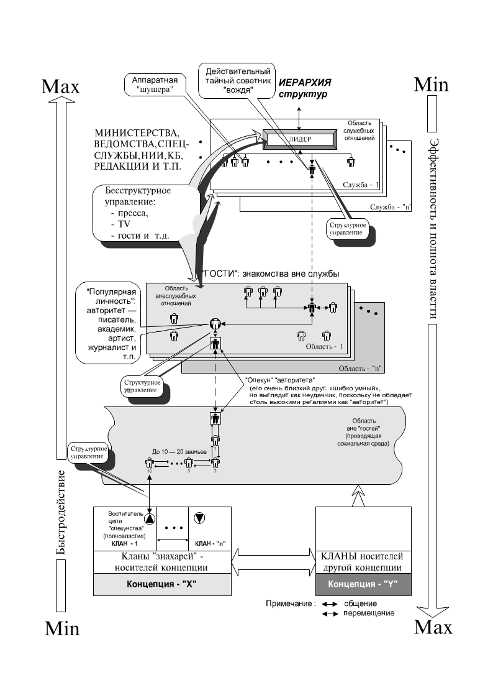
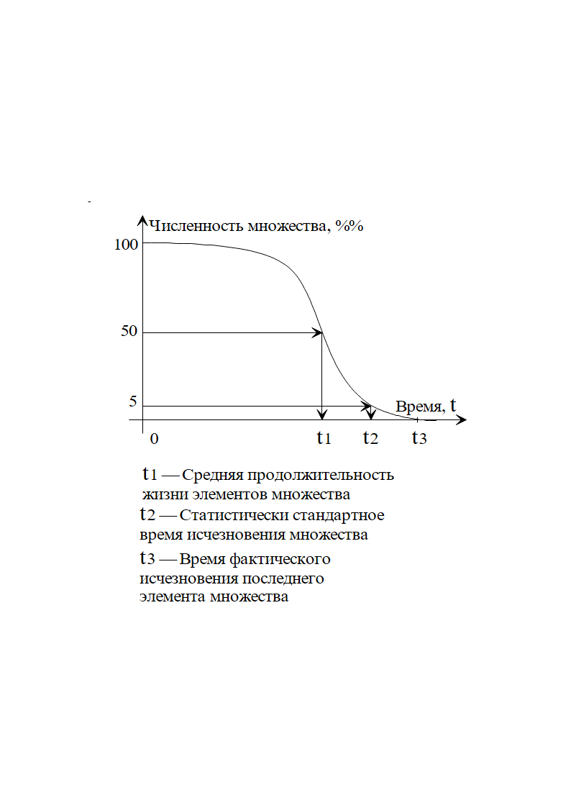
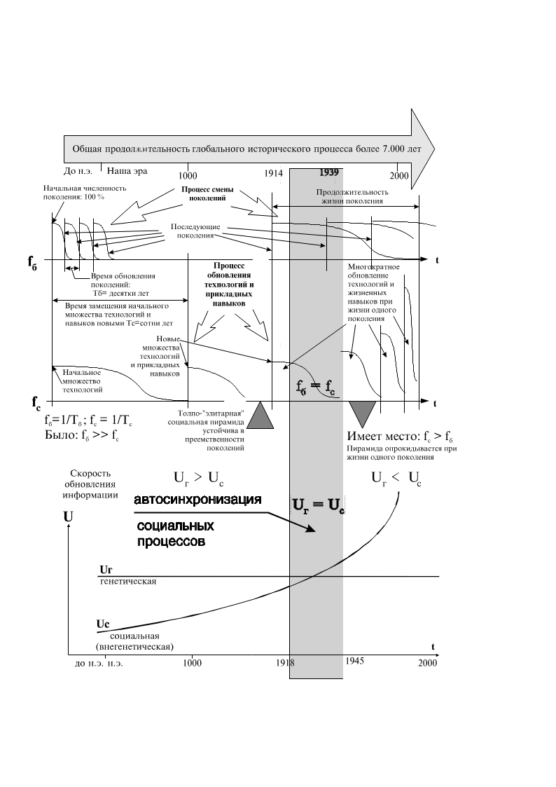

> **Первичный текст.** Достаточно общая теория управления.
> Источник: `Достаточно общая теория управления.doc` sha256 `7c3301e0a9adcc9d…`; [страница на dotu.ru](https://dotu.ru/2011/06/26/20110626-dotu_red-2011/).
> Автоматическая транскрипция DOC→Markdown; смысл и формулировки не правились.
> Контрольные суммы и статус проверки — в [NOTICE.md](../../NOTICE.md).
> Содержание передаёт позицию авторов; утверждения не верифицированы библиотекой.

---

## 1. Что такое власть в толпо-“элитарном” обществе

В толпо-“элитарном” обществе можно выявить схему анонимного дистанционного управления разного рода номинальными руководителями в обход контроля сознания как каждого из них, так и большинства общества. При этом мало кто толком понимает, как и где вырабатываются и утверждаются те решения, которые они проводят в жизнь. Принципы построения такого рода системы *дистанционного управления “начальниками” как луноходами* показаны на рис. 1.[^75]

Эта схема в обществе работала издавна на основе традиций и навыков, хотя научные исследования выявили возможность и принципы её целенаправленного построения только во второй половине ХХ века. В середине 1970‑х гг. одна из газет в качестве курьеза сообщила, что согласно исследованиям американских социологов двух случайно избранных американцев соединяет цепь знакомств в среднем не более чем в десять человек. Если есть цепь знакомств, то в принципе по ней возможна передача информации как в прямом, так и в обратном направлении. Всё выглядит так, как в детской игре «испорченный телефон», с тою лишь разницей, что участники цепи знакомств не сидят в одной комнате, на одном диване, а общаются между собой в разное время и в разных местах. Тем не менее, информация по таким цепям объективно распространяется, порождая некоторую статистику информационного обмена, на основе которой может быть построено достаточно эффективное управление.

Рис. 1. Схема дистанционного управления лидером в обход контроля его сознания со стороны носителей концептуальной власти в толпо-“элитарном” обществе

Видение этой статистики, некоторые знания психологии людей, позволяют строить такого рода цепи целенаправленно. Количество звеньев в них будет не 10 — 20, а гораздо менее, что делает их быстродействие достаточно высоким для осуществления стратегического управления, а подбор кадров для них (естественно негласный, «втёмную») обеспечивает достаточно высокую степень сохранения при передаче стратегической управленческой информации. Дело в том, что стратегическая информация в своём большинстве достаточно компактна, требует для упаковки весьма мало слов и символов и не нуждается в рукотворных носителях, которые могут стать уликами в юридическом понимании этого слова.

На схеме рис. 1 показана иерархия структур и некий лидер, возглавляющий одну из них. Такого рода структурой может быть аппарат главы государства, министерство, спецслужба, научно-исследовательский институт, лаборатория в его составе, проектно-конструкторское бюро, редакция и т.п. Структура представляет собой некое штатное расписание. Персонал, наполняющий клетки штатного расписания, условно можно разделить на две категории:

- аппаратную “шушеру”, которой «что бы ни делать, лишь бы не работать»;

- работающих специалистов, которые более или менее «болеют за дело».

Из числа вторых можно выделить ещё одно подмножество — нескольких человек, мнение которых как профессионалов значимо для лидера структуры при руководстве ею. На схеме один из таких специалистов указан и назван *действительным тайным советником* “вождя”.

Но люди далеко не всё время проводят на работе. Есть ещё круг неформального общения. При этом «действительные тайные советники» многих публичных лидеров или деятелей, широко известных в узких кругах специалистов, вхожи в дома популярных личностей, чьё мнение более или менее авторитетно во всём обществе. В дома такого рода “звёзд” вхожи и многие другие люди. Среди них могут быть и школьные, и вузовские друзья “звёзд-авторитетов”, которые и сами не обделены талантом.

И хотя они в силу разных причин не смогли или не пожелали обрести высоких титулов, но к их мнению прислушиваются их высокоавторитетные друзья, по отношению к которым они выступают в роли домашних *действительных тайных советников.* Фактически они “опекуны” общесоциальных “авторитетов” — культовых личностей.

Множество из тех интеллектуалов, кто возмущался и возмущается культом личности Сталина, сами являются культовыми личностями, вкупе с теми звёздами эстрады, спорта и шоу-бизнеса, кому нет до общественных в целом проблем никакого дела. Но если смотреть на общественную жизнь в целом, то нет разницы одна в обществе культовая личность для всех, либо в нём сонм культовых личностей, удовлетворяющий нужду в низкопоклонстве и кумиротворении разных общественных групп в нём.

Опекуны могут знать, что они выполняют миссию опекунства, но могут использоваться втёмную так же, как и действительные тайные советники. Либо непосредственно, либо через некоторое количество промежуточных звеньев на опекунов выходят представители наследственных кланов знахарей концепции общественного управления. Они могут быть воспитателями опекунов с детства. Это может быть деревенский дедушка, бабка, сосед по даче где-то за сотни километров от основного места жительства “опекуна”. Возможно, что и не получив высшего образования, он, однако, является человеком, с которым “опекуну” интересно поговорить «за жизнь»; возможно, что этот интерес у него с детства.

Мы рассматривали эту систему, начиная от лидера структуры. Но исторически реально системы такого рода дистанционного управления лидером *целенаправленно* выстраиваются в течение годов и десятилетий в обратной направленности: от знахарей концепций к публичным лидерам отраслей общественной деятельности; а также и сами лидеры в ряде случаев создаются при развертывании такой системы и продвигаются на тот или иной пост аналогично тому, как по шахматной доске передвигаются фигуры при развертывании той или иной стратегии шахматной игры.

Некоторую специфику этому процессу в обществе придаёт то обстоятельство, что “шахматная доска” достраивается по мере необходимости или из неё выламываются некоторые клетки, а также и то, что пешки и прочие фигуры обладают некоторой активностью и свободой в выборе целей и способов их осуществления, но каждый в толпо-“элитарном” обществе в меру понимания работает на достижение своих целей, а в меру разницы в понимании работает — в то же самое время — на осуществление целей тех, кто понимает больше. В пределах же власти определённой концепции общественного управления больше всех понимают знахари этой концепции.

А при сопоставлении различных несовместимых концепций и знахари каждой из них в меру понимания Объективной реальности работают на свою концепцию, а в меру разницы в понимании работают — в то же самое время — на концепции тех, кто понимает Жизнь глубже и шире.

При этом следует понимать, что в зависимости от того, какие цели преследуют знахари концепции, проводимой в жизнь, они продвигают на должности либо тех, кому, «что бы ни делать, лишь бы не работать» (к числу которых принадлежат не только бездельники, но и профессиональные карьеристы), либо тех, кому «за Державу обидно и душа болит за дело».

Соответственно сказанному в избирательных кампаниях предлагаются и раскручиваются кандидаты[^76], принадлежащие к одной из двух категорий, либо мельтешащие между двумя способами осуществления деятельности в силу их психической неустойчивости. Но вопросам психологии деятелей государства и частнопредпринимательской власти аналитики должного внимания не уделяют, хотя особенности психики глав государств, концернов, иных высших должностных лиц — не только личное дело каждого из них, поскольку в зависимости от них оказываются более или менее широкие слои всего общества.

И реально избирателю сквозь слова, выплёскиваемые самим кандидатом и его избирательным штабом, необходимо увидеть, к какой из этих двух категорий принадлежит кандидат, к которому избиратель *проникся внезапной симпатией, совершенно не зная его по реальной жизни.* Но об этом мало кто из избирателей задумывается, как и сами кандидаты далеко не всегда задумываются о том, к какой категории каждый из них принадлежит и на кого он реально работает и изъявляет готовность работать *в меру своего понимания,* не пытаясь даже оценить **разницу в понимании**.

Те же силы, которые продвигают кандидатов для осуществления их руками заранее предопределенной политики, задумываются о выявлении, подборе и расстановке кадров, **которые бы сами (в статистической массе) делали то, что от них ждут;** делали бы сами в меру их понимания и в меру разницы в понимании, разделяющей между собой все ступени пирамиды толп и “элит” в толпо-“элитарном” обществе**.**

В работе такой системы единичные ошибки возможны, и они могут иметь очень тяжелые последствия для тех “кадровиков”, кто ошибся (так ошиблись хозяева марксизма, способствуя продвижению коммуниста-большевика антимарксиста И.В.Сталина на высшие должности в марксистской партии и государстве), но <u>кадровый корпус в целом</u> подбирался знахарями библейской концепции в её культовых и <u>светской марксистской</u> модификациях для осуществления определённых целей до середины ХХ века безошибочно. К середине ХХ века информационные процессы в обществе изменили свой характер, вследствие чего прежние навыки и принципы стали давать систематическую ошибку. Причина этого в изменении соотношения эталонов биологического и социального времени.

\* \* \*

### Изменение соотношения эталонных частот\

биологического и социального времени

Рис. 2. Характер убыли элементов из\

первоначального состава множества\

с течением времени

Чтобы понять существо этого явления, сначала обратимся к описанию множественных явлений средствами математической статистики. На рис. 2 показан характер убыли с течением времени элементов из первоначального состава некоторого множества. Предполагается, что в начальный момент времени множество определено по персональному составу элементов и его численность составляет 100 % . Далее под воздействием внешних и внутренних обстоятельств элементы множества исчерпывают свой ресурс и гибнут. Если в популяции живых организмов выявить её персональный состав, а потом следить, как выявленные в начале особи исчезают из популяции, то получится примерно такой же по характеру график, как показан на рис. 2, но с количественно определенным масштабом по осям времени и численности. Процесс, показанный на рис. 2, не означает, что с его завершением популяция исчезнет. Хотя такое и возможно в принципе, но в подавляющем большинстве случаев обновляется персональный состав членов популяции (элементов множества). То есть с исчезновением одного множества, выявленного по персональному составу в начальный момент времени, можно выявить новое множество, характеризующееся своим персональным составом. Об исчезновении выявленного по персональному составу множества можно говорить и в статистическом смысле: т.е. можно считать, что исчезновение множества произошло, если исчез какой-то определенный и постоянный (как правило, для всех рассматриваемых множеств) процент из первоначальных 100 %, например 80 %, или 95 %, как на рис. 2.

Обратимся к рис. 3. В верхней части рис. 3 условно показана общая продолжительность глобального исторического процесса. Ниже размещены две оси времени. На них изображены два процесса. На верхней временной оси — процесс преемственной смены поколений людей. На нижней временной оси и процесс обновления технологий и прикладных жизненных навыков.

Рис. 3. Изменение соотношения эталонных частот\

биологического и социального времени.

Чисто формально по алгоритмам построения каждый из процессов, изображённых на верхней и нижней временных осях рис. 3, идентичны как процессу, изображенному на рис. 2, так и между собой. При этом предполагается, что в каждый момент исторического процесса можно выявить по персональному составу поколение людей. Оно будет обладать в этот момент 100-процентной численностью, которая будет сокращаться вплоть до полного исчезновения поколения. Но поскольку рождаются новые люди, которые не входят в первоначально избранное множество, то в тот момент исторического процесса, когда исчезнет ранее выявленное поколение, можно выявить очередное поколение, также обладающее в этот момент 100‑процентной численностью.

Аналогично предполагается — и это предположение не противоречит возможностям археологии, — что в начальный период становления цивилизации выявлено некоторое вполне определённое множество технологий и жизненных навыков. Далее по мере исторического развития технологии и жизненные навыки, принадлежащие этому множеству, постепенно выходят из употребления. К тому моменту исторического времени, когда исчезнет начальное множество технологий и жизненных навыков, можно будет выявить какое-то иное множество технологий и жизненных навыков. Возможно, что под влиянием научно-технического прогресса оно будет более многочисленным, чем ему предшествующие, тем не менее, численность выявленных новых технологий также можно считать равной 100 %, чтобы упростить построение графика. Момент исчезновения как для поколений людей, так и для *поколений технологий*[^77] и жизненных навыков, как было отмечено при обсуждении рис. 2, можно понимать и в статистическом смысле: поскольку полное исчезновение, фиксируемое по исчезновению последнего из объектов множества, может оказаться далеко выпадающим из всей остальной статистики и не характерным для неё, то можно считать, что исчезновение множества произошло, если исчез какой-то определённый и постоянный процент из первоначальных 100 %, например 80 % первоначально выявленных технологий. Также можно подходить и к процессу обновления поколений людей: т.е. не дожидаясь ухода из жизни последнего долгожителя, можно считать, что, если ушло из жизни 80 % некогда выявленного персонального состава населения, то поколение заместилось новым.

Соответственно, при полной формальной идентичности построения, содержательное отличие верхнего и нижнего графиков в верхней части рис. 3 друг от друга — в разном характере соизмеримости с *астрономическим эталоном времени (год: смена сезонов при обращении Земли вокруг Солнца)* процесса смены поколений людей и процесса смены поколений технологий и жизненных навыков.

Продолжительность жизни поколения Тб обусловлена генетически и на протяжении истории она изменялась в ограниченных пределах (Тб средн = продолжительность в пределах столетия ± десятки лет). Хотя средняя продолжительность жизни людей и росла на протяжении памятной истории нынешней цивилизации, однако она не выросла многократно. Вследствие этого её можно считать приблизительно неизменной по отношению к эталону астрономического времени. Этот процесс смены преемственных поколений можно избрать в качестве эталонного процесса биологического времени, что и показано на верхней оси времени рис. 3 слева от разрыва горизонтальных осей графиков, отделяющих глубокую древность от нашей эпохи — исторического времени жизни современных и лично памятных прошлых поколений, к которым принадлежали отцы и деды ныне живущих.

Процесс обновления технологий и жизненных навыков, показанный на нижней оси времени в верхней части рис. 3 как последовательность убывающих множеств, также может быть взят в качестве эталонного процесса времени. Но, в отличие от верхнего графика, продолжительность жизни поколений технологий и жизненных навыков на протяжении всей истории не является неизменной, даже приближённо, поскольку в результате ускорения периодичности обновления технологий и увеличения общего количества информации в культуре общества изменилось качество биологически-социальной системы в целом. Это видно на следующем графике, помещённом в нижней части рис. 3. Там размещена ещё одна координатная система с осью времени, в которой показано изменение в течение исторического времени мерных характеристик процессов смены поколений и обновления технологий и прикладных жизненных навыков.

Графики процессов на верхней и нижней временных осях можно соотнести друг с другом, что и сделано на рис. 3. В левой его части на период времени исчезновения начального множества технологий приходится много смен поколений. В правой его части для наглядности изображения изменён масштаб вдоль оси времени (это видно по полосе в верхней части рис. 3, изображающей течение глобального исторического процесса). Вследствие этого длительность жизни поколения в ХХ веке выглядит многократно более продолжительной, чем в левой половине рисунка, относящейся к эпохе становления первых региональных цивилизаций. Но эта условность позволила более зримо изобразить на нижней оси времени процесс многократного обновления технологий и прикладных жизненных навыков в течение жизни одного поколения, а также и общий рост количества информации в культуре общества (в этой части рисунка нарушено равенства масштаба и по вертикальной оси, вследствие чего начальные 100 % последующих множеств технологий и жизненных навыков зримо выше, чем им предшествующие).

Характер отношения частот верхнего и нижнего процессов на рис. 3, имевший место в левой его части, изменился на качественно противоположный. Математически это выражается так: на заре нынешней цивилизации было fб \>\> fс ; в ходе её развития стало fб \< fс  (fс \> fб — кому какой вариант записи соотношения больше нравится) ; а графически это показано в нижней части рис. 3.

Выявленные частоты fс и fб — это меры скорости обновления информационного состояния цивилизации (как иерархически организованной системы) на социальном и биологическом уровнях в её организации. На графике (приблизительно) неизменная Uг характеризует скорость обновления генетической (индекс «г») информации в популяции; возрастающая на протяжении всей истории Uс характеризует скорость обновления культуры, как информации не передаваемой генетически от поколения к поколению.

Как видно из жизни, из математики и из графика, произошло изменение соотношения эталонных частот биологического (fб) и социального (fс) времени.

*<u>Объективное явление</u>*, которое названо здесь *изменение соотношения эталонных частот биологического и социального времени* — собственная характеристика глобальной биологически-социальной системы, от которой никуда не деться. Это информационный процесс, протекающий в иерархически организованной системе. Из теории колебаний, теории управления известно, что, если в иерархически организованной многоуровневой (многокачественной) системе происходит изменение частотных характеристик процессов, являющих каждое из множества свойственных ей качеств, то система переходит в иной режим своего поведения. Это общее свойство иерархически организованных систем, обладающих множеством разнообразных качеств, к классу которых принадлежат как человеческое общество в целом, так и иерархически организованная психика каждого из людей.

Это общее свойство многопараметрических и иерархически организованных информационных систем. Оно по отношению к жизни общества предопределяет качественные изменения в организации психики множества людей, в нравственно-этической обоснованности и целеустремленности их деятельности, в избрании ими средств достижения целей; предопределяет качественные изменения того, что можно назвать логикой социального поведения: это — массовая статистика психической деятельности личностей, выражающаяся в реальных фактах жизни.

*Мы живём в исторический период, когда изменение соотношения эталонных частот биологического и социального времени уже произошло, но ещё не завершилось становление новой — определяющей жизнь всего общества — **логики социального поведения (алгоритмики самоуправления общества),** в которой выразилось бы статистическое преобладание в обществе **людей — носителей иной организации индивидуальной и коллективной психики**. Но общественное управление на основе прежней логики социального поведения, обусловленной прежней статистикой распределения людей по типам строя психики, уже теряет устойчивость, т.е. власть, и порождает многие беды и угрозы жизни.*

*Формирование логики социального поведения, отвечающей новому соотношению эталонных частот, протекает в наше время и каждый из нас в нём участвует и сознательно целеустремленно, и бессознательно на основе усвоенных в прошлом автоматизмов поведения.*

*Но каждый по своему произволу, обусловленному его нравственностью, имеет возможность, осознанно отвечая за последствия, избрать для себя тот или иной стиль жизни, а по существу — избрать личностную культуру психической деятельности и выработать в себе соответствующую ей организацию психики.*

Те, кто следует прежней логике социального поведения: вверх по ступеням внутрисоциальной пирамиды взаимного паразитизма и вседозволенности или удержать завоеванные высоты, — всё более часто будут сталкиваться с разочарованием, поскольку на момент достижения цели, или освоения средств к её достижению, общественная значимость цели исчезнет, изменятся личные оценки её значимости, она станет вновь недостижимой вследствие изменения каких-то обстоятельств. Произойдет это вследствие ускоренного обновления культуры. Это предопределяет необходимость селекции целей по их устойчивости во времени, и наивысшей значимостью станут обладать «вечные ценности», освоение которых сохраняет свою значимость вне зависимости от изменения техносферы и достижений науки.

Стать человеком и жить в ладу с Богом и биосферой, предопределённо становится при новом соотношении эталонных частот биологического и социального времени — непреходящей и самодостаточной целью для каждого здравого нравственно и интеллектуально, и этой цели будет переподчинена вся социальная организация жизни и власти. Все же прочие, — те, кто останется рабом житейской суеты, — обречены на отторжение биосферой Земли.

Все элементы <u>человечества как системы в биосфере Земли</u>, которые не способны своевременно отреагировать на изменение соотношения эталонных частот биологического и социального времени, обречены на отторжение биосферой Земли, переходящей в иной режим своего бытия под воздействием человеческой деятельности последних нескольких тысячелетий. И от биосферы Земли не защитит ни герметичный бункер с протезом Среды обитания, ни медицина...

\* \*\

\*

Если начинать рассмотрение управления от места, в котором рождаются и принимаются общественно значимые решения (выявить проблему и выработать алгоритм её разрешения, т.е. выявить функцию концептуальной власти, о которой помалкивают СМИ), то самодержавным главой государственности может оказаться какой-нибудь пчеловод в деревне. И как поётся в песне:

«На дальней станции сойду (в пределах суток езды от официальной столицы), трава — по пояс...» и буду прямо говорить глаза в глаза с главой внутриобщественной власти. Всё запомню, приеду в город, расскажу приятелям, как провёл выходные. Они тоже расскажут своим, а потом это — аукнется в политике, науке и т.п. *А я так и не пойму, почему...*[^78]

*— А не пойму потому, что точно знаю: на принципах игры в «испорченный телефон» и при помощи распространения сплетен и анекдотов управлять ни государством, ни отраслью деятельности невозможно. А про <u>бесструктурный способ управления, основанный на анализе статистики и циркулярном безадресном распространении информации в управляемой среде, что ведёт к предсказуемому изменению контрольной статистики</u>*[^79]*, нам ничего не рассказывали ни дома, ни в школе, ни в вузе... И даже если прочитаю об этом в не авторитетном (не академическом издании), тем более анонимном, — всё равно не поверю и откажусь понимать потому, что мне спокойнее верить в нескончаемые бредни аналитиков СМИ.*

Такого рода миссию опекунства государственной власти до 1917 г. выполнял Г.Е.Распутин[^80]. Вина его, за которую его поливали и поливают грязью в массово тиражируемой литературе, состоит не столько в его реальных прегрешениях, сколько в том, что он был при дворе агентом влияния русских знахарских кланов, а не кланов международных глобалистских, антирусских[^81], деятельности которых он успешно препятствовал до покушения на его жизнь, имевшего место в тот же день (28 июня 1914 г.), что и убийство в Сараево наследника Австро-Венгерского престола эрцгерцога Фердинанда. Не имея возможности вследствие ранения присутствовать в Петербурге, он не смог телеграммами удержать царя от вступления России в войну, что удалось ему двумя годами ранее во время балканских войн, когда партия войны при дворе во главе с великим князем Николаем Николаевичем настаивала на вмешательстве России в балканские дела.

Такого рода концептуально-знахарская опекунская деятельность в отношении чиновников государства продолжалась и после 1917 г. И этот факт нашёл даже своё документальное подтверждение. В качестве иллюстрации якобы невозможности такого рода оказания влияния на политику приведём выдержку из книги В.Н.Демина “Тайны Русского народа”. Он цитирует письмо профессору Г.Ц.Цыбину от 24 марта 1927 г., написанное А.В.Барченко[^82], который занимался в 1920‑е гг. исследованиями истории становления Руси и русских эзотерических знаний:

«\<...\> Это убеждение моё \[об Универсальном Знании — В.Д.\][^83] нашло себе подтверждение, когда я встретился с русскими, тайно хранящими в Костромской губернии традицию \[Дюн-Хор\][^84]. Эти люди значительно старше меня по возрасту, и насколько я могу оценить, более меня компетентные в самой Универсальной науке и в оценке современного международного положения. Выйдя из костромских лесов в форме простых юродивых (нищих), якобы безвредных помешанных, они проникли в Москву и отыскали меня. \<...\> Посланный от этих людей под видом сумасшедшего произносил на площадях проповеди, которых никто не понимал, и привлекал внимание людей странным костюмом и идеограммами, которые он с собой носил \<...\> Этого посланного — крестьянина Михаила Круглова — несколько раз арестовывали, сажали в ГПУ, в сумасшедшие дома. Наконец пришли к заключению, что он не помешанный, но безвредный. Отпустили его на волю и больше не преследуют. В конце концов, с его идеограммами случайно встретился в Москве и я, который мог читать и понимать их значение.

Таким образом установилась связь моя с русскими, владеющими русской ветвью Традиции \[Дюн-Хор\]. Когда я, опираясь лишь на общий совет одного южного монгола, \<...\> решился самостоятельно открыть перед наиболее глубокими идейными и бескорыстными государственными деятелями большевизма \[имеется в виду прежде всего Ф.Э.Дзержинский — В.Д.\] тайну \[Дюн-Хор\], то при первой же моей попытке в этом направлении, меня поддержали совершенно неизвестные мне до того времени хранители древнейшей русской ветви Традиции \[Дюн-Хор\]. Они постепенно углубляли мои знания, расширяли мой кругозор. А в нынешнем году \<...\> формально приняли меня в свою среду \<...\>»[^85]

Но эта ветвь власти, произрастающая от знахарей Дюн-Хор, с которой сотрудничали Ф.Э.Дзержинский и некоторые другие деятели тогдашнего режима, была в конфликте с другими кланами знахарей концепций, в том числе и с зарубежными международными, и прежде всего, — в конфликте со сторонниками и невольниками библейской доктрины построения глобального расового “элитарно”-невольничьего государства, в котором роль глобальной правящей расовой “элиты” отведена еврейству диаспоры — искусственно созданной социальной группе, представляющей собой дезинтегрированный биоробот, программа поведения которого своими различными фрагментами распределена по психике множества индивидов, подавляя человечное достоинство каждого из них[^86]. И в этом конфликте знахарская ветвь Дюн-Хор потеряла тогда бразды правления, вследствие чего её периферия в органах государственной власти была выявлена и выкошена либо подавлена после смерти Ф.Э.Дзержинского, вследствие чего контроль над репрессивными органами СССР перешел к ставленникам других кланов *знахарей концепций общественной жизни*.

Также полезно понимать, что знахарские кланы могут быть в конфликте между собой как вследствие того, что они привержены взаимно исключающим одна другой концепциям управления обществом, так и вследствие того, что в пределах одной концепции чем-то обделённые знахарские кланы борются с другими кланами за “справедливость” в понимании каждого из них.

И эти конфликты будут находить выражение в политике как кадровые перестановки, в которых выражается завоевание периферией одних кланов должностных постов, которые ранее были заняты периферией других; а также и как борьба за изменение архитектуры структур и номенклатуры должностей, в ходе которой создаются и уничтожаются должности неугодные одним, но необходимые другим кланам для расстановки своей периферии.[^87]

Что изменилось в этих отношениях между обществом, кланами *знахарей концепций общественной жизни* и органами государственной власти с тех пор, как А.В.Барченко написал цитированное письмо, за исключением того, что произошла смена соотношения эталонных частот биологического и социального времени, сделавшая схему неработоспособной? — Ничего, кроме того, что конкретные персоны, занимавшие те или иные позиции в схеме, сменились другими. Спрашивается, что может изменить очередная смена персон, образующих собой правящую “элиту” в этой <u>системе как таковой</u>?

— Ничего, хотя продвижение на государственные и иные ключевые должности тех, «кому за Державу обидно», *на места тех, кому «что бы ни делать, лишь бы не работать»,* способно привести общество к более или менее продолжительному производственно-потребительскому благополучию, в котором, однако, подавляющее **большинство обывателей не будет властно над обстоятельствами своей жизни точно также, как не властны они над этими обстоятельствами и в нынешней государственной разрухе.**

Кадры действительно решают всё, но как показывает эта схема, под *кадрами, которые решают всё,* следует разуметь не столько те кадры, на которых сосредотачивают внимание обывателей СМИ, и которые занимают те или иные должности в структурах государственной власти и сферы частного предпринимательства, сколько иные кадры, действующие вне официальных структур власти.

Обсуждение же кадровой политики и её принципов в СМИ по-прежнему не выходит за пределы блока, названного на схеме рис. 1 «Иерархия структур» и не идёт далее вопроса о том, сколько и каких должно быть на схеме клеточек штатного расписания, как они должны быть связаны между собой и какую функциональную нагрузку должны нести.

Примером тому статья Р.Е.Тихонова[^88] “Три принципа наших кадровых служб. По каким критериям ведётся отбор высших чиновников”, опубликованная в “Независимой Газете” от 19.06.1999 г. В ней изложение начинается от отставки правительства Примакова:

Вновь (в который раз!) кардинально изменен состав правительства, «ушли» одних, ввели других. По каким критериям ведутся отбор высших чиновников, назначение, смещение? Может ли кто-нибудь в аппарате правительства, администрации президента четко сформулировать требования, которым должны соответствовать работники различных уровней, во-первых, и методику их выявления, во-вторых? Боюсь, что нет. Современные теории управления персоналом располагают достаточно большим арсеналом средств и методов оценки различных человеческих качеств, в том числе и профессиональных, но их использование, насколько мне известно, не получило широкого признания в наших кадровых службах».

Если же говорить о «современных теориях управления персоналом», то все они выражают концепции общественной жизни, свойственные той или иной региональной цивилизации. Вследствие этого большее или меньшее количество положений «теории управления персоналом» будет неработоспособно при попытке применить их к другому обществу, принадлежащему иной региональной цивилизации, имеющему иную коллективную психику и статистику, описывающую психику множества индивидов, составляющих это общество[^89].

Но это — “мелочь”, которую Тихонов либо не видит, либо не считает актуальной для России, не имеющей своей «теории управления персоналом». Для него значима практика, в которой выражается кадровая политика борющихся между собой знахарских кланов. И Тихонов переходит к описанию исторически укоренившейся практики:

«На практике всё так же бытуют три принципа: личная преданность, политическая лояльность и, самое главное, — «управляемость». Вольнодумство и непочитание вышестоящих на административной лестнице начальников недопустимо категорически. **Причём речь идёт именно об «управляемости», а не о дисциплине** (выделено нами при цитировании: к этому мы ещё вернёмся). Эти понятия, как известно не синонимы. (…)

Конечно, вопрос подготовки и, главное, расстановки кадров ключевой. Массовые требования отставки того или иного «плохого» министра показывают, что население не хочет мириться, а вот с кем или чем? С конкретными людьми или результатами их деятельности? А результат деятельности какого-либо министра соответствует ли тому, что действительно делал или хотел сделать министр?»

Результат деятельности всегда соответствует деятельности, хотя он действительно может не соответствовать намерениям и обещаниям. Если результат не соответствует намерениям и обещаниям, отклоняясь от них в сторону худшего, то это означает, что у деятеля есть нравственно-мировоззренческие пороки, вследствие наличия которых его объективно употребили «втёмную», осуществив его руками цели, противные его искренним намерениям, возможно, что вследствие того, что он сам влился в поток бесструктурного управления. Поэтому обществу не важно, что хотел сделать “министр”: важно то, что явилось результатом его деятельности.

Но названные Тихоновым три принципа кадровой политики — всего лишь три разных лика единственного принципа кадровой политики “элиты”, который изложен в редакции академика Н.Н.Моисева.

«Наверху (по контексту речь идёт об иерархии власти) может сидеть подлец, мерзавец, может сидеть карьерист, но если он умный человек, ему уже очень много прощено, потому, что он будет понимать, что то, что он делает, нужно стране», — (цитировано по изданию «Горбачев-Фонда» “Перестройка. Десять лет спустя”, Москва, «Апрель-85», 1995 г., стр. 148, тир. 2500 экз., т.е. издание под негласным грифом “для элиты”).

Иными словами, мерзавец-дурак, способный наломать много дров, у власти быть не должен. Но осторожный мерзавец, который будет творить мерзости с оглядкой, так чтобы остальной мерзостной “элите” жилось спокойно и сытно, вполне приемлем. Т.е. мерзавец-индивидуалист — всегда дурак; а умный мерзавец, способный к корпоративности, — то, что надо.

Праведник же, способный призвать “элиту” к отказу от мерзостей, будет воспринят ею как антисистемный фактор — на стадии мирной агитации за счастье для всех, а когда обратившиеся к праведности перейдут от мирной агитации к утверждению справедливости и осуществлению социальной гигиены, опираясь на поддержку не-“элиты”, то это будет названо тиранией, фашизмом, тоталитаризмом и т.п.

Такого **неосторожного** *грязносердечного*[^90] *признания* **по недомыслию***,* какое сделал Н.Н.Моисеев, вряд ли бы смогли вырвать у него под пытками самые крутые следователи и заплечных дел мастера былых эпох.

Далее в статье Тихонова следует абзац, в котором перечислены результаты деятельности реформаторов, отрицающие те их декларации о благонамеренности, что они успели огласить в прошлом. Результаты таковы: развал народного хозяйства — системы общественного производства — вследствие обретения свободы *частного предпринимательства, беззаботного по отношению к чуждым ему частным и общественным интересам,* что вылилось в паразитизм «новых русских», которые так и не стали и не станут политически активным и ответственным «средним классом» собственников, вследствие того, что являются носителями идеализированных писателями-почвенниками мироедско-кулацких нравственности и мировоззрения; коррупция чиновников и т.п. После этого делается вывод:

«Явления, о которых вся пресса не устаёт писать[^91], — следствие, безусловно многих факторов, но важнейший из них **структурное несовершенство органов власти и механизмов управления**. Едва ли сегодня найдётся специалист, который сможет более или менее представить модель звеньев и связей всего многообразия министерств, ведомств, комиссий, советов, администраций и прочих структур, через которые должно проходить то или иное управленческое решение. Не случайно на заседаниях правительства постоянно звучит вопрос: «Кто отвечает за…» и, как правило, нет однозначного ответа. Президент, осуждая деятельность правительства, тоже не называет конкретный адрес недовольства, так как сегодня его не может назвать никто».

Как известно, в бытность И.В.Сталина генеральным секретарем ЦК правящей партии, а также и когда он возглавил Советское Правительство, вопрос «Кто отвечает за…» был во властных структурах чисто риторическим, поскольку на него всегда находился определённый ответ. Причем ответственность распределялась большей частью до того, как что-то неприятное случалось. Зная о предстоящей ответственности, те на кого она возлагалась, требовали и соответствующих властных полномочий и обеспечения своей деятельности кадрами и разного рода ресурсами. Вследствие такого подхода к проблеме ответственности тех, кто её возлагал и тех, кто её принимал, многие возможные неприятности просто не происходили. Если же неприятности случались, то отвечали за них непосредственно те, кто не организовал их предотвращения, обладая определёнными должностными полномочиями[^92].

То есть, как бы демократизаторы ни ругали И.В.Сталина, но возглавляемая им государственность была более совершенна как «машина управления» (а в этом и состоит назначение государственности, вне зависимости от того, в чьих интересах осуществляется управление и чьи интересы подавляются всею её мощью), нежели тот урод, который возник в преемственности деятельности антисталинистов, начиная от Н.С.Хрущева и кончая младореформаторами 1990‑х гг.

Одна из причин эффективности государственности эпохи сталинизма состояла в том, что И.В.Сталин не был карьеристом, ориентирующимся в своей деятельности на мнение вышестоящего начальства: он мнения начальства конечно учитывал, но был занят своею деятельностью. Карьеристы же, которые также присутствовали в этой системе, злоупотребляли ею, распределяя ответственность за ерунду, не имеющую никакой значимости в жизни общества, что ныне даёт основания к тому, чтобы поливать грязью всю государственную систему СССР эпохи сталинизма, приводя реальные факты расправы над тем или иным человеком за не выполненную ерунду, ответственность за которую была возложена на него мерзавцами или дураками.

Если же говорить об архитектуре структур государственности — т.е. оставаться в рамках темы, затронутой самим Тихоновым, — соотносясь однако с полной функцией управления, то архитектура государственных структур эпохи сталинизма лет на 100 — 150 обогнала нравственное и мировоззренческое развитие общества. Но даже при действии в противящемся ей обществе она доказала свою эффективность, превзойдя по эффективности управления все современные ей иные типы государственности, и защитила народы не только СССР, но и всего мира от торжества сионо-интернацистской мировой революции по рецептам Маркса-Троцкого и становления фашиствующего лжесоциализма в глобальных масштабах.

Далее Тихонов продолжает:

«В то же время жизнь конкретного гражданина зависит от деятельности множества управленческих и властных органов, и смоделировать их чрезвычайно сложно. Но если этого не будет сделано хотя бы в первом приближении, формально, но более или менее достоверно, то все наши правительственные (и не только) перетряски, *без чёткой структурной стратегии* будут продолжаться бесконечно, но так и не дадут результата».

А с чего это Вы решили, что они «наши»? Наши правительства управляют в наших интересах и достигают в управлении соответствующих нашим интересам результатов. Не наши правительства — марионеточные режимы антигосударства — управляют вопреки нашим интересам и тоже достигают соответствующих интересам их кукловодов вполне определённых результатов. Что они при этом болтают — к их деятельности имеет только то отношение, что благонамеренные речи призваны усыпить общественную инициативу, имеющую целью политики действительное осуществление наших общенародных интересов.

Поскольку управление всегда субъективно, то всё, что с точки зрения одних результатом не является, либо являет собой отрицательный результат, с точки зрения других может быть именно тем результатом, который и предполагалось достичь при начале неких мероприятий. Поэтому затрагивая вопрос о нескончаемых, казалось бы безрезультатных перетрясках, и перетрясках с отрицательным результатом, следовало бы рассмотреть и вопрос о том, есть ли силы в стране и за рубежом, для которых именно эта безрезультатность и является вожделенным результатом.

Ответ на него будет утвердительным, что приводит к постановке вопроса о необходимости выработки средств, позволяющих защитить управление обществом от их вмешательства.

Но нет, эта проблематика тоже обходится молчанием, и произносятся неопределенные слова об архитектуре структур государственной и прочей власти:

«Таким образом, я бы считал[^93], что массовое недовольство должно выражаться не в требовании смены правительства или отставки отдельного высокопоставленного чиновника, а в требовании знать: *какое государство мы строим, каково структурное взаимодействие всех органов, какова мера ответственности за каждый конкретный вопрос каждого конкретного управляющего элемента.*

Исходя из классического требования к проектированию больших систем, должна быть разработана такая теоретическая модель государственного устройства, которая наиболее полно отражала бы основные конституционные положения и базовые экономические принципы».

Здесь уместно поставить ещё один вопрос: *А если «основные конституционные положения и базовые экономические принципы» изначально объективно порочны, а вы создадите совершенную государственную машину для их воплощения в жизнь, то что вы запоете после того, как этот совершенный монстр начнет функционировать?*

Может всё дело в том, что «основные конституционные положения и базовые экономические принципы», под которые усилиями реформаторов лепится государственная машина и система общественных отношений в России, противоречат идеалам народа, вследствие чего власть живет своей жизнью, а народ своей, пока однако не изводя власть под корень, поскольку та его ещё “не достала”?

Но чтобы видеть несостоятельность *путей разработки* <u>рецептов оздоровления государственности</u>, которые рекомендует Тихонов, необходимо осознать некоторые стороны жизни недочеловеческого общества, которому предстоит вырастить в себе человечность.

Что касается массового выражения недовольства, то ему не прикажешь, как себя выражать: каждый выражает своё недовольство в меру своего личностного развития, понимания происходящего и возможностей оказать воздействие на течение событий, и из этого складывается статистика самодовольства, безразличия и недовольства. И под этой статистикой есть глубокая психическая подоплека, о которой аналитики средств массовой информации и властных структур не хотят задумываться, хотя всё необходимое для этого должно быть им известно ещё из курса биологии средней школы.

2. Психологические основы\

самоуправления общества

--------------------------

Человек — часть биосферы Земли. Иными словами, ему свойственно не только то, что отличает его от представителей всех других видов живых организмов, но так же и то, что свойственно и всем прочим видам в биосфере Земли. Если вспомнить общешкольный курс биологии, известный всем, и заглянуть в собственную психику, то можно утверждать, что информационно-алгоритмическое обеспечение поведения человека включает в себя:

- врожденные инстинкты и безусловные рефлексы (как внутриклеточного и клеточного уровня, так и уровня видов тканей, органов, систем и организма в целом), а также и их оболочки, развитые в культуре;

- традиции культуры, стоящие над инстинктами, порождённые и поддерживаемые на основе социальной организации;

- собственное ограниченное чувствами и памятью разумение индивида;

- «интуицию вообще» — то, что всплывает из бессознательных уровней психики индивида, приходит к нему из коллективной психики, является порождением наваждений извне и одержимости в инквизиторском понимании этого термина;

- водительство Божье в русле Промысла, осуществляемое на основе всего предыдущего, за исключением *наваждений и одержимости как прямых вторжений извне в чужую психику вопреки желанию и осознанной воле её обладателя*.

В психике всякого индивида есть возможное или действительное место всему этому. Но что-то одно из названного может подчинять себе все прочие компоненты в процессе выработки поведения индивида во всех жизненных обстоятельствах:

- если первое, то индивид — человекообразное животное (таковы большинство членов всякого национального общества в прошлом) — это **животный тип строя психики**;

- если второе, то индивид — носитель **типа строя психики «зомби»,** поскольку он по существу — биоробот, запрограммированный культурой (таковы большинство евреев, и к этому типу организации психики подтягиваются ныне большинство обывателей на Западе);

- если третье или четвертое, то индивид — носитель **демонического типа строя психики** (это — так называемая «мировая закулиса»: хозяева библейских культов, лидеры мондиализма, евразийства, высшие иерархи саентологов, откровенные сатанисты, а также многие политики, деятели искусств, спортсмены, йоги, маги и тому подобные «выдающиеся личности»).

  Демонический тип строя психики имеет две модификации, значимые для жизни носителей каждого из них и общества в целом:

<!-- -->

- демонически-корпоративный, на основе которого индивид так или иначе может соучаствовать в коллективной деятельности в каких-то аспектах в качестве подчинённого, а в каких-то аспектах в качестве руководителя;

- и демонически-индивидуалистический, исключающий возможности его соучастия в коллективной деятельности (ставящий его вне общества) или толкающий индивида на то, чтобы занять положение “сверхчеловека”, которому остальное общество должно безусловно подчиняться.

<!-- -->

- если пятое, то это — **человечный тип строя психики**, норма для человека, которая должна достигаться в *подростковом возрасте (к началу полового созревания и пробуждения половых инстинктов)* и обретать устойчивость к *началу юности (завершению процесса формирования организма),* после чего она должна быть неизменно характерной для организации его психики на протяжении всей дальнейшей жизни во всех без исключения обстоятельствах.

Сказанное относится к представителям обоих полов, хотя каждый из типов строя психики как у мужчин, так и у девушек и женщин имеет свои особенности[^94].

Человечный тип строя психики — как понятие и как явление в жизни — требует одного пояснения, необходимого как для тех, кто убеждён в том, что Бога нет, так и для тех, кто убеждён в том, что Бог есть: жизнь человека нормально должна протекать в его личностном осмысленном диалоге с Богом о смысле и событиях жизни. Доказательства Своего бытия Бог даёт в этом диалоге каждому Сам на веру соответственно судьбе, соответственно достигнутому личностному развитию каждого, соответственно проблематике, которая остаётся не разрешённой в жизни человека и общества. Доказательства носят нравственно-этический характер и состоят в том, что события жизни соответствуют смыслу помыслов и сокровенных молитв, подтверждая объективную праведность человека и давая вкусить плоды неправедности, которой человек оказался привержен вопреки данным ему Свыше предзнаменованиям.

И если индивид внимателен и честен перед собой, то он не будет отрицать, что получил ответ на своё молитвенное обращение к Богу.

Другое дело, согласится ли индивид с Данным ему Ответом, либо отвергнет его, поскольку ответ может оказаться ему не по нраву. Если согласится, то жизнь в его видении станет прекрасна и будет течь как диалог с Богом, в котором человеку нормально верить и доверять Богу. Но это не предмет веры в неведомое и недоказуемое, а предмет внутренней сокровенной этики индивида и Бога, и это — его сокровенное, внутреннее не обусловлено ритуалом, культурной традицией, пропагандой, контрпропагандой и т.п. Поэтому вера в Бога — следствие безверия Богу. Она — вера в Бога — представляет собой разновидность <u>атеизма по существу</u>.

Иерархическая упорядоченность названных компонент определяет *строй психики* индивида. *Строй психики* в настоящем контексте это — смысловая единица, т.е. к этому словосочетанию следует относиться так же, как одному слову, являющемуся носителем определенного смысла.

Некоторые индивиды неизменны в свойственной им иерархической упорядоченности названных компонент. Другие переходят от одной к другой неоднократно и обратимо, подчас даже не один раз на день. Третьи изменяются однонаправленно и необратимо. Нормальное для человека личностное развитие — от первого к пятому, и пятое должно стать необратимым к началу юности — завершению генетической программы развития организма. В человечном типе строя психики достигается *эмоциональная **позитивная** самодостаточность личности*, не зависящая от обстоятельств, вследствие того, что Вседержитель не ошибается, но не меняет того, что происходит с людьми покуда люди сами не переменят того, что есть в них: нравственности, помыслов, устремлений. И на основе такого рода эмоциональной самодостаточности обстоятельства начинают складываться жизненно благоприятно для самого человека и тех, кого он принимает в область своей заботы, *конечно если те не противоборствуют проявляемой им заботе умышленно*.

Все знания, навыки, квалификация и специальности — только приданое к строю психики. Высокий профессионализм и талант могут сопутствовать и индивидам с животным строем психики, строем психики зомби, демоническим строем психики обеих модификаций. Поэтому уровень профессионализма и искусности в тех или иных видах деятельности ещё ничего не говорит о том, состоялся ли индивид в качестве человека.

Но отсутствие профессионализма и дееспособности хоть в какой-нибудь общественно значимой области деятельности *однозначно говорит* о том, что в качестве человека индивид не состоялся[^95].

Однако аналитики делают вид, будто они в школе не учили биологию и не знают, что виду Человек Разумный, как и всякому иному виду в биосфере планеты свойственны инстинкты, что, кроме того, это единственный вид, который несёт и *культуру — генетически не передаваемую от поколения к поколению информацию, которая передаётся в преемственности поколений благодаря информационным потокам, порождаемым людьми в их общественной жизни, —* которая в жизни вида определяет если не всё без исключения, то определяет качество этой жизни[^96]*.*

Поэтому прежде, чем обсуждать принципы кадровой политики государства, следует определиться, в каком направлении *— в результате деятельности государства —* должна смещаться статистика распределения индивидов, образующих общество, по типам строя психики:

- в сторону численного преобладания животного строя психики, когда над поведением большинства властвуют инстинкты, а внутрисоциальная власть принадлежит демонам?

- в сторону численного преобладания зомби, когда над поведением большинства властвуют нормы запрограммированной культуры, а внутрисоциальная власть по-прежнему принадлежит демонам?

- в сторону господства демонизма, когда каждый упивается освоенными им возможностями своих тела и биополей, и демоны конкурируют между собой в самоутверждении, разумно соблюдая некие правила *корпоративной* игры и подавляя демонов-индивидуалистов для того, чтобы не погубить планету?

- в сторону человечного строя психики и исчезновения, по крайней мере общественно значимых проявлений, всех прочих типов строя психики во взрослом населении?

В зависимости от ответа на этот вопрос и определятся принципы кадровой политики.

Здесь также следует иметь в виду, что все названные типы строя психики, *не все из которых уместны во взрослом возрасте,* соответствуют в нынешней цивилизации возрастным периодам, когда индивид осваивает те или иные возможности его организма, по мере того как они открываются. Так в поведении младенца больше инстинктивного и безусловно-рефлекторного. Выйдя из младенчества, ребенок осваивает готовые навыки, закрепившиеся в культуре, подражая взрослым. Потом у него начинает преобладать своё разумение, и он отстаивает своё право не быть как все и повелевать обстоятельствами и окружающими по своему произволу. Спустя ещё некоторое время выясняется, что опора исключительно на подчинение себе окружающего, оказывается недостаточной, поскольку необходимо пребывать в ладу с Неограниченностью, и начинается творческое развитие личности в обществе.

Таков процесс саморазвёртывания генетической программы *становления человека в обществе,* но в извращённой культуре больного общества он может быть прерван на какой-то стадии жизненными обстоятельствами, которые на основе своих сил индивид преодолеть не смог, вследствие чего телесно взрослый может остаться при строе психики животного, зомби, демона, так и не став человеком.

В культуре здорового общества этому процессу саморазвёртывания генетической программы становления личности должен сопутствовать поддерживающий и упреждающий процесс опёки развития младших старшими, что должно исключить возможность остановки процесса становления личности внешними обстоятельствами, преодолеть которые собственных сил у индивида может и не хватить.

Древние цивилизации, как и дожившие до наших дней “дикари”, считали, что процесс становления личности, освоившей навыки самообладания, должен завершаться к 13 годам. Только в этом случае, вступая в возраст полового созревания, индивид не станет рабом своей похоти, поскольку инстинкты над его поведением уже не должны быть властны. Соответственно, достигнув возраста инициации во взрослость (13 — 15 лет в разных культурах), ребёнок должен был показать в испытаниях посвящений, что он сформировался как *человек, в смысле определённом в родной ему культуре*. Те, кто не выдерживал этих испытаний, либо изгонялись, либо почитались детьми вне зависимости от биологического возраста их тел.

Одна из проблем нынешнего общества, не в том, что не определено понятие «человек», которое необходимо подтвердить в каких-то квалификационных испытаниях по достижении подросткового возраста; а в том, что не определены особенности, обладая которыми индивид без явных признаков психической патологии (по современным медицинским стандартам), всё же является недочеловеком, отставшим в своём развитии или уклонившемся в нём в какое-то тупиковое направление.

Именно вследствие этого огульного наделения гражданским равноправием всех возможны многие преступления; в том числе и должностные, самое массовое из которых — дедовщина в вооруженных силах, покрываемая и подчас поддерживаемая офицерским корпусом.

При этом термин «секс-бомба» во многих исторических обстоятельствах следует понимать буквально: оружие массового поражения, поражающий эффект которого может распространяться на сотни лет в будущее (примерами такого рода секс-бомб являются библейская Эсфирь, Малка — мать князя Владимира — крестителя Руси).

Это потому, что инстинкты вида Человек “разумный” построены так, чтобы обеспечить максимальные темпы роста численности населения. При этом инстинкты женщины ориентированы на обслуживание ребенка в первые месяцы и годы его жизни и борьбу за “лучшее место под солнцем”. А инстинкты мужчины ориентированы на подавление “заячьих” программ поведения («наше дело не рожать, сунул, вынул и бежать») и на обслуживание женщины с детьми. Это ставит *мужчину — носителя животного строя психики —* в психологическую зависимость от женщины[^97] и способно обратить его в орудие, посредством которого женщина достигает “лучшего места под солнцем”, конкурируя с другими себе подобными самками. В культуре общества, где животный строй психики количественно преобладает, считается нормальным и вполне допустимым, что всё это животно-инстинктивное имеет свои продолжения в культуру и выражается в разного рода культурных оболочках: одна из них — мода, и прежде всего, женская мода, мода высокая; а также большей частью специфически мужская ругань (в России — мат)[^98].

В книге “Женщина в древнем мире” (Е.Вардиман. М., «Наука», 1990, стр. 15) опубликована репродукция наскального рисунка на тему жизни общества в матриархате, найденного в пещере в Африке на территории современного Алжира: рис. 4.

*[В оригинальном издании здесь расположен рисунок/схема. Иллюстрация не включена в данный выпуск: ожидает визуальной и правовой проверки. Файл источника: image14.png]*

Рис. 4. Норма жизни? либо карикатура на «вагинократию»?

Мужчина на охоте с копьем и щитом. Его баба “обеспечивает тылы”. Казалось бы они занимаются каждый своими делами. Но длиннющий извилистый член *мужчины — собственности этой бабы* — вставлен ей, куда следует, и подобно водолазному шлангу, а точнее кабелю дистанционного управления роботом, простирается от бабы к месту деятельности её мужа.

В комментарии автора названной книги к этому рисунку сказано:

«Поднятые руки женщины следует, несомненно, понимать как ритуальный жест: женское начало явно связано с колдовской функцией; женщина побуждает высшие силы даровать богатые охотничьи угодья».

Возможно, что древний автор рисунка действительно пытался выразить эту идею про «посредничество женщины перед высшими силами», но не исключено, что и тогда это была карикатура на «вагинократию»[^99], в которой “женщина” почти всегда — в прямом общении и дистанционно — управляет “мужчиной” как своим биороботом; однако при этом и она может быть «не хозяйкой и самой себе», находясь во власти того же самого, что властвует над её “мужчиной”.

Во всяком случае, искусство — один из способов познания и описания Жизни, вследствие чего художник способен объективно показать то, что выходит за пределы его собственного понимания и даже противоречит его убеждениям. Идею матриархата и вагинократии на основе преобладания в обществе животного строя психики зримо лучше не выразить, чем это сделал забытый людьми автор показанного наскального рисунка.

Теперь с этим следует соотнести роль “семьи” и “первых леди” в политической жизни современного мира, прикидывающегося, что он живёт в явном патриархате. Многое станет обнажённо видимым, легко объяснимым и предсказуемым, как только будет соотнесено с различными типами строя психики мужчин, занимающих государственные и прочие должности, и сопутствующих им женщин (любовниц, законных жён, повелевающих мужчинами), которые в свою очередь, повелевают мужчинками на домашнем “Политбюро”; или в другом варианте — великовозрастных детей, психологически застрявших во младенчестве и повелевающих *матерями, превращая жизнь своих матерей в ад;* а также «маменькиных» сынков и дочек, которые из младенчества хотя и выбрались, но так и остались в детстве и во всём подвластны своим матерям, которые превратили жизнь своих детей в нескончаемое рабство.

Если женщина — носительница животного строя психики или демонического, то она очень дорожит отношениями, построенными на такой основе. Если мужчина обретает от них свободу, то для неё это более неприятно, чем измена с другой бабой на такой же инстинктивно-демонической основе, это для неё жизненная трагедия, крах судьбы и т.п. — до тех пор, пока она сама не освободится от диктата инстинктов, автоматизмов культуры, собственного демонизма и одержимости.

Для взрослых при обусловленности их отношений инстинктами, пусть даже под культурными оболочками, привлекателен сам процесс совокупления, а беременность, которая может последовать за совокуплением, — сопутствующий эффект, который может получить оценку «нежелательная беременность». Вследствие этого общество, с господством нечеловечных типов строя психики обеспокоено проблемой “безопасного секса”, в котором совокупляться допустимо без ограничений и опасностей, включая и “опасность” беременности, низведенной, в случае её «нежелательности», почти что в ряд инфекций, передающихся половым путём[^100].

При человечном строе психики, в силу эмоциональной самодостаточности индивида вне зависимости от пола, секс перестаёт быть средством эмоциональной разрядки и подзарядки, а каждое совокупление имеет целью зачатие Человека — наместника Божиего на Земле — и потому представляет собой священнодейство, которое *вследствие обусловленности целью рождения и воспитания Человека* не может осуществляться походя в ритмике “безопасного секса”, ограниченного только “жаждой” наслаждения, потенцией партнёров, свободным временем.

Соответственно *“отдых”* госчиновников и бизнесменов от их трудов *в сексе вне семьи* — явное выражение животного строя психики или демонизма.

Скандал в США с Моникой Левински[^101] и президентом Клинтоном показал, что в настоящее время (1999 г.) во главе государственности США стоит говорящий, выдрессированный цивилизацией “обезьян”. В ходе официального разбирательства основное внимание американской общественности сосредоточилось на том, врал Клинтон под присягой либо же нет, хотя в этом эпизоде главный поучительный момент состоит в том, признат ли общество право за носителем животного или демонического строя психики занимать высшие государственные должности либо же сочтёт выявление этого факта достаточным основанием, чтобы отказать такому субъекту в доверии и в праве занимать высокие государственные должности.

“Обеспокоенная общественность” США не выявила существа вопроса о различии типов *строя психики*, перед которым стала Америка, а многие даже посчитали привлечение внимания Америки к сексу Клинтона на стороне политиканским актом, наносящим ущерб политической безопасности США, поскольку с их точки зрения сексуальные утехи Клинтона не имеют ни какого отношения к исполнению им должностных обязанностей. Вследствие такого отношения к не выявленной проблеме о строе психики США предстоит вернуться к ней ещё раз в какой-то, возможно, иной форме и убедиться, что это не мелочь, не достойная внимания органов государства и общественности.

В том, что в России эта проблема выявлена, и в обществе формируется определённое отношение к ней, это — наше преимущество в сопоставлении России с “передовым” Западом.

Но общество образовано индивидами, которые являются носителями разных типов строя психики. Многие из них колеблются между типами строя психики, пребывая попеременно на более или менее длительных интервалах времени то в одном, то в другом настроении (строе психики); какая-то часть деградирует (в том числе под воздействием зависимости от алкоголя, табака, наркотиков, половой неумеренности и половых извращений, в чём тоже проявляется структура психики, аналогичная животному строю, с тою лишь разницею, что вместо зависимости от инстинктов возникает подчинённость наркотикам и извращениям), а какая-то часть необратимо развивается в направлении человечного строя психики. Составляя общество, все они некоторым образом взаимодействуют между собой, и это взаимодействие порождает не только вещественные проявления. К такого рода невещественным проявлениям относится коллективная психика, порождаемая индивидами в их совокупности.

Существование индивидуального, т.е. свойственного отдельной личности сознательного и бессознательного, ощутимо и более или менее понятно каждому человеку[^102]. Сложнее обстоит дело с восприятием и осознанием кем-либо из индивидов факта объективного существования коллективного бессознательного, а тем более смысла несомой им информации, поскольку каждый из людей несёт в своей психике только какую-то весьма малую долю коллективного бессознательного, осознавая только некоторую часть его.

Тем не менее, всякое множество людей (толпа и народ в том числе) несёт в себе коллективное бессознательное и управляется им; по существу несёт в себе информационные модули определённого смысла, распределённые своими различными фрагментами по иерархически организованной психике (в смысле определённости строя психики в каждый момент на рассматриваемом интервале времени) каждого из множества разных людей[^103], а эти модули предопределяют процесс самоуправления коллектива, поскольку людям во множестве свойственна общность, во-первых, культуры, а во-вторых, по характеристикам излучаемых ими биополей. То есть информационный обмен, являющийся существом процессов управления и самоуправления, в обществе носит как минимум двухуровневый характер: первый — биополевой и второй — через средства культуры (виды искусств, средства массовой информации, науку и образование).

Коллективное бессознательное в таком его понимании (как объективного информационного процесса) поддаётся целенаправленному сканированию и анализу, поскольку обрывки информационных модулей так или иначе находят своё выражение в произведениях культуры разного рода: от газетно-туалетной публицистики, до фундаментальных научных монографий, понятных только самим их авторам и нескольким их коллегам. Один человек или аналитическая группа в состоянии систематически сканировать (по-русски — просматривать) множества публикаций и высказываний разных людей по разным вопросам, выбирая из них по тематическим ключам фрагменты функционально-целостных информационных модулей, принадлежащих коллективному бессознательному. Точно также и действия, и бездействие индивидов и коллективов в определённых обстоятельствах, не связанные с такого рода публикацией их мнений, представляют собой фразы «языка жизни», по которым тоже может быть выявлен смысл того, что несёт их коллективное бессознательное.

После анализа содержимого коллективного бессознательного (состояния и наличествующих в нём тенденций), на него возможно оказать воздействие в *субъективно* избранном направлении его изменения, преследуя определённые цели, если сгрузить в него информацию, объективно соответствующую, во-первых, целям и во-вторых, *объективному (а не субъективно выявленному)* информационно-алгоритмическому состоянию общества. Такое воздействие может быть произведено вопреки долговременным жизненным интересам большинства; вопреки тому, как большинство понимает и выражает свои жизненные интересы; но сделать это возможно, если люди не умеют, а *главное и не желают*, защитить своё коллективное поведение от своего же коллективного бессознательного, и агрессивного воздействия на него каких бы то ни было сторонних сил.

И государственность — один из атрибутов современного общества, который представляет собой фактор систематического воздействия на коллективное бессознательное, во многом будучи его порождением в прошлые времена.

Коллективное бессознательное — своего рода информационное домино просто вследствие объективности информации в Мироздании. Каждая мысль, в большинстве её выражений имеет начало и конец. Перед нею может встать[^104] иная мысль, которую первая объективно будет продолжать; но может найтись и мысль, продолжающая первую. И каждая из них может принадлежать разным людям. И есть некий “информационный магнетизм”, о природе которого мы в этой работе говорить не будем, но под воздействием которого, как и в настольном домино, в информационном домино коллективного бессознательного есть возможные и невозможные соответствия завершений и начал мыслей. Отличие только в том, что возможные соответствия «завершение информационного модуля — продолжение его иным информационным модулем» в информационном домино не однозначно. Но кроме того, неоднозначность продолжений в информационном домино вызвана и тем, что в этом сплетении мыслей и их обрывков участвует множество людей одновременно, оттесняя своими мыслями мысли других. При этом в отличие от настольного домино, где определённая по составу группа игроков плетёт только одну информационную цепь, в коллективном бессознательном плетётся одновременно множество <u>информационных выкладок</u>[^105] как из завершенных мыслей, так и из обрывочных, порождаемых разными людьми как на уровне биополевой общности (осознаваемой и бессознательного характера), так и на уровне средств культуры.

Какие-то информационные выкладки могут замкнуться концом на своё же начало, иллюстрацией чего является известное многим повествование: *«У попа была собака. Он её любил. Она съела кусок мяса — он её убил, вырыл яму, закопал, крест поставил, написал: “У попа была собака... и т.д.”».* Если так построенное кольцо недоброй информационной выкладки коллективного бессознательного устойчиво, то оно может работать в режиме нескончаемых кругов ада.

Всякое кольцо информационной выкладки может поддерживаться относительно немногочисленным подмножеством людей, и процессы, в нём происходящие, не способны увлечь остальное большинство, если в него нет открытых входов для завершений чужих мыслей и открытых окончаний ему свойственных, к которым могли бы пристроиться сторонние начала мыслей и завершения. Либо же открытые входы-выходы есть, но в информационной среде общества отсутствуют необходимые проставочные информационные модули (информационные мосты меж данным информационным кольцом-цепью и другими иерархически взаимовложенными информационными кольцами), которые могли бы соединить открытые входы-выходы со всеми прочими информационными выкладками коллективного бессознательного.

Именно по этой причине заглохли демократизаторские преобразования в России: узок круг демократизаторов; страшно далеки они от пахарей, рабочих и прочих работящих, которым нет до демократизаторов конкретного дела; и варятся демократизаторы в собственном соку, выражая свойственный им строй психики в осмысленных битвах и бессмысленной грызне между собой…

Но может случиться так, что какая-то информационная выкладка, поддерживаемая также весьма небольшим числом людей, содержит в себе множество завершений собственных, открытых для присоединения чужих начал, и ответных продолжений чужих завершенных мыслей и их обрывков (аналогом этого в настольном домино являются кости-дуплеты, лежащие поперек цепи костяшек). Такая информационная выкладка может замкнуть на себя каждодневную деятельность почти всего общества. И направленность общественного развития, свойственная такого рода выкладке информационных модулей в коллективном бессознательном, определит дальнейшую жизнь общества. Вне этого процесса останутся разве что те, кто поддерживает кольцевые информационные кандалы для самих себя, в которые нет открытых входов, и из которых нет открытых выходов для завершений и начал мыслей остального большинства членов общества.

Может случиться так, что в какой-то информационной выкладке есть разрыв и недостаёт всего лишь одного доброго мысли (слова), чтобы она стала благоносной программой самоуправления общественным развитием на основе коллективного бессознательного.

Но может случиться и так, что одного неосторожного обрывка мысли достаточно, чтобы в коллективном бессознательном заполнить разрыв в какой-то информационной выкладке, и тем самым дать старт действию какой-то программы общественного самоуправления, которая способна уничтожить плоды многих тысячелетий развития культуры.

Поэтому, памятуя об информационном домино коллективного бессознательного, его управляющем воздействии на течение событий, человеку длжно быть аккуратным даже в собственных обрывках *сонных* мыслей, а не то что в мысленных монологах перед своим Я или в громогласной работе на публику в компании друзей или в средствах массовой информации.

Если не ходить вокруг да около, то духовная культура общества — это культура формирования информационных выкладок в коллективном бессознательном. Какова духовная культура — такова и жизнь общества. Нынешнее состояние России и история её последних нескольких столетий при таком взгляде говорит о господстве в повседневности крайне извращенной и загрязнённой духовной культуры, и в этом выражается господство нечеловечных типов строя психики. Впрочем, это относится и к остальным модификациям толпо-“элитарной” культуры в ближнем и дальнем зарубежье, хотя там иная проблематика. Кто не согласен с этим утверждением о реальной[^106] духовности России, пусть опровергнет слова апостола Павла: *«И духи пророческие послушны пророкам, потому что Бог не есть Бог неустройства, но мира. Так бывает во всех церквах у святых».*

Реальное состояние страны не отрицает хранимых ею высоких идеалов нравственности и зёрен праведной духовности под грудой мусора и извращений, но является выражением распущенности, беззаботности и безответственности при известных высоких идеалах и притязаниях осуществить их в жизни.

Коллективное бессознательное иерархически организовано: от семьи и группы сотрудников на работе до наций и человечества в целом. Эта иерархическая организованность имеет место в системе объемлющих взаимных вложений, каждомоментно меняющих свою структуру и иерархичность. Это подобно матрёшке, но отличие от реальной матрёшки в том, что, если вскрыть самую маленькую “матрёшку” в коллективном бессознательном, то в ней может оказаться любая из её объемлющих бльших “матрёшек” со всеми другими, поскольку человек — часть Мироздания, отображающая в себя всю Объективную Реальность в её полноте и целостности, но с разной степенью детализации тех или иных фрагментов, что и определяет своеобразие мировоззрения, миропонимания и внутреннего мира каждого индивида.

Все типы строя психики, которые наличествуют в обществе, участвуют в порождении коллективного бессознательного этого общества, вследствие чего оказывают воздействие на самоуправление общества на основе его коллективного бессознательного. **Но каждый из типов строя психики, вступая в коллективное бессознательное общества, вносит в него свойственное только ему своеобразие, обособляющее в коллективном бессознательном каждый тип строя психики от фрагментов коллективного бессознательного, порождённых другими типами строя психики.** При этом в силу того, что все индивиды принадлежат к одному и тому же биологическому виду «Человек разумный», в коллективном бессознательном, состоящем из своеобразных фрагментов, поддерживаемых носителями каждого строя психики, есть *общие области* (информационные массивы типа «common», через которые передаётся информация между самостоятельно работающими программами и подпрограммами за счёт того, что общие области присутствуют в нескольких выполняемых программах, если искать аналогии в программировании для компьютерных систем). Точно также имеются информационные массивы типа «common», благодаря которым человечество принадлежит биосфере Земли.

Человечество в целом, каждый народ, та или иная социальная группа в своём коллективном бессознательном несёт большие объёмы самой разнообразной информации. Поэтому, входя в обсуждение этой темы, чтобы в ней не утонуть, следует ограничиваться рассмотрением только некоторых её аспектов. В настоящей работе мы рассмотрим только соотношение частотных характеристик процессов в коллективном бессознательном, обусловленных каждым из типов строя психики, что и определяет общий характер самоуправления общества и его групп на основе проявлений коллективного бессознательного, распределяя по частотным диапазонам поведение носителей каждого из типов строя психики и разобщая их в видах деятельности, которые оказываются доступными или недоступными при каждом из них.

[^75]: Нумерация рисунков в Приложении своя, т.е. начата с 1.

[^76]: «Кандидировать» в смысле предложить кандидатуру: это слово прозвучало на одной из пресс-конференций из уст журналиста в вопросе, заданном С.В.Степашину (в период президентства Б.Н.Ельцина в конце 1990‑х гг. был некоторое время одним из премьер-министров России).

[^77]: Термин «поколение» по отношению к объектам техносферы уже стал общеупотребительным: «компьютер пятого поколения», «телевизор второго поколения» и т.п. Мы уж по аналогии употребили его и по отношению к технологиям.

[^78]: А кроме этого есть и методы работы с эгрегорами — коллективной психикой непосредственно, напрямую хоть с пасеки, хоть из леса, хоть с печи в деревенской избе и т.п.

[^79]: Подчеркнутое по существу определение бесструктурного способа управления, отличающегося от структурного. В структурном способе управления, который большинство отождествляет с управлением вообще, структуры, по элементам которых информация распространяется избирательно, директивно-адресно, формируются до начала самого процесса управления. В бесструктурном способе структуры складываются в процессе циркулярного безадресного распространения информации в управляемой среде. Структурное управление в большинстве случаев выкристаллизовывается из бесструктурного, в случае если цели, впервые достигнутые в бесструктурном управлении, обретают устойчивость.

[^80]: Смотри, в частности, сборник “Дорогами тысячелетий” (вып. 4, Москва, “Молодая гвардия”, 1991 г.).

[^81]: Смотри, в частности, О.Шишкин “Битва за Гималаи. НКВД: магия и шпионаж”, М., «Олма-пресс», 1999, стр. 15 — 31.

[^82]: О деятельности А.В.Барченко речь идёт и в упомянутой книге О.Шишкина “Битва за Гималаи”.

[^83]: Пояснение В.Н.Демина.

[^84]: Квадратные скобки \[Дюн-Хор\] в нашей публикации заменяют рисунок-идиограмму, наличествующую в цитируемом источнике.

[^85]: В.Н.Демин “Тайны Русского народа”, Москва, «Вече», 1997 г., стр. 9, 10.

[^86]: В еврейской литературе осознание факта существования еврейства как дезинтегрированного биоробота нашло своё выражение в извращенном виде, как доктрина о народе-Мессии, который не ждёт воплощения Мессии как человека, а сам является носителем всех мессианских идей и представляет собой руководящую общественную силу при их осуществлении в глобальных масштабах. Одной из ветвей такого мессианства является истинный марксизм, могильщиком которого стал И.В.Сталин.

[^87]: И <u>определённо это же</u> происходит в России на протяжении всех лет концептуально не определённых реформ после 1985 г.

[^88]: Ростислав Евгеньевич Тихонов — доктор технических наук, профессор, генеральный директор-ректор Налоговой академии.

[^89]: Радио «Маяк» (1999 г.) в беседе с доктором психологических наук П.Н.Шихиревым сообщило, что «только 5 % персонала из числа россиян, обращающихся в западные фирмы, соответствуют западным стандартам». Россиянам, якобы свойственно то, что на Западе квалифицируется как «иждивенчество», «зависть», «стремление к “социальной справедливости”, т.е. уравниловке».

[^90]: Чистосердечное признание одной из компонент предполагает искренне раскаяние, а в данном случае, этот принцип провозглашается как норма и на обозримую историческую перспективу.

[^91]: А думать и вырабатывать сценарии решения проблем прошлого и бескризисной деятельности в будущем журналистика не умеет. Поэтому остаётся только «не уставать писать».

[^92]: Если без абстрактного гуманизма и мифов о “не понятых” якобы гениях и безвинно пострадавших, то Ягода и Ежов ответили за злоупотребления репрессивными органами, нанесшие вред государству, социалистическому строительству и самой идее социализма; Блюхер — ответил за неготовность войск к ведению боев, которая выявилась на Халхин-Голе; Тухачевский — за то, что больше занимался политиканством в вооруженных силах, но не своевременным перевооружением их, как того требовали должности Начальника вооружений РККА и первого заместителя наркома обороны, которые он последовательно занимал с 1934 г.; генерал Павлов ответил за свою должностную нераспорядительность, в результате которой на направлении главного удара вермахта даже постоянно дислоцированные во вверенном ему округе воинские части были застигнуты началом войны спящими, а не на тех позициях, где они должны были быть развернуты согласно плану и директиве Генштаба от 18.06.1941, которую он не выполнил.

[^93]: А почему сослагательное наклонение, выражающее невозможность действий либо неготовность к ним? Считай: кто тебе мешает, кроме тебя самого?

[^94]: Более обстоятельно о типах строя психики и особенностях и возможностях каждого из них см. работы Внутреннего Предиктора СССР “От человекообразия к человечности” (в первой редакции “От матриархата к человечности”), “Принципы кадровой политики: государства, «антигосударства», общественной инициативы” (в настоящем издании Приложение включает её почти полностью); о процессе становления личности и человечного типа строя психики — “Диалектика и атеизм: две сути несовместны”; о взаимосвязях генетики человека и типов строя психики — “О расовых доктринах: несостоятельны, но правдоподобны”.

    Все работы Внутреннего Предиктора СССР, включая и упоминаемые здесь и далее, размещены в интернете на сайте www.vodaspb.ru, а также распространяются на компакт-дисках в составе Информационной базы Внутреннего Предиктора СССР.

[^95]: Это касается, в частности, Иосифа Бродского — кумира многих “элитарных” интеллектуалов. Для сопоставления: А.С.Грибоедов успел состояться как дипломат, А.П.Бородин — как химик, Н.А.Римский-Корсаков — как моряк; Ц.А.Кюи — как ученый, инженер-фортификатор; и даже А.С.Пушкни был не самым плохим государственным чиновником России, хотя о чиновничьей его деятельности искусствоведы-биографы большей частью позабыли.

[^96]: Зоологи, исследуя жизнь в природной среде обезьян, выявили, что популяции некоторых видов обезьян отличаются друг от друга жизненными навыками, передаваемыми на основе «социальной организации» племени. Это зоологи определили как «культуру». В частности этой теме посвящена публикация в газете “Известия” от 08.01.2003 “Орангутаны — культурное племя” (интернет-адрес http://www.izvestia.ru/science/article28471). Она начинается словами:

    «В ходе исследований, которое 10 лет вела международная команда под руководством Карела ван Шейка из американского университета Duke, выяснилось, что у орангутанов, которые считаются одними из родственников человека, имеется культура. Само по себе приятно. Но важнее другое: история человеческой культуры еще древней, чем предполагалось ранее. Выявлены 24 модели поведения орангутанов, которые передаются путем имитации и являются прямым признаком культуры. Культурное поведение возникло 14 млн. лет назад, когда орангутаны сформировались как самостоятельный вид.

    Чарльз Дарвин знал толк в эволюции. Чарльз Дарвин сказал: *“Обезьяна, однажды опьянев от бренди, никогда к нему больше не притронется. И в этом обезьяна значительно умнее большинства людей”.* \<…\>

    Один из примеров культурного поведения орангутанов — использование листьев в качестве салфеток и перчаток. У человекообразных приматов есть рациональные модели, когда с помощью палки они сбивают насекомых с дерева, есть и такие, что служат забаве. Орангутаны придумали ритуал: укладываясь спать, сдувают с ладони невидимые предметы. Некоторые занимаются спортом: съезжают, как с горки, с поваленных деревьев, при торможении хватаясь за ветви.

    Поводом для исследований послужил тот факт, что некоторые орангутаны пользуются орудиями труда, а другие в руки их не берут. “Поначалу мы растерялись, когда поняли, что следует из наших данных”, — говорит ван Шейк. Работа стала продолжением изучения зачатков культуры у шимпанзе, которая тоже заняла 10 лет. Было выявлено 39 парадигм культурного поведения — в результате культура приматов получила датировку в 7 млн. лет».

[^97]: Программы поведения “заячьего” типа «наше дело не рожать: сунул, вынул и бежать» могут не блокироваться при переходе к строю психики зомби или демоническому строю психики. В этом случае психологическая зависимость от какой-либо женщины персонально исчезает, но эмоциональная зависимость от частоты и самих половых актов может сохраняться, будучи по-прежнему фактором, выдергивающим носителей строя психики зомби или демонического из относительно низкочастотных процессов.

[^98]: Более подробно о культурных оболочках инстинктов см. работу Внутреннего Предиктора СССР “От человекообразия к человечности” (в первой редакции “От матриархата к человечности…”).

[^99]: От «vagina» — влагалище, и «кратия» — власть.

[^100]: Циничное название одного из фильмов, отмеченного премией на одном из престижны кинофестивалей в начале XXI века: “Жизнь как смертельная болезнь, передающаяся половым путём”.

[^101]: Молоденькая сотрудница аппарат Белого дома, то ли соблазнившая президента США Билла Клинтона, то ли соблазнённая им. Их связь стала предметом разбирательства общества, СМИ, государства и судебной системы США.

[^102]: Многие согласятся с существованием коллективного сознательного — «общественного сознания» в привычной марксистской терминологии, под которым можно понимать всю совокупность информации в обществе, осознаваемой всем множеством людей. Но такое понимание по существу определяет «общественное сознание» как фикцию — термин, определяющий объективно не существующее явление.

[^103]: При этом некий функционально-целостный информационный модуль может оказаться не сосредоточенным в психике одного человека, а рассредоточенным в психике множества людей своими разными фрагментами. В этом случае, он — как информационная целостность — недоступен осознанному восприятию отдельной личности, но если все его носители встретятся и, выделив его фрагменты в своей индивидуальной психике, выразят их на уровне сознания, то он станет доступным осознанному восприятию в целом и для индивидуального сознания.

[^104]: Равно: возможно умышленно вставить.

[^105]: Строгий термин в настоящем контексте, указующий на то, что в отличие от цепи костяшек в домино, информационной выкладке объективно свойственна направленность чтения, т.е. воспроизведения информации в действиях людей.

[^106]: Реально в стаде павианов иерархия их “личностей” выстраивается на основании того, кто кому безнаказанно показывает половой член. Соответственно общероссийский мат: “ Я тебя ...”; “А вот ... тебе”; “Я на вас всех ... положил” — вторжение стадно-обезьяньего в общество тех, кому Свыше дано быть людьми — наместниками Божьими на Земле. Обезьянам не дано быть людьми; россиянам же дано, и не должно унижаться до уровня обезьян.

    Тем, кто хочет поупражняться в расизме в отношении русских в связи с этим сообщением, исключительно с целью их просвещения, следует знать, что согласно кораническим сообщениям некоторая часть иудеев была обращена Богом в обезьян за отступничество от Его Единого Завета.
---

[К произведению](README.md) · [Каталог](../../CATALOG.md)
