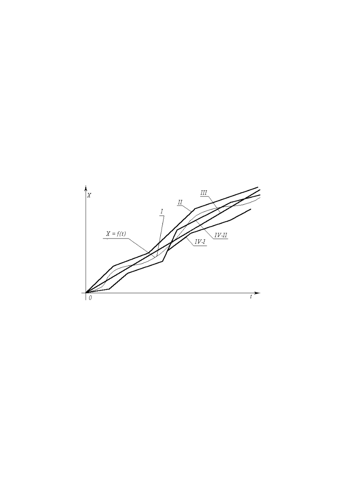
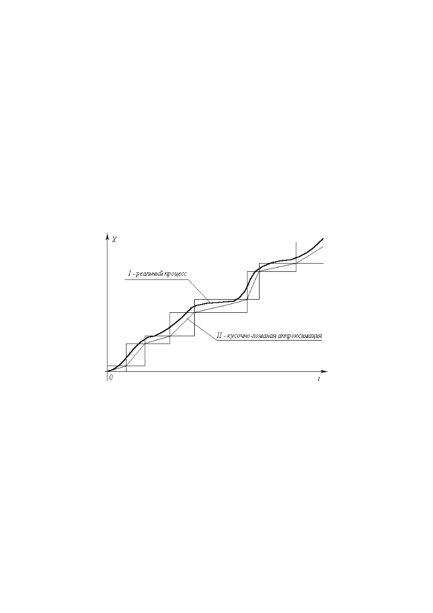
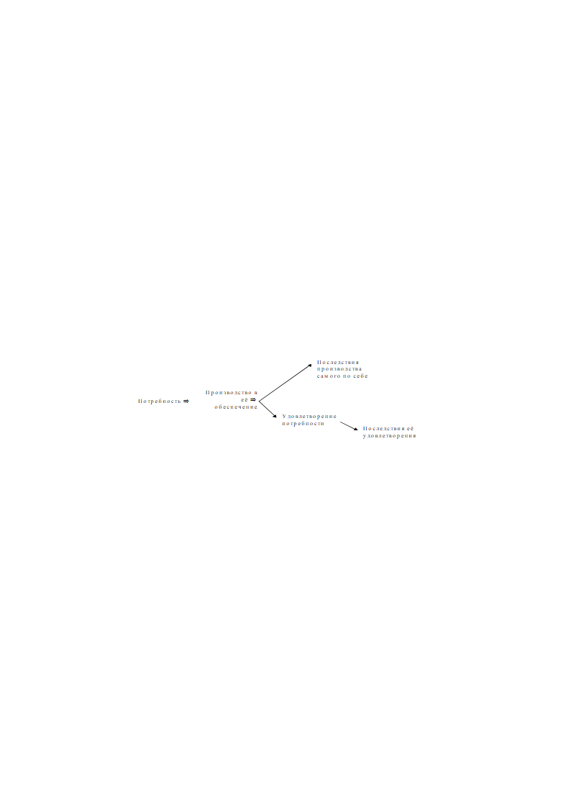
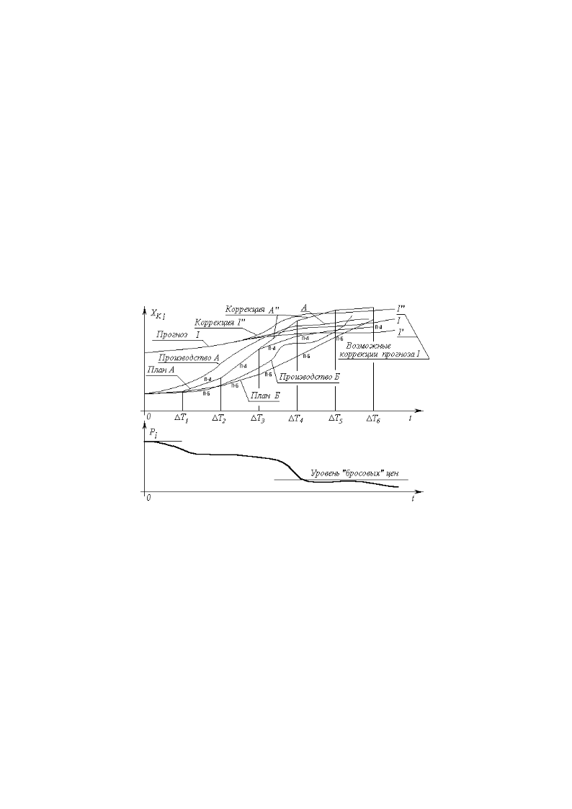
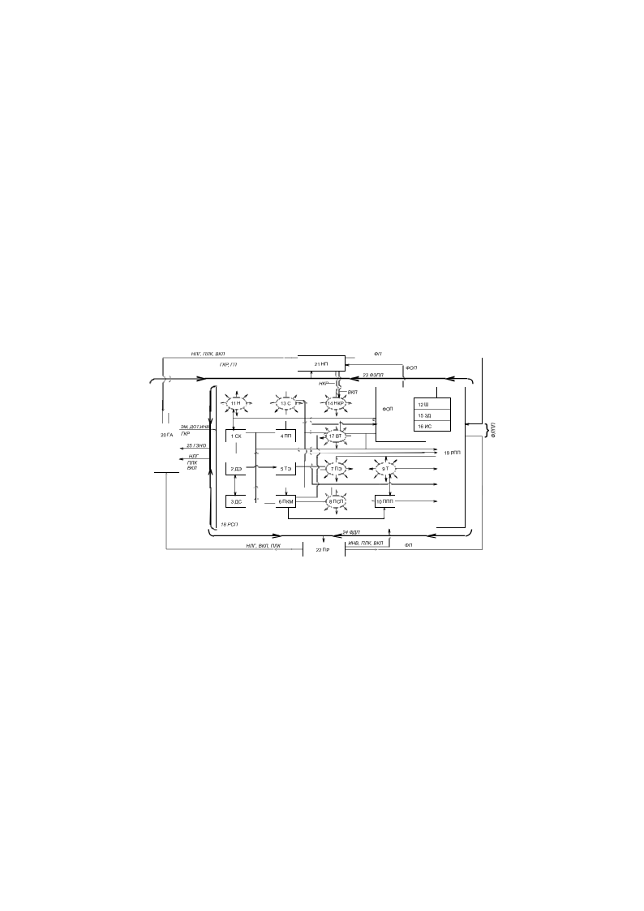

> **Первичный текст.** Краткий курс….
> Источник: `Краткий курс….doc` sha256 `e65157f28b52b7e4…`.
> Автоматическая транскрипция DOC→Markdown; смысл и формулировки не правились.
> Контрольные суммы и статус проверки — в [NOTICE.md](../../NOTICE.md).
> Содержание передаёт позицию авторов; утверждения не верифицированы библиотекой.

---

## 6.2. Описание многоотраслевых производственно-потребительских систем 

Разсмотрим рис. 1. На нём показано, как некий параметр *X* изменяется во времени *t :* — кривая *I .* Математически этот процесс *идеально точно* может моделироваться некой функцией *X = f(t).* Поскольку функция идеально точно моделирует реальный процесс, то её график — та же самая кривая *I*. Эта функция нелинейна, т.е. математически не может быть представлена как прямая линия или отрезок прямой (соответственно, график линейной функции представляет собой прямую или отрезок прямой). Ломаные *I, II , III , IV‑I , IV‑II* — различные линейные аппроксимации (т.е. описания) реальности и идеальной нелинейной функции *X = f(t)* линейной функцией (прямая *III *) и кусочно-линейными (ломаные *II , IV‑I , IV‑II*) функциями. Каждой из аппроксимаций свойственна некоторая ошибка.

Рис. 1. Нелинейный процесс и его линейные описания

Можно предположить, что линейные аппроксимации изображают моделирование в процессе принятия управленческих решений; а кривая *I* изображает реальный процесс управления, в котором осуществлены управленческие решения, выработанные на основе одного из линейных моделирований <u>реально нелинейного</u> управляемого процесса *X = f(t)* .

При любом значении аргумента *t* разность между кривой *I* и линейной аппроксимацией (*II , III , IV‑I , IV‑II*) — ошибка моделирования. Рис. 1 показывает не конкретное соотношение «моделирование — реализация», а типы возможного взаимного разположения моделирующих аппроксимаций и реализаций процесса управления. Могут быть задачи, в которых допустимо любое из показанных соотношений «моделирование — реализация».

Но могут быть задачи управления, в которых соотношения: «*f(t)* — аппроксимация *III*», «*f(t)* — аппроксимация *IV‑II*» недопустимы, поскольку ошибка моделирования в них изменяет свой знак в процессе реального управления. Таковы все задачи навигации: если ошибка моделирования меняет свой знак непредсказуемым образом, а знак ошибки неизвестен, то курс корабля реально может пролегать и через сушу, и через недопустимое мелководье; а самолёт врежется в посадочную полосу вместо того, чтобы мягко сесть на неё, если вообще не врежется в гору где-то по дороге из-за ошибки по высоте неопределённого знака.

Аппроксимации *II , IV‑I* сохраняют неизменным знак ошибки моделирования в процессе управления. В задачах управления макроэкономическими системами, аппроксимация *II —* это перенапряженный план, не обеспеченный мощностями и доступными ресурсами; а кривая *I* — реальное производство, которое не в силах перевалить через “рекордное задание”.

В задачах управления многоотраслевыми производственно-потребительскими системами, которое невозможно вести иначе как по схеме предиктор-корректор, приемлемое соотношение упреждающего моделирования и реального процесса это — взаимное положение аппроксимации *IV‑I* и кривой *I .* *Неизбежная* ошибка моделирования присутствует, но она всегда имеет один и тот же знак, причем моделирующие аппроксимации лежат всегда ниже, чем кривая *I *, изображающая реальный процесс. Если это процесс производства, то никогда не будет произведено меньше, чем заказано или задано, что и требуется при подъёме производства до общественно необходимого уровня и изключает падение производства ниже допустимого при устойчивом достижении уровня общественно удовлетворительной достаточности.

Кривая *IV‑II* — продолжение одного из отрезков ломаной аппроксимации *IV‑I *. Здесь также ошибка упреждающего моделирования, неотъемлемо свойственная, в том числе и схеме управления предиктор-корректор, меняет свой знак в процессе реального управления, последующего моделированию. И в этом смысле аппроксимации *IV‑II* и *III* эквивалентны. Но случай *IV‑II* может иметь иную причину: чрезмерно длительный расчётный цикл *∆T* народного хозяйства, в течение которого ошибка моделирования *накопилась* и вышла за управленчески допустимые пределы; случай же *III* соответствует бездумному раз и навсегда настроенному “автопилоту”, в роли которого может выступать неизменное законодательство о хозяйственной деятельности.

Всем этим разным *стилям* моделирования в реальной жизни будут соответствовать и различные реализации управления, а не один процесс, как показано на рис. 1 для упрощения возприятия.

Общественно приемлемо, если при изпользовании линейных моделей в задачах управления многоотраслевыми производственно-потребительскими системами, принятый стиль моделирования в реальной жизни порождает соотношения «план — реализация» по типу «*I — IV‑I*» в символах рис. 1; а возникновение ситуаций типа «*I — IV‑II*» — при отсутствии общесуперсистемных факторов, препятствующих переводу системы в режим «*I — IV‑I*», — носит характер достаточно редких эпизодов и затрагивает только некоторые отрасли, а не их управленчески значимое количество, разрушающее устойчивость продуктообмена в целостности производственно-потребительской системы.

Тем не менее, есть ещё одно обстоятельство, не отраженное в рис. 1. С того момента, как избрана расчётная длительность *∆T* производственного цикла (т.е. устранена неопределённость значения *∆T),* кусочно ломаные аппроксимации, выражающие прямопропорциональную зависимость, предопределяют ступенчато-дискретный характер задания вектора целей и ступенчато-дискретный характер сопоставления с ним вектора состояния системы в процессе управления ею, как это показано на рис. 2. Величина *1/∆T* называется частотой дискретизации процесса в численном его отображении или моделировании.

Можно построить таким образом три основных типа дискретных “лестниц”, описывающих один и тот же реальный процесс: 1) на началах отрезков ломаных; 2) на концах отрезков; 3) на серединах. На рис. 2 показаны только 1‑й и 2‑й типы. Любой из трёх типов “лестниц”, аппроксимирующих один и тот же процесс (кривая *I*), построен на основе одной и той же кусочно-ломаной аппроксимации (кривая *II*), и потому все три типа эквивалентны, хотя и недопустимо в одном и том же алгоритме расчётов и/либо управления не различать их и смешивать.

Рис. 2. Линейные аппроксимации и дискретный характер расчёта и контроля параметров объекта управления.

Анализ хозяйственной деятельности цивилизации в соотнесении её с разного рода внутриобщественными антагонизмами и биосферно-экологическим кризисом говорит, что наряду с биосферно допустимыми общественными потребностями, система производства удовлетворяет и антиобщественные, антибиосферные потребности. Это позволяет утверждать, что потребности людей, живущих в нынешней цивилизации, принадлежат двум спектрам[^24].

1). Демографически обусловленный, биосферно допустимый спектр потребностей, **предсказуемый** на многие десятилетия вперёд на основе этнографии и тенденций изменения численности возрастных групп.

2). Деградационно-паразитический спектр потребностей, удовлетворение которых наносит ущерб тем, кто ему следует, их детям, внукам, ущемляет возможности развития окружающих, антагонизирует общество, в массовой статистике активизирует деградационные процессы в живущих и последующих поколениях, а ГЛАВНОЕ — разрушает биоценозы и биосферу Земли в целом.

Длительное созревание биосферно-экологического кризиса, порожденного библейской цивилизацией, говорит о том, что деградационно-паразитический спектр потребностей статистически *устойчиво подавляет* демографически обусловленный спектр в упорядоченности приоритетов объективно свойственного ей вектора целей производства, на который объективно настроен механизм рыночной саморегуляции макроэкономической системы Запада. Кроме того, деградационно-паразитический спектр **непредсказуем*,*** что является одним из факторов подавления им демографически обусловленного спектра потребностей при ограниченных возможностях производства, а также потребления.

Отнесение потребностей к тому или иному из двух спектров, определение их иерархической упорядоченности в векторе целей и объёмов достаточного производства — дело субъективное, обусловленное истинной нравственностью человека, культурой мышления и внешне видимого поведения, только отчасти *сдерживающего* проявление истинного, таимого человеком нрава.

В массовой статистике макро- и микроэкономика, как и вся остальная жизнедеятельность общества, обусловлены истинной нравственностью, проявляющейся в желаниях, мечтаниях, предумышлениях и во внешней видимой деятельности людей. Идеалам нравственности, благим самим по себе, часто в поведении, мысленном и внешне видимом, сопутствует *разпущенность людей* как антипод их *свободной самодисциплины*. *Даже единичное проявление* разпущенности обращает во зло самые благие намерения и идеалы.

Статистика, описывающая такого рода явления и их взаимосвязи, объективно существует и обладает собственными характеристиками устойчивости во времени, обусловленными сменой поколений и изменением культуры. Поэтому вне зависимости от мнений, побеждающих в спорах о нравах, индивидуальный и статистический анализ причинно-следственных обусловленностей в системе отношений:

позволяет статистически объективно выделить всем и без того известные вредоносные факторы: алкоголь, прочие наркотики и яды, разрушающие психику; половые извращения; чрезмерность (равно: недостаточность либо избыточность) потребления самих по себе невредных продуктов и услуг, вследствие которой возникает вред их потребителю и (или) окружающим, потомкам, биосфере; а также выделить и факторы, ранее не осознаваемые в качестве вредоносных.

С точки зрения теории управления, производство в обществе продукции и услуг в пределах спектра демографически обусловленной достаточности — полезный выходной сигнал системы; выход продукции и услуг по деградационно-паразитическому спектру — помехи: это — собственные шумы системы, а также внешние наводки. Помеха искажает и подавляет полезный сигнал, что может привести систему к гибели, если своевременно не произойдёт отстройка от помехи или она не будет подавлена системными средствами.

Соответственно, вся концепция прав человека в биосферно допустимом обществе может исходить из утверждения: права человека есть его обязанности по искоренению из жизни общества деградационно-паразитических потребностей — как своих собственных, так и какой-то части остального населения, и подавление процессов их возобновления как в живущих, так и в последующих поколениях.

Концепция прав “человека” в Западной цивилизации первым из прав де-факто признает право на паразитизм социальной “элиты”: глобальная расовая монополия на ростовщичество, ограничение доступа к образованию для не-“элитарных” социальных групп и т.п. Иерархическая оценка значимости весьма неопределённой по смыслу “свободы” индивида в ней выше, чем иерархическая значимость устойчивости общества, породившего индивида; выше, чем иерархическая значимость устойчивости биосферы, породившей общество, — это есть извращённое понимание <u>истинной свободы</u>[^25].

Прошло то время, когда обсуждение Западной концепции прав “человека” имело познавательный смысл для определения путей собственного развития России. Глобальные внутриобщественные антагонизмы, вызванные господством на Западе такого рода истинной нравственности, воспроизводимой из поколения в поколение, вылились в глобальный биосферно-экологический кризис. Он подвёл неоспоримый итог Западной концепции прав “человека” в её практическом осуществлении: вяло текущая шизофрения вне стен лечебницы для душевнобольных; равно — глобальная опасность для всех, в том числе и для самого Запада.

После того, как мы определились с пониманием того, что в хозяйственной деятельности общества с точки зрения теории управления является «полезным сигналом», а что «шумами и помехами в системе» обратимся к рис. 3.

Рис. 3. НОРМАЛЬНЫЕ переходные режимы с выходом на удовлетворение демографически обусловленного уровня потребностей.

На нём кривая *I* — прогноз демографически обусловленных потребностей в продукции отрасли *i *. Также показаны кусочно-ломаная линейная модель-аппроксимация «*План А*», обозначенная на рисунке «П‑А» и реальное производство под управлением на основе этого плана «*Производство А*»; кроме того, — кусочно-ломаная линейная модель-аппроксимация («*План Б*» — «П‑Б») и реальное производство под управлением на основе плана «*Производство Б*». *I’, I’’* — коррекции прогноза и обусловленная коррекцией прогноза *I’’* коррекция плана «А» в процессе его осуществления — *A’’*.

Ясно, что ошибка в прогнозе *I* , в последствие которой возникает коррекция прогноза *I’* предпочтительнее, чем ошибка в прогнозе *I’’*, в последствие которой возникает коррекция плана *A’’*, поскольку коррекция *I’* в общем-то не вызывает необходимости коррекции планов, в отличие от коррекции прогноза *I’’* , вызванной ошибкой прогноза *I*.

Так же ясно, что с точки зрения потребителя план «А» лучше, чем план «Б», поскольку раньше выводит производство *XK i* на уровень демографической достаточности. Выход системы производства на уровень демографически обусловленной достаточности проявляется как сбыт данного вида продукции по бросовым ценам (если не нулевым) при поддержании некоторого уровня товарных запасов продукта « *i* » и при пополнении запасов за счёт текущего производства, кривая которого колеблется относительно прогнозной кривой с управленчески незначительной амплитудой и частотой, не вызывающими общественно ощутимого дискомфорта[^26].

Рис. 3 показывает управленчески нормальное соотношение прогноза, плана (концепции управления) и осуществляемого процесса управления (производства) многоотраслевой производственно-потребительской системой.

Но реально таких рисунков должно быть *n *— по числу отраслей. И каждый такой рисунок — проекция на ось « *x i* » *n‑*мерной *прокладки* (штурманский термин) экономического *курса*, т.е. плана и *n‑*мерной траектории реального движения <u>объекта управления</u> (макроэкономики — многоотраслевой производственно-потребительской системы), следующего проложенным курсом с некоторой ошибкой в *n‑*мерном пространстве параметров, которыми описывается процесс. Однако рисунки — лишь графическая форма представления <u>результатов описания и моделирования</u> процессов производства и разпределения на основе численных методов математики.

Математика — наука абстрактная, помогающая понять, выразить и описать *меру* (через h — “ять”) всех вещей и процессов. Современная *прикладная математика* — это, прежде всего, *численные методы*, которые на практике при всём их многообразии сводятся к четырем действиям *арифметики*, выполняемым с конкретными (т.е. *определёнными*) числами в *определённой* последовательности. Иными словами, с точки зрения прикладной математики все математические абстракции и символы — средства более или менее плотной упаковки четырёх действий арифметики, которые всеми изучаются ещё в первом классе общеобразовательной школы. *Соответственно, всё последующее изложение способен понять и школьник, <u>было бы желание</u>*[^27]*.*

Чтобы чисто математические методы обрели качество *средства решения* разного рода задач вне математики, необходимо математическим абстракциям каждого из них *определённо сопоставить* объективно *измеримые на практике категории* той отрасли деятельности общества, которая намеревается изпользовать абстрактно-математический аппарат, поскольку *прикладная арифметика неработоспособна в условиях численной неопределённости.*

В ряде случаев не *всё объективное* удаётся выявить, а выявленное — измерить, и тогда, чтобы заполнить пустоты в *избранной уже наперёд* математической модели и устранить численные неопределённости, прибегают к методу “экспертных оценок”. Суть его сводится к тому, что проводится *изучение “общественного мнения” профессионалов* (или тех, кого привыкли считать профессионалами в данной области) на основе некоего специально *для каждого случая* разработанного опросника. Из статистической разработки результатов опроса группы профессионалов — экспертов — извлекаются численные значения параметров, необходимых для работы алгоритма численного метода прикладной математики.

Достаточно часто в условиях толпо-“элитаризма” метод экспертных оценок — не более чем средство психологического подавления *математическим аппаратом* интеллекта несогласных с целью придания *профессиональному шарлатанству* облика строгой науки. Это обычно случается при явной неспособности понять происходящее в жизни, правильно поставить задачу и грамотно организовать её решение.

Метод экспертных оценок наиболее часто применяется в задачах, по их существу являющихся задачами *определения иерархической упорядоченности вектора целей*, и с ними связанных задачах определения “весовых коэффициентов” в разного рода *численных критериях оптимального выбора только одного* из множества возможных решений управленческой задачи. Об этом речь и пойдёт далее.

Но поскольку нравственная предопределённость результатов деятельности разпространяется и на экспертов, то в обществе, в котором господствует извращённая нравственность, её порочность будет методом экспертных оценок в задачах *определённой* тематики неизбежно и *неконтролируемо для общества* трансформирована в ошибочность результатов приложений, вполне работоспособной и безошибочной “чистой” объективной математики как таковой.

Это тем более справедливо, если из статистики ответов экспертов изключаются *из ряда вон выходящие* мнения, которые *в кризисных обстоятельствах, когда большинство экспертов недееспособно*[^28], как раз и могут выражать видение истинного положения вещей и истинной направленности течения *со‑бытий*.

Причиной изключения из ряда вон выходящих мнений экспертов может быть как *невозможность изпользования их в уже принятой модели,* так и несовместимость их с господствующим мировоззрением, *всего лишь на* *основе* *которого* уже принято определённое решение, нуждающееся только в “научном обосновании”. К категории такого рода задач в своём большинстве принадлежат задачи управления и организации саморегуляции *многоотраслевых производственно-потребительских систем* (задачи “макроэкономики” — на слэнге “профессионалов” экономистов) *в общественно приемлемых режимах.*

Поэтому следует стремиться к тому, чтобы избегать метода экспертных оценок, и строить прикладные математические модели во всех отраслях деятельности, включая и финансово-экономическую, на основе 1) *объективно измеримых, т.е. числено определимых* параметров и 2) осознанно *целесообразной* иерархической упорядоченности их значимости, которую можно понять, объяснить и *оспорить — в случае наличия более мощных моделей*.

Если этого сделать не удаётся, то математическая модель утрачивает качество *метрологической состоятельности,* поскольку включает в себя *объективно неизмеримые (т.е. числено не определимые объективно) параметры* и выражает *неопределённый нравственно обусловленный субъективизм в построении,* всегда объективно существующего, *вектора целей*.

В связи с этим напомним основные положения достаточно общей теории управления. Решение прикладных задач управления невозможно без выбора иерархически упорядоченного набора *контрольных параметров,* по изменению которых можно судить о качестве управления (или качестве его саморегуляции). Один список параметров, описывающий поведение объекта в идеальном режиме управления, называется *вектором целей управления*. Второй список, характеризующий отклонение системы от идеального режима в процессе реального управления, называется *вектором ошибки управления*. Идеальному режиму управления соответствует нулевое значение вектора ошибки управления, значения компонент вектора ошибки возрастают по мере уклонения объекта от предписанного ему идеального режима.

Реально при описании процесса в терминах теории управления список контрольных параметров, входящих в векторы целей и ошибок, за счёт разного рода причинно-следственных обусловленностей дополняется параметрами, информационно связанными с контрольными. Часть этих дополнительных параметров, на которые возможно воздействие непосредственно, образуют *вектор управляющего воздействия* (управление, вектор управления). При их изменении меняются и контрольные параметры, входящие в вектора целей и ошибок управления. Кроме вектора управления, список дополнительных параметров включает в себя *свободные параметры*, не относимые в концепции управления ни к вектору целей, ни к вектору управления. Список параметров, входящих в вектор целей управления, в совокупности с дополнительными параметрами (управляемыми и свободными) образуют *вектор состояния системы. Концепция управления* явно или неявно описывает изменение вектора состояния под воздействием внешних и внутренних возмущений и управления.

**Управление невозможно*,*** если:

1). **Не определён вектор целей**, каждая из которых объективно существует в течение времени, достаточного для организации устойчивого управления.

2). **Вектор состояния и (или) вектор ошибки непредсказуемо изменяются** при изменении вектора управления и прочих внешних и внутренних воздействий на управляемую систему.

Предсказуемость поведения управляемого объекта может проистекать из неизъяснимых практических навыков, обучение которым не зависит от их носителей; из «ноу-хау», передача которого возможна со стороны их носителя; из теоретического знания, выраженного языковыми средствами, символьным аппаратом и т.п., которые позволяют освоить в культуре общества любые знания всем желающим, получившим к ним доступ. Последнее обеспечивает наиболее высокое качество и устойчивость управления при смене поколений в каждой из социальных систем от клана до человечества в целом.

Управление всегда субъективно, произвольно, но управлять возможно только объективно существующими процессами в обществе и природе. Если есть иллюзия объективного существования процесса, то может возникнуть и иллюзия управления им. Но разочарование такого рода управленцев будет тем более реальным и тем более болезненным, чем больше было осознанных и неосознанных притязаний у них на власть над чем-либо.

Соответственно сказанному об основных положениях общей теории управления, общество в целом в цивилизации **объективно** потребляет продукцию и услуги, производимые на основе **общественного объединения** (а не разделения) **труда**, сопровождающего технологическое разделение операций в преемственности продуктообмена в процессе производства продукции и услуг, не производимых в домашних хозяйствах. Производственный продуктообмен в обществе — целостный процесс, обусловленный культурой общества, которая в каждый исторический период является объективной данностью и обладает собственными характеристиками устойчивости (инерционность + самокомпенсация) и тенденциями изменения.

Ни одно частное хозяйство, не обладающее самодостаточностью производства по полному спектру потребляемых им продуктов и услуг, не может существовать вне устойчивого производственного продуктообмена в объёмлющих его социальных системах. Возвеличивание роли частного предпринимательства проистекает из слепоты тех, кто не видит общественного характера производства и роли кредитно-финансовой системы как средства сборки множества частных предприятий в единую макроэкономическую систему, описываемую аппаратом математической статистики. По отношению к *макроэкономике, включающей множество частных хозяйств,* принадлежащих различным отраслям, кредитно-финансовая система является средством управления статистическими характеристиками производства и разпределения произведенного. Вопреки этому возвеличивать значимость частного предпринимательства, доводя её до абсолютного фактора, определяющего благосостояние, — значит бездумно или предумышленно порождать *беззаботную веру* в блеф о саморегуляции рынка. Реально современное производство основано на общественном объединении разнородного труда людей во множестве отраслей и регионов. На рис. 4 показана схема продуктообмена в общественном объединении труда.

Рис. 4. Схема продуктообмена в общественном объединении труда и\

финансовые потоки, сопровождающие продуктообмен

- 1\. СХ — сельское хозяйство, охота, рыболовство;

- 2\. ДЭ — добыча энергоносителей;

- 3\. ДС — добыча сырья;

- 4\. ПП — пищевая промышленность;

- 5. ТЭ — технологическая подготовка энергоносителей к изпользованию по назначению;

- 6. ПКМ — производство конструкционных материалов и технологических ингредиентов для отраслей народного хозяйства;

- 7. ПЭ — производство энергии;

- 8. ПСП — производство средств производства (технологического оборудования отраслей), вооружений, элементов инфраструктуры, промышленное и т.п. строительство;

- 9. Т — транспорт;

- 10. ППП — производство предметов потребления, жилья и услуг для непосредственного удовлетворения потребностей населения;

- 11. Н — наука, либо самостоятельная, либо как часть религиозного культа (памятуя о роли жречества и знахарства);

- 12. Ш — школа всех уровней подготовки кадров для народного хозяйства;

- 13. С — средства связи, передачи, обработки информации;

- 14\. НКР — сфера негосударственного кредита, страхования, рэкета и иные виды частного и корпоративного гешефтмахерства отдельных лиц, мафий и иных государств;

- 15\. ЗД — здравоохранение и физическая культура, спорт;

- 16. ИС — искусства: литература, зрелищные, декоративно-прикладные;

- 17. ВТ — утилизация отходов производства и потребления, ликвидация ранее произведенной продукции по завершении ею жизненного цикла и подготовка ко вторичному изпользованию продуктов её переработки;

- 18. РСП — «рынок» сферы производства;

- 19. РПП — «рынок» сферы личного потребления (предметы и услуги гражданам);

- 20. ГА — государственный аппарат (в данном случае обобщенное название открытых для обозрения управленческих структур, не принадлежащих ни одной из производящих отраслей и обладающих значимостью, выходящей за пределы сферы экономической деятельности) и вооруженные силы;

- 21\. НП — наёмный персонал и прочие не-предприниматели;

- 22\. ПР — “предприниматели” (в частнособственнических формациях — владельцы), т.е. самовластные руководители структурно неподчиненных другим производственных организаций;

- 23\. ФЗПЛ — фонд заработной платы всего наемного персонала;

- 24\. ФДП — фонд доходов “предпринимателей”;

- 25\. ГЗНО — поставки по госзаказу и натуральному налогообложению.

ФП — фонд потребления, ФЛПП — суммарный фонд личного платного потребления; ГП — гос. пособия, пенсии, стипендии и т.п.; НЛГ — налоги; ПЛК — платежи в погашение кредита и проценты; ИНВ — прямые инвестиции; ВКЛ — вклады денежных излишков в банки и ценные бумаги; ЭМ — эмиссия денег; ГКР — государственные кредит, страхование и т.п.; ДОТ — дотации и прочие косвенные государственные инвестиции; ФОП — фонды общественного потребления в их натуральном виде и денежные выплаты из них.

Здравоохранение, Школа, Искусства одновременно могут выступать и как фонды общественного потребления и как платные услуги, по этой причине они показаны и там, и там.

Также есть ещё складское хозяйство, которое не выделено в отдельную отрасль, хотя часто к этому есть все основания. Оно обслуживает все отрасли и может быть учтено в их пределах.

В условиях рабовладения часть населения относится к средствам производства в течение всей своей жизни. В условиях феодализма часть населения относится к средствам производства в период отбывания феодальных повинностей. В условиях капитализма все — либо наёмный персонал, либо предприниматели. В условиях феодального натурального хозяйства почти весь блок, помеченный 18 РСП, — одно крестьянское или ремесленное хозяйство, а вся экономика общества — множество таких блоков, связанных больше не между собой, а с государственным аппаратом, взимающим подати. В условиях государственно-монополистического капитализма каждый из блоков с 1 по 17 — отрасль народного хозяйства, в каждой из которых может быть представлен государственный сектор, иностранный капитал, мафиозный и транснациональный капитал.

Эта схема — функциональная (и носит общий характер, поскольку показывает технологические взаимосвязи разных отраслей). В неё одновременно может быть спроецировано глобальное межгосударственное объединение труда, т.е. объединение труда в совокупности транснациональных корпораций, внутригосударственное объединение труда и т.п., так как глобальное общественное объединение труда является взаимным вложением суперсистем. Мы будем разсматривать эту схему применительно ко внутригосударственному общественному объединению труда, поскольку место в ней внешней торговли может быть учтено косвенно через блоки 20 ГА (при монополии государства) либо через 14 НКР с выделением среди потребителей на рынках блоков 18 РСП и 19 РПП зарубежных импортёров (при отсутствии монополии внешней торговли).

Малый масштаб рисунка не позволяет показывать все потоки продуктообмена. По этой причине отрасли, продукцией которых непосредственно пользуются все остальные, показаны в качестве лучащихся звездочек.

Внутри блока 18 РСП стрелками показано направление перемещения продукции отраслей. Деньги, естественно, циркулируют во встречном направлении. Изключением является блок 14 НКР — негосударственный кредит и гешефтмахерство разного рода — отрасль, входной и выходной продукцией которой являются все средства платежа: деньги, ценные бумаги, сокровища и т.п., расчёты за которую она также производит деньгами, ценными бумагами, сокровищами и т.п. по принципу: «А вот кому на грош пятаков!», в результате чего гроши складываются в рубли в карманах гешефтмахеров.

Вне блока 18 РСП стрелки соответствуют направлению циркуляции денежной массы.

Хотя такого рода схемы дают представление о взаимозависимости отраслей и регионов друг от друга, однако они не позволяют моделировать экономические процессы в жизни общества, что необходимо для решения задач управления саморегуляцией многоотраслевых производственно-потребительских систем.

Многоотраслевые производственно-потребительские системы — системы импульсного, дискретного действия в силу длительности процесса производства и мгновенности передачи продукции из ведения производителя в ведение её заказчика. По этой причине управленчески значимое описание продуктообмена характеризует некоторый интервал времени. В силу биосферной обусловленности сельского хозяйства и системы образования длительность интервала времени *∆T*, т.е. производственного цикла, на котором может быть разсмотрен полный продуктообмен всех отраслей, составляет не менее года. Такое описание называется межотраслевым балансом. Межотраслевой баланс продуктообмена показывает разпределение валового выпуска продукции каждой отрасли между *всеми* отраслями в процессе их производственной деятельности плюс *конечный продукт* каждой отрасли. В состав конечного продукта входят: 1) «инвестиционные продукты» — новые средства производства, 2) закупки в обеспечение деятельности государства, 3) потребление населения.

Если эту процедуру последовательно проделать для каждой отрасли из множества выделенных во многоотраслевой производственно-потребительской системе, то получится квадратная таблица (матрица) обмена продукцией отраслями между собой в процессе их производства, вокруг которой разполагаются ещё несколько строк и столбцов, характеризующих внепроизводственное потребление и *разные аспекты управления макро- и микроэкономикой.* Эта таблица, включая и окружающие её дополнительные столбцы и строки внепроизводственных характеристик, представляет собой одну из форм представления межотраслевого баланса. Баланс может быть представлен в натуральном и финансовом учёте продукции.

Математически баланс может быть описан системой линейных уравнений, повторяющих упорядоченность по строкам и столбцам упомянутой таблицы продуктообмена отраслей:

 Х1 = а11Х1 + а12Х2 + ... + а1nXn + F1\

 Х2 = а21Х1 + а22Х2 + ... + а2nXn + F2\

 . . . . . . . . . . . . . . . . . . . . . . . . . . . . . . . . . . ( 1 )\

\

 Хn = аn1Х1 + аn2Х2 + ... + аnnXn + Fn

Здесь *Х1 , ... , Xn* — валовый выпуск отраслей с первой по *n*-ную. Правая часть каждого из уравнений характеризует разпределение продукции соответствующей отрасли между её потребителями:

1.  Всем набором отраслей в сфере производства (блок 18 РСП на рис. 4) — столбцы, содержащие *Х1 , ... , Xn *; каждый член *i-*того уравнения вида *аijХj* представляет собой объём поставок продукции отрасли *i* для обеспечения производства в отрасли *j* в объёме *Xj .* Иначе говоря, представленная модель — линейная и предполагает, что потребности каждой отрасли в продукции других отраслей пропорциональны объёму выпуска ею продукции.

2.  Продукцией конечного потребления — столбец *F1 , ... , Fn *.

В этой системе второй коэффициент первого уравнения — *а12* — численно равен количеству продукта, производимого отраслью № 1, необходимого отрасли № 2 для производства единицы учёта продукции отрасли № 2. Все остальные коэффициенты *а11 , а12 , ... , аnn* имеют такой же смысл, конкретно определяемый их положением в системе уравнений, и называются *коэффициентами прямых затрат*. Каждый из них характеризует культуру производства отрасли-потребителя: сколько необходимо продукции отрасли-поставщика по технологии + сколько будет украдено + сколько будет утрачено по бесхозяйственности.

В совокупности коэффициенты прямых затрат образуют квадратную таблицу — матрицу ***A **,* если говорить языком математики.

\* \* \*

Здесь и далее:

- матрицы обозначены заглавными буквами, набранными жирным курсивным шрифтом: ***А **, **А**T** **, **Е **, **F **, **Х** .*

- элементы матриц обозначены теми же буквами, что и матрицы: либо строчными, либо заглавными, но набранными курсивным нежирным шрифтом, с индексами, указующими положение в матрице: *a12* , *a ij* , *a nn* ; некоторые матрицы обозначены через их элементы, помещенные в квадратные скобки, например: *\[PБ ii -1\] , A=\[aij\]* .

- вектора обозначены заглавными и строчными буквами, набранными курсивным нежирным шрифтом, при которых могут быть мнемонические индексы определяющие дополнительную смысловую нагрузку, смысл которой поясняется в тексте: *Х , r , rЗСТ , XK .*

- компоненты векторов обозначены также как и сами вектора, но в сочетании с индексами-нумераторами компонент, как численными, так и буквенными: *rЗСТ 1 j , X1 , X i , XK j *.

\* \*\

\*

Баланс может быть составлен раздельно по демографически обусловленному спектру и по деградационно-паразитическому спектру; может быть составлен и объединенный баланс. В баланс продуктообмена в форме (1) может быть включен и экспортно-импортный обмен разсматриваемой многоотраслевой системы с другими производственно-потребительскими системами.

Уравнения межотраслевого *баланса продуктообмена* могут быть записаны в матрично-векторной форме:

(**E - A**)X = F ( 2 ) ,

где: ***E*** — диагональная матрица[^29], т.е. все элементы которой — нули, кроме *e11 = e22 = ... = enn = 1* *X* и *F* — векторы-столбцы, спектры производства, вбирающие в себя *Х1 , ... , Xn* и *F1 , ... , Fn *, соответственно. Уравнение (2) позволяет ответить на вопрос: каким должен быть спектр валовых мощностей *X* при культуре производства, описываемой матрицей ***A **,* чтобы получить спектр конечной продукции *F*.

Если каждое уравнение в натуральном балансе умножить почленно на цену продукта (спектра производства отрасли в целом), производимого отраслью, соответствующей уравнению, то каждая строка системы (1) характеризует източники доходов этой отрасли от продажи ею продукции; а столбец, соответствующий номеру отрасли, характеризует её расходы по оплате продукции, приобретаемой ею у поставщиков в обеспечение её собственного производства.

После этого ниже системы уравнений можно выписать ещё несколько строк *функционально обусловленных расходов*, производимых отраслью помимо оплаты продукции её поставщиков в процессе её собственного производства:

- Фонд заработной платы.

- Фонд развития и реконструкции производства.

- Финансирование совместных (с предприятиями других отраслей) программ.

- Благотворительность.

- Свободные, неразпределённые средства.

- Кредитный и страховой баланс (сальдо).

- Баланс налогов и дотаций (сальдо).

Эти записи помещаются ниже строк баланса продуктообмена в столбцах соответствующих отраслей. Так межотраслевой баланс переводится в стоимостную форму учёта продукции. При стоимостном учёте возможны балансовые уравнения иного рода:

(**E** - **A**T)P = r ( 3 ) ,

где матрица ***A**Т* получена в результате транспонирования матрицы ***A*** (транспонирование — запись в столбец строки матрицы ***A*** с тем же номером, то есть *a12Т = a21* и т.д.); здесь и далее верхний индекс *« Т »* — знак транспонирования матриц (по отношению к веторам-столбцам он эквивалентен записи их в виде строки; а по отношению к строкам — записи их в виде столбцов при сохранении порядка следования их компонент слева направо и сверху вниз соответственно). *P* — вектор цен на продукцию, учитываемую в балансе продуктообмена отраслей; а *r* — вектор-столбец, для каждой отрасли соответствующая компонента которого — вся совокупность ранее перечисленных функционально обусловленных расходов за изключением закупок продукции у поставщиков, уже описанной матрицей ***A ***, отнесённых к единице учёта валового выпуска отрасли. Компоненты вектора *r* традиционно называют «долями добавленной стоимости» в составе цены продукции (цены единицы учёта продукции). Само уравнение (3) называют уравнением равновесных цен. Оно описывает характеристики рентабельности *отраслей в целом* во всём их множестве при спектре валового производства *X*, культуре производства, описываемой матрицей ***A***, ценах, сведённых в вектор-столбец *P* и кредитно-финансовой политике, описываемой составляющими вектора-столбца *r*.

В вектор *r* входят функционально обусловленные расходы, ранее упомянутые при переводе баланса продуктообмена из натурального учёта в стоимостной учёт. Они подчинены в пределах культурных традиций и законодательства административному произволу иерархически разных уровней системы управления народным хозяйством:

- Директоратам фирм — зарплата, фонды реконструкции и развития производства, финансирование совместных программ, благотворительность, нераспределённые средства.

- Кредиторам (включая акционеров) и государству — кредитный и страховой баланс.

- Государству и директоратам концернов (объединений) — налоги, дотации, субсидии — государственные или внутрикорпоративные — соответственно.

Это позволяет утверждать, что на уровне разсмотрения задачи о регуляции и саморегуляции многоотраслевых производственно-потребительских <u>систем как целостностей</u> вектор *r* это — вектор долей расходов по формированию общесистемного *«закона стоимости»,* и ему следует приписать мнемонический индекс «ЗСТ». Поскольку на макроэкономическом уровне возможно воздействие средствами кредитной и налогово-дотационной политики на рентабельность производства и инвестиционную активность всех отраслей, то соответствующие функционально обусловленным расходам составляющие вектора *r* могут быть изпользованы в качестве средств управления саморегуляцией макроэкономики. Их изменение на уровне макроэкономики вызывает изменение статистических характеристик производства и разпределения без прямого административного диктата. Иными словами, это — средства настройки рыночного механизма саморегуляции на тот или иной режим функционирования, который может быть устойчивым, неустойчивым, общественно приемлемым, может быть биосферно недопустимым и биосферно и социально безопасным. Вне зависимости от того, понимает этот факт общество или нет, но этот механизм объективно существует и действует. Если его действие непонятно, а он сам не принадлежит сфере осознанной управленческой деятельности, то его предпочитают называть *«объективным законом стоимости».*

Из этой интерпретации уравнений (3), в частности, следует:

- Налоговое законодательство *в принципе недопустимо* писать без предшествующего анализа межотраслевых балансов и динамики их изменения в натуральном и финансовом учёте продуктообмена[^30].

- Налоговое законодательство должно предоставлять исполнительной власти *определённые права* по изменению налогообложения и разпределению дотаций и субсидий в зависимости от *реальной* динамики роста производительности труда в отраслях, которые объективно исторически развиваются неравномерно.

Если эти два принципа нарушаются, то общественно необходимая продукция может не производиться в достаточном количестве, поскольку не может быть оплачена потенциальными потребителями при сложившемся законе стоимости, а производство финансово выгодной продукции и услуг может иметь антиобщественные, антибиосферные последствия.

**Финансовая выгодность** и ***общественная полезность*** не всегда совпадают. Задача же настройки кредитно-финансовой системы и состоит в том, чтобы финансово выгодно было производить то, что общественно необходимо и безопасно, вне зависимости от цен, некоторым образом складывающихся на рынке. Для этого необходимо понимать *управленческую значимость* прейскуранта в его связи с производством и разпределением.

Демографически обусловленный спектр потребностей на основе системы стандартов может быть описан средствами математической статистики с разной степенью детальности. Он может быть прогнозируем на десятилетия вперёд в зависимости от прогнозируемой динамики демографических пирамид и этнографии. Это позволяет избрать его в качестве вектора целей управления макроэкономикой.

Слова «социально ориентированная экономика» — пустые слова, если смысл их отличается от достаточности производства по демографическому спектру потребностей.

Но в целеполагания также возможны ошибки. Кроме того, в зависимости от развития культуры демографически обусловленный спектр потребностей может изменяться и по каталогу, и по стандартам достаточности и качества на продукцию. В обществе же — особенно в докладах начальству в толпо-“элитарных” обществах — почти всегда существует тенденция выдавать желаемое за действительное. Поэтому управление макроэкономикой только на основе определения значения вектора целей стандартами демографической обусловленности и сравнения с ними спектра реального производства невозможно.

Необходимо выявить макроэкономические параметры системы, которые складываются вне зависимости от ухищрений администрации в отношении стандартов демографической обусловленности и в которых выражались бы ошибки управления, включая и ошибки в определении демографически обусловленных стандартов достаточности.

В условиях определённости спектра демографической достаточности управленчески желательно, чтобы выполнялось соотношение:

(**E** - **A**) X = F ≥ FD ,

где *FD* — стандартный спектр достаточности, обусловленный демографически (общественно необходимые потребности). Эту запись следует понимать в том смысле, что в записи (1) из правой части уравнений всё, кроме столбца *F1 , ... ,Fn *, перенесено в левую часть, после чего справа от компоненты *F1 ,... ,Fn* в соответствующей строке дописано: *≥ FD1 , ... , ≥ FD n *.

Но одному значению вектора *FD* в такой записи может соответствовать множество межотраслевых балансов, поскольку векторы *X* и *F* не определены. Реально же в производстве может осуществиться только один баланс продуктообмена. И прежде, чем начнётся производство, управление им должно настроить механизм саморегуляции на один определённый, в некотором смысле оптимальный баланс. Естественно, что один и тот же полезный эффект *F ≥ FD* желательно получить при минимальных затратах валовых мощностей во всём множестве отраслей. Всё это в совокупности в формально-математических описаниях приводит к задаче линейного программирования:

 (**E** - **A**) X = F ≥ FD\

 X ≥ 0 ( 4 )\

 Найти Min( Z ), Z = r1X1 + r2X2 + ... + rnXn

Это — «задача продуктообмена», в которой необходимо найти векторы *X* и *F *, удовлетворяющие системе неравенств и критерию оптимума. Набор коэффициентов *r1 , ... , rn* в критерии оптимума позволяет некоторым образом «складывать» чугун и хлеб, производимые разными отраслями.

Это — обычная задача *линейного программирования*, одного из разделов линейной алгебры[^31]. Для её решения изпользуется стандартный алгоритм, называемый «симплекс метод», в различных модификациях известный с начала 1940-х годов.

Система неравенств типа (4) описывает в *n*-мерном пространстве выпуклый многогранник, аналогом коего в трехмерном пространстве может служить неподвижная картофелина после обрезки её ножом, перемещающимся по плоскостям, определяемым уравнениями (1) и дополняющими их неравенствами (4). Аргумент *Z* функции *Min* задает пакет (стопу) параллельных плоскостей, ориентация которого в пространстве (т.е. направление перпендикуляра ко всякой плоскости из пакета) определяется набором коэффициентов *r1 , ... , rn .* Оптимальное решение находится как общая точка, в которой одна из плоскостей пакета касается многогранника. Это подобно тому, как к лежащей на столе картофелине (после её обрезки) поднесли книгу, перемещая её параллельно самой себе: книга коснется хотя бы одной из вершин многогранника.

В линейном программировании эта образная очевидность характера перемещения книги относительно картофелины доказана математически строго для пространства *n* измерений. Алгоритм «симплекс метода» основан на том, что оптимальное решение задачи (4) лежит в одной из вершин *n*-мерного выпуклого многогранника и для его поиска необходимо последовательно пересмотреть значения функции *Z* в вершинах, перемещаясь из одной в другую вдоль его ребер в направлении убывания функции *Z*.

Практически в каждой книге, в которой разсматривается линейное программирование и его применение для решения практических задач, излагается теория двойственности линейного программирования. Её смысл сводится к тому, что каждой задаче линейного программирования *математически объективно* соответствует двойственная ей задача, и оптимальные решения обеих задач взаимно связаны друг с другом. По отношению к задаче (4) двойственная к ней записывается так:

 (**E** - **A**T ) P = rЗСТ ≤ r\

 P≥ 0 (5)\

 Найти Мах ( Y ) , Y = FD1P1 + FD2P2 + ... + FDnPn 

По отношению к экономике это — «задача рентабельности».

С начала 1950-х гг. известна теорема: если в оптимальном решении прямой задачи неравенство № *k* выполняется как строгое, т.е. имеет место соотношение \>, а не = (либо \< , а не =), то в оптимальном решении двойственной задачи значение соответствующей переменной равно нулю.

Также с начала 1950-х гг. известны экономические интерпретации теории двойственности. Обычно в них в качестве прямой задачи разсматривается некая *задача продуктообмена*, в которой переменные интерпретируются как объёмы ресурсов, вовлекаемых в производственный процесс. Тогда в качестве двойственной выступает *задача рентабельности*, в которой переменные интерпретируются как *некие* *цены* (цены *«некие»,* поскольку не во всех интерпретациях это реальные цены рынка) соответствующих ресурсов. Такая интерпретация: в прямой задаче переменные — объёмы; в двойственной задаче переменные — некие цены, — стала традиционной, общеизвестной, общепринятой. Смотри, например, Ю.П.Зайченко “Исследование операций”, Киев, “Вища школа”, 1979 г. — рядовой учебник для вузов; “Математическая экономика на персональном компьютере” под ред. М.Кубонива пер. с японского, М., “Финансы и статистика”, 1991 г., японское изд. 1984 г. — ликбез-справочник.

Приведённая теорема в них обретает экономическое выражение: если объём некоего ресурса в оптимальном решении прямой задачи превышает ограничения, заданные неравенствами, то цена ресурса в оптимальном решении двойственной задачи — ноль.

Но поскольку задача рентабельности также может разсматриваться в качестве прямой, то в этом случае приведённая теорема выражается следующим образом: если технологический процесс № *k* оказывается строго невыгодным с точки зрения оптимальных цен, то в оптимальном решении задачи продуктообмена интенсивность изпользования соответствующего технологического процесса должна быть равна нулю.

*Такая интерпретация допустима по отношению ко всякой производственной системе, не обладающей качеством самодостаточности производства потребляемой в ней продукции,* при решении задачи о <u>наиболее выгодном с финансовой точки зрения</u> участии в продуктообмене на рынке со сложившимся прейскурантом.

В случае описания аппаратом линейного программирования задач саморегуляции народного хозяйства, в котором в каждой отрасли культура производства и технологическая база — объективная историческая данность, применение этой интерпретации на практике предопределяет уничтожение одной из незаменимых отраслей в собственном народном хозяйстве, что ведёт к подчиненности внешним общественно-экономическим системам и их концепциям управления и/либо к народнохозяйственной катастрофе.

Это означает, что в такого рода задачах нерентабельность незаменимой отрасли — следствие либо превышения ею демографической избыточности производства, либо в условиях демографической недостаточности производства — выражение ошибок в настройке кредитно-финансовой системы на саморегуляцию производства и разпределения по демографически обусловленному спектру потребностей, вследствие чего отрасль стала жертвой взаимно-отраслевой конкуренции за “прибыль”.

Несмотря на эту оговорку, нет никаких формально-математических и экономических причин, чтобы в задачах управления производственно-потребительской системой государства или региона как целостностью (это предполагает разсмотрение взаимной обусловленности производства и потребления) искать иные интерпретации переменных в задаче продуктообмена и задаче рентабельности. В задаче продуктообмена переменные — валовые объёмы производства, вектор *X*. В задаче рентабельности переменные — реальные цены рынка на продукцию спектра производства *X,* т.е. вектор *P*.

Тем не менее, есть одно важное обстоятельство. Формально-математическое решение задачи рентабельности предопределяет нахождение вектора цен *P*, т.е. реального прейскуранта рынка, удовлетворяющего ограничениям задачи (5). Но факторы, которые довлеют над ценообразованием в обществе, не формализованы в задаче (5), по какой причине реальные цены будут отличаться от расчётного прейскуранта оптимального решения задачи (5). То есть формальное математически безупречное решение задачи (5) практически безсмысленно.

Но, если в задаче продуктообмена все неравенства выполняются как строгие, при стандарте *FD* заведомой демографической достаточности производства, признаваемой в жизни культурой потребления и потребительской активностью общества на практике, то ажиотажного спроса быть не может и при нулевых ценах. Это ведёт на практике к выполнению приводившейся теоремы по отношению к прямой задаче продуктообмена и двойственной задаче рентабельности.

Это означает, что с точки зрения теории управления в прейскуранте на продукцию и услуги, потребляемые населением (3-я составляющая в составе *конечного продукта* *F*), ради получения которых ведётся народное хозяйство, предстает объективно складывающийся *вектор ошибки управления макроэкономической системой.* Он не зависит от ухищрений с нормированием стандарта демографической обусловленности *FD *; фактически же в прейскуранте в сфере финансов находят своё выражение **все**, а не только экономические, ошибки самоуправления общества.

Идеальному режиму управления теоретически соответствует нулевой вектор ошибки, а реально — колебания относительно нуля с незначительной амплитудой с частотой, достаточно высокой, чтобы ошибка управления не успевала породить в системе ситуаций, возпринимаемых как дискомфорт или необратимый ущерб. Отклонение от идеального режима ведёт к возникновению ненулевого, медленно меняющегося вектора ошибки. По отношению к задачам управления многоотраслевыми производственно-потребительскими системами прейскурант этим требованиям, предъявляемым теорией управления к вектору ошибки, удовлетворяет. Цена при этом общественно функционально — не более чем *ограничитель платёжеспособностью* объёмов потребления, фактически — ограничитель платёжеспособностью количества потребителей в условиях нехватки продукции и услуг по сравнению с запросами общества как таковыми.

Это одинаково справедливо по отношению к ограничению потребления всего: предоставляемого природой в готовом виде и производимого в обществе по демографически обусловленному и деградационно-паразитическому спектрам потребностей, и по отношению к предумышленным спекуляциям на искусственно возбуждённых потребностях моды и делании денег “из воздуха”.

Соответственно, должна ставиться задача обнуления вектора ошибки — прейскуранта — и поддержания в дальнейшем устойчивого балансировочного режима нулевого вектора ошибки управления. Она не имеет решений, изолированных в сфере макро- и микроэкономики от остальной жизни общества. И потому задача организации саморегуляции народного хозяйства (а далее и мирового хозяйства) в биосферно допустимом и общественно приемлемом режиме — только частная, но необходимая задача в решении всего множества проблем человечества.

При таком подходе к задачам управления саморегуляцией многоотраслевых производственно-потребительских систем в паре прямой и двойственной задач управленческой значимостью обладает «задача продуктообмена» в качестве прямой, а двойственная задача «рентабельности», *математическое решение которой управленчески безсмысленно, после выявления прейскуранта в качестве вектора ошибки управления,* позволяет изключить метод «экспертных оценок» при назначении весовых множителей (коэффициентов) *r1 , ... , rn* в аргументе *Z = r1X1 + r2X2 + ... + rnXn  *функции *Min( Z )* критерия выбора наилучшего решения задачи продуктообмена (4), поскольку в качестве *ri* могут быть взяты фактические значения компонент вектора *r ЗСТ i *.[^32]

Соответственно такому подходу государственный план общественно-экономического развития на период определённой длительности *∆T* — не “планка” рекордной высоты, через которую народное хозяйство должно “прыгать” на пределе его возможностей. План, госзаказ — порог, ниже которого недопустимо падение производства по каталогу демографически обусловленного спектра продукции конечного потребления *F ≥ FD* по каждой из трех его составляющих: 1) новые средства производства, 2) закупки в обеспечение деятельности государства, 3) потребление населения. При этом производство по каталогу деградационно-паразитического спектра либо подчинено ограничениям противоположного смысла *F \< FD*, либо относится к числу свободных параметров, принимаемых к сведению для искоренения их причин **ВНЕ**экономическими средствами разного рода.

Соответственно сказанному:

\[PБ ii\](**Е **- **А**)XКЛ = \[PБ ii\]FКП ( 6 ) [^33],

— уравнение планового межотраслевого баланса продуктообмена в смешанной форме натурального (вектор *XКЛ* и матрица ***A ***) и стоимостного (матрица *\[PБ ii\] *) учёта. Здесь *\[PБ ii\]* — диагональная матрица, по своему содержанию эквивалентная вектору прейскуранту *PБ *; индекс «*Б»* — «базовый» — обозначает избрание в качестве расчётного прейскуранта, объективно сложившегося в обществе к моменту разработки плана, описываемого уравнением (6). Мнемонические индексы при векторах *XКП* и *FКП* : «*К*» обозначает натуральную форму учёта по *каталогу* стандартов; «*П*» обозначает принадлежность информации в векторах *XКП* и *FКП *к категории *планов,* а не описаний реальности.

Уравнению (6) соответствует уравнение рентабельности отраслей при плановом спектре валовых мощностей *XКП* и плановом спектре производства конечной продукции *FКП :*

(**E** - **A**T)PБ = rЗСТП ( 7 ) ,

в котором вектор *rЗСТ* обрёл дополнительный мнемонический индекс «*П»* — плановый.

Поскольку план — это пожелания, а производство — это реальность, всегда отличная от плана вследствие неизбежных ошибок моделирования, планирования, текущего управления и т.п., то можно выписать ещё два уравнения, соотносящих пожелания с реальностью:

(\[РБ ii\]+ \[РМ ii\])(**Е **- **А **- ∆**А**)(ХКП + ∆ХК) =\

= (\[РБ ii\]+ \[РМ ii\])(FКП+ ∆FК) ( 8 )

(\[ХКП ii\]+ \[∆ХК ii\])(**Е **- **А**Т - ∆**А**Т)(РБ+ РМ)=\

= (\[ХКП ii\]+ \[∆ХК ii\])(rЗСТП+ “св” + м) ( 9 )

Здесь все матрицы, кроме ***А*** и *∆**А*** , — диагональные, а их главные диагонали содержательно эквивалентны векторам, обозначенным теми же идентификаторами, что и элементы соответствующих матриц. *РМ* — вызванные производством и спросом отклонения реальных цен от базовых цен *РБ *, т.е. *Р*=*РБ+РМ*. Здесь и далее многобуквенные идентификаторы взяты в кавычки: *“св”* — вектор доли избыточности оборотных средств в отраслях по отношению к плановому балансу продуктообмена (7). С точки зрения теории управления *“св”* — финансовая мера запаса устойчивости плана. Её значение может быть обосновано, исходя из возможности загрузки планово недогруженных мощностей. При этом предполагается, что возможности производства известны и возможные спектры производства связаны с плановыми соотношениями:

ХВ = ХКП +∆ХВ ;

FВ=FКП+∆FВ ;

(**E** - **A**)∆ХВ = ∆FВ ,

и при этом *∆ХВ* \> 0, ∆*FВ* \> 0, что выражает меру *запаса устойчивости* плана по обеспеченности его запасами, ресурсами и производственными мощностями в их натуральном учёте.

Вектор *“св”* определяется соотношением:

\[ХКП ii-1\]\[∆ХВ ii\]**A**T РБ ≤ “св” ≤\

≤ \[ХКП ii-1\]( \[∆ХВ ii\]**A**T РБ + \[∆ХВ ii\]rЗСТП) ( 10 ),

где *\[ХКП ii-1\] —* диагональная матрица с ненулевыми коэффициентами, равными:

*ХКП 11-1= 1/ХКП 1 , ... , ХКП nn-1= 1/ХКП n .*

Нижнее ограничение *“св”* предполагает сбыт сверхплановой продукции при снижении цен относительно *РБ ;* верхнее ограничение таит в себе на уровне многоотраслевой производственно-потребительской системы государства угрозу эмиссии средств платежа, не обеспеченных товарами и услугами при прейскуранте *РБ* в случае *∆ХК \< ∆ХВ* , что приведёт к росту цен относительно *РБ .*

*M = (**X**КП + ∆**X**К)м* — вектор невязки расчётного финансового баланса отраслей относительно планового, обусловленный отклонениями *РМ , ∆**А** и ∆**Х**К ≠ ∆**Х**В , ∆FК ≠ ∆FВ .* Здесь *м* — вектор долей невязки финансового баланса отраслей, приходящейся на единицу учёта отраслевого выпуска продукции (в разсматриваемой математической модели структурно аналогичен вектору долей добавленной стоимости *rЗСТ *).

Уравнения (6 — 10) по умолчанию содержат в себе неопределённость сопоставлений различных балансов, игнорирование которой может привести к снижению качества и потере управления. Для безопасного пользования ими в задачах управления многоотраслевыми производственно-потребительскими системами эту неопределённость необходимо разрешить.

6.3. Основы теории подобия\

макроэкономических систем

---------------------------

Многие прикладные науки имеют в своём составе раздел, именуемый *теория подобия*. В каждой из них теория подобия отвечает на вопрос: на какую комбинацию величин необходимо умножать реально измеренные (или назначенные) параметры объекта для того, чтобы его характеристики можно было сравнить с характеристиками другого объекта аналогичного назначения; либо с характеристиками того же самого объекта, но в иные моменты времени.

Масштаб на географической карте — самый простой и общеизвестный пример теории подобия. Авиация и космонавтика, мореплавание в их современном виде и многое другое, ставшее нам привычным, стали возможны только потому, что в XIX — начале XX веков в механике была развита теория подобия. Вследствие этого различные экземпляры упомянутой техники соизмеримы друг с другом, что позволяет ещё на стадии проектирования выбрать предпочтительный с какой-то точки зрения вариант; а характеристики натурных объектов могут быть пересчитаны в процессе их проектирования с характеристик моделей и маломерных объектов с приемлемой для практики точностью; многие чисто расчётные методы в инженерном деле построены на основе систематических экспериментов, результаты которых также пропущены через аппарат теории подобия. Иными словами, теория подобия — основа для принятия технических и управленческих решений с заведомо предсказуемыми результатами, включая и оценки безопасности.

До появления теории подобия в механике успех в инженерном деле определялся личной интуицией и прошлым практическим опытом, отлившим прошлые неудачи в гарантирующие безопасность каноны традиционных решений и их шаблонное воспроизводство в “новых” проектах. С появлением теории подобия эпоха суеты и первобытного “заклинания стихий” народными умельцами в технике завершилась.

Но к настоящему времени ни один из опубликованных[^34] учебников или академических фолиантов по политэкономии, экономике, теории планирования, финансам и прочим социологическим дисциплинам не содержит изложения теории подобия по отношению ко многоотраслевым производственно-потребительским системам. Это означает, что экономическая наука до настоящего времени находится на стадии первичного накопления фактов, суеты на защитах диссертаций и симпозиумах и не имеет за душой ничего, кроме различных школ *первобытного “заклинания стихии рынка” малочисленными народными умельцами,* вроде Людвига Эрхарда, коему ФРГ после 1945 г. во многом обязана своим нынешним благоденствием. Но исторически чаще обществам приходится иметь дело с последствиями заклинания финансово-экономических стихий *международными умельцами,* к числу которых принадлежат Ротшильды, Рокфеллеры, парвусы, соросы и менее известные их соплеменники, практикующие в разных регионах планеты мафиозно организованное ростовщичество и финансовый аферизм.

В макроэкономике управленчески интересны два взаимно обусловленных процесса:

- продуктообмен как таковой в процессе производства продукции и услуг (это — управляемый объект);

- финансовое обращение (это — средство управления, вводящее управляемый объект в приемлемый режим саморегуляции).

Теория подобия по отношению к кредитно-финансовой системе предполагает описание всех финансовых операций в обезразмеренном виде. При этом любая номинальная денежная сумма *Пi* делится на суммарную текущую номинальную потенциальную платёжеспособность общества.

Σ Пi = (S+K) ( 11 ) ,

где *K* — суммарный объём выданных кредитных ссуд, включая каскадное кредитование, однако без учёта задолженности по ссудному проценту; *S *— текущая суммарная платёжеспособность в случае полного погашения всеми кредитной задолженности при нулевом ссудном проценте.

Поскольку *(S+K)/(S+K)≡ 1*, то в обезразмеренной по *S+K* системе любой номинальной сумме *Пi* соответствует удельная величина:

Пi /(S+K)\< 1.

В обезразмеренной по *S+K* системе удельные платёжеспособности финансовых лиц изменяются как вследствие совершения ими сделок купли-продажи *(Пi )*, так и вследствие эмиссионной деятельности государства *(S),* налогообложения и кредитной деятельности банков и иных кредитных учреждений *(K)*. Эти изменения в обезразмеренной кредитно-финансовой системе могут носить качественно иной характер, чем это представляется при анализе изменений в какой-то ограниченной совокупности номиналов, меньшей, чем величина *S+K*. При этом динамика изменения *S* и *K* оказывает непосредственное воздействие на *рентабельность* производства в <u>обезразмеренной по *S+K* системе бухгалтерского учёта</u>, поскольку вследствие её изменения в разной пропорции изменяются и ценовые соотношения, определяющие входные (покупки продукции поставщиков) и выходные (продажа собственной продукции) прейскуранты отраслей и предприятий во многоотраслевой производственно-потребительской системе.

Соответственно, *соотношение между системами бухгалтерского учёта* в ОБЕЗРАЗМЕРЕННОЙ и в НЕ ОБЕЗРАЗМЕРЕННОЙ (НОМИНАЛЬНОЙ[^35]) кредитно-финансовой системе такое же, как между тетрадями по арифметике отличника и двоечника: отличник приводит дроби к общему знаменателю, прежде чем их складывать или вычитать; а двоечник — по невежеству или в целях “упрощения расчётов” — складывает и вычитает только числители, не замечая ничего из того, что записано и происходит под дробной чертой.

Если на интервале времени, на котором ведётся бухгалтерский учёт, знаменатель *S+K* не сильно изменяется, то “бухгалтер-двоечник” не сильно ошибается, поскольку общий член *1/(S+K)* можно вынести за скобки, что по отношению к “бухгалтеру-отличнику”, работающему и со знаменателями дробей, эквивалентно иному масштабу единиц измерения платёжеспособности, как таковой.

Если же знаменатель *S+K* заметно изменяется на интервале времени[^36], на котором ведётся бухгалтерский учёт, то за скобки его не вынесешь, вследствие чего у “бухгалтера-двоечника”, игнорирующего знаменатели дробей, на выходе “аналитического учёта” будет чистейшая ерунда; из бухгалтерского учёта “бухгалтера-отличника” в обоих случаях можно будет узнать правду о динамике платёжеспособности как таковой и финансовом положении фирмы.

Соответственно, при значительном изменении величины *S+K :* все *номинальные* финансовые показатели, свойственные частным физическим и юридическим лицам, не сопоставимы между собой; вся долговременная финансово-экономическая статистика ничего не говорит о микро- и макро- уровнях разсмотрения экономических систем, если не известно, каким текущим значениям величинам *S+K* её показатели соответствуют в каждый момент времени. И вся эта информация не может лежать в основе экономического прогнозирования и разработки экономической стратегии ни на уровне отдельной фирмы, ни на уровне государства.

Тем не менее, ВСЕ БЕЗ ИЗКЛЮЧЕНИЯ бухгалтеры России (а также и “передовых” стран с рыночной экономикой) *принуждены быть двоечниками*, поскольку величина *S+K* формируется на уровне правительств государств и трансрегиональной *надгосударственной* банковской корпорации, а в системе бухгалтерского учёта всех стран ни сама величина *S+K ,* ни её изменения во времени *∆t* за отчётный бухгалтерский период *(S+K)0 /(S+K)∆t* не учитываются (в приведённом соотношении индекс *0* соответствует значению величины на начало разсматриваемого интервала времени; индекс *∆t —* соответствует его концу). Далее мы разсмотрим, как этот вопрос об игнорируемых знаменателях проявляется в межотраслевом балансе.

Именно потому, что воздействие на величину *S+K* со стороны государства и банковской корпорации не подконтрольно никому из отдельно взятых платёжеспособных физических и юридических лиц, не зависит от технико-технологической политики директоратов фирм, их маркетинговых служб и т.п., то по отношению ко всем ним оно выступает как довлеющий над каждым из них фактор, который по существу представляет собой средство иерархически высшего управления макроэкономической системой в целом.

В обезразмеренной кредитно-финансовой системе не происходит ничего, кроме переразпределения между финансовыми лицами их удельных платёжеспособностей, сумма которых всегда равна единице. Обезразмеренная по *S+K* кредитно-финансовая система, разсматриваемая как целостность, характеризуется двумя соотношениями, выражающими финансовую напряженность в обществе:

0 \< S/(S+K) ≤ 1;

\- ∞ \< (S-%)/(S+K)\< 1 ,

где % — ненулевая задолженность по процентам на совокупную кредитную ссуду *K* .

Номинальный и обезразмеренный прейскуранты связаны соотношением:

Р = (P1 , P2 , ... , Pn)T = (S + K)(Q1 , Q2 , ... , Qn)T ( 12 ) ,

где *S+K* является нормирующим множителем, а *(Q1 , Q2 , ... , Qn)T* — вектор безразмерных коэффициентов (если во времени, то вектор функций), в которых отражены ценовые соотношения при сложившемся законе стоимости; далее вектор *Q* называется «ядро прейс*КУ*ранта».

При этом динамика *S+K* оказывает непосредственное влияние на рентабельность производств в разных отраслях, разсматриваемую в обезразмеренной системе. Так как это воздействие: неподконтрольно никому из отдельно взятых финансовых лиц; может протекать за время, меньшее длительности любых технологических циклов производств; не зависит от проводимой технико-технологической политики, — то по отношению ко всем частным производствам и отраслям оно выступает как довлеющий надо всеми ними фактор, в коем проявляется иерархически высшее макроэкономическое управление или *беззаботное головотяпство,* разрывающее в клочья целостный процесс производственного продуктообмена в обществе. В связи с этим разсмотрим взаимную обусловленность *S+K* и межотраслевых балансов.

Для каждой отрасли из общего прейскуранта *Р* можно выделить два подмножества: прейскурант *РR* — определяющий расходы отрасли при закупке продукции у её поставщиков для нужд её собственного производства; и прейскурант *РV* — определяющий доходы отрасли при продаже ею продукции заказчикам. Реально прейскуранты *РR* (входной) и *РV* (выходной) разделены временем выполнения производственной программы, как при работе на открытый рынок и массовом производстве продукции, так и при выполнении индивидуальных заказов по заранее оговоренным ценам, договорной уровень которых подразумевает окупаемость производства по завершении производственной программы. Объём расходов определяется при сложившемся прейскуранте содержанием избранной производственной программы, в подавляющем большинстве случаев в рыночной экономике ориентированной на получение доходов, позволяющих совершенствовать производственную базу и, как минимум, поддерживать производство на достигнутом уровне, а если емкость рынка позволяет найти новых потребителей продукции, то и увеличить производство или внедриться в другие отрасли.

Выполнение производственной программы от начала производственных закупок до передачи продукции заказчику и получения от него оплаты требует некоторого времени. Если в течение этого времени происходит изменение *S+K *, то оно может привести к ощутимым изменениям покупательной способности финансовых средств, извлеченных из выполнения производственной программы. При работе по индивидуальным заказам, такое изменение делает способно сделать ранее заключенную сделку убыточной, хотя при её заключении она оценивалась как очень выгодная; но также возможно, что рядовая по своим финансовым показателям сделка обретет статус сверхприбыльной. Поскольку все отрасли народного хозяйства входят в одну и ту же кредитно-финансовую систему, в которой кредитная и/либо эмиссионная волна *∆S*, изменяющая значение *Σ Пi* до значения* Σ Пi* *= S+K+∆S*, проходит через них избирательно, да ещё с различными технологическими обусловленными скоростями, то в обезразмеренной по *S+K* кредитно-финансовой системе могут сложиться пропорции удельной платёжеспособности и финансовых оборотов отраслей, не отвечающие в натуральном учёте их производственным мощностям и общественным потребностям в производстве.

Это происходит потому, что вследствие неравномерности воздействия *∆S* на разные отрасли и социальные группы изменяется ядро прейскуранта *(Q1 , Q2 , ... , Qn)T* и, как следствие, изменяются прейскуранты *PR /(S+K)* и *PV /(S+K)* всех отраслей, что делает невозможным прежний продуктообмен при сохранении неизменными отраслевых компонент вектора *rЗСТ* и функционально обусловленных расходов в каждой из отраслей, входящих в вектор *rЗСТ *. При \|*∆S*\|*\>∆Sкритическое* происходит развал саморегуляции народного хозяйства по причине возникновения сверхкритических диспропорций финансового баланса отраслей. Упрощенная оценка разпределения финансового дисбаланса по отраслям в обезразмеренной системе определяется формулой:

M /(S+K+∆S)=\РV ii\/(S+K+∆S)-\

-\ХК ii\/(S+K) ( 13 ) ,

где *\[РV ii\]* — диагональная матрица, прейскурант, определяющий доходы отраслей; *\[ХК ii\]* — диагональная матрица валовых мощностей отраслей в натуральном учёте выпуска, содержательно аналогичная вектору *ХК *.

В номинальной кредитно-финансовой системе соотношение (13) просто невозможно выразить ! ! !

Формула (13) не может давать точных результатов, поскольку каждая из отраслей характеризуется своей *плотностью разпределения* (термин теории вероятностей) сделок по длительности производственного цикла, описываемого входящими в неё межотраслевыми балансами, а, кроме того, в каждой отрасли своя технологически обусловленная длительность выполнения производственной программы. Тем не менее, формула (13) хорошо показывает механизм возникновения несоразмерностей удельной покупательной способности каждой из отраслей при превышении абсолютной величиной *∆S* пределов, вызывающих потерю финансовой устойчивости народного хозяйства.

Платежи процентов по кредиту — частный случай *∆S\< 0.* Институт кредита со ссудным процентом в обезразмеренной по *S+K* системе в терминах математики — «игра с ненулевой суммой» (строгий термин математики, раздел «теория игр»), в которой *выигрыш всегда предопределён* корпорации кредиторов; иными словами, это своего рода — “футбольное поле с одними воротами”:

K/(S+K)\< K % /(S + K) ,

в силу чего, если до начала сделки кредитования под процент было *S/S≡ 1*, то по её завершении *(S-%)/S\< 1*, а платёжеспособность в объёме *(%)/S* стала достоянием кредиторов, будучи украденной у общества. Так бухгалтерски неопровержимо ссудный процент необратимо перекачивает в обезразмеренной системе платёжеспособность из общества в корпорацию кредиторов. В номинальной системе этот процесс ощутим только по его последствиям, но плохо видим, поскольку все имеют дело с *Пi* , а не с *Пi /(S+K)*.

Если в сферу производства выдана кредитная ссуда *K*, то она через зарплату наемного персонала и личные доходы предпринимателей начинает перетекать в сферу потребления. Скорость такого перетекания характеризуется функцией *U(t)*. Но если ссуда выдана под процент, то директораты производств заявляют стоимость произведенного объёма продукции, исходя из необходимости предстоящего возврата ими *K%* \> *K *. Скорость роста заявленной стоимости производимого характеризуется функцией *W(t).* Функции *U(t)*, *W(t),* объём кредита *K* и объём возврата кредита *K%* связаны друг с другом соотношением во времени *t *, в котором выражается необходимость возврата *K% *:

$`\int_{0}^{\tau}{U(t)\text{dt} \leq K < K\text{\%} \leq \int_{0}^{\tau}{W(t)\text{dt}\text{ при }\tau \rightarrow \infty}}`$ ( 14 ) [^37] ,

где подразумевается, что *τ* — достаточно продолжительный срок времени, но всё же не бесконечность.

Это соотношение означает, что в номинальной (а также и в обезразмеренной) кредитно-финансовой системе ссудный процент пожирает платёжеспособный спрос и потребительскую активность населения и делает невозможным сбыт какой-то части уже произведенной и планируемой к производству продукции просто потому, что те, кто хотел бы её купить, не имеют для этого денег *по созданным для них корпораций ростовщиков-кредиторов обстоятельствам*. Если соотношение (14) добирается до жилья и пищи, то ссудный процент становится орудием финансово-экономического геноцида.

И в глобальных масштабах финансово-экономический геноцид проводится под руководством еврейских банковских кланов и их *оккультных хозяев* в соответствии с доктриной “Второзакония-Исаии”.

В таких условиях хозяйствования говорить о каких-то правах и свободах личности — либо скудоумие, либо наглое лицемерие в надежде на скудоумие слушающих, дабы вызвать неосознанную подневольность и покорность бездумных корпорации ростовщиков и их хозяевам.

Если это необходимо хозяевам системы то, в номинальной кредитно-финансовой системе дефицит платёжеспособности населения гасится эмиссией государством номинальных денег, негосударственной и государственной эмиссией денежных заменителей (акций, облигаций, прочих “ценных” бумаг, эмиссия которых возвращает настоящие номинальные деньги в оборот; однако — это временное снятие проблемы неплатежей[^38]) и прощением кредитной задолженности. Если этого не сделать, то возникает кризис “перепроизводства”; в его существе это — *вполне управляемый кризис перепроизводства неплатёжеспособных юридических и физических лиц.*

На уровне макроэкономики институт кредита сам по себе полезен как финансовый демпфер, позволяющий ускорить продуктообмен при сложившемся прейскуранте за счёт подстройки текущего спектра платёжеспособного спроса под спектр предложения продукции по заявленным производителями ценам. Кредит временно переразпределяет неизпользуемую платёжеспособность потенциальных потребителей в пользу активных потребителей, испытывающих временный недостаток их собственных средств. Но если ссуды берутся для погашения задолженности по кредиту, реструктуризации долгов, то институт кредита становится средством установления долговой неволи, средством принуждения. Ссудный процент в этом случае выступает как удавка, вызывая опережающий рост номинальных цен по сравнению с номинальными доходами и ростом производства в его натуральном учёте, что показывает формула (14). В глобальных масштабах эта стадия предшествует геноциду; хозяева и исполнители названы ранее.

В вотчине хозяев — США, — дабы не привлекать к проблематике кредитования внимание, достаточно часто позволяют *неограниченно долго* платить только проценты по кредиту без возврата самой ссуды, что дает возможность и наживаться банкам, и “почти” бескризисно функционировать экономике.

Кроме того, из структуры вектора *rЗСТ* ясно, что ссудный процент в руках надгосударственной международной корпорации кредиторов может быть средством противодействия концепции саморегуляции макроэкономики, проводимой государством в жизнь средствами налогово-дотационной политики.

В этом суть конфликта «*государственность — трансрегиональная надгосударственная корпорация ростовщиков-расистов».* В нём ростовщичество выступает, прикрывшись лозунгом «экономического либерализма» и “свободы” «частного предпринимательства» (молчаливо подразумевается: от государственного регулирования).

Но *паразитизм ростовщиков*, (к тому же РАСИСТОВ) целенаправленно сращенный с действительно необходимым обществу управлением инвестиционными потоками, не может быть альтернативой паразитизму *недобросовестного* чиновничьего корпуса, разпределяющего налоги и дотации по отраслям и регионам в государстве, что является *альтернативным ростовщическому диктату* способом управления инвестиционными потоками в обществе.

Поэтому кредитование под процент должно быть изжито, а арендные платежи, за изключением платежей по аренде в бюджет государства, должны быть ограничены суммарной стоимостью арендуемого не у государства объекта, после чего объект должен передаваться в полную собственность последнего из его пользователей.

Высшим уровнем в иерархии систем управления макроэкономикой должен быть озабоченный благодетельностью интеллект, а не ростовщический паразитизм банков и малого числа акционеров, живущих доходами с рынка “ценных” бумаг за счёт труда других людей.

В номинальной и в обезразмеренной кредитно-финансовой системе — одинаково — по счетам пляшут цифры. Но, в отличие от номинальной системы, в обезразмеренной по *S+K* кредитно-финансовой системе все числа в любой момент времени зримо соизмеримы на единой основе. Тем не менее “цифрами” сыт не будешь: производство ведётся не ради “цифр”, а ради потребления продукции и услуг. Поэтому “цифры” должны быть соотнесены с реальным, **культурно обусловленным,** *продуктообменом в процессе производства и потребления в обществе произведенного.*

Дабы проще было угнетать народ, с началом перестройки средства массовой информации вбивают в сознание людей: надо зарабатывать деньги, т.е. номинальные числа на счетах и купюрах (чем они отличаются от раскритикованных “демократизаторами” колхозных “палочек”-трудодней? — только тем, что их выписывает другая “бухгалтерия”); но о том, что надо производить продукцию, а для этого управлять производством и разпределением на уровнях от множества микроэкономик до государства включительно — ни слова.

А между тем *экономическое благосостояние — это согласованное единство производства и разпределения*.

Любая концепция способна породить свою управленчески значимую “цифровую” статистику. В библейской цивилизации — это статистика кредитно-финансовой системы, сопровождающей культурно обусловленный продуктообмен в обществе. Но ни одна цифровая статистика, в том числе деньги и “ценные” бумаги, не способна породить концепцию жизнестроя общества, гармонично развивающегося в биосфере планеты. Кризис западной социологической и экономической науки — следствие нарушения возприятия ею причинно-следственных обусловленностей в жизни общества и природы планеты, а также Космоса; следствие разрушения истинной религии — непосредственной *осознанной* связи души каждого человека с Богом истинным.

Но *понимание невозможно ни купить, ни украсть у понимающего; своё понимание невозможно безвозмездно подарить или навязать силой. Этот продукт каждый производит в себе сам. Но невольники финансов не желают этого понять, пока не сядут в лужу, столкнувшись с явлением объективной невозможности купить то, чего они сами не производят.*

Основой формирования статистики в теории подобия многоотраслевых производственно-потребительских систем является *энергетический стандарт обеспеченности средств платежа.*

Производство основано на потреблении энергии в технологических процессах: энергии двух видов — биогенной (людей, сельскохозяйственных животных и растений) и техногенной, производимой техническими средствами. Это означает, что суммарной платёжеспособности *S+K* противостоит энергопотенциал, которым разполагает общество, более или менее эффективно реализующийся в системе общественного производства.

По биогенной энергии потенциал определяется, прежде всего, сбором зерна и силосных, лежащих в основе всех видов животноводства и птицеводства, и тем самым определяющих возможности питания населения. Все остальные вне-сельскохозяйственные виды деятельности в обществе ограничены способностью общества прокормить тех, кто ими занимается. По этой причине продуктивность растениеводства в сельском хозяйстве предопределяет соотношение численности сельского населения и городского: это — биологический ограничитель цивилизации.

Должно выполняться условие: **хлеб — всему голова!** Математически оно выражаемое соотношением:

η “Сб”/N ≥ D ,

где *“Сб”* — валовый сбор зерна; *η —* коэффициент полезного изпользования собранного урожая:

η = (“Сб” - потери) / “Сб” ;

Здесь *N = NС + NГ* — общая численность сельского (индекс « С ») и городского (индекс « Г ») населения; *D* — стандарт достаточности сбора зерна в расчёте на душу населения с учётом долговременных колебаний урожайности (т.е. подразумевается необходимость создания запасов, из которых покрывается недостача продовольствия в неурожайные годы). При подстановке *N = NС + NГ* получаем оценку биологически допустимого, общественно безопасного соотношения численности *городского* и *сельского* населения:

*η“Сб” / NС ≥ D (1 + NГ / NС )* или

η“Сб” / NС ≥ D (NС + NГ )/ NС ( 15 )

После дифференцирования и перехода к конечным разностям получаем оценку биологически допустимых, общественно безопасных темпов изменения соотношения численности городского и сельского населения:

∆NГ ≤ (NС ∆{η“Сб”/NС} + D(NГ /NС)∆NС)/D ( 16 ) ,

где *∆NС* — изменение численности сельского населения;* ∆NГ —* изменение численности городского населения; *∆{η“Сб”/NС}* — изменение эффективной производительности по сбору зерна *сельской инфраструктуры* (знак « *∆* » в данном случае — оператор приращения, который следует относить к выражению, стоящему за ним в фигурных скобках, в целом). Однако следует иметь в виду, что в формуле (16) никак не отражены локальные биоценозные и общебиосферные ограничения на численность людей.

Если (16) нарушается при опережающем росте численности городского населения, то начинается разпыление ресурсов в садоводствах и огородах за сотни километров от места жительства городского населения; общество же в целом утрачивает продовольственную самодостаточность, что чревато большими бедами для него. Если (16) нарушается при избыточности численности сельского населения, то в сельской местности возникает скрытая безработица, спустя какое-то время влекущая за собой рост уголовщины.

Вообще же давно пора понять:

НА ТЕРРИТОРИИ РОССИИ **СЕМЬЕ** НОРМАЛЬНО ЖИВЁТСЯ В ДОМЕ УСАДЕБНОГО ТИПА, С САДОМ И ОГОРОДОМ ПОД ОКНАМИ. ЭТО — ДОМИНАНТА ДЕМОГРАФИЧЕСКОЙ ОБУСЛОВЛЕННОСТИ В ЖИЛИЩНОМ СТРОИТЕЛЬСТВЕ, И ЕЙ ДОЛЖНО БЫТЬ ПОДЧИНЕНО ВСЁ: прежде всего производственная и транспортная инфраструктуры. **Каменные джунгли мегаполисов — антигенетический фактор, порождающий мутации и нарушения психики как отдельных особей вида Человек Разумный, так и всего человеческого общества.**

Точно также промышленное производство ограничено мощностью всех первичных технических энергоустановок, вследствие чего рост производства продукции конечного потребления последние 150 лет следовал за ростом добычи первичных энергоносителей. Среднегодовые темпы роста энергопотенциала техносферы за это время составили не более 5 % в год, объёмы потребления росли не более 3 % в год, так как часть энергопотенциала изпользовалась для возобновления материально-технической базы производства.

Это означает, что можно выписать соотношение:

S+K = α(PЗ\[ерна\] “Сб” + РЭ\[нергии\] “Эптнц” .3600 . 24 . 365),

где: α — коэффициент пропорциональности; *PЗ\[ерна\] *— цена на зерно; *“Сб”* — годовой сбор зерна; *РЭ\[нергии\]* — цена 1 кВт×часа энергопотребления; *“Эптнц”* — энергопотенциал, понимаемый как мощность всех первичных технических энергоустановок; сомножитель *3600 .24 .365* необходим для отнесения энергопотенциала к расчётной длительности производственного цикла 1 год, если энергопотенциал измеряется в кВт или МВт. Или в упрощенном виде, поскольку современное сельское хозяйство невозможно без промышленной базы, основанной на техногенной энергии:

S+K = “СТ” “Эптнц” (17) ,

где в качестве *“Эптнц”* можно принять мощность электростанций, поскольку электросеть объединяет все производства во всех отраслях за редкими изключениями.

Соотношение (17) определяет *стандарт энергообеспеченности средства платежа* (коэффициент *“CТ” *) в кредитно-финансовой системе.

Золотой стандарт умер; ныне эта идея годится только для того, чтобы ею морочили головы толпе, несведущей в организации производства и потребления в обществе, когда с неё намереваются содрать семь шкур в очередной афере, изображаемой как «реформа во всеобщее благо». Но в основе всех серьезных экономических расчётов может лежать только стандарт энергообеспеченности.

В частности: в обезразмеренных по *(S+K)1* и по *(S+K)2* кредитно-финансовых системах двух государств изчезают относительные курсы их валют: остаётся только энергообеспеченность единичной суммарной платёжеспособности общества в каждом из них:

*“СТ1” “Эптнц1”/ (S+K)1 = 1 = “СТ2” “Эптнц2”/ (S+K)2*

Это означает, что *абсолютный курс денежной единицы* это:

  1). Стандарт её энергообеспеченности

+ 2). Концепция управления энергопотенциалом государства, выражающая себя в технологиях и в единстве спектров производства и потребления

\+ 3). Качество управления по этой концепции, в основе чего лежит общественное согласие с нею, по какой причине проведение концепции в жизнь не встречает ни саботажи, ни концептуально альтернативного противодействия ей.

При таком подходе к оценке развития экономики *глобальной* цивилизации хорошо видно, что в основе высоких курсов валют “развитых” стран лежат энергоресурсы “неразвитых”. При сложившейся к концу XX века разнице в образовании и потребительских стандартах населения “развитые” страны — паразиты и душегубы в отношении “неразвитых” стран.

Энергетическому стандарту средств платежа соответствует частное понятие **энергетического** *инварианта прейскуранта* как одного из многих возможных *инвариантов* *прейскуранта.* Это означает, что прейскурант может быть представлен в виде:

РЭ(P1 /РЭ , P2 /РЭ , ... , Pn /РЭ)T =\

=(S+K) QЭ (Q1 /QЭ , Q2 /QЭ , ... , 1, ... , Qn /QЭ)T =\

=(S+K) QЭ (ρ1 , ...€, ρЭ , ...€, ρn)T ( 18 ) ,

в котором *РЭ , QЭ ,* а также *ρЭ *соответствуют электроэнергетической отрасли либо совокупности энергетических отраслей. При таком представлении, цены всех продуктов в межотраслевом балансе выражены в ценах энергопотребления, а относительная цена энергопотребления:

*ρЭ ≡ 1; РЭ/РЭ= QЭ / QЭ = ρЭ / ρЭ ≡ 1*

— всегда, и потому является *инвариантом прейскуранта,* в данном случае — энергетическим.

*Инвариант прейскуранта* — товар, количеством которого измеряются цены (стоимости) всех прочих товаров, вследствие чего цена единицы учёта инварианта, выраженная его же количеством, всегда неизменно равна 1, т.е. инвариантно равна 1, что и дало название термину. В теории подобия многоотраслевых производственно потребительских систем <u>инвариант прейскуранта</u> — термин, который следует понимать в указанном смысле.

Известность значений стандарта энергообеспеченности *“CТ”* на производственном цикле и принятие энергетического инварианта прейскуранта устраняет скрытые неопределённости при пользовании алгебраическими моделями межотраслевого баланса (1 — 10), о которых было упомянуто при завершении раздела 6.2.

Наращивание энергетического потенциала при сохранении *S+K* неизменным (или, как вариант: *S+K* поддерживается пропорциональным численности населения) ведёт к снижению номинальных цен при росте спектра производства конечной продукции по объёмам производства и расширению его каталога.

Возможность такого режима функционирования народного хозяйства явлена в последние годы руководства государством И.В.Сталиным, хотя система управления, планирования, контроля не была достаточно совершенной, поскольку лет на сто по целям её построения и исходным принципам обогнала нравственное и мировоззренческое развитие общества. В частности “ортодоксы” советского коммунизма и советская экономическая наука не смогли сделать нравственно чуждого им вывода о том, что прейскурант должен интерпретироваться в задачах управления народным хозяйством как объективное выражение в сфере экономики вектора ошибки самоуправления общества. А без так или иначе выявленного вектора ошибки управления невозможны ни планирование, ни управление.

При изменении величины *S+K* необходимо соотноситься с энергетическим стандартом и помнить о соотношении (13) или более детальных соотношениях, получаемых на основе (8) и (9).

Теория подобия многоотраслевых производственно-потребительских систем математически выражается в соотношениях и уравнениях (11 — 18). На её основе математическая модель (1 — 10) получает определённость меры в разного рода задачах сравнения, что является одной из основ предсказуемости последствий в задачах управления многоотраслевыми производственно-потребительскими системами.

Читателю целесообразно выписать полученные 18 основных соотношений все вместе, дабы возпринять целостный взгляд на систему математических описаний производственного цикла многоотраслевой макроэкономической системы и связать математические модели со своим образным представлением экономических процессов.

Всё ранее изложенное относится к математическому *(т.е. имеющему в себе меру и соизмеримость)* описанию производственно-потребительских отношений отраслей, производящих различные (не вполне взаимозаменимые) виды продукции во многоотраслевой системе. Такое описание нечувствительно ко внутриотраслевым особенностям множеств административно обособленных производств, выпускающих однородную продукцию, и в совокупности составляющих отрасль во многоотраслевой производственно-потребительской системе[^39]. Описания внутриотраслевого состояния макроэкономической системы могут быть построены с изпользованием аппарата математической статистики и *теории вероятностей* (по её существу: *теории мер неопределённостей*) и с ними должен быть согласован *План счетов бухгалтерского учёта* (документ, определяющий в каждом государстве всю систему бухгалтерских проводок, — финансового сопровождения производства и разпределения). Подходы к построению такого рода системы внутриотраслевого математического описания производства, согласованной с системой анализа и синтеза межотраслевых балансов вкратце изложены в разделе 6.5.

[^24]: Здесь и далее под спектром производства или потребления понимается определённая номенклатура продукции и объёмы по каждой из позиций номенклатуры в натуральном или финансовом выражении.

[^25]: В пользу этого говорит и следующее. В последние годы в российской прессе частят термины «устойчивое развитие», «концепция устойчивого развития» и т.п. Термин «устойчивое развитие» придуман не нами. Он родился в культуре, где языком международного общения является английский. В английском языке термин-оригинал звучит как «sustainable development». Но глагол «to sustain» имеет значение «выдержать», прилагательное «sustainable» имеет значение «стойкий». То есть Запад ведёт речь не об устойчивом развитии человечества в ладу с Космосом, что можно подумать, прочитав перевод на русский этой терминологии, а о стойком выживании под давлением обстоятельств, порождаемых разладом цивилизации и объёмлющей её жизнь Объективной реальности. Иначе говоря в русском языке этот термин должен звучать как «боевая устойчивость развития человечества», что приводит к вопросу: “Кто враг?” — и ответу на него: “Бог и Мироздание… Победа будет за Богом”.

    Есть ли смысл нам присоединяться к концепции «of sustainable development»? либо лучше поддержать альтернативно-объёмлющую концепцию?

[^26]: По отношению к жилищному строительству это выглядит так: если нет завершенного жилища, то можно не испытывая особого дискомфорта подождать месяц — два; но если возможности вселиться в свой дом ждать приходится годы и десятилетия после того, как несколько поколений не видели на своём веку всёразрушительных войн и континентального масштаба стихийных бедствий, то это — паразитизм правящего режима и его хозяев на народе.

[^27]: Для понимания всей последующей математики достаточно знаний в объёме программы средней школы. Если у Вас возникли трудности, то имейте мужество признать, что в 10 классе Вы были более вдумчивы. Тем более не должно возникать никаких трудностей в понимании, если у Вас за плечами вузовский курс высшей математики. **Но если Вам всё же трудно продираться сквозь математические формулы, то Вы их пропускайте**: текст построен так, что общий смысл Вы поймёте и без формул, а математика — как один из языков описания — придаёт в настоящем тексте только возможность обрести выход на количественную меру различных общественно-экономических явлений.

[^28]: Кризис — следствие устойчивой недееспособности большинства в объективном течении событий; если бы большинство было дееспособно, то вело бы себя в прошлом иначе, и кризис бы не возник.

[^29]: Квадратная матрица ***А*** называется диагональной, если из *i≠j* следует *aij=0 .*

[^30]: Госдуму и правительство РФ уведомили об этом в соответствующей аналитической записке ещё в 1994 г. Реакция — ноль, хотя за редким изключением все с высшим образованием. Многие с техническим, математическим и экономическим и потому обязаны легко читать математический текст. Остаётся прийти к выводу о том, что они в своём большинстве тупы, безвольны, трусливы и своекорыстны.

[^31]: Однако разделы математики, применимые к решению задач оптимального выбора, оптимального управления, в СССР и нынешней России не входят в общевузовский курс высшей математики. С ними знакомят только математиков-абстракционистов, а специалистов прикладников редко когда “натаскивают” на применение ставших стандартными интерпретаций к решению весьма узкого круга задач. Вследствие этой особенности построения вузовского математического образования всё далее излагаемое будет внове как для большинства математиков-абстракционистов, так и для математиков-прикладников и экономистов.

[^32]: Кроме того, возможно построение задачи продуктообмена с критерием оптимизации: *Мах ( Y ),* где *Y = FD1P1 + FD2P2 + ... + FDnPn . *

[^33]: При перемножении матриц ***A*** и ***B*** элементы матрицы произведения ***С=AB*** определяются соотношением: *\[cij\]=\[∑aijbji\] .* То есть каждый элемент матрицы ***C*** представляет собой сумму произведений элементов с одинаковыми номерами, стоящими в *i-*той строке матрицы ***A*** и в *j*-том столбце матрицы ***B** .*

[^34]: За изключением работ Внутреннего Предиктора СССР: прошлые издания “Краткого курса…” и “«Грыжу» экономики следует «вырезать»”.

[^35]: Общепринятой в странах Запада и России, вне зависимости от различий в планах бухгалтерских счетов и в допустимых и недопустимых схемах бухгалтерских проводок.

[^36]: Что имеет место в действительности с переходом к воображаемым в неограниченном количестве номиналам (и в частности, в России с началом эпохи реформ).

[^37]: Пояснение для не знающих математического анализа: смысл этого соотношения в том, что вследствие ссудного процента по кредиту, уровень цен растет быстрее, чем покупательная способность большинства общества даже в случае роста производства и номинальных доходов общества. Именно это соотношение и демонстрируют реформаторы, как устойчивое свойство их экономической политики.

[^38]: Эти вопросы будут освещены подробно в одном из следующих разделов.

[^39]: В настоящей работе под отраслью многоотраслевой производственно-потребительской системы, народного хозяйства, макроэкономики понимается совокупность производств, выпускающих однородную в смысле более или менее полной взаимозаменимости продукцию.
---

[К произведению](README.md) · [Каталог](../../CATALOG.md)
