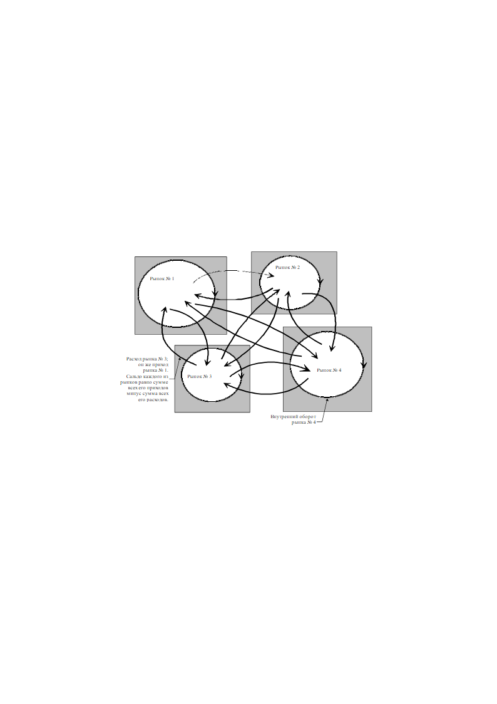
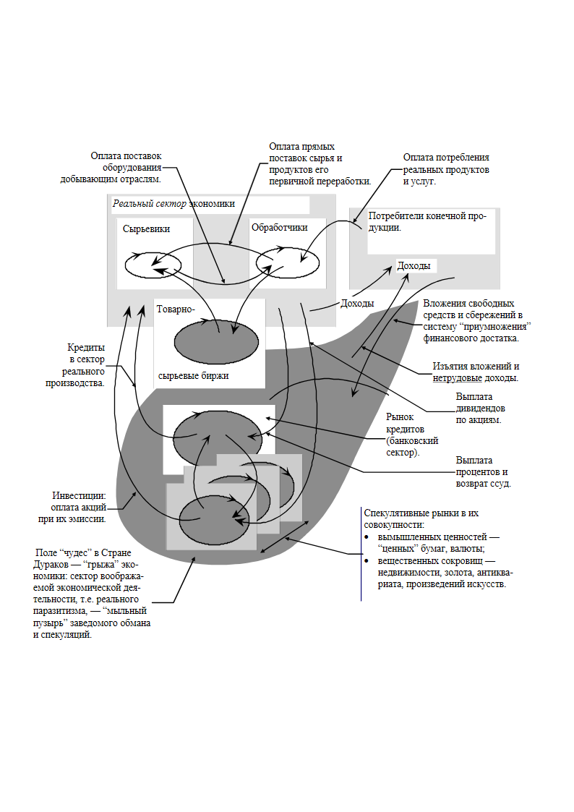

> **Первичный текст.** Краткий курс….
> Источник: `Краткий курс….doc` sha256 `e65157f28b52b7e4…`.
> Автоматическая транскрипция DOC→Markdown; смысл и формулировки не правились.
> Контрольные суммы и статус проверки — в [NOTICE.md](../../NOTICE.md).
> Содержание передаёт позицию авторов; утверждения не верифицированы библиотекой.

---

## 6.7. Кредитно-финансовая система и рынки


Хотя разного рода рынки существуют в обществе издревле, но современный рыночный механизм саморегуляции многоотраслевых производственно-потребительских систем невозможен без развитой кредитно-финансовой системы. Поэтому способность рыночного механизма к саморегуляции производства и потребления в общественно приемлемом режиме (как и неспособность его к этому) требует общественно целесообразной организации кредитно-финансовой системы. Поскольку кредитно-финансовая система — средство сборки множества микроэкономик в макроэкономику, действующую как система рынков, то прежде чем говорить о ней, необходимо выявить управленчески специфическое понимание термина «рынок».


Здесь, *ранее* и далее под рынком (специализированным рынком) будем понимать совокупность продавцов *определённой номенклатуры товаров, которая позволяет один специализированный рынок отличить от другого*. Деловая активность рынка на всяком определённом интервале времени проявляется в совершении сделок купли-продажи. В результате сделок товар переходит от продавца к покупателю, а средства платежа (в большинстве случаев официальные деньги общества) переходят от покупателя к продавцу. Каждая сделка характеризуется количеством товара и его ценой. Соответственно общий торговый оборот рынка равен финансово выраженному объёму продаж во всех сделках, совершенных в течение разсматриваемого интервала времени. Таким образом, специализированный *рынок в целом* характеризуется следующими определёнными численно однозначно параметрами:


- номенклатурой-идентификатором продукции[^48];


- количеством сделок;


- прейскурантом каждой из всего множества сделок;


- количеством каждого из видов товаров по номенклатуре рынка, проданного в каждой из сделок.


Но по отношению ко многим определённым таким образом в макроэкономике специализированным рынкам можно заметить, что все совершаемые на них сделки можно разделить на два типа:


- во-первых, сделки, в которых лицо, участвующее в них в качестве покупателя, в других сделках *на этом же рынке* систематически выступает в качестве продавца. В блоке 18 РСП в этом качестве выступают подавляющее большинство производственных фирм в цепочке технологической преемственности промежуточных продуктов и производства средств производства. Так, продавая средства производства другим блокам на рынке 18 РСП, блок № 8 получает от них на этом же рынке конструкционные материалы, энергию, транспортные и прочие услуги.


- во-вторых, сделки, в которых лицо, участвующее в них в качестве покупателя, и в других сделках на этом же рынке также выступает в качестве покупателя, *никогда не выступая в качестве продавца* (хотя возможно, что на других специализированных рынках оно выступает в качестве продавца). В этом качестве на рынке 18 РСП выступают преимущественно оптовики (дилеры) рынка конечной продукции, действующие в качестве оптовых продавцов на своём специализированном рынке (блок 19 РПП на схеме рис. 4).[^49]


Соответственно принятой ранее градации покупателей, действующих на всяком специализированном рынке, его финансово выраженный общий торговый оборот разпадается на две составляющие:


- внутренний финансовый оборот рынка, слагающийся в сделках купли-продажи первого типа, когда одно и то же лицо на одном и том же рынке выступает в одних сделках в качестве покупателя, а в других в качестве продавца. Он равен объёму продаж в сделках этого типа.


- и обменный финансовый оборот этого же рынка с другими сферами деятельности, разсматриваемыми в качестве таких же специализированных рынков, который также разпадается на две составляющие:


<!-- -->


- приходную, образуемую в сделках, в которых лицо, статистически значимо выступающее в роли покупателя, не действует на этом же рынке в качестве продавца; и


- расходную, образуемую при покупке чего-либо на других специализированных рынках, на которых продавцы разсматриваемого рынка выступают в качестве профессиональных и эпизодических покупателей второго типа, статистически редко появляясь на них в качестве продавца.


Соответственно разность «Приходный оборот рынка» — «Расходный оборот рынка» представляет собой «Сальдо рынка» (в контексте настоящей записки “внутренний оборот”, “обменный оборот” и “сальдо рынка” — строгие термины); иными словами «Сальдо рынка» равно разнице между его «Объёмом продаж» на сторону и «Объёмом закупок» на стороне. Положительное сальдо в последствии может стать основой как наращивания внутреннего финансового оборота, так и увеличения расходов в обменных оборотах с другими специализированными рынками. Естественно, что отрицательное сальдо вызывает обратные последствия.


Если же разсматривать множество специализированных рынков, образующих в совокупности обменную систему, то получится схема вроде показанной на рис. 10.


На нём многоотраслевая производственно потребительская система представлена как совокупность связанных между собой четырех специализированных рынков (т.е. отличающихся друг от друга по номенклатуре товаров, продаваемых на каждом из них). При этом необходимо иметь в виду, что между некоторыми из специализированных рынков общества обмен может носить односторонний характер, что на рис. 10 условно показано во взаимосвязях рынка № 1 и рынка № 2 изчезающе тонкой пунктирной линией со стрелкой на конце. В каждой паре связанных между собой в системе рынков приходный оборот одного из них является расходным оборотом другого. Сальдо в такого рода паре рынков — одно и то же по абсолютной величине (модулю: \|сальдо\|), но одному рынку при \|сальдо\| соответствует знак «+», а другому при \|сальдо\| соответствует знак «». Абсолютная величина сальдо является финансовой мерой взаимосвязи двух любых специализированных рынков, знак же характеризует направленность финансовых потоков (это же применимо и к оценке взаимной связи любых иных компонентов экономической системы). Общее сальдо каждого рынка слагается из суммы сальдо во всех такого рода парах; равно из разности суммы всех приходов и суммы всех его расходов.





Рис. 10. Финансовый обмен между специализированными рынками во многоотраслевой производственно-потребительской системе


При более укрупненном разсмотрении производится слияние прежних более мелких специализированных рынков. В этом случае внутренние их обороты складываются, а, кроме того, во внутренний оборот объединенного рынка включаются со знаком «+» обе компоненты их обменного оборота, поскольку при объединении рынков прежние сделки обменного оборота становятся внутренними сделками купли продажи объединенного рынка. После этого пересчитывается обменные обороты объединенного рынка и его сальдо в торговле с другими специализированными рынками.


При разбиении какого-то одного рынка на некоторую совокупность новых рынков, номенклатура прежнего рынка разделяется на избранные при разбиении составляющие, после чего продавцы прежнего рынка относятся к тому или иному из вновь выделенных специализированных рынков и пересчитываются внутренние обороты и сальдо каждого из них.


Если разсматривать производство и разпределение реальных продуктов и услуг в обществе, то это процесс, в котором явно выраженное управление некоторым образом сочетается с “автоматическим”[^50] самоуправлением «сложных систем»[^51] макроэкономики. Это общее положение. Как уже отмечалось ранее, по отношению к экономике оно означает, что управляемая изключительно директивно адресно производственно-потребительская система имеет естественные пределы своего роста. И эти пределы заметно меньше масштабов хозяйства государства или региона планеты.


Если смотреть на такого рода крупномасштабные государственные и региональные многоотраслевые производственно-потребительские системы с точки зрения теории управления, то кредитно-финансовая система в них либо выполняет функцию средства сборки множества структурно обособленных предприятий, каждое из которых управляется директивно-адресно, в устойчивую[^52] целостную систему, либо кредитно-финансовая система эту функцию *не выполняет, как это имеет место в России в результате усилий Е.Т.Гайдара и А.Б.Чубайса и их сподвижников*.


Если исходить из того, что хозяйственная деятельность в обществе должна обеспечивать всех людей в преемственности поколений всем жизненно необходимым, чтобы не было обездоленных по независящим от каждого из них лично причинам, то:


ОБЩЕСТВУ от кредитно-финансовой системы и не требуется ничего, кроме *эффективной устойчивой сборки множества частных административно обособленных фирм и единоличных предпринимателей в целостную многоотраслевую производственно-потребительскую систему*.


Чтобы так было всегда, необходимо выявить и изключить из практической политики и бизнеса те факторы и действия, которые препятствуют или полностью подавляют выполнение кредитно-финансовой системой этой её функции, единственно полезной экономически. Один из таких факторов — ростовщичество — кредитование под ссудный процент было выявлено при развертывании теории подобия многоотраслевых производственно потребительских систем. О других — рынках валюты и “ценных” бумаг — говорилось вскользь. Но именно в этом смысле — соответствия либо несоответствия функции сборки целостной макроэкономики из множества микроэкономик — особый интерес вызывают процессы, имеющие место на рынках разного рода “воображаемых” ценностей, которые общество может измышлять в неограниченном количестве, а также и при спекуляции реальными продуктами.


Но чтобы увидеть подводные течения финансового мира, прежде необходимо определиться во мнениях относительно существа денег и признать:


- что ведущим “воображаемым” продуктом современности являются официальные деньги — средства платежа, представляющие собой совокупность цифр, которая выражает численную меру номинальной платёжеспособности, зафиксированную на монетах, купюрах, банковских счетах и т.п.


- что финансовое обращение само по себе, вне его связи с другими общественными процессами, есть перемещение чисел, выражающих номинальную платёжеспособность, от одних физических и юридических лиц к другим физическим или юридическим лицам.


- что покупательная способность номинальной платёжеспособности (т.е. выраженной численно) обусловлена количеством выставленного на продажу товара, а прейскурант является финансовым выражением всех ошибок общественного управления в их издревле упорядоченной (Библия, Сирах, 29:24) по приоритетам значимости совокупности; иными словами идеальному режиму общественного самоуправления и функционирования экономики соответствует устойчиво нулевой прейскурант на продукцию конечного потребления (блок 19 РПП на рис. 4).


Всё это было не столь очевидно в эпоху меновой торговли на основе обращения золота и серебра в качестве денежного товара, принявшего на себя функции инварианта прейскуранта[^53]. Фактически эпоха меновой торговли продолжалась до середины ХХ века, пока в обществах поддерживалось обращение золотых и серебряных монет и обмен на них бумажных денег и сумм на банковских счетах в однозначно определённом соотношении: номинал — количество золота[^54], исполнявшего роль основного денежного товара.


То обстоятельство, что “разфасовка” в монеты денежного товара с развитием цивилизации была перенесена из торговых рядов рынка в казначейство, дела не меняет: это подобно разнице между продуктовым рынком, где покупатель, разбудив продавца, просит взвесить в его присутствии 1 килограмм помидоров, и универсамом, где тот же покупатель берет с прилавка пакет, в котором помидоры заранее разфасованы персоналом магазина или базы оптовой торговли. Но в случае обращения золота в качестве денежного товара в системе меновой торговли вместо разфасовки помидоров в пакеты заранее фасуется золото в монеты.


Эпоха меновой торговли при таком взгляде завершилась только с прекращением хождения монет из драгоценных металлов и прекращением обмена бумажных денег и сумм на банковских счетах на такого рода монеты или же на развесное золото и серебро в слитках. С завершением эпохи меновой торговли золото, утратило роль инварианта прейскуранта и стало рядовым товаром, что официально признал Международный валютный фонд ещё в 1976 г. После этого “изчезновения” инварианта прейскуранта, всякая экономическая теория, в которой не назван определённо *новый* инвариант прейскуранта, *заместивший прежний,* обречена на метрологическую несостоятельность, что выводит её из области науки в область наукообразной болтовни на околоэкономические темы.


Кроме того, с утратой золотом роли инварианта прейскуранта номиналы средств платежа и все прочие финансовые номиналы стали просто числами, очищенными от их материальных носителей[^55]. Это означает, что в обществе обострилась древняя проблема: *защитить себя от производства дополнительной номинальной платёжеспособности, уничтожающей покупательную способность платёжеспособности,* *ранее введенной в финансовое обращение* (платёжеспособность и покупательная способность это разные категории, хотя и взаимно связанные).


До эпохи появления бумажных кредитных денег эта проблема решалась большей частью сама собой на основе неразрывной связи номинала платёжеспособности и *количества драгоценного металла*, на котором он был отчеканен, *определявшего покупательную способность* в меновой торговле тех лет[^56].


С другой стороны *покупательная способность ограничена в обществе всегда* в том смысле, что реальных продуктов и услуг невозможно купить больше, чем их в действительности производится[^57]. А уровень производства по каждой из позиций номенклатуры выпускаемой продукции (как и возможности расширения номенклатуры), в свою очередь, ограничен энергопотенциалом, освоенным системой производства, и КПД технологических процессов, о чём было прямо сказано в предшествующих разделах.


*Кажется, на первый взгляд, чем плохо жить подавляющему большинству трудящегося населения при такого рода естественном автоматизме? — поскольку, если эмиссия средств платежа отстает от роста объёмов производства реальной продукции и услуг, то номинальные цены неизбежно будут снижаться, а покупательная способность текущих номинальных доходов и накоплений, которые лежат для большинства населения в ограниченном диапазоне, также неизбежно будет расти. Чтобы было так, необходимо только средствами налогово-дотационной политики поддерживать финансовое обращение во многоотраслевой производственно-потребительской системе при неравномерном изменении порога рентабельности в разных отраслях в ходе технико-технологического прогресса и падении цен на конечную продукцию и услуги на рынке 19 РПП и на промежуточную продукцию в сфере производства 18 РСП на рис. 4.*


Теперь такого автоматизма нет, вследствие чего объём вводимой в дополнение к уже находящейся в обращении номинальной платёжеспособности (т.е. по существу чисел) определяется деятельностью:


- легальной — высших государственных чиновников,


- и нелегальной — фальшивомонетчиков, фальшивокупюрщиков и хакеров[^58].


Все процессы, за изключением легальной и нелегальной эмиссии, в кредитно-финансовой системе по “само собой разумению” относятся к категории “естественных”. При этом полезно иметь в виду, что качество чисел, вводимых в оборот платёжеспособности хакерами нелегально, ни чуть не хуже качества чисел, вводимых в оборот чиновниками государства легально[^59]: это означает, что ныне возможны ситуации, в которых между современными “фальшивомонетчиками” и легальными госчиновниками нет никакой разницы; вопрос только в том, как оформить легального чиновника юридически на те же нары, что и “фальшивомонетчика”.


В силу господства приведённого в предыдущем абзаце мнения экономическая наука не интересуется тем, какие из финансовых процессов в действительности *противоестественны* и как *эти противоестественные* процессы влияют на номинальную платёжеспособность и покупательную способность населения и разных отраслей сферы производства. В связи с этим необходимо выявить однозначную связь номинальной платёжеспособности и покупательной способности как общества в целом, так и его составляющих компонент до индивида, обладающего кошельком, включительно.


Долговременный экономико-исторический анализ показал, что рост производства реальной продукции конечного потребления (для блока 19 РПП и ФОП на схеме рис. 4) в её натуральном учёте на протяжении последних 150 лет следовал за ростом добычи первичных энергоносителей и *никогда не обгонял его, подтверждая тем самым закон сохранения энергии в технологических процессах экономической системы общества.* Среднегодовые темпы прироста энергопотенциала техносферы за этот период составили не более 5 % в год. Объёмы потребления росли в среднем не быстрее 3 % в год, так как часть прироста энергопотенциала изпользовалась на возобновление материально-технической базы производства, кроме того КПД техники не превосходит единицы, а для большинства технических устройств заметно меньше единицы.


Поскольку выход реальной продукции из сферы производства (блок 18 РСП на рис. 4) определяется её энергопотенциалом, прежде всего[^60], то это означает, что рост величины *S+K*, при котором заведомо не будет падения покупательной способности находящихся в обращении денег, и не возникнет диспропорций финансовых мощностей производств по отношению к их мощностям при натуральном учёте продукции, не может превышать прироста энергопотенциала за тот же период (см. формулу 13). Избыточный по отношению к этому *естественному* ограничению эмиссии рост КПД и рост культуры потребления уйдёт в снижение номинальных цен, в котором выражается рост покупательной способности денежной единицы.


С другой стороны, эта обусловленность объёмов реального производства и масштаба номинальных цен энергопотенциалом сферы производства означает, что реально инвариантом прейскуранта является энергоинвариант, вне зависимости от того признан он экономической наукой и юриспруденцией, либо нет. В систему экономической статистики и бухгалтерского учёта он может быть введен либо как цена «условного топлива»[^61], как это было в практике Госплана СССР, либо как тариф на промышленное потребление электроэнергии, поскольку, с одной стороны, в основе тарифа на электроэнергию лежит спектр потребления реальных энергоносителей, а с другой стороны, потребителями электроэнергии являются практически все отрасли сферы производства, инфраструктуры общества и домашние хозяйства. Введение энергоинварианта в качестве тарифа на электроэнергию предпочтительнее, так как понятие «условного топлива» изменяется, в зависимости от изменения структуры комплекса энергетических отраслей. Киловатт×час электроэнергопотребления, в отличие от тонны «условного топлива», более устойчивое явление в экономике.


Но если в системе присутствует ничем не ограниченный ссудный процент, то он, вызывая *<u>рост номинальной заявленной стоимости произведенного вне зависимости от динамики реального производства в натуральном учёте объёмов продукции</u>*, порождает некоторый объём заведомо неоплатной задолженности (т.е. цены растут быстрее, чем покупательная способность общества и спектр производства в неизменных ценах). Эта задолженность может быть погашена только прощением всего её объёма или покрытием его дополнительной эмиссией денег в обращение общества. Но при неограниченном ссудном проценте, объём дополнительной эмиссии, необходимой для обеспечения функционирования рыночного хозяйства путем погашения заведомо неоплатной задолженности, вызывает рост значения *S+K*, более быстрый, чем рост энергообеспеченности реального производства, что выражается в падении покупательной способности денежной единицы.


Кроме того, резкие значительные изменения величины номинальной платёжеспособности *S+K* ведут к падению темпов роста реального производства в его натуральном учёте относительно их возможного максимума за счёт возникновения межотраслевых и внутриотраслевых диспропорций удельной платёжеспособности и производственных мощностей как таковых (о чём говорилось ранее), возникающих при прохождении эмиссионной и кредитной волн с одного специализированного рынка на другие по объединяющим их каналам денежного обращения в обществе (ранее приводившаяся формула 13).


Как ВСЕМ известно ещё из школьного курса физики, полезный эффект действия всякой системы численно определяется соотношением: *«Эффект» = КПД × «Количество энергии, введенной в систему»*, выражающим закон сохранения энергии, где *КПД* — коэффициент полезного действия. Ему в финансовом выражении соответствует следующее утверждение:


*“Совокупный денежный номинал, противостоящий всей товарной массе в обществе на всех специализированных рынках” = “Коэффициент энергетической обеспеченности денежной единицы (финансовый аналог КПД)” × “Количество энергии, потребляемой производственной системой общества, обслуживаемого данным <u>видом денег</u>.” Это — финансовое выражение общефизического закона сохранения энергии, ему соответствует энергетический стандарт обеспеченности средств платежа.*


Таким образом, ссудный процент — *противоестественное явление*, в том смысле, что <u>законодательно поддерживающее</u> его общество, по существу посягает на отмену общефизического закона сохранения энергии в своей потребительской деятельности: если говорить языком пресловутой ленинской «кухарки, которая должна УЧИТЬСЯ[^62] управлять государством», то такое общество посягает на то, чтобы съесть больше, чем оно реально стряпает; при этом кто-то обожрется до свинского состояния, за счёт того, что многим не хватит жизненно необходимого.


Законодательная поддержка ссудного процента — выражение глупости одних и рабовладельческих устремлений других, что касается и современного российского общества, в общем-то без оснований к тому насмехающегося над пресловутой ленинской якобы глупостью о «кухарке». Хорошая кухарка не совершила бы того, что натворили *реформаторы из числа благонамеренных.*


Тем не менее, ссудный процент в разных своих обличьях присутствует в мире финансов, превращая финансы из мерила производства и разпределения в безмерно воображаемую — вымышленную реальность, оказывающую противоестественное воздействие на реальную жизнь большинства населения Земли и на биосферу. И вопреки этому присутствие ссудного процента считается вполне естественным и уместным во всей прошлой и в настоящей жизни Запада, а главное — и в той модели “<u>нового мирового порядка” осуществления древнеегипетского рабовладения</u>, которую Запад экспортирует в остальные регионы Земли, программируя их подневольное будущее.


Это — нравственно-этическая сторона вопроса о финансах, как о воображаемом продукте, произведенном обществом. Экономическая же сторона дела связана с вопросом: чем финансовая система на основе воображаемых денег удобнее рабовладельцам, по сравнению с обращением в прошлом золотых и прочих “реальных” денег, бывших основой меновой по её существу торговли.


В обществе, где есть социальные группы, состоящие из тех, кто господствует над другими людьми как над орудиями осуществления своих целей или стремится к такого рода господству, деньги не только обеспечивают продуктообмен, осуществляя сборку в единую многоотраслевую производственно-потребительскую систему множества частных фирм и единоличных производителей и торговцев. **Деньги ещё являются средством осуществления господства одних над другими, которое всегда на протяжении истории выражалось в стремлении к накопительству с целью увеличить свою мощь в качестве господина над другими, либо вырваться из такого рода финансовой неволи.** Соответственно этому свойству психики индивидов при золотом обращении в обществе, где одни реально господствуют над другими либо стремятся к таковому господству, — тем более, если рост цен в нём подхлестывается ростовщичеством, — хронически не хватает средств платежа для обеспечения сборки множества частных фирм в единую хозяйственную систему и развития в ней производства.


Производство реальной продукции и услуг в этом случае поддерживается их действительными производителями на минимальном уровне. Это ведёт к обострению социальной напряженности, поскольку возомнившие себя “элитой”, не умея поднять *спектр общественного производства*, однако не желают снизить свою потребительскую активность, реально намного превосходящую их биологически обусловленные потребности, и продолжают обирать действительных производителей продукции, лишая их семьи подчас самого жизненно необходимого всего лишь ради того, чтобы превзойти ещё кого-то в роскоши и сладострастном потреблении. И это всё создает дискомфортные условия для реальных владельцев этого общества — тех, кто владеет и возомнившими себя “элитой” и зависимым от “элитарного” правления простонародьем; для тех, кто реально осуществляет надгосударственную концептуальную власть[^63].


В результате общество в целом в таких условиях оказывается перед выбором: либо искоренить систему угнетения одних другими и продолжать жить в “золотом” (в смысле основы финансов) веке меновой торговли реальными продуктами, либо построить иную финансовую систему, в которой страсть к финансовому накопительству одних хозяева системы легко могут нейтрализовать, чтобы она не препятствовала производственной деятельности большинства трудоспособного населения и тем самым сняла отчасти внутриобщественную напряженность.


Исторически реально эта альтернатива предстала перед европейским обществом на фоне конфликта двух пород рабовладельцев: *региональной* земельной аристократии и ростовщической финансовой МЕЖРЕГИОНАЛЬНОЙ аристократии, что нашло своё яркое и *полное* художественное выражение в “Скупом рыцаре” А.С.Пушкина.


Земельная аристократия — кланы тогдашней “политической элиты”, державшие в своих руках государственную власть при смене поколений, — не смогли отказаться от своих рабовладельческих устремлений и возглавить общественную деятельность, направленную против ростовщического рабовладения финансовых межрегионалов. Но межрегионалы-ростовщики смогли профинансировать подавление своих конкурентов в рабовладении — земельной региональной аристократии — в ходе буржуазных “демократических” революций.


Обретя через финансируемых ими[^64] ставленников власть над государственным аппаратом, ростовщические кланы в течение исторически непродолжительного времени обезопасили себя и свою власть от нездоровой страсти к финансовому накопительству как некоторых устойчивых при смене поколений социальных групп, так и отдельных личностей, которая по-прежнему господствовала в обществах и препятствовала развитию реальной производственной деятельности так же, как и во времена государственной власти земельной аристократии, чья алчность и рабовладельческие устремления препятствовали общественному объединению труда.


Будучи держателями ростовщической долговой удавки, финансовые межрегионалы признали в качестве равноправных с золотом и серебром средств платежа в меновой торговле разного рода долговые разписки. Эти долговые разписки в своём историческом развитии обрели вид бумажных кредитных денег[^65], ставших первым воображаемым продуктом в мире реальных золотых и серебряных финансов того времени.


Чтобы не нервировать и не озлоблять толпу обывателей обменом разного рода “реальностей на воображаемые ценности”[^66] при осуществлении ими купли-продажи с употреблением кредитных бумажных денег, межрегиональной ростовщической корпорацией, узурпировавшей банковское дело (счетоводство макроэкономического уровня по его существу), и подчиненными ей государствами поддерживалась система прямого и обратного обмена воображаемого денежного товара (чисел на счетах и на разного рода купюрах) на реальное золото и серебро по твердому курсу.


Хотя при этом только некоторая доля из совокупной номинальной платёжеспособности общества *S+K* была представлена реальными золотом серебром, но при устойчивой работе этой системы прямого и обратного обмена какой-либо внешне видимой *функциональной* разницы между «реальными» и «воображаемыми» финансами видно не было.


Но если находящуюся в обращении наличность *S ,* в свою очередь представить в виде суммы:


S = V +“Au” ,


где *V — воображаемая* (виртуальная) составляющая в денежном обращении, а *“Au”* — реально золотая, и перейти к анализу покупательной способности, то отличие системы меновой торговли на основе золота, эмиссия которого ограничена природными факторами, и системы торговли на основе воображаемых денег — разительное. Удельная покупательная способность золотой составляющей пропорциональна в обезразмеренной по *S+K* системе следующему соотношению:


“Au”/(V + “Au” + K).


Поскольку объём допустимого кредитования, не нарушающего возможностей банковской системы в операциях с вкладчиками, пожелавшими потратить свои сбережения, представляет собой некоторую ограниченную долю от *S ,* а золото в системе обращается наравне с воображаемыми деньгами, то приведённое выражение для покупательной способности золотой составляющей можно записать и в такой форме:


“Au”/(V + “Au” + αV) = “Au”/(“Au” +(1 + α)V).


Поскольку, в отличие от золота, объём эмиссии всякого рода воображаемых финансов неограничен ничем кроме произвола держателей системы воображаемых денег, то полученное выражение по существу говорит о возможности управления покупательной способностью золотой составляющей в финансовом обращении в условиях действия золотого стандарта.


Дело в том, что удельная[^67] покупательная способность всякой номинальной денежной суммы в обезразмеренной системе определяется в общем виде (с точностью до коэффициента) соотношением *П<sub>i </sub>/(S+K),* частным случаем которого является приведённое соотношение для покупательной способности золотой составляющей. Как видно из структуры этого соотношения, если кто-то накопил золота в качестве сокровища в объёме *β “Au” ,* то простым наращиванием воображаемой составляющей *V ,* покупательную способность золотого сокровища можно при необходимости легко обесценить[^68]; а тем самым и устранить конкурентов, посягающих на господство, и оставить в подневольном положении тех, кто стремился вырваться на финансовую свободу.


*Это было невозможно сделать столь независимо при изключительно золотом обращении (требовалось выявить сокровище и изъять его, что исторически реально возможно только как гражданская война); кроме того, концентрация реального золота у банкиров и плохая его транспортабельность в больших количествах делала банкиров легко поражаемой мишенью в периоды социальных потрясений*[^69]*. В системе же с воображаемыми финансами-числами каждый банкир-ростовщик — сам себе системообразующий фактор, способный бросить на разграбление в случае опасности для себя счета и купюры в одном месте и развернуть производство воображаемого финансового продукта в другом месте <u>при поддержке всей остальной корпорации межрегионалов финансистов</u>. Захват же воображаемого финансового продукта одиночками как в граждански мирное время, так и в ходе бунтов опасности для системы не представляет, поскольку введением в обращение новых воображаемых финансов, периодической сменой купюр и т.п., захваченные кем-либо воображаемые финансы-числа на разного рода носителях сами собой утратят покупательную способность*[^70]*, и будут выброшены их владельцами, если те не смогут доказать законность происхождения своих воображаемых “сокровищ” при обмене старых денег, на новые, осуществляемом системой в целом.*


Кто этого не понимал и хотел накопить богатств побольше, копил сокровища по-прежнему, а неограниченная ничем, кроме воли финансовых рабовладельцев эмиссия воображаемых денег (наращивание составляющей *V)*, поддерживала хозяйственную деятельность общества. Когда же рост номинальных цен, подстегиваемый ростовщичеством, вынуждал продавать разного рода сокровища и тратить накопления, золотая составляющая в денежной форме возвращалась в обращение, а перешедшая в ювелирные изделия, — меняла владельцев в меновой или обычной торговле.


Сами же заправилы системы воображаемых финансов ничего не теряли, сохраняя власть и над миром воображаемых номиналов, и над товарооборотом реальных вещей и услуг.


По существу с момента признания обществом в качестве средств платежа бумажных денег — носителей воображаемых номинальных чисел — золото стало ненужным в качестве *основы финансовой системы, обеспечивающей сборку множества частных фирм в единую производственно-потребительскую систему*. Однако при этом встал вопрос об управлении покупательной способностью денежной единицы и об управлении разпределением удельных покупательных способностей среди населения и по специализированным рынкам при прогрессивном росте объёма номинальной платёжеспособности *S+K* общества в целом.


Таким образом, после выяснения роли ростовщичества и банков в прошлом и в современном мире, очевидно, что рынок кредитов — это единственный из специализированных рынков общества, который имеет *по принципам построения финансовой системы со ссудным процентом* всегда положительное сальдо в обмене с другими специализированными рынками. Именно по этой причине не правы те, кто утверждает, что ростовщический доход явление того же рода, что и прибыли, извлекаемые продавцами из торговли реальными продуктами и услугами: *вопрос только в том, кто из них искренне ошибается, а кто злонамеренно лжет*. Благодаря заведомо положительному сальдо рынка кредитов продавцы денег в состоянии удушить всякий иной рынок как целиком, так и “достать” персонально каждого из физических и юридических лиц, действующих на этих рынках. Последнее означает:


- **во-первых**, что биржевой пузырь рынка “ценных” бумаг и прочих воображаемых продуктов *вымышленной* ценности и сокровищ разного рода существует и раздувается с их соизволения.


-  **во-вторых**, что биржевой пузырь рынка воображаемых продуктов и сокровищ несёт на себе определённые функции в системе <u>управления посредством финансов</u> производством и разпределением реальных продуктов и услуг[^71].


Но говорить о воздействии пузыря рынка “ценных” бумаг, валюты и прочих сокровищ на другие сферы деятельности предметно — возможно только после всего ранее высказанного, в результате чего выявились отличия рынков воображаемых продуктов вымышленной ценности от рынков реальных продуктов сферы производства и потребления. Теперь обратимся к воображаемым ценностям.


Заправилы западной цивилизации представляют простому обывателю рынки разного рода “ценных” бумаг в качестве одного из <u>средств сохранения с ПРИУМНОЖЕНИЕМ</u> его *номинальных сбережений.* Однако вопрос о том, какой *реальной покупательной способностью* будут обладать сбереженные и приумноженные номиналы, обходится при этом молчанием. Основным товаром рынков “ценных” бумаг являются разного рода акции фирм. Но процесс ценообразования на рынке акций заметно отличается по своему существу от ценообразования на антиквариат, произведения искусства, золото и другие драгоценности, недвижимость и всё прочее, что служит в обществе для вложения свободных финансов и сбережений с целью сохранения и приумножения своей покупательной способности.


Главная особенность этого обусловлена тем, что, в отличие от золота и прочего, перечисленного в качестве “аккумуляторов” накоплений, количество акций, которые могут появиться на рынке “ценных” бумаг объективно не ограничено ничем, кроме намерений их эмитента; себестоимость же производства акций смехотворно мала, по сравнению с их возможной ценой, что также отличает их от золота и прочих “аккумуляторов” накоплений, а сами акции, в отличие от прочих “аккумуляторов”, не способны удовлетворить никаких иных потребностей людей за изключением накопительских.


На первый поверхностный взгляд акционирование — это альтернативное по отношению к кредиту средство привлечения свободных финансовых ресурсов общества в какое-то частное дело, поскольку, чтобы начать или расширить дело, необходимо привлечь финансовые ресурсы в объёме, превышающем некоторый минимальный пороговый уровень, свойственный каждой отрасли многоотраслевой производственно-потребительской системы в каждое историческое время. Для преодоления этого отраслевого порога минимума капитала на Западе и в России, можно взять кредит, объём которого предстоит вернуть вместе с набежавшими процентами в течение определённого срока. Если номинальные доходы, извлекаемые из начатого таким способом бизнеса, за срок возврата кредита не позволили создать объёма собственных оборотных средств, позволяющего продолжить или расширить дело после возвращения ссуды и уплаты процентов по ней, то придется либо закрыть дело, либо же прибегать к новым кредитам. Это означает, что по существу придется быть не собственником дела, а наёмным управляющим дела, фактически принадлежащего кредитору.


Как было показано ранее, такая перспектива определяется не деловой хваткой предпринимателя, не существом самого дела и его общественной полезностью либо вредностью, а кредитной политикой, осуществляемой в каждом регионе планеты (государстве) трансрегиональной корпорацией весьма малочисленных кланов ростовщиков-международников. Хотя потребителю в большинстве случаев всё равно, в чьей собственности находится предприятие, производящее необходимую ему реальную продукцию, и нет дела до того, как возник его стартовый капитал, но перспектива стать наёмным управляющим многим предпринимателям на протяжении истории была всегда и ныне психологически неприемлема. Соответственно такого рода неприятие долговой зависимости порождает другой способ создания стартового капитала — преодоление коллективными усилиями порогового значения объёма финансовых ресурсов, необходимых для начала и расширения дела; по-русски это называется *вести дело в складчину.* Тем, кто при этом вкладывает свои финансовые средства в дело, не будучи его фактическим сотрудником, обещают долю из будущих доходов, которые дело должно принести.


Акции появились как юридическая форма создания и расширения дела в складчину, а также и как способ разпределения прибыли, которую ожидают получить в последствии от этого дела. Собственниками дела при этом формально являются все акционеры без изключения, хотя при *голосовании акциями* при принятии управленческих решений выясняется, что реальными собственниками являются только малочисленная группа, владеющая пакетом акций, позволяющим заблокировать либо принять решение, а все остальные акционеры присутствуют при этом акте в качестве зрителей, по существу утратив способность собственника оказать влияние на судьбу своего достояния.


Но и это изключительное положение среди акционеров группы владельцев контрольного пакета иллюзорно, если в кредитно-финансовой системе присутствует ссудный процент.


В принципе, акционерное предприятие может вести дело, не будучи в долговой зависимости от ростовщиков с рынка кредитов, хотя кредиты могут быть необходимы и ему, но не в качестве източника основных финансовых ресурсов (заемный капитал), а в качестве эпизодического средства преодоления разного рода пиковых потребностей в финансовых ресурсах.


Но не следует забывать и о том, что сама потребность пополнить оборотные средства некоего предприятия за счёт выпуска новой серии акций реально могла быть вызвана предшествующей кредитно-ростовщической перекачкой платёжеспособности из сферы производства в банковскую корпорацию. Исторически реально в библейской цивилизации это так, по какой причине некоторая доля заведомо неоплатного долга, порождаемого ростовщичеством, приходится на акции и некоторая доля акций разных предприятий всегда статистически предопределённо представляет собой *долговые разписки (обязательства) на предъявителя,* в обмен на эмиссию которых трансрегиональная корпорация ростовщиков возвращает в производственно-потребительский оборот общества (в официально денежной форме) некоторую долю изъятой ростовщичеством прежде платёжеспособности.


Такого рода возврат в обращение номинальной платёжеспособности происходит в форме сделки купли-продажи акций, при этом покупатели акций, если это не сами банки, выступают по существу в качестве подставных лиц, которые отнесли на свой счёт некоторую долю заведомо неоплатного долга общества ростовщической корпорации. Таким образом, в системе со ссудным процентом эмиссия новой серии акций достаточно часто скрывает от большинства факт не оглашённого банкротства некоторого множества фирм и статистическую предопределённость переразпределения в будущем прав собственности вопреки намерениям и пожеланиям *подавляющего большинства населения, которое останется <u>потерпевшим зрителем</u> при очередном потрясении или крахе фондовых и финансовых рынков, вне зависимости от того, являются они акционерами либо же нет*[^72].


После такого акта *грабежа на узаконенной процедурной основе* вряд ли возможно утешиться по рецепту, почерпнутому из статьи одного горе-“аналитика”:


«... правила игры на финансовых рынках — это нечто незыблемое, это фундамент мира, поэтому даже если вас обобрали до нитки, то утешьтесь тем, что вы нашли в себе мужество соблюсти правила игры» (“Эксперт”, № 42, 1997 г. Валерий Фадеев. “Это вам не козла забивать. Россия стала частью мировой экономики. Теперь нас могут обобрать”)[^73].


*Многие владельцы акций*[^74]*, пострадавшие при такого рода финансовых катастрофах, в этом случае убедятся, что в действительности они вовсе не собственники предприятий, а подставные лица, среди которых трансрегиональная корпорация ростовщиков временно разместила заведомо неоплатный долг.*


Взыскать этот долг они не смогут в силу того, что его величина растет быстрее, чем номинальные доходы общества. Что возможно взыскать с обанкротившейся фирмы, будет взыскано с неё, прежде всего, корпорацией ростовщиков, в частности, потому, что законодательство большинства стран построено так, что в случае банкротства фирмы и разпродажи её имущества для покрытия долгов — первыми удовлетворяются иски кредиторов, т.е. большей частью это — иски банковской корпорации, своим ростовщичеством разорившей фирму. Что останется после ростовщиков-кредиторов — по остаточному принципу — пойдет на погашение задолженности перед вкладчиками-акционерами; из числа же акционеров преимуществом обладают владельцы разного рода привилегированных акций; и только то, что останется после них, будет разпределено между рядовыми акционерами, “вложившимися” в дело, загодя обреченное на банкротство системным банковским ростовщичеством.


То есть в кредитно-финансовой системе со ссудным процентом акционирование в его реальных формах — поставленная на широкую ногу «игра в наперстки», в которой всегда выигрывают владельцы системы и некоторое количество мелкоты, которой дают потешиться ради того, чтобы она привлекла массовку, которую хозяева игры обдерут как липку.


Хотя это в целом так, однако, возможно, оставив вне разсмотрения общесистемные факторы и процессы, смотреть на выпуск акций с точки зрения директората некой производственной фирмы. При таком искусственно суженом взгляде выпуск новой серии акций и их продажа — средство увеличить объём функционально обусловленных расходов в процессе производства; тем самым увеличить объёмы производства или изменить его характер и качество, что должно увеличить и номинальные доходы предприятия (как обычно предполагается) в объёме, превосходящем вложения в дело доходов от продажи акций.


Выкуп предприятием ранее выпущенных им же акций соответственно представляет собой сокращение его финансовых мощностей, что может не позволить ему загрузить уже развитые производственные мощности. Если это — систематический выкуп ранее выпущенных акций, то в большинстве случаев он эквивалентен ликвидации предприятия, поскольку предприятие при выкупе собственных акций уменьшает свой производственный финансовый оборот[^75], что ведёт к сокращению функционально обусловленных расходов и сокращению объёма деятельности в её натуральном выражении.


Это означает, что в подавляющем большинстве случаев после продажи акций их эмитент (тот, кто их выпустил) в обладании ими непосредственно не заинтересован: ему достаточно иметь у себя некоторый контрольный пакет, чтобы не утратить власть над собой на очередном собрании акционеров.


Но после того, как акции разошлись среди «вложившихся в дело», если это дело обеспечивает поступление доходов и прибыли, то часть прибыли перечисляется владельцам акций. В обладании акциями, как средством получения доходов, таким образом, оказываются заинтересованы их покупатели — последующие владельцы, а не директораты предприятий, выпустивших акции.


Соответственно такому отношению к акциям рынок ценных бумаг разпадается на два:


- первичный, на котором продавцами выступают эмитенты акций, т.е. предприятия, их выпустившие с целью наращивания своих финансовых мощностей.


- вторичный, на котором продавцами выступают владельцы акций, не являющиеся их эмитентами.


Если эту *общепринятую* в современной финансово-экономической науке[^76] терминологию соотнести с рис. 10, то то, что принято называть «первичным рынком ценных бумаг», с одной стороны, соответствует расходной части обменного оборота специализированного *рынка “ценных” бумаг и прочих воображаемых продуктов вымышленной ценности* (блок № 14 на рис. 4) и, с другой стороны, соответствует доходной части обменного оборота рынков, на которых действуют эмитенты акций (предприятия сферы производства реальных продуктов и услуг: остальные компоненты блока № 18 РСП и многие предприятия блока № 19 РПП на рис. 4). Изключение составляют некоторое, относительно небольшое количество акционерных фирм, занятых операциями с “ценными” бумагами и принадлежащих по характеру своей деятельности непосредственно блоку № 14 на рис. 4 в качестве покупателей и продавцов.


По существу процесс инвестиций (т.е. вложение свободных номинальных финансовых ресурсов в производство реальной продукции) протекает как продажа акций их эмитентами на первичном рынке ценных бумаг.


То, что принято называть «вторичным рынком ценных бумаг», представляет собой внутренний оборот специализированного рынка “ценных” бумаг и прочих воображаемых ценностей.


Хотя владельцев акций, купивших их на вторичном рынке ценных бумаг, и принято называть «инвесторами», но *в результате покупки ими акций ни один цент не вкладывается в реальное производительное дело*. Единственным изключением является вариант, если акции куплены претендентами на дивиденды и долевое участие в собственности у представителя эмитента, которому эмитент, так или иначе передал право комиссионной продажи выпускаемых им акций. Всё остальное (кроме продажи эмитентом акций через комиссионера) во внутреннем обороте рынка “ценных” бумаг — *паразитическая* спекуляция, т.е. извлечение номинальной денежной прибыли из колебаний цен на акции, как самопроизвольных, так и умышленно вызванных биржевой “игрой”.


Собственно «биржевой пузырь», который привлек внимание многих в ходе кризиса 1997 г. (в том числе и в качестве средства осуществления власти над миром[^77]) и есть внутренний спекулятивно-паразитический оборот рынка “ценных” бумаг и прочих воображаемых продуктов вымышленной ценности.


Соответственно и ценообразование на акции протекает различным образом на первичном и на вторичном рынках “ценных” бумаг. При начале дела цена акций во многом определяется убедительностью рекламной кампании, проводимой эмитентом при размещении своих акций[^78], в результате чего и возникает достаточный для начала или расширения дела платёжеспособный спрос на них.


Ценообразование на вторичном — спекулятивно-паразитическом рынке “ценных” бумаг протекает иным образом. Это связано с тем, что при покупке акций одних интересуют, прежде всего — ожидаемые дивиденды, а других — реальные долевые права собственности на конкретные объекты в сфере производства вне зависимости от дивидендов. Эти две группы покупателей акций на вторичном рынке “ценных” бумаг по сути являются врагами, хотя большинство любителей дивидендов не задумываются о таких тонкостях в функционировании вторичного рынка “ценных” бумаг. Причина же такой не оглашённой вражды состоит в том, что если нет дивидендов, то многие претенденты на дивиденды начинают продавать акции по ценам, гораздо ниже, чем те, за которые они их приобрели, что открывает возможность к скупке по дешевке долевых прав собственности, приходящиеся на каждую из продаваемых в такого рода ситуациях акциях.


И хотя себестоимость производства акций смехотворно мала, в отличие от себестоимости производства, лежащей в основе цены реальных продуктов и услуг, но и на вторичном рынке “ценных” бумаг удается выявить один из фундаментов ценообразования на разного рода акций — своего рода начало системы отсчёта их цен. Он, однако, затрагивает ценообразование, когда в форме акций продаются и покупаются дивиденды, а не долевые права собственности[^79], также связанные с акциями[^80].


Среди разного рода акционерных обществ существуют акционерные общества закрытого типа, чьи акции не подлежат свободной продаже и перепродаже, а вопрос об изменении состава участников закрытого акционерного общества решается каждый раз собранием его акционеров. Если владелец акций, пожелав их продать, не может найти приемлемого для остальных акционеров покупателя, то встает вопрос о выкупе акций самим акционерным обществом на баланс общества (т.е. выкупленные у бывшего акционера акции переходят в вéдение дирекции и числятся на балансе предприятия в системе его бухгалтерского учёта). При этом возникает необходимость оценки акций, *цена на которые реально отсутствует, поскольку они не перепродаются и не котируются на фондовой бирже.*


Способов оценки акций закрытых акционерных обществ на основе комбинации разного рода финансовых параметров предприятия (балансовой стоимости, приходящейся на акцию определённого номинала и т.п.) несколько. Но один из них наиболее значим своей обнажающей суть дела характером.


Предполагается, что у акционера была альтернатива: вложить деньги не в акции, а в банк и получать доход по вкладу в виде процентной ставки, начисляемой на вклад. Соответственно этой альтернативе цена акции определяется отношением реально выплачиваемых акционерным обществом дивидендов к ставке ссудного процента[^81], выплачиваемой банком по вкладам:


``` math

\text{“Цена акции” } = \frac{\text{“Реально выплаченный дивиденд”} \times \text{ 100 \%}}{\text{“Банковская ставка по вкладам за тот же период”}}

```


При употреблении этой формулы, в уставе закрытого акционерного общества конкретно оговаривается, за какие годы учитываются дивиденды, и со ставкой какого банка по какому виду вкладов они соотносятся. Эта формула хороша в том смысле, что при низкой доходности или убыточности предприятия она не позволяет акционерам изъять свои капиталы из дела до официального объявления предприятия банкротом, поскольку в неё не входит доля балансовой стоимости предприятия, приходящаяся на акцию определённого номинала. Приведённая формула дает оценку акций закрытого акционерного общества в зависимости от номинальной финансовой прибыльности его деятельности, которая может быть и выше и ниже ставки по банковским вкладам, в основе которых лежит ростовщический доход.


Хотя это соотношение открыто изпользуется применительно к оценке акций закрытых акционерных обществ, но оно же лежит в основе котировки на бирже большинства свободно продаваемых акций, поскольку большинство их владельцев претендуют на дивиденды, а не на долевые права собственности сами по себе (те, кто в форме акций оперирует на бирже с правами собственности, составляют на бирже меньшинство, но весьма своеобразное и властное меньшинство). От официальной процедуры выкупа акций на баланс предприятия закрытым акционерным обществом биржа отличается только тем, что на фондовой бирже, где действует множество продавцов и покупателей акций, каждый из них формирует для себя то значение цены, за которую он готов продать или купить акции, предполагая те или иные возможности увеличения или падения выплат по ним дивидендов. В результате складывается статистика цен и объёмов купли-продажи акций во внутреннем обороте рынка “ценных” бумаг, при котором переразпределяются и права долевой собственности, связанные с акциями, о чём большинство не думает, а для меньшинства оно и является подлинной сутью процесса биржевой котировки множества акций в разных регионах мира.


Всё это разоблачает вторичный рынок “ценных” бумаг и как торговлю *долговыми обязательствами (равно правами собственности) на предъявителя,* и как разновидность ростовщичества, тем более в тех случаях, когда суммарные доходы по дивидендам начинают превышать первоначальные вложения в акции. От банковского ростовщичества получение дивидендов отличается только тем, что дивиденды представляют собой некоторую долю от реально полученной прибыли, какая возможность зависит от проводимой ростовщической корпорации кредитной политики в регионе; ссудный же процент по кредиту представляет собой условие получения кредита, упреждающе посягающее на изъятие из средств заемщика определённой номинальной суммы вне зависимости от номинальной финансовой эффективности его деятельности.


Тем не менее, несмотря на это отличие на уровне микроэкономики акционирования от откровенного ростовщичества, каждый, кто претендует на дивиденды в объёме, с прибылью окупающем его финансовое вложение в дело, является ростовщиком[^82]. Но и претенденты на дивиденды разделяются на две категории:


- одни, купив какие-то акции, спокойно получают дивиденды в объёме, определяемом руководством акционерного предприятия, и подчас даже не успевают избавиться от акций, продав их по приемлемой цене прежде, чем фирма-эмитент обанкротится;


- другие покупают акции для того, чтобы их перепродать по более высокой цене и получить прибыль не в форме дивидендов (хотя и от них они не откажутся, если срок выплаты придется на то время, пока акции находятся у них), а как доход, обусловленный разницей цен при покупке и при продаже[^83]; либо купить более доходные акции, приносящие более высокие дивиденды, в ряде случаев намного превосходящие гарантированный доход по вкладам в банк[^84].


Ко второй категории принадлежат биржевики-единоличники и разного рода холдинговые[^85] компании, которые скупают акции разных фирм в разных регионах планеты большими пакетами, получают дивиденды и разпределяют их совокупный объём между своими вкладчиками; а, кроме того, занимаются перепродажей “ценных” бумаг в зависимости от своих оценок перспектив котировок, получения дивидендов. Внешне к этой же категории относится и то меньшинство, которое в форме акций оперирует с долевыми правами собственности и которое *преследует при этом цели, лежащие вне сферы финансов, по отношению к которым финансы, “ценные” бумаги, биржевая спекуляция — оружие четвертого приоритета значимости — только средства и процедуры осуществления поставленных ими иных целей.*


О существовании этих целей подавляющее большинство вкладчиков в акции даже не подозревает или относит их к заведомо не осуществимым плодам больного воображения отдельных личностей.


Но, обладая монопольно высокой платёжеспособностью на основе ростовщичества в системе обращения создаваемых ими финансовых номиналов, банки непосредственно и через контролируемые ими фонды и холдинговые компании скупают на рынке “ценных” бумаг долевые права собственности и переразпределяют их по своему усмотрению в форме акций предприятий так называемого «реального сектора экономики»[^86]. Этому процессу обращения акций и переразпределения прав долевого участия в собственности сопутствует образование «среднего класса» — группы населения, в чьем доходе ростовщическая составляющая от вложения свободных средств в банки и ценные бумаги — значительна, и которые не мыслят своего существования изключительно на основе трудовых доходов, благодаря чему они являются фактором стабилизации системы долгового рабства всего общества, включая и рабства самих себя.


Это главная из причин, по которой трансрегиональная корпорация ростовщических кланов не удушила рынки “ценных” бумаг: без них и без «среднего класса» снятие напряженности в отношениях между “элитой” финансовых рабовладельцев и рабочим быдлом было бы затруднено, а рабство было бы более очевидным; так же нынешние реальные рабовладельцы теряются на фоне законной такого же рода деятельности множества их рабов из состава «среднего класса».


Это всё касалось событий, имеющих место преимущественно в пределах рынка “ценных” бумаг. Теперь необходимо посмотреть на то, как изменения в статистике этих событий сказываются на всех остальных составляющих макроэкономики, действующих на основе кредитно-финансовой системы, общей как реальному, так и воображаемому её секторам.


Прежде всего, необходимо выделить ещё один объект спекуляций, но на сей раз в сфере обмена реальными продуктами: это главным образом сырье и продукты его первичной переработки.


Реально в современной глобальной экономике часть производимого разнородного сырья и продуктов первичной переработки продается его непосредственным потребителям-обработчикам в цепочке технологической преемственности производства продукции конечного потребления; а часть продается оптовикам, у которых его покупают обработчики. Таким образом, некоторая доля от общего объёма, произведенного добывающими отраслями и сельским хозяйством, сырья и продуктов первичной обработки всегда находится вне сферы непосредственного производства у оптовиков, которые имеют возможность создать резервы сырья того или иного рода, интенсифицировав его закупку и подтормаживая сбыт, либо пустив резервы в продажу — увеличить предложение сырья обработчикам.


Этот процесс сам сопровождает и вызывает колебания цен на сырье и продукты его первичной переработки. Такого рода колебания цен создают основу для скупки сырья и полуфабрикатов с целью перепродажи по более высоким ценам, в результате чего возникает внутренний спекулятивный оборот товарно-сырьевых бирж, в котором некоторая доля сырья обращается непрерывно, длительное время не попадая к обработчикам.


Хотя биржи и называются «товарно-сырьевыми», поскольку на них продается и продукция конечного потребления и многие промежуточные продукты, свойственные функционированию сферы производства, но их внутренний спекулятивный оборот представлен главным образом сырьем и продуктами его первичной переработки: это металлы и другие конструкционные материалы, зерно, мука, сахар, и т.п. Конечная потребительская продукция и средства производства не удобны в качестве объекта спекуляций, поскольку вследствие научно-технического прогресса и изменения моды быстро уступают новым видам продукции свою привлекательность для потребителя, а вместе с этим теряют и свою первоначальную цену: *в той области, где цены предопределённо систематически снижаются, — не поспекулируешь; придется либо её покинуть, либо начать трудиться; либо, если это возможно, внедрить в неё условия, благоприятные для спекуляции*[^87].


Сырье же и продукты его первичной переработки обладают гораздо большим сроком жизни, менее требовательны к условиям хранения и перевозки, чем многие виды конечной продукции, что и позволяет извлекать прибыль из колебаний цен на него как естественных, так и искусственно вызванных. При этом расходы на складское хранение и транспортировку такого рода запасов, меняющих собственников во внутреннем спекулятивном обороте товарно-сырьевых бирж, перекладываются биржевиками и оптовиками на потребителя как доля в торговой наценке при продаже. Часть вполне доброкачественной и необходимой людям продукции при этом может ЗЛОУМЫШЛЕННО уничтожаться — *просто для поддержания приемлемого уровня цен и прибыльности спекуляций:* история всех стран знает тому много примеров, но только при Сталине за это виновных безжалостно уничтожали, назвав прямо их дело вредительством.


Несмотря на то, что паразитический спекулятивный оборот товарно-сырьевых бирж имеет место, тем не менее, во многоотраслевой производственно-потребительской системе они несут и полезную нагрузку, являясь демпфером, сглаживающим несовпадение во времени пиков предложения сырья и продуктов первичной переработки добывающими отраслями и пиков запросов обработчиков на сырье и продукты первичной переработки. Это в целом способствует более равномерной во времени загрузке производственных мощностей отраслей и росту КПД системы общественного производства.


То есть органично необходимое функционирование товарно-сырьевых бирж во многоотраслевой производственно-потребительской системе приводит к вопросу об определении того уровня, превысив который, внутренний оборот товарно-сырьевых бирж оказывается избыточным по отношению к потребностям <u>системы в целом</u> в демпфировании несовпадения во времени пиков предложения и пиков запросов и становится паразитическим[^88]: это — один из аспектов многогранной задачи о *плановом управлении рыночной экономикой*.


После того, как мы разграничили «реальный сектор» экономики, производящий реально потребляемые продукты и услуги, от сектора воображаемой экономической деятельности, оперирующего с вымышленными ценностями, преобразуем рис. 4 на основе системы обозначений, принятой в рис. 10. В результате получим рис. 11.


На рис. 11 показана общая схема финансового обращения в обществе. Как и на рис. 10 специализированные рынки на ней обозначены прямоугольниками; внутренние обороты каждого из рынков обозначены эллипсами; дуговыми стрелками показан переток финансов (а не продуктов, в отличие от рис. 4 для блоков 18 РСП и 19 РПП) с одного специализированного рынка на другие. Потребители реальной продукции не являются рынком в ранее определённом смысле этого слова и потому показаны простым прямоугольником. Даны основные пояснительные надписи, которые говорят сами за себя. Чтобы обозначить паразитическую сущность спекулятивного оборота товарно-сырьевых бирж, соответствующий эллипс залит тем же цветом, что и весь сектор воображаемой экономической деятельности — “грыжа” экономики; то же касается и рынка ростовщических кредитов. В составе этой *купи-продай “грыжи”,* взращенной долгими усилиями в теле многоотраслевой производственно-потребительской системы, выделены (как самостоятельные структурные единицы) разного рода спекулятивные рынки, как воображаемых продуктов вымышленной ценности, так и вещественных сокровищ.





Рис. 11. Спекулятивная “грыжа” воображаемой экономики в её взаимосвязи с сектором производства реальной продукции


При глобальном масштабе разсмотрения к рынку “ценных” бумаг следует отнести ещё один вид вымышленных “ценностей” — валюты (конвертируемые и не очень конвертируемые) различных стран, утратившие определённое золотое или какое-либо иное определённое содержание. Поскольку сами страны по отношению к глобальному хозяйству предстают в роли особого рода фирм, подразделений фирм и разного рода обменников (интерфейсов) между фирмами, составляющими в совокупности глобальный суперконцерн, то традиционное для глобальной экономической аналитики раздельное разсмотрение рынка валют и рынка прочих “ценных” бумаг во многом искусственное и не существенное.


Хотя с отменой золотого стандарта их валюты и выглядят неизвестно чем и как обеспеченными, но по существу реальное положение большинства из валют государств в мировой экономике определяется поддержанием стандарта энергообеспеченности официальной денежной единицы[^89], обслуживающей их собственное производство и внешнюю торговлю; этим же определяется и твердость каждой свободно конвертируемой валюты по отношению к доллару США, ставшему *<u>воображаемым инвариантом прейскуранта</u>* (по умолчанию) в глобальной финансовой системе.


Также к “грыже” отнесены и рынки разного рода вещественных сокровищ: от золота и недвижимости до произведений искусств, поскольку их объединяет то, что переход их от одного собственника к другому в обществе не принадлежит продуктообмену сферы производства — реальному сектору *ныне функционирующей экономики*. И хотя многое из этого обладает способностью удовлетворять те или иные потребности людей, кроме накопительских, тем не менее, реально многое из этого является предметом спекуляций и вложения свободных финансовых средств с целью приумножения номиналов.


На рис. 11 болезненная извращённость современной глобальной и множества региональных экономик изображена как выпадение в спекулятивную “грыжу” из реального сектора экономики товарно-сырьевых бирж и банковского сектора, пораженных паразитическими наклонностями изрядной части современного общества.


В нормальной, здоровой экономике, не страдающей спекулятивной “грыжей”, нет и риска её “ущемлений”, которые, протекая в форме биржевых и банковских потрясений и кризисов, болезненно сказываются на всех составляющих общества, связанных с системой финансового обращения. В такого рода здоровой экономике, как о том было сказано в абзаце, предшествующем рис. 11, товарно-сырьевые биржи должны пребывать в составе «реального сектора» экономики; рынок кредитов должен изчезнуть вместе с ликвидацией ссудного процента, а банковский сектор, обеспечивающий беспроцентное кредитование вместе с системой счетоводства макроэкономического уровня, должен также вернуться в сектор реальной экономики. При этом следует иметь в виду, что беспроцентное кредитование предполагает разпределение всегда ограниченных (в силу закона сохранения энергии) кредитных ресурсов на основе активной интеллектуальной оценки целесообразности, а не на основе отсечения претендентов на кредиты подъёмом ставки ссудного процента.


На такой основе разпределения функциональной нагрузки во многоотраслевой производственно-потребительской системе “грыжу” спекулятивной “экономики” можно удалить не только без вреда для реальной экономики, но и с пользой для подавляющего большинства населения, живущего своим участием в общественном объединении производительного и управленческого труда множества личностей. При этом экономику следует перевести в режим *снижения номинальных цен, сопровождающего рост объёмов выпуска полезной людям продукции и услуг*, в результате чего “пострадают” финансово-номинально только особо упорствующие в стремлении приобщиться к «среднему классу» и «сливкам общества», а также и реальные рабовладельцы — заправилы глобального ростовщичества и биржевой спекуляции воображаемыми продуктами.


Разсмотрение взаимоотношений “грыжи” и реального сектора экономики в номинальной системе бухгалтерского учёта и экономической статистики непоказательно. Для того чтобы ясно видеть, что и как происходит, следует перейти в обезразмеренную по *S+K* кредитно-финансовую систему, в которой нет роста номиналов, выражающих реальное или мнимое общественное богатство.


Если это сделать, то внутренний оборот рынка сферы производства (блок 18 РСП на рис. 4), равно реального сектора экономики (на рис. 11) на определённом интервале времени можно представить следующим образом:


“re”× (S<sub>0</sub> + K) ,


где *“re” —* коэффициент пропорциональности ( *“rе” —* от *real*, реальный), а *S<sub>0</sub> —* объём наличности, находящейся в обращении на начало производственного цикла.


Соответственно внутренний оборот “грыжи” можно выразить аналогично:


“vir”×(S<sub>0</sub> + K) ,


где *“vir” —* коэффициент пропорциональности (*“vir” —* либо от *virtual,* либо от *вымышленный, воображаемый —* кому как больше нравится)*.*


В не обезразмеренной кредитно-финансовой системе этим выражениям будут соответствовать некоторые номинальные суммы *“Rе”* и *“Vir”.* Хотя равенство: *“Re”/“Vir” =“re”/“vir”* и выполняется всегда, и отличие обезразмеренной и номинальной систем не очевидно, но оно зримо проявится, если необходимо сравнить характеристики многоотраслевой производственно-потребительской системы на двух интервалах времени: без этого невозможно ни директивно-адресное управление ею («командно-административный» метод), ни управление настройкой рыночного механизма на функционирование в общественно приемлемом режиме (что реально стоит *за блефом* о способности рынка к саморегуляции в обществе всего и вся на основе *реально не существующей* свободы купли-продажи, уничтоженной несколько тысяч лет тому назад действительно свободной глобальной ростовщической монополией нескольких десятков иудейских кланов).


Можно представить, что многоотраслевая производственно-потребительская система устойчиво пребывает в некотором балансировочном режиме. Устойчивость балансировочного режима предполагает, сохранение неизменными во времени контрольных параметров системы от одного контрольного интервала времени к другому. Это означает, что в такого рода балансировочном режиме характеристики внутренних оборотов реального сектора экономики и “грыжи”:


“rе”× (S<sub>0</sub> +K) и “vir”× (S<sub>0</sub>+K) ,


— неизменны от одного производственного цикла к другому.


Если обратиться к закону сохранения энергии в его финансовом выражении, это означает, что можно записать два соотношения, характеризующие энергетику многоотраслевой производственно-потребительской системы:


“Эптнц”/(S<sub>0</sub>+K) и “Эптнц”/\[“re”× (S<sub>0</sub>+K)\] ,


где *“Эптнц” —* энергопотенциал общества (МВт) на основе которого действует реальный сектор экономики. Первое выражение представляет собой энергетический стандарт обеспеченности денежной единицы как таковой. Второе представляет собой *энергетическую обеспеченность денежной единицы во внутреннем обороте реального сектора экономики*[^90]*:* т.е. это финансовая мера энерговооруженности сферы реального производства.


Предположим, что энергетический стандарт обеспеченности денежной единицы на очередном производственном цикле системы не изменился:


“Эптнц”/(S<sub>0</sub>+K)= const.


Предположим, что в силу разного рода причин, в том числе и вызванных искусственно множеством больших и маленьких соросов и соросят значительно изменился внутренний оборот “грыжи”, в результате чего он составил на очередном производственном цикле системы величину:


(“vir”+∆“vir”)×(S<sub>0</sub> +K).


Поскольку большая часть финансовых ресурсов современности не лежат без движения, пребывая на банковских счетах, а банки пускают все свободные свои ресурсы, суммы на расчётных счетах и вклады в оборот, то это статистически предопределённо означает, что платёжеспособный спрос переразпределился между всеми специализированными рынками, показанными на схеме рис. 11 , и некоторая доля *α∆“vir”* от *∆“vir”* появится (либо изчезнет в зависимости от алгебраического знака) во внутреннем обороте сферы производства.


С учётом этого выражение для энергообеспеченности денежной единицы во внутреннем обороте сферы производства следует записать так:


“Эптнц”/((“re”+α ∆“vir”)× (S<sub>0</sub>+K)) . 


Что оно означает, можно понять из уравнений межотраслевого баланса. Хотя они не популярны там, где верят в блеф о саморегуляции рынка, и считают их пережитком эпохи Госплана, но, тем не менее, они позволяют увидеть и объяснить многое, вследствие чего заправилы Запада присудили В.Леонтьеву за работы на их основе нобелевскую премию, которая, кстати, выплачивается из паразитических доходов с “ценных” бумаг. Авторитетом же нобелевского (1973 г.) лауреата В.Леонтьева (1906 — 1999) заправилы Запада, скрывают то, что осталось не выявленным при неразличении им деградационно-паразитического и демографически обусловленного спектров общественных потребностей.


Поскольку на уровне многоотраслевой производственно-потребительской системы в целом возможно воздействие средствами кредитной и налогово-дотационной политики на рентабельность производства и инвестиционную активность всех отраслей, то соответствующие составляющие могут быть изпользованы в качестве средств управления саморегуляцией макроэкономического уровня; причем разные составляющие *r<sub>ЗСТ</sub>* могут употребляться и взаимно антагонистично разными субъектами-управленцами: государственностью, ростовщической корпорацией, биржевыми спекулянтами. Их изменение составляющих *r<sub>ЗСТ</sub>* на уровне макроэкономики вызывает изменение статистических характеристик производства и разпределения без прямого административного диктата. Иными словами, это — средства настройки рыночного механизма саморегуляции на тот или иной режим функционирования, который может быть устойчивым, неустойчивым, общественно приемлемым, может быть биосферно недопустимым и биосферно и социально безопасным.


Вне зависимости от того, понимает этот факт общество или нет, но этот механизм объективно существует и действует.


Как видно из структуры уравнений межотраслевого баланса, сектор воображаемой экономической деятельности не входит в уравнения продуктообмена (1, 2) ни при натуральном учёте, ни при стоимостном учёте реально выпускаемых продуктов и услуг; он не входит в них ни явно, ни опосредованно неявно.


В уравнения равновесных цен (3) сектор воображаемой экономической деятельности входит опосредованно неявно в составе разного рода «долей добавленной стоимости» в составе компонент вектора *r<sub>ЗСТ</sub>* — вектора расходов формирования закона стоимости.


Как говорилось ранее, динамика *S+K* оказывает непосредственное влияние на рентабельность производств в разных отраслях, разсматриваемую в обезразмеренной системе, но уравнения межотраслевого баланса дают возможность увидеть, как это происходит:


M /(S+K+∆S)=\Р<sub>V ii</sub>\/(S+K+∆S)-\

-\Х<sub>К ii</sub>\/(S+K) ( 13 ) .


Формула (13) — инструмент бухгалтерии “бухгалтеров-отличников”. Её аналогом в бухгалтерии “двоечников” будет следующее выражение:


M =\Р<sub>V ii</sub>\-\Х<sub>К ii</sub>\ ,


т.е. «Номинальное сальдо» = «Номинальные доходы» — «Номинальные расходы». Оно заметно проще, чем формула (13), но из него невозможно оценить изменение реальной покупательной способности номиналов в векторе *М ,* на чем и горят все “двоечники”. Структура же формулы (13) показывает, что значительный рост номинальных прибылей отраслей за счёт первого слагаемого *\Р<sub>V ii</sub>\* для многих из них может быть превращен в катастрофические убытки делением на знаменатель *(S+K+∆S),* выросший на величину *∆S.*


Но то же самое происходит, когда процессы в “грыже” оказывают своё воздействие на сектор реальной экономики. Формула (13) была получена без детального разсмотрения “грыжи” экономики, в предположении, что реальному продуктообмену сопутствует только институт кредита и эмиссионная деятельность государственности. Если же разсматривать многоотраслевую производственно-потребительскую систему, отягощенную “грыжей” рынков “ценных” бумаг и прочих спекулятивных сокровищ, то в формулу необходимо ввести параметры, которые изменяются под воздействием процессов, протекающих в “грыже” и оказывающих финансовое влияние на реальный сектор экономики.


Следует иметь в виду, что величина *1/(S+K)* в теории подобия многоотраслевых производственно-потребительских систем избрана в качестве нормирующего множителя по причине того, что она является общей для всех составляющих экономики, действующей на основе одной и той же кредитно-финансовой системы. Для каких-то частных оценок могут избираться и другие нормирующие множители. В частности, для балансировочного режима экономики, отягощенной “грыжей” нормирующими множителями могут выступать и величины:


1/(“re”×(S<sub>0</sub>+K)) , 1/(“vir”×(S<sub>0</sub>+K)) 


А для сопоставления с балансировочным режимом возмущений, вносимых процессами, протекающими в “грыже”, могут употребляться:


1/((“vir”+∆“vir”)× (S<sub>0</sub>+K)) , 1/((“re”+α∆“vir”)× (S<sub>0</sub>+K)) .


То есть при высказанном ранее условии разсмотрения вопроса (о неизменности значения *S+K *)*,* формула (13) при обезразмеривании в ней доходов и расходов отраслей по внутреннему обороту реального сектора экономики примет вид:


M /((“re”+α∆“vir”)× (S<sub>0</sub>+K)) =\

=\Р<sub>V ii</sub>\/ ((“re”+α∆“vir”)× (S<sub>0</sub>+K))-\

-\Х<sub>К ii</sub>\ /(“re”× (S<sub>0</sub>+K)) .


Она означает, что, если:


- большинство добросовестно работали на своих рабочих местах,


- государство не нарушало необоснованной эмиссией энергетический стандарт обеспеченности денежной единицы,


- банки поддерживали объём кредита в допустимых пределах, как и на предшествующих производственных циклах, и даже не занимались привычным им ростовщичеством ( *∆S=0* по предположению),


— то, тем не менее, ВСЯ СТРУКТУРА ФУНКЦИОНАЛЬНО ОБУСЛОВЛЕННЫХ РАСХОДОВ, на предшествующих производственных циклах ОБЕСПЕЧИВАВШАЯ УСТОЙЧИВОЕ РАЗВИТИЕ ПРОИЗВОДСТВА, ПОЕХАЛА ВКРИВЬ И ВКОСЬ В РЕЗУЛЬТАТЕ ГРАНДИОЗНЫХ УСПЕХОВ КАКОЙ-ТО «МММ», Сороса и соросят, практикующих свой бизнес с вымышленными ценностями либо с вещественными объектами спекуляций в воображаемом секторе экономики...


Причем следует иметь в виду, что если “грыжа” вызвала крах кредитно-финансовой системы, в результате которого разпалась связь частных производств на основе рыночной регуляции, то вследствие падения реального производства вырастут номинальные цены, от чего пострадает подавляющее большинство тех, кто добросовестно трудился; кроме них пострадает и некоторая часть «среднего класса», “вложившаяся не в то «МММ»”; меньшинство же, не имеющее никакого отношения к реальному производству и управлению им, а всего лишь профессионально паразитирующее, будучи активными деятелями воображаемой экономики, перекачают платёжеспособность всех пострадавших в свои карманы и в вызванном ими финансовом бедствии не потеряют реально ничего.


Вину за это несут не только большие Соросы и Парвусы, но и множество маленьких соросят из «среднего класса», которые из поколения в поколение предоставляют свои сбережения и свободные средства Парвусам, Соросам и находят вполне благонравным приумножение своих номиналов темпами, намного превосходящими рост спектра реального производства, сдерживаемый технически ограниченностью энергопотенциала общества и КПД технологических процессов техносферы. Это — узаконенная разновидность воровства, причём в особо крупных размерах.


Вину за это несут и законодатели всех стран, где “грыжа” экономики узаконена и разрастается; а также и интеллигенция, чьими научными идеями и художественными творениями подпитываются эти законодатели. Народ же получает, что заслуживает, поскольку бездумно сожительствует с этой мразью.


Беззаботное взращивание “грыжи” экономики чревато большими будущими социальными потрясениями глобального масштаба. Но об этом многие не только не думают сами, но не внемлют и предупреждениям. Пример такого рода предупреждений — публикация в “Экономической газете” № 48, 1997 г. “Мировой кризис убедил: Фондовой биржей придется пожертвовать”. Её автор член-корреспондент РАН В.Л.Перламутров приводит прогноз шведского профессора Бу Густавсона на семинаре по экономике в Упсальском университете, состоявшемся ещё в сентябре 1991 г.:


«... Да, социалистическое движение умудрилось оттолкнуть от себя многие группы населения. Это факт, и тут никуда не денешься.


Но если вы спросите меня, какова перспектива социализма на не столь отдаленное будущее, то я скажу: уверен, что через семь-десять лет в мире разразится (все эти годы идёт накопление предпосылок) такой глобальный кризис взаимной задолженности стран, корпораций, банков, социальных групп, наций, континентов, которого ещё никто не видел. Ведь сегодня все живут в кредит, в долг, а разплачиваться придется... И тогда вся эта неоконсервативная конъюнктурщина, сокращающая социальные программы, приватизирующая всё и вся, развеется как дым. И людям, простым людям, станет очевидно, что социалистический путь (я не говорю о конкретных моделях) есть единственно возможный для них путь[^91]. Прошу вас, запомните этот разговор».[^92]


Далее В.Л.Перламуторов пишет уже о современности:


«В прошедшем октябре Бу Густавсон посетил Москву. Поговорили о том, что теперь во Франции, Англии, Италии, Швеции пришли к власти социалисты. Сразу же вспомнили тот семинар. Да, мировая экономика движется именно в этом направлении. Её самое слабое место — денежная система и особенно система бирж[^93]. В самом деле, работают предприятия, выпускают продукцию, реализуют её, получают доходы. И тут какой-нибудь Джорж Сорос игрой на бирже понижает стоимость акций предприятия (корпорации, фирмы) и только по этой причине предприятие оказывается на грани краха или даже за гранью[^94].


А поскольку экономика — это сложнейшая сеть взаимных платежных отношений, то вместо нормальных расчётов за поставки и услуги наступают и нарастают неплатежи, что в свою очередь, ещё понижает стоимость акций (то есть, по сути дела, стоимость производственных фондов взаимно связанных предприятий).


Наступает то, что уже было в 1929 году. Но тогда хоть не было такой тесной связи всей мировой экономики. Теперь она есть. Мало того, теперь ведь самый крупный должник — экономика США. При отсутствии большого и длительного кризиса она живёт во многом за счёт эксплуатации экономик других стран — печатают зеленые бумажки под названием “доллар” и в обмен на них получают сырье, материалы и т.п.»


 То есть всё это говорит о том, что “грыжу” лучше вырезать в плановом порядке, нежели ждать, когда её *умышленно* защемят и станет так скверно, что многие этого и не переживут, как то уже было при прошлом явлении Парвуса и К<sup>О</sup> — “Сороса и К<sup>О</sup>” эпохи мировой революции под знаменами Маркса и Троцкого.


После прочтения всего может встать вопрос: Как же хранить личные и семейные сбережения так, чтобы они не потеряли своей покупательной способности? Ответ на него есть один единственный:


Личные и семейные сбережения можно хранить, где угодно. Но при этом необходимо беречь и приумножать покупательную способность официальной денежной единицы государства.


Для этого деньги должны пребывать во внутреннем обороте реального многоотраслевого суперконцерна, вышедшего на уровень самодостаточности производства и потребления всего им производимого: в прошлом к этому стремился в своей автомобильной империи Генри Форд I, но осуществить это смог только Советский народ под руководством И.В.Сталина. Единственный надежный способ хранить личные и семейные сбережения, приумножая их покупательную способность, — осуществление политики планомерного снижения цен (компонент вектора ошибки управления, выраженного финансово) при соблюдении энергетического стандарта обеспеченности денежной единицы.


Для этого, в частности, необходима единая государственная система информационного обеспечения управления в народном хозяйстве. Она должна включать в себя три группы информационных модулей:


1. Описание в произвольной форме причинно-следственных обусловленностей и управления в пределах общественной многоотраслевой производственно-потребительской системы и входящих в неё вложенностей и их связей с иерархически высшими объёмлющими суперсистемами. *К этой группе принадлежит настоящая работа.*


2\. Законодательство о сфере хозяйственной деятельности и управлении, исходящее из определённой нравственно обусловленной концепции общественной жизни людей и защищающее их от чуждых концепций, обусловленных враждебной паразитической нравственностью, построенное на основе первого информационного модуля и включающее в себя входы в третий информационный модуль.


3. Система государственных стандартов, определяющая перечень контрольных параметров и алгоритмы сбора и обработки информации при выработке управленческих решений на разных уровнях в иерархии во внутренней структуре народного хозяйства, и обеспечивающая концептуальное единство *управления, соответствующего алгоритмам.* Дело в том, что расчёты, проводимые вне Государственной *стандартной* системы алгоритмов сбора и обработки информации, и статистические данные о жизни общества, собранные вне её, по причине их разнообразия и плохой сопоставимости практически бесполезны в длительной государственной стратегии.


Но следует понять, что при и условии создания Единой Государственной Системы Алгоритмов такого назначения для выработки управленческих решений в многоотраслевых концернах и **государстве-суперконцерне —** при принятии решений возможен *только выбор* и только одного из вариантов бюджета и налогово-дотационной политики соответствующего иерархического уровня. И он может быть принят только *в составе* комплексного расчёта в обоснование плана социально-экономического развития; ПРИЧЕМ ВЫБОР НЕ ПОСТАТЕЙНЫЙ — А ВЫБОР ВАРИАНТА, КАК НЕДЕЛИМОГО ЦЕЛОГО.


Без создания Единой Государственной Системы *стандартных* алгоритмов такого назначения “социальная ориентация” саморегуляции макроэкономики демографически обусловленное биосферно допустимое производство невозможно.


Жизнь технико-технологически зависимой цивилизации, ведущей массовое серийное, а тем более массовое производство по индивидуальным заказам, невозможна без развитой системы стандартизации и сертификации технологий и продукции, понятной как организаторам производства на уровнях от бригады до Госплана, исполнительному персоналу и потребителям продукции и услуг.


Система стандартов один из «*языков*» человечества: как отсутствие тех или иных слов в языке или их неправильное употребление не позволяет выражать даже вполне здравые и осуществимые идеи в общественном объединении труда, так и неправильная система стандартов не позволяет массово выпускать даже каменные топоры не то, чтобы построить саморегуляцию производства и разпределения в массовой статистике продуктообмена в общественном объединении труда. К этой группе модулей относится стандарт плана счетов бухгалтерского учёта и государственной статистической отчётности.


4. Прикладной программный продукт, реализующий первые три группы модулей при обработке информации на технических средствах поддержки управления в реальном процессе выработки решений и проведения их в жизнь и контроля. Прикладной программный продукт подлежит государственной регистрации, тестированию и сертификации, подтверждающим его соответствие первым трем группам информации.


Такая информационная система необходима, чтобы обоснованность политики государства — в смысле отсутствия социально и биосферно недопустимых последствий реализации принятых экономических решений[^95] — была не ниже, чем обоснованность расчётов прочности конструкций, достигнутая в технике, где давно уже завершилась эпоха первобытного “заклинания стихий” народными и *<u>международными</u>* умельцами.


Необходимо, чтобы Госплан и региональные планово-координационные органы и производственно-финансовые объединения, многоотраслевые концерны можно было доверить добросовестному грамотному управленцу, получившему *СТАНДАРТНОЕ* экономико-социологическое образование (по существу — общедоступное жреческое образование) и имеющему опыт работы; а не ждать, пока придет народный умелец и разгонит дипломированных попугаев-заклинателей “стихии рынка” и опекающих их своекорыстных мерзавцев и холуев трансрегиональной корпорации ростовщических кланов.

[^48]: По отношению к ней численная определённость зримо видна в штрих-кодах подавляющего большинства товаров.

[^49]: Указанную классификацию сделок и их участников следует понимать в статистическом смысле: т.е. нарушения ролевых функций покупателей первого и второго типов могут иметь место, но они носят статистически не значимый характер.

[^50]: В смысле отсутствия явной выраженности прохождения команд по цепям прямых и обратных связей, что создает иллюзию отсутствия управления.

[^51]: Термин из лексикона западной науки, которая хотя и употребляет его, но сама же и признает, что теория сложных систем пребывает в незавершенном (что означает в неработоспособном) состоянии.

[^52]: Имеется в виду устойчивость в смысле устойчивости статистических характеристик хозяйственных взаимосвязей между компонентами, образующими систему (включая и характеризующие динамику). Устойчивый разрыв хозяйственных связей понимается как потеря устойчивости такого рода системы.

[^53]: Как говорилось ранее: «инвариант прейскуранта» — один из множества товаров, в количестве которого измеряются все остальные цены в продуктообмене. Соответственно инвариант — “самоценность”, некоторое количество которой всегда обладает неизменно единичной ценой в системе меновой торговли.

[^54]: Причем на монетах номинал не мог существовать в отрыве от золота, как ныне номинал существует сам по себе. Это порождало определённые свойства кредитно-финансовой системы на основе золотого инварианта, о некоторых из которых речь пойдет далее.

[^55]: Необходимо также различать *строгие* термины “покупательная способность” и “платёжеспособность”, поскольку при одной и той же номинальной платёжеспособности покупательная способность может быть различной в зависимости от текущего прейскуранта на реальные и “виртуальные” продукты и услуги. Производство и потребление обеспечиваются **покупательной способностью, которая <u>неразрывно связана</u> с номинальной платёжеспособностью и ценами (прейскурантом) рынков реальных продуктов и услуг.**

[^56]: Поскольку количество золота и серебра, доступных обществу, было ограничено, а проблему философского камня, обращавшего всё в золото, мог решить не каждый, то новой номинальной платёжеспособности в опасных для прежней покупательной способности количествах взяться было неоткуда.


    Единственное значимое нарушение этого положения — примерно трехкратный рост цен в Испании при золотом обращении, свершившийся в течение столетия после открытия и начала ограбления Американского континента.

[^57]: И также невозможно заказать в кредит больше, чем позволяют произвести реальные производственные мощности.

[^58]: Самодеятельных и наёмных специалистов по несанкционированной деятельности в чужих компьютерных сетях и информационных системах.

[^60]:  КПД в совокупности отраслей растет медленнее энергопотенциала. Кроме того, в изпользуемой нынешней цивилизацией технико-технологической базе его рост ограничен: КПД \< 1.

[^61]: Экономико-статистическая категория, искусственно построенная на основе пропорций потребления реальных энергоносителей с учётом реальной энергоемкости и цены каждого из них.

[^62]: О слове «учиться» все иронизирующие над этим ленинским указанием по спеси забывают, *бесчестно* приписывая В.И.Ленину их собственную глупость. У В.И.Ленина хватит своих ошибок, и нет необходимости приписывать ему ошибки его читателей-верхоглядов.

[^63]: Концептуальная власть — термин, который следует понимать двояко: во-первых, это власть тех, кто дает обществу концепции управления его делами; во-вторых, это власть над обществом самих концепций управления.

[^64]: Не имеет значения: прямо или косвенно (в том числе и через гонорары).

[^65]: Всё началось с того, что частные банки начали выпускать в качестве средств платежа “банкноты” (по-русски — банковская записка) в объёме учтенных в банке векселей — долговых разписок. Потом к банкам присоединилась государственность, начавшая выпускать в качестве средств платежа казначейские билеты — ассигнации (от присвоить значение, отождествить), на которых сообщалось, что они обеспечены “достоянием государства”.


    Так в качестве средств платежа стали выступать “ценные” бумаги государственного и частно-банковского выпуска. Разница между ними со временем забылась для большинства населения, хотя первоначально она была значима, поскольку за банкротства банков, выпустивших банкноты государство не отвечало, а за государственные казначейские билеты не отвечали частные банки.

[^66]: Как это имело место в “медном бунте” в России, когда золотой курс медных денег провозглашался только при осуществлении государственных выплат, но не признавался при приеме государством платежей в казну, которые требовали платить золотом. В этом выразилась глупость московского государя.

[^67]: То есть некоторая доля от совокупной покупательной способности общества, номинально равной *S+K*.

[^68]: При этом также падала и покупательная способность виртуальной денежной единицы, но владельцы системы отличались от простых обывателей тем, что для своих нужд могли записать на свои счета необходимые номинальные суммы, обеспечивающие потребную им покупательную способность при любом прейскуранте. В основе такой возможности лежало их узаконенное право выпускать в обращение виртуальные деньги и ростовщичество.

[^69]: Во времена Владимира Мономаха в этом убедились многие ростовщики, захватившие финансовую власть в Киеве, но павшие жертвой погрома и экспроприации экспроприаторов взбунтовавшимся против их власти народом.

[^70]: В лучшем случае их некоторая незначительная по отношению к объёму эмиссии доля сохранит свою ценность для нумизматов, подобно деньгам Российской империи, керенкам, рейхсмаркам и т.п.

[^71]: И то, и другое относится и к биржевым операциям с реальными продуктами производственной деятельности общества.

[^72]: Иными словами, если бы не выпуск акций, то неоплатные долги сферы производства и всего общества обнаружились бы гораздо раньше. Поэтому рынок “ценных” бумаг является одним из средств управления продолжительностью интервала времени, к концу которого накапливающиеся в системе долговые обязательства полностью парализуют производство и торговлю.

[^73]: Как возникли именно эти “правила игры” см. работы Внутреннего Предиктора СССР “Мёртвая вода”, “Синайский турпоход”, “К Богодержавию…”

[^74]: Большинство из которых так ничего и не поймут.

[^75]: Скупка собственных акций имеет смысл только как средство поддержания или взвинчивания цены на свои же акции, дабы продать свои же новые акции в большем объёме, чем совершаются покупки ранее проданных.

[^76]: Ещё в 1818 г., в год рождения К.Маркса Николай Иванович Тургенев, русский экономист и декабрист-заочник (14 декабря 1825 г. был за границей, приговорён заочно к вечной каторге, разрешено было вернуться в Россию в 1857 г.) сказал просто и ясно:


    «Заметим однажды и навсегда, что в области финансов открытия невозможны».


    Действительно, четыре действия арифметики и аналог общефизических законов сохранения финансовой материи в бухгалтерских операциях. Нафантазировать можно многое, но открыть — только одно: все экономические теории делятся на два класса, в зависимости от того, на какой из двух вопросов каждая из них отвечает:


    как частному предпринимателю набить карманы сравнительно честными и узаконенными способами?


    как организовать производство и разпределение в обществе так, чтобы в нём не было голодных, бездомных, лишенных правильного воспитания и обделенных как-то иначе по не зависящим от каждого из них лично причинам, порожденным обществом?

[^77]: «Двести миллиардов долларов — гигантскую сумму — мог выставить Китай в борьбе за сохранение стабильности гонконгских финансовых рынков. Девятьсот миллиардов долларов могли выставить против Гонконга спекулятивные фонды! (В другой статье их число названо «с полдюжины»: — авт.) “Пузырь” оказывается столь мощной силой, что в состоянии решающим образом влиять на базовые экономические процессы, на основе которых он, собственно, и раздулся. *Значит тот, кто владеет “пузырём”, владеет и реальной экономикой»* (В.Фадеев “Это вам не козла забивать. Россия стала частью мировой экономики. Теперь нас могут обобрать.”, “Эксперт”, № 42, 1997 г.).


    Последняя фраза, выделенная нами курсивом, была бы точной, в такой редакции: *Те, кто управляет “пузырём” управляют и реальной экономикой; а, кроме того, они владеют как **живой собственностью** и всеми теми,* кто не управляет “пузырём”.

[^78]: Один из наиболее ярких примеров такого рода связан с гибелью “Титаника” в 1912 г. Она предшествовала эмиссии акций корпорацией “Маркони”, занятой производством и эксплуатацией радиоаппаратуры. По мнению экспертов, если бы сигнал бедствия, переданный с “Титаника” по радио, не был бы принят, то спасенных вообще могло не быть, поскольку люди в шлюпках просто замерзли бы раньше, чем их случайно нашли бы в океане. Без радио “Титаник” имел шанс просто пропасть без вести в море, что хотя и неприлично для столь большого парохода (260 м длиной, почти 60 тыс. тонн водоизмещением), но вполне возможно (известны единичные случаи безследного изчезновения современных супертанкеров, превосходящих “Титаник” своими размерами).


    Но эта катастрофа, выявив роль радиосвязи на море, позволила Маркони продать акции гораздо дороже, чем это было бы возможно, будь рейс “Титаника” рядовым благополучным рейсом.

[^79]: Когда продаются и покупаются долевые права собственности, выраженные в форме акций, то факторы ценообразования лежат вне сферы финансов, а только выражаются в финансовой мере.

[^80]: Следует понимать и то, что в одной и той же сделке купли-продажи акций одна сторона может видеть в качестве товара дивиденды, а другая — долевые права собственности. Это порождает неопределённости, особенно болезненно выражающиеся в массовой статистике финансовых и фондовых потрясений и катастроф.

[^81]: Хоть это и не принято так называть, но вкладчик банка по сути ссужает свои деньги банку под процент в долг и потому является ростовщиком. Банк же в кредитно-финансовой системе со ссудным процентом в силу этого обстоятельства является “колхозом” ростовщиков.

[^82]: Как отмечалось ранее, сутью ростовщичества является предоставление тех или иных ресурсов во временное пользование другому лицу в предвкушении возврата их или некоторого замещающего их «эквивалента» в большем объёме.

[^83]: Либо же, осуществляя разнородные сделки купли-продажи на разных рынках, преследуют цели, лежащие за пределами мира финансов и непосредственно не обусловленные дивидендами по акциям, примером чего является Дж.Сорос.

[^84]: При устойчивом функционировании кредитно-финансовой системы и фондовой биржи, вклады в банк позволяют получать гарантированный ростовщический доход. Вложения в акции — риск, в результате которого ростовщический доход может существенно превышать доход по банковским вкладам, если фирма эмитент извлекает сверхприбыли из своей деятельности, но может привести и к полной потере вложений в случае банкротства фирмы-эмитента. Банкротства же банков — статистически более редкое явление, чем банкротства производственных предприятий в силу принципов построения кредитно-финансовой системы со ссудным процентом.

[^85]: От английского «to hold» — держать, вмещать, владеть, иметь власть.

[^86]: Сам термин подразумевает, что кроме реального есть ещё и нереальный — сектор воображаемой экономической деятельности.

[^87]: В этом одна из причин перестройки в СССР и ненависти “демократизаторов” к И.В.Сталину, осуществлявшему политику планомерного снижения цен, хотя он и не заявлял открыто о том, что номинальный прейскурант на конечную продукцию и услуги — финансовое выражение ошибок общественного самоуправления в их финансовом выражении.

[^89]: Поддержание стандарта энергообеспеченности валюты подразумевает отсутствие резких колебаний пропорции *“энергетические мощности, лежащие в основе производства на территории государства” / “количество национальной валюты в обороте, противостоящее всей товарной массе”.*


    Такого рода рынки, как рынки ценных бумаг, золота, недвижимости, где возможен спекулятивный игорный интерес, играют роль амортизаторов по отношению к изменениям стандарта энергетической обеспеченности. Но если обрушивается один из таких рынков (а это можно сделать и умышленно целенаправленно), то по отношению к рынкам реально потребляемой продукции это эквивалентно резкому изменению стандарта энергообеспеченности. Всякое же резкое изменение стандарта энергетической обеспеченности вызывает нарушение пропорций финансовых мощностей отраслей по отношению к их производственным мощностям в натуральном учёте продукции. Во многоотраслевом хозяйстве такого рода нарушение финансово-натуральных пропорций вызывает разпад хозяйственных связей вплоть до краха экономики, как статистически устойчивой системы обмена, что математически выражается формулой 13.

[^90]: Выделенное курсивом — определённое понятие: хотя словосочетание и длинное, но в нём нет лишних слов.

[^91]: Но многие и не поймут. А многие будут отстаивать свои права жить в прежнем бреду о свойственном им якобы праве частной собственности на средства производства коллективного пользования, их продукцию и персонал.

[^92]: Ещё ранее о неприемлемости капитализма для большинства людей, говорил И.В.Сталин — жрец-вождь и человек, положивший начало <u>широкому</u> научному развенчанию марксизма.

[^93]: В чём суть этой слабости, показано во всём предшествующем анализе взаимосвязей реального производства, финансовой системы, кредита со ссудным процентом и акций, превратившихся в форму долговых разписок о принятии на себя заведомо неоплатного долга, порожденного ссудным процентом и эмиссией, опережающими темпы роста энергопотенциала реального сектора экономики.


    Естественно, что истинный владелец этой системы сам выбирает момент, когда ему удобнее предъявить все либо часть долгов к оплате, и осуществить тем самым некие цели, лежащие вне области финансов. Остальные при этом присутствуют, в лучшем случае в качестве зрителей, а чаще участвуют — в качестве баранов, которые созрели для того, чтобы их остричь или пустить на шашлык.

[^94]: Понижение цены акций осуществляется во внутреннем обороте рынка “ценных” бумаг в “грыже” каскадной продажей накопленного запаса каких-либо акций. Появление на вторичном рынке “ценных” бумаг акций в количестве, значительно превышающем устойчивое их предложение по стабильным ценам, вызывает либо прекращение сбыта этих акций другими их владельцами, что ведёт к автоматическому поддержанию цены на них рыночным механизмом; либо цена на акции падает. Если цена на акции падает быстро и значительно, то многие их держатели бросаются продавать акции, пока цена не упала ещё ниже. Именно в результате этого цена падает ещё быстрее и значительнее. Фирма-эмитент до этого времени может спокойно работать. Но если цена падает и далее, то множество держателей акций обращается уже не на биржу, а в центральную контору фирмы-эмитента. В этом случае директорат фирмы встает перед вопросом об объявлении фирмы банкротом, поскольку выкупить почти все акции по их номинальной стоимости (доля балансовой стоимости предприятия, приходящаяся на номинал акции) или близкая к ней цена, ни одно предприятие не может без сокращения объёма своей деятельности в его финансовом и реальном выражении. Чтобы не доводить дело до этого, при длительном и значительном падении котировок собственных акций на фондовых биржах, предприятия в таких случаях сами начинают скупать выпущенные ими ранее акции. Это неизбежно ведёт к финансовым потерям и снижению объёмов деятельности предприятия, что может вызвать дальнейшее снижение котировок его акций. Это хотя и не банкротство, но тоже неблагоприятно для реального сектора экономики, поскольку, все предприятия принадлежат отраслям, а отрасли перевязаны между собой, как показано на рис. 4 и структурой матрицы ***А*** уравнений межотраслевого баланса.


    То есть проблемы одного предприятия реального сектора экономики, вызванные процессами в “грыже”, всегда затрагивают многие предприятия, с которыми первое связано в цепях продуктообмена. Но “грыжа” никогда не затрагивает одного предприятия: она — сосет соки со всех, чьи акции котируются на бирже, и даже с тех, чьих акций на бирже просто нет. Поэтому “грыжа”, где обращаются на вторичном рынке “ценных” бумаг акции множества предприятий, другие объекты спекуляции, функционально, по её предназначению — это оружие массового уничтожения реальной экономики...

[^95]: Премьер министру России В.С.Черномырдину (с 14 декабря 1992 по март 1998 г.) принадлежит фраза: «Мы хотели как лучше, а получилось как всегда». Её аналог в технике: «Мы хотели как лучше, а оно сломалось, взорвалось, рухнуло и т.п., в результате чего пострадали люди...» — не защитит инженеров и эксплуатационников от следствия и уголовной ответственности за преступную халатность или соучастие во вредительстве (диверсии). Политики же пока безответственны…
---

[К произведению](README.md) · [Каталог](../../CATALOG.md)
