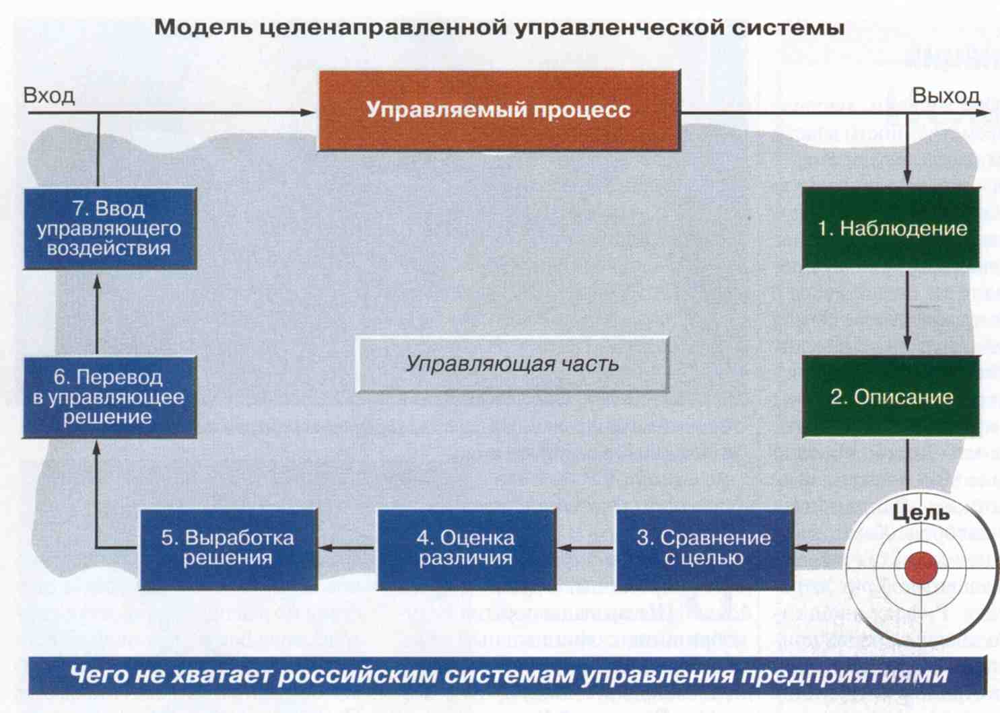

> **Первичный текст.** Культура административной деятельности.
> Источник: `Культура административной деятельности.doc` sha256 `95b4e428ffe7d497…`; [страница на dotu.ru](https://dotu.ru/2004/09/10/20040910-culture_of_administrative_activity/).
> Автоматическая транскрипция DOC→Markdown; смысл и формулировки не правились.
> Контрольные суммы и статус проверки — в [NOTICE.md](../../NOTICE.md).
> Содержание передаёт позицию авторов; утверждения не верифицированы библиотекой.

---

## 2.4. Кадры решают всё

### 2.4.1. Обстоятельства\

общественной в целом значимости

Кадры решают всё. Кому не нравится это утверждение выдающегося управленца — большевика, государственника и хозяйственника — И.В.Сталина, тот может утешиться иной — откровенно рабовладельческой по её существу — формулировкой:

«Средства[^124] представляют собой ресурсы, принадлежащие компании «А». И хотя **РАБОТНИКИ** этой **КОМПАНИИ**, вероятно, **ЕЁ НАИБОЛЕЕ ЦЕННЫЙ РЕСУРС** (выделено нами при цитировании), тем не менее они (являются / не являются) ресурсом, подлежащим бухгалтерскому учёту. Подчеркните правильный ответ» (Роберт Н. Антони, профессор Школы бизнеса Гарвардского университета, «Основы бухгалтерского учёта», первое издание на русском языке, стр. 9)[^125].

Действительно, при всей очевидной значимости разнородной техники и технологий *во всех отраслях жизнеобеспечения нынешней цивилизации работают не деньги, не промышленное оборудование, не технологии и компьютерные программы, не мёртвое знание, запечатлённое в книгах, не инфраструктуры, а живые люди,* которые всем этим управляют или привносят в это свой (ручной или умственный) непосредственно производительный труд.

При этом подавляющее большинство продуктов и услуг, **необходимых для жизни индивида, семьи, государства в нынешней цивилизации**, таковы, что они не могут быть произведены в одиночку никем.

Их доброкачественное производство требует, чтобы не один десяток коллективов разных предприятий и учреждений работал слаженно: *«как один человек», который, как бы пребывая во множестве лиц, в одно и то же время выполнял бы в разных местах разные составные части общей им всем работы, и выполнял бы их с должным профессионализмом и добросовестно*.

Если этого нет, то — в зависимости от степени отклонения от этого идеала — почти все проекты и начинания оказываются, как максимум, неосуществимыми, а как минимум, качество их изполнения вызывает у потребителей и у части самих изполнителей нарекания. И в ряде случаев для того, чтобы проект рухнул, достаточно, чтобы кто-то один из нескольких тысяч причастных к нему работников совершил ошибку, которую не заметят или, заметив, не исправят другие сотрудники, либо чтобы кто-то один *недобросовестно, осознавая это, выполнил* свою часть общей всем работы.

Устранение вообще человека из системы производства и переход к полностью автоматизированному и роботизированному производству этой проблемы не решает, а только усугубляет её, поскольку:

- **во-первых**, во всём программном обеспечении работы автоматики, создаваемом коллективами, запечатлеваются не только достоинства, но также ошибки и пороки этих коллективов и составляющих их сотрудников;

- **во-вторых**, одно из принципиальных свойств большинства случаев применения автоматики состоит в том, что контроль правильности её функционирования и устранения её ошибок *в темпе течения автоматически управляемых (особенно скоротечных) процессов*[^126] со стороны людей большей частью невозможен.

Вследствие названных особенностей производственной базы современного общества **взаимоотношения руководителей и подчинённых, взаимоотношения работников одного иерархического статуса во всякий период времени на всякой фирме являются залогом её будущих как успехов, так и неудач**.

Соответственно наиболее разрушительным по отношению ко всякому коллективному делу является принцип руководства предприятием и его подразделениями, выражаемый общеизвестными поговорками: «я начальник — ты дурак, ты начальник — я дурак», «инициатива наказуема». Если такого рода психологическая атмосфера царит и поддерживается в коллективе «паханскими» и барскими замашками высших руководителей предприятия, то фирма обречена влачить жалкое существование вследствие того, что на ней выстраивается иерархия истинных дураков и прикидывающихся дураками «умников», порождающая должностную некомпетентность и саботаж на всех уровнях её управления. Это же касается и народного хозяйства в целом как системы, образованной множеством предприятий, управляемых на основе принципов, выраженных в этих поговорках[^127].

К сожалению, как показал ход реформ на территории СССР после 1991 г., директорский корпус в целом, за единичными изключениями, по отношению к возглавляемым ими коллективам проявил злоупотребления властью, вседозволенность и беззаботность. Директорский корпус и высшие должностные лица большинства предприятий, злоупотребляя должностным положением, подавляя и изгоняя недовольных, обогащались на переразпределении государственной собственности СССР, возомнив себя и своих родственников «солью земли» и истинными владельцами предприятий, — капиталистами в первом поколении.

Такое — практически повсеместное — отношение директорского корпуса и высших руководителей к подчинённым сотрудникам предприятий как к безправному рабочему быдлу, породило у очень многих людей в **коллективах, оказавшихся не способными организовать сопротивление разгулу барства и мафиозной вседозволенности директоров и высшей администрации предприятий,** стойкое нежелание *работать добросовестно*[^128]*.*

Реально во многих коллективах подчинённые тихо ненавидят или попросту презирают и игнорируют весь руководящий состав как людей порочных, на протяжении многих лет *систематически, нагло и безнаказанно* злоупотребляющих своим должностным положением.

И такая нравственно-психологическая атмосфера во многих[^129] коллективах предприятий — главный итог «оттепели», «застоя» и «демократических реформ» в России.

И соответственно, создание в коллективах нравственно-психологической атмосферы, мотивирующей добросовестный единоличный (индивидуальный) и коллективный труд, — главная проблема, которую необходимо разрешить на большинстве предприятий, для начала или возобновления их успешной общественно полезной работы, а тем самым — и для изчерпания общественно-политического кризиса российского общества в целом.

Это так, поскольку в сложившейся ныне нравственно-психологической атмосфере, будучи лишённым инициативной добросовестной поддержки окружающих, всякий личный профессионализм оказывается безплодным вне зависимости от того, каким высоким он бы ни был и к какой области деятельности он бы ни принадлежал.

Это касается профессионализма всех и каждого без изключения: начиная от профессионализма дворника или посудомойки и кончая профессионализмом действительно выдающихся деятелей науки, культуры и т.п. вплоть до главы государства.

Без разрешения проблемы *возсоздания* <u>нравственно-психологической мотивации к добросовестному труду в КОЛЛЕКТИВАХ</u> невозможно никакое общественное строительство: ни строительство коммунизма, ни строительство капитализма.

Если первое более или менее понятно хотя бы искренним сторонникам коммунизма, то сторонники возобновления капиталистического развития России в своём большинстве надеются решить все проблемы государственной политики и организации производства:

- подкупом — достаточно большие зарплаты тем, кто признан заправилами социальной системы «особо полезными» или *от кого так или иначе зависят многие люди и целые области деятельности общества, вследствие чего они могут эксплуатировать свою незаменимость и продавать себя по монопольно высоким ценам* (обе названные категории населения составляют привилегированное, искусственно “элитаризованное” меньшинство общества и отчасти «средний класс»);

- экономическим принуждением к труду — угроза потерять рабочее место при поддержании зарплаты на минимальном уровне для нелояльных и легко заменимых (они образуют большинство, практически полностью социально зависимое от государственной власти и финансово-хозяйственной власти ростовщической банковской мафии, директорского корпуса и слоя частных предпринимателей, чьи предприятия не могут обходиться без труда наёмного персонала);

- репрессиями в отношении элементов, *криминализированных самой системой вследствие того:*

<!-- -->

- *что культура, поддерживаемая системой, остановила и извратила личностное развитие большинства из них, по какой причине организация психики таких людей весьма далека от организации психики человека (носителя человечного типа строя психики), а так же и потому,*

- *что в системной структуре разноликого (дикого и высокоцивилизованного — изощрённого в средствах и способах) рабовладения нет места, достойного человека, по какой причине состоявшийся человек в ней — всегда преступник по отношению к принципам построения системы.*

Тем самым сторонники возобновления капитализма в России демонстрируют, что они безпросветно тупы и в конце ХХ — начале XXI века, — после всего исторического опыта человечества до и после 1917 г., — не в силах понять того, что ясно было высказано ещё Г.Фордом I в первой четверти ХХ века.[^130]

Вопреки этому среди «деловых людей» современной России довольно много дураков, которые хотели бы жить в обществе, состоящем из *«частных предпринимателей», обладающих неоспоримыми достоинствами,* с одной стороны, и с другой стороны, — из *наёмных сотрудников (включая и представителей государственной власти на всех её уровнях), таковыми достоинствами не обладающих, «комплексующих» по поводу своей очевидной неполноценности и потому в искреннем возхищении служащих своим “благодетелям”* — «частным предпринимателям» и безропотно сносящим все их дурацкие выходки и вседозволенность.

Но общество реальных людей отличается от такого рода вздорных мечтаний, следование которым обрекает на крах всякую социальную систему, которую пытаются подогнать под этот бредовый идеал, ублажая больное себялюбие и амбиции «частных предпринимателей», — в том числе и «россиянских», преуспевших на первом этапе реформ в постсоветской России в ходе становления своих фирм и присвоения себе общенародных государственных и кооперативно-колхозных предприятий СССР.

### 2.4.2. Задачи кадровой политики на предприятии\

и реальные возможности\

«отдела кадров» советского типа

Хотя всё, что было сказано в разделе 2.4.1 о нравственно-психологической мотивации людей к добросовестному труду в коллективах, большей частью характеризует общество в целом и неподвластно *психологическим службам предприятий*[^131]*, чьи сотрудники* в своём большинстве либо не видят этой проблемы, либо не смеют прямо указать на неё зарвавшимся высшим руководителям и владельцам фирм; хотя это всё и не входит непосредственно в проблематику внутрифирменного планирования в господствующем в обществе понимании его задач, но это — то, что необходимо отслеживать и учитывать, если и не во всех без изключения задачах планирования, то обязательно в задачах управления формированием профессионального состава и разпределением сотрудников предприятия по руководящим должностям на перспективу от 5 до 20 лет.

Если руководство предприятия не намеревается привести фирму к краху в ближайшие несколько лет для того, чтобы погреть руки не только на её приватизации (в чём многие преуспели в прошлом), но и на ликвидации, то во всякий период времени оно обязано думать о том:

- какие именно из всего множества видов деятельности и профессий являются ключевыми для достижения фирмой успеха в обозримом будущем;

- кто из приходящих и уже работающих на фирме *сотрудников персонально* способен освоить эти виды деятельности на высочайшем профессиональном уровне (либо уже владеет ими) для того, чтобы в обозримой перспективе:

<!-- -->

- возглавить руководство подразделениями фирмы, целевыми программами и направлениями работ, фирмой в целом в качестве профессиональных управленцев (администраторов, менеджеров, координаторов разнородных прикладных психологических практик и т.п.);

- кто, будучи *подчинёнными сотрудниками, а не руководителями (в силу принадлежности к определённым профессиональным группам)* и сохраняя этот статус и впредь, войдёт в «золотой фонд» специалистов фирмы[^132], чей высокий **профессионализм** (**а также и добросовестное отношение к труду в коллективе**) оказывает решающее влияние на становление и развитие её научно-технических или проектно-конструкторских школ, на производственную культуру, техническое и эксплуатационное совершенство выпускаемой фирмой продукции.

<!-- -->

- кто из потенциальных претендентов на руководящие должности, **обладая необходимыми профессиональными качествами**, при этом однако *обладает такими нравственно-этическими качествами, что в случае назначения их на руководящие должности, они породят в подчинённых им коллективах психологическую атмосферу, уничтожающую нравственно-психологическую мотивацию к добросовестному труду, а кадровую политику будут проводить на основе принципа угодничества лично перед ними или перед вышестоящими руководителями в ущерб развитию кадрового корпуса управленцев и формированию «золотого фонда» специалистов фирмы.* **ИМЕННО** **ПРЕТЕНДЕНТОВ, НЕСУЩИХ ТАКОГО РОДА НРАВСТВЕННО-ЭТИЧЕСКИЕ КАЧЕСТВА, В ПРИНЦИПЕ НЕДОПУСТИМО НАЗНАЧАТЬ НА РУКОВОДЯЩИЕ ДОЛЖНОСТИ**[^133].

Решение такого рода задачи <u>управления *обеспечением*</u> *предприятия высокопрофессиональными кадрами* соответственно его текущим и перспективным потребностям в специалистах разных, но определённых профилей подготовки, требует организации соответствующего учёта и классификации работающих на предприятии сотрудников.

Также необходим и анализ характера образования, получаемого детьми сотрудников фирмы, поскольку во многих случаях поддержание семейственных традиций работы на фирме способствует сплочённой работе её коллектива в преемственности поколений, поскольку создаёт в семьях сотрудников фирмы уверенность в завтрашнем дне. В укреплении семейственности на фирмах и создании фирмами систем социального обеспечения и обслуживания быта семей своих сотрудников — одна из причин японского «экономического чуда»: *японцы обошли конкурентов из других стран в создании нравственно-психологической мотивации добросовестного труда сотрудников.*

Однако из этой области поддержания кадровой политикой фирмы «трудовых династий» дóлжно изключить династическую преемственность должностей высшего руководства фирмой, должностей руководителей НИОКР и ведущих разработчиков образцов продукции.

Биологически и социально обусловленные закономерности наследования профессионально значимых показателей таковы, что на тысячу одарённых родителей, достигших реальных успехов в своей области деятельности, приходится на порядки меньшее количество детей и внуков, способных достичь тех же или бльших высот в той же или иной профессиональной области.

Именно по этой причине:

«Династическое наследование» должностей высших руководителей, руководителей НИОКР и ведущих разработчиков перспективных образцов продукции на фирме, стремящейся к устойчивому процветанию в обозримой перспективе, должно быть прямо запрещено её Уставом.

Нарушение этого принципа, даже оправданное профессиональными качествами тех или иных *претендентов персонально*, этически неуместно, поскольку, создав единичный прецедент, оно оказывает развращающее воздействие на коллектив и общество в целом:

- во-первых, такой прецедент создаёт предпосылки к тому, чтобы повлечь за собой формальное тиражирование «династического наследования» должностей высших руководителей, руководителей НИОКР и ведущих разработчиков без каких бы то ни было к тому оснований профессионального характера;

- во-вторых, достаточно широко разпространившееся формальное тиражирование «династического наследования» уничтожает стимул к добросовестному труду и профессиональному совершенствованию, подавляющего большинства сотрудников, поскольку они отказываются от профессионального роста, изходя из предубеждения (убийственно часто *по отношению к научно-техническому и общественно-экономическому прогрессу* оправдываемого жизнью), что их творческий созидательный потенциал не будет возтребован, поскольку все соответствующие должности всё равно будут заняты роднёй высшего начальства; или им придётся задаром работать на удовлетворение честолюбивых амбиций и алчности профессионально несостоятельных наследников высокого начальства, занявших свои должности по «династическому праву».

И то, и другое наносит прямой ущерб делу, чему наглядный пример научно-техническое отставание СССР, обусловленное в масштабах всего государства во многом кадровой политикой времён «застоя». Поэтому при разсмотрении проблемы в масштабах государства, также необходимы и меры защиты должностей высших управленцев, руководителей научных и проектно-конструкторских школ и ведущих разработчиков от «династического обмена» между собой разных предприятий и учреждений детьми и прочей роднёй высоких начальников.

Но унаследованная от СССР **система отделов кадров**, сохранившаяся на многих предприятиях почти что в не изменившемся виде, с её неувядаемой обеспокоенностью вопросами, подобными вопросам: о пребывании в годы Великой Отечественной войны самих сотрудников и их родственниках на временно оккупированной фашистами территории[^134]; о совершённых ими и родственниками поездках за границу; о наличии родственников за рубежом; о наличии загранпаспорта и т.п., — **не годится для решения задачи формирования на обозримую перспективу кадрового корпуса управленцев и «золотого фонда» подчинённых специалистов предприятия**[^135].

Главная причина этого состоит в том, что кадровые службы типа «советский отдел кадров» и их руководство большей частью стоят вне организационно-технологического процесса работы подавляющего большинства предприятий и только регистрируют приём и увольнения сотрудников, отпуска, больничные, прогулы без уважительных причин, общий стаж и тому подобные показатели, большей частью не имеющие отношения к задачам формирования корпуса управленцев и «золотого фонда» подчинённых специалистов, необходимых для успешной работы фирмы в будущем. То, чем заняты отделы кадров «советского типа», — необходимо, но к разсматриваемой задаче формирования кадрового корпуса предприятия на обозримую перспективу большей частью отношения не имеет.

Однако иного положения кадровые службы и не могут занимать в случае, если фирма не разработала «Стратегии предприятия», в которой освещён и вопрос о кадрах и соответственно которой они могли бы вести поиск готовых специалистов на стороне, организовывать подготовку и переподготовку сотрудников предприятия, анализировать перспективные потребности в резервировании и пополнении управленческого корпуса и «золотого фонда» специалистов предприятия, изходя из сложившейся возрастной и половой структуры и семейных обстоятельств соответствующих категорий сотрудников.

Но чтобы понять, как решать задачу формирования кадрового корпуса предприятия на перспективу, необходимо осветить вопросы взаимосвязи кадрового состава и процесса управления предприятием на продолжительных интервалах времени.

2.5. Полная функция управления,\

кадровый корпус и организационно-штатная структура предприятия

--------------------------------------------------------------

### 2.5.1. Полная функция управления: понятие и непонимание

Вопрос о формировании кадрового корпуса предприятия взаимосвязан с вопросом о построении его организационно-штатной структуры[^136] и вопросом о возможностях и целесообразности её изменения в настоящее время и в обозримой перспективе. По существу:

Вопрос о кадрах и вопрос об оргштатной структуре предприятия — два взаимно обуславливающих друг друга вопроса в организации процесса управления работой предприятия; *и в особенности — предприятия развивающегося, растущего*.

Однако в подавляющем большинстве случаев вопрос о планировании развития кадрового корпуса предприятия разсматривается в литературе вне его связи с принципами построения *организационно-штатной структуры предприятия,* *которая представляет собой один из инструментов управления предприятием;* а вопрос об обусловленности оргштатной структуры предприятия разнородными факторами, в том числе и возможностями кадрового обеспечения клеток штатного разписания живыми людьми, обладающими <u>необходимыми, **во-первых, личностными (прежде всего — нравственно-этическими) качествами** и, *во-вторых,* профессиональными качествами</u>[^137], — просто обходится молчанием, будто он вовсе не имеет никакого отношения к планированию[^138], вопреки тому, что отсутствие человека — носителя определённых личностных качеств, знаний и навыков — делает неработоспособной в качестве средства управления предприятием оргштатную структуру, архитектура которой соответствует желательной алгоритмике управления.

И хотя разсмотрение вопросов кадровой политики на предприятии изолированно от вопроса об оргштатной структуре отчасти допустимо в задачах текущего и краткосрочного планирования на предприятиях, успешно функционирующих в более или менее стабильных и экономически благоприятных для них условиях (в молчаливом предположении о неизменности оргштатной структуры в этих условиях), но в задачах стратегического долгосрочного планирования — такое недопустимо.

Дело в том, что организационно-штатная структура предприятия, наилучшим образом отвечающая исторически сложившимся особенностям жизни общества, всегда обусловлена двояко:

- **во-первых**, полной функцией управления по отношению к предприятию и соответствующей ей сетевой моделью, в которой выражается профиль предприятия (о профильной сетевой модели речь пойдёт в следующем подразделе);

- **во-вторых**, возможностями кадрового обеспечения.

И если высшие руководители предприятия не чувствуют этой двоякой обусловленности и не согласуют с нею свою административную деятельность, то они в большей или меньшей степени теряют управление предприятием, что влечёт за собой тот или иной ущерб как предприятию и его сотрудникам, так и обществу в целом.

«Полная функция управления» — термин **достаточно общей теории управления,** употребляемый по отношению к *определённому (во всех случаях)* объекту. Полная функция управления — это своего рода многовариантная матрица-сценарий объективно возможного управления (иначе говоря — пустая и прозрачная форма, наполняемая содержанием в процессе управления). Она включает в себя следующие преемственные этапы циркуляции и преобразования информации в процессе управления:

1.  Выявление и опознавание фактора среды, с которым сталкивается субъект-управленец.

2.  Формирование навыков разпознавания выявленного фактора на будущее.

3.  Формирование вектора целей[^139] управления в отношении данного фактора и внесение этого вектора целей в общий вектор целей своего поведения (самоуправления) на основе **решения задачи об устойчивости объекта управления в смысле предсказуемости его поведения в среде с учётом этого фактора**.

4.  Формирование концепции управления на основе **решения задачи об устойчивости объекта управления в смысле предсказуемости его поведения в среде** (предсказуемости в той мере, какой требует управление с заданным уровнем качества).

5.  Организация целесообразной управляющей структуры, несущей концепцию управления.

6.  Контроль (наблюдение) за деятельностью структуры в процессе управления, осуществляемого ею.

7.  Ликвидация структуры в случае ненадобности или поддержание её в работоспособном состоянии до следующего изпользования.

Пункты 1 и 7, как определяющие начало и завершение процесса управления, всегда неизбежно присутствуют, а промежуточные между ними пункты можно так или иначе объединить или разбить ещё более детально. Осуществление полной функции управления *всегда* предполагает **инициативу и творчество** людей в выявлении и разрешении разнородных проблем, как непосредственно относящихся к их должностным обязанностям, так и выходящих за их круг, что требует, чтобы разум не был скован каким-либо догматизмом и не находился в плену какой-либо предубеждённости.

На первый взгляд может показаться, что понятие <u>полной функции управления</u> — очевидное, само собой разумеющееся понятие, и здесь по существу не о чем говорить. Но есть одно — *ключевое по отношению ко всем процессам управления* — обстоятельство, на которое вряд ли обратило внимание большинство читателей настоящей работы, и которому не уделяют должного внимания подавляющее большинство авторов, пишущих на темы управления и планирования.

Чтобы пояснить, о чём далеко не банальном идёт речь, прокомментируем рисунок из журнала «Эксперт», № 28, 2000 г., которым иллюстрируется одна из статей, посвященных проблемам российской экономики на уровне предприятия.

На первый взгляд нижеследующий рисунок прекрасно иллюстрирует понятие полной функции управления по отношению к предприятию. А терминологические отличия в наименовании этапов полной функции управления, *приведённые нами согласно достаточно общей теории управления, с одной стороны,* и с другой стороны, помещённые на приведённом рисунке, — казалось бы непринципиальны и управленчески незначимы.

Однако это только на первый взгляд. В действительности приведённый рисунок является показательным примером безсодержательного подхода к описанию процессов управления как таковых, поскольку *КЛЮЧЕВАЯ* *ПРОБЛЕМАТИКА управления, разрешение которой в обстоятельствах реальной жизни только и позволяет организовать процесс управления (самоуправления),* осталась в схеме, приведённой на рисунке, не отображённой. Дело в том, что:

Никакое управление невозможно, если нет устойчивости объекта в смысле предсказуемости его поведения под воздействием среды, его внутренних изменений и факторов, которые возможно избрать (или которые уже избранны) для осуществления управляющего воздействия.

И это — главное, что определяет как **принципиальную невозможность** осуществления управления, так и **принципиальную возможность** его осуществления. Именно поэтому устойчивость в смысле предсказуемости поведения — ключевое обстоятельство к вхождению во всякий процесс управления, *в том числе — и в управление предприятиями народного хозяйства всех форм собственности и их подразделениями*. А всякое управление разрушается сразу же, как только по тем или иным причинам изчезает устойчивость объекта в смысле *предсказуемости его поведения (в той мере, которая необходима для поддержания управления с заданным качеством)*.

**Однако в литературе, посвящённой проблематике теории и практики управления, необходимость предсказуемости поведения объекта для обеспечения управления им, как правило, подразумевается по умолчанию.** То есть необходимость предсказуемости поведения для обеспечения управления объектом вводится в разсуждения авторов в неявном виде; а внимание читателей сосредотачивается на теоретических и *физических (экспериментальных)* моделях, *как уже доказано практикой их применения,* позволяющих решать задачу о предсказуемости поведения объекта в определённых задачах управления, свойственных той отрасли деятельности, которую разсматривают авторы.

В большинстве технико-технологических приложений теории управления этого оказывается достаточно просто в силу примитивности даже наиболее сложных технических объектов в их сопоставлении с системой внутренних и внешних взаимосвязей общества в целом и его подсистем, к числу которых принадлежат объекты и субъекты экономики микро- и макро- уровней. Поэтому в приложении разнородных версий теории управления к проблематике обществоведения, включая производственно-потребительские и финансовые аспекты жизни общества и функционирования предприятий народного хозяйства всех форм собственности, такой подход обладает ограниченной работоспособностью главным образом по двум причинам:

- во-первых, и *это главное,* сами претенденты в управленцы, если они *непосредственно* сталкиваются с вопросом о предсказуемости поведения объекта в среде в процессе управления, в большинстве своём не готовы к решению этой задачи потому, что в учебно-методической литературе по теории управления и её прикладным версиям (в частности менеджменту) этот вопрос обычно обходится стороной или же его осуществлённое некотором образом решение по отношению к каким-то конкретным задачам вводится в разсуждения по умолчанию *как объективная данность*.

- во-вторых, попытка опереться на формально-теоретические модели социологии и экономики, построенные на весьма ограниченном количестве факторов[^140], также не всегда достигает успеха, поскольку эти модели в общем случае разсмотрения представляют собой языковое выражение моделирования общественных и финансово-экономических процессов на глубинных уровнях психики самих разработчиков формальных моделей.

  Такого рода моделирование на глубинных уровнях психики разработчиков формально-теоретических моделей протекает в субъективных образах, свойственных личности каждого из них, и кроме того оно обусловлено личностными особенностями организации их психики[^141]. При этом в творчестве разработчиков моделей участвуют и субъективные образы тех жизненных явлений и управленчески значимых факторов, для отображения которых в культуре общества может не быть адекватных формальных средств[^142], но которые обуславливают успешность или безуспешность применения получаемых формальных моделей к решению определённых задач.

- в-третьих, многие формальные модели в силу разных причин (в том числе и вследствие методологических ошибок при их построении) метрологически несостоятельны, т.е. некоторая часть изходных данных, необходимых для их работы, не может быть объективно измерена и вводится в них в процессе применения на основе метода «экспертных оценок».

  При этом в жизни могут возникать обстоятельства, в которых модель могла бы дать правильный ответ на основе мнений какого-то одного или нескольких экспертов. Но именно эти мнения в неё не попадут потому, что будут отброшены «ситом» аппарата математической статистики и теории вероятностей как *якобы ошибочные, поскольку они далеко выпадают из общей статистики более или менее «близких» (в некотором смысле) мнений других экспертов*[^143].

Поэтому попытка субъекта-управленца опереться в своих действиях на ту или иную прикладную теорию, описывающую предметную область его сферы управления, путём подстановки своих изходных данных в свойственные теории формальные модели, в ряде случаев может оказаться неадекватной реальным обстоятельствам. В такого рода случаях в общем-то работоспособная формальная модель общественных и финансово-экономических процессов может непредсказуемо для её пользователей утрачивать работоспособность. Причина этого в том, что реальный процесс управления может быть чувствительным не только к параметрам, вводимым в формальную модель на основе метода «экспертных оценок», но может быть чувствительным и к факторам, не отображённым в ней.

Кроме того сам процесс управления *всегда и во всех случаях, без каких-либо изключений* может осуществляться *только* в соответствии с не зависящей от субъекта-управленца объективной матрицей-сценарием объёмлющего управления, представляющей собой также полную функцию управления, но иерархически высшую по отношению к разсматриваемому процессу. **Соответственно для успешного осуществления управления разсматриваемым процессом должна быть изначально гарантирована его устойчивость в русле течения совокупности объёмлющих его процессов**[^144].

Вследствие этих обстоятельств во многих процессах управления (и прежде всего, в из ряда вон выходящих задачах управления) решение задачи об устойчивости в смысле предсказуемости поведения объекта управления с погрешностью, безопасной для осуществления управления, может основываться не на теориях и формальных моделях, а на разнородных психологических практиках и личностной культуре психической деятельности — т.е. на субъективизме конкретных людей.

При этом возможность освоения тех или иных психологических практик и решения задачи о предсказуемости поведения на их основе обусловлена реальной нравственностью субъекта вследствие того, что реальные нравственные мерила субъекта управляют всей алгоритмикой его психики[^145].

То есть в каких-то ситуациях решение задачи о предсказуемости поведения объекта в процессе предполагаемого управления может быть полностью обусловлено личностными факторами, и прежде всего, — реальной нравственностью самих управленцев, претендующих по существу на управление по полной функции. Но именно этими обстоятельствами социология и экономическая наука как макро-, так и микро- уровней большей частью неоправданно пренебрегают.

Сказанное об устойчивости по предсказуемости поведения объекта управления по отношению к приведённому рисунку из «Эксперта» означает следующее:

- наблюдение и описание взаимодействия объекта управления со средой безполезно, если на основе полученного описания-модели **невозможно** решение задачи о предсказуемости <u>*многовариантного* поведения</u> объекта в среде под воздействием среды, внутренних процессов в объекте и факторов, избранных для осуществления управляющего воздействия;

- в условиях непредсказуемого поведения объекта **невозможно** целеполагание (на рисунке обозначено изображением стрелковой мишени с надписью «цель»), поскольку невозможно разделение всего вообразимого множества предполагаемых целей управления:

<!-- -->

- на цели объективно осуществимые (достижимые), и на цели иллюзорные (мнимые);

- на цели не осуществимые в сложившихся обстоятельствах и при имеющихся ресурсах, но осуществимые в каких-то иных обстоятельствах или при ином обеспечении ресурсами (т.е. которые могут быть осуществлены в два этапа: на первом этапе — создание или ожидание необходимых обстоятельств и привлечение достаточных ресурсов, на втором — собственно осуществление избранных целей);

<!-- -->

- в условиях отсутствия устойчивости объекта в смысле предсказуемости поведения **невозможны** ни выработка целесообразных управленческих решений, ни их осуществление.

Соотнесение рисунка с определением понятия полной функции управления и с вопросом о предсказуемости поведения объекта управления показывает, что **при описании процессов управления,** — а тем более **при описании методологии управления, — терминология должна быть предельно точной по смыслу. Т.е. всё должно называться своими именами: описания — описаниями, прогнозирование (по существу решение задачи о предсказуемости поведения) — прогнозированием и т.д.** И это является основой *для однозначного понимания* всех без изключения проблем управления как технико-технологического, так и общественного и финансово-экономического характера, а также и способов их разрешения *в конкретных жизненных обстоятельствах*.

Невнятная, разплывчатая, не определённая по смыслу терминология, подобная той, что употреблена на приведённом рисунке из «Эксперта»[^146], влечёт за собой и «невнятное», вялое, разплывчатое «управление», а также — и внутренне конфликтное управление, в котором одни действия направлены против достижения успехов другими действиями, и т.п. Это всё может вызвать катастрофу управления как «взрывного» и лавинообразного, так и «вяло текущего» характера с заблаговременно непредсказуемыми последствиями.

Результат осуществления такого рода «управления» В.С.Черномырдин, в бытность свою премьер-министром РФ, некогда охарактеризовали словами: *«Хотели, как лучше, а получилось, как всегда»*[^147]. Почему получилось, «как всегда» плохо, — можно понять из другого высказывания В.С.Черномырдина, смысла которого он не понял и сам: *«Я бы с удовольствием доложил программу действий до 3000 года (редкие хлопки в зале), но сначала надо решить, что делать сейчас»* (из выступления 27 марта 1993 г. на девятом внеочередном съезде народных депутатов РСФСР[^148]).

Если соотнести это высказывание с понятием о полной функции управления, то ясно: не решив задачу об устойчивости в смысле предсказуемости и не сформировав долгосрочную концепцию управления (политическую стратегию государства), никак невозможно целесообразно решить, «что делать сейчас». Однако показательны не только эти высказывания В.С.Черномырдина сами по себе и невнятная реакция на них аудитории, но и мировоззренческая подоплёка такого рода высказываний.

24 октября 1996 г. «Независимая газета» опубликовала на первой полосе статью “Грядущая катастрофа и как с нею бороться? Вслед за Лениным на этот вопрос попытались ответить Чубайс и Черномырдин”. В ней сообщается о первом заседании Временной чрезвычайной комиссии (ВЧК) по сбору налогов в бюджет[^149], на котором В.С.Черномырдин высказал ещё одну *эпохальную* фразу: *«Теорией нам сейчас заниматься некогда».*

Из последней фразы встаёт характеристика всей послесталинской эпохи как *эпохи беззаботности, безответственности и рвачества, сложившихся на основе <u>агрессивного невежества, которое вытеснило заботливость и профессионализм из всех отраслей деятельности на протяжении активной жизни двух поколений</u>*.

Действительно: *«сейчас»* чиновникам государства, бизнесменам, руководителям предприятий и их подразделений «некогда» заниматься теорией (причём в обоих аспектах: создавать новые теории и осваивать теоретические наработки других людей); *«в прошлом»* им тоже было «некогда» заниматься теорией; но и *«в будущем»* им тоже будет «некогда» заниматься теорией потому, что они — безвольные «тряпки», одержимые, постоянно порабощённые разнородной суетой, в которой наиболее ярко выражается их несдерживаемое желание *хапнуть прямо сейчас и побольше*[^150]*.*

**Если** же *чиновники, бизнесмены, руководители предприятий и их подразделений* **сами не находят времени, чтобы подзаняться теорией,** то это означает, что *они — марионетки, т.е. биороботы* неких практикующих теоретиков-социологов и обладателей практически эффективных «know-haw», которые сами остаются вне опосредованно управляемых ими процессов, и для кого общество является объектом, на котором они паразитируют.

Однако и редакция «Эксперта», и подавляющее большинство его читателей не лучше чиновников и бизнесменов, поскольку «съели» пустое словоблудие оторвавшихся от жизни «теоретиков» *на темы об организации управления предприятиями России наилучшим образом,* которым сопровождается приведённый нами рисунок. Это показывает, что общество наше, и прежде всего, — научная и управленческая “элита”, которая сама для себя издаёт «Эксперт», — управленчески безграмотны. И при этом в обществе нет и теоретически не формализованной культуры управления на основе практических навыков[^151].

Соответственно положение дел в стране при сохранении такого агрессивно невежественного отношения к теории управления и её приложениям к разрешению проблем общественной жизни может только усугубляться, а вожделенные практические результаты (хотим как лучше) будут недостижимы по причине отсутствия *удобопонимаемого* теоретического описания алгоритма возникновения и поддержания кризиса и путей выхода из него.

Иными словами, вне зависимости от того, что произходит «сейчас», необходимо найти время, чтобы *<u>«прямо сейчас» заняться теорией</u>*, — это единственная возможность *выйти из кризиса, если не «завтра», то «послезавтра»,* избежав тем самым катастрофы.

В таких условиях выход из затяжного кризиса управления, который мы переживаем, возможен в наименее болезненной форме, прежде всего, через освоение *жизненно состоятельной* достаточно общей теории управления предельно широкими слоями общества, поскольку именно теория управления — язык междисциплинарного общения, обеспечивающий взаимопонимание в общем коллективном деле специалистов разных областей.

И в данном случае теория — стимулятор роста в обществе <u>культуры управления как таковой</u> на всех уровнях: от управления подразделениями предприятий до управления государством и процессами глобальной политики[^152]. А нам — *для осуществления безкризисного развития*[^153] *—* необходимы не пустые слова о необходимости организации управления и сопровождающие их принципиально не стыкуемые с реальной жизнью схемы осуществления «менеджмента», а дееспособная культура управления, устойчиво возпроизводимая и совершенствуемая обществом в преемственности поколений.

### 2.5.2. Объективная обусловленность оргштатной структуры и субъективизм руководства

После того, как в разделе 2.3.2 мы разсмотрели *членение* больших работ (проектов) на составляющие их фрагменты, *<u>необходимо обусловленное</u> возможностью дискретного контроля хода работ и их этапов по факту «выполнено — не выполнено»* и в предшествующем разделе определились в существе полной функции управления, открывается очевидность следующего факта:

Полная функция управления и профильный для предприятия характер его технико-технологической деятельности диктуют:

- управленчески состоятельное разпределение функциональной нагрузки по подразделениям предприятия;

- взаимосвязи функционально специализированных подразделений предприятия друг с другом;

- обязанности и полномочия их руководителей;

- а также и *всё то в организации работ, что способно обеспечить достижение наивысших показателей эффективности деятельности в управлении фирмой,* которые должны быть определены в «Стратегии предприятия».

При этом:

«Профиль фирмы» находит своё выражение в том, что обусловленные принятыми технологиями сетевые модели большинства выполняемых фирмой проектов и договорных работ при какой-то избранной степени детализации обладают тождественной или во многом сходной структурой, отличающей их от построенных аналогичным путём сетевых моделей предприятий других отраслей.

Сетевые же модели работ, *сопутствующего и дополняющего характера*[^154] *(а также эпизодического, т.е. «непрофильного»),* нормально составляющие меньшую долю объёма работ в деятельности предприятия, представляют собой какие-то фрагменты того типа *обобщённой сетевой модели, в которой выражается «профиль предприятия»* (далее эта модель называется «профильная сетевая модель»); при этом в них могут быть фрагменты, выходящие за границы профильной сетевой модели, которые однако не обладают самостоятельной значимостью (т.е. экономической жизнеспособностью).

Реально на большинстве предприятий, которые обладают *историей, продолжительностью подчас в несколько веков,* и которые успели ещё в далёком прошлом специализироваться на выпуске каких-то определённых видов продукции, профильная сетевая модель остаётся почти неизменной на протяжении многих лет. Причина этого в том, что профильная сетевая модель обусловлена технологиями, основной набор которых на большинстве специализировавшихся и успешно работающих предприятий меняется достаточно медленно.

На таких предприятиях как бы «сама собой» на протяжении длительного времени успевает сложиться технологически обусловленная оргштатная структура, определяющая, прежде всего, тот или иной *порядок* *(направленность) подчинения и ответственности руководителей подразделений в иерархии административного состава предприятия*. Сложившаяся таким путём оргштатная структура многих предприятий в большинстве случаев достаточно хорошо «автоматически» соответствует профильной сетевой модели и полной функции управления[^155], вследствие чего на основе «естественно-исторически» сложившейся оргштатной структуры и дело на них идёт — как бы «само собой» — более или менее успешно некогда заведённым и унаследованным от прошлого порядком.

Кроме того в периоды экономического подъема обществ на вновь организуемых предприятиях оргштатные структуры в подавляющем большинстве случаев принимались и принимаются по образцу оргштатных структур, которые уже успели в деле доказать свою управленческую эффективность на более старых предприятиях тех же отраслей. Поэтому в периоды общественно-экономической стабильности и подъёма и на вновь создаваемых молодых предприятиях дело тоже идёт более или менее успешно как бы «само собой» на основе традиционных типов оргштатных структур, сложившихся в отрасли.

Длительность процесса «естественно-исторического» формирования и настройки оргштатных структур предприятий в отраслях и принятие оргштатных структур для новых предприятий в периоды общественно-экономической стабильности и подъёма по готовому образцу-прототипу, уже доказавшему свою работоспособность, приводит к тому, что **характер обусловленности оргштатной структуры делом (в формальном выражении дела — профильной сетевой моделью) и полной функцией управления остаётся в целом не выявленным и не осознаётся ни администраторами, ни экономической наукой**.

Вследствие этого множественные и разнообразные проблемы, прямо или косвенно связанные с оргштатными структурами предприятий, возникают, когда под давлением тех или иных обстоятельств многоотраслевая производственно-потребительская система общества в целом или некоторые отрасли народного хозяйства оказываются перед необходимостью быстрой[^156] структурной перестройки[^157] или технико-технологического обновления. При этом некоторая часть существующих предприятий изменяет свой профиль, произсходит множественное образование новых[^158] предприятий с нуля, слияние ранее существовавших самостоятельных предприятий, разпад ранее целостных предприятий на несколько новых самостоятельных предприятий, выделяющихся из состава первичных.

Такого рода множественные процессы в производственно-потребительской деятельности общества характеризуются *в разсматриваемой нами области управления предприятием* тем, что во многих случаях неоткуда взять готовый к изпользованию прототип-образец оргштатной структуры, на основе которого новое или реорганизованное предприятие могло бы *заведомо* успешно работать. И соответственно, в таких обстоятельствах их руководители непосредственно сталкиваются с технико-технологическим диктатом самого дела и общественно-экономических процессов как в пределах самого предприятия, так и процессов, объёмлющих деятельность предприятия, а также и с диктатом *полных функций управления разного иерархического уровня (по отношению к администрации предприятия) и разного произхождения*.

После государственного краха СССР государственно обособившиеся общества, выделившиеся из состава СССР, переживают как раз такой период, в котором администрация предприятий непосредственно сталкивается с жизнью.

Однако вузовские курсы типа «организация производства» и «организация НИОКР» советской эпохи, а также и аналогичные им по разсматриваемой проблематике курсы разнородного «менеджмента», импортированные с Запада в постсоветскую эпоху, по существу не дают читателю понимания того, что оргштатная структура по своему предназначению и существу представляет собой один из инструментов управления делом (управления предприятием).

Соответственно в них не разсматриваются и вопросы:

- поддержки оргштатной структурой предприятия *алгоритмики собственно технологического процесса* (включая и взаимодействие со смежниками и субподрядчиками), которая выражается в профильной сетевой модели предприятия;

- поддержки оргштатной структурой предприятия *алгоритмики процесса управления как такового (т.е. разсматриваемого изолированно от технологических процессов предприятия),* свойственной во всех отраслях всем без изключения достаточно большим предприятиям, на которых работа в структурных подразделениях разного рода (включая и чисто управленческие) выполняется на профессиональной основе разными специалистами большей частью без совместительства должностей[^159];

- включения оргштатной структурой предприятия *алгоритмики собственно технологического процесса* в *алгоритмику процесса управления как такового.*

Однако именно жизненно состоятельное решение на практике именно этих вопросов порождает *управляемость* *предприятия как замкнутой системы*[^160] структурным способом[^161].

Слепота экономической науки и теорий менеджмента к указанной совокупности вопросов — одна из причин того, что оргштатная структура не возпринимается многими руководителями в качестве одного из инструментов управления делом (управления предприятием).

С другой стороны, об этом функциональном предназначении оргштатной структуры вполне можно догадаться и самостоятельно без того, чтобы искать готовые рецепты для решения специфических проблем выживания и развития своих предприятий в вузовских курсах «организации производства» советской эпохи или в импортированных с Запада новомодных теориях разнородного менеджмента.

Но, как признался В.С.Черномырдин, чиновникам (а также бизнесменам) в их большинстве некогда изучать и вспоминать теории. Думать же самостоятельно они далеко не все умеют и не всегда того желают, поскольку в толпо-“элитарном” обществе их изполнительность, а не их творчество в разрешении возникающих проблем обеспечивает им как спокойное существование при должности, так и дальнейшее продвижение по служебной лестнице. Поэтому, если такие администраторы (а их, к сожалению, большинство) пытаются решать возникающие проблемы своим умом, то часто совершают ошибки, в том числе и системообразующего характера.

Одну из наиболее тяжёлых управленческих ошибок системообразующего характера, произтекающую из невозприятия *оргштатной структуры как таковой* в качестве инструмента управления, представляют собой попытки многих администраторов в разных областях деятельности управлять делом (в том числе и управлять предприятием) на основе формирования так называемой «своей команды».

В *«свою команду» в худшем смысле этого термина* людей подбирают по их личностным качествам. Главные из них — личная преданность «старшóму» и *изполнительность без вопросов и возражений,* вследствие чего на последнем месте в иерархии требований к членам «своей команды» оказываются их реальные профессиональные знания и навыки. И тем более после знаний и навыков оказываются *способности, от возможности реализовать которые в деле зависит будущее фирмы:*

- осваивать недостающие знания и навыки в темпе вхождения в новые должности и принятия на себя обязанностей и полномочий, соответствующих новым должностям[^162];

- творчески разрешать проблемы, с которыми сводит дело (в том числе и организовывать разрешение проблем на основе коллективной деятельности).

При этом внутри «своей команды» выстраивается некоторая иерархия личностных отношений и *система «союзов» и «противовесов», в которой выражается принцип «разделяй и властвуй»*. Положение усугубляется тем, что в целях поддержания и изменения «баланса сил» в системе союзов-противовесов в оргштатной структуре предприятия *под членов команды персонально* создаются должности и подразделения, в существовании которых реально нет функциональной необходимости: ни производственной (включая и НИОКР), ни управленческой; либо функциональная нагрузка которых и должностные полномочия их руководителей, перепутаны как по характеру соответствия блокам профильной сетевой модели, так и по порядку следования в полной функции управления.

Поэтому принцип построения «своей команды» как иерархии личностных отношений в системе союзов-противовесов приводит к тому, что порядок взаимодействия подразделений, подчинённых членам «своей команды», перестаёт соответствовать профильной сетевой модели предприятия; а технологически обусловленная профильная сетевая модель и *сетевая модель взаимодействия чисто управленческих подразделений в процессе управления предприятием*[^163] оказываются взаимно не обусловленными (не связанными друг с другом), т.е. в реальной жизни оказываются неизбежно конфликтными, как по поводу ведения дела (управления им), так и по поводу личной неприязни членов «своей команды».

Однако даже при господстве на предприятии такого рода «командного подхода» к организации управления некоторое соответствие должностных полномочий (профиля деятельности) членов «своей команды» функциональной специализации подконтрольных им подразделений неизбежно сохраняется. Произходит это потому, что члены «команды» обычно всё же являются выходцами в сферу управления из каких-то определённых областей неуправленческого профессионализма, а большинству людей психологически свойственно избегать брать на себя управление делом, существа которого они не знают[^164].

Но вопреки этому «остаточному профессионализму» при подходе к организации процесса управления предприятием на основе описанного принципа «своей команды» *производство и НИОКР как таковые,* грубо говоря, «мешают жить» членам «команды» администраторов предприятия, а сама «команда» администраторов действительно *мешает жить* персоналу предприятия, производству, НИОКР, потребителям продукции предприятия и обществу в целом.

При таком подходе к *ОРГАНИЗАЦИИ управления* предприятием и его подразделениями «команда» обособляется от остального коллектива и противопоставляет себя ему: замыкается в себе, а остальных сотрудников, подчас обладающих более высокими профессиональными знаниями и навыками, необходимыми для решения задач управления и задач, подчинённых задачам управления предприятием и его подразделениями, пытается более или менее успешно «употреблять» в качестве якобы бездушных орудий-инструментов, все качества которых определены их местом в штатном разписании и тарифно-квалификационным справочником, или, *непрестанно* подавляя их нравственно-психологически, сделать из сотрудников безропотно-покорных холопов.

В результате этих особенностей принцип «своей команды» в попытках *организации процесса управления* на его основе приводит к тому, что:

- объект — в разсматриваемом нами случае это предприятие — утрачивает *управляемость (как свойство замкнутой системы)* вследствие того, что оргштатная структура предприятия не разценивается его руководством как инструмент управления и в процессе “подстройки” её под «свою команду» перестаёт соответствовать профильной сетевой модели и полной функции управления делом;

- «своя команда», построенная на систематических нарушениях нравственно-этических норм человеческого общежития, *не способна управлять ничем,* поскольку способ её существования — борьба за продвижение своих членов на должности с более высокими окладами или должности, престижность которых выражается в каких-то иных формах, а первой жертвой борьбы за место в «команде» становится именно организация процесса управления.

Вследствие этого неукоснительное проведение в жизнь принципа «своей команды» в экономически благополучном обществе становится залогом неизбежного краха подвластной этому принципу фирмы в более или менее отдалённом будущем. А если стремление администраторов управлять на основе принципа «своей команды» становится достаточно широко разпространённым явлением в обществе, то всё общество обречено на затяжной кризис управления (что и имеет место в России на протяжении всего времени с начала перестройки в 1985 г.).

Иными словами, несостоятельность попыток управления чем-либо на основе принципа «своей команды» — один из ярких примеров того, что диктат полной функции управления делом и самого дела носит объективный по отношению к управлению характер, и этот диктат невозможно обойти окольными путями.

От этого диктата невозможно избавиться, поскольку даже со сменой профиля фирмы диктат одного дела неизбежно сменится диктатом другого дела. Но чем более глухо к этому диктату высшее руководство фирмы, — тем дальше управление фирмой от возможного наилучшего (с точки зрения общественной пользы, а не с точки зрения осуществления паразитических интересов участников «своей команды») в данных обстоятельствах[^165]. И соответственно необходимо видеть и понимать:

- в чём и как диктат полной функции управления и самго дела выражается,

- и как оргштатная структура должна приводиться в соответствие с его требованиями.

С построением оргштатной структуры связано ещё одно управленчески значимое обстоятельство, которому также необходимо подчиниться для обеспечения работоспособности оргштатной структуры предприятия в качестве инструмента управления. Дело в том, что, хотя управленческое решение может вырабатываться и приниматься к изполнению как единолично, так и коллективно, но:

**При проведении в жизнь любого принятого к изполнению решения ответственность за его выполнение может быть только персональной и *единоличной*.**

И персонально возлагаемая *единоличная* ответственность — помимо профессиональных знаний и навыков, личностных нравственно-психологических и этических качеств — *должна быть обеспечена как объективными возможностями выполнения решения, так и предоставленными субъекту-управленцу должностными полномочиями, позволяющими воплотить в жизнь объективные возможности*.

Принцип персональной единоличной ответственности за осуществление принятых к изполнению решений необходимо неукоснительно соблюдать и в тех случаях, когда объём работы по проведению решения в жизнь превозходит возможности одного человека и требует согласованной работы множества людей, как это имеет место во всех отраслях народного хозяйства на подавляющем большинстве предприятий и в их подразделениях.

Казалось бы здесь нет предмета для обсуждения, поскольку очевидно и общепринято, что во всяком подразделении может быть только один начальник, который, естественно, и несёт персональную единоличную ответственность за деятельность этого подразделения перед вышестоящими руководителями[^166]. Но в практике управления предприятиями осуществление принципа персональной единоличной ответственности состоит не в том, чтобы во главе всякого подразделения поставить одного-единственного начальника, а в том, как работы, в совокупности составляющие профильную сетевую модель, разпределить между подразделениями предприятия (т.е., как блокам профильной сетевой модели поставить в соответствие подразделения предприятия и управленчески связать подразделения друг с другом в соответствии с полной функцией управления делом).

Иными словами осуществление принципа персональной единоличной ответственности состоит в *заблаговременном (упреждающем события)* нахождении работоспособного ответа на вопросы:

- что именно включить в функциональную нагрузку каждого подразделения (иными словами: какие именно функционально специализированные подразделения необходимы для поддержки оргштатной структурой работ по профильной сетевой модели);

- как и чем обеспечить возможности несения подразделениями возлагаемой на каждое из них функциональной нагрузки (необходимы: сооружения, технологическое оборудование, документация и «ноу-хау» технологических процессов, кадры и т.п.);

- как связать подразделения друг с другом так, чтобы должностные полномочия их руководителей и сотрудников соответствовали профильной сетевой модели, а оргштатная структура, *получив кадровое насыщение (включая и штат руководителей подразделений),* стала бы одним из инструментов управления предприятием по полной функции.

Поскольку во главе всякого подразделения действительно может стоять только один единственный начальник, то в *разрешении названных проблем на практике* и состоит искусство разпределения персональной единоличной ответственности за дело в целом и за его составляющие.

Без такого рода разпределения персональной единоличной ответственности управление коллективной деятельностью людей невозможно, вследствие чего оказывается невозможным и осуществление больших проектов ни в бизнесе, ни в политике, ни в какой бы то ни было иной области деятельности.

И соответственно сказанному ранее:

К разпределению персональной единоличной ответственности, должностных обязанностей и полномочий руководителей подразделений необходимо подходить, начиная не от оргштатной структуры, уже как-то сложившейся на предприятии или избранной в качестве образца для подражания[^167], а **к оргштатной структуре *— для обеспечения её соответствия требованиям настоящего времени и обозримой перспективы —* необходимо идти, соотносясь с полной функцией управления делом, начиная:**

- **от выявления профильной сетевой модели, т.е. от образующих её во взаимосвязи друг с другом рубежей дискретного контроля по факту «выполнено — не выполнено»,**

- **от наличествующих кандидатур на занятие *должностей руководителей подразделений (прежде всего)* в предполагаемой оргштатной структуре.**

И естественно, что после построения целесообразно работоспособной оргштатной структуры необходимо в дальнейшем поддерживать взаимное соответствие в системе *«дело, которым живёт фирма, — профильная сетевая модель — люди — полная функция управления — оргштатная структура»*.

2.6. Взаимное соответствие в системе\

«дело — профильная сетевая модель —\

люди — полная функция управления —\

оргштатная структура»

-------------------------------------

Но прежде, чем излагать принципы, обеспечивающие взаимное соответствие компонент в названной системе процессов, повторим кратко кое-что из сказанного ранее, обращая внимание на взаимосвязи компонент этой системы, а не на суть самих компонент.

\* \* \*

Жизнь фирмы охватывает продолжительные интервалы времени, во многих случаях превозходящие продолжительность жизни людей. На протяжении этих интервалов времени дело, которым занята фирма, представляет собой совокупность работ (проектов), каждая из которых по отношению к задачам управления фирмой характеризуется моментом её начала и моментом её завершения. Эти события — начала и завершения каждой работы — наличествуют в сетевых моделях всех без изключения работ, и ими (при привязке к реальным датам) идентифицируется в процессе управления предприятием всякая работа в потоке его деловой активности.

Членение каждой из работ на более или менее самостоятельные этапы и фазы, из которых складывается работа в целом, обусловлено как используемыми на предприятии технологиями, так и возможностью дискретного контроля в отношении всякого этапа работы и работы в целом по факту «выполнено — не выполнено».

Такое членение необходимо для планирования работы коллектива предприятия и обеспечения управления им в ходе выполнения плана и позволяет всякую работу представить графически в виде сетевой модели. Поток работ в деловой активности фирмы в этом случае предстаёт как последовательность сетевых графиков, соответствующих конкретным работам, хронологический сдвиг начал и завершений которых друг относительно друга определяется при оптимизации плана работ, изходя из динамики высвобождения производственных мощностей и критериев *эффективности деятельности* фирмы (критерии эффективности деятельности фирмы должны быть определены в «Стратегии предприятия»).

На основании множества сетевых моделей *работ, образующих в совокупности дело, которым живёт фирма*[^168]*,* можно построить профильную сетевую модель предприятия.

Оргштатная структура предприятия должна выражать принцип персональной единоличной ответственности: за дело фирмы в целом; за каждую из работ в потоке деловой активности фирмы; за каждую из составляющих всякой работы. И соответственно принципу *персональной единоличной ответственности* в смысле этого термина, определённом в конце предъидущего раздела, во главе всякого подразделения предприятия может стоять только один единственный начальник.

\* \*\

\*

При этом вопрос о персональной единоличной ответственности за дело фирмы в целом обладает своей спецификой, отличающей его от персональной единоличной ответственности за деятельность функционально специализированных подразделений в составе предприятия. Здесь поясним его суть кратко.

В зависимости от состава учредителей (собственников) во главе предприятия может стоять:

- Либо один единственный руководитель — координатор управления по полной функции, несущий персональную единоличную ответственность прежде всего за организацию управления предприятием по полной функции, из которой произтекают все прочие виды его ответственности перед известным ему кругом лиц.

  Для этого и учредители, и руководитель предприятия должны как минимум знать, что такое полная функция управления и как она может быть осуществлена в коллективной деятельности специалистов-профессионалов на предприятии.

- Либо коллективный орган управления по полной функции.

  Самое печальное для многих фирм состоит в том, что в качестве такого коллективного органа управления по полной функции может оказаться собрание акционеров, совет директоров и т.п., участники которых не имеют ни малейшего понятия о полной функции управления и способах её осуществления в процессе управления предприятием, вследствие чего не могут и справиться с выпавшей на их долю миссией.

Если управление предприятием по полной функции профессионально и эффективно осуществляет некий коллективный орган, то на предприятии необходим «изполнительный директор», несущий полноту персональной единоличной ответственности перед этим коллективным органом за осуществление выработанной этим органом совокупности решений. При этом целесообразно вхождение «изполнительного директора» в состав этого коллективного органа, профессионально осуществляющего управление по полной функции, поскольку,

- **во-первых**, именно на «изполнительного директора» возлагается ответственность за воплощение в жизнь вырабатываемых и принимаемых к изполнению решений, и,

- **во-вторых**, непосредственно управляя фирмой, именно он должен лучше других знать пределы возможного и соответственно — удерживать коллективный орган управления от принятия к изполнению заведомо не осуществимых решений.

В разсматриваемом случае коллективного управления по полной функции управленческая целесообразность персональной изключительно единоличной ответственности «изполнительного директора» за деятельность предприятия в целом возникает только в результате изъятия из компетенции руководителя предприятия каких-то начальных этапов полной функции управления. При этом на руководителя предприятия — единоначальника, но не *полновластителя (в смысле управления по полной функции)*, — гласно либо по умолчанию, вне зависимости от того понимается либо нет этот факт, по существу возлагается ответственность за изполнение решений, выработанных и принятых к изполнению другими (хотя, возможно, и при его участии в их разработке). В этом случае руководитель предприятия по умолчанию становится по существу «изполнительным директором».

Руководители же подразделений предприятия по характеру возлагаемых на них должностных обязанностей и полномочий не являются *управленцами по полной функции по отношению к делу фирмы и потоку её деловой активности* и могут нести персональную единоличную ответственность только за какие-то <u>определённые для каждого из них</u> этапы *полной функции управления в отношении предприятия*.

### 2.6.1. Дело⇒ сетевые модели ⇒ оргштатная структура

Сетевая модель (сетевой график) всякой работы в предельно укрупнённом виде, лишённом какой бы то ни было детальности, представляет собой:

- два кружочка, которыми обозначены события — начало и завершение работы,

- и линию, соединяющую эти два кружочка, которая обозначает саму работу как таковую.

Начало и завершение работы по своему существу представляют собой рубежи дискретного контроля по факту «выполнено — не выполнено» по отношению к работе в целом («начата — не начата», «завершена — не завершена» — соответственно).

Всякая дальнейшая детализация сетевой модели представляет собой замену, *линии, соединяющей два соседних опорных рубежа дискретного контроля по факту «выполнено — не выполнено»,* эквивалентной ей сетью, образуемой при более детальном разсмотрении работы:

- выявленными рубежами, на которых объективно возможен дискретный контроль составляющих работу фрагментов по факту «выполнено — не выполнено» на интервалах между разсматриваемыми опорными рубежами дискретного контроля;

- линиями, по которым в этой эквивалентной сети осуществляется переход от начального опорного рубежа к завершающему опорному рубежу дискретного контроля через систему промежуточных рубежей дискретного контроля, выявленных между опорными рубежами.

При этом на некоторых рубежах дискретного контроля могут иметь место разветвления единой работы на несколько технологически и организационно не обуславливающих друг друга фрагментов, которые могут выполняться одновременно, параллельно друг другу разными людьми и подразделениями. Соответственно, на некоторых рубежах дискретного контроля могут завершаться несколько параллельно выполняемых технологически и организационно не обуславливающих друг друга фрагментов работы в целом[^169].

Сетевые графики сопровождаются текстовыми данными:

- всякий РУБЕЖ ДИСКРЕТНОГО КОНТРОЛЯ подразумевает завершение каждой из ведущих к нему работ и в этом смысле (завершения работ) он именуется «**событие**» (это в сетевом планировании — термин), и характеризуется:

<!-- -->

- моментом времени (дата, время суток) — реального или идеального технологического, отсчитываемого от предъидущего рубежа дискретного контроля или отсчитываемого от начала работы в целом по «критическому пути» (смысл этого термина поясняется ниже), ведущему к этому рубежу;

- идентификационными данными (номером и т.п.), позволяющими устанавливать взаимно однозначное соответствие дискретно контролируемых событий в реальном технологическом процессе и их символических образов — событий-дубликатов в сетевой модели;

<!-- -->

- всякий ЭТАП (ФАЗА) РАБОТЫ В ЦЕЛОМ, обозначаемый в сетевой модели как линия, соединяющая два преемственных рубежа дискретного контроля («события»), именуется «**работа**» (это в сетевом планировании — термин) и характеризуется:

<!-- -->

- своей продолжительностью в реальном, в запланированном или в идеальном технологическом времени, отсчитываемой от рубежа дискретного контроля, с которого начинается разсматриваемая работа;

- идентификационной информацией по технологическому и организационному существу соответствующей работы;

При замене предельно укрупнённой сетевой модели более детальной эквивалентной сетью выясняется, что общая продолжительность работы от её начала до определённого рубежа дискретного контроля, к которому ведёт несколько параллельно выполняемых цепей последовательных этапов, вычисляемая на основе идеального технологического времени, накапливающегося в каждой цепи из нескольких, определяется неоднозначно.

Но планирование и управление на основе планирования требуют однозначности, которая должна соответствовать возможностям и практике реализации возможностей в жизни. Такого рода однозначность вносится в сетевые модели в соответствии со следующей аналогией:

*На местности есть несколько путей, каждый из которых ведёт из пункта «А» в пункт «Б», и время движения по каждому из них разное. Если большая группа путешественников в пункте «А» разделяется на мелкие партии, каждая из которых идёт своим путём в пункт «Б», то спрашивается: когда вся группа соберётся в пункте «Б»?*

*— Когда придёт та партия, которая движется в пункт «Б» самым продолжительным по времени путём.*

Так и в сетевых моделях: рубеж дискретного контроля характеризуется *наибольшей из возможных* продолжительностью технологического времени, отсчитываемого по каждой из ведущих к этому рубежу цепочек преемственных этапов от начала работы в целом (а равно от какого-то иного опорного рубежа дискретного контроля, из которого выходят несколько цепей), поскольку только завершение сáмой продолжительной из работ, выполнение которой контролируется на разсматриваемом рубеже, позволяет начать последующие этапы работы, которым он даёт начало.

Эта цепочка (последовательность), представляющая собой подмножество работ в пределах сети, в терминах приведённой ранее аналогии называется «критическим путём»[^170], по той причине, что запаздывание сроков выполнения составляющих её <u>этапов работы в целом</u> влечёт за собой запаздывание срока наступления события, соответствующего разсматриваемому рубежу дискретного контроля. Все остальные «пути», ведущие к разсматриваемому рубежу дискретного контроля, имеют некоторый запас времени на задержку, определяемый разностью продолжительности «критического пути» и продолжительности каждого из них. Поэтому, если необходимо ускорить наступление события, соответствующего разсматриваемому рубежу дискретного контроля, то необходимо ускорить (насколько это возможно) проведение этапов работы, лежащих на критическом пути; и при этом не разорвать их преемственности, чтобы между этапами не возникало пауз, когда один этап завершён, а ему преемственный не может быть начат по причине организационной или технологической неготовности.

Также необходимо сделать одну принципиальную оговорку:

Сетевой график — в общем случае — не является аналогом алгоритма выполнения изображаемой с его помощью работы, поскольку — в отличие от алгоритма — сетевой график не может включать в себя в явном виде циклы.[^171]

Сказанное означает, что если некоторый из этапов работы в целом, представляет собой замкнутую в кольцо последовательность действий, а параметры выхода из этого цикла определяются результатами, достигнутыми в очередном прохождении кольца, то такой цикл может содержаться в сетевой модели только в «скрытом виде»[^172]. Т.е. разработчики сетевой модели и те, кто опирается на неё в процессе управления должны знать, какие именно работы, соединяющие два последовательных рубежа дискретного контроля подобно прочим работам, в действительности представляют собой «скрытые циклы». Соответственно планирование и контроль работ, представляющих собой в сетевом графике как «скрытые циклы», — особая подзадача в сетевом планировании и управлении на основе сетевых моделей.

\* \* \*

И здесь мы оказываемся перед вопросом: сопровождать повествование *нашими* иллюстрациями либо же нет?

Дальнейшее изложение необходимо требует, чтобы у читателя были образные представления не только о том, что представляют собой сетевые графики, но и как они соотносятся с реальным делом. Мы бы могли сопроводить дальнейшее повествование своими иллюстрациями, однако это стало бы для большинства читателей своего рода «введением в абстракционизм», поскольку за нашими схемами и картинками для большинства читателей не было бы известных им реальных дел и соответствующих образов.

Поэтому, чтобы сформировать собственную систему навыков отображения дела в форме сетевой модели, читателю предлагается взять бумагу и карандаш и изобразить в виде сетевой модели какое-нибудь хорошо *знакомое конкретно* ему дело: домашнюю подготовку к приёму гостей по случаю какого-либо праздника, включающую в себя уборку квартиры, оповещение гостей, закупку продуктов, приготовление блюд, сервировку стола, создание возможностей обеспечить ночлег всем или некоторым гостям и т.п.; ремонт в квартире, например, — кухни, включающий в себя замену трубопроводов, плиты, проводки и электрооборудования, приведение к красивому виду пола, стен, потолка, покупку и разстановку мебели; ремонтно-профилактические работы с автомобилем в гараже; что-то из своей профессиональной деятельности или что-либо ещё, — любое дело можно представить в форме сетевой модели.

Как ясно из сказанного выше о том, что представляет собой сетевой график и замена его фрагментов эквивалентными сетями, занятие это — не трудное, хотя требует аккуратности и внимательности при членении <u>проекта в целом</u> на составляющие его работы-фрагменты, чтобы ничто не было упущено и чтобы не была разорвана преемственность в последовательности выполнения работ-фрагментов.

И предложенное выше надо сделать хотя бы один раз для того, чтобы дальнейшее не возпринималось как абстракционизм, не имеющий отношения к реальности, или как “само собой” разумеющиеся банальности.

\* \*\

\*

Данные выше самые общие представления о том, что представляют собой сетевые модели в целом и составляющие их элементы, позволяют перейти к разсмотрению вопроса об обусловленности профильной сетевой моделью оргштатной структуры предприятия. Как уже было сказано, дело, которым живёт фирма, выражает себя в профильной сетевой модели. При этом в общем случае разсмотрения организации планирования и управления на плановой основе на больших предприятиях *(типа научно-производственных объединений — НПО, — где ведутся собственные НИОКР в обеспечение разработки образцов наукоёмкой продукции и технологий её производства и обслуживания на более или менее отдалённую перспективу)* дело выражает себя в двух профильных сетевых моделях:

- сетевая модель некой «типичной» для настоящего времени НИОКР, соответствующей производственному профилю предприятия;

- сетевая модель выполнения заказа на производство партии продукции, в отношении которой все принципиально значимые НИОКР завершены и которая в конструктивно-технологическом отношении готова к массовому производству.

Далее, где различие существенно, сетевые графики первой из названных категорий будем именовать «сетевая модель НИОКР», а вторые — «сетевая модель коммерческого производства».

Поскольку в сетевых моделях должна выражаться система дискретного контроля течения технологического процесса по факту «выполнено — не выполнено», то обеспечение работоспособности системы дискретного контроля на основе единоличной персональной ответственности при построении оргштатной структуры предприятия в соответствии с профильной сетевой моделью требует:

1.  Чтобы в компетенции всякого структурного подразделения — и соответственно в единоличной персональной ответственности начальников подразделений — находились фрагменты работы в целом,

- начиная от рубежа дискретного контроля по факту «выполнено — не выполнено», на котором работа (или составляющий её фрагмент) принимается разсматриваемым подразделением к дальнейшему выполнению, и

- завершая рубежом дискретного контроля, на котором выполненный фрагмент работы передаётся последующим изполнителям в цепочке технологической преемственности этапов (или заказчику — для этапа, завершающего работу в целом);

Иными словами переход работы от одного изполнителя к другому иначе как на рубеже дискретного контроля по факту «выполнено — не выполнено» недопустим, поскольку представлял бы собой грубую системную управленческую ошибку[^173].

2.  Чтобы в сетевой модели не было фрагментов:

- за которые не отвечает никто.

  Если это произходит, то руководить такими работами и отвечать за них приходится либо администрации фирмы (директорату) непосредственно; либо они управляются случайно назначенными людьми по остаточному принципу в свободное от их основной работы время; либо они остаются неуправляемыми, что выясняется внезапно и способно привести к краху дело (проект) в целом.

- или за которые <u>*как бы* на равных</u>[^174] отвечают несколько должностных лиц одновременно, что неизбежно порождает управленчески неприемлемую смесь из полной беззаботности, неразберихи и круговой поруки с целью назначения виновного из числа непричастных.

  Если же работа в действительности такова, что требует одновременного участия в ней нескольких функционально специализированных административно не подчинённых друг другу подразделений, то в отношении этой работы должен быть заранее назначен ответственный единоначальник-координатор, которому необходимо предоставить соответствующие полномочия в отношении воздействия на руководителей причастных к работе подразделений в ходе её выполнения. Таким координатором работы может быть назначен кто-то из руководителей сотрудничающих подразделений, либо другой человек, обладающий необходимыми знаниями и навыками для координации деятельности подразделений при осуществлении такого рода роботы.

  Однако возможность эффективной реализации принципа единоначалия и сопутствующей ему единоличной персональной ответственности на деле в ситуациях такого рода обусловлена нравственно-этически, поскольку даже алгоритмически безупречная организация управления (в смысле разпределения обязанностей и ответственности) может быть опрокинута несоответствием нравственности и этики людей потребностям дела.[^175]

Применение этих принципов к профильным сетевым моделям позволяет получить на их основе:

- перечень функционально специализированных подразделений предприятия и

- перечень работ и продукции (сырья, комплектующих, услуг), которые предприятие само производить не может.

При этом применение названных выше принципов к сетевой модели НИОКР обладает своеобразными отличиями от применения их же к сетевой модели коммерческого производства.

На основе сетевой модели НИОКР выделяются:

- функционально-специализированные подразделения, которые по характеру их деятельности должны войти в состав проектно-конструкторского[^176] бюро (КБ);

- функционально-специализированные подразделения, которые должны войти в состав «опытного производства», нормально не занятого массовым производством продукции для коммерческого сбыта;

- перечень работ и продукции (сырья, комплектующих, услуг), которые предприятие само производить не может, в отношении НИОКР разпадается на две составляющие:

<!-- -->

- перечень продукции, которая может быть заказана на стороне;

- перечень «зависающих» работ, т.е. таких, для получения результатов которых, необходима организация соответствующих новых подразделений на своём предприятии или на сторонних предприятиях либо необходимо создание новых специализированных сторонних или «дочерних» фирм (или как минимум — поиск, привлечение, взращивание с нуля специалистов-единоличников, которые могли бы выполнить эти работы)[^177].

Из сетевой модели коммерческого (массового) производства нормально не должны произтекать ни потребности в организации мощного КБ, ни потребности в организации специализированного опытного производства; и уж тем более из неё не должен возникать перечень «зависающих» работ, появление которых неизбежно в пионерских НИОКР, требующих для достижения намеченных результатов применения принципиально новых материалов, комплектующих и технологий, научных и инженерных экспериментальных и расчётных методов.

Однако, если подразделения КБ, опытного производства и коммерческого производства создать в соответствии с перечнями функционально-специализированных подразделений, полученными на основе профильных сетевых моделей НИОКР и сетевых моделей коммерческого производства, — то они сами по себе не смогли бы осуществить ни НИОКР, ни технологический процесс производства продукции вследствие своей структурной обособленности.

Сначала в этом аспекте разсмотрим деятельность совокупности производственных подразделений.

Вследствие структурной обособленности производственных подразделений предприятия — *для осуществления технологического процесса как целостности* — в ходе выполнения каждого заказа они нуждаются в <u>координации извне</u> деятельности каждого из них.

На большинстве предприятий такой <u>координацией извне</u> деятельности производственных подразделений в процессе выполнения каждого заказа занимается специализированное управленческое подразделение, именуемое «служба главного диспетчера». Она контролирует продвижение каждого заказа по цепочке технологической преемственности, контролирует загрузку и высвобождение производственных мощностей в процессе выполнения каждого заказа и осуществляет продвижение в производство очередных заказов из текущей производственной программы по мере высвобождения производственных мощностей.

В связи с вопросом о координации работ разных подразделений при выполнении производственной программы, включающей в себя несколько заказов, необходимо указать прямо на одно обстоятельство. Практика показывает, что:

«Опытное производство», обслуживающее НИОКР, так или иначе должно быть выделено в самостоятельную группу подразделений предприятия, должно быть структурно обособлено от коммерческого производства.

Т.е. должны быть организованы если не опытные цеха, то участки, работающие на опытное производство; если не участки, то должны быть созданы специализированные бригады или выделены отдельные специалисты, предназначенные для работы в опытном производстве и свободные от обязанности быть постоянно занятыми в коммерческом производстве. Иными словами:

При планировании коммерческого производства, производственные мощности, выделенные для опытного производства, считаются не существующими.

Но что именно необходимо тому или иному предприятию (опытно-экспериментальный завод, опытные цеха, участки или отдельные специалисты), должно определяться в каждом конкретном случае в зависимости от возможностей финансировать ведение НИОКР и потребностей в объёмах и характере продукции опытного производства.

Если же опытное производство структурно не обособлено от коммерческого, то оно неизбежно мешает ритмике коммерческого производства. Необходимость поддерживать договорную дисциплину поставок продукции в коммерческом производстве и неизбежная непредсказуемость хода НИОКР ведут к тому, что коммерческое производство вынужденно обслуживает потребности НИОКР по остаточному принципу вследствие того, что на непродолжительных интервалах времени оно обладает более высоким приоритетом, чем НИОКР. Поэтому:

Попытка реализовать опытное производство в обеспечение потребностей НИОКР на производственных мощностях, обслуживающих коммерческое производство, всегда идёт в ущерб НИОКР и соответственно — в ущерб стратегическим (т.е. на продолжительное время) перспективам развития предприятия.

В большинстве такого рода случаев совмещения в одних подразделениях опытного и коммерческого производства ущерб, наносимый НИОКР коммерческим производством, не является следствием недопонимания руководителями подразделений коммерческого производства значимости НИОКР, хотя такое тоже встречается.

**Причина несочетаемости в одних производственных подразделениях коммерческого и опытного производства** лежит в низкой предсказуемости результатов испытаний опытных образцов наукоёмкой продукции: *поломка или нештатная работа только что завершённого производством опытного экземпляра — не редкость, а обычное явление в ходе НИОКР; но такого рода поломки и сбои в работе наукоёмких экспериментальных образов (после выявления их причин и внесения соответствующих изменений в конструкцию и технологию) требуют ранее не запланированного создания в темпе плана-графика НИОКР новых экспериментальных образцов или ремонта ранее сделанных.*

Такой реальный порядок хода НИОКР не укладывается в ритмику коммерческого (серийного) производства продукции, в отношении которой нет принципиальных проблем проектно-конструкторского или технологически-организационного характера.

Кроме того, далеко не все работы, необходимые для успеха НИОКР, могут быть выполнены при квалификации персонала и технологическом оборудовании, которыми разполагает коммерческое производство: нормально **опытное производство**, хотя и не нуждается в конвейере и не требует массовости в производстве своей продукции, в **некоторых (если не во всех) аспектах применяемых технологий, организации работ и квалификации персонала уже сегодня должно являть собой завтрашний и послезавтрашний день коммерческого производства**.

Однако если в какие-то периоды времени мощности опытного производства оказываются не загруженными по своему прямому назначению, то (если позволяет ресурс оборудования, себестоимость производства на нём продукции и другие факторы) они могут быть загружены работой по выполнению заказов из программы коммерческого производства. Но при этом лучше их загружать работой не по текущим заказам, которые уже находятся в коммерческом производстве, а работой на задел — т.е. на те заказы, которые коммерческому производству предстоит выполнять по завершении текущих.

Причина этого та же самая: опытное производство существенно менее предсказуемо, нежели серийное коммерческое; а возникновение внезапных потребностей в выполнении каких-то работ в обеспечение НИОКР, обладающих для опытного производства и *перспектив предприятия в целом* наивысшим приоритетом, не должно вызывать необходимости изменения управления текущей программой коммерческого производства вследствие того, что опытное производство должно отложить на время выполнение каких-то работ, выполняемых им в интересах коммерческого производства.

Если же свободные мощности опытного производства работают на задел для программ коммерческого производства последующих периодов, то этой проблемы не возникает: всякий задел, выполненный опытным производством под определённые заказы и технологически доведённый до того или иного рубежа дискретного контроля, принимается как данность при начале работы коммерческого производства над содержащей эти заказы производственной программой, освобождая его от необходимости выполнять какие-то работы по тем или иным заказам из принятой к изполнению производственной программы.

И хотя опытное производство должно быть структурно обособлено от коммерческого производства, координировать их деятельность может общая служба главного диспетчера.

Однако служба главного диспетчера по возлагаемым на неё функциям не является разработчиком производственных программ, в соответствии с которыми она координирует деятельность производственных подразделений, хотя производственные программы в процессе их разработки согласовываются со службой главного диспетчера. Разработчиком программы опытного производства является КБ, а разработчиком программы коммерческого производства — планово-экономические службы директората фирмы.

Вследствие этого обстоятельства обе производственные программы (опытного и коммерческого производства) оказываются по существу обособленными документами, определяющими продвижение заказов в производство в определённый месяц (квартал, год, а в некоторых отраслях и на более продолжительные сроки). И соответственно *по отношению к характеру деятельности службы главного диспетчера*, общей для коммерческого и опытного производства, различие обоих производств будет состоять в том, откуда в службу главного диспетчера поступают производственные программы опытного и коммерческого производства. Соответственно, в этом случае и за выполнение программ опытного и коммерческого производства служба главного диспетчера должна отвечать перед разными должностными лицами (о такого рода ситуациях речь пойдёт далее).

Как и подразделения, осуществляющие технологический процесс в ходе производства продукции, работа подразделений КБ в ходе выполнения НИОКР, тоже нуждается в координации извне. По отношению к определённой НИОКР функции диспетчерской службы (управление ходом НИОКР) несёт её руководитель, а при разработке нескольких НИОКР одновременно или при большом объёме работ по одной НИОКР — аппарат директора КБ (главного или генерального конструктора).

Если бы производство на предприятиях носило бы разовый эпизодический характер *в соответствии с невесть откуда взявшейся производственной программой,* то в оргштатной структуре предприятия можно было бы ограничиться только производственными подразделениями и службой главного диспетчера, координирующей их работу (аналогично могла бы быть организована и работа КБ). Однако потребность предприятия (общества) в устойчивом ведении производства на протяжении длительных интервалов времени, включающих в себя выполнение множества производственных программ и обновление ассортимента выпускаемой продукции, требует решения ряда задач, не имеющих непосредственного отношения к *функциям службы главного диспетчера — управлению продвижением заказов по стадиям технологического процесса и управлению технологическими процессами в производственных подразделениях.* И упомянутая выше разработка производственных программ коммерческого и опытного производства — только одна из такого рода задач, решение которых по отношению к производственному процессу как таковому носит обслуживающий характер.

Но поскольку такого рода обслуживающие задачи, суть которых лежит вне производственного процесса, относятся к более ранним этапам *полной функции управления предприятием в целом*, чем управление непосредственно производством, то они доминируют над производством в том смысле, что участники производства как такового (а также и потребители продукции, т.е. в конечном итоге — общество в целом) оказываются в зависимости от того, насколько успешно эти задачи ставятся и решаются руководством предприятия.

При этом задачи такого рода не обусловлены характером производства (т.е. профилем предприятия), а обусловлены макроэкономическими факторами, культурой общества и его образом жизни. В соответствии с названными обстоятельствами необходимость непрестанной постановки и решения такого рода задач в процессе управления предприятием приводит к тому, что оргштатная структура предприятия необходимо включает в себя подразделения непроизводственного характера.

Подразделения непроизводственного характера разделяются на две категории:

- в своём большинстве функционально специализированные подразделения непроизводственного характера образуют структуру, которая несёт алгоритмику управления предприятием в целом (на многих предприятиях эта структура называется «**заводоуправление**», и далее мы будем пользоваться этим термином, подразумевая именно этот смысл);

- кроме подразделений, непосредственно осуществляющих процесс управления предприятием в целом, некоторая часть непроизводственных подразделений несёт разного рода функции, вспомогательного (обеспечивающего) характера по отношению к заводоуправлению, к КБ и производству (опытному и коммерческому): это — склады, транспорт, охрана, подразделения, поддерживающие работоспособность инфраструктур предприятия, осуществляющие уборку и благоустройство территории и помещений и т.п.

Т.е. непроизводственные подразделения образуют две группы, которые могут быть названы: управленческая и вспомогательная.

Поскольку функции этих непроизводственных подразделений обусловлены не профилем предприятия (характером НИОКР и производства), а общими для множества предприятий макроэкономическими и социальными факторами, то перечни подразделений непроизводственного характера для разных предприятий (в том числе и для предприятий разных отраслей) во многом совпадают.

Если предприятие разсматривать как системную целостность, то на основе функционирования непроизводственных подразделений, образующих в совокупности заводоуправление, произходит включение алгоритмики технологического процесса (соответствующей профилю предприятия) в алгоритмику управления предприятием в целом (обусловленную не профилем предприятия, а макроэкономическими факторами, культурой общества и теми или иными социальными факторами).

\* \* \*

В цели настоящей работы не входит выработка и предъявление читателю предельно универсальной оргштатной структуры предприятия, из которой предприниматель или директор мог бы вычеркнуть[^178] те подразделения, которые его предприятию не нужны или эффективную деятельность которых на его предприятии по разным причинам невозможно обеспечить. Поэтому мы не будем перечислять все задачи, которые встают на уровне управления предприятием по полной функции, и строить структуру, наилучшим образом (с нашей точки зрения) позволяющую решить каждую из такого рода задач и управлять их совокупностью.

Одной из целей настоящей работы является высказать те управленческие принципы, соотнесение которых с жизнью, с потребностями любого реального предприятия и имеющимися у его руководителей возможностями, позволяет думающему человеку, знающему своё *дело (в смысле разработки и производства продукции),* построить и развивать оргштатную структуру предприятия, эффективную в качестве инструмента управления; а при необходимости, — выявить и устранить ошибки, объективно наличествующие в архитектуре оргштатной структуры, исторически сложившейся на его предприятии, не позволяющие ей быть эффективным инструментом управления.

\* \*\

\*

К числу такого рода общеуправленческих задач по отношению к предприятию в целом относятся: разработка «Стратегии предприятия»; поддержание коммерческих и в целом деловых взаимоотношений с заказчиками и поставщиками; юридическое обеспечение внешней и внутренней деятельности предприятия; разработка долгосрочных, среднесрочных, краткосрочных и текущих планов ведения НИОКР, коммерческого производства, строительства сооружений, развития и обновления производственно-технологической базы и информационно-алгоритмического обеспечения деятельности; поддержания в работоспособном состоянии инфраструктур предприятия, зданий, оборудования; организация и ведение бухгалтерского учёта; кадровая политика; политика социального обеспечения и защищённости сотрудников и членов их семей и т.п.

Процесс постановки и решения каждой из такого рода задач может быть представлен в виде сетевого графика на основе тех же принципов (выявления рубежей дискретного контроля по факту «выполнено — не выполнено» и разпределения единоличной персональной ответственности должностных лиц), о применении которых речь шла ранее при разсмотрении вопроса об организации системы производственных подразделений, непосредственно участвующих в НИОКР и производстве, и вопроса о координации их деятельности. Соответственно по отношению к каждой *задаче обслуживающего производство характера* можно получить свой перечь функционально специализированных подразделений со своими (по характеру их деятельности) «диспетчерскими службами» (хотя исторически сложилось так, что в системе управления предприятий в России за ними закрепились иные названия).

Особенность только в том, что: если профильные сетевые модели НИОКР и производства представить разположенными рядом друг с другом на горизонтальной плоскости, то сетевые модели решения задач, обслуживающего по отношению к НИОКР и производству характера, удобнее представить в вертикально разположенных плоскостях над плоскостью сетевых моделей НИОКР и производства. Причём множество этих вертикальных сетевых графиков оказывается не однородным по характеру включения каждого из них в интегральный трёхмерный сетевой график, отображающий функционирование предприятия в целом. Они будут различаться по локализации событий-начал и событий-завершений каждого из таких «вертикальных» сетевых графиков.

Наиболее значимые места локализации событий-начал:

- на границе юрисдикции предприятия во взаимодействии с внешней средой (таковы сетевые графики работ, начало которым даёт обращение на предприятие внешних физических и юридических лиц и, прежде всего, — заказчиков продукции предприятия);

- в аппарате руководителя предприятия (изполнительного директора, председателя совета директоров);

- в подразделениях, работающих в «автоматическом» режиме в соответствии с нормативными документами (охрана, служба режима, местная противопожарная служба и т.п.);

- а также особо укажем — в прогнозно-аналитической службе предприятия, НОРМАЛЬНО работающей в режиме свободного выявления проблем и поиска путей и средств их разрешения на основе инициативы её сотрудников вне режима жёсткой и однозначной определённости круга интересов и должностных обязанностей (компетенции) каждого из них[^179].

События-завершения могут быть локализованы в любом подразделении предприятия, и в частности:

- в аппарате руководителя предприятия;

- в подразделениях КБ;

- в подразделениях опытного и коммерческого производства;

- на границе юрисдикции предприятия во взаимодействии с внешней средой;

- в подразделениях заводоуправления;

- во вспомогательных подразделениях непроизводственного характера.

При этом сетевые модели решения разных задач непроизводственного характера могут содержать одинаковые — общие — компоненты[^180], что способно породить в оргштатной структуре дублирующие друг друга подразделения, работающие под руководством разных вышестоящих начальников. Если это произходит, то неизбежно приводит к неоднозначности информации, характеризующей состояние одних и тех же дел на предприятии, что управленчески недопустимо. Наличие же одного единственного функционально специализированного подразделения, решающего такого рода общие задачи, требует организации особого рода управления им, поскольку де факто в русле решения разных задач оно должно работать на разных внешних по отношению к нему руководителей, курирующих решение каждой из задач[^181].

Если такого рода подразделение оказывается в подчинении у какого-то одного из вышестоящих руководителей, в круг компетенции которого не входят **ВСЕ без изключения** задачи, в решении которых должно участвовать это подразделение, то кураторы прочих задач оказываются не властны над решением своих задач, т.е. объективно не могут изполнять возлагаемые на них должностные обязанности.

Такого рода ситуации должны выявляться, а оказавшиеся в них подразделения должны образовывать особую категорию подразделений, подчиняясь непосредственно либо аппарату руководителя предприятия, либо тем должностным лицам, кто курирует решение всех без изключения задач, в решении которых участвует каждое из такого рода подразделений.

Кроме того, события-завершения и какие-то промежуточные события в сетевых графиках «вертикального» разположения оказываются локализованными в подразделениях КБ и производственно-технологических подразделениях.

По существу всё это означает, что:

Принцип *«у каждого руководителя подразделения во всей его разнородной деятельности — только один непосредственный начальник»* в оргштатной структуре предприятия не может быть реализован по отношению ко всем без изключения подразделениям.

Неизбежно существование подразделений, в которых в одних вопросах непосредственный начальник руководителя подразделения — одно должностное лицо; в других вопросах — другое должностное лицо, принадлежащее к другой *тематически специализированной «вертикали власти» в оргштатной структуре предприятия.*

И хорошая организация управления предприятием в целом и во всех его структурных подразделениях предполагает, что один и тот же руководитель какого-то из подразделений предприятия не должен получать по разным тематически специализированным спускающимся к нему «вертикалям власти» взаимно изключающих друг друга разпоряжений вышестоящих руководителей.

Против сказанного может последовать возражение в том смысле, что в соответствии с требованиями нормативных документов вопросы координации и субординации подразделений и их руководителей отражаются в «Положениях о …» (каждом из подразделений предприятия), должностных инструкциях, контрактах о найме на работу и т.п. документах.

Да, такого рода макулатура существует в изобилии на всех государственных предприятиях и на множестве предприятий частного сектора. Есть только одно «но»:

Ни на одном из предприятий нет специализированной **«службы организации управления и профильной деятельности»**, которая бы занималось анализом соответствия оргштатной структуры предприятия потребностям управления как такового и управления профильной деятельностью предприятия.

Но как должно быть ясно из всего вышеизложенного: *если оргштатная структура — один из инструментов управления предприятием, который должен нести алгоритмику управления предприятием в целом по полной функции, включая управление постановкой и решением обслуживающих задач, управление НИОКР, управление опытным и коммерческим производством,* — то на больших предприятиях необходима специализированная служба настройки этого инструмента[^182].

И по характеру требований к её деятельности служба, которую мы условно назвали: *«служба организации управления и профильной деятельности», —* должна строиться на привлечении в неё сотрудников с высшим базовым образованием, включающим в себя достаточно общую теорию управления, теорию алгоритмов, программирование, психологию.

Если «службы организации управления и профильной деятельности» на предприятии нет, то все существующие на нём «Стратегии предприятия», «Положения о…» (каждом из подразделений предприятия), должностные инструкции и т.п. руководящие документы — вздор, который годится только для ***формальной** отчётности перед залётными контролёрами*[^183], но не пригоден для осуществления эффективной работы предприятия на их основе.

На достаточно большом предприятии, в оргштатной структуре которого имеется 2 — 3 уровня в иерархии функционально специализированных подразделений, не может быть объективной потребности в «службе организации управления и профильной деятельности» только в том случае, если официально декларируемая деятельность предприятия — всего лишь прикрытие какой-то иной деятельности его владельцев (команды его высших руководителей), вследствие чего его оргштатная структура — не инструмент управления, а поле боя за высокооплачиваемые или престижные в каком-то ином качестве должности или ширма, необходимая для сокрытия от посторонних глаз истинной деятельности предприятия[^184].

Нормальная организация управления любым коллективом в наши дни требует, чтобы ею занимался профессионально хотя бы один человек на уровне руководства фирмы в целом (в заводоуправлении, в совете директоров).

Высказав это, необходимо особо обратить внимание на то, что на достаточно больших предприятиях:

- организация управления — это построение системы управления и поддержание её в работоспособном состоянии;

- управление — это процесс, протекающий в системе управления, несомый ею.

Т.е. это — два разных дела, которыми профессионально далеко не всегда могут заниматься одни и те же люди.

Безусловно, если «Положения о …» (каждом из подразделений предприятия) содержат вздорные требования к организации взаимодействия их руководителей и персонала в процессе работы (то же касается и должностных инструкций), то жизненная практика не примет этот административный бред. «Положения о …» и должностные инструкции будут лежать на полках, а руководители подразделений и сотрудники будут выстраивать систему личностных взаимоотношений, на основе которой и будут работать.

Конечно, хорошо, если на предприятии складывается система личностных товарищеских взаимоотношений руководителей подразделений, сотрудников друг с другом, позволяющая быстро и эффективно без документирования и документооборота выявлять и разрешать многие проблемы, а также вести дело. Но современное производство, НИОКР, характер взаимодействия с внешней средой таковы, что без документирования и документооборота они невозможны, поскольку требуют ознакомления с одной и той же информацией разных людей, в разное время, подчас вне возможностей прямого личностного общения носителей той или иной информации. Такого рода потребности в информации участников дела в состоянии обеспечить только документирование и документооборот.

Необходимость документирования деятельности и документооборота — ещё одна причина, обязывающая к тому, чтобы оргштатная структура обладала архитектурой, соответствующей и потребностям управления как такового и потребностям ведения профильной деятельности предприятия, поскольку в документообороте информация разпространяется соответственно тому, как это предусматривает оргштатная структура и весь набор «Положений о …» (каждом из подразделений). Вся информация технико-технологического характера (реже организационного) носит персонально обезличенный, безадресный характер; а если она носит адресный характер, то адресуется должностным лицам персонально на основе соотнесения их должностных обязанностей и полномочий с характером информации.

И если оргштатная структура как инструмент управления и носитель документооборота обладает дефектами, то больший вред делу наносят не те случаи, когда до того или иного руководителя доводится не нужная ему в деле информация. Очевидно, что такое разпространение информации представляет собой «собственные шумы» системы управления и хотя в каких-то случаях они могут способствовать разширению кругозора людей, но просеивать горы информационного мусора для того, чтобы в них найти что-то полезное, — это потери времени, от которых подавляющее большинство персонала должно быть избавлено принципами построения и функционированием системы управления предприятием. Однако менее очевидно и менее понятно, что:

Больший вред делу наносят те случаи, когда информацию требуют с тех, кто её не может предоставить вследствие каких-то дефектов в оргштатной структуре; а также, когда оргштатная структура такова, что информация систематически не доходит до тех, кому она действительно необходима в их работе.

Если такое произходит вследствие *управленческой (по её существу — информационно-алгоритмической)* дефективности оргштатной структуры, то люди могут хорошо работать только, если они своими силами и на основе хороших личностных взаимоотношений и *доверия*[^185] успешно преодолевают систему организации управления и профильной деятельности, сложившуюся на предприятии[^186]. При этом неизбежно, что почти все они разценивают как *профессионально не состоятельных идиотов и вредителей высших руководителей предприятия*[^187]*,* которые создали и поддерживают управленчески дефективную оргштатную структуру.

Если же оргштатная структура не содержит дефектов такого рода (либо содержит их достаточно мало), то система личностных взаимоотношений руководителей подразделений, сотрудников всё равно складывается в коллективе. Но в этом случае система личностных взаимоотношений свободна от задачи преодолевать сложившуюся на основе оргштатной структуры систему организации работ, и потому сотрудники предприятия в их личной и коллективной деятельности могут не преодолевать систему организации работ, а эффективно работать, опираясь на неё.

При этом для обеспечения успешности работы коллектива на основе системы личностных товарищеских взаимоотношений оргштатная структура, «Положения о…» (каждом из подразделений) и должностные инструкции не должны строиться в соответствии с принципом «как можно более детально описать, что и кому можно делать, а что нельзя». Для обеспечения успешности работы коллектива на основе системы личностных товарищеских взаимоотношений, кроме того, что в «Положениях о…» (каждом из подразделений) и должностных инструкциях должны быть определены только самые общие вопросы разпределения должностных полномочий, ответственности и взаимодействия подразделений и должностных лиц, названные и другие руководящие документы должны прямо указывать, что не оговорённые в них вопросы должны решаться в творчески-инициативном порядке в русле «Стратегии предприятия» в её развитии соответственно общественной пользе и действующему законодательству.

Иными словами, *отсутствие в «Положении о…» (том или ином подразделении) или в должностной инструкции прямого предписания делать или не делать что-либо, отвечающее профилю подразделения, а так же специализации тех или иных сотрудников персонально,* **не может быть основанием для отказа от выполнения каких-то работ, выполнение которых необходимо для совершенствования дела**, <u>если профессионализм сотрудников позволяет выполнить эти работы или их образовательный и квалификационный уровень достаточен для того, чтобы войти в эти виды деятельности и наработать в них соответствующие профессиональные навыки</u>.

В такого рода требовании, которое должно содержаться уже в самих организационных документах, выражается защита предприятия как от бездумной шаблонности при проведении работ, обрекающей дело на застой и в перспективе — на крах, так и от «итальянских забастовок»[^188].

В связи с разсматриваемым нами вопросом также полезно вспомнить пословицу: «Были бы кости — мясо нарастёт», — которая, естественно, подразумевает здоровую, анатомически правильную костную систему (скелет). Соотношение оргштатной структуры и личностных взаимоотношений сотрудников в процессе работы предприятия подобны взаимоотношениям скелета и мышечной системы человека. Мышечную систему несёт скелет, а при работе мышцы опираются на скелет. Пороки же развития скелета или его повреждения (деформации, отсутствие или разрушение каких-то компонент) не дают работать мышцам так, как должно, либо вообще полностью лишают человека каких-то возможностей.

Живое, творчески развиваемое дело, невозможно втиснуть в параграфы законов, инструкций, других руководящих документов, но управленчески грамотно составленные документы могут и должны быть внутренней скелетной основной, несущей свободно развиваемое людьми дело.

И это соотношение должно обеспечиваться как содержанием организационных документов, так и соответствующей нравственностью и психологией сотрудников и, прежде всего, — руководителей формальных и неформальных коллективов и фирмы в целом.

Это — общие принципы административной деятельности, которые касаются и оргштатной структуры предприятия: она должна быть построена управленчески грамотно — так, чтобы личностные взаимоотношения людей на её основе могли бы выразиться в их совместной эффективной работе на предприятии.

Представление дела как совокупности задач (работ), каждая из которых может быть разчленена на составляющие её фрагменты на основе выявления рубежей дискретного контроля по факту «выполнено — не выполнено»; соответствие принципу персональной единоличной ответственности за составляющие фрагменты задачи (работы) между рубежами дискретного контроля при определении функциональной нагрузки подразделений и должностных лиц (руководителей подразделений), — позволяют построить *управленчески состоятельную* (в смысле алгоритмической безупречности соответствия делу) оргштатную АБСТРАКТНО ВОЗМОЖНУЮ структуру предприятия. Слова «АБСТРАКТНО ВОЗМОЖНУЮ» в данном случае подразумевают следующее обстоятельство:

Поскольку работают люди, а не клетки штатного разписания соответственно оргштатной структуре, то реальная управленчески состоятельная оргштатная структура предприятия может отличаться от абстрактно возможной структуры (или желательной), представляющейся идеальной.

Для того чтобы реальная оргштатная структура предприятия, получаемая в процессе упрощения *абстрактно возможной* <u>алгоритмически безошибочной</u> оргштатной структуры, сохранила свою управленческую состоятельность, необходимо соотносить абстрактные пожелания в отношении оргштатной структуры с реальными возможностями её кадрового обеспечения в настоящем и обозримой перспективе.

Поэтому вернёмся к проблематике кадрового обеспечения деятельности предприятия и разсмотрим вопросы продвижения сотрудников по оргштатной структуре и *управленчески целесообразные* возможности развития оргштатной структуры путём создания в ней новых функционально специализированных подразделений и новых должностей.

### 2.6.2. Люди + полная функция управления ⇒\

оргштатная структура

Многим известен анекдот:

*Директор фирмы вызывает менеджера по кадрам и даёт ему указание: “Срочно найдите среди персонала молодого, талантливого, инициативного человека с широким кругозором, который лет через двадцать сможет занять мой пост”.*

*В конце дня менеджер по кадрам докладывает: “Такой человек у нас действительно есть, это N из отдела X. Какие будут дальнейшие указания?”*

*— Немедленно увольте его под любым предлогом…*

Жизнь большинства предприятий в СССР, а ныне и в России в большинстве случаев далека от этого анекдота, но не в том смысле, что руководители директоратов предприятий, выявив среди персонала тех, кому они через 10 — 20 лет могли бы передать руководство предприятием, отдают указания о целенаправленной работе с выявленными кандидатами, а в том смысле, что в своём большинстве в своей практической деятельности руководители предприятий просто не доходят до вопроса о том, кто спустя 5 — 20 лет будет возглавлять их предприятия и подразделения в структуре предприятий.

Отделы кадров «советского типа» (на многих предприятиях в прошлом во взаимодействии с КГБ, а ныне с ФСБ), когда они занимаются подбором кандидатов для выдвижения на руководящие должности, сосредотачивают своё внимание преимущественно на анкетном прошлом[^189].

Прошлое, только отчасти отображённое в анкетах и *характеристиках*[^190], конечно, во многом является основой будущего, но всё же **человек** **по своей сути** — не конечный одноразово запрограммированный автомат, не способный выйти из алгоритмики заложенных в него программ, и потому *прогнозам на основе анкетного прошлого* в отношении человека свойственна некоторая непредсказуемость будущего. Иными словами при таком подходе, ошибки в кадровой политике неизбежны вследствие того, что многие люди на протяжении жизни нравственно-психологически изменяются, начинают иначе относиться к другим людям, к делу, обретают новые знания и навыки.

И чем быстрее протекают такого рода изменения, чем они сильнее в отношении той или иной определённой личности, чем большее количество людей оказываются под воздействием факторов, влекущих такого рода изменения, — тем тяжелее ошибки в кадровой политике. Причём ошибочность кадровой политики, отдающей приоритетную значимость *прошлому, только отчасти зафиксированному в анкетах и характеристиках,* неизбежна как в случае изменения людей «в лучшую сторону», так и в случае изменения «в худшую сторону»[^191].

Поскольку мы живём в эпоху после изменения соотношения эталонных частот биологического и социального времени, то разнородные факторы жизни общества подвигают не отдельных людей, а социальные группы к тому, чтобы они так или иначе изменялись на протяжении жизни в нравственно-психологическом отношении.[^192] Это ещё одна из причин, почему отдел кадров «советского типа» не в состоянии решать в наши дни возлагаемые на него задачи[^193]:

- формировать уже сегодня кадровый состав управленцев, которым предстоит принять управление фирмой в будущем;

- формировать «золотой фонд» подчинённых сотрудников, чей профессионализм и добросовестность предопределяют и определяют уровень технико-технологической и организационной культуры, а так же и качество продукции, производимой фирмой.

Соответственно этому обстоятельству глава фирмы из анекдота, с которого мы начали этот раздел, по существу прав в постановке вопроса о том, кто из нынешних сотрудников фирмы сможет управлять ею спустя 10 — 30 лет. Другое дело, что, если с выявленными носителями творческого управленческого потенциала поступать так, как об этом повествует анекдот, то в условиях дикого капитализма такой глава фирмы рискует через 10 — 15 лет сам стать нищим «бомжом»[^194].

В целях обеспечения безкризисного развития предприятия необходимо среди персонала непрестанно выявлять носителей задатков и личностного потенциала развития (включая и профессиональный рост), которые позволят выявленным кандидатам-претендентам в будущем возглавить те или иные функционально специализированные подразделения предприятия и фирму в целом.

Но вопрос: *Как выявить среди персонала носителей разного рода творческого потенциала? —* не имеет ответов, лежащих вне жизни и конкретного дела. К тому же **в нынешней культуре России навыки и знания выявления носителей такого рода творческого потенциала далеко не общедоступны**.

Однако печальный опыт кадровой политики Российской империи и СССР, пришедших к краху, является иллюстрацией не того факта, что будущее абсолютно неведомо и предлагаемый подход к организации кадровой политики невозможен; их печальный опыт показывает, что до Великой октябрьской социалистической революции и в послесталинском СССР, такого рода знаниями и навыками злоупотребляли, применяя их изключительно во вред всему обществу в целях разрушения его образа жизни, а не для его совершенствования[^195], и потому подавляли носителей потенциала и «задвигали» их на такие должности и места, где данный им Свыше потенциал не мог быть реализован (т.е. кадровая политика в её статистической массе велась именно так, как это описывает анекдот)[^196].

Тем не менее **кадровая политика**, *основанная на упреждающем подборе кандидатов в будущие руководители с целью предоставления им условий для личностного развития и обретения необходимых знаний и навыков ещё в тот период их жизни, когда те ничем не успели зарекомендовать себя,* — **возможна**. И есть уходящие в древность свидетельства того, что:

Разумные общества при управлении своей кадровой политикой по полной функции управления уделяют внимание именно потенциалу развития человека на той стадии развития личности, когда «анкета» и «личное дело» ещё по существу пусты.

Так в книге английского этнографа ХIХ в. Э.Б.Тайлора *“Первобытная культура”* (Москва, 1989 г., сокращенное переиздание по изданию 1896 г.) сообщается, что уже первобытные общества имели *сложившиеся процедуры (ритуально оформленные психологические практики)*, опираясь на которые, они из числа детей в возрасте 7 — 14 лет заблаговременно избирали тех, чей личностный потенциал развития позволит им впоследствии стать высококвалифицированными управленцами (вождями — военными и хозяйствующими руководителями, шаманами).

Быть высококвалифицированными управленцами означает — преобразовывать близкие к нулю вероятности желанных событий в близкие к единице (100 %) оценки качества управления при осуществлении действий, направленных на воплощение желаний в жизнь.

По существу «дикарей» интересовали не высокие вероятности *безпроблемной (по отношению к спокойствию вышестоящего начальства)* службы кандидатов в будущем, получаемые ныне на основе анкетных данных «кадровиками», а *высокие вероятностные предопределённости способности человека выявлять и разрешать заранее непредсказуемые проблемы, что представляет собой выражение личностного своеобразия на основе развития с детства чувства меры, нравственности и личностной воли*.

Эти *процедуры — носительницы соответствующих психологических практик —* были погашены и извращены “элитаризовавшимися” кланами практически повсеместно на Земле при переходе от первобытнообщинного жизненного строя к клановому — толпо-“элитарному” общественному устройству[^197]. Причина этого в том, что в условиях кланово-“элитарного” угнетения общества всякой правящей “элите” важно, КТО управляет, но не важно КАК, поскольку она, обладая почти безраздельной *внутрисоциальной властью*, в сфере потребления производимого и доступного обществу продукта вседозволенно берёт себе *всё по вожделению,* обделяя всех остальных, ущемляя их в правах удовлетворить их *даже жизненные* потребности.

Обществу же, не раздавленному клановым паразитизмом “элиты” (якобы “лучших” людей), важно <u>КАК управляют</u>, и потому оно заблаговременно среди детей *ищет тех, КТО со временем будет способен управлять общественно приемлемым образом делами общественной в целом значимости*. И потому:

России и человечеству в целом для разрешения нынешнего глобального биосферно-экологического и социального кризиса необходимо возродить *кадровую политику, выражающую в русле Божиего Промысла принцип «выявлять и продвигать носителей творческого потенциала»,* поскольку тот же принцип в русле бизнес-корпоративного, племенного, национального или государственного эгоизма неизбежно вырождается в свою противоположность, что влечёт за собой многие бедствия.

“Элита” тоже ищет среди детей носителей управленческого потенциала, но для того, чтобы поработить их (сказки “Морозко”, “Золушка” — об этом тоже) или *уничтожить (один из множества такого рода случаев зафиксирован в Новом Завете, когда Ирод повелел истребить множество младенцев, надеясь убить в их числе Христа).*

К теме выявления потенциала мы обратимся обстоятельно далее при разсмотрении вопроса об организации и принципах работы прогнозно-аналитической службы предприятия. Здесь же пока ограничимся утверждением, что задача выявления потенциала, позволяющего со временем его носителям возглавить функционально специализированные подразделения предприятия и фирму в целом, — проще, нежели задача, стоявшая перед вождями и шаманами первобытных обществ, искавших себе преемников среди детей; она проще в том смысле, что не требует владения каким бы то ни было экстрасенсорными способностями, позволяющими читать запечатлённые в духе людей ещё не разкрытые страницы их многовариантных судеб.

Дело в том, что поскольку на предприятия для работы приходят люди преимущественно взрослые[^198], самостоятельные (насколько это обеспечивает культура общества), то *чем ближе взаимоотношения людей в коллективе к нормальным человеческим заботливо-доброжелательным взаимоотношениям товарищества,* — тем носители разнородного творческого потенциала (организационно-управленческого и подчинённо-профессионального) более инициативны. Т.е. они выявляют себя сами, если им не мешать, не подавлять их желание работать творчески и не пытаться поработить их, чтобы они в ущерб себе и окружающим ишачили на паразитирующее меньшинство[^199].

В сказанном здесь нет ничего нового. Это — диктат здравого смысла в управлении коллективной деятельностью людей в обществе. По существу на этих принципах кадровой политики Г.Форд создал 100 лет тому назад (в 1903 г.) свою «автомобильную империю». И эти же принципы кадровой политики со ссылками на успехи работы «Форд моторс компани» Г.Форд излагает в своей книге “Моя жизнь, мои достижения”, вышедшей первым изданием ещё в 1922 г.[^200]:

«Отбор \<кандидатов для продвижения на руководящие должности\>[^201] не труден. Он произходит сам собой вопреки всякой болтовне о недостатке случаев выдвинуться вперёд. \<Однако\> Средний работник больше дорожит приличной работой, чем повышением.

Едва ли более 5 % всех тех, кто получает заработную плату \<т.е. активного взрослого населения\>, согласятся взять на себя сопряжённые с повышением платы ответственность и увеличение труда \<т.е. увеличение заботы об общем деле\>. Даже число тех, которые хотели бы подняться в начальники бригад, составляет только 25 %, и большинство из них изъявляют готовность на это лишь потому, что оплата здесь выше, чем у машины, \<т.е. — у станка\>. Люди с влечением к механике, но боящиеся собственной ответственности, по большей части, переходят к изготовлению инструментов, где оплата значительно выше, чем в обыкновенном производстве. Подавляющее большинство, однако, желает оставаться там, где оно поставлено. ОНИ ЖЕЛАЮТ БЫТЬ РУКОВОДИМЫМИ, ЖЕЛАЮТ, ЧТОБЫ ВО ВСЕХ СЛУЧАЯХ ДРУГИЕ РЕШАЛИ ЗА НИХ И СНЯЛИ С НИХ ОТВЕТСТВЕННОСТЬ \<И ЗАБОТУ\>[^202] (выделено нами при цитировании). Поэтому главная трудность, несмотря на большое предложение, состоит не в том, чтобы найти заслуживающих повышения, а \<в том, чтобы найти\> желающих получить его» (Г.Форд, “Моя жизнь, мои достижения”, гл. 6. “Машины и люди”).

Такое отношение людей к вхождению в управление их общим делом представляет собой результат извращения толпо-“элитарной” культурой нравственности и личностного развития большинства людей. Поэтому они не чувствуют течения событий должным образом и неадекватно осмысляют произходящее, вследствие чего не видят и <u>перспектив в их разнообразии</u>. А без этого управлять чем-либо невозможно. Соответственно дефицит управленцев во всяком толпо-“элитарном” обществе неустраним, и это, с одной стороны, — его беда, а с другой стороны, — опасность для окружающих.

Тем не менее, и в обществе с таким разкладом населения по нравственно-психологическим типам Г.Форд на своём предприятии (в период его становления и работы под руководством Г.Форда) создал нравственно-психологическую атмосферу, в которой будущие руководители, необходимые для работы и развития предприятия, сами находили себя:

«Весь наш персонал как для фабрики, так и для бюро, приглашается различными отделами. Как уже упомянуто, мы никогда не приглашаем компетентных лиц[^203]. Каждый должен начинать с нижней ступени рабочей лестницы — старый опыт у нас ни во что не ставится. Так как мы не придаём никакой цены прошлому наших работников, то оно никогда и не компрометирует их. Я лично ещё ни разу не встречал совершенно плохого человека. Кое-что доброе скрывается во всяком человеке, ему нужно только дать случай разкрыться. По этой причине мы никогда не спрашиваем о прошлом человека, ищущего у нас работы — мы нанимаем ведь не прошлое, а человека. Если он сидел в тюрьме, то нет оснований предполагать, что он снова попадёт в неё. Я думаю, напротив, что, если только ему дать возможность, он будет особенно стараться не попасть в неё снова. Наше бюро служащих[^204] никому поэтому не отказывает на основании его прежнего образа жизни — выходит ли он из Гарварда[^205] или из Синг-Синга[^206], нам всё равно; мы даже не спрашиваем об этом. Он должен иметь только одно: желание работать. Если этого нет, то, по всей вероятности, он не будет добиваться места у нас, ибо, вообще, довольно хорошо известно, что у Форда занимаются делом.

Повторяю: мы не спрашиваем о том, чем был человек. Если он посещает университет, то, в общем, он подвигается вверх быстрее других, но тем не менее он должен начать снизу и сперва показать, что он может. Каждый сам держит своё будущее в руках. Слишком много болтают о непризнанных людях. У нас каждый получает приблизительно точно ту степень признания, которой заслуживает.

Честному человеку у нас чрезвычайно легко пробиться в люди. Однако многие, умея работать, не умеют думать над чем-нибудь. Такие люди поднимаются вверх постольку, поскольку этого заслуживают. Человек заслуживает быть может повышения за своё прилежание, однако это невозможно, потому, что ему не хватает нужных свойств для роли начальника. Мы живём не в мире снов. Я полагаю, что в грандиозном процессе отбора на нашей фабрике каждый в конце концов попадает туда, куда заслуживает.

(…) Волна вынесет под конец способного человека на место, принадлежащее ему по праву. Может быть, он не получил бы его, если бы организация — выражение, которым я очень неохотно пользуюсь, — была бы строгой, если бы существовала известная предписанная рутина, автоматически подвигающая вперёд. Но у нас так мало титулов, что всякий, кто по праву мог бы найти себе применение к чему-нибудь лучшему, очень скоро и получает это лучшее. То, что для него нет «свободных» постов, не является препятствием, так как у нас, собственно говоря, нет никаких «постов». У нас нет готовых постоянных мест — наши лучшие работники сами создают себе место. Это нетрудно для них, так как работы всегда много и, если нужно, вместо того, чтобы изобретать титулы, дать работу кому-нибудь, кто желал бы подвинуться вперёд, — к его повышению не встретится никаких препятствий. Назначение не связано ни с какими формальностями; данное лицо сразу оказывается при новом деле и получает новое вознаграждение.

Таким путём сделал свою карьеру весь наш персонал. Руководитель фабрики начал с машиниста. Директор крупного предприятия в Ривер-Руже первоначально был «изготовителем образцов». Руководитель одного из наших самых важных отделов поступил к нам в качестве уборщика мусора. Во всём нашем производстве нет никого, кто ни пришёл бы к нам просто с улицы. Всё, что мы сделали доныне, создано людьми, которые своим уменьем дали свидетельство своих способностей» (Г.Форд, “Моя жизнь, мои достижения”, гл. 6. “Машины и люди”).

«Величайшее затруднение и зло, с которым приходится бороться при совместной работе большего числа людей, заключается в чрезмерной организации и произтекающей отсюда волоките[^207]. На мой взгляд, нет более опасного призвания, чем так называемый «организационный гений». Он любит создавать чудовищные схемы, которые, подобно генеалогическому древу, представляют разветвления власти до её последних элементов. Весь ствол дерева обвешан красивыми круглыми ягодами, которые носят имена лиц или должностей. Каждый имеет свой титул и известные функции, строго ограниченные объёмом и сферой деятельности своей ягоды.

(…) Но, по моему мнению, **предприятие вовсе не машина. Оно представляет собой рабочее общение людей, задача которых, как уже сказано, — работать** (выделено нами при цитировании), а не обмениваться письмами[^208]» (Г.Форд, “Моя жизнь, мои достижения”, гл. 6. “Машины и люди”).

Фрагменты из книги Г.Форда мы привели не в том порядке, в котором они разположены в оригинальном тексте. Их последовательность мы изменили так, чтобы она более соответствовала названию настоящего подраздела *«Люди + полная функция управления ⇒ оргштатная структура»,* тем более, что именно этой обусловленности одного другим Г.Форд следовал в своём руководстве «Форд моторс компании»*.*

Обратим внимание на то, что Г.Форд предостерегал от **чрезмерной** заорганизованности, при которой оргштатный монстр с детально разписанными должностными полномочиями, запретами и обязанностями, придуманными для безжизненных клеток штатного разписания, становится помехой коллективной работе и творчеству живых людей. То есть, Г.Форд не был невольником *оргштатной структуры, какова бы она ни была и каким бы путём она ни сложилась.*

Г.Форд пишет о том, как работают люди:

Если людям открыты *возможности работать инициативно-творчески, осмысленно делая свою часть общего дела,* то каждый из них сам заинтересован в том, чтобы вступить в общение с теми, кто знает и умеет то, что необходимо ему для того, чтобы внести с их помощью свой вклад в общее дело и тем самым помочь и им внести в общее дело их вклад. При этом люди более заинтересованы в успехе дела, а не в документировании с целью ухода от ответственности в случае его провала, и потому производят действительно необходимый для работы минимум общепонятных для них *по существу* *рабочих текстов*, а не «документов», формализованных до почти полного изчезновения из них смысла, но вполне соответствующих сложившейся номенклатуре документооборота и предназначенных для не причастных к делу проверяющих и архива.

В этом процессе <u>полная функция управления делом в целом</u> некоторым образом разпределяется по психике соучаствующих в деле людей. И соответственно этому разпределению <u>полной функции управления делом в целом</u> люди вступают в деловое общение на предприятии. Поскольку это разпределение полной функции управления по психике людей изменяется вследствие личностного развития людей, прихода на предприятие новых членов коллектива, технико-технологических изменений в самóм деле, то прежняя оргштатная структура становится в чём-то не соответствующей этому разпределению полной функции управления.

Соответственно этим обстоятельствам Г.Форд, будучи *полновластителем (в пределах традиций и законов США тех лет)* на «Форд моторс», предпочитал создавать должности под определённых людей, соответственно тем фрагментам <u>полной функции управления общим делом в целом</u>, которые те принимают на себя по своей инициативе. И Г.Форд был в этом прав.

Принцип создания должностей под определённых людей соответственно разпределению среди них полной функции управления внешне формально похож на принцип формирования «своей команды», об управленческой несостоятельности которого речь шла ранее. Однако он отличается от него по сути, поскольку целью формирования «своей команды» в данном случае является несение «командой» полной функции управления делом, а не удержание той или иной группой лиц завоёванного ими положения в оргштатной структуре или дальнейшее продвижение по иерархии власти вне зависимости от того, что произходит с самим делом и коллективом предприятия.

Однако было бы ошибочно думать, что мнение Г.Форда об «организационных гениях» и *оргштатной структуре с перечнем должностей, полномочий и обязанностей каждой из них* *(это Г.Форд именует «организация»)* вместе с описанным принципом создания должностей под определённых людей, являющихся носителями определённых знаний и навыков в разпределении между ними полной функции управления делом, противоречит сказанному нами в разделе 2.6.1 и опровергает его. В обоих случаях речь идёт об обусловленности оргштатной структуры полной функцией управления делом, с той лишь разницей, что:

- в разделе 2.6.1 речь шла о выражении полной функции управления делом в оргштатной структуре через технологический процесс (дело как таковое);

- в настоящем же разделе речь идёт о выражении той же полной функции управления делом в оргштатной структуре через людей, в этом деле соучаствующих.

То есть, если оргштатная структура не документирована, но люди коллективно работают на основе профессиональной специализации их труда на протяжении достаточно продолжительного срока времени, то, если заняться изучением того, как они взаимодействуют друг с другом в процессе работы и чем каждый из них занимается, — можно выявить <u>реально сложившуюся</u> оргштатную структуру и её задокументировать. Поскольку в процессе работы коллективов в подавляющем большинстве случаев дело от одного сотрудника передаётся другим сотрудникам на рубежах дискретного контроля по факту «выполнено — не выполнено», то выявленная и задокументированная оргштатная структура не может сильно отличаться от абстрактно возможной структуры, которую можно построить на основе изучения (или разработки) технологического процесса и отображения его в сетевых моделях.

Различия между версиями оргштатных структур, полученных двумя описанными выше путями, неизбежны. Но эти различия могут быть отнесены к следующим категориям:

- Ошибки в построении на основе сетевых моделей архитектуры структуры как инструмента управления, устранённые в жизни деятельностью самих сотрудников.

- Отклонения архитектуры выявленной «само собой» сложившейся оргштатной структуры от абстрактно возможного алгоритмически безупречного идеала, возникшие вследствие особенностей разпределения полной функции управления *среди сотрудников в их определённом персональном составе*. Т.е. некоторая часть сотрудников выходит за пределы своих абстрактно-идеальных полномочий и должностных обязанностей в интересах дела, подстраховывая или помогая другими сотрудникам.

  Т.е. при наличествующем в реальности персональном составе сотрудников “ошибки” этой категории могут компенсироваться за счёт личностных качеств и особенностей профессионализма тех сотрудников, кто работает в той области структуры, которая содержит эти казалось бы ошибочные отклонения архитектуры структуры от абстрактного алгоритмически безупречного идеала. Такого рода отклонения могут становиться ошибками в построении оргштатной структуры и сказаться на качестве работы коллектива в случае изменения персонального состава сотрудников, работающих в этой зоне структуры, но могут долгое время не проявляться, если вновь приходящие люди перенимают сложившуюся организацию работ и поддерживают её своими действиями.

- Различия, не являющиеся ошибками в построении архитектуры и отклонения от абстрактного идеала, не чреватые ошибками, в которых выражается приспособление абстрактно возможной алгоритмически безупречной структуры к реальной работе предприятия.

  Такого рода различия могут быть обусловлены реальными объёмами соответствующих работ, наличием или отсутствием кадров необходимой профессиональной подготовки, возможностями финансирования. Произтекая из специфики работы предприятия в *определённых* условиях, они выражаются в том, что:

<!-- -->

- на предприятии может иметь место совмещение должностей там, где абстрактно-возможная оргштатная структура предусматривает наличие нескольких специализированных должностей;

- вместо нескольких желательных в абстрактно возможной структуре специализированных подразделений в действительности может работать только одно подразделение, несущее тот же фрагмент сетевой модели и те же функции (или может работать даже один человек[^209]);

- вместо одного подразделения (или цепочки подразделений) может быть несколько параллельных подразделений (или цепочек подразделений) — так в однородных цехах разных предприятий может быть разное количество участков и технологических линий;

- вместо постоянно работающих подразделений или сотрудников могут быть периодически или эпизодически привлекаемые сотрудники с неполной занятостью или не входящие в постоянный штат совместили или работающие на основе договоров люди извне.

Если вернуться к тому, что пишет Г.Форд, то следует вспомнить, что фирма «Форд моторс компании» была создана в 1903 г. и успешно развивалась до 1929 г., пока не началась «великая депрессия»[^210]. До этого времени под руководством самого Г.Форда люди на «Форд моторс» росли профессионально. По мере того как люди росли профессионально, они разширяли дело. И соответственно процесс развития предприятия выражался по мере профессионального роста его сотрудников в разширении его оргштатной структуры за счёт создания новых подразделений в ходе их специализации и увеличения числа занятых на предприятии.

Г.Форд был не только выдающийся инженер, но и тонкий психолог (по крайней мере в границах области автомобильного дела), и ему оставалось только не мешать этому <u>*психологически естественно* обусловленному</u> процессу роста, поддерживать его и самому соучаствовать в нём. В 1922 г. в своей книге Г.Форд описывал именно этот процесс, когда люди вносили свой вклад в дело и создавали сами новые должности «под себя» в деле, разширяемом их же инициативно-творческим коллективным трудом.

Однако неизбежно достижение всяким предприятием некоторых пределов роста как вследствие ограниченности потребностей общества в его продукции, так и вследствие того, что «конкуренты» тоже не бездействуют и удерживают свою долю рынка. По достижении этой стадии развития возможности создания должностей «под себя» самими же сотрудниками *в процессе их профессионального роста* если и не изчезают полностью, то ограничиваются ситуациями, когда произходит технико-технологическая революция в отрасли, к которой принадлежит предприятие, либо в области, в которой сосредоточены потребители его продукции.

В обоих вариантах такого рода революций только разработчики и носители новых возтребуемых этой ситуацией знаний, навыков и идей имеют шансы создавать должности под себя, делая дело.

Все остальные могут занимать только освобождающиеся должности в более или менее стабильной оргштатной структуре, *если высшее руководство предприятия поддерживает её состоятельность в качестве инструмента управления*[^211]*.* И такой режим работ должен быть характерным для подавляющего большинства предприятий, вышедших из стадии становления и не являющихся «фирмами-однодневками», созданными для того, чтобы отсасывать из оборота деньги, вместо того, чтобы делать общественно полезное дело. К разсмотрению этого режима работы предприятия мы и перейдём.

........... Работа не завершена ...........

1 марта 2001 г. — 10 сентября 2004 г.

Приложения\

1. Достаточно общая теория управления\

в кратком изложении

======================================

> Всякая вещь есть форма проявления безпредельного разнообразия.

К. Прутков

[^124]: Термин западной бухгалтерии. Средства (в их финансовом выражении) = обязательства (главным образом — долговые — перед сторонними физическими и юридическими лицами) + собственный капитал.

[^125]: Приверженцы «идеала» переустройства России на западный манер и «прав человека» в западном смысле всё же должны понять, что появление в курсе бухгалтерского учёта Школы бизнеса Гарвардского университета оговорки о том, что *персонал фирмы не подлежит бухгалтерскому учёту,* является ответом на вопросы аудитории с рабовладельческими замашками: рабы, будучи одним из средств производства в рабовладельческом обществе, бухгалтерскому учёту неизбежно подлежат. И если в архивах США, особенно в южных штатах, поискать документы бухгалтерской отчётности эпохи ранее гражданской войны, то они покажут, что это действительно так. Но прущие из безсознательного поползновения к организации бухгалтерского учёта персонала имеют место и в наши дни, что очень показательно характеризует нравы, психологию и истинное положение большинства людей в обществе США и Запада в целом.

[^126]: Показательный пример тому. Ещё в 1960 г. — на заре автоматизации и компьютеризации — в результате ошибки при построении системы автоматического управления, во время технической проверки готовившейся к испытательному старту на космодроме Байконур баллистической межконтинентальной ракеты произошёл запуск двигателя второй ступени. Реактивная струя прожгла топливные баки первой ступени, что повлекло за собой взрыв ракеты на стартовой позиции. В итоге единственной ошибки в коллективной деятельности, воплощённой в системе автоматического управления, погибли 91 человек (включая Главнокомандующего ракетными войсками стратегического назначения СССР маршала артиллерии М.И.Неделина), работавших на стартовой позиции и по близости от неё.

[^127]: В культуре Запада этот стиль общественного самоуправления в жанре «чёрного юмора» описывается «законами Мэрфи». Кого этот вопрос интересует, тот легко может удовлетворить свою любознательность с помощью интернета, задав в поиск словосочетание «законы Мэрфи» или «Murphy's Laws». Настоящая же работа посвящена тому, как вырваться из-под власти этих законов.

[^128]: Добросовестно — значит: работать, повышая свою квалификацию, проявляя инициативу в совершенствовании продукции, технологий, организации работ, оказывая не предусмотренную должностными инструкциями помощь другим сотрудникам (включая и руководителей) в общей им всем работе.

[^129]: Если не в большинстве коллективов…

[^130]: См. Приложение 3. Выдержки из книги Генри Форда “Моя жизнь, мои достижения”.

    Книга Г.Форда “Моя жизнь, мои достижения” должна быть включена в свод литературы, обязательной для изучения на всех финансово-экономических и инженерных специальностях вузов. В ней запечатлён безценный опыт организации и ведения производства по полной функции управления. Всякий инженер, экономист, директор, предприниматель, если их предприятие переживает кризис или изпытывает проблемы, может найти в ней много полезного для изчерпания кризиса и разрешения проблем, порождённых их же невежеством как инженеров, организаторов и руководителей коллективной деятельности.

    См. также работу ВП СССР “Форд и Сталин: О том, как жить по-человечески”.

[^131]: Тех, где есть психологические службы.

[^132]: В широко известном фильме “Москва слезам не верит” один из главных героев Гоша, он же Гога, он же Жора, — Георгий, как явствует из эпизода с пикником («днём рождения») принадлежит именно к этой категории не-руководителей, составляющих «золотой фонд» специалистов некоего научно-изследовательского института, без которых в нём вся высокая наука зачахнет.

[^133]: К этой категории принадлежат, в частности, честолюбцы, норовящие так или иначе на узаконенных или же на незаконных основаниях узурпировать в качестве своих личных достижений результаты коллективного труда и «переписать» на подчинённых свои собственные ошибки и недоработки в постановке целей и организации работ подчинённых им коллективов и *подчинённых сотрудников персонально*.

[^134]: Пребывание на временно оккупированной территории однако не помешало, если даже не *способствовало косвенно* тому, чтобы М.С.Горбачёв возглавил КПСС и государственность СССР, и стал «лучшим немцем» какого-то года. Во всяком случае, есть люди, которые после 1991 г. задаются вопросом о том, *что М.С.Горбачёв делал и как относился к произходящему, находясь на временно оккупированной территории СССР; и как приобретённые в тот период особенности нравственности и психики выразились в дальнейшем в его жизни, общественно-политической и государственной деятельности?*

[^135]: Большинство такого рода вопросов уже давно (и особенно после разпада государственности СССР) утратили актуальность. А ответы на вопросы о семейном положении сотрудников и его изменении — пустое ханжество государственной бюрократии и директорского корпуса, только обострявших своей политикой зарплаты и социального обеспечения на протяжении всех лет реформ проблемы в жизни большинства семей граждан России — сотрудников тех или иных фирм. И хотя такого рода информация действительно необходима для обеспечения поддержки этого сотрудника и его семьи (а то и нескольких семей, в которых *фактически* растут его дети) системами социального обеспечения государства и самой фирмы, однако на протяжении всех лет реформ якобы интерес фирм в лице их отделов кадров к этой стороне жизни сотрудников был пустым.

[^136]: Здесь и далее под оргштатной структурой понимается номенклатура подразделений и должностей на предприятии и порядок их подчинённости и ответственности друг перед другом.

[^137]: Для успешной работы в должности необходимо и то, и другое. Но приоритетность должна быть такая: нравственно-этические качества личности более значимы, чем профессионализм при разсмотрении функционирования фирмы на продолжительных интервалах времени.

    Необходимо пояснить, что сказанное — не противопоставление «хорошего человека» «хорошему профессионалу», поскольку, во-первых, нет такой профессии «хороший человек», а, во-вторых, в исторически сложившейся культуре «хороший человек» обязан обладать хотя бы минимальным общественно-приемлемым профессионализмом в какой-либо одной или нескольких областях деятельности.

[^138]: Это — ещё одно следствие извращённого мировоззрения и миропонимания, в которых наука об управлении якобы призвана обслуживать экономическую науку в её практических приложениях. Хотя нормально экономическая наука — одна из прикладных отраслей науки об управлении.

[^139]: В общем случае под вектором понимается иерархически упорядоченный список. В данном случае имеется в виду список целей, обусловленных выявленным фактором. Иерархическая упорядоченность целей в списке означает, что цели включены в него в порядке, обратном порядку последовательного отказа от них в случае невозможности осуществления всей совокупности целей.

[^140]: В том числе загрублением описаний реальности путём *сведения средствами математической статистики и теории вероятностей множеств* (в которых каждый элемент может обладать неповторимым своеобразием) к нескольким характеристикам — числовым значениям или математическим функциям.

[^141]: Не личным опытом, не знаниями и или какой-то иной информацией, а именно особенностями организации психики на основе её компонент: мировоззрение; иерархия приоритетности инстинктов, культурных традиций, интеллекта, интуиции, памяти и т.п.

[^142]: Так практика судостроения сложилась ранее возникновения своей теоретической основы — закона Архимеда, теоретической и экспериментальной гидромеханики и других инженерных наук. Однако авиация развивалась уже преимущественно на основе упреждающего развития теории.

[^143]: Иными словами, в жизни могут возникать ситуации, в которых необходимо не формально решать: закладывать в формально-теоретическую модель мнения, отброшенные при статистическом анализе? либо закладывать в неё некие мнения, полученные на основе статистической обработки мнений множества экспертов?

    Причина этого в том, что с точки зрения достаточно общей теории управления, вероятность (оценка вероятности) события обратно пропорциональна некоторой «мере качества и мощности» потребного управления. Иными словами событие с вероятностью наступления 1 вообще не нуждается в управлении; событие с изчезающе малой вероятностью наступления требует управления, с устремляющимися к безконечности мерами «качества» и «мощности».

[^144]: Именно вследствие совокупности названных особенностей *решения непосредственно задачи о предсказуемости как таковой* для подавляющего большинства «экспертов» все финансово-экономические кризисы возникали внезапно-непредсказуемо (включая и «экспертов»-практиков, теорий не знающих, но действующих на рынках реального и спекулятивного секторов экономики).

[^145]: Об этом см. работу ВП СССР “Диалектика и атеизм: две сути несовместны”.

[^146]: На разсматриваемом рисунке написано «наблюдение», «описание», а успех дела требует читать: вместо «наблюдение» — «создание модели процесса управления»; вместо «описание» — «моделирование с целью решения задачи о предсказуемости поведения» и т.п.

[^147]: Хотя знающие искусствоведы утверждают, что автором этого афоризма является М.Жванецкий.

[^148]: Том самом, на котором Б.Н.Ельцин появился на трибуне то ли выпивши, то ли провокационно изобразив пьяного, по какому вопросу А.В.Коржаков не внёс ясности в своих возпоминаниях (“От разсвета до заката”) о совместной его с Б.Н.Ельциным деятельности.

    Тогда Верховный Совет РФ упустил прекрасную возможность избавиться от “всенародно избранного” с формулировкой, по сути аналогичной ГАИ-шной: «Лишить гр. Ельцина Б.Н. прав главы государства и отстранить от должности за управление государством в пьяном виде, во избежание дальнейшего нарастания количества жертв, морального и материального ущерба».

[^149]: Была создана в 1996 г. и некоторое время действовала.

[^150]: На это у них время находилось и находится, а вот на то, чтобы думать и заниматься теориями, — на это времени нет…

[^151]: Это могло бы быть подобным тому, как большинство умеющих ездить на двухколесных велосипедах не могут написать уравнения теоретической механики, описывающие динамику велосипеда, чтобы на их основе объяснить, почему они не падают.

[^152]: Под глобальной понимается политика, цели которой затрагивают всё человечество, всю глобальную цивилизацию.

[^153]: В 1990‑е гг. в российской прессе частят термины «устойчивое развитие», «концепция устойчивого развития» и т.п.

    Термин «устойчивое развитие» придуман не нами. Он родился в культуре, где языком международного общения является английский. В английском языке термин-оригинал звучит как «sustainable development». Но глагол «to sustain» имеет значение «выдержать», прилагательное «sustainable» имеет значение «стойкий». То есть Запад ведёт речь не об *устойчивом развитии человечества в ладу с Космосом,* что можно подумать, прочитав перевод на русский этой терминологии, а о стойком выживании под давлением обстоятельств, порождаемых разладом цивилизации и объёмлющей её жизнь Объективной реальности. Иначе говоря, в русском языке этот термин должен звучать как «боевая устойчивость развития человечества», что приводит к вопросу: «Кто враг?» — и ответу на него: «Бог и Мироздание… Победа будет за Богом».

    Есть ли смысл нам присоединяться к концепции «of sustainable development»? либо лучше развивать и поддержать альтернативную концепцию безкризисного развития?

[^154]: Одним из назначений непрофильной деятельности и деятельности дополняющего характера может быть наиболее полное изпользование производственных мощностей, которые при осуществлении только профильной деятельности предприятия были бы загружены работой неравномерно: эпизодически, пульсирующе-циклически и т.п.

[^155]: Насколько необходимость управления по полной функции диктуется исторически сложившимися обстоятельствами.

[^156]: По отношению к скорости естественно-исторического «само собой» образования и изменения оргштатных структур.

[^157]: Структурная перестройка — изменение качественного состава отраслей народного хозяйства и пропорций мощностей разных отраслей в его составе.

[^158]: По признаку новизны технологий и профиля деятельности.

[^159]: Имеется в виду то обстоятельство, что директорат, бухгалтерия, отдел кадров, *службы информационной поддержки (библиотеки, архивы)* и т.п. — чисто управленческие подразделения — наличествуют в структуре подавляющего большинства предприятий вне зависимости от того, к каким отраслям они принадлежат, чем и на основе каких технологий они занимаются. Хотя сами по себе названные и прочие чисто управленческие подразделения безполезны, но без них реально ни один достаточно сложный технико-технологический производственный комплекс или комплекс проведения НИОКР оказывается неработоспособным.

    В структуре же предприятия все управленческие подразделения и подразделения, поддерживающие профильную сетевую модель, должны быть взаимно увязаны так, чтобы в управлении предприятием достигались наивысшие показатели эффективности его деятельности, заданные в «Стратегии предприятия».

[^160]: «Замкнутая система» — термин теории управления. «Замкнутость» понимается в том смысле, что система управления и объект управления замкнуты друг на друга цепями прямых и обратных связей. Однако этот термин громоздкий, и потому достаточно часто подразумевается, что система управления — неотъемлемая часть объекта, и соответственно в ряде случаев под объектом управления понимается «замкнутая система», что обычно ясно из контекста.

    Под прямыми связями в теории управления понимаются каналы, по которым информация (управляющий сигнал) передаётся в объект; под обратными связями в достаточно общей теории управления понимаются каналы, по которым в систему управления передаётся информация о состоянии объекта и среды, в которой объект находится.

    Понятие об *отрицательных* обратных связях отражает факт построения системы управления объектом таким образом, что обнаружение системой управления отклонений объекта от предписанного режима идеального управления вызывает появление управляющего воздействия, направленного в сторону возвращения объекта к идеальному режиму. Положительные обратные связи характеризуются противоположным свойством реакции системы управления на отклонение процесса управления от идеального режима.

    Управляемость замкнутой системы — объективное свойство её самой, характеризуемое каким-то набором параметров-показателей. Управляемость обусловлена как обеспечением приемлемых характеристик самого объекта при его создании, так и соответствием объекту системы управления им и параметров её настройки в конкретных обстоятельствах.

[^161]: При структурном способе управления информация передаётся адресно по вполне определённым элементам структуры, сложившейся (или целесообразно сформированной) ещё до начала процесса управления.

    При безструктурном способе управления таких, заранее сложившихся, структур нет. Произходит безадресное циркулярное разпространение информации в среде, способной к порождению структур из себя при установлении информационно-алгоритмических взаимосвязей между слагающими среду элементами.

    О структурном и безструктурном управлении см. также в Приложении 1 и в постановочных материалах учебного курса “Достаточно общая теория управления”.

[^162]: Способность осваивать необходимые профессиональные знания и навыки в темпе вхождения в должность по своему существу есть способность к самообразованию. И она со второй половины ХХ века обретает всё бльшую значимость в быстро меняющемся обществе. Обстоятельно см. об этом в работах ВП СССР “Мёртвая вода”, “Приди на помощь моему неверью…” и других, в которых разсматривается воздействие на общество изменения соотношения эталонных частот биологического (скорость обновления поколений, составляющих общество) и социального времени (скорость обновления общественно значимых технологий и иных знаний и навыков).

[^163]: Деятельность чисто управленческих подразделений и подразделений информационной поддержки, о которых говорилось ранее, также может быть представлена в виде сетевого графика (сетевой модели).

[^164]: Они избегают этого не потому, что их пугает в будущем возможность уголовной ответственности за вредительство, а равно преступную халатность (что отчасти сдерживало неумех-карьеристов в эпоху И.В.Сталина), а потому, что им (даже в эпоху нынешней безответственности) не хочется быть посмешищем в глазах подчинённых даже за дополнительную плату.

    А администраторы, которых можно назвать «тонкими психологами» на основании того, что они способны «нутром учуять» специалиста-профессионала и могут интуитивно отличить его от пустоцвета-пустобрёха, что *позволяет им в принципе успешно, формируя команды профессионалов и опираясь на них, руководить **всяким делом,*** **не зная его существа**, — встречаются очень и очень редко. Но всё же такие эффективные *психологи — управленцы любого профиля —* встречаются в жизни общества и пользуются уважением специалистов профессионалов, работающих под их руководством.

[^165]: Конечно, если руководство фирмы намерено привести её к краху и очистить поле деятельности для конкурентов, то оно должно строить оргштатную структуру фирмы вопреки этому диктату и заниматься постоянной реорганизацией, дабы никакая структура не могла устояться, показать свою истинную работоспособность и стать основой для дальнейшего совершенствования под диктатом дела и полной функции управления делом.

[^166]: Кроме того, при попытках осуществить управление предприятием на основе принципа «своей команды» в «команде» персональная ответственность подразумевается не как ответственность за дело, а как ответственность за отсутствие личной преданности вышестоящим «руководителям дела» (поэтому вопрос об отсутствии профессионализма и неспособности его обрести и поддерживать — один из последних в «команде» и не всегда обязательный вопрос). Основанием для кары в заурядных случаях нанесения ущерба делу, не требующих назначения виновного для публичной показательной «порки» или казни, является не факт нанесения ущерба делу, а отсутствие личной преданности вне зависимости от результатов деятельности. Об ответственности за дело в «своей команде» её заправилы вспоминают только тогда, когда свою вину за ущерб, нанесённый ими делу, им необходимо списать на кого-то из подчинённых для того, чтобы уйти от ответственности самим.

[^167]: На большинстве предприятий сложившейся «естественно-исторически» более или менее целесообразно по отношению к делу либо извращённой в годы реформ борьбой администраторов-мародёров в «команде» за поддержание и изменение между ними «баланса сил».

[^168]: А равно на основании сетевой модели некой «типичной» для предприятия или наиболее общей (по составу фрагментов) для него работы.

[^169]: Собственно такого рода разветвления и слияние фрагментов работ на некоторых рубежах дискретного контроля и порождают образ некой сети как графическое представление работы в целом.

[^170]: Критический путь и его параметры выявляются в сети с помощью алгоритма Форда. Об этом см. специальную литературу.

[^171]: Т.е. сетевой график — более «загрублённое» формализованное отображение дела, нежели графическое изображение алгоритма дела как такового.

[^172]: Например, если в алгоритме выполнения работы встречается последовательность фрагментов работы в целом типа «1) разработка проекта устройства “А”, 2) изготовление устройства “А”, 3) испытания опытных экземпляров устройства “А”, 4) анализ результатов испытаний, 5) принятие решения 5.1) либо о доработке конструкции устройства “А” (т.е. передача управления к п. 1), либо 5.2) начало следующего этапа работ с изпользованием устройства “А”», — то такая последовательность может быть включена в сетевую модель только в скрытом виде, например, как работа с условным названием «создание устройства “А”», а завершением её может быть по существу п. 5.2 изходного для построения сетевого графика алгоритма: «приёмка устройства “А”, дающая начало следующему этапу работ с изпользованием устройства “А”».

[^173]: Речь идёт не о ситуациях чрезвычайных, а о нормальном процессе управления.

[^174]: Здесь оборот речи «как бы» указывает на нереальность коллективной заботы и ответственности разных людей на равных. В жизни «ответственность *как бы* на равных» представляет собой коллективную беззаботность, наносящую ущерб делу, о чём и говорит пословица «у семи нянек дитя без глазу».

[^175]: Случай из реальной управленческой практики.

    Весной 1949 г. было принято решение о создании нескольких новых зенитно-артиллерийских полков войск ПВО страны. Один из вновь создаваемых полков начал формироваться (т.е. получать личный состав и технику) во второй половине 1949 г. Зиму 1949 — 50 гг., холодную, снежную и ветреную, полк перезимовал частично в казармах других войсковых частей, а частично в землянках на побережье Каспийского моря в районе Бакинских нефтепромыслов. Перезимовал без каких-либо чрезвычайных происшествий медицинского характера вроде массовых простуд, обморожений, вспышек пневмонии, туберкулёза, педикулёза (вшивости) и т.п.

    Весной 1950 г. полк, по завершении укомплектования, был перебазирован к месту постоянной дислокации, где имелось только два барака, в которых раньше жили пленные японцы. В этих бараках и пришлось разместиться полку. Здесь силами личного состава полка за 1950 — 1951 гг. был построен военный городок: казармы для солдат, склады, гаражи и парки для хранения и обслуживания техники, здание штаба и административных служб полка, «финские домики» для семей офицеров и сверхсрочников в соответствии со штатной численностью полка (из расчёта один двухкомнатный домик на две семьи, т.е. комната на семью при общей кухне; неженатые офицеры и сверхсрочники — по четыре человека в домик). Хотя это и не вожделенный ныне многим «евростандарт», но бытовые условия, позволяющие людям спокойно жить, служить и отдыхать после работы, были созданы для личного состава полка и членов семей военнослужащих в разумные сроки.

    При этом обеспечение проектной документацией, снабжение стройматериалами и финансирование обеспечило командование района ПВО (к тому же оказавшегося на территории двух соседствующих военных округов), а организация и проведение строительных работ, начиная от привязки объектов к местности и кончая сдачей в эксплуатацию, была возложена на личный состав полка.

    При такого рода обустройстве «хозяйственным способом» в месте постоянной дислокации приказом командира полка «заместителем командира полка по строительству» (должность, не предусмотренная для полка штатом) был назначен рядовой срочной службы, окончивший до призыва строительный техникум и успевший с полгода поработать на одной из строек, а офицеры полка и подчинённый им личный состав при привлечении их приказом командира полка к строительным работам ставились в подчинение рядовому срочной службы, назначенному на “должность” заместителя командира полка по строительству.

    Это решение позволило обеспечить и профессиональную компетентность при выполнении строительных работ как таковых (построенные объекты были поставлены в пример как лучшие командирам специализированных строительных частей, которые вели аналогичные работы в регионе), и управляемость строительства, и возможность сочетания строительных работ силами личного состава полка с боевой и политической подготовкой в процессе превращения в боевую часть «личного состава», выделенного для вновь создаваемого полка.

    И такое было возможно потому, что и офицеры, и солдаты в те годы в Советской Армии действительно были по большей части товарищами, а воинские звания и занимаемые должности определяли не иерархию личностных прав и повинностей во взаимоотношениях людей — офицеров, сверхсрочников и состава срочной службы, — а преимущественно организацию службы по военной специализации части (если кто помнит фильм “Чапаев” (Ленфильм, 1934 г.), то в нём есть монолог Чапаева на тему: “Я вам командир в строю, а вне строя я вам — товарищ”, — т.е. возпитание товарищеского отношения людей друг к другу было одной из целей государственной политики в ту эпоху).

    «Самострой» же для полка был делом вынужденным, а не профильным по отношению к военной специализации полка, и в успехе «самостроя», в котором офицеры были подчинены рядовому срочной службы, выразилась господствовавшая в обществе товарищеская этика, обусловленная реальной нравственностью многих людей в то время.

    Эта история кому-то может показаться невозможной, если соотноситься с практикой армейской службы после 1953 г., а тем более после 1985 г., однако нет в ней вымысла: она — правда жизни того времени, хотя и не вся правда: в частности, сформировав полк де-юре, командование не в праве заявлять командиру полка: “Ты мужик изворотливый, крутись, обустраивай жизнь полка сам, как можешь”, — поскольку в жизни это «как можешь» реально выражалось в прямом *целенаправленном* нарушении действовавшего в СССР законодательства и приказов вышестоящего командования вплоть до нарушения прямых приказов И.В.Сталина. Но всё произошло без неприятностей типа разследований со стороны военной прокуратуры потому, что командир полка «не грел руки» на строительстве сам, и не позволял «греть руки» другим.

[^176]: Или «опытно-конструкторского».

[^177]: В связи с тем, что ранее шла речь о построении профильной сетевой модели НИОКР на основе «типичной» для данного времени НИОКР, соответствующей производственному профилю предприятия, у кого-то может встать вопрос: “*Откуда в «типичной» НИОКР могут взяться «зависающие» работы?”*

    В данном случае, слово «типичная» по отношению к НИОКР не означает «традиционная», в том смысле, что в «традиционной» НИОКР решаются какие-то задачи приспособления к требованиям заказчика (или потребителя) набора ставших традиционными («типичными») научно-технических достижений, проектно-конструкторских и технологических решений. Слово «типичная» по отношению к НИОКР в данном случае подразумевает необходимость разрешения в её ходе проблем развития, которые типичны для соответствующей отрасли и потребителей её продукции в данной время.

    Например для автомобильной промышленности, типичные проблемы на протяжении всей истории существования отрасли: сокращение разхода топлива и масел, увеличение пробега без обязательного техобслуживания, повышение надёжности (в смысле снижения статистики отказов техники при нормальной эксплуатации), разработка и внедрение средств активной и пассивной безопасности автомобиля, совершенствование эргономичности при езде и обслуживании и т.п.

    Хотя «типичные» проблемы могут и не осознаваться большинством общества, но всё же общество объективно заинтересовано в их разрешении, что требует проведения соответствующих НИОКР, управления ими и внедрения их результатов в повседневность. Поэтому *действительно выдающиеся* учёные и конструкторы-разработчики должны видеть эти проблемы и разрешать их в «типичных» НИОКР своей отрасли, в сетевых графиках которых неизбежно будут возникать те или иные «зависающие» работы всякий раз, когда традиционные решения не позволяют достичь поставленных целей.

[^178]: Подобно тому, как это произходит при установке на компьютер пакетов прикладного программного обеспечения таких, как «Микрософт офис» или «Корел Дро», «Автокад» и т.п., когда пользователь выбирает сам, что именно из предлагаемого разработчиком набора программ и вариантов их настройки ему действительно необходимо или может быть реализовано при имеющихся в его разпоряжении аппаратных средствах.

[^179]: О необходимости её наличия и обеспечении эффективности её работы на основе названных принципов на большинстве предприятий даже не подозревают, хотя это — главное для успеха фирмы в условиях рыночной саморегуляции макроэкономики.

[^180]: Например, такое может иметь место в деятельности бухгалтерии и планово-экономических служб.

[^181]: Пример такого рода ситуации был показан ранее, когда речь шла об управлении опытным и коммерческим производством общей для них диспетчерской службой, над которой по линии коммерческого производства — одно начальство, а по линии опытного производства — другое начальство. И соответственно в системе должна быть обеспечена согласованность управления диспетчерской службы по обеим линиям.

[^182]: Такой службой в советском прошлом не смогла стать служба НОТ (научной организации труда), которую создали на многих предприятиях в директивно-обязательном порядке, но так и не смогли понять, чем её занять, что в конце концов породило разшифровку аббревиатуры «НОТ» во многих коллективах — «новый отряд тунеядцев».

[^183]: Залётные контролёры не могут заменить собой отсутствующую «службу организации управления и профильной деятельности» — да и не их это дело. А для того, чтобы проанализировать все «Положения о …» (подразделениях достаточно большого предприятия) на предмет выявления, *во-первых,* их алгоритмической состоятельности и, *во-вторых,* соответствия делу, — нескольких дней работы залётных контролёров на предприятии явно недостаточно.

[^184]: Микро-пример такого рода фирм — “Рога и копыта” О.Бендера.

[^185]: Оно особенно необходимо в случаях, когда для того, чтобы хорошо сделать дело необходимо преодолевать не только дефективность оргштатной структуры, но и систематически нарушать *режим “секретности”,* который автоматически (т.е. сам по себе) вовсе не обеспечивает информационно-алгоритмическую безопасность дела.

[^186]: Поскольку должностные полномочия подавляющего большинства из них не позволяют им изменить оргштатную структуру, то для них это единственная возможность делать дело, не опираясь на систему, а вопреки ей.

[^187]: Неизбежность такого рода оценки коллективом их деятельности — ещё один стимул для руководителей предприятий к тому, чтобы задуматься о построении управленчески состоятельной оргштатной структуры.

[^188]: «Итальянская забастовка» — забастовка или саботаж в работе, основанный на том, что все существующие законы, руководящие документы предприятия об организации работа и должностные инструкции участники «итальянской забастовки» начинают неукоснительно соблюдать во всех их пунктах. В результате под воздействием неувязок в разных документах или *процедурной несостоятельности их требований* (т.е. неосуществимости на основе принятых процедур) коллективная деятельность разсыпается. Вследствие неукоснительного следования персонала законам государства, должностным инструкциям и прочим руководящим документам предприятия «итальянская забастовка» во многих случаях юридически ненаказуема.

[^189]: С переходом России к рыночной многосекторной экономике в употребление вошли так называемые «резюме», в которых претендент на должность пишет о себе сам, что хочет, возлагая на кадровую службу предприятия тяжёлую задачу: понять из одного — двух листов текста, что он собой в действительности представляет, и что его приход несёт фирме в будущем.

[^190]: К тому же не всегда написанных доброжелателями или написанных правдиво.

[^191]: Последнее в большинстве случаев означает, что пороки нравственности и психики, которые субъект был вынужден скрывать для того, чтобы обрести хорошую репутацию с целью продвижения по лестнице карьеры, обнажаются по мере того, как субъект занимает всё более высокое и высокое положение в иерархии должностей. **Обретение власти никого не развращает: оно просто открывает дорогу проявлениям вседозволенности и разпущенности, в результате чего обнажаются скрываемые прежде пороки нравственности и дефекты психики.**

[^192]: Суть явления, названного здесь изменение соотношения эталонных частот биологического и социального времени, поясним кратко.

    Всякий природный и социальный процесс, в котором можно выявить ту или иную периодичность, может быть избран в качестве эталонного процесса измерения времени. Соответственно время в биологическом смысле может измеряться по факту обновления в популяции поколений живых организмов (например, 90 % новых особей = единица продолжительности времени). Поскольку жизнь общества в нашей цивилизации обусловлена технико-технологически, то время в социальном смысле может измеряться по факту обновления в культуре общественно значимых прикладных знаний и навыков (например, 90 % некогда в прошлом зафиксированных историками технико-технологических знаний утратили актуальность = единица продолжительности времени).

    Единицы измерения времени, построенные на разных процессах-эталонах, могут быть соотнесены друг с другом. Если соотносить единицы времени, построенные на биологическом и социальном эталонах в ранее определённом смысле каждого из них, то:

    в прошлом через почти что неизменный (с нашей точки зрения) в технико-технологическом отношении мир проходило несколько поколений людей, осваивая один раз в жизни какой-то набор профессиональных знаний и навыков;

    в наши дни (со второй половины ХХ века) на протяжении жизни одного поколения успевает смениться несколько поколений техники и технологий, вынуждая людей на протяжении жизни непрестанно осваивать новые знания и навыки даже для того, чтобы удерживать свой профессиональный статус на прежнем уровне, а не только для того, чтобы его повысить.

    **В таких условиях преимуществом обладают те, чья личностная культура чувств и мышления позволяет выработать стратегию изменения себя, а воля — позволяет её осуществить.**

    Если эти изменения себя самого целесообразны по отношению к тому, что издревле называется «неизменные вечные ценности», а по сути представляет собой *Праведность — нормы нравственности и этики, единые для Бога и всех субъектов, которым дана свобода выбора и свобода формирования линии поведения на будущее, —* то субъект в жизни защищён и устойчив; если нет, то прежде, чем он столкнётся с непереносимыми для него неприятностями, у него есть возможность одуматься и придать другую направленность своим личностным изменениям.

    Хуже всех перспективы тех, кто по жизни идёт в режиме не внемлющего ничему автомата, и тех, кто нацелился на то, чтобы «отпрессовать» Мир под себя и «ухватить Бога за бороду».

[^194]: А в условиях государственно регулируемого производства и разпределения при господстве такой кадровой политики неизбежны: сначала — застой, а потом (как его завершение) — государственный переворот в той или иной форме, поскольку потенциально лучшие управленцы оказываются вне сфер хозяйственной и государственной жизни общества. вследствие чего некоторым из них нет причин поддерживать и защищать правящий режим, а другим есть прямая причина содействовать тому, чтобы режим ушёл в прошлое. И они, будучи потенциально лучшими управленцами, — если не будут психологически сломлены обстоятельствами и властью, — могут реализовать свой личностный и профессионально-управленческий потенциал путём уничтожения исторически сложившейся общественно-экономической формации и построения новой формации, более отвечающей их жизненным идеалам.

[^195]: Это не значит, что во времена И.В.Сталина кадровая политика была безупречна (иначе бы не было ни Н.С.Хрущёва, ни последующих “вождей” и “коммунистических” господ помельче), но в его времена в кадровой политике примеры другого рода носили массовый характер, благодаря чему СССР под его общим руководством был подготовлен к победе в войне, победил в ней и стал сверхдержавой № 2.

[^196]: В сталинскую же эпоху истории СССР обе названные стратегии кадровой политики («задвигать» и «продвигать») боролись друг с другом, но сторонники стратегии «подавлять и задвигать» тогда оказались сильнее. Успехи же СССР под руководством И.В.Сталина — выражение того, что И.В.Сталин был сторонником стратегии «выявлять и продвигать носителей творческого потенциала».

[^197]: Т.е. термины «первобытно-общинный» и «родоплеменной» подразумевают разные аспекты жизни человечества в «доцивилизационный» (в современном понимании) период. И в общем случае «первобытно-общинный» и «родоплеменной» — не одно и то же, поскольку толпо-“элитарное” общество — родоплеменное, хотя может развить высокую цивилизацию, резко контрастирующую с первобытностью по многим показателям её культуры.

[^198]: Труд несовершеннолетних — явление имеющее место, но не определяющее лицо коллективов большинства предприятий.

[^199]: Реализовать себя в том или ином творчестве (в демоническом самоутверждении или в русле Промысла) и для этого искать возтребованности обществом в том или ином качестве — это закономерность психологии личности, если субъект не является носителем животного типа строя психики или типа строя психики «зомби».

    Хотя и среди «зомби» могут встречаться субъекты, запрограммированные на профессиональный рост и профессиональное совершенствование, но их профессионализм обычно изолирован от других аспектов жизни общества, вследствие чего они и как личности самоизолируются от остального коллектива. Но проблески творческой человечности встречаются и у них, поэтому к ним тоже надо быть внимательным, чтобы в то время, когда в них активизируется что-то человеческое, помочь «зомби» удержаться в этом человечном качестве.

[^201]: Здесь и далее в цитатах перевода в \<угловых скобках\> наши поясняющие вставки.

[^202]: Такова общая статистика толпо-“элитаризма”. По существу такого рода отношение к жизни многих людей стирает различие между человеком и *рабочим скотом, хозяин которого несёт ответственность за действия скота и заботу о скоте*.

[^203]: Имеются ввиду профессионалы, главное свойство которых — они знают, что и почему из того, что требуется для развития, якобы невозможно сделать. Г.Форд предпочитал брать на работу людей, которые не знают, что и почему невозможно сделать, а ищут путей и средств к тому, чтобы сделать почитаемое «профессионалами» невозможным, если это необходимо для развития предприятия и совершенствования продукции.

[^204]: «Бюро служащих» — так Г.Форд называет свой «отдел кадров».

[^205]: Один из наиболее престижных университетов, питомник правящей “элиты” США.

[^206]: В то время одна из наиболее известных тюрем США, где содержались наиболее опасные преступники.

[^207]: При волоките реально дело подменяется не доходящими до управленческих решений разговорами о нём, о путях и способах его улучшения; документированием, избыточным по объёму и неадекватным по содержанию, и потому не нужным для дела и управления им (не говоря уж о том, что весь этот объём документов невозможно прочитать), но требующим такого количества персонала, что разходы на его содержание сопоставимы с разходами на содержание персонала, занятого в деле реально.

[^208]: Это ещё раз о подмене дела документированием: обмен «деловыми документами» — бумагами и файлами, которые никто не читает или на основе которых вырабатываются решения с большим опозданием по отношению к потребностям дела, что только тормозит его.

    Одни из главных причин вырождения дела в избыточное и неадекватное документирование:

    недоверие сотрудников друг другу, выражающееся в производстве документов на всякий случай для того, чтобы застраховаться от ответственности за ошибки или недоработки: «слово к делу не пришьёшь», а так есть документ, в котором что-то написано по поводу чего-то и появляется возможность на него сослаться — вот видите, мы ещё когда писали, но непреодолимые обстоятельства и безответственность других людей привели к негативным последствиям, за которые возлагать вину на нас — несправедливо;

    отсутствие взаимопонимания сотрудников и понимания многими из них <u>своего соучастия в общем деле на основе молчаливого «само собой разумения»,</u> вследствие чего присутствующие в общей деятельности умолчания разными людьми понимаются по-разному и объективно возникает необходимость разкрыть умолчания, как можно подробнее и задокументировать их.

    Т.е. в любом варианте волокита и бюрократизация — выражение нравственно-психологического нездоровья сотрудников и коллектива в целом.

    И поскольку работа современного предприятия невозможна без документирования, так как именно оно обеспечивает доступ разных людей к информации в разное время по мере возникновения у них потребности, что невозможно в личном общении, необходимо взращивать в коллективе культуру, при которой документирование не перерастает в бюрократизм, подменяющий собой дело.

    В частности, как сообщают легенды, Чингис-хан приказал отрубить голову писцу, когда ему на подпись принесли документ, в котором основной объём составляло перечисление титулов Чингис-хана, а не внятное изложение сути дела. Г.Форд был мягче: он просто увольнял бюрократов и безжалостно сокращал все не нужные ему в управлении делом должности — клетки штатного разписания.

[^209]: Хотя встречаются ситуации, описываемые поговоркой «где одному делать нечего — здоровый коллектив справится».

[^210]: Макроэкономика США, подвластная ростовщической корпорации, враждебна труженику и как производителю продукции, и как её потребителю. Г.Форд не был властен над макроэкономикой США. Те, кто был над нею властен, злоумышленно устроили «великую депрессию». В ней погибли многие предприятия и многие пострадали. Среди пострадавших была и «Форд моторс»: из 36 входивших в её состав заводов 25 были вынужденно закрыты.

    Это было следствием именно макроэкономических факторов, а не результатом ошибок администрации «Форд моторс» в выборе и осуществлении стратегии деятельности предприятия.

    С другой стороны, книга Г.Форда “Моя жизнь, мои достижения” вышла в свет за 7 лет до начала в 1929 г. «великой депрессии». 7 лет — срок вполне достаточный для того, чтобы общество могло подумать над сказанным в ней, начать изменять свою нравственность и этику (включая и деловую этику — этику бизнеса) и поставить потенциальных организаторов «великой депрессии» в состояние невозможности её осуществления.

[^211]: Однако в этом случае могут возникать ситуации, в которых «хорошие по нынешним временам сотрудники становятся непримиримым врагами подрастающих им на смену в деле лучших сотрудников будущих времён». Т.е. пословица «лучшее — враг хорошего» в предельно широком смысле не верна. Лучшее — добродетельнее хорошего и не враг ему, но хорошее действительно — может стать непримиримым врагом лучшему, идущему ему на смену.
---

[К произведению](README.md) · [Каталог](../../CATALOG.md)
