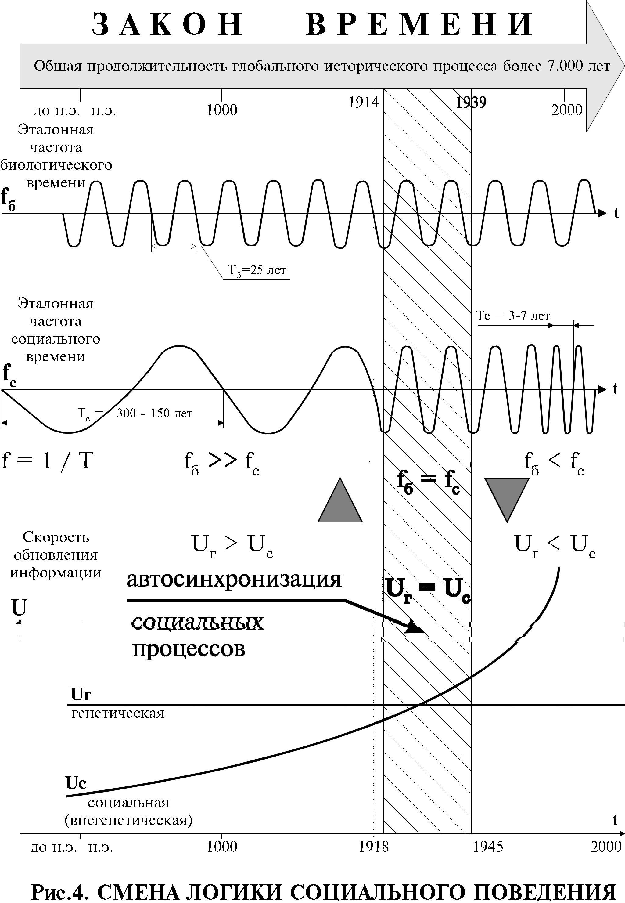

> **Первичный текст.** Медный Всадник - это вам не медный змий….
> Источник: `Медный Всадник - это вам не медный змий….doc` sha256 `617720de258d1286…`; [страница на dotu.ru](https://dotu.ru/1998/03/30/19980330-medn_vsadnik/).
> Автоматическая транскрипция DOC→Markdown; смысл и формулировки не правились.
> Контрольные суммы и статус проверки — в [NOTICE.md](../../NOTICE.md).
> Содержание передаёт позицию авторов; утверждения не верифицированы библиотекой.

---

#  Несчастный ...

Почему же Евгений несчастный? В чем причина несчастья еврейства? Чтобы ответить на этот вопрос, нам придётся понять второй и третий смысловой ряд образа Невы в период её наводнения.

В первой части поэмы мы были свидетелями, как Нева во время наводнения пошла вспять. Согласно первому смысловому ряду это означает, что изменилось направление течения, изменилось и обозначение берегов: правый берег стал левым; левый — правым.

Согласно второму смысловому ряду, Нева — образ толпы, под влиянием западных веяний-ветров, неожиданно изменившей умонастроение от спокойно-патриархальных к бурно-революционным, разрушительным.

***Но есть в поэме и третий смысловой ряд, согласно которому Нева (“река времен”) в период смены направления течения — образ качественного изменения меры соотношения эталонных частот биологического и социального времени в глобальном историческом процессе.***

Это, неизвестное ранее явление, соответствующее качественно новому информационному состоянию, в которое с середины ХХ столетия вошло человечество, следует пояснить особо.

Поведенческие реакции любой системы на воздействие внешней среды строятся на основе информационного обеспечения, свойственного каждой из них. Это положение справедливо по отношению и к живым организмам. В животном мире информационное обеспечение поведения наука называет, во-первых, инстинктами и безусловными рефлексами, которые предопределены генетически для каждого из видов; и, во-вторых, условными рефлексами, в которых отражен персональный опыт живого организма по адаптации к среде обитания, и который не наследуется генетически при смене поколений.

Чем выше организованность биологического вида, тем больше доля и абсолютный объем генетически ненаследуемой информации в составе информационного обеспечения поведения его особей.

У наиболее высокоорганизованных видов генетически передаваемая программа развития его особей предопределяет "детство". В течение "детства" родители и/*или старшие поколения в целом* формируют в подрастающем поколении генетически не передаваемые условные рефлексы, отражающие опыт старших *<u>живущих</u>* поколений.

Человек Разумный, как биологический вид, при таком взгляде отличается от животного мира прежде всего тем, что благодаря устной речи, изобразительному искусству, письменности и т.п. — каждому входящему в жизнь поколению доступен для освоения не только опыт и жизненные навыки живущих взрослых поколений, но в той или иной степени доступны и зафиксированные культурой[^40] опыт и жизненные навыки *<u>ушедших из жизни</u>* поколений.

В таком видении информационное состояние общества можно определить: на уровне биосферной обусловленности — генетически воспринятая от прошлых поколений информация всех в нем живущих; на уровне социальной обусловленности — генетически не передаваемая информация, хранимая памятью живущих, а также зафиксированная на порожденных обществом материальных носителях[^41] информации, т.е. в памятниках культуры, находящихся в употреблении[^42] хотя бы у одного из людей.

В настоящем контексте, культура — вся генетически ненаследуемая информация, хранимая обществом и передаваемая от поколения к поколению на основе социальной организации (общественного уклада жизни). Информационное состояние общества — это состояние информационного обеспечения его поведения, обусловленное биологически и социально (культура). При этом генетически обусловлен потенциал освоения культурного наследия предков и его дальнейшего преобразования каждым новым поколением, хотя сами культурные достижения генетически и не передаются.

Жизнь общества — это процесс обновления его информационного состояния, протекающий и на уровне физиологии обмена веществ в процессе зачатия детей, и на уровне преобразований культуры общества. В нем на уровне биосферной обусловленности при смене поколений в генеалогических линиях обновляются комбинации генокодов, т.е. генотипы множества живущих особей вида Человек Разумный. На уровне социальной обусловленности идет процесс обновления прикладного теоретического знания и навыков, вследствие которого новые технологии и технические решения вытесняют прежние решения того же самого назначения и в целом расширяется множество технологий и технических решений.

Можно говорить о скорости течения *<u>процесса информационного обновления</u>* как на уровне биосферной обусловленности, так и на уровне социальной обусловленности.

В качестве меры скорости на уровне биосферной обусловленности можно взять среднестатистический возраст родителей при рождении у них первого ребенка; либо продолжительность активной, т.е. трудовой жизни; либо время, в течение которого происходит 50 %-ное (или иное статистически стандартное) обновление популяции и т.п. Но все эти величины взаимно связаны статистически и границы их изменения биологически предопределены нормальной генетикой вида.

Дальнейший текст следует образно соотносить с Рис.4.

На уровне социальной обусловленности в качестве меры скорости процесса можно избрать время изменения каких-либо параметров культуры, например, культурологи часто вспоминают продолжительность времени, в течение которого происходит удвоение объема научно-технической информации. Но поскольку информационная емкость общества ограничена, а цивилизация основана на производстве, то более показательно избрать время “морального” старения и смерти техники и технологий или статистику, построенную на множестве социально значимых технологий и технических решений, определяющих культуру производства.

Но вопрос о скорости течения процессов в жизни общества связан с вопросом о выборе <u>эталона времени</u>, вне зависимости от того осознается этот факт или нет. В принципе, любой процесс, поддающийся периодизации, может быть избран в качестве эталона-измерителя времени. По отношению к человечеству таким образом можно ввести понятия <u>биологического и социального</u> времени. Соответственно, историческое время можно измерять в единицах астрономически обусловленного времени, как это принято в наши дни (хотя календари вводятся по умолчанию); можно — в продолжительности царствований, как это показано в Библии, и что до сих пор сохранилось в Японии, т.е. на основе биологической обусловленности; можно и на основе социально обусловленного (культурологического) эталона.

В любом случае астрономический эталон, биологический эталон и социальный (культурологический) эталон времени могут быть соотнесены друг с другом. Можно проследить, как изменялось соотношение частот процессов-эталонов биологического и социального времени в историческом развитии Западной и глобальной цивилизации по отношению к общему для них обоих эталону астрономического времени.

В каждой генеалогической линии, среднестатистически, у родителей раз в 15 — 25 лет[^43] появляется первый ребенок. Продолжительность активной жизни имеет примерно такое же значение. Соответственно частота эталона биологического времени может быть принята fб = 1/(25 лет). Она характеризует скорость обновления информации в генофонде популяции и мало меняется на протяжении всей истории.

В жизни технократической цивилизации доминирует непрерывный процесс вытеснения устаревших технологий и технических решений новейшими, но <u>того же самого назначения</u>. Поэтому можно подсчитать среднестатистический период обновления всего технологического социально значимого знания — Тс в каждую историческую эпоху. В качестве эталона частоты социального времени можно взять частоту fc = 1/Тс. Она характеризует скорость обновления социально значимой информации, не передаваемой генетически через физиологию, но передаваемой через культуру, несомую общественным устройством (социальной организацией), от поколения к поколению. Эта частота fc на протяжении истории непрерывно возрастала: во времена фараонов, Екклезиаста, Иисуса и первых веков нашей эры, когда библейская концепция управления формировалась и обретала глобальную значимость, она составляла величину порядка 1/(сотни лет); в настоящее время эталонная частота социального времени составляет 1/(10 лет) — 1/(5 лет), в зависимости от того, на каких отраслевых знаниях она основана.

Иными словами, во времена, когда было оглашено Второзаконие, социально значимое множество технологий и технических решений не обновлялось веками, а через технологически неизменный мир проходили многие поколения. В наши дни социально значимое множество технологий и технических решений обновляется быстрее, чем раз в десять — пятнадцать лет, и техносфера, окружающая человека, успевает измениться несколько раз на протяжении активной жизни одного поколения. То есть изменилось соотношение эталонных частот биологического и социального времеи ( было fc \<\< fб; стало fc \> fб ), которое и представлено схематично на Рис.4.

Это изменение соотношения эталонных частот биологического и социального времени, предощущалось некоторыми поэтами, учеными, мистиками в конце XIX века — первой половине ХХ, но оно стало ярко выраженным, открытым для всеобщего восприятия и осмысления, только к концу второй половины ХХ века, когда за время жизни одного поколения многократно успели обновиться необходимые для деятельности знания и практические навыки[^44].

И все теоретические схемы, описывающие тематику взаимоотношений общества с его же коллективным сознательным и бессознательным, построенные до этого изменения соотношения эталонных частот, после него утрачивают работоспособность, даже если таковой в прошлом они и обладали. Происходит это потому, что при новом соотношении эталонных частот биологического и социального эталонов времени мотивация поведения, логика социального поведения, свойственные прежнему соотношению эталонных частот ведут к саморазрушению прежнего устройства жизни общества, прежних типов социальной организации цивилизации.

При библейском соотношении частот эталонов биологического и социального времени, статистически преобладало следующее: какое знание человек обретал к 25 годам, с тем знанием он и умирал. Обретение нового прикладного знания в течение всей активной жизни, было уделом меньшинства общества, а не большинства. Но социальная организация строилась на статистике незаменимости и взаимозаменяемости носителей конкретных прикладных знаний и навыков, по какой причине носители редких социально значимых знаний имели возможность взимать монопольно высокие цены за продукт своей деятельности в общественном объединении труда. Обретение же прикладного знания, доселе неизвестного в обществе, давало его первооткрывателю и первым носителям и/или их потомкам возможность подняться вверх по ступеням социальной пирамиды толпо-”элитаризма” и устойчиво занимать это положение в течение своей жизни, а роду давало возможность поддерживать некогда завоеванный предком социальный статус при смене поколений. Это было возможно, хотя бы при эмиграции в другую страну, если в родной стране хозяева толпо-”элитарной” пирамиды не могли найти для него свободной кормушки или брезговали общением со вчерашним “низкородным”. Так до конца XIX века социальная пирамида строилась на основе регуляции доступа к образованию тех или иных социальных групп, и один раз вызубрив всё в университете, этими знаниями и навыками можно было жить всю жизнь.

При библейском соотношении эталонных частот биологического и социального времени, поскольку культура не обновлялась значительно на протяжении жизни одного поколения, то между человечеством и остальными видами биосферы планеты не было принципиальной разницы в том смысле, что информационное состояние общества изменялось в общем-то со скоростью смены поколений, точно также как и информационное состояние популяции в животном мире меняется со скоростью смены поколений. И в этом смысле история не-животной жизни человечества в целом только начинается с изменением соотношения эталонных частот биологического и социального времени. Этому соотношению частот соответствовало и господство кодирующей психику педагогики, целью которой было не раскрыть творческие способности человека, не обучить человека воспринимать и осмыслять мир самостоятельно, памятуя о достоянии культуры прошлого, а вбить в его психику достижения прошлого, признанные каноническими. Короче, школа зубрежки доминировала над школой творчества.

Но при нынешнем соотношении эталонных частот биологического и социального времени, один раз в жизни вызубрив специальность в вузе, уже невозможно в течение всей жизни паразитировать на обретенном некогда своим трудом знании, произведенном однако трудом предков, поскольку знание устаревает быстрее, чем период активной жизнедеятельности одного поколения, который в среднем составляет не более 15 — 25 лет. Чтобы всю жизнь учить общество на основе принципов кодирующей педагогики, необходимо иметь второе параллельное общество, состоящее из одних только учителей и наставников. Это невозможно, поэтому самообразование на основе базового образования — единственная возможность поддерживать квалификацию в новых исторических условиях.

Школа зубрежки таким образом изжила себя, но её жертвы всё еще живут и действуют несообразно обстоятельствам и усугубляют их, поскольку старые знания и навыки устаревают, а обрести новые они самостоятельно в процессе работы не умеют. В этих условиях преимуществом обладают те, кто способен самостоятельно воспринимать мир, таким каков он есть, осмыслять происходящее и решать возникающие проблемы на основе собственных интеллектуальных усилий и координации усилий других, но не те, кто знает много готовых рецептов решения проблем, как это было в прошлом.

Поскольку в основе социальной иерархии непосредственно или косвенно лежала градация общества по квалификации и специализации в общественном объединении труда, то при нынешнем соотношении эталонных частот биологического и социального времени социальная иерархия личностей — носителей квалификации и специализации — становится невозможной, поскольку обесценивание прежних прикладных навыков и знаний сбрасывает людей с занимаемых ими ступеней иерархии. На высшие ступени поднимаются те, кто в прошлом был на низших, но обрел квалификацию и специализацию, отвечающую общественным потребностям и позволяющую взимать за свой труд более высокую цену. Этот процесс идет во многом непредсказуемо, и, как следствие, неуправляемо со стороны властных структур общества. И потому вся традиционная система образования, а также профессиональной подготовки и переподготовки, основанная на принципах кодирующей педагогики, не может помочь поддержанию прежнего иерархически-личностного устройства общества.

*<u>Объективное явление</u>*, которое мы назвали — *изменение соотношения эталонных частот биологического и социального времени* — собственная характеристика глобальной социальной системы, от которой никуда не деться. Это информационный процесс, протекающий в иерархически организованной системе. Из теории колебаний, теории управления известно, что если в иерархически организованной многоуровневой системе происходит изменение частотных характеристик процессов, протекающих на каждом из её уровней, то система переходит в иной режим своего поведения. Это общее свойство иерархически организованных систем, к классу которых принадлежит и человеческое общество в целом, и иерархически организованная психика каждого из людей.

Это общее свойство иерархически организованных информационных систем. Оно по отношению к жизни общества предопределяет качественные изменения в психологии множества людей, в нравственно-этической обоснованности и целеустремленности их деятельности, в избрании средств достижения ими целей; предопределяет качественные изменения того, что можно назвать логикой социального поведения: это — массовая статистика психологии личностей, выражающаяся в реальных фактах жизни.

Какое-то представление об этих сложных явлениях социальной жизни люди имели и в далеком прошлом, но поскольку мера понимания их была доступна лишь узкому кругу посвященных, то знания о возможности проявления их в будущем предавались из поколения в поколение, как правило, в притчевой форме наподобие суфийской сказки “Когда меняются воды”:

Однажды Хидр, учитель Моисея, обратился к человечеству с предостережением.

— Наступит такой день, — сказал он, когда вся вода в мире, кроме той, что будет специально собрана, исчезнет. Затем ей на смену появится другая вода, от которой люди будут сходить с ума.

Лишь один человек понял смысл этих слов. Он собрал большой запас воды и спрятал его в надежном месте. Затем он стал поджидать, когда вода изменится.

В предсказанный день иссякли все реки, высохли колодцы, и тот человек, удалившись в свое убежище, стал пить из своих запасов.

Когда он увидел из своего убежища, что реки возобновили свое течение, то спустился к другим сынам человеческим. Он обнаружил, что они говорят и думают совсем не так, как прежде, они не помнят ни то, что с ними произошло, ни то о чем их предостерегали. Когда он попытался с ними заговорить, то понял, что они считают его сумасшедшим и проявляют к нему враждебность либо сострадание, но никак не понимание.

Поначалу он совсем не притрагивался к новой воде и каждый день возвращался к своим запасам. Однако он в конце концов решил пить отныне новую воду, так как его поведение и мышление, выделявшие его среди остальных, сделали жизнь невыносимо одинокой. Он выпил ***новой*** воды и стал таким, как все. Тогда он совсем забыл о своем запасе ***иной*** воды, а окружающие его люди стали смотреть на него как на сумасшедшего, который чудесным образом излечился от своего безумия.

Это — иносказание пережившее века. Только в притчевой форме его можно понимать в том смысле, что речь идет не о какой-то “трансмутации” природной воды (Н2О), а о некой иной “воде”, свойственной обществу, которая по некоторым качествам в его жизни в каком-то смысле аналогична воде в жизни планеты Земля в целом.

Таким аналогом воды (Н2О) в жизни общества является культура — вся генетически ненаследуемая информация, передаваемая от поколения к поколению в их преемственности. Причем вещественные памятники и объекты культуры — выражение психологической культуры (культуры мироощущения, культуры мышления, культуры осмысления происходящего), каждый этап развития которой предшествует каждому этапу развития вещественной культуры, воплощающей психическую деятельность людей.

Суфий древности мог иметь предвидение во «внелексических» образах о смене качества культуры, и таким образом имел некое представление о каждом из типов “вод”. Но вряд ли бы он был единообразно понят своими современниками, имевшими представление только о том типе “воды” (культуры, нравственности и этики), в которой они жили сами, и вряд ли бы они передали это предсказание через века. Однако, легенда, как иносказание, пережила многие поколения и стала понятной непосвященным лишь после того, как произошла смена отношений эталонных частот биологического и социального времени и общество вступило в процесс смены логики поведения.

Естественно, что с точки зрения человека, живущего в одном типе культуры, возможность внезапно оказаться в другом, качественно ином типе культуры, означает выглядеть в ней сумасшедшим и вызвать к себе враждебность (поскольку его действия, обусловленные прежней культурой, могут быть разрушительными по отношению к новой культуре) или сострадание. Само же общество, живущее иной культурой, с точки зрения внезапно в нем оказавшегося, также будет выглядеть как психбольница на свободе.

Мы живем в исторический период, когда изменение соотношения эталонных частот биологического и социального времени уже произошло, но становление новой логики социального поведения, в качестве статистически преобладающей, еще не завершилось. Формирование логики социального поведения, отвечающей новому соотношению эталонных частот, протекает в наше время и каждый из нас в нем участвует и сознательно целеустремленно, и бессознательно на основе усвоенных в прошлом автоматизмов поведения. **Но каждый по своему произволу, обусловленному его нравственностью, имеет возможность осознанно отвечая за последствия, избрать для себя тот или иной стиль жизни.**

Те, кто следует прежней логике социального поведения: вверх по ступеням социальной пирамиды или удержать завоеванные высоты, — всё более часто будут сталкиваться с разочарованием, поскольку на момент достижения цели, или освоения средств к её достижению, общественная значимость цели исчезнет, или изменятся личные оценки её значимости. Это предопределяет селекцию целей по их устойчивости во времени. При этом высшей значимостью будут обладать “вечные ценности”, освоение которых сохраняет свою значимость вне зависимости от изменения техносферы и достижений науки. Быть человеком в ладу с Богом и биосферой, предопределено становится при новом соотношении эталонных частот биологического и социального времени — непреходящей самодостаточной целью для каждого здравого нравственно и интеллектуально, и этой цели будет переподчинена вся социальная организация жизни и власти. Все, кто останется рабом житейской суеты, обречены на отторжение биосферой Земли.

Все представители человечества, как системы в биосфере Земли, которые не способны своевременно отреагировать на изменение соотношения эталонных частот биологического и социального времени, обречены на отторжение биосферой Земли, переходящей в иной режим своего бытия под воздействием человеческой деятельности последних нескольких тысячелетий.

И все прикладные психологические тесты[^45], построенные на основе воззрений классических психологических школ, не учитывают этого объективного изменения частотных характеристик информационных процессов в современной цивилизации, которое произошло во второй половине ХХ века, в результате чего общество и обрело новые свойства. Соответственно, такие психологические тесты оказываются не чувствительными ко многим опасным психологическим явлениям, но на их основе выдаются ошибочные рекомендации, прежде всего в области подбора и расстановки кадров.

## **Глава 2. Свобода исчезновения**

После такого пояснения можно поговорить и о причинах несчастья Евгения. Хорошо известно, что еврейству свойственна особая приспособляемость к изменениям окружающей среды. Поскольку все человечество для еврейства — всего лишь элементы этой среды, то желательно разобраться в причинах его необычной мимикрии. Так можно будет понять и поражающую всех столь продолжительную устойчивость в смене поколений этой отличной от всего остального человечества общности. Причина же — в их особой предрасположенности к абстрактно-логическому дискретному мышлению, которое связано с преобладанием деятельности левого полушария головного мозга над правым, отвечающим за предметно-образную процессную деятельность человека. Это их особое свойство давало им до поры до времени и особые преимущества перед остальными народами, поскольку позволяло в рамках библейской логики социального поведения с большим, чем другие, быстродействием моделировать новые информационные ситуации, складывающиеся в глобальном историческом процессе, и находить наиболее оптимальные решения для адаптации к ним.

Революция 1917 г. в России началась в период смены отношений эталонных частот биологического и социального времени. Левак Евгений в период, предшествующий наводнению находился на левом берегу. Нева, как образ реки времени пошла вспять, т.е. левый берег стал правым и Евгений — инвалид правого полушария — естественно устремился к левому берегу. И не случайно именно в этот период средствами массовой информации, полностью подконтрольными еврейству, усиленно проводилась подмена кода образа правизны всех явлений социальной жизни (правда, справедливость, правильность, управление) на код левизны. Другими словами, все левое объявлялось прогрессивным, а правое — консервативным. Так в умах людей закреплялся смысловой абсурд, поскольку “левые” по существу вынуждены были бороться за правое дело до тех пор пока И.В.Сталин к концу этого безумного периода подмены понятий, совпавшего с началом второй мировой и Великой Отечественной войны, не поставил все на место: ”Наше дело правое, победа будет за нами!”.

Столь быстрая смена понятий, совершенная не без активного участия еврейства, дорого обошлась России. Но не сделала она счастья и самому еврейству:

#  Несчастный

# Знакомой улицей бежит

# В места знакомые.

Евгений “достиг” не просто бывшего правого берега: он перебрался на правый берег ***острова***, который и поныне называется Васильевским. Остров же, как было показано в расшифровке первой части поэмы, — естественный образ вершины толпо-”элитарной” пирамиды. Другими словами, мечта Евгения была не так уж и бескорыстна: в ней прежде всего выражалось стремление еврейства приобщиться к управленческой “элите”, в которую многие его представители были вхожи задолго до революции несмотря на закон о “черте оседлости”. Отсюда “*в места знакомые бежит*”. Известно, что в ходе революции и гражданской войны стремление еврейства занять ключевые посты в сфере государственного управления бывшей России было реализовано, но какой ценой? Многие из них и по сей день не способны “узнать” плоды своих управленческих деяний. В поэме же Евгений:

# 

#  Глядит,

# Узнать не может. Вид ужасный!

# Все перед ним завалено,

# Что сброшено, что снесено;

# Скривились домики, другие

# Совсем обрушились, иные

# Волнами сдвинуты; кругом

# Как будто в поле боевом,

# Тела валяются.

“Великое царство” было основательно разрушено, но не погибло, как об этом поторопились оповестить всех посвященных сакральной надписью на стене Ипатьевского дома вдохновители мистической акции по уничтожению одного из трех символов русской государственности — монархии. Уничтожая посредством “не помнящего ничего” еврейства этот символ, Хозяин-Перевозчик самоуверенно полагал, что в соответствии с древнеегипетскими канонами уничтожает тем самым и величественное здание российской государственности.

#  Евгений

# Стремглав, не помня ничего,

# Изнемогая от мучений,

# Бежит туда, где ждет его

# Судьба с неведомым известьем,

# Как с запечатанным письмом.

Другими словами, конечная цель бездумной разрушительной деятельности еврейству неведома. Так было в начале ХХ столетия после Октября 1917 г.; тоже самое можно наблюдать и в конце его — после Августа 1991 г. Внутренние запреты, наложенные Торой и Талмудом, закрыли способность видеть и понимать развитие возможных вариантов будущего прежде всего для самого еврейства. Снятие этих запретов и постижение их сути означает утрату рассудка и гибель Евгения. В этом — основа содержания второй части поэмы. А пока:

# 

# И вот бежит уж он предместьем, 

# И вот залив, и близок дом...

# Что это?..

#  Он остановился.

# Пошел назад и воротился.

# Глядит... идет... еще глядит.

# Вот место(,)[^46] где их дом стоит;

Пушкин точен: дом не “стоял”, а по-прежнему “стоит”, но Евгений его не видит. Почему? То ли потому, что “сонны очи он наконец закрыл”, да так до сих пор ими, закрытыми и смотрит на мир? То ли все дело в изначально неверно выбранных для него (кем?) ориентирах, которые исчезли в процессе смены отношений эталонных частот биологического и социального времени, но без которых еврейство неспособно отличить мир реальный от вымышленного, иррационального? А ведь это первый признак шизофрении, сумасшествия. Ориентира в поэме отмечено два:

# 

# Вот ива. Были здесь ворота,

# Снесло их видно.

Ива осталась; ворота исчезли. Итак, утраченный ориентир — ворота, поскольку с их исчезновением начались необратимые процессы изменения в поведении Евгения. О том, что дом, возможно даже основательно разрушенный, не исчез сказано выше:

# Скривились домики, другие

# Совсем обрушились, иные

# Волнами сдвинуты;

Постараемся понять, что могут означать ворота, не как дворовая постройка, а как некий мистический ориентир-символ, играющий особо важную роль в процессе мировосприятия и формирования мировоззрения еврейства. Наша задача облегчается тем, что после смены отношений эталонных частот биологического и социального времени многие символы такого рода “всплывают” с уровня подсознания еврея, обретая лексические формы доступные даже его мере понимания. Ниже приведенные откровения на затронутую здесь тему интересны тем, что они сделаны человеком, который, по его собственному признанию, в определенное время “стал себя чувствовать так же уютно, как Дантес в России после убийства Пушкина”.

#  **У ворот города**

# 

# Оставьте камни прежней тишине.

# Мираж тоски опередил ворота,

# Как неизвестный всадник на коне,

# 

# Сместился миг, в котором свет, звук, знак

# Изображают въезд, проезд и выезд,

# Где нет пути, но есть копье и флаг,

# 

# Где изнутри сомненье, как извне, 

# Венчается созвучием единым,

# Где зреют камни в прежней тишине,

# Жизнь перед смертью,

[^40]: В том числе и на биополевом уровне её организации, хотя на биополевом уровне присутствует и изрядная доля генетически передаваемой информации.

[^41]: Биополя — тоже материальные носители.

[^42]: Или поддерживаемых на биополевом уровне организации кем-либо.

[^43]: Годы — единицы измерения, основанные на астрономическом эталоне.

[^44]: Это ярко видно в авиации: с 1910‑х по начало 1960‑х гг. на протяжении жизни одного поколения успели сменить друг друга три поколения классов летательной техники: этажерки из дерева и ткани, настоящие самолеты из дерева и легких сплавов, реактивная авиация из специальных сплавов и сталей. Еще быстрее протекало обновление компьютерных технологий.

[^45]: Это же относится и к большинству аналитических работ по историко-обществоведческому анализу.

[^46]: В некоторых изданиях запятая, взятая в скобки, отсутствует.
---

[К произведению](README.md) · [Каталог](../../CATALOG.md)
