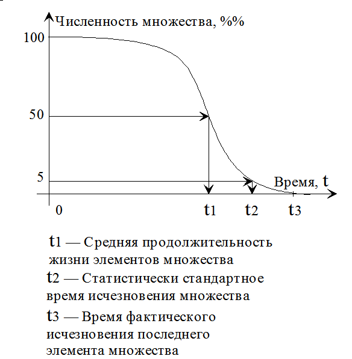
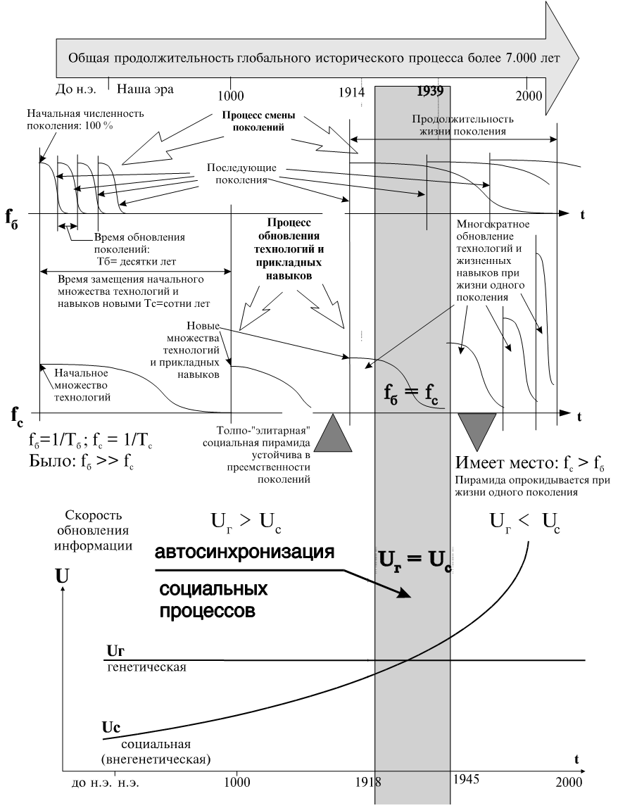

> **Первичный текст.** Мёртвая вода — редакция ред. 2015 г..
> Источник: `dotu.ru:c5d5a456d9fcb99c.fb2` sha256 `4dd1886169e7b01a…`; [страница на dotu.ru](https://dotu.ru/2015/05/09/mv-2015/).
> Автоматическая транскрипция DOC→Markdown; смысл и формулировки не правились.
> Контрольные суммы и статус проверки — в [NOTICE.md](../../NOTICE.md).
> Содержание передаёт позицию авторов; утверждения не верифицированы библиотекой.

---

## VII. «ПАССИОНАРНОСТЬ»: БИОЛОГИЯ И ДРУГИЕ ВЗАИМОВЛОЖЕННЫЕ ПРОЦЕССЫ

Правда не вышла бы из колодезя, если бы сырость не испортила её зеркала.

И египтяне были в своё время справедливы и человеколюбивы!

К. Прутков

Настоящий раздел в работе не обязателен, поскольку ранее высказанные общие положения отнесены в нём к весьма частному вопросу.[163] Его появление вызвано тем, что в СССР после 1987 г. идёт ПРОПАГАНДА концепции Л.Н.Гумилёва “Этногенез и биосфера Земли” (появившейся в 1979 г.). Противники взглядов Л.Н.Гумилёва возражают ему на страницах научных изданий и не выходят на столь массовую аудиторию, как Л.Н.Гумилёв (то ли сами, то ли их не выпускают). В таких условиях большинство читающей и слушающей публики, разсуждая по авторитету, возпринимают концепцию «пассионарности» в качестве достоверной теории, одинаково разкрывающей прошлые и будущие загадки истории. Процесс возприятия обществом этой пропаганды сопровождается вульгаризацией теории и неоправданным разширением по самым разным причинам области применения высказанных её автором положений.

Мы согласны с тем, что «этногенез» как явление в глобальном историческом процессе существует, но описание его Л.Н.Гумилёвым крайне односторонне и содержит ряд ошибочных, на наш взгляд, утверждений. В этом разделе мы прокомментируем книгу Л.Н.Гумилёва “Этногенез и биосфера Земли” (изд. 3, стереотипное, Ленинград, “Гидрометиздат”, 1990 г., 528 стр., тираж 50000).

Лев Николаевич пользуется методологией — системой стереотипов разпознавания явлений и формирования их образов — весьма близкой к диалектическому материализму. По этой причине вселенная не осознана как процесс-триединство — материя, информация, мера. Время в книге не существует в качестве осознанно изпользуемой категории меры.

«Так мы знаем, что как категория время есть, но не видя его границ, не имеем возможности дать времени общепонятное определение» (стр. 39). На стр. 96: «Что такое “время”— не знает никто. Однако, измерять его люди научились[164]».

Далее Л.Н.Гумилёв приводит примеры измерения времени, основанные на различных эталонных процессах, что можно обобщить, как это сделано во Введении: понятие времени возникает в процессе отображения одного процесса на другой, частота которого принята в качестве эталонной.

На стр. 351: «История — это изучение процессов, протекающих во времени, но что такое время — не знает никто».

В нашем понимании «время» всегда субъективно. Необходимо только отдавать себе отчёт в том, частота какого процесса является эталонной, когда употребляется термин «время» в смысле, отличном от бытового. В противном случае возможна неконтролируемая сознанием смена эталонных процессов в ходе повествования, что может привести к ошибочным выводам.

Информация (дух) в диалектическом материализме — неприкаянное понятие. Как и положено неприкаянному духу, информация вмешивается в дела диалектиков-материалистов и мстит за свою неприкаянность смещением понятийных границ и подменой понятий.

На стр. 279: «Можно сказать, что резонанс пассионарной возбудимости тем меньше, чем дальше отстоят этносы пассионария и гармоничной особи, разумеется, при прочих равных условиях. Это обстоятельство снова сближает проблемы пассионарности как признака с проблемой сущности этнической монолитности. Но ведь резонанс, как и индукция, — понятие энергетическое. Насколько они приложимы к этносу?»

Энергия — материя[165], всегда некоторым образом упорядочена и существует как компонент процесса-триединства: материя, информация, мера. Что в процессе для субъекта важнее — его личное дело, но главное — не путать и не отождествлять одно с другим.

Явление резонанса состоит в том, что некая структура, при прохождении через неё потока энергии, забирает из потока часть энергии и преобразует её в иной вид. Для того, чтобы возник резонанс, необходимо соответствие упорядоченности структуры, поглощающей энергию, и упорядоченности потока энергии: т.е. информационное соответствие — соответствие собственных частот колебаний структуры спектральному составу потока энергии. Если вы поднесёте к роялю камертон 440 Гц и ударите по клавише «ре», что есть силы, — камертон не зазвучит; но если вы тихонечко сыграете «ля», — камертон откликнется, хотя струны «ре» излучали энергии гораздо больше, чем струны «ля».

То же касается и индукции: для неё необходимо соответствие упорядоченности структур 1) передатчика, 2) среды, через которую разпространяется поток энергии (несущий информацию), 3) приёмника. Безполезно делать сердечники трансформатора из дерева; необходимо железо, лучше трансформаторное. Хотя атомы железа и молекул дерева «собраны» из одного и того же набора элементарных частиц, но упорядочены, оформлены в структуры эти частицы по-разному.

То же касается и второй обмотки трансформатора — приёмника: бобина с прекрасной рыболовной леской явно не подойдёт для этой роли.

Поскольку диалектический материализм не видит духа, информации как объективной нематериальной категории, то закономерно смешение понятий при описании информационных процессов, когда изпользуются термины «материя», «энергия» и т.п. Не избежал этого и Л.Н.Гумилёв.

На стр. 328: «В любом колебательном движении есть только ритм и большая или меньшая напряжённость (частота)».

Загляните в любой словарь физических терминов: «Ритм» и «частота» — синонимы, хотя бы отчасти; «напряжённость» и «частота» — не синонимы: т.е. имеет место смещение понятийных границ, поскольку любой колебательный процесс характеризуется частотой, относимой к частоте эталонного процесса, и амплитудой в самом общем смысле слова (в частном случае амплитудным значением напряжённости физического поля); и та и другая могут изменяться с течением времени, т.е. процесса. Хотя теория колебаний, безусловно, — одна из наиболее общих наук.

И сделанные возражения — не мелочи и не придирки: книга Л.Н.Гумилёва посвящена описанию крайне низкочастотных по отношению к смене поколений процессов, продолжительность развития которых во много раз превозходит время существования в сознании общества, даже в сознании учёных, самой проблемы этногенеза. При этом биологические аспекты проблемы документированы неизмеримо хуже, чем социальные. В таких условиях неточности словоупотребления и безконтрольный дрейф понятийных границ способны изказить в возприятии человека существо объективного явления до неузнаваемости.

В физике есть соотношение неопределённостей Гейзенберга: неопределённость импульса частицы, умноженная на неопределённость её координаты, равна как минимум 1/2 постоянной Планка. На стр. 163 Л.Н.Гумилёв пишет:

«Начиная с XVII в., в физике дебатировался вопрос — состоит ли свет из частиц (корпускул) или представляет собой волны в эфире? Обе концепции имели столь серьёзные недостатки, что ни одна из них не могла возобладать. Спор был разрешён лишь в середине 20-х годов XX в. с появлением квантовой механики. Современные физики считают, что свет — не волна, не частица, а то и другое одновременно, и может проявлять обе группы свойств. На этой основе был сформулирован широко известный принцип неопределённости, согласно которому при наличии двух сопряжённых физических переменных (например, импульса и координаты или энергии и времени) может быть установлено значение той или другой, а не обеих вместе[166].

В этнических феноменах тоже налицо две формы движения — социальная и биологическая. Следовательно, тем или иным способом в том или ином аспекте может быть описана либо та, либо другая сторона сложного явления. При этом точность описания и его многосторонность взаимно исключают друг друга. Отметив это, применим принцип неопределённости к нашему “материалу”».

Но нельзя же так! Во-первых, аналогия — не доказательство. Во-вторых, и аналогии-то нет, и кроме того само соотношение неопределённостей трактуется неправильно, ложно (возможно, что по невежеству гуманитариев в вопросах естествознания и ущербности мышления, вследствие чего они не способны описывать явления языком математики). В микромире, который описывает квантовая механика, — каждая частица — конечная группа волн (по крайней мере, если изходить из наличия порога чувствительности измерительной аппаратуры). Любой объект обладает волновыми свойствами, поскольку он — волна прежде всего. Тот же объект обладает корпускулярными свойствами, поскольку в его состав входит конечный (в указанном смысле) набор волн. В макромире волна — движущиеся некоторым колебательным образом, изменяющиеся по составу, совокупности частиц, и потому свойства частиц и свойства волн проявляются независимо и взаимно изключающие у разных объектов: т.е. либо волна, либо частица, тело. В микромире — свои законы, которые обусловливают законы макромира.

Кроме того, по отношению к частице микромира возможно определение значения импульса и координаты, но чем точнее определена одна величина, тем больше ошибка в определении другой. Величины же обеих ошибок связаны соотношением неопределённостей Гейзенберга, а не ахинеей Гумилёва на ту же тему. В микромире — один способ существования объектов, коему присуще проявление и волновых, и корпускулярных свойств у одних и тех же объектов. К применению соотношения неопределённостей в физике основания есть, но к применению его “аналога” для разделения сфер биологии и социологии — оснований нет, кроме желания создать иллюзию наукообразия изложения. В толковом словаре понятий и терминов, завершающем книгу, его составитель В.Ю.Ермолаев, утверждает: «Принцип неопределённости в этнологии — объективное ограничение возможностей изследователя при наблюдении последовательности событий, позволяющее описать их только в одном из двух аспектов: либо в социальном, либо в этническом (природном)». Единство же законов бытия не в том, чтобы переносить частные законы из одной области науки в другую, когда вздумается закрыть “объективным” законом неугодный КОМУ-ТО предмет от обсуждения.

Кибернетика и общая теория систем были упомянуты Л.Н.Гумилёвым только для того, чтобы характеризовать «этнос» как самоорганизующуюся систему. Но механизм саморегуляции, процесс саморегуляции как ИНФОРМАЦИОННЫЙ процесс, в том числе процесс информационного обмена между биологической и социальной организацией популяции, остались не описанными нигде.

Возможны две УСЛОВНЫХ точки зрения на любой процесс. Во-первых, как на один из частных процессов в объемлющей его совокупности процессов: во-вторых, как на объемлющий процесс по отношению к некоторой совокупности. В силу же взаимной вложенности процессов, ПРАКТИЧЕСКИ приходится в ходе изложения переходить с одной точки зрения на другую и обратно. При этом необходимо определённо различать обе возможные точки зрения на один и тот же процесс, а не нести вздор о «принципе неопределённости» там, где всё определённо.

Л.Н.Гумилёв под словом «этногенез» понимает процесс возникновения «этноса», развитие «этноса», его угасание до полного изчезновения или пребывания его остатков в продолжительном равновесии со средой обитания при смене поколений. Внешнее описание процесса этногенеза при отсутствии прерывания его извне выглядит следующим образом:

«По какой-то, пока неясной, причине появившийся на арене новый этнос (часто со старым названием) преображает ландшафт при помощи нового способа адаптации к природным условиям. Это происходит, как правило, в инкубационный период фазы подъёма и не фиксируется в исторических источниках (кроме легенд). Историческая, описанная в источниках эпоха включает при отсутствии внешнего смешения следующие фазы этногенеза: 1) явный период фазы подъёма, 2) акматическую фазу, когда этнос предельно активен, а давление на ландшафт уменьшено, 3) фазу надлома, когда антропогенное давление максимально и деструктивно, 4) инерционную фазу, в которой идёт накопление технических средств и идеологических ценностей, 5) фазу обскурации, во время которой нет забот ни о культуре, ни о ландшафте. После этого наступает фаза гомеостаза, когда идёт взаимодействие остатков полуистреблённого этноса с обеднённым ландшафтом, возникшим на обломках культурного ландшафта, там, где на месте дубов выросли лопухи, среди которых играют в прятки правнуки завоевателей и дети разбойников.

В эту эпоху отношение этноса-персистента к природе становится одновременно потребительским и охранительным. Но, увы, как то, так и другое диктуется традицией, а не волевым сознательным решением. И так до тех пор, пока новый этнос вновь не преобразует ландшафт. Видимо, этногенез — не единое глобальное явление, а множество самостоятельных этногенезов в тех или иных районах» (стр. 211).

Прежде чем говорить о ПРОЦЕССЕ «этногенеза» и его фазах дальше, обратим внимание на тот факт, что термин «этнос» в теории Л.Н.Гумилёва несёт понятийную нагрузку, отличную от термина «нация» в определении И.В.Сталина и отличную от термина «народ» в обыденном словоупотреблении. При вульгаризации теории Л.Н.Гумилёва в процессе её пропаганды, всё, что говорит её автор о СВОЁМ «этносе», обыденное сознание переносит на своё понимание слов «народ», «нация».

«Этнос» у Л.Н.Гумилёва — понятие с весьма эластичными и дрейфующими понятийными границами.

На стр. 15, 16: «Этнос — феномен биосферы или системная целостность дискретного типа, работающая на геобиохимической энергии живого вещества, в согласии с принципом второго начала термодинамики, что подтверждается диахронической хронологией исторических событий».

На стр. 24: «этносы — явление, лежащее на границе биосферы и социосферы и имеющее весьма специальное назначение в строении биосферы Земли».

В этой фразе интересно употребление слова «назначение»: оно ассоциируется с соответствием некой целевой функции существования и развития «этносов», хотя Л.Н.Гумилёв и отрицает телеологический подход, при котором всё существует с определёнными целями сообразно Божественному предначертанию.

На стр. 59: «…этногенез — процесс не социальный, ибо спонтанное развитие социосферы лишь взаимодействует с природными явлениями, а не является их продуктом.

Но именно тот факт, что этногенез — процесс, а непосредственно наблюдаемый этнос — фаза этногенеза, и, следовательно, нестабильная система, исключает любые сопоставления этносов с антропологическими расами, а тем самым с любыми расовыми теориями».

На стр. 95: «…этнос — коллектив особей, выделяющий себя из всех прочих коллективов. Этнос более или менее устойчив, хотя возникает и исчезает в историческом времени. Нет ни одного реального признака для определения этноса, применимого ко всем известным случаям. Язык, происхождение, обычай, материальная культура, идеология иногда являются определяющими моментами, а иногда нет. Вынести за скобки мы можем только одно — признание особью: «Мы такие-то, а все прочие другие». Поскольку это явление универсально, можно предположить, что оно отражает некую физическую или биологическую реальность, которая и является для нас искомой величиной».

На стр. 102: «Итак, мера устойчивости этноса как системы определяется не его массой, т.е. численностью населения и точностью копирования предков, а среднестатистическим набором связей различных весов и знаков. Резкий выход за определённые пределы влечёт либо гибель, либо бурное развитие. Этим и создаётся эластичность этноса, позволяющая ему амортизировать внешние воздействия и даже иногда регенерировать, ибо «многосвязная» система восполняет ущерб перестройки связей».

На стр. 103: «Этнос — не просто скопище людей, теми или иными чертами похожих друг на друга, а система различных по вкусам и способностям личностей, продуктов их деятельности, традиций, вмещающей географической среды, этнического окружения, а также определённых тенденций, господствующих в развитии системы».

На стр. 135: «Этнос — устойчивый, естественно сложившийся коллектив людей, противопоставляющий себя всем прочим аналогичным коллективам и отличающийся своеобразным стереотипом поведения, который закономерно меняется в историческом времени».

Здесь же вводится понятие «суперэтноса» как мозаичной целостности группы этносов, одновременно возникших в одном регионе; и «субэтноса» как элемента структуры этноса, взаимодействующего с прочими элементами структуры «этноса». «При упрощении этносистемы в финальной фазе число субэтносов сокращается до одного, который становится реликтом».

На стр. 185: «И арабы, тибетцы, ирокезы — все имеют свою исходную территорию, определяемую неповторимым сочетанием элементов ландшафта. И как таковая «родина» является одним из компонентов системы, именуемой «этнос»».

На стр. 241: «Этносы не так, как змеи: они меняют не кожи, а души». И несколько далее: «И тогда получается твёрдый вывод: этносы возникают и исчезают независимо от наличия тех или иных представлений современников. Значит, этносы — не продукт социального самосознания отдельных людей, хотя они и связаны исключительно с формами коллективной деятельности людей…»

В «толковом словаре» книги В.Ю.Ермолаев даёт следующее определение «этноса»:

«…естественно сложившийся на основе оригинального стереотипа поведения коллектив людей, существующий как энергетическая система (структура), противопоставляющая себя всем другим таким же коллективам, исходя из ощущения комплиментарности».

Набор признаков, необходимых для идентификации «этноса» Л.Н.Гумилёва, иногда шире, чем пять признаков в определении нации И.В.Сталина, и включает в себя даже среду обитания (природную и социальную), а иногда сокращается до одного стереотипа поведения, достаточно устойчивого во времени. Стереотип поведения может быть различным, в том числе и стереотип Т.Герцля: «Группа людей общего исторического прошлого и общепризнанной принадлежности в настоящем, сплочённая из-за существования общего врага». То есть гумилёвский «этнос» можно напялить и на исторически сложившуюся нацию, народ и на псевдоэтническую мафию; потом назвать это межнациональным конфликтом; а после этого приступить к защите “малого народа” от “притеснений” со стороны больших народов, отстаивающих самобытность и дальнейшее развитие своих национальных культур от посягательств псевдоэтнической мафии владеть народом как собственностью.

ЭТО — ГЛАВНАЯ ПРИЧИНА, ПОЧЕМУ ТЕОРИЯ «ПАССИОНАРНОСТИ» ПРОПАГАНДИРУЕТСЯ В КАЧЕСТВЕ ОДНОГО ИЗ ПОСЛЕДНИХ ДОСТИЖЕНИЙ СОВЕТСКОЙ НАУКИ, РАНЕЕ ЯКОБЫ СКРЫВАВШЕГОСЯ ОТ НАРОДОВ РЕТРОГРАДАМИ.

Кроме того, “<удалено цензурой – см.приложение «Материалы суда»> народ” на протяжении двух тысячелетий демонстрирует ничем неистребимую “пассионарность”, что льстит чувству “богоизбранности” сионо-интернацистов. Неистребимость его «пассионарности» является изключением из общего правила («пассионарность этноса» согласно теории выгорает примерно за 1200 лет), причины чего Л.Н.Гумилёв не потрудился объяснить.

В целом же ГУМИЛЁВСКИЙ ЭТНОС — категория биологическая, и делать из его теории широкие социологические обобщения не следует. В нашей терминологии то явление биосферы, которое Л.Н.Гумилёв назвал термином «этнос», в контексте его книги является популяцией вида Человек Разумный, замкнутой относительно других популяций не столько природно-географическими факторами, сколько культурными факторами. О возможности такой замкнутости популяции вида Человек Разумный через культуру говорилось ранее. Кроме того, каждая такая популяция отличается от других статистическими особенностями совокупности генетически обусловленных матриц потенциальных возможностей и предразположенностей входящих в неё особей. Чёткую границу между ними на биологическом уровне достаточно часто провести затруднительно, как затруднительно чётко очертить границы отдельных волн в общей картине морского волнения: вспомните хотя бы картину И.К.Айвазовского “Девятый вал”.

В свободном развитии культура выражает совокупную матрицу популяции; в стеснённом развитии культура деформирует совокупную матрицу; матрица же защищает свою культуру и при попытке навязать популяции иную, характер защиты может быть различным — от замкнутости до активного отпора. Культура и матрица взаимно влияют друг на друга, хотя и являются информационными системами разных уровней организации биологического вида Человек Разумный. «Этнос» Л.Н.Гумилёва — популяция, замкнутая относительно других через культуру и статически отличимая от других на уровне генетических структур.

Из определения нации И.В.Сталина «этносу» Л.Н.Гумилёва отвечает только последний признак — «психический склад, проявляющийся в общности культуры», — но к этому признаку добавлены статистические особенности генетики популяции. Нация социологии и биологический «этнос» Л.Н.Гумилёва — качественно различные категории.

Важнейшую роль в теории Л.Н.Гумилёва играет термин «пассионарность» и другие, с ним связанные.

На стр. 266: «Итак, пассионарность — это способность и стремление к изменению окружения, или, переводя на язык физики, — к нарушению инерции агрегатного состояния среды. Импульс пассионарности бывает столь силён, что носители этого признака — пассионарии — не могут заставить себя рассчитать последствия своих поступков. Это очень важное обстоятельство, указывающее, что пассионарность — атрибут не сознания, а подсознания, важный признак, выражающийся в специфике конституции нервной деятельности. Степени пассионарности различны, но для того, чтобы она имела видимые и фиксируемые историей проявления, необходимо, чтобы пассионариев было много, т.е. это признак не только индивидуальный, но и популяционный».

На стр. 281: «Итак, пассионарность — не просто «дурные наклонности», а важный наследственный признак, вызывающий к жизни новые комбинации этнических субстратов, преображая их в новые суперэтнические системы. Теперь мы знаем, где искать его причину: отпадают экология и сознательная деятельность отдельных людей. Остаётся широкая область подсознания, но не индивидуального, а коллективного, причём продолжительность действия инерции пасcионарного толчка исчисляется веками. Следовательно, пассионарность — это биологический признак, а первоначальный толчок, нарушающий инерцию покоя, — это появление поколения, включающего некоторое количество пассионарных особей. Они самим фактом своего существования нарушают привычную обстановку, потому что не могут жить повседневными заботами, без увлекающей их цели».

На стр. 276: «Пассионарность обладает ещё одним крайне важным свойством: она заразительна. Это значит, что люди гармоничные (а в ещё большей степени — импульсивные) оказавшись в непосредственной близости от пассионариев, начинают вести себя так, как если бы они были пассионарны. Но как только достаточное расстояние отделяет их от пассионариев, они обретают свой природный психо-этнический поведенческий облик».

И в “толковом словаре” В.Ю.Ермолаев собирает всё воедино:

«ПАССИОНАРНОСТЬ КАК ХАРАКТЕРИСТИКА ПОВЕДЕНИЯ — эффект избытка биохимической энергии живого вещества, порождающий жертвенность часто ради иллюзорной цели.

ПАССИОНАРНОСТЬ КАК ЭНЕРГИЯ — избыток биохимической энергии живого вещества, обратный вектору инстинкта и определяющий способность к сверхнапряжению.

ПАССИОНАРНЫЙ ПРИЗНАК — рецессивный генетический признак, обуславливающий повышенную абсорбцию особью биохимической энергии из внешней среды и выдачу этой энергии в виде работы.

ПАССИОНАРНЫЙ ТОЛЧОК — микромутация, вызывающая появление пассионарного признака в популяции и приводящая к появлению новых этнических систем в тех или иных регионах».

Теперь перейдём к взгляду на внутреннюю механику «этногенеза» и её связь с внешними по отношению к ней процессами.

На стр. 345: «Зоны пассионарных толчков — это узкие полосы шириной около 300 км при широтном направлении и несколько больше при меридианальном, примерно на 0,5 окружности планеты. Они похожи на геодезические линии. Возникают толчки редко — два или три за тысячу лет, и почти никогда не проходят по одному и тому же месту».

Геодезическая линия, на не плоской поверхности, — аналог прямой на плоскости — соединяет кратчайшим путём две избранные точки. То есть по отношению к земному шару это отрезок «дуги большого круга» (картографический термин, определяющий линию пересечения поверхности земного шара и секущей плоскости, проходящей через его центр). Карта осей пассионарных толчков для Евразии и Сев. Африки приведена в цитируемом издании на рис. 5 на стр. 342.

На стр. 485: «…сам пассионарный толчок, который был описан как эмпирическое обобщение, объясняющее колебания этносферы, явно неземного происхождения. Уже то, что оси зон толчков располагаются на поверхности планеты, как линии, концы которых ограничены кривизной планеты, а перпендикуляры к ним проходят через центр Земли, указывает на зависимость оси толчка от магнитного поля планеты. Предположение, что эти энергетические удары по Земле идут не от Солнца, а из рассеянной энергии галактики, нашло уточнение. Американский астроном Джон Эдди обнаружил, что деятельность Солнца варьирует настолько, что даже 11 летний цикл активности солнечных пятен не прослеживается. На основе этих выводов Джон Эдди составил график солнечной активности за 5 тыс. лет. И оказалось, что все датированные пассионарные толчки хронологически совпадают с минимумами солнечной активности либо с периодами её спада. Это уже закономерность, позволяющая интерпретировать явление. При уменьшении солнечной активности защитные свойства ионосферы снижаются, и отдельные кванты или пучки излучения могут достигнуть земной поверхности. А жёсткое излучение, как известно, вызывает мутации».

На стр. 341: «Причиной толчков могут быть только мутации, вернее, микромутации, отражающиеся на стереотипе поведения, но редко влияющие на фенотип. Как правило, мутация не затрагивает всей популяции своего ареала. Мутируют только некоторые, относительно немногочисленные особи, но этого может оказаться достаточно, чтобы возникли новые «породы», которые мы фиксируем со временем как оригинальные этносы».

По этому поводу можно сделать возражение, касающееся генного аппарата. Все хромосомы, все их фрагменты — одинаково открыты для воздействия мутагенных факторов. Ущерб от мутаций в различных фрагментах генокода для организма различен. Но ограничение мутаций запретом «редко влиять на фенотип» явно не вытекает из генетики.

Весь состав популяции согласно теории “пассионарности” делится на три категории особей:

● пассионарии, пассионарный импульс поведения которых превышает величину импульса инстинкта самосохранения;

● гармоничные особи, пассионарный импульс которых равен по величине импульсу инстинкта самосохранения;

● субпассионарии, пассионарный импульс которых меньше импульса инстинкта самосохранения.

Удар жёстким излучением из космоса, согласно теории пассионарности, вызывает микромутации, в результате которых количество пассионариев увеличивается и они выводят популяцию из состояния равновесия со средой. Весь процесс «этногенеза» — процесс колебания доли особей всех трёх категорий в составе общей численности популяции, до возстановления балансировочного режима пребывания популяции в среде, не изменяющегося со сменой поколений.

В цитируемом издании на рис. 4 на стр. 399 приведён график изменения пассионарного напряжения (некоторой функции соотношения всех трёх категорий особей в популяции) в зависимости от времени. Весь процесс длится примерно 1200 лет. На стр. 344 показана зависимость того же пассионарного напряжения для этно-культурных систем Евразии с I по XV века. Если процесс успевает завершиться до решительного внешнего вмешательства, то его длительность также близка к 1200 годам. По книге Л.Н.Гумилёва длительность полного цикла этногенеза около 1200 лет оказывается константой, не зависящей от каких-либо факторов, которыми обусловлен процесс.

Внутренней причиной этногенеза по Л.Н.Гумилёву является изключительно микромутация, которая отражается на генетически обусловленной совокупной матрице потенциальных возможностей и предразположенностей. Если обратиться к работе Г.Климова “Протоколы советских мудрецов” (Издательство «Глобус», Сан-Франциско, 1981 г.), посвящённой роли биологического вырождения в истории культуры, то оказывается, что списки “пассионариев” и вырожденцев, оставивших свой след в культуре, науке, политике, а сверх того пословицу — «природа отдыхает на детях гениев», — поскольку их потомство было неплодно, нежизнеспособно или дегенеративно, совпадают. Изрядная часть “пассионариев”, согласно данным Г.Климова, имела склонность к половым извращениям, нервным и психическим разстройствам. То есть они были “пассионарны” просто потому, что не могли физически или психически жить нормальной жизнью общества, т.е. семейной жизнью. Также Г.Климов приводит статистику об особой предразположенности <удалено цензурой – см.приложение «Материалы суда»> к нервно-психическим разстройствам, основой коего является вырождение, что опять же вполне согласуется с неувядающей пассионарностью “богоизбранного народа” и ролью членовредительства (обрезания) в нарушении развития нервной системы. То есть изрядная часть “пассионариев” принадлежит к категории, характеризуемой пословицей: сила есть — ума не надо.

Если разсматривать человека как информационную систему, то генетический аппарат — только один из её уровней организации. Причём это уровень наиболее хорошо защищён по отношению к изкажению информации по сравнению со структурами головного мозга, обеспечивающими мышление, включая взаимодействие долговременной памяти, подсознания, сознания и т.п. Известно, что вспышки аварийности на автомобильном транспорте, в промышленности, хорошо отслеживают солнечную активность и обусловленные ею изменения состояния физических полей Земли. Вспышки аварийности — непосредственное следствие ошибочности мышления, нарушений нервной деятельности операторов всех этих технических средств. До мутации при этом дело не доходит, а когда возстанавливается обычное состояние физических полей Земли, то высшая нервная деятельность протекает нормально и ошибок возникает гораздо меньше, чем в период вспышек аварийности. Кроме того, существуют бионегативные зоны, динамика и активность которых не изучена должным образом, но которые также способны вызывать нарушения высшей нервной деятельности.

Это означает, что прежде, чем в популяции возникнут генетические изменения, в ней уже произойдёт какое-то помрачение умов, следствием чего будет тезис: «Так жить нельзя», хотя до этого многие поколения жили в этно-ландшафтном равновесии и никаких возражений, проявляющихся в деятельности, против прежнего образа жизни не имели. Применительно к виду Человек Разумный, этно-ландшафтное равновесие — балансировочный режим в системе «ПРИРОДНАЯ СРЕДА РЕГИОНА — КУЛЬТУРА (ВКЛЮЧАЯ СОЦИАЛЬНУЮ ОРГАНИЗАЦИЮ) — СТАТИСТИЧЕСКИЕ ХАРАКТЕРИСТИКИ СОВОКУПНОЙ МАТРИЦЫ ГЕНЕТИЧЕСКИ ОБУСЛОВЛЕННЫХ ВОЗМОЖНОСТЕЙ И ПРЕДРАЗПОЛОЖЕННОСТЕЙ ПОПУЛЯЦИИ ЛЮДЕЙ В РЕГИОНЕ».

Причём в этой системе наиболее мягким, податливым звеном, обладающим наименьшим запасом устойчивости, является культура, т.е. социальная сфера, а не биологическая. Но именно это звено закрывает от изследователя “объективный” принцип «неопределённости» в этнологии, выдуманный Л.Н.Гумилёвым безо всяких к тому оснований в Объективной реальности.

Мутагенный фактор также может вывести систему из балансировочного режима, но генетический аппарат довольно хорошо защищён системами возстановления генетической информации по сравнению с культурой и высшей нервной деятельностью. Поэтому помрачения умов, на достаточно длительный срок деформирующие культуру, более вероятны, на наш взгляд, в качестве непосредственной внутренней причины «этногенеза», чем деформация под воздействием мутагенных факторов совокупной матрицы статистических характеристик генетически обусловленных возможностей и предразположенностей.

Внешним фактором, вызывающим изменение мыслительной деятельности (как индивидуальной, так и коллективной на уровне биополевого обмена), могут быть ритмы солнечной активности, влияющие на состояние физических полей планеты и характер её взаимодействия с Космосом; может быть вмешательство иного разума, о чём говорят мифы и религии; завершение цикла реинкарнаций, когда в популяцию возвращаются души, уже прошедшие этот путь развития некогда раньше — именно они и говорят: «Так жить нельзя!»

После этого импульса система выходит из балансировочного режима и со временем переходит в некий иной балансировочный режим, если цикл не прервётся воздействием извне. В этом переходном режиме, который Л.Н.Гумилёв называет «этногенез», элементы системы — культура, совокупная матрица и среда обитания — оказывают давление друг на друга и изменяются по сравнению с прежним состоянием к моменту вступления в новый балансировочный режим.

Способность людей возпринимать энергию из внешней среды, аккумулировать её и возвращать в среду, природную и социальную, в ходе их деятельности различна. Одни еле-еле сводят энергетический баланс, и на активную деятельность в обществе их энергии не хватает; другие очень энергичны. Кроме того, в течение жизни энергетические возможности человека изменяются. И это изменение обусловлено не только генетической программой развития организма, но и социальными факторами. Физически здорового, энергичного человека можно убить морально, лишив его привычных ему жизненных целей, сообразно которым он изпользует свой энергетический потенциал, если он не сможет найти новых целей приложения своей энергии. Примером является “смерть” Николая I, сломленного поражением в крымской войне, которое произошло вопреки тому, что он всё своё царствование уделял особенное внимание поддержанию военной мощи России на суше и на море на высочайшем, по его понятиям, уровне.

Поэтому то, что Л.Н.Гумилёв назвал “пассионарность”, — явление более сложное, чем биологический признак, передаваемый генетически из поколения в поколение. И можно выделить, по крайней мере, следующие типы “пассионариев”:

● люди, чьё здоровье в силу генетических и травматических нарушений не позволяет им вести нормальный образ жизни, т.е. иметь семью и весь комплекс социальных связей; кто силой этого обстоятельства вынужден изпользовать избыток энергии в форме “пассионарной активности”. Этих “коллекционировал” Ч.Ломброзо, на него ссылается Г.Климов;

● полные сил и здоровья идиоты-биороботы, которым каким-то образом как-то в-темя-шилась в голову какая-то идея-фикс (или кто-то им в-темя-шил?), и они не могут от неё отстроиться и не способны оценить её критически. Вследствие этого они кладут свои и чужие жизни на реализацию этой идеи-фикс. Примером такого рода “пассионария”, судя по всему, является Л.Д.Бронштейн-Троцкий со “своей” теорией “перманентной революции” и многие его последователи;

● самостоятельно мыслящие люди, полные энергии, но не обладающие достаточной интеллектуальной мощью, чтобы реализовать эту энергию в безопасных для окружающих формах, т.е. это слабоумные по отношению к роду деятельности и свойственному деятельности кругу ответственности;

● гармонично развитые натуры с мощной энергетикой. Таких, видимо, меньшинство из числа “пассионариев”. Делают они много и, в отличие от предъидущих трёх категорий, отдают себе отчёт в последствиях своих действий.

Так что «пассионарность» <удалено цензурой – см.приложение «Материалы суда»> — это «пассионарность» первых двух типов, поскольку основана на членовредительстве, нарушении развития нервной системы, генетической отягощённости культурно замкнутой популяции, за счёт близкородственных браков в течение многих веков, и на утрате чувства самокритичности, истреблённого чувством “богоизбранности”.

Те, кого Л.Н.Гумилёв отнёс к субпассионариям, характеризуются, на наш взгляд, не столько недостатком энергии, хотя есть и такое, сколько крайне низкой организацией души, что и толкает их на агрессивное потребительство, поскольку они, обладая низкой душевной организацией, не могут найти своё место в деятельности общества. Они и часть “пассионариев” составляют социальный люмпен, который в периоды смены фаз процессов представляет наибольшую угрозу для остального общества.

Пока популяция пребывает в состоянии этно-ландшафтного равновесия, все люди со сколь угодно различной энергетикой находят в социальной организации популяции сферу для приложения своей энергии. Когда тезис «так жить нельзя» разваливает прежнюю социальную организацию, то в этом социальном хаосе плещет неорганизованная энергия, что разрушительно и для среды обитания, и для прежней культуры, и для прежнего состояния статистических характеристик совокупной матрицы генетически обусловленных возможностей и предразположенностей (последнее протекает обычно в форме резни).

Хотя Л.Н.Гумилёв особо не вдаётся в анализ социальных процессов, но он обращает внимание на то, что в первые фазы этногенеза после “пассионарного толчка” переход в “высшие” социальные группы — т.е. “элиту”, сферу управления, возможен и определяется прежде всего личными качествами. В терминах социологии это означает, что контрастность разделения общества в толпо-“элитаризме” не носит устойчивого при смене поколений характера. После хаоса первых фаз этногенеза возстановление управления обществом сопровождается обретением устойчивости социальными структурами, что ведёт к толпо-“элитаризму”, при господстве в обществе психологии вседозволенности и соглашательства со вседозволенностью более сильных в каких-то качествах. Культурная замкнутость популяции, именуемой Л.Н.Гумилёвым «этнос», обретает не только внешнюю границу, характерную для первых фаз этногенеза, но и внутреннюю границу между “элитой” и “толпой”. «Этнос» разпадается на два «субэтноса», если пользоваться терминологией Л.Н.Гумилёва. И возникает «субэтнический» антагонизм: сначала взаимная социальная негативная предубеждённость, потом социальная напряжённость и в конце концов классовая борьба в её открытой форме. Причина же в том, что один «субэтнос» вкалывает на другой, продуктообмен между ними носит неравноправный характер, и это длится БЕЗПРОСВЕТНО, ИНФЕРНАЛЬНО для одного из них. При этом “элита” со временем начинает беситься с жиру, а “толпа” плюёт на всё и сворачивает производство до минимума. Думают единицы — их никто не слышит, а потому идёт деградация культуры, вырождение на биологическом уровне, стимулируемое культурой поощрения разврата, вследствие чего и растёт разрыв в “образованности” между “толпой” и “элитой” и в обществе накапливается разнородный люмпен.

О том, что “пассионарность” связана не только с энергетикой, но прежде всего с организацией (т.е. информацией), говорит и измерение “пассионарного напряжения” Л.Н.Гумилёвым в единицах, характеризующих составляющие (орты) вектора целей. На рис. 4, стр. 339: жертвенность, стремление к идеалу победы, стремление к идеалу успеха, стремление к идеалу знания, творчества, стремление к благоустройству без риска для жизни, тихий обыватель, адаптированный к биоценозу ареала (т.е. его вектор ошибки по его понятиям равен нулю). А далее идут меры потери управления “субпассионариями”: неспособность регулировать вожделения, неспособность удовлетворять вожделения. И весь цикл этногенеза — колебательный процесс изменения статистических характеристик индивидуальных целей на первых приоритетах общесоциального вектора целей. Основной объём поведенческой информации человек черпает всё же из культуры, которая генетически не передаётся, хотя возприятие культуры и произходит в соответствии с генетически обусловленными индивидуальными матрицами потенциальных возможностей и предразположенностей. Но наполнение матрицы произходит всё же в культурной среде, т.е. информационной среде социального уровня организации, формирующей все внегенетические стереотипы человека. Многое человек получает и на этом уровне в обход контроля его сознания, но здесь действуют уже статистические закономерности возприятия информации из общества индивидом, а не генетическая предопределённость информационного состояния индивида после объединения половых клеток родителей. Статистические же закономерности процессов социального и биологического уровней организации определяются по отношению к эталонным частотам времени на обоих уровнях организации системы. На биологическом уровне эталонная частота определяется на основе срока вступления в жизнь новых поколений — 20 — 25 лет (примерно два цикла солнечной активности). При этом у человека нет синфазности (синхронности) вступления в жизнь поколений в разных генеалогических линиях популяции, как, например, у большинства птиц, или ещё более ярко у лососей. По этой причине эта частота не бросается в глаза, хотя она существует и проявляется в подъёмах и спадах рождаемости, следующих за крупными социальными потрясениями на протяжении нескольких поколений. На социальном уровне организации, как уже ранее отмечалось, на протяжении истории произошла смена эталонных процессов, являвшихся основой общественного производства, частоты которых определяли социальное время. Одним из социальных процессов является обновление прикладной фактологии знания. В глобальном историческом процессе частота обновления прикладной фактологии выросла, и периодичность обновления прикладной фактологии знания в общественном объединении труда изменилась с нескольких столетий (во времена цивилизаций древности) до 5 — 10 лет в ведущих отраслях в настоящее время. Таким образом, информационное состояние популяции на уровне социальной организации примерно со второй половины XX века стало обновляться несколько раз за время жизни одного поколения; на биологическом же уровне оно по-прежнему, естественно, обновляется при смене поколений. Это отличие носит качественный характер по отношению к «этносистемам», разсмотренным Л.Н.Гумилёвым, и экстраполяция его выводов на современность не обоснована (сам он ограничивается в разсмотрении временем до начала XIX в., о чём популяризаторы-вульгаризаторы забывают или умышленно умалчивают). После того, как частота обновления прикладной фактологии, превысив частоту вступления в жизнь новых поколений, и частоту смены активных взрослых поколений (50 лет), стала эталонной частотой социального времени, изменились и статистические закономерности возприятия информации из общества отдельным индивидом.

Толпо-“элитаризм” устойчив, пока периодичность обновления прикладной фактологии охватывает жизнь многих поколений. Когда жизнь одного поколения охватывает несколько смен прикладной фактологии, толпо-“элитаризм” может поддерживаться только искусственно, в том числе путём массового применения средств воздействия на психику большинства населения, т.е. БИОРОБОТИЗАЦИЕЙ не-“элиты” и “элиты” (алкоголь, табак, все виды наркотиков вплоть до музыкальных и электронных, экстрасенсы, античеловеческие извращения науки, психотронное оружие и т.п.). Обновление информационного состояния популяции на уровне социальной организации несколько раз за время жизни одного поколения создаёт высокую статистическую предопределённость (по сравнению с предшествовавшими периодами глобального исторического процесса), что не отдельные люди, а целые социальные слои обратят на уровне сознания внимание на процессы общественного развития, а не на застывшую социальную данность их времени, как это было во времена, когда периодичность обновления прикладной фактологии охватывала жизнь нескольких поколений. Неустойчивость толпо-“элитаризма” в этих условиях повышается ещё и тем обстоятельством, что управление толпо-“элитарной” социальной системой требует промывания мозгов одному и тому же поколению за время его жизни, что также заставляет задуматься о причинах этого промывания мозгов не одиночек, а социальные слои (см. поясняющие рисунки 5 и 6, добавленные в редакцию 1998 г.).

<!-- figs:мертвая-вода-ред-2015-года--fb2-2060-img_5 -->

Рис. 5. Характер убыли элементов из первоначального состава множества с течением времени

На рис. 5 показан характер убыли с течением времени элементов из первоначального состава некоторого множества. Предполагается, что в начальный момент времени множество определенó по персональному составу элементов и его численность составляет 100 % . Далее под воздействием внешних и внутренних обстоятельств элементы множества изчерпывают свой ресурс и гибнут. Если в популяции живых организмов выявить её персональный состав, а потом следить, как выявленные в начале особи изчезают из популяции, то получится примерно такой же по характеру график, как показан на рис. 5, но с количественно определённым масштабом по осям времени и численности. Процесс, показанный на рис. 5, не означает, что с его завершением популяция изчезнет. Хотя такое и возможно в принципе, но в подавляющем большинстве случаев обновляется персональный состав членов популяции (элементов множества). То есть с изчезновением одного множества, выявленного по персональному составу в начальный момент времени, можно выявить новое множество, характеризующееся своим персональным составом. Об изчезновении выявленного по персональному составу множества можно говорить и в статистическом смысле: т.е. можно считать, что изчезновение множества произошло, если изчез какой-то определённый и постоянный (как правило, для всех разсматриваемых множеств) процент из первоначальных 100 % , например 80 % , или 95 % , как на рис. 5.

Обратимся к рис. 6.

<!-- figs:мертвая-вода-ред-2015-года--fb2-2065-ris_6 -->

Рис. 6. Изменение соотношения эталонных частот биологического и социального времени.

В верхней части рис. 6 условно показана общая продолжительность глобального исторического процесса (шкала времени — условная, неравномерная). Ниже размещены две оси времени. На них изображены два процесса. На верхней временной оси — процесс преемственной смены поколений людей. На нижней временной оси — процесс обновления технологий и прикладных жизненных навыков.

Чисто формально по алгоритмам построения каждый из процессов, изображённых на верхней и нижней временных осях рис. 6, идентичны как процессу, изображённому на рис. 5, так и между собой. При этом предполагается, что в каждый момент исторического процесса можно выявить по персональному составу поколение людей. Оно будет обладать в этот момент 100-процентной численностью, которая будет сокращаться вплоть до полного изчезновения поколения. Но поскольку рождаются новые люди, которые не входят в первоначально избранное множество, то в тот момент исторического процесса, когда изчезнет ранее выявленное поколение, можно выявить очередное поколение, также обладающее в этот момент 100‑процентной численностью.

Аналогично предполагается — и это предположение не противоречит возможностям археологии, — что в начальный период становления цивилизации выявлено некоторое вполне определённое множество технологий и жизненных навыков. Далее по мере исторического развития технологии и жизненные навыки, принадлежащие этому множеству, постепенно выходят из употребления. К тому моменту исторического времени, когда изчезнет начальное множество технологий и жизненных навыков, можно будет выявить какое-то иное множество технологий и жизненных навыков. Возможно, что под влиянием научно-технического прогресса оно будет более многочисленным, чем ему предшествующие, тем не менее численность выявленных новых технологий также можно считать равной 100 %, чтобы упростить построение графика. Момент изчезновения как для поколений людей, так и для поколений технологий[167] и жизненных навыков, как было отмечено при обсуждении рис. 5, можно понимать и в статистическом смысле: поскольку полное изчезновение, фиксируемое по изчезновению последнего из объектов множества, может оказаться далеко выпадающим из всей остальной статистики и не характерным для неё, то можно считать, что изчезновение множества произошло, если изчез какой-то определённый и постоянный процент из первоначальных 100 %, например, 80 % первоначально выявленных технологий. Также можно подходить и к процессу обновления поколений людей: т.е., не дожидаясь ухода из жизни последнего долгожителя, можно считать, что, если ушло из жизни 80 % некогда выявленного персонального состава населения, то поколение заместилось новым.

Соответственно, при полной формальной идентичности построения, содержательное отличие верхнего и нижнего графиков в верхней части рис. 6 друг от друга в разном характере соизмеримости с астрономическим эталоном времени (год: смена сезонов при обращении Земли вокруг Солнца) процесса смены поколений людей и процесса смены поколений технологий и жизненных навыков.

Продолжительность жизни поколения Тб обусловлена генетически и на протяжении истории она изменялась в ограниченных пределах (Тб средн = в пределах столетия ± десятки лет). Хотя средняя продолжительность жизни людей и росла на протяжении памятной истории нынешней цивилизации, однако она не выросла многократно. Вследствие этого её можно считать приблизительно неизменной по отношению к эталону астрономического времени. Этот процесс смены преемственных поколений можно избрать в качестве эталонного процесса биологического времени, что и показано на верхней оси времени рис. 6 слева от разрыва горизонтальных осей графиков, отделяющих глубокую древность от нашей эпохи — исторического времени жизни современных и лично памятных прошлых поколений, к которым принадлежали отцы и деды ныне живущих.

Процесс обновления технологий и жизненных навыков, показанный на нижней оси времени в верхней части рис. 6 как последовательность убывающих множеств, также может быть взят в качестве эталонного процесса времени. Но, в отличие от верхнего графика, продолжительность жизни поколений технологий и жизненных навыков на протяжении всей истории не является неизменной, даже приближённо, поскольку в результате ускорения периодичности обновления технологий и увеличения общего количества информации в культуре общества изменилось качество биологически-социальной системы в целом. Это видно на следующем графике, помещённом в нижней части рис. 6. Там размещена ещё одна координатная система с осью времени, в которой показано изменение в течение исторического времени мерных характеристик процессов смены поколений и обновления технологий и прикладных жизненных навыков.

Графики процессов на верхней и нижней временных осях можно соотнести друг с другом, что и сделано на рис. 6. В левой его части на период времени изчезновения начального множества технологий приходится много смен поколений. В правой его части для наглядности изображения изменён масштаб вдоль оси времени (это видно по полосе, изображающей течение глобального исторического процесса). Вследствие этого длительность жизни поколения в ХХ веке выглядит многократно более продолжительной чем в левой половине рисунка, относящейся к эпохе становления первых региональных цивилизаций. Но эта условность позволила более зримо изобразить на нижней оси времени процесс многократного обновления технологий и прикладных жизненных навыков в течение жизни одного поколения, а также и общий рост количества информации в культуре общества (в этой части рисунка нарушено равенство масштаба и по вертикальной оси, вследствие чего начальные 100 % последующих множеств технологий и жизненных навыков зримо выше, чем им предшествующие).

Характер отношения частот верхнего и нижнего процессов на рис. 6, имевший место в левой его части, изменился на качественно противоположный. Математически это выражается так: на заре нынешней цивилизации было fб >> fс ; в ходе её развития стало fс > fб ; а графически это показано в нижней части рис. 6.

Выявленные частоты fс и fб — это меры скорости обновления информационного состояния общества (как иерархически организованной системы) на социальном и биологическом уровнях в его организации. На графике (приблизительно) неизменная Uг характеризует скорость обновления генетической (индекс «г») информации в популяции; возрастающая на протяжении всей истории Uс характеризует скорость обновления культуры, как информации не передаваемой генетически от поколения к поколению.

Как видно из жизни, из математики и из графика, произошло изменение соотношения эталонных частот биологического и социального времени.

Объективное явление, которое названо здесь изменение соотношения эталонных частот биологического и социального времени — собственная характеристика глобальной биологически-социальной системы, от которой никуда не деться. Это информационный процесс, протекающий в иерархически организованной системе. Из теории колебаний, теории управления известно, что, если в иерархически организованной многоуровневой (многокачественной) системе произходит изменение частотных характеристик процессов, являющих каждое из множества свойственных ей качеств, то система переходит в иной режим своего поведения. Это общее свойство иерархически организованных систем, обладающих множеством разнообразных качеств, к классу которых принадлежат как человеческое общество в целом, так и иерархически организованная психика каждого из людей.

Это общее свойство многопараметрических и иерархически организованных информационных систем. Оно по отношению к жизни общества предопределяет качественные изменения в организации психики множества людей, в нравственно-этической обоснованности и целеустремлённости их деятельности, в избрании ими средств достижения целей; предопределяет качественные изменения того, что можно назвать логикой социального поведения: это — массовая статистика психической деятельности личностей, выражающаяся в реальных фактах жизни.

Мы живём в исторический период, когда изменение соотношения эталонных частот биологического и социального времени уже произошло, но становление новой логики социального поведения как статистически преобладающей и определяющей жизнь всего общества ещё не завершилось. Но общественное управление на основе прежней логики социального поведения, обусловленной прежней статистикой личностной психики множества людей, уже теряет устойчивость, т.е. власть, и порождает многие беды и угрозы жизни.

Формирование логики социального поведения, отвечающей новому соотношению эталонных частот, протекает в наше время и каждый из нас в нём участвует и сознательно целеустремлённо, и безсознательно на основе усвоенных в прошлом автоматизмов поведения. Но каждый по своему произволу, обусловленному его нравственностью, имеет возможность, осознанно отвечая за последствия, избрать для себя тот или иной стиль жизни, а по существу — избрать личностную культуру психической деятельности.

Те, кто следует прежней логике социального поведения: вверх по ступеням внутрисоциальной пирамиды или удержать завоёванные высоты, всё более часто будут сталкиваться с разочарованием, поскольку на момент достижения цели, или освоения средств к её достижению, общественная значимость цели изчезнет, или изменятся личные оценки её значимости. Произойдёт это вследствие ускоренного обновления культуры. Это предопределяет необходимость селекции целей по их устойчивости во времени, и наивысшей значимостью станут обладать “вечные ценности”, освоение которых сохраняет свою значимость вне зависимости от изменения техносферы и достижений науки.

Быть человеком в ладу с Богом и биосферой, предопределённо становится при новом соотношении эталонных частот биологического и социального времени — непреходящей и самодостаточной целью для каждого здравого нравственно и интеллектуально, и этой цели будет переподчинена вся социальная организация жизни и власти. Все, кто останется рабом житейской суеты, обречены на отторжение биосферой Земли.

Все элементы человечества как системы в биосфере Земли, которые не способны своевременно отреагировать на изменение соотношения эталонных частот биологического и социального времени, обречены на отторжение биосферой Земли, переходящей в иной режим своего бытия под воздействием человеческой деятельности последних нескольких тысячелетий. И от биосферы Земли не защитит ни герметичный бункер с протезом Среды обитания, ни медицина…

Изменение соотношения эталонных процессов биологического и социального времени — объективный (т.е. внешний, неуправляемый) по отношению к скотскому состоянию толпо-“элитарного” общества фактор, размывающий толпо-“элитарную” организацию общества с порождением им некой иной культуры, принципиально отличной от прежних типов культуры толпо-“элитаризма”. Культура — фактор давления на биологический вид, под который подстраивается совокупная матрица генетически обусловленных возможностей и предразположенностей популяции. Поэтому биологические закономерности, справедливые для популяций с толпо-“элитарной” социальной организацией, не могут быть разпространены на популяцию с иным типом культуры, изключающей толпо-“элитаризм”. Так Природа ставит людей перед выбором: либо сброс зажравшихся толпарей назад в мир животных, либо выход людей в ЧЕЛОвечность.

Л.Н.Гумилёв смог разсмотреть процесс «этногенеза», не вдаваясь в социальную сферу по одной причине. Толпо-“элитарное” общество в информационном отношении ничем не отличается от популяции животных, в популяции животных обновление её информационного состояния произходит только со сменой поколений на уровне генного аппарата. В толпо-“элитарном” обществе, где в силу самых различных причин основная масса состава обеих толп норовит жить чужим умом, разсуждая по авторитету и довольствуясь преданиями, обновление информационного состояния на уровне социальной организации произходит тоже со сменой поколений, поскольку, что толпарь успел освоить до вступления в пору зрелости, с тем он и уйдёт из жизни, может быть, даже глубоким стариком. Этот одинаковый характер процессов информационного обновления популяции на уровне социальной организации и генетического аппарата — особенность толпо-“элитаризма” — позволил Л.Н.Гумилёву в термин «пассионарность» и с ним связанные, сгрузить самые разнородные явления, относящиеся к информационным процессам на уровне генетического обмена в популяции и на уровне её социальной организации. Косвенно этому способствовала неприкаянность понятия «информация» и неопределённость понятия «время» в диалектическом материализме.

Эта же “неотличимость” информации от энергии видна и при описании «пассионарной индукции», примеры коей приводит Л.Н.Гумилёв: Наполеон на Аркольском мосту, А.В.Суворов в итальянском походе и в Швейцарии и т.п. Но индукция, как и положено ей быть, явление информационное. Войско доверяет тем командирам, которых хорошо знает. Каждый воин несёт в себе стереотипы поведения в бою. Один командир способен активизировать у одних и тех же солдат стереотипы боевой стойкости и натиска, другой — стереотипы безпричинного драпа. Стереотип, в том числе и нежелательный, может быть и заблокирован, пример чего был в Куликовской битве: князь Дмитрий Иванович передал свои доспехи другому воину, а сам, одевшись простым ратником, бился в общих рядах. Все русские это знали, и тяжёлые ранения Дмитрия Ивановича — утрата собственной энергии “пассионарием” — не помешали русским выиграть Куликову битву, поскольку все знали, что князь — неотличим от простого ратника, и всем надо стоять друг за друга как за князя, за себя, за Землю Русскую. Не надо забывать и о благословении Сергия Радонежского, которое также сыграло свою роль.

Во время боя “Варяга” на палубе стали возникать заминки и теряться темп стрельбы. Было установлено, что в команде (после попадания в боевую рубку крейсера японского снаряда) прошёл слух о гибели командира. Появление на верхней палубе на виду у матросов В.Ф.Руднева, вышедшего из боевой рубки, слух погасило и возстановило слаженность работы расчётов орудий.

В начале войны в 1941 г. советская пехота сидела в индивидуальных ячейках[168], а не в траншеях, и у неё часто тряслись поджилки. “Бойцы” утрачивали боеспособность и массово сдавались в плен от собственного страха безо всяких к тому военных оснований. И никакая индукция “пассионарности” не помогала. Но систему ячеек “умные” командиры не придумали сами, а позаимствовали её у японцев: у них-то она была вполне эффективна, поскольку у японского солдата в соответствии с духом Синто ЦЕЛЕНАПРАВЛЕННО возпитывался стереотип воинской жертвенности. А в то же время флот США знал случаи, когда из страха перед камикадзе американцы, возпитанные на принципе оплаты за всё в твёрдой валюте и принесении в жертву Христа, на палубах своих кораблей выкладывали для японских камикадзе брезентовые стрелы-указатели — «авианосцы в той стороне», — хотя в корабельных условиях для проявления эффекта “пассионарной индукции” возможности хоть куда: можно даже “пассионариев” повахтенно сажать “индуцировать” круглосуточно.

“Пассионарная индукция” — активизация внутренних сформированных стереотипов долговременной памяти подсознания, а не проявление генетически обусловленных инстинктов и безусловных рефлексов, хотя ею могут быть активизированы и инстинктивные и рефлекторные программы поведения. Делается это через биополевой обмен и не выходит на уровень сознания: делается это голосом, или личным примером — дело десятое. Но если нет стереотипов, сформированных культурой, то не будет и “индукции”. В лучшем случае будет стихийный выброс неорганизованной энергии толпы и инстинктивно обусловленное скотство.

И в истории были разного рода «этногенезы»:

● относительно свободное развитие культуры сообразно статистическим характеристикам совокупной матрицы генетически обусловленных возможностей и предразположенностей — таких большинство до-библейских этногенезов;

● и насильственная деформация совокупной матрицы под искусственно создаваемую чуждую культуру — синайский “турпоход” древних евреев, под руководством знахарства, в которое выродилось когда-то справедливое и человеколюбивое египетское жречество, и вся последующая история <удалено цензурой – см.приложение «Материалы суда»>;

● и промежуточные варианты, когда периоды развития культуры сообразно совокупной матрице сменялись периодами деформации матрицы под насаждаемую извне чуждую культуру — крещение Руси, революции России, перестройка.

В целом же из теории “пассионарности” можно сделать прежний вывод: толпо-“элитарная” социальная организация общества не позволяет человечеству подняться из животного состояния. Природа сбрасывает «этнос» в фауну, после того как он порождает очередную тупиковую культуру толпо-“элитарной” организации общества. Будет ли завершающая фаза этногенеза названа катастрофой культуры, или гомеостазом, в котором идёт вырождение и смерть от голода по причине лени, — суть от этого не меняется: челоВЕЧНОСТЬ надёжно закрыта от толпо-“элитаризма” и лежащего в его основе скотства.

Но социально выхолощенная концепция Л.Н.Гумилёва (впрочем как и социально выхолощенная концепция Г.Климова) удобна для экспансии сионо-интернацизма и надиудейского предиктора, поскольку после всей ВУЛЬГАРИЗАЦИИ идей обеих концепций в общественном сознании толп остаётся: этногенез, вырождение — вне общества.

«Значит, тут мы встречаемся с детерминированным явлением природы, за которое человек моральной ответственности не несёт, даже если при этом гибнут прекрасная девственная природа и великолепная чужая культура. Грустно, конечно, но что делать?» (Л.Н.Гумилёв, стр. 462).

Но такое воззрение недостойно человека…

Февраль — июнь 1991 г.

Уточнения: март 1998 г.;

февраль — март 2004 г.
---

[К произведению](README.md) · [Каталог](../../CATALOG.md)
