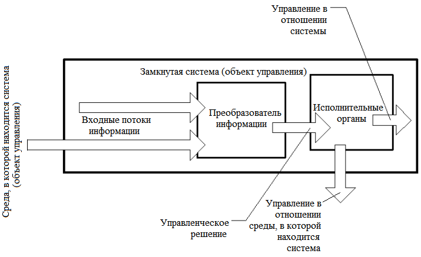
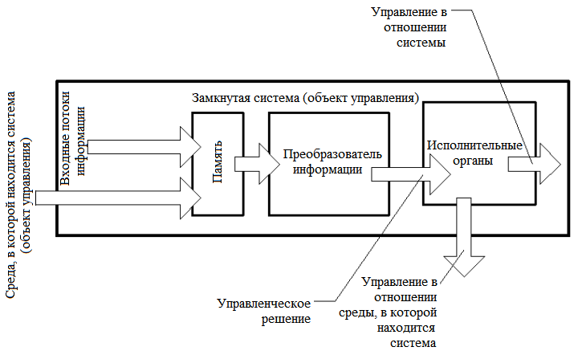
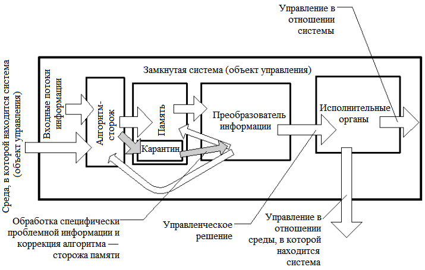

> **Первичный текст.** Мёртвая вода — редакция ред. 2015 г..
> Источник: `dotu.ru:c5d5a456d9fcb99c.fb2` sha256 `4dd1886169e7b01a…`; [страница на dotu.ru](https://dotu.ru/2015/05/09/mv-2015/).
> Автоматическая транскрипция DOC→Markdown; смысл и формулировки не правились.
> Контрольные суммы и статус проверки — в [NOTICE.md](../../NOTICE.md).
> Содержание передаёт позицию авторов; утверждения не верифицированы библиотекой.

---

## Процесс 2. ГЛОБАЛЬНАЯ ЦИРКУЛЯЦИЯ ИНФОРМАЦИИ, РЕЖИМ СЕКРЕТНОСТИ И ОБЕСПЕЧЕНИЕ ИНФОРМАЦИОННОЙ БЕЗОПАСНОСТИ УПРАВЛЕНИЯ[301]

Речь пойдёт прежде всего об обеспечении секретности (от кого? — это главный вопрос) в сферах управления, науки и промышленности.

Система режима секретности работ, существующая в СССР, сложилась во времена пребывания у руководства органов государственной безопасности СВЕРХпропорционально большого количества израиловичей. Она изходит из того, что каждый, кого государство вынуждено допустить до работ с информацией, признанной закрытой, — потенциальный предатель. По этой причине каждый его шаг необходимо контролировать, а чтобы свести к минимуму ущерб в случае его предательства, для работы ему необходимо предоставлять минимум информации, якобы касающейся только его.

Если анализировать состав реальных, а не потенциальных предателей интересов народов СССР, то доля <удалено цензурой – см.приложение «Материалы суда»> и связанных родственными узами с ними, намного превышает их долю в составе населения страны. В данном случае имеются в виду не предатели, осуждённые по соответствующим статьям УК республик СССР, а лица, получившие допуск к работе с секретной информацией и спустя какое-то время изъявившие желание покинуть СССР потому, что здесь нет тех или иных «свобод» или низок уровень потребления материальных благ, или ставшие на путь подрыва его государственности.

Основным свойством сложившейся системы режима секретности является то, что специалист, вырабатывая и принимая решение, не обладает всей информацией, необходимой для того, чтобы решение было правильным. Произходит это главным образом по следующим причинам:

● то, что делается в информационно связанных отраслях деятельности, от узкого специалиста система режима скрывает, дабы ограничить круг допущенных лиц и уменьшить статистическую предопределённость возможной утечки закрытой информации;

● то, что делается в своей отрасли деятельности, специалист может не знать, поскольку вышестоящие начальники по неведению или осознанно посчитали нецелесообразным его ознакомить с какой-либо информацией;

● система прямо запрещает накопление информации и её обобщение специалистами, во избежание возможных утечек больших объёмов обобщённой информации, и это затрудняет отслеживание процессов развития отраслей знаний большинству добросовестных специалистов.

Всё это приводит к тому, что специалист, как правило, не знает всего относящегося к его вопросам, не видит места своей тематики в общем круге вопросов и потому в принципе не способен быстро выработать и принять правильное решение, не нарушая режима секретности работ. В той или иной степени этот факт осознаётся всеми, кто достаточно длительное время сталкивался с этой системой. Поскольку подавляющее большинство персонала, охваченного «защитой» системы режима секретности, не являются предателями, то их желание работать хорошо на благо Родины, т.е. своевременно вырабатывать и принимать правильные решения на основе всей необходимой информации, порождает неофициальную систему циркуляции закрытой информации, основанную на личном доверии специалистов друг к другу. Как циркулирует информация в этой неофициальной системе, контролировать практически невозможно, но её существование позволяет получить практически любую информацию, если не непосредственно, то через информационно связанную с нею.

Бороться с этой неофициальной системой на основе официальной системы режима секретности безполезно, поскольку официальная сама же и порождает неофициальную. Фактически это две подсистемы объемлющей их системы управления государственностью СССР из Евро-Американского конгломерата осуществляемой безструктурным (преимущественно) способом.

Механизм этого замыкания управления на внешние структуры включает в себя, казалось бы, не связанные друг с другом элементы как внутри СССР, так и за его пределами.

Сейчас несколько подзабыли совершенно правильный лозунг: «Кадры решают всё!» Кадровая политика в СССР после 1953 г. изходила из принципа, описанного М.Е.Салтыковым-Щедриным: «Небоящиеся чинов, оными награждены не будут! Боящемуся же всё дастся… И даже с мечами, хотя бы он ни разу не был в сражении противу неприятеля».

Но эта верноподданность ещё усугублена и системой режима секретности. Всё руководство вырастало из узких специалистов, которые всегда имели доступ к информации только «в части, их касающейся», сообразно занимаемой должности. Поднимаясь по ступеням иерархии управления, они обретали в кругу своей ответственности вопросы, о которых никогда прежде не имели содержательного представления благодаря особенностям системы режима секретности и своей собственной низкой методологической культуре. Неспособность к скорочтению в сочетании с низкой методологической культурой ставит такого руководителя в зависимость от узких специалистов в содержательно незнакомых ему лично областях деятельности; правильность рекомендаций таких специалистов по этим причинам он просто не в состоянии контролировать и потому вынужден верить или не верить им слепо.

Вставка 1998 г.

Это позволяет построить схему анонимного дистанционного управления такого рода руководителями в обход контроля их сознания. При этом они толком не понимают, как и где вырабатываются и утверждаются те решения, которые они проводят в жизнь. Принципы построения такого рода системы дистанционного управления “начальниками” показаны на ниже приводимом рис. 1.

Рис. 1. Схема дистанционного управления “лидером” в обход контроля его сознания со стороны носителей концептуальной власти

Эта схема в обществе работала издавна, хотя научные изследования выявили возможность её целенаправленного построения только во второй половине ХХ века. В середине 1970‑х гг. одна из газет в качестве курьёза сообщила, что согласно изследованиям американских социологов двух случайно избранных американцев соединяет цепь знакомств в среднем не более чем в десять человек. Если есть цепь знакомств, то в принципе по ней возможна передача информации в прямом и обратном направлении. Всё выглядит так, как в детской игре «изпорченный телефон», с тою лишь разницей, что участники цепи знакомств не сидят в одной комнате, на одном диване, а общаются между собой в разное время и в разных местах. Тем не менее, информация по таким цепям объективно разпространяется, порождая некоторую статистику информационного обмена, на основе которой может быть построено достаточно эффективное управление.

Видение этой статистики, некоторые знания психологии людей, позволяют строить такого рода цепи целенаправленно. Количество звеньев в них будет не 10 — 20, а гораздо менее, что делает их быстродействие достаточно высоким для осуществления стратегического управления, а подбор кадров для них (естественно негласный, «в тёмную») обеспечивает достаточно высокую степень сохранения в них при передаче стратегической управленческой информации. Дело в том, что стратегическая информация в своём большинстве достаточно компактна и требует для упаковки весьма мало слов и символов.

На схеме рис. 1 показана иерархия структур и некий лидер, возглавляющий одну из них. Такого рода структурой может быть аппарат главы государства, министерство, спецслужба, научно-изследовательский институт, лаборатория в его составе, проектно-конструкторское бюро, редакция и т.п. Структура представляет собой некое штатное разписание. Персонал, наполняющий клетки штатного разписания, условно можно разделить на две категории:

● аппаратную “шушеру”[302], которой «что бы ни делать, лишь бы не работать», но получать зарплату;

● и работающих специалистов, которые более или менее «болеют за дело».

Из числа вторых можно выделить ещё одно подмножество — нескольких человек, мнение которых значимо для лидера структуры при руководстве ею. На схеме один из таких специалистов указан и назван действительным тайным советником “вождя”.

Но люди далеко не всё время проводят на работе. Есть ещё круг неформального общения. При этом «действительные тайные советники» многих публичных лидеров или деятелей, широко известных в узких кругах специалистов, вхожи в дома популярных личностей, чьё мнение более или менее авторитетно во всём обществе. В дома такого рода “звёзд” вхожи и многие другие люди. Среди них могут быть и школьные и вузовские друзья “авторитетов”, которые и сами не обделены талантом, и хотя в силу ряда причин не смогли обрести высоких титулов, но к их мнению прислушиваются их высокоавторитетные друзья, по отношению к которым они выступают в роли домашних действительных тайных советников. Фактически они “опекуны” общесоциальных “авторитетов”.

Опекуны могут знать, что они выполняют миссию опекунства, но могут изпользоваться в тёмную так же, как и действительные тайные советники. Либо непосредственно, либо через некоторое количество промежуточных звеньев на опекунов выходят представители наследственных кланов знахарей концепции общественного управления. Они могут быть возпитателями опекунов с детства. Это может быть деревенский дедушка, бабка, сосед по даче где-то за сотни километров от основного места жительства “опекуна”. Возможно, что и не получив высшего образования, он однако, является человеком, с которым “опекуну” интересно поговорить «за жизнь»; возможно, что этот интерес у него с детства.

Мы разсматривали эту систему, начиная от лидера структуры. Но исторически реально системы такого рода дистанционного управления лидером целенаправленно выстраиваются в течение годов и десятилетий в обратной направленности: от знахарей концепций к публичным лидерам отраслей общественной деятельности; а также и сами лидеры в ряде случаев создаются при развёртывании такой системы и продвигаются на тот или иной пост аналогично тому, как по шахматной доске передвигаются фигуры при развёртывании той или иной стратегии шахматной игры.

Если начинать разсмотрение управления от места, в котором рождаются и принимаются общественно значимые решения, то главой государственности может оказаться какой-нибудь пчеловод в деревне. И как поётся в песне:

«На дальней станции сойду (в пределах суток езды от официальной столицы), трава — по пояс…» и буду прямо говорить глаза в глаза с главой внутриобщественной власти. Всё запомню, приеду в город, разскажу приятелям, как провёл выходные. Они тоже разскажут своим, а потом это — аукнется в политике, науке и т.п. А я так и не пойму, почему… А не пойму потому, что точно знаю, что на принципах игры в «изпорченный телефон» и при помощи разпространения сплетен и анекдотов управлять ни государством, ни отраслью деятельности невозможно. А про безструктурный способ управления нам ничего не разсказывали ни дома, ни в школе, ни в вузе…

В качестве иллюстрации такого рода якобы невозможности приведём выдержку из книги В.Н.Демина “Тайны Русского народа”. Он цитирует письмо профессору Г.Ц.Цыбину от 24 марта 1927 г., написанное А.В.Барченко, в 1920‑е гг. занимавшегося изследованиями истории становления Руси и русских эзотерических знаний:

«<…> Это убеждение моё [об Универсальном Знании — В.Д.] нашло себе подтверждение, когда я встретился с русскими, тайно хранящими в Костромской губернии традицию [Дюн-Хор]. Эти люди значительно старше меня по возрасту, и насколько я могу оценить, более меня компетентных в самой Универсальной науке и в оценке современного международного положения. Выйдя из костромских лесов в форме простых юродивых (нищих), якобы безвредных помешанных, они проникли в Москву и отыскали меня. <…> Посланный от этих людей под видом сумасшедшего произносил на площадях проповеди, которых никто не понимал, и привлекал внимание людей странным костюмом и идеограммами, которые он с собой носил <…> Этого посланного — крестьянина Михаила Круглова — несколько раз арестовывали, сажали в ГПУ, в сумасшедшие дома. Наконец пришли к заключению, что он не помешанный, но безвредный. Отпустили его на волю и больше не преследуют. В конце концов, с его идеограммами случайно встретился в Москве и я, который мог читать и понимать их значение.

Таким образом установилась связь моя с русскими, владеющими русской ветвью Традиции [Дюн-Хор]. Когда я, опираясь лишь на общий совет одного южного монгола, <…> решился самостоятельно открыть перед наиболее глубокими идейными и бескорыстными государственными деятелями большевизма [имеется в виду прежде всего Ф.Э.Дзержинский — В.Д.] тайну [Дюн-Хор], то при первой же моей попытке в этом направлении, меня поддержали совершенно неизвестные мне до того времени хранители древнейшей русской ветви Традиции [Дюн-Хор]. Они постепенно углубляли мои знания, разширяли мой кругозор. А в нынешнем году <…> формально приняли меня в свою среду <…>»[303].

Ещё в 1961 г. начальник управления специальных операций ЦРУ сказал:

«Книги отличаются от всех иных средств массовой пропаганды прежде всего тем, что даже одна книга может значительно изменить отношение и поведение (т.е. стереотипы отношения и поведения толпаря: — авт.) читателя в такой степени, на которую не могут подняться ни газеты, ни радио, ни кино… Это, конечно, верно не для всех книг и не всегда и не в отношении всех читателей (т.е. для нетолпарей это неверно: — авт.), но это случается достаточно часто. Поэтому книги являются самым важным орудием стратегической (т.е. долговременной) пропаганды».

В 1976 г. были оглашены данные:

«… до 1967 года значительно более 1000 книг было подготовлено, субсидировано или одобрено ЦРУ», а в последние несколько лет «таким образом было выпущено ещё 250 книг».

В “правовом” “демократическом” государстве США сенатская комиссия не смогла добиться от ЦРУ списка книг, изданных при его поддержке. Т.е. Сенат США не должен знать, где и как рождаются его мысли и действительно вырабатывается политический курс.

Это отражает тот факт, что демократические институты США — ширма на сионо-масонской мафии, жёстко правящей через свою системную периферию в “демократически избранных” государственных структурах. Соответственно и определение «искусствоведы в штатском» — не пустая игра слов, а указание на явление в жизни общества, более значимое, чем публичная политика.

Кроме этого, на Западе есть ещё и периодика, прежде всего научно-техническая, по тематике, являющейся в СССР секретной. Большинство этой литературы оказывалось в СССР на протяжении многих лет в “спецхранах”, а информация из неё доводилась до специалистов через издания типа “Зарубежное военное обозрение” во вторичном пересказе непрофессионалов и достаточно часто практически без иллюстративного материала.

В западной специальной периодике имеется одна особенность: большинство её — научно-популярные издания, которые призваны не более чем уведомить заинтересованных заказчиков или разработчиков о состоянии дел по той или иной проблеме, а также заинтересовать молодёжь во вступлении в те или иные отрасли деятельности.

В нашей же специальной периодике основной объём составляют серьёзные научно-технические издания, довольно подробно и содержательно освещающие те или иные частные вопросы. В СССР же нет научно-популярных изданий типа “Техника — молодёжи”, излагающих общие вопросы и прогнозы, ориентированных на взрослых серьёзных частных специалистов, которых необходимо обязательно знакомить с общим ходом дел в их отраслях и в смежных.

Запад циркулярно разпространяет главным образом научно-популярную информацию о том, какие изследования, где и кем ведутся. Допуск заинтересованных лиц к содержательной информации осуществляет её владелец за «отдельную плату», на определённых условиях, гарантирующих её неразглашение без ведома владельца.

СССР же в периодических изданиях циркулярно (в том числе и для Запада) разпространяет содержательную информацию, непосредственно отражающую реальное содержание оригинальных научно-технических отчётов. Отчасти это вызвано требованиями ВАК о публикациях перед защитой диссертаций, отчасти плохой системой оперативного обеспечения содержательной информацией в темпе поступления запросов от заинтересованных организаций и специалистов.

Поскольку подавляющее большинство научно-технической информации — так называемого «двойного изпользования», т.е. изпользуется и в отраслях, охраняемых системой режима, и в отраслях открытой тематики, то систематический анализ советской научно-технической периодики, открытых учебников по информационно связанным отраслям науки и техники позволяет Западу довольно точно судить об уровне развития отраслей, “закрытых” режимом секретности.

Поэтому Запад более знаком с содержательной стороной наших изследований, чем мы с его. Нам он показывает только рекламу реальных и мнимых достижений, а мы ему без рекламы отдаём содержательную сторону изследований даром, избавляя его от необходимости тратить ресурсы на тупиковых направлениях изследований там, где нам удаётся вырваться вперёд. Поэтому наша система режима совместно с общедоступной научно-технической литературой обеспечивает односторонне направленную перекачку содержания прикладной фактологии на Запад.

Вторая сторона связана с отсутствием “научно-популярных”, специальных научно-технических изданий в СССР, поскольку потребность в такого рода целостной, обзорной прогностической информации всё же есть. В СССР эта информация (концептуальная!) черпается из западных изданий типа “Интернэйшнл дефенс ревю”. Они большей частью оседали в “спецхранах” и по этой причине были доступны только руководству и узким специалистам-поводырям, подставленным руководству для консультаций по частным вопросам. Научно-техническая “общественность” к этой информации доступ не имела и в целом не возражала против этого.

Эта особенность нашей системы режима никогда не была тайной для Запада. Поэтому наряду с рекламой (для внутреннего применения на Западе) во всех периодических изданиях печаталась научно-техническая порнография о предполагаемых путях развития тех или иных отраслей науки и техники в ходе научно-технического прогресса. Наши начальники, запершись в кабинетах, смаковали последние 30 лет эту научно-техническую порнографию, как школьники, прячущиеся от родителей с сексуальной порнографией.

Поскольку система режима в СССР не способствует возпитанию целостного возприятия процессов развития отрасли, которой руководит ставший начальником узкий специалист, то в силу низкой методологической культуры и обусловленного ею слепого доверия или недоверия к подчинённым, такой руководитель не в состоянии отличить дезинформацию от достоверных жизненно возможных концепций. Поскольку дезинформация подкреплена достоверной фактологией и прежде всего такой, которая может быть получена только агентурным путём, то научно-техническая порнография действует завораживающе на узкого специалиста, ставшего руководителем.

В условиях постоянного отставания научно-технического прогресса в СССР от Запада, созерцание научно-технической порнографии руководством вызывает у него желание “чуда”, т.е. научно-технического прорыва, который позволил бы обогнать Запад, не догоняя. В итоге в СССР плодится всяческая экзотическая тематика. Работы по ней ведутся до тех пор, пока она не начнёт приносить плоды. После этого работы в СССР сворачиваются, глохнут, не могут пробиться сквозь «ведомственные» барьеры, но легко преодолевают его государственные границы и внедряются на Западе (а теперь и на Востоке).

Поскольку официальная система режима сама же порождает неофициальную, в которой циркулирует всё, что угодно, то многочисленная профессиональная агентура не нужна. Достаточно внедрения малочисленной масонской периферии, даже не осознающей этого факта, в научно-технические общества, учёные советы, редакционные коллегии и т.п. Сионизация высших эшелонов науки и техники ещё более упростила дело, поскольку <удалено цензурой – см.приложение «Материалы суда»> в целом осознаёт свою общность в глобальных масштабах и игнорирует национальные, многонациональные и государственные интересы с позиций “элитарного” космополитизма расы “богоИЗБРАННЫХ” “господ” именно для осуществления этой социальной функции.

Если же система разпространения научно-технической порнографии оказывается неэффективной и не удаётся повернуть развитие какого-либо процесса в СССР в желательном направлении, то спустя какое-то время дезинформация начинает поступать через Главное Разведывательное Управление и прочие спецслужбы.

Фактическая информация, иллюстрирующая этот процесс, не приводится, дабы не обременять себя ненужным грифом секретности и не затенять частностями общий характер излагаемой концепции. Свёртывание работ в СССР по развитию многих перспективных направлений науки и техники с одновременным разпылением ресурсов на тупиковых направлениях в 1950 — 80 гг. было осуществлено именно таким образом.

Для того чтобы убедиться в этом, достаточно провести хронологический анализ западных публикаций, данных отечественной разведки, рекомендаций советской науки и техники и принимаемых к изполнению решений примерно с 1956 по 1985 гг.

В итоге большинство наших оборонных отраслей отстаёт от Запада, но их руководство соглашается признать только отдельные недостатки, а не общее отставание, да и то только тогда, когда не признать их уже невозможно. Причинами же отставания оно верноподданно не интересуется, поскольку вопросы управления научно-техническим прогрессом в общегосударственных масштабах не входят в перечень должностных обязанностей никого из государственных чиновников, видимо, за изключением главы государства. В советский период с этой обязанностью, однако, справлялся только И.В.Сталин[304].

Те специалисты, кто выступал против дезинформации, терпели крах в карьере и под разными благовидными предлогами и прямой открытой подлостью[305] вытеснялись в иные сферы деятельности.

Эта особенность “нашей” системы режима секретности позволяет Западу изпользовать научно-технический и экономический потенциал СССР в своих целях; прежде всего — сворачивая перспективные изследования в СССР, а во-вторых, проводя за наш счёт изследования, на которые своих ресурсов не хватает, с последующим уничтожением в СССР экспериментальной базы и разпылением кадровой.

Есть точка зрения, что одно из последних достижений Запада в этой области — уничтожение 7 апреля 1989 г. АПЛ “Комсомолец”, приговорённой к уничтожению ещё на чертёжной доске, путём создания высокой статистической предопределённости возникновения на ней аварийных ситуаций[306].

Управлять, как показано в достаточно общей теории управления, можно структурным и безструктурным способом, т.е. изменяя вероятностные характеристики тех или иных событий. Это позволяет построить и механизм организации диверсий, когда объект уничтожен, а злоумышленников нет или они могут отпереться тем, что действовали на основании руководящих документов. Претензий к разработчикам руководящих документов тоже быть не может, поскольку погиб один объект, а все остальные, созданные по тем же руководящим документам, успешно функционируют, хотя отдельные недостатки есть во всём.

Возня вокруг подъёма “Комсомольца” отражает уникальность этой лодки и никак не связана с экологическими мотивами, поскольку никто не вспоминает ни о “Трэшере”, ни о “Скорпионе”, ни о захороненных на дне контейнерах с радиоактивными отходами, ни о потерянном ядерном оружии, ни о стратегическом ракетоносце СССР[307], тоже весьма странно погибшем в Северной Атлантике незадолго до встречи руководителей СССР и США в Рейкьявике. Особенно сказанное касается “Трэшера” и “Скорпиона”, затонувших довольно давно, и степень разрушения которых морской водой должна быть гораздо выше, чем более поздних жертв человеческой разхлябанности в кораблестроении и мореплавании.

Существующая система режима секретности основана изключительно на принципе защиты от несанкционированного доступа к фактологической информации согласно разного рода перечням сведений, не подлежащих оглашению, публикации: в открытой печати, освещению в специальных източниках в закрытой печати, не имеющих установленного грифа, и т.п. Ограничительный гриф — гриф секретности — присваивается информационному източнику в целом. Редко, когда отдельные главы имеют свои ограничительные грифы. Поэтому достаточно часто в одном обширном източнике оказывается под весьма высоким грифом информация всех существующих грифов секретности или информационно с нею связанная (что позволяет возстановить закрытую информацию). Поскольку все перечни закрытых сведений довольно обширны и упомнить их невозможно, то такие информационные източники порождают статистическую предопределённость передачи более закрытой информации при обсуждении более открытой информации, в них содержащейся, просто потому, что система режима секретности возпитывает не культуру обращения с информацией, а культуру игнорирования режима секретности, реально мешающего работать.

Даже беглый взгляд на ставшие доступными закрытые източники США показывает, что в них гриф секретности стоит на каждом листе и кроме того, перед каждым абзацем текста, рисунком и т.п. Это — выражение принципиально иной системы подхода к защите информации от несанкционированных утечек. Такое поабзацное определение грифов ограничения доступа неизбежно ведёт к тому, что при обсуждении и компиляции текстов не произойдёт несанкционированной, статистически предопределённой утечки информации вследствие простой ошибки изполнителя или его вполне возможном (при обилии информации) неведении о степени секретности какого-то частного фрагмента текста.

После снятия “железного занавеса”, когда поездки за границу стали возможны и для представителей научно-технической интеллигенции, стала расти тенденция к нежеланию работать по закрытой тематике, особенно наиболее важной, имеющей более высокие грифы и налагающей дополнительные ограничения на всю массу “потенциальных предателей”, занятых этими работами. Прежде всего это касается вузовской науки, имеющей достаточно большой интеллектуальный потенциал. Карьерные разработки её представителей и гонорарные доходы в значительной мере связаны с публикациями, для чего открытая печать создаёт лучшие условия, чем закрытая. Работа по закрытой тематике оказывается менее выгодной, чем простое тиражирование (мультипликация) одного и того же в различных изданиях открытой печати, а дополнительные ограничения на поездки за рубеж и на изпользование реальных результатов изследований в открытых диссертациях усугубляют это положение, поскольку такая тенденция проявляется прежде всего в среде специалистов довольно высокой квалификации, имеющих реальную возможность выбора заказчика работ и тематики.

Кроме этого, существующая система режима “секретности” создаёт условия, в которых процветает лженаука. Узкие специалисты, вышедшие на руководящие посты достаточно широкой ответственности, зависимы от подчинённых им специалистов в частных, содержательно неизвестных им самим вопросах и неспособны отличить лженауку от достоверной науки. В результате один из способов сделать научную карьеру — выбрать очень важную для страны цель изследований; важностью цели обеспечить очень высокий гриф секретности и доступ к информации очень узкого круга лиц; важность цели, обещание фантастических результатов гарантирует обильное финансирование. Поскольку за этим не стоит ничего, кроме карьеризма, то такие изследования всегда пользуются поддержкой сионо-масонской мафии мастеров науки и техники, которая обеспечивает защиту диссертаций на особо закрытых советах; помогает в карьерных разработках; специально организует утечку информации за рубеж, что немедленно вызывает обилие публикаций в научно-порнографической литературе о перспективности этой лженаучной тематики и возможном “чуде”. Взращённые таким образом карьеристы в дальнейшем выдвигаются на руководящие посты и функционируют в качестве послушных агентов влияния, полностью зависимых от их поводырей. После этого тематику закрыть невозможно десятилетиями, поскольку те, кто могут по должности закрыть работы, в ней ничего не понимают и боятся принять на себя ответственность за закрытие «возможно перспективной тематики», а часто и соавторствуют в этой ахинее и, может быть, выросли на этой тематике; а те, кто понимает, либо не знают о работах по причине высокого забора секретности, либо их просто не слушают, поскольку они де не по должности «лезут не в своё дело». Часть же специалистов просто молчит, поскольку их служебный и научный рост также зависит от мафии мастеров науки и техники: у них “семья, дети” — тут не до принципиальности в деле.

В результате такой взаимовложенности нашей системы режима секретности в глобальные информационные потоки, она в общем-то не препятствует однонаправленному оттоку из СССР прикладной научно-технической фактологии; не препятствует оттоку стратегической информации, очень компактной и не нуждающейся в объёмных носителях[308]; замедляет темпы научно-технических разработок в СССР; позволяет управлять открытием и свёртыванием работ в СССР извне. При этом на долю профессиональной агентуры и резидентуры выпадает только уточнение выявленной ранее наиболее важной информации. Поэтому до 80 % наших пионерских разработок возвращаются в СССР, спустя 15 — 20 лет, как серийная продукция и технологии через США, ФРГ, Японию, в то время как в СССР сами пионерские разработки так и остаются лежать в архивах на полках.

Формально всё, изложенное выше, в СССР является информацией, не подлежащей открытому разпространению, т.е. представляет собой государственную тайну. Однако анализ развития советской науки и техники за последние 35 лет говорит, что все эти особенности режима секретности СССР не являются тайной от “Рэнд Корпорэйшн” и других мозговых трестов, обслуживающих ЦРУ, СНБ и администрацию США в целом, а следовательно, должно являться государственной тайной стран Евро-Американского конгломерата и корпоративной тайной сионо-масонства. Поэтому очевидной глупостью или очевидным предательством явилось бы преследование в СССР за разглашение государственной тайны США и мафиозных тайн библейского интернацизма.

Всё вышеизложенное касалось режима секретности работ в сфере управления, в науке и промышленности. В строевых частях Вооружённых сил СССР, органов КГБ и МВД, эти особенности системы режима секретности не должны носить характера такого общенародного бедствия, как в остальных отраслях общественного объединения труда, по причине малого разнообразия функций их подразделений по сравнению с остальным народно-хозяйственным комплексом.

С точки зрения теории управления, существующая система режима секретности работ и порождаемые ею организационные структуры и официальные контуры циркуляции информации не отвечают идеалам и объективному вектору целей советского общества. Поэтому она является стимулом к активизации циркуляции, “защищаемой” ею информации, вне её официальных структур и каналов, а также в структуры более соответствующие объективному вектору целей общества. С другой стороны, несоответствие подобной информации советскому вектору целей одновременно отражает её полное соответствие вектору целей системы управления Евро-Американским конгломератом, поскольку псевдоэтническая международная мафия и масонство свободно входят в систему безструктурной циркуляции информации. Для развития советского общества гораздо большую опасность представляет не утечка прикладной фактологии за рубеж, на борьбу с чем якобы ориентирована официальная система режима, а приток из-за рубежа концептуально чуждой информации и безконтрольное со стороны общества её внедрение в систему общественного самоуправления. Но именно с этим система режима не борется. Фактор этот не проявлялся открыто до начала 1930‑х гг. по крайней мере, поскольку у власти в СССР в это время открыто стоял сионо-интернацизм, готовивший и Россию, и Германию к взаимному истреблению. Чтобы истребление шло лучше, и там, и там надо было иметь мощный военно-экономический потенциал. После войны, когда СССР стал стремиться к концептуальной самостоятельности, система режима стала работать против СССР, обеспечивая замедление темпов научно-технического прогресса и подчинение СССР Евро-Американскому конгломерату по всем шести приоритетам обобщённых средств управления.

Однако и США имеют аналогичную по качеству систему режима секретности. Когда для возстановления балансировочного режима в гонке вооружений «Запад — Восток», высшему масонству потребовалась перекачка ядерной информации в СССР, то система режима секретности США продемонстрировала свою полную несостоятельность точно так же, как и советская в последующие годы.

Это говорит о том, кто является реальным хозяином систем режима секретности обеих стран. Построение системы режима по принципу, что каждый допущенный к закрытой информации — потенциальный предатель, вполне оправдано, если смотреть на неё с позиций космополитического сионо-интернацизма, по отношению к которому большинство населения действительно потенциальные предатели и, если не предают, то только потому, что не понимают, кого, кому и как следует предать.

Возможно, что кому-то этот вывод не нравится, но надо возпитывать в себе целостность мировозприятия.

Если система режима секретности соответствует потребностям общественного развития, то кризис управления и отставание СССР в научно-техническом прогрессе всем привиделись. Если же отставание есть и кризис управления есть, то система режима секретности — часть системы мафиозного надгосударственного управления, вызвавшей эти явления к жизни в СССР.

Если смотреть на систему режима секретности работ, изходя из долговременных интересов многонациональной цивилизации блока Россия (СССР), то она должна быть всего лишь подсистемой в системе контроля и защиты контуров циркуляции информации в обществе в целом. Далее будет изпользоваться термин СИСТЕМА ИНФОРМАЦИОННОЙ БЕЗОПАСНОСТИ, хотя имеется в виду СИСТЕМА КОНТРОЛЯ И ЗАЩИТЫ КОНТУРОВ ЦИРКУЛЯЦИИ ИНФОРМАЦИИ В ОБЩЕСТВЕ В ЦЕЛОМ. Это один из примеров, когда фонетическая письменность неудобна для точной передачи смысла.

При взгляде с позиций достаточно общей теории управления информационная безопасность это — устойчивое течение процесса управления объектом (самоуправления объекта), в пределах допустимых отклонений от идеального предписанного режима, в условиях не только стихийных воздействий среды, но и в условиях целенаправленных сторонних или внутренних попыток вывести управляемый объект из предписанного режима, которые могут маскироваться под проявления стихийной активности среды. Таким образом термин “информационная безопасность” всегда связан с конкретным объектом управления, находящемся в определённых условиях (среде).

Но кроме того он относится к полной функции управления, представляющей собой совокупность разнокачественных действий, осуществляемых в процессе управления, начиная от выявления факторов, требующих управленческого вмешательства и формирования вектора целей управления, и кончая ликвидацией управленческих структур, выполнивших своё предназначение.

Это общее в термине “информационная безопасность” по отношению к информационной безопасности как самого мелкого и незначительного дела, так и информационной безопасности человечества в целом в глобальном историческом процессе.

Соответственно, ОСНОВНЫМ ТРЕБОВАНИЕМ, предъявляемым к системе информационной безопасности общества, является обеспечение устойчивости концептуальной власти общества в преемственности поколений, а по отношению к первому приоритету в векторе целей — обеспечение ликвидации толпо-“элитаризма”.

Следствием этого требования является необходимость такой организации циркуляции информации в обществе, при которой изключается внедрение извне в систему общественного управления тех или иных концепций развития в обход внутренней — общенародной — концептуальной власти страны.

Защита прикладной фактологии от несанкционированного доступа имеет смысл только при условии устойчивости процесса концептуальной самостоятельности общества. В противном случае надёжная защита прикладной фактологии от несанкционированного доступа обеспечивает устойчивое замыкание контуров системы общественного управления на внешнюю концептуальную власть, которая по СВОЕМУ ПРОИЗВОЛУ может казнить и миловать как общество в целом, так и его отдельные социальные группы.

Далее всё изложение касается сферы управления, науки и техники прежде всего, поскольку информационные процессы в них качественно отличаются по содержанию информации от информационных процессов в строевых частях вооружённых сил, КГБ и МВД.

Но и при условии обеспечения устойчивости процесса концептуальной самостоятельности не следует увлекаться защитой всего объёма прикладной фактологии. Существующие перечни сведений, подлежащих защите от несанкционированного доступа, составлены изходя из желания перестраховаться, людьми, в большинстве своём не осознающими характера циркуляции информации в общественном производстве и управлении. По этой причине секретной становится не только действительно секретная информация, но и фактологическая информация, оглашение которой не может нанести реального вреда обществу. Это мнимосекретная информация. Факт замусоривания системы режима мнимосекретной информацией в той или иной степени осознаётся большинством сталкивающихся в научной и производственной деятельности с этой системой. И это является основной причиной утечки действительно секретной (далее просто секретной) информации, которая в неофициальной системе циркуляции информации выбалтывается по личному доверию наряду с мнимосекретной, просто вследствие низкой культуры обращения с информацией.

Это утверждение ярко иллюстрируют следующие примеры. Техническая документация по советским танкам Т‑34 была безусловно сов. секретной. Уже в 1941 г. оккупанты убедились в том, что Т‑34 действительно является лучшим средним танком второй мировой войны. В Германии встал вопрос о производстве немецкой копии Т‑34 по образцу захваченных в ходе военных действий экземпляров. Камнями преткновения для передовой германской промышленности явились: её неготовность сварить корпус танка из броневых плит; неготовность отлить броневую башню целиком (или сварить из плит, как сварен корпус); неготовность возпроизвести танковый дизель с алюминиевым картером.

Известно, что Д.И.Менделеев создал технологию производства бездымного пороха в России на основе анализа сырья, поступающего на один из зарубежных пороховых заводов.

В 1984 г. один из офицеров американского авианосца сказал: «Мы можем отдать русским весь этот корабль со всеми самолётами, и пройдёт 15 лет, прежде чем он станет оружием в их руках». И с этим можно согласиться, поскольку и конструктивные особенности корабля и самолётов, и процесс организации службы на авианосце оплачены 70-летней историей реального боевого изпользования и аварий в палубной авиации ВМС США, а не умозрительными разсуждениями, подобными хрущёвско-арбатовским и яковлевско-симоновским[309], в уютных кабинетах руководителей министерств и конструкторских бюро СССР.

Эти примеры говорят о том, что удельный объём реально секретной фактологии в общем объёме закрытой информации довольно низок. И в зависимости от содержания прикладной фактологии, её реальная секретность оказывается различной на разных этапах жизненного цикла научно-технической продукции. Кроме того, общий уровень развития мировой науки и техники и экспортно-импортная политика государства также изменяют реальную секретность фактологической информации с течением времени.

Существующая система режима секретности игнорирует эти особенности изменения реальной секретности прикладной фактологии и устанавливает грифы раз и навсегда в предположении, что впоследствии гриф будет снят или понижен при необходимости особым приказом. О необходимости своевременного издания такого приказа в житейской суете забывают, и в результате существующая система режима секретности забита мнимосекретной информацией, что создаёт трудности прежде всего для контроля за циркуляцией реально секретной информации. Допуск же и к древней мнимосекретной информации осуществляется только с разрешения достаточно высокого начальства, к которому основной контингент изполнителей доступа не имеет; по этой причине научно-техническая документация лежит на полках под охраной режима секретности, но не служит формированию культуры научно-технических разработок. В науке и технике стремление секретных служб избавиться от учёта и контроля над устаревшими секретами выливается не в снятие грифа и сохранение източников информации в несекретных хранилищах, что необходимо для существования преемственности поколений и научно-технических школ, а в массовое уничтожение научно-технической документации, что ведёт к утрате культуры научно-технических разработок и выливается с течением времени в хроническое научно-техническое отставание СССР. При этом уничтожаются и уникальные източники (возпроизведение которых не всегда возможно) только по той причине, что в них нет текущей необходимости.

Если анализировать информацию, связанную со всем жизненным циклом научно-технической продукции от стадии начала разработки требований к продукции до её ликвидации за ненадобностью, то всю прикладную фактологию можно разделить на следующие качественно различные категории:

● КОНЦЕПТУАЛЬНАЯ ИНФОРМАЦИЯ, обосновывающая потребительские (технические, тактико-технические) параметры, которыми должна обладать продукция, организацию её эксплуатации и ликвидации по завершении жизненного цикла. Сокрытие её имеет смысл только до появления за рубежом аналогов того же функционального назначения с близкими или более высокими потребительскими качествами. До появления зарубежного аналога свободный доступ к информации должны иметь все те, кто руководит разработкой аналогичных перспективных образцов и организацией изпользования по назначению уже созданных образцов. Эти же лица должны быть вправе знакомить полностью или частично с этой информацией подчинённых им специалистов по мере возникновения необходимости. После появления зарубежных аналогов к концептуальной информации должен быть предоставлен свободный доступ всем специалистам, связанным с данной продукцией на всех этапах её жизненного цикла, поскольку только в этом случае страна может получить достаточно быстро критику прежней концепции вида или класса научно-технической продукции и генерацию новой концепции. Успех концептуальной деятельности определяется наличием «искры Божией», которую, как известно, невозможно «вручить во временное пользование в связи с назначением на должность». По этой причине вся информация, необходимая для генерации новой концепции, должна быть доступна тем, у кого есть искра Божья, вне зависимости от того, где они находятся в сложившейся структуре соподчинения профессий в общественном объединении труда. Соответственно и каждый, кто несёт в себе реально секретную информацию, должен иметь возможность: во-первых, доступа к закрытым каналам информации; во-вторых, прямого, через голову начальства, обращения на те уровни иерархии системы общественного управления, на которых должно приниматься решение по критике существующей концепции и варианту новой концепции. После появления зарубежного аналога прежняя концептуальная информация (возможно за изключением отдельных фрагментов), реальной секретностью не обладает, поскольку аргументация о том, какими качествами должна обладать уже созданная продукция с близкими параметрами может различаться главным образом формой изложения. Секретить концептуальную информацию по продукции, обладающей заведомо более низкими потребительскими параметрами, вообще безсмысленно, поскольку это лучший способ законсервировать научно-техническое отставание страны на неопределённо долгое время;

● ТЕХНОЛОГИЧЕСКАЯ ИНФОРМАЦИЯ, описывающая технологические процессы обработки материи и преобразования информации в процессе создания, изпользования и ликвидации научно-технической продукции. Поскольку технологический процесс состоит из ряда последовательных операций, то далеко не все из них являются секретными, а только те, которые определяют заданный уровень качества продукции. Секретность должна обеспечиваться также до появления за рубежом более эффективных технологий аналогичного назначения.

При этом, если есть возможность, следует стремиться к сокрытию «изюминки» технологии по принципу бездокументного «ноу-хау» (знаю-как); неоговариваемых прямо в документации параметрах технологических сред, присадок, особенностей режимов обработки, необходимые значения которых определяются прямым заданием в каждом конкретном случае информационно связанных параметров, непосредственно не определяющих уровень технологического достижения; обеспечивать разпределение «изюминки» по конструктивным особенностям технологического оборудования и т.д.

В качестве иллюстрации можно привести историко-инженерный анекдот (за достоверность излагаемых в нём событий и технологий, однако, не ручаемся). В 30‑е годы одному из уральских заводов якобы было предложено возобновить производство крупногабаритных стальных отливок. Все сбились с ног и потеряли сон, поскольку как ни меняли технологии, но устранить образование раковин не могли. НКВД в те годы было реально и мнимо обеспокоено неудачами (реальными и мнимыми) в развитии науки и техники куда больше, чем нынешние «рабочий контроль» и «госприёмка». Дело усугублялось тем, что все знали, что до революции нареканий с качеством аналогичных отливок не было.

Главный инженер решил изпользовать последнее средство: пошёл к старому деду, ушедшему на пенсию, но когда-то работавшему на отливке таких болванок. Дед «Митрич» сказал прямо, что ничего у них и не может получиться, потому как надо отслужить молебен, как то при старом режиме и делалось. При разговорах о молебне выяснилось, что в конце его пудовая свечка опускалась в форму, и только после этого в неё заливался металл.

Эта свечка явилась общим элементом в обеих технологиях: молебне и отливке болванки. Ликвидация молебна, не являющегося частью технологического процесса металлургии и не отражённого в технологической документации, пагубно сказалась на качестве отливок. Введение в технологическую документацию загрузки в форму воскового блока позволило возстановить необходимый уровень технологической культуры. Но не разскажи об этом «Митрич», кто бы знал, чем всё это бы кончилось.

Лучшей же защитой является сам по себе высокий уровень технологической культуры и производственной дисциплины, в основе чего может лежать только высокое быстродействие и эффективность системы управления в общественном объединении труда. Это аналогично игре на скрипке: все видят как играет виртуоз, но повторить могут только виртуозы, да и то каждый по-своему, что не означает «хуже».

При разсмотрении на большом интервале времени развития оборонных и “необоронных” отраслей народного хозяйства оказывается, что “необоронные” отрасли определяют возможности “оборонных”.

“Оборонные” отрасли имеют прочные тылы, только когда технологический уровень, культура научно-технических разработок, стандарты на серийные конструкционные материалы и комплектующие в “необоронных” отраслях выше, чем в оборонных. Подавляющее большинство технологий, конструкционных материалов, комплектующих изделий могут изпользоваться в бытовой и оборонной технике с одинаковым успехом. Уровень развития научно-технического потенциала определяется не отдельными достижениями за гранью фантастики, а широтой изпользования в народном хозяйстве высококультурных технологий и уровнем серийно производимой продукции по всей номенклатуре производства, и прежде всего номенклатурой ДОСТАТОЧНОГО АССОРТИМЕНТА продукции общего пользования. При таком подходе к развитию народного хозяйства “военно-промышленный комплекс” — весьма заурядный потребитель новинок науки и техники.

После изобретения углепластиков Япония немедленно начала делать из них ручки для зонтиков и лыжные палки. США немедленно засекретили все работы, решив, что это конструкционный материал для перспективной авиации, и т.п. В итоге углепластики в качестве конструкционного авиационного материала впервые появились в японских лицензионных самолётах при их усовершенствовании. Япония является страной, где понятие “конверсия” неуместно, поскольку “оборонка” потребляет то, что уже освоено в “необоронке”, “необоронка” же поддерживается на достаточно высоком технико-технологическом уровне.

Поэтому изпользование технологий в “оборонке” не является основанием для их засекречивания и неизпользования в остальном народном хозяйстве. Любая технология, конструкционные материалы, комплектующие изделия должны разрабатываться в расчёте на как можно более широкое внедрение, но обязательно с учётом необходимости защиты от несанкционированного возпроизведения даже “открытой” технологии, обеспечивающей новый уровень качества продукции. То есть попытка возпроизвести технологический процесс без обращения за помощью к представительствам некоего государственного банка технологической информации с достаточно высокой статистической предопределённостью должна заканчиваться невозможностью получения продукции необходимого уровня качества;

● ХАРАКТЕРИСТИЧЕСКАЯ ИНФОРМАЦИЯ, содержащая качественные параметры научно-технической продукции. Она представляет собой основной объём мнимосекретной информации. В большинстве случаев массогабаритные, динамические характеристики, уровни и спектры физических полей с достаточной для практических потребностей точностью могут быть получены на основе косвенных признаков, данных технических средств разведки и потому в защите нуждаются только те параметры, в которых реально достигнут выигрыш. Дабы не нервировать противника, целесообразно в документации общего пользования давать эти параметры на уровне не выше того, до которого может догадаться противник самостоятельно; а в период развёртывания таких систем целесообразно устанавливать на них устройства, позволяющие дезинформировать противника о реальном уровне их технических характеристик, сохраняя их до изчерпания необходимости в дезинформации. Этот же принцип целесообразно изпользовать и для защиты ЭКСПЛУАТАЦИОННОЙ ИНФОРМАЦИИ и ЛИКВИДАЦИОННОЙ, описывающей процесс ликвидации научно-технической продукции и утилизацию её составляющих.

Общий принцип защиты технологической характеристической и эксплуатационной прикладной фактологии должен изходить из того, что секретно только то, что позволяет повторить технологический, характеристический или эксплуатационный результат несанкционированно.

Лучшая защита — «ноу-хау», организованное агрегатно или косвенно (прямым заданием характеристик, информационно связанных с защищаемыми). Материалы фундаментальных изследований, содержащие их основные результаты, не обладают реальной секретностью в силу открытости для изучения всеми странами законов природы, за изключением отдельных «ноу-хау» технологий экспериментов. В фундаментальных работах, как правило, мнимая секретность.

По этой причине, в защите нуждаются только систематизированные результаты больших экспериментальных работ, методики (т.е. технология) экспериментов и обработки экспериментальных данных. При этом систематизированные результаты нуждаются не столько в ограничении доступа к ним заинтересованных специалистов, сколько в защите от несанкционированного копирования в объёме, позволяющем возстановить информацию эксперимента во всей полноте. Цель защиты в данном случае — заставить потратиться на эксперимент того, кто захочет несанкционированно получить весь объём экспериментальной информации.

Реальная секретность возникает в процессе трансформации результатов фундаментальных изследований в прикладную фактологию отраслей общественного объединения труда. Поэтому, с точки зрения теории управления, информационная безопасность имеет ещё один аспект. Степень реальной секретности прикладной фактологии обеих конкурирующих сторон падает по мере роста разрыва в быстродействии и качестве их систем управления, и по мере роста разрыва в уровне технологической культуры в общественном объединении труда. Отстающий конкурент, даже имея информацию, не в состоянии организовать её изпользование до того, как она устареет. По этой причине конкурент, обладающий преимуществом, должен иметь минимум секретов, дабы не упало быстродействие его собственной системы управления. Информация же отстающего конкурента, за редким изключением, для вырвавшегося вперёд реального интереса не представляет, но пребывание её под грифами секретности ведёт только к сохранению отставания. Поэтому максимум реальной секретности имеет место только при близких характеристиках быстродействия и уровня качества систем управления конкурентов и близком уровне развития технологической культуры. Обеспечение высокого быстродействия и качества управления при концептуальной самостоятельности — цель более высокого приоритета, чем закрытие прикладной фактологии, поскольку это позволяет обеспечить безопасность устойчивого общественного развития.

Обеспечение информационной безопасности в смысле устойчивого течения процесса управления объектом (самоуправления объекта) в условиях целенаправленных сторонних или внутренних попыток вывести управляемый объект из предписанного режима — общественный процесс, гораздо более широкий, чем закрытие доступа к той или иной прикладной фактологии. Поэтому для её успешного осуществления необходимо выявление факторов, нарушающих информационную безопасность. Если первым приоритетом в векторе целей управления обществом стоит размывание толпо-“элитарной” социальной организации, то източником такой опасности являются социальные группы, занятые прежде всего в сфере обработки информации, являющиеся по своему образу мыслей толпарями и обладающие осознанием своей сопринадлежности к какой-нибудь из социальных “элит”. К сожалению, подавляющее большинство советской “интеллигенции” по своему мировоззрению являются толпарями, хотя и благонамеренными. Достаточно большая её часть, осознавая свою информированность в ряде узкоспециальных вопросов, обладает и “элитарным” сознанием.

Из 1000 <удалено цензурой – см.приложение «Материалы суда»> 700 имеют высшее образование; 44% кандидатов и докторов наук в СССР — <удалено цензурой>; академии наук также заполнены выходцами из <удалено цензурой> кругов и их родственниками гораздо более, чем прочими. <Удалено цензурой – см.приложение «Материалы суда»> в СССР 0,69 % официально; примерно столько же, сколько советских немцев, однако только <удалено цензурой> в науке и иных сферах обработки информации представлены на порядок, на два большей долей, чем в общем составе населения страны. Эта внешняя, формальная сторона проявляется в нашей интеллигенции как <удалено цензурой>возхищение. А калейдоскопическое мировоззрение интеллигенции отказывается привести к согласию с формой содержание — научно-техническое отставание СССР, которое усугублялось по мере сионизации науки. Со ссылкой на авторитет Торы или дарвинизма, все <удалено цензурой>возхищённые (и <удалено цензурой>, и гои) осознают <удалено цензурой – см.приложение «Материалы суда»> в качестве интеллектуальной “элиты” человечества. <Удалено цензурой> же в целом ведёт себя как ГЛОБАЛЬНАЯ расистская “элита”, не признающая государственных и национальных интересов, хотя за годы Советской власти на уровне сознания сионо-интернацизм <удалено цензурой> в СССР в значительной степени утрачен и большинство из них предпочли бы спокойно жить и добросовестно работать там, где они родились и выросли. Но объективно информационная безопасность многонационального общества СССР должна обеспечиваться именно по отношению к псевдонации, мировому <удалено цензурой> в целом, и антинациональным сионо-масонским структурам, проникающим во все национальные общества.

Опыт последних сорока лет советской системы режима секретности демонстрирует невозможность обеспечить информационную безопасность только закрытием информации и официальным ограничением допуска <удалено цензурой> к източникам информации и реальными и мнимыми ограничениями на получение ими образования и занятие определённых должностей. Мафия легко обходит официальные запреты государственных структур, если эти запреты не опираются на широкую общественную поддержку, а общество не выделяет в своём мировоззрении мафию, против которой направлены запреты, как антисоциальное явление. В таких условиях мафия находит, как минимум, молчаливую поддержку в обществе, а как максимум — прямое открытое содействие общества себе и порицание действий государственных структур.

Но и общественная поддержка государственной политики пресечения действий любой мафии, в том числе и псевдоэтнической иудейской, не гарантирует информационной безопасности общества. Самый яркий показательный пример — история Германии с 1930 по 1945 гг. Даже если оставить в стороне очевидное злонравие творцов геноцида, то вывод может быть только один: политика изключительно ограничений, даже в её жесточайшей форме геноцида, при значительной активности общественной поддержки, неспособна обеспечить информационную безопасность. Лидеры третьего рейха изначально были подконтрольны высшему надгосударственному сионо-масонству, и Германия стала разменной фигурой глобальной стратегии центра управления Евро-Американского конгломерата. Кому злонравие геноцида не очевидно, тому всё равно не отмахнуться от вывода о неэффективности политики изключительно ограничений для обеспечения информационной безопасности общества, хотя геноцид — предельно жёсткая форма ограничений; с точки зрения теории управления — это очень сильный манёвр, но неэффективный при его разсмотрении во вложенности в низкочастотные социальные процессы. Если же идти от низкочастотных процессов и высших приоритетов средств управления, то он даже не никчёмный, а паразитный, поскольку требует затрат ресурсов системы на достижение ложных мнимодостижимых целей.

Если разсматривать процесс управления одним и тем же регионом суперсистемы двумя и более концептуально самостоятельными центрами управления, осуществляющими полную функцию управления по различным концепциям, то информационная безопасность проявляется как способность одного из центров перевести регион суперсистемы в необходимое ему состояние вне зависимости от того, отвечает это состояние вектору целей любого иного конкурирующего центра управления или нет.

При взгляде извне на этот процесс конкуренции хотя бы двух центров каждый из них объективно осуществляет следующие функции:

● информационное обеспечение деятельности подконтрольных ему элементных ресурсов суперсистемы адресным и циркулярным безадресным доведением до них информации;

● сокрытие информации от конкурирующего центра;

● внедрение своей информации в контуры управления конкурирующего центра циркулярно или через взаимную вложенность структур (осознаваемую и не осознаваемую самими центрами);

● откачку информации из чужих контуров управления.

При взгляде на процесс с позиций интеллекта, сопряжённого с каким-либо фрагментом (или элементом) региона суперсистемы, имеется автоидентифицированный субъективный вектор целей, являющийся отображением объективного вектора целей, который обладает некоторой глубиной идентичности и некоторой дефективностью по отношению к объективному.

Поэтому, если с точки зрения центров управления, конкуренция между ними идёт за контроль над элементными ресурсами региона суперсистемы, то с точки зрения интеллекта, сопряжённого с фрагментом в регионе суперсистемы и ограниченного автоидентифицированным вектором целей, эта конкуренция может быть вообще не видна, а виден только процесс удовлетворения информационных потребностей фрагмента в соответствии с автоидентифицированным вектором целей. Информация, соответствующая не идентифицированным фрагментам объективного вектора целей, возпринимается либо как помеха, либо как фон, либо протекает по неконтролируемым уровням организации фрагмента и вообще не возпринимается сопряжённым с ним интеллектом.

При взгляде на информационное обслуживание фрагмента региона суперсистемы с точки зрения одного из центров управления, борющегося за контроль над регионом, все ранее перечисленные его информационные функции являются системой парных отношений: «центр — регион суперсистемы»; «центр — конкуренты-управленцы»; «регион суперсистемы — конкуренты-управленцы».

Поэтому:

● СОКРЫТИЕ ИНФОРМАЦИИ от центров конкурентов всегда в то же самое время и сокрытие информации от какой-то части своей собственной периферии и равно предоставление центру-конкуренту возможности обеспечить вашу собственную периферию информацией того же характера. Если эта информация отвечает субъективному автоидентифицированному вектору целей вашей собственной периферии, то статистически предопределено обращение за этой информацией со стороны периферии либо к вам, либо к вашим конкурентам. Периферия предпочтёт източник, обладающий более высоким быстродействием при достаточном для её потребностей качестве информации. Это эквивалентно созданию вами же статистической предопределённости передачи управления вашему же конкуренту.

В советской истории наиболее ярким примером такого рода является история “закрытого” доклада на XX съезде «Н.С.Хрущёва», подготовленного П.Н.Поспеловым и КО. В течение полугода после выступления Хрущёва указанный доклад был опубликован в США, а в СССР его скрывали от народа около 30 лет. Столь быстрый срок утечки информации означает, что либо кто-то из делегатов присутствовал на закрытом заседании с диктофоном, либо предательство имело место в самом аппарате ЦК. Но США была предоставлена реальная возможность излагать советским людям, “как было дело” при полном молчании советского руководства или произнесении им вздора.

И нынешние “закрытые” заседания съездов и сессий Советов[310] — закрытые от народа, но не от ЦРУ, подкармливающего межрегионалов и прочие псевдодемократические силы.

● ИНФОРМАЦИОННОЕ ОБЕСПЕЧЕНИЕ своей периферии всегда создаёт статистическую предопределённость утечки информации к центрам-конкурентам главным образом через неконтролируемые вами уровни организации региона, фрагментов и элементов суперсистемы.

● ЦИРКУЛЯРНОЕ РАЗПРОСТРАНЕНИЕ ИНФОРМАЦИИ выступает в данном процессе в качестве обобщённого оружия и обобщённого средства управления одновременно, как по отношению к конкурирующим с вами центрам управления, так и по отношению к контролируемой вами своей периферии. Поэтому ваше циркулярное разпространение информации должно быть подчинено целям: концентрации управления вашим собственным центром; потере управления конкурентами по целям, не совпадающим с вашими; защита от циркулярной информации конкурентов здесь учтена в концентрации управления, поскольку без защиты концентрация невозможна.

● ПОЛУЧЕНИЕ ИНФОРМАЦИИ центром управления по каналам обратных связей и циркулярной всегда создаёт статистическую предопределённость к утрате концептуальной самостоятельности, поскольку в этих информационных потоках всегда присутствует составляющая, отражающая попытки конкурентов перехватить управление на концептуальной стадии процесса управления. Эти попытки могут быть успешными в случае вторжения такой информации через неконтролируемые и не выявленные вами уровни организации региона суперсистемы и вашей собственной системы управления и при более высокой степени обеспечения информационной безопасности у центров конкурентов.

● ОСОБУЮ РОЛЬ в процессе управления регионом суперсистемы играет разпространение информации, на основе которой формируются вектора целей (объективные и субъективные) во фрагментах и элементах суперсистемы.

Характер противника предопределяет и характер обеспечения безопасности в отношении противника. В условиях современной исторической действительности СССР глобальный характер экспансии сионистского интернацизма — на первый взгляд — предполагает создание ответной системы элитаризма, ещё более жёсткой и изощрённой, чем сам сионо-интернацизм, ибо в противном случае “элита” немедленно «продастся <удалено цензурой – см.приложение «Материалы суда»>». Но этот путь и нереален, поскольку не найдёт поддержки в мировоззрении народов страны; и нецелесообразен, поскольку может только усугубить кризис управления в глобальной многорегиональной цивилизации со всеми вытекающими из него катастрофическими последствиями. По этой причине единственно возможный и целесообразный путь — построение устойчивой системы информационной безопасности размывания толпо-“элитаризма”.

Анализ отношений центра управления с центрами конкурентами и оппонентами, а также и с регионами суперсистемы показывает, что вся информация, которой он обладает, разпределяется по следующим категориям:

● подлежащая циркулярному разпространению в обязательном порядке;

● информация свободного доступа;

● подлежащая разкрытию по получении запроса о ней;

● подлежащая разпространению в директивно-адресном (т.е. закрытом) порядке.

Но эта же информация принадлежит и иному объединению по категориям:

● общесоциальная — необходимая всем в данной организации жизни общества;

● служебная — необходимая только при изполнении функциональных обязанностей в общественном объединении труда в структурах государства и мафий и вне структур.

Характер антагонизма векторов целей в отношении толпо-“элитаризма” межрегионального центра управления Евро-Американского конгломерата и центров управления регионов с блочной организацией, позволяет обеспечить более высокий уровень информационной безопасности блоков, поскольку блочная организация управления заинтересована в большой глубине идентичности векторов целей в блоке, что предполагает открытость информации, на основе которой формируются все вектора целей. Межрегионалы заинтересованы в сокрытии именно этой информации, предпочитая формирование векторов целей в обход контроля сознания и предоставление толпо-“элитарному” обществу уже готовых векторов целей и концепций их достижения, освящённых “авторитетом” “элитарных” толпарей.

Поэтому блок объективно заинтересован в разпространении методологической информации таким образом, чтобы было невозможно избежать ни знакомства с нею, ни понимания её роли в глобальном историческом процессе. Разпространение этой информации по отношению к самому блоку является обобщённым средством управления первого приоритета, по отношению к межрегиональному конгломерату и его периферии в блоке является обобщённым оружием первого приоритета; по отношению к другим блокам ведёт к установлению взаимопонимания, поскольку высший уровень взаимопонимания — когда понятна чужая система стереотипов разпознавания явлений внешнего и внутреннего миров, т.е. методологическая, формирующая систему фактологических стереотипов.

Господство толпо-“элитаризма” основано на навязывании изкалеченной методологии и замены концепции глобального и национальных исторических процессов злоумышленно ложными мифами. По этой причине блок заинтересован в разпространении концептуальной информации об эволюционном процессе биосферы Земли и вложенности в него глобального исторического процесса и частных социальных процессов.

Владение методологией и осознание взаимной вложенности указанных процессов — мировоззренческая основа для концептуальной деятельности члена общества в его личных частных вопросах, позволяющая формировать частные вектора целей в их согласии с более общими и обеспечивать соответствие частных концепций более общим.

Разпространение этой информации, охватывающей второй и третий приоритеты, также является обобщённым средством управления по отношению к блоку; обобщённым оружием по отношению к конгломерату и его периферии в блоке; средством согласования концепций глобального уровня значимости и ответственности разных концептуально самостоятельных блоков.

Практически вся культура Евро-Американского конгломерата построена на обращении к тем или иным эпизодам Библии. Все мастера искусства прошлого отдали ей “своё” должное, в результате чего в искусстве мы имеем фрагментарный калейдоскоп, сверкающий святостью и благодатью, в то время как в реальной жизни имеем омерзительный глобальный кризис культуры евро-библейского типа. С появлением кинематографа и телевидения от показа фрагментарного библейского калейдоскопа Евро-Американская цивилизация перешла к интерпретации библейского калейдоскопа в качестве “Библии-процесса”. Но суть от этого не изменилась: на экране — благодать и святость, в жизни — похабень и гадость. Основой такой интерпретации является фрагментарная документальность — общее явление в кинематографии и телевидении, — когда документальной информацией иллюстрируются объективно не существующие процессы, либо статистически малозначимые процессы раздуваются до непомерной значимости. Библия — калейдоскоп, а не процесс. Интерпретация её в процесс — дело техники. Поэтому обществу, прежде всего советскому, должен быть ОТКРЫТО и ПРЯМО показан процесс, как из Библии-калейдоскопа в реальную жизнь лезла эта гадость и похабень и вытесняла благодать и святость из реальной жизни в искусство. Мультфильму “Суперкнига” должен быть противопоставлен объемлющий его, другой “мультфильм”, который показал бы, как это библейское “добро” обратилось великим житейским злом.

Бояться разпространения этой информации можно только по причине жидовозхищения. Концепция глобального исторического процесса с разкрытием роли Библии, вероучений и религий[311], жречества и знахарства, сионо-масонства в процессах управления в евро-американской цивилизации — концептуальная основа информационной безопасности. Только циркулярное разпространение этой информации позволяет вытеснить “<удалено цензурой — см. приложение «Материалы суда»>ский вопрос” из сферы буйства страстей и рек крови в сферу осознанных целесообразных отношений людей разного исторического произхождения. Тем евреям, кто свободен от сионо-интернацизма, это даст возможность наконец обрести Родину, которая защищает их, которую защитят и они; те же — и не только евреи по произхождению[312], — кто не сможет освободиться от сионо-интернацизма или ответного ему <удалено цензурой – см.приложение «Материалы суда»>возхищения, будет действовать в существенно затруднённых условиях.

Разпространение этой информации в СССР позволит резко сократить численность кадровой базы глобальной сионо-масонской нацистской мафии без какого-либо геноцида и массовых репрессий и отсечь основную часть ныне действующей системной периферии мафии от её межрегионального руководства. Это объясняется тем, что фактология бывает двух видов: 1) эпизоды в процессах; 2) концепции взаимной вложенности процессов, охватывающие большой интервал времени. Эпизоды процессов не служат цели логического доказательства концепций, а только иллюстрируют процессы внутри концепции, за возприятие которых отвечает процессное (образное) мышление. Понимание этого сидит у каждого в безсознательном, поэтому излагаемое здесь можно опровергнуть ЧАСТИЧНО только в границах более обширной концепции взаимной вложенности процессов, которая бы вскрыла и разрешила не осознаваемые нами несуразности в этой концепции и объяснила бы то, что не объясняет эта концепция. Подавляющее же большинство сионо-масонской периферии в настоящее время к такому способу борьбы с данной концепцией мировоззренчески не готово, поэтому ей остаётся либо впасть в истерику и проявить себя, либо отойти от межрегионалов и подчиниться более сильной и жизнеспособной концепции. Пока же сионо-интернацизм опасен именно потому, что по существу своему неведом подавляющему большинству евреев и гоев на уровне их сознания.

Разпространение этой же информации в странах конгломерата усилит позиции общественных сил, осознающих современный кризис евро-американской цивилизации, после чего сионо-интернацизм в них будет занят больше внутренними проблемами конгломерата, а не глобальной политикой. Радио, спутниковое телевидение, компьютерные сети и та “свобода” информации, за которую так ратовали последние сорок лет страны конгломерата, создают хорошую основу — техническую, социальную и мировоззренческую — для такого рода политики в отношении них. Они сами будут обезпокоены проблематикой ограничения разпространения концептуально чуждой информации и проявят своё истинное лицемерие в вопросах свобод граждан.

Вставка 1998 г.

Иллюстрацией этого служит статья в газете “Невское время” от 29.11.1996 “Интернет как оружие ультраправых”, которая в своей основе имеет публикацию в журнале “Итоги”. В ней сообщается:

«По каналам Интернет среди американских подписчиков системы распространяются антиправительственные и антисемитские воззвания, активно ведётся вербовка сочувствующих, утверждается в докладе Лиги борьбы с диффамацией[313]. <…> Достаточно связаться с электронной ячейкой Интернет под названием “Объединённые арийские нации”, и в распоряжении пользователя будут сотни телефонных номеров расистских и неофашистских партий, движений, фронтов, “милиций” <…> Среди активистов ультраправых организаций немало студентов — в том числе и так называемых хакеров, талантливых компьютерных хулиганов, которым удаётся распространять свои прокламации по Интернет, изпользуя чужие телефонные счета. В Мэрилэндском университете, как сообщает газета “Вашингтон пост”, специально созданная комиссия несколько месяцев безуспешно разыскивала расиста-злоумышленника, узурпировавшего компьютерный адрес почтенного учебного заведения. <…> Сегодня “ультра” получают возможность бесплатно распространять по сети компьютерные версии книг, издание которых типографским способом запрещено. Как заявил в воскресенье журналистам активист “Белого арийского сопротивления” Том Мецгер, Интернет является “главным оружием” в арсенале его движения. По убеждению его сторонников информационная революция 90‑х годов должна вызвать и другую “белую” революцию[314]. Как заметил в интервью “Вашингтон пост” лос-анжелесский раввин[315] Абрахам Купер, электронная сеть “становится главным полем битвы с распространителями расистской нетерпимости и ненависти[316]”».

Анализ показывает, что можно возпитать в своём обществе культуру обращения с прикладной информацией, построить соответствующее законодательство и свести тем самым ущерб от утечки информации к минимуму, не нарушающему устойчивости процесса управления в своей системе.

От внедрения же информации защититься гораздо сложнее. Дело в том, что внедрение информации во многом аналогично первому совокуплению: после него возможно сделать аборт и выскоблить матку, девственную плеву возможно “заштопать”, но “штопанных” сексуально наивных девственниц всё же не бывает… Так же обстоит дело и в проблематике информационной безопасности: единожды внедрённая в общество информация не может быть из него вычищена, но может быть только многократно переосмыслена. При этом новое осмысление хорошо известных, или ставших доступными сведений, прежде таимых сведений, может сделать невозможным управление по ранее проводившейся в жизнь концепции.

Лос-анжелесского “политработника” от Торы и Талмуда волнует именно эта сторона проблемы.

Сказанное касается и объединённой Германии, в которой вряд ли кто представляет, что такое социализм и чем он отличается от капитализма, но все её внутренние проблемы будут в ближайшие 20 лет связаны с последствиями развития бывшей ГДР в направлении реального социализма.

Поскольку СССР обладает самым большим опытом переходного периода, то в интересах народов СССР целесообразно ознакомление руководства Германии и её социологической науки с настоящим материалом в полном объёме. Это может упростить обстановку в Германии и обеспечить более высокий уровень понимания общих интересов народами СССР и Германии.

Соответственно блок должен обеспечивать циркулярное разпространение методологической и общесоциологической концептуальной информации. Концептуальная информация частных отраслей общественного объединения труда должна быть свободно доступна за изключением случаев, оговорённых ранее. Открытость в блоке этой информации делает весьма затруднительным вмешательство конгломерата в контуры управления блока на уровне первого, второго и отчасти третьего приоритетов обобщённого оружия и средств управления.

Процесс изменения господствующего мировоззрения довольно длительный, а обеспечение информационной безопасности по отношению к сионо-масонству требует поддержки также и политикой ограничений. Но недопустимо начинать эту политику ранее, чем начнётся и будет поддержана народом политика циркулярного разпространения информации методологического и концептуального характера.

Ограничения не должны следовать далее:

● установления процентной нормы на получение высшего и среднего специального образования и на занятие постов общегосударственного и общеотраслевого уровня ответственности для лиц <удалено цензурой – см.приложение «Материалы суда»> и смешанного произхождения и находящихся и бывших в браке с таковыми. С точки зрения сионо-интернацизма и порождённых им антисоциальных мировоззренческих систем это является ущемлением прав личности по признаку произхождения. Но реально это является ВОЗСТАНОВЛЕНИЕМ прав многонационального общества по отношению к социальной базе глобальной псевдонациональной мафии. Процентная норма должна быть установлена на уровне доли населения этой категории в общем составе населения страны. В этом случае в статистическом смысле она не ущемляет прав <удалено цензурой> населения страны в целом, но создаёт условия для активизации борьбы в среде самого <удалено цензурой> за социальную справедливость в общечеловеческом смысле в случае попыток заправил мафии манипулировать кадрами в пределах этой процентной нормы. В противном случае все обиды, реальные и мнимые, на несправедливость, мафия будет удовлетворять за счёт не<удалено цензурой> окружения;

● немедленного отстранения от работ в отраслях общественного объединения труда, системы народного образования, здравоохранения, средств массовой информации и зрелищных искусств, непосредственных приложений науки и техники к разработке продукции в целом общегосударственного, общеотраслевого назначения, военной техники, систем стандартов, коммуникаций и т.п.) лиц <удалено цензурой>, смешанного произхождения и находящихся с ними в родственных связях в случае невозвращения в СССР из поездок за границу их родственников, произходящих от общих дедов и бабок, вне зависимости от личных достижений отстраняемого в той или иной области деятельности с обязательной переквалификацией. Это же касается и отстранения от постов в сфере управления общегосударственной и общеотраслевой ответственности;

● изъятия из компетенции таких лиц вопросов кадровой политики;

● поддержания численности таких лиц в штате предприятий общегосударственной значимости (средствах массовой информации прежде всего) в пределах их доли в общем составе населения страны, а на прочих предприятиях (объединениях малых предприятий сходного профиля) в пределах численности населения в регионах.

Существующие диспропорции не должны устраняться силовым давлением администрации, что явилось бы несправедливостью по отношению к большинству добросовестно работающих и вызвало бы рост социальной напряжённости; эти диспропорции должны устраниться сами в естественном процессе смены поколений активно участвующих в общественном объединении труда.

Но все мероприятия такого рода, ЕСЛИ В НИХ БУДЕТ СОХРАНЯТЬСЯ НЕОБХОДИМОСТЬ, должны осуществляться не раньше, чем будет очевидна поддержка в народе (а не в “элитарной” интеллигенции) политики разпространения методологической и концептуальной информации.

Проведение такой политики не является нарушением подлинной демократии, поскольку разпространение методологической и концептуальной информации ведёт к росту культуры мышления в обществе и разширению социальной базы изходного из видов внутриобщественной власти — концептуальной. Открытость этой информации и принцип самовластия концептуальной власти позволяет и человеку, лично стеснённому в правах по этим формальным причинам (и возможно, напрасно стеснённому в правах), участвовать в концептуальной деятельности любого уровня ответственности.

Информационным преступлением по отношению к блоку и объективно работой на межрегионалов является препятствование публикации методологической и концептуальной информации, критикующей ранее известные методологии и концепции с позиций более общих методологий и концепций, вне зависимости от благих намерений, полагаемых в основу оправдания своего препятствования. Признак качественной новизны концепций и методологий — не формальный, а содержательный. По этой причине юридическое преследование за это преступление затруднено даже в случае введения такой статьи в уголовный кодекс. Но это не означает, что преступление должно оставаться безнаказанным. Воздаяние может быть высоконравственным, но быть в то же время антизаконным, чему много примеров в народной песне (“Кудеяр”, “Двенадцать разбойников”) и эпосе (отношения Ильи Муромца и князя Владимира).

И таким образом, вся методологическая и практически вся концептуальная информация в системе информационной безопасности блока признаётся ОБЩЕСОЦИАЛЬНОЙ, в то время как в системе информационной безопасности межрегионального конгломерата вся эта информация признаётся СЛУЖЕБНОЙ информацией генералитета “элитарной” мафии. В этом потенциальная основа более высокого запаса устойчивости управления по полной функции, т.е. лучшей информационной безопасности блока по сравнению с межрегиональным конгломератом. Причина японского “чуда” именно в этом, а не в том, что американцы продиктовали Японии конституцию по завершении войны, как излагает В.Я.Цветов[317] по своему непониманию или вероломному расчёту на непонимание телезрителей. Другое дело, как осуществляется эта информационная безопасность концептуальной самостоятельности управления.

Вся фактологическая информация также разделяется на общесоциальную и служебную. В составе общесоциальной фактологии подлежит циркулярному разпространению по крайней мере следующая:

● “<удалено цензурой – см.приложение «Материалы суда»> вопрос” и вся система с ним связанных социальных отношений принадлежат не сфере национальных отношений, а сфере отношений национальных обществ и международной мафии;

● “антисемитизм” и контрсионизм — вторичные общественные явления в силу первичности сионо-интернацизма Библии и Талмуда. Формой их проявления может быть и религиозное мракобесие, и строгая наука, в зависимости от того, выступает сионо-интернацизм, их вызвавший к жизни, в форме религиозного или псевдонаучного мракобесия;

● преступным является сокрытие преступлений, вызванных к жизни сионо-интернацизмом как в прошлой истории, так и в современности;

● участие <удалено цензурой> и <удалено цензурой>вствующих в антисоциальных и антигосударственных действиях;

● критика сионо-интернацизма деятелями национальных культур прошлого;

● наличие <удалено цензурой> предков до прадедов включительно, особенно из числа <удалено цензурой> у известных исторических личностей прошлого и современности;

● возпитание гувернёрами-иностранцами, получение образования в Швейцарии, длительная жизнь в ней, ближайший круг общения деятелей прошлого и современности;

● наличие родственников-<удалено цензурой> и известных в прошлых поколениях как масоны, открытые антипатриоты, у современных общественных и научных деятелей общегосударственного уровня ответственности или претендующих на занятие таких должностей в сфере управления, науке, технике и средствах массовой информации и зрелищных искусств. Если сионо-интернацизм (или антинационализм в других формах) в их деятельности никак не проявлялся и не проявляется, то всё это ни один ответственный за судьбы общества человек никогда не поставит в вину другому ни всерьёз, ни в шутку; но если в деятельности человека проявляется высокая статистическая предопределённость ошибочных решений, то эти формальные, несодержательные признаки позволят быстрее выявить източники и каналы чуждого интересам народов страны концептуального влияния, если такое имеет место.

Точно так же должны быть известны обществу по печати и все родственники и школьно-вузовские друзья, занятые в сфере управления, на ключевых постах науки и техники, производства в каждом регионе и стране в целом, дабы в случае нарастания тенденций к потере качества управления было легко выявлять клановые системы разного рода антиобщественных мафий;

● отчётная информация Госкомстата и его региональных отделений;

● экологическая информация.

Сокрытие и изкажение этой информации преступно по отношению к блоку.

Вторую категорию составляет прикладная фактология служебного характера. Именно эта информация всегда являлась предметом интересов всех разведок и пользовалась особой заботой контрразведок. Прогресс всех отраслей науки и техники требует, чтобы специалист имел свободный доступ к как можно большему числу източников. Требование предотвращения утечек информации в существующей системе режима секретности сокращает объём быстродоступной информации до состояния информационного голода, что и вызывает безконтрольную циркуляцию информации в системе “секретности” личного доверия.

Выход из этой ситуации может быть только один: возпитание культуры обращения с информацией при изполнении служебных обязанностей и вне службы при изменении порядка допуска к закрытым източникам. Основной объём информации должен при этом принадлежать к следующим категориям информации:

● свободного доступа, циркуляция которой не контролируется и которая разпространяется отраслевыми и ведомственными средствами информации для всех заинтересованных специалистов;

● подлежащей разкрытию каждому специалисту, имеющему допуск соответствующей категории секретности и тематической категории с фиксацией службой режима факта обращения к информации.

Это устранит основную причину безконтрольной циркуляции информации, когда специалисты систематически обращаются друг к другу с просьбой взять для них лично тот или иной източник в обход внесения начальством их фамилий в списки допущенных к конкретным източникам. На это смотрят все сквозь пальцы: достаточно высокому начальству некогда вписывать каждого, кому нужен източник, в разрешительную карточку източника. Передача източников от изполнителя к изполнителю без такого письменного указания начальников о допуске специалиста часто не фиксируется в описях, учитываемых службой режима (да и те годами не подвергаются перекрёстному сличению взаимных передач документов). Если так передаются източники особо ограниченного доступа, то фиксация передачи между изполнителями и возврата в описях документов, учитываемых службой режима, вообще никогда не производится, дабы полностью изключить возникновение неприятностей при возможной перекрёстной проверке описей. В этих случаях расписки приёма и получения документов пишутся на клочках бумаги, а потом просто уничтожаются, не говоря о том, что при высоком уровне взаимного доверия передача документов и возврат их изполнителю в течение дня вообще не фиксируется письменно. Основная причина такой практики состоит в том, что официальным порядком изполнитель либо вообще не может получить източник, содержащий необходимую ему для работы информацию, либо это разтягивается на срок, превышающий разумные пределы, что ведёт к срыву выполнения работ. Часто оказывается, что даже не все разработчики документа включены в его разрешительный список.

К этому порядку все привыкли, и это всех устраивает: начальство устраивает то, что его не дёргают по пустяковым поводам; сионо-масонство устраивает то, что информация ходит безконтрольно. В случае, если бы основной объём прикладной фактологической информации принадлежал к категории, подлежащей разкрытию каждому специалисту с допуском соответствующей категории секретности, и тематической категории по его требованию с фиксацией службой режима факта его ознакомления, то обычная ныне просьба «возьми для меня учётный № такой-то» была бы неуместна и обращала бы на себя внимание своим противоестественным — для лояльного специалиста — стремлением скрыть следы своего обращения и к без того доступному для него документу. Служба же режима в таком случае точно знала бы, кто и с чем ознакомился. Но переход к такой системе требует, кроме традиционного допуска по уровню грифа секретности, введения допуска по категории тематики изследований, в основу чего может быть положен универсальный десятичный классификатор (УДК), давно изпользуемый в советской библиографии.

Минимум прикладной фактологии, наиболее важной, по-прежнему мог бы относиться к категории, подлежащей разпространению в директивно-адресном порядке, как это и делается сейчас.

Такая организация системы информационной безопасности позволила бы свести до минимума интенсивность циркуляции закрытой информации в системе “секретности”, основанной на личном доверии специалистов друг другу, ускорила бы темпы обработки научно-технической информации и повысила бы качество научно-технических разработок.

Но функционирование предлагаемой системы может быть успешным только, если подкреплено возпитанием культуры обращения с информацией “открытой” и закрытой у всех специалистов в сферах науки, техники и управления. Это означает, что в каждом вузе и техникуме (ну разве кроме кулинарного, но включая и педагогические) должен читаться курс ИНФОРМАЦИОННАЯ БЕЗОПАСНОСТЬ ОБЩЕСТВА. Курс должен состоять из двух частей: информационная безопасность СССР в целом и информационная безопасность отрасли в общественном объединении труда по профилю учебного заведения.

В настоящее время мы “стыдимся”, совершенно неоправданно, существования в СССР системы режима “секретности”, но не стыдимся того, что в СССР нет системы ИНФОРМАЦИОННОЙ БЕЗОПАСНОСТИ. В результате представление о “секретности”, т.е. информационной безопасности, большинства специалистов народного хозяйства, находится на уровне более низком, чем в анекдотах про майора Пронина.

Вставка 1998 г.

Чтобы не быть голословными, приведём пример примитивно-анекдотичного понимания проблем обеспечения информационной безопасности специалистами, которые по должности должны её обеспечивать. “Правда” от 21.12.1996 поместила беседу с генерал-майором Владимиром Ивановичем Денисовым, в бытность СССР осуществлявшим кураторство спецпропаганды в Главном политическом управлении Советской армии и Военно-морского флота Министерства Обороны СССР. Как и многие бывшие высокие чиновники СССР, ныне он работает в структурах бизнеса и занимается обеспечением информационной безопасности[318] Торгово-промышленной палаты РФ. Беседа с В.И.Денисовым озаглавлена “Россия остаётся главной мишенью на полях информационной войны”.

В беседе дискутируется вопрос о причинах краха СССР, а также и о том, насколько нынешняя Россия чувствительна к воздействию тех процессов, по отношению к которым СССР оказался беззащитным.

« — Владимир Иванович, Советский Союз погиб в результате предательских действий, спровоцированных враждебными силами извне, сделавших основную ставку на изпользование информационно-психологического оружия. Вы придерживаетесь этой точки зрения. А вот ваш коллега, руководитель пресс-бюро СВР Юрий Кобаладзе, в одном из интервью категорически заявил, что не верит в существование каких-то заговоров, “жидомасонских центров, агентов влияния”. Он утверждает, что “Советский Союз развалило не ЦРУ. Мы сами его развалили”.

— Я не буду искать возражений, а, пожалуй, соглашусь с Юрием Георгиевичем. Особенность информационно-психологического воздействия заключается в том, что оно позволяет достигать поставленной цели руками противника. И в этом смысле действительно мы разрушили СССР, а сейчас, вновь наступив на те же грабли, разваливаем Россию. Марионетка, не понимающая, что она всего-навсего марионетка, — самое эффективное оружие, если вести речь о психологической войне».

Приведённый пример показывает, что мнение Кобаладзе о причинах краха СССР (мы сами его развалили) всего лишь — фрагмент мнения Денисова (мы сами его развалили, вследствие того, что нам это “навеяли извне”). Но и мнение Денисова — тоже фрагмент ещё более широкого мнения: 1) Мы сами его развалили, 2) вследствие того, что нам это “навеяли извне”, 3) но “навеять извне” это нам успешно смогли только потому, что в нас были “психологические”[319] основания к тому, чтобы возпринять наваждение, 4) а они (“извне”) смогли эксплуатировать Божеское попущение в отношении нас.

То есть формально лексически это в целом тождественно мнению Кобаладзе: «Советский Союз развалило не ЦРУ. Мы сами его развалили», но смысл этого иерархически четырёхуровневого[320] высказывания всё же совсем иной, и весьма отличный от того, что имели в виду Кобаладзе и Денисов. Но в зависимости от того, на каком месте оборвать приведённое четырёхуровневое выражение определённого понимания проблемы информационной безопасности, посчитав сказанное истинным, а отсечённое избыточным либо ложным, получится и информационная безопасность, но уже не как политический термин, а как объективный процесс в жизни общества и каких-то его подмножеств: политических партий, фирм, семей, личностей и т.п.

Но кроме этого, коли речь зашла об объективном процессе информационной безопасности, следует понимать, что крах СССР, как процесс, начался не 30 декабря 1922 года[321], а гораздо раньше. То есть понимание иерархически четырёхуровневого ранее приведённого выражения определённого мнения об информационной безопасности обусловлено ещё и хронологической глубиной исторического мифа[322], на основе которого осуществляется управление в обществе. Поскольку история всегда географически конкретна, то соответственно наивысший уровень информационной безопасности требует разсмотрения частной проблематики на фоне и во взаимосвязи с глобальным историческим процессом на возможно более длительном интервале исторического времени.

Студент сталкивается в вузе только с секретными тетрадями и книгами и, если его спросить, как он должен обращаться с ними, то он скажет только, что их нельзя выносить из зоны режима; некоторые ещё скажут, что об их содержании нельзя говорить за пределами зоны режима секретности.

Приходя в НИИ и КБ, выпускник сталкивается с ведомственными приказами о режиме, приказом предприятия и редко с общегосударственной инструкцией о режиме секретности работ. Далее он видит что-нибудь из этого примерно раз в год при возобновлении подписки о том, что он всё это «знает и обязуется соблюдать». В это же время он обнаруживает, что основная часть фактологии — мнимые секреты, известные потенциальному противнику, как это видно даже и не из спецхранной зарубежной литературы. С этого момента он относится к информационной безопасности как к «игре в секреты», соблюдая установленные правила формально, а неписаные традиции их нарушения фактически, поскольку иначе работать невозможно. При таких условиях информационная безопасность, естественно, обеспечена быть не может. Однако такая система режима секретности снижает скорость и качество научно-технических разработок. Это стало вполне очевидным в последние тридцать пять лет; было бы желание увидеть.

Курс же информационной безопасности позволил бы у большинства выработать, по крайней мере, осознанное отношение к тому, что разговоры на служебные темы вне зоны режима неуместны; что одинаково неуместно как собственное праздное любопытство, так и праздное любопытство окружающих, не имеющих доступа к той же или смежной тематике; что информационная безопасность строится на основе знания статистических закономерностей циркуляции информации в обществе, а подрывается циркуляцией в системе “секретности” личного доверия, в которой все действуют из лучших побуждений, но создают все вместе статистическую предопределённость утечки за рубеж информации через взаимную вложенность структур.

Только после того, как подавляющее большинство начнёт осознавать, как секретная информация утекает за рубеж, и потому будет способствовать снижению меры статистической предопределённости этих утечек, обретёт реальный смысл существующий ныне механизм учёта и контроля за пользованием секретными източниками информации и контроль кадровой политики.

Всё выше сказанное касается обеспечения информационной безопасности сферы управления и научно-технических разработок, но не должно затрагивать обеспечение информационной безопасности строевых частей Вооружённых сил, КГБ, МВД, где характер информационных потоков отличен от науки, техники и сферы управления. Там система режима секретности складывалась органически исторически, а в науку и технику она была взята именно из них в готовом виде уже в ХХ веке без учёта специфики этих во многом безструктурных отраслей деятельности.

Создание системы контроля и защиты контуров циркуляции информации в обществе в целом, т.е. системы информационной безопасности, должно начинаться с разработки и введения в программу вузовского курса ИНФОРМАЦИОННАЯ БЕЗОПАСНОСТЬ и более глубокого и предметного изследования информационной безопасности в различных отраслях общественного объединения труда в СССР. Настоящий раздел представляет собой только общий взгляд на проблему информационной безопасности общества в глобальном историческом процессе.

Повышение характеристик быстродействия и качества управления общественной системы самоуправления первенствует над закрытием прикладной фактологии от несанкционированного доступа, поскольку повышение качества управления — процесс объемлющий по отношению к процессу обеспечения режима “секретности”.

Вставка 1998 г.

Но в основе общественной в целом информационной безопасности лежит способность множества индивидов обеспечивать свою личностную информационную безопасность.

Исторически реально существует концепция общественного устройства жизни, в которой особи с демоническими наклонностями норовят поставить себе на службу возможности окружающих их людей всеми доступными им средствами воздействия. При этом, вне зависимости от того, понимают все они или нет, что творят; действуют предумышленно или на основе бездумно возпринятых автоматизмов поведения, стремление эксплуатировать других людей в своих интересах — исторически устойчивое массовое явление, достигшее наибольшей глубины нравственного падения в библейской культуре. И, как следствие, среди достижений культуры имеются и средства вторжения в психику людей с целью изкажения нормальных генетически обусловленных процессов самоуправления личностей в обществе, дабы обеспечить эксплуатацию их личностных возможностей в своих персональных или кланово-корпоративных интересах.

Вся информация, сосредоточенная в психике индивида, также как и общественная информация соотносится с иерархией обобщённых средств управления (оружия). И в силу этой иерархичности самозащищённость информации[323], относящейся к высшим приоритетам, выше, чем к относящейся к низшим, поскольку высшие объемлют низшие во множестве их проявлений.

Соответственно в толпо-“элитарном” обществе можно выявить определённую статистическую закономерность: чтобы навязать обществу заведомую ложь в качестве истины, то: если ложь относится к информации фактологической (третий приоритет), то её необходимо включить в контекст, где достоверной информации порядка 50 % ; если ложь относится к информации методологической, то, чтобы она была возпринята в качестве истины, необходимо подавать её в контексте, где не менее 95 % истинной информации, подтверждаемой практикой.

И хотя это в статистике общественной жизни так, но в обеспечении личностной информационной безопасности всё же первой проблемой является обеспечение максимального приближения к объективной истине собственных методологических стереотипов. Есть два взаимно изключающих воззрения на информацию: 1) информация в Мироздании объективна (т.е. существует независимо от субъекта), однако возприятие её субъективно обусловлено; 2) объективной информации в Мироздании не существует, а она — порождение субъекта в процессе его взаимодействия со средой.

Второе воззрение по его существу есть стыдливое и своеобразно закамуфлированное утверждение о невозможности познания Объективной реальности, и — как следствие — о невозможности осмысленного и целесообразного поведения человека в Мире. Это означает, что если такое воззрение свойственно сознательным и безсознательным уровням психики индивида, то у него будут проблемы с обеспечением его личностной информационной безопасности.

Мы же придерживаемся первого воззрения: информация, будучи частью триединства материи-информации-меры, объективна, а возприятие и ретрансляция (пере-дача) её в обществе обусловлены субъективно. Соответственно этому воззрению, многие процессы информационного обмена, хорошо известные из кибернетики, теории и практики построения технических систем обработки информации, находят свои более или менее полные аналоги как при общении людей друг с другом, так и в процессе воздействия на каждого из них науки, искусств, средств массовой информации и других достижений культуры, понимаемой в качестве информации, не передаваемой генетически от поколения к поколению.

Если мы строим самоуправляющуюся систему (а психика каждого из нас является таковой системой в объемлющих её суперсистемах), то, как уже было сказано в Части I в курсе Достаточно общей теории управления, мы имеем возможность организовать в ней выработку управленческих решений и алгоритмов поведения в среде несколькими способами.

Первый. Информация, поступающая из внешней среды, обладает наивысшей приоритетностью и непосредственно подаётся на вход алгоритма выработки управленческого решения и поведения, как это показано на схеме ниже.

<!-- figs:мертвая-вода-ред-2015-года--fb2-2860-img_1 -->

Второй. Информация, поступающая из внешней среды, загружается непосредственно в долговременную память, а алгоритм выработки управленческого решения черпает информацию из долговременной памяти, сравнивая с информацией памяти информационный поток, поступающий из внешней среды, как это показано на схеме ниже.

<!-- figs:мертвая-вода-ред-2015-года--fb2-2863-img_2 -->

Третий. Информация, поступающая из внешней среды, загружается в «буферную память» временного хранения. Некий алгоритм, выполняя в данном варианте роль сторожа, анализирует информацию в буферной памяти и присваивает ей значения: «ложь» — «истина» — «требует дополнительной проверки» и т.п. Только после этого определения алгоритм-сторож перегружает информацию в долговременную память, информационная база которой обладает более высокой значимостью для алгоритма выработки управленческого решения, чем информация, поступающая в него непосредственно из внешней среды. Управленческое решение строится после этого как и при втором способе в процессе сравнения информации долговременной памяти с информацией, непосредственно поступающей из внешней среды, как это показано на схеме ниже.

<!-- figs:мертвая-вода-ред-2015-года--fb2-2866-img_33_png_0 -->

При прочих равных условиях, время реакции системы на поступление информации из внешней среды растёт от первой схемы к третьей; т.е. быстродействие, оцениваемое по времени реакции на воздействие, падает. Однако, если в информационном потоке, поступающем в систему из внешней среды, присутствует помеха типа “безсмысленный шум” и/либо помеха типа “наваждение”, в котором выражается целенаправленная попытка извне изменить самоуправление нашей системы в соответствии с чуждой нам концепцией, то устойчивость процесса самоуправления растёт от первой схемы к третьей, поскольку растёт помехозащищённость выработки управляющего воздействия, которое строится на основе стабильной или медленно изменяющейся информационной базы долговременной памяти в целом.

● В первой схеме “шум” и “наваждения” являются непосредственной информационной базой выработки управленческого решения.

● Во второй схеме “шум” и “наваждения” включаются в информационную базу выработки управленческого решения по мере того, как ими замусоривается долговременная память и они безконтрольно вовлекаются в алгоритм выработки управленческого решения в качестве достоверной информации, на основе которой оно вырабатывается.

● В третьей схеме “шум” и “наваждения”, прежде чем войти в информационную базу, на основе которой вырабатывается управленческое решение и строится поведение системы, должны обмануть алгоритм-сторож, перегружающий информацию из буферной памяти временного хранения в долговременную память и определяющий принадлежность информации к взаимно непересекающимся категориям «ложно», «истинно», «требует дополнительной проверки».

Соответственно, если система самоуправляется по третьей схеме, то чтобы навязать ей чуждое внешнее управление, следует либо загрузить информацию в долговременную память “контрабандой” в обход алгоритма-сторожа; либо остановить алгоритм-сторож и перевести систему на вторую схему управления; либо подать на вход системы информационный поток “наваждений” такой интенсивности, чтобы управление по третьей или второй схеме потеряло устойчивость вследствие недостаточного быстродействия и система перешла на управление по первой схеме, которой свойственна скорейшая реакция на информацию, непосредственно поступающую из внешней среды, при практически полной утрате памяти в процессе выработки управленческих решений.

С точки зрения обеспечения информационной безопасности в смысле устойчивости самоуправления по определённой концепции, в которой определены цели управления и средства их достижения, нормальной является третья схема управления. Первая схема управления допустима для управления в чрезвычайных ситуациях, в которых предпочтительнее хоть какое-то управление, чем полный отказ от управленческого воздействия на течение событий. Вторая схема — это ущербная третья схема.

Человеческая психика, если это психика нормального человека, генетически настроена на осуществление третьей схемы самоуправления. Однако, по причине извращений нормальной генетической обусловленности исторически реальной культурой (в частности алкоголь, курение, наркотики, прижившаяся в культуре ложь, почитаемая истиной и т.п.), даже вне чрезвычайных обстоятельств в организации психики большинства в обыденной повседневности осуществляется первая схема. Комбинация второй и третьей схем управления также реализуется вне чрезвычайных обстоятельств, но не в обыденной повседневности, а когда от человека ситуация требует некоторого творчества.

Суета и истерика, нецелесообразные и не имеющие смысла, в человеческом поведении в чрезвычайных обстоятельствах — выражение преобладания первой из схем самоуправления. Оцепенение, шок в чрезвычайных обстоятельствах — торможение управления по первой схеме, при невозможности осуществить вторую и/либо третью.

В психике человека есть собственный алгоритм-сторож, есть внешние по отношению к ней сторожа: начиная от тех, кто защищает своею Любовью и кончая Всевышним, если идти по порядку разширения сфер заботы.

Соответственно, одна из задач демонизма, решение которой необходимо ему для эксплуатации возможностей других индивидов, — выведение психики личности из-под защиты всей совокупности «сторожей». Такое выведение тем более эффективно, чем в большей степени поражены ложью методологические стереотипы личности, лежащие в основе её собственных алгоритмов-сторожей, определяющих, что есть истина, а что ложь; а также определяющих взаимодействие с внешними «сторожами». Именно поэтому личностная безопасность обеспечивается тем в большей степени, чем устойчивее психика в третьей схеме выработки управленческих решений и чем более истинны воззрения человека, относящиеся к первому приоритету обобщённых средств управления.

Общественная информационная безопасность порождается состоявшейся личностной информационной безопасностью множества людей.
---

[К произведению](README.md) · [Каталог](../../CATALOG.md)
