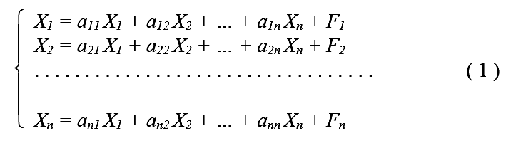
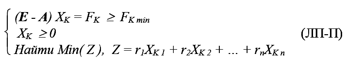
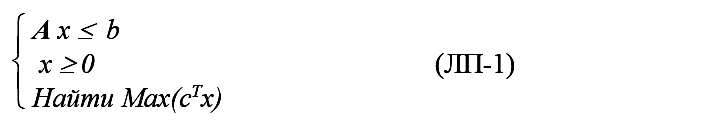
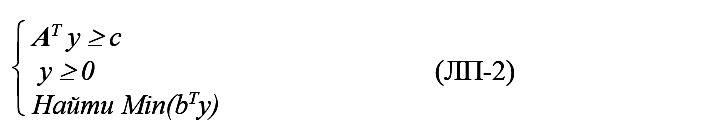
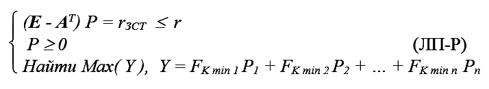
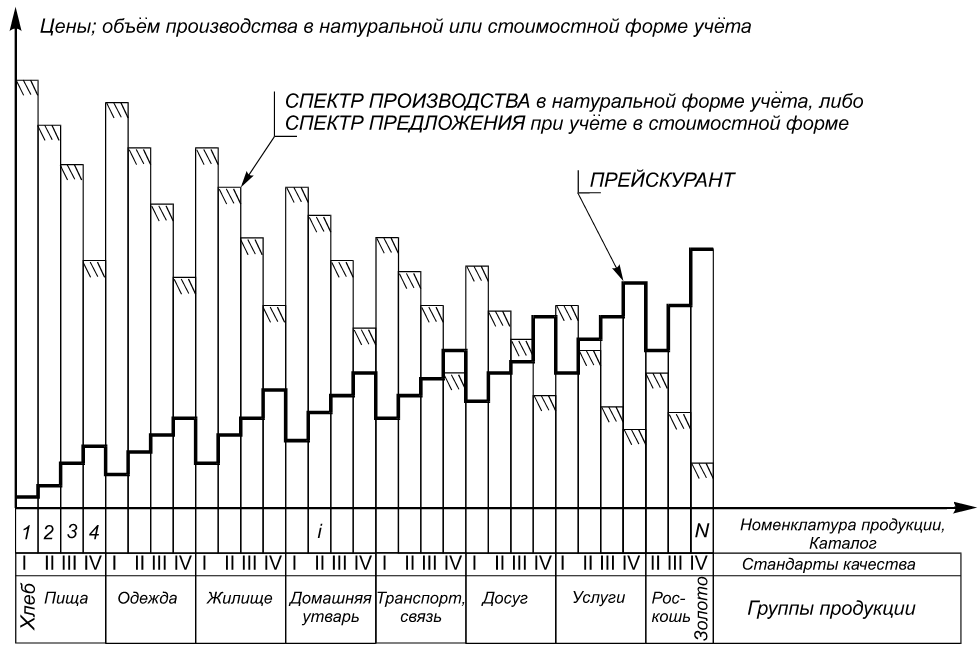
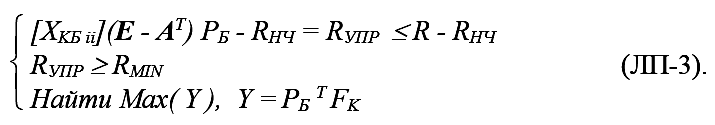
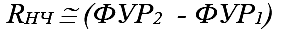
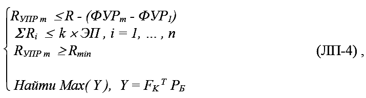
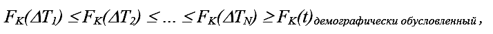

> **Первичный текст.** Мёртвая вода — редакция ред. 2015 г..
> Источник: `dotu.ru:c5d5a456d9fcb99c.fb2` sha256 `4dd1886169e7b01a…`; [страница на dotu.ru](https://dotu.ru/2015/05/09/mv-2015/).
> Автоматическая транскрипция DOC→Markdown; смысл и формулировки не правились.
> Контрольные суммы и статус проверки — в [NOTICE.md](../../NOTICE.md).
> Содержание передаёт позицию авторов; утверждения не верифицированы библиотекой.

---

## Математическое описание продуктообмена и управления

Математика — наука абстрактная, помогающая понять, выразить и описать меру (через ѣ — “ять”) всех вещей и процессов. Современная прикладная математика это — прежде всего численные методы, которые на практике при всём их многообразии сводятся к четырём действиям арифметики, выполняемым с конкретными (т.е. определёнными) числами в определённой последовательности. Иными словами с точки зрения прикладной математики все математические абстракции и символы — средства более или менее плотной упаковки четырёх действий арифметики.

Но, чтобы чисто математические методы обрели качество средства решения разного рода задач вне математики, необходимо математическим абстракциям каждого из них определённо сопоставить объективно измеримые на практике категории той отрасли деятельности общества, которая намеревается изпользовать чисто математический аппарат, поскольку арифметика неработоспособна в условиях численной неопределённости.

В ряде случаев не всё объективное удаётся выявить, а выявленное — измерить, и тогда, чтобы заполнить пустоты в избранной уже наперёд математической модели и устранить численные неопределённости, прибегают к методу “экспертных оценок”. Суть его сводится к тому, что проводится изучение “общественного мнения” профессионалов (или тех, кого привыкли считать профессионалами в данной области) на основе некоего специально для каждого случая разработанного опросника. Из статистической обработки результатов опроса группы профессионалов — экспертов — извлекаются численные значения параметров, необходимые для работы алгоритма избранного численного метода прикладной математики.

Достаточно часто в условиях толпо-“элитаризма” метод экспертных оценок — не более чем средство подавления математическим аппаратом интеллекта несогласных и их психики в целом, имеющее целью придать профессиональному шарлатанству и аферизму облик строгой науки. Это обычно случается при явной неспособности понять произходящее в жизни, правильно поставить задачу и грамотно организовать её решение.

Метод экспертных оценок наиболее часто применяется в задачах, по их существу являющихся задачами определения иерархической упорядоченности вектора целей, и с ними связанных задачах определения “весовых коэффициентов” в разного рода численных критериях оптимального выбора только одного из множества возможных решений управленческой (равно проектной) задачи. Об этом и пойдёт речь далее.

Но поскольку нравственная предопределённость результатов деятельности разпространяется и на экспертов, то в обществе, в котором господствует извращённая нравственность, её порочность будет методом экспертных оценок в задачах определённой тематики неизбежно и неконтролируемо для общества воплощаться в ошибочность результатов приложений, вполне работоспособной и безошибочной “чистой” объективной математики как таковой.

Это тем более справедливо, если оказавшиеся среди множества ответов экспертов из ряда вон выходящие мнения либо вообще изключаются из разсмотрения, либо обрабатываются в составе всей остальной статистики, в которой они тонут. В действительности, тем более в кризисных обстоятельствах, когда большинство экспертов недееспособно[430], из ряда вон выходящие мнения как раз и могут выражать видение истинного положения вещей и направленности течения со‑бытий, и потому в нормальной системе управления по схеме предиктор-корректор им должно уделяться особое внимание. Причиной отказа от особого разсмотрения из ряда вон выходящих мнений экспертов может быть как невозможность изпользования их в уже принятой модели, так и несовместимость их с господствующим мировоззрением, всего лишь на основе которого уже принято определённое решение, нуждающееся только в своём “научном обосновании”.

Поэтому следует стремиться к тому, чтобы избегать метода экспертных оценок, и строить прикладные математические модели во всех отраслях деятельности на основе 1) объективно измеримых, числено определяемых параметров и 2) осознанно целесообразной иерархической упорядоченности их значимости, которую можно понять, объяснить и оспорить (в случае наличия иных моделей и воззрений на проблематику).

Если этого сделать не удаётся, то математическая модель утрачивает качество метрологической состоятельности, поскольку включает в себя объективно неизмеримые, т.е. числено не определимые объективно параметры и выражает неопределённый нравственно обусловленный субъективизм в построении, всегда объективно существующего, вектора целей.

К категории задач, где при помощи метода “экспертных оценок” умышленно или бездумно пытаются придать видимость объективности чьему-либо эгоизму, в своём большинстве принадлежат задачи управления и организации саморегуляции многоотраслевых производственно-потребительских систем (задачи “макроэкономики” — на слэнге “профессионалов”-экономистов) в общественно приемлемых режимах.

Многоотраслевой концерн, народное хозяйство в целом — “макроэкономика” — многоотраслевая производственно-потребительская система. Графически схема продуктообмена в такого рода многоотраслевых производственно-потребительских системах может быть представлена так, как это было показано ранее на рис. 2. Но хотя рисунок и даёт наглядное представление об общем характере продуктообмена, но сам по себе он ничего не говорит о его количественных параметрах и о конкретных возможностях решения задач управления народным хозяйством.

Формально математически продуктообмен во многоотраслевой производственно-потребительской системе описывается уравнениями межотраслевого баланса продуктообмена и ценовых соотношений. Такого рода макроэкономические системы — системы импульсного, дискретного действия в том смысле, что при разсмотрении системы её переход из одного состояния в другое фиксируется по факту передачи продукции из ведения производителя в ведение её заказчика, а предшествующий передаче продукции продолжительный характер процессов производства является «внутренним делом» соответствующих элементов системы. По этой причине управленчески значимое описание продуктообмена во многоотраслевых производственно потребительских системах характеризует некоторый интервал времени ∆T. В силу биосферной обусловленности сельского хозяйства и системы образования (кузница кадров, без которой производство обречено деградировать и остановиться) длительность интервала времени, т.е. производственного цикла, на котором может быть разсмотрен полный продуктообмен всех отраслей, составляет не менее года; а удобство пользования моделью в подавляющем большинстве случаев обуславливает целочисленную (1, 2, 3, …) кратность ∆Т году.

Межотраслевой баланс продуктообмена показывает разпределение валового выпуска продукции каждой отрасли между всеми отраслями в процессе их производственной деятельности; кроме этих продуктов, изразходованных в процессе производства, в него входит конечный продукт каждой отрасли. К конечному продукту относят: 1) «инвестиционные продукты» — новые средства производства, 2) закупки в обеспечение деятельности государства, 3) потребление населения.

Соответственно такой объективной структуре продуктообмена, весьма отличающейся от марксистско-ленинской схемы обмена между «ёлками и булками», в основе межотраслевого баланса лежит квадратная таблица (матрица). Каждая её строка описывает разпределение продукции, производимой соответствующей ей отраслью, между всеми отраслями (показанными на рис. 2 в блоке 18 РСП) в процессе их производственной деятельности; а каждый её столбец описывает потребление продукции всех отраслей отраслью, ему соответствующей.

Рядом с этой таблицей разполагаются ещё несколько столбцов: слева — столбец валового выпуска, справа столбцы, соответствующие ранее перечисленным основным составляющим конечного продукта.

Баланс может быть представлен как в натуральном, так и в финансовом учёте продукции. При финансовом учёте продукции кроме строк, описывающих разпределение продукции между отраслями и прочими потребителями, в баланс включаются и дополнительные строки. Компоненты этих дополнительных строк входят в столбцы, соответствующие отраслям, и для каждой из отраслей характеризуют разные аспекты управления макро- и микроэкономического уровня в их финансовом выражении.

Математически баланс продуктообмена при его натуральном (а также и при стоимостном учёте) может быть описан системой линейных уравнений, повторяющих упорядоченность упомянутой таблицы продуктообмена отраслей по строкам и столбцам (в такой форме уравнения не включают в себя дополнительные строки, характеризующие управление):

<!-- figs:мертвая-вода-ред-2015-года--fb2-3444-_1_png_0 -->

Здесь X1 , … , Xn — валовой выпуск отраслей с первой по n-ную. Правая часть каждого из уравнений характеризует разпределение продукции соответствующей отрасли между её потребителями:

1) всем набором отраслей в сфере производства — столбцы, содержащие X1 , … , Xn ;

2) продукцией конечного потребления — столбец F1 , … , Fn.

В этой системе второй коэффициент первого уравнения — а12 — численно равен количеству продукта отрасли № 1, необходимого отрасли № 2 для производства единицы учёта продукции отрасли № 2. Все остальные коэффициенты а11 , а12 , … , аnn имеют тот же смысл и называются коэффициентами прямых затрат. Каждый из них характеризует культуру производства отрасли-потребителя: сколько необходимо продукции отрасли-поставщика по технологии + сколько будет украдено + сколько будет утрачено по безхозяйственности.

Иными словами в математической модели (1) предполагается, что потребности всякой отрасли в продукции других отраслей прямо пропорциональны её валовому выпуску продукции. Совокупность же уравнений (1) связывает валовые мощности отраслей через пропорции отраслевого потребления продукции с полезным эффектом их деятельности — конечным продуктом, который представлен в общем-то двумя группами продукции:

● той продукцией, которая идёт на потребление, и ради получения которой общество занято хозяйственной деятельностью;

● и той продукцией, которая идёт на поддержание и дальнейшее развитие системы производства.

Уточняющее добавление 2004 г.[431]

Все достижения и отсутствие каких-либо достижений во всякой культуре выражают разнородные нравственно обусловленные потребности людей, а все потребности людей и общественных институтов разпадаются на два класса:

● биологически допустимые демографически обусловленные потребности — соответствуют здоровому образу жизни в преемственности поколений населения и биоценозов в регионах, где протекает жизнь и деятельность людей и обществ. Они обусловлены биологией вида Человек разумный, полово-возрастной структурой населения, культурой (включая и обусловленность культуры природно-географическими условиями) и направленностью её развития (к человечности либо назад в откровенное рабовладение или «консервации» исторически сложившегося человекообразия на основе придания ему каких-то новых форм, скрывающих нечеловечный характер цивилизации, но создающих видимость общественного прогресса);

● деградационно-паразитические потребности, — удовлетворение которых причиняет непосредственный или опосредованный ущерб тем, кто им привержен, окружающим, потомкам, а также разрушает биоценозы в регионах проживания и деятельности людей; приверженность которым (как психологический фактор, выражающийся, в частности, в зависти или неудовлетворённости к более преуспевшим в разнородном «сладострастии»), пусть даже и не удовлетворяемая, препятствует развитию людей, народов и человечества в целом в направлении к человечности. Они обусловлены первично — извращениями и ущербностью нравственности, вторично выражающимися в преемственности поколений в традициях культуры и в биологической наследственности.

Баланс продуктообмена может быть составлен раздельно по демографически обусловленному спектру потребностей и по деградационно-паразитическому спектру потребностей; может быть составлен и объединённый баланс.

Демографически обусловленный, биосферно допустимый спектр потребностей, обладает свойством предсказуемости на многие десятилетия вперёд на основе этнографии и тенденций изменения численности возрастных групп (т.е. он обусловлен культурой и динамикой демографической пирамиды общества).

Деградационно-паразитический спектр потребностей включает в себя потребности, удовлетворение которых наносит ущерб тем, кто ему следует, их детям, внукам, ущемляет возможности развития окружающих, антагонизирует общество, в массовой статистике активизирует деградационные процессы в живущих и последующих поколениях, а ГЛАВНОЕ — разрушает биоценозы и биосферу Земли в целом.

Если каждое уравнение в системе (1) при натуральном учёте продукции в балансе умножить почленно на цену продукта (спектра производства отрасли в целом), производимого соответствующей уравнению отраслью, то система (1) при разсмотрении соответствующей строки характеризует източники доходов отрасли от продажи ею продукции; а столбец, соответствующий номеру отрасли, характеризует её разходы по оплате продукции, приобретаемой ею у поставщиков в обеспечение потребностей её собственного производства.

Только после введения таким способом в баланс натурального продуктообмена финансовых количественных характеристик (цен), ниже системы уравнений можно выписать ещё несколько строк функционально обусловленных разходов[432], производимых отраслью помимо оплаты продукции её поставщиков в процессе её собственного производства:

● Фонд заработной платы.

● Фонд развития и реконструкции производства.

● Благотворительность.

● Свободные, неразпределённые средства.

● Кредитный и страховой баланс (сальдо).

● Баланс налогов и дотаций (сальдо).

Эти записи помещаются ниже строк баланса продуктообмена в столбцах соответствующих отраслей. Так межотраслевой баланс переводится в стоимостную форму учёта продукции.

В совокупности коэффициенты прямых затрат aij образуют квадратную матрицу A. И уравнения межотраслевого баланса продуктообмена могут быть записаны в матрично-векторной форме, одинаковой и для натурального, и для стоимостного учёта продукции:

(E - A)X = F ( 2 ) ,

где: E — диагональная матрица, все элементы которой — нули, кроме стоящих на главной диагонали e11 , e22 , … , enn ; кроме того, E — единичная матрица, что означает: e11 = e22 = … = enn = 1; X и F — векторы-столбцы, спектры производства, вбирающие в себя X1 , … , Xn и F1 , … , Fn , соответственно.

Уравнение (2) позволяет ответить на вопрос: каким должен быть спектр валовых мощностей X при культуре производства, описываемой матрицей A, чтобы получить заданный спектр конечной продукции F.

Также возможны балансовые уравнения иного рода:

(E - AT) P = r ( 3 ),

где матрица AT получена в результате транспонирования, т.е. записи в столбец строки матрицы A с тем же номером: a12T = a21 и т.д.; P — вектор цен на продукцию, учитываемую в балансе продуктообмена отраслей; а r — вектор-столбец, для каждой отрасли соответствующая компонента[433] которого — вся совокупность ранее перечисленных функционально обусловленных разходов (изключая закупки продукции у поставщиков, уже описанные левой частью уравнения), отнесённых к единице учёта (натурального либо финансового) валового выпуска отрасли. Компоненты вектора r традиционно называют «долями добавленной стоимости» в составе цены продукции (выделенное курсивом при употреблении термина обычно подразумевается).[434]

Само уравнение (3) называют уравнением равновесных цен. Оно описывает характеристики рентабельности производств во всём множестве отраслей при спектре валового производства X, культуре производства, описываемой матрицей A, ценах P и кредитно-финансовой политике, описываемой составляющими вектора r.

Общественная приемлемость или желательность режима функционирования народного хозяйства, как целостности, от которой питаются, одеваются, обустраиваются люди во всех семьях, составляющие общество, может быть выражена как система ограничений, налагаемых на межотраслевой баланс продуктообмена в его натуральном учёте:

(E - A)XK = FK ≥ FK min,

где FK min — минимально допустимый спектр производства продукции конечного потребления. Здесь и далее для обозначения натурального учёта продукции употребляется мнемонический индекс «К» (от слова «каталог»), а для обозначения стоимостного учёта индекс «Р», напоминающий о прейскуранте, обозначаемом латинской буквой «Р».

Приведённое матричное неравенство описывает множество межотраслевых балансов, поскольку:

XK = XK min + ΔXK , FK = FK min + ΔFK ≥ FK min

— вариантные спектры возможного превышения минимально допустимых спектров XK min , FK min — однозначно не определены. Из этого множества допустимых вариантов баланса необходимо избрать только один межотраслевой баланс, т.е. пару значений XK и FK наилучших, оптимальных в некотором, однако определённом в конкретных жизненных обстоятельствах, смысле. Этот — избранный, в некотором определённом смысле оптимальный баланс, описывается уравнением:

(E - A)XKП = FKП ,

общий смысл которого ясен из предъидущего; мнемонический индекс «П» обозначает выбор параметров межотраслевого баланса в качестве плановых контрольных параметров макроэкономической системы.

При этом предполагается, что осуществляется ненапряжённое планирование, при котором плановые показатели, заведомо ниже предельно возможных (наивысших, достижимых при полной загрузке всех мощностей), что представляет собой условие обеспеченности ресурсами и мощностями варианта плана, избранного для выполнения. Такого рода плановая недогруженность производственных мощностей идёт в запас устойчивости плана[435] при его осуществлении. Иными словами, избранный план не “планка рекордной высоты”, через которую экономика в “социалистическом соревновании” должна “перепрыгнуть” на пределе своих возможностей; избранный план — это упорядоченный набор, заведомо достижимых контрольных показателей производственно-потребительской системы, ниже которых недопустимо уронить производство ни в одной из отраслей.

Математически принцип ненапряжённого планирования может быть выражен следующим образом:

FK предельно возможное > FKП ≥ FK min

Один из вариантов выбора смысла оптимальности состоит в том, что вариантный спектр производства FK ≥ FK min должен достигаться при минимальных валовых производственных мощностях во всём множестве разсматриваемых отраслей XK = (XK 1 , XK 2 , … , XK n)T. Но отраслей много, вся их продукция не‑взаимозаменяема и, чтобы найти минимум их потребных мощностей, необходимо избрать процедуру формального соизмерения объективно несоизмеримых разнокачественностей.

Одна из таких процедур, применяемых для построения критериев оптимальности — скалярное произведение двух векторов в ортогональном базисе:

z = rT XK = (r1 , r2 , … , rn)(XK 1 , XK 2 , … , XK n)T = r1XK 1 + r2XK 2 + … + rnXK n ,

в котором компоненты вектора r выступают как «весовые множители» при компонентах вектора XK валовых мощностей отраслей, приводя их к некой единой размерности, или лишая их размерности вообще, что позволяет в математической модели корректно складывать реальные хлеб, чугун, компьютеры, самолёты и телевизоры, производимые разными отраслями.

Ортогональность базиса — перпендикулярность друг другу любой пары координатных осей. Ортогональность базиса в задачах экономических приложений можно условно интерпретировать как полную взаимо-НЕ-заменяемость продукции в номенклатуре спектров производства XK , FK. При сделанных предположениях система ограничений, налагаемых на межотраслевой баланс, математически описывается так:

<!-- figs:мертвая-вода-ред-2015-года--fb2-3493-lpp -->

В терминах математики это — задача линейного программирования[436] (далее аббревиатура ЛП). Это задача продуктообмена (отсюда дополнительное мнемоническое обозначение «П»). Условие XK ≥ 0 , хотя оно присутствует и в канонической формально-математической постановке задачи линейного программирования, имеет и экономический смысл — неотрицательности валовых производственных мощностей. В задачу могут быть введены и иные таким же способом формализованные ограничения, например: биосферно-экологические ограничения в их формализованном виде XK < XK max , FK < FK max , ограничения на численность персонала и т.п. Но они не изменяют характера изпользуемых математических методов, если все ограничения выражены в линейных функциях, т.е. функциях типа f = ∑ ai xi , где аi — коэффициенты, а xi — переменные, i = 1, … , N . В такого рода системы неравенств могут входить и уравнения, так как каждое из уравнений f(x)= c эквивалентно введению в систему двух нестрогих неравенств f(x) ≤ c , f(x) ≥ c , которые оба должны удовлетворяться в решении системы.

Математический аппарат линейного программирования существует с начала 1940‑х гг. и изпользуется в качестве средства для формализованного выбора оптимального решения в задачах управления объектами, описываемыми большим числом параметров; а также для формализованного выбора оптимального сочетания множества характеристик объектов при их проектировании и научно-техническом сопровождении осуществления проектов.

Именно по этой причине, т.е. для поддержания необходимой глобальному надиудейскому предиктору функциональной недееспособности при решении многопараметрических задач управления (и разработки технологий и продукции) линейное программирование и некоторые другие разделы математики, допускающие их такого рода приложение, не только изключены из типичного вузовского курса в СССР[437], но даже вообще не упоминаются в них. Поэтому в нашей стране с линейным программированием и аналогичного назначения другими разделами математики знакомы содержательно-методологически только математики-абстракционисты, прошедшие через университетский курс высшей математики. А весьма малое число специалистов иных отраслей знания и техники просто бездумно натасканы на сложившиеся и ставшие традиционными прикладные интерпретации математического аппарата. В связи с этим пробелом в образовании большинства даже не-гуманитариев, прежде чем говорить о прикладных интерпретациях аппарата линейного программирования, поговорим о его существе.

В трёхмерном пространстве линейное уравнение с тремя неизвестными: a1x1 + a2x2 + a3x3 + b = 0 — задаёт плоскость. Два уравнения задают две плоскости и, если плоскости пересекаются, то и прямую линию — линию их пересечения. Каждая плоскость разсекает полное безконечное во все стороны пространство на два “полупространства”, подобно тому, как удар ножом разсекает картофелину пополам. Замена знака равенства ( = ) в уравнении плоскости на знак неравенства (< , > , ≤ , ≥ ) есть выбор одного из полупространств, определяемых плоскостью, и изъятие из разсмотрения второго. При этом строгое неравенство ( < , > ) изключает из избранного полупространства секущую полное пространство плоскость, а нестрогое ( ≤ , ≥ ) включает секущую плоскость в избранное полупространство (т.е. “нож” остаётся прилепленным к одной из половинок “картофелины”).

Много неравенств — это вырезание безконечно простирающимися плоскостями из полного пространства некоторой области. Геометрически такая область — многогранник.

В n‑мерном пространстве всё точно также. Линейное уравнение n переменных определяет подпространство размерностью n ‑ 1 , называемое гиперплоскостью. Много неравенств в n‑мерном пространстве вырезают из него гиперплоскостями n‑мерную область. Эта область является n-мерным многогранником; причём выпуклым многогранником. Свойство выпуклости означает, что всякие две точки на поверхности, ограничивающей многогранник, могут быть соединены отрезком прямой линии, и все точки этого отрезка будут принадлежать либо внутренности этого многогранника, либо ограничивающей его поверхности.

Картофелина после её обрезки ножом — трёхмерный эквивалент такого n-мерного многогранника. Свойство выпуклости проявляется в том, что, если из любой точки на её поверхности картофелину проткнуть прямолинейной спицей в произвольном направлении, то спица войдёт в картофелину и выйдет из неё только по одному разу: т.е. одно пронзание спицей картофелины на её поверхности оставляет только две дырки.

Аргумент Z функции Min(Z) критерия оптимальности — также линейная функция n переменных:

Z = rTXK = (r1 , r2 , … , rn)(XK 1 , XK 2 , … , XK n)T = r1XK 1 + r2XK 2 + … + rnXK n .

То есть скалярное произведение векторов rT XK в ортогональном базисе — также уравнение гиперплоскости. Её направленность в пространстве определяется набором коэффициентов r1 , r2 , … , rn . При этом вектор r = (r1 , r2 , … , rn)T ортогонален (т.е. перпендикулярен) к гиперплоскости, задаваемой уравнением Z = rT XK . Удалённость гиперплоскости от начала системы координат обусловлена значением Z , являющемся свободным членом уравнения:

rT XK - Z = 0.

При численно не определённом значении свободного члена Z этого уравнения пространство заполнено “пакетом” параллельных гиперплоскостей, каждая из которых “касается” соседних с нею двух. В трёхмерной аналогии это — “слоёный вафельный торт”, в котором исчезающе тонкие вафли и прослойки начинки между ними — плоскости, различимые по значению Z каждой из них.

В задаче линейного программирования координаты точек, т.е. конкретный набор значений XK 1 , XK 2 , … , XK n , определяющий значение аргумента Z = rT XK критерия оптимальности Min(Z), могут выбираться только из области, вырезанной всем набором неравенств-ограничений из n-мерного пространства.

То есть в трёхмерной аналогии, нам сначала необходимо ориентировать в пространстве “слоёный торт” так, чтобы пакет плоскостей имел ориентацию, определяемую значениями r1 , r2 , … , rn. Ориентация “торта” в пространстве предполагает, что слои его могут быть разположены вовсе не параллельно по отношению к плоской поверхности стола, на которую помещён “торт”. Потом этот “торт” следует обрезать “ножом”, как того требуют неравенства-ограничения. И после этого, если на столе что-то останется[438], из обрезанного пространственно ориентированного “слоёного торта”, следует вынуть одну из плоскостей (“вафель” или “прослоек”), в которой достигается наименьшее (или наибольшее: Min(Z)=Max(-Z)) из значений аргумента Z критерия оптимальности: Z = r1XK 1 + r2XK 2 + … + rnXK n . Поскольку на поверхности стола должна быть известна точка, соответствующая началу координат (например один из углов столешницы), то, чтобы выделить искомое решение, придётся вынуть из “торта” плоскость, самую близкую к ней (или самую удалённую от неё), так как экстремальное значение Min(Z) или Max(Z) однонаправленно обусловлены удалённостью от начала координат. Разстоянием между точкой и плоскостью в трёхмерном пространстве является перпендикуляр, опущенный из точки на плоскость.

Так как “торт” прошёл обрезку, то искомая плоскость (вафля или прослойка) может быть представлена либо, как точка-крошка, лежащая в одной из вершин вырезанного из “слоёного торта” многогранника; либо как тонкая полоска-ребро многогранника, по которому пресекаются его грани; либо как одна из граней многогранника, совпадающая по направленности с ориентацией пакета параллельных плоскостей. Вариант решения определяется пространственной ориентацией слоёв и характером обрезки “торта” ножами-ограничениями.

Однако задача может и не иметь решений, если ограничения противоречат одно другим; например: X1 < 1 и X1 > 3. На первом шаге обрезки пространственно ориентированного “слоёного торта” ограничение X1 < 1 сметает со стола за ненадобностью всё, где X1 > 3; на втором шаге обрезки X1 > 3 сметает со стола всё, оставшееся после первой обрезки, поскольку оно разположено там, где X1 < 3 . При такой обрезке “торта” на столе просто ничего не останется, но и это не является решением задачи, поскольку в ней необходимо удовлетворить взаимно изключающим требованиям.

Если задача имеет решение, то одна из вершин многогранника принадлежит решению. Даже, если решение выглядит геометрически, как одна из граней или ребро, то все решения, принадлежащие такому множеству оптимальных решений, формально математически неразличимы по критерию оптимальности Min(Z) или Max(Y) , так как значение Z либо Y в пределах таких ребра или грани — неизменны. В таком случае выбор оптимального из множества математически оптимальных решений предполагает разсмотрение каждого из решений во множестве математически оптимальных с учётом информации, которой не нашлось места в формально математической модели.

Соответственно процесс поиска решения задачи линейного программирования, оптимального в смысле достижения Min или Max линейного критерия, сводится к последовательному перебору конечного числа вершин выпуклого многогранника и выбору экстремального из множества значений Z, достигаемого в них.

Аналогичное утверждение доказано в линейной алгебре математически строго для n-мерного пространства. Алгоритм перебора вершин n-мерного выпуклого многогранника и выбора в них экстремального значения критерия оптимальности называется симплекс-метод. В разных модификациях он известен с 1940 г. Этот алгоритм также позволяет ответить и на вопросы о совместимости системы ограничений и о существовании решений либо же об отсутствии таковых. То есть работоспособность аппарата линейного программирования абстрактно-математически подтверждена уже более чем 50 лет. А “слоёный пространственно ориентированный торт” нам потребовался только для наглядности, предметной образности изложения, а те, кому необходимы формально-математические доказательства изложенного и практические алгоритмы решения, могут найти их в специальной литературе.

Мы записали ограничения задачи линейного программирования (ЛП) в виде:

(E - A) XK = FK ≥ FK min ,

а не как это принято при математически канонической записи задачи линейного программирования:

(E - A) XK ≥ FK min

Дело в том, что при канонической записи задачи ограничения налагаются явно на левую часть абстрактного математического уравнения, которое по умолчанию в разсматриваемом нами случае приложения математического аппарата является уравнением межотраслевого баланса реального продуктообмена. В реальном же продуктообмене непосредственный интерес представляет выполнение FK ≥ FK min , а не обусловленность вектора конечной продукции FK вектором валовых мощностей XK и матрицей A. Поскольку вектор FK является в нашем контексте идентификатором, уже несущим определённый экономический смысл, который может выпасть из возприятия читателя при записи ограничений в обычном для математического канона их виде (E - A) XK ≥ FK min , то нами избрана такая форма напоминания, хотя чисто формально математически правая и левая части уравнения равноправны, а решать задачу ЛП‑П придётся в канонической записи: т.е. по отношению к левой части уравнения продуктообмена.

Практически в каждой книге, в которой разсматривается линейное программирование (ЛП), излагается теория двойственности. Её смысл сводится к следующему: задаче ЛП

<!-- figs:мертвая-вода-ред-2015-года--fb2-3520-lp1 -->

математически объективно соответствует задача ЛП:

<!-- figs:мертвая-вода-ред-2015-года--fb2-3523-lp2 -->

В этой паре задач любая из них может разсматриваться в качестве прямой задачи, и в таком случае вторая задача получает название двойственной. Решения прямой и двойственной задач взаимно обусловлены: т.е. по решению одной, на основании теории двойственности линейного программирования, можно судить о решении ей парной задачи.

В зависимости от характера ограничений, определяющих размерность матрицы[439] A (количество в ней строк и столбцов), чисто алгоритмически одна из задач в паре может требовать существенно меньших объёмов вычислений, что позволяет на основе теории двойственности в ряде случаев значительно сократить время решения задачи.

По отношению к ранее выписанной задаче ЛП-П, описывающей межотраслевой баланс продуктообмена в натуральном учёте, двойственная ей задача ЛП записывается так:

<!-- figs:мертвая-вода-ред-2015-года--fb2-3528-lpr -->

Это задача рентабельности (отсюда дополнительное мнемоническое обозначение «‑Р»). Она описывает ценовые соотношения при спектрах производства XK и FK , поскольку связана с уравнением реальных[440] и/либо равновесных цен, или неких абстрактных “теневых” цен (в зависимости от интерпретации в ней переменных).

В первой её строке слева от знака неравенства стоит несколько изменённое уравнение равновесных цен (3): вектор долей добавленной стоимости обрёл в нём мнемонический индекс «зст», указующий на взаимную обусловленность того явления, которое принято называть «закон стоимости», и входящих в компоненты вектора долей добавленной стоимости функционально обусловленных разходов отраслей. Обычно первую строку приведённой задачи ЛП математически канонически записывают так:

(E - AT) P ≤ r

В нашем случае отказ от математически канонической формы записи задачи линейного программирования обусловлен тем, что при следовании этой форме ограничения явно относятся к левой части уравнения равновесных цен, в которой отражён продуктообмен, в то время как на уровне макроэкономики интерес представляют ограничения, налагаемые на правую — чисто финансовую — часть уравнения равновесных цен, в которой натуральные показатели продуктообмена отраслей не присутствуют ни прямо, ни в их финансовом выражении.

С начала 1950‑х гг. известна теорема: «Если в оптимальном решении прямой задачи неравенство № k выполняется как строгое (т.е. имеет место выполнение условия « > » или « < » вместо возможного равенства или неразрешимости задачи), то оптимальное значение соответствующей двойственной переменной равно нулю».

Также с начала 1950-х гг. известны экономические интерпретации теории двойственности. Обычно в них в качестве прямой задачи разсматривается некая задача продуктообмена ЛП-П, в которой переменные интерпретируются как объёмы ресурсов, вовлекаемых в производственный процесс. Тогда в качестве двойственной выступает задача рентабельности ЛП-Р, в которой переменные интерпретируются как некие цены[441] соответствующих ресурсов.

Такая интерпретация:

● в прямой задаче переменные — объёмы продукции или ресурсов в их натуральном учёте;

● в двойственной задаче переменные — цены,

— стала традиционной, общеизвестной, общепринятой.

Смотри, например, Ю.П.Зайченко “Исследование операций” (Киев, “Вища школа”, 1979 г.) — рядовой учебник для вузов; “Математическая экономика на персональном компьютере” под ред. М.Кубонива (пер. с японского, Москва, “Финансы и статистика”, 1991 г., японское изд. 1984 г.) — ликбез-справочник — «практическое пособие по активному изучению основ рыночной экономики», как сообщается в аннотации к изданию для русскоязычных.

Приведённая теорема в такого рода интерпретациях обретает экономическое выражение:

Если объём некоего ресурса в оптимальном решении прямой задачи превышает ограничения, то цена ресурса в оптимальном решении двойственной задачи — ноль.

Это — общеизвестное на протяжении не менее сорока лет в мировой литературе утверждение, ставшее привычным:

Ю.П.Зайченко, стр. 88: «Если некоторый ресурс bi имеется в избытке и i-е ограничение выполняется как строгое неравенство, то оно становится несущественным и оптимальная цена соответствующего ресурса равна 0».

М.Кубонива, стр. 244: «Кроме того, симплексный критерий из задачи (LP1‑D — обозначение в книге двойственной задачи) означает, что ресурс k, существующий в количестве, превышающем оптимально изпользуемый объём, становится свободным ресурсом, и его цена обращается в нуль».

Чтобы быть точным и не извращать по умолчанию контекст цитированных източников, следует сделать оговорку: только что приведённые экономические интерпретации относятся к иным экономическим задачам, не совпадающим с разсматриваемой нами задачей управления многоотраслевым народным хозяйством как целостностью, во-первых, в биосферно допустимом и, во-вторых, в общественно приемлемом режиме.

В обоих цитированных източниках разсматриваются задачи оптимизации управления частной структурой в объемлющей её хозяйственной системе. Иными словами, в них разсматривается задача, как выйти на рынок со своей продукцией и не прогореть. Соответственно переменные прямой задачи (продуктообмена), не совпадающей с нашей, интерпретируются в них как разходуемые, ограниченные объёмы ресурсов, доступных структуре в процессе производства ею продукции; а переменные двойственной задачи (рентабельности), также не совпадающей с нашей, интерпретируются как цены на употребление этих ресурсов.

Тем не менее, с точки зрения бухгалтерии (по-русски: счетоводства), учитывающей разходы в процессе ведения производства, нет разницы между платой за употребление ресурсов и оплатой продукции поставщиков. Поэтому для нас важны не экономические задачи, разсмотренные в цитированных източниках с привлечением аппарата линейного программирования, а то обстоятельство, что, если в микроэкономических интерпретациях (по отношению к структурно обособленной частной фирме) переменные прямой задачи интерпретируются как объёмы, то переменные двойственной задачи интерпретируются как цены.

Но несмотря на давность и общеизвестность среди специалистов такого рода экономических интерпретаций линейного программирования, мировая экономическая наука более чем за сорок лет не сделала единственно возможного осмысленного вывода из теории двойственности в её приложениях к задачам управления (и организации саморегуляции) многоотраслевыми производственно-потребительскими системами, разсматриваемыми как целостность:

ПРЕЙСКУРАНТ внутреннего рынка многоотраслевой производственно-потребительской системы на продукцию и услуги личного, семейного и общественного внепроизводственного потребления — ВЕКТОР ОШИБКИ УПРАВЛЕНИЯ ЕЮ, в его финансовом выражении.

Это утверждение, высказанное в редакции “Мёртвой воды” 1991 г. интуитивно по здравому смыслу достаточно общей теории управления, имеет и строгое метрологическое обоснование на основе теории двойственности линейного программирования.

Оно справедливо и по отношению к народному хозяйству в целом. Если пользоваться сложившейся к настоящему времени терминологией “экономической науки”, то это уровень “макроэкономики”, на котором двойственная (по отношению к задаче продуктообмена) задача линейного программирования — задача рентабельности — так и не нашла управленчески осмысленной интерпретации более чем за сорок лет: срок более чем достаточный.

Задача рентабельности также может разсматриваться в качестве прямой, и в этом случае приведённая теорема выражается следующим образом: «Если технологический процесс № k оказывается строго невыгодным с точки зрения оптимальных цен, то в оптимальном решении задачи продуктообмена интенсивность изпользования соответствующего технологического процесса должна быть равна нулю». И этому подводится итог: «Таким образом, теорема выражает принцип рентабельности оптимально организованного производства» (Ю.П.Зайченко, стр. 88).

Это — интерпретация уровня “микроэкономики”. Такая интерпретация допустима на иерархическом уровне, соответствующем в суперсистеме народного хозяйства всякой частной фирме, изпользующей аппарат линейного программирования для выбора ею из перечня многих технологий какого-то определённого набора, на основе которого ею планируется вести производство впредь.

Она допустима[442] по отношению к любой структурно обособленной производственной системе, не обладающей качеством самодостаточности в смысле производства в ней продукции и её потребления, при решении задачи о наиболее выгодном с финансовой точки зрения участии в продуктообмене на рынке со сложившимся прейскурантом; а также для оптимизации экспортно-импортного баланса, подчинённой долговременной концепции внешней политики государства.

Но попытка интерпретировать задачу «ЛП‑Р, ЛП‑П» в смысле цитированной теоремы, на уровне целостности народного хозяйства приводит к абсурдным результатам, подобным следующему выводу: если в феврале тарифы на коммунальные услуги не позволяют их окупить, а платёжеспособности населения не хватает, чтобы оплатить их по тарифам, обеспечивающим рентабельность, то… — Отопление жилья нецелесообразно и его должно прекратить[443].

В более общей интерпретации такого рода получается, что незаменимая отрасль в целостности народного хозяйства, в случае её нерентабельности, должна прекратить своё существование; иными словами, в случае нерентабельности незаменимой отрасли — следует разрушить всё целостное народное хозяйство, ликвидировав эту отрасль.

Поскольку в каждой отрасли народного хозяйства культура производства и технологическая база — объективная историческая данность, какой бы высокой или низкой она ни была, применение этой интерпретации на практике предопределяет уничтожение как минимум одной из незаменимых отраслей в собственном народном хозяйстве, в случае её нерентабельности, что ведёт к подчинённости общества внешним социальным системам и их концепциям управления и/либо к народнохозяйственной и общественной катастрофе.

Это — один из примеров, на общесуперсистемном уровне разсмотрения народного хозяйства, показывающий субъективную обусловленность понятия “рентабельность”, а также и других понятий, управленчески подчинённых этому понятию и с ним связанных.

Это означает, что в такого рода задачах, нерентабельность незаменимой отрасли народного хозяйства (отсутствие самоокупаемости большинства предприятий в ней) — следствие либо превышения ею уровня демографической достаточности производства; либо в условиях демографической недостаточности производства — выражение ошибок в настройке кредитно-финансовой системы общества на саморегуляцию производства и разпределение по демографически обусловленному спектру потребностей.

Прежде чем говорить об интерпретации теории двойственности линейного программирования для решения задач уровня макроэкономики, необходимо определить основы взаимосвязи натурального и финансового учёта продукции в межотраслевом балансе, без чего невозможен однозначный переход от одной формы баланса к другой.

Как известно ещё из школьного курса физики, “Полезный эффект, получаемый от физической системы”, численно = “КПД (коэффициент полезного действия) этой системы” × “Количество энергии, введённой в эту систему”.

Поскольку это общефизический закон, то он вполне применим и к системе общественного производства, хотя практически вся финансово-экономическая наука его либо игнорирует, либо воображает, что он никак не проявляется в системе общественного производства, по крайне мере на уровне макроэкономики. Так как полезный эффект, даваемый системой производства, в наиболее общем виде численно выражается в финансах, то по отношению к макроэкономике закон сохранения энергии обретает своё выражение в следующей формулировке:

“Совокупный денежный номинал, противостоящий всей товарной массе в обществе в обороте всех специализированных рынков” = “Коэффициент энергетической обеспеченности денежной единицы (аналог КПД)” × “Количество энергии, потребляемой производственной системой общества, обслуживаемого данным видом денежных знаков[444]”.

Это выражение справедливо всегда, но есть особенность: ныне средства платежа — числа на счетах и купюрах, производство которых обусловлено субъективизмом чиновников государства, банкиров, фальшивомонетчиков, фальшивокупюрщиков, хакеров, вторгающихся в банковские сети; количество же энергии, вводимой в производственные процессы в общественном объединении труда, обусловлено объективно по биогенной энергии (растений, животных, людей, связанных с производством) — природными факторами, по техногенной энергии — развитой мощностью технической энергетики. Это означает, что количество средств платежа, противостоящих производимой продукции, может изменяться (как в большую, так и в меньшую сторону) гораздо быстрее, чем изменяется количество энергии, доступной для системы общественного производства; также следует помнить и об ограниченности реального КПД технологических процессов значениями, меньшими единицы.

При таких обстоятельствах значительные колебания объёма средств платежа в обороте общества вызывают межотраслевые диспропорции между реальными производственными мощностями и их разнородными финансовыми измерителями (мерами). Вследствие возникновения такого рода диспропорций способность кредитно-финансовой системы к поддержанию саморегуляции производства и разпределения в большей или меньшей мере утрачивается — вплоть до полного разпада макроэкономической системы на множество экономически нежизнеспособных «юридических лиц» и «индивидуальных частных предпринимателей».

Этот вывод может быть получен бухгалтерски строго из анализа уравнений межотраслевого баланса в стоимостной форме в предположении изменения объёма средств платежа от начала к концу производственного цикла[445].

Наиболее же общей мерой финансовых диспропорций в такого рода случаях является изменение финансового аналога КПД — коэффициента энергетической обеспеченности денежной единицы, который далее называется энергетическим стандартом обеспеченности средств платежа; для краткости просто энергетическим стандартом.

Кроме того среди множества изпользуемых в производстве ресурсов можно выделить весьма немногочисленную группу товаров, повышение цен на которые весьма быстро вызывает рост цен на все остальные товары. Эта немногочисленная группа товаров называется «базой прейскуранта». В принципе баз прейскуранта может быть выявлено несколько, но первичная база прейскуранта — энергетическая — в силу обусловленности объёмов отраслевого выпуска количеством энергии, вводимой в систему производства. С энергетической базой в первую очередь связаны тарифы на транспортные услуги.

В случае соблюдения энергетического стандарта обеспеченности средств платежа и директивном управлении немногими ценами избранной базы прейскуранта (включая и цену кредита: управленчески макроэкономически наилучшая цена кредита — 0 % , поскольку при нулевой ставке ссудного процента изключается “дрейф” баз прейскуранта), всё остальное — подавляющее большинство свободных цен — выражает рентабельную реакцию множества производителей, формирующих спектр предложения, на спектр реально сложившегося платёжеспособного спроса.

Это означает, что в условиях действующего прейскуранта P, государственное воздействие на составляющие вектора rЗСТ через ограничения rЗСТ ≤ r , налагаемые на межотраслевой финансовый обмен и функционально обусловленные разходы в отраслях открывает возможность обеспечить рентабельность всех общественно необходимых отраслей и общественно необходимую направленность развития каждой из них при сохранении целостности народного хозяйства.

Это означает, что не существует никаких формально-математических и экономических причин, чтобы в задачах управления народным хозяйством как целостностью (это предполагает разсмотрение взаимной обусловленности производства и потребления) искать иные интерпретации переменных (определение их смысловой нагрузки) в задаче продуктообмена и в задаче рентабельности. В задаче продуктообмена переменные — валовые объёмы производства, вектор XK . В формально математически двойственной ей задаче рентабельности “переменные” — реальные цены[446] на продукцию спектра производства XK , т.е. вектор P, но реальные ограничения по существу в этой интерпретации относятся не к “переменным”, а к свободному члену уравнения равновесных цен — вектору rЗСТ . Энергетический же стандарт обеспеченности средств платежа — метрологическая основа сопоставления финансовых и натуральных показателей в системе долгосрочного планирования и настройки механизма саморегуляции производства и потребления в макроэкономической системе.

Формально математически каждая из задач ЛП‑П и ЛП‑Р может разсматриваться в качестве прямой в теории двойственности линейного программирования, но пару — прямую и двойственную задачи на уровне “макроэкономики” — следует при этом разсматривать как единое целое. Интерпретации целостной парной задачи «ЛП‑Р, ЛП‑П» на общесуперсистемном уровне, подобные приведённой интерпретации задачи рентабельности, недопустимы, поскольку выражают взгляды, соответствующие иерархически низшим уровням системы управления по отношению к уровню суперсистемы (народного хозяйства) в целом. При разсмотрении же пары задач «ЛП-Р, ЛП-П» как целостности теория двойственности в её математически каноническом виде не может быть применена к выбору оптимального решения: существо задачи управления многоотраслевой производственно-потребительской системой таково, что решать придётся задачу продуктообмена, но двойственная к ней математическая форма задачи рентабельности позволяет обосновать задачу продуктообмена ЛП-П, изключив из алгоритма её постановки и решения метод “экспертных” оценок.

Дело в том, что интерпретация задачи ЛП‑Р:

<!-- figs:мертвая-вода-ред-2015-года--fb2-3575-lpr_png_0 -->

“в лоб” в качестве равноправной двойственной задачи к задаче ЛП‑П, соответствующая изпользованию аппарата линейного программирования формально математически, на общесуперсистемном уровне иерархии управления народным хозяйством как целостностью управленчески безсмысленна. Если следовать формальной математике, то из первой строки задачи ЛП‑Р необходимо выбросить далее в тексте взятую в кавычки группу символов «= rЗСТ», после чего найти вектор P, удовлетворяющий условиям задачи ЛП‑Р. Но P это — реальный прейскурант, а не какие-то ценоподобные фиктивные переменные. На стадии планирования производственного цикла прейскурант P := PБ — текущий реальный прейскурант, избранный в качестве базового (мнемонический индекс «Б») объективная общественная данность, совокупность текущих ошибок управления (знак «:=», взятый в кавычки, — алгоритмический знак, имеющий смысл: переменной, что стоит слева от него, присвоить значение того, что стоит справа от него).

Прейскурант это — контрольный параметр макроэкономической системы, по которому следует судить о качестве управления в ней. Но это не управляемый непосредственно параметр, который может быть изпользован в качестве средства управления ею, за изключением весьма малочисленной группы цен, входящих в избранную в качестве средства управления базу прейскуранта. То есть любое полученное решение математической канонически записанной задачи ЛП‑Р макроэкономически безжизненно, поскольку даже при директивном назначении математически вычисленных цен, не существует никаких природных и общественных причин, чтобы реальный платёжеспособный спрос в условиях реального производства породил бы реальный прейскурант, повторяющий расчётный прейскурант оптимального решения задачи линейного программирования ЛП‑Р; либо, чтобы платёжеспособный спрос реально разпределился по специализированным рынкам в соответствии с вычисленным оптимальным прейскурантом.

Это означает, что реальный характер причинно-следственно обусловленностей в общественных производственно-потребительских системах, при описании их аппаратом линейного программирования, не позволяет разсматривать задачи ЛП‑П и ЛП‑Р изолированно одна от другой в качестве равноправных, эквивалентных описаний одного и того же макроэкономического процесса; не позволяет отдать какой-то одной из них предпочтение, обусловленное матрицей ограничений задачи A, определяющей выигрыш в объёме вычислений при решении макроэкономической задачи с привлечением теории двойственности линейного программирования[447].

Задача ЛП‑Р, формально математическое решение которой макроэкономически безсмысленно, тем не менее является източником информации для постановки и решения задачи ЛП‑П, обоснованной не “экспертными” оценками, а реальными объективно наблюдаемыми и измеримыми характеристиками макроэкономической системы. Как было показано ранее, задача ЛП‑П поддаётся управленчески осмысленной интерпретации на уровне разсмотрения целостности многоотраслевого народного хозяйства, но нуждается при этом в обосновании значений её параметров, и в частности, в обосновании набора весовых коэффициентов r1 , r2 , … , rn в её критерии оптимальности.

Таким образом, левая часть равенства (E - AT) P = rЗСТ в задаче ЛП‑Р, будучи объективной экономической данностью, показывает, что система ограничений математической задачи ЛП‑Р фактически относится к правой части того же равенства:

rЗСТ ≤ r

Поэтому, забыв на некоторое время о существовании левой части равенства, займёмся анализом правой его части в связи с налагаемыми на неё ограничениями. Именно эта система ограничений rЗСТ ≤ r должна быть в согласии с задачей ЛП‑П, что предопределяет выбор компонент вектора r в аргументе критерия оптимальности задачи ЛП‑П: Z = rT XK , изходя из анализа объективно сложившихся ценовых соотношений и функционально обусловленных разходов (составляющих вектора rЗСТ ), входящих в структуру задачи ЛП‑Р.

Для этого необходимо перейти от номинальных долевых в цене продукции характеристик к номинальным валовым финансовым характеристикам отраслей в ограничениях задачи ЛП‑Р, поскольку валовые финансовые характеристики являются финансовыми мерами мощности отраслей, сопоставимыми от одного производственного цикла к другому при условии соблюдения энергетического стандарта обеспеченности средств платежа. После этого ограничения задачи ЛП‑Р предстают в виде:

[XKБ ii](E - AT) PБ = RЗСТ ≤ R (ЛП‑РВ),

где:

● [XKБ ii] — некий базовый спектр валового производства; в данной записи он представляет собой диагональную матрицу, на главной диагонали которой размещены соответствующие компоненты вектора валовых мощностей XKБ (мнемонические индекс «Б» обозначает «базовый», индекс «К», как отмечалось ранее, указует на натуральную форму учёта продукции).

● RЗСТ — спектр отраслевых номинальных валовых разходов формирования закона стоимости; RЗСТ = [XKБ ii]rЗСТ .

● R — вектор ограничений сверху спектра RЗСТ в отраслях i = 1, … , n , связанный с вектором r аналогичным соотношением:

● R=[XKБ ii]r. Т.е. в терминах теории управления R — спектр ограничения мощности управляющего сигнала.

Задачу ЛП‑Р, после перехода в ней указанным способом к валовым финансовым характеристикам, будем обозначать ЛП‑РВ — «валовая».

Теперь вернёмся к задаче продуктообмена. Предположим, что задача продуктообмена ЛП-П по отношению к народному хозяйству, разсматриваемому как целостность, решается в условиях:

(E - A) XK = FK ≥ FK min ≥ Fобщественно необходимое

Предположим, что производственные мощности достаточны, вследствие чего такое решение задачи формально математически существует; а кроме того, что оно и практически осуществлено в управлении и при этом все неравенства в оптимальном решении задачи ЛП-П выполняются как строгие. Это означает, что в силу ранее приведённой теоремы все переменные P1 , P2 , … , Pn в оптимальном решении формально математической двойственной задачи ЛП-Р принимают нулевые значения.

Поскольку мы интерпретируем переменные двойственной задачи ЛП-Р как реальные (а не некие) цены, то формальная математика в разсматриваемом предположении всего лишь совпадает с финансово-экономической управляемой реальностью: избыточность предложения производимого и естественно-природная неограниченная доступность чего-либо по отношению к реальному спектру запросов потребления общества имеет следствием падение цен до нуля на то, что раньше обладало ценой, либо сохраняется изначальное отсутствие цены в обществе на это “что-либо”; недостаточность по отношению к реальному спектру запросов потребления немедленно порождает цену, величина которой определяется разпределением платёжеспособности общества по специализированным рынкам как продукции и услуг, создаваемых в общественном объединении труда, так и естественно-природных ресурсов[448].

Естественно ожидать, что, в случае идеального 1) биосферно допустимого и 2) общественно ориентированного управления (приоритетность: 1, 2 !!!), народное хозяйство, разсматриваемое как целостность, — многоотраслевая производственно-потребительская система — заведомо удовлетворяет все запросы общества в продукции и услугах в темпе их заказа; при этом недостаточность в них, по отношению к спектру запросов потребителей, — отсутствует и в психически и нравственно здоровом обществе естественно ожидать обнуления прейскуранта на продукцию и услуги конечного потребления внепроизводственного характера, ради потребления которой общество и ведёт всю хозяйственную деятельность.

Режимы управления или саморегуляции, в которых многоотраслевая производственно-потребительская система не в состоянии устойчиво удовлетворять все запросы общества, являются отклонением от идеального режима и в таких режимах ненулевые ошибки управления выражаются как компоненты-цены прейскуранта на производимые продукцию, услуги и не производимые обществом естественно-природные ресурсы. Чем больше нехватка чего-либо по отношению к свободным запросам на потребление, тем выше цена, ограничивающая численность потребителей. Цена — всего лишь ограничитель платёжеспособностью численности потребителей и не более того; т.е. цена — мера нехватки продукции и услуг, производимых в обществе, а также и естественно-природных факторов, необходимых обществу.

Поскольку идеальному режиму управления соответствуют нулевые значения всех компонент вектора ошибки управления, то эти описанные объективные особенности ценообразования и позволяют прейскурант внутреннего рынка на продукцию и услуги личного, семейного и общественного внепроизводственного потребления интерпретировать в качестве вектора ошибки управления народным хозяйством, разсматриваемым как целостность.

Сказанное относится и к фрагментарным по отношению к целостности народного хозяйства многоотраслевым производственно-потребительским системам (экономическим зонам, многоотраслевым концернам и т.п.), а также к хозяйственным системам, объединяющим более чем одно государство или народное хозяйство.

При этом следует иметь в виду: прейскурант — атрибут финансово-экономической деятельности общества, и в ней — в виде прейскуранта и его компонент — отражены ошибки общественного управления, свершающиеся не только в финансово-экономической деятельности, но и во всех прочих областях жизни общества.

Это — специальное предостережение для намеревающихся сказанное вульгаризировать и осмеять. И даже, если кому-то не нравится признание прейскуранта вектором ошибки, то он изойдёт в шизофрению в попытке определить иной объективно складывающийся и измеримый вектор ошибки по отношению к процессам самоуправления во многоотраслевых производственно-потребительских системах.

Возможно, что такая интерпретация теории двойственности линейного программирования покажется кому-то бредом, посягательством на каноны абстрактной математики. Но с нашей точки зрения, говорить об управлении и саморегуляции в народном хозяйстве и избегать при этом определённости в отношении избрания вектора целей и вектора ошибки управления — действительно либо патологический бред, либо наглое невежество, которыми прикрывается обыкновенный цинизм паразитов на чужом труде.

Это так, поскольку в общественном самоуправлении все люди имеют какие-то цели и в чём-то ошибаются, вследствие чего в коллективном безсознательном и коллективном сознательном всегда объективно присутствуют некие вектора целей общества в целом и его подмножеств, а в жизни всегда объективно имеет место некий вектор ошибки общественного самоуправления. Поскольку самоуправление ограниченных систем всегда протекает в объемлющих их процессах, то по отношению к ним вектор ошибки вложенного самоуправления — объективен. Соответственно, те, кто допускает в самоуправлении объективную возрастающую ошибку, объективно обречены погибнуть под её бременем, если сами они не одумаются заблаговременно.

Но кроме того, не существует никаких формально математических причин, чтобы в макроэкономических интерпретациях приведённых положений теории двойственности линейного программирования ограничивать себя строгим выполнением только некоторых, а не всего множества неравенств в задаче ЛП-П, а в задачу ЛП-Р вводить какие-то “теневые” ценоподобные переменные вместо того, чтобы найти применение реальным ценам рынка в парной задаче продуктообмена и рентабельности, объединяющей прямую и двойственную изолированные, но взаимно связанные задачи линейного программирования.

И коли уже более 40 лет переменные прямой задачи общепризнанно интерпретируются как валовые объёмы (производства в задаче ЛП-П вектор XK), а переменные двойственной задачи как цены (в задаче ЛП-Р образующие в совокупности вектор P), то нет никаких РАЗУМНЫХ причин, кроме нравственно обусловленных мировоззренческих и психиатрических комплексов, чтобы не соотнести одно с другим и не назвать прейскурант внутреннего рынка многоотраслевой производственно-потребительской системы на продукцию и услуги личного, семейного и общественного в целом внепроизводственного потребления — вектором ошибки управления ею.

С точки зрения теории управления все без изключения человеческие действия целесообразны и отвечают целям либо самого человека, либо тех, кто употребляет пирамиду непонимания и пирамиду осознанного знания в своекорыстных целях, занимая более высокие ступени в её иерархии. Каждый в толпо-“элитарном” обществе в меру понимания работает на себя, а в меру непонимания — на тех, кто понимает больше в том, как из чужого труда извлечь свою корысть в земной жизни. Соответственно, возражения против принятия внутреннего прейскуранта в качестве финансово-экономического выражения вектора ошибки самоуправления обществом, есть осознанное или бездумное стремление поддерживать устойчивым ошибочное управление с заведомо не нулевыми ошибками.

То есть возражения против признания прейскуранта вектором ошибки, относятся уже не к теоретизированию на темы экономики, а к практической психиатрии и криминалистике, поскольку они — следствие злонравия и слабоумия, ограничивающего эффективность деятельности злонравных в обществе.

Интеллект злого гения сидит в клетке, созданной его злонравием: хотя при этом он может неоспоримо блистать, но всё же — блистает он из клетки. Объяснение дано в Коране (8:29): Бог даёт каждому человеку непосредственно по его благоговению перед Ним способность Различать разнокачественности в событиях, протекающих в Мироздании. И никакая отсебятина, превознёсшаяся в гордыне, не способна овладеть Различением-способностью, если оно не дано Свыше. Интеллект обрабатывает только ту информацию, которая выявлена человеком в Различении. Если не дано Свыше Различения, то интеллект обречён на ограниченность и бег за собственной тенью. И потому НЕ-Различение — клетка для интеллекта злонравного человека, лишающая его полноты выбора путей в будущее; лишающая его возможности получать новую информацию. За примерами далеко ходить не надо.

В современной цивилизации РАЗПУЩЕННОСТЬ невольников греха в их следовании пороку, свойственно называть свободой личности, в том числе и интеллектуальной свободой, хотя это — одна из худших форм тирании. И этот безсознательный психиатрический комплекс жажды тирании, жажды рабовладеть находит своё выражение в экономической литературе подневольных сионо-паразитизму стран. Обратимся к книге Роберта Н. Антони, профессора Школы бизнеса Гарвардского университета “Основы бухгалтерского учёта” (1‑е русское издание, пер. Б.Херсонского, М.Шнейдеман — фамилии говорят о себе):

«1‑10 (…) работники этой кампании, вероятно, её наиболее ценный ресурс, тем не менее они … (являются / не являются) ресурсом, подлежащим бухгалтерскому учёту. Подчеркните правильный ответ». — Раз.

«2-27. С точки зрения бухгалтерского учёта, работники предприятия не могут быть отнесены к его средствам, поскольку предприятие не владеет ими». — Два.

То есть в курсе неоднократно обращается внимание на юридическую проблематику учёта или не учёта невольников в качестве “основных фондов” предприятия. Обращать внимание на недопустимость такого учёта в условиях отмены рабства де‑юре имеет смысл только, если рабовладение по-прежнему существует де‑факто, вследствие чего учеников школы бизнеса, несущих в себе по-прежнему жажду рабовладеть приходится систематически одёргивать: «Рабство де‑юре отменено. Невольников де‑факто на баланс предприятия де‑юре ставить нельзя». Прямо ничего такого профессор-невольник заявить слушателям не может, поэтому приходится излагать по существу то же самое, но иносказательно и в умолчаниях.

И в макроэкономическом итоге: нравы эпохи рабовладения, безсознательно господствующие на Западе и в отечественной “элитарной” науке и в наши дни, не позволяют соотнести прейскурант внутреннего рынка на продукцию и услуги внепроизводственного характера с понятийным аппаратом общей теории управления и её экономическими приложениями.

Поэтому тот, кто не может принять внутренний внепроизводственный прейскурант макроэкономической системы в качестве вектора ошибки управления ею, полагая это утверждение бредовым, пусть подумает: почему, возможно, ему самому, его детям и внукам — в своё время — не показался бредовым сюжет романа “Продавец воздуха”, в котором злой технический гений рвётся к глобальной тиранической власти и безответственности рабовладельца, откачивая атмосферу Земли в криогенные хранилища ( ‑ 180 о С), дабы продавать ранее безплатный воздух по монопольно устанавливаемой им цене.

Роман показывает, что ЕДИНСТВЕННАЯ цена на воздух необходима ему в качестве средства финансовой тирании. Тем более в качестве средства финансовой тирании удобнее изпользовать множество цен, собранных в прейскурант, не допуская его обнуления и краха вместе с обнулением прейскуранта глобальной тирании надиудейского предиктора и сионо-паразитизма. При этом каждый невольник, свободно частно предпринимательски заботясь о получении номинальной прибыли, стремится поддерживать достаточно высокие цены, а то и взвинчивает цены на производимый им продукт, и тем самым поддерживает всю систему финансового рабовладения, укрепляя власть рабовладельцев.

И то обстоятельство, что человечество за тысячелетия притерпелось к ненулевому прейскуранту, не означает, что ненулевой прейскурант, злоумышленно поддерживаемый ростовщичеством и гонкой капризов моды, перестал быть средством финансовой тирании и финансово-экономическим выражением всего множества ошибок самоуправления общества.

Цена на всё возникает не в соответствии с трудовой “теорией стоимости”, и не в соответствии с бредовой теорией “прибавочной стоимости”. Цена возникает как статистически упорядоченная массовая внутриобщественная реакция, имеющая целью ограничить платёжеспособностью потребление того, что обществу доступно в количествах, меньших, чем ему хотелось бы; реально это — ограничение численности потребителей. Сказанное одинаково верно и в отношении того, что обществу предоставляет природа в готовом виде; и в отношении того, что общество производит само, изпользуя природные ресурсы; и в отношении чего общество порождает в себе самом спекулятивный гешефтмахерский интерес, обусловленный пороками нравственности и ущербным гешефтмахерским комплексом первостепенной значимости паразитизма — в частности, делания денег вне производства и управления любыми способами и средствами.

В ценообразовании нет разницы, является ли некая недостаточность по отношению к реальному спектру нравственно обусловленных свободных запросов следствием скученности оскотиневшейся толпы человекоподобных, жаждущих в благодатном оазисе дармовщинки, в силу чего его природные ресурсы, утратив достаточность обретают стоимость; либо же в силу нравственной деградации и разпущенности, влекущих за собой утрату Различения и биологическое вырождение, деградентам не хватает наркотиков и скотства, и деграденты платят бешеные деньги за ранее бросовую маковую соломку и подзаборную коноплю, коммерчески “культурно” выращивают табак и производят алкоголь, покупают “девочек”, “мальчиков”, сладострастно мучают, калечат и убивают, разрабатывают технико-сексуальные извращения на основе последних достижений науки и техники; или команда попросту пустоголовых реформаторов[449], придя к государственной власти в атмосфере господствующей беззаботности и перекладывания ответственности за общенародное с себя на кого-нибудь, развалила управление в целостной макроэкономической системе государства, вследствие чего производство во всех отраслях упало, а цены выросли; и главное — организованно и предумышленно порождаются дефициты всех этих и других видов, чтобы безответственно тиранствовать на Земле: безумие думать, что злые не творят зла как сами, так и руками бездумных, откровенно продажных и восторженных искренних холуёв.

Во всяком случае, при всякой общественной организации жизни, во внутреннем прейскуранте многоотраслевой производственно-потребительской системы на продукцию и услуги внепроизводственного характера отражены обусловленные извращениями нравственности экономические и внеэкономические ошибки самоуправления общества: “противоборство” человекоподобных с биосферой; дефективность нравственности, прививаемой в сложившейся культуре входящим в жизнь поколениям; калейдоскопичность утратившего целостность мировоззрения; разпущенность поведения, как альтернатива свободно избранной самодисциплине; несоответствие по уровню необходимого профессионализма должностям, занимаемым в общественном объединении труда — от “и.о. царя”[450] до последнего подсобного рабочего.

Поэтому, хотя общественная задача обнуления прейскуранта не имеет решений, изолированных в сфере потребления, хозяйственной и финансовой деятельности, но номинальный внутренний прейскурант многоотраслевой производственно-потребительской системы на продукцию и услуги внепроизводственного характера — не перестаёт от этого быть вектором ошибки общественного самоуправления, отображённым в финансово-экономической деятельности: т.е. финансовым измерителем всех ошибок управления в обществе вне зависимости от их локализации.

Соответственно темпы роста номинальных цен есть мерило злонравия, невежества, слабоумия и разпущенности (т.е. отсутствия дисциплины внутреннего и извне видимого поведения) как общества в целом, так и правящего режима, а правящего класса — прежде всего.

Единственный режим, известный в истории, который не только обеспечивал планомерное снижение цен по мере роста производства, но и объявил это своим стратегическим курсом, это — Сталинизм:

«… нужно, дальше, коренным образом улучшить жилищные условия и ПОДНЯТЬ РЕАЛЬНУЮ ЗАРПЛАТУ РАБОЧИХ И СЛУЖАЩИХ минимум вдвое, если не больше, как путём прямого повышения денежной зарплаты, так и, ОСОБЕННО ПУТЁМ ДАЛЬНЕЙШЕГО СИСТЕМАТИЧЕСКОГО СНИЖЕНИЯ ЦЕН НА ПРЕДМЕТЫ МАССОВОГО ПОТРЕБЛЕНИЯ» — “Экономические проблемы социализма в СССР”, отдельное издание 1952 г., стр. 69, всё в тексте выделено нами.

В связи с этими обстоятельствами, к анализу эпохи 1917 —1953 гг. следует подходить менее самонадеянно, чем это позволяют себе многие писатели и историки: не видящий общественно значимых достижений Сталинизма — не увидит и реальных ошибок и злонравия тех лет; он не сможет показать людям ничего, кроме собственного своего не-Различения и злонравия, интерпретированных через известные ему реальные и вымышленные факты той эпохи.

Рост объёмов производства при платёжеспособном спросе, ограниченном энергетическим стандартом, управлением базой прейскуранта и ограничением потребительских доходов в семьях общественно безопасным уровнем, позволяет увеличить число потребителей продукции только за счёт снижения номинальных цен. Но цены в безструктурно управляемой суперсистеме не могут устойчиво быть ниже порога рентабельности, определяемого структурой функционально обусловленных разходов (см. ранее их конкретный перечень) производственных предприятий, находящейся под внешним управлением через налогово-дотационную, кредитную и страховую политику, осуществляемую в обществе. И если обществу необходим некий объём производства, при котором реальные цены на продукцию оказываются ниже сложившегося отраслевого порога рентабельности производства, то общество оказывается перед выбором:

● либо дотациями и субсидиями порог рентабельности понизить и достигнуть общественно необходимого уровня потребления;

● либо принести в жертву идолу закона стоимости благоденствие большинства, возможно в преемственности нескольких поколений.

Даже при господстве ущербного стяжательски лично-собственнического мировоззрения “развитые” страны поддерживают дотациями и субсидиями уровень сельскохозяйственного производства, позволяющий тамошней “элите” не бояться голодных бунтов тамошней “черни”. То же касается и системы народного общего и специального образования, которая ни в одной “развитой” стране не обходится без финансовой поддержки из государственного бюджета.

Так в условиях “элитарно”-невольничьего строя на уровне макроэкономики для поддержания общественной стабильности и спокойствия — под давлением обстоятельств — правящей “элитой” принимаются меры, соответствующие концепции управления народным хозяйством как целостностью по схеме предиктор-корректор; концепции, изходящей из принципа демографической обусловленности потребностей. Разница только в том, что в условиях “элитарно”-невольничьего строя эти меры входят в жизнь под давлением обстоятельств и становятся со временем традиционной чертой стиля хозяйствования в каждом из государств, но вопреки стяжательски лично-собственническим объективной нравственности и воззрениям обывателя и экономической профессуры; а в концепции общественной безопасности они — нормальное средство управления саморегуляцией системы общественного производства, нацеленного на гарантированное удовлетворение демографически обусловленных потребностей всех в преемственности поколений.

<!-- figs:мертвая-вода-ред-2015-года--fb2-3630-ris_3980 -->

Рис. 3. Схема исторически устойчивой упорядоченности продукции в прейскуранте

В условиях поддержания энергетического стандарта обеспеченности средств платежа, управления базой прейскуранта, объём возможных дотаций и субсидий ограничен именно ими, и ограничен сверху. Концепция демографической обусловленности общественно полезного производства изходит из объективной упорядоченности потребностей по приоритетам значимости, показанной на рис. 3. На этом рисунке в группах продукции римскими цифрами обозначены подгруппы, принадлежащие разным стандартам качества. Стандарты качества подгрупп I ниже, чем подгрупп II, III, IV во всех группах продукции. Объёмы производства в толпо-“элитарном” обществе обусловлены численностью групп населения, чьи доходы позволяют жить по каждому из потребительских стандартов соответственно.

И в соответствии с этой упорядоченностью по приоритетам, дотации и субсидии должны вытеснять продукцию из спектра платного потребления в спектр внепрейскурантного (т.е. безплатного или непосредственно оплачиваемого из общественных фондов) потребления по мере роста спектра производства продукции, отвечающей стандартам, объективно признаваемым потребителями.

Исторический опыт показывает, что именно этот процесс протекает под давлением обстоятельств и в условиях “элитарно”-невольничьего строя. Исторически первой появляется система обязательного всеобщего образования за счёт государства, которая в своём развитии разпространяется на всё более широкие слои населения и поднимается ко всё более высоким уровням образования: от начальной школы в XIX веке (в разных странах) до аспирантуры в СССР и некоторых других странах в ХХ веке. Исторически реально вторым появляется дотирование сельскохозяйственного производства; потом дотирование транспортных инфраструктур; дотирование жилищного строительства и т.д. по упорядоченности прейскуранта.

Это означает, что концепция планового ведения народного хозяйства, изходя из принципа демографической обусловленности потребностей, при согласованном структурном и безструктурном управлении макроэкономическими системами разных иерархических уровней значимости выражает объективно существующую тенденцию развития отношений в системе «управление — производство — разпределение». Другое дело, что в условиях “элитарно”-невольничьего “общественного” устройства эта тенденция пролагает себе дорогу, преодолевая сопротивление сиюминутного своекорыстия, порождающего слепоту, твердолобость и беззаботную вседозволенность в поведении у разного рода социальных групп как возомнивших себя “элитой”, так и завидующих социальному положению “элиты”.

Так протекает “социальный прогресс”. Законы ценообразования обусловлены исторически устойчивой упорядоченностью потребностей в каталоге прейскуранта и массовым эгоизмом иерархии “элит”, отрицающих потребительские права не-“элит”. Именно по этой причине, то явление, которое получило название “социальный прогресс”, проявляющийся в росте образованности, социальной защищённости и т.п., невозможно без дотаций и субсидий, защищающих главным образом долговременные потребительские права большинства от разного сиюминутного своекорыстия как разнородных “элит”, составляющих меньшинство, так и от беззаботности о самой себе толпы, составляющей большинство. Попытка отменить дотации и субсидии вызовет социальную катастрофу в любой из стран, поскольку при сложившихся ценовых пропорциях и “механизме” реального ценообразования сделает невозможным привычные для них объёмы производства во многих отраслях, создающих привычный спектр комфортного потребления[451].

Под давлением обстоятельств “правящая” “элита” всех стран вынуждена произносить слова вроде «социально ориентированная экономическая политика», «устойчивое развитие» и т.п. Эти слова — пустые слова, пока произносящие их и внемлющие им не уразумели для себя, за кем из рождённых в человеческом образе концептуальная власть признаёт всю полноту прав развития их личностей. Такого рода признание и декларации, обусловленные объективной нравственностью, в процессе общественного самоуправления выражаются:

● либо в принудительном ограничении возможностей развития одних (причисляя к такого рода ограничениям и разнородное членовредительство) с целью создания условий, в которых другие могут заведомо преобладать и прежде всего прочего доминировать в сфере потребления, разполагая беззаботно свободным временем;

● либо же в отсутствие непосредственных принудительных ограничений строится система массового (кодирования) программирования внесознательных уровней психики большинства.

● практически же второе дополняется первым.

Но отсутствие ограничений на возможности развития всё же допускает внешние принудительные ограничения (изключая программирование психики, нарушающие Богом данную свободу воли, которая во многом есть свобода интеллектуальной деятельности). В нормальном обществе внешние принудительные ограничения — это прежде всего, система прямых запретов на те или иные действия в отношении биоценозов и разного рода квалификационные цензы. То есть общественная система защиты природы и общества от действий разного рода одержимых, самонадеянных и амбициозных (пустохвалов) бездумных, не обладающих должной для избранной деятельности самодисциплиной внутреннего и внешне видимого поведения или статистически часто придерживающихся жизнеубийственной (в самом разнообразном её виде) дисциплины поведения.

Такой взгляд предполагает, что внутрисоциальные иерархии личностей (людей) — богупротивны, антиприродны, антибиосферны, античеловечны. Вся история от времён ранее Эхнатона (10‑й фараон XVIII династии, с 1375 г. до н.э.), Моисея показывает, что иерархии личностей творят вседозволенность, ущемляя возможности развития “низших” в угоду сиюминутным вседозволенным потребительским притязаниям “высших”. На наш взгляд, именно поэтому Иисус прожил жизнь простым человеком, хотя его династические права на престол в Иудее были несомненны для многих его современников. Но Мессия не стал ни царём, ни земным первосвященником не только в микроскопической Иудее, но даже ни в одной из “сверхдержав” древности, что на первый взгляд, свойственный человеку из низов толпы, открывало гораздо большие возможности для мессианской деятельности; то, что это могла бы быть не та по её существу деятельность, толпа не видит, заворожённая сказкой о добром короле. К этому же ознаменованию не той деятельности относится и эпизод искушения Христа дьяволом с предложением, отвергнутым Христом, передачи ему всех царств земных и СЛАВЫ их (Матфей, 4:10, Лука, 4:6)[452].

Сионо-тоталитаристские вожделения и надежды, осуществление коих связывались с приходом царя, иерарха-мессии, не были оправданы Свыше. Мессия прожил земную жизнь простым человеком того времени. Принять этот факт в качестве знамения неугодности иерархии личностей внутри общества, может помешать только догматическая традиция толпо-“элитарного” общества, выражающая на одном его полюсе зависть к потребительскому статусу выше стоящих на ступенях построенной своекорыстием людей внутрисоциальной пирамиды; а на другом её полюсе выражающая программирование психики низших потребителей на поддержание стабильности этой же пирамиды. Это так. И как каждый может прочитать во второй главе книги Екклезиаста, тот испытывал комплекс неполноценности, ощущая ущербность и неполноту такого толпо-“элитарного” бытия, стоя на самой вершине внутрисоциальной пирамиды потребления, получая всё, чего не пожелает.

Иными словами возражения в защиту “элитарности” произтекают из вожделений и/либо из скаредной боязни уронить свой потребительский статус при исчезновении из общественных отношений иерархии “личностей”. Диагноз поставлен Свыше уже давно:

Коран, 17:102(100). «Скажи: “Если бы вы обладали сокровищами милости Господа моего, и тогда бы вы удержались из боязни обеднеть. Поистине, человек — скуп!”»

Коран, 102:1. «Увлекла вас страсть к умножению (богатства, т.е. стяжательству), 102:2. пока не навестили вы могилы. (…) 102:8. В тот день (Судный день) от вас спросят ответа за привязанность (привязанность — это несвобода, т.е. подневольность) к удовольствиям». Здесь пояснения и комментарии в скобках — наши.

Объективно непозволительно в общественном и технологическом разделении профессионализма видеть иерархию человеческих личностей в обществе людей; искать таковую иерархию в стремлении занять в ней своё место; строить такого рода иерархии, дабы стать их невольником самому и вовлечь в неволю и деградацию в иерархии других людей.

Поэтому все пророки приносили учения самодисциплины в добродетельности и беззаветной самоотверженной Любви в обществе людей, обладающих равным человечным достоинством в согласии с Богодержавием, но разными, подчас многими, профессиями. При согласии с этой точкой зрения, концептуально недопустимо приносить возможности свободного развития большинства (что требует гарантированного удовлетворения из поколения в поколение определённого спектра физиологических потребностей организма и обустроенности общественной жизни) в жертву идолу закона стоимости, тем более в случае, если закон стоимости сформировался в конфликте управлений целостностью народного хозяйства со стороны разного рода “элитарных” групп.

Ни о какой “свободной” макроэкономике не может быть и речи. Нами ставится и решается задача:

1) о защите в сфере производства общесуперсистемными средствами управления потребительских прав большинства трудящегося населения от деградационно-паразитических вожделений и притязаний “элитарного” меньшинства;

2) о подавлении автосинхронизации деградационных процессов в обществе;

3) а также особенно — задача о защите новых поколений, входящих в жизнь и которым ещё предстоит родиться, от деградационных процессов и разнузданного потребительства из сиюминутного эгоизма ныне взрослых активных поколений.

При таком подходе, с точки зрения общей теории управления, спектр производства по демографически обусловленным потребностям разсматривается в качестве выходного сигнала целостной многоотраслевой производственно-потребительской системы (народного хозяйства в целом), а спектр продукции, обусловленный деградационно-паразитическими потребностями, разсматривается в качестве помехи: наваждений извне и собственных шумов системы, подавляющих и изкажающих полезный сигнал, что может привести общество (целостную систему) к самоликвидации.

Никакое управление невозможно, если полезный сигнал неотличим от помехи, вследствие чего управление не может отстроиться от помехи или подавить её системными средствами.

Поскольку народное хозяйство является одной из суперсистем во взаимной вложенности множества суперсистем человечества, то необходимо согласование безструктурного управления со структурным. Это означает, что составляющие векторов rЗСТ и rЗСТ П [453], соотносимые в задаче ЛП‑Р:

(E - AT) P = rЗСТ ≤ r

с вектором ограничений r , должны корректироваться в процессе управления целостностью народного хозяйства средствами налогово-дотационной политики, изходя из наблюдаемых на производственном цикле изменений реального прейскуранта P, который может быть представлен в виде P = PБ + PМ , и достигнутого спектра производства FK , соотносимого с демографически обусловленными потребностями; т.е. изходя из анализа межотраслевых балансов разного рода. Здесь и далее PМ — вектор изменений реального прейскуранта относительно базового.

В такой постановке задачи управления целостной многоотраслевой производственно-потребительской системой, вектор r выступает по отношению к векторам rЗСТ , rЗСТ П в качестве вектора управляющего воздействия, иными словами, в качестве вектора управления статистикой рентабельности во всех отраслях. Это означает, что в концепции демографически обусловленного управления производством и разпределением в народном хозяйстве не может быть раз и навсегда установленных ставок налогообложения и дотирования. Хозяйственное законодательство и налогово-дотационное уложение[454] в его составе, в этом случае обретают смысл описаний алгоритмов управления на разных уровнях в иерархии производственно-потребительской суперсистемы, изключающих взаимно антагонистичные толкования; в том числе и алгоритмов определения ставок налогообложения и дотирования, изходя из реальных прейскуранта P = PБ + PМ и спектра производства FK , соотносимых с демографически обусловленными потребностями. Изполнительная власть — центральная и местная — для этого должна иметь полномочия на изменение ставок налогов и дотаций в обоснованных расчётами балансов пределах, с целью поддержания планового спектра производства при изменяющихся свободных ценах, не принадлежащих установленной базе прейскуранта.

Поскольку управление основано на мере (через “ять”), то метрологически безграмотные юристы, а также и не владеющие математическим аппаратом, необходимым для описания процессов обмена в макроэкономических системах, и те, кому не дано Различение в понятиях и терминах общей теории управления, не понимающие её связей с жизнью, безполезны при построении законодательства такого функционального назначения (как и процедуры постатейного голосования при его утверждении). Такое законодательство о хозяйственной деятельности по своему существу может быть только юридически признанным сводом комментариев и пояснений к разного рода интерпретациям математических моделей и алгоритмов сбора и обработки информации, на которых основывается моделирование в процессе выработки общественно целесообразных управленческих решений в макро- и микроэкономических управленческих задачах.

Интерпретации же — по их существу — соотносят концепцию управления, обусловленную объективной нравственностью, с категориями объективной математики и метрологии, понимаемых как науки о мере и измерениях (через “ять”).

И в этой системе алгоритмов в форме нравственно обусловленных юридических норм; государственных и корпоративных стандартов; юридически признаваемого прикладного программного обеспечения, реализованного в технических средствах, — изходным пунктом является интерпретация математических описаний межотраслевых балансов (реальных, гипотетических, прогнозных и планируемых), соответствующая каждому из иерархических уровней управления суперсистемой народного хозяйства как целостностью.

На иерархически высшем уровне разсмотрения народного хозяйства как целостности — в условиях соблюдения энергетического стандарта обеспеченности средств платежа и ограничении демографической обусловленностью максимального объёма номинальных денежных выплат населению — сумма по перечню отраслей ∑Ri , i = 1, … , n компонент вектора R в задаче ЛП‑РВ:

[XKБ ii](E - AT) PБ = RЗСТ ≤ R ,

также ограничена энергетическим стандартом и социальной инерцией пропорций разходов, проходящих через фонды реконструкции и развития производства и через фонды оплаты прейскурантного и внепрейскурантного (т.е. безплатного) потребления конечной продукции в составе спектра FK в семьях:

∑Ri ≤ RMAX .

Задача ЛП‑РВ имеет определённую связь с уравнением равновесных цен (3). Для уравнения равновесных цен характерно выполнение равенства:

Общая стоимость продукции конечного потребления равна общей сумме «добавленной стоимости».

Или в принятой нами терминологии:

Общая стоимость продукции конечного потребления равна совокупным разходам формирования закона стоимости.

Математически это свойство уравнения равновесных цен (3) записывается так:

∑XK i rЗСТ i =∑RЗСТ i =∑PiFi , i=1, … , n .

Как показывает приведённое соотношение для стоимости спектра продукции конечного потребления ∑RЗСТ i =∑PiFi , ограничения, налагаемые (изходя из энергетического стандарта обеспеченности средств платежа) непосредственно на совокупные разходы формирования закона стоимости ∑RЗСТ i , через систему хозяйственных связей и технологий, описываемую уравнением (1), опосредованно налагаются на стоимость произведённого спектра конечной продукции ∑PiFi . С учётом ограниченности колебаний цен при соблюдении энергетического стандарта обеспеченности средств платежа это — опосредованные энергетически обусловленные ограничения на выпуск продукции конечного потребления. Аналогично, ограничения на компоненты вектора RЗСТ системой хозяйственных связей опосредованно налагаются на компоненты вектора F.

Отметим также, что структура задачи ЛП‑РВ содержит в левой части равенства

[XKБ ii](E - AT) PБ = [XKБ ii]rЗСТ

информацию о продуктообмене и энергообмене (главным образом техногенной энергией) в процессе производства спектра XKБ в блоке 18 РСП (рис. 2); правая же часть этого равенства содержит информацию о суперсистемном управлении, выраженную через компоненты и составляющие вектора RЗСТ , соответствующие функционально обусловленным разходам.

Кроме того правая часть приведённого равенства содержит информацию и об изпользовании биогенной энергии персонала (через составляющие вектора RЗСТ , соответствующие зарплате и т.п.), вовлечённого в обслуживание производства.

То есть левая часть неравенства задачи ЛП‑РВ:

[XKБ ii](E - AT) PБ = RЗСТ ≤ R

— (вектор RЗСТ , что стоит слева от знака «≤») описывает иерархию управления процессами, описываемыми левой частью равенства, включённого в состав ограничений задачи ЛП.

И таким образом, компоненты вектора r из задач ЛП‑П и ЛП‑Р определяются соотношением:

r = (R1 / XKБ1 , … , Ri / XKБ i , … , Rn / XKБ n),

где компоненты и составляющие вектора R поддаются бухгалтерскому учёту — в прошлом; и плановому предопределению, изходящему из энергетического стандарта, — в будущем; а компоненты вектора XKБ — также определены выбором интерпретации задачи линейного программирования:

● XKБ := XK — реальный спектр валовых мощностей;

● XKБ := XKВ — предельно возможный;

● XKБ := XKП < XКВ — плановый, не превозходящий XKВ в силу принципа ненапряжённого планирования.

В основе управления средствами кредитно-финансовой системы плановым демографически обусловленным производством лежит то объективное обстоятельство, что спектр демографически обусловленных потребностей изменяется медленно по отношению к организационно-технологически возможному изменению спектра производства; а спектр производства, в свою очередь, медленно изменяется по сравнению с возможными изменениями финансовой политики — спектра (финансового) управляющего воздействия.

Это соответствует общему принципу:

● объект потенциально управляем, если спектр его реакций на управление лежит в более высокочастотном диапазоне, чем спектр причин, вызывающих потребность в управлении;

● система управления объектом потенциально работоспособна, если спектр её реакций на изменение его вектора состояния лежит в более высокочастотном диапазоне, чем спектр изменений вектора состояния.

По отношению к разсматриваемой нами задаче, следование этому общему принципу предполагает необходимость выделения в векторе RЗСТ в указанном смысле высокочастотных и низкочастотных — “инерционных” по отношению к реакциям объекта и возможному управлению — составляющих.

Для этого необходимо проанализировать структуру функционально обусловленных разходов в отраслях. В условиях устойчивого функционирования многоотраслевой производственно-потребительской системы функционально обусловленные разходы предприятий упорядочены по их значимости для поддержания устойчивости текущего режима деятельности и развития каждого предприятия в его обозримом будущем. Эта упорядоченность (также как и упорядоченность прейскуранта потребительского рынка) выявляется математико-статистическими методами при колебаниях конъюнктуры специализированных рынков, с которыми связана отрасль в качестве покупателя и продавца. Эта упорядоченность и придаёт макроэкономическую управленческую значимость всей системе функционально обусловленных разходов.

При устойчивом функционировании многоотраслевой экономики последовательность приоритетов функционально обусловленных разходов, производимых её долгоживущими предприятиями, во всех отраслях такова:

Разход № 1: Фонд оплаты продукции поставщиков, потребляемой в процессе собственного производства.

Разход № 2: Фонд заработной платы персонала[455].

Разход № 3: Фонд развития и реконструкции производства.

Разход № 4: Финансирование совместных (с другими предприятиями) программ деятельности.

Разход № 5: Разного рода благотворительность.

Разход № 6: Свободные, не разпределённые средства (отчисления для накопления).

Разход № 7: Кредитный и страховой баланс (сальдо[456]), включая и выплаты дивидендов по акциям.

Разход № 8: Баланс налогов и дотаций (сальдо).

Разходы № 4 и № 5 одних предприятий в целостности макроэкономической системы могут входить в сальдо налогов и дотаций других предприятий, как их разход № 8.

Разходы № 7 и № 8 для каждого предприятия соответствуют взаимодействию его с иерархически высшим, по отношению к каждой из фирм, управлением макроэкономикой в целом. Благодаря нефинансовым средствам воздействия, которыми обладает государственность, разходы № 7 и № 8 довлеют над остальными группами разходов.

Однако, вне зависимости от этого довления надо всем разходов № 7 и № 8 макроэкономика общества может устойчиво удовлетворять его потребности, если государственность признаёт в своих действиях упорядоченность функционально обусловленных разходов, отвечающую целям иерархически более низкого уровня в системе общественного управления, поддерживая тем самым долговременные стратегии существования большинства предприятий в отраслях. И в целях обеспечения управляемости макроэкономики как целостности, План счетов бухгалтерского учёта в государстве должен быть в соответствии с этой иерархической упорядоченностью функционально обусловленных разходов, отражая их структуру.

На макроэкономическом уровне разсмотрения: разход № 7 в нормальных условиях хозяйственной деятельности — средство преодоления предприятиями пиковых инвестиционных или иных потребностей в финансировании; в извращённых условиях разход № 7 — удавка, принуждающая либо к определённой деятельности, либо к бездеятельности; разход № 8 — это налоговое бремя по содержанию государственности и финансированию ею разного рода программ общественной и региональной значимости + отчисления на формирование фонда дотаций и субсидий, разпределением которых можно поддерживать желательные пропорции производственных мощностей отраслей, вне зависимости от того обеспечивают ли реальные цены рынка рентабельность производства либо же нет (конечно, если государственный аппарат понимает, как это возможно делать).

Упорядоченность функционально обусловленных разходов по приоритетам их значимости позволяет ввести понятие о функционально обусловленных уровнях разходов[457] (далее для их обозначения применяется аббревиатура ФУР[458] с индексом, соответствующим номеру уровня) на рынке сферы производства (18 РСП на схеме рис. 2), которые упорядочены в той же последовательности. Каждый из уровней определяется соотношением: «предъидущий функционально обусловленный уровень разходов» + «очередной функционально обусловленный разход в последовательности убывания их приоритетов значимости».

При разбиении вектора rЗСТ на составляющие, соответствующие функционально обусловленным разходам, может быть приведена в соответствие с порядком следования их приоритетов. В этом случае единая упорядоченность описаний для всей макроэкономической системы, соответствующая выявленной в ней упорядоченности приоритетов функционально обусловленных разходов, позволяет переходить от сопоставления финансовых характеристик к сопоставлению натуральных показателей производства и разпределения как различных предприятий в одной отрасли, так и различных отраслей между собой; изходя из желательных показателей натурального учёта, возможно решение обратной задачи определения необходимых уровней функционально обусловленных разходов. В основе этого лежит взаимообусловленность разного рода частных (внутриотраслевых и т.п.) статистик, описывающих многоотраслевую производственно-потребительскую систему.

Если не разкачивать кредитно-финансовую систему (либо её фрагменты, обслуживающие каждую из специфических сфер — производства и потребления) шоковыми импульсными или высокочастотными изменениями энергетического стандарта обеспеченности средств платежа, игрищами на паразитических спекулятивных рынках “ценных” бумаг и валюты, то порядок следования функционально обусловленных разходов неизменен и каждый из них обладает своей “эластичностью” и частотными характеристиками их собственного изменения при медленном изменении отраслевого порога рентабельности производства под воздействием изменения цен или финансовой политики государства и банковской системы.

Если на разтянутую бельевую резинку повесить прищепки, удалённость которых от начала резинки в некотором масштабе изображает среднестатистические значения каждого из функционально обусловленных уровней разходов для некоторой отрасли, то при улучшении условий сбыта продукции, коему соответствует рост производства, резинка с прищепками будет разтягиваться; при ухудшении условий сбыта резинка будет сжиматься вслед за сокращением деловой активности в отрасли. Для полного соответствия необходимо, чтобы эластичность резинки между разными прищепками была различной, поскольку вследствие разной приоритетности функционально различных разходов, разного рода законодательных и иных ограничений пропорции изменения величины каждого из них различны и при сокращении, и при росте деловой активности в отрасли. Всё народное хозяйство можно изобразить, как множество таких “резинок” с “прищепками”. Тем более это всё можно отобразить средствами компьютерной графики с гораздо большим изяществом, обеспечивающим лучшую доходчивость информации.

Но для безусловной сопоставимости макроэкономических ситуаций необходим пересчёт всех финансовых показателей к общему энергетическому стандарту обеспеченности средств платежа.

Столь большое внимание уделено структуре разходов по той причине, что реальное производство во многоотраслевой производственной системе при определённом прейскуранте рынка сферы производства (18 РСП) финансово выражается в разходах и подчинено спектру (структуре) функционально обусловленных разходов предприятий. Доходы — только средство обеспечения прошлых и будущих разходов в процессе производства.

Поэтому, если интерес представляет устойчивое производство, обеспечивающее людей в обществе всем необходимым для жизни в преемственности поколений, то структура доходов предприятий отраслей обладает значимостью только как източник покрытия необходимых в производственной деятельности разходов. Если же интерес представляет собственное беззаботное потребительство, то всё (за изключением собственных доходов вне зависимости от их източника и общественных и биосферных последствий их получения) интереса не представляет.

Соответственно каждому из этих двух видов нравственности и этики в обществе существуют и два взгляда на микро- и макроэкономику, два класса их выражающих экономических теорий, которые во многом изключают друг друга.

Между уровнями функционально обусловленных разходов в отраслях, производством и потреблением в их натуральном учёте существуют статистически выявляемые связи, как в статике, так и в динамике макроэкономической системы. Управление саморегуляцией может быть основано на выявлении и дополнительном построении, усилении или ослаблении такого рода статистических взаимосвязей: «функционально обусловленные разходы — эффект в натуральном учёте» и им обратных. В этом случае задача линейного программирования ЛП‑П или функционально ей аналогичные иные модели могут быть обоснованы, изходя из статистики функционально обусловленных разходов отраслей, учитываемых в балансе.

Иными словами, интерпретация задач линейного программирования по отношению ко многоотраслевым производственно-потребительским системам должна соответствовать разсмотренным только что функционально обусловленным уровням разходов в отраслях (ФУР1 , … , ФУР8) и с нею должны быть согласованы принципы формирования общесуперсистемного фонда управляющего сигнала (ФУС):

Разделение функционально обусловленных разходов по отношению к диапазону частот управляемых процессов на низкочастотные и высокочастотные позволяет:

● низкочастотные составляющие приближённо вычитать из каждого ФУР, их содержащего, при необходимости выявить в структуре межотраслевого баланса взаимосвязи «спектр полезного сигнала — спектр управляющего воздействия», что в данной задаче выражается в зависимости «изменение спектра FK вследствие изменения вектора RЗСТ < R».

● высокочастотные составляющие осмысленно изпользовать в качестве средств управления по отношению к иерархически более низким экономическим объектам и вложенным структурам, в том числе выражая всё это в законодательстве о финансовой и хозяйственной деятельности.

Для того чтобы понять связь задачи ЛП‑РВ с системой уровней функционально обусловленных разходов, необходимо привести в соответствие с ними структуру правой части уравнений рентабельности в форме:

P = ATP + rЗСТ либо

[XКБ ii]P = [XКБ ii]ATP + [XКБ ii]rЗСТ

Для этого необходимо представить вектор rЗСТ в качестве суммы составляющих, отвечающих каждому из функционально обусловленных разходов. Прежде всего необходимо выделить уровень разходов формирования закона стоимости при осуществлении избранного плана с некоторым запасом устойчивости, отвечающего принципу ненапряжённого планирования:

rЗСТ = rЗСТ П + rСВ,

где rЗСТ П — плановое значение долей разходов формирования закона стоимости; rСВ — добавка к плановой доле разходов формирования закона стоимости, обусловленная принципом ненапряжённого планирования.

В этой добавке rСВ и в соответствующем ей валовом показателе RСВ выражается плановая недогруженность производственных мощностей, необходимая для обеспечения как свободного развития предприятий, так и создания запаса финансовой устойчивости избранного плана при его осуществлении. Эта величина может быть нормирована изходя из анализа реальных межотраслевых балансов и ожидаемого прироста энергопотенциала макроэкономической системы. В настоящей работе этот вопрос опущен, как второстепенный по отношению к разсматриваемой тематике.

После этого вектор rЗСТ П может быть представлен в виде составляющих, соответствующих функционально обусловленным разходам:

ATP + rЗСТ = ATP + rЗСТ П +rСВ = ATP + rЗПЛТ + rФРРП + rСВМПР + rБЛГТВ + rСВ + rКРСБ + rНЛГ

Аналогичная запись может быть получена и для валовых показателей:

[XКБ ii]ATP + RЗСТ =[XКБ ii]ATP + RЗСТ П +RСВ = [XКБ ii]ATP + RЗПЛТ + RФРРП + RСВМПР + RБЛГТВ + RСВ + RКРСБ + RНЛГ ≤ R (4)

Здесь мнемонические индексы соответствуют: ЗПЛТ — заработной плате, ФРРП — фонду развития и реконструкции производства, СВМПР — совместным с другими предприятиями программам, БЛГТВ — разного рода благотворительности, СВ — свободным неразпределённым средствам и запасу устойчивости плана, КРСБ — кредитно-страховому балансу, НЛГ — балансу налогов, дотаций и субсидий.

Прерывая суммирование в структуре (4) на каждом из очередных слагаемых мы получаем и соответствующий уровень функционально обусловленных разходов от ФУР1 до ФУР8 .

Таким образом, на уровне управления многоотраслевой производственно-потребительской системой как целостностью мы имеем ограничения, вытекающие из необходимости обеспечения энергетического стандарта обеспеченности средств платежа:

∑Ri ≤ RMAX , i =1 , … , n ,

определяющие предельную мощность спектра управляющего воздействия на систему производства. Но собственно средствами управления являются RКРСБ и RНЛГ , спектр которых при его разпределении по отраслям должен вызвать желательные планируемые изменения в спектрах производства XK и FK . Для получения спектра управляющего финансового воздействия нам необходимо вычесть уровни функционально обусловленных разходов, относящиеся к низкочастотным диапазонам характеристик объекта управления.

Нормально низкочастотными в социально ориентированной экономике, предназначенной удовлетворять потребности подавляющего большинства населения — составляющими в составе вектора RЗСТ являются зарплата в отраслях, далее обозначаемая RЗПЛТ и базовый спектр налогообложения, формирующий фонд разходов, идущий на поддержание деятельности государственного аппарата и жизни пенсионеров. Низкочастотность этой группы разходов формирования закона стоимости обусловлена тем, что концепция демографически обусловленного планирования не предполагает финансово-экономического геноцида, и если есть люди, то при любых структурных изменениях системы производства им необходимо выплатить средства к существованию. Вопрос об их переквалификации — это другой вопрос, относящийся к управлению самой структурной перестройкой и развитием отраслей. При сделанных оговорках, в задаче ЛП‑РВ можно вычесть низкочастотное слагаемое RНЧ . После этого задачу ЛП-РВ можно записать в виде:

<!-- figs:мертвая-вода-ред-2015-года--fb2-3736-lp3 -->

Здесь RУПР — спектр высокочастотного (в ранее определённом смысле) управляющего (индекс «УПР») финансового сигнала в отношении целостности многоотраслевой производственно-потребительской системы народного хозяйства; (R - RНЧ) — условие ограниченности мощности спектра RУПР энергетическим потенциалом общества (через ранее ограниченный вектор R) и собственными инерционными характеристиками системы управления производством (через вектор RНЧ).

Условие оптимальности найти Max( Y ) выражает условие максимума производства конечной продукции, измеряемого в базовых ценах прейскуранта PБ и является взаимно дополнительным условием по отношению к условию прямой задачи ЛП‑П найти Min( Z) — финансово выраженный минимум затрат мощностей.

В данной модели спектр управляющего воздействия RУПР получается в результате изключения из спектра ограничений R, налагаемых на RЗСТ, разходов, соответствующих разности ФУР2 - ФУР1 с включениями некоторой доли RНЛГ. Практически же, в зависимости от особенностей построения законодательства о финансовой и хозяйственной деятельности, из спектра ограничений R могут быть изключены и какие-то другие составляющие функционально обусловленных разходов. То есть в записи, включающей в свою структуру функционально обусловленные уровни разходов, ограничения задачи запишутся в виде:

XKБ(E - AT) PБ - (ФУР2 - ФУР1)= RУПР ≤ R - (ФУР2 - ФУР1),

поскольку . Это даёт основание в записи задачи ЛП-3 вектору RУПР придать индекс «2» (RУПР 2), соотносящий спектр управляющего сигнала с базовым для него функционально обусловленным уровнем разходов (ФУР2) и переписать задачу в более общем виде:

<!-- figs:мертвая-вода-ред-2015-года--fb2-3742-_2lp4_png_0 -->
<!-- figs:мертвая-вода-ред-2015-года--fb2-3744-lp4 -->

где m — индекс-указатель функционально обусловленных уровней разходов от 2‑го до 7‑го[459], относительно которого измеряется мощность (т.е. компоненты) в спектре финансового управляющего сигнала RУПР m . Условие:

∑Ri ≤ RMAX = k × ЭП , i = 1, … , n

представляет собой ограничение, выражающее энергетический стандарт обеспеченности средств платежа.

Эта задача ЛП‑4 по своему макроэкономическому существу является сопряжённой с задачей ЛП‑П, т.е. — дополняющей её. Она не совпадает формально математически с двойственной к задаче ЛП‑П задачей ЛП‑Р, хотя и получена на её основе.

В паре задач ЛП‑П и ЛП‑4 все параметры поддаются объективному измерению сторонним непредвзятым наблюдателем в натуральном виде, и как следствие, всё поддаётся бухгалтерскому учёту, что снимает вопрос об изпользовании метода экспромтных экспертных оценок при постановке задачи ЛП‑П. Требуется лишь культура выдачи и сбора информации, закладываемой в математические модели, для чего необходимо построение и освоение в управлении системы соответствующих государственных стандартов, доведённых до стандартизации программного продукта, изпользуемого в технических средствах поддержки управления.

Из сказанного следует, что, в частности, необходим алгоритм, который на стадии планирования производственного цикла ∆T народного хозяйства, позволял бы на основе достоверной информации, отвечающей упомянутой системе государственных стандартов (включающей в себя XKБ , A, RНЧ , ∑Ri ≤ RMAX = k × ЭП , i = 1, … , n ) сформировать вектор RУПР , порождающий в жизни реальный (а не расчётный) спектр производства FK ≥ FK min .

Этот алгоритм должен работать в составе объемлющего алгоритма, формирующего последовательность:

<!-- figs:мертвая-вода-ред-2015-года--fb2-3753-_1_png_2 -->

которой сопутствует последовательность монотонно убывающих номинальных прейскурантов P(∆T1) ≥ P(∆T2) ≥ … ≥ P(∆TN) ≡ 0 на продукцию и услуги личного, семейного и общественного внепроизводственного потребления.

Однако, есть ряд обстоятельств, связанных с алгоритмическим обоснованием управления в системах, описываемых большим числом параметров, к какому классу систем относятся и многоотраслевые производственно-потребительские системы. Когда на эти обстоятельства приходится указывать прямо и недвусмысленно, то они признаются “само собой” разумеющимися. Но вопреки такого рода “очевидности”, если о них умалчивают, подразумевая, что они общепонятны, то складывается впечатление будто они не существуют вовсе или неведомы; во всяком случае, они не находят адекватного отражения в работах, посвящённых прикладным аспектам математики в задачах управления многопараметрическими системами и экономикой, в частности.

Так можно написать и издать на нескольких языках книгу, в которой есть глава, названная “Управление в экономике. Линейное программирование и его применение” (пример взят из кн. М.Кубонива “Математическая экономика на персональном компьютере”) и ни разу не упомянуть в ней о том, какие цели имеет экономическая политика государства, не указать в ней, что разсматривается в качестве вектора ошибки управления, и как цели управления и ошибки формализованы в математической модели. Такой подход к задачам управления недопустим в технических приложениях теории управления и разсматривается как шарлатанство, но в экономических “науках” — это своего рода неписаная норма.

Если с точки зрения современного экономического мышления это вполне нормально, то с точки зрения теории управления — это управление по умолчанию, когда некий вектор целей, вектор ошибки управления, концепция управления их информационно связывающая объективно существуют, но остаются таимыми или неизвестными. По существу это — отсутствие управления, деятельность под давлением обстоятельств, формируемых иерархически высшим по отношению к системе управлением.

Мы уже разсмотрели вопрос о методе “экспертных” оценок, вопрос о векторе целей и векторе ошибки управления. Но есть и другие вопросы, существо которых необходимо понимать при применении математического аппарата к задачам управления. Так приходится сталкиваться с возражением: экономические процессы — нелинейны, поэтому аппарат линейной алгебры, включая линейное программирование, им несообразен[460] (линейность это — прямопропорциональная зависимость: y = k × x , где k — коэффициент пропорциональности, а x — аргумент функции, переменная).

Но дело обстоит таким образом, что в наши дни межотраслевой продуктообмен на определённом интервале времени может быть описан только так, что в современной математике относится к линейной алгебре. Можно, конечно, чисто формально написать (E - A(t)) XK(t) = FK (t) , указав тем самым, что матрица A и вектора XK , FK — суть функции аргумента t, интерпретируемого как время. Но этим придётся и ограничиться, поскольку, как только дело дойдёт до практических вычислений, с изпользованием арифметики, то выяснится, что всем теоретическим нелинейностям и непрерывностям абстрактной объективной математики в арифметике соответствуют всем известные с первого класса школы четыре дискретные операции с дискретными конкретными числами: сложение, вычитание, умножение, деление.

То есть все математические абстракции объективной теоретической математики — по отношению к прикладной математике, как и было сказано ранее, — средства более или менее плотной упаковки четырёх действий арифметики над конкретными числами, причём конечными и конечной разрядности (с ограниченным числом знаков до и после десятичной запятой/точки).

И если реальность такова, что аппарат линейной алгебры в такого рода задачах — единственный арифметически работоспособный аппарат (если не считать методов прямого вещания готовых решений пророками и оракулами), который способен обрабатывать первичную микро- и макроэкономическую информацию, то вопрос не в неадекватности абстрактного аппарата реальным экономическим процессам в жизни общества; а в том, как пользоваться работоспособным математическим аппаратом так, чтобы ошибка, порождаемая различием жизни и математических абстракций, в конце концов низводимых до безошибочной арифметики, не приводила к тому, что в реальной жизни возпринимается как неприемлемый ущерб.

Ещё в более строгой управленческой постановке вопрос звучит так: Как пользоваться аппаратом, чтобы ошибка, порождаемая всегда неадекватностью описаний, присущих культуре нашей цивилизации, уходила бы в запас устойчивости полученного на основе описаний решения при его осуществлении в жизни. Но это — один из ликов более общей проблемы — проблемы описаний.
---

[К произведению](README.md) · [Каталог](../../CATALOG.md)
