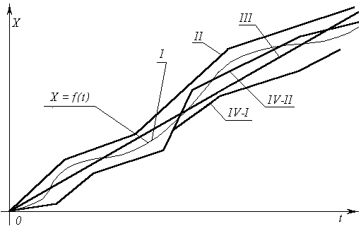
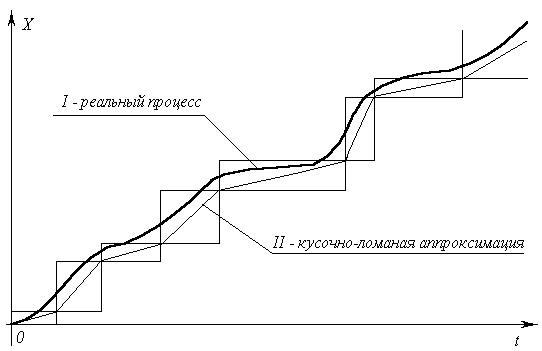
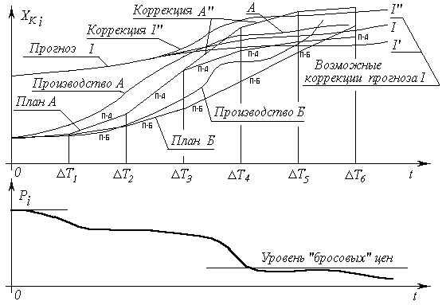
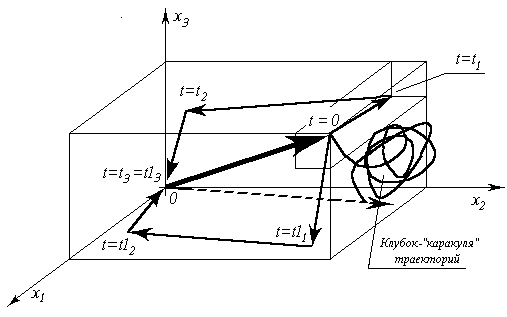

> **Первичный текст.** Мёртвая вода — редакция ред. 2015 г..
> Источник: `dotu.ru:c5d5a456d9fcb99c.fb2` sha256 `4dd1886169e7b01a…`; [страница на dotu.ru](https://dotu.ru/2015/05/09/mv-2015/).
> Автоматическая транскрипция DOC→Markdown; смысл и формулировки не правились.
> Контрольные суммы и статус проверки — в [NOTICE.md](../../NOTICE.md).
> Содержание передаёт позицию авторов; утверждения не верифицированы библиотекой.

---

## Проблема описаний

Проблема описаний — это проблема формирования некоего языка и возпитания культуры осмысленного пользования им[461]. Дзэн-буддистский учитель древности Дайэ в письме к своему ученику предостерёг его:

«Существует две ошибки, которые сейчас распространены среди последователей Дзэна, как любителей, так и профессионалов. Одна состоит в том, что человек думает, что в словах скрыты удивительные вещи. Те, кто придерживается этого мнения, пытаются выучить как можно больше слов и изречений. Вторая представляет собой другую крайность, когда человек забывает, что слова являются пальцем, указующим на луну. Слепо веруя предписаниям сутр, в которых сказано, что слова мешают правильному пониманию истины Дзэна и буддизма, они отвергают всё словесное и просто сидят с закрытыми глазами и кислыми физиономиями, как покойники».

Как видно из цитированного отрывка, проблема не нова. Человек действует на основе его личного возприятия реальности и на основе уразумения описаний реальности другими людьми, пользующимися для описаний общей всем реальности (включая и её составную часть — свой собственный психический мир) теми или иными «языками»[462], в которых слова, символы, знаки, изображения и т.п. являются “пальцем, указующим на луну”. Горе тому, кто не увидит “луны”, примет “палец” за “луну” либо за отсутствие “луны”, а отсутствие “пальца” отождествит с несуществованием “луны”.

Мироздание, как таковое, существует в Богом данной мере, как триединство «материя-информация[463]-мера[464]»: это — реальность. У человека при возприятии реальности в душе возникают некие его личностные образы, обусловленные как характером объективных образов реальности, так и его состоянием к моменту и в процессе возприятия информации из реальности. Личностные, субъективные образы, будучи уже принадлежностью внутреннего мира человека, обретают до известной степени самостоятельное бытие в нём. Вероятностно упорядоченно и статистически предопределённо, вторичные по отношению к объективным, субъективные образы прорастают в душе человека урожаем понятий, по мере того, как человек, осмысляя реальность, разграничивает в своём внутреннем мире присущие ему субъективные образы.

Понятие (как жизненное явление, свойственное индивидуальной — а не коллективной — психической деятельности человека[465], устойчиво существующее в ней на каком-то интервале времени, по изтечении которого оно может исчезнуть или измениться) — взаимно обусловленное единство «внеязыкового» субъективного образа в психике отдельного человека и «слов» одного из «языков», развитых в культуре общества, объединяющей по «языковому» признаку людей в разнородные множества; именно поэтому «слово» (и слово, в частности) без образа, связываемого с ним, голо, пусто. Возникшее в психике одного человека понятие о чём-либо (жизненном явлении и ли[466] вымысле) может разпространяться в обществе, т.е. проникать в психику других людей, преимущественно[467] через «языковые» средства культуры. В ряде случаев для разпространения новых понятий более или менее широкий круг людей создаёт и новый «язык», поскольку в развитых в культуре «языках» нет слов для того, чтобы выразить их миропонимание.

В процессе, когда новое понятие обретает осмысленную определённость, система разграничения субъективных образов внутреннего мира человека, не позволяет отождествить субъективный образ, слить, перепутать с другими. Этот процесс протекает “автоматически” безсознательно, но когда он выходит на уровень сознания в иерархически организованной психике человека, то человек ищет средства для выражения обретших определённые границы внутренних своих образов и: либо находит их в одном из существующих «языков»; либо создаёт новые «языки» — средства для выражения своих внутренних образов и тем самым осмысляет и описывает внутреннюю и внешнюю реальность. И на уровне сознания в психике человека возникает понятийная база: «разграниченные субъективные образы внутреннего мира» + «языковые» конструкции, адресно связанные с субъективными образами.

При уразумении чужих описаний — процесс обратный:

1. Соотносясь с языковыми формами имеющегося описания, извлечь из собственной понятийной базы необходимые образы и «языковые» конструкции и достроить недостающие понятия: «Многие вещи нам непонятны не потому, что наши понятия слабы; но потому, что сии вещи не входят в круг наших понятий» (К.Прутков).

2. Сопоставить с понятиями известные (внеязыковые) образы реальности или построить неизвестные ранее её образы, после чего во внутреннем мире возникнет субъективное представление (моделирование на основе внутренних образов) о течении процессов в объективной реальности.

То есть мы имеем дело со своего рода каскадом информационных трансформаторов «образы общей всем реальности : внутренние образы человека : понятийная база : «языки» разного рода сами по себе, как средства выражения внутренних образов в общении с другими людьми».

В массовой статистике жизни общества это — общественная культура мировозприятия, мышления и взаимопонимания. Это — общее достояние всех, кто ею пользуется. И она тем выше, чем меньше изкажений при прямом и обратном прохождении цепочки информационных преобразований одним человеком для его личных целей; чем больше уровней «языка», как иерархической системы кодирования информации, изпользуется людьми; и чем меньше при этом переданное одним и принятое другим не утрачивает своих качеств. Это касается как общей всем реальности, так и субъективной реальности внутреннего мира каждого человека.

В настоящее время культура мировозприятия, мышления и взаимопонимания крайне поверхностна и примитивна: подавляющее большинство людей осуществляет обмен пустыми формами разнообразных «языковых» описаний, наполняя возпринятые пустые (безóбразные) формы своей образной отсебятиной на основе безсознательных автоматизмов, не задумываясь об образной адресации «слов» ни у себя в душе, ни в душе тех, к кому они обращаются или слушают.

Многие при этом не понимают, что живое слово, изходящее из живых уст, как в прочем и мысль, проскользнувшая в душе, — само материально (энергия); оно — часть объективной общей всем реальности и изменяет течение процессов самим фактом его произнесения или иного оглашения.

При этом вне зависимости от того, задумывается человек или нет, но некоторая конкретная в каждом случае направленность взаимосвязей в системе “«язык», как таковой: понятийная база культуры: реальность” устанавливается на всех этапах объективно — в силу целостности мира, существующего как процесс триединства «материя-информация-мера», в котором общевселенская мера обладает голографическими свойствами. Чувствуя это, Ф.И.Тютчев предостерёг: «Нам не дано предугадать, как наше слово отзовётся…», — по какой причине не следует бездумно или злоумышленно принимать на себя роль старухи Карабос из “Спящей красавицы”, выражаясь как попало, иначе может получиться, как с шоу-мэном В.Листьевым, наболтавшим самому себе смерть.

То есть должно осознанно заботиться об определённости взаимных связей «языковых» конструкций и образов (субъективных и объективных) в процессе миропонимания, реальности как таковой — как по отношению к тому, что принято считать одушевлённым так и по отношению к тому, что принято считать не одушевлённым: мир един и целостен и не ладной мыслью, не то что словом, возможно вызвать катастрофу безо всяких мощных, с точки зрения материалиста, средств воздействия: дело только в объективно сложившейся адресации информации в матрице возможных состояний материи и уровнях мощности энергопотока, несущего информацию: то что есть пренебрежимо малое воздействие на одном уровне в иерархически построенной системе, разсматриваемом изолированно от других реально связанных с ним уровней в организации системы, может уничтожить систему, через цепи взаимосвязей разрушив другие уровни в её организации. Пример тому поражения живых организмов “жёсткими излучениями” разного рода, хотя мощности энергопотоков могут быть ничтожно малы по сравнению, допустим с энергией, остывающего на плите чайника.

И хотя «языковые» средства — поверхностный слой в культуре мышления и взаимопонимания людей, но возможности языков в самом общем смысле этого слова различны. И потому в одних случаях одни «языки» как средства информационного обмена и общения людей, предпочтительнее чем другие. Так в средние века в Европе до перехода на позиционную систему счисления (арабские цифры и десятичные дроби) пользовались римскими цифрами или иными системами, основанными на числовой мере, соотносимой со знаками алфавита. Вне позиционной системы счисления большой проблемой была операция деления: возникновение остатка при неделимости нацело и производная проблема соизмерения простых дробей[468]. Например: MCMXCV/ХVI или XXII/VII. С переходом к позиционной системе счисления проблема исчезла: операция деления двух чисел в ней — это пользование таблицей умножения и выравнивание порядков делителя и делимого (т.е. перенос десятичной точки или запятой вправо или влево). Числа остались прежними, но изменились средства описания: 1995/16 и 22/7 (вообще-то 22/7 — более точное приближение иррационального числа π, чем широко известное ныне 3,14159…, употреблялось в расчётах ещё в древнем Египте).

И если семья и школа ещё как-то учат грамматике родного языка и логике языка математики, то как связать этот уровень системы кодирования информации с другими? как выглядит внелингвистическая грамотность на них? — этому сами учатся только те, кто столкнулся с этой проблемой и понял, что она не наваждение и не фантазия, что пустые или неопределённой адресации “словеса” разного рода «языков», как минимум никчёмны, но чаще — опасны.

Развитие культуры это — и развитие средств описания внешнего и внутреннего по отношению к человеку мира. И от описаний, будь то словесные или математические формулировки законов естествознания или обществоведения, нельзя требовать полного тождества с превозходящей их по сложности реальностью во всей её полноте и целостности, хотя бы по причине ограниченности человека во времени и пространстве, как в измерениях в Богом данной мере. Несмотря на это, человек, пользующийся теми или иными «языками» при описании реальности и прочтении описаний, сделанных другими людьми, обязан видеть ошибку описания и отдавать себе отчёт в том, в какого рода деятельности эта ошибка порождает запас её устойчивости, повышая уровень безопасности его деятельности, а в каких случаях ошибка описаний изчерпывает запас устойчивости его безопасной деятельности, которая должна протекать в ладу с Мирозданием и Богом.

И вряд ли возможен в условиях нынешней культуры — в силу ограниченности человека и антибиосферного, паразитического характера культуры — абсолютный язык, полностью тождественный реальности.

Поэтому проблема современной цивилизации двуедина:

1. проблема взращивания безопасной культуры собственного мировозприятия, мышления каждого из людей, т.е. возприятие знания по мере практической необходимости вне языковых средств. В нашем понимании Новый Завет об этом говорит так: «Дух святой наставит вас на всякую истину». Это — обретение того, что можно назвать первознанием, которое даётся человеку непосредственно Свыше, каждому по его истинной нравственности. Пророку Мухаммаду принадлежат слова: «Раб Божий получает от молитвы то, что он понял».

2. проблема равнозначного (адекватного) обмена мнениями, т.е. разпространения “первознания” среди себе подобных людей при помощи «языковых» средств — “пальца, указующего на «луну»”.

И это в совокупности — одна из граней проблемы созидания нравственности каждым из людей в обществе: Бог не меняет того, что произходит с людьми (т.е. внешних обстоятельств), покуда люди сами не изменят того, что есть в них; А тем, кто остерегается вызвать гнев Божий, тем Бог даёт Различение, как способность, — так мы понимаем смысл коранических утверждений 13:12, 8:29.

Большинство «языковых» формулировок существуют как замкнутые системы в силу ограниченности возможностей человека, в то время как в реальности всё — взаимно вложенные системы с виртуальной (мгновенно существующей и мгновенно изменяющейся) структурой, находящиеся в материально-информационном обмене между собой и в том числе в обмене между иерархическими уровнями, определяющими порядок взаимной вложенности, согласно матрице возможных состояний и преобразований (в мере).

Об этом часто забывают, описывая нечто как самодостаточную систему, явно или неявно опустив описание её отношений с объемлющими системами, как процессами. Когда это приводит к очевидному ущербу вследствие деятельности на основе тех или иных описаний, то за такого рода ошибками следует другая ошибка: абсолютизация ошибочности прежнего описания.

Любое человеческое описание это — “калька” с Богом данной меры. Если мы входим в меру (через “ять”), то два любые числа приблизительно равны. То есть это — вопрос Различения: в одних обстоятельствах пользоваться таким приблизительным равенством допустимо, а в других — нет. И это касается любого знания, зафиксированного как описания в культуре общества, будь то “второе начало термодинамики” или “балансовый метод” в задачах макроэкономики: Как пользоваться любыми описаниями и средствами описания — «языками» — так, чтобы ошибка, всегда порождаемая неадекватностью описаний первознанию и реальности, уходила бы в запас устойчивости безопасной деятельности?

Памятуя о существе этого вопроса вернёмся к линейной алгебре, как к средству описания макроэкономики.

Обратимся к рис. 4.

<!-- figs:мертвая-вода-ред-2015-года--fb2-3793-img_13 -->

Рис. 4. Нелинейный процесс и его линейные описания.

На нём показано, как некий параметр X изменяется во времени t — кривая I . Математически этот процесс идеально точно может моделироваться некой функцией X = f( t) — тоже кривая I. Эта функция нелинейна. Ломаные I, II , III , IV‑I , IV‑II — различные линейные аппроксимации (т.е. описания) нелинейной функции X = f( t) линейной функцией (прямая III ) и кусочно-линейными (ломаные II , IV‑I , IV‑II) функциями. Каждой из аппроксимаций свойственна некоторая ошибка. Можно предположить, что линейные аппроксимации отражают моделирование в процессе принятия управленческих решений; а кривая I отражает реальный процесс управления, в котором осуществлены управленческие решения, выработанные на основе одного из линейных моделирований реально нелинейного управляемого процесса X = f(t) .

При любом значении аргумента t разность между кривой I и линейной аппроксимацией (II , III , IV‑I , IV‑II) — ошибка моделирования. Рис. 4 показывает не конкретное соотношение “моделирование — реализация”, а типы возможного взаимного разположения моделирующих аппроксимаций и реализаций процесса. Могут быть задачи, в которых допустимо любое из показанных соотношений “моделирование — реализация”.

Но могут быть задачи, в которых соотношения: «f(t) — аппроксимация III», «f(t) — аппроксимация IV‑II» недопустимы, поскольку ошибка моделирования в них изменяет свой знак в процессе реального управления. Таковы все задачи навигации: если ошибка моделирования меняет свой знак непредсказуемым образом, то курс корабля реально может пролегать и через сушу и мелководье; а самолёт врежется в посадочную полосу вместо того, чтобы мягко сесть на неё, если вообще не врежется в гору где-то по дороге.

Аппроксимации II , IV‑I сохраняют знак ошибки моделирования в процессе управления. В задачах управления макроэкономическими системами, аппроксимация II это — перенапряжённый план, не обеспеченный мощностями и доступными ресурсами; а кривая I — реальное производство, которое не в силах перевалить через “рекордное задание”.

В задачах управления макроэкономическими системами приемлемое соотношение упреждающего моделирования и реального процесса это — взаимное положение аппроксимации IV‑I и кривой I . Ошибка моделирования присутствует, но она всегда имеет один и тот же знак, причём моделирующие аппроксимации лежат всегда ниже, чем кривая I , изображающая реальный процесс. Если это процесс производства, то никогда не будет произведено меньше, чем заказано или задано, что и требуется при подъёме производства до общественно необходимого уровня и изключает падение производства ниже допустимого при устойчивом достижении уровня общественно удовлетворительной достаточности.

Кривая IV‑II — продолжение одного из отрезков ломаной аппроксимации IV‑I . Здесь также ошибка упреждающего моделирования меняет свой знак в процессе реального последующего моделированию управления. И в этом смысле аппроксимации IV‑II и III эквивалентны. Но случай IV‑II может иметь иную причину: чрезмерно длительный расчётный цикл ΔT народного хозяйства, в течение которого ошибка моделирования накопилась и вышла за управленчески допустимые пределы; случай же III соответствует бездумному раз и навсегда настроенному “автопилоту”.

Всем этим разным стилям моделирования в реальной жизни будут соответствовать и различные реализации управления, а не один, как показано на рис. 4 для упрощения возприятия.

Общественно приемлемо, если при изпользовании линейных моделей в задачах управления многоотраслевыми производственно-потребительскими системами принятый стиль моделирования в реальной жизни порождает соотношения «план — реализация» по типу «I — IV‑I» в символах рис. 4; а возникновение ситуаций типа «I — IV‑II» — при отсутствии общесуперсистемных факторов, препятствующих переводу системы в режим «I — IV‑I» — носит характер достаточно редких эпизодов и затрагивает только некоторые отрасли, а не их управленчески значимое количество, разрушающее устойчивость продуктообмена в целостности производственно-потребительской системы.

Тем не менее есть ещё одно обстоятельство, не отражённое в рис. 4. С того момента, как избрана расчётная длительность ΔT производственного цикла, кусочно-ломаные аппроксимации выражающие прямопропорциональную зависимость, предопределяют ступенчато дискретный характер задания и контроля вектора состояния системы в процессе управления ею, как это показано на рис. 5.

<!-- figs:мертвая-вода-ред-2015-года--fb2-3805-img_14 -->

Рис. 5. Линейные аппроксимации и дискретный характер расчёта и контроля параметров объекта управления.

Можно построить таким образом три основных типа “лестниц”: 1) на началах отрезков ломаных; 2) на концах отрезков; 3) на серединах. На рис. 5 показаны только 1‑й и 2‑й типы. Любой из трёх типов “лестниц” аппроксимирует один и тот же процесс (кривая I), построен на основе одной и той же кусочно-ломаной аппроксимации (кривая II), и потому они эквивалентны, хотя и недопустимо в одном и том же алгоритме расчётов и/либо управления не различать их и смешивать. Теперь обратимся к рис. 6.

<!-- figs:мертвая-вода-ред-2015-года--fb2-3809-img_15 -->

Рис. 6. Управленчески НОРМАЛЬНЫЕ переходные режимы с выходом на удовлетворение демографически обусловленного уровня потребностей.

На нём кривая I — прогноз демографически обусловленных потребностей в продукции отрасли i. Также показаны кусочно-ломаная линейная модель-аппроксимация («План А» — «П‑А») и реальное производство под управлением на основе плана «Производство А»; кроме того — кусочно-ломаная линейная модель-аппроксимация («План Б» — «П‑Б») и реальное производство под управлением на основе плана «Производство Б». I’, I’’ — коррекции прогноза и обусловленная коррекцией прогноза I’’ коррекция плана «А» в процессе его осуществления — A’’.

Ясно, что ошибка в прогнозе I , впоследствии которой возникает коррекция прогноза I’ предпочтительнее, чем ошибка в прогнозе I’’, впоследствии которой возникает коррекция плана A’’, поскольку коррекция I’ в общем-то не вызывает необходимости коррекции планов, в отличие от коррекции прогноза I’’ , вызванной ошибкой прогноза I.

Так же ясно с точки зрения потребителя план «А» лучше, чем план «Б», поскольку раньше выводит производство XK i на уровень демографической достаточности. Выход системы производства на уровень демографически обусловленной достаточности проявляется как сбыт по бросовым ценам (если не нулевым) при поддержании некоторого уровня товарных запасов продукта « i » при пополнении запасов за счёт текущего производства, кривая которого колеблется относительно прогнозной кривой с управленчески незначительной амплитудой и частотой, не вызывающими общественно ощутимого дискомфорта[469].

Рис. 6 показывает управленчески нормальное соотношение прогноза, плана (концепции управления) и реализующегося процесса управления (производства).

Но реально таких рисунков должно быть n— по числу отраслей. И каждый такой рисунок — проекция на ось « x i » n‑мерной прокладки (штурманский термин) экономического курса, т.е. плана и n‑мерной траектории реального движения объекта управления, следующего проложенным курсом с некоторой ошибкой в n‑мерном пространстве параметров, которыми описывается процесс.

В ином видении это — задача попадания в n‑мерном пространстве в движущуюся медленно маневрирующую цель самонаводящимся (или управляемым) снарядом. Специалисты военно-промышленного комплекса (ВПК) с начала 1950‑х гг. для случая трёхмерного пространства неоднократно заказывали её решения математикам для нужд противовоздушной, противоракетной, противолодочной обороны и иных задач вывода средств поражения на движущуюся цель в кратчайшее время и, при необходимости, последующее её устойчивое ближнее сопровождение с вероятностно предопределённым успехом (т.е. заранее известной вероятностью поражения цели, определяющей качество управления средствами поражения). Это говорит о том, что математический аппарат и работоспособные алгоритмы где-то лежат в уже готовом виде и нуждаются лишь в модификации их для пространства контрольных параметров размерности « n », а также в метрологически состоятельной макро- и микроэкономической интерпретации входящих в алгоритмы параметров и переменных.

При адаптации алгоритмов к решению задач оптимизации макроэкономики, необходимо учесть, что общество порождает одно обстоятельство, которое не довлеет, по крайней мере, над большинством военных приложений математики в задачах поражения движущейся цели. Военным всё равно, поразит ракета самолёт при заходе на цель с её носовой, хвостовой, нижней или верхней полусферы. Но обществу не всё равно, выйдет ли народное хозяйство на демографически обусловленный уровень производства хлеба и жилья, или же сначала в изобилии будут производиться зубочистки, а правящая “элита” будет раз в год менять лимузины, но хлеба вдоволь хватит только каждому десятому, а семьи будут разрушаться из-за того, что негде жить, поскольку эти виды производства будут отложены на “потом”.

Формально математически это означает, что если в n-мерном пространстве есть две точки, а объект необходимо перевести из одной из них в другую, то даже если существует некоторое множество равновозможных траекторий и время перевода объекта по любой из них — одно и то же, то эти траектории всё же управленчески не эквивалентны. Трёхмерный случай, иллюстрирующий эту неэквивалентность, показан на рис. 7.

На рис. 7 «0 x1 x2 x3» — пространство параметров, каждый из которых является мерой одной из трёх частных ошибок управления в составе трёхмерного вектора ошибки управления. То есть идеальному режиму управления соответствует начало координат. Радиус-вектор, идущий сплошной линией из начала координат, — вектор ошибки управления в момент времени t = 0 . Траектории, определяемые последовательностью положений: t = 0 , t = t1 , t = t2 , t = t3 и t = 0 , t = t11 , t = t12 , t = t13 = t3 — ведут из одной и той же точки в одно и то же начало координат и переход по любой из них длится одинаковое время t3 . Выбор переходного режима (траектории) субъективно произволен, но первая траектория — оптимальна при упорядоченности вектора целей управления ( x1 , x2 , x3 ), вторая — оптимальна при упорядоченности ( x3 , x2 , x1). В реальном процессе упорядоченность параметров в векторе целей, воистину принятая в управление, выражается в порядке исчезновения частных ошибок управления (обнуления компонент вектора ошибки), вне зависимости от деклараций о благих намерениях управленцев.

<!-- figs:мертвая-вода-ред-2015-года--fb2-3821-img_16 -->

Рис. 7. Зависимость оптимальной траектории перевода объекта от упорядоченности одного и того же набора контрольных параметров в векторе целей управления

Предположим, что на рис. 7: x1 — мера недостачи возможностей в получении образования подрастающим поколением; x2 — мера недостачи в питании, одежде, жилье, инфраструктурах; x3 — мера дефицита в роскоши и продукции деградационно-паразитического спектра потребностей. В силу действия неформализуемых взаимно изключающих обусловленностей параметров x1 и x3 при упорядоченности ( x3 , x2 , x1), система вряд ли пройдёт по соответствующей такой упорядоченности траектории далее половины пути. Скорее всего, вследствие действия не формализованных в модели факторов, она уклонится в иной ошибочный режим, показанный пунктирным радиус-вектором, идущим из начала координат, который возможно не будет устойчивым балансировочным режимом. Именно на этот путь ступили “демократизаторы” и хотят вести по нему народ.

Тому, кто себе в лоб забил алкогольно-никотиновый кол, лично непотребно образование, новое знание, поскольку оно — в тягость наркотически угнетённому. А его потомство, вследствие вероятностно предопределённых генетических нарушений, как в биомассе организма, так и в изкалеченной и подавленной психике, возможно не сможет освоить и те знания и культурные навыки, что были достоянием предков. Это приведёт к падению культуры производства и уронит спектры производства и потребления.

“Саморегуляция” рынка без разделения демографически обусловленного и деградационно-паразитического спектров будет выглядеть на рис. 7 по этим информационным причинно-следственным обусловленностям как хаотичное мельтешение ненулевого радиус-вектора в пространстве параметров, относительно какого-то среднестатистического положения, управляемого внесистемными факторами. “Саморегуляция” такого рода показана на рис. 7 как клубковидная “каракуля”.

Оптимизация каждого из множества производственных циклов ΔT вне объемлющей задачи оптимизации по минимуму времени переходного процесса изчерпания недостаточности демографически обусловленного спектра потребления — изначально методологически несостоятельная задача, поскольку это — “оптимальный” шаг неизвестно куда. Но и оптимизация переходного макроэкономического процесса — лишь частная задача в процессе перехода к жизни общества в ладу с объемлющей его биосферой.

Теперь разсмотрим метод динамического программирования, поскольку хотя и было показано, что алгоритмы решения задачи об оптимальном наведении средств поражения на цель в нынешней цивилизации не могут не существовать, тем не менее необходимо содержательно обсудить ещё некоторые “само собой” разумеющиеся очевидности, касающиеся оптимального выбора траекторий многопараметрических переходных процессов.

Формализованный выбор оптимальной в некотором смысле траектории в n-мерном пространстве возможен, в частности на основе изпользования аппарата “динамического программирования”. Термин “динамическое программирование”, также как и термин “линейное программирование”, — прижившийся в Русском языке подстрочник, мало что говорящий о существе самого метода.

Аппарат динамического программирования позволяет решать задачи многопараметрической оптимизации в тех случаях, когда в силу разного рода объективно-математических причин (дискретность ограничений, нелинейности, нарушение свойства выпуклости и т.п.) аппарат линейного программирования неработоспособен. Вполне понятно, что он тоже не изучался и не изучается в большинстве вузовских курсов СССР и России на специальностях, в которых владение им придаёт квалификации специалистов КАЧЕСТВЕННО более высокий уровень.
---

[К произведению](README.md) · [Каталог](../../CATALOG.md)
