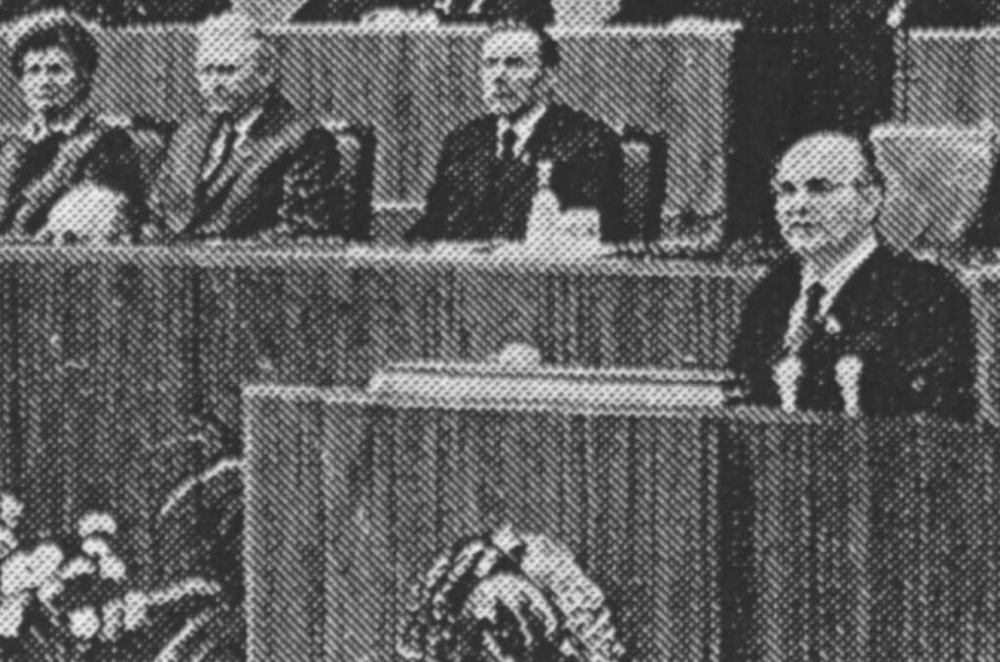

> **Первичный текст.** Последний гамбит.
> Источник: `Последний гамбит.doc` sha256 `4b7757e9da8e9e83…`.
> Автоматическая транскрипция DOC→Markdown; смысл и формулировки не правились.
> Контрольные суммы и статус проверки — в [NOTICE.md](../../NOTICE.md).
> Содержание передаёт позицию авторов; утверждения не верифицированы библиотекой.

---

## О принципах тандемной деятельности

«Высшее жречество древнего Египта сочетало в организации своей деятельности принципы чёта и нечета. Во времена, предшествующие исходу евреев из Египта, оно состояло из десятки высших посвященных Севера и десятки высших посвященных Юга[^54], а каждая из десяток возглавлялась одиннадцатым жрецом, её первоиерархом и руководителем.

То есть, каждый из руководителей десяток, в случае голосований в ней[^55], по своему разумению, будучи наивысшим из посвященных, т.е. наиболее знающим в составе одиннадцати, поддерживал одно из двух мнений, между которыми могли поровну разделиться ему подчиненные жрецы десятки, знающие меньше чем он по условиям построения иерархии. Это обеспечивало неизбежное принятие определённого решения по каждому из вопросов каждой из команд в целом, на Севере и на Юге, вне зависимости от того, как разделилась во мнениях десятка, подчиненная своему первоиерарху.

Но если обе команды работали вместе, то ситуация «голосований», в которой мнения разделялись 11 — «за», 11 — «против», не только не была однозначно исключена, но была статистически запрограммирована самими принципами построения системы, поскольку высшие посвященные первоиерархи, руководившие каждой из десяток были равноправны, а их мнения были равно авторитетны для всех прочих.

Если голоса даже не обеих команд в целом, а только их первоиерархов разделялись поровну между двумя взаимно исключающими друг друга мнениями в отношении одного и того же вопроса, то равноправие руководителей команд ставило их в положение, в котором они обязаны были вдвоем прийти к общему для них единому мнению.

Таким образом, высшая властная структура древнего Египта математически описывалась весьма своеобразной формулой:

2 × (1 + 10)

Конечно, легко представить, что двое наивысших жрецов могли договориться между собой бросить жребий и принять то решение вопроса, которое выпадет по жребию. Такой подход к решению проблемы разрешения неопределённости в принятии решения (в случае распределения голосов поровну между двумя взаимно исключающими вариантами) понятен и приемлем для подавляющего большинства любителей «машин голосования». И построение многих из них на принципе нечетности числа участников голосований играет роль именно такого рода бросания жребия, поскольку мало кто заранее может предсказать, как именно распределятся голоса при синхронном голосовании группы, и на чьей стороне окажется единственный решающий голос.

Однако, хотя по высказанному предположению руководители десяток и могли договориться между собой бросить жребий, но это было бы с их стороны нарушением системообразующих принципов их рабочей структуры «2 × (1 + 10)», которую они умышленно построили и поддерживали при смене поколений таковой, чтобы она статистически запрограммировано допускала возможность разделения голосов поровну между двумя взаимно исключающими друг друга мнениями по одному и тому же вопросу.

Иными словами, хотя первоиерархи, руководившие десятками высшего жречества, были явно не глупее нынешних демократизаторов и могли догадаться, что такого рода невозможность принятия определённого решения при равенстве числа голосов «за» и «против» легко снимается простым бросанием жребия, но сверх того они понимали и другое: лучше этого не делать. И именно того, что решение вопроса действительно лучше не отдавать на волю непостижимого случая, а в ряде обстоятельств и не доверять большинству голосов[^56], не понимают наивные сторонники машин голосования; а также и сторонники монархии, заботящиеся об автоматически неизбежном принятии решения по любому вопросу преимуществом минимум в один голос при нечетном количестве участников голосующего «комитета».

Эта особенность построения рабочей жреческой структуры «2 × (1 + 10)» подразумевает, что при несовпадении мнений двух равноправных первоиерархов по одному и тому же вопросу, они оба должны были стать участниками какого-то иного процесса выработки и принятия решения, исключающего осознанно непостижимую случайность выпадения жребия, а равно — единственного решающего голоса. Это — единственное разумное объяснение такому <u>системно выраженному</u> отвращению высшего жречества Египта к принятию решения на основе <u>непостижимости</u> случайного выпадения жребия, а равно и в результате <u>непостижимости</u> случайного перевеса в один голос.

И если рабочая структура «2 × (1 + 10)» существовала в течение веков без склок между первоиерархами её ветвей и не была заменена структурой выражающей принцип нечетности, то это означает, что первоиерархи действительно умели обеспечить работоспособность системы на основе принципа «ум — хорошо, а два — лучше»[^57] и обосновано целесообразно выбрать из двух взаимно исключающих мнений наилучшее, либо выработать третье мнение, превосходящее два прежних несовместных.

Иными словами, они умело осуществляли *<u>тандемный принцип</u>* в своей интеллектуальной и в <u>психической в целом</u> деятельности, который от них[^58] унаследовали и раввины Великой Синагоги древности, вызвавшие непонимание и удивление А.Ревиля своей приверженностью парности безо всяких к тому явно выраженных гомосексуальных причин, чем возможно бы объяснили всё фрейдисты.

Однако в обществе *почти всеобщей грамотности, нежелания и неумения думать*, в котором живем и мы, и читатели настоящей работы, одно из наиболее легких дел — написать, а равно и прочитать, слова «интеллектуальная деятельность на основе тандемного принципа». Практическое понимание их, а тем более осуществление в своей собственной жизни того, на что они указуют, гораздо труднее, чем прочтение или написание слов.

Первое, что может придти на ум читателю, это воспоминание о тандеме — велосипеде, на котором педали крутят два велосипедиста сразу и согласованно. Для тех, кто не только видел велосипед-тандем, но и ездил на нём не в одиночку, наверняка запомнилась легкость полета в сравнении с велосипедом для одного, возникающая за счет того, что сопротивление движению у тандема всего лишь несколько больше, чем у велосипеда для одного, а энерговооруженность примерно вдвое выше. Также наверняка памятно и то, что, если Ваш напарник в тандеме еле шевелит ногами, лишь бы ему только не отстать от темпа, с которым лично Вы крутите педали из всех сил, то Вам будет куда менее приятно, чем везти попутчика на велосипеде для одного.

Примерно также, как в велоспорте, обстоит дело с тандемным принципом в сфере интеллектуальной деятельности: если двое в тандеме нашли пути, чтобы обеспечить *сочетание*[^59] своих личностных возможностей, то эффективность тандема превосходит возможности каждого из его участников, а преимущества тандемного принципа «ум — хорошо, а два — лучше» для тех, кто смог его осуществить, очевидны и неоспоримы; если же двое в попытке образовать тандем *не* *сочетаются*, то тому, чья личностная духовная культура более развита, одному придется волочь на себе через «полосу жизненных препятствий» и своего напарника, и все тандемные порождения, и это в некоторых ситуациях может оказаться выше его сил даже, если его *единоличностные* возможности и позволяют ему относительно легко пройти всю «полосу препятствий» в одиночку.

Однако, тандемному принципу интеллектуальной деятельности присуща и особенность: в отличие от велоспорта, где тандем, на который можно сесть и поехать, обгоняя велосипедистов-одиночек, заведомо зрим и осязаем, все благие тандемные эффекты при интеллектуальной деятельности возникают и проявляются только в случае сочетаемости его участников. Она может быть изначальной, и в этом случае тандем складывается «сам собой» без каких-либо целенаправленных усилий с их стороны, по какой причине может оставаться невидимым для их сознания, занятого другими проблемами, пребывая в области их бессознательной психической деятельности. Если же изначальной сочетаемости нет, а люди не догадываются о возможности достижения ими в деятельности тандемного эффекта, то они и не предпринимают целенаправленных усилий к тому, чтобы, изменив свое отношение к себе и окружающим, обеспечить свою сочетаемость в тандеме.

Это — две причины, по которым тандемный принцип «ум — хорошо, а два — лучше», остался вне рассмотрения разного рода психологических школ: если он осуществился, то о нем *нечего* и говорить, поскольку он — не цель, а средство достижения каких-то иных целей; если он не осуществился, то говорить просто *не о чем за отсутствием предмета разговора*. Мы же уделяем ему большое внимание потому, что он — цель ближняя, которая становится по её достижении средством осуществления иных более значимых целей.

Хотя ещё жречество Древнего Египта опиралось в своей деятельности на тандемный принцип, но методы обучения интеллектуальной деятельности на его основе были в системе посвящений Древнего Египта либо неявными (это более вероятно по нашему пониманию законов сохранения и распространения информации в обществе[^60]); либо явные методы были достоянием исключительно наивысших посвященных (это, на наш взгляд менее вероятно, поскольку кто-нибудь оставил бы, если не прямые указания на него, то иносказательные, а таковые неизвестны).

В пользу высказанного в предыдущем абзаце говорят и те исторические обстоятельства, в которых Египет перестал быть Египтом и сошел «сам собой» с исторической сцены. Это свершилось в результате того, что стоявшая в течение столетий над фараоном и государственностью концептуально властная структура высшего жречества Египта «2 × (1 + 10)», покинула Египет во времена Моисея вместе со служителями Амона, в период плена египетского внедрившимися в среду древних евреев. Как после этого увял Египет фараонов, в общем-то широко известно, хотя этот процесс увядания историки и не связывают с исчезновением жреческой рабочей структуры «2 × (1 + 10)»[^61].

В послесловии И.Кацнельсона к роману Б.Пруса «Фараон»[^62] отмечается, что в египетской древности был <u>исторически реальный</u> верховный жрец Амона в Фивах Херихор, который занял египетский престол, устранив Рамзеса XII, <u>исторически реального</u> последнего фараона ХХ династии (что послужило Б.Прусу реальной основой для сюжета романа). В этот период Египет распался на две части, а в последствии стал добычей иноземцев, по мере того, как отсебятина и невежество «элиты» и жречества, деградирующего до уровня сиюминутно алчного знахарства, приводила к прогрессирующему падению качества управления, которое и завершилось спустя несколько столетий при Клеопатре окончательным крахом.

И.Кацнельсон, как и многие другие, не обращают внимания на то, что эти реальные события краха ХХ династии и воцарения верховного знахаря в качестве фараона имели место ПОСЛЕ ИСХОДА ЕВРЕЕВ из Египта, известного по Библии. То есть после того, как Египет уже разродился глобальной доктриной рабовладения на основе ростовщической тирании еврейских кланов, подконтрольных наследникам иерархии египетского Амона (библейского в общем, и церковно-«православного» Аминя, Аменя, А.Меня, в частности).

После начала этой агрессии методом «культурного сотрудничества», глобальному знахарству, извратившему заповедями ростовщичества и расизма Откровение, переданное через Моисея, культура Египта как государственного образования стала мешать. В целях обеспечения принципа «концы в воду»[^63], хозяевами иерархии в лице его высших посвященных был нарушен принцип выработки решения двумя параллельными и равноправными её ветвями «2 × (1 + 10)». Тем самым исторически реальному Херихору была предоставлена возможность стать единственным дееспособным первоиерархом той ступени знахарства, которую обошли стороной при посвящении в глобальные планы, дабы она, оставаясь в Египте, не путалась под ногами у претендентов на мировое господство.

Возможно, что, не понимая существа и эффективности *тандемного принципа выработки решения* и <u>единоначалия при его осуществлении в жизни</u> (это лежало на фараоне и иерархии чиновничества), будучи не посвященным в целесообразность построения *<u>системы управления Египтом при смене поколений</u>*, под властью которой Египет жил в течение нескольких тысячелетий, реальный Херихор — индивидуалист по своим нравственным идеалам и мировоззрению — сам устремился к единоличной высшей государственной власти и занял должность фараона. Это было ему позволено устремившейся к глобальной безраздельной внутрисоциальной власти жреческой *неформальной* системой «2 × (1 + 10)» потому, что она более не нуждалась в том, чтобы властные структуры Египта по своим возможностям превосходили властные структуры других государств. С точки зрения *неформальной* структуры «2 × (1 + 10)», ставшей надгосударственной и международной, все государства должны были уступать ей в эффективности властных структур, а их культуры должны были быть унифицированы и в этом смысле. Переход в Египте к монархии, в которой монарх в системе общественных иерархий выше служителей культа, по-прежнему именуемых «жречеством», и решал именно эту задачу. Это было потерей устойчивости системы общественного самоуправления древнеегипетского регионального толпо-«элитаризма», которая до того поддерживала жизнь египетской региональной цивилизации на протяжении более чем 2000 лет, выводя её даже из случавшихся военных и социальных катастроф (катастроф управления) без потери самобытности её культуры.

Так древнеегипетская жреческая система «2 × (1 + 10)» — благодаря тандемному принципу более совершенная и безошибочная в выработке решений чем «нечетные» системы — перестала довлеть над единовластием его царей и некоторое время существовала в скрытном состоянии в среде иудеев. Позднее она проявилась открыто своей верхушечной частью в лице двух высших раввинов, возглавлявших Великую Синагогу древности примерно с 230 г. до н.э. на протяжении всего исторического времени, пока Древняя Иудея, в свою очередь, не принуждена была ею же сыграть после первого пришествия Христа в древнеегипетскую «игру» «концы-начала — в воду Леты[^64]».

Это в общем-то и всё, что можно выявить из общеизвестной истории о роли тандемного принципа в прошлом. Прежде, чем переходить к анализу его возможностей в современности и в перспективе, следует отметить, что психика представителей древнего жречества, действовавших на основе тандемного принципа, явно отличалась от психики другой части жречества, людей подобных Херихору, предпочитавших осуществлять управление на основе единоличностных возможностей; а кроме того, и психика остального населения, не принадлежавшего жреческим структурам, большей частью отличалась от психики высших иерархов[^65].

Именно из-за особенностей в строе психики и самодисциплины свойственной высшему жречеству, освоившему тандемный принцип интеллектуальной деятельности, по отношению к нему неприменимы общепонятные для толпы прошлого и настоящего подходы подкупа и силового или иного шантажа оппонента при несогласии с его взглядами. И те, кто думает, что среди дееспособного высшего жречества подкуп одного первоиерарха другим либо шантаж были возможны, должны ответить себе на вопросы: чем могли подкупить друг друга люди, чье слово реально было более властно, чем слово фараона, воспитанные с детства так, чтобы им не быть невольниками инстинктов и страстей, даже если бурей дурных страстей увлечено почти всё подвластное им общество? какие могли возникнуть между ними личные склоки, если их *ограниченные* физиологические и культурно обусловленные (в силу воспитания) потребности гарантировано могли быть удовлетворены всею мощью египетского государства[^66], не малой даже по понятиям нашей современности, тем более что склоки уничтожили бы жизнеспособность структуры «2 × (1 + 10)», которая обеспечивала их в жизни всем, делая их почти полностью независимыми от общества и его «мнения», которое они сами же во многом и формировали?

Но это означает, что, будучи основой для ликвидации и разрешения разного рода «недоразумений», тандемный принцип для его осуществления сам требует ясного разумения определенных вещей и волевого согласования с такого рода разумением поведения каждого из участников тандема.

Прежде всего, необходимо понять и смириться с тем, что концепция единоличного «авторского права», «права на интеллектуальную собственность», которая на Западе рассматривается как одна из основ их цивилизации, препятствует осуществлению свободной интеллектуальной деятельности и совершенствованию духовной культуры в обществе как вообще, так и на основе тандемного принципа, в частности.

Тандемная интеллектуальная деятельность основывается во всех без исключения случаях на признании объективности факта самостоятельного бытия всех тандемных порождений и подчинении этому довлеющему над тандемом факту своего поведения каждым из его участников. То, что рождается в результате интеллектуальной деятельности на основе тандемного принципа, не является продуктом интеллектуальной деятельности кого-либо одного из участников тандема. И в продукте тандемной деятельности реально невозможно разграничить «авторские права» каждого из его участников на отдельные искусственно вычлененные составляющие *целостного продукта* тандемной деятельности[^67].

Последнее обусловлено тем, что тандемный принцип в его осуществлении во многом подобен игре в домино в том смысле, что вклад одного участника в порождаемый ими продукт тандемной деятельности обусловлен предшествующим вкладом другого и, в свою очередь, предъявляет требования к последующим вложениям их обоих. Именно в силу этого все тандемные порождения и обладают самостоятельностью *бытия, при котором присутствуют участники тандема.* В тандеме ни один из его участников не обслуживает интеллектуальную деятельность другого[^68].

Сказанное — ключи к осуществлению тандемного принципа в жизни, а не правила, придуманные для некой интеллектуальной «игры», которые возможно изменить по своему произволу, в результате чего получатся правила другой «игры», после чего возможно выбрать ту «игру», которая более соответствует нраву.

Каждый человек, будучи частью объективного мира, обладает только ему свойственными личностными особенностями, что получило название «субъективизм». В общественной жизни людей именно субъективизм исследователей, ученых, разработчиков является источником появления в культуре новых знаний и навыков. Но он же является и основным источником ошибок, проистекающих из разного рода ограниченности и недостаточности субъекта. Если кто-либо высказывает мнение, не совпадающее с общепринятым, господствующим, то достаточно часто его упрекают словами: «А-а-а… Это *твое* мнение…» Однако, в подавляющем большинстве случаев упрекающие других подобным образом в том, что те имеют *свое* мнение, предпочитают не задумываться о содержании этого мнения и о том, насколько сообразно и соразмерно в нём выражено объективное течение событий жизни, а в чём конкретно субъективное мнение ошибочно и какие особенности психической деятельности высказавшего его человека нашли свое выражение в этих ошибках.

Если задаться именно этими вопросами, то всё уничтожающий скептицизм и нигилизм «А-а-а… Это <u>твоё</u> мнение» преобразится в одну из двух составляющих тандемного принципа. Если ответы на такого рода вопросы не будут отвергнуты носителем мнения «А пошёл ты… Кто ты такой, чтобы учить меня?!!», то он тем самым начнет свою часть тандемной деятельности, в результате чего его первоначальное мнение может измениться, но кроме того новому мнению будет сопутствовать и некое мнение о напарнике как о человеке и как о носителе определенных знаний и навыков.

Если напарник не отвергнет это мнение по вопросу и сопутствующее ему мнение о себе, и не прервёт обсуждение, то он может завершить первый такт тандемного действия порождением третьего мнения, в каких-то своих особенностях отличающегося от исходных мнений каждого из них по одному и тому же вопросу. Этому третьему мнению по рассматриваемому вопросу неизбежно будет сопутствовать необходимость изменить свои самооценки для каждого из участников тандема в отношении тех или иных своих личностных качеств, знаний и навыков. Если при этом затронуты достаточно серьезные вопросы, то возможны как крах личности, упорствующей в своей приверженности несообразным и несоразмерным Объективной реальности мнениям, так и её преображение.

Тандемные эффекты в интеллектуальной деятельности есть следствие того, что с точки зрения здравого смысла каждого из участников тандема субъективизм его напарника является особого рода «ножницами», срезающими с порождений тандемной деятельности ошибки, возникшие вследствие субъективизма каждого из них; по отношению же к личности человека субъективизм его напарника является кузнечным молотом, а тандемные порождения — наковальней. В результате такого рода взаимной «кузнечной» обработки от личности отслаивается довольно много всевозможной «шелухи» ошибочного субъективизма, нашедших выражение в его личном вкладе в продукт тандемной деятельности. Этот процесс тем более психологически болезненен и неприятен, чем более личность притязает на «интеллектуальную собственность» в отношении порождений тандемной деятельности и их составляющих и чем больше превозносится над окружающими в самомнении[^69]. Когда начинается обработка личности в кузнице тандемных отношений, то с некоторых слетает так много шелухи, что от них мало что остается и некогда величавшаяся личность просто теряется в этой шелухе. И именно боязнь потерять лицо в такого рода обработке, свойственная эгоистичному индивидуализму, является главным препятствием, которое необходимо преодолеть, чтобы на практике убедиться, что «ум — хорошо, а два — лучше».

Из этого можно понять, что тандемный эффект тем более ярко выражен, чем более различен тот жизненный опыт, который запечатлен в душах участников тандема и чем более свободно и доброжелательно каждый из них относится к другому. И соответственно тандемный эффект исчезает в ситуациях, подобных басне И.А.Крылова «Кукушка и петух», когда «Кукушка» хвалит «Петуха» за то, что хвалит он «Кукушку». В среде же индивидуалистически мыслящей интеллигенции гораздо чаще приходится встречаться с тандемами, подобными птичьему, описанному И.А.Крыловым и самозабвенно занятому взаимным восхвалением; причем один и тот же «интеллектуал» может поочередно быть участником нескольких тандемов взаимного восхваления. Но если хотя бы один из участников взаимного восхваления перейдет к осуществлению принципов тандемной деятельности, то он рискует потерять своего напарника и хвалителя, которому «кузнечная обработка» его самомнения неприятна и оскорбительна.

Интеллектуальная деятельность в тандеме протекает как прямое общение людей, в котором происходит обмен субъективной информацией между ними. Этот обмен тем более эффективен, чем более сосредоточено внимание каждого на его напарнике. Такого рода информационный обмен может продолжаться без перерыва довольно долго; он может возобновляться после неоднократных перерывов, которые могут на многие годы прерывать обсуждение какой-то определённой проблематики. Длительная продолжительность такта тандемной деятельности и характер информационного обмена между людьми дает ответ на вопрос, почему «третий — лишний» и почему еще более избыточны четвертый и последующие умы.

В наиболее зримом виде информационный обмен между людьми протекает как беседа. Человек может говорить, обращаясь и к <u>единственному</u> *собеседнику*, и ко <u>множеству</u> *слушателей*. Но подавляющее большинство людей может отслеживать и анализировать течение мысли в повествовании только одного собеседника. Третий, пытающийся стать участником беседы, отвлекает на себя внимание слушателя, разрушая тем самым тандемный процесс. Это не значит, что во всех без исключения случаях третий должен быть удалён за пределы сферы беседы, но если он понимает тандемный принцип, то, присутствуя при тандемной деятельности других, он обязан сделать себя незримо прозрачным для них либо слиться с фоном окружающей обстановки. Но это только одно ограничение налагаемое на третьего тандемным принципом.

Другое обстоятельство проявляется несколько иным образом. Конечно, триумвират, как и всякий более многочисленный «комитет» вплоть до парламента или съезда, может работать в политандемном режиме, когда его участники попеременно образуют тандемы в разном составе. Но в подавляющем большинстве случаев это приведет только к замедлению работы «комитета» без существенного выигрыша в качестве выработанного им решения. Причина этого в том, что подавляющее большинство образуемых участниками «комитетов» тандемов, занятых какой-то определённой проблемой, окажется примерно одинаковой эффективности. Но с течением времени по отношению к каждой проблеме выявится несколько лидирующих в области этой проблематики тандемов, один из которых в состоянии заменить всю совокупность остальных[^70]. Кроме того, во многочисленном «комитете» далеко не во всех сочетаниях их участников возможно быстрое образование работоспособных тандемов, что приведет к фракционным склокам, известным каждому парламенту, дополнительным потерям времени и снижению добротности выработанного «комитетом» решения.

Политандемный принцип эффективен при обработке спектра проблем, весь круг которых и глубина понимания выходят за пределы возможности одного человека. Это приводит еще к одной особенности тандемного принципа, которая обладает решающей значимостью именно в политандемном варианте при обработке спектра проблем: участник тандемного процесса не вправе лгать, потому что далеко не всё им высказанное возможно перепроверить другим участникам политандемного процесса, но высказанное им заведомо ложное мнение, будучи принято другим участником политандемного процесса в качестве истинного, может послужить основой для выработки глубоко ошибочного решения, весьма тяжкого по своим последствиям.

Если же рассматривать некий тематически определенный спектр множества проблем, то в политандемном принципе осуществим один из способов взаимодействия индивидуальной психики (и интеллекта, в частности) с коллективной психикой (и коллективным интеллектом), частью которой является индивид — участник тандема. По этой причине, тем, кому оголтелый эгоистичный индивидуализм не позволяет действовать на основе тандемного принципа, лучше помалкивать о соборности и коллективизме. Пока индивид не научится деятельности на основе тандемного принципа в его отношениях с другими людьми, вместо соборности вообще и соборности в Святом Духе в частности, он будет порождать более или менее ярко выраженную коллективную шизофрению; распространение заведомой лжи по отношению к коллективной психике является одним из способов её шизофренического дробления[^71]. Выраженное на практике в тандемных порождениях освоение тандемного принципа деятельности — первый преодоленный рубеж, открывающий пути к соборной жизни индивидов».

\* \*\

\*

Дважды перечитав записку, я был поражён плотностью упаковки информации изложенной в ней. Кроме проблем взаимоотношений с Холмсом, никогда не затрагиваемых нами, материалы записки проливали свет на те вопросы управления в древнем Египте, на которые я вышел, занимаясь «пикниками». Но более того, записка коснулась и многих других проблем западной цивилизации: что такое современные демократические выборы и почему демократия, в том виде, как она представлена в обществе, не эффективна; особый взгляд на природу авторского права и т.д. Я подумал, что если она станет достоянием широкого круга читателей, то в процессе её обсуждения сама по себе она может породить новую культуру взаимоотношения людей меж собой, а также культуру отношений человека и общества. Я также понял, что сама записка является частью какой-то объемлющей её работы и что неплохо бы переговорить об этом с Холмсом. Всё оставшееся до ужина время я посвятил чтению файла «Последний гамбит», сопоставляя прочитанное с новыми картинками из различных номеров газеты «Час пик», газеты «Труд» и «Аргументы и Факты». Удивительно было даже не то, что русские «пикники» так широко известны в мире, а та необычная трактовка событий, с ними связанных, различными людьми в разных странах. Из записок Холмса мир вставал огромным и разнообразным, но тем более единым и целостным, чем представлялся мне ранее. Поражала также определённая синхронность наших расследований и ощущение чего-то незримого, но объективно существующего, предопределяющего эту деятельность, что в лексике уже получило название матрицы. Вставал и образ новой России, не просто загадочной и непредсказуемой страны, к чему мы все на Западе с некоторой опаской привыкли, но особой, отличной от Запада и Востока цивилизации, в которой просматривались истоки и новой культуры третьего тысячелетия.

Включив 17-ти часовые новости, я в друг услышал о террористическом акте, совершенном в ночь с 12 на 13 октября в центре Мадрида. Судя по записям Холмса, ещё 3 октября Паоло Риего и Андрей Веров, анализируя странную карту столицы Испании с гаечным ключом, лежащую сейчас предо мной, обсуждали в Эль-Эскориале возможность такого теракта. Интересно, знает ли о случившемся Холмс? Я постучался в дверь его кабинета.

— Входите, Ватсон, я не сплю и внимательно изучаю ваши записи. Особый интерес представляет ваша беседа с Гальбой в баре «Уолдорф». Несомненно, вы встречались с самым настоящим современным троцкистом.

— Холмс, вы слышали последние известия?

— Что, ещё один самолёт упал на Нью-Йорк?

— Нет, судя по картинке с типом, который подкармливает «птичек» на берегу Чёрного моря, это ещё впереди. Только что сообщили о ночном взрыве на центральной площади Мадрида. Я как раз рассматривал копию странной карты с гаечным ключом в виде руки и читал ваш комментарий к ней. Что это? Так не бывает.

— Как видите, дружище Ватсон, — очень даже бывает. Это — матрица и матрица — везде! Не волнуйтесь, чувство, которое вы сейчас испытываете, я пережил четвёртого октября, на другой день после того, как мы в Эль-Эскориале обсуждали с Андреем Веровым и Паоло Риего календари за 1994 год. Как вы уже поняли из моих записей, хозяин квартиры, который видел, как и я, календари впервые, точнее всех предсказал день катастрофы русского лайнера. А насчёт броских слов о новых самолётах, падающих на Нью-Йорк, — надо поосторожней, дорогой Ватсон, если вы не хотите, чтобы они действительно упали: слова бывают властны над матрицами, если они оказываются вложенными по отношению к тем, кто работает на объемлющих матрицах. Завтра мы поговорим о матрицах подробней, в процессе разгадки русских «ребусов». Мне кажется, у нас собран материал, которого вполне хватает на то, чтобы высказать определённые суждения по всем трём «пикникам». А как вам, дружище Ватсон, записка «О тандемном принципе деятельности»?

— Самое странное в этом деле, Холмс, то, что я впервые задумался о принципах нашей с вами совместной деятельности в день вашего отъезда в Швейцарию. Никогда раньше мы эти вопросы не обсуждали, но после ознакомления с содержанием записки я почувствовал себя в роли велосипедиста, который вхолостую крутит педали.

— Не надо заниматься самоуничижением, дорогой Ватсон. Каждый из нас делает ту часть общей работы, к которой более всего предрасположен. Ваш подход к анализу «пикников» по-своему уникален. А вот что касается результатов тандемной деятельности, то они не принадлежит никому лично из двоих, а это для меня вывод не то, чтобы не приемлемый, но требующий и нового осмысления, выходящего за рамки привычных стереотипов культуры в которой мы живём. Если же говорить откровенно, то мне нечего возразить по существу против выдвинутой в записке концепции авторских прав. Пока же ясно одно: такие выводы никогда не могли быть сформулированы в среде западного истеблишмента и, следовательно, мы имеем дело с правосознанием новой культуры. Но, извините, Ватсон, я хотел бы дочитать до конца ваш анализ, а завтра мы обсудим подробно оба варианта и, как мне кажется, выйдем на новый результат нашей тандемной деятельности.

На другой день, сразу же после завтрака, мы собрались в кабинете Холмса. На его рабочем столе в хронологической последовательности лежали три «пикника», а также календари из «Часа пик» и копии других газет, которые имели отношение к «пикникам». А я прихватил с собой томик повестей А.С.Пушкина.

— Что это у вас, Ватсон?

— Прежде, чем мы начнём обсуждение русских «пикников», я хотел бы, дорогой Холмс, зачитать вам одну фразу из Пушкина: «Две неподвижные идеи не могут вместе существовать в нравственной природе, так же как два тела не могу в физическом мире занимать одно и то же место».

— «Пиковая дама»?

— Совершенно верно, Холмс, — начало шестой главы. В процессе изучения аналитической записки по фильму «Матрица», а также после прочтения ваших записей у меня сложилось представление о глобальном противостоянии двух концепций управления: библейской и альтернативной ей Концепции Общественной Безопасности. И мне показалось, что Пушкин одной этой фразой еще в первой половине девятнадцатого века очень точно выразил противостояние двух альтернативных концепций управления. И если в этой фразе Пушкин обратил внимание на информационную и материальную составляющие концепций, то вся повесть по существу посвящена их мерной составляющей. Поэтому если говорить о матрицах-сценариях «пикников», то везде можно найти следы числовой меры «Пиковой дамы». Кстати, числовая мера самой «пиковой дамы» по картам «Таро» — 51. Достаточно взглянуть на календари в газете «Час пик» № 51 (200) от 29.12.93 г. и № 1 (201) от 5.01.94 г. и можно сразу же обнаружить в них числовую меру «пиковой дамы».

— Согласен, Ватсон, хотя в газете за 1993 год эта числовая мера выражена в самом её номере, а в газете за 1994 год — в дате её выхода, если опустить «0» между денем и месяцем. В своё время я также обратил внимание на числовую меру, сопровождающую «пикники» и её сходство с числовой мерой «Пиковой дамы». А когда в 1995 году мне попала в руки книга профессора Иллинойского Университета в Чикаго Лорейна Лейтона «Эзотерическая традиция в русской романтической литературе», в которой более половины содержания было посвящено нумерологии[^72] этой удивительной повести Пушкина, я решил, что она-то и поможет раскрыть мне тайну русских «пикников». Ничего подобного, кроме общих рассуждений о связи литературы с тайными доктринами и кабалистикой я в ней не обнаружил. Более того, у меня сложилось впечатление, что Пушкин в «Пиковой даме» просто посмеялся над увлечением своих современников-масонов мистикой Калиостро, Сен-Жермена и Сведенборга. Не прошел мимо этих увлечений и знаменитый биограф моего прадеда Артур Конан-Дойль, который как вы знаете, Ватсон, под конец жизни увлёкся спиритизмом. Поэтому, чтобы не возвращаться в процессе анализа «пикников» к «Пиковой даме», давайте, Ватсон, обозначим числовую меру двух концепций, которая проявилась действительно в шестой главе повести.

Холмс взял лист бумаги, и нарисовал на нём следующую таблицу:

|  |  |  |

|----|----|----|

| Игра в «фараон» | Германн — символ библейской концепции | Чекалинский — символ КОБы |

| Первый этап «игры» — «Исторический пикник»: | налево — 3 | направо — 9 |

| Второй этап «игры» — «Оборонный пикник»: | налево — 7 | направо — валет (2) |

| Третий этап «игры» — «Пост исторический пикник»: | налево — туз (11), но вместо туза у Германна[^73] оказалась «пиковая дама», то есть — 3 | направо — дама (3) |

| Итого: |                13 |                    14 |

— Итак, Ватсон, проследим за игрой в «фараон», как она описана в повести. Есть ряд обстоятельств, по которым можно определить, что матрица, формируемая Пушкиным через символику «Пиковой дамы», — объемлющая по отношению к матрицам-сценариям «пикников». В первый день игры Германн почему-то ставит на кон банковый билет на сумму 47 000. Чекалинский на это заметил, что «никто более двухсот семидесяти пяти семпелем здесь ещё не ставил». Другими словами, Чекалинский предсказывает числовую меру выигрыша 2+7+5 = 14, а Германн ориентируется на 4+7 = 11.

— А какая же, Холмс, здесь связь с «Историческим пикником»?

— Давайте, Ватсон, посмотрим на первый «пикник». Я прочитал запись вашей беседы с Гальбой, где вас мучает вопрос: «Знает он про «пикники» или не знает?». Нет, Гальба про «пикники» ничего не знал, а рассказывал вам про августовский путч, проходивший в рамках матрицы «Исторического пикника». Сама матрица созрела, то есть наполнилась информацией и энергией значительно раньше, а художник, сформировавший из пяти картинок этот ребус, выполнил функцию принтера при компьютере, в информационной базе которого матрица первого «пикника» уже существовала. Почему распечатка матрицы «Исторического пикника» имени Артемиды появилась в газете «Час пик» № 25 (70) 24.06.91 г.? Были ли какие-то представления об этой матрице у главного редактора Натальи Чаплиной? Масонам всего мира хорошо известно, что 24 июня 1717 года легализовалось голубое — Иоанново масонство и, возможно, что Чаплина это сделала, подчиняясь масонской дисциплине, чтобы оповестить масонов о существующем плане-сценарии развала Советского Союза. Пока лишь мне удалось выяснить, что через месяц после августовского путча 17 сентября 1991 года на совещании редакторов центральных газет бывшего СССР, которое транслировали по первому каналу Центрального телевидения, Горбачёв — последний президент Советского Союза, сидел справа от редактора этой провинциальной, и я бы даже сказал — бульварной газеты. И более того, ей было дано право первой задать вопрос последнему президенту СССР и последнему генеральному секретарю ЦК КПСС.

— Знала ли она сама что-либо об этом сценарии?

— В этом я сильно сомневаюсь, как и сомневаюсь в способности членов редколлегии сформировать материалы газеты таким образом, чтобы на её обратной стороне оказался репертуар из шести фильмов, на которые вы, Ватсон, обратили внимание в своём расследовании.

— А как же тогда, Холмс, эти фильмы там оказались и к тому же дали столь точное определение каждому из пяти дней путча?

— Всё это, Ватсон, матричные проявления, в рамках которых тогда действовали, в той или иной мере все, принимавшие участие в путче. В этом смысле и действия *Чапли*-ной — тоже результат матричных проявлений объемлющей «пикники» матрицы «Пиковой дамы», поскольку, в первой главе повести есть упоминание персонажа по фамилии *Чапли*-цкий, над которым сжалилась графиня и дала ему тайну трёх карт. Тот, насколько я помню, в отличие от Германна, поставил не на 47, а на 50 тысяч и выиграл «три раза сряду», получив в сумме четыреста тысяч; рассчитался с долгом в триста тысяч и ещё остался в выигрыше.

— Таким образом, через числовую меру Пушкин показал, чего не хватало концепции, на основе которой действовала матрица «игры» Германна?

— Верно, Ватсон! 50 - 47 = 3. Это — как раз то, что в концепции, альтернативной библейской, получило название «триединства материи, информации и меры». И потому мне нечего добавить к рассказу Гальбы, расставившего в хронологическом порядке «камни» первого «пикника» так, чтобы «коварный никто» взгромоздил статую Зевса-Ельцина на вершину пирамиды власти. Однако, и эта кукла-статуя не могла выйти в своей деятельности за рамки пушкинской матрицы, выраженной в определённой символике «Пиковой дамы».

Холмс взял со стола томик повестей Пушкина, открыл нужную страницу и зачитал:

«Он был человек лет шестидесяти, самой почтенной наружности; голова покрыта была серебряной сединой; полное и свежее лицо изображало добродушие; глаза блистали, оживленные всегдашнею улыбкою»

— Согласитесь, Ватсон, что этот портрет Чекалинского, данный Пушкиным в начале шестой главы, сильно напоминает Ельцина, каким его показывали Западу в первые годы после путча. А теперь вот это место в конце шестой главы: «Чекалинский стал метать, руки его тряслись. Направо легла дама, налево — туз». Кого в этот момент напоминает Чекалинский?

— Главу ГКЧП, вице-президента СССР Янаева во время его выступления в составе ГКЧП по телевидению.

— Совершенно верно, Ватсон. Это и означает, что пушкинская матрица является объемлющей по отношению к действиям и Ельцина, и условно противостоящего ему ГКЧП. Ничего в этом нет удивительного: ведь все они — из одной управленческой «элиты», имевшей абривиатуру ЦК КПСС, которая (об этом мне рассказали в Испании) раскрывается, как — Центральный Комитет Капитулянтской Партии Самоликвидации Социализма. И в вашей беседе Гальба был прав: возможно, если не они сами то, их «кукловоды» просто договорились, кому править в новых условиях, а кому после короткого пребывания в тюрьме, идти на заслуженный отдых, предварительно обеспечив себе ореол «страдальцев за счастье народное», а «кукловодам» — возможность легитимного возвращения к сценарию политики «социализма» в будущем. Ведь, согласитесь, если после победы Ельцина юристы обосновали незаконность ГКЧП, так при необходимости другая команда юристов не менее строго обоснует факт государственной измены Горбачева и его сподвижников и, соответственно, — правомочность и законность ГКЧП, чья вина при этом будет состоять только в том, что они не достигли успеха. Ведь после того, что мы оба знаем о концептуальной власти, мы должны исходить из того, что всякое законодательство — рубеж обороны, на котором одна концепция защищает себя от осуществления в том же самом обществе другой, принципиально несовместимой с нею концепции. В концептуально же не определившемся обществе, каким был СССР в последние годы своего существования, в одном законодательстве выражались взаимоисключающие друг друга концепции. Именно поэтому на его основе, определившись концептуально, можно юридически безупречно обосновать обвинительное заключение и против Горбачева, и против ГКЧП, и против Ельцина и команды реформаторов эпохи «Гайдара — Черномырдина». Правда и нам надо быть скромнее, памятуя о том, что говорим об этом мы только под давлением того факта, что Россия стала концептуально определяться. А это — явление глобальной значимости.

— А совпадение числовых мер «Исторического пикника» и «Пиковой дамы»?

— О! этого сколько угодно, Ватсон. Достаточно взглянуть на номер заказа этой газеты — № 9113. И к тому же, Ватсон, — пять картинок «Исторического пикника» содержат 9 пальм.

— Но я всё-таки не могу понять, Холмс, для чего были опубликованы эти картинки? Ведь даже сейчас по прошествии десяти лет их содержание не совсем ясно, а тогда за два месяца до путча, я более, чем уверен, — их почти никто не понял.

— Дорогой Ватсон, я уже говорил, что картинки «пикников» — овеществлённое выражение матрицы, которая успела сложиться к тому времени и в русле которой впоследствии протекали события в России. Соответственно, если какое-то событие имело место в реальности, то это означает, что оно фактически состоялось несколько ранее в мерной —матричной — составляющей Жизни тогда, когда в результате психической деятельности самих людей сформировалась соответствующая матрица-сценарий эгрегориальной алгоритмики, впоследствии приведшей к этому событию.

Если наступление некоего события не предопределено Богом как однозначно неизбежное, то его можно предотвратить, так или иначе развалив матрицу на не стыкующиеся между собой фрагменты, энергетически опустошив её, либо преобразовав матрицу-сценарий эгрегориальной алгоритмики, ведущей к нему, так чтобы результаты осуществления матрицы-сценария были хотя бы приемлемы, а ещё лучше — желанны. После того, как матрица-сценарий сформировалась, до того момента, как соответственно ей осуществятся какие-то события, проходит некоторое время, в течение которого матрица-сценарий энергетически наполняется, в неё вовлекаются участники, она синхронизируется с объемлющими уже осуществляющимися матрицами-сценариями и т.п. В течение этого времени на матрицу-сценарий и на процессы осуществления свойственных ей событий можно воздействовать, подчиняя их (матрицу и события) нравственно обусловленной целесообразности.

— Извините, Холмс, но этого нет в ваших записях.

— В моих записях, Ватсон, есть только то, что я понял на момент осмысления рассказанного мне. Но после бесед в разных странах происходило много других событий, и у меня было время подумать над ними и соотнести их с уже существующими у меня представлениями о них. При этом что-то получало подтверждение самой жизнью, а что-то требовало критического подхода и нового осмысления. Что касается картинок «пикников», то, как мне кажется, они играли роль синхронизаторов бессознательной коллективной деятельности многих участников событий. Плотность упаковки информации в символах и образах во много раз превышает плотность информации, передаваемой в лексике; тираж газеты — несколько сот тысяч; читатели газеты машинально просмотрели газету и картинки «пикника» запечатлелись на бессознательных уровнях их психики. Всякие образы, когда «всплывают» с бессознательных уровней психики на уровень сознания, требуют*, как хотя бы вот вы сейчас, Ватсон, от меня,* адекватной лексики, чтобы, соединившись со словом, они обрели смысловую нагрузку, то есть превратились в понятие. Люди гуляют, ездят по городу и перед их взором мелькают афиши кинофильмов, некоторые названия которых подходят, например, к картинкам «Исторического пикника». Происходит что-то вроде замыкания информационной (образной) составляющей триединства на её мерную (лексическую), и в результате люди совершают, как принято говорить у психологов, «немотивированные поступки», хотя на самом деле они — мотивированы в матрице вероятных событий, которую возможно сами энергетически и накачали. Такими примерно я вижу события августа 1991 года. При этом, обратите внимание, Ватсон, что если в первом «пикнике» основное место занимают картинки, перемежающие символику древнего Египта с символикой времён Советского Союза, а лексики — минимум, то в «Оборонном пикнике» всё наоборот: основное место занимает лексика, а картинок-символов — минимум и все картинки принадлежат эпохе СССР. Количество кинофильмов — по числу дней октябрьского путча 1993 года. И здесь ваш собеседник Гальба в основном раскрыл матрицу-сценарий второго «пикника». Он только не прокомментировал картинку в левом углу «пикника» с пушкой, слева от ствола которой стоит надпись «за бугром», а ещё чуть левее нарисован взрыв. Весь ребус может иметь прочтение — «За бугром будет взрыв». В лексике советского обывателя слова «за бугром» означают — «за границей». Другими словами, во втором «пикнике» на матричном уровне заложен алгоритм «черного вторника» Нью-Йорка, как самого большого «забугорного» символа. Хорошо ещё, что картинка не реализовалась в полной мере: на ней изображён «гриб» ядерного взрыва, а один из самолётов, как известно, не долетел до АЭС в Пенсильвании. И ещё: Гальба сказал, что второй путч пошёл не так, и в связи с этим процитировал «Неизвестного» из «Маскарада» Лермонтова.

Холмс порылся в своих бумагах на столе и, обнаружив то, что искал, продолжал.

— Почему Гальба привёл именно эту цитату, если в драме есть слова, более точно описывающие ситуацию, которая сложилась в России в сентябре — октябре 1993 года.

Холмс взял найденный листок и зачитал: «Я был вчера у вас с известием, что наш пикник расстроен». Это говорит князь во втором действии, а в финале он же по существу объявляет, что и по отношению к «Оборонному пикнику» матрица «Пиковой дамы» является объемлющей: «Молчит, не слушает, ужели он рассудок потерял». И хотя эти слова относятся к Арбенину, но их с таким же успехом можно отнести и к Германну из «Пиковой дамы».

Холмс взял со стола лист с перечнем 13 кинофильмов на обратной стороне газетного листа с «Оборонным пикником» и, протянув его Ватсону, спросил:

— Как называется последний тринадцатый фильм этого перечня, Ватсон?

— «Деловая женщина».

— Так вот, Ватсон, занимаясь расследованием тайны «пикников», я вынужден был в своё время изучить символику «Карт Таро». Согласно этой символике: *«Дама пик» — женщина деятельная, деловая, вдова или женщина действующая самостоятельно.* Другими словами, матрица «Пиковой дамы» — объемлющая и по отношению к матрице-сценарию второго «пикника». В довершении ко всему в «Оборонном пикнике» упоминается речь Петра I перед Полтавской битвой. Что вы, Ватсон, думаете о содержании этой речи?

— Ровным счётом ничего, Холмс, потому, что не читал поэму «Полтава».

— Я тоже не читал, но вынужден был познакомиться с её переводом и узнал, что речь Петра перед битвой со шведами была предельно краткой: «За дело, с Богом!» — всего два слова, но для понимания управления на основе матриц эти два слова чрезвычайно важны. Я обратил внимание, что при прочтении аналитической записки по фильму «Матрица», вы Ватсон в понятии взаимовложенности матриц выделили предельную матрицу Божьего предопределения. Как вы уже убедились, в «пикниках» есть указание на взаимовложенность многих матриц, одна из которых и разрешилась катастрофой в Нью-Йорке и Вашингтоне. Этим матрицам в разное время придавалась различная лексическая определённость, то есть каждый, кто с ними сталкивался, в меру своего понимания общего хода вещей и по своей объективной нравственности озвучивал их по-своему: Гальба, и вы были тому свидетелем, — так; Лермонтов и Пушкин — иначе, но для всех них и для нас с вами в том числе, матрица Божьего предопределения или, как говорят русские, матрица Божьего промысла — объемлющая. Хотя, что я вам рассказываю о взаимовложенности матриц, когда вы и сами это почувствовали через текст «Песни о маршалах», в которой все упоминаемые города — Сантьяго, Сиракузы[^74], Пиза, Тулуза — так или иначе информационно пересекаются в матрицах-сценариях всех трёх «пикников».

Обратите внимание, Ватсон, на то обстоятельство, что «Оборонный пикник» появился в газете за две недели до августовского путча 1991 года, и за два года до октябрьского путча 1993 года. Как вы думаете, что могло произойти за эти две недели на матричном уровне, если соотношение образной и лексической составляющих изменилось в пользу последней?

— Я уже думал над этим Холмс и пришёл к выводу, что матрица катастроф, которую, как мне кажется, очень хорошо описал граф на вилле «Аскания Нова», начала интенсивно перестраиваться, а те, кто это почувствовал и кому такая перестройка была не по нраву, отреагировали на изменение матрицы лексикой, то есть пытались её, грубо говоря, изнасиловать. Но они уже были не властны над ней.

— Всё, что вы сказали, Ватсон, — верно, но всё-таки: почему матрица катастроф начала перестраиваться именно в этот период времени?

— Этого я не знаю, Холмс. Могу лишь догадываться, что именно в этот период в информационном состоянии России произошло что-то очень важное.

— Совершенно верно, Ватсон. И в своём дальнейшем расследовании мы пойдём по второму, хронологическому приоритету. Именно в этот период, где-то в мае — июне 1991 года, в бывшем СССР была завершена в рукописи Концепция, альтернативная библейской концепции управления. Насколько мне удалось выяснить у людей, с которыми я встречался в Испании и Египте, у Концепции Общественной Безопасности ещё не было её современного названия — «Мёртвая вода», а в названии стояло что-то вроде рекомендательного «Как вам реорганизовать Бнай-Брит», обращённое к их оппонентам, правящим миром по библейской концепции. Видимо, авторский коллектив, давая такое название, надеялся на разрешение концептуального кризиса без катастроф и пытался говорить с заправилами библейской концепции в их терминологии. Название было первоначально дано по аналогии с работой Ленина «Как вам реорганизовать Рабкрин», однако, их оппоненты посчитали, что разработчики новой концепции всё ещё под концептуальной властью марксизма-троцкизма. Отсюда и направленность «Оборонного пикника» — троцкистская, а лексики в нём много потому, что вдохновители «Оборонного пикника» не были уверены, что их символика сработает правильно на бессознательных уровнях психики и дали пояснения к ней в определённой лексике в соответствии с их пониманием целей развития страны.

— И всё-таки, Холмс, мне непонятно, на чём основываются ваши представления об их неуверенности?

— Ну, они же не совсем дураки, понимали, что в Концепции Общественной Безопасности только название троцкистско-ленинское, а содержание — антитроцкистсткое. Другими словами, представители библейского знахарства решили «прокатиться» на новой концепции, что в результате вылилось в их личностную концептуальную неопределённость, но во взаимовложенности матриц Свыше всегда поддерживается та матрица, которая более всего соответствует матрице Божьего предопределения. Только после этого мне стало понятно, почему «Пост исторический пикник» появился 17 августа 1992 года в газете «Час пик» № 33 (130).

— Интересно, Холмс, почему действительно третий «пикник» появился через год?

— В Испании от Андрея Верова я также узнал, что приблизительно в это время готовилось первое издание Концепции Общественной Безопасности и после длительных обсуждений авторский коллектив принял решение дать ей русское эпическое название «Мёртвая вода» по одной из фраз послесловия к почти что безымянной работе. Возможно, это была их неосознанная реакция на упреждающую лексику «Оборонного пикника», третью часть которого, как вы видите, Ватсон, занимает сказка «Три сына», перепечатанная из библиотеки журнала «Огонёк» 1940 года. Я думаю, что авторам КОБы было непросто решиться дать такое для многих отпугивающее название — «Мёртвая вода». Куда проще было бы назвать — «Живая вода», но именно этого и добивались от них представители библейского знахарства в «Оборонном пикнике». Надеюсь, Ватсон, вы обратили внимание на мои записи бесед в Испании на эту тему?

— Да, Холмс, это место я прочитал несколько раз с особым вниманием, и мне стало более понятно название концепции. Действительно, в сказке «Три сына» нет упоминания «Мёртвой воды», но зато говорится о младшем брате, что он был «порезанный». То есть по умолчанию «братишки» оживляли обрубки, а если говорить о ситуации в СССР после августовского путча, то Россия после декабря 1991 года превратилась в «порезанного меньшого брата».

— Таким бы и хотел видеть Россию Запад после 1993 года. Но у авторского коллектива при выборе названия концепции была мощная поддержка на матричном уровне самого Пушкина, продолжившего в XIX веке русскую общенациональную традицию жизнеречения.

Холмс снова взял со стола листок с записями и зачитал Ватсону следующее:

«Вы получите мой «Современник»; желаю, чтобы он заслужил ваше одобрение. Будьте моим сотрудником непременно. (…) Ваши стихи — вода живая, наши — вода мёртвая; мы ею окатили «Современник»; опрысните его вашими кипучими каплями».

— Как вы думаете, Ватсон, кто и к кому так обращается?

— Судя по названию журнала, Пушкин обращается к кому-то из своих современников, поэтов.

— Верно, Ватсон, это из письма 1834 года Пушкина русскому поэту Николаю Михайловичу Языкову с просьбой принять участие в работе журнала «Современник». Нам здесь важна оценка, которую даёт Пушкин своим стихам и творчеству в целом — «вода мёртвая». Почему? Да потому, что Пушкин собирал в «Современнике» творческий потенциал России. И обратите внимание на последовательность: сначала свершается воздействие мёртвой воды, а только потом предлагается воздействовать живою водою. И как я выяснил, во всех русских сказках всегда так: одною живою водою не пользуются, а всегда сначала мёртвой. А вот мёртвой водой иногда пользуются и одной — дают всякой нечисти и та от неё слабеет и погибает.

Очень похоже, что Концепция Общественной Безопасности тоже собирает творческий потенциал народов для вывода из кризиса не только России, но и глобальной цивилизации в целом. Поэтому эпическое название КОБы — «Мёртвая вода» было предопределено задолго до её написания самим Пушкиным и, следовательно, игра в «фараон», которую знахари библейской концепции затеяли на матричном уровне с Внутренним Предиктором СССР в «Историческом пикнике» была проиграна ими ещё до того, как они её начали. Не помогло даже их обращение к авторитету «alma mater» — древнему Египту, которое просматривается в символике «Исторического пикника». Этим же авторитетом они пытались развалить матрицу альтернативной концепции и в «Пост историческом пикнике».

— Вы, Холмс, имеете в виду фигуру УгОМОНА над Пизанской башней в третьем «пикнике»?

— Да, Ватсон, эта фигура сидящего фараона символизирует матричные связи первого и третьего «пикников», но правее и выше УгОМОНа, над всеми картинками находится то ли Эрот, то ли Купидон, в любом случае — символ бога Любви. Но Бог истинный действительно есть Любовь, и потому хотели того, или нет, но представители библейского знахарства на уровне символики третьего «пикника» признали, что во взаимовложенности всех матриц есть предельная матрица Божьего предопределения и что всё раньше или позже произойдёт в согласии с ней. И тем не менее, если попытаться перевести обращение Глобального Предиктора к Внутреннему Предиктору СССР с языка символов на язык определённой лексики, то будет примерно следующее: «Куда вы лезете? Разве вам не понятно, что вы пытаетесь противостоять авторитету концепции, на основе которой осуществляется устойчивое управление глобальной цивилизацией более четырёх тысяч лет? У нас есть суфизм, иудаизм, христианство, буддизм, ислам, масонство и бесчисленное множество различных открытых и тайных орденских структур — и всё в одном флаконе. А что вы можете этому противопоставить? Достаточно общую теорию управления?»

— Извините, Холмс, что прерываю вас, но от Гальбы в баре «Уолдорф» я уже слышал о «Достаточно общей теории управления». Он говорил о ней почему-то очень раздраженным тоном и я не стал расспрашивать о её содержании. Мне показалось, что из бесед с господином Веровым, которые не нашли отражения в ваших записях, вы поняли об этой теории что-то очень важное, раз привели её в качестве главного аргумента на символический вызов, сделанный Глобальным Предиктором?

— Я не читал, Ватсон, «Достаточно общей теории управления», но мне действительно кое-что удалось узнать о ней из разговора с господином Веровым. Русские называют её сокращенно — ДОТУ и эту аббревиатуру они поместили в название сайта www.dotu.ru.

По их мнению, она появилась, как ответ на новое информационное состояние, в котором после смены логики социального поведения оказалось всё общество. Раскол в обществе носит сегодня глобальный характер. Нет понимания не только между представителями науки и религии, но и между представителями различных прикладных и фундаментальных наук. Русские задались вопросом, почему такое оказалось возможным? — и пришли к очень простому выводу, который, кажется, лежит на поверхности: нет понятийного и терминологического аппарата в порядке обобщения частных отраслей знаний единого для всех них. Будь такой понятийный аппарат, то специалисты в одних областях знания легко понимали бы специалистов в других областях знания, просто соотнося с ним свои основные понятия и термины. И они постарались понять то общее, что свойственно людям, когда они сталкиваются в своей практической деятельности с любыми процессами, затрагивающими их жизнедеятельность. Это общее — возможность всякий процесс описать как процесс управления и стремление людей управлять процессами, значимыми для жизни каждого из них и жизни человечества.

Поэтому они посчитали, что понятийный и терминологический аппарат Достаточно общей теории управления наиболее приемлем для решения любых проблем, встающих перед человечеством: религиозных, социальных, технико-технологических, биологических, военных, экономических личностно психологических и других.

Так, например, с их точки зрения вся западная экономическая научная элита — сборище идиотов и аферистов просто потому, что они не знают, в чём именно метрологически состоятельно выражаются ошибки управления макроэкономическими системами и что должно входить в список гарантированно достижимых метрологически состоятельных целей управления макроэкономикой. Согласитесь, что всякая объективная наука начинается с измерений, с которыми соотносятся её понятия и термины. Если этого нет, то это — не наука, а шарлатанство или первобытное «заклинание стихий». Ну а в наши дни — большей частью аферизм, прикрываемый школами «экономической мысли».

— Но извините, Холмс, в этом нет ничего нового и я читал много статей на эту тему в различных специальных журналах.

— Это так, Ватсон, но всё дело не в теориях управления, которых действительно написано бесчисленное множество применительно к различным сферам деятельности человека и общества, в том числе и к экономике. Дело в самой Достаточно общей теории управления и, прежде всего, — в изложении её содержания таким образом, чтобы ни при каких обстоятельствах никто не смог превратить её в мертвящую догму. Согласитесь, Ватсон, что эта задача далеко не так проста, как может показаться на первый взгляд. Другими словами, необходимо было в рамках этой теории создать такой понятийный и терминологический аппарат, с помощью которого специалист из смежных наук мог бы легко входить в любую фундаментальную и прикладную науку, и который бы объединил науку и религию, раз уж их предназначение служить благу человека.

— И как, по-вашему, Холмс, это удалось русским?

— Полагаю, Ватсон, что удалось, если даже мы с вами сегодня занимаемся по существу этой теорией. А в ней есть одно важное обстоятельство, связанное с обратимостью вектора целей и вектора ошибки и *переоценкой* соответственно избранному вектору целей отрицательных обратных связей в положительные и положительных в отрицательные. С мировоззренческих позиций ДОТУ можно понять, что любые противоречия и конфликты в обществе, неразрешимые в границах некоторой исторически сложившейся ограниченной концепции самоуправления общества, в русле более широкой и полной — объемлющей концепции управления — видятся иначе и могут быть *в ней безконфликтно* разрешены.

Некоторые возможности такого рода преодоления и разрешения конфликтов связаны со свойством обратимости в паре вектора целей и вектора ошибки[^75] управления: то, что в одной концепции управления является вектором целей, в другой концепции управления может оказаться вектором ошибки при общем им обеим векторе состояния; и наоборот. Ну а сейчас вернёмся к третьему «пикнику».

— Да, Холмс, вопросами достаточно общей теории управления, видимо, придётся серьёзно заниматься в будущем, а сейчас у меня есть несколько вопросов по третьему «пикнику».

— Да, Ватсон, пожалуйста.

— Первое, мне непонятно назначение вот этого «утёнка с гитарой» справа от «Пизанской башни».

— Как мне кажется, Ватсон, таким символом представители библейского знахарства обозначили период идеалистического атеизма, который последовал за периодом материалистического атеизма…

— И который завершился операцией по ликвидации Троцкого, приверженного к материалистическому атеизму? — прервал я Холмса.

— Совершенно верно, Ватсон. И у операции было кодовое название «Утка», о чём, помнится, я делал пометки в своих записях.

— Извините, Холмс, наверное, я не придал ей значения, иначе мог бы и сам связать её с символикой третьего «пикника». Также не до конца ясен смысл пунктирной линии, идущей от «Белого дома» и возвращающейся к нему, хотя после чтения ваших записей я пришёл к выводу, что таким образом обозначился разворот матрицы-сценария, о котором мне ещё четвёртого октября намекнул Гальба.

— По всей видимости, это так и есть, Ватсон. Причём ваше исследование «Словаря античности» в отношении двух фигурных композиций — «Тесей с Минотавром» и «Тираноубийцы» — дополнило некоторые недостающие фрагменты алгоритма возврата матрицы катастроф в сторону её заказчиков. Первую же фигурную композицию на фоне пунктирной петли, которой и не могло быть в «Словаре античности», можно назвать «Русская борьба». Она была очень популярна в начале двадцатого века и борцы, как правило, встречи проводили в цирке. Отсюда композиции «Русская борьба» и «Тесей с Минотавром» — символы двух путчей в России — августовского 1991 года и октябрьского 1993 года, после которого действительно в постсоветском обществе пошёл «Обмен точек зрения», а вот «Очень революционные силы» — «Тираноубийцы» (террористы-камикадзе) достались Америке.

— А что может означать петля показанного на карте маршрута в месте расположения «Русской борьбы»?

— Вы, Ватсон, хотя и гребли в университеской восьмёрке, но далеки от морского дела, и потому эта петля не вызывает у вас никаких ассоциаций. А мне с детства интересен яхтинг, яхты и всё связанное с эстетикой и романтикой плавания под парусами. И эту петлю я могу прокомментировать следующим образом. При маневрировании парусника иногда так складываются обстоятельства, что поворот — «фордевинд», когда в одной из фаз поворота ветер дует с кормы, может представлять опасность, поскольку есть риск почти мгновенной переброски парусов и подвижных частей рангоута[^76] с борта на борт, что может сопровождаться повреждениями яхты, травмами и гибелью зазевавшихся членов экипажа. В этом случае для поворота на необходимый курс вместо манёвра «поворот фордевинд» применяется поворот «оверштаг», когда в одной из фаз поворота ветер дует с носа вдоль корабля. При этом гик переносит паруса с борта на борт плавно, без резкого броска, что исключает риск травмировать или убить кого-либо из членов команды, повредить паруса, такелаж и рангоут. Такой поворот «оверштаг», совершаемый вместо поворота «фордевинд», получил на слэнге яхтсменов название «коровий оверштаг» — и за его внешнюю неуклюжесть, и за внутреннюю неслаженность команды, квалификация которой не позволяет совершить поворот «фордевинд».

Например, если яхте надо совершить поворот направо на девяносто градусов, то вместо быстрого поворота через «фордевинд», совершая «коровий оверштаг», она повернёт налево, но на двести семьдесят градусов. При наблюдении за гонками яхт с вертолёта, вы увидите, что яхта, выполняя манёвр «коровий оверштаг», движется по петлеобразной траектории. Но если вы не знаете тонкостей управления яхтой в тяжелых погодных условиях или при неслаженной команде, то этот манёвр будет для вас непонятен. Похоже, что такого рода «коровий оверштаг» Россия и совершает: начали поворот, казалось бы «влево» — перестройка, демократизация, а по мере того, как поворот затягивается, у сторонников «левизны» в политике всё больше возникает вопросов на тему: «Россия, ты куда? — ничего не понимаем…»

Вот и русская газета «Комсомольская правда» от 18 октября 1990 года, почти за год до ГКЧП, изобразила нечто подобное и именно в этом — политическом смысле:

По сути, Ватсон, манёвр «коровий оверштаг» показан рядом с «Русской борьбой», и он связан с эффектом «обезьяньей лапы», символ которого мы видим среди картинок «Пост исторического пикника», и о котором вам рассказал Гальба в баре отеля «Уолдорф».

— А газета «Час пик» от 2 июня 1999 года № 21 (73) с фотографией-коллажом под статьёй «О вреде и пользе мифологии», которую вы Холмс привезли из Индии, показала, как шёл процесс перестройки матрицы катастроф, запущенный в отношении России, — в сторону США. Памятник основателю Петербурга императору Петру I — «Медный всадник» — на фоне небоскрёбов Нью-Йорка; Исаакиевский собор, отражающийся в стёклах одного из них — это выражение именно этой переадресации алгоритма течения матричных процессов в адрес США.

Интересна и связь иллюстраций-коллажей к статье «О вреде и пользе мифологии» с «пикниками». Вот смотрите в нижнем колонтитуле газеты под этой статьёй помещена панорама Петербурга, но на месте, где привычно виден купол Исаакиевского собора, возвышаются башни нью-йоркского Всемирного торгового центра:

На плане Петербурга в «Пост историческом пикнике» на этом же месте помещено изображение «индийского боевого слона», сопровождаемое надписью: «Места важнейших тусововок». Иными словами, наследники Директивы СНБ 20/1 от 18 августа 1948 года — дотусовались: не рой другому яму — сам в неё попадёшь…

— Совершенно верно, Ватсон, тем более, что номер газеты — 21 — «очко»[^77], которое несколько раз и в различных модификациях фигурирует в картинке к календарю на 1994 год с тем типом, который кормит «птичек» на набережной. А сквозной порядковый номер — 73 говорит о том, что два этапа алгоритма матрицы уже завершены и на подходе заключительный — третий. Стоит напомнить, что Германн в «Пиковой даме» стремился получить в сумме — 21, а получил — 13. Ну и в довершении к сказанному, если посмотреть на карту Петербурга в зеркальном отображении, то мы будем иметь схематичную карту приблизительно напоминающую карту Нью-Йорка, только вместо устья реки Гудзон мы имеем Финский залив, почему-то названный Лебединым озером, и Неву, почему-то названную «рекой Москвы», наверное, по ассоциации с устойчивым клише «рука Москвы». Кроме того, не лишне вспомнить, что изначально Нью-Йорк был назван голландцами, его основателями, «Новым Амстердамом», но царь Пётр строил Санкт-Петербург, подражая архитектуре голландских приморских городов, а Санкт-Петербург в петровские времена иногда называли тоже «Новым Амстердамом».

И потому всё свершилось в соответствии с матрицей катастроф, которую библейское знахарство бездумно накачивало энергией, но уже не по отношению к России, а по отношению к тем, кто разрабатывал людоедскую директиву СНБ США № 20/1 от 18 августа 1948 года. Обратите внимание, Ватсон, на номер директивы, который говорит о том, что на уровне числовой меры её разработчики в своих планах с самого начала были ограничены пушкинской матрицей «Пиковой дамы». Да, самолёты полетели в точно указанное в третьем «пикнике» время, но снесли не символы духовной и светской власти России, а две башни Всемирного Торгового Центра — символ библейской цивилизации. А дальше всё, как в фильмах Голливуда: спасатели в касках и респираторах, «склад пыли» и остовы разрушенных башен, напоминающих своим видом Пизанскую башню. Всё это, Ватсон, вы видите на картинках «Пост исторического пикника».

 

— А что может означать, Холмс, слово «след», написанное рукой ниже лозунга «Очень революционные силы»?

— На эту загадку, как мне кажется, вы сами ответили в своих записях оценкой событий, происшедших за четыре дня до катастрофы в Нью-Йорке, — 7 сентября. Тогда вы, Ватсон, действительно нащупали «иранский след», который возможно должен был предшествовать событиям «черного вторника». Ведь сегодня теракты в Нью-Йорке и Вашингтоне воспринимаются шокированной мировой общественность как идеальные в смысле уровня организации и исполнения. При этом априори утверждается, что все задуманное было успешно реализовано. Разумеется, это не так, и свидетельством тому является четвёртый самолёт, упавший на кукурузное поле.

Вне всякого сомнения, существует некоторое не известное нам расхождение между сложным и изощренным планом террористической операции, с одной стороны, и тем, как он был осуществлен, — с другой. Вполне уместно предположить, (знаком чего является «гриб» в «оборонном пикнике»), что упавший (или сбитый) самолет направлялся к ядерному объекту. Об этом же говорит и заготовленное заранее заявление, сделанное якобы от имени «Японской красной армии», которое, в случае успешно проведенной операции, прямо увязывало бы этот несостоявшийся террористический акт с местью за американскую атомную бомбардировку Хиросимы и Нагасаки в 1945 г. И сейчас США и, возможно, еще половина земного шара боролись бы с результатами радиоактивного загрязнения…

Есть, наверное, еще какие-то нереализованные пункты давно задуманного и готовившегося, по оценкам специалистов, несколько лет террористического акта. В случае реализации этих пунктов всемирная история могла бы пойти по иному пути. Для понимания сути произошедшего полезно было бы узнать о том, что не произошло. И тут нам, Ватсон, есть, о чём подумать.

В своих записях вы, прежде всего, обратили внимание на совпадение числовой меры дня, когда на Лондон не упал иранский самолет, — 7 , с числом пассажиров на борту — 430, а также предположили, что этот случай — несостоявшийся захват авиалайнера, который мог быть направлен на Лондон. Действительно исламские террористы, или те, кто стоял за ними, могли проработать такой вариант. Так, например, хорошо известно, что алжирские террористы ещё в 1994 г. хотели бросить аэробус на Париж, и тогда только активность французских спецслужб помогла предотвратить этот теракт. Также известно, что 6 лет назад, после ареста в Маниле некоего Абдул Мурада, который являлся участником известного террористического акта 1993 г. во Всемирном торговом центре Нью-Йорка, у него в компьютере был обнаружен проект захвата нескольких американских пассажирских самолетов для последующей атаки здания Центрального разведывательного управления и других американских объектов первостепенной важности.

А теперь попробуем, Ватсон, представить себе, что произошло бы, если бы этот террористический акт состоялся. Итак, 7 сентября иранский самолет падает, предположим, для определённости на Вестминстерское аббатство, снеся заодно и башню-символ доброй старой Англии — Биг Бен[^78]. Даже если бы не последовало никаких заявлений об ответственности, исполнители теракта сразу были бы определены как иранцы (самолет, напомню, принадлежал компании «Иран эйр»). В это время, как теперь выясняется, некий иранец, сидящий в тюрьме в Германии, скандалит с администрацией, требуя, чтобы его связали с Белым домом. Он хочет предупредить о терактах в Нью-Йорке и Вашингтоне. Предположим, ему поставлена чёткая задача — в определенный день начать бузить по поводу якобы известных ему данных о заговоре против США, и даже, если он ничего не говорит об «иранском следе», то будучи иранцем — он уже сам часть «иранского следа».

Пока наши соотечественники разгребают завалы и считают убитых 7 сентября, 11 сентября происходят давно запланированные теракты в Нью-Йорке, в Вашингтоне и, возможно, в каком-то другом пункте США.

Предположение о том, что американцы в период с 7 по 11 сентября закрыли бы свое воздушное пространство и прекратили полеты на внутренних авиалиниях, я считаю необоснованным: реальные события 11 сентября показали, что США считали себя неуязвимыми и ждали опасности совсем с других сторон, но не с тех, с которых они пришли. И то, что происходит на протяжении многих лет в Европе, включая разрушительные террористические акты и военные действия, не только их не затрагивает, точнее, не затрагивало, но и они сами относились к этому, как не имеющему к ним никакого отношения. Даже в Директиве СНБ США 20/1 от 18 августа 1948 года, о которой я упоминал, и в которой описывался комплекс мероприятий в политике США, направленных на разрушение СССР изнутри, они заявляли о том, что не берут на себя никакой моральной ответственности за бедствия в России в случае их возникновения.

Обращает на себя внимание и тот факт, что в одном из самолетов террористы повязали головы не зелеными, а красными лентами (об этом сообщил кто-то из пассажиров по мобильному телефону). Красный — цвет, небезразличный для шиитов (и иранцы, и члены контролируемых ими экстремистских организаций — шииты); он символизирует кровь мучеников Хасана и Хусейна (второго и третьего из шиитских имамов). Правда, тот же цвет в равной мере значим и для всех троцкистов, в том числе и левых в арабских странах.

Теперь давайте представим себе реакцию Соединенных Штатов в условиях, когда четко просматривается мнимый «иранский след».

— Тут и думать нечего, — отреагировал я, — США мгновенно нанесли бы сокрушительный удар по Ирану как «государству-изгою». Помнится, что сразу после терактов 11 сентября Иран был назван в числе первых кандидатов на возмездие. Правда, спустя какое-то время американцы стали называть и другие страны.

— Это так, Ватсон, но, как вы понимаете, в случае сокрушительного и быстрого удара по Ирану, мир был бы свидетелем совсем другой истории человечества, которая уже, слава Богу, не состоится. И в этой несостоявшейся истории тоже можно выявить роль Афганистана, но отличную от той, которую мы сегодня имеем. Поскольку в создании талибов деятельное участие принимали Соединенные Штаты, Пакистан и Саудовская Аравия, то нельзя исключить, что они сразу же примкнули бы к США в уничтожении баз международного терроризма, источником которого был бы в этом случае назначен их враг — Иран.

Причина такого отношения к Ирану, после всего того, что вы и я узнали о троцкистах всех мастей, может быть названа одна. Исламская революция в Иране вступила в ту фазу, когда вопрос её дальнейшего развития может быть сформулирован так: изойдёт ли она на нет, в результате чего Иран станет походить на буржуазно-демократическую Турцию? победит ли в ней то крыло троцкистов, которое прикрывается мусульманским вероучением? либо иранское общество пробудит в себе те идеалы, которым учил Мухаммад, и начнёт развиваться, воплощая их в жизнь?

Поэтому и троцкисты, и буржуазные демократы не прочь приложить в Иране усилия к тому, чтобы разрешить силой эту неопределённость развития в свою пользу, злоупотребляя тем, что в самом Иране эти проблемы мало кто понимает. С этим же связаны многочисленные протесты США и стран Запада по вопросам сотрудничества Ирана и России.

Стань Иран жертвой акции возмездия, заодно досталось бы и Северному альянсу в Афганистане, поддерживаемому Ираном и Россией. Также стоит вспомнить, что за два дня до «тераката века» был смертельно ранен авторитетный лидер Северного альянса — Ахмад Шах Масуд, после чего можно было бы объявить движение «Талибан» единственно реальной силой, способной защитить стабильность в Афганистане и регионе в целом от «иранских террористов».

Так что, многое закрыто умолчаниями по поводу того, что не всё в начале сентября получилось, как замышлялось. И возможно, что всё произошло потому, что специфика совершения этой сложнейшей операции — в разрозненности действий её участников, которые не знали о задачах и даже о существовании других ветвей сценария и их исполнителей. То есть каждый знал и выполнял только свою часть работы, но при таком подходе к формированию сценария в целом остановить террористов после того, как что-то не сработало (предположим, не состоялся «иранский» теракт в Лондоне), не раскрывая всего сценария или его отдельных фрагментов, было уже невозможно. Кто-то должен был убить Масуда, кто-то — дозвониться до Белого дома, кто-то — ударить по Всемирному торговому центру и так далее. Однако, неудавшаяся прокладка фальшивого «иранского следа» создала своего рода алиби Ирану.

США сделали паузу. И из-за того, что невозможно проложить несколько взаимоисключающих фальшивых следов (скажем, один след «иранский», другой след «бенладеновский»), в руки ФБР пошла (не могла не пойти), по-видимому, реальная фактура, свидетельствующая о том, что в организации теракта принимали участие какие-то иные, а не иранские и не афганские террористы. Эта фактура оказалась бы невостребованной, если бы США и Великобритания (и, вполне вероятно, все остальные члены НАТО) утюжили бы сегодня вместо Афганистана территорию Ирана «томагавками». Но это была бы — третья мировая война, которая не состоялась только потому, что неизвестный иранский офицер службы безопасности проявил бдительность и не пустил пассажиров в пилотскую кабину. Да, Ватсон, возможно когда-нибудь мир поставит ему памятник.

Наступила небольшая пауза, после которой Холмс предложил снова вернуться к газете «Известия», подобранной в аэропорту Цюриха.

— Взгляните, Ватсон, на номер газеты «Час пик», в котором опубликован «Пост исторический пикник».

— Номер 1992 года — 33.

— А порядковый от начала регистрации газеты?

— 130! Кажется, я понял, Холмс. Представители библейского знахарство попытались апеллировать к высшим степеням масонского посвящения — 33 и тут же попали в объемлющую матрицу «Пиковой дамы», да ещё в вариант Германна, у которого сумма очков по трём дням игры составила — 13.

— Да, Ватсон, на матричном уровне они были просто обречены на абсолютный проигрыш, несмотря на всю кабалистику третьего «пикника». Посмотрите на день выхода газеты — 17 августа и ещё раз вспомните «Заключение» к «Пиковой даме»

Холмс снова взял листок, на котором у него были сделаны выписки и зачитал: «Германн сошёл с ума. Он сидит в Обуховской больнице в 17-м нумере, не отвечает ни на какие вопросы и бормочет необыкновенно скоро: «Тройка, семёрка, туз! Тройка, семёрка, дама!..»

— И всё-таки мне непонятно, Холмс, кто мог подобрать такую кабалистику чисел, при столкновении с которой у нормального человека возникает ощущение, что это…

— … либо проявление неисповедимого Божьего промысла, либо печать чьего-то беспримерного по дьявольской извращенности ума, — закончил фразу Холмс.

— Да, Холмс, я действительно говорил эти слова в первый день нашего обсуждения «пикников», хотя тогда они относились к числовой мистике, связанной с самолётами-камикадзе. Просто на этот раз я столкнулся с ней в процессе изучения «пикников» и не могу сказать, что она мне стала понятней.

— Но кроме этого, Ватсон, мы говорили ещё и о числовой мере, с которой нам предстоит разбираться. В мистике чисел, с которой мы столкнулись при расследовании событий в Нью-Йорке и Вашингтоне 11 сентября, а также в мистике чисел «пикников» есть нечто общее, что их объединяет и что можно назвать числовой мерой матриц. Как в истории числовой мерой является хронология, так и в матрицах есть своя числовая мера, которая по своей информативности намного шире хронологической числовой меры. Именно числовая мера матриц воспринимается и представляется кабалистами и мистиками, как кабалистика и мистика чисел. Но никакой мистики нет для того, кто понимает природу явления. А кто воспринимает матрицы, как объективное явление, тот не только понимает роль числовой меры в природе матриц, но и учится использовать числовую меру в практических целях.

— Я был бы очень признателен вам, Холмс, если бы вы провели со мной что-то вроде практического занятия на тему «матрицы и их числовые меры».

— Дорогой, Ватсон, это, как вы назвали, практическое занятие мы с вами начали с первых же минут моего возвращения из Индии. Более того, я убедился, что вы к нему основательно подготовились.

— Что вы имеете в виду, Холмс?

— Вашу реакцию, дружище Ватсон, на русскую газету «Известия»

С этими словами Холмс взял со стола «Известия» № 175 (26013) за 22 сентября.

— Кроме фотографии Анны Курниковой, которая ракурсом действительно схожа с ракурсом Афродиты Каллипиги из третьего «пикника», я на досуге рассматривал другие фотографии из этой 12-ти страничной газеты и пришёл к выводу, что почти все они связаны с символикой всех «пикников». Я полагаю, что и в текстах статей, заголовков может открыться многое из того, что поможет нам разобраться в русском ребусе. Ну, а что касается числовой меры, то вы, Ватсон, сами её выделили, обратив внимание на совпадение номера газеты с номером рейса самолёта, таранившего северную башню ВТЦ. Но обратите внимание, Ватсон, на сквозной порядковый номер этой газеты; что вам бросается в глаза в нём?

— Число 13.

— Верно, Ватсон. А если к этому добавить, что сумма цифр числа 175 равна 13, то мы приходим к выводу, что коллектив редакции, верставший этот номер 22 сентября, то есть через 11 дней после катастрофы, бессознательно ретранслировал какую-то реакцию библейского эгрегора на перестройку матрицы «пикников», на которую вы обратили внимание. Но в то же время коллектив редакции находился под воздействием матрицы «Пиковой дамы» в той её части, в которой отражена деятельность Германна. Не забывайте, что 22 — число иерофантов. Но давайте, Ватсон, сначала посмотрим заголовки статей и «картинки» к ним. Ну, вот хотя бы эта фотография рыбака со спиннингом на третьей странице. Переведите, пожалуйста, Ватсон, заголовок статьи.

— «К чемпионату по ловле на спиннинг рыба сильно поумнела». Не совсем понимаю, Холмс, почему вас заинтересовала эта статья?

— Взгляните на третий «пикник», Ватсон, здесь в «Лебедином озере» — мёртвая рыба — символ конца библейской концепции. Полагаю, что эта статья — матричная реакция на этот символ. Переводите, Ватсон, дальше.

— Сначала небольшое предисловие:

«Вчера шестьдесят по большей части бородатых мужиков вышли на лодках в акваторию «Орловская воложка» в Саратовской области. У них одна цель: наловить как можно больше щук, жерехов, окуней — всего, что попадётся. Так начался чемпионат России по ловле рыбы на спиннинг. Спиннингисты считают себя настоящими эстетами — рыбаков на обычную удочку они обзывают «примитивами с палками».

Далее имя и фамилия автора: Антон Елин. Продолжать?

— Да, пожалуйста, Ватсон.

— «Хитрые спиннингисты оккупировали дом отдыха «Чайка» — тогда администраторша еще селила людей с огромными рюкзаками и мотками лески. Сейчас их номера завалены мухоблеснами, воблерами, непревзойденными по безобразности джеркбэйтами и поролоновыми мутантами типа кальмара и виброхвоста. Собрав в кучу все эти приманки, они проведут в лодках два дня по семь часов. Известный спиннингист Геннадий Филин отлично разбирается в виброхвостах и воблерах, но на чемпионат не попал: не пригласили.

— Я не любитель массовой истерической ловли, — сообщил он «Известиям», — так теряется весь кайф от процесса. А ведь спиннинг — это самая эстетическая рыбалка. Её шарм в том, что ты заранее нацеливаешься на крупную добычу. Появляется азарт, который правда рушится, когда идёт мелочь.

По мнению Филина, сейчас рыба стала умнее. Времена, когда можно было надёргать десяток килограммов «хвостов» на примитивную «палку» с «Невской» катушкой и леской-канатом, прошли. Рыба теперь клюёт только на такие извращения, как джеркбэйты, — такая приманка в виде изуродованной жизнью щуки. Вот многие профессионалы и коротают зимы у тесака, пытаясь самодельными приманками обмануть умную рыбу. Первого своего ерша Филин поймал, когда ему было три года. С тех пор, говорит, «чокнулся». Ловить рыбу зампредседателя правления ассоциации «Росохотрыболовсоюз» Александр Клушин, напротив, терпеть не может — но зато он придумал этот чемпионат. По его словам, ждут в «Воложке» щуку, жереха, окуней и даже судаков. После двух дней, проведенных спиннингистами в лодках, всю рыбу взвесят и на плащ победителя наденут медаль чемпиона России. Ходят слухи, что прошлогодний чемпион Вячеслав Голубев, который отправился в «Орловскую воложку», не в форме и в этом году уступит свой титул другому».

— Ну и что вы скажете, Ватсон, по поводу этой статьи?

— Странная какая-то статья, Холмс, вроде бы с двойным смыслом. Удивляет в ней то, что все фамилии рыбаков и места проведения мероприятия имеют в своей основе птичьи названия: Филин, Клушин, Голубев, Орловская, Чайка. Непонятно противопоставление спиннингистов «примитивам с палками» и особенно приманка в виде «изуродованной жизнью щуки».

— Что касается «птичьих названий», так ведь и мёртвая рыба в третьем «пикнике» тоже в озере с птичьим названием — «Лебединое».

— Ну а теперь, Ватсон, переведите, пожалуйста, заголовок статьи слева. Под ней фотография известного на Западе русского кинорежиссера Кончаловского с каким-то странным типом.

— «Кончаловский снимает в «психушке». И чуть ниже: «Вчера режиссёр Андрей Кончаловский созвал пресс-конференцию на объекте съемок фильма «Дом дураков». Съемки проходят в одной из московских психиатрических клиник».

— А надпись под фотографией?

— «Андрей Кончаловский ведёт репортаж из сумасшедшего дома».

— Что ж, Ватсон, здесь всё ясно. У русских сумасшедшие дома называют «жёлтыми». В третьем «пикнике» тоже есть «Жёлтый дом», о котором мне рассказали в Испании, да и Гальба, кажется, просветил вас на этот счёт. Ну а теперь, Ватсон, — на шестую страницу: вот эта фотография с Бушем в конгрессе, где у него над головой изречение «IN GOD WE TRUST». Пожалуйста, переведите заголовок статьи и то, что под ним.

— «Безграничное правосудие» и ниже «Кто не с нами, тот против нас», — провозгласил президент Буш». Ещё ниже краткая аннотация статьи:

«Президент США Джордж Буш выступил перед полным составом конгресса с речью, которую можно отнести к категории ежегодных посланий «О положении в стране». Однако на этот раз она касалась положения и в Америке, и во всём мире. Буш сказал, что у зарубежных государств есть только два пути — «или быть с Америкой, или с террористами». Третьего не дано.»

Справа небольшая ремарка к статье:

«Первоначальное название предстоящей операции «Безграничное правосудие» может быть изменено на другое. Во время пресс-конференции министра обороны США Дональда Рамсфелда один из аккредитованных при Пентагоне репортёров сказал: некоторые американские учёные из числа мусульман протестуют против этого названия. Оппоненты настаивают, что оно не вполне соответствует истине, поскольку правосудие такого рода может вершить лишь Господь Бог (или Аллах). «Понимаю, понимаю», — ответил Рамсфелд. Это уже второй за последнюю неделю лингвистический конфликт, который разразился в Вашингтоне. До этого многие мусульмане категорически выступили против использования Бушем словосочетания «крестовый поход против терроризма», и помощники срочно убрали этот эпитет из президентского лексикона».

А надпись под фотографией говорит следующее: «По мнению конгрессменов, Джордж Буш произнёс свою лучшую речь за время президентства».

— А что там интересного, Ватсон, отмечает автор статьи в этой речи?

— Да вообще-то ничего особенного, кроме двух мест, на которые, по-моему, стоит обратить внимание. Первое: «Говоря о режиме талибов, Буш использовал выражения, которые никто из американских лидеров не употреблял со времен войны с фашизмом». И второе:

«Во время своей речи президент объявил о важном кадровом назначении. Он ввел в стране новую должность, которую можно назвать «министр национальной безопасности и обороны». Новому члену кабинета будет поручено курировать все вопросы, касающиеся преодоления угроз Америке извне. Им стал губернатор штата Пенсильвания, энергичный и весьма популярный в стране Том Ридж. Он будет координировать деятельность 40 федеральных агентств, а также соответствующих управлений штатов. Особенность этой должности в том, что для её утверждения не требуется ни утверждения сенатом, ни принятия специального закона».

Холмс внимательно меня выслушал и попросил перевести заголовок статьи и надпись к фотографии внизу страницы.

— «Генералы предложили Америке три базы» и подзаголовок: «Марксисты и мусульмане не хотят помогать «империалистам». Надпись под снимком: «Индийским солдатам к войне не привыкать».

— А по тексту статьи, Ватсон, есть что-нибудь интересное?

— Вроде бы ничего особенного: правительство Индии предлагает США свои базы для борьбы с террористами, а лидеры индийских мусульман протестуют против этого решения правительства. Вот только я нигде не нашёл ни слова об индийских марксистах, если конечно не считать марксистским «Индийский национальный конгресс», который, как индийские мусульмане — тоже против. Кстати, «Индийский национальный конгресс» недоволен образовательными программами в школах Индии: дескать, индуизм не предстаёт в них привлекательным. А по сути кастовая система Индии, не только одно из выражений индуизма, но и, как вы сами рассказали, — одно из выражений фашизма. Получается, что и наступление «индийского боевого слона» — очень старого «боевого слона» — из матрицы «Пост исторического пикника» Россия тоже отразила и теперь с ним дело будут иметь США.

— Да, Ватсон, очень похоже. И, видимо, ваш Гальба был прав, когда говорил о надвигающемся на Штаты интернационал-социализме и о формировании американского гестапо, которое по своим возможностям затмит сталинское НКВД и гитлеровское гестапо вместе взятые. Судя по названию должности «министр национальной безопасности и обороны», полномочия нового американского министра превосходят полномочия Генриха Гиммлера, который наряду с руководством СС был главой и уголовной полиции рейха. Ну а лозунг «Кто не с нами, тот против нас!» — известный во времена революции в России 1917 г. — это лозунг троцкистов, а не большевиков. Получается, что перманентная революция продолжается, но уже в новых условиях, а подзаголовок статьи о реакции различных кругов Индии на троцкистско-фашистское выступление Буша в конгрессе — «Марксисты и мусульмане не хотят помогать «империалистам»» носит на матричном уровне двоякий смысл: с одной стороны, как подтверждение того, что троцкизм уже использует ислам в своих интересах, а с другой, — как защита от возможных обвинений в активизации троцкизма и фашизма в Америке.

— Почему вы так решили, Холмс?

— Да потому, что слово «империалисты» в подзаголовке, как вы сами Ватсон видите, взято в кавычки, что позволяет при переходе к идеологическому смысловому ряду, которому соответствуют «мусульмане» и «марксисты», подразумевать под ними находящихся у власти в США буржуазных демократов. Ну а в целом получается, что наши опасения в отношении троцкизма, высказанные в день выхода этой газеты, уже имели определённую основу, а шестая страница по сути посвящена «Оборонному пикнику», если следовать его трактовке троцкистом Гальбой. Но тогда на этой странице должен быть знак, указующий на её связь со вторым «пикником». Поскольку мои возможности по части «картинок» исчерпаны, то вам, Ватсон, придется искать этот знак в других статьях этой страницы.

Я принялся вчитываться в текст остальных трёх статей шестой страницы. Холмс задымил своей трубкой и в который раз углубился в текст и картинки «Оборонного пикника».

— Кажется, я нашёл. Вот эта статья Георгия Степанова — «Взрыв, но не теракт». Я зачитаю, Холмс, краткую аннотацию к ней и вам всё станет ясно:

«Вчера в середине дня в городе Тулуза на юге Франции прогремел страшный силы взрыв. На воздух взлетел нефтехимический завод AZF, расположенный в индустриальной зоне 900-тысячного мегаполиса. По последним данным 15 человек погибли и около 200 получили ранения. Пятьдесят раненых находятся в тяжелом состоянии.»

Ну и ещё может быть в какой-то мере статья «Старый знакомый» Георгия Ильина, в которой говорится о том, что бывший член ЦК Эстонской компартии 72-летний Арнольд Рюйтель стал вторым в постсоветскую эпоху президентом Эстонии.

— Что ж, Ватсон, этого вполне достаточно, чтобы сделать вывод о связи на матричном уровне шестой страницы с «Оборонным пикником», где Пиза с Тулузой упоминаются в «Песне о маршалах». Ну а марксисты-троцкисты в современной истории действительно «старые знакомые». Итак, следующая страница — 7. Что мы имеем здесь?

— «Современные истории».

— Что это значит, Ватсон?

— Это название седьмой страницы, и она вся посвящена истории судебного разбирательства тарана сухогрузом «Пётр Васёв» в Чёрном море 31 августа 1986 года пассажирского парохода «Адмирал Нахимов». «Адмирал Нахимов» ушел тогда на дно за восемь минут. Из 1243 человек, находившихся на борту 423 — погибло.

— Что у нас, Ватсон, на восьмой странице?

— Судя по заголовкам, Холмс, — ничего. А вот на девятой что-то интересное, я имею в виду вот эту картинку, где двое пилят подвешенного вверх ногами человека. Что-то мне это напоминает в ваших записях, Холмс?

— Да, Ватсон, на вилле «Аскания нова» шла речь о пророке Исаии, который был распилен деревянной пилой по приказу иудейского царя Манасии. Граф тогда напомнил эту историю в связи с днём «усекновения главы Иоанна Крестителя», который выпадает на 11 сентября. Получается, что на седьмой странице на матричном уровне даётся предупреждение о катастрофе проявленной в «Пост историческом пикнике», а на девятой — о дне самой катастрофы. Что ж, Ватсон, всё верно. Насколько я помню на десятой странице нас ждёт подтверждение, что мы имеем дело с матрицей-сценарием третьего «пикника».

С этими словами Холмс развернул десятую страницу, и я действительно увидел фотографию обезьяны из третьего «пикника».

— О чём, Ватсон, говорят заголовки статей, связанных с фотографией обезьяны?

— «Шимпанзе умеет читать», а ниже — подзаголовок — «А заслуженный фокусник не знает секрета своих фокусов». Под фотографией надпись «Дай почитать!», а ниже её в рубрике «Некстати» странное сообщение «Террорист не любил цирк». Перевести текст?

— Да, Ватсон, пожалуйста.

— «Сотрудники правоохранительных органов Петербурга задержали 63-летнего пенсионера, подозреваемого в заведомо ложном сообщении о бомбе, заложенной в цирке на Фонтанке. Напомним, что звонок о заложенной в цирке бомбе поступил в милицию 9 сентября. Прибывшие по тревоге сотрудники милиции оцепили здание и провели эвакуацию посетителей и артистов. В результате поисков была обнаружена картонная коробка с надписью «бомба», которая оказалась пустой. По факту анонимного сообщения о заминировании было возбуждено уголовное дело по статье о заведомо ложном сообщении об акте терроризма, предусматривающей лишение свободы на срок до трёх лет».

Ну и что по-вашему всё это означает, Холмс?

— Вы не помните, Ватсон, когда иранец из немецкой тюрьмы пытался предупредить Вашингтон о возможном теракте?

— Кажется он скандалил с администрацией тюрьмы именно 9 сентября.

— А кто у нас сегодня «главный фокусник», подверженный эффекту «обезьяньей лапы», в результате чего он и сам перестал понимать секреты своих фокусов?

— Если я правильно понимаю значение «цирка Шапито», то главный фокусник — Глобальный Предиктор — библейское знахарство.

— Но самая интересная, Ватсон, вот эта фотография на 11 странице, которая объясняет почему «главный фокусник» не знает и не понимает своих фокусов. Переведите, пожалуйста, текст под фотографией.

— «За мяч футболисты боролись не глядя: в белых футболках торпедовцы, в тёмных — британцы».

— Да, Ватсон, похоже, что и светлые «атоновцы» и тёмные «амоновцы» — заигрались. Из записки «О тандемном принципе деятельности», Ватсон, вы знаете, что 22 иерофанта, скрывшись в колене Левия, не могли исчезнуть из матриц бытия, по какой причине должны были как-то символически обозначиться. Как вы думаете, Ватсон, что может ассоциативно связывать игру в футбол и деятельность иерофантов?

— И те, и другие поделены на две группы по 11, а предметом их заботы является «круглый предмет». Разница только в том, что иерофанты, пока управление Египтом строилось на тандемном принципе, не боролись командами за безраздельное обладание им, а каждая из команд футболистов борется за него, дабы послать его в цель — мимо чужого вратаря в ворота[^79]. То есть сама игра в футбол символизирует раскол в египетской ветви глобальной коцнептуальной власти?

— Верно, Ватсон, а теперь взгляните на футбольный мяч над головой «слепых» футболистов. На его поверхности в грубо стилизованном виде обозначены западное и восточное полушария и разделяющий их Атлантический океан. И хотите — смейтесь, хотите — нет, но футболистов на снимке, попавшем в заинтересовавший нас номер газет, — точно 4: по числу предельно обобщающих категорий в составе амоновского набора: пространство, время, вещество, дух. А что означают заголовки слева и ниже фотографии?

— Слева — «Игра на ветру», а ниже — «Слава Кутузова». О чём, по-вашему, Холмс, говорят эти слова?

Холмс снова развернул «Оборонный пикник» и указал на картинку с солдатом в каске и надписью к ней «Куда дует ветер?», а затем на слова из текста «Песни о маршалах» — «Потомки Кутузова Пузо и Яго».

— Это указание на ассоциативную связь третьего «пикника» со вторым, и днями ГКЧП: Пуго — фамилия министра внутренних дел СССР в тот период, Язов — фамилия министра обороны СССР во времена ГКЧП. И, пожалуйста, Ватсон, давайте посмотрим последнюю, двенадцатую страницу этой газеты.

— Похоже, Холмс, что она возвращает нас к первому, «Историческому пикнику» и одновременно подводит своеобразный итог всем трём ребусам. Вот эта статья Юрия Богомолова в правой колонке под названием «Почувствуйте сходство». Я прочту сначала аннотацию:

«Пейзаж после нью-йоркской катастрофы стал почти эмблематичной картинкой: скошенный скелет здания на фоне небесной синевы — это вид с нижней точки. Верхний ракурс: обесцвеченные завалы бетона, железа и стекла, которые расчищают люди в ярко-оранжевых спецовках и бликующих красных касках. В какой-то момент пепелище стало трибуной. Когда на него поднялся президент Буш и обратился через мегафон к нации. Они (президент и народ) в ту историческую минуту были едины. Как мы когда-то. Когда Ельцин стоял на танке. По ту сторону океана людям всё понятно. Есть преступление, за которым должно последовать неотвратимое наказание. По эту сторону, в нашей стране, разгорелись дискуссии».

— Ну и о чём же, Ватсон, по ту сторону дискуссии?

— Главным образом, Холмс, они обсуждают вопрос «Почему такое случилось с Америкой?»

— И к каким выводам они приходят, Ватсон?

— Диапазон версий тот же, что и у нас, Холмс: от «Америка зажралась» до — «в мире слишком много демократии». Но в этом обсуждении, которое автор статьи почему-то назвал «Мозговым штурмом», более интересна, как мне показалось, оценка взглядов российских либералов. Если вы, Холмс, не возражаете, я переведу этот абзац полностью.

— Разумеется, Ватсон. Газета-то либеральная, прозападная, а самооценки всегда интересны.

— «Самый распространенный ответ — слишком много голодных и рабов. Социальное неравенство на Земле вопиет и классовый подход торжествует. И не только в головах левых. В головах уважаемых либералов он тоже занимает достойное место. Кажется, что человек умный, даже либерал, более того, западник, а приглядишься — перед тобой всего лишь марксист. На вопрос о Чечне ответит, что там народ борется за свою национальную независимость. На вопрос о терроризме скажет, что это следствие социального неравенства в мире».

— Да, Ватсон, это действительно интересный вывод о сущности современного либерализма в России, который совпадает с выводами Внутреннего Предиктора СССР: и либералы, стоящие сегодня у власти, и оппозиционные им марксисты, по сути своей — скрытые или потенциальные троцкисты, хотя автор статьи и не захотел называть вещи своими именами. Интересно, почему этого не понял ваш Гальба?

— Я думаю, Холмс, что Гальба принадлежит к открытым троцкистам, хотя, насколько я понял из материалов концепции, скрытых и открытых троцкистов объединяет психический троцкизм.

— И что он означает, Ватсон?

— Этот термин введён в обращение авторами КОБы по отношению к индивидам, отвергающим умолчаниями собственные оглашения. В христианской и исламской лексике ему соответствует понятие «одержимости» и похоже, Холмс, что Богомолов эту тему развивает дальше в разделе «Штука посильнее горьковской «Матери». Он комментирует реакцию палестинских матерей на самоубийство молодых арабов. Я, пожалуй, переведу этот абзац тоже полностью.

— Да, конечно, Ватсон. Тем более, как мне помнится, что-то про роман Горького «Мать» вам рассказывал Гальба?

— Совершенно верно, Холмс, итак:

«Там, на экране, с детьми плясала и пела немолодая женщина. Может быть, их мать. О ней вспомнилось, когда пошёл сюжет о шахидах. Не так поразили сами смертники из их числа, как мать одного из них. Её сын добровольно взорвался, унеся с собой несколько жизней. Она ни о чём не сожалела. Это было ладно. У нас есть литературная мать — Ниловна. Она тоже ни о чём не жалела. Она благословила единственного сына на революционную, с риском для жизни — на борьбу за счастье всего человечества. Но представить себе, чтобы она просветлела, узнав о гибели Павла, довольно трудно. Чтобы она этому обрадовалась…

Палестинская мать просветлела, обрадовалась и говорит о том, что чувствует себя счастливой. Счастливая невеста. Их обеих поздравляют соседи с большой удачей в этой жизни. Это какое-то, с нашей точки зрения, иррациональное умонастроение. Назвать его бесчеловечностью вряд ли будет верно. Может быть это надчеловечность? Или: сверхчеловечность?»

— Да, Ватсон, ничего себе «сходство». Почувствовали. По сути этим вопросом Богомолов (сама по себе много говорящая фамилия) невольно объединил троцкизм и фашизм «сверхчеловеков». Я уже не говорю о том, что он раскрыл загадку первого кадра «Исторического пикника».

С этими словами Холмс развернул первый «пикник» и указал на приток «Ниловна» и на «Зевса верхом на броневике».

— Получается, Ватсон, что террористы-камикадзе арабского происхождения — троцкисты в исламе, были обозначены в матрице-сценарии «Исторического пикника» ещё в 1991 году. Да, уж тут прямо можно цитировать вашего Гальбу: «За что боролись, на то и напоролись». И в то же время я абсолютно уверен, что ни автор статьи, ни редакционный коллектив, ни ваш «открытый» троцкист Гальба не имели никакого представления о «пикниках», хотя почти вся газета «Известия» за 22 сентября посвящена этому русскому «ребусу», а Гальба действительно озвучил все три «пикника».

— Подождите, Холмс, — прервал рассуждения своего друга Ватсон, — здесь, кажется, есть связь и с оборотной стороной «Исторического пикника».

— В каком смысле, Ватсон?

— Вы помните, Холмс, о шести кинофильмах, прилагаемых к первому «пикнику»? Так вот здесь, — и я показал Холмсу на левую колонку двенадцатой страницы, — в разделе «Телекино в выходные» есть заголовок «Беспредел обнаженных богов», который открывает перечень шести фильмов: «Зависть богов», «Обнаженная маха», «Капли дождя на раскалённых скалах», «Побег из Нью-Йорка», «Траффик», «Беспредел» и к каждому прилагается краткое содержание. Перевести?

— Нет, Ватсон, не стоит. И так всё ясно. А я-то всё думал, почему у первого и второго «пикника» есть приложение из фильмов, а у третьего — нет. Оказывается есть, но появилось это приложение только после завершения матрицы-сценария. Да… опоздали ребята, по хвостам бьют, утратили качество «предикции» — способности к предсказанию на основе предвидения? По сути на ассоциативном уровне через этот перечень кинофильмов обозначен алгоритм «Пост исторического пикника», но… после того, как матрица развернулась в сторону её хозяев — библейского знахарства. Отсюда и «Зависть богов» — библейское знахарство по сути своей — многобожники и идолопоклонники, претендующие войти в сонм богов Олимпа. Поэтому на «вершине» третьего «пикника» — древнегреческий бог любви Эрот. Но на самом деле их «бог», «бог» библейской цивилизации, которую они породили, — деньги. И потому между двумя зданиями-близнецами ВТЦ, насколько мне известно, находилась огромная литая и блестящая, словно из чистого золота, статуя «тельца». Вряд ли она сгорела и превратилась в пыль в результате взрывов и пожаров, скорее всего её присыпало обломками и, возможно, раздавило. «Обнаженная маха» ассоциируется с «Афродитой Прекраснозадой»; «Капли дождя…» — комментировать не буду, ибо это всё, что они могут противопоставить новой концепции, имеющей эпическое русское название «Мёртвая вода»; «Побег из Нью-Йорка» наблюдал весь мир 11 сентября, а «Траффик» — это своеобразный символ западной цивилизации, обеспечивающий ей устойчивость толпо-«элитаризма» и ведущий её к «Беспределу», то есть к гибели.

— И всё-таки, Холмс, бен Ладен по вашему мнению причастен к разрушению башен-близнецов ВТЦ или нет?

— Видите ли, Ватсон, он конечно причастен, но не больше, чем Горбачев к развалу Советского Союза. Возможно. Можно сказать, что его реальная вина даже меньше, чем вина Горбачева. Но там и там, за спиной этих людей стоят очень могущественные силы. При выборе кандидатуры на образ врага, эти силы оценивают её амбициозность. Просто бен Ладен при всех своих миллиардах оказался более других пригоден на эту роль в силу своей амбициозности и демонического типа строя психики. Горбачев на обвинения в развале СССР, которые до сих пор звучат в его адрес, отвечает: «Это надо же было набраться мужества, чтобы начать рефрормы… Я до сих пор мог бы сидеть в кресле генсека»[^80]. То есть понимайте: «Так сложились объективные обстоятельства, и всем своим тоталитарным прошлым, против которого Горбачёв якобы честно боролся, Советский Союз был приговорен к неизбежному расчленению».

В действительности же мужеством с его стороны было бы, увидев половину собственной головы, лежащую на столе перед одним из членов президиума, не изменить многонациональному народу СССР; не поддаться разрушительной эгрегориально-матричной алгоритмике по разрушению СССР в соответствии с Директивой СНБ США 20/1 от 18 августа 1948 года, но найти и осуществить конструктивную альтернативу.

Это могло бы спасти и США от терактов 11 сентября: Афганистан стал опорной базой вахабитов и прибежищем террористов и наркобизнеса в последнее десятилетие XX века только вследствие того, что М.С.Горбачёв предал и СССР, и просоветски ориентированный режим Наджибулы.

И безо всякого привидевшегося М.С.Горбачеву мужества с его стороны, его истинная политическая роль объединила в себе и роль Иуды, и роль Понтия Пилата при распятии Христа, когда последний вместо того, чтобы принять единственно праведное в том случае решение и всею подвластной ему мощью осуществить его, — просто умыл руки, оставив будущей бездумной толпе образ врага рода человеческого.

В случае с Советским Союзом на роль врага был назначен ГКЧП с трясущимися руками. Но вы же помните, Ватсон, что вам рассказал Гальба про агитпункт и рекламную капанию: если один агитпункт социализма разрушен, то непременно должен быть разрушен и агитпункт капитализма, раз они решили, что «мы наш, мы новый мир построим». Но в деле разрушения «агитпунктов» прежнего мира, благодаря балансированию меж которыми можно было соблюдать равновесие, шаблон невозможен, иначе даже для бездумно взирающей на экран телевизора толпы всё может выплыть наружу. Для разрушения агитпункта капитализма нужен другой приём, и чтобы никаких ассоциативных связей с мифами древней Греции, поскольку библейское знахарство понимало, что номер в глобальном цирке Шапиро — «так сложились объективные обстоятельства», — на этот раз не пройдёт. Но «друг» Белого дома, всё-таки был нужен. Вы же знаете, Ватсон, что большое семейство Ладенов было «другом» Белого дома, а цирковой номер — это сам Усама бен Ладен «блудный сын»[^81] богатого семейства — это тоже из раздела мифологии. И вот тут мы снова сталкиваемся с Рембрандтом и его потрясающим полотном «Возвращение блудного сына». Кроме того, что зачитал граф на вилле «Аскания нова» из газеты «Час пик» № 151 от 14 октября 1997 года по этому поводу, в этой газете я обнаружил одну странную фразу, которая и привела мои размышления к подобным выводам.

Холмс взял со стола газету с фотографией полотна изуродованной «Данаи» и, показав пальцем на отчёркнутый абзац, попросил перевести его.

Я начал перевод:

— «Современный мир полон жестокости и насилия. В конце ХХ века жертвами маньяков все чаще становятся произведения искусства. Рембрандт — чемпион по числу подобных преступлений. Именно его картины притягивают психов с особенной силой».

Слушая меня, Холмс что-то вспоминал (как он потом сказал, он вспоминал беседу с графом на вилле).

Я закончил чтение газетной выдержки и всем своим видом показывал, что готов выслушать дальнейшие объяснения Холмса.

— Не было ли, Ватсон, сообщения в прессе или на телевидении о нападении маньяка на картину Рембрандта «Возвращение блудного сына»? — спросил Холмс. И не дожидаясь ответа на свой вопрос, продолжал:

— Нет, Ватсон, не ищите, такие вещи не повторяются, поскольку во всём, что касается методов воплощения матриц, шаблон исключен. Алгоритм мифа «блудного сына» не заблокирован и всё в Америке идёт по плану. Возможно там тоже, как и в СССР перед августовским путчем был какой-то сговор. Посмотрите с каким завидным упорством все мировые каналы ТВ с 11 сентября каждый день приучают толпу к образу врага — демонстрируют бороду и отрешенный всепрощающий взгляд Усамы бен Ладена. Ведь в этом взгляде нет ни ненависти, ни самолюбования, который мы могли наблюдать у Гитлера или Муссолини. Вам этот взгляд ничего не напоминает?

— А действительно, — вдруг подумал я, — этот взгляд или ракурс, в котором подаётся средствами массовой информации террорист № 1, мне почему-то знаком. Взгляд или ракурс? «Долгожданный ракурс», — вспомнил я надпись под фотографией Анны Курниковой.

Пока я вспоминал «долгожданный ракурс», Холмс достал с книжных стеллажей кабинета большой альбом издания с картинами Рембрандта и раскрыл его на странице — «Возвращение блудного сына». Я взглянул на лицо слепого старика, возложившего руки на плечи «блудного сына», и обомлел: если бы слепой старик смог раскрыть глаза, то это был бы вылитый Усама бен Ладен[^82]. У меня мурашки пробежали по коже.

ПРИМЕЧАНИЕ: Рядом с фрагментом картины Рембрандта «Возвращение блудного сына» помещена фотография Усамы бен Ладена. Если её отобразить зеркально по отношению к вертикальной оси, то получится изображение, достаточно близко повторяющее ракурс лица старика на картине.

— Если есть миф и его материальное воплощение, то должна иметь место и активизация его алгоритма и энергетическая накачка матрицы, — медленно выговорил Холмс.

— Что, снова покушение на шедевр Рембрандта?

— Нет, Ватсон, покушение психа на картину «Даная» — это блокировка алгоритма мифа, я говорю об энергетической подпитке матрицы. Это может быть какое-то массовое зрелище, типа того, что устраивали вожди ЦК КПСС в дни всенародных праздников, или… спектакль. Подождите, Ватсон, где-то я читал, что во времена великой депрессии в тридцатые годы Дягилев ставил балет «Блудный сын» на музыку Прокофьева. Там говорилось о том, что «Блудный сын» числит в исполнителях всех знаменитых танцовщиков ХХ века, поскольку это театр одного актера, то есть каждый исполнитель мог на полную катушку заявить в таком балете о своей индивидуальности. Так что, Ватсон, если вы где-то услышите сообщение о постановке «Блудного сына», знайте, — идёт энергетическая накачка эмоциями эстетствующей толпы новозаветного мифа «Блудный сын», вывеской на котором и служит бен Ладен.

— Что же это, Холмс,… делается? — больше про себя пробормотал я.

— Магия, Ватсон, социальная магия делается так и подобным образом. И все идёт, как надо заправилам культа. Вполне возможно, что видео кассету с бен Ладеном ещё несколько раз покажут толпе, где он будет произносить слова о своей причастности к терактам, а потом, когда страсти накалятся до предела, то покажут видео запись с его добровольным уходом в мир иной. Дальше всё просто: убрать бороду, отрешенный взгляд, сделать пластическую хирургию лица, возможности которой теперь крайне широки, и наш бен Ладен, совершив к 44 годам главное дело своей жизни, растворится в «новом мировом порядке», возможно даже допущенный к участию управления им.

Да, Ватсон, все эти картины, фильмы, спектакли — порождение библейской культуры и выражение её нравственного краха, свершившегося под благонамеренные речи о роли «десяти заповедей», «любви к ближнему» и тому подобное. А рассказ Гальбы в баре отеля «Уолдорф» и фотографии с текстами статей в газете «Известия» — прекрасная иллюстрация того, что «матрица везде». Люди, сами того не понимая, ретранслировали на неком живом языке символов матрицы-сценарии трёх «пикников», доказывая тем самым, что матрицы — такая же объективная реальность, как наше жилище, пища, предметы обихода. И матрицами надо учиться пользоваться во благо, а не во вред человека. Но для того, чтобы понять, что такое матрица, необходимо для начала стать человеком, то есть подняться над животным, зомби и демоническим строем психики, а это, как показывает вся история человечества, не так просто.

— И всё-таки, Холмс, кем бы ни были художники, создавшие «пикники», их психическое здоровье по-моему явно находилось в серьезной опасности. Всё это просто невероятно! Какой же им смысл… самим… писать об этом с такой откровенностью?

— Совершенно справедливое замечание, Ватсон, — ответил мне Холмс, — и я вначале подумал о том же самом. И тут же понял — а почему бы и нет? Особенно если учесть, что они часто пишут то, чего даже не понимают, поскольку по типу строя психики в большинстве своём относятся к зомби или самоутверждающимся демонам? Какой процент наших соотечественников способен к столь скрупулезному, строго логическому анализу политических событий на протяжении десятилетий? Да и есть ли у обремененных бытовыми проблемами, живущих в долг и под проценты, оглушенных все нарастающим агрессивным потоком информации людей, время, необходимое для того, чтобы остановиться и задуматься над тем, что происходит вокруг? Это действительно игра без правил, но и почти без риска, Ватсон, с точки зрения её заправил, забывших о пределах Божиего попущения.

*—* Но ведь всегда может найтись кто-то, способный разоблачить эти игры, написать о них, вывести подлинных преступников на чистую *воду*! Зачем же давать ему лишние козыри?

*—* Пустое занятие, мой друг. Такого «писателя» попросту объявят параноиком или сумасшедшим, и ничего он не добьется, кроме хлопот на свою голову. Вы представляете себе, какое количество бездельников и паразитов на нашей планете добывают себе хлеб насущный только тем, что повсеместно: на телевидении и радио, в прессе и в гостевых Интернета, на конференциях и круглых столах, международных форумах и симпозиумах, с трибуны и прямо на улице, — называют белое — черным, правду — ложью, доброе — злым, палача — жертвой и наоборот. Поверьте, Ватсон, проделывают они это исступленно, убежденно и даже артистически, во всевозможных комбинациях и тональностях, подделываясь под любые идеологические течения и направленности, где только существует опасность чего-то свежего, чистого, еще не втоптанного в грязь. И все это по той простой причине, что они потомственные мастера-иллюзионисты, имитаторы и мистификаторы, и этим зарабатывают себе на жизнь, и не мыслят себе другого способа существования, не хотят и не могут жить иначе, как паразитируя на труде других людей. Это колоссальная культурная, психологическая, религиозная, наконец, мировоззренческая проблема, а некоторые даже полагают, что и биологическая. Но вы, кажется, собирались задать еще какой-то вопрос?

*—* После ваших слов, мой дорогой друг, уж и не знаю, имеет ли смысл спрашивать о таких пустяках?

*—* Ну почему же, вы ведь сами недавно говорили, Ватсон, что только знания дают свободу. Искренне буду рад помочь вам, чем смогу.

*—* В таком случае, прошу вас объяснить мне, Холмс, значение слов *box cutters,* ведь нелепо было бы думать, что предполагаемые террористы и в самом деле могли быть вооружены подобными необычными предметами.

*—* Браво, мой друг, от вас не ускользнула и эта деталь! С такими великолепными аналитическими задатками вы могли бы стать превосходным сыщиком!..

В этот момент в дверь постучали, и на пороге появилась наша квартирная хозяйка добрейшая госпожа Гудзон. Едва войдя в гостиную, она обратилась ко мне с упреком:

— Как же вам не совестно, мистер Ватсон, вы совсем замучили нашего дорогого Холмса! Уже скоро обедать, а вы все сидите в этой ужасной духоте и говорите, и говорите, и не видно этому конца.

*—* Признаюсь, виноват, госпожа Гудзон, но тема была столь захватывающей, что я совсем позабыл о времени. Мы обсуждали с Холмсом нападение террористов на Нью-Йорк 11 сентября 2001 года.

*—* Что за чепуха! Когда это было? Вы хоть помните, какое сегодня число? Подумаешь, одни спекулянты повалили какие-то две стальные этажерки и принесли в жертву других спекулянтов, чтобы сделать себе на этом какой-то гешефт: стоит ли из-за этого портить себе жизнь и пропускать утреннюю прогулку?

Мы в изумлении посмотрели с Холмсом друг на друга и расхохотались… Если оставить в стороне детали, то по большому счёту старая женщина была права.

— Кстати, Ватсон, а какое действительно сегодня число?

— 14 октября, если я не ошибаюсь, Холмс. Мы начали расследовать «пикники» 22 сентября и сегодня 22-й день нашего нового дела…

— И 33-й день после 11 сентября, — подхватил Холмс, — но судя по дню месяца мы действуем в ритмике благоприятной пушкинской матрицы «Пиковой дамы», — после чего раздался его громкий смех. Всё, Ватсон, соберите два файла в один общий, добавьте, что посчитаете нужным, и отправьте дискету в Россию Пчеловоду по указанному здесь адресу. Может и мы сможем оказаться в чём-то полезны становлению в мире новой концепции.

А теперь, пойдёмте, погуляем. Жизнь прекрасна и она удивительно продолжается!..

**Вот какие «накладки» бывают в делах…**

[^1]: От «comrad», «comarad» — «товарищ» в романских языках, по смыслу слово «камарадерия» близко к русскому слову «панибратство».

[^2]: От Иоанна 8: «31. Тогда сказал Иисус к уверовавшим в Него Иудеям: если пребудете в слове Моем, то вы истинно Мои ученики, 32. и познаете истину, и истина сделает вас свободными».

[^3]: См. «Приключения Гулливера».

[^4]: Афганцы не являются арабами, а представляют собой смесь пуштунских, таджикских, узбекских и других племён.

[^5]: Годзилла — монстр, сверхгигантский динозавр, размерами с «низкорослый» небоскрёб, из одноимённого фильма.

[^6]: «Призрак коммунизма» — выражение точное, поскольку этот «призрак» более чем на столетие закрыл сам коммунизм от сознания людей.

[^7]: Первооснова — в Новом завете: Лука, 11:23.

[^8]: Видимо, знакомый шахматист рекомендовал Ватсону Набокова потому, что тот сам был большим любителем шахмат и широко известен, как хороший составитель шахматных задач.

[^9]: Числовое значение туза в карточных играх обычно 11, хотя, казалось бы, должно быть 1 соответственно числу изображённых знаков масти карт.

[^10]: 11.09.2001, когда произошли теракты в США, — вторник.

[^11]: «Гамбит (франц. gambit, от итал. dare il gambetto — дать подножку), — название начал шахматных партий, в которых одна из сторон жертвует чаще всего пешку. Обычно гамбиты называют по расположению фигур (королевский гамбит) либо по имени автора (гамбит Стейница)» («Советский энциклопедический словарь», Москва, 1986, стр. 273).

[^12]: Термин происходит от английского «note book» — «записная книжка», и обозначает портативный переносной компьютер массой от 1,5 до 5 килограмм (для большинства моделей 1990‑х гг.), размеры корпуса которого позволяют положить его в портфель, снабжается автономным источником питания (во многих моделях сменными в процессе работы), что позволяет работать на нём где угодно: дома, в офисе, в поездке.

[^13]: В переводе на русский — Тройной.

[^14]: Фрагменты этой директивы цитируются в переводе на русский по книге Н. Н. Яковлева “ЦРУ против СССР” (М., 1985 г., с. 38 — 40 выборочно):

    «Наши основные цели в отношении России, в сущности, сводятся всего к двум:

    а) Свести до минимума мощь Москвы;

    б) Провести коренные изменения в теории и практике внешней политики, которых придерживается правительство, стоящее у власти в России.

    …Мы не связаны определенным сроком для достижения своих целей в мирное время.

    …Мы обоснованно не должны испытывать решительно никакого чувства вины, добиваясь уничтожения концепций, несовместимых с международным миром и стабильностью, и замены их концепциями терпимости и международного сотрудничества. Не наше дело раздумывать над внутренними последствиями, к каким может привести принятие такого рода концепций в другой стране, равным образом мы не должны думать, что несем хоть какую-нибудь ответственность за эти события… Если советские лидеры сочтут, что растущее значение более просвещенных концепций международных отношений несовместимо с сохранением их власти в России, то это их, а не наше дело. Наше дело работать и добиться того, чтобы там свершились внутренние события… Как правительство, мы не несем ответственности за внутренние условия в России…

    …Нашей целью во время мира не является свержение Советского правительства. Разумеется, мы стремимся к созданию таких обстоятельств и обстановки, с которыми нынешние советские лидеры не смогут смириться и которые не придутся им по вкусу. Возможно, что, оказавшись в такой обстановке, они не смогут сохранить свою власть в России. Однако следует со всей силой подчеркнуть — это их, а не наше дело…

    …Речь идёт прежде всего о том, чтобы сделать и держать Советский Союз слабым в политическом, военном и психологическом отношениях по сравнению с внешними силами, находящимися вне пределов его контроля.

    …Не следует надеяться достичь полного осуществления нашей воли на русской территории, как мы пытались сделать это в Германии и Японии. Мы должны понять, что конечное урегулирование должно быть политическим.

    …Если взять худший случай, то есть сохранение Советской власти над всей или почти всей нынешней советской территорией, то мы должны потребовать:

    а) выполнение чисто военных условий (сдача вооружений, эвакуация ключевых районов и т.д.) с тем, чтобы надолго обеспечить военную беспомощность;

    б) выполнение условий с целью обеспечить значительную экономическую зависимость от внешнего мира.

    …Другими словами, мы должны создавать автоматические гарантии, обеспечивающие, чтобы даже некоммунистический и номинально дружественный к нам режим:

    а) не имел большой военной мощи;

    б) в экономическом отношении сильно зависел от внешнего мира;

    в) не имел серьезной власти над главными национальными меньшинствами;

    г) не установил ничего похожего на железный занавес.

    В случае, если такой режим будет выражать враждебность к коммунистам и дружбу к нам, мы должны позаботиться, чтобы эти условия были навязаны не оскорбительным или унизительным образом. Но мы обязаны не мытьем, так катаньем навязать их для защиты наших интересов».

    Из Директивы СНБ-68 от 30.09.1950 г. (Там же, стр. 64, 65):

    «…сеять семена разрушения внутри советской системы с тем, чтобы заставить Кремль по крайней мере изменить его политику… Но без превосходящей наличной и легко мобилизуемой военной мощи политика “сдерживания”, которая по своему существу политика рассчитанного и постепенного принуждения, не больше, чем блеф.

    …Нам нужно вести открытую психологическую войну с целью вызвать массовое предательство в отношении Советов и разрушить иные замыслы Кремля. Усилить позитивные и своевременные меры и операции тайными средствами в области экономической и психологической войны с целью вызвать и поддержать волнения и восстания в избранных стратегически важных странах-сателлитах.

    …Помимо утверждения наших ценностей, наша политика и действия должны быть таковы, чтобы вызвать коренные изменения в характере советской системы, срыв замыслов Кремля — первый и важный шаг к этим изменениям. Совершенно очевидно, что это обойдется дешевле, но более эффективно, если эти изменения явятся результатом действия внутренних сил советского общества…

    Победу, наверняка, обеспечит срыв замыслов Кремля постепенным увеличением силы свободного мира и перенесение её в советский мир таким образом, чтобы осуществить внутренние изменения советской системы».

[^15]: Рухнула биржа, положив начало затяжному финансово-экономическому кризису, поразившему экономику Запада, что по сию пору расценивается многими как досадная и непредвиденная случайность.

[^16]: Идиома — слово либо словосочетание, общепринято употребляемое в речи в переносном смысле, прямой смысл которого не укладывается в контекст. Идиомы есть во всех языках: так «хот-дог» дословно — «жареная, горячая собака», а не сосиска, запечённая в дрожжевом тесте.

[^17]: Обычно этот обыск начинался в восемь часов вечера, а поскольку среди «революцион-н-эров хреновых» было много евреев, то они называли это мероприятие «шмон», что на идиш (смесь немецкого и польского), означало число 8.

[^18]: По-французски: «ами» — друг, «кошон» — свинья. «Амикошонство» — нарушение норм вежливости, бесцеремонность в отношениях с друзьями и знакомыми.

[^19]: Этот праздник на Руси отмечается с 911 года, поскольку в 910-м году в осажденном врагами Константинополе блаженному Андрею и его ученику Епифанию было видение: Пречистая дева с сонмом святых и ангелов входит в храм и накрывает молящихся своим блистательным покровом, после чего неприятель отступил без кровопролития.

[^20]: Этим именем назвался Одиссей Полифему, перед тем, как выжечь ему раскаленным колом его единственный глаз.

[^21]: Художники «импрессионисты» получили своё название от английского слова «impression» (по-русски — «впечатление»); добивались особого впечатления на зрителя за счёт сочетания цветовой гаммы картины.

[^22]: Первое название Нью-Йорка — Нью-Амстердам.

[^23]: Одна из самых известных картин Рембрандта, которая так же, как и «Даная» неоднократно притягивала к себе «психов».

[^24]: Этот культ находит своё выражение в “творчестве” некоторых художников-оригиналов в живописи, в скульптуре, в «боди-арте», но мы не находим общественно полезным привести соответствующие иллюстрации в качестве доказательства правоты сказанного.

[^25]: Галис — пограничная река, форсировав которую Крез в 546 г. до н.э. начал войну с персами и потерпел поражение.

[^26]: Воля человека всегда действует с уровня сознания, воля всегда осознаваемо целесообразна.

[^27]: «Усекновение главы Иоанна Крестителя», если верить библейской хронологии, видимо приходится на конец 20-х или начало 30-х годов. н.э., то есть после крещения Иисуса Христа.

[^28]: Речь, видимо, идёт о «Palace Hotel», приобретённом несколько лет назад всемирно известной кампанией «Шератон» и переименованном в «Hotel Sheraton».

[^29]: С XVI века Эль Эскориал стал местом захоронения испанских королей.

[^30]: В процессе подготовки к печати рукописи «Последнего гамбита» на радио «Эхо Москвы» 21.11.2001г прозвучало странное откровение всемирно известного испанского кутюрье Пако Рабана ведущему М. Ганапольскому:

    «Вопрос: вы — гражданин мира. Но даже в нашем анонсе мы говорим, что вы — испанский *кутюрье.*

    П. Рабан — Баск, к тому же. Это еще хуже. Это абсолютно сумасшедшая территория. И я сам сумасшедший. Как любые мудрецы. Всегда о мудрецах говорят, что они *безумны.*

    М.Ганапольский — Вот эта Испания, она с вами все время? Эта провинция Басков, она с вами все время? Или для вас теперь все едино, и культура мира *общая?*

    П. Рабан — Мы действительно сейчас с вами переживаем такой исторический момент, когда говорят о глобализации. И это и развитие всяческих связей, формаций, радио, телевидение, Интернет, и вся информация одновременно на всей планете появляется. Действительно, нужен некий планетарный дух. Баски… Баски — это потомки атлантов. Тех самых, от которых после того, как затонула Атлантида, произошли, с одной стороны океана майя, а с другой стороны, баски. Это древняя цивилизация. Эта цивилизация искателей, авантюристов, искателей приключений. И я сам — искатель приключений в сфере *духа»*.

    Существует работа ВП СССР «Печальное наследие Атлантиды», второе название которой «Троцкизм — это “вчера”, но никак не “завтра”».

[^31]: «Вблизи источников Эбра возвышается гора Каукаион. Густые дубовые леса опоясывают её со всех сторон. Дикие скалы и циклопические камни венчают её. В течение тысячелетий это место считалось священным. Пеласги, Кельты, Скифы и Геты, изгоняя последовательно друг друга, приближались одни за другими к священной горе, чтобы поклониться на её вершине различным богам. Поднимаясь на такую высоту и созидая с таким напряжением в царстве вихрей и молний свой храм, не ищет ли человек всё того же единого Бога, каким бы именем он ни называл его? Храм Юпитера возвышался в центре священной ограды, прочной и недоступной подобно крепости. Перистиль из дорийских колонн вел в темный входной портик. Сияющее небо Греции заволакивалось нередко грозовыми тучами над горами Фракии, и тогда её изрытые долины расстилались подобные бурному морю, изборожденному молниями».

    В приведённой выдержке из книги Эдуарда Шюре «Великие посвященные. Очерк эзотеризма религий», “случайно” (?!) название горы, на которой располагался храм Юпитера, почти точно фонетически совпадает с названием местечка в Мексике, где нашёл свой последний приют Л.Д. Бронштейн, более известный как Троцкий.

[^32]: Северная и Южная части Древнего Египта имели свою цветовую символику — красную и белую (по цвету папируса и тростника) соответственно. По странному совпадению эти цвета с добавлением «голубизны» присутствуют сегодня на государственных флагах всех стран библейской цивилизации.

[^33]: Цитата из стихотворения А.С.Пушкина «Герой»

[^34]: Это не совсем верно. Сначала в 1492 году изгнали ортодоксальных иудеев, а затем через лет 10, в 1502 году и мусульман. Изгоняли, разумеется, не по этническим признакам, а по религиозным.

[^35]: Взято в кавычки потому, что просвет — темный.

[^36]: Эпиграф Пьера Куртада к книге Эдгара Морена “О природе СССР. Тоталитарный комплекс и новая империя” (Москва, “Наука для общества”, 1995 г.; французское издание — Fayard-1983).

[^37]: Известный в России травяной чай «Суданская роза», «Хибискус», «Каркаде», который в Египте подаётся холодным.

[^38]: Перевод двоякий: «Знание — сила!» или «Знание — власть!» — каждый выберет в меру понимания своё.

[^39]: Аяты 2:50, 3:2, 8:29, 21:49, 25:2.

[^40]: При подготовке книги к изданию все тексты А.С.Пушкина, взяты из ПСС русского издания 1994 года.

[^41]: Если и есть в ней ошибка, то до её понимания не поднялись ни современники поэта, ни официальные «пушкинисты» нашего времени. В цитированном фрагменте «Гавриилиады» образ библейского Моисея пока еще не отделился от истинного образа своего исторически реального прототипа, но зато какова целеустремленность!

[^42]: В Коране «обладателями писания» называются те, кто искажал откровения даваемые Свыше через пророков.

[^43]: Спросите сегодня любого представителя светских или богословских наук (от студента до профессора), проживающего в западной (библейской) цивилизации: Первичные предельные образы каких явлений вселенной он может назвать в качестве обобщающих? И вы получите неизменный ответ (возможно с небольшими вариациями): материя, энергия, пространство и время, хотя при современном уровне базового образования даже в пределах средней школы бывшего СССР, любой здравомыслящий человек способен самостоятельно, без подсказки извне, подняться до понимания:

    что энергия — та же материя, но в устойчивых переходных состояниях из одного агрегатного состояния вещества в другое, которых современная наука знает всего лишь пять (вакуумное, плазменное, газообразное, жидкое и твердое);

    что время — есть мера соотношения частот взаимовложенных колебательных процессов вселенной, один из которых люди принимают за эталонный, привязывая к нему для ведения всевозможных расчетов частоты — «времена» других колебательных процессов (во вселенной статики нет). Так на планете Земля, в качестве меры всех других «времен» (исторического, социального, биологического, физического и пр.) принято астрономическое время — частота процесса вращения планеты вокруг своей оси и вокруг солнца;

    что пространство — тоже всего лишь мера соотношения субъективно принятых эталонов длины и производных от них площади и объема. Поэтому даже сегодня одновременно сосуществуют футы и метры, привязанные один к другому.

    Поэтому выше и было сказано, что материя, энергия, пространство и время — вторичны по отношению, к тройному созвучию — триединству материи, информации и меры.

[^44]: По словарю В.И. Даля: «***забава***» — приятное занятие скуки ради, игрушка, увеселение потеха.

[^45]: Согласно современным гипотезам об эфире (В.А.Ацюковский, «Эфиродинамические гипотезы»), все элементарные частицы вещества (протон, нейтрон, электрон и др.) — вихри первочастиц эфира — амеров, диаметр которых соотносится с электроном также, как диаметр электрона с диаметром галактики, а скорость движения амеров во много раз превосходит скорость света. Причем методология эфиродинамики позволила не только однозначно определить, что эфир есть газ со всеми свойствами, включая и сжимаемость и вязкость, но и строго вычислить эти свойства с помощью формул обычной газовой динамики, после чего нашли объяснение многие непонятные явления микро и макромира с единых позиций.

[^46]: Приверженцы религии Саи Бабы и он сам считают его воплощением Рамы и Кришны.

[^47]: Апокалипсис, 3:14.

[^48]: Том 1, стр. 72 по изданию СПб, 1909 г.:

    Около 230 г. до н.э. руководителем Великой Синагоги был Антигон из Сихо. «После этого Антигона люди, стоявшие во главе раввинского преподавания, ПО НЕИЗВЕСТНОЙ ДЛЯ НАС ПРИЧИНЕ (выделено нами при цитировании), следуют по двое. Самое вероятное то, что этот дуализм означает расхождение точек зрения и тенденций, не доходившее, однако, до раскола».

    Но почему именно «расхождение точек зрения и тенденций» не доходило до раскола, это и есть самое главное, оставшееся вне понимания А.Ревиля.

[^49]: Правильнее было бы сказать «How many».

[^50]: Подразумевается похожесть образов, порождаемых линиями в рукописи « **ij** » « **y** ».

    Сочетание «ij» часто встречается в математических рукописях при индексировании элементов многомерных объектов, а «y» часто употребляется для обозначения переменных. Соответственно если Вы прочитываете «ij», то смысл один, а если — «y», то другой.

[^51]: Олигархия — в переводе с древнегреческого: «власть немногих»; сама такая группа, теми или иными средствами господствующая над обществом. Олигарх — субъект из состава олигархии.

[^52]: Из истории известно, что один из наиболее эффективных способов сохранить в толпо-«элитарном» обществе свою власть от посягательств — возглавить движение политических противников и увести его в сторону от изначально провозглашённых ими целей. Поэтому исторически реальный фашизм современной истории никогда не рождался без деятельного участия олигархов, хотя он всегда представлял себя как движение «маленьких людей», борющихся против притеснения их «сильными мира сего».

[^53]: Хидр («Зеленый») — совершенный суфий, покровитель суфиев.

[^54]: Египет времен фараонов считался состоящим из двух земель: Севера и Юга, объединенных под одной короной фараона. Обе десятки и руководители каждой из команд высшего жречества в совокупности в системе властных отношений Египта реально стояли иерархически выше фараона, хотя в обществе поддерживался культ личности фараона, а не жречества, и фараон обычно обладал достаточно высокой степенью посвящения.

[^55]: Если первоиерарх допускал такое, а не принимал решение единолично.

[^56]: В нём может выражаться господствующее в обществе заблуждение, следование которому общественно вредно тем более в кризисных ситуациях.

[^57]: По отношению к машине голосований это означает, что ум каждого из её участников — хорошо, а два ума её руководителей — лучше всякого из составляющих её индивидуальных умов.

[^58]: Через сопровождавшую Моисея периферию египетского жречества, внедрившегося в колено левитов.

[^59]: В данном случае слово очень точное: тандем это — первый «чёт» в натуральном ряду, образуемый двумя единицами-«нечетами», которые сочетаются между собой.

[^60]: Довольно затруднительно рассказать о том, для чего нет в культуре «слов».

[^61]: Одна, даже возможно не глупая, но вседозволенно игравшая на половых инстинктах мужчин Клеопатра, чьё царствование завершилось самоубийством и присоединением Египта к Риму в качестве провинции, заменить эту структуру не смогла. Но Клеопатра — последняя из череды египетских монархов, правивших без охранительной опеки покинувшей Египет жреческой структуры. На её царствование только пришлось завершение процесса, начавшегося гораздо раньше, и которому она противостоять не могла потому, что это был длительный процесс, недоступный восприятию и пониманию сиюминутно похотливого ума царицы и её окружения.

[^62]: Этот роман, вышедший в свет в 1895 г. и многократно переиздававшийся в России после 1985 г., — одно из немногих художественных произведений, в котором процессы общественного самоуправления в государстве описаны в художественных образах в их связи с процессом самоуправления глобальной цивилизации. Особая значимость романа в том, что автор верно увидел и описал в этом процессе самоуправления толпо-«элитарного» общества функциональную нагрузку различных устойчивых при смене поколений общественных групп и должностных лиц в структурах государственной и негосударственной власти.

    Если в романе выделить управленческую составляющую сюжета, освободив её от второстепенных фактов, придающих зрелищность и душещипательность повествованию, то следует обратить внимание на следующую систему отношений:

    крестьянство и ремесленники, т.е. производительно трудящиеся народные массы, вне сферы их профессионализма в общественном объединении труда — в полной зависимости от деятельности чиновничьего корпуса, олицетворяющего государственный аппарат на местах (сцена «живых картин» в храме);

    вся периферия чиновничества на местах и в отраслях (в армии), числено превосходя центральный аппарат - двор фараона - тем не менее, не способна поодиночке противостоять политике центра и также оказывается от неё в полной зависимости;

    ключевая сцена романа — эпизод народного возмущения, синхронизированного знахарством с солнечным затмением. Она показывает, что и центральный аппарат, во главе со своим номинальным главой фараоном, ограничен в дееспособности деятельностью иерархии египетского знахарства (обычно именуемого «жречеством»), поскольку административная «элита» не способна по своему мировоззрению отличить управленчески значимую информацию, от ерунды: для этого ей необходимы консультации знахарей, что позволяет знахарям манипулировать разными слоями общества при помощи дозирования консультаций;

    но оказывается, что и иерархия знахарей Египта, в свою очередь, не свободна в своих действиях, и признавая старшинство Вавилонской иерархии знахарей, вынуждена согласиться с её посланцем и кардинально изменить политику Египта. Это воспринимается благонамеренным фараоном, как вредительство и предательство, поскольку он не принадлежит к числу высших посвященных, которые будучи верны дисциплине иерархии, не в праве объяснить ему весь поток причинно-следственных обусловленностей в их консультативной, по отношению к государственному аппарату, деятельности.

    То есть система отношений: *«<u>надгосударственное знахарство - кланы знахарства в государстве - «элитарный» аппарат государственного управления - производительно трудящиеся народные массы»</u>* — показана правильно по существу их возможностей и существу их деятельности в толпо-«элитарном» обществе.

    Если проводить параллели с современностью, то изменилось только одно: знахарство внутригосударственное и знахарство глобальное — не действуют в обществе столь же открыто, как это было в Египте, и как это показано Б.Прусом в романе.

    Знахарство замаскировалось под иные социальные группы, причем правящее в библейской цивилизации надгосударственное знахарство и его местная периферия — отождествились с «элитой» (отсюда и отождествление чиновника церкви К.П.Победоносцева, раздавленного нравственно и мировоззренчески Библией, с верховным жрецом, имевшее место в интеллигенции России при выходе в свет романа в начале царствования Николая II; дело в том что жречество отгораживалось культом от толпы, но само не было раздавлено авторитетом культа); а внутригосударственное знахарство, которое не продалось надгосударственному глобальному и не было раздавлено им мировоззренчески, из сферы управления жизнью общества и консультирования государственного аппарата было вытеснено в сферу «костоправства» и простонародной практической магии, хотя временами оно активизировалось и в политике через «орденские» структуры простонародья.

    Наряду с этим, следует отметить, что и Б.Прус — продукт библейской цивилизации и также по каким-то, ему свойственным причинам, внёс лепту в охрану её стабильности. Это выразилось в отражении в романе еврейско-ростовщической темы.

    Ростовщичество, по сюжету романа душившее Египет, «списано» на сошедших с исторической сцены финикийцев, отсутствующих в нашей современности как живая национальная культура.

    Возлюбленная юного фараона, вступившего в конфликт с высшим жречеством, Сарра и её сын еврей-наследник египетского престола — невинные жертвы деспотизма иерархии знахарства. Нечто подобное имело место и в юности у Николая II: возлюбленная еврейка была, но третье отделение вмешалось своевременно, и до гражданского или церковного брака и наследника-еврея дело не дошло.

    Злобному и деспотичному знахарству Египта в романе мимоходом противопоставлен Моисей, который характеризуется жрецом-персонажем как «жрец-отступник», нарушивший клановую дисциплину иерархии, вследствие чего Сарра на реке *<u>распевает открыто</u>* священную песню, в которой воспевается Единый Всевышний Бог. Это знание в Египте было уделом высших посвященных, сокрытым в храмах, и не подлежало пропаганде в народе, поскольку вело к уничтожению земной иерархии знахарства за ненадобностью в той культуре, к которой призвал Моисей.

    Но, намекнув на эту правду, Б.Прус не процитировал внутрисоциальную доктрину Библии, согласно которой ростовщическое властвование над государствами и народами — не удел сошедших с исторической сцены финикийцев, а удел исторически реального и современного Б.Прусу и нам еврейства, чьи предки отвергли миссию просвещения всех народов истинной религии, предложенную им через Моисея, дабы защитить и их самих от деспотизма египетской иерархии, избравших еврейство в качестве орудия осуществления мирового господства.

    Тем самым, вне зависимости от намерений Б.Пруса, эта доктрина ростовщического паразитизма *<u>отождествилась по умолчанию</u>* с учением Моисея, пророка Всевышнего Бога, к чему нет никаких религиозных и исторических причин. А сочувственное отношение читателя к безвинно погибшим Сарре и её сыну, также по умолчанию должно распространиться и на всю диаспору еврейства, осуществляющую эту доктрину ростовщической тирании на протяжении истории.

[^63]: А равно и <u>начала истории</u> нынешней библейской цивилизации — в воду Леты (реки забвения древнегреческой мифологии)

[^64]: Лета в мифологии древних греков — река забвения, отделяющая царство мёртвых от жизни. При её пересечении умершие по их поверьям утрачивали память о жизни.

[^65]: Знания же, которыми обладали представители разных общественных групп, выраженные в той или иной терминологии и символике, — всего лишь «приданое» к строю психики. Поэтому возможность или невозможность осуществления тандемного принципа в интеллектуальной деятельности вовсе не в образовательных цензах различных социальных групп.

[^66]: Со времен древнего царства, т.е. с самого начала известной ныне истории цивилизации Египта, в Египте существовал «Дом жизни» — жреческая структура, образно говоря объединявшая в себе информационные возможности нынешних Академии наук СССР и властные возможности спецслужб. По первому требованию Дома жизни, хозяйственная система Египта обязана была обеспечить его всем заказанным в потребном количестве без каких-либо пререканий.

[^67]: Подобно тому, как это имело место в справках, требуемых ВНИИГПЭ о вкладе каждого из участников коллективной авторской заявки на изобретение. В составе документов заявки на изобретение была справка, из которой можно было узнать, что «Вася» предложил техническое решение; «Петя» разработал формулу изобретения; «Коля» провел поиск по архивам патентных служб и т.п. А вознаграждение за изобретение должно быть поделено между участниками в пропорции «x : y : z».

    Этот юридический бред, с точки зрения юриста возможно выглядит красиво, и возможно, что действительно «Вася» непревзойденный разработчик, однако неспособный связать двух слов; «Петя» как разработчик — исчезающе малая величина, но непревзойденный крючкотвор, способный юридически безупречно обосновать, что колесо изобретено им и его приятелями; а «Коля» же может убедительно показать со ссылками на патентные архивы, что прототипом изобретенного ими колеса послужила обыкновенная всем известная шестигранная гайка.

    Но чаще было так, что несколько человек, взаимно дополняя и поддерживали друг друга и в разработке, и в формулировке, и в патентном поиске (если таковой вообще проводился), а кроме того в заявку было вписано и несколько непричастных к самой работе паразитов, большей частью административных лиц, от которых зависело принятие решения о внедрении. И после того, как определился состав авторского коллектива, формальные требования справки об участии были удовлетворены кем-то одним, кто взял на себя делопроизводство при высылке материалов заявки во ВНИИГПЭ (аббревиатура, за которой скрывается Государственный институт патентной экспертизы, породивший и поддерживавший этот юридический маразм на протяжении десятилетий бытия СССР, подрывавший дееспособность советской науки и техники и плодивший в ней паразитов на руководящих должностях).

[^68]: В высшем жречестве Египта вся десятка обслуживала деятельность своего первоиерарха, но ни один из первоиерархов не обслуживал другого.

[^69]: Анализ писаний В.И.Ульянова и Л.Д.Бронштейна (Троцкого) показывает, что если бы они смогли преодолеть их собственные вождистские амбиции и взаимные оскорбления, которыми они осыпали друг друга на протяжении более чем десяти лет, то на основе того, что написал каждый из них сам по себе, в тандемной деятельности они могли освободиться от ошибок, порожденных их субъективизмом, и вместе вывести коммунистическое движение в России и в Мире из прокрустова ложа сценария библейского проекта завоевания мирового господства методом культурного сотрудничества.

[^70]: Разумно предположить, что первоиерарх каждой из древнеегипетской десятки работал с нею в политандемном режиме а каждый из её участников специализировался в какой-то определенной области деятельности.

    Голосовались, если когда и голосовались, только общие вопросы. в которых так или иначе понимали все.

[^71]: Именно по этой причине всякая ложь работника государственного либо частного предпринимателя или иного администратора — преступление с непредсказуемыми заранее последствиями, достойное, если не смертной казни, то безжалостного устранения его из сферы общественного управления в иную, где от его лжи будет зависеть минимальное количество людей.

[^72]: Так в научном мире принято называть учение о числовой мере.

[^73]: В частности, Грефа???

[^74]: Сиракузы — это ещё и довольно крупный город в штате Нью-Йорк. К этому также стоит добавить, что при наборе в MS Word заглавных букв NY (в режиме cap-lock) шифром «Wingdings» получается такая символика**: ☠✡.**

[^75]: Методологическая основа КОБы — «Достаточно общая теория управления» (ДОТУ), — позволяет представить всякий вызвавший интерес процесс в качестве процесса управления (или самоуправления). В таком представлении оказываются взаимно связанными такие понятия, как: вектор целей управления — иерархически упорядоченная совокупность целей, которые желательно достичь; вектор состояния, структурно повторяющий вектор целей, но описывающий фактическое положение дел в процессе управления; вектор ошибки управления, представляющий собой своего рода «разность» вектора целей и вектора состояния.

[^76]: Рангоут — мачты, бушприт, реи, гики. Реи и гики — подвижные части рангоута.

[^77]: Правда, в некоторых системах счёта такое сочетание пальцев означает число «13» (овал — десятка + три пальца).

[^78]: По имени сэра Бенджамина Холла, руководившего созданием курантов.

[^79]: По каналу «РенTV» в ночь с 13 на 14 декабря 2001 года была показана видеозапись выступления Усамы бен Ладена. В ней он говорил, что ожидал, как после разлива авиационного топлива по этажам небоскрёбов, рухнут этажи, находящиеся выше зоны поражения самолётами. Но то, что рухнут ниже расположенные этажи, — по его словам — было для него неожиданностью. Когда он и его сподвижники увидели первые кадры прямого репортажа из Нью-Йорка о пожаре в первой из башен ВТЦ, он сказал, чтобы не торопились, и спустя 20 минут второй самолёт поразил вторую башню ВТЦ.

    Но гораздо интереснее этих иносказательных признаний в организации теракта в Нью-Йорке было другое. Бен Ладен рассказал о сновидении, о котором ему примерно с год назад рассказал один из его сподвижников. Сподвижнику бен Ладена приснилось, что он в составе команды играет в футбол против США, и когда он бегает по полю, в голове у него странные мысли: «Кто мы: футболисты? или лётчики?».

    Тогда бен Ладен не стал объяснять смысл этого сна, касающийся подготовки терактов 11 сентября 2001 года. Но остаётся открытым вопрос: «А понимает ли он сам скрытый смысл этого сна, связанный с футболом?»

[^80]: Эти слова М.С.Горбачева постоянно прокручивает радио «Свобода» в рекламе программы «Лидер отвечает журналистам».

[^81]: «Бен Ладен» в переводе на русский — сын Ладена.

[^82]: Здесь Рембрандт и большинство искусствоведов-толкователей его творчества отошли от канона Нового завета: в притче о блудном сыне у Луки (гл. 15:11 — 32) старик зрячий.
---

[К произведению](README.md) · [Каталог](../../CATALOG.md)
