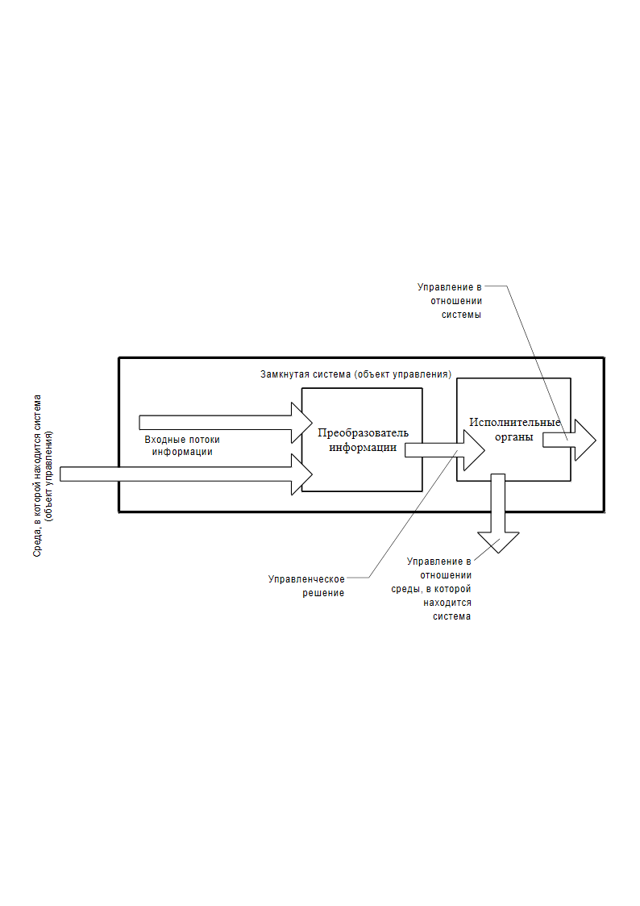
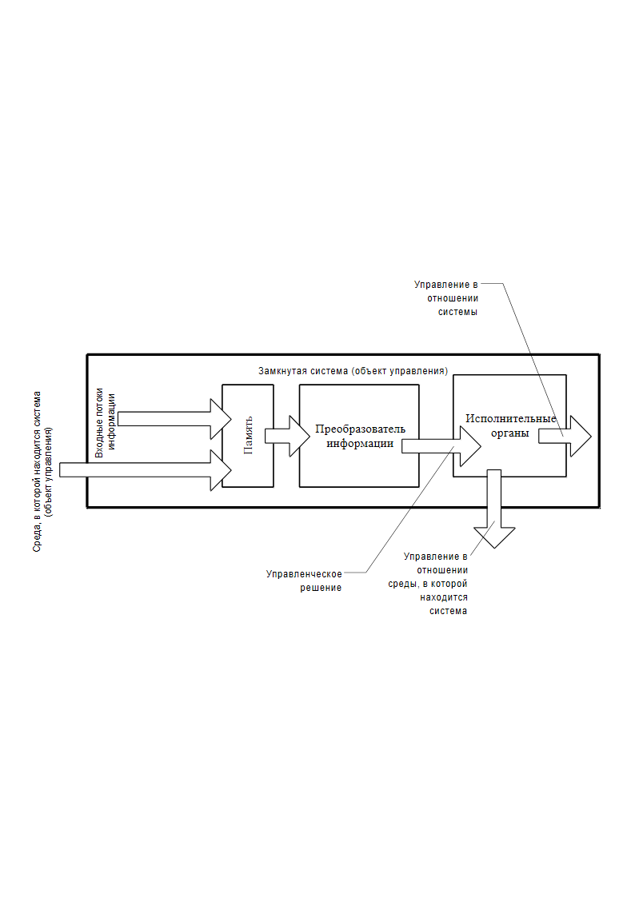
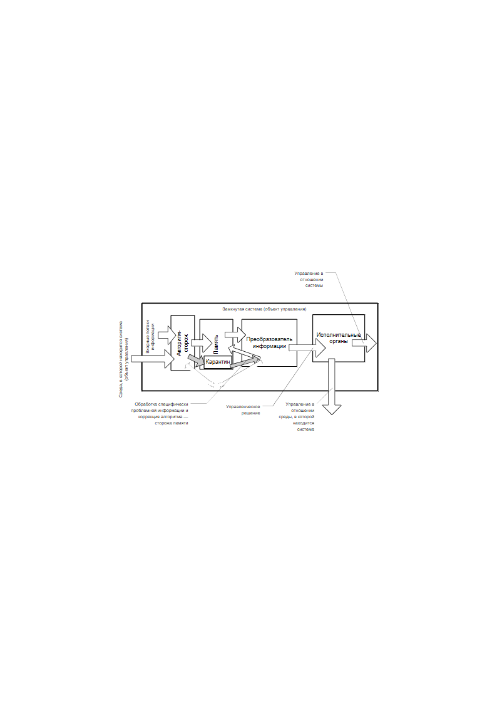
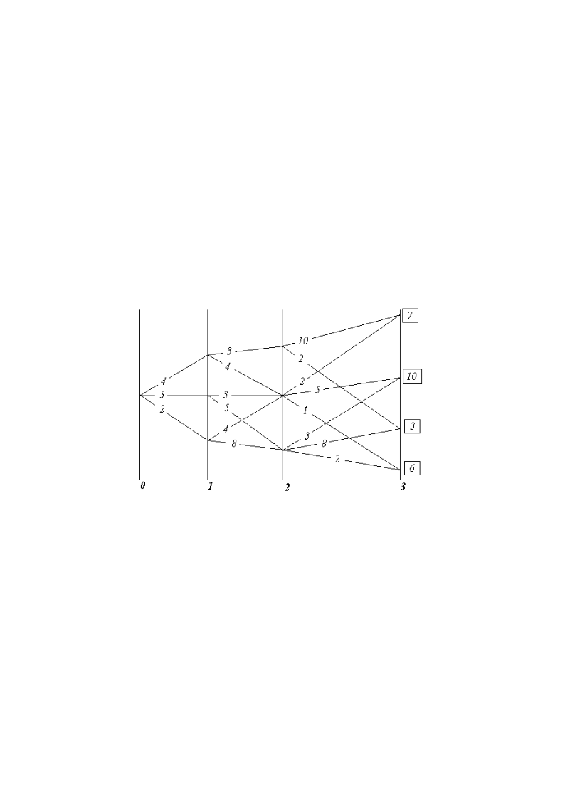
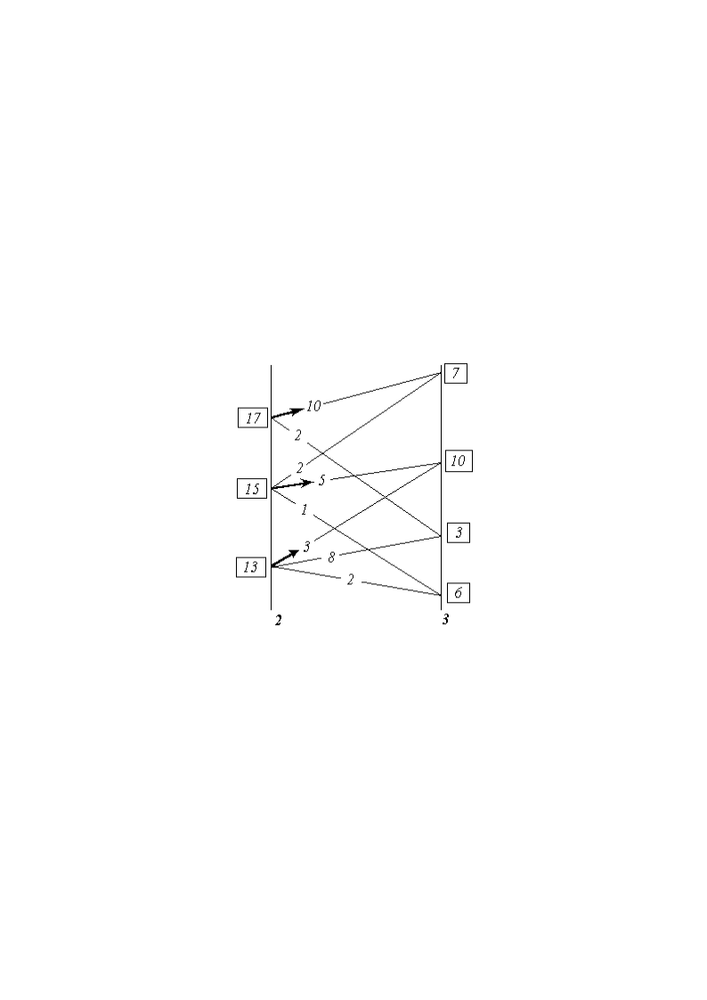
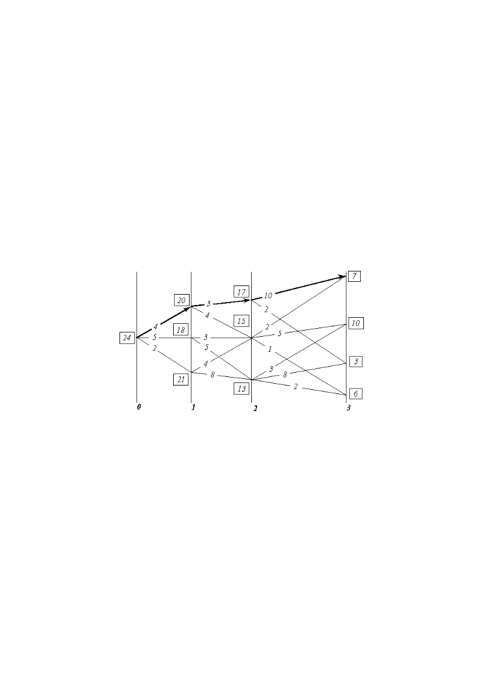
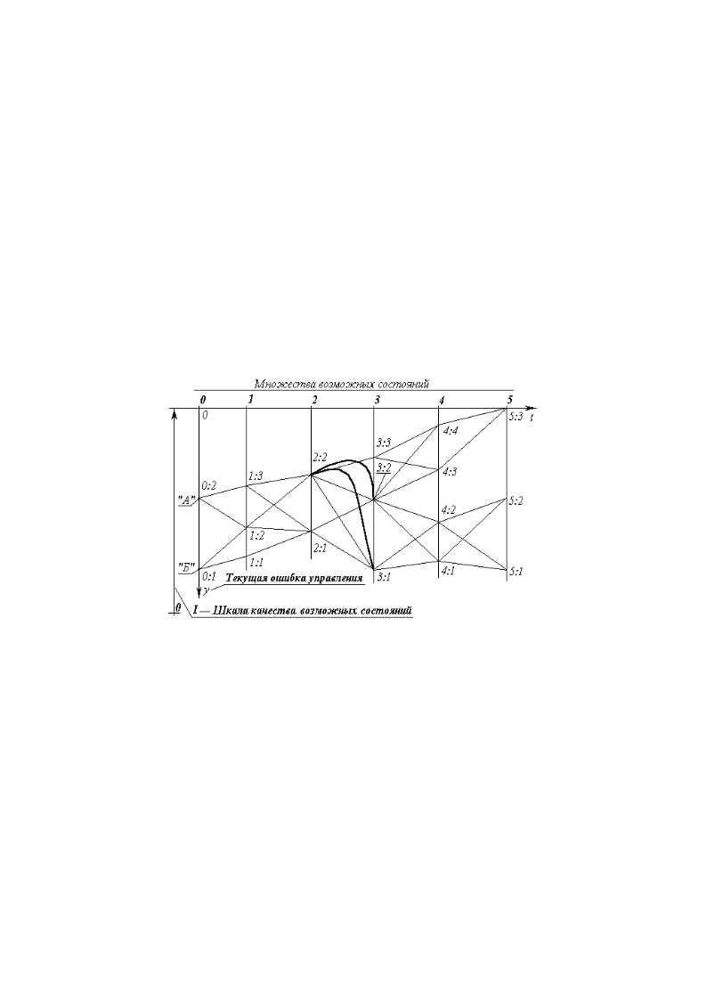

> **Первичный текст.** Психологический аспект истории и перспектив нынешней глобальной цивилизации.
> Источник: `Психологический аспект истории и перспектив нынешней глобальной цивилизации.doc` sha256 `769f830b3185a373…`; [страница на dotu.ru](https://dotu.ru/2005/06/30/20050630-psychological_aspects_of_history/).
> Автоматическая транскрипция DOC→Markdown; смысл и формулировки не правились.
> Контрольные суммы и статус проверки — в [NOTICE.md](../../NOTICE.md).
> Содержание передаёт позицию авторов; утверждения не верифицированы библиотекой.

---

## 2.7. Возстановление управления суперсистемой как единым целым

В момент соприкосновения автономных регионов в суперсистеме одновременно может существовать несколько региональных центров управления, каждый из которых несёт полные функции управления общесуперсистемного уровня значимости и, следовательно, в деятельности каждого из них будет объективно прослеживаться тенденция **к управлению суперсистемой как единым целым по некой полной функции** **управления**. До этого момента <u>*эту* задачу управления</u> решало непосредственно высшее по отношению к суперсистеме управление, вплоть до объективно иерархически Наивысшего.

Когда появляются структуры, в деятельности которых прослеживается тенденция к управлению суперсистемой в целом по полной функции, то сопряженный с нею интеллект спускается в неё реально. Если элементы, образующие суперсистему (или её фрагменты), сами обладают интеллектом, то каждая из структур, претендующих на управление суперсистемой (её регионом) как единым целым, может либо **объективно** содействовать процессу формирования общесуперсистемного соборного интеллекта, либо объективно препятствовать ему в по**пытке** **подменить** своей интеллектуальной мощью ещё не сформировавшийся соборный интеллект суперсистемы.

Понятно, что максимальная производительность суперсистемы, максимальный элементный запас устойчивости её достигаются при **безконфликтном** в её пределах самоуправлении, протекающим с порождением суперсистемой устойчивого во времени соборного интеллекта, несущего полную функцию управления суперсистемой (здесь хорошо видно, что интеллект — процесс); естественно, что при этом соборный интеллект должен осуществлять управление, безконфликтное по отношению к иерархически Наивысшему управлению, поскольку максимальный обобщённый запас устойчивости суперсистемы объективно достигается при соответствии концепции её самоуправления, осуществляемой соборным интеллектом, концепции иерархически высшего объемлющего управления, подконтрольного Всевышнему.

Интеллектуальная же мощь любой частной структуры в суперсистеме заведомо ниже, чем потенциальная мощь устойчивого во времени соборного интеллекта суперсистемы. Поэтому любая попытка подменить соборный интеллект другим, ограниченным интеллектом, на общесуперсистемном уровне предопределяет и более низкое качество управления суперсистемой (её регионом или иным фрагментом) как единым целым; это будет проявляться во множестве конфликтов управления частных структур и их иерархий вследствие крайне малой глубины идентичности совокупного вектора целей суперсистемы (её региона, фрагмента) и множества векторов целей входящих в неё фрагментов и элементов. Малая глубина идентичности векторов целей и порождает концептуально неопределённое управление.

При взгляде извне по**пытка** подмены соборного интеллекта любым иным, ограниченным внутренним интеллектом суперсистемы, эквивалентна по**пытке** возложения на часть суперсистемы иерархически высшего (объемлющего) управления. То есть для интеллекта, осуществляющего собой такую подмену, это — по**пытка** выйти из себя, стать над собой (что невозможно) в противоборстве с иерархически Наивысшим управлением, предопределившим порождение суперсистемой соборного интеллекта.

\* \* \*

В обществе это обращается для недостаточно умного человека в пытку себя иллюзией обладания непомерной властью и в пытку других заведомо низким качеством управления делами общества: и то, и другое — безсмысленно для людей.

А для человекообразных *нелюдей* и одержимых нелюдью? — Достаточно умный не примет в такой пытке участия, а глупец или одержимый невменяемы.

Но на этом стоит толпо-“элитаризм”. Пока человечество не породило *целостный* соборный интеллект, в нём может быть очень много интеллектуально развитых **индивидов**, но и они, и *презираемые ими в их большинстве* неразвитые “тупицы” будут подвластны соборному безумию, коллективной шизофрении — стадному сумасшествию тех, кому дано быть людьми; будут подвержены **соборной одержимости** и управлению людьми **со стороны нéлюди**. Всё это и выражается в глобальном биосферно-экологическом и множестве “чисто” внутрисоциальных кризисах нынешней глобальной цивилизации.

\* \*\

\*

Становление процесса управления суперсистемой как единым целым протекает, как концентрация управления региональными центрами управления, несущими полные функции управления общесуперсистемной значимости. При этом каждый регион представляет собой суперсистему, уже управляемую некоторым образом как единое целое, а изходная суперсистема становится объемлющей по отношению к этому множеству соприкасающихся суперсистем одного иерархического уровня. Соприкасающиеся суперсистемы взаимно проникают одна в другую вблизи их границ. Процесс автономизации (обособления друг от друга) регионов начинается с момента возникновения в среде обширно разпространённой суперсистемы, неустойчивой как единое целое вследствие неосвоенности ею потенциала развития; либо же он является частным процессом в освоении потенциала развития суперсистемы, локально введённой в среду и разпространяющейся в ней. Он также может быть и следствием несогласованности по времени частной региональной меры (темпов) развития с мерой развития, предписанной иерархически высшим управлением, либо из-за вмешательства извне, либо по ошибкам самоуправления.

Так или иначе, автономизация регионов сопровождается возникновением постоянных структур региональной значимости, накапливающих информацию на вероятностном уровне их памяти и памяти их элементов. Эти структуры являются основой адаптационной части информационного обеспечения деятельности регионального сопряженного интеллекта, и они стоят над региональной иерархической системой структурного и безструктурного управления.

Сразу же после возникновения автономии регионов вероятно их вектора целей мало отличаются друг от друга по составу целей и их иерархии, поскольку отражают прошлый путь развития, общий для суперсистемы в целом, взаимодействующей с одной и той же средой (если региональную объективную специфику разсматривать особо вне этого процесса); и кроме того, они строятся на основе общей для всех фундаментальной части. Поэтому вероятность этого утверждения выше по отношению к составу целей вектора, имеющих первые приоритеты, занесенные в фундаментальную часть, детерминированную память информационного обеспечения. Но будут и различия в вероятностной памяти, адаптационной части, обусловленные особенностями давления среды в регионах и ошибками взаимодействия со средой.

Степень освоения потенциала развития *автономными регионами одного возраста* близка, поскольку различия в их векторах целей носят случайный характер и подчинены одним и тем же вероятностным предопределённостям. Информационный обмен между регионами и иерархически высшее управление, при разсмотрении их на достаточно длительном интервале времени, вероятностно предопределяют выравнивание качества управления в регионах и усреднение дефективности векторов целей региональных центров управления в соответствии с общесуперсистемной мерой развития, предписанной иерархически высшим (объемлющим) управлением. По этой причине деятельность региональных центров по концентрации управления протекает с переменным успехом. Пока процесс идёт таким образом, устойчивый на всём интервале времени лидер — концентратор управления — не возникает.

Разнообразие в этот процесс вносит потеря управления каким-либо центром по внутренним причинам региона, главной из которых является изчерпание запаса устойчивости по глубине идентичности в системе векторов целей «иерархически высшее управление — региональный сопряженный интеллект (центр управления) — замкнутые на него иерархии структур региона». Это — кризис концептуально неопределённого управления.

Иерархически Наивысшее управление от просто внешнего управления отличается тем, что с его точки зрения целесообразно устранение дефективности в иерархически низших векторах целей, но в низах свобода интеллектов может зайти столь далеко, что помощь Свыше будут отвергнута либо как враждебная местному субъективизму, либо как не узнанная, не отвечающая собственным векторам целей. В этой ситуации и произходит потеря управления, хотя кризис концептуально не определённого управления мог бы быть преодолён и изжит в случае принятия помощи Свыше.

Понятно, что потеря управления произходит в регионах вследствие нарушения циркуляции информации в иерархиях их внутренних структур, вследствие чего тормозятся (по отношению к объективно необходимым темпам) процессы устранения дефектов во множестве векторов целей и процессы согласования множества концепций управления разных иерархических уровней во внутренней организации региона. Такого рода информационная замкнутость, возникающая в пределах суперсистемы, нарушает процессы прямого и обратного *отображения*[^157] *— общевселенского фактора,* обеспечивающего подстройку частных векторов целей и процессов управления под их объемлющие (и) иерархически высшие вплоть до Наивысшего.

Очевидно, что возможны два главных метода концентрации управления региональными центрами в суперсистеме.

**ПЕРВЫЙ.** Разрушение управления по полной функции в регионах-конкурентах и поглощение их обломков. Ему сопутствуют подавление процесса становления соборного интеллекта и как следствие в перспективе **безкомпромиссный антагонизм со всей иерархией высшего управления.**

Разписав подробно полную функцию управления общесуперсистемного уровня значимости, можно найти множество средств её разрушения, направленных на:

- подавление и уничтожение сопряженного интеллекта, изкажение информационного обеспечения его деятельности, вызывающие конфликтное управление в пределах региона и (или) концептуально неопределённое управление в нём;

- непосредственный перехват прямых и обратных связей в контурах управления через неконтролируемые конкурентом иерархические уровни в объективно сложившейся его системе управления;

- целенаправленное создание и внедрение таких неконтролируемых регионами уровней в их организации, т.е. создание проникающей региональной периферии центра иного региона или межрегионального центра, взаимодействующего с несколькими регионами без принадлежности хотя бы к одному из них;

- уничтожение структур управления, их элементной базы и носителей информационно-алгоритмического обеспечения и т.п.

Когда какой-либо из региональных центров управления первым приоритетом в свой объективный вектор целей заносит:

во всех случаях концентрировать управление в суперсистеме невзирая ни на что, ибо ЭТА цель оправдывает *средства её достижения,*

— то возникает устойчивый лидер-концентратор управления.

Информационно-алгоритмическое вмешательство с изпользованием чужих систем кодирования в условиях информационной замкнутости структуры, осуществляющей это вмешательство, разсматриваемое на длительном интервале времени, оказывается наиболее **очевидно** эффективным, и это видится как лидерство в концентрации управления. Но лидер обречён погибнуть после “рóдов”, поскольку порожденная им структура-концентратор, через которую он воздействует на других, информационно-алгоритмически замыкается по отношению и к нему самому. Она порождает систему управления, центр которой обретает полную функцию управления также общесуперсистемного уровня значимости, а периферия которой проникает во все регионы.

Эта межрегиональная система имеет тенденцию накапливать и скрывать информацию, почерпнутую ею во всех конкурирующих между собой регионах. В результате с течением времени её опыт в процессе функционирования в наименьшей степени отличается от опыта суперсистемы в целом, объемлющей регионы; кроме того, в сопоставлении с регионами, подвергаемыми межрегиональным центром обработке, свойственная ему культура деятельности в наименьшей степени поражена дефектами разного рода *(конечно, если вынести за скобки вопрос об изначальной дефективности такого способа концентрации управления, и порождаемой им вторичной дефективности особого рода).*

Это ставит центр управления межрегиональной системы над всеми регионами, а регион лидер-концентратор тем самым опускается до уровня значимости всех прочих регионов. Далее межрегиональный центр следит за своей монополией на несение полной функции управления общесуперсистемного уровня значимости везде, куда только проникает его периферия. Концентрация управления в суперсистеме под его руководством на длительном интервале времени выглядит как разрушение регионального автономного управления по полной функции общесуперсистемной значимости и поглощение обломков, лишённых такого управления в конгломерат с последующим недопущением возрождения в регионах их самоуправления по полной функции общесуперсистемного уровня значимости.

В результате таких действий в суперсистеме разпространяется **межрегиональный конгломерат**, для которого характерны следующие главные особенности:

- межрегиональный центр управления обретает колоссальный запас устойчивости в сопоставлении его с каждым из прочих центров управления в конгломерате;

- запас устойчивости процессов управления всякого центра управления из подконтрольных межрегиональному ничтожен и устанавливается межрегиональным центром управления.

7.  Основой этого является более или менее эффективное осуществление им монополии на полную функцию управления общесуперсистемного уровня значимости и хронологически длительная неинформированность подконтрольных центров (т.е. короткая и ограниченная память) и незащищённость их контуров управления от воздействия через неконтролируемые и не выявленные (не идентифицированные) ими каналы информационного обмена, структуры, уровни их иерархии и т.п.

- сопряженный интеллект межрегионального центра подменяет собой потенциал соборного интеллекта подконтрольных ему регионов;

- периферия межрегионального центра при необходимости выступает в качестве генератора автосинхронизации в безструктурном управлении.

Совокупная система взаимной вложенности — межрегиональный центр и подконтрольная ему периферия регионов — в целом управляема по причине почти полной подчинённости всякого региона и его структур конгломерату в целом. Но запас устойчивости управления конгломератом, как “целостностью”, гораздо ниже потенциально возможного вследствие отягощения частных векторов целей в конгломерате многочисленными дефектами, (особенно в сопоставлении с иерархически Наивысшим вектором целей в отношении суперсистемы). Поддержание же дефективности векторов целей в некогда автономных регионах — основа господства межрегионального центра. Общая малость глубины идентичности векторов целей потенциально чревата конфликтами самоуправления и требует затрат ресурсов конгломерата для ограничения самоуправления на нижних иерархических уровнях и подавления паразитных процессов конфликтных самоуправлений. По этим причинам общий уровень качества управления суперсистемой в целом низок, хотя процесс концентрации управления и протекает устойчиво, а освоение потенциала развития сдерживается до момента завершения концентрации управления.

Для потери управления в конгломерате необходимо воздействие на его регионы достаточно мощного фактора, реакция на частотные параметры которого оказывается неэффективной (или невозможной) вследствие низкого быстродействия межрегионального центра по установлению им необходимой для управления глубины идентичности векторов целей в конгломерате. Однако такая потеря управления обратима **при условии**, что в суперсистеме не существует иного центра управления по полной функции общесуперсистемной значимости, готового в любой момент подхватить управление отколовшимися от конгломерата осколками, поскольку осколки в момент выхода из конгломерата не способны к несению полной функции управления общесуперсистемного уровня значимости.

Но этому разрушению и объединению обломков как способу концентрации управления есть объективная альтернатива. Возможен **ВТОРОЙ** путь осуществления концентрации управления — **упреждающее вписывание**. Центр-лидер, обогнавший в развитии каких-то конкурентов или готовящийся выйти раз и навсегда из состояния конкуренции с ними, выявляет их и свои объективные и потенциальные вектора целей; включает в своё информационно-алгоритмическое обеспечение модели их поведения и таким образом информационно-алгоритмически поглощает их структурное и безструктурное управление; на путях их **самостоятельного** объективного развития в матрице возможностей он упреждающе разворачивает свою деятельность так, чтобы “конкуренты”, достигнув определённого уровня развития, сами вливались в его деятельность.

Так он замыкает их центры управления на себя структурным и безструктурным способом и всё время заботится об установлении и поддержании максимальной глубины идентичности векторов целей у себя и у “конкурентов”, которых он объемлет и включает в себя информационно-алгоритмически.

Это с течением времени приводит к тождественности безконфликтного управления, осуществляемого разными центрами без разрушения регионального управления, структур, инфраструктур и элементной базы конкурентов. Произходит **опережающее** построение лидером — концентратором управления — структур и инфраструктур, которыми в будущем будет пользоваться и он, и как бы “поглощённые” им конкуренты.

В наиболее совершенном виде при упреждающем вписывании всякое действие конкурента или противника не возпринимается вписывающей стороной в качестве ущерба, а приносит ей некоторый положительный эффект.

Упреждающее вписывание опирается на принцип:

**Цель оправдыва-Ю-т средства.**

В этой « **Ю **» вся разница: ошибочная цель — почти мгновенный эпизод в длительном процессе применения безошибочных средств, в отличие от разрушения, где заведомо дурные средства пятнают благую цель.

Упреждающее вписывание порождает иерархию структур с минимальным *в сопоставлении с **разрушением для интеграции обломков*** количеством дефектов во всём её множестве векторов целей. **Упреждающему вписыванию сопутствует и тенденция к формированию соборного интеллекта**. В процессе упреждающего вписывания образуется многорегиональный блок, обладающий колоссальным запасом устойчивости по глубине идентичности во всём его множестве объективных и потенциальных векторов целей в сопоставлении с конгломератом, управляемым межрегиональным центром.

Кроме многорегиональных блоков в суперсистеме могут оказаться регионы, длительное время развивающиеся в информационной изоляции от остальной суперсистемы. Изолированное самостоятельное развитие в таких условиях роднит изолированный регион и блок: они (совместно и порознь) обладают более высоким запасом устойчивости управления по глубине идентичности векторов целей.

Концентрация управления может идти в суперсистеме двумя путями одновременно на каких-то этапах освоения ею потенциала развития, но какие-то центры управления объективно в ней больше склонны к упреждающему вписыванию, а другие — к разрушению управления конкурентов и интеграции обломков.

Поэтому на каком-то этапе процесса концентрации управления суперсистемой, объемлющей регионы, вероятно столкновение межрегионального конгломерата и многорегионального блока. Результат такого столкновения определяется не совокупной мощностью ресурсов каждой из конфликтующих сторон, а субъективным фактором, связанным главным образом с блоком.

Блок имеет объективное преимущество перед конгломератом по запасу устойчивости процессов в блоке, обусловленному большей глубиной идентичности объективных и субъективных векторов целей.

Но субъективный вектор целей центра управления блоком (центра обособившегося в блоке) может стать даже антагонистичным к его же объективному и потенциальному векторам целей, прежде всего, — в результате информационно-алгоритмической агрессии межрегионального центра через не контролируемые центром блока контуры управления.

*По этой причине блок не застрахован от разрушения его центра управления, общеблочных структур и инфраструктуры в ходе информационной агрессии межрегионального центра.*

Но от последствий такой агрессии не застрахован и межрегиональный центр, поскольку вместе с элементными ресурсами блока и его обломками он интегрирует в себя и всю совокупность процессов, объективно протекающих в блоке, подчинённых объективному вектору целей блока. Поскольку объективные вектора целей блока обладают крайне низкой дефективностью, то интеграция блока в конгломерат требует в достаточно короткие сроки внедрить в объективные вектора целей блока дефекты. Для этого необходимо: остановить действие внутриблочных факторов устранения дефектов в векторах целей; и выявить господствующие в блоке вектора целей, поскольку внесение дефектов необходимо проводить в кратчайшее время и прицельно.

Но возприятие объективного вектора целей блока в его соотнесении с вектором целей иерархически высшего объемлющего управления вплоть до иерархически наивысшего — дело субъективное и не простое даже для центра управления блоком, а не то что для центра управления конгломератом.

То есть при возприятии возможны ошибки, самой тяжелой из которых является возприятие блока в качестве конгломерата, подобного собственному. Другими словами, труднее всего оценить вектор ошибки управления по отношению к иерархически Наивысшему, т.е. потенциальный вектор целей блока. Неидентифицированность (невыявленность) вектора ошибки управления поглощаемой системы — основа непредсказуемости последствий поглощения, т.е. вероятностная предопределённость катастрофического разрешения неопределённостей в собственном управлении конгломерата.

Вторая сторона идентификации векторов целей связана с цейтнотом, в котором оказывается межрегиональный центр в процессе интеграции достаточно обширного блока в конгломерат. Дело в том, что, пока блок управлялся своим центром управления, можно было довольно точно разпознать объективный общеблочный вектор целей и субъективный вектор целей блока, но труднее всего оценить потенциальный вектор целей блока, содержащий реальные возможности, не изпользуемые его центром управления по субъективным причинам.

Цели в векторах всегда связаны с объективными процессами широкого частотного диапазона. Низкочастотные колебательные процессы в природе обычно более энергоёмки, чем высокочастотные однокачественные с ними процессы и поглощают энергию и алгоритмику высокочастотных с течением времени. Кроме того, с высокочастотным процессом может быть информационно-алгоритмически связан низкочастотный процесс, огибающий плавной кривой максимумы или минимумы высокочастотного, примером чего является амплитудная модуляция в звуковом радиовещании[^158].

Реакция блока на попытку его интеграции в конгломерат протекает во всех частотных диапазонах взаимодействия. Идентификация низкочастотных процессов (несущих большую энергию) и процессов-огибающих требует длительного времени, чего нет в цейтноте; либо же требует обращения к структурам внешнего управления, которые длительное время вели наблюдение за блоком и возможно также принимали участие в управлении им и имеют свои виды на будущее в отношении и блока, и конгломерата. При этом дело усложняется и тем, что активизируются процессы, связанные с потенциальным вектором целей блока, интенсивность которых была ничтожна до начала интеграции блока в конгломерат (собственно вследствие этого попытка поглощения блока конгломератом и становится возможной).

Об этих процессах имеет представление не просто внешнее, *а только иерархически Наивысшее по отношению к суперсистеме управление, которому межрегиональный центр пока противится.*

Но глубина идентичности вектора целей иерархически высшего управления и объективного вектора целей блока в силу построения блока методом упреждающего вписывания вероятно глубже, чем у межрегионального центра, поскольку, в отличие от блока, построение конгломерата предполагает и антагонизацию фундаментальной и адаптационной частей информационного обеспечения. Поэтому поддержка блока Свыше более вероятна, чем поддержка Свыше конгломерата.

Обширность векторов целей блока; многократное дублирование без инверсий и антагонизмов одних и тех же целей в разных частных векторах целей в разных фрагментах блока, складывающиеся в течение всего времени существования блока, соизмеримого со временем возникновения автономных регионов и межрегионального центра в суперсистеме; субъективизм возприятия вектора целей со стороны межрегионального центра; действие факторов возстановления автономного центра управления блоком по полной функции (или нескольких центров, осуществляющих параллельное управление в нём и достигающих тождественности управления, произтекающего от каждого из них); вероятностная предопределённость разрешения безкомпромиссного конфликта межрегионального центра с иерархически высшим (объемлющим) управлением — не гарантирует межрегиональный центр от вероятного возстановления управления в блоке по полной функции, причем с более высоким качеством и запасом устойчивости управления, чем прежде. За этим может последовать эффективное вписание конгломерата в блок благодаря низкому запасу устойчивости периферии конгломерата по глубине идентичности векторов целей, поскольку возстановление управления блоком вероятно сопровождается выявлением (идентификацией) причин потери управления в нём, т.е. агрессия межрегионального центра перестаёт быть тайной для блока. Это тем более правильно, если соборный интеллект блока уже разбужен агрессией конгломерата и его деятельность реально проявляется хотя бы как вспышки, если не как непрерывный устойчивый процесс.

Если же ко времени начала поглощения блока конгломератом в блоке устойчиво функционирует соборный интеллект, ставший новым звеном в иерархически высшем по отношению к элементам суперсистемы управлении, то конгломерат просто обречён:

- во-первых, соборному интеллекту блока гарантирована иерархически высшая поддержка;

- во-вторых, любой соборный интеллект сам по себе мощнее, чем сопряженный интеллект конгломерата, пытающийся подменить собой его соборный интеллект.

Соотношение производительности и ресурсных запасов блока и конгломерата в этой ситуации роли играть не будет, поскольку потеря управления в конгломерате вероятностно предопределённо носит характер срыва управления, а регион, отколотый от конгломерата, объективно нуждается в осуществлении полной функции управления общесуперсистемной значимости, к осуществлению которой он сам в момент откола не способен, а блок её может дать. Поскольку дефективность векторов целей в регионах конгломерата поддерживается искусственно, то для повышения запаса устойчивости управления вписываемым в блок регионам блочному центру управления как минимум достаточно не тормозить общесуперсистемных факторов устранения дефектов в их векторах целей, а как максимум — целенаправленно устранять выявленные в регионах дефекты.

Действия блока по отношению к регионам конгломерата являются теми же действиями, которые межрегиональный центр управления вынужден будет предпринять и сам для сохранения себя в конфликте с иерархически высшим (объемлющим) управлением, предполагающим освоение потенциала развития суперсистемы. Поэтому в своих действиях, проводя упреждающее вписывание, блок не противоречит тенденциям освоения потенциала развития; действия же межрегионального центра в прошлом и в перспективе противоречат этой тенденции. Это и проявляется в упреждающем вписывании высокочастотных процессов в низкочастотные; если этого не делать, то высокочастотные, не вписанные процессы, порождают модулирующие их (объемлющие) не управляемые низкочастотные процессы, что выливается в неорганизованный выброс энергии с разрушением структур суперсистемы, её элементной базы, потерей ею информации. Выглядит это как срыв управления и по своему существу является разновидностью катастрофического разрешения неопределённостей вследствие ошибочности в решении задачи о предсказуемости поведения (или отказа от решения такой задачи).

Во избежание этого процесс управления должен идти в согласии с иерархически Наивысшим управлением, которое необходимо уметь выделить во множестве информационных потоков *просто внешнего управления* в отношении суперсистемы и не отвергать его предупреждений, целесообразность которых может быть даже непонятной на уровне информированности суперсистемы.

\* \* \*

По отношению к обществу, разсматриваемому как суперсистема, это означает, что алгоритмика упреждающего вписывания должна развёртываться, ориентируясь на переход к человечному типу строя психики как к единственно нормальному для людей. **В этом случае — она наиболее эффективна в смысле достижения целей и необратимости результатов, поскольку развёртывается в русле Промысла и при прямой и опосредованной поддержке иерархически Наивысшего всеобъемлющего управления.**

Тем не менее, и носители демонического типа строя психики могут в своём развитии выйти на осуществление ими концентрации управления методом упреждающего вписывания. Однако в этом случае у них будут неизбежны конфликты с иерархически Наивысшим всеобъемлющим управлением как при осуществлении управления в пределах их автономного региона суперсистемы, так и за его пределами в границах суперсистемы в целом. При развёртывании алгоритмики упреждающего вписывания на основе демонического типа строя психики, при её неоспоримо более высокой эффективности, чем у алгоритмики разрушения и поглощения обломков, она неизбежно будет приводить к срывам управления, ввергающим её приверженцев в катастрофу, из которой нет выхода, либо ставящим их на грань такой катастрофы.

Дело в том, что разрушение автономных регионов и формирование конгломерата — более очевидное и более слабое зло, нежели формирование блока методом упреждающего вписывания на основе демонического типа строя психики: Благодаря низкому качеству управления в конгломерате, низкому запасу устойчивости управления в нём перейти от конгломерата к блоку и целостной суперсистеме, в которых господствует человечный тип строя психики, проще, нежели от блока, в котором господствует демонический тип строя психики.[^159]

\* \*\

\*

При этом процесс поглощения блока конгломератом может сопровождаться попыткой навязать блоку конгломератные стереотипы разпознавания иерархически высшего по отношению к суперсистеме в целом управления. Успешность этой попытки зависит от вектора целей и устойчивости процесса иерархически высшего управления, общего по отношению к блоку и конгломерату, а именно — что оно предпочтёт на данном этапе:

- ускоренную концентрацию управления со стороны конгломерата, дабы потом низвергнуть структуры управления им;

- формирование соборного интеллекта в блоке с поглощением конгломерата в блок до завершения концентрации управления по конгломератно-межрегиональному способу;

- обучение соборного интеллекта блока добру на примере агрессии конгломерата.

В целом же в *ходе освоения потенциала развития суперсистемы* протекает процесс вытеснения примитивных схем управления более развитыми, обеспечивающими более высокое качество управления в смысле высвобождения ресурсов. При этом структурное и безструктурное управление становятся неразличимыми.

Ранее было показано, что текущие элементные запасы устойчивости суперсистемы, а следовательно и её производительность, тем выше, чем меньше информационное состояние памяти элементов в процессе их функционирования отличается от опыта памяти суперсистемы в целом, накопленного за всё время её пребывания в среде. К этому можно добавить: *и чем быстрее доступны каждому из элементов в процессе его деятельности свободные интеллектуальные ресурсы суперсистемы.* Это предполагает высокое быстродействие и пропускную способность каналов информационного обмена между элементами по отношению ко времени, необходимому для обслуживания элементами частной цели, стоящей перед каждым их них.

Пользование внешней информацией, выходящей за пределы возможностей собственного информационного обеспечения элемента, должно вероятностно предопределять более высокое качество его деятельности, чем игнорирование её. Именно по этой причине замусоривание информационной среды суперсистемы ложной информацией соответствует разрушению целостного управления суперсистемой и является средством концентрации управления методом разрушения с последующим поглощением обломков. Разпространение ложной информации, однако, позволяет иногда быстро устранять некие текущие ошибки управления, но дальнейшее развитие процесса сопровождается возникновением ошибок управления, вызванных именно этой ложной информацией, которая никуда из суперсистемы не исчезает и на каком-то этапе становится основой ошибочного управления при извлечении ложной информации из памяти.

Именно по этой причине в обществе нет разницы между ложью из своекорыстия и “благодетельной” ложью “во спасение”, хотя общество этого и не понимает и лжёт безбожно. Кроме того, “благодетельная” безкорыстная ложь одного “во спасение” может оказаться “водой” на мельницу чьего-то своекорыстия.

Поэтому, когда заведомо ложная информация разпространяется в суперсистеме, то процесс освоения её потенциала сдерживается ею, становление соборного интеллекта тормозится, качество управления падает. И это приводит к вопросу об устойчивости управления в условиях, когда в замкнутую систему возможно поступление недостоверной информации, а также когда недостоверная информация действительно попадает в систему.

Всё разнообразие процессов управления можно соотнести с тремя типами алгоритмов выработки поведения замкнутой системы.

Во всех ниже разсматриваемых случаях речь идёт об управлении по полной функции в ранее определённом смысле этого термина.

**ПЕРВЫЙ** тип алгоритмов выработки управляющего решения (поведения) показан на рис. 1

Рис. 1. Алгоритм управления, подчинённого непрестанно меняющимся потребностям сиюминутности

Входной поток информации (внешние и внутренние обратные связи) поступает в преобразователь, где на основе сиюминутно текущей информации вырабатывается текущее управленческое решение, которое передаётся к изполнительным органам.

Возможны такие варианты сочетания входного потока информации и характеристик преобразователя информации, вырабатывающего управленческое решение, в результате которых «самоуправляющаяся» таким образом система в действительности оказывается управляемой извне, если кто-то подает на её вход соответствующий поток информации, предвидя реакцию преобразователя на каждый из её вариантов.

Но даже если такого управления извне и нет, то, непрестанно реагируя на сиюминутность и подчиняя текущей сиюминутности почти все свои ресурсы, система оказывается не в состоянии устойчиво ориентироваться на долгосрочную перспективу и, как следствие, — работать на её осуществление.

Для того чтобы устойчиво ориентироваться на длительную перспективу и устойчиво работать на её достижение, эту <u>определённую перспективу</u> необходимо помнить в каждый миг обработки сиюминутно поступающей информации в процессе выработки и осуществления управленческого решения.

Если это достигнуто, то управление протекает по алгоритмам второго и третьего типов.

**ВТОРОЙ** тип алгоритмов управления показан на рис. 2.

Рис. 2 Алгоритм управления, на основе включения потока\

текущей информации в память системы

Входной поток информации, попадая в систему, прежде всего загружается в её память. Преобразователь информации, вырабатывающий управленческое решение, осуществляет выборку информации из памяти, соотнося накопленную памятью информацию с непрерывно поступающей информацией. Управленческое решение вырабатывается по существу на основе всей информации памяти, вследствие чего система сохраняет в управлении устойчивую ориентацию на цели долгосрочной перспективы. Она оказывается способной их достичь потому, что не теряет долгосрочных целей в процессе выработки и осуществления управленческих решений в потоке текущей информации. Отфильтровывая на основе информации памяти дестабилизирующую <u>стратегическое управление</u> высокочастотную составляющую всевозможной «суеты», подчиняясь которой в алгоритмах первого типа, система теряет цели долгосрочной перспективы и уклоняется от них в процессе управления, управляясь в русле алгоритмов третьего типа, система сохраняет устойчивость работы.

Тем не менее, при непосредственной загрузке в память поступающей текущей информации возможны поражения содержимого памяти и её структурной организации, аналогичные по своему характеру поражениям компьютерными вирусами файловой системы жёсткого диска и информации файлов, в ней хранящихся. Они могут затрагивать как базы данных, так и алгоритмы, на основе которых преобразователь информации вырабатывает управленческое решение.

Иными словами, необходима защита памяти, — из которой преобразователь черпает необходимую информацию в процессе выработки управленческого решения. Это приводит к алгоритму третьего типа.

**ТРЕТИЙ** тип алгоритмов управления показан на рис. 3.

Рис. 3 Алгоритм управления с защитой памяти системы\

от накопления недостоверной информации

В нём всё произходит, как и во втором типе, но перед загрузкой в память входного потока информации он пропускается через алгоритм-сторож, которые выявляет недостоверную и сомнительную информацию, в том числе и попытки прямого и косвенного (опосредованного) управления извне, для того, чтобы выработка управленческого решения изходила бы только на информации, признанной достоверной. В тех случаях, когда возникают затруднения с определением качества информации, алгоритм — сторож памяти — помещает её в специализированную область памяти, показанную на рис. 3 блоком, названным «Карантин», для последующего выяснения её достоверности. Алгоритм, показанный на рис. 3, предполагает, что блок под названием «Преобразователь информации» обладает в системе наивысшими полномочиями. Потому он может перемещать информацию из «Карантина» в область нормальной «Памяти» и изменять «Алгоритм — сторож памяти» по мере накопления системой опыта взаимодействия со средой, что требует в процессе управления переоценки содержимого памяти по категориям «достоверно», «ложно», «сомнительно», «не определённо».

Бросающаяся в глаза разница в поведении систем, управляющихся на основе алгоритмов первого типа и алгоритмов второго и третьего типов, состоит в том, что изменение входного информационного потока в алгоритмах первого типа вызывает немедленное (по отношению к быстродействию «Преобразователя информации») изменение управления; в алгоритмах второго и третьего типа изменение входного потока информации может вообще не вызвать никакого видимого изменения в управлении либо может вызвать изменения в управлении спустя какое-то, подчас весьма продолжительное, время. Если же в алгоритм выработки управленческого решения включается прогноз поведения системы (изпользуется схема «предиктор-корректор»), то изменение управления может упреждать изменение потока входной информации. Однако, несмотря на такое извне видимое безразличие в поведении системы по отношению ко входному потоку информации, в алгоритмах второго и третьего типов входная информация не игнорируется. В сопоставлении их с алгоритмами первого типа в них она обрабатывается иначе: так, чтобы она была подчинённой достижению целей долгосрочной перспективы или, чтобы на её основе выявилась невозможность достижения системой ранее определённой для управления ею перспективы[^160].

Алгоритмы третьего типа из числа описанных обладают наивысшей помехоустойчивостью как по отношению к высокочастотным шумам среды и собственным шумам системы, так и по отношению к попыткам управления системой извне, направленным на то, чтобы подчинить себе управление на основе деятельности её собственного преобразователя информации или изключить его из процесса управления.

Вынужденность перехода в управлении от алгоритма третьего типа к алгоритму первого типа под давлением обстоятельств должна разсматриваться как чрезвычайная ситуация, аварийный режим управления, в котором первоприоритетной задачей управления является выявление внутренних резервов системы и резервов внешних обстоятельств, изпользование которых позволяет возстановить нормальное управление по алгоритму третьего типа.

Только это позволяет реализовать запас устойчивости системы, поддерживая в течение некоторого времени управление по алгоритмам первого типа. При принципиальном отказе перейти от алгоритмов управления первого типа к алгоритмам управления третьего типа, запас устойчивости системы необратимо изчерпывается. По существу такая стратегия управления является гарантированным переносом необратимой катастрофы в будущее. Эта стратегия достаточно часто находит своё выражение в общеизвестной фразе: «Некогда тут думать и обсуждать? — работать надо: сами видите, какие обстоятельства сложились». Но приверженность этой стратегии приводит к тому, что катастрофа неизбежно наступает, если обстоятельства не изменяются сами собой. Этого, как известно, не бывает, поскольку обстоятельства изменяются под воздействием того или иного управления.

Когда заведомо недостоверная информация в суперсистеме отсутствует либо в ней господствуют алгоритмы управления третьего типа, эффективность которых достаточна, то (в случае освоения потенциала быстродействия и пропускной способности каналов информационного обмена) все структуры в иерархической лестнице — от элемента до суперсистемы — становятся субъективно неустойчивыми. Субъективная неустойчивость понимается в том смысле, что, если структура, несущая какую-то информацию и алгоритмику, сталкивается с непомерным для неё давлением среды, то *изходя из повышения качества управления **суперсистемой в целом**,* может оказаться выгоднее переразпределить информационно-алгоритмическую нагрузку элементов суперсистемы. Это под силу только для соборного интеллекта, мощного внешнего управления и иерархически Наивысшего управления.

Поскольку неопределённое внешнее управление может быть и агрессивным по отношению к суперсистеме и её элементам, то вопрос о различении източников внешних информационных потоков в процессе самоуправления суперсистемы — вопрос № 1 всегда.

2.8. Взаимно вложенные суперсистемы\

с виртуальной структурой

------------------------------------

Когда суперсистема выходит в режим устойчивого самоуправления ею со стороны соборного интеллекта, различающего иерархически Наивысшее управление от внешних информационных вторжений и обеспечивающего эту способность и на уровне организации составляющих его интеллектов, она осваивает потенциал развития в кратчайшее время. Изнутри суперсистемы это состояние возпринимается как отсутствие конфликтов самоуправления элементов суперсистемы и их объединений и максимальный уровень защищенности от давления среды, через которую протекает иерархически высшее объемлющее управление.

**Общность в процессе самоуправления элементов** информационно-алгоритмической и интеллектуальной базы[^161] суперсистемы, в сочетании с господством *интеллектуальных схем управления предиктор-корректор* на уровне суперсистемы в целом и вложенных в неё иерархических уровнях, делают несущественной мгновенную её структурно-иерархическую упорядоченность, стирают различие между структурным и безструктурным управлением и процесс видится как взаимная вложенность гибких (виртуальных) структур в общесуперсистемной схеме предиктор-корректор соборного интеллекта.

Повторное обращение к вероятностной памяти с одним и тем же вопросом на этом этапе будет давать в одинаковой обстановке всё меньше разбросов ответов. Но это будет не шаблонность автомата, соответствующего уровню фундаментальной части информационного обеспечения, а оптимальное в некотором смысле решение в данных условиях при данном уровне развития суперсистемы. И то, что возпринимается как “шаблонность решений”, может быть целевым отказом от решений, уступающих оптимальному в данных условиях внешней обстановки и при достигнутом внутреннем уровне развития.

По завершении освоения потенциала развития суперсистема может служить одной из основ для следующего шага эволюции.

После введения понятия взаимная вложенность суперсистем изложение достаточно общей теории управления вряд ли может быть чем-либо иным, кроме как своего рода «описанием устройства и принципов работы оргáна». Для того, чтобы быть органистом, знать устройство данного инструмента необходимо, но нужна ещё техника игры, репертуар, вкус, в основе чего лежит потенциал развития музыканта, чей организм в свою очередь является взаимным вложением суперсистем, построенных на клетках, физических полях, информационных и энергетических потоках. Если же не знать «устройства оргáна» и не играть на нём, то кто-то на “рояле в кустах” будет играть препротивные “пьесы”, от которых некуда будет деться.

Это означает, что необходимо не только возпринимать поток событий жизни своими чувствами и вниманием, но и выработать систему образно-логических представлений о процессах управления как таковых. Мы живём в такое время, когда это проще всего сделать на основе инструмента, получившего название «метод динамического программирования».

3. Метод динамического программирования\

как алгоритмическое выражение достаточно общей теории управления

================================================================

В изложении существа метода динамического программирования мы опираемся на книгу “Курс теории автоматического управления” (автор Палю де Ла Барьер: французское издание 1966 г., русское издание — “Машиностроение”, 1973 г.), хотя и не повторяем его изложения. Отдельные положения взяты из курса “Исследование операций” Ю.П.Зайченко (Киев, “Вища школа”, 1979 г.).

Метод динамического программирования работоспособен, если формальная интерпретация реальной задачи позволяет выполнить следующие условия:

1. Разсматриваемая задача может быть представлена как *N*‑шаговый процесс, описываемый соотношением:

*Xn + 1 = f(Xn, Un, n)*, где *n* — номер одного из множества возможных состояний системы, в которое она переходит по завершении *n*-ного шага; *Xn* — вектор состояния системы, принадлежащий упомянутому *n*-ному множеству; *Un *— управление, выработанное на шаге *n* (шаговое управление), переводящее систему из возможного её состояния в *n*-ном множестве в одно из состояний (*n + 1*)‑го множества. Чтобы это представить наглядно, следует обратиться к рис. 4, о котором речь пойдет далее.

2. Структура задачи не должна изменяться при изменении разчётного количества шагов *N.*

3. Размерность пространства параметров, которыми описывается состояние системы, не должна изменяться в зависимости от количества шагов *N.*

4. Выбор управления на любом из шагов не должен отрицать выбора управления на предъидущих шагах. Иными словами, оптимальный выбор управления в любом из возможных состояний должен определяться параметрами разсматриваемого состояния, а не параметрами процесса, в ходе которого система пришла в разсматриваемое состояние.

Чисто формально, если одному состоянию соответствуют разные предъистории его возникновения, влияющие на последующий выбор оптимального управления, то метод позволяет включить описания предъисторий в вектор состояния, что ведёт к увеличению размерности вектора состояния системы. После этой операции то, что до неё описывалось как одно состояние, становится множеством состояний, отличающихся одно от других компонентами вектора состояния, описывающими предъисторию процесса.

5. Критерий оптимального выбора последовательности шаговых управлений *Un *и соответствующей траектории в пространстве формальных параметров имеет вид:

*V = V0(X0, U0) + V1(X1, U1) + *…*+ VN - 1(XN- 1, UN - 1) + VN(XN) . *

Критерий *V* принято называть *полным выигрышем,* а входящие в него слагаемые — *шаговыми выигрышами*. В задаче требуется найти *последовательность шаговых управлений* *Un* и траекторию, которым соответствует максимальный из возможных *полных выигрышей*. По своему существу полный “выигрыш” *V* — мера качества управления *процессом в целом*. Шаговые выигрыши, хотя и входят в меру качества управления процессом в целом, но *в общем случае* не являются мерами качества управления на соответствующих им шагах, поскольку метод предназначен для оптимизации управления процессом в целом, а *эффектные шаговые управления* с большим шаговым выигрышем, но лежащие вне *оптимальной траектории,* интереса не представляют. Структура метода не запрещает при необходимости на каждом шаге употреблять критерий определения шагового выигрыша *Vn,* отличный от критериев, принятых на других шагах.

С индексом *n* — указателем-определителем множеств возможных векторов состояния — в реальных задачах может быть связан некий изменяющийся параметр, например: *время, пройденный путь, уровень мощности, мера разходования некоего ресурса* и т.п. То есть метод применим не только для оптимизации управления процессами, длящимися во времени, но и к задачам оптимизации многовариантного одномоментного или нечувствительного ко *времени* решения, если такого рода “безвременные”, “непроцессные” задачи допускают их многошаговую интерпретацию.

Теперь обратимся к рис. 4 — рис. 6, повторяющим взаимно связанные рис. 40, 41, 42 из курса теории автоматического управления П. де Ла Барьера.

Рис. 4. К существу метода динамического программирования.\

Матрица возможностей.

На рис. 4 показаны начальное состояние системы — «0» и множества её возможных последующих состояний — «1», «2», «3», а также возможные переходы из каждого возможного состояния в другие возможные состояния. Всё это вместе похоже на карту настольной детской игры, по которой перемещаются фишки: каждому переходу-шагу соответствует свой шаговый выигрыш, а в завершающем процесс третьем множестве — каждому из состояний системы придана его оценка, помещенная в прямоугольнике. Принципиальное отличие от игры в том, что гадание о выборе пути, употребляемое в детской игре, на основе бросания костей или вращения волчка и т.п., в реальном управлении недопустимо, поскольку это — передача целесообразного управления тем силам, которые способны управлять выпадением костей, вращением волчка и т.п., т.е. тем, для кого избранный в игре «генератор случайностей» — достаточно (по отношению к их целям) управляемое устройство.

Если выбирать оптимальное управление на первом шаге, то необходимо предвидеть все его последствия на последующих шагах. Поэтому описание алгоритма метода динамического программирования часто начинают с описания выбора управления на последнем шаге, ведущем в одно из завершающих процесс состояний. При этом ссылаются на «педагогическую практику», которая свидетельствует, что аргументация при описании алгоритма от завершающего состояния к начальному состоянию легче возпринимается, поскольку опирается на *как бы уже сложившиеся* к началу разсматриваемого шага условия, в то время как возможные завершения процесса также определены.

Рис. 5. К существу метода динамического\

программирования. Анализ переходов.

В соответствии с этим на рис. 5 анализируются возможные переходы в завершающее множество состояний «3» из каждого возможного состояния в ему предшествующем множестве состояний «2», будто бы весь предшествующий путь уже пройден и осталось последним выбором оптимального шагового управления завершить весь процесс. При этом для каждого из состояний во множестве «2» определяются ***все*** *полные выигрыши как сумма = «оценка перехода» + «оценка завершающего состояния».* Во множестве «2» из полученных для каждого из состояний, в нём возможных полных выигрышей, определяется и *запоминается* максимальный полный выигрыш и соответствующий ему переход (фрагмент траектории). Максимальный полный выигрыш для каждого из состояний во множестве «2» взят в прямоугольную рамку, а соответствующий ему переход отмечен стрелкой. Таких оптимальных переходов из одного состояния в другие, которым соответствует одно и то же значение полного выигрыша, в принципе может оказаться и несколько. В этом случае все они в методе неразличимы и эквивалентны один другому в смысле построенного критерия оптимальности выбора траектории в пространстве параметров, которыми описывается система.

После этого множество «2», предшествовавшее завершающему процесс множеству «3», можно разсматривать в качестве завершающего, поскольку известны оценки каждого из его возможных состояний (максимальные полные выигрыши) и дальнейшая оптимизация последовательности шаговых управлений и выбор оптимальной траектории могут быть проведены только на ещё не разсмотренных множествах, предшествующих множеству «2» в оптимизируемом процессе (т.е. на множествах «0» и «1»).

Таким образом, процедура, иллюстрируемая рис. 5, работоспособна на каждом алгоритмическом шаге метода при переходах из *n*-го в *(n - 1)*-е множество, начиная с завершающего *N*‑ного множества до начального состояния системы.

В результате последовательного попарного перебора множеств, при прохождении всего их набора, определяется оптимальная последовательность преемственных шаговых управлений, максимально возможный полный выигрыш и соответствующая им траектория. На рис. 6 утолщённой линией показана оптимальная траектория для разсматривавшегося примера.

Рис. 6. К существу метода динамического программирования.\

Оптимальная траектория.

В разсмотренном примере критерий оптимальности — сумма шаговых выигрышей. Но критерий оптимальности может быть построен и как произведение *обязательно неотрицательных* сомножителей.

Поскольку результат (сумма или произведение) не изменяется при изменении порядка операций со слагаемыми или сомножителями, то алгоритм работоспособен и при переборе множеств возможных состояний в порядке, обратном разсмотренному: т.е. от изходного к завершающему множеству возможных состояний.

Если множества возможных состояний упорядочены в хронологической последовательности, то это означает, что разчётная схема может быть построена как из реального настоящего в прогнозируемое *определённое* будущее, так и из прогнозируемого *определённого* будущего в реальное настоящее. Это обстоятельство говорит о двух неформальных соотношениях реальной жизни, лежащих вне алгоритма:

45. Метод динамического программирования формально алгоритмически нечувствителен к характеру причинно-следственных обусловленностей (в частности, он не различает причин и следствий). По этой причине каждая конкретная интерпретация метода в прикладных задачах должна строиться с неформальным учетом реальных обусловленностей следствий причинами.

46. Если прогностика в согласии с иерархически высшим объемлющим управлением, а частное вложенное в объемлющее управление осуществляется квалифицировано, в силу чего процесс частного управления протекает в ладу с иерархически высшим объемлющим управлением, то *НЕ СУЩЕСТВУЕТ УПРАВЛЕНЧЕСКИ ЗНАЧИМОЙ РАЗНИЦЫ МЕЖДУ <u>РЕАЛЬНЫМ НАСТОЯЩИМ И ИЗБРАННЫМ БУДУЩИМ</u>.*

<!-- -->

8.  Процесс целостен, по какой причине ещё не свершившееся, но уже нравственно избранное и объективно не запрещённое Свыше будущее, в свершившемся настоящем защищает тех, кто его творит на всех уровнях: начиная от защиты психики от наваждений до защиты от целенаправленной “физической” агрессии. То есть, если матрица возможных состояний (она же матрица возможных переходов) избрана в ладу с иерархически высшим объемлющим управлением, то она сама — защита и оружие, средство управления, на которое замкнуты все шесть приоритетов средств обобщённого оружия и управления.

Объективное существование *матриц возможных состояний и переходов* проявляется в том, что в слепоте можно “забрести” в некие матрицы перехода и прочувствовать на себе их объективные свойства. Последнее оценивается субъективно, в зависимости от отношения к этим свойствам, как полоса редкостного везения либо как нудное “возвращение на круги своя” или полоса жестокого невезения.

Но для пользования методом динамического программирования и сопутствующими его освоению неформализованными в алгоритме *жизненными проявлениями матриц перехода*, необходимо СОБЛЮДЕНИЕ ГЛАВНОГО из условий:

В задачах оптимизации процессов управления метод динамического программирования \<реального будущего: — по умолчанию\> работоспособен только, если определён вектор целей управления, т.е. должно быть избрано завершающее процесс <u>определённое состояние</u>.

В реальности это завершающее определённое состояние должно быть заведомо устойчивым и приемлемым процессом, объемлющим и несущим оптимизируемый методом частный процесс. Но выбор и определение определённых характеристик процесса, в который должна войти управляемая система по завершении алгоритма метода лежит вне этого метода — в области “мистики” или в области методов, развитых в нематематических по своему существу науках и ремёслах.

**«Каково бы ни было состояние системы перед очередным шагом, надо выбирать управление на этом шаге так, чтобы выигрыш на данном шаге плюс оптимальный выигрыш на всех последующих шагах был максимальным»,** — Е.С.Вентцель, “Исследование операций. Задачи, принципы, методология.” (М., “Наука”, 1988 г., стр. 109).

Неспособность определить вектор целей управления (достижением которого должен завершиться оптимизируемый в методе процесс) и (или) неспособность выявить изходное состояние объекта управления не позволяет последовать этой рекомендации, что *объективно закрывает* возможности к изпользованию метода динамического программирования, поскольку начало и конец процесса должны быть определены в пространстве параметров, на которых построена математическая (или иная) модель метода, которая должна быть метрологически состоятельной, что является основой её соотнесения с реальностью. Причём определённость *завершения* оптимизируемого процесса имеет управленчески большее значение, чем ошибки и некоторые неопределённости в идентификации (выявлении) начального состояния объекта управления.

Это тем более справедливо для последовательных многовариантных шаговых переходов, если матрица возможных состояний вписывается в пословицу *«Все дороги ведут в “Рим”»,* *<u>а которые не ведут в “Рим”, — ведут в небытие</u>*. Для такого рода процессов, если избрана *устойчивая во времени* цель и к ней ведут множество траекторий, то при устойчивом пошаговом управлении “разстояние” между оптимальными траекториями, идущими к одной и той же цели из различных изходных состояний, от шага к шагу сокращается, вплоть до полного совпадения оптимальных траекторий, начиная с некоторого шага. Это утверждение тем более справедливо, чем более определённо положение завершающего процесс вектора целей в пространстве параметров. По аналогии с математикой это можно назвать <u>асимптотическим множеством траекторий</u>: асимптотичность множества траекторий выражается в том, что «все дороги ведут в “Рим”…»

И в более общем случае, рекомендации Нового Завета и Корана утверждают возможность обретения благодати, милости Вседержителя вне зависимости от начального состояния (греховности человека) в тот момент, когда он очнулся и увидел свои дела такими, каковы они есть.

Другое замечание относится уже к практике — к вхождению в матрицу перехода. Если начальное состояние системы определено с погрешностью, большей чем допустимая для вхождения в матрицу перехода из реального начального состояния в избранное конечное, то управление на основе самого по себе безошибочного алгоритма метода динамического программирования приведет к совсем иным результатам, а не разчётному оптимальному состоянию системы. Грубо говоря, не следует принимать за выход из помещения на высоком этаже открытое в нём окно.

То есть метод динамического программирования, необходимостью как определённости в выборе конечного состояния-процесса, так и выявления истинного начального состояния, *сам собой* защищён от применения его для наукообразной имитации оптимизации управления при отсутствии такового. Это отличает метод динамического программирования, в частности от аппарата линейного программирования[^162], в который можно сгрузить экспромтные оценки “экспертами” весовых коэффициентов в критериях оптимизации *Min (Z)* либо *Max (Z)*.

\* \* \*

Эта *сама собой* защищённость от недобросовестного изпользования косвенно отражена и в литературе современной экономической науки: поскольку она не определилась с тем, что является вектором целей управления по отношению к экономике государства, то не встречаются и публикации об изпользовании аппарата динамического программирования для оптимизации управления макроэкономическими системами регионов и государств в целом на исторически длительных интервалах времени.

Примерами тому “Математическая экономика на персональном компьютере” под ред. М.Кубонива[^163], в которой глава об управлении в экономике содержит изключительно макроэкономические интерпретации аппарата линейного программирования (прямо так и названа “Управление в экономике. Линейное программирование и его применение”), но ничего не говорит о векторе целей управления и средствах управления; в ранее цитированном учебнике Ю.П.Зайченко описание метода динамического программирования также построено на задачах иного характера.

Однако при мотивации отказа от макроэкономических интерпретаций метода динамического программирования авторы обычно ссылаются на так называемое в вычислительной математике «проклятие размерности», которое выражается в том, что рост размерности пространства параметров задачи *N* вызывает рост объема вычислений, пропорциональный *N k,* где показатель степени *k \> 1 .* Такой нелинейный сверхпропорциональный рост объема вычислений действительно делает многие вычислительные работоспособные процедуры никчемными в решении практических задач как из-за больших затрат машинного времени компьютеров, так и из-за накопления ошибок в приближённых вычислениях. Но это «проклятие размерности» относится не только к методу динамического программирования, но и к другим методам, которые, однако, встречаются и в их макроэкономических интерпретациях.

\* \*\

\*

*ВАЖНО ОБРАТИТЬ ВНИМАНИЕ И ПОНЯТЬ:* Если в математике видеть науку об объективной общевселенской мере (через “ять”), а в её понятийном, терминологическом аппарате и символике видеть одно из предоставленных людям средств описания объективных частных процессов, выделяемых ими из некоторых объемлющих процессов, то *всякое описание метода динамического программирования есть краткое изложение <u>всей</u> ранее изложенной <u>достаточно общей теории управления</u>, включая и её мистико-религиозные аспекты; но — на языке математики.*

Чтобы пояснить это, обратимся к рис. 7, памятуя о сделанном ранее замечании об определённости начального состояния с достаточной для вхождения в матрицы перехода точностью.

Рис. 7. Динамическое программирование, Различение и достаточно общая теория управления

На нём показаны два объекта управления «А» и «Б» в начальном состоянии; три объективно возможных завершающих состояния (множество «5»); множества («1» — «4») промежуточных возможных состояний; и пути объективно возможных переходов из каждого состояния в иные.

Рис. 7 можно уподобить некоторому фрагменту общевселенской меры развития (многовариантного предопределения бытия) — одной из составляющих в триединстве «материя-информация-мера».

Если принять такое уподобление рис. 7, то объективно возможен переход из любого начального состояния «0:1» или «0:2» в любое из завершающих состояний «5:1», «5:2», «5:3». Но эта объективная возможность может быть ограничена субъективными качествами управленцев, намеревающихся перевести объекты «А» и «Б» из начального состояния в одно из завершающих состояний.

Если дано Свыше Различение, то управленец «А» (или «Б») снимет с объективной меры “кальку”, на которой будет виден хотя бы один из множества возможных путей перевода объекта из начального состояния во множество завершающих. Если Различение не дано, утрачено или отвергнуто в погоне за вожделениями, или бездумной верой в какую-либо традицию, но не Богу по совести, то на “кальке” будут отсутствовать какие-то пути и состояния, но могут “появиться” объективно невозможные пути и состояния, объективно не существующие в истинной Богом данной мере — предопределении бытия. Кроме того, по субъективному произволу управленца выбирается и желанное определённое завершающее состояние из их множества. Соответственно следование отсебятине или ошибка в выборе предпочтительного завершающего состояния может завершиться катастрофой с необратимыми последствиями.

Но матрица возможных состояний, показанная на рис. 7, *вероятностно предопределяет* только частный процесс в некой взаимной вложенности процессов. По этой причине каждое из начальных состояний «0:1», «0:2» может принадлежать либо одному и тому же, либо различным объемлющим процессам, в управленческом смысле иерархически высшим по отношению к разсматриваемому; то же касается и каждого из завершающих состояний «5:1», «5:2», «5:3» в паре «изходное — завершающее» состояния. Каждый из объемлющих процессов обладает их собственными характеристиками и направленностью течения событий в нём.

Может оказаться, что цель «5:1» очень привлекательна, если смотреть на неё из множества начальных неудовлетворительных состояний. Но не изключено, что объемлющий процесс, к которому завершающее состояние «5:1» принадлежит, как промежуточное состояние, в силу взаимной вложенности процессов, на одном из последующих шагов завершается полной и необратимой катастрофой. Например, цель «5:1» — не опоздать на “Титаник”, выходящий в свой первый рейс, … ставший трагическим и последним. Чтобы не выбирать такую цель из множества объективно возможных, необходимо быть в ладу с иерархически *наивысшим* объемлющим управлением, которое удержит частное ладное с ним управление от выбора такой цели, принадлежащей к обречённому на исчезновение процессу.

Но если рис. 7 — “калька” с объективной меры, то может статься, что какое-то завершающее состояние, являющееся вектором целей — отсебятина, выражающая желание “сесть на два поезда сразу”. Иными словами, разные компоненты вектора целей принадлежат к двум или более взаимно изключающим друг друга иерархически высшим объемлющим процессам протекающим одновременно.

Это один из случаев неопределённости и дефективности вектора целей, делающий метод динамического программирования неработоспособным, а реальный процесс “управления” неустойчивым, поскольку одна и та же “лодка” не может пристать и к правому, и к левому берегу одновременно, даже если привлекательные красоты на обоих берегах реки, при взгляде издали — из-за поворота реки — совмещаются, создавая видимость подходящего для пикника весьма уютного места. Чтобы не выбрать такого вектора целей, также необходимо, чтобы Свыше было дано Различение правого и левого “берегов” потока бытия.

То есть алгоритму динамического программирования, даже если его можно запустить, сопутствует ещё одно внешнее обстоятельство, которое тоже очевидно, “само собой” разумеется, но в большинстве случаев игнорируется: *завершающее частный оптимизируемый процесс состояние должно принадлежать объемлющему процессу, обладающему <u>заведомо</u> приемлемыми собственными характеристиками течения событий в нём.*

После избрания цели, принадлежащей во взаимной вложенности к *объемлющему процессу* с приемлемыми характеристиками устойчивости и направленностью течения событий в нём, необходимо увидеть пути перехода и выбрать оптимальную последовательность преемственных шагов, ведущую в избранное завершающее частный процесс состояние; т.е. необходимо избрать концепцию управления.

Концепция управления в объективной мере, обладает собственными характеристиками, которые совместно с субъективными характеристиками субъекта-управленца, порождают вероятностную предопределённость осуществления им концепции управления. Значение вероятностной предопределённости успешного завершения процесса — объективная иерархически высшая мера, оценка замкнутой системы «объект + управленец + концепция», в отличие от вероятности — объективной меры системы «объект + объективно существующая концепция управления».

Поэтому, чем ниже вероятность перевода объекта в желательное завершающее состояние, тем выше должна быть квалификация управленца, повышающая значение вероятностной предопределённости успешного завершения процесса управления.

Соответственно сказанному, для администратора признание им некой концепции управления может выражаться в его уходе с должности по собственной инициативе, произтекающей из осознания им своей неспособности к осуществлению признанной им концепции управления; а неприятие концепции может выражаться, как заявление о её принятии и последующие искренние ревностные, *но неквалифицированные* усилия по её осуществлению. Они приведут к тому, что концепция будет дискредитирована, поскольку квалифицированные управленцы, способные к её осуществлению, не будут допущены до управления по личной ревности, жажде славы, зарплаты или ещё чего-то со стороны благонамеренного самонадеянного неквалифицированного недочеловека.

Вследствие нетождественности *вероятности (математической)* и *вероятностной* *предопределённости* очень хорошая концепция может быть загублена плохими изполнителями её: на двухколесном велосипеде ездить лучше, чем на трехколёсном, но не все умеют; но некоторые ещё будут доказывать, что на двухколесном и ездить нельзя, поскольку он падает и сам по себе, а не то что с сидящим на нём человеком, тем более на ходу, — если они ранее не видели, как ездят на двухколесном; а третьи, не умея и не желая учиться ездить самим, из ревности не отдадут велосипед тем, кто умеет.

Поэтому после принятия концепции к изполнению необходимо придерживаться концептуальной самодисциплины самому и взращивать концептуальную самодисциплину в окружающем обществе. То есть необходимо поддерживать достаточно высокое качество управления на каждом шаге всеми средствами, чтобы не оказаться к началу следующего шага в положении, из которого в соответствии с избранной концепцией управления перевод объекта в избранное завершающее состояние невозможен. Этот случай — уклонение с избранного пути «2:2» → «3:3» показан: дуга «2:2» → «3:1» — необратимый срыв управления, после которого невозможен переход в состояние «5:3»; дуга «2:2» → «3:2» — обратимый срыв управления, в том смысле что требуется корректирование концепции, изходя из состояния «3:2», разсматриваемого в качестве начального.

Если на рис. 7 объективной иерархически высшей мере качества состояний, в которых могут находиться объекты субъектов-управленцев «А» и «Б», соответствует шкала качества возможных состояний «***I***», то для их блага целесообразен переход из множества состояний «0» в состояние «5:3». Но выбор ими направленности шкалы оценки качества состояний нравственно обусловлен и субъективен: либо как показано на рис. 7 «***I***», либо в противоположном «***I***» направлении.

Если на рис. 7 возможные состояния сгруппированы во множества «1», «2», «3», «4», «5» по признаку синхронности, то в координатных осях *0ty,* при шкале качества состояний «***I***» разстояние от оси *0t* до любой из траекторий — текущая ошибка управления при движении по этой траектории. Площадь между осью *0t* и траекторией — интеграл по времени от текущей ошибки. Он может быть изпользован как критерий-минимум оптимальности процесса управления в целом, т.е. в качестве полного выигрыша, являющегося в методе динамического программирования мерой качества, но не *возможных состояний,* не *шагов-переходов* из одного состояния в другое, а всей траектории перехода. Но в общем случае метода шаговые выигрыши могут быть построены и иначе.

Если принят критерий оптимальности типа минимум[^164] значения *интеграла по времени от текущей ошибки управления* (на рис. 7 это — площадь между осью *0t* и траекторией перехода), то для субъекта «А» оптимальная траектория — «0:2» → «1:3» → «2:2» → «3:3» → «4:4» → «5:3»; а для субъекта «Б» оптимальная траектория — «0:1» → «1:2» → «2:2» → «3:3» → «4:4» → «5:3».

Срывы управления «1:2» → «2:1» → «3:1»; «2:2» → «3:1»; «2:2» → «3:2» → «4:1»; «3:2» → «4:2» — полная необратимая катастрофа управления по концепции, объективно возможной, но не осуществлённой по причине низкого качества текущего управления в процессе перевода объекта в избранное конечное состояние «5:3». Все остальные срывы управления обратимы в том смысле, что требуют коррекции концепции и управления по мере их выявления.

То есть метод динамического программирования в схеме управления «предиктор-корректор» работоспособен, а сама схема развертывается, как его практическая реализация.

Возможны интерпретации метода, когда в вектор контрольных параметров (он является подмножеством вектора состояния) не входят какие-то характеристики объекта, которые тем не менее, включены в критерий выбора оптимальной траектории. Например, если в состоянии «0:2» различные субъекты не различимы по их изходным энергоресурсам, а критерий выбора оптимальной траектории чувствителен к энергозатратам на переходах, то такому критерию может соответствовать в качестве оптимальной траектория «0:2» → «1:2» → «2:1» → «3:2» → «4:3» → «5:3» или какая-то иная, но не траектория «0:2» → «1:3» → «2:2» → «3:3» → «4:4» → «5:3», на которой достигается минимум интеграла от текущей ошибки управления.

Это означает, что управленец, в разпоряжении которого достаточный энергопотенциал, может избрать траекторию «0:2» → «1:3» → «2:2» → «3:3» → «4:4» → «5:3»; но если управленец с недостаточным для такого перехода энергопотенциалом не видит траектории «0:2» → «1:2» → «2:1» → «3:2» → «4:3» → «5:3», для прохождения которой его энергопотенциал достаточен, то состояние «0:2» для него субъективно тупиковое, безвыходное, хотя объективно таковым не является. Это говорит о первенстве Различения, даваемого Свыше непосредственно каждому, перед всем прочими способностями, навыками и знаниями.

Кроме того, этот пример показывает, что на одной и той же “кальке” с матрицы возможных состояний, соотносимой с полнотой реальности, можно построить набор критериев оптимальности, каждый из частных критериев в котором употребляется в зависимости от конкретных обстоятельств осуществления управления. И каждой компоненте этого набора соответствует и своя оптимальная траектория. Компоненты этого набора критериев, так же как и компоненты в векторе целей, могут быть упорядочены по предпочтительности вариантов оптимальных траекторий. Но в отличие от вектора целей, когда при идеальном управлении реализуются все без изключения входящие в него цели, несмотря на иерархическую упорядоченность критериев оптимальности, один объект может переходить из состояния в состояние только по единственной траектории из всего множества оптимальных, в смысле каждого из критериев в наборе, траекторий. Критерии оптимальности выбора, входящие в иерархически организованный набор критериев, не обязательно могут быть удовлетворены все одновременно. Для управления необходимо, чтобы процесс отвечал хотя бы одному из множества допустимых критериев.

Может сложиться так, что один субъект реализует концепцию «0:2» → «1:2» → «2:1» → «3:2» → «4:3» → «5:3», а другой «0:2» → «1:3» → «2:2» → «3:3» → «4:4» → «5:3» в отношении одного и того же объекта. Хотя конечные цели совпадают, но тем не менее, если управленцы принадлежат к множеству управленцев одного и того же уровня в иерархии взаимной вложенности процессов, то это — конкуренция, “спортивная” гонка или концептуальная война; если они принадлежат к разным иерархическим уровням в одной и той же системе, то это — антагонизм между её иерархическими уровнями, ведущий как минимум к падению качества управления в смысле, принятом на её иерархически наивысшем уровне, а как максимум — к разпаду системы. Арбитр — иерархически высшее по отношению к ним обоим объемлющее управление. Тем более, если завершающие цели различны, то это — концептуальная война, обостряющаяся по ходу процесса.

Из сказанного следует, что алгоритм динамического программирования и рис. 7, иллюстрирующий некоторые аспекты его приложений, является довольно прозрачным намеком на весьма серьёзные жизненные обстоятельства. В целом же метод динамического программирования в его абстрактной постановке (т.е. не привязанной к какой-либо практической задаче) позволяет сформировать систему образно-логических представлений о процессах управления вообще, и вписывать в эту схему все практические жизненные управленческие потребности как одной личности, так и общества. Это необходимо для осознанного вхождения в управление даже в том случае, если управление реально строится на основе каких-то других моделей.

[^1]: Настоящий © Copyright при публикации книги не удалять, поскольку это противоречит его смыслу. При необходимости после него следует поместить еще один © Copyright издателя. ЭТУ СНОСКУ ПРИ ПУБЛИКАЦИИ УДАЛИТЬ.

[^2]: Эта и другие упоминаемые далее в тексте работы ВП СССР представлены в интернете на сайтах <u>www.vodaspb.ru</u>, <u>www.globalmatrix.ru</u> и разпространяются на компакт-дисках в составе Информационной базы ВП СССР.

[^3]: **ПОЯСНЕНИЕ о грамматике:**

    «Разсматриваемой», а не «рассматриваемой» — это не опечатка.

    Ныне действующая орфография, подъигрывая шепелявости обыденной изустной речи, предписывает перед шипящими и глухими согласными в приставках «без-», «воз-», «из-», «раз-» звонкую «з» заменять на глухую «с», в результате чего названные «морфемы» в составе слова утрачивают смысл. Поскольку нам не нравится безсмысленная орфография, то мы начали в своих работах переход от неё к орфографии, выражающей смысл. По этим же причинам лучше писать «подъигрывая», «предъистория», «предъидущий» и т.п. вопреки той безсмысленно-шепелявой “орфографии”, которой всех учили в школе.

    Кроме того, в ряде случаев в длинных предложениях, в наших работах могут встречаться знаки препинания, постановка которых не предусмотрена ныне действующей грамматикой, но которые лучше поставить в текст, поскольку их назначение — разграничивать разные смысловые единицы в составе длинных фраз, что должно упрощать их возприятие. Той же цели — объединению нескольких слов в <u>единицу носительницу смысла</u> — служат и <u>сквозные подчёркивания</u> и *выделения части текста в предложении курсивом*.

    О необходимости перехода к смыслвыражающей орфографии в материалах Концепции общественной безопасности см. работу “Язык наш: как объективная данность и как культура речи” и, в частности, раздел 3.3.3. “Культура речи в Концепции общественной безопасности”.

[^4]: Хотя формально юридически масонство существует с начала XVII века, но фактически как одна из систем посвящений оно уходит в глубокую древность, о чём говорят и сами масонские мифы, возводя традицию посвящений ко временам постройки храма Соломона в Иерусалиме.

[^5]: О том же почти в тех же словах сообщает и “Большая советская энциклопедия” (изд. 3, 1969 — 1978 гг., т. 15, стр. 447).

[^6]: В газете “Дело” (№ 20, от 6 июня 2005 г.) в статье-интервью Ольги Ярцевой даётся анализ причин провала референдума во Франции. Статья называется “Французы сказали NIET. Евроконституция: причины провала”. Так Жак Сапир — «известный специалист по советской и российской экономике», говорит, что «голосование 29 мая — это, если можно сказать, классовое голосование: 79 % рабочих и 66 % служащих проголосовали против конституции. Единственная социопрофессиональная категория, в которой более 60 % проголосовали «за» — это высшие чиновники и руководители предприятий. Мы имеем реальное противостояние двух Франций — Франции труда и Франции услуг».

    Если бы было сказано: Франции труда и Франции потребления, — то было бы правильно.

[^7]: По характеру организации мыслительной деятельности общество в Европе толпо-“элитарное”, в котором подавляющее большинство не вырабатывает мнения политического характера, а мыслит готовыми мнениями, выработанными теми или иными меньшинствами с иной культурой мышления, будучи некритичными к подсунутому им «интеллектуальному продукту». *«Толпа — собрание людей, живущих по преданию и разсуждающих по авторитету»* (В.Г.Белинский).

[^8]: Компостер — по существу «дырокол», механическое устройство, предназначенное для записи информации на бумажный (или иной плоский) носитель посредством пробивания в носителе отверстий, комбинации которых соответствуют определённым кодовым группам. Наиболее широко компостеры применялись со второй половины XIX века на железных дорогах для нанесения на билеты идентификационных текстов буквами и цифрами, составленными из мелких дырочек и читаемых на просвет (номер поезда, дата отправления и т.п.) и отметок о прохождении контроля, вследствие чего и стали общеизвестны. «Компостировать мозги» — слэнговое выражение ХХ века, передающее тот же смысл, что и современное слово «зомбирование». Давность его существования — показатель того, что и само социальное явление «зомбирования» людей — не достижение конца ХХ века, а имело место и в прошлом, но называлось иначе.

[^9]: **Главный порок и ошибка политики, направленной на создание «единой Европы», — методичное стирание национальных особенностей и различий с целью формирования будущего общеевропейского единства разноплемённых индивидов, лишённых национального самосознания.**

    *Для успеха же дела объединения Европы надлежит строить общеевропейскую интегрирующую культуру, которой бы особенности исторически сложившихся национальных культур европейских народов придавали многогранность в их взаимопроникновении и развитии.* Т.е. если соотносить принципы построения Русской многонациональной цивилизации и проекта объединения Европы, то отстала Европа от нас лет на 500…

[^10]: Масонское «братанство» — реальные закулисные правители Великобритании и остальных стран Запада. Масонская иерархия пронизывает весь государственный аппарат, бизнес-сообщество, в него входят и члены королевской семьи. При этом «Великобратания» — метрополия изполнительной власти в глобальной системе масонства.

[^11]: Один из способов преодоления угроз — своё собственное провоцирование их активности, управление ею и приведение процесса развития угрозы к краху. Но такая «игра» с угрозами может выйти из под контроля или управление ею может быть перехвачено (стоило ли британскому масонству 20 лет взращивать гитлеризм, жертвой которого Великобритания едва не стала сама в 1940 г.?). А сейчас точно так же масонство взращивает глобальную ваххабитскую угрозу (а 7 июля 2005 г. пожало её *первые плоды* в виде 4-х взрывов в результате терактов в лондонском метро).

    В действительности же более надёжным является способ упреждающей разрядки угроз в процессе совместного общественного развития носителей реальных и мнимых угроз и их потенциальных жертв. Но для этого потенциальные жертвы угроз должны нести адекватные жизни *идеи совместного развития* и целенаправленно воплощать эти идеи *в их развитии общими силами* в жизнь.

[^12]: Наиболее зримое выражение кризиса — состояние глобальной экосистемы и рост разнородной заболеваемости населения, в особенности, в высокоцивилизованных странах.

[^13]: Иными словами, актуален вопрос: *Соответствует ли реальное управление объемлющим его объективным процессам?*

[^14]: Худшим из животных — в том смысле, что человек принадлежит к биосфере, а именно — к фауне. И поскольку в биосфере как в системе всё функционально, то носители опущенного типа строя психики, не изполняющие своего предназначения, — худшие представители фауны. Чарльз Дарвин некогда сказал: “Обезьяна, однажды опьянев от бренди, никогда к нему больше не притронется. И в этом обезьяна значительно умнее большинства людей» (приведено по публикации “Орангутаны — культурное племя” в газете “Известия” от 8 января 2003 г. Интернет-адрес: <u>http://www.izvestia.ru/science/article28471</u> . В материалах Концепции общественной безопасности эта статья приводится полностью в аналитических записках 2004 г., посвящённых анализу учебника «обществознания» под редакцией академика РАО Л.Н.Боголюбова).

    Однако Дарвин говорил об обезьяне, которой на психику не давят. Если же это условие не выполняется, то человек способен приучить домашних животных к чему угодно: в том числе и к алкоголизму, поскольку при совместном проживании, именно хозяин-кормилец возпринимается домашними животными в качестве вожака стаи, который предписывает им образцы поведения.

[^15]: А не эпизодически как это имеет место в соответствующие сезоны для некоторых представителей фауны.

[^16]: Более обстоятельно об этом в материалах Концепции общественной безопасности см. работу ВП СССР “Диалектика и атеизм: две сути несовместны”.

[^17]: Юность — возрастной период, когда половые инстинкты уже пробудились, но процесс формирования структур взрослого организма ещё продолжается.

[^18]: В связи с этим необходимо отметить одно выявившееся статистически значимое обстоятельство. Есть субъекты, которые, получив знания о типах строя психики, их особенностях и различии, впадают в убеждённость, что они вследствие этого уже состоялись в качестве человеков, не свершив определённой (для каждого своей уникальной) работы по приведению организации их собственной психики к необратимо человечному типу.

[^19]: Изключения, не принадлежащие к академически-легитимной традиции — работы Л.Н.Гумилёва по проблематике «этногенеза в биосфере Земли» и саентология. Однако эти изключения можно назвать «досадными», а не приятными: обе теории по сути своей неадекватны реальной жизни вследствие их атеизма и непризнания информации и *меры (численной определённости — количественной и порядковой)* объективными категориями в бытии Мироздания. Конкретно о причинах неприятия в КОБ «теории пассионарности» Л.Н.Гумилёва см. специальный раздел в работе ВП СССР “Мёртвая вода” (т. 1). Разсмотрению дианетики и саентологии посвящена работа ВП СССР “Приди на помощь моему неверью…”

[^20]: «Теория пассионарности», хотя и не знает понятия о *типах строя психики* в указанном выше смысле, но всё же отмечает, что жизнь того биосферно-социального образования, которое она именует «этнос», протекает как изменение в преемственности поколений статистики разпределения населения по заявленным ею поведенческим типам: «пассионарии», «субпассионарии» и прочие. И о перспективах того или иного «этноса» она судит, ссылаясь на заявленную ею закономерность разпределения населения по поведенческим типам в разных фазах жизни «этноса». Но поведение — это внешнее выражение алгоритмики психики людей в действии, во многом обусловленное *типом строя психики* в указанном выше смысле этого термина. Т.е. в проблему надо вникать глубже, чем это делал Л.Н.Гумилёв, и быть терминологически точнее, нежели это было свойственно его личностной культуре миропонимания.

[^21]: На существование такого рода зависимости указывает по сути поговорка-метафора «на фига козе баян» и её продолжение: «всё равно пастух отнимет».

[^22]: Более обстоятельно вопрос о дееспособности носителей различных типов строя психики в материалах Концепции общественной безопасности разсмотрен в работе ВП СССР “Принципы кадровой политики: государства, «антигосударства», общественной инициативы”, бóльшая часть которой включена в качестве приложения в состав постановочных материалов учебного курса “Достаточно общая теория управления”.

[^23]: К числу таковых принадлежат семьи, население деревень, посёлков, городов, а так же и разнородные коллективы — промышленных сельскохозяйственных предприятий, научно-изследовательских и учебных институтов, воинских частей и т.п. В частности, вопросы о «дедовщине» в вооруженных силах, о подростковой и молодёжной вседозволенности, о милицейском безпределе и т.п. это всё — в их существе — вопросы о типах строя психики. И соответственно прекратить «дедовщину» в армии, милицейский и прочий безпредел в обществе без понимания этих проблем психологии сегодня не получится. То есть поднимать вопрос о возпитательной работе в армии и в спецслужбах после ликвидации института политработников и «марксистско-ленинской подготовки» необходимо психологам, а официальная психология даже представления об этом не имеет…

[^24]: Как показывает практика — это довольно трудное и «хлопотное» дело — индивиду проще пустить всё на самотёк, оставив свою психику в том виде, какова она есть. Возможно поэтому ответа на вопрос «Что есть человек?», невозможно найти ни в одной научной монографии по психологии или социологии, ни в одном литературном произведении. И богословы в этом отношении не лучше: кроме общих слов о сотворении человека по образу Божию и подобию и его грехопадении, — в общем-то ничего конкретного.

[^25]: Жречество обязано быть по сути не только носителями знания и просветителями, но и освещать путь исторического развития общества в русле Промысла Божиего. Для жречества личностный статус в толпо-“элитарном” обществе, авторитет в толпе или утрата такового — значения не имеют. Для знахарства же, наоборот, характерно стремление к постоянному поддержанию своего личностно-иерархического статуса в толпо-“элитарном” обществе на основе эксплуатации своей монополии на знание и специфические навыки.

[^26]: Знахарская составляющая вследствие разного рода масштабных эффектов и особенностей исторически сложившейся культуры может в ней отсутствовать в принципе, либо не участвовать в политике, занимаясь какими-то хозяйственными и бытовыми вопросами (медициной, ветеринарией и бытовой магией). Но если она есть и соучаствует в политике, то её верхушка де-факто иерархически выше царя или «и.о. царя», даже если не оформляет свой статус де-юре или в качестве общепризнанной традиционной нормы.

[^27]: Сюжет мирового бестселлера Д.Брауна «Код да Винчи» (вышел в свет 18 марта 2003 года, продано примерно 25 млн экземпляров, переведён на 44 языка**,** в том числе около 10 млн экземпляров — в твердой обложке в Северной Америке) — о том, что Христос якобы принял эту миссию и положил начало династии, которая однако не воцарилась из-за происков сначала Синагоги, а потом Ватикана, — лжив.

[^28]: В одном регионе смешано могут проживать представители разных национальностей, вследствие чего культура многонационального общества в регионе несёт в себе что-то общее для всех национальностей, но и каждая национальная культура в нём обладает своим своеобразием.

[^29]: «Закон и пророки» во времена Христа это — то, что ныне известно под названием “Ветхий завет”.

[^30]: В библейской культуре «крышевать ВСЮ науку» — издревле миссия иудаизма.

[^31]: Одно из редких публичных заявлений, выражающих это мнение принадлежит одному из двух главных раввинов России Адольфу Шаевичу. «Адольф Шаевич, написавший приветственное вступление к “Кицур Шульхан аруху”, просто счёл *“невозможным комментировать этот документ, содержащий лживые факты и аргументацию и отражающий бредовое состояние **животного антисемита”** (выделено жирным при цитировании нами)»* (приведено по публикации “20 депутатов Госдумы призывают Генпрокуратуру запретить иудаизм в России”, появившейся 24 января 2005 г. на сайте www.newsru.com; “Шулхан Арух” — одно из наставлений о нормах жизни иудеев в окружении христиан). В этом высказывании А.Шаевича речь идёт о так называемом «письме 500» (в материалах КОБ об этом письме см. аналитические записки ВП СССР из серии “О текущем моменте”, № 1(37), 2005 г., “И будете искать, кому бы продаться, но не будет на вас покупающего…”, 2005 г.). В высказывании А.Шаевича характерен и значим эпитет «животный» по отношению к «антисемитам»: т.е. те, кого А.Шаевич произвёл в «антисемиты», с его точки зрения — животные, а не люди со специфическими, пусть и ошибочными, на его взгляд, убеждениями. И после этого он пытается уверить общество в том, что иудаизм — не разновидность фашизма и расизма. Но не все же в России дурачьё и многие понимают, что принципиальной нравственно-этической разницы между Адольфом Гитлером и Адольфом Шаевичем нет…

    Либо один из главных раввинов неадекватен и не понимает смысла своих же слов? — тогда это уже компетенция психиатрии…

[^32]: Культура, в которой преобладает тип строя психики зомби, для своей устойчивости в преемственности поколений должна особо ценить учителей. Раввин — учитель: в иудейском сообществе наиболее почитаемая фигура, оберегаемая и традицией, и прямыми талмудическими предписаниями типа: «Если твой отец и раввин сидят в тюрьме, то прежде выкупи из неё раввина, а только потом отца».

[^33]: И раввинат должен согласиться с оценкой Гитлера: исторически реальное христианство — религия рабов. Но и иудаизм, если видеть систему в целом — тоже религия рабов, но на которых возложены несколько иные задачи: — как сказано в Коране: «Те, кому было дано нести Тору, а они её не понесли, подобны ослу, навьюченному книгами…» (сура 62:5).

[^34]: Посвящение ограничивает способность понимать, а ритуал посвящения по своей сути является зомбирующей процедурой: *церемониалы посвящений как атрибут культуры толпо-“элитаризма”* построены так, чтобы увлечь внимание посвящаемого, а тем временем в обход контроля его осознанного внимания в его психику можно нагрузить много чего, о чём он и подозревать не будет, и что вряд ли сможет в ней выявить и нейтрализовать без посторонней помощи…

[^35]: Термин «концептуальная власть» следует понимать двояко: **во-первых**, как тот вид власти (если соотноситься с системой разделения специализированных властей), который даёт обществу <u>концепцию его жизни как единого целого в преемственности поколений</u>; **во-вторых**, как власть самой концепции (Идеи) над обществом (т.е. как информационно-алгоритмическую внутреннюю скелетную основу культуры и опору для всей жизни и деятельности общества).

    В первом значении — это власть конкретных людей, чьи личностные качества позволяют увидеть возможности, избрать цели, найти и выработать пути и средства достижения избранных ими по их произволу целей, внедрить всё это в алгоритмику коллективной психики общества, а также и в устройство государственности. Все концептуально безвластные — заложники концептуальной власти в обоих значениях этого термина. Именно по этой причине в обществе концептуально безвластных людей невозможны ни демократия, ни права человека.

[^36]: Более подробно о том, как всё это работает, в материалах КОБ см. в работах ВП СССР “Вопросы митрополиту Санкт-Петербургскому и Ладожскому Иоанну и иерархии Русской православной церкви” (1994 г.), “К Богодержавию…” (1996 г.), “Суфизм и масонство: в чём разница” (в сборнике “Интеллектуальная позиция”, № 1/97 (2) в Информационной базе ВП СССР”).

[^37]: Атеизм бывает двух разновидностей:

    Откровенный материалистический, который прямо говорит: «Бога нет. Все вероучения — выдумки, а культы — суеверия».

    Скрытный идеалистический, который прямо говорит: «Бог есть. Он — Творец и Вседержитель. Мы научим Вас вере и религии». Но в своих вероучениях идеалистический атеизм возводит на Бога столько напраслины, что, чем более доверчив и фанатичен человек в его вере, тем в большем он разладе с Богом, Который действительно есть. И Божий Промысел на основе своего вероучения идеалистический атеизм подменяет своей отсебятиной в пределах того, что Бог Вседержитель попускает его приверженцам.

[^38]: Это выражается косвенно в исторически сложившемся общественном институте Школы: освоение предложенного в учебной программе набора готовых знаний и навыков под руководством преподавателей важнее, нежели освоение навыков самообразования и творческого производства новых знаний и навыков по мере возникновения в них потребностей.

[^39]: Вред, который они наносят себе самим и остальному человечеству в аспекте течения матрично-эгрегориальных процессов, куда более значим.

[^40]: Переход к организации жизни глобальной цивилизации на основе марксисткой модификации этого же проекта, с целью обуздания гонки потребления и разрядки внутриобщественных антагонизмов по поводу вопиющего потребительского неравенства большинства и богатого — впавшего в безпредельный паразитизм — меньшинства, начатый с середины ХIХ века, не удался вследствие активизации в России антимарксистского по его сути большевизма (истинными марксистами были меньшевики и троцкисты).

    После того, как марксизм впал в свой кризис в середине ХХ века, интеллектуалами Запада не было выработано ни одного проекта «рационального элитаризма», который вызвал бы интерес во всём мире и смог бы стать основой глобальной политики, позволяющей:

    сохранить власть над человечеством демонической (по типу строя психики) “элиты”;

    разрядить системную межклассовую и межнациональную внутрисоциальную напряжённость как в регионах, так и в глобальных масштабах;

    оздоровить экологию регионов и планеты в целом.

    Интернет по внешней видимости может представляться проектом такого рода «рационального элитаризма», но — это только одна из систем обмена информацией, посредством которой могут осуществляться разные проекты.

[^41]: «Разслабон» — в ходе которого можно явить свою истинную психику в действии и тем самым на некоторое время «снять накопившийся стресс» и маску состоявшегося человека.

[^42]: Это ключевое уточнение.

[^43]: Любое усовершенствование конкурентами или противниками способов осуществления толпо-“элитаризма” или разработка новых способов будет проинтегрирована в этот проект раньше, нежели альтернативная ему система толпо-“элитаризма” будет развёрнута. Поэтому претендентам в “элиту” проще и эффективнее продаться заправилам библейского проекта, нежели развернуть альтернативный проект.

[^44]: О том, что это не выдумки, свидетельствует весь ход перестройки и последующих реформ на территории СССР.

[^45]: Этим фактором в двух его ликах обусловлено как потребительское благополучие США и Европы, так и «застой» в СССР, в ходе которого как бы сами собой сложились предпосылки к его государственному краху.

[^46]: Индивид в нём не может реализовать себя в качестве человека и потому становится чуждым и враждебным биосфере Земли как системной целостности, вследствие чего вызывает действие против себя «иммунной системы» биосферы.

[^47]: Доля неудовлетворённых качеством своей жизни в библейской культуре растёт. Протестное голосование против Конституции Евросоюза — только один из показателей.

[^48]: Это определение «не политкорректно», но «политкорректность» в современной культуре — надёжное средство для «замазывания» в настоящем тех проблем, которые завтра неизбежно возьмут за горло.

[^49]: Здесь надо определиться в терминологии.

    **Народ**, т.е. «**нация** есть исторически сложившаяся, устойчивая общность людей, возникшая на базе общности языка, территории, экономической жизни и психического склада, проявляющегося в общности культуры. \<…\> Только наличие всех признаков, взятых вместе, даёт нам нацию» (И.В.Сталин. “Марксизм и национальный вопрос”).

    В западном понимании термина «нация» как исторически сложившейся общности людей безотносительно к территории, на которой проживает эта общность, и безотносительно к государственности, под юрисдикцией которой живут люди, исчезает различие:

    **народов**, живущих на территориях своего исторического возникновения и развития;

    и <u>**диаспор** пришельцев из других мест и их потомков</u>, проживающих на этих же территориях, что и коренные народы.

    **Диаспоры**, *сохраняя во многом своё культурное своеобразие,* исторически возникшее при осёдлом образе жизни на других территориях или в кочевье без закрепления за культурно-исторической общностью в целом (или входящими в неё семьями, кланами) какой-либо определённой территории, живут на территории исторического становления и развития того или иного народа.

    В показанном выше понятийном отождествлении народов и диаспор — выражается как минимум примитивизм западной социологии, а как максимум — её ошибочность. В любом случае вследствие своих неадекватных представлений о том, что есть «нация», а что нет, — она может в определённых обстоятельствах становиться *интеллектуально тупым* орудием чужого злого умысла. Для социологии и политической практики Русской многонациональной цивилизации видеть различие народов и диаспор — необходимо так же, как необходимо и видеть и понимать особенности взаимодействия каждого из народов и диаспор других народов, проживающих на территории исторического становления и развития любого народа. Некоторые аспекты вопроса о взаимодействии народов и диаспор см. в аналитическом сборнике ВП СССР “Об искоренении глобальной угрозы «международного терроризма»” и работе “Общество: государственность и семья” (Рабочие материалы: К вопросу о выработке государственной политики поддержки института семьи в процессе общественного развития).

[^50]: Мы живём как раз в такой период, начало которому можно отсчитывать от провала на выборах в Госдуму в 2003 г. либерально-буржуазных партий.

[^51]: Так грузинская “интеллектуальная” “элита” может высказывать в новомоднейших учебниках истории множество сожалений:

    по поводу Георгиевского трактата и его последствий (Георгиевский трактат между Россией и Картли-Кахетинским царством был заключён 24 июля 1783 г. в крепости Георгиевск по просьбе Ираклия II между Россией и Картли-Кахетинским царством, бывшем в то время на положении вассала Персии. Российское правительство принимало его царство под своё покровительство, гарантировало его автономию и защиту в случае войны. За этим последовала крайне *непоследовательная (в отношении Грузии и принятых Россией на себя обязательств, большинство из которых царизм нарушил)* политика режимов Екатерины II и Павла I, что в конечном итоге завершилось ликвидацией грузинской государственности и вступлением Грузии в состав Российской империи в качестве губернии в 1801 г.)

    и о том, что в 1941 г. грузинам пришлось воевать в составе Советской армии против Гитлера за чуждые им интересы,

    — но у неё нет интеллекта на то, чтобы решить социально-экономические проблемы Грузии, возникшие во многом в результате её же сепаратизма и возпалённого себялюбия-самолюбия; их она решить не может, как не могла решить проблемы Грузии “элита” прошлых поколений в исторический период до заключения Георгиевского трактата.

    И то, что нынешним политикам Грузии бюджет США официально доплачивает (а Дж.Сорос намеревается доплачивать) до “прожиточного минимума” при нищете её остального народа, — делу решения социально-экономических проблем Грузии помочь тоже не может, поскольку делаются эти доплаты не с целью решения проблем простых грузин, а с целью продвижения библейского проекта порабощения всех. Однако две «Джорджии» для США — перебор (по-английски наименование Грузии звучит как название одного из штатов США).

    Ну а если бы не Георгиевский трактат и вся последующая кавказская политика России в первой половине XIX века, благодаря которому Грузия оказалась в пределах государственных границ Русской многонациональной цивилизации, то:

    с одной стороны, Россия бы сейчас граничила с Турцией, в которой, например, в том же 1915 г. (а может быть и ранее) мог состояться геноцид грузин, а не только армян (и заодно вопрос: Чем вассальная зависимость Картли-Кахетинского царства, *а не Грузии в её современных постсоветских границах,* от Персии была столь плоха, что Ираклий II просил о заключении Георгиевского трактата, даже рискуя судьбой династии и государственности?);

    а с другой стороны, таких выдающихся деятелей как Багратион, Сталин и многих других в истории России не было бы.

    А что касается злоупотреблений властью в Российской империи, то глупо было бы их отрицать в том числе и по отношению к населению Грузии. Но ни в одной из этнически самобытных областей империи оно не могло сравниться со злоупотреблениями “элиты” по отношению к коренному так называемому «этнически-русскому» населению — великороссам, белорусам, украинцам.

[^52]: Хотя многие национальные “элиты” могут по этому вопросу иметь иное мнение, но сиюминутные во многом паразитические интересы “элит” во многом не совпадают с Божиим Промыслом и стратегическими интересами развития *терпящих* их власть народов, чему пример политика грузинской застойно-советской “элиты” (во главе с «батоном» Э.А.Шеварднадзе) и нынешних «батонов», оказавшихся во главе “независимой” Грузии («батоно» по-грузински — господин, а «bâton» в прямом значении этого французского слова — «палка, палочка; посох; жезл; брусок», т.е. это не только мягкотелая «пышка», а разновидность «дубины», какое слово тоже имеет два значения — прямое и переносное, относимое к интеллектуальным способностям). Так, что пока Грузия под властью «батонов» — её простонародью жить будет тяжко…

    Из этих тягот, которых вполне можно было избежать, и произтекает самобытное стремление негрузинских народов Абхазии и Южной Осетии, оказавшихся под властью грузинских «батонов», вернуться в Россию.

    В связи с Абхазией есть и один чисто юридический вопрос к ныне правящим в Грузии «батонам»: Если Абхазия и Грузия оказались в составе России, будучи перед этим самостоятельными государствами, то почему из СССР Абхазия должна выходить как неотъемлемая часть *якобы единой* Грузии в соответствии с амбициями грузинских «батонов» и вопреки воле простонародья самой Абхазии, в которой большинство населения имеет российское гражданство?

    И если уж грузинские «батоны» так настаивают на правомочности своего выхода из состава якобы угнетавшего их СССР, то почему они же отказывают в праве аналогичного выхода из состава Грузии населению Южной Осетии, большинство которого желает жить не под *безтолково* гнетущей их властью грузинских «батонов», а в одном государстве с остальными осетинами?

[^53]: Однако при всех злоупотреблениях власти в России ни один народ не исчез, подобно тому, как исчезли прусы, многие славянские и индейские племена, оказавшиеся под властью библейски цивилизованных европейцев. Более того, культура “порабощённых” Россией народов развивалась, сохранив свою самобытность, а их представители внесли свой вклад в общероссийскую культуру. Так что угнетение “угнетению” — рознь.

[^54]: «Передовые» страны Запада — лидируют в статистике самоубийств казалось бы вполне благополучных людей и молодёжи. Это — статистически крайнее выражение самоубийственности образа жизни, предлагаемого библейским проектом.

[^55]: Этнонимы — названия и самоназвания народов.

[^56]: «Дцать» — древний эквивалент «десятка»: «два дцать» = «два десятка».

[^57]: То, что слово «Род» у славян в древности было и именем Всевышнего Бога — это особая тема.

[^58]: На то, что принадлежит роду, указывает слово однокоренное со словом «народ» слово «порода», обозначающая именно совокупность качеств, свойственную представителям того или иного рода.

[^59]: В этом многие из них смогли убедиться после того, как в паспортах граждан России “демократизаторы” ликвидировали графу «Национальность». В результате многие так называемые «этнические русские» лишились возможности ссылками на паспорт доказывать, что они не ЖИДЫ.

[^60]: Рус, Чех, Лях — приблизительно III в. н.э. по традиционной хронологии. В другом варианте звучания Лях — Лех. Жили-были Чех, Лех и Рус, братья-славяне. Отправился Чех на юг, Рус на восток, а Лех — на месте остался, поскольку в районе нынешней Познани Леху, повстречался белый орёл, который вил гнездо, что было возпринято им в качестве знамения. Память об этом орле выразилась впоследствии в гербе Польши.

[^61]: Отсюда древний этноним в форме отчества — «русичи».

[^62]: Так троцкизм как специфическое личностное и коллективно психическое явление прослеживается в истории задолго до того, как его марксистская ветвь получила название по псевдониму одного из наиболее ярких его представителей.

[^63]: Начало первой мировой войны ХХ века, войны антирусской прежде всего, именно в 1914 г. — символический ответ на годовщину разгрома Россией объединённой Наполеоном Европы и вступления русских войск в Париж 30 марта 1814 г.

[^64]: Об этом аспекте глобальной политики в отношении Руси в своей книге “Народная монархия” И.Л.Солоневич писал так:

    «Русскую “душу” никто не изучал по её конкретным поступкам, делам и деяниям. Её изучали “по образцам русской литературы”. Если из этой литературы отбросить такую — совершенную уж вопиющую ерунду — как горьковские “тараканьи странствования”, то остаётся всё-таки действительно великая русская литература — литература Пушкина, Достоевского, Тургенева, Чехова и: если уж хотите, то даже и Зощенко. Вопрос только: что именно отображали все они — от Пушкина до Зощенко? \<…\> Таким образом, в представлении иностранцев о России создалась довольно стройная картина. Она была основана документально — со ссылкой на русские же “авторитеты”. Она была выдержана логически: из этих ссылок были сделаны совершенно логические выводы. \<…\> Строится миф. Миф облекается в бумажные одеяния из цитат. Миф манит. Потом он сталкивается с реальностью — и от мифа остаются только клочки бумаги, *густо пропитанные кровью*.

    Настоящая реальность таинственной русской души — её доминанта — заключается в государственном инстинкте русского народа, или, что почти одно и то же, в инстинкте его общежития» (часть вторая “Дух народа”: “Кривое зеркало”).

    —————

    Что касается упомянутых И.Л.Солоневичем русских писателей, то в русской литературе нет «положительного героя», которому можно было бы подражать. Писатели показывали большей частью тупиковые пути личностного развития, на которые никому ступать не следует.

    Если же говорить о доминанте русской души, которую И.Л.Солоневич охарактеризовал словами «государственный инстинкт русского народа, или, что почти одно и то же, инстинкт его общежития», — то это не инстинкт в биологическом смысле слова, а сознательно и безсознательное следование предопределению Божиему судьбы Руси, которое гораздо шире, нежели исторически преходящие особенности государственности как одной из составляющих культуры, поскольку предопределение судьбы включает в себя миссию глобального цивилизационного строительства по Правде Божией.

    В материалах КОБ о мифотворчестве и роли мифов в истории и политике см. аналитическую записку ВП СССР из серии «О текущем моменте» № 7 (43) 2005 г. “О механизме власти мифов над историко-политической реальностью”.

[^65]: В данном случае под городом понимается поселение, являющееся центром торговли и ремесёл, которые и являются основным източником пропитания и жизнеобустройства для большей части населения города. Сельскохозяйственная деятельность, рыбные и лесные промыслы, хотя и могут быть делом жизни некоторой части населения города, но всё же издревле не характеризуют городской жизненный уклад (как курьёз: ещё в первой половине ХХ века в городах России встречались исторически устоявшиеся названия улиц типа «Выгонная» — поскольку по ней скот горожан выгоняли на пастбище; «Луговая» — поскольку выходила на луг или по одну её сторону были дома, а по другую — луг).

[^66]: Природно-географический детерминизм — название класса социологических теорий, согласно которым природно-географические условия оказывают главное и решающее непосредственное воздействие на формирование культуры общества и психики его членов.

[^67]: Ещё 500 лет тому назад во времена великого стояния на Угре, Угра при впадении в Оку был шириной около 200 метров (сейчас от силы 20 — 30). Ока в этих же краях была шириной около 400 — 500 метров, а её старая пойма (заливаемая тогда во время весенних разливов) — сейчас заросла мелколесьем или застроена — достигала ширины 1,5 — 2 километров. В третьей четверти ХХ века только самые сильные весенние разливы выходили за пределы старого русла и «лизали» прибрежную часть старой поймы; в конце ХХ — начале ХXI века таких разливов не бывает, и кустарником и мелколесьем зарастает пойма XIX — середины ХХ веков. Т.е. сама природа России хранит следы своего прошлого, хотя многие этого не замечают, а замечая, — не понимают.

[^68]: За дорогами надо следить и поддерживать их в пригодном для пользования состоянии, что требует определённых затрат материальных и трудовых ресурсов, которые должны давать признаваемую обществом полезную отдачу. О коммерческой эффективности в отсутствии кредитно-финансовой системы с банковским счетоводством и госбюджетом в то время говорить не приходится, но статистика оценки людьми, составляющими общество, полезности или безполезности того или иного определённого труда (тем более труда, требующего коллективных продолжительных или систематически-ежегодных усилий) вырабатывалась и выражалась в жизни, отметая всё общественно безполезное.

[^69]: Пояса засечных лесов вокруг Москвы, в которых была запрещена хозяйственная деятельность и где устраивались ложные дороги, ведущие в засады и ловушки-лабиринты, утратили своё стратегически оборонительное значение только в XVI веке. И эта система обороны представляла собой если не прямое наследие прошлых эпох, то давала общее представление о том, как выглядел ландшафт в эпоху до появления государства.

[^70]: Выбирался участок леса, на нём выжигалось всё дотла. Потом очищенное место разпахивалось и засевалось. На протяжении нескольких последующих лет урожаи зерновых на удобрённой золой земле были высокие, к тому же пал уничтожал семена сорняков, яйца и личинки насекомых-вредителей. Когда урожаи начинали падать, то прежний участок оставляли, и он снова зарастал лесом, и создавали новый участок под пахоту.

    Подсечное земледелие — это историческая данность, во многом обусловленная особенностями проживания населения в регионе и достигнутым уровнем развития культуры вообще и культуры земледелия, в частности.

    При достаточно высокой плотности населения подсечное земледелие объективно невозможно в силу потребности общества в больших посевных площадях и длительности циклов возпроизводства выжженного леса на истощённых и оставленных полях. Кроме того, хотя зола — это одно из комплексных минеральных удобрений, содержащее множество веществ, необходимых для роста растений, а при выжигании леса уничтожаются семена сорняков и множество личинок насекомых-вредителей, но наряду с этим при подсечном земледелии выжигается и гумус (приповерхностный слой почвы), который в процессе выжигания теряет органику, также необходимую растениями. В силу этих особенностей подсечное земледелие представляет одну из разновидностей вседозволенности человека по отношению к природе Земли и ведёт в тупик. С развитием культуры и ростом численности и плотности населения все земледельческие народы переходят к регулярному земледелию на специально выделенных для этого угодьях, где целенаправленно наращивают плодородие почв, а биоценозам лесов предоставляют возможность жить свойственной им жизнью, по способности борясь с лесными пожарами и предотвращая их.

[^71]: И неизбежно целесообразного с военной точки зрения их разорения и истребления для того, чтобы они не скоро могли быстро оправиться от набега и нагрянуть с ответным не менее разорительным визитом.

[^72]: В этом отношении условия жизни на Восточно-Европейской равнине контрастировали с условиями жизни в Скандинавии, где отдача военного похода за море была *гарантировано выше,* нежели отдача собственной хозяйственной деятельности в регионе проживания. Как следствие — викинги-норманы — бич и пугало всей средневековой Европы. В этой культуре, пока молодые здоровые мужчины пребывают в продолжительном военном походе, дома требуется некоторое количество рабов для помощи по хозяйству женщинам и старикам.

[^73]: Поскольку трудовой деятельностью рабов надо управлять директивно адресно-персонально, а компактно проживающая община ограничена естественно биологическими факторами в пороговой численности совместно живущих и работающих людей, по превышении которой кризис управления в ней неизбежен, о чём речь пойдёт далее в разделе 3.4.

[^74]: Уклад жизни и максимально возможное количество населения, которое при определённом укладе территория может прокормить и обустроить, — взаимосвязаны.

[^75]: Те, кто знаком с фотоискусством, знают, что фотографическое изображение, напечатанное с кадра плёночного фотоаппарата размером 24×36 мм, по количеству мелких деталей и их прорисовке (при композиционной идентичности обоих кадров) всегда проигрывает фотографии, сделанной широкоплёночным аппаратом с форматом кадра 60×60 мм, и тем более — негативу на пластинке (или плоской плёнке) форматом 18×24 см при одинаковой разрешающей способности объективов фотоаппаратов.

[^76]: От тех случаев, когда они не реализовывались на биологической основе, идёт идиома «не знал ни сном, ни духом». Мы же живём в такой культуре, что когда эти потребности реализуются на биологической основе самого человека, то многие изумляются этому как какому-то сверхъестественному чуду.

[^77]: Что-то аналогичное могло бы возникнуть в Северной Америке, но не возникло. Почему? — вопрос особый, для ответа на который надо изучать легенды североамериканских индейцев и возпринять в себя всю ту прошлую действительность жизни на Северо-Американском континенте, что стоит за повествованиями дошедших до наших дней издревле индейских сказаний.

[^78]: Взгляните на карту и прикиньте, сколько Англий поместится на Восточно-Европейской равнине? Из регионов становления древних цивилизаций по размерам с нею сопоставимы только:

    Китай, но в нём более разнообразные природно-географические условия, что *изключало в древности* общность культуры в разных зонах этого региона и, как следствие, — изключало формирование протяжённого биополевого «антенного поля».

    Древний Египет, вытянувшийся узкой полосой вдоль Нила. Поскольку культура была более или менее однородной на севере и юге, его «антенное поле» по одному из линейных размеров сопоставимо с древнерусским доисторическим, но многократно проигрывало ему по площади (т.е. качество сигнала, которое оно было способно принять могло быть только многократно хуже). К тому же и природно-географические условия там были иные, а безопасность населения в вопросе защиты от соседей могла быть обеспечена только военно-техническим паритетом или превозходством, а не природно-географическими факторами.

[^79]: Рубежом, разделяющим эпохи «доисторическую» и «историческую», является появление не столько календаря, а начало летоисчисления на основе календаря и привязки памятных событий к их реальным датам по принятому летоисчислению. До начала этого процесса истории нет, а её место в культуре занимает эпос. В эпосе же значима составляющая художественного вымысла, вследствие чего в эпосе однородные или в чём-то сходственные события разных эпох могут объединяться в одно эпическое событие, также и эпические персонажи могут представлять собой собирательные образы их реальных жизненных прототипов, живших подчас тоже в разные времена. Кроме того, эпос, представляя собой совокупность тематически своеобразных сказаний во многом изолированных друг от друга сюжетно, может не соблюдать не только хронологии, но и реальной последовательности течения событий, не говоря уж о том, что неблаговидное эпос склонен забывать либо переносить с народа (носителя эпоса) на исторически реальных, но мифологизированных, или вымышленных врагов.

    В отличие от эпоса, история обязывает к точности: когда? — дата; кто? с кем вместе? что именно сделали? А философия истории на этой основе обязывает дать и ответ на вопросы: вследствие чего? для чего (с какими целями)? хорошо это или плохо и в каких аспектах?

[^80]: Технико-технологический прогресс тогда протекал медленно, и потому его влияние на жизнь и психику людей можно не разсматривать.

[^81]: Т.е. утверждение о том, что «рабский труд не эффективен», не является универсальным. Иначе бы культура человечества никогда не знала рабовладения. Другое дело, что рабский труд эффективен на основе не всякой технико-технологической базы, и психика не всех индивидов такова, что их удаётся обратить в рабов.

[^82]: Статистический разброс индивидуальных показателей может быть весьма широким: одним систематическое общение с двумя десятками людей уже в тягость, но не потому, что эти люди им неприятны, а потому, что они не помнят, кто из них, когда и что именно сказал им и сделал, и что они сами кому-либо из них сказали и сделали; а легенды повествуют, что некоторые полководцы древности и исторически недавнего прошлого поимённо знали и различали всех в своей армии численностью в несколько десятков тысяч человек, помня и кое-какие сведения из их биографий.

[^83]: «Шапочное знакомство» — идиома русского языка, подразумевающая, что люди узнают друг друга при встречах, приветствуют друг друга снятием своих шапок и поклоном, но о жизни друг друга не знают ничего достоверного или мало что знают, вследствие того, что у них нет общих дел ни в труде, ни в отдыхе.

[^84]: В сюжете сказки “Снегурочка” Мезгирь, вызвавший к себе и отвергший Любовь Купавы из-за того, что пал жертвой страстного желания обладать Снегурочкой, приговаривается к изгнанию.

[^85]: Рождённый в общине изгой не может не быть подторможен сознанием своей вины перед общиной и родовыми эгрегорами, в которых живёт и община, которой он противопоставил себя, и которая поддерживает родовые эгрегоры, взаимодействующие с общебиосферными эгрегорами в районе конфликта «изгой — община».

[^86]: Т.е. «импортно-экспортный» обмен особой роли не играет.

[^87]: Э.Б.Тайлор (английский этнограф второй половины XIX века) в своей книге “Первобытная культура” (М., 1989 г.) сообщает о жизни племён североамериканских индейцев, в культуре которых были ритуально оформленные традиции, направленные на то, чтобы из числа подростков выбрать тех, кто в будущем сможет эффективно осуществлять в племени разнородные по своей сути управленческие функции — шаманов, вождей, знахарей и т.п.

[^88]: Это касается и военных аспектов, хотя мы их пока не разсматриваем.

[^89]: Хотя могла временами возникать тирания традиций, утративших адекватность изменившимся обстоятельствам жизни.

[^90]: Эту составляющую именно женской деятельности в древней Руси хорошо показал А.С.Пушкин в “Русалке”.

[^91]: В материалах Концепции общественной безопасности об алгоритмике становления личности см. в работе ВП СССР “Диалектика и атеизм: две сути несовместны”.

[^92]: Однако в этом утверждении есть одно умолчание: по умолчанию предполагается, что и те, и другие живут и действуют в русле общей для них концепции организации жизни общества. Если концепции разные, то для каждой концепции — своя статистика разпределения мужчин и женщин по избранным показателям: адекватно предвидеть — адекватно объяснить.

[^93]: При этом по отношению к тем, кто входит в ядро устойчивости этого эгрегора, всё, что в культурах Востока и Запада выразилось как самураи, ниндзя, монахи-воины, иезуиты, ассасины, участники воинских орденов и братств, “элита” СС и самый крутой спецназ вооружённых сил или спецслужб, — представляет собой что-то подобное детским играм в песочнице в «казаки-разбойники»: конечно, если смотреть по итоговым результатам на эффективность, а не на эффектность действий.

    Когда в разрушенной стране «крутой спецназ» ударом ладони проламывает железобетонные плиты, а накачанные верзилы — представители спецназов иных государств — в показательных поединках на встречах по обмену опытом, не понимая, что произходит, валятся как снопы от лёгкого прикосновения, казалось бы не способного свалить даже ребёнка, — это эффектно.

    Но когда политики-агрессоры и работающие на них воротилы бизнеса и военачальники врага сами принимают и воплощают в жизнь самоубийственные для их планов решения — это эффективно. *Но вопрос: “Почему и под воздействием чего они поступают именно так?” — для большинства не встаёт, даже в среде профессиональных аналитиков.* **Для понимания этого надо мыслить не только глобально-управленчески, но и быть в ладу с Промыслом.**

[^94]: При взгляде с позиций Достаточно общей теории управления на жизнь обществ на исторически длительных интервалах времени (сотни и более лет), средствами воздействия на общество, осмысленное применение которых позволяет управлять его жизнью и смертью, являются:

    Информация мировоззренческого характера, методология познания, осваивая которую, люди строят — индивидуально и общественно — свои “стандартные автоматизмы” распознавания и осмысления частных процессов в полноте и целостности Мироздания и определяют в своём восприятии иерархическую упорядоченность их во взаимной вложенности. Она является основой культуры мышления и полноты управленческой деятельности, включая и внутриобщественное полновластие.

    Информация летописного, хронологического, характера всех отраслей Культуры и всех отраслей Знания. Она позволяет видеть направленность течения процессов и соотносить друг с другом частные отрасли *Культуры в целом* и отрасли Знания. При владении сообразным Мирозданию мировоззрением, на основе чувства меры, она позволяет выявлять частные процессы, воспринимая “хаотичный” поток фактов и явлений в мировоззренческое “сито” — субъективную человеческую меру разпознавания.

    Информация факто-описательного характера: описание частных процессов и их взаимосвязей — существо информации третьего приоритета, к которому относятся вероучения религиозных культов, светские идеологии, технологии и фактология всех отраслей науки.

    Экономические процессы, как средство воздействия, подчиненные чисто информационным средствам воздействия через финансы (деньги), являющиеся предельно обобщённым видом информации экономического характера.

    Средства геноцида, поражающие не только живущих, но и последующие поколения, уничтожающие генетически обусловленный потенциал освоения и развития ими культурного наследия предков: ядерный шантаж — угроза применения; алкогольный, табачный и прочий наркотический геноцид, пищевые добавки, все экологические загрязнители, некоторые медикаменты — реальное применение; “генная инженерия” и “биотехнологии” — потенциальная опасность.

    Прочие средства воздействия, главным образом силового, — оружие в традиционном понимании этого слова, убивающее и калечащее людей, разрушающее и уничтожающее материально-технические объекты цивилизации, вещественные памятники культуры и носители их духа.

    Хотя однозначных разграничений между средствами воздействия нет, поскольку многие из них обладают качествами, позволяющими отнести их к разным приоритетам, но приведённая иерархически упорядоченная их классификация позволяет выделить доминирующие факторы воздействия, которые могут применяться в качестве средств управления и, в частности, в качестве средств подавления и уничтожения управленчески-концептуально неприемлемых явлений в жизни общества.

    При применении этого набора внутри одной социальной системы это — обобщённые средства управления ею. А при применении их же одной социальной системой (социальной группой) по отношению к другой, при несовпадении концепций управления в них, это — обобщённое оружие, т.е. средства ведения войны, в самом общем понимании этого слова; или же — средства поддержки самоуправления в иной социальной системе, при отсутствии концептуальной несовместимости управления в обеих системах.

    Указанный порядок определяет приоритетность названных классов средств воздействия на общество, поскольку изменение состояния общества под воздействием средств высших приоритетов имеет куда большие последствия, чем под воздействием низших, хотя и протекает медленнее и без “шумных эффектов”.

[^95]: Хотя самопожертвование — не является для живущих под его водительством самоцелью, что отличает их от одержимых библейским лжехристианством, которые ищут каждый свою “голгофу” вместо того, чтобы просто жить в русле Промысла.

[^96]: Такого рода мнения представляют собой признания в атеизме (большей частью не осознаваемые в таковом качестве). Один — действительно мало что может сделать. А один вместе с Богом — может сделать многое. В частности, Коран многократно характеризует Бога как помощника человеку, в частности: «Да! Бог — ваш покровитель. И Он — лучший из помощников!» (3:150); «… довольно в Боге помощника» (4:45).

[^97]: В высшем внутрисоциальном смысле — подчиняйся выявленной целесообразности развития общества. Т.е. это — иначе выраженное требование концептуальной самодисциплины.

[^98]: Более обстоятельно об этом аспекте проявления Русского духа в материалах Концепции общественной безопасности см. в работе ВП СССР “О задачах на будущее Концептуальной партии «Единение» и безпартийных приверженцев Концепции общественной безопасности” главу 6. “«Спецназ» Древней Руси? — вам и не снилось, что это такое”.

[^99]: Этого не понимают до сих пор многие. В частности, в России в период крепостного права община была лишена возможности изгнать тех, кто не поддерживает её нормы этики, а столыпинские реформы, не предоставив ей этого права, разрешили выходить из общины единоличникам, что не одно и то же.

[^100]: Это, в свою очередь, ведёт к возникновению конфликта на уничтожение «изгои — община».

[^101]: Одна из ярких экранизаций кулачного боя стенка на стенку представлена в фильме Н.С.Михалкова “Сибирский цирюльник”.

[^102]: По свидетельству современника, когда он в первой половине 1930‑х гг. учился в Ленинграде в военной школе (так тогда назывались многие военные училища, выпускники которых получали офицерские звания), один из курсантов их группы в каждое своё увольнение в выходные и праздничные дни отправлялся к одному из традиционных мест «колыбели революции», где собирались любители кулачного боя и дрались стенка на стенку *с полным взаимным уважением*.

[^103]: В наши дни эта несомая коллективной психикой общества традиция утратила общественно полезную целесообразность и обрела прежде не свойственные ей в прошлом черты — безпредельную жестокость и безпощадность подростковой и молодёжной преступности.

[^104]: Одна из шуток Марка-Твена (не дословно, но суть): «Когда мне изполнилось 15 лет, мой отец внезапно поглупел. Но после того, как мне изполнилось 18, разум постепенно начал возвращаться к моему отцу».

[^105]: Если предъисторию древнерусской культуры историческая наука относит к первым векам нашей эры, то рабовладельческие государства согласно её же данным в других регионах Евразии существовали к этому времени на протяжении нескольких тысячелетий.

[^106]: Трудозатраты на выпас скота меньше, чем трудозатраты в трудовой жизни в лесу. Поэтому свободные человеческие ресурсы, возникновение которых было неизбежным в результате соотношения рождаемости и смертности, кочевникам было проще реализовать в набегах на соседей, нежели в *своей традиционной культуре.* А переход к иному способу хозяйствования в тех же регионах требовал высоких технологий и не семейного уклада, которые при кочевом образе жизни в ней самой изобрести было некому. Вследствие этого культуры кочевников — тупик развития, из которого самостоятельный выход оказался исторически реально невозможным.

[^107]: Морализировать на тему о том, кто прав, кто не прав в тех конфликтах, — ныне неуместно, поскольку та конфликтность была неизбежна при миропонимании представителей каждой из культур и их образе жизни: ни та, ни другая культура объективно исторически ещё не доросла до ощущения и понимания каждым человеком глобального единства всего человечества.

[^108]: Да не поставят нам в вину любители восточных боевых искусств того, что мы не помним названия этого спортивного снаряда-тренажёра.

[^109]: Отсюда и повествования древних летописей о том, что в наиболее значимых для судеб Руси сражениях, на стороне русского войска принимало участие и «воинство небесное».

[^110]: Соответственно получаемые в кулачных боях травмы, типа выбитые зубы, сломанные носы, челюсти, рёбра и т.п., что оставляет на теле неизгладимые следы на всю жизнь, — выражение того неправильного, что было в его поведении в процессе боя. А это неправильное поведение, в свою очередь, было выражением каких-то неправильностей в психике, вследствие чего человек не мог войти в настроение, в котором его вёл и защищал Русский дух.

[^111]: Мы не будем давать ему формального определения, через перечисление компонент полного набора его информационно-алгоритмических характеристик, ни в этой главе, ни далее, поскольку всё это в оглашения в тексте краткой записки невозможно вместить.

[^112]: «Access denied» — «В доступе отказано».

    Мы поясняем этот термин не при первом, а при последнем его употреблении потому, что хотели, чтобы читатель (если он не очень хорошо владеет английским или компьютерным слэнгом, сложившимся на основе английского) прочувствовал хотя бы отчасти то, что ощущает человек, когда тот или иной эгрегор, в доступности которого для себя он убеждён, — его отвергает без объяснений.

[^113]: Это к ответу на вопрос: Почему мусульмане и русские в одном государстве жили мирно и слажено на протяжении веков?

    Также полезно обратить внимание на то обстоятельство, что ниспослание Корана (VII в. н.э.) имело место именного тогда, когда Русь изначальная подходила в своём культурном развитии к началу кризисной эпохи, либо кризисная эпоха только-только начиналась.

[^114]: В смысле наличия хотя бы позднейших текстов, повествующих о жизни в прежние времена на основе не сохранившихся оригинальных письменных хроник, написанных по свидетельствам очевидцев событий и самими участниками событий.

[^115]: Тема триединства материи-информации-меры обстоятельно освещена во многих работах ВП СССР, начиная с “Мёртвой воды”, а также в работах “Диалектика и атеизм: две сути несовместны”, “Язык наш: как объективная данность и как культура речи”. Здесь поясним кратко:

    Мироздание (Мир) предстаёт как триединство-процесс материи-информации-мhры:

    в Мироздании всегда есть материя;

    всем фрагментам Мироздания свойственны образность (извне видимая и внутренне-структурная) и какие-то вибрации, неотъемлемо связанные с предназначением этих фрагментов, с их специфическими функциями в жизни Мироздания, и эти образы и вибрации представляют собой (несут в себе) объективную функционально целесообразную информацию;

    и во всём есть мhра, обладающая голографическими (или фрактальными) свойствами (т.е. часть содержит в себе всё, необходимое для возпроизведения полноты и целостности Мироздания) и представляющая собой:

    по отношению к материи матрицу её возможных состояний и переходов из одного состояния в другие, а

    по отношению к информации — всеобъемлющую систему кодирования *информации, т.е. общевселенская мhра бытия — носитель объективного жизненного смысла.*

    Этой объективной данности должна соответствовать и психическая деятельность человека. Правое полушарие головного мозга обеспечивает образное мышление как статическими образами, так и процессами-видéниями во внутреннем мире. Левое полушарие обеспечивает дискретное мышление как процесс дискретного, ступенчатого перехода от одних образов и видéний к другим. Иными словами, по отношению к богоначальному мировоззрению триединства материи-информации-мhры правое полушарие ответственно за информацию как таковую, а левое — за мhру. Их согласованная работа обеспечивает сообразную соразмерность. **Материальным** носителем же всего этого — является биополе человека, его дух, естественно, что взаимосвязанный с вещественным телом (плотью) при жизни человека.

[^116]: Вектор целей — совокупность целей, которые желательно осуществить, которым присвоены приоритеты значимости в порядке, обратном вынужденному последовательному отказу от каждой из них в случае невозможности осуществить всю совокупность.

[^117]: В силу принципа дополнительности информации в тех случаях, когда информация, введённая в систему по оглашению, в её деятельности подавляется принципами, введёнными в неё же по умолчанию.

[^118]: Мы склоняемся к этому мнению, поскольку ни в письменной, ни в устной общедоступных традициях доживших до наших дней, нет возпоминаний об Откровении Свыше.

    Единственное изключение — Объединение “Всеясветная грамота” настаивает на том, что за 7500 лет до 1991 г. н.э. (т.е. в 5508 г. до н.э. — «нулевого года в летоисчислении нет, поэтому не в 5509 г. до н.э.) имело место Откровение, в котором и была дана Всеясветная грамота человечеству, ставшему на путь технического развития цивилизации и — как следствие — своего биологического вырождения. Но Всеясветная грамота — не принадлежит к числу субкультур, открытых для освоения всеми, на протяжении последнего тысячелетия.

[^119]: Большая советская энциклопедия, изд. 3, т. 9, стр. 547 сообщает о Змиевых валах следующее:

    «ЗМИЕВЫ ВАЛ***Ы** (ударение на «ы»)*, народное название древних оборонительных земляных сооружений, проходивших южнее Киева, по обоим берегам Днепра, вдоль его притоков. Название связано с легендой о том, как русские богатыри, победив змия, впрягли его в плуг и вспахали огромные борозды. Остатки Змиевых валóв сохранились по берегам рек Вить, Красная, Стугна, Трубеж, Сула, Рось и др. и достигают местами нескольких десятков километров длины и до 10 метров высоты. Подобные сооружения известны также на Поднестровье (см. также *Траяновы валы*). Время сооружения Змиевых валов не установлено. Некоторые изследователи считают, что они были возведены земледельческими племенами в 1‑м тысячелетии до н.э. для защиты от скифов. Существует также предположение, что Змиевы валы сооружены в 10 — 11 вв. в Киевском государстве при князе Владимире Святославиче и его преемниках для обороны от печенегов и половцев».

    При князе Владимире Святославиче (956 — 1015) уже во всю полыхали княжеские усобицы. Поэтому, как в условиях усобиц можно было собрать трудовые и продовольственные ресурсы для строительства валов и держать на них, пусть и не на всей их протяжённости, но хотя бы в «укрепрайонах» гарнизоны «сил быстрого реагирования» — это выше нашего понимания. Владимир Святославич — креститель Руси. Крещение имело место в 988 г. и послужило дополнительным стимулом к “элитарным” усобицам.

    Что касается легенды об их произхождении, то БСЭ в данном вопросе приводит неточную версию. Дело в том, что Змия богатырь как раз и не победил, но в ходе поединка стороны выявили примерное равенство сил. И в передышке поединка змий предложил сговор: поделить Землю пополам, и провести границу владений змия и богатыря. Богатырь предложение как бы принял, выразив согласие, сделал соху громадных размеров, змий впрягся в соху, и они начали пропахивать границу владений. Когда змий от этой пахоты подустал, богатырь предложил не только землю, но и море поделить. Змий согласился, богатырь направил соху в Чёрное море, где обезсиленного Змия и утопил. Ну а Змиевы валы — остатки той борозды (так суть помнится с детства).

    В другой версии легенды дело произходило иначе:

    «Сказывают, будто во времена древние-незапамятные, егда ещё не все Светлые Боги народились у Сварога-Отца да Лады-Матушки, егда Земля была ещё молода и люди только-только населили её, повадился тогда Змей с людей дань красными девицами брать. Увидал Сварог, что тако Правь Божская нарушается, взял в длань Свой Молот тяжкий, да и хотел, было, Змея того прибить, однако укрылся Змей во своём чертоге. И стал тогда Сварог змеиный чертог Молотом сокрушать. Увидев то, вышел Змей со Сварогом во чисто поле биться-ратиться. Долго ли, коротко бились они, а только повалил Сварог Змея, и хотел уж было сгубить насовсем его Своим Молотом, да только взмолился Змей: “Не бей меня до смерти, Сварог! Бо зрю — сильнее нас с тобой нет никого во всём Всемирьи; разделим же Свет поровну — ты будешь жить в одной половине, а я — в другой”. “Будь по сему, — отвечал Сварог, — для того надобно межу проложить”. Сотворил Сварог во Кузне своей соху во триста пуд, впряг в неё Змея, да и провёл борозду вельми длинную — до самого до виднокрая. “Разделили мы Землю, — речёт Змей, — давай теперь и Море делить. А то скажешь, что я твою воду беру”. Согласился на то Сварог. Выплыл Змей на середину Моря, да и занырнул на самую глубину его. Сколько не ударял Сварог по водной глубине своим Молотом, а так и не смог Змея до смерти изгубить. Змей же донырнул до самого Дна Морского, да и остался там. С тех пор царствует Сварог в Небесной Вышине, а Змей — во Морской Глубине (а ещё рекут, что и в Подземьи тоже).

    Борозда же та, кою Сварог проложил, видна и до сей поры, а кто не знает, отчего эта борозда появилась, называют её “валом”... » (приведено по публикации в интернете, адрес по состоянию на июнь 2005 г.:

    http://white-traditions.nm.ru/obnovlenie/04nov21/rod_stavr_54.html)

    **Эта версия, на наш взгляд, печально безперспективна для приверженцев возрождения ведической культуры в современности и их последователей, поскольку:**

    по существу змий в ней обманывает Сварога, — одного из богов древнеславянского пантеона, — чем и спасает свою жизнь;

    нравственность Сварога в этой редакции — какая-то не русская — соглашательская со Злом не в ущерб своекорыстию, да и умом он не вышел и ведёт себя как зомби змия.

    И ГЛАВНОЕ: **В ней концептуально властен змий, а не Сварог, и не «Даждьбожьи внуки».**

    **Служить и поклоняться такому “богу” у свободного человека желания не возникает.**

    Т.е. летописей, подтверждающих факт строительства Змиевых валов и организации службы на них в правление Владимира Святославича, нет (вряд ли сооружения такого размера построили за один год, и вряд ли ради какого-то единственного случая, о котором можно быстро забыть).

    Устная народная традиция о строительстве валов и службе на них ничего не сообщает, т.е. истинную историю строительства валов забыла и произхождение валов объясняет фантастическим образом (если высота гребня борозды достигает 10 м, то по пропорциям посчитайте рост богатыря; плюс к тому валы конструктивно на многих участках не просто земляные насыпи, а срубы, заполненные внутри землёй камнями и засыпанные землёй снаружи — какая уж тут “борозда” от пахоты великанов).

    Но валы построены всё же в то время, когда к северу от них жили славяне — наши предки, и на основе племенной разобщённости их было в принципе невозможно построить и ни одному обособленному от других племени эта фортификационная система была не нужна.

[^120]: Жречество выработало решение, отвечающее пониманию блага народов цивилизации, живущих на основе единства культуры и единства жречества, и калики перехожие донесли его до всех общин — общины выделяли людей и люди воплотили это решение в жизнь. Калики перехожие — это не бродячие калеки, не древние бомжи, а подвижная составная часть древнерусского жречества. Русский и арабский языки взаимно связаны и являются генетически системными языками мозга людей вне зависимости от их этнической принадлежности (см. книги Н.Н.Вашкевича “Системные языки мозга” и “За семью печатями”): слово, звучащее в арабском языке как «калю», означает «говорю», т.е. «рекý». Общеизвестный былинный эпизод об исцелении и призвании к служению Ильи Муромца показывает миссию «калик перехожих» однозначно ясно.

[^121]: О его сути спорят историки-традиционалисты и их оппоненты.

    Оппоненты традиционалистов утверждают, что ига не было, культура была двуязычной (русско- и тюрко-), а орда — собственная армия Руси; карательные экспедиции орды — подавление сепаратизма тех или иных удельных князей персонально, что естественно не обходилось без причинения неприятностей населению, подвластному удельным князьям. А концепция иноземного ига появилась значительно позже, вследствие того, что произошла смена династии (на смену Рюриковичам пришли Романовы — очередные ставленники Запада), которым надо было для обоснования своего права на власть переписать историю заново, вследствие чего история прежней династии была интерпретирована как иго иноземцев и борьба с ним. Таковы воззрения на иго сторонников «новой хронологии» А.Т.Фоменко и Г.В.Носовского и А.Бушкова (“Россия, которой не было — 3. Миражи и призраки”, Москва, «ОЛМА-ПРЕСС», 2004 г.).

[^122]: Некоторые историки высказывают мнение, что существование пути «из варяг в греки» — позднейший миф. Они изходят из своих коммерческих оценок продукции производимой на севере (у варягов) и на юге (у греков), согласно которым получается, что ни там, ни там не было продуктов, издержки на транспортировку которых на такие большие (и по нынешним временам разстояния) сделали бы такую торговлю рентабельной при той покупательной способности населения, что была и там, и там.

    Но есть ещё и не коммерческие аспекты жизни людей, а культурные в целом, о которых историки — материалист-коммерционалисты — забывают, начиная историю путешествий от похода аргонавтов за золотым руном.

[^123]: В материалах Концепции общественной безопасности различие в управленческой дееспособности носителей разных типов строя психики разсмотрено в работе “Принципы кадровой политики: государства, «антигосударства», общественной инициативы”, которая большей частью включена в качестве Приложения в постановочные материалы учебного курса “Достаточно общая теория управления”.

[^124]: Т.е. государственность вообще — система управления делами общества в целом и на местах на профессиональной основе. А для “элитарной” государственности характерно мафиозно-корпоративное обособление профессионалов-управленцев от остального общества с целью монопольного доступа к тем или иным благам, вследствие чего первой внутриобщественной ценностью становится монопольное индивидуальное или корпоративное овладение той или иной властью над другими людьми.

[^125]: Об адекватности определённого способа миропонимания *(способов миропонимания множество, и не все они одинаково хороши)* человечному типу строя психики в материалах Концепции общественной безопасности см. работы ВП СССР: “Диалектика и атеизм: две сути несовместны” и “Язык наш: как объективная данность и как культура речи”. Для тех, кто в общих чертах знаком с КОБ, здесь кратко отметим, что человечному типу строя психики *адекватно (наилучшим образом соответствует)* богоначальное мировоззрение и миропонимание на основе первичных обобщающих категорий триединства материи-информации-меры и признания определяющей роли даваемого Богом непосредственно каждому Различения — способности видеть некое «это» на фоне «не это».

[^126]: «Большинство летописей считает Олега родственником (племянником или братом жены) легендарного новгородского князя Рюрика. Согласно “Повести временных лет” в 879 г. Рюрик, умирая, передал Новгород Олегу и попросил позаботиться о своём малолетнем сыне Игоре.

    Как установили историки, Олег, скорее всего, не был родственником Рюрика, как и Игорь не был сыном Рюрика. Больше того, и Олег, и Игорь были представителями совершенно иной княжеской династии — из Аланской Руси, разположенной в Прибалтике, возможно, на острове Сааремаа. Видимо, уже в IX веке русы-аланы в Прибалтике были славянизированы. Именно из этой Аланской Руси вышли Олег Вещий и Игорь Старый, а княжеская династия из этих русов-аланов утвердилась у славянских племён уже после смерти варяжского князя Рюрика и его братьев» (по публикации на сайте:

    http://www.portal-slovo.ru/rus/history/86/441 ).

    Но и с Рюириком не всё ясно: есть толкования летописей, согласно которым Рюрик — не варяжский князь, а свой славянский, внук Гостомысла от его дочери — последнего славянского князя, который до Рюрика правил в Новгороде.

[^127]: Разве, что в 1990‑е гг. “демократизаторы” его изъяли?

[^128]: На эту тему в ХХ веке появился многозначимый анекдот.

    *В каком-то диктаторском государстве в одном из городков на площади турист осматривает памятник диктатору-основателю режима и спрашивает кого-то из местных: “Скажите, а почему генерал N в такой странной позе?”*

    *На что получает ответ: “Понимаете, памятник первоначально предполагался конным, но деньги, отпущенные на лошадь, чиновники муниципалитета украли, а фигуру всадника к тому времени уже сделали. Вот её и поставили…”*

[^129]: Обстоятельно эта тема в материалах Концепции общественной безопасности разсмотрена в работе ВП СССР “Разгерметизация”.

[^130]: Другое дело, что культуры исторически сложившегося и ставшего ритуально традиционным ислама, несут их в тексте Корана через века, не воплощая их однако в своей жизни. Но это отдельная тема, которая в материалах Концепции общественной безопасности отчасти освещена в работах ВП СССР: “К Богодержавию…”, “«Мастер и Маргарита»: гимн демонизму? либо Евангелие беззаветной веры”, “Суфизм и масонство: в чём разница” (в сборнике “Интеллектуальная позиция” № 1/97 (2) ), “Краткий курс…”.

[^131]: Волжские булгары, предки нынешних казанских татар, приняли ислам в 889 г. за 99 лет до крещения Руси Владимиром Святославичем Малкиным — по матери внуком хазарского раввина, который в официальной истории — по отцу — числится Рюриковичем.

[^132]: Воля Божия — Небесная включает в себя две составляющих: Промысел, ведущий к Предопределённым Богом целям развития, и Попущение, представляющее собой множество возможностей ошибаться и действовать вопреки Промыслу, предоставленное Богом субъектам наряду с возможностью выбора.

    Соответственно слова «с Волей Небесною дружен» предполагают различение Промысла и Попущения и действия, направленные на осуществление Промысла.

[^133]: Причём речь идёт именно о том, что один человек может быть более властен, нежели весь институт “элитарной” государственности.

    Феномен Г.Е.Распутина — явил именно это. Что касается претензий к Г.Е.Распутину со стороны историков в целом “элитарной” и масонской традиции, в частности, то они состоят в том, что Г.Е.Распутин — во-первых, простолюдин, а во-вторых, он был деятельным противником осуществления глобального масонского сценария в отношении России.

    Историкам должно быть известно, что он был против вступления Российской империи в первую мировую войну ХХ века. В период балканских войн 1912 г. во многом именно Распутин, оказав влияние на Николая II, удержал режим от втягивания России в самоубийственную для него войну. Поэтому в 1914 г. в один день было организовано два покушения: одно на эрцгерцога Фердинанда — наследника престола Австро-Венгерской империи, ставшее поводом к войне, а другое — на Г.Е.Распутина как на человека, чьё влияние на царя уже один раз сорвало попытку бросить Россию в войну.

    Так что в крахе Российской империи и судьбе Г.Е.Распутина персонально в очередной раз выразилась антинародная сущность “элитарной” государственности.

[^134]: Различие управленцев — так называемых «практиков» и «теоретиков» — в обществе состоит в том, что:

    Под властью так называемых «практиков» оказываются процессы относительно скоротечные, управление которыми окружающему обществу видится большей частью как выдача прямых указаний, кому и что делать, и в более редких случаях — как «обращения вождя к народу» в диапазоне численности представителей «народа» от нескольких человек до общества в целом.

    Под властью так называемых «теоретиков», «учителей», «мистиков» оказываются процессы более продолжительные, подчас охватывающие жизнь многих поколений.

    Процессы, охватывающие жизнь многих поколений, толпо-“элитарное” общество либо вообще не возпринимает, либо возпринимает как стихийные, не управляемые никем (кроме Бога или нечистой силы). Кроме того, управление процессами такого рода представляет собой большей частью не выдачу *конкретных* директив и обращений, а формирование миропонимания будущих поколений общества, включая и всех управленцев («практиков», «теоретиков», «учителей», «мистиков»), а также и *управление матрично-эгрегориальными процессами — т.е. так называемую «мистику».* Последнее в ряде случаев осуществляется изключительно потоком мыслей, для чего управленец-«мистик» должен быть властен и над своим настроением, и над потоком своих чувств и мыслей.

    В силу того, что деятельность управленцев-«практиков» и её результаты зримы, а деятельность управленцев-«теоретиков» и «мистиков» непонятна или незрима для сторонних наблюдателей (тем более, что результаты будут только в отдалённом будущем), то последние некоторой частью общества, включая и управленцев-«практиков» возпринимаются в качестве паразитов. А наличие шарлатанов разного рода, имитирующих деятельность управленцев-«теоретиков», «учителей», «мистиков», — только укрепляет верхоглядов в убеждённости в своей правоте. О том, что в настоящем многое представляет собой результаты деятельности и бездеятельности управленцев-мистиков (в том числе и бездеятельности, вызванной тем, что им мешали «практики»-“умники” прошлых эпох), обыватели-“умники” в толпо-“элитарном” обществе не задумываются.

[^135]: Соответственно надо понимать, что становление и развитие городов, большинство которых основывалось на естественных путях сообщения — реках, сопровождалось и развитием сети сухопутных путей, действовавших круглогодично и связывавших друг с другом разные области цивилизации Руси изначальной. Вследствие этих взаимосвязанных процессов характер бездорожья на Восточно-Европейской равнине стал несколько отличаться от того, что имел место в начальный период становления этой региональной цивилизации.

[^136]: В прямом прочтении название означает, что автором “Слова” является сам князь Игорь Святославич: Чьё “Слово”? — Игоря Святославича.

[^137]: Т.е. князья стали одержимы психтроцкизмом. О троцкизме именно как о психической ненормальности в материалах Концепции общественной безопасности см. в работе ВП СССР “Печальное наследие Атлантиды. Троцкизм — это «вчера», но никак не «завтра»”.

    Также надо обратить внимание, что сама грамматическая форма «стали князья…» говорит о том, что ранее — в относительно недавнем историческом прошлом, известном автору “Слова” — князья вели себя иначе. А описываемое их поведение возникло относительно недавно и ещё не возпринимается в качестве безальтернативной нормы поведения этой социальной группы.

[^138]: Которая к тому же после Петра I стала династией Романовых только по фамилии, а не по крови…

[^139]: В учебники истории попали только самые крупные из них — возстания под предводительством: Ивана Болотникова (начало XVII века, годы смуты), Степана Разина (середина XVII века, царствование Алексея Михайловича), Емельяна Пугачёва (конец XVIII века, царствование Екатерины II). Реально же бунты масштабом помельче то в одних, то в других местах империи вспыхивали чуть ли не каждое десятилетие. А были и военные бунты, о которых учебники истории вообще не вспоминают (возстание декабристов — это не бунт, а “элитарный” масонский заговор и провокация — предтеча гапоновщины начала ХХ века).

[^140]: В результате «антенное поле» Русской многонациональной цивилизации к середине XIX века разпространилось за пределы Восточно-Европейской равнины на юг и на восток и некоторые его компоненты оказались на территории Северо-Американского континента — на Аляске и в Калифорнии.

    После краха государственности империи в 1917 г. массовая эмиграция вынесла компоненты этого «антенного поля» ещё дальше: в Европу, Азию, Северную и Южную Америку, в Австралию.

[^141]: Ключи к нему — в Коране. Об этом в материалах Концепции общественной безопасности см. в работах ВП СССР “К Богодержавию…”, “Диалектика и атеизм: две сути несовместны”.

[^142]: Во времена Христа «Закон и пророки» — это то, что ныне называется “Ветхий Завет”.

[^143]: В каноническом библейском тексте «Царство Небесное», а не «Божие»: заправилы библейского проекта порабощения всех подменили одно другим, чтобы утвердить свою власть на всей Земле, запрограммировав психику паствы на отказ от осуществления Царствия Божиего на Земле.

[^144]: Свобода — совестью водительство Богом данное.

[^145]: **Под «волей» в самом общем смысле этого слова** в данном контексте мы понимаем способность индивида подчинять достижению *осознаваемых им целей* разного рода ресурсы, обстоятельства и течение событий, т.е. способность управлять ими (иначе говоря, воля — осознаваемая индивидом целенаправленность его разного рода способностей).

[^146]: В наиболее общем случае под термином «вектор» подразумевается — не отрезок со стрелочкой, указывающей направление, а упорядоченный перечень (т.е. с номерами) разнокачественной информации. В пределах же каждого качества должна быть определена хоть в каком-нибудь смысле мера качества. Благодаря этому сложение и вычитание векторов обладают некоторым смыслом, определяемым при построении векторного пространства параметров. Именно поэтому вектор целей — не дорожный указатель «туда», хотя смысл такого дорожного указателя и близок к понятию «вектора целей управления».

[^147]: Число от 0 до 1, по существу являющееся оценкой объективно возможного, мерой неопределённостей; или кому больше нравится в жизненной повседневности — надежды на “гарантию” в диапазоне от 0 %-ной до 100 %-ной.

[^148]: Кадры решают всё.

[^149]: Т.е. характеризуемых своеобразием информации, а не материальными носителями, на которых записана информация, и не системами кодирования информации.

[^150]: В обществе: фундаментальная часть — генетика (безусловные рефлексы); адаптационная часть — условные рефлексы, культура и творчество.

    У животных: фундаментальная часть — безусловные рефлексы, адаптационная часть — условные рефлексы.

[^151]: Т.е. концепциями управления суперсистемой как активно реализуемыми, так и теми, которые могут быть активизированы.

[^152]: Смысл этого термина определяется в каждом конкретном случае целями и задачами, ради которых суперсистема введена в среду.

[^153]: В том смысле, что это взаимодействие удаётся описать математически так, что плотность разпределения разсматриваемых событий существует.

[^154]: А не подчиняется той или иной личности — вождю, авторитету и т.п. И не становится невольником того или иного эгрегора — коллективной психики стадно-стайного типа.

[^155]: Цели внутриструктурной значимости в векторах целей разных элементов обеспечивают саму возможность образования ими структуры; а цели структурной в целом значимости предопределяют функционирование структуры и возможности включения её в объемлющие структуры.

[^156]: Сказанное относится прежде всего к сфере политологии, в которой преобладает анализ разного рода деклараций о благонамеренности политических деятелей и партий при полном игнорировании вопроса о **единогласии деклараций и неотъемлемо сопутствующих им <u>умолчаний, существо которых, возможно, не до конца понимают и сами авторы деклараций о благонамеренности</u>.**

    В более привычной для гуманитарной интеллигенции терминологии речь идёт о мере единства и антагонизма индивидуального или коллективного безсознательного. После того, как свершается история, политологи делают удивлённое лицо и разсуждают о вероломстве, тайном заговоре и т.п., хотя если бы в прошлом они удосужились проанализировать информацию по умолчанию, сопутствующую декларациям о благонамеренности, то они бы **увидели заблаговременно**, что имеют дело с идеологической системой класса “троянский конь”, в которой информация, объективно свойственная ей по умолчанию, обладает, во-первых, иерархически наивысшей значимостью, а во-вторых, отрицает информацию, свойственную системе по оглашению, по какой причине в процессе функционирования системы от деклараций о благонамеренности в реальной жизни мало что остаётся; но свершившееся соответствует сопутствующим умолчаниям.

[^157]: Переток информации из одного фрагмента Объективной реальности в другой фрагмент, сопровождающийся тем, что информация запоминается во фрагменте-приёмнике.

[^158]: Когда-то это было описано в школьном учебнике физики.

    Суть дела состоит в том, материальный колебательный процесс определённой частоты избирается в качестве средства передачи информации. Амплитуда колебаний в этом процессе управляемо изменяется. Это называется амплитудной модуляцией. В результате, если на записи процесса амплитудные значения соединить плавной огибающей кривой, то огибающая будет представлять собой колебательный процесс, принадлежащий к более низкочастотному диапазону, чем несущий процесс. Процесс-огибающая и представляет собой информацию, передаваемую несущим процессом.

    Это — один из способов передачи звука в диапазоне частот радиоволн. Несущий процесс излучения радиоволн, принадлежащий относительно высокочастотному диапазону (по отношению к диапазону звуковых частот), модулируется звуковой частотой.

[^159]: В истории нынешней глобальной цивилизации выделенный звездочками текст позволяет понять некоторые особенности течения второй мировой войны ХХ века.

    Российская империя представляла собой блок, переживавший кризис управления, поскольку субъективный вектор целей его центра управления не совпадал с объективным общеблочным. Это открыло возможность осуществить попытку разчленения России и поглощения её обломков в Евро-Американский конгломерат. Тем не менее, СССР под руководством И.В.Сталина по прежнему был блоком, в котором произходил процесс преодоления дефективности векторов целей: субъективного вектора центра управления и общеблочного объективного.

    Япония представляла собой автономный регион, по характеру управления близкий к блочному типу, но на основе демонического типа строя психики.

    Германия была частью конгломерата, в котором имитировалась попытка перейти к блочному характеру управления. Она оказалась достаточно успешной для того, чтобы спровоцировать Японию на вступление в союз с Германией, на крайне невыгодных для неё условиях.

    В этих условиях агрессивный потенциал Японии (ею был напечатан тираж денежных знаков для регионов Дальнего Востока СССР, которые предполагалось захватить) разрядился на США усилиями внутреннего масонства Евро-Американского конгломерата, искавшего повода для вступления США в войну на стороне противников Германии, и спецслужб СССР при личном участии И.В.Сталина и Л.П.Берии в управлении периферией советской разведки в США.

    В итоге войны казалось бы победил Евро-Американский конгломерат. Блок Япония с управлением на основе демонического типа строя психики оказался на грани катастрофы, от которой его удержало заступничество лично И.В.Сталина, категорически отказавшегося причислить японского императора к военным преступникам. Это не позволило заправилам Евро-Американского конгломерата ликвидировать монархию в Японии и лишить её своей национальной духовной сути подобно тому, как это произошло по завершении первой мировой войны ХХ века с Турцией в результате прихода к власти масонского режима Ата-Тюрка. В результате этого Япония сохранила потенциал дальнейшего самобытного развития.

    Но главное состоит в том, что при видимости победы Евро-Американского конгломерата, продолжилось самобытное развитие блока России, а конгломерат продолжал и продолжает двигаться к кризису управления по методу вмешательства в чужие дела, разрушения управления в сопредельных регионах и поглощения обломков.

[^160]: Последнее требует переориентации системы на другие цели или обязывает к её ликвидации за ненадобностью.

[^161]: Подразумевается возможность порождения соборного интеллекта.

[^162]: О линейном программировании см. специальную литературу.

[^163]: Перевод с японского, Москва, «Финансы и статистика», 1991 г. на основе японского издания 1984 г. — ликбез-справочник.

[^164]: Хотя в каноническом виде метода присутствует критерий-максимум, но изпользование критерия-минимум также возможно, поскольку в практике переход к канонической форме задачи достигается умножением на минус единицу соответствующих значений и выражений.
---

[К произведению](README.md) · [Каталог](../../CATALOG.md)
