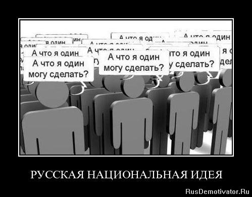

> **Первичный текст.** Разрешение проблем национальных взаимоотношений в русле КОБ.
> Источник: `Разрешение проблем национальных взаимоотношений в русле КОБ.doc` sha256 `aedf724e6a715f29…`; [страница на dotu.ru](https://dotu.ru/2012/10/02/troubleshooting-national-relationships_red2/).
> Автоматическая транскрипция DOC→Markdown; смысл и формулировки не правились.
> Контрольные суммы и статус проверки — в [NOTICE.md](../../NOTICE.md).
> Содержание передаёт позицию авторов; утверждения не верифицированы библиотекой.

---

## 8.3. А что я один могу сделать?

Пока же поколение «Василис» и «Февроний» Премудрых не выросло и не стало Матерями, чьи дети и внуки успешно разрешат проблемы развития Руси и глобальной цивилизации; пока представители государственной и бизнес-власти продолжают вести страну путём биологической, нравственно-этической и социокультурной деградации вступающих в жизнь новых поколений, делая всё это в русле библейского проекта порабощения человечества от имени Бога и укрепления режима криптоколонизации; пока подавляющее большинство взрослого населения вследствие полученного ими воспитания и образования — политически недееспособная толпа (как лояльные власти, так и оппозиционеры), — встаёт вопрос: *А что делать простому человеку, который всю эту мерзость чует и некоторым образом понимает, нравственно не приемлет, хотя и соучаствует в ней, будучи увлекаем эгрегорами и иными обстоятельствами, но в сложившейся государственно-социальной структуре личностных и клановых взаимоотношения не обладает каким бы то ни было внутрисоциальным властным статусом, чтобы изменить политику государства и бизнеса?* Ответ на этот вопрос должен быть жизненно состоятельным поскольку, действия в стиле сюжета фильма С.С.Говорухина «Ворошиловский стрелок» (НТВ Профит, 1999 г., в главной роли Михаил Ульянов) проблем не только не решают, но при массовом принятии этого стиля действий на вооружение влекут за собой катастрофу — новую смуту и гражданскую войну.

Прежде всего, следует отрешиться от свойственных большинству представлений о том, как осуществляется власть в России, сформированных учебными программами школы и вузов, СМИ, литературой и кинофильмами, собственным недоразумением. Эти представления не полны в силу чего неадекватны объективной реальности как таковой. Имеющее место в действительности управление жизнью общества можно схематически изобразить так, как представлено на рисунке ниже.

На этой схеме стрелки обозначают направленность информационных потоков в прямых и обратных связях контуров управления[^587], поддерживаемого соответствующими субъектами и самоуправляющимися объектами. В случае если государство — «теократическое», то иерархия служителей соответствующего эгрегориально-религиозного культа должна быть представлена отдельным блоком, помещённым между блоками «Людской сегмент Ноосферы» и «Государственность». Если государство — светское (как это декларируется в постсоветской РФ, хотя РПЦ де-факто стала внепарламентской общероссийской политической партией), то конфессии, включая и иерархии служителей каждой из них, — социальные группы в составе населения, и каждой из них соответствует свой эгрегор в Людском сегменте Ноосферы Земли (об эгрегориальных религиях и искажениях ими живой религии человека и Бога живого см. работу ВП СССР «К Богодержавию…»).

Как видно из приведённой выше схемы, она представляет полицентричную многосубъектную самоуправляющуюся систему, включающую в себя несколько суперсистем («Население», «Природную среду», «Зарубежье»[^588], «Ноосферу») и множество центров управления, каждый из которых обладает своим иерархическим статусом (возможностями управлять другими фрагментами полной системы прямо или опосредованно) в полной системе; к тому же иерархический статус всякого центра управления может меняться как с течением времени, так и по отношению к разным задачам управления, выполняемым одновременно. Это качественно отличается от предлагаемой обществу СМИ, политиканами и учебными курсами политологии и «обществознания» примитивных схем типа: *«Глава государства (избранный, «сделавший себя сам» или законный наследник) и под его властью — парламент, политические партии, правительство, СМИ и т.п.» либо «Народ избирает депутатов местных органов власти, парламент и главу государства, а они управляют его жизнью, будучи ответственными перед народом, а СМИ это всё «независимо» освещают и комментируют».*

Для так называемого простого человека (т.е. не входящего в состав государственной и бизнес-власти и так или иначе подвластного им обеим) наибольший интерес в полноте этой системы представляет следующий контур циркуляции информации, а равно — *контур осуществления власти, которую он способен обрести вне зависимости от политических деклараций о демократии и её попрания в реальной политической практике «элитаризовавшимися» кланами государственной и бизнес-власти*. На схеме, представленной выше, это контур — *«Вседержительность Божия* ⮀ *индивид в составе населения* ⮀ *людской сегмент Ноосферы Земли, которая способна воздействовать непосредственно и на государственность, и на бизнес-власть, и на население, и на природную среду, и на зарубежье».* И при этом:

С точки зрения субъектности индивида — **именно сам человек является началом и завершением этого контура управления**, хотя *Вседержитель в нём — объективно наивысший управленец,* а человек в нём осуществляет миссию наместничества Божиего на Земле. Тем не менее, Вседержитель предусмотрел и такой этический вариант, провозгласив в Коране ещё 1300 с лишним лет тому назад: *«Бог — ваш покровитель! И Он — лучший из помощников!»* (сура 3:150), — последнее подразумевает, что инициатива в деле может, — а в ряде случаев безальтернативно должна, — исходить от человека, несущего миссию наместничества Божиего на Земле в русле Его Промысла, а Бог поможет успешному осуществлению этой инициативы человека Своею Вседержительностью.

В этом — ответ на вопрос, представленный на «демотиваторе» слева и вынесенный нами в заглавие раздела 8.3, личностная неспособность ответить на который угнетает жизнь миллионов людей, которые пропадают вследствие этого поодиночке: во внутрисемейных дрязгах, в «борьбе с системой», с «зелёным змием» и т.п. Но этот ответ не для приверженцев материалистического атеизма, а также и не для верующих в Бога, но не верящих Богу приверженцев идеалистического атеизма. И с этой якобы русской «национальной идей» «А что я один могу сделать?» давно пора расстаться.

Чтобы войти в этот контур управления — осуществления власти одного из многих наместников Божиих на Земле, необходимо, ПРЕЖДЕ ВСЕГО, — **найти в себе волю и применить её к работе над собой**. И в ходе этой работы над собой следует:

- выработать своё осознание Промысла[^589] и избрать свою личную миссию в нём (если человек в чём-то ошибается, то если он религиозен по совести и не отгораживается от Бога и жизни своими предубеждениями, то в диалоге с Богом ошибки в понимании Промысла и миссии в нём индивида будут исправлены);

- выработать своё представление о взаимодействии общественных институтов[^590], об управлении вообще[^591] и об управлении развитием культуры и экономикой государства и мира[^592];

- навести порядок в своей психике, научившись произвольно создавать праведный эмоционально-смысловой строй и поддерживать его в процессе взаимодействия с потоком событий в жизни (в том числе и добиться защищённости собственной психики от наваждений разного рода)[^593];

- научиться пользоваться Русским языком — «магией» его слова[^594] в режиме «как сказал (подумал) — так и будет» — «волхвы не боятся могучих владык, а княжеский дар им не нужен. Правдив и свободен их вещий язык и с Волей Небесною дружен» (А.С.Пушкин);

- найти или пробудить в себе чувство меры — непосредственное чувство матрицы возможных состояний — и интегрировать его в алгоритмику психики, чтобы чувствовать течение матрично-эгрегориальных процессов непосредственно, а не измышлять модели их течения на основе информации, поставляемой СМИ и сплетнями, циркулирующими в обществе и в интернете;

- стараться жить под властью диктатуры совести, т.е. в осознанно-осмысленном диалоге с Богом по жизни.

В работоспособности этого ответа на вопрос «А что я один могу сделать?» человек может убедиться только в ходе своей практической деятельности в соответствии с этим ответом: по вере вашей да будет вам…

\* \* \*

Прочитав настоящую работу ВП СССР до этого места, фактически завершающего его, возможно, кто-то подумает, что авторы примерно к середине работы забыли, о чём они намеревались писать, поскольку, начиная с раздела 5, национальные и конфессиональные взаимоотношения упоминаются мимоходом на фоне освещения каких-то других тем.

В действительности такая оценка работы была бы ошибочной. Дело в том, что всем людям без различия расовой и этнической принадлежности открыта возможность стать Человеком. Но чтобы реализовать эту возможность, необходимо понимать, чем Человек состоявшийся отличается от несостоявшегося в таковом качестве более или менее человекообразного представителя биологического вида «Человек разумный». Эта суть достоинства Человека состоявшегося — едина для всех рождённых в нашем биологическом виде, она — неотмирна, в том смысле, что предопределена Богом для всех. А национальные и конфессионально обусловленные культуры — достояние этого мира, изначально обусловленные физико-географическими параметрами этногенеза и в последующем обусловленные реальной историей развития культурно-своеобразных обществ.

Национальные и конфессиональные взаимоотношения — тоже достояние этого мира. Но в их характере (в гармонии либо дисгармонии, в конфликтах, подчас не на жизнь, а на смерть) выражается та или иная мера реализации и нереализованности в жизни той неотмирной, предопределённой Богом сути Человека состоявшегося. Иначе говоря, национальные и конфессиональные взаимоотношения, какими бы они ни были, — следствия структурно-психологических и информационно-алгоритмических трансформаций психики представителей разных национальных и конфессионально обусловленных культур. Но коли они — следствия, то гармонизация следствий требует работы с причинами, и решения задачи на уровне причин.

Поэтому тематика разделов настоящей работы органична: от рассмотрения следствий к выявлению и рассмотрению причин. А причины — едины для представителей всех национальных и конфессионально обусловленных культур.

Поэтому, только если в работе с причинами достичь успеха, произойдёт гармонизация следствий, т.е. в национальных и конфессиональных взаимоотношениях воцарится лад. Цивилизация интегрируется в Природную среду, а в обществе исчезнет не только системно организованный паразитизм (эксплуатация «человека человеком»), но исчезнет и «флуктационный» — несистемный, эпизодический паразитизм людей на труде и жизни других и паразитизм индивидов на Природной среде. **И тогда именно в этом процессе гармонизации причин:**

**СССР возродится. Возродится в чистоте воплощённых идеалов Справедливости. И станет величайшей страной в мире потому, что Справедливость притягательна, а Божий Промысел неотвратим…**

Внутренний Предиктор СССР\

07 января 2011 г. — 30 сентября 2012 г.\

Уточнения и дополнения:\

15 ноября 2012 г. — переработан раздел 4,\

в другие разделы добавлены иллюстрации\

и комментарии.

Приложения\

1. Порождение индивидами коллективной психики\

(эгрегоров) и взаимодействие личности и эгрегоров[^595] 

========================================================

Можно догадаться о том, что, если психика индивида представляет собой информационно-алгоритмическую систему, то люди порождают информационно-алгоритмические системы, компонентами которых являются личностные психики каждого из них, просто в силу того, что представляют собой некоторую общность, в пределах которой протекают процессы обмена энергией, информацией, алгоритмикой. Вопрос только в том, на какой материальной основе складываются информационно-алгоритмические системы надличностного уровня, порождаемые множеством личностных психик.

Один из носителей коллективной психики людей — памятники культуры. Согласитесь, что если мы читаем некий древний текст и высказанные в нём мнения учитываем в процессе построения своего мировоззрения и миропонимания, выработки линии поведения, то следует признать, что древние выразители этих мнений — соучаствуют в той же коллективной психике, в которой соучаствуем мы сами. В свою очередь, мы, оставляя потомкам памятники культуры своей эпохи, некоторым образом соучаствуем в их психической деятельности.

Таким образом, получается, что человечество в определённом смысле едино во всей череде прошедших и будущих поколений.

Однако памятниками культуры ответ на вопрос о носителях коллективной психики не ограничивается. Вещественные памятники культуры прошлого и современные нам — просто один из каналов обмена информацией и алгоритмикой между людьми, причём обладающий самыми низкими пропускной способностью и быстродействием.

Организм человека — это вещественное тело и несомое им биополе. Причём под биополем понимается не некая особая разновидность материи, специфически свойственная живым организмам, включая человека, а та совокупность общеприродных полей, излучение которой свойственно живым организмам, включая и человека (у организмов каждого биологического вида своё специфическое по его параметрам биополе, а в пределах этой видовой общности имеют место проявления индивидуального своеобразия). Окончательно умерший труп от живого организма отличается не только прекращением физиологии обмена веществ, но и отсутствием биополя, характерного для живого.

И есть основания полагать, что информационная ёмкость вещественных структур организма человека и реально возможные скорости перехода их из одного состояния в другие недостаточны для того, чтобы именно они были *непосредственными* носителями психики человека как информационно-алгоритмической системы. А вот полевые процессы, сопровождающие физиологию вещественного тела организма человека, обладают достаточной информационной ёмкостью и высокими частотными характеристиками для того, чтобы быть носителем психики человека как информационно-алгоритмической системы. То есть *непосредственным* носителем психики индивида как процесса является его биополе, а вещественное тело в составе организма решает две основные функции:

- взаимодействие с вещественным миром;

- энергетическая подпитка биополя.

В состав биополя входят разные специфические поля, отличающиеся друг от друга и характером своего силового воздействия, и затратами энергии на их излучение, и скоростью распространения в разных средах, и характеристиками падения напряжённости поля в зависимости от удалённости от источника излучения. Тем не менее, все они, так или иначе, промодулированы информацией, свойственной индивиду, в общих для биологического вида «Человек разумный» системах кодирования информации. Часть этих систем кодирования носит биологически обусловленный характер, а часть — культурно обусловленный характер. Эта спектральная близость биополей всех людей и некоторая общность для них биологически и культурно обусловленных систем кодирования информации и является основой для порождения людьми разного рода коллективных психик.

Это не некое новое открытие. Коллективные психики, порождаемые разными социальными группами, в латиноязычной терминологии издавна называются «эгрегорами». В латиноязычной терминологии сложилась смысловая пара: «индивид» (что означает «неделимый»), и «эгрегор» (какое слово отсутствует в толковых словарях с негласным грифом «для толпы», но, как можно догадаться, является однокоренным со словом «агрегат», означающим *соединение* некоторого множества узлов в одно функционально своеобразное устройство).

Психика индивида через её бессознательные уровни (а в ряде случаев и на уровне сознания) всегда связана с какими-то эгрегорами. Т.е. **индивидов, чья психика не включена в алгоритмику какого бы то ни было эгрегора, не бывает**.

Прежде всего, эгрегор — это алгоритмика, что подразумевает наличие определённых целей, на которые она работает и определённого содержания — информационно-алгоритмического обеспечения, а также некоего определённого набора «аргументов» — параметров активации алгоритмики в целом или тех или иных частных алгоритмов в составе алгоритмики. Эта алгоритмика различными своими фрагментами может быть распределена по индивидуальным психикам множества людей, а также может быть в большей или меньшей степени продублирована в том образовании, которое можно назвать «полевым телом эгрегора» — полевой структурой, которая способна существовать некоторое время сама по себе в случае, если исчезнут все индивиды, психика которых включена в этот эгрегор.

При условии, что разные эгрегоры энергетически не разобщены, они могут взаимно проникать друг в друга, объединяться на основе идентичности целей или каких-то фрагментов информационно-алгоритмического обеспечения, единства параметров энергетики, а также и общности для нескольких эгрегоров индивидов, которые являются своего рода «мостами» между ними или «сцепками».

Прежде всего, для замыкания психики индивида на определённый эгрегор необходима энергетическая совместимость биополя индивида с эгрегором, как по составу природных полей, так и по параметрам мощности и фазово-частотных характеристик.

Энергетическая совместимость индивида и эгрегора может быть обеспечена как генетически принадлежностью к виду «Человек разумный» и его популяциям, так и воздействием ряда веществ, изменяющих физиологию биополя. Последнее касается эгрегориальной общности пьющих, курящих и прочих наркоманов.

Кроме того, в жизни человечества сложились культуры разнородного шаманизма. Шаманизм включает в себя воздействие на шамана и его «клиентов» разного рода снадобий, некоторые из которых предназначены для обеспечения энергетической совместимости биополя человека и тех или иных эгрегоров. Отчасти это касается и воздействия на биополе индивида и различных рационов питания.

Также надо знать, что разного рода психо-физиологические практики (например, йоги в ведической культуре) способны изменить параметры биополя индивида, вследствие чего в те эгрегоры, в которые йог способен войти, другие не смогут войти вообще либо в таком качестве, в каком способен войти йог.

Без обеспечения энергетической совместимости с эгрегором соединение с ним либо невозможно, либо небезопасно: это подобно тому, как должна быть обеспечена совместимость электроприборов (генераторов и потребителей энергии) и действующей сети электроснабжения; технических характеристик телевизионных и радиоприёмников и уровня соответствующего сигнала в месте их работы.

Для замыкания психики личности на эгрегор при наличии биополевой энергетической совместимости с эгрегором необходимо как минимум одно из трёх:

- действующие нравственные стандарты (принципы) личности, фактически управляющие обработкой информации в психике индивида, должны быть идентичны нравственным стандартам, свойственным алгоритмика эгрегора (чем больше таких идентичных нравственных стандартов (принципов) в паре «личность — эгрегор», и чем они более высокоприоритетны[^596], тем более глубокие связи личности с эгрегорами);

- индивид является носителем алгоритмики, характерной для эгрегора, либо каких-то фрагментов тех или иных алгоритмов;

- индивид является носителем информации, характерной для эгрегора.

Для замыкания психики индивида на эгрегор *при обеспечении энергетической совместимости с ним* достаточно одного из вышеперечисленных факторов; наличие двух других факторов не является обязательным.

Замыкание психики личности на эгрегор может происходить как через бессознательные уровни психики, так и на обоих уровнях: отчасти через уровень сознания, а отчасти через бессознательные уровни психики. При этом нравственные стандарты личности определяют характер взаимодействия индивида и эгрегора. В связи с этим необходимо пояснить два аспекта:

- ПЕРВЫЙ. Замыкание на эгрегор исключительно через нравственные стандарты при отсутствии в психике личности алгоритмики и информации, характерной для эгрегора.

В этом случае идентичность нравственных стандартов играет роль своего рода «пароля» для получения доступа к информационно-алгоритмическим (и возможно, энергетическим) ресурсам эгрегора. Если «пароль» признан, то отсутствующие в психике личности информационно-алгоритмические ресурсы будут «загружены» в неё из эгрегора в течение некоторого времени — в соответствующих обстоятельствах, возможно, сформированных вокруг индивида этим же эгрегором.

- ВТОРОЙ. При несовпадении нравственных стандартов личности со стандартами, характерными для эгрегора, замыкание психики индивида на эгрегор возможно посредством одного из двух других факторов по отдельности либо обоих вместе — наличия в психике информации или алгоритмики, характерной для эгрегора. В этом случае индивид, входя в эгрегор, тем не менее не может вписаться в его алгоритмику: его нравственные стандарты продуцируют иную алгоритмику его поведения, включая и алгоритмику взаимодействия с эгрегором.

Однако характерные для эгрегора нравственные стандарты, в психике индивида при этом всё же могут наличествовать, но не в качестве фактически действующих нравственных стандартов личности, а в качестве компоненты её информационного обеспечения — информации для сведения (дескать «бывают или могут быть субъекты и с такими нравственными стандартами, хотя это и не моя нравственность»).

Совокупность эгрегоров, с которыми личность связана постоянно и с которыми она может быть связана временно, можно разделить на три группы:

- В первую входят биосферно-биоценозные эгрегоры, с которыми индивид связан и информационно-алгоритмически, и энергетически просто в силу своей принадлежности к биологическому виду «Человек разумный». О какой-либо специфической нравственности в отношении них говорить вряд ли уместно, хотя какие-то извращения нравов под воздействием социально обусловленных факторов могут быть такими, что биосферно-биоценозные эгрегоры отвергнут субъекта как «нежить», вследствие чего он станет жертвой их «иммунной системы».

С биосферно-биоценозными эгрегорами индивид связан на протяжении всей своей жизни, хотя биоценозная составляющая может изменяться на протяжении его жизни как вследствие изменения самих биоценозов, так и вследствие перемещения индивида из одного биоценоза в другой на сроки, продолжительность которых позволяет войти в эгрегоры биоценозов по месту пребывания. Конечно, корневой эгрегор этой группы — биосферно-биоценозный эгрегор так называемой «малой родины» — места рождения.

- Во вторую группу входят культурно обусловленные эгрегоры, которые можно разделить на две подгруппы:

<!-- -->

- социально-статусные, взаимодействие с которыми носит продолжительный характер в том смысле, что протекает на протяжении многих дней, месяцев, лет, десятилетий (таковы, в частности, этнические эгрегоры, эгрегоры религиозных конфессий, а так же профессионально-корпоративные эгрегоры и иные эгрегоры субкультурно своеобразных социальных групп, *включая и эгрегоры носителей определённых типов строя психики и их специфических вариантов*),

- текущие переменные, в которые индивид включается в домашнем быту и на работе по мере перехода от одного вида деятельности к другому (сел за руль — включился в водительский эгрегор; оставил машину на стоянке и поехал общественным транспортом — включился в эгрегор функционирования общественного транспорта и т.п.).

<!-- -->

- В третью группу входят родовые эгрегоры, представляющие собой связующий элемент между биосферно-биоценозными и культурно обусловленными эгрегорами.

Для них характерно то, что в своей основе они биологические, поскольку принадлежность к роду-племени программируется при зачатии генетическим механизмом биологического вида и запечатлевается в геноме индивида пожизненно. Но при этом они несут и некоторую культурно обусловленную составляющую (нравственные стандарты, алгоритмику, информацию), на основе освоения которой в родовой эгрегор могут включаться биологически чуждые ему индивиды (прежде всего — фактические супруги — жёны либо мужья, в большинстве случаев являющиеся представителями других родовых эгрегоров, а так же — приёмные дети, близкие друзья и т.п., а кроме того — самое потенциально опасное — любовники и любовницы при распутном образе жизни). Однако возможны и эффекты обратного действия — когда родовой эгрегор отторгает биологически принадлежащих к нему людей в случае, если они становятся носителями каких-то неприемлемых для родового эгрегора нравственности, информации и алгоритмики.

Во всяком эгрегоре индивид обладает определённым «эгрегориальным статусом», который может меняться на протяжении времени, а в разных эгрегорах статус одного и того же индивида может быть тоже разным. Основные возможные статусы индивида в эгрегорах:

- «дойная корова» — индивид только подпитывает эгрегор своей энергетикой, что в подавляющем большинстве случаев не идёт ему на пользу, либо является для эгрегора источником каких-то иных ресурсов — информации, алгоритмики, каналов информационного обмена и т.п.;

- «исполнительный элемент» — индивид вписывается в алгоритмику эгрегора и играет в ней определённые не управленческие (по отношению к эгрегору) функции (это происходит большей частью бессознательно);

- «эгрегориальный лидер», «эгрегориальный менеджер» — индивид способен управлять эгрегором на основе информационно-алгоритмического наполнения эгрегора, однако не изменяя его (это может быть как осознанным, так и бессознательным);

- «программист» — способен изменять информационно-алгоритмическое наполнение эгрегора (это требует некоторой осознанности).

Три первых статуса характеризуются тем, что индивид — своего рода пленник эгрегора (конечно, если он не входит в какой-либо ещё эгрегор, иерархически высший по отношению к первому, обладая в нём каким-то иным статусом), его мировосприятие, осмысление жизни, воля некоторым образом так или иначе искажаются эгрегориальной алгоритмикой: именно вследствие искажения его психической деятельности под воздействием эгрегориальной алгоритмики индивид в большей или меньшей мере не свободен ни в выборе информации, ни в её осмыслении, ни выработке линии поведения и в проведении её в жизнь.

«Программист» может быть тоже пленником эгрегора, но может быть и независим от того эгрегора, по отношению к которому он является «программистом».

Одна из основ того явления, которое было выше названо «эгрегориальным статусом», это — соотношение личностной воли и эгрегориальной алгоритмики. Вариантов такого рода соотношений несколько:

- Воля индивида либо не развита, либо в процессе взаимодействия с определённым эгрегором в силу каких-то причин подавлена или не связана с процессом взаимодействия с этим эгрегором. В этом случае индивид — зомби-ретранслятор эгрегориальной алгоритмики, а информационно-алгоритмическая граница между личностью и эгрегором отсутствует: «личность» — один из ликов эгрегора.

- Воля индивида — продолжение эгрегориальной алгоритмики, адаптирующая её к конкретике ситуации. В этом случае индивид «едет» на эгрегориальной алгоритмика, информационно-алгоритмическая разграничение личности и эгрегора функционально аналогично административной границе в пределах одного и того же государства.

- Воля индивида в конфликте с эгрегориальной алгоритмикой, но индивид не способен выйти из неё. Это один из тех случаев, когда ситуация может характеризоваться словами «не везёт»: эгрегор не «везёт» индивида. Информационно-алгоритмическое разграничение личности и эгрегора в этом варианте носит неопределённый характер и подобно борьбе двух государств за перенос линии границы в формах, начиная от вкапывания своих пограничных столбов на «спорных территориях» и кончая открытой войной.

- Эгрегориальная алгоритмика — продолжение воли индивида, т.е. эгрегор — инструмент осуществления его воли. Это возможно при статусе «эгрегориального лидера», а также и при статусе «программиста», хотя, как было отмечено выше, каждый статус обладает своей спецификой. При статусе «эгрегориального лидера» информационно-алгоритмическое разграничение личности и эгрегора не определённо, т.е. его нет, но нет и конфликта по поводу разграничения; при статусе «программиста» информационно-алгоритмическое разграничение личности и эгрегора может быть и определённым, и не определённым, но так же может быть алгоритмический конфликт по поводу определённости разграничения и иным поводам.

Что касается энергетического обмена личности и эгрегора, то он качественно отличается от процессов подключения потребителей к источнику постоянного или переменного тока тем, что энергетические потоки в энергетическом обмене личности и эгрегора промодулированы[^597] информацией и алгоритмикой, обеспечивающими взаимосвязи личности и эгрегора. Иными словами потоки энергообмена личности и эгрегора весьма отличаются от стандартов подачи и потребления постоянного и переменного тока в технике, от энергетического «белого шума», поскольку «отформатированы» системами кодирования информации и алгоритмикой её пересылки и обработки, которые свойственны индивиду и эгрегору.

Вследствие «форматирования» энергопотоков в энергетическом обмене личности и эгрегоров:

- энергия, получаемая индивидом из чуждого для личности эгрегора, — своего рода «батарейки не той системы»;

- то же касается и «вливания» в эгрегор энергии кем-либо из чуждых ему индивидов.

Автоматически-самопроизвольное осуществление и того, и другого в жизни маловероятно, именно вследствие «форматирования» энергопотоков, которое порождает взаимную разобщённость по-разному «отформатированных» энергопотоков.

Однако и то, и другое осуществимо целенаправленно, если удаётся преодолеть исходную взаиморазобщённость «форматов» энергообмена. В случае целенаправленного преодоления исходной взаиморазобщённости «форматов» энергообмена такое вливание чуждой энергии способно что-то разрушить в приёмнике либо преобразить его: это касается всякого приёмника будь приёмник — эгрегор либо индивид.

——————

Осознание индивидом связи с тем или иным определённым эгрегором представляет собой прежде всего прочего осознание своеобразия информационного и алгоритмического наполнения этого эгрегора, а так же и характерных для эгрегора нравственных стандартов.

В данном случае в жизни реально: порядок оказывается обратным по отношению к упомянутому ранее (от нравственности к информации), поскольку в жизни из осознания информации и алгоритмики в их проявлениях можно выявить нравственные стандарты, характерные для эгрегора. Выявить непосредственно нравственные стандарты, характерные для эгрегора, тем более в случаях, когда нравственные стандарты не проявляются в действующей алгоритмика[^598], — для большинства это требует настроения, весьма отличающегося от их обыденного.

Кроме того, надо понимать, что хотя эгрегоры могут существовать в преемственности многих поколений людей[^599], что по своим информационно-алгоритмическим и энергетическим ресурсам они могут многократно превосходить всякого индивида, тем не менее эгрегоры (по крайней мере культурно обусловленные) — порождения людей: эгрегоры — вне зависимости от характера их порождения — не обладают собственной волей, вследствие чего попытки общаться с *эгрегором в целом* как с некой *«сверхличностью», обладающей своей нравственностью, этикой, осмысленностью, волей, однако не воплощённой в вещественном теле,* аналогичны попыткам общения с магнитофоном на принципах межличностного общения.

Отметим ещё раз, что носители каждого типа строя психики порождают свои эгрегоры. В Русском языке эгрегор носителей человечного типа строя психики издревле называется «соборность» (о его особенностях см. работу ВП СССР 2003 г. «От корпоративности под покровом идей к соборности в Богодержавии»).

Совокупность эгрегоров человечества образует человеческий сегмент «ноосферы» — сферы разума планеты.

[^587]: По прямым связям проходит управляющее воздействие; по обратным связям субъект-управленец (или автоматическая система управления) получает информацию о состоянии объекта управления и среды, с которой он взаимодействует. Во многосубъектных системах прямые связи одного субъекта могут быть обратными связями других, а обратные связи одного — прямыми связями других.

[^588]: «Зарубежье» объединено на представленной выше схеме с «Природной средой» в один блок, чтобы не рисовать для каждого государства, для каждого культурно своеобразного народа и его диаспор дубликат этой схемы.

[^589]: Наши представления о Промысле выражены в работах «К Богодержавию…», «От корпоративности под покровом идей к соборности в Богодержавии», «“Мастер и Маргарита”: гимн демонизму либо Евангелие беззаветной веры».

[^590]: См. раздел 8.1 настоящей работы и таблицу 2 в нём, а также работу ВП СССР «Основы социологии» (часть 3 и приложения).

[^591]: См. работы ВП СССР «Достаточно общая теория управления», «Основы социологии» (часть 2), «Мёртвая вода».

[^592]: Об этом см. работы ВП СССР «Мёртвая вода», «Краткий курс…», «Форд и Сталин: о том, как жить по-человечески», «К пониманию макроэкономики государства и мира» (Тезисы), «Организационно-технологический подход к макроэкономическим системам — ключ к успеху экономического и общекультурного развития общества», а также: Величко М.В., Ефимов В.В., Иманов Г.М. Экономика и ноосфера. Научно-методологические основы государственного управления социально-экономическим развитием в условиях глобализации. Ноосферный (этико-экологический) подход. — СПб: «АНО Смольный институт». 2012. (Интернет-публикацию этой работы см. по ссылке: <http://m3ra.ru/2012/06/22/economy-noosphere/>).

[^593]: См. работы ВП СССР «Основы социологии» (часть 1), «Диалектика и атеизм: две сути несовместны».

[^594]: См. работы ВП СССР «Язык наш: как объективная данность и как культура речи», «Диалектика и атеизм: две сути несовместны», «Основы социологии» (часть 1).

[^595]: Приложение представляет собой раздел 4.8 работы ВП СССР «Основы социологии» с незначительными стилистическими изменениями.

[^596]: Нравственные стандарты неравнозначны друг другу, а иерархически упорядочены по значимости.

[^597]: В данном случае под модуляцией понимается обусловленность параметров высокочастотного колебательного процесса (амплитуды, частоты и т.п.) амплитудно-частотными характеристиками низкочастотного колебательного процесса. Пример амплитудной модуляции — звуковое радиовещание (AM), основанное на том, что изменение амплитуды радиосигнала на несущей частоте (частоте радиовещания) повторяет частотные и мощностные изменения передаваемого звука. В советские времена реализация этого принципа в радиотехнике изучалась в курсе физики 6‑го класса.

[^598]: Если такого рода «спящие» нравственные стандарты начинают проявляться в активной алгоритмика (т.е. выражаются в поведении), то ситуация описывается поговоркой «человека будто подменили».

[^599]: В этом случае индивиды по своему положению в эгрегоре аналогичны клеткам организма: организм существует, а клетки в нём обновляются, сменяя друг друга.
---

[К произведению](README.md) · [Каталог](../../CATALOG.md)
