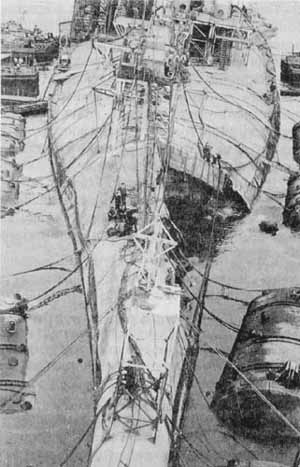

> **Первичный текст.** Российское общество и гибель АПЛ «Курск» 12 августа 2000 года.
> Источник: `Российское общество и гибель АПЛ «Курск» 12 августа 2000 года.doc` sha256 `5de29b0805981f84…`; [страница на dotu.ru](https://dotu.ru/2002/08/18/20020818-apl_kursk_red-2/).
> Автоматическая транскрипция DOC→Markdown; смысл и формулировки не правились.
> Контрольные суммы и статус проверки — в [NOTICE.md](../../NOTICE.md).
> Содержание передаёт позицию авторов; утверждения не верифицированы библиотекой.

---

## 2.3. О том же, но без “таинств”

**Управление в его существе это — обмен информацией, преследующий осуществление вполне определённых, наперёд поставленных целей.** После того, как этот вывод сделан, случайность перестаёт быть бессмысленным стечением обстоятельств, а становится целесообразным результатом управления. При этом одни и те же случайности одной стороной могут расцениваться как «трагические», а другой — как «желательные», что обусловлено реальной нравственностью каждой из сторон**\<**, обуславливающей цели, которые каждая из сторон желает осуществить**\>**. Поэтому необходимо выявить те связи, которые возникают в результате свершения обряда, и на основе которых протекает информационный обмен, целенаправленно приводящий к трагическим либо желательным случайностям.

Живой человек это не только клеточная биомасса, в которой протекают процессы обмена веществ. Но это ещё и общеприродные (физические[^32]) поля, которые излучает эта биомасса в процессе своей физиологической деятельности. Совокупность этих общеприродных полей, излучаемых человеком, вне зависимости от того известна ли она во всей её полноте науке, либо же наука отрицает существование каких-то из видов полей, мы будем называть *«биополе»*. Без биополя невозможна жизнь в собственно человеческом смысле этого слова, поскольку восприятие мира, мышление, память — это не механические процессы, а биополевые, по отношению к которым вещество тела является разнородными волноводами и преобразователями полей, несущих информацию.

Кроме того, люди, будучи телесно отделёнными один от других особями, способны порождать биополевую систему, объединяющую многих и многих людей, на которую замыкаются через биополе все её участники, с которой все они поддерживают на уровне биополя энергоинформационный обмен. Такого рода биополевые системы в оккультной литературе, порицаемой всеми церквями, называются «эгрегоры»[^33]. Эгрегоры — это самоуправляющиеся во многом системы, хотя многими эгрегорами, *и прежде всего, порождёнными практикой общественной жизни,* люди способны управлять по своей воле; а некоторые из эгрегоров, поддерживаемых обществами и общественными подгруппами, создаются на протяжении истории именно с целью управления через них процессами — как внутриобщественными, так и сопряжёнными с обществом иными процессами.

Обряд же, в котором участвуют множество людей, веруя в его полезность либо нравственно безразлично присутствуя при его отправлении, включает индивидуальную психику каждого из таких присутствующих при обряде в некий эгрегор, т.е. соучастие в обряде порождает некую коллективную психику. После этого вся информация, носителем которой является человек (намерения на будущее, профессиональные навыки и т.п.) становится достоянием эгрегора, в который человек включился осознанно или бессознательно в силу его нравственного безразличия к алгоритмике и информации эгрегора. И информация личности может быть востребована эгрегором для осуществления заложенных в него (эгрегор) целей как через сознательные, так и через бессознательные уровни психики включившихся в него людей в любой момент времени; и это может быть сделано как в режиме “автоматического” самоуправления эгрегора, так и в режиме управления эгрегором его менеджерами (магами, “шаманами”).

Что в действительности происходит под эгрегориальным водительством в отношении *множества участников одних и тех же событий, удалённых друг от друга, никогда не видевших друг друга, не подозревающих о существовании друг друга?* — в процессе свершения событий знают все они вместе взятые. При этом каждый знает своё, и как правило никто из них не видит эгрегориально управляемого процесса в целом. Если информационно-алгоритмическое[^34] содержимое эгрегора не вызывает нравственно обусловленного неприятия у человека, то для человека оказывается незаметным тот факт, что его воля действует под водительством эгрегора в русле эгрегориального алгоритма. Будучи коллективным биополем (духом) множества удалённых друг от друга на тысячи километров людей, эгрегор многократно превосходит каждого из них как по мощи энергетики, так и по возможностям обработки информации. Вследствие этого всё то, что происходит в жизни общества под эгрегориальным управлением, подчас воспринимается людьми как сверхъестественное чудо, удивительное везение либо трагическое стечение обстоятельств.

По отношению к эгрегору человек может занимать разное положение:

- быть его менеджером, управляющим его деятельностью;

- быть исполнительным орудием — биороботом-зомби, действующим автономно на основе информации, содержащейся в психике;

- быть зомби, дистанционно управляемым на основе биополевого возбуждения содержащейся в его психике информации;

- быть энергетической или информационной «дойной коровой» или *жертвенным “бараном”*[^35].

В силу способности эгрегоров к определённому “чудотворению”, далеко выходящему за пределы индивидуальных и осознаваемых корпоративных возможностей большинства, многие воспринимают эгрегоры в качестве Бога, а его менеджеров и некоторых из зомби, несущих функцию «исполнительных органов» эгрегора, — в качестве святых. Но нельзя сказать, что эгрегориальное водительство всегда плохо или всегда хорошо: *всё зависит от информационно-алгоритмической начинки, подчас многослойной, которая свойственна эгрегору (или их совокупности), в который включился тот или иной субъект или какая-то группа субъектов.*

В таком понимании биопóля человека и информационного обмена между разными людьми посредством биополей, всякая обрядность всякой церкви предстаёт как обычная эгрегориальная магия — культура (т.е. теоретические знания и практические неформализованные навыки) энергетической и информационной накачки эгрегора и управления через его посредство людьми и обстоятельствами как их жизни, так и их смерти.

Соответственно церковные запреты на интерес паствы к оккультной литературе одной из своих сторон имеют сокрытие от понимания паствы эгрегориальной магии и ворожбы самой церкви с целью поддержания монополии определённой корпорации на этот вид власти[^36].

Всё сказанное позволяет понять роль библейски-церковной обрядности в гибели АПЛ “Курск”. При совершении молебнов по библейски православной обрядности психика членов экипажа была включена в библейский эгрегор вне зависимости от того, кто из них поверил в вероучение церкви, а кто отнёсся к нему нравственно безразлично, присутствуя при акте свершения магического обряда на борту АПЛ, подчинившись воинской дисциплине. Но в этот же библейский эгрегор включена и психика личного состава ВМС США, на которые в ХХ веке возложена функция мирового жандарма в библейском проекте. Соответственно командиры и члены экипажей “Курска” и натовских подводных лодок управляли своими кораблями под водительством одного и того же антирусского эгрегора.

В целях деятельности этого эгрегора нет места Русскому флоту. Соответственно этому при управлении лодками двух флотов под его водительством могло произойти почти всё: от ошибки великолепно подготовленных членов экипажа в управлении технически исправным “Курском”, вследствие которой АПЛ при маневрировании “воткнулась” в грунт при полной непричастности кораблей НАТО к трагедии; до тщательно рассчитанного на эгрегориальном уровне столкновения, при котором гарантировано гибнет наша лодка, а натовская гарантировано получает повреждения, не приводящие её к гибели; или до ситуации, в которой российская лодка уничтожается *залпом* **боевыми торпедами** с натовской лодки, командир которой под эгрегориальным водительством ошибся в оценке ситуации, возникшей в ходе учений чужого флота, и отдал приказ об использовании боевого оружия[^37].

Не способствует защите психики индивида от одержимости тем или иным эгрегором и повседневный рацион подводников: алкоголь в количестве полстакана сухого вина на человека за обедом — повседневная официальная норма; неофициальная норма — стакан вина через день. Сухое вино рекомендовано для размягчения каловых масс в условиях длительной гиподинамии (малоподвижного образа жизни), под воздействием которой снижается мышечный тонус и возможно возникновение запоров. Но оно же разрушает и интеллект как процесс, прежде всего его бессознательные уровни и нарушает взаимодействие интеллекта с другими компонентами психики. То же касается и табачной зависимости многих подводников, не говоря уж о том, что причиной пожара, способного повлечь и гибель лодки, может стать курение в не предназначенном для этого месте.

 2.4. Русь и Русский флот под властью\

доктрины Второзакония-Исаии

--------------------------------------

Философы-историки России библейски-“православного” толка, прочитав всё сказанное о дурном воздействии библейской культуры на Русский флот, могут разъяриться возражениями: а как же победы Петра Великого? как же победы Русского флота времён Екатерины II на Чёрном, Балтийском и Средиземном морях? как же кругосветки Русского флота, открытие Антарктиды и прочие неординарные дела на море наших (библейски) православных предков?

И на это всё хорошо известное и нам есть ответ: история Русского флота началась ранее, чем началась история библейски-“православной” церкви на Руси. Во времена языческой Руси, т.е. до крещения в 989 г., ныне Чёрное море византийцы называли «Русским». И хотя в те времена Русь не совершила ничего грандиозного в области кораблестроения, тем более военного кораблестроения: морские вторжения в Византию во времена Олега совершали, конечно, не на долбленых челнах-однодревках, а на «набойных лодьях»[^38], — но и этот флот был способен принудить Византию к заключению мира: щит Олега на вратах Царьграда появился после того, как Олег пришёл с флотом, поставил корабли на колёса, и ветер вынес их по суше под стены крепости. Это были победы живого Русского язычества над церковной мертвящей ритуальщиной. На это обстоятельство в ходе русско-турецкой войны 1828 г. намекал своим современникам Ф.И.Тютчев, да не вняли:

> «Аллах! пролей на нас Твой свет!\

> Краса и сила правоверных!\

> Гроза гяуров[^39] лицемерных!\

> Пророк Твой — Магомет!…»

>

> «О наша крепость и оплот!\

> Великий Бог! веди нас ныне,\

> Как некогда Ты вёл в пустыне\

> Свой избранный народ!…»

>

> Глухая полночь! Всё молчит!\

> Вдруг… из-за туч луна блеснула —\

> И над воротами Стамбула\

> Олегов озарила щит.

После побед язычников Олега и Святослава над Византией было крещение Руси, и после него — под водительством библейского эгрегора — в течение нескольких столетий Россия лишилась выходов к морям, и флота как военного, так и торгового — не стало.

Попытка воссоздать флот была при отце Петра I — «тишайшем» Алексее Михайловиче, которого многие библейски православные очень уважают за его «религиозность» (на наш взгляд, — эгрегориальную \<одержимость\>). В действительности же Алексей Михайлович настолько распластался под иерархами церкви, что патриарх Никон — зачинатель раскола и основатель ныне господствующей ветви библейского “православия” в России — одно время именовался наравне с царём «великим государем». Флот — корабли, построенные в царствование Алексея Михайловича на Волге, — частично сгнил, а частично был сожжён восставшими в ходе крестьянской войны под водительством Степана Тимофеевича Разина. От того флота остался только «ботик Петра Великого»[^40] — «дедушка Русского флота» — лодочка, во многом декоративная, которую будущий царь Пётр подростком нашёл в сарае и привёл в состояние, пригодное для плавания. Таким образом, «тишайшему» Алексею Михайловичу, идеалу государя в глазах многих библейски “православных”, Россия обязана неудачной попыткой возобновления флота и вполне успешным многовековым расколом общества, одним из следствий которого был крах исторически сложившейся государственности Русской региональной цивилизации в 1917 г.

Русский флот действительно возродился при Петре I. Но в отношениях с иерархией библейского православия Пётр был полной противоположностью своему отцу. Пётр Великий упразднил патриаршество в России и подчинил иерархию церкви государству. В фильме “Пётр I” есть эпизод, когда царь сгоняет монахов на строительство укреплений в ходе войны со Швецией и заявляет одному из попов: вы работайте, а молиться я один буду. Собственно благодаря тому, что Пётр взнуздал иерархию библейской церкви и запряг её членов работать на государство, и стало возможным возрождение Русского флота в царствование Петра. В вопросе возрождения флота, минуя иерархию церкви, царь Пётр I адресовался непосредственно к Богу: знáком этого является то, что один из первых линейных кораблей Русского флота назывался прямо “Гото Предистинация”, что в переводе на русский язык означает «Божье Предопределение».

Того заряда, что дал Пётр Великий, России в её морских делах хватило до начала XIX века. Именно с начала XIX века в военно-морских делах России начинается разлад. Первым знáком был не известный большинству эпизод. В период русско-английской войны 1807 — 1812 гг. (в царствование императора Александра I) средиземноморская эскадра под командованием адмирала Д.Н.Сенявина была блокирована британской эскадрой в Лиссабоне. Принудить Д.Н.Сенявина[^41] к сдаче англичане не смогли; зная его как выдающегося флотоводца, автора многих побед над турецким флотом (передовым в техническом и оперативно-тактическом отношении в те времена, поскольку он создавался под руководством специалистов Франции и Англии), вступать в бой с русской эскадрой они не рискнули. В результате был подписан договор, по которому русская эскадра была взята Великобританией «на сохранение» до конца войны. Придя в Портсмут в сопровождении английской эскадры, до заключения мира она простояла там под Андреевскими флагами, вызывая недоумение и раздражение обывателей.

Спустя полвека, по завершении крымской войны, в которой Россия потерпела поражение, один из пунктов Парижского мирного договора прямо предусматривал ликвидацию Черноморского флота. Об уничтожении Россией других флотов Запад не заикался. Но в требовании этого пункта мирного договора цели глобального библейского проекта в отношении самодержавия Русской многонациональной цивилизации выразились прямо.

Однако соотечественники наши этого не поняли, и под водительством библейского эгрегора создали флот, который с позором, какого не знала история России со времён Батыева нашествия, был уничтожен в ходе русско-японской войны[^42] в Порт-Артуре и при Цусиме: героизм простых матросов и некоторых достойных командиров кораблей не смог компенсировать эгрегориального водительства в отношении правящей “элиты” империи в целом. В боях русско-японской войны погибли корабли и команды, не однократно освящённые иерархами “православной” церкви в ходе множества молебнов о даровании победы русскому оружию.

Не говоря уж о том, что военное столкновение России и Японии отвечало интересам международного сионо-интернацизма и государственным интересам Британской империи, следует отметить, что механизм трагедии военной катастрофы России в русско-японской войне — тот же самый, что был описан выше: включение психики множества индивидов в ходе соблюдения обрядности библейски-“православной” церкви в антирусский библейский эгрегор. За этим следовали их коллективные самоубийственные действия под водительством этого эгрегора на всех стадиях: от разработки концепции строительства флота и его боевого применения до его <u>боевого применения на практике</u>; то же касается и сухопутных сил России, но менее ярко выражено.

2.5. Попытка освобождения\

от библейской мерзости

--------------------------

Русский флот снова начал возрождаться при Сталине как океанский флот, способный воспрепятствовать деятельности любого враждебного флота. Интересно отметить, что флот в СССР стал возрождаться только после разгрома троцкизма. Пока же троцкизм был силён и властен, в СССР уничтожались не только остатки военно-морской мощи Российской империи, но и предпосылки к её возобновлению в **\<**гипотетически возможном (в альтернативной истории)**\>** троцкистско-советском государстве: так в 1920‑е годы борцы за мировую перманентную революции продали на слом в Германию не только действительно старые корабли, исчерпавшие свой ресурс, но и те корабли, которые могли бы служить ещё пару десятков лет, а также недостроенные линейные крейсера типа “Измаил”.

Эти крейсера невозможно было достроить в 1920‑е гг. по первоначальному проекту по причине того, что СССР был не способен произвести некоторые важные детали башен главного калибра, заказанные ещё до начала первой мировой войны на заводах Австро-Венгрии[^43]. И хотя как линейные корабли они устарели, поскольку принципы, заложенные в их первоначальных проектах, в ходе первой мировой войны были обесценены становлением авиации как эффективной боевой силы[^44], но сохранение их корпусов с законсервированными энергетическими установками открывало возможность перманентным революционерам-интернацистам (если бы им удалось победить большевиков-сталинцев) ввести в строй к началу 1940‑х гг. четыре не слабых для своего времени авианосца. И уничтожение недостроенных линейных крейсеров типа “Измаил” в период всевластия психтроцкизма в СССР указывает на то, что Л.Д.Троцкий и его сподвижники не были посвящены до конца в тайну мировой “социалистической” «перманентной революции».

Здесь важно обратить внимание на то, что Троцкий и его последователи были марксистами. Марксизм — светская разновидность библейского проекта[^45], вследствие чего истинные марксисты, хоть и провозглашали лозунг мировой социалистической революции и писали трактаты о революционных войнах как средстве экспорта революции, но флот — как одно из средств осуществления этого проекта — в СССР создавать не собирались (если судить по их делам с 1918 г. до конца 1920‑х гг.).

И.В.Сталин марксистом не был, и океанский флот в СССР стал создаваться под его непосредственным руководством в тот период истории СССР, когда открытые троцкистские структуры были разгромлены, а нелегальные продолжали действовать, маскируя антирусское вредительство под защиту государственных интересов страны. Борьба за флот и против флота в СССР в условиях двоевластия явного сталинизма и подпольного психтроцкизма была жестокой. О последней кораблестроительной программе эпохи И.В.Сталина и борьбе вокруг неё С.Зонин в статье “Неправый суд” (“Морской сборник”, № 2, 1989 г.) сообщает следующее:

«Предусматривалось строительство 9 линейных кораблей водоизмещением по 75 тыс. тонн, 12 тяжёлых и 60 лёгких крейсеров, 15 авианосцев, более 500 подводных лодок… Между тем отношения руководства ВМФ с наркоматом, а потом и министерством судостроения складывались трудно. Авианосцы по замыслу Кузнецова и Галлера[^46], становились основополагающим элементом надводного флота. В этом заключалась первая особенность программы. Вторая состояла в том, что строительство кораблей всех классов должно было вестись по новым проектам, учитывающим военно-техническим прогресс Флота за годы второй мировой воины. Такая направленность не получила поддержки руководства судостроения во главе с И.И.Носенко, которое предпочитало не форсировать строительство авианосцев; линкоры, крейсера и эсминцы строились по откорректированным **\<**довоенным**\>** проектам. Кузнецов и Галлер резко возражали, утверждая, что при такой технической политике страна истратит миллиарды, а уровень кораблей будет уступать тем, которыми располагают флоты США и Великобритании».

И.В.Сталин поддержал эту программу, но Н.Г.Кузнецов и Л.М.Галлер были обвинены в передаче государственных секретов союзникам в ходе Великой Отечественной войны и предстали перед судом. Н.Г.Кузнецов был оправдан, а Л.М.Галлер осуждён и скончался в заключении в 1950 г.

Неправильно сваливать ответственность за это на Сталина: миропонимание и воля одного человека не может подменить собой работу всего государственного аппарата и общественных организаций. В отличие от своих критиков хрущёвской эпохи и последующих времён, И.В.Сталин это понимал и во многих случаях давал кадровому корпусу государственного аппарата и деятелям общественных организаций проявить их истинную сущность**\<**; а во многих других случаях, И.В.Сталин не был властен над аппаратом, а тем более над внутриаппаратными антибольшевистскими мафиями[^47]**\>**. В «процессе адмиралов» он лично защитил только Н.Г.Кузнецова, остальные были предоставлены государственной машине и общественным организациям — таким, какими они сложились к тому времени.

2.6. Горшковщина и ложь\

как зёрна будущих катастроф

---------------------------

После устранения И.В.Сталина атаки психтроцкизма на Русский флот возобновились. К тому времени Министерство ВМФ и Министерства обороны были объединены в одно Министерство обороны, вследствие чего Н.Г.Кузнецов оказался в прямом подчинении Г.К.Жукова.

Г.К.Жуков был выдающийся сухопутчик, но он не утрудил себя вникнуть в существо военно-морской проблематики[^48]. Вследствие этого у него не сложились и личные отношения с Н.Г.Кузнецовым, а став прямым начальником бывшего военно-морского министра СССР, Г.К.Жуков принял активное участие в его травле. Нежелание Г.К.Жукова вникнуть в военно-морские дела и его участие в травле Н.Г.Кузнецова дают основания к тому, чтобы утверждать:

В холодной войне 1946 — 1985 гг. Маршал Советского Союза Г.К.Жуков воевал на стороне НАТО против СССР в режиме биоробота-зомби, на амбициях которого умело играли кукловоды, не искавшие мирской славы.

28 октября 1955 г. на флоте случилась очередная трагедия. В результате диверсии в главной базе Черноморского флота Севастополе был подорван доставшийся СССР по репарациям бывший итальянский линкор “Джулио Чезаре” (“Юлий Цезарь”), в Черноморском флоте получивший название “Новороссийск”. Корабль опрокинулся спустя несколько часов после взрыва и затонул. Большинство экипажа погибло. Аварийно-спасательная служба Черноморского флота оказалась не способна вывести оставшихся в живых людей из воздушных подушек в отсеках корпуса опрокинувшегося корабля.

Эта трагедия была использована для того, чтобы выгнать Н.Г.Кузнецова с Флота. После Н.Г.Кузнецова на 30 лет Главкомом ВМФ, пересидевшем нескольких Министров обороны СССР и нескольких генсеков, стал С.Г.Горшков[^49].

Этому назначению сопутствовали два обстоятельства. До назначения на должность временно исполняющего обязанности Главнокомандующего ВМФ СССР в мае 1955 г. в связи с болезнью Н.Г.Кузнецова, С.Г.Горшков был командующим Черноморским флотом и в силу этого *непосредственно отвечал за организацию обороны, в том числе и противодиверсионной,* главной базы Черноморского флота в Севастополе.

Обстоятельства взрыва, организации и хода борьбы за живучесть “Новороссийска” расследовала Государственная комиссия. Ей были предоставлены и материалы водолазного и докового (после подъёма корабля) осмотра разрушений корпуса линкора. Из них следовало, что корпус корабля общей высотой 17 метров[^50] прожгла кумулятивная струя направленного взрыва[^51] мощностью в тротиловом эквиваленте около 1,5 тонн, которая прошибла насквозь в общей сложности 190 мм стальных корабельных конструкций, включая две броневых палубы. Сейсмическая станция в Крыму в момент взрыва зафиксировала землетрясение на дне Северной бухты Севастополя силой, которую мог обеспечить подрыв примерно полутора тонн тротила, что потом было подтверждено экспериментальными взрывами разной мощности.

Народам СССР о гибели линкора, а тем более о причинах, официально сообщено не было. Но даже и в предназначенном для очень узкого круга высших чиновников совершенно секретном акте Государственной комиссии, которую возглавлял Зам. пред. Совмина СССР В.А.Малышев[^52], причиной гибели линкора была названа неконтактная магнитная мина, оставшаяся на дне Северной бухты Севастополя со времён войны. Это была ложь с далеко идущими последствиями, одними из которых являются гибель АПЛ “Комсомолец” 7 апреля 1989 г. и гибель АПЛ “Курск” 12 августа 2000 г.

Ложь о причинах гибели “Новороссийска” была **\<**почти**\>** очевидна:

- во-первых, неконтактный взрыв поражает корпус корабля не непосредственно продуктами распада взрывчатых веществ и осколками взрывного устройства, а прохождением через конструкции корабля сформировавшегося в воде фронта ударной волны. В результате воздействия фронта гидродинамической ударной волны на корпус корабля и последующего её распространения через корабельные конструкции в радиусе нескольких десятков метров от эпицентра взрыва деформируется обшивка корпуса и расходятся её швы (образуется течь), срываются с фундаментов и ломаются механизмы, разрушаются корпусные конструкции и оборудование, заклиниваются двери и люки, лопаются лампочки и т.п.[^53] При контактном же направленном взрыве кумулятивная струя наносит повреждения, локализованные зоной непосредственного её распространения, что и было выявлено при осмотре разрушений корпуса “Новороссийска” **\<**(см. рис. 2 и 3 несколькими страницами далее)**\>**;

- во-вторых, на вооружении ВМФ СССР и Германии в годы второй мировой войны не было мин с боевым зарядом порядка 1,5 тонн в тротиловом эквиваленте, тем более предназначенных для осуществления направленного взрыва; всё минное оружие, и, прежде всего, предназначенное для постановки с самолётов (именно так гитлеровцы минировали бухты и фарватеры) имело заряды в пределах 800 кг[^54].

- в-третьих, одним из общеупотребительных способов контрольного траления[^55] особо значимых районов акватории, таких как штатные места якорной стоянки наиболее важных кораблей флота на рейде, является бомбометание глубинными бомбами. Глубинные бомбы, состоявшие на вооружении ВМФ СССР в 1940 — 1950‑е гг., предназначенные для сбрасывания с **\<**лотковых**\>** бомбосбрасывателей кораблей и катеров, имели заряд около 200 кг тротила[^56]. При бомбометании их сбрасывали сериями по-нескольку штук, и от их взрывов всякая магнитная мина, оказавшаяся в зоне поражения взрывом, у которой, допустим, был заклинен взрыватель или прибор кратности, вследствие чего она действительно могла уцелеть при обычном тралении, неизбежно сдетонировала бы. **\<**Но даже если детонации не происходило, то прохождение ударной волны взрыва глубинной бомбы через конструкции мин повреждало их, после чего они утрачивали способность взрываться под воздействием физических полей кораблей в штатных для них ситуациях. После взятия Севастополя (9 мая 1944 г.) в период с 5 июля по 3 ноября 1944 г. Севастопольские бухты были протралены, в том числе дважды бомбометанием: первый раз с интервалом сбрасывания глубинных бомб 70 м, второй раз с интервалом сбрасывания глубинных бомб 50 м.

- в-четвёртых, в 1949 — 53 гг. в Севастополе было произведено обследование водолазами всей причальной линии на ширину 100 м. Кроме того, в 1950 г. было произведено обследование мест якорной стоянки кораблей. Было обнаружено 26 неконтактных мин, 2 якорные мины и другой боезапас. Разоружение найденных мин показало, что взрыватели всех мин были неисправны, вследствие чего мины не реагировали на тралы и не были уничтожены при обычном тралении[^57] (при этом было выявлено, что неисправности многих мин были результатом явного саботажа на заводах-изготовителях в Германии и оккупированной Европе).

Обратимся к рис. 2, который взят из книги Б.А.Каржавина “Тайна гибели линкора «Новороссийск»” (СПб, «Политехника», 1991, стр. 52). От рисунка в названной книге приводимый далее рисунок отличается тем, что на нём дополнительно показана предположительная возможная граница разрушений обшивки и днищевых конструкций корпуса в случае истинности официальной версии подрыва корабля на донной магнитной мине времён Великой Отечественной войны[^58].

<table style="width:88%;">

<colgroup>

<col style="width: 77%" />

<col style="width: 10%" />

</colgroup>

<tbody>

<tr>

<td>*[В оригинальном издании здесь расположен рисунок/схема. Иллюстрация не включена в данный выпуск: ожидает визуальной и правовой проверки. Файл источника: image3.jpeg]*</td>

<td style="text-align: center;"><blockquote>

<strong>Рис. 2. Схема повреждения взрывом линкора “Новороссийск” 

 

(Рисунок добавлен в 2002 г.).</strong>

</blockquote></td>

</tr>

</tbody>

</table>

Рис. 3. Вид на пробоину\

в днище линкора\

“Новороссийск”

Кроме того, выносками с надписями на нём отмечены особенности конструкции корабля, сыгравшие неблагоприятную роль в развитии аварии: монорельсы подачи боеприпасов (вдоль обоих бортов), прорезавшие все “водонепроницаемые” переборки на своём пути (и соответственно в каждой переборке под монорельсом — люк (дверь), через который должен был пропускаться контейнер с боезапасом при работе системы); вырез в “водонепроницаемой” переборке на 85 шпангоуте[^59], сделанный для удобства размещения телефонной станции в одном помещении.

На схеме также видно, что переборки на третьей палубе не совпадают с переборками на четвертой. Несовпадение “водонепроницаемых” (в кавычках вследствие наличия монорельсов системы подачи боеприпасов, прорезающих переборки) переборок третьей и четвертой палуб воспроизвело в гибели линкора «эффект “Титаника”»: при нарастании дифферента на нос и появлении крена вода, распространяясь по третьей палубе сквозь дырявые и не на должном месте стоящие переборки, заливала сверху нижерасположенные помещения.

На рис. 3 представлен снимок, взятый из той же книги — “Тайна гибели линкора «Новороссийск»” (фотография в группе вклеек после стр. 240). Он сделан после подъёма корабля. Вдоль плавающего кверху днищем корпуса линкора находятся судоподъёмные понтоны, на днище рядом с пробоиной стоит группа людей. Вверху кадра видны смонтированные на днище компрессорные станции и другое оборудование, необходимое для обеспечения работ и поддува понтонов и корпуса при транспортировке.

На этой фотографии хорошо видны локализация и характер разрушений при поражении корпуса корабля подводным контактным взрывом. Кроме того, хотя водолазный осмотр дна 30 октября 1955 г. выявил воронку на дне Северной бухты на месте стоянки линкора, однако по мнению водолаза, осматривавшего воронку, взрыв произошёл не на грунте, а выше — над грунтом, под днищем линкора (“Тайна гибели линкора «Новороссийск»”, фотокопия рапорта командира отделения водолазов старшины 1 статьи Яковлева на вклейке перед стр. 193).**\>**

Вопреки этим фактам Государственная комиссия пошла на подлог и своим заключением о причинах подрыва линкора “Новороссийск” **\<**по существу**\>** сняла с С.Г.Горшкова обвинение в преступной халатности, выразившейся в неудовлетворительном состоянии **\<**и функционировании *системы***\>** противолодочной и противодиверсионной обороны главной базы Черноморского флота в Севастополе, вследствие чего один из кораблей флота был уничтожен не установленными диверсантами-профессионалами.

**\<**В.А.Малышев вскорости расплатился за ложь о гибели “Новороссийска”. Хронология его нравственно-этически (т.е. греховно) обусловленной смерти такова: в 1955 — 1956 гг. под его руководством работала Госкомиссия по расследованию причин гибели линкора “Новороссийск”; 16 декабря 1956 В.А.Малышев праздновал своей день рождения с семьёй на даче, и в этот день у него проявились симптомы острого лейкоза (одно из объяснений \<его возникновения\> — последствия участия в испытаниях ядерного оружия и радиоактивного облучения); 20 февраля 1957 г. он умер на 55 году жизни (тоже, знаменательно: “Новороссийск” погиб в 55 году).**\>**

В отличие от него С.Г.Горшков прожил долгую жизнь. И вся дальнейшая деятельность С.Г.Горшкова на посту ГК ВМФ СССР показывает, что он был подневолен остававшимся в тени агентам влияния. Под его руководством в хрущёвские времена (во второй половине 1950‑х гг.) была свёрнута кораблестроительная программа, унаследованная от времён Н.Г.Кузнецова; были устранены с флота офицеры и адмиралы, сторонники продолжения военно-технической политики ВМФ, разработанной под руководством Н.Г.Кузнецова и Л.М.Галлера; в хрущёвские времена (под лозунгом «перековки мечей на орала»[^60]) **\<**было прекращено проектирование новых кораблей, отвечавших военно-морской доктрине Галлера-Кузнецова;**\>** были уничтожены новейшие построенные корабли, в проектах которых был **\<**отчасти**\>** учтён боевой опыт войны, но сохранены в строю устаревшие корабли того же назначения ещё довоенной постройки[^61]; была пересмотрена военно-морская доктрина. А с начала 1960‑х гг., большей частью уже в брежневские времена, под вздорную военно-морскую доктрину был создан избыточно многочисленный флот, не являющийся военно-морской силой по двум причинам:

- отсутствию в его составе авианосцев[^62];

- **качественному** отставанию от подводных лодок стран НАТО отечественных атомных подводных лодок в скрытности (шумности, прежде всего), в средствах освещения обстановки и целеуказания (это главная причина множества столкновений отечественных подводных лодок с подводными лодками НАТО: наши не слышат натовских, а те, *осуществляя ближнее слежение*[^63] *на дистанции несколько сотен метров в кормовых полусферах наших лодок,* не всегда успевают уклониться от столкновения, когда наши лодки внезапно совершают тот или иной манёвр);

- **\<**неразвитостью инфраструктуры базирования и тылового обеспечения по отношению к корабельному составу и численности личного состава;

- неготовности Минсудпрома к комплексной модернизации находящихся в строю кораблей и судов прошлых лет постройки и утилизации отслуживших свой срок**\>**.

Всё это происходило под водительством библейского эгрегора, но не его церковной ветви, как это было до 1917 г., а светской — марксистской — ветви. В ВМФ этот эгрегор олицетворяли одержимые карьеризмом С.Г.Горшков и его присные, под руководством которых изводили на нет реальную военно-морскую мощь СССР, распыляя производительные силы страны на тупиковых **\<**«экзотических»**\>** направлениях, в результате чего к 1985 г. была создана иллюзорная морская мощь, в действительности таковой не являющаяся.

А если более конкретно, то гибель АПЛ “Комсомолец”, гибель АПЛ “Курск” — закономерный итог порочности концепции подводного кораблестроения, унаследованной от времён С.Г.Горшкова. Понимание порочности горшковской концепции строительства ВМФ в целом и подводного кораблестроения, в частности, требует специальных знаний, и потому в этом разделе мы не будем рассматривать эту тему.

Тому, кто возражает против сказанного, насмотревшись красивых фотоальбомов о флоте времён конца застоя или начала перестройки **\<**(“Океанскй щит Страны Советов”, Москва, «Планета», 1987 г.)**\>**, начитавшись книг, подобных книге Максима Калашникова “Сломанный меч империи” («Крымский мост-9Д», «Палея», «Форум», 1999 г.) и обзору “Отечественные атомные подводные лодки” (в журнале “Техника и вооружение”, май — июнь 2000 г.) или по каким-то другим причинам, — следует подумать о том, что разрабатывают *концепцию флота,* проектируют и строят корабли точно такие же по нравам и характеру россияне, как и те, что проектируют и строят жилые дома, выпускают “Жигули”, делают мебель и шьют одежду. **И мы, россияне, \<на протяжении всей послесталинской эпохи\> задумываем, проектируем и строим военные корабли так же плохо**[^64]**, как и делаем всё то, с чем мы же все сталкиваемся в повседневном быту.** Единственная разница между всем этим повседневно бытовым и вооружением: *вооружение задумывается, проектируется и производится за грифами секретности от «секретно» до «особой важности».* И за этими же грифами сокрыты все реальные пороки военной техники точно так же, как и все реальные и мнимые достижения в этой области. Вследствие этого пороки сокрыты от ничего не ведающего о них большинства.

И если лодка самая большая в мире (Пр. 941 «Тайфун») или американцы таких не строят (Пр. 949А «Антей»), то это вовсе не означает, что она самая лучшая в мире или её вообще следовало строить. О превосходстве над лодками противника можно говорить только по достижении превосходства в «потаённости», что понимал простой русский крестьянин Ефим Никонов, в петровские времена предложивший построить «потаённое судно»: с той поры менялись только содержание понятия «потаённости» и технико-технологические способы достижения «потаённости». Но в ХХ веке этого понять не могут ни многие адмиралы, ни некоторые академики-кораблестроители, ни болтливые журналисты[^65].

А кроме разработчиков и строителей есть ещё эксплуатационники: Чернобыль дело общее — проектантов, строителей и эксплуатационников.

[^32]: «Физика» по-гречески — «природа».

[^33]: От слова «агрегат», имеющего смысл «сборка в единое целое множества функционально различных элементов». То есть ближайший аналог слову «эгрегор» в русском языке — слово «соборность». Слово «индивид» означает «неделимый», т.е. «единичную особь». Латиноязычной паре «индивид — эгрегор» в русском языке соответствует пара «особь — соборность»\<, при этом соборность по умолчанию подразумевает человечный тип строя психики её участников, что качественно отличает её от стадно-стайных и корпоративных эгрегоров, порождаемых носителями нечеловечных типов строя психики. Более обстоятельно см. работы ВП СССР “Диалектика и атеизм: две сути несовместны” и “От корпоративности под покровом идей к соборности в Богодержавии (добавление 2003 г.)\>

[^34]: Алгоритм эгрегора — это многовариантный (в общем случае) сценарий возможных действий эгрегора во взаимодействии с жизненными обстоятельствами его участников.

[^35]: Жертвоприношение — одно из средств переключения эгрегоров из одного режима функционирования в другой; один из способов разрядки матриц нежелательных переходов из одного состояния в другое; один из способов привлечения внимания общества к эгрегору в обход контроля сознания индивидов, что способствует энергетической накачке эгрегора.

    В этой связи полезно вспомнить о взрыве в Москве в подземном переходе на Пушкинской площади 8 августа 2000 г.: с точки зрения магии — это ритуальное всесожжение с целью вызвать энергетическую накачку эгрегора за счет переориентации общественного внимания и перестройки настроения эмоционально не устойчивых людей на «всё плохо», что влечёт за собой порождение новых трагедий под водительством эгрегора (пусть даже анонимного эгрегора), к которому привлекается внимание: см., например, в книге Е.Аноповой “Сезам, откройся!” (Москва, «Присцельс», 1994 г.) гл. 4 «Магия 17‑й Зоны», где речь идёт о некоторых аспектах магии стихии огня.

[^36]: Более обстоятельно вопрос об эгрегориальных религиях, в которых эгрегор, запрограммированный вымыслами людей о Боге, подменяет собой Бога, смотри в работах ВП СССР “К Богодержавию…”, “«Мастер и Маргарита»: гимн демонизму? либо Евангелие беззаветной веры”, “Диалектика и атеизм: две сути несовместны” (2002 г.).

[^37]: Эта версия не столь вздорна, как многим может показаться на первый взгляд: см. далее главу 6. “Самая кошмарная версия” **\<**и главу 8. “Какая же версия истинна?”**\>**.

[^38]: Конструктивно схожих с норманнскими дракарами и запорожскими «чайками»; говоря современным языком, — большими (до 20 м длиной) открытыми лодками, имевшими набор (каркас), к которому крепились доски обшивки, но не имевшими палубы, с веслами и одной (редко двумя) мачтами с прямыми парусами, под которыми могли ходить при попутных ветрах, но не в лавировку против ветра.

[^39]: Так турки называли христиан.

[^40]: Ныне хранится в главном зале Центрального военно-морского музея в Санкт-Петербурге**\<**, на возвращение здания которого в свою собственность в начале приватизации настойчиво посягали вновь появившиеся биржевики-паразиты (Военно-морской музей расположен в здании, где до Великой Октябрьской социалистической революции располагалась фондовая биржа)**\>**.

[^41]: Впоследствии возглавил трибунал, который осудил декабристов (половина проходивших по делу была членами масонских лож).

[^42]: Вообще-то та война должна называться *японско-русской,* поскольку Япония напала на Россию, а не наоборот. (2004 г.).

[^43]: Это обстоятельство говорит как о технической и экономической “мощи” Российской империи до 1913 г., так и о “мудрости” и “дальновидности” её политического руководства: в строительстве боевых кораблей основных классов участвуют государства, с которыми, спустя несколько месяцев после подписания контракта, страна оказывается в состоянии войны. \<Кроме неудачного размещения заказов для строительства линейных крейсеров, Россия профинансировала ещё и строительство двух лёгких крейсеров для Германии, поскольку та конфисковала их с началом войны, достроила и ввела в состав своего флота\>.

[^44]: В силу специфики общего расположения, подчинённого достижению максимальной артиллерийской мощи главного калибра при минимуме водоизмещения, на их палубах не было места, пригодного для размещения зенитной артиллерии, точно так же как и на унаследованных СССР от империи линейных кораблях типа “Петропавловск”.

[^45]: См. об этом наши работы “Краткий курс…”, “Время: начинаю про Сталина рассказ…”, “Оглянись во гневе”, “Форд и Сталин: о том, как жить по-человечески”, “Диалектика и атеизм: две сути несовместны”. (2004 г.).

[^46]: Николай Герасимович Кузнецов — в те годы Нарком ВМФ СССР; Лев Михайлович Галлер — зам. Наркома ВМФ СССР по кораблестроению и вооружению с 1940 г.

[^47]: На эту тему см. книгу: Ю.И.Мухин “Убийство Сталина и Берия”, Москва, «Крымский мост-9Д», «Форум», 2002 г. (2002 г.)

[^48]: Это же касается и его преемника Р.Я.Малиновского.

    Отстранение Г.К.Жукова от должности Министра обороны СССР за “бонопартизм”, хотя и было подлым и лицемерным фарсом, но всё же имело одно знаменательное в настоящем контексте обстоятельство: Г.К.Жукова *отправили (на время осуществления интриги по его отстранению от должности)* в загранкомандировку на крейсере “Куйбышев” с визитом в Югославию. Выдающийся сухопутчик ступил на палубу военного корабля, но вникать в военно-морские дела ему было уже поздно…

[^49]: «Назови корабль “Корыто”, он и плавать будет как корыто, и где-нибудь перевернётся и утонет как корыто», — из пояснений героя детской книжки — капитана дальнего плавания Христофора Бонифатьевича Врунгеля — о выборе имени корабля, которые в данном случае вполне применимы и к назначению С.Г.Горшкова на должность Главнокомандующего ВМФ СССР (ГК ВМФ).

[^50]: В первой редакции ошибочно было дано 11 метров: в действительности осадка корабля составляла 10,5 м и надводный борт в районе полубака, под которым был произведён взрыв, — 7 м. (2002 г.).

[^51]: «КУМУЛЯТИВНЫЙ ЭФФЕКТ (от лат. cumulo — собираю, накапливаю), концентрация действия взрыва в одном направлении» (“Большой энциклопедический словарь”, электронная версия на компакт-диске, 2000 г.).

    Направленность взрыва в кумулятивных боеприпасах обеспечивается особой формой заряда: в нём имеется полость конической формы, вдоль оси которой и происходит выброс кумулятивной струи — потока продуктов взрыва и ударной волны. (2004 г.).

[^52]: Вячеслав Александрович Малышев (1902 — 1957). В народе его звали «главный инженер» Советского Союза, уподобляя СССР большому заводу. Был организатором и руководителем многих отраслей промышленности страны, генерал-полковник инженерно-технической службы, герой Социалистического труда, дважды лауреат государственных премий СССР: с 1939 г. — нарком тяжёлого машиностроения; с 1941 г. — нарком танковой промышленности; с 1946 г. — министр тяжёлого машиностроения, судостроительной промышленности, транспортного и тяжёлого машиностроения, среднего машиностроения (в его ведении было создание вооружений\<, включая ядерные\>), председатель Госкомтехники СССР; одновременно в 1940 — 44, 47 — 53, 54 — 56 гг. зам. пред. СНК — Совмина СССР.

[^53]: **\<**Именно таков был характер повреждений, полученных крейсером “Киров” в упоминавшемся случае его подрыва на донной магнитной мине 17 октября 1945 г.: были затоплены 1‑е котельное отделение, погреб второй башни, и подбашенные отсеки (это около 50 м по длине корабля), на участке с 1 по 155 шпангоуты вышли из строя водоотливные и пожарные насосы, корабль в течение 10 минут принял более 1 000 тонн воды; треснул корпус турбины низкого давления № 1, что впоследствии потребовало замены на новую турбину, треснули лапы крепления турбины низкого давления № 2, были заклинены многие вспомогательные механизмы.

    Характер и область локализации полученных им повреждений могут быть соотнесены со схемой линкора “Новороссийск”, приводимой нами далее. Они качественно отличались от характера и области локализации повреждений, полученных “Новороссийском”, на котором непосредственно после взрыва были целы и сохранили работоспособность главные и вспомогательные механизмы вне зоны распространения струи взрыва и вызванного им первичного затопления**\>**.

    Соответственно **\<**необходимости обеспечения боевой живучести кораблей**\>** после второй мировой войны во всех военных флотах мира одним из расчётных случаев при оценке прочности корпусов кораблей, прочности и работоспособности корабельного оборудования является воздействие ударной волны неконтактного взрыва. Это касается как надводных кораблей, так и подводных лодок.

[^54]: В первой редакции ошибочно было указано до 500 кг. Германская авиационная мина-бомба ВМ‑1000 при полной массе 985 кг содержала 735 кг взрывчатки. (Б.А.Каржавин, “Тайна гибели линкора «Новороссийск»”, СПб, «Политехника», стр. 215). (2002 г.)

[^55]: Траление — поиск и уничтожение морских мин. (2004 г.).

[^56]: Лотковый бомбосбрасыватель представлял собой наклонную плоскость, огороженную бортиками, которая свешивалась с палубы за корму катера или корабля. Предназначенные для них глубинные бомбы по своему внешнему виду походили на обычные стальные цилиндрические бочки для бензина. Бомбы укладывались в лоток бомбосбрасывателя по нескольку штук. Когда стопор бомбосбрасывателя открывался, то глубинные бомбы под собственным весом на ходу корабля скатывались за борт и тонули. На заданной глубине гидростатический взрыватель обеспечивал подрыв заряда. (2004 г.).

[^57]: Эта информация относится и к рассмотрению версии о подрыве АПЛ “Курск” на затерявшейся или дрейфующей мине времён Великой Отечественной войны. (2002 г.).

[^58]: По аналогии с приведённым в одной из предыдущих сносок описанием повреждений, полученных крейсером “Киров” при подрыве на донной магнитной мине 17 октября 1945 г., но с локализацией соответственно эпицентру взрыва под днищем “Новороссийска”.

[^59]: Шпангоут — поперечное ребро жёсткости, к которому крепится бортовая обшивка судна; является частью набора корпуса судна. Набор корпуса — совокупность балок, придающих корпусу заданную форму и вместе с наружной обшивкой обеспечивающих ему жёсткость и прочность.

    Шпангоуты в отечественной традиции нумеруются по направлению от носа к корме. Расположение переборок, устройств, возникновение повреждений по длине корабля обычно характеризуется номером шпангоута. (2004 г.).

[^60]: Один из тезисов в книгах Исаии, доктрину которого мы цитировали ранее, относящийся к завершающему этапу её осуществления, когда всем уцелевшим народам предстоит начать покорно работать на “господ” Мира иудеев. Книга Исаии, гл. 2:

    «1. Слово, которое было в видении к Исаии, сыну Амосову, о Иудее и Иерусалиме. 2. И будет в последние дни, гора дома Господня будет поставлена во главу гор и возвысится над холмами, и потекут к ней все народы. 3. И пойдут многие народы и скажут: придите, и взойдём на гору Господню, в дом Бога Иаковлева, и научит Он нас Своим путям и будем ходить по стезям Его; ибо от Сиона выйдет закон, и слово Господне — из Иерусалима. 4. И будет Он судить народы, и обличит многие племена; и перекуют мечи свои на орала, и копья свои — на серпы: не поднимет народ на народ меча, и не будут более учиться воевать».

    Так что, разоружение разоружению — рознь, мирная жизнь безраздельно утвердившемуся рабству — рознь. Н.С.Хрущёв засвидетельствовал свою верноподданность доктрине Второзакония-Исаии: он подарил ООН скульптурную композицию, выполненную Е.Вучетичем, с названием “Перекуём мечи на орала”, которая ныне стоит перед зданием ООН в Нью-Йорке.

[^61]: В их числе были сохранены крейсера “Киров”, “Молотов” — довоенной постройки; новейшие крейсера Пр. 68 бис и Пр. 82 были порезаны на металлолом, крейсера Пр. 66 не были начаты постройкой.

[^62]: В настоящей работе под авианосцем понимается корабль, длиной не менее 310 метров по ватерлинии, 1) не имеющий трамплина, 2) обеспечивающий катапультный старт самолётов, 3) обеспечивающий посадку самолётов на посадочную полосу на палубе, их последующее торможение специальными системами, называемыми аэрофинишёрами, а в случае незацепления тормозного крюка самолёта за трос корабельного аэрофинишёра — возможность ухода садящегося самолёта на второй круг (для этого посадочная полоса размещается под углом к плоскости симметрии корпуса авианосца так, чтобы за её окончанием было свободное воздушное пространство).

    Вместо полноценных авианосцев, начиная с 1970‑х гг., были последовательно построены 4 ублюдочных «тяжёлых авианесущих крейсера», предназначенные для самолётов с вертикальным (а в последствии с укороченным) взлётом и посадкой: “Киев”, “Минск”, “Новороссийск” (проданы на слом заграницу в 1990‑е гг. по причине невозможности поддерживать в пригодном для эксплуатации состоянии и отсутствия самолётов нового поколения), “Баку” (последний был переименован в “Адмирал Горшков” и ныне предложен для покупки Индии). Кроме них был построен один “недоавианосец” под самолёты со взлётом с трамплина и посадкой на аэрофинишёры (как на настоящих авианосцах): “Тбилиси”, переименованный сначала в “Брежнев”, а ныне плавающий под именем “Адмирал Кузнецов”. Два “недоавианосца” — “Варяг” и “Ульяновск” — не были завершены постройкой, поскольку их строительство за рубежом (на Украине в Николаеве) Россия в ходе реформ не могла ни профинансировать, ни обеспечить оборудованием, ранее производившимся во всём Советском Союзе. После этого Украина мучается в попытках продать “Варяг” **\<**(в 2001 г. всё же продала)**\>** или переоборудовать его под плавучий космодром, а “Ульяновск” был разобран на металл прямо на стапеле.

[^63]: С целью их уничтожения в угрожаемый период или при начале войны **\<**даже**\>** без применения ядерного оружия, как об этом сообщала военно-морская открытая печать США в конце 1980‑х гг.

[^64]: Что касается именно “Курска”, то его аварийный буй не всплыл на поверхность в автоматическом режиме после гибели лодки и затопления третьего отсека (где расположен пульт управления его отдачей, включая и автоматический режим отдачи) потому, что в приёмном отверстии датчика затопления была обнаружена технологическая заглушка, не снятая в процессе монтажа системы управления отдачей буя. Поэтому после того, как отсек был затоплен и лодка погрузилась на глубину более 85 метров, датчик не сработал, и сигнал на автоматическую отдачу буя система не выдала. Об этом сообщила “Российская газета” от 29.08.2002 г. в статье “Антигосударственная тайна”.

    При этом, надо думать, и производители работ, и военпреды расписались в соответствующих актах, что всё сделано так, как того требует технологический процесс монтажа системы на борту корабля. (2002 г.). Однако, найти виновных невозможно, поскольку приёмо-сдаточные и технологические документы на монтаж этого устройства уничтожены по причине истечения нормативных сроков их хранения (лодка может быть в эксплуатации несколько десятилетий, а документы, на основании которых можно выявить виновных в неработоспособности её *устройств, в том числе, и устройств однократного применения,* хранятся лет 5. (2003 г.).

[^65]: В первой редакции этот абзац был вынесен в сноску.
---

[К произведению](README.md) · [Каталог](../../CATALOG.md)
