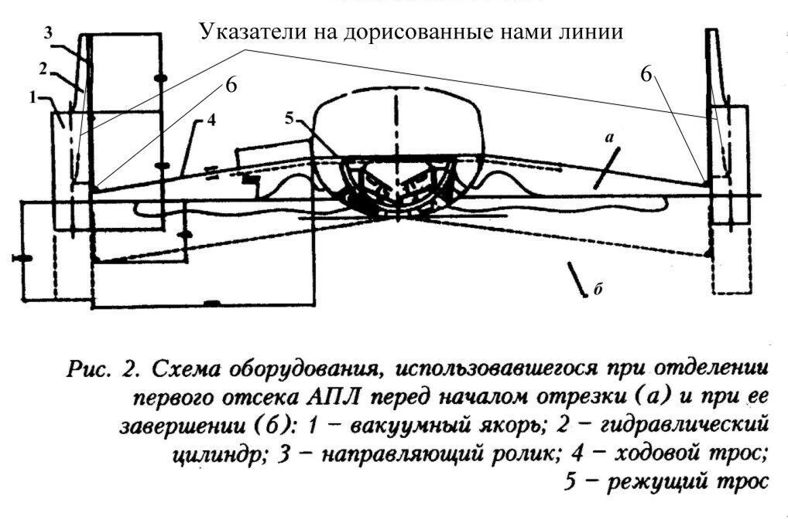

> **Первичный текст.** Российское общество и гибель АПЛ «Курск» 12 августа 2000 года.
> Источник: `Российское общество и гибель АПЛ «Курск» 12 августа 2000 года.doc` sha256 `5de29b0805981f84…`; [страница на dotu.ru](https://dotu.ru/2002/08/18/20020818-apl_kursk_red-2/).
> Автоматическая транскрипция DOC→Markdown; смысл и формулировки не правились.
> Контрольные суммы и статус проверки — в [NOTICE.md](../../NOTICE.md).
> Содержание передаёт позицию авторов; утверждения не верифицированы библиотекой.

---

# 8. Какая же версия истинна?

Конец июля 2002 года. Прошло почти два года после гибели АПЛ “Курск”. За это время произошло много событий, так или иначе связанных с этой трагедией. Осенью 2000 г. из затонувшей лодки были извлечены тела некоторых членов экипажа. Спустя год, осенью 2001 г., “Курск” был поднят и поставлен для осмотра в плавучий док в посёлке Росляково. При этом носовая оконечность (точнее: то, что от неё осталось) перед подъёмом была отделена от корпуса и оставлена на грунте. В марте 2002 года эксперты Госкомиссии, следователи и эксперты Генеральной прокуратуры РФ завершили обследование “Курска” в доке. После этого многострадальный корабль был передан на специализированное предприятие “Нерпа” для разделки на металлолом и утилизацию. В поднятой лодке при её осмотре в доке были найдены тела подводников. В честь экипажа “Курска” в Санкт-Петербурге создано мемориальное захоронение[^147], а рубку (ограждение выдвижных устройств) решено установить в качестве памятника в городе Курске. В мае — июне 2002 г. в районе гибели корабля была проведена ещё одна подводно-техническая операция, в ходе которой избирательно по заказу Госкомиссии и Генеральной прокуратуры РФ подняты определённые фрагменты носовой оконечности лодки. В конце августа 2002 г. предполагается провести ещё одну подводно-техническую операцию с целью разрушения взрывами крупных обломков корабля, оставшихся на грунте, дабы они не рвали рыболовные снасти при промысле в этом районе и не были помехой судоходству (прежде всего подводному)[^148].

А на протяжении всего этого времени Госкомиссия неоднократно обещала в самое ближайшее время назвать причины гибели корабля, оглашая при этом в качестве предположений сначала несколько версий, а потом всё более и более пропагандируя одну-единственную версию:

Утечка концентрированной перекиси водорода из торпеды стала причиной пожара и термического взрыва аварийной торпеды, которую не успели выстрелить, а её взрыв повлёк за собой детонацию других торпед. В результате взрыва торпедного боезапаса на борту лодка получила катастрофические повреждения и затонула со всем экипажем. Её гибель сопровождалась возникновением пожаров в отсеках, которые окончательно погасило море, проникая в корабль сквозь утратившие герметичность переборки и прочный корпус.

Но это — только слова, будь они написаны на бумаге, зафиксированы на компьютерных носителях информации или произнесены изустно. Сами по себе они ничуть не лучше и не хуже других слов, в том числе и тех, что были высказаны в главе 6:

Атомный подводный крейсер ВМФ России “Курск” был потоплен залпом боевых торпед, выпущенных с подводной лодки одной из стран НАТО, которая вела разведку в районе учений Северного флота. Залп боевыми торпедами мог быть как результатом ошибки в человеко-машинной системе управления иностранной субмарины, так и результатом исполнения её командиром прямого мафиозно-масонского приказа, полученного помимо приказаний государственного легитимного управления вооруженными силами страны — владельца подводной лодки, потопившей “Курск”.

Могут быть написаны и другие слова, например:

В гибели корабля и экипажа персонально никто не виноват. В районе учений имело место очень редкое природное явление — «флуктуации физических полей», не объяснимое наукой именно в силу его невоспроизводимости в лабораторных условиях и крайней редкости, что не позволило его досконально изучить. В результате «флуктуации», *торпеды, оказавшиеся в зоне её действия,* взорвались сами собой без каких-либо причин военно-технического характера или воздействия человеческого фактора.

Если ограничиться словами, — то на словах, в общем-то, всякое объяснение причин гибели корабля обладает некоторой долей реальной или фантастической возможности. Поэтому по-прежнему, как и в 2000 г., стоят вопросы: **Каким словам нельзя верить? А каким словам соответствуют факты жизни?** Но поскольку за это время была опубликована новая информация, то чтобы ответить на эти вопросы, её необходимо осмыслить. И потому обратимся к опубликованному за прошедшие два года.

\_\_\_\_\_\_\_\_\_\_\_\_

«В четверг 23 ноября 2000 г. агентство Reuters впервые показало, как выглядит носовая часть затонувшей в Баренцевом море подводной лодки «Курск».

Кадры, сделанные с научно-исследователького судна «Академик Мстислав Келдыш», были показаны в Голландии, на пресс-конференции, посвящённой проблеме подъёма «Курска». Это первая демонстрация: ранее носовую часть «Курска» не показывали, а все съёмки, произведённые с борта «Мстислава Келдыша», оставались под грифом «секретно».

Кадры Reuters свидетельствуют, что масштабы разрушений в носовой части «Курска» действительно были катастрофическими и подтверждают заявления российских военных по этому поводу».

Это цитата из интернета. Действительно тогда, — впервые в Голландии (по месту расположения штаб-квартиры одной из фирм, приглашённых к участию в судоподъёмных работах), а не в России, — были показаны публике кадры подводной видеосъёмки затонувшего “Курска”. После упомянутой в этой цитате пресс-конференции кое-какие кадры подводных съёмок затонувшего “Курска” были показаны и российским телезрителям. В связи с рассматриваемым нами вопросом полезно посмотреть и на то, что из этих подводных съёмок осело в интернете.

Действительно, на основании приведённых фотографий можно сказать, что в носовой оконечности “Курска” разрушения катастрофические.

Но если не знать, что на фотографиях представлены результаты подводных съёмок, произведённых по заказу бюро-проектанта “Рубин” (фирменный знак в правом нижнем углу кадров) с борта подводных аппаратов “Мир”, носителем которых является научно-исследовательское судно “Академик Мстислав Келдыш” (фирменный знак в левом нижнем углу кадров), — то создаётся впечатление, что кто-то отснял *ночью сквозь туман при свете фонаря* свалку металлолома.

Иными словами в 2000 г., были опубликованы только те фрагменты подводных съёмок, которые ничего не позволяют сказать об общей картине разрушений.

Не имея же представления об общей картине разрушений, *своеобразно характеризующих* именно затонувший “Курск”, невозможно сделать и обоснованные выводы о причинах, вызвавших повреждения корпуса, конструкций и механизмов корабля, под воздействием которых он погиб.

Подобные картины: *валяющиеся баллоны высокого давления, согнутые и разорванные тяги каких-то корабельных устройств, разбитое остекление в ограждении рубок подводных лодок и т.п.,* — можно было увидеть и зрелищно отснять хоть днём (в выходные), хоть ночью в двух автобусных остановках от станции метро “Автово” в Ленинграде на кладбище кораблей в Угольной гавани, когда там производилась примитивная (при помощи автогена, зубила и молотка и ненормативного лексикона) и потому неэффективная разделка на металл списанных подводных лодок и других кораблей и судов[^149].

Очень многие россияне посмотрели фильм “Титаник” Дж.Кэмерона. Подводные съёмки затонувшего “Титаника” в этом фильме производились с двух подводных аппаратов “Мир”, работу которых в ходе съёмок тоже обеспечивал “Мстислав Келдыш”. Воспоминание о подводных съёмках на “Титанике” в их сопоставлении с приведёнными кадрами разрушений “Курска” убеждают в том, что в действительности телепоказ представлял собой акцию по сокрытию информации о причинах происшедшего, осуществлённую *под видом предоставления информации о происшедшем*.

Почти год спустя после этого, 17 октября 2001 г., научно-исследовательское судно “Академик Мстислав Келдыш” вернулось в Калининград из очередной экспедиции. На сей раз целью экспедиции был осмотр и киносъёмка на дне германского линкора “Бисмарк”, потопленного в мае 1941 г. в Атлантике флотом Великобритании. Сообщение об этом и фрагменты этих съёмок прошли в одном из выпусков новостей по возвращении корабля из экспедиции. Они тоже говорят о том, что технические возможности позволяют снять и показать больше и лучше, чем это представлено на приведённых выше фотографиях фрагментов носовой оконечности “Курска” после происшедшей катастрофы.

Но это общие слова выражения неудовольствия, которые приводят к вопросу:

А что именно надо показать, чтобы это было характерно именно для катастрофы “Курска” и позволило бы судить о её причинах и характере не только экспертам, но и обществу?

Ответ на этот вопрос простой:

Необходимо показать **периметр, на котором уцелевшие в катастрофе корпусные конструкции переходят в искорёженный металл и опустошённое пространство**. Если взрыв внутренний, то по всему периметру все края уцелевших фрагментов конструкций будут загнуты наружу; если взрыв только наружный, то всё будет загнуто вовнутрь; если наружный взрыв повлёк за собой более мощный внутренний взрыв собственного боезапаса корабля, то следы наружного сохранятся на фоне разрушений, вызванных внутренним взрывом, как фрагменты каких-то конструкций, загнутые вовнутрь.

Так причины гибели линкора “Новороссийск”, о чём говорилось ранее, во многом характеризует именно периметр, на котором уцелевшие конструкции переходят в искорёженный металл и опустошённое пространство.

По виду выступающей над водой части *периметра зоны разрушений* любому человеку, имеющему представление о «сопромате» (как о механике деформации и разрушения упругого тела под воздействием статической или динамической нагрузки) и о механике жидких и газовых сред (т.е. практически любому инженеру-механику), ясно, что взрыв был наружный; и он произошёл если не на поверхности корпуса корабля, то в непосредственной близости от неё, поскольку не видно следов разрушений, произведённых обширным фронтом сформировавшейся ударной волны.

Но из всех представленных фотографий разрушений в носовой оконечности затонувшего “Курска”, только одна (вторая в первом ряду) показывает фрагмент периметра зоны разрушений: район, где прочный корпус и вводы в него каких-то кабелей видны вследствие того, что сорван лёгкий корпус (уцелевшие фрагменты лёгкого корпуса видны как узкая полоска вдоль левого края фотографии).

То есть **весь периметр — граница перехода «уцелевшее — разрушенное и снесённое» — тайна от общества** при всей показной гласности расследования причин и характера развития катастрофы и чуть ли не насильственном предоставлении журналистам информации руководителем Госкомиссии И.Клебановым и руководителем бюро-проектант “Рубин” И.Спасским. И соответственно этому те фрагменты подводных видеосъёмок носовой оконечности АПЛ “Курск”, на которых был запечатлён периметр зоны разрушений, целенаправленно утаиваются на протяжении двух лет без малого, в то время как И.Клебанов и И.Спасский произносят всякие слова о ходе расследования и высказывают разного рода предположения о военно-технической первопричине и динамке развития катастрофы.

То же касается и обломков пресловутого торпедного аппарата, в котором находилась и взорвалась якобы роковая торпеда “Курска”: его ни в натуре, ни на фотографиях не видел никто, кроме экспертов и других людей, причастных непосредственно к работам с ним связанным. Похоже, что демонстрация обломков аппарата отложена на завершение расследования, поскольку, по-видимому, именно им предназначена роль неоспоримого козыря в убеждении общественности в истинности слов Госкомиссии: в аппарате взорвалась торпеда, что и повлекло гибель лодки.

Однако это — плохой “козырь”. Ясно, что если на борту “Курска” взорвались торпеды и при этом какие-то торпеды взорвались в торпедных аппаратах, то некоторые торпедные аппараты будут искорёжены соответствующим образом: т.е. внешний вид их обломков будет соответствовать этой версии катастрофы, избранной Госкомиссией — *по каким-то политическим мотивам —* для научно-технического обоснования *в общественном мнении* истинности именно её.

**Но чтобы согласиться с тем, что именно взрыв одной из торпед в аппарате послужил *технической первопричиной* гибели корабля, сначала всё же следует посмотреть на периметр зоны разрушений в том виде, в каком он был на дне Баренцева моря до начала работ по отделению обломков носовой оконечности от остального корпуса “Курска”.** Пока же периметр области разрушений утаивается, то все разговоры про взрыв аварийной торпеды в аппарате, повлекший множественные взрывы торпед в первом отсеке, — ничего не говорят о том, что произошло на самом деле, а представляют собой ни к чему, — кроме неверия Госкомиссии всякого умного человека, — не обязывающий безответственный *трёп членов этой Госкомиссии*[^150].

Из желания не показывать периметр области разрушений проистекало и предложение не поднимать “Курск”, а объявить место его гибели официально «воинским захоронением». Но когда корабль всё же был поднят, то высшие чины ВМФ заявили, что к “Курску” в доке (кроме персонала самого плавучего дока) будут допущены только эксперты Госкомиссии, следователи и эксперты Прокуратуры: дескать, показывать разрушения прочим гражданам России — неэтично по отношению к погибшим морякам и их памяти. Но на самом деле это было ни что иное, как стремление исключить саму возможность общественно-инициативного расследования, лишив общество достоверной информации о техническом состоянии корабля после катастрофы.

Соответственно такой ориентации на сокрытие причин гибели корабля, после всплытия дока с лодкой в Росляково было показано по телевидению и первое изображение повреждений “Курска”. Телезрителям показали следующий сюжет.

Высокие должностные чины обращены спинами к камере и лицами к лодке: слева — тогдашний командующий Северным флотом В.А.Попов; справа — Генеральный прокурор России В.Устинов. Стоя на стапель-палубе[^151] плавучего дока и глядя вверх на вмятину в борту с дыркой, которая чернеет в углу кадра, они обсуждают повреждение. Смысл их беседы (не дословно) свёлся к следующему:

*— А при транспортировке не могли повредить? (В.Устинов)*

*— Нет, не могли… (В.А.Попов)*

Потом выяснилось, что это было очередным шоу с целью заболтать ход расследования. Спустя некоторое время, когда внимание прессы сосредоточилось на обсуждении версий происхождения дырки, И.Клебанов поведал, что отверстие прорезали водолазы ещё в 2000 г., когда производилось первое инженерное обследование “Курска” на грунте по завершении спасательной операции: дескать, Госкомиссия заинтересовалась вмятиной и захотела получить образец металла из этой области. Это объяснение И.Клебанова для многих звучит как свидетельство о проверке версии столкновения. Но к проверке версии столкновения это не имеет ни малейшего отношения.

Дело в том, что лёгкий корпус “Курска” покрыт так называемой «резиной» — специальным покрытием толщиной несколько сантиметров, назначение которого не пропускать в море собственные шумы изнутри лодки и поглощать и рассеивать посылки гидролокаторов, ведущих поиск подводных лодок. Пластины этого покрытия при больших скоростях хода иногда отрываются сами, и потому поддержание его целостности — предмет особой заботы командиров при швартовке, взаимодействии лодки с буксирами и в повседневной эксплуатации. Но, как показывает фотография, «резина» в области вмятины цела, чего не могло быть после столкновения.

И всё-таки что-то на поверхности корпуса затонувшего “Курска” вызвало интерес Госкомиссии, вследствие чего кусок «резины» *— именно из этого места —* был вырезан вместе с металлическими конструкциями лёгкого корпуса, к которому он был приклеен. Далее мы ещё вернёмся к вопросам о том, что могло вызвать такой интерес Госкомиссии, и почему с её стороны последовал приказ извлечь это «нечто» с затонувшей лодки немедленно, не дожидаясь её подъёма в следующем году. С этим же связан и ответ на вопрос, почему для первого показа были выбраны именно эти кадры с обсуждением происхождения вмятины и дырки в её области.

То, что осталось за кадром в первом показе, через некоторое время в последующих репортажах из Росляково всё же предстало перед телезрителями.

На этих фотографиях видно, что вмятина непосредственно граничит с районом, где отсутствует лёгкий корпус и где может быть видно уцелевшее содержимое междукорпусного пространства. **То есть в первом показе, где эта область осталась за кадром, было выражено обсуждавшееся ранее стремление скрыть от общественности внешний вид периметра области разрушений.** Оно же выразилось и на правом кадре. В нём якобы отсутствующая на РТР цензура поместила надпись «Росляково. Мурманская область» не куда-нибудь на свободное место в области кадра, а именно на один из фрагментов попавшей в поле зрения камеры части периметра области разрушений. Эти фотографии также свидетельствуют, что собственно вмятина в лёгком корпусе не представляет собой ничего особо интересного в инженерно-следственном отношении, чтобы именно из неё брать образец металла.

В результате этого показа, В.Устинов и В.Попов, ранее обсуждавшие вопрос о происхождении то ли вмятины, то ли дырки в области вмятины, потеряли лицо.

Это нежелание показывать периметр области разрушений выразилось и на следующей фотографии.

На ней изображение оборвано справа границей кадра, проходящей по вмятине в правом борту и отверстию в её области. Что находится далее по направлению в нос, — пока ещё тайна от общества и известно только тем, кто непосредственно причастен к работам Госкомиссии и Прокуратуры по расследованию катастрофы.

Теперь обратимся к серии фотографий, сделанных на стапель-палубе плавучего дока в посёлке Росляково после 25 октября 2001 г., показывающих виды района отделения носовой оконечности АПЛ “Курск” от корпуса корабля. На второй фотографии этой серии В.Устинов своей фигурой закрывает район вмятины в правом борту, хорошо видимый на обсуждавшемся ранее снимке, а по направлению в нос всё то, что волею цензуры осталось на приведённых нами ранее фотографиях за кадром, хорошо видно на фото 2 рядом с капюшоном В.Устинова над его левым плечом.

Фото 1

Фото 2

Фото 3

Фото 4

Серия этих фотографий интересна тем, что, **во-первых**, все они сняты с разных точек стапель-палубы и, **во-вторых**, в поле зрения камеры оказались одни и те же объекты. Вследствие этого одни и те же фрагменты корпуса и его повреждения видны с разных ракурсов, а вся совокупность фотографий даёт объёмное (трёхмерное) представление о *характере каждого из них (объёмное тело или лист металла)* и об их ориентации в пространстве и положении относительно друг друга.

То, что представляет интерес в связи с рассматриваемой проблематикой, на фотографиях обведено нами контрастными по отношению к фону контурами и указано стрелками.

На первой фотографии нами отмечено два объекта.

Объект № 1 — вертикальная щель в левом борту (“Курск” сфотографирован со стороны отсутствующей носовой оконечности). Щель видна как чёрная полоса, контрастирующая с белым снегом, припорошившим лёгкий корпус в верхней его части. Этот щелевидный разрыв представляет собой видимый снаружи след первой попытки отделить разрушенную взрывами носовую оконечность от более или менее уцелевших конструкций корпуса корабля. Как сообщалось в ходе работ, попытка отделить разрушенную носовую оконечность завершилась заклиниванием цепной пилы в обломках корабля.

**Вставка 2003 года**

После публикации в 2002 г. настоящей работы в интернете, вышла в свет книга “Запас плавучести” (Петрозаводск, 2003 г., 372 страницы)[^152], автор которой — контр-адмирал в отставке Н.Г.Мормуль, в прошлом начальник Технического управления Северного флота. Ниже мы воспроизводим рис. 2 из его книги, на котором показана схема расположения оборудования при попытке отделения обломков носовой оконечности АПЛ “Курск” на грунте перед началом подъёма лодки.

Схема даёт общее представление о произведённой попытке. Поскольку её типографское качество оставляло желать лучшего, мы провели на ней две линии, обозначающие проводку ходового троса через конструкции вакуумных якорей и гидропрессов, поскольку в противном случае сноска № 3, указывающая в оригинале на «направляющий ролик», оказывается неуместной. Кроме того, мы добавили сноску № 6, указывающую ещё на два направляющих ролика ходового троса. Правый и левый гидропрессы, работая в противофазе, обеспечивали натяжение и возвратно-поступательное горизонтальное движение правого и левого ходовых тросов вместе с режущим инструментом (втулки с напылением абразива карбида вольфрама, надетые на трос, концы которого соединены с концами ходовых тросов). А вакуумные якоря (за счёт возникновения силы гидравлического присоса, аналогично тому, как вантус присасывается к раковине) позволяли прессам создавать вертикально направленную вниз силу, прижимавшую режущие элементы к обломкам “Курска” и продвигать эту «пилу» вниз по мере перерезания конструкций корпуса.

Чтобы не возвращаться к вопросу о подъёме “Курска” в дальнейшем, мы воспроизводим и рис. 3 из книги “Запас плавучести”. На нём показана схема отрыва “Курска” от грунта системой тросов, выбираемых гидравлическими домкратами, установленными на подъёмно-транспортной барже “Giant-4” (положение, отмеченное на схеме как «а») и транспортировки лодки на подвеске под днищем этой баржи (положение, отмеченное на схеме как «б»). В корпусе баржи была сделана специальная ниша, в которую вошло ограждение рубки “Курска”, что позволило уменьшить осадку системы до величины, позволившей ввести в док связку «баржа-лодка».

Далее продолжение текста 2002 года.

\* \*\

\*

И поскольку со щелевым разрывом лёгкого корпуса в левом борту связаны другие видимые на фотографиях особенности уцелевших конструкций, о чём речь пойдёт далее, то совсем не похоже на то, что щелевидный разрыв в левом борту — *результат сдвиговых деформаций и разрыва обшивки, а также и разрушения конструкций набора лёгкого корпуса во время удара о грунт*[^153] тонущей лодки с разрушенной взрывами носовой оконечностью.

Объект, обозначенный как № 2 на фото 1, отмечен и на трёх других фотографиях (на фото 4 в правом нижнем углу снимка от него виден маленький кусочек, на который указывает стрелка).

Об этом объекте можно сказать следующее:

- Если соотноситься с поперечным сечением корабля, то объект № 2 расположен в районе, где находятся шпангоуты прочного корпуса. Один из шпангоутов прочного корпуса виден за ним на всех фотографиях (это кольцо Г‑ либо Т-образного поперечного сечения, охватывающее прочный корпус).

- Судя по фотографиям, в поперечном сечении этот объект тоже представляет собой Г- либо Т-образный профиль (обращённая к камере горизонтальная полка профиля хорошо видна на всех снимках), что тоже соответствует предположению о том, что он — один из шпангоутов прочного корпуса.

- Вертикальная ножка этого Г- или Т-образного профиля, как видно из совокупности разных ракурсов снимков (и особенно на фото 1 и фото 2), лежит в плоскости, перпендикулярной продольной оси лодки, т.е. в плоскости одного из шпангоутных сечений.

- Этот <u>предположительно шпангоут</u> утратил целостность — шпангоутное кольцо разорвано, и другие его части на фотографиях не видны.

- В той его части, что видна на фотографиях, отсутствует примыкание профиля этого <u>предположительно шпангоута</u> к поверхности прочного корпуса.

- В месте его расположения прочный корпус снесён на протяжении одной — двух шпаций[^154], хотя обломок шпангоута сохранился на своём месте.

- Изгиб этого <u>предположительно шпангоута</u> не совпадает с кривизной поверхности прочного корпуса в этом районе (фото 3) — обломок шпангоута загнут по направлению вовнутрь прочного корпуса[^155].

Всё запечатлённое на приведённых выше фотографиях даёт основания полагать, что к моменту начала отделения на грунте носовой оконечности повреждения правого и левого бортов были разными по своей тяжести, а их локализация в этом в этом районе носила достаточно ярко выраженный несимметричный относительно диаметральной плоскости (т.е. относительно продольной вертикальной плоскости симметрии корабля при отсутствии у него крена) характер:

- по левому борту по направлению в нос от вертикального щелевидного разреза конструкций лёгкого корпуса перед первым ракетным контейнером левого борта (объект № 1, о котором шла речь при обсуждении фото 1 рассматриваемой серии) сохранились конструкции набора и обшивка лёгкого корпуса на протяжении примерно 4 метров;

- по правому борту первый ракетный контейнер обнажён, и отсутствует вся обшивка лёгкого корпуса в верхней его части вместе с несущими её конструкциями набора по направлению в корму почти что до переборки, разделяющей в междукорпусном пространстве балластные цистерны в районе, где расположен второй ракетный контейнер.

Но это — тоже слова. Однако на основании этих фотографий можно соотнести разрушения, видимые в районе фактического отделения носовой оконечности, с продольным разрезом АПЛ “Курск”, представленным на рис. 5 в главе 6.

Поскольку о характере разрушений носовой оконечности далее в нос от контура её фактического отрыва у нас информации нет[^156], то с учётом этого обстоятельства получилась картина, характеризующая только ту часть корпуса “Курска”, что была поставлена в док. На построенной таким путём ниже приводимой схеме цифрой «1» обозначена плоскость поперечного сечения, по которому в соответствии с проектом подъёма корабля, судя по оставшимся следам, предполагалось отделить обломки носовой оконечности от корпуса.

Положение плоскости «1» относительно элементов конструкции лодки определено на схеме достаточно точно:

- **во-первых,** по расположению вертикального щелевидного разрыва лёгкого корпуса в левом борту (отмечен на фото 1 как объект № 1) относительно первой (при отсчёте с носа) пары ракетных контейнеров (на продольном разрезе их проекции на диаметральную плоскость показаны наклонными пунктирными прямоугольниками с закруглёнными торцами-крышками) и,

- **во-вторых,** по положению поперечного разреза (его контур, видимый с правого борта, обозначен выноской с цифрой 2 на фрагменте фото 2, помещённом ниже), обнажившего носовую переборку трюма (либо прочной цистерны в междукорпусном пространстве), расположенного под *первой платформой* *(самой нижней палубой)* в первом отсеке (переборка, явно прочная, подкреплённая набором, обозначена на фотографии выноской с цифрой 1). Платформа и переборка трюма (либо прочной цистерны) указаны на схеме отделения обломков носовой оконечности.

Вертикальный щелевидный разрыв в лёгком корпусе на левом борту и поперечный разрез, не доходящий до днищевых конструкций и киля, видимый с правого борта на фото 2 (с В.Устиновым — его левое плечо и край капюшона видны на фотографии слева), являются свидетельством того, что попытка отделить носовую оконечность по плоскости «1» с помощью цепной пилы (раскреплённой на двух вакуумных якорях, расположенных по обоим бортам затонувшего “Курска”) завершилась неудачей.

Эта “неудача” не позволила *оставить на дне вместе с обломками носовой оконечности* **периметр зоны разрушений** и тем самым *полностью скрыть* его от взоров “непосвящённых” в таинства “расследования”*.*[^157]

На этой же фотографии выноской с цифрой 3 помечен фрагмент периметра сохранившихся конструкций лёгкого корпуса по правому борту. Как видно на этой фотографии, а также и на четвёртой фотографии (где крупным планом показан ракетный контейнер), отсутствующие фрагменты конструкций лёгкого корпуса, которые должны закрывать ракетный контейнер, отделены по линиям, совпадающим с направлением элементов набора лёгкого корпуса. Иначе говоря, вертикальный фрагмент периметра в этом районе совпадает с направлением шпангоутов, а горизонтальный — с направлением стрингеров[^158] и представляет собой край подъёмного щита, закрывающего первую пару ракетных контейнеров правого борта (на рис. 4 они указаны под названием «люки пусковых установок ракетного комплекса “Гранит”», а на фото 1 все аналогичные щиты на левом борту подняты в вертикальное положение для обеспечения выгрузки ракет из контейнеров). Кромки периметра в этом районе — ровные: без загибов и рваных краёв.

Это обстоятельство указывает на то, что конструкции лёгкого корпуса (а возможно и некоторые конструкции прочного корпуса) в этом районе вырезаны *вместе с соответствующим фрагментом периметра области разрушений*. При этом шпангоут, вдоль которого произведено отделение фрагментов лёгкого корпуса, хорошо виден на фото 4 (здесь же из-за табло с надписью NTVRU.com проглядывает один из отслоившихся листов «резины» противоакустического покрытия, что даёт представление о его толщине). Надо полагать, что это изъятие неких значимых фрагментов периметра области разрушений было произведено водолазами (также как и вырез в области вмятины на правом борту) ещё до подъёма “Курска” и постановки его в док.

Выноской с цифрой 4 на этом же фото отмечена носовая поперечная кромка фрагмента прочного корпуса, уцелевшего после внутреннего взрыва, происшедшего в первом отсеке. Это нижняя часть одной из его обечаек[^159]. Ровный характер кромки — результат того, что внутренний взрыв разорвал в этом районе прочный корпус по сварочному шву. Конструкции лёгкого корпуса по правому борту, которые расположены в корму от плоскости этого поперечного сечения, отсутствуют (скорее всего, они утрачены вследствие взрыва), хотя по левому борту аналогичные конструкции лёгкого корпуса сохранились.

Теперь вернёмся к схеме носовой оконечности. На ней жирным контуром неправильной формы с выносками, обозначенными «ПБ» и «ЛБ», показаны *приблизительно*[^160] фактические *границы* *по лёгкому корпусу*[^161], по которым произошёл отрыв обломков носовой оконечности корабля по правому (ПБ) и левому (ЛБ) бортам, соответственно. Жирным пунктиром показаны границы вмятины в правом борту. Цифрой «2» обозначена возможная плоскость отделения обломков носовой оконечности, альтернативная выполненному проекту подъёма.

Все эти частные факты в совокупности и в соотнесении их друг с другом приводят к ряду вопросов.

- Почему было принято решение отделить носовую оконечность по плоскости «1», где надо перерезать корпус подводной лодки по всей его высоте, включая и необходимость разреза по всему его периметру прочного корпуса, выполненного из стали с очень высокими механическими характеристиками, в том числе и с высоким сопротивлением резанию?

- Почему *было нежелательно* отделить обломки носовой оконечности по плоскости «2» либо близкой к ней в районе, где после взрывов торпедного боезапаса корабля уцелели только прилегающие к днищу конструкции лёгкого и, возможно, прочного корпусов, вследствие чего объём работ при отделении обломков носовой оконечности в районе плоскости «2» мог быть явно меньше, чем при их отделении по плоскости «1»?

- Только ли опасались взрыва уцелевших в катастрофе торпед при механической резке или их детонации при использовании технологии отделения обломков носовой оконечности методом подрыва специально уложенных шнуровых зарядов, вследствие чего и было принято решение отделять по плоскости «1», а не по плоскости «2»?

- Что могло существенно ослабить прочность конструкций как лёгкого, так и прочного корпуса по правому борту настолько, что асимметрия состояния обоих бортов в доке столь явно выражена на протяжении более 10 м по длине корабля?

- Что из фрагментов конструкций правого борта потребовалось изъять, в результате чего образовались дырка в области вмятины и ровные края периметра сохранившихся конструкций лёгкого корпуса в районе первого ракетного контейнера правого борта?

- Почему это изъятие необходимо было сделать срочно, и недопустимо было отложить его до подъёма лодки и постановки её док в следующем году?

Ответы на эти и другие вопросы даёт предположение:

Внешний взрыв торпеды по правому борту разрушил и повредил лёгкий корпус в радиусе примерно десяти метров от эпицентра и в районе эпицентра снёс фрагменты прочного корпуса с примыкающими к ним элементами набора, образовав пробоину в прочном корпусе[^162].

Этот взрыв разорвал шпангоут прочного корпуса (на который мы обратили внимание), оторвал его от обшивки прочного корпуса и обломок его загнул по направлению вовнутрь прочного корпуса[^163]. Но уцелевшие фрагменты корпусных конструкций в этом районе сохранили на себе следы воздействия внешнего взрыва торпеды, которые не смог уничтожить внутренний взрыв сдетонировавшего торпедного боезапаса корабля.

При этом направленность распространения разрушений конструкций корпуса вторичным внутренним взрывом, происшедшим в первом отсеке, была обусловлена разрушением и ослаблением конструкций прочного и лёгкого корпусов по правому борту, произведённых первым наружным взрывом. Вследствие этого и возникла ярко выраженная асимметрия сохранившихся конструкций корпуса АПЛ по правому и левому борту на протяжении более 10 метров по длине.

Кроме того, как видно по внешнему виду, представленному на рис. 4 в главе 6, если взрыв торпеды произошёл в выявленном нами районе аномальных для внутреннего взрыва разрушений, то в зоне его поражения оказывается носовой горизонтальный руль (НГР) правого борта со всеми устройствами и корпусными конструкциями, обеспечивающими его работу.

В состав этого узла входят собственно руль — крыло, закреплённое на баллере (оси вращения); механизм поворота баллера, обеспечивающий перекладку руля; механизм уборки руля внутрь лёгкого корпуса и выдвижения его в рабочее положение; ниша внутри лёгкого корпуса, в которой смонтировано это и другое оборудование; щит-обтекатель со своими механизмами, закрывающий нишу и совпадающий с обводами лёгкого корпуса, когда руль убран и когда он выдвинут в рабочее положение; силовые конструкции, связывающие нишу руля с корпусом подводной лодки, воспринимающие силы и моменты, возникающие на руле и передающие их на корпус подводной лодки.

То есть это довольно большой по габаритам и массивный конструктивный узел, содержащий в себе довольно прочные конструктивные элементы (в частности, баллер руля соответственно массогабаритным характеристикам АПЛ Пр. 949А должен представлять собой кованный вал длиной в несколько метров и диаметром около полуметра). Такой конструктивный узел и его конструктивные элементы не могут незаметно затеряться среди других обломков ни на морском дне, ни на территории ЦКБ МТ “Рубин”.

Однако о состоянии этого конструктивного узла корабля и входящих в его состав элементов средства массовой информации ничего не сообщали, как не сообщили об этом и представители Госкомиссии и следствия. По всей видимости, он разрушен в катастрофе. О судьбе его обломков можно сказать одно из двух: либо они изъяты для экспертизы Прокуратурой или Госкомиссией ещё до подъёма лодки; либо они умышленно оставлены на дне, чтобы исключить возможность изучения характера их повреждений.

Во всяком случае, на фотографиях, сделанных на стапель-палубе дока в Росляково, среди обломков носовой оконечности только по левому борту видна усиленная конструкция, облицованная «резиной» противоакустического покрытия, которая может быть идентифицирована как узел ниши носового горизонтального руля левого борта. На приводимой фотографии этот узел обведён контуром. Судя по состоянию этого узла в момент начала катастрофы носовые горизонтальные рули были убраны.

На следующей фотографии этот же узел ниши носового горизонтального руля левого борта вместе с сохранившимися на их местах обломками связанных с ним устройств показан более крупно, но в другом ракурсе. На фотографии он обведён контрастным контуром.

Среди сохранившихся конструкций по правому борту ничего похожего нет. Но характер повреждений аналогичного конструктивного узла по правому борту в случае *только внутреннего взрыва, происшедшего* *в первом отсеке,* должен отличаться от характера повреждений, произведённых наружным взрывом противолодочного оружия.

Поэтому **состояние комплекса устройств и конструкций правого носового горизонтального руля правого борта после катастрофы — как и внешний вид периметра зоны разрушений — тоже один из *утаиваемых* Госкомиссией и Генпрокуратурой показателей военно-технической первопричины катастрофы.**

Соответственно, плоскость «1» была избрана для отделения носовой оконечности не только потому, что при отделении по ней обломков носовой оконечности гарантии безопасности от возможного взрыва уцелевших торпед были выше, нежели в случае отделения обломков по плоскости «2», но и потому, что её сечение проходит через торпедную пробоину.

И кроме того, в её сечении нет прочных конструктивных элементов корабля (таких как носовые горизонтальные рули со всеми их механизмами и силовыми конструкциями) и ракетных контейнеров (это видно на схеме внешнего вида рис. 4 и продольном разрезе рис. 5), которые бы могли помешать работе цепной пилы.

Соответственно этим обстоятельствам в чисто инженерном плане избрание плоскости «1» действительно упрощало работы по отделению обломков, но оно же — одно из многих действий по сокрытию от общества истинных причин гибели корабля, которые должны были стать известными ещё по результатам первого подводного осмотра с борта подводных аппаратов спасательного судна “Михаил Рудницкий” в августе 2000 г.

И потому ещё раз обратимся к экземпляру фото 1 из рассмотренной ранее серии, но обратим внимание на другие запечатлённые на этом снимке особенности. Действительно на правом борту периметр уцелевших конструкций прочного корпуса корабля имеет проём, в который естественным образом вписывается контур возможной торпедной пробоины. Но при отделении обломков носовой оконечности по плоскости «1» пробоина как бы исчезла по принципу **«бублик сломали — дырки не стало»**, и нам её пришлось искать.

Осуществлению принципа «переломленного бублика» способствовало и удаление на правом борту конструкций лёгкого корпуса вместе с соответствующими фрагментами периметра области разрушений в том виде, в каком они остались после всех взрывов. Однако поскольку попытка отделить обломки носовой оконечности по плоскости «1» завершилась “неудачей”, то остался странный проём в контуре периметра поднятой части корпуса. На приведённой ниже фотографии в этот проём мы вписали контур, предположительных границ торпедной пробоины. На фото 2, показывающем правый борт лодки, этот проём теряется на фоне уцелевших конструкций благодаря иному ракурсу съёмки.

В связи с этим *предположением о локализации следов наружного взрыва торпеды* следует отметить, что, когда внутри прочного корпуса были установлены леса, с которых Генпрокурор В.Устинов давал пояснения о катастрофе в короткометражном фильме, показанном по телевидению 27 ноября 2001 г., то съёмка велась так, что он своей фигурой закрывал вид изнутри прочного корпуса именно на этот район, в который мы вписали контур предположительного расположения торпедной пробоины.

Эта торпедная пробоина, *“исчезнувшая” на фоне катастрофических разрушений корпуса, происшедших в результате детонации торпедного боезапаса корабля и попытки отделить по принципу «перелома бублика» носовую оконечность по плоскости «1»,* разрушила и ослабила повреждениями <u>конструкции лёгкого и прочного корпусов на правом борту</u> настолько, что те из них, *что уцелели после детонации торпедного боезапаса корабля и не были срезаны водолазами ещё до подъёма лодки,* в процессе подъёма корабля отломились под тяжестью собственного веса и упали на дно моря.

**Вставка 2003 года**

Ниже мы воспроизводим фотографии из уже упоминавшейся книги Н.Г.Мормуля “Запас плавучести”. Из них можно понять, почему в 2000 — 2002 гг. нам не удалось найти ни одной фотографии, на которой можно было бы увидеть всё, что находится ниже показанного в границах кадра фото 4.

**Фото 5**

**Фото 6**

- левая проходит вдоль конструктивной линии (лекальной кривой) примыкания обечайки прочного корпуса к шпангоуту прочного корпуса (слева от линии примыкания):

- правая проходит вдоль края обломка обечайки прочного корпуса (выше и справа от него).

Соотнесение обеих линий (линии примыкания обечайки к шпангоуту и края обломка обечайки) друг с другом показывает, что обечайка прочного корпуса (её сохранившиеся фрагменты) на всём её протяжении по направлению в нос от рассматриваемого нами шпангоута в районе, вызвавшем наш интерес, деформирована — продавлена по направлению вовнутрь корпуса на большой площади.

Однако на фото 5 запечатлены следы не только наружного, но и *следы внутреннего взрыва: на нём в сделанном нами контрастном по отношению к фону контуре, хорошо видно, что обломок того же шпангоута прочного корпуса (но на левом борту) вместо того, чтобы быть элементом кругового кольца, деформирован — отогнут от идеальной линии кольца по направлению наружу.* То есть это показатель того, что изгиб по направлению вовнутрь того же самого шпангоута на правом борту — действительно возник в результате наружного взрыва, а не в результате гидравлического удара в процессе схлопывания парогазового пузыря после внутреннего взрыва, поскольку по отношению к эпицентру внутреннего взрыва обе ветви шпангоута (на правом и левом бортах) расположены одинаково и конструктивно обладают одинаковыми прочностными характеристиками. Однако мощность внутреннего взрыва оказалась недостаточной для того, чтобы полностью уничтожить все следы предшествовавшего ему внешнего взрыва.

Фото 7

Фото 8

Хотя резкость и разрешение (различимость мелких деталей) на фото 8 оставляют желать лучшего, тем не менее, при его рассмотрении можно увидеть, что уцелевший фрагмент полотнища переборки между ЦГБ, отмеченный нами по вертикали обоюдосторонне направленной стрелкой (🡨🡪), вышел из плоскости шпангоута (поперечной вертикальной плоскости) и отогнут по направлению в корму. При этом имеет место отрыв фрагмента полотнища переборки в верхней его части от шпангоута прочного корпуса.

Такой характер деформаций переборки и факт отрыва её полотнища от шпангоута тоже соответствует внешнему взрыву, эпицентр которого расположен по правому борту по направлению в нос от рассматриваемого разорванного шпангоута (объект 2 на фото 1). Отгиб уцелевшего фрагмента полотнища переборки в верхней его части по направлению в корму и отрыв полотнища переборки от шпангоута также видны на фото 5 и 6, но в другом ракурсе — менее показательном для анализа.

Таким образом и фотографии, опубликованные Н.Г.Мормулем в книге “Запас плавучести”, свидетельствуют о состоятельности именно версии о наружном взрыве по правому борту в районе размещения носовых горизонтальных рулей, т.е. о потоплении “Курска” торпедным залпом иностранной подводной лодки.

Но вопреки публикуемым им же фотографиям сам Н.Г.Мормуль в своей книге поддерживает на словах официальную версию, согласно которой первопричиной гибели “Курска” послужила неисправность одной из его торпед, в результате чего произошёл взрыв внутри прочного корпуса.

Далее продолжение текста 2002 года.

\* \*\

\*

Это же предположение о поражении лодки торпедой объясняет и происхождение вмятины в правом борту лёгкого корпуса. Она представляет собой *периферию (окраинную область)* зоны разрушений, нанесённых внешним взрывом торпеды, поразившей “Курск”, и возникла в результате прохождения вдоль корпуса ударной волны этого взрыва. Её образованию могло способствовать и то обстоятельство, что в цистернах главного балласта (ЦГБ) могли быть остаточные пузыри воздуха, не стравившегося при заполнении цистерн водой в ходе погружения лодки. Тем более в ЦГБ просто не могло не быть «воздушных подушек», если балластные цистерны были уже продуты или продувались при всплытии лодки в перископное положение в момент её поражения торпедой. При наличии в ЦГБ воздуха, во время прохождения ударной волны воздух сжался, а оболочка ЦГБ продавилась вовнутрь.

В этой связи мы рассмотрим фрагмент приводившейся ранее фотографии “Курска” в доке, на которой корабль снят с правого борта в такое время, что все мелкие неровности поверхности корпуса при освещении солнцем отбрасывают резкие тени. Как видно на этой фотографии, в области вмятины на правом борту (её область мы обвели контуром) обшивка лёгкого корпуса продавлена в пространство между элементами поперечного набора, которые тоже продавлены по направлению вовнутрь относительно линий теоретического чертежа, задающего идеальную форму поверхности корпуса.

Такие локализация и внешний вид повреждений корпуса корабля соответствуют именно деформациям набора (более прочного) и обшивки (менее прочной) под воздействием сформировавшегося фронта ударной волны внешнего взрыва. Ниже для сопоставления приведена сделанная в сухом доке фотография германской подводной лодки времён второй мировой войны, повреждённой взрывом глубинной бомбы.

Видимый на ней характер повреждений конструкций лёгкого корпуса (обшивки и набора), сохранившихся вокруг пробоины, аналогичен запечатлённому на рассматриваемом фрагменте фотографии правого борта “Курска”.

Однако при этом необходимо иметь в виду, что длина германской лодки приблизительно вдвое меньше длины “Курска”, а полное подводное водоизмещение меньше его водоизмещения более чем в 25 раз. Вследствие такой разницы размеров на поверхности борта германской лодки область вмятины просто не смогла разместиться целиком (особенно по высоте). Размеры же “Курска” позволили аналогичной вмятине разместиться полностью на поверхности его борта на фоне не повреждённых районов; кроме того, на фотографии германской лодки запечатлена вся зона повреждения, а не один из её периферийных фрагментов как на фотографии правого борта “Курска”.

У правого края фотографии вмятины в правом борту “Курска” как чёрное пятно видна дырка, вырезанная водолазами в её области. Изъятие образца наружной поверхности корпуса именно из этого места, до начала судоподъёмной операции, возможно, обусловлено тем, что именно здесь были обнаружены застрявшие в «резине» осколки взорвавшейся чужой торпеды.

Но и это не всё. 15 и 16 ноября 2000 г. средства массовой информации неожиданно сообщили, что норвежские сейсмологи зарегистрировали в районе гибели “Курска” около 40 подводных взрывов. Командование ВМФ России прореагировало на сообщение норвежских сейсмологов заявлением, что в этом районе было произведено контрольное профилактическое бомбометание. При этом норвежские сейсмологи утверждали, что по их оценкам мощность каждого взрыва составила приблизительно 200 кг в тротиловом эквиваленте, а ВМФ России, опровергая эту оценку, утверждал, что при контрольном «профилактическом бомбометании» были применены гранаты РГ‑60, предназначенные для противодиверсионной обороны кораблей, стоящих на рейде. Вне зависимости от того, кто прав в своих заявлениях о мощности взрывов, такие действия ВМФ России вполне соответствуют пресечению несанкционированных подводных работ на месте гибели корабля, осуществляемых нелегально кем-то из иностранцев. Похоже, что интерес к *“Курску”, лежащему на дне,* проявляли и иностранцы, которые предприняли попытку изъять доказательства своей причастности к его гибели.

И в полном соответствии с предположением о внешнем взрыве торпеды по правому борту “Курска” вмятин на лёгком корпусе по левому борту нет[^164].

Их на левом борту нет потому, что прочный корпус при прохождении ударной волны взрыва, происшедшего по правому борту, сыграл роль защитного экрана, отразившего ударную волну в других направлениях. Такой эффект экранирования прочным корпусом *только одного* из бортов при прохождении вдоль корпуса **по обоим** бортам ударной волны внутреннего взрыва в первом отсеке — исключён.

Это ещё один довод в пользу того, что нежелание показывать “Курск” в доке кому бы то ни было, кроме членов Госкомиссии и привлекаемых ею экспертов и персонала дока, тоже проистекает из потребности неких политических сил скрыть от общества следы, оставленные на поднятой части корпуса истинной военно-технической первопричиной гибели лодки — наружным взрывом торпеды, который повлёк детонацию и взрыв собственного торпедного боезапаса корабля.

Что касается высказанного в главе 6 предположения, что наружных взрывов торпед было больше, чем один, то есть ещё одна фотография АПЛ “Курск”, на которой запечатлены не вполне понятные особенности внешнего вида корабля после его постановки в док.

Приводимый снимок сделан в плавдоке в посёлке Росляково в последних числах октября 2001 г. Судоподъёмно-транспортная баржа “Giant‑4”, принадлежащая голландской фирме “Мамут”, уже выведена из дока, “Курск” уже лежит на его стапель-палубе на кильблоках, но док ещё не всплыл полностью, и поэтому корпус лодки окружён водой.

На борт лодки поднялись высокие должностные чины. Позади них в палубе виден большой вырез неправильной формы: это одно из технологических отверстий, прорезанных водолазами либо в 2000 г. для осуществления проникновения в прочный корпус, либо в ходе судоподъёмной операции 2001 г. (если не ещё одно место изъятия повреждённых фрагментов корпуса).

У левого края кадра на палубе виден перехваченный лентами аварийный буй. Попадание его в кадр соответственно внешнему виду (рис. 4) и продольному разрезу (рис. 5), означает, что на фотографии показан район верхней палубы над носовым турбинным отсеком. Аварийный буй во время катастрофы не удалось отдать для того, чтобы он всплыл и обозначил место затопления лодки. Экипаж не смог им воспользоваться для обозначения места лодки и передачи сообщений так, как того требуют руководства по борьбе за живучесть ПЛ, то ли вследствие конструктивных недостатков и дефектов при изготовлении аварийного буя, то ли вследствие того, что буй и механизмы его отдачи были заклинены в результате деформаций этого района корпуса, полученных при прохождении ударной волны торпедного взрыва, происшедшего вблизи кормовой оконечности лодки.

В связи с предположением о взрыве ещё одной торпеды в районе кормовой оконечности на этой фотографии интересно не только то, о чём было сказано в предыдущем абзаце. На ней ниже нанесённого нами контура, вблизи нижней границы кадра видна странная полоса белого цвета: то ли это снежок и наледь на палубе, то ли это блик на мокром корпусе. Если это блик, то он показывает, что лёгкий корпус в кормовой оконечности деформирован. Об этом же говорят и контуры поперечных стыков резиновой облицовки на поверхности лёгкого корпуса в районе этого объекта — предположительно блика; их направленность не зависит от того, что это: белый снег либо блик на мокром корпусе, а их контуры не совпадают с лекальными поперечными сечениями не повреждённой наружной поверхности обшивки корабля.

Не соответствует характер этих деформаций и тем, которые могли быть получены при неумелой швартовке корабля или в ходе судоподъёма (в частности не сорвано резиновое покрытие корпуса). Кроме того, их не должно быть в случае, если имел место только взрыв торпедного боезапаса в носовой оконечности корабля — очень далеко от эпицентра.

Но они вполне уместны, если вблизи кормовой оконечности произошёл неконтактный взрыв ещё одной торпеды, ударная волна которого деформировала лёгкий корпус, повредила комингс-площадку люка 9‑го отсека[^165], заклинила аварийный буй, нарушила герметичность вводов в прочный корпус каких-то трубопроводов и кабельных трасс, что и привело к затоплению 9-го и других кормовых отсеков.

Однако других фотографий этого района у нас нет, и потому возможность того, что на фотографии запечатлён не блик, а снег, — не может быть однозначно исключена. Тем не менее, если “Курск” был спроектирован без серьёзных конструктивных ошибок и построен без дефектов, то при уцелевшей при взрыве носовой переборке реакторного отсека, и соответственно — уцелевшей кормовой его переборке (обе прочные, герметичные), объяснить причины затопления отсеков, расположенных далее в корму, весьма затруднительно. Тем более, что на случай аварий в реакторном отсеке, в которых возможна утечка радиоактивных жидкостей и газов, должны быть предусмотрены конструктивные меры изоляции от реакторного отсека носовых и кормовых. По этой причине реакторный отсек, если устояла хотя бы одна из ограничивающих его переборок, — конструктивная перемычка, через которую *— по «путям обмена веществ» внутри лодки —* не должна распространяться никакая авария. Но если внешний взрыв в районе кормовой оконечности повреждает прочный корпус, нарушает герметичность вводов в него трубопроводов и кабельных трасс, сальников механизмов и т.п., то кормовые отсеки могут быть затоплены вне зависимости от состояния переборок внутри прочного корпуса. К тому же на больших современных лодках такого рода конструктивных отверстий в прочном корпусе очень много[^166] и далеко не ко всем из них есть доступ изнутри, вследствие чего их практически невозможно загерметизировать в случае аварии.

Теперь перейдём к ответу на вопрос о том, как могло произойти применение боевого оружия против АПЛ “Курск”, не санкционированное кем-либо. Вот что сообщило 21.01.2000 г. “Независимое военное обозрение” “Независимой газеты” в статье Александра Мозгового “«МОРСКИЕ ВОЛКИ» И НАДВОДНЫЕ «ХОРЬКИ»”[^167], опубликованной с подзаголовком: «Пентагон лидирует в создании стратегических подводных ракетоносцев»:

«ПО СУММЕ характеристик лучшей субмариной уходящего века следует признать американскую атомную подводную лодку четвертого поколения “Сивулф” (“Морской волк”), которая вступила в строй в 1998 г. Хотя, если исходить из чисто формального “рекордного” признака, она лишь самая дорогая в мире, поскольку обошлась налогоплательщикам почти в 3 млрд. долл. “Сивулф” присвоили тактический номер SSN-21, что призвано означать, что это лодка XXI в. Не только фактически, но и хронологически это соответствует действительности. Вторая в серии субмарина данного типа — “Коннектикут” — вошла в состав ВМС США в 1999 г., став последней атомной подводной лодкой уходящего века, а третья, получившая название “Джимми Картер”, явится первым кораблём атомного подводного флота XXI столетия после передачи ее американским военно-морским силам в 2001 г.

ЛУЧШАЯ, НО НЕ НУЖНАЯ

На первых этапах испытаний “Сивулфа” акустическая аппаратура лодки фиксировала какие-то шумы неясного происхождения. Потом специалисты определили их источники. Это были кипящие кофеварки, вода, сливающаяся в гальюнах, хлопающие переборочные двери, падающие гаечные ключи и т.д. Дело в том, что на “Сивулфе” установлено 600 датчиков, определяющих и измеряющих уровни собственных шумов (для сравнения — на лодках предыдущего поколения типа “Лос-Анджелес” таких приборов имеется семь). Качественное повышение скрытности, а это прежде всего резкое уменьшение уровня шумности лодки, — такая задача ставилась перед конструкторами и строителями “Сивулфа”. И, похоже, они этой цели добились.

Модель АПЛ ВМС США проекта SSN-XXI\

“Sea Woolf” (“Морской волк”)

Корпус субмарины почти идеальной гидродинамической формы (соотношение длины к ширине — 8,8) имеет внутренние и наружные акустические покрытия, “не выпускающие” собственные шумы и “поглощающие” импульсы поисковых сонаров противника. По сообщениям некоторых зарубежных источников, на лодках типа “Сивулф” установлены активные средства гашения акустической энергии. Эти хитроумные приборы преобразуют акустическое поле корабля таким образом, что оно сливается с фоновым. Другими словами, лодка словно “растворяется” в какофонии случайных звуков, которыми пронизаны толщи океанских глубин. Малошумность, конечно же, не может быть самоцелью. Она лишь один из элементов, способствующих успешному решению задач. У “Сивулфа” — значительная глубина погружения, составляющая около 600 м, и высокая 20-узловая тактическая скорость, при которой акустический комплекс лодки способен обнаруживать субмарины противника. А полная подводная скорость корабля превышает 33 узла. Её обеспечивают водо-водяной ядерный реактор S6W и оригинальный движитель «памп-джет» водомётного типа[^168].

Если засечь шумы “Морского волка”, как уже отмечалось, чрезвычайно сложно, то сам он “слышит” очень хорошо благодаря семи акустическим антеннам. Этот комплекс способен обнаруживать, классифицировать и отслеживать до 1800 акустических контактов. Эти сведения обрабатываются автоматической системой боевого управления (АСБУ) AN/BSY-2, в которую интегрированы все электронные системы корабля. **АСБУ определяет координаты цели и дает сигнал на применение оружия. AN/BSY-2 — один из самых дорогостоящих элементов “Сивулфа”. Общая стоимость её разработки составила без малого 3 млрд. долл. Первый серийный образец, установленный на “Морском волке”, обошёлся в 280 млн. долл. По признанию офицеров лодки, АСБУ порой выдает такой объём информации, которым они «ещё только учатся управлять». Это заявление звучит зловеще, поскольку на борту “Сивулфа” размещаются 52 единицы оружия (торпеды разных типов и крылатые ракеты “Томагавк”), и в случае ошибок в управлении весьма вероятно его случайное применение** (выделено нами жирным при цитировании: это ответ на вопрос, как могло произойти применение боевого оружия против АПЛ “Курск”). На “Морском волке” впервые в ВМС США установлены не стандартные 533-мм торпедные аппараты, а восемь 660-миллиметровых. Впрочем, специальное оружие для них так и не было создано, и стрельба ведется 533-мм торпедами и ракетами. Причём пуск их для снижения шумности осуществляется самовыходом (двигатель торпеды запускается в торпедном аппарате).

В результате внедрения многочисленных новшеств боевая эффективность подводных лодок типа “Сивулф” увеличилась по сравнению с субмаринами типа «Улучшенный “Лос-Анджелес”» в 2,75 раза. Но самая лучшая подлодка оказалась не очень-то нужной американским военно-морским силам.

Дело в том, что способный действовать и под арктическими льдами, и в прибрежной зоне “Морской волк” специально создавался для борьбы с перспективными советскими подводными атомоходами четвертого поколения. В начале 80-х командование ВМС США забило тревогу: «Русские лодки стали такими же малошумными, как и американские!» Действительно, отечественные стратегические ракетоносцы и многоцелевые подлодки проектов 971 и 945 сравнялись в малозаметности с «улучшенными “Лос-Анджелесами”»[^169]. Учитывая огромный потенциал советского подводного кораблестроения, возникла угроза утраты американского превосходства в морях и океанах. Это обстоятельство и дало импульс созданию супер-субмарины “Сивулф”. Однако в 1995 г., когда “Морской волк” был спущен на воду, Советского Союза уже не существовало, численность российского подводного флота стремительно сокращалась, а строительство лодок четвертого поколения в Северодвинске затормозилось.

Если первоначально планировалось построить 29 лодок типа “Сивулф”, то уже в январе 1992 г. администрация Джорджа Буша объявила, что ВМС США обойдутся одной. Вместо “Морских волков” было предложено разработать проект дешевой субмарины. Но тут возникла проблема разрушения потенциала американского атомного подводного судостроения. Несколько лет, которые бы неизбежно ушли на проектирование новой подлодки, практически разорили бы верфи, занимающиеся их строительством. Для восстановления этой подотрасли потребовалось бы более 5 млрд. долл. Вот почему конгресс счел возможным выделить 4,6 млрд. на строительство второй и третьей лодок серии».

По существу это статья содержит признание самих американцев о том, что они передоверили всё управление боем автоматике, вследствие чего применение оружия “Сивулф” в каких-то обстоятельствах может быть несанкционированным.

Спрашивается:

- Где были лодки этого (а также и типа “Лос-Анжделес”) типа 12.08.2000 г.?

- Как они отчитались о расходе боезапаса по возвращении?

Кроме того, прошедшие два года показали, что деятельность Госкомиссии, расследующей катастрофу (или делающей вид, что она занята именно этим), и *особенно предоставление ею информации обществу* носит, казалось бы, бессистемный, непоследовательный и противоречащий самому себе характер. Но ощущение этой бессистемности пропадает, если соотноситься с общим течением политических событий в мире.

В конце октября 2000 г. промелькнуло сообщение, что следующее заседание Госкомиссии состоится 9 ноября в ЦКБ морской техники “Рубин”, на котором предполагается огласить причины гибели “Курска”. 8 ноября 2000 г. в США должны были быть оглашены результаты выборов президента, и как ожидалось именно 8 ноября станет ясно, кто займёт пост президента страны: А.Гор (демократ) либо Дж.Буш младший (республиканец). Но 8 ноября эта неопределённость не разрешилась, а начались ручной пересчёт голосов и судебные разбирательства на тему, кто победил на выборах. Соответственно 9 ноября никаких сообщений о том, что Госкомиссия собиралась и пришла к каким-то выводам о причинах гибели “Курска” не было.

Спрашивается: зачем надо было уведомлять заранее, что что-то будет оглашено 9 ноября 2000 г.?

\* \* \*

В этой же связи напомним, что “Курск” погиб при власти в США президента Б.Клинтона (демократа), а подъём “Курска” и отчёт Госкомиссии и Генпрокуратуры о причинах его гибели пришлись на правление в США президента Дж.Буша младшего (республиканца). Т.е. если у власти в США президент-демократ, то в России могут быть названы одни причины гибели корабля, а если у власти президент-республиканец, то в России могут быть названы другие причины? И соответственно может проводиться разная глобальная политика? (Абзац включён в текст в 2004 г.).

\* \*\

\*

Настал 2001 г., и летом началась судоподъёмная операция. Для её освещения в Мурманске был создан специальный пресс-центр. Но во время завершения инженерно-технической подготовки собственно к подъёму “Курска” — 11 сентября 2001 г. произошёл теракт в Нью-Йорке, который привлёк к себе внимание людей всего мира, а подъём “Курска” и расследование причин его гибели ушли из сознания большинства куда-то на задний план.

Складывается впечатление, что «мировая закулиса», синхронизировала эти события так, чтобы гибель “Курска” и расследование её причин, на протяжении всего предшествующего года бывшие объектом неизменного внимания № 1 в мире новостей, были забыты под воздействием зрелища трагедии в Нью-Йорке. И действительно: пресс-центр в Мурманске во время подъёма и транспортировки лодки в Росляково пустовал.

На этом фоне событий в мире в ходе судоподъёмной операции последовало неизвестно кому персонально адресованное заявление тогдашнего командующего Северным флотом В.А.Попова о том, что после того, как “Курск” будет поднят и поставлен в док для осмотра, то разрушения на нём увидят только персонал дока, эксперты, следователи Прокуратуры и члены Госкомиссии, а общественности эта информация будет недоступной под предлогом неэтичности по отношению к погибшим морякам и их памяти[^170].

Но, похоже, что в тот период течения глобальной политики какие-то договорённости в отношении России не соблюдались, и 17 октября 2001 г. через телевидение делается намёк кому-то: проходит сообщение, что научно-исследовательское судно “Академик Мстислав Келдыш” вернулось в Калининград из очередной экспедиции, объектом интереса которой стал потопленный в ходе второй мировой войны германский линкор “Бисмарк”. Это сообщение сопровождается показом фрагментов технически совершенных видеосъёмок затонувшего линкора. А чтобы понять намёк, те, кому он адресован, должны были вспомнить, что годом ранее “Келдыш” обеспечивал осмотр и видеосъёмки затонувшего “Курска” с борта подводных аппаратов “Мир”.

Даже со ссылкой на то обстоятельство, что в месте залегания “Курска” придонная илистая муть может ухудшить качество изображения по отношению к качеству, достигнутому при съёмках “Бисмарка” в прозрачных океанских глубинах, всё же следует понимать, что и в условиях Баренцева моря видеосъёмка позволит соотнести конфигурацию области разрушений с чертежами корабля (аналогично тому, как мы проделали это на основе фотографий, сделанных в доке) и на снимках будет ясно видно, в каком направлении загнуты края пробоин:

- вовнутрь — что соответствует следам внешних взрывов, либо

- наружу — что соответствует следам внутренних взрывов.

Тем не менее, этот намёк воспринят не был.

Прошло некоторое время, и в телеэфир выходят кадры, на которых В.А.Попов и В.Устинов, стоя на стапель-палубе дока в Росляково, гадают на тему о происхождении дырки в области вмятины на правом борту “Курска”. При этом они, в отличие от большинства телезрителей, *прекрасно знают, что эта вмятина граничит с районом, в котором разрушения очень похожи на последствия взрыва торпеды*[^171]*.* Но вид этого района не попадает в демонстрируемые в тот день в телеэфире кадры. Однако те, кому адресован этот намёк, в отличие от телезрителей, сами должны знать, почему погиб “Курск” и вследствие чего возникла эта вмятина.

Кроме того, что за рубежом кто-то должен и сам всё знать о причине возникновения вмятины, подводникам всего мира известно, что лодка покрыта «резиной» и что металл в области вмятины в общем-то такой же, как и на складе завода в Северодвинске. И соответственно остаётся сделать вывод о том, что дырка вырезана не ради извлечения образца металла, а ради извлечения фрагмента «резины». Но и «резина» — такая же, как и на складе завода в Северодвинске. То есть интерес для Госкомиссии она может представлять не сама по себе, а только в совокупности с тем, что в ней предположительно застряло.

Тем не менее, некие политические партнёры заказчиков этого показа по-прежнему не воспринимают намёков, идущих из России.

Наступает воскресенье 27 ноября 2001 г. Внезапно — без каких-либо объявлений заранее — телевидение ломает свою дневную программу и выпускает в эфир 7-минутный фильм, в котором Генеральный прокурор РФ В.Устинов проводит обзорную экскурсию, показывая некоторые из множества разрушений на “Курске”.

На приводимой нами фотографии В.Устинов (в капюшоне) стоит спиной к зрителю. Объектив камеры направлен в корму внутрь прочного корпуса. В других кадрах фильма В.Устинов занимает эту позицию на лесах, но оператор стоит уже на месте адмирала и снимает В.Устинова. Съёмка так срежиссирована, что за спиной дающего пояснения В.Устинова оказывается район правого борта, который мы выявили и определили *предположительно* как район локализации разрушений, вызванных внешним взрывом торпеды.

Но в этом 7-минутном ролике этот район показан не был: зрителям были показаны другие повреждения, о которых В.Устинов и рассказывал.

Выше на фотографиях приведены кадры из этого фильма, осевшие в интернете: вид на подволок (потолок) внутри прочного корпуса, искорёженный взрывом командирский перископ, завалы из обломков и переплетений трубопроводов судовых систем, фрагмент конструкции соединения с прочным корпусом одной из внутренних переборок (предположительно между первым и вторым отсеками: на первом корабле серии эта переборка, равнопрочная прочному корпусу, но в прессе были сообщения, что на втором и последующих, включая “Курск”, эта переборка лёгкая), снесённой взрывом[^172].

Показывая всё это, В.Устинов стоял *на лесах на том самом месте*, где на предшествующей фотографии мы видим его вместе с адмиралом. И хотя он закрывал своей фигурой при съёмках вид изнутри на тот район правого борта, однако в кадрах, снятых снаружи, этот район был виден.

В этих кадрах В.Устинов закрывал своей фигурой от взоров телезрителей вмятину и дырку на правом борту, а всё видимое в районе локализации предполагаемой торпедной пробоины было оставлено без каких-либо детальных комментариев. На приводимом нами экземпляре соответствующего кадра из этого фильма, тот, кто его поместил в интернет, заботливо исправил этот недостаток неполноты картины повреждений в носовой оконечности и сам, *насколько смог точно,* прорисовал на фоне В.Устинова контуры вмятины в правом борту и в её области — контуры дырки.[^173]

Этот ролик был показан в России по всем каналам в выпусках новостей, и его ретранслировали многие зарубежные телеканалы. Фрагменты из него в обилии осели в интернете.

После этого показа, похоже, до анонимных политических партнёров дошло, что в Росляково может быть отснят ещё один фильм, в котором направлять камеру и комментировать то, что окажется в её поле зрения, будет уже не юрист, а кораблестроители, специалисты по взрывчатке и взрывам, по минно-торпедному делу, металловеды и т.п. (причём для этой цели могут пригласить и специалистов, не подвластных диктату правящих в ВМФ и кораблестроении мафий). А, кроме того, в телевизионном эфире могут «всплыть» и материалы подводных съёмок “Курска”, лежащего на грунте, проводившихся с борта подводных аппаратов и водолазами в разное время.

На фильм, в котором Генеральный прокурор РФ комментировал видеоряд, судя по всему дальнейшему, последовала реакция анонимных политических партнёров, в результате чего СМИ России стали редко вспоминать “Курск” и Госкомиссию, расследующую катастрофу; а сама Госкомиссия снова начала обещать, что когда-нибудь она соберётся и огласит свои «научно-технически обоснованные» выводы о том, как в одном из торпедных аппаратов “Курска” взорвалась неисправная торпеда.

Если это не так, то зачем надо было заранее объявлять, что “Курск” в доке будет показан только экспертам, а затем вопреки данному обещанию (к тому же вовсе не обязательному в жизни), нарушить его и показать всему миру *кадры, изображение на которых не укладывается в подсказанную в первый же день из США версию* о гибели лодки в результате внутреннего взрыва?

Вот, в общем-то, и всё на сегодня, 23 июля 2002 года.

\* \* \*

Кому-то может показаться, что всё, изложенное в главах 6 и 8 — манипулирование не только словами, но и видеорядом с целью обоснования наперёд заказанных выводов. Так думать — его право, но для того, чтобы доказать, что всё изложенное нами — мистификация и “мультфильм” на заданную тему, **необходимо рассекретить и показать материалы подводных видеосъёмок затонувшего “Курска” в том виде, как он выглядел на дне Баренцева моря на месте своей гибели до начала прорезания в его корпусе разного рода технологических отверстий (для извлечения тел погибших, секретной документации и аппаратуры) и снятия фрагментов корабельных конструкций,** затребованных экспертами Госкомиссии и Генпрокуратуры.

Если этого не сделать, то остаётся выдвинуть ещё одно предположение.

Госкомиссии, Генпрокуратуре и нам всем просто не повезло. **Во-первых**, качество видеосъёмок в Росляково оказалось таким низким, что их кадры искажают представление о реальном внешнем виде “Курска” (отсутствие стереоскопичности изображения, неточности цветопередачи, низкая разрешающая способность съёмочной аппаратуры и т.п.) и соответственно, — о характере его повреждений[^174]. **Во-вторых**, монтаж отснятого материала в фильм тоже оказался неудачным.

Вследствие этого на основе упомянутого фильма, других репортажей из Росляково и множества неуклюжих устных заявлений разных должностных лиц о ходе расследования, имевших место на протяжении последних двух лет, у думающих людей неизбежно складывается мнение:

Госкомиссия и Генпрокуратура, действуя в русле некоего политического сценария, пропагандируют военно-технически несостоятельную версию гибели корабля, отрицая своими заявлениями версию потопления “Курска” торпедным залпом натовской лодки. И эта версия вопреки официальным словесным заявлениям подтверждается особенностями внешнего вида поставленного в док поднятого со дна моря корабля.

20 — 23 июля 2002 г.\

Уточнения и добавления в тексте и в иллюстрациях:\

31 июля — 15 августа 2002 г.;\

5 — 7 сентября 2003 г.

\* \* \*

Факты таковы: Сокращённая версия главы 6, близкая к тексту публикации в газете “Закон Времени” № 64, 2002 г., была по факсу передана в Генеральную прокуратуру 9 августа 2002 г. 15 августа 2002 г. Генеральный прокурор РФ был снят с поезда с острым гипертоническим кризом и на вертолёте доставлен в Москву в Центральную клиническую больницу, где проходил лечение некоторое время.

[^147]: Некоторые подводники по желанию их родных и близких были похоронены на их родине.

[^148]: 9 сентября 2002 г. “Радио России” сообщило, что в этот день утром был проведён эксперимент по разрушению остатков первого отсека. В его ходе был затоплен некий объект, имитирующий обломки первого отсека, после чего были размещены и подорваны специальные заряды. Этот эксперимент, как сообщалось, должен был подтвердить правильность расчётов по подрыву обломков первого отсека и невзорвавшихся ракет “Гранит” (упоминание ракет, видимо, ошибка поскольку среди обломков первого отсека могут быть невзорвавшиеся торпеды, но не ракеты).

[^149]: Территория практически не охранялась, и в нерабочее время судоразделки там можно было делать всё, что угодно и кому угодно. Такое можно отснять и на других кладбищах кораблей: везде на них всё, в общем-то, — одно и то же.

[^150]: Причём трёп с признаками состава преступления, предусмотренного уголовными кодексами большинства стран: манипуляция с информацией и «вещдоками» (сокрытие одних сведений и «вещдоков», выпячивание других) с целью исключения из рассмотрения одних версий и обоснования истинности других.

[^151]: Стапель (нидерл. stapel), место на суше или палубе плавучего дока, предназначенное для постройки и ремонта корпусов кораблей и судов и приспособленное для размещения устройств, необходимых для удержания корпуса судна над поверхностью стапеля (кильблоки), его перемещения (тележки и рельсы, спусковые дорожки) и т.п.

[^152]: Цена в “Доме военной книги” в С-Петербурге в 2003 г. 351 рубль, что примерно втрое выше, чем цены на книги аналогичного объёма и качества на другие темы.

[^153]: Как многие знают по видеосъёмкам затонувшего “Титаника”, его корпус при ударе о грунт на скорости около 60 км/час (по расчётам) получил дополнительные повреждения именно в виде щелевидных разрывов обшивки и деформаций, простирающихся на высоту почти что всего борта корабля. Но в левом борту “Курска” щелевидный разрыв есть, а сдвиговых деформаций вдоль него — нет. (2004 г.).

[^154]: Шпация — расстояние между шпангоутами по длине корабля.

[^155]: Этот изгиб не может быть следствием деформации в результате поперечного давления цепной пилы при попытке отделить носовую оконечность в этом сечении. Усилие, необходимое для поперечного сдавливания прочного корпуса и элементов его набора с такими деформациями, породило бы в цепной пиле продольные реакции, под воздействием которых она либо лопнула, либо сдвинула бы с места вакуумные якоря, которыми была закреплена в месте работ. Это следует из «правила параллелограмма» сложения векторов при применении его к случаю поперечного точечного давления на натянутую нить или цепь.

[^156]: За исключением того, что выгородка гидроакустических антенн и носовая переборка прочного корпуса лежали на грунте каждая самостоятельно, будучи сорваны взрывами с их конструктивных мест.

[^157]: Мы эту “неудачу” расцениваем как сбой в эгрегориальной алгоритмике библейского проекта.

[^158]: Продольное ребро жёсткости, подкрепляющее обшивку.

[^159]: Обечайки — кольцевые по форме секции, которые в соединении друг с другом образуют прочный корпус подводной лодки.

[^160]: На основании приведённых ранее фотографий: у нас не было возможности сделать точные замеры в доке и нанести их результаты на отчётные чертежи АПЛ Пр. 949А тактический номер К-141.

[^161]: Они не совпадают с границами разлома прочного корпуса.

[^162]: Это предположение отрицает прямое заявление руководителя ЦКБ морской техники “Рубин” И.Д.Спасского, прозвучавшее по радио 31.08.2001 г. о том, что на “Курске” пробоин нет, и причина гибели лодки — взрыв практической торпеды.

[^163]: В направлении вовнутрь он — единственный — не мог быть загнут при внутреннем взрыве. Даже если вспомнить о том, что вторая стадия подводного взрыва — схлопывание парогазового пузыря, образованного на первой стадии продуктами распада взрывчатки, парами воды (и в данном случае, также воздухом из отсека), то это не может служить объяснением причины такого изгиба. Последнее необходимо пояснить.

    Расширившись в режиме близком к *адиабатическому (т.е. когда теплообмен с окружающей средой протекает очень медленно по отношению к скорости изменения объёма газа)* по инерции за пределы равенства давления на границе раздела воды и газа внутри самого пузыря, пузырь взрыва после этого начинает быстро сжиматься на глубине под воздействием гидростатического давления. За таким сжатием, тоже близким к адиабатическому, снова следует почти адиабатическое расширение, и этот колебательный процесс продолжается до тех пор, пока энергия подводного взрыва не рассеется в среде. **Иными словами, динамика развития любого взрыва под водой во многом аналогична динамике взрыва в атмосфере вакуумных боеприпасов.**

    Кроме того, при разрыве прочного корпуса внутренним взрывом, его шпангоуты и не оторвавшиеся фрагменты предварительно должно было изогнуть в направлении наружу, а уж потом гнуть вовнутрь при сжатии пузыря. При этом, если бы конструкции прочного корпуса в направлении вовнутрь изгибало схлопывание парогазового пузыря взрыва, то в непосредственной близости от этого обломка шпангоута должны были быть видны деформации по направлению во внутрь других конструкций прочного корпуса и конструкций, механически связанных с прочным корпусом. Но таких конструкций нет: завалы просевших обломков, расположенные по направлению в нос от рассматриваемого обломка шпангоута, слишком удалены от него и не имеют с ним механической связи.

[^164]: Чтобы читателю было легче соотнести границы кадра с внешним видом корабля, представленным на рис. 4, на этой фотографии обведён контуром первый (при отсчёте с носа) водозаборник левого борта.

[^165]: Как сообщали средства массовой информации, её тоже вырезали и подняли, не дожидаясь подъёма лодки. Если предполагали поднимать лодку, то вырезать под водой комингс-площадку — излишняя работа для водолазов: всё можно сделать после постановки корабля в док, хотя и несколько позднее. Но если есть желание, чтобы странным образом повреждённую комингс-площадку видело, как можно меньше людей и чтобы у них не возникали вопросы о характере её повреждений, — то действительно её следовало вырезать и поднять, не дожидаясь подъёма лодки.

    Кадры, на которых запечатлены повреждения комингс-площадки, нам найти не удалось.

[^166]: Далее будет приведён кадр из фильма Генпрокуратуры, снятый внутри прочного корпуса “Курска” в одном из разрушенных взрывом отсеков, где сметено всё его внутренне обустройство. На ней хорошо видны во множестве вводы в прочный корпус разнородных кабелей и т.п., каждому из которых соответствует своё конструктивное отверстие. В исправной лодке всё это закрыто зашивкой и “мебелью”, большей частью встроенной. Поэтому, если что-то потекло, то сразу и не понять, что именно потекло. Но если и удалось понять, что именно потекло — то всё равно может оказаться, что не добраться до этого места.

[^167]: Более актуальным было бы название статьи: “«Морские волки» и подводные «бараны»”.

[^168]: Вряд ли: для подводной лодки в качестве основного *многорежимного* движителя наиболее *акустически целесообразен* низкооборотный гребной винт большого диаметра с нечётным числом (5 и более) саблевидных в плане лопастей — у него выше механический КПД, вследствие чего меньше и потери энергии на шумоизлучение, чем у водомёта, хотя в каком-то *одном режиме специально спроектированный именно под него* водомёт может быть и менее шумным (но в этом случае в других режимах движения преимущество останется за винтом). Желательно и устройство компенсации дипольного излучения.

    А за «вражеский» «памп-джет» (водомёт по-русски) “эксперты”, которым необходимо показать научно-технический прогресс в стане “вероятного противника”, чтобы пробить финансирование работ для себя, запросто могли по *невежеству принять* или по *своекорыстию выдать* более высокому начальству *насадку-компенсатор упора гребного винта.*

    Такие насадки-компенсаторы устанавливаются на винты перед спуском кораблей и судов на воду. Они служат для того, чтобы можно было опробовать и отрегулировать главную энергетическую установку на всех режимах работы вплоть до полного хода, стоя у причала и не выводя корабль из гавани на полигоны, где он станет предметом интереса разведывательных сил флотов других государств. После проведения регулировки главной энергетической установки перед началом испытаний корабля на ходу в море, корабль вводится в док, где насадка-компенсатор демонтируется.

    Насадка-компенсатор, смонтированная на подводной лодке, корма которой имеет веретенообразную форму, а диаметр гребного винта более половины диаметра её корпуса, действительно может произвести на невежественного человека впечатление своим видом, которое он осмыслит как очевидный факт установки на лодки неведомого совсекретного движителя, тем более, что входное и выходное отверстия насадки-компенсатора упора малы по отношению к диаметру гребного винта, и потому носовые и кормовые поверхности насадок могут производить впечатление технологических ширм, с помощью которых скрывается от постороннего глаза геометрия особо секретных рабочих колес и спрямляющего аппарата водомёта. Понятно, что разведки и контрразведки страны, где в технологии судостроения практикуется применение насадок-компенсаторов с целью экономии ресурса, повышения удобства и качества регулирования главной энергетической установки, будут культивировать такого рода домыслы и невежество в стане “вероятного противника”, чтобы заставить его потратиться на тупиковых направлениях развития техники. Из этой активности спецслужб и проистекают мифы и легенды о «памп-джете», на которых в СССР и России с конца 1950‑х гг. паразитирует целое научно-техническое направление.

    В связи с этим мы и привели фотографию модели АПЛ ВМС США SSN-XXI “Морской волк”, найденную в интернете. Соотношение диаметра корпуса и пресловутого «памп-джет» на ней вполне соответствует либо насадке-компенсатору упора гребного винта, устанавливаемой для проведения наладки и испытаний главной энергетической установки на всех режимах без выхода в море, либо гребному винту в кольцевой насадке по типу того конструктивного решения, что применяется на многих буксирах и было применено на советских АПЛ Пр. 675 («Раскладушка») и Пр. 941 («Тайфун»). Винты в насадках на последней многие видели по телевидению в репортаже с завода Севмаш в Северодвинске о спуске на воду после завершения модернизации лодки этого проекта “Дмитрий Донской” в июле 2002 г.

    Кроме того, ещё в конце 1950‑х гг. США опробовали водомёты в качестве главных движителей на одном из эсминцев, получили неудовлетворительные (в том числе и по акустике) результаты, после чего к этой теме более не возвращались, иначе как в целях дезинформации “вероятного противника”. О результатах этого эксперимента специальная литература сообщает следующее, по существу предлагая принять их на веру: *«Для уменьшения шумности гребные винты одного из американских эскадренных миноносцев были заменены насосами, установленными в водомётных трубах (рис. 13). Коэффициент полезного действия установки снизился по сравнению с коэффициентом полезного действия гребных винтов, однако, как отмечается \[48\], шумность движителей заметно уменьшилась»* (С.В.Куликов, М.Ф.Храмкин. “Водомётные движители (теория и расчёт)”. «Судостроение», 1965 г., стр. 26. Упомянутый в тексте рис. 13 мы не воспроизводим. Ссылка на источник \[48\] — “Our Navy”, vol. 54, 1959).

[^169]: Это — миф. Просто американским адмиралам на фоне общего роста цен, вызванного господством ростовщичества в кредитно-финансовой системе США, надо было выбивать из Конгресса «приличное» финансирование, а отечественной военно-морской и кораблестроительной бюрократической мафии надо было (и надо сейчас) убеждать высшее руководство страны в том, что это действительно так для того, чтобы у КГБ и Прокуратуры не возникало мыслей о вредительстве в аппарате ГК ВМФ, академии наук и т.п. синекурах, а также и в научно-исследовательских институтах, проектно-конструкторских бюро промышленности.

[^170]: «По мнению командующего Северным флотом адмирала Вячеслава Попова, показывать журналистам (а значит и телезрителям) “корпус израненной субмарины, когда её поставят в док, неэтично”» (“Независимая газета”, 11.10.2001, “Поднятый «Курск» покажут только экспертам”).

[^171]: Если не юрист В.Устинов, то адмирал В.Попов обязан это понимать в силу своей профессиональной принадлежности и должностного положения.

[^172]: На первой и четвёртой фотографиях на внутренней поверхности прочного корпуса во множестве видны некие наделки. Большей частью каждой из них соответствуют конструктивные отверстия в прочном корпусе, через которые осуществляется ввод в него разного рода кабельных трасс. О возможности разгерметизации таких конструктивных отверстий под воздействием ударной волны говорилось ранее.

    Кроме того, при пожарах в отсеках, которые не удаётся быстро потушить, гидроизоляция конструктивных отверстий прочного корпуса плавится или выгорает, в результате чего в отсеки начинает поступать вода при невозможности её откачки из выгоревшего отсека, где неработоспособно всё оборудование. Затопление выгоревших отсеков через конструктивные отверстия в прочном корпусе стало конечной причиной гибели в результате пожаров подводных лодок К-8 (в 1970 г.), и “Комсомолец” (в 1989 г.).

[^173]: Единственное, что мы изменили, — красный цвет нарисованного контура в оригинальном файле поменяли на жёлтый, чтобы он был виден и при распечатке на чёрно-белом принтере.

[^174]: В книге иллюстрации чёрно-белые, поэтому далеко не всегда у читателя есть возможность самим судить о том, насколько мы правы в своих оценках того, что запечатлено на фотографиях. Но более качественные цветные фотографии можно взять в интернете на сайтах [http://www.dotu.ru](http://www.vodaspb.ru/), [http://www.mera.com.ru](http://www.vodaspb.ru/) либо на компакт-дисках с информационной базой ВП СССР, где настоящая работа представлена в разделе «Книги».
---

[К произведению](README.md) · [Каталог](../../CATALOG.md)
