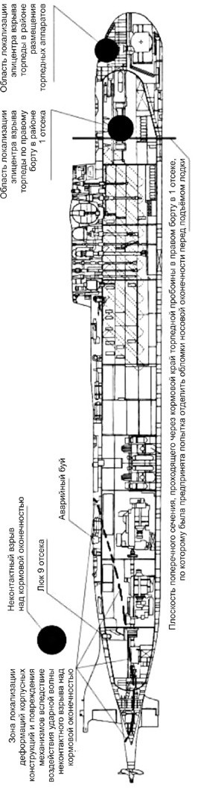

> **Первичный текст.** Российское общество и гибель АПЛ «Курск» 12 августа 2000 года.
> Источник: `Российское общество и гибель АПЛ «Курск» 12 августа 2000 года.doc` sha256 `5de29b0805981f84…`; [страница на dotu.ru](https://dotu.ru/2002/08/18/20020818-apl_kursk_red-2/).
> Автоматическая транскрипция DOC→Markdown; смысл и формулировки не правились.
> Контрольные суммы и статус проверки — в [NOTICE.md](../../NOTICE.md).
> Содержание передаёт позицию авторов; утверждения не верифицированы библиотекой.

---

# 9. Почему мы не верим Генпрокуратуре

Вечером, в пятницу 26 июля 2002 г., *за двое суток до Дня Военно-Морского флота*[^175]*,* выпуски телевизионных новостей сообщили о завершении следствия и закрытии уголовного дела о гибели АПЛ “Курск”. Генеральный прокурор Российской Федерации В.Устинов на пресс-конференции показал журналистам схему размещения торпеды в торпедном аппарате и рассказал о том, как именно в торпеде началась и далее распространялась за пределы торпедного аппарата катастрофа, приведшая к гибели корабля со всем экипажем[^176]. Сокращённый текст его выступления перед журналистами был опубликован на сайте [www.strana.ru](http://www.strana.ru/) (сноски по тексту — наши).

\* \* \*

«Завершено расследование обстоятельств катастрофы атомного подводного ракетного крейсера (АПРК) К-141 “Курск”. Катастрофа произошла в ходе учений 12 августа 2000 г. в водах Баренцева моря и унесла жизни 118 находившихся на его борту членов экипажа.

Это уголовное дело было возбуждено 23 августа 2000 г. Главной военной прокуратурой по признакам преступления, предусмотренного ч. 3 ст. 263 УК РФ (нарушение правил безопасности движения и эксплуатации железнодорожного, воздушного или водного транспорта, повлекшее по неосторожности смерть двух и более человек).

На первоначальном этапе следствие располагало крайне ограниченной информацией о катастрофе. В связи с этим о ее причинах было выдвинуто 18 рабочих версий. Основными из них являлись следующие:

- столкновение АПРК “Курск” с российским или иностранным подводным или надводным кораблём;

- поражение АПРК “Курск” торпедой или ракетой российским или иностранным подводным или надводным кораблём;

- диверсия;

- террористический акт;

- подрыв АПРК “Курск” на мине времён Великой Отечественной войны;

- гибель АПРК “Курск” в результате нештатной ситуации с его вооружением.

В ходе следствия все выдвинутые рабочие версии были тщательно проверены. Были собраны исчерпывающие сведения о крейсере и его техническом состоянии, о готовности экипажа и крейсера к выходу в море, о его вооружении, о подготовке и ходе учений, об обстоятельствах катастрофы, ее последствиях и последующей поисково-спасательной операции. Кроме того, при проверке выдвинутых версий была произведена оценка собранных доказательств, включая данные, предоставленные следствию из Великобритании, ЮАР, Норвегии.

В составе следственной группы четко и слаженно работали 46 следователей. Всем им приходилось трудиться в условиях, сопряжённых с риском для жизни, проявляя высокое чувство ответственности, выносливость, профессионализм, а порой мужество и героизм.

Впервые участники следственной группы произвели осмотр затонувшего подводного крейсера непосредственно после того, как он был поднят. Работы проводились в экстремальных условиях. Даже видео- и фототехника при осмотре отказывали из-за использования при температуре воздуха до минус 25 градусов по Цельсию и повышенной влажности.

Всего с октября 2000 по март 2002 г. с АПРК “Курск” подняты тела и фрагментированные останки 115 человек из 118, находившихся на его борту в момент гибели. Все они опознаны и переданы родственникам для захоронения. Тела троих из погибших обнаружить не удалось. Полученные фактические данные свидетельствуют, что тела этих подводников полностью сгорели.

В ходе расследования дела проведено свыше 2000 следственных действий, допрошено более 1200 свидетелей, осмотрено более 8000 объектов; документов, фрагментов вооружения и конструкций АПРК “Курск”.

За содействие, оказанное в ходе следствия, Генеральная прокуратура благодарна специалистам флота, сотрудникам научных и экспертных учреждений, руководителям и служащим государственных органов управления.

Несмотря на все трудности и особую сложность данного уголовного дела, следственная группа выполнила свою задачу в полном объёме, всесторонне, полно и объективно установив все обстоятельства произошедшей трагедии.

В ходе следствия установлено, что катастрофа произошла 12 августа 2000 г. в 11 час. 28 мин. в Баренцевом море в географической точке с координатами 69о37′00′′ северной широты и 37о34′25′′ восточной долготы, вследствие взрыва торпеды 65‑76А внутри торпедного аппарата № 4 и дальнейшего развития взрывного процесса в боевых зарядных отделениях торпед, находившихся в первом отсеке подводного крейсера. Эти обстоятельства были окончательно установлены экспертами после подъёма фрагментов носового отсека летом этого года. Подъём фрагментов был прекращен только после того, как эксперты сочли достаточным объём предоставленных им для исследования данных.

Взрыв повлек гибель личного состава первого отсека, значительные разрушения в межбортном пространстве лодки и полностью разрушил торпедный аппарат № 4 и частично торпедный аппарат № 2. В результате этого в прочном корпусе образовались отверстия, через которые в первый отсек лодки начала поступать морская вода, затопившая практически полностью первый отсек лодки.

Явившаяся результатом взрыва ударная волна, а также летящие фрагменты хвостовой части разрушенной торпеды и торпедного аппарата № 4 инициировали взрывной процесс взрывчатого вещества боевого зарядного отделения ряда торпед, которые были расположены на стеллажах внутри первого отсека. Развитие в течение более 2 минут взрывного процесса в боевых зарядных отделениях торпед привело к их детонации, а затем и к передаче детонирующего импульса другим торпедам, находящимся на стеллажах.

Второй взрыв произошел в 11 час. 30 мин. 44,5 сек.[^177] Он привёл к полному разрушению носовой оконечности АПРК “Курск”, конструкций и механизмов его первого, второго и третьего отсеков. Получив катастрофические повреждения, корабль затонул в указанной точке Баренцева моря в 108 милях oт входа в Кольский залив на глубине 110 — 112 метров.

В результате второго взрывного воздействия смерть всех моряков-подводников, тела которых в последующем извлечены из 2, 3, 4, 5 и 5-бис отсеков, наступила в короткий промежуток времени — от нескольких десятков секунд до нескольких минут.

После катастрофы в носовой части крейсера офицеры, находившиеся в 6 — 8 отсеках, реально оценив обстановку, перевели личный состав 6, 7 и 8 отсеков в 9 отсек, где общими усилиями продолжили борьбу за жизнь.

В этом отсеке были выполнены необходимые действия по его герметизации для предотвращения поступления воды в отсек.

Возможность использования оставшимися в живых членами экипажа всплывающей спасательной камеры отсутствовала из-за разрушения носовых отсеков корабля, поэтому они стали готовиться к выходу на поверхность через спасательный люк 9-го отсека.

Однако целый ряд объективных факторов не позволил этого сделать. К этим факторам относятся: быстрое ухудшение самочувствия людей, ослабленных в процессе борьбы за жизнь под действием угарного газа и повышающегося давления, условия недостаточной освещенности отсека. По этим основным причинам[^178] моряки-подводники так и не смогли предпринять ни одной попытки выйти из АПРК “Курск” через спасательный люк 9-го отсека.

Вместе с тем осмотр 9-го и других отсеков АПРК “Курск” показал, что, несмотря на острую стрессовую ситуацию и сложившиеся экстремальные условия, оставшиеся в живых подводники действовали организованно, целеустремленно, не были подвержены паническим настроениям и под руководством офицеров предпринимали все возможные меры к спасению корабля и экипажа, действуя при этом грамотно и самоотверженно.

Согласно выводам экспертов, все находившиеся в 9-м отсеке подводники погибли от отравления угарным газом не позднее, чем через 8 часов после взрывов, то есть не позднее 19 час. 30 мин. 12 августа 2000 г. В связи с этим к моменту обнаружения затонувшего АПРК “Курск” спасти кого-либо из них было уже невозможно.

Следствие пришло к выводу, что лица, участвовавшие в проектировании, изготовлении, хранении, приготовлении и эксплуатации торпеды 65-76А № 1336А ПВ, не предвидели возможности её взрыва и гибели экипажа вместе с кораблём и по обстоятельствам дела такой возможности предвидеть не могли. Поэтому принято решение о прекращении уголовного дела за отсутствием состава преступления, то есть по основанию, предусмотренному п. 2 ч. 1 ст. 24 УПК РФ. Нет состава преступления и в действиях кого-либо из членов экипажа АПРК “Курск”.

В ходе следствия выявлены нарушения в организации, проведении учений и поисково-спасательной операции, допущенные должностными лицами органов военного управления ВМФ России. Все вы знаете, что эти лица наказаны. Однако эти нарушения не состоят в причинной связи с гибелью АПРК “Курск” и его экипажа, что исключает привлечение кого-либо из них к уголовной ответственности.

В рамках этого уголовного дела потерпевшими признаны 161 человек. Это близкие и родственники погибших. Их права и законные интересы, предусмотренные российским уголовно-процессуальным законодательством, не будут ущемлены. Каждому потерпевшему будет направлена выписка из постановления о прекращении уголовного дела. В этом документе будут изложены все обстоятельства катастрофы, за исключением сведений, составляющих государственную тайну. При этом без каких-либо изъятий в нем будут содержаться выводы судебно-медицинских экспертов о причинах гибели каждого подводника.

Таковы результаты нашего расследования» (цитировано по сайту [www.strana.ru](http://www.strana.ru/) 26 июля 2002 г., полного текста выступления В.Устинова нам в интернете найти не удалось).

\* \*\

\*

Это выступление Генпрокурора вызвало серию публикаций с выдержками из него и комментариями. Так в этот же день на сайте [www.ntvru.com](http://www.ntvru.com/) появилось сообщение, посвящённое завершению следствия Генеральной прокуратурой и выводам, сделанным следствием. Эту публикацию[^179] мы приводим далее со своими комментариями в сносках.

\* \* \*

Генпрокурор РФ Владимир Устинов доложил Президенту России о завершении расследования причин гибели атомохода “Курск”, передаёт [РИА “Новости](http://www.rian.ru/)”.

Генеральный прокурор подробно рассказал главе государства о расследовании, вручив ему почти 100-страничный доклад, подготовленный специально для Президента России.

«В ходе следствия установлено, что катастрофа произошла в 11 часов 28 минут 26,5 секунды[^180] по московскому времени в Баренцевом море вследствие взрыва, центр которого локализован в месте расположения практической (учебной) торпеды внутри четвертого торпедного аппарата», — заявил генпрокурор. После взрыва торпеды произошел взрыв в боевых зарядных отделениях торпед, находившихся в первом отсеке “Курска”.

Владимир Устинов сообщил, что Генпрокуратура закрыла уголовное дело по гибели атомохода “Курск” за отсутствием состава преступления.

По его словам, в действиях должностных лиц, ответственных за проведение учений в Баренцевом море, изготовление, эксплуатацию и установку торпеды, ставшей причиной гибели “Курска”, нет состава преступления. Уголовное преследование этих лиц прекращено, отметил Владимир Устинов.

Инциденты с такими торпедами, что были на “Курске”, происходили и раньше

Инциденты с торпедами, аналогичными взорвавшейся на АПЛ “Курск” 12 августа 2000 года, имели место и раньше, сообщил Владимир Устинов.

Он отметил, что этот вид торпеды был разработан в начале 1948 года, и с 50-х годов было создано семь разновидностей таких торпед калибра 533 и 650 мм. Самым опасным компонентом её является перекись водорода, которая может быть источником возгорания с выделением высокой температуры. В торпеде содержится около тысячи литров перекиси водорода, передаёт ИТАР-ТАСС.

*В 1966 году на подводной лодке С-384* Черноморского флота произошел аналогичный случай возгорания, когда возник пожар в торпедном отсеке.

*В 1970 году на Тихоокеанском флоте* произошел инцидент с такими же торпедами. Тогда жертвой пожара стал один человек.

*В 1972 году на Северном флоте в поселке Рыбачий* был зарегистрирован случай аварии с данными торпедами.

Всего за период с 1977 по 2001 год в ходе боевой подготовки было произведено 195 выстрелов такими торпедами. В 30% случаев происходили потери торпед по разным причинам[^181].

(… — Нами опущена гиперссылка интернет на список 19 отечественных подводных лодок, пострадавших или погибших в авариях в 1952 — 2000 гг., в том числе и по не выясненным причинам.)

Взорвавшаяся на “Курске” торпеда 65-76А была учебной, то есть не содержала взрывчатого вещества. Инцидент с ней произошел «в результате нештатных процессов», сопровождавшихся сложной химико-физической реакцией.

Из-за чего произошел взрыв — выводы комиссии

Учебная торпеда, взорвавшаяся в четвертом торпедном аппарате “Курска” имела срок службы до 2016 года. По словам генпрокурора, торпеды подобного типа уже сняты с вооружения российского ВМФ[^182].

«Первичный импульс, инициирующий взрыв практической торпеды, возник в результате нештатных процессов, произошедших внутри резервуара окислителя этой торпеды», — рассказал Устинов. Процессы носили сложный физико-химический характер, заметил генпрокурор[^183].

«Катастрофа произошла в *11 часов 28 минут 26,5 секунды* по московскому времени в месте расположения учебной торпеды внутри четвертого торпедного аппарата», — заявил генпрокурор.

Второй взрыв, сообщил он, произошел в *11 часов 30 минут 44,5 секунды*, то есть примерно через две минуты после первого.

Второй взрыв привёл к полному разрушению носовой оконечности “Курска”, конструкций и механизмов его 1-го, 2-го и 3-го отсеков. В результате второго взрывного воздействия смерть всех моряков-подводников, тела которых в последующем были извлечены из 2-го, 3-го, 4-го и 5-го-бис отсеков, наступила в короткий промежуток времени — от нескольких десятков секунд до нескольких минут.

Возможность использования оставшимися в живых членами экипажа всплывающей спасательной камеры отсутствовала из-за разрушения носовых отсеков корабля, поэтому моряки стали готовиться выйти на поверхность через спасательный люк.

«Однако из-за целого ряда объективных факторов, таких как быстрое ухудшение самочувствия людей, ослабленных в процессы борьбы за живучесть под воздействием угарного газа, в условиях недостаточной освещенности отсека, подводники так и не смогли предпринять ни одной попытки выйти из “Курска” через спасательный люк девятого отсека»[^184], — сказал Устинов.

«Согласно выводам экспертов, все находившиеся в 9-м отсеке 23 человека погибли от отравления угарным газом не позднее чем через 8 часов после взрывов. В связи с этим к моменту обнаружения затонувшего крейсера спасти кого-либо из них было уже невозможно», — отметил генпрокурор. По его словам, в ходе следствия установлено, что эвакуация экипажа через спасательный люк с использованием глубоководных аварийно-спасательных аппаратов также была невозможна из-за образовавшейся негерметичности[^185] люка.

«Другие версии о причинах катастрофы АПРК “Курск” и гибели его экипажа в ходе следствия тщательно проверены и не нашли подтверждения»[^186], — подчеркнул прокурор.

Разработчики торпеды не согласны с выводами комиссии и считают, что причина взрыва торпеды — внешнее воздействие

Взрыв компонентов топлива торпеды 65-76, в результате которого погибла атомная подводная лодка “Курск”, мог произойти только в результате внешнего воздействия на торпеду, заявил “Интерфаксу” директор ЦНИИ “Гидроприбор” Станислав Прошкин.

«Мы объективно считаем, что было внешнее воздействие[^187] на торпеду, — сказал он, — есть информация о том, что это мог быть локальный пожар»[^188].

В частности, отметил Прошкин, «сверху на торпеде перед балластной цистерной имеются изменения структуры металла от температурного воздействия». По данным исследования, проведенного ЦНИИ “Прометей”, имеющего самых компетентных специалистов в области материаловедения, получены «четкие оценки этой температуры — 550 ÷ 570 градусов по Цельсию».

На АПЛ “Курск” имелись две автономные, независимые системы контроля. «И любое событие, связанное с повышением давления внутри резервуарного отсека, повышение температуры перекиси, повышение уровня кислорода в зазоре между торпедой и торпедным аппаратом регистрируется», — добавил Прошкин[^189].

«Если отмечено повышение температуры в торпедном аппарате или на стеллаже, экипаж имеет шесть часов для того, чтобы справиться с этой аварийной ситуацией, — сказал он. — В том числе с помощью специальной системы слива перекиси за борт, если отмечено повышение температуры торпеды на стеллаже. В случае возникновения пожара на лодке имеется мощнейшая система пожаротушения, которая мгновенно сбрасывает десятки тонн воды. Если торпеда в торпедном аппарате — она просто выстреливается, и водная среда её локализует».

Глава “Гидроприбора” также назвал абсурдной версию о том, что причиной теплового взрыва торпеды могло быть нарушение её герметичности в результате якобы произошедшего при погрузке падения. «При испытании торпед мы бросаем такую торпеду с высоты 10 метров на плиту, на рельс и штырь, — заметил он, — и аварийных ситуаций не было».

В ходе следствия по делу о гибели “Курска” было выдвинуто 18 версий

В ходе следствия по делу о гибели атомохода “Курск” было выдвинуто и проверено 18 рабочих версий. Об этом Устинов сообщил на пресс-конференции в пятницу в Москве.

По его словам, основными из них являлись: столкновение “Курска” с российским или иностранным подводным или надводным кораблём; поражение “Курска” торпедой или ракетой с российского или иностранного подводного или надводного корабля[^190]; диверсия; теракт; подрыв на мине времён Великой Отечественной войны; гибель “Курска” в результате нештатной ситуации с его вооружением.

«В ходе следствия все выдвинутые рабочие версии тщательно проверены. Собраны исчерпывающие сведения о крейсере и его техническом состоянии, о готовности экипажа и крейсера к выходу в море, о вооружении атомохода, о подготовке и ходе учений, об обстоятельствах катастрофы, ее последствиях и последующей поисково-спасательной операции», — отметил Устинов.

Кроме того, по его словам, при проверке выдвинутых версий была проведена оценка собранных доказательств, включая данные, представленные из Великобритании, ЮАР и Норвегии.

«Процесс расследования, само уголовное дело о гибели АПРК “Курск” и его экипажа являются уникальными», — подчеркнул Устинов.

По его словам, ранее опыта расследования подобных происшествий на море в России не было. Генпрокурор высказал уверенность, что такой опыт уникален и в мировой практике расследования причин техногенных катастроф[^191].

Военачальники, понёсшие наказание в связи с катастрофой “Курска”, не будут привлекаться к уголовной ответственности

Генпрокурор РФ Владимир Устинов заявил, что в ходе следствия по делу гибели “Курска” выявлены нарушения в организации проведения учений и поисково-спасательной операции, допущенные должностными лицами Военно-морского Флота России.

«Как известно, все эти лица наказаны, и наказаны очень жёстко», — сказал Устинов на пресс-конференции в пятницу в Москве. Вместе с тем генпрокурор подчеркнул, что «эти нарушения не состоят в причинной связи с гибелью подлодки “Курск” и её экипажа, что исключает привлечение кого-либо из них к уголовной ответственности».

Генпрокурор сообщил, что министру обороны РФ внесено представление с требованием устранить допущенные нарушения.

По словам Устинова, уголовное дело состоит из 133 томов, 38 из них содержат сведения, составляющие государственную тайну, вследствие чего возможность предать гласности материалы уголовного дела в полном объёме отсутствует.

Генпрокурор заявил, что следствие не считает виновным в катастрофе кого-либо из 118 погибших членов экипажа АПРК “Курск”.

[АПЛ “Курск](http://www.ntvru.com/russia/14Aug2000/kursk.html)” затонула 12 августа 2000 года во время учений Северного флота. Все находившиеся на её борту в момент аварии [118 человек погибли](http://www.ntvru.com/russia/18Aug2000/list.html).

Большинство опрошенных радиостанцией «Эхо Москвы» считает, что истинная причина гибели “Курска” так и не была названа

Большинство опрошенных радиостанцией [«Эхо Москвы»](http://www.echo.msk.ru/) считает, что 26 июля Генпрокуратурой так и не была названа истинная причина гибели АПЛ “Курск”[^192].

Экспресс-опрос, проведённый в рамках программы “Рикошет” по интерактивным телефонам, показал, что 80 % опрошенных придерживается данного мнения, в то время как 20 % опрошенных считает, что сегодня Генпрокуратурой была названа истинная причина гибели АПЛ “Курск”.

Всего в ходе опроса за 5 минут на радиостанцию поступило 1950 телефонных звонков.

\* \*\

\*

Причины, по которым С.Прошкин — руководитель предприятия-разработчика торпеды 65‑76 и её модификаций — выразил несогласие с версией гибели корабля, оглашённой Генеральной прокуратурой в качестве истинной, — ясны, если иметь даже самое общее представление об устройстве торпедного аппарата, самой торпеды и размещении торпеды в аппарате.

Торпедный аппарат подводной лодки это — труба, один конец которой находится внутри прочного корпуса лодки, а другой выходит за его пределы. С обоих концов эта труба закрывается крышками. Крышка, запирающая торпедный аппарат изнутри прочного корпуса, называется задней. Крышка, запирающая торпедный аппарат со стороны забортного пространства, называется передней. Обычно в торпедном аппарате давление равно давлению в отсеках лодки. Соответственно к трубе, передней и задней крышкам предъявляются те же требования по прочности, что и к прочному корпусу лодки: должны выдерживать без утраты работоспособности гидростатическое давление на предельной глубине погружения и воздействие ударной волны подводного взрыва, мощность которой задана в требованиях ВМФ к проектированию подводных лодок и оружия для них.

Диаметр трубы торпедного аппарата несколько больше, чем калибр торпеды, вследствие чего торпеда в аппарате фиксируется специальными направляющими (в некоторых конструкциях с амортизаторами), а между нею и стенками аппарата есть зазор порядка сантиметра и более (в зависимости от конструкции аппарата и обводов торпеды). Этот зазор называется кольцевым. Перед торпедным выстрелом аппарат заполняется водой из цистерн кольцевого зазора[^193], и давление в трубе аппарата выравнивается с забортным давлением. После этого открывается передняя крышка, и торпеда может быть выстрелена[^194]. После выстрела передняя крышка закрывается, вода из трубы торпедного аппарата сливается в торпедозаместительные цистерны лодки, и по завершении слива воды и выравнивания давления в аппарате с давлением в торпедном отсеке, задняя крышка может быть открыта, и новая торпеда может быть заряжена в аппарат. При закрытой передней крышке и равенстве давления в аппарате и в отсеке задняя крышка может быть открыта для извлечения торпеды в отсек (если это предусмотрено конструкцией и на стеллажах в отсеке есть место) в том числе и для перезарядки аппарата торпедой другого типа и предназначения.

Соответственно этому порядку функционирования торпедного аппарата, передняя и задняя крышка конструктивно отличаются друг от друга. Обе крышки открываются наружу по отношению к полости трубы аппарата. Но передняя крышка забортным давлением прижимается к её опорному контуру, на котором обеспечивается герметичность закрытия; а заднюю крышку забортное давление отрывает от её опорного контура, на котором обеспечивается герметичность закрытия.

Вследствие такого различия в характере статических и динамических нагрузок, которые должны воспринимать передняя и задняя крышки, передняя крышка, грубо говоря, конструктивно близка к обычной двери — ось, вокруг которой она вращается, и привод, который её поворачивает; а в состав механизмов, обеспечивающих функционирование задней крышки, кроме этого входят элементы, обеспечивающие прижимание её к опорному контуру в закрытом положении и фиксацию.

Соответственно описанному ранее порядку функционирования торпедного аппарата к задней крышке предъявляется ещё одно дополнительное требование: *при открытой передней крышке и заполненном водой аппарате* задняя крышка должна выдерживать не только гидростатическое давление на предельной глубине погружения, но и воздействие на предельной глубине погружения ударной волны подводного взрыва в соответствии с действующими нормами ВМФ к взрывостойкости.

Безусловно, что достаточно мощный взрыв, произойди он внутри торпедного аппарата, разорвёт его на части, и при этом какие-то обломки аппарата и торпеды разлетятся по торпедному отсеку, разрушая и повреждая на пути своего полёта всё, включая и торпеды в стеллажах, что приведёт к лавинообразному распространению катастрофы. Но динамику взрыва внутри торпедного аппарата следует рассматривать соответственно устройству торпедного аппарата, соответственно особенностям его конструктивных элементов и особенностям находящейся в нём торпеды.

Поэтому **первый вопрос**: *какова минимально необходимая мощность взрыва, чтобы торпедный аппарат был разорван на куски, разлетающиеся во всех направлениях?*

Если мощность взрыва будет существенно ниже этого уровня, то взрыв просто вышибет переднюю крышку торпедного аппарата, которая хотя и прижимается к своему опорному контуру конструктивно-механически, но не имеет силовых конструкций, предназначенных для противодействия давлению изнутри торпедного аппарата, столь мощных как те, что входят в состав механизмов закрытия задней крышки.

**Второй вопрос**: *какое количество перекиси водорода должно вылиться во внутренние полости торпеды или из торпеды в пространство кольцевого зазора для того, чтобы обеспечить необходимую мощность такого внутреннего взрыва в аппарате?*

Но никакое количество перекиси не может излиться из *не разрушенной* торпеды почти мгновенно и почти мгновенно разложиться на воду и атомарный кислород (т.е. при разложении перекиси первоначально выделяется О, а не О2 или О3 — озон), который вступит в реакцию почти со всем, с чем соприкоснётся, в свободном пространстве, тем более при высоких температурах.

Однако в соединениях топливной арматуры торпеды могут быть неплотности, материал уплотнительных прокладок и мастик-герметиков с течением времени может потерять свою эластичность, вследствие чего в нём под воздействием перепадов температуры и вибраций могут возникнуть микротрещины и т.п. В этом случае через такого рода дефекты и повреждения может начаться истечение перекиси и других компонент топлива и технических сред из систем торпеды.

При этом надо иметь в виду, что концентрированная (маловодная) перекись водорода — вязкая жидкость плотностью 1,45 т/м3. Вследствие своей вязкости она не очень-то хорошо течёт, например, в сопоставлении её течения с течением керосина. Кроме того, есть силы поверхностного натяжения, которые для каждой пары «жидкость — твёрдое тело» — свои, и которые определяют характер проникновения жидкости в микротрещины и трещины. В частности керосин проникает в микротрещины гораздо лучше, чем перекись, и потому подкрашенный керосин является одним из средств выявления микротрещин. Эти обстоятельства приводит ещё к одному вопросу.

**Третий вопрос:** *достаточна ли технически возможная скорость истечения перекиси водорода и топлива из торпеды в случае нарушения герметичности её резервуаров и трубопроводов (вследствие микротрещин и неплотностей в соединениях топливной арматуры) для того, чтобы химические реакции реагентов, изливающихся из систем торпеды, породили взрывной характер нарастания давления в пространстве кольцевого зазора и полостях торпеды?*

Из выступления В.Устинова неясно:

- ни какой минимальной мощности должен быть взрыв внутри аппарата для того, чтобы его разорвало на куски, разрушило его конструктивные элементы (заднюю крышку и т.п.), повредило прочный корпус и размещённое в нём оборудование;

- ни какое количество и каких именно компонентов топлива должно было излиться из торпеды для того, чтобы обеспечить необходимую мощность взрыва;

- ни сколько времени необходимо для того, чтобы из торпеды через неплотности соединений и микротрещины излилось необходимое количество реагентов;

- ни то, есть ли в самой торпеде или в аппарате достаточное свободное пространство, в котором достаточно быстро изливающиеся компоненты энергоносителей могли бы вместиться в необходимом количестве, смешаться и прореагировать между собой или с конструктивными элементами торпеды или аппарата так, чтобы произошёл взрыв;

- ни то, будет ли этот взрыв способен сразу разорвать торпедный аппарат на куски, разлетающиеся в разные стороны и разрушающие всё на пути своего полёта, либо он будет двухстадийным:

<!-- -->

- на первой стадии он разрушит торпеду так, что из неё польётся, всё что есть, вследствие чего

- на второй стадии произойдёт взрыв необходимой для разрушений аппарата мощности;

<!-- -->

- не ясно и то, способен ли такой двухстадийный взрыв на первой стадии выбить переднюю крышку аппарата, в результате чего вторая стадия взрыва с разрушением аппарата на куски может и не произойти, поскольку давление в аппарате будет сброшено при разрушении передней крышки, и он будет залит морской водой[^195].

Но как можно понять из реакции С.Прошкина на заявление Генеральной прокуратуры о технической первопричине гибели лодки, технически возможные утечки топлива и концентрированной перекиси водорода из торпеды 65‑76 через микротрещины и неплотности соединений арматуры в топливной системе, не могут быть столь интенсивны, чтобы произошёл взрыв, мощность которого была бы достаточной для того, чтобы не то, что разорвать торпедный аппарат на куски и повредить прочный корпус, но и повредить торпеду так, чтобы произошёл второй взрыв, который разнесёт аппарат на куски и повредит прочный корпус.

Как прямо сказал С.Прошкин, у экипажа есть шесть часов на нейтрализацию аварийной торпеды, надо полагать, даже в случае самых интенсивных технически возможных утечек компонентов её энергоносителей.

Иначе говоря, для того, чтобы произошёл взрыв, способный разорвать торпедный аппарат на куски и повредить прочный корпус, торпеда должна быть повреждена каким-либо внешним воздействием. То есть, чтобы истечение энергоносителей из конструктивно разделённых резервуаров торпеды повлекло за собой взрывной характер нарастания в аппарате давления и температуры, на которые не успеют прореагировать системы обеспечения безопасности торпеды в аппарате и экипаж лодки, — необходимо, чтобы торпеда была сильно деформирована или разрушена: только в этом случае за короткое время через образовавшиеся разрывы в элементах её конструкции произойдёт излияние, смешение и химическая реакция компонентов её энергоносителей в таких количествах, что произойдёт взрыв, мощность которого достаточна для того, чтобы разорвать аппарат на куски, разрушить его конструктивные элементы, повредить прочный корпус и размещённое в нём оборудование.

Но торпедный аппарат проектируется так, чтобы он сам и его элементы не были источником такого рода факторов воздействия на торпеду. Более того, торпедный аппарат проектируется так, чтобы он был способен изолировать полностью или в течение некоторого достаточно продолжительного времени находящуюся в нём торпеду от воздействия такого рода внешних факторов. Причём в районе размещения торпедных аппаратов в междукорпусном пространстве лодки тоже нет ничего, что могло бы повредить торпедный аппарат. Но и при взгляде изнутри лодки в торпедном отсеке с исправным оборудованием тоже нет факторов, способных оказать столь разрушительное воздействие на ту часть торпедного аппарата, что находится внутри отсека.

Это означает, что если торпеда в аппарате повреждена внешним воздействием настолько, что из её конструктивно разделённых резервуаров потекло обильными струями топливо или окислитель, то к этому моменту повреждён лёгкий корпус и труба торпедного аппарата вне прочного корпуса как минимум *сильно* деформирована каким-то внешним воздействием и, вследствие этого вряд ли сохранила герметичность.

Соответственно механические повреждения трубы торпедного аппарата, вызванные внешним воздействием на него *и локализованные вне прочного корпуса*[^196]*,* неизбежно должны были стать концентраторами напряжений в его конструкциях и соответственно — слабыми местами. Но не повреждённая в этом случае задняя крышка, находящаяся внутри прочного корпуса, имеющая специальные запоры (они должны выдерживать прохождение ударной волны при открытой передней крышке и заполнении забортной водой трубы аппарата), не могла стать самым слабым звеном достаточно сильно деформированного аппарата.

Однако и в этом случае при истечении компонент топлива в пространство кольцевого зазора, нарастание давления в аппарате в ходе химической реакции вряд ли бы носило взрывной характер, поскольку кольцевой зазор по своему объёму и геометрии — очень неэффективная «камеры сгорания». И это заставляет предположить, что при невзрывном характере нарастании давления повреждённый аппарат разорвало бы по уже имеющимся в его трубе разрывам и сгибам, полученным при его деформации под воздействием какого-либо внешнего по отношению к нему фактора (например, в случае столкновения с другим кораблём или подводным препятствием); или нарастание давления вышибло бы переднюю крышку, которая прижимается к своему опорному контуру большей частью забортным давлением и не имеет таких запоров, какими снабжена задняя крышка. Соответственно аварию торпеды, причиной которой стало внешнее механическое воздействие на торпедный аппарат, должны были выдержать задняя крышка с её запорами, и та часть трубы торпедного аппарата, что расположена внутри прочного корпуса.

Но если в районе торпедного аппарата происходит взрыв достаточно мощного противолодочного оружия, то аппарат неизбежно будет *повреждён вместе с находящейся в нём торпедой* воздействием осколков оружия и разлетающихся обломков корпуса, воздействием вспышки и ударной волны взрыва, а из повреждённой взрывом торпеды произойдёт обильное истечение компонентов её топлива практически в область вспышки взрыва.

Иными словами, и в версию о *мощном* взрыве компонентов энергоносителя практической торпеды, находящейся в аппарате, просится некий внешний взрыв, во вспышке которого почти мгновенно прореагировали и топливо, и окислитель практической торпеды “Курска”, усилив поражающее воздействие именно внешнего взрыва.

Ещё в первой редакции настоящего сборника было высказано предположение, что выстрел учебной торпедой с “Курска” мог спровоцировать торпедный залп на поражение с натовской лодки, которая вела разведку в зоне учений Северного флота и шла в готовности № 1. В этой связи сошлёмся на уже упоминавшийся «отчётный» фильм “Гибель «Курска». Следствие закончено”, в котором пропагандируется версия Генпрокуратуры.

В нём мимоходом было прямо сказано, что взрыв практической торпеды 65-76 произошёл в аппарате № 4, и что при этом был повреждён аппарат № 2, который *был пустым.* Это сообщение Генпрокуратуры значимо тем, что аппарат № 2 в момент начала катастрофы был пуст. Сообщение об этом должно вызывать недоумение у большинства подводников, причину которого необходимо пояснить всем прочим.

Соответственно отечественной традиции нумерации корабельного оборудования, чётные номера присваиваются всему, что установлено справа от диаметральной плоскости корабля. На лодках Пр. 949А два аппарата для торпед калибра 650 мм, а остальные — для торпед калибра 533 мм. Соответственно, если аппарат № 4 калибра 650 мм, то аппарат № 2 — 533-миллиметровый.

Кроме того, торпеда типа 65-73 и её дальнейшее развитие торпеда 65-76 — противокорабельные торпеды, которые изначально разрабатывались в качестве средства доставки ядерной боевой части (это ещё раз к вопросу о необходимом уровне взрывостойкости лодки, вооруженной такими торпедами) для поражения больших надводных кораблей на дистанциях до 50 км. А торпеды калибра 533 мм, могут быть как противокорабельными, так и противолодочными.

Если нормальное состояние артиллерийского орудия надводного корабля — «разряжено», но готово к заряжанию, то нормальное состояние торпедного аппарата как на надводных кораблях, так и на подводных лодках — «заряжен» и в максимальной степени готов к выстрелу. Иными словами, торпедный аппарат не только средство стрельбы торпедами, но и средство для их *длительного* хранения как во время всего плавания, продолжительность которого может достигать полугода и более, так и при стоянке в базах кораблей, находящихся на боевом дежурстве (т.е. в готовности выйти в море в течение весьма ограниченного срока времени, определяемого командованием).

Здравый смысл военного дела обязывает к тому, что когда военный корабль выходит в море или находится на боевом дежурстве в состоянии готовности к выходу, то он снабжён полным боекомплектом, включая и торпедный боезапас: иными словами нормальное состояние торпедного аппарата подводной лодки — «заряжен». Если корабль выходит в море для производства учебных стрельб торпедами, то перед таким выходом практические (учебные) торпеды заменяют боевые торпеды в количестве, необходимом для совершения учебных стрельб. Но в остальных аппаратах остаются боевые торпеды[^197].

Спрашивается: “Курск” вышел в свой последний поход с некомплектом боезапаса, вследствие чего торпедный аппарат № 2 был пуст? Либо до гибели он успел совершить не только стрельбу ракетой “Гранит” 11 августа 2000 г., но кроме того успел выпустить и практическую торпеду из аппарата № 2, о чём Флот, Госкомиссия и Генпрокуратура хранят молчание?

Если верно последнее предположение, и в действительности имела место ещё учебная стрельба по подводной цели, то эта практическая торпеда, выпущенная из аппарата № 2, была противолодочной, поскольку практическую противокорабельную торпеду предстояло израсходовать позднее в стрельбе по надводной цели, которую “Курск” не успел выполнить вследствие свой гибели. И соответственно выстрел практической противолодочной торпедой из аппарата № 2 мог спровоцировать залп по “Курску” боевыми торпедами натовской лодки, который был произведён либо по ошибке командира, либо вследствие ошибок программистов, запрограммировавших[^198] БИУС (боевую информационную управляющую систему) этой лодки.

\* \* \*

Соответственно всему изложенному в этом и в предыдущих разделах настоящей работы, схема поражения “Курска” торпедным залпом натовской лодки предстаёт в следующем виде.

На схеме поражения (дубликат рис. 5, представленного в главе 6) чёрными кругами отмечены области предполагаемой локализации эпицентров взрывов натовских торпед, поразивших “Курск”.

По направлению с носа в корму на продольном разрезе лодки отмечены:

- взрыв в районе размещения торпедных аппаратов (взрыв № 1), вызвавший первичное разрушение аппаратов и вторичный взрыв, по крайней мере, одной из размещённых в них торпед;

- взрыв в районе первого отсека по правому борту (взрыв № 2), разрушивший лёгкий корпус на большой площади и образовавший пробоину в прочном корпусе; в область его поражения попал и конструктивный узел носового горизонтального руля правого борта, что видно из соотнесения приведённого продольного разреза и схемы внешнего вида рис. 4 (его обломки отсутствуют на фотографиях, сделанных на стапель-палубе дока в Росляково);

- неконтактный взрыв в районе кормовой оконечности, повредивший комингс-площадку спасательного люка 9‑го отсека и приведший к затоплению кормовых отсеков вследствие разгерметизации разнородных конструктивных отверстий прочного корпуса (вводов кабелей, трубопроводов, приводов забортных устройств и т.п., возможная область локализации повреждений такого рода отмечена на схеме) под воздействием ударной волны взрыва.

- Кроме того, на схеме отмечены:

<!-- -->

- люк 9‑го отсека;

- аварийный буй;

- плоскость поперечного сечения, проходящего через кормовой край торпедной пробоины в правом борту в первом отсеке, по которому была предпринята завершившаяся “неудачей” попытка отделить обломки носовой оконечности перед подъёмом лодки;

- жирной пунктирной линией, проходящей по кормовой оконечности корпуса, обозначена зона локализации деформаций корпусных конструкций и повреждений механизмов вследствие воздействия ударной волны неконтактного взрыва над кормовой оконечностью.

**Детонацию торпедного боезапаса в стеллажах первого отсека** могли повлечь как взрыв № 1, так и взрыв № 2 в районе носовой оконечности. Но возможность взрыва торпед в аппаратах вследствие взрыва торпеды у правого борта в районе первого отсека и внутренних взрывов в отсеке, исключена конструктивно почти полностью: как показывает опыт войн, торпеды в аппаратах взрывались большей частью в результате того, что их непосредственно поражали взрывы авиабомб и артиллерийских снарядов, попадавших в корабли. Именно разрушение аппаратов № 2 и № 4 является указанием на то, что в носовой оконечности имел место взрыв, обозначенный № 1.

**Предположение о неконтактном взрыве в районе кормовой оконечности** проистекает из факта затопления кормовых отсеков и выявившейся в ходе спасательной операции неработоспособности люка и устройств отдачи буя. Но если фактически взрыва в районе кормовой оконечности не было, то это означает одно: пороки проекта и низкое качество изготовления. В опубликованной 13 августа 2002 г. в “Новой газете” статье “«Она утонула» — 2” не выдвигаются какие-либо версии гибели корабля, альтернативные версии Генпрокуратуры, а только выражается сомнение в истинности того, что говорят “Рубин” и Генпрокуратура. Среди всего прочего в ней сообщается следующее:

«Гидравлический удар (удар воды) остановила прочнейшая переборка 4-го и реакторного отсека 5 и 5-бис. Утверждение специалистов ЦКБ “Рубин” противоречит заключению прокуратуры. По словам генпрокурора, 6-й, 7-й, 8-й и 9-й отсеки не повреждены в результате взрыва. Но специалисты “Рубина” утверждают, что в этих отсеках были разрушены транзитные магистрали (понимаем как системы вентиляции, подачи воздуха высокого давления и др.). Если эти магистрали разрушились от взрывов, а переборки 6-го, 7-го, 8-го и 9-го отсеков не пострадали, значит, конструкция магистралей не обеспечивала живучести отсеков. **Это является явным недостатком, если не грубейшим нарушением принципа герметичности. Конструкторы свидетельствуют против себя** (выделено нами при цитировании: это мнение кораблестроителей, находящихся в оппозиции к И.Д.Спасскому, высказанное ими журналисту “Новой газеты” на условиях, что их имена не будут оглашены и не станут известны генералам кораблестроительной мафии, одним из которых является И.Д.Спасский)».

И кроме того, сообщается со ссылкой на офицеров Северного флота (также на условиях анонимности в целях защиты их от гнева и репрессий со стороны высшего командования), что экипаж “Курска” вообще не имел допуска к эксплуатации торпед 65-76, поскольку не освоил этот вид оружия. Это сообщение тоже вызывает удивление, поскольку если оно соответствует истине, то получается, **во-первых**, что корабль несколько лет плавал, не умея пользоваться одним из элементов своего штатного вооружения, и **во-вторых**, что один из составов преступления командования Северного флота состоит в том, что практическая торпеда типа 65-76, вопреки тому, что экипаж не умел ею пользоваться, всё же была погружена на “Курск” для стрельбы ею в ходе учений, в которых он погиб.

В этой же статье приводится и мнение Генпрокуратуры о том, как была повреждена комингс-площадка, не попавшее в приведённый ранее текст выступления В.Устинова 26 июля 2002 г., опубликованного в интернете с сокращениями:

«Пристыковать спасательный аппарат к комингс-площадке аварийного люка было невозможно, так как её повредил кусок носовой части, отлетевший после взрыва».

Там же представлено и противоречащее этому объяснение, исходящее от “Рубина”, в котором ни слова не говорится о повреждении комингс-площадки:

«Что касается «неприсоса» спасательного аппарата к комингс-площадке подводной лодки, необходимо отметить следующее. Посадки аппарата на комингс-площадку осуществлялись неоднократно, несмотря на сложные гидрометеорологические условия. Однако в связи с тем, что к этому моменту прошло более 40 часов после гибели АПК, отсек был полностью заполнен водой, и давление внутри предкамеры спасательного люка равнялось забортному, что не позволило аппарату «присосаться» к комингс-площадке».

Вопрос к “Рубину” уже неоднократно задавался: “Почему вы спроектировали лодку так, что отсеки оказались затопленными после взрыва?” Но и объяснение Генпрокуратуры взывает сомнение. Во-первых, сообщалось, что в районе гибели “Курска” были осмотрены 4 квадратных морских мили (в другом варианте сообщения 4 кв. км) морского дна и найдено всё, по крайней мере основное, что относится к катастрофе и необходимо для расследования её причин. Соответственно встают вопросы: вы нашли этот «кусок носовой оконечности»? какова его масса, форма и размеры? какова была его начальная скорость вылета из зоны взрыва? какова была его скорость соударения с комингс-площадкой?

Чтобы понять суть этих вопросов, у себя дома в ванне *проведите быстро* под водой раскрытой ладошкой, и вы ощутите, что это объяснение Генпрокуратуры взывает большие сомнения. Они усилятся, если Вы знаете, что согласно законам гидромеханики всякие листоподобные по форме тела, **во-первых**, имеют склонность занимать положение поперёк потока, быстро утрачивая в таком положении кинетическую энергию *(mV 2/2);* а **во-вторых**, они гидродинамически неустойчивы, вследствие чего траектория их свободного полёта в жидкости представляет собой беспорядочную ломаную линю, образованную отрезками кривых. То же касается и свободного полёта в жидкости объёмных тел типа многогранников, с граней которых при движении беспорядочно срываются вихри. Соответственно этим гидромеханическим обстоятельствам, если из зоны взрыва в носовой оконечности вылетело что-то большое (например, фрагмент лёгкого корпуса с набором и конструкциями, находящимися в междубортном пространстве, размерами 5 м × 4 м × 2 м), то вряд ли оно долетит до комингс-площадки, расположенной в корме более чем за сто метров от эпицентра. Тем более не долетит, если оно небольшое по размерам, поскольку в этом случае оно растратит свою кинетическую энергию в воде ещё ближе от места вылета.

Может возникнуть вопрос: “Почему согласно предполагаемой схеме, торпеды из состава поразившего “Курск” залпа взорвались в разных местах, причём достаточно далеко удалённых друг от друга?”.

Дело в том, что принципы и алгоритмы самонаведения разных торпед в одном залпе могут быть разными. Торпеда в пассивном режиме самонаведения может наводиться на шумы механизмов лодки и посылки её гидролокаторов; в активном режиме самонаведения может наводиться на основе посылок её бортового гидролокатора; торпеда может выявлять вихревой кильватерный след корабля и наводиться по нему; торпеда может быть дистанционно управляемой по проводам и наводиться с борта выпустившей её подводной лодки на основе информации лодочной БИУС. На разных участках движения торпеды принципы осуществления наведения её на цель могут быть разными, и она может переключаться из одного режима в другой как автоматически, так и по команде извне.

Кроме того, при залповой стрельбе торпеды из аппаратов выходят не одновременно, а с некоторыми интервалами, и при этом программа залповой стрельбы может предусматривать осуществление каждой торпедой нескольких манёвров после выхода её из аппарата для того, чтобы торпеды на пути к цели шли в достаточно широкой полосе. Такое движение торпед к цели в полосе, шириной несколько сотен метров, увеличивает вероятность захвата цели (особенно маневрирующей) головками самонаведения и соответственно увеличивает вероятность поражения цели не той или иной торпедой, а залпом.

При осуществлении этих принципов в торпедной стрельбе, на конечном участке своего движения торпеды одного залпа могут подходить к цели с разных направлений, а самонаводиться на цель они могут на основе различных физических и алгоритмических принципов. Поэтому вовсе не предопределено статистически поражение торпедами каких-то определённых районов корабля, как это было, когда в годы второй мировой войны первые появившиеся торпеды с пассивными акустическим головками самонаведения, наводясь по шуму гребных винтов, поражали цели преимущественно в кормовую оконечность.

Кроме того, для поражения цели вовсе не обязательно прямое попадание в неё торпеды: торпеды снабжаются многоканальными взрывателями, каждый из каналов которых реагирует на различные физические поля надводного или подводного корабля (электромагнитное, акустическое, падение освещённости при прохождении под днищем корабля, кильватерную струю и т.п.) и осуществляют подрыв боезапаса торпеды в зоне поражения на расстоянии в несколько метров от корпуса корабля[^199]. При этом корабль поражает не фугасное действие взрыва, не кумулятивная струя, а сформировавшийся в воде фронт ударной волны, и повреждения, наносимые ударной волной, оказываются даже более тяжёлыми, чем повреждения, которые способен нанести контактный взрыв той же мощности непосредственно у борта.

\* \*\

\*

В версию Генеральной прокуратуры развития аварии в торпедном аппарате на спроектированном без серьёзных конструктивных ошибок и технически исправном “Курске” при отсутствии на нём серьёзных нарушений в организации службы, укладывается только случай «особо жестокого невезения», т.е. по своему существу — убийственной эгрегориальной алгоритмики, действующей в пределах Божиего попущения.

Соответственно этой версии на “Курск” был принят экземпляр торпеды с каким-то скрытым обширным по локализации дефектом в материалах резервуаров и трубопроводов её топливной системы. В этом случае катастрофическая утечка компонентов топлива торпеды могла произойти через внезапно открывшиеся в резервуарах или трубопроводах свищи большого проходного сечения, а не через микротрещины в уплотнительных прокладках и неплотности соединений. Также могла произойти и катастрофическая разгерметизация резервуара с перекисью водорода, в результате чего произошло снятие давления в резервуаре, что повлекло интенсивный распад перекиси на воду и атомарный кислород в самом резервуаре с взрывным характером нарастания давления и температуры. В результате такой утечки или разгерметизации резервуара и происшедших химических реакций аппарат мог быть разрушен внутренним взрывом, и этот взрыв мог повредить прочный корпус в районе размещения аппарата и повлечь за собой вторичные взрывы повреждённых им торпед в первом отсеке.

Однако эта версия опровергается другими известными фактами: в этой версии ничто (кроме грубых конструктивных ошибок бюро-проектанта) не может объяснить причин возникновения пожаров и затопления отсеков, расположенных в корму от реакторного. В ней ничто не объясняет и причин неработоспособности аварийного буя и конструктивного узла «спасательный люк — комингс-площадка» в 9‑м отсеке. И уж совсем ничто в этой версии не может объяснить загиб по направлению вовнутрь некоторых обломков конструкций и существенную (на протяжении более 10 метров по длине) ярко выраженную асимметрию разрушений по правому и левому бортам на уцелевшей части корпуса “Курска”, которая видна на фотографиях, сделанных в доке в Росляково.

Но и такого рода скрытая дефективность одного экземпляра торпеды, якобы повлекшая гибель корабля, не может быть основанием для снятия с вооружения всех торпед этого типа и других торпед с перекисно-керосиновой энергетикой. Это основание для ревизии торпед в арсеналах и ревизии заводов-изготовителей, но не для снятия с вооружения всех торпед с перекисной энергетикой.

Соответственно решение о снятии с вооружения торпеды 65‑76 представляется не обоснованным материалами расследования причин гибели “Курска”.

Тем не менее, возможно, что сами по себе принципы, заложенные в конструкцию торпеды 65-76, сама её конструкция, технологии изготовления материалов и элементов конструкции — действительно неудачные, вследствие чего на флотах накопилась многолетняя статистика мелких и крупных неприятностей с этими торпедами, которые однако не доводили до тяжёлых аварий и гибели кораблей, и что эта статистика сокрыта за грифами секретности. Но и в этом случае решение о снятии с вооружения торпеды 65-76 должно мотивироваться этой статистикой, а не преподноситься обществу, как забота командования об устранении возможностей повторения такого рода катастроф в будущем, по причине, якобы действительно приведшей к гибели атомного подводного крейсера “Курск”.

Это так, поскольку расследование причин его гибели в том виде, в каком его представила Генеральная прокуратура, не может быть признано успешным, а выводы следствия не могут быть признаны достоверными.

\* \* \*

В общем, как показывают обстоятельства трагедии, ход её расследования, итоговое выступление Генерального прокурора Российской Федерации В.Устинова, отклики на него, показанный по 1 каналу Российского телевидения 11 августа 2002 г. фильм “Гибель «Курска». Следствие закончено”:

Без публикации материалов видеосъёмок затонувшего “Курска” на дне в том виде, как он выглядел в месте залегания на грунте до начала работ по съёму с него конструкций и извлечению обломков, — **наиболее обоснованной уже опубликованными видеоматериалами оказывается версия о гибели корабля в результате его поражения торпедным залпом натовской подводной лодки, которая вела разведку в районе учений Северного флота.**

И соответственно главные причины трагедии — библейская доктрина порабощения всех и подвластность ей правящей бюрократической мафии СССР и России, одна из ветвей которой на протяжении последних десятилетий контролировала ВМФ и военное кораблестроение.

\* \* \*

Но можно выдвинуть ещё одно предположение. Существует политический сценарий глобальной значимости, в котором:

- Генпрокуратуру и Госкомиссию «разводят» так, чтобы они путано и неубедительно официально огласили в качестве итоговой крайне сомнительную в военно-техническом отношении версию гибели корабля вследствие убийственного единичного невезения — «флуктуации»[^200];

- наряду с этим на протяжении двух лет информацию (и, прежде всего, видеоинформацию из Росляково) сливают дозировано и тематически целенаправленно в общество так, чтобы кто-нибудь в обществе независимо от расследования Госкомиссии и Генпрокуратуры обязательно сам обосновал бы версию о гибели корабля в результате его поражения торпедным залпом неизвестной натовской лодки.

- далее эту версию потопления “Курска” торпедным залпом натовской лодки, исходящую из общества, можно раскрутить в «независимых СМИ», и на её основе начать валить существующий режим в России, а может быть и в США.

- последнее открывает далеко идущие политические перспективы глобального масштаба.

В наиболее мерзком варианте этой версии, — в действительности “Курск” погиб в результате каких-то иных причин, которые так и остались не выясненными, и выяснять которые никто из подвластных «мировой закулисе» властей и не намеревается.

Например, причиной гибели мог стать пожар в первом отсеке. Возгорание чего-либо — по статистике — наиболее частое нештатное происшествие на кораблях. Оно способно перерасти в пожар. Если не считать курения в запрещённых местах, то чаще всего причиной возгораний являются неисправности электрооборудования.

Соответственно и пожар в первом отсеке мог возникнуть вследствие неисправности электрооборудования. Для его возникновения достаточно короткого замыкания либо, чтобы какая-то гайка, прижимающая клемму, была слабо затянута или отвинтилась под воздействием вибраций. В последнем случае электрическое сопротивление такого соединения может значительно возрасти, и оно начнёт работать в режиме «электроплитки» с открытой спиралью или даже может начать искрить. Если же концентрация кислорода в отсеке была повышенной, вследствие неисправности соответствующих приборов контроля или ошибок экипажа (как это было на “Комсомольце”), то достаточно разогревшееся электрическое соединение могло самовозгореться. Если такое произошло в цепях аккумуляторной батареи (одна из них размещена тоже в первом отсеке под первой платформой), то мог произойти взрыв аккумуляторной батареи, в том числе и потому, что аккумуляторные батареи могут выделять водород, который в смеси с воздухом (его кислородом) образует взрывчатую смесь — гремучий газ. Это был первый из зарегистрированных взрывов.[^201]

При возникновении пожара лодка начала всплытие в надводное положение, при этом часть личного состава получила приказ перейти в кормовые отсеки, вследствие чего их тела были обнаружены не на их боевых постах.

Однако всплыть на поверхность и передать сообщение об аварии лодка не смогла, вследствие того, что пожар повлёк за собой взрыв торпед в стеллажах первого отсека (это был второй взрыв, мощность которого оценивается в 8 т в тротиловом эквиваленте). Он разрушил прочный корпус и произвёл катастрофические разрушения в отсеках, расположенных в нос от реакторного. В результате разрушения прочного корпуса лодка затонула.

Вследствие ошибок, допущенных ВМФ при разработке и задании требований к системе электроснабжения корабля или проектантом при её проектировании, в отсеках, расположенных в корму от реакторного, начались самовозгорания электрооборудования (как это было на “Комсомольце”) по причине нештатного перераспределения мощности. То, что в 9‑м отсеке в воду уронили кассету РДУ (регенеративной дыхательной установки) с химреагентом поглотителем углекислоты и восстановителем кислорода, — это было уже потом, когда уровень воды в прочном корпусе поднялся достаточно высоко.

Затопление отсеков, расположенных в корму от реакторного, было вызвано тем, что реальная взрывостойкость уплотнений конструктивных отверстий в прочном корпусе, оказалась ниже расчётной. Это могло быть следствием низкого качества выполнения работ при постройке корабля, либо результатом ошибок в задаваемых ВМФ нормах и в разработанных наукой методиках расчёта технических параметров конструкций, механизмов и устройств, обеспечивающих заданную взрывостойкость.

Комингс-площадка кормового люка могла быть повреждена когда-то в базе. Например, если потребовалось загрузить на борт какой-нибудь тяжёлый ящик (оборудование) для его размещения в одном из кормовых отсеков, то было удобнее его грузить через кормовой люк, а не через рубочный или носовой. Если при погрузке тяжёлый стальной ящик с острыми краями сорвался с крана и упал на комингс-площадку, то в результате его падения, на кольце комингс-площадки могли остаться достаточно глубокие задиры, которые и не позволили пристыковать спасательные аппараты в ходе спасательной операции; а люк мог быть при таком падении повреждён[^202].

\* \* \*

Но есть и другая возможность. В уже цитированной статье “Новой газеты” от 13 августа 2002 г. “«Она утонула» — 2”, сообщается следующее:

«… один из самых страшных конструктивных недостатков на “Курске”. В августе 2000-го так и не получилось состыковать спасательный аппарат с люком девятого отсека. Моряки тогда даже не знали, что состыковать колокол с комингс-площадкой невозможно, так как допущены грубые конструкционные и строительные ошибки. Резиновое противошумное покрытие неправильно покрывает комингс-площадку люка и в принципе не позволяет стыковку[^203]. Об этом недостатке знали только конструкторы ЦКБ “Рубин”, но промолчали тогда. Хотя подводников можно было попытаться спасти другим способом. Молчат до сих пор, хотя на всех остальных лодках этого проекта — такой же конструктивный недостаток и его можно устранить!»

\* \*\

\*

Однако после этого лодка некоторое время могла эксплуатироваться «на авось» с повреждённой комингс-площадкой и наглухо задраенным люком 9‑го отсека. Дело в том, что потребность в реальной стыковке с комингс-площадкой спасательного колокола или подводного аппарата возникает в судьбе далеко не каждой лодки. И кроме того, расположенный в кормовой оконечности низко над уровнем воды люк просто опасно открывать после всплытия в море, поскольку район его расположения может уходить под воду при качке: на фотографии на рис. 4 видно, что район расположения люка при движении лодки в надводном положении даже при отсутствии сильного волнения моря замывается бурунами. Редкость потребности в исправной *комингс-площадке, неисправность которой не препятствует использованию лодки по назначению,* и необязательность пользования люком 9‑го отсека в повседневной жизни экипажа могли послужить основанием для того, чтобы принять решение произвести замену комингс-площадки и исправление повреждений люка в ходе очередного планового ремонта корабля. Тем более принятию такого решения могло способствовать постоянное недостаточное финансирование Флота с конца 1980‑х гг. сначала мерзавцами-партаппаратчиками, а потом мерзавцами-реформаторами.

Но когда “Курск” погиб, разными людьми были высказаны предположения о том, что он потоплен торпедами натовской лодки. Соответственно складывающемуся одному из направлений общественного мнения некие силы решили сделать глобальную политику, разыграв эту карту.

Т.е. можно предположить и следующее: Хотя после происшедшей катастрофы “Курск” лежал на дне с разрушенной носовой оконечностью, но в корму примерно от плоскости *«2» (на схеме носовой оконечности, приведённой в главе 8),* конструкции лёгкого и прочного корпусов были целы. Однако снаряжённая спецкоманда (принадлежность которой спецслужбам какого-то определённого государства вопрос открытый) установила на корпусе затонувшей лодки заряд по правому борту в районе первого отсека. Его взрыв должен был оставить следы, характерные для взрыва торпеды. Кроме того были установлены ещё несколько вспомогательных зарядов. Их взрывы должны были дорушить носовую оконечность так, чтобы стереть следы исключительно внутреннего взрыва, происшедшего в ходе катастрофы.

Когда все эти заряды были подорваны, то 15 ноября 2000 г. норвежские сейсмологи зафиксировали взрывы на дне в месте гибели “Курска” и оценили их мощность в 200 кг в тротиловом эквиваленте, что примерно соответствует мощности боеголовок многих типов противолодочных торпед. Силы охраны водного района ВМФ России, которые действовали в районе гибели корабля, прибытие и действия этой спецкоманды «прозевали» (или им было приказано «прозевать»). Но когда прогремели взрывы, они вынуждены были произвести контрольно-профилактическое бомбометание гранатами РГ‑60, о чём и сообщили журналистам, не признавшись однако в том, что более мощные взрывы были произведены не ими.

Это “контрольно-профилактическое” бомбометание ВМФ России было психологически необходимо для того, чтобы свой же личный состав не задавал вопросов на тему о том, «что взорвалось на дне?» и «почему мы никак не прореагировали на эти взрывы?»: на такие вопросы у командования вряд ли бы нашлись убедительные ответы. А после того, как отбомбились, то объяснение простое: на дне произошла подвижка обломков, в результате которой взорвались уцелевшие торпеды, и мы в «контрольно-профилактических» целях отбомбились по возможным диверсантам, действия которых могли вызвать эту подвижку обломков.

Когда таким образом погибшему “Курску” был придан внешний вид, необходимый для осуществления политики в русле этого сценария, то было принято решение “Курск” поднять и поставить в док для обследования. И соответственно после подъёма “Курска” в русле этого политического сценария осуществляются разноплановые действия, направленные на то, чтобы официальные расследования Госкомиссии и Генпрокуратуры огласили заведомо несостоятельную в военно-техническом отношении версию, но в то же время на основе слитой в общество информации, в самом обществе была бы убедительно обоснована версия о потоплении “Курска” торпедным залпом натовской лодки.

Поэтому и для опровержения версии о том, что в неком глобальном политическом сценарии погибший “Курск” стал «краплёной картой», и потому уже после своей гибели он дополнительно был подорван так, чтобы люди видели на кадрах, снятых в Росляково, следы торпедной пробоины, а официально оглашаемые версии воспринимали как заведомую ложь, тоже необходимо:

Рассекретить и опубликовать видеосъёмки “Курска” на дне, осуществлённые до начала отделения от него фрагментов конструкций, и соотнести запечатлённое на них с чертежами общего расположения корабля.

Но надо понимать, что этот сценарий «разводки» Генпрокуратуры и Госкомиссии с далеко идущими целями *принадлежит глобальной политике и он в ней* работоспособен вне зависимости от того, как в действительности погиб “Курск”, и как возникли на нём следы внешнего взрыва торпеды; т.е. вне зависимости от того, потоплен ли “Курск” торпедным залпом, либо же он погиб вследствие других военно-технических причин, но вид потопленного торпедами корабля ему придан целенаправленно работой некой спецкоманды.

И показанный 11 августа 2002 г. по первому каналу Российского телевидения уже упомянутый «отчётный» фильм “Гибель «Курска». Следствие закончено” — тоже укладывается в обсуждаемый *глобальный* политический сценарий «разводки» Генпрокуратуры и Госкомиссии с целью разыгрывания технически несостоятельных официальных выводов обоих расследований в качестве «политической карты».

Начнём с того, что в фильме прямо прозвучали слова, о том, что, осмотрев четыре квадратных мили морского дна в районе гибели “Курска” с борта подводных аппаратов, никаких осколков и фрагментов чужих торпед или же чего-либо иного, не принадлежащего “Курску”, найдено не было. Причём сообщается, что этот осмотр дна был произведён в первые же дни после катастрофы, когда донный ил ещё не успел засосать предметы, которые могут представлять интерес для расследования.

Но показать, как выглядел периметр области разрушений в районе первого отсека до начала работ по отделению каких-либо фрагментов от лодки, заказчики и создатели фильма не пожелали, хотя о необходимости такого показа было сказано ещё в 2000 г. в первой редакции настоящей работы, которая получила за два года в военно-морских и кораблестроительных кругах России достаточно широкую известность.

Если мнение о необходимости показа периметра известно в кругах, ведущих официальное расследование, то оно не может быть непонятно, в чём может убедиться каждый читатель настоящей работы. Но если оно известно, то оно может быть неприемлемо, и тогда ответом будет молчание, будто его никто и никогда не высказывал: миллионы телезрителей о нём не знают и не узнают — можно молчать и держать их всех за идиотов.

Однако при этом заказчики фильма посчитали необходимым отметить в фильме то обстоятельство, что “Курск” в течение своего последнего похода осуществлял положенное маневрирование для прослушивания кормовых секторов, где могли находиться натовские лодки, ведущие разведку, но ничего не обнаружил. Это телезрители должны понять так, что не только осколков чужих торпед не найдено, но в районе учений не было даже чужих лодок, с которых “не найденные” торпеды могли быть выпущены по “Курску”. Это своего рода двойная защита Генпрокуратуры и Госкомиссии от обсуждения версии о потоплении “Курска” торпедным залпом натовской лодки.

Вопрос же о том: *в состоянии ли лодка Пр. 949А обнаружить АПЛ с качественно иным уровнем шумности такие, как “Лос-Анджелес”, а тем более “Сивулф”?* — они обсуждать не стали. Это — тоже знак того, что заказчики фильма читали первую редакцию и сочли возможным так ответить на проблематику отставания ВМФ СССР (и России) в акустической скрытности от ВМС США, затронутую в главе 6.

Все такого рода *«игры в прятки с самим собой»* лодки, не слышащей никого кроме себя, с точки зрения тех, кто обладает реальным преимуществом в акустической скрытности выглядят совсем не так, как в описании Генпрокуратуры. Вернёмся к упоминавшемуся ранее в главе 6 эпизоду слежения американской лодки “Лэпон” за советским стратегическим ракетоносцем “Янки” (бюро-проектант “Рубин”), имевшему место ещё в 1969 г.

«Командир Мэк **\<**“Лэпон”**\>** держал вышестоящее командование в курсе всего, что происходило в океанской глубине. Подстраховывая “Лэпон” неподалёку от неё постоянно в воздухе находился самолёт “Орион”, который ретранслировал сообщения в Норфолк и Вашингтон. Однажды “Орион” был обнаружен “Янки”. Ракетоносец ринулся в глубину, энергично «убегая» от точки контакта. “Лэпон” спокойно держалась сзади — угроза из глубины русскими обнаружена не была, в отличие от угрозы воздушной.

Далее произошла интересная история. Один из высокопоставленных представителей авиации ВМС США дал интервью “Нью-Йорк Таймс” в контексте противолодочной войны и русских ракетоносцев. Конечно же ничего прямо сказано не было: и что “Янки” находится в данный момент на патрулировании, что она отслеживается “Лэпон” и противолодочными самолётами. Но тем не менее в номере газеты от 9 октября 1969 года, появилась статья под заголовком “Новые советские лодки относительно шумны и легко обнаруживаются”.

В то время Честер Мэк, единственный «главный свидетель», ни за что бы не согласился с оптимистичным настроением статьи. С точки зрения шумности “Янки” был совершеннее, чем все предыдущие проекты советских лодок и превосходила в этом плане многие американские лодки[^204]. Только превосходная акустика “Лэпон”, подобную которой имели ещё несколько лодок в ВМС США, решила исход дела. Таково было его мнение…

Но далее, через несколько часов после публикации, “Янки” буквально взорвалась в немыслимом манёвре. Видимо, по линии МИД о статье был извещён Главный штаб ВМФ, а командир “Янки” получил «тёплые пожелания» из Москвы[^205]…

Огромный корабль резко развернулся на 180о и помчался назад по своему прежнему курсу со скоростью 20 узлов, периодически снижая ход и напряженно слушая океан. Затем резкие и незакономерные повороты, снижение либо увеличение скорости, маневрирование по глубине. Всё это продолжалось в течение нескольких часов. Манёвр «Сумасшедший Иван», как его окрестили на “Лэпон”, не принёс успеха исполнителю, и «охотник» продолжал следовать неслышной тенью…» (Е.А.Байков, Г.Л.Зыков “Разведывательные операции американского подводного флота”, стр. 30, 31; этот текст продолжает ранее цитированный, где приводилась оценка превосходства в дальности обнаружения целей 18 км — “Лэпон”, 10 км — “Янки”).

Как видно из этого, если бы не публикация в “Нью-Йорк таймс” и не нагоняй от С.Г.Горшкова, командир советской лодки тоже мог бы отчитаться о том, что вверенная ему лодка совершала предусмотренное руководящими документами маневрирование с целью прослушивания кормовых секторов и ничего не обнаружила, что говорит о её акустическом совершенстве по отношению к уровню, достигнутому вероятным противником.

Но может возникнуть предположение, что американцы в этих мемуарах клевещут на детище “Рубина”, чтобы, идя у них на поводу, КГБ порушил сплочённый творческий коллектив “Рубина”, взращённый усилиями И.Д.Спасского. — Нет, не клевещут, а пишут правду. Если бы они воспринимали стратегические подводные ракетоносцы СССР и России как реальную угрозу, то США согласились бы сократить свои подводные стратегические ракетоносцы, при условии, что и мы сократим свои. Имея же ощутимое преимущество в скрытности своих стратегических ракетоносцев и АПЛ-истребителей, они не идут на предложения об их сокращении, однако мотивируя свой отказ совершенно другими причинами: традицией, географией и т.п.

Не пожелали заказчики фильма показать и то, как выглядела комингс-площадка люка 9‑го отсека. Не пожелали они ответить и на вопрос о том, что стало причиной её повреждений и почему люди, собравшиеся после катастрофы в 9‑м отсеке, вели себя так, будто заведомо знали, что спасательным люком пользоваться невозможно.

Нет в фильме и ответов на вопрос, в результате чего оказались затоплены отсеки, расположенные в корму от реакторного, если переборки реакторного отсека под воздействием взрыва устояли[^206].

Вмятину в правом борту и дырку в её области мельком показали, но по вопросу о происхождении вмятины и результатах анализа того, что было извлечено из места, где теперь дырка, — тоже не было сказано ни слова. И поскольку ранее в прессе вопрос о состоянии после катастрофы конструктивного узла носового горизонтального руля не поднимался, то о нём, естественно, тоже ничего сказано не было, и внешний вид этого весьма значимого корабельного устройства остался за кадрами фильма.

Короче:

«Отчётный» фильм “Гибель «Курска». Следствие закончено” теми, кто способен думать и имеет представление об устройстве и службе подводных лодок, воспринимается как “мультфильм” на заданную тему с заранее заказанными выводами, поскольку военно-техническая убедительность излагаемой в нём версии крайне низка.

Видимо, оценив реакцию телезрителей на показ этого «киноотчёта» 11 августа 2002 г., повторный его показ 12 августа в 14.15 по 1 каналу, о чём было объявлено заранее, решили отменить. Создание и показ этого «*муть-фильма*» — пиаровская акция, которая однако — именно вследствие своей неубедительности для моряков и инженеров — способна повлечь далеко идущие политические последствия. Но этот фильм никак не кинодокумент, не отчёт об удовлетворительно проведённом успешном расследовании, убедительно вскрывшем истинные причины гибели корабля.

Всё это в совокупности приводит к следующим вопросам:

- расследование зашло в тупик и не смогло выявить истинные причин катастрофы вследствие низкой квалификации следователей и экспертов, но поскольку как-то должно отчитаться перед государством и обществом, то несёт вздор в надежде, что не поймут?

- в ходе расследования всё же выявлены причины катастрофы, но Генпрокуратура и Госкомиссия одержимы косноязычием и потому не могут убедительно показать, что они правы в своих выводах?

- участники расследования не властны над собой, и потому расследование вынужденно обосновывает заведомо несостоятельную версию гибели корабля, чтобы скрыть истину?

На наш взгляд, в условиях, когда множество людей в обществе (и прежде, всего на Флоте и в Минсудпроме) готовы помогать следствию в выявлении причин гибели “Курска” своими знаниями, работой, расследование само собой в тупик зайти не могло. И не настолько косноязычны чиновники Госкомиссии и Генпрокуратуры, чтобы быть неспособными внятно и убедительно доложить обществу о результатах своей деятельности.

Имеет место третье: повторяется сценарий расследования катастрофы “Новороссийска” и в нём заранее предписана версия, которая должна получить по возможности убедительное научно-техническое обоснование.

И в этом случае, версия о самопроизвольном взрыве торпеды в аппарате, существенно проигрывает версии о пожаре, вызвавшем взрыв аккумуляторной батареи, а потом термический взрыв торпед в стеллажах. Версия, в которой техническая первопричина локализована в эпицентре большого взрыва, который уничтожил все или почти все следы причины, предпочтительнее именно потому, что ей сопутствует меньше «вещдоков», которые в неё не укладываются и тем самым её же и опровергают.

Так исторически получилось, что “Курск” был спроектирован и построен в русле глобального политического сценария разорения СССР в ходе “холодной войны”. И гибель его — тоже принадлежит к событиям глобальной политической значимости. Глобальная политика это — воплощение в жизнь библейской доктрины порабощения всех на основе иудейской надгосударственной корпоративной монополии на ростовщичество, к которой в ХХ веке добавилась система манипулирования авторскими и смежными правами. Но этот проект неосуществим, если в обществах, избранных в качестве объекта агрессии и порабощения, нет периферии исполнителей. Такой периферией библейского проекта являются мафиозно-организованные структуры масонства и обволакивающий их «кокон» профессиональных элитаризовавшихся корпораций. Метрополией масонства, его мировой столицей, является Великобритания.

Знание этих сведений, позволяет понять одно из сообщений, прозвучавших в фильме “Гибель «Курска». Следствие закончено”.

В нём было сказано, что в 2001 г. в одной из английских газет, была опубликована статья, в которой сообщалось, что в 1956 г. на одной из британских дизель-электрических подводных лодок взорвалась перекисная торпеда. После этого было высказано мнение, что аналогичное происшествие с перекисной торпедой повлекло за собой и гибель “Курска”.

В фильме не была названа ни газета, ни статья в ней опубликованная. Но если эта газета в масонских кругах воспринимается как масонский официоз, если публикация статьи сопровождалась некими паролями, то такая публикация была воспринята в масонских кругах России как приказ: в качестве официальной огласить версию гибели “Курска” вследствие самопроизвольного взрыва перекисной торпеды.

Версия самопроизвольного взрыва торпеды вследствие «невезения» была назначена для научно-технического обоснования потому, что её признание государством и обществом снимает вопрос об ответственности кого бы то ни было за гибель корабля. **И соответственно признание этой версии снимает вопрос о проведении ещё одного расследования на тему «вредительство в ВМФ и военном кораблестроении», при настойчивом проведении которого неизбежно выявится мафиозная корпоративность высшего руководства и ведущих специалистов, среди которых есть и посвящённые масоны.** В результате проведения настойчивого расследования уже на эту тему управленческие возможности масонства в отношении России станут меньше, а библейский проект столкнётся с трудностями в глобальных масштабах.

Соответственно после этой публикации и началось научно-техническое обоснование именно этой версии. Все, кто был склонен к обоснованию именно её или нёс в себе предубеждение о том, что именно по этой причине и погиб “Курск”, привлекались к работе Госкомиссии и следствия; те, кто придерживался других мнений, и уж совсем не кстати затрагивал вопросы о деятельности аппарата Главкома ВМФ, Главного управления кораблестроения и других главных управлений, вопросы о деятельности “Рубина”, ЦНИИ им. академика А.Н.Крылова, И.Д.Спасского и других высоких должностных лиц персонально, — те к работе не только не привлекались, но и уводились по службе и работе подальше от материалов расследования. Факты и мнения просеивались руководителями расследования и опекунами от масонства, в результате и возникла версия Генеральной прокуратуры, крайне неуклюже повествующая о том, что и как, в какой последовательности произошло.

И всё бы ничего, да вот общество не способно и не хочет поверить на слово, что всё *«так и було», если говорить словами Попандопуло из “Свадьбы в Малиновке”.* И это главная проблема для заказчиков научно-технического обоснования версии о «самопроизвольном взрыве перекиси в резервуаре торпеды», поскольку в инициативных расследованиях тех или иных общественных групп, встают и обосновываются более убедительно другие версии, и в них затрагиваются те вопросы, которые с точки зрения масонства обсуждению в обществе не подлежат.

Но настоящая работа, посвящена не масонству, целям и принципам его организации и роли в жизни толпо-“элитарного” общества под властью библейской доктрины.

[^175]: Канун дня ВМФ — не самое этически уместное время для оглашения такого рода информации.

[^176]: А за неделю до этого выступления Генпрокурора “Комсомольская правда” от 20 июля 2002 г. предварительно протестировала реакцию общества на версию, избранную для оглашения в качестве официальной, опубликовав статью “Тайны “Курска” больше нет. Потому что и не было”. Она начинается словами:

    «Вчера правительственная комиссия подтвердила выводы расследования «Комсомолки»: подлодка погибла от взрыва «толстой» торпеды на борту.

    Несмотря на то, что официальное заключение будет готово лишь к 29 июня, глава правительственной комиссии, министр науки, промышленности и технологий [Илья Клебанов](http://www.kp.ru/search.phtml?action=search&page=1&TotalNumber1=1&TotalNumber2=22811&Title=on&SubTitle=on&FirstParagraph=on&Text=on&Author=on&keyword=%CA%EB%E5%E1%E0%ED%EE%E2) сообщил вчера в Санкт-Петербурге: специалисты отмели две из трёх изначальных версий о причинах гибели субмарины — столкновение с миной времён второй мировой войны или с неким современным плавающим объектом.

    — Таким образом, — подчеркнул Клебанов, — комиссия остановилась на единственной правомочной в настоящее время версии — взрыв 650-миллиметровой торпеды-«толстушки».

    Впервые «Комсомолка» обнародовала эту версию 16 августа 2000 года, через четыре дня после трагедии. Независимое журналистское расследование подтвердило, что мы на правильном пути. [28 ноября 2001 года](http://www.kp.ru/issue22684.html) «КП» опубликовала сенсационное интервью с Дмитрием Власовым, специалистом-оружейником, лауреатом Государственной премии СССР: он аргументированно «обвинил» торпеду-«толстушку». Уже тогда его и наша правота была ясна и командованию ВМФ, и правительственной комиссии, но редакцию продолжали обвинять в поиске «жареных» фактов. В феврале 2002 года «Комсомолка» в пяти номерах опубликовала расследование-реквием «Как умирали моряки [«Курска»](http://www.kp.ru/search.phtml?action=search&page=1&TotalNumber1=1&TotalNumber2=22811&Title=on&SubTitle=on&FirstParagraph=on&Text=on&Author=on&keyword=%CA%F3%F0%F1%EA): мы попытались в деталях воссоздать картину последнего похода «Курска», прокрутили назад трагическую кинопленку — от пирса до взрыва «толстушки», до последнего вздоха последнего из ребят в девятом отсеке...

    В феврале мы не услышали в ответ властных окриков. Правда, правительственная комиссия и не подтвердила тогда официально наших выводов. Она это сделала вчера».

[^177]: Как сообщалось в фильме “Гибель «Курска». Следствие закончено”, показанном по первому каналу Российского телевидения 11 августа 2002 г., мощность этого взрыва была около 8 т в тротиловом эквиваленте. И он сильно «встряхнул» (т.е. был ощутим без помощи каких-либо приборов) крейсер “Пётр Великий” водоизмещением около 25 000 т, находившийся это время примерно в 40 километрах от эпицентра взрыва.

    Это обстоятельство вызывает сомнение в том, что “Курск” действительно начали искать, как об этом сообщалось, только после того, как в положенное время (около 18 часов) он не вышел на связь. Если в районе манёвров флота происходит не предусмотренный планом учений нештатный взрыв большой мощности, то естественная реакция на него: крейсер, чья гидроакустика работала в момент взрыва, ложится на курс, ведущий к эпицентру; переводит гидроакустическую станцию в активный режим сканирования дна и придонного слоя и следует по направлению к тому месту, где что-то взорвалось; в это же время он запрашивает по радио другие корабли об их месте и пеленге на эпицентр взрыва; на основе множества мест и пеленгов из них на взрыв, данных разными кораблями, на карте в штурманской рубке через полчаса должно появиться точное место взрыва (широта, долгота ± ошибки по широте и долготе).

    По получении от акустиков пеленга на точку взрыва с крейсера поднимается в воздух вертолёт, который при скорости полёта в 250 км/час (экономичная скорость полёта палубного вертолёта Ка-27) будет над эпицентром примерно через 10 — 15 минут после взлёта, и на подлёте к району поиска его уже можно будет наводить по радио на вычисленную штурманом точку. За прошедшее после взрыва время всплывшие обломки, топливо и масло, морское волнение не должно успеть разметать, и в дневное время они должны быть видны с борта вертолёта вместе с поднятой взрывом донной мутью, которая в районе взрыва должна изменить цвет воды. Сам крейсер выйдет в район взрыва 10-узловым ходом примерно за два часа, полным ходом — менее чем за час.

    *То есть при реакции на нештатный взрыв в районе учений, проистекающей из здравого смысла, — затонувший “Курск” должны были обнаружить за несколько часов до планового сеанса радиосвязи с ним, на который он не вышел, а не спустя четыре часа после того, как он не вышел на связь и по какой причине, как сообщалось, его начали искать.*

    Если такого рода реакции не было, — это либо преступление, либо сбой в психике тех, кто командовал крейсером и учениями. Если поиски причины взрыва и пострадавшего от него объекта была начаты сразу же по прохождении ударной волны, то официальное сообщение о начале поисков вследствие того, что “Курск” не вышел на плановый сеанс связи, — умышленная ложь, дезинформация, целенаправленно скрывающая истинную версию течения событий.

    “Российская газета” от 29.08.2002 г. в статье “Антигосударственная тайна” по этому вопросу сообщает следующее: «… приблизительно в 11 часов 30 минут, А.Лавринюк зафиксировал на экране гидроакустического комплекса по пеленгу 96О вспышку, одновременно с которой в динамиках центрального гидроакустического поста послышался хлопок. Чуть позже по корпусу корабля был нанесён достаточно сильный внешний гидродинамический удар. О зафиксированных событиях акустик доложил в боевой информационный центр, на ходовой мостик и в центральный командный пункт, однако руководители учений данным фактам значения не придали, поступившая информация классифицирована не была.

    “Пётр Великий” и другие входившие в отряд корабли проследовали через весь район предполагаемых действий “Курска” и в 14.15 вышли за его пределы. Торпедной атаки не наблюдалось. Донесения о причинах с подводной лодки не последовало. Руководитель учений адмирал Попов принял решение вывести из ордера “Пётр Великий” и оставить его на кромке района. В ожидании всплытия “Курска” и для выяснения причины невыполнения торпедной атаки, заявит комфлота на первом допросе».

[^178]: Это, конечно, неблагоприятные факторы воздействия, угнетающие человека, но вряд ли это основные причины, если помнить о том, что физически сильные водолазы не смогли открыть снаружи люк вручную, хотя отсек к тому времени уже был затоплен, и давление в нём было равно забортному гидростатическому. Чтобы открыть люк, норвежским водолазам потребовался «домкрат».

[^179]: Адрес в интернете по состоянию на апрель 2004 г.:

    http://www.newsru.com/arch/russia/26Jul2002/ustinov2.html

[^180]: Однако это — тот случай, когда указание времени начала катастрофы с точностью до 0,5 секунды, не придаёт докладу большей убедительности, нежели указание времени с точностью до минуты. И вовсе не говорит о том, что выявлены истинные причины гибели корабля.

[^181]: Этот показатель утраты торпед не является показателем их низкой надёжности, и, прежде всего, не является показателем низкой надёжности собственно торпеды (её энергетической установки и системы управления), а не «боеголовки» практической торпеды.

[^182]: В связи с поднятием темы «снятия торпеды с вооружения» следует вспомнить об истерии 2000 г. под лозунгом “Снять с вооружения торпеду «Шквал»”. Торпеда «Шквал» (со скоростью хода более 200 узлов на дистанциях до цели порядка 10 км) не имеет аналогов в мире. Это — одно их немногих реальных достижений ВМФ СССР, унаследованных Россией.

    Было бы полезно провести следствие и выявить генераторов и спонсоров истерии в СМИ на тему снятия «Шквала» с вооружения. **Работники СМИ должны отвечать за подрыв своими действиями обороноспособности Родины, а также за формирование «общественного мнения» в этом направлении.** К вопросу о свободе слова ответственность по закону за такого рода деяния отношения не имеет: невежество и безответственность журналистов должны пресекаться.

[^183]: Иными словами, взрыв практической торпеды, не имеющей боезаряда, произошёл в результате «флуктуации физических полей», какая версия была иронично упомянута нами в главе 8 в качестве одного из вариантов официального оглашения причин *начала* катастрофы.

    Другая публикация в интернете на форуме сайта [www.k-141.ru](http://www.k-141.ru/) 26 июля 2002 г. передаёт версию о «флуктуации», обусловленной не выявленными причинами, *\[в квадратных скобках — наши комментарии\]* следующими словами:

    *«В.Устинов сообщил, что причиной гибели стал взрыв практической торпеды 65-76А в четвертом торпедном аппарате. В момент катастрофы торпеда находилась непосредственно внутри торпедного аппарата, взрыв вызвал полное разрушение четвертого торпедного аппарата и частичное разрушение второго. В состав данной торпеды входят специальный керосин и пероксид \[т.е. перекись H2O2\] водорода, который служит окислительным топливом \[правильнее было бы сказать окислителем топлива\]. Данное вещество способно самопроизвольно разлагаться на воду и кислород с выделением температуры в 2 — 3 тыс. градусов \[вообще-то при химических реакциях выделяется не «температура», а энергия в определённой пропорции Дж/моль, а какая при этом возникнет температура, зависит не только от реагентов, но и от условий теплообмена в зоне, где протекает химическая реакция\], что и случилось на борту АПЛ “Курск”.*

    *В результате следственного эксперимента установлено, что торпеда была разорвана давлением в 50 тыс. атмосфер. Первый импульс взрыва пероксида водорода возник от контакта данного вещества с другими веществами \[какими именно? как они вступили в контакт с перекисью водорода\]. В результате взрыва образовались отверстия в прочном корпусе, через которые внутрь атомохода хлынула морская вода, затопившая его».*

[^184]: Ещё раз отметим: о том, что люк 9-го отсека по сообщениям времён спасательной операции был заклинен, и норвежские водолазы смогли вскрыть его только с применением специального гидравлического устройства типа «домкрата», в публикации не сказано ни слова.

    При этом следует обратить внимание на то обстоятельство, что в годы Великой Отечественной войны из кормового торпедного отсека потопленной торпедой гитлеровцами на Балтике советской лодки С-11 моряки смогли выйти спустя нескольких часов после её гибели, разрядив для этого один из кормовых торпедных аппаратов. При этом затопление лодки не сопровождалось пожарами в сохранивших герметичность отсеках, однако люди в отсеке, соседнем с кормовым торпедным, погибли вследствие того, что не смогли открыть заклинившуюся переборочную дверь и перейти в кормовой торпедный отсек.

    А как возникли пожары в отсеках “Курска”, расположенных в корму от реакторных отсеков, если носовая переборка реакторного отсека выдержала взрыв? — в результате перераспределения нагрузки в корабельной электросети таким образом, что начались возгорания электроприборов в неповреждённых отсеках, как это было и в процессе гибели АПЛ “Комсомолец”, спроектированной тем же “Рубином”? — либо в результате ошибочных действий личного состава?

[^185]: А как эта негерметичность образовалась, если люк расположен более чем в 100 метрах от эпицентра взрыва согласно оглашаемой В.Устиновым версии? И где доказательства того, что при прохождении через район кормовой оконечности “Курска” фронта ударной волны взрыва, происшедшего в носовой оконечности, во фронте ударной волны давление и ускорение превысили значения, установленные проектными нормами ВМФ, которые корпус и корабельные устройства должны выдерживать без нарушения их способности к функционированию?

[^186]: Ранее в главе 8 было сказано, что говорить о локализации первопричины катастрофы в одной из торпед, можно только после того, как, **во-первых,** будет предъявлен вид периметра области разрушений, и **во-вторых,** если анализ состояния периметра покажет, что на нём нет следов внешних по отношению к корпусу взрывов боеприпасов. Также желательно посмотреть и на то, как выглядел конструктивный узел носового горизонтального руля правого борта непосредственно после катастрофы.

    Кроме того, необходимо понимать, что в расследованиях, где для правильного суждения о «вещдоках» требуются специальные знания, далеко выходящие за пределы *забытого большинством взрослых среднего образования в области физики и химии**,*** а также выходящие и за пределы общеинженерных знаний конструкторско-технологического и эксплуатационного характера, **люди с юридическим образованием, — не владея этими знаниями, — реально могут только задокументировать мнения привлекаемых к расследованию экспертов.**

    Мнения же не привлекаемых к расследованию экспертов — в материалы дела не попадают, хотя именно они могут быть более правильными, чем мнения участвующих в расследовании экспертов, принадлежащих к тем или иным профессиональным мафиозным корпорациям, которые заинтересованы в сокрытии своих ошибок и вредительства, сыгравших свою роль в расследуемых катастрофах (в частности 30 дБ по шумности в пользу США к моменту ввода в строй первых лодок третьего поколения — по нормам эпохи сталинского большевизма тянут на «групповуху» с вынесением приговора участникам от нескольких лет строго режима до расстрела с конфискацией имущества и поражения родственников в правах).

    При этом надо иметь в виду, что ко времени государственного краха СССР аппарат Главкома ВМФ и его главных управлений, включая Управление кораблестроения и научно-исследовательских учреждений ВМФ, а также научно-исследовательская и проектно-конструкторская деятельность в Минсудпроме были пронизаны по существу мафиозными отношениями высших должностных лиц и ведущих специалистов.

    Эта мафиозная организованность не исчезла и за годы реформ. И это означает, что лично И.Д.Спасский и адмиралы (питомцы С.Г.Горшкова) в своём большинстве — люди такие, что им на слово — *как показывает жизнь* — верить нельзя, ибо в противном случае, они, не покривив душой, не смогли бы сделать свою карьеру и занять свои высокие должности. Их подчинённые будут излагать под протокол мнения, угодные своим начальникам, поскольку в противном случае им вскорости придётся искать новые места работы.

    Соответственно такого рода практике деятельности мафиозно организованных профессиональных корпораций в расследованиях, оглашённая В.Устиновым версия не может считаться доказанной, как не могут считаться и исключёнными какие-то другие, включая и 18 отвергнутых следствием версий.

    Поэтому руководить такого рода расследованиями должны специалисты: в данном случае моряки и кораблестроители, чьё положение на момент расследуемого инцидента исключает их заинтересованность в сокрытии истины, т.е. они должны быть свободны от диктата внутренних мафий ВМФ и кораблестроения, чьи ошибки и злоупотребления могли если не стать непосредственной причиной расследуемого инцидента, то создать предпосылки к инциденту. Юристы же в такого рода расследованиях могут участвовать только на правах регистраторов — документалистов фактов, но не руководителей.

    Соответственно, В.Устинов (юрист), И.Клебанов (в прошлом директор Ленинградского оптико-механического объединения — со своими знаниями и навыками вряд ли полезен в этом расследовании), И.Спасский (один из потенциальных фигурантов по делу о 30 дБ и прочих провалах в отечественном подводном кораблестроении) — это не те, люди кому можно доверить руководство расследованием и экспертизу причин гибели “Курска” и на чьё итоговое слово можно полагаться.

[^187]: Одно из мнений, высказанных на форуме сайта [www.k-141.ru](http://www.k-141.ru/), продолжает эти слова С.Прошкина так:

    *«…или НАТОвская лодка, которая, столкнувшись с “Курском”, деформировала последнему носовую часть лёгкого корпуса вместе с выходящими из прочного корпуса трубами торпедных аппаратов. Находившаяся в торпедном аппарате практическая торпеда была раздавлена, в результате смешивания перекиси водорода, керосина, химического катализатора и сжатого воздуха и произошел тот самый первый взрыв, который выбил заднюю крышку аппарата и вызвал объемный пожар в 1 отсеке. “Курск” начал аварийное всплытие, но из-за повреждений системы ВВД в районе 1 отсека сжатый воздух вместо балластных цистерн начал поступать в отсек, что ещё более усугубило ситуацию. Затем произошел второй взрыв, но это был взрыв не БЗО стеллажных торпед (их потом, в целом виде и по частям будут извлекать из 2 отсека), а их энергокомпонентов (та же перекись + керосин). “Курск”, так и не всплыв на поверхность, рухнул на грунт. Дальнейшее нам известно.*

    *И ещё один момент. Система вентиляции кормовых отсеков наших АПЛ (в корму от реакторного) не имеет никакой связи с аналогичной системой носовых отсеков. Так что окись углерода, убившая тех, кто находился в 9 отсеке, никакого отношения к взрывам не имеет. Просто при попытке вооружить РДУ личный состав уронил пластины В-64 в замасленную воду* \[РДУ — устройство для поглощения углекислого газа и обогащения атмосферы кислородом; пластины В-64 — химический реагент, собственно и выполняющий эту функцию: наше пояснение при цитировании\]*. Вспышка, почти мгновенное выгорание кислорода и личный состав гибнет менее чем за минуту (в ИСЗ даже не успели включиться)».*

    Но и эта версия о повреждении и взрыве торпеды в процессе столкновения приводит к вопросам, которые мы затронем далее.

[^188]: Эти слова производят впечатление, что *руководитель предприятия — разработчика подозреваемой торпеды — не допущен до всей информации расследования даже в части, касающейся подведомственной ему торпеды.*

    При такой организации доступа к материалам экспертов-специалистов они в ходе расследования способны научно-технически обосновать всё, к чему их подведут, — преследуя свои цели, — дозирующие для экспертов информацию руководители. Но выводы экспертов в этом случае могут быть сколь угодно далеки от реально имевших место событий.

[^189]: Иными словами, сказанное С.Прошкиным означает, что если “Курск” был технически исправен и служба на нём была организована должным образом, то всего того, что рассказал В.Устинов о взрыве торпеды, реально произойти не могло: разве, что только в случае версии «флуктуации физических полей», которая нарушила обычное действие законов физики и химии в месте нахождения торпеды и систем контроля её состояния.

    Либо к моменту выхода в море “Курск” был технически неисправен *(как и “Комсомолец” — на нём в момент выхода в последний поход был неисправен датчик концентрации кислорода в отсеке, откуда начал распространяться по кораблю пожар, и вследствие неисправности датчика экипаж не мог своевременно и правильно отреагировать на переобогащение кислородом атмосферы отсека, а в переобогащённой кислородом атмосфере может самовозгораться и горит даже то, что обычно не легко поджечь)* или служба на “Курске” не была должным образом организована, и соответственно расследование Генпрокуратуры не выявило виновных в том, что неисправная лодка или лодка с дезорганизованной службой вышла в море.

[^190]: О несостоятельности и опровержении этой версии сторонникам версии о самопроизвольном взрыве торпеды в аппарате или на стеллажах первого отсека следовало бы рассказать обстоятельнее, ибо состояние “Курска” в доке и общий характер предоставления информации о ходе расследования говорит именно в пользу потопления его залпом торпед или иного противолодочного оружия.

[^191]: А “Императрица Мария”, а “Новороссийск”? — про них Генпрокурор забыл? либо считает, что это — другого рода случаи, к гибели АПЛ “Курск” никакого отношения не имеющие?

[^192]: И правильно делают, хоть и не все из них могут мотивировать своё мнение.

[^193]: Специальные внутренние прочные цистерны лодки. Аппарат заполняется водой из них для того, чтобы не нарушилась плавучесть и дифферентовка лодки. То же касается и слива воды из аппарата в торпедозаместительные цистерны после выстрела.

[^194]: При этом перед открытием передних крышек или одновременно с ними также должны быть открыты и «волнорезные щиты». Волнорезные щиты — один из конструктивных элементов интеграции торпедного аппарат в конструкцию корпуса подводной лодки. Они представляют собой подвижные панели (секции) обшивки лёгкого корпуса (типа крышки люка, на схеме рис. 4 они так и названы — «люки торпедных аппаратов»), которыми обычно закрыты проёмы, через которые торпеды выходят за пределы обводов корпуса лодки по выходе собственно из трубы аппарата, если в качестве конца аппарата рассматривать плоскость опорного контура его передней крышки.

[^195]: Не говоря уж о том, что из выступления Генерального прокурора невозможно понять, что и как повредило комингс-площадку входного люка 9‑го отсека? *— о том, что это якобы был обломок носовой оконечности, как утверждает Генпрокуратура, — см. далее;* в результате чего возникла вмятина в правом борту? как были затоплены отсеки, расположенные далее в корму от реакторного, если переборки (носовая, а тем более кормовая) реакторного отсека выдержали взрыв в носовой оконечности, и каждая из этих переборок — равнопрочная прочному корпусу? вследствие чего в кормовых отсеках возникли пожары? почему столь явно выражена асимметрия разрушений по правому и левому бортам в носовой оконечности? В каком состоянии после катастрофы был узел носового горизонтального руля правого борта?

[^196]: Сделаем оговорку: версия о начале катастрофы внутри прочного корпуса здесь нами не рассматривается. Мы сейчас анализируем версию Генпрокуратуры и рассматриваем вопрос о возможностях и путях проникновении катастрофы внутрь прочного корпуса через торпедный аппарат и его содержимое.

[^197]: Всё сказанное в этом абзаце о торпедных аппаратах и торпедах, касается и ракетных контейнеров и ракет.

[^198]: Алгоритмы, на основе которых работает БИУС, — программы, количество пользователей которых крайне малó. Но они не менее сложны, чем алгоритмы массово используемых программ бытового и бизнес назначения. Эти два обстоятельства обрекают программное обеспечение БИУС на то, что тестирование его более затруднено, чем тестирование массово употребляемых программ бытового и бизнес назначения. Вследствие этого в программном обеспечении БИУС долгое время могут сохраняться ошибки, которые способны проявиться в каких-то редкостных обстоятельствах.

    Даже массово используемые программы подчас десятилетиями передают ошибки ранних версий в более поздние. Так программа «Редактор формул» в составе Word-6 для Windows содержала ошибку: она «не знала» русской буквы «ч» и вместо неё помещала в текст символ «÷». Эта ошибка перекочевала в версию Word-7, и была устранена только в версии Word-97. Но в последующих версиях программ «Микрософт Офис», появились новые ошибки, не устраняемые годами, от которых были свободны Word-6 и 7. И это при том, что в мире — миллионы зарегистрированных пользователей, которые ежедневно по сути тестируют программы Микрософт в своей работе. А программное обеспечение каждой БИУС существует всего в нескольких десятках экземпляров, протестировать которые, исчерпав все возможные комбинации входных параметров работы их алгоритмов, в лабораторных условиях практически невозможно.

[^199]: Это же касается и морских мин (донных и якорных) с тем отличием, что многие из них реагируют на поле изменения давления, вызываемое движением корабля.

[^200]: В фильме “Гибель «Курска». Следствие закончено” сообщается, что произошла скоротечная разгерметизация резервуара торпеды с перекисью водорода через микротрещины в его сварных швах. Это стало причиной скоротечного распада перекиси водорода на воду и атомарный кислород в самом резервуаре, что повлекло взрывной характер нарастания давления и температуры внутри него. В обоснование этого утверждения было сказано, что 11 августа 2000 г. уже на борту “Курска” командир минно-торпедной боевой части лодки зафиксировал именно в этой торпеде повышение давления перекиси на 1 кГ/см2 относительно начального значения и занёс этот факт в соответствующий журнал. Но поскольку выявленное повышение давления — в пределах допускаемого руководящими документами, то никаких мер к нейтрализации торпеды принято не было.

    И в этом же фильме сообщается, что соответственно всей собранной документации (мелькнули и какие-то документы из Казахстана — в Алма-Ате вроде как был один из торпедных заводов СССР) подозреваемая торпеда выпуска 1991 г. была правильно изготовлена (т.е. при этом резервуар должен был пройти ультразвуковой или рентгеновский контроль сварных швов, о результатах которого ничего не сказано), правильно хранилась в арсеналах, правильно была подготовлена для использования на лодке.

    Но торпеда — не единичное изделие ручной сборки, а серийное. Соответственно при серийном производстве, аналогичные дефекты неизбежно должны быть и в других изделиях той же технологической партии. Поэтому следует осветить вопрос о состоянии сварных швов в аналогичных резервуарах других экземпляров торпед, выпущенных на том же заводе в те же дни, на том же оборудовании, теми же людьми, что и подозреваемая роковая торпеда “Курска”; а также и других торпед, что хранились всё это время в том же арсенале. Как минимум должны быть проанализированы торпеды с заводскими номерами ± пять от номера подозреваемой торпеды. Но об этом в фильме не сказано ни слова.

[^201]: Версия о взрыве аккумуляторной батареи называлась ещё в августе 2000 г., но была отвергнута, так как эксперты решили, что взрыв аккумуляторной батареи не мог бы вызвать пожар, способный повлечь термический взрыв торпед в стеллажах первого отсека спустя две минуты.

[^202]: Кроме того, если люк был неисправен и это знали члены экипажа, то это объясняет, почему съёмный внутриотсечный трап не был расчехлён и приставлен к люку: зная о неисправности люка в 9‑м отсеке, собравшиеся в нём люди вынужденно ждали помощи извне, не предпринимая никаких попыток к самостоятельному выходу из затонувшей лодки.

    О том, что съёмный трап так и остался на месте своего хранения в положении по походному, и что попытки самостоятельного выхода из 9‑го отсека не предпринимались, было прямо сказано в упоминавшемся уже фильме “Гибель «Курска». Следствие закончено”.

[^203]: Вообще-то нормально после завершения постройки лодки, ремонтов и в ходе боевой подготовки осуществляется стыковка колокола и комингс-площадки всухую (в надводном положении). По крайней мере, так было в советские времена.

    То есть если версия о том, что комингс-площадку залепили «резиной», соответствует действительности, то дело зашло очень далеко…

[^204]: Было бы честно уточнить: более старых проектов. А вот если бы она превосходила лодки новых и перспективных проектов, то у командира “Лэпон” не было бы предмета для разговора.

[^205]: А надо было не выплёскивать барственное недовольство на командира лодки, поставленного под бой собственной дурью С.Г.Горшкова и КО, а снарядить следственную бригаду КГБ в аппарат Министра обороны СССР, Главкома ВМФ, в Главное управление кораблестроения, ЦНИИ военного кораблестроения, ЛПМБ “Рубин”, ЦНИИ им. академика А.Н.Крылова, в ракетные КБ и КБ разработчики корабельных механизмов и устройств и сделать «оргвыводы» в кадровой политике. Очень возможно, что в этом случае не пришлось бы заниматься выяснением причин гибели ни “Комсомольца”, ни “Курска”.

    Но не вредно и теперь снарядить такого рода бригады и сделать «оргвыводы» в отношении “выдающихся” флотоводцев, учёных и проектантов кораблестроителей, цена которым — разрыв по шумности АПЛ в 30 дБ в пользу США. Как юридически оформить фактический состав преступления «снабжение Флота заведомо непригодным оружием на протяжении нескольких десятилетий на основе мафиозно-корпоративного сговора карьеристов с признаками измены Родины» — это не проблема.

[^206]: Как сообщается в фильме, не затопленной оказалась только аппаратная выгородка кормового реактора.
---

[К произведению](README.md) · [Каталог](../../CATALOG.md)
